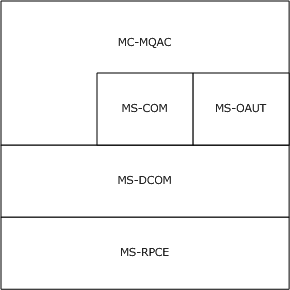
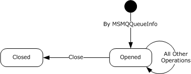
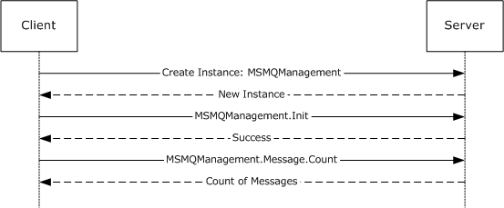
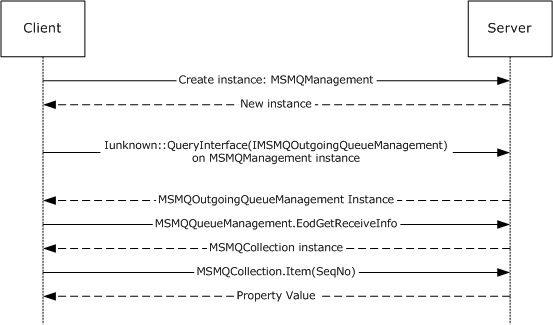
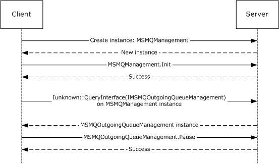
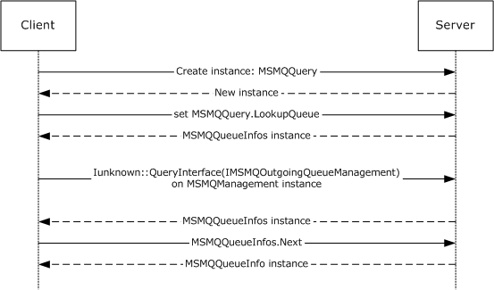
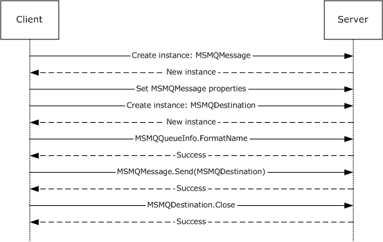
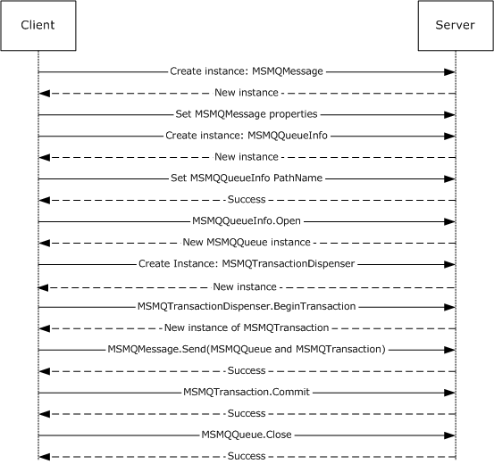
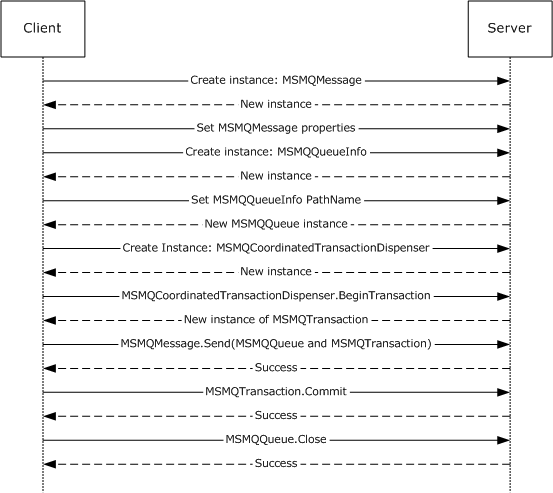
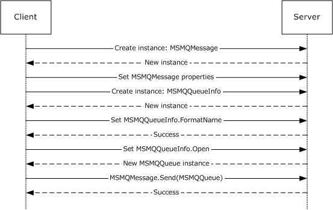

# [MC-MQAC]: Message Queuing (MSMQ): ActiveX Client Protocol

Table of Contents

1 Introduction

- [1 Introduction](#Section_1)
  - [1.1 Glossary](#Section_1.1)
  - [1.2 References](#Section_1.2)
    - [1.2.1 Normative References](#Section_1.2.1)
    - [1.2.2 Informative References](#Section_1.2.2)
  - [1.3 Overview](#Section_1.3)
  - [1.4 Relationship to Other Protocols](#Section_1.4)
  - [1.5 Prerequisites/Preconditions](#Section_1.5)
  - [1.6 Applicability Statement](#Section_1.6)
  - [1.7 Versioning and Capability Negotiation](#Section_1.7)
  - [1.8 Vendor-Extensible Fields](#Section_1.8)
  - [1.9 Standards Assignments](#Section_1.9)

2 Messages

- [2 Messages](#Section_2)
  - [2.1 Transport](#Section_2.1)
  - [2.2 Common Data Types](#Section_2.2)
    - [2.2.1 OLE Automation Data Types](#Section_2.2.1)
    - [2.2.2 Enumerations](#Section_2.2.2)
      - [2.2.2.1 MQTRANSACTION](#Section_2.2.2.1)
      - [2.2.2.2 MQSHARE](#Section_2.2.2.2)
      - [2.2.2.3 MQACCESS](#Section_2.2.2.3)
      - [2.2.2.4 MQJOURNAL](#Section_2.2.2.4)
      - [2.2.2.5 MQTRANSACTIONAL](#Section_2.2.2.5)
      - [2.2.2.6 MQAUTHENTICATE](#Section_2.2.2.6)
      - [2.2.2.7 MQPRIVLEVEL](#Section_2.2.2.7)
      - [2.2.2.8 MQMSGCURSOR](#Section_2.2.2.8)
      - [2.2.2.9 MQMSGCLASS](#Section_2.2.2.9)
      - [2.2.2.10 MQMSGDELIVERY](#Section_2.2.2.10)
      - [2.2.2.11 MQMSGACKNOWLEDGEMENT](#Section_2.2.2.11)
      - [2.2.2.12 MQMSGJOURNAL](#Section_2.2.2.12)
      - [2.2.2.13 MQMSGTRACE](#Section_2.2.2.13)
      - [2.2.2.14 MQMSGSENDERIDTYPE](#Section_2.2.2.14)
      - [2.2.2.15 MQMSGPRIVLEVEL](#Section_2.2.2.15)
      - [2.2.2.16 MQMSGAUTHLEVEL](#Section_2.2.2.16)
      - [2.2.2.17 MQMSGAUTHENTICATION](#Section_2.2.2.17)
      - [2.2.2.18 MQCALG](#Section_2.2.2.18)
      - [2.2.2.19 QUEUE_STATE](#Section_2.2.2.19)
      - [2.2.2.20 RELOPS](#Section_2.2.2.20)
      - [2.2.2.21 XACTTC](#Section_2.2.2.21)
    - [2.2.3 Structures](#Section_2.2.3)
      - [2.2.3.1 BOID](#Section_2.2.3.1)
      - [2.2.3.2 XACTTRANSINFO](#Section_2.2.3.2)
    - [2.2.4 Data Collections](#Section_2.2.4)
      - [2.2.4.1 IncomingTransactionalTransferInfo](#Section_2.2.4.1)
      - [2.2.4.2 OutgoingTransferInfo](#Section_2.2.4.2)
      - [2.2.4.3 SequenceInfoCollection](#Section_2.2.4.3)
  - [2.3 Directory Service Schema Elements](#Section_2.3)

3 Protocol Details

- [3 Protocol Details](#Section_3)
  - [3.1 Common Implementation Details](#Section_3.1)
    - [3.1.1 Abstract Data Model](#Section_3.1.1)
      - [3.1.1.1 Shared Data Elements](#Section_3.1.1.1)
      - [3.1.1.2 ApplicationQueue](#Section_3.1.1.2)
    - [3.1.2 Timers](#Section_3.1.2)
    - [3.1.3 Initialization](#Section_3.1.3)
    - [3.1.4 Message Processing Events and Sequencing Rules](#Section_3.1.4)
      - [3.1.4.1 Security](#Section_3.1.4.1)
      - [3.1.4.2 Optional Arguments](#Section_3.1.4.2)
      - [3.1.4.3 Out Parameters and Errors](#Section_3.1.4.3)
    - [3.1.5 Timer Events](#Section_3.1.5)
    - [3.1.6 Other Local Events](#Section_3.1.6)
      - [3.1.6.1 Events Raised by Related Protocols](#Section_3.1.6.1)
        - [3.1.6.1.1 Time To Be Received Expiration](#Section_3.1.6.1.1)
      - [3.1.6.2 Get Queue Format Name from Pathname](#Section_3.1.6.2)
  - [3.2 MSMQApplication Coclass Details](#Section_3.2)
    - [3.2.1 Abstract Data Model](#Section_3.2.1)
    - [3.2.2 Timers](#Section_3.2.2)
    - [3.2.3 Initialization](#Section_3.2.3)
    - [3.2.4 Message Processing Events and Sequencing Rules](#Section_3.2.4)
      - [3.2.4.1 IMSMQApplication Interface](#Section_3.2.4.1)
        - [3.2.4.1.1 MachineIdOfMachineName (Opnum 7)](#Section_3.2.4.1.1)
      - [3.2.4.2 IMSMQApplication2 Interface](#Section_3.2.4.2)
        - [3.2.4.2.1 RegisterCertificate (Opnum 8)](#Section_3.2.4.2.1)
        - [3.2.4.2.2 MachineNameOfMachineId (Opnum 9)](#Section_3.2.4.2.2)
        - [3.2.4.2.3 MSMQVersionMajor (Opnum 10)](#Section_3.2.4.2.3)
        - [3.2.4.2.4 MSMQVersionMinor (Opnum 11)](#Section_3.2.4.2.4)
        - [3.2.4.2.5 MSMQVersionBuild (Opnum 12)](#Section_3.2.4.2.5)
        - [3.2.4.2.6 IsDsEnabled (Opnum 13)](#Section_3.2.4.2.6)
        - [3.2.4.2.7 Properties (Opnum 14)](#Section_3.2.4.2.7)
      - [3.2.4.3 IMSMQApplication3 Interface](#Section_3.2.4.3)
        - [3.2.4.3.1 ActiveQueues (Opnum 15)](#Section_3.2.4.3.1)
        - [3.2.4.3.2 PrivateQueues (Opnum 16)](#Section_3.2.4.3.2)
        - [3.2.4.3.3 DirectoryServiceServer (Opnum 17)](#Section_3.2.4.3.3)
        - [3.2.4.3.4 IsConnected (Opnum 18)](#Section_3.2.4.3.4)
        - [3.2.4.3.5 BytesInAllQueues (Opnum 19)](#Section_3.2.4.3.5)
        - [3.2.4.3.6 Machine (Opnum 20)](#Section_3.2.4.3.6)
        - [3.2.4.3.7 Machine (Opnum 21)](#Section_3.2.4.3.7)
        - [3.2.4.3.8 Connect (Opnum 22)](#Section_3.2.4.3.8)
        - [3.2.4.3.9 Disconnect (Opnum 23)](#Section_3.2.4.3.9)
        - [3.2.4.3.10 Tidy (Opnum 24)](#Section_3.2.4.3.10)
    - [3.2.5 Timer Events](#Section_3.2.5)
    - [3.2.6 Other Local Events](#Section_3.2.6)
  - [3.3 MSMQManagement Coclass Details](#Section_3.3)
    - [3.3.1 Abstract Data Model](#Section_3.3.1)
    - [3.3.2 Timers](#Section_3.3.2)
    - [3.3.3 Initialization](#Section_3.3.3)
    - [3.3.4 Message Processing Events and Sequencing Rules](#Section_3.3.4)
      - [3.3.4.1 IMSMQManagement Interface](#Section_3.3.4.1)
        - [3.3.4.1.1 Init (Opnum 7)](#Section_3.3.4.1.1)
        - [3.3.4.1.2 FormatName (Opnum 8)](#Section_3.3.4.1.2)
        - [3.3.4.1.3 Machine (Opnum 9)](#Section_3.3.4.1.3)
        - [3.3.4.1.4 MessageCount (Opnum 10)](#Section_3.3.4.1.4)
        - [3.3.4.1.5 ForeignStatus (Opnum 11)](#Section_3.3.4.1.5)
        - [3.3.4.1.6 QueueType (Opnum 12)](#Section_3.3.4.1.6)
        - [3.3.4.1.7 IsLocal (Opnum 13)](#Section_3.3.4.1.7)
        - [3.3.4.1.8 TransactionalStatus (Opnum 14)](#Section_3.3.4.1.8)
        - [3.3.4.1.9 BytesInQueue (Opnum 15)](#Section_3.3.4.1.9)
    - [3.3.5 Timer Events](#Section_3.3.5)
    - [3.3.6 Other Local Events](#Section_3.3.6)
      - [3.3.6.1 Get Management Object from Queue Format Name](#Section_3.3.6.1)
      - [3.3.6.2 QMMgmt Get Info](#Section_3.3.6.2)
      - [3.3.6.3 QMMgmt Action](#Section_3.3.6.3)
  - [3.4 MSMQQueueManagement Coclass Details](#Section_3.4)
    - [3.4.1 Abstract Data Model](#Section_3.4.1)
    - [3.4.2 Timers](#Section_3.4.2)
    - [3.4.3 Initialization](#Section_3.4.3)
    - [3.4.4 Message Processing Events and Sequencing Rules](#Section_3.4.4)
      - [3.4.4.1 IMSMQQueueManagement Interface](#Section_3.4.4.1)
        - [3.4.4.1.1 JournalMessageCount (Opnum 16)](#Section_3.4.4.1.1)
        - [3.4.4.1.2 BytesInJournal (Opnum 17)](#Section_3.4.4.1.2)
        - [3.4.4.1.3 EodGetReceiveInfo (Opnum 18)](#Section_3.4.4.1.3)
    - [3.4.5 Timer Events](#Section_3.4.5)
    - [3.4.6 Other Local Events](#Section_3.4.6)
  - [3.5 MSMQOutgoingQueueManagement Coclass Details](#Section_3.5)
    - [3.5.1 Abstract Data Model](#Section_3.5.1)
    - [3.5.2 Timers](#Section_3.5.2)
    - [3.5.3 Initialization](#Section_3.5.3)
    - [3.5.4 Message Processing Events and Sequencing Rules](#Section_3.5.4)
      - [3.5.4.1 IMSMQOutgoingQueueManagement Interface](#Section_3.5.4.1)
        - [3.5.4.1.1 State (Opnum 16)](#Section_3.5.4.1.1)
        - [3.5.4.1.2 NextHops (Opnum 17)](#Section_3.5.4.1.2)
        - [3.5.4.1.3 EodGetSendInfo (Opnum 18)](#Section_3.5.4.1.3)
        - [3.5.4.1.4 Resume (Opnum 19)](#Section_3.5.4.1.4)
        - [3.5.4.1.5 Pause (Opnum 20)](#Section_3.5.4.1.5)
        - [3.5.4.1.6 EodResend (Opnum 21)](#Section_3.5.4.1.6)
    - [3.5.5 Timer Events](#Section_3.5.5)
    - [3.5.6 Other Local Events](#Section_3.5.6)
  - [3.6 MSMQTransactionDispenser Coclass Details](#Section_3.6)
    - [3.6.1 Abstract Data Model](#Section_3.6.1)
    - [3.6.2 Timers](#Section_3.6.2)
    - [3.6.3 Initialization](#Section_3.6.3)
    - [3.6.4 Message Processing Events and Sequencing Rules](#Section_3.6.4)
      - [3.6.4.1 IMSMQTransactionDispenser3 Interface](#Section_3.6.4.1)
        - [3.6.4.1.1 BeginTransaction (Opnum 7)](#Section_3.6.4.1.1)
        - [3.6.4.1.2 Properties (Opnum 8)](#Section_3.6.4.1.2)
    - [3.6.5 Timer Events](#Section_3.6.5)
    - [3.6.6 Other Local Events](#Section_3.6.6)
  - [3.7 MSMQCoordinatedTransactionDispenser Coclass Details](#Section_3.7)
    - [3.7.1 Abstract Data Model](#Section_3.7.1)
    - [3.7.2 Timers](#Section_3.7.2)
    - [3.7.3 Initialization](#Section_3.7.3)
    - [3.7.4 Message Processing Events and Sequencing Rules](#Section_3.7.4)
      - [3.7.4.1 IMSMQCoordinatedTransactionDispenser3 Interface](#Section_3.7.4.1)
        - [3.7.4.1.1 BeginTransaction (Opnum 7)](#Section_3.7.4.1.1)
        - [3.7.4.1.2 Properties (Opnum 8)](#Section_3.7.4.1.2)
    - [3.7.5 Timer Events](#Section_3.7.5)
    - [3.7.6 Other Local Events](#Section_3.7.6)
  - [3.8 TransactionImpl Class Details](#Section_3.8)
    - [3.8.1 Abstract Data Model](#Section_3.8.1)
    - [3.8.2 Timers](#Section_3.8.2)
    - [3.8.3 Initialization](#Section_3.8.3)
    - [3.8.4 Message Processing Events and Sequencing Rules](#Section_3.8.4)
      - [3.8.4.1 ITransaction Interface](#Section_3.8.4.1)
        - [3.8.4.1.1 Commit (Opnum 3)](#Section_3.8.4.1.1)
        - [3.8.4.1.2 Abort (Opnum 4)](#Section_3.8.4.1.2)
        - [3.8.4.1.3 GetTransactionInfo (Opnum 5)](#Section_3.8.4.1.3)
    - [3.8.5 Timer Events](#Section_3.8.5)
    - [3.8.6 Other Local Events](#Section_3.8.6)
  - [3.9 MSMQTransaction Coclass Details](#Section_3.9)
    - [3.9.1 Abstract Data Model](#Section_3.9.1)
    - [3.9.2 Timers](#Section_3.9.2)
    - [3.9.3 Initialization](#Section_3.9.3)
    - [3.9.4 Message Processing Events and Sequencing Rules](#Section_3.9.4)
      - [3.9.4.1 IMSMQTransaction Interface](#Section_3.9.4.1)
        - [3.9.4.1.1 Transaction (Opnum 7)](#Section_3.9.4.1.1)
        - [3.9.4.1.2 Commit (Opnum 8)](#Section_3.9.4.1.2)
        - [3.9.4.1.3 Abort (Opnum 9)](#Section_3.9.4.1.3)
      - [3.9.4.2 IMSMQTransaction2 Interface](#Section_3.9.4.2)
        - [3.9.4.2.1 InitNew (Opnum 10)](#Section_3.9.4.2.1)
        - [3.9.4.2.2 Properties (Opnum 11)](#Section_3.9.4.2.2)
      - [3.9.4.3 IMSMQTransaction3 Interface](#Section_3.9.4.3)
        - [3.9.4.3.1 ITransaction (Opnum 12)](#Section_3.9.4.3.1)
    - [3.9.5 Timer Events](#Section_3.9.5)
    - [3.9.6 Other Local Events](#Section_3.9.6)
  - [3.10 MSMQQueueInfo Coclass Details](#Section_3.10)
    - [3.10.1 Abstract Data Model](#Section_3.10.1)
    - [3.10.2 Timers](#Section_3.10.2)
    - [3.10.3 Initialization](#Section_3.10.3)
    - [3.10.4 Message Processing Events and Sequencing Rules](#Section_3.10.4)
      - [3.10.4.1 IMSMQQueueInfo4 Interface](#Section_3.10.4.1)
        - [3.10.4.1.1 QueueGuid (Opnum 7)](#Section_3.10.4.1.1)
        - [3.10.4.1.2 ServiceTypeGuid (Opnum 8)](#Section_3.10.4.1.2)
        - [3.10.4.1.3 ServiceTypeGuid (Opnum 9)](#Section_3.10.4.1.3)
        - [3.10.4.1.4 Label (Opnum 10)](#Section_3.10.4.1.4)
        - [3.10.4.1.5 Label (Opnum 11)](#Section_3.10.4.1.5)
        - [3.10.4.1.6 PathName (Opnum 12)](#Section_3.10.4.1.6)
        - [3.10.4.1.7 PathName (Opnum 13)](#Section_3.10.4.1.7)
        - [3.10.4.1.8 FormatName (Opnum 14)](#Section_3.10.4.1.8)
        - [3.10.4.1.9 FormatName (Opnum 15)](#Section_3.10.4.1.9)
        - [3.10.4.1.10 IsTransactional (Opnum 16)](#Section_3.10.4.1.10)
        - [3.10.4.1.11 PrivLevel (Opnum 17)](#Section_3.10.4.1.11)
        - [3.10.4.1.12 PrivLevel (Opnum 18)](#Section_3.10.4.1.12)
        - [3.10.4.1.13 Journal (Opnum 19)](#Section_3.10.4.1.13)
        - [3.10.4.1.14 Journal (Opnum 20)](#Section_3.10.4.1.14)
        - [3.10.4.1.15 Quota (Opnum 21)](#Section_3.10.4.1.15)
        - [3.10.4.1.16 Quota (Opnum 22)](#Section_3.10.4.1.16)
        - [3.10.4.1.17 BasePriority (Opnum 23)](#Section_3.10.4.1.17)
        - [3.10.4.1.18 BasePriority (Opnum 24)](#Section_3.10.4.1.18)
        - [3.10.4.1.19 CreateTime (Opnum 25)](#Section_3.10.4.1.19)
        - [3.10.4.1.20 ModifyTime (Opnum 26)](#Section_3.10.4.1.20)
        - [3.10.4.1.21 Authenticate (Opnum 27)](#Section_3.10.4.1.21)
        - [3.10.4.1.22 Authenticate (Opnum 28)](#Section_3.10.4.1.22)
        - [3.10.4.1.23 JournalQuota (Opnum 29)](#Section_3.10.4.1.23)
        - [3.10.4.1.24 JournalQuota (Opnum 30)](#Section_3.10.4.1.24)
        - [3.10.4.1.25 IsWorldReadable (Opnum 31)](#Section_3.10.4.1.25)
        - [3.10.4.1.26 Create (Opnum 32)](#Section_3.10.4.1.26)
          - [3.10.4.1.26.1 Creating a Queue Security Descriptor](#Section_3.10.4.1.26.1)
        - [3.10.4.1.27 Delete (Opnum 33)](#Section_3.10.4.1.27)
        - [3.10.4.1.28 Open (Opnum 34)](#Section_3.10.4.1.28)
        - [3.10.4.1.29 Refresh (Opnum 35)](#Section_3.10.4.1.29)
        - [3.10.4.1.30 Update (Opnum 36)](#Section_3.10.4.1.30)
        - [3.10.4.1.31 PathNameDNS (Opnum 37)](#Section_3.10.4.1.31)
        - [3.10.4.1.32 Properties (Opnum 38)](#Section_3.10.4.1.32)
        - [3.10.4.1.33 Security (Opnum 39)](#Section_3.10.4.1.33)
        - [3.10.4.1.34 Security (Opnum 40)](#Section_3.10.4.1.34)
        - [3.10.4.1.35 IsTransactional2 (Opnum 41)](#Section_3.10.4.1.35)
        - [3.10.4.1.36 IsWorldReadable2 (Opnum 42)](#Section_3.10.4.1.36)
        - [3.10.4.1.37 MulticastAddress (Opnum 43)](#Section_3.10.4.1.37)
        - [3.10.4.1.38 MulticastAddress (Opnum 44)](#Section_3.10.4.1.38)
        - [3.10.4.1.39 ADsPath (Opnum 45)](#Section_3.10.4.1.39)
    - [3.10.5 Timer Events](#Section_3.10.5)
    - [3.10.6 Other Local Events](#Section_3.10.6)
      - [3.10.6.1 Update QueueFormatName](#Section_3.10.6.1)
  - [3.11 MSMQQueue Coclass Details](#Section_3.11)
    - [3.11.1 Abstract Data Model](#Section_3.11.1)
      - [3.11.1.1 Object State Machine](#Section_3.11.1.1)
    - [3.11.2 Timers](#Section_3.11.2)
    - [3.11.3 Initialization](#Section_3.11.3)
    - [3.11.4 Message Processing Events and Sequencing Rules](#Section_3.11.4)
      - [3.11.4.1 IMSMQQueue4 Interface](#Section_3.11.4.1)
        - [3.11.4.1.1 Access (Opnum 7)](#Section_3.11.4.1.1)
        - [3.11.4.1.2 ShareMode (Opnum 8)](#Section_3.11.4.1.2)
        - [3.11.4.1.3 QueueInfo (Opnum 9)](#Section_3.11.4.1.3)
        - [3.11.4.1.4 Handle (Opnum 10)](#Section_3.11.4.1.4)
        - [3.11.4.1.5 IsOpen (Opnum 11)](#Section_3.11.4.1.5)
        - [3.11.4.1.6 Close (Opnum 12)](#Section_3.11.4.1.6)
        - [3.11.4.1.7 Receive_v1 (Opnum 13)](#Section_3.11.4.1.7)
        - [3.11.4.1.8 Peek_v1 (Opnum 14)](#Section_3.11.4.1.8)
        - [3.11.4.1.9 EnableNotification (Opnum 15)](#Section_3.11.4.1.9)
        - [3.11.4.1.10 Reset (Opnum 16)](#Section_3.11.4.1.10)
        - [3.11.4.1.11 ReceiveCurrent_v1 (Opnum 17)](#Section_3.11.4.1.11)
        - [3.11.4.1.12 PeekNext_v1 (Opnum 18)](#Section_3.11.4.1.12)
        - [3.11.4.1.13 PeekCurrent_v1 (Opnum 19)](#Section_3.11.4.1.13)
        - [3.11.4.1.14 Receive (Opnum 20)](#Section_3.11.4.1.14)
        - [3.11.4.1.15 Peek (Opnum 21)](#Section_3.11.4.1.15)
        - [3.11.4.1.16 ReceiveCurrent (Opnum 22)](#Section_3.11.4.1.16)
        - [3.11.4.1.17 PeekNext (Opnum 23)](#Section_3.11.4.1.17)
        - [3.11.4.1.18 PeekCurrent (Opnum 24)](#Section_3.11.4.1.18)
        - [3.11.4.1.19 Properties (Opnum 25)](#Section_3.11.4.1.19)
        - [3.11.4.1.20 Handle2 (Opnum 26)](#Section_3.11.4.1.20)
        - [3.11.4.1.21 ReceiveByLookupId (Opnum 27)](#Section_3.11.4.1.21)
        - [3.11.4.1.22 ReceiveNextByLookupId (Opnum 28)](#Section_3.11.4.1.22)
        - [3.11.4.1.23 ReceivePreviousByLookupId (Opnum 29)](#Section_3.11.4.1.23)
        - [3.11.4.1.24 ReceiveFirstByLookupId (Opnum 30)](#Section_3.11.4.1.24)
        - [3.11.4.1.25 ReceiveLastByLookupId (Opnum 31)](#Section_3.11.4.1.25)
        - [3.11.4.1.26 PeekByLookupId (Opnum 32)](#Section_3.11.4.1.26)
        - [3.11.4.1.27 PeekNextByLookupId (Opnum 33)](#Section_3.11.4.1.27)
        - [3.11.4.1.28 PeekPreviousByLookupId (Opnum 34)](#Section_3.11.4.1.28)
        - [3.11.4.1.29 PeekFirstByLookupId (Opnum 35)](#Section_3.11.4.1.29)
        - [3.11.4.1.30 PeekLastByLookupId (Opnum 36)](#Section_3.11.4.1.30)
        - [3.11.4.1.31 Purge (Opnum 37)](#Section_3.11.4.1.31)
        - [3.11.4.1.32 IsOpen2 (Opnum 38)](#Section_3.11.4.1.32)
        - [3.11.4.1.33 ReceiveByLookupIdAllowPeek (Opnum 39)](#Section_3.11.4.1.33)
    - [3.11.5 Timer Events](#Section_3.11.5)
    - [3.11.6 Other Local Events](#Section_3.11.6)
  - [3.12 MSMQDestination Coclass Details](#Section_3.12)
    - [3.12.1 Abstract Data Model](#Section_3.12.1)
    - [3.12.2 Timers](#Section_3.12.2)
    - [3.12.3 Initialization](#Section_3.12.3)
    - [3.12.4 Message Processing Events and Sequencing Rules](#Section_3.12.4)
      - [3.12.4.1 IMSMQDestination Interface](#Section_3.12.4.1)
        - [3.12.4.1.1 Open (Opnum 7)](#Section_3.12.4.1.1)
        - [3.12.4.1.2 Close (Opnum 8)](#Section_3.12.4.1.2)
        - [3.12.4.1.3 IsOpen (Opnum 9)](#Section_3.12.4.1.3)
        - [3.12.4.1.4 IADs (Opnum 10)](#Section_3.12.4.1.4)
        - [3.12.4.1.5 IADs (Opnum 11)](#Section_3.12.4.1.5)
        - [3.12.4.1.6 ADsPath (Opnum 12)](#Section_3.12.4.1.6)
        - [3.12.4.1.7 ADsPath (Opnum 13)](#Section_3.12.4.1.7)
        - [3.12.4.1.8 PathName (Opnum 14)](#Section_3.12.4.1.8)
        - [3.12.4.1.9 PathName (Opnum 15)](#Section_3.12.4.1.9)
        - [3.12.4.1.10 FormatName (Opnum 16)](#Section_3.12.4.1.10)
        - [3.12.4.1.11 FormatName (Opnum 17)](#Section_3.12.4.1.11)
        - [3.12.4.1.12 Destinations (Opnum 18)](#Section_3.12.4.1.12)
        - [3.12.4.1.13 Destinations (Opnum 19)](#Section_3.12.4.1.13)
        - [3.12.4.1.14 Properties (Opnum 20)](#Section_3.12.4.1.14)
      - [3.12.4.2 IMSMQPrivateDestination Interface](#Section_3.12.4.2)
        - [3.12.4.2.1 Handle (Opnum 7)](#Section_3.12.4.2.1)
        - [3.12.4.2.2 Handle (Opnum 8)](#Section_3.12.4.2.2)
    - [3.12.5 Timer Events](#Section_3.12.5)
    - [3.12.6 Other Local Events](#Section_3.12.6)
      - [3.12.6.1 Get Queue Format Name from ADsPath](#Section_3.12.6.1)
  - [3.13 MSMQQuery Coclass Details](#Section_3.13)
    - [3.13.1 Abstract Data Model](#Section_3.13.1)
    - [3.13.2 Timers](#Section_3.13.2)
    - [3.13.3 Initialization](#Section_3.13.3)
    - [3.13.4 Message Processing Events and Sequencing Rules](#Section_3.13.4)
      - [3.13.4.1 IMSMQQuery4 Interface](#Section_3.13.4.1)
        - [3.13.4.1.1 LookupQueue_v2 (Opnum 7)](#Section_3.13.4.1.1)
        - [3.13.4.1.2 Properties (Opnum 8)](#Section_3.13.4.1.2)
        - [3.13.4.1.3 LookupQueue (Opnum 9)](#Section_3.13.4.1.3)
    - [3.13.5 Timer Events](#Section_3.13.5)
    - [3.13.6 Other Local Events](#Section_3.13.6)
  - [3.14 MSMQQueueInfos Coclass Details](#Section_3.14)
    - [3.14.1 Abstract Data Model](#Section_3.14.1)
    - [3.14.2 Timers](#Section_3.14.2)
    - [3.14.3 Initialization](#Section_3.14.3)
    - [3.14.4 Message Processing Events and Sequencing Rules](#Section_3.14.4)
      - [3.14.4.1 IMSMQQueueInfos4 Interface](#Section_3.14.4.1)
        - [3.14.4.1.1 Reset (Opnum 7)](#Section_3.14.4.1.1)
        - [3.14.4.1.2 Next (Opnum 8)](#Section_3.14.4.1.2)
        - [3.14.4.1.3 Properties (Opnum 9)](#Section_3.14.4.1.3)
    - [3.14.5 Timer Events](#Section_3.14.5)
    - [3.14.6 Other Local Events](#Section_3.14.6)
  - [3.15 MSMQCollection Coclass Details](#Section_3.15)
    - [3.15.1 Abstract Data Model](#Section_3.15.1)
    - [3.15.2 Timers](#Section_3.15.2)
    - [3.15.3 Initialization](#Section_3.15.3)
    - [3.15.4 Message Processing Events and Sequencing Rules](#Section_3.15.4)
      - [3.15.4.1 IMSMQCollection Interface](#Section_3.15.4.1)
        - [3.15.4.1.1 Item (Opnum 7)](#Section_3.15.4.1.1)
        - [3.15.4.1.2 Count (Opnum 8)](#Section_3.15.4.1.2)
        - [3.15.4.1.3 _NewEnum (Opnum 9)](#Section_3.15.4.1.3)
    - [3.15.5 Timer Events](#Section_3.15.5)
    - [3.15.6 Other Local Events](#Section_3.15.6)
  - [3.16 MSMQEvent Coclass Details](#Section_3.16)
    - [3.16.1 Abstract Data Model](#Section_3.16.1)
    - [3.16.2 Timers](#Section_3.16.2)
    - [3.16.3 Initialization](#Section_3.16.3)
    - [3.16.4 Message Processing Events and Sequencing Rules](#Section_3.16.4)
      - [3.16.4.1 IMSMQEvent2 Interface](#Section_3.16.4.1)
        - [3.16.4.1.1 Properties (Opnum 7)](#Section_3.16.4.1.1)
      - [3.16.4.2 IMSMQEvent3 Interface](#Section_3.16.4.2)
      - [3.16.4.3 IMSMQPrivateEvent Interface](#Section_3.16.4.3)
        - [3.16.4.3.1 Hwnd (Opnum 7)](#Section_3.16.4.3.1)
        - [3.16.4.3.2 FireArrivedEvent (Opnum 8)](#Section_3.16.4.3.2)
        - [3.16.4.3.3 FireArrivedErrorEvent (Opnum 9)](#Section_3.16.4.3.3)
      - [3.16.4.4 _DMSMQEventEvents Interface](#Section_3.16.4.4)
        - [3.16.4.4.1 Arrived (Opnum 7)](#Section_3.16.4.4.1)
        - [3.16.4.4.2 ArrivedError (Opnum 8)](#Section_3.16.4.4.2)
      - [3.16.4.5 IConnectionPoint Interface](#Section_3.16.4.5)
        - [3.16.4.5.1 GetConnectionInterface (Opnum 3)](#Section_3.16.4.5.1)
        - [3.16.4.5.2 GetConnectionPointContainer (Opnum 4)](#Section_3.16.4.5.2)
        - [3.16.4.5.3 Advise (Opnum 5)](#Section_3.16.4.5.3)
        - [3.16.4.5.4 Unadvise (Opnum 6)](#Section_3.16.4.5.4)
        - [3.16.4.5.5 EnumConnections (Opnum 7)](#Section_3.16.4.5.5)
      - [3.16.4.6 IConnectionPointContainer Interface](#Section_3.16.4.6)
        - [3.16.4.6.1 EnumConnectionPoints (Opnum 3)](#Section_3.16.4.6.1)
        - [3.16.4.6.2 FindConnectionPoint (Opnum 4)](#Section_3.16.4.6.2)
    - [3.16.5 Timer Events](#Section_3.16.5)
    - [3.16.6 Other Local Events](#Section_3.16.6)
  - [3.17 MSMQMessage Coclass Details](#Section_3.17)
    - [3.17.1 Abstract Data Model](#Section_3.17.1)
    - [3.17.2 Timers](#Section_3.17.2)
    - [3.17.3 Initialization](#Section_3.17.3)
    - [3.17.4 Message Processing Events and Sequencing Rules](#Section_3.17.4)
      - [3.17.4.1 IMSMQMessage4 Interface](#Section_3.17.4.1)
        - [3.17.4.1.1 Class (Opnum 7)](#Section_3.17.4.1.1)
        - [3.17.4.1.2 PrivLevel (Opnum 8)](#Section_3.17.4.1.2)
        - [3.17.4.1.3 PrivLevel (Opnum 9)](#Section_3.17.4.1.3)
        - [3.17.4.1.4 AuthLevel (Opnum 10)](#Section_3.17.4.1.4)
        - [3.17.4.1.5 AuthLevel (Opnum 11)](#Section_3.17.4.1.5)
        - [3.17.4.1.6 IsAuthenticated (Opnum 12)](#Section_3.17.4.1.6)
        - [3.17.4.1.7 Delivery (Opnum 13)](#Section_3.17.4.1.7)
        - [3.17.4.1.8 Delivery (Opnum 14)](#Section_3.17.4.1.8)
        - [3.17.4.1.9 Trace (Opnum 15)](#Section_3.17.4.1.9)
        - [3.17.4.1.10 Trace (Opnum 16)](#Section_3.17.4.1.10)
        - [3.17.4.1.11 Priority (Opnum 17)](#Section_3.17.4.1.11)
        - [3.17.4.1.12 Priority (Opnum 18)](#Section_3.17.4.1.12)
        - [3.17.4.1.13 Journal (Opnum 19)](#Section_3.17.4.1.13)
        - [3.17.4.1.14 Journal (Opnum 20)](#Section_3.17.4.1.14)
        - [3.17.4.1.15 ResponseQueueInfo_v1 (Opnum 21)](#Section_3.17.4.1.15)
        - [3.17.4.1.16 ResponseQueueInfo_v1 (Opnum 22)](#Section_3.17.4.1.16)
        - [3.17.4.1.17 AppSpecific (Opnum 23)](#Section_3.17.4.1.17)
        - [3.17.4.1.18 AppSpecific (Opnum 24)](#Section_3.17.4.1.18)
        - [3.17.4.1.19 SourceMachineGuid (Opnum 25)](#Section_3.17.4.1.19)
        - [3.17.4.1.20 BodyLength (Opnum 26)](#Section_3.17.4.1.20)
        - [3.17.4.1.21 Body (Opnum 27)](#Section_3.17.4.1.21)
        - [3.17.4.1.22 Body (Opnum 28)](#Section_3.17.4.1.22)
        - [3.17.4.1.23 AdminQueueInfo_v1 (Opnum 29)](#Section_3.17.4.1.23)
        - [3.17.4.1.24 AdminQueueInfo_v1 (Opnum 30)](#Section_3.17.4.1.24)
        - [3.17.4.1.25 Id (Opnum 31)](#Section_3.17.4.1.25)
        - [3.17.4.1.26 CorrelationId (Opnum 32)](#Section_3.17.4.1.26)
        - [3.17.4.1.27 CorrelationId (Opnum 33)](#Section_3.17.4.1.27)
        - [3.17.4.1.28 Ack (Opnum 34)](#Section_3.17.4.1.28)
        - [3.17.4.1.29 Ack (Opnum 35)](#Section_3.17.4.1.29)
        - [3.17.4.1.30 Label (Opnum 36)](#Section_3.17.4.1.30)
        - [3.17.4.1.31 Label (Opnum 37)](#Section_3.17.4.1.31)
        - [3.17.4.1.32 MaxTimeToReachQueue (Opnum 38)](#Section_3.17.4.1.32)
        - [3.17.4.1.33 MaxTimeToReachQueue (Opnum 39)](#Section_3.17.4.1.33)
        - [3.17.4.1.34 MaxTimeToReceive (Opnum 40)](#Section_3.17.4.1.34)
        - [3.17.4.1.35 MaxTimeToReceive (Opnum 41)](#Section_3.17.4.1.35)
        - [3.17.4.1.36 HashAlgorithm (Opnum 42)](#Section_3.17.4.1.36)
        - [3.17.4.1.37 HashAlgorithm (Opnum 43)](#Section_3.17.4.1.37)
        - [3.17.4.1.38 EncryptAlgorithm (Opnum 44)](#Section_3.17.4.1.38)
        - [3.17.4.1.39 EncryptAlgorithm (Opnum 45)](#Section_3.17.4.1.39)
        - [3.17.4.1.40 SentTime (Opnum 46)](#Section_3.17.4.1.40)
        - [3.17.4.1.41 ArrivedTime (Opnum 47)](#Section_3.17.4.1.41)
        - [3.17.4.1.42 DestinationQueueInfo (Opnum 48)](#Section_3.17.4.1.42)
        - [3.17.4.1.43 SenderCertificate (Opnum 49)](#Section_3.17.4.1.43)
        - [3.17.4.1.44 SenderCertificate (Opnum 50)](#Section_3.17.4.1.44)
        - [3.17.4.1.45 SenderId (Opnum 51)](#Section_3.17.4.1.45)
        - [3.17.4.1.46 SenderIdType (Opnum 52)](#Section_3.17.4.1.46)
        - [3.17.4.1.47 SenderIdType (Opnum 53)](#Section_3.17.4.1.47)
        - [3.17.4.1.48 Send (Opnum 54)](#Section_3.17.4.1.48)
        - [3.17.4.1.49 AttachCurrentSecurityContext (Opnum 55)](#Section_3.17.4.1.49)
        - [3.17.4.1.50 SenderVersion (Opnum 56)](#Section_3.17.4.1.50)
        - [3.17.4.1.51 Extension (Opnum 57)](#Section_3.17.4.1.51)
        - [3.17.4.1.52 Extension (Opnum 58)](#Section_3.17.4.1.52)
        - [3.17.4.1.53 ConnectorTypeGuid (Opnum 59)](#Section_3.17.4.1.53)
        - [3.17.4.1.54 ConnectorTypeGuid (Opnum 60)](#Section_3.17.4.1.54)
        - [3.17.4.1.55 TransactionStatusQueueInfo (Opnum 61)](#Section_3.17.4.1.55)
        - [3.17.4.1.56 DestinationSymmetricKey (Opnum 62)](#Section_3.17.4.1.56)
        - [3.17.4.1.57 DestinationSymmetricKey (Opnum 63)](#Section_3.17.4.1.57)
        - [3.17.4.1.58 Signature (Opnum 64)](#Section_3.17.4.1.58)
        - [3.17.4.1.59 Signature (Opnum 65)](#Section_3.17.4.1.59)
        - [3.17.4.1.60 AuthenticationProviderType (Opnum 66)](#Section_3.17.4.1.60)
        - [3.17.4.1.61 AuthenticationProviderType (Opnum 67)](#Section_3.17.4.1.61)
        - [3.17.4.1.62 AuthenticationProviderName (Opnum 68)](#Section_3.17.4.1.62)
        - [3.17.4.1.63 AuthenticationProviderName (Opnum 69)](#Section_3.17.4.1.63)
        - [3.17.4.1.64 SenderId (Opnum 70)](#Section_3.17.4.1.64)
        - [3.17.4.1.65 MsgClass (Opnum 71)](#Section_3.17.4.1.65)
        - [3.17.4.1.66 MsgClass (Opnum 72)](#Section_3.17.4.1.66)
        - [3.17.4.1.67 Properties (Opnum 73)](#Section_3.17.4.1.67)
        - [3.17.4.1.68 TransactionId (Opnum 74)](#Section_3.17.4.1.68)
        - [3.17.4.1.69 IsFirstInTransaction (Opnum 75)](#Section_3.17.4.1.69)
        - [3.17.4.1.70 IsLastInTransaction (Opnum 76)](#Section_3.17.4.1.70)
        - [3.17.4.1.71 ResponseQueueInfo_v2 (Opnum 77)](#Section_3.17.4.1.71)
        - [3.17.4.1.72 ResponseQueueInfo_v2 (Opnum 78)](#Section_3.17.4.1.72)
        - [3.17.4.1.73 AdminQueueInfo_v2 (Opnum 79)](#Section_3.17.4.1.73)
        - [3.17.4.1.74 AdminQueueInfo_v2 (Opnum 80)](#Section_3.17.4.1.74)
        - [3.17.4.1.75 ReceivedAuthenticationLevel (Opnum 81)](#Section_3.17.4.1.75)
        - [3.17.4.1.76 ResponseQueueInfo (Opnum 82)](#Section_3.17.4.1.76)
        - [3.17.4.1.77 ResponseQueueInfo (Opnum 83)](#Section_3.17.4.1.77)
        - [3.17.4.1.78 AdminQueueInfo (Opnum 84)](#Section_3.17.4.1.78)
        - [3.17.4.1.79 AdminQueueInfo (Opnum 85)](#Section_3.17.4.1.79)
        - [3.17.4.1.80 ResponseDestination (Opnum 86)](#Section_3.17.4.1.80)
        - [3.17.4.1.81 ResponseDestination (Opnum 87)](#Section_3.17.4.1.81)
        - [3.17.4.1.82 Destination (Opnum 88)](#Section_3.17.4.1.82)
        - [3.17.4.1.83 LookupId (Opnum 89)](#Section_3.17.4.1.83)
        - [3.17.4.1.84 IsAuthenticated2 (Opnum 90)](#Section_3.17.4.1.84)
        - [3.17.4.1.85 IsFirstInTransaction2 (Opnum 91)](#Section_3.17.4.1.85)
        - [3.17.4.1.86 IsLastInTransaction2 (Opnum 92)](#Section_3.17.4.1.86)
        - [3.17.4.1.87 AttachCurrentSecurityContext2 (Opnum 93)](#Section_3.17.4.1.87)
        - [3.17.4.1.88 SoapEnvelope (Opnum 94)](#Section_3.17.4.1.88)
        - [3.17.4.1.89 CompoundMessage (Opnum 95)](#Section_3.17.4.1.89)
        - [3.17.4.1.90 SoapHeader (Opnum 96)](#Section_3.17.4.1.90)
        - [3.17.4.1.91 SoapBody (Opnum 97)](#Section_3.17.4.1.91)
    - [3.17.5 Timer Events](#Section_3.17.5)
    - [3.17.6 Other Local Events](#Section_3.17.6)

4 Protocol Examples

- [4 Protocol Examples](#Section_4)
  - [4.1 Scenario: Retrieving the Count of Messages in a Queue](#Section_4.1)
  - [4.2 Scenario: Retrieving IncomingTransactionalTransferInfo for an ApplicationQueue](#Section_4.2)
  - [4.3 Scenario: Pausing an OutgoingQueue](#Section_4.3)
  - [4.4 Scenario: Discovering DirectoryQueues in the Directory](#Section_4.4)
  - [4.5 Scenario: Receiving a Message from a Queue Asynchronously via Event Callbacks](#Section_4.5)
  - [4.6 Scenario: Sending a Multicast Message](#Section_4.6)
  - [4.7 Scenario: Sending a Message with an Internal Transaction](#Section_4.7)
  - [4.8 Scenario: Sending a Message with an External Transaction](#Section_4.8)
  - [4.9 Scenario: Sending a Message to a Queue](#Section_4.9)

5 Security

- [5 Security](#Section_5)
  - [5.1 Security Considerations for Implementers](#Section_5.1)
  - [5.2 Index of Security Parameters](#Section_5.2)

6 Appendix A: Full IDL

- [6 Appendix A: Full IDL](#Section_6)

7 Appendix B: Product Behavior

- [7 Appendix B: Product Behavior](#Section_7)

8 Change Tracking

- [8 Change Tracking](#Section_8)

For the legal notice and IP terms, see [LEGAL.md](../LEGAL.md).
Last updated: 4/23/2024.
See [Revision History](#revision-history) for full version history.

# 1 Introduction

This document specifies the Message Queuing (MSMQ): ActiveX Client Protocol, a collection of Distributed Component Object Model (DCOM) [MS-DCOM](../MS-DCOM/MS-DCOM.md) interfaces that expose [**message**](#gt_message) queuing functionality for use by client applications. Operations that a client would perform by using this protocol include:

- Queuing system management.
- Queue management.
- Queue discovery.
- [**Transaction**](#gt_transaction) management.
- Sending and receiving messages.
**Notational Conventions**

The following notational conventions are used throughout this document:

- The period, or "dot" ("."), notation is used to refer to a property of a system abstract data model element. If **A** refers to an element of the system abstract data model, **A**.**Property** denotes the **Property** property of the element **A**.
- The elements of the abstract data models that are defined in section [3](#Section_1.3) are referred to as instance variables. The names of instance variables and local input parameters are formatted in *italics*. Elements of the abstract data model in [MS-MQDMPR](../MS-MQDMPR/MS-MQDMPR.md) that are referred to in this document are in **bold** and non-italicized.
- A monospace font is used for all method signatures and [**Interface Definition Language (IDL)**](#gt_interface-definition-language-idl) declarations.
Sections 1.5, 1.8, 1.9, 2, and 3 of this specification are normative. All other sections and examples in this specification are informative.

## 1.1 Glossary

This document uses the following terms:

**administration queue**: A messaging [**queue**](#gt_queue) that receives [**Message Queuing (MSMQ)**](#gt_microsoft-message-queuing-msmq) system-generated acknowledgment [**messages**](#gt_message). An administration queue is available to MSMQ applications for checking [**message**](#gt_message) status.

**administrator**: A user who has complete and unrestricted access to the computer or domain.

**anonymous user**: A user who presents no credentials when identifying himself or herself. The process for determining an anonymous user can differ based on the authentication protocol, and the documentation for the relevant authentication protocol needs to be consulted.

**ASCII**: The American Standard Code for Information Interchange (ASCII) is an 8-bit character-encoding scheme based on the English alphabet. ASCII codes represent text in computers, communications equipment, and other devices that work with text. ASCII refers to a single 8-bit ASCII character or an array of 8-bit ASCII characters with the high bit of each character set to zero.

**Augmented Backus-Naur Form (ABNF)**: A modified version of Backus-Naur Form (BNF), commonly used by Internet specifications. ABNF notation balances compactness and simplicity with reasonable representational power. ABNF differs from standard BNF in its definitions and uses of naming rules, repetition, alternatives, order-independence, and value ranges. For more information, see [[RFC5234]](https://go.microsoft.com/fwlink/?LinkId=123096).

**certificate**: A certificate is a collection of attributes and extensions that can be stored persistently. The set of attributes in a certificate can vary depending on the intended usage of the certificate. A certificate securely binds a public key to the entity that holds the corresponding private key. A certificate is commonly used for authentication and secure exchange of information on open networks, such as the Internet, extranets, and intranets. Certificates are digitally signed by the issuing certification authority (CA) and can be issued for a user, a computer, or a service. The most widely accepted format for certificates is defined by the ITU-T X.509 version 3 international standards. For more information about attributes and extensions, see [[RFC3280]](https://go.microsoft.com/fwlink/?LinkId=90414) and [[X509]](https://go.microsoft.com/fwlink/?LinkId=90590) sections 7 and 8.

**class identifier (CLSID)**: A [**GUID**](#gt_globally-unique-identifier-guid) that identifies a software component; for instance, a DCOM object class or a COM class.

**client**: A computer on which the remote procedure call (RPC) client is executing.

**coclass**: A component object (an association between a [**class identifier (CLSID)**](#gt_class-identifier-clsid) and a set of named implementations of IUnknown) that is defined using the [**coclass**](#gt_coclass) keyword.

**commit request**: The action that is performed by a root application to initiate the Two-Phase Commit Protocol for an atomic transaction.

**computer name**: The DNS or NetBIOS name.

**cursor**: A data structure providing sequential access over a message queue. A cursor has a current pointer that lies between the head and tail pointer of the [**queue**](#gt_queue). The pointer can be moved forward or backward through an operation on the cursor (Next). A [**message**](#gt_message) at the current pointer can be accessed through a nondestructive read (Peek) operation or a destructive read (Receive) operation.

**directory**: The database that stores information about objects such as users, groups, computers, printers, and the [**directory service**](#gt_directory-service-ds) that makes this information available to users and applications.

**directory service (DS)**: An entity that maintains a collection of objects. These objects can be remotely manipulated either by the Message Queuing (MSMQ): Directory Service Protocol, as specified in [MS-MQDS](../MS-MQDS/MS-MQDS.md), or by the Lightweight Directory Access Protocol (v3), as specified in [[RFC2251]](https://go.microsoft.com/fwlink/?LinkId=90325).

**distribution list**: An Active Directory object that can contain explicit references only to destinations published in Active Directory; that is, to [**public queues**](#gt_public-queue), [**queue aliases**](#gt_queue-alias), and other distribution lists, but not to private and URL-named queues.

**external transaction**: An atomic transaction context dispensed by a transaction coordinator other than an MSMQ queue manager, such as by a distributed transaction coordinator (DTC), and used by an MSMQ queue manager to coordinate its state changes with state changes in other resource managers. For more information on transactions, see [MS-DTCO](../MS-DTCO/MS-DTCO.md).

**foreign queue**: A messaging queue that resides on a computer that does not run an [**MSMQ**](#gt_microsoft-message-queuing-msmq) messaging application.

**format name**: A name that is used to reference a [**queue**](#gt_queue) when making calls to API functions.

**globally unique identifier (GUID)**: A term used interchangeably with [**universally unique identifier (UUID)**](#gt_universally-unique-identifier-uuid) in Microsoft protocol technical documents (TDs). Interchanging the usage of these terms does not imply or require a specific algorithm or mechanism to generate the value. Specifically, the use of this term does not imply or require that the algorithms described in [[RFC4122]](https://go.microsoft.com/fwlink/?LinkId=90460) or [[C706]](https://go.microsoft.com/fwlink/?LinkId=89824) must be used for generating the [**GUID**](#gt_globally-unique-identifier-guid). See also [**universally unique identifier (UUID)**](#gt_universally-unique-identifier-uuid).

**handle**: Any token that can be used to identify and access an object such as a device, file, or a window.

**Interface Definition Language (IDL)**: The International Standards Organization (ISO) standard language for specifying the interface for remote procedure calls. For more information, see [C706] section 4.

**interface identifier (IID)**: A [**GUID**](#gt_globally-unique-identifier-guid) that identifies an interface.

**internal transaction**: An atomic transaction context dispensed by an MSMQ Queue Manager instance that can be used to atomically commit or roll back state changes within that MSMQ Queue Manager. The dispensing MSMQ Queue Manager instance is the transaction coordinator and is also the only resource manager participant supported by the transaction context. An internal transaction cannot, therefore, be used to coordinate state changes with other resource managers, including other MSMQ Queue Manager instances.

**message**: A data structure representing a unit of data transfer between distributed applications. A message has message properties, which may include message header properties, a message body property, and message trailer properties.

**message queuing system**: An installed or a hypothetical configuration of [**Microsoft Message Queuing (MSMQ)**](#gt_microsoft-message-queuing-msmq) protocol set components, including message queuing applications, [**queue managers**](#gt_476f10ed-08f0-4887-b583-59d5cf909979), and optional subcomponents such as a [**Directory Service**](#gt_directory-service-ds) and a Transaction Coordinator.

**Microsoft Message Queuing (MSMQ)**: A communications service that provides asynchronous and reliable [**message**](#gt_message) passing between distributed applications. In Message Queuing, applications send [**messages**](#gt_message) to [**queues**](#gt_queue) and consume [**messages**](#gt_message) from [**queues**](#gt_queue). The [**queues**](#gt_queue) provide persistence of the [**messages**](#gt_message), enabling the sending and receiving applications to operate asynchronously from one another.

**negative source journaling**: The process of retaining copies of unsuccessfully delivered [**messages**](#gt_message). The copies are retained by the QueueManager. Also known as dead-lettering.

**NetBIOS**: A particular network transport that is part of the LAN Manager protocol suite. [**NetBIOS**](#gt_netbios) uses a broadcast communication style that was applicable to early segmented local area networks. A protocol family including name resolution, datagram, and connection services. For more information, see [[RFC1001]](https://go.microsoft.com/fwlink/?LinkId=90260) and [[RFC1002]](https://go.microsoft.com/fwlink/?LinkId=90261).

**open queue**: A [**queue**](#gt_queue) for which the Queue.OpenQueueDescriptorCollection is not empty. An open queue represents the rights granted by a [**queue manager**](#gt_queue-manager-qm) to clients of this protocol for purposes of operating on a [**queue**](#gt_queue). An open queue is created by, and maintained for, the specific purpose of the clients of this protocol.

**opnum**: An operation number or numeric identifier that is used to identify a specific [**remote procedure call (RPC)**](#gt_remote-procedure-call-rpc) method or a method in an interface. For more information, see [C706] section 12.5.2.12 or [MS-RPCE](../MS-RPCE/MS-RPCE.md).

**path name**: The name of the receiving computer where the [**messages**](#gt_message) for a particular [**queue**](#gt_queue) are stored, and an optional PRIVATE$ key word indicating whether the [**queue**](#gt_queue) is private, followed by the name of the [**queue**](#gt_queue). Path names can also refer to subqueues; for more information, see [MS-MQMQ](#Section_2.2.3) section 2.1.

**Phase One**: The initial phase of a two-phase commit sequence. During this phase, the participants in the transaction are requested to prepare to be committed. This phase is also known as the "Prepare" phase. At the end of Phase One, the outcome of the transaction is known.

**Phase Two**: The second phase of a two-phase commit sequence. This phase occurs after the decision to commit or abort is determined. During this phase, the participants in the transaction are ordered to either commit or rollback.

**positive source journaling**: The process of retaining copies of successfully delivered [**messages**](#gt_message). The copies are retained by the [**queue manager**](#gt_queue-manager-qm).

**public queue**: An application-defined message queue that is registered in the MSMQ Directory Service. A public queue can be deployed at any [**queue manager**](#gt_queue-manager-qm).

**queue**: An object that holds [**messages**](#gt_message) passed between applications or [**messages**](#gt_message) passed between [**Message Queuing**](#gt_microsoft-message-queuing-msmq) and applications. In general, applications can send [**messages**](#gt_message) to queues and read [**messages**](#gt_message) from queues.

**queue alias**: An Active Directory object used to reference queues that might not be listed in Active Directory. Queue aliases are published in Active Directory.

**queue journal**: A [**queue**](#gt_queue) that contains copies of the [**messages**](#gt_message) sent from a host when positive source journaling is requested.

**queue manager (QM)**: A message queuing service that manages [**queues**](#gt_queue) deployed on a computer. A queue manager can also provide asynchronous transfer of [**messages**](#gt_message) to [**queues**](#gt_queue) deployed on other queue managers.

**remote procedure call (RPC)**: A communication protocol used primarily between client and server. The term has three definitions that are often used interchangeably: a runtime environment providing for communication facilities between computers (the RPC runtime); a set of request-and-response message exchanges between computers (the RPC exchange); and the single message from an RPC exchange (the RPC message). For more information, see [C706].

**response queue**: A [**queue**](#gt_queue) by which a client receives application-level response [**messages**](#gt_message).

**security identifier (SID)**: An identifier for security principals that is used to identify an account or a group. Conceptually, the [**SID**](#gt_security-identifier-sid) is composed of an account authority portion (typically a domain) and a smaller integer representing an identity relative to the account authority, termed the relative identifier (RID). The [**SID**](#gt_security-identifier-sid) format is specified in [MS-DTYP](../MS-DTYP/MS-DTYP.md) section 2.4.2; a string representation of [**SIDs**](#gt_security-identifier-sid) is specified in [MS-DTYP] section 2.4.2 and [MS-AZOD](../MS-AZOD/MS-AZOD.md) section 1.1.1.2.

**server**: A computer on which the [**remote procedure call (RPC)**](#gt_remote-procedure-call-rpc) server is executing.

**SOAP attachment**: A Multipurpose Internet Mail Extensions (MIME) [[RFC2045]](https://go.microsoft.com/fwlink/?LinkId=90307) binary representation that is associated with a SOAP message.

**SOAP envelope**: A container for SOAP message information and the root element of a SOAP document. See [[SOAP1.2-1/2007]](https://go.microsoft.com/fwlink/?LinkId=94664) section 5.1 for more information.

**SOAP Reliable Messaging Protocol (SRMP)**: A published specification defining an open general-purpose extension of WS-Routing that adds reliability to the Web Services Routing Protocol (WS-Routing) and to SOAP. [**Message Queuing**](#gt_microsoft-message-queuing-msmq) uses this protocol to format the packets in [**messages**](#gt_message) sent over HTTP/HTTPS or to a multicast address.

**SRMP**: Message Queuing (MSMQ): SOAP Reliable Messaging Protocol (SRMP) [MC-MQSRM](../MC-MQSRM/MC-MQSRM.md).

**symmetric key**: A secret key used with a cryptographic symmetric algorithm. The key needs to be known to all communicating parties. For an introduction to this concept, see [[CRYPTO]](https://go.microsoft.com/fwlink/?LinkId=89841) section 1.5.

**transaction**: A single unit of work. If a transaction is successful, all data modifications that were made during the transaction are committed and become a permanent part of the database. If a transaction encounters an error and is canceled or rolled back, all data modifications are erased.

**transaction identifier**: The [**GUID**](#gt_globally-unique-identifier-guid) that uniquely identifies an atomic transaction.

**transaction manager**: The party that is responsible for managing and distributing the outcome of atomic transactions. A transaction manager is either a root transaction manager or a subordinate transaction manager for a specified transaction.

**transaction object**: Object representing a [**transaction**](#gt_transaction), as specified in [MS-DTCO] section 3.2.1.

**transactional message**: A [**message**](#gt_message) sent as part of a transaction. Transaction [**messages**](#gt_message) must be sent to [**transactional queues**](#gt_transactional-queue).

**transactional queue**: A [**queue**](#gt_queue) that contains only [**transactional messages**](#gt_transactional-message).

**two-phase commit**: An agreement protocol that is used to resolve the outcome of an atomic transaction in response to a commit request from the root application. Phase One and Phase Two are the distinct phases of the Two-Phase Commit Protocol.

**universally unique identifier (UUID)**: A 128-bit value. UUIDs can be used for multiple purposes, from tagging objects with an extremely short lifetime, to reliably identifying very persistent objects in cross-process communication such as client and server interfaces, manager entry-point vectors, and [**RPC**](#gt_remote-procedure-call-rpc) objects. UUIDs are highly likely to be unique. UUIDs are also known as [**globally unique identifiers (GUIDs)**](#gt_globally-unique-identifier-guid) and these terms are used interchangeably in the Microsoft protocol technical documents (TDs). Interchanging the usage of these terms does not imply or require a specific algorithm or mechanism to generate the UUID. Specifically, the use of this term does not imply or require that the algorithms described in [RFC4122] or [C706] must be used for generating the UUID.

**variant**: A value that is specified as one of the following RDL types: String, Integer, DateTime, Float, or Binary.

**XML digital signature**: A digital signature that is designed for use in XML operations.

**MAY, SHOULD, MUST, SHOULD NOT, MUST NOT:** These terms (in all caps) are used as defined in [[RFC2119]](https://go.microsoft.com/fwlink/?LinkId=90317). All statements of optional behavior use either MAY, SHOULD, or SHOULD NOT.

## 1.2 References

Links to a document in the Microsoft Open Specifications library point to the correct section in the most recently published version of the referenced document. However, because individual documents in the library are not updated at the same time, the section numbers in the documents may not match. You can confirm the correct section numbering by checking the [Errata](https://go.microsoft.com/fwlink/?linkid=850906).

### 1.2.1 Normative References

We conduct frequent surveys of the normative references to assure their continued availability. If you have any issue with finding a normative reference, please contact [dochelp@microsoft.com](mailto:dochelp@microsoft.com). We will assist you in finding the relevant information.

[C193] The Open Group, "Distributed TP: The XA Specification", February 1992, [https://www2.opengroup.org/ogsys/catalog/c193](https://go.microsoft.com/fwlink/?LinkId=89820)

[C706] The Open Group, "DCE 1.1: Remote Procedure Call", C706, August 1997, [https://publications.opengroup.org/c706](https://go.microsoft.com/fwlink/?LinkId=89824)

**Note** Registration is required to download the document.

[MC-MQSRM] Microsoft Corporation, "[Message Queuing (MSMQ): SOAP Reliable Messaging Protocol (SRMP)](../MC-MQSRM/MC-MQSRM.md)".

[MS-ADA3] Microsoft Corporation, "[Active Directory Schema Attributes N-Z](../MS-ADA3/MS-ADA3.md)".

[MS-ADTS] Microsoft Corporation, "[Active Directory Technical Specification](../MS-ADTS/MS-ADTS.md)".

[MS-COM] Microsoft Corporation, "[Component Object Model Plus (COM+) Protocol](../MS-COM/MS-COM.md)".

[MS-DCOM] Microsoft Corporation, "[Distributed Component Object Model (DCOM) Remote Protocol](../MS-DCOM/MS-DCOM.md)".

[MS-DTCO] Microsoft Corporation, "[MSDTC Connection Manager: OleTx Transaction Protocol](../MS-DTCO/MS-DTCO.md)".

[MS-DTYP] Microsoft Corporation, "[Windows Data Types](../MS-DTYP/MS-DTYP.md)".

[MS-ERREF] Microsoft Corporation, "[Windows Error Codes](../MS-ERREF/MS-ERREF.md)".

[MS-MQDMPR] Microsoft Corporation, "[Message Queuing (MSMQ): Common Data Model and Processing Rules](../MS-MQDMPR/MS-MQDMPR.md)".

[MS-MQDSSM] Microsoft Corporation, "[Message Queuing (MSMQ): Directory Service Schema Mapping](../MS-MQDSSM/MS-MQDSSM.md)".

[MS-MQMP] Microsoft Corporation, "[Message Queuing (MSMQ): Queue Manager Client Protocol](../MS-MQMP/MS-MQMP.md)".

[MS-MQMQ] Microsoft Corporation, "[Message Queuing (MSMQ): Data Structures](#Section_2.2.3)".

[MS-MQMR] Microsoft Corporation, "[Message Queuing (MSMQ): Queue Manager Management Protocol](../MS-MQMR/MS-MQMR.md)".

[MS-MQQB] Microsoft Corporation, "[Message Queuing (MSMQ): Message Queuing Binary Protocol](../MS-MQQB/MS-MQQB.md)".

[MS-OAUT] Microsoft Corporation, "[OLE Automation Protocol](../MS-OAUT/MS-OAUT.md)".

[MS-RPCE] Microsoft Corporation, "[Remote Procedure Call Protocol Extensions](../MS-RPCE/MS-RPCE.md)".

[RFC1321] Rivest, R., "The MD5 Message-Digest Algorithm", RFC 1321, April 1992, [https://www.rfc-editor.org/info/rfc1321](https://go.microsoft.com/fwlink/?LinkId=90275)

[RFC2119] Bradner, S., "Key words for use in RFCs to Indicate Requirement Levels", BCP 14, RFC 2119, March 1997, [https://www.rfc-editor.org/info/rfc2119](https://go.microsoft.com/fwlink/?LinkId=90317)

[RFC3280] Housley, R., Polk, W., Ford, W., and Solo, D., "Internet X.509 Public Key Infrastructure Certificate and Certificate Revocation List (CRL) Profile", RFC 3280, April 2002, [http://www.rfc-editor.org/info/rfc3280](https://go.microsoft.com/fwlink/?LinkId=90414)

[RFC4122] Leach, P., Mealling, M., and Salz, R., "A Universally Unique Identifier (UUID) URN Namespace", RFC 4122, July 2005, [https://www.rfc-editor.org/info/rfc4122](https://go.microsoft.com/fwlink/?LinkId=90460)

### 1.2.2 Informative References

[Box98] Box, D., "Essential COM", Addison-Wesley, 1998, ISBN: 0201634465.

[LDAP] Microsoft Corporation, "About Lightweight Directory Access Protocol", [http://msdn.microsoft.com/en-us/library/aa366075.aspx](https://go.microsoft.com/fwlink/?LinkId=89932)

[MS-MQOD] Microsoft Corporation, "[Message Queuing Protocols Overview](#Section_1.3)".

[MSDN-ECP] Microsoft Corporation, "IEnumConnectionPoints interface", [http://msdn.microsoft.com/en-us/library/ms688265%28VS.85%29.aspx](https://go.microsoft.com/fwlink/?LinkId=128916)

[MSDN-EC] Microsoft Corporation, "IEnumConnections interface", [http://msdn.microsoft.com/en-us/library/ms682237(VS.85).aspx](https://go.microsoft.com/fwlink/?LinkId=128914)

[MSDN-MQCOC] Microsoft Corporation, "Message Queuing COM Components", [http://msdn.microsoft.com/en-us/library/ms704064.aspx](https://go.microsoft.com/fwlink/?LinkId=111046)

[MSDN-MQEIC] Microsoft Corporation, "Message Queuing Error and Information Codes", [http://msdn.microsoft.com/en-us/library/ms700106.aspx](https://go.microsoft.com/fwlink/?LinkId=90044)

## 1.3 Overview

The MSMQ: ActiveX Client Protocol defines how [**clients**](#gt_client) interact with a [**queue manager**](#gt_queue-manager-qm) to perform message queuing operations as shown in the protocol diagram in [MS-MQDMPR](../MS-MQDMPR/MS-MQDMPR.md) section 1.4.

This document describes the client protocol that exercises an abstract system model rather than a specific implementation. However, some aspects of the client protocol reference specific details of the implementation of the Microsoft [**message queuing system**](#gt_message-queuing-system) (known as [**Microsoft Message Queuing (MSMQ)**](#gt_microsoft-message-queuing-msmq)). Where that happens, the abstract meaning of the concepts is described together with informative references to the specific MSMQ implementation details.

A message queuing system consists of one or more queue managers that facilitate [**message**](#gt_message) exchanges between clients of this protocol and a directory that exposes relevant information about the queue managers. Clients of this protocol primarily discover information in a directory and operate via queue managers. A message queuing system implementation is not restricted to any particular distributed system topology as long as the externally visible behavior adheres to what is described in this document.

## 1.4 Relationship to Other Protocols

The MSMQ: ActiveX Client Protocol defines a comprehensive object model for [**clients**](#gt_client) to use a subset of the services of the [**message queuing system**](#gt_message-queuing-system), such as:

- **Transactional Messaging**: [**Messages**](#gt_message) can be sent and received within the scope of a [**transaction**](#gt_transaction). Transactions can be either internal, in which case they are coordinated by the message queuing system itself; or distributed, in which case they are controlled by an [**external transaction**](#gt_external-transaction) coordinator.
- **Notifications**: The message queuing system provides notifications of various events that occur in the system. Such notifications are exposed as internally generated administrative messages that are deposited in client-specified and system-managed [**queues**](#gt_queue). An administrative message is distinguished from a standard Message through the **Class** property that identifies its meaning. Administrative messages can be categorized as follows: delivery acknowledgments; negative acknowledgments that are used for the asynchronous reporting of error conditions that occur during the message transfer process; and reports about the behavior of the system, known as trace messages.
- **Delivery Assurance**: The message queuing system supports two delivery assurance modes, Express and Recoverable. Choosing between these modes, through the **Delivery Guarantee** property of the Message, controls the tradeoff between performance (in terms of message throughput) and reliability (in terms of delivery guarantees). Specifically, recoverable messages survive system shutdowns and therefore, are typically stored in durable storage. Conversely, express messages do not survive system shutdowns and therefore, do not incur the same costs in terms of durable storage access. Consequently, express messages typically offer faster communications than recoverable messages.
- **Security**: The message queuing system provides the following security-related features: user authentication, queue-level access control over the sending and receiving of messages, and signing and encryption to ensure integrity and privacy of message exchange during the message transfer process.
- **Message Journaling**: The message queuing system supports the ability to record copies of messages that pass through the system, a process known as message journaling. Journaling is controlled via the **PositiveJournalingRequested** and **NegativeJournalingRequested** properties of the Message. If journaling is enabled, when a message is received by a client and consequently removed from an [ApplicationQueue](#Section_3.1.1.2), a copy of the Message is placed in the [**Journal Queue**](#gt_89cac287-8784-4fdf-893f-739cd0ef3785) that is referenced by the **JournalQueueReference** of the ApplicationQueue.
- **Message Expiry**: The message queuing system allows clients to specify the useful lifetime of a Message that clients send via two expiry properties: **TimeToReachQueue** and **TimeToBeReceived**. If the relevant conditions are not met within the specified times, the message is removed from the Queue in which it is contained and is moved to one of the system dead letter queues of the source or destination QueueManager depending on the value of the Queue.**Transaction** property of the destination queue. The dead lettering behavior is controlled by the **NegativeJournalingRequested** property of the Message.
Many methods defined by this protocol enable the client to configure or manipulate aspects of the [**server**](#gt_server) that are defined in detail by other protocol specifications. This specification does not mandate specific protocols for such instances; however, it does reference specific exemplary protocol specifications when they describe the aspects of the server that this protocol configures or manipulates.

This protocol is implemented over DCOM and [**RPC**](#gt_remote-procedure-call-rpc), and as a result, has the prerequisites that are identified in [MS-DCOM](../MS-DCOM/MS-DCOM.md), [MS-OAUT](../MS-OAUT/MS-OAUT.md), [MS-COM](../MS-COM/MS-COM.md), and [MS-RPCE](../MS-RPCE/MS-RPCE.md) as being common to the Distributed Component Object Model, OLE Automation, Component Object Model Plus, and Remote Procedure Call Extensions interfaces. See the following protocol stack diagram.

Figure 1: Protocol stack

The protocols that are described in the remainder of this section are referenced throughout this document to describe external protocols with which an implementation of the MSMQ: ActiveX Client Protocol interacts.

## 1.5 Prerequisites/Preconditions

This protocol is implemented over DCOM and [**RPC**](#gt_remote-procedure-call-rpc). As a result, it has the prerequisites that are identified in [MS-DCOM](../MS-DCOM/MS-DCOM.md), [MS-OAUT](../MS-OAUT/MS-OAUT.md), [MS-COM](../MS-COM/MS-COM.md), and [MS-RPCE](../MS-RPCE/MS-RPCE.md) as described in section [1.4](#Section_1.4).

The MSMQ: ActiveX Client Protocol assumes that a [**client**](#gt_client) has obtained the name of a [**server**](#gt_server) that supports this protocol suite before the protocol is invoked. This protocol also assumes that the client has sufficient security privileges to interact with the [**message queuing system**](#gt_message-queuing-system).

## 1.6 Applicability Statement

The MSMQ: ActiveX Client Protocol provides [**clients**](#gt_client) with remote access to the functionality of the [**message queuing system**](#gt_message-queuing-system). Message queuing applications on client computers use this protocol to instruct the [**server**](#gt_server) to perform [**message**](#gt_message) queuing operations in response to client requests, as if the client application were executing locally on the server computer.

## 1.7 Versioning and Capability Negotiation

This document covers versioning issues in the following areas:

- **Supported Transports**: The protocol uses the DCOM Remote Protocol, which in turn, uses [**RPC**](#gt_remote-procedure-call-rpc) over TCP as its only transport. See section [1.5](#Section_1.5) for details.
- **Protocol Version**: This protocol is composed of several DCOM classes that are described in section [3](#Section_1.3). Each class features multiple interface revisions, where each interface revision is a binary-compatible successor to the previous revision.
**Capability Negotiation**: When binding to a [**server**](#gt_server), the client negotiates for a specific set of server functionalities by specifying the [**UUID**](#gt_universally-unique-identifier-uuid) that corresponds to the desired RPC interface via the COM IUnknown::QueryInterface method. For more information, see section [3.1](#Section_3.1).

## 1.8 Vendor-Extensible Fields

This protocol uses HRESULT values as defined in [MS-ERREF](../MS-ERREF/MS-ERREF.md) section 2.1. Vendors can define their own HRESULT values, provided that they set the C bit (0x20000000) for each vendor-defined value, indicating that the value is a customer code.

## 1.9 Standards Assignments

The following table contains well-known [**GUIDs**](#gt_globally-unique-identifier-guid) that are defined by the MSMQ: ActiveX Client Protocol. Included are [**class identifier (CLSID)**](#gt_class-identifier-clsid) and [**interface identifier (IID)**](#gt_interface-identifier-iid) GUIDs.

| Parameter | Value |
| --- | --- |
| [**RPC**](#gt_remote-procedure-call-rpc) interface [**UUID**](#gt_universally-unique-identifier-uuid) for [IMSMQQuery](#Section_3.13.4.1). | d7d6e072-dccd-11d0-aa4b-0060970debae |
| RPC interface UUID for IMSMQQuery2. | eba96b0e-2168-11d3-898c-00e02c074f6b |
| RPC interface UUID for IMSMQQuery3. | eba96b19-2168-11d3-898c-00e02c074f6b |
| RPC interface UUID for IMSMQQuery4. | eba96b24-2168-11d3-898c-00e02c074f6b |
| Coclass UUID for [MSMQQuery](#Section_3.13.4.1). | d7d6e073-dccd-11d0-aa4b-0060970debae |
| RPC interface UUID for [IMSMQMessage](#Section_3.17.4.1). | d7d6e074-dccd-11d0-aa4b-0060970debae |
| RPC interface UUID for IMSMQMessage2. | d9933be0-a567-11d2-b0f3-00e02c074f6b |
| RPC interface UUID for IMSMQMessage3. | eba96b1a-2168-11d3-898c-00e02c074f6b |
| RPC interface UUID for IMSMQMessage4. | eba96b23-2168-11d3-898c-00e02c074f6b |
| Coclass UUID for [MSMQMessage](#Section_3.17.4.1). | d7d6e075-dccd-11d0-aa4b-0060970debae |
| RPC interface UUID for [IMSMQQueue](#Section_3.11.4.1). | d7d6e076-dccd-11d0-aa4b-0060970debae |
| RPC interface UUID for IMSMQQueue2. | ef0574e0-06d8-11d3-b100-00e02c074f6b |
| RPC interface UUID for IMSMQQueue3. | eba96b1b-2168-11d3-898c-00e02c074f6b |
| RPC interface UUID for IMSMQQueue4. | eba96b20-2168-11d3-898c-00e02c074f6b |
| Coclass UUID for [MSMQQueue](#Section_3.14). | d7d6e079-dccd-11d0-aa4b-0060970debae |
| RPC interface UUID for [IMSMQPrivateEvent](#Section_3.16.4.3). | d7ab3341-c9d3-11d1-bb47-0080c7c5a2c0 |
| RPC interface UUID for [IMSMQEvent](#Section_3.16.4.2). | d7d6e077-dccd-11d0-aa4b-0060970debae |
| RPC interface UUID for IMSMQEvent2. | eba96b12-2168-11d3-898c-00e02c074f6b |
| RPC interface UUID for IMSMQEvent3. | eba96b1c-2168-11d3-898c-00e02c074f6b |
| RPC interface UUID for [_DMSMQEventEvents](#Section_3.16.4.4). | d7d6e078-dccd-11d0-aa4b-0060970debae |
| Coclass UUID for [MSMQEvent](#Section_3.16.4.1). | d7d6e07a-dccd-11d0-aa4b-0060970debae |
| RPC interface UUID for [IMSMQQueueInfo](#Section_3.10.4.1). | d7d6e07b-dccd-11d0-aa4b-0060970debae |
| RPC interface UUID for IMSMQQueueInfo2. | fd174a80-89cf-11d2-b0f2-00e02c074f6b |
| RPC interface UUID for IMSMQQueueInfo3. | eba96b1d-2168-11d3-898c-00e02c074f6b |
| RPC interface UUID for IMSMQQueueInfo4. | eba96b21-2168-11d3-898c-00e02c074f6b |
| Coclass UUID for [MSMQQueueInfo](#Section_3.10). | d7d6e07c-dccd-11d0-aa4b-0060970debae |
| RPC interface UUID for [IMSMQQueueInfos](#Section_3.14.4.1). | d7d6e07d-dccd-11d0-aa4b-0060970debae |
| RPC interface UUID for IMSMQQueueInfos2. | eba96b0f-2168-11d3-898c-00e02c074f6b |
| RPC interface UUID for IMSMQQueueInfos3. | eba96b1e-2168-11d3-898c-00e02c074f6b |
| RPC interface UUID for IMSMQQueueInfos4. | eba96b22-2168-11d3-898c-00e02c074f6b |
| Coclass UUID for [MSMQQueueInfos](#Section_3.14). | d7d6e07e-dccd-11d0-aa4b-0060970debae |
| RPC interface UUID for [IMSMQTransaction](#Section_3.9.4.1). | d7d6e07f-dccd-11d0-aa4b-0060970debae |
| RPC interface UUID for [IMSMQTransaction2](#Section_2.2.2.1). | 2ce0c5b0-6e67-11d2-b0e6-00e02c074f6b |
| RPC interface UUID for [IMSMQTransaction3](#Section_3.9.4.3). | eba96b13-2168-11d3-898c-00e02c074f6b |
| Coclass UUID for [MSMQTransaction](#Section_3.9.4.1). | d7d6e080-dccd-11d0-aa4b-0060970debae |
| RPC interface UUID for [IMSMQCoordinatedTransactionDispenser](#Section_3.7.4.1). | d7d6e081-dccd-11d0-aa4b-0060970debae |
| RPC interface UUID for IMSMQCoordinatedTransactionDispenser2. | eba96b10-2168-11d3-898c-00e02c074f6b |
| RPC interface UUID for IMSMQCoordinatedTransactionDispenser3. | eba96b14-2168-11d3-898c-00e02c074f6b |
| Coclass UUID for [MSMQCoordinatedTransactionDispenser](#Section_3.7). | d7d6e082-dccd-11d0-aa4b-0060970debae |
| RPC interface UUID for [IMSMQTransactionDispenser](#Section_3.6.4.1). | d7d6e083-dccd-11d0-aa4b-0060970debae |
| RPC interface UUID for IMSMQTransactionDispenser2. | eba96b11-2168-11d3-898c-00e02c074f6b |
| RPC interface UUID for IMSMQTransactionDispenser3. | eba96b15-2168-11d3-898c-00e02c074f6b |
| Coclass UUID for [MSMQTransactionDispenser](#Section_3.6). | d7d6e084-dccd-11d0-aa4b-0060970debae |
| RPC interface UUID for [IMSMQApplication](#Section_3.2.4.3). | d7d6e085-dccd-11d0-aa4b-0060970debae |
| RPC interface UUID for [IMSMQApplication2](#Section_3.2.4.2). | 12a30900-7300-11d2-b0e6-00e02c074f6b |
| RPC interface UUID for [IMSMQApplication3](#Section_3.2.4.3). | eba96b1f-2168-11d3-898c-00e02c074f6b |
| Coclass UUID for [MSMQApplication](#Section_3.2.4.3). | d7d6e086-dccd-11d0-aa4b-0060970debae |
| RPC interface UUID for [IMSMQDestination](#Section_3.12.4.1). | eba96b16-2168-11d3-898c-00e02c074f6b |
| RPC interface UUID for [IMSMQPrivateDestination](#Section_3.12.4.2). | eba96b17-2168-11d3-898c-00e02c074f6b |
| Coclass UUID for [MSMQDestination](#Section_3.12). | eba96b18-2168-11d3-898c-00e02c074f6 |
| RPC interface UUID for [IMSMQCollection](#Section_3.15.4.1). | 0188ac2f-ecb3-4173-9779-635ca2039c72 |
| Coclass UUID for [MSMQCollection](#Section_3.15.4.1). | f72b9031-2f0c-43e8-924e-e6052cdc493f |
| RPC interface UUID for [IMSMQManagement](#Section_3.3.4.1). | be5f0241-e489-4957-8cc4-a452fcf3e23e |
| Coclass UUID for [MSMQManagement](#Section_3.3.4.1). | 39ce96fe-f4c5-4484-a143-4c2d5d324229 |
| RPC interface UUID for [IMSMQOutgoingQueueManagement](#Section_3.5.4.1). | 64c478fb-f9b0-4695-8a7f-439ac94326d3 |
| Coclass UUID for [MSMQOutgoingQueueManagement](#Section_3.5). | 0188401c-247a-4fed-99c6-bf14119d7055 |
| RPC interface UUID for [IMSMQQueueManagement](#Section_3.4.4.1). | 7fbe7759-5760-444d-b8a5-5e7ab9a84cce |
| Coclass UUID for [MSMQQueueManagement](#Section_3.4.4.1). | 33b6d07e-f27d-42fa-b2d7-bf82e11e9374 |

# 2 Messages

## 2.1 Transport

This protocol is implemented as a collection of DCOM interfaces; as a result, it completely inherits the transport requirements that are specified in [MS-DCOM](../MS-DCOM/MS-DCOM.md) section 2.1.

## 2.2 Common Data Types

In addition to the [**RPC**](#gt_remote-procedure-call-rpc) base types and definitions specified in [[C706]](https://go.microsoft.com/fwlink/?LinkId=89824) and [MS-RPCE](../MS-RPCE/MS-RPCE.md), additional data types are defined in this section.

### 2.2.1 OLE Automation Data Types

Refer to [MS-OAUT](../MS-OAUT/MS-OAUT.md) section 2.2 for descriptions of the following data types:

- BSTR
- DATE
- IID
- REFIID
- VARIANT
- VARIANT_BOOL

### 2.2.2 Enumerations

The following enumerated types are defined in the following sections:

- [MQACCESS](#Section_2.2.2.3)
- [MQAUTHENTICATE](#Section_2.2.2.6)
- [MQCALG](#Section_2.2.2.18)
- [MQJOURNAL](#Section_2.2.2.4)
- [MQMSGACKNOWLEDGEMENT](#Section_2.2.2.11)
- [MQMSGAUTHENTICATION](#Section_2.2.2.17)
- [MQMSGAUTHLEVEL](#Section_2.2.2.16)
- [MQMSGCLASS](#Section_2.2.2.9)
- [MQMSGCURSOR](#Section_2.2.2.8)
- [MQMSGDELIVERY](#Section_2.2.2.10)
- [MQMSGJOURNAL](#Section_2.2.2.12)
- [MQMSGPRIVLEVEL](#Section_2.2.2.15)
- [MQMSGSENDERIDTYPE](#Section_2.2.2.14)
- [MQMSGTRACE](#Section_2.2.2.13)
- [MQPRIVLEVEL](#Section_2.2.2.7)
- [MQSHARE](#Section_2.2.2.2)
- [MQTRANSACTION](#Section_2.2.2.1)
- [MQTRANSACTIONAL](#Section_2.2.2.5)
- [QUEUE_STATE](#Section_2.2.2.19)
- [RELOPS](#Section_2.2.2.20)
- [XACTTC](#Section_2.2.2.21)

#### 2.2.2.1 MQTRANSACTION

The MQTRANSACTION enumeration defines values that are passed to methods that occur in the scope of a [**transaction**](#gt_transaction). Specific values in this enumeration indicate the manner in which an operation obtains a transaction identifier. A value is reserved to indicate that the operation is not to be performed in the scope of a transaction.

typedef enum

{

MQ_NO_TRANSACTION = 0,

MQ_MTS_TRANSACTION = 1,

MQ_XA_TRANSACTION = 2,

MQ_SINGLE_MESSAGE = 3

} MQTRANSACTION;

**MQ_NO_TRANSACTION:** The operation is not to be performed in the context of a transaction. Therefore, the operation is to be immediately executed to completion.

**MQ_MTS_TRANSACTION:** The operation MUST be performed in the context of an MSDTC coordinated transaction (see [MS-DTCO](../MS-DTCO/MS-DTCO.md)). The transaction identifier is to be obtained from the Component Object Model (COM) activation context, as defined in [MS-COM](../MS-COM/MS-COM.md).

**MQ_XA_TRANSACTION:** A coordinated transaction, as defined by [[C193]](https://go.microsoft.com/fwlink/?LinkId=89820).

The transaction identifier is to be obtained from the COM activation context, as defined in [MS-COM].

**MQ_SINGLE_MESSAGE:** The operation is not to be performed in the context of a transaction. This flag is required when sending a single [**message**](#gt_message) to, or receiving a single message from, a [**transactional queue**](#gt_transactional-queue), when not coordinating a transaction with systems beyond message queuing.

Used by:

- [IMSMQQueue::Receive](#Section_cc3f6a2820174c05a9eb3917b4589490)
- [IMSMQQueue::Receive_v1](#Section_d90332f9b08e43a79202ab674e04fda2)
- [IMSMQQueue::ReceiveByLookupId](#Section_9caeb774ce74440d9dd7893323ac3867)
- [IMSMQQueue::ReceiveCurrent](#Section_9fdc2a8b33e4492caaaf395e51e417b1)
- [IMSMQQueue::ReceiveCurrent_v1](#Section_3d7b15773acf4f5e88bc1bfc86112987)
- [IMSMQQueue::ReceiveFirstByLookupId](#Section_edd765b0b6ab4e60a65960f2c88ed23e)
- [IMSMQQueue::ReceiveLastByLookupId](#Section_8a4ec5565e06401fb39619ada9a4f120)
- [IMSMQQueue::ReceiveNextByLookupId](#Section_f87135e31c3e48a292821bcf0d59a59e)
- [IMSMQQueue::ReceivePreviousByLookupId](#Section_49d898f5cbf94965b6e30bbefa18cb2c)
- [IMSMQQueue::ReceiveByLookupIdAllowPeek](#Section_1327ff6d33f9498680d7f264d15a460f)
- [IMSMQMessage::Send](#Section_fd62e4597b6a41d7ba4c741e0f49cec7)

#### 2.2.2.2 MQSHARE

The MQSHARE enumeration defines values that indicate the requested exclusivity level when opening a Queue. When a [**queue**](#gt_queue) is opened for exclusive access, other clients of this protocol MUST NOT be permitted to open the same queue. Also, a client of this protocol MUST NOT acquire exclusive access to a queue that is already opened by another client.

typedef enum

{

MQ_DENY_NONE = 0,

MQ_DENY_RECEIVE_SHARE = 1

} MQSHARE;

**MQ_DENY_NONE:** This value indicates that the Queue is to be opened for nonexclusive access. If any OpenQueueDescriptor that refers to the Queue has a **ShareMode** value of **DenyReceive**, the [IMSMQQueueInfo4::Open](../MS-MQDMPR/MS-MQDMPR.md) method MUST return an error HRESULT. The **ShareMode** property of the OpenQueueDescriptor that was created by the Open method MUST be set to **DenyNone**. This value maps to the **QueueShareMode** enumeration constant of **DenyNone**, as defined in [MS-MQDMPR](../MS-MQDMPR/MS-MQDMPR.md) section 3.1.1.17.

**MQ_DENY_RECEIVE_SHARE:** The Queue MUST be opened for exclusive access. If any OpenQueueDescriptor already refers to the Queue, the Open method MUST return an error HRESULT. If the Queue is opened successfully, the **ShareMode** property of the OpenQueueDescriptor MUST be set to **DenyReceive**. This value maps to the **QueueShareMode** enumeration constant of **DenyReceive** as defined in [MS-MQDMPR], section 3.1.1.17.

Note the difference between MQSHARE and [MQACCESS](#Section_2.2.2.3):

- MQSHARE specifies whether a client has exclusive access to a queue, thereby making the queue inaccessible to other clients.
- MQACCESS determines the access to [**messages**](#gt_message) in a queue, such as read-only or read/write access to messages.
Used by:

- IMSMQQueueInfo::Open

#### 2.2.2.3 MQACCESS

The MQACCESS enumeration defines values that indicate the requested access mode for opening a Queue. When a [**queue**](#gt_queue) is opened for exclusive access, other clients of this protocol MUST NOT be permitted to open the same queue. Also, a client of this protocol MUST NOT acquire exclusive access to a queue that is already opened by any other client.

typedef enum

{

MQ_RECEIVE_ACCESS = 1,

MQ_SEND_ACCESS = 2,

MQ_PEEK_ACCESS = 0x0020,

MQ_ADMIN_ACCESS = 0x0080

} MQACCESS;

**MQ_RECEIVE_ACCESS:** The OpenQueueDescriptor that is created by the [IMSMQQueueInfo4::Open](#Section_d1a87420f35d4ad39338993b12431368) method represents permission granted by the QueueManager to read and delete Messages from the **MessagePositionList** contained by the Queue that is referenced by the OpenQueueDescriptor.

**MQ_SEND_ACCESS:** The OpenQueueDescriptor that is created by the Open method represents permission granted by the QueueManager to insert new Messages into the **MessagePositionList** contained by the Queue that is referenced by the OpenQueueDescriptor. This value is not valid when combined with MQ_ADMIN_ACCESS.

**MQ_PEEK_ACCESS:** The OpenQueueDescriptor that is created by the Open method represents permission granted by the QueueManager to read (but not delete) Messages from the **MessagePositionList** contained by the Queue that is referenced by the OpenQueueDescriptor.

**MQ_ADMIN_ACCESS:** The MQ_ADMIN_ACCESS bit modifies the interpretation of the [**format name**](#gt_format-name) by the Open method. When specified, this value indicates that the OutgoingQueue that transfers to the [ApplicationQueue](#Section_3.1.1.2) that is identified by the specified format name is to be opened, rather than the ApplicationQueue itself.

Note the difference between [MQSHARE](#Section_2.2.2.2) and MQACCESS:

- MQACCESS determines the access to [**messages**](#gt_message) within a queue, such as read-only or read/write access to messages.
- MQSHARE specifies whether a client has exclusive access to a queue, thereby making the queue inaccessible to other clients.
Used by:

- IMSMQQueueInfo::Open
The MQACCESS enumeration values correspond to the enumeration values for **QueueAccessType** as shown in the following table:

| MQACCESS | QueueAccessType |
| --- | --- |
| MQ_RECEIVE_ACCESS | ReceiveAccess |
| MQ_SEND_ACCESS | SendAccess |
| MQ_PEEK_ACCESS | PeekAccess |
| MQ_ADMIN_ACCESS | PeekAdminAccess & ~PeekAccess |

#### 2.2.2.4 MQJOURNAL

The MQJOURNAL enumeration defines values that indicate the requested target journaling mode for an [ApplicationQueue](#Section_3.1.1.2). Target journaling is the process of retaining copies of the Messages removed from an ApplicationQueue. For ApplicationQueues where target journaling is enabled, Messages removed from an ApplicationQueue are copied to the **MessagePositionList** of the associated [**journal queue**](#gt_89cac287-8784-4fdf-893f-739cd0ef3785).

typedef enum

{

MQ_JOURNAL_NONE = 0,

MQ_JOURNAL = 1

} MQJOURNAL;

**MQ_JOURNAL_NONE:** Target journaling is not enabled for the ApplicationQueue. **Messages** received from the ApplicationQueue by clients of this protocol are permanently deleted.

**MQ_JOURNAL:** Target journaling is enabled for the ApplicationQueue. **Messages** received from the ApplicationQueue by clients of this protocol are copied to the **MessagePositionList** of the associated journal queue prior to being deleted from the ApplicationQueue.

Used by:

- [IMSMQQueueInfo::Journal](#Section_f76e87cb98f5433092ed37d582f9e0b0)
- [IMSMQQueueInfo::Journal](#Section_3e42f768509540da8521f1c686b92bcc)

#### 2.2.2.5 MQTRANSACTIONAL

The MQTRANSACTIONAL enumeration defines values that indicate if a Queue is a [**transactional queue**](#gt_transactional-queue).

typedef enum

{

MQ_TRANSACTIONAL_NONE = 0,

MQ_TRANSACTIONAL = 1

} MQTRANSACTIONAL;

**MQ_TRANSACTIONAL_NONE:** The Queue is not a transactional queue. The Queue.**Transactional** element is False.

**MQ_TRANSACTIONAL:** The Queue is a transactional queue. The Queue.**Transactional** element is True.

Used by:

- get [IMSMQQueueInfo::IsTransactional](#Section_edb0a509bebb4dd2965689c816c915bf)
- put [IMSMQQueueInfo::IsTransactional](#Section_b1a183a6336948028cb30b4fb1d44b38)

#### 2.2.2.6 MQAUTHENTICATE

The MQAUTHENTICATE enumeration defines values that indicate whether an [ApplicationQueue](#Section_3.1.1.2) accepts only authenticated [**messages**](#gt_message). Authenticated messages are Messages for which the **AuthenticationLevel** value indicates that the Message was signed.

typedef enum

{

MQ_AUTHENTICATE_NONE = 0,

MQ_AUTHENTICATE = 1

} MQAUTHENTICATE;

**MQ_AUTHENTICATE_NONE:** The **Authentication** field of the specified ApplicationQueue equals False.

The ApplicationQueue does not restrict messages on the basis of their authentication status.

**MQ_AUTHENTICATE:** The **Authentication** field of the specified ApplicationQueue equals True.

The ApplicationQueue only accepts Messages for which the **Signature** is successfully validated when the message arrives at the ApplicationQueue and when it is delivered via the message transfer process.

Used by:

- get [IMSMQQueueInfo::Authenticate](#Section_a1bd0554274e4031b993de549f5f9a63)
- put [IMSMQQueueInfo::Authenticate](#Section_2ccf769e54fc4664a18b5da9d231278c)

#### 2.2.2.7 MQPRIVLEVEL

The MQPRIVLEVEL enumeration defines values that indicate whether an [ApplicationQueue](#Section_3.1.1.2) accepts only encrypted [**messages**](#gt_message). Encrypted messages are Messages for which the **PrivacyLevel** value indicates that the message was encrypted during the message transfer process.

typedef enum

{

MQ_PRIV_LEVEL_NONE = 0,

MQ_PRIV_LEVEL_OPTIONAL = 1,

MQ_PRIV_LEVEL_BODY = 2

} MQPRIVLEVEL;

**MQ_PRIV_LEVEL_NONE:** The ApplicationQueue only accepts Messages for which the **PrivacyLevel** value, as defined by the [MQMSGPRIVLEVEL](#Section_2.2.2.15) enumeration section 2.2.2.15, indicates that the message was NOT encrypted during the message transfer process.

**MQ_PRIV_LEVEL_OPTIONAL:** The ApplicationQueue does not restrict Messages according to their **PrivacyLevel** value.

**MQ_PRIV_LEVEL_BODY:** The ApplicationQueue accepts only Messages for which the **PrivacyLevel** value (as defined by the MQMSGPRIVLEVEL enumeration) indicates that the message was encrypted during the message transfer process.

Used by:

- get [IMSMQQueueInfo::PrivLevel](#Section_80ca6dadf1904f8ead892a3127cd2a3f)
- put [IMSMQQueueInfo::PrivLevel](#Section_43e5d777dd874bfea272fc8a3f4fa412)
The MQPRIVLEVEL enumeration values correspond to the enumeration values for Queue.**PrivacyLevel**, as shown in the following table:

| MQPRIVLEVEL | Queue.PrivacyLevel |
| --- | --- |
| MQ_PRIV_LEVEL_NONE | None |
| MQ_PRIV_LEVEL_OPTIONAL | Optional |
| MQ_PRIV_LEVEL_BODY | Body |

#### 2.2.2.8 MQMSGCURSOR

The MQMSGCURSOR enumeration defines values that indicate the [**cursor**](#gt_cursor) behavior mode for notifications from an [MSMQQueue](#Section_3.14) method. The cursor behavior mode indicates how the state of the cursor that is associated with an event notification is updated.

typedef enum

{

MQMSG_FIRST = 0,

MQMSG_CURRENT = 1,

MQMSG_NEXT = 2

} MQMSGCURSOR;

**MQMSG_FIRST:** The client is notified when a Message is available at the head of the Queue.

The behavior for this value is defined for the [MSMQQueue::EnableNotification](#Section_e9d4a14a497948ef8b42ef251f1ec592) method in section 3.11.4.1.9.

**MQMSG_CURRENT:** The client is notified when a Message is available at the current cursor position within the Queue.

The behavior for this value is defined for the MSMQQueue::EnableNotification method in section 3.11.4.1.9.

**MQMSG_NEXT:** The cursor is advanced, and the client is notified when a Message is available at the advanced cursor position within the Queue.

The behavior for this value is defined for the MSMQQueue::EnableNotification method in section 3.11.4.1.9.

Used by:

- IMSMQQueue::EnableNotification
- [_DMSMQEventEvents::Arrived](#Section_9f3a65f22bff4d24abf0acec6b2c7291)
- [_DMSMQEventEvents::ArrivedError](#Section_3.16.4.4.2)

#### 2.2.2.9 MQMSGCLASS

The MQMSGCLASS enumeration defines values that indicate the classification of a Message. A Message can originate from a client of this protocol, or it can be generated by the operations that pertain to the [**message**](#gt_message) transfer process. The values defined for this enumeration indicate the reason that the Message was generated.

typedef enum

{

MQMSG_CLASS_NORMAL = 0x0,

MQMSG_CLASS_REPORT = 0x1,

MQMSG_CLASS_ACK_REACH_QUEUE = 0x2,

MQMSG_CLASS_ACK_RECEIVE = 0x4000,

MQMSG_CLASS_NACK_BAD_DST_Q = 0x8000,

MQMSG_CLASS_NACK_PURGED = 0x8001,

MQMSG_CLASS_NACK_REACH_QUEUE_TIMEOUT = 0x8002,

MQMSG_CLASS_NACK_Q_EXCEED_QUOTA = 0x8003,

MQMSG_CLASS_NACK_ACCESS_DENIED = 0x8004,

MQMSG_CLASS_NACK_HOP_COUNT_EXCEEDED = 0x8005,

MQMSG_CLASS_NACK_BAD_SIGNATURE = 0x8006,

MQMSG_CLASS_NACK_BAD_ENCRYPTION = 0x8007,

MQMSG_CLASS_NACK_COULD_NOT_ENCRYPT = 0x8008,

MQMSG_CLASS_NACK_NOT_TRANSACTIONAL_Q = 0x8009,

MQMSG_CLASS_NACK_NOT_TRANSACTIONAL_MSG = 0x800a,

MQMSG_CLASS_NACK_UNSUPPORTED_CRYPTO_PROVIDER = 0x800b,

MQMSG_CLASS_NACK_SOURCE_COMPUTER_GUID_CHANGED = 0x800c,

MQMSG_CLASS_NACK_Q_DELETED = 0xc000,

MQMSG_CLASS_NACK_Q_PURGED = 0xc001,

MQMSG_CLASS_NACK_RECEIVE_TIMEOUT = 0xc002,

MQMSG_CLASS_NACK_RECEIVE_TIMEOUT_AT_SENDER = 0xc003

} MQMSGCLASS;

**MQMSG_CLASS_NORMAL:** The message originated from a client of this protocol via a call to [MSMQMessage4::Send](#Section_fd62e4597b6a41d7ba4c741e0f49cec7).

**MQMSG_CLASS_REPORT:** The message was generated by the route tracing feature of the message transfer process. Messages of type MQMSG_CLASS_REPORT are generated while Messages for which **TracingRequested** is True arrive at Queues along the route to the final destination.

**MQMSG_CLASS_ACK_REACH_QUEUE:** The message was generated as a result of a Message successfully arriving at its destination [ApplicationQueue](#Section_3.1.1.2).

**MQMSG_CLASS_ACK_RECEIVE:** The message was generated when a Message was successfully retrieved by a client of this protocol.

**MQMSG_CLASS_NACK_BAD_DST_Q:** The message was generated to indicate that delivery of the Message was canceled because the destination ApplicationQueue was unreachable.

**MQMSG_CLASS_NACK_PURGED:** The message was generated to indicate that the Message was deleted prior to arriving at the destination ApplicationQueue.

**MQMSG_CLASS_NACK_REACH_QUEUE_TIMEOUT:** The message was generated to indicate that the Message.**TimeToReachQueue** timer expired before the Message arrived at the destination ApplicationQueue.

**MQMSG_CLASS_NACK_Q_EXCEED_QUOTA:** The message was generated to indicate that the Message was not inserted into the destination ApplicationQueue because doing so would exceed the **Quota**.

**MQMSG_CLASS_NACK_ACCESS_DENIED:** The message was generated to indicate that the Message was not inserted into the destination ApplicationQueue because the user identified by Message.**SenderIdentifier** did not have sufficient rights to insert the Message.

**MQMSG_CLASS_NACK_HOP_COUNT_EXCEEDED:** The message was generated to indicate that delivery of the Message was canceled because it exceeded the maximum number of allowed routing hops.<1>

**MQMSG_CLASS_NACK_BAD_SIGNATURE:** The message was generated to indicate that the Message was not inserted into the destination ApplicationQueue because the digital signature accompanying the Message was not successfully validated.

**MQMSG_CLASS_NACK_BAD_ENCRYPTION:** The message was generated to indicate that the Message was not inserted into the destination ApplicationQueue because the Message could not be decrypted successfully.

**MQMSG_CLASS_NACK_COULD_NOT_ENCRYPT:** The message was generated to indicate that the Message was canceled prior to delivery because the Message could not be successfully encrypted.

**MQMSG_CLASS_NACK_NOT_TRANSACTIONAL_Q:** The message was generated to indicate that the Message was not inserted into the destination ApplicationQueue because the Message was sent as part of a [**transaction**](#gt_transaction) but the destination ApplicationQueue.**Transactional** property equals False.

**MQMSG_CLASS_NACK_NOT_TRANSACTIONAL_MSG:** The message was generated to indicate that the Message was not inserted into the destination ApplicationQueue because the Message was not sent as part of a transaction but the destination ApplicationQueue.**Transactional** property equals True.

**MQMSG_CLASS_NACK_UNSUPPORTED_CRYPTO_PROVIDER:** The message was generated to indicate that the Message was not inserted into the destination ApplicationQueue because the destination QueueManager does not support a cryptography library sufficient to decrypt the Message or validate its signature.

**MQMSG_CLASS_NACK_SOURCE_COMPUTER_GUID_CHANGED:** The message was generated to indicate that delivery of the Message was canceled because the **Identifier** property of the QueueManager that originated the Message changed.<2>

**MQMSG_CLASS_NACK_Q_DELETED:** The message was generated to indicate that the destination ApplicationQueue was deleted before the Message was received by a client of this protocol.

**MQMSG_CLASS_NACK_Q_PURGED:** The message was generated to indicate that the destination ApplicationQueue was purged before the Message was received by a client of this protocol.

**MQMSG_CLASS_NACK_RECEIVE_TIMEOUT:** The message was generated to indicate that the Message.**TimeToBeReceived** timer expired before the Message was received from the destination ApplicationQueue by a client of this protocol.

**MQMSG_CLASS_NACK_RECEIVE_TIMEOUT_AT_SENDER:** The message was generated to indicate that the Message.**TimeToBeReceived** timer expired before the Message was inserted into the destination ApplicationQueue.

Used by:

- get [IMSMQMessage::Class](#Section_09c668a923314f2180db92a1dd9cbfb2)
- get [IMSMQMessage::MsgClass](#Section_d64b4b6e96b24268808dd0f4b8de18e4)
- put [IMSMQMessage::MsgClass](#Section_831c2d4243b6446cabf24b034c1e6b51)
The MQMSGCLASS enumeration values map to the enumeration values for Message.**Class** as shown in the following table:

| MQMSGCLASS enumeration constants | Message.Class | Constant Values |
| --- | --- | --- |
| MQMSG_CLASS_NORMAL | Normal | 0x0000 |
| MQMSG_CLASS_REPORT | Report | 0x0001 |
| MQMSG_CLASS_ACK_REACH_QUEUE | AckReachQueue | 0x0002 |
| MQMSG_CLASS_ACK_RECEIVE | AckReceive | 0x4000 |
| MQMSG_CLASS_NACK_BAD_DST_Q | NackBadDestQueue | 0x8000 |
| MQMSG_CLASS_NACK_DELETED | NackPurged | 0x8001 |
| MQMSG_CLASS_NACK_REACH_QUEUE_TIMEOUT | NackReachQueueTimeout | 0x8002 |
| MQMSG_CLASS_NACK_Q_EXCEED_QUOTA | NackQueueExceedQuota | 0x8003 |
| MQMSG_CLASS_NACK_ACCESS_DENIED | NackAccessDenied | 0x8004 |
| MQMSG_CLASS_NACK_HOP_COUNT_EXCEEDED | NackHopCountExceeded | 0x8005 |
| MQMSG_CLASS_NACK_BAD_SIGNATURE | NackBadSignature | 0x8006 |
| MQMSG_CLASS_NACK_BAD_ENCRYPTION | NackBadEncryption | 0x8007 |
| MQMSG_CLASS_NACK_NOT_TRANSACTIONAL_Q | NackNotTransactionalQueue | 0x8009 |
| MQMSG_CLASS_NACK_NOT_TRANSACTIONAL_MSG | NackNotTransactionalMessage | 0x800A |
| MQMSG_CLASS_NACK_UNSUPPORTED_CRYPTO_PROVIDER | NackUnsupportedCryptoProvider | 0x800B |
| MQMSG_CLASS_NACK_SOURCE_COMPUTER_GUID_CHANGED | NackSourceComputerGuidChanged | 0x800C |
| MQMSG_CLASS_NACK_Q_DELETED | NackQueueDeleted | 0xC000 |
| MQMSG_CLASS_NACK_Q_PURGED | NackQueuePurged | 0xC001 |
| MQMSG_CLASS_NACK_RECEIVE_TIMEOUT | NackReceiveTimeout | 0xC002 |

#### 2.2.2.10 MQMSGDELIVERY

The MQMSGDELIVERY enumeration defines values for the Message.**DeliveryGuarantee** property. The values of the enumeration indicate whether the Message is recoverable if a service interruption occurs in the [**message queuing system**](#gt_message-queuing-system).

typedef enum

{

MQMSGDELIVERY_EXPRESS = 0,

MQMSG_DELIVERY_RECOVERABLE = 1

} MQMSGDELIVERY;

**MQMSGDELIVERY_EXPRESS:** The Message is not recovered when a service interruption occurs in the message queuing system. A client of this protocol selects this option if [**message**](#gt_message) throughput is preferred over the risk of message loss.

**MQMSG_DELIVERY_RECOVERABLE:** The Message SHOULD be recoverable for most service interruptions in the message queuing system. A client of this protocol selects this option to minimize the risk of message loss, even if the computer on which the Message resides crashes.

Used by:

- get [IMSMQMessage::Delivery](#Section_e351c9b4ceba48db90ff30fcb7a5204d)
- put [IMSMQMessage::Delivery](#Section_ef7d8949b1344a7e8dd733b4e25e30b6)
The MQMSGDELIVERY enumeration values correspond to the enumeration values for Message.**DeliveryGuarantee**, as shown in the following table:

| MQMSGDELIVERY | Message.DeliveryGuarantee |
| --- | --- |
| MQMSGDELIVERY_EXPRESS | Express |
| MQMSG_DELIVERY_RECOVERABLE | Recoverable |

#### 2.2.2.11 MQMSGACKNOWLEDGEMENT

The MQMSGACKNOWLEDGEMENT enumeration defines flags for the Message.**AcknowledgementsRequested** property. The values of the enumeration indicate the categories of administrative acknowledgment [**messages**](#gt_message) that are generated in response to successful or unsuccessful delivery outcomes. Administrative acknowledgment messages are generated to indicate the delivery outcome of a message that was originated by a client of this protocol. The [MQMSGCLASS (section 2.2.2.9)](#Section_2.2.2.9) enumeration specifies the types of administrative acknowledgment messages and the specific conditions in which they are produced by the [**message queuing system**](#gt_message-queuing-system).

typedef enum

{

MQMSG_ACKNOWLEDGMENT_NONE = 0x00,

MQMSG_ACKNOWLEDGMENT_POS_ARRIVAL = 0x01,

MQMSG_ACKNOWLEDGMENT_POS_RECEIVE = 0x02,

MQMSG_ACKNOWLEDGMENT_NEG_ARRIVAL = 0x04,

MQMSG_ACKNOWLEDGMENT_NEG_RECEIVE = 0x08,

MQMSG_ACKNOWLEDGMENT_NACK_REACH_QUEUE = 0x04,

MQMSG_ACKNOWLEDGMENT_FULL_REACH_QUEUE = 0x05,

MQMSG_ACKNOWLEDGMENT_NACK_RECEIVE = 0x0c,

MQMSG_ACKNOWLEDGMENT_FULL_RECEIVE = 0x0e

} MQMSGACKNOWLEDGEMENT;

Used by:

- get [IMSMQMessage::Ack](#Section_c48e9085dfde4c99ad2f05a5db1a2a15)
- put [IMSMQMessage::Ack](#Section_1d773983c08f4549a4f3bf9336b9c602)
The MQMSGACKNOWLEDGEMENT enumeration values correspond to the enumeration values for Message.**AcknowledgementsRequested**, as shown in the following table:

| MQMSGACKNOWLEDGEMENT | AcknowledgementsRequested |
| --- | --- |
| MQMSG_ACKNOWLEDGEMENT_NONE | None |
| MQMSG_ACKNOWLEDGEMENT_POS_ARRIVAL | AckPosArrival |
| MQMSG_ACKNOWLEDGEMENT_POS_RECEIVE | AckPosReceive |
| MQMSG_ACKNOWLEDGEMENT_NEG_ARRIVAL | AckNegArrival |
| MQMSG_ACKNOWLEDGEMENT_NEG_RECEIVE | AckNegReceive |
| MQMSG_ACKNOWLEDGEMENT_NACK_REACH_QUEUE | AckNackReachQueue |
| MQMSG_ACKNOWLEDGEMENT_FULL_REACH_QUEUE | AckFullReachQueue |
| MQMSG_ACKNOWLEDGEMENT_NACK_RECEIVE | AckNackReceive |
| MQMSG_ACKNOWLEDGEMENT_FULL_RECEIVE | AckFullReceive |

#### 2.2.2.12 MQMSGJOURNAL

The MQMSGJOURNAL enumeration defines flags for the Message.**PositiveJournalingRequested** and Message.**NegativeJournalingRequested** properties. The values of the enumeration indicate the source journaling mode for the Message. Source journaling is the process of retaining copies of [**messages**](#gt_message) that are sent. Two forms of source journaling are defined:

- [**Positive source journaling**](#gt_positive-source-journaling): The QueueManager that sent the Message retains a copy of the message only if it is successfully delivered.
- [**Negative source journaling**](#gt_negative-source-journaling): The QueueManager that sent the Message retains a copy of the message only if it is not successfully delivered. This behavior is also known as dead-lettering.
typedef enum

{

MQMSG_JOURNAL_NONE = 0,

MQMSG_DEADLETTER = 1,

MQMSG_JOURNAL = 2

} MQMSGJOURNAL;

**MQMSG_JOURNAL_NONE:** Neither positive nor negative source-journaling is requested for the Message.

**MQMSG_DEADLETTER:** Negative source journaling is requested for the Message.

If this value is specified for a Message, the [**message queuing system**](#gt_message-queuing-system) MUST copy the message to the QueueManager.**SystemDeadletterQueue** if the Message is not successfully delivered to the destination [ApplicationQueue](#Section_3.1.1.2). If the **Quota** for the QueueManager.**SystemDeadletterQueue** is exceeded, the Message MUST be discarded. When this enumeration is specified, Message.**NegativeJournalingRequested** MUST be set to True.

**MQMSG_JOURNAL:** Positive source journaling is requested for the Message.

If this value is specified for a Message, the message queuing system MUST copy the message to the QueueManager.**SystemJournalQueue** if the Message is successfully delivered to the destination ApplicationQueue. If the **Quota** for the QueueManager.**SystemJournalQueue** is exceeded, the Message MUST be discarded. When this enumeration is specified, Message.**PositiveJournalingRequested** MUST be set to True.

MQMSG_DEADLETTER and MQMSG_JOURNAL MAY be specified to enable both forms of source journaling.

Used by:

- get [IMSMQMessage::Journal](#Section_59efe5b1bf604c31960fc701bb9f768c)
- put [IMSMQMessage::Journal](#Section_4ae00fd3df3145dc905905c3e09ed457)

#### 2.2.2.13 MQMSGTRACE

The MQMSGTRACE enumeration defines values that indicate whether the [**message**](#gt_message) tracing feature is enabled for a particular message. When message tracing is enabled for a Message, the message transfer process generates a report message for each hop along the route to the destination [ApplicationQueue](#Section_3.1.1.2). Report messages are administrative messages of type MQMSG_CLASS_REPORT, as specified by the [MQMSGCLASS](#Section_2.2.2.9) enumeration in section 2.2.2.9.

typedef enum

{

MQMSG_TRACE_NONE = 0,

MQMSG_SEND_ROUTE_TO_REPORT_QUEUE = 1

} MQMSGTRACE;

**MQMSG_TRACE_NONE:** The message tracing feature of the message transfer process is disabled. This is the default value.

**MQMSG_SEND_ROUTE_TO_REPORT_QUEUE:** The message tracing feature of the message transfer process is enabled.<3>

Used by:

- get [IMSMQMessage::Trace](#Section_8507102914d2440a9ec6db9349e937c1)
- put [IMSMQMessage::Trace](#Section_56ca93d21e024c70af0630dc24aa3d96)
The MQMSGTRACE enumeration values correspond to the enumeration values for Message.**TracingRequested** as shown in the following table:

| MQMSGTRACE | Message.TracingRequested |
| --- | --- |
| MQMSG_TRACE_NONE | False |
| MQMSG_SEND_ROUTE_TO_REPORT_QUEUE | True |

#### 2.2.2.14 MQMSGSENDERIDTYPE

The MQMSGSENDERIDTYPE enumeration defines values for the Message.**SenderIdentifierType** property. Specific values in this enumeration indicate the format of the **SenderIdentifier** that is associated with a Message.

typedef enum

{

MQMSG_SENDERID_TYPE_NONE = 0,

MQMSG_SENDERID_TYPE_SID = 1

} MQMSGSENDERIDTYPE;

**MQMSG_SENDERID_TYPE_NONE:** The identity of the sending user is not included in the Message. For the purposes of authorization, the sender identity for the Message is the [**anonymous user**](#gt_anonymous-user).

**MQMSG_SENDERID_TYPE_SID:** The identity of the sending user is indicated by the Message.**SenderIdentifier** field that contains a [**security identifier (SID)**](#gt_security-identifier-sid) ([MS-DTYP](../MS-DTYP/MS-DTYP.md) section 2.4.2).

Used by:

- get [IMSMQMessage::SenderIdType](#Section_5ea102b40a6842e9909010b042929e9b)
- put [IMSMQMessage::SenderIDType](#Section_f5a9ee37f8d04e0988ca9ba2346d6f61)
The MQMSGSENDERIDTYPE enumeration values correspond to the enumeration values for the Message.**SenderIdentifierType**, as shown in the following table.

| MQMSGSENDERIDTYPE | Message.SenderIdentifierType |
| --- | --- |
| MQMSG_SENDERID_TYPE_NONE | None |
| MQMSG_SENDERID_TYPE_SID | Sid |

#### 2.2.2.15 MQMSGPRIVLEVEL

The MQMSGPRIVLEVEL enumeration defines values for the Message.**PrivacyLevel** property. Specific values in this enumeration indicate the manner in which a Message is to be encrypted when transmitted over the network by the [**message**](#gt_message) transfer process. A value is reserved to indicate that the Message is not to be encrypted.

typedef enum

{

MQMSG_PRIV_LEVEL_NONE = 0,

MQMSG_PRIV_LEVEL_BODY_BASE = 1,

MQMSG_PRIV_LEVEL_BODY_ENHANCED = 3

} MQMSGPRIVLEVEL;

**MQMSG_PRIV_LEVEL_NONE:** The Message is not encrypted by the message transfer process.

**MQMSG_PRIV_LEVEL_BODY_BASE:** During the message transfer process, the Message MUST be protected from observation by using 40-bit encryption, as defined in [MS-MQQB](../MS-MQQB/MS-MQQB.md) section 3.1.7.1.5.

**MQMSG_PRIV_LEVEL_BODY_ENHANCED:** During the message transfer process, the Message MUST be protected from observation by using 128-bit encryption, as defined in [MS-MQQB] section 3.1.7.1.5.

Used by:

- get [IMSMQMessage::PrivLevel](#Section_fe6011d819cc48a18146320c66774a64)
- put [IMSMQMessage::PrivLevel](#Section_0f031c9f211e4fd289016305f916dc10)
The MQMSGPRIVLEVEL enumeration values correspond to the enumeration values for Message.**PrivacyLevel**, as shown in the following table:

| MQMSGPRIVLEVEL | Message.PrivacyLevel |
| --- | --- |
| MQMSG_PRIV_LEVEL_NONE | None |
| MQMSG_PRIV_LEVEL_BODY_BASE | Base |
| MQMSG_PRIV_LEVEL_BODY_ENHANCED | Enhanced |

#### 2.2.2.16 MQMSGAUTHLEVEL

The MQMSGAUTHLEVEL enumeration defines values for the Message.**AuthenticationLevel** property. Specific values in this enumeration indicate the manner in which a Message is to be cryptographically signed when inserted in the OutgoingQueue by the [MSMQMessage4::Send](#Section_fd62e4597b6a41d7ba4c741e0f49cec7) method. A value is reserved to indicate that the Send operation MUST NOT cryptographically sign the Message.

typedef enum

{

MQMSG_AUTH_LEVEL_NONE = 0,

MQMSG_AUTH_LEVEL_ALWAYS = 1,

MQMSG_AUTH_LEVEL_MSMQ10 = 2,

MQMSG_AUTH_LEVEL_SIG10 = 2,

MQMSG_AUTH_LEVEL_MSMQ20 = 4,

MQMSG_AUTH_LEVEL_SIG20 = 4,

MQMSG_AUTH_LEVEL_SIG30 = 8

} MQMSGAUTHLEVEL;

**MQMSG_AUTH_LEVEL_NONE:** The Message that was inserted into the OutgoingQueue by the Send operation is not digitally signed.

**MQMSG_AUTH_LEVEL_ALWAYS:** Prior to inserting the Message into the OutgoingQueue, the Send operation MUST digitally sign the Message. For OutgoingQueues that transfer to destination [ApplicationQueue](#Section_3.1.1.2)s using the [**SOAP Reliable Messaging Protocol (SRMP)**](#gt_soap-reliable-messaging-protocol-srmp) [**message**](#gt_message) transfer process, an [**XML digital signature**](#gt_xml-digital-signature) MUST be created. For any other OutgoingQueue, this value SHOULD <4>be interpreted as equivalent to MQMSG_AUTH_LEVEL_SIG30.

**MQMSG_AUTH_LEVEL_MSMQ10:** Prior to inserting the Message into the OutgoingQueue, the Send operation MUST digitally sign the Message according to the algorithm described in [MS-MQMQ](#Section_2.2.3) section 2.2.20.6, where the SecurityHeader.Flags.AS value is 0x1.

**MQMSG_AUTH_LEVEL_SIG10:** Prior to inserting the Message into the OutgoingQueue, the Send operation MUST digitally sign the Message according to the algorithm described in [MS-MQMQ] section 2.2.20.6, where the SecurityHeader.Flags.AS value is 0x1.

**MQMSG_AUTH_LEVEL_MSMQ20:** Prior to inserting the Message into the OutgoingQueue, the Send operation MUST digitally sign the Message according to the algorithm described in [MS-MQMQ] section 2.2.20.6, where the SecurityHeader.Flags.AS value is 0x3.

**MQMSG_AUTH_LEVEL_SIG20:** Prior to inserting the Message into the OutgoingQueue, the Send operation MUST digitally sign the Message according to the algorithm described in [MS-MQMQ] section 2.2.20.6, where the SecurityHeader.Flags.AS value is 0x3.

**MQMSG_AUTH_LEVEL_SIG30:** Prior to inserting the Message into the OutgoingQueue, the Send operation MUST digitally sign the Message according to the algorithm described in [MS-MQMQ] section 2.2.20.6, where the SecurityHeader.Flags.AS value is 0x5.

Used by:

- get [IMSMQMessage::AuthLevel](#Section_e6c4a64b38644606897eaa2a40d2e984)
- put [IMSMQMessage::AuthLevel](#Section_441c0a67a99144ccb451b5ec5176c7d9)

#### 2.2.2.17 MQMSGAUTHENTICATION

The MQMSGAUTHENTICATION enumeration defines values for the Message.**AuthenticationLevel** property. Specific values in this enumeration indicate the manner in which a Message was cryptographically signed. A value is reserved to indicate that the Message was not signed.

typedef enum

{

MQMSG_AUTHENTICATION_NOT_REQUESTED = 0,

MQMSG_AUTHENTICATION_REQUESTED = 1,

MQMSG_AUTHENTICATED_SIG10 = 1,

MQMSG_AUTHENTICATION_REQUESTED_EX = 3,

MQMSG_AUTHENTICATED_SIG20 = 3,

MQMSG_AUTHENTICATED_SIG30 = 5,

MQMSG_AUTHENTICATED_SIGXML = 9

} MQMSGAUTHENTICATION;

**MQMSG_AUTHENTICATION_NOT_REQUESTED:** The Message was not signed.

**MQMSG_AUTHENTICATION_REQUESTED:** The Message was signed according to the algorithm described in [MS-MQMQ](#Section_2.2.3) section 2.2.20.6, where the SecurityHeader.Flags.AS value is 0x1.

**MQMSG_AUTHENTICATED_SIG10:** The Message was signed according to the algorithm described in [MS-MQMQ] section 2.2.20.6, where the SecurityHeader.Flags.AS value is 0x1.

**MQMSG_AUTHENTICATION_REQUESTED_EX:** The Message was signed according to the algorithm described in [MS-MQMQ] section 2.2.20.6, where the SecurityHeader.Flags.AS value is 0x3.

**MQMSG_AUTHENTICATED_SIG20:** The Message was signed according to the algorithm described in [MS-MQMQ] section 2.2.20.6, where the SecurityHeader.Flags.AS value is 0x3.

**MQMSG_AUTHENTICATED_SIG30:** The Message was signed according to the algorithm described in [MS-MQMQ] section 2.2.20.6, where the SecurityHeader.Flags.AS value is 0x5.

**MQMSG_AUTHENTICATED_SIGXML:** The Message was signed by using an [**XML digital signature**](#gt_xml-digital-signature).

Used by:

- get [IMSMQMessage::ReceivedAuthenticationLevel](#Section_1213dbc633f341638386a68c7415827d)
The MQMSGAUTHENTICATION enumeration values correspond to the enumeration values for the Message.**AuthenticationLevel**, as shown in the following table:

| MQMSGAUTHENTICATION | Message.AuthenticationLevel |
| --- | --- |
| MQMSG_AUTHENTICATION_NOT_REQUESTED | None |
| MQMSG_AUTHENTICATION_REQUESTED | Same as Sig10 |
| MQMSG_AUTHENTICATED_SIG10 | Sig10 |
| MQMSG_AUTHENTICATION_REQUESTED_EX | Same as Sig20 |
| MQMSG_AUTHENTICATED_SIG20 | Sig20 |
| MQMSG_AUTHENTICATED_SIG30 | Sig30 |
| MQMSG_AUTHENTICATED_SIGXML | XmlSig |

#### 2.2.2.18 MQCALG

The MQCALG enumeration defines numeric values that represent specific cryptographic encryption and hash algorithms.

typedef enum

{

MQMSG_CALG_MD2 = 0x8001,

MQMSG_CALG_MD4 = 0x8002,

MQMSG_CALG_MD5 = 0x8003,

MQMSG_CALG_SHA = 0x8004,

MQMSG_CALG_SHA1 = 0x8004,

MQMSG_CALG_MAC = 0x8005,

MQMSG_CALG_RSA_SIGN = 0x2400,

MQMSG_CALG_DSS_SIGN = 0x2200,

MQMSG_CALG_RSA_KEYX = 0xa400,

MQMSG_CALG_DES = 0x6601,

MQMSG_CALG_RC2 = 0x6602,

MQMSG_CALG_RC4 = 0x6801,

MQMSG_CALG_SEAL = 0x6802

} MQCALG;

Used by

- get [IMSMQMessage::HashAlgorithm](#Section_99a3c9232bf547909e0e5eb42ca25e3d)
- put [IMSMQMessage::HashAlgorithm](#Section_d18a7e45c27740d799628f6525ac476a)
- get [IMSMQMessage::EncryptAlgorithm](#Section_48ad9a900a324917bb3e4e6e3cb3c04b)
- put [IMSMQMessage::EncryptAlgorithm](#Section_b29b28ef67c94c20a45defc9cdc95ca7)
The MQCALG enumeration values correspond to the enumeration values for Message.**HashAlgorithm** and Message.**EncryptionAlgorithm**, as shown in the following tables:

| MQCALG | Message.HashAlgorithm |
| --- | --- |
| MQMSG_CALG_MD2 | MD2<5> |
| MQMSG_CALG_MD4 | MD4<6> |
| MQMSG_CALG_MD5 | MD5<7> |
| MQMSG_CALG_SHA1 | SHA1 |
| MQMSG_CALG_SHA | SHA |

| MQCALG | Message.EncryptionAlgorithm |
| --- | --- |
| MQMSG_CALG_MAC | Unsupported<8> |
| MQMSG_CALG_RSA_SIGN | RSA |
| MQMSG_CALG_DSS_SIGN | DSS |
| MQMSG_CALG_RSA_KEYX | RSA_KEYS |
| MQMSG_CALG_DES | DES |
| MQMSG_CALG_RC2 | RC2 |
| MQMSG_CALG_RC4 | RC4 |
| MQMSG_CALG_SEAL | SEAL |

#### 2.2.2.19 QUEUE_STATE

The QUEUE_STATE enumeration defines values that indicate the status of an OutgoingQueue. The state of an OutgoingQueue is determined and managed by the [**message**](#gt_message) transfer process.

typedef enum

{

MQ_QUEUE_STATE_LOCAL_CONNECTION,

MQ_QUEUE_STATE_DISCONNECTED,

MQ_QUEUE_STATE_WAITING,

MQ_QUEUE_STATE_NEEDVALIDATE,

MQ_QUEUE_STATE_ONHOLD,

MQ_QUEUE_STATE_NONACTIVE,

MQ_QUEUE_STATE_CONNECTED,

MQ_QUEUE_STATE_DISCONNECTING,

MQ_QUEUE_STATE_LOCKED

} QUEUE_STATE;

Used by:

- get [IMSMQOutgoingQueueManagement::State](#Section_571198d05813455db0416366cd521337)
The QUEUE_STATE is set to MQ_QUEUE_STATE_LOCAL_CONNECTION if the destination queue is local. Otherwise, enumeration values for QUEUE_STATE correspond to the enumeration values for OutgoingQueue.**State**, as shown in the following table:

| QUEUE_STATE | OutgoingQueue.State |
| --- | --- |
| MQ_QUEUE_STATE_DISCONNECTED | Disconnected |
| MQ_QUEUE_STATE_WAITING | Waiting |
| MQ_QUEUE_STATE_NEEDVALIDATE | NeedValidation |
| MQ_QUEUE_STATE_ONHOLD | OnHold |
| MQ_QUEUE_STATE_NONACTIVE | Inactive |
| MQ_QUEUE_STATE_CONNECTED | Connected |
| MQ_QUEUE_STATE_DISCONNECTING | Disconnecting |
| MQ_QUEUE_STATE_LOCKED | Locked |

#### 2.2.2.20 RELOPS

The RELOPS enumeration defines values for the [MSMQQuery::LookupQueue](#Section_1f17f54de0864dff9e8687c2b0165739) and [MSMQQuery::LookupQueue_v2](#Section_ca768a59b51e4f8ca0a850613d8f90e0) methods. The values in this enumeration represent comparison operators that are used together with the query parameters that are passed to MSMQQuery::LookupQueue.

typedef enum

{

REL_NOP = 0,

REL_EQ,

REL_NEQ,

REL_LT,

REL_GT,

REL_LE,

REL_GE

} RELOPS;

Used by:

- IMSMQQuery::LookupQueue
- IMSMQQuery::LookupQueue_v2
The RELOPS enumeration values, except for REL_NOP, correspond to the operators for the attribute-filter expressions defined in [MS-MQDMPR](../MS-MQDMPR/MS-MQDMPR.md) section 3.1.7.1.20, as shown in the following table:

| RELOPS | Operator |
| --- | --- |
| REL_EQ | EQUALS |
| REL_NEQ | NOT-EQUALS |
| REL_LT | LESS-THAN |
| REL_GT | GREATER-THAN |
| REL_LE | LESS-THAN-OR-EQUAL |
| REL_GE | GREATER-THAN-OR-EQUAL |

#### 2.2.2.21 XACTTC

The XACTTC enumeration defines the commit behavior of a [**transaction**](#gt_transaction). The values in this enumeration indicate the synchronous, asynchronous, or two-phased behavior of the transaction.

typedef enum

{

XACTTC_NONE = 0x0000,

XACTTC_SYNC_PHASEONE = 0x0001,

XACTTC_SYNC_PHASETWO = 0x0002,

XACTTC_SYNC = 0x0002,

XACTTC_ASYNC_PHASEONE = 0x0004,

XACTTC_ASYNC = 0x0004

} XACTTC;

**XACTTC_NONE:** The default commit behavior of the transaction coordinator is used.

**XACTTC_SYNC_PHASEONE:** The commit method returns after [**phase one**](#gt_phase-one) of the [**two-phase commit**](#gt_two-phase-commit) is completed.

**XACTTC_SYNC_PHASETWO:** The commit method returns after [**phase two**](#gt_phase-two) of the two-phase commit is completed.

**XACTTC_SYNC:** The commit method returns after phase two of the two-phase commit is completed.

**XACTTC_ASYNC_PHASEONE:** The [**commit request**](#gt_commit-request) is performed asynchronously.

**XACTTC_ASYNC:** The commit request is performed asynchronously.

Used by:

- [ITransaction::Commit](#Section_3.9.4.3.1)
- [IMSMQTransaction::Commit](#Section_2.2.2.1)

### 2.2.3 Structures

The following data structures are defined in the following sections:

- [BOID](#Section_2.2.3.1)
- [XACTTRANSINFO](#Section_2.2.3.2)

#### 2.2.3.1 BOID

The BOID structure specifies a value that uniquely identifies the unit of work for a [**transactional**](#gt_transaction) operation.

typedef struct BOID {

unsigned char rgb[16];

} BOID;

**rgb:** An array of bytes that contain a [**globally unique identifier (GUID)**](#gt_globally-unique-identifier-guid) as specified in [MS-DTYP](../MS-DTYP/MS-DTYP.md) section 2.3.4.

#### 2.2.3.2 XACTTRANSINFO

The XACTTRANSINFO structure is defined as follows.

typedef struct XACTTRANSINFO {

BOID uow;

LONG isoLevel;

ULONG isoFlags;

DWORD grfTCSupported;

DWORD grfRMSupported;

DWORD grfTCSupportedRetaining;

DWORD grfRMSupportedRetaining;

} XACTTRANSINFO;

**uow:** This is of type [BOID](#Section_2.2.3.1).

**isoLevel:** The **isoLevel** property contains a LONG value that corresponds to the values defined for the OLETX_ISOLATION_LEVEL enumeration, as defined in [MS-DTCO](../MS-DTCO/MS-DTCO.md) section 2.2.6.9.

**isoFlags:** The **isoFlags** property contains a ULONG value that corresponds to the values defined for the OLETX_ISOLATION_FLAGS enumeration, as defined in [MS-DTCO] section 2.2.6.8.

**grfTCSupported:** The **grfTCSupported** property specifies a bitmask that indicates which [XACTTC](#Section_2.2.2.21) flags (section 2.2.2.21) this [**transaction**](#gt_transaction) implementation supports.

**grfRMSupported:** The **grfRMSupported** property is reserved for future use, and the [**server**](#gt_server) MUST set the value of this property to zero.

**grfTCSupportedRetaining:** The **grfTCSupportedRetaining** property is reserved for future use, and the server MUST set the value of this property to zero.

**grfRMSupportedRetaining:** The **grfRMSupportedRetaining** property is reserved for future use, and the server MUST set the value of this property to zero.

### 2.2.4 Data Collections

The following sections describe name-value pairs returned by the [MSMQQueueManagement::EodGetReceiveInfo](#Section_d8c91dc0e0e2470b89d7f91412373f14) (section 3.4.4.1.3) and [MSMQOutgoingQueueManagement::EodGetSendInfo](#Section_fa95f4e82e7348a7974bdc8c75dff421) (section 3.5.4.1.3) methods.

#### 2.2.4.1 IncomingTransactionalTransferInfo

The IncomingTransactionalTransferInfo data collection defines the elements of the **IncomingTransactionalTransferInfo** array property of an [ApplicationQueue](#Section_3.1.1.2). Each **IncomingTransactionalTransferInfo** is an [MSMQCollection](#Section_3.15.4.1) (section 3.15) object that contains the name-value pairs that are described in the following table.

| Property name | Property value data type | Property description |
| --- | --- | --- |
| QueueFormatName | VT_BSTR | The **DestinationFormatName** of the OutgoingQueue that transfers [**messages**](#gt_message) to the ApplicationQueue. |
| SenderID | VT_BSTR | The **Identifier** property of the QueueManager that is transferring messages from one of its OutgoingQueues to the ApplicationQueue. |
| SeqID | VT_UI8 | The 64-bit unsigned integer value that identifies the last [**transactional message**](#gt_transactional-message) sequence that was sent to the ApplicationQueue. This property corresponds to the IncomingTxSequenceID property that is described in [MS-MQQB](../MS-MQQB/MS-MQQB.md) section 3.1.1.3.1. |
| SeqNo | VT_I4 | The 32-bit value that identifies the sequence number of the last transactional message that was received by the ApplicationQueue in a particular transfer session. This property corresponds to the IncomingTxSequenceNumber property that is described in [MS-MQQB] section 3.1.1.3.1. |
| LastAccessTime | VT_I4 | The time of the last ApplicationQueue activity, when the message was either accepted, rejected, or formatted as a time_t. |
| RejectCount | VT_I4 | The number of times the message was rejected by the reception end of the message transfer process before being accepted into the ApplicationQueue. |

Used by:

- [IMSMQQueueManagement::EodGetReceiveInfo](#Section_d8c91dc0e0e2470b89d7f91412373f14)
The **IncomingTransactionalTransferInfo** properties correspond to the **IncomingTransactionalTransferInfo** attributes, as described in [MS-MQDMPR](../MS-MQDMPR/MS-MQDMPR.md) section 3.1.1.5, with these corresponding fields.

| PropertyName | Attribute name as defined in [MS-MQDMPR] |
| --- | --- |
| QueueFormatName | FormatName |
| SenderID | SenderIdentifier |
| SeqID | SequenceIdentifier |
| SeqNo | SequenceNumber |
| LastAccessTime | LastAccessTime |
| RejectCount | RejectCount |

#### 2.2.4.2 OutgoingTransferInfo

The OutgoingTransferInfo data collection defines the information that is contained in the **OutgoingTransferInfoReference** property of an OutgoingQueue. The OutgoingTransferInfo is an [MSMQCollection](#Section_3.15.4.1) (section 3.15) that contains the name-value pairs that are described in the following table.

| Property name | Property value data type | Property description |
| --- | --- | --- |
| EodLastAckCount | VT_UI4 | Specifies the number of times that the last order acknowledgment was received by the QueueManager that owns the OutgoingQueue that is transferring [**messages**](#gt_message) to the destination [ApplicationQueue](#Section_3.1.1.2). For more details about the order acknowledgment, see [MS-MQQB](../MS-MQQB/MS-MQQB.md) section 3.1.1.6.2. |
| EodLastAckTime | VT_I4 | Specifies the time when the last order acknowledgment was received by the QueueManager that owns the OutgoingQueue that is transferring messages to the destination ApplicationQueue. For more details about the order acknowledgment, see [MS-MQQB] section 3.1.1.6.2. |
| EodNoAckCount | VT_UI4 | Specifies the number of messages that are sent from the OutgoingQueue for which an order acknowledgment was not received. For more details about the order acknowledgment, see [MS-MQQB] section 3.1.1.6.2. |
| EodNoReadCount | VT_UI4 | Specifies the number of messages that are sent from the OutgoingQueue for which an order acknowledgment was received but a final acknowledgment was not received. For the order acknowledgment, see [MS-MQQB] section 3.1.1.6.2; for the final acknowledgment, refer to [MS-MQQB] section 3.1.7.2.2. |
| EodResendCount | VT_UI4 | Specifies the number of times that the last message was transferred from the OutgoingQueue. |
| EodResendInterval | VT_UI4 | Specifies the time interval for resending the messages in the OutgoingQueue for which no order acknowledgment was received. For more details about the order acknowledgment, see [MS-MQQB] section 3.1.1.6.2. |
| EodResendTime | VT_I4 | A time_t value that indicates the time when the messages in the OutgoingQueue for which no order acknowledgment was received will be retransmitted by the message transfer process. For more details about the order acknowledgment, see [MS-MQQB] section 3.1.1.6.2. |
| EodFirstNonAck | SequenceInfoCollection | A [SequenceInfoCollection](../MS-MQQB/MS-MQQB.md) data collection (section 2.2.4.3) that contains sequence information about the first [**transactional message**](#gt_transactional-message) that was transferred from the OutgoingQueue for which an order acknowledgment was not received. For more details about the order acknowledgment, see [MS-MQQB] section 3.1.1.6.2. |
| EodLastAck | SequenceInfoCollection | A SequenceInfoCollection data collection (section 2.2.4.3) that contains sequence information about the last transactional message that was transferred from the OutgoingQueue for which an order acknowledgment was received. For more details about the order acknowledgment, see [MS-MQQB] section 3.1.1.6.2. |
| EodLastNonAck | SequenceInfoCollection | A SequenceInfoCollection data collection (section 2.2.4.3) that contains sequence information about the last transactional message that was transferred from the OutgoingQueue for which an order acknowledgment was not received. For more details about the order acknowledgment, see [MS-MQQB] section 3.1.1.6.2. |
| EodNextSeq | SequenceInfoCollection | A SequenceInfoCollection data collection (section 2.2.4.3) that contains sequence information about the next message to be transferred from the OutgoingQueue. |

Used by:

- [IMSMQOutgoingQueueManagement::EodGetSendInfo](#Section_fa95f4e82e7348a7974bdc8c75dff421)
The OutgoingTransferInfo properties correspond to the **OutgoingTransferInfo** attributes as described in [MS-MQDMPR](../MS-MQDMPR/MS-MQDMPR.md) section 3.1.1.4, with these corresponding fields.

| PropertyName | Attribute name as defined in [MS-MQDMPR] |
| --- | --- |
| EodLastAckCount | EodLastAckCount |
| SEodLastAckTime | EodLastAckTime |
| EodNoAckCount | EodNoAckCount |
| EodNoReadCount | EodNoReadCount |
| EodResendCount | EodResendCount |
| EodResendInterval | EodResendInterval |
| EodResendTime | EodResendTime |
| EodFirstNonAck | EodFirstNonAck |
| EodLastAck | EodLastAck |
| EodLastNonAck | EodLastNonAck |
| EodNextSeq | EodNextSeq |

#### 2.2.4.3 SequenceInfoCollection

The SequenceInfoCollection data collection defines [**transactional message**](#gt_transactional-message) transfer sequence information that is contained in the EodFirstNonAck, EodLastAck, EodLastNonAck, and EodNextSeq name-value pairs. These pairs are contained in the [MSMQCollection](#Section_3.15.4.1) object (section 3.15) that is referenced by the **OutgoingTransferInfoReference** property of an OutgoingQueue. Transactional message transfer sequences are defined in [MS-MQQB](../MS-MQQB/MS-MQQB.md) section 3.1.1.3.1. The SequenceInfoCollection is an MSMQCollection object that contains the name-value pairs described in the following.

| Property name | Property value data type | Property description |
| --- | --- | --- |
| SeqID | VT_UI8 | The 64-bit value that identifies the current transactional message sequence being transferred from the OutgoingQueue. This property corresponds to the **OutgoingTxSequenceID** property, as described in [MS-MQQB] section 3.1.1.3.1. |
| SeqNo | VT_I4 | The 32-bit value that identifies the sequence number of the last transactional message that was transferred by the OutgoingQueue in a particular transfer session. This property corresponds to the **OutgoingTxSequenceNumber** property, as described in [MS-MQQB] section 3.1.1.3.1. |
| PrevNo | VT_I4 | The 32-bit value that identifies the sequence number of the previous transactional message that was transferred by the OutgoingQueue in a particular transfer session. |

Used by:

- [IMSMQOutgoingQueueManagement::EodGetSendInfo](#Section_fa95f4e82e7348a7974bdc8c75dff421)

## 2.3 Directory Service Schema Elements

This protocol uses abstract data model (ADM) elements specified in section [3.1.1](#Section_1.3). A subset of these elements can be published in a directory. This protocol accesses the directory using the algorithm specified in [MS-MQDSSM](../MS-MQDSSM/MS-MQDSSM.md) and using LDAP [MS-ADTS](../MS-ADTS/MS-ADTS.md) [[LDAP]](https://go.microsoft.com/fwlink/?LinkId=89932). The Directory Service schema elements for ADM elements published in the directory are defined in [MS-MQDSSM] section 2.4.

# 3 Protocol Details

The client side of this protocol is a pass-through; that is, no additional timers or other state is required on the client side of this protocol. Calls that are made by the higher-layer protocol or application are passed directly to the transport, and the results returned by the transport are passed directly back to the higher-layer protocol or application.

## 3.1 Common Implementation Details

This section describes common implementation details that apply to the MSMQ: ActiveX Client Protocol, including the system data model expressed in conceptual terms (the abstract data model). The system data model represents an abstract [**message queuing system**](#gt_message-queuing-system) with which clients of this protocol interact.

All object classes defined by the MSMQ: ActiveX Client Protocol MUST inherit from, and implement, the standard IUnknown and IDispatch interfaces, as defined in [MS-DCOM](../MS-DCOM/MS-DCOM.md) section 3.1.1.5.8 and [MS-OAUT](../MS-OAUT/MS-OAUT.md) section 3.1, respectively (except for the [TransactionImpl class](#Section_3.8) which implements IUnknown but not IDispatch.) Additional information can be found in [Box98]. For each object class that is defined in the following, the methods of IUnknown represent method [**opnums**](#gt_opnum) 0-2. The methods of IDispatch are opnums 3-6; therefore, the first defined opnum for each object class that is defined in sections [3.2](#Section_3.2.4.3) through [3.17](#Section_3.17.4.1) is 7.

Section [2.2](#Section_2.2) describes the particular data types, such as enumerations and data collections, that are referred to by elements of the system data model. Sections 3.2-3.17 describe the client protocol and respective [**server**](#gt_server) behavior in terms of manipulating the system data. These sections use a property accessor method name disambiguation convention where the prefix "put_" denotes a "propput" invocation type, "get_" denotes a "propget" invocation type, and "putref_" denotes a "propputref" invocation. For more information about OLE Automation invocation types, refer to [MS-OAUT] sections 2.2.14 and 2.2.49.5.1

### 3.1.1 Abstract Data Model

The following sections describe a conceptual model of possible data organization that an implementation may maintain to participate in this protocol. The described organization is provided to facilitate the explanation of how the protocol behaves. This document does not mandate that implementations adhere to this model as long as their external behavior is consistent with the behavior described in this document.

The abstract data model (ADM) for this protocol includes elements that are protocol-specific and others that are shared between multiple MSMQ protocols that are co-located at a common [**queue manager**](#gt_queue-manager-qm). The shared abstract data model is defined in [MS-MQDMPR](../MS-MQDMPR/MS-MQDMPR.md) section 3.1.1 and the relationship between this protocol, a queue manager, and other protocols that share a common queue manager, is described in [MS-MQOD](#Section_1.3).

Section [3.1.1.1](#Section_3.1.1.1) details the elements from the shared data model that are manipulated by this protocol, and section [3.1.1.2](#Section_3.1.1.2) details the data model element that is private to this protocol.

The entity-relationship diagram for the queue manager ADM in [MS-MQDMPR] (section 3.1.1) illustrates the abstract concepts and interrelationships on which this protocol is defined.

#### 3.1.1.1 Shared Data Elements

This protocol manipulates the following abstract data model (ADM) elements from the shared ADM that is defined in [MS-MQDMPR](../MS-MQDMPR/MS-MQDMPR.md) section 3.1.1:

- **QueueManager**: As specified in [MS-MQDMPR] section 3.1.1.1.
- **Queue**: As specified in [MS-MQDMPR] section 3.1.1.2.
- **OutgoingQueue**: As specified in [MS-MQDMPR] section 3.1.1.3.
- **IncomingTransactionalTransferInfo**: As specified in [MS-MQDMPR] section 3.1.1.5.
- **InternalCertificate**: As specified in [MS-MQDMPR] section 3.1.1.19.
- **MessagePosition**: As specified in [MS-MQDMPR] section 3.1.1.11.
- **Message**: As specified in [MS-MQDMPR] section 3.1.1.12.
- **Cursor**: As specified in [MS-MQDMPR] section 3.2.
- **TransactionalOperation**: As specified in [MS-MQDMPR] section 3.1.1.13.
- **Transaction**: As specified in [MS-MQDMPR] section 3.1.1.14.
- **User**: As specified in [MS-MQDMPR] section 3.1.1.15.
- **OpenQueueDescriptor**: As specified in [MS-MQDMPR] section 3.1.1.16.

#### 3.1.1.2 ApplicationQueue

An ApplicationQueue is a Queue that has the **QueueType** attribute set to either **Public** or **Private**. An ApplicationQueue is created by and maintained for the specific purposes of the clients of this protocol. When clients send messages by using this protocol, they are either deposited directly in the destination ApplicationQueue if it is owned by the local QueueManager; or if it is not locally owned, the messages are kept locally and are asynchronously moved to the destination ApplicationQueue that is owned by a QueueManager on a remote computer. This movement of messages is referred to as the message transfer process.

### 3.1.2 Timers

None.

### 3.1.3 Initialization

An implementation of the [**message queuing system**](#gt_message-queuing-system) MUST be initialized and available in order for the [**server**](#gt_server) to respond to the clients of this protocol. It also MUST feature the system data model that is described here.

### 3.1.4 Message Processing Events and Sequencing Rules

The following message processing events and sequencing rules generally apply to the methods described in sections [3.2](#Section_3.2.4.3) to [3.17](#Section_3.17.4.1).

#### 3.1.4.1 Security

For all the following methods, before processing the method, the [**server**](#gt_server) SHOULD obtain the identity and authorization information about the client from the underlying DCOM or [**RPC**](#gt_remote-procedure-call-rpc) runtime in order to verify that the client has sufficient permissions to perform the requested operation.

#### 3.1.4.2 Optional Arguments

Methods of the objects that are defined here use the Optional Arguments feature as specified in [MS-OAUT](../MS-OAUT/MS-OAUT.md) section 3.1.4.4.3.

For optional arguments where the client does not specify a value, the client MUST set the "vt" VARIANT field to VT_ERROR and place DISP_E_PARAMNOTFOUND (0x80020004) in the "scode" VARIANT field.

#### 3.1.4.3 Out Parameters and Errors

Unless otherwise specified in the following sections, all methods MUST return S_OK (0x00000000) to indicate success, or an implementation-specific error HRESULT on failure.

Also, out parameter values MUST be ignored by the client if the [**server**](#gt_server) returns an error HRESULT.

### 3.1.5 Timer Events

None.

### 3.1.6 Other Local Events

#### 3.1.6.1 Events Raised by Related Protocols

##### 3.1.6.1.1 Time To Be Received Expiration

The Time To Be Received Expiration event is triggered when the Time To Be Received Timer Expired ([MS-MQDMPR](../MS-MQDMPR/MS-MQDMPR.md) section 3.1.7.2.7) event is raised. This event occurs when a Message ([MS-MQDMPR] section 3.1.1.12) expires while the **Message** is in an [ApplicationQueue (section 3.1.1.2)](#Section_3.1.1.2). The event notification MUST specify the expired **Message** for which the Time To Be Received Timer ([MS-MQDMPR] section 3.1.2.4) expired.

When the [**message queuing system**](#gt_message-queuing-system) responds to the event notification, it MUST follow these guidelines:

- If the **MessagePosition.State** attribute of the expired **Message** equals **Locked**, take no action in response to this event and postpone the evaluation of this event until the Transaction Abort event ([MS-MQDMPR] section 3.1.4.5) causes the **MessagePosition.State** attribute to be set to a value other than **Locked**.
- If the **NegativeJournalingRequested** attribute of the expired **Message** is set to **True**:
- If the **Transactional** attribute of the Queue that contains the expired **Message** equals **True**:
- If the local **QueueManager.Identifier** is equal to the expired **Message.SourceMachineIdentifier**, deadletter the **Message** by generating a Move Message event as defined in [MS-MQDMPR] section 3.1.7.1.16, with the following inputs:
- *iMessagePos* = The expired **Message.MessagePositionReference**.
- *iQueue* = The local **QueueManager.SystemTransactionalDeadletterQueue**.
- Else if the **Transactional** attribute of the Queue that contains the expired **Message** equals False:
- Deadletter the **Message** by generating a Move Message event as defined in [MS-MQDMPR] section 3.1.7.1.16, with the following inputs:
- *iMessagePos* = The expired **Message.MessagePositionReference**.
- *iQueue* = The local **QueueManager.SystemDeadletterQueue**.

#### 3.1.6.2 Get Queue Format Name from Pathname

This event MUST be generated with the following arguments:

- iPathname: The path name of a [**queue**](#gt_queue) as specified in [MS-MQMQ](#Section_2.2.3) section 2.1.1.
**Return Values**

- rStatus: A status code that can be one of the following:
- MQ_OK (0x00000000)
- MQ_ERROR_QUEUE_NOT_FOUND (0xC00E0003)
- MQ_ERROR_ILLEGAL_QUEUE_PATHNAME (0xC00E0014L)
- rFormatName: A format name that can be used to identify the queue referenced by iPathname. This format name can be one of the following:
- A Direct Format Name as specified in [MS-MQMQ] section 2.1.2.
- A Public Format Name as specified in [MS-MQMQ] section 2.1.3.
- A Private Format Name as specified in [MS-MQMQ] section 2.1.4.
- If rStatus is not Success, the value of this parameter is undefined.
The Queue Manager MUST perform the following actions to process this event:

- Set rStatus to MQ_OK (0x00000000).
- Declare subqueueName as a variable.
- If the input pathname represents a subqueue (as specified in [MS-MQMQ] section 2.1.1):
- Perform string manipulation on iPathname to extract the subqueue name and set subqueueName to this value.
- Perform string manipulation on iPathname to remove the subqueue part from the path name.
- Else
- Set subqueueName equal to NULL.
- If the input path name represents a public queue:
- If QueueManager.DirectoryOffline is True:
- Set rStatus to MQ_ERROR_QUEUE_NOT_FOUND (0xC00E0003L) and take no further action.
- Generate a Read Directory ([MS-MQDMPR](../MS-MQDMPR/MS-MQDMPR.md) section 3.1.7.1.20) event with the following arguments.
- iDirectoryObjectType: = Queue
- iFilter: = An array of the following attribute-filter expressions:
- "Pathname" EQUALS iPathname
- iAttributeList: = An array of the following queue attributes:
- Queue.Identifier
- If the rStatus returned by the Read Directory event is not set to Success:
- Set rStatus to MQ_ERROR_QUEUE_NOT_FOUND (0xC00E0003L) and take no further action.
- Set queueIdentifier to the Queue.Identifier of the returned queue object.
- Set rFormatName to the following string where queueIdentifier is replaced by its value:
- "PUBLIC=queueIdentifier"
- Else if the input path name represents a private queue:
- If QueueManager.DirectoryIntegrated is False:
- Set rFormatName to the following string where iPathName is replaced by its value:
- "DIRECT=OS:iPathname"
- Else:
- Declare privateQueueLocalIdentifier as a variable, and set it equal to the private queue local identifier which is computed as follows:
- Declare hashValue as a 32 bit integer and set it to 0.
- Declare oldHashValue as a 32 bit integer and set it to 0.
- Extract the queue name from iPathname.
- For each character in the queue name from left to right:
- Set oldHashValue to hashValue.
- Perform an arithmetic shift left of hashValue by 5 bits.
- Add the [**ASCII**](#gt_ascii) value of the character to hashValue.
- Add the oldHashValue to hashValue.
- Set privateQueueLocalIdentifier to hashValue.
- Declare queueManagerIdentifier as a variable, and set it equal to the local QueueManager.Identifier.
- Set rFormatName to the following string where queueManagerIdentifier and privateQueueLocalIdentifier are replaced by their values:
- "PRIVATE=queueManagerIdentifier/privateQueueLocalIdentifier"
- Else
- Set rStatus to MQ_ERROR_ILLEGAL_QUEUE_PATHNAME (0xC00E0014) and take no further action.
- If subqueueName is not equal to NULL:
- Perform string manipulation on rFormatName to append the subqueueName at the end.

## 3.2 MSMQApplication Coclass Details

The MSMQApplication [**coclass**](#gt_coclass) represents either the QueueManager that runs on the specified computer or the *local* QueueManager, if no [**computer name**](#gt_computer-name) is specified. The QueueManager that is represented by this object is referred to from here on as the represented QueueManager.

The MSMQApplication object provides methods and properties that can be used to obtain information about and manage the represented QueueManager. This object can be used to do the following:

- Obtain the ComputerName or Identifier of the represented QueueManager.
- Obtain management information about the represented QueueManager.
- Connect or disconnect the represented QueueManager from the network and the directory.
- Register a User with a user [**certificate**](#gt_certificate) in the directory. This user certificate can be used to verify the sender for [**messages**](#gt_message) that request authentication and to ensure message integrity.
- Perform implementation-specific tasks to release unused resources of the represented QueueManager.

### 3.2.1 Abstract Data Model

An implementation of the [MSMQApplication](#Section_3.2.4.3) [**coclass**](#gt_coclass) maintains the following abstract data element:

- **ComputerName**: This instance variable specifies the string representation of the represented QueueManager.ComputerName, if one is explicitly specified by the client. If this variable is not set, it MUST contain a NULL value, which implies that the *local* QueueManager will be represented by this object.

### 3.2.2 Timers

No protocol timers are required.

### 3.2.3 Initialization

- The *ComputerName* instance variable MUST be initialized to a NULL value.
- Clients MAY set the *ComputerName* instance variable by invoking the [put MSMQApplication::Machine](#Section_ec1427c3108a42ada7e762c1e4b927a1) method on the object.

### 3.2.4 Message Processing Events and Sequencing Rules

This [**coclass**](#gt_coclass) includes three interfaces. The numbered interfaces are binary-compatible revisions that MAY append additional methods or update method parameter types. The following table illustrates the methods that belong to each interface revision.

| Method name (in the most recent interface revision) | Rev. 3 | Rev. 2 | Rev. 1 |
| --- | --- | --- | --- |
| [MachineIdOfMachineName](#Section_3.2.4.1.1) (Opnum 7) | X | X | X |
| [RegisterCertificate](#Section_3.2.4.2.1) (Opnum 8) | X | X | - |
| [MachineNameOfMachineId](#Section_3.2.4.2.2) (Opnum 9) | X | X | - |
| get [MSMQVersionMajor](#Section_3.2.4.2.3) (Opnum 10) | X | X | - |
| get [MSMQVersionMinor](#Section_3.2.4.2.4) (Opnum 11) | X | X | - |
| get [MSMQVersionBuild](#Section_3.2.4.2.5) (Opnum 12) | X | X | - |
| get [IsDsEnabled](#Section_3.2.4.2.6) (Opnum 13) | X | X | - |
| get [Properties](#Section_3.2.4.2.7) (Opnum 14) | X | X | - |
| [ActiveQueues](#Section_3.2.4.3.1) (Opnum 15) | X | - | - |
| get [PrivateQueues](#Section_3.2.4.3.2) (Opnum 16) | X | - | - |
| get [DirectoryServiceServer](#Section_3.2.4.3.3) (Opnum 17) | X | - | - |
| get [IsConnected](#Section_3.2.4.3.4) (Opnum 18) | X | - | - |
| get [BytesInAllQueues](#Section_3.2.4.3.5) (Opnum 19) | X | - | - |
| put [Machine](#Section_3.2.4.3.6) (Opnum 20) | X | - | - |
| get [Machine](#Section_3.2.4.3.6) (Opnum 21) | X | - | - |
| [Connect](#Section_3.2.4.3.8) (Opnum 22) | X | - | - |
| [Disconnect](#Section_3.2.4.3.9) (Opnum 23) | X | - | - |
| [Tidy](#Section_3.2.4.3.10) (Opnum 24) | X | - | - |

#### 3.2.4.1 IMSMQApplication Interface

The IMSMQApplication provides methods that return information about the QueueManager for a specific machine. The version number for this interface is 1.0.

To receive incoming remote calls for this interface, the server MUST implement a DCOM object class with the [**CLSID**](#gt_class-identifier-clsid) {d7d6e086-dccd-11d0-aa4b-0060970debae} (coclass MSMQApplication as specified in section [1.9](#Section_1.9)), which implements the IMSMQApplication interface using the [**UUID**](#gt_universally-unique-identifier-uuid) {D7D6E085-DCCD-11d0-AA4B-0060970DEBAE}.

The following opnum table begins at opnum 7. Opnums 0 through 2 are inherited from the IUnknown interface, as specified in [MS-DCOM](../MS-DCOM/MS-DCOM.md) section 3.1.1.5.8. Opnums 3 through 6 are inherited from the IDispatch interface, as specified in [MS-OAUT](../MS-OAUT/MS-OAUT.md) section 3.1.4.

Methods in RPC Opnum Order

| Method | Description |
| --- | --- |
| [MachineIdOfMachineName](#Section_3.2.4.1.1) | Returns a string that contains the Identifier of the QueueManager that is hosted by the computer whose name matches the input parameter. Opnum: 7 |

##### 3.2.4.1.1 MachineIdOfMachineName (Opnum 7)

The MachineIdOfMachineName method is received by the server in an RPC_REQUEST packet. In response, the server MUST return a string that contains the QueueManager.Identifier for the [**computer name**](#gt_computer-name) that was passed as the input parameter.

HRESULT MachineIdOfMachineName(

[in] BSTR MachineName,

[out, retval] BSTR* pbstrGuid

);

**MachineName:** A BSTR that specifies the [**NETBIOS**](#gt_netbios) or DNS computer name for which a GUID is to be retrieved.

If this input parameter is NULL, the local QueueManager.**ComputerName** MUST be used as the value of this input parameter.

**pbstrGuid:** A pointer to a BSTR that upon successful completion, contains the string representation of the specified machine GUID. The [**server**](#gt_server) MUST NOT include the surrounding curly braces ({ }) with the returned GUID. The string MUST use the following format, which is specified in [**ABNF**](#gt_augmented-backus-naur-form-abnf).

guid = dword-part "-" word-part "-" word-part "-"

2byte-part "-" 6byte-part

dword-part = 2word-part

word-part = 2byte-part

byte-part = 2hex-digit

hex-digit = %x30-39 / %x41-46 / %x61-66

**Return Values:** The method MUST return S_OK (0x00000000) to indicate success or an implementation-specific error HRESULT on failure.<9>

When processing this call, the server MUST follow these guidelines:

- Retrieve the QueueManager, referred to here as *DirectoryQueueManager*, from the directory as follows:
- Generate a Read Directory ([MS-MQDMPR](../MS-MQDMPR/MS-MQDMPR.md) section 3.1.7.1.20) event with the following inputs, where *MachineName* is the *MachineName* input parameter:
- *iDirectoryObjectType* = QueueManager.
- *iFilter* = "ComputerName" EQUALS MachineName.
- *iAttributeList* = QueueManager.**Identifier**.
- If the *rStatus* return value is not equal to DirectoryOperationResult.**Success**:
- Return an error HRESULT, and take no further action.
- Set the *pbstrGuid* output variable to *DirectoryQueueManager*.**Identifier**; it MUST NOT contain the braces ({ }) around the GUID value.

#### 3.2.4.2 IMSMQApplication2 Interface

The IMSMQApplication2 interface provides methods that return information about the [**queue manager**](#gt_queue-manager-qm) on a specific [**server**](#gt_server). IMSMQApplication2 inherits opnums 0 through 7 from the [IMSMQApplication](#Section_3.2.4.3) interface (section 3.2.4.1). The version number for this interface is 4.0.

To receive incoming remote calls for this interface, the server MUST implement a DCOM object class with the [**CLSID**](#gt_class-identifier-clsid) {d7d6e086-dccd-11d0-aa4b-0060970debae} (coclass [MSMQApplication](#Section_3.2.4.3) as specified in section [1.9](#Section_1.9)), which implements the IMSMQApplication2 interface using the [**UUID**](#gt_universally-unique-identifier-uuid) {12a30900-7300-11d2-b0e6-00e02c074f6b}.

Methods in RPC Opnum Order

| Method | Description |
| --- | --- |
| [RegisterCertificate](#Section_3.2.4.2.1) | Registers an internal or external [**certificate**](#gt_certificate) in the [**directory service**](#gt_directory-service-ds) for the user that invokes the method. Opnum: 8 |
| [MachineNameOfMachineId](#Section_3.2.4.2.2) | Returns the [**computer name**](#gt_computer-name) of the [**queue**](#gt_queue) manager that is identified by the GUID that was passed as the input parameter. Opnum: 9 |
| [MSMQVersionMajor, get MSMQVersionMajor](#Section_3.2.4.2.3) | Returns the major version number of the server. Opnum: 10 |
| [MSMQVersionMinor, get MSMQVersionMinor](#Section_3.2.4.2.4) | Returns the minor version number of the server. Opnum: 11 |
| [MSMQVersionBuild, get MSMQVersionBuild](#Section_3.2.4.2.5) | Returns the build version number of the server. Opnum: 12 |
| [IsDsEnabled, get IsEnabled](#Section_3.2.4.2.6) | Returns a BOOLEAN value that indicates whether the queue manager that is represented by this object is configured to use the directory service. Opnum: 13 |
| [Properties, get Properties](#Section_3.2.4.2.7) | This method is not implemented. Opnum: 14 |

##### 3.2.4.2.1 RegisterCertificate (Opnum 8)

The RegisterCertificate method MUST register an MQUSERSIGNCERT ([MS-MQMQ](#Section_2.2.3) section 2.2.22) in User.**Certificates**. Implementations of this protocol use [**certificates**](#gt_certificate) to verify the sender for [**messages**](#gt_message) that are requesting authentication and to ensure message integrity.

HRESULT RegisterCertificate(

[in, optional] VARIANT* Flags,

[in, optional] VARIANT* ExternalCertificate

);

**Flags:** A pointer to a [**VARIANT**](#gt_variant) that contains a VT_I4 integer that corresponds to the MQCERT_REGISTER enumeration as defined in the following table.

| Value | Meaning |
| --- | --- |
| MQCERT_REGISTER_ALWAYS 0x00000001 | Register an MQUSERSIGNCERT ([MS-MQMQ] section 2.2.22) in User.**Certificates**. If the *ExternalCertificate* input parameter is not specified or is NULL, the [**server**](#gt_server) MUST delete the certificate from the internal store and delete any existing MQUSERSIGNCERT ([MS-MQMQ] section 2.2.22) with a matching **Digest** property from User.**Certificates**. The server MUST then add a newly created MQUSERSIGNCERT ([MS-MQMQ] section 2.2.22) to User.**Certificates**. If the **ExternalCertificate** is not NULL, the server MUST add an MQUSERSIGNCERT ([MS-MQMQ] section 2.2.22), as specified by the **ExternalCertificate** input parameter, to User.**Certificates**. |
| MQCERT_REGISTER_IF_NOT_EXIST 0x00000002 | Register an MQUSERSIGNCERT ([MS-MQMQ] section 2.2.22) in User.**Certificates** only if no certificate is registered in the internal store. This option cannot be used with *ExternalCertificate*. |

If not specified by the client, the server MUST use the default value MQCERT_REGISTER_ALWAYS (0x00000001) instead of the unspecified value.

**ExternalCertificate:** A pointer to a VARIANT that contains a byte array (VT_ARRAY|VT_UI1) or a pointer (VT_BYREF) to a byte array that specifies the binary representation of the MQUSERSIGNCERT ([MS-MQMQ] section 2.2.22) that is to be registered. The MQUSERSIGNCERT MUST contain an X.509-encoded certificate, as specified in [[RFC3280]](https://go.microsoft.com/fwlink/?LinkId=90414).

**Return Values:** The method MUST return S_OK (0x00000000) to indicate success or an implementation-specific error HRESULT on failure.<10>

When processing this call, the server MUST follow these guidelines:

- If the *ComputerName* instance variable is not NULL:
- Return E_NOTIMPL (0x80004001) and take no further action.
- If the *Flags* input parameter is equal to MQCERT_REGISTER_IF_NOT_EXIST and the *ExternalCertificate* input parameter is not NULL:
- Return MQ_ERROR_INVALID_PARAMETER (0xC00E0006) and take no further action.
- Retrieve the User, referred to here as *DirectoryUser*, from the directory as follows:
- Generate a Read Directory ([MS-MQDMPR](../MS-MQDMPR/MS-MQDMPR.md) section 3.1.7.1.20) event with the following inputs, where *invokerSID* is the [**SID**](#gt_security-identifier-sid) <11> of the user that calls the method.
- *iDirectoryObjectType* = User.
- *iFilter* = "SecurityIdentifier" EQUALS *invokerSID*.
- *iAttributeList* = User.**Certificates**, User.**CertificateDigestList**.
- If the *rStatus* return value is not equal to DirectoryOperationResult.Success:
- Return an error HRESULT, and take no further action.
- If the *ExternalCertificate* input parameter is specified and is not NULL:
- Create a new MQUSERSIGNCERT ([MS-MQMQ] section 2.2.22) structure *iExtMQCert* with the following values:
- *aCert* = The certificate that is contained in the *ExternalCertificate* input parameter.
- *Digest* = The MD5 hash of the *ExternalCertificate* input parameter.
- *Identifier* = A new GUID.
- Add *iExtMQCert* to *DirectoryUser*.Certificates and *iExtMQCert*.Digest to *DirectoryUser*.CertificateDigestList.
- Else:
- Retrieve the **InternalCertificate** ([MS-MQDMPR] section 3.1.1.19) ADM element instance whose **User**ADM attribute matches *DirectoryUser*, referred to here as *InternalCertificate*, from the **InternalCertificateCollection** ADM attribute of the local **QueueManager** ADM element instance.
- If *InternalCertificate* is found:
- If the *Flags* input parameter is equal to MQCERT_REGISTER_IF_NOT_EXIST:
- Return MQ_INFORMATION_INTERNAL_USER_CERT_EXIST (0x400E000A), and take no further action.
- Else:
- Verify that the *DirectoryUser* has permission to register a certificate by attempting to re-register the existing certificate as follows:
- Generate a Write Directory ([MS-MQDMPR] section 3.1.7.1.24) event with the following inputs:
- iDirectoryObject = *DirectoryUser*.
- *iAttributeList* = User.**Certificates**, User.**CertificateDigestList**.
- If the *rStatus* return value is not equal to DirectoryOperationResult.Success:
- Return an error HRESULT, and take no further action.
- Compute the MD5 hash of *InternalCertificate* as defined in [[RFC1321]](https://go.microsoft.com/fwlink/?LinkId=90275).
- Define *directoryUserCertObject* as the MQUSERSIGNCERT ([MS-MQMQ] section 2.2.22) in *DirectoryUser*.Certificates whose Digest matches the MD5 hash of *InternalCertificate* computed in the previous step.
- Remove *directoryUserCertObject* from *DirectoryUser*.Certificates.
- Delete the *InternalCertificate* from the **InternalCertificateCollection** ADM attribute of the local **QueueManager** ADM element instance.
- Create an X.509-encoded certificate BLOB, as specified in [RFC3280]. Create an **InternalCertificate** ADM element instance with **InternalCertificate.Certificate** set to the created X.509 certificate and with **InternalCertificate.User** set to *DirectoryUser*, and add it to the **InternalCertificateCollection** ADM attribute of the local **QueueManager** ADM element instance.
- Create a new MQUSERSIGNCERT ([MS-MQMQ] section 2.2.22) structure iIntMQCert with the following values:
- *aCert* = The newly created certificate.
- *Digest* = The MD5 hash of the newly created certificate.
- *Identifier* = A new **GUID**.
- Add *iIntMQCert* to *DirectoryUser*.Certificates and *iIntMQCert*.Digest to *DirectoryUser*.CertificateDigestList.
- Update *DirectoryUser* in the directory as follows:
- Generate a Write Directory ([MS-MQDMPR] section 3.1.7.1.24) event with the following inputs:
- *iDirectoryObject* = *DirectoryUser*.
- *iAttributeList* = User.Certificates, User.CertificateDigestList.
- If the *rStatus* return value is not equal to DirectoryOperationResult.Success:
- Return an error HRESULT, and take no further action.

##### 3.2.4.2.2 MachineNameOfMachineId (Opnum 9)

The MachineNameOfMachineId method is received by the server in an RPC_REQUEST packet. In response, the server MUST return a string that contains the QueueManager.*ComputerName* of the QueueManager that is identified by the *bstrGuid* input parameter.

HRESULT MachineNameOfMachineId(

[in] BSTR bstrGuid,

[out, retval] BSTR* pbstrMachineName

);

**bstrGuid:** A BSTR that specifies an identifier for the [**computer name**](#gt_computer-name), in the GUID format. The [**server**](#gt_server) MUST accept GUIDs with or without surrounding curly braces ({ }).

**pbstrMachineName:** A pointer to a BSTR that after successful completion, contains the computer name in the DNS or Universal Naming Convention (UNC) format.

**Return Values:** The method MUST return S_OK (0x00000000) to indicate success or an implementation-specific error HRESULT on failure.<12>

When processing this call, the server MUST follow these guidelines:

- Retrieve the QueueManager, referred to here as DirectoryQueueManager, from the directory as follows:
- Generate a Read Directory ([MS-MQDMPR](../MS-MQDMPR/MS-MQDMPR.md) section 3.1.7.1.20) event with the following inputs, where *bstrGuid* is the *bstrGuid* input parameter:
- *iDirectoryObjectType* = QueueManager.
- *iFilter* = "Identifier" EQUALS *bstrGuid*.
- *iAttributeList* = a list consisting of two ADM attribute names, **Identifier** and **ComputerName**. Set **Identifier** to QueueManager.Identifier.
- If the *rStatus* return value is not equal to **DirectoryOperationResult.Success**:
- Return an error HRESULT, and take no further action.
- Set the *pbstrMachineName* output variable to **ComputerName**.

##### 3.2.4.2.3 MSMQVersionMajor (Opnum 10)

The MSMQVersionMajor method is received by the [**server**](#gt_server) in an RPC_REQUEST packet. In response, the serverMUST return the major version number of the server.

[propget] HRESULT MSMQVersionMajor(

[out, retval] short* psMSMQVersionMajor

);

**psMSMQVersionMajor:** A pointer to a **short** that when successfully completed, contains the major version number of the server.

**Return Values:** The method MUST return S_OK (0x00000000) to indicate success or an implementation-specific error HRESULT on failure.

When processing this call, the server MUST follow these guidelines:

- If the **ComputerName** instance variable is not NULL, return MQ_ERROR_INVALID_PARAMETER (0xC00E0006) and take no further action.
- Set the *psMSMQVersionMajor* output variable to the major version number<13> of the server.

##### 3.2.4.2.4 MSMQVersionMinor (Opnum 11)

The MSMQVersionMinor method is received by the [**server**](#gt_server) in an RPC_REQUEST packet. In response, the server MUST return the minor version number of the server.

[propget] HRESULT MSMQVersionMinor(

[out, retval] short* psMSMQVersionMinor

);

**psMSMQVersionMinor:** A pointer to a **short** that when successfully completed, contains the minor version number of the server.

**Return Values:** The method MUST return S_OK (0x00000000) to indicate success or an implementation-specific error HRESULT on failure.

When the server processes this call, it MUST follow these guidelines:

- If the **ComputerName** instance variable is not NULL, return MQ_ERROR_INVALID_PARAMETER (0xC00E0006) and take no further action.
- Set the *psMSMQVersionMinor* output variable to the minor version number<14> of the server.

##### 3.2.4.2.5 MSMQVersionBuild (Opnum 12)

The MSMQVersionBuild method is received by the [**server**](#gt_server) in an RPC_REQUEST packet. In response, the server MUST return the build version number of the server.

[propget] HRESULT MSMQVersionBuild(

[out, retval] short* psMSMQVersionBuild

);

**psMSMQVersionBuild:** A pointer to a **short** that when successfully completed, contains the build version number of the server.

**Return Values:** The method MUST return S_OK (0x00000000) to indicate success or an implementation-specific error HRESULT on failure.

When processing this call, the server MUST follow these guidelines:

- If the **ComputerName** instance variable is not NULL, return MQ_ERROR_INVALID_PARAMETER (0xC00E0006) and take no further action.
- Set the *psMSMQVersionBuild* output variable to the build version number<15> of the server.

##### 3.2.4.2.6 IsDsEnabled (Opnum 13)

The IsDsEnabled method is received by the server in an RPC_REQUEST packet. In response, the server MUST return a BOOLEAN value that indicates whether the local QueueManager is configured to use the directory.

[propget] HRESULT IsDsEnabled(

[out, retval] VARIANT_BOOL* pfIsDsEnabled

);

**pfIsDsEnabled:** A pointer to a VARIANT_BOOL that when successfully completed, contains one of the following values.

| Value | Meaning |
| --- | --- |
| VARIANT_TRUE 0xffff | The local QueueManager is configured to use the directory. |
| VARIANT_FALSE 0x0000 | The local QueueManager is not configured to use the directory. |

**Return Values:** The method MUST return S_OK (0x00000000) to indicate success or an implementation-specific error HRESULT on failure.

When processing this call, the [**server**](#gt_server) MUST follow these guidelines:

- If the *ComputerName* instance variable is not NULL, return MQ_ERROR_INVALID_PARAMETER (0xC00E0006) and take no further action.
- Set the *pfIsDsEnabled* output variable to a value of the local QueueManager.DirectoryIntegrated.

##### 3.2.4.2.7 Properties (Opnum 14)

The Properties method is not implemented.

[propget] HRESULT Properties(

[out, retval] IDispatch** ppcolProperties

);

**ppcolProperties:** A pointer to an IDispatch pointer. The [**server**](#gt_server) MUST ignore this parameter.

**Return Values:** The server MUST return E_NOTIMPL (0x80004001).

| Return value/code | Description |
| --- | --- |
| 0x80004001 E_NOTIMPL | Not implemented. |

The server MUST take no action and return E_NOTIMPL (0x80004001).

#### 3.2.4.3 IMSMQApplication3 Interface

The IMSMQApplication3 interface provides methods that allow clients to administer queues. IMSMQApplication3 inherits opnums 0 through 14 from the [IMSMQApplication2](#Section_3.2.4.2) (section 3.2.4.2) interface. The version number for this interface is 4.0.

To receive incoming remote calls for this interface, the [**server**](#gt_server) MUST implement a DCOM object class with the [**CLSID**](#gt_class-identifier-clsid) {d7d6e086-dccd-11d0-aa4b-0060970debae} (coclass [MSMQApplication](#Section_3.2.4.3) as specified in section [1.9](#Section_1.9)), which implements the IMSMQApplication3 interface using the [**UUID**](#gt_universally-unique-identifier-uuid) {eba96b1f-2168-11d3-898c-00e02c074f6b}.

Methods in RPC Opnum Order

| Method | Description |
| --- | --- |
| [ActiveQueues](#Section_3.2.4.3.1) | Returns the [**format names**](#gt_format-name) of all the active [**queues**](#gt_queue) of the [**queue manager**](#gt_queue-manager-qm) that is represented by this object. Opnum: 15 |
| [PrivateQueues](#Section_3.2.4.3.2) | Returns the [**path names**](#gt_path-name) of all the private queues of the queue manager that is represented by this object. Opnum: 16 |
| [DirectoryServiceServer](#Section_3.2.4.3.3) | Returns the name of the [**directory service**](#gt_directory-service-ds) server. Opnum: 17 |
| [IsConnected](#Section_3.2.4.3.4) | Returns a BOOLEAN value that indicates the connection status of the queue manager that is represented by this object. Opnum: 18 |
| [BytesInAllQueues](#Section_3.2.4.3.5) | Returns the number of [**message**](#gt_message) bytes that are currently stored in all queues of the queue manager that is represented by this object. Opnum: 19 |
| [Machine](#Section_3.2.4.3.6) | Sets the name of the computer on which the queue manager is located. Opnum: 20 |
| [Machine](#Section_3.2.4.3.6) | Returns the name of the computer on which the queue manager that is represented by this object is running. Opnum: 21 |
| [Connect](#Section_3.2.4.3.8) | Connects the queue manager represented by this object to the network and to the directory service. Opnum: 22 |
| [Disconnect](#Section_3.2.4.3.9) | Disconnects the queue manager that is represented by this object from the network and the directory service. Opnum: 23 |
| [Tidy](#Section_3.2.4.3.10) | Performs implementation-specific tasks to release unused resources of the queue manager that is represented by this object. Opnum: 24 |

##### 3.2.4.3.1 ActiveQueues (Opnum 15)

The ActiveQueues method is received by the server in an RPC_REQUEST packet. In response, the server MUST return an array of strings that contain the [**format names**](#gt_format-name) of all the represented QueueManager.QueueCollection.Queues, where Queue.Active is equal to True.

HRESULT ActiveQueues(

[out, retval] VARIANT* pvActiveQueues

);

**pvActiveQueues:** A pointer to a [**VARIANT**](#gt_variant) that, when successfully completed, contains an array of zero or more strings (VT_ARRAY | VT_BSTR) that specify the format names of all the represented QueueManager.QueueCollection.Queues, where Queue.Active is equal to True.

**Return Values:** The method MUST return S_OK (0x00000000) to indicate success or an implementation-specific error HRESULT on failure.

When the [**server**](#gt_server) processes this call, it MUST follow these guidelines:

- If the *ComputerName* instance variable is NULL:
- Identify all the local QueueManager.QueueCollection.Queues, where Queue.Active is equal to True.
- Set the *pvActiveQueues* output variable to an array that contains the format names that specify all the identified Queues.
- Else:
- The server MUST generate a [QMMgmt Get Info](#Section_3.3.6.2) event with the following inputs:
- iPropID = PROPID_MGMT_MSMQ_ACTIVEQUEUES
- If the *rStatus* return value is not equal to MQ_OK (0x00000000), the server MUST return *rStatus* and MUST take no further action. Otherwise, the *pvActiveQueues* output variable MUST be set to the value of the returned *rPropVar*.

##### 3.2.4.3.2 PrivateQueues (Opnum 16)

The PrivateQueues method is received by the server in an RPC_REQUEST packet. In response, the server MUST return an array of strings that contain the path names of all the represented QueueManager.QueueCollection.Queues, where Queue.[QueueType](#Section_3.3.4.1.6) is equal to Private.

[propget] HRESULT PrivateQueues(

[out, retval] VARIANT* pvPrivateQueues

);

**pvPrivateQueues:** A pointer to a [**VARIANT**](#gt_variant) that when successfully completed, contains an array of zero or more strings (VT_ARRAY | VT_BSTR) that specify the path names of all the represented QueueManager.QueueCollection.Queues, where Queue.QueueType is equal to Private.

**Return Values:** The method MUST return S_OK (0x00000000) to indicate success or an implementation-specific error HRESULT on failure.

When processing this call, the [**server**](#gt_server) MUST follow these guidelines:

- If the *ComputerName* instance variable is NULL:
- Identify all the local QueueManager.QueueCollection.Queues, where Queue.QueueType is equal to Private.
- Set the *pvPrivateQueues* output variable to an array that contains the [**path names**](#gt_path-name) that specify all the identified Queues.
- Else:
- The server MUST generate a QMMgmt Get Info event with the following inputs:
- iPropID = PROPID_MGMT_MSMQ_PRIVATEQ
- If the *rStatus* return value is not equal to MQ_OK (0x00000000), the server MUST return *rStatus* and MUST take no further action. Otherwise, the *pvPrivateQueues* output variable MUST be set to the value of the returned *rPropVar*.

##### 3.2.4.3.3 DirectoryServiceServer (Opnum 17)

The DirectoryServiceServer method is received by the server in an RPC_REQUEST packet. In response, the server MUST return a string that contains the name of the current directory computer.

[propget] HRESULT DirectoryServiceServer(

[out, retval] BSTR* pbstrDirectoryServiceServer

);

**pbstrDirectoryServiceServer:** A pointer to a BSTR that, when successfully completed, contains the name of the directory computer in DNS or [**NetBIOS**](#gt_netbios) format, prefixed by "\\". The string MUST use the following format, which is specified in [**ABNF**](#gt_augmented-backus-naur-form-abnf).

DirectoryServer ="\\" Name

Alpha = %x41-5A / %x61-7A

Name =1*255Alpha

**Return Values:** The method MUST return S_OK (0x00000000) to indicate success or an implementation-specific error HRESULT on failure.

When the [**server**](#gt_server) processes this call, it MUST follow these guidelines:

- If the *ComputerName* instance variable is NULL:
- Set the *pbstrDirectoryServiceServer* output variable to the DNS or NetBIOS name of the directory computer,<16> prefixed by "\\".
- Else:
- The server MUST generate a QMMgmt Get Info event with the following inputs:
- iPropID = PROPID_MGMT_MSMQ_DSSERVER
- If the *rStatus* return value is not equal to MQ_OK (0x00000000), the server MUST return *rStatus* and MUST take no further action. Otherwise, the *pbstrDirectoryServiceServer* output variable MUST be set to the value of the returned *rPropVar*.

##### 3.2.4.3.4 IsConnected (Opnum 18)

The IsConnected method is received by the [**server**](#gt_server) in an RPC_REQUEST packet. In response, the server MUST return a BOOLEAN value that indicates the connection status of the represented QueueManager.

[propget] HRESULT IsConnected(

[out, retval] VARIANT_BOOL* pfIsConnected

);

**pfIsConnected:** A pointer to a VARIANT_BOOL that, when successfully completed, contains one of the following values.

| Value | Meaning |
| --- | --- |
| VARIANT_TRUE 0xffff | The represented QueueManager is connected to the network and the directory. |
| VARIANT_FALSE 0x0000 | The represented QueueManager is disconnected from the network and the directory. |

**Return Values:** The method MUST return S_OK (0x00000000) to indicate success or an implementation-specific error HRESULT on failure.

When the server processes this call, it MUST follow these guidelines:

- If the *ComputerName* instance variable is NULL:
- Set the *pfIsConnected* output variable to local QueueManager.ConnectionActive.
- Else:
- The server MUST generate a QMMgmt Get Info event with the following inputs:
- iPropID = PROPID_MGMT_MSMQ_CONNECTED
- If the *rStatus* return value is not equal to MQ_OK (0x00000000), the server MUST return *rStatus* and MUST take no further action. Otherwise, the *pfIsConnected* output variable MUST be set to the value of the returned *rPropVar*.

##### 3.2.4.3.5 BytesInAllQueues (Opnum 19)

The BytesInAllQueues method is received by the server in an RPC_REQUEST packet. In response, the server MUST return the number of message bytes that are currently stored in all Queues of the represented QueueManager.QueueCollection.

[propget] HRESULT BytesInAllQueues(

[out, retval] VARIANT* pvBytesInAllQueues

);

**pvBytesInAllQueues:** A pointer to a [**VARIANT**](#gt_variant) that, when successfully completed, contains a 64-bit integer (VT_I8) that specifies (in bytes) the amount of data stored in all Queues of the represented QueueManager.QueueCollection.

**Return Values:** The method MUST return S_OK (0x00000000) to indicate success or an implementation-specific error HRESULT on failure.

When processing this call, the [**server**](#gt_server) MUST follow these guidelines:

- If the *ComputerName* instance variable is NULL:
- Set the *pvBytesInAllQueues* output variable to the sum of all the Queue.TotalBytes of the. Local QueueManager.QueueCollection.
- Else:
- The server MUST generate a QMMgmt Get Info event with the following inputs:
- iPropID = PROPID_MGMT_MSMQ_BYTES_IN_ALL_QUEUES
- If the *rStatus* return value is not equal to MQ_OK (0x00000000), the server MUST return *rStatus* and MUST take no further action. Otherwise, the *pvBytesInAllQueues* output variable MUST be set to the value of the returned *rPropVar*.

##### 3.2.4.3.6 Machine (Opnum 20)

The Machine method is received by the server in an RPC_REQUEST packet. In response, the server MUST set the *ComputerName* instance variable.

[propput] HRESULT Machine(

[in] BSTR bstrMachine

);

**bstrMachine:** A BSTR that specifies the [**computer name**](#gt_computer-name) in DNS or [**NetBIOS**](#gt_netbios) format.

**Return Values:** The method MUST return S_OK (0x00000000) to indicate success or an implementation-specific error HRESULT on failure.

The [**server**](#gt_server) MUST set the *ComputerName* instance variable to the value of the *bstrMachine* input parameter.

##### 3.2.4.3.7 Machine (Opnum 21)

The Machine method is received by the server in an RPC_REQUEST packet. In response, the server MUST return the represented QueueManager.*ComputerName*.

[propget] HRESULT Machine(

[out, retval] BSTR* pbstrMachine

);

**pbstrMachine:** A pointer to a BSTR that, when successfully completed, contains the [**computer name**](#gt_computer-name) that this object refers to, in DNS or [**NetBIOS**](#gt_netbios) format.

**Return Values:** The method MUST return S_OK (0x00000000) to indicate success or an implementation-specific error HRESULT on failure.

When the [**server**](#gt_server) processes this call, it MUST follow these guidelines:

- If the *ComputerName* instance variable is NULL:
- Set the *pbstrMachine* output variable to the local QueueManager.*ComputerName*.
- Else:
- Set the *pbstrMachine* output variable to the *ComputerName* instance variable.

##### 3.2.4.3.8 Connect (Opnum 22)

The Connect method is received by the server in an RPC_REQUEST packet. In response, the server MUST connect the represented QueueManager to the network and to the directory.

HRESULT Connect();

This method has no parameters.

**Return Values:** The method MUST return S_OK (0x00000000) to indicate success or an implementation-specific error HRESULT on failure.<17>

When the [**server**](#gt_server) processes this call, it MUST follow these guidelines:

- If the *ComputerName* instance variable is NULL:
- Send a Bring Online event, as defined in [MS-MQDMPR](../MS-MQDMPR/MS-MQDMPR.md) section 3.1.4.13, to the local QueueManager.
- Else:
- The server MUST generate a QMMgmt Action event with the following inputs:
- iAction = "CONNECT"
- The server MUST return *rStatus*, and MUST take no further action.

##### 3.2.4.3.9 Disconnect (Opnum 23)

The Disconnect method is received by the server in an RPC_REQUEST packet. In response, the server MUST disconnect the represented QueueManager from the network and the directory.

HRESULT Disconnect();

This method has no parameters.

**Return Values:** The method MUST return S_OK (0x00000000) to indicate success or an implementation-specific error HRESULT on failure.<18>

When the [**server**](#gt_server) processes this call, it MUST follow these guidelines:

- If the *ComputerName* instance variable is NULL:
- Send a Take Offline event as defined in [MS-MQDMPR](../MS-MQDMPR/MS-MQDMPR.md) section 3.1.4.12 to the local QueueManager.
- Else:
- The server MUST generate a QMMgmt Action event with the following inputs:
- iAction = "DISCONNECT"
- The server MUST return *rStatus*, and MUST take no further action.

##### 3.2.4.3.10 Tidy (Opnum 24)

The Tidy method is received by the server in an RPC_REQUEST packet. In response, the server SHOULD perform implementation-specific tasks to release unused resources of the represented QueueManager.

HRESULT Tidy();

This method has no parameters.

**Return Values:** The method MUST return S_OK (0x00000000) to indicate success or an implementation-specific error HRESULT on failure.<19>

When the [**server**](#gt_server) processes this call, it MUST follow these guidelines:

- If the *ComputerName* instance variable is NULL:
- The local QueueManager SHOULD perform implementation-specific tasks to release unused resources.
- Else:
- The server MUST generate a QMMgmt Action event with the following inputs:
- iAction = "TIDY"
- The server MUST return *rStatus*, and MUST take no further action.

### 3.2.5 Timer Events

No timer events are required.

### 3.2.6 Other Local Events

No local events are required.

## 3.3 MSMQManagement Coclass Details

An implementation of the MSMQManagement [**coclass**](#gt_coclass) represents the state of a Queue for which the Queue.Active property is set to True. This Queue is referred to as the represented Queue in this document in the description of this coclass.

This object encapsulates the administrative aspects of the represented Queue.

### 3.3.1 Abstract Data Model

An implementation of the [MSMQManagement](#Section_3.3.4.1) [**coclass**](#gt_coclass) maintains the following data elements:

- **ComputerName**: This instance variable specifies the string representation of the [**computer name**](#gt_computer-name) on which the QueueManager that owns the represented Queue is running, if one is explicitly specified by the client. If not set, this variable MUST contain a NULL value, which indicates that the local QueueManager owns the Queue.
- **QueueFormatName**: This instance variable specifies the string representation of the [**format name**](#gt_format-name) that describes the represented Queue. The represented Queue always belongs to the QueueManager running on the server indicated by ComputerName. If QueueFormatName contains a computer name that differs from ComputerName, it is referring to an **OutgoingQueue** on that server. Verification of the Queue's existance and availability is performed by the QueueManager that owns the represented Queue during the [IMSMQManagement::Init](#Section_13f4d2bf3c1d4ef0825aa497df73bf5b) method.
- **ObjectIsInitialized**: A BOOLEAN flag that is set to True if the object has been successfully initialized by invoking the Init method.
- **QueueIsOutgoing**: A BOOLEAN flag that is set to True if the represented Queue is an **OutgoingQueue**.
- **hQmmgmtBind**: An [**RPC**](#gt_remote-procedure-call-rpc) binding handle as specified in [[C706]](https://go.microsoft.com/fwlink/?LinkId=89824) section 2.
An implementation of the MSMQManagement coclass SHOULD also provide the implementation for the [IMSMQQueueManagement](#Section_3.4.4.1) and [IMSMQOutgoingQueueManagement](#Section_3.5.4.1) interfaces.

On invoking IUnknown::QueryInterface (refer to section [3.1](#Section_3.1)) with the [**interface identifier**](#gt_interface-identifier-iid) of IMSMQQueueManagement, this coclass SHOULD return the IMSMQQueueManagement coclass if the represented Queue is not an OutgoingQueue or else return an error.

On invoking IUnknown::QueryInterface with the interface identifier of IMSMQOutgoingQueueManagement, this coclass SHOULD return the IMSMQOutgoingQueueManagement coclass if the represented Queue is an OutgoingQueue or else return an error.

### 3.3.2 Timers

No protocol timers are required.

### 3.3.3 Initialization

- The [**server**](#gt_server) MUST set the *ComputerName* instance variable to a NULL value.
- The server MUST set the *ObjectIsInitialized* instance variable to False.
- The server MUST set the *QueueIsOutgoing* instance variable to False.
- The server MUST set the *hQmmgmtBind* instance variable to a NULL value.
- Clients MUST initialize the [MSMQManagement](#Section_3.3.4.1) object by invoking the [IMSMQManagement::Init](#Section_13f4d2bf3c1d4ef0825aa497df73bf5b) method on the object.

### 3.3.4 Message Processing Events and Sequencing Rules

The [MSMQManagement](#Section_3.3.4.1) [**coclass**](#gt_coclass) defines a single interface: [IMSMQManagement](#Section_3.3.4.1).

#### 3.3.4.1 IMSMQManagement Interface

The IMSMQManagement interface provides methods that return information about a queue. The version number for this interface is 1.0.

To receive incoming remote calls for this interface, the [**server**](#gt_server) MUST implement a DCOM object class with the [**CLSID**](#gt_class-identifier-clsid) {39ce96fe-f4c5-4484-a143-4c2d5d324229} (coclass [MSMQManagement](#Section_3.3.4.1), as specified in section [1.9](#Section_1.9)), which implements the IMSMQManagement interface by using the [**UUID**](#gt_universally-unique-identifier-uuid) {be5f0241-e489-4957-8cc4-a452fcf3e23e}.

The following opnum table begins at opnum 7. Opnums 0 through 2 are inherited from the IUnknown interface, as specified in [MS-DCOM](../MS-DCOM/MS-DCOM.md) section 3.1.1.5.8. Opnums 3 through 6 are inherited from the IDispatch interface, as specified in [MS-OAUT](../MS-OAUT/MS-OAUT.md) section 3.1.4.

Methods in RPC Opnum Order

| Method | Description |
| --- | --- |
| [Init](#Section_3.3.4.1.1) | Initializes the object to represent the state of an active [**queue**](#gt_queue). Opnum: 7 |
| [FormatName, get FormatName](#Section_3.3.4.1.2) | Returns a [**format name**](#gt_format-name) for the queue that is represented by this object. Opnum: 8 |
| [Machine, get Machine](#Section_3.2.4.3.6) | Returns the name of the computer on which the queue manager that owns the queue represented by this object is running. Opnum: 9 |
| [MessageCount, get MessageCount](#Section_3.3.4.1.4) | Returns the number of [**messages**](#gt_message) in the queue that is represented by this object. Opnum: 10 |
| [ForeignStatus, get ForeignStatus](#Section_3.3.4.1.5) | Returns a flag that indicates whether the queue that is represented by this object is a [**foreign queue**](#gt_foreign-queue). Opnum: 11 |
| [QueueType, get QueueType](#Section_3.3.4.1.6) | Returns a flag that indicates the type of the queue that is represented by this object. Opnum: 12 |
| [IsLocal, get IsLocal](#Section_3.3.4.1.7) | Returns a BOOLEAN value that indicates whether the queue that is represented by this object is owned by the local queue manager or a remote queue manager. Opnum: 13 |
| [TransactionalStatus, get TransactionalStatus](#Section_3.9.4.1.1) | Returns a flag that indicates whether the queue that is represented by this object is a [**transactional queue**](#gt_transactional-queue) or a nontransactional queue. Opnum: 14 |
| [BytesInQueueget, BytesInQueue](#Section_3.3.4.1.9) | Returns the number of message bytes in the queue that is represented by this object. Opnum: 15 |

##### 3.3.4.1.1 Init (Opnum 7)

The Init method is received by the server in an RPC_REQUEST packet. In response, the server initializes the object to represent the state of a Queue. The represented Queue MUST have Queue.Active set to True. If the represented Queue.Active is False, or the Pathname and FormatName input parameters cannot be resolved, this method MUST return an error without setting the **ObjectIsInitialized** instance variable to True. This method MUST be called prior to calling any other operation on [MSMQManagement](#Section_3.3.4.1).

HRESULT Init(

[in, optional] VARIANT* Machine,

[in, optional] VARIANT* Pathname,

[in, optional] VARIANT* FormatName

);

**Machine:** A pointer to a [**VARIANT**](#gt_variant) that contains a BSTR that contains a string representation of a [**computer name**](#gt_computer-name) in the DNS or [**NetBIOS**](#gt_netbios) format. If this parameter is not specified or is NULL, the [**server**](#gt_server) MUST ignore this parameter.

**Pathname:** A pointer to a VARIANT that contains a BSTR that contains a string representation of the [**path name**](#gt_path-name) describing a Queue.

**FormatName:** A pointer to a VARIANT that contains a BSTR that contains a string representation of the [**format name**](#gt_format-name) describing a Queue.

**Return Values:** The method MUST return S_OK (0x00000000) to indicate success or an implementation-specific error HRESULT on failure.

When processing this call, the server MUST follow these guidelines:

- If the *Pathname* input parameter is NULL or is not specified and the *FormatName* input parameter is NULL or is not specified:
- Return MQ_ERROR_INVALID_PARAMETER (0xC00E0006), and take no further action.
- If the *Pathname* input parameter is not NULL and the *FormatName* input parameter is not NULL:
- Return MQ_ERROR_INVALID_PARAMETER (0xC00E0006), and take no further action.
- If the *Machine* input parameter is specified and is not NULL:
- The server MUST set the **ComputerName** instance variable to the value of the *Machine* input parameter.
- If the *FormatName* input parameter is specified and is not NULL and the *Pathname* input parameter is NULL:
- The server MUST set the **QueueFormatName** instance variable to the value of the *FormatName* input parameter.
- If the *Pathname* input parameter is specified and is not NULL, and the *FormatName* input parameter is NULL:
- The server MUST generate a Get Queue Format Name From Pathname event (section [3.1.6.2](#Section_3.1.6.2)) with the following inputs:
- *iPathName* = the *Pathname* input parameter
- If the **rStatus** return value is not equal to MQ_OK (0x0000000), the server MUST return an error HRESULT, and take no further action.
- The server MUST set the **QueueFormatName** instance variable to the value of the *FormatName* return value.
- The server MUST perform the following actions to initialize the **hQmmgmtBind** instance variable:
- Create an RPC binding handle as specified in [[C706]](https://go.microsoft.com/fwlink/?LinkId=89824) section 2, "Introduction to the RPC API".
- The creation method MUST include:
- If the **ComputerName** instance variable is not NULL:
- The **ComputerName** instance variable as the server name.
- Else:
- The local **QueueManager.ComputerName** as the server name.
- The RPC standards and transport method defined in [MS-MQMR] (sections 1.9 and 2.1).
- If the server successfully creates the RPC binding handle:
- The server MUST set the **hQmmgmtBind** instance variable to the created RPC binding handle.
- Else:
- The server must return an error HRESULT and take no further action.
- The server MUST generate a **QMMgmt Get Info** event with the following inputs:
- **iPropID** = PROPID_MGMT_QUEUE_LOCATION
- If the **rStatus** return value is not equal to MQ_OK (0x00000000), the server MUST return **rStatus** and take no further action.
- Else:
- If the value of the returned **rPropVar** was "Remote", set the QueueIsOutgoing instance variable to True.
- The server MUST set the **ObjectIsInitialized** instance variable to True.
- Return S_OK.

##### 3.3.4.1.2 FormatName (Opnum 8)

The FormatName method is received by the server in an RPC_REQUEST packet. In response, the server MUST return the [**format name**](#gt_format-name) of the represented Queue.

[propget] HRESULT FormatName(

[out, retval] BSTR* pbstrFormatName

);

**pbstrFormatName:** A pointer to a BSTR that, when successfully completed, contains the format name of the represented Queue.

**Return Values:** The method MUST return S_OK (0x00000000) to indicate success or an implementation-specific error HRESULT on failure.

When processing this call, the [**server**](#gt_server) MUST follow these guidelines:

- If the *ObjectIsInitialized* instance variable is False, return MQ_ERROR_UNINITIALIZED_OBJECT (0xC00E0094) and take no further action.
- Set the *pbstrFormatName* output variable to the value of the *QueueFormatName* instance variable.

##### 3.3.4.1.3 Machine (Opnum 9)

The Machine method is received by the server in an RPC_REQUEST packet. In response, the server MUST return the QueueManager.ComputerName that owns the represented Queue.

[propget] HRESULT Machine(

[out, retval] BSTR* pbstrMachine

);

**pbstrMachine:** A pointer to a BSTR that, when successfully completed, contains the QueueManager.ComputerName that owns the represented Queue.

**Return Values:** The method MUST return S_OK (0x00000000) to indicate success or an implementation-specific error HRESULT on failure.

When the [**server**](#gt_server) processes this call, it MUST follow these guidelines:

- If the *ObjectIsInitialized* instance variable is False:
- Return MQ_ERROR_UNINITIALIZED_OBJECT (0xC00E0094), and take no further action.
- If the *ComputerName* instance variable is NULL:
- Set the *pbstrMachine* output variable to the local QueueManager.ComputerName.
- Else:
- Set the *pbstrMachine* output variable to the value of the *ComputerName* instance variable.

##### 3.3.4.1.4 MessageCount (Opnum 10)

The MessageCount method is received by the server in an RPC_REQUEST packet. In response, the server MUST return the number of messages in the represented Queue.

[propget] HRESULT MessageCount(

[out, retval] long* plMessageCount

);

**plMessageCount:** A pointer to a **long** that, when successfully completed, contains the number of [**messages**](#gt_message) in the represented Queue.

**Return Values:** The method MUST return S_OK (0x00000000) to indicate success or an implementation-specific error HRESULT on failure.

When processing this call, the [**server**](#gt_server) MUST follow these guidelines:

- If the **ObjectIsInitialized** instance variable is False:
- The server MUST return MQ_ERROR_UNINITIALIZED_OBJECT (0xC00E0094) and take no further action.
- The server MUST generate a **QMMgmt Get Info** event with the following inputs:
- iPropID = PROPID_MGMT_QUEUE_MESSAGE_COUNT
- If the rStatus return value is not equal to MQ_OK (0x00000000), the server MUST return **rStatus** and take no further action.
- Else:
- The **pIMessageCount** output variable MUST be set to the value of the returned **rPropVar**.

##### 3.3.4.1.5 ForeignStatus (Opnum 11)

The ForeignStatus method is received by the server in an RPC_REQUEST packet. In response, the server MUST return an enumerated value to indicate whether a Queue is a [**foreign queue**](#gt_foreign-queue) or an OutgoingQueue that transfers [**messages**](#gt_message) to a foreign queue.

[propget] HRESULT ForeignStatus(

[out, retval] long* plForeignStatus

);

**plForeignStatus:** A pointer to a **long** that corresponds to the FOREIGN_STATUS enumeration as defined in the following table.

| Value | Meaning |
| --- | --- |
| MQ_STATUS_FOREIGN 0x00000000 | The represented Queue is a foreign queue, or an OutgoingQueue that transfers to a foreign queue. |
| MQ_STATUS_NOT_FOREIGN 0x00000001 | The represented Queue is not a foreign queue, or an OutgoingQueue that transfers to a foreign queue. |
| STATUS_UNKNOWN 0x00000002 | The [**message queuing system**](#gt_message-queuing-system) is unable to determine whether the represented Queue is a foreign queue. |

**Return Values:** The method MUST return S_OK (0x00000000) to indicate success or an implementation-specific error HRESULT on failure.

When the [**server**](#gt_server) processes this call, it MUST follow these guidelines:

- If the **ObjectIsInitialized** instance variable is False:
- The server MUST return MQ_ERROR_UNINITIALIZED_OBJECT (0xC00E0094) and MUST take no further action.
- The server MUST generate a **QMMgmt Get Info** event with the following inputs:
- iPropID = PROPID_MGMT_QUEUE_FOREIGN
- If the **rStatus** return value is not equal to MQ_OK (0x00000000), the server MUST return **rStatus** and MUST take no further action.
- Else:
- If the value of the returned **rPropVar** was "Yes":
- The **pIForeignStatus** output variable MUST be set to MQ_STATUS_FOREIGN, and the server MUST take no further action.
- If the value of the returned **rPropVar** was "No":
- The **pIForeignStatus** output variable MUST be set to MQ_STATUS_NOT_FOREIGN, and the server MUST take no further action.
- If the value of the returned **rPropVar** was "Unknown":
- The **pIForeignStatus** output variable MUST be set to MQ_STATUS_UNKNOWN, and the server MUST take no further action.

##### 3.3.4.1.6 QueueType (Opnum 12)

The QueueType method is received by the server in an RPC_REQUEST packet. In response, the server MUST return the type of the referenced Queue.

[propget] HRESULT QueueType(

[out, retval] long* plQueueType

);

**plQueueType:** A pointer to a **long** that corresponds to the QUEUE_TYPE enumeration as defined in the following table.

| Value | Meaning |
| --- | --- |
| MQ_TYPE_PUBLIC 0x00000000 | The represented Queue.QueueType equals Public. |
| MQ_TYPE_PRIVATE 0x00000001 | The represented Queue.QueueType equals Private. |
| MQ_TYPE_MACHINE 0x00000002 | The represented Queue.QueueType equals System. |
| MQ_TYPE_CONNECTOR 0x00000003 | The represented Queue.QueueType equals Connector. |
| MQ_TYPE_MULTICAST 0x00000004 | The represented Queue is an OutgoingQueue with the OutgoingQueue.DestinationFormatName specifying a multicast address. |

**Return Values:** The method MUST return S_OK (0x00000000) to indicate success or an implementation-specific error HRESULT on failure.

When the [**server**](#gt_server) processes this call, it MUST follow these guidelines:

- If the **ObjectIsInitialized** instance variable is False:
- The server MUST return MQ_ERROR_UNINITIALIZED_OBJECT (0xC00E0094), and MUST take no further action.
- Else:
- The server MUST generate a **QMMgmt Get Info** event with the following inputs:
- iPropID = PROPID_MGMT_QUEUE_TYPE
- If the rStatus return value is not equal to MQ_OK (0x00000000), the server MUST return rStatus and MUST take no further action.
- If the value of the returned **rPropVar** was "PUBLIC":
- The *plQueueType* output variable MUST be set to MQ_TYPE_PUBLIC, and the server MUST return S_OK (0x00000000) and MUST take no further action.
- If the value of the returned was "PRIVATE":
- The *plQueueType* output variable MUST be set to MQ_TYPE_PRIVATE, and the server MUST return S_OK (0x00000000) and MUST take no further action.
- If the value of the returned was "MACHINE":
- The *plQueueType* output variable MUST be set to MQ_TYPE_MACHINE, and the server MUST return S_OK (0x00000000) and MUST take no further action.
- If the value of the returned was "CONNECTOR":
- The *plQueueType* output variable MUST be set to MGMT_TYPE_CONNECTOR, and the server MUST return S_OK (0x00000000) and MUST take no further action.
- If the value of the returned was "MULTICAST":
- The *plQueueType* output variable MUST be set to MQ_TYPE_MULTICAST, and the server MUST return S_OK (0x00000000) and MUST take no further action.

##### 3.3.4.1.7 IsLocal (Opnum 13)

The IsLocal method is received by the server in an RPC_REQUEST packet. In response, the server MUST return a BOOLEAN value that indicates whether the represented Queue is an OutgoingQueue (False) or not (True).

[propget] HRESULT IsLocal(

[out, retval] VARIANT_BOOL* pfIsLocal

);

**pfIsLocal:** A pointer to a VARIANT_BOOL that, when successfully completed, contains VARIANT_FALSE (0x0000) or VARIANT_TRUE (0xffff) values, depending on whether the represented Queue is an OutgoingQueue.

**Return Values:** The method MUST return S_OK (0x00000000) to indicate success or an implementation-specific error HRESULT on failure.

When the [**server**](#gt_server) processes this call, it MUST follow these guidelines:

- If the **ObjectIsInitialized** instance variable is False:
- The server MUST return MQ_ERROR_UNINITIALIZED_OBJECT (0xC00E0094) and MUST take no further action.
- The server MUST generate a [QMMgmt Get Info](#Section_3.3.6.2) event with the following inputs:
- **iPropID** = PROPID_MGMT_QUEUE_LOCATION
- If the **rStatus** return value is not equal to MQ_OK (0x00000000), the server MUST return **rStatus** and MUST take no further action.
- Else:
- If the value of the returned **rPropVar** was "LOCAL":
- The *pfIsLocal* output variable MUST be set to True, and the server MUST take no further action.
- If the value of the returned **rPropVar** was "REMOTE":
- The *pfIsLocal* output variable MUST be set to False, and the server MUST take no further action.
- If the value of the returned **rPropVar** was "LOCAL":
- The *pfIsLocal* output variable MUST be set to True, and the server MUST take no further action.

##### 3.3.4.1.8 TransactionalStatus (Opnum 14)

The TransactionalStatus method is received by the server in an RPC_REQUEST packet. In response, the server MUST return the represented Queue.Transactional value.

[propget] HRESULT TransactionalStatus(

[out, retval] long* plTransactionalStatus

);

**plTransactionalStatus:** A pointer to a **long** that corresponds to the XACT_STATUS enumeration as defined in the following table.

| Value | Meaning |
| --- | --- |
| MQ_XACT_STATUS_XACT 0x00000000 | The represented Queue.Transactional equals True. |
| MQ_XACT_STATUS_NOT_XACT 0x00000001 | The represented Queue.Transactional equals False. |
| MQ_XACT_STATUS_UNKNOWN 0x00000002 | The represented Queue.[QueueType](#Section_3.3.4.1.6) equals Public, and the QueueManager.DirectoryIntegrated of the QueueManager that owns the represented Queue equals False. |

**Return Values:** The method MUST return S_OK (0x00000000) to indicate success or an implementation-specific error HRESULT on failure.

When processing this call, the [**server**](#gt_server) MUST follow these guidelines:

- If the **ObjectIsInitialized** instance variable is False:
- The server MUST return MQ_ERROR_UNINITIALIZED_OBJECT (0xC00E0094), and MUST take no further action.
- The server MUST generate a **QMMgmt Get Info** event with the following inputs:
- **iPropID** = PROPID_MGMT_QUEUE_XACT
- If the **rStatus** return value is not equal to MQ_OK (0x00000000), the server MUST return **rStatus** and MUST take no further action.
- Else:
- If the value of the returned rPropVar was "YES":
- The *plTransactionStatus* output variable MUST be set to MQ_XACT_STATUS_XACT, and the server MUST take no further action.
- If the value of the returned rPropVar was "NO":
- The *plTransactionStatus* output variable MUST be set to MQ_XACT_STATUS_NOT_XACT, and the server MUST take no further action.
- If the value of the returned rPropVar was "UNKNOWN":
- The *plTransactionStatus* output variable MUST be set to MQ_XACT_STATUS_UNKNOWN, and the server MUST take no further action.

##### 3.3.4.1.9 BytesInQueue (Opnum 15)

The BytesInQueue method is received by the server in an RPC_REQUEST packet. In response, the server MUST return the value of the represented Queue.TotalBytes property.

[propget] HRESULT BytesInQueue(

[out, retval] VARIANT* pvBytesInQueue

);

**pvBytesInQueue:** A pointer to a [**VARIANT**](#gt_variant) that, when successfully completed, contains an unsigned 64-bit integer (VT_UI8) that specifies, in bytes, the amount of data in the represented Queue.

**Return Values:** The method MUST return S_OK (0x00000000) to indicate success or an implementation-specific error HRESULT on failure.

When the [**server**](#gt_server) processes this call, it MUST follow these guidelines:

- If the **ObjectIsInitialized** instance variable is False:
- The server MUST return MQ_ERROR_UNINITIALIZED_OBJECT (0xC00E0094), and MUST take no further action.
- The server MUST generate a **QMMgmt Get Info** event with the following inputs:
- **iPropID** = PROPID_MGMT_QUEUE_BYTES_IN_ QUEUE
- If the **rStatus** return value is not equal to MQ_OK (0x00000000), the server MUST return **rStatus** and MUST take no further action.
- Else:
- The *pvBytesInQueue* output variable MUST be set to the value of the returned **rPropVar**.

### 3.3.5 Timer Events

None.

### 3.3.6 Other Local Events

None.

#### 3.3.6.1 Get Management Object from Queue Format Name

This event makes use of the following structures and enumerations:

- The QUEUE_FORMAT_TYPE enumeration specified in [MS-MQMQ](#Section_2.2.3) section 2.2.6.
- The QUEUE_FORMAT structure specified in [MS-MQMQ] section 2.2.7.
- The OBJECTID structure specified in [MS-MQMQ] section 2.2.8.
- The DL_ID structure specified in [MS-MQMQ] section 2.2.9.
- The MULTICAST_ID structure specified in [MS-MQMQ] section 2.2.10.
- The QUEUE_SUFFIX_TYPE enumeration specified in [MS-MQMQ] section 2.2.11.
- The MGMT_OBJECT structure specified in [MS-MQMR](../MS-MQMR/MS-MQMR.md) section 2.2.1.2.
- The MgmtObjectType enumeration specified in [MS-MQMR] section 2.2.2.1.
This event MUST be generated with the following arguments:

- iFormatName: A Queue Format Name, as specified in [MS-MQMQ] section 2.1.
**Return Values**

- rStatus: A BOOLEAN value indicating success.
- rpMgmtObj: A pointer to a MGMT_OBJECT structure.
- If rStatus is not equal to TRUE, rpMgmtObj is not defined.
The server MUST perform the following actions to process this event:

- Set rStatus equal to FALSE.
- Create a QUEUE_FORMAT structure queueFormat.
- Set the fields of queueFormat using the following logic:
- If iFormatName conforms to the format given for a Public Format Name in [MS-MQMQ] section 2.1.3:
- Set queueFormat.m_qft equal to the QUEUE_FORMAT_TYPE_PUBLIC enumeration.
- Set queueFormat.m_gPublicID equal to the QueueGuid component of iFormatName.
- If iFormatName conforms to the format given for a Private Format Name in [MS-MQMQ] section 2.1.4:
- Set queueFormat.m_qft equal to the QUEUE_FORMAT_TYPE_PRIVATE enumeration.
- Create an OBJECTID structure objID with objID.Lineage equal to the ComputerGuid component of iFormatName and objID.Uniquifier equal to the 1*8HEXDIG component of iFormatName.
- Set queueFormat.m_oPrivateID equal to objID.
- If iFormatName conforms to the format given for a Direct Format Name in [MS-MQMQ] section 2.1.2:
- If the format of iFormatName includes the optional Subqueue component of a Direct Format Name:
- Set queueFormat.m_qft equal to the QUEUE_FORMAT_TYPE_SUBQUEUE enumeration.
- Else:
- Set queueFormat.m_qft equal to the QUEUE_FORMAT_TYPE_DIRECT enumeration.
- Set queueFormat.m_pDirectID equal to the DirectName component of iFormatName.
- If iFormatName conforms to the format given for a Machine Format Name in [MS-MQMQ] section 2.1.6:
- Set queueFormat.m_qft equal to the QUEUE_FORMAT_TYPE_MACHINE enumeration.
- Set queueFormat.m_gMachineID equal to the **Guid** component of iFormatName.
- If iFormatName conforms to the format given for a Connector Format Name in [MS-MQMQ] section 2.1.6:
- Set queueFormat.m_qft equal to the QUEUE_FORMAT_TYPE_CONNECTOR enumeration.
- Set queueFormat.m_GConnectorID equal to the **Guid** component of iFormatName.
- If iFormatName conforms to the format given for a Distribution List Format Name in [MS-MQMQ] section 2.1.5:
- Set queueFormat.m_qft equal to the QUEUE_FORMAT_TYPE_DL enumeration.
- Create a DL_ID structure dlID with dl.m_DlGuid equal to the DistributionListGuid component of iFormatName and dlID.m_pwzDomain equal to the DomainName component of iFormatName.
- Set queueFormat.m_DlID equal to dlID.
- If iFormatName conforms to the format given for a Multicast Format Name in [MS-MQMQ] section 2.1.5:
- Set queueFormat.m_qft equal to the QUEUE_FORMAT_TYPE_MULTICAST enumeration.
- Create a MULTICAST_ID structure multicastID with multicastID.m_address equal to the Address component of iFormatName and dlID.m_port equal to the Port component of iFormatName.
- Set queueFormat.m_MulticastID equal to multicastID.
- If iFormatName does not conform to any of the above formats, the server MUST set rStatus equal to FALSE, and take no further action.
- Create a MGMT_OBJECT structure mgmtObject.
- Set mgmtObject.type equal to the MGMT_QUEUE enumeration.
- Set mgmtObject.pQueueFormat to a pointer to queueFormat.
- Set rpMgmtObj equal to a pointer to mgmtObject.
Set rStatus equal to TRUE.

#### 3.3.6.2 QMMgmt Get Info

This event MUST be generated with the following arguments:

- iPropID: A Queue Property Identifier, as specified in [MS-MQMQ](#Section_2.2.3) section 2.3.1.
**Return Values**

- rStatus: A status code that can be one of the following:
- MQ_OK (0x00000000)
- An error code returned from the R_QMMgmtGetInfo method (see [MS-MQMR](../MS-MQMR/MS-MQMR.md) section 3.1.4.1)
- rPropVar: A PROPVARIANT, as specified in [MS-MQMQ] section 2.2.13.
- If rStatus is not MQ_OK, the value of this parameter is undefined.
The server MUST perform the following actions to process this event:

- Set rStatus to MQ_OK (0x00000000).
- Declare props as a variable, and set it equal to a ULONG array of length 1, then set the value of the first ULONG in the array to *iPropID*.
- Declare values as a variable, set it equal to a PROPVARIANT array of length 1, and set the PROPVARIANT in the first array position equal to VT_NULL as specified in [MS-MQMQ] section 2.2.12.
- Declare queueMgmtObject as a variable and set it equal to NULL.
- Raise the Get Management Object From Queue Format Name event as described in section [3.3.6.1](#Section_3.3.6.1) with the following inputs:
- iFormatName: The QueueFormatName instance variable.
- If the return value from Get Management Object From Queue Format Name is TRUE
- Set queueMgmtObject equal to the rpMgmtObj object returned from the method call.
- Call the R_QMMgmtGetInfo method with the following inputs:
- hBind = the hQmmgmtBind instance variable
- pObjectFormat = queueMgmtObject
- cp = 1
- aProp[] = props
- apVar[] = values
- If the return value from R_QMMgmtGetInfo was not S_OK (0x00000000):
- Set rStatus equal to the returned value from the call to the R_QMMgmtGetInfo method, and take no further action.
- Else:
- Set rPropVar equal to the value contained in the first array position of the values variable.
- Set rStatus equal to MQ_OK (0x00000000).

#### 3.3.6.3 QMMgmt Action

This event MUST be generated with the following arguments:

- iAction: A string indicating action to be taken, from the list of acceptable values in [MS-MQMR](../MS-MQMR/MS-MQMR.md) section 3.1.4.2.
**Return Values**

- rStatus: A status code that can be one of the following:
- MQ_OK (0x00000000)
- An error code returned from the R_QMMgmtAction method (see [MS-MQMR] section 3.1.4.2)
The server MUST perform the following actions to process this event:

- Set rStatus to MQ_OK (0x00000000).
- Declare queueMgmtObject as a variable and set it equal to NULL.
- Raise the Get Management Object From Queue Format Name event as described in section [3.3.6.1](#Section_3.3.6.1) with the following inputs:
- iFormatName: The QueueFormatName instance variable.
- If the return value from Get Management Object From Queue Format Name is TRUE:
- Set queueMgmtObject equal to the rpMgmtObj object returned from the method call.
- Call the R_QMMgmtAction method with the following inputs:
- hBind = the hQmmgmtBind instance variable
- pObjectFormat = queueMgmtObject
- lpwszAction = iAction
- Set rStatus equal to the returned value from the call to the R_QMMgmtAction method, and take no further action.

## 3.4 MSMQQueueManagement Coclass Details

The MSMQQueueManagement object represents the state of a Queue, referred to here as the represented Queue, with Queue.Active equal to True and Queue.[QueueType](#Section_3.3.4.1.6) equal to Public or Private. This object can be used to do the following:

- Obtain delivery information about [**transactional messages**](#gt_transactional-message) that were sent to the represented Queue.
- Obtain administrative information that is specific to the represented Queue.

### 3.4.1 Abstract Data Model

An implementation of the [MSMQManagement](#Section_3.3.4.1) [**coclass**](#gt_coclass) SHOULD also provide an implementation for the [MSMQQueueManagement](#Section_3.4.4.1) coclass. The represented Queue of the MSMQManagement coclass is the represented Queue of this coclass. This object inherits the instance variables defined in the MSMQManagement coclass.

Refer to section [3.3.1](#Section_3.3) for the abstract data model of the MSMQManagement coclass.

### 3.4.2 Timers

None.

### 3.4.3 Initialization

To obtain an instance of the [MSMQQueueManagement](#Section_3.4.4.1) object:

- Clients MUST create an instance of the [MSMQManagement](#Section_3.3.4.1) object and initialize it by calling the [IMSMQManagement::Init](#Section_13f4d2bf3c1d4ef0825aa497df73bf5b) method on the object. Refer to section [3.3.3](#Section_3.3) for the initialization of the MSMQManagement [**coclass**](#gt_coclass).
- Clients MUST obtain the instance of MSMQQueueManagement by invoking a call to IUnknown::QueryInterface (refer to section [3.1](#Section_3.1)) on the MSMQManagement object, with the [**interface identifier**](#gt_interface-identifier-iid) of [IMSMQQueueManagement](#Section_3.4.4.1).
- If the QueueIsOutgoing instance variable of the MSMQManagement object is equal to True, the [**server**](#gt_server) MUST return E_NOINTERFACE (0x80004002).

### 3.4.4 Message Processing Events and Sequencing Rules

The [MSMQQueueManagement](#Section_3.4.4.1) [**coclass**](#gt_coclass) defines a single interface: [IMSMQQueueManagement](#Section_3.4.4.1).

#### 3.4.4.1 IMSMQQueueManagement Interface

The IMSMQQueueManagement interface provides methods that return information about a journal queue. IMSMQQueueManagement inherits opnums 0 through 15 from the [IMSMQManagement](#Section_3.3.4.1) interface (section 3.3.4.1). The version number for this interface is 1.0.

To receive incoming remote calls for this interface, the server MUST implement a DCOM object class with the [**CLSID**](#gt_class-identifier-clsid) {33b6d07e-f27d-42fa-b2d7-bf82e11e9374} (coclass MSMQQueueManagement as specified in section [1.9](#Section_1.9)), which implements the IMSMQQueueManagement interface using the [**UUID**](#gt_universally-unique-identifier-uuid) {7fbe7759-5760-444d-b8a5-5e7ab9a84cce}.

Methods in RPC Opnum Order

| Method | Description |
| --- | --- |
| [JournalMessageCount, get JournalMessageCount](#Section_3.10.4.1.13) | Returns the number of journal [**messages**](#gt_message) in the journal [**queue**](#gt_queue) that is associated with the queue that is represented by this object. Opnum: 16 |
| [BytesInJournal, get BytesInJournal](#Section_3.4.4.1.2) | Returns the number of message bytes in the journal queue that is associated with the queue that is represented by this object. Opnum: 17 |
| [EodGetReceiveInfo](#Section_3.4.4.1.3) | Returns an array of collections of exactly-once-delivery (EOD) properties, with one collection for each queue manager that is transferring [**transactional messages**](#gt_transactional-message) to the queue that is represented by this object. Opnum: 18 |

##### 3.4.4.1.1 JournalMessageCount (Opnum 16)

The JournalMessageCount method is received by the server in an RPC_REQUEST packet. In response, the server MUST return the number of messages in the Queue that is associated with the represented Queue.JournalQueueReference.

[propget] HRESULT JournalMessageCount(

[out, retval] long* plJournalMessageCount

);

**plJournalMessageCount:** A pointer to a **long** that, when successfully completed, contains the number of [**messages**](#gt_message) in the Queue that is associated with the represented Queue.JournalQueueReference.

**Return Values:** The method MUST return S_OK (0x00000000) to indicate success or an implementation-specific error HRESULT on failure.

When the [**server**](#gt_server) processes this call, it MUST follow these guidelines:

- If the **ObjectIsInitialized** instance variable is False:
- The server MUST return MQ_ERROR_UNINITIALIZED_OBJECT (0xC00E0094), and MUST take no further action.
- The server MUST generate a **QMMgmt Get Info** event with the following inputs:
- **iPropID** = PROPID_MGMT_QUEUE_JOURNAL_MESSAGE_COUNT
- If the **rStatus** return value is not equal to MQ_OK (0x00000000), the server MUST return **rStatus** and MUST take no further action.
- Else:
- The *plJournalMessageCount* output variable MUST be set to the value of the returned **rPropVar**.

##### 3.4.4.1.2 BytesInJournal (Opnum 17)

The BytesInJournal method is received by the server in an RPC_REQUEST packet. In response, the server MUST return the Queue.TotalBytes of the Queue that is associated with the represented Queue.JournalQueueReference.

[propget] HRESULT BytesInJournal(

[out, retval] VARIANT* pvBytesInJournal

);

**pvBytesInJournal:** A pointer to a [**VARIANT**](#gt_variant) that, when successfully completed, contains an unsigned 64-bit integer (VT_UI8) that specifies the number of [**message**](#gt_message) bytes in the Queue that is associated with the represented Queue.JournalQueueReference.

**Return Values:** The method MUST return S_OK (0x00000000) to indicate success or an implementation-specific error HRESULT on failure.

When the [**server**](#gt_server) processes this call, it MUST follow these guidelines:

- If the **ObjectIsInitialized** instance variable is False:
- The server MUST return MQ_ERROR_UNINITIALIZED_OBJECT (0xC00E0094), and MUST take no further action.
- The server MUST generate a **QMMgmt Get Info** event with the following inputs:
- **iPropID** = PROPID_MGMT_QUEUE_BYTES_IN_JOURNAL
- If the **rStatus** return value is not equal to MQ_OK (0x00000000), the server MUST return **rStatus** and MUST take no further action.
- Else:
- The *plJournalMessageCount* output variable MUST be set to the value of the returned **rPropVar**.

##### 3.4.4.1.3 EodGetReceiveInfo (Opnum 18)

The EodGetReceiveInfo method is received by the server in an RPC_REQUEST packet. In response, the server MUST return the represented Queue.IncomingTransactionalTransferInfoCollection.

HRESULT EodGetReceiveInfo(

[out, retval] VARIANT* pvCollection

);

**pvCollection:** A pointer to a [**VARIANT**](#gt_variant) that contains an array of VARIANTs (VT_ARRAY | VT_VARIANT) in which each VARIANT contains an [EODTargetInfo](#Section_4b141ab662b9425486f874c552c122dd) (section 2.2.4.1) collection.

**Return Values:** The method MUST return S_OK (0x00000000) to indicate success or an implementation-specific error HRESULT on failure.

When the [**server**](#gt_server) processes this call, it MUST follow these guidelines:

- If the **ObjectIsInitialized** instance variable is False:
- The server MUST return MQ_ERROR_UNINITIALIZED_OBJECT (0xC00E0094), and MUST take no further action.
- The server MUST generate a **QMMgmt Get Info** event with the following inputs:
- **iPropID** = PROPID_MGMT_EOD_SOURCE_INFO
- If the **rStatus** return value is not equal to MQ_OK (0x00000000), the server MUST return **rStatus** and MUST take no further action.
- Else:
- The *pvCollection* output variable MUST be set to the returned **rPropVar**.

### 3.4.5 Timer Events

No timer events are required.

### 3.4.6 Other Local Events

No local events are required.

## 3.5 MSMQOutgoingQueueManagement Coclass Details

The MSMQOutgoingQueueManagement object represents the state of an OutgoingQueue, referred to here as the represented OutgoingQueue, with OutgoingQueue.Active equal to True. This object can be used to do the following:

- Obtain delivery information about [**transactional messages**](#gt_transactional-message) in the represented OutgoingQueue that are being transferred to the destination [**queue**](#gt_queue). For more details about the [**message**](#gt_message) transfer process, refer to section [1.4](#Section_1.4).
- Pause and restart the transfer of messages from the represented OutgoingQueue.
- Obtain administrative information that is specific to the represented OutgoingQueue.

### 3.5.1 Abstract Data Model

An implementation of the [MSMQManagement](#Section_3.3.4.1) [**coclass**](#gt_coclass) SHOULD provide the implementation for the [MSMQOutgoingQueueManagement](#Section_3.5) coclass as well. The represented Queue of the MSMQManagement coclass is the represented OutgoingQueue of this coclass. This object inherits the instance variables that are defined in the MSMQManagement coclass. Refer to section [3.3.1](#Section_3.3) for the abstract data model of the MSMQManagement coclass.

### 3.5.2 Timers

No protocol timers are required.

### 3.5.3 Initialization

To obtain an instance of the [MSMQOutgoingQueueManagement](#Section_3.5) object:

- Clients MUST create an instance of the [MSMQManagement](#Section_3.3.4.1) object and initialize it by invoking the [IMSMQManagement::Init](#Section_13f4d2bf3c1d4ef0825aa497df73bf5b) method on the object. Refer to section [3.3.3](#Section_3.3) for the initialization of the MSMQManagement coclass.
- Clients MUST obtain the instance of MSMQOutgoingQueueManagement by invoking a call to IUnknown::QueryInterface (see section [3.1](#Section_3.1)) on the MSMQManagement object, with the [**interface identifier**](#gt_interface-identifier-iid) of [IMSMQOutgoingQueueManagement](#Section_3.5.4.1).
- If the **QueueIsOutgoing** instance variable of the MSMQManagement object is equal to False, the [**server**](#gt_server) MUST return E_NOINTERFACE (0x80004002).

### 3.5.4 Message Processing Events and Sequencing Rules

The [MSMQOutgoingQueueManagement](#Section_3.5) coclass defines a single interface: [IMSMQOutgoingQueueManagement](#Section_3.5.4.1).

#### 3.5.4.1 IMSMQOutgoingQueueManagement Interface

The IMSMQOutgoingQueueManagement method provides methods that provide information about, and control of, an outgoing queue. IMSMQOutgoingQueueManagement inherits opnums 0 through 15 from the [IMSMQManagement](#Section_3.3.4.1) (section 3.3.4.1) interface. The version number for this interface is 1.0.

To receive incoming remote calls for this interface, the server MUST implement a DCOM object class with the [**CLSID**](#gt_class-identifier-clsid) {0188401c-247a-4fed-99c6-bf14119d7055} (coclass MSMQOutgoingQueueManagement as specified in section [1.9](#Section_1.9)), which implements the IMSMQOutgoingQueueManagement interface by using the [**UUID**](#gt_universally-unique-identifier-uuid) {64c478fb-f9b0-4695-8a7f-439ac94326d3}.

Methods in RPC Opnum Order

| Method | Description |
| --- | --- |
| [State, get State](#Section_3.5.4.1.1) | Identifies the connection status of the outgoing [**queue**](#gt_queue) that is represented by this object. Opnum: 16 |
| [NextHops, get NextHops](#Section_3.14.4.1.2) | Returns the address, or an array of possible addresses, for routing [**messages**](#gt_message) to the intermediate queue manager in the next hop. Opnum: 17 |
| [EodGetSendInfo](#Section_3.5.4.1.3) | Returns a collection of named exactly-once-delivery (EOD) properties of the outgoing queue that is represented by this object. Opnum: 18 |
| [Resume](#Section_3.5.4.1.4) | Resumes the transfer of messages from the outgoing queue that is represented by this object. Opnum: 19 |
| [Pause](#Section_3.5.4.1.5) | Pauses the transfer of messages from the outgoing queue that is represented by this object. Opnum: 20 |
| [EodResend](#Section_3.5.4.1.6) | Resends the pending sequence of [**transactional messages**](#gt_transactional-message) in the outgoing queue that is represented by this object. Opnum: 21 |

##### 3.5.4.1.1 State (Opnum 16)

The State method is received by the server in an RPC_REQUEST packet. In response, the server MUST return the represented OutgoingQueue.State.

[propget] HRESULT State(

[out, retval] long* plState

);

**plState:** A pointer to a **long** that corresponds to the [QUEUE_STATE](#Section_2.2.2.19) (section 2.2.2.19) enumeration.

**Return Values:** The method MUST return S_OK (0x00000000) to indicate success or an implementation-specific error HRESULT on failure.

When the [**server**](#gt_server) processes this call, it MUST follow these guidelines:

- If the **ObjectIsInitialized** instance variable is False:
- The server MUST return MQ_ERROR_UNINITIALIZED_OBJECT (0xC00E0094), and MUST take no further action.
- The server MUST generate a **QMMgmt Get Info** event with the following inputs:
- **iPropID** = PROPID_MGMT_QUEUE_STATE
- If the **rStatus** return value is not equal to MQ_OK (0x00000000), the server MUST return **rStatus** and MUST take no further action.
- Else:
- If the value of the returned **rPropVar** was "LOCAL CONNECTION":
- The server MUST set the *plState* output variable to MQ_QUEUE_STATE_LOCAL_CONNECTION, and MUST take no further action.
- If the value of the returned **rPropVar** was "DISCONNECTED":
- The server MUST set the *plState* output variable to MQ_QUEUE_STATE_DISCONNECTED, and MUST take no further action.
- If the value of the returned **rPropVar** was "LOCKED":
- The server MUST set the *plState* output variable to MQ_QUEUE_STATE_LOCKED, and MUST take no further action.
- If the value of the returned **rPropVar** was "WAITING":
- The server MUST set the *plState* output variable to MQ_QUEUE_STATE_WAITING, and MUST take no further action.
- If the value of the returned **rPropVar** was "NEED VALIDATION":
- The server MUST set the *plState* output variable to MQ_QUEUE_STATE_NEEDVALIDATE, and MUST take no further action.
- If the value of the returned **rPropVar** was "ONHOLD":
- The server MUST set the *plState* output variable to MQ_QUEUE_STATE_ONHOLD, and MUST take no further action.
- If the value of the returned **rPropVar** was "INACTIVE":
- The server MUST set the *plState* output variable to MQ_QUEUE_STATE_NONACTIVE, and MUST take no further action.
- If the value of the returned **rPropVar** was "CONNECTED":
- The server MUST set the *plState* output variable to MQ_QUEUE_STATE_CONNECTED, and MUST take no further action.
- If the value of the returned **rPropVar** was "DISCONNECTING":
- The server MUST set the *plState* output variable to MQ_QUEUE_STATE_DISCONNECTING, and MUST take no further action.

##### 3.5.4.1.2 NextHops (Opnum 17)

The NextHops method is received by the server in an RPC_REQUEST packet. In response, the server MUST return the represented OutgoingQueue.NextHops.

[propget] HRESULT NextHops(

[out, retval] VARIANT* pvNextHops

);

**pvNextHops:** A pointer to a [**VARIANT**](#gt_variant) that contains an array of zero or more strings (VT_ARRAY | VT_BSTR) that specify the routing addresses.

**Return Values:** The method MUST return S_OK (0x00000000) to indicate success or an implementation-specific error HRESULT on failure.

When processing this call, the [**server**](#gt_server) MUST follow these guidelines:

- If the **ObjectIsInitialized** instance variable is False:
- The server MUST return MQ_ERROR_UNINITIALIZED_OBJECT (0xC00E0094), and MUST take no further action.
- The server MUST generate a **QMMgmt Get Info** event with the following inputs:
- **iPropID** = PROPID_MGMT_QUEUE_NEXTHOPS
- If the **rStatus** return value is not equal to MQ_OK (0x00000000), the server MUST return **rStatus** and MUST take no further action.
- Else:
- The *pvNextHops* output variable MUST be set to the value of the returned rPropVar.

##### 3.5.4.1.3 EodGetSendInfo (Opnum 18)

The EodGetSendInfo method is received by the server in an RPC_REQUEST packet. In response, the server MUST return the represented OutgoingQueue.OutgoingTransferInfoReference.

HRESULT EodGetSendInfo(

[out, retval] IMSMQCollection** ppCollection

);

**ppCollection:** A pointer to an [EODSourceInfo](#Section_7d92aa23fa6649f989812c8344a80cec) (section 2.2.4.2) collection.

**Return Values:** The method MUST return S_OK (0x00000000) to indicate success or an implementation-specific error HRESULT on failure.

When the [**server**](#gt_server) processes this call, it MUST follow these guidelines:

- If the **ObjectIsInitialized** instance variable is False:
- The server MUST return MQ_ERROR_UNINITIALIZED_OBJECT (0xC00E0094), and MUST take no further action.
- The server MUST create a local variable *tempCollection* and initialize it as an empty collection.
- The server MUST generate a QMMgmt Get Info event with the following input:
- PROPID_MGMT_QUEUE_EOD_LAST_ACK
- If the rStatus return value is not equal to MQ_OK (0x00000000), the server MUST return rStatus and MUST take no further action.
- The value of the returned rPropVa MUST be added to *tempCollection*.
- The server MUST generate a QMMgmt Get Info event with the following input:
- PROPID_MGMT_QUEUE_EOD_LAST_ACK_TIME
- If the rStatus return value is not equal to MQ_OK (0x00000000), the server MUST return rStatus and MUST take no further action.
- The value of the returned rPropVa MUST be added to *tempCollection*.
- The server MUST generate a QMMgmt Get Info event with the following input:
- PROPID_MGMT_QUEUE_EOD_LAST_ACK_COUNT
- If the rStatus return value is not equal to MQ_OK (0x00000000), the server MUST return rStatus and MUST take no further action.
- The value of the returned rPropVa MUST be added to *tempCollection*.
- The server MUST generate a QMMgmt Get Info event with the following input:
- PROPID_MGMT_QUEUE_EOD_FIRST_NON_ACK
- If the rStatus return value is not equal to MQ_OK (0x00000000), the server MUST return rStatus and MUST take no further action.
- The value of the returned rPropVa MUST be added to *tempCollection*.
- The server MUST generate a QMMgmt Get Info event with the following input:
- PROPID_MGMT_QUEUE_EOD_LAST_NON_ACK
- If the rStatus return value is not equal to MQ_OK (0x00000000), the server MUST return rStatus and MUST take no further action.
- The value of the returned rPropVa MUST be added to *tempCollection*.
- The server MUST generate a QMMgmt Get Info event with the following input:
- PROPID_MGMT_QUEUE_EOD_NEXT_SEQ
- If the rStatus return value is not equal to MQ_OK (0x00000000), the server MUST return rStatus and MUST take no further action.
- The value of the returned rPropVa MUST be added to *tempCollection*.
- The server MUST generate a QMMgmt Get Info event with the following input:
- PROPID_MGMT_QUEUE_EOD_NO_READ_COUNT
- If the rStatus return value is not equal to MQ_OK (0x00000000), the server MUST return rStatus and MUST take no further action.
- The value of the returned rPropVa MUST be added to *tempCollection*.
- The server MUST generate a QMMgmt Get Info event with the following input:
- PROPID_MGMT_QUEUE_EOD_NO_ACK_COUNT
- If the rStatus return value is not equal to MQ_OK (0x00000000), the server MUST return rStatus and MUST take no further action.
- The value of the returned rPropVa MUST be added to *tempCollection*.
- The server MUST generate a QMMgmt Get Info event with the following input:
- PROPID_MGMT_QUEUE_EOD_RESEND_TIME
- If the rStatus return value is not equal to MQ_OK (0x00000000), the server MUST return rStatus and MUST take no further action.
- The value of the returned rPropVa MUST be added to *tempCollection*.
- The server MUST generate a QMMgmt Get Info event with the following input:
- PROPID_MGMT_QUEUE_EOD_RESEND_INTERVAL
- If the rStatus return value is not equal to MQ_OK (0x00000000), the server MUST return rStatus and MUST take no further action.
- The value of the returned rPropVa MUST be added to *tempCollection*.
- The server MUST generate a QMMgmt Get Info event with the following input:
- PROPID_MGMT_QUEUE_EOD_RESEND_COUNT
- If the rStatus return value is not equal to MQ_OK (0x00000000), the server MUST return rStatus and MUST take no further action.
- The value of the returned rPropVa MUST be added to *tempCollection*.
- The server MUST copy *tempCollection* to the ppCollection output variable and return S_OK (0x00000000).

##### 3.5.4.1.4 Resume (Opnum 19)

The Resume method is received by the server in an RPC_REQUEST packet. In response, the server MUST resume the transfer of [**messages**](#gt_message) from the represented outgoing Queue.

HRESULT Resume();

This method has no parameters.

**Return Values:** The method MUST return S_OK (0x00000000) to indicate success or an implementation-specific error HRESULT on failure.<20>

When the [**server**](#gt_server) processes this call, it MUST follow these guidelines:

- If the **ObjectIsInitialized** instance variable is False:
- The server MUST return MQ_ERROR_UNINITIALIZED_OBJECT (0xC00E0094), and MUST take no further action.
- The server MUST generate a QMMgmtAction event with the following inputs:
- **iAction** = "RESUME"
- The server MUST return rStatus, and MUST take no further action.

##### 3.5.4.1.5 Pause (Opnum 20)

The Pause method is received by the server in an RPC_REQUEST packet. In response, the server MUST pause the transmission of [**messages**](#gt_message) from the referenced OutgoingQueue.

HRESULT Pause();

This method has no parameters.

**Return Values:** The method MUST return S_OK (0x00000000) to indicate success or an implementation-specific error HRESULT on failure.<21>

When processing this call, the [**server**](#gt_server) MUST follow these guidelines:

- If the **ObjectIsInitialized** instance variable is False:
- The server MUST return MQ_ERROR_UNINITIALIZED_OBJECT (0xC00E0094), and take no further action.
- The server MUST generate a QMMgmtAction event with the following inputs:
- iAction = "Pause"
- The server MUST return **rStatus**, and take no further action.

##### 3.5.4.1.6 EodResend (Opnum 21)

The EodResend method is received by the server in an RPC_REQUEST packet. In response, the server MUST resend the pending sequence of [**transactional messages**](#gt_transactional-message) in the represented OutgoingQueue.

HRESULT EodResend();

This method has no parameters.

**Return Values:** The method MUST return S_OK (0x00000000) to indicate success or an implementation-specific error HRESULT on failure.<22>

- If the **ObjectIsInitialized** instance variable is False:
- The [**server**](#gt_server) MUST return MQ_ERROR_UNINITIALIZED_OBJECT (0xC00E0094) and take no further action.
- The server MUST generate a QMMgmtAction event with the following inputs:
- iAction = "Pause"
- The server MUST return rStatus, and take no further action.

### 3.5.5 Timer Events

None.

### 3.5.6 Other Local Events

None.

## 3.6 MSMQTransactionDispenser Coclass Details

The MSMQTransactionDispenser object allows clients to start a new [**internal transaction**](#gt_internal-transaction) and obtain an [MSMQTransaction](#Section_3.9.4.1) object that represents the underlying newly created [**transaction**](#gt_transaction). The MSMQTransaction object can then be used in calls to send or receive [**messages**](#gt_message).

### 3.6.1 Abstract Data Model

The [MSMQTransactionDispenser](#Section_3.6) object does not maintain any state.

### 3.6.2 Timers

None.

### 3.6.3 Initialization

None.

### 3.6.4 Message Processing Events and Sequencing Rules

This coclass includes three interfaces. The numbered interfaces are binary-compatible revisions that MAY append additional methods or update method parameter types. The following table illustrates the methods that belong to each interface revision.

| Method name (in the most recent interface revision) | Rev. 3 | Rev. 2 | Rev. 1 |
| --- | --- | --- | --- |
| [BeginTransaction](#Section_3.6.4.1.1) (Opnum 7) | X | X | X |
| get [Properties](#Section_3.2.4.2.7) (Opnum 8) | X | X | - |

#### 3.6.4.1 IMSMQTransactionDispenser3 Interface

The IMSMQTransactionDispenser3 interface provides methods that enable [**transaction**](#gt_transaction) processing. The version number for this interface is 1.0.

There are two previous versions of this interface: IMSMQTransactionDispenser and IMSMQTransactionDispenser2. These previous versions are nearly identical but contain one fewer method. All differences from previous versions are described in the Windows behavior notes in the method descriptions that follow.

To receive incoming remote calls for this interface, the server MUST implement a DCOM object class with the [**CLSID**](#gt_class-identifier-clsid) {d7d6e084-dccd-11d0-aa4b-0060970debae} (coclass MSMQTransactionDispenser, as specified in section [1.9](#Section_1.9)), which implements the IMSMQTransactionDispenser3 interface using the [**UUID**](#gt_universally-unique-identifier-uuid) {eba96b15-2168-11d3-898c-00e02c074f6b}.

The following opnum table begins at opnum 7. Opnums 0 through 2 are inherited from the IUnknown interface, as specified in [MS-DCOM](../MS-DCOM/MS-DCOM.md) section 3.1.1.5.8. Opnums 3 through 6 are inherited from the IDispatch interface, as specified in [MS-OAUT](../MS-OAUT/MS-OAUT.md) section 3.1.4.

Methods in RPC Opnum Order

| Method | Description |
| --- | --- |
| [BeginTransaction](#Section_3.6.4.1.1) | Initiates a new [**internal transaction**](#gt_internal-transaction) and returns an [IMSMQTransaction3](#Section_3.9.4.3) object that represents the underlying newly created transaction.<23> Opnum: 7 |
| [Properties, get Properties](#Section_3.2.4.2.7) | This method is not implemented.<24> Opnum: 8 |

##### 3.6.4.1.1 BeginTransaction (Opnum 7)

The BeginTransaction method is received by the server in an RPC_REQUEST packet. In response, the server MUST initiate a new [**internal transaction**](#gt_internal-transaction) and enlist the newly created [**transaction**](#gt_transaction) on the local **QueueManager**. This method returns an [IMSMQTransaction3](#Section_3.9.4.3) object that represents the underlying newly created transaction.

HRESULT BeginTransaction(

[out, retval] IMSMQTransaction3** ptransaction

);

**ptransaction:** A pointer to an IMSMQTransaction3 pointer that represents the newly created **Transaction**.

**Return Values:** The method MUST return S_OK (0x00000000) to indicate success or an implementation-specific error HRESULT on failure.<25>

When the [**server**](#gt_server) processes this call, it MUST follow these guidelines:

- Create an instance of the [TransactionImpl (section 3.8)](#Section_3.8) class for the internal transaction.
- Set the *isInternal* instance variable of the created [**transaction object**](#gt_transaction-object) to True.
- Generate a Create Transaction event as defined in [MS-MQDMPR](../MS-MQDMPR/MS-MQDMPR.md) section 3.1.7.1.8 with the following inputs.
- iTransactionIdentifier = *TransactionIdentifier* instance variable of the created internal transaction object.
- Create an instance of the [MSMQTransaction](#Section_3.9.4.1) Coclass, and assign the created internal transaction object to the **Transaction** instance variable of the Coclass instance.
- Invoke the **IUnknown::QueryInterface** method, as described in [3.1](#Section_3.1), on the MSMQTransaction instance with the interface identifier of IMSMQTransaction3 to retrieve a pointer to its IMSMQTransaction3 interface.
- Set the *ptransaction* output variable to the retrieved pointer to the IMSMQTransaction3 interface.

##### 3.6.4.1.2 Properties (Opnum 8)

The Properties method is not implemented.

[propget] HRESULT Properties(

[out, retval] IDispatch** ppcolProperties

);

**ppcolProperties:** A pointer to an IDispatch pointer (see [MS-OAUT](../MS-OAUT/MS-OAUT.md) section 3.1.4). The [**server**](#gt_server) MUST ignore this parameter.

**Return Values:** The server MUST return E_NOTIMPL (0x80004001).

| Return value/code | Description |
| --- | --- |
| 0x80004001 E_NOTIMPL | Not implemented. |

The server MUST take no action and return E_NOTIMPL (0x80004001).

### 3.6.5 Timer Events

None.

### 3.6.6 Other Local Events

None.

## 3.7 MSMQCoordinatedTransactionDispenser Coclass Details

The MSMQCoordinatedTransactionDispenser object allows clients to start a new [**external transaction**](#gt_external-transaction) that is coordinated by the distributed [**transaction manager**](#gt_transaction-manager) and obtain an [MSMQTransaction](#Section_3.9.4.1) object that represents the underlying newly created [**transaction**](#gt_transaction). The MSMQTransaction object can then be used in calls to send or receive [**messages**](#gt_message).

### 3.7.1 Abstract Data Model

The [MSMQCoordinatedTransactionDispenser](#Section_3.7) object does not maintain any state.

### 3.7.2 Timers

None.

### 3.7.3 Initialization

None.

### 3.7.4 Message Processing Events and Sequencing Rules

This coclass includes three interfaces. The numbered interfaces are binary-compatible revisions that MAY append additional methods or update method parameter types. The following table illustrates the methods that belong to each interface revision.

| Method name (in the most recent interface revision) | Rev. 3 | Rev. 2 | Rev. 1 |
| --- | --- | --- | --- |
| [BeginTransaction](#Section_3.6.4.1.1) (Opnum 7) | X | X | X |
| get [Properties](#Section_3.2.4.2.7) (Opnum 8) | X | X | - |

#### 3.7.4.1 IMSMQCoordinatedTransactionDispenser3 Interface

The IMSMQCoordinatedTransactionDispenser3 interface provides methods that enable [**transaction**](#gt_transaction) processing. The version number for this interface is 1.0.

There are two previous versions of this interface, IMSMQCoordinatedTransactionDispenser and IMSMQCoordinatedTransactionDispenser2. These previous versions are nearly identical but have one fewer method. All differences from previous versions are described in Windows behavior notes in the method descriptions that follow.

To receive incoming remote calls for this interface, the server MUST implement a DCOM object class with the [**CLSID**](#gt_class-identifier-clsid) {d7d6e082-dccd-11d0-aa4b-0060970debae} (coclass MSMQCoordinatedTransactionDispenser as specified in section [1.9](#Section_1.9)), which implements the IMSMQCoordinatedTransactionDispenser3 interface using the [**UUID**](#gt_universally-unique-identifier-uuid) {eba96b14-2168-11d3-898c-00e02c074f6b}.

The following opnum table begins with opnum 7. Opnums 0 through 2 are inherited from the IUnknown interface, as specified in [MS-DCOM](../MS-DCOM/MS-DCOM.md) section 3.1.1.5.8. Opnums 3 through 6 are inherited from the IDispatch interface, as specified in [MS-OAUT](../MS-OAUT/MS-OAUT.md) section 3.1.4.

Methods in RPC Opnum Order

| Method | Description |
| --- | --- |
| [BeginTransaction](#Section_3.6.4.1.1) | Initiates a new Distributed Transaction Coordinator (DTC) transaction and returns an [IMSMQTransaction3](#Section_3.9.4.3) object that represents the underlying newly created transaction.<26> Opnum: 7 |
| [Properties, get Properties](#Section_3.2.4.2.7) | This method is not implemented.<27> Opnum: 8 |

##### 3.7.4.1.1 BeginTransaction (Opnum 7)

The BeginTransaction method is received by the server in an RPC_REQUEST packet. In response, the server initiates a new external [**transaction**](#gt_transaction). This method returns an [IMSMQTransaction3](#Section_3.9.4.3) object that represents the underlying newly-created transaction.

HRESULT BeginTransaction(

[out, retval] IMSMQTransaction3** ptransaction

);

**ptransaction:** A pointer to an IMSMQTransaction3 pointer that represents the newly-created transaction.

**Return Values:** The method MUST return S_OK (0x00000000) to indicate success or an implementation-specific error HRESULT on failure.<28>

When the [**server**](#gt_server) processes this call, it MUST follow these guidelines:

- Initiate a new distributed transaction by using the distributed [**transaction manager**](#gt_transaction-manager). For more details about beginning a new distributed transaction, refer to [MS-DTCO](../MS-DTCO/MS-DTCO.md) sections 2.2.8.1.2.2 and 3.3.4.1.1.
- Retrieve the [**transaction object**](#gt_transaction-object) that represents the newly-created distributed transaction.<29> Create an instance of the [TransactionImpl (section 3.8)](#Section_3.8) class and set its *TransactionIdentifier* instance variable to the identifier of the newly-created distributed transaction.
- Set the *isInternal* instance variable of the created transaction object to False.
- Generate a Create Transaction event as defined in [MS-MQDMPR](../MS-MQDMPR/MS-MQDMPR.md) section 3.1.7.1.8 with the following inputs:
- iTransactionIdentifier = *TransactionIdentifier* instance variable of the created transaction object.
- Create an instance of the [MSMQTransaction](#Section_3.9.4.1) Coclass, and assign the created internal transaction object to the **Transaction** instance variable of the Coclass instance.
- Invoke the **IUnknown::QueryInterface** method, as described in [3.1](#Section_3.1), on the MSMQTransaction instance with the interface identifier of IMSMQTransaction3 to retrieve a pointer to its IMSMQTransaction3 interface.
- Set the *ptransaction* output variable to the retrieved pointer to the IMSMQTransaction3 interface.

##### 3.7.4.1.2 Properties (Opnum 8)

The Properties method is not implemented.

[propget] HRESULT Properties(

[out, retval] IDispatch** ppcolProperties

);

**ppcolProperties:** A pointer to an IDispatch pointer. The [**server**](#gt_server) MUST ignore this parameter.

**Return Values:** The server MUST return E_NOTIMPL (0x80004001).

| Return value/code | Description |
| --- | --- |
| 0x80004001 E_NOTIMPL | Not implemented. |

The server MUST take no action and return E_NOTIMPL (0x80004001).

### 3.7.5 Timer Events

None.

### 3.7.6 Other Local Events

None.

## 3.8 TransactionImpl Class Details

The TransactionImpl class represents a [**transaction object**](#gt_transaction-object). This transaction object is uniquely identified by using a [**transaction identifier**](#gt_transaction-identifier) and is used internally by the [MSMQTransaction Coclass (section 3.9)](#Section_3.9.4.1) to commit, abort, and obtain status information about [**transactions**](#gt_transaction).

### 3.8.1 Abstract Data Model

The [TransactionImpl (section 3.8)](#Section_3.8) class maintains the following additional data elements:

- **TransactionIdentifier**: A [**GUID**](#gt_globally-unique-identifier-guid) that uniquely identifies the [**transaction object**](#gt_transaction-object).
- **IsInternal**: A BOOLEAN flag that indicates whether the [**transaction**](#gt_transaction) is an [**internal transaction**](#gt_internal-transaction) or an [**external transaction**](#gt_external-transaction).
- **isCommittedorAborted**: A BOOLEAN flag that indicates whether the transaction has been committed or aborted.

### 3.8.2 Timers

None.

### 3.8.3 Initialization

- The [**server**](#gt_server) MUST create a new [**GUID**](#gt_globally-unique-identifier-guid) as specified in [[RFC4122]](https://go.microsoft.com/fwlink/?LinkId=90460) and assign it to the *TransactionIdentifier* instance variable.
- The server MUST initialize the *isInternal* instance variable to False and the *isCommittedOrAborted* instance variable to False.

### 3.8.4 Message Processing Events and Sequencing Rules

The [TransactionImpl (section 3.8)](#Section_3.8) class implements a single interface: [ITransaction (section 3.8.4.1)](#Section_3.9.4.3.1).

#### 3.8.4.1 ITransaction Interface

The ITransaction interface provides methods that complete [**transaction**](#gt_transaction) processing. The version number for this interface is 1.0. This interface does not receive remote calls.

The following opnum table begins at opnum 3. Opnums 0 through 2 are inherited from the IUnknown interface, as specified in [MS-DCOM](../MS-DCOM/MS-DCOM.md) section 3.1.1.5.8.

Methods in RPC Opnum Order

| Method | Description |
| --- | --- |
| [Commit](#Section_3.8.4.1.1) | Commits the transaction. Opnum: 3 |
| [Abort](#Section_3.8.4.1.2) | Aborts the transaction. Opnum: 4 |
| [GetTransactionInfo](#Section_3.8.4.1.3) | Retrieves information about the transaction. Opnum: 5 |

##### 3.8.4.1.1 Commit (Opnum 3)

The Commit method commits a pending [**transaction**](#gt_transaction) represented by its [TransactionImpl (section 3.8)](#Section_3.8) instance.

HRESULT Commit(

[in] short fRetaining,

[in] DWORD grfTC,

[in] DWORD grfRM

);

**fRetaining:** A **short** that represents a BOOLEAN value that specifies whether to retain the transaction when it is finished.

**grfTC:** A DWORD that corresponds to the [XACTTC](#Section_2.2.2.21) (section 2.2.2.21) enumeration.

**grfRM:** A DWORD that is reserved for future use. For [**internal transactions**](#gt_internal-transaction), this parameter MUST be 0x00000000 in order to ensure success. For more details about this input parameter for DTC transactions, refer to [MS-DTCO](../MS-DTCO/MS-DTCO.md) section 2.2.7.1.

**Return Values:** The method MUST return S_OK (0x00000000) to indicate success or an implementation-specific error HRESULT on failure.<30>

When processing this call, the [**server**](#gt_server) MUST follow these guidelines:

- If the *isInternal* instance variable is True:
- If the *grfRM* input parameter is not equal to 0, or if the *fRetaining* input parameter is equal to True, or if the *grfTC* input parameter is not equal to **XACTTC_SYNC** (0x00000002):
- Return XACT_E_NOTSUPPORTED (0x8004D00F), and take no further action.
- If the *isCommitedorAborted* instance variable is True:
- Return **MQ_ERROR_TRANSACTION_SEQUENCE** (0xC00E0051), and take no further action.
- Generate a Transaction Commit event as defined in [MS-MQDMPR](../MS-MQDMPR/MS-MQDMPR.md) section 3.1.4.4 with the following inputs:
- iTransactionIdentifier = *TransactionIdentifier* instance variable of this [**transaction object**](#gt_transaction-object).
- Else:
- Send a [**commit request**](#gt_commit-request) to the distributed [**transaction manager**](#gt_transaction-manager), which eventually triggers the Transaction Commit event on the QueueManagers that are enlisted in the transaction. The Transaction Commit event carries the *TransactionIdentifier* instance variable of this transaction object. For more details about the commit request to the distributed transaction manager, refer to [MS-DTCO] sections 2.2.8.1.2.3 and 3.3.4.8.1. For more details about the outcome of the Transaction Commit event, refer to [MS-MQDMPR] section 3.1.4.4.
- If any errors are generated by the distributed transaction manager:
- Return an error HRESULT, and take no further action.
- Set the *isCommittedorAborted* instance variable to True.

##### 3.8.4.1.2 Abort (Opnum 4)

The Abort method aborts a pending [**transaction**](#gt_transaction) represented by its [TransactionImpl (section 3.8)](#Section_3.8) instance.

HRESULT Abort(

[in, unique] BOID* pboidReason,

[in] short fRetaining,

[in] short fAsync

);

**pboidReason:** A pointer to a [BOID](#Section_2.2.3.1) that indicates the reason for aborting the transaction. The array of bytes describes the reason for aborting the transaction.

**fRetaining:** A **short** that represents a BOOLEAN value that specifies whether to retain the transaction when it is finished.

**fAsync:** A **short** that represents a BOOLEAN value that specifies whether the abort is done synchronously (False) or asynchronously (True).

**Return Values:** The method MUST return S_OK (0x00000000) to indicate success or an implementation-specific error HRESULT on failure.<31>

When processing this call, the [**server**](#gt_server) MUST follow these guidelines:

- If the *isInternal* instance variable is True:
- If the *fRetaining* input parameter is equal to True or if the *fAsync* input parameter is equal to True:
- Return XACT_E_NOTSUPPORTED (0x8004D00F), and take no further action.
- If the *isCommitedorAborted* instance variable is True:
- Return MQ_ERROR_TRANSACTION_SEQUENCE (0xC00E0051), and take no further action.
- Generate a Transaction Abort event as defined in [MS-MQDMPR](../MS-MQDMPR/MS-MQDMPR.md) section 3.1.4.5 with the following inputs:
- iTransactionIdentifier = *TransactionIdentifier* instance variable of this [**transaction object**](#gt_transaction-object).
- Else:
- Send an abort request to the distributed [**transaction manager**](#gt_transaction-manager), which eventually triggers the Transaction Abort event on the QueueManagers that are enlisted in the transaction. The Transaction Abort event carries the *TransactionIdentifier* instance variable of this transaction object. For more details about the abort request to the distributed transaction manager, refer to [MS-DTCO](../MS-DTCO/MS-DTCO.md) sections 2.2.8.1.2.1 and 3.3.4.9.1. For more details about the outcome of the Transaction Abort event, refer to [MS-MQDMPR] section 3.1.4.5.
- If any errors are generated by the distributed transaction manager:
- Return an error HRESULT, and take no further action.
- Set the *isCommittedorAborted* instance variable to True.

##### 3.8.4.1.3 GetTransactionInfo (Opnum 5)

The GetTransactionInfo method retrieves information about the [**transaction**](#gt_transaction) represented by its [TransactionImpl (section 3.8)](#Section_3.8) instance.

HRESULT GetTransactionInfo(

[out] XACTTRANSINFO* pinfo

);

**pinfo:** A pointer to the caller-allocated [XACTTRANSINFO](#Section_2.2.3.2) structure in which the method returns information about the transaction.

**Return Values:** The method MUST return S_OK (0x00000000) to indicate success or an implementation-specific error HRESULT on failure.<32>

When the [**server**](#gt_server) processes this call, it MUST follow these guidelines:

- If the *pinfo* output variable is NULL:
- Return an error HRESULT, and take no further action.
- If the *isInternal* instance variable is True:
- Set the uow property of the *pinfo* output variable to the value of the *TransactionIdentifier* instance variable.
- Set all the remaining properties of the *pinfo* output variable to 0.
- Else:
- Set the uow property of the *pinfo* output variable to the value of the *TransactionIdentifier* instance variable.
- Send a request to the distributed [**transaction manager**](#gt_transaction-manager) to retrieve the transaction details by using the *TransactionIdentifier* instance variable. For more details about this request, refer to [MS-DTCO](../MS-DTCO/MS-DTCO.md) section 2.2.8.3.1.1.
- Set the remaining properties of the *pinfo* output variable to the values obtained from the preceding request.

### 3.8.5 Timer Events

None.

### 3.8.6 Other Local Events

None.

## 3.9 MSMQTransaction Coclass Details

The MSMQTransaction object identifies an underlying [**transaction object**](#gt_transaction-object) that is obtained externally by using an [MSMQCoordinatedTransactionDispenser](#Section_3.7) object, or created internally by using an [MSMQTransactionDispenser](#Section_3.6) object, or by attaching to an existing [**transaction**](#gt_transaction). The MSMQTransaction object can be used in the following ways:

- To commit or abort the transaction.
- To retrieve the underlying transaction object.
- As the *Transaction* argument to one of the following methods:
- When sending messages:
- [IMSMQMessage::Send](#Section_fd62e4597b6a41d7ba4c741e0f49cec7)
- When retrieving messages:
- [IMSMQQueue4::Receive](#Section_cc3f6a2820174c05a9eb3917b4589490)
- [IMSMQQueue4::ReceiveCurrent](#Section_9fdc2a8b33e4492caaaf395e51e417b1)
- [IMSMQQueue4::ReceiveFirstByLookupId](#Section_edd765b0b6ab4e60a65960f2c88ed23e)
- [IMSMQQueue4::ReceivePreviousByLookupId](#Section_49d898f5cbf94965b6e30bbefa18cb2c)
- [IMSMQQueue4::ReceiveByLookupId](#Section_9caeb774ce74440d9dd7893323ac3867)
- [IMSMQQueue4::ReceiveNextByLookupId](#Section_f87135e31c3e48a292821bcf0d59a59e)
- [IMSMQQueue4::ReceiveLastByLookupId](#Section_8a4ec5565e06401fb39619ada9a4f120)

### 3.9.1 Abstract Data Model

The [MSMQTransaction](#Section_3.9.4.1) coclass maintains the following additional data element:

- **Transaction**: This instance variable holds a reference to the underlying [**transaction**](#gt_transaction) object that implements the [ITransaction](#Section_3.8) interface.

### 3.9.2 Timers

None.

### 3.9.3 Initialization

The [**server**](#gt_server) MUST initialize the *Transaction* instance variable to NULL.

### 3.9.4 Message Processing Events and Sequencing Rules

This coclass includes three interfaces. The numbered interfaces are binary-compatible revisions that MAY append additional methods or update method parameter types. The following table illustrates the methods that belong to each interface revision.

| Method name (in the most recent interface revision) | Rev. 3 | Rev. 2 | Rev. 1 |
| --- | --- | --- | --- |
| get [Transaction](#Section_3.9.4.3.1) (Opnum 7) | X | X | X |
| [Commit](#Section_2.2.2.1) (Opnum 8) | X | X | X |
| [Abort](#Section_3.8.4.1.2) (Opnum 9) | X | X | X |
| [InitNew](#Section_3.9.4.2.1) (Opnum 10) | X | X | - |
| get [Properties](#Section_3.2.4.2.7) (Opnum 11) | X | X | - |
| get [ITransaction](#Section_3.9.4.3.1) (Opnum 12) | X | - | - |

#### 3.9.4.1 IMSMQTransaction Interface

The IMSMQTransaction interface provides methods that enable [**transaction**](#gt_transaction) processing. The version number for this interface is 1.0.

To receive incoming remote calls for this interface, the server MUST implement a DCOM object class with the [**CLSID**](#gt_class-identifier-clsid) {d7d6e080-dccd-11d0-aa4b-0060970debae} (coclass MSMQTransaction as specified in section [1.9](#Section_1.9)), which implements the IMSMQTransaction interface using the [**UUID**](#gt_universally-unique-identifier-uuid) {d7d6e07f-dccd-11d0-aa4b-0060970debae}.

The following opnum table begins at opnum 7. Opnums 0 through 2 are inherited from the IUnknown interface, as specified in [MS-DCOM](../MS-DCOM/MS-DCOM.md) section 3.1.1.5.8. Opnums 3 through 6 are inherited from the IDispatch interface, as specified in [MS-OAUT](../MS-OAUT/MS-OAUT.md) section 3.1.4.

Methods in RPC Opnum Order

| Method | Description |
| --- | --- |
| [Transaction, get Transaction](#Section_3.9.4.3.1) | This method is deprecated and SHOULD NOT be implemented. Opnum: 7 |
| [Commit](#Section_2.2.2.1) | Commits the underlying [**internal transaction**](#gt_internal-transaction) or [**external transaction**](#gt_external-transaction). Opnum: 8 |
| [Abort](#Section_3.8.4.1.2) | Aborts the underlying internal transaction or external transaction. Opnum: 9 |

##### 3.9.4.1.1 Transaction (Opnum 7)

The Transaction method is received by the server in an RPC_REQUEST packet. In response, the server SHOULD return E_NOTIMPL (0x80004001).

[propget] HRESULT Transaction(

[out, retval] long* plTransaction

);

**plTransaction:** A pointer to a **long** that identifies the underlying [**transaction**](#gt_transaction).

**Return Values:** The method SHOULD<33> return E_NOTIMPL (0x80004001) and take no further action.

##### 3.9.4.1.2 Commit (Opnum 8)

The Commit method is received by the server in an RPC_REQUEST packet. In response, the server MUST commit the underlying [**internal transaction**](#gt_internal-transaction) or [**external transaction**](#gt_external-transaction).

HRESULT Commit(

[in, optional] VARIANT* fRetaining,

[in, optional] VARIANT* grfTC,

[in, optional] VARIANT* grfRM

);

**fRetaining:** A pointer to a [**VARIANT**](#gt_variant) that contains a VARIANT_BOOL. This flag specifies whether to retain the [**transaction**](#gt_transaction) when it is finished. If this parameter is not specified by the client, the [**server**](#gt_server) MUST use the default value of False.

**grfTC:** A pointer to a VARIANT that contains a VT_I4 integer that corresponds to the [XACTTC](#Section_2.2.2.21) enumeration (section 2.2.2.21).

If this parameter is not specified by the client, the server MUST use the default value XACTTC_SYNC (0x00000002).

**grfRM:** A pointer to a VARIANT that contains a long. For more details about this input parameter, refer to [MS-DTCO](../MS-DTCO/MS-DTCO.md) section 2.2.7.1. If this parameter is not specified by the client, the server MUST use the default value of 0 in place of the unspecified value.

**Return Values:** The method MUST return S_OK (0x00000000) to indicate success or an implementation-specific error HRESULT on failure.

When the server processes this call, it MUST follow these guidelines:

- If the *Transaction* instance variable is NULL:
- Return E_INVALIDARG (0x80070057), and take no further action.
- Commit the transaction by invoking the Commit method ([ITransaction::Commit](#Section_3.9.4.3.1) section 3.8.4.1.1) on the *Transaction* instance variable, passing the input parameters *fRetaining*, *grfTC*, and *grfRM*.

##### 3.9.4.1.3 Abort (Opnum 9)

The Abort method is received by the server in an RPC_REQUEST packet. In response, the server MUST abort the [**message**](#gt_message) queuing [**internal transaction**](#gt_internal-transaction) or [**external transaction**](#gt_external-transaction).

HRESULT Abort(

[in, optional] VARIANT* fRetaining,

[in, optional] VARIANT* fAsync

);

**fRetaining:** A pointer to a [**VARIANT**](#gt_variant) that contains a VARIANT_BOOL. This flag specifies whether to retain the [**transaction**](#gt_transaction) when it is finished.

If this parameter is not specified by the client, the [**server**](#gt_server) MUST use the default value VARIANT_FALSE (0x0000) in place of the unspecified value.

**fAsync:** A pointer to a VARIANT that contains a VARIANT_BOOL that specifies whether the abort is done synchronously (False) or asynchronously (True). If a value is not specified by the client, the server MUST use the default value VARIANT_FALSE (0x0000).

**Return Values:** The method MUST return S_OK (0x00000000) to indicate success or an implementation-specific error HRESULT on failure.

When the server processes this call, it MUST follow these guidelines:

- If the *Transaction* instance variable is NULL:
- Return E_INVALIDARG (0x80070057), and take no further action.
- Abort the transaction by invoking the Abort method ([ITransaction::Abort](#Section_3.9.4.3.1) section 3.8.4.1.2) on the *Transaction* instance variable, with the following parameters:
- pboidReason = NULL
- fRetaining = input parameter *fRetaining*
- fAsync = input parameter *fAsync*

#### 3.9.4.2 IMSMQTransaction2 Interface

The IMSMQTransaction2 interface provides methods that return information about the queue manager on a specific server. IMSMQTransaction (section 3.9.4.2) inherits opnums 0 through 9 from the [IMSMQTransaction](#Section_3.9.4.1) interface. The version number for this interface is 1.0.

To receive incoming remote calls for this interface, the server MUST implement a DCOM object class with the [**CLSID**](#gt_class-identifier-clsid) {d7d6e080-dccd-11d0-aa4b-0060970debae} (coclass MSMQTransaction as specified in section [1.9](#Section_1.9)), which implements the IMSMQTransaction interface using the [**UUID**](#gt_universally-unique-identifier-uuid) {2ce0c5b0-6e67-11d2-b0e6-00e02c074f6b}.

Methods in RPC Opnum Order

| Method | Description |
| --- | --- |
| [InitNew](#Section_3.9.4.2.1) | Initializes the object to represent an existing underlying [**transaction**](#gt_transaction) object. Opnum: 10 |
| [Properties, get Properties](#Section_3.2.4.2.7) | This method is not implemented. Opnum: 11 |

##### 3.9.4.2.1 InitNew (Opnum 10)

The InitNew method is received by the server in an RPC_REQUEST packet. In response, the server MUST initialize an MSMQ [**transaction**](#gt_transaction) object to represent an existing underlying transaction object.

HRESULT InitNew(

[in] VARIANT varTransaction

);

**varTransaction:** A pointer to a [**VARIANT**](#gt_variant) that points to an existing underlying transaction object that is implementing the [ITransaction](#Section_3.9.4.3.1) interface. The VARIANT that is passed can be any one of the following types:

- VT_UNKNOWN
- VT_UNKNOWN | VT_BYREF
- VT_DISPATCH
- VT_DISPATCH | VT_BYREF
**Return Values:** The method MUST return S_OK (0x00000000) to indicate success or an implementation-specific error HRESULT on failure.

When the [**server**](#gt_server) processes this call, it MUST follow these guidelines:

- If the *Transaction* instance variable is NOT NULL:
- Return MQ_ERROR_TRANSACTION_USAGE (0xC00E0050), and take no further action.
- Retrieve the transaction object, referred to as *rTransObj*, from the *varTransaction* VARIANT based on the type of the VARIANT as follows:
- If *varTransaction*.vt is VT_UNKNOWN then set *rTransObj* to *varTransaction*.punkVal.
- Else if *varTransaction*.vt is VT_UNKNOWN | VT_BYREF then set *rTransObj* to *varTransaction*.ppunkVal.
- Else if *varTransaction*.vt is VT_DISPATCH then set *rTransObj* to *varTransaction*.pdispVal.
- Else if *varTransaction*.vt is VT_ DISPATCH | VT_BYREF then set *rTransObj* to *varTransaction*.ppdispVal.
- Otherwise return E_INVALIDARG (0x80070057).
- Retrieve the transaction object that is implementing the ITransaction interface by calling IUnknown::QueryInterface (section [3.1](#Section_3.1)) on *rTransObj*, passing the [**interface identifier**](#gt_interface-identifier-iid) of ITransaction.
- Return E_INVALIDARG (0x80070057) if the *varTransaction* input parameter does not implement the ITransaction interface, and take no further action.
- Set the *Transaction* instance variable to the value of the transaction object previously obtained.

##### 3.9.4.2.2 Properties (Opnum 11)

The Properties method is not implemented.

[propget] HRESULT Properties(

[out, retval] IDispatch** ppcolProperties

);

**ppcolProperties:** A pointer to an IDispatch pointer. The [**server**](#gt_server) MUST ignore this parameter.

**Return Values:** The server MUST return E_NOTIMPL (0x80004001).

| Return value/code | Description |
| --- | --- |
| 0x80004001 E_NOTIMPL | Not implemented. |

The server MUST take no action and return E_NOTIMPL (0x80004001).

#### 3.9.4.3 IMSMQTransaction3 Interface

The IMSMQTransaction3 interface provides methods that return information about the queue manager on a specific server. IMSMQTransaction3 inherits opnums 0 through 11 from the [IMSMQTransaction2](#Section_2.2.2.1) interface (section 3.9.4.2). The version number for this interface is 1.0.

To receive incoming remote calls for this interface, the server MUST implement a DCOM object class with the [**CLSID**](#gt_class-identifier-clsid) {d7d6e080-dccd-11d0-aa4b-0060970debae} (coclass MSMQTransaction as specified in section [1.9](#Section_1.9)), which implements the IMSMQTransaction3 interface using the [**UUID**](#gt_universally-unique-identifier-uuid) {eba96b13-2168-11d3-898c-00e02c074f6b}.

Methods in RPC Opnum Order

| Method | Description |
| --- | --- |
| [ITransaction, get ITransaction](#Section_3.9.4.3.1) | Returns the [ITransaction](#Section_3.8) interface on the underlying [**transaction**](#gt_transaction) object. Opnum: 12 |

##### 3.9.4.3.1 ITransaction (Opnum 12)

The ITransaction method is received by the server in an RPC_REQUEST packet. In response, the server returns the [ITransaction](#Section_3.9.4.3.1) interface on the underlying [**transaction**](#gt_transaction) object.

[propget] HRESULT ITransaction(

[out, retval] VARIANT* pvarITransaction

);

**pvarITransaction:** A pointer to a [**VARIANT**](#gt_variant) (VT_UNKNOWN or VT_EMPTY) that, when successfully completed, contains the underlying transaction object.

**Return Values:** The method MUST return S_OK (0x00000000) to indicate success or an implementation-specific error HRESULT on failure.

The *pvarITransaction* output parameter MUST be set to the ITransaction interface pointer of the *Transaction* instance variable.

### 3.9.5 Timer Events

No timer events are required.

### 3.9.6 Other Local Events

None.

## 3.10 MSMQQueueInfo Coclass Details

The MSMQQueueInfo object represents a Queue, referred to here as *referenced queue*.

The MSMQQueueInfo object can be used to do the following operations:

- Create an [ApplicationQueue](#Section_3.1.1.2).
- Open an existing Queue.
- Delete an existing ApplicationQueue.
- Get and set ApplicationQueue properties.

### 3.10.1 Abstract Data Model

An implementation of the [MSMQQueueInfo Coclass](#Section_3.10) maintains the following data elements:

- **refQueue**: A local copy of a Queue object (as specified in [MS-MQDMPR](../MS-MQDMPR/MS-MQDMPR.md)). The **refQueue** instance variable is synchronized with the *referenced queue* by the [IMSMQQueueInfo4::Refresh](../MS-MQDMPR/MS-MQDMPR.md) and [IMSMQQueueInfo4::Update](../MS-MQDMPR/MS-MQDMPR.md) methods.
- **QueueFormatName**: A string that contains the [**format name**](#gt_format-name) that identifies the *referenced queue*.
- **IsRefreshed**: A BOOLEAN variable that indicates if the MSMQQueueInfo:Refresh method was called.
- **IsApplicationQueue**: A BOOLEAN variable that indicates if the *referenced queue* is an [ApplicationQueue](#Section_3.1.1.2).
- **IsQueueCreated**: A BOOLEAN variable that indicates if the *referenced queue* was created.

### 3.10.2 Timers

No protocol timers are required.

### 3.10.3 Initialization

The [MSMQQueueInfo](#Section_3.10) class can be constructed and initialized either by the client or by calling [IMSMQQuery4::LookupQueue](#Section_1f17f54de0864dff9e8687c2b0165739) or [IMSMQQuery4::LookupQueue_v2](#Section_ca768a59b51e4f8ca0a850613d8f90e0).

- When IMSMQQuery4::LookupQueue or IMSMQQuery4::LookupQueue_v2 is called, the [MSMQQuery](#Section_3.13.4.1) object returns an [MSMQQueueInfos](#Section_3.14) collection that initializes the MSMQQueueInfo object instances on demand when the client iterates over the collection.
- When the client constructs the object, the instance variables are set with the following default values.
| Instance variable | Default value |
| --- | --- |
| refQueue | An empty **Queue** ([MS-MQDMPR](../MS-MQDMPR/MS-MQDMPR.md) section 3.1.1.2) ADM element instance. |
| QueueFormatName | NULL |
| IsRefreshed | FALSE |
| IsApplicationQueue | FALSE |
| IsQueueCreated | FALSE |

*refQueue* MUST be further initialized by generating the Set Queue Defaults event ([MS-MQDMPR] section 3.1.7.1.33) with the following argument:

- *iQueue* := *refQueue*
The value of the *IsRefreshed* instance variable is set to TRUE when the **MSMQQueueInfo::Refresh** method is called. The value of the *IsQueueCreated* instance variable is set to TRUE when the **Create** method is called. In either of the two cases, if the Queue is an [ApplicationQueue](#Section_3.1.1.2), the value of the *IsApplicationQueue* instance variable is set to TRUE.

- If the client constructed the MSMQQueueInfo object to create an ApplicationQueue:
- The client MUST call [put IMSMQQueueInfo4::PathName](#Section_c0fc744fee774df58689e37940689a75) before calling [IMSMQQueueInfo4::Create](#Section_f8e091cb054d4a46a03c66c07cb341a4).
- If the client constructed the MSMQQueueInfo object to open, refresh/update, or delete a Queue:
- The client MUST call put IMSMQQueueInfo4::PathName or [put IMSMQQueueInfo4::FormatName](#Section_931c4667507047e89add60543739782f) before calling [IMSMQQueueInfo4::Open](#Section_d1a87420f35d4ad39338993b12431368), [IMSMQQueueInfo4::Refresh](#Section_e4072abdb4334b22a4ed8f654d182705), [IMSMQQueueInfo4::Update](#Section_62d593190e1849488cbaa06cb0d0f05b), or [IMSMQQueueInfo4::Delete](#Section_2928c2801a50498b9a1da3537c0be66b).

### 3.10.4 Message Processing Events and Sequencing Rules

This coclass includes four interfaces. The numbered interfaces are binary-compatible revisions that MAY append additional methods or update method parameter types. The following table illustrates the methods that belong to each interface revision.

| Method name (in the most recent interface revision) | Rev. 4 | Rev. 3 | Rev. 2 | Rev. 1 |
| --- | --- | --- | --- | --- |
| get [QueueGuid](#Section_3.10.4.1.1) (Opnum 7) | X | X | X | X |
| get [ServiceTypeGuid](#Section_3.10.4.1.2) (Opnum 8) | X | X | X | X |
| put [ServiceTypeGuid](#Section_3.10.4.1.2) (Opnum 9) | X | X | X | X |
| get [Label](#Section_3.10.4.1.4) (Opnum 10) | X | X | X | X |
| put [Label](#Section_3.10.4.1.4) (Opnum 11) | X | X | X | X |
| get [PathName](#Section_3.10.4.1.6) (Opnum 12) | X | X | X | X |
| put [PathName](#Section_3.10.4.1.6) (Opnum 13) | X | X | X | X |
| get [FormatName](#Section_3.3.4.1.2) (Opnum 14) | X | X | X | X |
| put [FormatName](#Section_3.3.4.1.2) (Opnum 15) | X | X | X | X |
| get [IsTransactional](#Section_3.10.4.1.10) (Opnum 16) | X | X | X | X |
| get [PrivLevel](#Section_3.10.4.1.11) (Opnum 17) | X | X | X | X |
| put [PrivLevel](#Section_3.10.4.1.11) (Opnum 18) | X | X | X | X |
| get [Journal](#Section_3.10.4.1.13) (Opnum 19) | X | X | X | X |
| put [Journal](#Section_3.10.4.1.13) (Opnum 20) | X | X | X | X |
| get [Quota](#Section_3.10.4.1.15) (Opnum 21) | X | X | X | X |
| put [Quota](#Section_3.10.4.1.15) (Opnum 22) | X | X | X | X |
| get [BasePriority](#Section_3.10.4.1.17) (Opnum 23) | X | X | X | X |
| put [BasePriority](#Section_3.10.4.1.17) (Opnum 24) | X | X | X | X |
| get [CreateTime](#Section_3.10.4.1.19) (Opnum 25) | X | X | X | X |
| get [ModifyTime](#Section_3.10.4.1.20) (Opnum 26) | X | X | X | X |
| get [Authenticate](#Section_3.10.4.1.21) (Opnum 27) | X | X | X | X |
| put [Authenticate](#Section_3.10.4.1.21) (Opnum 28) | X | X | X | X |
| get [JournalQuota](#Section_3.10.4.1.23) (Opnum 29) | X | X | X | X |
| put [JournalQuota](#Section_3.10.4.1.23) (Opnum 30) | X | X | X | X |
| get [IsWorldReadable](#Section_3.10.4.1.25) (Opnum 31) | X | X | X | X |
| [Create](#Section_3.10.4.1.26) (Opnum 32) | X | X | X | X |
| [Delete](#Section_3.10.4.1.27) (Opnum 33) | X | X | X | X |
| [Open](#Section_3.10.4.1.28) (Opnum 34) | X | X | X | X |
| [Refresh](#Section_3.10.4.1.29) (Opnum 35) | X | X | X | X |
| [Update](#Section_3.10.4.1.30) (Opnum 36) | X | X | X | X |
| get [PathNameDNS](#Section_3.10.4.1.31) (Opnum 37) | X | X | X | - |
| get [Properties](#Section_3.2.4.2.7) (Opnum 38) | X | X | X | - |
| get [Security](#Section_3.1.4.1) (Opnum 39) | X | X | X | - |
| put [Security](#Section_3.1.4.1) (Opnum 40) | X | X | X | - |
| get [IsTransactional2](#Section_3.10.4.1.35) (Opnum 41) | X | X | - | - |
| get [IsWorldReadable2](#Section_3.10.4.1.36) (Opnum 42) | X | X | - | - |
| get [MulticastAddress](#Section_3.10.4.1.37) (Opnum 43) | X | X | - | - |
| put [MulticastAddress](#Section_3.10.4.1.37) (Opnum 44) | X | X | - | - |
| get [ADsPath](#Section_3.10.4.1.39) (Opnum 45) | X | X | - | - |

#### 3.10.4.1 IMSMQQueueInfo4 Interface

The IMSMQQueueInfo4 interface provides methods that return information about a queue on a specific server. The version number for this interface is 1.0.

There are three previous versions of this interface: IMSMQQueueInfo, IMSMQQueueInfo2, and IMSMQQueueInfo3. These previous versions are nearly identical but have somewhat fewer methods. All differences from previous versions are described in Windows behavior notes in the method descriptions that follow.

To receive incoming remote calls for this interface, the server MUST implement a DCOM object class with the [**CLSID**](#gt_class-identifier-clsid) {d7d6e07c-dccd-11d0-aa4b-0060970debae} (coclass MSMQQueueInfo as specified in section [1.9](#Section_1.9)), which implements the IMSMQQueueInfo4 interface using the [**UUID**](#gt_universally-unique-identifier-uuid) {d7d6e07c-dccd-11d0-aa4b-0060970debae}.

The following opnum table begins at opnum 7. Opnums 0 through 2 are inherited from the IUnknown interface, as specified in [MS-DCOM](../MS-DCOM/MS-DCOM.md) section 3.1.1.5.8. Opnums 3 through 6 are inherited from the IDispatch interface, as specified in [MS-OAUT](../MS-OAUT/MS-OAUT.md) section 3.1.4.

Methods in RPC Opnum Order

| Method | Description |
| --- | --- |
| [QueueGuid, get QueueGuid](#Section_3.10.4.1.1) | Returns the unique identifier of the queue. Opnum: 7 |
| [ServiceTypeGuid, get ServiceTypeGuid](#Section_3.10.4.1.2) | Returns an identifier that indicates the type of service provided by the queue. Opnum: 8 |
| [ServiceTypeGuid, put ServiceTypeGuid](#Section_3.10.4.1.2) | Sets an identifier that indicates the type of service provided by the queue. Opnum: 9 |
| [Label, get Label](#Section_3.10.4.1.4) | Returns the label of the queue. Opnum: 10 |
| [Label, put Label](#Section_3.10.4.1.4) | Sets the label of the queue. Opnum: 11 |
| [PathName, get PathName](#Section_3.10.4.1.6) | Returns the path name of the queue. Opnum: 12 |
| [PathName, put PathName](#Section_3.10.4.1.6) | Sets the path name of the queue. Opnum: 13 |
| [FormatName, get FormatName](#Section_3.3.4.1.2) | Returns the format name that was set when the queue was created. Opnum: 14 |
| [FormatName, put FormatName](#Section_3.3.4.1.2) | Sets the format name that is used to identify the queue. Opnum: 15 |
| [IsTransactional, get IsTransactional](#Section_3.10.4.1.10) | Returns a value that indicates whether the queue is a [**transactional queue**](#gt_transactional-queue). Opnum: 16 |
| [PrivLevel, get PrivLevel](#Section_3.10.4.1.11) | Returns the privacy level for the queue. Opnum: 17 |
| [PrivLevel, put PrivLevel](#Section_3.10.4.1.11) | Sets the privacy level for the queue. Opnum: 18 |
| [Journal, get Journal](#Section_3.10.4.1.13) | Returns the journaling level for the queue. Opnum: 19 |
| [Journal, put Journal](#Section_3.10.4.1.13) | Sets the journaling level for the queue. Opnum: 20 |
| [Quota, get Quota](#Section_3.10.4.1.15) | Returns the maximum size, in kilobytes, of the queue. Opnum: 21 |
| [Quota, put Quota](#Section_3.10.4.1.15) | Sets the maximum size, in kilobytes, of the queue. Opnum: 22 |
| [BasePriority, get BasePriority](#Section_3.10.4.1.17) | Returns the base priority of a public queue. Opnum: 23 |
| [BasePriority, put BasePriority](#Section_3.10.4.1.17) | Sets the base priority of a public queue. Opnum: 24 |
| [CreateTime, get CreateTime](#Section_3.10.4.1.26) | Returns a value that indicates the date and time when the queue was created. Opnum: 25 |
| [ModifyTime, get ModifyTime](#Section_3.10.4.1.20) | Returns a value that indicates the date and time when the queue's properties were last modified. Opnum: 26 |
| [Authenticate, get Authenticate](#Section_3.10.4.1.21) | Returns the authentication level for the queue. Opnum: 27 |
| [Authenticate, put Authenticate](#Section_3.10.4.1.21) | Sets the authentication level for the queue. Opnum: 28 |
| [JournalQuota, get JournalQuota](#Section_3.10.4.1.13) | Returns the maximum size, in kilobytes, of the queue journal. Opnum: 29 |
| [JournalQuota, put JournalQuota](#Section_3.10.4.1.13) | Sets the maximum size, in kilobytes, of the queue journal. Opnum: 30 |
| [IsWorldReadable, get IsWorldReadable](#Section_3.10.4.1.25) | Returns a value that indicates whether everyone can read messages in the queue; or whether only the owner and administrators of the queue can read messages in it. Opnum: 31 |
| [Create](#Section_3.10.4.1.26) | Creates a new queue using the path name. Opnum: 32 |
| [Delete](#Section_3.10.4.1.27) | Deletes the queue using the format name or the path name. Opnum: 33 |
| [Open](#Section_3.10.4.1.28) | Opens the queue identified by the format name.<34> Opnum: 34 |
| [Refresh](#Section_3.10.4.1.29) | Refreshes the properties of the object by using the values stored in the directory service (for public queues) or provided by the local queue manager (for private queues). Opnum: 35 |
| [Update](#Section_3.10.4.1.30) | Updates the properties that are stored in the directory service (for public queues) or the local queue manager (for private queues) by using values from this object. Opnum: 36 |
| [PathNameDNS, get PathNameDNS](#Section_3.10.4.1.6) | Returns the DNS path name of the queue.<35> Opnum: 37 |
| [Properties, get Properties](#Section_3.2.4.2.7) | The method is not implemented.<36> Opnum: 38 |
| [Security, get Security](#Section_3.1.4.1) | The method is not implemented.<37> Opnum: 39 |
| [Security, put Security](#Section_3.1.4.1) | The method is not implemented.<38> Opnum: 40 |
| [IsTransactional2, get IsTransactional2](#Section_3.10.4.1.10) | Returns a value that indicates whether the queue is a transactional queue.<39> Opnum: 41 |
| [IsWorldReadable2, get IsWorldReadable2](#Section_3.10.4.1.25) | Returns a value that indicates whether everyone can read messages in the queue or only the owner and administrators of the queue can read messages in it.<40> Opnum: 42 |
| [MulticastAddress, get MulticastAddress](#Section_3.10.4.1.37) | Returns the multicast addresses that are associated with the queue.<41> Opnum: 43 |
| [MulticastAddress, put MulticastAddress](#Section_3.10.4.1.37) | Sets the multicast addresses that are associated with the queue.<42> Opnum: 44 |
| [ADsPath, get ADsPath](#Section_3.10.4.1.39) | Returns the directory path to a public queue.<43> Opnum: 45 |

##### 3.10.4.1.1 QueueGuid (Opnum 7)

The QueueGuid method is received by the server in an RPC_REQUEST packet. In response, the server returns the Queue.Identifier that uniquely identifies the *referenced queue*.

[propget] HRESULT QueueGuid(

[out, retval] BSTR* pbstrGuidQueue

);

**pbstrGuidQueue:** A pointer to a BSTR that represents a [**GUID**](#gt_globally-unique-identifier-guid).

**Return Values:** The method MUST return S_OK (0x00000000) to indicate success or an implementation-specific error HRESULT on failure.

When processing this call, the [**server**](#gt_server) MUST abide by the following contract:

- If *IsRefreshed* is FALSE call [Refresh](#Section_3.10.4.1.29) (section 3.10.4.1.29).
- If Refresh returns a value other than S_OK (0x00000000), return the HRESULT returned by Refresh and take no further action.
- If *IsApplicationQueue* is TRUE and (*IsRefreshed* is TRUE or *IsQueueCreated* is TRUE):
- Set the *pbstrGuidQueue* output parameter to the value of refQueue.Identifier.
- Else:
- Set the *pbstrGuidQueue* output parameter to NULL.
- Return S_OK (0x00000000), and take no further action.

##### 3.10.4.1.2 ServiceTypeGuid (Opnum 8)

The ServiceTypeGuid method is received by the server in an RPC_REQUEST packet. In response, the server returns a unique identifier, which indicates the type of service that is provided by the *referenced queue*.

[propget] HRESULT ServiceTypeGuid(

[out, retval] BSTR* pbstrGuidServiceType

);

**pbstrGuidServiceType:** A pointer to a BSTR that represents a [**GUID**](#gt_globally-unique-identifier-guid).

**Return Values:** The method MUST return S_OK (0x00000000) to indicate success or an implementation-specific error HRESULT on failure.

When the server processes this call, it MUST abide by the following contract:

- If *IsRefreshed* is FALSE call [Refresh](#Section_3.10.4.1.29) (section 3.10.4.1.29).
- If Refresh returns a value other than S_OK (0x00000000), return the HRESULT returned by Refresh and take no further action.
- Set the *pbstrGuidServiceType* output parameter to the value of the **refQueue**.**Type**.
- Return S_OK (0x00000000), and take no further action.

##### 3.10.4.1.3 ServiceTypeGuid (Opnum 9)

The ServiceTypeGuid method is received by the server in an RPC_REQUEST packet. In response, the server sets a unique identifier, which indicates the type of service provided by the *referenced queue*.

[propput] HRESULT ServiceTypeGuid(

[in] BSTR bstrGuidServiceType

);

**bstrGuidServiceType:** A BSTR that represents a [**GUID**](#gt_globally-unique-identifier-guid).

**Return Values:** The method MUST return S_OK (0x00000000).

When processing this call, the server MUST abide by the following contract:

- Set the **refQueue**.**Type** to the value of the *bstrGuidServiceType* input parameter.
- Return S_OK (0x00000000), and take no further action.

##### 3.10.4.1.4 Label (Opnum 10)

The Label method is received by the server in an RPC_REQUEST packet. In response, the server returns the label of the *referenced queue*.

[propget] HRESULT Label(

[out, retval] BSTR* pbstrLabel

);

**pbstrLabel:** A pointer to a BSTR that specifies the queue label.

**Return Values:** The method MUST return S_OK (0x00000000) on success or an implementation-specific error HRESULT on failure.

When processing this call, the server MUST abide by the following contract:

- If *IsRefreshed* is FALSE call [Refresh](#Section_3.10.4.1.29) (section 3.10.4.1.29).
- If Refresh returns a value other than S_OK (0x00000000), return the HRESULT returned by Refresh and take no further action.
- Set the *pbstrLabel* output parameter to the value of refQueue.Label.
- Return S_OK (0x00000000), and take no further action.

##### 3.10.4.1.5 Label (Opnum 11)

The Label method is received by the server in an RPC_REQUEST packet. In response, the server sets the label of the *referenced queue*.

[propput] HRESULT Label(

[in] BSTR bstrLabel

);

**bstrLabel:** A BSTR that specifies the queue label.

**Return Values:** The method MUST return S_OK (0x00000000).

When processing this call, the server MUST abide by the following contract:

- Set the refQueue.Label to the value of the *bstrLabel* input parameter.
- Return S_OK (0x00000000), and take no further action.

##### 3.10.4.1.6 PathName (Opnum 12)

The PathName method is received by the server in an RPC_REQUEST packet. In response, the server returns the [**path name**](#gt_path-name) of the *referenced queue*.

[propget] HRESULT PathName(

[out, retval] BSTR* pbstrPathName

);

**pbstrPathName:** A pointer to BSTR that specifies the path name of the *referenced queue*.

**Return Values:** The method MUST return S_OK (0x00000000) on success or an implementation-specific error HRESULT on failure.

When processing this call, the server MUST abide by the following contract:

- If *IsRefreshed* is FALSE call [Refresh](#Section_3.10.4.1.29) (section 3.10.4.1.29).
- If Refresh returns a value other than S_OK (0x00000000), return the HRESULT returned by Refresh and take no further action.
- Set the *pbstrPathName* output parameter to the value of **refQueue**.**PathName**.
- Return S_OK (0x00000000), and take no further action.

##### 3.10.4.1.7 PathName (Opnum 13)

The PathName method is received by the server in an RPC_REQUEST packet. In response, the server sets the [**path name**](#gt_path-name) indicating the queue that will be referenced by the **MSMQQueueInfo** class. Setting this value does not change the path name of a queue, but rather changes which queue is referenced.

[propput] HRESULT PathName(

[in] BSTR bstrPathName

);

**bstrPathName:** A BSTR that specifies the path name of the *referenced queue*.

**Return Values:** The method MUST return S_OK (0x00000000).

When processing this call, the server MUST abide by the following contract:

- Set **refQueue**.**PathName** to the value of the *bstrPathName* input parameter.
- Set the *QueueFormatName* instance variable NULL.
- Set the *IsRefreshed*, *IsApplicationQueue*, and *IsQueueCreated* instance variables to FALSE.
- Return S_OK (0x00000000), and take no further action.

##### 3.10.4.1.8 FormatName (Opnum 14)

The FormatName method is received by the server in an RPC_REQUEST packet. In response, the server returns the [**format name**](#gt_format-name) of the *referenced queue*.

[propget] HRESULT FormatName(

[out, retval] BSTR* pbstrFormatName

);

**pbstrFormatName:** A pointer to BSTR that specifies the format name of the *referenced queue*.

**Return Values:** The method MUST return S_OK (0x00000000).

When processing this call, the server MUST abide by the following contract:

- Set the *pbstrFormatName* output parameter to the value of the *QueueFormatName* instance variable.
- Return S_OK (0x00000000), and take no further action.

##### 3.10.4.1.9 FormatName (Opnum 15)

The FormatName method is received by the server in an RPC_REQUEST packet. In response, the server sets the *QueueFormatName* instance variable, which contains the [**format name**](#gt_format-name) of the queue that will be referenced by the **MSMQQueueInfo** class. Setting this value does not change the format name of a queue, but rather changes which queue is referenced.

[propput] HRESULT FormatName(

[in] BSTR bstrFormatName

);

**bstrFormatName:** A BSTR that specifies the format name of the *referenced queue*.

**Return Values:** The method MUST return S_OK (0x00000000).

When processing this call, the [**server**](#gt_server) MUST abide by the following contract:

- Set the *QueueFormatName* instance variable to the *bstrFormatName* input parameter.
- Set **refQueue.PathName** to NULL.
- Set the *IsRefreshed*, *IsApplicationQueue*, and *IsQueueCreated* instance variables to FALSE.
- Return S_OK (0x00000000), and take no further action.

##### 3.10.4.1.10 IsTransactional (Opnum 16)

The IsTransactional method is received by the [**server**](#gt_server) in an RPC_REQUEST packet. In response, the server returns a value that indicates whether the *referenced queue* is [**transactional**](#gt_transaction) or nontransactional.

[propget] HRESULT IsTransactional(

[out, retval] short* pisTransactional

);

**pisTransactional:** A pointer to a **short** that corresponds to one of the [MQTRANSACTIONAL](#Section_2.2.2.5) enumeration values.

**Return Values:** The method MUST return S_OK (0x00000000) to indicate success or an implementation-specific error HRESULT on failure.

When the server processes this call, it MUST abide by the following contract:

- If *IsRefreshed* is FALSE call [Refresh](#Section_3.10.4.1.29) (section 3.10.4.1.29).
- If Refresh returns a value other than S_OK (0x00000000), return the HRESULT returned by Refresh and take no further action.
- The Queue.Transactional instance variable is True, and (*IsRefreshed* is True or *IsQueueCreated* is True):
- Set the *pisTransactional* output parameter to MQ_TRANSACTIONAL (0x0001).
- Else:
- Set the *pisTransactional* output parameter to MQ_TRANSACTIONAL_NONE (0x0000).
- Return S_OK (0x00000000), and take no further action.

##### 3.10.4.1.11 PrivLevel (Opnum 17)

The PrivLevel method is received by the server in an RPC_REQUEST packet. In response, the server returns the privacy level of the *referenced queue*.

[propget] HRESULT PrivLevel(

[out, retval] long* plPrivLevel

);

**plPrivLevel:** A pointer to a **long** that corresponds to one of the [MQPRIVLEVEL](#Section_2.2.2.7) (section 2.2.2.7) enumeration values.

**Return Values:** The method MUST return S_OK (0x00000000) on success or an implementation-specific error HRESULT on failure.

When processing this call, the server MUST abide by the following contract:

- If *IsRefreshed* is FALSE call [Refresh](#Section_3.10.4.1.29) (section 3.10.4.1.29).
- If Refresh returns a value other than S_OK (0x00000000), return the HRESULT returned by Refresh and take no further action.
- If *IsApplicationQueue* is True:
- Set the *plPrivLevel* output parameter to the value of refQueue.PrivacyLevel as per the mapping defined in MQPRIVLEVEL (section 2.2.2.7).
- Else:
- Set the *plPrivLevel* output parameter to MQ_PRIV_LEVEL_OPTIONAL.
- Return S_OK (0x00000000), and take no further action.

##### 3.10.4.1.12 PrivLevel (Opnum 18)

The PrivLevel method is received by the server in an RPC_REQUEST packet. In response, the server sets the privacy level of the *referenced queue*.

[propput] HRESULT PrivLevel(

[in] long lPrivLevel

);

**lPrivLevel:** A **long** that corresponds to one of the [MQPRIVLEVEL](#Section_2.2.2.7) (section 2.2.2.7) enumeration values.

**Return Values:** The method MUST return S_OK (0x00000000).

When processing this call, the server MUST abide by the following contract:

- Set refQueue.PrivacyLevel to the value of the *lPrivLevel* input parameter as per the mapping defined in MQPRIVLEVEL (section 2.2.2.7).
- Return S_OK (0x00000000), and take no further action.

##### 3.10.4.1.13 Journal (Opnum 19)

The Journal method is received by the server in an RPC_REQUEST packet. In response, the server returns a value that specifies the journaling level of the *referenced queue*.

[propget] HRESULT Journal(

[out, retval] long* plJournal

);

**plJournal:** A pointer to a **long** that corresponds to one of the [MQJOURNAL](#Section_2.2.2.4) (section 2.2.2.4) enumeration values.

**Return Values:** The method MUST return S_OK (0x00000000) on success or an implementation-specific error HRESULT on failure.

When processing this call, the server MUST abide by the following contract:

- If *IsRefreshed* is FALSE call [Refresh](#Section_3.10.4.1.29) (section 3.10.4.1.29).
- If Refresh returns a value other than S_OK (0x00000000), return the HRESULT returned by Refresh and take no further action.
- If *IsApplicationQueue* is False or refQueue.Journaling equals False:
- Set the *plJournal* output parameter to the MQ_JOURNAL_NONE (0x00000000) value of the MQJOURNAL enumeration.
- Else:
- Set the *plJournal* output parameter to the MQ_JOURNAL (0x00000001) value of the MQJOURNAL enumeration.
- Return S_OK (0x00000000), and take no further action.

##### 3.10.4.1.14 Journal (Opnum 20)

The Journal method is received by the server in an RPC_REQUEST packet. In response, the server sets a value that specifies the journaling level of the *referenced queue*.

[propput] HRESULT Journal(

[in] long lJournal

);

**lJournal:** A **long** that corresponds to one of the [MQJOURNAL](#Section_2.2.2.4) (section 2.2.2.4) enumeration values.

**Return Values:** The method MUST return S_OK (0x00000000).

When processing this call, the server MUST abide by the following contract:

- If the *lJournal* input parameter equals MQ_JOURNAL_NONE (0x00000000):
- Set refQueue.Journaling to False.
- Else:
- Set refQueue.Journaling to True.
- Return S_OK (0x00000000), and take no further action.

##### 3.10.4.1.15 Quota (Opnum 21)

The Quota method is received by the server in an RPC_REQUEST packet. In response, the server returns the maximum size, in kilobytes, of the *referenced queue*.

[propget] HRESULT Quota(

[out, retval] long* plQuota

);

**plQuota:** A pointer to a **long** that specifies the maximum size, in kilobytes, of the *referenced queue*.

**Return Values:** The method MUST return S_OK (0x00000000) to indicate success or an implementation-specific error HRESULT on failure.

When the server processes this call, it MUST abide by the following contract:

- If *IsRefreshed* is FALSE call [Refresh](#Section_3.10.4.1.29) (section 3.10.4.1.29).
- If Refresh returns a value other than S_OK (0x00000000), return the HRESULT returned by Refresh and take no further action.
- If *IsApplicationQueue* is True:
- Set the *plQuota* output parameter to the value of refQueue.Quota.
- Else:
- Set the *plQuota* output parameter to 0xffffffff.
- Return S_OK (0x00000000), and take no further action.

##### 3.10.4.1.16 Quota (Opnum 22)

The Quota method is received by the server in an RPC_REQUEST packet. In response, the server sets the maximum size, in kilobytes, of the *referenced queue*.

[propput] HRESULT Quota(

[in] long lQuota

);

**lQuota:** A **long** that specifies the maximum size, in kilobytes, of the *referenced queue*.

**Return Values:** The method MUST return S_OK (0x00000000).

When the server processes this call, it MUST abide by the following contract:

- Set refQueue.Quota to the value of the *lQuota* input parameter.
- Return S_OK (0x00000000), and take no further action.

##### 3.10.4.1.17 BasePriority (Opnum 23)

The BasePriority method is received by the server in an RPC_REQUEST packet. In response, the server returns the default priority of the *referenced queue*.

[propget] HRESULT BasePriority(

[out, retval] long* plBasePriority

);

**plBasePriority:** A pointer to a **long** that specifies the default priority of the *referenced queue*.

**Return Values:** The method MUST return S_OK (0x00000000) to indicate success or an implementation-specific error HRESULT on failure.

When processing this call, the server MUST abide by the following contract:

- If *IsRefreshed* is FALSE call [Refresh](#Section_3.10.4.1.29) (section 3.10.4.1.29).
- If Refresh returns a value other than S_OK (0x00000000), return the HRESULT returned by Refresh and take no further action.
- If **QueueFormatName** starts with: "PUBLIC=":
- Set the *plBasePriority* output parameter to the value of the refQueue.BasePriority instance variable.
- Else:
- Set the *plBasePriority* output parameter to the value of 0x00000000.
- Return S_OK (0x00000000), and take no further action.

##### 3.10.4.1.18 BasePriority (Opnum 24)

The BasePriority method is received by the server in an RPC_REQUEST packet. In response, the server sets the default priority of the *referenced queue*.

[propput] HRESULT BasePriority(

[in] long lBasePriority

);

**lBasePriority:** A **long** that specifies the default priority of the *referenced queue*.

**Return Values:** The method MUST return S_OK (0x00000000) on success or MQ_ERROR_ILLEGAL_PROPERTY_VALUE (0xC00E0018) on failure.

When processing this call, the server MUST abide by the following contract:

- If the *lBasePriority* input parameter is a value between –32768 and +32767:
- If **QueueFormatName** starts with: "PUBLIC=":
- Set refQueue.BasePriority to the value of the *lBasePriority* input parameter.
- Return S_OK (0x00000000), and take no further action.
- Else:
- Return MQ_ERROR_ILLEGAL_PROPERTY_VALUE (0xC00E0018), and take no further action.
- Else:
- Return MQ_ERROR_ILLEGAL_PROPERTY_VALUE (0xC00E0018), and take no further action.

##### 3.10.4.1.19 CreateTime (Opnum 25)

The CreateTime method is received by the server in an RPC_REQUEST packet. In response, the [**server**](#gt_server) returns the date and time when the *referenced queue* was created.

[propget] HRESULT CreateTime(

[out, retval] VARIANT* pvarCreateTime

);

**pvarCreateTime:** A pointer to a VARIANT that contains a UTC date/time (VT_DATE) that specifies the date and time when the *referenced queue* was created.

**Return Values:** The method MUST return S_OK (0x00000000) to indicate success or an implementation-specific error HRESULT on failure.

When processing this call, the server MUST abide by the following contract:

- If *IsRefreshed* is FALSE call [Refresh](#Section_3.10.4.1.29) (section 3.10.4.1.29).
- If Refresh returns a value other than S_OK (0x00000000), return the HRESULT returned by Refresh and take no further action.
- Set the *pvarCreateTime* output parameter to the value of refQueue.CreateTime.
- Return S_OK (0x00000000), and take no further action.

##### 3.10.4.1.20 ModifyTime (Opnum 26)

The ModifyTime method is received by the server in an RPC_REQUEST packet. In response, the server returns the latest date and time when one of the properties of the *referenced queue* was updated.

[propget] HRESULT ModifyTime(

[out, retval] VARIANT* pvarModifyTime

);

**pvarModifyTime:** A pointer to a VARIANT that contains a UTC date/time (VT_DATE) that specifies the latest date and time when one of properties of the *referenced queue* was updated.

**Return Values:** The method MUST return S_OK (0x00000000) to indicate success or an implementation-specific error HRESULT on failure.

When processing this call, the [**server**](#gt_server) MUST abide by the following contract:

- If *IsRefreshed* is FALSE call [Refresh](#Section_3.10.4.1.29) (section 3.10.4.1.29).
- If Refresh returns a value other than S_OK (0x00000000), return the HRESULT returned by Refresh and take no further action.
- If *IsApplicationQueue* is True:
- Set the *pvarModifyTime* output parameter to the value of refQueue.ModifyTime.
- Else:
- Set the *pvarModifyTime* output parameter to the value of time_t zero (0x00000000), equivalent to VARIANT DateTime Midnight, January 1st, 1970 UTC.
- Return S_OK (0x00000000), and take no further action.

##### 3.10.4.1.21 Authenticate (Opnum 27)

The Authenticate method is received by the server in an RPC_REQUEST packet. In response, the server returns the authentication level for the *referenced queue*.

[propget] HRESULT Authenticate(

[out, retval] long* plAuthenticate

);

**plAuthenticate:** A pointer to a **long** that corresponds to one of the [MQAUTHENTICATE](#Section_2.2.2.6) (section 2.2.2.6) enumeration values.

**Return Values:** The method MUST return S_OK (0x00000000) to indicate success or an implementation-specific error HRESULT on failure.

When processing this call, the server MUST abide by the following contract:

- If *IsRefreshed* is FALSE call [Refresh](#Section_3.10.4.1.29) (section 3.10.4.1.29).
- If Refresh returns a value other than S_OK (0x00000000), return the HRESULT returned by Refresh and take no further action.
- If *IsApplicationQueue* is True and refQueue.Authentication equals True:
- Set the *plAuthenticate* output parameter to MQ_AUTHENTICATE (0x00000001).
- Else:
- Set the *plAuthenticate* output parameter to MQ_AUTHENTICATE_NONE (0x00000000).
- Return S_OK (0x00000000), and take no further action.

##### 3.10.4.1.22 Authenticate (Opnum 28)

The Authenticate method is received by the server in an RPC_REQUEST packet. In response, the server sets the authentication level for the *referenced queue*.

[propput] HRESULT Authenticate(

[in] long lAuthenticate

);

**lAuthenticate:** A **long** that corresponds to one of the [MQAUTHENTICATE](#Section_2.2.2.6) (section 2.2.2.6) enumeration values.

**Return Values:** The method MUST return S_OK (0x00000000).

When processing this call, the server MUST abide by the following contract:

- If the *lAuthenticate* input parameter equals MQ_AUTHENTICATE_NONE (0x00000000):
- Set refQueue.Authentication to False (0x00000000).
- Else:
- Set refQueue.Authentication to True (0x00000001).
- Return S_OK (0x00000000), and take no further action.

##### 3.10.4.1.23 JournalQuota (Opnum 29)

The JournalQuota method is received by the server in an RPC_REQUEST packet. In response, the server returns the maximum size, in kilobytes, that is allowed for the Messages in the journal queue of the *referenced queue*.

[propget] HRESULT JournalQuota(

[out, retval] long* plJournalQuota

);

**plJournalQuota:** A pointer to a **long** that specifies the maximum size, in kilobytes, that is allowed for the Messages in the JournalQueueReference.MessagePositionList of the *referenced queue*.

**Return Values:** The method MUST return S_OK (0x00000000) on success or an implementation-specific error HRESULT on failure.

When processing this call, the server MUST abide by the following contract:

- If *IsRefreshed* is FALSE call [Refresh](#Section_3.10.4.1.29) (section 3.10.4.1.29).
- If Refresh returns a value other than S_OK (0x00000000), return the HRESULT returned by Refresh and take no further action.
- If *IsApplicationQueue* is True:
- Set the *plJournalQuota* output parameter to the value of refQueue.JournalQuota/1000.
- Else:
- Set the *plJournalQuota* output parameter to the value of 0xffffffff.
- Return S_OK (0x00000000), and take no further action.

##### 3.10.4.1.24 JournalQuota (Opnum 30)

The JournalQuota method is received by the server in an RPC_REQUEST packet. In response, the server sets the maximum size, in kilobytes, that is allowed for the Messages in the journal queue of the *referenced queue*.

[propput] HRESULT JournalQuota(

[in] long lJournalQuota

);

**lJournalQuota:** A **long** that specifies the maximum size, in kilobytes, that is allowed for the Messages in the JournalQueueReference.MessagePositionList of the *referenced queue*.

**Return Values:** The method MUST return S_OK (0x00000000).

When processing this call, the server MUST abide by the following contract:

- Set refQueue.JournalQuota to the value of 1000 times the *lJournalQuota* input parameter.
- Return S_OK (0x00000000), and take no further action.

##### 3.10.4.1.25 IsWorldReadable (Opnum 31)

The IsWorldReadable method is received by the [**server**](#gt_server) in an RPC_REQUEST packet. In response, the server returns a BOOLEAN that indicates whether the *referenced queue* is accessible to everyone, or only to the owner and the system [**administrators**](#gt_administrator). This can be computed through the security descriptor in the Queue.**Security** attribute. The owner is the security principal that has MQSEC_TAKE_QUEUE_OWNERSHIP permissions for the Queue, as defined by the security descriptor in the refQueue.**Security** attribute.

[propget] HRESULT IsWorldReadable(

[out, retval] short* pisWorldReadable

);

**pisWorldReadable:** A pointer to a **short** that indicates whether the *referenced queue* is accessible to everyone or only to the owner and the system administrators.

**Return Values:** The method MUST return S_OK (0x00000000).

When processing this call, the server MUST abide by the following contract:

- If only the owner security principal has MQSEC_TAKE_QUEUE_OWNERSHIP permissions for the *referenced queue* in the security descriptor in the refQueue.**Security** attribute:
- Set the *pisWorldReadable* output parameter to the value of False.
- Else:
- Set the *pisWorldReadable* output parameter to the value of the True.
- Return S_OK (0x00000000), and take no further action.

##### 3.10.4.1.26 Create (Opnum 32)

The Create method is received by the [**server**](#gt_server) in an RPC_REQUEST packet. In response, the server creates a new public or private [ApplicationQueue](#Section_3.1.1.2).

HRESULT Create(

[in, optional] VARIANT* IsTransactional,

[in, optional] VARIANT* IsWorldReadable

);

**IsTransactional:** A VARIANT pointer to a BOOLEAN value (VT_BOOL) that specifies whether the [**queue**](#gt_queue) is [**transactional**](#gt_transaction). If the value is TRUE (0x00000001), the queue is transactional. If the value is FALSE (0x00000000), the queue is not transactional. If the value is unspecified, the server MUST assume that this value is FALSE.

**IsWorldReadable:** A VARIANT pointer to a BOOLEAN value (VT_BOOL) that, if set to TRUE (0x00000001), specifies that the queue is accessible to everyone. If the value is not specified, the server MUST use FALSE (0x00000000), which specifies that the queue will be accessible only to the owner and system [**administrators**](#gt_administrator).

**Return Values:** The method MUST return S_OK (0x00000000) on success or an implementation-specific error HRESULT on failure.

When processing this call, the server MUST abide by the following contract:

- If **refQueue**.**PathName** equals NULL:
- Return an error HRESULT, and take no further action.
- Identify the computer name and the queue name from the **refQueue**.**PathName**.
- If the computer name or queue name cannot be identified:
- Return an error HRESULT, and take no further action.
- Define **IsLocal** as a BOOLEAN value that equals True if the local QueueManager.**ComputerName** equals the identified computer name.
- Define **IsPublic** as a BOOLEAN value that equals True if the Queue.PathName instance variable describes a public queue. Otherwise, **IsPublic** equals False.
- If**IsLocal** equals False and **IsPublic** equals False:
- Return an error HRESULT, and take no further action.
- Define **OwnerQueueManager** as a QueueManager.
- If **IsLocal** equals True:
- Set **OwnerQueueManager** to the QueueManager.
- Else:
- Set **OwnerQueueManager** to QueueManager for which the **ComputerName** property equals the identified computer name.
- Check whether the **OwnerQueueManager** has an ApplicationQueue for which the Pathname property equals the identified queue name.
- If ApplicationQueue exists:
- Return an error HRESULT, and take no further action.
- Else:
- If **IsPublic** equals False:
- Perform an access check by invoking the Access Check Algorithm ([MS-DTYP](../MS-DTYP/MS-DTYP.md) section 2.5.3.2) with the following parameters:
- SecurityDescriptor: **OwnerQueueManager.Security**.
- Token: the security token of the caller.<44>
- Access Request mask: **MQSEC_CREATE_QUEUE** as defined in section 2.2.24 of [MS-MQMQ](#Section_2.2.3).
- Object Tree: NULL.
- PrincipalSelfSubst SID: NULL.
- If the Access Check Algorithm does not return success:
- Return an error HRESULT, and take no further action.
- Instantiate a new Queue object, referred to as **newQueue**. Copy all attributes of **refQueue** over to **newQueue**.
- Set **newQueue**.Transactional to the value of the *IsTransactional* input parameter.
- Set the security descriptor in **newQueue**.Security according to the steps in section [3.10.4.1.26.1](#Section_3.10.4.1.26.1)
- Generate the CreateQueue ([MS-MQDMPR](../MS-MQDMPR/MS-MQDMPR.md) section 3.1.7.1.3) event with the following arguments:
- *iQueue* = MUST be set to a reference to **newQueue**.
- *iSkipDirectory* = False.
- If the CreateQueue event does not return success:
- Return an *rStatus* status code, and take no further action.
- Set **IsQueueCreated** to True.
- Set **IsApplicationQueue** to True.
- Return S_OK (0x00000000), and take no further action.

###### 3.10.4.1.26.1 Creating a Queue Security Descriptor

- Let **MachineSid** be a SID ([MS-DTYP](../MS-DTYP/MS-DTYP.md) section 2.4.2), initialized to 0.
- If the message queuing system is operating in Directory-Integrated mode:
- A Get Object Properties Using LDAP ([MS-MQDSSM](../MS-MQDSSM/MS-MQDSSM.md) section 3.1.6.14) event MUST be generated with the following arguments:
- *iPath* := a distinguished name of the form specified for a computer object in [MS-MQDSSM] section 2.2.1, where "<computer name>" is the computer name portion of the value of **refQueue.Pathname**, as specified in [MS-MQMQ](#Section_2.2.3) section 2.1.1.
- *iAttributes* := a list of names consisting of one element, "objectSid".
- If the Get Object Properties Using LDAP operation fails, the value of **MachineSid** MUST be unchanged. Otherwise, the value of **MachineSid** MUST be set to the value returned for the **objectSid** ([MS-ADA3](../MS-ADA3/MS-ADA3.md) section 2.45) attribute.
- Let **newQueue.Security** be initialized to be empty.
- Let **OwnerSid** be a SID, set to the SID of the user under whose identity the current thread is running.
- If the user referenced by the SID in **OwnerSid** is not a domain user, **OwnerSid** MUST be set to the well-known SID with string representation S-1-5-7 (relative identifier SECURITY_ANONYMOUS_LOGON_RID combined with identifier authority SECURITY_NT_AUTHORITY).
- Let **WorldAccess**, **OwnerAccess**, **MachineAccess**, and **AnonymousAccess** be MQQUEUEACCESSMASK ([MS-MQMQ] section 2.2.24) enumerated values initialized to be 0.
- If **OwnerSid** is a guest SID (equal to the SID designated by **DOMAIN_USER_RID_GUEST**) or the user referenced by the SID in **OwnerSid** is not a domain user, **WorldAccess** MUST be set to **MQSEC_QUEUE_GENERIC_ALL**. Otherwise, **WorldAccess** MUST be set to (**MQSEC_GET_QUEUE_PROPERTIES** | **MQSEC_GET_QUEUE_PERMISSIONS**), and **OwnerAccess** MUST be set to **MQSEC_QUEUE_GENERIC_ALL**.
- If **MachineSid** is nonzero, **MachineAccess** MUST be set to (**MQSEC_GET_QUEUE_PROPERTIES** | **MQSEC_GET_QUEUE_PERMISSIONS**).
- If messages can be sent to this queue using the Message Queuing (MSMQ): SOAP Reliable Messaging Protocol (SRMP) [MC-MQSRM](../MC-MQSRM/MC-MQSRM.md), a **MQSEC_WRITE_MESSAGE** SHOULD<45> be added (bitwise ORed) to the current value of **WorldAccess**, and **AnonymousAccess** SHOULD be set to MQSEC_WRITE_MESSAGE.
- An **ACCESS_ALLOWED_ACE** ([MS-DTYP] section 2.4.4.2) structure with a **Mask** field set to **WorldAccess** and containing the well-known SID with string representation S-1-1-0 (relative identifier SECURITY_WORLD_RID combined with identifier authority SECURITY_WORLD_SID_AUTHORITY) MUST be added to the **newQueue.Security.Dacl** field.
- If **AnonymousAccess** is nonzero, an **ACCESS_ALLOWED_ACE** structure with a **Mask** field set to **AnonymousAccess** and containing the well-known SID with string representation S-1-5-7 (relative identifier SECURITY_ANONYMOUS_LOGON_RID combined with identifier authority SECURITY_NT_AUTHORITY) MUST be added to the **newQueue.Security.Dacl** field.
- If **MachineAccess** is nonzero, an **ACCESS_ALLOWED_ACE** structure with a **Mask** field set to **MachineAccess** and containing the SID in **MachineSid** MUST be added to the **newQueue.Security.Dacl** field.
- If **OwnerAccess** is nonzero, an **ACCESS_ALLOWED_ACE** structure with a **Mask** field set to **OwnerAccess** and containing the SID in **OwnerSid** MUST be added to the **newQueue.Security.Dacl** field.
- The **SECURITY_DESCRIPTOR** structure in **newQueue.Security** MUST be converted to self-relative format (see [MS-DTYP] section 2.4.6).

##### 3.10.4.1.27 Delete (Opnum 33)

The Delete method is received by the [**server**](#gt_server) in an RPC_REQUEST packet. In response, the server deletes the *referenced queue*.

HRESULT Delete();

This method has no parameters.

**Return Values:** The method MUST return S_OK (0x00000000) on success or an implementation-specific error HRESULT on failure.

When processing this call, the server MUST abide by the following contract:

- Generate [Update QueueFormatName](#Section_3.10.6.1) event (section 3.10.6.1).
- If *rStatus* is an error HRESULT return an error HRESULT, and take no further action.
- If the **QueueFormatName** instance variable is NULL:
- Return an error HRESULT, and take no further action.
- If the **QueueFormatName** instance variable identifies more than one queue or contains an HTTP or multicast [**format name**](#gt_format-name):
- Return an error HRESULT, and take no further action.
- Look up the [ApplicationQueue](#Section_3.1.1.2), referred to as *iQueueRef*, identified by the **QueueFormatName** instance variable.
- If ApplicationQueue does not exist:
- Return an error HRESULT, and take no further action.
- Define **IsLocal** as a BOOLEAN value that equals True if the identified ApplicationQueue belongs to the QueueCollection of the local QueueManager. Otherwise, **IsLocal** equals False.
- Define **IsPublic** as a BOOLEAN value that equals True if the identified ApplicationQueue has [QueueType](#Section_3.3.4.1.6) set to Public. Otherwise, **IsPublic** equals False.
- If **IsLocal** equals False and **IsPublic** equals False:
- Return an error HRESULT, and take no further action.
- If **IsLocal** equals True and **IsPublic** equals False:
- Perform an access check by invoking the Access Check Algorithm ([MS-DTYP] section 2.5.3.2) with the following parameters:
- SecurityDescriptor: *iQueueRef.Security*.
- Token: the security token of the caller.<46>
- Access Request mask: **MQSEC_DELETE_QUEUE** as defined in Section 2.2.24 of [MS-MQMQ].
- Object Tree: NULL.
- PrincipalSelfSubst SID: NULL.
- If the Access Check Algorithm does not return success:
- Return an error HRESULT, and take no further action.
- Generate the Delete Queue event as defined in [MS-MQDMPR](../MS-MQDMPR/MS-MQDMPR.md) section 3.1.7.1.4 with the following arguments:
- *iQueue* = *iQueueRef*.
- *iSkipDirectory* = False.
- If the rStatus return value from Delete Queue is not Success:
- Return an error HRESULT, and take no further action.
- Reset all the instance variables to the values described in the initialization section of the [MSMQQueueInfo](#Section_3.10) object.
- Return S_OK (0x00000000), and take no further action.

##### 3.10.4.1.28 Open (Opnum 34)

The Open method is received by the server in an RPC_REQUEST packet. In response, the server opens the *referenced queue*.

HRESULT Open(

[in] long Access,

[in] long ShareMode,

[out, retval] IMSMQQueue4** ppq

);

**Access:** A **long** that corresponds to one of the [MQACCESS](#Section_2.2.2.3) (section 2.2.2.3) enumeration values.

**ShareMode:** A **long** that corresponds to one of the [MQSHARE](#Section_2.2.2.2) (section 2.2.2.2) enumeration values.

**ppq:** A pointer to an [IMSMQQueue4](#Section_3.11.4.1) interface pointer that the [**server**](#gt_server) MUST set with an instance object of [MSMQQueue](#Section_3.14) that represents the open [**queue**](#gt_queue).

**Return Values:** The method MUST return S_OK (0x00000000) on success or an implementation-specific error HRESULT on failure.

When processing this call, the server MUST abide by the following contract:

- Generate [Update QueueFormatName](#Section_3.10.6.1) event (section 3.10.6.1).
- If *rStatus* is an error HRESULT return an error HRESULT, and take no further action.
- If the *QueueFormatName* instance variable is NULL:
- Return an error HRESULT, and take no further action.
- If the *Access* input parameter value is equal to MQ_SEND_ACCESS (0x00000002) and the *ShareMode* input parameter value is not equal to MQ_DENY_NONE (0x00000000):
- Return an error HRESULT, and take no further action.
- If the *QueueFormatName* instance variable contains an HTTP or multicast format name, or identifies more than one queue, and the *Access* input parameter is not equal to MQ_SEND_ACCESS (0x00000002):
- Return an error HRESULT, and take no further action.
- Generate the Open Queue event as described in [MS-MQDMPR](../MS-MQDMPR/MS-MQDMPR.md) section 3.1.7.1.5 with the following parameters:
- *iFormatName* = QueueFormatName
- *iRequiredAccess* = Access
- *iSharedMode* = ShareMode
- If the *rStatus* returned by the event is not Success:
- Return an error HRESULT, and take no further action.
- Create an MSMQQueue instance with the OpenQueueDescriptor returned from the call to the Open Queue event, and set the *ppqueue* output parameter to the instantiated MSMQQueue instance.
- Return S_OK (0x00000000), and take no further action.

##### 3.10.4.1.29 Refresh (Opnum 35)

The Refresh method is received by the server in an RPC_REQUEST packet. In response, the server refreshes the properties of the [MSMQQueueInfo](#Section_3.10) object with the values stored in the directory (for public [**queues**](#gt_queue)) or in the local QueueManager (for private queues).

HRESULT Refresh();

This method has no parameters.

**Return Values:** The method MUST return S_OK (0x00000000) on success or an implementation-specific error HRESULT on failure.

When processing this call, the [**server**](#gt_server) MUST abide by the following contract:

- Generate [Update QueueFormatName](#Section_3.10.6.1) event (section 3.10.6.1).
- If *rStatus* is an error HRESULT return an error HRESULT, and take no further action.
- If the *QueueFormatName* instance variable is NULL:
- Return an error HRESULT, and take no further action.
- If the *QueueFormatName* instance variable identifies more than one queue, or contains an HTTP or multicast [**format name**](#gt_format-name):
- Return an error HRESULT, and take no further action.
- Define *IsLocal* as a BOOLEAN value that equals True if the queue identified by the *QueueFormatName* instance variable belongs to the QueueCollection of the local QueueManager. Otherwise, *IsLocal* is False.
- Define *IsPublic* as a BOOLEAN value that equals True if the *QueueFormatName* instance variable identifies a [**public queue**](#gt_public-queue). Otherwise, *IsPublic* equals False.
- If *IsLocal* equals False and *IsPublic* equals False:
- Return an error HRESULT, and take no further action.
- Look up the queue identified by the *QueueFormatName* instance variable. If the queue exists:
- If the *QueueFormatName* does not match the ABNF rule MachineQueuePath defined in [MS-MQMQ](#Section_2.2.3) section 2.1.2, the queue is an [ApplicationQueue](#Section_3.1.1.2) and the protocol MUST set *IsApplicationQueue* to True. Otherwise, *IsApplicationQueue* MUST be set to False.
- Else:
- Return an error HRESULT, and take no further action.
- If *IsApplicationQueue* equals True:
- If *IsPublic* equals True:
- Generate the Read Directory ([MS-MQDMPR](../MS-MQDMPR/MS-MQDMPR.md) section 3.1.7.1.20) event with the following arguments:
- *iDirectoryObjectType*: Queue.
- *iFilter* = An array of the following attribute-filter expressions:
- "Identifier" equals ApplicationQueue.Identifier.
- If the query results with returned rStatus not Success:
- Return an error HRESULT, and take no further action.
- Else:
- Retrieve the returned properties of the public queue, and set the instance variables of the MSMQQueueInfo object to the values of the retrieved properties, according to the mappings described in the abstract data model section for this object, and transitively, according to the definition of the public queue.
- Else:
- Retrieve the identified properties of the ApplicationQueue, copy all properties to refQueue, and set other instance variables of the MSMQQueueInfo object to the values of the retrieved properties, according to the mappings described in the abstract data model section for this object.
- Set *IsRefreshed* to True.
- Return S_OK (0x00000000), and take no further action.

##### 3.10.4.1.30 Update (Opnum 36)

The Update method is received by the server in an RPC_REQUEST packet. In response, the server updates the directory or the local QueueManager with the current values of the [MSMQQueueInfo](#Section_3.10) object's properties.

HRESULT Update();

This method has no parameters.

**Return Values:** The method MUST return S_OK (0x00000000) on success or an implementation-specific error HRESULT on failure.

When processing this call, the server MUST abide by the following contract:

- Generate [Update QueueFormatName](#Section_3.10.6.1) event (section 3.10.6.1).
- If *rStatus* is an error HRESULT return an error HRESULT, and take no further action.
- If the *QueueFormatName* instance variable is NULL:
- Return an error HRESULT, and take no further action.
- If the *QueueFormatName* instance variable identifies more than one queue or contains an HTTP or a multicast [**format name**](#gt_format-name):
- Return an error HRESULT, and take no further action.
- Define *IsLocal* as a BOOLEAN value that equals True if the [ApplicationQueue](#Section_3.1.1.2) that is identified by the *QueueFormatName* instance variable belongs to the QueueCollection of the local QueueManager. Otherwise, *IsLocal* equals False.
- Define *IsPublic* as a BOOLEAN value that equals True if the *QueueFormatName* instance variable identifies a [**public queue**](#gt_public-queue). Otherwise, *IsPublic* equals False.
- If *IsLocal* equals False and *IsPublic* equals False:
- Return an error HRESULT, and take no further action.
- Look up the ApplicationQueue that is identified by the *QueueFormatName* instance variable.
- If ApplicationQueue exists:
- Update the identified properties of the ApplicationQueue with the instance variables of the MSMQQueueInfo object, according to the mappings described in the abstract data model for this object.
- If *IsPublic* equals True:
- Generate the Write Directory ([MS-MQDMPR](../MS-MQDMPR/MS-MQDMPR.md) section 3.1.7.1.24) event with the following arguments:
- *iDirectoryObject* = Queue
- *iAttributeList* = An array of the following attribute-filter expressions:
- "Identifier" EQUALS ApplicationQueue.**Identifier**
- If the query results with returned rStatus not Success:
- Return an error HRESULT, and take no further action.
- Else:
- Return an error HRESULT, and take no further action.
- Else:
- Return an error HRESULT, and take no further action.
- Return S_OK (0x00000000), and take no further action.

##### 3.10.4.1.31 PathNameDNS (Opnum 37)

The PathNameDNS method is received by the server in an RPC_REQUEST packet. In response, the server returns the DNS path name that identifies the *referenced queue*.

[propget] HRESULT PathNameDNS(

[out, retval] BSTR* pbstrPathNameDNS

);

**pbstrPathNameDNS:** A pointer to a BSTR that specifies the DNS path name of the *referenced queue*.

**Return Values:** The method MUST return S_OK (0x00000000) on success or an implementation-specific error HRESULT on failure.

When processing this call, the server MUST abide by the following contract:

- If *IsRefreshed* is FALSE call [Refresh](#Section_3.10.4.1.29) (section 3.10.4.1.29).
- If Refresh returns a value other than S_OK (0x00000000), return the HRESULT returned by Refresh and take no further action.
- If the *QueueFormatName* instance variable is NULL:
- Return an error HRESULT, and take no further action.
- If the *QueueFormatName* instance variable identifies more than one queue or contains an HTTP or a multicast [**format name**](#gt_format-name):
- Return an error HRESULT, and take no further action.
- Look up the Queue identified by the *QueueFormatName* instance variable.
- If Queue exists:
- If Queue.[QueueType](#Section_3.3.4.1.6) equals public:
- Set DNSPathName to the value of Queue.QualifiedPathName.
- Else:
- Return an error HRESULT, and take no further action.
- Else:
- Return an error HRESULT, and take no further action.
- Set the *pbstrPathNameDNS* output parameter to the value of *DNSPathName*.
- Return S_OK (0x00000000), and take no further action.

##### 3.10.4.1.32 Properties (Opnum 38)

The Properties method is not implemented.

[propget] HRESULT Properties(

[out, retval] IDispatch** ppcolProperties

);

**ppcolProperties:** A pointer to an IDispatch pointer. The [**server**](#gt_server) MUST ignore this parameter.

**Return Values:** The server MUST return E_NOTIMPL (0x80004001).

| Return value/code | Description |
| --- | --- |
| 0x80004001 E_NOTIMPL | Not implemented. |

The server MUST take no action and return E_NOTIMPL (0x80004001).

##### 3.10.4.1.33 Security (Opnum 39)

The Security method is not implemented.

[propget] HRESULT Security(

[out, retval] VARIANT* pvarSecurity

);

**pvarSecurity:** A pointer to a VARIANT. The server MUST ignore this parameter.

**Return Values:** The server MUST return E_NOTIMPL (0x80004001).

| Return value/code | Description |
| --- | --- |
| 0x80004001 E_NOTIMPL | Not implemented. |

The get_security method MUST take no action and immediately return E_NOTIMPL (0x80004001).

##### 3.10.4.1.34 Security (Opnum 40)

The Security method is not implemented.

[propput] HRESULT Security(

[in] VARIANT varSecurity

);

**varSecurity:** The server MUST ignore this parameter.

**Return Values:** The server MUST return E_NOTIMPL (0x80004001).

| Return value/code | Description |
| --- | --- |
| 0x80004001 E_NOTIMPL | Not implemented. |

The put_Security method MUST take no action and immediately return E_NOTIMPL (0x80004001).

##### 3.10.4.1.35 IsTransactional2 (Opnum 41)

The IsTransactional2 method is received by the server in an RPC_REQUEST packet. In response, the server returns a value that indicates whether the *referenced queue* is [**transactional**](#gt_transaction) or nontransactional.

[propget] HRESULT IsTransactional2(

[out, retval] VARIANT_BOOL* pisTransactional

);

**pisTransactional:** A pointer to a VARIANT_BOOL that indicates whether the queue is transactional or nontransactional.

**Return Values:** The method MUST return S_OK (0x00000000) on success or an implementation-specific error HRESULT on failure.

When processing this call, the server MUST abide by the following contract:

- If *IsRefreshed* is FALSE call [Refresh](#Section_3.10.4.1.29) (section 3.10.4.1.29).
- If Refresh returns a value other than S_OK (0x00000000), return the HRESULT returned by Refresh and take no further action.
- Set the *pisTransactional* output parameter to the value of refQueue.Transactional.
- Return S_OK (0x00000000), and take no further action.

##### 3.10.4.1.36 IsWorldReadable2 (Opnum 42)

The IsWorldReadable2 method is received by the server in an RPC_REQUEST packet. In response, the server returns a BOOLEAN, which indicates whether the *referenced queue* is accessible to everyone, or only to the owner and the system administrators.

[propget] HRESULT IsWorldReadable2(

[out, retval] VARIANT_BOOL* pisWorldReadable

);

**pisWorldReadable:** A pointer to a VARIANT_BOOL that indicates whether the *referenced queue* is accessible to everyone, or only to the owner and the system administrators.

**Return Values:** The method MUST return S_OK (0x00000000).

When processing this call, the server MUST abide by the following contract:

If only the owner security principal has MQSEC_TAKE_QUEUE_OWNERSHIP permissions for the *referenced queue* as defined by the security descriptor in the refQueue.Security attribute:

- Set the *pisWorldReadable* output parameter to FALSE.
Else:

- Set the *pisWorldReadable* output parameter to TRUE.
- Return S_OK (0x00000000), and take no further action.

##### 3.10.4.1.37 MulticastAddress (Opnum 43)

The MulticastAddress method is received by the server in an RPC_REQUEST packet. In response, the server returns the *MulticastAddress* instance variable, which specifies the multicast address on which the *referenced queue* listens.

[propget] HRESULT MulticastAddress(

[out, retval] BSTR* pbstrMulticastAddress

);

**pbstrMulticastAddress:** A pointer to a BSTR that specifies the multicast address on which the *referenced queue* listens.

**Return Values:** The method MUST return S_OK (0x00000000) on success or an implementation-specific error HRESULT on failure.

When processing this call, the server MUST abide by the following contract:

- If *IsRefreshed* is FALSE call [Refresh](#Section_3.10.4.1.29) (section 3.10.4.1.29).
- If Refresh returns a value other than S_OK (0x00000000), return the HRESULT returned by Refresh and take no further action.
- If *IsApplicationQueue* is True, set the *pbstrMulticastAddress* output parameter to the value of refQueue.MulticastAddress.
Else:

- Set the *pbstrMulticastAddress* output parameter to the value of the *MulticastAddress* instance variable.
- Return S_OK (0x00000000), and take no further action.

##### 3.10.4.1.38 MulticastAddress (Opnum 44)

The MulticastAddress method is received by the server in an RPC_REQUEST packet. In response, the server sets the *MulticastAddress* instance variable, which specifies the multicast address on which the *referenced queue* listens.

[propput] HRESULT MulticastAddress(

[in] BSTR bstrMulticastAddress

);

**bstrMulticastAddress:** A BSTR that specifies the multicast address on which the *referenced queue* listens.

**Return Values:** The method MUST return S_OK (0x00000000).

When processing this call, the server MUST abide by the following contract:

- Set Queue.MulticastAddress to the value of the *bstrMulticastAddress* input parameter.
- Return S_OK (0x00000000) and take no further action.

##### 3.10.4.1.39 ADsPath (Opnum 45)

The ADsPath method is received by the server in an RPC_REQUEST packet. In response, the server returns the directory path that identifies the *referenced queue*.

[propget] HRESULT ADsPath(

[out, retval] BSTR* pbstrADsPath

);

**pbstrADsPath:** A pointer to a BSTR that contains the directory path of the *referenced queue*.

**Return Values:** The method MUST return S_OK (0x00000000) on success or an implementation-specific error HRESULT on failure.

When processing this call, the server MUST abide by the following contract:

- If *IsRefreshed* is FALSE call [Refresh](#Section_3.10.4.1.29) (section 3.10.4.1.29).
- If Refresh returns a value other than S_OK (0x00000000), return the HRESULT returned by Refresh and take no further action.
- If the *QueueFormatName* instance variable is NULL:
- Return an error HRESULT, and take no further action.
- If the *QueueFormatName* instance variable identifies more than one *queue* or contains an HTTP or a multicast [**format name**](#gt_format-name):
- Return an error HRESULT, and take no further action.
- Look up the Queue that is identified by the *QueueFormatName* instance variable.
- If Queue exists:
- If Queue is a [**public queue**](#gt_public-queue):
- Set *pbstrADsPath* to the value of Queue.DirectoryPath.
- Else:
- Return an error HRESULT, and take no further action.
- Return S_OK (0x00000000), and take no further action.

### 3.10.5 Timer Events

None.

### 3.10.6 Other Local Events

#### 3.10.6.1 Update QueueFormatName

This event MUST be generated with no arguments.

**Return Values**

- *rStatus*: A status code that can be one of the following:
- The status code MQ_OK (0x00000000).
- An error HRESULT.
Checking Pathname and QueueFormatName

- If **refQueue**.**Pathname** is NULL and **QueueFormatName** is NULL, then return an error HRESULT, and take no further action.
- If **QueueFormatName** is not NULL, then return MQ_OK, and take no further action.
Parsing and Expanding Path Name

- Define the *iPathname* variable as a string and set it to **refQueue**.**Pathname**.
- Parse *iPathname* based on [MS-MQMQ](#Section_2.2.3) section 2.1.1 and define the following variables:
- Define the *iIsSubqueue* variable as a string and set it to TRUE if the [**path name**](#gt_path-name) includes the Subqueue part, otherwise set it to FALSE.
- Define the *iQueueName* variable as a string and set it to the QueueName part of the path name.
- Define the *iComputer* variable as a string and set it to the Computer part of the path name.
- Define the *iSubqueue* variable as a string and set it to the Subqueue part of the path name.
- If *iPathname* cannot be parsed correctly then return an error HRESULT and take no further action.
- Define the *iExpandedPathName* variable as a string and set it to *iPathname*.
- If *iComputer* is empty then return an error HRESULT and take no further action.
- If *iComputer* is "." then take the following steps:
- Set *iComputer* to the [**NETBIOS**](#gt_netbios) [**computer name**](#gt_computer-name) of the current computer.
- Replace the Computer part of the path name in the *iExpandedPathName* variable with *iComputer*.
Limiting Public Queue Name Length

- If *iPathname* is a path for a public [**queue**](#gt_queue) and the number of slashes ("/") in *iQueueName* plus the length of *iQueueName* is greater than 63, then return an error HRESULT and take no further action.
Removing the Subqueue part from Path name

- If *iIsSubqueue* is TRUE, then remove the semicolon before the Subqueue part of the path name along with the Subqueue part itself from *iExpandedPathName*.
Getting Queue Format

- Define *iQueueFormat* as an empty **QUEUE_FORMAT** structure ([MS-MQMP](../MS-MQMP/MS-MQMP.md) section 2.2.3.5).
- If *iPathName* is a path name to a private queue, take the following steps:
- Define *iObjectFormat* as an empty **OBJECT_FORMAT** ([MS-MQMP] section 2.2.3.5).
- Set *iObjectFormat*.**pQueueFormat** to point to *iQueueFormat*.
- Define the *iRpcBindHandle* variable as an RPC binding handle.
- Create an RPC binding handle as specified in [[C706]](https://go.microsoft.com/fwlink/?LinkId=89824) section 2, "Introduction to the RPC API" to connect to the computer specified by *iComputer*.
- If the [**server**](#gt_server) failed to create the RPC binding handle then return an error HRESULT, and take no further action.
- Set *iRpcBindHandle* to the created RPC binding handle.
- Call **R_QMObjectPathToObjectFormat (Opnum 12)** (as specified in [MS-MQMP] section 3.1.4.10) with the following parameters:
- *hBind*: Set to *iRpcBindHandle*.
- *lpwcsPathName*: Set to *iExpandedPathName*.
- *pObjectFormat*: Set to the address of *iObjectFormat*.
- If it failed, then return an error HRESULT and take no further action.
- If *iPathName* is a path name to a public queue, take the following steps:
- Generate a Read Directory ([MS-MQDSSM](../MS-MQDSSM/MS-MQDSSM.md) section 3.1.6.3) event with the following arguments:
- *iDirectoryObjectType*: *Queue* (as specified in [MS-MQDSSM] section 3.1.6.4.2).
- *iFilter*: an array of type **attribute-filter expression** with the following expressions:
- "Pathname" EQUALS *iExpandedPathName*.
- *iAttributeList*: an array of the following directory attributes:
- The *Identifier* attribute.
- If *rStatus* is not **DirectoryOperationResult.Success** then return an error HRESULT, and take no further action.
- Set *iObjectFormat*.**m_qpt** to QUEUE_FORMAT_TYPE_PUBLIC and set *iObjectFormat*. **m_gPublicID** to the *Queue.Identifier* attribute value.
- If **iIsSubQueue** is TRUE, then take the following steps:
- Define *iDirectName* as a string and set it to "OS:" + *iExpandedPathName*.
- Set *iObjectFormat*.**m_qpt** to QUEUE_FORMAT_TYPE_DIRECT.
- Set *iObjectFormat*.**m_pDirectID** to *iDirectName*.
Getting Queue Format Name

- Define the *iQueueFormatName* variable as a string.
- If *iQueueFormat*.**m_qpt** is QUEUE_FORMAT_TYPE_PRIVATE then set *iQueueFormatName* to "PRIVATE=Lineage\Uniquifier" where *Lineage* is replaced by *iQueueFormat*.**m_oPrivateID.Lineage** in the "xxxxxxxx-xxxx-xxxx-xxxx-xxxxxxxxxxxx" format and *Uniquifier* is replaced by *iQueueFormat*. **m_oPrivateID.Uniquifier** in the "xxxxxxxx" format.
- If *iQueueFormat*.**m_qpt** is QUEUE_FORMAT_TYPE_DIRECT then set *iQueueFormatName* to "DIRECT=DirectID" where *DirectID* is replaced by *iQueueFormat*.**m_gDirectID**.
- If *iQueueFormat*.**m_qpt** is QUEUE_FORMAT_TYPE_PUBLIC then set *iQueueFormatName* to "PUBLIC=PublicID" where *PublicID* is replaced by *iQueueFormat*.**m_gPublicID** in "xxxxxxxx-xxxx-xxxx-xxxx-xxxxxxxxxxxx" format.
- If *iIsSubQueue* is TRUE then append ";" + *iIsSubQueue* to *iQueueFormatName*.
- Update **QueueFormatName** to *iQueueFormatName*.
- Return MQ_OK.

## 3.11 MSMQQueue Coclass Details

The MSMQQueue object represents an [**open queue**](#gt_open-queue). An open queue represents a [**server's**](#gt_server) granted permission to perform particular operations on a Queue, termed here as the *referenced queue* or refQueue.

A Message can be read from the **MessagePositionList** of the *referenced queue* in two ways:

- Peek, a nondestructive read operation that enables the client to read the Message without removing it from the **MessagePositionList** of the *referenced queue*
- Receive, a destructive read operation that enables the client to read the Message and remove it from the **MessagePositionList** of the *referenced queue*
The MSMQQueue object implementation allows for receive operations to be performed within the scope of a [**transaction**](#gt_transaction). The server MUST use the *client* input parameters and the execution context to get the transaction for a receive operation.

Retrieving a Message from the **MessagePositionList** of the *referenced queue* can be done using one of three approaches:

- Using a [**cursor**](#gt_cursor), controlled through the *Cursor* instance variable
- By searching for a specific Message in the **MessagePositionList** of the referenced Queue, using a client-provided lookup identifier
- Sequentially from the head of the *referenced queue*'s **MessagePositionList**

### 3.11.1 Abstract Data Model

An implementation of the [MSMQQueue](#Section_3.14) coclass maintains the following abstract data elements:

- **OpenQueueDescriptor**: A reference to the OpenQueueDescriptor returned by the Open Queue event. Formally, the term *referenced queue* or **refQueue** is defined as the Queue that is identified by the **QueueReference** property of the OpenQueueDescriptor.
- **Cursor**: An internal [**cursor**](#gt_cursor), as defined in [MS-MQDMPR](../MS-MQDMPR/MS-MQDMPR.md) section 3.2, that is used while iterating over the Messages in **the MessagePositionList** of the *referenced queue*. The various states that the **Cursor** transits through are described in [MS-MQDMPR] section 3.2.
- **MSMQQueueInfoObject**: A pointer to the [MSMQQueueInfo](#Section_3.10) object instance that created and initialized this instance of the MSMQQueue coclass.
- **IsClosed**: A BOOLEAN value that, when equal to True, indicates that the object is in the closed state.
- **IsInitialized**: A BOOLEAN value that, when equal to True, indicates that the object has been initialized by an MSMQQueueInfo object.
The following state machine diagrams describe the different states and transitions for this object and its data.

#### 3.11.1.1 Object State Machine

The [MSMQQueue](#Section_3.14) object has two states: **Opened**, which is the initial state of the object when it is obtained by using the [MSMQQueueInfo::Open](#Section_d1a87420f35d4ad39338993b12431368) method; and **Closed**.

Figure 2: MSMQQueue object states

Any call to any method in the object while it is in the **Closed** state MUST return MQ_ERROR_INVALID_HANDLE (0xC00E0007).

### 3.11.2 Timers

The [MSMQQueue](#Section_3.14) object MUST maintain a timer with each call to receive or peek a Message from the associated [**queue**](#gt_queue) if the client supplied a time-out that is between 0 and INFINITE (0xFFFFFFFF).

### 3.11.3 Initialization

An [MSMQQueue](#Section_3.14) object MUST be instantiated and initialized by the [**server**](#gt_server) as a result of an invocation of the [MSMQQueueInfo::Open](#Section_d1a87420f35d4ad39338993b12431368) method.

Initialization via an MSMQQueueInfo::Open call results in the following:

- The OpenQueueDescriptor instance variable is set to the reference to the OpenQueueDescriptor returned by the Open Queue Event.
- *Cursor.CursorState* is SET to Unread:
- The *IsClosed* instance variable is set to False.
- The *IsInitialized* instance variable is set to True.
- The *MSMQQueueInfoObject* instance variable is set to the [MSMQQueueInfo](#Section_3.10) object instance that created this object instance.
If the client instantiated the MSMQQueue coclass directly, the server MUST initialize the object as follows:

- The OpenQueueDescriptor instance variable is set to NULL.
- The *IsClosed* instance variable is set to True.
- The *IsInitialized* instance variable is set to False.

### 3.11.4 Message Processing Events and Sequencing Rules

This coclass includes four interfaces. The numbered interfaces are binary-compatible revisions that MAY append additional methods and/or update method parameter types. The following table illustrates the methods that belong to each interface revision.

| Method name (in the most recent interface revision) | Rev. 4 | Rev. 3 | Rev. 2 | Rev. 1 |
| --- | --- | --- | --- | --- |
| get [Access](#Section_3.11.4.1.1) (Opnum 7) | X | X | X | X |
| get [ShareMode](#Section_3.11.4.1.2) (Opnum 8) | X | X | X | X |
| get [QueueInfo](#Section_3.11.4.1.3) (Opnum 9) | X | X | X | X |
| get [Handle](#Section_3.11.4.1.4) (Opnum 10) | X | X | X | X |
| get [IsOpen](#Section_3.11.4.1.5) (Opnum 11) | X | X | X | X |
| [Close](#Section_3.11.4.1.6) (Opnum 12) | X | X | X | X |
| [Receive_v1](#Section_3.11.4.1.7) (Opnum 13) | X | X | X | X |
| [Peek_v1](#Section_3.11.4.1.8) (Opnum 14) | X | X | X | X |
| [EnableNotification](#Section_3.11.4.1.9) (Opnum 15) | X | X | X | X |
| [Reset](#Section_3.11.4.1.10) (Opnum 16) | X | X | X | X |
| [ReceiveCurrent_v1](#Section_3.11.4.1.11) (Opnum 17) | X | X | X | X |
| [PeekNext_v1](#Section_3.11.4.1.12) (Opnum 18) | X | X | X | X |
| [PeekCurrent_v1](#Section_3.11.4.1.13) (Opnum 19) | X | X | X | X |
| [Receive](#Section_3.11.4.1.14) (Opnum 20) | X | X | X | - |
| [Peek](#Section_3.11.4.1.15) (Opnum 21) | X | X | X | - |
| [ReceiveCurrent](#Section_3.11.4.1.16) (Opnum 22) | X | X | X | - |
| [PeekNext](#Section_3.11.4.1.17) (Opnum 23) | X | X | X | - |
| [PeekCurrent](#Section_3.11.4.1.18) (Opnum 24) | X | X | X | - |
| get [Properties](#Section_3.2.4.2.7) (Opnum 25) | X | X | X | - |
| get [Handle2](#Section_3.11.4.1.20) (Opnum 26) | X | X | - | - |
| [ReceiveByLookupId](#Section_3.11.4.1.21) (Opnum 27) | X | X | - | - |
| [ReceiveNextByLookupId](#Section_3.11.4.1.22) (Opnum 28) | X | X | - | - |
| [ReceivePreviousByLookupId](#Section_3.11.4.1.23) (Opnum 29) | X | X | - | - |
| [ReceiveFirstByLookupId](#Section_3.11.4.1.24) (Opnum 30) | X | X | - | - |
| [ReceiveLastByLookupId](#Section_3.11.4.1.25) (Opnum 31) | X | X | - | - |
| [PeekByLookupId](#Section_3.11.4.1.26) (Opnum 32) | X | X | - | - |
| [PeekNextByLookupId](#Section_3.11.4.1.27) (Opnum 33) | X | X | - | - |
| [PeekPreviousByLookupId](#Section_3.11.4.1.28) (Opnum 34) | X | X | - | - |
| [PeekFirstByLookupId](#Section_3.11.4.1.29) (Opnum 35) | X | X | - | - |
| [PeekLastByLookupId](#Section_3.11.4.1.30) (Opnum 36) | X | X | - | - |
| [Purge](#Section_3.11.4.1.31) (Opnum 37) | X | X | - | - |
| get [IsOpen2](#Section_3.11.4.1.32) (Opnum 38) | X | X | - | - |
| [ReceiveByLookupIdAllowPeek](#Section_3.11.4.1.33) (Opnum 39) | X | - | - | - |

#### 3.11.4.1 IMSMQQueue4 Interface

The IMSMQQueue4 interface provides methods that provide interaction with a queue on a given server. The version number for this interface is 1.0.

There are three previous versions of this interface: IMSMQQueue, IMSMQQueue2, and IMSMQQueue3. These previous versions are nearly identical but have somewhat fewer methods. All differences from previous versions are described in Windows Behavior notes in the method descriptions that follow.

To receive incoming remote calls for this interface, the server MUST implement a DCOM object class with the [**CLSID**](#gt_class-identifier-clsid) {d7d6e079-dccd-11d0-aa4b-0060970debae} (coclass MSMQQueue, as specified in section [1.9](#Section_1.9)), which implements the IMSMQQueue4 interface using the [**UUID**](#gt_universally-unique-identifier-uuid) {eba96b20-2168-11d3-898c-00e02c074f6b}.

The following opnum table begins at opnum 7. Opnums 0 through 2 are inherited from the IUnknown interface, as specified in [MS-DCOM](../MS-DCOM/MS-DCOM.md) section 3.1.1.5.8. Opnums 3 through 6 are inherited from the IDispatch interface, as specified in [MS-OAUT](../MS-OAUT/MS-OAUT.md) section 3.1.4.

Methods in RPC Opnum Order

| Method | Description |
| --- | --- |
| [Access, get Access](#Section_3.11.4.1.1) | Returns the access mode in which the queue was opened. Opnum: 7 |
| [ShareMode, get SharedMode](#Section_3.11.4.1.2) | Returns the share mode in which the queue was opened. Opnum: 8 |
| [QueueInfo, get QueueInfo](#Section_3.11.4.1.3) | Returns an MSMQQueueInfo object that contains the initial settings that were used to open the queue.<47> Opnum: 9 |
| [Handle, get Handle](#Section_3.11.4.1.4) | Returns the open queue's handle. Opnum: 10 |
| [IsOpen, get IsOpen](#Section_3.11.4.1.5) | Returns a value indicating whether the queue is open. Opnum: 11 |
| [Close](#Section_3.11.4.1.6) | Closes the open queue. Opnum: 12 |
| [Receive_v1](#Section_3.11.4.1.7) | Retrieves the message at the head of the queue and removes it from the queue. Opnum: 13 |
| [Peek_v1](#Section_3.11.4.1.8) | Retrieves the message at the head of the queue without removing it. Opnum: 14 |
| [EnableNotification](#Section_3.11.4.1.9) | Starts event notification for asynchronously reading messages in the queue. Opnum: 15 |
| [Reset](#Section_3.11.4.1.10) | Resets the cursor position to the head of the queue. Opnum: 16 |
| [ReceiveCurrent_v1](#Section_3.11.4.1.11) | Retrieves the message at the current cursor position and removes it from the queue. Opnum: 17 |
| [PeekNext_v1](#Section_3.11.4.1.12) | Advances the cursor to the next message in the queue and retrieves it without removing it. Opnum: 18 |
| [PeekCurrent_v1](#Section_3.11.4.1.13) | Retrieves the message at the current cursor position without removing it. Opnum: 19 |
| [Receive](#Section_3.11.4.1.14) | Retrieves the message at the head of the queue and removes it from the queue.<48><49> Opnum: 20 |
| [Peek](#Section_3.11.4.1.15) | Retrieves the message at the head of the queue without removing it.<50><51> Opnum: 21 |
| [ReceiveCurrent](#Section_3.11.4.1.16) | Retrieves the message at the current cursor position and removes it from the queue.<52><53> Opnum: 22 |
| [PeekNext](#Section_3.11.4.1.17) | Advances the cursor to the next message in the queue and retrieves it without removing it.<54> Opnum: 23 |
| [PeekCurrent](#Section_3.11.4.1.18) | Retrieves the message at the current cursor position without removing it.<55><56> Opnum: 24 |
| [Properties, get Properties](#Section_3.2.4.2.7) | This method is not implemented.<57> Opnum: 25 |
| [Handle2, get Handle](#Section_3.11.4.1.4) | Returns the handle of the open queue.<58> Opnum: 26 |
| [ReceiveByLookupId](#Section_3.11.4.1.21) | Retrieves the message with a lookup identifier that is equal to the specified lookup ID and removes it from the queue.<59><60> Opnum: 27 |
| [ReceiveNextByLookupId](#Section_3.11.4.1.22) | Retrieves the message that follows a message with a lookup identifier equal to the specified lookup ID and removes it from the queue.<61><62> Opnum: 28 |
| [ReceivePreviousByLookupId](#Section_3.11.4.1.23) | Retrieves the message that precedes a message with a lookup identifier equal to the specified lookup ID and removes it from the queue.<63><64> Opnum: 29 |
| [ReceiveFirstByLookupId](#Section_3.11.4.1.24) | Retrieves the message at the head of the queue and removes it from the queue.<65><66> Opnum: 30 |
| [ReceiveLastByLookupId](#Section_3.11.4.1.25) | Retrieves the message at the tail of the queue and removes it from the queue.<67><68> Opnum: 31 |
| [PeekByLookupId](#Section_3.11.4.1.26) | Retrieves the message with a lookup identifier that equals the specified lookup ID without removing it.<69><70> Opnum: 32 |
| [PeekNextByLookupId](#Section_3.11.4.1.27) | Retrieves the message that follows a message with a lookup identifier that equals the specified lookup ID without removing it.<71><72> Opnum: 33 |
| [PeekPreviousByLookupId](#Section_3.11.4.1.28) | Retrieves the message that precedes a message with a lookup identifier that equals the specified lookup ID without removing it.<73><74> Opnum: 34 |
| [PeekFirstByLookupId](#Section_3.11.4.1.29) | Retrieves the message at the head of the queue without removing it.<75><76> Opnum: 35 |
| [PeekLastByLookupId](#Section_3.11.4.1.30) | Retrieves the message at the tail of the queue without removing it.<77><78> Opnum: 36 |
| [Purge](#Section_3.11.4.1.31) | Deletes all the messages in the queue.<79> Opnum: 37 |
| [IsOpen2, get IsOpen2](#Section_3.11.4.1.5) | Returns a value indicating whether the queue is open.<80> Opnum: 38 |
| [ReceiveByLookupIdAllowPeek](#Section_3.11.4.1.33) | Retrieves the message with a lookup identifier that equals the specified lookup ID and removes it from the queue.<81> Opnum: 39 |

##### 3.11.4.1.1 Access (Opnum 7)

The Access method is received by the server in an RPC_REQUEST packet. In response, the server returns a flag that indicates the access mode in which the [**queue**](#gt_queue) was opened. The access mode specifies whether peek, receive, send, and/or administration operations can be performed.

[propget] HRESULT Access(

[out, retval] long* plAccess

);

**plAccess:** A pointer to a **long** that corresponds to one of the [MQACCESS](#Section_2.2.2.3) (section 2.2.2.3) enumeration values.

**Return Values:** The method MUST return S_OK (0x00000000) on success or an implementation-specific error HRESULT on failure.

When processing this call, the [**server**](#gt_server) MUST follow these guidelines:

- If the *IsInitialized* instance variable is False:
- Return an error OLE_E_BLANK (0x80040007), and take no further action.
- Set the *plAccess* output variable to refQueue.AccessType.
- Return S_OK (0x00000000), and take no further action.

##### 3.11.4.1.2 ShareMode (Opnum 8)

The ShareMode method is received by the server in an RPC_REQUEST packet. In response, the server returns a flag that indicates the share mode in which the [**queue**](#gt_queue) was opened. The share mode specifies whether this instance of the open queue has exclusive access to the queue.

[propget] HRESULT ShareMode(

[out, retval] long* plShareMode

);

**plShareMode:** A pointer to a **long** that corresponds to one of the [MQSHARE](#Section_2.2.2.2) (section 2.2.2.2) enumeration values.

**Return Values:** The method MUST return S_OK (0x00000000) on success or an implementation-specific error HRESULT on failure.

When processing this call, the [**server**](#gt_server) MUST follow these guidelines:

- If the *IsInitialized* instance variable is False:
- Return an error OLE_E_BLANK (0x80040007), and take no further action.
- If the refQueue.shareMode equals DenyReceive:
- Set the *plShareMode* output variable to MQ_DENY_RECEIVE_SHARE (0x00000001).
- Else:
- Set the *plShareMode* output variable to MQ_DENY_NONE (0x00000000).
- Return S_OK (0x00000000), and take no further action.

##### 3.11.4.1.3 QueueInfo (Opnum 9)

The QueueInfo method is received by the server in an RPC_REQUEST packet. In response, the server returns an [MSMQQueueInfo](#Section_3.10) object that represents the *referenced queue*.

[propget] HRESULT QueueInfo(

[out, retval] IMSMQQueueInfo** ppqinfo

);

**ppqinfo:** A pointer to an [IMSMQQueueInfo4](#Section_3.10.4.1) interface pointer that contains the MSMQQueueInfo object that represents the *referenced queue*.

**Return Values:** The method MUST return S_OK (0x00000000) on success or an implementation-specific error HRESULT on failure.

When processing this call, the [**server**](#gt_server) MUST follow these guidelines:

- If the *IsInitialized* instance variable is False:
- Return an error OLE_E_BLANK (0x80040007), and take no further action.
- Set the *ppqinfo* output variable to *MSMQQueueInfoObject*.
- Return S_OK (0x00000000), and take no further action.

##### 3.11.4.1.4 Handle (Opnum 10)

The Handle method is received by the server in an RPC_REQUEST packet. In response, the server returns the [**handle**](#gt_handle) of the open [**queue**](#gt_queue).

[propget] HRESULT Handle(

[out, retval] long* plHandle

);

**plHandle:** A pointer to a **long** that represents the handle of the open queue.

**Return Values:** The method MUST return S_OK (0x00000000) on success or an implementation-specific error HRESULT on failure.

When processing this call, the [**server**](#gt_server) MUST follow these guidelines:

- If the *IsInitialized* instance variable is False:
- Return an error OLE_E_BLANK (0x80040007), and take no further action.
- Set the *plHandle* output variable to OpenQueueDescriptor.Handle.
- Return S_OK (0x00000000), and take no further action.

##### 3.11.4.1.5 IsOpen (Opnum 11)

The IsOpen method is received by the [**server**](#gt_server) in an RPC_REQUEST packet. In response, the server returns a value that indicates whether the [**queue**](#gt_queue) is open.

[propget] HRESULT IsOpen(

[out, retval] short* pisOpen

);

**pisOpen:** A pointer to a **short** that MUST be set to TRUE (0x0001) if the queue is open and FALSE (0x0000) if the queue is closed.

**Return Values:** The method MUST return S_OK (0x00000000) on success or an implementation-specific error HRESULT on failure.

When processing this call, the server MUST follow these guidelines:

- If the *IsInitialized* instance variable is False:
- Return an error OLE_E_BLANK (0x80040007), and take no further action.
- If the *IsClosed* instance variable equals True:
- Set the *pisOpen* output variable to FALSE (0x0000).
- Else:
- Set the *pisOpen* output variable to TRUE (0x0001).
- Return S_OK (0x00000000), and take no further action.

##### 3.11.4.1.6 Close (Opnum 12)

The Close method is received by the server in an RPC_REQUEST packet. In response, the server closes an open instance of the [**queue**](#gt_queue).

HRESULT Close();

This method has no parameters.

**Return Values:** The method MUST return S_OK (0x00000000) on success or an implementation-specific error HRESULT on failure.

When processing this call, the [**server**](#gt_server) MUST follow these guidelines:

- If the *IsInitialized* instance variable is False:
- Return an error OLE_E_BLANK (0x80040007), and take no further action.
- Remove the **refQueue** from the **refQueue**.OpenQueueDescriptor.
- Set the *OpenQueueDescriptor* instance variable to NULL.
- Set the *IsClosed* instance variable to True.
- Return S_OK (0x00000000), and take no further action.

##### 3.11.4.1.7 Receive_v1 (Opnum 13)

The Receive_v1 method is received by the server in an RPC_REQUEST packet. In response, the server retrieves the Message at the head of the *referenced queue*'s **MessagePositionList.Head** and removes it.

HRESULT Receive_v1(

[in, optional] VARIANT* Transaction,

[in, optional] VARIANT* WantDestinationQueue,

[in, optional] VARIANT* WantBody,

[in, optional] VARIANT* ReceiveTimeout,

[out, retval] IMSMQMessage** ppmsg

);

**Transaction:** A pointer to a VARIANT that MUST contain either:

- A VT_DISPATCH or a VT_DISPATCH | VT_BYREF that points to an [MSMQTransaction](#Section_3.9.4.1) object.
- A VT_I4 that corresponds to one of the [MQTRANSACTION (section 2.2.2.1)](#Section_2.2.2.1) enumeration values.
If this parameter is not specified by the client, the [**server**](#gt_server) MUST use the default value MQ_MTS_TRANSACTION (0x00000001) in place of the unspecified value.

**WantDestinationQueue:** A pointer to a VARIANT (VT_BOOL).

If this parameter is not specified by the client, the server MUST use the default value VARIANT_FALSE (0x0000) in place of the unspecified value.

| Value | Meaning |
| --- | --- |
| VARIANT_TRUE 0xFFFF | The server MUST return an [MSMQMessage](#Section_3.17.4.1) object that has the DestinationQueueInfo property set. |
| VARIANT_FALSE 0x0000 | Default. The server MUST return an MSMQMessage object that does not have the DestinationQueueInfo property set. |

**WantBody:** A pointer to a VARIANT (VT_BOOL).

If this parameter is not specified by the client, the server MUST use the default value VARIANT_TRUE (0xFFFF) in place of the unspecified value.

| Value | Meaning |
| --- | --- |
| VARIANT_TRUE 0xFFFF | Default. The server MUST return an MSMQMessage object that has the Body property set. |
| VARIANT_FALSE 0x0000 | The server MUST return an MSMQMessage object that does not have the Body property set. |

**ReceiveTimeout:** A pointer to a VARIANT containing a long value (VT_I4) that specifies the time, in milliseconds, that the server MUST NOT exceed while waiting for a new [**message**](#gt_message) to arrive.

If this parameter is not specified by the client, the server MUST use the default value INFINITE (0xFFFFFFFF).

**ppmsg:** A pointer to an [IMSMQMessage](#Section_3.17.4.1) interface pointer that MUST be set by the server with the received message.

**Return Values:** The method MUST return S_OK (0x00000000) on success or an implementation-specific error HRESULT on failure.

When processing this call, the server MUST follow these guidelines:

- If the *IsInitialized* instance variable equals False:
- Return an error OLE_E_BLANK (0x80040007), and take no further action.
- If the *IsClosed* instance variable equals True:
- Return an error MQ_ERROR_INVALID_HANDLE (0xC00E0007), and take no further action.
- If **refQueue.AccessType** is not equal to **ReceiveAccess** or **ReceiveAdminAccess**:
- Return an error MQ_ERROR_ACCESS_DENIED (0xC00E0025), and take no further action.
- If the *ppmsg* output parameter is NULL:
- Return E_INVALIDARG (0x80070057), and take no further action.
- If the *Transaction* input parameter is not NULL:
- If the *Transaction* input parameter is a VT_DISPATCH or a VT_DISPATCH | VT_BYREF that points to an MSMQTransaction object:
- Obtain the MSMQTransaction instance that corresponds to the *Transaction* parameter by invoking the **IDispatch::QueryInterface** method (see section [3.1](#Section_3.1)) on the *Transaction* parameter with the interface identifier of [IMSMQTransaction3](#Section_3.9.4.3).
- Define *transaction identifier* as MSMQTransaction.Transaction.TransactionIdentifier.
- Else, if the *Transaction* input parameter is a VT_I4:
- Define and retrieve *transaction identifier* as described in section [2.2.1](#Section_2.2.1), using the enum numeric value represented by the *Transaction* input parameter.
- Else:
- Return an error, and take no further action.
- Identify the [**transaction**](#gt_transaction), as defined in section [3.1.1](#Section_1.3), from the **TransactionCollection** of the QueueManager, where the value of the Transaction.Identifier property equals the value of the transaction identifier.
- If a transaction cannot be located in the QueueManager.**TransactionCollection**:
- Create a new Transaction object, and set the Transaction object in the QueueManager.**TransactionCollection**. Add the created Transaction object to the QueueManager.**TransactionCollection**.
- Define *suitable message* as the first Message from the head of the **MessagePositionList** of the *referenced queue* for which the MessagePosition.**State** attribute does not equal **Locked**.
- Attempt to retrieve the *suitable message* by raising the Dequeue Message event with the following arguments.
- *iQueueDesc*: This MUST be set to the OpenQueueDescriptor at *Cursor.OpenQueueDescriptorReference*.
- *iTimeout*: The amount of time to wait, in seconds
- *iCursor*: This MUST be set to a reference to the *Cursor* instance variable.
- *iTransaction*: If the *Transaction* input parameter is not NULL, this MUST be set to a reference to the newly created Transaction object that provides the unit-of-work for the dequeue operation.
Based on the rStatus, the following actions MUST be taken:

- If the rStatus is not MQ_OK and the *ReceiveTimeout* input parameter is 0:
- Set the *ppmsg* output parameter to NULL.
- Return MQ_ERROR_MESSAGE_NOT_FOUND (0xc00e0008), and take no further action.
- If the rStatus is not MQ_OK and the *ReceiveTimeout* input parameter is INFINITE (0xFFFFFFFF):
- Block this call until a *suitable message* is available.
- Retrieve the *suitable message*, and instantiate an MSMQMessage instance and initialize it with the *suitable message*, observing the requirements set forth by the WantBody and WantDestinationQueue input parameters. For details of initializing the MSMQMessage object, refer to section [3.17.3](#Section_3.17).
- Set the *ppmsg* output parameter to the newly instantiated MSMQMessage instance.
- If the *ReceiveTimeout* input parameter is neither 0 nor INFINITE (0xFFFFFFFF):
- Block the call until either of the following events occurs:
- The time-out specified by the *ReceiveTimeout* input parameter expires:
- Set the *ppmsg* output parameter to NULL.
- Return MQ_ERROR_IO_TIMEOUT (0xc00e001b), and take no further action.
- A *suitable message* becomes available:
- Retrieve the *suitable message*, and instantiate an MSMQMessage instance and initialize it with the *suitable message*, observing the requirements set forth by the *WantBody* and *WantDestinationQueue* input parameters. For details of initializing the MSMQMessage object, refer to section 3.17.3.
- Set the *ppmsg* output parameter to the newly instantiated MSMQMessage instance.
- Else, if one or more *suitable messages* are available:
- Retrieve the *suitable message*, and instantiate an MSMQMessage instance and initialize it with the *suitable message*, observing the requirements set forth by the *WantBody* and *WantDestinationQueue* input parameters. For details of initializing the MSMQMessage object, refer to section 3.17.3.
- Set the *ppmsg* output parameter to the newly instantiated MSMQMessage instance.
- If the *Transaction* input parameter is equal to MQ_MTS_TRANSACTION (0x00000001), MQ_XA_TRANSACTION (0x00000002), or a pointer to an MSMQTransaction instance:
- Set the MessagePosition.**State** attribute of the *suitable message* to **Locked**.
- Create a new TransactionalOperation, and set:
- The **MessagePositionReference** property with the reference to the MessagePosition of the *suitable message* in the Queue.**MessagePositionList**.
- The **Operation Type** property to the **Operation Type**.**Enqueue** enumeration value.
- Add the newly created TransactionalOperation to the **TransactionalOperationCollection** of the Transaction previously identified.
- Else:
- If the **QueueType** is not set to **System** for the *referenced queue* and its **Journaling** property is True:
- Copy the *suitable message* to the **MessagePositionList** of the queue referenced by the **JournalQueueReference** property of the *referenced queue*.
- Remove the *suitable message* from the **MessagePositionList** of the *referenced queue*.
- Return S_OK (0x00000000), and take no further action.

##### 3.11.4.1.8 Peek_v1 (Opnum 14)

The Peek_v1 method is received by the server in an RPC_REQUEST packet. In response, the server retrieves the Message at the head of the *referenced queue*'s MessagePositionList without removing it.

HRESULT Peek_v1(

[in, optional] VARIANT* WantDestinationQueue,

[in, optional] VARIANT* WantBody,

[in, optional] VARIANT* ReceiveTimeout,

[out, retval] IMSMQMessage** ppmsg

);

**WantDestinationQueue:** A pointer to a VARIANT (VT_BOOL).

If this parameter is not specified by the client, the [**server**](#gt_server) MUST use the default value VARIANT_FALSE (0x0000) in place of the unspecified value.

| Value | Meaning |
| --- | --- |
| VARIANT_TRUE 0xFFFF | The server MUST return an [MSMQMessage](#Section_3.17.4.1) object that has the DestinationQueueInfo property set. |
| VARIANT_FALSE 0x0000 | Default. The server MUST return an MSMQMessage object that does not have the DestinationQueueInfo property set. |

**WantBody:** A pointer to a VARIANT (VT_BOOL).

If this parameter is not specified by the client, the server MUST use the default value VARIANT_TRUE (0xFFFF) in place of the unspecified value.

| Value | Meaning |
| --- | --- |
| VARIANT_TRUE 0xFFFF | Default. The server MUST return an MSMQMessage object that has the Body property set. |
| VARIANT_FALSE 0x0000 | The server MUST return an MSMQMessage object that does not have the Body property set. |

**ReceiveTimeout:** A pointer to a VARIANT that contains a long value (VT_I4) that specifies the time, in milliseconds, that the server MUST NOT exceed while waiting for a new [**message**](#gt_message) to arrive.

If this parameter is not specified by the client, the server MUST use the default value INFINITE (0xFFFFFFFF).

**ppmsg:** A pointer to a pointer to an [IMSMQMessage](#Section_3.17.4.1) interface that MUST be set by the server with the received message.

**Return Values:** The method MUST return S_OK (0x00000000) on success or an implementation-specific error HRESULT on failure.

When processing this call, the server MUST follow these guidelines:

- If the *IsInitialized* instance variable equals False:
- Return an error OLE_E_BLANK (0x80040007), and take no further action.
- If the *IsClosed* instance variable equals True:
- Return an error MQ_ERROR_INVALID_HANDLE (0xC00E0007), and take no further action.
- If refQueue.AccessType is not equal to PeekAccess or PeekAdminAccess or ReceiveAccess or ReceiveAdminAccess:
- Return an error MQ_ERROR_ACCESS_DENIED (0xC00E0025), and take no further action.
- If the *ppmsg* output parameter is NULL:
- Return E_INVALIDARG (0x80070057), and take no further action.
- Define *suitable message* as the first Message from the head of the MessagePositionList of the *referenced queue* for which the MessagePosition.State attribute does not equal Locked or Message.AllowPeekWhenLocked equals True.
- Attempt to retrieve the *suitable message*.
- If no *suitable message* can be located:
- If the *ReceiveTimeout* input parameter is 0:
- Set the *ppmsg* output parameter to NULL.
- Return MQ_ERROR_MESSAGE_NOT_FOUND (0xc00e0008), and take no further action.
- If the *ReceiveTimeout* input parameter is INFINITE (0xFFFFFFFF):
- Block this call until a *suitable message* is available.
- Retrieve the *suitable message*, and instantiate an MSMQMessage instance and initialize it with the *suitable message*, observing the requirements set forth by the *WantBody* and *WantDestinationQueue* input parameters. For details of initializing the MSMQMessage object, refer to section [3.17.3](#Section_3.17).
- Set the *ppmsg* output parameter to the newly instantiated MSMQMessage instance.
- If the *ReceiveTimeout* input parameter is neither 0 nor INFINITE (0xFFFFFFFF):
- Block the call until either of the following events occurs:
- The time-out specified by the *ReceiveTimeout* input parameter expires:
- Set the *ppmsg* output parameter to NULL.
- Return MQ_ERROR_IO_TIMEOUT (0xc00e001b), and take no further action.
- A *suitable message* becomes available:
- Retrieve the *suitable message*, and instantiate an MSMQMessage instance and initialize it with the *suitable message*, observing the requirements set forth by the *WantBody* and *WantDestinationQueue* input parameters. For details of initializing the MSMQMessage object, refer to section 3.17.3.
- Set the *ppmsg* output parameter to the newly instantiated MSMQMessage instance.
- Else, if one or more *suitable messages* are available:
- Retrieve the *suitable message*, and instantiate an MSMQMessage instance and initialize it with the *suitable message*, observing the requirements set forth by the *WantBody* and *WantDestinationQueue* input parameters. For details of initializing the MSMQMessage object, refer to section 3.17.3.
- Set the *ppmsg* output parameter to the newly instantiated MSMQMessage instance.
- Return S_OK (0x00000000), and take no further action.

##### 3.11.4.1.9 EnableNotification (Opnum 15)

The EnableNotification method is received by the server in an RPC_REQUEST packet. In response, the server starts event notification for asynchronously receiving or peeking [**messages**](#gt_message).

HRESULT EnableNotification(

[in] IMSMQEvent3* Event,

[in, optional] VARIANT* Cursor,

[in, optional] VARIANT* ReceiveTimeout

);

**Event:** A pointer to an [IMSMQEvent3](#Section_3.16.4.2) interface. If *Event* is NULL, the [**server**](#gt_server) MUST return an error E_INVALIDARG (0x80070057).

**Cursor:** A VARIANT pointer to a signed integer that corresponds to one of the [MQMSGCURSOR](#Section_2.2.2.8) ( section 2.2.2.8) enumeration values.

If this parameter is not specified by the client, the server MUST use the default value MQMSG_FIRST (0x00000000).

**ReceiveTimeout:** A pointer to a VARIANT that contains a long value (VT_I4) that specifies the time, in milliseconds, that the server MUST NOT exceed while waiting for a new message to arrive.

If this parameter is not specified by the client, the server MUST use the default value INFINITE (0xFFFFFFFF).

**Return Values:** The method MUST return S_OK (0x00000000) on success or an implementation-specific error HRESULT on failure.

When processing this call, the server MUST follow these guidelines:

- If the *Cursor* input parameter is not equal to MQMSG_FIRST, MQMSG_CURRENT, or MQMSG_NEXT:
- Return E_INVALIDARG (0x80070057), and take no further action.
- If the *IsInitialized* instance variable equals False:
- Return an error OLE_E_BLANK (0x80040007), and take no further action.
- If the *IsClosed* instance variable equals True:
- Return an error MQ_ERROR_INVALID_HANDLE (0xC00E0007), and take no further action.
- If the *Event* input parameter is NULL:
- Return E_INVALIDARG (0x80070057), and take no further action.
- If refQueue.AccessType is not equal to PeekAccess or PeekAdminAccess:
- Return an error MQ_ERROR_ACCESS_DENIED (0xC00E0025), and take no further action.
- If the *Cursor* input parameter equals MQMSG_NEXT:
- Advance the [**cursor**](#gt_cursor) represented by the *Cursor* instance variable.
- Return S_OK (0x00000000), and take no further action.
Asynchronously:

- If the *Cursor* input parameter equals MQMSG_NEXT or MQMSG_CURRENT:
- Define *suitable message* as a Message, identified by the cursor represented by the *Cursor* instance variable, in the **MessagePositionList** of the *referenced queue* for which the MessagePosition.State attribute does not equal Locked or Message.AllowPeekWhenLocked equals True.
- Starting from the Message identified by the cursor represented by the *Cursor* instance variable, continually advance the cursor, seeking a *suitable message*. If the cursor reaches *EndQueue* state, wait for more messages to arrive. The cursor is advanced seeking a *suitable message* by doing the following:
- While a suitable message is not found:
- The Peek Next Message event MUST be generated with the following arguments:
- *iQueueDesc*: MUST be set to a reference to the OpenQueueDescriptor object that specifies the *referenced queue*.
- *iTimeout*: MUST be set to *ReceiveTimeout*.
- *iCursor*: MUST be set to a reference to the *Cursor* instance variable.
- If the returned rStatus is not MQ_OK:
- If the returned rStatus is MQ_ERROR_ILLEGAL_CURSOR_ACTION, and the *ReceiveTimeout* input parameter equals 0:
- Fire the [ArrivedError](#Section_3.16.4.4.2) (section 3.16.4.4.2) event on the [MSMQEvent](#Section_3.16.4.1) object that is identified by the *Event* input parameter. Specify the *ErrorCode* parameter as MQ_ERROR_MESSAGE_NOT_FOUND (0xc00e0008), and take no further action.
- If the returned rStatus is MQ_ERROR_IO_TIMEOUT, and the *ReceiveTimeout* input parameter is greater than 0 and does not equal INFINITE, and the time-out identified by the *ReceiveTimeout* input parameter expires:
- Fire the ArrivedError event on the MSMQEvent object identified by the *Event* input parameter. Specify the *ErrorCode* parameter as MQ_ERROR_IO_TIMEOUT (0xc00e001b), and take no further action.
- Else, if the returned rStatus is MQ_OK:
- If the Message returned in rMessage is a *suitable message*:
- Fire the [Arrived](#Section_3.16.4.4.1) (section 3.16.4.4.1) event on the MSMQEvent object identified by the *Event* input parameter, and take no further action.
- If iCursor.MessagePositionReference is equivalent to iQueue.MessagePositionList.End:
- The Wait for New Message event MUST be raised with the following arguments:
- *iQueueDesc*: Reference to an OpenQueueDescriptor that specifies the queue that this event will wait on.
- *iTimeout*: The amount of time to wait in seconds.
- *iDestructiveRead*: This value MUST be set to False.
- *iCursor*: Reference to a *Cursor* object that is associated with this wait request.
- If the returned rStatus equals Success:
- Set iCursor.MessagePositionReference to the returned rMessagePosition.
- Else:
- Define *suitable message* as the Message at the head of the **MessagePositionList** of the *referenced queue* for which the MessagePosition.State attribute does not equal Locked or Message.AllowPeekWhenLocked equals True.
- Attempt to retrieve the *suitable message*.
- If no *suitable message* can be located:
- If the *ReceiveTimeout* input parameter is 0:
- Fire the ArrivedError event on the MSMQEvent object identified by the *Event* input parameter. Specify the *ErrorCode* parameter as MQ_ERROR_MESSAGE_NOT_FOUND (0xc00e0008), and take no further action.
- If the *ReceiveTimeout* input parameter is INFINITE (0xFFFFFFFF):
- Wait until a *suitable message* is available.
- Fire the Arrived event on the MSMQEvent object identified by the *Event* input parameter, and take no further action.
- If the *ReceiveTimeout* input parameter is neither 0 nor INFINITE (0xFFFFFFFF):
- Wait until either of the following events occurs:
- The time-out specified by the *ReceiveTimeout* input parameters expires:
- Fire the ArrivedError event on the MSMQEvent object that is identified by the *Event* input parameter. Specify the *ErrorCode* parameter as MQ_ERROR_IO_TIMEOUT (0xc00e001b), and take no further action.
- A *suitable message* becomes available:
- Fire the Arrived event on the MSMQEvent object identified by the *Event* input parameter, and take no further action.
- Else, if one or more *suitable messages* are available:
- Fire the Arrived event on the MSMQEvent object identified by the *Event* input parameter, and take no further action.

##### 3.11.4.1.10 Reset (Opnum 16)

The Reset method is received by the server in an RPC_REQUEST packet. In response, the server resets the [**cursor**](#gt_cursor) that is represented by the *Cursor* instance variable to the *Uninitialized* state.

HRESULT Reset();

This method has no parameters.

**Return Values:** The method MUST return S_OK (0x00000000) on success or an implementation-specific error HRESULT on failure.

When processing this call, the [**server**](#gt_server) MUST follow these guidelines:

- If the *IsInitialized* instance variable is False:
- Return an error OLE_E_BLANK (0x80040007), and take no further action.
- If the *IsClosed* instance variable equals True:
- Return an error MQ_ERROR_INVALID_HANDLE (0xC00E0007), and take no further action.
- Set the cursor that is represented by the *Cursor* instance variable to the *Uninitialized* state.
- Return S_OK (0x00000000), and take no further action.

##### 3.11.4.1.11 ReceiveCurrent_v1 (Opnum 17)

The ReceiveCurrent_v1 method is received by the server in an RPC_REQUEST packet. In response, the server retrieves the Message at the current [**cursor**](#gt_cursor) position in the *referenced queue*'s **MessagePositionList**, removes it, and advances the cursor.

HRESULT ReceiveCurrent_v1(

[in, optional] VARIANT* Transaction,

[in, optional] VARIANT* WantDestinationQueue,

[in, optional] VARIANT* WantBody,

[in, optional] VARIANT* ReceiveTimeout,

[out, retval] IMSMQMessage** ppmsg

);

**Transaction:** A pointer to a VARIANT that MUST contain either:

- A VT_DISPATCH or a VT_DISPATCH | VT_BYREF that points to an [MSMQTransaction](#Section_3.9.4.1) object.
- A VT_I4 that corresponds to one of the [MQTRANSACTION](#Section_2.2.2.1) (section 2.2.2.1) enumeration values.
If this parameter is not specified by the client, the [**server**](#gt_server) MUST use the default value MQ_MTS_TRANSACTION (0x00000001) in place of the unspecified value.

**WantDestinationQueue:** A pointer to a VARIANT (VT_BOOL).

If this parameter is not specified by the client, the server MUST use the default value VARIANT_FALSE (0x0000) in place of the unspecified value.

| Value | Meaning |
| --- | --- |
| VARIANT_TRUE 0xFFFF | The server MUST return an [MSMQMessage](#Section_3.17.4.1) object that has the DestinationQueueInfo property set. |
| VARIANT_FALSE 0x0000 | Default. The server MUST return an MSMQMessage object that does not have the DestinationQueueInfo property set. |

**WantBody:** A pointer to a VARIANT (VT_BOOL).

If this parameter is not specified by the client, the server MUST use the default value VARIANT_TRUE (0xFFFF) in place of the unspecified value.

| Value | Meaning |
| --- | --- |
| VARIANT_TRUE 0xFFFF | Default. The server MUST return an MSMQMessage object that has the Body property set. |
| VARIANT_FALSE 0x0000 | The server MUST return an MSMQMessage object that does not have the Body property set. |

**ReceiveTimeout:** A pointer to a VARIANT containing a long value (VT_I4) that specifies the time, in milliseconds, that the server MUST NOT exceed while waiting for a new [**message**](#gt_message) to arrive.

If this parameter is not specified by the client, the server MUST use the default value INFINITE (0xFFFFFFFF).

**ppmsg:** A pointer to a pointer to an [IMSMQMessage](#Section_3.17.4.1) interface that MUST be set by the server with the received message.

**Return Values:** The method MUST return S_OK (0x00000000) on success or an implementation-specific error HRESULT on failure.

When processing this call, the server MUST follow these guidelines:

- If the *IsInitialized* instance variable equals False:
- Return an error OLE_E_BLANK (0x80040007), and take no further action.
- If the *IsClosed* instance variable equals True:
- Return an error MQ_ERROR_INVALID_HANDLE (0xC00E0007), and take no further action.
- If refQueue.AccessType is not equal to ReceiveAccess or ReceiveAdminAccess:
- Return an error MQ_ERROR_ACCESS_DENIED (0xC00E0025), and take no further action.
- If the *ppmsg* output parameter is NULL:
- Return E_INVALIDARG (0x80070057), and take no further action.
- If the *Transaction* input parameter is not NULL:
- If the *Transaction* input parameter is a VT_DISPATCH or a VT_DISPATCH | VT_BYREF that points to an MSMQTransaction object:
- Obtain the MSMQTransaction instance that corresponds to the *Transaction* parameter by invoking the **IDispatch::QueryInterface** method (see section [3.1](#Section_3.1)) on the *Transaction* parameter with the interface identifier of [IMSMQTransaction3](#Section_3.9.4.3).
- Define *transaction identifier* as MSMQTransaction.Transaction.TransactionIdentifier.
- Else, if the *Transaction* input parameter is a VT_I4:
- Define and retrieve *transaction identifier* as described in section 2.2.2.1, using the enum numeric value represented by the *Transaction* input parameter.
- Else:
- Return an error, and take no further action.
- Identify the Transaction from the QueueManager.TransactionCollection, where the value of the Transaction.Identifier property equals the value of the [**transaction**](#gt_transaction) identifier.
- If a Transaction cannot be located in the QueueManager.TransactionCollection:
- Create a new Transaction object, and set the Transaction.Identifier property to the value of the *transaction* identifier. Refer to this Transaction object as the identified Transaction object in the QueueManager.TransactionCollection henceforth.
- Add the created Transaction object to the QueueManager.TransactionCollection.
- If the message represented by the *Cursor* instance variable is in the *MessageDeleted* state:
- Set the *ppmsg* output parameter to NULL.
- Return an error MQ_ERROR_MESSAGE_ALREADY_RECEIVED (0xc00e001d), and take no further action.
- Define *suitable message* as a Message, identified by the cursor represented by the *Cursor* instance variable, in the **MessagePositionList** of the *referenced queue* for which the MessagePosition.State attribute does not equal Locked.
- Starting from the Message identified by the cursor represented by the *Cursor* instance variable, continually advance the cursor, seeking a *suitable message*. If the cursor reaches the *EndQueue* state, wait for more messages to arrive. Do this by raising the Dequeue Message event with the following arguments:
- *iQueueDesc*: This MUST be set to the OpenQueueDescriptor at Cursor.OpenQueueDescriptorReference.
- *iTimeout*: The amount of time to wait in seconds.
- *iCursor*: This MUST be set to a reference to the *Cursor* instance variable.
- *iTransaction*: If the *Transaction* input parameter is not NULL, this MUST be set to a reference to the newly created Transaction object that provides the unit-of-work for the dequeue operation.
- Based on the rStatus, take the following actions:
- If the rStatus is not MQ_OK and the *ReceiveTimeout* input parameter equals 0:
- Set the *ppmsg* output parameter to NULL.
- Return an error MQ_ERROR_MESSAGE_NOT_FOUND (0xc00e0008), and take no further action.
- If rStatus is MQ_ERROR_IO_TIMEOUT, and the *ReceiveTimeout* input parameter is greater than 0 and is not equal to INFINITE, and the time-out identified by the *ReceiveTimeout* input parameter expires:
- Set the *ppmsg* output parameter to NULL.
- Return an error MQ_ERROR_IO_TIMEOUT (0xc00e001b), and take no further action.
- If the rStatus is MQ_OK:
- Retrieve the *suitable message*, and instantiate an MSMQMessage instance and initialize it with the *suitable message*, observing the requirements set forth by the *WantBody* and *WantDestinationQueue* input parameters. For details of initializing the MSMQMessage object, refer to section [3.17.3](#Section_3.17).
- Set the *ppmsg* output parameter to the newly instantiated MSMQMessage instance.
- Advance the cursor represented by the *Cursor* instance variable.
- If the *Transaction* input parameter is equal to MQ_MTS_TRANSACTION (0x00000001), MQ_XA_TRANSACTION (0x00000002), or a pointer to an enlisted MSMQTransaction instance:
- Set the [State](#Section_3.5.4.1.1) property of the *suitable message* to Locked.
- Create a new TransactionalOperation, and set:
- The MessageReference property with the *suitable message*.
- The OperationType property to the OperationType.Receive enumeration value.
- Add the newly created TransactionalOperation to the Transaction.TransactionalOperationCollection previously identified.
- Else:
- If [QueueType](#Section_3.3.4.1.6) is NOT set to System for the *referenced queue*, and its Journaling property is True:
- Copy the *suitable message* to the **MessagePositionList** of the queue referenced by the JournalQueueReference property of the *referenced queue*.
- Remove the *suitable message* from the **MessagePositionList** of the *referenced queue*.
- Return S_OK (0x00000000), and take no further action.

##### 3.11.4.1.12 PeekNext_v1 (Opnum 18)

The PeekNext_v1 method is received by the server in an RPC_REQUEST packet. In response, the server retrieves the Message that follows the Message that is identified by the [**cursor**](#gt_cursor) represented by the *Cursor* instance variable in the *referenced queue*'s **MessagePositionList** without removing it.

HRESULT PeekNext_v1(

[in, optional] VARIANT* WantDestinationQueue,

[in, optional] VARIANT* WantBody,

[in, optional] VARIANT* ReceiveTimeout,

[out, retval] IMSMQMessage** ppmsg

);

**WantDestinationQueue:** A pointer to a VARIANT (VT_BOOL).

If this parameter is not specified by the client, the [**server**](#gt_server) MUST use the default value VARIANT_FALSE (0x0000) in place of the unspecified value.

| Value | Meaning |
| --- | --- |
| VARIANT_TRUE 0xFFFF | The server MUST return an [MSMQMessage](#Section_3.17.4.1) object that has the DestinationQueueInfo property set. |
| VARIANT_FALSE 0x0000 | Default. The server MUST return an MSMQMessage object that does not have the DestinationQueueInfo property set. |

**WantBody:** A pointer to a VARIANT (VT_BOOL).

If this parameter is not specified by the client, the server MUST use the default value VARIANT_TRUE (0xFFFF) in place of the unspecified value.

| Value | Meaning |
| --- | --- |
| VARIANT_TRUE 0xFFFF | Default. The server MUST return an MSMQMessage object that has the Body property set. |
| VARIANT_FALSE 0x0000 | The server MUST return an MSMQMessage object that does not have the Body property set. |

**ReceiveTimeout:** A pointer to a VARIANT that contains a long value (VT_I4) that specifies the time, in milliseconds, that the server MUST NOT exceed while waiting for a new [**message**](#gt_message) to arrive.

If this parameter is not specified by the client, the server MUST use the default value INFINITE (0xFFFFFFFF).

**ppmsg:** A pointer to a pointer to an [IMSMQMessage4](#Section_3.17.4.1) interface that MUST be set by the server with the received message.

**Return Values:** The method MUST return S_OK (0x00000000) on success or an implementation-specific error HRESULT on failure.

When processing this call, the server MUST follow these guidelines:

- If the *IsInitialized* instance variable equals False:
- Return an error OLE_E_BLANK (0x80040007), and take no further action.
- If the *IsClosed* instance variable equals True:
- Return an error MQ_ERROR_INVALID_HANDLE (0xC00E0007), and take no further action.
- If refQueue.AccessType is not equal to PeekAccess or PeekAdminAccess or ReceiveAccess or ReceiveAdminAccess:
- Return an error MQ_ERROR_ACCESS_DENIED (0xC00E0025), and take no further action.
- If the *ppmsg* output parameter is NULL:
- Return E_INVALIDARG (0x80070057), and take no further action.
- If the state of the cursor that is identified by the *Cursor* instance variable equals *Uninitialized* or *EndQueue:*
- Return error MQ_ERROR_ILLEGAL_CURSOR_ACTION (0xC00E001C), and take no further action.
- Define *suitable message* as a Message, identified by the cursor represented by the *Cursor* instance variable, in the **MessagePositionList** of the *referenced queue* for which the MessagePosition.State attribute does not equal Locked or Message.AllowPeekWhenLocked equals True.
- Advance the cursor that is represented by the *Cursor* instance variable. Then, starting from the Message identified by the cursor represented by the *Cursor* instance variable, continually advance the cursor, seeking a *suitable message*. If the cursor reaches the *EndQueue* state, wait for more messages to arrive. Do this by raising the *Peek Next Message* event with the following arguments:
- *iQueueDesc*: This MUST be set to the OpenQueueDescriptor at Cursor.OpenQueueDescriptorReference.
- *iTimeout*: The amount of time to wait in seconds.
- *iCursor*: This MUST be set to a reference to the *Cursor* instance variable.
- Based on the rStatus, take the following actions:
- If rStatus is not MQ_OK and the *ReceiveTimeout* input parameter equals 0:
- Set the *ppmsg* output parameter to NULL.
- Return an error MQ_ERROR_MESSAGE_NOT_FOUND (0xc00e0008), and take no further action.
- If rStatus is MQ_ERROR_IO_TIMEOUT, and the *ReceiveTimeout* input parameter is greater than 0 and is not equal to INFINITE, and the time-out identified by the *ReceiveTimeout* input parameter expires:
- Set the *ppmsg* output parameter to NULL.
- Return an error MQ_ERROR_IO_TIMEOUT (0xc00e001b), and take no further action.
- If rStatus is MQ_OK:
- Retrieve the *suitable message* from *rMessage*, and instantiate an MSMQMessage instance and initialize it with the *suitable message*, observing the requirements set forth by the *WantBody* and *WantDestinationQueue* input parameters. For details of initializing the MSMQMessage object, refer to section [3.17.3](#Section_3.17).
- Set the *ppmsg* output parameter to the newly instantiated MSMQMessage instance.
- Return S_OK (0x00000000), and take no further action.

##### 3.11.4.1.13 PeekCurrent_v1 (Opnum 19)

The PeekCurrent_v1 method is received by the server in an RPC_REQUEST packet. In response, the server retrieves the Message that is identified by the *Cursor* instance variable in the *referenced queue*'s **MessagePositionList**, without removing it.

HRESULT PeekCurrent_v1(

[in, optional] VARIANT* WantDestinationQueue,

[in, optional] VARIANT* WantBody,

[in, optional] VARIANT* ReceiveTimeout,

[out, retval] IMSMQMessage** ppmsg

);

**WantDestinationQueue:** A pointer to a VARIANT (VT_BOOL).

If this parameter is not specified by the client, the [**server**](#gt_server) MUST use the default value VARIANT_FALSE (0x0000) in place of the unspecified value.

| Value | Meaning |
| --- | --- |
| VARIANT_TRUE 0xFFFF | The server MUST return an [MSMQMessage](#Section_3.17.4.1) object that has the DestinationQueueInfo property set. |
| VARIANT_FALSE 0x0000 | Default. The server MUST return an MSMQMessage object that does not have the DestinationQueueInfo property set. |

**WantBody:** A pointer to a VARIANT (VT_BOOL).

If this parameter is not specified by the client, the server MUST use the default value VARIANT_TRUE (0xFFFF) in place of the unspecified value.

| Value | Meaning |
| --- | --- |
| VARIANT_TRUE 0xFFFF | Default. The server MUST return an MSMQMessage object that has the Body property set. |
| VARIANT_FALSE 0x0000 | The server MUST return an MSMQMessage object that does not have the Body property set. |

**ReceiveTimeout:** A pointer to a VARIANT that contains a long value (VT_I4) that specifies the time, in milliseconds, that the server MUST NOT exceed while waiting for a new [**message**](#gt_message) to arrive.

If this parameter is not specified by the client, the server MUST use the default value INFINITE (0xFFFFFFFF).

**ppmsg:** A pointer to a pointer to an [IMSMQMessage4](#Section_3.17.4.1) interface that MUST be set by the server with the received message.

**Return Values:** The method MUST return S_OK (0x00000000) on success or an implementation-specific error HRESULT on failure.

When processing this call, the server MUST follow these guidelines:

- If the *IsInitialized* instance variable equals False:
- Return an error OLE_E_BLANK (0x80040007), and take no further action.
- If the *IsClosed* instance variable equals True:
- Return an error MQ_ERROR_INVALID_HANDLE (0xC00E0007), and take no further action.
- If refQueue.AccessType is not equal to PeekAccess or PeekAdminAccess or ReceiveAccess or ReceiveAdminAccess:
- Return an error MQ_ERROR_ACCESS_DENIED (0xC00E0025), and take no further action.
- If the *ppmsg* output parameter is NULL:
- Return E_INVALIDARG (0x80070057), and take no further action.
- If the [**cursor**](#gt_cursor) represented by the *Cursor* instance variable is in the *MessageDeleted* state:
- Set the *ppmsg* output parameter to NULL.
- Return an error MQ_ERROR_MESSAGE_ALREADY_RECEIVED (0xc00e001d), and take no further action.
- Define *suitable message* as a Message, identified by the cursor that is represented by the *Cursor* instance variable, in the **MessagePositionList** of the *referenced queue* for which the MessagePosition.State attribute does not equal Locked or Message.AllowPeekWhenLocked equals True.
- Starting from the Message identified by the cursor represented by the *Cursor* instance variable, continually advance the cursor, seeking a *suitable message*. If the cursor reaches the *EndQueue* state, wait for more messages to arrive. Do this until one of the following conditions occurs:
- *iQueueDesc*: This MUST be set to the OpenQueueDescriptor at Cursor.OpenQueueDescriptorReference.
- *iTimeout*: The amount of time to wait in seconds.
- *iCursor*: This MUST be set to a reference to the *Cursor* instance variable.
- Based on the returned rStatus, take the following actions:
- If rStatus is not MQ_OK, and the *ReceiveTimeout* input parameter equals 0:
- Set the *ppmsg* output parameter to NULL.
- Return an error MQ_ERROR_MESSAGE_NOT_FOUND (0xc00e0008), and take no further action.
- If rStatus is MQ_ERROR_IO_TIMEOUT, and the *ReceiveTimeout* input parameter is greater than 0 and is not equal to INFINITE, and the time-out identified by the *ReceiveTimeout* input parameter expires:
- Set the *ppmsg* output parameter to NULL.
- Return an error MQ_ERROR_IO_TIMEOUT (0xc00e001b), and take no further action.
- If rStatus is MQ_OK:
- Retrieve the *suitable message*, and instantiate an MSMQMessage instance and initialize it with the *suitable message*, observing the requirements set forth by the *WantBody* and *WantDestinationQueue* input parameters. For details of initializing the MSMQMessage object, refer to section [3.17.3](#Section_3.17).
- Set the *ppmsg* output parameter to the newly instantiated MSMQMessage instance.
- Return S_OK (0x00000000), and take no further action.

##### 3.11.4.1.14 Receive (Opnum 20)

The Receive method is received by the server in an RPC_REQUEST packet. In response, the server retrieves the Message at the head of the *referenced queue*'s **MessagePositionList** and removes it.

HRESULT Receive(

[in, optional] VARIANT* Transaction,

[in, optional] VARIANT* WantDestinationQueue,

[in, optional] VARIANT* WantBody,

[in, optional] VARIANT* ReceiveTimeout,

[in, optional] VARIANT* WantConnectorType,

[out, retval] IMSMQMessage4** ppmsg

);

**Transaction:** A pointer to a VARIANT that MUST contain either of the following:

A VT_DISPATCH or a VT_DISPATCH | VT_BYREF that points to an [MSMQTransaction](#Section_3.9.4.1) object.

A VT_I4 that corresponds to one of the [MQTRANSACTION](#Section_2.2.2.1) (section 2.2.2.1) enumeration values.

If this parameter is not specified by the client, the [**server**](#gt_server) MUST use the default value MQ_MTS_TRANSACTION (0x00000001) in place of the unspecified value.

**WantDestinationQueue:** A pointer to a VARIANT (VT_BOOL).

If this parameter is not specified by the client, the server MUST use the default value VARIANT_FALSE (0x0000) in place of the unspecified value.

| Value | Meaning |
| --- | --- |
| VARIANT_TRUE 0xFFFF | The server MUST return an [MSMQMessage](#Section_3.17.4.1) object that has the DestinationQueueInfo property set. |
| VARIANT_FALSE 0x0000 | Default. The server MUST return an MSMQMessage object that does not have the DestinationQueueInfo property set. |

**WantBody:** A pointer to a VARIANT (VT_BOOL).

If this parameter is not specified by the client, the server MUST use the default value VARIANT_TRUE (0xFFFF) in place of the unspecified value.

| Value | Meaning |
| --- | --- |
| VARIANT_TRUE 0xFFFF | Default. The server MUST return an MSMQMessage object that has the Body property set. |
| VARIANT_FALSE 0x0000 | The server MUST return an MSMQMessage object that does not have the Body property set. |

**ReceiveTimeout:** A pointer to a VARIANT that contains a long value (VT_I4) that specifies the time, in milliseconds, that the server MUST NOT exceed while waiting for a new [**message**](#gt_message) to arrive.

If this parameter is not specified by the client, the server MUST use the default value INFINITE (0xFFFFFFFF).

**WantConnectorType:** A pointer to a VARIANT (VT_BOOL).

If this parameter is not specified by the client, the server MUST use the default value VARIANT_FALSE (0x0000) in place of the unspecified value.

| Value | Meaning |
| --- | --- |
| VARIANT_TRUE 0xFFFF | The server MUST return an MSMQMessage object that has the ConnectorTypeGuid property set. |
| VARIANT_FALSE 0x0000 | Default. The server MUST return an MSMQMessage object that does not have the ConnectorTypeGuid property set. |

**ppmsg:** A pointer to a pointer to an [IMSMQMessage4](#Section_3.17.4.1) interface that MUST be set by the server with the received message.

**Return Values:** The method MUST return S_OK (0x00000000) on success or an implementation-specific error HRESULT on failure.

When processing this call, the server MUST follow these guidelines:

- If the *IsInitialized* instance variable equals False:
- Return an error OLE_E_BLANK (0x80040007), and take no further action.
- If the *IsClosed* instance variable equals True:
- Return an error MQ_ERROR_INVALID_HANDLE (0xC00E0007), and take no further action.
- If refQueue.AccessType is not equal to ReceiveAccess or ReceiveAdminAccess:
- Return an error MQ_ERROR_ACCESS_DENIED (0xC00E0025), and take no further action.
- If the *ppmsg* output parameter is NULL:
- Return E_INVALIDARG (0x80070057), and take no further action.
- If the *Transaction* input parameter is not NULL:
- If the *Transaction* input parameter is a VT_DISPATCH or a VT_DISPATCH | VT_BYREF that points to an enlisted MSMQTransaction object:
- Obtain the MSMQTransaction instance that corresponds to the *Transaction* parameter by invoking the **IDispatch::QueryInterface** method (see section [3.1](#Section_3.1)) on the *Transaction* parameter with the interface identifier of [IMSMQTransaction3](#Section_3.9.4.3).
- Define *transaction identifier* as MSMQTransaction.Transaction.TransactionIdentifier.
- Else, if the *Transaction* input parameter is a VT_I4:
- Define and retrieve *transaction identifier* as described in section 2.2.2.1, using the enum numeric value represented by the *Transaction* input parameter.
- Else:
- Return an error, and take no further action.
- Identify the Transaction from the TransactionCollection of the QueueManager, where the value of the Transaction.Identifier property equals the value of the *transaction identifier*.
- If a Transaction cannot be located:
- Create a new Transaction, and set the Transaction.Identifier property to the value of the *transaction identifier*. Refer to this Transaction as the identified Transaction from here on.
- Add the created Transaction to the TransactionCollection of the QueueManager.
- Define *suitable message* as the first Message from the head of the **MessagePositionList** of the *referenced queue* for which the MessagePosition.State attribute does not equal Locked.
- Attempt to retrieve the *suitable message* by raising the Dequeue Message event with the following arguments:
- *iQueueDesc*: This MUST be set to the OpenQueueDescriptor for the *referenced queue*.
- *iTimeout*: The amount of time to wait, in seconds.
- *iCursor*: This MUST be set to a reference to the *Cursor* instance variable.
- *iTransaction*: If the *Transaction* input parameter is not NULL, this MUST be set to a reference to the newly created Transaction object that provides the unit-of-work for the dequeue operation.
- Based on the rStatus, take the following actions:
- If the rStatus is not MQ_OK:
- If the *ReceiveTimeout* input parameter is 0:
- Set the *ppmsg* output parameter to NULL.
- Return MQ_ERROR_MESSAGE_NOT_FOUND (0xc00e0008), and take no further action.
- If the *ReceiveTimeout* input parameter is INFINITE (0xFFFFFFFF):
- Block this call until a *suitable message* is available.
- Retrieve the *suitable message*, and instantiate an MSMQMessage instance and initialize it with the *suitable message*, observing the requirements set forth by the *WantBody*, *WantDestinationQueue*, and *WantConnectorType* input parameters. For details of initializing the MSMQMessage object, refer to section [3.17.3](#Section_3.17).
- Set the *ppmsg* output parameter to the newly instantiated MSMQMessage instance.
- If the rStatus is MQ_ERROR_IO_TIMEOUT and if the *ReceiveTimeout* input parameter is neither 0 nor INFINITE (0xFFFFFFFF):
- Block the call until either of the following events occurs:
- The time-out specified by the *ReceiveTimeout* input parameter expires:
- Set the *ppmsg* output parameter to NULL.
- Return MQ_ERROR_IO_TIMEOUT (0xc00e001b), and take no further action.
- If rStatus is MQ_OK:
- Retrieve the *suitable message*, and instantiate an MSMQMessage instance and initialize it with the *suitable message*, observing the requirements set forth by the *WantBody*, *WantDestinationQueue*, and *WantConnectorType* input parameters. For details of initializing the MSMQMessage object, refer to section 3.17.3.
- Set the *ppmsg* output parameter to the newly instantiated MSMQMessage instance.
- Else, if one or more *suitable messages* are available:
- Retrieve the *suitable message*, and instantiate an MSMQMessage instance and initialize it with the *suitable message*, observing the requirements set forth by the *WantBody*, *WantDestinationQueue*, and *WantConnectorType* input parameters. For details of initializing the MSMQMessage object, refer to section 3.17.3.
- Set the *ppmsg* output parameter to the newly instantiated MSMQMessage instance.
- If the *Transaction* input parameter is equal to MQ_MTS_TRANSACTION (0x00000001), MQ_XA_TRANSACTION (0x00000002), or a pointer to an MSMQTransaction instance:
- Set the [State](#Section_3.5.4.1.1) property of the *suitable message* to Locked.
- Create a new TransactionalOperation, and set:
- The MessageReference property with the *suitable message*.
- The OperationType property to the OperationType.Receive enumeration value.
- Add the newly created TransactionalOperation to the TransactionalOperationCollection of the Transaction previously identified.
- Else:
- If [QueueType](#Section_3.3.4.1.6) is NOT set to System for the *referenced queue* and its Journaling property is True:
- Copy the *suitable message* to the **MessagePositionList** of the queue referenced by the JournalQueueReference property of the *referenced queue*.
- Remove the *suitable message* from the **MessagePositionList** of the *referenced queue*.
- Return S_OK (0x00000000), and take no further action.

##### 3.11.4.1.15 Peek (Opnum 21)

The Peek method is received by the server in an RPC_REQUEST packet. In response, the server retrieves the Message at the head of the *referenced queue*'s MessagePositionList without removing it.

HRESULT Peek(

[in, optional] VARIANT* WantDestinationQueue,

[in, optional] VARIANT* WantBody,

[in, optional] VARIANT* ReceiveTimeout,

[in, optional] VARIANT* WantConnectorType,

[out, retval] IMSMQMessage4** ppmsg

);

**WantDestinationQueue:** A pointer to a VARIANT (VT_BOOL).

If this parameter is not specified by the client, the [**server**](#gt_server) MUST use the default value VARIANT_FALSE (0x0000) in place of the unspecified value.

| Value | Meaning |
| --- | --- |
| VARIANT_TRUE 0xFFFF | The server MUST return an [MSMQMessage](#Section_3.17.4.1) object that has the DestinationQueueInfo property set. |
| VARIANT_FALSE 0x0000 | Default. The server MUST return an MSMQMessage object that does not have the DestinationQueueInfo property set. |

**WantBody:** A pointer to a VARIANT (VT_BOOL).

If this parameter is not specified by the client, the server MUST use the default value VARIANT_TRUE (0xFFFF) in place of the unspecified value.

| Value | Meaning |
| --- | --- |
| VARIANT_TRUE 0xFFFF | Default. The server MUST return an MSMQMessage object that has the Body property set. |
| VARIANT_FALSE 0x0000 | The server MUST return an MSMQMessage object that does not have the Body property set. |

**ReceiveTimeout:** A pointer to a VARIANT that contains a long value (VT_I4) that specifies the time, in milliseconds, that the server MUST NOT exceed while waiting for a new [**message**](#gt_message) to arrive.

If this parameter is not specified by the client, the server MUST use the default value INFINITE (0xFFFFFFFF).

**WantConnectorType:** A pointer to a VARIANT (VT_BOOL).

If this parameter is not specified by the client, the server MUST use the default value VARIANT_FALSE (0x0000) in place of the unspecified value.

| Value | Meaning |
| --- | --- |
| VARIANT_TRUE 0xFFFF | The server MUST return an MSMQMessage object that has the ConnectorTypeGuid property set. |
| VARIANT_FALSE 0x0000 | Default. The server MUST return an MSMQMessage object that does not have the ConnectorTypeGuid property set. |

**ppmsg:** A pointer to a pointer to an [IMSMQMessage4](#Section_3.17.4.1) interface that MUST be set by the server with the received message.

**Return Values:** The method MUST return S_OK (0x00000000) on success or an implementation-specific error HRESULT on failure.

When processing this call, the server MUST follow these guidelines:

- If the *IsInitialized* instance variable equals False:
- Return an error OLE_E_BLANK (0x80040007), and take no further action.
- If the *IsClosed* instance variable equals True:
- Return an error MQ_ERROR_INVALID_HANDLE (0xC00E0007), and take no further action.
- If refQueue.AccessType is not equal to PeekAccess or PeekAdminAccess or ReceiveAccess or ReceiveAdminAccess:
- Return an error MQ_ERROR_ACCESS_DENIED (0xC00E0025), and take no further action.
- If the *ppmsg* output parameter is NULL:
- Return E_INVALIDARG (0x80070057), and take no further action.
- Define *suitable message* as the first Message from the head of the MessagePositionList of the *referenced queue* for which the MessagePosition.State attribute does not equal Locked or Message.AllowPeekWhenLocked equals True.
- Attempt to retrieve the *suitable message* by raising the Peek Message event with the following arguments:
- *iQueueDesc*: This MUST be set to the OpenQueueDescriptor for the *referenced queue*.
- *iTimeout*: The amount of time to wait, in seconds.
- *iCursor*: This MUST be set to a reference to the *Cursor* instance variable.
- Based on the rStatus, take the following actions:
- If the rStatus is not MQ_OK:
- If the *ReceiveTimeout* input parameter is 0:
- Set the *ppmsg* output parameter to NULL.
- Return MQ_ERROR_MESSAGE_NOT_FOUND (0xc00e0008), and take no further action.
- If the *ReceiveTimeout* input parameter is INFINITE (0xFFFFFFFF):
- Block this call until a *suitable message* is available.
- Retrieve the *suitable message*, and instantiate an MSMQMessage instance and initialize it with the *suitable message*, observing the requirements set forth by the *WantBody*, *WantDestinationQueue*, and *WantConnectorType* input parameters. For details of initializing the MSMQMessage object, refer to section [3.17.3](#Section_3.17).
- Set the *ppmsg* output parameter to the newly instantiated MSMQMessage instance.
- If the *ReceiveTimeout* input parameter is neither 0 nor INFINITE (0xFFFFFFFF):
- Block the call until either of the following events occurs:
- rStatus is MQ_ERROR_IO_TIMEOUT:
- Set the *ppmsg* output parameter to NULL.
- Return MQ_ERROR_IO_TIMEOUT (0xc00e001b), and take no further action.
- rStatus is MQ_OK:
- Retrieve the *suitable message*, and instantiate an MSMQMessage instance and initialize it with the *suitable message*, observing the requirements set forth by the *WantBody*, *WantDestinationQueue*, and *WantConnectorType* input parameters. For details of initializing the MSMQMessage object, refer to section 3.17.3.
- Set the *ppmsg* output parameter to the newly instantiated MSMQMessage instance.
- Else, one or more *suitable messages* are available:
- Retrieve the *suitable message* from *rMessage*, and instantiate an MSMQMessage instance and initialize it with the *suitable message*, observing the requirements set forth by the *WantBody*, *WantDestinationQueue*, and *WantConnectorType* input parameters. For details of initializing the MSMQMessage object, refer to section 3.17.3.
- Set the *ppmsg* output parameter to the newly instantiated MSMQMessage instance.
- Return S_OK (0x00000000), and take no further action.

##### 3.11.4.1.16 ReceiveCurrent (Opnum 22)

The ReceiveCurrent method is received by the server in an RPC_REQUEST packet. In response, the server retrieves the Message that is identified by the *Cursor* instance variable in the *referenced queue*'s MessagePositionList and removes it.

HRESULT ReceiveCurrent(

[in, optional] VARIANT* Transaction,

[in, optional] VARIANT* WantDestinationQueue,

[in, optional] VARIANT* WantBody,

[in, optional] VARIANT* ReceiveTimeout,

[in, optional] VARIANT* WantConnectorType,

[out, retval] IMSMQMessage4** ppmsg

);

**Transaction:** A pointer to a VARIANT that MUST contain either of the following:

A VT_DISPATCH or a VT_DISPATCH | VT_BYREF that points to an [MSMQTransaction](#Section_3.9.4.1) object.

A VT_I4 that corresponds to one of the [MQTRANSACTION](#Section_2.2.2.1) (section 2.2.2.1) enumeration values.

If this parameter is not specified by the client, the [**server**](#gt_server) MUST use the default value MQ_MTS_TRANSACTION (0x00000001) in place of the unspecified value.

**WantDestinationQueue:** A pointer to a VARIANT (VT_BOOL).

If this parameter is not specified by the client, the server MUST use the default value VARIANT_FALSE (0x0000) in place of the unspecified value.

| Value | Meaning |
| --- | --- |
| VARIANT_TRUE 0xFFFF | The server MUST return an [MSMQMessage](#Section_3.17.4.1) object that has the DestinationQueueInfo property set. |
| VARIANT_FALSE 0x0000 | Default. The server MUST return an MSMQMessage object that does not have the DestinationQueueInfo property set. |

**WantBody:** A pointer to a VARIANT (VT_BOOL).

If this parameter is not specified by the client, the server MUST use the default value VARIANT_TRUE (0xFFFF) in place of the unspecified value.

| Value | Meaning |
| --- | --- |
| VARIANT_TRUE 0xFFFF | Default. The server MUST return an MSMQMessage object that has the Body property set. |
| VARIANT_FALSE 0x0000 | The server MUST return an MSMQMessage object that does not have the Body property set. |

**ReceiveTimeout:** A pointer to a VARIANT that contains a long value (VT_I4) that specifies the time, in milliseconds, that the server MUST NOT exceed while waiting for a new [**message**](#gt_message) to arrive.

If this parameter is not specified by the client, the server MUST use the default value INFINITE (0xFFFFFFFF).

**WantConnectorType:** A pointer to a VARIANT (VT_BOOL).

If this parameter is not specified by the client, the server MUST use the default value VARIANT_FALSE (0x0000) in place of the unspecified value.

| Value | Meaning |
| --- | --- |
| VARIANT_TRUE 0xFFFF | The server MUST return an MSMQMessage object that has the ConnectorTypeGuid property set. |
| VARIANT_FALSE 0x0000 | Default. The server MUST return an MSMQMessage object that does not have the ConnectorTypeGuid property set. |

**ppmsg:** A pointer to a pointer to an [IMSMQMessage4](#Section_3.17.4.1) interface that MUST be set by the server with the received message.

**Return Values:** The method MUST return S_OK (0x00000000) on success or an implementation-specific error HRESULT on failure.

When processing this call, the server MUST follow these guidelines:

- If the *IsInitialized* instance variable equals False:
- Return an error OLE_E_BLANK (0x80040007), and take no further action.
- If the *IsClosed* instance variable equals True:
- Return an error MQ_ERROR_INVALID_HANDLE (0xC00E0007), and take no further action.
- If refQueue.AccessType is not equal to ReceiveAccess or ReceiveAdminAccess:
- Return an error MQ_ERROR_ACCESS_DENIED (0xC00E0025), and take no further action.
- If the *ppmsg* output parameter is NULL:
- Return E_INVALIDARG (0x80070057), and take no further action.
- If the *Transaction* input parameter is not NULL:
- If the *Transaction* input parameter is a VT_DISPATCH or a VT_DISPATCH | VT_BYREF that points to an MSMQTransaction object:
- Obtain the MSMQTransaction instance that corresponds to the *Transaction* parameter by invoking the **IDispatch::QueryInterface** method (see section [3.1](#Section_3.1)) on the *Transaction* parameter with the interface identifier of [IMSMQTransaction3](#Section_3.9.4.3).
- Define *transaction identifier* as MSMQTransaction.Transaction.TransactionIdentifier.
- Else, if the *Transaction* input parameter is a VT_I4:
- Define and retrieve *transaction identifier* as described in section 2.2.2.1, using the enum numeric value represented by the *Transaction* input parameter.
- Else:
- Return an error, and take no further action.
- Identify the Transaction from the TransactionCollection of the QueueManager, where the value of the Transaction.Identifier property equals the value of the [**transaction**](#gt_transaction) identifier.
- If a Transaction cannot be located:
- Create a new Transaction, and set the Transaction.Identifier property to the value of the *transaction identifier*. Refer to this Transaction as the identified Transaction henceforth.
- Add the created Transaction to the TransactionCollection of the QueueManager.
- If the message represented by the *Cursor* instance variable is in the *MessageDeleted* state:
- Set the *ppmsg* output parameter to NULL.
- Return an error MQ_ERROR_MESSAGE_ALREADY_RECEIVED (0xc00e001d), and take no further action.
- Define *suitable message* as a Message, identified by the [**cursor**](#gt_cursor) represented by the *Cursor* instance variable, in the MessagePositionList of the *referenced queue* for which the MessagePosition.State attribute does not equal Locked.
- Starting from the Message identified by the cursor represented by the *Cursor* instance variable, continually advance the cursor seeking a *suitable message*. If the cursor reaches the *EndQueue* state, wait for more messages to arrive. Do this by raising the Dequeue Message event with the following arguments:
- *iQueueDesc*: This MUST be set to the OpenQueueDescriptor at Cursor.OpenQueueDescriptorReference.
- *iTimeout*: The amount of time to wait in seconds.
- *iCursor*: This MUST be set to a reference to the *Cursor* instance variable.
- *iTransaction*: If the *Transaction* input parameter is not NULL, this MUST be set to a reference to the newly created Transaction object that provides the unit-of-work for the dequeue operation.
- Based on the returned rStatus, take the following actions:
- If rStatus is not MQ_OK and the *ReceiveTimeout* input parameter equals 0:
- Set the *ppmsg* output parameter to NULL.
- Return an error MQ_ERROR_MESSAGE_NOT_FOUND (0xc00e0008), and take no further action.
- If rStatus is MQ_ERROR_IO_TIMEOUT and the *ReceiveTimeout* input parameter is greater than 0 and is not equal to INFINITE and the time-out identified by the *ReceiveTimeout* input parameter expires:
- Set the *ppmsg* output parameter to NULL.
- Return an error MQ_ERROR_IO_TIMEOUT (0xc00e001b), and take no further action.
- If rStatus is MQ_OK:
- Retrieve the *suitable message* from *rMessage*, and instantiate an MSMQMessage instance and initialize it with the *suitable message*, observing the requirements set forth by the *WantBody*, *WantDestinationQueue*, and *WantConnectorType* input parameters. For details of initializing the MSMQMessage object, refer to section [3.17.3](#Section_3.17).
- Set the *ppmsg* output parameter to the newly instantiated MSMQMessage instance.
- Advance the cursor represented by the *Cursor* instance variable.
- If the *Transaction* input parameter is equal to MQ_MTS_TRANSACTION (0x00000001), MQ_XA_TRANSACTION (0x00000002), or a pointer to an MSMQTransaction instance:
- Set the [State](#Section_3.5.4.1.1) property of the *suitable message* to Locked.
- Create a new TransactionalOperation, and set:
- The MessageReference property with the *suitable message*.
- The OperationType property to the OperationType.Receive enumeration value.
- Add the newly created TransactionalOperation to the TransactionalOperationCollection of the Transaction previously identified.
- Else:
- If [QueueType](#Section_3.3.4.1.6) is NOT set to System for the *referenced queue* and its Journaling property is True:
- Copy the *suitable message* to the MessagePositionList of the queue referenced by the JournalQueueReference property of the *referenced queue*.
- Remove the *suitable message* from the MessagePositionList of the *referenced queue*.
- Return S_OK (0x00000000), and take no further action.

##### 3.11.4.1.17 PeekNext (Opnum 23)

The PeekNext method is received by the server in an RPC_REQUEST packet. In response, the server retrieves the Message that follows the Message that is identified by the *Cursor* instance variable in the *referenced queue*'s MessagePositionList without removing it.

HRESULT PeekNext(

[in, optional] VARIANT* WantDestinationQueue,

[in, optional] VARIANT* WantBody,

[in, optional] VARIANT* ReceiveTimeout,

[in, optional] VARIANT* WantConnectorType,

[out, retval] IMSMQMessage4** ppmsg

);

**WantDestinationQueue:** A pointer to a VARIANT (VT_BOOL).

If this parameter is not specified by the client, the [**server**](#gt_server) MUST use the default value VARIANT_FALSE (0x0000) in place of the unspecified value.

| Value | Meaning |
| --- | --- |
| VARIANT_TRUE 0xFFFF | The server MUST return an [MSMQMessage](#Section_3.17.4.1) object that has the DestinationQueueInfo property set. |
| VARIANT_FALSE 0x0000 | Default. The server MUST return an MSMQMessage object that does not have the DestinationQueueInfo property set. |

**WantBody:** A pointer to a VARIANT (VT_BOOL).

If this parameter is not specified by the client, the server MUST use the default value VARIANT_TRUE (0xFFFF) in place of the unspecified value.

| Value | Meaning |
| --- | --- |
| VARIANT_TRUE 0xFFFF | Default. The server MUST return an MSMQMessage object that has the Body property set. |
| VARIANT_FALSE 0x0000 | The server MUST return an MSMQMessage object that does not have the Body property set. |

**ReceiveTimeout:** A pointer to a VARIANT that contains a long value (VT_I4) that specifies the time, in milliseconds, that the server MUST NOT exceed while waiting for a new [**message**](#gt_message) to arrive.

If this parameter is not specified by the client, the server MUST use the default value INFINITE (0xFFFFFFFF).

**WantConnectorType:** A pointer to a VARIANT (VT_BOOL).

If this parameter is not specified by the client, the server MUST use the default value VARIANT_FALSE (0x0000) in place of the unspecified value.

| Value | Meaning |
| --- | --- |
| VARIANT_TRUE 0xFFFF | The server MUST return an MSMQMessage object that has the ConnectorTypeGuid property set. |
| VARIANT_FALSE 0x0000 | Default. The server MUST return an MSMQMessage object that does not have the ConnectorTypeGuid property set. |

**ppmsg:** A pointer to a pointer to an [IMSMQMessage4](#Section_3.17.4.1) interface that MUST be set by the server with the received message.

**Return Values:** The method MUST return S_OK (0x00000000) on success or an implementation-specific error HRESULT on failure.

When processing this call, the server MUST follow these guidelines:

- If the *IsInitialized* instance variable equals False:
- Return an error OLE_E_BLANK (0x80040007), and take no further action.
- If the *IsClosed* instance variable equals True:
- Return an error MQ_ERROR_INVALID_HANDLE (0xC00E0007), and take no further action.
- If refQueue.AccessType is not equal to PeekAccess or PeekAdminAccess or ReceiveAccess or ReceiveAdminAccess:
- Return an error MQ_ERROR_ACCESS_DENIED (0xC00E0025), and take no further action.
- If the *ppmsg* output parameter is NULL:
- Return E_INVALIDARG (0x80070057), and take no further action.
- If the state of the [**cursor**](#gt_cursor) identified by the *Cursor* instance variable equals *Uninitialized* or *EndQueue*:
- Return an error MQ_ERROR_ILLEGAL_CURSOR_ACTION (0xC00E001C), and take no further action.
- Define *suitable message* as a Message, identified by the cursor represented by the *Cursor* instance variable, in the MessagePositionList of the *referenced queue* for which the MessagePosition.State attribute does not equal Locked or Message.AllowPeekWhenLocked equals True.
- Advance the cursor that is represented by the *Cursor* instance variable.
- Starting from the Message identified by the cursor represented by the *Cursor* instance variable, continually advance the cursor seeking a *suitable message*. If the cursor reaches the *EndQueue* state, wait for more messages to arrive. Do this by raising the Peek Next Message event with the following arguments:
- *iQueueDesc*: This MUST be set to the OpenQueueDescriptor at Cursor.OpenQueueDescriptorReference.
- *iTimeout*: The amount of time to wait, in seconds.
- *iCursor*: This MUST be set to a reference to the *Cursor* instance variable.
- Based on the rStatus, take the following actions:
- If rStatus is not MQ_OK and the *ReceiveTimeout* input parameter equals 0:
- Set the *ppmsg* output parameter to NULL.
- Return an error MQ_ERROR_MESSAGE_NOT_FOUND (0xc00e0008), and take no further action.
- If rStatus is MQ_ERROR_IO_TIMEOUT and the *ReceiveTimeout* input parameter is greater than 0 and is not equal to INFINITE, and the time-out identified by the *ReceiveTimeout* input parameter expires:
- Set the *ppmsg* output parameter to NULL.
- Return an error MQ_ERROR_IO_TIMEOUT (0xc00e001b), and take no further action.
- If rStatus is MQ_OK:
- Retrieve the *suitable message from rMessage*, and instantiate an MSMQMessage instance and initialize it with the *suitable message*, observing the requirements set forth by the *WantBody*, *WantDestinationQueue*, and *WantConnectorType* input parameters. For details of initializing the MSMQMessage object, refer to section [3.17.3](#Section_3.17).
- Set the *ppmsg* output parameter to the newly instantiated MSMQMessage instance.
- Return S_OK (0x00000000), and take no further action.

##### 3.11.4.1.18 PeekCurrent (Opnum 24)

The PeekCurrent method is received by the server in an RPC_REQUEST packet. In response, the server retrieves the Message that is identified by the *Cursor* instance variable in the *referenced queue*'s MessagePositionList, without removing it.

HRESULT PeekCurrent(

[in, optional] VARIANT* WantDestinationQueue,

[in, optional] VARIANT* WantBody,

[in, optional] VARIANT* ReceiveTimeout,

[in, optional] VARIANT* WantConnectorType,

[out, retval] IMSMQMessage4** ppmsg

);

**WantDestinationQueue:** A pointer to a VARIANT (VT_BOOL).

If this parameter is not specified by the client, the [**server**](#gt_server) MUST use the default value VARIANT_FALSE (0x0000) in place of the unspecified value.

| Value | Meaning |
| --- | --- |
| VARIANT_TRUE 0xFFFF | The server MUST return an [MSMQMessage](#Section_3.17.4.1) object that has the DestinationQueueInfo property set. |
| VARIANT_FALSE 0x0000 | Default. The server MUST return an MSMQMessage object that does not have the DestinationQueueInfo property set. |

**WantBody:** A pointer to a VARIANT (VT_BOOL).

If this parameter is not specified by the client, the server MUST use the default value VARIANT_TRUE (0xFFFF) in place of the unspecified value.

| Value | Meaning |
| --- | --- |
| VARIANT_TRUE 0xFFFF | Default. The server MUST return an MSMQMessage object that has the Body property set. |
| VARIANT_FALSE 0x0000 | The server MUST return an MSMQMessage object that does not have the Body property set. |

**ReceiveTimeout:** A pointer to a VARIANT that contains a long value (VT_I4) that specifies the time, in milliseconds, that the server MUST NOT exceed while waiting for a new [**message**](#gt_message) to arrive.

If this parameter is not specified by the client, the server MUST use the default value INFINITE (0xFFFFFFFF).

**WantConnectorType:** A pointer to a VARIANT (VT_BOOL).

If this parameter is not specified by the client, the server MUST use the default value VARIANT_FALSE (0x0000) in place of the unspecified value.

| Value | Meaning |
| --- | --- |
| VARIANT_TRUE 0xFFFF | The server MUST return an MSMQMessage object that has the ConnectorTypeGuid property set. |
| VARIANT_FALSE 0x0000 | Default. The server MUST return an MSMQMessage object that does not have the ConnectorTypeGuid property set. |

**ppmsg:** A pointer to a pointer to an [IMSMQMessage4](#Section_3.17.4.1) interface that MUST be set by the server with the received message.

**Return Values:** The method MUST return S_OK (0x00000000) on success or an implementation-specific error HRESULT on failure.

When processing this call, the server MUST follow these guidelines:

- If the *IsInitialized* instance variable equals False:
- Return an error OLE_E_BLANK (0x80040007), and take no further action.
- If the *IsClosed* instance variable equals True:
- Return an error MQ_ERROR_INVALID_HANDLE (0xC00E0007), and take no further action.
- If refQueue.AccessType is not equal to PeekAccess or PeekAdminAccess or ReceiveAccess or ReceiveAdminAccess:
- Return an error MQ_ERROR_ACCESS_DENIED (0xC00E0025), and take no further action.
- If the *ppmsg* output parameter is NULL:
- Return E_INVALIDARG (0x80070057), and take no further action.
- If the message that is represented by the *Cursor* instance variable is in the *MessageDeleted* state:
- Set the *ppmsg* output parameter to NULL.
- Return an error MQ_ERROR_MESSAGE_ALREADY_RECEIVED (0xc00e001d), and take no further action.
- Define *suitable message* as a Message, identified by the [**cursor**](#gt_cursor) represented by the *Cursor* instance variable, in the MessagePositionList of the *referenced queue* for which the MessagePosition.State attribute does not equal Locked or Message.AllowPeekWhenLocked equals True.
- Starting from the Message identified by the cursor that is represented by the *Cursor* instance variable, continually advance the cursor seeking a *suitable message*. If the cursor reaches the *EndQueue* state, wait for more messages to arrive. Do this by raising the Peek Message event with the following arguments:
- *iQueueDesc*: This MUST be set to the OpenQueueDescriptor at *Cursor.OpenQueueDescriptorReference*.
- *iTimeout*: The amount of time to wait, in seconds.
- *iCursor*: This MUST be set to a reference to the *Cursor* instance variable.
- Based on the rStatus, take the following actions:
- If rStatus is not MQ_OK and the *ReceiveTimeout* input parameter equals 0:
- Set the *ppmsg* output parameter to NULL.
- Return an error MQ_ERROR_MESSAGE_NOT_FOUND (0xc00e0008), and take no further action.
- If rStatus is MQ_ERROR_IO_TIMEOUT, and the *ReceiveTimeout* input parameter is greater than 0 and is not equal to INFINITE, and the time-out identified by the *ReceiveTimeout* input parameter expires:
- Set the *ppmsg* output parameter to NULL.
- Return an error MQ_ERROR_IO_TIMEOUT (0xc00e001b), and take no further action.
- If rStatus is MQ_OK:
- Retrieve the *suitable message from rMessage*, and instantiate an MSMQMessage instance and initialize it with the *suitable message*, observing the requirements set forth by the *WantBody*, *WantDestinationQueue*, and *WantConnectorType* input parameters. For details of initializing the MSMQMessage object, refer to section [3.17.3](#Section_3.17).
- Set the *ppmsg* output parameter to the newly instantiated MSMQMessage instance.
- Return S_OK (0x00000000), and take no further action.

##### 3.11.4.1.19 Properties (Opnum 25)

The Properties method is not implemented.

[propget] HRESULT Properties(

[out, retval] IDispatch** ppcolProperties

);

**ppcolProperties:** A pointer to an IDispatch interface pointer. The server MUST ignore this parameter.

**Return Values:** The server MUST return E_NOTIMPL (0x80004001).

| Return value/code | Description |
| --- | --- |
| 0x80004001 E_NOTIMPL | Not implemented. |

The server MUST take no action and immediately return E_NOTIMPL (0x80004001).

##### 3.11.4.1.20 Handle2 (Opnum 26)

The Handle2 method is received by the server in an RPC_REQUEST packet. In response, the server returns the [**handle**](#gt_handle) of the open [**queue**](#gt_queue).

[propget] HRESULT Handle2(

[out, retval] VARIANT* pvarHandle

);

**pvarHandle:** A pointer to a VARIANT of type VT_I8 (0x00000014) that represents the open queue.

**Return Values:** The method MUST return S_OK (0x00000000) on success or an implementation-specific error HRESULT on failure.

When processing this call, the [**server**](#gt_server) MUST follow these guidelines:

- If the *IsInitialized* instance variable is False:
- Return an error OLE_E_BLANK (0x80040007), and take no further action.
- Set the *pvarHandle* output variable to OpenQueueDescriptor.Handle.
- Return S_OK (0x00000000), and take no further action.

##### 3.11.4.1.21 ReceiveByLookupId (Opnum 27)

The ReceiveByLookupId method is received by the server in an RPC_REQUEST packet. In response, the server retrieves the Message from the *referenced queue*'s MessagePositionList for which the Message.LookupIdentifier property equals the lookup identifier and removes it.

HRESULT ReceiveByLookupId(

[in] VARIANT LookupId,

[in, optional] VARIANT* Transaction,

[in, optional] VARIANT* WantDestinationQueue,

[in, optional] VARIANT* WantBody,

[in, optional] VARIANT* WantConnectorType,

[out, retval] IMSMQMessage4** ppmsg

);

**LookupId:** A VARIANT (VT_UI8) that contains a value that represents a position in the MessagePositionList of the *referenced queue*, as described by the Message.LookupIdentifier.

**Transaction:** A pointer to a VARIANT that MUST contain either of the following:

- A VT_DISPATCH or a VT_DISPATCH | VT_BYREF that points to an enlisted [MSMQTransaction](#Section_3.9.4.1) object.
- A VT_I4 that corresponds to one of the [MQTRANSACTION (section 2.2.2.1)](#Section_2.2.2.1) enumeration values.
If this parameter is not specified by the client, the [**server**](#gt_server) MUST use the default value MQ_MTS_TRANSACTION (0x00000001) in place of the unspecified value.

**WantDestinationQueue:** A pointer to a VARIANT (VT_BOOL).

If this parameter is not specified by the client, the server MUST use the default value VARIANT_FALSE (0x0000) in place of the unspecified value.

| Value | Meaning |
| --- | --- |
| VARIANT_TRUE 0xFFFF | The server MUST return an [MSMQMessage](#Section_3.17.4.1) object that has the DestinationQueueInfo property set. |
| VARIANT_FALSE 0x0000 | Default. The server MUST return an MSMQMessage object that does not have the DestinationQueueInfo property set. |

**WantBody:** A pointer to a VARIANT (VT_BOOL).

If this parameter is not specified by the client, the server MUST use the default value VARIANT_TRUE (0xFFFF) in place of the unspecified value.

| Value | Meaning |
| --- | --- |
| VARIANT_TRUE 0xFFFF | Default. The server MUST return an MSMQMessage object that has the Body property set. |
| VARIANT_FALSE 0x0000 | The server MUST return an MSMQMessage object that does not have the Body property set. |

**WantConnectorType:** A pointer to a VARIANT (VT_BOOL).

If this parameter is not specified by the client, the server MUST use the default value VARIANT_FALSE (0x0000) in place of the unspecified value.

| Value | Meaning |
| --- | --- |
| VARIANT_TRUE 0xFFFF | The server MUST return an MSMQMessage object that has the ConnectorTypeGuid property set. |
| VARIANT_FALSE 0x0000 | Default. The server MUST return an MSMQMessage object that does not have the ConnectorTypeGuid property set. |

**ppmsg:** A pointer to a pointer to an [IMSMQMessage4](#Section_3.17.4.1) interface that MUST be set by the server with the received [**message**](#gt_message).

**Return Values:** The method MUST return S_OK (0x00000000) on success or an implementation-specific error HRESULT on failure.

When processing this call, the server MUST follow these guidelines:

- If the LookupId input parameter equals 0:
- Return an error HRESULT, and take no further action.
- If the *IsInitialized* instance variable equals False:
- Return an error OLE_E_BLANK (0x80040007), and take no further action.
- If the *IsClosed* instance variable equals True:
- Return an error MQ_ERROR_INVALID_HANDLE (0xC00E0007), and take no further action.
- If refQueue.AccessType is not equal to ReceiveAccess or ReceiveAdminAccess:
- Return an error MQ_ERROR_ACCESS_DENIED (0xC00E0025), and take no further action.
- If the *ppmsg* output parameter is NULL:
- Return E_INVALIDARG (0x80070057), and take no further action.
- If the *Transaction* input parameter is not NULL:
- If the *Transaction* input parameter is a VT_DISPATCH or a VT_DISPATCH | VT_BYREF that points to an MSMQTransaction object:
- Obtain the MSMQTransaction instance that corresponds to the *Transaction* parameter by invoking the **IDispatch::QueryInterface** method (see section [3.1](#Section_3.1)) on the *Transaction* parameter with the interface identifier of [IMSMQTransaction3](#Section_3.9.4.3).
- Define *transaction identifier* as MSMQTransaction.Transaction.TransactionIdentifier.
- Else, if the *Transaction* input parameter is a VT_I4:
- Define and retrieve *transaction identifier* as described in section 2.2.2.1, using the enum numeric value represented by the *Transaction* input parameter.
- Else:
- Return an error, and take no further action.
- Identify the Transaction from the TransactionCollection of the QueueManager, where the value of the Transaction.Identifier property equals the value of the [**transaction**](#gt_transaction) identifier.
- If a Transaction cannot be located:
- Create a new Transaction and set the Transaction.Identifier property to the value of the *transaction identifier*. Refer to this Transaction as the identified Transaction from here on.
- Add the created Transaction to the TransactionCollection of the QueueManager.
- Define *suitable message* as the Message at the position in the MessagePositionList of the *referenced queue* that is identified by the *LookupId* input parameter (as described by the Message.LookupIdentifier), where the [State](#Section_3.5.4.1.1) property of the Message does not equal Locked.
- Attempt to retrieve the *suitable message* by raising the Read Message By Lookup Identifier event with the following arguments:
- *iQueueDesc*: This MUST be set to the OpenQueueDescriptor for the *referenced queue*.
- *iLookupId*: This MUST be set to *LookupId*.
- *iPeekOperation*: This MUST be set to TRUE if [QueueType](#Section_3.3.4.1.6) is NOT set to System for the *referenced queue* and its Journaling property is True. Else this MUST be set to FALSE.
- *iLookupOperation*: This MUST be set to the enumeration value MessageSeekAction.SeekCurrent.
- *iTransaction*: This MUST be set to a reference to the Transaction object if created.
- Based on the rStatus, take the following actions:
- If no *suitable message* can be located:
- Set the *ppmsg* output parameter to NULL.
- Return MQ_ERROR_MESSAGE_NOT_FOUND (0xc00e0008), and take no further action.
- Else:
- Retrieve the *suitable message* from *rMessage*, and instantiate an MSMQMessage instance and initialize it with the *suitable message*, observing the requirements set forth by the *WantConnectorType*, *WantBody*, and *WantDestinationQueue* input parameters. For details of initializing the MSMQMessage object, refer to section [3.17.3](#Section_3.17).
- Set the *ppmsg* output parameter to the newly instantiated MSMQMessage instance.
- If the *Transaction* input parameter is equal to MQ_MTS_TRANSACTION (0x00000001), MQ_XA_TRANSACTION (0x00000002), or a pointer to an MSMQTransaction instance:
- Set the State property of the *suitable message* to Locked.
- Create a new TransactionalOperation, and set:
- The MessageReference property with the *suitable message*.
- The OperationType property to the OperationType.Receive enumeration value.
- Add the newly created TransactionalOperation to the TransactionalOperationCollection of the Transaction previously identified.
- Else:
- If QueueType is NOT set to System for the *referenced queue* and its Journaling property is True:
- Copy the *suitable message* to the MessagePositionList of the queue referenced by the JournalQueueReference property of the *referenced queue*.
- Remove the *suitable message* from the MessagePositionList of the *referenced queue*.
- Return S_OK (0x00000000), and take no further action.

##### 3.11.4.1.22 ReceiveNextByLookupId (Opnum 28)

The ReceiveNextByLookupId method is received by the server in an RPC_REQUEST packet. In response, the server retrieves the Message following a Message from the *referenced queue*'s MessagePositionList for which the Message.LookupIdentifier property equals the lookup identifier and removes it.

HRESULT ReceiveNextByLookupId(

[in] VARIANT LookupId,

[in, optional] VARIANT* Transaction,

[in, optional] VARIANT* WantDestinationQueue,

[in, optional] VARIANT* WantBody,

[in, optional] VARIANT* WantConnectorType,

[out, retval] IMSMQMessage4** ppmsg

);

**LookupId:** A VARIANT (VT_UI8) that contains a value that represents a position in the MessagePositionList of the *referenced queue*, as described by the Message.LookupIdentifier property of Message.

**Transaction:** A pointer to a VARIANT that MUST contain either of the following:

- A VT_DISPATCH or a VT_DISPATCH | VT_BYREF that points to an enlisted [MSMQTransaction](#Section_3.9.4.1) object.
- A VT_I4 that corresponds to one of the [MQTRANSACTION](#Section_2.2.2.1) (section 2.2.2.1) enumeration values.
If this parameter is not specified by the client, the [**server**](#gt_server) MUST use the default value MQ_MTS_TRANSACTION (0x00000001) in place of the unspecified value.

**WantDestinationQueue:** A pointer to a VARIANT (VT_BOOL).

If this parameter is not specified by the client, the server MUST use the default value VARIANT_FALSE (0x0000) in place of the unspecified value.

| Value | Meaning |
| --- | --- |
| VARIANT_TRUE 0xFFFF | The server MUST return an [MSMQMessage](#Section_3.17.4.1) object that has the DestinationQueueInfo property set. |
| VARIANT_FALSE 0x0000 | Default. The server MUST return an MSMQMessage object that does not have the DestinationQueueInfo property set. |

**WantBody:** A pointer to a VARIANT (VT_BOOL).

If this parameter is not specified by the client, the server MUST use the default value VARIANT_TRUE (0xFFFF) in place of the unspecified value.

| Value | Meaning |
| --- | --- |
| VARIANT_TRUE 0xFFFF | Default. The server MUST return an MSMQMessage object that has the Body property set. |
| VARIANT_FALSE 0x0000 | The server MUST return an MSMQMessage object that does not have the Body property set. |

**WantConnectorType:** A pointer to a VARIANT (VT_BOOL).

If this parameter is not specified by the client, the server MUST use the default value VARIANT_FALSE (0x0000) in place of the unspecified value.

| Value | Meaning |
| --- | --- |
| VARIANT_TRUE 0xFFFF | The server MUST return an MSMQMessage object that has the ConnectorTypeGuid property set. |
| VARIANT_FALSE 0x0000 | Default. The server MUST return an MSMQMessage object that does not have the ConnectorTypeGuid property set. |

**ppmsg:** A pointer to a pointer to an [IMSMQMessage4](#Section_3.17.4.1) interface that MUST be set by the server with the received [**message**](#gt_message).

**Return Values:** The method MUST return S_OK (0x00000000) on success or an implementation-specific error HRESULT on failure.

When processing this call, the server MUST follow these guidelines:

- If the *LookupId* input parameter equals 0:
- Return an error HRESULT, and take no further action.
- If the *IsInitialized* instance variable equals False:
- Return an error OLE_E_BLANK (0x80040007), and take no further action.
- If the *IsClosed* instance variable equals True:
- Return an error MQ_ERROR_INVALID_HANDLE (0xC00E0007), and take no further action.
- If refQueue.AccessType is not equal to ReceiveAccess or ReceiveAdminAccess:
- Return an error MQ_ERROR_ACCESS_DENIED (0xC00E0025), and take no further action.
- If the *ppmsg* output parameter is NULL:
- Return E_INVALIDARG (0x80070057), and take no further action.
- If the *Transaction* input parameter is not NULL:
- If the *Transaction* input parameter is a VT_DISPATCH or a VT_DISPATCH | VT_BYREF that points to an MSMQTransaction object:
- Obtain the MSMQTransaction instance that corresponds to the *Transaction* parameter by invoking the **IDispatch::QueryInterface** method (see section [3.1](#Section_3.1)) on the *Transaction* parameter with the interface identifier of [IMSMQTransaction3](#Section_3.9.4.3).
- Define *transaction identifier* as MSMQTransaction.Transaction.TransactionIdentifier.
- Else, if the *Transaction* input parameter is a VT_I4:
- Define and retrieve *transaction identifier* as described in section 2.2.2.1, using the enum numeric value represented by the *Transaction* input parameter.
- Else:
- Return an error, and take no further action.
- Identify the Transaction from the TransactionCollection of the QueueManager, where the value of the Transaction.Identifier property equals the value of the [**transaction**](#gt_transaction) identifier.
- If a Transaction cannot be located:
- Create a new Transaction, and set the Transaction.Identifier property to the value of the *transaction identifier*. Refer to this Transaction as the identified [Transaction](#Section_3.9.4.3.1) from here on.
- Add the created Transaction to the TransactionCollection of the QueueManager.
- Define *suitable message* as the Message following the position in the MessagePositionList of the *referenced queue* that is identified by the *LookupId* input parameter (as described by the Message.LookupIdentifier), where the [State](#Section_3.5.4.1.1) property of the Message does not equal Locked.
- Attempt to retrieve the *suitable message* by raising the Read Message By Lookup Identifier event with the following arguments:
- *iQueueDesc*: This MUST be set to the OpenQueueDescriptor for the *referenced queue*.
- *iLookupId*: This MUST be set to LookupId.
- *iPeekOperation*: This MUST be set to TRUE if [QueueType](#Section_3.3.4.1.6) is NOT set to System for the *referenced queue* and its Journaling property is True. Else this MUST be set to FALSE.
- *iLookupOperation*: This MUST be set to the enumeration value MessageSeekAction.SeekNext.
- *iTransaction*: This MUST be set to a reference to the Transaction object if created.
- Based on the rStatus, take the following actions:
- If rStatus is not MQ_OK:
- Set the *ppmsg* output parameter to NULL.
- Return MQ_ERROR_MESSAGE_NOT_FOUND (0xc00e0008), and take no further action.
- Else:
- Retrieve the *suitable message*, and instantiate an MSMQMessage instance and initialize it with the *suitable message*, observing the requirements set forth by the *WantConnectorType*, *WantBody*, and *WantDestinationQueue* input parameters. For details of initializing the MSMQMessage object, refer to section [3.17.3](#Section_3.17).
- Set the *ppmsg* output parameter to the newly instantiated MSMQMessage instance.
- If the *Transaction* input parameter is equal to MQ_MTS_TRANSACTION (0x00000001), MQ_XA_TRANSACTION (0x00000002), or a pointer to an MSMQTransaction instance:
- Set the State property of the *suitable message* to Locked.
- Create a new TransactionalOperation, and set:
- The MessageReference property with the *suitable message*.
- The OperationType property to the OperationType.Receive enumeration value.
- Add the newly created TransactionalOperation to the TransactionalOperationCollection of the Transaction previously identified.
- Else:
- If QueueType is NOT set to System for the referenced queue, and its Journaling property is True:
- Copy the *suitable message* to the MessagePositionList of the queue referenced by the JournalQueueReference property of the *referenced queue*.
- Remove the *suitable message* from the MessagePositionList of the *referenced queue*.
- Return S_OK (0x00000000), and take no further action.

##### 3.11.4.1.23 ReceivePreviousByLookupId (Opnum 29)

The ReceivePreviousByLookupId method is received by the server in an RPC_REQUEST packet. In response, the server retrieves the Message preceding a Message from the *referenced queue*'s MessagePositionList for which the Message.LookupIdentifier property equals the lookup identifier and removes it.

HRESULT ReceivePreviousByLookupId(

[in] VARIANT LookupId,

[in, optional] VARIANT* Transaction,

[in, optional] VARIANT* WantDestinationQueue,

[in, optional] VARIANT* WantBody,

[in, optional] VARIANT* WantConnectorType,

[out, retval] IMSMQMessage4** ppmsg

);

**LookupId:** A VARIANT (VT_UI8) that contains a value that represents a position in the MessagePositionList of the *referenced queue*, as described by the Message.LookupIdentifier.

**Transaction:** A pointer to a VARIANT that MUST contain either of the following:

- A VT_DISPATCH or a VT_DISPATCH | VT_BYREF that points to an enlisted [MSMQTransaction](#Section_3.9.4.1) object.
- A VT_I4 that corresponds to one of the [MQTRANSACTION](#Section_2.2.2.1) (section 2.2.2.1) enumeration values.
If this parameter is not specified by the client, the [**server**](#gt_server) MUST use the default value MQ_MTS_TRANSACTION (0x00000001) in place of the unspecified value.

**WantDestinationQueue:** A pointer to a VARIANT (VT_BOOL).

If this parameter is not specified by the client, the server MUST use the default value VARIANT_FALSE (0x0000) in place of the unspecified value.

| Value | Meaning |
| --- | --- |
| VARIANT_TRUE 0xFFFF | The server MUST return an [MSMQMessage](#Section_3.17.4.1) object that has the DestinationQueueInfo property set. |
| VARIANT_FALSE 0x0000 | Default. The server MUST return an MSMQMessage object that does not have the DestinationQueueInfo property set. |

**WantBody:** A pointer to a VARIANT (VT_BOOL).

If this parameter is not specified by the client, the server MUST use the default value VARIANT_TRUE (0xFFFF) in place of the unspecified value.

| Value | Meaning |
| --- | --- |
| VARIANT_TRUE 0xFFFF | Default. The server MUST return an MSMQMessage object that has the Body property set. |
| VARIANT_FALSE 0x0000 | The server MUST return an MSMQMessage object that does not have the Body property set. |

**WantConnectorType:** A pointer to a VARIANT (VT_BOOL).

If this parameter is not specified by the client, the server MUST use the default value VARIANT_FALSE (0x0000) in place of the unspecified value.

| Value | Meaning |
| --- | --- |
| VARIANT_TRUE 0xFFFF | The server MUST return an MSMQMessage object that has the ConnectorTypeGuid property set. |
| VARIANT_FALSE 0x0000 | Default. The server MUST return an MSMQMessage object that does not have the ConnectorTypeGuid property set. |

**ppmsg:** A pointer to a pointer to an [IMSMQMessage4](#Section_3.17.4.1) interface that MUST be set by the server with the received [**message**](#gt_message).

**Return Values:** The method MUST return S_OK (0x00000000) on success or an implementation-specific error HRESULT on failure.

When processing this call, the server MUST follow these guidelines:

- If the *LookupId* input parameter equals 0:
- Return an error HRESULT, and take no further action.
- If the *IsInitialized* instance variable equals False:
- Return an error OLE_E_BLANK (0x80040007), and take no further action.
- If the *IsClosed* instance variable equals True:
- Return an error MQ_ERROR_INVALID_HANDLE (0xC00E0007), and take no further action.
- If refQueue.AccessType is not equal to ReceiveAccess or ReceiveAdminAccess:
- Return an error MQ_ERROR_ACCESS_DENIED (0xC00E0025), and take no further action.
- If the *ppmsg* output parameter is NULL:
- Return E_INVALIDARG (0x80070057), and take no further action.
- If the *Transaction* input parameter is not NULL:
- If the *Transaction* input parameter is a VT_DISPATCH or a VT_DISPATCH | VT_BYREF that points to an MSMQTransaction object:
- Obtain the MSMQTransaction instance that corresponds to the *Transaction* parameter by invoking the **IDispatch::QueryInterface** method (see section [3.1](#Section_3.1)) on the *Transaction* parameter with the interface identifier of [IMSMQTransaction3](#Section_3.9.4.3).
- Define *transaction identifier* as MSMQTransaction.Transaction.TransactionIdentifier.
- Else, if the *Transaction* input parameter is a VT_I4:
- Define and retrieve *transaction identifier* as described in section 2.2.2.1, using the enum numeric value represented by the *Transaction* input parameter.
- Else:
- Return an error, and take no further action.
- Identify the Transaction from the TransactionCollection of the QueueManager, where the value of the Transaction.Identifier property equals the value of the [**transaction**](#gt_transaction) identifier.
- If a Transaction cannot be located:
- Create a new Transaction, and set the Transaction.Identifier property to the value of the *transaction identifier*. Refer to this Transaction as the identified Transaction from here on.
- Add the created Transaction to the TransactionCollection of the QueueManager.
- Define *suitable message* as the Message preceding the position in the MessagePositionList of the *referenced queue* that is identified by the *LookupId* input parameter (as described by the Message.LookupIdentifier), where the [State](#Section_3.5.4.1.1) property of the Message does not equal Locked.
- Attempt to retrieve the *suitable message* by raising the Read Message By Lookup Identifier event with the following arguments:
- *iQueueDesc*: This MUST be set to the OpenQueueDescriptor for the *referenced queue*.
- *iLookupId*: This MUST be set to LookupId.
- *iPeekOperation*: This MUST be set to TRUE if [QueueType](#Section_3.3.4.1.6) is NOT set to System for the *referenced queue* and its Journaling property is True. Else this MUST be set to FALSE.
- *iLookupOperation*: This MUST be set to the enumeration value MessageSeekAction.SeekPrevious.
- *iTransaction*: This MUST be set to a reference to the Transaction object if created.
- Based on the rStatus, take the following actions:
- If rStatus is not MQ_OK:
- Set the *ppmsg* output parameter to NULL.
- Return MQ_ERROR_MESSAGE_NOT_FOUND (0xc00e0008), and take no further action.
- Else:
- Retrieve the *suitable message from rMessage*, and instantiate an MSMQMessage instance and initialize it with the *suitable message*, observing the requirements set forth by the *WantConnectorType*, *WantBody*, and *WantDestinationQueue* input parameters. For details of initializing the MSMQMessage object, refer to section [3.17.3](#Section_3.17).
- Set the *ppmsg* output parameter to the newly instantiated MSMQMessage instance.
- If the *Transaction* input parameter is equal to MQ_MTS_TRANSACTION (0x00000001), MQ_XA_TRANSACTION (0x00000002), or a pointer to an MSMQTransaction instance:
- Set the State property of the *suitable message* to Locked.
- Create a new TransactionalOperation, and set:
- The MessageReference property with the *suitable message*.
- The OperationType property to the OperationType.Receive enumeration value.
- Add the newly created TransactionalOperation to the TransactionalOperationCollection of the Transaction previously identified.
- Else:
- If QueueType is NOT set to System for the *referenced queue* and its Journaling property is True:
- Copy the *suitable message* to the MessagePositionList of the queue referenced by the JournalQueueReference property of the *referenced queue*.
- Remove the *suitable message* from the MessagePositionList of the *referenced queue*.
- Return S_OK (0x00000000), and take no further action.

##### 3.11.4.1.24 ReceiveFirstByLookupId (Opnum 30)

The ReceiveFirstByLookupId method is received by the server in an RPC_REQUEST packet. In response, the server retrieves the Message at the head of the *referenced queue*'s **MessagePositionList** and removes it.

HRESULT ReceiveFirstByLookupId(

[in, optional] VARIANT* Transaction,

[in, optional] VARIANT* WantDestinationQueue,

[in, optional] VARIANT* WantBody,

[in, optional] VARIANT* WantConnectorType,

[out, retval] IMSMQMessage4** ppmsg

);

**Transaction:** A pointer to a VARIANT that MUST contain either of the following:

- A VT_DISPATCH or a VT_DISPATCH | VT_BYREF that points to an [MSMQTransaction](#Section_3.9.4.1) object.
- A VT_I4 that corresponds to one of the [MQTRANSACTION](#Section_2.2.2.1) (section 2.2.2.1) enumeration values.
If this parameter is not specified by the client, the [**server**](#gt_server) MUST use the default value MQ_MTS_TRANSACTION (0x00000001) in place of the unspecified value.

**WantDestinationQueue:** A pointer to a VARIANT (VT_BOOL).

If this parameter is not specified by the client, the server MUST use the default value VARIANT_FALSE (0x0000) in place of the unspecified value.

| Value | Meaning |
| --- | --- |
| VARIANT_TRUE 0xFFFF | The server MUST return an [MSMQMessage](#Section_3.17.4.1) object that has the DestinationQueueInfo property set. |
| VARIANT_FALSE 0x0000 | Default. The server MUST return an MSMQMessage object that does not have the DestinationQueueInfo property set. |

**WantBody:** A pointer to a VARIANT (VT_BOOL).

If this parameter is not specified by the client, the server MUST use the default value VARIANT_TRUE (0xFFFF) in place of the unspecified value.

| Value | Meaning |
| --- | --- |
| VARIANT_TRUE 0xFFFF | Default. The server MUST return an MSMQMessage object that has the Body property set. |
| VARIANT_FALSE 0x0000 | The server MUST return an MSMQMessage object that does not have the Body property set. |

**WantConnectorType:** A pointer to a VARIANT (VT_BOOL).

If this parameter is not specified by the client, the server MUST use the default value VARIANT_FALSE (0x0000) in place of the unspecified value.

| Value | Meaning |
| --- | --- |
| VARIANT_TRUE 0xFFFF | The server MUST return an MSMQMessage object that has the ConnectorTypeGuid property set. |
| VARIANT_FALSE 0x0000 | Default. The server MUST return an MSMQMessage object that does not have the ConnectorTypeGuid property set. |

**ppmsg:** A pointer to a pointer to an [IMSMQMessage4](#Section_3.17.4.1) interface that MUST be set by the server with the received [**message**](#gt_message).

**Return Values:** The method MUST return S_OK (0x00000000) on success or an implementation-specific error HRESULT on failure.

When processing this call, the server MUST follow these guidelines:

- If the *IsInitialized* instance variable equals False:
- Return an error OLE_E_BLANK (0x80040007), and take no further action.
- If the *IsClosed* instance variable equals True:
- Return an error MQ_ERROR_INVALID_HANDLE (0xC00E0007), and take no further action.
- If refQueue.AccessType is not equal to ReceiveAccess or ReceiveAdminAccess:
- Return an error MQ_ERROR_ACCESS_DENIED (0xC00E0025), and take no further action.
- If the *ppmsg* output parameter is NULL:
- Return E_INVALIDARG (0x80070057), and take no further action.
- If the *Transaction* input parameter is not NULL:
- If the *Transaction* input parameter is a VT_DISPATCH or a VT_DISPATCH | VT_BYREF that points to an enlisted MSMQTransaction object:
- Obtain the MSMQTransaction instance that corresponds to the *Transaction* parameter by invoking the **IDispatch::QueryInterface** method (see section [3.1](#Section_3.1)) on the *Transaction* parameter with the interface identifier of [IMSMQTransaction3](#Section_3.9.4.3).
- Define *transaction identifier* as MSMQTransaction.Transaction.TransactionIdentifier.
- Else, if the *Transaction* input parameter is a VT_I4:
- Define and retrieve *transaction identifier* as described in section 2.2.2.1, using the enum numeric value represented by the *Transaction* input parameter.
- Else:
- Return an error, and take no further action.
- Identify the Transaction from the TransactionCollection of the QueueManager, where the value of the Transaction.Identifier property equals the value of the [**transaction**](#gt_transaction) identifier.
- If a Transaction cannot be located:
- Create a new Transaction, and set the Transaction.Identifier property to the value of the *transaction identifier*. Refer to this Transaction as the identified Transaction from here on.
- Add the created Transaction to the TransactionCollection of the QueueManager.
- Define *suitable message* as the first Message from the head of the **MessagePositionList** of the *referenced queue* for which the MessagePosition.State attribute does not equal Locked.
- Attempt to retrieve the *suitable message* by raising the Read Message By Lookup Identifier event with the following arguments:
- *iQueueDesc*: This MUST be set to the OpenQueueDescriptor for the *referenced queue*.
- *iLookupId*: This MUST be set to LookupId.
- *iPeekOperation*: This MUST be set to TRUE if [QueueType](#Section_3.3.4.1.6) is NOT set to System for the *referenced queue* and its Journaling property is True. Else this MUST be set to FALSE.
- *iLookupOperation*: This MUST be set to the enumeration value MessageSeekAction.SeekCurrent.
- *iTransaction*: This MUST be set to a reference to the Transaction object if created
- Based on the rStatus, take the following actions:
- If rStatus is not MQ_OK:
- Set the *ppmsg* output parameter to NULL.
- Return MQ_ERROR_MESSAGE_NOT_FOUND (0xc00e0008), and take no further action.
- Else, if one or more *suitable messages* are available:
- Retrieve the *suitable message* from *rMessage*, and instantiate an MSMQMessage instance and initialize it with the *suitable message*, observing the requirements set forth by the *WantBody*, *WantDestinationQueue*, and *WantConnectorType* input parameters. For details of initializing the MSMQMessage object, refer to section [3.17.3](#Section_3.17).
- Set the *ppmsg* output parameter to the newly instantiated MSMQMessage instance.
- If the *Transaction* input parameter is equal to MQ_MTS_TRANSACTION (0x00000001), MQ_XA_TRANSACTION (0x00000002), or a pointer to an MSMQTransaction instance:
- Set the [State](#Section_3.5.4.1.1) property of the *suitable message* to Locked.
- Create a new TransactionalOperation and set:
- The MessageReference property with the *suitable message*.
- The OperationType property to the OperationType.Receive enumeration value.
- Add the newly created TransactionalOperation to the TransactionalOperationCollection of the Transaction previously identified.
- Else:
- If QueueType is NOT set to System for the referenced queue and its Journaling property is True:
- Copy the *suitable message* to the **MessagePositionList** of the queue referenced by the JournalQueueReference property of the *referenced queue*.
- Remove the *suitable message* from the **MessagePositionList** of the *referenced queue*.
- Return S_OK (0x00000000), and take no further action.

##### 3.11.4.1.25 ReceiveLastByLookupId (Opnum 31)

The ReceiveLastByLookupId method is received by the server in an RPC_REQUEST packet. In response, the server retrieves the Message at the tail of the *referenced queue*'s MessagePositionList and removes it.

HRESULT ReceiveLastByLookupId(

[in, optional] VARIANT* Transaction,

[in, optional] VARIANT* WantDestinationQueue,

[in, optional] VARIANT* WantBody,

[in, optional] VARIANT* WantConnectorType,

[out, retval] IMSMQMessage4** ppmsg

);

**Transaction:** A pointer to a VARIANT that MUST contain either:

- A VT_DISPATCH or a VT_DISPATCH | VT_BYREF that points to an MSMQTransaction object.
- A VT_I4 that corresponds to one of the [MQTRANSACTION](#Section_2.2.2.1) (section 2.2.2.1) enumeration values.
If this parameter is not specified by the client, the [**server**](#gt_server) MUST use the default value MQ_MTS_TRANSACTION (0x00000001) in place of the unspecified value.

**WantDestinationQueue:** A pointer to a VARIANT (VT_BOOL).

If this parameter is not specified by the client, the server MUST use the default value VARIANT_FALSE (0x0000) in place of the unspecified value.

| Value | Meaning |
| --- | --- |
| VARIANT_TRUE 0xFFFF | The server MUST return an MSMQMessage object that has the DestinationQueueInfo property set. |
| VARIANT_FALSE 0x0000 | Default. The server MUST return an MSMQMessage object that does not have the DestinationQueueInfo property set. |

**WantBody:** A pointer to a VARIANT (VT_BOOL).

If this parameter is not specified by the client, the server MUST use the default value VARIANT_TRUE (0xFFFF) in place of the unspecified value.

| Value | Meaning |
| --- | --- |
| VARIANT_TRUE 0xFFFF | Default. The server MUST return an MSMQMessage object that has the Body property set. |
| VARIANT_FALSE 0x0000 | The server MUST return an MSMQMessage object that does not have the Body property set. |

**WantConnectorType:** A pointer to a VARIANT (VT_BOOL).

If this parameter is not specified by the client, the server MUST use the default value VARIANT_FALSE (0x0000) in place of the unspecified value.

| Value | Meaning |
| --- | --- |
| VARIANT_TRUE 0xFFFF | The server MUST return an MSMQMessage object that has the ConnectorTypeGuid property set. |
| VARIANT_FALSE 0x0000 | Default. The server MUST return an MSMQMessage object that does not have the ConnectorTypeGuid property set. |

**ppmsg:** A pointer to a pointer to an [IMSMQMessage4](#Section_3.17.4.1) interface that MUST be set by the server with the received [**message**](#gt_message).

**Return Values:** The method MUST return S_OK (0x00000000) on success or an implementation-specific error HRESULT on failure.

When processing this call, the server MUST follow these guidelines:

- If the *IsInitialized* instance variable equals False:
- Return an error OLE_E_BLANK (0x80040007), and take no further action.
- If the *IsClosed* instance variable equals True:
- Return an error MQ_ERROR_INVALID_HANDLE (0xC00E0007), and take no further action.
- If refQueue.AccessType is not equal to ReceiveAccess or ReceiveAdminAccess:
- Return an error MQ_ERROR_ACCESS_DENIED (0xC00E0025), and take no further action.
- If the *ppmsg* output parameter is NULL:
- Return E_INVALIDARG (0x80070057), and take no further action.
- If the *Transaction* input parameter is not NULL:
- If the *Transaction* input parameter is a VT_DISPATCH or a VT_DISPATCH | VT_BYREF that points to an enlisted MSMQTransaction object:
- Obtain the [MSMQTransaction](#Section_3.9.4.1) instance that corresponds to the *Transaction* parameter by invoking the **IDispatch::QueryInterface** method (see section [3.1](#Section_3.1)) on the *Transaction* parameter with the interface identifier of [IMSMQTransaction3](#Section_3.9.4.3).
- Define *transaction identifier* as MSMQTransaction.Transaction.TransactionIdentifier.
- Else, if the *Transaction* input parameter is a VT_I4:
- Define and retrieve *transaction identifier* as described in section 2.2.2.1, using the enum numeric value represented by the *Transaction* input parameter.
- Else:
- Return an error, and take no further action.
- Identify the Transaction from the TransactionCollection of the QueueManager where the value of the Transaction.Identifier property equals the value of the [**transaction**](#gt_transaction) identifier.
- If a Transaction cannot be located:
- Create a new Transaction, and set the Transaction.Identifier property to the value of the *transaction identifier*. Refer to this Transaction as the identified Transaction henceforth.
- Add the created Transaction to the TransactionCollection of the QueueManager.
- Define *suitable message* as the Message at the tail of the MessagePositionList of the *referenced queue* for which the MessagePosition.State attribute does not equal Locked.
- Attempt to retrieve the *suitable message* by raising the Read Message By Lookup Identifier event with the following arguments:
- If rStatus is not MQ_OK:
- Set the *ppmsg* output parameter to NULL.
- Return MQ_ERROR_MESSAGE_NOT_FOUND (0xc00e0008), and take no further action.
- Else, if one or more *suitable messages* are available:
- Retrieve the *suitable message from rMessage*, and instantiate an MSMQMessage instance and initialize it with the *suitable message*, observing the requirements set forth by the *WantBody*, *WantDestinationQueue*, and *WantConnectorType* input parameters. For details of initializing the MSMQMessage object, refer to section [3.17.3](#Section_3.17).
- Set the *ppmsg* output parameter to the newly instantiated MSMQMessage instance.
- If the *Transaction* input parameter is equal to MQ_MTS_TRANSACTION (0x00000001), MQ_XA_TRANSACTION (0x00000002), or a pointer to an MSMQTransaction instance:
- Set the [State](#Section_3.5.4.1.1) property of the *suitable message* to Locked.
- Create a new TransactionalOperation, and set:
- The MessageReference property with the *suitable message*.
- The OperationType property to the OperationType.Receive enumeration value.
- Add the newly created TransactionOperation to the TransactionalOperationList of the Transaction previously identified.
- Else:
- If [QueueType](#Section_3.3.4.1.6) is NOT set to System for the *referenced queue* and its Journaling property is True:
- Copy the *suitable message* to the MessagePositionList of the queue referenced by the JournalQueueReference property of the *referenced queue*.
- Remove the *suitable message* from the MessagePositionList of the *referenced queue*.
- Return S_OK (0x00000000), and take no further action.

##### 3.11.4.1.26 PeekByLookupId (Opnum 32)

The PeekByLookupId method is received by the server in an RPC_REQUEST packet. In response, the server retrieves the Message from the *referenced queue*'s MessagePositionList for which the Message.LookupIdentifier property equals the lookup ID without removing it.

HRESULT PeekByLookupId(

[in] VARIANT LookupId,

[in, optional] VARIANT* WantDestinationQueue,

[in, optional] VARIANT* WantBody,

[in, optional] VARIANT* WantConnectorType,

[out, retval] IMSMQMessage4** ppmsg

);

**LookupId:** A VARIANT (VT_UI8) that contains a value that represents a position in the MessagePositionList of the *referenced queue*, as described by the Message.LookupIdentifier property of Message.

**WantDestinationQueue:** A pointer to a VARIANT (VT_BOOL).

If this parameter is not specified by the client, the [**server**](#gt_server) MUST use the default value VARIANT_FALSE (0x0000) in place of the unspecified value.

| Value | Meaning |
| --- | --- |
| VARIANT_TRUE 0xFFFF | The server MUST return an MSMQMessage object that has the DestinationQueueInfo property set. |
| VARIANT_FALSE 0x0000 | Default. The server MUST return an MSMQMessage object that does not have the DestinationQueueInfo property set. |

**WantBody:** A pointer to a VARIANT (VT_BOOL).

If this parameter is not specified by the client, the server MUST use the default value VARIANT_TRUE (0xFFFF) in place of the unspecified value.

| Value | Meaning |
| --- | --- |
| VARIANT_TRUE 0xFFFF | Default. The server MUST return an MSMQMessage object that has the Body property set. |
| VARIANT_FALSE 0x0000 | The server MUST return an MSMQMessage object that does not have the Body property set. |

**WantConnectorType:** A pointer to a VARIANT (VT_BOOL).

If this parameter is not specified by the client, the server MUST use the default value VARIANT_FALSE (0x0000) in place of the unspecified value.

| Value | Meaning |
| --- | --- |
| VARIANT_TRUE 0xFFFF | The server MUST return an MSMQMessage object that has the ConnectorTypeGuid property set. |
| VARIANT_FALSE 0x0000 | Default. The server MUST return an MSMQMessage object that does not have the ConnectorTypeGuid property set. |

**ppmsg:** A pointer to a pointer to an [IMSMQMessage4](#Section_3.17.4.1) interface that MUST be set by the server with the received [**message**](#gt_message).

**Return Values:** The method MUST return S_OK (0x00000000) on success or an implementation-specific error HRESULT on failure.

When processing this call, the server MUST follow these guidelines:

- If the *LookupId* input parameter equals 0:
- Return an error HRESULT, and take no further action.
- If the *IsInitialized* instance variable equals False:
- Return an error OLE_E_BLANK (0x80040007), and take no further action.
- If the *IsClosed* instance variable equals True:
- Return an error MQ_ERROR_INVALID_HANDLE (0xC00E0007), and take no further action.
- If refQueue.AccessType is not equal to PeekAccess or PeekAdminAccess or ReceiveAccess or ReceiveAdminAccess:
- Return an error MQ_ERROR_ACCESS_DENIED (0xC00E0025), and take no further action.
- If the *ppmsg* output parameter is NULL:
- Return E_INVALIDARG (0x80070057), and take no further action.
- Define *suitable message* as the Message at the position in the MessagePositionList of the *referenced queue* identified by the *LookupId* input parameter (as described by the Message.LookupIdentifier), where the [State](#Section_3.5.4.1.1) property of the Message does not equal Locked or Message.AllowPeekWhenLocked equals True.
- Attempt to retrieve the *suitable message* by raising the Read Message By Lookup Identifier event with the following arguments:
- *iQueueDesc*: This MUST be set to the OpenQueueDescriptor for the referenced queue.
- *iLookupId*: This MUST be set to LookupId.
- *iPeekOperation*: This MUST be set to TRUE.
- *iLookupOperation*: This MUST be set to the enumeration value MessageSeekAction.SeekPrevious.
- *iTransaction*: This MUST be set to a reference to the Transaction object if created.
- Based on the rStatus, take the following actions:
- If rStatus is not MQ_OK:
- Set the *ppmsg* output parameter to NULL.
- Return MQ_ERROR_MESSAGE_NOT_FOUND (0xc00e0008), and take no further action.
- Else:
- Retrieve the *suitable message from rMessage*, and instantiate an MSMQMessage instance and initialize it with the *suitable message*, observing the requirements set forth by the *WantConnectorType*, *WantBody*, and *WantDestinationQueue* input parameters. For details of initializing the MSMQMessage object, refer to section [3.17.3](#Section_3.17).
- Set the *ppmsg* output parameter to the newly instantiated MSMQMessage instance.
- Return S_OK (0x00000000), and take no further action.

##### 3.11.4.1.27 PeekNextByLookupId (Opnum 33)

The PeekNextByLookupId method is received by the server in an RPC_REQUEST packet. In response, the server retrieves the Message following a Message from the *referenced queue*'s MessagePositionList for which the Message.LookupIdentifier property equals the lookup identifier without removing it.

HRESULT PeekNextByLookupId(

[in] VARIANT LookupId,

[in, optional] VARIANT* WantDestinationQueue,

[in, optional] VARIANT* WantBody,

[in, optional] VARIANT* WantConnectorType,

[out, retval] IMSMQMessage4** ppmsg

);

**LookupId:** A VARIANT (VT_UI8) that contains a value that represents a position in the MessagePositionList of the *referenced queue*, as described by the Message.LookupIdentifier.

**WantDestinationQueue:** A pointer to a VARIANT (VT_BOOL).

If this parameter is not specified by the client, the [**server**](#gt_server) MUST use the default value VARIANT_FALSE (0x0000) in place of the unspecified value.

| Value | Meaning |
| --- | --- |
| VARIANT_TRUE 0xFFFF | The server MUST return an MSMQMessage object that has the DestinationQueueInfo property set. |
| VARIANT_FALSE 0x0000 | Default. The server MUST return an MSMQMessage object that does not have the DestinationQueueInfo property set. |

**WantBody:** A pointer to a VARIANT (VT_BOOL).

If this parameter is not specified by the client, the server MUST use the default value VARIANT_TRUE (0xFFFF) in place of the unspecified value.

| Value | Meaning |
| --- | --- |
| VARIANT_TRUE 0xFFFF | Default. The server MUST return an MSMQMessage object that has the Body property set. |
| VARIANT_FALSE 0x0000 | The server MUST return an MSMQMessage object that does not have the Body property set. |

**WantConnectorType:** A pointer to a VARIANT (VT_BOOL).

If this parameter is not specified by the client, the server MUST use the default value VARIANT_FALSE (0x0000) in place of the unspecified value.

| Value | Meaning |
| --- | --- |
| VARIANT_TRUE 0xFFFF | The server MUST return an MSMQMessage object that has the ConnectorTypeGuid property set. |
| VARIANT_FALSE 0x0000 | Default. The server MUST return an MSMQMessage object that does not have the ConnectorTypeGuid property set. |

**ppmsg:** A pointer to a pointer to an [IMSMQMessage4](#Section_3.17.4.1) interface that MUST be set by the server with the received [**message**](#gt_message).

**Return Values:** The method MUST return S_OK (0x00000000) on success or an implementation-specific error HRESULT on failure.

When processing this call, the server MUST follow these guidelines:

- If the *LookupId* input parameter equals 0:
- Return an error HRESULT, and take no further action.
- If the *IsInitialized* instance variable equals False:
- Return an error OLE_E_BLANK (0x80040007), and take no further action.
- If the *IsClosed* instance variable equals True:
- Return an error MQ_ERROR_INVALID_HANDLE (0xC00E0007), and take no further action.
- If refQueue.AccessType is not equal to PeekAccess or PeekAdminAccess or ReceiveAccess or ReceiveAdminAccess:
- Return an error MQ_ERROR_ACCESS_DENIED (0xC00E0025), and take no further action.
- If the *ppmsg* output parameter is NULL:
- Return E_INVALIDARG (0x80070057), and take no further action.
- Define *suitable message* as the Message following the position in the MessagePositionList of the *referenced queue* identified by the *LookupId* input parameter (as described by the Message.LookupIdentifier), where the [State](#Section_3.5.4.1.1) property of the Message does not equal Locked or Message.AllowPeekWhenLocked equals True.
- Attempt to retrieve the *suitable message* by raising the Read Message By Lookup Identifier event with the following arguments:
- *iQueueDesc*: This MUST be set to the OpenQueueDescriptor for the referenced queue.
- *iLookupId*: This MUST be set to LookupId.
- *iPeekOperation*: This MUST be set to TRUE.
- *iLookupOperation*: This MUST be set to the enumeration value MessageSeekAction.SeekPrevious.
- *iTransaction*: This MUST be set to a reference to the Transaction object if created.
- Based on the rStatus, take the following actions:
- If rStatus is not MQ_OK:
- Set the *ppmsg* output parameter to NULL.
- Return MQ_ERROR_MESSAGE_NOT_FOUND (0xc00e0008), and take no further action.
- Else:
- Retrieve the *suitable message from rMessage*, and instantiate an MSMQMessage instance and initialize it with the *suitable message*, observing the requirements set forth by the *WantConnectorType*, *WantBody*, and *WantDestinationQueue* input parameters. For details of initializing the MSMQMessage object, refer to section [3.17.3](#Section_3.17).
- Set the *ppmsg* output parameter to the newly instantiated MSMQMessage instance.
- Return S_OK (0x00000000), and take no further action.

##### 3.11.4.1.28 PeekPreviousByLookupId (Opnum 34)

The PeekPreviousByLookupId method is received by the server in an RPC_REQUEST packet. In response, the server retrieves the Message preceding a Message from the *referenced queue*'s MessagePositionList for which the Message.LookupIdentifier property equals the lookup identifier without removing it.

HRESULT PeekPreviousByLookupId(

[in] VARIANT LookupId,

[in, optional] VARIANT* WantDestinationQueue,

[in, optional] VARIANT* WantBody,

[in, optional] VARIANT* WantConnectorType,

[out, retval] IMSMQMessage4** ppmsg

);

**LookupId:** A VARIANT (VT_UI8) that contains a value that represents a position in the MessagePositionList of the *referenced queue* as described by the Message.LookupIdentifier property of the Message.

**WantDestinationQueue:** A pointer to a VARIANT (VT_BOOL).

If this parameter is not specified by the client, the [**server**](#gt_server) MUST use the default value VARIANT_FALSE (0x0000) in place of the unspecified value.

| Value | Meaning |
| --- | --- |
| VARIANT_TRUE 0xFFFF | The server MUST return an MSMQMessage object that has the DestinationQueueInfo property set. |
| VARIANT_FALSE 0x0000 | Default. The server MUST return an MSMQMessage object that does not have the DestinationQueueInfo property set. |

**WantBody:** A pointer to a VARIANT (VT_BOOL).

If this parameter is not specified by the client, the server MUST use the default value VARIANT_TRUE (0xFFFF) in place of the unspecified value.

| Value | Meaning |
| --- | --- |
| VARIANT_TRUE 0xFFFF | Default. The server MUST return an MSMQMessage object that has the Body property set. |
| VARIANT_FALSE 0x0000 | The server MUST return an MSMQMessage object that does not have the Body property set. |

**WantConnectorType:** A pointer to a VARIANT (VT_BOOL).

If this parameter is not specified by the client, the server MUST use the default value VARIANT_FALSE (0x0000) in place of the unspecified value.

| Value | Meaning |
| --- | --- |
| VARIANT_TRUE 0xFFFF | The server MUST return an MSMQMessage object that has the ConnectorTypeGuid property set. |
| VARIANT_FALSE 0x0000 | Default. The server MUST return an MSMQMessage object that does not have the ConnectorTypeGuid property set. |

**ppmsg:** A pointer to a pointer to an [IMSMQMessage4](#Section_3.17.4.1) interface that MUST be set by the server with the received [**message**](#gt_message).

**Return Values:** The method MUST return S_OK (0x00000000) on success or an implementation-specific error HRESULT on failure.

When processing this call, the server MUST follow these guidelines:

- If the *LookupId* input parameter equals 0:
- Return an error HRESULT, and take no further action.
- If the *IsInitialized* instance variable equals False:
- Return an error OLE_E_BLANK (0x80040007), and take no further action.
- If the *IsClosed* instance variable equals True:
- Return an error MQ_ERROR_INVALID_HANDLE (0xC00E0007), and take no further action.
- If the refQueue.AccessType is not equal to PeekAccess or PeekAdminAccess or ReceiveAccess or ReceiveAdminAccess:
- Return an error MQ_ERROR_ACCESS_DENIED (0xC00E0025), and take no further action.
- If the *ppmsg* output parameter is NULL:
- Return E_INVALIDARG (0x80070057), and take no further action.
- Define *suitable message* as the Message preceding the position in the MessagePositionList of the *referenced queue* identified by the *LookupId* input parameter (as described by the Message.LookupIdentifier), where the [State](#Section_3.5.4.1.1) property of the Message does not equal Locked or Message.AllowPeekWhenLocked equals True.
- Attempt to retrieve the *suitable message* by raising the Read Message By Lookup Identifier event with the following arguments:
- *iQueueDesc*: This MUST be set to the OpenQueueDescriptor for the referenced queue.
- *iLookupId*: This MUST be set to LookupId.
- *iPeekOperation*: This MUST be set to TRUE.
- *iLookupOperation*: This MUST be set to the enumeration value MessageSeekAction.SeekPrevious.
- *iTransaction*: This MUST be set to a reference to the Transaction object if created.
- Based on the rStatus, take the following actions:
- If rStatus is not MQ_OK:
- Set the *ppmsg* output parameter to NULL.
- Return MQ_ERROR_MESSAGE_NOT_FOUND (0xc00e0008), and take no further action.
- Else:
- Retrieve the *suitable message from rMessage*, and instantiate an MSMQMessage instance and initialize it with the *suitable message*, observing the requirements set forth by the *WantConnectorType*, *WantBody*, and *WantDestinationQueue* input parameters. For details of initializing the MSMQMessage object, refer to section [3.17.3](#Section_3.17).
- Set the *ppmsg* output parameter to the newly instantiated MSMQMessage instance. Return S_OK (0x00000000), and take no further action.
- Return S_OK (0x00000000), and take no further action.

##### 3.11.4.1.29 PeekFirstByLookupId (Opnum 35)

The PeekFirstByLookupId method is received by the server in an RPC_REQUEST packet. In response, the server retrieves the Message at the head of the *referenced queue*'s MessagePositionList, without removing it.

HRESULT PeekFirstByLookupId(

[in, optional] VARIANT* WantDestinationQueue,

[in, optional] VARIANT* WantBody,

[in, optional] VARIANT* WantConnectorType,

[out, retval] IMSMQMessage4** ppmsg

);

**WantDestinationQueue:** A pointer to a VARIANT (VT_BOOL).

If this parameter is not specified by the client, the [**server**](#gt_server) MUST use the default value VARIANT_FALSE (0x0000) in place of the unspecified value.

| Value | Meaning |
| --- | --- |
| VARIANT_TRUE 0xFFFF | The server MUST return an MSMQMessage object that has the DestinationQueueInfo property set. |
| VARIANT_FALSE 0x0000 | Default. The server MUST return an MSMQMessage object that does not have the DestinationQueueInfo property set. |

**WantBody:** A pointer to a VARIANT (VT_BOOL).

If this parameter is not specified by the client, the server MUST use the default value VARIANT_TRUE (0xFFFF) in place of the unspecified value.

| Value | Meaning |
| --- | --- |
| VARIANT_TRUE 0xFFFF | Default. The server MUST return an MSMQMessage object that has the Body property set. |
| VARIANT_FALSE 0x0000 | The server MUST return an MSMQMessage object that does not have the Body property set. |

**WantConnectorType:** A pointer to a VARIANT (VT_BOOL).

If this parameter is not specified by the client, the server MUST use the default value VARIANT_FALSE (0x0000) in place of the unspecified value.

| Value | Meaning |
| --- | --- |
| VARIANT_TRUE 0xFFFF | The server MUST return an MSMQMessage object that has the ConnectorTypeGuid property set. |
| VARIANT_FALSE 0x0000 | Default. The server MUST return an MSMQMessage object that does not have the ConnectorTypeGuid property set. |

**ppmsg:** A pointer to a pointer to an [IMSMQMessage4](#Section_3.17.4.1) interface that MUST be set by the server with the received [**message**](#gt_message).

**Return Values:** The method MUST return S_OK (0x00000000) on success or an implementation-specific error HRESULT on failure.

When processing this call, the server MUST follow these guidelines:

- If the *IsInitialized* instance variable equals False:
- Return an error OLE_E_BLANK (0x80040007), and take no further action.
- If the *IsClosed* instance variable equals True:
- Return an error MQ_ERROR_INVALID_HANDLE (0xC00E0007), and take no further action.
- If refQueue.AccessType is not equal to PeekAccess or PeekAdminAccess or ReceiveAccess or ReceiveAdminAccess:
- Return an error MQ_ERROR_ACCESS_DENIED (0xC00E0025), and take no further action.
- If the *ppmsg* output parameter is NULL:
- Return E_INVALIDARG (0x80070057), and take no further action.
- Define *suitable message* as the first Message from the head of the MessagePositionList of the *referenced queue* for which the MessagePosition.State attribute does not equal Locked or Message.AllowPeekWhenLocked equals True.
- Attempt to retrieve the *suitable message* by raising the Read Message By Lookup Identifier event with the following arguments:
- *iQueueDesc*: This MUST be set to the OpenQueueDescriptor for the referenced queue.
- *iLookupId*: This MUST be set to LookupId.
- *iPeekOperation*: This MUST be set to TRUE.
- *iLookupOperation*: This MUST be set to the enumeration value MessageSeekAction.SeekFirst.
- *iTransaction*: This MUST be set to a reference to the Transaction object if created.
- Based on the rStatus, take the following actions:
- If rStatus is not MQ_OK:
- Set the *ppmsg* output parameter to NULL.
- Return MQ_ERROR_MESSAGE_NOT_FOUND (0xc00e0008), and take no further action.
- Else, if one or more *suitable messages* are available:
- Retrieve the *suitable message*, and instantiate an MSMQMessage instance and initialize it with the *suitable message*, observing the requirements set forth by the *WantBody*, *WantDestinationQueue*, and *WantConnectorType* input parameters. For details of initializing the MSMQMessage object, refer to section [3.17.3](#Section_3.17).
- Set the *ppmsg* output parameter to the newly instantiated MSMQMessage instance.
- Return S_OK (0x00000000), and take no further action.

##### 3.11.4.1.30 PeekLastByLookupId (Opnum 36)

The PeekLastByLookupId method is received by the server in an RPC_REQUEST packet. In response, the server retrieves the Message at the tail of the *referenced queue*'s MessagePositionList without removing it.

HRESULT PeekLastByLookupId(

[in, optional] VARIANT* WantDestinationQueue,

[in, optional] VARIANT* WantBody,

[in, optional] VARIANT* WantConnectorType,

[out, retval] IMSMQMessage4** ppmsg

);

**WantDestinationQueue:** A pointer to a VARIANT (VT_BOOL).

If this parameter is not specified by the client, the [**server**](#gt_server) MUST use the default value VARIANT_FALSE (0x0000) in place of the unspecified value.

| Value | Meaning |
| --- | --- |
| VARIANT_TRUE 0xFFFF | The server MUST return an MSMQMessage object that has the DestinationQueueInfo property set. |
| VARIANT_FALSE 0x0000 | Default. The server MUST return an MSMQMessage object that does not have the DestinationQueueInfo property set. |

**WantBody:** A pointer to a VARIANT (VT_BOOL).

If this parameter is not specified by the client, the server MUST use the default value VARIANT_TRUE (0xFFFF) in place of the unspecified value.

| Value | Meaning |
| --- | --- |
| VARIANT_TRUE 0xFFFF | Default. The server MUST return an MSMQMessage object that has the Body property set. |
| VARIANT_FALSE 0x0000 | The server MUST return an MSMQMessage object that does not have the Body property set. |

**WantConnectorType:** A pointer to a VARIANT (VT_BOOL).

If this parameter is not specified by the client, the server MUST use the default value VARIANT_FALSE (0x0000) in place of the unspecified value.

| Value | Meaning |
| --- | --- |
| VARIANT_TRUE 0xFFFF | The server MUST return an MSMQMessage object that has the ConnectorTypeGuid property set. |
| VARIANT_FALSE 0x0000 | Default. The server MUST return an MSMQMessage object that does not have the ConnectorTypeGuid property set. |

**ppmsg:** A pointer to a pointer to an [IMSMQMessage4](#Section_3.17.4.1) interface that MUST be set by the server with the received [**message**](#gt_message).

**Return Values:** The method MUST return S_OK (0x00000000) on success or an implementation-specific error HRESULT on failure.

When processing this call, the server MUST follow these guidelines:

- If the *IsInitialized* instance variable equals False:
- Return an error OLE_E_BLANK (0x80040007), and take no further action.
- If the *IsClosed* instance variable equals True:
- Return an error MQ_ERROR_INVALID_HANDLE (0xC00E0007), and take no further action.
- If refQueue.AccessType is not equal to PeekAccess or PeekAdminAccess or ReceiveAccess or ReceiveAdminAccess:
- Return an error MQ_ERROR_ACCESS_DENIED (0xC00E0025), and take no further action.
- If the *ppmsg* output parameter is NULL:
- Return E_INVALIDARG (0x80070057), and take no further action.
- Define *suitable message* as the first Message from the tail of the MessagePositionList of the *referenced queue* for which the MessagePosition.State attribute does not equal Locked or Message.AllowPeekWhenLocked equals True.
- Attempt to retrieve the *suitable message* by raising the Read Message By Lookup Identifier event with the following arguments:
- *iQueueDesc*: This MUST be set to the OpenQueueDescriptor for the *referenced queue*.
- *iLookupId*: This MUST be set to LookupId.
- *iPeekOperation*: This MUST be set to TRUE.
- *iLookupOperation*: This MUST be set to the enumeration value MessageSeekAction.SeekLast.
- *iTransaction*: This MUST be set to a reference to the Transaction object if created.
- Based on the rStatus, take the following actions:
- If rStatus is not MQ_OK:
- Set the *ppmsg* output parameter to NULL.
- Return MQ_ERROR_MESSAGE_NOT_FOUND (0xc00e0008), and take no further action.
- Else, if one or more *suitable messages* are available:
- Retrieve the *suitable message from rMessage*, and instantiate an MSMQMessage instance and initialize it with the *suitable message*, observing the requirements set forth by the *WantBody*, *WantDestinationQueue*, and *WantConnectorType* input parameters. For details of initializing the MSMQMessage object, refer to section [3.17.3](#Section_3.17).
- Set the *ppmsg* output parameter to the newly instantiated MSMQMessage instance.
- Return S_OK (0x00000000), and take no further action.

##### 3.11.4.1.31 Purge (Opnum 37)

The Purge method is received by the server in an RPC_REQUEST packet. In response, the server purges all Messages in the MessagePositionList of the *referenced queue*.

HRESULT Purge();

This method has no parameters.

**Return Values:** The method MUST return S_OK (0x00000000) on success or an implementation-specific error HRESULT on failure.

When processing this call, the [**server**](#gt_server) MUST follow these guidelines:

- If the *IsInitialized* instance variable equals False:
- Return an error OLE_E_BLANK (0x80040007), and take no further action.
- If the *IsClosed* instance variable equals True:
- Return an error MQ_ERROR_INVALID_HANDLE (0xC00E0007), and take no further action.
- If refQueue.AccessType is not equal to ReceiveAccess or ReceiveAdminAccess:
- Return an error MQ_ERROR_ACCESS_DENIED (0xC00E0025), and take no further action.
- Else:
- Remove all the Messages with Message.Locked not equal to Locked in the refQueue.MessagePositionList by raising the Purge Queue event with refQueue as the only argument.
- Return S_OK (0x00000000), and take no further action.

##### 3.11.4.1.32 IsOpen2 (Opnum 38)

The IsOpen2 method is received by the server in an RPC_REQUEST packet. In response, the server returns a value indicating whether the queue is open.

[propget] HRESULT IsOpen2(

[out, retval] VARIANT_BOOL* pisOpen

);

**pisOpen:** A pointer to a VARIANT_BOOL that MUST be set to VARIANT_TRUE (0xffff) if the [**queue**](#gt_queue) is open or VARIANT_FALSE (0x0000) if the queue is closed.

**Return Values:** The method MUST return S_OK (0x00000000) on success or an implementation-specific error HRESULT on failure.

When processing this call, the [**server**](#gt_server) MUST:

- If the *IsInitialized* instance variable equals False:
- Return an error OLE_E_BLANK (0x80040007), and take no further action.
- If the *IsClosed* instance variable equals True:
- Set the pisOpen output variable to VARIANT_FALSE (0x0000).
- Else:
- Set the pisOpen output variable to VARIANT_TRUE (0xffff).
- Return S_OK (0x00000000), and take no further action.

##### 3.11.4.1.33 ReceiveByLookupIdAllowPeek (Opnum 39)

The ReceiveByLookupIdAllowPeek method is received by the server in an RPC_REQUEST packet. In response, the server retrieves the Message from the *referenced queue*'s MessagePositionList for which the Message.LookupIdentifier property equals the lookup identifier and removes it. If the receive is [**transactional**](#gt_transaction), the [**message**](#gt_message) remains visible to peek operations.

HRESULT ReceiveByLookupIdAllowPeek(

[in] VARIANT LookupId,

[in, optional] VARIANT* Transaction,

[in, optional] VARIANT* WantDestinationQueue,

[in, optional] VARIANT* WantBody,

[in, optional] VARIANT* WantConnectorType,

[out, retval] IMSMQMessage4** ppmsg

);

**LookupId:** A VARIANT (VT_UI8) that contains a value that represents a position in the MessagePositionList of the *referenced queue* as described by the Message.LookupIdentifier.

**Transaction:** A pointer to a VARIANT that MUST contain either of the following:

- A VT_DISPATCH or a VT_DISPATCH | VT_BYREF that points to an enlisted MSMQTransaction object.
- A VT_I4 that corresponds to one of the [MQTRANSACTION](#Section_2.2.2.1) (section 2.2.2.1) enumeration values.
If this parameter is not specified by the client, the [**server**](#gt_server) MUST use the default value MQ_MTS_TRANSACTION (0x00000001) in place of the unspecified value.

**WantDestinationQueue:** A pointer to a VARIANT (VT_BOOL).

If this parameter is not specified by the client, the server MUST use the default value VARIANT_FALSE (0x0000) in place of the unspecified value.

| Value | Meaning |
| --- | --- |
| VARIANT_TRUE 0xFFFF | The server MUST return an MSMQMessage object that has the DestinationQueueInfo property set. |
| VARIANT_FALSE 0x0000 | Default. The server MUST return an MSMQMessage object that does not have the DestinationQueueInfo property set. |

**WantBody:** A pointer to a VARIANT (VT_BOOL).

If this parameter is not specified by the client, the server MUST use the default value VARIANT_TRUE (0xFFFF) in place of the unspecified value.

| Value | Meaning |
| --- | --- |
| VARIANT_TRUE 0xFFFF | Default. The server MUST return an MSMQMessage object that has the Body property set. |
| VARIANT_FALSE 0x0000 | The server MUST return an MSMQMessage object that does not have the Body property set. |

**WantConnectorType:** A pointer to a VARIANT (VT_BOOL).

If this parameter is not specified by the client, the server MUST use the default value VARIANT_FALSE (0x0000) in place of the unspecified value.

| Value | Meaning |
| --- | --- |
| VARIANT_TRUE 0xFFFF | The server MUST return an MSMQMessage object that has the ConnectorTypeGuid property set. |
| VARIANT_FALSE 0x0000 | Default. The server MUST return an MSMQMessage object that does not have the ConnectorTypeGuid property set. |

**ppmsg:** A pointer to a pointer to an [IMSMQMessage4](#Section_3.17.4.1) interface that MUST be set by the server with the received message.

**Return Values:** The method MUST return S_OK (0x00000000) on success or an implementation-specific error HRESULT on failure.

When processing this call, the server MUST follow these guidelines:

- If the *LookupId* input parameter equals 0:
- Return an error HRESULT, and take no further action.
- If the *IsInitialized* instance variable equals False:
- Return an error OLE_E_BLANK (0x80040007), and take no further action.
- If the *IsClosed* instance variable equals True:
- Return an error MQ_ERROR_INVALID_HANDLE (0xC00E0007), and take no further action.
- If refQueue.AccessType is not equal to ReceiveAccess or ReceiveAdminAccess:
- Return an error MQ_ERROR_ACCESS_DENIED (0xC00E0025), and take no further action.
- If the *ppmsg* output parameter is NULL:
- Return E_INVALIDARG (0x80070057), and take no further action.
- If the *Transaction* input parameter is not NULL:
- If the *Transaction* input parameter is a VT_DISPATCH or a VT_DISPATCH | VT_BYREF that points to an MSMQTransaction object:
- Obtain the [MSMQTransaction](#Section_3.9.4.1) instance that corresponds to the *Transaction* parameter by invoking the **IDispatch::QueryInterface** method (see section [3.1](#Section_3.1)) on the *Transaction* parameter with the interface identifier of [IMSMQTransaction3](#Section_3.9.4.3).
- Define *transaction identifier* as MSMQTransaction.Transaction.TransactionIdentifier.
- Else, if the *Transaction* input parameter is a VT_I4:
- Define and retrieve *transaction identifier* as described in section 2.2.2.1, using the enum numeric value represented by the *Transaction* input parameter.
- Else:
- Return an error, and take no further action.
- Identify the Transaction from the TransactionCollection of the QueueManager where the value of the Transaction.Identifier property equals the value of the transaction identifier.
- If a Transaction cannot be located:
- Create a new Transaction, and set the Transaction.Identifier property to the value of the *transaction identifier*. Refer to this Transaction as the identified Transaction henceforth.
- Add the created Transaction to the TransactionCollection of the QueueManager.
- Define *suitable message* as the Message at the position in the MessagePositionTable of the *referenced queue* identified by the *LookupId* input parameter (as described by the Message.LookupIdentifier), where the [State](#Section_3.5.4.1.1) property of the Message equals Locked.
- Attempt to retrieve the *suitable message* by raising the Read Message By Lookup Identifier event with the following arguments:
- *iQueueDesc*: This MUST be set to the OpenQueueDescriptor for the *referenced queue*.
- *iLookupId*: This MUST be set to LookupId.
- *iPeekOperation*: This MUST be set to TRUE if the *Transaction* input parameter is equal to MQ_MTS_TRANSACTION (0x00000001), MQ_XA_TRANSACTION (0x00000002), or a pointer to an MSMQTransaction instance.
- *iLookupOperation*: This MUST be set to the enumeration value MessageSeekAction.SeekNext.
- iTransaction: This MUST be set to a reference to the Transaction object if created.
- Based on the rStatus, take the following actions:
- If rStatus is not MQ_OK:
- Set the *ppmsg* output parameter to NULL.
- Return MQ_ERROR_MESSAGE_NOT_FOUND (0xc00e0008), and take no further action.
- Else:
- Retrieve the *suitable message*, and instantiate an MSMQMessage instance and initialize it with the *suitable message*, observing the requirements set forth by the *WantConnectorType*, *WantBody*, and *WantDestinationQueue* input parameters. For details of initializing the MSMQMessage object, refer to section [3.17.3](#Section_3.17).
- Set the *ppmsg* output parameter to the newly instantiated MSMQMessage instance.
- If the *Transaction* input parameter is equal to MQ_MTS_TRANSACTION (0x00000001), MQ_XA_TRANSACTION (0x00000002), or a pointer to an MSMQTransaction instance:
- Set the State property of the *suitable message* to Locked.
- Set the Message.AllowPeekWhenLocked property of the *suitable message* to True.
- Create a new TransactionalOperation, and set:
- The MessageReference property with the *suitable message*.
- The OperationType property to the OperationType.Receive enumeration value.
- Add the newly created TransactionalOperation to the TransactionalOperationCollection of the Transaction previously identified.
- Else:
- If [QueueType](#Section_3.3.4.1.6) is NOT set to System for the *referenced queue* and its Journaling property is True:
- Copy the suitable message to the MessagePositionList of the Journal Queue referenced by the JournalQueueReference property of the *referenced queue*.
- Remove the suitable message from the MessagePositionList of the *referenced queue*.
- Return S_OK (0x00000000), and take no further action.

### 3.11.5 Timer Events

None.

### 3.11.6 Other Local Events

None.

## 3.12 MSMQDestination Coclass Details

The MSMQDestination object identifies one or more Queues and enables the client to open and close them. The MSMQDestination object is used by other objects to send [**messages**](#gt_message) and to specify [**response queues**](#gt_response-queue).

A MSMQDestination object provides methods to identify one or more Queues and to do the following tasks:

- Open an MSMQDestination object for sending messages to the identified Queues.
- Close an MSMQDestination object and the corresponding OpenQueueDescriptor.
- Check whether the MSMQDestination object is ready for use to send messages.
To identify Queues and prepare an MSMQDestination object for use, one of the following methods MUST be invoked on an instance of this object prior to calling [MSMQDestination::Open](#Section_18130287e795428385117967faf53aa9):

- MSMQDestination::put_ADsPath, to specify the directory path that identifies Queues
- MSMQDestination::put_PathName, to specify the [**path name**](#gt_path-name) of one or more Queues
- MSMQDestination::put_FormatName, to specify the [**format name**](#gt_format-name) of one or more Queues

### 3.12.1 Abstract Data Model

An implementation of the [MSMQDestination](#Section_3.12) coclass MUST maintain the following abstract data elements:

- **DestinationOpenQueueDescriptor**: An **OpenQueueDescriptor** as described in [MS-MQDMPR](../MS-MQDMPR/MS-MQDMPR.md) section 3.1.1.16
- **QueueFormatName**: A string that represents the format name that identifies one or more Queues
- **DirectoryPath**: A string that represents the directory path to one or more Queues
- *QueuePathName*: A string that represents the [**path name**](#gt_path-name) to one or more Queues

### 3.12.2 Timers

None.

### 3.12.3 Initialization

When the object is constructed by a client, the [**server**](#gt_server) MUST set the instance variables as follows:

- Set the *DestinationOpenQueueDescriptor* instance variable to NULL.
- Set the *QueueFormatName* instance variable to NULL.
- Set the *DirectoryPath* instance variable set to NULL.
- Set the *QueuePathName* instance variable to NULL.

### 3.12.4 Message Processing Events and Sequencing Rules

The [MSMQDestination](#Section_3.12) coclass defines two interfaces: [IMSMQDestination](#Section_3.12.4.1) and [IMSMQPrivateDestination](#Section_3.12.4.2).

#### 3.12.4.1 IMSMQDestination Interface

The [IMSMQDestination](#Section_3.12.4.2) interface provides methods for sending messages to a queue or queues. The version for this interface is 1.0.

To receive incoming remote calls for this interface, the [**server**](#gt_server) MUST implement a DCOM object class with the [**CLSID**](#gt_class-identifier-clsid) {eba96b18-2168-11d3-898c-00e02c074f6b} (coclass MSMQDestination, as specified in section [1.9](#Section_1.9)), which implements the IMSMQDestination interface using the [**UUID**](#gt_universally-unique-identifier-uuid) {eba96b16-2168-11d3-898c-00e02c074f6b}.

The following opnum table begins at opnum 7. Opnums 0 through 2 are inherited from the IUnknown interface, as specified in [MS-DCOM](../MS-DCOM/MS-DCOM.md) section 3.1.1.5.8. Opnums 3 through 6 are inherited from the IDispatch interface, as specified in [MS-OAUT](../MS-OAUT/MS-OAUT.md) section 3.1.4.

Methods in RPC Opnum Order

| Method | Description |
| --- | --- |
| [Open](#Section_3.10.4.1.28) | Opens the MSMQDestination object for sending messages to queue or queues identified by the directory path, format name, or path name. Opnum: 7 |
| [Close](#Section_3.11.4.1.6) | Closes the open MSMQDestination object. Opnum: 8 |
| [IsOpen, get IsOpen](#Section_3.11.4.1.5) | Returns a Boolean indicating whether the MSMQDestination object is open for sending messages. Opnum: 9 |
| [IADs, get IADs](#Section_3.12.4.1.4) | The IMSMQDestination::get_IADs method is not implemented. Opnum: 10 |
| [IADs, putref IADs](#Section_3.12.4.1.4) | The IMSMQDestination::put_IADs method is not implemented. Opnum: 11 |
| [ADsPath, get ADsPath](#Section_3.10.4.1.39) | Returns the directory path that identifies the queue or queues represented by this object. Opnum: 12 |
| [ADsPath, put ADsPath](#Section_3.10.4.1.39) | Sets the directory path that identifies the queue or queues represented by this object. Opnum: 13 |
| [PathName, get PathName](#Section_3.10.4.1.6) | Returns the path name that identifies the queue or queues represented by this object. Opnum: 14 |
| [PathName, put PathName](#Section_3.10.4.1.6) | Sets the path name that identifies the queue represented by this object. Opnum: 15 |
| [FormatName, get FormatName](#Section_3.3.4.1.2) | Returns the format name that identifies the queue or queues represented by this object. Opnum: 16 |
| [FormatName, put FormatName](#Section_3.3.4.1.2) | Sets the format name that identifies the queue or queues represented by this object. Opnum: 17 |
| [Destinations, get Destinations](#Section_3.17.4.1.82) | The IMSMQDestination::get_Destinations method is not implemented. Opnum: 18 |
| [Destinations, putref Destinations](#Section_3.17.4.1.82) | The IMSMQDestination::put_Destinations method is not implemented. Opnum: 19 |
| [Properties, get Properties](#Section_3.2.4.2.7) | The IMSMQDestination::get_Properties method is not implemented. Opnum: 20 |

##### 3.12.4.1.1 Open (Opnum 7)

The Open method is received by the server in an RPC_REQUEST packet. In response, the server opens the Queues identified by the *QueueFormatName* instance variable for sending [**messages**](#gt_message).

HRESULT Open();

This method has no parameters.

**Return Values:** The method MUST return S_OK (0x00000000) on success, S_FALSE (0x00000001) if the object is already opened, or an implementation-specific error HRESULT on failure.

When processing this call, the [**server**](#gt_server) MUST follow these guidelines:

- If the *DestinationOpenQueueDescriptor* instance variable is not equal to NULL:
- Return S_FALSE (0x00000001), and take no further action.
- If the *DestinationOpenQueueDescriptor* instance variable is NULL:
- Generate the Open Queue event as described in [MS-MQDMPR](../MS-MQDMPR/MS-MQDMPR.md) section 3.1.7.1.5 with the following parameters:
- *iFormatName* = QueueFormatName
- *iRequiredAccess* = SendAccess
- *iSharedMode* = DenyNone
- If the rStatus returned from the Open Queue Event is not MQ_OK (0x00000000):
- Return an error HRESULT, and take no further action.
- Set the *DestinationOpenQueueDescriptor* instance variable to rOpenQueueDescriptor returned by the Open Queue event.
- Return S_OK (0x00000000), and take no further action.

##### 3.12.4.1.2 Close (Opnum 8)

The Close method is received by the [**server**](#gt_server) in an RPC_REQUEST packet. In response, the server closes the Queues identified by the *QueueFormatName* instance variable.

HRESULT Close();

This method has no parameters.

**Return Values:** The method MUST return S_OK (0x00000000) on success, S_FALSE (0x00000001) if the object is already closed, or an implementation-specific error HRESULT on failure.

When processing this call, the server MUST follow these guidelines:

- If the *DestinationOpenQueueDescriptor* instance variable equals NULL:
- Return S_FALSE (0x00000001), and take no further action.
- Generate the Close Queue event with the following arguments:
- *iQueueDesc* = *DestinationOpenQueueDescriptor*.
- Set the *DestinationOpenQueueDescriptor* instance variable to NULL.
- Return S_OK (0x00000000), and take no further action.

##### 3.12.4.1.3 IsOpen (Opnum 9)

The IsOpen method is received by the [**server**](#gt_server) in an RPC_REQUEST packet. In response, the server returns a Boolean value indicating whether the [MSMQDestination](#Section_3.12) object is open for sending [**messages**](#gt_message).

[propget] HRESULT IsOpen(

[out, retval] VARIANT_BOOL* pfIsOpen

);

**pfIsOpen:** A pointer to a VARIANT_BOOL that, when set to VARIANT_TRUE (0xffff), indicates that the object is open. Otherwise, when set to VARIANT_FALSE (0x0000), it indicates that the object is closed.

**Return Values:** The method MUST return S_OK (0x00000000) on success or an implementation-specific error HRESULT on failure.

When processing this call, the server MUST follow these guidelines:

- If the *DestinationOpenQueueDescriptor* instance variable equals NULL:
- Set the *pfIsOpen* output parameter to VARIANT_FALSE (0x00000000).
- Else:
- Set the *pfIsOpen* output parameter to VARIANT_ TRUE (0x00000001).
- Return S_OK (0x00000000), and take no further action.

##### 3.12.4.1.4 IADs (Opnum 10)

The IADs method is not implemented.

[propget] HRESULT IADs(

[out, retval] IDispatch** ppIADs

);

**ppIADs:** Pointer to an IDispatch pointer. The [**server**](#gt_server) MUST ignore this parameter.

**Return Values:** The server MUST return E_NOTIMPL (0x80004001).

| Return value/code | Description |
| --- | --- |
| 0x80004001 E_NOTIMPL | Not implemented. |

When processing this call, the server MUST follow these guidelines:

- Return E_NOTIMPL (0x80004001), and take no further action.

##### 3.12.4.1.5 IADs (Opnum 11)

The IADs method is not implemented.

[propputref] HRESULT IADs(

[in] IDispatch* pIADs

);

**pIADs:** A pointer to an IDispatch interface. The [**server**](#gt_server) MUST ignore this parameter.

**Return Values:** The server MUST return E_NOTIMPL (0x80004001).

| Return value/code | Description |
| --- | --- |
| 0x80004001 E_NOTIMPL | Not implemented. |

When processing this call, the server MUST follow these guidelines:

- Return E_NOTIMPL (0x80004001), and take no further action.

##### 3.12.4.1.6 ADsPath (Opnum 12)

The ADsPath method is received by the server in an RPC_REQUEST packet. In response, the server returns the directory path that identifies the Queues represented by this object.

[propget] HRESULT ADsPath(

[out, retval] BSTR* pbstrADsPath

);

**pbstrADsPath:** A pointer to a BSTR that contains the directory path that identifies the Queues represented by this object.

**Return Values:** The method MUST return S_OK (0x00000000) on success or an implementation-specific error HRESULT on failure.

When processing this call, the [**server**](#gt_server) MUST follow these guidelines:

- Set the pbstrADsPath output parameter to the value of the *DirectoryPath* instance variable.
- Return S_OK (0x00000000), and take no further action.

##### 3.12.4.1.7 ADsPath (Opnum 13)

The ADsPath method is received by the [**server**](#gt_server) in an RPC_REQUEST packet. In response, the server sets the directory path that identifies the Queues that are represented by this object.

[propput] HRESULT ADsPath(

[in] BSTR bstrADsPath

);

**bstrADsPath:** A BSTR that contains the directory path to a [**public queue**](#gt_public-queue).

**Return Values:** The method MUST return S_OK (0x00000000) on success or an implementation-specific error HRESULT on failure.

When processing this call, the server MUST follow these guidelines:

- Set the *DirectoryPath* instance variable to the *bstrADsPath* input parameter.
- Generate Get Queue Format Name From ADsPath event (section [3.12.6.1](#Section_3.12.6.1)) with the following inputs:
- iADsPath = the *bstrADsPath* input parameter
- If the rStatus return value is not equal to MQ_OK (0x0000000), the server MUST return an error HRESULT, and take no further action.
- Set the *QueueFormatName* instance variable to the *rFormatName* return value that identifies the queue.
- Set the *QueuePathName* instance variable to NULL.
- If the *DestinationOpenQueueDescriptor* instance variable is not equal to NULL, reopen the object by:
- Calling the [MSMQDestination::Close](#Section_4ae08554470d44739a8095e26e5da0e5) method.
- Calling the [MSMQDestination::Open](#Section_18130287e795428385117967faf53aa9) method.
- Return S_OK (0x00000000), and take no further action.

##### 3.12.4.1.8 PathName (Opnum 14)

The PathName method is received by the server in an RPC_REQUEST packet. In response, the server returns the [**path name**](#gt_path-name) that identifies the Queues that are represented by this object.

[propget] HRESULT PathName(

[out, retval] BSTR* pbstrPathName

);

**pbstrPathName:** A pointer to a BSTR that contains the UNC or DNS path name of the [**queue**](#gt_queue).

**Return Values:** The method MUST return S_OK (0x00000000) on success or an implementation-specific error HRESULT on failure.

When processing this call, the [**server**](#gt_server) MUST follow these guidelines:

- If Queue.PathName is NULL:
- Set the *pbstrPathName* output parameter to an empty string
- Otherwise, set the *pbstrPathName* output parameter to the value of Queue.PathName.
- Return S_OK (0x00000000), and take no further action.

##### 3.12.4.1.9 PathName (Opnum 15)

The PathName method is received by the server in an RPC_REQUEST packet. In response, the server sets the [**path name**](#gt_path-name) that identifies the Queues that are represented by this object.

[propput] HRESULT PathName(

[in] BSTR bstrPathName

);

**bstrPathName:** A BSTR that contains the UNC or DNS path name of the [**queue**](#gt_queue).

**Return Values:** The method MUST return S_OK (0x00000000) on success or an implementation-specific error HRESULT on failure.

When processing this call, the [**server**](#gt_server) MUST follow these guidelines:

- Set the *QueuePathName* instance variable to the *bstrPathName* input parameter.
- The server MUST generate a Get Queue Format Name From Pathname event (section [3.1.6.2](#Section_3.1.6.2)) with the following inputs:
- iPathName = the **bstrPathName** input parameter
- If the rStatus return value is not equal to MQ_OK (0x0000000), the server MUST return an error HRESULT, and take no further action.
- The server MUST set the QueueFormatName to the value of the FormatName return value.
- Set the *DirectoryPath* instance variable to NULL.
- If the *DestinationOpenQueueDescriptor* instance variable is not equal to NULL, reopen the object as follows:
- Call the [MSMQDestination::Close](#Section_4ae08554470d44739a8095e26e5da0e5) method.
- Call the [MSMQDestination::Open](#Section_18130287e795428385117967faf53aa9) method.
- Return S_OK (0x00000000), and take no further action.

##### 3.12.4.1.10 FormatName (Opnum 16)

The FormatName method is received by the server in an RPC_REQUEST packet. In response, the server returns the format name that identifies the Queues represented by this object.

[propget] HRESULT FormatName(

[out, retval] BSTR* pbstrFormatName

);

**pbstrFormatName:** A pointer to a BSTR that contains the format name of the queue or queues represented by the [MSMQDestination](#Section_3.12) object.

**Return Values:** The method MUST return S_OK (0x00000000) on success or an implementation-specific error HRESULT on failure.

When processing this call, the server MUST follow these guidelines:

- Set the *pbstrFormatName* output parameter to the value of *QueueFormatName* instance variable.
- Return S_OK (0x00000000), and take no further action.

##### 3.12.4.1.11 FormatName (Opnum 17)

The FormatName method is received by the server in an RPC_REQUEST packet. In response, the server sets the *QueueFormatName* instance variable that contains the format name that identifies the Queues represented by this object.

[propput] HRESULT FormatName(

[in] BSTR bstrFormatName

);

**bstrFormatName:** A BSTR that contains the format name of the queue or queues represented by the [MSMQDestination](#Section_3.12) object.

**Return Values:** The method MUST return S_OK (0x00000000) on success or an implementation-specific error HRESULT on failure.

When processing this call, the server MUST follow these guidelines:

- Set the *QueueFormatName* instance variable to the *bstrFormatName* input parameter.
- Set the *QueuePathName* instance variable to NULL.
- Set the DirectoryPath instance variable to NULL.
- If the *DestinationOpenQueueDescriptor* instance variable is not equal to NULL, reopen the object as follows:
- Call the [MSMQDestination::Close](#Section_4ae08554470d44739a8095e26e5da0e5) method.
- Call the [MSMQDestination::Open](#Section_18130287e795428385117967faf53aa9) method.
- Return S_OK (0x00000000), and take no further action.

##### 3.12.4.1.12 Destinations (Opnum 18)

The Destinations method is not implemented.

[propget] HRESULT Destinations(

[out, retval] IDispatch** ppDestinations

);

**ppDestinations:** Pointer to an IDispatch pointer. The [**server**](#gt_server) MUST ignore this parameter.

**Return Values:** The server MUST return E_NOTIMPL (0x80004001).

| Return value/code | Description |
| --- | --- |
| 0x80004001 E_NOTIMPL | Not implemented. |

The Destinations method MUST take no action and immediately return E_NOTIMPL (0x80004001).

##### 3.12.4.1.13 Destinations (Opnum 19)

The Destinations method is not implemented.

[propputref] HRESULT Destinations(

[in] IDispatch* pDestinations

);

**pDestinations:** Pointer to an IDispatch interface. The [**server**](#gt_server) MUST ignore this parameter.

**Return Values:** The server MUST return E_NOTIMPL (0x80004001).

| Return value/code | Description |
| --- | --- |
| 0x80004001 E_NOTIMPL | Not implemented. |

The Destinations method MUST take no action and immediately return E_NOTIMPL (0x80004001).

##### 3.12.4.1.14 Properties (Opnum 20)

The Properties method is not implemented.

[propget] HRESULT Properties(

[out, retval] IDispatch** ppcolProperties

);

**ppcolProperties:** Pointer to an IDispatch pointer. The server MUST ignore this parameter.

**Return Values:** The server MUST return E_NOTIMPL (0x80004001).

| Return value/code | Description |
| --- | --- |
| 0x80004001 E_NOTIMPL | Not implemented. |

The Properties method MUST take no action and immediately return E_NOTIMPL (0x80004001).

#### 3.12.4.2 IMSMQPrivateDestination Interface

The IMSMQPrivateDestination interface provides methods for internal use by other objects like MSMQMessage to get the handle to the identified queue or queues. The version for this interface is 1.0.

To receive incoming remote calls for this interface, the server MUST implement a DCOM object class with the [**CLSID**](#gt_class-identifier-clsid) {eba96b18-2168-11d3-898c-00e02c074f6b} (coclass MSMQDestination, as specified in section [1.9](#Section_1.9)), which implements the IMSMQPrivateDestination interface using the [**UUID**](#gt_universally-unique-identifier-uuid) {eba96b17-2168-11d3-898c-00e02c074f6b}.

The following opnum table begins at opnum 7. Opnums 0 through 2 are inherited from the IUnknown interface, as specified in [MS-DCOM](../MS-DCOM/MS-DCOM.md) section 3.1.1.5.8. Opnums 3 through 6 are inherited from the IDispatch interface, as specified in [MS-OAUT](../MS-OAUT/MS-OAUT.md) section 3.1.4.

Methods in RPC Opnum Order

| Method | Description |
| --- | --- |
| [Handle, get Handle](#Section_3.11.4.1.4) | Returns the handle of the open queue. Opnum: 7 |
| [Handle, put handle](#Section_3.11.4.1.4) | Sets the handle of the open queue. Opnum: 8 |

##### 3.12.4.2.1 Handle (Opnum 7)

The Handle method is received by the server in an RPC_REQUEST packet. In response, the server returns a handle that identifies the open queue.

[propget] HRESULT Handle(

[out, retval] VARIANT* pvarHandle

);

**pvarHandle:** A pointer to a VARIANT that contains a VT_I8 value that identifies the open queue.

**Return Values:** The method MUST return S_OK (0x00000000) on success or an implementation-specific error HRESULT on failure.

When processing this call, the server MUST follow these guidelines:

- Set the *pvarHandle* output variable to the value of *OpenQueueDescriptor*.Handle.
- Return S_OK (0x00000000), and take no further action.

##### 3.12.4.2.2 Handle (Opnum 8)

The Handle method is received by the [**server**](#gt_server) in an RPC_REQUEST packet. In response, the server sets the *QueueHandle* instance variable that identifies the OpenQueueDescriptor. This method is internally used by other MSMQ objects like [MSMQMessage](#Section_3.17.4.1).

[propput] HRESULT Handle(

[in] VARIANT varHandle

);

**varHandle:** A VARIANT that contains a VT_I8 value that identifies the OpenQueueDescriptor.

**Return Values:** The method MUST return S_OK (0x00000000) on success or an implementation-specific error HRESULT on failure.

When processing this call, the server MUST follow these guidelines:

- Set the *QueuePathName* instance variable to NULL.
- Set the *DirectoryPath* instance variable to NULL.
- Set the *OpenQueueDescriptor* instance variable to NULL.
- If the *varHandle* input parameter value equals NULL or INVALID_HANDLE_VALUE:
- Return S_OK (0x00000000), and take no further action.
- Else:
- For each Queue in QueueManager.QueueCollection for the local QueueManager:
- Refer to Queue being currently enumerated as *aQueue*.
- For each OpenQueueDescriptor in *aQueue*.OpenQueueDescriptorCollection:
- Refer to OpenQueueDescriptor being currently enumerated as *aOpenQueueDescriptor*.
- If *aOpenQueueDescriptor.Handle* = *varHandle*:
- Set the *OpenQueueDescriptor* instance variable to *aOpenQueueDescriptor*.
- Return S_OK (0x00000000), and take no further action.
- Return S_OK (0x00000000), and take no further action.

### 3.12.5 Timer Events

None.

### 3.12.6 Other Local Events

#### 3.12.6.1 Get Queue Format Name from ADsPath

This event MUST be generated with the following arguments:

- *iADsPath*: The directory path of the [**queue**](#gt_queue), [**queue alias**](#gt_queue-alias), or [**distribution list**](#gt_distribution-list).
**Return Values**

- *rStatus*: A status code that can be one of the following:
- MQ_OK (0x00000000)
- MQ_ERROR_QUEUE_NOT_FOUND (0xC00E0003L)
- *rFormatName*: A [**format name**](#gt_format-name) that can be used to identify the queue, queue alias, or distribution list referenced by *iADsPath*.
- If *rStatus* is not Success, the value of this parameter is undefined.
The Queue Manager MUST perform the following actions to process this event:

- Set *rStatus* to MQ_OK (0x00000000).
- If **QueueManager.DirectoryOffline** is True:
- Set *rStatus* to MQ_ERROR_QUEUE_NOT_FOUND (0xC00E0003L) and take no further action.
- Generate a Get Object Properties Using LDAP event ([MS-MQDSSM](../MS-MQDSSM/MS-MQDSSM.md) section 3.1.6.14) with the following arguments:
- *iPath* := *iADsPath*
- *iAttributes* := a list consisting of one element, "objectClass"
- If the *rStatus* returned by the Read Directory event is not **DirectoryOperationResult.Success**, set *rStatus* to MQ_ERROR_QUEUE_NOT_FOUND (0xC00E0003L) and take no further action.
- Let ObjectClass be a string that is initialized to the value returned in *rValues* by the Get Object Properties Using LDAP event for the objectClass attribute. Let ObjectGuid be a GUID which is initialized to the value returned in *rValues* for the objectGuid attribute.
- If ObjectClass is "mSMQQueue", then:
- Set *rFormatName* to a string formed by concatenating "PUBLIC=" and the string representation of the GUID in ObjectGuid.
- Set *rStatus* to MQ_OK and take no further action.
- If ObjectClass is "msMQ-Custom-Recipient", then:
- Generate a Get Object Properties Using LDAP event ([MS-MQDSSM] section 3.1.6.14) with the following arguments:
- *iPath* := *iADsPath*
- *iAttributes* := a list consisting of one element, "msMQ-Recipient-FormatName"
- If the *rStatus* returned by the Read Directory event is not **DirectoryOperationResult.Success**, set *rStatus* to MQ_ERROR_QUEUE_NOT_FOUND (0xC00E0003L) and take no further action.
- Set *rFormatName* to the value returned in *rValues* by the Get Object Properties Using LDAP event for the msMQ-Recipient-FormatName attribute.
- Set *rStatus* to MQ_OK and take no further action.
- If ObjectClass is "group", then:
- Set *rFormatName* to a string formed by concatenating "DL=" and the string representation of the GUID in ObjectGuid.
- Set *rStatus* to **MQ_OK** and take no further action.
- Set *rStatus* to MQ_ERROR_QUEUE_NOT_FOUND (0xC00E0003L) and take no further action.

## 3.13 MSMQQuery Coclass Details

The MSMQQuery coclass is used to create queries that are executed against the directory to locate zero or more Queues that match a specified set of constraints. An MSMQQuery object is used to create and instantiate an [MSMQQueueInfos](#Section_3.14) object.

### 3.13.1 Abstract Data Model

None.

### 3.13.2 Timers

None.

### 3.13.3 Initialization

None.

### 3.13.4 Message Processing Events and Sequencing Rules

This coclass includes four interfaces. The numbered interfaces are binary-compatible revisions that MAY append additional methods and/or update method parameter types. The following table illustrates the methods that belong to each interface revision.

| Method name (in the most recent interface revision) | Rev. 4 | Rev. 3 | Rev. 2 | Rev. 1 |
| --- | --- | --- | --- | --- |
| [LookupQueue_v2](#Section_3.13.4.1.1) (Opnum 7) | X | X | X | X |
| get [Properties](#Section_3.2.4.2.7) (Opnum 8) | X | X | X | - |
| [LookupQueue](#Section_3.13.4.1.3) (Opnum 9) | X | X | - | - |

The interfaces represent revisions to the [MSMQQuery](#Section_3.13.4.1) class over time. IMSMQQuery is the oldest interface, and [IMSMQQuery4](#Section_3.13.4.1) is the newest.

#### 3.13.4.1 IMSMQQuery4 Interface

The IMSMQQuery4 interface provides methods for sending messages to a queue or queues. The version for this interface is 1.0.

There are three previous versions of this interface: IMSMQQuery, IMSMQQuery2, and IMSMQQuery3. These previous versions are nearly identical, with somewhat fewer methods. All differences from previous versions are described in Windows Behavior notes in the method descriptions that follow.

To receive incoming remote calls for this interface, the server MUST implement a DCOM object class with the [**CLSID**](#gt_class-identifier-clsid) {d7d6e073-dccd-11d0-aa4b-0060970debae} (coclass MSMQQuery, as specified in section [1.9](#Section_1.9)), which implements the IMSMQQuery4 interface using the [**UUID**](#gt_universally-unique-identifier-uuid) {eba96b24-2168-11d3-898c-00e02c074f6b}.

The following opnum table begins at opnum 7. Opnums 0 through 2 are inherited from the IUnknown interface, as specified in [MS-DCOM](../MS-DCOM/MS-DCOM.md) section 3.1.1.5.8. Opnums 3 through 6 are inherited from the IDispatch interface, as specified in [MS-OAUT](../MS-OAUT/MS-OAUT.md) section 3.1.4.

Methods in RPC Opnum Order

| Method | Description |
| --- | --- |
| [LookupQueue_v2](#Section_3.13.4.1.1) | Creates and returns an MSMQQueueInfos object, which defines a query that can be used to locate public queues.<82> Opnum: 7 |
| [Properties, get Properties](#Section_3.2.4.2.7) | Not implemented.<83> Opnum: 8 |
| [LookupQueue](#Section_3.13.4.1.3) | Creates and returns an MSMQQueueInfos object, which defines a query that can be used to locate public queues. This method supersedes LookupQueue_v2 and includes additional query parameters.<84><85> Opnum: 9 |

##### 3.13.4.1.1 LookupQueue_v2 (Opnum 7)

The LookupQueue_v2 method is received by the server in an RPC_REQUEST packet. In response, the server MUST return a pointer to an [IMSMQQueueInfos4](#Section_3.14.4.1) interface pointer. The returned interface allows the client to enumerate over a collection of Queues. The [**queue**](#gt_queue) query represents search criteria based on any combination of Queue.Identifier, Queue.Type, Queue.Label, Queue.CreateTime, or Queue.ModifyTime properties.

HRESULT LookupQueue_v2(

[in, optional] VARIANT* QueueGuid,

[in, optional] VARIANT* ServiceTypeGuid,

[in, optional] VARIANT* Label,

[in, optional] VARIANT* CreateTime,

[in, optional] VARIANT* ModifyTime,

[in, optional] VARIANT* RelServiceType,

[in, optional] VARIANT* RelLabel,

[in, optional] VARIANT* RelCreateTime,

[in, optional] VARIANT* RelModifyTime,

[out, retval] IMSMQQueueInfos4** ppqinfos

);

**QueueGuid:** Pointer to a VARIANT containing a BSTR that contains a string representation of a Queue.Identifier. The string MUST adhere to the following format, specified using ABNF.

guid = "{" dword-part "-" word-part "-" word-part "-"

2byte-part "-" 6byte-part "}"

dword-part = 2word-part

word-part = 2byte-part

byte-part = 2hex-digit

hex-digit = %x30-39 / %x41-46 / %x61-66

**ServiceTypeGuid:** Pointer to a VARIANT containing a BSTR that contains a string representation of a Queue.Type. The string MUST adhere to the same format defined for the *QueueGuid* input parameter.

**Label:** Pointer to a VARIANT containing a BSTR that is used to query against the Queue.Label.

**CreateTime:** Pointer to a VARIANT that contains a DATE value that is used to query against Queue.CreateTime.

**ModifyTime:** Pointer to a VARIANT that contains a DATE value that is used to query against Queue.ModifyTime.

**RelServiceType:** Pointer to a VARIANT that contains a VT_I4 that specifies a logical comparison operator against the *ServiceTypeGuid* input parameter. This parameter corresponds to the [RELOPS](#Section_2.2.2.20) (section 2.2.2.20) enum. If this value is not specified by the client, the [**server**](#gt_server) MUST use the default value REL_EQ (0x00000001) in place of the unspecified value.

**RelLabel:** Pointer to a VARIANT that contains a VT_I4 that specifies a logical comparison operator against the *Label* input parameter. This parameter corresponds to the RELOPS enum. If this value is not specified by the client, the server MUST use the default value REL_EQ (0x00000001) in place of the unspecified value.

**RelCreateTime:** Pointer to a VARIANT that contains a VT_I4 that specifies a logical comparison operator against the *CreateTime* input parameter. This parameter corresponds to the RELOPS enum. If this value is not specified by the client, the server MUST use the default value REL_EQ (0x00000001) in place of the unspecified value.

**RelModifyTime:** Pointer to a VARIANT that contains a VT_I4 that specifies a logical comparison operator against the *ModifyTime* input parameter. This parameter corresponds to the RELOPS enum. If this value is not specified by the client, the server MUST use the default value REL_EQ (0x00000001) in place of the unspecified value.

**ppqinfos:** Pointer to an IMSMQQueueInfos4 interface pointer, which upon successful completion contains a pointer to an [MSMQQueueInfos](#Section_3.14) instance. This MSMQQueueInfos instance contains the query definition that can be used by the client to enumerate a collection of Directory Queues that match the specified criteria.

**Return Values:** The method MUST return S_OK (0x00000000) on success or an implementation-specific error HRESULT on failure.

When processing this call, the server MUST follow these guidelines:

- Define queryFilter as an array of attribute-filter expressions as described in [MS-MQDMPR](../MS-MQDMPR/MS-MQDMPR.md) section 3.1.7.1.20.
- Define the operation variables *RelServiceTypeOp*, *RelLabelOp*, *RelCreateTimeOp*, and *RelModifyTimeOp*. These operation variables are related to the input parameter that matches the variable name (*RelServiceTypeOp* is related to *RelServiceType* and so on).
- Set each of the operation variables to the appropriate attribute-filter expression operator, which maps to the RELOPS enum contained in its related input parameter.
- Add attribute-filter expressions to *queryFilter* as follows:
- If *QueueGuid* is not unspecified (VT_ERROR):
- Add: "Identifier" EQUALS *QueueGuid*
- If *ServiceTypeGuid* is not unspecified (VT_ERROR) AND *RelServiceType* is not REL_NOP:
- Add: "Type" *RelServiceTypeOpServiceTypeGuid*
- If *Label* is not unspecified (VT_ERROR) AND *RelLabel* is not REL_NOP:
- Add: "Label" *RelLabelOpLabel*
- If *CreateTime* is not unspecified (VT_ERROR) AND *RelCreateTime* is not REL_NOP:
- Add: "CreateTime" *RelCreateTimeOpCreateTime*
- If *ModifyTime* is not unspecified (VT_ERROR) AND *RelModifyTime* is not REL_NOP:
- Add: "ModifyTime" *RelModifyTimeOpModifyTime*
- Create and initialize a new MSMQQueueInfos instance object, and pass the values of the following input parameters to the initialization of the MSMQQueueInfos instance object. For information about the initialization process, refer to section [3.14.3](#Section_3.14). These values are referred to as query constraints.
- If initialization of the MSMQQueueInfos object instance succeeds:
- Obtain a pointer to the **IMSMQQueueInfos4** interface by calling **IUnknown:QueryInterface** (see section [3.1](#Section_3.1)) on the newly-created *MSMQQueueInfos* object with the interface identifier of **IMSMQQueueInfos4**.
- Set the *ppqinfos* output parameter to the previously-obtained **IMSMQQueueInfos4** interface pointer.
- Else:
- Return an error HRESULT and take no further action.

##### 3.13.4.1.2 Properties (Opnum 8)

The Properties method is not implemented.

[propget] HRESULT Properties(

[out, retval] IDispatch** ppcolProperties

);

**ppcolProperties:** Pointer to an IDispatch pointer. The [**server**](#gt_server) MUST ignore this parameter.

**Return Values:** The server MUST return E_NOTIMPL (0x80004001).

| Return value/code | Description |
| --- | --- |
| 0x80004001 E_NOTIMPL | Not implemented. |

When processing this call, the server MUST follow these guidelines:

- The server MUST return E_NOTIMPL and take no further action (0x80004001).

##### 3.13.4.1.3 LookupQueue (Opnum 9)

The LookupQueue method is received by the [**server**](#gt_server) in an RPC_REQUEST packet. In response, the server MUST return a pointer to an [IMSMQQueueInfos4](#Section_3.14.4.1) interface pointer. The returned interface allows the client to enumerate over a collection of Queues. The [**queue**](#gt_queue) query represents search criteria based on any combination of Queue.Identifier, Queue.Type, Queue.Label, Queue.CreateTime, Queue.ModifyTime, or Queue.MulticastAddress properties.

HRESULT LookupQueue(

[in, optional] VARIANT* QueueGuid,

[in, optional] VARIANT* ServiceTypeGuid,

[in, optional] VARIANT* Label,

[in, optional] VARIANT* CreateTime,

[in, optional] VARIANT* ModifyTime,

[in, optional] VARIANT* RelServiceType,

[in, optional] VARIANT* RelLabel,

[in, optional] VARIANT* RelCreateTime,

[in, optional] VARIANT* RelModifyTime,

[in, optional] VARIANT* MulticastAddress,

[in, optional] VARIANT* RelMulticastAddress,

[out, retval] IMSMQQueueInfos4** ppqinfos

);

**QueueGuid:** Pointer to a VARIANT containing a BSTR that contains a string representation of a Queue.Identifier. The string MUST adhere to the following format, specified using ABNF.

guid = "{" dword-part "-" word-part "-" word-part "-"

2byte-part "-" 6byte-part "}"

dword-part = 2word-part

word-part = 2byte-part

byte-part = 2hex-digit

hex-digit = %x30-39 / %x41-46 / %x61-66

**ServiceTypeGuid:** Pointer to a VARIANT containing a BSTR that contains a string representation of a Queue.Type. The string MUST adhere to the same format defined for QueueGuid.

**Label:** Pointer to a VARIANT containing a BSTR that is used to query against Queue.Label.

**CreateTime:** Pointer to a VARIANT that contains a DATE that is used to query against Queue.CreateTime.

**ModifyTime:** Pointer to a VARIANT that contains a DATE that is used to query against Queue.ModifyTime.

**RelServiceType:** Pointer to a VARIANT that contains a VT_I4 that specifies a logical comparison operator against the *ServiceTypeGuid* input parameter. This parameter corresponds to the [RELOPS](#Section_2.2.2.20) (section 2.2.2.20) enum. If this value is not specified by the client, the server MUST use the default value REL_EQ (0x00000001) in place of the unspecified value.

**RelLabel:** Pointer to a VARIANT that contains a VT_I4 that specifies a logical comparison operator against the *Label* input parameter. This parameter corresponds to the RELOPS enum. If this value is not specified by the client, the server MUST use the default value REL_EQ (0x00000001) in place of the unspecified value.

**RelCreateTime:** Pointer to a VARIANT that contains a VT_I4 that specifies a logical comparison operator against the *CreateTime* input parameter. This parameter corresponds to the RELOPS enum. If this value is not specified by the client, the server MUST use the default value REL_EQ (0x00000001) in place of the unspecified value.

**RelModifyTime:** Pointer to a VARIANT that contains a VT_I4 that specifies a logical comparison operator against the *ModifyTime* input parameter. This parameter corresponds to the RELOPS enum. If this value is not specified by the client, the server MUST use the default value REL_EQ (0x00000001) in place of the unspecified value.

**MulticastAddress:** Pointer to a VARIANT that contains a BSTR that is used to query against the Queue.MulticastAddress. If this value is not specified or an empty string is passed in, the server MUST create a query restriction that matches all queues that do not have a *MulticastAddress* property defined.

**RelMulticastAddress:** Pointer to a VARIANT that contains a VT_I4 that specifies a logical comparison operator against the *MulticastAddress* input parameter. This parameter corresponds to the RELOPS enum. If this value is not specified by the client, the server MUST use the default value REL_EQ (0x00000001) in place of the unspecified value.

**ppqinfos:** Pointer to an IMSMQQueueInfos4 interface pointer, which upon successful completion contains a pointer to a [MSMQQueueInfos](#Section_3.14) instance containing the query definition that can be used by the client to enumerate a collection of Queues that match the specified criteria.

**Return Values:** The method MUST return S_OK (0x00000000) on success or an implementation-specific error HRESULT on failure.

When processing this call, the server MUST follow these guidelines:

- Define *queryFilter* as an array of attribute-filter expressions as described in [MS-MQDMPR](../MS-MQDMPR/MS-MQDMPR.md) section 3.1.7.1.20.
- Define the operation variables *RelServiceTypeOp*, *RelLabelOp*, *RelCreateTimeOp*, *RelModifyTimeOp*, and *RelMulticastAddressOp*. These operation variables are related to the input parameter that matches the variable name (*RelServiceTypeOp* is related to *RelServiceType* and so on).
- Set each of the operation variables to the appropriate attribute-filter expression operator, which maps to the RELOPS enum contained in its related input parameter.
- Add attribute-filter expressions to *queryFilter* as follows:
- If *QueueGuid* is not unspecified (VT_ERROR):
- Add: " Identifier" EQUALS *QueueGuid*.
- If *ServiceTypeGuid* is not unspecified (VT_ERROR) AND *RelServiceType* is not REL_NOP:
- Add: " Type" *RelServiceTypeOpServiceTypeGuid*.
- If *Label* is not unspecified (VT_ERROR) AND *RelLabel* is not REL_NOP:
- Add: " Label" *RelLabelOpLabel*.
- If *CreateTime* is not unspecified (VT_ERROR) AND *RelCreateTime* is not REL_NOP:
- Add: " CreateTime" *RelCreateTimeOpCreateTime*.
- If *ModifyTime* is not unspecified (VT_ERROR) AND *RelModifyTime* is not REL_NOP:
- Add: " ModifyTime" *RelModifyTimeOpModifyTime*.
- If *MulticastAddress* is not unspecified (VT_ERROR) AND *RelMulticastAddress* is not REL_NOP:
- Add: " MulticastAddress" *RelMulticastAddressOpMulticastAddress*.
- Create and initialize a new *MSMQQueueInfos* instance object, and pass *queryFilter* to the initialization of the *MSMQQueueInfos* instance object. For information about the initialization process, refer to section [3.14.3](#Section_3.14). These values are referred to as query constraints.
- If initialization of the *MSMQQueueInfos* object instance succeeds:
- Obtain a pointer to the **IMSMQQueueInfos4** interface by calling **IUnknown:QueryInterface** (see section [3.1](#Section_3.1)) on the newly-created *MSMQQueueInfos* object with the interface identifier of **IMSMQQueueInfos4**.
- Set the *ppqinfos* output parameter to the previously-obtained **IMSMQQueueInfos4** interface pointer.
- Else:
- Return an error HRESULT, and take no further action.

### 3.13.5 Timer Events

None.

### 3.13.6 Other Local Events

None.

## 3.14 MSMQQueueInfos Coclass Details

The MSMQQueueInfos coclass is created by an [MSMQQuery](#Section_3.13.4.1) object and is used by a client application to query for and enumerate over a collection of [**public queues**](#gt_public-queue) from the directory. An MSMQQueueInfos object dynamically queries the directory, and therefore the query results collection might change if new public queues are added that match the query constraints or if an existing public queue's properties are modified so that they no longer match the specified query constraints.

### 3.14.1 Abstract Data Model

The [MSMQQueueInfos](#Section_3.14) object MUST maintain the following data elements:

- **ResultQueueCollection**: A collection of [**public queues**](#gt_public-queue) that match the specified search criteria.
- **CollectionCursor**: A [**cursor**](#gt_cursor) that tracks the current position within the **ResultQueueCollection** instance variable when enumerating over the results.
- **IsInitialized**: A value that tracks the initialized state of the object.

### 3.14.2 Timers

None.

### 3.14.3 Initialization

The [**server**](#gt_server) MUST provide an instance of this object to the client in an initialized state as a result of [MSMQQuery::LookupQueue_v2](#Section_ca768a59b51e4f8ca0a850613d8f90e0) (section 3.13.4.1.1) or [MSMQQuery::LookupQueue](#Section_1f17f54de0864dff9e8687c2b0165739) (section 3.13.4.1.3) calls. To initialize the object, the query constraints MUST be set by the [MSMQQuery](#Section_3.13.4.1) object that created this instance.

- The initialized query constraints MUST be used to populate the *ResultQueueCollection* instance variable. The server MUST populate the *ResultQueueCollection* instance variable by generating a Read Directory event ([MS-MQDMPR](../MS-MQDMPR/MS-MQDMPR.md) section 3.1.7.1.20) with an attribute-filter set that constrains the returned set of Queues according to the specified query constraints
- After initialization is complete, the server MUST set the *IsInitialized* instance variable to True.
If a new instance of the object is created by the client, the *IsInitialized* instance variable MUST be set to False and the rest of the instance variables set to NULL.

### 3.14.4 Message Processing Events and Sequencing Rules

This coclass includes four interfaces. The numbered interfaces are binary-compatible revisions that MAY append additional methods and/or update method parameter types. The following table illustrates the methods that belong to each interface revision.

| Method name (in the most recent interface revision) | Rev. 4 | Rev. 3 | Rev. 2 | Rev. 1 |
| --- | --- | --- | --- | --- |
| [Reset](#Section_3.11.4.1.10) (Opnum 7) | X | X | X | X |
| [Next](#Section_3.14.4.1.2) (Opnum 8) | X | X | X | X |
| get [Properties](#Section_3.2.4.2.7) (Opnum 9) | X | X | X | - |

#### 3.14.4.1 IMSMQQueueInfos4 Interface

The IMSMQQueueInfos4 interface provides methods for interacting with a collection of queues. The version for this interface is 1.0.

There are three previous versions of this interface: IMSMQQueueInfos, IMSMQQueueInfos2, and IMSMQQueueInfos3. These previous versions are nearly identical, with somewhat fewer methods. All differences from previous versions are described in Windows Behavior notes in the method descriptions that follow.

To receive incoming remote calls for this interface, the [**server**](#gt_server) MUST implement a DCOM object class with the [**CLSID**](#gt_class-identifier-clsid) {d7d6e07e-dccd-11d0-aa4b-0060970debae} (coclass MSMQQueueInfos, as specified in section [1.9](#Section_1.9)), which implements the IMSMQQueueInfos4 interface using the [**UUID**](#gt_universally-unique-identifier-uuid) {eba96b22-2168-11d3-898c-00e02c074f6b}.

The following opnum table begins at opnum 7. Opnums 0 through 2 are inherited from the IUnknown interface, as specified in [MS-DCOM](../MS-DCOM/MS-DCOM.md) section 3.1.1.5.8. Opnums 3 through 6 are inherited from the IDispatch interface, as specified in [MS-OAUT](../MS-OAUT/MS-OAUT.md) section 3.1.4.

Methods in RPC Opnum Order

| Method | Description |
| --- | --- |
| [Reset](#Section_3.11.4.1.10) | Moves the *CollectionCursor* instance variable to the head of the *QueueCollection* instance variable. Opnum: 7 |
| [Next](#Section_3.14.4.1.2) | Returns an MSMQQueueInfo object that represents the next [**public queue**](#gt_public-queue) in the *ResultQueueCollection* instance variable.<86> Opnum: 8 |
| [Properties, get Properties](#Section_3.2.4.2.7) | This method is not implemented.<87> Opnum: 9 |

##### 3.14.4.1.1 Reset (Opnum 7)

The Reset method is received by the server in an RPC_REQUEST packet. In response, the server resets the *CollectionCursor* instance variable to the head of the *QueueCollection* instance variable.

HRESULT Reset();

This method has no parameters.

**Return Values:** The method MUST return S_OK (0x00000000) on success or an implementation-specific error HRESULT on failure.

When processing this call, the [**server**](#gt_server) MUST follow these guidelines:

- If the *IsInitialized* instance variable equals False:
- Return an error HRESULT, and take no further action.
- Set the *CollectionCursor* instance variable to point to the head of the collection represented by the *QueueCollection* instance variable.

##### 3.14.4.1.2 Next (Opnum 8)

The Next method is received by the server in an RPC_REQUEST packet. In response, the server returns an [MSMQQueueInfo4](#Section_3.10.4.1) object that represents a [**public queue**](#gt_public-queue) in the *ResultQueueCollection*.

HRESULT Next(

[out, retval] IMSMQQueueInfo4** ppqinfoNext

);

**ppqinfoNext:** A pointer to an MSMQQueueInfo4 interface pointer that upon successful completion contains an initialized [MSMQQueueInfo](#Section_3.10) object representing the next public queue within the collection represented by the *ResultQueueCollection* instance variable.

**Return Values:** The method MUST return S_OK (0x00000000) on success or an implementation-specific error HRESULT on failure.

When processing this call, the server MUST follow these guidelines:

- If the IsInitialized instance variable equals False:
- Return an error HRESULT.
- If the *CollectionCursor* instance variable is at the end of the collection represented by the *ResultQueueCollection* instance variable:
- Set the *ppqinfoNext* output parameter to NULL, and take no further action.
- Else:
- Create a new MSMQQueueInfo object instance.
- Set the QueueFormatName instance variable of the created MSMQQueueInfo object to the format name identifying the public queue identified by the *CollectionCursor* instance variable in the collection represented by the *ResultQueueCollection* instance variable.
- Call MSMQQueueInfo::Refresh on the created MSMQQueueInfo instance.
- Set the *ppqinfoNext* output parameter to a pointer to an IMSMQQueryInfo4 interface pointer of the newly created MSMQQueueInfo object.
- Advance the [**cursor**](#gt_cursor) represented by the *CollectionCursor* instance variable to the next public queue in the collection represented by the *ResultQueueCollection* instance variable.

##### 3.14.4.1.3 Properties (Opnum 9)

The Properties method is not implemented.

[propget] HRESULT Properties(

[out, retval] IDispatch** ppcolProperties

);

**ppcolProperties:** Pointer to an IDispatch pointer. The server MUST ignore this parameter.

**Return Values:** The server MUST return E_NOTIMPL (0x80004001).

| Return value/code | Description |
| --- | --- |
| 0x80004001 E_NOTIMPL | Not implemented. |

When processing this call, the server MUST follow these guidelines:

- The Properties method MUST return E_NOTIMPL (0x80004001) and take no further action.

### 3.14.5 Timer Events

None.

### 3.14.6 Other Local Events

None.

## 3.15 MSMQCollection Coclass Details

The MSMQCollection coclass encapsulates a collection of VARIANT values and is used by [MSMQOutgoingQueueManagement](#Section_3.5) and [MSMQQueueManagement](#Section_3.4.4.1) to provide sets of property values to the client.

### 3.15.1 Abstract Data Model

The [MSMQCollection](#Section_3.15.4.1) object MUST maintain the following data elements:

**VariantCollection**: A read-only collection of VARIANT objects stored by key/value pair association that MUST allow for random access to elements. The key MUST be a BSTR containing the name, and the value MUST be a VARIANT object. The collection contents are established at initialization time.

### 3.15.2 Timers

None.

### 3.15.3 Initialization

- It is expected that the [MSMQCollection](#Section_3.15.4.1) object is created and the *VariantCollection* instance variable is populated internally by calls to either [IMSMQOutgoingQueueManagement::EodGetSendInfo](#Section_fa95f4e82e7348a7974bdc8c75dff421) (section 3.5.4.1.3) or [IMSMQQueueManagement::EodGetReceiveInfo](#Section_d8c91dc0e0e2470b89d7f91412373f14) (section 3.4.4.1.3).
- If an instance of MSMQCollection is created by any means other than IMSMQOutgoingQueueManagement::EodGetSendInfo or IMSMQQueueManagement::EodGetReceiveInfo, the *VariantCollection* instance variable MUST be initialized to an empty collection.

### 3.15.4 Message Processing Events and Sequencing Rules

The [MSMQCollection](#Section_3.15.4.1) coclass defines a single interface: [IMSMQCollection](#Section_3.15.4.1).

#### 3.15.4.1 IMSMQCollection Interface

The IMSMQCollection interface provides methods for interacting with a VariantCollection of queues. The version for this interface is 1.0.

To receive incoming remote calls for this interface, the server MUST implement a DCOM object class with the [**CLSID**](#gt_class-identifier-clsid) {f72b9031-2f0c-43e8-924e-e6052cdc493f} (coclass MSMQCollection, as specified in section [1.9](#Section_1.9)), which implements the IMSMQCollection interface using the [**UUID**](#gt_universally-unique-identifier-uuid) {0188ac2f-ecb3-4173-9779-635ca2039c72}.

The following opnum table begins at opnum 7. Opnums 0 through 2 are inherited from the IUnknown interface, as specified in [MS-DCOM](../MS-DCOM/MS-DCOM.md) section 3.1.1.5.8. Opnums 3 through 6 are inherited from the IDispatch interface, as specified in [MS-OAUT](../MS-OAUT/MS-OAUT.md) section 3.1.4.

Methods in RPC Opnum Order

| Method | Description |
| --- | --- |
| [Item](#Section_3.15.4.1.1) | Returns the specific element from the *VariantCollection* instance variable with the specified key value. Opnum: 7 |
| [Count, get Count](#Section_3.15.4.1.2) | Returns the number of elements in the *VariantCollection* instance variable. Opnum: 8 |
| [NewEnum](../MS-OAUT/MS-OAUT.md) | Returns a standard OLE Automation enumerator as defined by [MS-OAUT] section 2.2 that can be used to enumerate the *VariantCollection* instance variable. Opnum: 9 |

##### 3.15.4.1.1 Item (Opnum 7)

The Item method is received by the server in an RPC_REQUEST packet. In response, the server MUST return a VARIANT from the *VariantCollection* instance variable where the key matches the *Index* input parameter.

HRESULT Item(

[in] VARIANT* Index,

[out, retval] VARIANT* pvarRet

);

**Index:** A pointer to a VARIANT containing a BSTR that contains the key value used to look up the associated VARIANT value in the *VariantCollection* instance variable.

**pvarRet:** A pointer to a VARIANT that upon success will contain the element returned from the *VariantCollection* instance variable.

**Return Values:** The method MUST return S_OK (0x00000000) on success or an implementation-specific error HRESULT on failure.

When processing this call, the server MUST follow these guidelines:

- If the *VariantCollection* instance variable does not contain an element where the key value matches the *Index* input parameter:
- The server MUST return MQ_ERROR_INVALID_PARAMETER (0xC00E0006) and take no further action.
- The *pvarRet* output parameter MUST be set to the associated VARIANT in the *VariantCollection* instance variable where the key value matches the *Index* input parameter.

##### 3.15.4.1.2 Count (Opnum 8)

The Count method is received by the server in an RPC_REQUEST packet. In response, the server MUST return the total number of elements in the *VariantCollection* instance variable.

[propget] HRESULT Count(

[out, retval] long* pCount

);

**pCount:** A pointer to a **long** that contains the number of elements in the *VariantCollection* instance variable.

**Return Values:** The method MUST return S_OK (0x00000000) on success or an implementation-specific error HRESULT on failure.

When processing this call, the server MUST follow these guidelines:

- The *pCount* output parameter MUST be set to the number of elements in the *VariantCollection* instance variable.

##### 3.15.4.1.3 _NewEnum (Opnum 9)

The _NewEnum method is received by the server in an RPC_REQUEST packet. In response, the server MUST return a pointer to an IUnknown interface pointer that represents an enumerator instance for this collection. _NewEnum implements the IEnumVARIANT server functionality, as described in [MS-OAUT](../MS-OAUT/MS-OAUT.md) section 3.3.

[restricted] HRESULT _NewEnum(

[out, retval] IUnknown** ppunk

);

**ppunk:** The *ppunk* output parameter MUST be set to an IUnknown pointer to a standard OLE automation enumerator that can be used to enumerate the *VariantCollection* instance variable elements.

**Return Values:** The method MUST return S_OK (0x00000000) on success or an implementation-specific error HRESULT on failure.

When processing this call, the server MUST follow these guidelines:

- The *ppunk* output parameter MUST be set to an IUnknown pointer to a standard OLE automation enumerator that can be used to enumerate the *VariantCollection* instance variable elements.

### 3.15.5 Timer Events

None.

### 3.15.6 Other Local Events

None.

## 3.16 MSMQEvent Coclass Details

The MSMQEvent object provides an event notification facility that a client can configure to receive asynchronous notifications regarding the availability of Messages in a specific Queue. The relationship between the [MSMQQueue](#Section_3.14) object instance representing the specific Queue and the MSMQEvent is established through the [MSMQQueue4::EnableNotification](#Section_e9d4a14a497948ef8b42ef251f1ec592) method. The MSMQEvent class MUST support the IConnectionPoint and IConnectionPointContainer interfaces through which client callbacks are implemented. Each client that registers with an MSMQEvent object instance MUST provide a valid pointer to an object that implements the [_DMSMQEventEvents](#Section_3.16.4.4) interface. For further information regarding the IConnectionPoint and IConnectionPointContainer interfaces, refer to [Box98].

### 3.16.1 Abstract Data Model

The [MSMQEvent](#Section_3.16.4.1) object MUST maintain the following data elements:

- **ConnectionCollection**
A collection of [_DMSMQEventEvents](#Section_3.16.4.4) (section 3.16.4.4) interface pointers that are implemented by the client applications. These pointers can be used to call back to the client to notify the client that an event has been raised. The collection MUST be stored as a key/value pair association. The key for each item is an integer value, referred to here as a *ConnectionCookie*, that uniquely identifies each item within the *ConnectionCollection* instance variable. The value associated with each key is a _DMSMQEventEvents interface pointer.

- **ConnectionLimit**
An integer value representing the limit on the number of _DMSMQEventEvents interface pointers that can be registered. This value defines the maximum number of entries stored in the *ConnectionCollection* instance variable.

### 3.16.2 Timers

None.

### 3.16.3 Initialization

The *ConnectionCollection* instance variable MUST be initialized to an empty collection.

### 3.16.4 Message Processing Events and Sequencing Rules

This coclass defines three numbered interfaces that are binary-compatible revisions. The numbered interfaces MAY append additional methods and/or update method parameter types. The following table illustrates the methods belonging to each interface revision.

| Method name (in the most recent interface revision) | Rev. 3 | Rev. 2 | Rev. 1 |
| --- | --- | --- | --- |
| get [Properties](#Section_3.2.4.2.7) (Opnum 7) | X | X | - |

Additionally, the [**server**](#gt_server) MUST implement the standard DCOM event interfaces: [IConnectionPoint](#Section_3.16.4.5) and [IConnectionPointContainer](#Section_3.16.4.6). The server MAY implement the [IMSMQPrivateEvent](#Section_3.16.4.3) interface.

This coclass also defines an outgoing event interface: [_DMSMQEventEvents](#Section_3.16.4.4).

#### 3.16.4.1 IMSMQEvent2 Interface

The IMSMQEvent2 interface provides methods for sending messages to a queue or queues. The version for this interface is 1.0.

There is one previous version of this interface, IMSMQEvent. This previous version is nearly identical, with somewhat fewer methods. All differences from the previous version are described in Windows Behavior notes in the method description that follows.

To receive incoming remote calls for this interface, the server MUST implement a DCOM object class with the [**CLSID**](#gt_class-identifier-clsid) {d7d6e07a-dccd-11d0-aa4b-0060970debae} (coclass MSMQEvent, as specified in section [1.9](#Section_1.9)), which implements the IMSMQEvent2 interface using the [**UUID**](#gt_universally-unique-identifier-uuid) {eba96b12-2168-11d3-898c-00e02c074f6b}.

The opnum table below begins at opnum 7. Opnums 0 through 2 are inherited from the IUnknown interface, as specified in [MS-DCOM](../MS-DCOM/MS-DCOM.md) section 3.1.1.5.8. Opnums 3 through 6 are inherited from the IDispatch interface, as specified in [MS-OAUT](../MS-OAUT/MS-OAUT.md) section 3.1.4.

Methods in RPC Opnum Order

| Method | Description |
| --- | --- |
| [Properties, get Properties](#Section_3.2.4.2.7) | This method is not implemented.<88> Opnum: 7 |

##### 3.16.4.1.1 Properties (Opnum 7)

The Properties method is not implemented.

[propget] HRESULT Properties(

[out, retval] IDispatch** ppcolProperties

);

**ppcolProperties:** A pointer to an IDispatch pointer.

**Return Values:** The server MUST return E_NOTIMPL (0x80004001).

| Return value/code | Description |
| --- | --- |
| 0x80004001 E_NOTIMPL | Not implemented. |

When processing this call, the server MUST follow these guidelines:

- The Properties method MUST return E_NOTIMPL (0x80004001) and take no further action.

#### 3.16.4.2 IMSMQEvent3 Interface

The IMSMQEvent3 interface provides methods for sending messages to a queue or queues. The version for this interface is 1.0.

There are two previous versions of this interface: IMSMQEvent and IMSMQEvent2. These previous versions are nearly identical, with somewhat fewer methods. All differences from previous versions are described in Windows Behavior notes in the method descriptions that follow.

To receive incoming remote calls for this interface, the server MUST implement a DCOM object class with the [**CLSID**](#gt_class-identifier-clsid) {d7d6e07a-dccd-11d0-aa4b-0060970debae} (coclass MSMQEvent as specified in section [1.9](#Section_1.9)), which implements the IMSMQEvent3 interface using the [**UUID**](#gt_universally-unique-identifier-uuid) {eba96b1c-2168-11d3-898c-00e02c074f6b}.

Opnums 0 through 2 are inherited from the IUnknown interface, as specified in [MS-DCOM](../MS-DCOM/MS-DCOM.md) section 3.1.1.5.8. Opnums 3 through 6 are inherited from the IDispatch interface, as specified in [MS-OAUT](../MS-OAUT/MS-OAUT.md) section 3.1.4. Opnum 7 is inherited from the [IMSMQEvent2](#Section_3.16.4.1) interface.

#### 3.16.4.3 IMSMQPrivateEvent Interface

The IMSMQPrivateEvent interface provides methods for internal communication between the MSMQEvent and the MSMQQueue to which it was registered through the MSMQQueue::EnableNotification method. The version for this interface is 1.0.

This interface is not required for client/server communication and is therefore optional.<89>

To receive incoming remote calls for this interface, the server MUST implement a DCOM object class with the [**CLSID**](#gt_class-identifier-clsid) {d7d6e07a-dccd-11d0-aa4b-0060970debae} (coclass MSMQEvent, as specified in section [1.9](#Section_1.9)), which implements the IMSMQPrivateEvent interface using the [**UUID**](#gt_universally-unique-identifier-uuid) {d7ab3341-c9d3-11d1-bb47-0080c7c5a2c0}.

The following opnum table begins at opnum 7. Opnums 0 through 2 are inherited from the IUnknown interface, as specified in [MS-DCOM](../MS-DCOM/MS-DCOM.md) section 3.1.1.5.8. Opnums 3 through 6 are inherited from the IDispatch interface, as specified in [MS-OAUT](../MS-OAUT/MS-OAUT.md) section 3.1.4.

Methods in RPC Opnum Order

| Method | Description |
| --- | --- |
| [Hwnd, get Hwnd](#Section_3.16.4.3.1) | Returns a pointer to a LONG. Opnum: 7 |
| [FireArrivedEvent](#Section_3.16.4.3.2) | Provides notification of the arrival of a Message. Opnum: 8 |
| [FireArrivedErrorEvent](#Section_3.16.4.3.3) | Provides notification of an arrival error, such as the expiry of the receive time-out. Opnum: 9 |

##### 3.16.4.3.1 Hwnd (Opnum 7)

The Hwnd method is received by the server in an RPC_REQUEST packet. In response, the server MUST return a LONG value, which the client MUST ignore. Because the returned LONG value serves no purpose, the server MAY<90> return 0x00000000.

[propget] HRESULT Hwnd(

[out, retval] long* phwnd

);

**phwnd:** A pointer to a **long** that MAY contain 0x00000000. The value returned via this parameter MUST be ignored by the client, and it serves no purpose.

**Return Values:** The method MUST return S_OK (0x00000000) on success or an implementation-specific error HRESULT on failure.

This interface is optional for communication with the client. If implemented, this interface MUST reside on the [**server**](#gt_server).

##### 3.16.4.3.2 FireArrivedEvent (Opnum 8)

The FireArrivedEvent method is received by the server in an RPC_REQUEST packet. In response, the server MUST provide notification of the availability of a Message.

HRESULT FireArrivedEvent(

[in] IMSMQQueue* pq,

[in] long msgcursor

);

**pq:** A pointer to an [IMSMQQueue](#Section_3.11.4.1) interface that upon success will be cast to an IDispatch pointer.

**msgcursor:** A **long** value that specifies the value of the [**cursor**](#gt_cursor) option that was specified through the *Cursor* input parameter that was passed to the [IMSMQQueue4::EnableNotification](#Section_e9d4a14a497948ef8b42ef251f1ec592) operation to associate this [MSMQEvent](#Section_3.16.4.1) with [MSMQQueue](#Section_3.14). This parameter corresponds to the [MQMSGCURSOR](#Section_2.2.2.8) (section 2.2.2.8) enum.

**Return Values:** The method MUST return S_OK (0x00000000) on success or an implementation-specific error HRESULT on failure.

When processing this call, the [**server**](#gt_server) MUST follow these guidelines:

- Cast *pq* to an IDispatch pointer *pq1*.
- Call the [_DMSMQEventEvents::Arrived](#Section_9f3a65f22bff4d24abf0acec6b2c7291) method with the following inputs:
- *Queue* = *pq*
- *Cursor* = *msgcursor*

##### 3.16.4.3.3 FireArrivedErrorEvent (Opnum 9)

The FireArrivedErrorEvent method is received by the server in an RPC_REQUEST packet. In response, the server MUST provide notification of an error relating to the arrival of a [**message**](#gt_message).

HRESULT FireArrivedErrorEvent(

[in] IMSMQQueue* pq,

[in] HRESULT hrStatus,

[in] long msgcursor

);

**pq:** A pointer to an [IMSMQQueue](#Section_3.11.4.1) interface that upon success will be cast to an IDispatch pointer and forwarded on to the client.

**hrStatus:** An HRESULT value that specifies the error code that was received from the Queue where the Message was delivered.

**msgcursor:** A **long** value that specifies the value of the [**cursor**](#gt_cursor) option that was specified through the *Cursor* input parameter that was passed to the [IMSMQQueue4::EnableNotification](#Section_e9d4a14a497948ef8b42ef251f1ec592) operation to associate this [MSMQEvent](#Section_3.16.4.1) with the [**queue**](#gt_queue). This parameter corresponds to the [MQMSGCURSOR](#Section_2.2.2.8) (section 2.2.2.8) enum.

**Return Values:** The method MUST return S_OK (0x00000000) on success or an implementation-specific error HRESULT on failure.

When processing this call, the [**server**](#gt_server) MUST follow these guidelines:

- Cast *pq* to an IDispatch pointer *pq1*.
- Cast *hrStatus* to a long value *hrStatus1*.
- Call the [_DMSMQEventEvents::ArrivedError](#Section_3.16.4.4.2) method with the following inputs:
- *Queue* = *pq1*
- *ErrorCode* = *hrStatus1*
- *Cursor* = *msgcursor*

#### 3.16.4.4 _DMSMQEventEvents Interface

The _DMSMQEventEvents Interface is an outgoing interface that MUST be implemented by a client in order to receive event notifications. The version for this interface is 1.0.

To receive incoming remote calls for this interface, the client MUST implement a DCOM interface using the UUID {D7D6E078-DCCD-11d0-AA4B-0060970DEBAE}.

The following opnum table begins at opnum 7. Opnums 0 through 2 are inherited from the IUnknown interface, as specified in [MS-DCOM](../MS-DCOM/MS-DCOM.md) section 3.1.1.5.8. Opnums 3 through 6 are inherited from the IDispatch interface, as specified in [MS-OAUT](../MS-OAUT/MS-OAUT.md) section 3.1.4.

Methods in RPC Opnum Order

| Method | Description |
| --- | --- |
| [Arrived](#Section_3.16.4.4.1) | Called by an MSMQEvent object to signal that a message has arrived. Opnum: 7 |
| [ArrivedError](#Section_3.16.4.4.2) | Called by an MSMQEvent object to signal that an error has occurred. Opnum: 8 |

##### 3.16.4.4.1 Arrived (Opnum 7)

The Arrived method is implemented by a client and is called by the server to notify a message arrival event.

void Arrived(

[in] IDispatch* Queue,

[in] long Cursor

);

**Queue:** A pointer to an IDispatch interface for the Queue that raised the event.

**Cursor:** A **long** value that specifies the value of the [**cursor**](#gt_cursor) option that was specified through the *Cursor* input parameter passed to the [IMSMQQueue4::EnableNotification](#Section_e9d4a14a497948ef8b42ef251f1ec592) operation to associate this MSMQEvent with the queue. This parameter corresponds to the [MQMSGCURSOR](#Section_2.2.2.8) enum as defined in section 2.2.2.8.

This method has no return values.

##### 3.16.4.4.2 ArrivedError (Opnum 8)

The ArrivedError method is implemented by a client and MUST be invoked by the server to notify a message arrival error event.

void ArrivedError(

[in] IDispatch* Queue,

[in] long ErrorCode,

[in] long Cursor

);

**Queue:** A pointer to an IDispatch interface for the [MSMQQueue](#Section_3.14) that is associated with the event.

**ErrorCode:** A **long** value that specifies the error code. The error code is an HRESULT casted to **long**.<91>

**Cursor:** A **long** value that specifies the value of the [**cursor**](#gt_cursor) option that was specified through the *Cursor* input parameter passed to the [IMSMQQueue4::EnableNotification](#Section_e9d4a14a497948ef8b42ef251f1ec592) operation to associate this MSMQEvent with the queue. This parameter corresponds to the [MQMSGCURSOR](#Section_2.2.2.8) enum as defined in section 2.2.2.8.

This method has no return values.

#### 3.16.4.5 IConnectionPoint Interface

The IConnectionPoint interface provides methods for interacting with connection points. The version for this interface is 1.0.

To receive incoming remote calls for this interface, the server MUST implement a DCOM interface by using the UUID {B196B286-BAB4-101A-B69C-00AA00341D07}.

The following opnum table begins at opnum 3. Opnums 0 through 2 are inherited from the IUnknown interface, as specified in [MS-DCOM](../MS-DCOM/MS-DCOM.md) section 3.1.1.5.8.

Methods in RPC Opnum Order

| Method | Description |
| --- | --- |
| [GetConnectionInterface](#Section_3.16.4.5.1) | Returns the [**interface identifier (IID)**](#gt_interface-identifier-iid) of the interface that client applications MUST implement for the MSMQEvent object to be able to notify them when an event is raised. Opnum: 3 |
| [GetConnectionPointContainer](#Section_3.16.4.5.2) | Returns the pointer to an IConnectionPointContainer interface for the MSMQEvent object. Opnum: 4 |
| [Advise](#Section_3.16.4.5.3) | Registers a client's callback object to receive event notifications. Opnum: 5 |
| [Unadvise](#Section_3.16.4.5.4) | Deregisters a client's callback object to cease receiving event notifications. Opnum: 6 |
| [EnumConnections](../MS-OAUT/MS-OAUT.md) | Returns a standard OLE enumerator as defined by [MS-OAUT](../MS-OAUT/MS-OAUT.md) section 2.2 that can be used to enumerate the currently registered callback objects. Opnum: 7 |

##### 3.16.4.5.1 GetConnectionInterface (Opnum 3)

The GetConnectionInterface method is received by the server in an RPC_REQUEST packet. In response, the server MUST return a pointer to the [**IID**](#gt_interface-identifier-iid) of the interface that client applications MUST implement for the [MSMQEvent](#Section_3.16.4.1) object to be able to notify them when an event is raised.

HRESULT GetConnectionInterface(

[out] IID* pIID

);

**pIID:** A pointer to an IID that upon successful completion will contain the IID value of the [_DMSMQEventEvents](#Section_3.16.4.4) interface.

**Return Values:** The method MUST return S_OK (0x00000000) on success or an implementation-specific error HRESULT on failure.<92>

When processing this call, the [**server**](#gt_server) MUST follow these guidelines:

- If the *pIID* output parameter equals NULL:
- Return E_POINTER (0x80000005).
- Else:
- Set the *pIID* output parameter to the IID for the _DMSMQEventEvents interface (D7D6E078-DCCD-11d0-AA4B-0060970DEBAE).

##### 3.16.4.5.2 GetConnectionPointContainer (Opnum 4)

The GetConnectionPointContainer method is received by the server in an RPC_REQUEST packet. In response, the server MUST return a pointer to a pointer to an [IConnectionPointContainer](#Section_3.16.4.6) interface for the [MSMQEvent](#Section_3.16.4.1) object.

HRESULT GetConnectionPointContainer(

[out] IConnectionPointContainer** ppCPC

);

**ppCPC:** A pointer to an IConnectionPointContainer interface pointer for the MSMQEvent object.

**Return Values:** The method MUST return S_OK (0x00000000) on success or an implementation-specific error HRESULT on failure.<93>

When processing this call, the [**server**](#gt_server) MUST follow these guidelines:

- If the *ppCPC* output parameter equals NULL:
- Return E_POINTER (0x80000005).
- Else:
- Set the *piid* output parameter to a pointer to an IConnectionPointContainer interface for the MSMQEvent object.

##### 3.16.4.5.3 Advise (Opnum 5)

The Advise method is received by the server in an RPC_REQUEST packet. In response, the server MUST register a client's callback object to receive event notifications.

HRESULT Advise(

[in] IUnknown* pUnkSink,

[out] DWORD* pdwCookie

);

**pUnkSink:** A pointer to an IUnknown (as specified in [MS-DCOM](../MS-DCOM/MS-DCOM.md) section 3.1.1.5.8) interface for the client object.

**pdwCookie:** A pointer to a unique DWORD value that uniquely identifies the new element in the *ConnectionCollection* instance variable.

**Return Values:** The method MUST return S_OK (0x00000000) on success or an implementation-specific error HRESULT on failure.<94>

When processing this call, the [**server**](#gt_server) MUST follow these guidelines:

- If the *pUnkSink* input parameter equals NULL:
- Return E_POINTER (0x80000005), and take no further action.
- If the *pdwCookie* output parameter equals NULL:
- Return E_POINTER (0x80000005), and take no further action.
- If the number of elements in the *ConnectionCollection* instance variable is equal to the *ConnectionLimit* instance variable:
- Return CONNECT_E_ADVISELIMIT (0x80040201), and take no further action.
- Attempt to obtain a pointer to the [_DMSMQEventEvents](#Section_3.16.4.4) interface by calling IUnknown::QueryInterface (refer to section [3.1](#Section_3.1)) on the *pUnkSink* input parameter.
- If the IUnknown::QueryInterface method returns an error:
- Set the *pdwCookie* value to zero (0x00000000).
- Return CONNECT_E_CANNOTCONNECT (0x80040202), and take no further action.
- Set the value of the *pdwCookie* pointer output parameter to a DWORD "cookie" that is a unique key within the *ConnectionCollection* instance variable.
- Add a new item to the *ConnectionCollection* instance variable, using the value of the *pdwCookie* as the *ConnectionCookie* and the interface pointer acquired earlier as the associated value.

##### 3.16.4.5.4 Unadvise (Opnum 6)

The Unadvise method is received by the server in an RPC_REQUEST packet. In response, the server MUST deregister a client's callback object to cease receiving event notifications.

HRESULT Unadvise(

[in] DWORD dwCookie

);

**dwCookie:** A DWORD value that uniquely identifies the interface pointer for the callback that is to be deregistered. This corresponds to the value of the "cookie" that was returned in the call to [IConnectionPoint::Advise](#Section_c157b1a0ac9a43f185e87cf9b34d6d73).

**Return Values:** The method MUST return S_OK (0x00000000) on success or an implementation-specific error HRESULT on failure.<95>

When processing this call, the [**server**](#gt_server) MUST follow these guidelines:

- If the *dwCookie* input parameter value does NOT exist as a key in the *ConnectionCollection* collection:
- Return CONNECT_E_NOCONNECTION (0x80040200), and take no further action.
- Call the IUnknown::Release method (refer to section [3.1](#Section_3.1)) on the interface pointer that is retrieved from the *ConnectionCollection* instance variable where the key value matches the *dwCookie* input parameter.
- Remove the item from the *ConnectionCollection* instance variable where the key value matches the *dwCookie* input parameter.

##### 3.16.4.5.5 EnumConnections (Opnum 7)

The **EnumConnections** method is received by the server in an RPC_REQUEST packet. In response, the server MUST return a pointer to an IEnumConnections interface pointer, as defined in [[MSDN-EC]](https://go.microsoft.com/fwlink/?LinkId=128914), for the client to enumerate all the currently registered callback objects.

HRESULT EnumConnections(

[out] IEnumConnections** ppEnum

);

**ppEnum:** A pointer to an IEnumConnections interface pointer that upon successful completion will allow the user to enumerate all the currently registered callback objects.

**Return Values:** The method MUST return S_OK (0x00000000) on success or an implementation-specific error HRESULT on failure.<96>

When processing this call, the [**server**](#gt_server) MUST follow these guidelines:

- If the *ppEnum* output parameter equals NULL:
- Return E_POINTER (0x80000005), and take no further action.
- If the server does not implement this method, return E_NOTIMPL (0x80004001) and take no further action.
- Set the *ppEnum* output parameter to a pointer to an IEnumConnections interface for the [MSMQEvent](#Section_3.16.4.1) object instance. The *ppEnum* output parameter will enable enumeration of all the currently registered callback objects that exist in the *ConnectionCollection* instance variable.

#### 3.16.4.6 IConnectionPointContainer Interface

The IConnectionPointContainer interface provides methods for enumerating the connection points within a container. The version for this interface is 1.0.

To receive incoming remote calls for this interface, the server MUST implement a DCOM interface using the UUID {B196B284-BAB4-101A-B69C-00AA00341D07}.

The following opnum table begins at opnum 3. Opnums 0 through 2 are inherited from the IUnknown interface, as specified in [MS-DCOM](../MS-DCOM/MS-DCOM.md) section 3.1.1.5.8.

Methods in RPC Opnum Order

| Method | Description |
| --- | --- |
| [EnumConnectionPoints](#Section_3.16.4.6.1) | Returns a pointer to a pointer for an IEnumConnections interface that can be used by the client to enumerate all the [IConnectionPoint](#Section_3.16.4.5) implementations for the MSMQEvent object. Opnum: 3 |
| [FindConnectionPoint](#Section_3.16.4.6.2) | Returns a pointer to an IConnectionPoint interface for a specified [**IID**](#gt_interface-identifier-iid). Opnum: 4 |

##### 3.16.4.6.1 EnumConnectionPoints (Opnum 3)

The EnumConnectionPoints method is received by the server in an RPC_REQUEST packet. In response, the server MUST return a pointer to an IEnumConnectionPoints interface pointer, as defined in [[MSDN-ECP]](https://go.microsoft.com/fwlink/?LinkId=128916), that can be used by the client to enumerate all the IConnectionPoint implementations for the [MSMQEvent](#Section_3.16.4.1) object.

HRESULT EnumConnectionPoints(

[out] IEnumConnectionPoints** ppEnum

);

**ppEnum:** A pointer to an IEnumConnectionPoints interface pointer that upon successful completion will allow the user to enumerate all the IConnectionPoint implementations for the MSMQEvent object.

**Return Values:** The method MUST return S_OK (0x00000000) on success or an implementation-specific error HRESULT on failure.<97>

When processing this call, the [**server**](#gt_server) MUST follow these guidelines:

- If the *ppEnum* output parameter equals NULL:
- Return E_POINTER (0x80000005), and take no further action.
- Set the *ppEnum* output parameter to a pointer to an IEnumConnectionPoints interface for the MSMQEvent object.

##### 3.16.4.6.2 FindConnectionPoint (Opnum 4)

The FindConnectionPoint method is received by the server in an RPC_REQUEST packet. In response, the server MUST return a pointer to an IConnectionPoint interface pointer for a specified [**IID**](#gt_interface-identifier-iid).

HRESULT FindConnectionPoint(

[in] REFIID riid,

[out] IConnectionPoint** ppCP

);

**riid:** The IID of the interface whose connection point object is being requested.

**ppCP:** A pointer to a pointer to an [IConnectionPoint](#Section_3.16.4.5) interface that supports the interface identified by the IID in the *riid* input parameter.

**Return Values:** The method MUST return S_OK (0x00000000) on success or an implementation-specific error HRESULT on failure.<98>

When processing this call, the [**server**](#gt_server) MUST follow these guidelines:

- If the *ppCP* output parameter equals NULL:
- Return E_POINTER (0x80000005), and take no further action.
- If the *riid* input parameter is NOT equal to the IID of the [_DMSMQEventEvents](#Section_3.16.4.4) interface ({D7D6E078-DCCD-11d0-AA4B-0060970DEBAE}):
- Return CONNECT_E_NOCONNECTION (0x80040200), and take no further action.
- Else:
- Set the *ppCP* output parameter to a pointer to an IConnectionPoint interface for the [MSMQEvent](#Section_3.16.4.1) object.

### 3.16.5 Timer Events

None.

### 3.16.6 Other Local Events

None.

## 3.17 MSMQMessage Coclass Details

The MSMQMessage coclass represents a single instance of a Message. It provides methods for setting and retrieving all Message properties, as well as functionality for sending the Message to a Queue.

### 3.17.1 Abstract Data Model

The [MSMQMessage](#Section_3.17.4.1) class represents a single instance of a Message. For specific details of the data elements, refer to [MS-MQDMPR](../MS-MQDMPR/MS-MQDMPR.md) section 3.1.1.12.

In addition to supporting Message ADM data elements, the MSMQMessage object MUST maintain the following data elements:

- **RequestedAuthenticationLevel**
An instance state variable that holds the requested authentication level from the client. This variable corresponds to the [MQMSGAUTHLEVEL](#Section_2.2.2.16) (section 2.2.2.16) enumeration.

- **SOAPBody**
An instance state variable, of type BSTR, that holds a string value containing extra SOAP elements that can be specified by the client application to be appended to the body of an [**SRMP**](#gt_srmp) [**message**](#gt_message).

- **SOAPHeader**
An instance state variable, of type BSTR, that holds a string value containing extra SOAP elements that can be specified by the client application to be appended to the header of an SRMP message.

- **SenderIdentifierCache**
An instance state variable that is of the same type as the Sender Identifier property of a Message. This allows the user to cache the value of the Sender Identifier property for optimization when sending multiple Messages with the same Sender Identifier property value. It is set with the [AttachCurrentSecurityContext](#Section_3.1.4.1) (section 3.17.4.1.49) and [AttachCurrentSecurityContext2](#Section_3.1.4.1) (section 3.17.4.1.87) functions. This instance variable persists its value for the lifetime of the MSMQMessage object, and once it is set, it can be altered only by subsequent calls to the AttachCurrentSecurityContext and AttachCurrentSecurityContext2 functions.

- **SenderCertificateCache**
An instance state variable that is of the same type as the Sender Certificate property of a Message. This allows the user to cache the value of the Sender Certificate property for optimization when sending multiple Messages with the same Sender Certificate property value. It is set with the AttachCurrentSecurityContext (section 3.17.4.1.49) and AttachCurrentSecurityContext2 (section 3.17.4.1.87) functions. This instance variable persists its value for the lifetime of the MSMQMessage object, and once it is set, it can be altered only by subsequent calls to the AttachCurrentSecurityContext (section 3.17.4.1.49) and AttachCurrentSecurityContext2 (section 3.17.4.1.87) functions.

### 3.17.2 Timers

None.

### 3.17.3 Initialization

An [MSMQMessage](#Section_3.17.4.1) object can be initialized in two different ways: when it is created by the client application for sending or when it is created during the processing rules of a method provided by one of the interfaces of the [MSMQQueue](#Section_3.14) coclass that returns a pointer to an MSMQMessage object, such as the [Receive](#Section_3.11.4.1.14) method described in section 3.11.4.1.14.

When a [**message**](#gt_message) is created by one of the MSMQQueue coclass methods, unless otherwise stated in the MSMQQueue method, the initialized values for the MSMQMessage object are populated with the corresponding values in the Message that was retrieved from a Queue's MessagePositionList. The default values for the MSMQMessage object which do not have a corresponding value in the Message object are shown in the column labeled "Initial value-MSMQQueue created" in the following table.

The default values when an MSMQMessage object is created by a client application are shown in the column labeled "Initial value-client created" in the following table.

| Data element | Initial value-client created | Initial value-MSMQQueue created |
| --- | --- | --- |
| **LookupIdentifier** | (0x00000000) | - |
| **Identifier** | NULL | - |
| **Class** | Normal<99> | - |
| **PrivacyLevel** | None | - |
| **AuthenticationLevel** | None | - |
| **DeliveryGuarantee** | Express | - |
| **TracingRequested** | False | - |
| **Priority** | 3 | - |
| **PositiveJournalingRequested** | False | - |
| **NegativeJournalingRequested** | False | - |
| **ResponseQueueFormatName** | NULL | - |
| **ResponseMultiQueueFormatName** | NULL | - |
| **ApplicationTag** | NULL | - |
| **SourceMachineIdentifier** | GUID_NULL {00000000-0000-0000-0000-000000000000} | - |
| **Body** | NULL | - |
| **AdministrationQueueFormatName** | NULL | - |
| **AdministrationMultiQueueFormatName** | NULL | - |
| **CorrelationIdentifier** | NULL | - |
| **AcknowledgementsRequested** | None | - |
| **Label** | NULL | - |
| **TimeToReachQueue** | (0xFFFFFFFF) | - |
| **TimeToBeReceived** | (0xFFFFFFFF) | - |
| **HashAlgorithm** | SHA1 | - |
| **EncryptionAlgorithm** | RC4 | - |
| **SentTime** | (0xFFFFFFFF) | - |
| **ArrivedTime** | (0xFFFFFFFF) | - |
| **DestinationQueueFormatName** | NULL | - |
| **SenderCertificate** | NULL | - |
| **SenderIdentifierType** | SID | - |
| **SenderIdentifier** | NULL | - |
| **Extension** | NULL | - |
| **ConnectorTypeIdentifier** | GUID_NULL {00000000-0000-0000-0000-000000000000} | - |
| **TransactionStatusQueueFormatName** | NULL | - |
| **SymmetricKey** | NULL | - |
| **Signature** | NULL | - |
| **AuthenticationProviderType** | (0x00000001) | - |
| **AuthenticationProviderName** | "Microsoft Base Cryptographic Provider, v1.0" | - |
| **TransactionalMessageSequenceIdentifier** | NULL | - |
| **FirstInTransaction** | False | - |
| **LastInTransaction** | False | - |
| **SoapEnvelope** | NULL | - |
| **SoapCompoundMessage** | NULL | - |
| RequestedAuthenticationLevel | MQMSG_AUTH_LEVEL_NONE (0x00000000) | MQMSG_AUTH_LEVEL_NONE (0x00000000) |
| SOAPBody | NULL | NULL |
| SOAPHeader | NULL | NULL |
| SenderIdentifierCache | NULL | NULL |
| SenderCertificateCache | NULL | NULL |

### 3.17.4 Message Processing Events and Sequencing Rules

This coclass includes four interfaces. The numbered interfaces are binary-compatible revisions that MAY append additional methods and/or update method parameter types. The following table illustrates the methods that belong to each interface revision.

| Method name (in the most recent interface revision) | Rev. 4 | Rev. 3 | Rev. 2 | Rev. 1 |
| --- | --- | --- | --- | --- |
| get [Class](#Section_3.17.4.1.1) (Opnum 7) | X | X | X | X |
| get [PrivLevel](#Section_3.10.4.1.11) (Opnum 8) | X | X | X | X |
| put [PrivLevel](#Section_3.10.4.1.11) (Opnum 9) | X | X | X | X |
| get [AuthLevel](#Section_3.17.4.1.4) (Opnum 10) | X | X | X | X |
| put [AuthLevel](#Section_3.17.4.1.4) (Opnum 11) | X | X | X | X |
| get [IsAuthenticated](#Section_3.17.4.1.6) (Opnum 12) | X | X | X | X |
| get [Delivery](#Section_3.17.4.1.7) (Opnum 13) | X | X | X | X |
| put [Delivery](#Section_3.17.4.1.7) (Opnum 14) | X | X | X | X |
| get [Trace](#Section_3.17.4.1.9) (Opnum 15) | X | X | X | X |
| put [Trace](#Section_3.17.4.1.9) (Opnum 16) | X | X | X | X |
| get [Priority](#Section_3.17.4.1.11) (Opnum 17) | X | X | X | X |
| put [Priority](#Section_3.17.4.1.11) (Opnum 18) | X | X | X | X |
| get [Journal](#Section_3.10.4.1.13) (Opnum 19) | X | X | X | X |
| put [Journal](#Section_3.10.4.1.13) (Opnum 20) | X | X | X | X |
| get [ResponseQueueInfo_v1](#Section_3.17.4.1.15) (Opnum 21) | X | X | X | X |
| putref [ResponseQueueInfo_v1](#Section_3.17.4.1.15) (Opnum 22) | X | X | X | X |
| get [AppSpecific](#Section_3.17.4.1.17) (Opnum 23) | X | X | X | X |
| put [AppSpecific](#Section_3.17.4.1.17) (Opnum 24) | X | X | X | X |
| get [SourceMachineGuid](#Section_3.17.4.1.19) (Opnum 25) | X | X | X | X |
| get [BodyLength](#Section_3.17.4.1.20) (Opnum 26) | X | X | X | X |
| get [Body](#Section_3.17.4.1.21) (Opnum 27) | X | X | X | X |
| put [Body](#Section_3.17.4.1.21) (Opnum 28) | X | X | X | X |
| get [AdminQueueInfo_v1](#Section_3.17.4.1.23) (Opnum 29) | X | X | X | X |
| putref [AdminQueueInfo_v1](#Section_3.17.4.1.23) (Opnum 30) | X | X | X | X |
| get [Id](#Section_3.17.4.1.25) (Opnum 31) | X | X | X | X |
| get [CorrelationId](#Section_3.17.4.1.26) (Opnum 32) | X | X | X | X |
| put [CorrelationId](#Section_3.17.4.1.26) (Opnum 33) | X | X | X | X |
| get [Ack](#Section_3.17.4.1.28) (Opnum 34) | X | X | X | X |
| put [Ack](#Section_3.17.4.1.28) (Opnum 35) | X | X | X | X |
| get [Label](#Section_3.10.4.1.4) (Opnum 36) | X | X | X | X |
| put [Label](#Section_3.10.4.1.4) (Opnum 37) | X | X | X | X |
| get [MaxTimeToReachQueue](#Section_3.17.4.1.32) (Opnum 38) | X | X | X | X |
| put [MaxTimeToReachQueue](#Section_3.17.4.1.32) (Opnum 39) | X | X | X | X |
| get [MaxTimeToReceive](#Section_3.17.4.1.34) (Opnum 40) | X | X | X | X |
| put [MaxTimeToReceive](#Section_3.17.4.1.34) (Opnum 41) | X | X | X | X |
| get [HashAlgorithm](#Section_3.17.4.1.36) (Opnum 42) | X | X | X | X |
| put [HashAlgorithm](#Section_3.17.4.1.36) (Opnum 43) | X | X | X | X |
| get [EncryptAlgorithm](#Section_3.17.4.1.38) (Opnum 44) | X | X | X | X |
| put [EncryptAlgorithm](#Section_3.17.4.1.38) (Opnum 45) | X | X | X | X |
| get [SentTime](#Section_3.17.4.1.40) (Opnum 46) | X | X | X | X |
| get [ArrivedTime](#Section_3.17.4.1.41) (Opnum 47) | X | X | X | X |
| get [DestinationQueueInfo](#Section_3.17.4.1.42) (Opnum 48) | X | X | X | X |
| get [SenderCertificate](#Section_3.17.4.1.43) (Opnum 49) | X | X | X | X |
| put [SenderCertificate](#Section_3.17.4.1.43) (Opnum 50) | X | X | X | X |
| get [SenderId](#Section_3.17.4.1.45) (Opnum51) | X | X | X | X |
| get [SenderIdType](#Section_3.17.4.1.46) (Opnum 52) | X | X | X | X |
| put [SenderIdType](#Section_3.17.4.1.46) (Opnum 53) | X | X | X | X |
| [Send](#Section_3.17.4.1.48) (Opnum 54) | X | X | X | X |
| [AttachCurrentSecurityContext](#Section_3.1.4.1) (Opnum 55) | X | X | X | X |
| get [SenderVersion](#Section_3.17.4.1.50) (Opnum 56) | X | X | X | - |
| get [Extension](#Section_3.17.4.1.51) (Opnum 57) | X | X | X | - |
| put [Extension](#Section_3.17.4.1.51) (Opnum 58) | X | X | X | - |
| get [ConnectorTypeGuid](#Section_3.17.4.1.53) (Opnum 59) | X | X | X | - |
| put [ConnectorTypeGuid](#Section_3.17.4.1.53) (Opnum 60) | X | X | X | - |
| get [TransactionStatusQueueInfo](#Section_3.17.4.1.55) (Opnum 61) | X | X | X | - |
| get [DestinationSymmetricKey](#Section_3.17.4.1.56) (Opnum 62) | X | X | X | - |
| put [DestinationSymmetricKey](#Section_3.17.4.1.56) (Opnum 63) | X | X | X | - |
| get [Signature](#Section_3.17.4.1.58) (Opnum 64) | X | X | X | - |
| put [Signature](#Section_3.17.4.1.58) (Opnum 65) | X | X | X | - |
| get [AuthenticationProviderType](#Section_3.17.4.1.60) (Opnum 66) | X | X | X | - |
| put [AuthenticationProviderType](#Section_3.17.4.1.60) (Opnum 67) | X | X | X | - |
| get [AuthenticationProviderName](#Section_3.17.4.1.62) (Opnum 68) | X | X | X | - |
| put [AuthenticationProviderName](#Section_3.17.4.1.62) (Opnum 69) | X | X | X | - |
| put [SenderId](#Section_3.17.4.1.45) (Opnum 70) | X | X | X | - |
| get [MsgClass](#Section_3.17.4.1.65) (Opnum 71) | X | X | X | - |
| put [MsgClass](#Section_3.17.4.1.65) (Opnum 72) | X | X | X | - |
| get [Properties](#Section_3.2.4.2.7) (Opnum 73) | X | X | X | - |
| get [TransactionId](#Section_3.17.4.1.68) (Opnum 74) | X | X | X | - |
| get [IsFirstInTransaction](#Section_3.17.4.1.69) (Opnum 75) | X | X | X | - |
| get [IsLastInTransaction](#Section_3.17.4.1.70) (Opnum 76) | X | X | X | - |
| get [ResponseQueueInfo_v2](#Section_3.17.4.1.71) (Opnum 77) | X | X | X | - |
| putref [ResponseQueueInfo_v2](#Section_3.17.4.1.71) (Opnum 78) | X | X | X | - |
| get [AdminQueueInfo_v2](#Section_3.17.4.1.73) (Opnum 79) | X | X | X | - |
| putref [AdminQueueInfo_v2](#Section_3.17.4.1.73) (Opnum 80) | X | X | X | - |
| get [ReceivedAuthenticationLevel](#Section_3.17.4.1.75) (Opnum 81) | X | X | X | - |
| get [ResponseQueueInfo](#Section_3.17.4.1.76) (Opnum 82) | X | X | - | - |
| putref [ResponseQueueInfo](#Section_3.17.4.1.76) (Opnum 83) | X | X | - | - |
| get [AdminQueueInfo](#Section_3.17.4.1.78) (Opnum 84) | X | X | - | - |
| putref [AdminQueueInfo](#Section_3.17.4.1.78) (Opnum 85) | X | X | - | - |
| get [ResponseDestination](#Section_3.17.4.1.80) (Opnum 86) | X | X | - | - |
| putref [ResponseDestination](#Section_3.17.4.1.80) (Opnum 87) | X | X | - | - |
| get [Destination](#Section_3.17.4.1.82) (Opnum 88) | X | X | - | - |
| get [LookupId](#Section_3.17.4.1.83) (Opnum 89) | X | X | - | - |
| get [IsAuthenticated2](#Section_3.17.4.1.84) (Opnum 90) | X | X | - | - |
| get [IsFirstInTransaction2](#Section_3.17.4.1.85) (Opnum 91) | X | X | - | - |
| get [IsLastInTransaction2](#Section_3.17.4.1.86) (Opnum 92) | X | X | - | - |
| [AttachCurrentSecurityContext2](#Section_3.1.4.1) (Opnum 93) | X | X | - | - |
| get [SoapEnvelope](#Section_3.17.4.1.88) (Opnum 94) | X | X | - | - |
| get [CompoundMessage](#Section_3.17.4.1.89) (Opnum 95) | X | X | - | - |
| put [SoapHeader](#Section_3.17.4.1.90) (Opnum 96) | X | X | - | - |
| put [SoapBody](#Section_3.17.4.1.91) (Opnum 97) | X | X | - | - |

#### 3.17.4.1 IMSMQMessage4 Interface

The IMSMQMessage4 interface provides methods for sending messages to queue(s). The version for this interface is 1.0.

There are three previous versions of this interface: IMSMQMessage, IMSMQMessage2, and IMSMQMessage3. These previous versions are nearly identical, with somewhat fewer methods. All differences from previous versions are described in Windows Behavior notes in the method descriptions that follow.

To receive incoming remote calls for this interface, the server MUST implement a DCOM object class with the [**CLSID**](#gt_class-identifier-clsid) {d7d6e075-dccd-11d0-aa4b-0060970debae} (coclass MSMQMessage as specified in section [1.9](#Section_1.9)), which implements the IMSMQMessage4 interface by using the [**UUID**](#gt_universally-unique-identifier-uuid) {eba96b23-2168-11d3-898c-00e02c074f6b}.

The following opnum table begins at opnum 7. Opnums 0 through 2 are inherited from the IUnknown interface as specified in [MS-DCOM](../MS-DCOM/MS-DCOM.md) section 3.1.1.5.8. Opnums 3 through 6 are inherited from the IDispatch interface as specified in [MS-OAUT](../MS-OAUT/MS-OAUT.md) section 3.1.4.

Methods in RPC Opnum Order

| Method | Description |
| --- | --- |
| [Class, get Class](#Section_3.17.4.1.1) | Returns the message type. Opnum: 7 |
| [PrivLevel, get PrivLevel](#Section_3.10.4.1.11) | Returns the privacy level of the message. Opnum: 8 |
| [PrivLevel, put PrivLevel](#Section_3.10.4.1.11) | Sets the privacy level of the message. Opnum: 9 |
| [AuthLevel, get AuthLevel](#Section_3.17.4.1.4) | Returns the authentication level of the message. Opnum: 10 |
| [AuthLevel, put AuthLevel](#Section_3.17.4.1.4) | Sets the authentication level of the message. Opnum: 11 |
| [IsAuthenticated, get IsAuthenticated](#Section_3.17.4.1.6) | Returns a Boolean indicating whether the message was authenticated at the request of the sending application. Opnum: 12 |
| [Delivery, get Delivery](#Section_3.17.4.1.7) | Returns the message delivery guarantee. Opnum: 13 |
| [Delivery, put Delivery](#Section_3.17.4.1.7) | Sets the message delivery guarantee. Opnum: 14 |
| [Trace, get Trace](#Section_3.17.4.1.9) | Returns an [MQMSGTRACE](#Section_2.2.2.13) enum indicating whether the message tracing feature is enabled for the message. Opnum: 15 |
| [Trace, put Trace](#Section_3.17.4.1.9) | Sets the requested level of tracing. Opnum: 16 |
| [Priority, get Priority](#Section_3.17.4.1.11) | Returns the message priority. Opnum: 17 |
| [Priority, put Priority](#Section_3.17.4.1.11) | Sets the message priority. Opnum: 18 |
| [Journal, get Journal](#Section_3.10.4.1.13) | Returns the requested journaling setting. Opnum: 19 |
| [Journal, put Journal](#Section_3.10.4.1.13) | Sets the requested journaling setting. Opnum: 20 |
| [ResponseQueueInfo_v1](#Section_3.17.4.1.15) | Returns an [MSMQQueueInfo](#Section_3.10) object that represents the Queue that will receive response messages from the receiving application. Opnum: 21 |
| [ResponseQueueInfo_v1, putref ResponseQueueInfo_v1](#Section_3.17.4.1.76) | Sets the queue that will receive response messages from the receiving application. The client MUST pass an MSMQQueueInfo object that represents the Queue. Opnum: 22 |
| [AppSpecific, get AppSpecific](#Section_3.17.4.1.17) | Returns an application-specific value. Opnum: 23 |
| [AppSpecific, put AppSpecific](#Section_3.17.4.1.17) | Sets an application-specific value. Opnum: 24 |
| [SourceMachineGuid, get SourceMachineGuid](#Section_3.17.4.1.19) | Returns the GUID identifier of the source computer that sent the message. Opnum: 25 |
| [BodyLength, get BodyLength](#Section_3.17.4.1.21) | Returns the length of the message body. Opnum: 26 |
| [Body, get Body](#Section_3.17.4.1.21) | Returns the body of the message. Opnum: 27 |
| [Body, put Body](#Section_3.17.4.1.21) | Sets the body of the message. Opnum: 28 |
| [AdminQueueInfo_v1](#Section_3.17.4.1.23) | Returns the Queue that will receive system generated acknowledgment and error messages. Opnum: 29 |
| [AdminQueueInfo_v1, putref AdminQueueInfo_v1](#Section_3.17.4.1.78) | Sets the Queue that will receive system-generated acknowledgment and error messages. Opnum: 30 |
| [Id, get Id](#Section_3.17.4.1.25) | Returns the unique system-generated message identifier. Opnum: 31 |
| [CorrelationId, get CorrelationId](#Section_3.17.4.1.26) | Returns the application-specific correlation identifier. Opnum: 32 |
| [CorrelationId, put CorrelationId](#Section_3.17.4.1.26) | Sets the application-specific correlation identifier. Opnum: 33 |
| [Ack, get Ack](#Section_3.17.4.1.28) | Returns the type of acknowledgment message that will be posted for the message. Opnum: 34 |
| [Ack, put Ack](#Section_3.17.4.1.28) | Sets the type of acknowledgment message that will be posted for the message. Opnum: 35 |
| [Label, get Label](#Section_3.10.4.1.4) | Returns the application-specific description of the message. Opnum: 36 |
| [Label, put Label](#Section_3.10.4.1.4) | Sets the application-specific description of the message. Opnum: 37 |
| [MaxTimeToReachQueue, get MaxTimeToReachQueue](#Section_3.17.4.1.32) | Returns the maximum number of seconds for the message to reach the queue. Opnum: 38 |
| [MaxTimeToReachQueue, put MaxTimeToReachQueue](#Section_3.17.4.1.32) | Sets the maximum number of seconds for the message to reach the queue. Opnum: 39 |
| [MaxTimeToReceive, get MaxTimeToReceive](#Section_3.17.4.1.34) | Returns the maximum number of seconds for the message to be received from the queue. Opnum: 40 |
| [MaxTimeToReceive, put MaxTimeToReceive](#Section_3.17.4.1.34) | Sets the maximum number of seconds for the message to be received from the queue. Opnum: 41 |
| [HashAlgorithm, get HashAlgorithm](#Section_3.17.4.1.36) | Returns the hashing algorithm used when authenticating the message. Opnum: 42 |
| [HashAlgorithm, put HashAlgorithm](#Section_3.17.4.1.36) | Sets the hashing algorithm used when authenticating the message. Opnum: 43 |
| [EncryptAlgorithm, get EncryptionAlgorithm](#Section_3.17.4.1.38) | Returns the encryption algorithm used to encrypt the body of a message when encryption is requested. Opnum: 44 |
| [EncryptAlgorithm, put EncryptionAlgorithm](#Section_3.17.4.1.38) | Sets the encryption algorithm used to encrypt the body of a message when encryption is requested. Opnum: 45 |
| [SentTime, get SentTime](#Section_3.17.4.1.40) | Returns the UTC time that the message was sent. Opnum: 46 |
| [ArrivedTime, get ArrivedTime](#Section_3.16.4.4.1) | Returns the UTC time that the message arrived in the Queue. Opnum: 47 |
| [DestinationQueueInfo, get DestinationQueueInfo](#Section_3.17.4.1.82) | Returns the Queue to which the message is addressed.<100> Opnum: 48 |
| [SenderCertificate, get SenderCertificate](#Section_3.17.4.1.48) | Returns the user certificate that is used to authenticate the message. Opnum: 49 |
| [SenderCertificate, put SenderCertificate](#Section_3.17.4.1.48) | Sets the user certificate that is used to authenticate the message. Opnum: 50 |
| [SenderId, get SenderId](#Section_3.17.4.1.48) | Returns the identifier of the sending user. Opnum: 51 |
| [SenderIdType, get SenderType](#Section_3.17.4.1.48) | Returns the type of sender identifier used. Opnum: 52 |
| [SenderIdType, put SenderIdType](#Section_3.17.4.1.48) | Sets the type of sender identifier used. Opnum: 53 |
| [Send](#Section_3.17.4.1.48) | Sends the message. Opnum: 54 |
| [AttachCurrentSecurityContext](#Section_3.1.4.1) | Stores a cached copy of all the information required to attach a certificate to a message for authentication. If the values are not specified, it will query the directory for the values. Opnum: 55 |
| [SenderVersion, get SenderVersion](#Section_3.17.4.1.48) | Returns the version of transfer used to send the message.<101> Opnum: 56 |
| [Extension, get Extension](#Section_3.17.4.1.51) | Returns application-specific information that is associated with the message.<102> Opnum: 57 |
| [Extension, put Extension](#Section_3.17.4.1.51) | Sets application-specific information that is associated with the message.<103> Opnum: 58 |
| [ConnectorTypeGuid, get ConnectorTypeGuid](#Section_3.2.4.3.8) | Returns an application-specific GUID that is used to identify the connector application.<104> Opnum: 59 |
| [ConnectorTypeGuid, put ConnectorTypeGuid](#Section_3.2.4.3.8) | Sets an application-specific GUID that is used to identify the connector application.<105> Opnum: 60 |
| [TransactionStatusQueueInfo, get TransactionStatusQueueInfo](#Section_3.9.4.1.1) | Returns the Queue to which connector applications will send acknowledgment messages when sending to a foreign [**transactional queue**](#gt_transactional-queue).<106><107> Opnum: 61 |
| [DestinationSymmetricKey, get DestinationSymetricKey](#Section_3.17.4.1.82) | Returns the symmetric key used to encrypt the message.<108> Opnum: 62 |
| [DestinationSymmetricKey, put DestinationSymmetricKey](#Section_3.17.4.1.82) | Sets the symmetric key used to encrypt the message.<109> Opnum: 63 |
| [Signature, get Signature](#Section_3.17.4.1.58) | Returns the digital signature that is attached to the message.<110> Opnum: 64 |
| [Signature, put Signature](#Section_3.17.4.1.58) | Sets the digital signature that is attached to the message.<111> Opnum: 65 |
| [AuthenticationProviderType, get AuthenticationProviderType](#Section_3.17.4.1.60) | Returns the type of cryptographic provider used to generate the digital signature that is attached to the message.<112> Opnum: 66 |
| [AuthenticationProviderType, put AuthenticationProviderType](#Section_3.17.4.1.60) | Sets the type of cryptographic provider used to generate the digital signature that is attached to the message.<113> Opnum: 67 |
| [AuthenticationProviderName, get AuthenticationProviderName](#Section_3.17.4.1.62) | Returns the name of the cryptographic provider used to generate the digital signature that is attached to the message.<114> Opnum: 68 |
| [AuthenticationProviderName, put AuthenticationProviderName](#Section_3.17.4.1.62) | Sets the name of the cryptographic provider used to generate the digital signature that is attached to the message.<115> Opnum: 69 |
| [SenderId, put SenderId](#Section_3.17.4.1.48) | Sets the identifier of the sending user.<116> Opnum: 70 |
| [MsgClass, get MsgClass](#Section_3.17.4.1.65) | Returns the message type.<117> Opnum: 71 |
| [MsgClass, put MsgClass](#Section_3.17.4.1.65) | Sets the message type.<118> Opnum: 72 |
| [Properties, get Properties](#Section_3.2.4.2.7) | This method is not implemented.<119> Opnum: 73 |
| [TransactionId, get TransactionId](#Section_3.9.4.1.1) | Returns the identifier of the transaction within the scope of which this message was sent.<120> Opnum: 74 |
| [IsFirstInTransaction, get IsFirstInTransaction](#Section_3.17.4.1.69) | Returns an indicator of whether the message was the first message sent in the transaction.<121> Opnum: 75 |
| [IsLastInTransaction, get IsLastInTransaction](#Section_3.17.4.1.70) | Returns an indicator of whether the message was the last message sent in the transaction.<122> Opnum: 76 |
| [ResponseQueueInfo_v2](#Section_3.17.4.1.71) | Returns the Queue that will receive response messages from the receiving application.<123> Opnum: 77 |
| [ResponseQueueInfo_v2](#Section_3.17.4.1.71) | Sets the Queue that will receive response messages from the receiving application.<124> Opnum: 78 |
| [AdminQueueInfo_v2](#Section_3.17.4.1.73) | Returns the Queue that will receive system-generated acknowledgment messages.<125> Opnum: 79 |
| [AdminQueueInfo_v2](#Section_3.17.4.1.73) | Sets the Queue that will receive system-generated acknowledgment messages.<126> Opnum: 80 |
| [ReceivedAuthenticationLevel, get ReceivedAuthenticationLevel](#Section_3.11.4.1.14) | Returns an indicator specifying if the message was authenticated and what digital signature was used.<127> Opnum: 81 |
| [ResponseQueueInfo, get ResponseQueueInfo](#Section_3.17.4.1.76) | Returns the Queue that will receive response messages from the receiving application.<128><129> Opnum: 82 |
| [ResponseQueueInfo, putref ResponseQueueInfo](#Section_3.17.4.1.76) | Sets the Queue that will receive response messages from the receiving application.<130><131> Opnum: 83 |
| [AdminQueueInfo, get AdminQueueInfo](#Section_3.17.4.1.78) | Returns the Queue that will receive message queuing generated acknowledgment messages.<132><133> Opnum: 84 |
| [AdminQueueInfo, putref AdminQueueInfo](#Section_3.17.4.1.78) | Sets the Queue that will receive message queuing generated acknowledgment messages.<134><135> Opnum: 85 |
| [ResponseDestination, get ResponseDestination](#Section_3.17.4.1.80) | Returns the destination that represents 0 or more Queues that will receive response messages from the receiving application.<136> Opnum: 86 |
| [ResponseDestination, putref ResponseDestination](#Section_3.17.4.1.80) | Sets the destination that represents 0 or more Queues that will receive response messages from the receiving application.<137> Opnum: 87 |
| [Destination, get Destination](#Section_3.17.4.1.82) | Returns the destination that represents 0 or more Queues that the Message will be sent to.<138> Opnum: 88 |
| [LookupId, get LookupId](#Section_3.17.4.1.83) | Returns the lookup identifier for the message.<139> Opnum: 89 |
| [IsAuthenticated2, get IsAuthenticated2](#Section_3.17.4.1.6) | Returns whether the message was authenticated at the request of the sending application.<140> Opnum: 90 |
| [IsFirstInTransaction2, get IsFirstInTransaction2](#Section_3.17.4.1.69) | Returns an indicator of whether the message was the first message sent in the transaction.<141> Opnum: 91 |
| [IsLastInTransaction2, get IsLastInTransaction2](#Section_3.17.4.1.70) | Returns an indicator of whether the message was the last message sent in the transaction.<142> Opnum: 92 |
| [AttachCurrentSecurityContext2](#Section_3.1.4.1) | Stores a cached copy of all the information required to attach a certificate to a message for authentication. If the values are not specified, it will query the Directory for the values.<143> Opnum: 93 |
| [SoapEnvelope, get SoapEnvelope](#Section_3.17.4.1.88) | Returns the SOAP envelope attached to an SRMP message.<144> Opnum: 94 |
| [CompoundMessage, get CompoundMessage](#Section_3.17.4.1.89) | Returns the entire SRMP message, including the SOAP envelope and SOAP attachments.<145> Opnum: 95 |
| [SoapHeader, put SoapHeader](#Section_3.17.4.1.90) | Sets additional application-specific header elements for inclusion in the SOAP envelope of an SRMP message.<146> Opnum: 96 |
| [SoapBody, put SoapBody](#Section_3.17.4.1.91) | Sets additional application-specific body elements for inclusion in the SOAP envelope of an SRMP message.<147> Opnum: 97 |

##### 3.17.4.1.1 Class (Opnum 7)

The Class method is received by the server in an RPC_REQUEST packet. In response, the server MUST return the represented Message.Class.

[propget] HRESULT Class(

[out, retval] long* plClass

);

**plClass:** A pointer to a **long** that identifies the [**message**](#gt_message) type. This parameter corresponds to the [MQMSGCLASS](#Section_2.2.2.9) (section 2.2.2.9) enum.

**Return Values:** The method MUST return S_OK (0x00000000) on success or an implementation-specific error HRESULT on failure.

When processing this call, the [**server**](#gt_server) MUST follow these guidelines:

- Set the *plClass* output parameter to the MQMSGCLASS enum that maps to the value of the represented Message.Class.

##### 3.17.4.1.2 PrivLevel (Opnum 8)

The PrivLevel method is received by the server in an RPC_REQUEST packet. In response, the server MUST return the represented Message.PrivacyLevel.

[propget] HRESULT PrivLevel(

[out, retval] long* plPrivLevel

);

**plPrivLevel:** A pointer to a **long** integer that identifies the privacy level of the [**message**](#gt_message). This parameter corresponds to the [MQMSGPRIVLEVEL](#Section_2.2.2.15) (section [2.2.2.7](#Section_2.2.2.7)) enum.

**Return Values:** The method MUST return S_OK (0x00000000) on success or an implementation-specific error HRESULT on failure.

When processing this call, the [**server**](#gt_server) MUST follow these guidelines:

- Set the *plPrivLevel* output parameter to the MQMSGPRIVLEVEL enum that maps to the value of the represented Message.PrivacyLevel.

##### 3.17.4.1.3 PrivLevel (Opnum 9)

The PrivLevel method is received by the server in an RPC_REQUEST packet. In response, the server MUST set the represented Message.PrivacyLevel.

[propput] HRESULT PrivLevel(

[in] long lPrivLevel

);

**lPrivLevel:** A **long** integer value that contains the privacy level to set. This parameter corresponds to the [MQMSGPRIVLEVEL](#Section_2.2.2.15) (section 2.2.2.15) enum.<148>

**Return Values:** The method MUST return S_OK (0x00000000) on success or an implementation-specific error HRESULT on failure.

When processing this call, the [**server**](#gt_server) MUST follow these guidelines:

- If the *lPrivLevel* input parameter is NOT a valid MQMSGPRIVLEVEL enumeration value:
- Return MQ_ERROR_ILLEGAL_PROPERTY_VALUE (0xC00E0018), and take no further action.
- Set the represented Message.PrivacyLevel to the value that maps to the MQMSGPRIVLEVEL enum contained in the *lPrivLevel* input parameter.

##### 3.17.4.1.4 AuthLevel (Opnum 10)

The AuthLevel method is received by the server in an RPC_REQUEST packet. In response, the server MUST return the value of the *RequestedAuthenticationLevel* instance variable.

[propget] HRESULT AuthLevel(

[out, retval] long* plAuthLevel

);

**plAuthLevel:** A pointer to a **long** integer that identifies the authentication level of the [**message**](#gt_message). This parameter corresponds to the [MQMSGAUTHLEVEL](#Section_2.2.2.16) (section 2.2.2.16) enum.

**Return Values:** The method MUST return S_OK (0x00000000) on success or an implementation-specific error HRESULT on failure.

When processing this call, the [**server**](#gt_server) MUST follow these guidelines:

- Set the *plAuthLevel* output parameter to the MQMSGAUTHLEVEL enum that maps to the value of the *RequestedAuthenticationLevel* instance variable.

##### 3.17.4.1.5 AuthLevel (Opnum 11)

The AuthLevel method is received by the server in an RPC_REQUEST packet. In response, the server MUST set the value of the *RequestedAuthenticationLevel* instance variable.

[propput] HRESULT AuthLevel(

[in] long lAuthLevel

);

**lAuthLevel:** A **long** integer that identifies the authentication level of the [**message**](#gt_message). This parameter corresponds to the [MQMSGAUTHLEVEL](#Section_2.2.2.16) (section 2.2.2.16) enum.

**Return Values:** The method MUST return S_OK (0x00000000) on success or an implementation-specific error HRESULT on failure.

When processing this call, the [**server**](#gt_server) MUST follow these guidelines:

- If the *lAuthLevel* input parameter is NOT a valid MQMSGAUTHLEVEL enumeration value:
- Return MQ_ERROR_ILLEGAL_PROPERTY_VALUE (0x 0xC00E0018), and take no further action.
- Set the *RequestedAuthenticationLevel* instance variable to the value that maps to the MQMSGAUTHLEVEL enum contained in the *lAuthLevel* input parameter.

##### 3.17.4.1.6 IsAuthenticated (Opnum 12)

The IsAuthenticated method is received by the [**server**](#gt_server) in an RPC_REQUEST packet. In response, the server MUST return a BOOLEAN flag indicating whether the [**message**](#gt_message) was authenticated by the Queue Manager that received the message.

[propget] HRESULT IsAuthenticated(

[out, retval] short* pisAuthenticated

);

**pisAuthenticated:** A pointer to a **short** that specifies whether the message was authenticated.

**Return Values:** The method MUST return S_OK (0x00000000) on success or an implementation-specific error HRESULT on failure.

When processing this call, the server MUST follow these guidelines:

- If the represented Message.**AuthenticationLevel** is None:
- Set the *pisAuthenticated* output parameter to 0x0000.
- Else:
- Set the *pisAuthenticated* output parameter to 0x0001.

##### 3.17.4.1.7 Delivery (Opnum 13)

The Delivery method is received by the server in an RPC_REQUEST packet. In response, the server MUST return the represented Message.DeliveryGuarantee.

[propget] HRESULT Delivery(

[out, retval] long* plDelivery

);

**plDelivery:** A pointer to a **long** integer that identifies the delivery method of the [**message**](#gt_message). This parameter corresponds to the [MQMSGDELIVERY](#Section_2.2.2.10) (section 2.2.2.10) enum.

**Return Values:** The method MUST return S_OK (0x00000000) on success or an implementation-specific error HRESULT on failure.

When processing this call, the [**server**](#gt_server) MUST follow these guidelines:

- Set the *plDelivery* output parameter to the MQMSGDELIVERY enum that maps to the represented Message.DeliveryGuarantee.

##### 3.17.4.1.8 Delivery (Opnum 14)

The Delivery method is received by the server in an RPC_REQUEST packet. In response, the server MUST set the represented Message.DeliveryGuarantee.

[propput] HRESULT Delivery(

[in] long lDelivery

);

**lDelivery:** A **long** integer that identifies the delivery method of the [**message**](#gt_message). This parameter corresponds to the [MQMSGDELIVERY](#Section_2.2.2.10) (section 2.2.2.10) enum.

**Return Values:** The method MUST return S_OK (0x00000000) on success or an implementation-specific error HRESULT on failure.

When processing this call, the [**server**](#gt_server) MUST follow these guidelines:

- If the *lDelivery* input parameter is NOT a valid MQMSGDELIVERY enumeration value:
- Return MQ_ERROR_ILLEGAL_PROPERTY_VALUE (0xC00E0018), and take no further action.
- Set the represented Message.DeliveryGuarantee to the value that maps to the MQMSGDELIVERY enum contained in the *lDelivery* input parameter.

##### 3.17.4.1.9 Trace (Opnum 15)

The Trace method is received by the server in an RPC_REQUEST packet. In response, the server MUST return the represented Message.TracingRequested.

[propget] HRESULT Trace(

[out, retval] long* plTrace

);

**plTrace:** A pointer to a **long** integer that identifies the trace method for the [**message**](#gt_message). This parameter corresponds to the [MQMSGTRACE](#Section_2.2.2.13) (section 2.2.2.13) enum.

**Return Values:** The method MUST return S_OK (0x00000000) on success or an implementation-specific error HRESULT on failure.

When processing this call, the [**server**](#gt_server) MUST follow these guidelines:

- Set the *plTrace* output parameter to the MQMSGTRACE enum that maps to the value of the represented Message.TracingRequested.

##### 3.17.4.1.10 Trace (Opnum 16)

The Trace method is received by the server in an RPC_REQUEST packet. In response, the server MUST set the represented Message.TracingRequested.

[propput] HRESULT Trace(

[in] long Trace

);

**Trace:** A **long** integer that specifies the trace method for the [**message**](#gt_message). This parameter corresponds to the [MQMSGTRACE](#Section_2.2.2.13) (section 2.2.2.13) enum.

**Return Values:** The method MUST return S_OK (0x00000000) on success or an implementation-specific error HRESULT on failure.

When processing this call, the [**server**](#gt_server) MUST follow these guidelines:

- If the *lTrace* input parameter is NOT a valid MQMSGTRACE enumeration value:
- Return MQ_ERROR_ILLEGAL_PROPERTY_VALUE (0xC00E0018), and take no further action.
- Set the represented Message.TracingRequested to the value that maps to the MQMSGTRACE enum contained in the *lTrace* input.

##### 3.17.4.1.11 Priority (Opnum 17)

The Priority method is received by the server in an RPC_REQUEST packet. In response, the server MUST return the represented Message.Priority.

[propget] HRESULT Priority(

[out, retval] long* plPriority

);

**plPriority:** A pointer to a **long** integer that identifies the priority of the [**message**](#gt_message).

**Return Values:** The method MUST return S_OK (0x00000000) on success or an implementation-specific error HRESULT on failure.

When processing this call, the [**server**](#gt_server) MUST follow these guidelines:

- Set the *plPriority* output parameter to the value of the represented Message.Priority.

##### 3.17.4.1.12 Priority (Opnum 18)

The Priority method is received by the server in an RPC_REQUEST packet. In response, the server MUST set the represented Message.Priority.

[propput] HRESULT Priority(

[in] long lPriority

);

**lPriority:** A **long** integer that specifies the priority of the [**message**](#gt_message).

**Return Values:** The method MUST return S_OK (0x00000000) on success or an implementation-specific error HRESULT on failure.

When processing this call, the [**server**](#gt_server) MUST follow these guidelines:

- If the *lPriority* input parameter is NOT in the range 0 ≤ *lPriority* ≤ 7:
- Return MQ_ERROR_ILLEGAL_PROPERTY_VALUE (0xC00E0018), and take no further action.
- Set the represented Message.Priority to the value contained in the *lPriority* input parameter.

##### 3.17.4.1.13 Journal (Opnum 19)

The Journal method is received by the server in an RPC_REQUEST packet. In response, the server MUST return a flag combining the represented Message.PositiveJournalingRequested and Message.NegativeJournalingRequested properties.

[propget] HRESULT Journal(

[out, retval] long* plJournal

);

**plJournal:** A pointer to a **long** integer that identifies the journaling setting for the [**message**](#gt_message). This parameter corresponds to the [MQMSGJOURNAL](#Section_2.2.2.12) (section 2.2.2.12) enum.

**Return Values:** The method MUST return S_OK (0x00000000) on success or an implementation-specific error HRESULT on failure.

When processing this call, the [**server**](#gt_server) MUST follow these guidelines:

- Define *posJournalRequested* as MQMSG_JOURNAL_NONE.
- If the represented Message.PositiveJournalingRequested is equal to True:
- Set *posJournalRequested* equal to MQMSG_JOURNAL.
- Define *negJournalRequested* as MQMSG_JOURNAL_NONE.
- If the represented Message.NegativeJournalingRequested is equal to True:
- Set *negJournalRequested* equal to MQMSG_DEADLETTER.
- Set the *plJournal* output parameter to the value of (*posJournalRequested* | *negJournalRequested*).

##### 3.17.4.1.14 Journal (Opnum 20)

The Journal method is received by the server in an RPC_REQUEST packet. In response, the server MUST set the represented Message.PositiveJournalingRequested and Message.NegativeJournalingRequested properties.

[propput] HRESULT Journal(

[in] long lJournal

);

**lJournal:** A **long** integer that specifies the journaling setting for the [**message**](#gt_message). This parameter corresponds to the [MQMSGJOURNAL](#Section_2.2.2.12) (section 2.2.2.12) enum.

**Return Values:** The method MUST return S_OK (0x00000000) on success or an implementation-specific error HRESULT on failure.

When processing this call, the [**server**](#gt_server) MUST follow these guidelines:

- If the *lJournal* input parameter is NOT a valid MQMSGJOURNAL enumeration value or the combination of the MQMSGJOURNAL enumeration values (MQMSG_JOURNAL | MQMSG_DEADLETTER):
- Return MQ_ERROR_ILLEGAL_PROPERTY_VALUE (0xC00E0018), and take no further action.
- If the *lJournal* input parameter is equal to MQMSG_JOURNAL_NONE:
- Set the represented Message.PositiveJournalingRequested to False.
- Set the represented Message.NegativeJournalingRequested to False.
- Else if the *lJournal* input parameter is equal to MQMSG_JOURNAL:
- Set the represented Message.PositiveJournalingRequested to True.
- Set the represented Message.NegativeJournalingRequested to False.
- Else if the *lJournal* input parameter is equal to MQMSG_ DEADLETTER:
- Set the represented Message.PositiveJournalingRequested to False.
- Set the represented Message.NegativeJournalingRequested to True.
- Else if the *lJournal* input parameter is equal to (MQMSG_JOURNAL | MQMSG_DEADLETTER):
- Set the represented Message.PositiveJournalingRequested to True.
- Set the represented Message.NegativeJournalingRequested to True.

##### 3.17.4.1.15 ResponseQueueInfo_v1 (Opnum 21)

The ResponseQueueInfo_v1 method is received by the server in an RPC_REQUEST packet. In response, the server MUST return an [IMSMQQueueInfo](#Section_3.10.4.1) interface pointer to an [MSMQQueueInfo](#Section_3.10) object that represents the Queue identified by the represented Message.ResponseQueueFormatName.

[propget] HRESULT ResponseQueueInfo_v1(

[out, retval] IMSMQQueueInfo** ppqinfoResponse

);

**ppqinfoResponse:** A pointer to a pointer to an IMSMQQueueInfo interface that upon successful completion will contain an [MSMQQueue](#Section_3.14) object representing the [**queue**](#gt_queue) that will receive the response [**messages**](#gt_message).

**Return Values:** The method MUST return S_OK (0x00000000) on success or an implementation-specific error HRESULT on failure.

When processing this call, the [**server**](#gt_server) MUST follow these guidelines:

- Create a new MSMQQueueInfo object instance.
- Set the *QueueFormatName* instance variable of the created MSMQQueueInfo object to the value of the represented Message.ResponseQueueFormatName.
- Call MSMQQueueInfo::Refresh on the created MSMQQueueInfo instance.
- Set the *ppqinfoResponse* output parameter to a pointer to an IMSMQQueueInfo interface for the newly created MSMQQueueInfo object.

##### 3.17.4.1.16 ResponseQueueInfo_v1 (Opnum 22)

The ResponseQueueInfo_v1 method is received by the server in an RPC_REQUEST packet. In response, the server MUST set the represented Message.ResponseQueueFormatName.

[propget] HRESULT ResponseQueueInfo_v1(

[in] IMSMQQueueInfo* pqinfoResponse

);

**pqinfoResponse:** A pointer to an [IMSMQQueueInfo](#Section_3.10.4.1) interface for the [MSMQQueueInfo](#Section_3.10) object that represents the Queue that the receiving application can send response [**messages**](#gt_message) to.

**Return Values:** The method MUST return S_OK (0x00000000) on success or an implementation-specific error HRESULT on failure.

When processing this call, the [**server**](#gt_server) MUST follow these guidelines:

- Obtain the *QueueFormatName* from the*pqinfoResponse* instance state.
- Set the represented Message.ResponseQueueFormatName to the obtained [**format name**](#gt_format-name).

##### 3.17.4.1.17 AppSpecific (Opnum 23)

The AppSpecific method is received by the server in an RPC_REQUEST packet. In response, the server MUST return the application-specific Message.ApplicationTag.

[propget] HRESULT AppSpecific(

[out, retval] long* plAppSpecific

);

**plAppSpecific:** A pointer to a **long** integer that contains the application-specific value for this [**message**](#gt_message).

**Return Values:** The method MUST return S_OK (0x00000000) on success or an implementation-specific error HRESULT on failure.

When processing this call, the [**server**](#gt_server) MUST follow these guidelines:

- Set the plAppSpecific output parameter to the value of the represented Message.ApplicationTag.

##### 3.17.4.1.18 AppSpecific (Opnum 24)

The AppSpecific method is received by the server in an RPC_REQUEST packet. In response, the server MUST set the application-specific Message.ApplicationTag.

[propput] HRESULT AppSpecific(

[in] long lAppSpecific

);

**lAppSpecific:** A **long** integer that contains the application-specific value for the [**message**](#gt_message).

**Return Values:** The method MUST return S_OK (0x00000000) on success or an implementation-specific error HRESULT on failure.

When processing this call, the [**server**](#gt_server) MUST follow these guidelines:

- Set the represented Message.ApplicationTag to the value contained in the *lAppSpecific* input parameter.

##### 3.17.4.1.19 SourceMachineGuid (Opnum 25)

The SourceMachineGuid method is received by the server in an RPC_REQUEST packet. In response, the server MUST return the represented Message.SourceMachineIdentifier.

[propget] HRESULT SourceMachineGuid(

[out, retval] BSTR* pbstrGuidSrcMachine

);

**pbstrGuidSrcMachine:** A pointer to a BSTR that contains the [**GUID**](#gt_globally-unique-identifier-guid) identifier of the computer that sent the [**message**](#gt_message). The string MUST adhere to the following format, specified using ABNF.

guid = dword-part "-" word-part "-" word-part

"-" 2byte-part "-" 6byte-part

dword-part = 2word-part

word-part = 2byte-part

byte-part = 2hex-digit

hex-digit = %x30-39 / %x41-46 / %x61-66

**Return Values:** The method MUST return S_OK (0x00000000) on success or an implementation-specific error HRESULT on failure.

When processing this call, the [**server**](#gt_server) MUST follow these guidelines:

- Set the *pbstrGuidSrcMachine* output parameter to the value of the represented Message.SourceMachineIdentifier.

##### 3.17.4.1.20 BodyLength (Opnum 26)

The BodyLength method is received by the server in an RPC_REQUEST packet. In response, the server MUST return the number of bytes in the represented Message.Body.

[propget] HRESULT BodyLength(

[out, retval] long* pcbBody

);

**pcbBody:** A pointer to a **long** integer that contains the number of bytes in the body of the [**message**](#gt_message).

**Return Values:** The method MUST return S_OK (0x00000000) on success or an implementation-specific error HRESULT on failure.

When processing this call, the [**server**](#gt_server) MUST follow these guidelines:

- Set the *pcbBody* output parameter to the byte length of the represented Message.Body.

##### 3.17.4.1.21 Body (Opnum 27)

The Body method is received by the server in an RPC_REQUEST packet. In response, the server MUST return the represented Message.Body.

[propget] HRESULT Body(

[out, retval] VARIANT* pvarBody

);

**pvarBody:** A pointer to a VARIANT that contains the body content of the [**message**](#gt_message).

**Return Values:** The method MUST return S_OK (0x00000000) on success or an implementation-specific error HRESULT on failure.

When processing this call, the [**server**](#gt_server) MUST follow these guidelines:

- Set the *pvarBody* output parameter to the value of the represented Message.Body.

##### 3.17.4.1.22 Body (Opnum 28)

The Body method is received by the server in an RPC_REQUEST packet. In response, the server MUST set the represented Message.Body.

[propput] HRESULT Body(

[in] VARIANT varBody

);

**varBody:** A VARIANT that contains the body content of the [**message**](#gt_message). The supported VARIANT types are:

- VT_I1
- VT_UI1
- VT_I2
- VT_UI2
- VT_I4
- VT_UI4
- VT_R4
- VT_R8
- VT_CY
- VT_DATE
- VT_BOOL
- VT_BSTR
- VT_UNKNOWN
- VT_DISPATCH
- VT_ARRAY | VT_UI1
**Return Values:** The method MUST return S_OK (0x00000000) on success or an implementation-specific error HRESULT on failure.

When processing this call, the [**server**](#gt_server) MUST follow these guidelines:

- If the *varBody* input parameter is NOT a valid VARIANT type as previously described:
- Return E_INVALIDARG (0x80000003), and take no further action.
- Set the represented Message.Body to the value contained in the *varBody* input parameter.

##### 3.17.4.1.23 AdminQueueInfo_v1 (Opnum 29)

The AdminQueueInfo_v1 method is received by the server in an RPC_REQUEST packet. In response, the server MUST return an [IMSMQQueueInfo](#Section_3.11.4.1) interface pointer to an [MSMQQueueInfo](#Section_3.10) object that represents the Queue that is identified by the represented Message.AdministrationQueueFormatName.

HRESULT AdminQueueInfo_v1(

[out, retval] IMSMQQueueInfo** ppqinfoAdmin

);

**ppqinfoAdmin:** A pointer to an IMSMQQueueInfo interface pointer that upon successful completion will contain an [MSMQQueue](#Section_3.14) object representing the [**queue**](#gt_queue) that will receive the administration [**messages**](#gt_message) sent by the system.

**Return Values:** The method MUST return S_OK (0x00000000) on success or an implementation-specific error HRESULT on failure.

When processing this call, the [**server**](#gt_server) MUST follow these guidelines:

- Create a new MSMQQueueInfo object instance.
- Set the *QueueFormatName* instance variable of the created MSMQQueueInfo object to the value of the represented Message.AdministrationQueueFormatName.
- Call MSMQQueueInfo::Refresh on the created MSMQQueueInfo instance.
- Set the *ppqinfoAdmin* output parameter to a pointer to an IMSMQQueueInfo interface for the newly created MSMQQueueInfo object.

##### 3.17.4.1.24 AdminQueueInfo_v1 (Opnum 30)

The AdminQueueInfo_v1 method is received by the server in an RPC_REQUEST packet. In response, the server MUST set the represented Message.AdministrationQueueFormatName.

[propputref] HRESULT AdminQueueInfo_v1(

[in] IMSMQQueueInfo* pqinfoAdmin

);

**pqinfoAdmin:** A pointer to an [IMSMQQueueInfo](#Section_3.10.4.1) interface for the [MSMQQueueInfo](#Section_3.10) object that represents the [**administration queue**](#gt_administration-queue).

**Return Values:** The method MUST return S_OK (0x00000000) on success or an implementation-specific error HRESULT on failure.

When processing this call, the [**server**](#gt_server) MUST follow these guidelines:

- Obtain the *QueueFormatName* from the pqinfoResponse instance state.
- Set the represented Message.AdministrationQueueFormatName to the obtained [**format name**](#gt_format-name).

##### 3.17.4.1.25 Id (Opnum 31)

The Id method is received by the server in an RPC_REQUEST packet. In response, the server MUST return the represented Message.Identifier.

[propget] HRESULT Id(

[out, retval] VARIANT* pvarMsgId

);

**pvarMsgId:** A pointer to a VARIANT that contains a 20-byte array (VT_ARRAY | VT_UI1) that contains the unique [**message**](#gt_message) identifier.

**Return Values:** The method MUST return S_OK (0x00000000) on success or an implementation-specific error HRESULT on failure.

When processing this call, the [**server**](#gt_server) MUST follow these guidelines:

- Set the *pvarMsgId* output parameter to the value of the represented Message.Identifier.

##### 3.17.4.1.26 CorrelationId (Opnum 32)

The CorrelationId method is received by the server in an RPC_REQUEST packet. In response, the server MUST return the application-specific Message.**CorrelationIdentifier**.

[propget] HRESULT CorrelationId(

[out, retval] VARIANT* pvarMsgId

);

**pvarMsgId:** A VARIANT array of BYTES (VT_ARRAY | VT_UI1) that contains the application-specific **CorrelationIdentifier** for the Message.

**Return Values:** The method MUST return S_OK (0x00000000) on success or an implementation-specific error HRESULT on failure.

When processing this call, the [**server**](#gt_server) MUST follow these guidelines:

- Set the *pvarMsgId* output parameter to the value of the represented Message.**CorrelationIdentifier**.

##### 3.17.4.1.27 CorrelationId (Opnum 33)

The CorrelationId method is received by the server in an RPC_REQUEST packet. In response, the server MUST set the application-specific Message.CorrelationIdentifier.

[propput] HRESULT CorrelationId(

[in] VARIANT varMsgId

);

**varMsgId:** A VARIANT array of BYTES (VT_ARRAY | VT_UI1) that contains the application-specific CorrelationIdentifier for the Message.

**Return Values:** The method MUST return S_OK (0x00000000) on success or an implementation-specific error HRESULT on failure.

When processing this call, the [**server**](#gt_server) MUST follow these guidelines:

- Set the represented Message.CorrelationIdentifier to the value contained in the *varMsgId* input parameter.

##### 3.17.4.1.28 Ack (Opnum 34)

The Ack method is received by the server in an RPC_REQUEST packet. In response, the server MUST return the represented Message.AcknowledgementsRequested.

[propget] HRESULT Ack(

[out, retval] long* plAck

);

**plAck:** A pointer to a **long** integer that identifies the type of acknowledgments requested for this [**message**](#gt_message). This parameter corresponds to the [MQMSGACKNOWLEDGEMENT](#Section_2.2.2.11) (section 2.2.2.11) enum.

**Return Values:** The method MUST return S_OK (0x00000000) on success or an implementation-specific error HRESULT on failure.

When processing this call, the [**server**](#gt_server) MUST follow these guidelines:

- Set the *plAck* output parameter to the MQMSGACKNOWLEDGEMENT enum that maps to the value of the represented Message.AcknowledgementsRequested.

##### 3.17.4.1.29 Ack (Opnum 35)

The Ack method is received by the server in an RPC_REQUEST packet. In response, the server MUST set the represented Message.AcknowledgementsRequested.

[propput] HRESULT Ack(

[in] long lAck

);

**lAck:** A **long** integer that specifies the type of acknowledgments requested for the [**message**](#gt_message). This parameter corresponds to the [MQMSGACKNOWLEDGEMENT](#Section_2.2.2.11) (section 2.2.2.11) enum.

**Return Values:** The method MUST return S_OK (0x00000000) on success or an implementation-specific error HRESULT on failure.

When processing this call, the [**server**](#gt_server) MUST follow these guidelines:

- If the *lAck* input parameter is NOT a valid MQMSGACKNOWLEDGEMENT enumeration value:
- Return MQ_ERROR_ILLEGAL_PROPERTY_VALUE (0xC00E0018), and take no further action.
- Set the represented Message.AcknowledgementsRequested to the value that maps to the MQMSGACKNOWLEDGEMENT enum contained in the *lAck* input parameter.

##### 3.17.4.1.30 Label (Opnum 36)

The Label method is received by the server in an RPC_REQUEST packet. In response, the server MUST return the represented Message.Label.

[propget] HRESULT Label(

[out, retval] BSTR* pbstrLabel

);

**pbstrLabel:** A pointer to a BSTR that contains the application-defined string description of the message.

**Return Values:** The method MUST return S_OK (0x00000000) on success or an implementation-specific error HRESULT on failure.

When processing this call, the server MUST follow these guidelines:

- If the represented Message.Label equals NULL:
- Set the *pbstrLabel* output parameter to an empty BSTR ("").
- Else:
- The *pbstrLabel* output parameter MUST contain the value of the represented Message.Label.

##### 3.17.4.1.31 Label (Opnum 37)

The Label method is received by the server in an RPC_REQUEST packet. In response, the server MUST set the represented Message.Label.

[propput] HRESULT Label(

[in] BSTR bstrLabel

);

**bstrLabel:** A BSTR that contains the application-defined string description of the message.

**Return Values:** The method MUST return S_OK (0x00000000) on success or an implementation-specific error HRESULT on failure.

When processing this call, the server MUST follow these guidelines:

- If the *bstrLabel* input parameter ≥ 250 characters:
- Return MQ_ERROR_LABEL_TOO_LONG (0xC00E005D), and take no further action.
- Set the represented Message.Label to the value contained in the *bstrLabel* input parameter.

##### 3.17.4.1.32 MaxTimeToReachQueue (Opnum 38)

The MaxTimeToReachQueue method is received by the server in an RPC_REQUEST packet. In response, the server MUST return the represented Message.TimeToReachQueue.

[propget] HRESULT MaxTimeToReachQueue(

[out, retval] long* plMaxTimeToReachQueue

);

**plMaxTimeToReachQueue:** A pointer to a **long** integer that contains the number of seconds allowed for the [**message**](#gt_message) to reach the destination [**queue**](#gt_queue); otherwise, it is discarded.

**Return Values:** The method MUST return S_OK (0x00000000) on success or an implementation-specific error HRESULT on failure.

When processing this call, the [**server**](#gt_server) MUST follow these guidelines:

- Set the *plMaxTimeToReachQueue* output parameter to the total number of seconds for the represented Message.TimeToReachQueue.

##### 3.17.4.1.33 MaxTimeToReachQueue (Opnum 39)

The MaxTimeToReachQueue method is received by the server in an RPC_REQUEST packet. In response, the server MUST set the represented Message.TimeToReachQueue.

[propput] HRESULT MaxTimeToReachQueue(

[in] long lMaxTimeToReachQueue

);

**lMaxTimeToReachQueue:** A **long** integer that contains the number of seconds allowed for the [**message**](#gt_message) to reach the destination [**queue**](#gt_queue); otherwise, it is discarded.

**Return Values:** The method MUST return S_OK (0x00000000) on success or an implementation-specific error HRESULT on failure.

When processing this call, the [**server**](#gt_server) MUST follow these guidelines:

- Set the represented Message.TimeToReachQueue to the time duration value of the number of seconds specified in the *lMaxTimeToReachQueue* input parameter.

##### 3.17.4.1.34 MaxTimeToReceive (Opnum 40)

The MaxTimeToReceive method is received by the server in an RPC_REQUEST packet. In response, the server MUST return the represented Message.TimeToBeReceived.

[propget] HRESULT MaxTimeToReceive(

[out, retval] long* plMaxTimeToReceive

);

**plMaxTimeToReceive:** A pointer to a **long** integer that contains the number of seconds allowed for the [**message**](#gt_message) to be received from the destination [**queue**](#gt_queue).

**Return Values:** The method MUST return S_OK (0x00000000) on success or an implementation-specific error HRESULT on failure.

When processing this call, the [**server**](#gt_server) MUST follow these guidelines:

- Set the *plMaxTimeToReceive* output parameter to the total number of seconds for the represented Message.TimeToBeReceived.

##### 3.17.4.1.35 MaxTimeToReceive (Opnum 41)

The MaxTimeToReceive method is received by the server in an RPC_REQUEST packet. In response, the server MUST set the represented Message.TimeToBeReceived.

[propput] HRESULT MaxTimeToReceive(

[in] long lMaxTimeToReceive

);

**lMaxTimeToReceive:** A **long** integer that contains the number of seconds allowed for the [**message**](#gt_message) to be received from the destination [**queue**](#gt_queue); otherwise, it is discarded.

**Return Values:** The method MUST return S_OK (0x00000000) on success or an implementation-specific error HRESULT on failure.

When processing this call, the [**server**](#gt_server) MUST follow these guidelines:

- Set the represented Message.TimeToBeReceived to the time duration value of the number of seconds specified in the *lMaxTimeToReachQueue* input parameter.

##### 3.17.4.1.36 HashAlgorithm (Opnum 42)

The HashAlgorithm method is received by the server in an RPC_REQUEST packet. In response, the server MUST return the represented Message.HashAlgorithm.

[propget] HRESULT HashAlgorithm(

[out, retval] long* plHashAlg

);

**plHashAlg:** A pointer to a **long** integer that identifies the type of hash algorithm that will be used. This parameter corresponds to the [MQCALG](#Section_2.2.2.18) (section 2.2.2.18) enum.

**Return Values:** The method MUST return S_OK (0x00000000) on success or an implementation-specific error HRESULT on failure.

When processing this call, the [**server**](#gt_server) MUST follow these guidelines:

- Set the *plHashAlg* output parameter to the MQCALG enum that maps to the value of the represented Message.HashAlgorithm.

##### 3.17.4.1.37 HashAlgorithm (Opnum 43)

The HashAlgorithm method is received by the server in an RPC_REQUEST packet. In response, the server MUST set the represented Message.HashAlgorithm.

[propput] HRESULT HashAlgorithm(

[in] long lHashAlg

);

**lHashAlg:** A **long** integer that identifies the type of hash algorithm that will be used. This parameter corresponds to the [MQCALG](#Section_2.2.2.18) (section 2.2.2.18) enum.

**Return Values:** The method MUST return S_OK (0x00000000) on success or an implementation-specific error HRESULT on failure.

When processing this call, the [**server**](#gt_server) MUST follow these guidelines:

- Set the represented Message.HashAlgorithm to the value that maps to the MQCALG enum contained in the *lHashAlg* input parameter.

##### 3.17.4.1.38 EncryptAlgorithm (Opnum 44)

The EncryptAlgorithm method is received by the server in an RPC_REQUEST packet. In response, the server MUST return the represented Message.EncryptionAlgorithm.

[propget] HRESULT EncryptAlgorithm(

[out, retval] long* plEncryptAlg

);

**plEncryptAlg:** A pointer to a **long** integer that indicates the algorithm employed by the message transfer process to encrypt or decrypt the Body. This value is not interpreted by this protocol; rather, the message transfer process interprets and validates the value. Potential values are contained in the [MQCALG](#Section_2.2.2.18) (section 2.2.2.18) enumeration that assigns numeric values to specific cryptographic algorithms. The message transfer implementation MAY support a subset of the encryption algorithms defined by MQCALG (section 2.2.2.18).<149>

**Return Values:** The method MUST return S_OK (0x00000000) on success or an implementation-specific error HRESULT on failure.

When processing this call, the [**server**](#gt_server) MUST follow these guidelines:

- Set the *plEncryptAlg* output parameter to the MQCALG enum that maps to the value of the represented Message.EncryptionAlgorithm.

##### 3.17.4.1.39 EncryptAlgorithm (Opnum 45)

The EncryptAlgorithm method is received by the server in an RPC_REQUEST packet. In response, the server MUST set the represented Message.EncryptionAlgorithm.

[propput] HRESULT EncryptAlgorithm(

[in] long lEncryptAlg

);

**lEncryptAlg:** A **long** integer that indicates the algorithm employed by the message transfer process to encrypt or decrypt the Body. This value is not interpreted by this protocol; rather, the message transfer process interprets and validates the value. Potential values are contained in the [MQCALG](#Section_2.2.2.18) (section 2.2.2.18) enumeration that assigns numeric values to specific cryptographic algorithms. The message transfer implementation MAY support a subset of the encryption algorithms defined by MQCALG (section 2.2.2.18).<150>

**Return Values:** The method MUST return S_OK (0x00000000) on success or an implementation-specific error HRESULT on failure.

When processing this call, the [**server**](#gt_server) MUST follow these guidelines:

- Set the represented Message.EncryptionAlgorithm to the value contained in the *lEncryptAlg* input parameter.

##### 3.17.4.1.40 SentTime (Opnum 46)

The SentTime method is received by the server in an RPC_REQUEST packet. In response, the server MUST return the represented Message.SentTime.

[propget] HRESULT SentTime(

[out, retval] VARIANT* pvarSentTime

);

**pvarSentTime:** A pointer to a VARIANT that contains a VT_DATE that contains the UTC date and time stamp of when the [**message**](#gt_message) was sent.

**Return Values:** The method MUST return S_OK (0x00000000) on success or an implementation-specific error HRESULT on failure.

When processing this call, the [**server**](#gt_server) MUST follow these guidelines:

- Set the *pvarSentTime* output parameter to the value of the represented Message.SentTime.

##### 3.17.4.1.41 ArrivedTime (Opnum 47)

The ArrivedTime method is received by the server in an RPC_REQUEST packet. In response, the server MUST return the represented Message.ArrivalTime.

[propget] HRESULT ArrivedTime(

[out, retval] VARIANT* plArrivedTime

);

**plArrivedTime:** A pointer to a VARIANT that contains a VT_DATE that contains the UTC date and time stamp of when the [**message**](#gt_message) arrived in the [**queue**](#gt_queue).

**Return Values:** The method MUST return S_OK (0x00000000) on success or an implementation-specific error HRESULT on failure.

When processing this call, the [**server**](#gt_server) MUST follow these guidelines:

- Set the *plArrivedTime* output parameter to the value of the represented Message.ArrivalTime.

##### 3.17.4.1.42 DestinationQueueInfo (Opnum 48)

The DestinationQueueInfo method is received by the server in an RPC_REQUEST packet. In response, the server MUST return an [IMSMQQueueInfo](#Section_3.10.4.1) interface pointer to an [MSMQQueueInfo](#Section_3.10) object that represents the Queue identified by the represented Message.DestinationQueueFormatName.

[propget] HRESULT DestinationQueueInfo(

[out, retval] IMSMQQueueInfo4** ppqinfoDest

);

**ppqinfoDest:** A pointer to a pointer to an IMSMQQueueInfo interface that upon successful completion will contain an [MSMQQueue](#Section_3.14) object that represents the destination [**queue**](#gt_queue) for the [**message**](#gt_message).

**Return Values:** The method MUST return S_OK (0x00000000) on success or an implementation-specific error HRESULT on failure.

When processing this call, the [**server**](#gt_server) MUST follow these guidelines:

- Create a new MSMQQueueInfo object instance.
- Set the *QueueFormatName* instance variable of the created MSMQQueueInfo object to the value of the represented Message.DestinationQueueFormatName.
- Call MSMQQueueInfo::Refresh on the created MSMQQueueInfo instance.
- Set the *ppqinfoDest* output parameter to a pointer to an IMSMQQueueInfo interface for the newly created MSMQQueueInfo object.

##### 3.17.4.1.43 SenderCertificate (Opnum 49)

The SenderCertificate method is received by the server in an RPC_REQUEST packet. In response, the server MUST return the represented Message.SenderCertificate.

[propget] HRESULT SenderCertificate(

[out, retval] VARIANT* pvarSenderCert

);

**pvarSenderCert:** A pointer to a VARIANT that contains a byte array (VT_ARRAY | VT_UI1) that contains the user [**certificate**](#gt_certificate).

**Return Values:** The method MUST return S_OK (0x00000000) on success or an implementation-specific error HRESULT on failure.

When processing this call, the [**server**](#gt_server) MUST follow these guidelines:

- Set the *pvarSenderCert* output parameter to the value of the represented Message.SenderCertificate.

##### 3.17.4.1.44 SenderCertificate (Opnum 50)

The SenderCertificate method is received by the server in an RPC_REQUEST packet. In response, the server MUST set the represented Message.SenderCertificate.

[propput] HRESULT SenderCertificate(

[in] VARIANT varSenderCert

);

**varSenderCert:** A VARIANT that contains a byte array (VT_ARRAY | VT_UI1) that contains the user [**certificate**](#gt_certificate). The certificate MUST be an X.509-encoded certificate, as specified in [[RFC3280]](https://go.microsoft.com/fwlink/?LinkId=90414).

**Return Values:** The method MUST return S_OK (0x00000000) on success or an implementation-specific error HRESULT on failure.

When processing this call, the [**server**](#gt_server) MUST follow these guidelines:

- Set the represented Message.SenderCertificate to the value contained in the *varSenderCert* input parameter.

##### 3.17.4.1.45 SenderId (Opnum 51)

The SenderId method is received by the server in an RPC_REQUEST packet. In response, the server MUST return the represented Message.SenderIdentifier.

[propget] HRESULT SenderId(

[out, retval] VARIANT* pvarSenderId

);

**pvarSenderId:** A pointer to a VARIANT that contains a byte array (VT_ARRAY | VT_UI1) that contains the sending user's identifier.

**Return Values:** The method MUST return S_OK (0x00000000) on success or an implementation-specific error HRESULT on failure.

When processing this call, the [**server**](#gt_server) MUST follow these guidelines:

- Set the *pvarSenderId* output parameter to the value of the represented Message.SenderIdentifier.

##### 3.17.4.1.46 SenderIdType (Opnum 52)

The SenderIdType method is received by the server in an RPC_REQUEST packet. In response, the server MUST return the represented Message.SenderIdentifierType.

[propget] HRESULT SenderIdType(

[out, retval] long* plSenderIdType

);

**plSenderIdType:** A pointer to a **long** that identifies the type of identifier that is stored with the [**message**](#gt_message). This parameter corresponds to the [MQMSGSENDERIDTYPE](#Section_2.2.2.14) section 2.2.2.14 enum.

**Return Values:** The method MUST return S_OK (0x00000000) on success or an implementation-specific error HRESULT on failure.

When processing this call, the [**server**](#gt_server) MUST follow these guidelines:

- Set the *plSenderIdType* output parameter to the MQMSGSENDERIDTYPE enum that maps to the value of the represented Message.SenderIdentifierType.

##### 3.17.4.1.47 SenderIdType (Opnum 53)

The SenderIdType method is received by the server in an RPC_REQUEST packet. In response, the server MUST set the represented Message.SenderIdentifierType.

[propput] HRESULT SenderIdType(

[in] long lSenderIdType

);

**lSenderIdType:** A **long** integer that identifies the type of identifier that is stored with the message. This parameter corresponds to the [MQMSGSENDERIDTYPE](#Section_2.2.2.14) enum as defined in section 2.2.2.14.

**Return Values:** The method MUST return S_OK (0x00000000) on success or an implementation-specific error HRESULT on failure.

When processing this call, the server MUST follow these guidelines:

- Set the represented Message.SenderIdentifier to the value that maps to the MQMSGSENDERIDTYPE enum contained in the *lSenderIdType* input parameter.

##### 3.17.4.1.48 Send (Opnum 54)

The Send method is received by the server in an RPC_REQUEST packet. In response, the server MUST send a [**message**](#gt_message).

HRESULT Send(

[in] IDispatch* DestinationQueue,

[in, optional] VARIANT* Transaction

);

**DestinationQueue:** A pointer to an IDispatch interface that can reference either an MSMQQueue object instance or an MSMQDestination object instance.

**Transaction:** A pointer to a VARIANT that contains either:

- A VT_DISPATCH or a VT_DISPATCH | VT_BYREF that points to an MSMQTransaction object.
- A VT_I4 that references one of the following enumeration values as defined in section [2.2.2.1](#Section_2.2.2.1).
**Return Values:** The method MUST return S_OK (0x00000000) on success or an implementation-specific error HRESULT on failure.

When processing this call, the server MUST follow these guidelines:

- If the *DestinationQueue* input parameter is NULL:
- Return E_INVALIDARG (0x80000003), and take no further action.
- If either Message.Class OR Message.SenderIdentifier OR Message.SymmetricKey OR Message.Signature OR Message.AuthenticationProviderName properties of the represented Message were set after this object was initialized AND the represented Message.ConnectorTypeIdentifier equals the NULL GUID ({00000000-0000-0000-0000-000000000000}):
- Return MQ_ERROR_MISSING_CONNECTOR_TYPE (0xC00E0055), and take no further action.
- If (the represented Message.AuthenticationProviderType is not NULL AND the represented Message.AuthenticationProviderName is NULL) OR (the represented Message.AuthenticationProviderType is NULL AND the represented Message.AuthenticationProviderName is not NULL):
- Return MQ_ERROR_INSUFFICIENT_PROPERTIES (0xC00E003F), and take no further action.
- Define *transactionalSend* as a Boolean value set to False.
- If the *Transaction* input parameter is NOT NULL:
- If the *Transaction* input parameter is VT_DISPATCH or VT_DISPATCH | VT_BYREF:
- Define *transactionIdentifier* as the value of the *TransactionIdentifier* instance variable of the ITransaction object obtained by the MSMQTransaction::get_ITransaction method on the MSMQTransaction object obtained from the *Transaction* input parameter.
- Set *transactionalSend* to True.
- Else, if the *Transaction* input parameter is VT_I4:
- If the numeric value represented by the *Transaction* input parameter equals either MQ_MTS_TRANSACTION (0x00000001) or MQ_XA_TRANSACTION (0x00000002):
- Define and retrieve *transactionIdentifier* as described in section 2.2.2.1, using the enum numeric value represented by the *Transaction* input parameter.
- Set *transactionalSend* to True.
- Else:
- Return an error HRESULT, and take no further action.
- If *transactionalSend* is True:
- Identify the *Transaction* of the local **QueueManager.TransactionCollection** where the **Transaction.Identifier** equals the value of *transactionIdentifier*.
- If a *Transaction* cannot be located:
- Generate a Create Transaction event with the following inputs:
- iTransactionIdentifier = transactionIdentifier
- If the represented Message.SenderIdentifier equals NULL:
- If the *SenderIdentifierCache* instance variable equals NULL:
- Set the represented Message.SenderIdentifier to the SID of the caller.<151>
- Else:
- Set the represented Message.SenderIdentifier to the value of the *SenderIdentifierCache* instance variable.
- If the represented Message.SenderCertificate equals NULL:
- If the *SenderCertificateCache* instance variable is NOT NULL:
- Set the represented Message.SenderCertificate to the value of the *SenderCertificateCache*.
- Else:
- Set the represented Message.SenderCertificate to the **Certificate** ADM attribute of the **InternalCertificate** ([MS-MQDMPR](../MS-MQDMPR/MS-MQDMPR.md) section 3.1.1.19) ADM element instance from the **InternalCertificateCollection** ADM attribute of the local **QueueManager** ADM element instance whose **InternalCertificate.User** ADM attribute matches the user identified by the represented Message.SenderIdentifier.
- Else:
- If the *SenderCertificateCache* instance variable equals NULL OR the certificate in the *SenderCertificateCache* does not match the Message.SenderCertificate:
- The server MAY impose additional requirements on the represented Message.SenderCertificate for authentication purposes.<152>
- Set the represented Message.SourceMachineIdentifier to the local **QueueManager.Identifier**.
- If the represented Message.ConnectorTypeIdentifier equals the NULL GUID ({00000000-0000-0000-0000-000000000000}):
- Set the represented Message.Class to MQMSG_CLASS_NORMAL (0x00000000).
- Set the represented Message.Identifier to a new and unique value as specified by [MS-MQMQ](#Section_2.2.3) section 2.2.8.
- Define *queueFormatName* as follows:
- If the *DestinationQueue* input parameter represents an MSMQQueue object:
- Set *queueFormatName* to the result of calling MSMQQueueInfo::get_FormatName on the MSMQQueueInfo object returned as a result of calling the MSMQQueue::get_QueueInfo method on the MSMQQueue object represented by the *DestinationQueue* input parameter.
- If the *DestinationQueue* input parameter represents an MSMQDestination object:
- Set *queueFormatName* to the result of calling the MSMQDestination::get_FormatName method on the MSMQDestination object represented by the *DestinationQueue* input parameter.
- Set the represented Message.DestinationQueueFormatName to *queueFormatName*.
- Set the represented Message.SentTime to the current time.
- If the represented Message.TimeToReachQueue is greater than Message.TimeToBeReceived:
- Set the represented Message.TimeToBeReceived to the same value as Message.TimeToReachQueue.
- If the represented Message.Signature equals NULL:
- If the *RequestedAuthenticationLevel* instance variable is NOT equal to MQMSG_AUTH_LEVEL_NONE (0x00000000):
- Calculate the hash value using the specified represented Message.HashAlgorithm and in the manner identified by the *RequestedAuthenticationLevel* instance variable.
- Obtain the private key for the certificate contained in the represented Message.SenderCertificate.
- Set the represented Message.Signature to the signature calculated using the specified Message.AuthenticationProviderType and Message.SenderCertificate and the obtained private key applied to the calculated hash value.
- Set the represented Message.AuthenticationLevel to the associated value from the *RequestedAuthenticationLevel* instance variable. Refer to section [2.2.2.16](#Section_2.2.2.16) for details of the translation.
- If the *SOAPBody* instance variable is NOT NULL:
- Append the *SOAPBody* instance variable value to the end of the represented Message.SoapBody.
- If the *SOAPHeader* instance variable is NOT NULL:
- Append the *SOAPHeader* instance variable value to the end of the represented Message.SoapHeader.
- Define *targetQueue* as an *OpenQueueDescriptor* and set it as follows:
- If the *DestinationQueue* input parameter represents an MSMQQueue object:
- Set *targetQueue* to the value of the *OpenQueueDescriptor* instance variable of the MSMQQueue object represented by the *DestinationQueue* input parameter.
- If the *DestinationQueue* input parameter represents an MSMQDestination object:
- Set targetQueue to the value of the *DestinationOpenQueueDescriptor* instance variable of the MSMQDestination object represented by the *DestinationQueue* input.
- Generate an Enqueue Message to an Open Queue event ([MS-MQDMPR] section 3.1.7.1.27) with the following inputs:
- iOpenQueueDescriptor = targetQueue
- iMessage = The represented Message
- iTransaction = The identified Transaction
- If the rStatus return value is not equal to MQ_OK (0x00000000):
- Return an error HRESULT, and take no further action.

##### 3.17.4.1.49 AttachCurrentSecurityContext (Opnum 55)

The AttachCurrentSecurityContext method is received by the server in an RPC_REQUEST packet. In response, the server MUST cache the relevant information required to sign a [**message**](#gt_message) on behalf of the client, including the Message.SenderIdentifier and Message.SenderCertificate. This method is provided purely as an optimization to allow the client to reduce lookups of the security information about the calling client each time the message is sent. The represented Message.SenderIdentifier and Message.SenderCertificate property values MUST NOT be updated as a result of calling this method. This method is superseded by IMSMQMessage4::AttachSecurityContext2.

HRESULT AttachCurrentSecurityContext();

This method has no parameters.

**Return Values:** The method MUST return S_OK (0x00000000) on success or an implementation-specific error HRESULT on failure.

When processing this call, the [**server**](#gt_server) MUST follow these guidelines:

- Set the *SenderIdentifierCache* instance variable to the [**SID**](#gt_security-identifier-sid) of the caller.<153>
- If the represented Message.SenderCertificate equals NULL:
- Set the *SenderCertificateCache* instance variable to the **Certificate** ADM attribute of the **InternalCertificate** ([MS-MQDMPR](../MS-MQDMPR/MS-MQDMPR.md) section 3.1.1.19) ADM element instance from the **InternalCertificateCollection** ADM attribute of the local **QueueManager** ADM element instance whose **InternalCertificate.User** ADM attribute matches the user identified by the *SenderIdentifierCache* instance variable.
- Else:
- The server MAY impose additional requirements on the represented Message.SenderCertificate for authentication purposes.<154>
- Set the *SenderCertificateCache* instance variable to the value of the represented Message.SenderCertificate.

##### 3.17.4.1.50 SenderVersion (Opnum 56)

The SenderVersion method is received by the server in an RPC_REQUEST packet. In response, the server MUST return a numeric value that indicates the version of transfer used to send the [**message**](#gt_message).

[propget] HRESULT SenderVersion(

[out, retval] long* plSenderVersion

);

**plSenderVersion:** A pointer to a **long** integer that specifies the version of transfer used to send the message.

**Return Values:** The method MUST return S_OK (0x00000000) on success or an implementation-specific error HRESULT on failure.

When processing this call, the [**server**](#gt_server) MUST follow these guidelines:

- Set the *plSenderVersion* output parameter to (0x00000010).

##### 3.17.4.1.51 Extension (Opnum 57)

The Extension method is received by the server in an RPC_REQUEST packet. In response, the server MUST return the application-specific Message.Extension.

[propget] HRESULT Extension(

[out, retval] VARIANT* pvarExtension

);

**pvarExtension:** A pointer to a VARIANT that contains a byte array (VT_ARRAY | VT_UI1) that contains the application-specific information.

**Return Values:** The method MUST return S_OK (0x00000000) on success or an implementation-specific error HRESULT on failure.

When processing this call, the [**server**](#gt_server) MUST follow these guidelines:

- Set the *pvarExtension* output parameter to the value of the represented Message.Extension.

##### 3.17.4.1.52 Extension (Opnum 58)

The Extension method is received by the server in an RPC_REQUEST packet. In response, the server MUST set the application-specific Message.Extension.

[propput] HRESULT Extension(

[in] VARIANT varExtension

);

**varExtension:** A VARIANT that contains a byte array (VT_ARRAY | VT_UI1) that contains application-specific information.

**Return Values:** The method MUST return S_OK (0x00000000) on success or an implementation-specific error HRESULT on failure.

When processing this call, the [**server**](#gt_server) MUST follow these guidelines:

- Set the represented Message.Extension to the value contained in the *varExtension* input parameter.

##### 3.17.4.1.53 ConnectorTypeGuid (Opnum 59)

The ConnectorTypeGuid method is received by the server in an RPC_REQUEST packet. In response, the server MUST return the represented Message.ConnectorTypeIdentifier.

[propget] HRESULT ConnectorTypeGuid(

[out, retval] BSTR* pbstrGuidConnectorType

);

**pbstrGuidConnectorType:** A pointer to a BSTR that contains the [**GUID**](#gt_globally-unique-identifier-guid) stored with the [**message**](#gt_message). The string MUST adhere to the following format, specified using ABNF.

guid = "{" dword-part "-" word-part "-" word-part

"-" 2byte-part "-" 6byte-part "}"

dword-part = 2word-part

word-part = 2byte-part

byte-part = 2hex-digit

hex-digit = %x30-39 / %x41-46 / %x61-66

**Return Values:** The method MUST return S_OK (0x00000000) on success or an implementation-specific error HRESULT on failure.

When processing this call, the [**server**](#gt_server) MUST follow these guidelines:

- Set the *pbstrGuidConnectorType* output parameter to the value of the represented Message.ConnectorTypeIdentifier.

##### 3.17.4.1.54 ConnectorTypeGuid (Opnum 60)

The ConnectorTypeGuid method is received by the server in an RPC_REQUEST packet. In response, the server MUST set the represented Message.ConnectorTypeIdentifier.

[propput] HRESULT ConnectorTypeGuid(

[in] BSTR bstrGuidConnectorType

);

**bstrGuidConnectorType:** A pointer to a BSTR that contains the [**GUID**](#gt_globally-unique-identifier-guid) that will be stored with the [**message**](#gt_message). The string MUST adhere to the following format, specified using ABNF.

guid = "{" dword-part "-" word-part "-" word-part

"-" 2byte-part "-" 6byte-part "}"

dword-part = 2word-part

word-part = 2byte-part

byte-part = 2hex-digit

hex-digit = %x30-39 / %x41-46 / %x61-66

**Return Values:** The method MUST return S_OK (0x00000000) on success or an implementation-specific error HRESULT on failure.

When processing this call, the [**server**](#gt_server) MUST follow these guidelines:

- If the *bstrGuidConnectorType* input parameter is NOT compliant with the format previously specified:
- Return MQ_ERROR_ILLEGAL_PROPERTY_VALUE (0xC00E0018), and take no further action.
- Set the represented Message.ConnectorTypeIdentifier to the value contained in the *bstrGuidConnectorType* input parameter.

##### 3.17.4.1.55 TransactionStatusQueueInfo (Opnum 61)

The TransactionStatusQueueInfo method is received by the server in an RPC_REQUEST packet. In response, the server MUST return an IMSMQQueueInfo interface pointer to an MSMQQueueInfo object that represents the [**queue**](#gt_queue) identified by the represented Message.TransactionStatusQueueFormatName.

[propget] HRESULT TransactionStatusQueueInfo(

[out, retval] IMSMQQueueInfo4** ppqinfoXactStatus

);

**ppqinfoXactStatus:** A pointer to an IMSMQQueueInfo interface pointer that upon successful completion will contain an MSMQQueue object representing the **transaction status queue** for the [**message**](#gt_message).

**Return Values:** The method MUST return S_OK (0x00000000) on success or an implementation-specific error HRESULT on failure.

When processing this call, the [**server**](#gt_server) MUST follow these guidelines:

- Create a new MSMQQueueInfo object instance.
- Set the *QueueFormatName* instance variable of the created MSMQQueueInfo object to the value of the represented Message.TransactionStatusQueueFormatName.
- Call MSMQQueueInfo::Refresh on the created MSMQQueueInfo instance.
- Set the *ppqinfoXactStatus* output parameter to a pointer to an IMSMQQueueInfo interface for the newly created MSMQQueueInfo object.

##### 3.17.4.1.56 DestinationSymmetricKey (Opnum 62)

The DestinationSymmetricKey method is received by the server in an RPC_REQUEST packet. In response, the server MUST return the represented Message.SymmetricKey.

[propget] HRESULT DestinationSymmetricKey(

[out, retval] VARIANT* pvarDestSymmKey

);

**pvarDestSymmKey:** A pointer to a VARIANT that contains a byte array (VT_ARRAY | VT_UI1) that contains the [**symmetric key**](#gt_symmetric-key).

**Return Values:** The method MUST return S_OK (0x00000000) on success or an implementation-specific error HRESULT on failure.

When processing this call, the [**server**](#gt_server) MUST follow these guidelines:

- Set the *pvarDestSymmKey* output parameter to the value of the represented Message.SymmetricKey.

##### 3.17.4.1.57 DestinationSymmetricKey (Opnum 63)

The DestinationSymmetricKey method is received by the server in an RPC_REQUEST packet. In response, the server MUST set the represented Message.SymmetricKey.

[propput] HRESULT DestinationSymmetricKey(

[in] VARIANT varDestSymmKey

);

**varDestSymmKey:** A VARIANT that contains a byte array (VT_ARRAY | VT_UI1) that contains the [**symmetric key**](#gt_symmetric-key).

**Return Values:** The method MUST return S_OK (0x00000000) on success or an implementation-specific error HRESULT on failure.

When processing this call, the [**server**](#gt_server) MUST follow these guidelines:

- Set the represented Message.SymmetricKey to the value contained in the *varDestSymmKey* input parameter.

##### 3.17.4.1.58 Signature (Opnum 64)

The Signature method is received by the server in an RPC_REQUEST packet. In response, the server MUST return the represented Message.Signature.

[propget] HRESULT Signature(

[out, retval] VARIANT* pvarSignature

);

**pvarSignature:** A pointer to a VARIANT that contains a byte array (VT_ARRAY | VT_UI1) that contains the digital signature.

**Return Values:** The method MUST return S_OK (0x00000000) on success or an implementation-specific error HRESULT on failure.

When processing this call, the [**server**](#gt_server) MUST follow these guidelines:

- Set the *pvarSignature* output parameter to the value of the represented Message.Signature.

##### 3.17.4.1.59 Signature (Opnum 65)

The Signature method is received by the server in an RPC_REQUEST packet. In response, the server MUST set the represented Message.Signature.

[propput] HRESULT Signature(

[in] VARIANT varSignature

);

**varSignature:** A VARIANT that contains a byte array (VT_ARRAY | VT_UI1) that contains the digital signature.

**Return Values:** The method MUST return S_OK (0x00000000) on success or an implementation-specific error HRESULT on failure.

When processing this call, the [**server**](#gt_server) MUST follow these guidelines:

- Set the represented Message.Signature to the value contained in the *varSignature* input parameter.

##### 3.17.4.1.60 AuthenticationProviderType (Opnum 66)

The AuthenticationProviderType method is received by the server in an RPC_REQUEST packet. In response, the server MUST return the represented Message.AuthenticationProviderType.

[propget] HRESULT AuthenticationProviderType(

[out, retval] long* plAuthProvType

);

**plAuthProvType:** A pointer to a **long** integer that identifies the type of cryptographic provider that is used to generate the digital signature.

**Return Values:** The method MUST return S_OK (0x00000000) on success or an implementation-specific error HRESULT on failure.

When processing this call, the [**server**](#gt_server) MUST follow these guidelines:

- Set the *plAuthProvType* output parameter to the value of the represented Message.AuthenticationProviderType.

##### 3.17.4.1.61 AuthenticationProviderType (Opnum 67)

The AuthenticationProviderType method is received by the server in an RPC_REQUEST packet. In response, the server MUST set the represented Message.AuthenticationProviderType.

[propput] HRESULT AuthenticationProviderType(

[in] long lAuthProvType

);

**lAuthProvType:** A **long** integer that identifies the type of cryptographic provider that is used to generate the digital signature.

**Return Values:** The method MUST return S_OK (0x00000000) on success or an implementation-specific error HRESULT on failure.

When processing this call, the [**server**](#gt_server) MUST follow these guidelines:

- Set the represented Message.AuthenticationProviderType to the value contained in the *lAuthProvType* input parameter.

##### 3.17.4.1.62 AuthenticationProviderName (Opnum 68)

The AuthenticationProviderName method is received by the server in an RPC_REQUEST packet. In response, the server MUST return the represented Message.AuthenticationProviderName.

[propget] HRESULT AuthenticationProviderName(

[out, retval] BSTR* pbstrAuthProvName

);

**pbstrAuthProvName:** A pointer to a BSTR that contains the descriptive name of the cryptographic provider. The valid values are the following.

| Cryptographic provider | Version validity |
| --- | --- |
| "Microsoft Base Cryptographic Provider, v1,0" | Valid for all versions of [**MSMQ**](#gt_microsoft-message-queuing-msmq). |
| "Microsoft Enhanced Cryptographic Provider, v1,0" | NOT valid for MSMQ 1.0 or MSMQ 2.0. |

**Return Values:** The method MUST return S_OK (0x00000000) on success or an implementation-specific error HRESULT on failure.

When processing this call, the [**server**](#gt_server) MUST follow these guidelines:

- If AuthenticationProviderName equals NULL:
- Set the *pbstrAuthProvName* output parameter to an empty BSTR ("").
- Else:
- Set the *pbstrAuthProvName* output parameter to the value of the represented Message.AuthenticationProviderName.

##### 3.17.4.1.63 AuthenticationProviderName (Opnum 69)

The AuthenticationProviderName method is received by the server in an RPC_REQUEST packet. In response, the server MUST set the represented Message.AuthenticationProviderName.

[propput] HRESULT AuthenticationProviderName(

[in] BSTR bstrAuthProvName

);

**bstrAuthProvName:** A BSTR that contains the descriptive name of the cryptographic provider. The valid values are the following.

| Cryptographic provider | Version validity |
| --- | --- |
| "Microsoft Base Cryptographic Provider, v1,0" | Valid for all versions of [**MSMQ**](#gt_microsoft-message-queuing-msmq). |
| "Microsoft Enhanced Cryptographic Provider, v1,0" | NOT valid for MSMQ 1.0 or MSMQ 2.0. |

**Return Values:** The method MUST return S_OK (0x00000000) on success or an implementation-specific error HRESULT on failure.

When processing this call, the [**server**](#gt_server) MUST follow these guidelines:

- Set the represented Message.AuthenticationProviderName to the value contained in the *bstrAuthProvName* input parameter.

##### 3.17.4.1.64 SenderId (Opnum 70)

The SenderId method is received by the server in an RPC_REQUEST packet. In response, the server MUST set the represented Message.SenderIdentifier.

[propput] HRESULT SenderId(

[in] VARIANT varSenderId

);

**varSenderId:** A VARIANT that contains a byte array (VT_ARRAY | VT_UI1) containing the sender identifier for the user that is sending the Message.

**Return Values:** The method MUST return S_OK (0x00000000) on success or an implementation-specific error HRESULT on failure.

When processing this call, the [**server**](#gt_server) MUST follow these guidelines:

- Set the represented Message.SenderIdentifier to the value of the *varSenderId* input parameter.

##### 3.17.4.1.65 MsgClass (Opnum 71)

The MsgClass method is received by the server in an RPC_REQUEST packet. In response, the server MUST return the represented Message.Class.

[propget] HRESULT MsgClass(

[out, retval] long* plMsgClass

);

**plMsgClass:** A pointer to a **long** that identifies the [**message**](#gt_message) type. This parameter corresponds to the [MQMSGCLASS](#Section_2.2.2.9) (section 2.2.2.9) enum.

**Return Values:** The method MUST return S_OK (0x00000000) on success or an implementation-specific error HRESULT on failure.

When processing this call, the [**server**](#gt_server) MUST follow these guidelines:

- Set the *plMsgClass* output parameter to the MQMSGCLASS enum that maps to the value of the represented Message.Class.

##### 3.17.4.1.66 MsgClass (Opnum 72)

The MsgClass method is received by the server in an RPC_REQUEST packet. In response, the server MUST set the represented Message.Class.

[propput] HRESULT MsgClass(

[in] long lMsgClass

);

**lMsgClass:** A **long** integer that identifies the [**message**](#gt_message) type. This parameter corresponds to the [MQMSGCLASS](#Section_2.2.2.9) (section 2.2.2.9) enum.

**Return Values:** The method MUST return S_OK (0x00000000) on success or an implementation-specific error HRESULT on failure.

When processing this call, the [**server**](#gt_server) MUST follow these guidelines:

- Set the represented Message.Class to the value that maps to the MQMSGCLASS enum contained in the *lMsgClass* input parameter.

##### 3.17.4.1.67 Properties (Opnum 73)

The Properties method is not implemented.

[propget] HRESULT Properties(

[out, retval] IDispatch** ppcolProperties

);

**ppcolProperties:** A pointer to an IDispatch pointer. The [**server**](#gt_server) MUST ignore this parameter.

**Return Values:** The server MUST return E_NOTIMPL (0x80004001).

| Return value/code | Description |
| --- | --- |
| 0x80004001 E_NOTIMPL | Not implemented. |

The server MUST take no action and return E_NOTIMPL (0x80004001).

##### 3.17.4.1.68 TransactionId (Opnum 74)

The TransactionId method is received by the server in an RPC_REQUEST packet. In response, the server MUST return the represented Message.TransactionalMessageSequenceIdentifier.

[propget] HRESULT TransactionId(

[out, retval] VARIANT* pvarXactId

);

**pvarXactId:** A pointer to a VARIANT that contains a 20-byte array (VT_ARRAY | VT_UI1) containing the [**transaction**](#gt_transaction) identifier. The format for this ID MUST follow the structure as defined in [MS-MQMQ](#Section_2.2.3) section 2.2.8, where the Lineage part is the [**GUID**](#gt_globally-unique-identifier-guid) of the sending computer and the Uniquifier part is a transaction sequence number.

**Return Values:** The method MUST return S_OK (0x00000000) on success or an implementation-specific error HRESULT on failure.

When processing this call, the [**server**](#gt_server) MUST follow these guidelines:

- Set the *pvarXactId* output parameter to the value of the represented Message.TransactionalMessageSequenceIdentifier.

##### 3.17.4.1.69 IsFirstInTransaction (Opnum 75)

The IsFirstInTransaction method is received by the [**server**](#gt_server) in an RPC_REQUEST packet. In response, the server MUST return the represented Message.**FirstInTransaction**.

[propget] HRESULT IsFirstInTransaction(

[out, retval] short* pisFirstInXact

);

**pisFirstInXact:** A pointer to a **short** that specifies whether the [**message**](#gt_message) was the first sent by the [**transaction**](#gt_transaction).

**Return Values:** The method MUST return S_OK (0x00000000) on success or an implementation-specific error HRESULT on failure.

When processing this call, the server MUST follow these guidelines:

- If the represented Message.**FirstInTransaction** is True:
- Set the *pisFirstInXact* output parameter to 0x0001.
- Else:
- Set the *pisFirstInXact* output parameter to 0x0000.

##### 3.17.4.1.70 IsLastInTransaction (Opnum 76)

The IsLastInTransaction method is received by the [**server**](#gt_server) in an RPC_REQUEST packet. In response, the server MUST return the represented Message.**LastInTransaction**.

[propget] HRESULT IsLastInTransaction(

[out, retval] short* pisLastInXact

);

**pisLastInXact:** A pointer to a **short** that specifies whether the [**message**](#gt_message) was the last sent by the [**transaction**](#gt_transaction).

**Return Values:** The method MUST return S_OK (0x00000000) on success or an implementation-specific error HRESULT on failure.

When processing this call, the server MUST follow these guidelines:

- If the represented Message.**LastInTransaction** is True:
- Set the *pisLastInXact* output parameter to 0x0001.
- Else:
- Set the *pisLastInXact* output parameter to 0x0000.

##### 3.17.4.1.71 ResponseQueueInfo_v2 (Opnum 77)

The ResponseQueueInfo_v2 method is received by the server in an RPC_REQUEST packet. In response, the server MUST return an [IMSMQQueueInfo2](#Section_3.10.4.1) interface pointer to an MSMQQueueInfo object that represents the [**queue**](#gt_queue) identified by the represented Message.ResponseQueueFormatName.

[propget] HRESULT ResponseQueueInfo_v2(

[out, retval] IMSMQQueueInfo2** ppqinfoResponse

);

**ppqinfoResponse:** A pointer to a pointer to an IMSMQQueueInfo2 interface that upon successful completion will contain an MSMQQueue object representing the queue that will receive the response [**messages**](#gt_message).

**Return Values:** The method MUST return S_OK (0x00000000) on success or an implementation-specific error HRESULT on failure.

When processing this call, the [**server**](#gt_server) MUST follow these guidelines:

- Create a new MSMQQueueInfo object instance.
- Set the *QueueFormatName* instance variable of the created MSMQQueueInfo object to the value of the represented Message.ResponseQueueFormatName.
- Call MSMQQueueInfo::Refresh on the created MSMQQueueInfo instance.
- Set the *pqinfoResponse* output parameter to a pointer to an IMSMQQueueInfo2 interface for the newly created MSMQQueueInfo object.

##### 3.17.4.1.72 ResponseQueueInfo_v2 (Opnum 78)

The ResponseQueueInfo_v2 method is received by the server in an RPC_REQUEST packet. In response, the server MUST set the represented Message.ResponseQueueFormatName.

HRESULT ResponseQueueInfo_v2(

[in] IMSMQQueueInfo2* pqinfoResponse

);

**pqinfoResponse:** A pointer to an [IMSMQQueueInfo2](#Section_3.10.4.1) interface for the MSMQQueueInfo object representing the [**response queue**](#gt_response-queue).

**Return Values:** The method MUST return S_OK (0x00000000) on success or an implementation-specific error HRESULT on failure.

When processing this call, the [**server**](#gt_server) MUST follow these guidelines:

- Obtain the *QueueFormatName* from the pqinfoResponse instance state.
- Set the represented Message.ResponseQueueFormatName to the obtained [**format name**](#gt_format-name).

##### 3.17.4.1.73 AdminQueueInfo_v2 (Opnum 79)

The AdminQueueInfo_v2 method is received by the server in an RPC_REQUEST packet. In response, the server MUST return an IMSMQQueueInfo2 interface pointer to an MSMQQueueInfo object that represents the [**Queue**](#gt_queue) identified by the represented Message.AdministrationQueueFormatName.

[propget] HRESULT AdminQueueInfo_v2(

[out, retval] IMSMQQueueInfo2** ppqinfoAdmin

);

**ppqinfoAdmin:** A pointer to a pointer to an [IMSMQQueueInfo2](#Section_3.10.4.1) interface that upon successful completion will contain an MSMQQueue object representing the queue that will receive administrative acknowledgment [**messages**](#gt_message) generated by the system.

**Return Values:** The method MUST return S_OK (0x00000000) on success or an implementation-specific error HRESULT on failure.

When processing this call, the [**server**](#gt_server) MUST follow these guidelines:

- Create a new MSMQQueueInfo object instance.
- Set the *QueueFormatName* instance variable of the created MSMQQueueInfo object to the value of the represented Message.AdministrationQueueFormatName.
- Call MSMQQueueInfo::Refresh on the created MSMQQueueInfo instance.
- Set the *pqinfoAdmin* output parameter to a pointer to an IMSMQQueueInfo2 interface for the newly created MSMQQueueInfo object.

##### 3.17.4.1.74 AdminQueueInfo_v2 (Opnum 80)

The AdminQueueInfo_v2 method is received by the server in an RPC_REQUEST packet. In response, the server MUST set the represented Message.AdministrationQueueFormatName.

[propput] HRESULT AdminQueueInfo_v2(

[in] IMSMQQueueInfo2* ppqinfoAdmin

);

**ppqinfoAdmin:** A pointer to an [IMSMQQueueInfo2](#Section_3.10.4.1) interface for the MSMQQueueInfo object representing the [**administration queue**](#gt_administration-queue).

**Return Values:** The method MUST return S_OK (0x00000000) on success or an implementation-specific error HRESULT on failure.

When processing this call, the [**server**](#gt_server) MUST follow these guidelines:

- Obtain the *QueueFormatName* from the pqinfoAdmin instance state.
- Set the represented Message.AdministrationQueueFormatName to the obtained [**format name**](#gt_format-name).

##### 3.17.4.1.75 ReceivedAuthenticationLevel (Opnum 81)

The ReceivedAuthenticationLevel method is received by the [**server**](#gt_server) in an RPC_REQUEST packet. In response, the server MUST return the represented Message.**AuthenticationLevel**.

[propget] HRESULT ReceivedAuthenticationLevel(

[out, retval] short* psReceivedAuthenticationLevel

);

**psReceivedAuthenticationLevel:** A pointer to a **short** that identifies if the [**message**](#gt_message) was authenticated and what digital signature was used. This parameter corresponds to the **MQMSGAUTHENTICATION** enum as defined in [MQMSGAUTHENTICATION](#Section_2.2.2.17) (section 2.2.2.17).

**Return Values:** The method MUST return S_OK (0x00000000) on success or an implementation-specific error HRESULT on failure.

When processing this call, the server MUST follow these guidelines:

- Set the *psReceivedAuthenticationLevel* output parameter to the **MQMSGAUTHENTICATION** enum that maps to the value of the represented Message.**AuthenticationLevel**.

##### 3.17.4.1.76 ResponseQueueInfo (Opnum 82)

The ResponseQueueInfo method is received by the server in an RPC_REQUEST packet. In response, the server MUST return an IMSMQQueueInfo4 interface pointer to an MSMQQueueInfo object that represents the [**queue**](#gt_queue) identified by the represented Message.ResponseQueueFormatName.

[propget] HRESULT ResponseQueueInfo(

[out, retval] IMSMQQueueInfo4** ppqinfoResponse

);

**ppqinfoResponse:** A pointer to a pointer to an IMSMQQueueInfo4 interface that upon successful completion will contain an MSMQQueue object representing the queue that will receive the response [**messages**](#gt_message).

**Return Values:** The method MUST return S_OK (0x00000000) on success or an implementation-specific error HRESULT on failure.

When processing this call, the [**server**](#gt_server) MUST follow these guidelines:

- Create a new MSMQQueueInfo object instance.
- Set the *QueueFormatName* instance variable of the created MSMQQueueInfo object to the value of the represented Message.ResponseQueueFormatName.
- Call MSMQQueueInfo::Refresh on the created MSMQQueueInfo instance.
- Set the *pqinfoResponse* output parameter to a pointer to an IMSMQQueueInfo4 interface for the newly created MSMQQueueInfo object.

##### 3.17.4.1.77 ResponseQueueInfo (Opnum 83)

The ResponseQueueInfo method is received by the server in an RPC_REQUEST packet. In response, the server MUST set the represented Message.ResponseQueueFormatName.

[propputref] HRESULT ResponseQueueInfo(

[in] IMSMQQueueInfo* pqinfoResponse

);

**pqinfoResponse:** A pointer to an IMSMQQueueInfo4 interface for the MSMQQueueInfo object representing the [**response queue**](#gt_response-queue).

**Return Values:** The method MUST return S_OK (0x00000000) on success or an implementation-specific error HRESULT on failure.

When processing this call, the [**server**](#gt_server) MUST follow these guidelines:

- Obtain the *QueueFormatName* from the pqinfoResponse instance state.
- Set the represented Message.ResponseQueueFormatName to the obtained [**format name**](#gt_format-name).

##### 3.17.4.1.78 AdminQueueInfo (Opnum 84)

The AdminQueueInfo method is received by the server in an RPC_REQUEST packet. In response, the server MUST return an IMSMQQueueInfo4 interface pointer to an MSMQQueueInfo object that represents the [**queue**](#gt_queue) identified by the represented Message.AdministrationQueueFormatName.

[propget] HRESULT AdminQueueInfo(

[out, retval] IMSMQQueueInfo4** ppqinfoAdmin

);

**ppqinfoAdmin:** A pointer to a pointer to an IMSMQQueueInfo4 interface that upon successful completion will contain an MSMQQueue object representing the queue that will receive administrative acknowledgment [**messages**](#gt_message) generated by the system.

**Return Values:** The method MUST return S_OK (0x00000000) on success or an implementation-specific error HRESULT on failure.

When processing this call, the [**server**](#gt_server) MUST follow these guidelines:

- Create a new MSMQQueueInfo object instance.
- Set the *QueueFormatName* instance variable of the created MSMQQueueInfo object to the value of the represented Message.AdministrationQueueFormatName.
- Call MSMQQueueInfo::Refresh on the created MSMQQueueInfo instance.
- Set the *pqinfoAdmin* output parameter to a pointer to an IMSMQQueueInfo4 interface for the newly created MSMQQueueInfo object.

##### 3.17.4.1.79 AdminQueueInfo (Opnum 85)

The AdminQueueInfo method is received by the server in an RPC_REQUEST packet. In response, the server MUST set the represented Message.AdministrationQueueFormatName.

[propputref] HRESULT AdminQueueInfo(

[in] IMSMQQueueInfo4* pqinfoAdmin

);

**pqinfoAdmin:** A pointer to an IMSMQQueueInfo4 interface for the MSMQQueueInfo object representing the [**administration queue**](#gt_administration-queue).

**Return Values:** The method MUST return S_OK (0x00000000) on success or an implementation-specific error HRESULT on failure.

When processing this call, the [**server**](#gt_server) MUST follow these guidelines:

- Obtain the *QueueFormatName* from the pqinfoAdmin instance state.
- Set the represented Message.AdministrationQueueFormatName to the obtained [**format name**](#gt_format-name).

##### 3.17.4.1.80 ResponseDestination (Opnum 86)

The ResponseDestination method is received by the server in an RPC_REQUEST packet. In response, the server MUST return an IDispatch interface pointer to an MSMQDestination object that represents 0 or more [**queues**](#gt_queue) identified by the represented Message.ResponseMultiQueueFormatName.

[propget] HRESULT ResponseDestination(

[out, retval] IDispatch** ppdestResponse

);

**ppdestResponse:** A pointer to an IMSMQQueueInfo4 interface for the MSMQQueueInfo object representing the [**administration queue**](#gt_administration-queue).

**Return Values:** The method MUST return S_OK (0x00000000) on success or an implementation-specific error HRESULT on failure.

When processing this call, the [**server**](#gt_server) MUST follow these guidelines:

- Create a new MSMQDestination object instance.
- Set the *QueueFormatName* instance variable of the created MSMQDestination object to the value of the represented Message.DestinationMultiQueueFormatName.
- Set the *ppdestResponse* output parameter to a pointer to an IDispatch4 interface for the newly created MSMQDestination object.

##### 3.17.4.1.81 ResponseDestination (Opnum 87)

The ResponseDestination method is received by the server in an RPC_REQUEST packet. In response, the server MUST set the represented Message.ResponseMultiQueueFormatName.

[propputref] HRESULT ResponseDestination(

[in] IDispatch* pdestResponse

);

**pdestResponse:** A pointer to an IDispatch interface that contains an MSMQDestination object representing the set of [**queues**](#gt_queue) to send the response [**messages**](#gt_message) to.

**Return Values:** The method MUST return S_OK (0x00000000) on success or an implementation-specific error HRESULT on failure.

When processing this call, the [**server**](#gt_server) MUST follow these guidelines:

- Obtain the *QueueFormatName* from the pdestResponse instance state.
- Set the represented Message.ResponseMultiQueueFormatName to the obtained format name.

##### 3.17.4.1.82 Destination (Opnum 88)

The Destination method is received by the server in an RPC_REQUEST packet. In response, the server MUST return an IDispatch interface pointer to an MSMQDestination object that represents 0 or more [**queues**](#gt_queue) identified by the represented Message.DestinationMultiQueueFormatName.

[propget] HRESULT Destination(

[out, retval] IDispatch** ppdestDestination

);

**ppdestDestination:** A pointer to a pointer to an IDispatch interface that upon successful completion will contain an MSMQDestination object representing the set of queues to send the [**message**](#gt_message) to.

**Return Values:** The method MUST return S_OK (0x00000000) on success or an implementation-specific error HRESULT on failure.

When processing this call, the [**server**](#gt_server) MUST follow these guidelines:

- Create a new MSMQDestination object instance.
- Set the *QueueFormatName* instance variable of the created MSMQDestination object to the value of the represented Message.DestinationMultiQueueFormatName.
- Set the *ppdestDestination* output parameter to a pointer to an IDispatch4 interface for the newly created MSMQDestination object.

##### 3.17.4.1.83 LookupId (Opnum 89)

The LookupId method is received by the server in an RPC_REQUEST packet. In response, the server MUST return the represented Message.LookupIdentifier.

[propget] HRESULT LookupId(

[out, retval] VARIANT* pvarLookupId

);

**pvarLookupId:** A pointer to a VARIANT that upon successful completion will contain a BSTR that contains the 64-bit lookup identifier for the [**message**](#gt_message).

**Return Values:** The method MUST return S_OK (0x00000000) on success or an implementation-specific error HRESULT on failure.

When processing this call, the [**server**](#gt_server) MUST follow these guidelines:

- Set the *pvarLookupId* output parameter to the value of the represented Message.LookupIdentifier.

##### 3.17.4.1.84 IsAuthenticated2 (Opnum 90)

The IsAuthenticated2 method is received by the server in an RPC_REQUEST packet. In response, the server MUST return a Boolean flag indicating if the [**message**](#gt_message) was authenticated by the Queue Manager that received the Message. This provides identical behavior to the method [IMSMQMessage4::IsAuthenticated](#Section_b7d6d4f975354ff7bbb04db6dabb959f) (section 3.17.4.1.6).

[propget] HRESULT IsAuthenticated2(

[out, retval] VARIANT_BOOL* pisAuthenticated

);

**pisAuthenticated:** A pointer to a VARIANT_BOOL that specifies whether the message was authenticated.

**Return Values:** The method MUST return S_OK (0x00000000) on success or an implementation-specific error HRESULT on failure.

When processing this call, the [**server**](#gt_server) MUST follow these guidelines:

- If the represented Message.AuthenticationLevel is MQMSG_AUTHENTICATION_NOT_REQUESTED (0x00000000):
- Set the *pisAuthenticated* output parameter to VARIANT_FALSE (0x0000).
- Else:
- Set the *pisAuthenticated* output parameter to VARIANT_TRUE (0xffff).

##### 3.17.4.1.85 IsFirstInTransaction2 (Opnum 91)

The IsFirstInTransaction2 method is received by the server in an RPC_REQUEST packet. In response, the server MUST return the represented Message.FirstInTransaction.

[propget] HRESULT IsFirstInTransaction2(

[out, retval] VARIANT_BOOL* pisFirstInXact

);

**pisFirstInXact:** A pointer to a VARIANT_BOOL that specifies whether the [**message**](#gt_message) was the first sent by the [**transaction**](#gt_transaction).

**Return Values:** The method MUST return S_OK (0x00000000) on success or an implementation-specific error HRESULT on failure.

When processing this call, the [**server**](#gt_server) MUST follow these guidelines:

- If the represented Message.FirstInTransaction is True:
- Set the *pisFirstInXact* output parameter to 0x0001.
- Else:
- Set the *pisFirstInXact* output parameter to 0x0000.

##### 3.17.4.1.86 IsLastInTransaction2 (Opnum 92)

The IsLastInTransaction2 method is received by the server in an RPC_REQUEST packet. In response, the server MUST return the represented Message.LastInTransaction.

[propget] HRESULT IsLastInTransaction2(

[out, retval] VARIANT_BOOL* pisLastInXact

);

**pisLastInXact:** A pointer to a VARIANT_BOOL that specifies whether the [**message**](#gt_message) was the last sent by the [**transaction**](#gt_transaction).

**Return Values:** The method MUST return S_OK (0x00000000) on success or an implementation-specific error HRESULT on failure.

When processing this call, the [**server**](#gt_server) MUST follow these guidelines:

- If the represented Message.LastInTransaction is True:
- Set the *pisLastInXact* output parameter to 0x0001.
- Else:
- Set the *pisLastInXact* output parameter to 0x0000.

##### 3.17.4.1.87 AttachCurrentSecurityContext2 (Opnum 93)

The AttachCurrentSecurityContext2 method is received by the server in an RPC_REQUEST packet. In response, the [**server**](#gt_server) caches the relevant information required to sign a [**message**](#gt_message) on behalf of the client, including Message.SenderIdentifier and Message.SenderCertificate. This method is provided purely as an optimization to allow the client to reduce lookups of the security information about the calling client each time the message is sent. The represented Message.SenderIdentifier and Message.SenderCertificate property values MUST NOT be updated as a result of calling this method.

HRESULT AttachCurrentSecurityContext2();

This method has no parameters.

**Return Values:** The method MUST return S_OK (0x00000000) on success or an implementation-specific error HRESULT on failure.

When processing this call, the server MUST follow these guidelines:

- Set the *SenderIdentifierCache* instance variable to the SID of the caller.<155>
- If the represented Message.SenderCertificate equals NULL:
- Set the *SenderCertificateCache* instance variable to the **Certificate** ADM attribute of the **InternalCertificate** ([MS-MQDMPR](../MS-MQDMPR/MS-MQDMPR.md) section 3.1.1.19) ADM element instance from the **InternalCertificateCollection** ADM attribute of the local **QueueManager** ADM element instance whose **InternalCertificate.User** ADM attribute matches the user identified by the *SenderIdentifierCache* instance variable.
- Else:
- The server MAY impose additional requirements on the represented Message.SenderCertificate for authentication purposes.<156>
- Set the *SenderCertificateCache* instance variable to the value of the represented Message.SenderCertificate.

##### 3.17.4.1.88 SoapEnvelope (Opnum 94)

The SoapEnvelope method is received by the server in an RPC_REQUEST packet. In response, the server MUST return the represented Message.SoapEnvelope.

[propget] HRESULT SoapEnvelope(

[out, retval] BSTR* pbstrSoapEnvelope

);

**pbstrSoapEnvelope:** A pointer to a BSTR containing a string of Unicode characters that contains the [**SOAP envelope**](#gt_soap-envelope).

**Return Values:** The method MUST return S_OK (0x00000000) on success or an implementation-specific error HRESULT on failure.

When processing this call, the [**server**](#gt_server) MUST follow these guidelines:

- Set the *pbstrSoapEnvelope* output parameter to the value of the represented Message.SoapEnvelope.

##### 3.17.4.1.89 CompoundMessage (Opnum 95)

The CompoundMessage method is received by the server in an RPC_REQUEST packet. In response, the server MUST return the represented Message.SoapCompoundMessage.

[propget] HRESULT CompoundMessage(

[out, retval] VARIANT* pvarCompoundMessage

);

**pvarCompoundMessage:** A pointer to a VARIANT that contains an array of BYTES (VT_ARRAY | VT_UI1) that contains the entire contents of the [**SRMP**](#gt_srmp) [**message**](#gt_message), including the [**SOAP envelope**](#gt_soap-envelope) and all [**SOAP attachments**](#gt_soap-attachment).

**Return Values:** The method MUST return S_OK (0x00000000) on success or an implementation-specific error HRESULT on failure.

When processing this call, the [**server**](#gt_server) MUST follow these guidelines:

- Set the *pvarCompoundMessage* output parameter to the value of the represented Message.SoapCompoundMessage.

##### 3.17.4.1.90 SoapHeader (Opnum 96)

The SoapHeader method is received by the server in an RPC_REQUEST packet. In response, the server MUST set the *SOAPHeader* instance variable.

[propput] HRESULT SoapHeader(

[in] BSTR bstrSoapHeader

);

**bstrSoapHeader:** A BSTR that contains a string representation of the XML elements that will be appended to the end of the SOAP header within the [**message**](#gt_message).

**Return Values:** The method MUST return S_OK (0x00000000) on success or an implementation-specific error HRESULT on failure.

When processing this call, the [**server**](#gt_server) MUST follow these guidelines:

- Set the *SOAPHeader* instance variable to the value in the *bstrSoapHeader* input parameter.

##### 3.17.4.1.91 SoapBody (Opnum 97)

The SoapBody method is received by the server in an RPC_REQUEST packet. In response, the server MUST set the *SOAPBody* instance variable.

[propput] HRESULT SoapBody(

[in] BSTR bstrSoapBody

);

**bstrSoapBody:** A BSTR that contains a string representation of the XML elements that will be appended to the end of the SOAP body within the [**message**](#gt_message).

**Return Values:** The method MUST return S_OK (0x00000000) on success or an implementation-specific error HRESULT on failure.

When processing this call, the [**server**](#gt_server) MUST follow these guidelines:

- Set the *SOAPBody* instance variable to the value in the *bstrSoapBody* input parameter.

### 3.17.5 Timer Events

None.

### 3.17.6 Other Local Events

None.

# 4 Protocol Examples

## 4.1 Scenario: Retrieving the Count of Messages in a Queue

The following diagram depicts the use of [MSMQManagement](#Section_3.3.4.1) to retrieve the count of [**messages**](#gt_message) in a [**queue**](#gt_queue). First, an instance of the MSMQManagement object is created. Next, the MSMQManagement.Init method is called to initialize the instance to represent the state of the queue of interest. Finally, the MSMQManagement.MessageCount method is called, which returns the count of the **MessagesPositionList** of the represented queue.

Figure 3: Retrieving the count of messages in a queue

## 4.2 Scenario: Retrieving IncomingTransactionalTransferInfo for an ApplicationQueue

The following diagram depicts the use of [MSMQManagement](#Section_3.3.4.1), MSMQQueueManagement, and MSMQCollection in the retrieval of the EODTargetInfo collection from the **IncomingTransactionalTransferInfo** property of an **ApplicationQueue**, followed by the retrieval of the SeqNo property, which was arbitrarily selected from the available properties for the purposes of this example. First, an instance of the MSMQManagement object is created. Next, the MSMQManagement.Init method is called to initialize the instance to represent the state of the **ApplicationQueue** of interest. To obtain more detailed information about the **ApplicationQueue**, the MSMQManagement instance is queried as described in section [3.4.3](#Section_3.4) to obtain an MSMQQueueManagement instance. Then the MSMQQueueManagement.EodGetReceiveInfo method is called, which returns an MSMQCollection instance that contains the EODTargetInfo collection for the **IncomingTransactionalTransferInfo** property of the **ApplicationQueue** represented by the MSMQQueueManagement instance. Finally, the MSMQCollection.Item method is called, specifying the SeqNo property.

Figure 4: Retrieving IncomingTransactionalTransferInfo for an ApplicationQueue

## 4.3 Scenario: Pausing an OutgoingQueue

The following diagram depicts the use of [MSMQManagement](#Section_3.3.4.1) and MSMQOutgoingQueueManagement to pause transmission of messages from an OutgoingQueue. First, an instance of the MSMQManagement object is created. Next, the MSMQManagement.Init method is called to initialize the instance to represent the state of the OutgoingQueue of interest. To obtain functionality specific to OutgoingQueue data elements, the MSMQManagement instance is queried as described in section [3.5.3](#Section_3.5) to obtain an MSMQOutgoingQueueManagement instance. Finally, the MSMQOutgoingQueueManagement.Pause method is called.

Figure 5: Pausing an OutgoingQueue

## 4.4 Scenario: Discovering DirectoryQueues in the Directory

The following diagram depicts the use of MSMQQuery, MSMQQueueInfos, and MSMQQueueInfo to discover **PublicQueues** in the [**directory**](#gt_directory) according to some search criteria. First, an instance of the MSMQQuery object is created. Next, the MSMQQuery.LookupQueue method is called with some search criteria, and it returns an MSMQQueueInfos instance containing information about all [**queues**](#gt_queue) in the directory that meet the given criteria. To obtain that information, the MSMQQueueInfos.Next method is called, which returns an MSMQQueueInfo instance containing information about the first **PublicQueue** discovered. That is optionally followed by additional calls to the MSMQQueueInfos.Next method, each of which returns another MSMQQueueInfo instance containing information about another discovered **PublicQueue**.

Figure 6: Discovering PublicQueues in the directory

## 4.5 Scenario: Receiving a Message from a Queue Asynchronously via Event Callbacks

The following diagram depicts the use of MSMQQueueInfo, MSMQQueue, and MSMQEvent to receive a message from a [**queue**](#gt_queue) asynchronously using event callbacks. To start with, an MSMQQueueInfo object instance that references a particular queue is required. There are various ways to achieve this; for the purposes of this example, an instance is created and its FormatName property is set. Then the MSMQQueueInfo.Open method is called to open the referenced queue for receive access, which returns an MSMQQueue instance representing the **OpenQueueDescriptor**. Next, an MSMQEvent object instance is created. The MSMQEvent instance is passed to the MSMQQueue.EnableNotification method. When a message arrives, the server calls the MSMQEvent.Arrived method. In response to that call, the MSMQQueue.Receive method is called, which returns an MSMQMessage instance.

Figure 7: Receiving a message from a queue asynchronously via event callbacks

## 4.6 Scenario: Sending a Multicast Message

The following diagram depicts the use of MSMQMessage and MSMQDestination to send a multicast message. First, an instance of the MSMQMessage is created and its properties set. Next, an instance of MSMQDestination is created and the format name is set. Next, the MSMQMessage.Send method is called to send the message. Finally, the MSMQDestination is closed.

Figure 8: Sending a multicast message

## 4.7 Scenario: Sending a Message with an Internal Transaction

The following diagram depicts the use of MSMQQueue, MSMQQueueInfo, MSMQMessage, MSMQCoordinatedTransactionDispenser, and MSMQTransaction to send a message to a [**queue**](#gt_queue) with an internal transaction. First, an instance of MSMQMessage is created and its properties are set. Next, an instance of MSMQQueueInfo is created and the pathname is set. Next, the MSMQQueueInfo.Open method is called to get an instance of the MSMQQueue. Next, an instance of the MSMQCoordinatedTransactionDispenser is created. The MSMQCoordinatedTransactionDispenser.BeginTransaction method is called to get an instance of MSMQTransaction. Next, the MSMQMessage.Send method is called to send the message to the queue. Next, the transaction is committed by calling MSMQTransaction.Commit. Finally, the MSMQQueue is closed.

Figure 9: Sending a message with an internal transaction

## 4.8 Scenario: Sending a Message with an External Transaction

The following diagram depicts the use of MSMQQueue, MSMQQueueInfo, MSMQMessage, MSMQCoordinatedTransactionDispenser, and MSMQTransaction to send a message to a [**queue**](#gt_queue) with an external transaction. First, an instance of the MSMQMessage is created and its properties set. Next, an instance of MSMQQueueInfo is created and the pathname is set. Next, the MSMQQueueInfo.Open method is called to get an instance of MSMQQueue. Next, an instance of MSMQCoordinatedTransactionDispenser is created. The MSMQCoordinatedTransactionDispenser.BeginTransaction method is called to get an instance of MSMQTransaction. Next, the MSMQMessage.Send method is called to send the message to the queue. Next, the transaction is committed by calling MSMQTransaction.Commit. Finally, the MSMQQueue is closed.

Figure 10: Sending a message with an external transaction

## 4.9 Scenario: Sending a Message to a Queue

The following diagram depicts the use of MSMQQueue, MSMQQueueInfo, and MSMQMessage to send a [**message**](#gt_message) to a [**queue**](#gt_queue). First, an instance of the MSMQMessage is created and its properties set. Next an instance of MSMQQueueInfo is created and the format name is set. Next, the MSMQQueueInfo.Open method is called to get an instance of MSMQQueue. Finally, the MSMQMessage.Send method is called to send the message to a queue.

Figure 11: Sending a message to a queue

# 5 Security

## 5.1 Security Considerations for Implementers

The protocol defined in this document provides an abstract interface to a message queuing system and related services. Server implementations of this protocol are responsible for rendering the security models of the underlying systems and services within the abstract interfaces defined by the protocol. Consequently, clients of this protocol are subject to the security models imposed by underlying messaging systems and services.

## 5.2 Index of Security Parameters

None.

# 6 Appendix A: Full IDL

For ease of implementation, the full [**IDL**](#gt_interface-definition-language-idl) is provided below, where "ms-dtyp.idl" refers to the IDL found in [MS-DTYP](../MS-DTYP/MS-DTYP.md) Appendix A and "ms-oaut.idl" refers to the IDL found in [MS-OAUT](../MS-OAUT/MS-OAUT.md) Appendix A.

The syntax uses the IDL syntax extensions defined in [MS-RPCE](../MS-RPCE/MS-RPCE.md) sections 2.2.4 and 3.1.1.5.1. For example, as noted in [MS-RPCE] section 2.2.4.9, a pointer_default declaration is not required, and pointer_default(unique) is assumed.

import "ms-dtyp.idl";

import "ms-oaut.idl";

typedef struct BOID {

unsigned char rgb[16];

} BOID;

typedef struct XACTTRANSINFO {

BOID uow;

LONG isoLevel;

ULONG isoFlags;

DWORD grfTCSupported;

DWORD grfRMSupported;

DWORD grfTCSupportedRetaining;

DWORD grfRMSupportedRetaining;

} XACTTRANSINFO;

typedef enum

{

XACTTC_NONE = 0x00000000,

XACTTC_SYNC_PHASEONE = 0x00000001,

XACTTC_SYNC_PHASETWO = 0x00000002,

XACTTC_SYNC = 0x00000002,

XACTTC_ASYNC_PHASEONE = 0x00000004,

XACTTC_ASYNC = 0x00000004

} XACTTC;

[

object,

uuid(0fb15084-af41-11ce-bd2b-204c4f4f5020),

pointer_default(unique),

]

interface ITransaction : IUnknown {

HRESULT Commit(

[in] short fRetaining,

[in] DWORD grfTC,

[in] DWORD grfRM

);

HRESULT Abort(

[in, unique] BOID* pboidReason,

[in] short fRetaining,

[in] short fAsync

);

HRESULT GetTransactionInfo

(

[out] XACTTRANSINFO* pinfo

);

}

[

object,

uuid(B196B287-BAB4-101A-B69C-00AA00341D07),

pointer_default(unique)

]

interface IEnumConnections : IUnknown

{

typedef IEnumConnections * PENUMCONNECTIONS;

typedef IEnumConnections * LPENUMCONNECTIONS;

typedef struct tagCONNECTDATA {

IUnknown * pUnk;

DWORD dwCookie;

} CONNECTDATA;

typedef struct tagCONNECTDATA * PCONNECTDATA;

typedef struct tagCONNECTDATA * LPCONNECTDATA;

HRESULT Next(

[in] ULONG cConnections,

[out, size_is(cConnections), length_is(*pcFetched)]

LPCONNECTDATA rgcd,

[out] ULONG * pcFetched

);

HRESULT Skip(

[in] ULONG cConnections

);

HRESULT Reset(

void

);

HRESULT Clone(

[out] IEnumConnections ** ppEnum

);

}

interface IConnectionPointContainer; // forward declaration

[

object,

uuid(B196B286-BAB4-101A-B69C-00AA00341D07),

pointer_default(unique)

]

interface IConnectionPoint : IUnknown

{

typedef IConnectionPoint * PCONNECTIONPOINT;

typedef IConnectionPoint * LPCONNECTIONPOINT;

HRESULT GetConnectionInterface(

[out] IID * pIID

);

HRESULT GetConnectionPointContainer(

[out] IConnectionPointContainer ** ppCPC

);

HRESULT Advise(

[in] IUnknown * pUnkSink,

[out] DWORD * pdwCookie

);

HRESULT Unadvise(

[in] DWORD dwCookie

);

HRESULT EnumConnections(

[out] IEnumConnections ** ppEnum

);

}

[

object,

uuid(B196B285-BAB4-101A-B69C-00AA00341D07),

pointer_default(unique)

]

interface IEnumConnectionPoints : IUnknown

{

typedef IEnumConnectionPoints * PENUMCONNECTIONPOINTS;

typedef IEnumConnectionPoints * LPENUMCONNECTIONPOINTS;

HRESULT Next(

[in] ULONG cConnections,

[out, size_is(cConnections), length_is(*pcFetched)]

LPCONNECTIONPOINT * ppCP,

[out] ULONG * pcFetched

);

HRESULT Skip(

[in] ULONG cConnections

);

HRESULT Reset(

void

);

HRESULT Clone(

[out] IEnumConnectionPoints ** ppEnum

);

}

[

object,

uuid(B196B284-BAB4-101A-B69C-00AA00341D07),

pointer_default(unique)

]

interface IConnectionPointContainer : IUnknown

{

typedef IConnectionPointContainer * PCONNECTIONPOINTCONTAINER;

typedef IConnectionPointContainer * LPCONNECTIONPOINTCONTAINER;

HRESULT EnumConnectionPoints

(

[out] IEnumConnectionPoints ** ppEnum

);

HRESULT FindConnectionPoint

(

[in] REFIID riid,

[out] IConnectionPoint ** ppCP

);

}

// forwards defs

interface IMSMQQuery;

interface IMSMQQueueInfo;

interface IMSMQQueueInfo2;

interface IMSMQQueueInfo3;

interface IMSMQQueueInfo4;

interface IMSMQQueue;

interface IMSMQQueue2;

interface IMSMQQueue3;

interface IMSMQQueue4;

interface IMSMQMessage;

interface IMSMQQueueInfos;

interface IMSMQQueueInfos2;

interface IMSMQQueueInfos3;

interface IMSMQQueueInfos4;

interface IMSMQEvent;

interface IMSMQEvent2;

interface IMSMQEvent3;

interface IMSMQTransaction;

interface IMSMQCoordinatedTransactionDispenser;

interface IMSMQTransactionDispenser;

enum MQCALG {

MQMSG_CALG_MD2 = 0x8001,

MQMSG_CALG_MD4 = 0x8002,

MQMSG_CALG_MD5 = 0x8003,

MQMSG_CALG_SHA = 0x8004,

MQMSG_CALG_SHA1 = 0x8004,

MQMSG_CALG_MAC = 0x8005,

MQMSG_CALG_RSA_SIGN = 0x2400,

MQMSG_CALG_DSS_SIGN = 0x2200,

MQMSG_CALG_RSA_KEYX = 0xA400,

MQMSG_CALG_DES = 0x6601,

MQMSG_CALG_RC2 = 0x6602,

MQMSG_CALG_RC4 = 0x6801,

MQMSG_CALG_SEAL = 0x6802

};

enum MQTRANSACTION {

MQ_NO_TRANSACTION = 0,

MQ_MTS_TRANSACTION = 1,

MQ_XA_TRANSACTION = 2,

MQ_SINGLE_MESSAGE = 3

};

enum RELOPS {

REL_NOP = 0,

REL_EQ,

REL_NEQ,

REL_LT,

REL_GT,

REL_LE,

REL_GE

};

enum MQCERT_REGISTER {

MQCERT_REGISTER_ALWAYS = 1,

MQCERT_REGISTER_IF_NOT_EXIST = 2

};

enum MQMSGCURSOR {

MQMSG_FIRST = 0,

MQMSG_CURRENT = 1,

MQMSG_NEXT = 2

};

enum MQMSGCLASS {

MQMSG_CLASS_NORMAL = 0x0,

MQMSG_CLASS_REPORT = 0x1,

MQMSG_CLASS_ACK_REACH_QUEUE = 0x2,

MQMSG_CLASS_ACK_RECEIVE = 0x4000,

MQMSG_CLASS_NACK_BAD_DST_Q = 0x8000,

MQMSG_CLASS_NACK_PURGED = 0x8001,

MQMSG_CLASS_NACK_REACH_QUEUE_TIMEOUT = 0x8002,

MQMSG_CLASS_NACK_Q_EXCEED_QUOTA = 0x8003,

MQMSG_CLASS_NACK_ACCESS_DENIED = 0x8004,

MQMSG_CLASS_NACK_HOP_COUNT_EXCEEDED = 0x8005,

MQMSG_CLASS_NACK_BAD_SIGNATURE = 0x8006,

MQMSG_CLASS_NACK_BAD_ENCRYPTION = 0x8007,

MQMSG_CLASS_NACK_COULD_NOT_ENCRYPT = 0x8008,

MQMSG_CLASS_NACK_NOT_TRANSACTIONAL_Q = 0x8009,

MQMSG_CLASS_NACK_NOT_TRANSACTIONAL_MSG = 0x800a,

MQMSG_CLASS_NACK_UNSUPPORTED_CRYPTO_PROVIDER = 0x800b,

MQMSG_CLASS_NACK_SOURCE_COMPUTER_GUID_CHANGED = 0x800c,

MQMSG_CLASS_NACK_Q_DELETED = 0xc000,

MQMSG_CLASS_NACK_Q_PURGED = 0xc001,

MQMSG_CLASS_NACK_RECEIVE_TIMEOUT = 0xc002,

MQMSG_CLASS_NACK_RECEIVE_TIMEOUT_AT_SENDER = 0xc003

};

enum MQMSGDELIVERY {

MQMSG_DELIVERY_EXPRESS = 0,

MQMSG_DELIVERY_RECOVERABLE = 1

};

enum MQMSGACKNOWLEDGEMENT {

MQMSG_ACKNOWLEDGMENT_NONE = 0x00,

MQMSG_ACKNOWLEDGMENT_POS_ARRIVAL = 0x01,

MQMSG_ACKNOWLEDGMENT_POS_RECEIVE = 0x02,

MQMSG_ACKNOWLEDGMENT_NEG_ARRIVAL = 0x04,

MQMSG_ACKNOWLEDGMENT_NEG_RECEIVE = 0x08,

MQMSG_ACKNOWLEDGMENT_NACK_REACH_QUEUE = 0x04,

MQMSG_ACKNOWLEDGMENT_FULL_REACH_QUEUE = 0x05,

MQMSG_ACKNOWLEDGMENT_NACK_RECEIVE = 0x0c,

MQMSG_ACKNOWLEDGMENT_FULL_RECEIVE = 0x0e

};

enum MQMSGJOURNAL {

MQMSG_JOURNAL_NONE = 0,

MQMSG_DEADLETTER = 1,

MQMSG_JOURNAL = 2

};

enum MQMSGTRACE {

MQMSG_TRACE_NONE = 0,

MQMSG_SEND_ROUTE_TO_REPORT_QUEUE = 1

};

enum MQMSGSENDERIDTYPE {

MQMSG_SENDERID_TYPE_NONE = 0,

MQMSG_SENDERID_TYPE_SID = 1

};

enum MQMSGPRIVLEVEL {

MQMSG_PRIV_LEVEL_NONE = 0,

MQMSG_PRIV_LEVEL_BODY_BASE = 1,

MQMSG_PRIV_LEVEL_BODY_ENHANCED = 3

};

enum MQMSGAUTHLEVEL {

MQMSG_AUTH_LEVEL_NONE = 0,

MQMSG_AUTH_LEVEL_ALWAYS = 1,

MQMSG_AUTH_LEVEL_MSMQ10 = 2,

MQMSG_AUTH_LEVEL_SIG10 = 2,

MQMSG_AUTH_LEVEL_MSMQ20 = 4,

MQMSG_AUTH_LEVEL_SIG20 = 4,

MQMSG_AUTH_LEVEL_SIG30 = 8

};

enum MQMSGIDSIZE {

MQMSG_MSGID_SIZE = 20,

MQMSG_CORRELATIONID_SIZE = 20,

MQMSG_XACTID_SIZE = 20

};

enum MQMSGMAX {

MQ_MAX_MSG_LABEL_LEN = 249,

};

enum MQMSGAUTHENTICATION {

MQMSG_AUTHENTICATION_NOT_REQUESTED = 0,

MQMSG_AUTHENTICATION_REQUESTED = 1,

MQMSG_AUTHENTICATED_SIG10 = 1,

MQMSG_AUTHENTICATION_REQUESTED_EX = 3,

MQMSG_AUTHENTICATED_SIG20 = 3,

MQMSG_AUTHENTICATED_SIG30 = 5,

MQMSG_AUTHENTICATED_SIGXML = 9

};

enum MQSHARE {

MQ_DENY_NONE = 0,

MQ_DENY_RECEIVE_SHARE = 1

};

enum MQACCESS {

MQ_RECEIVE_ACCESS = 1,

MQ_SEND_ACCESS = 2,

MQ_PEEK_ACCESS = 0x20,

MQ_ADMIN_ACCESS = 0x80

};

enum MQJOURNAL {

MQ_JOURNAL_NONE = 0,

MQ_JOURNAL = 1

};

enum MQTRANSACTIONAL {

MQ_TRANSACTIONAL_NONE = 0,

MQ_TRANSACTIONAL = 1

};

enum MQAUTHENTICATE {

MQ_AUTHENTICATE_NONE = 0,

MQ_AUTHENTICATE = 1

};

enum MQPRIVLEVEL {

MQ_PRIV_LEVEL_NONE = 0,

MQ_PRIV_LEVEL_OPTIONAL = 1,

MQ_PRIV_LEVEL_BODY = 2

};

enum MQPRIORITY {

MQ_MIN_PRIORITY = 0,

MQ_MAX_PRIORITY = 7

};

enum MQMAX {

MQ_MAX_Q_NAME_LEN = 124,

MQ_MAX_Q_LABEL_LEN = 124

};

enum QUEUE_TYPE {

MQ_TYPE_PUBLIC,

MQ_TYPE_PRIVATE,

MQ_TYPE_MACHINE,

MQ_TYPE_CONNECTOR,

MQ_TYPE_MULTICAST

};

enum FOREIGN_STATUS {

MQ_STATUS_FOREIGN,

MQ_STATUS_NOT_FOREIGN,

MQ_STATUS_UNKNOWN

};

enum XACT_STATUS {

MQ_XACT_STATUS_XACT,

MQ_XACT_STATUS_NOT_XACT,

MQ_XACT_STATUS_UNKNOWN

};

enum QUEUE_STATE{

MQ_QUEUE_STATE_LOCAL_CONNECTION,

MQ_QUEUE_STATE_DISCONNECTED,

MQ_QUEUE_STATE_WAITING,

MQ_QUEUE_STATE_NEEDVALIDATE,

MQ_QUEUE_STATE_ONHOLD,

MQ_QUEUE_STATE_NONACTIVE,

MQ_QUEUE_STATE_CONNECTED,

MQ_QUEUE_STATE_DISCONNECTING,

MQ_QUEUE_STATE_LOCKED

};

enum MQDEFAULT {

DEFAULT_M_PRIORITY = 3,

DEFAULT_M_DELIVERY = 0,

DEFAULT_M_ACKNOWLEDGE = 0,

DEFAULT_M_JOURNAL = 0,

DEFAULT_M_APPSPECIFIC = 0,

DEFAULT_M_PRIV_LEVEL = 0,

DEFAULT_M_AUTH_LEVEL = 0,

DEFAULT_M_SENDERID_TYPE = 1,

DEFAULT_Q_JOURNAL = 0,

DEFAULT_Q_BASEPRIORITY = 0,

DEFAULT_Q_QUOTA = 0xFFFFFFFF,

DEFAULT_Q_JOURNAL_QUOTA = 0xFFFFFFFF,

DEFAULT_Q_TRANSACTION = 0,

DEFAULT_Q_AUTHENTICATE = 0,

DEFAULT_Q_PRIV_LEVEL = 1,

DEFAULT_M_LOOKUPID = 0,

};

enum MQERROR {

MQ_ERROR = 0xC00E0001,

MQ_ERROR_PROPERTY = 0xC00E0002,

MQ_ERROR_QUEUE_NOT_FOUND = 0xC00E0003,

MQ_ERROR_QUEUE_NOT_ACTIVE = 0xC00E0004,

MQ_ERROR_QUEUE_EXISTS = 0xC00E0005,

MQ_ERROR_INVALID_PARAMETER = 0xC00E0006,

MQ_ERROR_INVALID_HANDLE = 0xC00E0007,

MQ_ERROR_OPERATION_CANCELLED = 0xC00E0008,

MQ_ERROR_SHARING_VIOLATION = 0xC00E0009,

MQ_ERROR_SERVICE_NOT_AVAILABLE = 0xC00E000B,

MQ_ERROR_MACHINE_NOT_FOUND = 0xC00E000D,

MQ_ERROR_ILLEGAL_SORT = 0xC00E0010,

MQ_ERROR_ILLEGAL_USER = 0xC00E0011,

MQ_ERROR_NO_DS = 0xC00E0013,

MQ_ERROR_ILLEGAL_QUEUE_PATHNAME = 0xC00E0014,

MQ_ERROR_ILLEGAL_PROPERTY_VALUE = 0xC00E0018,

MQ_ERROR_ILLEGAL_PROPERTY_VT = 0xC00E0019,

MQ_ERROR_BUFFER_OVERFLOW = 0xC00E001A,

MQ_ERROR_IO_TIMEOUT = 0xC00E001B,

MQ_ERROR_ILLEGAL_CURSOR_ACTION = 0xC00E001C,

MQ_ERROR_MESSAGE_ALREADY_RECEIVED = 0xC00E001D,

MQ_ERROR_ILLEGAL_FORMATNAME = 0xC00E001E,

MQ_ERROR_FORMATNAME_BUFFER_TOO_SMALL = 0xC00E001F,

MQ_ERROR_UNSUPPORTED_FORMATNAME_OPERATION = 0xC00E0020,

MQ_ERROR_ILLEGAL_SECURITY_DESCRIPTOR = 0xC00E0021,

MQ_ERROR_SENDERID_BUFFER_TOO_SMALL = 0xC00E0022,

MQ_ERROR_SECURITY_DESCRIPTOR_TOO_SMALL = 0xC00E0023,

MQ_ERROR_CANNOT_IMPERSONATE_CLIENT = 0xC00E0024,

MQ_ERROR_ACCESS_DENIED = 0xC00E0025,

MQ_ERROR_PRIVILEGE_NOT_HELD = 0xC00E0026,

MQ_ERROR_INSUFFICIENT_RESOURCES = 0xC00E0027,

MQ_ERROR_USER_BUFFER_TOO_SMALL = 0xC00E0028,

MQ_ERROR_MESSAGE_STORAGE_FAILED = 0xC00E002A,

MQ_ERROR_SENDER_CERT_BUFFER_TOO_SMALL = 0xC00E002B,

MQ_ERROR_INVALID_CERTIFICATE = 0xC00E002C,

MQ_ERROR_CORRUPTED_INTERNAL_CERTIFICATE = 0xC00E002D,

MQ_ERROR_INTERNAL_USER_CERT_EXIST = 0xC00E002E,

MQ_ERROR_NO_INTERNAL_USER_CERT = 0xC00E002F,

MQ_ERROR_CORRUPTED_SECURITY_DATA = 0xC00E0030,

MQ_ERROR_CORRUPTED_PERSONAL_CERT_STORE = 0xC00E0031,

MQ_ERROR_COMPUTER_DOES_NOT_SUPPORT_ENCRYPTION = 0xC00E0033,

MQ_ERROR_BAD_SECURITY_CONTEXT = 0xC00E0035,

MQ_ERROR_COULD_NOT_GET_USER_SID = 0xC00E0036,

MQ_ERROR_COULD_NOT_GET_ACCOUNT_INFO = 0xC00E0037,

MQ_ERROR_ILLEGAL_MQCOLUMNS = 0xC00E0038,

MQ_ERROR_ILLEGAL_PROPID = 0xC00E0039,

MQ_ERROR_ILLEGAL_RELATION = 0xC00E003A,

MQ_ERROR_ILLEGAL_PROPERTY_SIZE = 0xC00E003B,

MQ_ERROR_ILLEGAL_RESTRICTION_PROPID = 0xC00E003C,

MQ_ERROR_ILLEGAL_MQQUEUEPROPS = 0xC00E003D,

MQ_ERROR_PROPERTY_NOTALLOWED = 0xC00E003E,

MQ_ERROR_INSUFFICIENT_PROPERTIES = 0xC00E003F,

MQ_ERROR_MACHINE_EXISTS = 0xC00E0040,

MQ_ERROR_ILLEGAL_MQQMPROPS = 0xC00E0041,

MQ_ERROR_DS_IS_FULL = 0xC00E0042,

MQ_ERROR_DS_ERROR = 0xC00E0043,

MQ_ERROR_INVALID_OWNER = 0xC00E0044,

MQ_ERROR_UNSUPPORTED_ACCESS_MODE = 0xC00E0045,

MQ_ERROR_RESULT_BUFFER_TOO_SMALL = 0xC00E0046,

MQ_ERROR_DELETE_CN_IN_USE = 0xC00E0048,

MQ_ERROR_NO_RESPONSE_FROM_OBJECT_SERVER = 0xC00E0049,

MQ_ERROR_OBJECT_SERVER_NOT_AVAILABLE = 0xC00E004A,

MQ_ERROR_QUEUE_NOT_AVAILABLE = 0xC00E004B,

MQ_ERROR_DTC_CONNECT = 0xC00E004C,

MQ_ERROR_TRANSACTION_IMPORT = 0xC00E004E,

MQ_ERROR_TRANSACTION_USAGE = 0xC00E0050,

MQ_ERROR_TRANSACTION_SEQUENCE = 0xC00E0051,

MQ_ERROR_MISSING_CONNECTOR_TYPE = 0xC00E0055,

MQ_ERROR_STALE_HANDLE = 0xC00E0056,

MQ_ERROR_TRANSACTION_ENLIST = 0xC00E0058,

MQ_ERROR_QUEUE_DELETED = 0xC00E005A,

MQ_ERROR_ILLEGAL_CONTEXT = 0xC00E005B,

MQ_ERROR_ILLEGAL_SORT_PROPID = 0xC00E005C,

MQ_ERROR_LABEL_TOO_LONG = 0xC00E005D,

MQ_ERROR_LABEL_BUFFER_TOO_SMALL = 0xC00E005E,

MQ_ERROR_MQIS_SERVER_EMPTY = 0xC00E005F,

MQ_ERROR_MQIS_READONLY_MODE = 0xC00E0060,

MQ_ERROR_SYMM_KEY_BUFFER_TOO_SMALL = 0xC00E0061,

MQ_ERROR_SIGNATURE_BUFFER_TOO_SMALL = 0xC00E0062,

MQ_ERROR_PROV_NAME_BUFFER_TOO_SMALL = 0xC00E0063,

MQ_ERROR_ILLEGAL_OPERATION = 0xC00E0064,

MQ_ERROR_WRITE_NOT_ALLOWED = 0xC00E0065,

MQ_ERROR_WKS_CANT_SERVE_CLIENT = 0xC00E0066,

MQ_ERROR_DEPEND_WKS_LICENSE_OVERFLOW = 0xC00E0067,

MQ_CORRUPTED_QUEUE_WAS_DELETED = 0xC00E0068,

MQ_ERROR_REMOTE_MACHINE_NOT_AVAILABLE = 0xC00E0069,

MQ_ERROR_UNSUPPORTED_OPERATION = 0xC00E006A,

MQ_ERROR_ENCRYPTION_PROVIDER_NOT_SUPPORTED = 0xC00E006B,

MQ_ERROR_CANNOT_SET_CRYPTO_SEC_DESCR = 0xC00E006C,

MQ_ERROR_CERTIFICATE_NOT_PROVIDED = 0xC00E006D,

MQ_ERROR_Q_DNS_PROPERTY_NOT_SUPPORTED = 0xC00E006E,

MQ_ERROR_CANT_CREATE_CERT_STORE = 0xC00E006F,

MQ_ERROR_CANNOT_CREATE_CERT_STORE = 0xC00E006F,

MQ_ERROR_CANT_OPEN_CERT_STORE = 0xC00E0070,

MQ_ERROR_CANNOT_OPEN_CERT_STORE = 0xC00E0070,

MQ_ERROR_ILLEGAL_ENTERPRISE_OPERATION = 0xC00E0071,

MQ_ERROR_CANNOT_GRANT_ADD_GUID = 0xC00E0072,

MQ_ERROR_CANNOT_LOAD_MSMQOCM = 0xC00E0073,

MQ_ERROR_NO_ENTRY_POINT_MSMQOCM = 0xC00E0074,

MQ_ERROR_NO_MSMQ_SERVERS_ON_DC = 0xC00E0075,

MQ_ERROR_CANNOT_JOIN_DOMAIN = 0xC00E0076,

MQ_ERROR_CANNOT_CREATE_ON_GC = 0xC00E0077,

MQ_ERROR_GUID_NOT_MATCHING = 0xC00E0078,

MQ_ERROR_PUBLIC_KEY_NOT_FOUND = 0xC00E0079,

MQ_ERROR_PUBLIC_KEY_DOES_NOT_EXIST = 0xC00E007A,

MQ_ERROR_ILLEGAL_MQPRIVATEPROPS = 0xC00E007B,

MQ_ERROR_NO_GC_IN_DOMAIN = 0xC00E007C,

MQ_ERROR_NO_MSMQ_SERVERS_ON_GC = 0xC00E007D,

MQ_ERROR_CANNOT_GET_DN = 0xC00E007E,

MQ_ERROR_CANNOT_HASH_DATA_EX = 0xC00E007F,

MQ_ERROR_CANNOT_SIGN_DATA_EX = 0xC00E0080,

MQ_ERROR_CANNOT_CREATE_HASH_EX = 0xC00E0081,

MQ_ERROR_FAIL_VERIFY_SIGNATURE_EX = 0xC00E0082,

MQ_ERROR_CANNOT_DELETE_PSC_OBJECTS = 0xC00E0083,

MQ_ERROR_NO_MQUSER_OU = 0xC00E0084,

MQ_ERROR_CANNOT_LOAD_MQAD = 0xC00E0085,

MQ_ERROR_CANNOT_LOAD_MQDSSRV = 0xC00E0086,

MQ_ERROR_PROPERTIES_CONFLICT = 0xC00E0087,

MQ_ERROR_MESSAGE_NOT_FOUND = 0xC00E0088,

MQ_ERROR_CANT_RESOLVE_SITES = 0xC00E0089,

MQ_ERROR_NOT_SUPPORTED_BY_DEPENDENT_CLIENTS = 0xC00E008A,

MQ_ERROR_OPERATION_NOT_SUPPORTED_BY_REMOTE_COMPUTER =

0xC00E008B,

MQ_ERROR_NOT_A_CORRECT_OBJECT_CLASS = 0xC00E008C,

MQ_ERROR_MULTI_SORT_KEYS = 0xC00E008D,

MQ_ERROR_GC_NEEDED = 0xC00E008E,

MQ_ERROR_DS_BIND_ROOT_FOREST = 0xC00E008F,

MQ_ERROR_DS_LOCAL_USER = 0xC00E0090,

MQ_ERROR_Q_ADS_PROPERTY_NOT_SUPPORTED = 0xC00E0091,

MQ_ERROR_BAD_XML_FORMAT = 0xC00E0092,

MQ_ERROR_UNSUPPORTED_CLASS = 0xC00E0093,

MQ_ERROR_UNINITIALIZED_OBJECT = 0xC00E0094,

MQ_ERROR_CANNOT_CREATE_PSC_OBJECTS = 0xC00E0095,

MQ_ERROR_CANNOT_UPDATE_PSC_OBJECTS = 0xC00E0096

};

enum MQWARNING {

MQ_INFORMATION_PROPERTY = 0x400E0001,

MQ_INFORMATION_ILLEGAL_PROPERTY = 0x400E0002,

MQ_INFORMATION_PROPERTY_IGNORED = 0x400E0003,

MQ_INFORMATION_UNSUPPORTED_PROPERTY = 0x400E0004,

MQ_INFORMATION_DUPLICATE_PROPERTY = 0x400E0005,

MQ_INFORMATION_OPERATION_PENDING = 0x400E0006,

MQ_INFORMATION_FORMATNAME_BUFFER_TOO_SMALL = 0x400E0009,

MQ_INFORMATION_INTERNAL_USER_CERT_EXIST = 0x400E000A,

MQ_INFORMATION_OWNER_IGNORED = 0x400E000B

};

[

uuid(D7D6E072-DCCD-11d0-AA4B-0060970DEBAE),

hidden, dual, nonextensible, odl

]

interface IMSMQQuery : IDispatch {

HRESULT LookupQueue(

[in, optional] VARIANT *QueueGuid,

[in, optional] VARIANT *ServiceTypeGuid,

[in, optional] VARIANT *Label,

[in, optional] VARIANT *CreateTime,

[in, optional] VARIANT *ModifyTime,

[in, optional] VARIANT *RelServiceType,

[in, optional] VARIANT *RelLabel,

[in, optional] VARIANT *RelCreateTime,

[in, optional] VARIANT *RelModifyTime,

[out, retval] IMSMQQueueInfos **ppqinfos

);

};

[

uuid(eba96b0e-2168-11d3-898c-00e02c074f6b),

hidden, dual, nonextensible, odl

]

interface IMSMQQuery2 : IDispatch {

HRESULT LookupQueue(

[in, optional] VARIANT *QueueGuid,

[in, optional] VARIANT *ServiceTypeGuid,

[in, optional] VARIANT *Label,

[in, optional] VARIANT *CreateTime,

[in, optional] VARIANT *ModifyTime,

[in, optional] VARIANT *RelServiceType,

[in, optional] VARIANT *RelLabel,

[in, optional] VARIANT *RelCreateTime,

[in, optional] VARIANT *RelModifyTime,

[out, retval] IMSMQQueueInfos2 **ppqinfos

);

[propget] HRESULT Properties(

[out, retval] IDispatch **ppcolProperties

);

};

[

uuid(eba96b19-2168-11d3-898c-00e02c074f6b),

hidden, dual, nonextensible, odl

]

interface IMSMQQuery3 : IDispatch {

HRESULT LookupQueue_v2(

[in, optional] VARIANT *QueueGuid,

[in, optional] VARIANT *ServiceTypeGuid,

[in, optional] VARIANT *Label,

[in, optional] VARIANT *CreateTime,

[in, optional] VARIANT *ModifyTime,

[in, optional] VARIANT *RelServiceType,

[in, optional] VARIANT *RelLabel,

[in, optional] VARIANT *RelCreateTime,

[in, optional] VARIANT *RelModifyTime,

[out, retval] IMSMQQueueInfos3 **ppqinfos

);

[propget] HRESULT Properties(

[out, retval] IDispatch **ppcolProperties

);

HRESULT LookupQueue(

[in, optional] VARIANT *QueueGuid,

[in, optional] VARIANT *ServiceTypeGuid,

[in, optional] VARIANT *Label,

[in, optional] VARIANT *CreateTime,

[in, optional] VARIANT *ModifyTime,

[in, optional] VARIANT *RelServiceType,

[in, optional] VARIANT *RelLabel,

[in, optional] VARIANT *RelCreateTime,

[in, optional] VARIANT *RelModifyTime,

[in, optional] VARIANT *MulticastAddress,

[in, optional] VARIANT *RelMulticastAddress,

[out, retval] IMSMQQueueInfos3 **ppqinfos

);

};

[

uuid(eba96b24-2168-11d3-898c-00e02c074f6b),

hidden, dual, nonextensible, odl

]

interface IMSMQQuery4 : IDispatch {

HRESULT LookupQueue_v2(

[in, optional] VARIANT *QueueGuid,

[in, optional] VARIANT *ServiceTypeGuid,

[in, optional] VARIANT *Label,

[in, optional] VARIANT *CreateTime,

[in, optional] VARIANT *ModifyTime,

[in, optional] VARIANT *RelServiceType,

[in, optional] VARIANT *RelLabel,

[in, optional] VARIANT *RelCreateTime,

[in, optional] VARIANT *RelModifyTime,

[out, retval] IMSMQQueueInfos4 **ppqinfos

);

[propget] HRESULT Properties(

[out, retval] IDispatch **ppcolProperties

);

HRESULT LookupQueue(

[in, optional] VARIANT *QueueGuid,

[in, optional] VARIANT *ServiceTypeGuid,

[in, optional] VARIANT *Label,

[in, optional] VARIANT *CreateTime,

[in, optional] VARIANT *ModifyTime,

[in, optional] VARIANT *RelServiceType,

[in, optional] VARIANT *RelLabel,

[in, optional] VARIANT *RelCreateTime,

[in, optional] VARIANT *RelModifyTime,

[in, optional] VARIANT *MulticastAddress,

[in, optional] VARIANT *RelMulticastAddress,

[out, retval] IMSMQQueueInfos4 **ppqinfos

);

};

[

uuid(D7D6E073-DCCD-11d0-AA4B-0060970DEBAE),

]

coclass MSMQQuery {

interface IMSMQQuery;

interface IMSMQQuery2;

interface IMSMQQuery3;

[default] interface IMSMQQuery4;

};

[

uuid(D7D6E074-DCCD-11d0-AA4B-0060970DEBAE),

hidden, dual, odl

]

interface IMSMQMessage : IDispatch {

[propget] HRESULT Class([out, retval] long *plClass);

[propget] HRESULT PrivLevel([out, retval] long *plPrivLevel);

[propput] HRESULT PrivLevel([in] long lPrivLevel);

[propget] HRESULT AuthLevel([out, retval] long *plAuthLevel);

[propput] HRESULT AuthLevel([in] long lAuthLevel);

[propget] HRESULT IsAuthenticated(

[out, retval] short *pisAuthenticated

);

[propget] HRESULT Delivery([out, retval] long *plDelivery);

[propput] HRESULT Delivery([in] long lDelivery);

[propget] HRESULT Trace([out, retval] long *plTrace);

[propput] HRESULT Trace([in] long lTrace);

[propget] HRESULT Priority([out, retval] long *plPriority);

[propput] HRESULT Priority([in] long lPriority);

[propget] HRESULT Journal([out, retval] long *plJournal);

[propput] HRESULT Journal([in] long lJournal);

[propget] HRESULT ResponseQueueInfo(

[out, retval] IMSMQQueueInfo **ppqinfoResponse

);

[propputref] HRESULT ResponseQueueInfo(

[in] IMSMQQueueInfo *pqinfoResponse

);

[propget] HRESULT AppSpecific([out, retval] long *plAppSpecific);

[propput] HRESULT AppSpecific([in] long lAppSpecific);

[propget] HRESULT SourceMachineGuid(

[out, retval] BSTR *pbstrGuidSrcMachine

);

[propget] HRESULT BodyLength([out, retval] long *pcbBody);

[propget] HRESULT Body([out, retval] VARIANT *pvarBody);

[propput] HRESULT Body([in] VARIANT varBody);

[propget] HRESULT AdminQueueInfo(

[out, retval] IMSMQQueueInfo **ppqinfoAdmin

);

[propputref] HRESULT AdminQueueInfo([in] IMSMQQueueInfo *pqinfoAdmin);

[propget] HRESULT Id([out, retval] VARIANT *pvarMsgId);

[propget] HRESULT CorrelationId([out, retval] VARIANT *pvarMsgId);

[propput] HRESULT CorrelationId([in] VARIANT varMsgId);

[propget] HRESULT Ack([out, retval] long *plAck);

[propput] HRESULT Ack([in] long lAck);

[propget] HRESULT Label([out, retval] BSTR *pbstrLabel);

[propput] HRESULT Label([in] BSTR bstrLabel);

[propget] HRESULT MaxTimeToReachQueue(

[out, retval] long *plMaxTimeToReachQueue

);

[propput] HRESULT MaxTimeToReachQueue([in] long lMaxTimeToReachQueue);

[propget] HRESULT MaxTimeToReceive(

[out, retval] long *plMaxTimeToReceive

);

[propput] HRESULT MaxTimeToReceive([in] long lMaxTimeToReceive);

[propget] HRESULT HashAlgorithm([out, retval] long *plHashAlg);

[propput] HRESULT HashAlgorithm([in] long lHashAlg);

[propget] HRESULT EncryptAlgorithm([out, retval] long *plEncryptAlg);

[propput] HRESULT EncryptAlgorithm([in] long lEncryptAlg);

[propget] HRESULT SentTime([out, retval] VARIANT *pvarSentTime);

[propget] HRESULT ArrivedTime([out, retval] VARIANT *plArrivedTime);

[propget] HRESULT DestinationQueueInfo(

[out, retval] IMSMQQueueInfo **ppqinfoDest

);

[propget] HRESULT SenderCertificate(

[out, retval] VARIANT *pvarSenderCert

);

[propput] HRESULT SenderCertificate([in] VARIANT varSenderCert);

[propget] HRESULT SenderId([out, retval] VARIANT *pvarSenderId);

[propget] HRESULT SenderIdType([out, retval] long *plSenderIdType);

[propput] HRESULT SenderIdType([in] long lSenderIdType);

HRESULT Send(

[in] IMSMQQueue *DestinationQueue,

[in, optional] VARIANT *Transaction

);

HRESULT AttachCurrentSecurityContext();

};

[

uuid(D9933BE0-A567-11D2-B0F3-00E02C074F6B),

hidden, dual, odl

]

interface IMSMQMessage2 : IDispatch {

[propget] HRESULT Class([out, retval] long *plClass);

[propget] HRESULT PrivLevel([out, retval] long *plPrivLevel);

[propput] HRESULT PrivLevel([in] long lPrivLevel);

[propget] HRESULT AuthLevel([out, retval] long *plAuthLevel);

[propput] HRESULT AuthLevel([in] long lAuthLevel);

[propget] HRESULT IsAuthenticated(

[out, retval] short *pisAuthenticated

);

[propget] HRESULT Delivery([out, retval] long *plDelivery);

[propput] HRESULT Delivery([in] long lDelivery);

[propget] HRESULT Trace([out, retval] long *plTrace);

[propput] HRESULT Trace([in] long lTrace);

[propget] HRESULT Priority([out, retval] long *plPriority);

[propput] HRESULT Priority([in] long lPriority);

[propget] HRESULT Journal([out, retval] long *plJournal);

[propput] HRESULT Journal([in] long lJournal);

[propget] HRESULT ResponseQueueInfo_v1(

[out, retval] IMSMQQueueInfo **ppqinfoResponse

);

[propput] HRESULT ResponseQueueInfo_v1(

[in] IMSMQQueueInfo *pqinfoResponse

);

[propget] HRESULT AppSpecific([out, retval] long *plAppSpecific);

[propput] HRESULT AppSpecific([in] long lAppSpecific);

[propget] HRESULT SourceMachineGuid(

[out, retval] BSTR *pbstrGuidSrcMachine

);

[propget] HRESULT BodyLength([out, retval] long *pcbBody);

[propget] HRESULT Body([out, retval] VARIANT *pvarBody);

[propput] HRESULT Body([in] VARIANT varBody);

[propget] HRESULT AdminQueueInfo_v1(

[out, retval] IMSMQQueueInfo **ppqinfoAdmin

);

[propput] HRESULT AdminQueueInfo_v1([in] IMSMQQueueInfo *pqinfoAdmin);

[propget] HRESULT Id([out, retval] VARIANT *pvarMsgId);

[propget] HRESULT CorrelationId([out, retval] VARIANT *pvarMsgId);

[propput] HRESULT CorrelationId([in] VARIANT varMsgId);

[propget] HRESULT Ack([out, retval] long *plAck);

[propput] HRESULT Ack([in] long lAck);

[propget] HRESULT Label([out, retval] BSTR *pbstrLabel);

[propput] HRESULT Label([in] BSTR bstrLabel);

[propget] HRESULT MaxTimeToReachQueue(

[out, retval] long *plMaxTimeToReachQueue

);

[propput] HRESULT MaxTimeToReachQueue([in] long lMaxTimeToReachQueue);

[propget] HRESULT MaxTimeToReceive(

[out, retval] long *plMaxTimeToReceive

);

[propput] HRESULT MaxTimeToReceive([in] long lMaxTimeToReceive);

[propget] HRESULT HashAlgorithm([out, retval] long *plHashAlg);

[propput] HRESULT HashAlgorithm([in] long lHashAlg);

[propget] HRESULT EncryptAlgorithm([out, retval] long *plEncryptAlg);

[propput] HRESULT EncryptAlgorithm([in] long lEncryptAlg);

[propget] HRESULT SentTime([out, retval] VARIANT *pvarSentTime);

[propget] HRESULT ArrivedTime([out, retval] VARIANT *plArrivedTime);

[propget] HRESULT DestinationQueueInfo(

[out, retval] IMSMQQueueInfo2 **ppqinfoDest

);

[propget] HRESULT SenderCertificate(

[out, retval] VARIANT *pvarSenderCert

);

[propput] HRESULT SenderCertificate([in] VARIANT varSenderCert);

[propget] HRESULT SenderId([out, retval] VARIANT *pvarSenderId);

[propget] HRESULT SenderIdType([out, retval] long *plSenderIdType);

[propput] HRESULT SenderIdType([in] long lSenderIdType);

HRESULT Send(

[in] IMSMQQueue2 *DestinationQueue,

[in, optional] VARIANT *Transaction);

HRESULT AttachCurrentSecurityContext();

[propget] HRESULT SenderVersion([out, retval] long *plSenderVersion);

[propget] HRESULT Extension([out, retval] VARIANT *pvarExtension);

[propput] HRESULT Extension([in] VARIANT varExtension);

[propget] HRESULT ConnectorTypeGuid(

[out, retval] BSTR *pbstrGuidConnectorType

);

[propput] HRESULT ConnectorTypeGuid([in] BSTR bstrGuidConnectorType);

[propget] HRESULT TransactionStatusQueueInfo(

[out, retval] IMSMQQueueInfo2 **ppqinfoXactStatus

);

[propget] HRESULT DestinationSymmetricKey(

[out, retval] VARIANT *pvarDestSymmKey

);

[propput] HRESULT DestinationSymmetricKey([in] VARIANT varDestSymmKey);

[propget] HRESULT Signature([out, retval] VARIANT *pvarSignature);

[propput] HRESULT Signature([in] VARIANT varSignature);

[propget] HRESULT AuthenticationProviderType(

[out, retval] long *plAuthProvType

);

[propput] HRESULT AuthenticationProviderType([in] long lAuthProvType);

[propget] HRESULT AuthenticationProviderName(

[out, retval] BSTR *pbstrAuthProvName

);

[propput] HRESULT AuthenticationProviderName(

[in] BSTR bstrAuthProvName

);

[propput] HRESULT SenderId([in] VARIANT varSenderId);

[propget] HRESULT MsgClass([out, retval] long *plMsgClass);

[propput] HRESULT MsgClass([in] long lMsgClass);

[propget] HRESULT Properties([out, retval] IDispatch **ppcolProperties);

[propget] HRESULT TransactionId([out, retval] VARIANT *pvarXactId);

[propget] HRESULT IsFirstInTransaction(

[out, retval] short *pisFirstInXact

);

[propget] HRESULT IsLastInTransaction([out, retval] short *pisLastInXact);

[propget] HRESULT ResponseQueueInfo(

[out, retval] IMSMQQueueInfo2 **ppqinfoResponse

);

[propputref] HRESULT ResponseQueueInfo(

[in] IMSMQQueueInfo2 *pqinfoResponse

);

[propget] HRESULT AdminQueueInfo(

[out, retval] IMSMQQueueInfo2 **ppqinfoAdmin

);

[propputref] HRESULT AdminQueueInfo([in] IMSMQQueueInfo2 *pqinfoAdmin);

[propget] HRESULT ReceivedAuthenticationLevel(

[out, retval] short *psReceivedAuthenticationLevel

);

};

[

uuid(eba96b1a-2168-11d3-898c-00e02c074f6b),

hidden, dual, odl

]

interface IMSMQMessage3 : IDispatch {

[propget] HRESULT Class([out, retval] long *plClass);

[propget] HRESULT PrivLevel([out, retval] long *plPrivLevel);

[propput] HRESULT PrivLevel([in] long lPrivLevel);

[propget] HRESULT AuthLevel([out, retval] long *plAuthLevel);

[propput] HRESULT AuthLevel([in] long lAuthLevel);

[propget] HRESULT IsAuthenticated(

[out, retval] short *pisAuthenticated

);

[propget] HRESULT Delivery([out, retval] long *plDelivery);

[propput] HRESULT Delivery([in] long lDelivery);

[propget] HRESULT Trace([out, retval] long *plTrace);

[propput] HRESULT Trace([in] long lTrace);

[propget] HRESULT Priority([out, retval] long *plPriority);

[propput] HRESULT Priority([in] long lPriority);

[propget] HRESULT Journal([out, retval] long *plJournal);

[propput] HRESULT Journal([in] long lJournal);

[propget] HRESULT ResponseQueueInfo_v1(

[out, retval] IMSMQQueueInfo **ppqinfoResponse

);

[propput] HRESULT ResponseQueueInfo_v1(

[in] IMSMQQueueInfo *pqinfoResponse

);

[propget] HRESULT AppSpecific([out, retval] long *plAppSpecific);

[propput] HRESULT AppSpecific([in] long lAppSpecific);

[propget] HRESULT SourceMachineGuid(

[out, retval] BSTR *pbstrGuidSrcMachine

);

[propget] HRESULT BodyLength([out, retval] long *pcbBody);

[propget] HRESULT Body([out, retval] VARIANT *pvarBody);

[propput] HRESULT Body([in] VARIANT varBody);

[propget] HRESULT AdminQueueInfo_v1(

[out, retval] IMSMQQueueInfo **ppqinfoAdmin

);

[propput] HRESULT AdminQueueInfo_v1(

[in] IMSMQQueueInfo *pqinfoAdmin

);

[propget] HRESULT Id([out, retval] VARIANT *pvarMsgId);

[propget] HRESULT CorrelationId([out, retval] VARIANT *pvarMsgId);

[propput] HRESULT CorrelationId([in] VARIANT varMsgId);

[propget] HRESULT Ack([out, retval] long *plAck);

[propput] HRESULT Ack([in] long lAck);

[propget] HRESULT Label([out, retval] BSTR *pbstrLabel);

[propput] HRESULT Label([in] BSTR bstrLabel);

[propget] HRESULT MaxTimeToReachQueue(

[out, retval] long *plMaxTimeToReachQueue

);

[propput] HRESULT MaxTimeToReachQueue([in] long lMaxTimeToReachQueue);

[propget] HRESULT MaxTimeToReceive(

[out, retval] long *plMaxTimeToReceive

);

[propput] HRESULT MaxTimeToReceive([in] long lMaxTimeToReceive);

[propget] HRESULT HashAlgorithm([out, retval] long *plHashAlg);

[propput] HRESULT HashAlgorithm([in] long lHashAlg);

[propget] HRESULT EncryptAlgorithm([out, retval] long *plEncryptAlg);

[propput] HRESULT EncryptAlgorithm([in] long lEncryptAlg);

[propget] HRESULT SentTime([out, retval] VARIANT *pvarSentTime);

[propget] HRESULT ArrivedTime([out, retval] VARIANT *plArrivedTime);

[propget] HRESULT DestinationQueueInfo(

[out, retval] IMSMQQueueInfo3 **ppqinfoDest

);

[propget] HRESULT SenderCertificate(

[out, retval] VARIANT *pvarSenderCert

);

[propput] HRESULT SenderCertificate([in] VARIANT varSenderCert);

[propget] HRESULT SenderId([out, retval] VARIANT *pvarSenderId);

[propget] HRESULT SenderIdType([out, retval] long *plSenderIdType);

[propput] HRESULT SenderIdType([in] long lSenderIdType);

HRESULT Send(

[in] IDispatch *DestinationQueue,

[in, optional] VARIANT *Transaction

);

HRESULT AttachCurrentSecurityContext();

[propget] HRESULT SenderVersion([out, retval] long *plSenderVersion);

[propget] HRESULT Extension([out, retval] VARIANT *pvarExtension);

[propput] HRESULT Extension([in] VARIANT varExtension);

[propget] HRESULT ConnectorTypeGuid(

[out, retval] BSTR *pbstrGuidConnectorType

);

[propput] HRESULT ConnectorTypeGuid([in] BSTR bstrGuidConnectorType);

[propget] HRESULT TransactionStatusQueueInfo(

[out, retval] IMSMQQueueInfo3 **ppqinfoXactStatus

);

[propget] HRESULT DestinationSymmetricKey(

[out, retval] VARIANT *pvarDestSymmKey

);

[propput] HRESULT DestinationSymmetricKey([in] VARIANT varDestSymmKey);

[propget] HRESULT Signature([out, retval] VARIANT *pvarSignature);

[propput] HRESULT Signature([in] VARIANT varSignature);

[propget] HRESULT AuthenticationProviderType(

[out, retval] long *plAuthProvType

);

[propput] HRESULT AuthenticationProviderType([in] long lAuthProvType);

[propget] HRESULT AuthenticationProviderName(

[out, retval] BSTR *pbstrAuthProvName

);

[propput] HRESULT AuthenticationProviderName(

[in] BSTR bstrAuthProvName

);

[propput] HRESULT SenderId([in] VARIANT varSenderId);

[propget] HRESULT MsgClass([out, retval] long *plMsgClass);

[propput] HRESULT MsgClass([in] long lMsgClass);

[propget] HRESULT Properties(

[out, retval] IDispatch **ppcolProperties

);

[propget] HRESULT TransactionId([out, retval] VARIANT *pvarXactId);

[propget] HRESULT IsFirstInTransaction(

[out, retval] short *pisFirstInXact

);

[propget] HRESULT IsLastInTransaction(

[out, retval] short *pisLastInXact

);

[propget] HRESULT ResponseQueueInfo_v2(

[out, retval] IMSMQQueueInfo2 **ppqinfoResponse

);

[propput] HRESULT ResponseQueueInfo_v2(

[in] IMSMQQueueInfo2 *pqinfoResponse

);

[propget] HRESULT AdminQueueInfo_v2(

[out, retval] IMSMQQueueInfo2 **ppqinfoAdmin

);

[propput] HRESULT AdminQueueInfo_v2([in] IMSMQQueueInfo2 *pqinfoAdmin);

[propget] HRESULT ReceivedAuthenticationLevel(

[out, retval] short *psReceivedAuthenticationLevel

);

[propget] HRESULT ResponseQueueInfo(

[out, retval] IMSMQQueueInfo3 **ppqinfoResponse

);

[propputref] HRESULT ResponseQueueInfo(

[in] IMSMQQueueInfo3 *pqinfoResponse

);

[propget] HRESULT AdminQueueInfo(

[out, retval] IMSMQQueueInfo3 **ppqinfoAdmin

);

[propputref] HRESULT AdminQueueInfo([in] IMSMQQueueInfo3 *pqinfoAdmin);

[propget] HRESULT ResponseDestination(

[out, retval] IDispatch **ppdestRespons

);

[propputref] HRESULT ResponseDestination([in] IDispatch *pdestResponse);

[propget] HRESULT Destination(

[out, retval] IDispatch **ppdestDestination

);

[propget] HRESULT LookupId([out, retval] VARIANT *pvarLookupId);

[propget] HRESULT IsAuthenticated2(

[out, retval] VARIANT_BOOL *pisAuthenticated

);

[propget] HRESULT IsFirstInTransaction2(

[out, retval] VARIANT_BOOL *pisFirstInXact

);

[propget] HRESULT IsLastInTransaction2(

[out, retval] VARIANT_BOOL *pisLastInXact

);

HRESULT AttachCurrentSecurityContext2();

[propget] HRESULT SoapEnvelope([out, retval] BSTR *pbstrSoapEnvelope);

[propget] HRESULT CompoundMessage(

[out, retval] VARIANT *pvarCompoundMessage

);

[propput] HRESULT SoapHeader([in] BSTR bstrSoapHeader);

[propput] HRESULT SoapBody([in] BSTR bstrSoapBody);

};

[

uuid(eba96b23-2168-11d3-898c-00e02c074f6b),

hidden, dual, odl

]

interface IMSMQMessage4 : IDispatch {

[propget] HRESULT Class([out, retval] long *plClass);

[propget] HRESULT PrivLevel([out, retval] long *plPrivLevel);

[propput] HRESULT PrivLevel([in] long lPrivLevel);

[propget] HRESULT AuthLevel([out, retval] long *plAuthLevel);

[propput] HRESULT AuthLevel([in] long lAuthLevel);

[propget] HRESULT IsAuthenticated(

[out, retval] short *pisAuthenticated

);

[propget] HRESULT Delivery([out, retval] long *plDelivery);

[propput] HRESULT Delivery([in] long lDelivery);

[propget] HRESULT Trace([out, retval] long *plTrace);

[propput] HRESULT Trace([in] long lTrace);

[propget] HRESULT Priority([out, retval] long *plPriority);

[propput] HRESULT Priority([in] long lPriority);

[propget] HRESULT Journal([out, retval] long *plJournal);

[propput] HRESULT Journal([in] long lJournal);

[propget] HRESULT ResponseQueueInfo_v1(

[out, retval] IMSMQQueueInfo **ppqinfoResponse

);

[propput] HRESULT ResponseQueueInfo_v1(

[in] IMSMQQueueInfo *pqinfoResponse

);

[propget] HRESULT AppSpecific([out, retval] long *plAppSpecific);

[propput] HRESULT AppSpecific([in] long lAppSpecific);

[propget] HRESULT SourceMachineGuid(

[out, retval] BSTR *pbstrGuidSrcMachine

);

[propget] HRESULT BodyLength([out, retval] long *pcbBody);

[propget] HRESULT Body([out, retval] VARIANT *pvarBody);

[propput] HRESULT Body([in] VARIANT varBody);

[propget] HRESULT AdminQueueInfo_v1(

[out, retval] IMSMQQueueInfo **ppqinfoAdmin

);

[propput] HRESULT AdminQueueInfo_v1([in] IMSMQQueueInfo *pqinfoAdmin);

[propget] HRESULT Id([out, retval] VARIANT *pvarMsgId);

[propget] HRESULT CorrelationId([out, retval] VARIANT *pvarMsgId);

[propput] HRESULT CorrelationId([in] VARIANT varMsgId);

[propget] HRESULT Ack([out, retval] long *plAck);

[propput] HRESULT Ack([in] long lAck);

[propget] HRESULT Label([out, retval] BSTR *pbstrLabel);

[propput] HRESULT Label([in] BSTR bstrLabel);

[propget] HRESULT MaxTimeToReachQueue(

[out, retval] long *plMaxTimeToReachQueue

);

[propput] HRESULT MaxTimeToReachQueue([in] long lMaxTimeToReachQueue);

[propget] HRESULT MaxTimeToReceive(

[out, retval] long *plMaxTimeToReceive

);

[propput] HRESULT MaxTimeToReceive([in] long lMaxTimeToReceive);

[propget] HRESULT HashAlgorithm([out, retval] long *plHashAlg);

[propput] HRESULT HashAlgorithm([in] long lHashAlg);

[propget] HRESULT EncryptAlgorithm([out, retval] long *plEncryptAlg);

[propput] HRESULT EncryptAlgorithm([in] long lEncryptAlg);

[propget] HRESULT SentTime([out, retval] VARIANT *pvarSentTime);

[propget] HRESULT ArrivedTime([out, retval] VARIANT *plArrivedTime);

[propget] HRESULT DestinationQueueInfo(

[out, retval] IMSMQQueueInfo4 **ppqinfoDest

);

[propget] HRESULT SenderCertificate(

[out, retval] VARIANT *pvarSenderCert

);

[propput] HRESULT SenderCertificate([in] VARIANT varSenderCert);

[propget] HRESULT SenderId([out, retval] VARIANT *pvarSenderId);

[propget] HRESULT SenderIdType([out, retval] long *plSenderIdType);

[propput] HRESULT SenderIdType([in] long lSenderIdType);

HRESULT Send(

[in] IDispatch *DestinationQueue,

[in, optional] VARIANT *Transaction);

HRESULT AttachCurrentSecurityContext();

[propget] HRESULT SenderVersion([out, retval] long *plSenderVersion);

[propget] HRESULT Extension([out, retval] VARIANT *pvarExtension);

[propput] HRESULT Extension([in] VARIANT varExtension);

[propget] HRESULT ConnectorTypeGuid(

[out, retval] BSTR *pbstrGuidConnectorType

);

[propput] HRESULT ConnectorTypeGuid([in] BSTR bstrGuidConnectorType);

[propget] HRESULT TransactionStatusQueueInfo(

[out, retval] IMSMQQueueInfo4 **ppqinfoXactStatus

);

[propget] HRESULT DestinationSymmetricKey(

[out, retval] VARIANT *pvarDestSymmKey

);

[propput] HRESULT DestinationSymmetricKey([in] VARIANT varDestSymmKey);

[propget] HRESULT Signature([out, retval] VARIANT *pvarSignature);

[propput] HRESULT Signature([in] VARIANT varSignature);

[propget] HRESULT AuthenticationProviderType(

[out, retval] long *plAuthProvType

);

[propput] HRESULT AuthenticationProviderType([in] long lAuthProvType);

[propget] HRESULT AuthenticationProviderName(

[out, retval] BSTR *pbstrAuthProvName

);

[propput] HRESULT AuthenticationProviderName(

[in] BSTR bstrAuthProvName

);

[propput] HRESULT SenderId([in] VARIANT varSenderId);

[propget] HRESULT MsgClass([out, retval] long *plMsgClass);

[propput] HRESULT MsgClass([in] long lMsgClass);

[propget] HRESULT Properties([out, retval] IDispatch **ppcolProperties);

[propget] HRESULT TransactionId([out, retval] VARIANT *pvarXactId);

[propget] HRESULT IsFirstInTransaction(

[out, retval] short *pisFirstInXact

);

[propget] HRESULT IsLastInTransaction(

[out, retval] short *pisLastInXact

);

[propget] HRESULT ResponseQueueInfo_v2(

[out, retval] IMSMQQueueInfo2 **ppqinfoResponse

);

[propput] HRESULT ResponseQueueInfo_v2(

[in] IMSMQQueueInfo2 *pqinfoResponse

);

[propget] HRESULT AdminQueueInfo_v2(

[out, retval] IMSMQQueueInfo2 **ppqinfoAdmin

);

[propput] HRESULT AdminQueueInfo_v2(

[in] IMSMQQueueInfo2 *pqinfoAdmin

);

[propget] HRESULT ReceivedAuthenticationLevel(

[out, retval] short *psReceivedAuthenticationLevel

);

[propget] HRESULT ResponseQueueInfo(

[out, retval] IMSMQQueueInfo4 **ppqinfoResponse

);

[propputref] HRESULT ResponseQueueInfo(

[in] IMSMQQueueInfo4 *pqinfoResponse

);

[propget] HRESULT AdminQueueInfo(

[out, retval] IMSMQQueueInfo4 **ppqinfoAdmin

);

[propputref] HRESULT AdminQueueInfo([in] IMSMQQueueInfo4 *pqinfoAdmin);

[propget] HRESULT ResponseDestination(

[out, retval] IDispatch **ppdestResponse

);

[propputref] HRESULT ResponseDestination([in] IDispatch *pdestResponse);

[propget] HRESULT Destination(

[out, retval] IDispatch **ppdestDestination

);

[propget] HRESULT LookupId([out, retval] VARIANT *pvarLookupId);

[propget] HRESULT IsAuthenticated2(

[out, retval] VARIANT_BOOL *pisAuthenticated

);

[propget] HRESULT IsFirstInTransaction2(

[out, retval] VARIANT_BOOL *pisFirstInXact

);

[propget] HRESULT IsLastInTransaction2(

[out, retval] VARIANT_BOOL *pisLastInXact

);

HRESULT AttachCurrentSecurityContext2();

[propget] HRESULT SoapEnvelope([out, retval] BSTR *pbstrSoapEnvelope);

[propget] HRESULT CompoundMessage(

[out, retval] VARIANT *pvarCompoundMessage

);

[propput] HRESULT SoapHeader([in] BSTR bstrSoapHeader);

[propput] HRESULT SoapBody([in] BSTR bstrSoapBody);

};

[

uuid(D7D6E075-DCCD-11d0-AA4B-0060970DEBAE),

]

coclass MSMQMessage {

interface IMSMQMessage;

interface IMSMQMessage2;

interface IMSMQMessage3;

[default] interface IMSMQMessage4;

};

[

uuid(D7D6E076-DCCD-11d0-AA4B-0060970DEBAE),

hidden, dual, odl

]

interface IMSMQQueue : IDispatch {

[propget] HRESULT Access([out, retval] long *plAccess);

[propget] HRESULT ShareMode([out, retval] long *plShareMode);

[propget] HRESULT QueueInfo([out, retval] IMSMQQueueInfo **ppqinfo);

[propget] HRESULT Handle([out, retval] long *plHandle);

[propget] HRESULT IsOpen([out, retval] short *pisOpen);

HRESULT Close();

HRESULT Receive(

[in, optional] VARIANT *Transaction,

[in, optional] VARIANT *WantDestinationQueue,

[in, optional] VARIANT *WantBody,

[in, optional] VARIANT *ReceiveTimeout,

[out, retval] IMSMQMessage **ppmsg

);

HRESULT Peek (

[in, optional] VARIANT *WantDestinationQueue,

[in, optional] VARIANT *WantBody,

[in, optional] VARIANT *ReceiveTimeout,

[out, retval] IMSMQMessage **ppmsg

);

HRESULT EnableNotification(

[in] IMSMQEvent *Event,

[in, optional] VARIANT *Cursor,

[in, optional] VARIANT *ReceiveTimeout

);

HRESULT Reset();

HRESULT ReceiveCurrent(

[in, optional] VARIANT *Transaction,

[in, optional] VARIANT *WantDestinationQueue,

[in, optional] VARIANT *WantBody,

[in, optional] VARIANT *ReceiveTimeout,

[out, retval] IMSMQMessage **ppmsg

);

HRESULT PeekNext(

[in, optional] VARIANT *WantDestinationQueue,

[in, optional] VARIANT *WantBody,

[in, optional] VARIANT *ReceiveTimeout,

[out, retval] IMSMQMessage **ppmsg

);

HRESULT PeekCurrent(

[in, optional] VARIANT *WantDestinationQueue,

[in, optional] VARIANT *WantBody,

[in, optional] VARIANT *ReceiveTimeout,

[out, retval] IMSMQMessage **ppmsg

);

};

[

uuid(EF0574E0-06D8-11D3-B100-00E02C074F6B),

hidden, dual, odl

]

interface IMSMQQueue2 : IDispatch {

[propget] HRESULT Access([out, retval] long *plAccess);

[propget] HRESULT ShareMode([out, retval] long *plShareMode);

[propget] HRESULT QueueInfo([out, retval] IMSMQQueueInfo2 **ppqinfo);

[propget] HRESULT Handle([out, retval] long *plHandle);

[propget] HRESULT IsOpen([out, retval] short *pisOpen);

HRESULT Close();

HRESULT Receive_v1(

[in, optional] VARIANT *Transaction,

[in, optional] VARIANT *WantDestinationQueue,

[in, optional] VARIANT *WantBody,

[in, optional] VARIANT *ReceiveTimeout,

[out, retval] IMSMQMessage **ppmsg

);

HRESULT Peek_v1(

[in, optional] VARIANT *WantDestinationQueue,

[in, optional] VARIANT *WantBody,

[in, optional] VARIANT *ReceiveTimeout,

[out, retval] IMSMQMessage **ppmsg

);

HRESULT EnableNotification(

[in] IMSMQEvent2 *Event,

[in, optional] VARIANT *Cursor,

[in, optional] VARIANT *ReceiveTimeout

);

HRESULT Reset();

HRESULT ReceiveCurrent_v1(

[in, optional] VARIANT *Transaction,

[in, optional] VARIANT *WantDestinationQueue,

[in, optional] VARIANT *WantBody,

[in, optional] VARIANT *ReceiveTimeout,

[out, retval] IMSMQMessage **ppmsg

);

HRESULT PeekNext_v1(

[in, optional] VARIANT *WantDestinationQueue,

[in, optional] VARIANT *WantBody,

[in, optional] VARIANT *ReceiveTimeout,

[out, retval] IMSMQMessage **ppmsg

);

HRESULT PeekCurrent_v1(

[in, optional] VARIANT *WantDestinationQueue,

[in, optional] VARIANT *WantBody,

[in, optional] VARIANT *ReceiveTimeout,

[out, retval] IMSMQMessage **ppmsg

);

HRESULT Receive(

[in, optional] VARIANT *Transaction,

[in, optional] VARIANT *WantDestinationQueue,

[in, optional] VARIANT *WantBody,

[in, optional] VARIANT *ReceiveTimeout,

[in, optional] VARIANT *WantConnectorType,

[out, retval] IMSMQMessage2 **ppmsg

);

HRESULT Peek(

[in, optional] VARIANT *WantDestinationQueue,

[in, optional] VARIANT *WantBody,

[in, optional] VARIANT *ReceiveTimeout,

[in, optional] VARIANT *WantConnectorType,

[out, retval] IMSMQMessage2 **ppmsg

);

HRESULT ReceiveCurrent(

[in, optional] VARIANT *Transaction,

[in, optional] VARIANT *WantDestinationQueue,

[in, optional] VARIANT *WantBody,

[in, optional] VARIANT *ReceiveTimeout,

[in, optional] VARIANT *WantConnectorType,

[out, retval] IMSMQMessage2 **ppmsg

);

HRESULT PeekNext(

[in, optional] VARIANT *WantDestinationQueue,

[in, optional] VARIANT *WantBody,

[in, optional] VARIANT *ReceiveTimeout,

[in, optional] VARIANT *WantConnectorType,

[out, retval] IMSMQMessage2 **ppmsg

);

HRESULT PeekCurrent(

[in, optional] VARIANT *WantDestinationQueue,

[in, optional] VARIANT *WantBody,

[in, optional] VARIANT *ReceiveTimeout,

[in, optional] VARIANT *WantConnectorType,

[out, retval] IMSMQMessage2 **ppmsg

);

[propget] HRESULT Properties([out, retval] IDispatch **ppcolProperties);

};

[

uuid(eba96b1b-2168-11d3-898c-00e02c074f6b),

hidden, dual, odl

]

interface IMSMQQueue3 : IDispatch {

[propget] HRESULT Access([out, retval] long *plAccess);

[propget] HRESULT ShareMode([out, retval] long *plShareMode);

[propget] HRESULT QueueInfo([out, retval] IMSMQQueueInfo3 **ppqinfo);

[propget] HRESULT Handle([out, retval] long *plHandle);

[propget] HRESULT IsOpen([out, retval] short *pisOpen);

HRESULT Close();

HRESULT Receive_v1(

[in, optional] VARIANT *Transaction,

[in, optional] VARIANT *WantDestinationQueue,

[in, optional] VARIANT *WantBody,

[in, optional] VARIANT *ReceiveTimeout,

[out, retval] IMSMQMessage **ppmsg

);

HRESULT Peek_v1(

[in, optional] VARIANT *WantDestinationQueue,

[in, optional] VARIANT *WantBody,

[in, optional] VARIANT *ReceiveTimeout,

[out, retval] IMSMQMessage **ppmsg

);

HRESULT EnableNotification(

[in] IMSMQEvent3 *Event,

[in, optional] VARIANT *Cursor,

[in, optional] VARIANT *ReceiveTimeout

);

HRESULT Reset();

HRESULT ReceiveCurrent_v1(

[in, optional] VARIANT *Transaction,

[in, optional] VARIANT *WantDestinationQueue,

[in, optional] VARIANT *WantBody,

[in, optional] VARIANT *ReceiveTimeout,

[out, retval] IMSMQMessage **ppmsg

);

HRESULT PeekNext_v1(

[in, optional] VARIANT *WantDestinationQueue,

[in, optional] VARIANT *WantBody,

[in, optional] VARIANT *ReceiveTimeout,

[out, retval] IMSMQMessage **ppmsg

);

HRESULT PeekCurrent_v1(

[in, optional] VARIANT *WantDestinationQueue,

[in, optional] VARIANT *WantBody,

[in, optional] VARIANT *ReceiveTimeout,

[out, retval] IMSMQMessage **ppmsg

);

HRESULT Receive(

[in, optional] VARIANT *Transaction,

[in, optional] VARIANT *WantDestinationQueue,

[in, optional] VARIANT *WantBody,

[in, optional] VARIANT *ReceiveTimeout,

[in, optional] VARIANT *WantConnectorType,

[out, retval] IMSMQMessage3 **ppmsg

);

HRESULT Peek(

[in, optional] VARIANT *WantDestinationQueue,

[in, optional] VARIANT *WantBody,

[in, optional] VARIANT *ReceiveTimeout,

[in, optional] VARIANT *WantConnectorType,

[out, retval] IMSMQMessage3 **ppmsg

);

HRESULT ReceiveCurrent(

[in, optional] VARIANT *Transaction,

[in, optional] VARIANT *WantDestinationQueue,

[in, optional] VARIANT *WantBody,

[in, optional] VARIANT *ReceiveTimeout,

[in, optional] VARIANT *WantConnectorType,

[out, retval] IMSMQMessage3 **ppmsg

);

HRESULT PeekNext(

[in, optional] VARIANT *WantDestinationQueue,

[in, optional] VARIANT *WantBody,

[in, optional] VARIANT *ReceiveTimeout,

[in, optional] VARIANT *WantConnectorType,

[out, retval] IMSMQMessage3 **ppmsg

);

HRESULT PeekCurrent(

[in, optional] VARIANT *WantDestinationQueue,

[in, optional] VARIANT *WantBody,

[in, optional] VARIANT *ReceiveTimeout,

[in, optional] VARIANT *WantConnectorType,

[out, retval] IMSMQMessage3 **ppmsg

);

[propget] HRESULT Properties([out, retval] IDispatch **ppcolProperties);

[propget] HRESULT Handle2([out, retval] VARIANT *pvarHandle);

HRESULT ReceiveByLookupId(

[in] VARIANT LookupId,

[in, optional] VARIANT *Transaction,

[in, optional] VARIANT *WantDestinationQueue,

[in, optional] VARIANT *WantBody,

[in, optional] VARIANT *WantConnectorType,

[out, retval] IMSMQMessage3 **ppmsg

);

HRESULT ReceiveNextByLookupId(

[in] VARIANT LookupId,

[in, optional] VARIANT *Transaction,

[in, optional] VARIANT *WantDestinationQueue,

[in, optional] VARIANT *WantBody,

[in, optional] VARIANT *WantConnectorType,

[out, retval] IMSMQMessage3 **ppmsg

);

HRESULT ReceivePreviousByLookupId(

[in] VARIANT LookupId,

[in, optional] VARIANT *Transaction,

[in, optional] VARIANT *WantDestinationQueue,

[in, optional] VARIANT *WantBody,

[in, optional] VARIANT *WantConnectorType,

[out, retval] IMSMQMessage3 **ppmsg

);

HRESULT ReceiveFirstByLookupId(

[in, optional] VARIANT *Transaction,

[in, optional] VARIANT *WantDestinationQueue,

[in, optional] VARIANT *WantBody,

[in, optional] VARIANT *WantConnectorType,

[out, retval] IMSMQMessage3 **ppmsg

);

HRESULT ReceiveLastByLookupId(

[in, optional] VARIANT *Transaction,

[in, optional] VARIANT *WantDestinationQueue,

[in, optional] VARIANT *WantBody,

[in, optional] VARIANT *WantConnectorType,

[out, retval] IMSMQMessage3 **ppmsg

);

HRESULT PeekByLookupId(

[in] VARIANT LookupId,

[in, optional] VARIANT *WantDestinationQueue,

[in, optional] VARIANT *WantBody,

[in, optional] VARIANT *WantConnectorType,

[out, retval] IMSMQMessage3 **ppmsg

);

HRESULT PeekNextByLookupId(

[in] VARIANT LookupId,

[in, optional] VARIANT *WantDestinationQueue,

[in, optional] VARIANT *WantBody,

[in, optional] VARIANT *WantConnectorType,

[out, retval] IMSMQMessage3 **ppmsg

);

HRESULT PeekPreviousByLookupId(

[in] VARIANT LookupId,

[in, optional] VARIANT *WantDestinationQueue,

[in, optional] VARIANT *WantBody,

[in, optional] VARIANT *WantConnectorType,

[out, retval] IMSMQMessage3 **ppmsg

);

HRESULT PeekFirstByLookupId(

[in, optional] VARIANT *WantDestinationQueue,

[in, optional] VARIANT *WantBody,

[in, optional] VARIANT *WantConnectorType,

[out, retval] IMSMQMessage3 **ppmsg

);

HRESULT PeekLastByLookupId(

[in, optional] VARIANT *WantDestinationQueue,

[in, optional] VARIANT *WantBody,

[in, optional] VARIANT *WantConnectorType,

[out, retval] IMSMQMessage3 **ppmsg

);

HRESULT Purge();

[propget] HRESULT IsOpen2([out, retval] VARIANT_BOOL *pisOpen);

};

[

uuid(eba96b20-2168-11d3-898c-00e02c074f6b),

hidden, dual, odl

]

interface IMSMQQueue4 : IDispatch {

[propget] HRESULT Access([out, retval] long *plAccess);

[propget] HRESULT ShareMode([out, retval] long *plShareMode);

[propget] HRESULT QueueInfo([out, retval] IMSMQQueueInfo4 **ppqinfo);

[propget] HRESULT Handle([out, retval] long *plHandle);

[propget] HRESULT IsOpen([out, retval] short *pisOpen);

HRESULT Close();

HRESULT Receive_v1(

[in, optional] VARIANT *Transaction,

[in, optional] VARIANT *WantDestinationQueue,

[in, optional] VARIANT *WantBody,

[in, optional] VARIANT *ReceiveTimeout,

[out, retval] IMSMQMessage **ppmsg

);

HRESULT Peek_v1(

[in, optional] VARIANT *WantDestinationQueue,

[in, optional] VARIANT *WantBody,

[in, optional] VARIANT *ReceiveTimeout,

[out, retval] IMSMQMessage **ppmsg

);

HRESULT EnableNotification(

[in] IMSMQEvent3 *Event,

[in, optional] VARIANT *Cursor,

[in, optional] VARIANT *ReceiveTimeout

);

HRESULT Reset();

HRESULT ReceiveCurrent_v1(

[in, optional] VARIANT *Transaction,

[in, optional] VARIANT *WantDestinationQueue,

[in, optional] VARIANT *WantBody,

[in, optional] VARIANT *ReceiveTimeout,

[out, retval] IMSMQMessage **ppmsg

);

HRESULT PeekNext_v1(

[in, optional] VARIANT *WantDestinationQueue,

[in, optional] VARIANT *WantBody,

[in, optional] VARIANT *ReceiveTimeout,

[out, retval] IMSMQMessage **ppmsg

);

HRESULT PeekCurrent_v1(

[in, optional] VARIANT *WantDestinationQueue,

[in, optional] VARIANT *WantBody,

[in, optional] VARIANT *ReceiveTimeout,

[out, retval] IMSMQMessage **ppmsg

);

HRESULT Receive(

[in, optional] VARIANT *Transaction,

[in, optional] VARIANT *WantDestinationQueue,

[in, optional] VARIANT *WantBody,

[in, optional] VARIANT *ReceiveTimeout,

[in, optional] VARIANT *WantConnectorType,

[out, retval] IMSMQMessage4 **ppmsg

);

HRESULT Peek(

[in, optional] VARIANT *WantDestinationQueue,

[in, optional] VARIANT *WantBody,

[in, optional] VARIANT *ReceiveTimeout,

[in, optional] VARIANT *WantConnectorType,

[out, retval] IMSMQMessage4 **ppmsg

);

HRESULT ReceiveCurrent(

[in, optional] VARIANT *Transaction,

[in, optional] VARIANT *WantDestinationQueue,

[in, optional] VARIANT *WantBody,

[in, optional] VARIANT *ReceiveTimeout,

[in, optional] VARIANT *WantConnectorType,

[out, retval] IMSMQMessage4 **ppmsg

);

HRESULT PeekNext(

[in, optional] VARIANT *WantDestinationQueue,

[in, optional] VARIANT *WantBody,

[in, optional] VARIANT *ReceiveTimeout,

[in, optional] VARIANT *WantConnectorType,

[out, retval] IMSMQMessage4 **ppmsg

);

HRESULT PeekCurrent(

[in, optional] VARIANT *WantDestinationQueue,

[in, optional] VARIANT *WantBody,

[in, optional] VARIANT *ReceiveTimeout,

[in, optional] VARIANT *WantConnectorType,

[out, retval] IMSMQMessage4 **ppmsg

);

[propget] HRESULT Properties(

[out, retval] IDispatch **ppcolProperties

);

[propget] HRESULT Handle2(

[out, retval] VARIANT *pvarHandle

);

HRESULT ReceiveByLookupId(

[in] VARIANT LookupId,

[in, optional] VARIANT *Transaction,

[in, optional] VARIANT *WantDestinationQueue,

[in, optional] VARIANT *WantBody,

[in, optional] VARIANT *WantConnectorType,

[out, retval] IMSMQMessage4 **ppmsg

);

HRESULT ReceiveNextByLookupId(

[in] VARIANT LookupId,

[in, optional] VARIANT *Transaction,

[in, optional] VARIANT *WantDestinationQueue,

[in, optional] VARIANT *WantBody,

[in, optional] VARIANT *WantConnectorType,

[out, retval] IMSMQMessage4 **ppmsg

);

HRESULT ReceivePreviousByLookupId(

[in] VARIANT LookupId,

[in, optional] VARIANT *Transaction,

[in, optional] VARIANT *WantDestinationQueue,

[in, optional] VARIANT *WantBody,

[in, optional] VARIANT *WantConnectorType,

[out, retval] IMSMQMessage4 **ppmsg

);

HRESULT ReceiveFirstByLookupId(

[in, optional] VARIANT *Transaction,

[in, optional] VARIANT *WantDestinationQueue,

[in, optional] VARIANT *WantBody,

[in, optional] VARIANT *WantConnectorType,

[out, retval] IMSMQMessage4 **ppmsg

);

HRESULT ReceiveLastByLookupId(

[in, optional] VARIANT *Transaction,

[in, optional] VARIANT *WantDestinationQueue,

[in, optional] VARIANT *WantBody,

[in, optional] VARIANT *WantConnectorType,

[out, retval] IMSMQMessage4 **ppmsg

);

HRESULT PeekByLookupId(

[in] VARIANT LookupId,

[in, optional] VARIANT *WantDestinationQueue,

[in, optional] VARIANT *WantBody,

[in, optional] VARIANT *WantConnectorType,

[out, retval] IMSMQMessage4 **ppmsg

);

HRESULT PeekNextByLookupId(

[in] VARIANT LookupId,

[in, optional] VARIANT *WantDestinationQueue,

[in, optional] VARIANT *WantBody,

[in, optional] VARIANT *WantConnectorType,

[out, retval] IMSMQMessage4 **ppmsg

);

HRESULT PeekPreviousByLookupId(

[in] VARIANT LookupId,

[in, optional] VARIANT *WantDestinationQueue,

[in, optional] VARIANT *WantBody,

[in, optional] VARIANT *WantConnectorType,

[out, retval] IMSMQMessage4 **ppmsg

);

HRESULT PeekFirstByLookupId(

[in, optional] VARIANT *WantDestinationQueue,

[in, optional] VARIANT *WantBody,

[in, optional] VARIANT *WantConnectorType,

[out, retval] IMSMQMessage4 **ppmsg

);

HRESULT PeekLastByLookupId(

[in, optional] VARIANT *WantDestinationQueue,

[in, optional] VARIANT *WantBody,

[in, optional] VARIANT *WantConnectorType,

[out, retval] IMSMQMessage4 **ppmsg

);

HRESULT Purge();

[propget] HRESULT IsOpen2([out, retval] VARIANT_BOOL *pisOpen);

HRESULT ReceiveByLookupIdAllowPeek(

[in] VARIANT LookupId,

[in, optional] VARIANT *Transaction,

[in, optional] VARIANT *WantDestinationQueue,

[in, optional] VARIANT *WantBody,

[in, optional] VARIANT *WantConnectorType,

[out, retval] IMSMQMessage4 **ppmsg

);

};

[

uuid(D7D6E079-DCCD-11d0-AA4B-0060970DEBAE),

]

coclass MSMQQueue {

interface IMSMQQueue;

interface IMSMQQueue2;

interface IMSMQQueue3;

[default] interface IMSMQQueue4;

};

[

uuid(D7AB3341-C9D3-11d1-BB47-0080C7C5A2C0),

hidden, dual, odl

]

interface IMSMQPrivateEvent : IDispatch {

[propget] HRESULT Hwnd([out, retval] long *phwnd);

HRESULT FireArrivedEvent(

[in] IMSMQQueue *pq,

[in] long msgcursor

);

HRESULT FireArrivedErrorEvent(

[in] IMSMQQueue *pq,

[in] HRESULT hrStatus,

[in] long msgcursor

);

}

[

uuid(D7D6E077-DCCD-11d0-AA4B-0060970DEBAE),

hidden, dual, odl

]

interface IMSMQEvent : IDispatch {

}

[

uuid(eba96b12-2168-11d3-898c-00e02c074f6b),

hidden, dual, odl

]

interface IMSMQEvent2 : IMSMQEvent {

[propget] HRESULT Properties([out, retval] IDispatch **ppcolProperties);

}

[

uuid(eba96b1c-2168-11d3-898c-00e02c074f6b),

hidden, dual, odl

]

interface IMSMQEvent3 : IMSMQEvent2 {

}

[

uuid(D7D6E078-DCCD-11d0-AA4B-0060970DEBAE),

hidden

]

dispinterface _DMSMQEventEvents {

properties:

methods:

[id(0)]

void Arrived(

[in] IDispatch *Queue,

[in] long Cursor);

[id(1)]

void ArrivedError(

[in] IDispatch *Queue,

[in] long ErrorCode,

[in] long Cursor);

};

[

uuid(D7D6E07A-DCCD-11d0-AA4B-0060970DEBAE)

]

coclass MSMQEvent {

interface IMSMQEvent;

interface IMSMQEvent2;

[default] interface IMSMQEvent3;

interface IMSMQPrivateEvent;

[default, source] dispinterface _DMSMQEventEvents;

};

[

uuid(D7D6E07B-DCCD-11d0-AA4B-0060970DEBAE),

hidden, dual, odl

]

interface IMSMQQueueInfo : IDispatch {

[propget] HRESULT QueueGuid([out, retval] BSTR *pbstrGuidQueue);

[propget] HRESULT ServiceTypeGuid(

[out, retval] BSTR *pbstrGuidServiceType

);

[propput] HRESULT ServiceTypeGuid([in] BSTR bstrGuidServiceType);

[propget] HRESULT Label([out, retval] BSTR *pbstrLabel);

[propput] HRESULT Label([in] BSTR bstrLabel);

[propget] HRESULT PathName([out, retval] BSTR *pbstrPathName);

[propput] HRESULT PathName([in] BSTR bstrPathName);

[propget] HRESULT FormatName([out, retval] BSTR *pbstrFormatName);

[propput] HRESULT FormatName([in] BSTR bstrFormatName);

[propget] HRESULT IsTransactional(

[out, retval] short *pisTransactional

);

[propget] HRESULT PrivLevel([out, retval] long *plPrivLevel);

[propput] HRESULT PrivLevel([in] long lPrivLevel);

[propget] HRESULT Journal([out, retval] long *plJournal);

[propput] HRESULT Journal([in] long lJournal);

[propget] HRESULT Quota([out, retval] long *plQuota);

[propput] HRESULT Quota([in] long lQuota);

[propget] HRESULT BasePriority([out, retval] long *plBasePriority);

[propput] HRESULT BasePriority([in] long lBasePriority);

[propget] HRESULT CreateTime([out, retval] VARIANT *pvarCreateTime);

[propget] HRESULT ModifyTime([out, retval] VARIANT *pvarModifyTime);

[propget] HRESULT Authenticate([out, retval] long *plAuthenticate);

[propput] HRESULT Authenticate([in] long lAuthenticate);

[propget] HRESULT JournalQuota([out, retval] long *plJournalQuota);

[propput] HRESULT JournalQuota([in] long lJournalQuota);

[propget] HRESULT IsWorldReadable(

[out, retval] short *pisWorldReadable

);

HRESULT Create(

[in, optional] VARIANT *IsTransactional,

[in, optional] VARIANT *IsWorldReadable

);

HRESULT Delete();

HRESULT Open(

[in] long Access,

[in] long ShareMode,

[out, retval] IMSMQQueue **ppq

);

HRESULT Refresh();

HRESULT Update();

};

[

uuid(FD174A80-89CF-11D2-B0F2-00E02C074F6B),

hidden, dual, odl

]

interface IMSMQQueueInfo2 : IDispatch {

[propget] HRESULT QueueGuid([out, retval] BSTR *pbstrGuidQueue);

[propget] HRESULT ServiceTypeGuid(

[out, retval] BSTR *pbstrGuidServiceType

);

[propput] HRESULT ServiceTypeGuid([in] BSTR bstrGuidServiceType);

[propget] HRESULT Label([out, retval] BSTR *pbstrLabel);

[propput] HRESULT Label([in] BSTR bstrLabel);

[propget] HRESULT PathName([out, retval] BSTR *pbstrPathName);

[propput] HRESULT PathName([in] BSTR bstrPathName);

[propget] HRESULT FormatName([out, retval] BSTR *pbstrFormatName);

[propput] HRESULT FormatName([in] BSTR bstrFormatName);

[propget] HRESULT IsTransactional(

[out, retval] short *pisTransactional

);

[propget] HRESULT PrivLevel([out, retval] long *plPrivLevel);

[propput] HRESULT PrivLevel([in] long lPrivLevel);

[propget] HRESULT Journal([out, retval] long *plJournal);

[propput] HRESULT Journal([in] long lJournal);

[propget] HRESULT Quota([out, retval] long *plQuota);

[propput] HRESULT Quota([in] long lQuota);

[propget] HRESULT BasePriority([out, retval] long *plBasePriority);

[propput] HRESULT BasePriority([in] long lBasePriority);

[propget] HRESULT CreateTime([out, retval] VARIANT *pvarCreateTime);

[propget] HRESULT ModifyTime([out, retval] VARIANT *pvarModifyTime);

[propget] HRESULT Authenticate([out, retval] long *plAuthenticate);

[propput] HRESULT Authenticate([in] long lAuthenticate);

[propget] HRESULT JournalQuota([out, retval] long *plJournalQuota);

[propput] HRESULT JournalQuota([in] long lJournalQuota);

[propget] HRESULT IsWorldReadable(

[out, retval] short *pisWorldReadable

);

HRESULT Create(

[in, optional] VARIANT *IsTransactional,

[in, optional] VARIANT *IsWorldReadable

);

HRESULT Delete();

HRESULT Open(

[in] long Access,

[in] long ShareMode,

[out, retval] IMSMQQueue2 **ppq

);

HRESULT Refresh();

HRESULT Update();

[propget] HRESULT PathNameDNS([out, retval] BSTR *pbstrPathNameDNS);

[propget] HRESULT Properties(

[out, retval] IDispatch **ppcolProperties

);

[propget] HRESULT Security([out, retval] VARIANT *pvarSecurity);

[propput] HRESULT Security([in] VARIANT varSecurity);

};

[

uuid(eba96b1d-2168-11d3-898c-00e02c074f6b),

hidden, dual, odl

]

interface IMSMQQueueInfo3 : IDispatch {

[propget] HRESULT QueueGuid([out, retval] BSTR *pbstrGuidQueue);

[propget] HRESULT ServiceTypeGuid(

[out, retval] BSTR *pbstrGuidServiceType

);

[propput] HRESULT ServiceTypeGuid([in] BSTR bstrGuidServiceType);

[propget] HRESULT Label([out, retval] BSTR *pbstrLabel);

[propput] HRESULT Label([in] BSTR bstrLabel);

[propget] HRESULT PathName([out, retval] BSTR *pbstrPathName);

[propput] HRESULT PathName([in] BSTR bstrPathName);

[propget] HRESULT FormatName([out, retval] BSTR *pbstrFormatName);

[propput] HRESULT FormatName([in] BSTR bstrFormatName);

[propget] HRESULT IsTransactional(

[out, retval] short *pisTransactional

);

[propget] HRESULT PrivLevel([out, retval] long *plPrivLevel);

[propput] HRESULT PrivLevel([in] long lPrivLevel);

[propget] HRESULT Journal([out, retval] long *plJournal);

[propput] HRESULT Journal([in] long lJournal);

[propget] HRESULT Quota([out, retval] long *plQuota);

[propput] HRESULT Quota([in] long lQuota);

[propget] HRESULT BasePriority([out, retval] long *plBasePriority);

[propput] HRESULT BasePriority([in] long lBasePriority);

[propget] HRESULT CreateTime([out, retval] VARIANT *pvarCreateTime);

[propget] HRESULT ModifyTime([out, retval] VARIANT *pvarModifyTime);

[propget] HRESULT Authenticate([out, retval] long *plAuthenticate);

[propput] HRESULT Authenticate([in] long lAuthenticate);

[propget] HRESULT JournalQuota([out, retval] long *plJournalQuota);

[propput] HRESULT JournalQuota([in] long lJournalQuota);

[propget] HRESULT IsWorldReadable(

[out, retval] short *pisWorldReadable

);

HRESULT Create(

[in, optional] VARIANT *IsTransactional,

[in, optional] VARIANT *IsWorldReadable

);

HRESULT Delete();

HRESULT Open(

[in] long Access,

[in] long ShareMode,

[out, retval] IMSMQQueue3 **ppq

);

HRESULT Refresh();

HRESULT Update();

[propget] HRESULT PathNameDNS([out, retval] BSTR *pbstrPathNameDNS);

[propget] HRESULT Properties([out, retval] IDispatch **ppcolProperties);

[propget] HRESULT Security([out, retval] VARIANT *pvarSecurity);

[hidden, propput] HRESULT Security([in] VARIANT varSecurity);

[propget] HRESULT IsTransactional2(

[out, retval] VARIANT_BOOL *pisTransactional

);

[propget] HRESULT IsWorldReadable2(

[out, retval] VARIANT_BOOL *pisWorldReadable

);

[propget] HRESULT MulticastAddress(

[out, retval] BSTR *pbstrMulticastAddress

);

[propput] HRESULT MulticastAddress([in] BSTR bstrMulticastAddress);

[propget] HRESULT ADsPath([out, retval] BSTR *pbstrADsPath);

};

[

uuid(eba96b21-2168-11d3-898c-00e02c074f6b),

hidden, dual, odl

]

interface IMSMQQueueInfo4 : IDispatch {

[propget] HRESULT QueueGuid([out, retval] BSTR *pbstrGuidQueue);

[propget] HRESULT ServiceTypeGuid(

[out, retval] BSTR *pbstrGuidServiceType

);

[propput] HRESULT ServiceTypeGuid([in] BSTR bstrGuidServiceType);

[propget] HRESULT Label([out, retval] BSTR *pbstrLabel);

[propput] HRESULT Label([in] BSTR bstrLabel);

[propget] HRESULT PathName([out, retval] BSTR *pbstrPathName);

[propput] HRESULT PathName([in] BSTR bstrPathName);

[propget] HRESULT FormatName([out, retval] BSTR *pbstrFormatName);

[propput] HRESULT FormatName([in] BSTR bstrFormatName);

[propget] HRESULT IsTransactional(

[out, retval] short *pisTransactional

);

[propget] HRESULT PrivLevel([out, retval] long *plPrivLevel);

[propput] HRESULT PrivLevel([in] long lPrivLevel);

[propget] HRESULT Journal([out, retval] long *plJournal);

[propput] HRESULT Journal([in] long lJournal);

[propget] HRESULT Quota([out, retval] long *plQuota);

[propput] HRESULT Quota([in] long lQuota);

[propget] HRESULT BasePriority([out, retval] long *plBasePriority);

[propput] HRESULT BasePriority([in] long lBasePriority);

[propget] HRESULT CreateTime([out, retval] VARIANT *pvarCreateTime);

[propget] HRESULT ModifyTime([out, retval] VARIANT *pvarModifyTime);

[propget] HRESULT Authenticate([out, retval] long *plAuthenticate);

[propput] HRESULT Authenticate([in] long lAuthenticate);

[propget] HRESULT JournalQuota([out, retval] long *plJournalQuota);

[propput] HRESULT JournalQuota([in] long lJournalQuota);

[propget] HRESULT IsWorldReadable(

[out, retval] short *pisWorldReadable

);

HRESULT Create(

[in, optional] VARIANT *IsTransactional,

[in, optional] VARIANT *IsWorldReadable

);

HRESULT Delete();

HRESULT Open(

[in] long Access,

[in] long ShareMode,

[out, retval] IMSMQQueue4 **ppq

);

HRESULT Refresh();

HRESULT Update();

[propget] HRESULT PathNameDNS([out, retval] BSTR *pbstrPathNameDNS);

[propget] HRESULT Properties([out, retval] IDispatch **ppcolProperties);

[propget] HRESULT Security([out, retval] VARIANT *pvarSecurity);

[propput] HRESULT Security([in] VARIANT varSecurity);

[propget] HRESULT IsTransactional2(

[out, retval] VARIANT_BOOL *pisTransactional

);

[propget] HRESULT IsWorldReadable2(

[out, retval] VARIANT_BOOL *pisWorldReadable

);

[propget] HRESULT MulticastAddress(

[out, retval] BSTR *pbstrMulticastAddress

);

[propput] HRESULT MulticastAddress([in] BSTR bstrMulticastAddress);

[propget] HRESULT ADsPath([out, retval] BSTR *pbstrADsPath);

};

[

uuid(D7D6E07C-DCCD-11d0-AA4B-0060970DEBAE),

]

coclass MSMQQueueInfo {

interface IMSMQQueueInfo;

interface IMSMQQueueInfo2;

interface IMSMQQueueInfo3;

[default] interface IMSMQQueueInfo4;

};

[

uuid(D7D6E07D-DCCD-11d0-AA4B-0060970DEBAE),

hidden, dual, odl

]

interface IMSMQQueueInfos : IDispatch {

HRESULT Reset();

HRESULT Next([out, retval] IMSMQQueueInfo **ppqinfoNext);

};

[

uuid(eba96b0f-2168-11d3-898c-00e02c074f6b),

hidden, dual, odl

]

interface IMSMQQueueInfos2 : IDispatch {

HRESULT Reset();

HRESULT Next([out, retval] IMSMQQueueInfo2 **ppqinfoNext);

[propget] HRESULT Properties(

[out, retval] IDispatch **ppcolProperties

);

};

[

uuid(eba96b1e-2168-11d3-898c-00e02c074f6b),

hidden, dual, odl

]

interface IMSMQQueueInfos3 : IDispatch {

HRESULT Reset();

HRESULT Next([out, retval] IMSMQQueueInfo3 **ppqinfoNext);

[propget] HRESULT Properties(

[out, retval] IDispatch **ppcolProperties

);

};

[

uuid(eba96b22-2168-11d3-898c-00e02c074f6b),

hidden, dual, odl

]

interface IMSMQQueueInfos4 : IDispatch {

HRESULT Reset();

HRESULT Next([out, retval] IMSMQQueueInfo4 **ppqinfoNext);

[propget] HRESULT Properties(

[out, retval] IDispatch **ppcolProperties

);

};

[

uuid(D7D6E07E-DCCD-11d0-AA4B-0060970DEBAE),

]

coclass MSMQQueueInfos {

interface IMSMQQueueInfos;

interface IMSMQQueueInfos2;

interface IMSMQQueueInfos3;

[default] interface IMSMQQueueInfos4;

};

[

uuid(D7D6E07F-DCCD-11d0-AA4B-0060970DEBAE),

hidden, dual, odl

]

interface IMSMQTransaction : IDispatch {

[propget] HRESULT Transaction([out, retval] long *plTransaction);

HRESULT Commit(

[in, optional] VARIANT *fRetaining,

[in, optional] VARIANT *grfTC,

[in, optional] VARIANT *grfRM

);

HRESULT Abort(

[in, optional] VARIANT *fRetaining,

[in, optional] VARIANT *fAsync

);

};

[

uuid(2CE0C5B0-6E67-11D2-B0E6-00E02C074F6B),

hidden, dual, odl

]

interface IMSMQTransaction2 : IMSMQTransaction {

HRESULT InitNew([in] VARIANT varTransaction);

[propget] HRESULT Properties(

[out, retval] IDispatch **ppcolProperties

);

};

[

uuid(eba96b13-2168-11d3-898c-00e02c074f6b),

hidden, dual, odl

]

interface IMSMQTransaction3 : IMSMQTransaction2 {

[propget] HRESULT ITransaction([out, retval] VARIANT *pvarITransaction);

};

[

uuid(D7D6E080-DCCD-11d0-AA4B-0060970DEBAE),

]

coclass MSMQTransaction {

interface IMSMQTransaction;

interface IMSMQTransaction2;

[default] interface IMSMQTransaction3;

};

[

uuid(D7D6E081-DCCD-11d0-AA4B-0060970DEBAE),

hidden, dual, odl

]

interface IMSMQCoordinatedTransactionDispenser : IDispatch {

HRESULT BeginTransaction(

[out, retval] IMSMQTransaction **ptransaction

);

};

[

uuid(eba96b10-2168-11d3-898c-00e02c074f6b),

hidden, dual, odl

]

interface IMSMQCoordinatedTransactionDispenser2 : IDispatch {

HRESULT BeginTransaction(

[out, retval] IMSMQTransaction2 **ptransaction

);

[propget] HRESULT Properties(

[out, retval] IDispatch **ppcolProperties

);

};

[

uuid(eba96b14-2168-11d3-898c-00e02c074f6b),

hidden, dual, odl

]

interface IMSMQCoordinatedTransactionDispenser3 : IDispatch {

HRESULT BeginTransaction(

[out, retval] IMSMQTransaction3 **ptransaction

);

[propget] HRESULT Properties(

[out, retval] IDispatch **ppcolProperties

);

};

[

uuid(D7D6E082-DCCD-11d0-AA4B-0060970DEBAE)

]

coclass MSMQCoordinatedTransactionDispenser {

interface IMSMQCoordinatedTransactionDispenser;

interface IMSMQCoordinatedTransactionDispenser2;

[default] interface IMSMQCoordinatedTransactionDispenser3;

};

[

uuid(D7D6E083-DCCD-11d0-AA4B-0060970DEBAE),

hidden, dual, odl

]

interface IMSMQTransactionDispenser : IDispatch {

HRESULT BeginTransaction(

[out, retval] IMSMQTransaction **ptransaction

);

};

[

uuid(eba96b11-2168-11d3-898c-00e02c074f6b),

hidden, dual, odl

]

interface IMSMQTransactionDispenser2 : IDispatch {

HRESULT BeginTransaction(

[out, retval] IMSMQTransaction2 **ptransaction

);

[propget] HRESULT Properties(

[out, retval] IDispatch **ppcolProperties

);

};

[

uuid(eba96b15-2168-11d3-898c-00e02c074f6b),

hidden, dual, odl

]

interface IMSMQTransactionDispenser3 : IDispatch {

HRESULT BeginTransaction(

[out, retval] IMSMQTransaction3 **ptransaction

);

[propget] HRESULT Properties(

[out, retval] IDispatch **ppcolProperties

);

};

[

uuid(D7D6E084-DCCD-11d0-AA4B-0060970DEBAE),

]

coclass MSMQTransactionDispenser {

interface IMSMQTransactionDispenser;

interface IMSMQTransactionDispenser2;

[default] interface IMSMQTransactionDispenser3;

};

[

uuid(D7D6E085-DCCD-11d0-AA4B-0060970DEBAE),

hidden, dual, odl

]

interface IMSMQApplication : IDispatch {

HRESULT MachineIdOfMachineName(

[in] BSTR MachineName,

[out, retval] BSTR *pbstrGuid

);

};

[

uuid(12A30900-7300-11D2-B0E6-00E02C074F6B),

hidden, dual, odl

]

interface IMSMQApplication2 : IMSMQApplication {

HRESULT RegisterCertificate(

[in, optional] VARIANT * Flags,

[in, optional] VARIANT * ExternalCertificate

);

HRESULT MachineNameOfMachineId(

[in] BSTR bstrGuid,

[out, retval] BSTR *pbstrMachineName

);

[propget] HRESULT MSMQVersionMajor(

[out, retval] short *psMSMQVersionMajor

);

[propget] HRESULT MSMQVersionMinor(

[out, retval] short *psMSMQVersionMinor

);

[propget] HRESULT MSMQVersionBuild(

[out, retval] short *psMSMQVersionBuild

);

[propget] HRESULT IsDsEnabled(

[out, retval] VARIANT_BOOL *pfIsDsEnabled

);

[propget] HRESULT Properties(

[out, retval] IDispatch **ppcolProperties

);

};

[

uuid(eba96b1f-2168-11d3-898c-00e02c074f6b),

hidden, dual, odl

]

interface IMSMQApplication3 : IMSMQApplication2 {

HRESULT ActiveQueues([out,retval] VARIANT* pvActiveQueues);

[propget] HRESULT PrivateQueues([out,retval] VARIANT* pvPrivateQueues);

[propget] HRESULT DirectoryServiceServer(

[out,retval] BSTR* pbstrDirectoryServiceServer

);

[propget] HRESULT IsConnected(

[out,retval] VARIANT_BOOL* pfIsConnected

);

[propget] HRESULT BytesInAllQueues(

[out,retval] VARIANT* pvBytesInAllQueues

);

[propput] HRESULT Machine([in] BSTR bstrMachine);

[propget] HRESULT Machine([out, retval] BSTR *pbstrMachine);

HRESULT Connect();

HRESULT Disconnect();

HRESULT Tidy();

};

[

uuid(D7D6E086-DCCD-11d0-AA4B-0060970DEBAE),

appobject,

]

coclass MSMQApplication {

interface IMSMQApplication;

interface IMSMQApplication2;

[default] interface IMSMQApplication3;

};

[

uuid(eba96b16-2168-11d3-898c-00e02c074f6b),

hidden, dual, odl

]

interface IMSMQDestination : IDispatch {

HRESULT Open();

HRESULT Close();

[propget] HRESULT IsOpen([out, retval] VARIANT_BOOL *pfIsOpen);

[propget] HRESULT IADs([out, retval] IDispatch **ppIADs);

[propputref] HRESULT IADs([in] IDispatch *pIADs);

[propget] HRESULT ADsPath([out, retval] BSTR *pbstrADsPath);

[propput] HRESULT ADsPath([in] BSTR bstrADsPath);

[propget] HRESULT PathName([out, retval] BSTR *pbstrPathName);

[propput] HRESULT PathName([in] BSTR bstrPathName);

[propget] HRESULT FormatName([out, retval] BSTR *pbstrFormatName);

[propput] HRESULT FormatName([in] BSTR bstrFormatName);

[propget] HRESULT Destinations([out, retval] IDispatch **ppDestinations);

[propputref] HRESULT Destinations([in] IDispatch *pDestinations);

[propget] HRESULT Properties([out, retval] IDispatch **ppcolProperties);

};

[

uuid(eba96b17-2168-11d3-898c-00e02c074f6b),

hidden, dual, odl

]

interface IMSMQPrivateDestination : IDispatch {

[propget] HRESULT Handle([out, retval] VARIANT *pvarHandle);

[propput] HRESULT Handle([in] VARIANT varHandle);

};

[

uuid(eba96b18-2168-11d3-898c-00e02c074f6b),

]

coclass MSMQDestination {

[default] interface IMSMQDestination;

interface IMSMQPrivateDestination;

};

[

uuid(0188AC2F-ECB3-4173-9779-635CA2039C72),

dual, oleautomation

]

interface IMSMQCollection : IDispatch {

HRESULT Item(

[in] VARIANT* Index,

[out, retval] VARIANT* pvarRet

);

[propget] HRESULT Count([out, retval] long* pCount);

[restricted] HRESULT _NewEnum([out, retval] IUnknown** ppunk);

};

[

uuid(f72b9031-2f0c-43e8-924e-e6052cdc493f),

]

coclass MSMQCollection {

[default] interface IMSMQCollection;

};

[

uuid(BE5F0241-E489-4957-8CC4-A452FCF3E23E),

hidden, dual

]

interface IMSMQManagement : IDispatch {

HRESULT Init(

[in, optional] VARIANT *Machine,

[in, optional] VARIANT *Pathname,

[in, optional] VARIANT *FormatName

);

[propget] HRESULT FormatName([out, retval] BSTR *pbstrFormatName);

[propget] HRESULT Machine([out, retval] BSTR *pbstrMachine);

[propget] HRESULT MessageCount([out, retval] long* plMessageCount);

[propget] HRESULT ForeignStatus([out,retval] long* plForeignStatus);

[propget] HRESULT QueueType([out,retval] long* plQueueType);

[propget] HRESULT IsLocal([out,retval] VARIANT_BOOL* pfIsLocal);

[propget] HRESULT TransactionalStatus(

[out,retval] long* plTransactionalStatus

);

[propget] HRESULT BytesInQueue([out,retval] VARIANT* pvBytesInQueue);

};

[

uuid(39CE96FE-F4C5-4484-A143-4C2D5D324229),

]

coclass MSMQManagement {

[default] interface IMSMQManagement;

};

[

uuid(64C478FB-F9B0-4695-8A7F-439AC94326D3),

dual

]

interface IMSMQOutgoingQueueManagement : IMSMQManagement {

[propget] HRESULT State([out,retval] long* plState);

[propget] HRESULT NextHops([out,retval] VARIANT* pvNextHops);

HRESULT EodGetSendInfo(

[out,retval] IMSMQCollection** ppCollection

);

HRESULT Resume();

HRESULT Pause();

HRESULT EodResend();

};

[

uuid(0188401c-247a-4fed-99c6-bf14119d7055),

]

coclass MSMQOutgoingQueueManagement {

[default] interface IMSMQOutgoingQueueManagement;

};

[

uuid(7FBE7759-5760-444d-B8A5-5E7AB9A84CCE),

dual

]

interface IMSMQQueueManagement : IMSMQManagement {

[propget] HRESULT JournalMessageCount(

[out,retval] long* plJournalMessageCount

);

[propget] HRESULT BytesInJournal(

[out,retval] VARIANT* pvBytesInJournal

);

HRESULT EodGetReceiveInfo(

[out,retval] VARIANT* pvCollection

);

};

[uuid(33b6d07e-f27d-42fa-b2d7-bf82e11e9374),

]

coclass MSMQQueueManagement {

[default]interface IMSMQQueueManagement;

};

# 7 Appendix B: Product Behavior

The information in this specification is applicable to the following Microsoft products or supplemental software. References to product versions include updates to those products.

- Windows NT operating system
- Windows 2000 operating system
- Windows XP operating system
- Windows Server 2003 operating system
- Windows Vista operating system
- Windows Server 2008 operating system
- Windows 7 operating system
- Windows Server 2008 R2 operating system
- Windows 8 operating system
- Windows Server 2012 operating system
- Windows 8.1 operating system
- Windows Server 2012 R2 operating system
- Windows 10 operating system
- Windows Server 2016 operating system
- Windows Server operating system
- Windows Server 2019 operating system
- Windows Server 2022 operating system
- Windows 11 operating system
- Windows Server 2025 operating system
Exceptions, if any, are noted in this section. If an update version, service pack or Knowledge Base (KB) number appears with a product name, the behavior changed in that update. The new behavior also applies to subsequent updates unless otherwise specified. If a product edition appears with the product version, behavior is different in that product edition.

Unless otherwise specified, any statement of optional behavior in this specification that is prescribed using the terms "SHOULD" or "SHOULD NOT" implies product behavior in accordance with the SHOULD or SHOULD NOT prescription. Unless otherwise specified, the term "MAY" implies that the product does not follow the prescription.

<1> Section 2.2.2.9: Applicable server releases of Windows permit a maximum of 30 routing hops.

<2> Section 2.2.2.9: Applicable server releases of Windows generate a MQMSG_CLASS_NACK_SOURCE_COMPUTER_GUID_CHANGED value for each [**message**](#gt_message) in an outgoing [**queue**](#gt_queue) where the [**server**](#gt_server) joined or unjoined a Windows domain prior to the message being successfully delivered.

<3> Section 2.2.2.13: Applicable server releases of Windows send MQMSG_CLASS_REPORT messages to a [**public queue**](#gt_public-queue) that is owned by the local QueueManager, where **PublicQueue.Label** equals "MQReport Queue" and **PublicQueue.Identifier** equals "{55ee8f32-cce9-11cf-b108-0020afd61ce9}". If no such public queue exists, the report message is not generated.

<4> Section 2.2.2.16: On Windows NT, the value is interpreted as equal to MQMSG_AUTH_LEVEL_SIG10. On Windows 2000, the value is interpreted as equal to MQMSG_AUTH_LEVEL_SIG20.

<5> Section 2.2.2.18: This value is only supported in Windows NT, Windows 2000, Windows XP, and Windows Server 2003. All other applicable client and server releases of Windows can enable this value with a configuration option.

<6> Section 2.2.2.18: This value is only supported in Windows NT, Windows 2000, Windows XP, and Windows Server 2003. All other applicable client and server releases of Windows can enable this value with a configuration option.

<7> Section 2.2.2.18: This value is only supported in Windows NT, Windows 2000, Windows XP, and Windows Server 2003. All other applicable client and server releases of Windows can enable this value with a configuration option.

<8> Section 2.2.2.18: This value is only supported in Windows NT, Windows 2000, Windows XP, and Windows Server 2003. All other applicable client and server releases of Windows can enable this value with a configuration option.

<9> Section 3.2.4.1.1: The Windows API documentation for MSMQApplication.MachineIdOfMachineName includes the following error codes. For error code descriptions of the following name/value pairs, see [MS-MQMQ](#Section_2.2.3) section 2.4 and [[MSDN-MQEIC]](https://go.microsoft.com/fwlink/?LinkId=90044), in that order.

| Value | Meaning |
| --- | --- |
| MQ_ERROR_ACCESS_DENIED 0xC00E0025 | Access is denied. |
| MQ_ERROR_MACHINE_NOT_FOUND 0xC00E000D | The specified computer cannot be found. |
| MQ_ERROR_NO_DS 0xC00E0013 | A connection with Active Directory cannot be established. Verify that sufficient permissions exist to perform this operation. |

<10> Section 3.2.4.2.1: The Windows API documentation for MSMQApplication.RegisterCertificate includes the following error codes. For error code descriptions of the following name/value pairs, see [MS-MQMQ] section 2.4 and also see [MSDN-MQEIC], in that order.

| Value | Meaning |
| --- | --- |
| MQ_ERROR_CANNOT_CREATE_CERT_STORE 0xC00E006F | A certificate store cannot be created for the internal certificate. |
| MQ_ERROR_CANNOT_OPEN_CERT_STORE 0xC00E0070 | The certificate store for the internal certificate cannot be opened. |
| MQ_ERROR_ILLEGAL_USER 0xC00E0011 | The specified user is not a valid user. |
| MQ_ERROR_INTERNAL_USER_CERT_EXIST 0xC00E002E | An internal [**Message Queuing**](#gt_microsoft-message-queuing-msmq) certificate already exists for this user. |
| MQ_INFORMATION_INTERNAL_USER_CERT_EXIST 0x400E000A | An internal MSMQ certificate already exists for this user. |

<11> Section 3.2.4.2.1: Windows clients obtain the reference to a user [**SID**](#gt_security-identifier-sid) by calling the Windows SDK **GetTokenInformation** function.

<12> Section 3.2.4.2.2: The Windows API documentation for MSMQApplication.MachineNameOfMachineId includes the following error codes. For error code descriptions of the following name/value pairs, see [MS-MQMQ] section 2.4 and also see [MSDN-MQEIC], in that order.

| Value | Meaning |
| --- | --- |
| MQ_ERROR_ACCESS_DENIED 0xC00E0025 | Access is denied. |
| MQ_ERROR_ILLEGAL_PROPERTY_VALUE 0xC00E00018 | The specified property value is not valid. |
| MQ_ERROR_MACHINE_NOT_FOUND 0xC00E000D | The specified computer cannot be found. |
| MQ_ERROR_NO_DS 0xC00E0013 | A connection with Active Directory cannot be established. Verify that sufficient permissions exist to perform this operation. |

<13> Section 3.2.4.2.3: The major version numbers for the different MSMQ versions are returned as follows.

| MSMQ version | Major version number |
| --- | --- |
| 2.0 | 2 |
| 3.0 | 3 |
| 4.0 | 4 |

<14> Section 3.2.4.2.4: The minor version numbers for the different MSMQ versions are returned as follows.

| MSMQ version | Minor version number |
| --- | --- |
| 2.0 | 0 |
| 3.0 | 0 |
| 4.0 | 1 |

<15> Section 3.2.4.2.5: The build version numbers for the different MSMQ versions are returned as shown in the following table. The build number is affected by several factors, including service packs, security updates, and customer support updates. For each version shown, these values indicate the build number that is returned by the most recent widely distributed build of MSMQ; however, other values might be encountered, depending on the system configuration.

| MSMQ version | Build version number |
| --- | --- |
| 2.0 | 802 |
| 3.0 | 1738 |
| 4.0 | 6000 |

<16> Section 3.2.4.3.3: Windows clients retrieve the name of the domain controller for the [**directory service**](#gt_directory-service-ds) server by calling the Windows SDK DsGetDcName function.

<17> Section 3.2.4.3.8: The Windows API documentation for MSMQApplication.Connect includes the following error codes. For error code descriptions of the following name/value pairs, see [MS-MQMQ] section 2.4 and also see [MSDN-MQEIC], in that order.

| Value | Meaning |
| --- | --- |
| MQ_ERROR_ACCESS_DENIED 0xC00E0025 | Access is denied. |
| MQ_ERROR_SERVICE_NOT_AVAILABLE 0xC00E000B | The Message Queuing service is not available. |

<18> Section 3.2.4.3.9: The Windows API documentation for MSMQApplication.Disconnect includes the following error codes. For error code descriptions of the following name/value pairs, see [MS-MQMQ] section 2.4 and also see [MSDN-MQEIC], in that order.

| Value | Meaning |
| --- | --- |
| MQ_ERROR_ACCESS_DENIED 0xC00E0025 | Access is denied. |
| MQ_ERROR_SERVICE_NOT_AVAILABLE 0xC00E000B | The Message Queuing service is not available. |

<19> Section 3.2.4.3.10: The Windows API documentation for MSMQApplication.Tidy includes the following error codes. For error code descriptions of the following name/value pairs, see [MS-MQMQ] section 2.4 and also see [MSDN-MQEIC], in that order.

| Value | Meaning |
| --- | --- |
| MQ_ERROR_ACCESS_DENIED 0xC00E0025 | Access is denied. |
| MQ_ERROR_SERVICE_NOT_AVAILABLE 0xC00E000B | The Message Queuing service is not available. |

<20> Section 3.5.4.1.4: The Windows API documentation for MSMQOutgoingQueueManagement.Resume includes the following error codes. For error code descriptions of the following name/value pairs, see [MS-MQMQ] section 2.4 and also see [MSDN-MQEIC], in that order.

| Value | Meaning |
| --- | --- |
| MQ_ERROR_QUEUE_NOT_ACTIVE 0xC00E0004 | The queue is not open or might not exist. |

<21> Section 3.5.4.1.5: The Windows API documentation for MSMQOutgoingQueueManagement.Pause includes the following error codes. For error code descriptions of the following name/value pairs, see [MS-MQMQ] section 2.4 and also see [MSDN-MQEIC], in that order.

| Value | Meaning |
| --- | --- |
| MQ_ERROR_QUEUE_NOT_ACTIVE 0xC00E0004 | The queue is not open or might not exist. |

<22> Section 3.5.4.1.6: The Windows API documentation for MSMQOutgoingQueueManagement.EodResend includes the following error codes. For error code descriptions of the following name/value pairs, see [MS-MQMQ] section 2.4 and also see [MSDN-MQEIC], in that order.

| Value | Meaning |
| --- | --- |
| MQ_ERROR_QUEUE_NOT_ACTIVE 0xC00E0004 | The queue is not open or might not exist. |

<23> Section 3.6.4.1: The *ptransaction* parameter type is IMSMQTransaction2 or IMSMQTransaction in the IMSMQTransaction2 or IMSMQTransaction interfaces, respectively.

<24> Section 3.6.4.1: This method is not available in the IMSMQTransactionDispenser interface.

<25> Section 3.6.4.1.1: The Windows API documentation for MSMQTransactionDispenser.BeginTransaction includes the following error codes. For error code descriptions of the following name/value pairs, see [MS-MQMQ] section 2.4 and [MSDN-MQEIC], in that order.

| Value | Meaning |
| --- | --- |
| MQ_ERROR_TRANSACTION_USAGE 0xC00E0050 | An attempted action cannot be performed within a [**transaction**](#gt_transaction). |

<26> Section 3.7.4.1: The ptransaction parameter type is IMSMQTransaction2 or IMSMQTransaction in the IMSMQCoordinatedTransactionDispenser2 or IMSMQCoordinatedTransactionDispenser interface respectively.

<27> Section 3.7.4.1: This method is not available in the IMSMQCoordinatedTransactionDispenser interface.

<28> Section 3.7.4.1.1: The Windows API documentation for MSMQCoordinatedTransactionDispenser.BeginTransaction includes the following error codes. For error code descriptions of the following name/value pairs, see [MS-MQMQ] section 2.4 and also see [MSDN-MQEIC], in that order.

| Value | Meaning |
| --- | --- |
| MQ_ERROR_TRANSACTION_USAGE 0xC00E0050 | An attempted action cannot be performed within a transaction. |

<29> Section 3.7.4.1.1: Windows clients obtain the reference to the [ITransaction (section 3.8.4.1)](#Section_3.9.4.3.1) object by calling the Windows SDK function [BeginTransaction](#Section_3.6.4.1.1) on the ITransactionDispenser object, which is obtained by calling DtcGetTransactionManager.

<30> Section 3.8.4.1.1: The Windows API documentation for ITransaction.**Commit** includes the following return codes. For return code descriptions of the following name/value pairs, see [MS-MQMQ] section 2.4 and [MSDN-MQEIC], in that order.

| Name | Value |
| --- | --- |
| S_OK | 0x00000000 |
| E_POINTER | 0x80000005 |
| E_NOTIMPL | 0x80000001 |

<31> Section 3.8.4.1.2: The Windows API documentation for ITransaction.**Abort** includes the following return codes. For return code descriptions of the following name/value pairs, see [MS-MQMQ] section 2.4 and also see [MSDN-MQEIC], in that order.

| Name | Value |
| --- | --- |
| S_OK | 0x00000000 |
| XACT_S_ASYNC | 0x0004D000 |
| XACT_E_NOTRANSACTION | 0x8004D00E |
| XACT_E_ALREADYINPROGRESS | 0x8004D018 |
| XACT_E_CANTRETAIN | 0x8004D001 |
| E_FAIL | 0x80004005 |
| XACT_E_INDOUBT | 0x8004D016 |
| E_UNEXPECTED | 0x8000FFFF |
| XACT_S_ABORTING | 0x0004D008 |
| XACT_E_CONNECTION_DOWN | 0x8004D01C |

<32> Section 3.8.4.1.3: The Windows API documentation for ITransaction.GetTransactionInfo includes the following return codes. For return code descriptions of the following name/value pairs, see [MS-MQMQ] section 2.4 and [MSDN-MQEIC], in that order.

| Name | Value |
| --- | --- |
| S_OK | 0x00000000 |
| XACT_E_NOTRANSACTION | 0x8004D00E |
| E_UNEXPECTED | 0x8000FFFF |
| E_INVALIDARG | 0x80070057 |

<33> Section 3.9.4.1.1: 32-bit versions of Windows return a pointer to the underlying transaction object

<34> Section 3.10.4.1: IMSMQQueue3, IMSMQQueue2, and IMSMQQueue pointers are returned for the IMSMQQueueInfo3, IMSMQQueueInfo2, and IMSMQQueueInfo versions of this interface respectively.

<35> Section 3.10.4.1: This method is not available in the IMSMQQueueInfo interface.

<36> Section 3.10.4.1: This method is not available in the IMSMQQueueInfo interface.

<37> Section 3.10.4.1: This method is not available in the IMSMQQueueInfo interface.

<38> Section 3.10.4.1: This method is not available in the IMSMQQueueInfo interface.

<39> Section 3.10.4.1: This method is not available in the IMSMQQueueInfo or IMSMQQueueInfo2 interface.

<40> Section 3.10.4.1: This method is not available in the IMSMQQueueInfo or IMSMQQueueInfo2 interface.

<41> Section 3.10.4.1: This method is not available in the IMSMQQueueInfo or IMSMQQueueInfo2 interface.

<42> Section 3.10.4.1: This method is not available in the IMSMQQueueInfo or IMSMQQueueInfo2 interface.

<43> Section 3.10.4.1: This method is not available in the IMSMQQueueInfo or IMSMQQueueInfo2 interface.

<44> Section 3.10.4.1.26: Windows client obtains the reference to the security token by calling the Windows SDK function **OpenThreadToken** on the current operating thread.

<45> Section 3.10.4.1.26.1: Windows XP and Windows Server 2003 do not perform this step.

<46> Section 3.10.4.1.27: Windows clients obtain the reference to the security token by calling the Windows SDK function OpenThreadToken on the current operating thread.

<47> Section 3.11.4.1: The IMSMQQueueInfo3, IMSMQQueueInfo2, and IMSMQQueueInfo interfaces are returned for the IMSMQQueue3, IMSMQQueue2, and IMSMQQueue versions of this interface respectively.

<48> Section 3.11.4.1: This method is not available in the IMSMQQueue interface.

<49> Section 3.11.4.1: IMSMQMessage3 and IMSMQMessage2 interface pointers are returned for the IMSMQQueue3 and IMSMQQueue2 versions of this interface respectively.

<50> Section 3.11.4.1: This method is not available in the IMSMQQueue interface.

<51> Section 3.11.4.1: IMSMQMessage3 and IMSMQMessage2 interface pointers are returned for the IMSMQQueue3 and IMSMQQueue2 versions of this interface respectively.

<52> Section 3.11.4.1: This method is not available in the IMSMQQueue interface.

<53> Section 3.11.4.1: IMSMQMessage3 and IMSMQMessage2 interface pointers are returned for the IMSMQQueue3 and IMSMQQueue2 versions of this interface respectively.

<54> Section 3.11.4.1: This method is not available in the IMSMQQueue interface.

<55> Section 3.11.4.1: This method is not available in the IMSMQQueue interface.

<56> Section 3.11.4.1: IMSMQMessage3 and IMSMQMessage2 interface pointers are returned for the IMSMQQueue3 and IMSMQQueue2 versions of this interface respectively.

<57> Section 3.11.4.1: This method is not available in the IMSMQQueue interface.

<58> Section 3.11.4.1: This method is not available in the IMSMQQueue or IMSMQQueue2 interface.

<59> Section 3.11.4.1: This method is not available in the IMSMQQueue or IMSMQQueue2 interface.

<60> Section 3.11.4.1: An IMSMQMessage3 interface pointer is returned for the IMSMQQueue3 version of this interface.

<61> Section 3.11.4.1: This method is not available in the IMSMQQueue or IMSMQQueue2 interface.

<62> Section 3.11.4.1: An IMSMQMessage3 interface pointer is returned for the IMSMQQueue3 version of this interface.

<63> Section 3.11.4.1: This method is not available in the IMSMQQueue or IMSMQQueue2 interface.

<64> Section 3.11.4.1: An IMSMQMessage3 interface pointer is returned for the IMSMQQueue3 version of this interface.

<65> Section 3.11.4.1: This method is not available in the IMSMQQueue or IMSMQQueue2 interface.

<66> Section 3.11.4.1: An IMSMQMessage3 interface pointer is returned for the IMSMQQueue3 version of this interface.

<67> Section 3.11.4.1: This method is not available in the IMSMQQueue or IMSMQQueue2 interface.

<68> Section 3.11.4.1: An IMSMQMessage3 interface pointer is returned for the IMSMQQueue3 version of this interface.

<69> Section 3.11.4.1: This method is not available in the IMSMQQueue or IMSMQQueue2 interface.

<70> Section 3.11.4.1: An IMSMQMessage3 interface pointer is returned for the IMSMQQueue3 version of this interface.

<71> Section 3.11.4.1: This method is not available in the IMSMQQueue or IMSMQQueue2 interface.

<72> Section 3.11.4.1: An IMSMQMessage3 interface pointer is returned for the IMSMQQueue3 version of this interface.

<73> Section 3.11.4.1: This method is not available in the IMSMQQueue or IMSMQQueue2 interface.

<74> Section 3.11.4.1: An IMSMQMessage3 interface pointer is returned for the IMSMQQueue3 version of this interface.

<75> Section 3.11.4.1: This method is not available in the IMSMQQueue or IMSMQQueue2 interface.

<76> Section 3.11.4.1: An IMSMQMessage3 interface pointer is returned for the IMSMQQueue3 version of this interface.

<77> Section 3.11.4.1: This method is not available in the IMSMQQueue or IMSMQQueue2 interface.

<78> Section 3.11.4.1: An IMSMQMessage3 interface pointer is returned for the IMSMQQueue3 version of this interface.

<79> Section 3.11.4.1: This method is not available in the IMSMQQueue or IMSMQQueue2 interface.

<80> Section 3.11.4.1: This method is not available in the IMSMQQueue or IMSMQQueue2 interface.

<81> Section 3.11.4.1: This method is not available in the IMSMQQueue, IMSMQQueue2, or IMSMQQueue3 interface.

<82> Section 3.13.4.1: The *ppqinfos* parameter type is IMSMQQueueInfos3, IMSMQQueueInfos2, and IMSMQQueueInfos rather than IMSMQQueueInfos4 for interfaces IMSMQQuery3, IMSMQQuery2, and IMSMQQuery respectively.

<83> Section 3.13.4.1: This method is not available in the IMSMQQuery interface.

<84> Section 3.13.4.1: This method is not available in the IMSMQQuery or IMSMQQuery2 interface.

<85> Section 3.13.4.1: The *ppqinfos* parameter type is IMSMQQueueInfos3 rather than IMSMQQueueInfos4 for the interface IMSMQQuery3.

<86> Section 3.14.4.1: The *ppqinfoNext* parameter type is IMSMQQueueInfos3, IMSMQQueueInfos2, and IMSMQQueueInfos rather than IMSMQQueueInfos4 for the interfaces IMSMQQueueInfos3, IMSMQQueueInfos2, and IMSMQQueueInfos respectively.

<87> Section 3.14.4.1: This method is not available in the IMSMQQueueInfos interface.

<88> Section 3.16.4.1: This method is not available in the IMSMQEvent interface.

<89> Section 3.16.4.3: IMSMQPrivateEvent is used by Windows as an intermediate communication step between the client and an MSMQQueue instance. There is no requirement for a different implementation to do this, and the same functionality could be achieved by the MSMQQueue object directly calling the [_DMSMQEventEvents::Arrived](#Section_9f3a65f22bff4d24abf0acec6b2c7291) and [_DMSMQEventEvents::ArrivedError](#Section_3.16.4.4.2) methods.

<90> Section 3.16.4.3.1: Applicable Windows Server releases return the value of an internal handle, which is meaningful only within the server process. Therefore, the value returned by this method is not useful in networked scenarios, and clients ignore the returned value.

<91> Section 3.16.4.4.2: The Windows API documentation for MSMQEvent.ArrivedError indicates that the **ErrorCode** field contains the error code returned from MQReceiveMessage. (See [[MSDN-MQCOC]](https://go.microsoft.com/fwlink/?LinkId=111046).) The possible error codes are listed below. For descriptions of the following error code name/value pairs, see [MS-MQMQ] section 2.4 and [MSDN-MQEIC], in that order.

| Value | Meaning |
| --- | --- |
| MQ_ERROR_ACCESS_DENIED 0xC00E0025 | Access is denied. |
| MQ_ERROR_BUFFER_OVERFLOW 0xC00E001A | The buffer supplied for message property retrieval is too small. The message was not removed from the queue, but the part of the message property that was in the buffer was copied. |
| MQ_ERROR_DTC_CONNECT 0xC00E004C | A connection cannot be established with the Distributed Transaction Coordinator. |
| MQ_ERROR_FORMATNAME_BUFFER_TOO_SMALL 0xC00E001F | The format name buffer supplied to the API was too small to hold the format name. |
| MQ_ERROR_ILLEGAL_CURSOR_ACTION 0xC00E001C | The MQ_ACTION_PEEK_NEXT value specified cannot be used with the current cursor position. |
| MQ_ERROR_INSUFFICIENT_PROPERTIES 0xC00E003F | Not all the properties required for the operation were specified for the input parameters. |
| MQ_ERROR_INVALID_HANDLE 0xC00E0007 | An invalid handle was passed to a function. |
| MQ_ERROR_IO_TIMEOUT 0xC00E001B | The time specified to wait for the message elapsed. |
| MQ_ERROR_LABEL_BUFFER_TOO_SMALL 0xC00E0063 | The buffer passed for the provider name property is too small. |
| MQ_ERROR_PROPERTY 0xC00E0002 | One or more of the properties passed are invalid. |
| MQ_ERROR_QUEUE_DELETED 0xC00E005A | The queue was deleted. The message cannot be received anymore using this queue handle. The application has to close the handle. |
| MQ_ERROR_SENDER_CERT_BUFFER_TOO_SMALL 0xC00E002B | The buffer for the user certificate property is too small. |
| MQ_ERROR_SENDERID_BUFFER_TOO_SMALL 0xC00E0022 | The buffer for the user ID property is too small. |
| MQ_ERROR_STALE_HANDLE 0xC00E0056 | The Message Queuing service was restarted. The application has to close any open queue handles. |
| MQ_ERROR_SYMM_KEY_BUFFER_TOO_SMALL 0xC00E0061 | The buffer passed for the symmetric key is too small. |
| MQ_ERROR_TRANSACTION_USAGE 0xC00E0050 | An attempted action cannot be performed within a transaction. |
| MQ_INFORMATION_OPERATION_PENDING 0x400E0006 | An asynchronous operation is currently pending. |
| MQ_INFORMATION_PROPERTY 0x400E0001 | One or more of the properties passed resulted in a warning, but the function completed. |

<92> Section 3.16.4.5.1: The Windows API documentation for the IConnectionPoint.GetConnectionInterface includes the following error codes. For descriptions of the following error code name/value pairs, see [MS-MQMQ] section 2.4 and [MSDN-MQEIC], in that order.

| Value | Meaning |
| --- | --- |
| S_OK 0x00000000 | The operation completed successfully. |
| E_POINTER 0x80000005 | An invalid pointer was passed as a parameter. |

<93> Section 3.16.4.5.2: The Windows API documentation for IConnectionPoint.GetConnectionPointContainer includes the following error codes. For descriptions of the following error code name/value pairs, see [MS-MQMQ] section 2.4 and [MSDN-MQEIC], in that order.

| Value | Meaning |
| --- | --- |
| S_OK 0x00000000 | The operation completed successfully. |
| E_POINTER 0x80000005 | An invalid pointer was passed as a parameter. |

<94> Section 3.16.4.5.3: The Windows API documentation for IConnectionPoint.Advise includes the following error codes. For descriptions of the following error code name/value pairs, see [MS-MQMQ] section 2.4 and [MSDN-MQEIC], in that order.

| Value | Meaning |
| --- | --- |
| S_OK 0x00000000 | The operation completed successfully. |
| E_POINTER 0x80000005 | An invalid pointer was passed as a parameter. |
| CONNECT_E_ADVISELIMIT 0x80040202 | The connection point has already reached its limit of connections and cannot accept any more. |
| CONNECT_E_CANNOTCONNECT 0x80040203 | The *pUnkSink* input parameter does not support the interface required by this connection point. |

<95> Section 3.16.4.5.4: The Windows API documentation for IConnectionPoint.Unadvise includes the following error codes. For descriptions of the following error code name/value pairs, see [MS-MQMQ] section 2.4 and [MSDN-MQEIC], in that order.

| Value | Meaning |
| --- | --- |
| S_OK 0x00000000 | The operation completed successfully. |
| CONNECT_E_NOCONNECTION 0x80040201 | The value in *dwCookie* does not represent a valid connection. |

<96> Section 3.16.4.5.5: The Windows API documentation for IConnectionPoint.EnumConnections includes the following error codes. For descriptions of the following error code name/value pairs, see [MS-MQMQ] section 2.4 and [MSDN-MQEIC], in that order.

| Value | Meaning |
| --- | --- |
| S_OK 0x00000000 | The operation completed successfully. |
| E_POINTER 0x80000005 | An invalid pointer was passed as a parameter. |
| CONNECT_E_ADVISELIMIT 0x80040202 | The connection point has already reached its limit of connections and cannot accept any more. |
| CONNECT_E_CANNOTCONNECT 0x80040203 | The *pUnkSink* input parameter does not support the interface required by this connection point. |

<97> Section 3.16.4.6.1: The Windows API documentation for IConnectionPointContainer.EnumConnectionPoints includes the following error codes. For descriptions of the following error code name/value pairs, see [MS-MQMQ] section 2.4 and [MSDN-MQEIC], in that order.

| Value | Meaning |
| --- | --- |
| S_OK 0x00000000 | The operation completed successfully. |
| E_POINTER 0x80000005 | An invalid pointer was passed as a parameter. |

<98> Section 3.16.4.6.2: The Windows API documentation for IConnectionPointContainer.FindConnectionPoint includes the following error codes. For descriptions of the following error code name/value pairs, see [MS-MQMQ] section 2.4 and [MSDN-MQEIC], in that order.

| Value | Meaning |
| --- | --- |
| S_OK 0x00000000 | The operation completed successfully. |
| E_POINTER 0x80000005 | An invalid pointer was passed as a parameter. |
| CONNECT_E_NOCONNECTION 0x80040201 | The value in *dwCookie* does not represent a valid connection. |

<99> Section 3.17.3: The MSMQ for Windows implementations sets this to (0xFFFFFFFF).

<100> Section 3.17.4.1: Returns IMSMQQueueInfo3, IMSMQQueueInfo2, and IMSMQQueueInfo interface pointers rather than an IMSMQQueueInfo4 interface pointer for the interfaces IMSMQMessage3, IMSMQMessage2, and IMSMQMessage respectively.

<101> Section 3.17.4.1: This method is not available in the IMSMQMessage interface.

<102> Section 3.17.4.1: This method is not available in the IMSMQMessage interface.

<103> Section 3.17.4.1: This method is not available in the IMSMQMessage interface.

<104> Section 3.17.4.1: This method is not available in the IMSMQMessage interface.

<105> Section 3.17.4.1: This method is not available in the IMSMQMessage interface.

<106> Section 3.17.4.1: This method is not available in the IMSMQMessage interface.

<107> Section 3.17.4.1: Returns IMSMQQueueInfo3 and IMSMQQueueInfo2 interface pointers rather than an IMSMQQueueInfo4 interface pointer for the interfaces IMSMQMessage3 and IMSMQMessage2 respectively.

<108> Section 3.17.4.1: This method is not available in the IMSMQMessage interface.

<109> Section 3.17.4.1: This method is not available in the IMSMQMessage interface.

<110> Section 3.17.4.1: This method is not available in the IMSMQMessage interface.

<111> Section 3.17.4.1: This method is not available in the IMSMQMessage interface.

<112> Section 3.17.4.1: This method is not available in the IMSMQMessage interface.

<113> Section 3.17.4.1: This method is not available in the IMSMQMessage interface.

<114> Section 3.17.4.1: This method is not available in the IMSMQMessage interface.

<115> Section 3.17.4.1: This method is not available in the IMSMQMessage interface.

<116> Section 3.17.4.1: This method is not available in the IMSMQMessage interface.

<117> Section 3.17.4.1: This method is not available in the IMSMQMessage interface.

<118> Section 3.17.4.1: This method is not available in the IMSMQMessage interface.

<119> Section 3.17.4.1: This method is not available in the IMSMQMessage interface.

<120> Section 3.17.4.1: This method is not available in the IMSMQMessage interface.

<121> Section 3.17.4.1: This method is not available in the IMSMQMessage interface.

<122> Section 3.17.4.1: This method is not available in the IMSMQMessage interface.

<123> Section 3.17.4.1: This method is not available in the IMSMQMessage interface.

<124> Section 3.17.4.1: This method is not available in the IMSMQMessage interface.

<125> Section 3.17.4.1: This method is not available in the IMSMQMessage interface.

<126> Section 3.17.4.1: This method is not available in the IMSMQMessage interface.

<127> Section 3.17.4.1: This method is not available in the IMSMQMessage interface.

<128> Section 3.17.4.1: This method is not available in the IMSMQMessage2 or IMSMQMessage interface.

<129> Section 3.17.4.1: Returns an IMSMQQueueInfo3 rather than an IMSMQQueueInfo4 interface pointer for the IMSMQMessage3 interface.

<130> Section 3.17.4.1: This method is not available in the IMSMQMessage2 or IMSMQMessage interface.

<131> Section 3.17.4.1: Returns an IMSMQQueueInfo3 rather than an IMSMQQueueInfo4 interface pointer for the IMSMQMessage3 interface.

<132> Section 3.17.4.1: This method is not available in the IMSMQMessage2 or IMSMQMessage interface.

<133> Section 3.17.4.1: Returns an IMSMQQueueInfo3 rather than an IMSMQQueueInfo4 interface pointer for the IMSMQMessage3 interface.

<134> Section 3.17.4.1: This method is not available in the IMSMQMessage2 or IMSMQMessage interface.

<135> Section 3.17.4.1: Returns an IMSMQQueueInfo3 rather than an IMSMQQueueInfo4 interface pointer for the IMSMQMessage3 interface.

<136> Section 3.17.4.1: This method is not available in the IMSMQMessage2 or IMSMQMessage interface.

<137> Section 3.17.4.1: This method is not available in the IMSMQMessage2 or IMSMQMessage interface.

<138> Section 3.17.4.1: This method is not available in the IMSMQMessage2 or IMSMQMessage interface.

<139> Section 3.17.4.1: This method is not available in the IMSMQMessage2 or IMSMQMessage interface.

<140> Section 3.17.4.1: This method is not available in the IMSMQMessage2 or IMSMQMessage interface.

<141> Section 3.17.4.1: This method is not available in the IMSMQMessage2 or IMSMQMessage interface.

<142> Section 3.17.4.1: This method is not available in the IMSMQMessage2 or IMSMQMessage interface.

<143> Section 3.17.4.1: This method is not available in the IMSMQMessage2 or IMSMQMessage interface.

<144> Section 3.17.4.1: This method is not available in the IMSMQMessage2 or IMSMQMessage interface.

<145> Section 3.17.4.1: This method is not available in the IMSMQMessage2 or IMSMQMessage interface.

<146> Section 3.17.4.1: This method is not available in the IMSMQMessage2 or IMSMQMessage interface.

<147> Section 3.17.4.1: This method is not available in the IMSMQMessage2 or IMSMQMessage interface.

<148> Section 3.17.4.1.3: Windows NT does not support the MQMSG_PRIV_LEVEL_BODY_ENHANCED value of the [MQMSGPRIVLEVEL](#Section_2.2.2.15) enumeration that is passed to this method.

<149> Section 3.17.4.1.38: The subset of supported values defined by the Message Queuing Binary Protocol Specification is contained in [MS-MQMQ] section 2.2.19.3.

<150> Section 3.17.4.1.39: The subset of supported values defined by the Message Queuing Binary Protocol Specification is contained in [MS-MQMQ] section 2.2.19.3.

<151> Section 3.17.4.1.48: Windows clients obtain the reference to the user SID by calling the Windows SDK function GetTokenInformation.

<152> Section 3.17.4.1.48: The Windows implementation uses the Cryptography API functions **CryptAcquireContext** and **CertOpenSystemStore** to verify that the attached certificate is associated with the current user. If the certificate is not found, the server returns an error HRESULT and takes no further action.

<153> Section 3.17.4.1.49: Windows clients obtain the reference to the user SID by calling the Windows SDK function GetTokenInformation.

<154> Section 3.17.4.1.49: The Windows implementation uses the Cryptography API functions **CryptAcquireContext** and **CertOpenSystemStore** to verify that the attached certificate is associated with the current user. If the certificate is not found, the server returns an error HRESULT and takes no further action.

<155> Section 3.17.4.1.87: Windows clients obtain the reference to the user SID by calling the Windows SDK function GetTokenInformation.

<156> Section 3.17.4.1.87: The Windows implementation uses the Cryptography API functions **CryptAcquireContext** and **CertOpenSystemStore** to verify that the attached certificate is associated with the current user. If the certificate is not found, the server returns an error HRESULT and takes no further action.

# 8 Change Tracking

This section identifies changes that were made to this document since the last release. Changes are classified as Major, Minor, or None.

The revision class **Major** means that the technical content in the document was significantly revised. Major changes affect protocol interoperability or implementation. Examples of major changes are:

- A document revision that incorporates changes to interoperability requirements.
- A document revision that captures changes to protocol functionality.
The revision class **Minor** means that the meaning of the technical content was clarified. Minor changes do not affect protocol interoperability or implementation. Examples of minor changes are updates to clarify ambiguity at the sentence, paragraph, or table level.

The revision class **None** means that no new technical changes were introduced. Minor editorial and formatting changes may have been made, but the relevant technical content is identical to the last released version.

The changes made to this document are listed in the following table. For more information, please contact [dochelp@microsoft.com](mailto:dochelp@microsoft.com).

| Section | Description | Revision class |
| --- | --- | --- |
| [3.17.4.1.22](#Section_3.17.4.1.22) Body (Opnum 28) | In varBody removed that VT_ARRAY can be combined with any of the other types and added VT_UI1 to the array type. | Major |
| [7](#Section_7) Appendix B: Product Behavior | Added Windows Server 2025 to the list of applicable products. | Major |

## Revision History

| Date | Version | Revision Class | Comments |
| --- | --- | --- | --- |
| 8/10/2007 | 0.1 | Major | Initial Availability |
| 9/28/2007 | 0.2 | Minor | Clarified the meaning of the technical content. |
| 10/23/2007 | 1.0 | Major | Updated and revised the technical content. |
| 11/30/2007 | 2.0 | Major | Performed XML markup and page conversions; restructured content. |
| 1/25/2008 | 2.0.1 | Editorial | Changed language and formatting in the technical content. |
| 3/14/2008 | 3.0 | Major | Updated and revised the technical content. |
| 5/16/2008 | 4.0 | Major | Updated and revised the technical content. |
| 6/20/2008 | 5.0 | Major | Updated and revised the technical content. |
| 8/29/2008 | 5.1 | Minor | Clarified the meaning of the technical content. |
| 10/24/2008 | 6.0 | Major | Updated and revised the technical content. |
| 12/5/2008 | 7.0 | Major | Updated and revised the technical content. |
| 1/16/2009 | 7.0.1 | Editorial | Changed language and formatting in the technical content. |
| 2/27/2009 | 7.0.2 | Editorial | Changed language and formatting in the technical content. |
| 4/10/2009 | 7.0.3 | Editorial | Changed language and formatting in the technical content. |
| 5/22/2009 | 8.0 | Major | Updated and revised the technical content. |
| 7/2/2009 | 9.0 | Major | Updated and revised the technical content. |
| 8/14/2009 | 9.0.1 | Editorial | Changed language and formatting in the technical content. |
| 9/25/2009 | 9.1 | Minor | Clarified the meaning of the technical content. |
| 11/6/2009 | 9.2 | Minor | Clarified the meaning of the technical content. |
| 12/18/2009 | 9.2.1 | Editorial | Changed language and formatting in the technical content. |
| 1/29/2010 | 9.3 | Minor | Clarified the meaning of the technical content. |
| 3/12/2010 | 10.0 | Major | Updated and revised the technical content. |
| 4/23/2010 | 11.0 | Major | Updated and revised the technical content. |
| 6/4/2010 | 12.0 | Major | Updated and revised the technical content. |
| 7/16/2010 | 12.0 | None | No changes to the meaning, language, or formatting of the technical content. |
| 8/27/2010 | 13.0 | Major | Updated and revised the technical content. |
| 10/8/2010 | 14.0 | Major | Updated and revised the technical content. |
| 11/19/2010 | 15.0 | Major | Updated and revised the technical content. |
| 1/7/2011 | 15.0 | None | No changes to the meaning, language, or formatting of the technical content. |
| 2/11/2011 | 15.1 | Minor | Clarified the meaning of the technical content. |
| 3/25/2011 | 16.0 | Major | Updated and revised the technical content. |
| 5/6/2011 | 17.0 | Major | Updated and revised the technical content. |
| 6/17/2011 | 18.0 | Major | Updated and revised the technical content. |
| 9/23/2011 | 18.1 | Minor | Clarified the meaning of the technical content. |
| 12/16/2011 | 19.0 | Major | Updated and revised the technical content. |
| 3/30/2012 | 19.0 | None | No changes to the meaning, language, or formatting of the technical content. |
| 7/12/2012 | 19.0 | None | No changes to the meaning, language, or formatting of the technical content. |
| 10/25/2012 | 20.0 | Major | Updated and revised the technical content. |
| 1/31/2013 | 20.1 | Minor | Clarified the meaning of the technical content. |
| 8/8/2013 | 20.2 | Minor | Clarified the meaning of the technical content. |
| 11/14/2013 | 20.2 | None | No changes to the meaning, language, or formatting of the technical content. |
| 2/13/2014 | 20.2 | None | No changes to the meaning, language, or formatting of the technical content. |
| 5/15/2014 | 20.2 | None | No changes to the meaning, language, or formatting of the technical content. |
| 6/30/2015 | 21.0 | Major | Significantly changed the technical content. |
| 10/16/2015 | 21.0 | None | No changes to the meaning, language, or formatting of the technical content. |
| 7/14/2016 | 21.0 | None | No changes to the meaning, language, or formatting of the technical content. |
| 6/1/2017 | 21.0 | None | No changes to the meaning, language, or formatting of the technical content. |
| 9/15/2017 | 22.0 | Major | Significantly changed the technical content. |
| 9/12/2018 | 23.0 | Major | Significantly changed the technical content. |
| 4/7/2021 | 24.0 | Major | Significantly changed the technical content. |
| 6/25/2021 | 25.0 | Major | Significantly changed the technical content. |
| 10/10/2023 | 26.0 | Major | Significantly changed the technical content. |
| 4/23/2024 | 27.0 | Major | Significantly changed the technical content. |
