# [MC-MQSRM]: Message Queuing (MSMQ): SOAP Reliable Messaging Protocol (SRMP)

Table of Contents

1 Introduction

- [1 Introduction](#Section_1)
  - [1.1 Glossary](#Section_1.1)
  - [1.2 References](#Section_1.2)
    - [1.2.1 Normative References](#Section_1.2.1)
    - [1.2.2 Informative References](#Section_1.2.2)
  - [1.3 Overview](#Section_1.3)
    - [1.3.1 Introduction](#Section_1.3.1)
    - [1.3.2 Message Queuing](#Section_1.3.2)
    - [1.3.3 SRMP](#Section_1.3.3)
    - [1.3.4 Message Structure](#Section_1.3.4)
    - [1.3.5 User Message Types](#Section_1.3.5)
      - [1.3.5.1 Regular Messages](#Section_1.3.5.1)
      - [1.3.5.2 Durable Messages](#Section_1.3.5.2)
      - [1.3.5.3 Stream Messages](#Section_1.3.5.3)
    - [1.3.6 Message Queues](#Section_1.3.6)
      - [1.3.6.1 System Queues](#Section_1.3.6.1)
      - [1.3.6.2 Outgoing Queues](#Section_1.3.6.2)
    - [1.3.7 Source Journaling](#Section_1.3.7)
      - [1.3.7.1 Positive Source Journaling](#Section_1.3.7.1)
      - [1.3.7.2 Negative Source Journaling](#Section_1.3.7.2)
    - [1.3.8 Internal Receipts](#Section_1.3.8)
    - [1.3.9 Protocol Security](#Section_1.3.9)
    - [1.3.10 WS-Routing (SOAP-RP)](#Section_1.3.10)
    - [1.3.11 Unicast vs. Multicast Messages](#Section_1.3.11)
    - [1.3.12 SRMP Example Message](#Section_1.3.12)
    - [1.3.13 Typical Message Queuing Scenario](#Section_1.3.13)
  - [1.4 Relationship to Other Protocols](#Section_1.4)
  - [1.5 Prerequisites/Preconditions](#Section_1.5)
  - [1.6 Applicability Statement](#Section_1.6)
  - [1.7 Versioning and Capability Negotiation](#Section_1.7)
  - [1.8 Vendor-Extensible Fields](#Section_1.8)
  - [1.9 Standards Assignments](#Section_1.9)

2 Messages

- [2 Messages](#Section_2)
  - [2.1 Transport](#Section_2.1)
    - [2.1.1 Unicast](#Section_2.1.1)
    - [2.1.2 Multicast](#Section_2.1.2)
    - [2.1.3 Use of PGM](#Section_2.1.3)
      - [2.1.3.1 Clarifications for RFC 3208](#Section_2.1.3.1)
  - [2.2 Message Syntax](#Section_2.2)
    - [2.2.1 Common Data Types](#Section_2.2.1)
      - [2.2.1.1 GUID String](#Section_2.2.1.1)
      - [2.2.1.2 ISO 8601 Date String](#Section_2.2.1.2)
      - [2.2.1.3 xs:unsignedLong](#Section_2.2.1.3)
    - [2.2.2 SRMP Message Structure](#Section_2.2.2)
    - [2.2.3 Standard XML Namespaces](#Section_2.2.3)
    - [2.2.4 WS-Routing Path Element](#Section_2.2.4)
      - [2.2.4.1 action Element](#Section_2.2.4.1)
      - [2.2.4.2 to Element](#Section_2.2.4.2)
      - [2.2.4.3 id Element](#Section_2.2.4.3)
      - [2.2.4.4 rev Element](#Section_2.2.4.4)
      - [2.2.4.5 Other Elements](#Section_2.2.4.5)
    - [2.2.5 SRMP Header Elements](#Section_2.2.5)
      - [2.2.5.1 properties Element](#Section_2.2.5.1)
        - [2.2.5.1.1 expiresAt Element](#Section_2.2.5.1.1)
        - [2.2.5.1.2 sentAt Element](#Section_2.2.5.1.2)
        - [2.2.5.1.3 inReplyTo Element](#Section_2.2.5.1.3)
      - [2.2.5.2 services Element](#Section_2.2.5.2)
        - [2.2.5.2.1 durable/ Element](#Section_2.2.5.2.1)
        - [2.2.5.2.2 deliveryReceiptRequest Element](#Section_2.2.5.2.2)
        - [2.2.5.2.3 commitmentReceiptRequest Element](#Section_2.2.5.2.3)
      - [2.2.5.3 stream Element](#Section_2.2.5.3)
        - [2.2.5.3.1 streamId Element](#Section_2.2.5.3.1)
        - [2.2.5.3.2 current Element](#Section_2.2.5.3.2)
        - [2.2.5.3.3 previous Element](#Section_2.2.5.3.3)
        - [2.2.5.3.4 start Element](#Section_2.2.5.3.4)
      - [2.2.5.4 deliveryReceipt Element](#Section_2.2.5.4)
      - [2.2.5.5 commitmentReceipt Element](#Section_2.2.5.5)
      - [2.2.5.6 streamReceipt Element](#Section_2.2.5.6)
    - [2.2.6 MSMQ Elements](#Section_2.2.6)
      - [2.2.6.1 Class Element](#Section_2.2.6.1)
      - [2.2.6.2 Priority Element](#Section_2.2.6.2)
      - [2.2.6.3 Journal/ Element](#Section_2.2.6.3)
      - [2.2.6.4 DeadLetter/ Element](#Section_2.2.6.4)
      - [2.2.6.5 Correlation Element](#Section_2.2.6.5)
      - [2.2.6.6 Trace/ Element](#Section_2.2.6.6)
      - [2.2.6.7 ConnectorType Element](#Section_2.2.6.7)
      - [2.2.6.8 App Element](#Section_2.2.6.8)
      - [2.2.6.9 BodyType Element](#Section_2.2.6.9)
      - [2.2.6.10 HashAlgorithm Element](#Section_2.2.6.10)
      - [2.2.6.11 Eod Element](#Section_2.2.6.11)
      - [2.2.6.12 Provider Element](#Section_2.2.6.12)
      - [2.2.6.13 SourceQmGuid Element](#Section_2.2.6.13)
      - [2.2.6.14 DestinationMqf Element](#Section_2.2.6.14)
      - [2.2.6.15 AdminMqf Element](#Section_2.2.6.15)
      - [2.2.6.16 ResponseMqf Element](#Section_2.2.6.16)
      - [2.2.6.17 TTrq Element](#Section_2.2.6.17)
    - [2.2.7 Signature Elements](#Section_2.2.7)
      - [2.2.7.1 SignedInfo Element](#Section_2.2.7.1)
        - [2.2.7.1.1 SignatureMethod Element](#Section_2.2.7.1.1)
        - [2.2.7.1.2 Reference Element](#Section_2.2.7.1.2)
          - [2.2.7.1.2.1 DigestMethod Element](#Section_2.2.7.1.2.1)
          - [2.2.7.1.2.2 DigestValue Element](#Section_2.2.7.1.2.2)
      - [2.2.7.2 SignatureValue Element](#Section_2.2.7.2)
  - [2.3 Directory Service Schema Elements](#Section_2.3)

3 Protocol Details

- [3 Protocol Details](#Section_3)
  - [3.1 Common Details](#Section_3.1)
    - [3.1.1 Abstract Data Model](#Section_3.1.1)
      - [3.1.1.1 Protocol State](#Section_3.1.1.1)
        - [3.1.1.1.1 Persistent State Storage](#Section_3.1.1.1.1)
        - [3.1.1.1.2 State Diagrams](#Section_3.1.1.1.2)
          - [3.1.1.1.2.1 Regular and Durable Message State Sender](#Section_3.1.1.1.2.1)
          - [3.1.1.1.2.2 Regular and Durable Message State Receiver](#Section_3.1.1.1.2.2)
          - [3.1.1.1.2.3 Regular and Durable Message Position Deleted State Receiver](#Section_3.1.1.1.2.3)
          - [3.1.1.1.2.4 Stream Message State Sender](#Section_3.1.1.1.2.4)
          - [3.1.1.1.2.5 Stream Message State Receiver](#Section_3.1.1.1.2.5)
          - [3.1.1.1.2.6 Stream Message Position Deleted State Receiver](#Section_3.1.1.1.2.6)
        - [3.1.1.1.3 Shared Data Elements](#Section_3.1.1.1.3)
        - [3.1.1.1.4 SRMPMessage](#Section_3.1.1.1.4)
        - [3.1.1.1.5 SRMPState](#Section_3.1.1.1.5)
        - [3.1.1.1.6 Stream](#Section_3.1.1.1.6)
        - [3.1.1.1.7 TransparentStoreAndForward](#Section_3.1.1.1.7)
        - [3.1.1.1.8 DefaultStreamReceiptURLReplacement](#Section_3.1.1.1.8)
        - [3.1.1.1.9 OutboundRedirectionExceptionCollection](#Section_3.1.1.1.9)
        - [3.1.1.1.10 Redirection](#Section_3.1.1.1.10)
          - [3.1.1.1.10.1 OutboundRedirectionCollection](#Section_3.1.1.1.10.1)
          - [3.1.1.1.10.2 InboundRedirectionCollection](#Section_3.1.1.1.10.2)
          - [3.1.1.1.10.3 StreamReceiptURLReplacementCollection](#Section_3.1.1.1.10.3)
      - [3.1.1.2 Stream Message Sequence](#Section_3.1.1.2)
      - [3.1.1.3 Receipts](#Section_3.1.1.3)
        - [3.1.1.3.1 Delivery Receipts](#Section_3.1.1.3.1)
        - [3.1.1.3.2 Stream Receipts](#Section_3.1.1.3.2)
        - [3.1.1.3.3 Final Stream Receipts](#Section_3.1.1.3.3)
        - [3.1.1.3.4 Commitment Receipts](#Section_3.1.1.3.4)
      - [3.1.1.4 Sequence Diagrams](#Section_3.1.1.4)
        - [3.1.1.4.1 Regular SRMP Message and Receipts](#Section_3.1.1.4.1)
        - [3.1.1.4.2 Stream Sequence and Receipts](#Section_3.1.1.4.2)
        - [3.1.1.4.3 Stream Message and Multiple Receipts](#Section_3.1.1.4.3)
    - [3.1.2 Timers](#Section_3.1.2)
      - [3.1.2.1 Retransmission Timer](#Section_3.1.2.1)
      - [3.1.2.2 Stream Receipt Wait Timer](#Section_3.1.2.2)
      - [3.1.2.3 Stream Receipt Coalescing Timer](#Section_3.1.2.3)
      - [3.1.2.4 Session Cleanup Timer](#Section_3.1.2.4)
    - [3.1.3 Initialization](#Section_3.1.3)
      - [3.1.3.1 Global Initialization](#Section_3.1.3.1)
      - [3.1.3.2 Stream Initialization](#Section_3.1.3.2)
    - [3.1.4 Higher-Layer Triggered Events](#Section_3.1.4)
      - [3.1.4.1 Queue Manager Started](#Section_3.1.4.1)
    - [3.1.5 Message Processing Events and Sequencing Rules](#Section_3.1.5)
      - [3.1.5.1 SRMP Message Received](#Section_3.1.5.1)
        - [3.1.5.1.1 Message Deserialization](#Section_3.1.5.1.1)
        - [3.1.5.1.2 Handling Incorrectly Formatted Messages](#Section_3.1.5.1.2)
        - [3.1.5.1.3 Redirection and Error Handling](#Section_3.1.5.1.3)
        - [3.1.5.1.4 Checking Message Expiration](#Section_3.1.5.1.4)
        - [3.1.5.1.5 Identifying the Message Type](#Section_3.1.5.1.5)
        - [3.1.5.1.6 User Message Processing](#Section_3.1.5.1.6)
          - [3.1.5.1.6.1 Checking Message Signature](#Section_3.1.5.1.6.1)
          - [3.1.5.1.6.2 Processing Regular and Durable Messages](#Section_3.1.5.1.6.2)
          - [3.1.5.1.6.3 Processing Stream Messages](#Section_3.1.5.1.6.3)
          - [3.1.5.1.6.4 Processing IncomingTransactionalTransferInfo](#Section_3.1.5.1.6.4)
        - [3.1.5.1.7 Delivery Receipt Message Processing](#Section_3.1.5.1.7)
        - [3.1.5.1.8 Stream Receipt Message Processing](#Section_3.1.5.1.8)
          - [3.1.5.1.8.1 Marking Acknowledged Messages](#Section_3.1.5.1.8.1)
          - [3.1.5.1.8.2 Processing OutgoingTransferInfo](#Section_3.1.5.1.8.2)
          - [3.1.5.1.8.3 Deleting Acknowledged Messages](#Section_3.1.5.1.8.3)
          - [3.1.5.1.8.4 Source Journaling](#Section_3.1.5.1.8.4)
        - [3.1.5.1.9 Final Stream Receipt Message Processing](#Section_3.1.5.1.9)
          - [3.1.5.1.9.1 Deleting Acknowledged Messages](#Section_3.1.5.1.9.1)
          - [3.1.5.1.9.2 Processing OutgoingTransferInfo](#Section_3.1.5.1.9.2)
          - [3.1.5.1.9.3 Deadlettering](#Section_3.1.5.1.9.3)
        - [3.1.5.1.10 Commitment Receipt Message Processing](#Section_3.1.5.1.10)
        - [3.1.5.1.11 Detecting Duplicates](#Section_3.1.5.1.11)
        - [3.1.5.1.12 Inserting a Message into Its Destination Queue](#Section_3.1.5.1.12)
      - [3.1.5.2 Source Journal Message Processing](#Section_3.1.5.2)
        - [3.1.5.2.1 Negative Source Journaling](#Section_3.1.5.2.1)
          - [3.1.5.2.1.1 Nonstream Messages](#Section_3.1.5.2.1.1)
          - [3.1.5.2.1.2 Stream Messages](#Section_3.1.5.2.1.2)
        - [3.1.5.2.2 Positive Source Journaling](#Section_3.1.5.2.2)
    - [3.1.6 Timer Events](#Section_3.1.6)
      - [3.1.6.1 Retransmission Timer](#Section_3.1.6.1)
      - [3.1.6.2 Stream Receipt Wait Timer](#Section_3.1.6.2)
      - [3.1.6.3 Stream Receipt Coalescing Timer](#Section_3.1.6.3)
      - [3.1.6.4 Session Cleanup Timer Event](#Section_3.1.6.4)
    - [3.1.7 Other Local Events](#Section_3.1.7)
      - [3.1.7.1 Handling a Network Disconnect](#Section_3.1.7.1)
      - [3.1.7.2 Send User Message](#Section_3.1.7.2)
        - [3.1.7.2.1 Checking for Message Expiration](#Section_3.1.7.2.1)
        - [3.1.7.2.2 Updating the SRMP Message Elements](#Section_3.1.7.2.2)
        - [3.1.7.2.3 Outgoing Stream Message Processing](#Section_3.1.7.2.3)
        - [3.1.7.2.4 Message Serialization](#Section_3.1.7.2.4)
        - [3.1.7.2.5 Sending the Message](#Section_3.1.7.2.5)
      - [3.1.7.3 Message Position Deleted](#Section_3.1.7.3)
        - [3.1.7.3.1 Sending a Commitment Receipt](#Section_3.1.7.3.1)
        - [3.1.7.3.2 Deadlettering](#Section_3.1.7.3.2)
        - [3.1.7.3.3 Sending a Final Stream Receipt](#Section_3.1.7.3.3)
      - [3.1.7.4 Pause Queue Event](#Section_3.1.7.4)
      - [3.1.7.5 Resume Queue Event](#Section_3.1.7.5)
      - [3.1.7.6 Stream Element Removed Event](#Section_3.1.7.6)
      - [3.1.7.7 Message Position Available](#Section_3.1.7.7)
      - [3.1.7.8 Send User Message Wrapper](#Section_3.1.7.8)
      - [3.1.7.9 Establish Transport Connection](#Section_3.1.7.9)

4 Protocol Examples

- [4 Protocol Examples](#Section_4)
  - [4.1 Simple SRMP Message](#Section_4.1)
  - [4.2 Simple Message Including MSMQ Element](#Section_4.2)
  - [4.3 Combined Delivery and Commitment Receipt Request Example](#Section_4.3)
  - [4.4 Stream Sample](#Section_4.4)
  - [4.5 PGM Example](#Section_4.5)

5 Security

- [5 Security](#Section_5)
  - [5.1 Security Considerations for Implementers](#Section_5.1)
  - [5.2 Index of Security Parameters](#Section_5.2)

6 Appendix A: Product Behavior

- [6 Appendix A: Product Behavior](#Section_6)

7 Change Tracking

- [7 Change Tracking](#Section_7)

For the legal notice and IP terms, see [LEGAL.md](../LEGAL.md).
Last updated: 4/23/2024.
See [Revision History](#revision-history) for full version history.

# 1 Introduction

This document specifies the Message Queuing (MSMQ): SOAP Reliable Messaging Protocol (SRMP), which defines a mechanism for reliably transferring [**messages**](#gt_message) between two [**message queues**](#gt_message-queue) that are located on two different hosts. The document also specifies how [**MSMQ**](#gt_microsoft-message-queuing-msmq) uses the Pragmatic General Multicast (PGM) Protocol to provide reliable multicasting of SRMP messages between a sending message queue and a set of receiving message queues.

SRMP uses SOAP 1.1 over HTTP, as specified in [[SOAP1.1]](https://go.microsoft.com/fwlink/?LinkId=90520), to transport data but augments it with additional levels of acknowledgment to ensure that messages are reliably transferred regardless of connection, application, or node failures. For more information about MSMQ architecture and concepts, see [MS-MQOD](#Section_1.3.2) and [MS-MQMQ](#Section_1.3.2).

Familiarity with Internet messaging standards, such as HTTP, MIME, [**XML**](#gt_xml), and SOAP, is required for a complete understanding of this specification. Also, familiarity with the basic concepts of MSMQ is required.

Sections 1.5, 1.8, 1.9, 2, and 3 of this specification are normative. All other sections and examples in this specification are informative.

## 1.1 Glossary

This document uses the following terms:

**connector queue**: A [**queue**](#gt_queue) used by a connector server. [**Messages**](#gt_message) sent to foreign queues are temporarily stored in a [**connector queue**](#gt_connector-queue) before they are retrieved by the connector application.

**Coordinated Universal Time (UTC)**: A high-precision atomic time standard that approximately tracks Universal Time (UT). It is the basis for legal, civil time all over the Earth. Time zones around the world are expressed as positive and negative offsets from UTC. In this role, it is also referred to as Zulu time (Z) and Greenwich Mean Time (GMT). In these specifications, all references to UTC refer to the time at UTC-0 (or GMT).

**dead-letter queue**: A [**queue**](#gt_queue) that contains [**messages**](#gt_message) that were sent from a host with a request for negative source journaling and that could not be delivered. [**Message Queuing**](#gt_microsoft-message-queuing-msmq) provides a transactional dead-letter queue and a non-transactional dead-letter queue.

**durable message**: A [**message**](#gt_message) that is written to a stable store during processing to ensure persistence during a computer failure or restart.

**globally unique identifier (GUID)**: A term used interchangeably with [**universally unique identifier (UUID)**](#gt_universally-unique-identifier-uuid) in Microsoft protocol technical documents (TDs). Interchanging the usage of these terms does not imply or require a specific algorithm or mechanism to generate the value. Specifically, the use of this term does not imply or require that the algorithms described in [[RFC4122]](https://go.microsoft.com/fwlink/?LinkId=90460) or [[C706]](https://go.microsoft.com/fwlink/?LinkId=89824) must be used for generating the [**GUID**](#gt_globally-unique-identifier-guid). See also [**universally unique identifier (UUID)**](#gt_universally-unique-identifier-uuid).

**message**: A data structure representing a unit of data transfer between distributed applications. A message has message properties, which may include message header properties, a [**message body**](#gt_message-body) property, and message trailer properties.

**message body**: A distinguished message property that represents the application payload.

**message packet header**: The set of message properties in a message packet that precedes the [**message body**](#gt_message-body) property. Also called a message header.

**message queue**: A data structure containing an ordered list of zero or more [**messages**](#gt_message). A [**queue**](#gt_queue) has a head and a tail and supports a first in, first out (FIFO) access pattern. [**Messages**](#gt_message) are appended to the tail through a write operation (Send) that appends the [**message**](#gt_message) and increments the tail pointer. [**Messages**](#gt_message) are consumed from the head through a destructive read operation (Receive) that deletes the [**message**](#gt_message) and increments the head pointer. A [**message**](#gt_message) at the head can also be read through a nondestructive read operation (Peek).

**message queuing**: A communications service that provides asynchronous and reliable message passing between distributed client applications. In message queuing, clients send messages to [**message queues**](#gt_message-queue) and consume messages from [**message queues**](#gt_message-queue). The [**message queues**](#gt_message-queue) provide persistence of the messages, which enables the sending and receiving client applications to operate asynchronously from each other.

**Microsoft Message Queuing (MSMQ)**: A communications service that provides asynchronous and reliable [**message**](#gt_message) passing between distributed applications. In Message Queuing, applications send [**messages**](#gt_message) to [**queues**](#gt_queue) and consume [**messages**](#gt_message) from [**queues**](#gt_queue). The [**queues**](#gt_queue) provide persistence of the [**messages**](#gt_message), enabling the sending and receiving applications to operate asynchronously from one another.

**network address translation (NAT)**: The process of converting between IP addresses used within an intranet, or other private network, and Internet IP addresses.

**outgoing queue**: A temporary internal [**queue**](#gt_queue) that holds [**messages**](#gt_message) for a remote destination [**queue**](#gt_queue). The path name of an outgoing [**queue**](#gt_queue) is identical to the path name of the corresponding destination [**queue**](#gt_queue). An outgoing [**queue**](#gt_queue) is distinguished from its corresponding destination [**queue**](#gt_queue) by the fact that the outgoing [**queue**](#gt_queue) is located on the sending computer. The format name of an outgoing [**queue**](#gt_queue) is identical to the format name used by the [**messages**](#gt_message) to reference the destination [**queue**](#gt_queue). Messages that reference the destination [**queue**](#gt_queue) using a different format name are placed in a different outgoing [**queue**](#gt_queue).

**queue**: An object that holds [**messages**](#gt_message) passed between applications or [**messages**](#gt_message) passed between [**Message Queuing**](#gt_microsoft-message-queuing-msmq) and applications. In general, applications can send [**messages**](#gt_message) to queues and read [**messages**](#gt_message) from queues.

**queue journal**: A [**queue**](#gt_queue) that contains copies of the [**messages**](#gt_message) sent from a host when positive source journaling is requested.

**queue manager (QM)**: A message queuing service that manages [**queues**](#gt_queue) deployed on a computer. A queue manager can also provide asynchronous transfer of [**messages**](#gt_message) to [**queues**](#gt_queue) deployed on other queue managers.

**regular message**: A [**message**](#gt_message) that is stored only in computer memory while it is processed and cannot be recovered after a computer failure or restart.

**sequence**: The set of message packets sent over a session that represent a message [**sequence**](#gt_sequence). A message is associated with a [**sequence**](#gt_sequence) number that corresponds to its position within the [**sequence**](#gt_sequence). [**Sequence**](#gt_sequence) numbers begin with 1 and increment by 1 with each subsequent message.

**source journaling**: The process of storing copies of outgoing messages on the source computer. Source journaling is configured on a per-message basis and can be used to track messages that were sent successfully, messages that could not be delivered, or both.

**stream**: A [**sequence**](#gt_sequence) of [**messages**](#gt_message) whose delivery is guaranteed exactly once and in order.

**stream message**: A [**durable message**](#gt_durable-message) that is delivered to the receiver exactly once and in [**sequence**](#gt_sequence) with other [**messages**](#gt_message) sent on the [**stream**](#gt_stream).

**stream receipt**: An acknowledgment [**message**](#gt_message) that indicates the in-order receipt of [**messages**](#gt_message) that make up a [**stream**](#gt_stream).

**system queue**: An internal [**queue**](#gt_queue) that is used by the queue manager for a purpose other than holding messages destined for a remote destination [**queue**](#gt_queue).

**transactional message**: A [**message**](#gt_message) sent as part of a transaction. Transaction [**messages**](#gt_message) must be sent to [**transactional queues**](#gt_transactional-queue).

**transactional queue**: A [**queue**](#gt_queue) that contains only [**transactional messages**](#gt_transactional-message).

**transparent store-and-forward server**: A [**queue manager**](#gt_queue-manager-qm) that is configured to accept and forward messages that have another [**queue manager**](#gt_queue-manager-qm) as the final destination.

**universally unique identifier (UUID)**: A 128-bit value. UUIDs can be used for multiple purposes, from tagging objects with an extremely short lifetime, to reliably identifying very persistent objects in cross-process communication such as client and server interfaces, manager entry-point vectors, and RPC objects. UUIDs are highly likely to be unique. UUIDs are also known as [**globally unique identifiers (GUIDs)**](#gt_globally-unique-identifier-guid) and these terms are used interchangeably in the Microsoft protocol technical documents (TDs). Interchanging the usage of these terms does not imply or require a specific algorithm or mechanism to generate the UUID. Specifically, the use of this term does not imply or require that the algorithms described in [RFC4122] or [C706] must be used for generating the UUID.

**XML**: The Extensible Markup Language, as described in [[XML1.0]](https://go.microsoft.com/fwlink/?LinkId=90599).

**MAY, SHOULD, MUST, SHOULD NOT, MUST NOT:** These terms (in all caps) are used as defined in [[RFC2119]](https://go.microsoft.com/fwlink/?LinkId=90317). All statements of optional behavior use either MAY, SHOULD, or SHOULD NOT.

## 1.2 References

Links to a document in the Microsoft Open Specifications library point to the correct section in the most recently published version of the referenced document. However, because individual documents in the library are not updated at the same time, the section numbers in the documents may not match. You can confirm the correct section numbering by checking the [Errata](https://go.microsoft.com/fwlink/?linkid=850906).

### 1.2.1 Normative References

We conduct frequent surveys of the normative references to assure their continued availability. If you have any issue with finding a normative reference, please contact [dochelp@microsoft.com](mailto:dochelp@microsoft.com). We will assist you in finding the relevant information.

[FIPS186] FIPS PUBS, "Digital Signature Standard (DSS)", FIPS PUB 186-3, June 2009, [https://csrc.nist.gov/csrc/media/publications/fips/186/3/archive/2009-06-25/documents/fips_186-3.pdf](https://go.microsoft.com/fwlink/?LinkId=89869)

[ISO-8601] International Organization for Standardization, "Data Elements and Interchange Formats - Information Interchange - Representation of Dates and Times", ISO/IEC 8601:2004, December 2004, [http://www.iso.org/iso/en/CatalogueDetailPage.CatalogueDetail?CSNUMBER=40874&ICS1=1&ICS2=140&ICS3=30](https://go.microsoft.com/fwlink/?LinkId=89920)

**Note** There is a charge to download the specification.

[MS-ADTS] Microsoft Corporation, "[Active Directory Technical Specification](../MS-ADTS/MS-ADTS.md)".

[MS-DTYP] Microsoft Corporation, "[Windows Data Types](../MS-DTYP/MS-DTYP.md)".

[MS-LSAT] Microsoft Corporation, "[Local Security Authority (Translation Methods) Remote Protocol](#Section_5)".

[MS-MQDMPR] Microsoft Corporation, "[Message Queuing (MSMQ): Common Data Model and Processing Rules](#Section_1.3.2)".

[MS-MQDSSM] Microsoft Corporation, "[Message Queuing (MSMQ): Directory Service Schema Mapping](#Section_1.3.2)".

[MS-MQDS] Microsoft Corporation, "[Message Queuing (MSMQ): Directory Service Protocol](#Section_1.3.2)".

[MS-MQMQ] Microsoft Corporation, "[Message Queuing (MSMQ): Data Structures](#Section_1.3.2)".

[MS-MQQB] Microsoft Corporation, "[Message Queuing (MSMQ): Message Queuing Binary Protocol](#Section_1.3.2)".

[MS-MQRR] Microsoft Corporation, "[Message Queuing (MSMQ): Queue Manager Remote Read Protocol](#Section_1.3.2)".

[MS-PAC] Microsoft Corporation, "[Privilege Attribute Certificate Data Structure](../MS-PAC/MS-PAC.md)".

[MS-SFU] Microsoft Corporation, "[Kerberos Protocol Extensions: Service for User and Constrained Delegation Protocol](../MS-SFU/MS-SFU.md)".

[RFC1321] Rivest, R., "The MD5 Message-Digest Algorithm", RFC 1321, April 1992, [https://www.rfc-editor.org/info/rfc1321](https://go.microsoft.com/fwlink/?LinkId=90275)

[RFC2045] Freed, N., and Borenstein, N., "Multipurpose Internet Mail Extensions (MIME) Part One: Format of Internet Message Bodies", RFC 2045, November 1996, [https://www.rfc-editor.org/info/rfc2045](https://go.microsoft.com/fwlink/?LinkId=90307)

[RFC2046] Freed, N., and Borenstein, N., "Multipurpose Internet Mail Extensions (MIME) Part Two: Media Types", RFC 2046, November 1996, [https://www.rfc-editor.org/info/rfc2046](https://go.microsoft.com/fwlink/?LinkId=90308)

[RFC2119] Bradner, S., "Key words for use in RFCs to Indicate Requirement Levels", BCP 14, RFC 2119, March 1997, [https://www.rfc-editor.org/info/rfc2119](https://go.microsoft.com/fwlink/?LinkId=90317)

[RFC2246] Dierks, T., and Allen, C., "The TLS Protocol Version 1.0", RFC 2246, January 1999, [https://www.rfc-editor.org/info/rfc2246](https://go.microsoft.com/fwlink/?LinkId=90324)

[RFC2387] Levinson, E., "The MIME Multipart/Related Content-type", RFC 2387, August 1998, [https://www.rfc-editor.org/info/rfc2387](https://go.microsoft.com/fwlink/?LinkId=95254)

[RFC2616] Fielding, R., Gettys, J., Mogul, J., et al., "Hypertext Transfer Protocol -- HTTP/1.1", RFC 2616, June 1999, [https://www.rfc-editor.org/info/rfc2616](https://go.microsoft.com/fwlink/?LinkId=90372)

[RFC2818] Rescorla, E., "HTTP Over TLS", RFC 2818, May 2000, [https://www.rfc-editor.org/info/rfc2818](https://go.microsoft.com/fwlink/?LinkId=90383)

[RFC3174] Eastlake III, D., and Jones, P., "US Secure Hash Algorithm 1 (SHA1)", RFC 3174, September 2001, [https://www.rfc-editor.org/info/rfc3174](https://go.microsoft.com/fwlink/?LinkId=90408)

[RFC3208] Speakman, T., Crowcroft, J., Gemmell, J., Farinacci, D., Lin, S., Leshchiner, D., Luby, M., Montgomery, T., Rizzo, L., Tweedly, A., Bhaskar, N., Edmonstone, R., Sumanasekera, R., and Vicisano, L., "PGM Reliable Transport Protocol Specification", RFC 3208, December 2001, [https://www.rfc-editor.org/info/rfc3208](https://go.microsoft.com/fwlink/?LinkId=95257)

[RFC3548] Josefsson, S., Ed., "The Base16, Base32, and Base64 Data Encodings", RFC 3548, July 2003, [https://www.rfc-editor.org/info/rfc3548](https://go.microsoft.com/fwlink/?LinkId=90432)

[RFC4122] Leach, P., Mealling, M., and Salz, R., "A Universally Unique Identifier (UUID) URN Namespace", RFC 4122, July 2005, [https://www.rfc-editor.org/info/rfc4122](https://go.microsoft.com/fwlink/?LinkId=90460)

[SOAP1.1] Box, D., Ehnebuske, D., Kakivaya, G., et al., "Simple Object Access Protocol (SOAP) 1.1", W3C Note, May 2000, [https://www.w3.org/TR/2000/NOTE-SOAP-20000508/](https://go.microsoft.com/fwlink/?LinkId=90520)

[W3C-XSD] World Wide Web Consortium, "XML Schema Part 2: Datatypes Second Edition", 28 October 2004, [http://www.w3.org/TR/2004/REC-xmlschema-2-20041028](https://go.microsoft.com/fwlink/?LinkId=90563)

[XML1.0] Bray, T., Paoli, J., Sperberg-McQueen, C.M., and Maler, E., "Extensible Markup Language (XML) 1.0 (Second Edition)", W3C Recommendation, October 2000, [https://www.w3.org/TR/2000/REC-xml-20001006](https://go.microsoft.com/fwlink/?LinkId=90599)

[XMLDSig] Bartel, M., Boyer, J., Fox, B., et al., "XML-Signature Syntax and Processing", W3C Recommendation, February 2002, [http://www.w3.org/TR/2002/REC-xmldsig-core-20020212/](https://go.microsoft.com/fwlink/?LinkId=130861)

### 1.2.2 Informative References

[MS-MQOD] Microsoft Corporation, "[Message Queuing Protocols Overview](#Section_1.3.2)".

[MSDN-WSROUTING] Microsoft Corporation, "Web Services Routing Protocol (WS-Routing)", [http://msdn.microsoft.com/en-us/library/ms951249.aspx](https://go.microsoft.com/fwlink/?LinkId=95260)

## 1.3 Overview

### 1.3.1 Introduction

SRMP is used by a client to reliably transfer [**messages**](#gt_message) to a server. Specifically, it is used by the [**MSMQ**](#gt_microsoft-message-queuing-msmq) [**queue manager (QM)**](#gt_queue-manager-qm) service on the sender to send a message or a message [**stream**](#gt_stream) to the QM service on the receiver by way of a Web service. The protocol is stateless when exchanging single messages and stateful when sending multiple messages as part of a message stream.

The protocol uses SOAP 1.1, as specified in [[SOAP1.1]](https://go.microsoft.com/fwlink/?LinkId=90520), as its message format. For its transport, the protocol uses HTTP 1.1, as referenced in [[RFC2616]](https://go.microsoft.com/fwlink/?LinkId=90372), or PGM, as referenced in [[RFC3208]](https://go.microsoft.com/fwlink/?LinkId=95257), depending on whether the message is unicast or multicast. SRMP enhances SOAP with additional levels of acknowledgment that ensure that messages are reliably transferred regardless of connection, application, or node failures.

### 1.3.2 Message Queuing

[**Microsoft Message Queuing (MSMQ)**](#gt_microsoft-message-queuing-msmq) is a communications service that asynchronously and reliably passes [**messages**](#gt_message) between client applications that run on different hosts. In MSMQ, clients send application messages to a [**queue**](#gt_queue) and they can also consume application messages from a queue. The queue provides persistence for messages, which enables them to survive across application restarts, and allows the sending and receiving of applications to operate asynchronously.

Queues are typically hosted by a communications service called a [**queue manager (QM)**](#gt_queue-manager-qm). Implementing the queue manager as a separate service allows client applications to exchange queued messages asynchronously and eliminates the need for client applications to execute at the same time.

MSMQ is designed to send messages asynchronously to computers that are temporarily unavailable. When sending a message, the QM indicates to the client application that the sending operation has succeeded as soon as the message is created with valid properties and placed in an [**outgoing queue**](#gt_outgoing-queue). The message remains in the outgoing queue until it is delivered to its destination or until the message expires. Note that the sending operation does not immediately deliver the message. It instead stores the message in a queue to be delivered asynchronously by the QM.

The QM handles message delivery by continually checking for messages in all the local outgoing queues. When it finds messages, the QM attempts to transmit the messages to their destinations. If the message does not reach its destination queue or if it is discarded before a receiving application retrieves it, the QM on the sending side does not return any information to the sending application. Applications can obtain information about message delivery from acknowledgment messages that the destination host sends back and also from the [**dead-letter queues**](#gt_dead-letter-queue) and [**queue journals**](#gt_queue-journal) for messages sent. For more information about MSMQ architecture, see [MS-MQOD](#Section_1.3.2).

### 1.3.3 SRMP

SRMP defines a mechanism for reliably transferring [**messages**](#gt_message) between [**QMs**](#gt_queue-manager-qm) that are located on two different hosts. The protocol does not define the QM or its interface to client applications.

SRMP allows one QM to send point-to-point (unicast) messages to another QM by using HTTP 1.1 over TCP as a transport protocol. In addition, SRMP allows one QM to send multicast messages to a set of other QMs by using PGM as a transport protocol. Both the sending and the receiving QM have a service present that is capable of receiving HTTP 1.1 (for unicast) or PGM (for multicast) to receive these messages. In the case of HTTP 1.1, this service can be accomplished by using a web server.

Microsoft introduced SRMP in Windows XP operating system (2001) and Windows Server 2003 operating system as part of [**MSMQ**](#gt_microsoft-message-queuing-msmq) version 3.0.

### 1.3.4 Message Structure

A typical [**message**](#gt_message) that is exchanged in a [**message queuing**](#gt_message-queuing) system includes a [**message packet header**](#gt_message-packet-header), which contains a set of message properties, or metadata, about the message. The message packet header is followed by a distinguished property, called the [**message body**](#gt_message-body), which contains the application payload. In SRMP, the message body is sent as a multipart MIME attachment [[RFC2387]](https://go.microsoft.com/fwlink/?LinkId=95254), not as part of the SOAP 1.1 message. Thus, the SOAP 1.1 message acts as the message packet header with its body element empty. This allows the sending of multimedia contents in application messages. For more information about MIME, see [[RFC2045]](https://go.microsoft.com/fwlink/?LinkId=90307) and [[RFC2046]](https://go.microsoft.com/fwlink/?LinkId=90308).

### 1.3.5 User Message Types

[**Messages**](#gt_message) that are sent by using SRMP can be one of three types: [**regular**](#gt_33e6328f-7bea-4371-8157-25f94cc985fa), [**durable**](#gt_durable-message), or [**stream**](#gt_stream). The type of message, and how it is delivered, depends on whether the implementer wants better performance with minimal resources (as with regular messaging) or reliability and recovery after a failure (which the durable and stream message types provide).

#### 1.3.5.1 Regular Messages

[**Messages**](#gt_message) that are sent as [**regular messages**](#gt_regular-message) are stored in RAM during transfer and delivery to the destination [**queue**](#gt_queue) until they are received. Storage in RAM provides fast performance, but the messages are not recoverable if the computer on which the messages reside fails. Therefore, regular messages can be lost when the [**QM**](#gt_queue-manager-qm) service is stopped. Regular messages are not guaranteed to be delivered only once or in order.

Regular messages can, like [**durable**](#gt_durable-message) or [**stream messages**](#gt_stream-message), survive a network failure. For example, if the client sends regular messages, and the link between the QM and the target computer fails, the QM continues to store the messages in its memory and retries the connection. However, if the sending QM fails before the link is restored, the undelivered regular messages are lost. Likewise, regular messages on a server are lost if a receiving QM fails.

Regular messages correspond to express messages, as described in [MS-MQQB](#Section_1.3.2) section 1.3.2.1.1.

#### 1.3.5.2 Durable Messages

[**Messages**](#gt_message) sent as [**durable messages**](#gt_durable-message) are written to stable storage on both the sending and receiving computer. After delivery to the destination [**queue**](#gt_queue), durable messages are stored on disk until a user application accesses them.

Disk storage makes delivery somewhat slower than with [**regular messages**](#gt_regular-message) but is ideal when persistence through service restart or failure is required. If a computer fails or is shut down while sending messages, the messages are stored on disk. When the computer is restarted and the [**QM**](#gt_queue-manager-qm) service restarts, the sending process automatically resumes. Durable messages are not guaranteed to be delivered only once or in order.

Durable messages correspond to recoverable messages, as described in [MS-MQQB](#Section_1.3.2) section 1.3.2.1.2.

#### 1.3.5.3 Stream Messages

A [**stream message**](#gt_stream-message) is a [**durable message**](#gt_durable-message) that has exactly-once-and-in-order (EOIO) delivery guarantees. When delivering stream messages, SRMP uses an additional level of acknowledgment to guarantee that [**messages**](#gt_message) arrive only once and in the correct order.

Stream messages are intended to be used in situations where the [**QM**](#gt_queue-manager-qm) has captured one or more messages under a transaction and subsequently uses SRMP to transfer the messages to a QM on a different host. A QM uses SRMP to transfer messages after a transaction has committed. SRMP does not participate in transaction processing on the client or server.

SRMP does not mandate the implementation details of the transactional capture of messages, as long as the external behavior of a QM is consistent with the behavior specified in this document.

Stream messages correspond to transactional messages, as described in [MS-MQQB](#Section_1.3.2) section 1.3.2.1.3.

### 1.3.6 Message Queues

A [**queue**](#gt_queue) is a logical data structure that contains an ordered list of zero or more [**messages**](#gt_message). A [**QM**](#gt_queue-manager-qm) maintains a set of queues that hold messages. The QM requires a set of predefined or [**system queues**](#gt_system-queue), which are defined in [System Queues (section 1.3.6.1)](#Section_1.3.6.1) and dynamically creates [**outgoing queues**](#gt_outgoing-queue), which are defined in [Outgoing Queues (section 1.3.6.2)](#Section_1.3.6.2), that are referenced throughout this document. A QM configuration defines a set of user queues that are the targets for messages sent by using SRMP.

Messages transferred by using SRMP are addressed to specific queues by name. SRMP identifies queues that use the formats specified in [MS-MQMQ](#Section_1.3.2) section 2.1. SRMP does not mandate the implementation details of queues, as long as their external behaviors are consistent with those described in this document.

A queue can be transactional or nontransactional. A [**transactional queue**](#gt_transactional-queue) accepts only [**stream messages**](#gt_stream-message), and a nontransactional queue accepts only [**regular**](#gt_33e6328f-7bea-4371-8157-25f94cc985fa) and [**durable messages**](#gt_durable-message). A transactional queue requires persistent storage of messages and guaranteed consistency through process or node failure.

#### 1.3.6.1 System Queues

All [**QMs**](#gt_queue-manager-qm) support [**system queues**](#gt_system-queue), which include the following types of [**queues**](#gt_queue):

- [**Dead-letter queues**](#gt_dead-letter-queue), which contain [**messages**](#gt_message) that a host sent with a request for negative [**source journaling**](#gt_source-journaling) and that could not be delivered. Dead-letter queues can be implemented as transactional or nontransactional.
- [**Connector queues**](#gt_connector-queue), which are temporary locations to store messages that are forwarded to foreign messaging systems. Typically, a connector service running on a server waits for messages to arrive in one or more connector queues and forwards them to the foreign messaging systems. A connector service is application-defined and is not specified by SRMP.
- [**Queue journals**](#gt_queue-journal), which contain copies of the messages sent from hosts when positive source journaling is requested by [**message queuing**](#gt_message-queuing) applications.

#### 1.3.6.2 Outgoing Queues

[**Outgoing queues**](#gt_outgoing-queue) contain [**messages**](#gt_message) that are sent to specific destination addresses. Messages remain in outgoing queues until they can be transferred to their respective destination [**queues**](#gt_queue).

### 1.3.7 Source Journaling

[**Source journaling**](#gt_source-journaling) is the process of storing copies of outgoing [**messages**](#gt_message) on a source computer. Source journaling is selected on a per-message basis and is programmatically implemented as a property set by a [**message queuinq**](#gt_microsoft-message-queuing-msmq) application. Source journaling can be used to track messages that were sent successfully, messages that could not be delivered, or both. By default, source journaling is not selected.

There are two types of source journaling: positive source journaling and negative source journaling, as described in the sections that follow.

#### 1.3.7.1 Positive Source Journaling

Positive [**source journaling**](#gt_source-journaling) tracks successfully sent [**messages**](#gt_message) by placing message copies in the local host [**queue journal**](#gt_queue-journal).

#### 1.3.7.2 Negative Source Journaling

Negative [**source journaling**](#gt_source-journaling) tracks unsuccessfully sent [**messages**](#gt_message) by placing message copies in the local host [**dead-letter queue**](#gt_dead-letter-queue). When a [**message queuing**](#gt_message-queuing) application requests negative source journaling, messages are processed, depending on the message type.

For nontransactional messages, a copy of the message is placed in the local host dead-letter queue if the source [**QM**](#gt_queue-manager-qm) on the host cannot transfer the message to the destination host QM.

For [**transactional messages**](#gt_transactional-message), a copy of the message is placed in the system transactional dead-letter queue or an application-specified queue of the local host only if message queuing does not confirm that the message was retrieved from its destination [**queue**](#gt_queue).

### 1.3.8 Internal Receipts

Internal receipts are system-generated protocol [**messages**](#gt_message) that the receiving [**QM**](#gt_queue-manager-qm) at the final destination of a message sends to the sending QM to acknowledge receipt (or other processing) of a user message. [SRMP](#Section_1.3.3) uses internal receipts to enforce guarantees, such as exactly-once-and-in-order (EOIO) delivery. Retransmission of messages might occur when an internal receipt is not received within a specific period of time.

This protocol uses the following types of internal receipts:

- **Delivery receipt**: This message acknowledges receipt of regular and durable user messages.
- **Commitment receipt**: This message acknowledges that a delivered message has been removed from the destination [**queue**](#gt_queue). Removal from the destination queue could be the result of a user-level application that reads the message from the queue, or of an administrative action, such as deleting the message or the queue. The receipt can represent a positive or negative acknowledgment.
- **Stream receipt**: This message acknowledges in-order receipt of [**stream messages**](#gt_stream-message). This receipt is required to guarantee EOIO delivery of stream messages. [**Stream receipts**](#gt_stream-receipt) correspond to order acknowledgments, as described in [MS-MQQB](#Section_1.3.2) section 1.3.5.1.

### 1.3.9 Protocol Security

SRMP uses HTTP over Secure Sockets Layer (HTTPS) for secure transport of [**messages**](#gt_message).

### 1.3.10 WS-Routing (SOAP-RP)

The Web Services Routing Protocol described in [[MSDN-WSROUTING]](https://go.microsoft.com/fwlink/?LinkId=95260), which was formerly known as the SOAP Routing Protocol (SOAP-RP), is a SOAP-based stateless protocol for exchanging one-way SOAP messages from an initial sender to the ultimate receiver, potentially through a set of intermediaries. In addition, WS-Routing provides an optional reverse [**message**](#gt_message) path that enables two-way message exchange patterns, such as request/response, peer-to-peer conversations, and the return of message acknowledgments and faults. WS-Routing is expressed as a SOAP header entry within a SOAP envelope, making it independent of the underlying protocol.

SRMP uses several fields of the WS-Routing specification and ignores others. In particular, the actual routing-related fields are largely ignored. Instead, SRMP relies on HTTP and TCP/IP routing between the sender and the receiving Web service. This document describes the WS-Routing fields that SRMP uses. For more information about WS-Routing, see [MSDN-WSROUTING].

### 1.3.11 Unicast vs. Multicast Messages

SRMP [**messages**](#gt_message) can be sent to either a single destination [**queue**](#gt_queue) (called a unicast message) or simultaneously to multiple destination queues (called a multicast message). If unicast messaging is used, the underlying transport protocol is HTTP 1.1. If multicast messaging is used, the underlying transport protocol is PGM [[RFC3208]](https://go.microsoft.com/fwlink/?LinkId=95257). The only visible difference in the protocol message is the format name of the destination queue:

- If the message is sent to a single destination queue as a unicast message, the destination queue name is stated as a Uniform Resource Identifier (URI) that uses HTTP as follows.
<to>http://destinationhost/msmq/private$/simpleq</to>

- If the message is sent to multiple destination queues as a multicast message, the destination queue name is stated as a multicast URI that uses the PGM Protocol as follows.
<to>MSMQ:MULTICAST=234.1.1.1:8001</to>

### 1.3.12 SRMP Example Message

The following is a typical SRMP [**message**](#gt_message) that illustrates the basic message structure. At the top is the HTTP POST request. This is followed by the MIME content type information. The SOAP 1.1 message begins after the SOAP boundary data.

In the SOAP message, the SOAP <Envelope> element is the top-level element, immediately followed by the SOAP <Header> and <Body> elements. The <Body> element is empty and ignored by SRMP. Any user messages to be transferred to the receiving application are attached in the form of multipart MIME attachments.

In the <Header> element, the WS-Routing <Path> element is used for addressing the message and specifying the destination [**queue**](#gt_queue) and the ID of the sending [**QM**](#gt_queue-manager-qm). This is followed by the SRMP <Properties> elements, such as <expiresAt>, followed by MSMQ-specific elements, such as <Priority>.

POST /msmq/private$/simpleq HTTP/1.1

Host: machine2

Content-Type: multipart/related; boundary="MSMQ - SOAP boundary, 26500";

type=text/xml

Content-Length: 1273

SOAPAction: "MSMQMessage"

Proxy-Accept: NonInteractiveClient

--MSMQ - SOAP boundary, 26500

Content-Type: text/xml; charset=UTF-8

Content-Length: 775

<se:Envelope xmlns:se="http://schemas.xmlsoap.org/soap/envelope/"

xmlns="http://schemas.xmlsoap.org/srmp/">

<se:Header>

<path xmlns="http://schemas.xmlsoap.org/rp/" se:mustUnderstand="1">

<action>MSMQ:</action>

<to>http://machine2/msmq/private$/simpleQ</to>

<id>uuid:20503@caf195ea-615c-4264-ae08-11a4e60194c0</id>

</path>

<properties se:mustUnderstand="1">

<expiresAt>20380119T031407</expiresAt>

<sentAt>20070719T031140</sentAt>

</properties>

<Msmq xmlns="msmq.namespace.xml">

<Class>0</Class>

<Priority>3</Priority>

<Correlation>AAAAAAAAAAAAAAAAAAAAAAAAAAA=</Correlation>

<App>0</App>

<BodyType>0</BodyType>

<HashAlgorithm>32772</HashAlgorithm>

<SourceQmGuid>caf195ea-615c-4264-ae08-11a4e60194c0</SourceQmGuid>

<TTrq>20070723T031140</TTrq>

</Msmq>

</se:Header>

<se:Body></se:Body>

</se:Envelope>--MSMQ - SOAP boundary, 26500

Content-Type: application/octet-stream

Content-Length: 223

Content-Id: body@caf195ea-615c-4264-ae08-11a4e60194c0

### 1.3.13 Typical Message Queuing Scenario

A typical [**message queuing**](#gt_message-queuing) scenario achieves reliable asynchronous messaging between a client computer and a server application. The client application might be an order application that is used for entering orders from customers. This application could be installed on a laptop computer, the laptop moving with the salesperson from customer site to customer site. Connectivity might not be available from every customer site to the head office. When connectivity is unavailable, the order application on the salesperson's laptop computer would use message queuing to queue [**messages**](#gt_message) that contain order information to a local [**outgoing queue**](#gt_outgoing-queue) on the laptop computer.

After returning to the branch office, the salesperson establishes connectivity with the head office, and the [**queued**](#gt_queue) messages are then transferred by using SRMP from the local [**message queue**](#gt_message-queue) on the laptop computer to a Web service that runs on the message queue server at the head office. The Web service passes the SRMP messages on to the [**QM**](#gt_queue-manager-qm) on the server, which places them into the receiving message queue. At that point, the orders are retrieved from the message queue on the server and processed by the server application.

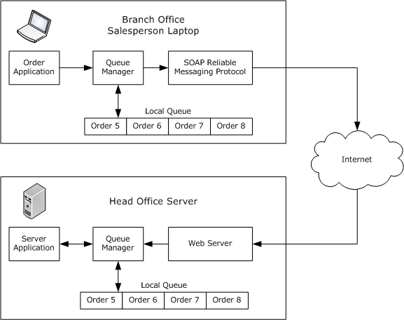

Figure 1: A typical message queuing scenario

## 1.4 Relationship to Other Protocols

This protocol depends on SOAP 1.1, and either HTTP 1.1 or the PGM Protocol, to provide a transport for [**messages**](#gt_message). In the point-to-point (unicast) scenario, this protocol uses HTTP over TCP to transport the message; in the multicast scenario, this protocol uses PGM to transport the message.

There are no other [**MSMQ**](#gt_microsoft-message-queuing-msmq) protocols above this protocol in the protocol stack; this protocol is a client protocol and sits at the top of the protocol stack.

The following figure shows a diagram of the protocol layers.

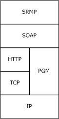

Figure 2: Protocol layer diagram

This protocol uses shared state and processing rules described in [MS-MQDMPR](#Section_1.3.2). For more information, see [MS-MQDMPR] section 1.4 for details about relationships between all MSMQ protocols through this shared state.

## 1.5 Prerequisites/Preconditions

It is assumed that, before invoking SRMP, the protocol client has obtained the name of a server computer that supports this protocol and the name of a [**queue**](#gt_queue) hosted on the server. This specification does not mandate how a client acquires this information, which typically occurs during the interaction between a client application and the API of the [**QM**](#gt_queue-manager-qm).

The protocol assumes that any [**network address translations (NATs)**](#gt_network-address-translation-nat) or firewalls are configured to allow sending QMs to be addressable.

## 1.6 Applicability Statement

The implementation of the server side of this protocol applies to [**queue managers**](#gt_queue-manager-qm) that provide [**message queuing**](#gt_message-queuing) communication services to clients. The implementation of the client side of this protocol applies to client libraries that provide [**message**](#gt_message) queue managers to applications or to queue managers that delegate requests on behalf of a client.

Applicable scenarios include cases in which users are disconnected or in which connectivity is unreliable, such as when a sales force works remotely; or cases in which guaranteed delivery is important, such as when sending orders from an entry system to a billing system.

SRMP does not apply in the following scenarios:

- If distributed applications require message delivery within a predefined amount of time.
- If the message data is greater than any size limit imposed by the underlying transport protocols. For example, if SRMP is used over PGM, the message data cannot exceed 64 kilobytes in size as described in section [2.1.3.1](#Section_2.1.3.1).
- If message data is greater than 4 megabytes in size.
- If the client-side or server-side service is incapable of processing HTTP 1.1 messages (for unicast SRMP) or PGM messages (for multicast SRMP).

## 1.7 Versioning and Capability Negotiation

This document covers versioning issues in the following areas:

- **Supported Transports**: This protocol is implemented on top of HTTP 1.1 and PGM, as defined in section [2.1](#Section_2.1).
- **Protocol Versions**: There is a single version of this protocol.
- **Capability Negotiation**: There are no capabilities to negotiate.

## 1.8 Vendor-Extensible Fields

None.

## 1.9 Standards Assignments

None.

# 2 Messages

## 2.1 Transport

### 2.1.1 Unicast

For unicast messages, SRMP MUST be carried out over [[SOAP1.1]](https://go.microsoft.com/fwlink/?LinkId=90520) and HTTP 1.1 [[RFC2616]](https://go.microsoft.com/fwlink/?LinkId=90372). Both the sending and the receiving sides MUST provide Web services with the following capabilities:

- Support for SOAP (as specified in [SOAP1.1]) over HTTP 1.1 (as specified in [RFC2616]) over TCP/IP.
- Support for HTTPS for securing communication with clients.
Each Web service SHOULD<1> expose the following TCP ports as endpoints for the HTTP over TCP/IP transport:

- **Port 80:** The default HTTP port.
- **Port 443:** The default HTTPS port for secure communication using Secure Sockets Layer (SSL) [[RFC2818]](https://go.microsoft.com/fwlink/?LinkId=90383).

### 2.1.2 Multicast

For multicast messages, SRMP MUST be carried out over [[SOAP1.1]](https://go.microsoft.com/fwlink/?LinkId=90520) and PGM [[RFC3208]](https://go.microsoft.com/fwlink/?LinkId=95257). Both the sending and the receiving sides MUST provide services that support SOAP (as specified in [SOAP1.1]) over PGM (as specified in [RFC3208]) over IP.<2>

When using PGM as the transport, the sender and receivers need to agree on both the multicast address and the port.

### 2.1.3 Use of PGM

The PGM specification [[RFC3208]](https://go.microsoft.com/fwlink/?LinkId=95257) is ambiguous in a number of areas. SRMP uses PGM as specified in the following section. All sections of [RFC3208] except sections 7, 9.5, and 11–15 MUST be implemented (that is, no network element or designated local repairer functionality, nor appendices A–E).<3>

#### 2.1.3.1 Clarifications for RFC 3208

The following values SHOULD<4> be used for the constants defined in [[RFC3208]](https://go.microsoft.com/fwlink/?LinkId=95257).

| Constant | Value |
| --- | --- |
| TXW_MAX_RTE | 70 kilobytes per second |
| TXW_SECS | 300 |
| TXW_ADV_SECS | 15% of TXW_SECS |
| TXW_ADV_IVL | 15% of TXW_SECS |
| IHB_MIN | 1 second |
| IHB_MAX | 15 seconds |
| NAK_RPT_IVL | 0.75 seconds |
| NAK_RDATA_IVL | 2 seconds |
| NAK_NCF_RETRIES | 10 |
| NAK_DATA_RETRIES | 10 |
| Token bucket size | 40 milliseconds |

In addition, [RFC3208] allows flexibility in implementing the following details:

- The NAK_RB_IVL timer SHOULD be chosen randomly from the interval [0.05, 0.01] seconds.
- The source path message (SPM) ambient time interval MUST be implemented such that ambient SPMs are sent when either 50 data packets (ODATA or RDATA packets) have been transmitted, or 0.5 seconds have passed since the last ambient SPM, whichever comes sooner.
- Section 5.3 of [RFC3208] allows a source to delay RDATA retransmission to accommodate the arrival of additional negative acknowledgments (NAKs). An implementation of this specification SHOULD delay the retransmissions by a time computed according to the following formula.
RDataDelayTime =

((RDataSequenceNumber - TrailingSequenceNumber) * 60 msecs) /

((LastODataSentSequenceNumber - TrailingSequenceNumber + 1))

- Section 16 of [RFC3208] allows implementations to implement any scheme for advancing the transmit window. Implementations of this specification SHOULD advance the transmit window every TXW_ADV_IVL.
- Implementations of this specification SHOULD delay transmit window advancement if the sender has pending NAK requests in the range of sequences that the trailing edge of the window is supposed to advance over. In this case, the trailing edge only advances up to the first pending NAK request.
- Implementations of this specification SHOULD limit the size of application data packets (APDUs) to 64 kilobytes to protect the server from denial of service attacks.

## 2.2 Message Syntax

This section specifies the syntax of SOAP 1.1 [[SOAP1.1]](https://go.microsoft.com/fwlink/?LinkId=90520) messages that are exchanged by using SRMP. All [**messages**](#gt_message) are encoded in [**XML**](#gt_xml) [[XML1.0]](https://go.microsoft.com/fwlink/?LinkId=90599), as specified in [SOAP1.1] section 3.

### 2.2.1 Common Data Types

#### 2.2.1.1 GUID String

This type is a string representation of a [**GUID**](#gt_globally-unique-identifier-guid) type (as specified in [MS-DTYP](../MS-DTYP/MS-DTYP.md) section 2.3.4.3) in the string form of a [**UUID**](#gt_universally-unique-identifier-uuid) (as specified in [[RFC4122]](https://go.microsoft.com/fwlink/?LinkId=90460) section 3).

#### 2.2.1.2 ISO 8601 Date String

This string is an ISO 8601–formatted date and time (see [[ISO-8601]](https://go.microsoft.com/fwlink/?LinkId=89920) for details) that uses the format "YYYYMMDDThhmmss".

#### 2.2.1.3 xs:unsignedLong

The xs:unsignedLong integer is an unsigned long integer, as described in [[W3C-XSD]](https://go.microsoft.com/fwlink/?LinkId=90563).

### 2.2.2 SRMP Message Structure

All SRMP [**messages**](#gt_message) MUST conform to the basic structure of a SOAP 1.1 message, as specified in [[SOAP1.1]](https://go.microsoft.com/fwlink/?LinkId=90520) section 4, as follows:

- The SOAP Envelope element <se:Envelope>, as defined in namespace http://schemas.xmlsoap.org/soap/envelope, MUST be present as the top-level element of the SRMP message.
- The SOAP Header element <se:Header>, as defined in namespace http://schemas.xmlsoap.org/soap/envelope, MUST be present as the first immediate child element of the SOAP Envelope element.
- The SOAP Body element <se:Body>, as defined in http://schemas.xmlsoap.org/soap/envelope, MUST be present and MUST be an immediate child element of a SOAP Envelope element. It MUST directly follow the SOAP Header element. The <se:Body> element MUST be empty and MUST be ignored.
The application message payload that the [**QM**](#gt_queue-manager-qm) on the receiving computer delivers to the receiving application MUST be encoded as a multipart MIME attachment (see [[RFC2387]](https://go.microsoft.com/fwlink/?LinkId=95254)) by the sending QM.

Internal receipt messages (delivery, commitment, and stream receipts) MUST NOT contain a multipart MIME payload attachment.

### 2.2.3 Standard XML Namespaces

The following table shows the standard [**XML**](#gt_xml) namespaces that are used in this protocol and the alias (prefix) that is used in the remaining sections of this protocol specification. Typically, SRMP [**messages**](#gt_message) declare the SOAP envelope and SRMP namespaces in the <se:Envelope> element. The WS-Routing namespace is declared in the <rp:path> element, which is the only element that uses it. The [**MSMQ**](#gt_microsoft-message-queuing-msmq) namespace is declared in the <msmq:Msmq> element, which is the only element that uses it.

| Alias (prefix) | XML namespace | Note |
| --- | --- | --- |
| se | http://schemas.xmlsoap.org/soap/envelope/ | Standard SOAP envelope namespace. |
| rp | http://schemas.xmlsoap.org/rp/ | Standard WS-Routing namespace. |
| srmp | http://schemas.xmlsoap.org/srmp/ | SRMP namespace; the XML schema is not currently defined. |
| msmq | msmq.namespace.xml | Internal MSMQ namespace; used to identify MSMQ elements. |

Although the SRMP XML namespace uses a URI to define that namespace, the schema for SRMP has not been defined, and there are no plans to define it.

A schema for the MSMQ namespace has not been defined, and there are no plans to define it.

This document follows the convention that, when discussing elements, they are prefixed with the previously defined aliases unless the context makes it clear which namespace the element is from.

### 2.2.4 WS-Routing Path Element

SRMP uses the WS-Routing <rp:path> element, as defined in http://schemas.xmlsoap.org/rp, for its addressing purposes. The <path> element specifies the destination [**queue**](#gt_queue) for the SRMP [**message**](#gt_message), the sender's identity, a user-defined label for the message, and a response queue.

The WS-Routing <rp:path> element MUST be present as a child element of the <se:Header> element. Its namespace MUST be declared as xmlns="http://schemas.xmlsoap.org/rp/". It MUST be marked as follows with the SOAP attribute **se:mustUnderstand="1"**.

<path xmlns="http://schemas.xmlsoap.org/rp/" se:mustUnderstand="1">

The child elements of <rp:path> are used as described in the following sections.

#### 2.2.4.1 action Element

The WS-Routing <action> element MUST be present as a child element of the <rp:path> element. To identify the [**message**](#gt_message) to the application, the <action> element MAY contain a string that represents a user-defined label for the SRMP message. The user-defined label MUST be prefixed by the string "MSMQ:", as shown in the following example.<5>

<action>MSMQ:mqsender label</action>

If the message is a delivery receipt (see section [2.2.5.4](#Section_2.2.5.4)) or a commitment receipt (see section [2.2.5.5](#Section_2.2.5.2.3)) in response to a previous SRMP message (containing <deliveryReceiptRequest> or <commitmentReceiptRequest>), the <action> element MUST contain the identical label string as the initial message.<6>

If the message is a [**stream receipt**](#gt_stream-receipt) (see section [2.2.5.6](#Section_2.2.5.6)) in response to a previous [**stream message**](#gt_stream-message), the <action> element MUST contain the label string "MSMQ:QM Ordering Ack".

The <action> element corresponds to the **Message.Label** attribute of the ADM **Message** data element. For details, see [MS-MQDMPR](#Section_1.3.2) section 3.1.1.12.

#### 2.2.4.2 to Element

The WS-Routing <to> element MUST be present as a child element of the <rp:path> element. It MUST contain a string that represents the URI of the destination [**queue**](#gt_queue) that is the ultimate destination of the message. For details about [**MSMQ**](#gt_microsoft-message-queuing-msmq) naming, see [MS-MQMQ](#Section_1.3.2) section 2.1.

If HTTP is selected as the underlying transport protocol, the URI of the destination queue MUST begin with "http://", as the following example shows.

<to>http://myhostname/msmq/private$/sampleq</to>

If HTTPS is selected as the underlying transport protocol, the URI of the destination queue MUST begin with "https://", as the following example shows. Using HTTPS is how transport security is activated for SRMP [**messages**](#gt_message).

<to>https://myhostname/msmq/private$/sampleq</to>

If PGM [[RFC3208]](https://go.microsoft.com/fwlink/?LinkId=95257) is selected as the underlying transport protocol, the URI of the destination queue MUST begin with "MSMQ:MULTICAST=", followed by the multicast IP address of the destination queue, followed by ":", and followed by the port number of the destination queue. This sequence, as is shown in the following example, is how multicast transport is activated for SRMP messages.

<to>MSMQ:MULTICAST=234.1.1.1:8001</to>

The <to> element corresponds to the **Message.DestinationQueueFormatName** attribute of the ADM **Message** data element. For details, see [MS-MQDMPR](#Section_1.3.2) section 3.1.1.12.

#### 2.2.4.3 id Element

The WS-Routing <id> element MUST be present as a child element of the <rp:path> element. The content of this element uniquely identifies the [**message**](#gt_message) across all [**MSMQ**](#gt_microsoft-message-queuing-msmq) [**QMs**](#gt_queue-manager-qm).

If the <Msmq> element is not present in the message (see section [2.2.6](#Section_1.3)), the <id> element MUST be ignored.

If the <Msmq> element is present in the message, the <id> element MUST contain a string that begins with "uuid:", followed by an index number of type xs:unsignedLong that identifies the message, followed by "@", and then followed by a [GUID string](#Section_2.2.1.1) that identifies the sending QM.

The sending QM [**GUID**](#gt_globally-unique-identifier-guid) SHOULD<7> be identical to the <SourceQmGuid> child element of the <Msmq> element.

The <id> element corresponds to the **Message.Identifier** attribute of the ADM Message data element. For details, see [MS-MQDMPR](#Section_1.3.2) section 3.1.1.12.

<id>uuid:26626@32221eda-9376-46df-b6ed-783091123831</id>

#### 2.2.4.4 rev Element

The WS-Routing <rev> element MAY be present as a child element of the <rp:path> element. If present, exactly one<8> WS-Routing <via> element MUST be present as a child element of the <rev> element.

The <rev> element describes the reverse path that response [**messages**](#gt_message) follow. This element SHOULD contain a string that represents the URI of the application-level response [**queue**](#gt_queue) in the <via> element. The URI MAY use HTTP/HTTPS name formatting (similar to the URI in the <to> element that is described in section [2.2.4.2](#Section_2.2.4.2)), or it MAY use standard name formating that is prefixed with "MSMQ:". For details about [**MSMQ**](#gt_microsoft-message-queuing-msmq) naming, see [MS-MQMQ](#Section_1.3.2) section 2.1.

The <via> element MAY be empty,<9> which is equivalent to not including a <rev> element in the message.

The <via> element corresponds to the **Message.ResponseQueueFormatName** attribute of the ADM **Message** data element. For details, see [MS-MQDMPR](#Section_1.3.2) section 3.1.1.12.

<rev>

<via>http://myhostname/msmq/private$/sampleq</via>

</rev>

#### 2.2.4.5 Other Elements

The WS-Routing elements <fwd>, <from>, <relatesTo>, and <fault> MAY<10> be present as child elements of the <rp:path> element and MUST be ignored.

### 2.2.5 SRMP Header Elements

SRMP defines six protocol-specific elements inside the SOAP header: <properties>, <services>, <stream>, <deliveryReceipt>, <commitmentReceipt>, and <streamReceipt>. The SRMP namespace MUST be declared as xmlns="http://schemas.xmlsoap.org/srmp/", either globally in the <se:Header> element or locally in each SRMP element.

#### 2.2.5.1 properties Element

The SRMP <properties> element MUST be present as a child element of the <se:Header> element. It MUST be marked with the SOAP attribute **se:mustUnderstand="1"**, as the following example shows. This element specifies common [**message**](#gt_message) properties of SRMP messages.

<properties se:mustUnderstand="1">

The child elements of the <properties> element are used as described in the following sections.

##### 2.2.5.1.1 expiresAt Element

The SRMP <expiresAt> element MUST be present as a child element of the <properties> element. It MUST contain an ISO 8601 date string, as the following example shows, and is expressed in [**Coordinated Universal Time (UTC)**](#gt_coordinated-universal-time-utc).

The <expiresAt> element represents the expiration time stamp of the [**message**](#gt_message), beyond which time, the message MUST not be processed by the receiver and MUST be discarded.

The <expiresAt> element corresponds to the **Message.TimeToReachQueue** attribute of the ADM **Message** data element. For details, see [MS-MQDMPR](#Section_1.3.2) section 3.1.1.12.

<expiresAt>20070619T210654</expiresAt>

##### 2.2.5.1.2 sentAt Element

The SRMP <sentAt> element MAY be present as a child element of the <properties> element.

It MUST contain an ISO 8601 date string, as the following example shows, and is expressed in [**UTC**](#gt_coordinated-universal-time-utc).

The <sentAt> element represents the sending time stamp of the [**message**](#gt_message). It MUST NOT be modified on any attempt at retransmission of the message if previous transmission attempts have failed.

The <sentAt> element corresponds to the **Message.SentTime** attribute of the ADM **Message** data element. For details, see [MS-MQDMPR](#Section_1.3.2) section 3.1.1.12.

<sentAt>20070618T210654</sentAt>

##### 2.2.5.1.3 inReplyTo Element

The SRMP <inReplyTo> element MAY<11> be present as a child element of the <properties> element and MUST be ignored.

#### 2.2.5.2 services Element

The SRMP <services> element MAY be present as a child element of the <se:Header> element. If present, it MUST be marked with the SOAP attribute **se:mustUnderstand="1"**, as the following example shows.

This element specifies services that relate to the delivery guarantees of SRMP [**messages**](#gt_message).

<services se:mustUnderstand="1">

The child elements of <services> are used as described in the following sections.

##### 2.2.5.2.1 durable/ Element

The SRMP <durable/> element MAY be present as a child element of the <services> element. If the <stream> element (see section [2.2.5.3](#Section_3.1.1.1.6)) is present, <durable/> MUST be present.

If <durable/> is present, the [**message**](#gt_message) MUST be persisted to stable storage at the sender before transmission and MUST be persisted at the receiver immediately on receipt and prior to further processing.

If a delivery receipt has been requested (see section [2.2.5.2.2](#Section_2.2.5.2.2)), the receipt MUST be sent only after the message has been durably stored.

The <durable/> element corresponds to the **Message.DeliveryGuarantee = Recoverable** attribute of the ADM **Message** data element. For details, see [MS-MQDMPR](#Section_1.3.2) section 3.1.1.12.

<durable/>

##### 2.2.5.2.2 deliveryReceiptRequest Element

The SRMP <deliveryReceiptRequest> element MAY be present as a child element of the <services> element. If present, the SRMP <sendTo> element MUST be present as a child element of the <deliveryReceiptRequest> element, as the following example shows. The <sendTo> element MUST contain a string that represents the URI of the administration [**queue**](#gt_queue) to which receipts are sent. The URI MUST use HTTP/HTTPS name formatting (similar to the URI in the <to> element, which is described in section [2.2.4.2](#Section_2.2.4.2)).

The <deliveryReceiptRequest> element corresponds to the **Message.AcknowledgementsRequested += AckPosArrive** attribute of the ADM **Message** data element. For details, see [MS-MQDMPR](#Section_1.3.2) section 3.1.1.12.

If the <deliveryReceiptRequest> element is present, the receiver MUST acknowledge acceptance of the [**message**](#gt_message) with a receipt. The receipt acknowledges that the receiver understands each SRMP element that is marked with "mustUnderstand=1", has performed all actions that are required of the SRMP receiver prior to sending the receipt, and is committed to performing all actions that are required of the receiver after sending the receipt. In the context of [**MSMQ**](#gt_microsoft-message-queuing-msmq), this means that the message was received and placed in the destination queue at the receiver. The receipt MUST be sent to the URI that is specified in the <sendTo> element.

The <sendTo> element corresponds to the **Message.AdministationQueueFormatName** attribute of the ADM **Message** data element. For details, see [MS-MQDMPR] section 3.1.1.12.

<deliveryReceiptRequest>

<sendTo>http://myhostname/MSMQ/private$/receipts</sendTo>

</deliveryReceiptRequest>

##### 2.2.5.2.3 commitmentReceiptRequest Element

The SRMP <commitmentReceiptRequest> element MAY be present as a child element of the <services> element. If present:

- The SRMP <sendTo> element MUST be present as a child element of the <commitmentReceiptRequest> element. The <sendTo> element MUST contain a string that represents the URI of the administration [**queue**](#gt_queue) to which receipts are sent. The URI MUST use HTTP/HTTPS name formatting (similar to the URI in the <to> element, which is described in section [2.2.4.2](#Section_2.2.4.2)). The <sendTo> element corresponds to the **Message.AdministationQueueFormatName** attribute of the ADM **Message** data element. For details, see [MS-MQDMPR](#Section_1.3.2) section 3.1.1.12.
- The SRMP <positiveOnly/> element MAY be present as a child element of the <commitmentReceiptRequest> element, as the following example shows. If present, the receiver MUST send a positive commitment receipt if it understands all elements marked with "mustUnderstand=1" and is committed to processing the [**message**](#gt_message). In the context of [**MSMQ**](#gt_microsoft-message-queuing-msmq), this means that the message was received, placed in the destination queue at the receiver, and successfully removed from the destination queue by the receiving application. The <positiveOnly/> element corresponds to the **Message.AcknowledgementsRequested += AckPosReceive** attribute of the ADM **Message** data element. For details, see [MS-MQDMPR] section 3.1.1.12.
- The SRMP <negativeOnly/> element MAY be present as a child element of the <commitmentReceiptRequest> element. If present, the receiver MUST send a negative commitment receipt if it attempted to process the message but decided not to commit to complete its processing; or if the message expired before the receiver attempted to process the message. In the context of MSMQ, this means that the message was discarded or otherwise removed from the destination queue before the receiving application was able to receive it. The <negativeOnly/> element corresponds to the **Message.AcknowledgementsRequested += AckNegReceive** attribute of the ADM **Message** data element. For details, see [MS-MQDMPR] section 3.1.1.12.
- If neither <positiveOnly/> nor <negativeOnly/> is present, the receiver MUST NOT send any commitment receipts.
- If both <positiveOnly/> and <negativeOnly/> are present, the receiver MUST send a positive or negative commitment receipt, depending on the decision, as described previously.
<commitmentReceiptRequest>

<sendTo>http://myhostname/MSMQ/private$/deliveryDone</sendTo>

<positiveOnly/>

</commitmentReceiptRequest>

#### 2.2.5.3 stream Element

The SRMP <stream> element MAY be present as a child element of the <se:Header> element. If present, it MUST be marked with the SOAP attribute **se:mustUnderstand="1"**, as the following example shows.

If a <stream> element is present, the <Msmq> element specified in section [2.2.6](#Section_1.3) MUST be present. [**Messages**](#gt_message) sent in a [**stream**](#gt_stream) MUST be persistent; therefore, the <durable/> child element of the <services> element MUST be present (see section [2.2.5.2.1](#Section_2.2.5.2.1)).

The <stream> element defines child elements for a label and context for message [**sequences**](#gt_sequence). In particular, it defines the concepts of the first message, current message, and previous message. The receiver MUST NOT process any message more than once, and the receiver MUST NOT accept any message unless the previous message has been accepted.

<stream se:mustUnderstand="1">

The child elements of <stream> are used as described in the following sections.

##### 2.2.5.3.1 streamId Element

The SRMP <streamId> element MUST be present as a child element of the <stream> element. It defines a unique identifier for the [**stream**](#gt_stream) and MUST begin with "uid:", as the example shows, and be followed by a [GUID string](#Section_2.2.1.1) that identifies the sending [**QM**](#gt_queue-manager-qm) that corresponds to the **QueueManager.Identifier** attribute of the ADM **QueueManager** data element. For details, see [MS-MQDMPR](#Section_1.3.2) section 3.1.1.1.

The GUID string identifier MUST be followed by a backslash (\), which MUST be followed by a [**sequence**](#gt_sequence) number of type xs:unsignedLong that corresponds to the **Message.TransactionalMessageSequenceIdentifier** attribute of the ADM **Message** data element. The higher-value half of the 64-bit stream identifier forms the **Message.TransactionalMessageSequenceIdentifier.TimeStamp**; the lower-value half forms the **Message.TransactionalMessageSequenceIdentifier.Ordinal**. For details, see [MS-MQDMPR] section 3.1.1.12.

<streamId>uid:4a85b192-3ccd-4ba2-a0ac-7f0a11be1b08\4839986701558349830</streamId>

In the preceding example, the stream identifier converted to hex reads 0x432B164300000006. The lower half is the ordinal (0x6); the upper half converts to Friday, September 16, 2005 12:00:19 PM.

##### 2.2.5.3.2 current Element

The SRMP <current> element MUST be present as a child element of the <stream> element.

It MUST contain a number of type xs:unsignedLong, as the following example shows, that defines the relative location of the [**message**](#gt_message) in the [**stream**](#gt_stream). The first message in the stream MUST be assigned the value 1.

The <current> element corresponds to the **Message.TransactionSequenceNumber** attribute of the ADM Message data element. For details, see [MS-MQDMPR](#Section_1.3.2) section 3.1.1.12.

<current>42</current>

##### 2.2.5.3.3 previous Element

The SRMP <previous> element MAY be present as a child element of the <stream> element.

If present, it MUST contain a number of type xs:unsignedLong, as the following example shows, that defines the relative location of the preceding [**message**](#gt_message) in the [**stream**](#gt_stream).

The <previous> element is used to indicate gaps in the stream that occur if the sender skips some messages without invalidating the entire stream.

The <previous> element corresponds to the **Message.TransactionPreviousSequenceNumber** attribute of the ADM Message data element. For details, see [MS-MQDMPR](#Section_1.3.2) section 3.1.1.12.

<previous>41</previous>

##### 2.2.5.3.4 start Element

The SRMP <start> element MAY be present as a child element of the <stream> element. If present, the SRMP element <sendReceiptsTo> MUST be present as a child element of the <start> element, as the following example shows. The <sendReceiptsTo> element MUST contain a string that represents the URI of the administration [**queue**](#gt_queue) to which receipts are sent. The URI MUST use HTTP/HTTPS name formatting (similar to the URI in the <to> element, which is described in section [2.2.4.2](#Section_2.2.4.2)).

The <sendReceiptsTo> element corresponds to the **Message.AdministationQueueFormatName** attribute of the ADM Message data element. For details, see [MS-MQDMPR](#Section_1.3.2) section 3.1.1.12.

The <start> element MUST be present in the first [**message**](#gt_message) of a [**stream**](#gt_stream) and MUST NOT be present in any subsequent message of the stream.

<start>

<sendReceiptsTo>

http://myhostname/MSMQ/private$/receipts

</sendReceiptsTo>

</start>

#### 2.2.5.4 deliveryReceipt Element

The SRMP <deliveryReceipt> element MAY be present as a child element of the <se:Header> element. This element MUST be generated in response to a [**message**](#gt_message) that contains the <deliveryReceiptRequest> element (see section [2.2.5.2.2](#Section_2.2.5.2.2)). If present:

- The SRMP <receivedAt> element MUST be present as a child element of the <deliveryReceipt> element, as the following example shows. It MUST also contain a string that represents an ISO 8601 date string. The <receivedAt> element represents the current time stamp at which the receiving [**QM**](#gt_queue-manager-qm) placed the message in its destination [**queue**](#gt_queue).
- The SRMP <id> element MUST be present as a child element of the <deliveryReceipt> element. It MUST contain the same MessageID as the <id> element in the <path> element of the original message that requested the delivery receipt (see section [2.2.4.3](#Section_2.2.4.3)).
- The <to> element of the <path> element in the receipt message MUST contain the URI of the administration queue that is specified in the <sendTo> element of the <deliveryReceiptRequest> in the original message (see section 2.2.5.2.2).
<deliveryReceipt>

<receivedAt>20070618T210655</receivedAt>

<id>uuid:32852@32221eda-9376-46df-b6ed-783091123831</id>

</deliveryReceipt>

#### 2.2.5.5 commitmentReceipt Element

The SRMP <commitmentReceipt> element MAY be present as a child element of the <se:Header> element. This element MUST be generated in response to a [**message**](#gt_message) that contains the <commitmentReceiptRequest> element (see section [2.2.5.2.3](#Section_2.2.5.2.3)) or the <DeadLetter/> element (see section [2.2.6.4](#Section_2.2.6.4) and section [3.1.7.3.3](#Section_3.1.7.3.3)). If present:

- The SRMP element <decidedAt> MUST be present as a child element of the <commitmentReceipt> element, as the following example shows. It MUST also contain a string that represents an ISO 8601 date string and is expressed in [**UTC**](#gt_coordinated-universal-time-utc). The <decidedAt> element represents the current time stamp at which the message was removed from the destination [**queue**](#gt_queue), either by the receiving application (in the positive case) or by a discard or purge operation (in the negative case).
- The SRMP <decision> element MUST be present as a child element of the <commitmentReceipt> element. It MUST contain one of two enumeration values: "negative" or "positive", corresponding to negative or positive commitment receipts.
- The SRMP <id> element MUST be present as a child element of the <commitmentReceipt> element. It MUST contain the same MessageID as the <id> element in the <path> element of the original message that requested the commitment receipt (see section [2.2.4.3](#Section_2.2.4.3)).
- The <to> element of the <path> element in the receipt message MUST contain the URI of the administration queue that is specified in the <sendTo> element of the <commitmentReceiptRequest> in the original message (see section 2.2.5.2.3).
<commitmentReceipt>

<decidedAt>20070618T210908</decidedAt>

<decision>positive</decision>

<id>uuid:32852@32221eda-9376-46df-b6ed-783091123831</id>

</commitmentReceipt>

#### 2.2.5.6 streamReceipt Element

The SRMP <streamReceipt> element MAY be present as a child element of the <se:Header> element. The [**stream receipt**](#gt_stream-receipt) element is generated by the receiver QM and sent to the sender QM. The sender QM processes this element as a notification to delete acknowledged [**messages**](#gt_message) (see section [3.1.5.1.9.1](#Section_3.1.5.1.9.1)) and also for performing negative journaling (see section [3.1.1.3.3](#Section_3.1.1.3.3)). If present:

- The SRMP <streamId> element MUST be present as a child element of the <streamReceipt> element, as the following example shows. It MUST also contain the same StreamID as the <streamId> element in the <stream> element of the original [**stream message**](#gt_stream-message) received (see section [2.2.5.3.1](#Section_2.2.5.3.1)).
- The SRMP <lastOrdinal> element MUST be present as a child element of the <streamReceipt> element. It MUST contain a number of type xs:unsignedLong that is identical to the <current> element of the last stream message received. By sending this stream receipt, the receiver acknowledges receipt of all messages in the [**stream**](#gt_stream) up to and including the message whose <current> number is identical to the <lastOrdinal> element.
<streamReceipt>

<streamId>uid:4a85b192-3ccd-4ba2-a0ac-7f0a11be1b08\4839986701558349830</streamId>

<lastOrdinal>2</lastOrdinal>

</streamReceipt>

### 2.2.6 MSMQ Elements

[**MSMQ**](#gt_microsoft-message-queuing-msmq) uses the following [**XML**](#gt_xml) elements for specific purposes. They each have corresponding attributes in the ADM **Message** data element of the abstract data model, as described in [MS-MQDMPR](#Section_1.3.2) section 3.1.1.12.

MSMQ elements are child elements of the <Msmq> element. The <Msmq> element SHOULD<12> be present as a child element of the <se:Header> element. If present, the MSMQ namespace MUST be declared as xmlns="msmq.namespace.xml", as the following example shows.

<Msmq xmlns="msmq.namespace.xml">

The child elements of <Msmq> are used as described in the following sections.

#### 2.2.6.1 Class Element

The [**MSMQ**](#gt_microsoft-message-queuing-msmq) <Class> element MUST be present as a child element of the <Msmq> element. The <Class> element corresponds to the **Message.Class** attribute of the ADM **Message** data element. For details, see [MS-MQDMPR](#Section_1.3.2) section 3.1.1.12.

The <Class> element MUST contain a number of type xs:unsignedLong, as the following example shows, that corresponds to an enumeration value as described in [MS-MQMQ](#Section_1.3.2) section 2.2.18.1.6.

<Class>255</Class>

#### 2.2.6.2 Priority Element

The [**MSMQ**](#gt_microsoft-message-queuing-msmq) <Priority> element MUST be present as a child element of the <Msmq> element. The <Priority> element corresponds to the **Message.Priority** attribute of the ADM **Message** data element. It MUST contain a number of type xs:unsignedLong with valid values from 0 to 7, as the following example shows. For details, see [MS-MQDMPR](#Section_1.3.2) section 3.1.1.12.

<Priority>3</Priority>

#### 2.2.6.3 Journal/ Element

The [**MSMQ**](#gt_microsoft-message-queuing-msmq) <Journal/> element MAY be present as a child element of the <Msmq> element. The <Journal/> element, as the following example shows, corresponds to the **Message.PositiveJournalingRequested = True** attribute of the ADM **Message** data element. For details, see [MS-MQDMPR](#Section_1.3.2) section 3.1.1.12.

<Journal/>

#### 2.2.6.4 DeadLetter/ Element

The [**MSMQ**](#gt_microsoft-message-queuing-msmq) <DeadLetter/> element, as the following example shows, MAY be present as a child element of the <Msmq> element. The <DeadLetter/> element corresponds to the **Message.NegativeJournalingRequested = True** attribute of the ADM **Message** data element. For details, see [MS-MQDMPR](#Section_1.3.2) section 3.1.1.12.

<DeadLetter/>

#### 2.2.6.5 Correlation Element

The [**MSMQ**](#gt_microsoft-message-queuing-msmq) <Correlation> element MAY be present as a child element of the <Msmq> element. The <Correlation> element corresponds to the **Message.CorrelationIdentifier** attribute of the ADM **Message** data element. For details, see [MS-MQDMPR](#Section_1.3.2) section 3.1.1.12.

The <Correlation> element MUST be encoded as a set of bytes in base64, as the following example shows, and as is described in [[RFC3548]](https://go.microsoft.com/fwlink/?LinkId=90432).

<Correlation>AAAAAAAAAAAAAAAAAAAAAAAAAAA=</Correlation>

#### 2.2.6.6 Trace/ Element

The [**MSMQ**](#gt_microsoft-message-queuing-msmq) <Trace/> element, as the following example shows, MAY be present as a child element of the <Msmq> element. The <Trace/> element corresponds to the **Message.TracingRequested = True** attribute of the ADM **Message** data element. For details, see [MS-MQDMPR](#Section_1.3.2) section 3.1.1.12.

<Trace/>

#### 2.2.6.7 ConnectorType Element

The [**MSMQ**](#gt_microsoft-message-queuing-msmq) <ConnectorType> element MAY be present as a child element of the <Msmq> element. It MUST contain a [GUID string](#Section_2.2.1.1), as the following example shows.

The <ConnectorType> element corresponds to the **Message.ConnectorTypeIdentifier** attribute of the ADM **Message** data element. For details, see [MS-MQDMPR](#Section_1.3.2) section 3.1.1.12.

<ConnectorType>fd74b8eb-2af7-4ac5-9405-074e315df392</ConnectorType>

#### 2.2.6.8 App Element

The [**MSMQ**](#gt_microsoft-message-queuing-msmq) <App> element MAY be present as a child element of the <Msmq> element. It MUST contain a number of type xs:unsignedLong, as the following example shows. The <App> element corresponds to the **Message.ApplicationTag** attribute of the ADM **Message** data element. For details, see [MS-MQDMPR](#Section_1.3.2) section 3.1.1.12.

<App>36</App>

#### 2.2.6.9 BodyType Element

The [**MSMQ**](#gt_microsoft-message-queuing-msmq) <BodyType> element MUST be present as a child element of the <Msmq> element. It MUST contain a number of type xs:unsignedLong, as the following example shows. The <BodyType> element corresponds to the **Message.BodyType** attribute of the ADM **Message** data element. For details, see [MS-MQDMPR](#Section_1.3.2) section 3.1.1.12.

<BodyType>8</BodyType>

#### 2.2.6.10 HashAlgorithm Element

The [**MSMQ**](#gt_microsoft-message-queuing-msmq) <HashAlgorithm> element MAY be present as a child element of the <Msmq> element. It MUST contain a number of type xs:unsignedLong, as the following example shows. The <HashAlgorithm> element corresponds to the **Message.HashAlgorithm** attribute of the ADM **Message** data element. For details, see [MS-MQDMPR](#Section_1.3.2) section 3.1.1.12.

<HashAlgorithm>32772</HashAlgorithm>

#### 2.2.6.11 Eod Element

The [**MSMQ**](#gt_microsoft-message-queuing-msmq) <Eod> element MAY be present as a child element of the <Msmq> element. If this element is present:

- The MSMQ <First/> element, as the following example shows, MAY be present as a child element of the <Eod> element. The <First/> element corresponds to the **Message.FirstInTransaction** attribute of the ADM **Message** data element. For details, see [MS-MQDMPR](#Section_1.3.2) section 3.1.1.12.
- The MSMQ <Last/> element MAY be present as a child element of the <Eod> element. The <Last/> element corresponds to the **Message.LastInTransaction** attribute of the ADM **Message** data element. For details, see [MS-MQDMPR] section 3.1.1.12.
- The MSMQ <ConnectorId> element MAY be present as a child element of the <Eod> element. It MUST contain a [GUID string](#Section_2.2.1.1). The <ConnectorId> element corresponds to the **Message.ConnectorQueueManagerIdentifier** attribute of the ADM **Message** data element. For details, see [MS-MQDMPR] section 3.1.1.12.
<Eod>

<First/>

<Last/>

</Eod>

#### 2.2.6.12 Provider Element

The [**MSMQ**](#gt_microsoft-message-queuing-msmq) <Provider> element MAY be present as a child element of the <Msmq> element. If this element is present:

- The MSMQ <Type> element MUST be present as a child element of the <Provider> element. It MUST contain a number of type xs:unsignedLong, as the following example shows. The <Type> element corresponds to the **Message.AuthenticationProviderType** attribute of the ADM **Message** data element. For details, see [MS-MQDMPR](#Section_1.3.2) section 3.1.1.12.
- The MSMQ <Name> element MUST be present as a child element of the <Provider> element. It MUST contain a string that represents a provider. The <Name> element corresponds to the **Message.AuthenticationProviderName** attribute of the ADM **Message** data element. For details, see [MS-MQDMPR] section 3.1.1.12.
<Provider>

<Type>1234</Type>

<Name>ProviderName</Name>

</Provider>

#### 2.2.6.13 SourceQmGuid Element

The [**MSMQ**](#gt_microsoft-message-queuing-msmq) <SourceQmGuid> element MUST be present as a child element of the <Msmq> element. It MUST contain a [GUID string](#Section_2.2.1.1), as the following example shows. The <SourceQmGuid > element corresponds to the **Message.SourceMachineIdentifier** attribute of the ADM **Message** data element. For details, see [MS-MQDMPR](#Section_1.3.2) section 3.1.1.12.

<SourceQmGuid>fd74b8eb-2af7-4ac5-9405-074e315df392</SourceQmGuid>

#### 2.2.6.14 DestinationMqf Element

The [**MSMQ**](#gt_microsoft-message-queuing-msmq) <DestinationMqf> element MAY be present as a child element of the <Msmq> element. It MUST contain one or more MSMQ-formatted names, each name separated by white space, as the following example shows. The <DestinationMqf> element corresponds to the **Message.DestinationMultiQueueFormatName** attribute of the ADM **Message** data element. For details, see [MS-MQDMPR](#Section_1.3.2) section 3.1.1.12.

<DestinationMqf>

http://Machine1/msmq/private$/SimpleQ

http://Machine2/msmq/private$/SimpleQ

http://Machine3/msmq/private$/SimpleQ

</DestinationMqf>

#### 2.2.6.15 AdminMqf Element

The [**MSMQ**](#gt_microsoft-message-queuing-msmq) <AdminMqf> element MAY be present as a child element of the <Msmq> element. It MUST contain one or more MSMQ-formatted names, each name separated by white space, as the following example shows. The <AdminMqf> element corresponds to the **Message.AdministrationMultiQueueFormatName** attribute of the ADM **Message** data element. For details, see [MS-MQDMPR](#Section_1.3.2) section 3.1.1.12.

<AdminMqf>

http://Machine1/msmq/private$/AdminQ

http://Machine2/msmq/private$/AdminQ

http://Machine3/msmq/private$/AdminQ

</AdminMqf>

#### 2.2.6.16 ResponseMqf Element

The [**MSMQ**](#gt_microsoft-message-queuing-msmq) <ResponseMqf> element MAY be present as a child element of the <Msmq> element. It MUST contain one or more MSMQ-formatted names, each name separated by white space, as the following example shows. The <ResponseMqf> element corresponds to the **Message.ResponseMultiQueueFormatName** attribute of the ADM **Message** data element. For details, see [MS-MQDMPR](#Section_1.3.2) section 3.1.1.12.

<ResponseMqf>

http://Machine1/msmq/private$/ResponseQ

http://Machine2/msmq/private$/ResponseQ

http://Machine3/msmq/private$/ResponseQ

</ResponseMqf>

#### 2.2.6.17 TTrq Element

The [**MSMQ**](#gt_microsoft-message-queuing-msmq) <TTrq> element MUST be present as a child element of the <Msmq> element. It MUST contain an ISO 8601 date string, as the following example shows. The <TTrq> element corresponds to the **Message.TimeToReachQueue** attribute of the ADM **Message** data element. For details, see [MS-MQDMPR](#Section_1.3.2) section 3.1.1.12.

The <TTrq> element represents the expiration time stamp of the [**message**](#gt_message), beyond which time the message MUST not be processed by the receiver and MUST be discarded.

<TTrq>20070619T210654</TTrq>

### 2.2.7 Signature Elements

MSMQ uses the following XML elements to define an XML digital signature.

Signature elements are child elements of the <Signature> element. The <Signature> element MAY be present as a child element of the <se:Header> element. If present, the signature namespace MUST be declared as xmlns="http://www.w3.org/2000/02/xmldsig#", as the following example shows.

Syntax and processing rules for the XML digital signature are described in [[XMLDSig]](https://go.microsoft.com/fwlink/?LinkId=130861).

<Signature xmlns="http://www.w3.org/2000/02/xmldsig#">

The child elements of the <Signature> element are used as described in the following sections.

#### 2.2.7.1 SignedInfo Element

The Signature <SignedInfo> element MUST be present exactly once as a child element of the <Signature> element.

<SignedInfo>

The child elements of <SignedInfo> are used as described in the following sections.

##### 2.2.7.1.1 SignatureMethod Element

The Signature <SignatureMethod> element MUST be present exactly once as a child element of the <SignedInfo> element. The value of the <SignatureMethod> element defines the algorithm that was used to create this signature. The default algorithm is the DSA algorithm.

<SignatureMethod Algorithm="http://www.w3.org/2000/02/xmldsig#dsa"></SignatureMethod>

##### 2.2.7.1.2 Reference Element

The Signature <Reference> element MAY be present up to two times as a child element of the <SignedInfo> element.

If the message contains a <Body>element, a <Reference> element MUST be present with the value of the URI attribute set to "cid:body@ appended by a GUID that represents the ID of the queue manager and followed by a double quotation mark.

If the message contains an <Extension> element, a <Reference> element MUST be present with the value of the URI attribute set to "cid:extension@ appended by a GUID that represents the ID of the queue manager and followed by a double quotation mark.

<Reference URI="cid:body@f6a3323c-7c7b-4a5f-b0ed-b3f63a200893">

###### 2.2.7.1.2.1 DigestMethod Element

If a <Reference> element is present, the Signature <Digest> element MUST be present exactly once as a child element of the <Reference> element.

The <DigestMethod> element includes the hashing algorithm specified in the hashing algorithm property (PROPID_M_HASH_ALGor MSMQMessage.HashAlgorithm) of the message. The default digest method is the SHA1 algorithm.

<DigestMethod Algorithm="http://www.w3.org/2000/02/xmldsig#sha1"></DigestMethod>

###### 2.2.7.1.2.2 DigestValue Element

If a <Reference> element is present, the Signature <DigestValue> element MUST be present exactly once as a child element of the <Reference> element.

The <DigestValue> element contains a hash value based on a single message property preceded by a keyword indicating the message property used to calculate it with the hashing algorithm specified in the <DigestMethod> element. Each digest value is calculated directly from the applicable binary property.

<DigestValue>XU9yAzfwEPuP7L5iOcQY9XRNEWM=</DigestValue>

#### 2.2.7.2 SignatureValue Element

The Signature <SignatureValue> element MUST be present exactly once as a child element of the <Signature> element.

The value in the <SignatureValue> element is calculated by hashing the data in the <SignedInfo> element using the SHA1 hashing algorithm, encrypting the hash with the user's private key (which corresponds to the public key in the certificate attached to the message), and converting the result to Base64 encoding.

<SignatureValue>ZxvFMInWLSb1+iNj5xA/OhPHE4uzIx4nXOCmoOyGSSyHWEuODsByooS00j9RsMuGN/FmpEEOgJ1NFCBEDaBAag==</SignatureValue>

## 2.3 Directory Service Schema Elements

This protocol uses abstract data model (ADM) elements specified in section [3.1.1](#Section_1.3). A subset of these elements can be published in a directory. This protocol SHOULD<13> access the directory using the algorithm specified in [MS-MQDSSM](#Section_1.3.2) and using LDAP [MS-ADTS](../MS-ADTS/MS-ADTS.md). The Directory Service schema elements for ADM elements published in the directory are defined in [MS-MQDSSM] section 2.4.<14>

# 3 Protocol Details

The Message Queuing (MSMQ): SOAP Reliable Messaging Protocol (SRMP) is often described as a communication mechanism between a "client" and "server"; however, for purposes of this section, the terms "sender" and "receiver", respectively, are used to refer to these roles. This protocol is actually connectionless; it behaves as is typical in peer-to-peer mode, where either participant sends and receives [**messages**](#gt_message) in a symmetrical manner.

## 3.1 Common Details

There are no distinct client and server roles in this protocol; therefore, all protocol details are described in this section.

### 3.1.1 Abstract Data Model

This section describes a conceptual model of possible data organization that an implementation maintains to participate in this protocol. The document is organized in order to facilitate the explanation of how the protocol behaves. This document does not mandate that implementations adhere to this model as long as their external behavior is consistent with what is described in this document.

The abstract data model for this protocol includes elements that are specific to this protocol and others that are shared between multiple [**MSMQ**](#gt_microsoft-message-queuing-msmq) protocols that are co-located at a common queue manager. The shared abstract data model is defined in [MS-MQDMPR](#Section_1.3.2) section 3.1, and the relationship between this protocol, a queue manager, and other protocols that share a common queue manager is described in [MS-MQOD](#Section_1.3.2).

Section [3.1.1.1.3](#Section_3.1.1.1.3) details the elements from the shared data model that are manipulated by this protocol, and sections [3.1.1.1.4](#Section_3.1.1.1.4) through [3.1.1.1.6](#Section_3.1.1.1.6) detail the data model elements that are specific to this protocol.

#### 3.1.1.1 Protocol State

This section describes the abstract data model (ADM) state and elements that this protocol maintains. The section shows the protocol state diagrams and describes the shared ADM elements that the protocol uses and any extensions to the ADM that are specific to this protocol.

##### 3.1.1.1.1 Persistent State Storage

Some protocol data elements MUST be saved in a persistent location that will survive process and node failure. A persistent storage requirement is indicated with a note in the element description that indicates "This value MUST be saved to persistent storage".

##### 3.1.1.1.2 State Diagrams

This section contains the state diagrams that pertain to this protocol.

###### 3.1.1.1.2.1 Regular and Durable Message State Sender

The following figure shows the protocol state at the sender for regular and durable SRMP [**messages**](#gt_message).

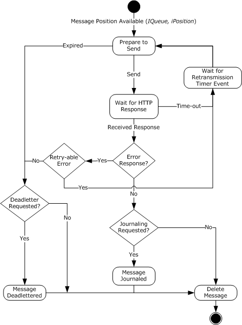

Figure 3: Regular and durable message state sender

###### 3.1.1.1.2.2 Regular and Durable Message State Receiver

The following figure shows the protocol state at the receiver for regular and durable SRMP [**messages**](#gt_message).

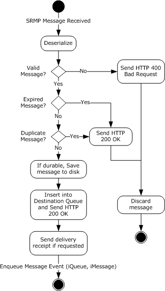

Figure 4: Regular and durable message state receiver

###### 3.1.1.1.2.3 Regular and Durable Message Position Deleted State Receiver

For regular and durable SRMP [**messages**](#gt_message), the following figure shows the protocol state at the receiver after a message gets removed from its destination [**queue**](#gt_queue).

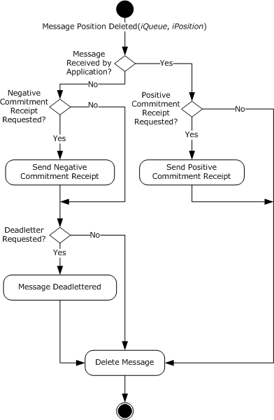

Figure 5: Regular and durable message position deleted state receiver

###### 3.1.1.1.2.4 Stream Message State Sender

The following figure shows the protocol state at the sender for SRMP [**stream messages**](#gt_stream-message).

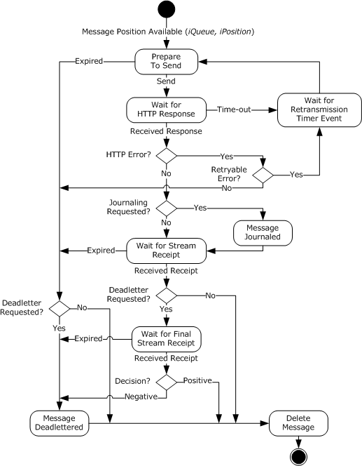

Figure 6: Stream message state sender

###### 3.1.1.1.2.5 Stream Message State Receiver

The following figure shows the protocol state at the receiver for SRMP [**stream messages**](#gt_stream-message).

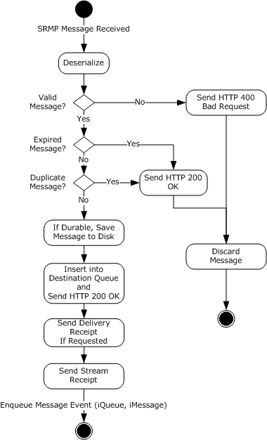

Figure 7: Stream message state receiver

###### 3.1.1.1.2.6 Stream Message Position Deleted State Receiver

The following figure shows the protocol state at the receiver after a [**stream message**](#gt_stream-message) gets removed from its destination [**queue**](#gt_queue).

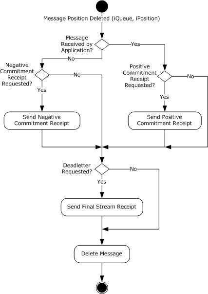

Figure 8: Stream message position deleted state receiver

##### 3.1.1.1.3 Shared Data Elements

This protocol manipulates the following abstract data model (ADM) elements from the shared ADM that is defined in [MS-MQDMPR](#Section_1.3.2) section 3.1.1.

**QueueManager:** As defined in [MS-MQDMPR] section 3.1.1.1.

- **Identifier:** The [**GUID**](#gt_globally-unique-identifier-guid) of the local [**QM**](#gt_queue-manager-qm). This value uniquely identifies the local host.<15> This value MUST be saved to persistent storage.
- **SystemDeadletterQueue:** A reference to a [**queue**](#gt_queue) instance that represents the system [**dead-letter queue**](#gt_dead-letter-queue).
- **SystemTransactionalDeadletterQueue:** A reference to a queue instance that represents the system transactional dead-letter queue.
- **QueueCollection:** A table of queues that are deployed at the host and keyed by name.
**Queue:** As defined in [MS-MQDMPR] section 3.1.1.2.

- **Pathname:** The name of the queue. For more information about queue naming conventions, see [MS-MQMQ](#Section_1.3.2) section 2.1.
- **Transactional:** A Boolean value that indicates whether the queue supports [**transactional messages**](#gt_transactional-message).
**OutgoingQueue:** As defined in [MS-MQDMPR] section 3.1.1.3: An ordered list of ADM **Message** data elements. This queue contains unsent [**messages**](#gt_message) or messages awaiting receipts. **Message** elements that contain [**durable**](#gt_durable-message) or [**stream messages**](#gt_stream-message) MUST be saved to persistent storage. This queue MUST generate the Message Position Available event, as described in [MS-MQDMPR] section 3.1.7.2.2

**OutgoingTransferInfo:** As defined in [MS-MQDMPR] section 3.1.1.4.

**IncomingTransactionalTransferInfo:** As defined in [MS-MQDMPR] section 3.1.1.5.

**Message:** As defined in [MS-MQDMPR] section 3.1.1.12: The **Message** data element is used by SRMP to serialize and deserialize protocol messages, from or to its attributes, as described in sections [3.1.5.1.1](#Section_3.1.5.1.10) and [3.1.7.2.3](#Section_3.1.7.2.3). In addition, this protocol extends the data element for SRMP-specific attributes, as described in the next section.

##### 3.1.1.1.4 SRMPMessage

The **SRMPMessage** data element extends the **Message** data element (see [MS-MQDMPR](#Section_1.3.2) section 3.1.1.12) and constitutes the internal representation of an SRMP [**message**](#gt_message).

The **SRMPMessage** data element adds the following attributes to the base **Message** element:

**AwaitingStreamReceipt:** A Boolean value indicating whether the message is awaiting a [**stream receipt**](#gt_stream-receipt).

**AwaitingFinalStreamReceipt:** A Boolean value indicating whether the message is awaiting a final stream receipt.

##### 3.1.1.1.5 SRMPState

The **SRMPState** data element is a private data element that is used for maintaining SRMP protocol-specific state. There is exactly one instance of **SRMPState** per [**queue manager**](#gt_queue-manager-qm).

The **SRMPState** data element contains the following attributes:

**MessageIdOrdinal:** A monotonically increasing value that is used in **SRMPMessage.Identifier**. This value is incremented by 1 for each [**message**](#gt_message) that the protocol sends. This value MUST be saved to persistent storage.

**StreamIdOrdinal:** A monotonically increasing value that is used in **Stream.Id**. This value is incremented by 1 for each [**stream**](#gt_stream) [**sequence**](#gt_sequence) that the protocol sends. This value MUST be saved to persistent storage.

**MessageIdHistoryTable:** This table contains a history of **SRMPMessage.Identifier** values from messages that the protocol host has received. This table provides a lightweight duplicate elimination mechanism. When a message arrives, the **SRMPMessage.Identifier** value is checked against this table. If the value exists, the packet MUST be rejected as a duplicate. The length of history that this table maintains is implementation-dependent. This value SHOULD<16> be saved to persistent storage.

**ResendTimerTable:** A table that contains the duration of the resend times for [**stream messages**](#gt_stream-message).<17>

**RetransmissionTimeout:** The time, in milliseconds, that the protocol waits before retransmitting messages that have not received a positive or negative HTTP response from the remote QM.

**StreamCollection:** A reference to a collection of stream data elements. This attribute represents the currently active streams that the protocol is maintaining. Only a single stream is active at any time for a given **OutgoingQueue** on a sending QM. However, multiple streams can be active between a single sender and multiple receiving QMs or a single sender and multiple destination queues on a single QM.

##### 3.1.1.1.6 Stream

The **Stream** data element is a private data element that is used for maintaining the SRMP [**stream**](#gt_stream)-specific state. The sender and receiver MUST independently maintain the attributes for each stream.

The **Stream** data element contains the following attributes:

**Id:** The stream identifier uniquely identifies the current outgoing [**sequence**](#gt_sequence) of [**stream messages**](#gt_stream-message) in the scope of the entire [**message queuing**](#gt_message-queuing) system. Only one stream sequence is valid at a particular time. This value MUST be saved to persistent storage. This value consists of two subattributes, as described in section [2.2.5.3.1](#Section_2.2.5.3.1):

- **GUID**: A [**GUID**](#gt_globally-unique-identifier-guid).
- **Ordinal**: A 64-bit monotonically increasing ordinal number.
**SequenceNumber:** The sequence number of the last outgoing stream message that is sent on a stream. This value MUST be saved to persistent storage.

**OutgoingQueueReference:** A reference to the OutgoingQueue from which the stream messages are sent. This value MUST be saved to persistent storage.

**ResendIntervalIndex:** A numeric value that contains the index into **SRMPState.ResendTimerTable** that determines the current number of seconds the local [**queue manager**](#gt_queue-manager-qm) will wait for a [**stream receipt**](#gt_stream-receipt) before resending [**messages**](#gt_message).

**IncomingId:** An OBJECTID, as specified in [MS-MQMQ](#Section_1.3.2) section 2.2.8, that uniquely identifies the current incoming sequence of stream messages in the scope of the entire message queuing system. This value MUST be saved to persistent storage. This value consists of two subattributes, as described in section 2.2.5.3.1:

- **GUID**: A GUID.
- **Ordinal**: A monotonically increasing ordinal number.
**IncomingSequenceNumber:** A value that identifies the sequence number of the last stream message that was received on a stream. This value MUST be saved to persistent storage.

**LastAcknowledgedStreamMessage:** The sequence number of the last stream message for which an acknowledgment has been sent. This collection MUST be saved to persistent storage.

**UnacknowledgedStreamMessages:** A collection of stream messages that have not been acknowledged yet. This collection MUST be saved to persistent storage.

**SendReceiptsTo:** A string that contains the URI that stream receipt messages are sent to.

**UnackedStreamMessageArrivalTime:** The arrival time of the oldest unacknowledged stream message.

##### 3.1.1.1.7 TransparentStoreAndForward

The **TransparentStoreAndForward** data element is a private data element that controls how received messages are treated when the final destination of the message is a different queue manager, as described in section [3.1.5.1.3](#Section_3.1.5.1.3). This value is a Boolean and is FALSE unless configured by an administrator. If it is TRUE, the queue manager becomes a [**transparent store-and-forward server**](#gt_transparent-store-and-forward-server).

This value MUST be saved to persistent storage.

##### 3.1.1.1.8 DefaultStreamReceiptURLReplacement

The **DefaultStreamReceiptURLReplacement** data element is a private data element that replaces the value of the <sendReceiptsTo> element (section [2.2.5.3.4](#Section_2.2.5.3.4)) of an outgoing message with a value configured by an administrator, as described in section [3.1.7.2.4](#Section_3.1.7.2.4). The value is either a URL or empty, and is empty unless configured by an administrator.

This value MUST be saved to persistent storage.

##### 3.1.1.1.9 OutboundRedirectionExceptionCollection

The **OutboundRedirectionExceptionCollection** data element is a private data element that is a collection of URLs that is used to create exceptions for outgoing messages going to particular destination queues that would otherwise be subject to redirection as described in sections [3.1.1.1.10.1](#Section_3.1.1.1.10.1) and [3.1.7.2.5](#Section_3.1.7.2.5). A trailing asterisk ('*') in a URL is treated as a wildcard, matching any characters at or following that position.

##### 3.1.1.1.10 Redirection

The **Redirection** data element is a private data element that appears in the collections defined in sections [3.1.1.1.10.1](#Section_3.1.1.1.10.1), [3.1.1.1.10.2](#Section_3.1.1.1.10.2), and [3.1.1.1.10.3](#Section_3.1.1.1.10.3).

**From:** A URL against which the existing value of a message field is matched. The specific use depends on the collection in which the element appears. A trailing asterisk (*) in the URL is treated as a wildcard, matching any characters at or following that position.

**To:** A URL.

This value MUST be saved to persistent storage.

###### 3.1.1.1.10.1 OutboundRedirectionCollection

A collection of **Redirection** data elements that is used to redirect outgoing messages to [**transparent store-and-forward servers**](#gt_transparent-store-and-forward-server). This process is described in detail in section [3.1.7.2.5](#Section_3.1.7.2.5).

###### 3.1.1.1.10.2 InboundRedirectionCollection

A collection of **Redirection** data elements that are used to redirect incoming messages to a queue other than that specified by the <to> element (section [2.2.4.2](#Section_2.2.4.2)) of the message. This process is described in detail in section [3.1.5.1.3](#Section_3.1.5.1.3).

###### 3.1.1.1.10.3 StreamReceiptURLReplacementCollection

A collection of **Redirection** data elements that is used to replace the value of the <sendReceiptsTo> element (section [2.2.5.3.4](#Section_2.2.5.3.4)) of an outgoing message with a value configured by an administrator, as described in section [3.1.7.2.4](#Section_3.1.7.2.4).

#### 3.1.1.2 Stream Message Sequence

To provide exactly-once-and-in-order (EOIO) guarantees for [**stream messages**](#gt_stream-message) , SRMP organizes stream messages into [**sequences**](#gt_sequence). A stream message is identified by a [**stream**](#gt_stream) identifier, as specified in section [2.2.5.3.1](#Section_2.2.5.3.1), and by a 32-bit stream sequence number. The first [**message**](#gt_message) in a stream sequence is assigned the value 1. Between sending and receiving [**QMs**](#gt_queue-manager-qm), only one stream sequence is active at a particular time.

A stream message contains the following:

- The <stream> element, as specified in section [2.2.5.3](#Section_3.1.1.1.6), which indicates the stream ID in the <streamId> element.
- The sequence number in the <current> element.
- The sequence number of the previous message in the <previous> element. If the <previous> element is not present, the previous message has a sequence number of <previous> - 1.
This information allows the remote host to determine if a message is in order and to identify duplicates.

Because messages can expire, gaps are allowed in stream sequence numbers. The <stream> element includes the previous sequence number so that the remote host can determine if the received message follows the prior message that was received.

When all the messages in a stream sequence have been acknowledged, the protocol MUST increment the **Stream.ID.Ordinal** by 1 and reset the **Stream.SequenceNumber** to zero. This process creates a new stream sequence that MUST be used with subsequent streams. Messages MUST NOT be sent on prior stream sequences.

The receiver uses stream sequence numbers to acknowledge receipt of stream messages. Stream ID and sequence number values are specified in the [<streamReceipt>](#Section_2.2.5.6) element.

#### 3.1.1.3 Receipts

SRMP augments the underlying transport by using additional levels of acknowledgment to ensure that [**messages**](#gt_message) are reliably transferred, regardless of failures in transport connection, applications, or nodes.

Message receipts provide a mechanism for the receiver to notify the sender whether it received a message, and optionally, whether the message was saved to disk. When the sender receives a receipt, it can discard the acknowledged messages that it stored locally.

The sender retransmits unacknowledged messages if it does not receive a receipt within the specified time-out period. SRMP implements message receipts at both the individual message and transactional [**sequence**](#gt_sequence) layers.

##### 3.1.1.3.1 Delivery Receipts

The receiving [**QM**](#gt_queue-manager-qm) sends a delivery receipt to the sender as a regular SRMP [**message**](#gt_message) that contains the [<deliveryReceipt>](#Section_2.2.5.4) element. The purpose of a delivery receipt is to notify the sending application that the receiving QM received the sender's message, and in the case of a [**durable message**](#gt_durable-message), stored it to disk. Delivery receipts are sent only if the sending application requested them by adding the [<deliveryReceiptRequest>](#Section_2.2.5.2.2) element to the message.

This protocol does not correlate delivery receipts with the original message on the sending side because successful transmission of a protocol message is acknowledged by the "HTTP 200 OK" response of the transport.

##### 3.1.1.3.2 Stream Receipts

[**Stream receipts**](#gt_stream-receipt) pertain to [**stream message**](#gt_stream-message) [**sequences**](#gt_sequence) (section [3.1.1.2](#Section_3.1.1.2)). The receiving [**QM**](#gt_queue-manager-qm) sends a stream receipt to the sender in the form of a regular SRMP [**message**](#gt_message) that contains the [<streamReceipt>](#Section_2.2.5.6) element. The purpose of a stream receipt is to notify the sender that the receiving QM received a stream message and successfully stored it to disk. Stream receipts are always sent for stream messages; there is no SRMP message element for requesting stream receipts. A stream receipt can only be used to acknowledge messages from one stream.

The <streamReceipt> element contains a [**stream**](#gt_stream) ID (in the [<streamId>](#Section_2.2.5.3.1) element) and a stream sequence number (in the <lastOrdinal> element) that specify the stream message being acknowledged. The receiver MUST acknowledge stream messages in sequence order. For example, if it receives messages 1, 2, and 4 within a sequence, it cannot send a receipt for message 4 until it receives message 3 and saves it to disk.

The receiving QM MUST durably store a stream message to disk before sending a stream receipt to the sender. A stream receipt will acknowledge multiple messages if there are multiple messages to acknowledge when the stream receipt is sent. For example, if the last acknowledged message was 5 and the receiver received and saved to disk messages 6, 7, and 8, then the receiver MAY set the <lastOrdinal> element to the value 8. The receiving QM waits a minimum of 500 milliseconds before sending a stream receipt message. If a new message on the same stream is received during this period, the stream receipt is delayed another 500 milliseconds. This process continues and can delay the stream receipt up to 10 seconds.

The <lastOrdinal> element specifies to the sender the highest message sequence number that was received by the receiver and saved to disk. The sender SHOULD discard its local copies of acknowledged stream messages up to the position in the sequence that the sender specified.

##### 3.1.1.3.3 Final Stream Receipts

Final [**stream receipts**](#gt_stream-receipt) pertain to [**stream message**](#gt_stream-message) [**sequences**](#gt_sequence) (section [3.1.1.2](#Section_3.1.1.2)). The receiving [**QM**](#gt_queue-manager-qm) sends a final stream receipt to the sender in the form of a regular SRMP [**message**](#gt_message) that contains the [<streamReceipt>](#Section_2.2.5.6) element and also the <[commitmentReceipt](#Section_2.2.5.2.3)> element. The purpose of a final stream receipt is to notify the sending QM that the stream message was removed from the destination [**queue**](#gt_queue) so that the sending QM can perform negative journaling (deadlettering). Final stream receipts are sent for stream messages only if the sending application requested negative journaling, that is, the <[DeadLetter/](#Section_2.2.6.4)> element is present in the stream message.

The <streamReceipt> element contains a [**stream**](#gt_stream) ID (in the [<streamId>](#Section_2.2.5.3.1) element) and a stream sequence number (in the <lastOrdinal> element) that specify the stream message being acknowledged.

##### 3.1.1.3.4 Commitment Receipts

The receiving [**QM**](#gt_queue-manager-qm) sends a commitment receipt to the sender as a regular SRMP [**message**](#gt_message) that contains the [<commitmentReceipt>](#Section_2.2.5.2.3) element. The purpose of a commitment receipt is to notify the sending application that the receiving QM either discarded the original message or passed it to the receiving application. Commitment receipts are sent only if the sending application requested them by adding the [<commitmentReceiptRequest>](#Section_2.2.5.2.3) element to the message, as specified in section 2.2.5.2.3.

If the sender has specified the <positiveOnly/> element, the receiver MUST send a positive commitment receipt if the receiving application has successfully retrieved the message from the destination [**queue**](#gt_queue). If the sender has specified the <negativeOnly/> element, the receiver MUST send a negative commitment receipt if the message is discarded from the destination queue because it expired or because the queue was purged.

If the sender specifies neither <positiveOnly/> nor <negativeOnly/>, the receiver MUST NOT send a commitment receipt.

The protocol does not correlate commitment receipts with the original message on the sending side.

#### 3.1.1.4 Sequence Diagrams

This section contains sequence diagrams that illustrate several common scenarios.

##### 3.1.1.4.1 Regular SRMP Message and Receipts

The following figure shows the [**message**](#gt_message) [**sequence**](#gt_sequence) for sending a [**regular**](#gt_33e6328f-7bea-4371-8157-25f94cc985fa) or [**durable**](#gt_durable-message) SRMP message between two [**QMs**](#gt_queue-manager-qm). In this case, the sender is requesting delivery and commitment receipts from the receiver.

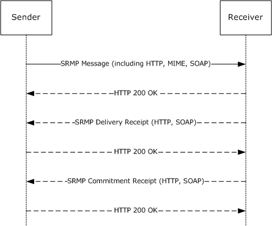

Figure 9: Regular SRMP message and receipts

First, the sender sends the SRMP message to the remote host via HTTP transport. The application message payload is included as a MIME attachment, as specified in section [2.2.2](#Section_2.2.2). The HTTP transport acknowledges every successful message by replying with "HTTP 200 OK".

Next, the receiver acknowledges receipt of the message by sending a delivery receipt (section [3.1.1.3.1](#Section_3.1.1.3.1)). The commitment receipt (section [3.1.1.3.4](#Section_3.1.1.3.4)) is sent after a delay, when the message is either discarded or picked up by the receiving application.

##### 3.1.1.4.2 Stream Sequence and Receipts

The following figure illustrates the sending of a [**message**](#gt_message) [**stream**](#gt_stream) between two [**QMs**](#gt_queue-manager-qm). In this case, the sender is not requesting delivery or commitment receipts for the individual messages. For brevity, the HTTP, SOAP, and MIME annotations are omitted.

Initially, the sender sends a [**stream message**](#gt_stream-message) that uses a [**sequence**](#gt_sequence) number of 1 to the remote host. As before, the HTTP transport acknowledges every successful message by replying with "HTTP 200 OK".

Next, the sender sends a stream message that uses a sequence number of 2 to the remote host. The remote host responds by sending "HTTP 200 OK" followed by a [**stream receipt**](#gt_stream-receipt) message. The purpose of the stream receipt is to acknowledge that the stream message was received in the correct order and was not a duplicate. By setting the <lastOrdinal> element in the stream receipt to 2, the receiver acknowledges receipt of all messages up to sequence number 2. A separate receipt for stream message 1 is not necessary.

Finally, the sender sends another stream message that has a sequence number of 3, and the remote host acknowledges it by returning "HTTP 200 OK" and also returning a stream receipt that has the <lastOrdinal> set to 3.

Because SRMP uses HTTP 1.1 as a transport, which is a connectionless protocol, no separate messages need to be exchanged for establishing or closing a connection. The connectionless nature of SRMP at the transport layer is in contrast to the connection-oriented Message Queuing Binary Protocol ([MS-MQQB](#Section_1.3.2)), which otherwise serves the same purpose for unicast messages.

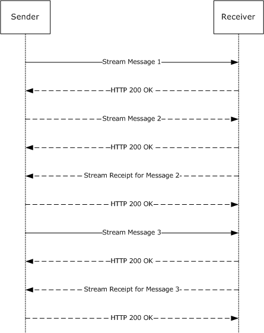

Figure 10: Stream sequence and receipts

##### 3.1.1.4.3 Stream Message and Multiple Receipts

The following diagram illustrates the sending of an individual [**stream message**](#gt_stream-message) between two [**QMs**](#gt_queue-manager-qm). In this case, the sender is requesting delivery and commitment receipts in addition to the mandatory [**stream receipt**](#gt_stream-receipt). (In this diagram, the mandatory "HTTP 200 OK" [**messages**](#gt_message) that the HTTP transport sends in response to each message are omitted.)

First, the sender sends a stream message to the remote host. The receiver responds by sending a delivery receipt message (section [3.1.1.3.1](#Section_3.1.1.3.1)). Next, the receiver sends the mandatory stream receipt message (section [3.1.1.3.2](#Section_3.1.1.3.2)) that acknowledges receipt of all stream messages up to the current message. Note that delivery receipts and stream receipts are separate mechanisms that serve different purposes.

Finally, the remote host sends a commitment receipt (section [3.1.1.3.4](#Section_3.1.1.3.4)) to the sender when the receiving application consumes the message from the destination [**queue**](#gt_queue), or when the message is discarded from the destination queue. Note also that the diagram shows only the [**sequence**](#gt_sequence) for a single stream message; there can be many stream receipts acknowledging multiple messages before the commitment receipt for this message is sent.

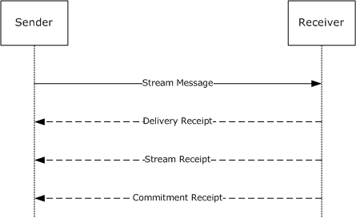

Figure 11: Stream message and multiple receipts

### 3.1.2 Timers

The protocol MUST maintain the following timers.

#### 3.1.2.1 Retransmission Timer

This session-specific timer regulates the amount of time that the protocol waits before attempting to retransmit any [**message**](#gt_message) that previously failed to receive an "HTTP 200 OK" (as a positive acknowledgment) or an "HTTP 400 Bad Request" (as an error indicating that the protocol message is malformed). This timer is used when a previous transmission attempt either times out without response at the transport layer or the sending side receives an "HTTP 5xx" server-side error.

Messages that fail to transmit remain in the OutgoingQueue (see [3.1.1.1.3](#Section_3.1.1.1.3)) until they expire or transmission is successful. The Retransmission Timer is started after protocol initialization. The duration of this timer MUST be set to **SRMPState.RetransmissionTimeout**.

#### 3.1.2.2 Stream Receipt Wait Timer

This session-specific wait timer regulates the amount of time that the protocol waits for a [**stream receipt**](#gt_stream-receipt) [**message**](#gt_message) before resending [**stream messages**](#gt_stream-message) to the remote host. This timer is started after sending the first message in a [**stream**](#gt_stream). The duration of this timer SHOULD be set based on system configuration, which is implementation-dependent.<18>

#### 3.1.2.3 Stream Receipt Coalescing Timer

This session-specific timer regulates the amount of time that the protocol waits before sending a [Stream Receipt (section 3.1.1.3.2)](#Section_3.1.1.3.2). The protocol maintains one instance of the timer per message stream.

The protocol MUST start the timer when it receives a stream message and durably stores it to disk. The timer MUST expire after 500 milliseconds. Upon expiration of the timer, the protocol MUST raise a [Stream Receipt Coalescing Timer (section 3.1.6.3)](#Section_3.1.2.3) event.

#### 3.1.2.4 Session Cleanup Timer

This session-specific timer regulates the amount of time the protocol waits before closing an idle protocol session. The duration of this timer MUST be set based on the system configuration, which is implementation-dependent.<19>

### 3.1.3 Initialization

#### 3.1.3.1 Global Initialization

The following values MUST be initialized globally:

- The **SRMPState.MessageIDHistoryTable** MUST be loaded from persistent storage. If the value does not exist in persistent storage, it MUST be set to an empty table.
- The value of **SRMPState.MessageIdOrdinal** MUST be loaded from persistent storage. If the value does not exist in persistent storage, it MUST be initialized to zero.
- The value of **SRMPState.StreamIdOrdinal** MUST be loaded from persistent storage. If the value does not exist in persistent storage, it MUST be initialized to 1.
- The **SRMPState.ResendTimerTable** SHOULD<20> be sequentially populated with these values:
- The first three entries SHOULD<21> be set to a duration of 30 seconds each.
- The next three entries SHOULD<22> be set to a duration of 5 minutes each.
- The next three entries SHOULD<23> be set to a duration of 30 minutes each.
- The last entry SHOULD<24> be set to a duration of 6 hours.
- The value of **SRMPState.RetransmissionTimeout** MUST be set based on system configuration, which is implementation-dependent.<25>
- The [Retransmission Timer](#Section_3.1.2.1) (section 3.1.2.1) MUST be started with an interval of **SRMPState.RetransmissionTimeout**.

#### 3.1.3.2 Stream Initialization

The following values MUST be initialized for [**streams**](#gt_stream):

- For each **Stream** in **SRMPState.StreamCollection**, the value of the **Stream** object MUST be loaded from persistent storage.
- The **Stream Receipt Wait Timer** (section [3.1.2.2](#Section_3.1.6.2)) MUST be disabled.
- **LastAcknowledgedStreamMessage** MUST be set to zero.
- **UnacknowledgedStreamMessages** MUST be set to an empty collection.
- **SendReceiptsTo** MUST be set to an empty string.
- **UnackedStreamMessageArrivalTime** MUST be set to zero.

### 3.1.4 Higher-Layer Triggered Events

In addition to the local events listed in section [3.1.7](#Section_1.3), the operation of the Message Queuing (MSMQ): SOAP Reliable Messaging Protocol is initiated and subsequently driven by the following higher-layer triggered event:

- Queue Manager Started ([MS-MQDMPR](#Section_1.3.2) section 3.1.4.1).

#### 3.1.4.1 Queue Manager Started

At startup, the [**QM**](#gt_queue-manager-qm) service MUST initialize the protocol as described in section [3.1.3](#Section_3.1.3).

### 3.1.5 Message Processing Events and Sequencing Rules

#### 3.1.5.1 SRMP Message Received

Unless specifically noted in a subsequent section, the following logic MUST be applied to any protocol [**message**](#gt_message) that is received from the network:

- Message deserialization.
- Handling incorrectly formatted messages.
- Error handling.
- Checking for message expiration.
- Identification and handling of message types:
- User messages.
- Delivery receipt messages.
- [**Stream receipt**](#gt_stream-receipt) messages.
- Commitment receipt messages.
- Duplicate detection.
- Inserting messages into destination [**queues**](#gt_queue).
These steps are described in detail in the following sections.

##### 3.1.5.1.1 Message Deserialization

Any SRMP [**message**](#gt_message) that is received by the [**QM**](#gt_queue-manager-qm) MUST be deserialized in the following way:

- A new instance of the **SRMPMessage** data element MUST be created.
- The *SRMPMessage.SoapCompoundMessage* attribute MUST be set to the entire contents of the incoming SRMP message, as described in [MS-MQDMPR](#Section_1.3.2) section 3.1.1.12.
- The **SRMPMessage.SoapEnvelope** attribute MUST be set to the SOAP envelope of the incoming SRMP message, as described in [MS-MQDMPR] section 3.1.1.12.
- The **SRMPMessage.SoapHeader** attribute MUST be set to the SOAP header of the incoming SRMP message, as described in [MS-MQDMPR] section 3.1.1.12.
- The **SRMPMessage.SoapBody** attribute MUST be set to the SOAP body of the incoming SRMP message, as described in [MS-MQDMPR] section 3.1.1.12.
- The **SRMPMessage.ArrivalTime** attribute MUST be set to the current system time, as described in [MS-MQDMPR] section 3.1.1.12.
- The SOAP envelope of the incoming message MUST be parsed and assigned to the attributes of the new **SRMPMessage** element as follows:
- The contents of the <path> element MUST be parsed and assigned as follows:
- The contents of the <action> element MUST be parsed and assigned as follows:
- If the string that is contained in the <action> element begins with "MSMQ:", the **SRMPMessage.Label** attribute MUST be set to the suffix of the <action> element directly following the "MSMQ:" prefix.
- If the string contained in the <action> element does not begin with "MSMQ:", the **SRMPMessage.Label** attribute MUST be set to NULL.
- The contents of the <to> element MUST be parsed and assigned as follows:
- If the string that is contained in the <to> element begins with "http://" or "https://", the **SRMPMessage.DestinationQueueFormatName** attribute MUST be set to the string that is contained in the <to> element, prepended with "DIRECT=".
- If the string that is contained in the <to> element begins with "MSMQ:MULTICAST", the **SRMPMessage.DestinationQueueFormatName** attribute MUST be set to the suffix of the <to> element directly following the "MSMQ:" prefix.
- The contents of the <id> element MUST be parsed and assigned as follows:
- A new instance of type **OBJECTID** (see [MS-MQMQ](#Section_1.3.2) section 2.2.8) MUST be instantiated.
- If the <Msmq> element is present in the message, the index component of the new OBJECTID (**OBJECTID.Uniquifier**) MUST be set to the substring of the <id> element that follows the string "uuid:" and precedes the "@" character, and then converted to a numeric value; otherwise, the **OBJECTID.Uniquifier** MUST be set to 1.
- If the <Msmq> element is present in the message, the [**GUID**](#gt_globally-unique-identifier-guid) component of the new OBJECTID (**OBJECTID.Lineage**) MUST be set to the substring of the <id> element that directly follows the "@" character; otherwise, the **OBJECTID.Lineage** MUST be set to a NULL GUID.
- The **SRMPMessage.Identifier** attribute MUST be set to the new OBJECTID.
- If present, the contents of the <rev> element MUST be parsed and assigned as follows:
- If the string that is contained in the <via> element begins with "http://" or "https://", the **SRMPMessage.ResponseQueueFormatName** attribute MUST be set to the string that is contained in the <via> element.
- If the string that is contained in the <via> element begins with "MSMQ:", the **SRMPMessage.ResponseQueueFormatName** attribute MUST be set to the suffix of the <via> element directly following the "MSMQ:" prefix.
- The contents of the <properties> element MUST be parsed and assigned as follows:
- If the <Msmq> element is not present in the message, the **SRMPMessage.TimeToReachQueue** attribute MUST be set to the time span value that is the difference between the [**UTC**](#gt_coordinated-universal-time-utc) date/time value that is contained in the <expiresAt> element and the UTC date/time value that is contained in the <sentAt> element.
- The **SRMPMessage.SentTime** attribute MUST be set to the UTC date/time value that is contained in the <sentAt> element, if present.
- The contents of the <services> element MUST be parsed and assigned as follows:
- The **SRMPMessage.DeliveryGuarantee** attribute MUST be set to **Recoverable** if the <durable/> element is present; otherwise, the attribute MUST be set to **Express**.
- If present, the contents of the <deliveryReceiptRequest> element MUST be parsed and assigned as follows:
- The **SRMPMessage.AcknowledgementsRequested** attribute MUST be extended by the AckPosArrival enumeration value if the <deliveryReceiptRequest> element is present.
- If the string that is contained in the <sendTo> element begins with "http://" or "https://", the **SRMPMessage.AdministationQueueFormatName** attribute MUST be set to the string that is contained in the <sendTo> element.
- If present, the contents of the <commitmentReceiptRequest> element MUST be parsed and assigned as follows:
- The **SRMPMessage.FinalAckRequired** attribute MUST be set to **True** if the <commitmentReceiptRequest> element is present.
- If the string that is contained in the <sendTo> element begins with "http://" or "https://", the **SRMPMessage.AdministationQueueFormatName** attribute MUST be set to the string that is contained in the <sendTo> element.
- The **SRMPMessage.AcknowledgementsRequested** attribute MUST be extended by the AckPosReceive enumeration value if the <positiveOnly/> element is present.
- The **SRMPMessage.AcknowledgementsRequested** attribute MUST be extended by the AckNegReceive enumeration value if the <negativeOnly/> element is present.
- If present, the contents of the <stream> element MUST be parsed and assigned as follows:
- The contents of the <streamId> element MUST be parsed and assigned as follows:
- The **SRMPMessage.TransactionalMessageSequenceIdentifier** attribute MUST be set to the substring of the <streamId> element directly following the "\" character.
- The **SRMPMessage.TransactionSequenceNumber** attribute MUST be set to the numeric value that is contained in the <current> element.
- The SRMPMessage.TransactionPreviousSequenceNumber attribute MUST be set to the numeric value that is contained in the <previous> element, if present.
- If present, the contents of the <start> element MUST be parsed and assigned as follows:
- If the string that is contained in the <sendReceiptsTo> element begins with "http://" or "https://", the **SRMPMessage.AdministationQueueFormatName** attribute MUST be set to the string that is contained in the <sendReceiptsTo> element.
- If present, the contents of the <Msmq> element MUST be parsed and assigned as follows:
- The **SRMPMessage.Class** attribute MUST be set to the enumeration value that is represented by the numeric value that is contained in the <Class> element.
- The **SRMPMessage.Priority** attribute MUST be set to the numeric value that is contained in the <Priority> element.
- The **SRMPMessage.PositiveJournalingRequested** attribute MUST be set to **True** if the <Journal/> element is present; otherwise, to False.
- The **SRMPMessage.NegativeJournalingRequested** attribute MUST be set to **True** if the <DeadLetter/> element is present; otherwise, to False.
- The **SRMPMessage.CorrelationIdentifier** attribute MUST be set to the value that is contained in the <Correlation> element, if present.
- The **SRMPMessage.TracingRequested** attribute MUST be set to **True** if the <Trace/> element is present; otherwise, to False.
- The **SRMPMessage.ConnectorTypeIdentifier** attribute MUST be set to the GUID that is represented by the string value that is contained in the <ConnectorType> element, if present.
- The **SRMPMessage.ApplicationTag** attribute MUST be set to the numeric value that is contained in the <App> element, if present.
- The **SRMPMessage.BodyType** attribute MUST be set to the numeric value that is contained in the <BodyType> element.
- The **SRMPMessage.HashAlgorithm** attribute MUST be set to the enumeration value that is represented by the numeric value that is contained in the <HashAlgorithm> element, if present.
- If present, the contents of the <Eod> element MUST be parsed and assigned as follows:
- The **SRMPMessage.FirstInTransaction** attribute MUST be set to **True** if the <First/> element is present; otherwise, to **False**.
- The **SRMPMessage.LastInTransaction** attribute MUST be set to **True** if the <Last/> element is present; otherwise, to **False**.
- The **SRMPMessage.ConnectorQueueManagerIdentifier** attribute MUST be set to the GUID that is represented by the string value that is contained in the <ConnectorId> element, if present.
- If present, the contents of the <Provider> element MUST be parsed and assigned as follows:
- The **SRMPMessage.AuthenticationProviderType** attribute MUST be set to the numeric value that is contained in the <Type> element.
- The **SRMPMessage.AuthenticationProviderName** attribute MUST be set to the string value that is contained in the <Name> element.
- The **SRMPMessage.SourceMachineIdentifier** attribute MUST be set to the GUID that is represented by the string value that is contained in the <SourceQmGuid> element.
- If present, the contents of the <DestinationMqf> element MUST be parsed and assigned as follows:
- A new collection of format names MUST be instantiated. For each member of the collection:
- If the string that is contained in the <DestinationMqf> element begins with "http://" or "https://", the current collection element MUST be set to the substring beginning with the "http://" or "https://" prefix and terminated by a line-break character.
- The collection index MUST be advanced by 1.
- The **SRMPMessage.DestinationMultiQueueFormatName** attribute MUST be set to the new collection of format names.
- If present, the contents of the <AdminMqf> element MUST be parsed and assigned as follows:
- A new collection of format names MUST be instantiated. For each member of the collection:
- If the string that is contained in the <AdminMqf> element begins with "http://" or "https://", the current collection element MUST be set to the substring beginning with the "http://" or "https://" prefix and terminated by a line-break character.
- The collection index MUST be advanced by 1.
- The **SRMPMessage.AdministrationMultiQueueFormatName** attribute MUST be set to the new collection of format names.
- If present, the contents of the <ResponseMqf> element MUST be parsed and assigned as follows:
- A new collection of format names MUST be instantiated. For each member of the collection:
- If the string that is contained in the <ResponseMqf> element begins with "http://" or "https://", the current collection element MUST be set to the substring beginning with the "http://" or "https://" prefix and terminated by a line-break character.
- The collection index MUST be advanced by 1.
- The **SRMPMessage.ResponseMultiQueueFormatName** attribute MUST be set to the new collection of format names.
- The **SRMPMessage.TimeToReachQueue** attribute MUST be set to the time span value that is the difference between the UTC date/time value that is contained in the <TTrq> element and the UTC date/time value that is contained in the <sentAt> element.

##### 3.1.5.1.2 Handling Incorrectly Formatted Messages

If the protocol receives a request that does not conform to the structures outlined in section [2](#Section_2), it detects the error during [**message**](#gt_message) deserialization. The protocol MUST discard the received packet and perform no further processing for it. The protocol MUST return "HTTP 400 Bad Request" to the sender.

##### 3.1.5.1.3 Redirection and Error Handling

The protocol MUST perform the following steps:

- If **SRMPMessage.DestinationQueueFormatName** begins with "MULTICAST" and **SRMPMessage.DestinationQueueFormatName** does not correspond to a queue in **QueueManager.QueueCollection**, the protocol MUST disregard the message and perform no further processing.
- If **SRMPMessage.DestinationQueueFormatName** does not begin with "MULTICAST":
- If the host part of the format name in **SRMPMessage.DestinationQueueFormatName**, as defined in [MS-MQMQ](#Section_1.3.2) section 2.1.2, does not represent the local machine:
- If **TransparentStoreAndForward** is FALSE, the protocol MUST disregard the message and perform no further processing. Otherwise:
- The protocol MUST generate an Open Queue ([MS-MQDMPR](#Section_1.3.2) section 3.1.7.1.5) event with the following arguments:
- *iFormatName* := **SRMPMessage.DestinationQueueFormatName**
- *iRequiredAccess* := **QueueAccessType.SendAccess**
- *iSharedMode* := **QueueShareMode.DenyNone**
- If the *rStatus* returned by the Open Queue event is not MQ_OK (0x00000000), the protocol MUST perform no further processing; otherwise, the protocol MUST generate an Enqueue Message To An Open Queue ([MS-MQDMPR] section 3.1.7.1.27) event with the following arguments:
- *iOpenQueueDescriptor* := the *rOpenQueueDescriptor* returned by the Open Queue event
- *iMessage* := **SRMPMessage**
- The protocol MUST perform no further processing.
- Let MessageDestination be a format name that represents the queue that is the final destination of the message, initialized to be the value of **SRMPMessage.DestinationQueueFormatName**.
- The value of MessageDestination with the "DIRECT=" prefix removed MUST be checked against the URLs in the **From** attributes of the **Redirection** elements in the [InboundRedirectionCollection (section 3.1.1.1.10.2)](#Section_3.1.1.1.10.2). If a match is found, MessageDestination MUST be set to the value of the **To** attribute of the **Redirection** element that had the matching **From** attribute, prepended with "DIRECT=".
- If the host part of the format name in MessageDestination, as defined in [MS-MQMQ] section 2.1.2, does not represent the local machine:
- The protocol MUST generate an Open Queue ([MS-MQDMPR] section 3.1.7.1.5) event with the following arguments:
- *iFormatName* := **MessageDestination**
- *iRequiredAccess* := **QueueAccessType.SendAccess**
- *iSharedMode* := QueueShareMode.DenyNone
- If the *rStatus* returned by the Open Queue event is not MQ_OK (0x00000000), the protocol MUST perform no further processing; otherwise, the protocol MUST generate an Enqueue Message To An Open Queue ([MS-MQDMPR] section 3.1.7.1.27) event with the following arguments:
- *iOpenQueueDescriptor* := the *rOpenQueueDescriptor* returned by the Open Queue event
- *iMessage* := **SRMPMessage**
- The protocol MUST perform no further processing.
- If MessageDestination does not correspond to a queue in **QueueManager.QueueCollection**, the protocol MUST disregard the message and perform no further processing.
- A [**stream message**](#gt_stream-message) can be delivered only to a [**transactional queue**](#gt_transactional-queue), that is, **Queue.Transactional = True**. If the [**message**](#gt_message) contains the <stream> element and is addressed to a nontransactional queue in **QueueManager.QueueCollection**, the protocol MUST disregard the message and perform no further processing.
- A nonstream message can be delivered only to a nontransactional queue, that is, **Queue.Transactional = False**. If the message does not contain the <stream> element and is addressed to a transactional queue in **QueueManager.QueueCollection**, the protocol MUST disregard the message and perform no further processing.
- If the message is rejected for any of the previous reasons, the protocol MUST return the "HTTP 400 Bad Request" error message to the sender.

##### 3.1.5.1.4 Checking Message Expiration

To control [**message**](#gt_message) lifetime, a message can contain a <[TTrq](#Section_2.2.6.17)> element in the <[Msmq](#Section_1.3)> element or the <[expiresAt](#Section_2.2.5.1.1)> element in the <[properties](#Section_2.2.5.1)> element. Both these elements are deserialized to the **SRMPMessage.TimeToReachQueue** attribute, with the <TTrq> element taking precedence, if it is present in the message. The protocol checks this value while sending a message, as specified in section [3.1.7.2.1](#Section_3.1.7.2.1); it is not checked while processing a received message.

##### 3.1.5.1.5 Identifying the Message Type

A [**message**](#gt_message) is identified by inspecting the contents of its SOAP <header> element (see section [2.2.2](#Section_2.2.2)). The following section describes how to identify each message type. Any message that does not match one of the types defined below MUST be ignored. For details about message class identifiers, see [MS-MQMQ](#Section_1.3.2) section 2.2.18.1.6.

If the <Class> element of the <Msmq> element is set to MQMSG_CLASS_NORMAL and the <deliveryReceipt>, <streamReceipt>, and <commitmentReceipt> elements are not present, the message is a User message and MUST be processed according to [User Message Processing (section 3.1.5.1.6)](#Section_3.1.5.1.6).

If the <deliveryReceipt> element is present, the <streamReceipt> and <commitmentReceipt> elements are not present, and the <Class> element of the <Msmq> element is set to MQMSG_CLASS_ACK_REACH_QUEUE, the message is a Delivery receipt message and MUST be processed according to [Delivery Receipt Message Processing (section 3.1.5.1.7)](#Section_3.1.5.1.7).

If the <streamReceipt> element is present, the <deliveryReceipt> and <commitmentReceipt> elements are not present, the <action> element of the <path> element is set to "MSMQ:QM Ordering Ack", and the <Class> element of the <Msmq> element is set to MQMSG_CLASS_ORDER_ACK, the message is a Stream receipt message and MUST be processed according to [Stream Receipt Message Processing (section 3.1.5.1.8)](#Section_3.1.5.1.8).

If the <streamReceipt> element is present, the <commitmentReceipt> element is present, the <deliveryReceipt> element is not present, the <action> element of the <path> element is set to "MSMQ:QM Ordering Ack", and one of the following is true, the message is a Final stream receipt message and MUST be processed according to [Final Stream Receipt Message Processing (section 3.1.5.1.9)](#Section_3.1.5.1.9).

- The <Class> element of the <Msmq> element is set to MQMSG_CLASS_ACK_RECEIVE and the <decision> element contains the string "positive".
- The <Class> element of the <Msmq> element is set to MQMSG_CLASS_NACK_DELETED, the <decision> element contains the string "negative", and the remote [**queue**](#gt_queue) was purged by an administrative action before being received, as specified in [MS-MQRR](#Section_1.3.2) section 3.2.4.7.
- The <Class> element of the <Msmq> element is set to MQMSG_CLASS_NACK_Q_DELETED, the <decision> element contains the string "negative", and the original message was deleted from the destination queue because the queue was deleted.
- The <Class> element of the <Msmq> element is set to MQMSG_CLASS_NACK_Q_PURGED, the <decision> element contains the string "negative", and the original message was deleted from the destination queue because the queue was purged.
- The <Class> element of the <Msmq> element is set to MQMSG_CLASS_NACK_RECEIVE_TIMEOUT and the <decision> element contains the string "negative" and the original message was deleted from the destination queue because the message expired.
If the <commitmentReceipt> element is present, the <streamReceipt> and <deliveryReceipt> elements are not present, and one of the following is true, the message is a Commitment receipt message and MUST be processed according to [Commitment Receipt Message Processing (section 3.1.5.1.10)](#Section_3.1.5.1.10).

- The <Class> element of the <Msmq> element is set to MQMSG_CLASS_ACK_RECEIVE and the <decision> element contains the string "positive".
- The <Class> element of the <Msmq> element is set to MQMSG_CLASS_NACK_DELETED, the <decision> element contains the string "negative", and the remote queue was purged by an administrative action before being received, as specified in [MS-MQRR] section 3.2.4.7.
- The <Class> element of the <Msmq> element is set to MQMSG_CLASS_NACK_Q_DELETED, the <decision> element contains the string "negative", and the original message was deleted from the destination queue because the queue was deleted.
- The <Class> element of the <Msmq> element is set to MQMSG_CLASS_NACK_Q_PURGED, the <decision> element contains the string "negative", and the original message was deleted from the destination queue because the queue was purged.
- The <Class> element of the <Msmq> element is set to MQMSG_CLASS_NACK_RECEIVE_TIMEOUT, the <decision> element contains the string "negative", and the original message was deleted from the destination queue because the message expired.

##### 3.1.5.1.6 User Message Processing

A user [**message**](#gt_message) contains an application-defined message that is sent from the remote host. Processing a user message is done in the following order, depending on the type of user message:

- Security: Checking the message signature
- Processing regular and [**durable messages**](#gt_durable-message)
- Processing [**stream messages**](#gt_stream-message)
- Processing **IncomingTransactionalTransferInfo**
The previous steps are followed by the final two steps of this section:

- Duplicate detection (see section [3.1.5.1.11](#Section_3.1.5.1.11))
- Inserting the message into its destination [**queue**](#gt_queue) (see section [3.1.5.1.12](#Section_3.1.5.1.12))
The protocol MUST perform all these steps, which are described in greater detail in the following sections, in order to process a user message.

###### 3.1.5.1.6.1 Checking Message Signature

If **Message.AuthenticationLevel** ([MS-MQDMPR](#Section_1.3.2) section 3.1.1.12) equals **XmlSig**, the protocol MUST perform the following actions:

- If the <Signature> element is not present, the protocol MUST disregard the message and perform no further processing.
- If the <Signature> element is present and the <SignedInfo> element of the <Signature> element is not present, the protocol MUST disregard the message and perform no further processing.
- If the <SignedInfo> element is present and the <SignatureMethod> element of the <SignedInfo> element is not present, the protocol MUST disregard the message and perform no further processing.
- If the <SignatureMethod> element is present and the Algorithm attribute of the <SignatureMethod> element does not equal "http://www.w3.org/2000/02/xmldsig#dsa", the protocol MUST disregard the message and perform no further processing.
- If the <SignedInfo> element is present and the <Reference> element of the <SignedInfo> element is not present, the protocol MUST disregard the message and perform no further processing.
- If the <SignedInfo> element is present and the <Reference> element of the <SignedInfo> element is present three times or more, the protocol MUST disregard the message and perform no further processing.
- If the <Reference> element is present, the **URI** attribute of the <SignatureMethod> element contains the string "cid:body", and the message does not contain a <Body> element, the protocol MUST disregard the message and perform no further processing.
- If the <Reference> element is present, the **URI** attribute of the <SignatureMethod> element contains the string "cid:extension", and the message does not contain an <Extension> element, the protocol MUST disregard the message and perform no further processing.
- If the <SignedInfo> element is present, two <Reference> elements of the <SignedInfo> element are present, and both contain the string "cid:body", the protocol MUST disregard the message and perform no further processing.
- If the <SignedInfo> element is present, two <Reference> elements of the <SignedInfo> element are present, and both contain the string <cid:extension>, the protocol MUST disregard the message and perform no further processing.
- If the <Reference> element is present and the <DigestMethod> element of the <Reference> element is not present, the protocol MUST disregard the message and perform no further processing.
- If the <DigestMethod> element is present and the **Algorithm** attribute of the <DigestMethod> element does not equal "http://www.w3.org/2000/02/xmldsig#sha1" or "http://www.w3.org/2000/02/xmldsig#md5", the protocol MUST disregard the message and perform no further processing.
- If the <Reference> element is present and the <DigestValue> element of the <Reference> element is not present, the protocol MUST disregard the message and perform no further processing.
- If the **Algorithm** attribute of the <DigestMethod> element equals "http://www.w3.org/2000/02/xmldsig#md5" and the **URI** attribute of the <SignatureMethod> element contains the string "cid:body", the protocol MUST use the MD5 algorithm (see [[RFC1321]](https://go.microsoft.com/fwlink/?LinkId=90275)) to calculate a 128-bit digest of the <Body> element of the message and base64-encode the digest into a 24-character stream. If that octet stream does not equal the value of the <DigestValue> element, the protocol MUST disregard the message and perform no further processing.
- If the **Algorithm** attribute of the <DigestMethod> element equals "http://www.w3.org/2000/02/xmldsig#sha1" and the **URI** attribute of the <SignatureMethod> element contains the string "cid:body", the protocol MUST use the SHA1 algorithm (see [[RFC3174]](https://go.microsoft.com/fwlink/?LinkId=90408)) to calculate a 160-bit digest of the <Body> element of the message and base64-encode the digest into a 28-character stream. If that octet stream does not equal the value of the <DigestValue> element, the protocol MUST disregard the message and perform no further processing.
- If the **Algorithm** attribute of the <DigestMethod> element equals "http://www.w3.org/2000/02/xmldsig#md5" and the **URI** attribute of the <SignatureMethod> element contains the string "cid:extension", the protocol MUST use the MD5 algorithm specified in [RFC1321] to calculate a 128-bit digest of the <Extension> element of the message and base64-encode the digest into a 24-character stream. If that octet stream does not equal the value of the <DigestValue> element, the protocol MUST disregard the message and perform no further processing.
- If the **Algorithm** attribute of the <DigestMethod> element equals "http://www.w3.org/2000/02/xmldsig#sha1" and the **URI** attribute of the <SignatureMethod> element contains the string "cid:extension", the protocol MUST use the SHA1 algorithm (see [RFC3174]) to calculate a 160-bit digest of the <Extension> element of the message and base64-encode the digest into a 28-character stream. If that octet stream does not equal the value of the <DigestValue> element, the protocol MUST disregard the message and perform no further processing.
- If the <Signature> element is present and the <SignatureValue> element of the <Signature> element is not present, the protocol MUST disregard the message and perform no further processing.
- The protocol MUST use the DSA algorithm (see [[FIPS186]](https://go.microsoft.com/fwlink/?LinkId=89869)) to calculate the 512-bit signature of the <SignedInfo> element using the public key contained in the **UserMessage.SecurityHeader.SecurityData.SenderCert** certificate and then base64-encode the digest into an 88-character stream. If that stream does not equal the value of <SignatureValue>, the protocol MUST disregard the message and perform no further processing.

###### 3.1.5.1.6.2 Processing Regular and Durable Messages

If the <[durable/](#Section_2.2.5.2.1)> element in the <[services](#Section_2.2.5.2)> element is present, or if the <[stream](#Section_3.1.1.1.6)> element is present, the protocol MUST save the [**message**](#gt_message) to disk.

If the <[deliveryReceiptRequest](#Section_2.2.5.2.2)> element is present in the message, the protocol MUST create a delivery receipt (see section [3.1.1.3.1](#Section_3.1.1.3.1)) to acknowledge that the message was received and durably stored. The delivery receipt MUST be addressed to the administration queue of the message sender by setting the <to> element of the delivery receipt to the value of **SRMPMessage.AdministationQueueFormatName**. The <receivedAt> child element of the <deliveryReceipt> element of the delivery receipt MUST be set to **SRMPMessage.ArrivalTime**. The <id> child element of the <deliveryReceipt> element of the delivery receipt MUST be set to **SRMPMessage.Identifier**. The delivery receipt MUST be sent to the remote host as specified in section [3.1.7.2.5](#Section_3.1.7.2.5).

###### 3.1.5.1.6.3 Processing Stream Messages

[**Stream messages**](#gt_stream-message) that are duplicates or are out of order are rejected. If the [**message**](#gt_message) does not satisfy one of the following criteria, then it is either a duplicate or out of order and MUST be ignored. No further processing is performed.

- The [<stream>](#Section_3.1.1.1.6) element contains the <[start](#Section_2.2.5.3.4)> element, its <current> element is set to 1, and its <[streamId](#Section_2.2.5.3.1)> element is not equal to **Stream.IncomingId**.
OR

- The <streamId> element is equal to **Stream.IncomingId**, and its <current> element is equal to **Stream.IncomingSequenceNumber** + 1.
OR

- The <streamId> element is equal to **Stream.IncomingId**, its <current> element is greater than **Stream.IncomingSequenceNumber**, and its <[previous](#Section_2.2.5.3.3)> element is less than or equal to **Stream.IncomingSequenceNumber**.
If the message was not rejected, the protocol MUST perform the following steps:

- If the <stream> element contains the <start> element, and its <current> element is set to 1, the protocol MUST set **Stream.IncomingId** to the content of the message's <streamId> element.
- The protocol MUST set **Stream.IncomingSequenceNumber** to the <current> value of the message.
- The protocol MUST set **Stream.SendReceiptsTo** to the URI in the <sendReceiptsTo> element of the <start> element of the first stream message.
- The protocol MUST add the received stream message to **Stream.UnacknowledgedStreamMessages**.
- If **Stream.UnackedStreamMessageArrivalTime** equals zero, the protocol MUST set **Stream.UnackedStreamMessageArrivalTime** to the current system time.
- If the [Stream Receipt Coalescing Timer (section 3.1.2.3)](#Section_3.1.2.3) is running, the protocol MUST stop the Stream Receipt Coalescing Timer.
- If the current system time – **Stream.UnackedStreamMessageArrivalTime** is equal to or greater than 10 seconds, the protocol MUST perform the following actions:
- The protocol MUST raise the [Stream Receipt Coalescing Timer (section 3.1.6.3)](#Section_3.1.2.3) event.
- The protocol MUST set **Stream.UnackedStreamMessageArrivalTime** to zero.
- The protocol MUST perform no further actions.
- The protocol MUST start the Stream Receipt Coalescing Timer.

###### 3.1.5.1.6.4 Processing IncomingTransactionalTransferInfo

For incoming [**stream messages**](#gt_stream-message), the following steps MUST be taken:

- Let **QueueName** be the substring of **SRMPMessage.DestinationQueueFormatName** that follows "MSMQ/".
- Let the destination [**queue**](#gt_queue) be selected from **QueueManager.QueueCollection**, where **QueueName** equals the substring of **Queue.Pathname** with all characters up to the first "\" removed.
- The **IncomingTransactionalTransferInfo** object MUST be selected from the **Queue.IncomingTransactionalTransferInfoCollection** of the destination queue, where **IncomingTransactionalTransferInfo.SequenceIdentifier** equals **Stream.IncomingId**. If this object does not exist, it MUST be created. The following attributes in the object MUST be assigned as follows:
- **QueueReference:** This attribute MUST be set to refer to the destination queue that is addressed by **SRMPMessage.DestinationQueueFormatName**.
- **FormatName:** This attribute MUST be set to **SRMPMessage.DestinationQueueFormatName**.
- **SenderIdentifier:** This attribute MUST be set to **SRMPMessage.SourceMachineIdentifier**.
- **SequenceIdentifier:** This attribute MUST be set to **Stream.IncomingId**.
- **SequenceNumber:** This attribute MUST be set to **Stream.IncomingSequenceNumber**.
- **LastAccessTime:** This attribute MUST be set to the current system time.
- **RejectCount:** If the [**message**](#gt_message) is rejected for any of the previously stated reasons, **RejectCount** MUST be incremented by 1. If the message is accepted, **RejectCount** MUST be set to zero.

##### 3.1.5.1.7 Delivery Receipt Message Processing

The protocol MUST perform the following steps to process a delivery receipt [**message**](#gt_message):

- Duplicate detection (see section [3.1.5.1.11](#Section_3.1.5.1.11)).
- Inserting the message into its destination [**queue**](#gt_queue) (see section [3.1.5.1.12](#Section_3.1.5.1.12)).
No specific steps for processing a delivery receipt message are required; in particular, there is no correlation of the original message requesting the delivery receipt.

##### 3.1.5.1.8 Stream Receipt Message Processing

The protocol MUST perform the following steps to process a [**stream receipt**](#gt_stream-receipt) [**message**](#gt_message):

- Marking acknowledged messages.
- Processing OutgoingTransferInfo.
- Deleting acknowledged messages.
- [**Source journaling**](#gt_source-journaling).
- Duplicate detection (see section [3.1.5.1.11](#Section_3.1.5.1.11)).
- Inserting the message into its destination [**queue**](#gt_queue) (see section [3.1.5.1.12](#Section_3.1.5.1.12)).

###### 3.1.5.1.8.1 Marking Acknowledged Messages

The protocol MUST locate the **Stream** element that corresponds to the incoming [**stream receipt**](#gt_stream-receipt) by selecting it from **SRMPState.StreamCollection**, where **Stream.Id** equals the <streamId> element in the <[streamReceipt](#Section_2.2.5.6)> element. The protocol MUST dereference the **Stream.OutgoingQueueReference** to find the **OutgoingQueue** that contains the [**stream messages**](#gt_stream-message) that are acknowledged by the incoming stream receipt.

The protocol MUST set the **SRMPMessage.AwaitingStreamReceipt** field to **False** for all entries in the **OutgoingQueue** where:

- The **SRMPMessage.TransactionalMessageSequenceIdentifier** element equals the substring of the <streamId> element in the <streamReceipt> element directly following the "\" character; and
- The **SRMPMessage.TransactionSequenceNumber** is greater than zero, and is less than or equal to, the <lastOrdinal> element in the <streamReceipt> element.

###### 3.1.5.1.8.2 Processing OutgoingTransferInfo

The protocol MUST dereference the **OutgoingQueue.OutgoingTransferInfoReference** to retrieve the corresponding **OutgoingTransferInfo** object.

The protocol MUST set the **OutgoingTransferInfo.EodLastAckTime** to the local system time.

If the value of **OutgoingTransferInfo.EodLastAck.SeqNo** is less than the value of the <lastOrdinal> element of the incoming [**stream receipt**](#gt_stream-receipt), the protocol MUST set the **OutgoingTransferInfo.EodLastAck.SeqNo** to the value of the <lastOrdinal> element.

The **OutgoingTransferInfo.EodLastAckCount** MUST be incremented by 1.

For each [**message**](#gt_message) that is marked as acknowledged by setting **SRMPMessage.AwaitingStreamReceipt** to **False**, the protocol MUST decrement **OutgoingTransferInfo.EodNoAckCount** by 1.

For each message that is marked as acknowledged by setting **SRMPMessage.AwaitingStreamReceipt** to **False**, the protocol MUST increment **OutgoingTransferInfo.EodNoReadCount** by 1.

After updating, if the counter **OutgoingTransferInfo.EodNoAckCount** is greater than zero, the protocol MUST select the first message in the **OutgoingQueue**, where **SRMPMessage.TransactionSequenceNumber** is greater than zero, and **SRMPMessage.AwaitingStreamReceipt** is set to TRUE. The protocol MUST set the **OutgoingTransferInfo.EodFirstNonAck** attribute to a new **SEQUENCE_INFO** structure (as specified in [MS-MQMQ](#Section_1.3.2) section 2.2.5) where:

- **SeqID** MUST be set to the **SRMPMessage.TransactionalMessageSequenceIdentifier** of the selected message.
- **SeqNo** MUST be set to the **SRMPMessage.TransactionSequenceNumber** of the selected message.
- **PrevNo** MUST be set to the **SRMPMessage.TransactionPreviousSequenceNumber** of the selected message.
After updating, if the counter **OutgoingTransferInfo.EodNoAckCount** is equal to zero, the protocol MUST delete the contents of **OutgoingTransferInfo.EodFirstNonAck** and **OutgoingTransferInfo.EodLastNonAck**.

The **Stream.ResendIntervalIndex** MUST be incremented by 1. If the new value is greater than the number of entries in the **SRMPState.ResendTimerTable**, it MUST be set to the index of the last table entry.

The **OutgoingTransferInfo.EodResendInterval** MUST be set to the value at the index that corresponds to **Stream.ResendIntervalIndex** in the **SRMPState.ResendTimerTable**.

###### 3.1.5.1.8.3 Deleting Acknowledged Messages

The protocol MUST delete all elements from the **OutgoingQueue** where **SRMPMessage.TransactionSequenceNumber** is greater than zero, **SRMPMessage.AwaitingStreamReceipt** is set to **False**, and **SRMPMessage.AwaitingFinalStreamReceipt** is set to **False** by performing the following steps:

- Raise a Message Position Deleted event as defined in [MS-MQDMPR](#Section_1.3.2) section 3.1.7.2.1 for each such message with the following arguments:
- *iQueue*: A reference to the **OutgoingQueue**.
- *iPosition*: The **MessagePosition** of the message.
- *iReason*: **AckReachQueue** ([MS-MQDMPR] section 3.1.1.12).
- Raise a [Stream Element Removed event (section 3.1.7.6)](#Section_2.2.5.3) with the following argument:
- *iQueue*: A reference to the **OutgoingQueue**.

###### 3.1.5.1.8.4 Source Journaling

A stream [**message**](#gt_message) that is deleted from the **OutgoingQueue** with the <Journal/> element present in the <Msmq> element MUST be moved to the system [**queue journal**](#gt_queue-journal) as specified in section [3.1.5.2.2](#Section_3.1.5.2.2).

##### 3.1.5.1.9 Final Stream Receipt Message Processing

The protocol MUST perform the following steps to process a final stream receipt [**message**](#gt_message):

- Deleting acknowledged messages.
- Processing **OutgoingTransferInfo**.
- Deadlettering.

###### 3.1.5.1.9.1 Deleting Acknowledged Messages

The protocol MUST locate the **Stream** element that corresponds to the incoming final stream receipt by selecting it from **SRMPState.StreamCollection**, where **Stream.Id** equals the <streamId> element in the <streamReceipt> element. If no such **Stream** element can be found, the protocol MUST discard the final stream receipt message and perform no further action.

The protocol MUST dereference the **Stream.OutgoingQueueReference** to find the **OutgoingQueue** that contains the stream messages that are acknowledged by the incoming stream receipt.

The protocol MUST identify the message from the **OutgoingQueue** where:

- The **SRMPMessage.TransactionalMessageSequenceIdentifier** element equals the substring of the <streamId> element in the <streamReceipt> element directly following the "\" character.
- The **SRMPMessage.TransactionSequenceNumber** is equal to the <lastOrdinal> element in the <streamReceipt> element.
If no such message can be found, the protocol MUST discard the final stream receipt message and perform no further action.

The protocol MUST delete the identified message from the **OutgoingQueue** by raising a Message Position Deleted event as defined in [MS-MQDMPR](#Section_1.3.2) section 3.1.7.2.1 with the following arguments:

- *iQueue*: A reference to the **OutgoingQueue**.
- *iPosition*: The **MessagePosition** of the identified message.
- *iReason*: AckReceive ([MS-MQDMPR] section 3.1.1.12).
The protocol MUST raise a [Stream Element Removed Event (section 3.1.7.6)](#Section_2.2.5.3) with the following argument:

- *iQueue*: A reference to the **OutgoingQueue**.

###### 3.1.5.1.9.2 Processing OutgoingTransferInfo

The protocol MUST dereference the **OutgoingQueue.OutgoingTransferInfoReference** to retrieve the corresponding **OutgoingTransferInfo** object.

For each [**message**](#gt_message) that is deleted from the **OutgoingQueue**, the protocol MUST decrement **OutgoingTransferInfo.EodNoReadCount** by 1.

###### 3.1.5.1.9.3 Deadlettering

A [**stream message**](#gt_stream-message) that is deleted from the **OutgoingQueue** with the <[DeadLetter/](#Section_2.2.6.4)> element present in the <Msmq> element MUST be dead-lettered as specified in section [3.1.5.2.1.2](#Section_3.1.5.2.1.2).

##### 3.1.5.1.10 Commitment Receipt Message Processing

The protocol MUST perform the following steps to process a commitment receipt message:

- Duplicate detection (see section [3.1.5.1.11](#Section_3.1.5.1.11)).
- Inserting the [**message**](#gt_message) into its destination [**queue**](#gt_queue) (see section [3.1.5.1.12](#Section_3.1.5.1.12)).
No specific steps for processing a commitment receipt message are required; in particular, no correlation of the original message requesting the commitment receipt.

##### 3.1.5.1.11 Detecting Duplicates

If the value that is contained in the **SRMPMessage.Identifier.Lineage** is equal to a NULL [**GUID**](#gt_globally-unique-identifier-guid) and **SRMPMessage.Identifier.Uniquifier** is equal to 1, duplicate detection MUST be bypassed.

Otherwise, if the value that is contained in the **SRMPMessage.Identifier** exists in the **SRMPState.MessageIdHistoryTable**, the protocol MUST discard this [**message**](#gt_message) and perform no further processing; otherwise, the value that is contained in the **SRMPMessage.Identifier** MUST be inserted into the **SRMPState.MessageIdHistoryTable**.

##### 3.1.5.1.12 Inserting a Message into Its Destination Queue

The protocol MUST perform an access check to authorize access to the queue that is addressed by **SRMPMessage.DestinationQueueFormatName**, using the following logic:

- The protocol MUST declare the destinationQueue variable and set it equal to the **Queue** specified by **SRMPMessage.DestinationQueueFormatName**.
- The protocol MUST declare the queueSecurityDescriptor variable and set it equal to destinationQueue.**Security**.
- If destinationQueue.**QueueType** = Public, the destinationQueue security descriptor MUST be queried from the directory by raising a Read Directory ([MS-MQDMPR](#Section_1.3.2) section 3.1.7.1.20) event with the following arguments:
- *iDirectoryObjectType*: "Queue"
- *iFilter*: "Identifier" EQUALS destinationQueue.**Identifier**
- If the query returns an *rStatus* value that is not equal to **DirectoryOperationResult.Success**, the protocol MUST disregard the message and perform no further processing.
- The protocol MUST set queueSecurityDescriptor equal to *rDirectoryObject*.**Security**.
- The protocol MUST declare the **userSID** variable and set it to the well-known **SID** with string representation S-1-1-0 (relative identifier SECURITY_WORLD_RID combined with identifier authority SECURITY_WORLD_SID_AUTHORITY).
- The protocol MUST perform an access check by invoking the Access Check Algorithm ([MS-DTYP](../MS-DTYP/MS-DTYP.md) section 2.5.3.2) with the following parameters:
- *SecurityDescriptor*: queueSecurityDescriptor
- *Token*: Perform the following actions to generate a token to represent the sender's authorization data. If any failure occurs in these actions, the protocol MUST continue as if access_denied is returned from the Access Check Algorithm.
- Construct an RPC binding to the Local Security Authority (Translation Methods) Remote Protocol server on the local machine ([MS-LSAT](#Section_5) section 2.1).
- Invoke the **LsarOpenPolicy (Opnum 6)** method ([MS-LSAT] section 3.1.4.2) to obtain a policy handle with the *DesiredAccess* parameter set to POLICY_LOOKUP_NAMES.
- Invoke the **LsarLookupSids (Opnum 15)** method ([MS-LSAT] section 3.1.4.11) to obtain the account name of the message sender with the following parameters:
- *PolicyHandle*: the policy handle obtained in the preceding step.
- *SidEnumBuffer*: contains one **SID**, which is userSID.
- *ReferencedDomains*: a pointer to a **PLSAPR_REFERENCED_DOMAIN_LIST** structure ([MS-LSAT] section 2.2.12).
- *TranslatedNames*: a pointer to a **PLSAPR_TRANSLATED_NAMES** structure ([MS-LSAT] section 2.2.20). The sender's account name is placed in this parameter on successful return from **LsarLookupSids**.
- *LookupLevel*: LsapLookupWksta.
- *MappedCount*: A pointer to an unsigned long integer.
- Invoke the **LsarClose (Opnum 0)** method ([MS-LSAT] section 3.1.4.3) to close the policy handle.
- Use the sender's account name to obtain its Privilege Attribute Certificate (PAC), [MS-PAC](../MS-PAC/MS-PAC.md) as specified in [MS-SFU](../MS-SFU/MS-SFU.md) section 3.1.5.1.1.2.
- Create a token and populate its **Sids[]** field with the **SIDs** of the user, the user's primary group and other groups contained in the PAC ([MS-PAC] section 2.5). The **KERB_VALIDATION_INFO.LogonDomainId** is used to construct the **SIDs** from relative identifiers.
- *Access Request mask*: **MQSEC_WRITE_MESSAGE** ([MS-MQMQ](#Section_1.3.2) section 2.2.25).
- *Object Tree*: NULL
- *PrincipalSelfSubst SID*: NULL
- If the Access Check Algorithm does not return success, the protocol MUST disregard the message and perform no further processing.
The protocol MUST insert a message into its destination queue by generating the Enqueue Message ([MS-MQDMPR] section 3.1.7.1.9) event with the following arguments:

- *iQueue*: A reference to the **Queue** ADM element instance that is addressed by **SRMPMessage.DestinationQueueFormatName**.
- *iMessage*: A reference to the **SRMPMessage** element.
If *rStatus* returned by the Enqueue Message event is not zero:

- If *rStatus* is 1, indicating that the **Quota** ADM attribute of the **Queue** ADM element instance referenced by *iQueue* would be exceeded, the protocol MUST disregard the message.
- If *rStatus* is 2, indicating that the **QueueManagerQuota** ADM attribute of the local **QueueManager** ADM element instance would be exceeded, the protocol MUST disregard the message and return the "HTTP 500 Internal Server Error" error message to the sender.

#### 3.1.5.2 Source Journal Message Processing

[**Messages**](#gt_message) MUST be journaled using the logic described in the following sections.

##### 3.1.5.2.1 Negative Source Journaling

If the <DeadLetter/> element is present in the <Msmq> element, the protocol MUST deadletter messages as described in the following sections.

###### 3.1.5.2.1.1 Nonstream Messages

If the [**message**](#gt_message) expires or is purged from the destination [**queue**](#gt_queue) before reaching the receiving application, the message MUST be moved to the system [**dead-letter queue**](#gt_dead-letter-queue). This is achieved by generating the Move Message event (see [MS-MQDMPR](#Section_1.3.2) section 3.1.7.1.16) with the following parameters:

- *iMessagePos*: A reference to the **MessagePosition** in the queue from which the message was deleted (that is, the *iPosition* argument of the [Message Position Deleted](#Section_3.1.7.3) event).
- *iTargetQueue*: **QueueManager.SystemDeadletterQueue**
The dead-letter queues are system-generated and implementation-dependent.<26>

###### 3.1.5.2.1.2 Stream Messages

A [**stream message**](#gt_stream-message) [SRMPMessage (section 3.1.1.1.4)](#Section_3.1.1.1.4) that is deleted from the **OutgoingQueue** with the <DeadLetter/> element present in the <Msmq> element MUST be moved to a transactional [**dead-letter queue**](#gt_dead-letter-queue) if the <decision> element in the <commitmentReceipt> element contains the string "negative".

The dead-letter queue can be the system transactional dead-letter queue or an application-specified [**transactional queue**](#gt_transactional-queue). If **SRMPMessage.ApplicationDeadletterQueue** is set and matches the path name of a Queue object in **QueueManager.QueueCollection** and that **Queue.Transactional** attribute is equal to True, use that Queue object as the dead-letter queue; otherwise use **QueueManager.SystemTransactionalDeadletterQueue** as the dead-letter queue.

Move the message to the dead-letter queue by generating the Move Message event (see [MS-MQDMPR](#Section_1.3.2) section 3.1.7.1.16) with the following parameters:

- *iMessagePos*: A reference to the **MessagePosition** in the **OutgoingQueue** from which the message was deleted.
- *iTargetQueue*: The dead-letter queue chosen in the preceding step.
The system transactional dead-letter queue is system-generated and implementation-dependent.<27>

##### 3.1.5.2.2 Positive Source Journaling

A [**message**](#gt_message) that is deleted from the **OutgoingQueue** with the <Journal/> element present in the <Msmq> element MUST be moved to the system [**queue journal**](#gt_queue-journal).

This is achieved by generating the Move Message event (see [MS-MQDMPR](#Section_1.3.2) section 3.1.7.1.16) with the following parameters:

- *iMessagePos*: A reference to the **MessagePosition** in the **OutgoingQueue** from which the message was deleted.
- *iTargetQueue*: **QueueManaer.SystemJournalQueue.**
The queue journal is system-generated and implementation-dependent.<28>

### 3.1.6 Timer Events

The following timer events are internal to this protocol.

#### 3.1.6.1 Retransmission Timer

This event MUST be generated with the following arguments:

- None
**Return Values**:

- None
This event indicates a periodic time-out in order to retransmit [**messages**](#gt_message) that failed in previous transmission attempts.

If *iQueue*.**MessagePositionList** is not empty, the protocol MUST perform the following:

- If *iQueue*.**State** is **Disconnected**, raise an [Establish Transport Connection (section 3.1.7.9)](#Section_2.1) event with the following argument:
- *iOutgoingQueue* := The **OutgoingQueue** ADM element instance for this session.
- For each **MessagePosition** ADM element instance in *iQueue*.**MessagePositionList**, the Add Message To Dispatch Collection ([MS-MQDMPR](#Section_1.3.2) section 3.1.7.1.28) event MUST be raised with the following arguments:
- *iPosition* := A reference to the **MessagePosition**
- *iData* := NULL
The protocol MUST restart the **Retransmission Timer** if it is in the stopped state.

#### 3.1.6.2 Stream Receipt Wait Timer

This event MUST be generated with the following arguments:

- None
**Return Values**:

- None
This event indicates a time-out while waiting for a [**stream receipt**](#gt_stream-receipt) from the remote host. When the Stream Receipt Wait Timer (section [3.1.2.2](#Section_3.1.6.2)) fires, the protocol MUST retransmit all [**messages**](#gt_message) in the **OutgoingQueue** that have **SRMPMessage.TransactionSequenceNumber** greater than zero, **SRMPMessage.AwaitingStreamReceipt** set to **True**.

The **Stream Receipt Wait Timer** MUST be restarted with an interval of **OutgoingTransferInfo.EodResendInterval**.

The value of **OutgoingTransferInfo.EodResendTime** MUST be set to the current system time + **OutgoingTransferInfo.EodResendInterval**.

#### 3.1.6.3 Stream Receipt Coalescing Timer

This event MUST be generated with the following arguments:

- None
**Return Values**:

- None
This event indicates a time-out of the [Stream Receipt Coalescing Timer (section 3.1.2.3)](#Section_3.1.2.3). To process this event, the protocol MUST perform the following actions:

- The protocol MUST stop the Stream Receipt Coalescing Timer.
- The protocol MUST find the largest subset of messages within **Stream.UnacknowledgedStreamMessages** such that the smallest sequence number of the subset equals **Stream.LastAcknowledgedStreamMessage**+1 and there are no gaps in sequence numbers within the subset.
- The protocol MUST set **Stream.LastAcknowledgedStreamMessage** to the highest sequence number of the subset that was computed above.
- The protocol MUST create a stream receipt message that acknowledges the stream message with the sequence number **Stream.LastAcknowledgedStreamMessage**. The <streamId> element in the <streamReceipt> element MUST be set to **Stream.IncomingId**, and the <lastOrdinal> element MUST be set to **Stream.LastAcknowledgedStreamMessage**.
- The stream receipt message MUST be addressed to the order queue of the sender of the stream messages to be acknowledged by setting the <to> element of the <path> element to **Stream.SendReceiptsTo**. The stream receipt message MUST be sent to the remote host as specified in section [3.1.7.2.5](#Section_3.1.7.2.5).
- The protocol MUST remove the subset computed above from the **Stream.UnacknowledgedStreamMessages** collection.

#### 3.1.6.4 Session Cleanup Timer Event

When the [Session Cleanup Timer (section 3.1.2.4)](#Section_3.1.2.4) expires, the protocol MUST apply the following logic to close an idle session:

- Close the transport connection.
- Set the **State** attribute of the **OutgoingQueue** to **Disconnected**.

### 3.1.7 Other Local Events

In addition to the higher-layer triggered events listed in section [3.1.4](#Section_1.3), the operation of the Message Queuing (MSMQ): SOAP Reliable Messaging Protocol is initiated and subsequently driven by the following events:

- Message Position Deleted ([MS-MQDMPR](#Section_1.3.2) section 3.1.7.2.1).
- Message Position Available ([MS-MQDMPR] section 3.1.7.2.2).
- Pause Queue ([MS-MQDMPR] section 3.1.7.2.3).
- Resume Queue ([MS-MQDMPR] section 3.1.7.2.4).

#### 3.1.7.1 Handling a Network Disconnect

Because SRMP is connectionless, no specific steps are required for handling a network disconnect.

#### 3.1.7.2 Send User Message

The following arguments are passed when the event is raised:

- *iQueue*: A reference to a **Queue** object.
- *iPosition*: A reference to a **MessagePosition** object.
The following steps MUST be performed to send the message:

- [Checking for Message Expiration (section 3.1.7.2.1)](#Section_3.1.7.2.1).
- [Updating the SRMP Message Elements (section 3.1.7.2.2)](#Section_3.1.7.2.2).
- [Outgoing Stream Message Processing (section 3.1.7.2.3)](#Section_3.1.7.2.3).
- [Message Serialization (section 3.1.7.2.4)](#Section_3.1.7.2.4).
- [Sending the Message (section 3.1.7.2.5)](#Section_3.1.7.2.5).

##### 3.1.7.2.1 Checking for Message Expiration

The value of **SRMPMessage.TimeToReachQueue** controls the message lifetime. The protocol MUST check the message for expiration before sending.

For the purpose of this section, CURRENT_TIME is defined as the number of seconds elapsed since midnight (00:00:00), January 1, 1970 (Coordinated Universal Time).

If CURRENT_TIME minus **SRMPMessage.SentTime** is greater than **SRMPMessage.TimeToReachQueue**, the message has expired. An expired message MUST NOT be sent to the remote queue manager. An expired message MUST be journaled using the logic described in section [3.1.5.2](#Section_3.1.5.2). If the message is not removed from the **OutgoingQueue** by the steps in section 3.1.5.2, it MUST be deleted from the **OutgoingQueue** by raising a Message Position Deleted event as defined in [MS-MQDMPR](#Section_1.3.2) section 3.1.7.2.1 with the following arguments:

- *iQueue*: A reference to the **OutgoingQueue**.
- *iPosition*: The **MessagePosition** of the identified message.
- *iReason*: **NackReachQueueTimeout** ([MS-MQDMPR] section 3.1.1.12).
If **SRMPMessage.TransactionIdentifier** is specified for the expired message, the protocol MUST raise a [Stream Element Removed Event (section 3.1.7.6)](#Section_2.2.5.3) with the following argument:

- *iQueue*: A reference to the **OutgoingQueue**.

##### 3.1.7.2.2 Updating the SRMP Message Elements

The protocol MUST set the [<id>](#Section_2.2.4.3) element in the <path> element to a string that represents the current **SRMPState.MessageIdOrdinal** (the [**message**](#gt_message) index) and the source [**QM**](#gt_queue-manager-qm) [**GUID**](#gt_globally-unique-identifier-guid), as described in section 2.2.4.3. The value of **SRMPState.MessageIdOrdinal** MUST be incremented by 1.

##### 3.1.7.2.3 Outgoing Stream Message Processing

If **SRMPMessage.TransactionIdentifier** is specified, the [**message**](#gt_message) is a [**stream message**](#gt_stream-message), and the following steps MUST be performed:

- The protocol MUST declare the currentStream variable and set it equal to the element in **SRMPState.StreamCollection** with a **Stream.DestinationHost** attribute equal to the Host component of *iQueue*.**DestinationFormatName**, as described in [MS-MQMQ](#Section_1.3.2) section 2.1.2.
- If no such **Stream** ADM element exists in **SRMPState.StreamCollection**, the protocol MUST create a new **Stream** ADM element, set currentStream equal to the newly created **Stream**, and perform the following steps:
- currentStream.**Id.GUID** MUST be set to the local **QueueManager.Identifier**.
- currentStream.**Id.Ordinal** MUST be set to **SRMPState.StreamIdOrdinal**.
- currentStream.**SequenceNumber** MUST be set to zero.
- currentStream.**OutgoingQueueReference** MUST be set to the *iQueue* event parameter.
- currentStream MUST be added to **SRMPState.StreamCollection**.
- **SRMPState.StreamIdOrdinal** MUST be incremented by 1.
- **SRMPMessage.TransactionPreviousSequenceNumber** MUST be set to **Stream.SequenceNumber**.
- The currentStream.**SequenceNumber** value MUST be incremented by 1.
- If **SRMPMessage.AwaitingStreamReceipt** is TRUE, the following steps MUST be performed to bridge any potential gap in [**sequence**](#gt_sequence) numbers.
- Find the stream message in the **OutgoingQueue** ADM element with the highest **TransactionSequenceNumber** less than **SRMPMessage.TransactionSequenceNumber** and a **TransactionMessageSequenceIdentifier** equal to **SRMPMessage.TransactionMessageSequenceIdentifier**.
- If such a message is found, set **SRMPMessage.TransactionPreviousSequenceNumber** to the **TransactionSequenceNumber** of the found message.
- **SRMPMessage.TransactionSequenceNumber** MUST be set to currentStream.**SequenceNumber**.
- **SRMPMessage.TransactionalMessageSequenceIdentifier** MUST be set to currentStream.**Id.Ordinal**.
- **SRMPMessage.AwaitingStreamReceipt** MUST be set to **True**.
- If the **SRMPMessage.NegativeJournalingRequested** attribute is set to **True**, **SRMPMessage.AwaitingFinalStreamReceipt** MUST be set to **True**; otherwise, it MUST be set to **False**.
- The protocol MUST dereference the **OutgoingQueue.OutgoingTransferInfoReference** to retrieve the corresponding **OutgoingTransferInfo** object. If the object does not exist, it MUST be created and the **OutgoingTransferInfo.OutgoingQueueReference** MUST be set to the **OutgoingQueue**.
- If the currentStream.**SequenceNumber** is equal to 1, that is, the message is the first message in a stream, the **OutgoingTransferInfo.EodNoAckCount** MUST be reset to zero.
- If the currentStream.**SequenceNumber** is equal to 1, that is, the message is the first message in a stream, the **OutgoingTransferInfo.EodLastAckCount** MUST be reset to zero.
- If the currentStream.**SequenceNumber** is equal to 1, that is, the message is the first message in a stream, the **OutgoingTransferInfo.EodNoReadCount** MUST be reset to zero.
- The **OutgoingTransferInfo.EodLastNonAck** attribute MUST be set to a new **SEQUENCE_INFO** structure (as specified in [MS-MQMQ] section 2.2.5) where:
- **SeqID** MUST be set to currentStream.**Id.Ordinal**.
- **SeqNo** MUST be set to the contents of the <current> element.
- **PrevNo** MUST be set to **SRMPMessage.TransactionPreviousSequenceNumber**.
- The **OutgoingTransferInfo.EodNextSeq** attribute MUST be set to a new **SEQUENCE_INFO** structure (as specified in [MS-MQMQ] section 2.2.5) where:
- **SeqID** MUST be set to currentStream.**Id.Ordinal**.
- **SeqNo** MUST be set to the contents of the <current> element + 1.
- **PrevNo** MUST be set to the contents of the <current> element.
- If the currentStream.**SequenceNumber** is equal to 1, that is, the message is the first message in a stream, the **OutgoingTransferInfo.EodFirstNonAck** attribute MUST be set to the SEQUENCE_INFO structure contained in **OutgoingTransferInfo.EodLastNonAck**.
- If the currentStream.**SequenceNumber** is equal to 1, that is, the message is the first message in a stream, the **OutgoingTransferInfo.EodLastAck** attribute MUST be set to a new **SEQUENCE_INFO** structure (as specified in [MS-MQMQ] section 2.2.5) where:
- **SeqID** MUST be set to currentStream.**Id.Ordinal**.
- **SeqNo** MUST be set to zero.
- **PrevNo** MUST be set to zero.
- The **OutgoingTransferInfo.EodNoAckCount** MUST be incremented by 1.
- The Stream Receipt Wait Timer MUST be started with an interval of **OutgoingTransferInfo.EodResendInterval**.
- The value of **OutgoingTransferInfo.EodResendTime** MUST be set to the current system time + **OutgoingTransferInfo.EodResendInterval**.

##### 3.1.7.2.4 Message Serialization

A new **SRMPMessage** to be sent by the QM MUST be serialized in the following way:

- A string buffer large enough to hold the new outgoing message MUST be instantiated.
- The structure of the new protocol message MUST be encoded in [**XML**](#gt_xml) ([[XML1.0]](https://go.microsoft.com/fwlink/?LinkId=90599)), as defined for [[SOAP1.1]](https://go.microsoft.com/fwlink/?LinkId=90520) messages in section [2.2](#Section_2.2).
- The contents of the <se:Envelope> element MUST be assembled as follows:
- The string <se:Envelope xmlns:se="http://schemas.xmlsoap.org/soap/envelope/" xmlns="http://schemas.xmlsoap.org/srmp/"> MUST be appended to the string buffer.
- The contents of the <se:Header> element MUST be assembled as follows:
- The string <se:Header> MUST be appended to the string buffer.
- The contents of the <rp:path> element MUST be assembled as follows:
- The string <path xmlns="http://schemas.xmlsoap.org/rp/" se:mustUnderstand="1"> MUST be appended to the string buffer.
- The contents of the <action> element MUST be assembled as follows:
- The string <action> MUST be appended to the string buffer.
- If the **SRMPMessage.Label** attribute has a non-NULL value, the string "MSMQ:" MUST be appended to the string buffer and be followed by the string that is contained in the attribute.
- The string </action> MUST be appended to the string buffer.
- The contents of the <to> element MUST be assembled as follows:
- The string <to> MUST be appended to the string buffer.
- The string contained in the **SRMPMessage.DestinationQueueFormatName** attribute MUST be appended to the string buffer.
- The string </to> MUST be appended to the string buffer.
- The contents of the <id> element MUST be assembled as follows:
- The string <id> MUST be appended to the string buffer.
- The string "uuid:" MUST be appended to the string buffer.
- The contents of the **SRMPMessage.Identifier.Uniquifier** attribute MUST be converted to a string and appended to the string buffer.
- The string "@" MUST be appended to the string buffer.
- The contents of the **SRMPMessage.Identifier.Lineage** attribute MUST be converted to a string and appended to the string buffer.
- The string </id> MUST be appended to the string buffer.
- If the **SRMPMessage.ResponseQueueFormatName** attribute has a non-NULL value, the contents of the <rev> element MUST be assembled as follows:
- The string <rev> MUST be appended to the string buffer.
- The string <via> MUST be appended to the string buffer.
- The string contained in the **SRMPMessage.ResponseQueueFormatName** attribute MUST be appended to the string buffer.
- The string </via> MUST be appended to the string buffer.
- The string </rev> MUST be appended to the string buffer.
- The string </path> MUST be appended to the string buffer.
- The contents of the <properties> element MUST be assembled as follows:
- The string <properties se:mustUnderstand="1"> MUST be appended to the string buffer.
- The contents of the <expiresAt> element MUST be assembled as follows:
- The string <expiresAt> MUST be appended to the string buffer.
- The [**UTC**](#gt_coordinated-universal-time-utc) date/time calculated by adding the time span value contained in the **SRMPMessage.TimeToReachQueue** attribute to the UTC date/time value contained in the **SRMPMessage.SentTime** attribute MUST be appended to the string buffer.
- The string </expiresAt> MUST be appended to the string buffer.
- The contents of the <sentAt> element MUST be assembled as follows:
- The string <sentAt> MUST be appended to the string buffer.
- The UTC date/time string contained in the **SRMPMessage.SentTime** attribute MUST be appended to the string buffer.
- The string </sentAt> MUST be appended to the string buffer.
- The string </properties> MUST be appended to the string buffer.
- If the **SRMPMessage.DeliveryGuarantee** attribute is set to **Recoverable**, or if the **SRMPMessage.AcknowledgementsRequested** attribute includes the value **AckPosArrival**, or if the **SRMPMessage.FinalAckRequired** attribute is set to **True**, the contents of the <services> element MUST be assembled as follows:
- The string <services se:mustUnderstand="1"> MUST be appended to the string buffer.
- If the **SRMPMessage.DeliveryGuarantee** attribute is set to **Recoverable**, the string <durable/> MUST be appended to the string buffer.
- If the **SRMPMessage.AcknowledgementsRequested** attribute includes the value **AckPosArrival**, the contents of the <deliveryReceiptRequest> element MUST be assembled as follows:
- The string <deliveryReceiptRequest> MUST be appended to the string buffer.
- The string <sendTo> MUST be appended to the string buffer.
- The string contained in the **SRMPMessage.AdministationQueueFormatName** attribute MUST be appended to the string buffer.
- The string </sendTo> MUST be appended to the string buffer.
- The string </deliveryReceiptRequest> MUST be appended to the string buffer.
- If the **SRMPMessage.FinalAckRequired** attribute is set to **True**, the contents of the <commitmentReceiptRequest> element MUST be assembled as follows:
- The string <commitmentReceiptRequest> MUST be appended to the string buffer.
- The string <sendTo> MUST be appended to the string buffer.
- The string contained in the **SRMPMessage.AdministationQueueFormatName** attribute MUST be appended to the string buffer.
- The string </sendTo> MUST be appended to the string buffer.
- If the **SRMPMessage.AcknowledgementsRequested** attribute includes the value **AckPosReceive**, the string <positiveOnly/> MUST be appended to the string buffer.
- If the **SRMPMessage.AcknowledgementsRequested** attribute includes the value **AckNegReceive**, the string <negativeOnly/> MUST be appended to the string buffer.
- The string </commitmentReceiptRequest> MUST be appended to the string buffer.
- The string </services> MUST be appended to the string buffer.
- If the **SRMPMessage.TransactionalMessageSequenceIdentifier** attribute has a nonzero value, the contents of the <stream> element MUST be assembled as follows:
- The string <stream se:mustUnderstand="1"> MUST be appended to the string buffer.
- The contents of the <streamId> element MUST be assembled as follows:
- The string <streamId> MUST be appended to the string buffer.
- The string "uid:" MUST be appended to the string buffer.
- The contents of the **QueueManager.Identifier** attribute MUST be converted to string and appended to the string buffer.
- The string "\" MUST be appended to the string buffer.
- The contents of the **SRMPMessage.TransactionalMessageSequenceIdentifier** attribute MUST be converted to string and appended to the string buffer.
- The string </streamId> MUST be appended to the string buffer.
- The contents of the <current> element MUST be assembled as follows:
- The string <current> MUST be appended to the string buffer.
- The contents of the **SRMPMessage.TransactionSequenceNumber** attribute MUST be converted to string and appended to the string buffer.
- The string </current> MUST be appended to the string buffer.
- If the **SRMPMessage.TransactionPreviousSequenceNumber** attribute has a nonzero value, the contents of the <previous> element MUST be assembled as follows:
- The string <previous> MUST be appended to the string buffer.
- The contents of the **SRMPMessage.TransactionPreviousSequenceNumber** attribute MUST be converted to a string and appended to the string buffer.
- The string </previous> MUST be appended to the string buffer.
- If the **SRMPMessage.TransactionSequenceNumber** attribute is set to 1, the contents of the <start> element MUST be assembled as follows:
- The string <start> MUST be appended to the string buffer.
- The string <sendReceiptsTo> MUST be appended to the string buffer.
- Let ReceiptsURL be a URL that is formed by concatenating the following elements:
- "http://" if **SRMPMessage.DestinationQueueFormatName** begins with "DIRECT=http:" or "https://" if **SRMPMessage.DestinationQueueFormatName** begins with "DIRECT=https:"
- QueueManager.ComputerName
- the string "MSMQ/PRIVATE$/order_queue$"
- The value of **SRMPMessage.DestinationQueueFormatName** with the leading "DIRECT=" removed MUST be checked against the URLs in the **From** attributes of the <Redirection> elements in the [StreamReceiptURLReplacementCollection (section 3.1.1.1.10.3)](#Section_3.1.1.1.10.3). If a match is found, ReceiptsURL MUST be set to the value of the **To** attribute of the <Redirection> element that had the matching **From** attribute. If no match is found and **DefaultStreamReceiptURLReplacement** is not empty, ReceiptsURL MUST be set to the value of **DefaultStreamReceiptURLReplacement**.
- The string value of ReceiptsURL MUST be appended to the string buffer.
- The string </sendReceiptsTo> MUST be appended to the string buffer.
- The string </start> MUST be appended to the string buffer.
- The string </stream> MUST be appended to the string buffer.
- The contents of the <Msmq> element MUST be assembled as follows:
- The string <Msmq xmlns="msmq.namespace.xml"> MUST be appended to the string buffer.
- The contents of the <Class> element MUST be assembled as follows:
- The string <Class> MUST be appended to the string buffer.
- The contents of the **SRMPMessage.Class attribute** MUST be converted to a string and appended to the string buffer.
- The string </Class> MUST be appended to the string buffer.
- The contents of the <Priority> element MUST be assembled as follows:
- The string <Priority> MUST be appended to the string buffer.
- The contents of the **SRMPMessage.Priority** attribute MUST be converted to a string and appended to the string buffer.
- The string </Priority> MUST be appended to the string buffer.
- If the **SRMPMessage.PositiveJournalingRequested** attribute is set to **True**, the string <Journal > MUST be appended to the string buffer.
- If the **SRMPMessage.NegativeJournalingRequested** attribute is set to **True**, the string <DeadLetter > MUST be appended to the string buffer.
- If the **SRMPMessage.CorrelationIdentifier** attribute has a non-NULL value, the contents of the <Correlation> element MUST be assembled as follows:
- The string <Correlation> MUST be appended to the string buffer.
- The contents of the **SRMPMessage.CorrelationIdentifier** attribute MUST be converted to a string and appended to the string buffer.
- The string </Correlation> MUST be appended to the string buffer.
- If the **SRMPMessage.TracingRequested** attribute is set to **True**, the string <Trace/> MUST be appended to the string buffer.
- If the **SRMPMessage.ConnectorTypeIdentifier** attribute has a non-NULL value, the contents of the <ConnectorType> element MUST be assembled as follows:
- The string <ConnectorType> MUST be appended to the string buffer.
- The contents of the **SRMPMessage.ConnectorTypeIdentifier** attribute MUST be converted to a string and appended to the string buffer.
- The string </ConnectorType> MUST be appended to the string buffer.
- If the **SRMPMessage.ApplicationTag** attribute has a nonzero value, the contents of the <App> element MUST be assembled as follows:
- The string <App> MUST be appended to the string buffer.
- The contents of the **SRMPMessage.ApplicationTag** attribute MUST be converted to a string and appended to the string buffer.
- The string </App> MUST be appended to the string buffer.
- The contents of the <BodyType> element MUST be assembled as follows:
- The string <BodyType> MUST be appended to the string buffer.
- The contents of the **SRMPMessage.BodyType** attribute MUST be converted to a string and appended to the string buffer.
- The string </BodyType> MUST be appended to the string buffer.
- If the **SRMPMessage.HashAlgorithm** attribute has a nonzero value, the contents of the <HashAlgorithm> element MUST be assembled as follows:
- The string <HashAlgorithm> MUST be appended to the string buffer.
- The contents of the **SRMPMessage.HashAlgorithm** attribute MUST be converted to a string and appended to the string buffer.
- The string </HashAlgorithm> MUST be appended to the string buffer.
- If the **SRMPMessage.FirstInTransaction** attribute is set to **True**, or if the **SRMPMessage.LastInTransaction** attribute is set to **True**, or if the **SRMPMessage.ConnectorQueueManagerIdentifier** attribute has a non-NULL value, the contents of the <Eod> element MUST be assembled as follows:
- The string <Eod> MUST be appended to the string buffer.
- If the **SRMPMessage.FirstInTransaction** attribute is set to **True**, the string <First/> MUST be appended to the string buffer.
- If the **SRMPMessage.LastInTransaction** attribute is set to **True**, the string <Last/> MUST be appended to the string buffer.
- If the **SRMPMessage.ConnectorQueueManagerIdentifier** attribute has a non-NULL value, the <ConnectorId> element MUST be assembled as follows:
- The string <ConnectorId> MUST be appended to the string buffer.
- The contents of the **SRMPMessage.ConnectorQueueManagerIdentifier** attribute MUST be converted to a string and appended to the string buffer.
- The string </ConnectorId> MUST be appended to the string buffer.
- The string </Eod> MUST be appended to the string buffer.
- If the **SRMPMessage.AuthenticationProviderType** attribute has a nonzero value, or if the **SRMPMessage.AuthenticationProviderName** attribute has a non-NULL value, the contents of the <Provider> element MUST be assembled as follows:
- The string <Provider> MUST be appended to the string buffer.
- If the **SRMPMessage.AuthenticationProviderType** attribute has a nonzero value, the contents of the <Type> element MUST be assembled as follows:
- The string <Type> MUST be appended to the string buffer.
- The contents of the **SRMPMessage.AuthenticationProviderType** attribute MUST be converted to a string and appended to the string buffer.
- The string </Type> MUST be appended to the string buffer.
- If the **SRMPMessage.AuthenticationProviderName** attribute has a non-NULL value, the contents of the <Name> element MUST be assembled as follows:
- The string <Name> MUST be appended to the string buffer.
- The contents of the **SRMPMessage.AuthenticationProviderName** attribute MUST be appended to the string buffer.
- The string </Name> MUST be appended to the string buffer.
- The string </Provider> MUST be appended to the string buffer.
- The contents of the <SourceQmGuid> element MUST be assembled as follows:
- The string <SourceQmGuid> MUST be appended to the string buffer.
- The contents of the **SRMPMessage.SourceMachineIdentifier** attribute MUST be converted to a string and appended to the string buffer.
- The string </SourceQmGuid> MUST be appended to the string buffer.
- If the **SRMPMessage.DestinationMultiQueueFormatName** attribute has a non-NULL value, the contents of the <DestinationMqf> element MUST be assembled as follows:
- The string <DestinationMqf> MUST be appended to the string buffer.
- For each member element of the string collection contained in **SRMPMessage.DestinationMultiQueueFormatName**, the string contained in the member element MUST be appended to the string buffer, followed by a white-space character (for example, blank or line feed).
- The string </DestinationMqf> MUST be appended to the string buffer.
- If the **SRMPMessage.AdministrationMultiQueueFormatName** attribute has a non-NULL value, the contents of the <AdminMqf> element MUST be assembled as follows:
- The string <AdminMqf> MUST be appended to the string buffer.
- For each member element of the string collection contained in **SRMPMessage.AdministrationMultiQueueFormatName**, the string contained in the member element MUST be appended to the string buffer, followed by a white-space character (for example, blank or line feed).
- The string </AdminMqf> MUST be appended to the string buffer.
- If the **SRMPMessage.ResponseMultiQueueFormatName** attribute has a non-NULL value, the contents of the <ResponseMqf> element MUST be assembled as follows:
- The string <ResponseMqf> MUST be appended to the string buffer.
- For each member element of the string collection contained in **SRMPMessage.ResponseMultiQueueFormatName**, the string contained in the member element MUST be appended to the string buffer, followed by a white-space character (for example, blank or line feed).
- The string </ResponseMqf> MUST be appended to the string buffer.
- The contents of the <TTrq> element MUST be assembled as follows:
- The string <TTrq> MUST be appended to the string buffer.
- The UTC date/time string calculated by adding the time span value contained in the **SRMPMessage.TimeToReachQueue** attribute to the UTC date/time value contained in the **SRMPMessage.SentTime** attribute MUST be appended to the string buffer.
- The string </TTrq> MUST be appended to the string buffer.
- The string </Msmq> MUST be appended to the string buffer.
- If **Message.AuthenticationLevel** ([MS-MQDMPR](#Section_1.3.2) section 3.1.1.12) equals **XmlSig**, the following actions MUST be taken.
- The string <Signature xmlns="http://www.w3.org/2000/02/xmldsig#"> MUST be appended to the string buffer.
- The string <SignedInfo> MUST be appended to the string buffer.
- The string <SignatureMethod Algorithm="http://www.w3.org/2000/02/xmldsig#dsa"></SignatureMethod> MUST be appended to the string buffer.
- If the message contains a <Body> element, the protocol MUST perform the following actions:
- The string <Reference URI="cid:body@" MUST be appended to the string buffer, followed by a string that represents the GUID **QueueManager.Identifier** ([MS-MQDMPR] section 3.1.1.12), followed by the string ">.
- If **Message.HashAlgorithm** ([MS-MQDMPR] section 3.1.1.12) equals **MD5**, the protocol MUST perform the following steps:<29>
- The string <DigestMethod Algorithm="http://www.w3.org/2000/02/xmldsig#md5"></DigestMethod> MUST be appended to the string buffer.
- The string <DigestValue> MUST be appended to the string buffer.
- The MD5 algorithm (see [[RFC1321]](https://go.microsoft.com/fwlink/?LinkId=90275)) MUST be used to calculate a 128-bit digest of the <Body> element of this message. The 128-bit digest MUST be base64-encoded into a 24-octet octet stream that MUST be appended to the string buffer.
- If **Message.HashAlgorithm** equals **SHA1**, the protocol MUST perform the following steps:
- The string <DigestMethod Algorithm="http://www.w3.org/2000/02/xmldsig#sha1"></DigestMethod> MUST be appended to the string buffer.
- The string <DigestValue> MUST be appended to the string buffer.
- The SHA1 algorithm (see [[RFC3174]](https://go.microsoft.com/fwlink/?LinkId=90408)) MUST be used to calculate a 160-bit digest of the <Body> element of this message. The 160-bit digest MUST be base64-encoded into a 28-octet octet stream that MUST be appended to the string buffer.
- The strings </DigestValue> and </Reference > MUST be appended to the string buffer.
- If the message contains an <Extension> element, the protocol MUST perform the following actions:
- The string <Reference URI="cid:extension@ MUST be appended to the string buffer, followed by a string that represents the GUID **QueueManager.Identifier** ([MS-MQDMPR] section 3.1.1.12), followed by the string ">.
- If **Message.HashAlgorithm** equals **MD5**, the protocol MUST perform the following steps:
- The string <DigestMethod Algorithm="http://www.w3.org/2000/02/xmldsig#md5"></DigestMethod> MUST be appended to the string buffer.
- The string <DigestValue> MUST be appended to the string buffer.
- The MD5 algorithm (see [RFC1321]) MUST be used to calculate a 128-bit digest of the <Extension> element of this message. The 128-bit digest MUST be base64-encoded into a 24-character stream that MUST be appended to the string buffer.
- If **Message.HashAlgorithm** equals **SHA1**, the protocol MUST perform the following steps:
- The string <DigestMethod Algorithm="http://www.w3.org/2000/02/xmldsig#sha1"></DigestMethod> MUST be appended to the string buffer.
- The string <DigestValue> MUST be appended to the string buffer.
- The SHA1 algorithm [RFC3174]) MUST be used to calculate a 160-bit digest of the <Extension> element of this message. The 160-bit digest MUST be base64-encoded into a 28-character stream that MUST be appended to the string buffer.
- The strings </DigestValue> and </Reference > MUST be appended to the string buffer.
- The strings</SignedInfo> and <SignatureValue> MUST be appended to the string buffer.
- Using the sender's private key, the DSA [[FIPS186]](https://go.microsoft.com/fwlink/?LinkId=89869) algorithm MUST be used to calculate a signature of the <SignedInfo> element that was constructed previously. The 512-bit signature MUST be base64-encoded into an 88-character stream that MUST be appended to the string buffer.
- The strings </SignatureValue> and </Signature> MUST be appended to the string buffer.
- The string </se:Header> MUST be appended to the string buffer.
- The string <se:Body></se:Body> MUST be appended to the string buffer.
- The string </se:Envelope> MUST be appended to the string buffer.

##### 3.1.7.2.5 Sending the Message

The protocol MUST send the message on the transport (see section [3.1.7.7](#Section_3.1.7.7) for more details). If the transport is HTTP or HTTPS, the protocol MUST wait for the HTTP response or time-out from the transport:

- If the response is "HTTP 200 OK" the message was received, saved to disk if it is durable, and placed in the destination queue. The responsibility for the message has been transferred to the receiving QM. The sending QM MUST delete the message from the **OutgoingQueue** ADM element if the message is a regular or durable message; however, if the message is a stream message (that is, **SRMPMessage.TransactionSequenceNumber** has a value not equal to zero) the sending QM MUST retain the message in the **OutgoingQueue**. A non-stream message that is deleted from the **OutgoingQueue** with the <Journal/> element present in the <Msmq> element MUST be journaled as specified in section [3.1.5.2.2](#Section_3.1.5.2.2). The [Session Cleanup Timer (section 3.1.2.4)](#Section_3.1.2.4) MUST be canceled, if running, and then started.
- If the response is "HTTP 400 Bad Request", the message was received but rejected by the receiving QM because of malformed SRMP syntax. No further processing of the message is possible; the sending QM MUST delete the message from the **OutgoingQueue**. A message that is deleted from the **OutgoingQueue** with the <Deadletter/> element present in the <Msmq> element MUST be deadlettered as specified in section [3.1.5.2.1](#Section_3.1.5.2.1). The Session Cleanup Timer MUST be canceled, if running, and then started.
- If the response is "HTTP 5xx Internal Server Error" or if the transport times out with no response, the receiving QM did not receive the message. The protocol MUST perform the following steps:
- The [Stream Receipt Wait Timer (section 3.1.2.2)](#Section_3.1.6.2) MUST be canceled.
- The transport connection MUST be closed.
- *iQueue*.**State** MUST be set to **Inactive**.
- Raise a Remove Messages From Dispatch Collection By Queue ([MS-MQDMPR](#Section_1.3.2) section 3.1.7.1.34) event with the following argument:
- *iOutgoingQueue* := *iQueue*

#### 3.1.7.3 Message Position Deleted

This event is triggered when the Message Position Deleted ([MS-MQDMPR](#Section_1.3.2) section 3.1.7.2.1) event is raised. For the protocol to process this event, the following conditions MUST be met:

- The *iQueue* argument MUST NOT contain a reference to the **OutgoingQueue**. It MUST contain a reference to a valid destination queue on the local machine.
- The *iPosition* argument MUST contain a reference to a **MessagePosition** containing an **SRMPMessage** object.
- The **iReason** argument MUST contain one of the enumerated values for the **Class** ADM attribute of the Message ([MS-MQDMPR] section 3.1.1.12) ADM element.
This event is generated when a [**message**](#gt_message) is removed from a destination queue. A message can be removed from a destination queue because the message was read by a higher-layer application, the message expired, or the queue was deleted or purged. Operations that occur on messages in a destination queue are outside the definition of this protocol; however, the protocol MUST ensure that messages are tracked and that the following acknowledgment logic is applied.

##### 3.1.7.3.1 Sending a Commitment Receipt

If the <[commitmentReceiptRequest](#Section_2.2.5.2.3)> element is present in a user [**message**](#gt_message), the protocol MUST send a commitment receipt (see section [3.1.1.3.4](#Section_3.1.1.3.4)) message to the original sender when the message is removed from the destination [**queue**](#gt_queue). If the <positiveOnly/> element is present, a positive commitment receipt MUST be sent if the message is received by the receiving application. If the <negativeOnly/> element is present, a negative commitment receipt MUST be sent if the message expires or is purged from the destination queue before reaching the receiving application. If neither element is present, commitment receipts MUST NOT be sent.

The <[id](#Section_2.2.4.3)> element in the <[commitmentReceipt](#Section_2.2.5.2.3)> element MUST be set to the <id> element of the <path> element of the original message requesting the receipt.

The <decidedAt> element MUST be set to the CURRENT_TIME at which the outcome was recorded, and the <decision> element MUST be set to "positive" for a positive receipt or to "negative" for a negative receipt.

If *iReason* equals **AckReceive**, the <decision> element MUST be set to "positive". If *iReason* equals **NackPurged**, **NackQueueDeleted**, **NackQueuePurged**, **NackReceiveTimeout**, or **NackReceiveRejected**, the <decision> element MUST be set to "negative". If *iReason* equals any other value, the server MUST not send a commitment receipt message.

The commitment receipt message MUST be addressed by setting the <[to](#Section_2.2.4.2)> element of the <path> element to the URI in the <sendTo> element of the <commitmentReceiptRequest> element.

##### 3.1.7.3.2 Deadlettering

For nonstream messages, if the <[DeadLetter/](#Section_2.2.6.4)> element is present in the <Msmq> element, and if the [**message**](#gt_message) expires (*iReason* equals **NackReceiveTimeout** or **NackReceiveTimeoutAtSender**) or is purged from the destination [**queue**](#gt_queue) before reaching the receiving application (*iReason* equals **NackPurged** or **NackQueuePurged**), the message MUST be moved to the system [**dead-letter queue**](#gt_dead-letter-queue) as specified in section [3.1.5.2.1.1](#Section_3.1.5.2.1.1).

##### 3.1.7.3.3 Sending a Final Stream Receipt

For [**stream messages**](#gt_stream-message), if the <[Deadletter/](#Section_2.2.6.4)> element is present in the <Msmq> element the protocol MUST send a [final stream receipt](#Section_3.1.5.1.9) [**message**](#gt_message) to the original sender when the message is removed from the destination [**queue**](#gt_queue).

The <[id](#Section_2.2.4.3)> element in the <[commitmentReceipt](#Section_2.2.5.2.3)> element MUST be set to the <id> element of the <path> element of the original message.

The <decidedAt> element MUST be set to the CURRENT_TIME at which the outcome was recorded, and the <decision> element MUST be set to "positive" for a positive receipt or to "negative" for a negative receipt.

If *iReason* equals **AckReceive**, the <decision> element MUST be set to "positive". If *iReason* equals **NackPurged**, **NackQueueDeleted**, **NackQueuePurged**, **NackReceiveTimeout**, or **NackReceiveRejected**, the <decision> element MUST be set to "negative". If *iReason* equals any other value, the server MUST not send a final stream receipt message.

The <streamId> element in the <[streamReceipt](#Section_2.2.5.6)> element MUST be set to the <streamId> element of the original message, and the <lastOrdinal> element MUST be set to the <current> element of the original message.

The [**stream receipt**](#gt_stream-receipt) message MUST be addressed to the sender order queue by setting the <[to](#Section_2.2.4.2)> element of the <path> element to the URI in the <sendReceiptsTo> element of the <start> element of the first stream message.

#### 3.1.7.4 Pause Queue Event

This event is triggered when the Pause Queue ([MS-MQDMPR](#Section_1.3.2) section 3.1.7.2.3) event is raised. Upon this event, the [Stream Receipt Wait Timer (section 3.1.2.2)](#Section_3.1.6.2) and the [Retransmission Timer (section 3.1.2.1)](#Section_3.1.2.1) MUST be canceled, the transport connection MUST be closed, and *iQueue*.**State** MUST be set to **OnHold**.

Finally, a Remove Messages From Dispatch Collection By Queue ([MS-MQDMPR] section 3.1.7.1.34) event MUST be raised with the following argument:

- *iOutgoingQueue* := *iQueue*

#### 3.1.7.5 Resume Queue Event

This event is triggered when the Resume Queue ([MS-MQDMPR](#Section_1.3.2) section 3.1.7.2.4) event is raised. If there are [**messages**](#gt_message) in the *iQueue*.**MessagePositionList**, they MUST be transferred using the steps specified in section [3.1.7.2](#Section_3.1.7.2).

If *iQueue*.**MessagePositionList** is not empty, the protocol MUST perform the following:

- If *iQueue*.**State** is **Disconnected**, raise an [Establish Transport Connection (section 3.1.7.9)](#Section_2.1) event with the following argument:
- *iOutgoingQueue* := *iQueue*
- For each **MessagePosition** ADM element instance in *iQueue*.**MessagePositionList**, the Add Message To Dispatch Collection ([MS-MQDMPR] section 3.1.7.1.28) event MUST be raised with the following arguments:
- *iPosition* := A reference to the **MessagePosition**.
- *iData* := NULL

#### 3.1.7.6 Stream Element Removed Event

This event MUST be generated with the following arguments:

- *iQueue*: A reference to an OutgoingQueue [MS-MQDMPR](#Section_1.3.2) section 3.1.1.3) ADM element instance.
**Return Value**:

- None.
The following steps MUST be performed to process this event:

- The protocol MUST search the **OutgoingQueue** for any <SRMPMessage> elements where **SRMPMessage.TransactionSequenceNumber** is nonzero and either **SRMPMessage.AwaitingStreamReceipt** is TRUE or **SRMPMessage.AwaitingFinalStreamReceipt** is TRUE (that is, there are stream receipts outstanding).
- If there are no such <SRMPMessage> elements present in the **OutgoingQueue**, the protocol MUST locate the <Stream> element in **SRMPState.StreamCollection**, with a **Stream.OutgoingQueueReference** attribute equal to *iQueue* and delete that **Stream** element.

#### 3.1.7.7 Message Position Available

This event is triggered when the Message Position Available ([MS-MQDMPR](#Section_1.3.2) section 3.1.7.2.2) event is raised.

The following arguments are passed when the event is raised:

- *iQueue*: A reference to a **Queue** ADM element instance.
- *iPosition*: A reference to a **MessagePosition** ADM element instance.
The following steps MUST be performed to process the event:

- If *iQueue* is not an **OutgoingQueue** ADM element instance, take no further action.
- If neither of the following conditions is met, take no further action.
- *iQueue*.**Multicast** is TRUE.
- *iQueue*.**DestinationFormatName** is a direct format name (see [MS-MQMQ](#Section_1.3.2) section 2.1.2) and it specifies using HTTP or HTTPS.
- If *iQueue*.**State** is equal to **OnHold** or **Inactive**, take no further action.
- Convert the **Message** ADM element referred to by *iPosition*.**MessageReference** to an **SRMPMessage** ADM element by adding the fields described in section [3.1.1.1.4](#Section_3.1.1.1.4), initialized as follows:
- **AwaitingStreamReceipt** is set to FALSE.
- **AwaitingFinalStreamReceipt** is set to FALSE.
- If the *iQueue*.**ConnectionHistory** array is empty, the protocol MUST establish a connection by raising an [Establish Transport Connection (section 3.1.7.9)](#Section_2.1) event with the following argument:
- *iOutgoingQueue* := *iQueue*
- The Add Message To Dispatch Collection ([MS-MQDMPR] section 3.1.7.1.28) event MUST be raised with the following arguments.
- *iPosition* := A reference to **OutgoingMessagePosition.MessagePosition**.
- *iData* := NULL.

#### 3.1.7.8 Send User Message Wrapper

This event MUST be generated with the following arguments:

- *iPosition*: Not used.
- *iMessagePosition*: A reference to a **MessagePosition** ([MS-MQDMPR](#Section_1.3.2) section 3.1.1.11) ADM element instance.
**Return Value**:

- None.
The following steps MUST be performed to process this event:

- Raise a [Send User Message (section 3.1.7.2)](#Section_3.1.7.2) event with the following arguments:
- *iQueue* := *iMessagePosition*.**QueueReference**
- *iPosition* := *iMessagePosition*
- Raise a Remove Message From Dispatch Collection ([MS-MQDMPR] section 3.1.7.1.29) event with the following argument:
- *iPosition* := *iMessagePosition*

#### 3.1.7.9 Establish Transport Connection

This event MUST be generated with the following argument:

- *iOutgoingQueue*: A reference to an **OutgoingQueue** ([MS-MQDMPR](#Section_1.3.2) section 3.1.1.3) ADM element instance.
**Return Value:**

- None.
The following steps MUST be performed to process this event:

- Set *iOutgoingQueue*.**State** to **Waiting**.
- If *iOutgoingQueue*.**Multicast** is TRUE, the protocol MUST establish a PGM [[RFC3208]](https://go.microsoft.com/fwlink/?LinkId=95257) connection to the IP address indicated by the multicast format name ([MS-MQMQ](#Section_1.3.2) section 2.1.6) in *iOutgoingQueue*.**DestinationFormatName**.
- Otherwise:
- Let DestinationHost be a string that is initialized to the host part of the format name in *iOutgoingQueue*.**DestinationFormatName**, as defined in [MS-MQMQ] section 2.1.2.
- The URL formed by removing "DIRECT=" from the beginning of DestinationHost MUST be checked against the URLs in the **From** ADM attributes of the **Redirection** ADM element instances in the [OutboundRedirectionCollection (section 3.1.1.1.10.1)](#Section_3.1.1.1.10.1) ADM element. If a match is found, the URL SHOULD also be checked against the URLs in the **OutboundRedirectionExceptionCollection** ADM element.<30> If a match is not found in the exceptions, then DestinationHost MUST be set to the host part of the URL in the **To** ADM attribute of the matching **Redirection** ADM element instance in the **OutboundRedirectionCollection** ADM element.
- The protocol MUST establish an HTTP 1.1 connection to the host indicated by DestinationHost.
- *iOutgoingQueue*.**State** MUST be set to **Connected**, and the [Session Cleanup Timer (section 3.1.2.4)](#Section_3.1.2.4) MUST be started.

# 4 Protocol Examples

## 4.1 Simple SRMP Message

This sample [**message**](#gt_message) contains the minimum fields that are necessary to send a message without any receipts expected. This example also includes the HTTP and MIME fields that are necessary to send the message.

POST /msmq/private$/simpleq HTTP/1.1

Host: machine2

Content-Type: multipart/related; boundary="MSMQ - SOAP boundary, 53287";

type=text/xml

Content-Length: 906

SOAPAction: "MSMQMessage"

Proxy-Accept: NonInteractiveClient

--MSMQ - SOAP boundary, 53287

Content-Type: text/xml; charset=UTF-8

Content-Length: 619

<se:Envelope xmlns:se="http://schemas.xmlsoap.org/soap/envelope/"

xmlns="http://schemas.xmlsoap.org/srmp/">

<se:Header>

<path xmlns="http://schemas.xmlsoap.org/rp/" se:mustUnderstand="1">

<action>MSMQ:mqsender label</action>

<to>http://machine2/msmq/private$/simpleq</to>

<id>uuid:1@00000000-0000-0000-0000-000000000000</id>

</path>

<properties se:mustUnderstand="1">

<expiresAt>20070609T164419</expiresAt>

<sentAt>20070608T164419</sentAt>

</properties>

</se:Header>

<se:Body></se:Body>

</se:Envelope>--MSMQ - SOAP boundary, 53287

Content-Type: application/octet-stream

Content-Length: 13

Content-Id: body@ff3af301-3196-497a-a918-72147c871a13

First Message--MSMQ - SOAP boundary, 53287--

## 4.2 Simple Message Including MSMQ Element

The following is a simple [**message**](#gt_message) that includes the [**MSMQ**](#gt_microsoft-message-queuing-msmq) element and a slightly more complex message payload.

POST /msmq/private$/simpleq HTTP/1.1

Host: machine2

Content-Type: multipart/related; boundary="MSMQ - SOAP boundary, 26500";

type=text/xml

Content-Length: 1273

SOAPAction: "MSMQMessage"

Proxy-Accept: NonInteractiveClient

--MSMQ - SOAP boundary, 26500

Content-Type: text/xml; charset=UTF-8

Content-Length: 775

<se:Envelope xmlns:se="http://schemas.xmlsoap.org/soap/envelope/"

xmlns="http://schemas.xmlsoap.org/srmp/">

<se:Header>

<path xmlns="http://schemas.xmlsoap.org/rp/" se:mustUnderstand="1">

<action>MSMQ:</action>

<to>http://machine2/msmq/private$/simpleQ</to>

<id>uuid:20503@caf195ea-615c-4264-ae08-11a4e60194c0</id>

</path>

<properties se:mustUnderstand="1">

<expiresAt>20380119T031407</expiresAt>

<sentAt>20070719T031140</sentAt>

</properties>

<Msmq xmlns="msmq.namespace.xml">

<Class>0</Class>

<Priority>3</Priority>

<Correlation>AAAAAAAAAAAAAAAAAAAAAAAAAAA=</Correlation>

<App>0</App>

<BodyType>0</BodyType>

<HashAlgorithm>32772</HashAlgorithm>

<SourceQmGuid>caf195ea-615c-4264-ae08-11a4e60194c0</SourceQmGuid>

<TTrq>20070723T031140</TTrq>

</Msmq>

</se:Header>

<se:Body></se:Body>

</se:Envelope>--MSMQ - SOAP boundary, 26500

Content-Type: application/octet-stream

Content-Length: 223

Content-Id: body@caf195ea-615c-4264-ae08-11a4e60194c0

<?xml version="1.0"?>

<Order xmlns:xsi="http://www.w3.org/2001/XMLSchema-instance"

xmlns:xsd="http://www.w3.org/2001/XMLSchema">

<orderId>3</orderId>

<orderTime>2007-07-18T20:11:40.2614595-07:00</orderTime>

</Order>--MSMQ - SOAP boundary, 26500--

## 4.3 Combined Delivery and Commitment Receipt Request Example

The following example requests both a delivery receipt and a commitment receipt acknowledgment in the same [**message**](#gt_message).

POST /msmq/private$/simpleq HTTP/1.1

Host: machine2

Content-Type: multipart/related; boundary="MSMQ - SOAP boundary, 95692";

type=text/xml

Content-Length: 1553

SOAPAction: "MSMQMessage"

Proxy-Accept: NonInteractiveClient

--MSMQ - SOAP boundary, 95692

Content-Type: text/xml; charset=UTF-8

Content-Length: 1233

<se:Envelope xmlns:se= "http://schemas.xmlsoap.org/soap/envelope/"

xmlns:rp="http://schemas.xmlsoap.org/rp/"

xmlns="http://schemas.xmlsoap.org/srmp/">

<se:Header>

<rp:path se:mustUnderstand="1">

<rp:action>Generic label</rp:action>

<rp:to>http://machine2/msmq/private$/simpleq</rp:to>

<rp:id>uuid:1@00000000-0000-0000-0000-000000000008</rp:id>

<rp:rev>

<rp:via>http://machine1/MSMQ/private$/Q1</rp:via>

</rp:rev>

</rp:path>

<properties se:mustUnderstand="1">

<expiresAt>20070720T032452</expiresAt>

<sentAt>20070719T032452</sentAt>

</properties>

<services xmlns="http://schemas.xmlsoap.org/srmp/"

se:mustUnderstand="1">

<commitmentReceiptRequest>

<sendTo>http://machine1/MSMQ/private$/deliverydone</sendTo>

<negativeOnly/>

<positiveOnly/>

</commitmentReceiptRequest>

<deliveryReceiptRequest>

<sendTo>http://machine1/MSMQ/private$/receipts</sendTo>

</deliveryReceiptRequest>

</services>

</se:Header>

<se:Body></se:Body>

</se:Envelope>--MSMQ - SOAP boundary, 95692

Content-Type: application/octet-stream

Content-Length: 45

Content-Id: body@ff3af301-3196-497a-a918-72147c871a13

Both delivery and commitment receipt requests—MSMQ - SOAP boundary, 95692 are in same message.

The following is the HTTP 1.1 response to the initial message.

HTTP/1.1 200 OK

Content-Length: 0

Server: Microsoft-IIS/7.0

Date: Thu, 19 Jul 2007 03:24:51 GMT

The following is the delivery receipt.

POST /msmq/private$/receipts HTTP/1.1

Host: machine1

Content-Type: text/xml

Content-Length: 959

SOAPAction: "MSMQMessage"

Proxy-Accept: NonInteractiveClient

<se:Envelope xmlns:se="http://schemas.xmlsoap.org/soap/envelope/"

xmlns="http://schemas.xmlsoap.org/srmp/">

<se:Header>

<path xmlns="http://schemas.xmlsoap.org/rp/" se:mustUnderstand="1">

<action>MSMQ:</action>

<to>http://machine1/MSMQ/private$/receipts</to>

<rev>

<via>http://machine2/msmq/private$/simpleq</via>

</rev>

<id>uuid:34826@ac678228-2dd6-418b-b31f-0539ffeea853</id>

</path>

<properties se:mustUnderstand="1">

<expiresAt>20380119T031407</expiresAt>

<sentAt>20070719T032451</sentAt>

</properties>

<deliveryReceipt>

<receivedAt>20070719T032454</receivedAt>

<id>uuid:1@00000000-0000-0000-0000-000000000000</id>

</deliveryReceipt>

<Msmq xmlns="msmq.namespace.xml">

<Class>2</Class>

<Priority>3</Priority>

<Correlation>AAAAAAAAAAAAAAAAAAAAAAEAAAA=</Correlation>

<App>0</App>

<BodyType>0</BodyType>

<HashAlgorithm>0</HashAlgorithm>

<SourceQmGuid>ac678228-2dd6-418b-b31f-0539ffeea853</SourceQmGuid>

<TTrq>20070723T032451</TTrq>

</Msmq>

</se:Header>

<se:Body></se:Body>

</se:Envelope>

The following is the HTTP 1.1 response to the delivery receipt.

HTTP/1.1 200 OK

Content-Length: 0

Server: Microsoft-IIS/7.0

Date: Thu, 19 Jul 2007 03:24:57 GMT

The following is the commitment receipt.

POST /msmq/private$/receipts HTTP/1.1

Host: machine1

Content-Type: text/xml

Content-Length: 994

SOAPAction: "MSMQMessage"

Proxy-Accept: NonInteractiveClient

<se:Envelope xmlns:se="http://schemas.xmlsoap.org/soap/envelope/"

xmlns="http://schemas.xmlsoap.org/srmp/">

<se:Header>

<path xmlns="http://schemas.xmlsoap.org/rp/" se:mustUnderstand="1">

<action>MSMQ:</action>

<to>http://machine1/MSMQ/private$/receipts</to>

<rev>

<via>http://machine2/msmq/private$/simpleq</via>

</rev>

<id>uuid:34827@ac678228-2dd6-418b-b31f-0539ffeea853</id>

</path>

<properties se:mustUnderstand="1">

<expiresAt>20380119T031407</expiresAt>

<sentAt>20070719T032721</sentAt>

</properties>

<commitmentReceipt>

<decidedAt>20070719T032721</decidedAt>

<decision>positive</decision>

<id>uuid:1@00000000-0000-0000-0000-000000000000</id>

</commitmentReceipt>

<Msmq xmlns="msmq.namespace.xml">

<Class>16384</Class>

<Priority>3</Priority>

<Correlation>AAAAAAAAAAAAAAAAAAAAAAEAAAA=</Correlation>

<App>0</App>

<BodyType>0</BodyType>

<HashAlgorithm>0</HashAlgorithm>

<SourceQmGuid>ac678228-2dd6-418b-b31f-0539ffeea853</SourceQmGuid>

<TTrq>20070723T032721</TTrq>

</Msmq>

</se:Header>

<se:Body></se:Body>

</se:Envelope>

The following is the HTTP 1.1 response to the commitment receipt.

HTTP/1.1 200 OK

Content-Length: 0

Server: Microsoft-IIS/7.0

Date: Thu, 19 Jul 2007 03:27:21 GMT

## 4.4 Stream Sample

The following is an example of the [**messages**](#gt_message) that are exchanged in a [**stream**](#gt_stream). For brevity, the HTTP 1.1 200 acknowledgments are not included.

POST /msmq/private$/tsimpleq HTTP/1.1

Host: machine2

Content-Type: multipart/related; boundary="MSMQ - SOAP boundary, 1672";

type=text/xml

Content-Length: 1750

SOAPAction: "MSMQMessage"

Proxy-Accept: NonInteractiveClient

--MSMQ - SOAP boundary, 1672

Content-Type: text/xml; charset=UTF-8

Content-Length: 1465

<se:Envelope xmlns:se="http://schemas.xmlsoap.org/soap/envelope/"

xmlns="http://schemas.xmlsoap.org/srmp/">

<se:Header>

<path xmlns="http://schemas.xmlsoap.org/rp/" se:mustUnderstand="1">

<action>MSMQ:mqsender label</action>

<to>http://machine2/msmq/private$/tsimpleq</to>

<id>uuid:1@00000000-0000-0000-0000-000000000008</id>

</path>

<properties se:mustUnderstand="1">

<expiresAt>20070620T165959</expiresAt>

<sentAt>20070619T165959</sentAt>

</properties>

<Stream se:mustUnderstand="1">

<streamId>uid:2744e4e1-2b48-43e8-b441-42745f280d53\4839986701558349830</streamId>

<current>1</current>

<start>

<sendReceiptsTo>

http://machine1/MSMQ/private$/receipts**SenderStream=XRntV**

</sendReceiptsTo>

<expiresAt>20070620T165959</expiresAt>

</start>

<streamReceiptRequest/>

</Stream>

<Msmq xmlns="msmq.namespace.xml">

<Class>0</Class>

<Priority>0</Priority>

<Correlation>AAAAAAAAAAAAAAAAAAAAAAAAAAA=</Correlation>

<App>0</App>

<BodyType>0</BodyType>

<HashAlgorithm>32772</HashAlgorithm>

<SourceQmGuid>dc1cd9a6-8130-4504-88d2-851707fe4632</SourceQmGuid>

<TTrq>20070620T165959</TTrq>

</Msmq>

</se:Header>

<se:Body></se:Body>

</se:Envelope>--MSMQ - SOAP boundary, 1672

Content-Type: application/octet-stream

Content-Length: 13

Content-Id: body@ff3af301-3196-497a-a918-72147c871a13

First Message--MSMQ - SOAP boundary, 1672--

The following is the [**stream receipt**](#gt_stream-receipt) message (ordering ACK) acknowledging the first message.

POST /msmq/private$/receipts?senderstream=xrntv HTTP/1.1

Host: machine1

Content-Type: text/xml

Content-Length: 993

SOAPAction: "MSMQMessage"

Proxy-Accept: NonInteractiveClient

<se:Envelope xmlns:se="http://schemas.xmlsoap.org/soap/envelope/"

xmlns="http://schemas.xmlsoap.org/srmp/">

<se:Header>

<path xmlns="http://schemas.xmlsoap.org/rp/" se:mustUnderstand="1">

<action>MSMQ:QM Ordering Ack</action>

<to>http://machine1/MSMQ/private$/receipts?SenderStream=XRntV</to>

<rev>

<via>http://machine2/msmq/private$/tsimpleq</via>

</rev>

<id>uuid:26641@32221eda-9376-46df-b6ed-783091123831</id>

</path>

<properties se:mustUnderstand="1">

<expiresAt>20380119T031407</expiresAt>

<sentAt>20070619T165958</sentAt>

</properties>

<streamReceipt>

<streamId>uid:2744e4e1-2b48-43e8-b441-42745f280d53\4839986701558349830</streamId>

<lastOrdinal>1</lastOrdinal>

</streamReceipt>

<Msmq xmlns="msmq.namespace.xml">

<Class>255</Class>

<Priority>0</Priority>

<Correlation>AAAAAAAAAAAAAAAAAAAAAAAAAAA=</Correlation>

<App>0</App>

<BodyType>0</BodyType>

<HashAlgorithm>0</HashAlgorithm>

<SourceQmGuid>32221eda-9376-46df-b6ed-783091123831</SourceQmGuid>

<TTrq>20070623T165958</TTrq>

</Msmq>

</se:Header>

<se:Body></se:Body>

</se:Envelope>

The following is the second message in the stream.

POST /msmq/private$/tsimpleq HTTP/1.1

Host: machine2

Content-Type: multipart/related; boundary="MSMQ - SOAP boundary, 1672"; type=text/xml

Content-Length: 1500

SOAPAction: "MSMQMessage"

Proxy-Accept: NonInteractiveClient

--MSMQ - SOAP boundary, 1672

Content-Type: text/xml; charset=UTF-8

Content-Length: 1220

<se:Envelope xmlns:se="http://schemas.xmlsoap.org/soap/envelope/"

xmlns="http://schemas.xmlsoap.org/srmp/">

<se:Header>

<path xmlns="http://schemas.xmlsoap.org/rp/" se:mustUnderstand="1">

<action>MSMQ:mqsender label</action>

<to>http://machine2/msmq/private$/tsimpleq</to>

<id>uuid:1@00000000-0000-0000-0000-000000000008</id>

</path>

<properties se:mustUnderstand="1">

<expiresAt>20070620T170000</expiresAt>

<sentAt>20070619T170000</sentAt>

</properties>

<Stream se:mustUnderstand="1">

<streamId>uid:2744e4e1-2b48-43e8-b441-42745f280d53\4839986701558349830</streamId>

<current>2</current>

</Stream>

<Msmq xmlns="msmq.namespace.xml">

<Class>0</Class>

<Priority>0</Priority>

<Correlation>AAAAAAAAAAAAAAAAAAAAAAAAAAA=</Correlation>

<App>0</App>

<BodyType>0</BodyType>

<HashAlgorithm>32772</HashAlgorithm>

<SourceQmGuid>6a74a825-57b2-43e5-9d34-f1d8b2b8950a</SourceQmGuid>

<TTrq>20070620T170000</TTrq>

</Msmq>

</se:Header>

<se:Body></se:Body>

</se:Envelope>--MSMQ - SOAP boundary, 1672

Content-Type: application/octet-stream

Content-Length: 9

Content-Id: body@ff3af301-3196-497a-a918-72147c871a13

Message 0--MSMQ - SOAP boundary, 1672--

The following is the stream receipt message (ordering ACK) acknowledging the second message.

POST /msmq/private$/receipts?senderstream=xrntv HTTP/1.1

Host: machine1

Content-Type: text/xml

Content-Length: 993

SOAPAction: "MSMQMessage"

Proxy-Accept: NonInteractiveClient

<se:Envelope xmlns:se="http://schemas.xmlsoap.org/soap/envelope/"

xmlns="http://schemas.xmlsoap.org/srmp/">

<se:Header>

<path xmlns="http://schemas.xmlsoap.org/rp/" se:mustUnderstand="1">

<action>MSMQ:QM Ordering Ack</action>

<to>http://machine1/MSMQ/private$/receipts?SenderStream=XRntV</to>

<rev>

<via>http://machine2/msmq/private$/tsimpleq</via>

</rev>

<id>uuid:26643@32221eda-9376-46df-b6ed-783091123831</id>

</path>

<properties se:mustUnderstand="1">

<expiresAt>20380119T031407</expiresAt>

<sentAt>20070619T165959</sentAt>

</properties>

<streamReceipt>

<streamId>uid:2744e4e1-2b48-43e8-b441-42745f280d53\4839986701558349830</streamId>

<lastOrdinal>2</lastOrdinal>

</streamReceipt>

<Msmq xmlns="msmq.namespace.xml">

<Class>255</Class>

<Priority>0</Priority>

<Correlation>AAAAAAAAAAAAAAAAAAAAAAAAAAA=</Correlation>

<App>0</App>

<BodyType>0</BodyType>

<HashAlgorithm>0</HashAlgorithm>

<SourceQmGuid>32221eda-9376-46df-b6ed-783091123831</SourceQmGuid>

<TTrq>20070623T165959</TTrq>

</Msmq>

</se:Header>

<se:Body></se:Body>

</se:Envelope>

The following is the third message in the stream.

POST /msmq/private$/tsimpleq HTTP/1.1

Host: machine2

Content-Type: multipart/related; boundary="MSMQ - SOAP boundary, 1672";

type=text/xml

Content-Length: 1524

SOAPAction: "MSMQMessage"

Proxy-Accept: NonInteractiveClient

--MSMQ - SOAP boundary, 1672

Content-Type: text/xml; charset=UTF-8

Content-Length: 1240

<se:Envelope xmlns:se="http://schemas.xmlsoap.org/soap/envelope/"

xmlns="http://schemas.xmlsoap.org/srmp/">

<se:Header>

<path xmlns="http://schemas.xmlsoap.org/rp/" se:mustUnderstand="1">

<action>MSMQ:mqsender label</action>

<to>http://machine2/msmq/private$/tsimpleq</to>

<id>uuid:1@00000000-0000-0000-0000-000000000008</id>

</path>

<properties se:mustUnderstand="1">

<expiresAt>20070620T170001</expiresAt>

<sentAt>20070619T170001</sentAt>

</properties>

<Stream se:mustUnderstand="1">

<streamId>uid:2744e4e1-2b48-43e8-b441-42745f280d53\4839986701558349830</streamId>

<current>3</current>

<end/>

</Stream>

<Msmq xmlns="msmq.namespace.xml">

<Class>0</Class>

<Priority>0</Priority>

<Correlation>AAAAAAAAAAAAAAAAAAAAAAAAAAA=</Correlation>

<App>0</App>

<BodyType>0</BodyType>

<HashAlgorithm>32772</HashAlgorithm>

<SourceQmGuid>f306d4c7-be95-419a-9e3b-8c751d04b1e9</SourceQmGuid>

<TTrq>20070620T170001</TTrq>

</Msmq>

</se:Header>

<se:Body></se:Body>

</se:Envelope>--MSMQ - SOAP boundary, 1672

Content-Type: application/octet-stream

Content-Length: 12

Content-Id: body@ff3af301-3196-497a-a918-72147c871a13

Last Message--MSMQ - SOAP boundary, 1672--

The following is the stream receipt message (ordering ACK) acknowledging the third and last message.

POST /msmq/private$/receipts?senderstream=xrntv HTTP/1.1

Host: machine1

Content-Type: text/xml

Content-Length: 993

SOAPAction: "MSMQMessage"

Proxy-Accept: NonInteractiveClient

<se:Envelope xmlns:se="http://schemas.xmlsoap.org/soap/envelope/"

xmlns="http://schemas.xmlsoap.org/srmp/">

<se:Header>

<path xmlns="http://schemas.xmlsoap.org/rp/" se:mustUnderstand="1">

<action>MSMQ:QM Ordering Ack</action>

<to>http://machine1/MSMQ/private$/receipts?SenderStream=XRntV</to>

<rev>

<via>http://machine2/msmq/private$/tsimpleq</via>

</rev>

<id>uuid:26645@32221eda-9376-46df-b6ed-783091123831</id>

</path>

<properties se:mustUnderstand="1">

<expiresAt>20380119T031407</expiresAt>

<sentAt>20070619T170001</sentAt>

</properties>

<streamReceipt>

<streamId>uid:2744e4e1-2b48-43e8-b441-42745f280d53\4839986701558349830</streamId>

<lastOrdinal>3</lastOrdinal>

</streamReceipt>

<Msmq xmlns="msmq.namespace.xml">

<Class>255</Class>

<Priority>0</Priority>

<Correlation>AAAAAAAAAAAAAAAAAAAAAAAAAAA=</Correlation>

<App>0</App>

<BodyType>0</BodyType>

<HashAlgorithm>0</HashAlgorithm>

<SourceQmGuid>32221eda-9376-46df-b6ed-783091123831</SourceQmGuid>

<TTrq>20070623T170001</TTrq>

</Msmq>

</se:Header>

<se:Body></se:Body>

</se:Envelope>

## 4.5 PGM Example

The following is an example of a simple SRMP [**message**](#gt_message) that uses the PGM transport instead of TCP.

POST 234.1.1.1:8001 HTTP/1.1

Host: 234.1.1.1:8001

Content-Type: multipart/related; boundary="MSMQ - SOAP boundary, 292";

type=text/xml

Content-Length: 1067

SOAPAction: "MSMQMessage"

Proxy-Accept: NonInteractiveClient

--MSMQ - SOAP boundary, 292

Content-Type: text/xml; charset=UTF-8

Content-Length: 779

<se:Envelope xmlns:se="http://schemas.xmlsoap.org/soap/envelope/"

xmlns="http://schemas.xmlsoap.org/srmp/">

<se:Header>

<path xmlns="http://schemas.xmlsoap.org/rp/" se:mustUnderstand="1">

<action>MSMQ:mqsender label</action>

<to>MSMQ:MULTICAST=234.1.1.1:8001</to>

<id>uuid:4494@32221eda-9376-46df-b6ed-783091123831</id>

</path>

<properties se:mustUnderstand="1">

<expiresAt>20380119T031407</expiresAt>

<sentAt>20070608T023719</sentAt>

</properties>

<Msmq xmlns="msmq.namespace.xml">

<Class>0</Class>

<Priority>3</Priority>

<Correlation>AAAAAAAAAAAAAAAAAAAAAAAAAAA=</Correlation>

<App>0</App>

<BodyType>8</BodyType>

<HashAlgorithm>32772</HashAlgorithm>

<SourceQmGuid>32221eda-9376-46df-b6ed-783091123831</SourceQmGuid>

<TTrq>20070612T023719</TTrq>

</Msmq>

</se:Header>

<se:Body></se:Body>

</se:Envelope>--MSMQ - SOAP boundary, 292

Content-Type: application/octet-stream

Content-Length: 20

Content-Id: body@32221eda-9376-46df-b6ed-783091123831

a.r.d.e.n.w.h.i.t.e.--MSMQ - SOAP boundary, 292--

# 5 Security

## 5.1 Security Considerations for Implementers

SRMP relies on HTTPS for security. HTTPS relies on Transport Layer Security (TLS) as specified in [[RFC2246]](https://go.microsoft.com/fwlink/?LinkId=90324) or Secure Sockets Layer (SSL) [[RFC2818]](https://go.microsoft.com/fwlink/?LinkId=90383). The message syntax of SRMP does not contain elements for authentication and encryption.<31>

## 5.2 Index of Security Parameters

None.

# 6 Appendix A: Product Behavior

The information in this specification is applicable to the following Microsoft products or supplemental software. References to product versions include updates to those products.

The terms "earlier" and "later", when used with a product version, refer to either all preceding versions or all subsequent versions, respectively. The term "through" refers to the inclusive range of versions. Applicable Microsoft products are listed chronologically in this section.

- Windows XP operating system
- Windows Server 2003 operating system
- Windows Vista operating system
- Windows Server 2008 operating system
- Windows 7 operating system
- Windows Server 2008 R2 operating system
- Windows 8 operating system
- Windows Server 2012 operating system
- Windows 8.1 operating system
- Windows Server 2012 R2 operating system
- Windows 10 operating system
- Windows Server 2016 operating system
- Windows Server operating system
- Windows Server 2019 operating system
- Windows Server 2022 operating system
- Windows 11 operating system
- Windows Server 2025 operating system
Exceptions, if any, are noted in this section. If an update version, service pack or Knowledge Base (KB) number appears with a product name, the behavior changed in that update. The new behavior also applies to subsequent updates unless otherwise specified. If a product edition appears with the product version, behavior is different in that product edition.

Unless otherwise specified, any statement of optional behavior in this specification that is prescribed using the terms "SHOULD" or "SHOULD NOT" implies product behavior in accordance with the SHOULD or SHOULD NOT prescription. Unless otherwise specified, the term "MAY" implies that the product does not follow the prescription.

<1> Section 2.1.1: Windows sends protocol messages to these ports unless the sending application specifies a different port in the HTTP format name.

<2> Section 2.1.2: PGM-based multicast SRMP [**messages**](#gt_message) are received directly into the [**MSMQ**](#gt_microsoft-message-queuing-msmq) service, completely bypassing the web server. HTTP-based unicast SRMP messages are passed to MSMQ unprocessed by the web server. For both HTTP and PGM, SRMP messages contain HTTP 1.1 headers. In the case of PGM, the HTTP 1.1 header is ignored by MSMQ.

<3> Section 2.1.3: Exceptions that affect interoperability are noted for the following sections of [[RFC3208]](https://go.microsoft.com/fwlink/?LinkId=95257):

- Section 2.1 (transmit window advance): Windows does not delay the window advancement based on NAK silence.
- Section 5.1.1: Windows does not use any other definition of TXW_MAX_RTE.
- Section 5.2: Windows does not do any negative acknowledgment (NAK) storm detection to protect against a denial of service attack. If a NAK request arrives for a sequence in the current window, a negative acknowledgment confirmation (NCF) packet is sent and followed by repair data (RDATA).
- Section 5.3: Windows does not track propagation delays in computing the delay time of RDATA servicing. Prior to servicing an RDATA request, delay time is computed according to the formula in section [2.1.3.1](#Section_2.1.3.1) of this specification.
- Section 6.1 (Non contiguous data): Windows delivers data to the receiver application only in the order sent, not in the order received.
- Section 6.3 (transmitting a NAK): The multicasting of a NAK with TTL of 1 happens regardless of whether the PGM parent is directly connected.
- Section 9.4 (OPT_JOIN): Windows does not send a late joining option.
- Section 9.6: Windows does not use the synchronization (SYN) notification—either to notify the application about the start of the stream, or to notify a late joining receiver whether it missed any data or did not start from the beginning of the stream.
- Section 9.6.1: Windows provides statistical information to applications about the data stream; for example, it provides rate and loss information. However, Windows does not provide any abstractions of the stream based on SYNs.
- Section 9.7.1 (second paragraph): Windows does not provide any direct notification of the receipt of a finish (FIN) option. However, the session terminates gracefully when all data has been successfully delivered to the application.
- Section 9.8.1: When the Windows receiver receives an OPT_RST, it terminates the session immediately without attempting to recover any pending data.
- Section 9.8.2: A Windows source sends a session reset option (OPT_RST) only if the sends are canceled; otherwise, the session is closed gracefully. When the sends are canceled, the session is terminated immediately by the source, and subsequent NAKs are not processed.
- Section 16.1 (second paragraph): Windows does not reset TXW_ADV_IVL_TMR if NAKs are received.
- Section 16.4: Windows does not provide any other method of advancing the transmit window other than as specified in section 2.1.3.1 of this specification.
<4> Section 2.1.3.1: Windows allows a system administrator to configure alternate values of TXW_SECS and TXW_MAX_RTE.

<5> Section 2.2.4.1: If the value included in the <action> element is not prefixed by "MSMQ:", Windows completely ignores the contents of the element.

<6> Section 2.2.4.1: If the value included in the <action> element is not prefixed by "MSMQ:", when Windows sends delivery and commitment receipts, it treats the contents of the <action> element as though it contained only the string "MSMQ:".

<7> Section 2.2.4.3: Windows follows this rule but uses <SourceQMGuid> if the [**GUIDs**](#gt_globally-unique-identifier-guid) do not match.

<8> Section 2.2.4.4: This specification imposes a stricter standard than the one specified in [[MSDN-WSROUTING]](https://go.microsoft.com/fwlink/?LinkId=95260).

<9> Section 2.2.4.4: In the case of an empty <via> element, Windows allows the form "<via/>" but does not allow the form "<via></via>".

<10> Section 2.2.4.5: Windows does not generate these elements in any protocol messages and ignores them, if present.

<11> Section 2.2.5.1.3: Windows does not generate this element in any protocol messages and ignores it, if present.

<12> Section 2.2.6: Windows always generates this element in any protocol message. If the element is omitted, Windows processes the message and assumes default values for all subelements.

<13> Section 2.3: For Windows NT operating system and Windows 2000 operating system, this protocol uses the Message Queuing (MSMQ): Directory Service Protocol [MS-MQDS](#Section_1.3.2).

<14> Section 2.3: For the Message Queuing (MSMQ): Directory Service Protocol [MS-MQDS], the Directory Service schema elements are described in [MS-MQDS] sections 2.2.10 and 3.1.4.21.1 through 3.1.4.21.4.

<15> Section 3.1.1.1.3: Each Windows client and server generates a unique GUID upon setup and stores it durably as a binary value under the HKEY_LOCAL_MACHINE\SOFTWARE\Microsoft\MSMQ\Parameters\MachineCache\QMId registry key.

<16> Section 3.1.1.1.5: A Windows implementation persistently stores up to the last 10,000 **Message.Identifier** values. Any values that are older than 30 minutes are discarded.

<17> Section 3.1.1.1.5: The Windows default time-out is 30 seconds. The time-out grows as the number of sequential time-outs occur. The first, second, and third time-outs have periods of 30 seconds. The fourth, fifth, and sixth time-outs are 5 minutes. The seventh, eighth, and ninth time-outs are 30 minutes, and thereafter, the time-out period is 6 hours.

The Microsoft implementation provides a registry key at HKEY_LOCAL_MACHINE\SOFTWARE\Microsoft\Msmq\Parameters\SeqResend13Time that can be used by the client to specify resend times, in seconds, that are different from the default values for the first, second, and third time-outs.

The Microsoft implementation provides a registry key at HKEY_LOCAL_MACHINE\SOFTWARE\Microsoft\Msmq\Parameters\SeqResend46Time that can be used by the client to specify resend times, in seconds, that are different from the default values for the fourth, fifth, and sixth time-outs.

The Microsoft implementation provides a registry key at HKEY_LOCAL_MACHINE\SOFTWARE\Microsoft\Msmq\Parameters\SeqResend46Time that can be used by the client to specify resend times, in seconds, that are different from the default values for the seventh, eighth, and ninth time-outs.

The Microsoft implementation provides a registry key at HKEY_LOCAL_MACHINE\SOFTWARE\Microsoft\Msmq\Parameters\SeqResend10Time that can be used by the client to specify a resend time, in seconds, that is different from the default value for the tenth time-out.

<18> Section 3.1.2.2: The Windows default time-out is 30 seconds. The time-out grows as the number of sequential time-outs occurs. The first, second, and third time-outs have periods of 30 seconds. The fourth, fifth, and sixth time-outs are 5 minutes. The seventh, eighth, and ninth time-outs are 30 minutes; thereafter, the time-out period is 6 hours.

<19> Section 3.1.2.4: The Windows default value for the Session Cleanup Timer is 300,000 milliseconds. This default value can be overridden by setting the registry key HKEY_LOCAL_MACHINE\SOFTWARE\Microsoft\MSMQ\Parameters\CleanupInterval to the desired value, in milliseconds.

<20> Section 3.1.3.1: The Windows default time-out is 30 seconds. The time-out grows as the number of sequential time-outs occur. The first, second, and third time-outs have periods of 30 seconds. The fourth, fifth, and sixth time-outs are 5 minutes. The seventh, eighth, and ninth time-outs are 30 minutes; thereafter, the time-out period is 6 hours.

<21> Section 3.1.3.1: The Microsoft implementation provides a registry key at HKEY_LOCAL_MACHINE\SOFTWARE\Microsoft\Msmq\Parameters\SeqResend13Time that can be used by the client to specify resend times, in seconds, that are different from the default values for the first, second, and third time-outs.

<22> Section 3.1.3.1: The Microsoft implementation provides a registry key at HKEY_LOCAL_MACHINE\SOFTWARE\Microsoft\Msmq\Parameters\SeqResend46Time that can be used by the client to specify resend times, in seconds, that are different from the default values for the fourth, fifth, and sixth time-outs.

<23> Section 3.1.3.1: The Microsoft implementation provides a registry key at HKEY_LOCAL_MACHINE\SOFTWARE\Microsoft\Msmq\Parameters\SeqResend46Time that can be used by the client to specify resend times, in seconds, that are different from the default values for the seventh, eighth, and ninth time-outs.

<24> Section 3.1.3.1: The Microsoft implementation provides a registry key at HKEY_LOCAL_MACHINE\SOFTWARE\Microsoft\Msmq\Parameters\SeqResend10Time that can be used by the client to specify a resend time, in seconds, that is different from the default value for the tenth time-out.

<25> Section 3.1.3.1: The default setting is 20,000 milliseconds on a local area network (LAN). The Microsoft implementation provides a registry key at HKEY_LOCAL_MACHINE\SOFTWARE\Microsoft\Msmq\Parameters\RoundTripDelay that the client can use to specify additional time, in seconds, that is different from the default value.

<26> Section 3.1.5.2.1.1: The Windows [**dead-letter queue**](#gt_dead-letter-queue), transactional dead-letter queue, and [**queue journal**](#gt_queue-journal) are named "Deadletter$", "XactDeadletter", and "Journal$", respectively.

<27> Section 3.1.5.2.1.2: The Windows dead-letter queue, transactional dead-letter queue, and queue journal are named "Deadletter$", "XactDeadletter", and "Journal$", respectively.

<28> Section 3.1.5.2.2: The Windows dead-letter queue, transactional dead-letter queue, and queue journal are named "Deadletter$", "XactDeadletter", and "Journal$", respectively.

<29> Section 3.1.7.2.4: The generation of MD5 hashes is supported only on Windows XP, Windows Server 2003, Windows Vista, Windows Server 2008, Windows 7, and Windows Server 2008 R2 operating systems.

<30> Section 3.1.7.9: Windows XP and Windows Server 2003 do not perform the exception check. A match in the [OutboundRedirectionCollection (section 3.1.1.1.10.1)](#Section_3.1.1.1.10.1) ADM element always results in the value of DestinationHost being set.

<31> Section 5.1: Microsoft Message Queuing on Windows XP and Windows Server 2003 uses SSL 3.0 security protocol. On Windows Vista and later client releases, and Windows Server 2008 and later server releases, the security protocol is determined by the underlying Secure Channel (SChannel) security package specified in [[RFC2246]](https://go.microsoft.com/fwlink/?LinkId=90324).

# 7 Change Tracking

This section identifies changes that were made to this document since the last release. Changes are classified as Major, Minor, or None.

The revision class **Major** means that the technical content in the document was significantly revised. Major changes affect protocol interoperability or implementation. Examples of major changes are:

- A document revision that incorporates changes to interoperability requirements.
- A document revision that captures changes to protocol functionality.
The revision class **Minor** means that the meaning of the technical content was clarified. Minor changes do not affect protocol interoperability or implementation. Examples of minor changes are updates to clarify ambiguity at the sentence, paragraph, or table level.

The revision class **None** means that no new technical changes were introduced. Minor editorial and formatting changes may have been made, but the relevant technical content is identical to the last released version.

The changes made to this document are listed in the following table. For more information, please contact [dochelp@microsoft.com](mailto:dochelp@microsoft.com).

| Section | Description | Revision class |
| --- | --- | --- |
| [6](#Section_6) Appendix A: Product Behavior | Added Windows Server 2025 to the list of applicable products. | Major |

## Revision History

| Date | Version | Revision Class | Comments |
| --- | --- | --- | --- |
| 8/10/2007 | 0.1 | Major | Initial Availability |
| 9/28/2007 | 0.2 | Minor | Clarified the meaning of the technical content. |
| 10/23/2007 | 0.2.1 | Editorial | Changed language and formatting in the technical content. |
| 11/30/2007 | 0.2.2 | Editorial | Changed language and formatting in the technical content. |
| 1/25/2008 | 1.0 | Major | New sections. |
| 3/14/2008 | 2.0 | Major | Updated and revised the technical content. |
| 5/16/2008 | 2.0.1 | Editorial | Changed language and formatting in the technical content. |
| 6/20/2008 | 3.0 | Major | Updated and revised the technical content. |
| 7/25/2008 | 3.0.1 | Editorial | Changed language and formatting in the technical content. |
| 8/29/2008 | 4.0 | Major | Updated and revised the technical content. |
| 10/24/2008 | 5.0 | Major | Updated and revised the technical content. |
| 12/5/2008 | 6.0 | Major | Updated and revised the technical content. |
| 1/16/2009 | 6.0.1 | Editorial | Changed language and formatting in the technical content. |
| 2/27/2009 | 6.0.2 | Editorial | Changed language and formatting in the technical content. |
| 4/10/2009 | 6.0.3 | Editorial | Changed language and formatting in the technical content. |
| 5/22/2009 | 6.0.4 | Editorial | Changed language and formatting in the technical content. |
| 7/2/2009 | 6.1 | Minor | Clarified the meaning of the technical content. |
| 8/14/2009 | 6.1.1 | Editorial | Changed language and formatting in the technical content. |
| 9/25/2009 | 6.2 | Minor | Clarified the meaning of the technical content. |
| 11/6/2009 | 6.2.1 | Editorial | Changed language and formatting in the technical content. |
| 12/18/2009 | 6.2.2 | Editorial | Changed language and formatting in the technical content. |
| 1/29/2010 | 6.3 | Minor | Clarified the meaning of the technical content. |
| 3/12/2010 | 7.0 | Major | Updated and revised the technical content. |
| 4/23/2010 | 7.0.1 | Editorial | Changed language and formatting in the technical content. |
| 6/4/2010 | 8.0 | Major | Updated and revised the technical content. |
| 7/16/2010 | 8.0 | None | No changes to the meaning, language, or formatting of the technical content. |
| 8/27/2010 | 9.0 | Major | Updated and revised the technical content. |
| 10/8/2010 | 9.0 | None | No changes to the meaning, language, or formatting of the technical content. |
| 11/19/2010 | 10.0 | Major | Updated and revised the technical content. |
| 1/7/2011 | 11.0 | Major | Updated and revised the technical content. |
| 2/11/2011 | 12.0 | Major | Updated and revised the technical content. |
| 3/25/2011 | 13.0 | Major | Updated and revised the technical content. |
| 5/6/2011 | 14.0 | Major | Updated and revised the technical content. |
| 6/17/2011 | 15.0 | Major | Updated and revised the technical content. |
| 9/23/2011 | 16.0 | Major | Updated and revised the technical content. |
| 12/16/2011 | 17.0 | Major | Updated and revised the technical content. |
| 3/30/2012 | 17.0 | None | No changes to the meaning, language, or formatting of the technical content. |
| 7/12/2012 | 17.0 | None | No changes to the meaning, language, or formatting of the technical content. |
| 10/25/2012 | 18.0 | Major | Updated and revised the technical content. |
| 1/31/2013 | 18.1 | Minor | Clarified the meaning of the technical content. |
| 8/8/2013 | 18.2 | Minor | Clarified the meaning of the technical content. |
| 11/14/2013 | 18.2 | None | No changes to the meaning, language, or formatting of the technical content. |
| 2/13/2014 | 18.2 | None | No changes to the meaning, language, or formatting of the technical content. |
| 5/15/2014 | 18.2 | None | No changes to the meaning, language, or formatting of the technical content. |
| 6/30/2015 | 19.0 | Major | Significantly changed the technical content. |
| 10/16/2015 | 19.0 | None | No changes to the meaning, language, or formatting of the technical content. |
| 7/14/2016 | 19.0 | None | No changes to the meaning, language, or formatting of the technical content. |
| 6/1/2017 | 19.0 | None | No changes to the meaning, language, or formatting of the technical content. |
| 9/15/2017 | 20.0 | Major | Significantly changed the technical content. |
| 9/12/2018 | 21.0 | Major | Significantly changed the technical content. |
| 4/7/2021 | 22.0 | Major | Significantly changed the technical content. |
| 6/25/2021 | 23.0 | Major | Significantly changed the technical content. |
| 4/23/2024 | 24.0 | Major | Significantly changed the technical content. |
