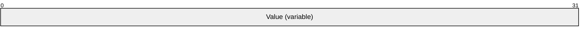

# [MC-NBFS]: .NET Binary Format: SOAP Data Structure

Table of Contents

1 Introduction

- [1 Introduction](#Section_1)
  - [1.1 Glossary](#Section_1.1)
  - [1.2 References](#Section_1.2)
    - [1.2.1 Normative References](#Section_1.2.1)
    - [1.2.2 Informative References](#Section_1.2.2)
  - [1.3 Overview](#Section_1.3)
  - [1.4 Relationship to Protocols and Other Structures](#Section_1.4)
  - [1.5 Applicability Statement](#Section_1.5)
  - [1.6 Versioning and Localization](#Section_1.6)
  - [1.7 Vendor-Extensible Fields](#Section_1.7)

2 Structures

- [2 Structures](#Section_2)
  - [2.1 DictionaryString](#Section_2.1)

3 Structure Examples

- [3 Structure Examples](#Section_3)

4 Security Considerations

- [4 Security Considerations](#Section_4)

5 Appendix A: Product Behavior

- [5 Appendix A: Product Behavior](#Section_5)

6 Change Tracking

- [6 Change Tracking](#Section_6)

For the legal notice and IP terms, see [LEGAL.md](../LEGAL.md).
Last updated: 3/13/2019.
See [Revision History](#revision-history) for full version history.

# 1 Introduction

This specification defines the .NET Binary Format: SOAP Data Structure, which is a new format built by extending the format described in the .NET Binary Format: [**XML**](#gt_xml) Data Structure, as specified in [MC-NBFX](../MC-NBFX/MC-NBFX.md). While the SOAP data structure is structurally identical to the XML data structure, it is not used where an XML data structure document is expected.

The XML Data Structure specifies a binary XML format to efficiently encode the structures that are common to any XML document. The SOAP protocol specifies an XML document with specific structures that are common to many SOAP messages. While using XML Data Structure alone to encode SOAP messages provides efficiencies for the structures of XML, one can observe that strings common to many SOAP messages are still encoded in their entirety. Furthermore, the XML data structure does not specify how a producer and a consumer of a document agree on the strings referenced within a document.

The purpose of the SOAP data structure is to extend the XML data structure format to further reduce the cost of generating SOAP documents by defining a shortened structure of strings to which a producer and a consumer can refer.

Sections 1.7 and 2 of this specification are normative. All other sections and examples in this specification are informative.

## 1.1 Glossary

This document uses the following terms:

**MultiByteInt31**: A structure defined in [MC-NBFX] section 2.1.2 that encodes small integer values in fewer bytes than large integer values.

**record**: The fundamental unit of information in the .NET Binary Format: XML Data Structure encoded as a variable length series of bytes. [MC-NBFX] section 2 specifies the format for each type of [**record**](#gt_record).

**string**: A structure that represents a set of characters ([MC-NBFX](../MC-NBFX/MC-NBFX.md) section 2.1.3).

**XML**: The Extensible Markup Language, as described in [[XML1.0]](https://go.microsoft.com/fwlink/?LinkId=90599).

**MAY, SHOULD, MUST, SHOULD NOT, MUST NOT:** These terms (in all caps) are used as defined in [[RFC2119]](https://go.microsoft.com/fwlink/?LinkId=90317). All statements of optional behavior use either MAY, SHOULD, or SHOULD NOT.

## 1.2 References

Links to a document in the Microsoft Open Specifications library point to the correct section in the most recently published version of the referenced document. However, because individual documents in the library are not updated at the same time, the section numbers in the documents may not match. You can confirm the correct section numbering by checking the [Errata](https://go.microsoft.com/fwlink/?linkid=850906).

### 1.2.1 Normative References

We conduct frequent surveys of the normative references to assure their continued availability. If you have any issue with finding a normative reference, please contact [dochelp@microsoft.com](mailto:dochelp@microsoft.com). We will assist you in finding the relevant information.

[MC-NBFSE] Microsoft Corporation, "[.NET Binary Format: SOAP Extension](../MC-NBFSE/MC-NBFSE.md)".

[MC-NBFX] Microsoft Corporation, "[.NET Binary Format: XML Data Structure](../MC-NBFX/MC-NBFX.md)".

[MC-NMF] Microsoft Corporation, "[.NET Message Framing Protocol](../MC-NMF/MC-NMF.md)".

[RFC2119] Bradner, S., "Key words for use in RFCs to Indicate Requirement Levels", BCP 14, RFC 2119, March 1997, [http://www.rfc-editor.org/rfc/rfc2119.txt](https://go.microsoft.com/fwlink/?LinkId=90317)

[SOAP1.2-1/2007] Gudgin, M., Hadley, M., Mendelsohn, N., et al., "SOAP Version 1.2 Part 1: Messaging Framework (Second Edition)", W3C Recommendation, April 2007, [http://www.w3.org/TR/2007/REC-soap12-part1-20070427/](https://go.microsoft.com/fwlink/?LinkId=94664)

### 1.2.2 Informative References

[MS-NETOD] Microsoft Corporation, "[Microsoft .NET Framework Protocols Overview](#Section_1.3)".

## 1.3 Overview

The .NET Binary Format: SOAP Data Structure is used to efficiently represent SOAP documents, as specified in [[SOAP1.2-1/2007]](https://go.microsoft.com/fwlink/?LinkId=94664).

## 1.4 Relationship to Protocols and Other Structures

The .NET Binary Format: SOAP Data Structure extends the .NET Binary Format: [**XML**](#gt_xml) Data Structure, as specified in [MC-NBFX](../MC-NBFX/MC-NBFX.md). The .NET Binary Format: SOAP Extension, as specified in [MC-NBFSE](../MC-NBFSE/MC-NBFSE.md), and the .NET Message Framing Protocol, as specified in [MC-NMF](../MC-NMF/MC-NMF.md), both use the .NET Binary Format: SOAP Data Structure.

## 1.5 Applicability Statement

The .NET Binary Format: SOAP Data Structure is a general-purpose way to represent an [**XML**](#gt_xml) document and is applied as specified in [MC-NBFX](../MC-NBFX/MC-NBFX.md) section 1.3. Additionally, the format is particularly well-suited for SOAP documents as specified in [[SOAP1.2-1/2007]](https://go.microsoft.com/fwlink/?LinkId=94664) because it defines a fixed set of s from the SOAP vocabulary that a producer and a consumer of documents in this format can reference and results in smaller documents.

This specification extends the format described by [MC-NBFX], which describes an efficient encoding for general XML documents. This specification describes efficient encoding for strings that are specific to SOAP messages and does not supersede any of the structures defined in [MC-NBFX].

## 1.6 Versioning and Localization

For information on versioning and localization, see [MC-NBFX](../MC-NBFX/MC-NBFX.md) section 1.3.

## 1.7 Vendor-Extensible Fields

The .NET Binary Format: SOAP Data Structure has no vendor-extensible fields.

# 2 Structures

The structures in the .NET Binary Format: SOAP Data Structure are identical to those specified in [MC-NBFX](../MC-NBFX/MC-NBFX.md), except that the DictionaryString structure, as defined in [MC-NBFX] section 1.3, has an additional meaning, described in the following section.

## 2.1 DictionaryString

The DictionaryString structure describes a reference to a set of characters. This specification lists a static set of characters that both producer and consumer can map via the DictionaryString structure.

The DictionaryString structure MUST be an even integer value. This restriction exists such that another specification, namely [MC-NBFSE](../MC-NBFSE/MC-NBFSE.md), can define the odd integers to reference another list of sets of characters.

**Value (variable):** An even integer value encoded by using [**MultiByteInt31**](#gt_multibyteint31). The value MUST be one of the values shown in the first column of the following table. The characters represented by this data structure MUST correspond to the characters—exactly as they are shown—in the second column of the following table. Even values not appearing in the following table have no character representation and are reserved.

| Value | Characters |
| --- | --- |
| 0x00 | mustUnderstand |
| 0x02 | Envelope |
| 0x04 | http://www.w3.org/2003/05/soap-envelope |
| 0x06 | http://www.w3.org/2005/08/addressing |
| 0x08 | Header |
| 0x0A | Action |
| 0x0C | To |
| 0x0E | Body |
| 0x10 | Algorithm |
| 0x12 | RelatesTo |
| 0x14 | http://www.w3.org/2005/08/addressing/anonymous |
| 0x16 | URI |
| 0x18 | Reference |
| 0x1A | MessageID |
| 0x1C | Id |
| 0x1E | Identifier |
| 0x20 | http://schemas.xmlsoap.org/ws/2005/02/rm |
| 0x22 | Transforms |
| 0x24 | Transform |
| 0x26 | DigestMethod |
| 0x28 | DigestValue |
| 0x2A | Address |
| 0x2C | ReplyTo |
| 0x2E | SequenceAcknowledgement |
| 0x30 | AcknowledgementRange |
| 0x32 | Upper |
| 0x34 | Lower |
| 0x36 | BufferRemaining |
| 0x38 | http://schemas.microsoft.com/ws/2006/05/rm |
| 0x3A | http://schemas.xmlsoap.org/ws/2005/02/rm/SequenceAcknowledgement |
| 0x3C | SecurityTokenReference |
| 0x3E | Sequence |
| 0x40 | MessageNumber |
| 0x42 | http://www.w3.org/2000/09/xmldsig# |
| 0x44 | http://www.w3.org/2000/09/xmldsig#enveloped-signature |
| 0x46 | KeyInfo |
| 0x48 | http://docs.oasis-open.org/wss/2004/01/oasis-200401-wss-wssecurity-secext-1.0.xsd |
| 0x4A | http://www.w3.org/2001/04/xmlenc# |
| 0x4C | http://schemas.xmlsoap.org/ws/2005/02/sc |
| 0x4E | DerivedKeyToken |
| 0x50 | Nonce |
| 0x52 | Signature |
| 0x54 | SignedInfo |
| 0x56 | CanonicalizationMethod |
| 0x58 | SignatureMethod |
| 0x5A | SignatureValue |
| 0x5C | DataReference |
| 0x5E | EncryptedData |
| 0x60 | EncryptionMethod |
| 0x62 | CipherData |
| 0x64 | CipherValue |
| 0x66 | http://docs.oasis-open.org/wss/2004/01/oasis-200401-wss-wssecurity-utility-1.0.xsd |
| 0x68 | Security |
| 0x6A | Timestamp |
| 0x6C | Created |
| 0x6E | Expires |
| 0x70 | Length |
| 0x72 | ReferenceList |
| 0x74 | ValueType |
| 0x76 | Type |
| 0x78 | EncryptedHeader |
| 0x7A | http://docs.oasis-open.org/wss/oasis-wss-wssecurity-secext-1.1.xsd |
| 0x7C | RequestSecurityTokenResponseCollection |
| 0x7E | http://schemas.xmlsoap.org/ws/2005/02/trust |
| 0x80 | http://schemas.xmlsoap.org/ws/2005/02/trust#BinarySecret |
| 0x82 | http://schemas.microsoft.com/ws/2006/02/transactions |
| 0x84 | s |
| 0x86 | Fault |
| 0x88 | MustUnderstand |
| 0x8A | role |
| 0x8C | relay |
| 0x8E | Code |
| 0x90 | Reason |
| 0x92 | Text |
| 0x94 | Node |
| 0x96 | Role |
| 0x98 | Detail |
| 0x9A | Value |
| 0x9C | Subcode |
| 0x9E | NotUnderstood |
| 0xA0 | qname |
| 0xA2 | - |
| 0xA4 | From |
| 0xA6 | FaultTo |
| 0xA8 | EndpointReference |
| 0xAA | PortType |
| 0xAC | ServiceName |
| 0xAE | PortName |
| 0xB0 | ReferenceProperties |
| 0xB2 | RelationshipType |
| 0xB4 | Reply |
| 0xB6 | a |
| 0xB8 | http://schemas.xmlsoap.org/ws/2006/02/addressingidentity |
| 0xBA | Identity |
| 0xBC | Spn |
| 0xBE | Upn |
| 0xC0 | Rsa |
| 0xC2 | Dns |
| 0xC4 | X509v3Certificate |
| 0xC6 | http://www.w3.org/2005/08/addressing/fault |
| 0xC8 | ReferenceParameters |
| 0xCA | IsReferenceParameter |
| 0xCC | http://www.w3.org/2005/08/addressing/reply |
| 0xCE | http://www.w3.org/2005/08/addressing/none |
| 0xD0 | Metadata |
| 0xD2 | http://schemas.xmlsoap.org/ws/2004/08/addressing |
| 0xD4 | http://schemas.xmlsoap.org/ws/2004/08/addressing/role/anonymous |
| 0xD6 | http://schemas.xmlsoap.org/ws/2004/08/addressing/fault |
| 0xD8 | http://schemas.xmlsoap.org/ws/2004/06/addressingex |
| 0xDA | RedirectTo |
| 0xDC | Via |
| 0xDE | http://www.w3.org/2001/10/xml-exc-c14n# |
| 0xE0 | PrefixList |
| 0xE2 | InclusiveNamespaces |
| 0xE4 | ec |
| 0xE6 | SecurityContextToken |
| 0xE8 | Generation |
| 0xEA | Label |
| 0xEC | Offset |
| 0xEE | Properties |
| 0xF0 | Cookie |
| 0xF2 | wsc |
| 0xF4 | http://schemas.xmlsoap.org/ws/2004/04/sc |
| 0xF6 | http://schemas.xmlsoap.org/ws/2004/04/security/sc/dk |
| 0xF8 | http://schemas.xmlsoap.org/ws/2004/04/security/sc/sct |
| 0xFA | http://schemas.xmlsoap.org/ws/2004/04/security/trust/RST/SCT |
| 0xFC | http://schemas.xmlsoap.org/ws/2004/04/security/trust/RSTR/SCT |
| 0xFE | RenewNeeded |
| 0x100 | BadContextToken |
| 0x102 | c |
| 0x104 | http://schemas.xmlsoap.org/ws/2005/02/sc/dk |
| 0x106 | http://schemas.xmlsoap.org/ws/2005/02/sc/sct |
| 0x108 | http://schemas.xmlsoap.org/ws/2005/02/trust/RST/SCT |
| 0x10A | http://schemas.xmlsoap.org/ws/2005/02/trust/RSTR/SCT |
| 0x10C | http://schemas.xmlsoap.org/ws/2005/02/trust/RST/SCT/Renew |
| 0x10E | http://schemas.xmlsoap.org/ws/2005/02/trust/RSTR/SCT/Renew |
| 0x110 | http://schemas.xmlsoap.org/ws/2005/02/trust/RST/SCT/Cancel |
| 0x112 | http://schemas.xmlsoap.org/ws/2005/02/trust/RSTR/SCT/Cancel |
| 0x114 | http://www.w3.org/2001/04/xmlenc#aes128-cbc |
| 0x116 | http://www.w3.org/2001/04/xmlenc#kw-aes128 |
| 0x118 | http://www.w3.org/2001/04/xmlenc#aes192-cbc |
| 0x11A | http://www.w3.org/2001/04/xmlenc#kw-aes192 |
| 0x11C | http://www.w3.org/2001/04/xmlenc#aes256-cbc |
| 0x11E | http://www.w3.org/2001/04/xmlenc#kw-aes256 |
| 0x120 | http://www.w3.org/2001/04/xmlenc#des-cbc |
| 0x122 | http://www.w3.org/2000/09/xmldsig#dsa-sha1 |
| 0x124 | http://www.w3.org/2001/10/xml-exc-c14n#WithComments |
| 0x126 | http://www.w3.org/2000/09/xmldsig#hmac-sha1 |
| 0x128 | http://www.w3.org/2001/04/xmldsig-more#hmac-sha256 |
| 0x12A | http://schemas.xmlsoap.org/ws/2005/02/sc/dk/p_sha1 |
| 0x12C | http://www.w3.org/2001/04/xmlenc#ripemd160 |
| 0x12E | http://www.w3.org/2001/04/xmlenc#rsa-oaep-mgf1p |
| 0x130 | http://www.w3.org/2000/09/xmldsig#rsa-sha1 |
| 0x132 | http://www.w3.org/2001/04/xmldsig-more#rsa-sha256 |
| 0x134 | http://www.w3.org/2001/04/xmlenc#rsa-1_5 |
| 0x136 | http://www.w3.org/2000/09/xmldsig#sha1 |
| 0x138 | http://www.w3.org/2001/04/xmlenc#sha256 |
| 0x13A | http://www.w3.org/2001/04/xmlenc#sha512 |
| 0x13C | http://www.w3.org/2001/04/xmlenc#tripledes-cbc |
| 0x13E | http://www.w3.org/2001/04/xmlenc#kw-tripledes |
| 0x140 | http://schemas.xmlsoap.org/2005/02/trust/tlsnego#TLS_Wrap |
| 0x142 | http://schemas.xmlsoap.org/2005/02/trust/spnego#GSS_Wrap |
| 0x144 | http://schemas.microsoft.com/ws/2006/05/security |
| 0x146 | dnse |
| 0x148 | o |
| 0x14A | Password |
| 0x14C | PasswordText |
| 0x14E | Username |
| 0x150 | UsernameToken |
| 0x152 | BinarySecurityToken |
| 0x154 | EncodingType |
| 0x156 | KeyIdentifier |
| 0x158 | http://docs.oasis-open.org/wss/2004/01/oasis-200401-wss-soap-message-security-1.0#Base64Binary |
| 0x15A | http://docs.oasis-open.org/wss/2004/01/oasis-200401-wss-soap-message-security-1.0#HexBinary |
| 0x15C | http://docs.oasis-open.org/wss/2004/01/oasis-200401-wss-soap-message-security-1.0#Text |
| 0x15E | http://docs.oasis-open.org/wss/2004/01/oasis-200401-wss-x509-token-profile-1.0#X509SubjectKeyIdentifier |
| 0x160 | http://docs.oasis-open.org/wss/oasis-wss-kerberos-token-profile-1.1#GSS_Kerberosv5_AP_REQ |
| 0x162 | http://docs.oasis-open.org/wss/oasis-wss-kerberos-token-profile-1.1#GSS_Kerberosv5_AP_REQ1510 |
| 0x164 | http://docs.oasis-open.org/wss/oasis-wss-saml-token-profile-1.0#SAMLAssertionID |
| 0x166 | Assertion |
| 0x168 | urn:oasis:names:tc:SAML:1.0:assertion |
| 0x16A | http://docs.oasis-open.org/wss/oasis-wss-rel-token-profile-1.0.pdf#license |
| 0x16C | FailedAuthentication |
| 0x16E | InvalidSecurityToken |
| 0x170 | InvalidSecurity |
| 0x172 | k |
| 0x174 | SignatureConfirmation |
| 0x176 | TokenType |
| 0x178 | http://docs.oasis-open.org/wss/oasis-wss-soap-message-security-1.1#ThumbprintSHA1 |
| 0x17A | http://docs.oasis-open.org/wss/oasis-wss-soap-message-security-1.1#EncryptedKey |
| 0x17C | http://docs.oasis-open.org/wss/oasis-wss-soap-message-security-1.1#EncryptedKeySHA1 |
| 0x17E | http://docs.oasis-open.org/wss/oasis-wss-saml-token-profile-1.1#SAMLV1.1 |
| 0x180 | http://docs.oasis-open.org/wss/oasis-wss-saml-token-profile-1.1#SAMLV2.0 |
| 0x182 | http://docs.oasis-open.org/wss/oasis-wss-saml-token-profile-1.1#SAMLID |
| 0x184 | AUTH-HASH |
| 0x186 | RequestSecurityTokenResponse |
| 0x188 | KeySize |
| 0x18A | RequestedTokenReference |
| 0x18C | AppliesTo |
| 0x18E | Authenticator |
| 0x190 | CombinedHash |
| 0x192 | BinaryExchange |
| 0x194 | Lifetime |
| 0x196 | RequestedSecurityToken |
| 0x198 | Entropy |
| 0x19A | RequestedProofToken |
| 0x19C | ComputedKey |
| 0x19E | RequestSecurityToken |
| 0x1A0 | RequestType |
| 0x1A2 | Context |
| 0x1A4 | BinarySecret |
| 0x1A6 | http://schemas.xmlsoap.org/ws/2005/02/trust/spnego |
| 0x1A8 | http://schemas.xmlsoap.org/ws/2005/02/trust/tlsnego |
| 0x1AA | wst |
| 0x1AC | http://schemas.xmlsoap.org/ws/2004/04/trust |
| 0x1AE | http://schemas.xmlsoap.org/ws/2004/04/security/trust/RST/Issue |
| 0x1B0 | http://schemas.xmlsoap.org/ws/2004/04/security/trust/RSTR/Issue |
| 0x1B2 | http://schemas.xmlsoap.org/ws/2004/04/security/trust/Issue |
| 0x1B4 | http://schemas.xmlsoap.org/ws/2004/04/security/trust/CK/PSHA1 |
| 0x1B6 | http://schemas.xmlsoap.org/ws/2004/04/security/trust/SymmetricKey |
| 0x1B8 | http://schemas.xmlsoap.org/ws/2004/04/security/trust/Nonce |
| 0x1BA | KeyType |
| 0x1BC | http://schemas.xmlsoap.org/ws/2004/04/trust/SymmetricKey |
| 0x1BE | http://schemas.xmlsoap.org/ws/2004/04/trust/PublicKey |
| 0x1C0 | Claims |
| 0x1C2 | InvalidRequest |
| 0x1C4 | RequestFailed |
| 0x1C6 | SignWith |
| 0x1C8 | EncryptWith |
| 0x1CA | EncryptionAlgorithm |
| 0x1CC | CanonicalizationAlgorithm |
| 0x1CE | ComputedKeyAlgorithm |
| 0x1D0 | UseKey |
| 0x1D2 | http://schemas.microsoft.com/net/2004/07/secext/WS-SPNego |
| 0x1D4 | http://schemas.microsoft.com/net/2004/07/secext/TLSNego |
| 0x1D6 | t |
| 0x1D8 | http://schemas.xmlsoap.org/ws/2005/02/trust/RST/Issue |
| 0x1DA | http://schemas.xmlsoap.org/ws/2005/02/trust/RSTR/Issue |
| 0x1DC | http://schemas.xmlsoap.org/ws/2005/02/trust/Issue |
| 0x1DE | http://schemas.xmlsoap.org/ws/2005/02/trust/SymmetricKey |
| 0x1E0 | http://schemas.xmlsoap.org/ws/2005/02/trust/CK/PSHA1 |
| 0x1E2 | http://schemas.xmlsoap.org/ws/2005/02/trust/Nonce |
| 0x1E4 | RenewTarget |
| 0x1E6 | CancelTarget |
| 0x1E8 | RequestedTokenCancelled |
| 0x1EA | RequestedAttachedReference |
| 0x1EC | RequestedUnattachedReference |
| 0x1EE | IssuedTokens |
| 0x1F0 | http://schemas.xmlsoap.org/ws/2005/02/trust/Renew |
| 0x1F2 | http://schemas.xmlsoap.org/ws/2005/02/trust/Cancel |
| 0x1F4 | http://schemas.xmlsoap.org/ws/2005/02/trust/PublicKey |
| 0x1F6 | Access |
| 0x1F8 | AccessDecision |
| 0x1FA | Advice |
| 0x1FC | AssertionID |
| 0x1FE | AssertionIDReference |
| 0x200 | Attribute |
| 0x202 | AttributeName |
| 0x204 | AttributeNamespace |
| 0x206 | AttributeStatement |
| 0x208 | AttributeValue |
| 0x20A | Audience |
| 0x20C | AudienceRestrictionCondition |
| 0x20E | AuthenticationInstant |
| 0x210 | AuthenticationMethod |
| 0x212 | AuthenticationStatement |
| 0x214 | AuthorityBinding |
| 0x216 | AuthorityKind |
| 0x218 | AuthorizationDecisionStatement |
| 0x21A | Binding |
| 0x21C | Condition |
| 0x21E | Conditions |
| 0x220 | Decision |
| 0x222 | DoNotCacheCondition |
| 0x224 | Evidence |
| 0x226 | IssueInstant |
| 0x228 | Issuer |
| 0x22A | Location |
| 0x22C | MajorVersion |
| 0x22E | MinorVersion |
| 0x230 | NameIdentifier |
| 0x232 | Format |
| 0x234 | NameQualifier |
| 0x236 | Namespace |
| 0x238 | NotBefore |
| 0x23A | NotOnOrAfter |
| 0x23C | saml |
| 0x23E | Statement |
| 0x240 | Subject |
| 0x242 | SubjectConfirmation |
| 0x244 | SubjectConfirmationData |
| 0x246 | ConfirmationMethod |
| 0x248 | urn:oasis:names:tc:SAML:1.0:cm:holder-of-key |
| 0x24A | urn:oasis:names:tc:SAML:1.0:cm:sender-vouches |
| 0x24C | SubjectLocality |
| 0x24E | DNSAddress |
| 0x250 | IPAddress |
| 0x252 | SubjectStatement |
| 0x254 | urn:oasis:names:tc:SAML:1.0:am:unspecified |
| 0x256 | xmlns |
| 0x258 | Resource |
| 0x25A | UserName |
| 0x25C | urn:oasis:names:tc:SAML:1.1:nameid-format:WindowsDomainQualifiedName |
| 0x25E | EmailName |
| 0x260 | urn:oasis:names:tc:SAML:1.1:nameid-format:emailAddress |
| 0x262 | u |
| 0x264 | ChannelInstance |
| 0x266 | http://schemas.microsoft.com/ws/2005/02/duplex |
| 0x268 | Encoding |
| 0x26A | MimeType |
| 0x26C | CarriedKeyName |
| 0x26E | Recipient |
| 0x270 | EncryptedKey |
| 0x272 | KeyReference |
| 0x274 | e |
| 0x276 | http://www.w3.org/2001/04/xmlenc#Element |
| 0x278 | http://www.w3.org/2001/04/xmlenc#Content |
| 0x27A | KeyName |
| 0x27C | MgmtData |
| 0x27E | KeyValue |
| 0x280 | RSAKeyValue |
| 0x282 | Modulus |
| 0x284 | Exponent |
| 0x286 | X509Data |
| 0x288 | X509IssuerSerial |
| 0x28A | X509IssuerName |
| 0x28C | X509SerialNumber |
| 0x28E | X509Certificate |
| 0x290 | AckRequested |
| 0x292 | http://schemas.xmlsoap.org/ws/2005/02/rm/AckRequested |
| 0x294 | AcksTo |
| 0x296 | Accept |
| 0x298 | CreateSequence |
| 0x29A | http://schemas.xmlsoap.org/ws/2005/02/rm/CreateSequence |
| 0x29C | CreateSequenceRefused |
| 0x29E | CreateSequenceResponse |
| 0x2A0 | http://schemas.xmlsoap.org/ws/2005/02/rm/CreateSequenceResponse |
| 0x2A2 | FaultCode |
| 0x2A4 | InvalidAcknowledgement |
| 0x2A6 | LastMessage |
| 0x2A8 | http://schemas.xmlsoap.org/ws/2005/02/rm/LastMessage |
| 0x2AA | LastMessageNumberExceeded |
| 0x2AC | MessageNumberRollover |
| 0x2AE | Nack |
| 0x2B0 | netrm |
| 0x2B2 | Offer |
| 0x2B4 | r |
| 0x2B6 | SequenceFault |
| 0x2B8 | SequenceTerminated |
| 0x2BA | TerminateSequence |
| 0x2BC | http://schemas.xmlsoap.org/ws/2005/02/rm/TerminateSequence |
| 0x2BE | UnknownSequence |
| 0x2C0 | http://schemas.microsoft.com/ws/2006/02/tx/oletx |
| 0x2C2 | oletx |
| 0x2C4 | OleTxTransaction |
| 0x2C6 | PropagationToken |
| 0x2C8 | http://schemas.xmlsoap.org/ws/2004/10/wscoor |
| 0x2CA | wscoor |
| 0x2CC | CreateCoordinationContext |
| 0x2CE | CreateCoordinationContextResponse |
| 0x2D0 | CoordinationContext |
| 0x2D2 | CurrentContext |
| 0x2D4 | CoordinationType |
| 0x2D6 | RegistrationService |
| 0x2D8 | Register |
| 0x2DA | RegisterResponse |
| 0x2DC | ProtocolIdentifier |
| 0x2DE | CoordinatorProtocolService |
| 0x2E0 | ParticipantProtocolService |
| 0x2E2 | http://schemas.xmlsoap.org/ws/2004/10/wscoor/CreateCoordinationContext |
| 0x2E4 | http://schemas.xmlsoap.org/ws/2004/10/wscoor/CreateCoordinationContextResponse |
| 0x2E6 | http://schemas.xmlsoap.org/ws/2004/10/wscoor/Register |
| 0x2E8 | http://schemas.xmlsoap.org/ws/2004/10/wscoor/RegisterResponse |
| 0x2EA | http://schemas.xmlsoap.org/ws/2004/10/wscoor/fault |
| 0x2EC | ActivationCoordinatorPortType |
| 0x2EE | RegistrationCoordinatorPortType |
| 0x2F0 | InvalidState |
| 0x2F2 | InvalidProtocol |
| 0x2F4 | InvalidParameters |
| 0x2F6 | NoActivity |
| 0x2F8 | ContextRefused |
| 0x2FA | AlreadyRegistered |
| 0x2FC | http://schemas.xmlsoap.org/ws/2004/10/wsat |
| 0x2FE | wsat |
| 0x300 | http://schemas.xmlsoap.org/ws/2004/10/wsat/Completion |
| 0x302 | http://schemas.xmlsoap.org/ws/2004/10/wsat/Durable2PC |
| 0x304 | http://schemas.xmlsoap.org/ws/2004/10/wsat/Volatile2PC |
| 0x306 | Prepare |
| 0x308 | Prepared |
| 0x30A | ReadOnly |
| 0x30C | Commit |
| 0x30E | Rollback |
| 0x310 | Committed |
| 0x312 | Aborted |
| 0x314 | Replay |
| 0x316 | http://schemas.xmlsoap.org/ws/2004/10/wsat/Commit |
| 0x318 | http://schemas.xmlsoap.org/ws/2004/10/wsat/Rollback |
| 0x31A | http://schemas.xmlsoap.org/ws/2004/10/wsat/Committed |
| 0x31C | http://schemas.xmlsoap.org/ws/2004/10/wsat/Aborted |
| 0x31E | http://schemas.xmlsoap.org/ws/2004/10/wsat/Prepare |
| 0x320 | http://schemas.xmlsoap.org/ws/2004/10/wsat/Prepared |
| 0x322 | http://schemas.xmlsoap.org/ws/2004/10/wsat/ReadOnly |
| 0x324 | http://schemas.xmlsoap.org/ws/2004/10/wsat/Replay |
| 0x326 | http://schemas.xmlsoap.org/ws/2004/10/wsat/fault |
| 0x328 | CompletionCoordinatorPortType |
| 0x32A | CompletionParticipantPortType |
| 0x32C | CoordinatorPortType |
| 0x32E | ParticipantPortType |
| 0x330 | InconsistentInternalState |
| 0x332 | mstx |
| 0x334 | Enlistment |
| 0x336 | protocol |
| 0x338 | LocalTransactionId |
| 0x33A | IsolationLevel |
| 0x33C | IsolationFlags |
| 0x33E | Description |
| 0x340 | Loopback |
| 0x342 | RegisterInfo |
| 0x344 | ContextId |
| 0x346 | TokenId |
| 0x348 | AccessDenied |
| 0x34A | InvalidPolicy |
| 0x34C | CoordinatorRegistrationFailed |
| 0x34E | TooManyEnlistments |
| 0x350 | Disabled |
| 0x352 | ActivityId |
| 0x354 | http://schemas.microsoft.com/2004/09/ServiceModel/Diagnostics |
| 0x356 | http://docs.oasis-open.org/wss/oasis-wss-kerberos-token-profile-1.1#Kerberosv5APREQSHA1 |
| 0x358 | http://schemas.xmlsoap.org/ws/2002/12/policy |
| 0x35A | FloodMessage |
| 0x35C | LinkUtility |
| 0x35E | Hops |
| 0x360 | http://schemas.microsoft.com/net/2006/05/peer/HopCount |
| 0x362 | PeerVia |
| 0x364 | http://schemas.microsoft.com/net/2006/05/peer |
| 0x366 | PeerFlooder |
| 0x368 | PeerTo |
| 0x36A | http://schemas.microsoft.com/ws/2005/05/routing |
| 0x36C | PacketRoutable |
| 0x36E | http://schemas.microsoft.com/ws/2005/05/addressing/none |
| 0x370 | http://schemas.microsoft.com/ws/2005/05/envelope/none |
| 0x372 | http://www.w3.org/2001/XMLSchema-instance |
| 0x374 | http://www.w3.org/2001/XMLSchema |
| 0x376 | nil |
| 0x378 | type |
| 0x37A | char |
| 0x37C | boolean |
| 0x37E | byte |
| 0x380 | unsignedByte |
| 0x382 | short |
| 0x384 | unsignedShort |
| 0x386 | int |
| 0x388 | unsignedInt |
| 0x38A | long |
| 0x38C | unsignedLong |
| 0x38E | float |
| 0x390 | double |
| 0x392 | decimal |
| 0x394 | dateTime |
| 0x396 | string |
| 0x398 | base64Binary |
| 0x39A | anyType |
| 0x39C | duration |
| 0x39E | guid |
| 0x3A0 | anyURI |
| 0x3A2 | QName |
| 0x3A4 | time |
| 0x3A6 | date |
| 0x3A8 | hexBinary |
| 0x3AA | gYearMonth |
| 0x3AC | gYear |
| 0x3AE | gMonthDay |
| 0x3B0 | gDay |
| 0x3B2 | gMonth |
| 0x3B4 | integer |
| 0x3B6 | positiveInteger |
| 0x3B8 | negativeInteger |
| 0x3BA | nonPositiveInteger |
| 0x3BC | nonNegativeInteger |
| 0x3BE | normalizedString |
| 0x3C0 | ConnectionLimitReached |
| 0x3C2 | http://schemas.xmlsoap.org/soap/envelope/ |
| 0x3C4 | actor |
| 0x3C6 | faultcode |
| 0x3C8 | faultstring |
| 0x3CA | faultactor |
| 0x3CC | detail |

# 3 Structure Examples

Following is an example of how to encode a SOAP document in the SOAP data structure format by using the [**strings**](#gt_string) specified in section [2](#Section_1.3). White space (such as spaces, tab characters, and carriage returns) improves readability, but is not part of the encoded version of the document.

<s:Envelope xmlns:a="http://www.w3.org/2005/08/addressing"

xmlns:s="http://www.w3.org/2003/05/soap-envelope">

<s:Header>

<a:Action s:mustUnderstand="1">action</a:Action>

</s:Header>

<s:Body>

<Inventory>0</Inventory>

</s:Body>

</s:Envelope>

The following table divides the same SOAP document into [**records**](#gt_record). Each row in the table represents one record. The first column identifies the text, or record content. The second column identifies the type of SOAP record. The third column shows the record in its encoded form. For information on the structure of each record, see [MC-NBFX](../MC-NBFX/MC-NBFX.md).

| Bit Range | Field | Description |
| --- | --- | --- |
| Variable | <s:Envelope | PrefixDictionaryElementS 56 **02** |
| Variable | xmlns:a="http://www.w3.org/2005/08/addressing" | DictionaryXmlnsAttribute 0B 01 61 **06** |
| Variable | xmlns:s="http://www.w3.org/2003/05/soap-envelope"> | DictionaryXmlnsAttribute 0B 01 73 **04** |
| Variable | <s:Header> | PrefixDictionaryElementS 56 **08** |
| Variable | <a:Action | PrefixDictionaryElementA 44 **0A** |
| Variable | s:mustUnderstand="1"> | PrefixDictionaryAttributeS 1E **00** 82 |
| Variable | action</a:Action> | Chars8TextWithEndElement 99 06 61 63 74 69 6F 6E |
| Variable | </s:Header> | EndElement 01 |
| Variable | <s:Body> | PrefixDictionaryElementS 56 **0E** |
| Variable | <Inventory> | ShortElement 40 09 49 6E 76 65 6E 74 6F 72 79 |
| Variable | 0</Inventory> | ZeroTextWithEndElement 81 |
| Variable | </s:Body> | EndElement 01 |
| Variable | </s:Envelope> | EndElement 01 |

Several of the records contain [DictionaryString](#Section_2.1) entries, as specified in section 2. The bytes that map to DictionaryString entries are highlighted in **bold** in records 1 through 6, and in record 9.

Finally, the following diagram shows the SOAP document as a byte stream.

56 02 0B 01 61 06 0B 01 73 04 56 08 44 0A 1E 00

82 99 06 61 63 74 69 6F 6E 01 56 0E 40 09 49 6E

76 65 6E 74 6F 72 79 81 01 01

# 4 Security Considerations

For information on security considerations, see [MC-NBFX](../MC-NBFX/MC-NBFX.md) section 1.3.

# 5 Appendix A: Product Behavior

The information in this specification is applicable to the following Microsoft products or supplemental software. References to product versions include updates to those products.

This document specifies version-specific details in the Microsoft .NET Framework. For information about which versions of .NET Framework are available in each released Windows product or as supplemental software, see [MS-NETOD](#Section_1.3) section 4.

- Microsoft .NET Framework 3.0
- Microsoft .NET Framework 3.5
- Microsoft .NET Framework 4.0
- Microsoft .NET Framework 4.5
- Microsoft .NET Framework 4.6
- Microsoft .NET Framework 4.7
- Microsoft .NET Framework 4.8
Exceptions, if any, are noted in this section. If an update version, service pack or Knowledge Base (KB) number appears with a product name, the behavior changed in that update. The new behavior also applies to subsequent updates unless otherwise specified. If a product edition appears with the product version, behavior is different in that product edition.

Unless otherwise specified, any statement of optional behavior in this specification that is prescribed using the terms "SHOULD" or "SHOULD NOT" implies product behavior in accordance with the SHOULD or SHOULD NOT prescription. Unless otherwise specified, the term "MAY" implies that the product does not follow the prescription.

# 6 Change Tracking

This section identifies changes that were made to this document since the last release. Changes are classified as Major, Minor, or None.

The revision class **Major** means that the technical content in the document was significantly revised. Major changes affect protocol interoperability or implementation. Examples of major changes are:

- A document revision that incorporates changes to interoperability requirements.
- A document revision that captures changes to protocol functionality.
The revision class **Minor** means that the meaning of the technical content was clarified. Minor changes do not affect protocol interoperability or implementation. Examples of minor changes are updates to clarify ambiguity at the sentence, paragraph, or table level.

The revision class **None** means that no new technical changes were introduced. Minor editorial and formatting changes may have been made, but the relevant technical content is identical to the last released version.

The changes made to this document are listed in the following table. For more information, please contact [dochelp@microsoft.com](mailto:dochelp@microsoft.com).

| Section | Description | Revision class |
| --- | --- | --- |
| [5](#Section_5) Appendix A: Product Behavior | Updated the applicability list for this release of Microsoft .NET Framework. | Major |

## Revision History

| Date | Version | Revision Class | Comments |
| --- | --- | --- | --- |
| 8/10/2007 | 0.1 | Major | Initial Availability |
| 9/28/2007 | 0.2 | Minor | Clarified the meaning of the technical content. |
| 10/23/2007 | 0.2.1 | Editorial | Changed language and formatting in the technical content. |
| 11/30/2007 | 0.3 | Minor | Clarified the meaning of the technical content. |
| 1/25/2008 | 0.3.1 | Editorial | Changed language and formatting in the technical content. |
| 3/14/2008 | 0.3.2 | Editorial | Changed language and formatting in the technical content. |
| 5/16/2008 | 0.3.3 | Editorial | Changed language and formatting in the technical content. |
| 6/20/2008 | 0.3.4 | Editorial | Changed language and formatting in the technical content. |
| 7/25/2008 | 0.3.5 | Editorial | Changed language and formatting in the technical content. |
| 8/29/2008 | 0.3.6 | Editorial | Changed language and formatting in the technical content. |
| 10/24/2008 | 0.3.7 | Editorial | Changed language and formatting in the technical content. |
| 12/5/2008 | 0.4 | Minor | Clarified the meaning of the technical content. |
| 1/16/2009 | 0.4.1 | Editorial | Changed language and formatting in the technical content. |
| 2/27/2009 | 0.4.2 | Editorial | Changed language and formatting in the technical content. |
| 4/10/2009 | 0.4.3 | Editorial | Changed language and formatting in the technical content. |
| 5/22/2009 | 0.5 | Minor | Clarified the meaning of the technical content. |
| 7/2/2009 | 0.5.1 | Editorial | Changed language and formatting in the technical content. |
| 8/14/2009 | 0.5.2 | Editorial | Changed language and formatting in the technical content. |
| 9/25/2009 | 0.6 | Minor | Clarified the meaning of the technical content. |
| 11/6/2009 | 0.6.1 | Editorial | Changed language and formatting in the technical content. |
| 12/18/2009 | 0.6.2 | Editorial | Changed language and formatting in the technical content. |
| 1/29/2010 | 0.6.3 | Editorial | Changed language and formatting in the technical content. |
| 3/12/2010 | 0.6.4 | Editorial | Changed language and formatting in the technical content. |
| 4/23/2010 | 1.0 | Major | Updated and revised the technical content. |
| 6/4/2010 | 1.0.1 | Editorial | Changed language and formatting in the technical content. |
| 7/16/2010 | 2.0 | Major | Updated and revised the technical content. |
| 8/27/2010 | 2.0 | None | No changes to the meaning, language, or formatting of the technical content. |
| 10/8/2010 | 2.0 | None | No changes to the meaning, language, or formatting of the technical content. |
| 11/19/2010 | 2.0 | None | No changes to the meaning, language, or formatting of the technical content. |
| 1/7/2011 | 2.0 | None | No changes to the meaning, language, or formatting of the technical content. |
| 2/11/2011 | 2.0 | None | No changes to the meaning, language, or formatting of the technical content. |
| 3/25/2011 | 2.0 | None | No changes to the meaning, language, or formatting of the technical content. |
| 5/6/2011 | 2.0 | None | No changes to the meaning, language, or formatting of the technical content. |
| 6/17/2011 | 2.1 | Minor | Clarified the meaning of the technical content. |
| 9/23/2011 | 2.1 | None | No changes to the meaning, language, or formatting of the technical content. |
| 12/16/2011 | 3.0 | Major | Updated and revised the technical content. |
| 3/30/2012 | 3.0 | None | No changes to the meaning, language, or formatting of the technical content. |
| 7/12/2012 | 3.0 | None | No changes to the meaning, language, or formatting of the technical content. |
| 10/25/2012 | 3.0 | None | No changes to the meaning, language, or formatting of the technical content. |
| 1/31/2013 | 3.0 | None | No changes to the meaning, language, or formatting of the technical content. |
| 8/8/2013 | 3.0 | None | No changes to the meaning, language, or formatting of the technical content. |
| 11/14/2013 | 3.0 | None | No changes to the meaning, language, or formatting of the technical content. |
| 2/13/2014 | 3.0 | None | No changes to the meaning, language, or formatting of the technical content. |
| 5/15/2014 | 3.0 | None | No changes to the meaning, language, or formatting of the technical content. |
| 6/30/2015 | 4.0 | Major | Significantly changed the technical content. |
| 10/16/2015 | 4.0 | None | No changes to the meaning, language, or formatting of the technical content. |
| 7/14/2016 | 4.0 | None | No changes to the meaning, language, or formatting of the technical content. |
| 3/16/2017 | 5.0 | Major | Significantly changed the technical content. |
| 6/1/2017 | 5.0 | None | No changes to the meaning, language, or formatting of the technical content. |
| 3/13/2019 | 6.0 | Major | Significantly changed the technical content. |
