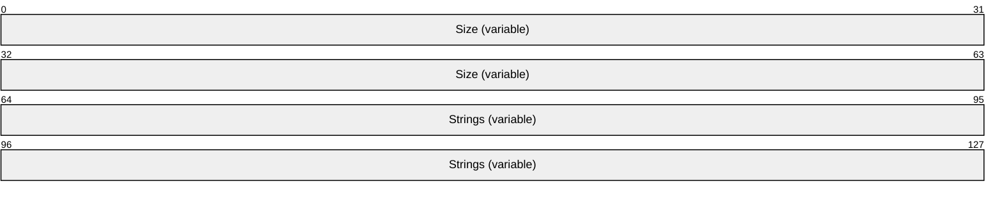
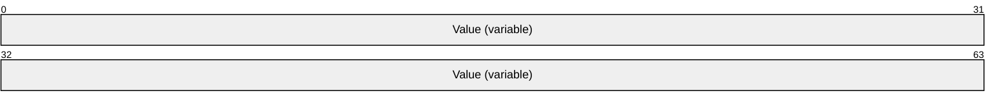

# [MC-NBFSE]: .NET Binary Format: SOAP Extension

Table of Contents

1 Introduction

- [1 Introduction](#Section_1)
  - [1.1 Glossary](#Section_1.1)
  - [1.2 References](#Section_1.2)
    - [1.2.1 Normative References](#Section_1.2.1)
    - [1.2.2 Informative References](#Section_1.2.2)
  - [1.3 Overview](#Section_1.3)
  - [1.4 Relationship to Protocols and Other Structures](#Section_1.4)
  - [1.5 Applicability Statement](#Section_1.5)
  - [1.6 Versioning and Localization](#Section_1.6)
  - [1.7 Vendor-Extensible Fields](#Section_1.7)

2 Structures

- [2 Structures](#Section_2)
  - [2.1 StringTable](#Section_2.1)
  - [2.2 DictionaryString](#Section_2.2)

3 Structure Examples

- [3 Structure Examples](#Section_3)

4 Security Considerations

- [4 Security Considerations](#Section_4)

5 Appendix A: Product Behavior

- [5 Appendix A: Product Behavior](#Section_5)

6 Change Tracking

- [6 Change Tracking](#Section_6)

For the legal notice and IP terms, see [LEGAL.md](../LEGAL.md).
Last updated: 3/13/2019.
See [Revision History](#revision-history) for full version history.

# 1 Introduction

In many types of communication, there are often repeated strings, both within a document and within the context of related documents. For example, a request for a record set yields a list of records in one document or a series of documents, each bearing a record. Each record uses the same application-defined [**XML**](#gt_xml) tags. This pattern of repeated custom XML tags would be repeated each time as a fully expanded string using [MC-NBFS](../MC-NBFS/MC-NBFS.md).

This specification defines the .NET Binary Format: SOAP Extension, which is a new format built by extending the format specified in [MC-NBFS]. [MC-NBFS] specifies a way to efficiently encode strings that are common to many [**SOAP messages**](#gt_soap-message), but it does not specify a way to efficiently encode repeated strings that are custom to applications. The purpose of this specification is to define a mechanism by which strings are transmitted once and referred to by subsequent documents. Thus, applications with some recurrence of strings might result in documents that are smaller using this format.

The .NET Binary Format: SOAP Extension does not specify a context in which documents are related. Rather, it is designed to work within the .NET Message Framing Protocol, as specified in [MC-NMF](../MC-NMF/MC-NMF.md), which provides a context that defines related documents.

Sections 1.7 and 2 of this specification are normative. All other sections and examples in this specification are informative.

## 1.1 Glossary

This document uses the following terms:

**MultiByteInt31**: A structure defined in [MC-NBFX] section 2.1.2 that encodes small integer values in fewer bytes than large integer values.

**record**: The fundamental unit of information in the .NET Binary Format: XML Data Structure encoded as a variable length series of bytes. [MC-NBFX] section 2 specifies the format for each type of [**record**](#gt_record).

**SOAP message**: An [**XML**](#gt_xml) document consisting of a mandatory SOAP envelope, an optional SOAP header, and a mandatory SOAP body. See [[SOAP1.2-1/2007]](https://go.microsoft.com/fwlink/?LinkId=94664) section 5 for more information.

**string**: A structure that represents a set of characters ([MC-NBFX](../MC-NBFX/MC-NBFX.md) section 2.1.3).

**XML**: The Extensible Markup Language, as described in [[XML1.0]](https://go.microsoft.com/fwlink/?LinkId=90599).

**MAY, SHOULD, MUST, SHOULD NOT, MUST NOT:** These terms (in all caps) are used as defined in [[RFC2119]](https://go.microsoft.com/fwlink/?LinkId=90317). All statements of optional behavior use either MAY, SHOULD, or SHOULD NOT.

## 1.2 References

Links to a document in the Microsoft Open Specifications library point to the correct section in the most recently published version of the referenced document. However, because individual documents in the library are not updated at the same time, the section numbers in the documents may not match. You can confirm the correct section numbering by checking the [Errata](https://go.microsoft.com/fwlink/?linkid=850906).

### 1.2.1 Normative References

We conduct frequent surveys of the normative references to assure their continued availability. If you have any issue with finding a normative reference, please contact [dochelp@microsoft.com](mailto:dochelp@microsoft.com). We will assist you in finding the relevant information.

[MC-NBFS] Microsoft Corporation, "[.NET Binary Format: SOAP Data Structure](../MC-NBFS/MC-NBFS.md)".

[MC-NBFX] Microsoft Corporation, "[.NET Binary Format: XML Data Structure](../MC-NBFX/MC-NBFX.md)".

[MC-NMF] Microsoft Corporation, "[.NET Message Framing Protocol](../MC-NMF/MC-NMF.md)".

[RFC2119] Bradner, S., "Key words for use in RFCs to Indicate Requirement Levels", BCP 14, RFC 2119, March 1997, [http://www.rfc-editor.org/rfc/rfc2119.txt](https://go.microsoft.com/fwlink/?LinkId=90317)

[SOAP1.2-1/2007] Gudgin, M., Hadley, M., Mendelsohn, N., et al., "SOAP Version 1.2 Part 1: Messaging Framework (Second Edition)", W3C Recommendation, April 2007, [http://www.w3.org/TR/2007/REC-soap12-part1-20070427/](https://go.microsoft.com/fwlink/?LinkId=94664)

### 1.2.2 Informative References

[MS-NETOD] Microsoft Corporation, "[Microsoft .NET Framework Protocols Overview](../MS-NETOD/MS-NETOD.md)".

## 1.3 Overview

This .NET Binary Format: SOAP Extension is used to efficiently represent SOAP documents, as specified in [[SOAP1.2-1/2007]](https://go.microsoft.com/fwlink/?LinkId=94664). When multiple documents are being processed, this format can be more efficient than the .NET Binary Format: SOAP Data Structure, as specified in [MC-NBFS](../MC-NBFS/MC-NBFS.md).

## 1.4 Relationship to Protocols and Other Structures

The .NET Binary Format: SOAP Extension uses the .NET Binary Format: SOAP Data Structure, as specified in [MC-NBFS](../MC-NBFS/MC-NBFS.md).

The .NET Message Framing Protocol, as specified in [MC-NMF](../MC-NMF/MC-NMF.md), uses the .NET Binary Format: SOAP Extension.

## 1.5 Applicability Statement

The .NET Binary Format: SOAP Extension is a general-purpose way to process a series of SOAP documents, and is applied in the same way as specified in [MC-NBFS](../MC-NBFS/MC-NBFS.md) section 1.5. Additionally, the format is particularly well-suited for environments where a series of SOAP documents that share a common or repetitive vocabulary are processed.

## 1.6 Versioning and Localization

For information on versioning and localization, see [MC-NBFS](../MC-NBFS/MC-NBFS.md) section 1.6.

## 1.7 Vendor-Extensible Fields

The .NET Binary Format: SOAP Extension has no vendor-extensible fields.

# 2 Structures

The structures in the .NET Binary Format: SOAP Extension are identical to those specified in [MC-NBFS](../MC-NBFS/MC-NBFS.md), except for the addition of one new structure and a further extension of the DictionaryString structure, as specified in [MC-NBFS] section 2.1.

The format is identical to the .NET Binary Format: SOAP Data Structure, as specified in [MC-NBFS], except that the document MUST be preceded by a [StringTable](#Section_2.1) structure, as specified in section 2.1.

## 2.1 StringTable

The StringTable structure describes a set of new [**strings**](#gt_string) to which subsequent [**records**](#gt_record) can refer. As specified in [MC-NBFS](../MC-NBFS/MC-NBFS.md) (section [2.2](#Section_2.2)), the static DictionaryStrings defined by [MC-NBFS] map even integers to a static set of characters, leaving odd integers for extension. The StringTable structure takes advantage of the extensibility point by defining a mapping of odd integers to strings.

**Size (variable):** An integer value that is encoded by using the [**MultiByteInt31**](#gt_multibyteint31) structure that indicates the overall size in bytes of the String structures that follow.

**Strings (variable):** A series of strings. The **Strings** MUST fit exactly within the **Size** specified. Each **String** MUST be unique and MUST NOT have been present in a prior StringTable.

The first **String** of the first StringTable is assigned an ID of 1, and each subsequent **String** is assigned the next-higher odd number. A consumer of this format MUST maintain this mapping until there are no further documents to process. Subsequent records and documents will refer to this **String** by this ID, as specified in section 2.2.

## 2.2 DictionaryString

The DictionaryString structure describes a reference to a set of characters.

**Value (variable):** An integer value that is encoded by using the MultiByteInt31 structure. If this value is even, then it MUST be interpreted as specified in [MC-NBFS](../MC-NBFS/MC-NBFS.md) section 2. If this value is odd, then it MUST refer to a **String** from a [StringTable](#Section_2.1) structure that has been processed and MUST be interpreted as the set of characters identified by that **String**.

# 3 Structure Examples

The following example is of a SOAP document that uses the .NET Binary Format: SOAP Extension format.

Note that the document is the same document that is encoded in [MC-NBFS](../MC-NBFS/MC-NBFS.md) section 3.

<s:Envelope xmlns:a="http://www.w3.org/2005/08/addressing"

xmlns:s="http://www.w3.org/2003/05/soap-envelope">

<s:Header>

<a:Action s:mustUnderstand="1">action</a:Action>

</s:Header>

<s:Body>

<Inventory>0</Inventory>

</s:Body>

</s:Envelope>

Because the content "action" in the <Action> element is not present in the string structure as specified in [MC-NBFS] section 2, the string was written out fully.

| Bit Range | Field | Description |
| --- | --- | --- |
| Variable | 99 06 61 63 74 69 6F 6E | Chars8TextWithEndElement action</a:Action> |

Similarly, because the Inventory string was also not present, the <Inventory> element was written out verbosely.

| Bit Range | Field | Description |
| --- | --- | --- |
| Variable | 40 09 49 6E 76 65 6E 74 6F 72 79 | ShortElement <Inventory> |

If this document, or a similar document, is processed repeatedly, then it is advantageous not to have to repeat these bytes.

Using the .NET Binary Format: SOAP Extension, a [StringTable (section 2.1)](#Section_2.1) is used first to describe the two strings.

- `action`
- `Inventory`
According to the StringTable structure, these strings are encoded as shown in the following table. The Bytes column contains the bytes of the structure shown in hex, while the Chars column contains the same bytes shown as characters.

| Bit Range | Field | Description |
| --- | --- | --- |
| Variable | 11 06 61 63 74 69 6F 6E 09 49 6E 76 65 6E 74 6F 72 79 | ..action.Inventory |

The bolded items in the preceding table are the size (0x11) of the overall structure encoded using [**MultiByteInt31**](#gt_multibyteint31) and the start of the two strings (0x06, 0x09) encoded using MultiByteInt31 as well. The string "action" is assigned a value of 1 and Inventory is assigned a value of 3, as specified in section [2](#Section_2).

Now, the two preceding records can be encoded more compactly, as shown in the following tables.

| Bit Range | Field | Description |
| --- | --- | --- |
| Variable | AB **01** | DictionaryTextWithEndElement action</a:Action> |

| Bit Range | Field | Description |
| --- | --- | --- |
| Variable | 42 **03** | ShortDictionaryElement <Inventory> |

The references to the string from the StringTable are in bold.

# 4 Security Considerations

The .NET Binary Format: SOAP Extension has the same security considerations as the .NET Binary Format: SOAP Data Structure, as specified in [MC-NBFS](../MC-NBFS/MC-NBFS.md) section 4, and the .NET Binary Format: [**XML**](#gt_xml) Data Structure, as specified in [MC-NBFX](../MC-NBFX/MC-NBFX.md) section 4.

Consumers of this format have to consider limiting the size of the [StringTable (section 2.1)](#Section_2.1) structures that are processed. In addition to requiring the consumer to allocate memory to store the information, StringTable structures represent a way to refer to a potentially large piece of information by using a small piece of information. Without any limits, it might be possible for a malicious producer to leverage this behavior and devise a document that causes an unsuspecting consumer to use significantly more memory than expected.

# 5 Appendix A: Product Behavior

The information in this specification is applicable to the following Microsoft products or supplemental software. References to product versions include updates to those products.

This document specifies version-specific details in the Microsoft .NET Framework. For information about which versions of .NET Framework are available in each released Windows product or as supplemental software, see [MS-NETOD](../MS-NETOD/MS-NETOD.md) section 4.

- Microsoft .NET Framework 3.0
- Microsoft .NET Framework 3.5
- Microsoft .NET Framework 4.0
- Microsoft .NET Framework 4.5
- Microsoft .NET Framework 4.6
- Microsoft .NET Framework 4.7
- Microsoft .NET Framework 4.8
Exceptions, if any, are noted in this section. If an update version, service pack or Knowledge Base (KB) number appears with a product name, the behavior changed in that update. The new behavior also applies to subsequent updates unless otherwise specified. If a product edition appears with the product version, behavior is different in that product edition.

Unless otherwise specified, any statement of optional behavior in this specification that is prescribed using the terms "SHOULD" or "SHOULD NOT" implies product behavior in accordance with the SHOULD or SHOULD NOT prescription. Unless otherwise specified, the term "MAY" implies that the product does not follow the prescription.

# 6 Change Tracking

This section identifies changes that were made to this document since the last release. Changes are classified as Major, Minor, or None.

The revision class **Major** means that the technical content in the document was significantly revised. Major changes affect protocol interoperability or implementation. Examples of major changes are:

- A document revision that incorporates changes to interoperability requirements.
- A document revision that captures changes to protocol functionality.
The revision class **Minor** means that the meaning of the technical content was clarified. Minor changes do not affect protocol interoperability or implementation. Examples of minor changes are updates to clarify ambiguity at the sentence, paragraph, or table level.

The revision class **None** means that no new technical changes were introduced. Minor editorial and formatting changes may have been made, but the relevant technical content is identical to the last released version.

The changes made to this document are listed in the following table. For more information, please contact [dochelp@microsoft.com](mailto:dochelp@microsoft.com).

| Section | Description | Revision class |
| --- | --- | --- |
| [5](#Section_5) Appendix A: Product Behavior | Updated the applicability list for this release of Microsoft .NET Framework. | Major |

## Revision History

| Date | Version | Revision Class | Comments |
| --- | --- | --- | --- |
| 8/10/2007 | 0.1 | Major | Initial Availability |
| 9/28/2007 | 0.2 | Minor | Clarified the meaning of the technical content. |
| 10/23/2007 | 0.2.1 | Editorial | Changed language and formatting in the technical content. |
| 11/30/2007 | 0.2.2 | Editorial | Changed language and formatting in the technical content. |
| 1/25/2008 | 0.2.3 | Editorial | Changed language and formatting in the technical content. |
| 3/14/2008 | 0.2.4 | Editorial | Changed language and formatting in the technical content. |
| 5/16/2008 | 0.2.5 | Editorial | Changed language and formatting in the technical content. |
| 6/20/2008 | 0.2.6 | Editorial | Changed language and formatting in the technical content. |
| 7/25/2008 | 0.2.7 | Editorial | Changed language and formatting in the technical content. |
| 8/29/2008 | 0.2.8 | Editorial | Changed language and formatting in the technical content. |
| 10/24/2008 | 0.2.9 | Editorial | Changed language and formatting in the technical content. |
| 12/5/2008 | 0.3 | Minor | Clarified the meaning of the technical content. |
| 1/16/2009 | 0.3.1 | Editorial | Changed language and formatting in the technical content. |
| 2/27/2009 | 0.3.2 | Editorial | Changed language and formatting in the technical content. |
| 4/10/2009 | 0.4 | Minor | Clarified the meaning of the technical content. |
| 5/22/2009 | 0.5 | Minor | Clarified the meaning of the technical content. |
| 7/2/2009 | 0.5.1 | Editorial | Changed language and formatting in the technical content. |
| 8/14/2009 | 0.5.2 | Editorial | Changed language and formatting in the technical content. |
| 9/25/2009 | 0.6 | Minor | Clarified the meaning of the technical content. |
| 11/6/2009 | 0.6.1 | Editorial | Changed language and formatting in the technical content. |
| 12/18/2009 | 0.6.2 | Editorial | Changed language and formatting in the technical content. |
| 1/29/2010 | 0.7 | Minor | Clarified the meaning of the technical content. |
| 3/12/2010 | 0.7.1 | Editorial | Changed language and formatting in the technical content. |
| 4/23/2010 | 1.0 | Major | Updated and revised the technical content. |
| 6/4/2010 | 1.0.1 | Editorial | Changed language and formatting in the technical content. |
| 7/16/2010 | 2.0 | Major | Updated and revised the technical content. |
| 8/27/2010 | 2.0 | None | No changes to the meaning, language, or formatting of the technical content. |
| 10/8/2010 | 2.0 | None | No changes to the meaning, language, or formatting of the technical content. |
| 11/19/2010 | 2.0 | None | No changes to the meaning, language, or formatting of the technical content. |
| 1/7/2011 | 2.0 | None | No changes to the meaning, language, or formatting of the technical content. |
| 2/11/2011 | 2.0 | None | No changes to the meaning, language, or formatting of the technical content. |
| 3/25/2011 | 2.0 | None | No changes to the meaning, language, or formatting of the technical content. |
| 5/6/2011 | 2.0 | None | No changes to the meaning, language, or formatting of the technical content. |
| 6/17/2011 | 2.1 | Minor | Clarified the meaning of the technical content. |
| 9/23/2011 | 2.1 | None | No changes to the meaning, language, or formatting of the technical content. |
| 12/16/2011 | 3.0 | Major | Updated and revised the technical content. |
| 3/30/2012 | 3.0 | None | No changes to the meaning, language, or formatting of the technical content. |
| 7/12/2012 | 3.0 | None | No changes to the meaning, language, or formatting of the technical content. |
| 10/25/2012 | 3.0 | None | No changes to the meaning, language, or formatting of the technical content. |
| 1/31/2013 | 3.0 | None | No changes to the meaning, language, or formatting of the technical content. |
| 8/8/2013 | 3.0 | None | No changes to the meaning, language, or formatting of the technical content. |
| 11/14/2013 | 3.0 | None | No changes to the meaning, language, or formatting of the technical content. |
| 2/13/2014 | 3.0 | None | No changes to the meaning, language, or formatting of the technical content. |
| 5/15/2014 | 3.0 | None | No changes to the meaning, language, or formatting of the technical content. |
| 6/30/2015 | 4.0 | Major | Significantly changed the technical content. |
| 10/16/2015 | 4.0 | None | No changes to the meaning, language, or formatting of the technical content. |
| 7/14/2016 | 4.0 | None | No changes to the meaning, language, or formatting of the technical content. |
| 3/16/2017 | 5.0 | Major | Significantly changed the technical content. |
| 6/1/2017 | 5.0 | None | No changes to the meaning, language, or formatting of the technical content. |
| 3/13/2019 | 6.0 | Major | Significantly changed the technical content. |
