# [MC-NBFX]: .NET Binary Format: XML Data Structure

Table of Contents

<details>
<summary>1 Introduction</summary>

- [1 Introduction](#Section_1)
  - [1.1 Glossary](#Section_1.1)
  - [1.2 References](#Section_1.2)
    - [1.2.1 Normative References](#Section_1.2.1)
    - [1.2.2 Informative References](#Section_1.2.2)
  - [1.3 Overview](#Section_1.3)
  - [1.4 Relationship to Protocols and Other Structures](#Section_1.4)
  - [1.5 Applicability Statement](#Section_1.5)
  - [1.6 Versioning and Localization](#Section_1.6)
  - [1.7 Vendor-Extensible Fields](#Section_1.7)
</details>

<details>
<summary>2 Structures</summary>

- [2 Structures](#Section_2)
  - [2.1 Common Definitions](#Section_2.1)
    - [2.1.1 Record](#Section_2.1.1)
    - [2.1.2 MultiByteInt31](#Section_2.1.2)
      - [2.1.2.1 MultiByteInt31-(1 Byte)](#Section_2.1.2.1)
      - [2.1.2.2 MultiByteInt31-(2 Bytes)](#Section_2.1.2.2)
      - [2.1.2.3 MultiByteInt31-(3 Bytes)](#Section_2.1.2.3)
      - [2.1.2.4 MultiByteInt31-(4 Bytes)](#Section_2.1.2.4)
      - [2.1.2.5 MultiByteInt31-(5 Bytes)](#Section_2.1.2.5)
    - [2.1.3 String](#Section_2.1.3)
    - [2.1.4 DictionaryString](#Section_2.1.4)
  - [2.2 Records](#Section_2.2)
    - [2.2.1 Element Records](#Section_2.2.1)
      - [2.2.1.1 ShortElement Record (0x40)](#Section_2.2.1.1)
      - [2.2.1.2 Element Record (0x41)](#Section_2.2.1.2)
      - [2.2.1.3 ShortDictionaryElement Record (0x42)](#Section_2.2.1.3)
      - [2.2.1.4 DictionaryElement Record (0x43)](#Section_2.2.1.4)
</details>

For the legal notice and IP terms, see [LEGAL.md](../LEGAL.md).
Last updated: 2/7/2023.
See [Revision History](#revision-history) for full version history.

[2.2.1.5 PrefixDictionaryElement[A-Z] Record (0x44-0x5D) 21](#_Toc126580282)

[2.2.1.6 PrefixElement[A-Z] Record (0x5E-0x77) 22](#_Toc126580283)

[2.2.2 Attribute Records](#Section_2.2.2)
[2.2.2.1 ShortAttribute Record (0x04)](#Section_2.2.2.1)
[2.2.2.2 Attribute Record (0x05)](#Section_2.2.2.2)
[2.2.2.3 ShortDictionaryAttribute Record (0x06)](#Section_2.2.2.3)
[2.2.2.4 DictionaryAttribute Record (0x07)](#Section_2.2.2.4)
[2.2.2.5 ShortXmlnsAttribute Record (0x08)](#Section_2.2.2.5)
[2.2.2.6 XmlnsAttribute Record (0x09)](#Section_2.2.2.6)
[2.2.2.7 ShortDictionaryXmlnsAttribute Record (0x0A)](#Section_2.2.2.7)
[2.2.2.8 DictionaryXmlsAttribute Record (0x0B)](#Section_2.2.2.8)
[2.2.2.9 PrefixDictionaryAttribute[A-Z] Records (0x0C-0x25) 27](#_Toc126580293)

[2.2.2.10 PrefixAttribute[A-Z] Records (0x26-0x3F) 27](#_Toc126580294)

[2.2.3 Text Records](#Section_2.2.3)
[2.2.3.1 ZeroText Record (0x80)](#Section_2.2.3.1)
[2.2.3.2 OneText Record (0x82)](#Section_2.2.3.2)
[2.2.3.3 FalseText Record (0x84)](#Section_2.2.3.3)
[2.2.3.4 TrueText Record (0x86)](#Section_2.2.3.4)
[2.2.3.5 Int8Text Record (0x88)](#Section_2.2.3.5)
[2.2.3.6 Int16Text Record (0x8A)](#Section_2.2.3.6)
[2.2.3.7 Int32Text Record (0x8C)](#Section_2.2.3.7)
[2.2.3.8 Int64Text Record (0x8E)](#Section_2.2.3.8)
[2.2.3.9 FloatText Record (0x90)](#Section_2.2.3.9)
[2.2.3.10 DoubleText Record (0x92)](#Section_2.2.3.10)
[2.2.3.11 DecimalText Record (0x94)](#Section_2.2.3.11)
[2.2.3.12 DateTimeText Record (0x96)](#Section_2.2.3.12)
[2.2.3.13 Chars8Text Record (0x98)](#Section_2.2.3.13)
[2.2.3.13.1 Character Escaping](#Section_2.2.3.13.1)
[2.2.3.14 Chars16Text Record (0x9A)](#Section_2.2.3.14)
[2.2.3.15 Chars32Text Record (0x9C)](#Section_2.2.3.15)
[2.2.3.16 Bytes8Text Record (0x9E)](#Section_2.2.3.16)
[2.2.3.17 Bytes16Text Record (0xA0)](#Section_2.2.3.17)
[2.2.3.18 Bytes32Text Record (0xA2)](#Section_2.2.3.18)
[2.2.3.19 StartListText / EndListText Records (0xA4, 0xA6)](#Section_2.2.3.19)
[2.2.3.20 EmptyText Record (0xA8)](#Section_2.2.3.20)
[2.2.3.21 DictionaryText Record (0xAA)](#Section_2.2.3.21)
[2.2.3.22 UniqueIdText Record (0xAC)](#Section_2.2.3.22)
[2.2.3.23 TimeSpanText Record (0xAE)](#Section_2.2.3.23)
[2.2.3.24 UuidText Record (0xB0)](#Section_2.2.3.24)
[2.2.3.25 UInt64Text Record (0xB2)](#Section_2.2.3.25)
[2.2.3.26 BoolText Record (0xB4)](#Section_2.2.3.26)
[2.2.3.27 UnicodeChars8Text Record (0xB6)](#Section_2.2.3.27)
[2.2.3.28 UnicodeChars16Text Record (0xB8)](#Section_2.2.3.28)
[2.2.3.29 UnicodeChars32TextRecord(0xBA)](#Section_2.2.3.29)
[2.2.3.30 QNameDictionaryTextRecord(0xBC)](#Section_2.2.3.30)
[2.2.3.31 *TextWithEndElement Records](#Section_2.2.3.31)
[2.3 Miscellaneous Records](#Section_2.3)
[2.3.1 EndElement Record (0x01)](#Section_2.3.1)
[2.3.2 Comment Record (0x02)](#Section_2.3.2)
[2.3.3 Array Record (0x03)](#Section_2.3.3)
[3 Structure Examples](#Section_3)
[4 Security Considerations](#Section_4)
[5 Appendix A: Product Behavior](#Section_5)
[6 Change Tracking](#Section_6)
<a id="Section_1"></a>
# 1 Introduction

This specification defines the .NET Binary Format: XML Data Structure, which is a binary format that can represent many [**XML**](#gt_xml) documents, as specified in [[XML1.0]](https://go.microsoft.com/fwlink/?LinkId=90599).

This purpose of the format is to reduce the processing costs associated with XML documents by encoding an XML document in fewer bytes than the same document encoded in [**UTF-8**](#gt_utf-8), as specified in [[RFC2279]](https://go.microsoft.com/fwlink/?LinkId=90331).

Sections 1.7 and 2 of this specification are normative. All other sections and examples in this specification are informative.

<a id="Section_1.1"></a>
## 1.1 Glossary

This document uses the following terms:

<a id="gt_base64-encoding"></a>
**base64 encoding**: A binary-to-text encoding scheme whereby an arbitrary sequence of bytes is converted to a sequence of printable ASCII characters, as described in [[RFC4648]](https://go.microsoft.com/fwlink/?LinkId=90487).

<a id="gt_coordinated-universal-time-utc"></a>
**Coordinated Universal Time (UTC)**: A high-precision atomic time standard that approximately tracks Universal Time (UT). It is the basis for legal, civil time all over the Earth. Time zones around the world are expressed as positive and negative offsets from UTC. In this role, it is also referred to as Zulu time (Z) and Greenwich Mean Time (GMT). In these specifications, all references to UTC refer to the time at UTC-0 (or GMT).

<a id="gt_dictionarystring"></a>
**DictionaryString**: A structure defined in [MC-NBFX] section 2.1.4 that uses a [**MultiByteInt31**](#gt_multibyteint31) to refer to a [**string**](#gt_string).

<a id="gt_little-endian"></a>
**little-endian**: Multiple-byte values that are byte-ordered with the least significant byte stored in the memory location with the lowest address.

<a id="gt_multibyteint31"></a>
**MultiByteInt31**: A structure defined in [MC-NBFX] section 2.1.2 that encodes small integer values in fewer bytes than large integer values.

<a id="gt_record"></a>
**record**: The fundamental unit of information in the .NET Binary Format: XML Data Structure encoded as a variable length series of bytes. [MC-NBFX] section 2 specifies the format for each type of [**record**](#gt_record).

<a id="gt_string"></a>
**string**: A structure that represents a set of characters ([MC-NBFX](#Section_94c66ea1e79a4364af881fa7fef2cc33) section 2.1.3).

<a id="gt_universally-unique-identifier-uuid"></a>
**universally unique identifier (UUID)**: A 128-bit value. UUIDs can be used for multiple purposes, from tagging objects with an extremely short lifetime, to reliably identifying very persistent objects in cross-process communication such as client and server interfaces, manager entry-point vectors, and RPC objects. UUIDs are highly likely to be unique. UUIDs are also known as globally unique identifiers (GUIDs) and these terms are used interchangeably in the Microsoft protocol technical documents (TDs). Interchanging the usage of these terms does not imply or require a specific algorithm or mechanism to generate the UUID. Specifically, the use of this term does not imply or require that the algorithms described in [[RFC4122]](https://go.microsoft.com/fwlink/?LinkId=90460) or [[C706]](https://go.microsoft.com/fwlink/?LinkId=89824) must be used for generating the UUID.

<a id="gt_utc-coordinated-universal-time"></a>
**UTC (Coordinated Universal Time)**: A high-precision atomic time standard that approximately tracks Universal Time (UT). It is the basis for legal, civil time all over the Earth. Time zones around the world are expressed as positive and negative offsets from UTC. In this role, it is also referred to as Zulu time (Z) and Greenwich Mean Time (GMT). In these specifications, all references to UTC refer to the time at UTC–0 (or GMT).

<a id="gt_utf-16"></a>
**UTF-16**: A standard for encoding Unicode characters, defined in the Unicode standard, in which the most commonly used characters are defined as double-byte characters. Unless specified otherwise, this term refers to the UTF-16 encoding form specified in [[UNICODE5.0.0/2007]](https://go.microsoft.com/fwlink/?LinkId=154659) section 3.9.

<a id="gt_utf-8"></a>
**UTF-8**: A byte-oriented standard for encoding Unicode characters, defined in the Unicode standard. Unless specified otherwise, this term refers to the UTF-8 encoding form specified in [UNICODE5.0.0/2007] section 3.9.

<a id="gt_xml"></a>
**XML**: The Extensible Markup Language, as described in [[XML1.0]](https://go.microsoft.com/fwlink/?LinkId=90599).

**MAY, SHOULD, MUST, SHOULD NOT, MUST NOT:** These terms (in all caps) are used as defined in [[RFC2119]](https://go.microsoft.com/fwlink/?LinkId=90317). All statements of optional behavior use either MAY, SHOULD, or SHOULD NOT.

<a id="Section_1.2"></a>
## 1.2 References

Links to a document in the Microsoft Open Specifications library point to the correct section in the most recently published version of the referenced document. However, because individual documents in the library are not updated at the same time, the section numbers in the documents may not match. You can confirm the correct section numbering by checking the [Errata](https://go.microsoft.com/fwlink/?linkid=850906).

<a id="Section_1.2.1"></a>
### 1.2.1 Normative References

We conduct frequent surveys of the normative references to assure their continued availability. If you have any issue with finding a normative reference, please contact [dochelp@microsoft.com](mailto:dochelp@microsoft.com). We will assist you in finding the relevant information.

[IEEE854] Institute of Electrical and Electronics Engineers, "Standard for Binary Floating-Point Arithmetic", IEEE 854-1987, October 1987, [http://ieeexplore.ieee.org/iel1/2502/1121/00027840.pdf?tp=&arnumber=27840&isnumber=1121](https://go.microsoft.com/fwlink/?LinkId=92966)

[ISO-8601] International Organization for Standardization, "Data Elements and Interchange Formats - Information Interchange - Representation of Dates and Times", ISO/IEC 8601:2004, December 2004, [http://www.iso.org/iso/en/CatalogueDetailPage.CatalogueDetail?CSNUMBER=40874&ICS1=1&ICS2=140&ICS3=30](https://go.microsoft.com/fwlink/?LinkId=89920)

**Note** There is a charge to download the specification.

[MS-OAUT] Microsoft Corporation, "[OLE Automation Protocol](../MS-OAUT/MS-OAUT.md)".

[RFC2119] Bradner, S., "Key words for use in RFCs to Indicate Requirement Levels", BCP 14, RFC 2119, March 1997, [https://www.rfc-editor.org/rfc/rfc2119.html](https://go.microsoft.com/fwlink/?LinkId=90317)

[RFC2279] Yergeau, F., "UTF-8, a transformation format of ISO 10646", RFC 2279, January 1998, [http://www.rfc-editor.org/rfc/rfc2279.txt](https://go.microsoft.com/fwlink/?LinkId=90331)

[RFC2781] Hoffman, P., and Yergeau, F., "UTF-16, an encoding of ISO 10646", RFC 2781, February 2000, [http://www.rfc-editor.org/rfc/rfc2781.txt](https://go.microsoft.com/fwlink/?LinkId=90380)

[RFC3548] Josefsson, S., Ed., "The Base16, Base32, and Base64 Data Encodings", RFC 3548, July 2003, [http://www.rfc-editor.org/rfc/rfc3548.txt](https://go.microsoft.com/fwlink/?LinkId=90432)

[RFC4122] Leach, P., Mealling, M., and Salz, R., "A Universally Unique Identifier (UUID) URN Namespace", RFC 4122, July 2005, [http://www.rfc-editor.org/rfc/rfc4122.txt](https://go.microsoft.com/fwlink/?LinkId=90460)

[UNICODE] The Unicode Consortium, "The Unicode Consortium Home Page", [http://www.unicode.org/](https://go.microsoft.com/fwlink/?LinkId=90550)

[XML1.0] Bray, T., Paoli, J., Sperberg-McQueen, C.M., and Maler, E., "Extensible Markup Language (XML) 1.0 (Second Edition)", W3C Recommendation, October 2000, [http://www.w3.org/TR/2000/REC-xml-20001006](https://go.microsoft.com/fwlink/?LinkId=90599)

<a id="Section_1.2.2"></a>
### 1.2.2 Informative References

[IEEE754] IEEE, "IEEE Standard for Binary Floating-Point Arithmetic", IEEE 754-1985, October 1985, [http://ieeexplore.ieee.org/servlet/opac?punumber=2355](https://go.microsoft.com/fwlink/?LinkId=89903)

[MC-NBFSE] Microsoft Corporation, "[.NET Binary Format: SOAP Extension](../MC-NBFSE/MC-NBFSE.md)".

[MC-NBFS] Microsoft Corporation, "[.NET Binary Format: SOAP Data Structure](../MC-NBFS/MC-NBFS.md)".

[MS-NETOD] Microsoft Corporation, "[Microsoft .NET Framework Protocols Overview](#Section_1.3)".

[XML-INFOSET] Cowan, John, and Tobin, Richard, "XML Information Set (Second Edition)", W3C Recommendation, February 2004, [http://www.w3.org/TR/2004/REC-xml-infoset-20040204](https://go.microsoft.com/fwlink/?LinkId=95109)

<a id="Section_1.3"></a>
## 1.3 Overview

The .NET Binary Format: XML Data Structure is used to efficiently represent [**XML**](#gt_xml) 1.0 documents, as specified in [[XML1.0]](https://go.microsoft.com/fwlink/?LinkId=90599).

<a id="Section_1.4"></a>
## 1.4 Relationship to Protocols and Other Structures

The .NET Binary Format: XML Data Structure is extended by the NET Binary Format: SOAP Data Structure, as described in [MC-NBFS](../MC-NBFS/MC-NBFS.md), and the .NET Binary Format: SOAP Extension, as described in [MC-NBFSE](../MC-NBFSE/MC-NBFSE.md).

<a id="Section_1.5"></a>
## 1.5 Applicability Statement

The .NET Binary Format: XML Data Structure is a general-purpose way to represent an [**XML**](#gt_xml) document that offers many benefits in terms of reduced size and processing costs, but at the expense of human readability. However, the .NET Binary Format: XML Data Structure is capable of representing only a subset of information described by an XML information set (infoset), as described in [[XML-INFOSET]](https://go.microsoft.com/fwlink/?LinkId=95109). It does not represent all syntactic aspects of an XML document encoded textually.

Some constructs have more than one form, of which the .NET Binary Format for XML Data Structure supports one form. For example, the standard (short) form of an empty element is not supported, but the more general form (with open and close tags) is supported.

<element/> <!-- Not supported -->

<element></element> <!-- Supported -->

Other constructs are not supported, although a functionally equivalent construct is supported by the .NET Binary Format for XML Data Structure. For example, a CDATA section cannot be encoded; however, a semantically equivalent construct can be encoded.

<element><![CDATA[hello world]]></element> <!-- Not supported -->

<element>hello world</element> <!-- Supported -->

Character references are necessary in textual XML in order to disambiguate document structure from document content. The .NET Binary Format: XML Data Structure uses [**records**](#gt_record) to distinguish between structure and content, making character references unnecessary.

Insignificant spaces in an element or end element are not supported.

<element a = "value" ></element > <!-- Not supported -->

Processing instructions, data type definitions (DTDs), and declarations are not supported and cannot be represented by this format.

The following table identifies the items that are not available in the .NET Binary Format for XML Data Structure.

| Unsupported construct | Example |
| --- | --- |
| Xml Declaration | `<?xml version="1.0">` |
| Processing Instruction | `<?pi?>` |
| DTD | `<!DOCTYPE ...` |
| Character Reference | `<element>&</element>` |
| Empty Element (short form) | `<element/>` |
| CDATA Section | `<element><![CDATA[hello world]]></element>` |
| Insignificant White Space (in or around an element) | `< element a = "value" ></element >` |

<a id="Section_1.6"></a>
## 1.6 Versioning and Localization

The .NET Binary Format: XML Data Structure has no versioning mechanism. The format contains both [**UTF-16**](#gt_utf-16) [[RFC2781]](https://go.microsoft.com/fwlink/?LinkId=90380)-encoded and [**UTF-8**](#gt_utf-8) [[RFC2279]](https://go.microsoft.com/fwlink/?LinkId=90331)-encoded [**strings**](#gt_string), and their use is described in section [2](#Section_1.3).

<a id="Section_1.7"></a>
## 1.7 Vendor-Extensible Fields

[**Records**](#gt_record) in the .NET Binary Format: XML Data Structure that contain [**DictionaryString**](#gt_dictionarystring) structures use integers to represent [**strings**](#gt_string). The producer and consumer of a document encoded in this format have to agree on how to map these integers to strings. This specification does not prescribe how the producer and consumer agree upon or learn about this mapping. Furthermore, the format does not provide a way to encode such information. Any specification that defines this mapping is considered a different format.

<a id="Section_2"></a>
# 2 Structures

The .NET Binary Format: XML Data Structure is composed of zero or more [**records**](#gt_record), each of which represents some characters in the [**XML**](#gt_xml) document. The complete XML document represented by the format is simply the concatenation of the characters represented by each of the records. The resulting document is not necessarily a valid XML document.

Unless otherwise noted, records can appear in any order.

<a id="Section_2.1"></a>
## 2.1 Common Definitions

This section specifies the basic [**record**](#gt_record) structure and commonly used structures within those records.

Unless otherwise noted, all values MUST be encoded in [**little-endian**](#gt_little-endian) format.

Unless otherwise noted, the alignment of a record or any of the fields in the record MUST NOT be assumed to be any particular value. The bit position diagrams are provided to indicate relative positions and sizes of fields, but do not indicate alignment.

<a id="Section_2.1.1"></a>
### 2.1.1 Record

Each [**record**](#gt_record) is encoded as follows.

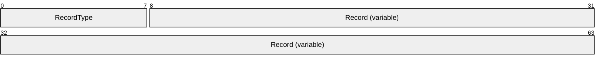

**RecordType (1 byte):** A single byte that identifies the type of record.

**Record (variable):** Dependent upon RecordType.

The following table shows the mapping for each RecordType. The RecordType MUST be one of the values listed in this table. The format for each record is further detailed after the table.

| RecordType | Record |
| --- | --- |
| 0x00 | Reserved |
| 0x01 | EndElement |
| 0x02 | Comment |
| 0x03 | Array |
| 0x04 | ShortAttribute |
| 0x05 | Attribute |
| 0x06 | ShortDictionaryAttribute |
| 0x07 | DictionaryAttribute |
| 0x08 | ShortXmlnsAttribute |
| 0x09 | XmlnsAttribute |
| 0x0A | ShortDictionaryXmlnsAttribute |
| 0x0B | DictionaryXmlnsAttribute |
| 0x0C 0x0D ... 0x24 0x25 | PrefixDictionaryAttributeA PrefixDictionaryAttributeB ... PrefixDictionaryAttributeY PrefixDictionaryAttributeZ |
| 0x26 0x27 ... 0x3E 0x3F | PrefixAttributeA PrefixAttributeB ... PrefixAttributeY PrefixAttributeZ |
| 0x40 | ShortElement |
| 0x41 | Element |
| 0x42 | ShortDictionaryElement |
| 0x43 | DictionaryElement |
| 0x44 0x45 ... 0x5C 0x5D | PrefixDictionaryElementA PrefixDictionaryElementB ... PrefixDictionaryElementY PrefixDictionaryElementZ |
| 0x5E 0x5F ... 0x76 0x77 | PrefixElementA PrefixElementB ... PrefixElementY PrefixElementZ |
| 0x78 0x79 … 0x7E 0x7F | Reserved |
| 0x80 | ZeroText |
| 0x81 | ZeroTextWithEndElement |
| 0x82 | OneText |
| 0x83 | OneTextWithEndElement |
| 0x84 | FalseText |
| 0x85 | FalseTextWithEndElement |
| 0x86 | TrueText |
| 0x87 | TrueTextWithEndElement |
| 0x88 | Int8Text |
| 0x89 | Int8TextWithEndElement |
| 0x8A | Int16Text |
| 0x8B | Int16TextWithEndElement |
| 0x8C | Int32Text |
| 0x8D | Int32TextWithEndElement |
| 0x8E | Int64Text |
| 0x8F | Int64TextWithEndElement |
| 0x90 | FloatText |
| 0x91 | FloatTextWithEndElement |
| 0x92 | DoubleText |
| 0x93 | DoubleTextWithEndElement |
| 0x94 | DecimalText |
| 0x95 | DecimalTextWithEndElement |
| 0x96 | DateTimeText |
| 0x97 | DateTimeTextWithEndElement |
| 0x98 | Chars8Text |
| 0x99 | Chars8TextWithEndElement |
| 0x9A | Chars16Text |
| 0x9B | Chars16TextWithEndElement |
| 0x9C | Chars32Text |
| 0x9D | Chars32TextWithEndElement |
| 0x9E | Bytes8Text |
| 0x9F | Bytes8TextWithEndElement |
| 0xA0 | Bytes16Text |
| 0xA1 | Bytes16TextWithEndElement |
| 0xA2 | Bytes32Text |
| 0xA3 | Bytes32TextWithEndElement |
| 0xA4 | StartListText |
| 0xA5 | Reserved |
| 0xA6 | EndListText |
| 0xA7 | Reserved |
| 0xA8 | EmptyText |
| 0xA9 | EmptyTextWithEndElement |
| 0xAA | DictionaryText |
| 0xAB | DictionaryTextWithEndElement |
| 0xAC | UniqueIdText |
| 0xAD | UniqueIdTextWithEndElement |
| 0xAE | TimeSpanText |
| 0xAF | TimeSpanTextWithEndElement |
| 0xB0 | UuidText |
| 0xB1 | UuidTextWithEndElement |
| 0xB2 | UInt64Text |
| 0xB3 | UInt64TextWithEndElement |
| 0xB4 | BoolText |
| 0xB5 | BoolTextWithEndElement |
| 0xB6 | UnicodeChars8Text |
| 0xB7 | UnicodeChars8Text WithEndElement |
| 0xB8 | UnicodeChars16Text |
| 0xB9 | UnicodeChars16TextWithEndElement |
| 0xBA | UnicodeChars32Text |
| 0xBB | UnicodeChars32TextWithEndElement |
| 0xBC | QNameDictionaryText |
| 0xBD | QNameDictionaryTextWithEndElement |
| 0xBE 0xBF … 0xFE 0xFF | Reserved |

<a id="Section_2.1.2"></a>
### 2.1.2 MultiByteInt31

This structure describes an unsigned 31-bit integer value in a variable- length packet. The size of the number to be stored determines the size of the packet according to the following mapping.

| Bit Range | Field | Description |
| --- | --- | --- |
| 1 byte | 0x00 to 0x7F | MultiByteInt31-(1 Byte) |
| Variable | 0x0080 to 0x3FFF | 2 bytes MultiByteInt31-(2 Bytes) |
| Variable | 0x004000 to 0x1FFFFF | 3 bytes MultiByteInt31-(3 Bytes) |
| Variable | 0x00200000 to 0x0FFFFFFF | 4 bytes MultiByteInt31-(4 Bytes) |
| Variable | 0x0010000000 to 0x007FFFFFFF | 5 bytes MultiByteInt31-(5 Bytes) |

<a id="Section_2.1.2.1"></a>
#### 2.1.2.1 MultiByteInt31-(1 Byte)

The MultiByteInt31-(1 Byte) packet is used to store unsigned integer values in the range of 0x00 to 0x7F (decimal 0 to 127) inclusive.

MultiByteInt31 (7 bits encoded in 1 byte)

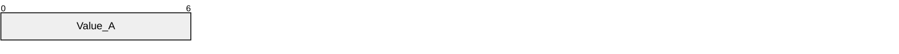

**Value_A (7 bits):** Seven LSB of value

| 0 | 1 | 2 | 3 | 4 | 5 | 6 | 7 |
| --- | --- | --- | --- | --- | --- | --- | --- |
| 0 | Value_A | - | - | - | - | - | - |

Example: decimal 17

| 0 | 1 | 2 | 3 | 4 | 5 | 6 |
| --- | --- | --- | --- | --- | --- | --- |
| 0 | 0 | 1 | 0 | 0 | 0 | 1 |

Encodes as follows.

| 0 | 1 | 2 | 3 | 4 | 5 | 6 | 7 |
| --- | --- | --- | --- | --- | --- | --- | --- |
| 0 | 0 | 0 | 1 | 0 | 0 | 0 | 1 |

Thus, the decimal value 17 is encoded as 1 byte, as in the following example.

0x11

<a id="Section_2.1.2.2"></a>
#### 2.1.2.2 MultiByteInt31-(2 Bytes)

The MultiByteInt31-(2 Bytes) packet is used to store unsigned integers in the range of 0x0080 to 0x3FFF (decimal 128 to 16383) inclusive.

MultiByteInt31 (14 bits encoded in 2 bytes)

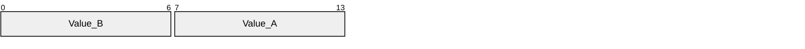

**Value_B (7 bits):** Second seven LSB of value

**Value_A (7 bits):** First seven LSB of value

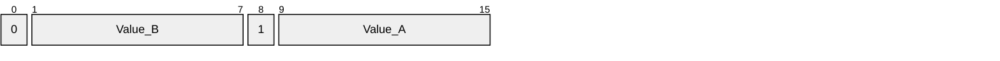

Example: decimal 145

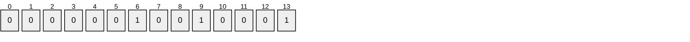

Encodes as follows.

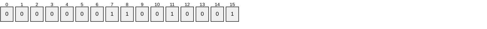

Thus, the decimal value 145 is encoded as 2 bytes, as in the following example.

0x91 0x01

Example: decimal 5521

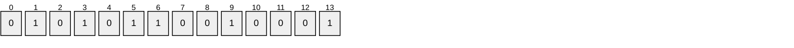

Encodes as follows.

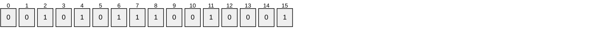

Thus, the decimal value 5521 is encoded in 2 bytes, as in the following example.

0x91 0x2B

<a id="Section_2.1.2.3"></a>
#### 2.1.2.3 MultiByteInt31-(3 Bytes)

The MultiByteInt31-(3 Bytes) packet is used to store unsigned integers in the range of 0x004000 to 0x1FFFFF (decimal 16384 to 2097151) inclusive.

MultiByteInt31 (21 bits encoded in 3 bytes)

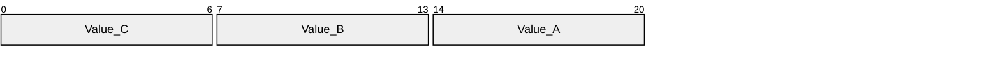

**Value_C (7 bits):** Third 7 LSB of value

**Value_B (7 bits):** Second 7 LSB of value

**Value_A (7 bits):** First 7 LSB of value

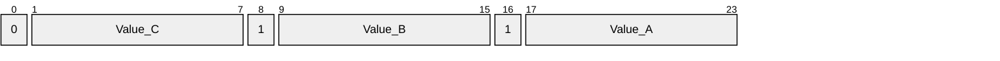

Example: decimal 16384

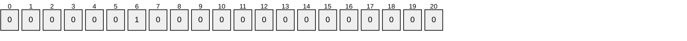

Encodes as follows.

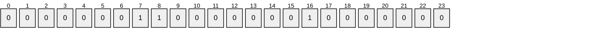

Thus, the decimal value 16384 is encoded in 3 bytes, as in the following example.

0x80 0x80 0x01

<a id="Section_2.1.2.4"></a>
#### 2.1.2.4 MultiByteInt31-(4 Bytes)

The MultiByteInt31-(4 Bytes) packet is used to store unsigned integers in the range of 0x00200000 to 0x0FFFFFFF (decimal 2097152 to 268435455) inclusive.

MultiByteInt31 (28 bits encoded in 4 bytes)

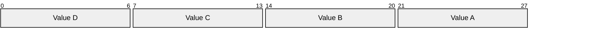

**Value D (7 bits):** Fourth 7 LSB of value

**Value C (7 bits):** Third 7 LSB of value

**Value B (7 bits):** Second 7 LSB of value

**Value A (7 bits):** First 7 LSB of value

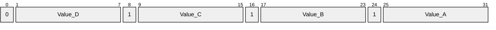

Example: decimal 268435456

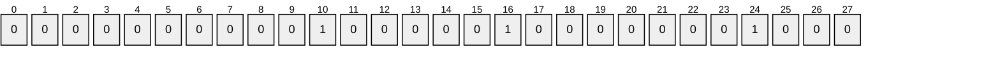

Encodes as follows.

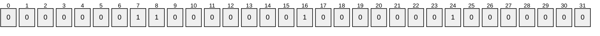

Thus, the decimal value 268435456 is encoded in 4 bytes, as in the following example.

0x80 0x80 0x80 0x01

<a id="Section_2.1.2.5"></a>
#### 2.1.2.5 MultiByteInt31-(5 Bytes)

The MultiByteInt31-(5 Bytes) packet is used to store unsigned integers in the range of 0x010000000 to 0x07FFFFFFF (decimal 268435456 to 2147483647) inclusive.

MultiByteInt31 (31 bits encoded in 5 bytes)

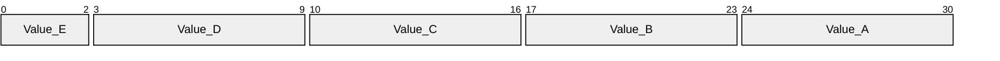

**Value_E (3 bits):** First 3 MSB of value

**Value_D (7 bits):** Fourth 7 LSB of value

**Value_C (7 bits):** Third 7 LSB of value

**Value_B (7 bits):** Second 7 LSB of value

**Value_A (7 bits):** First 7 LSB of value

Example: decimal 268435456

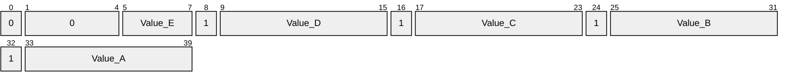


Encodes As:

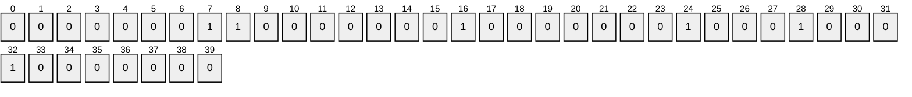

Thus, the decimal value 268435456 is encoded in 5 bytes, as in the following example.

0x80 0x80 0x80 0x80 0x01

<a id="Section_2.1.3"></a>
### 2.1.3 String

The String structure describes a set of characters encoded in [**UTF-8**](#gt_utf-8), as specified in [[RFC2279]](https://go.microsoft.com/fwlink/?LinkId=90331).

```mermaid
packet-beta
  0-63: "Length (variable)"
  64-127: "Bytes (variable)"
```

**Length (variable):** This is the length in bytes of the [**string**](#gt_string) when encoded in UTF-8, as specified in [RFC2279], and MUST be encoded using [**MultiByteInt31**](#gt_multibyteint31). For more information on MultiByteInt31 see section [2.1.2](#Section_2.1.2).

**Bytes (variable):** These are the bytes that constitute the string and MUST be encoded in UTF-8, as specified in [RFC2279].

For example, the string "abc" is encoded as 4 bytes.

0x03 0x61 0x62 0x63

This specification places no restrictions on the set of characters that can be encoded here.

<a id="Section_2.1.4"></a>
### 2.1.4 DictionaryString

The DictionaryString structure describes a reference to a set of characters.

```mermaid
packet-beta
  0-63: "Value (variable)"
```

**Value (variable):** An integer value encoded using [**MultiByteInt31**](#gt_multibyteint31). For more information on MultiByteInt31 see section [2.1.2](#Section_2.1.2). The [**string**](#gt_string) that the integer refers to is determined by the producer and consumer of the document.

This specification places no restrictions on the set of characters that can be referenced.

<a id="Section_2.2"></a>
## 2.2 Records

This section describes the format of each of the [**records**](#gt_record) noted earlier, and the characters they represent. The character representations of records are case sensitive and MUST use the exact casing depicted.

Records can largely be grouped into four categories:

- [Element Records](#Section_2.2.1)
- [Attribute Records](#Section_2.2.2)
- [Text Records](#Section_2.2.3)
- [Miscellaneous Records](#Section_2.3)
For reference, the record type is shown in hex following each record.

<a id="Section_2.2.1"></a>
### 2.2.1 Element Records

This section describes the different kinds of element [**records**](#gt_record). An element record is any record with a record type. See the following tables from 0x40 to 0x77 inclusive. Element records represent different kinds of elements in the [**XML**](#gt_xml) document.

<a id="Section_2.2.1.1"></a>
#### 2.2.1.1 ShortElement Record (0x40)

This structure represents an element without a prefix.

```mermaid
packet-beta
  0-63: "Name (variable)"
  64-127: "Attributes (variable)"
```

**Name (variable):** The name of the element encoded using [**String**](#gt_string). The length of this String MUST be nonzero. The name MUST NOT be "xmlns".

**Attributes (variable):** Zero or more attribute [**records**](#gt_record).

For example, if name refers to the string "element" and attributes refers to { xmlns="http://tempuri.org" }, this record is interpreted as the following characters.

<element_xmlns="http://tempuri.org">

Note that the underscore is intended to represent a single ASCII white-space character (32).

<a id="Section_2.2.1.2"></a>
#### 2.2.1.2 Element Record (0x41)

This structure represents an element with a prefix.

```mermaid
packet-beta
  0-63: "Prefix (variable)"
  64-127: "Name (variable)"
  128-191: "Attributes (variable)"
```

**Prefix (variable):** The prefix of the element encoded using [**String**](#gt_string). The length of this String MUST be nonzero. The name MUST NOT be "xmlns".

**Name (variable):** The name of the element encoded using String. The length of this String MUST be nonzero. The name MUST NOT be "xmlns".

**Attributes (variable):** Zero or more attribute [**records**](#gt_record).

For example, if prefix refers to the string "prefix", name refers to the string "element", and attributes refers to { xmlns:prefix="http://tempuri.org" }, this record is interpreted as the following characters.

<prefix:element_xmlns:prefix="http://tempuri.org">

Note that the underscore is intended to represent a single ASCII white-space character (32).

<a id="Section_2.2.1.3"></a>
#### 2.2.1.3 ShortDictionaryElement Record (0x42)

This structure represents an element without a prefix.

```mermaid
packet-beta
  0-63: "Name (variable)"
  64-127: "Attributes (variable)"
```

**Name (variable):** The name of the element encoded using [**DictionaryString**](#gt_dictionarystring). The length of this [**String**](#gt_string) MUST be nonzero. The name MUST NOT be "xmlns".

**Attributes (variable):** Zero or more attribute [**records**](#gt_record).

For example, if name refers to the String "element" and attributes refers to { xmlns="http://tempuri.org" }, this record is interpreted as the following characters.

<element_xmlns="http://tempuri.org">

Note that the underscore is intended to represent a single ASCII white-space character (32).

<a id="Section_2.2.1.4"></a>
#### 2.2.1.4 DictionaryElement Record (0x43)

This structure represents an element with a prefix.

```mermaid
packet-beta
  0-63: "Prefix (variable)"
  64-127: "Name (variable)"
  128-191: "Attributes (variable)"
```

**Prefix (variable):** The prefix of the element encoded using [**String**](#gt_string). The length of this String MUST be nonzero. The name MUST NOT be "xmlns".

**Name (variable):** The name of the element encoded using [**Dictionary**](#gt_dictionarystring). The length of this String MUST be nonzero. The name MUST NOT be "xmlns".

**Attributes (variable):** Zero or more attribute [**records**](#gt_record).

For example, if prefix refers to the string "prefix", name refers to the string "element", and attributes refers to { xmlns:prefix="http://tempuri.org" }, this record is interpreted as the following characters.

<prefix:element_xmlns:prefix="http://tempuri.org">

Note that the underscore is intended to represent a single ASCII white-space character (32).

#### PrefixDictionaryElement[A-Z] Record (0x44-0x5D)

This structure represents an element with a single lowercase letter prefix.

```mermaid
packet-beta
  0-63: "Name (variable)"
  64-127: "Attributes (variable)"
```

**Name (variable):** The name of the element encoded using [**DictionaryString**](#gt_dictionarystring). The length of this [**String**](#gt_string) MUST be nonzero. The name MUST NOT be "xmlns".

**Attributes (variable):** Zero or more attribute [**records**](#gt_record).

The prefix for this attribute is determined by the record type.

For example, if the record type is PrefixDictionaryElementB, name refers to the string "element", and attributes refers to { xmlns:b="http://tempuri.org" }, this record is interpreted as the following characters.

<b:element_xmlns:b="http://tempuri.org">

Note that the underscore is intended to represent a single ASCII white-space character (32).

#### PrefixElement[A-Z] Record (0x5E-0x77)

This structure represents an element with a single lowercase letter prefix.

```mermaid
packet-beta
  0-63: "Name (variable)"
  64-127: "Attributes (variable)"
```

**Name (variable):** The name of the element encoded using [**String**](#gt_string). The length of this String MUST be nonzero. The name MUST NOT be "xmlns".

**Attributes (variable):** Zero or more attribute [**records**](#gt_record).

The prefix for this attribute is determined by the record type.

For example, if the record type is PrefixElementB, name refers to the string "element", and attributes refers to { xmlns:b="http://tempuri.org" }, this record is interpreted as the following characters.

<b:element_xmlns:b="http://tempuri.org">

Note that the underscore is intended to represent a single ASCII white-space character (32).

<a id="Section_2.2.2"></a>
### 2.2.2 Attribute Records

This section describes the different kinds of attribute [**records**](#gt_record). An attribute record is any record with a record type (see Table 1) from 0x04 to 0x3F inclusive. An attribute record MUST follow another attribute record or an element record. Attribute records represent different kinds of attributes in the [**XML**](#gt_xml) document.

<a id="Section_2.2.2.1"></a>
#### 2.2.2.1 ShortAttribute Record (0x04)

This structure represents an attribute without a prefix.

```mermaid
packet-beta
  0-63: "Name (variable)"
  64-127: "Value (variable)"
```

**Name (variable):** The name of the attribute encoded using [**String**](#gt_string). The length of this String MUST be nonzero. The name MUST NOT be "xmlns".

**Value (variable):** The value of the attribute encoded using a text [**record**](#gt_record).

For example, if name refers to the string "attr" and value refers to the text "value", this record is interpreted as the following characters.

_attr="value"

Note that the underscore is intended to represent a single ASCII white-space character (32).

<a id="Section_2.2.2.2"></a>
#### 2.2.2.2 Attribute Record (0x05)

This structure represents an attribute with a prefix.

```mermaid
packet-beta
  0-63: "Prefix (variable)"
  64-127: "Name (variable)"
  128-191: "Value (variable)"
```

**Prefix (variable):** The prefix of the attribute encoded using [**String**](#gt_string). The length of this String MUST be nonzero. The prefix MUST NOT be "xmlns".

**Name (variable):** The name of the attribute encoded using String. The length of this String MUST be nonzero. The name MUST NOT be "xmlns".

**Value (variable):** The value of the attribute encoded using a single text [**record**](#gt_record) ([Text Records](#Section_2.2.3)).

For example, if prefix refers to the string "prefix", and the name refers to the string "attr", and value refers to the text "value", this record is interpreted as the following characters.

_prefix:attr="value"

Note that the underscore is intended to represent a single ASCII white-space character (32).

<a id="Section_2.2.2.3"></a>
#### 2.2.2.3 ShortDictionaryAttribute Record (0x06)

This structure represents an attribute without a prefix.

```mermaid
packet-beta
  0-63: "Name (variable)"
  64-127: "Value (variable)"
```

**Name (variable):** The name of the attribute encoded using [**DictionaryString**](#gt_dictionarystring). The length of this [**String**](#gt_string) MUST be nonzero. The name MUST NOT be "xmlns".

**Value (variable):** The value of the attribute encoded using a text [**record**](#gt_record).

For example if name refers to the string "attr" and value refers to the text "value", this record is interpreted as the following attribute.

_attr="value"

Note that the underscore is intended to represent a single ASCII white-space character (32).

<a id="Section_2.2.2.4"></a>
#### 2.2.2.4 DictionaryAttribute Record (0x07)

This structure represents an attribute with a prefix.

```mermaid
packet-beta
  0-63: "Prefix (variable)"
  64-127: "Name (variable)"
  128-191: "Value (variable)"
```

**Prefix (variable):** The prefix of the attribute encoded using [**String**](#gt_string). The length of this String MUST be nonzero. The prefix MUST NOT be "xmlns".

**Name (variable):** The name of the attribute encoded using [**DictionaryString**](#gt_dictionarystring). The length of this String MUST be nonzero. The name MUST NOT be "xmlns".

**Value (variable):** The value of the attribute encoded using a text [**record**](#gt_record).

For example, if prefix refers to the string "prefix", name refers to the string "attr", and value refers to the text "value", this record is interpreted as the following characters.

_prefix:attr="value"

Note that the underscore is intended to represent a single ASCII white-space character (32).

<a id="Section_2.2.2.5"></a>
#### 2.2.2.5 ShortXmlnsAttribute Record (0x08)

This structure represents an xmlns attribute without a prefix.

```mermaid
packet-beta
  0-63: "Value (variable)"
```

**Value (variable):** The value of the attribute encoded using [**String**](#gt_string).

For example, if value refers to the string "http://tempuri.org", this [**record**](#gt_record) is interpreted as the following characters.

_xmlns="http://tempuri.org"

Note that the underscore is intended to represent a single ASCII white-space character (32).

<a id="Section_2.2.2.6"></a>
#### 2.2.2.6 XmlnsAttribute Record (0x09)

This structure represents an xmlns attribute with a prefix.

```mermaid
packet-beta
  0-63: "Prefix (variable)"
  64-127: "Value (variable)"
```

**Prefix (variable):** The prefix of the attribute encoded using [**String**](#gt_string). The length of this String MUST be nonzero. The prefix MUST NOT be "xmlns".

**Value (variable):** The value of the attribute encoded using String.

For example, if prefix refers to the string "ENV" and value refers to the string "http://tempuri.org", this [**record**](#gt_record) is interpreted as the following characters.

_xmlns:ENV="http://tempuri.org"

Note that the underscore is intended to represent a single ASCII white-space character (32).

<a id="Section_2.2.2.7"></a>
#### 2.2.2.7 ShortDictionaryXmlnsAttribute Record (0x0A)

This structure represents an xmlns attribute without a prefix.

```mermaid
packet-beta
  0-63: "Value (variable)"
```

**Value (variable):** The value of the attribute encoded using [**DictionaryString**](#gt_dictionarystring).

For example, if value refers to the text "value", this [**record**](#gt_record) is interpreted as the following characters.

_xmlns="value"

Note that the underscore is intended to represent a single ASCII white-space character (32).

<a id="Section_2.2.2.8"></a>
#### 2.2.2.8 DictionaryXmlsAttribute Record (0x0B)

This structure represents an xmlns attribute with a prefix.

```mermaid
packet-beta
  0-63: "Prefix (variable)"
  64-127: "Value (variable)"
```

**Prefix (variable):** The prefix of the attribute encoded using [**String**](#gt_string). The length of this String MUST be nonzero. The prefix MUST NOT be "xmlns".

**Value (variable):** The value of the attribute encoded using [**DictionaryString**](#gt_dictionarystring).

For example, if prefix refers to the string "ENV" and value refers to the string "http://tempuri.org", this [**record**](#gt_record) is interpreted as the following characters.

_xmlns:ENV="http://tempuri.org"

Note that the underscore is intended to represent a single ASCII white-space character (32).

#### PrefixDictionaryAttribute[A-Z] Records (0x0C-0x25)

This structure represents an attribute with a single lowercase letter prefix.

```mermaid
packet-beta
  0-63: "Name (variable)"
  64-127: "Value (variable)"
```

**Name (variable):** The name of the attribute encoded using [**DictionaryString**](#gt_dictionarystring). The length of this [**String**](#gt_string) MUST be nonzero. The name MUST NOT be "xmlns".

**Value (variable):** The value of the attribute encoded using a text [**record**](#gt_record).

#### PrefixAttribute[A-Z] Records (0x26-0x3F)

This structure represents an attribute with a single lowercase letter prefix.

```mermaid
packet-beta
  0-63: "Name (variable)"
  64-127: "Value (variable)"
```

**Name (variable):** The name of the attribute encoded using [**String**](#gt_string). The length of this String MUST be nonzero. The name MUST NOT be "xmlns".

**Value (variable):** The value of the attribute encoded using text [**record**](#gt_record).

The prefix for this attribute is determined by the record type.

For example, if the record type is PrefixAttributeX, name refers to the string "attr", and value refers to the text "value", this record is interpreted as the following characters.

_x:attr="value"

Note that the underscore is intended to represent a single ASCII white-space character (32).

<a id="Section_2.2.3"></a>
### 2.2.3 Text Records

This section describes the different kinds of text [**records**](#gt_record). A text record is any record with a record type (see Table 1) from 0x80 to 0xBD inclusive. Text records are used to represent the attribute or element content of the [**XML**](#gt_xml) document.

<a id="Section_2.2.3.1"></a>
#### 2.2.3.1 ZeroText Record (0x80)

This structure represents attribute or element content and MUST be interpreted as representing the following characters.

0

There are no additional fields for this [**record**](#gt_record).

<a id="Section_2.2.3.2"></a>
#### 2.2.3.2 OneText Record (0x82)

This structure represents attribute or element content and MUST be interpreted as representing the following characters.

1

There are no additional fields for this [**record**](#gt_record).

<a id="Section_2.2.3.3"></a>
#### 2.2.3.3 FalseText Record (0x84)

This structure represents attribute or element content and MUST be interpreted as representing the following characters.

false

There are no additional fields for this [**record**](#gt_record).

<a id="Section_2.2.3.4"></a>
#### 2.2.3.4 TrueText Record (0x86)

This structure represents attribute or element content and MUST be interpreted as representing the following characters.

true

There are no additional fields for this [**record**](#gt_record).

<a id="Section_2.2.3.5"></a>
#### 2.2.3.5 Int8Text Record (0x88)

This structure represents attribute or element content.

```mermaid
packet-beta
  0-7: "Value"
```

**Value (1 byte):** The signed 8-bit integer value.

This structure MUST be interpreted as representing the characters formed by converting the value to base 10. The characters MUST be preceded by a minus sign "–" if the value is negative. There MUST NOT be any leading zeroes or decimal point.

For example, if value is 0x80, this is interpreted as the following characters.

-128

<a id="Section_2.2.3.6"></a>
#### 2.2.3.6 Int16Text Record (0x8A)

This structure represents attribute or element content.

```mermaid
packet-beta
  0-15: "Value"
```

**Value (2 bytes):** The signed 16-bit integer value.

This structure MUST be interpreted as representing the characters formed by converting the value to base 10. The characters MUST be preceded by a minus sign "–" if the value is negative. There MUST NOT be any leading zeroes or decimal point.

For example, if value is 0x8000, this is interpreted as the following characters.

-32768

<a id="Section_2.2.3.7"></a>
#### 2.2.3.7 Int32Text Record (0x8C)

This structure represents attribute or element content.

```mermaid
packet-beta
  0-31: "Value"
```

**Value (4 bytes):** The signed 32-bit integer value.

This structure MUST be interpreted as representing the characters formed by converting the value to base 10. The characters MUST be preceded by a minus sign "–" if the value is negative. There MUST NOT be any leading zeroes or decimal point.

For example, if value is 0x80000000, this is interpreted as the following characters.

-2147483648

<a id="Section_2.2.3.8"></a>
#### 2.2.3.8 Int64Text Record (0x8E)

This structure represents attribute or element content.

```mermaid
packet-beta
  0-63: "Value"
```

**Value (8 bytes):** The signed 64-bit integer value.

This structure MUST be interpreted as representing the characters formed by converting the value to base 10. The characters MUST be preceded by a minus sign "–" if the value is negative. There MUST NOT be any leading zeroes or decimal point.

For example, if value is 0x8000000000000000, this is interpreted as the following characters.

-9223372036854775808

<a id="Section_2.2.3.9"></a>
#### 2.2.3.9 FloatText Record (0x90)

This structure represents attribute or element content.

```mermaid
packet-beta
  0-31: "Value"
```

**Value (4 bytes):** The 32-bit single precision floating point value as described in [[IEEE754]](https://go.microsoft.com/fwlink/?LinkId=89903).

This structure MUST be interpreted as representing the characters formed by converting the value to base 10. The period "." MUST be used as the decimal point only if a fractional component exists. The least number of digits that exactly reproduces the IEEE representation MUST be used. There MUST NOT be any unnecessary leading or trailing zeroes, except when a decimal point is the first character, in which case a single zero "0" MUST precede the decimal point. Exponential notation MUST be used when the position of the decimal point is outside the range of significant digits. When exponential notation is used, the character "E" MUST be used, and MUST be followed by a plus sign "+" or minus sign "-", and MUST be followed by the magnitude of the exponent.

Furthermore, special values have special characters that MUST be used.

| Value | Characters |
| --- | --- |
| Infinity | INF |
| Negative infinity | -INF |
| Nan | NaN |
| Negative zero | -0 |

For example, if value is 0x3F8CCCCD, this is interpreted as the following characters.

1.1

<a id="Section_2.2.3.10"></a>
#### 2.2.3.10 DoubleText Record (0x92)

This structure represents attribute or element content.

```mermaid
packet-beta
  0-63: "Value"
```

**Value (8 bytes):** The 64-bit single precision floating point value as specified in [[IEEE754]](https://go.microsoft.com/fwlink/?LinkId=89903).

This structure MUST be interpreted as representing the characters formed by converting the value to base 10. The period "." MUST be used as the decimal point only if a fractional component exists. The least number of digits that exactly reproduces the IEEE representation MUST be used. There MUST NOT be any unnecessary leading or trailing zeroes, except when a decimal point is the first character, in which case a single zero "0" MUST precede the decimal point. Exponential notation MUST be used when the position of the decimal point is outside the range of significant digits. When exponential notation is used, the character "E" MUST be used, and MUST be followed by a plus sign "+" or minus sign "-", and MUST be followed by the magnitude of the exponent.

Furthermore, special values have special characters that MUST be used.

| Value | Characters |
| --- | --- |
| Infinity | INF |
| Negative infinity | -INF |
| Nan | NaN |
| Negative zero | -0 |

For example, if value is 0x4005BF0A8B145774, this is interpreted as the following characters.

2.7182818284590451

<a id="Section_2.2.3.11"></a>
#### 2.2.3.11 DecimalText Record (0x94)

This structure represents attribute or element content.

```mermaid
packet-beta
  0-95: "Value (16 bytes)"
```

**Value (16 bytes):** The decimal value encoded in 16-bytes as specified in [MS-OAUT](../MS-OAUT/MS-OAUT.md) section 2.2.26. See also [[IEEE854]](https://go.microsoft.com/fwlink/?LinkId=92966).

This structure MUST be interpreted as representing the characters formed by converting the value to base 10. The period "." MUST be used as the decimal point only if a fractional component exists. The least number of digits that exactly reproduces the IEEE representation MUST be used. There MUST NOT be any unnecessary leading or trailing zeros, except when a decimal point is the first character, in which case a single zero "0" MUST precede the decimal point.

For example, if value is 0x00000000004F2D800000000000060000, this is interpreted as the following characters.

5.123456

<a id="Section_2.2.3.12"></a>
#### 2.2.3.12 DateTimeText Record (0x96)

This structure represents attribute or element content.

```mermaid
packet-beta
  0-61: "Value"
  62-63: "TZ"
```

**Value (62 bits):** The 62-bit unsigned integer value that specifies the number of 100 nanoseconds that had elapsed since 12:00:00, January 1, 0001. The value can represent time instants in a granularity of 100 nanoseconds until 23:59:59.9999999, December 31, 9999. The value MUST be less than the decimal value 3155378976000000000.

**TZ (2 bits):** A two-bit unsigned integer that contains TimeZone information. This MUST be 0, 1, or 2.

This structure MUST be interpreted as representing the characters formed by converting the value to a date.

If the hour, minutes, seconds, and fraction of second parts are zero, the date MUST be interpreted as the following characters.

yyyy-MM-dd

Otherwise, if the fraction of a second part is zero, the date MUST be interpreted as the following characters.

yyyy-MM-ddTHH:mm:ss

Otherwise, the date MUST be interpreted as the following characters.

yyyy-MM-ddTHH:mm:ss.fffffff

where:

- yyyy is the four-digit representation of the year.
- MM is the two-digit representation of the month starting at "01".
- dd is the two-digit representation of the day of the month starting at "01".
- HH is the two-digit representation of the hour of the day starting at "00".
- mm is the two-digit representation of the minute of the hour starting at "00".
- ss is the two-digit representation of the second of the minute starting at "00".
- fffffff is up to seven digits representing the fraction of the second. There MUST be no trailing zeros.
All other characters are included as shown.

If TZ is one, then the time is in [**UTC (Coordinated Universal Time)**](#gt_utc-coordinated-universal-time), and the date MUST be interpreted as having a trailing character "Z".

If TZ is two, then the time is a local time, and the date MUST be interpreted as having additional characters that indicate the [**UTC**](#gt_coordinated-universal-time-utc) offset. The UTC offset MUST be the time zone offset in which the document is being decoded.

If the UTC offset is positive, the date MUST be interpreted as having the following additional characters.

+HH:mm

If the UTC offset is negative, the date MUST be interpreted as having the following additional characters.

-HH:mm

where:

- HH is the two-digit representation of the absolute value of the hour UTC offset starting at "00".
- mm is the two-digit representation of the absolute value of the minute UTC offset starting at "00".
All other characters are included as shown.

If TZ is zero, the time is not specified as either UTC or a local time and nothing further is added.

The interpreted format of a DateTimeText record is [[ISO-8601]](https://go.microsoft.com/fwlink/?LinkId=89920) compliant.

<a id="Section_2.2.3.13"></a>
#### 2.2.3.13 Chars8Text Record (0x98)

This structure represents attribute or element content.

```mermaid
packet-beta
  0-7: "Length"
  8-63: "Bytes (variable)"
```

**Length (1 byte):** This is the length in bytes of the [**UTF-8**](#gt_utf-8) [[RFC2279]](https://go.microsoft.com/fwlink/?LinkId=90331)-encoded [**string**](#gt_string) and is represented as UINT8.

**Bytes (variable):** The string encoded as UTF-8 [RFC2279] bytes.

For example, if length is 3 and bytes = { 0x41, 0x42, 0x43 }, this [**record**](#gt_record) is interpreted as the following characters.

abc

UTF-8 [RFC2279]-encoded sequences MUST be fully formed. There MUST not be any partial UTF-8 [RFC2279] sequences within a record. UTF-8 [RFC2279] sequences that expand to a low surrogate character MUST be paired with a high surrogate character. (For more information on surrogate characters, see [[UNICODE]](https://go.microsoft.com/fwlink/?LinkId=90550).)

<a id="Section_2.2.3.13.1"></a>
##### 2.2.3.13.1 Character Escaping

Characters MUST be interpreted as minimally escaped. This means that a character MUST be interpreted as escaped only if it is required to be escaped for the character to be legal at this point in the [**XML**](#gt_xml) document. Characters considered illegal by XML MUST be considered escaped.

If a character must be interpreted as escaped and it is one of the characters in the first column of the following table, it MUST be interpreted as the characters in the second column.

| Character | Interpret as |
| --- | --- |
| " | &quot |
| & | &amp |
| < | &lt |
| > | &gt |
| ' | &apos |

Otherwise if a character does not fall within the legal character ranges defined in XML, the character MUST be interpreted as the following characters.

&#digits;

where digits is the value of the character expressed in base 10 characters. There MUST NOT be any unnecessary leading zeros in this representation.

For example, if length is 6, and bytes = { 0x22, 0x26, 0x3C, 0x3E, 0x27, 0x00 }, and this [**record**](#gt_record) is within an element, this record is interpreted as the following characters.

"&<>'

The ampersand (&), less than sign (<), and greater than sign (>) are required by XML to be escaped in element content; quotation marks (") and single quotation marks (') are not required to be escaped. The zero (0) is invalid in XML, but MUST be interpreted as appearing in its escaped form.

If the same record appeared as an attribute, this record is interpreted as the following characters.

"&<>'

<a id="Section_2.2.3.14"></a>
#### 2.2.3.14 Chars16Text Record (0x9A)

This structure represents attribute or element content.

```mermaid
packet-beta
  0-15: "Length"
  16-63: "Bytes (variable)"
```

**Length (2 bytes):** This is the length in bytes of the [**UTF-8**](#gt_utf-8) [[RFC2279]](https://go.microsoft.com/fwlink/?LinkId=90331)-encoded [**string**](#gt_string) and is represented as UINT16.

**Bytes (variable):** The string encoded as UTF-8 [RFC2279] bytes.

See [Chars8Text Record](#Section_2.2.3.27) for examples.

<a id="Section_2.2.3.15"></a>
#### 2.2.3.15 Chars32Text Record (0x9C)

This structure represents attribute or element content.

```mermaid
packet-beta
  0-31: "Length"
  32-95: "Bytes (variable)"
```

**Length (4 bytes):** This is the length in bytes of the [**string**](#gt_string) when encoded in [**UTF-8**](#gt_utf-8), as specified in [[RFC2279]](https://go.microsoft.com/fwlink/?LinkId=90331), and is represented as INT32. The value of Length MUST be positive.

**Bytes (variable):** The string encoded as UTF-8 [RFC2279] bytes.

See [Chars8Text Record](#Section_2.2.3.27) for examples.

<a id="Section_2.2.3.16"></a>
#### 2.2.3.16 Bytes8Text Record (0x9E)

This structure represents attribute or element content.

```mermaid
packet-beta
  0-7: "Length"
  8-63: "Bytes (variable)"
```

**Length (1 byte):** This is the length, in bytes, of the binary data and is represented as UINT8.

**Bytes (variable):** The binary data.

This [**record**](#gt_record) MUST be interpreted as the characters obtained by encoding the bytes in [**base64**](#gt_179b9392-9019-45a3-880b-26f6890522b7) as specified in [[RFC3548]](https://go.microsoft.com/fwlink/?LinkId=90432).

For example, if length is 3 and bytes = { 0x01, 0x02, 0x03 }, this record is interpreted as the following characters.

AQID

If length is 1 and bytes = { 0xFF }, this record MUST be interpreted as the following characters.

/w==

<a id="Section_2.2.3.17"></a>
#### 2.2.3.17 Bytes16Text Record (0xA0)

This structure represents attribute or element content.

```mermaid
packet-beta
  0-15: "Length"
  16-63: "Bytes (variable)"
```

**Length (2 bytes):** This is the length in bytes of the binary data and is represented as UINT16.

**Bytes (variable):** The binary data.

See [Bytes8Text Record](#Section_2.2.3.16) for examples.

<a id="Section_2.2.3.18"></a>
#### 2.2.3.18 Bytes32Text Record (0xA2)

This structure represents attribute or element content.

```mermaid
packet-beta
  0-31: "Length"
  32-95: "Bytes (variable)"
```

**Length (4 bytes):** This is the length in bytes of the binary data and is represented as INT32. The value of Length MUST be positive.

**Bytes (variable):** The binary data.

See [Bytes8Text Record](#Section_2.2.3.16) for examples.

<a id="Section_2.2.3.19"></a>
#### 2.2.3.19 StartListText / EndListText Records (0xA4, 0xA6)

This structure represents attribute or element content. These [**records**](#gt_record) identify the start and end of a list of text records separated by a single whitespace character. They have no additional fields. The records that they bracket MUST be text records and MUST NOT contain a StartListText or EndListText record. An EndListText record MUST have a corresponding StartListText record.

For example, this sequence of records

StartListText

TrueText

FalseText

ZeroText

OneText

EndListText

is interpreted as the following characters.

true_false_0_1

Note that the underscore is intended to represent a single ASCII white-space character (32).

<a id="Section_2.2.3.20"></a>
#### 2.2.3.20 EmptyText Record (0xA8)

This structure represents a zero-length [**string**](#gt_string). It has no additional fields. It MUST be interpreted as no characters.

<a id="Section_2.2.3.21"></a>
#### 2.2.3.21 DictionaryText Record (0xAA)

This structure represents attribute or element content.

```mermaid
packet-beta
  0-63: "Value (variable)"
```

**Value (variable):** The value of the [**string**](#gt_string) encoded using [**DictionaryString**](#gt_dictionarystring).

For example, if value refers to the string "hello", this [**record**](#gt_record) is interpreted as the following characters.

hello

See [Character Escaping](#Section_2.2.3.13.1) for notes on escaping of characters.

<a id="Section_2.2.3.22"></a>
#### 2.2.3.22 UniqueIdText Record (0xAC)

This structure represents attribute or element content.

```mermaid
packet-beta
  0-31: "Data1"
  32-47: "Data2"
  48-63: "Data3"
  64-71: "Data4_1"
  72-79: "Data4_2"
  80-87: "Data4_3"
  88-95: "Data4_4"
  96-103: "Data4_5"
  104-111: "Data4_6"
  112-119: "Data4_7"
  120-127: "Data4_8"
```

**Data1 (4 bytes):** The first 4 bytes of the [**UUID**](#gt_universally-unique-identifier-uuid). For more information see [[RFC4122]](https://go.microsoft.com/fwlink/?LinkId=90460).

**Data2 (2 bytes):** The 5th and 6th bytes of the UUID. For more information see [RFC4122].

**Data3 (2 bytes):** The 7th and 8th bytes of the UUID. For more information see [RFC4122].

**Data4_1 (1 byte):** The 9th byte of the UUID. For more information see [RFC4122].

**Data4_2 (1 byte):** The 10th byte of the UUID. For more information see [RFC4122].

**Data4_3 (1 byte):** The 11th byte of the UUID. For more information see [RFC4122].

**Data4_4 (1 byte):** The 12th byte of the UUID. For more information see [RFC4122].

**Data4_5 (1 byte):** The 13th byte of the UUID. For more information see [RFC4122].

**Data4_6 (1 byte):** The 14th byte of the UUID. For more information see [RFC4122].

**Data4_7 (1 byte):** The 15th byte of the UUID. For more information see [RFC4122].

**Data4_8 (1 byte):** The 16th byte of the UUID. For more information see [RFC4122].

This [**record**](#gt_record) MUST be interpreted as the characters representing the UUID prefixed by the characters "urn:uuid:". The characters in the UUID MUST use lowercase. For example, if Data1 = 0x33221100, Data2 = 0x5544, Data3 = 0x7766, and Data4 = { 0x88, 0x99, 0xaa, 0xbb, 0xcc, 0xdd, 0xee, 0xff }, this record is interpreted as the following characters.

urn:uuid:33221100-5544-7766-8899-aabbccddeeff

<a id="Section_2.2.3.23"></a>
#### 2.2.3.23 TimeSpanText Record (0xAE)

This structure represents attribute or element content.

```mermaid
packet-beta
  0-63: "Value"
```

**Value (8 bytes):** A 64-bit signed integer value that specifies a duration in 100 nanosecond units. The values range from -10675199 days, 2 hours, 48 minutes, and 05.4775808 seconds to 10675199 days, 2 hours, 48 minutes, and 05.4775807 seconds.

This structure MUST be interpreted as representing the characters formed by converting the value as follows:

If the day part is non-zero and the fraction of a second part is zero, then the time MUST be interpreted as the following characters.

DDDDDDDD.HH:mm:ss

Otherwise, if the day part is non-zero and the fraction of a second part is non-zero, the time MUST be interpreted as the following characters.

DDDDDDDD.HH:mm:ss.fffffff

Otherwise, if the day part is zero and the fraction of a second part is zero, then the time MUST be interpreted as the following characters.

HH:mm:ss

Otherwise, the time MUST be interpreted as the following characters.

HH:mm:ss.fffffff

where:

- DDDDDDDD is up to eight digits representing the number of days.
- HH is the two-digit representation of the hour of the day starting at "00".
- mm is the two-digit representation of the minute of the hour starting at "00".
- ss is the two-digit representation of the second of the hour starting at "00".
- fffffff is up to seven digits representing the fraction of the second. There MUST be no trailing zeros.
All other characters are included as shown.

<a id="Section_2.2.3.24"></a>
#### 2.2.3.24 UuidText Record (0xB0)

This structure represents attribute or element content.

```mermaid
packet-beta
  0-31: "Data1"
  32-47: "Data2"
  48-63: "Data3"
  64-71: "Data4_1"
  72-79: "Data4_2"
  80-87: "Data4_3"
  88-95: "Data4_4"
  96-103: "Data4_5"
  104-111: "Data4_6"
  112-119: "Data4_7"
  120-127: "Data4_8"
```

**Data1 (4 bytes):** The first 4 bytes of the [**UUID**](#gt_universally-unique-identifier-uuid). For more information see [[RFC4122]](https://go.microsoft.com/fwlink/?LinkId=90460).

**Data2 (2 bytes):** The first 5th and 6th bytes of the UUID. For more information see [RFC4122].

**Data3 (2 bytes):** The first 7th and 8th bytes of the UUID. For more information see [RFC4122].

**Data4_1 (1 byte):** The 9th byte of the UUID. For more information see [RFC4122].

**Data4_2 (1 byte):** The 10th byte of the UUID. For more information see [RFC4122].

**Data4_3 (1 byte):** The 11th byte of the UUID. For more information see [RFC4122].

**Data4_4 (1 byte):** The 12th byte of the UUID. For more information see [RFC4122].

**Data4_5 (1 byte):** The 13th byte of the UUID. For more information see [RFC4122].

**Data4_6 (1 byte):** The 14th byte of the UUID. For more information see [RFC4122].

**Data4_7 (1 byte):** The 15th byte of the UUID. For more information see [RFC4122].

**Data4_8 (1 byte):** The 16th byte of the UUID. For more information see [RFC4122].

This [**record**](#gt_record) MUST be interpreted as the characters representing the UUID. The characters in the UUID MUST use lowercase. For example, if Data1 = 0x33221100, Data2 = 0x5544, Data3 = 0x7766, and Data4 = { 0x88, 0x99, 0xaa, 0xbb, 0xcc, 0xdd, 0xee, 0xff }, this record is interpreted as the following characters.

33221100-5544-7766-8899-aabbccddeeff

Note that this record differs from the UniqueIdText record only by the absence of the characters "urn:uuid:".

<a id="Section_2.2.3.25"></a>
#### 2.2.3.25 UInt64Text Record (0xB2)

This structure represents attribute or element content.

```mermaid
packet-beta
  0-63: "Value"
```

**Value (8 bytes):** The unsigned 64-bit integer value.

This structure MUST be interpreted as representing the characters formed by converting the value to base 10. There MUST NOT be any leading zeroes or decimal point.

For example, if value is 0xFFFFFFFFFFFFFFFF, this is interpreted as the following characters.

18446744073709551615

<a id="Section_2.2.3.26"></a>
#### 2.2.3.26 BoolText Record (0xB4)

This structure represents attribute or element content.

```mermaid
packet-beta
  0-7: "Value"
```

**Value (1 byte):** The Boolean value. This value MUST be 0 or 1.

If the value is 0, this [**record**](#gt_record) MUST be interpreted as the following characters.

false

If value is 1, this record MUST be interpreted as the following characters.

true

<a id="Section_2.2.3.27"></a>
#### 2.2.3.27 UnicodeChars8Text Record (0xB6)

This structure represents attribute or element content.

```mermaid
packet-beta
  0-7: "Length"
  8-63: "Bytes (variable)"
```

**Length (1 byte):** The length in bytes of the [**UTF-16**](#gt_utf-16) [[RFC2781]](https://go.microsoft.com/fwlink/?LinkId=90380)-encoded [**string**](#gt_string).

**Bytes (variable):** The string encoded as UTF-16 [RFC2781] bytes.

For example, if the length is 6 and bytes = { 0x41, 0x00, 0x42, 0x00, 0x43, 0x00 }, this [**record**](#gt_record) is interpreted as the following characters.

abc

See [Chars8Text Record](#Section_2.2.3.27) for notes on escaping of characters.

<a id="Section_2.2.3.28"></a>
#### 2.2.3.28 UnicodeChars16Text Record (0xB8)

This structure represents attribute or element content.

```mermaid
packet-beta
  0-15: "Length"
  16-63: "Bytes (variable)"
```

**Length (2 bytes):** The length in bytes of the [**UTF-16**](#gt_utf-16) [[RFC2781]](https://go.microsoft.com/fwlink/?LinkId=90380) encoded [**string**](#gt_string).

**Bytes (variable):** The string encoded as UTF-16 [RFC2781] bytes.

See [UnicodeChars8Text Record](#Section_2.2.3.27) for examples.

<a id="Section_2.2.3.29"></a>
#### 2.2.3.29 UnicodeChars32TextRecord(0xBA)

This structure represents attribute or element content.

```mermaid
packet-beta
  0-63: "Length (variable)"
  64-127: "Bytes (variable)"
```

**Length (variable):** This is the length in bytes of the [**string**](#gt_string) when encoded in [**UTF-16**](#gt_utf-16), as specified in [[RFC2781]](https://go.microsoft.com/fwlink/?LinkId=90380), and MUST be encoded using [**MultiByteInt31**](#gt_multibyteint31).

**Bytes (variable):** The string encoded as UTF-16 [RFC2781] bytes.

See [UnicodeChars8Text Record](#Section_2.2.3.27) for examples.

<a id="Section_2.2.3.30"></a>
#### 2.2.3.30 QNameDictionaryTextRecord(0xBC)

This structure represents attribute or element content.

```mermaid
packet-beta
  0-7: "Prefix"
  8-127: "Name (variable)"
```

**Prefix (1 byte):** A value from 0 to 25 inclusive, indicating a single lowercase prefix character.

**Name (variable):** The name encoded as a [**DictionaryString**](#gt_dictionarystring).

For example, if prefix is 1 and name refers to the [**string**](#gt_string) "name", this [**record**](#gt_record) is interpreted as the following characters.

b:name

<a id="Section_2.2.3.31"></a>
#### 2.2.3.31 *TextWithEndElement Records

These [**records**](#gt_record) are a simple optimization intended to reduce the size of the document.

[**XML**](#gt_xml) of the form

<value>123</value>

can be represented by three records in the following format.

ShortElement(name="value")

Chars8Text(value="123")

EndElement

By marking the Text record to indicate that an EndElement follows, the number of records can be reduced.

ShortElement(name="value")

Chars8TextWithEndElement(value="123")

Any record with the name in the form *TextWithEndElement MUST be interpreted as a sequence of two records: A *Text record followed by an EndElement record.

For example, the Int32TextWithEndElement record is interpreted as an Int32TextRecord followed by an EndElement record and must behave identically.

These records MUST NOT be used inside Attribute records.

<a id="Section_2.3"></a>
## 2.3 Miscellaneous Records

This section lists the few remaining [**records**](#gt_record) that are not element, attribute, or text records.

<a id="Section_2.3.1"></a>
### 2.3.1 EndElement Record (0x01)

This structure represents an end element. There are no additional fields for this [**record**](#gt_record) beyond the record type.

This record MUST be interpreted as the end element of the most recent open element and there MUST exist such an element. For example, if the most recent element record corresponded to the following start element

<ENV:envelope>

then this record is interpreted as the following characters.

</ENV:envelope>

Additionally, this record MUST be interpreted as closing the most recently open element.

<a id="Section_2.3.2"></a>
### 2.3.2 Comment Record (0x02)

This structure represents a comment.

```mermaid
packet-beta
  0-63: "Value (variable)"
```

**Value (variable):** The text of the comment encoded using [**String**](#gt_string).

For example, if the value field represents the string "comment", this [**record**](#gt_record) is interpreted as the following characters.

<!--comment-->

<a id="Section_2.3.3"></a>
### 2.3.3 Array Record (0x03)

This structure represents a series of repeating elements.

```mermaid
packet-beta
  0-63: "Element (variable)"
  64-71: "End Element"
  72-79: "Record Type"
  80-127: "Length (variable)"
  128-191: "Data (variable)"
```

**Element (variable):** An Element [**record**](#gt_record).

**End Element (1 byte):** An EndElement record.

**Record Type (1 byte):** The record type of the element content. This MUST be one of the values in the following table.

**Length (variable):** The number of elements, encoded with [**MultiByteInt31**](#gt_multibyteint31). This MUST not be zero.

**Data (variable):** The values for the elements, encoded according to RecordType.

The size of Data is the Length multiplied by the size of the RecordType according to the following table.

| Bit Range | Field | Description |
| --- | --- | --- |
| Variable | 0xB5 | BoolTextWithEndElement 1 |
| Variable | 0x8B | Int16TextWithEndElement 2 |
| Variable | 0x8D | Int32TextWithEndElement 4 |
| Variable | 0x8F | Int64TextWithEndElement 8 |
| Variable | 0x91 | FloatTextWithEndElement 4 |
| Variable | 0x93 | DoubleTextWithEndElement 8 |
| Variable | 0x95 | DecimalTextWithEndElement 16 |
| Variable | 0x97 | DateTimeTextWithEndElement 8 |
| Variable | 0xAF | TimeSpanTextWithEndElement 8 |
| Variable | 0XB1 | UuidTextWithEndElement 16 |

This record MUST be interpreted as the characters resulting from expanding this record into a series of records where the Element record is repeated for each value.

For example, if the Element and Attribute records expand to the following

<item xmlns='http://tempuri.org'>

and RecordType is Int32TextWithEndElement, and Length = 3, and Values = { 0x01, 0x00, 0x00, 0x00, 0x02, 0x00, 0x00, 0x00, 0x03, 0x00, 0x00, 0x00 }, this is interpreted as the following characters.

<item xmlns='http://tempuri.org'>1</item>

<item xmlns='http://tempuri.org'>2</item>

<item xmlns='http://tempuri.org'>3</item>

Since Length is 3 and the size of Int32TextWithEndElement is 4 according to the table, the size of Data is 12.. Values consist of 3 integer values, each encoded in 4 bytes as demanded by Int32TextWithEndElement. (As discussed in section [2.2.3.31](#Section_2.2.3.31), this MUST be interpreted as Int32Text followed by EndElement.)

Note that there is no carriage return or line feed included here, and the line break shown is for readability only.

<a id="Section_3"></a>
# 3 Structure Examples

The following table provides an example of almost every [**record**](#gt_record) type, and shows the character interpretations.

The record column shows each of the record types. The Type column shows the value of the record type, which is taken from Table 1. The Bytes column show a complete [**XML**](#gt_xml) document encoded in this format that highlights the use of the record type. Because the record type is not always first, its location in the sequence of bytes is highlighted. The Chars column shows the same data from the Bytes column, formatted as characters. The final column, Characters represented, shows the XML interpretation of the bytes.

**Note** Records that refer to [**strings**](#gt_string) outside the document are shown as "strXXX" where XXX is the integer value.

| Bit Range | Field | Description |
| --- | --- | --- |
| Variable | EndElement | 01 40 03 64 6F 63 01 @.doc. <doc></doc> |
| Variable | Comment | 02 02 07 63 6F 6D 6D 65 6E 74 ..comment <!--comment--> |
| Variable | Array | 03 03 40 03 61 72 72 01 8B 03 33 33 88 88 DD DD .@.arr... 33..YY <arr>13107</arr> <arr>-30584</arr> <arr>-8739</arr> |
| Variable | ShortAttribute | 04 40 03 64 6F 63 04 04 61 74 74 72 84 01 @.doc..attr.. <doc attr="false"> </doc> |
| Variable | Attribute | 05 40 03 64 6F 63 09 03 70 72 65 0A 68 74 74 70 3A 2F 2F 61 62 63 05 03 70 72 65 04 61 74 74 72 84 01 @.doc..pre.http://abc..pre. attr.. <doc xmlns: pre="http://abc " pre:attr="false"> </doc> |
| Variable | ShortDictionary Attribute | 06 40 03 64 6F 63 06 08 86 01 @.doc.... <doc str8="true"> </doc> |
| Variable | DictionaryAttribute | 07 40 03 64 6F 63 09 03 70 72 65 0A 68 74 74 70 3A 2F 2F 61 62 63 07 03 70 72 65 00 86 01 @.doc..pre.http://abc.. pre... <doc xmlns:pre= "http://abc" p re:str0="true"> </doc> |
| Variable | ShortXmlnsAttribute | 08 40 03 64 6F 63 08 0A 68 74 74 70 3A 2F 2F 61 62 63 01 @.doc..http://abc. <doc xmlns="http: //abc"> </doc> |
| Variable | XmlnsAttribute | 09 40 03 64 6F 63 09 01 70 0A 68 74 74 70 3A 2F 2F 61 62 63 01 @.doc..p.http://abc. <doc xmlns:p="http: //abc"> </doc> |
| Variable | ShortDictionaryXmlns Attribute | 0A 40 03 64 6F 63 0A 04 01 @.doc... <doc xmlns="str4"> </doc> |
| Variable | DictionaryXmlns Attribute | 0B 40 03 64 6F 63 0B 01 70 04 01 @.doc..p.. <doc xmlns:p="str4"> </doc> |
| Variable | PrefixDictionary AttributeF | 11 40 03 64 6F 63 09 01 66 0A 68 74 74 70 3A 2F 2F 61 62 63 11 0B 98 05 68 65 6C 6C 6F 01 @.doc..f. http://abc ....hello. <doc xmlns:f="http: //abc" f:str11="hello"> </doc> |
| Variable | PrefixDictionary AttributeX | 23 40 03 64 6F 63 09 01 78 0A 68 74 74 70 3A 2F 2F 61 62 63 23 15 98 05 77 6F 72 6C 64 01 @.doc..x .http://abc# ...world. <doc xmlns:x="http://abc " x:str21="world"></doc> |
| Variable | PrefixAttributeK | 30 40 03 64 6F 63 09 01 6B 0A 68 74 74 70 3A 2F 2F 61 62 63 30 04 61 74 74 72 86 01 @.doc.. k.http:// abc0.attr.. <doc xmlns:k= "http://abc" k:attr="true"></doc> |
| Variable | PrefixAttributeZ | 3F 40 03 64 6F 63 09 01 7A 0A 68 74 74 70 3A 2F 2F 61 62 63 3F 03 61 62 63 98 03 78 79 7A 01 @.doc..z .http://abc? .abc..xyz. <doc xmlns:z= "http://abc" z:abc= "xyz"> </doc> |
| Variable | ShortElement | 40 40 03 64 6F 63 01 @.doc. <doc></doc> |
| Variable | Element | 41 41 03 70 72 65 03 64 6F 63 09 03 70 72 65 0A 68 74 74 70 3A 2F 2F 61 62 63 01 A.pre.doc ..pre.http: //abc. <pre:doc xmlns:pre= "http://abc"> </pre:doc> |
| Variable | ShortDictionary Element | 42 42 0E 01 B.. <str14></str14> |
| Variable | DictionaryElement | 43 43 03 70 72 65 0E 09 03 70 72 65 0A 68 74 74 70 3A 2F 2F 61 62 63 01 C.pre...pre. http://abc. <pre:str14 xml ns:pre="http: //abc"></pre:str14> |
| Variable | PrefixDictionary ElementA | 44 44 0A 09 01 61 0A 68 74 74 70 3A 2F 2F 61 62 63 01 D...a.http:// abc. <a:str10 xmlns:a= "http://abc"> </a:str10> |
| Variable | PrefixDictionary ElementS | 56 56 26 09 01 73 0A 68 74 74 70 3A 2F 2F 61 62 63 01 V&..s.http: //abc. <s:str38 xmlns:s= "http://abc"> </s:str38> |
| Variable | PrefixElementA | 5E 5E 05 68 65 6C 6C 6F 09 01 61 0A 68 74 74 70 3A 2F 2F 61 62 63 01 ^.hello..a. http://abc. <a:hello xmlns:a= "http://abc"> </a:hello> |
| Variable | PrefixElementS | 70 70 09 4D 79 4D 65 73 73 61 67 65 09 01 73 0A 68 74 74 70 3A 2F 2F 61 62 63 01 p.MyMessage.. s.http://abc. <s:MyMessage xmlns:s= "http://abc"> </s:MyMessage> |
| Variable | ZeroText | 80 40 03 64 6F 63 06 A0 03 80 01 @.doc.ÿ... <doc str416="0"> </doc> |
| Variable | ZeroTextWithEnd Element | 81 40 03 61 62 63 81 @.abc. <abc>0</abc> |
| Variable | OneText | 82 40 03 64 6F 63 06 00 82 01 @.doc.... <doc str0="1"> </doc> |
| Variable | OneTextWithEnd Element | 83 40 03 61 62 63 83 @.abc. <abc>1</abc> |
| Variable | FalseText | 84 40 03 64 6F 63 06 00 84 01 @.doc.... <doc str0="false"> </doc> |
| Variable | FalseTextWithEnd Element | 85 40 03 61 62 63 85 @.abc. <abc>false</abc> |
| Variable | TrueText | 86 40 03 64 6F 63 06 00 86 01 @.doc.... <doc str0="true"> </doc> |
| Variable | TrueTextWithEnd Element | 87 40 03 61 62 63 87 @.abc. <abc>true</abc> |
| Variable | Int8Text | 88 40 03 64 6F 63 06 EC 01 88 DE 01 @.doc.□.._. <doc str236="-34"> </doc> |
| Variable | Int8TextWithEnd Element | 89 42 9A 01 89 7F B.... <str154>127</str154> |
| Variable | Int16Text | 8A 40 03 64 6F 63 06 EC 01 8A 00 80 01 @.doc.□..... <doc str236="-32768"> </doc> |
| Variable | Int16TextWithEnd Element | 8B 42 9A 01 8B FF 7F B...˜. <str154>32767</str154> |
| Variable | Int32Text | 8C 40 03 64 6F 63 06 EC 01 8C 15 CD 5B 07 01 @.doc.□...I[.. <doc str236="123456789"> </doc> |
| Variable | Int32TextWithEnd Element | 8D 42 9A 01 8D FF FF FF 7F B...˜˜˜. <str154>2147483647 </str154> |
| Variable | Int64Text | 8E 40 03 64 6F 63 06 EC 01 8E 00 00 00 80 00 00 00 00 01 @.doc.□........... <doc str236="2147483648"> </doc> |
| Variable | Int64TextWithEnd Element | 8F 42 9A 01 8F 00 00 00 00 00 01 00 00 B........... <str154>1099511627776 </str154> |
| Variable | FloatText | 90 40 03 64 6F 63 04 01 61 90 CD CC 8C 3F 01 @.doc..a.II.?. <doc a="1.1"></doc> |
| Variable | FloatTextWithEnd Element | 91 40 05 50 72 69 63 65 91 CD CC 01 42 @.Price.II.B <Price>32.45</Price> |
| Variable | DoubleText | 92 40 03 64 6F 63 04 01 61 92 74 57 14 8B 0A BF 05 40 01 @.doc..a.tW...¨.@. <doc a="2.71828182845905"> </doc> |
| Variable | DoubleTextWithEnd Element | 93 40 02 50 49 93 11 2D 44 54 FB 21 09 40 @.PI..-DT–!.@ <PI>3.14159265358979 </PI> |
| Variable | DecimalText | 94 40 03 64 6F 63 04 03 69 6E 74 94 00 00 06 00 00 00 00 00 80 2D 4E 00 00 00 00 00 01 @.doc..int..... .....-N ...... <doc int="5.123456"> </doc> |
| Variable | DecimalTextWithEnd Element | 95 40 08 4D 61 78 56 61 6C 75 65 95 00 00 00 00 FF FF FF FF FF FF FF FF FF FF FF FF @.MaxValue .....˜˜˜˜˜˜˜˜ ˜˜˜˜ <MaxValue> 792281625142643375 93543950335 </MaxValue> |
| <doc str110= "9999-12-31T23:59:59.9999999"> </doc> | DateTimeText | 96 40 03 64 6F 63 06 6E 96 FF 3F 37 F4 75 28 CA 2B 01 @.doc.n."?7" u(E+. |
| <str108> 2006-05-17T00:00:00 </str108> | DateTimeTextWithEnd Element | 97 42 6C 97 00 40 8E F9 5B 47 C8 08 Bl..@.—[GE. |
| Variable | Chars8Text | 98 40 03 64 6F 63 98 05 68 65 6C 6C 6F 01 @.doc..hello. <doc>hello</doc> |
| Variable | Chars8TextWithEnd Element | 99 40 01 61 99 05 68 65 6C 6C 6F @.a..hello <a>hello</a> |
| Variable | Chars16Text | 9A 40 03 64 6F 63 9A 05 00 68 65 6C 6C 6F 01 @.doc...hello. <doc>hello</doc> |
| Variable | Chars16TextWithEnd Element | 9B 40 01 61 9B 05 00 68 65 6C 6C 6F @.a...hello <a>hello</a> |
| Variable | Chars32Text | 9C 40 03 64 6F 63 9C 05 00 00 00 68 65 6C 6C 6F 01 @.doc.....hello. <doc>hello</doc> |
| Variable | Chars32TextWithEnd Element | 9D 40 01 61 9D 05 00 00 00 68 65 6C 6C 6F @.a.....hello <a>hello</a> |
| Variable | Bytes8Text | 9E 40 03 64 6F 63 9E 08 00 01 02 03 04 05 06 07 01 @.doc........... <doc>AAECAwQFBgc= </doc> |
| Variable | Bytes8TextWithEnd Element | 9F 40 06 42 61 73 65 36 34 9F 08 00 01 02 03 04 05 06 07 @.Base64 .......... <Base64>AAECAwQFBgc= </Base64> |
| Variable | Bytes16Text | A0 40 03 64 6F 63 A0 08 00 00 01 02 03 04 05 06 07 01 @.docÿ ........... <doc>AAECAwQFBgc= </doc> |
| Variable | Bytes16TextWithEnd Element | A1 40 06 42 61 73 65 36 34 A1 08 00 00 01 02 03 04 05 06 07 @.Base64­ .......... <Base64>AAECAwQFBgc= </Base64> |
| Variable | Bytes32Text | A2 40 03 64 6F 63 A2 08 00 00 00 00 01 02 03 04 05 06 07 01 @.doc› ............. <doc>AAECAwQFBgc= </doc> |
| Variable | Bytes32TextWithEnd Element | A3 40 06 42 61 73 65 36 34 A3 08 00 00 00 00 01 02 03 04 05 06 07 @.Base64œ ............ <Base64>AAECAwQFBgc= </Base64> |
| Variable | StartListText | A4 40 03 64 6F 63 04 01 61 A4 88 7B 98 05 68 65 6C 6C 6F 86 A6 01 @.doc..a.{.. hello.Ý. <doc a="123 hello true"> </doc> |
| Variable | EndListText | A6 40 03 64 6F 63 04 01 61 A4 88 7B 98 05 68 65 6C 6C 6F 86 A6 01 @.doc..a.{.. hello.Ý. <doc a="123 hello true"> </doc> |
| Variable | EmptyText | A8 40 03 64 6F 63 04 01 61 A8 01 @.doc..a". <doc a=""></doc> |
| Variable | EmptyTextWithEnd Element | A9 40 03 64 6F 63 A9 @.docc <doc></doc> |
| Variable | DictionaryText | AA 40 03 64 6F 63 04 02 6E 73 AA 38 01 @.doc..ns¦8. <doc ns="str56"> </doc> |
| Variable | DictionaryTextWithEnd Element | AB 40 04 54 79 70 65 AB C4 01 @.Type®Ž. <Type>str196</Type> |
| <doc>urn:uuid: 33221100-5544- 7766-8899- aabbccddeeff </doc> | UniqueIdText | AC 40 03 64 6F 63 AC 00 11 22 33 44 55 66 77 88 99 AA BB CC DD EE FF 01 @.docª.."3DU fw..¦¯IYŒ˜. |
| <str26>urn:uuid: 33221100-5544- 7766-8899- aabbccddeeff </str26> | UniqueIdTextWithEnd Element | AD 42 1A AD 00 11 22 33 44 55 66 77 88 99 AA BB CC DD EE FF B.-.."3DUfw..¦¯IYŒ˜ |
| Variable | TimeSpanText | AE 40 03 64 6F 63 AE 00 C4 F5 32 FF FF FF FF 01 @.docr.Žo2˜˜˜˜. <doc>-PT5M44S</doc> |
| Variable | TimeSpanTextWithEnd Element | AF 42 94 07 AF 00 B0 8E F0 1B 00 00 00 B.._.ø.d.... <str916>PT3H20M </str916> |
| <doc>03020100- 0504-0706-0809- 0a0b0c0d0e0f</doc> | UuidText | B0 40 03 64 6F 63 B0 00 01 02 03 04 05 06 07 08 09 0A 0B 0C 0D 0E 0F 01 @.docø.... ............. |
| <ID>03020100- 0504-0706-0809- 0a0b0c0d0e0f </ID> | UuidTextWithEnd Element | B1 40 02 49 44 B1 00 01 02 03 04 05 06 07 08 09 0A 0B 0C 0D 0E 0F @.IDñ...... .......... |
| Variable | UInt64Text | B2 40 03 64 6F 63 B2 FF FF FF FF FF FF FF FF 01 @.docý˜˜˜˜˜˜˜˜. <doc>18446744 073709551615 </doc> |
| Variable | UInt64TextWithEnd Element | B3 42 9A 01 B3 FE FF FF FF FF FF FF FF B..3_˜˜˜˜˜˜˜ <str154>18446744 073709551614 </str154> |
| Variable | BoolText | B4 40 03 64 6F 63 B4 01 01 @.doc'.. <doc>true</doc> |
| Variable | BoolTextWithEnd Element | B5 03 40 03 61 72 72 01 B5 05 01 00 01 00 01 .@.arr.æ...... <arr>true</arr> <arr>false</arr> <arr>true</arr> <arr>false</arr> <arr>true</arr> |
| Variable | UnicodeChars8Text | B6 40 03 64 6F 63 04 01 75 B6 06 75 00 6E 00 69 00 01 @.doc..u.u.n.i.. <doc u="uni"></doc> |
| Variable | UnicodeChars8Text WithEndElement | B7 40 01 55 B7 06 75 00 6E 00 69 00 @.Uú.u.n.i. <U>uni</U> |
| Variable | UnicodeChars16Text | B8 40 03 64 6F 63 04 03 75 31 36 B8 08 00 75 00 6E 00 69 00 32 00 01 @.doc..u16,..u.n.i.2.. <doc u16="uni2"> </doc> |
| Variable | UnicodeChars16Text WithEndElement | B9 40 03 55 31 36 B9 08 00 75 00 6E 00 69 00 32 00 @.U161..u.n.i.2. <U16>uni2</U16> |
| Variable | UnicodeChars32Text | BA 40 03 64 6F 63 04 03 75 33 32 BA 04 00 00 00 33 00 32 00 01 @.doc..u32§....3.2.. <doc u32="32"> </doc> |
| Variable | UnicodeChars32Text WithEndElement | BB 40 03 55 33 32 BB 04 00 00 00 33 00 32 00 @.U32¯....3.2. <U32>32</U32> |
| Variable | QNameDictionaryText | BC 40 03 64 6F 63 06 F0 06 BC 08 8E 07 01 @.doc.d.¬.... <doc str880="i: str910"></doc> |
| Variable | QNameDictionaryText WithEndElement | BD 40 04 54 79 70 65 BD 12 90 07 @.Type«... <Type>s:str912 </Type> |

As described in section [2](#Section_1.3), the document is represented by the concatenation of the characters represented by the records. No additional characters can be inserted.

For example, if the document consists of the records

ShortElement(name="element", attributes={})

Int32Text(value=1234)

FalseText

EndElement

then the characters represented by these records are interpreted as the following.

<element>1234false</element>

<a id="Section_4"></a>
# 4 Security Considerations

Ultimately, this format simply represents a textual [**XML**](#gt_xml) document. Implementations that process XML documents represented by this format have to guard against the same kinds of threats that occur when processing equivalent, textually encoded XML documents.

In many [**records**](#gt_record), the length of the data precedes the data itself. Implementations have to avoid allocating memory based solely on the length in order to guard against malformed or malicious records.

<a id="Section_5"></a>
# 5 Appendix A: Product Behavior

The information in this specification is applicable to the following Microsoft products or supplemental software. References to product versions include updates to those products.

This document specifies version-specific details in the Microsoft .NET Framework. For information about which versions of .NET Framework are available in each released Windows product or as supplemental software, see [MS-NETOD](#Section_1.3) section 4.

- Microsoft .NET Framework 3.0
- Microsoft .NET Framework 3.5
- Microsoft .NET Framework 4.0
- Microsoft .NET Framework 4.5
- Microsoft .NET Framework 4.6
- Microsoft .NET Framework 4.7
- Microsoft .NET Framework 4.8
Exceptions, if any, are noted in this section. If an update version, service pack or Knowledge Base (KB) number appears with a product name, the behavior changed in that update. The new behavior also applies to subsequent updates unless otherwise specified. If a product edition appears with the product version, behavior is different in that product edition.

Unless otherwise specified, any statement of optional behavior in this specification that is prescribed using the terms "SHOULD" or "SHOULD NOT" implies product behavior in accordance with the SHOULD or SHOULD NOT prescription. Unless otherwise specified, the term "MAY" implies that the product does not follow the prescription.

<a id="Section_6"></a>
# 6 Change Tracking

This section identifies changes that were made to this document since the last release. Changes are classified as Major, Minor, or None.

The revision class **Major** means that the technical content in the document was significantly revised. Major changes affect protocol interoperability or implementation. Examples of major changes are:

- A document revision that incorporates changes to interoperability requirements.
- A document revision that captures changes to protocol functionality.
The revision class **Minor** means that the meaning of the technical content was clarified. Minor changes do not affect protocol interoperability or implementation. Examples of minor changes are updates to clarify ambiguity at the sentence, paragraph, or table level.

The revision class **None** means that no new technical changes were introduced. Minor editorial and formatting changes may have been made, but the relevant technical content is identical to the last released version.

The changes made to this document are listed in the following table. For more information, please contact [dochelp@microsoft.com](mailto:dochelp@microsoft.com).

| Section | Description | Revision class |
| --- | --- | --- |
| [2.2.3.30](#Section_2.2.3.30) QNameDictionaryTextRecord(0xBC) | 10581 : Clarified the length of the Name field. | Major |

<a id="revision-history"></a>

## Revision History

| Date | Version | Revision Class | Comments |
| --- | --- | --- | --- |
| 8/10/2007 | 0.1 | Major | Initial Availability |
| 9/28/2007 | 0.2 | Minor | Clarified the meaning of the technical content. |
| 10/23/2007 | 0.2.1 | Editorial | Changed language and formatting in the technical content. |
| 11/30/2007 | 0.3 | Minor | Clarified the meaning of the technical content. |
| 1/25/2008 | 0.3.1 | Editorial | Changed language and formatting in the technical content. |
| 3/14/2008 | 0.3.2 | Editorial | Changed language and formatting in the technical content. |
| 5/16/2008 | 1.0 | Major | Updated and revised the technical content. |
| 6/20/2008 | 2.0 | Major | Updated and revised the technical content. |
| 7/25/2008 | 2.0.1 | Editorial | Changed language and formatting in the technical content. |
| 8/29/2008 | 2.0.2 | Editorial | Changed language and formatting in the technical content. |
| 10/24/2008 | 2.0.3 | Editorial | Changed language and formatting in the technical content. |
| 12/5/2008 | 2.1 | Minor | Clarified the meaning of the technical content. |
| 1/16/2009 | 2.1.1 | Editorial | Changed language and formatting in the technical content. |
| 2/27/2009 | 2.1.2 | Editorial | Changed language and formatting in the technical content. |
| 4/10/2009 | 2.1.3 | Editorial | Changed language and formatting in the technical content. |
| 5/22/2009 | 2.2 | Minor | Clarified the meaning of the technical content. |
| 7/2/2009 | 2.2.1 | Editorial | Changed language and formatting in the technical content. |
| 8/14/2009 | 2.2.2 | Editorial | Changed language and formatting in the technical content. |
| 9/25/2009 | 2.3 | Minor | Clarified the meaning of the technical content. |
| 11/6/2009 | 2.3.1 | Editorial | Changed language and formatting in the technical content. |
| 12/18/2009 | 2.3.2 | Editorial | Changed language and formatting in the technical content. |
| 1/29/2010 | 2.4 | Minor | Clarified the meaning of the technical content. |
| 3/12/2010 | 2.4.1 | Editorial | Changed language and formatting in the technical content. |
| 4/23/2010 | 3.0 | Major | Updated and revised the technical content. |
| 6/4/2010 | 3.0.1 | Editorial | Changed language and formatting in the technical content. |
| 7/16/2010 | 4.0 | Major | Updated and revised the technical content. |
| 8/27/2010 | 4.0 | None | No changes to the meaning, language, or formatting of the technical content. |
| 10/8/2010 | 4.0 | None | No changes to the meaning, language, or formatting of the technical content. |
| 11/19/2010 | 4.0 | None | No changes to the meaning, language, or formatting of the technical content. |
| 1/7/2011 | 4.0 | None | No changes to the meaning, language, or formatting of the technical content. |
| 2/11/2011 | 4.0 | None | No changes to the meaning, language, or formatting of the technical content. |
| 3/25/2011 | 4.0 | None | No changes to the meaning, language, or formatting of the technical content. |
| 5/6/2011 | 4.0 | None | No changes to the meaning, language, or formatting of the technical content. |
| 6/17/2011 | 4.1 | Minor | Clarified the meaning of the technical content. |
| 9/23/2011 | 4.1 | None | No changes to the meaning, language, or formatting of the technical content. |
| 12/16/2011 | 5.0 | Major | Updated and revised the technical content. |
| 3/30/2012 | 5.0 | None | No changes to the meaning, language, or formatting of the technical content. |
| 7/12/2012 | 5.0 | None | No changes to the meaning, language, or formatting of the technical content. |
| 10/25/2012 | 5.0 | None | No changes to the meaning, language, or formatting of the technical content. |
| 1/31/2013 | 5.0 | None | No changes to the meaning, language, or formatting of the technical content. |
| 8/8/2013 | 5.0 | None | No changes to the meaning, language, or formatting of the technical content. |
| 11/14/2013 | 5.0 | None | No changes to the meaning, language, or formatting of the technical content. |
| 2/13/2014 | 5.0 | None | No changes to the meaning, language, or formatting of the technical content. |
| 5/15/2014 | 5.0 | None | No changes to the meaning, language, or formatting of the technical content. |
| 6/30/2015 | 6.0 | Major | Significantly changed the technical content. |
| 10/16/2015 | 6.0 | None | No changes to the meaning, language, or formatting of the technical content. |
| 7/14/2016 | 6.0 | None | No changes to the meaning, language, or formatting of the technical content. |
| 3/16/2017 | 7.0 | Major | Significantly changed the technical content. |
| 6/1/2017 | 7.0 | None | No changes to the meaning, language, or formatting of the technical content. |
| 3/13/2019 | 8.0 | Major | Significantly changed the technical content. |
| 2/7/2023 | 9.0 | Major | Significantly changed the technical content. |
