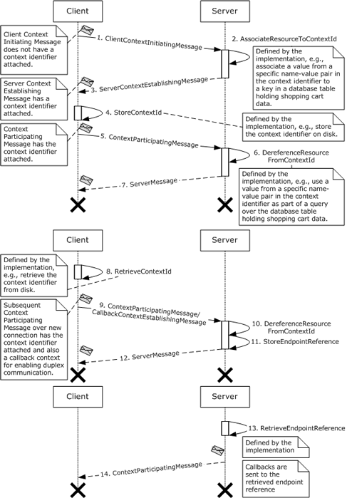
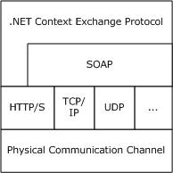
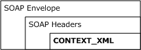
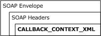
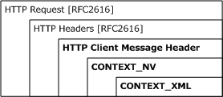
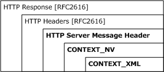
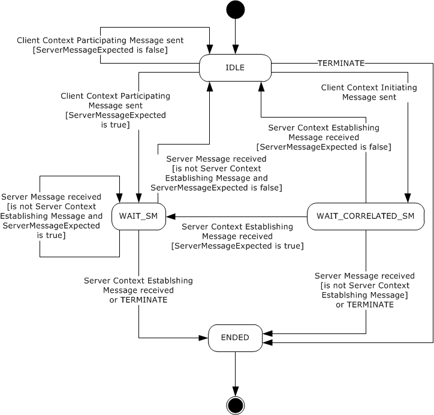
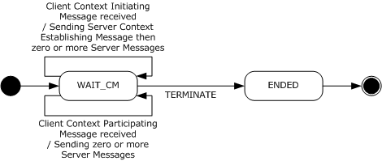
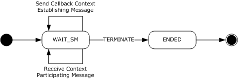
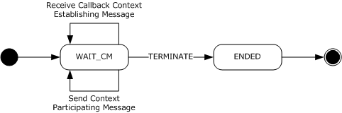

# [MC-NETCEX]: .NET Context Exchange Protocol

Table of Contents

1 Introduction

- [1 Introduction](#Section_1)
  - [1.1 Glossary](#Section_1.1)
  - [1.2 References](#Section_1.2)
    - [1.2.1 Normative References](#Section_1.2.1)
    - [1.2.2 Informative References](#Section_1.2.2)
  - [1.3 Overview](#Section_1.3)
  - [1.4 Relationship to Other Protocols](#Section_1.4)
  - [1.5 Prerequisites/Preconditions](#Section_1.5)
  - [1.6 Applicability Statement](#Section_1.6)
  - [1.7 Versioning and Capability Negotiation](#Section_1.7)
  - [1.8 Vendor-Extensible Fields](#Section_1.8)
  - [1.9 Standards Assignments](#Section_1.9)

2 Messages

- [2 Messages](#Section_2)
  - [2.1 Transport](#Section_2.1)
  - [2.2 Message Syntax](#Section_2.2)
    - [2.2.1 CONTEXT_XML](#Section_2.2.1)
    - [2.2.2 CALLBACK_CONTEXT_XML](#Section_2.2.2)
    - [2.2.3 CONTEXT_NV](#Section_2.2.3)
    - [2.2.4 HTTP Client Message Header](#Section_2.2.4)
    - [2.2.5 HTTP Server Message Header](#Section_2.2.5)
    - [2.2.6 Server Context Establishing Message](#Section_2.2.6)
    - [2.2.7 Context Participating Message](#Section_2.2.7)

3 Protocol Details

- [3 Protocol Details](#Section_3)
  - [3.1 Context Exchange Client Role Details](#Section_3.1)
    - [3.1.1 Abstract Data Model](#Section_3.1.1)
      - [3.1.1.1 IDLE State](#Section_3.1.1.1)
      - [3.1.1.2 WAIT_CORRELATED_SM State](#Section_3.1.1.2)
      - [3.1.1.3 WAIT_SM State](#Section_3.1.1.3)
      - [3.1.1.4 ENDED State](#Section_3.1.1.4)
    - [3.1.2 Timers](#Section_3.1.2)
    - [3.1.3 Initialization](#Section_3.1.3)
    - [3.1.4 Higher-Layer Triggered Events](#Section_3.1.4)
      - [3.1.4.1 SEND_CM](#Section_3.1.4.1)
      - [3.1.4.2 TERMINATE](#Section_3.1.4.2)
    - [3.1.5 Message Processing Events and Sequencing Rules](#Section_3.1.5)
      - [3.1.5.1 RECEIVE_SM](#Section_3.1.5.1)
    - [3.1.6 Timer Events](#Section_3.1.6)
    - [3.1.7 Other Local Events](#Section_3.1.7)
  - [3.2 Context Exchange Server Role Details](#Section_3.2)
    - [3.2.1 Abstract Data Model](#Section_3.2.1)
      - [3.2.1.1 WAIT_CM State](#Section_3.2.1.1)
      - [3.2.1.2 ENDED State](#Section_3.2.1.2)
    - [3.2.2 Timers](#Section_3.2.2)
    - [3.2.3 Initialization](#Section_3.2.3)
    - [3.2.4 Higher-Layer Triggered Events](#Section_3.2.4)
      - [3.2.4.1 TERMINATE](#Section_3.2.4.1)
    - [3.2.5 Message Processing Events and Sequencing Rules](#Section_3.2.5)
      - [3.2.5.1 RECEIVE_CM](#Section_3.2.5.1)
    - [3.2.6 Timer Events](#Section_3.2.6)
    - [3.2.7 Other Local Events](#Section_3.2.7)
  - [3.3 Callback Context Exchange Client Role Details](#Section_3.3)
    - [3.3.1 Abstract Data Model](#Section_3.3.1)
      - [3.3.1.1 WAIT_SM State](#Section_3.3.1.1)
      - [3.3.1.2 ENDED State](#Section_3.3.1.2)
    - [3.3.2 Timers](#Section_3.3.2)
    - [3.3.3 Initialization](#Section_3.3.3)
    - [3.3.4 Higher-Layer Triggered Events](#Section_3.3.4)
      - [3.3.4.1 TERMINATE](#Section_3.3.4.1)
    - [3.3.5 Message Processing Events and Sequencing Rules](#Section_3.3.5)
      - [3.3.5.1 SEND_CM](#Section_3.3.5.1)
      - [3.3.5.2 RECEIVE_SM](#Section_3.3.5.2)
    - [3.3.6 Timer Events](#Section_3.3.6)
    - [3.3.7 Other Local Events](#Section_3.3.7)
  - [3.4 Callback Context Exchange Server Role Details](#Section_3.4)
    - [3.4.1 Abstract Data Model](#Section_3.4.1)
      - [3.4.1.1 WAIT_CM State](#Section_3.4.1.1)
      - [3.4.1.2 ENDED State](#Section_3.4.1.2)
    - [3.4.2 Timers](#Section_3.4.2)
    - [3.4.3 Initialization](#Section_3.4.3)
    - [3.4.4 Higher-Layer Triggered Events](#Section_3.4.4)
      - [3.4.4.1 TERMINATE](#Section_3.4.4.1)
    - [3.4.5 Message Processing Events and Sequencing Rules](#Section_3.4.5)
      - [3.4.5.1 RECEIVE_CM](#Section_3.4.5.1)
      - [3.4.5.2 SEND_SM](#Section_3.4.5.2)
    - [3.4.6 Timer Events](#Section_3.4.6)
    - [3.4.7 Other Local Events](#Section_3.4.7)

4 Protocol Examples

- [4 Protocol Examples](#Section_4)
  - [4.1 Using the .NET Context Exchange Protocol with SOAP 1.2](#Section_4.1)
    - [4.1.1 Establishing Context Using SOAP 1.2](#Section_4.1.1)
    - [4.1.2 Subsequent Context Participating Messages Using SOAP 1.2](#Section_4.1.2)
    - [4.1.3 Continue Using Context Using SOAP 1.2](#Section_4.1.3)
    - [4.1.4 Establish a Callback Context](#Section_4.1.4)
    - [4.1.5 Subsequent Callback Messages](#Section_4.1.5)
  - [4.2 Using the .NET Context Exchange Protocol with HTTP](#Section_4.2)
    - [4.2.1 Establishing Context Using HTTP](#Section_4.2.1)
    - [4.2.2 Subsequent Context Participating Messages Using HTTP](#Section_4.2.2)
    - [4.2.3 Continue Using the Context Using HTTP](#Section_4.2.3)
  - [4.3 Processing an Unrecognized Context Using SOAP 1.2](#Section_4.3)
  - [4.4 Processing an Unrecognized Context Using HTTP](#Section_4.4)

5 Security

- [5 Security](#Section_5)
  - [5.1 Security Considerations for Implementers](#Section_5.1)
  - [5.2 Index of Security Parameters](#Section_5.2)

6 Appendix A: Product Behavior

- [6 Appendix A: Product Behavior](#Section_6)

7 Change Tracking

- [7 Change Tracking](#Section_7)

For the legal notice and IP terms, see [LEGAL.md](../LEGAL.md).
Last updated: 3/13/2019.
See [Revision History](#revision-history) for full version history.

# 1 Introduction

This document specifies the .NET Context Exchange Protocol, which specifies a message syntax for identifying context that is shared between a client and a server, and a protocol for establishing that context.

Sections 1.5, 1.8, 1.9, 2, and 3 of this specification are normative. All other sections and examples in this specification are informative.

## 1.1 Glossary

This document uses the following terms:

**base64 encoding**: A binary-to-text encoding scheme whereby an arbitrary sequence of bytes is converted to a sequence of printable ASCII characters, as described in [[RFC4648]](https://go.microsoft.com/fwlink/?LinkId=90487).

**callback context**: The [**context**](#gt_context) that is required for a [**server**](#gt_server) to make callbacks to a [**client**](#gt_client). A callback context consists of an [**endpoint reference**](#gt_endpoint-reference-epr) for a [**client**](#gt_client) [**endpoint**](#gt_endpoint) with an optional [**context identifier**](#gt_context-identifier).

**client**: A computer on which the remote procedure call (RPC) client is executing.

**Client Context Initiating Message**: A [**client message**](#gt_client-message) that requests a server to establish a [**context**](#gt_context).

**client message**: A message that is sent from a [**client**](#gt_client) to a [**server**](#gt_server).

**connection**: A time-bounded association between two [**endpoints**](#gt_endpoint) that allows the two [**endpoints**](#gt_endpoint) to exchange messages.

**context**: An abstract concept that represents an association between a resource and a set of messages that are exchanged between a [**client**](#gt_client) and a [**server**](#gt_server). A context is uniquely identified by a [**context identifier**](#gt_context-identifier).

**context identifier**: A GUID that identifies a [**context**](#gt_context).

**Context Participating Message**: A [**client message**](#gt_client-message) or a [**server message**](#gt_server-message) that is one of a set of messages associated with a context.

**endpoint**: A communication port that is exposed by an application server for a specific shared service and to which messages can be addressed.

**endpoint reference (EPR)**: A resource that conveys the information that is needed to address an [**endpoint**](#gt_endpoint).

**server**: A computer on which the remote procedure call (RPC) server is executing.

**Server Context Establishing Message**: A [**server message**](#gt_server-message) that establishes a new context and is correlated to a [**Client Context Initiating Message**](#gt_client-context-initiating-message).

**server message**: A message that is sent from a [**server**](#gt_server) to a [**client**](#gt_client).

**SOAP**: A lightweight protocol for exchanging structured information in a decentralized, distributed environment. [**SOAP**](#gt_soap) uses XML technologies to define an extensible messaging framework, which provides a message construct that can be exchanged over a variety of underlying protocols. The framework has been designed to be independent of any particular programming model and other implementation-specific semantics. SOAP 1.2 supersedes SOAP 1.1. See [[SOAP1.2-1/2003]](https://go.microsoft.com/fwlink/?LinkId=90521).

**SOAP envelope**: A container for [**SOAP message**](#gt_soap-message) information and the root element of a [**SOAP**](#gt_soap) document. See [[SOAP1.2-1/2007]](https://go.microsoft.com/fwlink/?LinkId=94664) section 5.1 for more information.

**SOAP fault**: A container for error and status information within a [**SOAP message**](#gt_soap-message). See [SOAP1.2-1/2007] section 5.4 for more information.

**SOAP header**: A mechanism for implementing extensions to a [**SOAP message**](#gt_soap-message) in a decentralized manner without prior agreement between the communicating parties. See [SOAP1.2-1/2007] section 5.2 for more information.

**SOAP message**: An XML document consisting of a mandatory [**SOAP envelope**](#gt_soap-envelope), an optional [**SOAP header**](#gt_soap-header), and a mandatory SOAP body. See [SOAP1.2-1/2007] section 5 for more information.

**UTF-8**: A byte-oriented standard for encoding Unicode characters, defined in the Unicode standard. Unless specified otherwise, this term refers to the UTF-8 encoding form specified in [[UNICODE5.0.0/2007]](https://go.microsoft.com/fwlink/?LinkId=154659) section 3.9.

**MAY, SHOULD, MUST, SHOULD NOT, MUST NOT:** These terms (in all caps) are used as defined in [[RFC2119]](https://go.microsoft.com/fwlink/?LinkId=90317). All statements of optional behavior use either MAY, SHOULD, or SHOULD NOT.

## 1.2 References

Links to a document in the Microsoft Open Specifications library point to the correct section in the most recently published version of the referenced document. However, because individual documents in the library are not updated at the same time, the section numbers in the documents may not match. You can confirm the correct section numbering by checking the [Errata](https://go.microsoft.com/fwlink/?linkid=850906).

### 1.2.1 Normative References

We conduct frequent surveys of the normative references to assure their continued availability. If you have any issue with finding a normative reference, please contact [dochelp@microsoft.com](mailto:dochelp@microsoft.com). We will assist you in finding the relevant information.

[RFC2119] Bradner, S., "Key words for use in RFCs to Indicate Requirement Levels", BCP 14, RFC 2119, March 1997, [http://www.rfc-editor.org/rfc/rfc2119.txt](https://go.microsoft.com/fwlink/?LinkId=90317)

[RFC2234] Crocker, D. and Overell, P., "Augmented BNF for Syntax Specifications: ABNF", RFC 2234, November 1997, [http://www.ietf.org/rfc/rfc2234.txt](https://go.microsoft.com/fwlink/?LinkId=90323)

[RFC2616] Fielding, R., Gettys, J., Mogul, J., et al., "Hypertext Transfer Protocol -- HTTP/1.1", RFC 2616, June 1999, [http://www.rfc-editor.org/rfc/rfc2616.txt](https://go.microsoft.com/fwlink/?LinkId=90372)

[RFC3548] Josefsson, S., Ed., "The Base16, Base32, and Base64 Data Encodings", RFC 3548, July 2003, [http://www.rfc-editor.org/rfc/rfc3548.txt](https://go.microsoft.com/fwlink/?LinkId=90432)

[RFC3629] Yergeau, F., "UTF-8, A Transformation Format of ISO 10646", STD 63, RFC 3629, November 2003, [http://www.ietf.org/rfc/rfc3629.txt](https://go.microsoft.com/fwlink/?LinkId=90439)

[SOAP1.1] Box, D., Ehnebuske, D., Kakivaya, G., et al., "Simple Object Access Protocol (SOAP) 1.1", W3C Note, May 2000, [http://www.w3.org/TR/2000/NOTE-SOAP-20000508/](https://go.microsoft.com/fwlink/?LinkId=90520)

[SOAP1.2-1/2007] Gudgin, M., Hadley, M., Mendelsohn, N., et al., "SOAP Version 1.2 Part 1: Messaging Framework (Second Edition)", W3C Recommendation, April 2007, [http://www.w3.org/TR/2007/REC-soap12-part1-20070427/](https://go.microsoft.com/fwlink/?LinkId=94664)

[W3C-XSD] World Wide Web Consortium, "XML Schema Part 2: Datatypes Second Edition", 28 October 2004, [http://www.w3.org/TR/2004/REC-xmlschema-2-20041028](https://go.microsoft.com/fwlink/?LinkId=90563)

[WSA] Gudgin, M., Hadley, M., and Rogers, T., "Web Services Addressing 1.0 - Core", W3C Recommendation, May 2006, [http://www.w3.org/TR/2006/REC-ws-addr-core-20060509/](https://go.microsoft.com/fwlink/?LinkId=120448)

[XML1.0] Bray, T., Paoli, J., Sperberg-McQueen, C.M., and Maler, E., "Extensible Markup Language (XML) 1.0 (Second Edition)", W3C Recommendation, October 2000, [http://www.w3.org/TR/2000/REC-xml-20001006](https://go.microsoft.com/fwlink/?LinkId=90599)

### 1.2.2 Informative References

[MS-NETOD] Microsoft Corporation, "[Microsoft .NET Framework Protocols Overview](#Section_1.3)".

[RFC2109] Kristol, D., and Montulli, L., "HTTP State Management Mechanism", RFC 2109, February 1997, [http://www.rfc-editor.org/rfc/rfc2109.txt](https://go.microsoft.com/fwlink/?LinkId=90315)

[RFC2965] Kristol, D. and Montulli, L., "HTTP State Management Mechanism", RFC 2965, October 2000, [http://www.ietf.org/rfc/rfc2965.txt](https://go.microsoft.com/fwlink/?LinkId=90399)

[RFC4346] Dierks, T., and Rescorla, E., "The Transport Layer Security (TLS) Protocol Version 1.1", RFC 4346, April 2006, [http://www.ietf.org/rfc/rfc4346.txt](https://go.microsoft.com/fwlink/?LinkId=90474)

[WSS1] Nadalin, A., Kaler, C., Hallam-Baker, P., et al., "Web Services Security: SOAP Message Security 1.0 (WS-Security 2004)", March 2004, [http://docs.oasis-open.org/wss/2004/01/oasis-200401-wss-soap-message-security-1.0.pdf](https://go.microsoft.com/fwlink/?LinkId=131547)

## 1.3 Overview

The .NET Context Exchange Protocol specifies a message syntax for identifying [**context**](#gt_context) that is shared between a [**client**](#gt_client) and a [**server**](#gt_server) independent of [**connection**](#gt_connection) usage, and a protocol for establishing that context. For example, in some scenarios, the connection between a client and a server is sufficient for the server to relate the [**client messages**](#gt_client-message) to specific resources; a chat application can define a conversation resource and relate chat messages to a conversation by associating the conversation with chat messages that arrive over a particular connection.

It is typical, however, for a set of client messages to be associated with a resource that is independent of a connection. For example, a [**SOAP**](#gt_soap)-based shopping application can define a shopping cart resource and relate client messages to the shopping cart even if the first few messages arrive on one connection and the remaining messages arrive on a different connection. The .NET Context Exchange Protocol facilitates this more general connection-independent case.

The .NET Context Exchange Protocol can be used in one of two modes: stateless or stateful. In stateless mode, a client and server use the message syntax specified in section [2.2](#Section_2.2); however, the interpretation of this syntax is defined by the client and server implementations. In stateful mode, the client and server interpret the message syntax as specified in section [3](#Section_3). Unless explicitly mentioned, this document discusses the .NET Context Exchange Protocol in stateful mode.

This protocol specifies two roles for context exchange: a client role and a server role. The server role is responsible for creating [**context identifiers**](#gt_context-identifier) in response to client requests and associating context identifiers with resources. For example, a shopping service can create a context identifier with the following (property name, property value) pair.

| Property name | Property value |
| --- | --- |
| shoppingCartId | 1a1913b1-cb24-4d94-91d2-cf414a569481 |

After that, it stores a shopping cart resource by using the value of the shoppingCartId as a key.

The client role initiates communication with the server role, captures the context identifier that is sent from the server role, and attaches the context identifier to all subsequent client messages that are related to the resources in question. For example, a client shopping application can use the previously mentioned shopping service to create a shopping cart resource using the .NET Context Exchange Protocol. The client stores the context identifier that is generated by the server and attaches it to each message that is intended to manipulate the shopping cart.

The protocol also specifies two roles for [**callback context**](#gt_callback-context) exchange: a client role and a server role.<1> The initial communication of the client role with the server role specifies a callback context to enable duplex communication. The callback context consists of an [**endpoint reference**](#gt_endpoint-reference-epr) that specifies the address of the client [**endpoint**](#gt_endpoint). The endpoint reference can contain a context identifier that is associated with resources by the client. For example, a customer of a shopping service can create a context identifier with the following (property name, property value) pair.

| Property name | Property value |
| --- | --- |
| customerId | 9b0e43f0-e783-4cb9-8343-106d677c4ed7 |

Note that the roles for context exchange and callback context exchange compose. For example, the entity acting as the client role for context exchange can also act as the client role for callback context exchange.

The following figure describes the typical use of the .NET Context Exchange Protocol.

Figure 1: Typical use of the .NET Context Exchange Protocol

Each message that is exchanged between client and server is an application-specific message. This protocol is a header-based protocol that composes into client and server messages:

- The client sends a [**Client Context Initiating Message**](#gt_client-context-initiating-message) to the server. The server recognizes this message as a Client Context Initiating Message because it does not have a context identifier attached.
- The server creates a resource (for example, a shopping cart) and a new context identifier. It then associates the resource with the new context identifier.
- The server returns a [**Server Context Establishing Message**](#gt_server-context-establishing-message) to the client with the newly created context identifier attached.
- The client stores the attached context identifier so that it can be retrieved even if the client process is restarted.
- The client sends the server a [**Context Participating Message**](#gt_context-participating-message) with the context identifier attached. This message is intended to manipulate the resource that is created in step 2. For example, it might be intended to add an item to the shopping cart.
- The server dereferences the resource using the context identifier. For example, it can use the property value of the property named "shoppingCartId" in the predicate of a database query to retrieve the shopping cart. After that, it acts on the resource according to the message it received.
- The server sends a response back to the client.
- At some point later on a different connection, the client retrieves the context identifier that it stored earlier in step 4.
- The client then sends the server a Context Participating Message that has the context identifier attached. This message is intended to manipulate the resource that was created in step 2. For example, it can be intended to purchase the items in the shopping cart.
The message that is sent by the client is also a Callback Context Establishing Message that has a callback context attached. This allows the server to engage in a duplex conversation with the client. For example, it allows the server to notify the client when the purchased items have shipped.

- The server dereferences the resource from the context identifier, as described in step 6.
- The server stores the endpoint reference that is sent in the callback context from the client.
- The server sends a response back to the client. For example, the server acknowledges that the items in the shopping cart have been purchased.
- At some point later on a different connection, the server retrieves the endpoint reference that it stored earlier in step 11.
- The server sends a Context Participating Message to the endpoint reference from the callback context. For example, it notifies the specific customer that purchased items have been shipped.
These examples and the examples in section [4](#Section_1.3) of this document demonstrate sending a context identifier from a server to a client in a [Server Context Establishing Message](#Section_2.2.6). This protocol does not require a client and server to exchange a context identifier by using a Client Context Initiating Message and a Server Context Establishing Message. A client and server can agree on a context identifier without this initial exchange. The protocol that is specified in section 3 allows the client to acquire a context identifier by using a Client Context Initiating Message and a Server Context Establishing Message; then subsequently, to send Context Participating Messages.

Alternatively, this protocol allows an implementation-specific context exchange mechanism to be leveraged to initialize the protocol with a context identifier. This context identifier can then be attached to subsequent Context Participating Messages.

Similarly, the callback context need not be established using a Callback Context Establishing Message, but could instead be established through an implementation-specific callback context exchange mechanism.

## 1.4 Relationship to Other Protocols

The .NET Context Exchange Protocol can be used with HTTP [[RFC2616]](https://go.microsoft.com/fwlink/?LinkId=90372) or SOAP-formatted messages [[SOAP1.2-1/2007]](https://go.microsoft.com/fwlink/?LinkId=94664) [[SOAP1.1]](https://go.microsoft.com/fwlink/?LinkId=90520). The following figure shows a protocol stack.

Figure 2: Protocol stack for the .NET Context Exchange Protocol

## 1.5 Prerequisites/Preconditions

The .NET Context Exchange Protocol requires that the [**client**](#gt_client) role can communicate with a [**server**](#gt_server) role so that client messages and server messages can be exchanged.

The .NET Context Exchange Protocol requires an underlying protocol in which a [**server message**](#gt_server-message) can be correlated to a unique [**client message**](#gt_client-message).

## 1.6 Applicability Statement

The .NET Context Exchange Protocol is applicable to scenarios where a [**client**](#gt_client) and [**server**](#gt_server) application requires a set of [**client messages**](#gt_client-message) to be associated with a resource independent of a connection. The client and server application use this protocol to share [**context**](#gt_context).

## 1.7 Versioning and Capability Negotiation

This document covers versioning issues in the following areas:

- **Supported Transports:** This protocol can be implemented by using transports that support sending HTTP [[RFC2616]](https://go.microsoft.com/fwlink/?LinkId=90372) or SOAP messages, as discussed in section [2.1](#Section_2.1).
- **Protocol Versions:** When this protocol is implemented by using SOAP, it requires the use of SOAP messaging version 1.1 [[SOAP1.1]](https://go.microsoft.com/fwlink/?LinkId=90520) or SOAP messaging 1.2 [[SOAP1.2-1/2007]](https://go.microsoft.com/fwlink/?LinkId=94664). When this protocol is implemented by using HTTP, it requires the use of HTTP version 1.1.
- **Capability Negotiation:** The .NET Context Exchange Protocol does not support negotiation of the version to use. Instead, an implementation is configured to process only messages as described in section 2.1.

## 1.8 Vendor-Extensible Fields

Vendors and implementers MAY extend the protocol by including additional attributes [[XML1.0]](https://go.microsoft.com/fwlink/?LinkId=90599) on the [CONTEXT_XML](#Section_2.2.1) element or its child Property element. The interpretation of these attributes is defined by the implementation. For example, an extension MAY be used to:

- Convey lifetime information for a particular [**context identifier**](#gt_context-identifier).
- Convey metadata about the applicability of the context identifier.
Similarly, vendors and implementers MAY extend the protocol by including additional attributes [XML1.0] on the [CALLBACK_CONTEXT_XML](#Section_2.2.2) element. The interpretation of these attributes is defined by the implementation.

## 1.9 Standards Assignments

There are no standards assignments for this protocol.

# 2 Messages

## 2.1 Transport

The .NET Context Exchange Protocol can be used over any transport protocol that supports transmitting messages that are specified by the following protocols:

- HTTP 1.1 [[RFC2616]](https://go.microsoft.com/fwlink/?LinkId=90372)
- SOAP 1.1 [[SOAP1.1]](https://go.microsoft.com/fwlink/?LinkId=90520)
- SOAP 1.2 [[SOAP1.2-1/2007]](https://go.microsoft.com/fwlink/?LinkId=94664)
This specification uses the term [**SOAP**](#gt_soap) to mean either SOAP 1.1 or SOAP 1.2. Where the differences between the two versions of SOAP are significant, either SOAP 1.1 or SOAP 1.2 is referenced.

An implementation of the .NET Context Exchange Protocol MUST support the processing of messages that are specified by HTTP 1.1 or either of the SOAP versions. This section specifies the format of .NET Context Exchange Protocol messages using the message formats of both HTTP 1.1 and SOAP.

## 2.2 Message Syntax

This section specifies the messages that are used by the .NET Context Exchange Protocol and their relationship to HTTP 1.1 [[RFC2616]](https://go.microsoft.com/fwlink/?LinkId=90372) and [**SOAP**](#gt_soap).

When used with SOAP, the .NET Context Exchange Protocol uses a [CONTEXT_XML](#Section_2.2.1) element as a [**SOAP header**](#gt_soap-header) using the SOAP extensibility model, specified in [[SOAP1.2-1/2007]](https://go.microsoft.com/fwlink/?LinkId=94664) section 3, to form a [Server Context Establishing Message](#Section_2.2.6) or a [**Context Participating Message**](#gt_context-participating-message). The following figure shows the containment of CONTEXT_XML in a [**SOAP envelope**](#gt_soap-envelope).

Figure 3: Context Participating Message or Server Context Establishing Message using SOAP

The .NET Context Exchange Protocol uses [CALLBACK_CONTEXT_XML](#Section_2.2.2) as a SOAP header using the SOAP extensibility model, specified in [SOAP1.2-1/2007] section 3, to form a Callback Context Establishing Message. The following figure shows the containment of CALLBACK_CONTEXT_XML in a SOAP envelope.

Figure 4: Callback Context Establishing Message using SOAP

When used with HTTP 1.1, the .NET Context Exchange Protocol uses:

- An [HTTP Client Message Header](#Section_2.2.4) as an HTTP header in an HTTP request message to form a Context Participating Message; or
- An [HTTP Server Message Header](#Section_2.2.5) as an HTTP header in an HTTP response message to form a Server Context Establishing Message.
The next figure shows the containment of message structures, which are defined in section [2](#Section_2), within an HTTP request message.

Figure 5: Client Context Participating Message using HTTP 1.1

The following figure shows the containment of message structures, which are defined in section 2, within an HTTP response message.

Figure 6: Server Context Establishing Message using HTTP 1.1

### 2.2.1 CONTEXT_XML

CONTEXT_XML is an XML element [[XML1.0]](https://go.microsoft.com/fwlink/?LinkId=90599) that represents a [**context identifier**](#gt_context-identifier), as specified by the following XML schema [[W3C-XSD]](https://go.microsoft.com/fwlink/?LinkId=90563).

<xs:schema

targetNamespace="http://schemas.microsoft.com/ws/2006/05/context"

xmlns:xs="http://www.w3.org/2001/XMLSchema"

>

<xs:element name="Context">

<xs:complexType>

<xs:sequence minOccurs="0" maxOccurs="unbounded">

<xs:element name="Property">

<xs:complexType>

<xs:simpleContent>

<xs:extension base="xs:string">

<xs:attribute name="name">

<xs:simpleType>

<xs:restriction base="xs:string">

<xs:pattern value="[A-Za-z\.\-_]+"/>

</xs:restriction>

</xs:simpleType>

</xs:attribute>

<xs:anyAttribute namespace="##any"/>

</xs:extension>

</xs:simpleContent>

</xs:complexType>

</xs:element>

</xs:sequence>

<xs:anyAttribute namespace="##any"/>

</xs:complexType>

</xs:element>

</xs:schema>

For a context identifier and a CONTEXT_XML element to be isomorphic, all the following statements MUST be true:

- The number of Property XML elements in the CONTEXT_XML element is equal to the number of (property name, property value) pairs in the context identifier.
- No two Property XML elements, when inside the CONTEXT_XML element, have the same value as the name XML attribute.
- For each Property XML element that is inside the CONTEXT_XML element, there is exactly one (property name, property value) pair in the context identifier so that:
- The Property name is equal to the value of the name XML attribute of the Property XML element, and
- The Property value is equal to the value of the content of the Property XML element.

### 2.2.2 CALLBACK_CONTEXT_XML

CALLBACK_CONTEXT_XML is an XML element [[XML1.0]](https://go.microsoft.com/fwlink/?LinkId=90599) that represents a [**callback context**](#gt_callback-context), as specified by the following XML schema [[W3C-XSD]](https://go.microsoft.com/fwlink/?LinkId=90563).

<xs:schema

targetNamespace="http://schemas.microsoft.com/ws/2008/02/context"

xmlns:xs="http://www.w3.org/2001/XMLSchema"

xmlns:wsa="http://www.w3.org/2005/08/addressing"

>

<xs:element name="CallbackContext">

<xs:complexType>

<xs:sequence minOccurs="1" maxOccurs="1">

<xs:element name="CallbackEndpointReference" type="wsa:EndpointReferenceType">

</xs:sequence>

<xs:anyAttribute namespace="##any"/>

</xs:complexType>

</xs:element>

</xs:schema>

To specify a [**context identifier**](#gt_context-identifier) as part of the callback context, a [CONTEXT_XML](#Section_2.2.1) element MUST be included as a reference parameter of the [**endpoint reference**](#gt_endpoint-reference-epr) that is specified by the CallbackEndpointReference element.

For a callback context and a CALLBACK_CONTEXT_XML element to be isomorphic, the following statement MUST be true:

- The CallbackEndpointReference element in the CALLBACK_CONTEXT_XML element is an XML Infoset representation of the endpoint reference from the callback context as defined by [[WSA]](https://go.microsoft.com/fwlink/?LinkId=120448).

### 2.2.3 CONTEXT_NV

CONTEXT_NV specifies a literal that results from resolving the following context_nv Augmented Backus-Naur Form (ABNF) rule [[RFC2234]](https://go.microsoft.com/fwlink/?LinkId=90323).

context-nv = %x57.73.63.43.6F.6E.74.65.78.74 ; WscContext

lws "=" lws

%x22 context-v %x22

context-v = *base64

base64 = %x30-39 / %x41-5A / %x61-7A / %x2B / %x2F / %x3D

lws = *(%x0D.0A / %x09 / %x20) ; CRLF, space, or tab

For a [**context identifier**](#gt_context-identifier) and a CONTEXT_NV literal to be isomorphic, the value of context-v MUST be a [**base64**](#gt_179b9392-9019-45a3-880b-26f6890522b7) [[RFC3548]](https://go.microsoft.com/fwlink/?LinkId=90432) encoding of a [**UTF-8**](#gt_utf-8) encoding [[RFC3629]](https://go.microsoft.com/fwlink/?LinkId=90439) of a [CONTEXT_XML](#Section_2.2.1) element that is isomorphic to the context identifier.

### 2.2.4 HTTP Client Message Header

The HTTP Client Message Header is an HTTP header [[RFC2616]](https://go.microsoft.com/fwlink/?LinkId=90372) that results from resolving the following client_context_header ABNF rule [[RFC2234]](https://go.microsoft.com/fwlink/?LinkId=90323).

client_context_header = lws "Cookie" lws ":"

*(any-nv ";") lws

context-nv

lws *(";" any-nv)

any-nv = lws token lws "=" lws (token / quoted-string) lws

lws = *(%x0D.0A / %x09 / %x20) ; CRLF, space, or tab

This is a new header which does not have any relation with the "Cookie" header as described in [[RFC2109]](https://go.microsoft.com/fwlink/?LinkId=90315) and [[RFC2965]](https://go.microsoft.com/fwlink/?LinkId=90399).

The rules token and quoted-string of this grammar are specified in [RFC2616] section 2.2.

The context_nv rule MUST resolve to a [CONTEXT_NV](#Section_2.2.3) literal.

For a [**context identifier**](#gt_context-identifier) and an HTTP Client Message Header to be isomorphic, the context_nv rule MUST resolve to a value that is isomorphic to the context identifier, as specified in CONTEXT_NV.

### 2.2.5 HTTP Server Message Header

The HTTP Server Message Header is an HTTP header [[RFC2616]](https://go.microsoft.com/fwlink/?LinkId=90372) that results from resolving the following server_context_header ABNF rule [[RFC2234]](https://go.microsoft.com/fwlink/?LinkId=90323).

server_context_header = lws "Set-Cookie" lws ":"

*(any-nv ";") lws

context-nv

lws *(";" any-nv)

any-nv = lws token lws "=" lws (token / quoted-string) lws

lws = *(%x0D.0A / %x09 / %x20) ; CRLF, space, or tab

This is a new header which does not have any relation with the "Set-Cookie" header as described in [[RFC2109]](https://go.microsoft.com/fwlink/?LinkId=90315).

The rules token and quoted-string of this grammar are specified in [RFC2616] section 2.2.

The context_nv rule MUST resolve to a [CONTEXT_NV](#Section_2.2.3) literal.

For a [**context identifier**](#gt_context-identifier) and an HTTP Server Message Header to be isomorphic, the context_nv rule MUST resolve to a value that is isomorphic to the context identifier, as specified in CONTEXT_NV.

### 2.2.6 Server Context Establishing Message

The Server Context Establishing Message MUST be either:

- A [**server message**](#gt_server-message) that is an HTTP response message [[RFC2616]](https://go.microsoft.com/fwlink/?LinkId=90372) that contains an [HTTP Server Message Header](#Section_2.2.5).
- A server message that is a [**SOAP envelope**](#gt_soap-envelope) that contains a [CONTEXT_XML](#Section_2.2.1) element as a [**SOAP header**](#gt_soap-header).

### 2.2.7 Context Participating Message

The Context Participating Message MUST be either:

- A [**client message**](#gt_client-message) that is an HTTP request message [[RFC2616]](https://go.microsoft.com/fwlink/?LinkId=90372) that contains an [HTTP Client Message Header](#Section_2.2.4).
- A client message that is a [**SOAP envelope**](#gt_soap-envelope) that contains a [CONTEXT_XML](#Section_2.2.1) element as a [**SOAP header**](#gt_soap-header).

# 3 Protocol Details

## 3.1 Context Exchange Client Role Details

In this section, "client role" refers to the [**client**](#gt_client) role for [**context**](#gt_context) exchange.

### 3.1.1 Abstract Data Model

This section describes a conceptual model of possible data organization that an implementation maintains to participate in this protocol. The described organization is provided to facilitate the explanation of how the protocol behaves. This document does not mandate that implementations adhere to this model as long as their external behavior is consistent with the behavior that is described in this document.

The [**client**](#gt_client) role MUST maintain the following data elements:

- **Context Identifier Store**: A data element that is capable of holding an instance of a [**context identifier**](#gt_context-identifier) or an empty value.
- **State**: An enumeration that identifies the current state of the client role with the following possible values:
- IDLE
- WAIT_CORRELATED_SM
- WAIT_SM
- ENDED
The following figure shows the relationship between the client role states.

Figure 7: State diagram for the client role

#### 3.1.1.1 IDLE State

IDLE is the initial state. The following events are processed in this state:

- SEND_CM
- TERMINATE

#### 3.1.1.2 WAIT_CORRELATED_SM State

The following events are processed in the WAIT_CORRELATED_SM state:

- RECEIVE_SM
- TERMINATE

#### 3.1.1.3 WAIT_SM State

The following events are processed in the WAIT_SM state:

- RECEIVE_SM
- TERMINATE

#### 3.1.1.4 ENDED State

The ENDED state is the final state.

### 3.1.2 Timers

None.

### 3.1.3 Initialization

When the [**client**](#gt_client) role is initialized:

- The **State** field MUST be set to IDLE.
- The **Context Identifier Store** field MUST be set to a value that is obtained from an implementation-specific source.

### 3.1.4 Higher-Layer Triggered Events

#### 3.1.4.1 SEND_CM

The SEND_CM event MUST be signaled by the higher-layer business logic with the following arguments:

- The Client Message argument.
- The Protocol argument with two possible values: HTTP or SOAP.
- The ServerMessageExpected argument with two possible values: true or false.
If the SEND_CM event is signaled, the client role implementation MUST perform the following actions:

- If the **Context Identifier Store** contains an empty value:
- Send the client message to the server role by using the underlying transport protocol.
- Set the **State** field to WAIT_CORRELATED_SM.
- Otherwise:
- Transform the client message to a [Context Participating Message](#Section_2.2.7) by performing the following steps:
- If the Protocol value is HTTP and the client message is an HTTP request message [[RFC2616]](https://go.microsoft.com/fwlink/?LinkId=90372):
- Create an [HTTP Client Message Header](#Section_2.2.4) that is isomorphic with the value of the **Context Identifier Store**.
- Add the HTTP Client Message Header to the client message.
- Else if the Protocol value is SOAP and the client message is a [**SOAP envelope**](#gt_soap-envelope):
- Create a [CONTEXT_XML](#Section_2.2.1) element that is isomorphic with the value of the **Context Identifier Store**.
- Add the CONTEXT_XML element to the client message as a [**SOAP header**](#gt_soap-header).
- Otherwise:
- Return an implementation-specific failure result to the higher-layer business logic.
- Send the Context Participating Message to the server role by using the underlying transport protocol.
- If the ServerMessageExpected value is true:
- Set the **State** field to WAIT_SM.

#### 3.1.4.2 TERMINATE

The TERMINATE event MUST be signaled by the higher-layer business logic.

If the TERMINATE event is signaled, the client role implementation MUST perform the following action:

- Set the **State** field to ENDED.

### 3.1.5 Message Processing Events and Sequencing Rules

#### 3.1.5.1 RECEIVE_SM

The RECEIVE_SM event MUST be signaled by the underlying transport protocol with the following arguments:

- The Server Message argument.
- The Protocol argument with two possible values: HTTP or SOAP.
- The ServerMessageExpected argument with two possible values: true or false.
If the RECEIVE_SM event is signaled, the client role implementation MUST perform the following actions:

- If the **State** field is WAIT_CORRELATED_SM:
- If the [**server message**](#gt_server-message) is a [Server Context Establishing Message](#Section_2.2.6):
- Create the [**context identifier**](#gt_context-identifier) from the Server Context Establishing Message by performing the following steps:
- If the Protocol value is HTTP and the server message contains an [HTTP Server Message Header](#Section_2.2.5):
- Create a context identifier that is isomorphic with the HTTP Server Message Header from the server message.
- Else if the Protocol value is SOAP and the server message contains a [**SOAP header**](#gt_soap-header) that matches a [CONTEXT_XML](#Section_2.2.1) element:
- Create a context identifier that is isomorphic with the SOAP header from the server message that matches a CONTEXT_XML element.
- Otherwise:
- Set the **State** field to ENDED.
- Return an implementation-specific failure result to the higher-layer business logic.
- Set the **Context Identifier Store** field to the value of the created context identifier.
- Provide the server message to the higher-layer business logic.
- Otherwise:
- Set the **State** field to ENDED.
- Return an implementation-specific failure result to the higher-layer business logic.
- Otherwise:
- If the server message is a Server Context Establishing Message:
- Set the **State** field to ENDED.
- Return an implementation-specific failure result to the higher-layer business logic.
- Otherwise:
- Provide the server message to the higher-layer business logic.
- If the ServerMessageExpected value is true:
- Set the **State** field to WAIT_SM.
- Otherwise:
- Set the **State** field to IDLE.

### 3.1.6 Timer Events

None.

### 3.1.7 Other Local Events

None.

## 3.2 Context Exchange Server Role Details

In this section "server role" refers to the [**server**](#gt_server) role for [**context**](#gt_context) exchange.

### 3.2.1 Abstract Data Model

This section describes a conceptual model of possible data organization that an implementation maintains to participate in this protocol. The described organization is provided to facilitate the explanation of how the protocol behaves. This document does not mandate that implementations adhere to this model as long as their external behavior is consistent with the behavior that is described in this document.

The server role MUST maintain the following data elements:

- **Context Identifier Store**: A data element that is capable of holding an instance of a [**context identifier**](#gt_context-identifier) or an empty value.
- **State**: An enumeration that identifies the current state of the server role with the following possible values:
- WAIT_CM
- ENDED
The following figure shows the relationship between server role states.

Figure 8: State diagram for the server role

#### 3.2.1.1 WAIT_CM State

The WAIT_CM state is the initial state. The following events are processed in the WAIT_CM state:

- RECEIVE_CM
- TERMINATE

#### 3.2.1.2 ENDED State

The ENDED state is the final state.

### 3.2.2 Timers

None.

### 3.2.3 Initialization

When the server role is initialized:

- The **State** field MUST be set to WAIT_CM.
- The **Context Identifier Store** field MUST be set to a value that is obtained from an implementation-specific source.

### 3.2.4 Higher-Layer Triggered Events

#### 3.2.4.1 TERMINATE

The TERMINATE event MUST be signaled by the higher-layer business logic.

If the TERMINATE event is signaled, the server role implementation MUST perform the following action:

- Set the **State** field to ENDED.

### 3.2.5 Message Processing Events and Sequencing Rules

#### 3.2.5.1 RECEIVE_CM

The RECEIVE_CM event MUST be signaled by the underlying transport protocol with the following arguments:

- The Client Message argument.
- The Protocol argument with two possible values: HTTP or SOAP.
If the RECEIVE_CM event is signaled, the server role implementation MUST perform the following actions:

- Initialize the NEW_CONTEXT Boolean local data element to false.
- If the client message is a [Context Participating Message](#Section_2.2.7):
- Create the [**context identifier**](#gt_context-identifier) from the Context Participating Message by performing the following steps:
- If the Protocol value is HTTP and the client message is an HTTP request message [[RFC2616]](https://go.microsoft.com/fwlink/?LinkId=90372):
- Create a context identifier that is isomorphic with the [HTTP Client Message Header](#Section_2.2.4) from the client message.
- Else if the Protocol value is SOAP and the server message is a [**SOAP envelope**](#gt_soap-envelope):
- Create a context identifier that is isomorphic with the [**SOAP header**](#gt_soap-header) from the client message that matches the [CONTEXT_XML](#Section_2.2.1) element.
- Otherwise:
- Return an implementation-specific failure result to the higher-layer business logic.
- Invoke a function in the higher-layer business logic that accepts the created context identifier and the value from the **Context Identifier Store** field; and returns one of three values: PARTICIPATE, NEW, or FAIL.
- If the value that is returned from the higher-layer business logic is PARTICIPATE:
- Provide the client message to the higher-layer business logic.
- Set NEW_CONTEXT to false.
- Else if the value that is returned from the higher-layer business logic is NEW:
- Set the **Context Identifier Store** field to an empty value.
- Set NEW_CONTEXT to true.
- Otherwise:
- Return an implementation-specific failure result to the higher-layer business logic.
- Otherwise:
- Set NEW_CONTEXT to true.
- If NEW_CONTEXT is true:
- If the **Context Identifier Store** field is empty:
- Invoke a function in the higher-layer business logic that returns a context identifier.
- Invoke a function in the higher-layer business logic that accepts the client message and returns a correlated server message using a correlation mechanism that is supplied by the underlying transport protocol.
- Transform the server message to a [Server Context Establishing Message](#Section_2.2.6) by performing the following steps:
- If the Protocol value is HTTP and the server message is an HTTP response message [RFC2616]:
- Create an [HTTP Server Message Header](#Section_2.2.5) that is isomorphic with the context identifier.
- Add the HTTP Server Message Header to the server message [RFC2616].
- Else if the Protocol value is SOAP and the server message is a SOAP envelope:
- Create a CONTEXT_XML element that is isomorphic with the context identifier.
- Add the CONTEXT_XML element to the server message as a SOAP header.
- Otherwise:
- Return an implementation-specific failure result to the higher-layer business logic.
- Send the Server Context Establishing Message to the client role by using the underlying transport protocol.
- Set the **Context Identifier Store** field to the value of the context identifier that is returned by higher-layer business logic.
- Otherwise:
- Return an implementation-specific failure result to the higher-layer business logic.
- Invoke a function in the higher-layer business logic that accepts the client message and returns a (possibly empty) collection of correlated server messages by using a correlation mechanism that is supplied by the underlying transport protocol.
- For each server message in the collection of the server messages:
- Send the server message to the client role by using the underlying transport protocol.

### 3.2.6 Timer Events

None.

### 3.2.7 Other Local Events

None.

## 3.3 Callback Context Exchange Client Role Details

In this section, "client role" refers to the [**client**](#gt_client) role for [**callback context**](#gt_callback-context) exchange.

### 3.3.1 Abstract Data Model

This section describes a conceptual model of possible data organization that an implementation maintains to participate in this protocol. The described organization is provided to facilitate the explanation of how the protocol behaves. This document does not mandate that implementations adhere to this model as long as their external behavior is consistent with the behavior that is described in this document.

The [**client**](#gt_client) role MUST maintain the following data elements:

- **Context Identifier Store**: A data element that is capable of holding an instance of a [**context identifier**](#gt_context-identifier) or an empty value.
- **State**: An enumeration that identifies the current state of the client role with the following possible values:
- WAIT_SM
- ENDED
The following figure shows the relationship between the client role states.

Figure 9: State diagram for the callback context exchange client role

#### 3.3.1.1 WAIT_SM State

The WAIT_SM state is the initial state. The following events are processed in the WAIT_SM state:

- SEND_CM
- RECEIVE_SM
- TERMINATE

#### 3.3.1.2 ENDED State

The ENDED state is the final state.

### 3.3.2 Timers

There are no timers specified for the client role.

### 3.3.3 Initialization

When the [**client**](#gt_client) role is initialized:

- The **State** field MUST be set to WAIT_SM.
- The **Context Identifier Store** field MUST be set to a value that is obtained from an implementation-specific source.

### 3.3.4 Higher-Layer Triggered Events

#### 3.3.4.1 TERMINATE

The TERMINATE event MUST be signaled by the higher-layer business logic.

If the TERMINATE event is signaled, the client role implementation MUST perform the following actions:

- Set the **State** field to ENDED.

### 3.3.5 Message Processing Events and Sequencing Rules

#### 3.3.5.1 SEND_CM

The SEND_CM event MUST be signaled by the higher-layer business logic with the following arguments:

- The Client Message argument.
- The Callback Context argument.
If the SEND_CM event is signaled, the [**client**](#gt_client) role implementation MUST perform the following actions:

- Transform the client message to a Callback Context Establishing Message by performing the following steps:
- If the client message is a [**SOAP envelope**](#gt_soap-envelope):
- Create a [CALLBACK_CONTEXT_XML](#Section_2.2.2) element that is isomorphic with the [**callback context**](#gt_callback-context).
- Add the CALLBACK_CONTEXT_XML element to the client message as a [**SOAP header**](#gt_soap-header).
- Otherwise:
- Return an implementation-specific failure result to the higher-layer business logic.
- Send the Callback Context Establishing Message to the [**server**](#gt_server) role by using the underlying transport protocol.
- If the callback context specifies a [**context identifier**](#gt_context-identifier):
- Set the **Context Identifier Store** field to the value of the context identifier.

#### 3.3.5.2 RECEIVE_SM

The RECEIVE_SM event MUST be signaled by the underlying transport protocol with the following arguments:

- The Server Message argument.
If the RECEIVE_SM event is signaled, the client role implementation MUST perform the following actions:

- If the server message is a Context Participating Message:
- Create the [**context identifier**](#gt_context-identifier) from the Context Participating Message by performing the following steps:
- If the server message is a [**SOAP envelope**](#gt_soap-envelope):
- Create a context identifier that is isomorphic with the [**SOAP header**](#gt_soap-header) from the server message that matches the [CONTEXT_XML](#Section_2.2.1) element.
- Otherwise:
- Return an implementation-specific failure result to the higher-layer business logic.
- Invoke a function in the higher-layer business logic that accepts the created context identifier and the value from the **Context Identifier Store** field and returns one of two values: PARTICIPATE or FAIL.
- If the value that is returned from the higher-layer business logic is PARTICIPATE:
- Provide the client message to the higher-layer business logic.
- Otherwise:
- Return an implementation-specific failure result to the higher-layer business logic.
- Invoke a function in the higher-layer business logic that accepts the server message and returns a (possibly empty) collection of correlated client messages using a correlation mechanism that is supplied by the underlying transport protocol.
- For each client message in the collection of the client messages:
- Send the client message to the server role by using the underlying transport protocol.

### 3.3.6 Timer Events

None.

### 3.3.7 Other Local Events

None.

## 3.4 Callback Context Exchange Server Role Details

In this section, "server role" refers to the [**server**](#gt_server) role for the [**callback context**](#gt_callback-context) exchange.

### 3.4.1 Abstract Data Model

This section describes a conceptual model of possible data organization that an implementation maintains to participate in this protocol. The described organization is provided to facilitate the explanation of how the protocol behaves. This document does not mandate that implementations adhere to this model as long as their external behavior is consistent with the behavior that is described in this document.

The server role MUST maintain the following data elements:

- **Endpoint Reference Store**: A data element that is capable of holding an instance of an [**endpoint reference**](#gt_endpoint-reference-epr) or an empty value.
- **State**: An enumeration that identifies the current state of the server role with the following possible values:
- WAIT_CM
- ENDED
The following figure shows the relationship between server role states.

Figure 10: State diagram for the callback context exchange server role

#### 3.4.1.1 WAIT_CM State

The WAIT_CM state is the initial state. The following events are processed in the WAIT_CM state:

- RECEIVE_CM
- SEND_SM
- TERMINATE

#### 3.4.1.2 ENDED State

The ENDED state is the final state.

### 3.4.2 Timers

None.

### 3.4.3 Initialization

When the server role is initialized:

- The **State** field MUST be set to WAIT_CM.
- The **Endpoint Reference Store** field MUST be set to a value that is obtained from an implementation-specific source.

### 3.4.4 Higher-Layer Triggered Events

#### 3.4.4.1 TERMINATE

The TERMINATE event MUST be signaled by the higher-layer business logic.

If the TERMINATE event is signaled, the server role implementation MUST perform the following actions:

- Set the **State** field to ENDED.

### 3.4.5 Message Processing Events and Sequencing Rules

#### 3.4.5.1 RECEIVE_CM

The RECEIVE_CM event MUST be signaled by the underlying transport protocol with the following arguments:

- The Client Message argument.
If the RECEIVE_CM event is signaled, the server role implementation MUST perform the following actions:

- If the client message is a Callback Context Establishing Message:
- If the client message contains a [**SOAP header**](#gt_soap-header) that matches a [CALLBACK_CONTEXT_XML](#Section_2.2.2) element:
- Create a [**callback context**](#gt_callback-context) that is isomorphic with the SOAP header from the client message that matches the CALLBACK_CONTEXT_XML element.
- Set the **Endpoint Reference Store** field to the value of the [**endpoint reference**](#gt_endpoint-reference-epr) from the created callback context.
- Provide the client message to the higher-layer business logic.

#### 3.4.5.2 SEND_SM

The SEND_SM event MUST be signaled by the underlying transport protocol with the following argument:

- The Server Message argument.
If the SEND_SM event is signaled, the server role implementation MUST perform the following actions:

- If the server message is a [**SOAP message**](#gt_soap-message):
- If the **Endpoint Reference Store** field is not empty:
- Send the server message to the endpoint reference that is stored in the **Endpoint Reference Store** field by using the process that is specified in [[WSA]](https://go.microsoft.com/fwlink/?LinkId=120448) section 3.3.
- Otherwise:
- Return an implementation-specific failure result to the higher-layer business logic.
- Otherwise:
- Return an implementation-specific failure result to the higher-layer business logic.

### 3.4.6 Timer Events

None.

### 3.4.7 Other Local Events

None.

# 4 Protocol Examples

The following sections describe common scenarios to illustrate typical use of the .NET Context Exchange Protocol:

- Using the .NET Context Exchange Protocol with SOAP 1.2 [[SOAP1.2-1/2007]](https://go.microsoft.com/fwlink/?LinkId=94664).
- Using the .NET Context Exchange Protocol with HTTP [[RFC2616]](https://go.microsoft.com/fwlink/?LinkId=90372).
- Processing an Unrecognized Context Using SOAP 1.2 [SOAP1.2-1/2007].
These examples assume that the client role can establish a connection with the server role by using a transport protocol that supports exchanging HTTP or SOAP messages.

## 4.1 Using the .NET Context Exchange Protocol with SOAP 1.2

This scenario shows how a client establishes a context with a server that associates [Context Participating Messages](#Section_2.2.7) to a shopping cart resource. The scenario also shows how the client reestablishes that context after the original connection with the server is closed. Finally the scenario shows how the client establishes a [**callback context**](#gt_callback-context) with the server.

The scenario starts after the client connects to the server by using a transport protocol that supports the exchange of [**SOAP messages**](#gt_soap-message).

All messages that are exchanged in this scenario use [[SOAP1.2-1/2007]](https://go.microsoft.com/fwlink/?LinkId=94664).

### 4.1.1 Establishing Context Using SOAP 1.2

A client establishes context with a server by sending the server a [**Client Context Initiating Message**](#gt_client-context-initiating-message). This message is a [**SOAP message**](#gt_soap-message) [[SOAP1.2-1/2007]](https://go.microsoft.com/fwlink/?LinkId=94664) that does not contain [CONTEXT_XML](#Section_2.2.1) as a [**SOAP header**](#gt_soap-header).

<s:Envelope xmlns:s="http://www.w3.org/2003/05/soap-envelope" xmlns:a="http:

//www.w3.org/2005/08/addressing">

<s:Header>

<a:Action s:mustUnderstand="1">http://machine1.example.org/Sample/IShoppingCart/Create</a:Action>

<a:MessageID>urn:uuid:04133e99-4c4f-4433-b2de-4aca4132e78f</a:MessageID>

<a:ReplyTo>

<a:Address>http://www.w3.org/2005/08/addressing/anonymous</a:Address>

</a:ReplyTo>

<a:To s:mustUnderstand="1">http://machine2.example.org/ShoppingCart</a:To>

</s:Header>

<s:Body>

<Create xmlns="http://machine1.example.org/Sample">

<customerId>571</customerId>

</Create>

</s:Body>

</s:Envelope>

When the server receives this message, it invokes a business logic function according to its rules for processing SOAP messages ([SOAP1.2-1/2007] section 2.6). This function creates a new shopping cart resource, associates it with a new [**context identifier**](#gt_context-identifier), and creates a response message. The context identifier has a single pair (property name, property value).

| Property name | Property value |
| --- | --- |
| instanceId | 1a1913b1-cb24-4d94-91d2-cf414a569481 |

The server then transforms the response message into a [Server Context Establishing Message](#Section_2.2.6) by adding a SOAP header and sends it to the client. This header is a CONTEXT_XML element that is isomorphic to the context identifier that is associated with the shopping cart.

<s:Envelope xmlns:s="http://www.w3.org/2003/05/soap-envelope" xmlns:a="http:

//www.w3.org/2005/08/addressing">

<s:Header>

<a:Action s:mustUnderstand="1">http://machine1.example.org/Sample/IShoppingCart/CreateResponse</a:Action>

<a:RelatesTo>urn:uuid:04133e99-4c4f-4433-b2de-4aca4132e78f</a:RelatesTo>

<Context xmlns="http://schemas.microsoft.com/ws/2006/05/context">

<Property name="instanceId">1a1913b1-cb24-4d94-91d2-cf414a569481</Property>

</Context>

</s:Header>

<s:Body>

<CreateResponse xmlns="http://machine1.example.org/Sample"/>

</s:Body>

</s:Envelope>

When the client receives the Server Context Establishing Message, it creates a context identifier that is isomorphic to the CONTEXT_XML element from the SOAP message and stores it.

### 4.1.2 Subsequent Context Participating Messages Using SOAP 1.2

After the context is established as described in section [4.1.1](#Section_4.1.1), the client sends [**SOAP messages**](#gt_soap-message) [[SOAP1.2-1/2007]](https://go.microsoft.com/fwlink/?LinkId=94664) that are intended to manipulate the associated shopping cart. All these messages are [Context Participating Messages](#Section_2.2.7) with a [CONTEXT_XML](#Section_2.2.1) element that is isomorphic to the client’s stored context identifier, as shown in the following example.

<s:Envelope xmlns:s="http://www.w3.org/2003/05/soap-envelope"

xmlns:a="http://www.w3.org/2005/08/addressing">

<s:Header>

<a:Action

s:mustUnderstand="1">http://machine1.example.org/Sample/IShoppingCart/AddItem</a:Action>

<a:MessageID>urn:uuid:a807e1f4-2096-40f3-9c6c-bbc3f45bc509</a:MessageID>

<a:ReplyTo>

<a:Address>http://www.w3.org/2005/08/addressing/anonymous</a:Address>

</a:ReplyTo>

<Context xmlns="http://schemas.microsoft.com/ws/2006/05/context">

<Property name="instanceId">1a1913b1-cb24-4d94-91d2-cf414a569481</Property>

</Context>

<a:To s:mustUnderstand="1">http://machine2.example.org /ShoppingCart</a:To>

</s:Header>

<s:Body>

<AddItem xmlns="http://machine1.example.org /Sample">

<item>scarf</item>

</AddItem>

</s:Body>

</s:Envelope>

When the server receives each message, it creates a [**context identifier**](#gt_context-identifier) that is isomorphic to the CONTEXT_XML element from the SOAP message and invokes a business logic function according to its rules for processing SOAP messages. This function determines that a shopping cart exists for the provided context identifier and performs the appropriate action on the shopping cart by using the content of the SOAP message.

The client then closes the connection to the server.

### 4.1.3 Continue Using Context Using SOAP 1.2

To continue using the context that is associated with the shopping cart that was created in section [4.1.1](#Section_4.1.1), the client connects to the server by using a transport protocol that supports the exchange of [**SOAP messages**](#gt_soap-message) [[SOAP1.2-1/2007]](https://go.microsoft.com/fwlink/?LinkId=94664). It then sends [Context Participating Messages](#Section_2.2.7) to the server. The creation, transmission, and processing of these messages is as described in section [4.1.2](#Section_4.1.2).

### 4.1.4 Establish a Callback Context

To enable duplex communication with the [**server**](#gt_server), the [**client**](#gt_client) sends another Context Participating Message to the server (as in section [4.1.2](#Section_4.1.2)) that is also a Callback Context Establishing Message.

The client invokes a business logic function that creates a new customer resource and associates it with a new [**context identifier**](#gt_context-identifier). The context identifier has a single pair (property name, property value).

| Property name | Property value |
| --- | --- |
| instanceId | c4b4e186-a5eb-4a8c-9f64-f8bb099e84eb |

The client adds a [CALLBACK_CONTEXT_XML](#Section_2.2.2) element as a [**SOAP header**](#gt_soap-header) to the message to specify the [**endpoint reference**](#gt_endpoint-reference-epr) to which to send callback messages. The endpoint reference also contains a context identifier for the client.

<s:Envelope xmlns:s="http://www.w3.org/2003/05/soap-envelope"

xmlns:a="http://www.w3.org/2005/08/addressing">

<s:Header>

<a:Action

s:mustUnderstand="1">http://machine1.example.org/Sample/IShoppingCart/Purchase</a:Action>

<a:MessageID>urn:uuid:31d9ce06-a90b-4d81-9a0b-b1b8eaf67b28</a:MessageID>

<a:ReplyTo>

<a:Address>http://www.w3.org/2005/08/addressing/anonymous</a:Address>

</a:ReplyTo>

<Context xmlns="http://schemas.microsoft.com/ws/2006/05/context">

<Property name="instanceId">1a1913b1-cb24-4d94-91d2-cf414a569481</Property>

</Context>

<CallbackContext xmlns="http://schemas.microsoft.com/ws/2008/02/context">

<CallbackEndpointReference>

<a:Address>http://machine3.example.org</a:Address>

<a:ReferenceParameters>

<Context xmlns="http://schemas.microsoft.com/ws/2006/05/context">

<Property name="instanceId">c4b4e186-a5eb-4a8c-9f64-f8bb099e84eb</Property>

</Context>

<a:ReferenceParameters>

</CallbackEndpointReference>

</CallbackContext>

<a:To s:mustUnderstand="1">http://machine2.example.org/ShoppingCart</a:To>

</s:Header>

<s:Body>

<Purchase xmlns="http://machine1.example.org/Sample">

<customerId>571</customerId>

</Purchase>

</s:Body>

</s:Envelope>

When the server receives the Server Context Establishing Message, it creates an endpoint reference that is isomorphic to the endpoint reference in the CALLBACK_CONTEXT_XML element from the [**SOAP message**](#gt_soap-message) and stores it.

The client then closes the connection with the server.

### 4.1.5 Subsequent Callback Messages

After the [**callback context**](#gt_callback-context) is established as described in section [4.1.4](#Section_4.1.4), the [**client**](#gt_client) connects to the [**server**](#gt_server) by using a transport protocol that supports exchanging [**SOAP messages**](#gt_soap-message) as specified in [[SOAP1.2-1/2007]](https://go.microsoft.com/fwlink/?LinkId=94664). The server then sends a SOAP message that is intended for the associated customer. The server sends this message to the [**endpoint reference**](#gt_endpoint-reference-epr) that was stored when the callback context was established. The [**context identifier**](#gt_context-identifier) for the customer is as described in WS-Addressing [[WSA]](https://go.microsoft.com/fwlink/?LinkId=120448).

<s:Envelope xmlns:s="http://www.w3.org/2003/05/soap-envelope"

xmlns:a="http://www.w3.org/2005/08/addressing">

<s:Header>

<a:Action

s:mustUnderstand="1">http://machine1.example.org/Sample/INotifyCustomer/ShippedItems</a:Action>

<a:MessageID>urn:uuid:323d365c-e69a-4d9e-99f1-3c2a57490926</a:MessageID>

<a:ReplyTo>

<a:Address>http://www.w3.org/2005/08/addressing/anonymous</a:Address>

</a:ReplyTo>

<Context xmlns="http://schemas.microsoft.com/ws/2006/05/context">

<Property name="instanceId">c4b4e186-a5eb-4a8c-9f64-f8bb099e84eb</Property>

</Context>

<a:To s:mustUnderstand="1">http://machine3.example.org</a:To>

</s:Header>

<s:Body>

<ShippedItems xmlns="http://machine1.example.org/Sample">

<item>scarf</item>

</ShippedItems>

</s:Body>

</s:Envelope>

When the client receives the message, it creates a context identifier that is isomorphic to the [CONTEXT_XML](#Section_2.2.1) element from the SOAP message and invokes a business logic function according to its rules for processing SOAP messages. This function determines that the customer exists for the provided context identifier and performs the appropriate action on the customer instance by using the content of the SOAP message.

## 4.2 Using the .NET Context Exchange Protocol with HTTP

This scenario shows how a client establishes a context with a server that associates a [Context Participating Message](#Section_2.2.7) to a shopping cart resource and how the client reestablishes that context after the original connection with the server is closed.

All messages that are exchanged in this scenario use HTTP [[RFC2616]](https://go.microsoft.com/fwlink/?LinkId=90372). This scenario starts after the client has connected to the server by using a transport that supports HTTP.

### 4.2.1 Establishing Context Using HTTP

A client establishes context with a server by sending the server a [**Client Context Initiating Message**](#gt_client-context-initiating-message). This message is an HTTP request message [[RFC2616]](https://go.microsoft.com/fwlink/?LinkId=90372) that does not contain an [HTTP Client Message Header](#Section_2.2.4).

POST /ShoppingCart/ HTTP/1.1

Content-Type: application/xml; charset=utf-8

Host: machine2.example.org

Content-Length: 87

Expect: 100-continue

Connection: Keep-Alive

<Create xmlns="http://machine1.example.org/Sample"><customerId>15</customerId></Create>

When the server receives this message, it invokes a business logic function according to its rules for processing HTTP messages. This function creates a new shopping cart resource, associates it with a new [**context identifier**](#gt_context-identifier), and creates a response message. The context identifier has a single pair (property name, property value).

| Property name | Property value |
| --- | --- |
| instanceId | 0b29289f-45b0-4d37-9c40-6a481945477a |

The server then transforms the response message into a [Server Context Establishing Message](#Section_2.2.6) by adding an [HTTP Server Message Header](#Section_2.2.5) and sends it to the client. This header is isomorphic to the context identifier that is associated with the shopping cart.

HTTP/1.1 200 OK

Content-Length: 60

Content-Type: application/xml; charset=utf-8

Server: Microsoft-HTTPAPI/2.0

Set-Cookie: WscContext="77u/PENvbnRleHQgeG1sbnM9Imh0dHA6Ly9zY2hlbWFzLm1pY

3Jvc29mdC5jb20vd3MvMjAwNi8wNS9jb250ZXh0Ij48UHJvcGVydHkgbmFtZT0iaW5zdGFuY2

VJZCI+ODIxOWQ2NjItYTAzMi00YzA4LWFjZWItNzZiN2ZmYWYzNTAyPC9Qcm9wZXJ0eT48L0N

vbnRleHQ+";Path=/ShoppingCart/

Date: Thu, 21 Feb 2008 22:01:38 GMT

<CreateResponse xmlns="http://machine1.example.org/Sample"/>

When the client receives the Server Context Establishing Message, it creates a context identifier that is isomorphic to the HTTP Server Message Header and stores it.

### 4.2.2 Subsequent Context Participating Messages Using HTTP

After the context is established as described in section [4.2.1](#Section_4.2.1), the client sends HTTP messages [[RFC2616]](https://go.microsoft.com/fwlink/?LinkId=90372) that are intended to manipulate the associated shopping cart. All these messages are [Context Participating Messages](#Section_2.2.7) with an [HTTP Client Message Header](#Section_2.2.4) that is isomorphic to the client’s stored [**context identifier**](#gt_context-identifier), as shown in the following example.

POST /ShoppingCart/AddItem HTTP/1.1

Content-Type: application/xml; charset=utf-8

Cookie: WscContext="77u/PENvbnRleHQgeG1sbnM9Imh0dHA6Ly9zY2hlbWFzLm1pY3Jvc

29mdC5jb20vd3MvMjAwNi8wNS9jb250ZXh0Ij48UHJvcGVydHkgbmFtZT0iaW5zdGFuY2VJZC

I+ODIxOWQ2NjItYTAzMi00YzA4LWFjZWItNzZiN2ZmYWYzNTAyPC9Qcm9wZXJ0eT48L0NvbnR

leHQ+"

Host: machine2.example.org

Content-Length: 80

Expect: 100-continue

<AddItem xmlns="http://machine1.example.org/Sample"><item>scarf</item></AddItem>

When the server receives each message, it creates a context identifier that is isomorphic to the HTTP Client Message Header and invokes a business logic function according to its rules for processing HTTP messages. This function determines that a shopping cart exists for the provided context identifier and performs the appropriate action on the shopping cart based on the content of the HTTP message.

The client then closes the connection to the server.

### 4.2.3 Continue Using the Context Using HTTP

To continue using the context that is associated with the shopping cart that was created in section [4.2.1](#Section_4.2.1), the client connects to the server by using a transport that supports HTTP [[RFC2616]](https://go.microsoft.com/fwlink/?LinkId=90372); it then sends [Context Participating Messages](#Section_2.2.7) to the server. The creation, transmission, and processing of these messages is as described in section [4.2.2](#Section_4.2.2).

## 4.3 Processing an Unrecognized Context Using SOAP 1.2

A client sends a [**SOAP message**](#gt_soap-message) [[SOAP1.2-1/2007]](https://go.microsoft.com/fwlink/?LinkId=94664) that is intended to manipulate a particular shopping cart. This message is a [Context Participating Message](#Section_2.2.7) with a [CONTEXT_XML](#Section_2.2.1) element that is isomorphic to the stored [**context identifier**](#gt_context-identifier) of the client, as shown in the following example.

<s:Envelope xmlns:s="http://www.w3.org/2003/05/soap-envelope"

xmlns:a="http://www.w3.org/2005/08/addressing">

<s:Header>

<a:Action s:mustUnderstand="1">http://machine1.example.org/Sample/IShoppingCart/AddItem</a:Action>

<a:MessageID>urn:uuid:5730ae92-2bc3-4576-95bc-ae0ddf4a2be7</a:MessageID>

<a:ReplyTo>

<a:Address>http://www.w3.org/2005/08/addressing/anonymous</a:Address>

</a:ReplyTo>

<Context xmlns="http://schemas.microsoft.com/ws/2006/05/context">

<Property name="instanceId">7da72d4e-41da-467d-bfbb-d66fa8cb5ab9</Property>

</Context>

<a:To s:mustUnderstand="1">http://machine2.example.org/ShoppingCart</a:To>

</s:Header>

<s:Body>

<AddItem xmlns="http://machine1.example.org/Sample">

<item>toque</item>

</AddItem>

</s:Body>

</s:Envelope>

When the server receives this message, it creates a context identifier that is isomorphic to the CONTEXT_XML element from the SOAP message. It invokes a business logic function according to its rules for processing SOAP messages. This function determines that a shopping cart does not exist for the provided context identifier, creates a [**SOAP fault**](#gt_soap-fault) message, and sends it to the client. An example SOAP fault message follows.

<s:Envelope xmlns:s="http://www.w3.org/2003/05/soap-envelope"

xmlns:a="http://www.w3.org/2005/08/addressing">

<s:Header>

<a:Action s:mustUnderstand="1">http://schemas.microsoft.com/net/2005/12/windowscommuni

cationfoundation/dispatcher/fault</a:Action>

<a:RelatesTo>urn:uuid:5730ae92-2bc3-4576-95bc-ae0ddf4a2be7</a:RelatesTo>

</s:Header>

<s:Body>

<s:Fault>

<s:Code>

<s:Value>s:Receiver</s:Value>

<s:Subcode>

<s:Value xmlns:a="http://schemas.microsoft.com/net/2005/12/windowscommunicationfoundat

ion/dispatcher">a:InternalServiceFault</s:Value>

</s:Subcode>

</s:Code>

<s:Reason>

<s:Text xml:lang="en-US">The server was unable to process the request

due to an internal error. For more information about the error, either

turn on IncludeExceptionDetailInFaults (either from

ServiceBehaviorAttribute or from the <serviceDebug> configuration

behavior) on the server in order to send the exception information back

to the client, or turn on tracing as per the Microsoft .NET Framework

3.0 SDK documentation and inspect the server trace logs.</s:Text>

</s:Reason>

</s:Fault>

</s:Body>

</s:Envelope>

## 4.4 Processing an Unrecognized Context Using HTTP

A client sends an HTTP message, as specified in [[RFC2616]](https://go.microsoft.com/fwlink/?LinkId=90372), that is intended to manipulate a particular shopping cart. This message is a [Context Participating Message](#Section_2.2.7) with an [HTTP Client Message Header](#Section_2.2.4) that is isomorphic to the stored context identifier of the client, as shown in the following example.

POST /ShoppingCart/AddItem HTTP/1.1

Content-Type: application/xml; charset=utf-8

Cookie: WscContext="77u/PENvbnRleHQgeG1sbnM9Imh0dHA6Ly9zY2hlbWFzLm1pY3Jvc

29mdC5jb20vd3MvMjAwNi8wNS9jb250ZXh0Ij48UHJvcGVydHkgbmFtZT0iaW5zdGFuY2VJZC

I+ODIxOWQ2NjItYTAzMi00YzA4LWFjZWItNzZiN2ZmYWYzNTAyPC9Qcm9wZXJ0eT48L0NvbnR

leHQ+"

Host: machine2.example.org

Expect: 100-continue

When the server receives this message, it creates a [**context identifier**](#gt_context-identifier) that is isomorphic to the HTTP Client Message Header and invokes a business logic function according to its rules for processing HTTP messages. This function determines that a shopping cart does not exist for the provided context identifier, and sends an HTTP 500 "Internal Server Error" to the client.

HTTP/1.1 500 Internal Server Error

Content-Length: 734

Content-Type: text/xml; charset=utf-8

Server: Microsoft-IIS/7.5

X-Powered-By: ASP.NET

# 5 Security

## 5.1 Security Considerations for Implementers

If the context information in the HTTP Message and SOAP Headers is not secured, it can be intercepted, tampered with, and sent to the server with malicious intent. The following mechanisms are recommended to make sure that the context information is not tampered while in transit:

- While using the .NET Context Exchange Protocol over HTTP 1.1 [[RFC2616]](https://go.microsoft.com/fwlink/?LinkId=90372), send [HTTP Client Message Headers](#Section_2.2.4) and [HTTP Server Message Headers](#Section_2.2.5) over a secure channel using the Transport Layer Security Protocol [[RFC4346]](https://go.microsoft.com/fwlink/?LinkId=90474).
- While using the .NET Context Exchange protocol over SOAP, send the [CONTEXT_XML](#Section_2.2.1) and CALLBACK_CONTEXT_XML SOAP Headers over a secure channel using the Transport Layer Security Protocol [RFC4346] or secured using WS-* security mechanisms, such as [[WSS1]](https://go.microsoft.com/fwlink/?LinkId=131547).

## 5.2 Index of Security Parameters

None.

# 6 Appendix A: Product Behavior

The information in this specification is applicable to the following Microsoft products or supplemental software. References to product versions include updates to those products.

This document specifies version-specific details in the Microsoft .NET Framework. For information about which versions of .NET Framework are available in each released Windows product or as supplemental software, see [MS-NETOD](#Section_1.3) section 4.

The terms "earlier" and "later", when used with a product version, refer to either all preceding versions or all subsequent versions, respectively. The term "through" refers to the inclusive range of versions. Applicable Microsoft products are listed chronologically in this section.

- Microsoft .NET Framework 3.5
- Microsoft .NET Framework 4.0
- Microsoft .NET Framework 4.5
- Microsoft .NET Framework 4.6
- Microsoft .NET Framework 4.7
- Microsoft .NET Framework 4.8
Exceptions, if any, are noted in this section. If an update version, service pack or Knowledge Base (KB) number appears with a product name, the behavior changed in that update. The new behavior also applies to subsequent updates unless otherwise specified. If a product edition appears with the product version, behavior is different in that product edition.

Unless otherwise specified, any statement of optional behavior in this specification that is prescribed using the terms "SHOULD" or "SHOULD NOT" implies product behavior in accordance with the SHOULD or SHOULD NOT prescription. Unless otherwise specified, the term "MAY" implies that the product does not follow the prescription.

<1> Section 1.3: The .NET Framework 3.5 implements only the client and server roles for context exchange. It does not implement the client and server roles for callback context exchange.

.NET Framework 4.0 and later versions implement the client and server roles for both context exchange and callback context exchange.

# 7 Change Tracking

This section identifies changes that were made to this document since the last release. Changes are classified as Major, Minor, or None.

The revision class **Major** means that the technical content in the document was significantly revised. Major changes affect protocol interoperability or implementation. Examples of major changes are:

- A document revision that incorporates changes to interoperability requirements.
- A document revision that captures changes to protocol functionality.
The revision class **Minor** means that the meaning of the technical content was clarified. Minor changes do not affect protocol interoperability or implementation. Examples of minor changes are updates to clarify ambiguity at the sentence, paragraph, or table level.

The revision class **None** means that no new technical changes were introduced. Minor editorial and formatting changes may have been made, but the relevant technical content is identical to the last released version.

The changes made to this document are listed in the following table. For more information, please contact [dochelp@microsoft.com](mailto:dochelp@microsoft.com).

| Section | Description | Revision class |
| --- | --- | --- |
| [6](#Section_6) Appendix A: Product Behavior | Updated the applicability list for this release of the Microsoft .NET Framework. | Major |

## Revision History

| Date | Version | Revision Class | Comments |
| --- | --- | --- | --- |
| 4/8/2008 | 0.1 | New | Version 0.1 release |
| 5/16/2008 | 0.1.1 | Editorial | Changed language and formatting in the technical content. |
| 6/20/2008 | 0.1.2 | Editorial | Changed language and formatting in the technical content. |
| 7/25/2008 | 0.1.3 | Editorial | Changed language and formatting in the technical content. |
| 8/29/2008 | 0.1.4 | Editorial | Changed language and formatting in the technical content. |
| 10/24/2008 | 0.1.5 | Editorial | Changed language and formatting in the technical content. |
| 12/5/2008 | 0.1.6 | Editorial | Changed language and formatting in the technical content. |
| 1/16/2009 | 0.1.7 | Editorial | Changed language and formatting in the technical content. |
| 2/27/2009 | 1.0 | Major | Updated and revised the technical content. |
| 4/10/2009 | 1.0.1 | Editorial | Changed language and formatting in the technical content. |
| 5/22/2009 | 1.0.2 | Editorial | Changed language and formatting in the technical content. |
| 7/2/2009 | 1.0.3 | Editorial | Changed language and formatting in the technical content. |
| 8/14/2009 | 1.0.4 | Editorial | Changed language and formatting in the technical content. |
| 9/25/2009 | 1.1 | Minor | Clarified the meaning of the technical content. |
| 11/6/2009 | 1.1.1 | Editorial | Changed language and formatting in the technical content. |
| 12/18/2009 | 1.1.2 | Editorial | Changed language and formatting in the technical content. |
| 1/29/2010 | 1.2 | Minor | Clarified the meaning of the technical content. |
| 3/12/2010 | 1.2.1 | Editorial | Changed language and formatting in the technical content. |
| 4/23/2010 | 1.2.2 | Editorial | Changed language and formatting in the technical content. |
| 6/4/2010 | 1.2.3 | Editorial | Changed language and formatting in the technical content. |
| 7/16/2010 | 2.0 | Major | Updated and revised the technical content. |
| 8/27/2010 | 2.0 | None | No changes to the meaning, language, or formatting of the technical content. |
| 10/8/2010 | 2.0 | None | No changes to the meaning, language, or formatting of the technical content. |
| 11/19/2010 | 2.0 | None | No changes to the meaning, language, or formatting of the technical content. |
| 1/7/2011 | 2.0 | None | No changes to the meaning, language, or formatting of the technical content. |
| 2/11/2011 | 2.0 | None | No changes to the meaning, language, or formatting of the technical content. |
| 3/25/2011 | 2.0 | None | No changes to the meaning, language, or formatting of the technical content. |
| 5/6/2011 | 2.0 | None | No changes to the meaning, language, or formatting of the technical content. |
| 6/17/2011 | 2.1 | Minor | Clarified the meaning of the technical content. |
| 9/23/2011 | 2.1 | None | No changes to the meaning, language, or formatting of the technical content. |
| 12/16/2011 | 3.0 | Major | Updated and revised the technical content. |
| 3/30/2012 | 3.0 | None | No changes to the meaning, language, or formatting of the technical content. |
| 7/12/2012 | 3.0 | None | No changes to the meaning, language, or formatting of the technical content. |
| 10/25/2012 | 3.0 | None | No changes to the meaning, language, or formatting of the technical content. |
| 1/31/2013 | 3.0 | None | No changes to the meaning, language, or formatting of the technical content. |
| 8/8/2013 | 3.0 | None | No changes to the meaning, language, or formatting of the technical content. |
| 11/14/2013 | 3.0 | None | No changes to the meaning, language, or formatting of the technical content. |
| 2/13/2014 | 3.0 | None | No changes to the meaning, language, or formatting of the technical content. |
| 5/15/2014 | 3.0 | None | No changes to the meaning, language, or formatting of the technical content. |
| 6/30/2015 | 4.0 | Major | Significantly changed the technical content. |
| 10/16/2015 | 4.0 | None | No changes to the meaning, language, or formatting of the technical content. |
| 7/14/2016 | 4.0 | None | No changes to the meaning, language, or formatting of the technical content. |
| 3/16/2017 | 5.0 | Major | Significantly changed the technical content. |
| 6/1/2017 | 5.0 | None | No changes to the meaning, language, or formatting of the technical content. |
| 3/13/2019 | 6.0 | Major | Significantly changed the technical content. |
