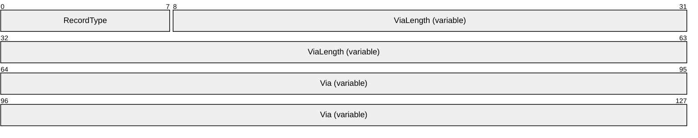
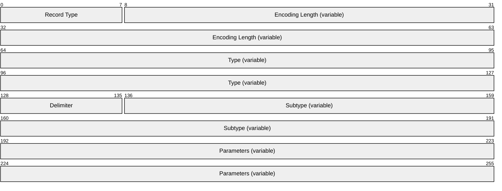
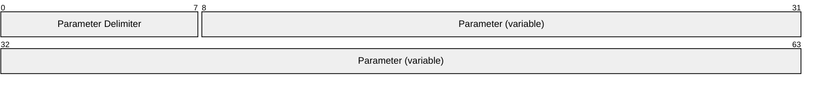
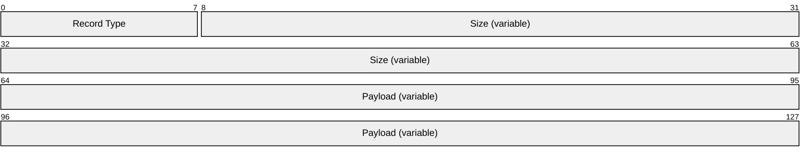
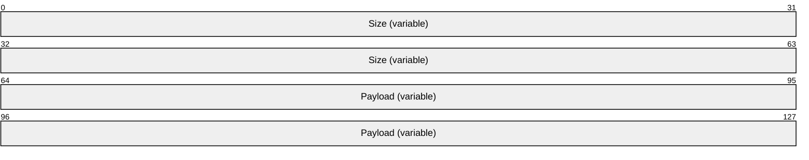
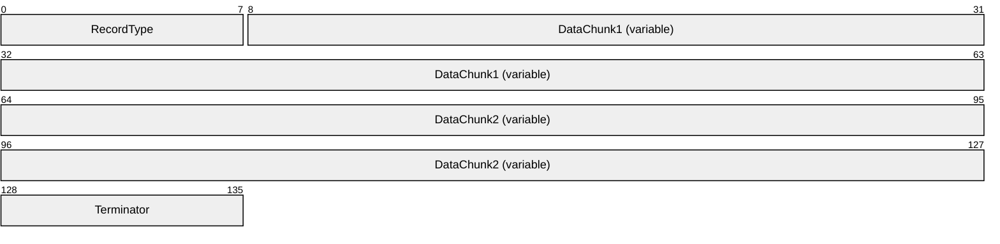
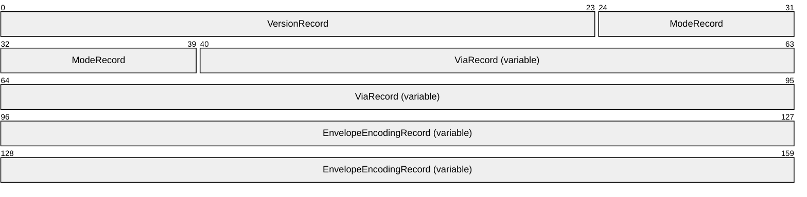

# [MC-NMF]: .NET Message Framing Protocol

Table of Contents

1 Introduction

- [1 Introduction](#Section_1)
  - [1.1 Glossary](#Section_1.1)
  - [1.2 References](#Section_1.2)
    - [1.2.1 Normative References](#Section_1.2.1)
    - [1.2.2 Informative References](#Section_1.2.2)
  - [1.3 Overview](#Section_1.3)
    - [1.3.1 Scenarios](#Section_1.3.1)
      - [1.3.1.1 Multiple Bidirectional Message Exchange Scenario](#Section_1.3.1.1)
      - [1.3.1.2 Large Message Exchange Scenario](#Section_1.3.1.2)
      - [1.3.1.3 Offline Message Exchange Scenario](#Section_1.3.1.3)
    - [1.3.2 Communication Modes](#Section_1.3.2)
      - [1.3.2.1 Message Property Scope](#Section_1.3.2.1)
      - [1.3.2.2 Protocol Receiver Mode](#Section_1.3.2.2)
      - [1.3.2.3 Message Traffic Flow](#Section_1.3.2.3)
      - [1.3.2.4 Message Chunking](#Section_1.3.2.4)
    - [1.3.3 Protocol Upgrades](#Section_1.3.3)
  - [1.4 Relationship to Other Protocols](#Section_1.4)
  - [1.5 Prerequisites/Preconditions](#Section_1.5)
  - [1.6 Applicability Statement](#Section_1.6)
  - [1.7 Versioning and Capability Negotiation](#Section_1.7)
  - [1.8 Vendor-Extensible Fields](#Section_1.8)
  - [1.9 Standards Assignments](#Section_1.9)

2 Messages

- [2 Messages](#Section_2)
  - [2.1 Transport](#Section_2.1)
  - [2.2 Message Syntax](#Section_2.2)
    - [2.2.1 Record Types](#Section_2.2.1)
    - [2.2.2 Record Size Encoding](#Section_2.2.2)
    - [2.2.3 Property Records](#Section_2.2.3)
      - [2.2.3.1 Version Record](#Section_2.2.3.1)
      - [2.2.3.2 Mode Record](#Section_2.2.3.2)
      - [2.2.3.3 Via Record](#Section_2.2.3.3)
      - [2.2.3.4 Envelope Encoding Record](#Section_2.2.3.4)
        - [2.2.3.4.1 Known Encoding Record](#Section_2.2.3.4.1)
        - [2.2.3.4.2 Extensible Encoding Record](#Section_2.2.3.4.2)
      - [2.2.3.5 Upgrade Request Record](#Section_2.2.3.5)
      - [2.2.3.6 Upgrade Response Record](#Section_2.2.3.6)
      - [2.2.3.7 Preamble End Record](#Section_2.2.3.7)
      - [2.2.3.8 Preamble Ack Record](#Section_2.2.3.8)
      - [2.2.3.9 End Record](#Section_2.2.3.9)
    - [2.2.4 Envelope Records](#Section_2.2.4)
      - [2.2.4.1 Sized Envelope Record](#Section_2.2.4.1)
      - [2.2.4.2 Data Chunk](#Section_2.2.4.2)
      - [2.2.4.3 Unsized Envelope Record](#Section_2.2.4.3)
    - [2.2.5 Fault Records](#Section_2.2.5)
    - [2.2.6 Preamble Message](#Section_2.2.6)

3 Protocol Details

- [3 Protocol Details](#Section_3)
  - [3.1 Common Details](#Section_3.1)
    - [3.1.1 Abstract Data Model](#Section_3.1.1)
      - [3.1.1.1 Initiator-Receiver Interactions](#Section_3.1.1.1)
        - [3.1.1.1.1 Singleton Unsized Mode](#Section_3.1.1.1.1)
        - [3.1.1.1.2 Duplex Mode](#Section_3.1.1.1.2)
        - [3.1.1.1.3 Simplex Mode](#Section_3.1.1.1.3)
        - [3.1.1.1.4 Singleton Sized Mode](#Section_3.1.1.1.4)
        - [3.1.1.1.5 Upgrades](#Section_3.1.1.1.5)
        - [3.1.1.1.6 Faults](#Section_3.1.1.1.6)
      - [3.1.1.2 Protocol Grammar](#Section_3.1.1.2)
    - [3.1.2 Timers](#Section_3.1.2)
    - [3.1.3 Initialization](#Section_3.1.3)
    - [3.1.4 Higher-Layer Triggered Events](#Section_3.1.4)
      - [3.1.4.1 Reading Variable-Sized Records](#Section_3.1.4.1)
      - [3.1.4.2 Handling Receipt of an Unexpected Record Type](#Section_3.1.4.2)
      - [3.1.4.3 Version Record](#Section_3.1.4.3)
      - [3.1.4.4 Mode Record](#Section_3.1.4.4)
      - [3.1.4.5 Via Record](#Section_3.1.4.5)
      - [3.1.4.6 Encoding Record](#Section_3.1.4.6)
      - [3.1.4.7 Upgrade Request Record](#Section_3.1.4.7)
      - [3.1.4.8 Upgrade Response Record](#Section_3.1.4.8)
      - [3.1.4.9 Preamble End Record](#Section_3.1.4.9)
      - [3.1.4.10 Preamble Ack Record](#Section_3.1.4.10)
      - [3.1.4.11 Sized Envelope Record](#Section_3.1.4.11)
      - [3.1.4.12 Unsized Envelope Record](#Section_3.1.4.12)
      - [3.1.4.13 End Record](#Section_3.1.4.13)
    - [3.1.5 Message Processing Events and Sequencing Rules](#Section_3.1.5)
    - [3.1.6 Timer Events](#Section_3.1.6)
    - [3.1.7 Other Local Events](#Section_3.1.7)
      - [3.1.7.1 Underlying Transport Session Is Closed](#Section_3.1.7.1)
  - [3.2 Initiator Details](#Section_3.2)
    - [3.2.1 Abstract Data Model](#Section_3.2.1)
    - [3.2.2 Timers](#Section_3.2.2)
    - [3.2.3 Initialization](#Section_3.2.3)
    - [3.2.4 Higher-Layer Triggered Events](#Section_3.2.4)
      - [3.2.4.1 Initialize Session](#Section_3.2.4.1)
      - [3.2.4.2 Send Preamble](#Section_3.2.4.2)
      - [3.2.4.3 Send Message](#Section_3.2.4.3)
        - [3.2.4.3.1 Singleton Unsized Mode](#Section_3.2.4.3.1)
        - [3.2.4.3.2 Duplex or Simplex Mode](#Section_3.2.4.3.2)
        - [3.2.4.3.3 Singleton Sized Mode](#Section_3.2.4.3.3)
      - [3.2.4.4 Receive Message](#Section_3.2.4.4)
      - [3.2.4.5 Send End Record](#Section_3.2.4.5)
      - [3.2.4.6 Session Close](#Section_3.2.4.6)
    - [3.2.5 Message Processing Events and Sequencing Rules](#Section_3.2.5)
    - [3.2.6 Timer Events](#Section_3.2.6)
    - [3.2.7 Other Local Events](#Section_3.2.7)
  - [3.3 Receiver Details](#Section_3.3)
    - [3.3.1 Abstract Data Model](#Section_3.3.1)
    - [3.3.2 Timers](#Section_3.3.2)
    - [3.3.3 Initialization](#Section_3.3.3)
    - [3.3.4 Higher-Layer Triggered Events](#Section_3.3.4)
      - [3.3.4.1 Initialize Session](#Section_3.3.4.1)
      - [3.3.4.2 Receive Preamble](#Section_3.3.4.2)
      - [3.3.4.3 Send Message](#Section_3.3.4.3)
      - [3.3.4.4 Receive Message](#Section_3.3.4.4)
        - [3.3.4.4.1 Singleton Unsized Mode](#Section_3.3.4.4.1)
        - [3.3.4.4.2 Duplex or Simplex Mode](#Section_3.3.4.4.2)
        - [3.3.4.4.3 Singleton Sized Mode](#Section_3.3.4.4.3)
      - [3.3.4.5 Send End Record](#Section_3.3.4.5)
      - [3.3.4.6 Session Close](#Section_3.3.4.6)
    - [3.3.5 Message Processing Events and Sequencing Rules](#Section_3.3.5)
    - [3.3.6 Timer Events](#Section_3.3.6)
    - [3.3.7 Other Local Events](#Section_3.3.7)

4 Protocol Examples

- [4 Protocol Examples](#Section_4)
  - [4.1 Duplex Mode](#Section_4.1)
    - [4.1.1 Initiator Receiver: Preamble Message](#Section_4.1.1)
    - [4.1.2 Initiator Receiver: Preamble End Message](#Section_4.1.2)
    - [4.1.3 Receiver Initiator : Preamble Ack Message](#Section_4.1.3)
    - [4.1.4 Initiator Receiver: Sized Envelope Message](#Section_4.1.4)
    - [4.1.5 Receiver Initiator: Sized Envelope Message](#Section_4.1.5)
    - [4.1.6 Initiator Receiver: End Message](#Section_4.1.6)
    - [4.1.7 Receiver Initiator: End Message](#Section_4.1.7)

5 Security

- [5 Security](#Section_5)
  - [5.1 Security Considerations for Implementers](#Section_5.1)
  - [5.2 Index of Security Parameters](#Section_5.2)

6 Appendix A: Product Behavior

- [6 Appendix A: Product Behavior](#Section_6)

7 Change Tracking

- [7 Change Tracking](#Section_7)

For the legal notice and IP terms, see [LEGAL.md](../LEGAL.md).
Last updated: 3/13/2019.
See [Revision History](#revision-history) for full version history.

# 1 Introduction

This document specifies the .NET Message Framing Protocol, which defines a mechanism for framing messages. Although primarily used for framing SOAP messages, this protocol can also be used to frame messages that use non-SOAP envelope formats. The .NET Message Framing Protocol can run over any transport, including those that do not natively support message semantics, and can provide support for sending and receiving demarcated messages.

Familiarity with SOAP and XML technologies is required for a complete understanding of this document.

Sections 1.5, 1.8, 1.9, 2, and 3 of this specification are normative. All other sections and examples in this specification are informative.

## 1.1 Glossary

This document uses the following terms:

**endpoint**: A node that sends or receives a [**protocol stream**](#gt_protocol-stream).

**envelope record**: A record that contains data, such as a SOAP message. For more information about envelope records, see [[SOAP1.1]](https://go.microsoft.com/fwlink/?LinkId=90520) and [[SOAP1.2-1/2007]](https://go.microsoft.com/fwlink/?LinkId=94664).

**Initiating Stream**: The protocol stream that flows from the initiator.

**initiator**: The node that initiates the connection over which a [**protocol stream**](#gt_protocol-stream) flows.

**little-endian**: Multiple-byte values that are byte-ordered with the least significant byte stored in the memory location with the lowest address.

**Property Record**: A record that contains a [**protocol stream property**](#gt_protocol-stream-property).

**protocol stream**: A continuous stream of records flowing in one direction.

**protocol stream property**: A protocol stream characteristic that can be set by a property record and that applies to subsequent records flowing with the [**protocol stream**](#gt_protocol-stream).

**receiver**: The node that is the receiver of the [**protocol stream**](#gt_protocol-stream).

**record**: A sequence of octets.

**Unicode**: A character encoding standard developed by the Unicode Consortium that represents almost all of the written languages of the world. The [**Unicode**](#gt_unicode) standard [[UNICODE5.0.0/2007]](https://go.microsoft.com/fwlink/?LinkId=154659) provides three forms (UTF-8, UTF-16, and UTF-32) and seven schemes (UTF-8, UTF-16, UTF-16 BE, UTF-16 LE, UTF-32, UTF-32 LE, and UTF-32 BE).

**MAY, SHOULD, MUST, SHOULD NOT, MUST NOT:** These terms (in all caps) are used as defined in [[RFC2119]](https://go.microsoft.com/fwlink/?LinkId=90317). All statements of optional behavior use either MAY, SHOULD, or SHOULD NOT.

## 1.2 References

Links to a document in the Microsoft Open Specifications library point to the correct section in the most recently published version of the referenced document. However, because individual documents in the library are not updated at the same time, the section numbers in the documents may not match. You can confirm the correct section numbering by checking the [Errata](https://go.microsoft.com/fwlink/?linkid=850906).

### 1.2.1 Normative References

We conduct frequent surveys of the normative references to assure their continued availability. If you have any issue with finding a normative reference, please contact [dochelp@microsoft.com](mailto:dochelp@microsoft.com). We will assist you in finding the relevant information.

[MC-NBFSE] Microsoft Corporation, "[.NET Binary Format: SOAP Extension](../MC-NBFSE/MC-NBFSE.md)".

[MC-NBFS] Microsoft Corporation, "[.NET Binary Format: SOAP Data Structure](../MC-NBFS/MC-NBFS.md)".

[MS-DTYP] Microsoft Corporation, "[Windows Data Types](../MS-DTYP/MS-DTYP.md)".

[MS-MQMQ] Microsoft Corporation, "[Message Queuing (MSMQ): Data Structures](../MS-MQMQ/MS-MQMQ.md)".

[RFC2045] Freed, N., and Borenstein, N., "Multipurpose Internet Mail Extensions (MIME) Part One: Format of Internet Message Bodies", RFC 2045, November 1996, [http://www.rfc-editor.org/rfc/rfc2045.txt](https://go.microsoft.com/fwlink/?LinkId=90307)

[RFC2119] Bradner, S., "Key words for use in RFCs to Indicate Requirement Levels", BCP 14, RFC 2119, March 1997, [http://www.rfc-editor.org/rfc/rfc2119.txt](https://go.microsoft.com/fwlink/?LinkId=90317)

[RFC2234] Crocker, D. and Overell, P., "Augmented BNF for Syntax Specifications: ABNF", RFC 2234, November 1997, [http://www.ietf.org/rfc/rfc2234.txt](https://go.microsoft.com/fwlink/?LinkId=90323)

[RFC2279] Yergeau, F., "UTF-8, a transformation format of ISO 10646", RFC 2279, January 1998, [http://www.rfc-editor.org/rfc/rfc2279.txt](https://go.microsoft.com/fwlink/?LinkId=90331)

[RFC2396] Berners-Lee, T., Fielding, R., and Masinter, L., "Uniform Resource Identifiers (URI): Generic Syntax", RFC 2396, August 1998, [http://www.rfc-editor.org/rfc/rfc2396.txt](https://go.microsoft.com/fwlink/?LinkId=90339)

[RFC2781] Hoffman, P., and Yergeau, F., "UTF-16, an encoding of ISO 10646", RFC 2781, February 2000, [http://www.rfc-editor.org/rfc/rfc2781.txt](https://go.microsoft.com/fwlink/?LinkId=90380)

[RFC4178] Zhu, L., Leach, P., Jaganathan, K., and Ingersoll, W., "The Simple and Protected Generic Security Service Application Program Interface (GSS-API) Negotiation Mechanism", RFC 4178, October 2005, [https://www.rfc-editor.org/rfc/rfc4178.txt](https://go.microsoft.com/fwlink/?LinkId=90461)

[RFC5246] Dierks, T., and Rescorla, E., "The Transport Layer Security (TLS) Protocol Version 1.2", RFC 5246, August 2008, [http://www.ietf.org/rfc/rfc5246.txt](https://go.microsoft.com/fwlink/?LinkId=129803)

[RFC793] Postel, J., Ed., "Transmission Control Protocol: DARPA Internet Program Protocol Specification", RFC 793, September 1981, [http://www.rfc-editor.org/rfc/rfc793.txt](https://go.microsoft.com/fwlink/?LinkId=150872)

[SOAP-MTOM] Gudgin, M., Medelsohn, N., Nottingham, M., and Ruellan, H., "SOAP Message Transmission Optimization Mechanism", W3C Recommendation, 25 January 2005, [http://www.w3.org/TR/2005/REC-soap12-mtom-20050125/](https://go.microsoft.com/fwlink/?LinkId=95126)

### 1.2.2 Informative References

[MS-MQOD] Microsoft Corporation, "[Message Queuing Protocols Overview](../MS-MQOD/MS-MQOD.md)".

[MS-NETOD] Microsoft Corporation, "[Microsoft .NET Framework Protocols Overview](../MS-NETOD/MS-NETOD.md)".

[MSDN-BinaryMsgEncdngBindElmnt] Microsoft Corporation, "BinaryMessageEncodingBindingElement Class", [http://msdn.microsoft.com/en-us/library/system.servicemodel.channels.binarymessageencodingbindingelement.aspx](https://go.microsoft.com/fwlink/?LinkId=216916)

[MSDN-NETMsmqBE] Microsoft Corporation, "MsmqTransportBindingElement Class", [http://msdn.microsoft.com/en-us/library/system.servicemodel.channels.msmqtransp ortbindingelement.aspx](https://go.microsoft.com/fwlink/?LinkId=100289)

[MSDN-NETMsmq] Microsoft Corporation, "NetMsmqBinding Class", [http://msdn.microsoft.com/en-us/library/system.servicemodel.netmsmqbinding.aspx](https://go.microsoft.com/fwlink/?LinkId=100286)

[MSDN-NETNamedPipeBE] Microsoft Corporation, "NamedPipeTransportBindingElement Class", [http://msdn.microsoft.com/en-us/library/system.servicemodel.channels.namedpipet ransportbindingelement.aspx](https://go.microsoft.com/fwlink/?LinkId=100288)

[MSDN-NETNamedPipe] Microsoft Corporation, "NetNamedPipeBinding Class", [http://msdn.microsoft.com/en-us/library/system.servicemodel.netnamedpipebinding.aspx](https://go.microsoft.com/fwlink/?LinkId=100285)

[MSDN-NETTcpBE] Microsoft Corporation, "TcpTransportBindingElement Class", [http://msdn.microsoft.com/en-us/library/system.servicemodel.channels.tcptranspo rtbindingelement.aspx](https://go.microsoft.com/fwlink/?LinkId=100287)

[MSDN-NETTcp] Microsoft Corporation, "NetTcpBinding Class", [http://msdn.microsoft.com/en-us/library/system.servicemodel.nettcpbinding.aspx](https://go.microsoft.com/fwlink/?LinkId=100283)

[MSDN-WCF] Microsoft Corporation, "Windows Communication Foundation", [http://msdn.microsoft.com/en-us/library/ms735119.aspx](https://go.microsoft.com/fwlink/?LinkId=100290)

[MSDN-WSCHBIND] Microsoft Corporation, "WS_CHANNEL_BINDING enumeration", [http://msdn.microsoft.com/en-us/library/dd401780(VS.85).aspx](https://go.microsoft.com/fwlink/?LinkId=182220)

[MSDN-WSSECBIND] Microsoft Corporation, "WS_SECURITY_BINDING structure", [http://msdn.microsoft.com/en-us/library/dd323380(VS.85).aspx](https://go.microsoft.com/fwlink/?LinkId=182275)

[MSDN-WSTCPSSPI] Microsoft Corporation, "WS_TCP_SSPI_TRANSPORT_SECURITY_BINDING structure", [http://msdn.microsoft.com/en-us/library/dd323466(VS.85).aspx](https://go.microsoft.com/fwlink/?LinkId=182221)

## 1.3 Overview

The .NET Message Framing Protocol defines a format for framing messages, including SOAP messages. Consider a scenario in which two SOAP nodes are interacting and exchanging SOAP messages. The transport used for communication might not inherently support the notion of messages. For example, if the underlying transport is TCP, it provides a byte stream, and the [**receiver**](#gt_receiver) needs to have additional parsing logic to be able to extract a SOAP message from this stream.

This protocol intends to meet the following requirements:

- Supports extensibility for different message-encoding formats.
- Provides delimiters for a message.
- Has capability to skip past a message that is not well formed. If the message frames are well formed but the embedded content is malformed, the protocol provides a means of skipping over all such message frames.
- Supports extensible upgrades of the underlying transport stream.
The basic idea is to first notify the recipient of the message properties (metadata), including what version of the framing protocol is being used, who the message is meant for, and what encoding algorithm is used to encode the message content; and then to send a number of message frames that conform to those properties. The recipient, based on the message properties, is able to extract the messages from the transport stream and deliver them to the appropriate [**endpoint**](#gt_endpoint).

The message properties are typically controlled by the Protocol Configuration Object (PCO). The PCO determines the following aspects of a specified instance of the protocol:

- The transport to be used.
- The version of the .NET Message Framing Protocol being used.
- The mode of communication, which is explained in sections [1.3.2](#Section_1.3.2) and [2.2.3.2](#Section_2.2.3.2).
- The Via, which is a Uniform Resource Identifier (URI) that identifies the endpoint for which the messages are intended.
- The encoding format being used for the messages. The different encoding schemes are covered in section [2.2.3.4](#Section_2.2.3.4).
- The chunk size. If the mode supports chunking, this determines the maximum size of a chunk.
- The implementation-defined maximum supported sizes for messages and [**record**](#gt_record) types. <1>

### 1.3.1 Scenarios

This section describes scenarios that capture the various message exchange patterns between SOAP nodes. These scenarios help to define the communication modes that are covered in the next section and that the protocol needs to support.

The scenarios describe a sales organization that has several salespersons; some are in the head office and some offsite. They are interacting with the customers and preparing purchase orders that need to be sent to a central server as SOAP messages. The purchase orders can also be retrieved from the server, again as SOAP messages. The Asynchronous Message Relay is a mechanism that is used to queue up messages when the salesperson is offline and then relay the messages after connectivity is established. One such mechanism is Microsoft Message Queuing, as described in [MS-MQOD](../MS-MQOD/MS-MQOD.md).

Figure 1: Asynchronous Message Relay

#### 1.3.1.1 Multiple Bidirectional Message Exchange Scenario

In this scenario, two salespersons are working at the head office with several customers. Salesperson A is responsible for collecting the customer profiles, and salesperson B is responsible for collecting the customer requirements. The two pieces of information will need to be combined to create a purchase order. Also, the head office has a high volume of customers; so there will be frequent message exchanges between the two salespeople.

For this scenario, it makes sense for salesperson A to initiate a session where the message properties are sent out. Subsequently, the messages frames are sent from salesperson A or salesperson B, and the other salesperson can extract the message by using the message properties for that session. At the end of the conversation, either salesperson can terminate the session.

#### 1.3.1.2 Large Message Exchange Scenario

In this scenario, a salesperson retrieves the entire customer inventory (in the form of a message) from the server at the start of the day.

Because this operation is typically performed only once each day, a session is not required, as was the case in the previous scenario. Instead, the protocol sends the message properties followed by the message frames, and the [**receiving end**](#gt_receiver) applies the properties to extract the message.

In addition, because the inventory is large, the message content is broken up into multiple chunks. The receiving end can then stream the content one chunk at a time and does not have to process the entire message at one time.

#### 1.3.1.3 Offline Message Exchange Scenario

In this scenario, salesperson C is visiting various customers and creating their purchase orders. However, the salesperson does not have access to the server and can upload these orders to the server only after he returns to his branch office. The order application uses some mechanism (for example, Microsoft Message Queuing) to store these messages locally, and the mechanism then relays the message to the server when the salesperson is again online.

This scenario differs from the scenario in section [1.3.1.2](#Section_1.3.1.2) because the [**receiving end**](#gt_receiver) of the protocol (that is, the relay) cannot actively participate in the protocol. This is a "store and forward" scenario in which the sending end of the protocol stores the message frame in an intermediate store, and later, the message frame is forwarded to, or retrieved by, the receiving end, which then extracts the message from the message frame.

Depending on the scenario characteristics, the message properties are sent on a per-message basis or sent once in advance of a number of messages. The latter case uses the same session semantic as before except that the session establishment involves participation from only one end.

### 1.3.2 Communication Modes

Based on the preceding scenarios, the messages exchange between nodes can be classified along the following four criteria.

#### 1.3.2.1 Message Property Scope

Message properties can be sent on a per message basis or sent once per session, which spans multiple messages. If many messages that have identical properties are being sent, the optimal workflow uses the per-session scope.

#### 1.3.2.2 Protocol Receiver Mode

The receiving end can actively participate in the protocol, or it can be a passive relay entity. If the receiving end is active, it can negotiate certain capabilities, such as a protocol upgrade.

#### 1.3.2.3 Message Traffic Flow

The logical flow of messages can be unidirectional, where only one end sends messages, or it can be bidirectional, where both ends send messages. For unidirectional messages, the [**receiver**](#gt_receiver) can acknowledge message receipt; however, the logical message flow is still in one direction.

#### 1.3.2.4 Message Chunking

The entire message can be sent in one message frame, or it can be split across multiple chunks. Chunking is extremely useful when processing large messages.

Using these criteria, four communication modes are specified for the protocol to operate in. These modes determine the pattern of messages exchanged between the nodes, and determine when the message properties are exchanged and how the message frames are created.

| Mode name | Message property scope | Protocol receiver mode | Traffic flow | Message chunking |
| --- | --- | --- | --- | --- |
| Singleton Unsized | Single | Active | Unidirectional | Yes |
| Duplex | Multiple | Active | Bidirectional | No |
| Simplex | Multiple | Passive | Unidirectional | No |
| Singleton Sized | Single | Passive | Unidirectional | No |

### 1.3.3 Protocol Upgrades

The .NET Message Framing Protocol provides the capability to upgrade the underlying [**protocol stream**](#gt_protocol-stream) to a complementary protocol, for example, to upgrade to Secure Sockets Layer (SSL)/Transport Layer Security (TLS). If the other end supports the complementary protocol and goes through with the upgrade, the subsequent byte stream (messages included) use the upgraded protocol.

The upgrade request is sent as part of message properties. Multiple upgrade negotiations can be performed. In addition, because this is a negotiation, it requires participation from both ends, and therefore, is available only when the communication mode is Singleton Unsized, or Duplex.

## 1.4 Relationship to Other Protocols

This protocol is available for use over any network transport that needs to provide message send and receive semantics. Transports that fall in this category include TCP and named pipes.

## 1.5 Prerequisites/Preconditions

The protocol assumes that a transport session has been established. The management of the transport session (that is, how and when it is established, management of idle sessions, and closure of the transport session) is not a responsibility of the protocol. The protocol only uses the transport session to send and receive octets.

For the Singleton Sized mode, which is described in section [1.3.2](#Section_1.3.2), the size of the message is not contained as part of the message frame. The protocol assumes that the underlying transport has a means to compute the size and relay it to the protocol.

## 1.6 Applicability Statement

This protocol is applicable for implementation by a transport module that wants to provide message demarcation to higher-layer applications. Higher-layer applications can use this module to send and receive messages.

Applicable scenarios include the following:

- When the communicating nodes are connected (for example, employees in the head office) or when they are disconnected (for example, an employee working remotely).
- When the communicating nodes are exchanging large messages and message-level streaming is required to optimize the use of resources such as memory and processing.
- When the communicating nodes want to upgrade the underlying transport to a complementary protocol and exchange messages using the complementary protocol.
- When a receiving node wants to bypass embedded messages that are not well formed and process subsequent messages that are well-formed.
The protocol is not applicable for scenarios in which applications do not need message-level access or the native message format of the underlying transport is sufficient.

## 1.7 Versioning and Capability Negotiation

This document covers versioning issues in the following areas:

- **Protocol versions:** This document describes version 1.0 of the .NET Message Framing Protocol. The version information is part of the protocol exchange, as described in section [2.2.3.1](#Section_2.2.3.1).
- **Capability negotiation:** The .NET Message Framing Protocol does not support negotiation of the version, mode, upgrades, and message encoding. Instead, an implementation is configured with these, as described in section [3.1.3](#Section_3.1.3).

## 1.8 Vendor-Extensible Fields

This protocol allows extensibility for the following fields:

- **Extensible encoding:** An implementation can opt for an extensible encoding. Vendors need to specify the encoding as specified in [[RFC2045]](https://go.microsoft.com/fwlink/?LinkId=90307) and covered in detail in section [2.2.3.4.2](#Section_2.2.3.4.2).
- **Upgrades:** Vendors can define new protocol upgrades in addition to the ones specified in section [2.2.3.5](#Section_2.2.3.5).
- **Faults:** An implementation can define new faults in addition to the ones specified in section [2.2.5](#Section_2.2.5). The fault is a URI, as defined in [[RFC2396]](https://go.microsoft.com/fwlink/?LinkId=90339) encoding using UTF-8 encoding as specified in [[RFC2279]](https://go.microsoft.com/fwlink/?LinkId=90331). Vendors define a URI namespace for their faults and that namespace is different from the http://schemas.microsoft.com/ws/2006/05/framing/faults/ namespace used by the faults in this protocol.

## 1.9 Standards Assignments

None.

# 2 Messages

This protocol references commonly used data types as defined in [MS-DTYP](../MS-DTYP/MS-DTYP.md).

## 2.1 Transport

This protocol is available for use over any network transport that needs to provide message send and receive semantics. Transports that fall in this category include TCP and named pipes.

## 2.2 Message Syntax

### 2.2.1 Record Types

This protocol involves the exchange of a number of [**records**](#gt_record). Records can be categorized as either [**Property Records**](#gt_property-record) or [**Envelope Records**](#gt_envelope-record) based on their contents. The Property Records contain message properties. The Envelope Records contain the message payload.

These records and their structure are covered in detail in subsequent sections. Each record is prefixed with a record type, which is an octet, and MUST be set to one of the following specified values. Values of 0x0D-0xFF for this octet are reserved for future use.

| Value | Record type |
| --- | --- |
| 0x00 | [Version Record](#Section_2.2.3.1) |
| 0x01 | [Mode Record](#Section_2.2.3.2) |
| 0x02 | [Via Record](#Section_2.2.3.3) |
| 0x03 | [Known Encoding Record](#Section_2.2.3.4.1) |
| 0x04 | [Extensible Encoding Record](#Section_2.2.3.4.2) |
| 0x05 | [Unsized Envelope Record](#Section_2.2.4.3) |
| 0x06 | [Sized Envelope Record](#Section_2.2.4.1) |
| 0x07 | [End Record](#Section_2.2.3.9) |
| 0x08 | [Fault Record](#Section_2.2.5) |
| 0x09 | [Upgrade Request Record](#Section_2.2.3.5) |
| 0x0A | [Upgrade Response Record](#Section_2.2.3.6) |
| 0x0B | [Preamble Ack Record](#Section_2.2.3.8) |
| 0x0C | [Preamble End Record](#Section_2.2.3.7) |

### 2.2.2 Record Size Encoding

For the variable-sized [**records**](#gt_record) that are used by this protocol, the record needs to contain the size, in octets, of the content. An implementation SHOULD support record sizes as large as 0xffffffff octets (encoded size requires five octets).<2>

As represented in the following figure, the encoding algorithm takes the size of the record payload as input in [**little-endian**](#gt_little-endian) format and generates a stream of octets. The octets MUST be sent in the order in which they are generated.

Figure 2: The encoding algorithm

The following table lists the encoded sizes for the range of values of Size, which is computed as previously explained. The network ordering of octets is top-down. For example, if the size is in the range 0x80-0x3FFF, the network ordering of encoded size octets is (Size & 0x7F) | 0x80 followed by Size >> 0x07.

| Bit Range | Field | Description |
| --- | --- | --- |
| 0x00-0x7F | Size | - |
| 0x80-0x3FFF | (Size & 0x7F)\ | 0x80 Size >> 0x07 |
| 0x4000-0x1FFFFF | (Size & 0x7F)\ | 0x80 ((Size >> 0x07) & 0x7F)\ 0x80 Size >> 0x0E |
| 0x200000-0x0FFFFFFF | (Size & 0x7F)\ | 0x80 ((Size >> 0x07) & 0x7F)\ 0x80 ((Size >> 0x0E) & 0x7F)\ 0x80 Size >> 0x15 |
| 0x10000000-0x0FFFFFFFF | (Size & 0x7F)\ | 0x80 ((Size >> 0x07) & 0x7F)\ 0x80 ((Size >> 0x0E) & 0x7F)\ 0x80 ((Size >> 0x15) & 0x7F)\ 0x80 Size >> 0x1C |

In the preceding table, "&" refers to a bitwise "and" operation, "|" refers to a bitwise "or" operation, and ">>" refers to a right-shift operation.

### 2.2.3 Property Records

The [**Property Records**](#gt_property-record) contain metadata about the [**protocol stream**](#gt_protocol-stream). When Property Records are received, they set a [**protocol stream property**](#gt_protocol-stream-property) and affect the interpretation of the subsequent [**records**](#gt_record) within the protocol stream.

#### 2.2.3.1 Version Record

The Version Record is a [**Property Record**](#gt_property-record) used to indicate which version of the .NET Message Framing Protocol is being used. The Version Record enables later versions of this specification to define additional record types and associated semantics.

The data portion of a Version Record is a pair of octets that indicate the major and minor version numbers. New sets of values for existing [**record**](#gt_record) types (for example, additional values of the Known Encoding Type Record) MUST be indicated by using a different minor version value. All other types of changes MUST be indicated with a different major version value.

The major and minor values of the Version Record denote the version of the framing format, not that of the payload envelope.

**RecordType (1 byte):** This octet MUST be set to 0x00 to indicate that this record is a Version Record.

**MajorVersion (1 byte):** Specifies the major version of the .NET Message Framing Protocol. An implementation that conforms to this specification MUST set this field to 0x01. A value of 0x00 is not valid for this octet, and values of 0x02–0xff are reserved for future use.

**MinorVersion (1 byte):** Specifies the minor version of the .NET Message Framing Protocol. An implementation conforming to this specification MUST set this field to 0x00. The values 0x01 – 0xff for this octet are reserved for future use.<3>

#### 2.2.3.2 Mode Record

The Mode Record is a [**Property Record**](#gt_property-record) that defines the communication mode for the session. The data portion of a Mode Record is a single octet.

**RecordType (1 byte):** This octet MUST be set to 0x01 to indicate that this is a Mode Record.

**Mode (1 byte):** The mode value MUST be set to one of the following values. A value of 0x00 is not valid for this octet, and values of 0x05–0xff are reserved for future use.

| Short Name | Meaning |
| --- | --- |
| Singleton-Unsized 0x01 | The [**Initiating Stream**](#gt_initiating-stream) for a single one-way message or for a pair of messages in a request-reply manner between two nodes. |
| Duplex 0x02 | The Initiating Stream for multiple bidirectional messages between two nodes. |
| Simplex 0x03 | The Initiating Stream for multiple one-way messages from a single source. |
| Singleton-Sized 0x04 | The Initiating Stream for a single one-way message from a single source. |

#### 2.2.3.3 Via Record

The Via Record is a [**Property Record**](#gt_property-record) that defines the URI for which subsequent messages are bound. The data portion of a Via Record is of variable length.

**RecordType (1 byte):** This octet MUST be set to 0x02 to indicate that this is a Via Record.

**ViaLength (variable):** The value MUST be set to the size, in octets, of the Via, and encoded based on the scheme defined in section [2.2.2](#Section_2.2.2). The length MUST NOT be set to 0.

**Via (variable):** A URI (as defined in [[RFC2396]](https://go.microsoft.com/fwlink/?LinkId=90339) except that the "escaped" construct is never used). The URI MUST be encoded by using UTF-8, as specified in [[RFC2279]](https://go.microsoft.com/fwlink/?LinkId=90331).

#### 2.2.3.4 Envelope Encoding Record

Envelope Encoding Records are the [**Property Records**](#gt_property-record) that define the encoding format that is used to encode the message envelope in subsequent [**Envelope Records**](#gt_envelope-record). Such [**records**](#gt_record) come in two forms: [Known Encoding Records](#Section_2.2.3.4.1) and [Extensible Encoding Records](#Section_2.2.3.4.2).

In messages, this record shows as variable-sized so that it can be either of the two forms. If the record uses Known Encoding, it is fixed-sized; otherwise, the record is variable-sized.

##### 2.2.3.4.1 Known Encoding Record

The Known Encoding Record indicates a previously known encoding for the subsequent [**Envelope Records**](#gt_envelope-record). The data portion of this [**record**](#gt_record) is a single octet.

**RecordType (1 byte):** This octet MUST be set to 0x03 to indicate that this is a Known Encoding Record.

**Encoding (1 byte):** This octet MUST be set to one of the following values. Values of 0x09–0xFF are reserved for future use.<4>

| SOAP Version 1.1 Value | Meaning |
| --- | --- |
| 0x00 | UTF-8, as specified in [[RFC2279]](https://go.microsoft.com/fwlink/?LinkId=90331). |
| 0x01 | UTF-16, as specified in [[RFC2781]](https://go.microsoft.com/fwlink/?LinkId=90380). |
| 0x02 | [**Unicode**](#gt_unicode) [**little-endian**](#gt_little-endian). |

| SOAP Version 1.2 Value | Meaning |
| --- | --- |
| 0x03 | UTF-8. |
| 0x04 | UTF-16. |
| 0x05 | Unicode little-endian. |
| 0x06 | MTOM, as specified in [[SOAP-MTOM]](https://go.microsoft.com/fwlink/?LinkId=95126). |
| 0x07 | Binary, as specified in [MC-NBFS](../MC-NBFS/MC-NBFS.md). |
| 0x08 | Binary with in-band dictionary, as specified in [MC-NBFSE](../MC-NBFSE/MC-NBFSE.md). |

##### 2.2.3.4.2 Extensible Encoding Record

The Extensible Encoding Record indicates an ad hoc encoding for subsequent [**Envelope Records**](#gt_envelope-record). The [**record**](#gt_record) data in this case is a Multipurpose Internet Mail Extensions (MIME) content type, as specified in [[RFC2045]](https://go.microsoft.com/fwlink/?LinkId=90307), which is encoded by using UTF-8 encoding.<5>

**Record Type (1 byte):** This octet MUST be set to 0x04 to indicate that this record is an Extensible Encoding Record.

**Encoding Length (variable):** The value MUST be set to the size, in octets, of the payload, and encoded based on the scheme that is specified in section [2.2.2](#Section_2.2.2). The length MUST NOT be set to 0.

**Type (variable):** This MUST be set to a type that is specified in [RFC2045] section 5.1.

**Delimiter (1 byte):** This MUST be set to the octet 0x2F (UTF-8 encoding for "/").

**Subtype (variable):** This MUST be set to a subtype that is specified in [RFC2045] section 5.1.

**Parameters (variable):** There can be one or more parameters in which the parameter structure is defined as follows.

**Parameter Delimiter (1 byte):** This MUST be set to the octet 0x3B (UTF-8 encoding for ";").

**Parameter (variable):** This MUST be set to a parameter as specified in [RFC2045] section 5.1.

#### 2.2.3.5 Upgrade Request Record

The Upgrade Request Record is a [**Property Record**](#gt_property-record) that requests a protocol upgrade.

**RecordType (1 byte):** This octet MUST be set to 0x09 to indicate that this is an Upgrade Request Record.

**UpgradeProtocolLength (variable):** This value MUST be set to the size, in octets, of the upgrade protocol name, encoded based on the scheme described in section [2.2.2](#Section_2.2.2). The length field MUST NOT be set to 0.

**UpgradeProtocol (variable):** The name of the protocol to upgrade to, encoded by using UTF-8. The following table identifies some known upgrade protocol names. An implementation SHOULD implement these upgrades and MAY define additional upgrade protocol definitions.<6>

| Protocol | Meaning |
| --- | --- |
| SSL/TLS "application/ssl-tls" | As defined in [[RFC5246]](https://go.microsoft.com/fwlink/?LinkId=129803). |
| Negotiate "application/negotiate" | As defined in [[RFC4178]](https://go.microsoft.com/fwlink/?LinkId=90461). |

#### 2.2.3.6 Upgrade Response Record

The Upgrade Response Record is a [**Property Record**](#gt_property-record) that is sent in response to an [Upgrade Request Record](#Section_2.2.3.5) to indicate a willingness to upgrade the [**protocol stream**](#gt_protocol-stream). This [**record**](#gt_record) has no data.

**RecordType (1 byte):** This octet MUST be set to 0x0A to indicate that this is an Upgrade Response Record.

#### 2.2.3.7 Preamble End Record

The Preamble End Record is a [**Property Record**](#gt_property-record) that is sent to indicate the end of message properties. [**Envelope Records**](#gt_envelope-record) follow this [**record**](#gt_record). This record has no data.

**RecordType (1 byte):** This octet MUST be set to 0x0C to indicate that this is a Preamble End Record.

#### 2.2.3.8 Preamble Ack Record

The Preamble Ack Record is a [**Property Record**](#gt_property-record) that is sent to indicate receipt of a [Preamble End Record](#Section_2.2.3.7) and to indicate that all message properties and stream upgrades have been successfully applied. The [**receiving end**](#gt_receiver) is now ready to receive the [**Envelope Records**](#gt_envelope-record). This [**record**](#gt_record) has no data.

**RecordType (1 byte):** This octet MUST be set to 0x0B to indicate that this is a Preamble Ack Record.

#### 2.2.3.9 End Record

The End Record is a [**Property Record**](#gt_property-record) that indicates that communication over a connection has ended. This [**record**](#gt_record) has no data.

**RecordType (1 byte):** This octet MUST be set to 0x07 to indicate that this is an End Record.

### 2.2.4 Envelope Records

An Envelope Record contains a message payload. There are two possible [**record**](#gt_record) types, depending on the message transfer mode.

#### 2.2.4.1 Sized Envelope Record

A Sized Envelope Record contains a message of the specified size.

**Record Type (1 byte):** This octet MUST be set to 0x06 to indicate that this is a Sized Envelope Record.

**Size (variable):** The value MUST be set to the size, in octets, of the payload and encoded based on the scheme described in section [2.2.2](#Section_2.2.2). The size MUST NOT be set to 0.

**Payload (variable):** The content of the message encoded using the encoding indicated by an [Envelope Encoding Record](#Section_2.2.3.4).

#### 2.2.4.2 Data Chunk

A Data Chunk packet is used to transmit a portion of a message payload.

**Size (variable):** The value MUST be set to the size, in octets, of the encoded payload, based on the scheme described in section [2.2.2](#Section_2.2.2). The size MUST NOT be set to 0.

**Payload (variable):** The content of the chunk.

#### 2.2.4.3 Unsized Envelope Record

An Unsized Envelope Record contains a message that is encoded using the encoding indicated by an [Envelope Encoding Record](#Section_2.2.3.4) that is broken into one or more data chunks of type Data Chunk (section [2.2.4.2](#Section_2.2.4.2)). The end of this [**record**](#gt_record) is indicated by a single 0x00 octet in place of the start of the next data chunk.

**RecordType (1 byte):** This octet MUST be set to 0x05 to indicate that this is an Unsized Envelope Record.

**DataChunk1 (variable):** The first chunk of message data. This chunk MUST be present.

**DataChunk2 (variable):** Successive chunks of message data. Additional chunks MAY be present if the message is split across multiple chunks.

**Terminator (1 byte):** This field marks the end of chunks and MUST be set to 0x00.

### 2.2.5 Fault Records

A Fault Record notifies the sender of an error encountered while processing a message frame. Generation of a Fault Record is informational only.

**RecordType (1 byte):** This octet MUST be set to 0x08 to indicate that this is a Fault [**record**](#gt_record).

**FaultSize (variable):** The value MUST be set to the size, in octets, of the fault, and encoded based on the scheme that is described in section [2.2.2](#Section_2.2.2). The size MUST NOT be set to 0.

**Fault (variable):** A URI (as defined by [[RFC2396]](https://go.microsoft.com/fwlink/?LinkId=90339) except that the "escaped" construct is never used). The URI is encoded by using UTF-8. The following table defines a collection of faults. An implementation MAY support these fault values and MAY also define new ones.<7>

For convenience, in this description the URI is broken into a namespace and fault name. The namespace for faults in the following table is http://schemas.microsoft.com/ws/2006/05/framing/faults/. Any additional faults that are defined MUST NOT use this namespace.

An example of a fault, as returned in a Fault Record, is the following: http://schemas.microsoft.com/ws/2006/05/framing/faults/UnsupportedMode

| Fault name values | Meaning |
| --- | --- |
| "ConnectionDispatchFailed" | The [**endpoint**](#gt_endpoint) that is referenced by the [Via Record](#Section_2.2.3.3) exists; however, the attempt to dispatch the message to the endpoint failed. |
| "ContentTypeInvalid" | The [Envelope Encoding Record](#Section_2.2.3.4) that was sent is not supported by the endpoint. |
| "ContentTypeTooLong" | The [**receiver**](#gt_receiver) is enforcing a maximum content-type size, and the Envelope Encoding Record exceeded that quota. |
| "EndpointAccessDenied" | The endpoint that is referenced by the Via Record cannot be accessed. |
| "EndpointNotFound" | The endpoint that is referenced by the Via Record cannot be found. |
| "EndpointPaused" | The endpoint that is referenced by the Via Record exists; however, the endpoint is currently paused. |
| "EndpointUnavailable" | The endpoint that is referenced by the Via Record exists; however, the endpoint is currently unavailable. |
| "InvalidRecordSequence" | The record sequence does not conform to the grammar that is outlined in section [3.1.1.2](#Section_3.1.1.2). |
| "MaxMessageSizeExceededFault" | The receiver is enforcing a maximum message size, and the incoming message has exceeded that quota. |
| "ServerTooBusy" | The endpoint does not have sufficient resources to process the connection. |
| "ServiceActivationFailed" | The endpoint is in a process that cannot be activated. |
| "UnsupportedMode" | The [Mode Record](#Section_2.2.3.2) value is not supported by the destination. |
| "UnsupportedVersion" | The [Version Record](#Section_2.2.3.1) value is not supported by the destination. |
| "UpgradeInvalid" | The requested upgrade is not supported by the remote endpoint. |
| "ViaTooLong" | The receiver is enforcing a maximum Via size, and the Via Record exceeded that quota. |

### 2.2.6 Preamble Message

To aid description, a Preamble Message is defined for an initial [**record**](#gt_record) sequence. The Preamble Message can apply to multiple messages, depending on the mode specified.

**VersionRecord (3 bytes):** This field MUST be formatted as specified in section [2.2.3.1](#Section_2.2.3.1).

**ModeRecord (2 bytes):** This field MUST be formatted as specified in section [2.2.3.2](#Section_2.2.3.2).

**ViaRecord (variable):** This field MUST be formatted as specified in section [2.2.3.3](#Section_2.2.3.3).

**EnvelopeEncodingRecord (variable):** This field MUST be formatted as specified in section [2.2.3.4](#Section_2.2.3.4).

# 3 Protocol Details

A node that is a participant in this protocol can behave in one of two roles:

- [**Initiator**](#gt_initiator)
- [**Receiver**](#gt_receiver)
An initiator initiates the protocol by sending a preamble message to the receiver. The initiator and receiver nodes then send and receive messages using the [**protocol stream**](#gt_protocol-stream) that connects the two [**endpoints**](#gt_endpoint).

## 3.1 Common Details

### 3.1.1 Abstract Data Model

This section describes a conceptual model of possible data organization that an implementation maintains to participate in this protocol. The described organization is provided to facilitate the explanation of how the participants behave. This document does not mandate that implementations adhere to this model as long as their external behavior is consistent with what is described in this document.

The participant maintains the following state for each session:

- Protocol Configuration Object (PCO) - Determines the specific transport, protocol version, mode, [Via](#Section_2.2.3.3), and message-encoding scheme to be used for this session.
- Send Allowed - A Boolean value that can be set to TRUE or FALSE to indicate whether messages can be sent on this session.
- Receive Allowed - A Boolean value that can be set to TRUE or FALSE to indicate whether messages can be received on this session.

#### 3.1.1.1 Initiator-Receiver Interactions

This section describes some typical interactions between an [**initiator**](#gt_initiator) and [**receiver**](#gt_receiver).

##### 3.1.1.1.1 Singleton Unsized Mode

Figure 3: Singleton Unsized mode

##### 3.1.1.1.2 Duplex Mode

Figure 4: Duplex mode

In the case illustrated, the [**initiator**](#gt_initiator) sends the [End Record](#Section_2.2.3.9) first. The protocol allows either participant to send the End Record first. After a participant sends the End Record, the participant MUST continue to receive messages until the session is closed.

##### 3.1.1.1.3 Simplex Mode

Figure 5: Simplex mode

##### 3.1.1.1.4 Singleton Sized Mode

Figure 6: Singleton Sized mode

##### 3.1.1.1.5 Upgrades

Figure 7: Upgrades

This figure illustrates a stream upgrade that uses the [Singleton Unsized mode](#Section_3.1.1.1.1). The figure would look very similar if the stream upgrade used the [Duplex mode](#Section_4.1).

After the protocol upgrade, subsequent protocol exchanges occur over the upgraded transport stream until a fault occurs or an [End Record](#Section_2.2.3.9) is received. Although the protocol allows for multiple upgrades, the preceding exchange illustrates a single upgrade only.

##### 3.1.1.1.6 Faults

Figure 8: Unsupported version

Figure 9: Upgrade invalid

Figure 10: Maximum message size exceeded

The preceding exchanges capture some of the scenarios where a [Fault Record](#Section_2.2.5) can be generated.

#### 3.1.1.2 Protocol Grammar

This section uses the Augmented Backus-Naur Form (ABNF) notation that is specified in [[RFC2234]](https://go.microsoft.com/fwlink/?LinkId=90323) to define the [**protocol stream**](#gt_protocol-stream) grammar. ProtocolStream-a represents the stream of octets flowing from the [**initiator**](#gt_initiator) to the [**receiver**](#gt_receiver), and ProtocolStream-b represents the stream of octets flowing from the receiver to the initiator.

ProtocolStream-a = 1*(SingletonUnsizedStream-a / DuplexStream-a / SimplexStream-a / SingletonSizedStream-a)

ProtocolStream-b = 1*(SingletonUnsizedStream-b / DuplexStream-b)

SingletonUnsizedStream-a = VersionRecord ModeRecordType SingletonUnsizedMode ViaRecord EncodingRecord *UpgradeRequest PreambleEndRecord UnsizedEnvelopeRecord EndRecord

DuplexStream-a = VersionRecord ModeRecordType DuplexMode ViaRecord EncodingRecord *UpgradeRequest PreambleEndRecord *SizedEnvelopeRecord EndRecord

SimplexStream-a = VersionRecord ModeRecordType SimplexMode ViaRecord EncodingRecord PreambleEndRecord *SizedEnvelopeRecord EndRecord

SingletonSizedStream-a = VersionRecord ModeRecordType SingletonSizedMode ViaRecord EncodingRecord Octets

SingletonUnsizedStream-b = (*UpgradeResponse FaultRecord) / (*UpgradeResponse PreambleAckRecord *1UnsizedEnvelopeRecord (FaultRecord / EndRecord))

DuplexStream-b = (*UpgradeResponse FaultRecord) / (*UpgradeResponse PreambleAckRecord *SizedEnvelopeRecord (FaultRecord / EndRecord))

EncodingRecord = KnownEncodingRecord / ExtensibleEncodingRecord

UpgradeRequest = UpgradeRequestRecord Octets

UpgradeResponse = UpgradeResponseRecord Octets

VersionRecord = VersionRecordType MajorVersionNumber MinorVersionNumber

VersionRecordType = %x00

MajorVersionNumber = %x01

MinorVersionNumber = %x00

ModeRecordType = %x01

SingletonUnsizedMode = %x01

DuplexMode = %x02

SimplexMode = %x03

SingletonSizedMode = %x04

ViaRecord = ViaRecordType EncodedSize Utf8Octets

ViaRecordType = %x02

KnownEncodingRecord = KnownEncodingRecordType KnownEncodingType

KnownEncodingType = TextEncoding / BinaryEncoding / MtomEncoding

BinaryEncoding = BinarySessionlessEncoding / BinarySessionEncoding

TextEncoding = Soap11TextEncoding / Soap12TextEncoding

Soap11TextEncoding = Soap11Utf8Encoding / Soap11Utf16Encoding / Soap11UnicodeFFFEEncoding

Soap12TextEncoding = Soap12Utf8Encoding / Soap12Utf16Encoding / Soap12UnicodeFFFEEncoding

KnownEncodingRecordType = %x03

Soap11Utf8Encoding = %x00

Soap11Utf16Encoding = %x01

Soap11UnicodeFFFEEncoding = %x02

Soap12Utf8Encoding = %x03

Soap12Utf16Encoding = %x04

Soap12UnicodeFFFEEncoding = %x05

MtomEncoding = %x06

BinarySessionlessEncoding = %x07

BinarySessionEncoding = %x08

ExtensibleEncodingRecord = ExtensibleEncodingRecordType EncodedSize Utf8Octets

ExtensibleEncodingRecordType = %x04

UnsizedEnvelopeRecord = UnsizedEnvelopeRecordType 1*(EncodedSize Octets) Terminator

UnsizedEnvelopeRecordType = %x05

Terminator = %x00

SizedEnvelopeRecord = SizedEnvelopeRecordType EncodedSize Octets

SizedEnvelopeRecordType = %x06

EndRecord = EndRecordType

EndRecordType = %x07

FaultRecord = FaultRecordType EncodedSize Utf8Octets

FaultRecordType = %x08

UpgradeRequestRecord = UpgradeRequestRecordType EncodedSize Utf8Octets

UpgradeRequestRecordType = %x09

UpgradeResponseRecord = UpgradeResponseRecordType

UpgradeResponseRecordType = %x0A

PreambleAckRecord = PreambleAckRecordType

PreambleAckRecordType = %x0B

PreambleEndRecord = PreambleEndRecordType

PreambleEndRecordType = %x0C

Utf8Octets = 1*(Utf8Octet)

Utf8Octet = %x00-7F / %xC2-DF %x80-BF / %xE0-EF %x80-BF %x80-BF / %xF0-F4 %x80-BF %x80-BF %x80-BF

Octets = 1*(%x00-FF)

EncodedSize = %x01-7F / %x80-FF %x01-7F / %x80-FF %x80-FF %x01-7F / %x80-FF %x80-FF %x80-FF %x01-7F / %x80-FF %x80-FF %x80-FF %x80-FF %x01-07

### 3.1.2 Timers

None.

### 3.1.3 Initialization

The **PCO** is made available to the participant as part of a higher-layer triggered event.

When the participant is initialized:

- The **Send Allowed** field MUST be set to FALSE.
- The **Receive Allowed** field MUST be set to FALSE.

### 3.1.4 Higher-Layer Triggered Events

This section covers reading [**record**](#gt_record) types from the underlying transport. The higher-layer triggered events and related processing are role specific.

The following stipulations apply throughout the remaining sections.

Wherever it is mentioned that a session MUST be closed, it refers to the following actions being taken by the participant:

- Any session-related state MUST be discarded.
- The participant MUST notify the higher layer of the error.
Wherever it is mentioned that a [Fault Record](#Section_2.2.5) MAY (or SHOULD) be sent, it refers to the following action being taken by the participant:

- If the mode is Singleton Unsized, or Duplex mode, a Fault Record MAY (or SHOULD) be sent, as described in section 2.2.5.

#### 3.1.4.1 Reading Variable-Sized Records

When a variable-sized [**record**](#gt_record) is received, the participant MUST use the following algorithm to decode the size and read the payload. This section assumes that the record type has already been read.

The algorithm takes as input the MaxSize, that is, the maximum supported size for this record. If the encoded size is 0, a [Fault Record](#Section_2.2.5) MAY<8> be sent to indicate that the size is 0 and the session MUST be closed. The decoded size is returned in [**little-endian**](#gt_little-endian) format.

Figure 11: Algorithm to decode the size and read the payload

#### 3.1.4.2 Handling Receipt of an Unexpected Record Type

If the participant receives an unexpected [**record**](#gt_record) type, it MUST be handled as follows:

- If the record type is not [Fault Record](#Section_2.2.5), a Fault Record MAY be sent to indicate that an unexpected record type has been received.
- The session MUST be closed.

#### 3.1.4.3 Version Record

- If the record type the participant read from the protocol stream is not [Version Record](#Section_2.2.3.1), it MUST be handled as described in section [3.1.4.2](#Section_3.1.4.2).
- The participant MUST read the next two octets, which contain the major and minor versions of the protocol being used.
- If the participant does not recognize the version, a [Fault Record](#Section_2.2.5) MAY<9> be sent to indicate that an incorrect version was specified, and the session MUST be closed.

#### 3.1.4.4 Mode Record

- If the record type the participant read from the protocol stream is not [Mode Record](#Section_2.2.3.2), it MUST be handled as described in section [3.1.4.2](#Section_3.1.4.2).
- The participant MUST read the next octet, which contains the mode.
- If the mode is incorrect for the session, a [Fault Record](#Section_2.2.5) MAY<10> be sent to indicate that an incorrect mode has been specified, and the session MUST be closed.

#### 3.1.4.5 Via Record

- If the record type the participant read from the protocol stream is not a [Via Record](#Section_2.2.3.3), it MUST be handled as described in section [3.1.4.2](#Section_3.1.4.2).
- The participant MUST obtain the Via, as detailed in section [3.1.4.1](#Section_3.1.4.1). The participant SHOULD use a MaxViaSize.<11> If the Via is too long, a [Fault Record](#Section_2.2.5) MAY<12> be sent, and the session MUST be closed.
- If the participant cannot locate an [**endpoint**](#gt_endpoint) that matches the Via, a Fault Record MAY<13> be sent, and the session MUST be closed.

#### 3.1.4.6 Encoding Record

- If the record type the participant read from the protocol stream is not Known Encoding Record or Extensible Encoding Record, it MUST be handled as described in section [3.1.4.2](#Section_3.1.4.2).
- If the record type is Known Encoding Record, the participant MUST read the next octet, which contains the message encoding scheme.
- If the record type is Extensible Encoding Record, the participant MUST obtain the encoding scheme, as detailed in section [3.1.4.1](#Section_3.1.4.1). The participant SHOULD use a MaxContentTypeSize.<14> If the content type is too long, a Fault Record MAY<15> be sent, and the session MUST be closed.
- If the encoding is not supported, a Fault Record MAY<16> be sent, and the session MUST be closed.

#### 3.1.4.7 Upgrade Request Record

- If the record type the participant read from the protocol stream is not [Upgrade Request Record](#Section_2.2.3.5), it MUST be handled as described in section [3.1.4.2](#Section_3.1.4.2).
- The participant MUST read the Upgrade Protocol, as detailed in section [3.1.4.1](#Section_3.1.4.1). The participant SHOULD use a MaxUpgradeProtocolSize.<17> If the upgrade name is too long, a [Fault Record](#Section_2.2.5) MAY<18> be sent, and the session MUST be closed.
- If the upgrade is not supported, a Fault Record MAY<19> be sent, and the session MUST be closed.
- If the upgrade is supported, the participant MUST send an [Upgrade Response Record](#Section_2.2.3.6), as described in section 2.2.3.6. The participant MUST invoke the upgrade handler identified by the upgrade protocol name in the Upgrade Request Record.

#### 3.1.4.8 Upgrade Response Record

- If the record type the participant read from the protocol stream is not [Upgrade Response Record](#Section_2.2.3.6), it MUST be handled as described in section [3.1.4.2](#Section_3.1.4.2).
- If the upgrade is supported, the participant MUST invoke the appropriate upgrade handler. How the upgrade handler achieves the upgrade is outside the scope of this document.

#### 3.1.4.9 Preamble End Record

- If the record type the participant read from the protocol stream is not [Preamble End Record](#Section_2.2.3.7), it MUST be handled as described in section [3.1.4.2](#Section_3.1.4.2).
- In the case of Singleton Unsized and Duplex modes, the participant MUST send a [Preamble Ack Record](#Section_2.2.3.8) as described in section 2.2.3.8.

#### 3.1.4.10 Preamble Ack Record

If the record type the participant read from the protocol stream is not [Preamble Ack Record](#Section_2.2.3.8), it MUST be handled as described in section [3.1.4.2](#Section_3.1.4.2).

#### 3.1.4.11 Sized Envelope Record

- If the record type the participant read from the protocol stream is not [Sized Envelope Record](#Section_2.2.4.1), it MUST be handled as follows:
- If the record type is [End Record](#Section_2.2.3.9), the participant MUST notify the higher layer of the receipt of End Record and set Receive Allowed to FALSE.
- If the record type is a [Fault Record](#Section_2.2.5), the session MUST be closed.
- Otherwise, it MUST be handled as described in section [3.1.4.2](#Section_3.1.4.2).
- The participant MUST obtain the message as detailed in section [3.1.4.1](#Section_3.1.4.1). The participant SHOULD use a MaxEnvelopeSize.<20>
If the message is too large, a Fault Record MAY<21> be sent, and the session MUST be closed.

#### 3.1.4.12 Unsized Envelope Record

- If the record type the participant read from the protocol stream is not [Unsized Envelope Record](#Section_2.2.4.3), it MUST be handled as described in section [3.1.4.2](#Section_3.1.4.2).
- The participant MUST then process the first chunk and any additional chunks, as described in section [3.1.4.1](#Section_3.1.4.1), until the Terminator marker (octet 0x00) is read. To achieve streaming, reading chunks SHOULD be correlated with consumption of chunks by the higher layer. The participant SHOULD use a MaxChunkSize.<22> If the chunk size is too large, a [Fault Record](#Section_2.2.5) MAY<23> be sent, and the session MUST be closed.

#### 3.1.4.13 End Record

- If the record type the participant read from the protocol stream is not [End Record](#Section_2.2.3.9), it MUST be handled as described in section [3.1.4.2](#Section_3.1.4.2).
- The participant MUST set Receive Allowed to FALSE.

### 3.1.5 Message Processing Events and Sequencing Rules

This document assumes that the processing of received octets is deferred until initiated by a higher-layer triggered event or a required response in the protocol. All message processing events and sequencing rules are explained in the context of higher-layer triggered events.

### 3.1.6 Timer Events

None.

### 3.1.7 Other Local Events

#### 3.1.7.1 Underlying Transport Session Is Closed

If at any point, the underlying network transport session is closed, the [**Protocol Stream**](#gt_protocol-stream) is closed. The participant MUST discard any session-related state.

## 3.2 Initiator Details

### 3.2.1 Abstract Data Model

The details are covered in section [3.1.1](#Section_3.1.1).

### 3.2.2 Timers

None.

### 3.2.3 Initialization

The details are covered in section [3.1.3](#Section_3.1.3).

### 3.2.4 Higher-Layer Triggered Events

The operation of the [**initiator**](#gt_initiator) is driven by the following higher-layer triggered events.

#### 3.2.4.1 Initialize Session

A new session state MUST be created, and session properties initialized as described in section [3.1.3](#Section_3.1.3).

#### 3.2.4.2 Send Preamble

- The [**initiator**](#gt_initiator) MUST send the Preamble Message as described in section [2.2.6](#Section_2.2.6).
- In the case of Simplex mode, the initiator MUST send the Preamble End record as described in section [2.2.3.7](#Section_2.2.3.7).
- In the case of Singleton Unsized, and Duplex modes, the initiator MUST perform the following additional steps:
- If an upgrade is required, send the Upgrade Request Record as described in section [2.2.3.5](#Section_2.2.3.5).
- If an upgrade is sent, read the Upgrade Response Record as described in section [3.1.4.8](#Section_3.1.4.8).
- Send the Preamble End Record as described in section 2.2.3.7.
- Read the Preamble Ack Record as described in section [3.1.4.10](#Section_3.1.4.10).
- The initiator MUST set Send Allowed to TRUE.
- If the mode is Duplex, the initiator MUST set Receive Allowed to TRUE.

#### 3.2.4.3 Send Message

If Send Allowed is set to FALSE, an error MUST be propagated to the higher layer, and no further processing done. Otherwise, the [**initiator**](#gt_initiator) MUST do the following based on the mode.

##### 3.2.4.3.1 Singleton Unsized Mode

- The [**initiator**](#gt_initiator) MUST send an Unsized Envelope Record containing the message as described in section [2.2.4.3](#Section_2.2.4.3).
- The initiator MUST send an End Record as described in section [2.2.3.9](#Section_2.2.3.9).
- The initiator MUST set Send Allowed to FALSE.

##### 3.2.4.3.2 Duplex or Simplex Mode

The [**initiator**](#gt_initiator) MUST send a Sized Envelope Record containing the message as described in section [2.2.4.1](#Section_2.2.4.1).

##### 3.2.4.3.3 Singleton Sized Mode

The [**initiator**](#gt_initiator) MUST send the message and set Send Allowed to FALSE.

#### 3.2.4.4 Receive Message

If Receive Allowed is set to FALSE, an error MUST be propagated to the higher layer and no further processing done. Otherwise, the [**initiator**](#gt_initiator) MUST read a Sized Envelope Record as described in section [3.1.4.11](#Section_3.1.4.11), and propagate the contained message to a higher layer.

#### 3.2.4.5 Send End Record

If mode is not Duplex or Simplex, an error MUST be propagated to the higher layer and no further processing done. Otherwise, the [**initiator**](#gt_initiator) MUST send an End Record as described in section [2.2.3.9](#Section_2.2.3.9). The initiator MUST set Send Allowed to FALSE.

#### 3.2.4.6 Session Close

The [**initiator**](#gt_initiator) MUST discard any session-related state and no further processing done.

### 3.2.5 Message Processing Events and Sequencing Rules

The details are covered in section [3.1.5](#Section_3.1.5).

### 3.2.6 Timer Events

None.

### 3.2.7 Other Local Events

The details are covered in section [3.1.7](#Section_3.1.7).

## 3.3 Receiver Details

### 3.3.1 Abstract Data Model

The details are covered in section [3.1.1](#Section_3.1.1).

### 3.3.2 Timers

None.

### 3.3.3 Initialization

The details are covered in section [3.1.3](#Section_3.1.3).

### 3.3.4 Higher-Layer Triggered Events

The operation of the receiver is driven by the following higher-layer triggered events.

#### 3.3.4.1 Initialize Session

A new session state MUST be created and session properties initialized as described in section [3.1.3](#Section_3.1.3).

#### 3.3.4.2 Receive Preamble

- The [**receiver**](#gt_receiver) MUST read the Version Record, as described in section [3.1.4.3](#Section_3.1.4.3).
- The receiver MUST read the Mode Record, as described in section [3.1.4.4](#Section_3.1.4.4).
- The receiver MUST read the Via Record, as described in section [3.1.4.5](#Section_3.1.4.5).
- The receiver MUST read the Encoding Record, as described in section [3.1.4.6](#Section_3.1.4.6).
- If the mode is Simplex, the receiver MUST read the Preamble End record as described in section [3.1.4.9](#Section_3.1.4.9).
- If the mode is Singleton Unsized, or Duplex, the receiver MUST perform these additional steps:
- If an upgrade is required, read the Upgrade Request Record, as described in section [3.1.4.7](#Section_3.1.4.7).
- Read the Preamble End Record, as described in section 3.1.4.9.
- The receiver MUST set Receive Allowed to TRUE.
- If the mode is Duplex, the receiver MUST set Send Allowed to TRUE.

#### 3.3.4.3 Send Message

If Send Allowed is set to FALSE, an error MUST be propagated to the higher layer and no further processing done. Otherwise, the [**receiver**](#gt_receiver) MUST send a Sized Envelope Record containing the message as described in section [2.2.4.1](#Section_2.2.4.1).

#### 3.3.4.4 Receive Message

If Receive Allowed is set to FALSE, an error MUST be propagated to the higher layer and no further processing done. Otherwise, the [**receiver**](#gt_receiver) MUST do the following based on the Mode.

##### 3.3.4.4.1 Singleton Unsized Mode

- The [**receiver**](#gt_receiver) MUST read an Unsized Envelope Record as described in section [3.1.4.12](#Section_3.1.4.12), and propagate the contained message to a higher layer.
- The receiver MUST read an End Record as described in section [3.1.4.13](#Section_3.1.4.13).
- The receiver MUST set Receive Allowed to FALSE.

##### 3.3.4.4.2 Duplex or Simplex Mode

The [**receiver**](#gt_receiver) MUST read a Sized Envelope Record as described in section [3.1.4.11](#Section_3.1.4.11), and propagate the contained message to a higher layer.

##### 3.3.4.4.3 Singleton Sized Mode

The [**receiver**](#gt_receiver) MUST read the message and propagate it to a higher layer. The receiver MUST set Receive Allowed to FALSE.

#### 3.3.4.5 Send End Record

If the mode is not Duplex, an error MUST be propagated to the higher layer and no further processing done. Otherwise, the [**receiver**](#gt_receiver) MUST send an End Record as described in section [2.2.3.9](#Section_2.2.3.9). The receiver MUST set Send Allowed to FALSE.

#### 3.3.4.6 Session Close

The [**receiver**](#gt_receiver) MUST discard any session-related state and no further processing done.

### 3.3.5 Message Processing Events and Sequencing Rules

The details are covered in section [3.1.5](#Section_3.1.5).

### 3.3.6 Timer Events

None.

### 3.3.7 Other Local Events

The details are covered in section [3.1.7](#Section_3.1.7).

# 4 Protocol Examples

## 4.1 Duplex Mode

The protocol exchange involving a Duplex Mode session is illustrated in this section. The [**initiator**](#gt_initiator) first establishes a session with the [**receiver**](#gt_receiver). The initiator then sends a message, and the receiver replies. Finally, the session is closed. The Protocol Configuration Object for this session has been configured as follows:

- Transport - The specifics of network transport are excluded from this example. The following packet captured demonstrates only the .NET Message Framing Protocol and message payload.
- Version - This exchange happened over Major Version 1 and Minor Version 0 of this protocol.
- Mode - Duplex mode was used.
- Via - The receiver was identified by the URI net.tcp://SampleServer/SampleApp/.
- Encoding - Binary Session Encoding was used to encode the messages.

### 4.1.1 Initiator Receiver: Preamble Message

Figure 12: Initiator Receiver: Preamble Message

### 4.1.2 Initiator Receiver: Preamble End Message

Figure 13: Initiator Receiver: Preamble End Message

### 4.1.3 Receiver Initiator : Preamble Ack Message

Figure 14: Receiver Initiator : Preamble Ack Message

### 4.1.4 Initiator Receiver: Sized Envelope Message

Figure 15: Initiator Receiver: Sized Envelope Message

### 4.1.5 Receiver Initiator: Sized Envelope Message

Figure 16: Receiver Initiator: Sized Envelope

### 4.1.6 Initiator Receiver: End Message

Figure 17: Initiator Receiver: End Message

### 4.1.7 Receiver Initiator: End Message

Figure 18: Receiver Initiator: End Message

# 5 Security

## 5.1 Security Considerations for Implementers

To minimize the risk of a denial-of-service (DOS) attack, it is recommended that an implementation of this protocol limit the size of variable-length [**records**](#gt_record), including Via, Extensible Encoding, Upgrade Protocol, Sized Envelope, and Unsized Envelope Record chunks. Note that Via, Extensible Encoding, and Upgrade Protocol records are exchanged before a stream upgrade can supply transport level security. Therefore, particular care needs to be taken to limit these records to a reasonable size if security is not available.

## 5.2 Index of Security Parameters

None.

# 6 Appendix A: Product Behavior

The information in this specification is applicable to the following Microsoft products or supplemental software. References to product versions include updates to those products.

This document specifies version-specific details in the Microsoft .NET Framework. For information about which versions of .NET Framework are available in each released Windows product or as supplemental software, see [MS-NETOD](../MS-NETOD/MS-NETOD.md) section 4.

The terms "earlier" and "later", when used with a product version, refer to either all preceding versions or all subsequent versions, respectively. The term "through" refers to the inclusive range of versions. Applicable Microsoft products are listed chronologically in this section.

- Microsoft .NET Framework 3.0
- Microsoft .NET Framework 3.5
- Microsoft .NET Framework 4.0
- Microsoft .NET Framework 4.5
- Microsoft .NET Framework 4.6
- Microsoft .NET Framework 4.7
- Microsoft .NET Framework 4.8
Exceptions, if any, are noted in this section. If an update version, service pack or Knowledge Base (KB) number appears with a product name, the behavior changed in that update. The new behavior also applies to subsequent updates unless otherwise specified. If a product edition appears with the product version, behavior is different in that product edition.

Unless otherwise specified, any statement of optional behavior in this specification that is prescribed using the terms "SHOULD" or "SHOULD NOT" implies product behavior in accordance with the SHOULD or SHOULD NOT prescription. Unless otherwise specified, the term "MAY" implies that the product does not follow the prescription.

<1> Section 1.3: The Windows implementation of this protocol is exercised through the use of the following Windows Communication Framework bindings [[MSDN-WCF]](https://go.microsoft.com/fwlink/?LinkId=100290).

- NetTcpBinding [[MSDN-NETTcp]](https://go.microsoft.com/fwlink/?LinkId=100283) - If the TransferMode property on the binding is set to Buffered, the mode is set to Duplex. Otherwise, the mode is set to Singleton Unsized. If the Security.Transport.ClientCredentialType property on the binding is set to Certificate, the "SSL/TLS" upgrade protocol is used. Otherwise, if it is set to Windows, the "Negotiate" upgrade protocol is used.
- NetNamedPipeBinding [[MSDN-NETNamedPipe]](https://go.microsoft.com/fwlink/?LinkId=100285) - If the TransferMode property on the binding is set to Buffered, the mode is set to Duplex. Otherwise, the mode is set to Singleton Unsized. If the Security.Mode property on the binding is set to Transport, the "Negotiate" upgrade protocol is used.
- NetMsmqBinding [[MSDN-NETMsmq]](https://go.microsoft.com/fwlink/?LinkId=100286) - If a TransactionScope is being used, the mode is set to Simplex. Otherwise, the mode is set to Singleton Sized. If the Security.Transport.MsmqAuthenticationMode property on the binding is set to Certificate, the "SSL/TLS" upgrade protocol is used. Otherwise, if it is set to WindowsDomain, the "Negotiate" upgrade protocol is used.
The Windows implementation of this protocol is also exercised through a custom Windows Communication Framework binding that uses the TcpTransportBindingElement [[MSDN-NETTcpBE]](https://go.microsoft.com/fwlink/?LinkId=100287) or the NamedPipeTransportBindingElement [[MSDN-NETNamedPipeBE]](https://go.microsoft.com/fwlink/?LinkId=100288), or the MsmqTransportBindingElement [[MSDN-NETMsmqBE]](https://go.microsoft.com/fwlink/?LinkId=100289).

The Windows implementation of this protocol is also exercised through the use of the following Windows Web Services API channel binding [[MSDN-WSCHBIND]](https://go.microsoft.com/fwlink/?LinkId=182220):

- WS_TCP_CHANNEL_BINDING - If channel binding is set to WS_TCP_CHANNEL_BINDING, the mode is always set to Duplex. If channel security binding [[MSDN-WSSECBIND]](https://go.microsoft.com/fwlink/?LinkId=182275) is set to WS_TCP_SSPI_TRANSPORT_SECURITY_BINDING [[MSDN-WSTCPSSPI]](https://go.microsoft.com/fwlink/?LinkId=182221), the "Negotiate" upgrade protocol is used.
<2> Section 2.2.2: The Windows implementation of the protocol that is exercised by Windows Communication Foundation will not allow record sizes larger than 0x7fffffff octets.

<3> Section 2.2.3.1: The Windows implementation of this protocol that is exercised by Windows Communication Foundation does not validate the value of the minor version when the value of the major version is 0x01.

<4> Section 2.2.3.4.1: The Windows implementation of this protocol that is exercised by both Windows Communication Framework and Windows Web Services API supports all the known encoding schemes.

<5> Section 2.2.3.4.2: The .NET Framework 4.5 and later implementations of this protocol that are exercised by Windows Communication Foundation use the Extensible Encoding Record to indicate the MIME content type for binary message encoding compression (see [[MSDN-BinaryMsgEncdngBindElmnt]](https://go.microsoft.com/fwlink/?LinkId=216916)).

<6> Section 2.2.3.5: The Windows implementation of this protocol that is exercised by Windows Communication Framework supports only the SSL/TLS and Negotiate upgrade protocols.

The Windows implementation of this protocol that is exercised by Windows Web Services API supports only the Negotiate upgrade protocol.

<7> Section 2.2.5: The Windows implementation of this protocol that is exercised by Windows Communication Framework supports the following set of faults: ContentTypeInvalid, ContentTypeTooLong, ConnectionDispatchFailed, EndpointNotFound, EndpointUnavailable, MaxMessageSizeExceededFault, ServerTooBusy, ServiceActivationFailed, UnsupportedMode, UnsupportedVersion, UpgradeInvalid, and ViaTooLong.

The Windows implementation of this protocol that is exercised by Windows Web Services API supports the following set of faults: ContentTypeInvalid, EndpointNotFound, MaxMessageSizeExceededFault, UnsupportedMode, and UpgradeInvalid.

<8> Section 3.1.4.1: The Windows implementation of this protocol that is exercised by both Windows Communication Framework and Windows Web Services API does not send a [Fault Record](#Section_2.2.5) if the size of a variable-sized [**record**](#gt_record) is 0.

<9> Section 3.1.4.3: The Windows implementation of this protocol that is exercised by Windows Communication Framework sends a Fault Record (UnsupportedVersion) if an incorrect version is specified in the received [Version Record](#Section_3.1.4.3).

The Windows implementation of this protocol that is exercised by Windows Web Services API does not send a Fault Record if an incorrect version is specified in the received Version Record.

<10> Section 3.1.4.4: The Windows implementation of this protocol that is exercised by both Windows Communication Framework and Windows Web Services API sends a Fault Record (UnsupportedMode) if an incorrect mode is specified in the received [Mode Record](#Section_2.2.3.2).

<11> Section 3.1.4.5: The Windows implementation of this protocol that is exercised by both Windows Communication Framework and Windows Web Services API defines a MaxViaSize of 2,048 bytes.

<12> Section 3.1.4.5: The Windows implementation of this protocol that is exercised by both Windows Communication Framework and Windows Web Services API does not send a Fault Record if the size of Via in the received [Via Record](#Section_2.2.3.3) exceeds MaxViaSize.

<13> Section 3.1.4.5: The Windows implementation of this protocol that is exercised by both Windows Communication Framework and Windows Web Services API sends a Fault Record (EndpointNotFound) if the [**endpoint**](#gt_endpoint) cannot be located for the specified Via in the received Via Record.

The Windows implementation of this protocol that is exercised by Windows Communication Framework sends a Via with a scheme component that is equal to "net.tcp" if exercised with NetTcpBinding (see [MSDN-NETTcp]) or TcpTransportBindingElement (see [MSDN-NETTcpBE]); and a Via with a scheme component that is equal to "net.msmq" if exercised with NetMsmqBinding (see [MSDN-NETMsmq]) or MsmqTransportBindingElement (see [MSDN-NETMsmqBE]).

A Via that has a scheme equal to "net.tcp" or "net.msmq" uses the following constructions: the URI reference is absolute, the URI contains a hierarchical part, the hierarchical part contains a network path, the authority is a server, and the server does not include user information.

The Windows implementation of this protocol that is exercised by Windows Web Services API sends a Via with a scheme component equal to "net.tcp" if exercised with WS_TCP_CHANNEL_BINDING [MSDN-WSCHBIND]. A Via with a scheme equal to "net.tcp" uses the following constructions: the URI reference is absolute, the URI contains a hierarchical part, the hierarchical part contains a network path, the authority is a server, and the server does not include user information.

The Windows implementation of this protocol that is exercised by both Windows Communication Framework and Windows Web Services API supports attempting to locate an endpoint for a specified Via with a scheme component that is equal to "net.tcp" when the transport session (as described in section [1.5](#Section_1.5)) that is carrying the protocol stream is a TCP connection (as defined in [[RFC793]](https://go.microsoft.com/fwlink/?LinkId=150872)) whose destination address is equal to the authority of the Via; however, an authority that does not designate a port is equivalent to an authority that uses port 808.

The Windows implementation of this protocol that is exercised by Windows Communication Framework supports attempting to locate an endpoint for a specified Via with a scheme component equal to "net.msmq" when the initiator is Microsoft Message Queuing, as specified in [MS-MQMQ](../MS-MQMQ/MS-MQMQ.md), whose queue path name computer is equal to the authority of the Via and the remainder of whose queue path name is equal to the absolute path of the Via, except that the first path segment in the Via of a private queue is "private" rather than "private$".

<14> Section 3.1.4.6: The Windows implementation of this protocol that is exercised by both Windows Communication Framework and Windows Web Services API defines a MaxContentTypeSize of 256 bytes.

<15> Section 3.1.4.6: The Windows implementation of this protocol that is exercised by both Windows Communication Framework and Windows Web Services API does not send a Fault Record if the size of the extensible encoding in the received Extensible Encoding Record exceeds MaxContentTypeSize.

<16> Section 3.1.4.6: The Windows implementation of this protocol that is exercised by both Windows Communication Framework and Windows Web Services API sends a Fault Record (ContentTypeInvalid) if an unsupported content type is specified in the received Encoding Record.

<17> Section 3.1.4.7: The Windows implementation of this protocol exercised by both Windows Communication Framework and Windows Web Services API defines a MaxUpgradeProtocolSize of 256 bytes.

<18> Section 3.1.4.7: The Windows implementation of this protocol exercised by both Windows Communication Framework and Windows Web Services API does not send a Fault Record if the size of an upgrade protocol name in the received [Upgrade Request Record](#Section_2.2.3.5) exceeds MaxUpgradeProtocolSize.

<19> Section 3.1.4.7: The Windows implementation of this protocol exercised by both Windows Communication Framework and Windows Web Services API sends a Fault Record (UpgradeInvalid) if an unsupported upgrade protocol name is specified in an Upgrade Request Record.

<20> Section 3.1.4.11: The Windows implementation of this protocol that is exercised by both Windows Communication Framework and Windows Web Services uses a MaxEnvelopeSize as configured externally.

<21> Section 3.1.4.11: The Windows implementation of this protocol that is exercised by both Windows Communication Framework and Windows Web Services API sends a Fault Record (MaxMessageSizeExceededFault) if the size of the received [Sized Envelope Record](#Section_2.2.4.1) exceeds MaxEnvelopeSize but is not greater than 0xffffffff. No Fault Record is sent if the size of the received Sized Envelope Record exceeds 0xffffffff.

<22> Section 3.1.4.12: The Windows implementation of this protocol that is exercised by Windows Communication Framework defines a MaxChunkSize of 0xfffffffa.

<23> Section 3.1.4.12: The Windows implementation of this protocol that is exercised by Windows Communication Framework does not send a Fault Record if the size of a chunk in the received [Unsized Envelope Record](#Section_2.2.4.3) exceeds MaxChunkSize.

# 7 Change Tracking

This section identifies changes that were made to this document since the last release. Changes are classified as Major, Minor, or None.

The revision class **Major** means that the technical content in the document was significantly revised. Major changes affect protocol interoperability or implementation. Examples of major changes are:

- A document revision that incorporates changes to interoperability requirements.
- A document revision that captures changes to protocol functionality.
The revision class **Minor** means that the meaning of the technical content was clarified. Minor changes do not affect protocol interoperability or implementation. Examples of minor changes are updates to clarify ambiguity at the sentence, paragraph, or table level.

The revision class **None** means that no new technical changes were introduced. Minor editorial and formatting changes may have been made, but the relevant technical content is identical to the last released version.

The changes made to this document are listed in the following table. For more information, please contact [dochelp@microsoft.com](mailto:dochelp@microsoft.com).

| Section | Description | Revision class |
| --- | --- | --- |
| [6](#Section_6) Appendix A: Product Behavior | Updated the applicability list for this release of Microsoft .NET Framework. | Major |

## Revision History

| Date | Version | Revision Class | Comments |
| --- | --- | --- | --- |
| 8/10/2007 | 0.1 | Major | Initial Availability |
| 9/28/2007 | 0.2 | Minor | Clarified the meaning of the technical content. |
| 10/23/2007 | 0.3 | Minor | Clarified the meaning of the technical content. |
| 11/30/2007 | 0.3.1 | Editorial | Changed language and formatting in the technical content. |
| 1/25/2008 | 0.3.2 | Editorial | Changed language and formatting in the technical content. |
| 3/14/2008 | 0.3.3 | Editorial | Changed language and formatting in the technical content. |
| 5/16/2008 | 0.3.4 | Editorial | Changed language and formatting in the technical content. |
| 6/20/2008 | 0.4 | Minor | Clarified the meaning of the technical content. |
| 7/25/2008 | 0.4.1 | Editorial | Changed language and formatting in the technical content. |
| 8/29/2008 | 0.4.2 | Editorial | Changed language and formatting in the technical content. |
| 10/24/2008 | 0.4.3 | Editorial | Changed language and formatting in the technical content. |
| 12/5/2008 | 1.0 | Major | Updated and revised the technical content. |
| 1/16/2009 | 1.0.1 | Editorial | Changed language and formatting in the technical content. |
| 2/27/2009 | 1.0.2 | Editorial | Changed language and formatting in the technical content. |
| 4/10/2009 | 1.0.3 | Editorial | Changed language and formatting in the technical content. |
| 5/22/2009 | 1.1 | Minor | Clarified the meaning of the technical content. |
| 7/2/2009 | 1.1.1 | Editorial | Changed language and formatting in the technical content. |
| 8/14/2009 | 1.1.2 | Editorial | Changed language and formatting in the technical content. |
| 9/25/2009 | 1.2 | Minor | Clarified the meaning of the technical content. |
| 11/6/2009 | 1.2.1 | Editorial | Changed language and formatting in the technical content. |
| 12/18/2009 | 1.2.2 | Editorial | Changed language and formatting in the technical content. |
| 1/29/2010 | 1.3 | Minor | Clarified the meaning of the technical content. |
| 3/12/2010 | 1.4 | Minor | Clarified the meaning of the technical content. |
| 4/23/2010 | 1.5 | Minor | Clarified the meaning of the technical content. |
| 6/4/2010 | 1.6 | Minor | Clarified the meaning of the technical content. |
| 7/16/2010 | 2.0 | Major | Updated and revised the technical content. |
| 8/27/2010 | 2.0 | None | No changes to the meaning, language, or formatting of the technical content. |
| 10/8/2010 | 2.0 | None | No changes to the meaning, language, or formatting of the technical content. |
| 11/19/2010 | 2.0 | None | No changes to the meaning, language, or formatting of the technical content. |
| 1/7/2011 | 3.0 | Major | Updated and revised the technical content. |
| 2/11/2011 | 3.0 | None | No changes to the meaning, language, or formatting of the technical content. |
| 3/25/2011 | 3.0 | None | No changes to the meaning, language, or formatting of the technical content. |
| 5/6/2011 | 3.0 | None | No changes to the meaning, language, or formatting of the technical content. |
| 6/17/2011 | 4.0 | Major | Updated and revised the technical content. |
| 9/23/2011 | 4.0 | None | No changes to the meaning, language, or formatting of the technical content. |
| 12/16/2011 | 5.0 | Major | Updated and revised the technical content. |
| 3/30/2012 | 5.0 | None | No changes to the meaning, language, or formatting of the technical content. |
| 7/12/2012 | 5.0 | None | No changes to the meaning, language, or formatting of the technical content. |
| 10/25/2012 | 6.0 | Major | Updated and revised the technical content. |
| 1/31/2013 | 6.0 | None | No changes to the meaning, language, or formatting of the technical content. |
| 8/8/2013 | 6.0 | None | No changes to the meaning, language, or formatting of the technical content. |
| 11/14/2013 | 6.0 | None | No changes to the meaning, language, or formatting of the technical content. |
| 2/13/2014 | 6.0 | None | No changes to the meaning, language, or formatting of the technical content. |
| 5/15/2014 | 6.0 | None | No changes to the meaning, language, or formatting of the technical content. |
| 6/30/2015 | 7.0 | Major | Significantly changed the technical content. |
| 10/16/2015 | 7.0 | None | No changes to the meaning, language, or formatting of the technical content. |
| 7/14/2016 | 7.0 | None | No changes to the meaning, language, or formatting of the technical content. |
| 3/16/2017 | 8.0 | Major | Significantly changed the technical content. |
| 6/1/2017 | 8.0 | None | No changes to the meaning, language, or formatting of the technical content. |
| 3/16/2018 | 9.0 | Major | Significantly changed the technical content. |
| 3/13/2019 | 10.0 | Major | Significantly changed the technical content. |
