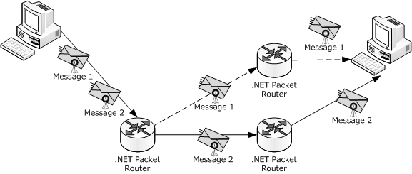
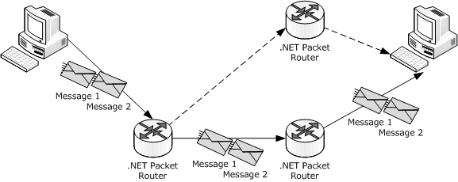
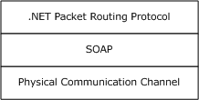
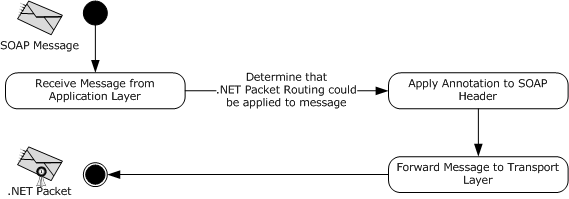
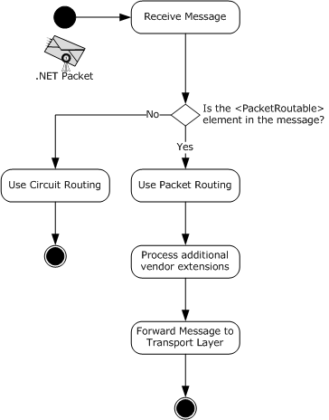
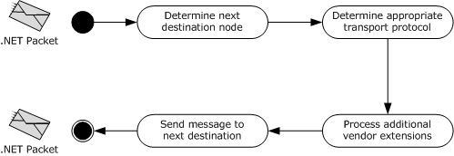

# [MC-NPR]: .NET Packet Routing Protocol

Table of Contents

1 Introduction

- [1 Introduction](#Section_1)
  - [1.1 Glossary](#Section_1.1)
  - [1.2 References](#Section_1.2)
    - [1.2.1 Normative References](#Section_1.2.1)
    - [1.2.2 Informative References](#Section_1.2.2)
  - [1.3 Overview](#Section_1.3)
    - [1.3.1 Message Type](#Section_1.3.1)
  - [1.4 Relationship to Other Protocols](#Section_1.4)
  - [1.5 Prerequisites/Preconditions](#Section_1.5)
  - [1.6 Applicability Statement](#Section_1.6)
  - [1.7 Versioning and Capability Negotiation](#Section_1.7)
  - [1.8 Vendor-Extensible Fields](#Section_1.8)
  - [1.9 Standards Assignments](#Section_1.9)

2 Messages

- [2 Messages](#Section_2)
  - [2.1 Transport](#Section_2.1)
  - [2.2 Message Syntax](#Section_2.2)
    - [2.2.1 PacketRoutable](#Section_2.2.1)
    - [2.2.2 .NET Packet](#Section_2.2.2)

3 Protocol Details

- [3 Protocol Details](#Section_3)
  - [3.1 .NET Packet Router Server Details](#Section_3.1)
    - [3.1.1 Abstract Data Model](#Section_3.1.1)
    - [3.1.2 Timers](#Section_3.1.2)
    - [3.1.3 Initialization](#Section_3.1.3)
    - [3.1.4 Higher-Layer Triggered Events](#Section_3.1.4)
    - [3.1.5 Message Processing Events and Sequencing Rules](#Section_3.1.5)
    - [3.1.6 Timer Events](#Section_3.1.6)
    - [3.1.7 Other Local Events](#Section_3.1.7)

4 Protocol Examples

- [4 Protocol Examples](#Section_4)

5 Security

- [5 Security](#Section_5)
  - [5.1 Security Considerations for Implementers](#Section_5.1)
  - [5.2 Index of Security Parameters](#Section_5.2)

6 Appendix A: Product Behavior

- [6 Appendix A: Product Behavior](#Section_6)

7 Change Tracking

- [7 Change Tracking](#Section_7)

For the legal notice and IP terms, see [LEGAL.md](../LEGAL.md).
Last updated: 3/13/2019.
See [Revision History](#revision-history) for full version history.

# 1 Introduction

This document specifies the .NET Packet Routing Protocol, which defines a [**SOAP header**](#gt_soap-header) for indicating that a [**SOAP message**](#gt_soap-message) can safely be treated as a packet or datagram. A .NET Packet Routing Protocol [**router**](#gt_router) can select a more efficient routing algorithm to use for the message based on the presence of the SOAP header. The .NET Packet Routing Protocol does not prescribe any specific algorithm or communications infrastructure for forwarding a packet after it has been received by the router.

Sections 1.5, 1.8, 1.9, 2, and 3 of this specification are normative. All other sections and examples in this specification are informative.

## 1.1 Glossary

This document uses the following terms:

**node**: An endpoint in the computer network that can receive, send, or process a SOAP message, as specified in [[SOAP1.2-2/2007]](https://go.microsoft.com/fwlink/?LinkId=119124).

**packet routing**: A [**routing algorithm**](#gt_routing-algorithm) that directs a message from a source to an ultimate destination through intermediate routers without guaranteeing that subsequent messages between the source and destination will take the same path.

**router**: An endpoint that receives messages from a [**node**](#gt_node) and forwards those messages to the next [**node**](#gt_node) based on a [**routing algorithm**](#gt_routing-algorithm).

**routing algorithm**: An algorithm used to determine the next destination [**node**](#gt_node) for a specific message.

**SOAP header**: A mechanism for implementing extensions to a [**SOAP message**](#gt_soap-message) in a decentralized manner without prior agreement between the communicating parties. See [[SOAP1.2-1/2007]](https://go.microsoft.com/fwlink/?LinkId=94664) section 5.2 for more information.

**SOAP message**: An XML document consisting of a mandatory SOAP envelope, an optional [**SOAP header**](#gt_soap-header), and a mandatory SOAP body. See [SOAP1.2-1/2007] section 5 for more information.

**SOAP mustUnderstand attribute**: A global, Boolean attribute that is used to indicate whether a header entry is mandatory or optional for the recipient to process. See [SOAP1.2-1/2007] section 5.2.3 for more information.

**SOAP packet**: A [**SOAP message**](#gt_soap-message) that does not have a behavioral dependency on the path taken to deliver the message from the source to the destination.

**MAY, SHOULD, MUST, SHOULD NOT, MUST NOT:** These terms (in all caps) are used as defined in [[RFC2119]](https://go.microsoft.com/fwlink/?LinkId=90317). All statements of optional behavior use either MAY, SHOULD, or SHOULD NOT.

## 1.2 References

Links to a document in the Microsoft Open Specifications library point to the correct section in the most recently published version of the referenced document. However, because individual documents in the library are not updated at the same time, the section numbers in the documents may not match. You can confirm the correct section numbering by checking the [Errata](https://go.microsoft.com/fwlink/?linkid=850906).

### 1.2.1 Normative References

We conduct frequent surveys of the normative references to assure their continued availability. If you have any issue with finding a normative reference, please contact [dochelp@microsoft.com](mailto:dochelp@microsoft.com). We will assist you in finding the relevant information.

[RFC2119] Bradner, S., "Key words for use in RFCs to Indicate Requirement Levels", BCP 14, RFC 2119, March 1997, [http://www.rfc-editor.org/rfc/rfc2119.txt](https://go.microsoft.com/fwlink/?LinkId=90317)

[SOAP1.1] Box, D., Ehnebuske, D., Kakivaya, G., et al., "Simple Object Access Protocol (SOAP) 1.1", W3C Note, May 2000, [http://www.w3.org/TR/2000/NOTE-SOAP-20000508/](https://go.microsoft.com/fwlink/?LinkId=90520)

[SOAP1.2-1/2007] Gudgin, M., Hadley, M., Mendelsohn, N., et al., "SOAP Version 1.2 Part 1: Messaging Framework (Second Edition)", W3C Recommendation, April 2007, [http://www.w3.org/TR/2007/REC-soap12-part1-20070427/](https://go.microsoft.com/fwlink/?LinkId=94664)

[W3C-XSD] World Wide Web Consortium, "XML Schema Part 2: Datatypes Second Edition", 28 October 2004, [http://www.w3.org/TR/2004/REC-xmlschema-2-20041028](https://go.microsoft.com/fwlink/?LinkId=90563)

[XML1.0] Bray, T., Paoli, J., Sperberg-McQueen, C.M., and Maler, E., "Extensible Markup Language (XML) 1.0 (Second Edition)", W3C Recommendation, October 2000, [http://www.w3.org/TR/2000/REC-xml-20001006](https://go.microsoft.com/fwlink/?LinkId=90599)

### 1.2.2 Informative References

[MS-NETOD] Microsoft Corporation, "[Microsoft .NET Framework Protocols Overview](#Section_1.3)".

## 1.3 Overview

[**Packet routing**](#gt_packet-routing) is the predominant form of routing on the Internet. Packet routing does not preserve connection-oriented features such as routing paths, message-delivery order, or the presence of a back channel for replies (see the following figure that illustrates Packet routing). Circuit routing does preserve those features but requires more resources to route messages (see the following figure that illustrates circuit routing).

If a [**router**](#gt_router) receives an application message over a connection, then, without further context about the application or message, the router can infer that the presence of the connection is significant and use circuit routing. However, the application might not require the features of circuit routing for correct delivery of the application message.

The .NET Packet Routing Protocol enables a [**SOAP message**](#gt_soap-message) originator to indicate that a message does not have a behavioral dependency on the path taken to deliver the message from the source to the destination. A .NET Packet Routing Protocol router makes use of the indication when selecting among different routing algorithms to apply to the message. The indication provided by the .NET Packet Routing Protocol conveys routing information that enables the router to select a more efficient routing algorithm.

Figure 1: Packet routing of SOAP packets

Figure 2: Circuit routing of SOAP messages

### 1.3.1 Message Type

[**SOAP messages**](#gt_soap-message) that use [**packet routing**](#gt_packet-routing) need to be well-formed and complete. They need to contain the PacketRoutable element in the [**SOAP header**](#gt_soap-header), as specified in section [2.2.2](#Section_2.2.2).

## 1.4 Relationship to Other Protocols

The .NET Packet Routing Protocol uses any network transport capable of transmitting SOAP 1.1 messages [[SOAP1.1]](https://go.microsoft.com/fwlink/?LinkId=90520) or SOAP 1.2 messages [[SOAP1.2-1/2007]](https://go.microsoft.com/fwlink/?LinkId=94664). The following figure shows the different layers in a [**router's**](#gt_router) stack. At the bottom of the stack is the actual physical communication medium.

Figure 3: Dependency stack in a SOAP packet router

## 1.5 Prerequisites/Preconditions

The .NET Packet Routing Protocol requires the communication channel transmitting [**SOAP packets**](#gt_soap-packet) to be capable of producing a self-contained, independent data entity that carries sufficient information to be routed from the source to the destination computer without reliance on earlier exchanges.

## 1.6 Applicability Statement

The .NET Packet Routing Protocol can be used when an application determines that circuit routing is consuming more resources than necessary. The application requests a downgrade to [**packet routing**](#gt_packet-routing) by applying a special XML element to the message's SOAP header. For more information, see section [2.1](#Section_2.1).

## 1.7 Versioning and Capability Negotiation

This document covers versioning issues in the following areas:

- Protocol versions: This protocol requires the use of SOAP version 1.1 [[SOAP1.1]](https://go.microsoft.com/fwlink/?LinkId=90520) or SOAP version 1.2 [[SOAP1.2-1/2007]](https://go.microsoft.com/fwlink/?LinkId=94664).
- Capability negotiation: The .NET Packet Routing Protocol does not support negotiation of the version to be used.

## 1.8 Vendor-Extensible Fields

This protocol has no vendor-extensible fields.

## 1.9 Standards Assignments

None.

# 2 Messages

## 2.1 Transport

The .NET Packet Routing Protocol can be used over any transport protocol that supports SOAP version 1.1 [[SOAP1.1]](https://go.microsoft.com/fwlink/?LinkId=90520) or SOAP version 1.2 [[SOAP1.2-1/2007]](https://go.microsoft.com/fwlink/?LinkId=94664). This specification uses the term SOAP to mean either SOAP 1.1 or SOAP 1.2. Where the differences between the two versions of SOAP are significant, either SOAP 1.1 or SOAP 1.2 is referenced.

Effective use of this protocol requires transmitting any messages that are to be treated as [**SOAP packets**](#gt_soap-packet) as self-contained, independent data entities that carry sufficient information to be routed from the source to the destination computer without reliance on earlier exchanges. This protocol does not prescribe any specific algorithm or communications infrastructure for forwarding a packet after it has been received by the [**router**](#gt_router).

## 2.2 Message Syntax

### 2.2.1 PacketRoutable

PacketRoutable is an XML element [[XML1.0]](https://go.microsoft.com/fwlink/?LinkId=90599) that indicates a node is permitted to treat a [**SOAP message**](#gt_soap-message) as a [**SOAP packet**](#gt_soap-packet). The PacketRoutable element is specified by the following XML schema [[W3C-XSD]](https://go.microsoft.com/fwlink/?LinkId=90563).

<xs:schema

attributeFormDefault="unqualified"

elementFormDefault="unqualified"

targetNamespace="http://schemas.microsoft.com/ws/2005/05/routing"

xmlns:xs="http://www.w3.org/2001/XMLSchema">

<xs:element name="PacketRoutable" />

</xs:schema>

### 2.2.2 .NET Packet

A .NET packet is a [**SOAP packet**](#gt_soap-packet) that contains a [PacketRoutable](#Section_2.2.1) element as a [**SOAP header**](#gt_soap-header). A .NET packet SHOULD NOT include a [**SOAP mustUnderstand attribute**](#gt_soap-mustunderstand-attribute) for the PacketRoutable element.

# 3 Protocol Details

The client side of the .NET Packet Routing Protocol MUST implement the insertion of the PacketRoutable element into the SOAP header of the message for a .NET Packet Routing Protocol router to treat it as a packet. Figure 4 represents the state transition of a SOAP message into a .NET packet.

Figure 4: State diagram of client processing of a message

## 3.1 .NET Packet Router Server Details

Every .NET Packet Routing Protocol [**router**](#gt_router) MUST implement processing to receive and send the PacketRoutable element.<1>

When a packet is received by a .NET packet router, and it contains a SOAP header that includes the PacketRoutable element, the router MUST process the XML element and downgrade the routing to [**packet routing**](#gt_packet-routing), applying any [**routing algorithm**](#gt_routing-algorithm) to determine the next destination of the packet. At this stage, an NPR router MAY also process any vendor-specific extension (such as hop count).

When receiving a message from a sending [**node**](#gt_node) to the NPR router, failures are handled based on the specific transport protocol used. For example, if HTTP was selected, an HTTP status code of 200 or 202 signifies that the message was successfully received by the router. An HTTP status code of 500 signifies that the message was not successfully received or processed. The specific handling of errors and .NET Faults is outside the scope of this document.

Figure 5: State diagram of the receiving end of a .NET Packet Routing Protocol router

When a .NET Packet Routing Protocol router sends a packet to a destination node, the router MUST maintain the PacketRoutable element in the outgoing packet, and it MAY maintain other vendor-specific extensions. Any outbound transport MAY be chosen based on the available capabilities of either the sending or the receiving router. This protocol does not specify how to determine the appropriate transport protocol or the selection process for the next destination node.

When a .NET Packet Routing Protocol router sends a packet to a destination node, any failure to deliver a message is handled based on the specific transport protocol that is used. For example, if HTTP was selected, an HTTP status code of 200 or 202 may signify that the message was successfully received by the destination node. An HTTP status code of 500 may signify that the message was not successfully received or processed by the destination node.

Vendor extensions to the protocol MAY implement retry mechanism for resending a message upon failure. This protocol does not recommend any specific handling of such failures.

Figure 6: State diagram of the sending side of a .NET Packet Routing Protocol router

### 3.1.1 Abstract Data Model

None.

### 3.1.2 Timers

None.

### 3.1.3 Initialization

None.

### 3.1.4 Higher-Layer Triggered Events

None.

### 3.1.5 Message Processing Events and Sequencing Rules

The .NET Packet Routing Protocol does not specify how or when to open an outbound connection when a [**router**](#gt_router) receives a packet. For example, an implementation of the .NET Packet Routing Protocol MAY require that a packet be fully received before an outbound connection is opened and the packet is forwarded. Another implementation MAY open an outbound connection and start forwarding the data in the packet as it is received on the inbound connection.

### 3.1.6 Timer Events

None.

### 3.1.7 Other Local Events

None.

# 4 Protocol Examples

Messages might have no relation to the underlying transport connection. By inserting the PacketRoutable element into the SOAP header, [**packet routing**](#gt_packet-routing) would be used instead of circuit routing to deliver the message. Treating the message as a packet enables optimizations such as coalescing messages together or load balancing across multiple back ends to improve reliability, scalability, and performance. The following is an example of a SOAP message that contains the PacketRoutable element in the SOAP header.

<s:Envelope xmlns:s="http://www.w3.org/2003/05/soap-envelope"

xmlns:a="http://www.w3.org/2005/08/addressing">

<s:Header>

<PacketRoutable

xmlns="http://schemas.microsoft.com/ws/2005/05/routing">

</PacketRoutable>

<a:Action s:mustUnderstand="1">

http://tempuri.org/IService/MyOperation

</a:Action>

<ActivityId CorrelationId="592d7dfd-aafe-4df8-adfc-003db32efc7

c" xmlns="http://schemas.microsoft.com/2004/09/ServiceModel/Diagnostic

s">9df08e0a-a956-46d9-a859-d6571139ff0f

</ActivityId>

<a:To s:mustUnderstand="1">http://localhost:8080/service1

</a:To>

</s:Header>

<s:Body>

<MyOperation xmlns="http://tempuri.org/">

<myValue>Some Value</myValue>

</MyOperation>

</s:Body>

</s:Envelope>

# 5 Security

## 5.1 Security Considerations for Implementers

The .NET Packet Routing Protocol does not carry any security consideration. A vendor can extend the protocol to provide additional security considerations as long as the default and basic routing scenarios, as specified by this document, function as expected. In addition, vendors and implementers of this protocol need to account for the fallback scenario when a message is routed through a .NET Packet Routing Protocol [**router**](#gt_router) that does not support the additional security extensions.

## 5.2 Index of Security Parameters

None.

# 6 Appendix A: Product Behavior

The information in this specification is applicable to the following Microsoft products or supplemental software. References to product versions include updates to those products.

This document specifies version-specific details in the Microsoft .NET Framework. For information about which versions of .NET Framework are available in each released Windows product or as supplemental software, see [MS-NETOD](#Section_1.3) section 4.

- Microsoft .NET Framework 3.0
- Microsoft .NET Framework 3.5
- Microsoft .NET Framework 4.0
- Microsoft .NET Framework 4.5
- Microsoft .NET Framework 4.6
- Microsoft .NET Framework 4.7
- Microsoft .NET Framework 4.8
Exceptions, if any, are noted in this section. If an update version, service pack or Knowledge Base (KB) number appears with a product name, the behavior changed in that update. The new behavior also applies to subsequent updates unless otherwise specified. If a product edition appears with the product version, behavior is different in that product edition.

Unless otherwise specified, any statement of optional behavior in this specification that is prescribed using the terms "SHOULD" or "SHOULD NOT" implies product behavior in accordance with the SHOULD or SHOULD NOT prescription. Unless otherwise specified, the term "MAY" implies that the product does not follow the prescription.

<1> Section 3.1: The Windows implementation of this specification does not include a .NET Packet Routing Protocol [**router**](#gt_router).

# 7 Change Tracking

This section identifies changes that were made to this document since the last release. Changes are classified as Major, Minor, or None.

The revision class **Major** means that the technical content in the document was significantly revised. Major changes affect protocol interoperability or implementation. Examples of major changes are:

- A document revision that incorporates changes to interoperability requirements.
- A document revision that captures changes to protocol functionality.
The revision class **Minor** means that the meaning of the technical content was clarified. Minor changes do not affect protocol interoperability or implementation. Examples of minor changes are updates to clarify ambiguity at the sentence, paragraph, or table level.

The revision class **None** means that no new technical changes were introduced. Minor editorial and formatting changes may have been made, but the relevant technical content is identical to the last released version.

The changes made to this document are listed in the following table. For more information, please contact [dochelp@microsoft.com](mailto:dochelp@microsoft.com).

| Section | Description | Revision class |
| --- | --- | --- |
| [6](#Section_6) Appendix A: Product Behavior | Updated the applicability list for this release of Microsoft .NET Framework. | Major |

## Revision History

| Date | Version | Revision Class | Comments |
| --- | --- | --- | --- |
| 8/10/2007 | 0.1 | Major | Initial Availability |
| 9/28/2007 | 0.2 | Minor | Clarified the meaning of the technical content. |
| 10/23/2007 | 0.3 | Minor | Clarified the meaning of the technical content. |
| 11/30/2007 | 0.3.1 | Editorial | Changed language and formatting in the technical content. |
| 1/25/2008 | 0.3.2 | Editorial | Changed language and formatting in the technical content. |
| 3/14/2008 | 0.3.3 | Editorial | Changed language and formatting in the technical content. |
| 5/16/2008 | 0.3.4 | Editorial | Changed language and formatting in the technical content. |
| 6/20/2008 | 0.4 | Minor | Clarified the meaning of the technical content. |
| 7/25/2008 | 0.5 | Minor | Clarified the meaning of the technical content. |
| 8/29/2008 | 0.5.1 | Editorial | Updated index. |
| 10/24/2008 | 0.5.2 | Editorial | Changed language and formatting in the technical content. |
| 12/5/2008 | 0.5.3 | Editorial | Changed language and formatting in the technical content. |
| 1/16/2009 | 0.5.4 | Editorial | Changed language and formatting in the technical content. |
| 2/27/2009 | 0.5.5 | Editorial | Changed language and formatting in the technical content. |
| 4/10/2009 | 0.5.6 | Editorial | Changed language and formatting in the technical content. |
| 5/22/2009 | 0.5.7 | Editorial | Changed language and formatting in the technical content. |
| 7/2/2009 | 0.5.8 | Editorial | Changed language and formatting in the technical content. |
| 8/14/2009 | 0.5.9 | Editorial | Changed language and formatting in the technical content. |
| 9/25/2009 | 0.6 | Minor | Clarified the meaning of the technical content. |
| 11/6/2009 | 0.6.1 | Editorial | Changed language and formatting in the technical content. |
| 12/18/2009 | 0.6.2 | Editorial | Changed language and formatting in the technical content. |
| 1/29/2010 | 0.7 | Minor | Clarified the meaning of the technical content. |
| 3/12/2010 | 0.7.1 | Editorial | Changed language and formatting in the technical content. |
| 4/23/2010 | 0.7.2 | Editorial | Changed language and formatting in the technical content. |
| 6/4/2010 | 1.0 | Major | Updated and revised the technical content. |
| 7/16/2010 | 2.0 | Major | Updated and revised the technical content. |
| 8/27/2010 | 2.0 | None | No changes to the meaning, language, or formatting of the technical content. |
| 10/8/2010 | 2.0 | None | No changes to the meaning, language, or formatting of the technical content. |
| 11/19/2010 | 3.0 | Major | Updated and revised the technical content. |
| 1/7/2011 | 3.0 | None | No changes to the meaning, language, or formatting of the technical content. |
| 2/11/2011 | 3.0 | None | No changes to the meaning, language, or formatting of the technical content. |
| 3/25/2011 | 3.0 | None | No changes to the meaning, language, or formatting of the technical content. |
| 5/6/2011 | 3.0 | None | No changes to the meaning, language, or formatting of the technical content. |
| 6/17/2011 | 3.1 | Minor | Clarified the meaning of the technical content. |
| 9/23/2011 | 3.1 | None | No changes to the meaning, language, or formatting of the technical content. |
| 12/16/2011 | 4.0 | Major | Updated and revised the technical content. |
| 3/30/2012 | 4.0 | None | No changes to the meaning, language, or formatting of the technical content. |
| 7/12/2012 | 4.0 | None | No changes to the meaning, language, or formatting of the technical content. |
| 10/25/2012 | 4.0 | None | No changes to the meaning, language, or formatting of the technical content. |
| 1/31/2013 | 4.0 | None | No changes to the meaning, language, or formatting of the technical content. |
| 8/8/2013 | 4.0 | None | No changes to the meaning, language, or formatting of the technical content. |
| 11/14/2013 | 4.0 | None | No changes to the meaning, language, or formatting of the technical content. |
| 2/13/2014 | 4.0 | None | No changes to the meaning, language, or formatting of the technical content. |
| 5/15/2014 | 4.0 | None | No changes to the meaning, language, or formatting of the technical content. |
| 6/30/2015 | 5.0 | Major | Significantly changed the technical content. |
| 10/16/2015 | 5.0 | None | No changes to the meaning, language, or formatting of the technical content. |
| 7/14/2016 | 5.0 | None | No changes to the meaning, language, or formatting of the technical content. |
| 3/16/2017 | 6.0 | Major | Significantly changed the technical content. |
| 6/1/2017 | 6.0 | None | No changes to the meaning, language, or formatting of the technical content. |
| 3/13/2019 | 7.0 | Major | Significantly changed the technical content. |
