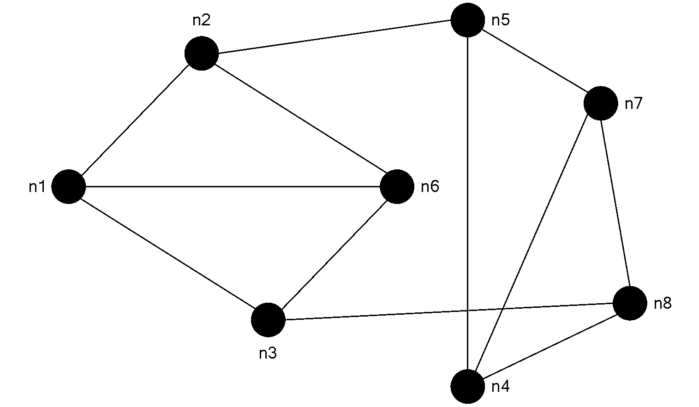
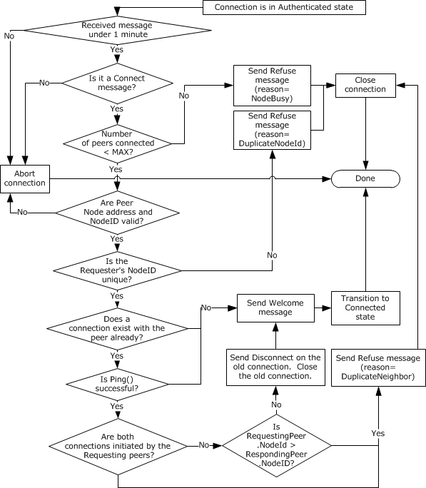
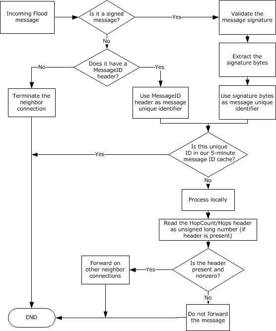
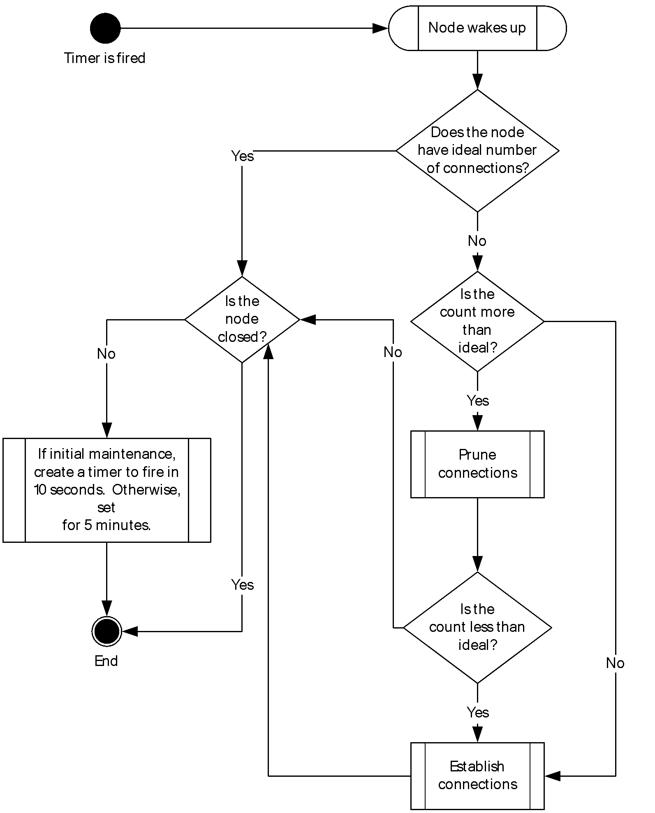
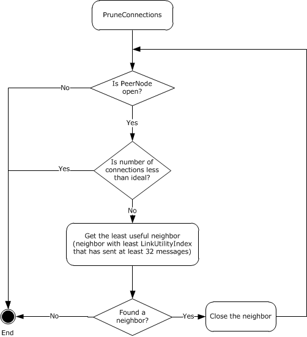
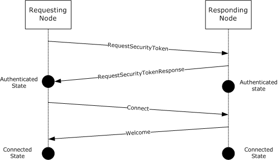
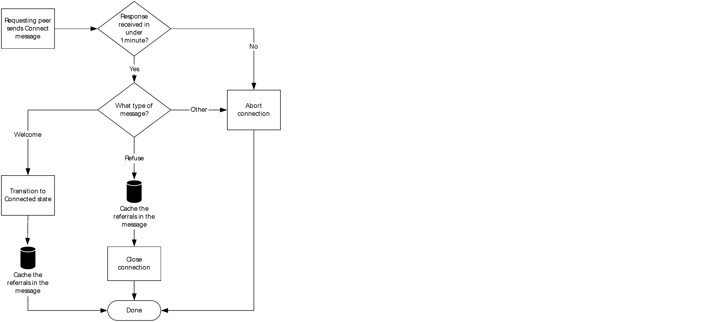
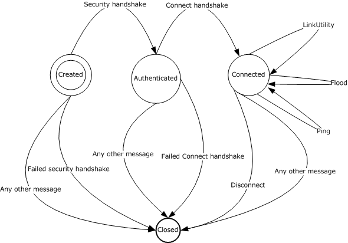

# [MC-PRCH]: Peer Channel Protocol

Table of Contents

1 Introduction

- [1 Introduction](#Section_1)
  - [1.1 Glossary](#Section_1.1)
  - [1.2 References](#Section_1.2)
    - [1.2.1 Normative References](#Section_1.2.1)
    - [1.2.2 Informative References](#Section_1.2.2)
  - [1.3 Overview](#Section_1.3)
    - [1.3.1 Mesh and Mesh Names](#Section_1.3.1)
    - [1.3.2 Channel Types](#Section_1.3.2)
    - [1.3.3 Discovery](#Section_1.3.3)
    - [1.3.4 Connecting to Other Nodes](#Section_1.3.4)
    - [1.3.5 Exchanging Application Messages](#Section_1.3.5)
    - [1.3.6 Security](#Section_1.3.6)
      - [1.3.6.1 Transport-Layer Security](#Section_1.3.6.1)
        - [1.3.6.1.1 Password](#Section_1.3.6.1.1)
        - [1.3.6.1.2 Trusted Certificate](#Section_1.3.6.1.2)
      - [1.3.6.2 Message-Layer Security](#Section_1.3.6.2)
  - [1.4 Relationship to Other Protocols](#Section_1.4)
  - [1.5 Prerequisites/Preconditions](#Section_1.5)
  - [1.6 Applicability Statement](#Section_1.6)
  - [1.7 Versioning and Capability Negotiation](#Section_1.7)
  - [1.8 Vendor-Extensible Fields](#Section_1.8)
  - [1.9 Standards Assignments](#Section_1.9)

2 Messages

- [2 Messages](#Section_2)
  - [2.1 Transport](#Section_2.1)
  - [2.2 Common Message Syntax](#Section_2.2)
    - [2.2.1 Namespaces](#Section_2.2.1)
    - [2.2.2 Structures](#Section_2.2.2)
      - [2.2.2.1 PeerHashToken Element](#Section_2.2.2.1)
      - [2.2.2.2 PeerNodeAddress Structure](#Section_2.2.2.2)
      - [2.2.2.3 Referral Structure](#Section_2.2.2.3)
      - [2.2.2.4 RefuseReason Enumeration](#Section_2.2.2.4)
      - [2.2.2.5 DisconnectReason Enumeration](#Section_2.2.2.5)
      - [2.2.2.6 FloodMessage Header](#Section_2.2.2.6)
      - [2.2.2.7 Endpoint Format](#Section_2.2.2.7)
    - [2.2.3 Messages](#Section_2.2.3)
      - [2.2.3.1 RequestSecurityToken Message](#Section_2.2.3.1)
        - [2.2.3.1.1 Computing the PeerHashToken](#Section_2.2.3.1.1)
      - [2.2.3.2 RequestSecurityTokenResponse Message](#Section_2.2.3.2)
      - [2.2.3.3 Connect Message](#Section_2.2.3.3)
      - [2.2.3.4 Welcome Message](#Section_2.2.3.4)
      - [2.2.3.5 Refuse Message](#Section_2.2.3.5)
      - [2.2.3.6 Disconnect Message](#Section_2.2.3.6)
      - [2.2.3.7 Flood (Application) Message](#Section_2.2.3.7)
      - [2.2.3.8 LinkUtility Message](#Section_2.2.3.8)
      - [2.2.3.9 Ping Message](#Section_2.2.3.9)
    - [2.2.4 Elements](#Section_2.2.4)
    - [2.2.5 Complex Types](#Section_2.2.5)
    - [2.2.6 Simple Types](#Section_2.2.6)
    - [2.2.7 Attributes](#Section_2.2.7)
    - [2.2.8 Groups](#Section_2.2.8)
    - [2.2.9 Attribute Groups](#Section_2.2.9)

3 Protocol Details

- [3 Protocol Details](#Section_3)
  - [3.1 PeerService Port Receiving Node Details](#Section_3.1)
    - [3.1.1 Abstract Data Model](#Section_3.1.1)
    - [3.1.2 Timers](#Section_3.1.2)
    - [3.1.3 Initialization](#Section_3.1.3)
      - [3.1.3.1 Setting Configuration](#Section_3.1.3.1)
    - [3.1.4 Higher-Layer Triggered Events](#Section_3.1.4)
      - [3.1.4.1 Opening a Node](#Section_3.1.4.1)
      - [3.1.4.2 Receiving a Message](#Section_3.1.4.2)
      - [3.1.4.3 Closing a Node](#Section_3.1.4.3)
    - [3.1.5 Message Processing and Sequencing Rules](#Section_3.1.5)
      - [3.1.5.1 ProcessRequestSecurityToken](#Section_3.1.5.1)
        - [3.1.5.1.1 Messages](#Section_3.1.5.1.1)
          - [3.1.5.1.1.1 PeerService_ProcessRequestSecurityToken_InputMessage](#Section_3.1.5.1.1.1)
          - [3.1.5.1.1.2 PeerService_ProcessRequestSecurityToken_OutputMessage](#Section_3.1.5.1.1.2)
      - [3.1.5.2 Connect](#Section_3.1.5.2)
        - [3.1.5.2.1 Messages](#Section_3.1.5.2.1)
          - [3.1.5.2.1.1 ConnectInfo](#Section_3.1.5.2.1.1)
      - [3.1.5.3 Welcome](#Section_3.1.5.3)
        - [3.1.5.3.1 Messages](#Section_3.1.5.3.1)
          - [3.1.5.3.1.1 WelcomeInfo](#Section_3.1.5.3.1.1)
      - [3.1.5.4 Refuse](#Section_3.1.5.4)
        - [3.1.5.4.1 Messages](#Section_3.1.5.4.1)
          - [3.1.5.4.1.1 RefuseInfo](#Section_3.1.5.4.1.1)
      - [3.1.5.5 Disconnect](#Section_3.1.5.5)
        - [3.1.5.5.1 Messages](#Section_3.1.5.5.1)
          - [3.1.5.5.1.1 DisconnectInfo](#Section_3.1.5.5.1.1)
      - [3.1.5.6 LinkUtility](#Section_3.1.5.6)
        - [3.1.5.6.1 Messages](#Section_3.1.5.6.1)
          - [3.1.5.6.1.1 UtilityInfo](#Section_3.1.5.6.1.1)
            - [3.1.5.6.1.1.1 Computing the LinkUtilityIndex](#Section_3.1.5.6.1.1.1)
      - [3.1.5.7 Ping](#Section_3.1.5.7)
        - [3.1.5.7.1 Messages](#Section_3.1.5.7.1)
          - [3.1.5.7.1.1 PeerService_Ping_InputMessage](#Section_3.1.5.7.1.1)
      - [3.1.5.8 Fault](#Section_3.1.5.8)
        - [3.1.5.8.1 Messages](#Section_3.1.5.8.1)
          - [3.1.5.8.1.1 PeerService_Fault_InputMessage](#Section_3.1.5.8.1.1)
      - [3.1.5.9 FloodMessage](#Section_3.1.5.9)
        - [3.1.5.9.1 Messages](#Section_3.1.5.9.1)
          - [3.1.5.9.1.1 PeerService_FloodMessage_InputMessage](#Section_3.1.5.9.1.1)
    - [3.1.6 Timer Events](#Section_3.1.6)
      - [3.1.6.1 Security Handshake Timer](#Section_3.1.6.1)
      - [3.1.6.2 Connect Handshake Timer](#Section_3.1.6.2)
      - [3.1.6.3 LinkUtility Timer](#Section_3.1.6.3)
      - [3.1.6.4 Maintenance Timer](#Section_3.1.6.4)
        - [3.1.6.4.1 Maintenance Algorithm](#Section_3.1.6.4.1)
        - [3.1.6.4.2 Pruning Algorithm](#Section_3.1.6.4.2)
        - [3.1.6.4.3 Establish a Neighbor Connection](#Section_3.1.6.4.3)
        - [3.1.6.4.4 Create a TCP/IP Connection](#Section_3.1.6.4.4)
        - [3.1.6.4.5 No Security](#Section_3.1.6.4.5)
        - [3.1.6.4.6 Password-Based Security](#Section_3.1.6.4.6)
        - [3.1.6.4.7 Certificate-Based Security](#Section_3.1.6.4.7)
        - [3.1.6.4.8 Password-Based Security Handshake](#Section_3.1.6.4.8)
        - [3.1.6.4.9 Connect Handshake](#Section_3.1.6.4.9)
    - [3.1.7 Other Local Events](#Section_3.1.7)
  - [3.2 PeerService Port Sending Node Details](#Section_3.2)
    - [3.2.1 Abstract Data Model](#Section_3.2.1)
    - [3.2.2 Timers](#Section_3.2.2)
    - [3.2.3 Initialization](#Section_3.2.3)
    - [3.2.4 Higher-Layer Triggered Events](#Section_3.2.4)
      - [3.2.4.1 Sending Messages](#Section_3.2.4.1)
        - [3.2.4.1.1 Sending Signed Messages](#Section_3.2.4.1.1)
    - [3.2.5 Message Processing Events and Sequencing Rules](#Section_3.2.5)
    - [3.2.6 Timer Events](#Section_3.2.6)
    - [3.2.7 Other Local Events](#Section_3.2.7)

4 Protocol Examples

- [4 Protocol Examples](#Section_4)
  - [4.1 Establishing a Neighbor Connection in Password Mode](#Section_4.1)
    - [4.1.1 Connection Initiator Sends the RequestSecurityToken Message](#Section_4.1.1)
    - [4.1.2 Responding Node Sends Back a RequestSecurityTokenResponse](#Section_4.1.2)
    - [4.1.3 Requesting Node Sends a Connect Message](#Section_4.1.3)
    - [4.1.4 Responding Node Sends a Welcome Message](#Section_4.1.4)
  - [4.2 Nonpassword Security Modes](#Section_4.2)
  - [4.3 Flooding a Message](#Section_4.3)

5 Security

- [5 Security](#Section_5)
  - [5.1 Security Considerations for Implementers](#Section_5.1)
  - [5.2 Index of Security Parameters](#Section_5.2)

6 Appendix A: Full WSDL Definitions

- [6 Appendix A: Full WSDL Definitions](#Section_6)

7 Appendix B: Product Behavior

- [7 Appendix B: Product Behavior](#Section_7)

8 Change Tracking

- [8 Change Tracking](#Section_8)

For the legal notice and IP terms, see [LEGAL.md](../LEGAL.md).
Last updated: 3/13/2019.
See [Revision History](#revision-history) for full version history.

# 1 Introduction

The Peer Channel Protocol is used for broadcasting messages over a virtual network of cooperating [**nodes**](#gt_node). This protocol is used to send and receive messages between nodes in a named [**mesh**](#gt_mesh). The nodes form the network by establishing connections to each other using a [**discovery service**](#gt_discovery-service) in which every node registers itself into a named mesh and [**discovers**](#gt_30378073-aa2b-4e99-b2f4-25087e14e83e) other nodes using the name of the mesh. The network is not fully connected. Instead, it is sparsely connected, yet a message sent by any node is propagated to the entire mesh by nodes forwarding to each other in a cooperative manner.

Each node forwards a message to all other [**neighbors**](#gt_neighbor). Each node is responsible for detecting and dropping duplicates of a message.

Each node maintains connections to a few other nodes in the mesh. A node tracks the health of the [**neighbor connection**](#gt_neighbor-connection) and tune its neighbor set based on the utility of the neighbor connection.

Sections 1.5, 1.8, 1.9, 2, and 3 of this specification are normative. All other sections and examples in this specification are informative.

## 1.1 Glossary

This document uses the following terms:

**authenticator**: A security token of a node computed using the password of the mesh and the node's public key.

**channel type**: A logical grouping of operations (messages) that can be sent over the [**mesh**](#gt_mesh). A [**mesh**](#gt_mesh) can be used to handle more than one channel type simultaneously. A channel type is identified by a unique URI.

**discovery**: The process used to discover other nodes in the [**mesh**](#gt_mesh) of interest.

**discovery service**: The service that is used to [**discover**](#gt_30378073-aa2b-4e99-b2f4-25087e14e83e) other nodes. The Peer Channel Protocol [MC-PRCH](#Section_14f8733385704569bc8893e14f838555) can use PNRP [MS-PNRP](../MS-PNRP/MS-PNRP.md) or any other service implementing the Peer Channel Custom Resolver Protocol [MC-PRCR] to [**discover**](#gt_30378073-aa2b-4e99-b2f4-25087e14e83e) other nodes.

**endpoint**: A tuple (composed of an IP address, port, and protocol number) that uniquely identifies a communication [**endpoint**](#gt_endpoint).

**flood (or flooding)**: The process of propagating messages throughout a [**mesh**](#gt_mesh).

**flood message**: An application message.

**globally unique identifier (GUID)**: A term used interchangeably with universally unique identifier (UUID) in Microsoft protocol technical documents (TDs). Interchanging the usage of these terms does not imply or require a specific algorithm or mechanism to generate the value. Specifically, the use of this term does not imply or require that the algorithms described in [[RFC4122]](https://go.microsoft.com/fwlink/?LinkId=90460) or [[C706]](https://go.microsoft.com/fwlink/?LinkId=89824) must be used for generating the [**GUID**](#gt_globally-unique-identifier-guid). See also universally unique identifier (UUID).

**mesh**: A network of nodes that are all identified with the same [**mesh name**](#gt_mesh-name).

**mesh name**: A set of nodes that establish connections to each other to form a [**mesh**](#gt_mesh).

**multihoming**: The practice of allowing TCP/IP connections on more than one interface adapter and network scope.

**neighbor**: A node that is directly connected to the given node.

**neighbor connection**: A TCP/IP connection between the endpoints of two nodes.

**node**: An instance of a channel [**endpoint**](#gt_endpoint) participating in the [**mesh**](#gt_mesh) that implements the Peer Channel Protocol.

**Peer Channel**: The Peer Channel Protocol [MC-PRCH], used for broadcasting messages over a virtual network of cooperating nodes.

**requesting node**: A node that is requesting the formation of a [**neighbor connection**](#gt_neighbor-connection) to another node in the [**mesh**](#gt_mesh).

**responding node**: A node that is responding to a request to form a [**neighbor connection**](#gt_neighbor-connection) from another node in the [**mesh**](#gt_mesh).

**Uniform Resource Identifier (URI)**: A string that identifies a resource. The URI is an addressing mechanism defined in Internet Engineering Task Force (IETF) Uniform Resource Identifier (URI): Generic Syntax [[RFC3986]](https://go.microsoft.com/fwlink/?LinkId=90453).

**Web Services Description Language (WSDL)**: An XML format for describing network services as a set of endpoints that operate on messages that contain either document-oriented or procedure-oriented information. The operations and messages are described abstractly and are bound to a concrete network protocol and message format in order to define an endpoint. Related concrete endpoints are combined into abstract endpoints, which describe a network service. WSDL is extensible, which allows the description of endpoints and their messages regardless of the message formats or network protocols that are used.

**XML namespace**: A collection of names that is used to identify elements, types, and attributes in XML documents identified in a URI reference [RFC3986]. A combination of XML namespace and local name allows XML documents to use elements, types, and attributes that have the same names but come from different sources. For more information, see [[XMLNS-2ED]](https://go.microsoft.com/fwlink/?LinkId=90602).

**MAY, SHOULD, MUST, SHOULD NOT, MUST NOT:** These terms (in all caps) are used as defined in [[RFC2119]](https://go.microsoft.com/fwlink/?LinkId=90317). All statements of optional behavior use either MAY, SHOULD, or SHOULD NOT.

## 1.2 References

Links to a document in the Microsoft Open Specifications library point to the correct section in the most recently published version of the referenced document. However, because individual documents in the library are not updated at the same time, the section numbers in the documents may not match. You can confirm the correct section numbering by checking the [Errata](https://go.microsoft.com/fwlink/?linkid=850906).

### 1.2.1 Normative References

We conduct frequent surveys of the normative references to assure their continued availability. If you have any issue with finding a normative reference, please contact [dochelp@microsoft.com](mailto:dochelp@microsoft.com). We will assist you in finding the relevant information.

[MC-NBFSE] Microsoft Corporation, "[.NET Binary Format: SOAP Extension](../MC-NBFSE/MC-NBFSE.md)".

[MC-NBFS] Microsoft Corporation, "[.NET Binary Format: SOAP Data Structure](../MC-NBFS/MC-NBFS.md)".

[MC-NMF] Microsoft Corporation, "[.NET Message Framing Protocol](../MC-NMF/MC-NMF.md)".

[METADATA] World Wide Web Consortium, "Web Services Addressing 1.0 - Metadata", W3C Recommendation, May 2007, [http://www.w3.org/TR/ws-addr-metadata/](https://go.microsoft.com/fwlink/?LinkId=161006)

[MS-DTYP] Microsoft Corporation, "[Windows Data Types](../MS-DTYP/MS-DTYP.md)".

[MS-ERREF] Microsoft Corporation, "[Windows Error Codes](../MS-ERREF/MS-ERREF.md)".

[MS-WSPOL] Microsoft Corporation, "[Web Services: Policy Assertions and WSDL Extensions](../MS-WSPOL/MS-WSPOL.md)".

[RFC2119] Bradner, S., "Key words for use in RFCs to Indicate Requirement Levels", BCP 14, RFC 2119, March 1997, [http://www.rfc-editor.org/rfc/rfc2119.txt](https://go.microsoft.com/fwlink/?LinkId=90317)

[RFC3484] Draves, R., "Default Address Selection for Internet Protocol version 6 (IPv6)", RFC 3484, February 2003, [http://www.ietf.org/rfc/rfc3484.txt](https://go.microsoft.com/fwlink/?LinkId=90424)

[RFC4122] Leach, P., Mealling, M., and Salz, R., "A Universally Unique Identifier (UUID) URN Namespace", RFC 4122, July 2005, [http://www.rfc-editor.org/rfc/rfc4122.txt](https://go.microsoft.com/fwlink/?LinkId=90460)

[RFC4346] Dierks, T., and Rescorla, E., "The Transport Layer Security (TLS) Protocol Version 1.1", RFC 4346, April 2006, [http://www.ietf.org/rfc/rfc4346.txt](https://go.microsoft.com/fwlink/?LinkId=90474)

[SOAP1.1-Envelope] Box, D., Ehnebuske, D., Kakivaya, G., et al., "Simple Object Access Protocol (SOAP) 1.1 Envelope", May 2001, [http://schemas.xmlsoap.org/soap/envelope/](https://go.microsoft.com/fwlink/?LinkId=111315)

[SOAP1.1] Box, D., Ehnebuske, D., Kakivaya, G., et al., "Simple Object Access Protocol (SOAP) 1.1", W3C Note, May 2000, [http://www.w3.org/TR/2000/NOTE-SOAP-20000508/](https://go.microsoft.com/fwlink/?LinkId=90520)

[SOAP1.2/1] Gudgin, M., Hadley, M., Mendelsohn, N., Moreau, J., and Nielsen, H.F., "SOAP Version 1.2 Part 1: Messaging Framework", W3C Recommendation, June 2003, [http://www.w3.org/TR/2003/REC-soap12-part1-20030624](https://go.microsoft.com/fwlink/?LinkId=90521)

[WSAddressing] Box, D., et al., "Web Services Addressing (WS-Addressing)", August 2004, [http://www.w3.org/Submission/ws-addressing/](https://go.microsoft.com/fwlink/?LinkId=90575)

[WSADDR] Gudgin, M., Hadley, M., and Rogers, T., "Web Services Addressing (WS-Addressing) 1.0", W3C Recommendation, May 2006, [http://www.w3.org/2005/08/addressing](https://go.microsoft.com/fwlink/?LinkId=113065)

[WSAWSDL] World Wide Web Consortium, "Web Services Addressing 1.0 - WSDL Binding", May 2006, [http://www.w3.org/TR/2006/CR-ws-addr-wsdl-20060529/](https://go.microsoft.com/fwlink/?LinkId=130726)

[WSDLSOAP] Angelov, D., Ballinger, K., Butek, R., et al., "WSDL 1.1 Binding Extension for SOAP 1.2", W3C Member Submission, April 2006, [http://www.w3.org/Submission/2006/SUBM-wsdl11soap12-20060405/](https://go.microsoft.com/fwlink/?LinkId=131790)

[WSDL] Christensen, E., Curbera, F., Meredith, G., and Weerawarana, S., "Web Services Description Language (WSDL) 1.1", W3C Note, March 2001, [http://www.w3.org/TR/2001/NOTE-wsdl-20010315](https://go.microsoft.com/fwlink/?LinkId=90577)

[WSENUM] Alexander, J., Box, D., Cabrera, L.F., et al., "Web Services Enumeration (WS-Enumeration)", March 2006, [http://www.w3.org/Submission/2006/SUBM-WS-Enumeration-20060315/](https://go.microsoft.com/fwlink/?LinkId=90580)

[WSPOLICY] Bajaj, S., Box, D., Chappell, D., et al., "Web Services Policy Framework (WS-Policy) and Web Services Policy Attachment (WS-PolicyAttachment)", March 2006, [http://schemas.xmlsoap.org/ws/2004/09/policy](https://go.microsoft.com/fwlink/?LinkId=131794)

[WSSU1.0] OASIS Standard, "WS Security Utility 1.0", 2004, [http://docs.oasis-open.org/wss/2004/01/oasis-200401-wss-wssecurity-utility-1.0.xsd](https://go.microsoft.com/fwlink/?LinkId=161007)

[WSTrust] IBM, Microsoft, Nortel, VeriSign, "WS-Trust V1.0", February 2005, [http://specs.xmlsoap.org/ws/2005/02/trust/WS-Trust.pdf](https://go.microsoft.com/fwlink/?LinkId=90584)

[X509] ITU-T, "Information Technology - Open Systems Interconnection - The Directory: Public-Key and Attribute Certificate Frameworks", Recommendation X.509, August 2005, [http://www.itu.int/rec/T-REC-X.509/en](https://go.microsoft.com/fwlink/?LinkId=90590)

[XMLNS] Bray, T., Hollander, D., Layman, A., et al., Eds., "Namespaces in XML 1.0 (Third Edition)", W3C Recommendation, December 2009, [http://www.w3.org/TR/2009/REC-xml-names-20091208/](https://go.microsoft.com/fwlink/?LinkId=191840)

[XMLSCHEMA1] Thompson, H., Beech, D., Maloney, M., and Mendelsohn, N., Eds., "XML Schema Part 1: Structures", W3C Recommendation, May 2001, [http://www.w3.org/TR/2001/REC-xmlschema-1-20010502/](https://go.microsoft.com/fwlink/?LinkId=90608)

### 1.2.2 Informative References

[MC-PRCR] Microsoft Corporation, "[Peer Channel Custom Resolver Protocol](../MC-PRCR/MC-PRCR.md)".

[MS-NETOD] Microsoft Corporation, "[Microsoft .NET Framework Protocols Overview](../MS-NETOD/MS-NETOD.md)".

[MS-PNRP] Microsoft Corporation, "[Peer Name Resolution Protocol (PNRP) Version 4.0](../MS-PNRP/MS-PNRP.md)".

[MSDN-SECURITY_INFORMATION] Microsoft Corporation, "SECURITY_INFORMATION", [http://msdn.microsoft.com/en-us/library/aa379573.aspx](https://go.microsoft.com/fwlink/?LinkId=90127)

## 1.3 Overview

[**Nodes**](#gt_node) using the Peer Channel Protocol create a [**mesh**](#gt_mesh) of redundant connections used for broadcasting and receiving messages in a decentralized manner. Messages sent by any node typically reach all other nodes; the Peer Channel Protocol is not intended for sending point-to-point messages.

Nodes learn of other participating nodes in the mesh via a resolver service or referrals from existing [**neighbors**](#gt_neighbor). Each node uses this information to establish [**neighbor connections**](#gt_neighbor-connection). Depending on the application configuration, these connections might be secured.

Figure 1: Sample diagram of a mesh

The preceding diagram shows one possible mesh shape with eight participating nodes. The mesh periodically reconfigures itself as the membership and message flow patterns change.

A mesh achieves broadcast semantics by means of sending messages to immediate neighbors who, in turn, forward the messages to their neighbors. This forwarding process stops when all participants in the mesh have received the message at least once.

### 1.3.1 Mesh and Mesh Names

A [**mesh name**](#gt_mesh-name) is used to identify a set of [**nodes**](#gt_node) that establish connections to each other to form a [**mesh**](#gt_mesh). The name is any unique identifier that follows the host name syntax rules of [**URI**](#gt_uniform-resource-identifier-uri). This name is used as the key to look up and resolve node [**endpoints**](#gt_endpoint) in a [**discovery service**](#gt_discovery-service).

The following are examples of valid mesh names:

- JoesDocumentUpdateNotice
- BobsNewsFlash
- AdamsStockTicker

### 1.3.2 Channel Types

A [**channel type**](#gt_channel-type) is defined as a logical grouping of operations (messages) that can be sent over the [**mesh**](#gt_mesh). A mesh can be used to handle more than one channel type simultaneously.

A channel type is identified by a unique URI. The HostName property of the URI matches the [**mesh name**](#gt_mesh-name), and the scheme of the URI is "net.p2p".

Following are some example ChannelType URIs in the mesh "BobsNewsFlash":

- net.p2p://BobsNewsFlash/Political
- net.p2p://BobsNewsFlash/Financial/Stocks

### 1.3.3 Discovery

The Peer Channel Protocol uses a [**discovery service**](#gt_discovery-service) as a repository to store and retrieve each [**node's**](#gt_node) **Endpoint Information** (section [3.1.1](#Section_3.1.1)). All nodes participating in a given [**mesh**](#gt_mesh) use the same discovery service. A node uses the discovery service to obtain connection information for a few nodes already present in the mesh that are attempting to join the mesh. The node uses this information to establish [**neighbor connections**](#gt_neighbor-connection). The discovery service can return [**endpoints**](#gt_endpoint) that are not currently active due to transient conditions. Connecting nodes can handle such error conditions by requesting additional connection information from the discovery service and then retrying the connect operations.

### 1.3.4 Connecting to Other Nodes

A [**node**](#gt_node) typically establishes three [**neighbor connections**](#gt_neighbor-connection), if possible. A node that does not [**discover**](#gt_30378073-aa2b-4e99-b2f4-25087e14e83e) other nodes initially will at first be alone but will be discovered by other nodes that join the [**mesh**](#gt_mesh) later. Nodes register (and update) their [**endpoint**](#gt_endpoint) information in the [**discovery service**](#gt_discovery-service) for the duration of their participation in the mesh. Nodes also periodically tune neighbor connection sets by dropping the least useful connections and acquiring new connections. Usefulness of a connection is determined by the number of new messages received over that connection.

To establish a connection, the [**requesting node**](#gt_requesting-node) sends a message requesting a connection from another node. The [**responding node**](#gt_responding-node) sends back a message indicating its availability. If the connection is accepted by the responding node, the connection is now ready for sending and receiving application messages.

### 1.3.5 Exchanging Application Messages

After establishing connections with one or more [**neighbors**](#gt_neighbor), a [**node**](#gt_node) is ready to send and receive application messages. If per-message security is configured, each message is first processed for security before further processing. All application messages received are forwarded to all connected neighbors, except to the neighbor from whom the message is received.

All nodes receive all messages addressed to the [**mesh**](#gt_mesh), even if some of the messages are only intended for a subset of the mesh.

Each message is identified by a unique message ID that is generated by the node that initially creates the message. Because a particular node can receive a message multiple times as a result of having multiple neighbors, this message ID is used to detect and discard all duplicate messages.

Outgoing messages (called [**flood messages**](#gt_flood-message)) are created by adding a Peer Channel Protocol header to the message (see section [2.2.3.7](#Section_2.2.3.7)) and then sending the messages to the corresponding [ChannelType](#Section_3551c30075a147ef8bf10cbce6d7661f) URI.

### 1.3.6 Security

A [**mesh**](#gt_mesh) can be secured at [**neighbor**](#gt_neighbor) transport layer, message layer, or both.

#### 1.3.6.1 Transport-Layer Security

A [**mesh**](#gt_mesh) can be configured to send and receive all messages over a secure transport. In this case, all [**neighbor**](#gt_neighbor)-to-neighbor connections established will be Transport Layer Security (TLS) over TCP connections, as specified in [[RFC4346]](https://go.microsoft.com/fwlink/?LinkId=90474). [**Peer Channel**](#gt_peer-channel) supports two different types of credentials for achieving transport-layer security, as described in the following sections.

##### 1.3.6.1.1 Password

Every [**node**](#gt_node) that attempts to join the [**mesh**](#gt_mesh) is required to prove knowledge of the mesh password. A secure [**neighbor**](#gt_neighbor)-to-neighbor connection is established using any arbitrary X.509 certificate [[X509]](https://go.microsoft.com/fwlink/?LinkId=90590) (this certificate does not need to be trusted). A message exchange takes place in which both nodes exchange messages to send tokens that prove their knowledge of the password. Each node validates the other node's security token before initiating further message exchanges with that node.

##### 1.3.6.1.2 Trusted Certificate

Every [**node**](#gt_node) has a certificate that all nodes can validate and trust that is provisioned out of band. Secure [**neighbor**](#gt_neighbor)-to-neighbor connections are established using these certificates. Applications provide these certificates and the associated authentication functionality and scheme. The validation scheme is responsible for validating the X.509 certificates used to establish the underlying TLS connection. It has to be generic to include any node's certificate (it is unpredictable what other nodes a given node will be connected to at any time, so all nodes have to implement generic authentication schemes). However, no message exchange takes place. If the nodes fail to authenticate each other's certificate, the [**neighbor connection**](#gt_neighbor-connection) is dropped.

#### 1.3.6.2 Message-Layer Security

Independent of transport-layer security, the Peer Channel Protocol also supports per-message security. Application messages (not protocol messages) are signed with a trusted X.509 certificate to make individual messages tamper-proof. The application provides the scheme to validate and trust the certificate that is used to secure the message. The vendor also distributes the certificates used to validate these messages.

## 1.4 Relationship to Other Protocols

The Peer Channel Protocol depends on the following non-native protocols:

- The .NET Message Framing Protocol Specification, as specified in [MC-NMF](../MC-NMF/MC-NMF.md): for exchanging encoded SOAP messages over TCP.
- The .NET Binary Format: SOAP Data Structure, as specified in [MC-NBFS](../MC-NBFS/MC-NBFS.md): for exchanging a compactly encoded stream of data between two [**nodes**](#gt_node).
- The .NET Binary Format: SOAP Extension, as specified in [MC-NBFSE](../MC-NBFSE/MC-NBFSE.md): for exchanging strings once, and then referring to them in subsequent documents.
- The Peer Channel Custom Resolver Protocol, as specified in [MC-PRCR](../MC-PRCR/MC-PRCR.md): this is optionally used to register and resolve peer's addresses during connection and maintenance operations.
The Peer Channel Protocol also has an optional dependency on the Peer Name Resolution Protocol (PNRP) Version 4.0 [MS-PNRP](../MS-PNRP/MS-PNRP.md) native protocol, as specified in [MC-PRCR] section 1.4. This protocol can be used to register and resolve the peer's addresses during connection and maintenance operations.

## 1.5 Prerequisites/Preconditions

In addition to the protocol dependencies listed in the section "Relationship to Other Protocols", it is assumed that a [**node**](#gt_node) connecting to the [**mesh**](#gt_mesh) is configured with the following details:

- Mesh name.
- Connection information for [**discovery service**](#gt_discovery-service).
- Security mechanism employed in the mesh, and the credentials needed to authenticate into the mesh.
- Credentials needed to sign [**flood messages**](#gt_flood-message) in case the message authentication feature is used.
- URI of each of the channels that it wants to send messages to (or receive messages from).
It is assumed that these details are available to all participating nodes before connecting to the mesh. The Peer Channel Protocol is not used to communicate these details.

## 1.6 Applicability Statement

The Peer Channel Protocol is suitable for scenarios in which messages sent by any [**node**](#gt_node) can reach all other nodes participating in a single named [**mesh**](#gt_mesh). It is suitable for both local networks and Global Internet scenarios on both trusted and untrusted networks.

The Peer Channel Protocol is not intended for sending point-to-point messages in a mesh. All messages are to be addressed to the mesh, not to any particular peer.

The Peer Channel Protocol is suited for use in scenarios that do not require a high degree of reliability, because it does not include any mechanism to guarantee message delivery.

## 1.7 Versioning and Capability Negotiation

None.

## 1.8 Vendor-Extensible Fields

None.

## 1.9 Standards Assignments

None.

# 2 Messages

## 2.1 Transport

A [**node**](#gt_node) configured without transport security MUST use TCP as the [**neighbor**](#gt_neighbor)-to-neighbor transport. A node configured with transport security MUST use TLS to secure the channel, as specified in [[RFC4346]](https://go.microsoft.com/fwlink/?LinkId=90474).

## 2.2 Common Message Syntax

The Peer Channel Protocol is comprised of messages that are based on SOAP (as specified in [[SOAP1.2/1]](https://go.microsoft.com/fwlink/?LinkId=90521)) syntax. Peer Channel Protocol messages are defined as a [**Web Services Description Language (WSDL)**](#gt_web-services-description-language-wsdl) [[WSDL]](https://go.microsoft.com/fwlink/?LinkId=90577) operation binding. Peer Channel Protocol messages define the Action header and the element type in the SOAP body, with the exception of [**flood messages**](#gt_flood-message), which are identified by the presence of other Peer Channel Protocol–specific headers in the SOAP message.

### 2.2.1 Namespaces

This specification defines and references various [**XML namespaces**](#gt_xml-namespace) using the mechanisms specified in [[XMLNS]](https://go.microsoft.com/fwlink/?LinkId=191840). Although this specification associates a specific XML namespace prefix for each XML namespace that is used, the choice of any particular XML namespace prefix is implementation-specific and not significant for interoperability.

| Prefix | Namespace URI | Reference |
| --- | --- | --- |
| soapenc | http://schemas.xmlsoap.org/soap/encoding | [[SOAP1.1]](https://go.microsoft.com/fwlink/?LinkId=90520) |
| wsu | http://docs.oasis-open.org/wss/2004/01/oasis-200401-wss-wssecurity-utility-1.0.xsd | [[WSSU1.0]](https://go.microsoft.com/fwlink/?LinkId=161007) |
| wsdl | http://schemas.xmlsoap.org/wsdl/ | [[WSDL]](https://go.microsoft.com/fwlink/?LinkId=90577) |
| soap | http://schemas.xmlsoap.org/wsdl/soap/ | [WSDL] |
| soap12 | http://schemas.xmlsoap.org/wsdl/soap12 | [[WSDLSOAP]](https://go.microsoft.com/fwlink/?LinkId=131790) |
| soapenv11: | http://schemas.xmlsoap.org/soap/envelope | [[SOAP1.1-Envelope]](https://go.microsoft.com/fwlink/?LinkId=111315) |
| Wsa10: | http://www.w3.org/2005/08/addressing | [[WSADDR]](https://go.microsoft.com/fwlink/?LinkId=113065) |
| wsaw | http://www.w3.org/TR/2006/CR-ws-addr-wsdl-20060529/ | [[WSAWSDL]](https://go.microsoft.com/fwlink/?LinkId=130726) |
| wsa2004 | http://www.w3.org/Submission/ws-addressing/ | [[WSAddressing]](https://go.microsoft.com/fwlink/?LinkId=90575) |
| wsp | http://schemas.xmlsoap.org/ws/2004/09/policy | [[WSPOLICY]](https://go.microsoft.com/fwlink/?LinkId=131794) |
| wsen | http://www.w3.org/Submission/WS-Enumeration | [[WSENUM]](https://go.microsoft.com/fwlink/?LinkId=90580) |
| wsam | http://www.w3.org/2007/05/addressing/metadata | [[METADATA]](https://go.microsoft.com/fwlink/?LinkId=161006) |
| xs: | http://www.w3.org/2001/XMLSchema | [[XMLSCHEMA1]](https://go.microsoft.com/fwlink/?LinkId=90608) See full WSDL listing in [Appendix A](#Section_6). |
| msc | http://schemas.microsoft.com/ws/2005/12/wsdl/contract | [MS-WSPOL](../MS-WSPOL/MS-WSPOL.md) |
| q2 | http://schemas.datacontract.org/2004/07/System.Net | [XMLSCHEMA1] See full WSDL listing in Appendix A. |
| tns | Various | The tns ("this namespace") prefix is used as a convention to refer to the current document. See full WSDL listing in Appendix A. |

### 2.2.2 Structures

Peer Channel Protocol–specific structures are specified in this section. These structures are reused across several Peer Channel Protocol messages.

#### 2.2.2.1 PeerHashToken Element

The PeerHashToken element is used to transport authentication information when password-based authentication is used. It contains a [**node's**](#gt_node) [**authenticator**](#gt_authenticator) token. For details on how the PeerHashToken is computed using a node's certificate and the [**mesh**](#gt_mesh) password, see section [2.2.3.1.1](#Section_2.2.3.1.1).

<xs:schema xmlns:tns="http://schemas.microsoft.com/net/2006/05/peer" a

ttributeFormDefault="unqualified" elementFormDefault="qualified" targe

tNamespace="http://schemas.microsoft.com/net/2006/05/peer" xmlns:xs="h

ttp://www.w3.org/2001/XMLSchema">

<xs:element name="PeerHashToken">

<xs:complexType>

<xs:sequence>

<xs:element name="Authenticator" type="xs:base64Binary" />

</xs:sequence>

</xs:complexType>

</xs:element>

</xs:schema>

| Element | Description |
| --- | --- |
| PeerHashToken | MUST contain the token being validated. |
| PeerHashToken/Authenticator | MUST contain a token in base64-encoded form. |

#### 2.2.2.2 PeerNodeAddress Structure

The PeerNodeAddress structure contains the URI of the [**node**](#gt_node) and the set of IP addresses on which the node is listening.

<xs:complexType name="PeerNodeAddress">

<xs:sequence>

<xs:element minOccurs="0" name="EndpointAddress" nillable="true"

xmlns:wsa10="http://www.w3.org/2005/08/addressing"

type="wsa10:EndpointReferenceType" />

<xs:element minOccurs="0" name="IPAddresses" nillable="true"

xmlns:q2="http://schemas.datacontract.org/2004/07/System.Net"

type="q2:ArrayOfIPAddress" />

</xs:sequence>

</xs:complexType>

<xs:element name="PeerNodeAddress" nillable="true" type="tns:PeerNodeAddress" />

<xs:schema xmlns:tns="http://schemas.datacontract.org/2004/07/System.Net"

elementFormDefault="qualified"

targetNamespace="http://schemas.datacontract.org/2004/07/System.Net"

xmlns:xs="http://www.w3.org/2001/XMLSchema">

<xs:import namespace="http://schemas.datacontract.org/2004/07/System.Net.Sockets" />

<xs:import namespace="http://schemas.microsoft.com/2003/10/Serialization/Arrays" />

<xs:complexType name="IPAddress">

<xs:sequence>

<xs:element name="m_Address" type="xs:long" />

<xs:element name="m_Family"

xmlns:q1="http://schemas.datacontract.org/2004/07/System.Net.Sockets"

type="q1:AddressFamily" />

<xs:element name="m_HashCode" type="xs:int" />

<xs:element name="m_Numbers" nillable="true"

xmlns:q2="http://schemas.microsoft.com/2003/10/

Serialization/Arrays"

type="q2:ArrayOfunsignedShort" />

<xs:element name="m_ScopeId" type="xs:long" />

</xs:sequence>

</xs:complexType>

<xs:element name="IPAddress" nillable="true" type="tns:IPAddress" />

<xs:complexType name="ArrayOfIPAddress">

<xs:sequence>

<xs:element minOccurs="0" maxOccurs="unbounded" name="IPAddress"

nillable="true" type="tns:IPAddress" />

</xs:sequence>

</xs:complexType>

<xs:element name="ArrayOfIPAddress" nillable="true" type="tns:ArrayOfIPAddress" />

</xs:schema>

| Element | Type | Description |
| --- | --- | --- |
| EndpointAddress | EndPointReferenceType | MUST contain an [**endpoint**](#gt_endpoint) reference, as described in section 2.2 of [[WSAddressing]](https://go.microsoft.com/fwlink/?LinkId=90575). |
| IPAddresses | ArrayOfIPAddress | MUST contain one or more System.Net.IPAddress structures (see "System.Net" in section [6](#Section_6)). |
| IPAddress | - | Describes a complete IPAddress. |
| IPAddress/m_Address | - | "0" MUST be used to indicate an IPv6 address. Otherwise, it MUST contain an address as an unsigned 32-bit number. |
| IPAddress/m_Family | - | The address family of the IPAddress. The value MUST be "Internetwork" if the address is an IPv4 address, or "InternetworkV6" if the address is an IPv6 address. |
| IPAddress/m_HashCode | - | This value SHOULD be set to "0". On parsing this field from a received message, this element MUST be ignored.<1> |
| IPAddress/m_Numbers | - | This element MUST contain the serialized version of the address bytes grouped as 16-bit numbers in big-endian format. For IPv4 addresses, this element SHOULD contain 0 instances. For IPv6 addresses, this element MUST contain exactly 8 "unsignedShort" subelements. |
| IPAddress/m_Numbers/unsignedShort | - | MUST contain a 16-bit number. |
| IPAddress/m_ScopeId | - | For IPv6 address, this element MUST contain the Scope ID of the address. For IPv4 addresses, this element MUST be ignored. |

#### 2.2.2.3 Referral Structure

A Referral contains the **Endpoint Information** (section [3.1.1](#Section_3.1.1)) of a [**node**](#gt_node). For information about how Referrals are used, see section [3.1](#Section_3.1). Note that the Referral structure itself does not include any information about the node that is sending or receiving the Referral; it contains information only about the referred node.

<xs:complexType name="Referral">

<xs:sequence>

<xs:element minOccurs="0" name="Address"

nillable="true" type="tns:PeerNodeAddress" />

<xs:element minOccurs="0" name="NodeId" type="xs:unsignedLong" />

</xs:sequence>

</xs:complexType>

<xs:element name="Referral" nillable="true" type="tns:Referral" />

| Element | Description |
| --- | --- |
| Referral | Information identifying a single node in the [**mesh**](#gt_mesh). |
| Referral/NodeId | MUST contain a 64-bit unique identifier. |
| Referral/Address | MUST contain the [PeerNodeAddress](#Section_2.2.2.2) of the node. |

#### 2.2.2.4 RefuseReason Enumeration

The RefuseReason enumeration describes the reason a requested [**neighbor connection**](#gt_neighbor-connection) has been denied.

<xs:simpleType name="RefuseReason">

<xs:restriction base="xs:string">

<xs:enumeration value="DuplicateNeighbor">

<xs:annotation>

<xs:appinfo>

<EnumerationValue xmlns="http://schemas.microsoft.com/2003/10/Serialization/">4</EnumerationValue>

</xs:appinfo>

</xs:annotation>

</xs:enumeration>

<xs:enumeration value="DuplicateNodeId">

<xs:annotation>

<xs:appinfo>

<EnumerationValue xmlns="http://schemas.microsoft.com/2003/10/Serialization/">5</EnumerationValue>

</xs:appinfo>

</xs:annotation>

</xs:enumeration>

<xs:enumeration value="NodeBusy">

<xs:annotation>

<xs:appinfo>

<EnumerationValue xmlns="http://schemas.microsoft.com/2003/10/Serialization/">6</EnumerationValue>

</xs:appinfo>

</xs:annotation>

</xs:enumeration>

</xs:restriction>

</xs:simpleType>

<xs:element name="RefuseReason" nillable="true" type="tns:RefuseReason"/>

| Element | Description |
| --- | --- |
| DuplicateNeighbor | A connection request by a [**node**](#gt_node) is refused because a connection between the two nodes already exists. A connection is deemed duplicate if the [**GUID**](#gt_globally-unique-identifier-guid) part of the listen URI of the PeerNode matches. |
| DuplicateNodeId | The [**responding node**](#gt_responding-node) already has a connection to a node with the same **NodeId** as the **NodeId** given in the corresponding [Connect](#Section_3.1.5.2) message. |
| NodeBusy | The responding node has already connected to the configured maximum number of nodes. |

#### 2.2.2.5 DisconnectReason Enumeration

The DisconnectReason enumeration describes the reason a [**neighbor connection**](#gt_neighbor-connection) is closed.

Namespace: http://schemas.datacontract.org/2004/07/System.ServiceModel.Channels

<xs:simpleType name="DisconnectReason">

<xs:restriction base="xs:string">

<xs:enumeration value="LeavingMesh">

<xs:annotation>

<xs:appinfo>

<EnumerationValue xmlns="http://schemas.microsoft.com/2003/10/Serialization/">2</EnumerationValue>

</xs:appinfo>

</xs:annotation>

</xs:enumeration>

<xs:enumeration value="NotUsefulNeighbor">

<xs:annotation>

<xs:appinfo>

<EnumerationValue xmlns="http://schemas.microsoft.com/2003/10/Serialization/">3</EnumerationValue>

</xs:appinfo>

</xs:annotation>

</xs:enumeration>

<xs:enumeration value="DuplicateNeighbor">

<xs:annotation>

<xs:appinfo>

<EnumerationValue xmlns="http://schemas.microsoft.com/2003/10/Serialization/">4</EnumerationValue>

</xs:appinfo>

</xs:annotation>

</xs:enumeration>

<xs:enumeration value="DuplicateNodeId">

<xs:annotation>

<xs:appinfo>

<EnumerationValue xmlns="http://schemas.microsoft.com/2003/10/Serialization/">5</EnumerationValue>

</xs:appinfo>

</xs:annotation>

</xs:enumeration>

<xs:enumeration value="NodeBusy">

<xs:annotation>

<xs:appinfo>

<EnumerationValue xmlns="http://schemas.microsoft.com/2003/10/Serialization/">6</EnumerationValue>

</xs:appinfo>

</xs:annotation>

</xs:enumeration>

<xs:enumeration value="InternalFailure">

<xs:annotation>

<xs:appinfo>

<EnumerationValue xmlns="http://schemas.microsoft.com/2003/10/Serialization/">10</EnumerationValue>

</xs:appinfo>

</xs:annotation>

</xs:enumeration>

</xs:restriction>

</xs:simpleType>

<xs:element name="DisconnectReason" nillable="true" type="tns:DisconnectReason" />

| Element | Description |
| --- | --- |
| LeavingMesh | The disconnecting [**node**](#gt_node) is leaving the [**mesh**](#gt_mesh). |
| NotUsefulNeighbor | The receiving node that is receiving the message has been determined to be less useful than other [**neighbor**](#gt_neighbor) nodes, as given by the sending node. See LinkUtility message in section [2.2.3.8](#Section_2.2.3.8). |
| DuplicateNeighbor | A connection to the receiving node already exists. |
| DuplicateNodeId | A connection to a node with the same **NodeId** as the receiving node already exists. |
| NodeBusy | The receiving node is already serving up to the maximum number of allowed peers. |
| InternalFailure | An unhandled internal failure caused this connection to be closed. |

#### 2.2.2.6 FloodMessage Header

The FloodMessage header is used to identify [flood (application)](#Section_2.2.3.7) messages. The header MUST be formatted as follows.

<p:FloodMessage xmlns:p="http://schemas.microsoft.com/net/2006/05/peer

">

PeerFlooder

</p:FloodMessage>

#### 2.2.2.7 Endpoint Format

An [**endpoint**](#gt_endpoint) URI has the following syntax:

Scheme://Host:Port/Path/Guid

Where:

- **Scheme** is "net.p2p" for [**neighbor connections**](#gt_neighbor-connection) or "net.tcp" for a connection with a resolver service.
- **Host** is the host name or IP address associated with the host on which the [**node**](#gt_node) is created.
- **Port** is the configured port for the node's endpoint.
- **Path** is the URI's path.
- **Guid** is generated and assigned to the node's endpoint. The GUID MUST be formatted as specified in [[RFC4122]](https://go.microsoft.com/fwlink/?LinkId=90460).

### 2.2.3 Messages

#### 2.2.3.1 RequestSecurityToken Message

The RequestSecurityToken (RST) message is sent to initiate the process of authenticating a neighbor connection. The [PeerHashToken](#Section_2.2.2.1) element is used as the CustomToken binding of this message. The schema of this message is specified in [[WSTrust]](https://go.microsoft.com/fwlink/?LinkId=90584).

<wsdl:operation msc:isInitiating="true"

msc:isTerminating="false"

name="ProcessRequestSecurityToken">

<wsdl:input wsaw:Action="RequestSecurityToken"

message="tns:PeerService_ProcessRequestSecurityToken_InputMessage" />

<wsdl:output wsaw:Action="RequestSecurityTokenResponse"

message="tns:PeerService_ProcessRequestSecurityToken_OutputMessage" />

</wsdl:operation>

| Element | Legal value |
| --- | --- |
| RequestSecurityToken/TokenType | "http://schemas.microsoft.com/net/2006/05/peer/peerhashtoken" |
| RequestSecurityToken/RequestType | "http://schemas.xmlsoap.org/ws/2005/02/trust/Validate" |

##### 2.2.3.1.1 Computing the PeerHashToken

The [PeerHashToken](#Section_2.2.2.1) contains only an [**authenticator**](#gt_authenticator) element. The authenticator element carries a base64-encoded security token as the text [**node**](#gt_node). The security token is an **HMACSHA256** value that MUST be computed as follows.

- NodeSecurityToken = **HMACSHA256**(HASHEDKEY)
- HASHEDKEY = (**SHA256**(**PWD**)+**PUBLICKEY**)
Where:

- **HMACSHA256** is the Hash-based Message Authentication Mode (HMAC) function with hash function SHA256.
- **SHA256** refers to the SHA256 hash algorithm.
- **PWD** is the password as a Unicode byte stream. PWD bytes are used as the secret for the HMACSHA256 function.
- **PUBLICKEY** is the public key of the node for which the PeerHashToken is being computed. Public key bits of the certificate that are provisioned for the [**neighbor connection**](#gt_neighbor-connection) MUST be used here.
- **HASHEDKEY** is computed by concatenating the byte streams of (a) the output of the function SHA256 over the PWD and (b) the public key in the node's certificate.

#### 2.2.3.2 RequestSecurityTokenResponse Message

The RequestSecurityTokenResponse message is sent to complete the process of authenticating a neighbor connection. The message carries the validation results of the [**requesting node's**](#gt_requesting-node) [PeerHashToken](#Section_2.2.2.1) element by the [**responding node**](#gt_responding-node). It also contains the PeerHashToken of the responding node. The schema of this message is specified in [[WSTrust]](https://go.microsoft.com/fwlink/?LinkId=90584) section 5.

| Element | Legal value |
| --- | --- |
| RequestSecurityTokenResponse/TokenType | MUST contain the URI "http://schemas.microsoft.com/net/2006/05/peer/peerhashtoken". |
| RequestSecurityTokenResponse/Status | MUST contain an instance of the "http://schemas.xmlsoap.org/ws/2005/02/trust/Code" element. |
| RequestSecurityTokenResponse/Status/Code | MUST have the URI "http://schemas.xmlsoap.org/ws/2005/02/trust/status/valid" as the text [**node**](#gt_node). In the case when the recipient is not able to validate the token in the incoming message, the connection MUST be aborted. |
| RequestSecurityTokenResponse/RequestedSecurityToken | MUST contain an instance of PeerHashToken containing the hash of the responding party. For instructions on how to compute the hash, see section [2.2.3.1.1](#Section_2.2.3.1.1). |

#### 2.2.3.3 Connect Message

The Connect message is used to request a connection to another [**node**](#gt_node).

<xs:complexType name="ConnectInfo">

<xs:sequence>

<xs:element minOccurs="0" name="Address" nillable="true" type="tns:PeerNodeAddress" />

<xs:element minOccurs="0" name="NodeId" type="xs:unsignedLong" />

</xs:sequence>

</xs:complexType>

<xs:element name="ConnectInfo" nillable="true" type="tns:ConnectInfo" />

<wsdl:message name="ConnectInfo">

<wsdl:part name="Connect" element="tns:Connect" />

</wsdl:message>

| Element | Legal value |
| --- | --- |
| Connect | Requests a [**neighbor connection**](#gt_neighbor-connection). MUST only contain information pertaining to the [**requesting node**](#gt_requesting-node). |
| ConnectInfo/Address | MUST contain the [PeerNodeAddress](#Section_2.2.2.2) of the requesting node. |
| ConnectInfo/NodeId | MUST contain the NodeId of the requesting node. |

#### 2.2.3.4 Welcome Message

The Welcome message is sent by a [**responding node**](#gt_responding-node) to accept a [**neighbor connection**](#gt_neighbor-connection).

<xs:complexType name="WelcomeInfo">

<xs:sequence>

<xs:element minOccurs="0" name="NodeId" type="xs:unsignedLong" />

<xs:element minOccurs="0" name="Referrals"

nillable="true" type="tns:ArrayOfReferral" />

</xs:sequence>

</xs:complexType>

<xs:element name="WelcomeInfo" nillable="true" type="tns:WelcomeInfo" />

<xs:element name="Welcome" nillable="true" type="tns:WelcomeInfo" />

| Element | Description |
| --- | --- |
| Welcome | Indicates to the [**requesting node**](#gt_requesting-node) that a connection request has been accepted. |
| WelcomeInfo/NodeId | MUST contain the NodeId of the responding node. |
| WelcomeInfo/Referrals | A collection of [Referral](#Section_2.2.2.3) elements. Each element in the Referrals collection MUST refer to a [**neighbor**](#gt_neighbor) to which the responding node is currently connected. |

#### 2.2.3.5 Refuse Message

The Refuse message is sent by a [**responding node**](#gt_responding-node) to reject a [**neighbor connection**](#gt_neighbor-connection).

<xs:complexType name="RefuseInfo">

<xs:sequence>

<xs:element minOccurs="0" name="Reason" xmlns:q4"http://schemas.datacontract.org/2004/07/System.ServiceModel.Channels" type="q4:RefuseReason" />

<xs:element minOccurs="0" name="Referrals" nillable="true" type="tns:ArrayOfReferral" />

</xs:sequence>

</xs:complexType>

<xs:element name="RefuseInfo" nillable="true" type="tns:RefuseInfo" />

<xs:element name="Refuse" nillable="true" type="tns:RefuseInfo" />

| Element | Description |
| --- | --- |
| Refuse | Indicates to the [**requesting node**](#gt_requesting-node) that the connection request has been denied. |
| RefuseInfo/Reason | MUST contain a valid [RefuseReason (section 2.2.2.4)](#Section_2.2.2.4) enumeration value indicating the error causing the denial of the neighbor connection. |
| RefuseInfo/Referrals | A collection of [Referral (section 2.2.2.3)](#Section_2.2.2.3) elements. Each element in the Referrals collection MUST refer to a [**node**](#gt_node) to which the responding [**neighbor**](#gt_neighbor) is currently connected. |

#### 2.2.3.6 Disconnect Message

The Disconnect message is sent by a [**node**](#gt_node) to close a [**neighbor connection**](#gt_neighbor-connection).

<xs:complexType name="DisconnectInfo">

<xs:sequence>

<xs:element minOccurs="0" name="Reason"

xmlns:q3="http://schemas.datacontract.org/2004/07/System.ServiceModel.Channels"

type="q3:DisconnectReason" />

<xs:element minOccurs="0" name="Referrals" nillable="true" type="tns:ArrayOfReferral" />

</xs:sequence>

</xs:complexType>

<xs:element name="DisconnectInfo" nillable="true" type="tns:DisconnectInfo" />

| Element | Legal value |
| --- | --- |
| Disconnect | Indicates to the node receiving this message that the connection between the sending and receiving nodes is being shut down. |
| DisconnectInfo/Reason | MUST contain a valid [DisconnectReason](#Section_2.2.2.5) enumeration value indicating the cause for disconnecting the neighbor connection. |
| DisconnectInfo/Referrals | A collection of [Referral](#Section_2.2.2.3) elements. Each element in the Referrals collection MUST refer to a node to which the responding [**neighbor**](#gt_neighbor) is currently connected. |

#### 2.2.3.7 Flood (Application) Message

The Flood (application) message contains application-specific information.

All [**flood messages**](#gt_flood-message) MUST add the following headers in the namespace "http://schemas.microsoft.com/net/2006/05/peer".

| Name | Description |
| --- | --- |
| MessageID | A [**GUID**](#gt_globally-unique-identifier-guid) that MUST uniquely identify the message in the [**mesh**](#gt_mesh). |
| FloodMessage | MUST be a valid [FloodMessage](#Section_3.1.5.9) header. |
| PeerVia | Identifies the target [**channel type**](#gt_channel-type) of the message. MUST contain the URI of the [**node's**](#gt_node) listening [**endpoint**](#gt_endpoint). |
| PeerTo | Identifies the specific target for the message. SHOULD be set to the same value as **PeerVia**. |

Flood messages MAY have the following optional header to specify the maximum number of hops the message is allowed to travel.

| Name | Description |
| --- | --- |
| PeerHopCount | An integer value specifying the number of hops allowed for flood messages. |

#### 2.2.3.8 LinkUtility Message

The LinkUtility message is used to transmit the LinkUtilityInfo value to another [**neighbor**](#gt_neighbor), indicating the usefulness of their [**neighbor connection**](#gt_neighbor-connection).

<xs:complexType name="LinkUtilityInfo">

<xs:sequence>

<xs:element minOccurs="0" name="Total" type="xs:unsignedInt" />

<xs:element minOccurs="0" name="Useful" type="xs:unsignedInt" />

</xs:sequence>

</xs:complexType>

<xs:element name="LinkUtilityInfo" nillable="true" type="tns:LinkUtilityInfo" />

<xs:element name="LinkUtility" nillable="true" type="tns:LinkUtilityInfo" />

| Element | Description |
| --- | --- |
| LinkUtility | MUST contain LinkUtilityInfo details. |
| LinkUtilityInfo/Total | MUST contain the total number of messages received by the [**node**](#gt_node) since the last sent LinkUtilityInfo message. MUST NOT refer to a cumulative total. |
| LinkUtilityInfo/Useful | MUST indicate the number of messages (out of the LinkUtilityInfo/Total) that were not duplicates. |

#### 2.2.3.9 Ping Message

The Ping message is used to check the validity of a connection when a [**node**](#gt_node) resumes activity from standby. It MUST NOT contain a body.

<wsdl:operation msc:isInitiating="true" msc:isTerminating="false" name="Ping">

<wsdl:input

wsaw:Action="http://schemas.microsoft.com/net/2006/05/peer/Ping"

message="tns:PeerService_Ping_InputMessage" />

</wsdl:operation>

### 2.2.4 Elements

This specification does not define any common XML Schema element definitions.

### 2.2.5 Complex Types

This specification does not define any common XML Schema complex type definitions.

### 2.2.6 Simple Types

This specification does not define any common XML Schema simple type definitions.

### 2.2.7 Attributes

This specification does not define any common XML Schema attribute type definitions.

### 2.2.8 Groups

This specification does not define any common XML Schema group type definitions.

### 2.2.9 Attribute Groups

This specification does not define any common XML Schema attribute group type definitions.

# 3 Protocol Details

The Peer Channel Protocol will be defined from the perspective of two distinct roles:

- The receiving [**node**](#gt_node): Processes incoming messages and connection requests.
- The sending node: Transmits outbound application messages to [**neighbors**](#gt_neighbor).
All nodes implementing the Peer Channel Protocol MUST implement both roles.

## 3.1 PeerService Port Receiving Node Details

### 3.1.1 Abstract Data Model

This section describes a conceptual model of a possible data organization that an implementation maintains to participate in this protocol. The described organization is provided to facilitate the explanation of how the protocol behaves. This document does not mandate that implementations adhere to this model as long as their external behavior is consistent with what is described in this document.

The receiving [**node**](#gt_node) MUST store the following information:

- **Endpoint Information**: Network information that the Peer Channel Protocol uses when it determines the need to establish [**neighbor connections**](#gt_neighbor-connection). This information SHOULD be stored as a [PeerNodeAddress](#Section_2.2.2.2). The node MUST store its listening [**endpoint**](#gt_endpoint) addresses in the [**discovery service**](#gt_discovery-service) under the [**mesh name**](#gt_mesh-name) corresponding to the mesh name used in the application. The listening endpoint addresses MUST be published as a PeerNodeAddress. For more information about a possible discovery service, see [MC-PRCR](../MC-PRCR/MC-PRCR.md) section 1.3.
- **Mesh name**: The node MUST store locally the string value of the [**mesh**](#gt_mesh) name for use in interacting with the resolver service.
- **NodeId**: This is an 8-byte unsigned number that is randomly generated on creation of the node itself.
- **MessageId cache**: Each node MUST maintain a cache of previously seen **MessageIds**. This is used to detect duplicate messages. A node SHOULD cache **MessageIds** for at least 5 minutes.
- **Referral cache**: Each node MUST maintain a cache of previously received [Referrals](#Section_2.2.2.3) from messages it receives, including [Welcome](#Section_3.1.5.3), [Refuse](#Section_3.1.5.4), and [Disconnect](#Section_3.1.5.5) messages. The Referral cache is used in maintenance to supply additional [**neighbors**](#gt_neighbor) when the neighbor count is less than the IdealNeighborCount.
- **LinkUtilityIndex**: Each node MUST maintain a value indicating the usefulness of the connection.
- **ConnectionState**: Each node MUST maintain the current state of each connection. The **ConnectionState** MUST be one of the following values: {Created, Authenticated, or Connected}.
- **Channel type information**: The following information MUST be stored for each [**channel type**](#gt_channel-type) supported by the receiving node:
- ChannelType URI: The URI to which the channel type corresponds. This value MUST match the PeerVia header in the incoming message.
- MessageValidator callback: The callback that is invoked to verify the incoming message signature if the particular channel type supports message authentication.
- MessageDispatcher callback: The callback that accepts incoming messages for processing. Local processing of this message is handed off to this callback by the node.
- **(Optional) X.509 Certificate for Transport Security**: An X.509 certificate for the key that is used to establish TLS over TCP connections. Required only if certificates are used to secure mesh connections.
- **(Optional) X.509 Certificate for Message Signing**: An X.509 certificate for the key that is used to sign messages. Needed only if message authentication is enabled on mesh messages.
- **(Optional) password**: A password that is used in security handshakes. See the [RequestSecurityToken](#Section_3.1.5.1) message. Needed only if passwords are used to secure the mesh.
- **Discovery service information**: Information used to connect to the discovery service. This MUST include the service location, port number, transport, and any applicable security settings.
- **IdealNeighborCount**: The optimal number of neighbor connections for a node to maintain. This value SHOULD be set to 3.
- **MaxNeighborCount**: The maximum number of neighbor connections for each node. This value SHOULD be set to 7.
- **MinNeighborCount**: The minimum number of neighbor connections for each node. This value SHOULD be set to 2.
- **LinkUtility timer**: Exists for each neighbor connection where the **ConnectionState** data element is set to the Connected value. It is used to send a LinkUtility message at regular intervals. The period of this timer SHOULD be 1 minute.
- **Connect Handshake timer**: Exists for each neighbor connection where the **ConnectionState** data element is set to the Authenticated value. It is used to close the connection if the remote neighbor does not send a timely response. The period of this timer SHOULD be 1 minute.
- **Security Handshake timer**: Used to close the connection if the remote neighbor does not send a timely response during the authentication protocol. The period of this timer SHOULD be 1 minute.
- **Referral Sharing mode**: a Boolean value indicating whether the [**Peer Channel**](#gt_peer-channel) protocol client will use referrals to discover new neighbors.
- **MessageID Cache timer**: A periodic timer used to initiate MessageId cache maintenance. The period of this timer SHOULD be 1 minute.
**Note** This removes previously seen MessageIds to maintain a reasonable cache size.

- **Maintenance timer**: Used to regularly run the maintenance cycle, which examines the neighbor connection set and tunes it for optimal throughput. The period of this timer SHOULD be set as specified in section [3.1.2](#Section_3.1.2).

### 3.1.2 Timers

Each receiving [**node**](#gt_node) MUST have the following timers:

- [Maintenance timer](#Section_3.1.6.4):
- This timer SHOULD be triggered immediately when a node is first opened to perform the initial maintenance. If the initial maintenance succeeds in establishing at least one [**neighbor connection**](#gt_neighbor-connection), this timer SHOULD be set to 5 minutes. If the initial maintenance fails to establish any neighbor connections, the second maintenance SHOULD be scheduled after 10 seconds.
**Note** After the second maintenance, this timer SHOULD be set to 5 minutes, whether a neighbor connection is established or not.

- This timer is used to regularly run the maintenance cycle, which examines the neighbor connection set and tunes it for optimal throughput. The duration SHOULD be 5 minutes.
- The timer SHOULD<2> be triggered immediately if the number of connected neighbors falls below **MinNeighborCount**.
When the node successfully joins the mesh and connects to at least one neighbor, the following timer is created:

- MessageID Cache timer: A periodic timer used to initiate MessageId cache maintenance. (This removes previously seen MessageIds to maintain a reasonable cache size.) The period of this timer SHOULD be 1 minute.
If the [**mesh**](#gt_mesh) is secured with a password, the following timer is created for each new connection:

- [Security Handshake timer](#Section_3.1.6.1): Used to close the connection if the remote neighbor does not send a timely response during the authentication protocol. The period SHOULD be 1 minute.
For each connection where the **ConnectionState** data element is set to the Authenticated value, the following timer is created:

- Connect Handshake timer: This timer exists to close the connection if the remote neighbor does not send a timely response. The period SHOULD be 1 minute.
For each connection where the **ConnectionState** data element is set to the Connected value, the following timer is created:

- [LinkUtility timer](#Section_3.1.6.3): This timer exists for each neighbor connection and is used to send a [LinkUtility](#Section_3.1.5.6) message at regular intervals. The period SHOULD be 1 minute.

### 3.1.3 Initialization

#### 3.1.3.1 Setting Configuration

A [**node**](#gt_node) MUST be configured with the following information before connecting to a [**mesh**](#gt_mesh).

- ListenIPAddress: A unicast IPV4 or IPV6 address that is valid for the node that will be used to accept connection requests. If no ListenIPAddress is specified, the application is requesting support for [**multihoming**](#gt_multihoming), and the node SHOULD accept connection requests on all active network interfaces.
- Port: The port number on which the local node's TCP listener is opened. This information is published in the [**discovery service**](#gt_discovery-service) that is used by other nodes in the mesh to connect to the local node.
- Mesh name: This is also passed to the discovery service to find other nodes in the mesh.
- Discovery service connection information: This is used to obtain the [**endpoint**](#gt_endpoint) information of other nodes in the mesh.
- [**Channel type**](#gt_channel-type) information: Channel type definitions that the node will handle. At least one channel type definition must be provided in order for the node to receive and send messages. For each channel type, the configuration must be provided, as follows:
- [ChannelType](#Section_3551c30075a147ef8bf10cbce6d7661f) URI: A properly formatted channel type URI
- MessageDispatcher callback: A callback function that processes the messages
- MessageValidator callback: The message security verification callback
- Security mode and security configuration: The node must have all necessary security information to connect to the mesh if the mesh is configured to support security. All nodes participating in a single mesh MUST have the same security configuration.
For each new connection where the **ConnectionState** data element is set to the Connected value, the node MUST initialize LinkUtilityIndex to zero to indicate the usefulness of the connection.

### 3.1.4 Higher-Layer Triggered Events

A [**node**](#gt_node) MUST provide (to higher-layer applications and protocols) three logical operations that can be invoked:

- Opening a node (section [3.1.4.1](#Section_3.1.4.1))
- Receiving a message (section [3.1.4.2](#Section_3.1.4.2))
- Closing a node (section [3.1.4.3](#Section_3.1.4.3))

#### 3.1.4.1 Opening a Node

When a higher-layer application or protocol triggers the Open event, the [**node**](#gt_node) MUST carry out the following procedure:

- The node MUST create a TCP [**endpoint**](#gt_endpoint) for accepting node connection requests. It MUST be created on the configured ListenIPAddress and port (see section [3.1.3.1](#Section_3.1.3.1)).
- The node MUST create a [PeerNodeAddress](#Section_2.2.2.2) structure to describe the node endpoint. It MUST be created using the [ChannelType](#Section_3551c30075a147ef8bf10cbce6d7661f) URI and configured ListenIPAddress for the node.
- The node MUST query the [**discovery service**](#gt_discovery-service) to determine whether the [**Peer Channel**](#gt_peer-channel) protocol client will use referrals to discover new [**neighbors**](#gt_neighbor) and store the information in the **Referral Sharing mode**. (See MC-PRCR (section 2.2.3.6).)
- The node SHOULD trigger the Maintenance timer to establish connectivity with other nodes, as specified in section [3.1.2](#Section_3.1.2).
- The node MUST publish the PeerNodeAddress in the discovery service using the [**mesh**](#gt_mesh) name that was configured (see section 3.1.3.1) by the application.
- The node MUST monitor changes in the configured ListenIPAddresses and update the discovery service immediately following address change notifications.
If any aforementioned operations fail, the protocol SHOULD return to the higher-level application an error indicating the cause of the failure, and it MUST abort the operation, reverting any of the actions that were completed before the failure.

#### 3.1.4.2 Receiving a Message

If the [**mesh**](#gt_mesh) configuration requires that messages be signed, the receiver MUST look for the signature and then verify it. If the signature verification fails, the node MUST abort the neighbor connection and stop the protocol. The [**node**](#gt_node) MUST forward the message to all of its [**neighbors**](#gt_neighbor) (except the node that sent the message) unless the message is a duplicate of a previously received message, in which case the node MUST NOT forward the message.

Because all nodes act as message senders and receivers, a node SHOULD send a [LinkUtility](#Section_3.1.5.6) message to all of its neighbors from which it receives messages. Likewise, it SHOULD also receive a LinkUtility message from all of its connected neighbors to which it sends messages.

For each incoming message, a LinkUtilityIndex MUST be updated. A LinkUtility message is sent only if the foregoing conditions are met. The **Useful** and **Total** values in the LinkUtility message MUST be updated on message reception to reflect the current state of the link. However, the LinkUtilityIndex MUST reflect cumulative values and MUST never be reset after a [**neighbor connection**](#gt_neighbor-connection) is established.

The receiver of a LinkUtility message MUST check the values of the **Useful** and **Total** fields in the message to make sure that they are within the valid boundaries specified in section [3.1.5.6.1.1](#Section_3.1.5.6.1.1).

Processing and error handling for each message MUST be done by following the specification for each message type as specified in section [3.1.5](#Section_3.1.5).

#### 3.1.4.3 Closing a Node

A [**node**](#gt_node) SHOULD take the following steps when closing down:

- The node SHOULD remove its [**endpoint**](#gt_endpoint) publication in the [**discovery service**](#gt_discovery-service).
- All [**neighbor connections**](#gt_neighbor-connection) SHOULD be closed by sending a [Disconnect](#Section_3.1.5.5) message to each [**neighbor**](#gt_neighbor) with the **Reason** element set to "LeavingMesh".
- The node SHOULD close any open endpoints.
If any error occurs during the close operation, the protocol SHOULD return an error to the higher-level application, and the local node MUST be aborted.

### 3.1.5 Message Processing and Sequencing Rules

The following table summarizes the list of [**WSDL**](#gt_web-services-description-language-wsdl) operations as defined by this specification.

| Operation | Description |
| --- | --- |
| ProcessRequestSecurityToken | ProcessRequestSecurityToken |
| Connect | Initiate a peer-to-peer connection between two nodes. |
| Welcome | Accept an incoming [Connect](#Section_3.1.5.2) request. |
| Refuse | Refuse an incoming Connect request. |
| Disconnect | Close an existing peer-to-peer connection between two nodes. |
| LinkUtility | Propagate utility information about a connection. |
| Ping | Verify the availability of the remote endpoint of a connection. |
| Fault | Abort a connection. |
| FloodMessage | [**Flood**](#gt_flood-or-flooding) a message in the peer to peer mesh. |

#### 3.1.5.1 ProcessRequestSecurityToken

The [**WSDL**](#gt_web-services-description-language-wsdl) snippet that follows applies to the ProcessRequestSecurityToken operation.

<wsdl:operation msc:isInitiating="true" msc:isTerminating="false" name="ProcessRequestSecurityToken">

<wsdl:output wsaw:Action="RequestSecurityToken"

message="tns:PeerService_ProcessRequestSecurityToken_InputMessage" />

<wsdl:input wsaw:Action="RequestSecurityTokenResponse"

message="tns:PeerService_ProcessRequestSecurityToken_OutputMessage" />

</wsdl:operation>

##### 3.1.5.1.1 Messages

The following table summarizes the set of [**WSDL**](#gt_web-services-description-language-wsdl) message definitions that are specific to this operation.

| Message | Description |
| --- | --- |
| PeerService_ProcessRequestSecurityToken_InputMessage | Authenticate a [**neighbor connection**](#gt_neighbor-connection). |
| PeerService_ProcessRequestSecurityToken_OutputMessage | Authenticate a neighbor connection. |

###### 3.1.5.1.1.1 PeerService_ProcessRequestSecurityToken_InputMessage

The receiving [**node**](#gt_node) MUST follow the following sequence of rules for processing this message:

- If the value of the **ConnectionState** data element for the connection is not equal to the Created state, the node MUST abort the [**neighbor connection**](#gt_neighbor-connection) and stop the protocol.
- If the [**mesh**](#gt_mesh) is not configured to use password-based authentication, the receiving node MUST abort the neighbor connection and terminate the protocol.
- The receiving node MUST compute the [**requesting node's**](#gt_requesting-node) [**Authenticator**](#gt_authenticator) token using the password and the requesting node's public key. The requesting node's public key is available to the [**responding node**](#gt_responding-node) as a result of TLS over TCP.
- If the bytewise comparison of computed token and the token retrieved from the message in the [PeerHashToken](#Section_2.2.2.1) **Authenticator** element do not match, the node MUST abort the connection and terminate the protocol.
- The receiving node MUST send a [RequestSecurityTokenResponse](#Section_2.2.3.2) message (to the requesting node) that contains the status of the validation and the responding node's Authenticator token computed using its password and the responding node's public key.
- The receiving node transitions the value of the **ConnectionState** data element for the neighbor connection to the Authenticated state and starts the [Connect Handshake timer](#Section_3.1.6.2).
In case of failures of any kind (communication, timing, security token validation), both nodes MUST drop the neighbor connection.

###### 3.1.5.1.1.2 PeerService_ProcessRequestSecurityToken_OutputMessage

The receiving [**node**](#gt_node) MUST follow the following sequence of rules for processing this message:

- If the value of the **ConnectionState** data element for the connection is not equal to the Created state, or the node is not the initiator of the connection, the node MUST abort the connection and stop the protocol. This message MUST only be received as a response to a [RequestSecurityToken](#Section_3.1.5.1) message sent by the initiator of the [**neighbor connection**](#gt_neighbor-connection) immediately after establishing the connection.
- Verify that the result of security token validation is success. If the validation token is not properly formed (see section [2.2.3.2](#Section_2.2.3.2)), the receiving node MUST abort the connection and stop the protocol.
- The receiving node MUST retrieve the [**Authenticator**](#gt_authenticator) token (contained as a base64-encoded value in the Authenticator element at the path Envelope/Body/RequestSecurityTokenResponse/RequestedSecurityToken/PeerHashToken in the message).
- The receiving node MUST compute the sender's Authenticator token using the sender's public key and the password.
- The receiving node compares the Authenticator tokens computed in steps 3 and 4. If the byte-wise comparison of these Authenticator tokens fails, the receiving node MUST abort the connection and stop the protocol.
- The receiving node MUST transition the value of the **ConnectionState** data element for the connection to the Authenticated state.
- The receiving node SHOULD start the [Connect Handshake timer](#Section_3.1.6.2).

#### 3.1.5.2 Connect

The following [**WSDL**](#gt_web-services-description-language-wsdl) snippet applies to the Connect operation.

<wsdl:operation msc:isInitiating="true" msc:isTerminating="false" name="Connect">

<wsdl:output wsaw:Action="http://schemas.microsoft.com/net/2006/05/peer/Connect"

name="ConnectInfo" message="tns:ConnectInfo" />

<wsdl:input wsaw:Action="http://schemas.microsoft.com/net/2006/05/peer/Connect"

name="ConnectInfo" message="tns:ConnectInfo" />

</wsdl:operation>

##### 3.1.5.2.1 Messages

The following table summarizes the set of [**WSDL**](#gt_web-services-description-language-wsdl) message definitions that are specific to this operation.

| Message | Description |
| --- | --- |
| ConnectInfo | Initiate a [**neighbor connection**](#gt_neighbor-connection). |

###### 3.1.5.2.1.1 ConnectInfo

- If the value of the **ConnectionState** data element for the connection is not equal to the Authenticated state, it MUST abort the [**neighbor connection**](#gt_neighbor-connection) and stop the protocol.
- Validate that the [Connect](#Section_3.1.5.2) message contains a valid [PeerNodeAddress](#Section_2.2.2.2). The **NodeId** value in the message MUST be nonzero. If any of the preceding validation fails, the connection MUST be aborted and the protocol terminated.
- If the message contains a value in the **NodeId** that is equal to the receiver's **NodeId**, the [**node**](#gt_node) MUST send back a [Refuse](#Section_3.1.5.4) message with [RefuseReason](#Section_2.2.2.4) set to DuplicateNodeId.
- If there is another connection to a node with the same **NodeId**, the node MUST send a [Ping](#Section_3.1.5.7) message on the existing connection. If the Ping message succeeds (that is, there are two different connections to the same node), a candidate connection to be dropped MUST be picked as follows:
- If both connections are initiated by the same node, the newly established connection MUST be dropped. A Refuse message with RefuseReason set to DuplicateNeighbor MUST be sent on the new connection, and the new connection MUST be closed.
- Otherwise, a connection that is initiated by a node that has a higher NodeId value is picked for closing (this can be either the [**requesting node**](#gt_requesting-node) or the [**responding node**](#gt_responding-node)). If this is the new connection, a Refuse message MUST be sent with DuplicateNeighbor as the RefuseReason, and the connection MUST be closed. If this is the existing connection, a [Disconnect](#Section_3.1.5.5) message MUST be sent with DuplicateNeighbor as the DisconnectReason, and the old connection MUST be closed.
- If the new connection is not closed, a [Welcome](#Section_3.1.5.3) message MUST be sent with the receiving node's **NodeId** and referral set. The referral set MUST only consist of PeerNodeAddress structures corresponding to the receiving node's currently connected [**neighbors**](#gt_neighbor).
- If a Welcome message was sent to the requesting neighbor, the connection MUST transition the value of the **ConnectionState** data element to the Connected state. Both nodes can now exchange [**flood messages**](#gt_flood-message) on the connection.
- If a Welcome message was not sent as a response, the connection MUST be closed and the protocol terminated.

Figure 2: Flow chart of connection process for responding node

#### 3.1.5.3 Welcome

The [**WSDL**](#gt_web-services-description-language-wsdl) snippet that follows applies to the Welcome operation.

<wsdl:operation msc:isInitiating="true" msc:isTerminating="false" name="Welcome">

<wsdl:output wsaw:Action="http://schemas.microsoft.com/net/2006/05/peer/Welcome"

name="WelcomeInfo" message="tns:WelcomeInfo" />

<wsdl:input wsaw:Action="http://schemas.microsoft.com/net/2006/05/peer/Welcome"

name="WelcomeInfo" message="tns:WelcomeInfo" />

</wsdl:operation>

##### 3.1.5.3.1 Messages

The following table summarizes the set of [**WSDL**](#gt_web-services-description-language-wsdl) message definitions that are specific to this operation.

| Message | Description |
| --- | --- |
| WelcomeInfo | Accept a neighbor connection. |

###### 3.1.5.3.1.1 WelcomeInfo

A [Welcome](#Section_3.1.5.3) message is sent as a response to a [Connect](#Section_3.1.5.2) message if the [**responding node**](#gt_responding-node) is willing to accept the [**neighbor connection**](#gt_neighbor-connection). A Welcome message MUST be processed as follows by the receiver:

- If the value of the **ConnectionState** data element for the neighbor connection is not equal to the Authenticated state, or if the receiving [**node**](#gt_node) is not the initiator of the connection, the receiving node MUST abort the connection and stop the protocol.
- If the **NodeId** received in the message is zero, the neighbor connection MUST be closed, and the receiving node MUST stop processing the message further.
- If the **NodeId** received is the same as the **NodeId** of the receiving node, a [Disconnect](#Section_3.1.5.5) message with the **Reason** element set to "DuplicateNodeId" MUST be sent, and the connection MUST be closed.
- If a valid neighbor connection to a node with the same **NodeId** (as received in the message) already exists (called old connection), one of the connections MUST be closed. A connection to close MUST be chosen as follows:
- If both connections are initiated by the same node, the new connection MUST be picked. In this case, a [Refuse](#Section_3.1.5.4) message with the **Reason** element set to "DuplicateNeighbor" MUST be sent on the new connection. The connection MUST be closed.
- Otherwise, the connection that was initiated by the node whose **NodeId** is greater MUST be picked for closing. A Disconnect message MUST be sent with the **Reason** element set to "DuplicateNeighbor". The neighbor connection MUST be closed.
- The receiving node MUST validate that the [Referral](#Section_2.2.2.3) collection is properly formatted. If the referral validation fails, the neighbor connection MUST be closed, and the receiving node MUST stop processing the message further.
- The receiving node MUST cache the Referrals from the message.
- The receiving node MUST change the [**neighbor's**](#gt_neighbor) state to Connected.

#### 3.1.5.4 Refuse

The [**WSDL**](#gt_web-services-description-language-wsdl) snippet that follows applies to the Refuse operation.

<wsdl:operation msc:isInitiating="true" msc:isTerminating="false" name="Refuse">

<wsdl:output wsaw:Action="http://schemas.microsoft.com/net/2006/05/peer/Refuse"

name="RefuseInfo" message="tns:RefuseInfo" />

<wsdl:input wsaw:Action="http://schemas.microsoft.com/net/2006/05/peer/Refuse"

name="RefuseInfo" message="tns:RefuseInfo" />

</wsdl:operation>

##### 3.1.5.4.1 Messages

The following table summarizes the set of [**WSDL**](#gt_web-services-description-language-wsdl) message definitions that are specific to this operation.

| Message | Description |
| --- | --- |
| RefuseInfo | Refuse an incoming [**neighbor connection**](#gt_neighbor-connection). |

###### 3.1.5.4.1.1 RefuseInfo

A receiving [**node**](#gt_node) MUST process the [Refuse](#Section_3.1.5.4) message as follows:

- If the value of the **ConnectionState** data element for the [**neighbor connection**](#gt_neighbor-connection) is not equal to the Authenticated state, or the receiving [**neighbor**](#gt_neighbor) is not the initiator of the connection, the connection MUST be aborted and the protocol terminated.
- If the [RefuseReason](#Section_2.2.2.4) specified in the message is not valid, the [Referrals](#Section_2.2.2.3) MUST not be used.
- Otherwise, the receiving node SHOULD cache the Referrals received in the message in its [Referral cache](#Section_3.1.1).
- The receiving node MUST close the connection.

#### 3.1.5.5 Disconnect

The [**WSDL**](#gt_web-services-description-language-wsdl) snippet that follows applies to the Disconnect operation.

<wsdl:operation msc:isInitiating="true" msc:isTerminating="false" name="Disconnect">

<wsdl:output wsaw:Action="http://schemas.microsoft.com/net/2006/05/peer/Disconnect"

name="DisconnectInfo" message="tns:DisconnectInfo" />

<wsdl:input wsaw:Action="http://schemas.microsoft.com/net/2006/05/peer/Disconnect"

name="DisconnectInfo" message="tns:DisconnectInfo" />

</wsdl:operation>

##### 3.1.5.5.1 Messages

The following table summarizes the set of [**WSDL**](#gt_web-services-description-language-wsdl) message definitions that are specific to this operation.

| Message | Description |
| --- | --- |
| DisconnectInfo | Disconnect a [**neighbor connection**](#gt_neighbor-connection). |

###### 3.1.5.5.1.1 DisconnectInfo

A receiving [**node**](#gt_node) MUST process a [Disconnect](#Section_3.1.5.5) message as follows:

- If the [**neighbor connection**](#gt_neighbor-connection) is not in the Connected state, the connection MUST be aborted.
- If the [DisconnectReason](#Section_2.2.2.5) identified in the message is illegal, the connection MUST be aborted.
- The receiving node SHOULD cache the [Referrals](#Section_2.2.2.3) received in the message in its [Referral cache](#Section_3.1.1).
- The receiving node MUST close the connection.

#### 3.1.5.6 LinkUtility

The [**WSDL**](#gt_web-services-description-language-wsdl) snippet that follows applies to the LinkUtility operation.

<wsdl:operation msc:isInitiating="true" msc:isTerminating="false" name="LinkUtility">

<wsdl:output wsaw:Action="http://schemas.microsoft.com/net/2006/05/peer/LinkUtility"

name="UtilityInfo" message="tns:UtilityInfo" />

<wsdl:input wsaw:Action="http://schemas.microsoft.com/net/2006/05/peer/LinkUtility"

name="UtilityInfo" message="tns:UtilityInfo" />

</wsdl:operation>

##### 3.1.5.6.1 Messages

The following table summarizes the set of [**WSDL**](#gt_web-services-description-language-wsdl) message definitions that are specific to this operation.

| Message | Description |
| --- | --- |
| UtilityInfo | Update the link utility metric for a connection. |

###### 3.1.5.6.1.1 UtilityInfo

A receiving [**node**](#gt_node) MUST process a [LinkUtility](#Section_3.1.5.6) message as follows:

- If the [**neighbor connection**](#gt_neighbor-connection) is not in the Connected state, the node MUST stop processing the message and abort the neighbor connection.
- The node MUST validate the incoming message for the counts to be within the bounds. If the message identifies a total message count that is more than the messages sent by this node, if the useful count is more than the total, or if the message identifies a total message count of more than 32, the message MUST be considered as invalid. In this case, the node MUST stop processing the message and abort the connection.
- The receiving node SHOULD adjust the LinkUtilityIndex value of the neighbor connection.
- Adjust the total messages pending acknowledgment to reflect this LinkUtility message.

Computing the LinkUtilityIndex

The node uses the following algorithm to calculate the LinkUtilityIndex of a neighbor connection. For each transmitted or received message, the following calculation is performed.

Un = (Un * 31) / 32 + (useful * 128)

Where:

Un = LinkUtilityIndex.

Useful = {One, if the message was a useful message;

otherwise, zero.}

#### 3.1.5.7 Ping

The [**WSDL**](#gt_web-services-description-language-wsdl) snippet that follows applies to the Ping operation.

<wsdl:operation msc:isInitiating="true" msc:isTerminating="false" name="Ping">

<wsdl:output wsaw:Action="http://schemas.microsoft.com/net/2006/05/peer/Ping"

message="tns:PeerService_Ping_InputMessage" />

<wsdl:input wsaw:Action="http://schemas.microsoft.com/net/2006/05/peer/Ping"

message="tns:PeerService_Ping_InputMessage" />

</wsdl:operation>

##### 3.1.5.7.1 Messages

The following table summarizes the set of [**WSDL**](#gt_web-services-description-language-wsdl) message definitions that are specific to this operation.

| Message | Description |
| --- | --- |
| PeerService_Ping_InputMessage | Test a connection. |

###### 3.1.5.7.1.1 PeerService_Ping_InputMessage

A [**node**](#gt_node) MUST NOT send any response to the [Ping](#Section_3.1.5.7) message. Any additional fields contained in the message MUST be ignored. The Ping message is only used to validate that a connection between two [**neighbors**](#gt_neighbor) is still valid.

#### 3.1.5.8 Fault

The [**WSDL**](#gt_web-services-description-language-wsdl) snippet that follows applies to the Fault operation.

<wsdl:operation msc:isInitiating="true" msc:isTerminating="false" name="Fault">

<wsdl:output wsaw:Action="http://www.w3.org/2005/08/addressing/fault" message="tns:PeerService_Fault_InputMessage" />

<wsdl:input wsaw:Action="http://www.w3.org/2005/08/addressing/fault" message="tns:PeerService_Fault_InputMessage" />

</wsdl:operation>

##### 3.1.5.8.1 Messages

The following table summarizes the set of [**WSDL**](#gt_web-services-description-language-wsdl) message definitions that are specific to this operation.

| Message | Description |
| --- | --- |
| PeerService_Fault_InputMessage | Abort a connection. |

###### 3.1.5.8.1.1 PeerService_Fault_InputMessage

A node MUST send a Fault message in all cases where a connection must be aborted

#### 3.1.5.9 FloodMessage

The [**WSDL**](#gt_web-services-description-language-wsdl) snippet that follows applies to the FloodMessage operation.

<wsdl:operation msc:isInitiating="true" msc:isTerminating="false" name="FloodMessage">

<wsdl:output wsaw:Action="http://schemas.microsoft.com/net/2006/05/peer/Flood"

message="tns:PeerService_FloodMessage_InputMessage" />

<wsdl:input wsaw:Action="http://schemas.microsoft.com/net/2006/05/peer/Flood"

message="tns:PeerService_FloodMessage_InputMessage" />

</wsdl:operation>

##### 3.1.5.9.1 Messages

The following table summarizes the set of [**WSDL**](#gt_web-services-description-language-wsdl) message definitions that are specific to this operation.

| Message | Description |
| --- | --- |
| PeerService_FloodMessage_InputMessage | Application data message |

###### 3.1.5.9.1.1 PeerService_FloodMessage_InputMessage

For each [**ChannelType**](#gt_channel-type) instance in the [**node**](#gt_node) that has the matching [**URI**](#gt_uniform-resource-identifier-uri) (with the [PeerVia](#Section_2.2.3.7) header value in the message), a copy of the Flood message is dispatched for processing. The following steps MUST be taken to process the [**flood message**](#gt_flood-message):

- The [**neighbor connection**](#gt_neighbor-connection) on which the flood message was received MUST be in the Connected state. If not, the node MUST drop the message and the neighbor connection MUST be closed.
- Verify that the message has a valid [FloodMessage](#Section_3.1.5.9) header. If the header does not exist or is formatted incorrectly, the message MUST be dropped, and the neighbor connection MUST be closed.
- Verify that the message has a valid PeerVia header and that the value is a valid URI. If the message does not satisfy these checks, the message MUST be dropped, and the neighbor connection MUST be closed.
- Determine if the message is expected to be signed. This SHOULD be determined based on the URI value in the PeerVia header. If the message is expected to be signed, verify the message signature. If the message is not signed, or if the signature check has failed, the node MUST drop the message and abort the neighbor connection. If the message is determined to have a valid signature, the node MUST use the signature bytes as the unique identifier for the message.
- If the message is not expected to be signed, read the value in the MessageId header as the unique identifier of the message.
- Determine if the message is a duplicate using the unique identifier. Consult the MessageId cache<3> to see if a message with the same unique identifier has been processed by the node before. The node SHOULD update the link utility if the previous copy of the message was received more than 2 minutes ago. If the message is a duplicate, the node SHOULD continue processing at step 10.
- The node MUST deliver the message to the locally registered [**endpoint**](#gt_endpoint) for processing.
- Examine the message for a PeerHopCount header. If the header is present, its value must be a valid unsigned long. If the header is present and the value is invalid, the node MUST stop processing the message and MUST abort the neighbor connection.
- If the PeerHopCount header value is greater than 1, the node SHOULD forward the message to its [**neighbors**](#gt_neighbor) as follows: Remove the PeerHopCount header from the message. Create a PeerHopCount header whose value is exactly one less than the initial value received in the message. Attach the new header to the message. For each neighbor connection (other than the neighbor that sent the Flood message) in the Connected state, the node SHOULD send the message.
- Update the LinkUtility for the neighbor connection that sent the message.
- Run the LinkUtility protocol, if needed.

Figure 3: Flow chart of the processing of a flood (application) message

Throttling: Because all unique messages (either originating at the node or received by the node from its neighbors) must be forwarded to its neighbors, there is a possibility of too many buffers being consumed by the pending messages. Such an uncontrolled message flow can lead to the current node's process failure due to low memory caused by busy message buffers. The node MUST use a throttling mechanism to control the amount of memory allocated for message processing.

Messages subject to throttling include those being received and those waiting in the queue to be delivered on the neighbor connections. (A message being sent on all neighbor connections counts as one message). The node MUST set a limit<4> on the number of messages that can be pending at any given time.

When this throttling limit is reached, the node MUST take the following steps to recover from the backlog of messages:

- The node MUST stop receiving messages.
- The node MUST attempt to determine the slowest neighbor, defined as the neighbor that has the most number of pending messages and is in the Connected state. If the slowest neighbor's number of pending messages is low enough, the node MAY<5> choose to cancel throttling and then resume receiving messages. This approach assumes that the backlog of messages is a result of a transient condition that has already been cleared.
- The node MUST give the slowest neighbor a "grace period" in which the slowest neighbor must improve on its backlog of pending messages. The length of the grace period and the improvement required by the end of it are implementation-specific.<6>
The node MAY<7> also actively monitor the number of pending messages at the slowest neighbor. If the number of pending messages at the slowest neighbor drops below a certain value, the node MAY cancel neighbor monitoring, cancel the grace period, and resume receiving messages.

When the grace period ends, if the slowest neighbor has not satisfied the conditions established in step 3, the neighbor connection MUST be aborted.

The node MUST ensure that the pending message count drops below the preconfigured throttle limit (determined by implementation) before message receiving is resumed.

### 3.1.6 Timer Events

#### 3.1.6.1 Security Handshake Timer

When a newly established connection's Security Handshake timer expires, the connection MUST be aborted, and the **ConnectionState** regarding that connection MUST be deleted. Messages received on the connection MUST be dropped.

#### 3.1.6.2 Connect Handshake Timer

When the Connect Handshake timer (that is created for a [**neighbor connection**](#gt_neighbor-connection)) expires, the connection MUST be aborted, and the **ConnectionState** information regarding that connection MUST be deleted. Messages received on the connection MUST be dropped.

#### 3.1.6.3 LinkUtility Timer

When the LinkUtility timer (for a particular [**neighbor connection**](#gt_neighbor-connection)) expires, the [**node**](#gt_node) MUST send a [LinkUtility](#Section_3.1.5.6) message containing the current LinkUtilityInfo to the [**neighbor**](#gt_neighbor). However, if no messages from that neighbor have been received since the last firing of the LinkUtility timer, the node MUST NOT send a LinkUtility message.

#### 3.1.6.4 Maintenance Timer

When the Maintenance timer expires, the [**node**](#gt_node) MUST employ a maintenance algorithm to ensure that it has a useful set of connections to the [**mesh**](#gt_mesh). The algorithm MUST prefer to remain connected to [**neighbors**](#gt_neighbor) that have a higher utility to the mesh as computed through the LinkUtilityIndex calculation.

The algorithm MUST ensure that the node has at least IdealNeighborCount neighbors where possible, and no more than MaxNeighborCount.

The Maintenance algorithm MUST prune excess connections by sending a [Disconnect](#Section_3.1.5.5) message. The **Reason** element MUST be set to "NotUsefulNeighbor".

When new connections are required, the node SHOULD<8> [**discover**](#gt_30378073-aa2b-4e99-b2f4-25087e14e83e) nodes to connect to by examining the [Referral cache](#Section_3.1.1) returned from previous connection attempts. If the Referral Sharing mode is turned OFF or if the local Referral cache is empty, it MUST use the [**discovery service**](#gt_discovery-service) to locate nodes.

##### 3.1.6.4.1 Maintenance Algorithm

The follow procedure SHOULD be used during maintenance to ensure that a [**node**](#gt_node) has a set of useful connections to the [**mesh**](#gt_mesh):

- If the node has a [**neighbor**](#gt_neighbor) count equal to IdealNeighborCount, the node MUST skip to step 4.
- If the neighbor count is greater than IdealNeighborCount, the node MUST perform the [Pruning](#Section_3.1.6.4.2) procedure.
- If the neighbor count is less than IdealNeighborCount, the node MUST establish new [**neighbor connections**](#gt_neighbor-connection). **Endpoint Information** (section [3.1.1](#Section_3.1.1)) in the node's **Referral cache** (section 3.1.1) SHOULD be used first. If the neighbor count is still less than the IdealNeighborCount after all of the entries in the Referral cache are used, more **Endpoint Information** SHOULD be acquired via a [**discovery service**](#gt_discovery-service). If the discovery service returns more **Endpoint Information**, the **Referral cache** MUST be updated and the node MUST establish new neighbor connections. The maintenance continues on to step 4 even if the discovery service does not return enough **Endpoint Information** to make up the difference to reach IdealNeighborCount.
- The node MUST ensure that the maintainer itself is not closing (if the [Maintenance timer](#Section_3.1.6.4) fires during the closing of the node) and then MUST reset the Maintenance timer. If this is the first time maintenance has been run for this node, the timer SHOULD be set to 10 seconds unless at least one neighbor connection is established. Otherwise, the timer SHOULD be set to 5 minutes.

Figure 4: Flow chart of the maintenance procedure

##### 3.1.6.4.2 Pruning Algorithm

The following procedure SHOULD be used in the case in which, during maintenance, a [**node**](#gt_node) has a [**neighbor**](#gt_neighbor) count greater than an IdealNeighborCount.

- If, at any point, the node begins to close (in case the node tries to shut down during pruning), the node MUST exit the algorithm.
- If the node has a neighbor count equal to IdealNeighborCount, the node MUST exit the algorithm.
- Determine the node's least useful neighbor. This MUST be defined as the neighbor with the lowest LinkUtilityIndex that has sent at least 32 messages. If such a neighbor exists, the node MUST close the connection with this neighbor and then go to step 2. Otherwise, the node MUST exit the algorithm.

Figure 5: Neighbor pruning procedure

##### 3.1.6.4.3 Establish a Neighbor Connection

The [**requesting node**](#gt_requesting-node) MUST open a TCP/IP connection with the [**responding node**](#gt_responding-node) by doing the following.

The [**node**](#gt_node) MUST determine what type of connection to establish:

- No security (section [3.1.6.4.5](#Section_3.1.6.4.5))
- Password-based security (section [3.1.6.4.6](#Section_3.1.6.4.6))
- Certificate-based security (section [3.1.6.4.7](#Section_3.1.6.4.7))
After the type of connection has been established, follow the appropriate connection protocol defined in the following sections.

##### 3.1.6.4.4 Create a TCP/IP Connection

To create a TCP/IP connection, follow these steps:

- Sort the IPAddress list in the [PeerNodeAddress](#Section_2.2.2.2) for connection reliability in descending order (most reliable first), as specified in [[RFC3484]](https://go.microsoft.com/fwlink/?LinkId=90424) Chapter 6.
- Start the Connect Handshake timer to expire after 1 minute.
- For each IPAddress in the result list, do the following:
- If there are no IP addresses, the connection MUST fail.
- Create a valid URI by substituting the first IPAddress in the list as the HostName property in the PeerNodeAddress Address field (URI published by the [**node**](#gt_node)). The IPAddress MUST be removed from the list.
- If the connection type is "No security", attempt to establish a TCP connection to this URI.
- Otherwise, attempt to establish a TLS connection, as specified in [[RFC4346]](https://go.microsoft.com/fwlink/?LinkId=90474).
- If the Connect Handshake timer expired, the connection MUST fail.
- If the connect attempt failed with a transient error (if the [**endpoint**](#gt_endpoint) is not found or the address is unreachable, as specified in [MS-ERREF](../MS-ERREF/MS-ERREF.md)), the node SHOULD restart the connection attempt from the first step of this list.
- If the connect attempt failed for security reasons (if requesting a TLS over TCP connection and the certificate credentials could not be validated), the connection attempt MUST be failed.
- If the connection attempt succeeded, exit for each.

##### 3.1.6.4.5 No Security

The [**node**](#gt_node) MUST create a TCP/IP connection to the [**responding node**](#gt_responding-node). At this point, both nodes MUST transition the value of the **ConnectionState** data element for this connection to the Authenticated state. The [Connect handshake](#Section_3.1.6.4.9) MUST be initiated by the [**requesting node**](#gt_requesting-node) immediately after the [**neighbor connection**](#gt_neighbor-connection) is successfully established.

On successful completion of the Connect handshake, the node MUST be prepared to send and receive all Peer Channel Protocol messages.

##### 3.1.6.4.6 Password-Based Security

The [**requesting node**](#gt_requesting-node) MUST provide an X.509 certificate to secure the connection. The [**node**](#gt_node) MUST create a TCP/IP connection to the [**responding node**](#gt_responding-node). The requesting node MUST initiate the [Password-Based Security handshake](#Section_3.1.6.4.8).

On successful completion of the Password-Based Security handshake, the requesting node MUST initiate the [Connect handshake](#Section_3.1.6.4.9).

On successful completion of the Connect handshake, the node MUST be prepared to send and receive all Peer Channel Protocol messages.

The following diagram identifies the state transitions of a [**neighbor**](#gt_neighbor)-to-neighbor connection in Password-Based Security mode.

Figure 6: Neighbor connection handshake using password-based security

##### 3.1.6.4.7 Certificate-Based Security

The higher-level application or protocol MUST provide an X.509 certificate to secure the connection. The [**node**](#gt_node) MUST create a TCP/IP connection to the [**responding node**](#gt_responding-node). The [**requesting node**](#gt_requesting-node) MUST initiate the [Connect handshake](#Section_3.1.6.4.9). On successful completion of the Connect handshake, the node MUST be prepared to send and receive all Peer Channel Protocol messages.

##### 3.1.6.4.8 Password-Based Security Handshake

After creating a connection (TLS over TCP with anonymous X.509 certificates), the [**requesting node**](#gt_requesting-node) MUST send a [RequestSecurityToken](#Section_3.1.5.1) to prove the knowledge of the password. The [**responding node**](#gt_responding-node) MUST respond to this message by replying with a [RequestSecurityTokenResponse](#Section_2.2.3.2) message.

At this point, both [**nodes**](#gt_node) MUST transition the value of the **ConnectionState** data element for this connection to the Authenticated state. A [Connect handshake](#Section_3.1.6.4.9) MUST then be initiated by the requesting node. A [Connect Handshake timer](#Section_3.1.6.2) MUST be started.

##### 3.1.6.4.9 Connect Handshake

The [**requesting node's**](#gt_requesting-node) connection goes through the following transitions once the value of the **ConnectionState** data element for the connection is equal to the Authenticated state:

- The requesting node MUST start a [Connect Handshake timer](#Section_3.1.6.2).
- The requesting node MUST send a [Connect](#Section_3.1.5.2) message within 1 minute of establishing the connection.
The Address field of the Connect message MUST be set to the [PeerNodeAddress](#Section_2.2.2.2) that was constructed when the [**node**](#gt_node) was opened (see section [3.1.4.1](#Section_3.1.4.1)).

The NodeId field of the Connect message must be set to a unique NodeId to identify this node.

- The requesting node must wait for up to 1 minute for a response. It SHOULD NOT wait for more than 1 minute. If a response is not received within this time frame, the requesting node SHOULD abort the connection.
- The [**responding node**](#gt_responding-node) MUST respond with either a [Welcome](#Section_3.1.5.3) message or a [Refuse](#Section_3.1.5.4) message. If the requester receives a Welcome message, the connection transitions to the Connected state. Both nodes can now exchange Peer Channel Protocol messages. If a Refuse message is received, the requesting node MUST close the connection.
- If the responding node included [Referrals](#Section_2.2.2.3) in the return message, they SHOULD be added to the [Referral cache](#Section_3.1.1) to aid in establishing additional [**neighbor**](#gt_neighbor) connections in the future.

Figure 7: Flow chart of requesting node's connection process

The following diagram shows the state transitions of a node through the connection process.

Figure 8: State transitions of node during connection process

### 3.1.7 Other Local Events

There are no other local events to be defined for this protocol.

## 3.2 PeerService Port Sending Node Details

The sender role is a superset of the message processing and data model. Senders follow all the message processing rules of receivers that are defined in the previous section. In addition, senders MUST be able to send [**flood messages**](#gt_flood-message) to the [**mesh**](#gt_mesh). This is triggered by a higher-layer initiated action. Any sender-related specification here is in relation to the sender's role that is a superset of the receiver's role (see section [3.1](#Section_3.1)).

### 3.2.1 Abstract Data Model

The sender abstract data model is the same as the receiver abstract data model (see section [3.1.1](#Section_3.1.1)).

### 3.2.2 Timers

The sender timers are the same as the receiver timers (see section [3.1.2](#Section_3.1.2)).

### 3.2.3 Initialization

For receiver initialization, see section [3.1.3](#Section_3.1.3).

### 3.2.4 Higher-Layer Triggered Events

The sender has one additional higher-layer triggered event, which is the sending of an application message.

#### 3.2.4.1 Sending Messages

[**Flood messages**](#gt_flood-message) are exchanged between [**nodes**](#gt_node) as a result of an application generating messages to be sent to the [**mesh**](#gt_mesh). When a higher layer passes a message to the node, it adds the following headers to the application message.

| Name | Purpose | Value |
| --- | --- | --- |
| MessageID | To carry a [**GUID**](#gt_globally-unique-identifier-guid) ([MS-DTYP](../MS-DTYP/MS-DTYP.md) section 2.3.4) that uniquely identifies the message in the mesh. | Each application message MUST contain this header with a unique GUID ([MS-DTYP] section 2.3.4) that identifies the message. |
| FloodMessage | To identify that this is an application message. | This header MUST contain the value "PeerFlooder" as the only text node in its element. |
| PeerVia | To identify the target [**channel type**](#gt_channel-type) of the message. | This contains the intended target site of the message. It MUST contain the URI of the application listening [**endpoint**](#gt_endpoint). Typically, this is the value of the Via property before Peer Channel processed the outgoing message. |
| PeerTo | Application-specific target for the message. | This SHOULD be set to the same value as PeerVia. |

The Peer Channel Protocol allows multiple channel type registrations on the same node that participate in the same mesh. This means that a single Peer Channel Protocol endpoint can act as a multiplexer and send messages destined for different channel types.

##### 3.2.4.1.1 Sending Signed Messages

After adding the flood headers, the application message (excluding the PeerHopCount header) MUST secure the message (for more information, see [[MSDN-SECURITY_INFORMATION]](https://go.microsoft.com/fwlink/?LinkId=90127)). Receiving [**nodes**](#gt_node) use the signature bytes as the unique identifier of the message.

A node sends a [LinkUtility](#Section_3.1.5.6) message when it has received 32 [**flood messages**](#gt_flood-message) on the connection. When 32 messages are received, the LinkUtility message is sent to the remote node, and the LinkUtilityInfo is reset. If a minute has elapsed before receiving 32 messages, and at least one message has been received on that connection during that minute, a LinkUtility message is sent with the current values in the LinkUtilityInfo, and the LinkUtilityInfo is reset.

After performing the foregoing transformations on the message, the node sends the message to its immediate [**neighbors**](#gt_neighbor). Those neighbors, in turn, send the message to their neighbors, and so on. In this manner, the message is [**flooded**](#gt_ebfebe73-3f65-4473-8730-449cb4f6dec1) through the [**mesh**](#gt_mesh). The flood comes to an end when all nodes that received the message do not forward it any further.

### 3.2.5 Message Processing Events and Sequencing Rules

See section [3.1.5](#Section_3.1.5).

### 3.2.6 Timer Events

None.

### 3.2.7 Other Local Events

None.

# 4 Protocol Examples

## 4.1 Establishing a Neighbor Connection in Password Mode

When the [**mesh**](#gt_mesh) is password secured, first the [Password-Based Security handshake](#Section_3.1.6.4.8) takes place. After a successful security handshake, the [Connect handshake](#Section_3.1.6.4.9) follows.

### 4.1.1 Connection Initiator Sends the RequestSecurityToken Message

An example of a [RequestSecurityToken](#Section_3.1.5.1) message follows. It gives the layout of a Request Security token.

(00) <s:Envelope xmlns:wsa10="http://www.w3.org/2005/08/addressing"

xmlns:s="http://www.w3.org/2003/05/soap-envelope">

(01) <s:Header>

(02) <wsa10:Action s:mustUnderstand="1">RequestSecurityToken</wsa10:Action>

(03) <wsa10:MessageID>urn:uuid: b3d053cc-eced-43ee-acc1-6c836e219f36 </wsa10:MessageID>

(04) <wsa10:ReplyTo>

(05) <wsa10:Address> http://www.w3.org/2005/08/addressing/anonymous</wsa10:Address>

(06) </wsa10:ReplyTo>

(07) </s:Header>

(08) <s:Body>

(09) <t:RequestSecurityToken xmlns:t="http://schemas.xmlsoap.org/ws/2

005/02/trust">

(10) <t:TokenType> http://schemas.microsoft.com/net/2006/05/peer/peerh

ashtoken</t:TokenType>

(11) <t:RequestType> http://schemas.xmlsoap.org/ws/2005/02/trust/Valid

ate</t:RequestType>

(12) <t:RequestedSecurityToken>

(13) <peer:PeerHashToken xmlns:peer="http://schemas.microsoft.com/net/

2006/05/peer">

(14) <peer:Authenticator> mZyMZdkfrFWX+EMp4Lp+eX3sy61391MA15Iqx/9U7yQ=

</peer:Authenticator>

</peer:PeerHashToken>

</t:RequestedSecurityToken>

</t:RequestSecurityToken>

</s:Body>

</s:Envelope>

The following notes give more detail on interesting elements of this message.

00 - Start of the SOAP message.

01 - Start of the header section.

02 - Action value for a RequestSecurityToken message.

08 - Beginning of the SOAP message body.

09 - From here on, the rest of the message shows the formatting of [PeerHashToken](#Section_2.2.2.1) in a RequestSecurityToken message. This line indicates the beginning of the RequestSecurityToken element.

10 - Indicates the token type of the message. Only "http://schemas.microsoft.com/net/2006/05/peer/peerhashtoken" is allowed for the Peer Channel Protocol RequestSecurityToken message.

11 – Indicates the RequestType. Of all of the valid RequestType options, only "http://schemas.xmlsoap.org/ws/2005/02/trust/Validate" is allowed.

12 – Start of the RequestSecurityToken message. Acts as the parent element for the type of token being carried in this message. The Peer Channel Protocol only allows "http://schemas.microsoft.com/net/2006/05/peer/PeerHashToken" elements.

13 - Demonstrates the PeerHashToken element.

14 - PeerHashToken carries an [**Authenticator**](#gt_authenticator) element that carries the HMAC value computed based on the public key and the hash of the password (see next section).

### 4.1.2 Responding Node Sends Back a RequestSecurityTokenResponse

An example of a [RequestSecurityTokenResponse](#Section_2.2.3.2) message follows.

(00) <s:Envelope xmlns:s="http://www.w3.org/2003/05/soap-envelope"

xmlns:wsa10="http://www.w3.org/2005/08/addressing">

(01) <s:Header>

(02) <wsa10:Action s:mustUnderstand="1">RequestSecurityTokenResponse</wsa10

:Action>

(03) <wsa10:RelatesTo>urn:uuid:b3d053cc-eced-43ee-acc1-6c836e219f36</wsa10:

RelatesTo>

(04) <wsa10:To s:mustUnderstand="1">http://www.w3.org/2005/08/addressi

ng/anonymous</wsa10:To>

(05) </s:Header>

(06) <s:Body>

(07) <t:RequestSecurityTokenResponse xmlns:t="http://schemas.xmlsoa

p.org/ws/2005/02/trust" xmlns:u="http://docs.oasis-open.org/wss/2004/0

1/oasis-200401-wss-wssecurity-utility-1.0.xsd">

(08) <t:TokenType> http://schemas.microsoft.com/net/2006/05/peer/peerh

ashtoken</t:TokenType>

(09) <t:Status>

(10)<t:Code> http://schemas.xmlsoap.org/ws/2005/02/trust/status/valid<

/t:Code>

(11) </t:Status>

(12) <t:RequestedSecurityToken>

(13) <peer:PeerHashToken xmlns:peer="http://schemas.microsoft.com/net/

2006/05/peer">

(14) <peer:Authenticator> Z9Mbuum3+S/uoCrG2611nIvHiKC9Aj/NCmqscaOoQao=

</peer:Authenticator>

</peer:PeerHashToken>

</t:RequestedSecurityToken>

</t:RequestSecurityTokenResponse>

</s:Body>

</s:Envelope>

The following notes give more detail on interesting elements of this message.

02 - Action header. Must be set to "RequestSecurityTokenResponse".

03 - RelatesTo header identifying the MessageID of the corresponding [RequestSecurityToken](#Section_3.1.5.1) message (see previous section).

07 - RequestSecurityTokenResponse element. Start of the body containing the response.

08 - Identifies the token type. Must be the same token type as what is in the RequestSecurityToken message.

09 - Start of the Status element. This element contains the result of the validation of the [**requesting node's**](#gt_requesting-node) token.

10 - Start of the "Code" element. Indicates the status code. Note that the only legal value is "http://schemas.xmlsoap.org/ws/2005/02/trust/status/valid". In error cases, a reply message must not be sent by the [**responding node**](#gt_responding-node). Instead, the responding node must close the connection.

12 - Start of the "RequestedSecurityToken" element. This contains the response of the responding node. This must contain the [PeerHashToken](#Section_2.2.2.1) of the responding node. The hash that the requesting node separately computes for the responding party must match this value for the security handshake to succeed.

13 - Start of the PeerHashToken element.

14 – [**Authenticator**](#gt_authenticator) element containing the hash.

### 4.1.3 Requesting Node Sends a Connect Message

Now that the [Password-Based Security handshake](#Section_3.1.6.4.8) is successful, the [**requesting node**](#gt_requesting-node) sends a [Connect](#Section_3.1.5.2) message.

An example of a Connect message follows.

<s:Envelope xmlns:s="http://www.w3.org/2003/05/soap-envelope"

xmlns:wsa10="http://www.w3.org/2005/08/addressing">

<s:Header>

<wsa10:Action s:mustUnderstand="1">http://schemas.microsoft.com/net/20

06/05/peer/Connect</wsa10:Action>

<wsa10:To s:mustUnderstand="1">net.p2p://securechatmesh/</wsa10:To>

</s:Header>

<s:Body>

<Connect xmlns="http://schemas.microsoft.com/net/2006/05/peer" xml

ns:i="http://www.w3.org/2001/XMLSchema-instance">

<Address>

<EndpointAddress>

<wsa10:Address>net.tcp://160.20.30.40:63758/Peer ChannelEndpoint

s/ba703e02-6a7b-457c-bf81-f0d6e56adb97</wsa10:Address>

</EndpointAddress>

<IPAddresses xmlns:b="http://schemas.datacontract.org/2004/07/

System.Net">

<b:IPAddress>

<b:m_Address>0</b:m_Address>

<b:m_Family>InterNetworkV6</b:m_Family>

<b:m_HashCode>0</b:m_HashCode>

<b:m_Numbers xmlns:c="http://schemas.microsoft.com/2003/10

/Serialization/Arrays">

<c:unsignedShort>8193</c:unsignedShort>

<c:unsignedShort>125</c:unsignedShort>

<c:unsignedShort>40</c:unsignedShort>

<c:unsignedShort>3</c:unsignedShort>

<c:unsignedShort>246</c:unsignedShort>

<c:unsignedShort>345</c:unsignedShort>

<c:unsignedShort>456</c:unsignedShort>

<c:unsignedShort>567</c:unsignedShort>

</b:m_Numbers>

<b:m_ScopeId>0</b:m_ScopeId>

</b:IPAddress>

<b:IPAddress>

<b:m_Address>3750312861</b:m_Address>

<b:m_Family>InterNetwork</b:m_Family>

<b:m_HashCode>0</b:m_HashCode>

<b:m_Numbers xmlns:c="http://schemas.microsoft.com/2003/10

/Serialization/Arrays">

<c:unsignedShort>0</c:unsignedShort>

<c:unsignedShort>0</c:unsignedShort>

<c:unsignedShort>0</c:unsignedShort>

<c:unsignedShort>0</c:unsignedShort>

<c:unsignedShort>0</c:unsignedShort>

<c:unsignedShort>0</c:unsignedShort>

<c:unsignedShort>0</c:unsignedShort>

<c:unsignedShort>0</c:unsignedShort>

</b:m_Numbers>

<b:m_ScopeId>0</b:m_ScopeId>

</b:IPAddress>

<b:IPAddress>

<b:m_Address>0</b:m_Address>

<b:m_Family>InterNetworkV6</b:m_Family>

<b:m_HashCode>0</b:m_HashCode>

<b:m_Numbers xmlns:c="http://schemas.microsoft.com/2003/10

/Serialization/Arrays">

<c:unsignedShort>65152</c:unsignedShort>

<c:unsignedShort>0</c:unsignedShort>

<c:unsignedShort>0</c:unsignedShort>

<c:unsignedShort>0</c:unsignedShort>

<c:unsignedShort>27023</c:unsignedShort>

<c:unsignedShort>28969</c:unsignedShort>

<c:unsignedShort>48266</c:unsignedShort>

<c:unsignedShort>44428</c:unsignedShort>

</b:m_Numbers>

<b:m_ScopeId>0</b:m_ScopeId>

</b:IPAddress>

</IPAddresses>

</Address>

<NodeId>14800704070183415334</NodeId>

</Connect>

</s:Body>

</s:Envelope>

### 4.1.4 Responding Node Sends a Welcome Message

The [**responding node**](#gt_responding-node) accepts the request and sends back a [Welcome](#Section_3.1.5.3) message.

An example of a Welcome message follows.

<s:Envelope xmlns:s="http://www.w3.org/2003/05/soap-envelope"

xmlns:wsa10="http://www.w3.org/2005/08/addressing">

<s:Header>

<wsa10:Action s:mustUnderstand="1">http://schemas.microsoft.com/net/20

06/05/peer/Welcome</wsa10:Action>

<wsa10:To s:mustUnderstand="1">http://www.w3.org/2005/08/addressing/an

onymous</wsa10:To>

</s:Header>

<s:Body>

<Welcome xmlns="http://schemas.microsoft.com/net/2006/05/peer" xml

ns:i="http://www.w3.org/2001/XMLSchema-instance">

<NodeId>16299239282823246037</NodeId>

<Referrals></Referrals>

</Welcome>

</s:Body>

</s:Envelope>

## 4.2 Nonpassword Security Modes

If the [**mesh**](#gt_mesh) is configured with any other transport security mode, the [Connect handshake](#Section_3.1.6.4.9) (see section [3.1.6.2](#Section_3.1.6.2)) will be the first sequence of messages to be exchanged on the connection.

## 4.3 Flooding a Message

A sample [**flood message**](#gt_flood-message) follows.

(00)<s:Envelope xmlns:s="http://www.w3.org/2003/05/soap-envelope"

xmlns:wsa10="http://www.w3.org/2005/08/addressing">

(01) <s:Header>

(02) <wsa10:Action s:mustUnderstand="1">http://MyPeerApplication/MyMethod<

/wsa10:Action>

(03) <wsa10:To s:mustUnderstand="1">net.p2p:// MyPeerApplication/</wsa10:To>

(04) <MessageID xmlns="http://schemas.microsoft.com/net/2006/05/peer">

urn:uuid:271dddd4-fa44-46e2-9b86-090c0a52326c</MessageID>

(05) <PeerTo xmlns="http://schemas.microsoft.com/net/2006/05/peer">net

.p2p://ApplicationMeshName/Channel1/</PeerTo>

(06) <PeerVia xmlns="http://schemas.microsoft.com/net/2006/05/peer">

net.p2p://ApplicationMeshName/Channel1</PeerVia>

(07) <FloodMessage xmlns="http://schemas.microsoft.com/net/2006/05/

peer">PeerFlooder</FloodMessage>

(08) </s:Header>

(09) <s:Body>

(10) </s:Body>

(11)</s:Envelope>

Other than the following Peer Channel Protocol–specific header (that a [**node**](#gt_node) adds to the message; see section [3.2](#Section_3.2)), this message is the same as the application message.

04 - Demonstrates a MessageID header containing a serialized GUID as its element text.

05 - Demonstrates a PeerTo header containing the application target [**endpoint**](#gt_endpoint). On a received message, this header is used to route the message to the appropriate message processing endpoint. It contains the URI of the endpoint that ultimately processes the message.

06 - Demonstrates the PeerVia header containing the URI of the [**channel type**](#gt_channel-type) that is sending the message. PeerVia and PeerTo are the same.

07 - Demonstrates the FloodMessage header. This header is always present with "PeerFlooder" as the single text node value, if the message is to be treated as a flood message by the node.

# 5 Security

The following security modes are available to use with the Peer Channel Protocol:

- Transport security: This mode dictates that the [**neighbor**](#gt_neighbor)-to-neighbor connections be secured with a TLS over TCP connection. There are two modes of transport security:
- X.509 certificate-based: In this mode, each [**node**](#gt_node) will have an X.509 certificate that is issued by a well-known authority. The neighbor-transport connection in this case is a TLS connection configured with that certificate. The certificate is used by the remote party to authenticate the [**requesting node**](#gt_requesting-node) before allowing the requesting node to join the [**mesh**](#gt_mesh). Similarly, the requesting node also authenticates the accepting node (using the certificate that the accepting node has presented during the TLS connection negotiation).
- Password-based: In case the mesh is secured by a password, the transport is still established using TLS over TCP. In this case, any X.509 certificate can be used. The nodes do not authenticate each other's certificate. Instead, they prove knowledge of the password to each other using the password security protocol. The requesting neighbor initiates the password security protocol as soon as the connection is established.
- X.509 certificate-based message-level security: Independent of the transport security, a mesh can also be configured to have message-level security. In this mode, all senders include a digital signature along with the message. The signature is computed using a well-known X.509 certificate credential. The signature is computed over the application message and sent along with the application message. The message is secured, as specified in [[WSTrust]](https://go.microsoft.com/fwlink/?LinkId=90584).

## 5.1 Security Considerations for Implementers

In a [**mesh**](#gt_mesh) configured with no security, [**neighbor**](#gt_neighbor) connections are not authenticated. Also, individual application messages are not signed, which exposes the mesh to tampering attacks.

If a mesh is configured with transport security with password credential, then the PeerHashToken is validated using the remote [**node's**](#gt_node) public key as described in section [3.1.6.4.6](#Section_3.1.6.4.6) to avoid man-in-the-middle types of attacks against the Peer Channel Protocol security handshake.

If a mesh is configured with transport security with trusted X.509 certificates, the remote node is authenticated during the connection establishment phase as described in section [3.1.6.4.7](#Section_3.1.6.4.7). Any connection being requested by a node with an un-trusted certificate is rejected.

If a mesh is configured with message integrity check, the signature in the message is verified to preserve message integrity as described in section [3.1.4.2](#Section_3.1.4.2).

## 5.2 Index of Security Parameters

The following security parameters are associated with this protocol.

| Security parameter | Section |
| --- | --- |
| PeerHashToken | [2.2.2.1](#Section_2.2.2.1) |
| Security configuration | [3.1.1](#Section_3.1.1) |
| Message identifier | [3.1.5.9.1.1](#Section_3.1.5.9.1.1) |

# 6 Appendix A: Full WSDL Definitions

For ease of implementation, this section provides the full [**Web Services Description Language (WSDL)**](#gt_web-services-description-language-wsdl). The syntax uses the XML syntax extensions, as specified in [[WSDL]](https://go.microsoft.com/fwlink/?LinkId=90577).

**Note** The "http://schemas.microsoft.com/ws/2005/12/wsdl/contract" namespace is specified in [MS-WSPOL](../MS-WSPOL/MS-WSPOL.md).

<wsdl:definitions xmlns:soap="http://schemas.xmlsoap.org/wsdl/soap/" xmlns:soapenc="http://schemas.xmlsoap.org/soap/encoding/" xmlns:wsu="http://docs.oasis-open.org/wss/2004/01/oasis-200401-wss-wssecurity-utility-1.0.xsd" xmlns:xsd="http://www.w3.org/2001/XMLSchema" xmlns:soap12="http://schemas.xmlsoap.org/wsdl/soap12/" xmlns:tns="http://schemas.microsoft.com/net/2006/05/peer" xmlns:wsa="http://schemas.xmlsoap.org/ws/2004/08/addressing" xmlns:wsp="http://schemas.xmlsoap.org/ws/2004/09/policy" xmlns:wsap="http://schemas.xmlsoap.org/ws/2004/08/addressing/policy" xmlns:wsaw="http://www.w3.org/2006/05/addressing/wsdl" xmlns:msc="http://schemas.microsoft.com/ws/2005/12/wsdl/contract" xmlns:wsa10="http://www.w3.org/2005/08/addressing" xmlns:wsx="http://schemas.xmlsoap.org/ws/2004/09/mex" xmlns:wsam="http://www.w3.org/2007/05/addressing/metadata" targetNamespace="http://schemas.microsoft.com/net/2006/05/peer" xmlns:wsdl="http://schemas.xmlsoap.org/wsdl/">

<wsdl:types>

<!--Serialization.Arrays-->

<xs:schema xmlns:tns="http://schemas.microsoft.com/2003/10/Serialization/Arrays" elementFormDefault="qualified" targetNamespace="http://schemas.microsoft.com/2003/10/Serialization/Arrays" xmlns:xs="http://www.w3.org/2001/XMLSchema">

<xs:complexType name="ArrayOfunsignedShort">

<xs:sequence>

<xs:element minOccurs="0" maxOccurs="unbounded" name="unsignedShort" type="xs:unsignedShort" />

</xs:sequence>

</xs:complexType>

<xs:element name="ArrayOfunsignedShort" nillable="true" type="tns:ArrayOfunsignedShort" />

</xs:schema>

<!--Message-->

<xs:schema xmlns:tns="http://schemas.microsoft.com/Message" elementFormDefault="qualified" targetNamespace="http://schemas.microsoft.com/Message" xmlns:xs="http://www.w3.org/2001/XMLSchema">

<xs:complexType name="MessageBody">

<xs:sequence>

<xs:any minOccurs="0" maxOccurs="unbounded" namespace="##any" />

</xs:sequence>

</xs:complexType>

</xs:schema>

<!--Addressing-->

<xs:schema xmlns:wsa10="http://www.w3.org/2005/08/addressing" attributeFormDefault="unqualified" blockDefault="#all" finalDefault="" elementFormDefault="qualified" targetNamespace="http://www.w3.org/2005/08/addressing" xmlns:xs="http://www.w3.org/2001/XMLSchema">

<xs:element name="EndpointReference" type="wsa10:EndpointReferenceType" />

<xs:complexType name="EndpointReferenceType">

<xs:sequence>

<xs:element name="Address" type="wsa10:AttributedURIType" />

<xs:element minOccurs="0" name="ReferenceParameters" type="wsa10:ReferenceParametersType" />

<xs:element minOccurs="0" ref="wsa10:Metadata" />

<xs:any minOccurs="0" maxOccurs="unbounded" namespace="##other" processContents="lax" />

</xs:sequence>

<xs:anyAttribute namespace="##other" processContents="lax" />

</xs:complexType>

<xs:complexType name="ReferenceParametersType">

<xs:sequence>

<xs:any minOccurs="0" maxOccurs="unbounded" namespace="##any" processContents="lax" />

</xs:sequence>

<xs:anyAttribute namespace="##other" processContents="lax" />

</xs:complexType>

<xs:element name="Metadata" type="wsa10:MetadataType" />

<xs:complexType name="MetadataType">

<xs:sequence>

<xs:any minOccurs="0" maxOccurs="unbounded" namespace="##any" processContents="lax" />

</xs:sequence>

<xs:anyAttribute namespace="##other" processContents="lax" />

</xs:complexType>

<xs:element name="MessageID" type="wsa10:AttributedURIType" />

<xs:element name="RelatesTo" type="wsa10:RelatesToType" />

<xs:complexType name="RelatesToType">

<xs:simpleContent>

<xs:extension base="xs:anyURI">

<xs:attribute default="http://www.w3.org/2005/08/addressing/reply" name="RelationshipType" type="wsa10:RelationshipTypeOpenEnum" use="optional" />

<xs:anyAttribute namespace="##other" processContents="lax" />

</xs:extension>

</xs:simpleContent>

</xs:complexType>

<xs:simpleType name="RelationshipTypeOpenEnum">

<xs:union memberTypes="wsa10:RelationshipType xs:anyURI" />

</xs:simpleType>

<xs:simpleType name="RelationshipType">

<xs:restriction base="xs:anyURI">

<xs:enumeration value="http://www.w3.org/2005/08/addressing/reply" />

</xs:restriction>

</xs:simpleType>

<xs:element name="ReplyTo" type="wsa10:EndpointReferenceType" />

<xs:element name="From" type="wsa10:EndpointReferenceType" />

<xs:element name="FaultTo" type="wsa10:EndpointReferenceType" />

<xs:element name="To" type="wsa10:AttributedURIType" />

<xs:element name="Action" type="wsa10:AttributedURIType" />

<xs:complexType name="AttributedURIType">

<xs:simpleContent>

<xs:extension base="xs:anyURI">

<xs:anyAttribute namespace="##other" processContents="lax" />

</xs:extension>

</xs:simpleContent>

</xs:complexType>

<xs:attribute name="IsReferenceParameter" type="xs:boolean" />

<xs:simpleType name="FaultCodesOpenEnumType">

<xs:union memberTypes="wsa10:FaultCodesType xs:QName" />

</xs:simpleType>

<xs:simpleType name="FaultCodesType">

<xs:restriction base="xs:QName">

<xs:enumeration value="wsa10:InvalidAddressingHeader" />

<xs:enumeration value="wsa10:InvalidAddress" />

<xs:enumeration value="wsa10:InvalidEPR" />

<xs:enumeration value="wsa10:InvalidCardinality" />

<xs:enumeration value="wsa10:MissingAddressInEPR" />

<xs:enumeration value="wsa10:DuplicateMessageID" />

<xs:enumeration value="wsa10:ActionMismatch" />

<xs:enumeration value="wsa10:MessageAddressingHeaderRequired" />

<xs:enumeration value="wsa10:DestinationUnreachable" />

<xs:enumeration value="wsa10:ActionNotSupported" />

<xs:enumeration value="wsa10:EndpointUnavailable" />

</xs:restriction>

</xs:simpleType>

<xs:element name="RetryAfter" type="wsa10:AttributedUnsignedLongType" />

<xs:complexType name="AttributedUnsignedLongType">

<xs:simpleContent>

<xs:extension base="xs:unsignedLong">

<xs:anyAttribute namespace="##other" processContents="lax" />

</xs:extension>

</xs:simpleContent>

</xs:complexType>

<xs:element name="ProblemHeaderQName" type="wsa10:AttributedQNameType" />

<xs:complexType name="AttributedQNameType">

<xs:simpleContent>

<xs:extension base="xs:QName">

<xs:anyAttribute namespace="##other" processContents="lax" />

</xs:extension>

</xs:simpleContent>

</xs:complexType>

<xs:element name="ProblemHeader" type="wsa10:AttributedAnyType" />

<xs:complexType name="AttributedAnyType">

<xs:sequence>

<xs:any minOccurs="1" maxOccurs="1" namespace="##any" processContents="lax" />

</xs:sequence>

<xs:anyAttribute namespace="##other" processContents="lax" />

</xs:complexType>

<xs:element name="ProblemIRI" type="wsa10:AttributedURIType" />

<xs:element name="ProblemAction" type="wsa10:ProblemActionType" />

<xs:complexType name="ProblemActionType">

<xs:sequence>

<xs:element minOccurs="0" ref="wsa10:Action" />

<xs:element minOccurs="0" name="SoapAction" type="xs:anyURI" />

</xs:sequence>

<xs:anyAttribute namespace="##other" processContents="lax" />

</xs:complexType>

</xs:schema>

<!--System.ServiceModel-->

<xs:schema xmlns:tns="http://schemas.datacontract.org/2004/07/System.ServiceModel" elementFormDefault="qualified" targetNamespace="http://schemas.datacontract.org/2004/07/System.ServiceModel" xmlns:xs="http://www.w3.org/2001/XMLSchema">

<xs:simpleType name="HostNameComparisonMode">

<xs:restriction base="xs:string">

<xs:enumeration value="StrongWildcard" />

<xs:enumeration value="Exact" />

<xs:enumeration value="WeakWildcard" />

</xs:restriction>

</xs:simpleType>

<xs:element name="HostNameComparisonMode" nillable="true" type="tns:HostNameComparisonMode" />

</xs:schema>

<!--System.ServiceModel.Channels-->

<xs:schema xmlns:tns="http://schemas.datacontract.org/2004/07/System.ServiceModel.Channels" elementFormDefault="qualified" targetNamespace="http://schemas.datacontract.org/2004/07/System.ServiceModel.Channels" xmlns:xs="http://www.w3.org/2001/XMLSchema">

<xs:import namespace="http://schemas.datacontract.org/2004/07/System.ServiceModel" />

<xs:import namespace="http://schemas.microsoft.com/2003/10/Serialization/" />

<xs:complexType name="BaseUriWithWildcard">

<xs:sequence>

<xs:element minOccurs="0" name="baseAddress" nillable="true" type="xs:anyURI" />

<xs:element minOccurs="0" name="hostNameComparisonMode" xmlns:q1="http://schemas.datacontract.org/2004/07/System.ServiceModel" type="q1:HostNameComparisonMode" />

</xs:sequence>

</xs:complexType>

<xs:element name="BaseUriWithWildcard" nillable="true" type="tns:BaseUriWithWildcard" />

<xs:simpleType name="DisconnectReason">

<xs:restriction base="xs:string">

<xs:enumeration value="LeavingMesh">

<xs:annotation>

<xs:appinfo>

<EnumerationValue xmlns="http://schemas.microsoft.com/2003/10/Serialization/">2</EnumerationValue>

</xs:appinfo>

</xs:annotation>

</xs:enumeration>

<xs:enumeration value="NotUsefulNeighbor">

<xs:annotation>

<xs:appinfo>

<EnumerationValue xmlns="http://schemas.microsoft.com/2003/10/Serialization/">3</EnumerationValue>

</xs:appinfo>

</xs:annotation>

</xs:enumeration>

<xs:enumeration value="DuplicateNeighbor">

<xs:annotation>

<xs:appinfo>

<EnumerationValue xmlns="http://schemas.microsoft.com/2003/10/Serialization/">4</EnumerationValue>

</xs:appinfo>

</xs:annotation>

</xs:enumeration>

<xs:enumeration value="DuplicateNodeId">

<xs:annotation>

<xs:appinfo>

<EnumerationValue xmlns="http://schemas.microsoft.com/2003/10/Serialization/">5</EnumerationValue>

</xs:appinfo>

</xs:annotation>

</xs:enumeration>

<xs:enumeration value="NodeBusy">

<xs:annotation>

<xs:appinfo>

<EnumerationValue xmlns="http://schemas.microsoft.com/2003/10/Serialization/">6</EnumerationValue>

</xs:appinfo>

</xs:annotation>

</xs:enumeration>

<xs:enumeration value="InternalFailure">

<xs:annotation>

<xs:appinfo>

<EnumerationValue xmlns="http://schemas.microsoft.com/2003/10/Serialization/">10</EnumerationValue>

</xs:appinfo>

</xs:annotation>

</xs:enumeration>

</xs:restriction>

</xs:simpleType>

<xs:element name="DisconnectReason" nillable="true" type="tns:DisconnectReason" />

<xs:simpleType name="RefuseReason">

<xs:restriction base="xs:string">

<xs:enumeration value="DuplicateNeighbor">

<xs:annotation>

<xs:appinfo>

<EnumerationValue xmlns="http://schemas.microsoft.com/2003/10/Serialization/">4</EnumerationValue>

</xs:appinfo>

</xs:annotation>

</xs:enumeration>

<xs:enumeration value="DuplicateNodeId">

<xs:annotation>

<xs:appinfo>

<EnumerationValue xmlns="http://schemas.microsoft.com/2003/10/Serialization/">5</EnumerationValue>

</xs:appinfo>

</xs:annotation>

</xs:enumeration>

<xs:enumeration value="NodeBusy">

<xs:annotation>

<xs:appinfo>

<EnumerationValue xmlns="http://schemas.microsoft.com/2003/10/Serialization/">6</EnumerationValue>

</xs:appinfo>

</xs:annotation>

</xs:enumeration>

</xs:restriction>

</xs:simpleType>

<xs:element name="RefuseReason" nillable="true" type="tns:RefuseReason" />

</xs:schema>

<!--System.Net.Sockets-->

<xs:schema xmlns:tns="http://schemas.datacontract.org/2004/07/System.Net.Sockets" elementFormDefault="qualified" targetNamespace="http://schemas.datacontract.org/2004/07/System.Net.Sockets" xmlns:xs="http://www.w3.org/2001/XMLSchema">

<xs:import namespace="http://schemas.microsoft.com/2003/10/Serialization/" />

<xs:simpleType name="AddressFamily">

<xs:restriction base="xs:string">

<xs:enumeration value="Unknown">

<xs:annotation>

<xs:appinfo>

<EnumerationValue xmlns="http://schemas.microsoft.com/2003/10/Serialization/">-1</EnumerationValue>

</xs:appinfo>

</xs:annotation>

</xs:enumeration>

<xs:enumeration value="Unspecified">

<xs:annotation>

<xs:appinfo>

<EnumerationValue xmlns="http://schemas.microsoft.com/2003/10/Serialization/">0</EnumerationValue>

</xs:appinfo>

</xs:annotation>

</xs:enumeration>

<xs:enumeration value="Unix">

<xs:annotation>

<xs:appinfo>

<EnumerationValue xmlns="http://schemas.microsoft.com/2003/10/Serialization/">1</EnumerationValue>

</xs:appinfo>

</xs:annotation>

</xs:enumeration>

<xs:enumeration value="InterNetwork">

<xs:annotation>

<xs:appinfo>

<EnumerationValue xmlns="http://schemas.microsoft.com/2003/10/Serialization/">2</EnumerationValue>

</xs:appinfo>

</xs:annotation>

</xs:enumeration>

<xs:enumeration value="ImpLink">

<xs:annotation>

<xs:appinfo>

<EnumerationValue xmlns="http://schemas.microsoft.com/2003/10/Serialization/">3</EnumerationValue>

</xs:appinfo>

</xs:annotation>

</xs:enumeration>

<xs:enumeration value="Pup">

<xs:annotation>

<xs:appinfo>

<EnumerationValue xmlns="http://schemas.microsoft.com/2003/10/Serialization/">4</EnumerationValue>

</xs:appinfo>

</xs:annotation>

</xs:enumeration>

<xs:enumeration value="Chaos">

<xs:annotation>

<xs:appinfo>

<EnumerationValue xmlns="http://schemas.microsoft.com/2003/10/Serialization/">5</EnumerationValue>

</xs:appinfo>

</xs:annotation>

</xs:enumeration>

<xs:enumeration value="NS">

<xs:annotation>

<xs:appinfo>

<EnumerationValue xmlns="http://schemas.microsoft.com/2003/10/Serialization/">6</EnumerationValue>

</xs:appinfo>

</xs:annotation>

</xs:enumeration>

<xs:enumeration value="Ipx">

<xs:annotation>

<xs:appinfo>

<EnumerationValue xmlns="http://schemas.microsoft.com/2003/10/Serialization/">6</EnumerationValue>

</xs:appinfo>

</xs:annotation>

</xs:enumeration>

<xs:enumeration value="Iso">

<xs:annotation>

<xs:appinfo>

<EnumerationValue xmlns="http://schemas.microsoft.com/2003/10/Serialization/">7</EnumerationValue>

</xs:appinfo>

</xs:annotation>

</xs:enumeration>

<xs:enumeration value="Osi">

<xs:annotation>

<xs:appinfo>

<EnumerationValue xmlns="http://schemas.microsoft.com/2003/10/Serialization/">7</EnumerationValue>

</xs:appinfo>

</xs:annotation>

</xs:enumeration>

<xs:enumeration value="Ecma">

<xs:annotation>

<xs:appinfo>

<EnumerationValue xmlns="http://schemas.microsoft.com/2003/10/Serialization/">8</EnumerationValue>

</xs:appinfo>

</xs:annotation>

</xs:enumeration>

<xs:enumeration value="DataKit">

<xs:annotation>

<xs:appinfo>

<EnumerationValue xmlns="http://schemas.microsoft.com/2003/10/Serialization/">9</EnumerationValue>

</xs:appinfo>

</xs:annotation>

</xs:enumeration>

<xs:enumeration value="Ccitt">

<xs:annotation>

<xs:appinfo>

<EnumerationValue xmlns="http://schemas.microsoft.com/2003/10/Serialization/">10</EnumerationValue>

</xs:appinfo>

</xs:annotation>

</xs:enumeration>

<xs:enumeration value="Sna">

<xs:annotation>

<xs:appinfo>

<EnumerationValue xmlns="http://schemas.microsoft.com/2003/10/Serialization/">11</EnumerationValue>

</xs:appinfo>

</xs:annotation>

</xs:enumeration>

<xs:enumeration value="DecNet">

<xs:annotation>

<xs:appinfo>

<EnumerationValue xmlns="http://schemas.microsoft.com/2003/10/Serialization/">12</EnumerationValue>

</xs:appinfo>

</xs:annotation>

</xs:enumeration>

<xs:enumeration value="DataLink">

<xs:annotation>

<xs:appinfo>

<EnumerationValue xmlns="http://schemas.microsoft.com/2003/10/Serialization/">13</EnumerationValue>

</xs:appinfo>

</xs:annotation>

</xs:enumeration>

<xs:enumeration value="Lat">

<xs:annotation>

<xs:appinfo>

<EnumerationValue xmlns="http://schemas.microsoft.com/2003/10/Serialization/">14</EnumerationValue>

</xs:appinfo>

</xs:annotation>

</xs:enumeration>

<xs:enumeration value="HyperChannel">

<xs:annotation>

<xs:appinfo>

<EnumerationValue xmlns="http://schemas.microsoft.com/2003/10/Serialization/">15</EnumerationValue>

</xs:appinfo>

</xs:annotation>

</xs:enumeration>

<xs:enumeration value="AppleTalk">

<xs:annotation>

<xs:appinfo>

<EnumerationValue xmlns="http://schemas.microsoft.com/2003/10/Serialization/">16</EnumerationValue>

</xs:appinfo>

</xs:annotation>

</xs:enumeration>

<xs:enumeration value="NetBios">

<xs:annotation>

<xs:appinfo>

<EnumerationValue xmlns="http://schemas.microsoft.com/2003/10/Serialization/">17</EnumerationValue>

</xs:appinfo>

</xs:annotation>

</xs:enumeration>

<xs:enumeration value="VoiceView">

<xs:annotation>

<xs:appinfo>

<EnumerationValue xmlns="http://schemas.microsoft.com/2003/10/Serialization/">18</EnumerationValue>

</xs:appinfo>

</xs:annotation>

</xs:enumeration>

<xs:enumeration value="FireFox">

<xs:annotation>

<xs:appinfo>

<EnumerationValue xmlns="http://schemas.microsoft.com/2003/10/Serialization/">19</EnumerationValue>

</xs:appinfo>

</xs:annotation>

</xs:enumeration>

<xs:enumeration value="Banyan">

<xs:annotation>

<xs:appinfo>

<EnumerationValue xmlns="http://schemas.microsoft.com/2003/10/Serialization/">21</EnumerationValue>

</xs:appinfo>

</xs:annotation>

</xs:enumeration>

<xs:enumeration value="Atm">

<xs:annotation>

<xs:appinfo>

<EnumerationValue xmlns="http://schemas.microsoft.com/2003/10/Serialization/">22</EnumerationValue>

</xs:appinfo>

</xs:annotation>

</xs:enumeration>

<xs:enumeration value="InterNetworkV6">

<xs:annotation>

<xs:appinfo>

<EnumerationValue xmlns="http://schemas.microsoft.com/2003/10/Serialization/">23</EnumerationValue>

</xs:appinfo>

</xs:annotation>

</xs:enumeration>

<xs:enumeration value="Cluster">

<xs:annotation>

<xs:appinfo>

<EnumerationValue xmlns="http://schemas.microsoft.com/2003/10/Serialization/">24</EnumerationValue>

</xs:appinfo>

</xs:annotation>

</xs:enumeration>

<xs:enumeration value="Ieee12844">

<xs:annotation>

<xs:appinfo>

<EnumerationValue xmlns="http://schemas.microsoft.com/2003/10/Serialization/">25</EnumerationValue>

</xs:appinfo>

</xs:annotation>

</xs:enumeration>

<xs:enumeration value="Irda">

<xs:annotation>

<xs:appinfo>

<EnumerationValue xmlns="http://schemas.microsoft.com/2003/10/Serialization/">26</EnumerationValue>

</xs:appinfo>

</xs:annotation>

</xs:enumeration>

<xs:enumeration value="NetworkDesigners">

<xs:annotation>

<xs:appinfo>

<EnumerationValue xmlns="http://schemas.microsoft.com/2003/10/Serialization/">28</EnumerationValue>

</xs:appinfo>

</xs:annotation>

</xs:enumeration>

<xs:enumeration value="Max">

<xs:annotation>

<xs:appinfo>

<EnumerationValue xmlns="http://schemas.microsoft.com/2003/10/Serialization/">29</EnumerationValue>

</xs:appinfo>

</xs:annotation>

</xs:enumeration>

</xs:restriction>

</xs:simpleType>

<xs:element name="AddressFamily" nillable="true" type="tns:AddressFamily" />

<xs:complexType name="SocketInformation">

<xs:annotation>

<xs:appinfo>

<IsValueType xmlns="http://schemas.microsoft.com/2003/10/Serialization/">true</IsValueType>

</xs:appinfo>

</xs:annotation>

<xs:sequence>

<xs:element name="options" type="tns:SocketInformationOptions" />

<xs:element name="protocolInformation" nillable="true" type="xs:base64Binary" />

</xs:sequence>

</xs:complexType>

<xs:element name="SocketInformation" nillable="true" type="tns:SocketInformation" />

<xs:simpleType name="SocketInformationOptions">

<xs:list>

<xs:simpleType>

<xs:restriction base="xs:string">

<xs:enumeration value="NonBlocking" />

<xs:enumeration value="Connected" />

<xs:enumeration value="Listening" />

<xs:enumeration value="UseOnlyOverlappedIO" />

</xs:restriction>

</xs:simpleType>

</xs:list>

</xs:simpleType>

<xs:element name="SocketInformationOptions" nillable="true" type="tns:SocketInformationOptions" />

</xs:schema>

<!--System.Net-->

<xs:schema xmlns:tns="http://schemas.datacontract.org/2004/07/System.Net" elementFormDefault="qualified" targetNamespace="http://schemas.datacontract.org/2004/07/System.Net" xmlns:xs="http://www.w3.org/2001/XMLSchema">

<xs:import namespace="http://schemas.datacontract.org/2004/07/System.Net.Sockets" />

<xs:import namespace="http://schemas.microsoft.com/2003/10/Serialization/Arrays" />

<xs:complexType name="IPAddress">

<xs:sequence>

<xs:element name="m_Address" type="xs:long" />

<xs:element name="m_Family" xmlns:q1="http://schemas.datacontract.org/2004/07/System.Net.Sockets" type="q1:AddressFamily" />

<xs:element name="m_HashCode" type="xs:int" />

<xs:element name="m_Numbers" nillable="true" xmlns:q2="http://schemas.microsoft.com/2003/10/Serialization/Arrays" type="q2:ArrayOfunsignedShort" />

<xs:element name="m_ScopeId" type="xs:long" />

</xs:sequence>

</xs:complexType>

<xs:element name="IPAddress" nillable="true" type="tns:IPAddress" />

<xs:complexType name="ArrayOfIPAddress">

<xs:sequence>

<xs:element minOccurs="0" maxOccurs="unbounded" name="IPAddress" nillable="true" type="tns:IPAddress" />

</xs:sequence>

</xs:complexType>

<xs:element name="ArrayOfIPAddress" nillable="true" type="tns:ArrayOfIPAddress" />

</xs:schema>

<!--"http://schemas.microsoft.com/net/2006/05/peer-->

<xs:schema xmlns:tns="http://schemas.microsoft.com/net/2006/05/peer" elementFormDefault="qualified" targetNamespace="http://schemas.microsoft.com/net/2006/05/peer" xmlns:xs="http://www.w3.org/2001/XMLSchema">

<xs:import namespace="http://www.w3.org/2005/08/addressing" />

<xs:import namespace="http://schemas.datacontract.org/2004/07/System.Net" />

<xs:import namespace="http://schemas.datacontract.org/2004/07/System.ServiceModel.Channels" />

<xs:complexType name="ConnectInfo">

<xs:sequence>

<xs:element minOccurs="0" name="Address" nillable="true" type="tns:PeerNodeAddress" />

<xs:element minOccurs="0" name="NodeId" type="xs:unsignedLong" />

</xs:sequence>

</xs:complexType>

<xs:element name="ConnectInfo" nillable="true" type="tns:ConnectInfo" />

<xs:complexType name="PeerNodeAddress">

<xs:sequence>

<xs:element minOccurs="0" name="EndpointAddress" nillable="true" xmlns:wsa10="http://www.w3.org/2005/08/addressing" type="wsa10:EndpointReferenceType" />

<xs:element minOccurs="0" name="IPAddresses" nillable="true" xmlns:q2="http://schemas.datacontract.org/2004/07/System.Net" type="q2:ArrayOfIPAddress" />

</xs:sequence>

</xs:complexType>

<xs:element name="PeerNodeAddress" nillable="true" type="tns:PeerNodeAddress" />

<xs:element name="Connect" nillable="true" type="tns:ConnectInfo" />

<xs:complexType name="DisconnectInfo">

<xs:sequence>

<xs:element minOccurs="0" name="Reason" xmlns:q3="http://schemas.datacontract.org/2004/07/System.ServiceModel.Channels" type="q3:DisconnectReason" />

<xs:element minOccurs="0" name="Referrals" nillable="true" type="tns:ArrayOfReferral" />

</xs:sequence>

</xs:complexType>

<xs:element name="DisconnectInfo" nillable="true" type="tns:DisconnectInfo" />

<xs:complexType name="ArrayOfReferral">

<xs:sequence>

<xs:element minOccurs="0" maxOccurs="unbounded" name="Referral" nillable="true" type="tns:Referral" />

</xs:sequence>

</xs:complexType>

<xs:element name="ArrayOfReferral" nillable="true" type="tns:ArrayOfReferral" />

<xs:complexType name="Referral">

<xs:sequence>

<xs:element minOccurs="0" name="Address" nillable="true" type="tns:PeerNodeAddress" />

<xs:element minOccurs="0" name="NodeId" type="xs:unsignedLong" />

</xs:sequence>

</xs:complexType>

<xs:element name="Referral" nillable="true" type="tns:Referral" />

<xs:element name="Disconnect" nillable="true" type="tns:DisconnectInfo" />

<xs:complexType name="RefuseInfo">

<xs:sequence>

<xs:element minOccurs="0" name="Reason" xmlns:q4="http://schemas.datacontract.org/2004/07/System.ServiceModel.Channels" type="q4:RefuseReason" />

<xs:element minOccurs="0" name="Referrals" nillable="true" type="tns:ArrayOfReferral" />

</xs:sequence>

</xs:complexType>

<xs:element name="RefuseInfo" nillable="true" type="tns:RefuseInfo" />

<xs:element name="Refuse" nillable="true" type="tns:RefuseInfo" />

<xs:complexType name="WelcomeInfo">

<xs:sequence>

<xs:element minOccurs="0" name="NodeId" type="xs:unsignedLong" />

<xs:element minOccurs="0" name="Referrals" nillable="true" type="tns:ArrayOfReferral" />

</xs:sequence>

</xs:complexType>

<xs:element name="WelcomeInfo" nillable="true" type="tns:WelcomeInfo" />

<xs:element name="Welcome" nillable="true" type="tns:WelcomeInfo" />

<xs:complexType name="LinkUtilityInfo">

<xs:sequence>

<xs:element minOccurs="0" name="Total" type="xs:unsignedInt" />

<xs:element minOccurs="0" name="Useful" type="xs:unsignedInt" />

</xs:sequence>

</xs:complexType>

<xs:element name="LinkUtilityInfo" nillable="true" type="tns:LinkUtilityInfo" />

<xs:element name="LinkUtility" nillable="true" type="tns:LinkUtilityInfo" />

</xs:schema>

</wsdl:types>

<!--Imported types-->

<wsdl:types>

<xsd:schema targetNamespace="http://schemas.microsoft.com/net/2006/05/peer/Imports">

<xsd:import namespace="http://tempuri.org/" />

<xsd:import namespace="http://schemas.microsoft.com/2003/10/Serialization/" />

<xsd:import namespace="http://schemas.datacontract.org/2004/07/System" />

<xsd:import namespace="http://schemas.datacontract.org/2004/07/System.ServiceModel.Channels" />

<xsd:import namespace="http://schemas.datacontract.org/2004/07/System.ServiceModel" />

<xsd:import namespace="http://schemas.datacontract.org/2004/07/System.ServiceModel.Activation" />

<xsd:import namespace="http://schemas.datacontract.org/2004/07/System.Net" />

<xsd:import namespace="http://schemas.datacontract.org/2004/07/System.Net.Sockets" />

<xsd:import namespace="http://schemas.microsoft.com/2003/10/Serialization/Arrays" />

<xsd:import namespace="http://schemas.microsoft.com/Message" />

<xsd:import namespace="http://www.w3.org/2005/08/addressing" />

</xsd:schema>

</wsdl:types>

<!--Headers-->

<wsdl:message name="ConnectInfo">

<wsdl:part name="Connect" element="tns:Connect" />

</wsdl:message>

<wsdl:message name="DisconnectInfo">

<wsdl:part name="Disconnect" element="tns:Disconnect" />

</wsdl:message>

<wsdl:message name="RefuseInfo">

<wsdl:part name="Refuse" element="tns:Refuse" />

</wsdl:message>

<wsdl:message name="WelcomeInfo">

<wsdl:part name="Welcome" element="tns:Welcome" />

</wsdl:message>

<wsdl:message name="PeerService_FloodMessage_InputMessage">

<wsdl:part name="floodedInfo" xmlns:q1="http://schemas.microsoft.com/Message" type="q1:MessageBody" />

</wsdl:message>

<wsdl:message name="UtilityInfo">

<wsdl:part name="LinkUtility" element="tns:LinkUtility" />

</wsdl:message>

<wsdl:message name="PeerService_ProcessRequestSecurityToken_InputMessage">

<wsdl:part name="message" xmlns:q2="http://schemas.microsoft.com/Message" type="q2:MessageBody" />

</wsdl:message>

<wsdl:message name="PeerService_ProcessRequestSecurityToken_OutputMessage">

<wsdl:part name="ProcessRequestSecurityTokenResult" xmlns:q3="http://schemas.microsoft.com/Message" type="q3:MessageBody" />

</wsdl:message>

<wsdl:message name="PeerService_Ping_InputMessage">

<wsdl:part name="message" xmlns:q4="http://schemas.microsoft.com/Message" type="q4:MessageBody" />

</wsdl:message>

<wsdl:message name="PeerService_Fault_InputMessage">

<wsdl:part name="message" xmlns:q5="http://schemas.microsoft.com/Message" type="q5:MessageBody" />

</wsdl:message>

<!--PeerService port definition wsdl:input messages-->

<wsdl:portType msc:usingSession="true" name="PeerService">

<wsdl:operation msc:isInitiating="true" msc:isTerminating="false" name="Connect">

<wsdl:input wsaw:Action="http://schemas.microsoft.com/net/2006/05/peer/Connect" name="ConnectInfo" message="tns:ConnectInfo" />

</wsdl:operation>

<wsdl:operation msc:isInitiating="true" msc:isTerminating="false" name="Disconnect">

<wsdl:input wsaw:Action="http://schemas.microsoft.com/net/2006/05/peer/Disconnect" name="DisconnectInfo" message="tns:DisconnectInfo" />

</wsdl:operation>

<wsdl:operation msc:isInitiating="true" msc:isTerminating="false" name="Refuse">

<wsdl:input wsaw:Action="http://schemas.microsoft.com/net/2006/05/peer/Refuse" name="RefuseInfo" message="tns:RefuseInfo" />

</wsdl:operation>

<wsdl:operation msc:isInitiating="true" msc:isTerminating="false" name="Welcome">

<wsdl:input wsaw:Action="http://schemas.microsoft.com/net/2006/05/peer/Welcome" name="WelcomeInfo" message="tns:WelcomeInfo" />

</wsdl:operation>

<wsdl:operation msc:isInitiating="true" msc:isTerminating="false" name="FloodMessage">

<wsdl:input wsaw:Action="http://schemas.microsoft.com/net/2006/05/peer/Flood" message="tns:PeerService_FloodMessage_InputMessage" />

</wsdl:operation>

<wsdl:operation msc:isInitiating="true" msc:isTerminating="false" name="LinkUtility">

<wsdl:input wsaw:Action="http://schemas.microsoft.com/net/2006/05/peer/LinkUtility" name="UtilityInfo" message="tns:UtilityInfo" />

</wsdl:operation>

<wsdl:operation msc:isInitiating="true" msc:isTerminating="false" name="ProcessRequestSecurityToken">

<wsdl:input wsaw:Action="RequestSecurityToken" message="tns:PeerService_ProcessRequestSecurityToken_InputMessage" />

<wsdl:output wsaw:Action="RequestSecurityTokenResponse" message="tns:PeerService_ProcessRequestSecurityToken_OutputMessage" />

</wsdl:operation>

<wsdl:operation msc:isInitiating="true" msc:isTerminating="false" name="Ping">

<wsdl:input wsaw:Action="http://schemas.microsoft.com/net/2006/05/peer/Ping" message="tns:PeerService_Ping_InputMessage" />

</wsdl:operation>

<wsdl:operation msc:isInitiating="true" msc:isTerminating="false" name="Fault">

<wsdl:input wsaw:Action="http://www.w3.org/2005/08/addressing/fault" message="tns:PeerService_Fault_InputMessage" />

</wsdl:operation>

<!--PeerService port definition wsdl:output messages-->

<wsdl:operation msc:isInitiating="true" msc:isTerminating="false" name="Connect">

<wsdl:output wsaw:Action="http://schemas.microsoft.com/net/2006/05/peer/Connect" name="ConnectInfo" message="tns:ConnectInfo" />

</wsdl:operation>

<wsdl:operation msc:isInitiating="true" msc:isTerminating="false" name="Disconnect">

<wsdl:output wsaw:Action="http://schemas.microsoft.com/net/2006/05/peer/Disconnect" name="DisconnectInfo" message="tns:DisconnectInfo" />

</wsdl:operation>

<wsdl:operation msc:isInitiating="true" msc:isTerminating="false" name="Refuse">

<wsdl:output wsaw:Action="http://schemas.microsoft.com/net/2006/05/peer/Refuse" name="RefuseInfo" message="tns:RefuseInfo" />

</wsdl:operation>

<wsdl:operation msc:isInitiating="true" msc:isTerminating="false" name="Welcome">

<wsdl:output wsaw:Action="http://schemas.microsoft.com/net/2006/05/peer/Welcome" name="WelcomeInfo" message="tns:WelcomeInfo" />

</wsdl:operation>

<wsdl:operation msc:isInitiating="true" msc:isTerminating="false" name="FloodMessage">

<wsdl:output wsaw:Action="http://schemas.microsoft.com/net/2006/05/peer/Flood" message="tns:PeerService_FloodMessage_InputMessage" />

</wsdl:operation>

<wsdl:operation msc:isInitiating="true" msc:isTerminating="false" name="LinkUtility">

<wsdl:output wsaw:Action="http://schemas.microsoft.com/net/2006/05/peer/LinkUtility" name="UtilityInfo" message="tns:UtilityInfo" />

</wsdl:operation>

<wsdl:operation msc:isInitiating="true" msc:isTerminating="false" name="ProcessRequestSecurityToken">

<wsdl:output wsaw:Action="RequestSecurityToken" message="tns:PeerService_ProcessRequestSecurityToken_InputMessage" />

<wsdl:input wsaw:Action="RequestSecurityTokenResponse" message="tns:PeerService_ProcessRequestSecurityToken_OutputMessage" />

</wsdl:operation>

<wsdl:operation msc:isInitiating="true" msc:isTerminating="false" name="Ping">

<wsdl:output wsaw:Action="http://schemas.microsoft.com/net/2006/05/peer/Ping" message="tns:PeerService_Ping_InputMessage" />

</wsdl:operation>

<wsdl:operation msc:isInitiating="true" msc:isTerminating="false" name="Fault">

<wsdl:output wsaw:Action="http://www.w3.org/2005/08/addressing/fault" message="tns:PeerService_Fault_InputMessage" />

</wsdl:operation>

</wsdl:portType>

<!-- PeerService binding definition-->

<wsdl:binding name="DefaultBinding_PeerService" type="tns:PeerService">

<soap:binding transport="http://schemas.xmlsoap.org/soap/http" />

<wsdl:operation name="Connect">

<soap:operation soapAction="http://schemas.microsoft.com/net/2006/05/peer/Connect" style="document" />

<wsdl:input name="ConnectInfo">

<soap:body use="literal" />

</wsdl:input>

</wsdl:operation>

<wsdl:operation name="Disconnect">

<soap:operation soapAction="http://schemas.microsoft.com/net/2006/05/peer/Disconnect" style="document" />

<wsdl:input name="DisconnectInfo">

<soap:body use="literal" />

</wsdl:input>

</wsdl:operation>

<wsdl:operation name="Refuse">

<soap:operation soapAction="http://schemas.microsoft.com/net/2006/05/peer/Refuse" style="document" />

<wsdl:input name="RefuseInfo">

<soap:body use="literal" />

</wsdl:input>

</wsdl:operation>

<wsdl:operation name="Welcome">

<soap:operation soapAction="http://schemas.microsoft.com/net/2006/05/peer/Welcome" style="document" />

<wsdl:input name="WelcomeInfo">

<soap:body use="literal" />

</wsdl:input>

</wsdl:operation>

<wsdl:operation name="FloodMessage">

<soap:operation soapAction="http://schemas.microsoft.com/net/2006/05/peer/Flood" style="document" />

<wsdl:input>

<soap:body use="literal" />

</wsdl:input>

</wsdl:operation>

<wsdl:operation name="LinkUtility">

<soap:operation soapAction="http://schemas.microsoft.com/net/2006/05/peer/LinkUtility" style="document" />

<wsdl:input name="UtilityInfo">

<soap:body use="literal" />

</wsdl:input>

</wsdl:operation>

<wsdl:operation name="ProcessRequestSecurityToken">

<soap:operation soapAction="RequestSecurityToken" style="document" />

<wsdl:input>

<soap:body use="literal" />

</wsdl:input>

<wsdl:output>

<soap:body use="literal" />

</wsdl:output>

</wsdl:operation>

<wsdl:operation name="Ping">

<soap:operation soapAction="http://schemas.microsoft.com/net/2006/05/peer/Ping" style="document" />

<wsdl:input>

<soap:body use="literal" />

</wsdl:input>

</wsdl:operation>

<wsdl:operation name="Fault">

<soap:operation soapAction="http://www.w3.org/2005/08/addressing/fault" style="document" />

<wsdl:input>

<soap:body use="literal" />

</wsdl:input>

</wsdl:operation>

<wsdl:operation name="Connect">

<soap:operation soapAction="http://schemas.microsoft.com/net/2006/05/peer/Connect" style="document" />

<wsdl:output name="ConnectInfo">

<soap:body use="literal" />

</wsdl:output>

</wsdl:operation>

<wsdl:operation name="Disconnect">

<soap:operation soapAction="http://schemas.microsoft.com/net/2006/05/peer/Disconnect" style="document" />

<wsdl:output name="DisconnectInfo">

<soap:body use="literal" />

</wsdl:output>

</wsdl:operation>

<wsdl:operation name="Refuse">

<soap:operation soapAction="http://schemas.microsoft.com/net/2006/05/peer/Refuse" style="document" />

<wsdl:output name="RefuseInfo">

<soap:body use="literal" />

</wsdl:output>

</wsdl:operation>

<wsdl:operation name="Welcome">

<soap:operation soapAction="http://schemas.microsoft.com/net/2006/05/peer/Welcome" style="document" />

<wsdl:output name="WelcomeInfo">

<soap:body use="literal" />

</wsdl:output>

</wsdl:operation>

<wsdl:operation name="FloodMessage">

<soap:operation soapAction="http://schemas.microsoft.com/net/2006/05/peer/Flood" style="document" />

<wsdl:output>

<soap:body use="literal" />

</wsdl:output>

</wsdl:operation>

<wsdl:operation name="LinkUtility">

<soap:operation soapAction="http://schemas.microsoft.com/net/2006/05/peer/LinkUtility" style="document" />

<wsdl:output name="UtilityInfo">

<soap:body use="literal" />

</wsdl:output>

</wsdl:operation>

<wsdl:operation name="ProcessRequestSecurityToken">

<soap:operation soapAction="RequestSecurityToken" style="document" />

<wsdl:input>

<soap:body use="literal" />

</wsdl:input>

<wsdl:output>

<soap:body use="literal" />

</wsdl:output>

</wsdl:operation>

<wsdl:operation name="Ping">

<soap:operation soapAction="http://schemas.microsoft.com/net/2006/05/peer/Ping" style="document" />

<wsdl:output>

<soap:body use="literal" />

</wsdl:output>

</wsdl:operation>

<wsdl:operation name="Fault">

<soap:operation soapAction="http://www.w3.org/2005/08/addressing/fault" style="document" />

<wsdl:output>

<soap:body use="literal" />

</wsdl:output>

</wsdl:operation>

</wsdl:binding>

</wsdl:definitions>

# 7 Appendix B: Product Behavior

The information in this specification is applicable to the following Microsoft products or supplemental software. References to product versions include updates to those products.

This document specifies version-specific details in the Microsoft .NET Framework. For information about which versions of .NET Framework are available in each released Windows product or as supplemental software, see [MS-NETOD](../MS-NETOD/MS-NETOD.md) section 4.

- Microsoft .NET Framework 3.0
- Microsoft .NET Framework 3.5
- Microsoft .NET Framework 4.0
- Microsoft .NET Framework 4.5
- Microsoft .NET Framework 4.6
- Microsoft .NET Framework 4.7
- Microsoft .NET Framework 4.8
Exceptions, if any, are noted in this section. If an update version, service pack or Knowledge Base (KB) number appears with a product name, the behavior changed in that update. The new behavior also applies to subsequent updates unless otherwise specified. If a product edition appears with the product version, behavior is different in that product edition.

Unless otherwise specified, any statement of optional behavior in this specification that is prescribed using the terms "SHOULD" or "SHOULD NOT" implies product behavior in accordance with the SHOULD or SHOULD NOT prescription. Unless otherwise specified, the term "MAY" implies that the product does not follow the prescription.

<1> Section 2.2.2.2: Windows writes an arbitrary value in the IPAddress/m_HashCode element when serializing a PeerNodeAddress instance. On deserializing a PeerNodeAddress, Windows ignores the value in the IPAddress/m_HashCode element.

<2> Section 3.1.2: If the number of connected neighbors falls to zero, Windows performs periodic maintenance immediately.

<3> Section 3.1.5.9.1.1: Windows implementations maintain a cache of message IDs of previously processed messages organized as 5 hash tables. At the beginning of each minute, the next table is picked from the cache to be the current table. The content of the table is cleared (that is, all messages received 5 minutes ago are forgotten). An incoming message's ID is checked in all tables for a match. If there is a match in any of the tables (that is, if a message with the same ID is seen within the last 5 minutes), the message is deemed duplicate. An incoming nonduplicate [**flood message's**](#gt_flood-message) ID is added to the current table.

<4> Section 3.1.5.9.1.1: The Windows implementation of throttling initiates if more than 128 messages are pending at the local node.

<5> Section 3.1.5.9.1.1: The Windows implementation of throttling is canceled if the slowest neighbor has 32 or fewer pending messages.

<6> Section 3.1.5.9.1.1: The Windows implementation of message throttling gives the slowest neighbor a grace period of 10-20 seconds (determined randomly) to clear out one-half of its pending messages.

<7> Section 3.1.5.9.1.1: The Windows implementation of message throttling actively monitors the number of pending messages at the slowest neighbor. If the number of pending messages drops to eight or below at any point during the grace period, neighbor monitoring is discontinued, the grace period timer is canceled, and message reception at the local node resumes.

<8> Section 3.1.6.4: Windows has a maximum [Referral cache](#Section_3.1.1) size of 50 neighbors.

# 8 Change Tracking

This section identifies changes that were made to this document since the last release. Changes are classified as Major, Minor, or None.

The revision class **Major** means that the technical content in the document was significantly revised. Major changes affect protocol interoperability or implementation. Examples of major changes are:

- A document revision that incorporates changes to interoperability requirements.
- A document revision that captures changes to protocol functionality.
The revision class **Minor** means that the meaning of the technical content was clarified. Minor changes do not affect protocol interoperability or implementation. Examples of minor changes are updates to clarify ambiguity at the sentence, paragraph, or table level.

The revision class **None** means that no new technical changes were introduced. Minor editorial and formatting changes may have been made, but the relevant technical content is identical to the last released version.

The changes made to this document are listed in the following table. For more information, please contact [dochelp@microsoft.com](mailto:dochelp@microsoft.com).

| Section | Description | Revision class |
| --- | --- | --- |
| [7](#Section_7) Appendix B: Product Behavior | Added .NET 4.8 to the list of applicable products. | Major |

## Revision History

| Date | Version | Revision Class | Comments |
| --- | --- | --- | --- |
| 8/10/2007 | 0.1 | Major | Initial Availability |
| 9/28/2007 | 0.2 | Minor | Clarified the meaning of the technical content. |
| 10/23/2007 | 0.3 | Minor | Clarified the meaning of the technical content. |
| 11/30/2007 | 0.3.1 | Editorial | Revised and edited the technical content; updated links. |
| 1/25/2008 | 0.3.2 | Editorial | Changed language and formatting in the technical content. |
| 3/14/2008 | 0.3.3 | Editorial | Changed language and formatting in the technical content. |
| 5/16/2008 | 0.3.4 | Editorial | Changed language and formatting in the technical content. |
| 6/20/2008 | 0.3.5 | Editorial | Changed language and formatting in the technical content. |
| 7/25/2008 | 0.3.6 | Editorial | Changed language and formatting in the technical content. |
| 8/29/2008 | 1.0 | Major | Updated and revised the technical content. |
| 10/24/2008 | 1.1 | Minor | Clarified the meaning of the technical content. |
| 12/5/2008 | 1.2 | Minor | Clarified the meaning of the technical content. |
| 1/16/2009 | 1.2.1 | Editorial | Changed language and formatting in the technical content. |
| 2/27/2009 | 1.3 | Minor | Clarified the meaning of the technical content. |
| 4/10/2009 | 1.4 | Minor | Clarified the meaning of the technical content. |
| 5/22/2009 | 2.0 | Major | Updated and revised the technical content. |
| 7/2/2009 | 2.1 | Minor | Clarified the meaning of the technical content. |
| 8/14/2009 | 2.1.1 | Editorial | Changed language and formatting in the technical content. |
| 9/25/2009 | 3.0 | Major | Updated and revised the technical content. |
| 11/6/2009 | 4.0 | Major | Updated and revised the technical content. |
| 12/18/2009 | 4.0.1 | Editorial | Changed language and formatting in the technical content. |
| 1/29/2010 | 4.1 | Minor | Clarified the meaning of the technical content. |
| 3/12/2010 | 4.1.1 | Editorial | Changed language and formatting in the technical content. |
| 4/23/2010 | 4.1.2 | Editorial | Changed language and formatting in the technical content. |
| 6/4/2010 | 4.2 | Minor | Clarified the meaning of the technical content. |
| 7/16/2010 | 5.0 | Major | Updated and revised the technical content. |
| 8/27/2010 | 6.0 | Major | Updated and revised the technical content. |
| 10/8/2010 | 6.0 | None | No changes to the meaning, language, or formatting of the technical content. |
| 11/19/2010 | 7.0 | Major | Updated and revised the technical content. |
| 1/7/2011 | 8.0 | Major | Updated and revised the technical content. |
| 2/11/2011 | 9.0 | Major | Updated and revised the technical content. |
| 3/25/2011 | 10.0 | Major | Updated and revised the technical content. |
| 5/6/2011 | 10.0 | None | No changes to the meaning, language, or formatting of the technical content. |
| 6/17/2011 | 10.1 | Minor | Clarified the meaning of the technical content. |
| 9/23/2011 | 10.1 | None | No changes to the meaning, language, or formatting of the technical content. |
| 12/16/2011 | 11.0 | Major | Updated and revised the technical content. |
| 3/30/2012 | 11.0 | None | No changes to the meaning, language, or formatting of the technical content. |
| 7/12/2012 | 11.0 | None | No changes to the meaning, language, or formatting of the technical content. |
| 10/25/2012 | 11.1 | Minor | Clarified the meaning of the technical content. |
| 1/31/2013 | 12.0 | Major | Updated and revised the technical content. |
| 8/8/2013 | 12.1 | Minor | Clarified the meaning of the technical content. |
| 11/14/2013 | 12.1 | None | No changes to the meaning, language, or formatting of the technical content. |
| 2/13/2014 | 12.1 | None | No changes to the meaning, language, or formatting of the technical content. |
| 5/15/2014 | 12.1 | None | No changes to the meaning, language, or formatting of the technical content. |
| 6/30/2015 | 13.0 | Major | Significantly changed the technical content. |
| 10/16/2015 | 13.0 | None | No changes to the meaning, language, or formatting of the technical content. |
| 7/14/2016 | 13.0 | None | No changes to the meaning, language, or formatting of the technical content. |
| 3/16/2017 | 14.0 | Major | Significantly changed the technical content. |
| 6/1/2017 | 14.0 | None | No changes to the meaning, language, or formatting of the technical content. |
| 3/13/2019 | 15.0 | Major | Significantly changed the technical content. |
