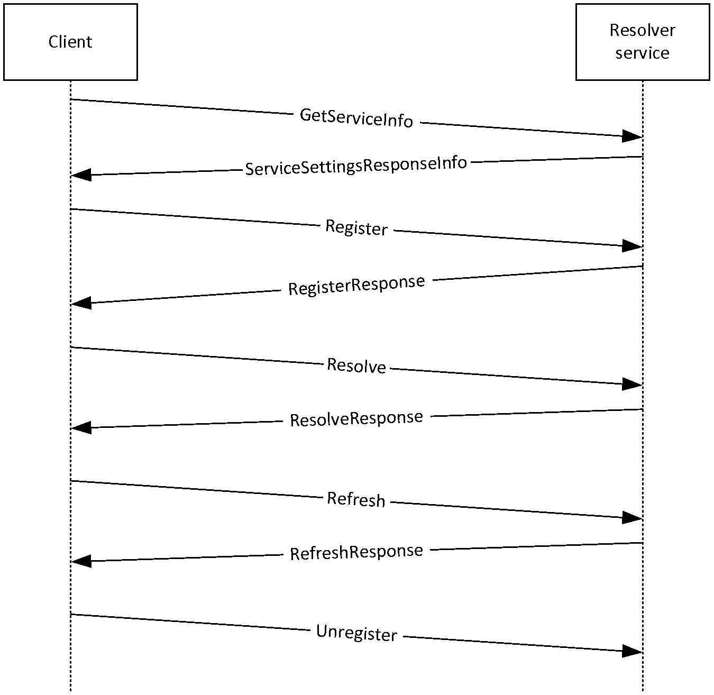
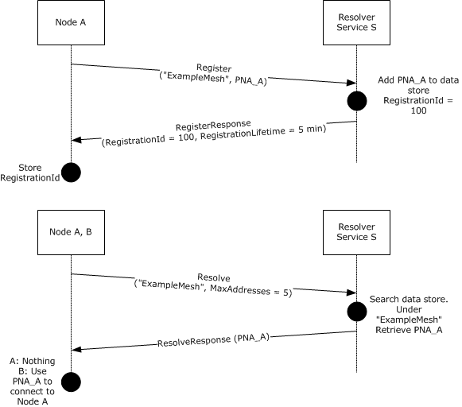

# [MC-PRCR]: Peer Channel Custom Resolver Protocol

Table of Contents

1 Introduction

- [1 Introduction](#Section_1)
  - [1.1 Glossary](#Section_1.1)
  - [1.2 References](#Section_1.2)
    - [1.2.1 Normative References](#Section_1.2.1)
    - [1.2.2 Informative References](#Section_1.2.2)
  - [1.3 Overview](#Section_1.3)
    - [1.3.1 Identifiers](#Section_1.3.1)
      - [1.3.1.1 Mesh Name](#Section_1.3.1.1)
      - [1.3.1.2 ClientId](#Section_1.3.1.2)
      - [1.3.1.3 RegistrationId](#Section_1.3.1.3)
    - [1.3.2 Connecting to the Resolver Service](#Section_1.3.2)
    - [1.3.3 List of Resolver Service Operations](#Section_1.3.3)
    - [1.3.4 Registration Record Maintenance](#Section_1.3.4)
  - [1.4 Relationship to Other Protocols](#Section_1.4)
  - [1.5 Prerequisites/Preconditions](#Section_1.5)
  - [1.6 Applicability Statement](#Section_1.6)
  - [1.7 Versioning and Capability Negotiation](#Section_1.7)
  - [1.8 Vendor-Extensible Fields](#Section_1.8)
  - [1.9 Standards Assignments](#Section_1.9)

2 Messages

- [2 Messages](#Section_2)
  - [2.1 Transport](#Section_2.1)
  - [2.2 Message Syntax](#Section_2.2)
    - [2.2.1 Namespaces](#Section_2.2.1)
    - [2.2.2 Structures Used](#Section_2.2.2)
      - [2.2.2.1 PeerNodeAddress Structure](#Section_2.2.2.1)
      - [2.2.2.2 RefreshResult Enumeration](#Section_2.2.2.2)
    - [2.2.3 Resolver Client Messages](#Section_2.2.3)
      - [2.2.3.1 Register Message](#Section_2.2.3.1)
      - [2.2.3.2 Resolve Message](#Section_2.2.3.2)
      - [2.2.3.3 Refresh Message](#Section_2.2.3.3)
      - [2.2.3.4 Update Message](#Section_2.2.3.4)
      - [2.2.3.5 Unregister Message](#Section_2.2.3.5)
      - [2.2.3.6 GetServiceInfo Message](#Section_2.2.3.6)
    - [2.2.4 Resolver Service Messages](#Section_2.2.4)
      - [2.2.4.1 RegisterResponse Message](#Section_2.2.4.1)
      - [2.2.4.2 ResolveResponse Message](#Section_2.2.4.2)
      - [2.2.4.3 RefreshResponse Message](#Section_2.2.4.3)
      - [2.2.4.4 ServiceSettingsResponseInfo Message](#Section_2.2.4.4)

3 Protocol Details

- [3 Protocol Details](#Section_3)
  - [3.1 Resolver Client Details](#Section_3.1)
    - [3.1.1 Abstract Data Model](#Section_3.1.1)
    - [3.1.2 Timers](#Section_3.1.2)
      - [3.1.2.1 Client Refresh Timer](#Section_3.1.2.1)
      - [3.1.2.2 Message Response Timer](#Section_3.1.2.2)
    - [3.1.3 Initialization](#Section_3.1.3)
    - [3.1.4 Higher-Layer Triggered Events](#Section_3.1.4)
      - [3.1.4.1 Register](#Section_3.1.4.1)
      - [3.1.4.2 Update](#Section_3.1.4.2)
      - [3.1.4.3 Resolve](#Section_3.1.4.3)
      - [3.1.4.4 Unregister](#Section_3.1.4.4)
      - [3.1.4.5 Refresh](#Section_3.1.4.5)
      - [3.1.4.6 GetServiceInfo](#Section_3.1.4.6)
    - [3.1.5 Message Processing Events and Sequencing Rules](#Section_3.1.5)
      - [3.1.5.1 RegisterResponse Message](#Section_3.1.5.1)
      - [3.1.5.2 ResolveResponse Message](#Section_3.1.5.2)
      - [3.1.5.3 RefreshResponse Message](#Section_3.1.5.3)
      - [3.1.5.4 ServiceSettingsResponseInfo Message](#Section_3.1.5.4)
    - [3.1.6 Timer Events](#Section_3.1.6)
      - [3.1.6.1 Client Refresh Timer](#Section_3.1.6.1)
      - [3.1.6.2 Message Response Timer](#Section_3.1.6.2)
    - [3.1.7 Other Local Events](#Section_3.1.7)
      - [3.1.7.1 Shutting Down the Resolver Service](#Section_3.1.7.1)
  - [3.2 Resolver Service Details](#Section_3.2)
    - [3.2.1 Abstract Data Model](#Section_3.2.1)
    - [3.2.2 Timers](#Section_3.2.2)
      - [3.2.2.1 Maintenance Timer](#Section_3.2.2.1)
    - [3.2.3 Initialization](#Section_3.2.3)
    - [3.2.4 Higher-Layer Triggered Events](#Section_3.2.4)
    - [3.2.5 Message Processing Events and Sequencing Rules](#Section_3.2.5)
      - [3.2.5.1 Register](#Section_3.2.5.1)
      - [3.2.5.2 Update](#Section_3.2.5.2)
      - [3.2.5.3 Resolve](#Section_3.2.5.3)
      - [3.2.5.4 Unregister](#Section_3.2.5.4)
      - [3.2.5.5 Refresh](#Section_3.2.5.5)
      - [3.2.5.6 GetServiceInfo](#Section_3.2.5.6)
    - [3.2.6 Timer Events](#Section_3.2.6)
      - [3.2.6.1 Maintenance Timer](#Section_3.2.6.1)
    - [3.2.7 Other Local Events](#Section_3.2.7)

4 Protocol Examples

- [4 Protocol Examples](#Section_4)
  - [4.1 Peer Discovery](#Section_4.1)

5 Security

- [5 Security](#Section_5)
  - [5.1 Security Considerations for Implementers](#Section_5.1)
  - [5.2 Index of Security Parameters](#Section_5.2)

6 Appendix A: Full WSDL

- [6 Appendix A: Full WSDL](#Section_6)
  - [6.1 http://schemas.microsoft.com/net/2006/05/peer/resolver](#Section_6.1)
  - [6.2 http://schemas.microsoft.com/net/2006/05/peer](#Section_6.2)
  - [6.3 http://schemas.datacontract.org/2004/07/System.ServiceModel.PeerResolvers](#Section_6.3)
  - [6.4 http://schemas.microsoft.com/2003/10/Serialization](#Section_6.4)
  - [6.5 http://www.w3.org/2005/08/addressing](#Section_6.5)
  - [6.6 http://schemas.datacontract.org/2004/07/System.Net](#Section_6.6)
  - [6.7 http://schemas.datacontract.org/2004/07/System.Net.Sockets](#Section_6.7)
  - [6.8 http://schemas.microsoft.com/2003/10/Serialization/Arrays](#Section_6.8)

7 Appendix B: Product Behavior

- [7 Appendix B: Product Behavior](#Section_7)

8 Change Tracking

- [8 Change Tracking](#Section_8)

For the legal notice and IP terms, see [LEGAL.md](../LEGAL.md).
Last updated: 4/7/2021.
See [Revision History](#revision-history) for full version history.

# 1 Introduction

The Peer Channel Custom Resolver Protocol is used for storage and retrieval of [**endpoint information**](#gt_endpoint-information) of clients that have access to a known service. Clients that use the service can store their own endpoint information at the service and obtain endpoint information about other clients in order to establish direct connections between them.

Sections 1.5, 1.8, 1.9, 2, and 3 of this specification are normative. All other sections and examples in this specification are informative.

## 1.1 Glossary

This document uses the following terms:

**ClientId**: A unique string that the client uses to identify itself to the [**resolver service**](#gt_resolver-service), as described in section 1.3.1.2.

**endpoint information**: An endpoint address, formatted as a Uniform Resource Identifier (URI), along with a set of IP addresses. Describes the set of addresses on which a node is listening.

**expiration time**: A date-time value, in Coordinated Universal Time (UTC) format, that indicates when an instance of binary data is no longer valid.

**globally unique identifier (GUID)**: A term used interchangeably with universally unique identifier (UUID) in Microsoft protocol technical documents (TDs). Interchanging the usage of these terms does not imply or require a specific algorithm or mechanism to generate the value. Specifically, the use of this term does not imply or require that the algorithms described in [[RFC4122]](https://go.microsoft.com/fwlink/?LinkId=90460) or [[C706]](https://go.microsoft.com/fwlink/?LinkId=89824) must be used for generating the [**GUID**](#gt_globally-unique-identifier-guid). See also universally unique identifier (UUID).

**mesh name**: A set of nodes that establish connections to each other to form a mesh.

**PeerNodeAddress**: A structure that contains the URI of a node and a set of IP addresses on which the client is listening ([MC-PRCR](#Section_11dcdb0e137944b99ec8ed146cc066d0) section 2.2.2.1).

**registration lifetime**: The amount of time during which a [**registration record**](#gt_registration-record) is guaranteed to be preserved by the [**resolver service**](#gt_resolver-service); always associated with a particular [**registration record**](#gt_registration-record). This time starts upon the successful addition of a [**registration record**](#gt_registration-record) to the [**resolver service**](#gt_resolver-service). After this time has elapsed, the [**resolver service**](#gt_resolver-service) can choose to delete the corresponding [**registration record**](#gt_registration-record) (section 3).

**registration record**: A set of [**endpoint information**](#gt_endpoint-information) that is stored at the [**resolver service**](#gt_resolver-service).

**RegistrationId**: A unique identifier in the form of a [**GUID**](#gt_globally-unique-identifier-guid), as described in section 1.3.1.3.

**resolver client**: An application endpoint that uses a [**resolver service**](#gt_resolver-service) to publish or obtain [**endpoint information**](#gt_endpoint-information).

**resolver service**: An application implementing this protocol that stores and distributes [**endpoint information**](#gt_endpoint-information).

**MAY, SHOULD, MUST, SHOULD NOT, MUST NOT:** These terms (in all caps) are used as defined in [[RFC2119]](https://go.microsoft.com/fwlink/?LinkId=90317). All statements of optional behavior use either MAY, SHOULD, or SHOULD NOT.

## 1.2 References

Links to a document in the Microsoft Open Specifications library point to the correct section in the most recently published version of the referenced document. However, because individual documents in the library are not updated at the same time, the section numbers in the documents may not match. You can confirm the correct section numbering by checking the [Errata](https://go.microsoft.com/fwlink/?linkid=850906).

### 1.2.1 Normative References

We conduct frequent surveys of the normative references to assure their continued availability. If you have any issue with finding a normative reference, please contact [dochelp@microsoft.com](mailto:dochelp@microsoft.com). We will assist you in finding the relevant information.

[MC-NMF] Microsoft Corporation, "[.NET Message Framing Protocol](../MC-NMF/MC-NMF.md)".

[MC-PRCH] Microsoft Corporation, "[Peer Channel Protocol](../MC-PRCH/MC-PRCH.md)".

[MS-DTYP] Microsoft Corporation, "[Windows Data Types](../MS-DTYP/MS-DTYP.md)".

[MS-WSPOL] Microsoft Corporation, "[Web Services: Policy Assertions and WSDL Extensions](../MS-WSPOL/MS-WSPOL.md)".

[RFC2119] Bradner, S., "Key words for use in RFCs to Indicate Requirement Levels", BCP 14, RFC 2119, March 1997, [http://www.rfc-editor.org/rfc/rfc2119.txt](https://go.microsoft.com/fwlink/?LinkId=90317)

[SOAP1.1] Box, D., Ehnebuske, D., Kakivaya, G., et al., "Simple Object Access Protocol (SOAP) 1.1", W3C Note, May 2000, [http://www.w3.org/TR/2000/NOTE-SOAP-20000508/](https://go.microsoft.com/fwlink/?LinkId=90520)

[SOAP1.2-1/2003] Gudgin, M., Hadley, M., Mendelsohn, N., et al., "SOAP Version 1.2 Part 1: Messaging Framework", W3C Recommendation, June 2003, [http://www.w3.org/TR/2003/REC-soap12-part1-20030624](https://go.microsoft.com/fwlink/?LinkId=90521)

[WSA1.0-Metadata] W3C, "WS-Addressing 1.0 Metadata Namespace", W3C Recommendation, [http://www.w3.org/2007/05/addressing/metadata/](https://go.microsoft.com/fwlink/?LinkId=204585)

[WSA1.0-WSDLBinding] W3C, "WS-Addressing 1.0 WSDL Binding Namespace", W3C Recommendation, [http://www.w3.org/2006/05/addressing/wsdl/](https://go.microsoft.com/fwlink/?LinkId=204586)

[WSAddressing] Box, D., et al., "Web Services Addressing (WS-Addressing)", August 2004, [http://www.w3.org/Submission/ws-addressing/](https://go.microsoft.com/fwlink/?LinkId=90575)

[WSADDR] Gudgin, M., Hadley, M., and Rogers, T., "Web Services Addressing (WS-Addressing) 1.0", W3C Recommendation, May 2006, [http://www.w3.org/2005/08/addressing](https://go.microsoft.com/fwlink/?LinkId=113065)

[WSDLSOAP] Angelov, D., Ballinger, K., Butek, R., et al., "WSDL 1.1 Binding Extension for SOAP 1.2", W3C Member Submission, April 2006, [http://www.w3.org/Submission/2006/SUBM-wsdl11soap12-20060405/](https://go.microsoft.com/fwlink/?LinkId=131790)

[WSDL] Christensen, E., Curbera, F., Meredith, G., and Weerawarana, S., "Web Services Description Language (WSDL) 1.1", W3C Note, March 2001, [http://www.w3.org/TR/2001/NOTE-wsdl-20010315](https://go.microsoft.com/fwlink/?LinkId=90577)

[WSP1.5-Namespace] W3C, "Web Services Policy 1.5 Namespace", W3C Recommendation, [http://www.w3.org/ns/ws-policy/](https://go.microsoft.com/fwlink/?LinkId=204584)

[WSPOLICY] Bajaj, S., Box, D., Chappell, D., et al., "Web Services Policy Framework (WS-Policy) and Web Services Policy Attachment (WS-PolicyAttachment)", March 2006, [http://schemas.xmlsoap.org/ws/2004/09/policy](https://go.microsoft.com/fwlink/?LinkId=131794)

[WSSU1.0] OASIS Standard, "WS Security Utility 1.0", 2004, [http://docs.oasis-open.org/wss/2004/01/oasis-200401-wss-wssecurity-utility-1.0.xsd](https://go.microsoft.com/fwlink/?LinkId=161007)

[XMLDSig/2008] Bartel, M., Boyer, J., Fox, B., et al.,, "XML Signature Syntax and Processing (Second Edition)", June 2008, [http://www.w3.org/TR/2008/REC-xmldsig-core-20080610/](https://go.microsoft.com/fwlink/?LinkId=90601)

[XMLNS] Bray, T., Hollander, D., Layman, A., et al., Eds., "Namespaces in XML 1.0 (Third Edition)", W3C Recommendation, December 2009, [http://www.w3.org/TR/2009/REC-xml-names-20091208/](https://go.microsoft.com/fwlink/?LinkId=191840)

[XMLSCHEMA] World Wide Web Consortium, "XML Schema", September 2005, [http://www.w3.org/2001/XMLSchema](https://go.microsoft.com/fwlink/?LinkId=90603)

### 1.2.2 Informative References

[MS-NETOD] Microsoft Corporation, "[Microsoft .NET Framework Protocols Overview](#Section_1.3)".

[MS-PNRP] Microsoft Corporation, "[Peer Name Resolution Protocol (PNRP) Version 4.0](../MS-PNRP/MS-PNRP.md)".

## 1.3 Overview

This protocol is intended to be used together with the Peer Channel Protocol [MC-PRCH](../MC-PRCH/MC-PRCH.md) as a peer discovery service.

The Peer Channel Custom Resolver Protocol is a client/server protocol that is used to register and retrieve client [**endpoint information**](#gt_endpoint-information) at a well-known resolver service. The information that is registered and retrieved is the [**PeerNodeAddress**](#gt_peernodeaddress) of clients associated with a named mesh. This information can then be used to establish direct connections between these clients. Security for this protocol is configured by a higher-layer protocol or application.

There are two primary roles in the Peer Channel Custom Resolver Protocol:

- [**Resolver service**](#gt_resolver-service) - Stores endpoint information and handles requests to add, delete, or update that information.
- [**Resolver client**](#gt_resolver-client) - Sends requests to the resolver service to add, delete, or update endpoint information, or to request a list of the endpoint information of other clients.

### 1.3.1 Identifiers

#### 1.3.1.1 Mesh Name

Registration information is associated with a string called a [**mesh name**](#gt_mesh-name), which is used to group related sets of [**endpoint information**](#gt_endpoint-information). When [**registration records**](#gt_registration-record) are created or requested, the corresponding mesh name is included. Endpoint information is then organized by mesh name at the [**resolver service**](#gt_resolver-service). The resolver service guarantees that clients requesting endpoint information corresponding to a particular mesh name will only receive endpoint information that was registered with the same mesh name.

#### 1.3.1.2 ClientId

Each [**resolver client**](#gt_resolver-client) generates a unique string that is used to identify itself to the [**resolver service**](#gt_resolver-service). This ID remains constant throughout the lifetime of the resolver client.

#### 1.3.1.3 RegistrationId

When a new [**registration record**](#gt_registration-record) is created at the [**resolver service**](#gt_resolver-service), it is assigned a unique RegistrationId in the form of a [**GUID**](#gt_globally-unique-identifier-guid). This RegistrationId remains valid for that registration record until the registration record expires or is unregistered.

### 1.3.2 Connecting to the Resolver Service

The [**resolver client**](#gt_resolver-client) is configured with the location of the [**resolver service**](#gt_resolver-service) and a transport that matches the requirements of the service. All clients need to be configured to use the same transport. The connection that is used by the custom resolver service and the custom resolver client to communicate is protocol independent.

### 1.3.3 List of Resolver Service Operations

The Peer Channel Custom Resolver Protocol is initiated by a request from a [**resolver client**](#gt_resolver-client) (with the sole exception of [**registration record**](#gt_registration-record) maintenance; see section [1.3.4](#Section_1.3.4)). The following operations are supported by the [**resolver service**](#gt_resolver-service):

- Register: Creates a new registration record at the resolver service and populates it with [**endpoint information**](#gt_endpoint-information) that is contained in the register request.
- Update: Changes the information that is contained in a specific registration record.
- Unregister: Deletes a registration record.
- Refresh: Changes the expiry time that is associated with a registration record (section 1.3.4).
- Resolve: Retrieves a collection of registration records that is associated with a particular [**mesh name**](#gt_mesh-name).
- GetServiceInfo: Retrieves a Boolean value indicating whether a corresponding PeerChannel Protocol node will use referrals to initiate neighbor connections.

### 1.3.4 Registration Record Maintenance

[**Registration records**](#gt_registration-record) reside at the custom [**resolver service**](#gt_resolver-service) and are associated with an expiry time and date. These records are to be deleted or marked as invalid by that expiry time (which is determined by the implementation of the service), unless the [**resolver client**](#gt_resolver-client) that initially registered that [**endpoint information**](#gt_endpoint-information) sends a request to the service that the record be stored longer.

If the resolver service fails, the resolver clients that use the service attempt to refresh or reregister their information. After the resolver service is restarted, it repopulates its **records data store** of registration records upon receiving refresh or reregistration requests from resolver clients.

## 1.4 Relationship to Other Protocols

This protocol is transport-agnostic, and therefore, it can be used together with a variety of transport protocols, for example, TCP and HTTP.

The messages used in this protocol are formatted in XML/SOAP [[SOAP1.2-1/2003]](https://go.microsoft.com/fwlink/?LinkId=90521) [[XMLDSig/2008]](https://go.microsoft.com/fwlink/?LinkId=90601). This involves the use of the .NET Message Framing Protocol Specification [MC-NMF](../MC-NMF/MC-NMF.md) for encoding SOAP messages.

This protocol shares characteristics with, and could potentially be substituted for, other name resolution systems, such as the Peer Name Resolution Protocol (PNRP) [MS-PNRP](../MS-PNRP/MS-PNRP.md). This protocol is intended for use by the Peer Channel Protocol [MC-PRCH](../MC-PRCH/MC-PRCH.md) for neighbor discovery when PNRP is unavailable.

## 1.5 Prerequisites/Preconditions

All [**resolver clients**](#gt_resolver-client) are configured with the location and transport protocol of the [**resolver service**](#gt_resolver-service), as well as any security information, if applicable.

## 1.6 Applicability Statement

This protocol is intended for use together with the Peer Channel Protocol ([MC-PRCH](../MC-PRCH/MC-PRCH.md)) as a means to enable neighbor discovery. This protocol is suitable for storage and distribution of [**endpoint information**](#gt_endpoint-information) or for a mapping service that associates endpoint information with [**mesh names**](#gt_mesh-name). It is not intended for, nor is it ideal for, use with hierarchal namespaces, for example, DNS.

This protocol does not guarantee the reliability of endpoint information, longevity of [**registration records**](#gt_registration-record), or availability of the [**resolver service**](#gt_resolver-service).

## 1.7 Versioning and Capability Negotiation

None.

## 1.8 Vendor-Extensible Fields

None.

## 1.9 Standards Assignments

None.

# 2 Messages

## 2.1 Transport

The transport is configured under a higher-layer protocol or application. This protocol does not specify or require any particular transport mechanism; however, TCP SHOULD be used and other transport protocols MAY be used.

## 2.2 Message Syntax

Peer Channel Custom Resolver messages are defined by the Web Services Description Language (WSDL), as specified in [[WSDL]](https://go.microsoft.com/fwlink/?LinkId=90577), and MUST be formatted using the SOAP syntax ([[SOAP1.2-1/2003]](https://go.microsoft.com/fwlink/?LinkId=90521)). The schema for wsp:PolicyReference is defined in Web Services Policy Framework ([[WSPOLICY]](https://go.microsoft.com/fwlink/?LinkId=131794)).

### 2.2.1 Namespaces

This specification defines and references various XML namespaces that use the mechanisms specified in [[XMLNS]](https://go.microsoft.com/fwlink/?LinkId=191840). Although the specification associates a specific XML namespace prefix for each XML namespace that is used, the choice of any particular XML namespace prefix is implementation-specific and not significant for interoperability.

| Prefix | Namespace URI | Reference |
| --- | --- | --- |
| soapenc | http://schemas.xmlsoap.org/soap/encoding | [[SOAP1.1]](https://go.microsoft.com/fwlink/?LinkId=90520) |
| wsap | http://schemas.xmlsoap.org/ws/2004/08/addressing/policy | http://schemas.xmlsoap.org/ws/2004/08/addressing/policy |
| msc | http://schemas.microsoft.com/ws/2005/12/wsdl/contract | [MS-WSPOL](../MS-WSPOL/MS-WSPOL.md) |
| wsp | http://www.w3.org/ns/ws-policy | [[WSP1.5-Namespace]](https://go.microsoft.com/fwlink/?LinkId=204584) |
| Wsam | http://www.w3.org/2007/05/addressing/metadata | [[WSA1.0-Metadata]](https://go.microsoft.com/fwlink/?LinkId=204585) |
| soap12 | http://schemas.xmlsoap.org/wsdl/soap12/ | [[WSDLSOAP]](https://go.microsoft.com/fwlink/?LinkId=131790) |
| wsa | http://schemas.xmlsoap.org/ws/2004/08/addressing | [[WSAddressing]](https://go.microsoft.com/fwlink/?LinkId=90575) |
| wsaw | http://www.w3.org/2006/05/addressing/wsdl | [[WSA1.0-WSDLBinding]](https://go.microsoft.com/fwlink/?LinkId=204586) |
| soap | http://schemas.xmlsoap.org/wsdl/soap/ | http://schemas.xmlsoap.org/wsdl/soap/ |
| wsu | http://docs.oasis-open.org/wss/2004/01/oasis-200401-wss-wssecurity-utility-1.0.xsd | [[WSSU1.0]](https://go.microsoft.com/fwlink/?LinkId=161007) |
| xsd | http://www.w3.org/2001/XMLSchema | [WSDLSOAP] |
| wsdl | http://schemas.xmlsoap.org/wsdl/ | http://schemas.xmlsoap.org/wsdl/ |
| tns | http://schemas.microsoft.com/net/2006/05/peer/resolver | See section [6.1](#Section_6.1) |
| peer | http://schemas.microsoft.com/net/2006/05/peer | See section [6.2](#Section_6.2) |
| q3 | http://schemas.datacontract.org/2004/07/System.ServiceModel.PeerResolvers | See section [6.3](#Section_6.3) |
| - | http://schemas.microsoft.com/2003/10/Serialization | See section [6.4](#Section_6.4) |
| wsa10 | http://www.w3.org/2005/08/addressing | [[WSADDR]](https://go.microsoft.com/fwlink/?LinkId=113065) See section [6.5](#Section_6.5) |
| q2 | http://schemas.datacontract.org/2004/07/System.Net | See section [6.6](#Section_6.6) |
| - | http://schemas.datacontract.org/2004/07/System.Net.Sockets | See section [6.7](#Section_6.7) |
| - | http://schemas.microsoft.com/2003/10/Serialization/Arrays | See section [6.8](#Section_6.8) |

### 2.2.2 Structures Used

#### 2.2.2.1 PeerNodeAddress Structure

The PeerNodeAddress structure MUST contain a URI and one or more IPAddresses. It is intended to be used to describe a Peer Channel protocol endpoint. While in use by this protocol, a PeerNodeAddress structure SHOULD only refer to the local endpoint. The example here shows the use of the PeerNodeAddress structure.

<xs:schema

xmlns:tns="http://schemas.datacontract.org/2004/07/System.Net"

xmlns:xs="http://www.w3.org/2001/XMLSchema"

targetNamespace=

"http://schemas.datacontract.org/2004/07/System.Net"

xmlns:a="http://www.w3.org/2005/08/addressing/"

xmlns:d5p1="http://schemas.datacontract.org/2004/07/System.Net"

attributeFormDefault="unqualified"

elementFormDefault="qualified" >

<xs:import namespace=

"http://schemas.microsoft.com/2003/10/Serialization/Arrays"

/>

<xs:import namespace="http://www.w3.org/2005/08/addressing/" />

<xs:complexType name="IPAddress">

<xs:sequence>

<xs:element name="m_Address" type="xs:unsignedInt" />

<xs:element name="m_Family" type="xs:string" />

<xs:element name="m_HashCode" type="xs:unsignedInt" />

<xs:element name="m_Numbers">

<xs:complexType>

<xs:sequence>

<xs:element

maxOccurs="unbounded"

xmlns:q1=

"http://schemas.microsoft.com/2003/10/Serialization/Arrays"

ref="q1:unsignedShort"

/>

</xs:sequence>

</xs:complexType>

</xs:element>

<xs:element name="m_ScopeId" type="xs:unsignedInt" />

</xs:sequence>

</xs:complexType>

<xs:complexType name="PeerNodeAddress">

<xs:sequence>

<xs:element name="EndpointAddress">

<xs:complexType>

<xs:sequence>

<xs:element ref="a:Address" />

</xs:sequence>

</xs:complexType>

</xs:element>

<xs:element name="IPAddresses">

<xs:complexType>

<xs:sequence>

<xs:element maxOccurs="unbounded" ref="d5p1:IPAddress" />

</xs:sequence>

</xs:complexType>

</xs:element>

</xs:sequence>

</xs:complexType>

</xs:schema>

The following table provides information about the different values of PeerNodeAddress attributes.

| Value | Description |
| --- | --- |
| EndpointAddress | MUST contain a reference to the Address of the node. |
| Address | A reference to the endpoint (URI) of the node. |
| IPAddresses | This MUST contain one or more IPAddress structures. |
| IPAddress | Describes a complete IPAddress. |
| IPAddress/m_Address | "0" indicates an IPv6 address. Otherwise, the address as an unsigned 32-bit number. |
| IPAddress/m_Family | The address family of the IPAddress. Acceptable strings are "Internetwork" if the address is an IPv4 address; or "InternetworkV6" if the address is an IPv6 address. |
| IPAddress/m_HashCode | This value MUST be set to "0". Upon parsing this field from a received message, this element MUST be ignored. |
| IPAddress/m_Numbers | This element contains the serialized version of the address bytes that are grouped as 16-bit numbers in big-endian format. For IPv4 addresses, this element MAY contain 0 instances. For IPv6 addresses, this element MUST contain exactly 8 "unsignedShort" subelements. |
| IPAddress/m_Numbers/unsignedShort | MUST contain a 16-bit number. |
| IPAddress/m_ScopeId | For an IPv6 address, this element MUST contain the Scope ID of the address. For IPv4 addresses, this element MUST be ignored. All IPAddresses in a single [**PeerNodeAddress**](#gt_peernodeaddress) MUST have the same ScopeId. |

#### 2.2.2.2 RefreshResult Enumeration

This is sent as part of the [RefreshResponse](#Section_2.2.4.3) message to indicate the result of an attempt to refresh a [**registration record**](#gt_registration-record). It has the following valid values, formatted as strings.

<xs:simpleType name="RefreshResult">

<xs:restriction base="xs:string">

<xs:enumeration value="Success" />

<xs:enumeration value="RegistrationNotFound" />

</xs:restriction>

</xs:simpleType>

<xs:element name="RefreshResult" nillable="true" type="tns:RefreshResult" />

| Enumeration value | Description |
| --- | --- |
| Success | The registration record was found and refreshed. |
| RegistrationNotFound | The [**resolver service**](#gt_resolver-service) could not find the registration record. |

### 2.2.3 Resolver Client Messages

#### 2.2.3.1 Register Message

The Register message is sent by the client to register its [PeerNodeAddress](#Section_2.2.2.1) structure with a custom resolver service.

Message:

<wsdl:message name="RegisterInfo">

<wsdl:part name="Register" xmlns:peer="http://schemas.microsoft.com/net/2006/05/peer" element="peer:Register" />

</wsdl:message>

Operation:

<wsdl:operation name="Register">

<wsdl:input wsam:Action="http://schemas.microsoft.com/net/2006/05/peer/resolver/Register" name="RegisterInfo" message="tns:RegisterInfo" />

</wsdl:operation>

Data Types:

<xs:complexType name="Register">

<xs:sequence>

<xs:element minOccurs="0" name="ClientId" type="ser:guid" />

<xs:element minOccurs="0" name="MeshId" nillable="true" type="xs:string" />

<xs:element minOccurs="0" name="NodeAddress" nillable="true"

type="tns:PeerNodeAddress"/>

</xs:sequence>

</xs:complexType>

<xs:element name="Register" nillable="true" type="tns:Register" />

<xs:complexType name="PeerNodeAddress">

<xs:sequence>

<xs:element minOccurs="0" name="EndpointAddress" nillable="true" xmlns:q1="http://www.w3.org/2005/08/addressing" type="q1:EndpointReferenceType" />

<xs:element minOccurs="0" name="IPAddresses" nillable="true" xmlns:q2="http://schemas.datacontract.org/2004/07/System.Net" type="q2:ArrayOfIPAddress" />

</xs:sequence>

</xs:complexType>

<xs:element name="PeerNodeAddress" nillable="true" type="tns:PeerNodeAddress" />

Refer to the following table for information about the different values of the "xs:element name" attribute.

| Value | Description |
| --- | --- |
| ClientId | A string identifying the [**resolver client**](#gt_resolver-client). This MUST be unique and SHOULD be created upon the creation of the resolver client. The ClientId of a particular resolver client SHOULD be valid for the lifetime of that client. |
| MeshId | The [**mesh name**](#gt_mesh-name). |
| NodeAddress | A PeerNodeAddress structure containing the resolver client's [**endpoint information**](#gt_endpoint-information). |

#### 2.2.3.2 Resolve Message

The Resolve message is sent by the [**resolver client**](#gt_resolver-client) to discover the [PeerNodeAddress](#Section_2.2.2.1) structure of other clients.

Message:

<wsdl:message name="ResolveInfo">

<wsdl:part name="Resolve" xmlns:peer="http://schemas.microsoft.com/net/2006/05/peer" element="peer:Resolve" />

</wsdl:message>

Operation:

<wsdl:operation name="Resolve">

<wsdl:input wsam:Action="http://schemas.microsoft.com/net/2006/05/peer/resolver/Resolve" name="ResolveInfo" message="tns:ResolveInfo" />

</wsdl:operation>

Data Types:

<xs:complexType name="ResolveInfo">

<xs:sequence>

<xs:element minOccurs="0" name="ClientId" type="ser:guid" />

<xs:element minOccurs="0" name="MaxAddresses" type="xs:int" />

<xs:element minOccurs="0" name="MeshId" nillable="true" type="xs:string" />

</xs:sequence>

</xs:complexType>

<xs:element name="ResolveInfo" nillable="true" type="tns:ResolveInfo" />

<xs:element name="Resolve" nillable="true" type="tns:ResolveInfo" />

Refer to the following table for information about the different values of the "xs:element name" attribute.

| Value | Description |
| --- | --- |
| ClientId | A string identifying the resolver client. This MUST be unique and SHOULD be created upon the creation of the resolver client. The ClientId of a particular resolver client SHOULD be valid for the lifetime of that client. |
| MaxAddresses | The maximum number of [**registration records**](#gt_registration-record) that can be returned by the corresponding [ResolveResponse](#Section_2.2.4.2) message. This SHOULD be set to "5". |
| MeshId | The [**mesh name**](#gt_mesh-name). |

#### 2.2.3.3 Refresh Message

The Refresh message is sent by a client to refresh its [**registration record**](#gt_registration-record) with the [**resolver service**](#gt_resolver-service).

Message:

<wsdl:message name="RefreshInfo">

<wsdl:part name="Refresh" xmlns:peer="http://schemas.microsoft.com/net/2006/05/peer" element="peer:Refresh" />

</wsdl:message>

Operation:

<wsdl:operation name="Refresh">

<wsdl:input wsam:Action="http://schemas.microsoft.com/net/2006/05/peer/resolver/Refresh" name="RefreshInfo" message="tns:RefreshInfo" />

</wsdl:operation>

Data Types:

<xs:complexType name="RefreshInfo">

<xs:sequence>

<xs:element minOccurs="0" name="MeshId" nillable="true" type="xs:string" />

<xs:element minOccurs="0" name="RegistrationId" type="ser:guid" />

</xs:sequence>

</xs:complexType>

<xs:element name="RefreshInfo" nillable="true" type="tns:RefreshInfo" />

<xs:element name="Refresh" nillable="true" type="tns:RefreshInfo" />

Refer to the following table for information about the different values of the "xs:element name" attribute.

| Value | Description |
| --- | --- |
| MeshId | The [**mesh name**](#gt_mesh-name). |
| RegistrationId | A string that uniquely identifies the registration record of a particular [**resolver client**](#gt_resolver-client). Created by the resolver service as a result of processing a [Register](#Section_3.1.4.1) message. |

#### 2.2.3.4 Update Message

The Update message is sent by the [**resolver client**](#gt_resolver-client) when some details of its [**registration record**](#gt_registration-record) need to be updated, for example, when its IP addresses have changed.

Message:

<wsdl:message name="UpdateInfo">

<wsdl:part name="UpdateInfo" xmlns:peer="http://schemas.microsoft.com/net/2006/05/peer" element="peer:UpdateInfo" />

</wsdl:message>

Operation:

<wsdl:operation name="Update">

<wsdl:input wsam:Action="http://schemas.microsoft.com/net/2006/05/peer/resolver/Update" name="UpdateInfo" message="tns:UpdateInfo" />

</wsdl:operation>

Data Types:

<xs:complexType name="UpdateInfo">

<xs:sequence>

<xs:element minOccurs="0" name="ClientId" type="ser:guid" />

<xs:element minOccurs="0" name="MeshId" nillable="true" type="xs:string" />

<xs:element minOccurs="0" name="NodeAddress" nillable="true" type="tns:PeerNodeAddress" />

<xs:element minOccurs="0" name="RegistrationId" type="ser:guid" />

</xs:sequence>

</xs:complexType>

<xs:element name="UpdateInfo" nillable="true" type="tns:UpdateInfo" />

Refer to the following table for information about the different values of the "xs:element name" attribute.

| Value | Description |
| --- | --- |
| ClientId | A string identifying the resolver client. This MUST be unique and SHOULD be created upon the creation of the resolver client. The ClientId of a particular resolver client SHOULD be valid for the lifetime of that client. |
| MeshId | The [**mesh name**](#gt_mesh-name). |
| NodeAddress | A [PeerNodeAddress](#Section_2.2.2.1) structure containing the updated [**endpoint information**](#gt_endpoint-information) to be written at the registration record indicated by **RegistrationId**. See [MC-PRCH](../MC-PRCH/MC-PRCH.md) section 2.2.2.2. |
| RegistrationId | A [**GUID**](#gt_globally-unique-identifier-guid) identifying the registration record to be updated. Created by the [**resolver service**](#gt_resolver-service) as a result of processing a [Register](#Section_3.1.4.1) message. |

#### 2.2.3.5 Unregister Message

The Unregister message is sent by a [**resolver client**](#gt_resolver-client) to remove its [**registration record**](#gt_registration-record) from the service.

Message:

<wsdl:message name="UnregisterInfo">

<wsdl:part name="Unregister" xmlns:peer="http://schemas.microsoft.com/net/2006/05/peer" element="peer:Unregister" />

</wsdl:message>

Operation:

<wsdl:operation name="Unregister">

<wsdl:input wsam:Action="http://schemas.microsoft.com/net/2006/05/peer/resolver/Unregister" name="UnregisterInfo" message="tns:UnregisterInfo" />

</wsdl:operation>

Data Types:

<xs:complexType name="UnregisterInfo">

<xs:sequence>

<xs:element minOccurs="0" name="MeshId" nillable="true" type="xs:string" />

<xs:element minOccurs="0" name="RegistrationId" type="ser:guid" />

</xs:sequence>

</xs:complexType>

<xs:element name="UnregisterInfo" nillable="true" type="tns:UnregisterInfo" />

<xs:element name="Unregister" nillable="true" type="tns:UnregisterInfo" />

Refer to the following table for information about the different values of the "xs:element name" attribute.

| Value | Description |
| --- | --- |
| MeshId | The [**mesh name**](#gt_mesh-name). |
| RegistrationId | A unique string identifying a registration record to be deleted. |

#### 2.2.3.6 GetServiceInfo Message

The GetServiceInfo message is sent by the [**resolver client**](#gt_resolver-client) during the initialization of a Peer Channel protocol client. It is used to determine whether the Peer Channel protocol client will use referrals to discover new neighbors.

Message:

<wsdl:message name="IPeerResolverContract_GetServiceInfo_InputMessage" />

Operation:

<wsdl:operation name="GetServiceInfo">

<wsdl:input wsam:Action="http://schemas.microsoft.com/net/2006/05/peer/resolver/GetServiceSettings" message="tns:IPeerResolverContract_GetServiceInfo_InputMessage" />

</wsdl:operation>

### 2.2.4 Resolver Service Messages

#### 2.2.4.1 RegisterResponse Message

The RegisterResponse message is sent by the [**resolver service**](#gt_resolver-service) in response to a [Register](#Section_3.1.4.1) or [Update](#Section_3.1.4.2) message. It is only sent to the originator of the Register or Update message, and it indicates the result of an attempt to either create a new [**registration record**](#gt_registration-record) or to update an existing one.

Message:

<wsdl:message name="RegisterResponseInfo">

<wsdl:part name="RegisterResponse" xmlns:peer="http://schemas.microsoft.com/net/2006/05/peer" element="peer:RegisterResponse" />

</wsdl:message>

Operation:

<wsdl:operation name="Register">

<wsdl:output wsam:Action="http://schemas.microsoft.com/net/2006/05/peer/resolver/RegisterResponse" name="RegisterResponseInfo" message="tns:RegisterResponseInfo" />

</wsdl:operation>

Data Types:

<xs:complexType name="RegisterResponse">

<xs:sequence>

<xs:element minOccurs="0" name="RegistrationId" type="ser:guid" />

<xs:element minOccurs="0" name="RegistrationLifetime" type="ser:duration" />

</xs:sequence>

</xs:complexType>

<xs:element name="RegisterResponse" nillable="true" type="tns:RegisterResponse" />

Refer to the following table for information about the different values of the "xs:element name" attribute.

| Value | Description |
| --- | --- |
| RegistrationId | A unique string that identifies the newly created registration record. Created by the resolver service as a result of a registration request. |
| RegistrationLifetime | The duration for which the resolver service guarantees that the newly created registration record will not be deleted. Formatted as an xs:duration, as specified in [[XMLSCHEMA]](https://go.microsoft.com/fwlink/?LinkId=90603) Part 2: Datatypes, section 3.2.6. |

#### 2.2.4.2 ResolveResponse Message

The ResolveResponse message is sent by the [**resolver service**](#gt_resolver-service) in response to a [Resolve](#Section_3.2.5.3) message. It contains [**endpoint information**](#gt_endpoint-information) that corresponds to the details of the Resolve request.

Message:

<wsdl:message name="ResolveResponseInfo">

<wsdl:part name="ResolveResponse" xmlns:peer="http://schemas.microsoft.com/net/2006/05/peer" element="peer:ResolveResponse" />

</wsdl:message>

Operation:

<wsdl:operation name="Resolve">

<wsdl:output wsam:Action="http://schemas.microsoft.com/net/2006/05/peer/resolver/ResolveResponse" name="ResolveResponseInfo" message="tns:ResolveResponseInfo" />

</wsdl:operation>

Data Types:

<xs:complexType name="ResolveResponseInfo">

<xs:sequence>

<xs:element minOccurs="0" name="Addresses" nillable="true" type="tns:ArrayOfPeerNodeAddress" />

</xs:sequence>

</xs:complexType>

<xs:element name="ResolveResponseInfo" nillable="true" type="tns:ResolveResponseInfo" />

<xs:complexType name="ArrayOfPeerNodeAddress">

<xs:sequence>

<xs:element minOccurs="0" maxOccurs="unbounded" name="PeerNodeAddress" nillable="true" type="tns:PeerNodeAddress" />

</xs:sequence>

</xs:complexType>

<xs:element name="ArrayOfPeerNodeAddress" nillable="true" type="tns:ArrayOfPeerNodeAddress" />

<xs:complexType name="PeerNodeAddress">

<xs:sequence>

<xs:element minOccurs="0" name="EndpointAddress" nillable="true" xmlns:q1="http://www.w3.org/2005/08/addressing" type="q1:EndpointReferenceType" />

<xs:element minOccurs="0" name="IPAddresses" nillable="true" xmlns:q2="http://schemas.datacontract.org/2004/07/System.Net" type="q2:ArrayOfIPAddress" />

</xs:sequence>

</xs:complexType>

<xs:element name="PeerNodeAddress" nillable="true" type="tns:PeerNodeAddress" />

Refer to the following table for information about the different values of the "xs:element name" attribute for the attributes introduced in this section.

| Value | Description |
| --- | --- |
| Addresses | A list of PeerNodeAddress structures that are associated with the **MeshId** element that is specified in the Resolve message. There is no limit to the number of PeerNodeAddress elements that can be contained here. |
| ArrayOfPeerNodeAddress | An unbounded array of PeerNodeAddress structures. |
| PeerNodeAddress | See section [2.2.2.1](#Section_2.2.2.1). |

#### 2.2.4.3 RefreshResponse Message

The RefreshResponse message is sent by the [**resolver service**](#gt_resolver-service) in response to a [Refresh](#Section_3.2.5.5) message. It is sent to the originator of the Refresh message and indicates the result of an attempt to extend the expiration time of the [**registration record**](#gt_registration-record) for a [**resolver client**](#gt_resolver-client).

Message:

<wsdl:message name="RefreshResponseInfo">

<wsdl:part name="RefreshResponse" xmlns:peer="http://schemas.microsoft.com/net/2006/05/peer" element="peer:RefreshResponse" />

</wsdl:message>

Operation:

<wsdl:operation name="Refresh">

<wsdl:output wsam:Action="http://schemas.microsoft.com/net/2006/05/peer/resolver/RefreshResponse" name="RefreshResponseInfo" message="tns:RefreshResponseInfo" />

</wsdl:operation>

Data Types:

<xs:complexType name="RefreshResponseInfo">

<xs:sequence>

<xs:element minOccurs="0" name="RegistrationLifetime" type="ser:duration" />

<xs:element minOccurs="0" name="Result" xmlns:q3="http://schemas.datacontract.org/2004/07/System.ServiceModel.PeerResolvers" type="q3:RefreshResult" />

</xs:sequence>

</xs:complexType>

<xs:element name="RefreshResponseInfo" nillable="true" type="tns:RefreshResponseInfo" />

<xs:element name="RefreshResponse" nillable="true" type="tns:RefreshResponseInfo" />

<xs:simpleType name="RefreshResult">

<xs:restriction base="xs:string">

<xs:enumeration value="Success" />

<xs:enumeration value="RegistrationNotFound" />

</xs:restriction>

</xs:simpleType>

<xs:element name="RefreshResult" nillable="true" type="tns:RefreshResult" />

Refer to the following table for information about the different values of the "xs:element name" attribute.

| Value | Description |
| --- | --- |
| RegistrationLifetime | The duration the resolver service guarantees that the refreshed registration record will not be deleted. It is formatted as an xs:duration data type ([[XMLSCHEMA]](https://go.microsoft.com/fwlink/?LinkId=90603), Part 2, section 3.2.6). |
| Result | A string indicating the result of the refresh operation. It MUST be one of two values: "Success" if the registration was successful. "RegistrationNotFound" if the **RegistrationId** element given by the client could not be found by the service. |

#### 2.2.4.4 ServiceSettingsResponseInfo Message

The ServiceSettingsResponseInfo message is sent by the [**resolver service**](#gt_resolver-service) in response to a [GetServiceInfo](#Section_3.1.4.6) message. The message contains a Boolean value indicating whether referrals are to be used by Peer Channel protocol clients. For more information about the Peer Channel protocol and the use of referrals, see [MC-PRCH](../MC-PRCH/MC-PRCH.md) sections 2.2.2.3 and 3.1.

Message:

<wsdl:message name="ServiceSettingsResponseInfo">

<wsdl:part name="ServiceSettings" xmlns:peer="http://schemas.microsoft.com/net/2006/05/peer" element="peer:ServiceSettings" />

</wsdl:message>

Operation:

<wsdl:operation name="GetServiceInfo">

<wsdl:output wsam:Action="http://schemas.microsoft.com/net/2006/05/peer/resolver/GetServiceSettingsResponse" name="ServiceSettingsResponseInfo" message="tns:ServiceSettingsResponseInfo" />

</wsdl:operation>

Data Types:

<xs:complexType name="ServiceSettingsResponseInfo">

<xs:sequence>

<xs:element minOccurs="0" name="ControlMeshShape" type="xs:boolean" />

</xs:sequence>

</xs:complexType>

<xs:element name="ServiceSettingsResponseInfo" nillable="true" type="tns:ServiceSettingsResponseInfo" />

<xs:element name="ServiceSettings" nillable="true" type="tns:ServiceSettingsResponseInfo" />

**ControlMeshShape:** The "ControlMeshShape" value of the "xs:element name" attribute is a Boolean value that indicates how the client deals with referrals. For more information about the use of referrals in the Peer Channel protocol, see [MC-PRCH] sections 2.2.2.3 and 3.1.

# 3 Protocol Details

All interactions between the [**resolver client**](#gt_resolver-client) and [**resolver service**](#gt_resolver-service) MUST be initiated by the client, and all messages sent by the resolver client (except for [Unregister](#Section_3.1.4.4)) MUST receive a corresponding response message from the resolver service.

## 3.1 Resolver Client Details

The following diagram depicts the typical message sequence used by a client when communicating with a resolver service.

Figure 1: Resolver message sequence

### 3.1.1 Abstract Data Model

The [**resolver client**](#gt_resolver-client) MUST store the following information:

- **Resolver service configuration details**: Implementation-specific. Used to establish a connection with the [**resolver service**](#gt_resolver-service). This MUST include the location of the service, the protocol used to establish connection, and any security configuration, if applicable.
- **Message Response Timer**: A timer that measures the length of time that an operation requiring a response will wait to receive an answer.
- **Mesh names**: All messages to and from the resolver service perform operations within the context of a [**mesh name**](#gt_mesh-name).
The resolver client MUST also store the following for each registration that it makes with the resolver service:

- **RegistrationId**: A [**GUID**](#gt_globally-unique-identifier-guid) ([MS-DTYP](../MS-DTYP/MS-DTYP.md) section 2.3.4) that identifies the specific [**registration record**](#gt_registration-record) that is stored at the resolver service and is used to refer to that record for the [Update](#Section_3.1.4.2), [Unregister](#Section_3.1.4.4), and [Refresh](#Section_3.2.5.5) operations. The **RegistrationId** element is contained in the [RegisterResponse](#Section_3.1.4.1) message returned by the resolver service as a result of a successful **Register** operation and is generated by the resolver service.
- **RegistrationLifetime**: Associated with a particular registration record as indicated by its [**RegistrationId**](#gt_registrationid). Indicates the amount of time that the registration record will remain at the resolver service before it is eligible to be deleted. The **RegistrationLifetime** element is contained in the RegisterResponse message returned by the resolver service as a result of a successful **Register** or **Update** operation. For more see [**registration lifetime**](#gt_registration-lifetime) in the glossary section [*1.1*](#Section_1.1).

### 3.1.2 Timers

#### 3.1.2.1 Client Refresh Timer

The client refresh timer is only used when the [**resolver client**](#gt_resolver-client) has registered [**endpoint information**](#gt_endpoint-information) with the [**resolver service**](#gt_resolver-service) and does not require that information to be deleted.

This timer is used to determine when to call [Refresh](#Section_3.2.5.5). The client MUST ensure that the **Refresh** operation is called before the time indicated by the **RegistrationLifetime** element has elapsed. This value is received as part of the [RegisterResponse](#Section_3.1.4.1) message in response to the initial [Register](#Section_3.1.4.1) request or any subsequent [Update](#Section_3.1.4.2) request.

Note that the exact interval used for the timer MAY vary to take into account the network latency between the resolver client and server.<1>

#### 3.1.2.2 Message Response Timer

This timer measures the length of time that an operation requiring a response will wait to receive an answer. This timer MUST have duration of 2 minutes.

### 3.1.3 Initialization

The higher-layer application or protocol configuration specifies the following:

- [**Resolver service**](#gt_resolver-service) location.
- Security protocol to use in order to secure the connection (if applicable).

### 3.1.4 Higher-Layer Triggered Events

All higher-layer triggered events follow the following processing procedure:

- The [**resolver client**](#gt_resolver-client) MUST be initialized before processing the event.
- The resolver client MUST establish a connection with the [**resolver service**](#gt_resolver-service) using the parameters for location, protocol, and security settings set by initialization before any higher-layer events can be processed.
- The resolver client sends the message relevant to the event.
- The resolver client starts a message response timer.

#### 3.1.4.1 Register

The Register message stores [**endpoint information**](#gt_endpoint-information) at the [**resolver service**](#gt_resolver-service). The [**resolver client**](#gt_resolver-client) MUST follow the procedure outlined in section [3.1.4](#Section_1.3) and MUST send a [Register](#Section_3.1.4.1) message to the resolver service.

#### 3.1.4.2 Update

The Update message modifies an existing [**registration record**](#gt_registration-record) stored at the [**resolver service**](#gt_resolver-service). The [**resolver client**](#gt_resolver-client) MUST follow the procedure outlined in section [3.1.4](#Section_1.3) and MUST send an [Update](#Section_3.1.4.2) message to the resolver service.

#### 3.1.4.3 Resolve

The Resolve operation retrieves registration information corresponding to a specific [**mesh name**](#gt_mesh-name). The [**resolver client**](#gt_resolver-client) MUST follow the procedure outlined in section [3.1.4](#Section_1.3) and MUST send a [Resolve](#Section_3.2.5.3) message to the [**resolver service**](#gt_resolver-service).

#### 3.1.4.4 Unregister

The [Unregister](#Section_3.1.4.4) message removes a specific [**registration record**](#gt_registration-record) from the [**resolver service**](#gt_resolver-service). The [**resolver client**](#gt_resolver-client) MUST follow the procedure outlined in section [3.1.4](#Section_1.3), with the exception that it MUST NOT start a message response timer. It MUST send an Unregister message to the resolver service and SHOULD close the connection to the resolver service after successfully sending the Unregister message.

#### 3.1.4.5 Refresh

The Refresh message extends the [**registration lifetime**](#gt_registration-lifetime) of a specific registration. The [**resolver client**](#gt_resolver-client) MUST follow the procedure outlined in section [3.1.4](#Section_1.3) and MUST send a [Refresh](#Section_3.2.5.5) message to the [**resolver service**](#gt_resolver-service).

#### 3.1.4.6 GetServiceInfo

The GetServiceInfo operation is used to query the referral policy of a Peer Channel protocol mesh. The [**resolver client**](#gt_resolver-client) MUST follow the procedure outlined in section [3.1.4](#Section_1.3) and MUST send a [GetServiceInfo](#Section_3.1.4.6) message to the [**resolver service**](#gt_resolver-service).

### 3.1.5 Message Processing Events and Sequencing Rules

After an appropriate response message is received (for instance, [RegisterResponse](#Section_3.1.4.1) for a [Register](#Section_3.1.4.1) request, and so on), the [**resolver client**](#gt_resolver-client):

- MUST clear the message response timer.
- SHOULD close the connection with the [**resolver service**](#gt_resolver-service).

#### 3.1.5.1 RegisterResponse Message

If the [**resolver client**](#gt_resolver-client) is not waiting for a response to a [Register](#Section_3.1.4.1) or [Update](#Section_3.1.4.2) message, it MUST ignore the [RegisterResponse](#Section_3.1.4.1) message.

Upon receiving the RegisterResponse message, the resolver client MUST store the **RegistrationId** value locally. If this message is received in response to an Update message, the **RegistrationId** value MUST replace the locally stored value. Additionally, the resolver client SHOULD start a client refresh timer with the time interval indicated in the **RegistrationLifetime** value in the RegisterResponse message.

#### 3.1.5.2 ResolveResponse Message

If the [**resolver client**](#gt_resolver-client) is not waiting for a response to a [Resolve](#Section_3.2.5.3) message, it MUST ignore this message.

Upon receiving this message, the client MUST deliver the list of **PeerNodeAddress** elements to the higher-layer protocol or application.

#### 3.1.5.3 RefreshResponse Message

If the [**resolver client**](#gt_resolver-client) is not waiting for a response to a [Refresh](#Section_3.2.5.5) message, it MUST ignore this message.

The client MUST take the following action depending on the value of the [RefreshResult](#Section_2.2.2.2) enumeration in the **Result** element in the [RefreshResponse](#Section_2.2.4.3) message:

- If the RefreshResult value is "Success", the resolver client MUST reset the client refresh timer with the value given by **RegistrationLifetime** in the RefreshResponse message.
- If the RefreshResult value is "RegistrationNotFound", the resolver client MUST ignore the value of the **RegistrationLifetime** field and initiate the **Register** event.

#### 3.1.5.4 ServiceSettingsResponseInfo Message

If the custom [**resolver client**](#gt_resolver-client) is not waiting for a [ServiceSettingsResponseInfo](#Section_3.1.5.4) message, it MUST ignore this message.

Otherwise, it MUST pass the value of the **ControlMeshShape** field to the higher-level protocol or application.

### 3.1.6 Timer Events

#### 3.1.6.1 Client Refresh Timer

When the client refresh timer fires, the [**resolver client**](#gt_resolver-client) MUST initiate a **Refresh** operation.

#### 3.1.6.2 Message Response Timer

If the message response timer fires, it indicates that the operation that started the timer has failed. The client MUST close the connection with the service and signal failure to the higher-layer protocol or application.

### 3.1.7 Other Local Events

#### 3.1.7.1 Shutting Down the Resolver Service

When the [**resolver client**](#gt_resolver-client) attempts to shut down, it SHOULD send an [Unregister](#Section_3.1.4.4) request to the [**resolver service**](#gt_resolver-service).

## 3.2 Resolver Service Details

### 3.2.1 Abstract Data Model

The [**resolver service**](#gt_resolver-service) MUST store the following information:

- **Records data store**: Contains all the [**registration records**](#gt_registration-record) that are registered with the service. Each record MUST contain the following fields, as defined in the glossary of this document: [**ClientId**](#gt_clientid), [**mesh name**](#gt_mesh-name), [**RegistrationId**](#gt_registrationid), [**PeerNodeAddress**](#gt_peernodeaddress), and [**expiration time**](#gt_expiration-time). The format of the last field is protocol-independent.
- **MaintenanceInterval**: Defines the periodicity of the maintenance timer. This SHOULD be one minute.
- **DefaultRegistrationLifetime**: Defines the amount of time for which registration records will remain valid before requiring to be refreshed. This SHOULD be set to 10 minutes.
- **ReferralPolicy**: A Boolean value indicating whether referrals are to be used by Peer Channel protocol clients that are using this resolver service as a discovery mechanism.

### 3.2.2 Timers

#### 3.2.2.1 Maintenance Timer

The maintenance timer is used to periodically remove stale [**registration records**](#gt_registration-record) from the **records data store** of the [**resolver service**](#gt_resolver-service).

### 3.2.3 Initialization

The [**resolver service**](#gt_resolver-service) MUST start a listener that will accept connections at the specific location and with the specific protocol and security configuration with which [**resolver clients**](#gt_resolver-client) have been configured.

### 3.2.4 Higher-Layer Triggered Events

There are no higher-layer triggered events for the [**resolver service**](#gt_resolver-service). All operations are confined to the processing of messages (section [3.2.5](#Section_1.3)) or the maintenance timer (section [3.2.2.1](#Section_3.2.2.1)).

### 3.2.5 Message Processing Events and Sequencing Rules

The [**resolver service**](#gt_resolver-service) MUST send all response messages to the originator of the corresponding request message.

If any request message is incomplete or incorrectly formatted, the resolver service MUST abort the connection with the [**resolver client**](#gt_resolver-client) immediately.

#### 3.2.5.1 Register

The service MUST create a new [**registration record**](#gt_registration-record) using the [PeerNodeAddress](#Section_2.2.2.1) structure that is contained in the [Register](#Section_3.1.4.1) message and MUST assign the new record a unique **RegistrationId** element. The service MUST then send a [RegisterResponse](#Section_3.1.4.1) message to the client with the newly created **RegistrationId** and a **RegistrationLifetime** element with the value of "DefaultRegistrationLifetime". If any error occurs during the processing of the Register operation, the connection with the resolver client MUST be aborted immediately.

#### 3.2.5.2 Update

The service MUST attempt to locate the [**registration record**](#gt_registration-record) indicated by the **MeshId** and **RegistrationId** fields in the [Update](#Section_3.1.4.2) message. If the record cannot be found, the [**resolver service**](#gt_resolver-service) SHOULD create a new record and send a [RegisterResponse](#Section_3.1.4.1) message, as outlined in section [3.2.5.1](#Section_2.2.3.1). The **RegistrationId** of the new record MAY<2> be different from the value given in the Update message. If the registration record can be found, the resolver service MUST replace the [**PeerNodeAddress**](#gt_peernodeaddress) in that record with the PeerNodeAddress provided in the Update message. The service then MUST send a RegisterResponse message back to the [**resolver client**](#gt_resolver-client) with the **RegistrationId** of the registration record that was updated and **RegistrationLifetime** set to "DefaultRegistrationLifetime". If any error occurs during the processing of the Update operation, the connection with the resolver client MUST be aborted immediately.

#### 3.2.5.3 Resolve

The [**resolver service**](#gt_resolver-service) MUST attempt to locate [**registration records**](#gt_registration-record) associated with the value of the **MeshId** element in the [Resolve](#Section_3.2.5.3) message. The resolver service MAY<3> use the **RegistrationId** or **ClientId** to determine which specific registration records to return, but MUST NOT select more records than are indicated by the value of the **MaxAddresses** field. Once these records have been chosen by the implementation-specific mechanism, the resolver service MUST create a [ResolveResponse](#Section_2.2.4.2) message with the [PeerNodeAddress](#Section_2.2.2.1) structures of these records and send it to the requesting [**resolver client**](#gt_resolver-client). If any error occurs during the processing of the Resolve operation, the connection with the resolver client MUST be aborted immediately.

#### 3.2.5.4 Unregister

The [**resolver service**](#gt_resolver-service) SHOULD attempt to locate a [**registration record**](#gt_registration-record), as given by the value of the **RegistrationId** element in the [Unregister](#Section_3.1.4.4) message. If the record is found, it MUST be removed or otherwise marked as expired. If any error occurs during the processing of the Unregister operation, the connection with the resolver client MUST be aborted immediately.

#### 3.2.5.5 Refresh

The [**resolver service**](#gt_resolver-service) MUST attempt to locate the [**registration record**](#gt_registration-record) indicated by the value of the **RegistrationId** element in the [Refresh](#Section_3.2.5.5) request. If the record is found, the resolver service MUST extend the registration record's expiration time to the current time plus the "DefaultRegistrationLifetime". The resolver service then MUST send a [RefreshResponse](#Section_2.2.4.3) message to the [**resolver client**](#gt_resolver-client) with the value of "Success" in the **Result** element and "DefaultRegistrationLifetime" in the **RegistrationLifetime** element. If the attempt to locate the record is unsuccessful, the resolver service MUST send a RefreshResponse message to the requesting resolver client with the value of "RegistrationNotFound" in the **Result** element and leave the **RegistrationLifetime** field blank. If any other error occurs during the processing of the Refresh operation, the connection with the resolver client MUST be aborted immediately.

#### 3.2.5.6 GetServiceInfo

The [**resolver service**](#gt_resolver-service) MUST return to the requesting [**resolver client**](#gt_resolver-client) a [ServiceSettingsResponseInfo](#Section_3.1.5.4) message with the local value of "ReferralPolicy" entered for the **ControlMeshShape** element. If any error occurs during the processing of the GetServiceInfo operation, the connection with the resolver client MUST be aborted immediately.

### 3.2.6 Timer Events

#### 3.2.6.1 Maintenance Timer

When the maintenance timer fires, the [**resolver service**](#gt_resolver-service) MUST examine the [**registration records**](#gt_registration-record) in its **records data store**. All records whose expiration time precedes the current system time MUST be removed or marked as invalid.

### 3.2.7 Other Local Events

There are no other local events for the [**resolver service**](#gt_resolver-service).

# 4 Protocol Examples

## 4.1 Peer Discovery

The primary use of the Peer Channel Custom Resolver Protocol is to allow client applications to discover and connect to other clients. The following example illustrates how the use of this protocol allows two nodes to find and connect to each other.

**Terms Used in This Example**:

Node "A", Node "B": Two separate applications/nodes running a custom [**resolver client**](#gt_resolver-client) that implements this protocol.

PNA_A, PNA_B: [**PeerNodeAddresses**](#gt_peernodeaddress) corresponding to node "A", node "B", and the [**resolver service**](#gt_resolver-service), respectively.

"ExampleMesh": The [**mesh name**](#gt_mesh-name) used in this protocol example.

"S": A machine running a custom resolver service that implements this protocol.

**Discovery Process**:

**A: Node A Registers with Resolver Service**

- "A" establishes a connection with "S".
- "A" creates a [Register](#Section_3.1.4.1) request (contents: PNA_A, "ExampleMesh") and sends this message to "S".
- "S" receives the Register request and adds PNA_A to its **records data store** under the name "ExampleMesh" with a **RegistrationId** of 100.
- "S" sends a [RegisterResponse](#Section_3.1.4.1) message to "A" with the **RegistrationId** of the newly created [**registration record**](#gt_registration-record) (100).
- "A" receives the RegisterResponse message and stores the **RegistrationId** locally for future use.
**B: Node A Resolves for Other Nodes**

- "A" sends a [Resolve](#Section_3.2.5.3) request to "S" (contents: "ExampleMesh", 5 for **MaxAddresses**).
- "S" receives the Resolve request and searches its **records data store** for registration records under the mesh name "ExampleMesh". It finds one record (with **RegistrationId** of 100) that contains PNA_A.
- "S" sends a [ResolveResponse](#Section_2.2.4.2) message to "A" containing one PeerNodeAddress (PNA_A).
- "A" receives the ResolveResponse message and extracts the single PeerNodeAddress PNA_A. Since this record corresponds to its own address, "A" does nothing else at this time. Node "A" can choose to send an additional Resolve request after some time has passed to check for newly registered nodes.
**C: Node B Resolves for Other Nodes**

- "B" sends a Resolve request to "S" (contents: "ExampleMesh", 5 for **MaxAddress**)
- "S" receives "B"'s Resolver request, searches the **records data store** for registration records under mesh name "ExampleMesh", and finds one record (number 100), which contains PNA_A.
- "S" sends a ResolveResponse message to "B" containing PNA_A.
- "B" receives the ResolveResponse message and extracts PNA_A from message body.
- "B" uses PNA_A to set up a direct connection between "A" and "B".
**D: Node B Registers with the Resolver Service**

This process is the same as that in section A, except that node "B" is substituted for node "A" and PNA_B for PNA_A.

Note that the order of Register and Resolve is arbitrary; it makes no difference whether a node registers before or after resolving, provided that the node ensures that it does not try to connect to itself. It might be advisable to Resolve first to avoid having nodes receive their own records from Resolve requests. However, performing Register first ensures that the node is discoverable by other nodes as soon as possible.

In the preceding example, if node "B" had registered before resolving, it would have received both PNA_A and PNA_B in the ResolveResponse message.

Figure 2: Register and resolve sequences

# 5 Security

## 5.1 Security Considerations for Implementers

Although the Peer Channel Custom Resolver Protocol does not include any specific security information, it is advised that the connection between the custom [**resolver client**](#gt_resolver-client) and the custom [**resolver service**](#gt_resolver-service) be secured. This is important if the [**mesh name**](#gt_mesh-name) and IP addresses of clients need to remain private. Additionally, a malicious attacker could use information sent over the wire to corrupt the **records data store** of the resolver service (for example, by prematurely unregistering [**registration records**](#gt_registration-record) from the service by sniffing [**RegistrationIds**](#gt_registrationid) off the wire).

## 5.2 Index of Security Parameters

None.

# 6 Appendix A: Full WSDL

| WSDL name | Prefix | Section |
| --- | --- | --- |
| http://schemas.microsoft.com/net/2006/05/peer/resolver | tns | section [6.1](#Section_6.1) |
| http://schemas.microsoft.com/net/2006/05/peer | peer | section [6.2](#Section_6.2) |

For ease of implementation, the full WSDLs are provided in the following sections.

## 6.1 http://schemas.microsoft.com/net/2006/05/peer/resolver

<?xml version="1.0" encoding="utf-8"?>

<wsdl:definitions xmlns:soap="http://schemas.xmlsoap.org/wsdl/soap/" xmlns:soapenc="http://schemas.xmlsoap.org/soap/encoding/" xmlns:wsu="http://docs.oasis-open.org/wss/2004/01/oasis-200401-wss-wssecurity-utility-1.0.xsd" xmlns:xsd="http://www.w3.org/2001/XMLSchema" xmlns:soap12="http://schemas.xmlsoap.org/wsdl/soap12/" xmlns:tns="http://schemas.microsoft.com/net/2006/05/peer/resolver" xmlns:wsa="http://schemas.xmlsoap.org/ws/2004/08/addressing" xmlns:wsp="http://www.w3.org/ns/ws-policy" xmlns:wsap="http://schemas.xmlsoap.org/ws/2004/08/addressing/policy" xmlns:wsaw="http://www.w3.org/2006/05/addressing/wsdl" xmlns:msc="http://schemas.microsoft.com/ws/2005/12/wsdl/contract" xmlns:wsa10="http://www.w3.org/2005/08/addressing" xmlns:wsx="http://schemas.xmlsoap.org/ws/2004/09/mex" xmlns:wsam="http://www.w3.org/2007/05/addressing/metadata" targetNamespace="http://schemas.microsoft.com/net/2006/05/peer/resolver" xmlns:wsdl="http://schemas.xmlsoap.org/wsdl/">

<wsdl:types>

<xsd:schema targetNamespace="http://schemas.microsoft.com/net/2006/05/peer/resolver/Imports">

<xsd:import namespace="http://schemas.microsoft.com/net/2006/05/peer" />

<xsd:import namespace="http://schemas.microsoft.com/2003/10/Serialization/" />

<xsd:import namespace="http://www.w3.org/2005/08/addressing" />

<xsd:import namespace="http://schemas.datacontract.org/2004/07/System.Net" />

<xsd:import namespace="http://schemas.datacontract.org/2004/07/System.Net.Sockets" />

<xsd:import namespace="http://schemas.microsoft.com/2003/10/Serialization/Arrays" />

<xsd:import namespace="http://schemas.datacontract.org/2004/07/System.ServiceModel.PeerResolvers" />

</xsd:schema>

</wsdl:types>

<wsdl:message name="RegisterInfo">

<wsdl:part name="Register" xmlns:peer="http://schemas.microsoft.com/net/2006/05/peer" element="peer:Register" />

</wsdl:message>

<wsdl:message name="RegisterResponseInfo">

<wsdl:part name="RegisterResponse" xmlns:peer="http://schemas.microsoft.com/net/2006/05/peer" element="peer:RegisterResponse" />

</wsdl:message>

<wsdl:message name="UpdateInfo">

<wsdl:part name="UpdateInfo" xmlns:peer="http://schemas.microsoft.com/net/2006/05/peer" element="peer:UpdateInfo" />

</wsdl:message>

<wsdl:message name="ResolveInfo">

<wsdl:part name="Resolve" xmlns:peer="http://schemas.microsoft.com/net/2006/05/peer" element="peer:Resolve" />

</wsdl:message>

<wsdl:message name="ResolveResponseInfo">

<wsdl:part name="ResolveResponse" xmlns:peer="http://schemas.microsoft.com/net/2006/05/peer" element="peer:ResolveResponse" />

</wsdl:message>

<wsdl:message name="UnregisterInfo">

<wsdl:part name="Unregister" xmlns:peer="http://schemas.microsoft.com/net/2006/05/peer" element="peer:Unregister" />

</wsdl:message>

<wsdl:message name="IPeerResolverContract_Unregister_OutputMessage" />

<wsdl:message name="RefreshInfo">

<wsdl:part name="Refresh" xmlns:peer="http://schemas.microsoft.com/net/2006/05/peer" element="peer:Refresh" />

</wsdl:message>

<wsdl:message name="RefreshResponseInfo">

<wsdl:part name="RefreshResponse" xmlns:peer="http://schemas.microsoft.com/net/2006/05/peer" element="peer:RefreshResponse" />

</wsdl:message>

<wsdl:message name="IPeerResolverContract_GetServiceInfo_InputMessage" />

<wsdl:message name="ServiceSettingsResponseInfo">

<wsdl:part name="ServiceSettings" xmlns:peer="http://schemas.microsoft.com/net/2006/05/peer" element="peer:ServiceSettings" />

</wsdl:message>

<wsdl:portType name="IPeerResolverContract">

<wsdl:operation name="Register">

<wsdl:input wsam:Action="http://schemas.microsoft.com/net/2006/05/peer/resolver/Register" name="RegisterInfo" message="tns:RegisterInfo" />

<wsdl:output wsam:Action="http://schemas.microsoft.com/net/2006/05/peer/resolver/RegisterResponse" name="RegisterResponseInfo" message="tns:RegisterResponseInfo" />

</wsdl:operation>

<wsdl:operation name="Update">

<wsdl:input wsam:Action="http://schemas.microsoft.com/net/2006/05/peer/resolver/Update" name="UpdateInfo" message="tns:UpdateInfo" />

<wsdl:output wsam:Action="http://schemas.microsoft.com/net/2006/05/peer/resolver/UpdateResponse" name="RegisterResponseInfo" message="tns:RegisterResponseInfo" />

</wsdl:operation>

<wsdl:operation name="Resolve">

<wsdl:input wsam:Action="http://schemas.microsoft.com/net/2006/05/peer/resolver/Resolve" name="ResolveInfo" message="tns:ResolveInfo" />

<wsdl:output wsam:Action="http://schemas.microsoft.com/net/2006/05/peer/resolver/ResolveResponse" name="ResolveResponseInfo" message="tns:ResolveResponseInfo" />

</wsdl:operation>

<wsdl:operation name="Unregister">

<wsdl:input wsam:Action="http://schemas.microsoft.com/net/2006/05/peer/resolver/Unregister" name="UnregisterInfo" message="tns:UnregisterInfo" />

<wsdl:output wsam:Action="http://schemas.microsoft.com/net/2006/05/peer/resolver/IPeerResolverContract/UnregisterResponse" message="tns:IPeerResolverContract_Unregister_OutputMessage" />

</wsdl:operation>

<wsdl:operation name="Refresh">

<wsdl:input wsam:Action="http://schemas.microsoft.com/net/2006/05/peer/resolver/Refresh" name="RefreshInfo" message="tns:RefreshInfo" />

<wsdl:output wsam:Action="http://schemas.microsoft.com/net/2006/05/peer/resolver/RefreshResponse" name="RefreshResponseInfo" message="tns:RefreshResponseInfo" />

</wsdl:operation>

<wsdl:operation name="GetServiceInfo">

<wsdl:input wsam:Action="http://schemas.microsoft.com/net/2006/05/peer/resolver/GetServiceSettings" message="tns:IPeerResolverContract_GetServiceInfo_InputMessage" />

<wsdl:output wsam:Action="http://schemas.microsoft.com/net/2006/05/peer/resolver/GetServiceSettingsResponse" name="ServiceSettingsResponseInfo" message="tns:ServiceSettingsResponseInfo" />

</wsdl:operation>

</wsdl:portType>

</wsdl:definitions>

## 6.2 http://schemas.microsoft.com/net/2006/05/peer

<?xml version="1.0" encoding="utf-8"?>

<xs:schema xmlns:ser="http://schemas.microsoft.com/2003/10/Serialization/" xmlns:tns="http://schemas.microsoft.com/net/2006/05/peer" elementFormDefault="qualified" targetNamespace="http://schemas.microsoft.com/net/2006/05/peer" xmlns:xs="http://www.w3.org/2001/XMLSchema">

<xs:import namespace="http://schemas.microsoft.com/2003/10/Serialization/" />

<xs:import namespace="http://www.w3.org/2005/08/addressing" />

<xs:import namespace="http://schemas.datacontract.org/2004/07/System.Net" />

<xs:import namespace="http://schemas.datacontract.org/2004/07/System.ServiceModel.PeerResolvers" />

<xs:complexType name="Register">

<xs:sequence>

<xs:element minOccurs="0" name="ClientId" type="ser:guid" />

<xs:element minOccurs="0" name="MeshId" nillable="true" type="xs:string" />

<xs:element minOccurs="0" name="NodeAddress" nillable="true" type="tns:PeerNodeAddress" />

</xs:sequence>

</xs:complexType>

<xs:element name="Register" nillable="true" type="tns:Register" />

<xs:complexType name="PeerNodeAddress">

<xs:sequence>

<xs:element minOccurs="0" name="EndpointAddress" nillable="true" xmlns:q1="http://www.w3.org/2005/08/addressing" type="q1:EndpointReferenceType" />

<xs:element minOccurs="0" name="IPAddresses" nillable="true" xmlns:q2="http://schemas.datacontract.org/2004/07/System.Net" type="q2:ArrayOfIPAddress" />

</xs:sequence>

</xs:complexType>

<xs:element name="PeerNodeAddress" nillable="true" type="tns:PeerNodeAddress" />

<xs:complexType name="RegisterResponse">

<xs:sequence>

<xs:element minOccurs="0" name="RegistrationId" type="ser:guid" />

<xs:element minOccurs="0" name="RegistrationLifetime" type="ser:duration" />

</xs:sequence>

</xs:complexType>

<xs:element name="RegisterResponse" nillable="true" type="tns:RegisterResponse" />

<xs:complexType name="UpdateInfo">

<xs:sequence>

<xs:element minOccurs="0" name="ClientId" type="ser:guid" />

<xs:element minOccurs="0" name="MeshId" nillable="true" type="xs:string" />

<xs:element minOccurs="0" name="NodeAddress" nillable="true" type="tns:PeerNodeAddress" />

<xs:element minOccurs="0" name="RegistrationId" type="ser:guid" />

</xs:sequence>

</xs:complexType>

<xs:element name="UpdateInfo" nillable="true" type="tns:UpdateInfo" />

<xs:complexType name="ResolveInfo">

<xs:sequence>

<xs:element minOccurs="0" name="ClientId" type="ser:guid" />

<xs:element minOccurs="0" name="MaxAddresses" type="xs:int" />

<xs:element minOccurs="0" name="MeshId" nillable="true" type="xs:string" />

</xs:sequence>

</xs:complexType>

<xs:element name="ResolveInfo" nillable="true" type="tns:ResolveInfo" />

<xs:element name="Resolve" nillable="true" type="tns:ResolveInfo" />

<xs:complexType name="ResolveResponseInfo">

<xs:sequence>

<xs:element minOccurs="0" name="Addresses" nillable="true" type="tns:ArrayOfPeerNodeAddress" />

</xs:sequence>

</xs:complexType>

<xs:element name="ResolveResponseInfo" nillable="true" type="tns:ResolveResponseInfo" />

<xs:complexType name="ArrayOfPeerNodeAddress">

<xs:sequence>

<xs:element minOccurs="0" maxOccurs="unbounded" name="PeerNodeAddress" nillable="true" type="tns:PeerNodeAddress" />

</xs:sequence>

</xs:complexType>

<xs:element name="ArrayOfPeerNodeAddress" nillable="true" type="tns:ArrayOfPeerNodeAddress" />

<xs:element name="ResolveResponse" nillable="true" type="tns:ResolveResponseInfo" />

<xs:complexType name="UnregisterInfo">

<xs:sequence>

<xs:element minOccurs="0" name="MeshId" nillable="true" type="xs:string" />

<xs:element minOccurs="0" name="RegistrationId" type="ser:guid" />

</xs:sequence>

</xs:complexType>

<xs:element name="UnregisterInfo" nillable="true" type="tns:UnregisterInfo" />

<xs:element name="Unregister" nillable="true" type="tns:UnregisterInfo" />

<xs:complexType name="RefreshInfo">

<xs:sequence>

<xs:element minOccurs="0" name="MeshId" nillable="true" type="xs:string" />

<xs:element minOccurs="0" name="RegistrationId" type="ser:guid" />

</xs:sequence>

</xs:complexType>

<xs:element name="RefreshInfo" nillable="true" type="tns:RefreshInfo" />

<xs:element name="Refresh" nillable="true" type="tns:RefreshInfo" />

<xs:complexType name="RefreshResponseInfo">

<xs:sequence>

<xs:element minOccurs="0" name="RegistrationLifetime" type="ser:duration" />

<xs:element minOccurs="0" name="Result" xmlns:q3="http://schemas.datacontract.org/2004/07/System.ServiceModel.PeerResolvers" type="q3:RefreshResult" />

</xs:sequence>

</xs:complexType>

<xs:element name="RefreshResponseInfo" nillable="true" type="tns:RefreshResponseInfo" />

<xs:element name="RefreshResponse" nillable="true" type="tns:RefreshResponseInfo" />

<xs:complexType name="ServiceSettingsResponseInfo">

<xs:sequence>

<xs:element minOccurs="0" name="ControlMeshShape" type="xs:boolean" />

</xs:sequence>

</xs:complexType>

<xs:element name="ServiceSettingsResponseInfo" nillable="true" type="tns:ServiceSettingsResponseInfo" />

<xs:element name="ServiceSettings" nillable="true" type="tns:ServiceSettingsResponseInfo" />

</xs:schema>

## 6.3 http://schemas.datacontract.org/2004/07/System.ServiceModel.PeerResolvers

<xs:schema xmlns:tns="http://schemas.datacontract.org/2004/07/System.ServiceModel.PeerResolvers" elementFormDefault="qualified" targetNamespace="http://schemas.datacontract.org/2004/07/System.ServiceModel.PeerResolvers" xmlns:xs="http://www.w3.org/2001/XMLSchema">

<xs:simpleType name="RefreshResult">

<xs:restriction base="xs:string">

<xs:enumeration value="Success" />

<xs:enumeration value="RegistrationNotFound" />

</xs:restriction>

</xs:simpleType>

<xs:element name="RefreshResult" nillable="true" type="tns:RefreshResult" />

</xs:schema>

## 6.4 http://schemas.microsoft.com/2003/10/Serialization

<?xml version="1.0" encoding="UTF-8"?>

<xs:schema xmlns:tns3="http://schemas.microsoft.com/2003/10/Serialization/" attributeFormDefault="qualified" elementFormDefault="qualified" targetNamespace="http://schemas.microsoft.com/2003/10/Serialization/" xmlns:xs="http://www.w3.org/2001/XMLSchema">

<xs:element name="anyType" nillable="true" type="xs:anyType"/>

<xs:element name="anyURI" nillable="true" type="xs:anyURI"/>

<xs:element name="base64Binary" nillable="true" type="xs:base64Binary"/>

<xs:element name="boolean" nillable="true" type="xs:boolean"/>

<xs:element name="byte" nillable="true" type="xs:byte"/>

<xs:element name="dateTime" nillable="true" type="xs:dateTime"/>

<xs:element name="decimal" nillable="true" type="xs:decimal"/>

<xs:element name="double" nillable="true" type="xs:double"/>

<xs:element name="float" nillable="true" type="xs:float"/>

<xs:element name="int" nillable="true" type="xs:int"/>

<xs:element name="long" nillable="true" type="xs:long"/>

<xs:element name="QName" nillable="true" type="xs:QName"/>

<xs:element name="short" nillable="true" type="xs:short"/>

<xs:element name="string" nillable="true" type="xs:string"/>

<xs:element name="unsignedByte" nillable="true" type="xs:unsignedByte"/>

<xs:element name="unsignedInt" nillable="true" type="xs:unsignedInt"/>

<xs:element name="unsignedLong" nillable="true" type="xs:unsignedLong"/>

<xs:element name="unsignedShort" nillable="true" type="xs:unsignedShort"/>

<xs:element name="char" nillable="true" type="tns3:char"/>

<xs:simpleType name="char">

<xs:restriction base="xs:int"/>

</xs:simpleType>

<xs:element name="duration" nillable="true" type="tns3:duration"/>

<xs:simpleType name="duration">

<xs:restriction base="xs:duration">

<xs:pattern value="\-?P(\d*D)?(T(\d*H)?(\d*M)?(\d*(\.\d*)?S)?)?"/>

<xs:minInclusive value="-P10675199DT2H48M5.4775808S"/>

<xs:maxInclusive value="P10675199DT2H48M5.4775807S"/>

</xs:restriction>

</xs:simpleType>

<xs:element name="guid" nillable="true" type="tns3:guid"/>

<xs:simpleType name="guid">

<xs:restriction base="xs:string">

<xs:pattern value="[\da-fA-F]{8}-[\da-fA-F]{4}-[\da-fA-F]{4}-[\da-fA-F]{4}-[\da-fA-F]{12}"/>

</xs:restriction>

</xs:simpleType>

<xs:attribute name="FactoryType" type="xs:QName"/>

<xs:attribute name="Id" type="xs:ID"/>

<xs:attribute name="Ref" type="xs:IDREF"/>

</xs:schema>

## 6.5 http://www.w3.org/2005/08/addressing

<?xml version="1.0" encoding="UTF-8"?>

<xs:schema attributeFormDefault="unqualified" finalDefault="" elementFormDefault="qualified" blockDefault="#all" targetNamespace="http://www.w3.org/2005/08/addressing" xmlns:tns="http://www.w3.org/2005/08/addressing" xmlns:xs="http://www.w3.org/2001/XMLSchema">

<!-- Constructs from the WS-Addressing Core -->

<xs:element name="EndpointReference" type="tns:EndpointReferenceType"/>

<xs:complexType name="EndpointReferenceType" mixed="false">

<xs:sequence>

<xs:element name="Address" type="tns:AttributedURIType"/>

<xs:element ref="tns:ReferenceParameters" minOccurs="0"/>

<xs:element ref="tns:Metadata" minOccurs="0"/>

<xs:any namespace="##other" processContents="lax" minOccurs="0" maxOccurs="unbounded"/>

</xs:sequence>

<xs:anyAttribute namespace="##other" processContents="lax"/>

</xs:complexType>

<xs:element name="ReferenceParameters" type="tns:ReferenceParametersType"/>

<xs:complexType name="ReferenceParametersType" mixed="false">

<xs:sequence>

<xs:any namespace="##any" processContents="lax" minOccurs="0" maxOccurs="unbounded"/>

</xs:sequence>

<xs:anyAttribute namespace="##other" processContents="lax"/>

</xs:complexType>

<xs:element name="Metadata" type="tns:MetadataType"/>

<xs:complexType name="MetadataType" mixed="false">

<xs:sequence>

<xs:any namespace="##any" processContents="lax" minOccurs="0" maxOccurs="unbounded"/>

</xs:sequence>

<xs:anyAttribute namespace="##other" processContents="lax"/>

</xs:complexType>

<xs:element name="MessageID" type="tns:AttributedURIType"/>

<xs:element name="RelatesTo" type="tns:RelatesToType"/>

<xs:complexType name="RelatesToType" mixed="false">

<xs:simpleContent>

<xs:extension base="xs:anyURI">

<xs:attribute name="RelationshipType" type="tns:RelationshipTypeOpenEnum" use="optional" default="http://www.w3.org/2005/08/addressing/reply"/>

<xs:anyAttribute namespace="##other" processContents="lax"/>

</xs:extension>

</xs:simpleContent>

</xs:complexType>

<xs:simpleType name="RelationshipTypeOpenEnum">

<xs:union memberTypes="tns:RelationshipType xs:anyURI"/>

</xs:simpleType>

<xs:simpleType name="RelationshipType">

<xs:restriction base="xs:anyURI">

<xs:enumeration value="http://www.w3.org/2005/08/addressing/reply"/>

</xs:restriction>

</xs:simpleType>

<xs:element name="ReplyTo" type="tns:EndpointReferenceType"/>

<xs:element name="From" type="tns:EndpointReferenceType"/>

<xs:element name="FaultTo" type="tns:EndpointReferenceType"/>

<xs:element name="To" type="tns:AttributedURIType"/>

<xs:element name="Action" type="tns:AttributedURIType"/>

<xs:complexType name="AttributedURIType" mixed="false">

<xs:simpleContent>

<xs:extension base="xs:anyURI">

<xs:anyAttribute namespace="##other" processContents="lax"/>

</xs:extension>

</xs:simpleContent>

</xs:complexType>

<!-- Constructs from the WS-Addressing SOAP binding -->

<xs:attribute name="IsReferenceParameter" type="xs:boolean"/>

<xs:simpleType name="FaultCodesOpenEnumType">

<xs:union memberTypes="tns:FaultCodesType xs:QName"/>

</xs:simpleType>

<xs:simpleType name="FaultCodesType">

<xs:restriction base="xs:QName">

<xs:enumeration value="tns:InvalidAddressingHeader"/>

<xs:enumeration value="tns:InvalidAddress"/>

<xs:enumeration value="tns:InvalidEPR"/>

<xs:enumeration value="tns:InvalidCardinality"/>

<xs:enumeration value="tns:MissingAddressInEPR"/>

<xs:enumeration value="tns:DuplicateMessageID"/>

<xs:enumeration value="tns:ActionMismatch"/>

<xs:enumeration value="tns:MessageAddressingHeaderRequired"/>

<xs:enumeration value="tns:DestinationUnreachable"/>

<xs:enumeration value="tns:ActionNotSupported"/>

<xs:enumeration value="tns:EndpointUnavailable"/>

</xs:restriction>

</xs:simpleType>

<xs:element name="RetryAfter" type="tns:AttributedUnsignedLongType"/>

<xs:complexType name="AttributedUnsignedLongType" mixed="false">

<xs:simpleContent>

<xs:extension base="xs:unsignedLong">

<xs:anyAttribute namespace="##other" processContents="lax"/>

</xs:extension>

</xs:simpleContent>

</xs:complexType>

<xs:element name="ProblemHeaderQName" type="tns:AttributedQNameType"/>

<xs:complexType name="AttributedQNameType" mixed="false">

<xs:simpleContent>

<xs:extension base="xs:QName">

<xs:anyAttribute namespace="##other" processContents="lax"/>

</xs:extension>

</xs:simpleContent>

</xs:complexType>

<xs:element name="ProblemIRI" type="tns:AttributedURIType"/>

<xs:element name="ProblemAction" type="tns:ProblemActionType"/>

<xs:complexType name="ProblemActionType" mixed="false">

<xs:sequence>

<xs:element ref="tns:Action" minOccurs="0"/>

<xs:element name="SoapAction" minOccurs="0" type="xs:anyURI"/>

</xs:sequence>

<xs:anyAttribute namespace="##other" processContents="lax"/>

</xs:complexType>

</xs:schema>

## 6.6 http://schemas.datacontract.org/2004/07/System.Net

<?xml version="1.0" encoding="utf-8"?>

<xs:schema xmlns:tns="http://schemas.datacontract.org/2004/07/System.Net" elementFormDefault="qualified" targetNamespace="http://schemas.datacontract.org/2004/07/System.Net" xmlns:xs="http://www.w3.org/2001/XMLSchema">

<xs:import namespace="http://schemas.datacontract.org/2004/07/System.Net.Sockets" />

<xs:import namespace="http://schemas.microsoft.com/2003/10/Serialization/Arrays" />

<xs:complexType name="IPAddress">

<xs:sequence>

<xs:element name="m_Address" type="xs:long" />

<xs:element name="m_Family" xmlns:q1="http://schemas.datacontract.org/2004/07/System.Net.Sockets" type="q1:AddressFamily" />

<xs:element name="m_HashCode" type="xs:int" />

<xs:element name="m_Numbers" nillable="true" xmlns:q2="http://schemas.microsoft.com/2003/10/Serialization/Arrays" type="q2:ArrayOfunsignedShort" />

<xs:element name="m_ScopeId" type="xs:long" />

</xs:sequence>

</xs:complexType>

<xs:element name="IPAddress" nillable="true" type="tns:IPAddress" />

<xs:complexType name="ArrayOfIPAddress">

<xs:sequence>

<xs:element minOccurs="0" maxOccurs="unbounded" name="IPAddress" nillable="true" type="tns:IPAddress" />

</xs:sequence>

</xs:complexType>

<xs:element name="ArrayOfIPAddress" nillable="true" type="tns:ArrayOfIPAddress" />

</xs:schema>

## 6.7 http://schemas.datacontract.org/2004/07/System.Net.Sockets

<?xml version="1.0" encoding="utf-8"?>

<xs:schema xmlns:tns="http://schemas.datacontract.org/2004/07/System.Net.Sockets" elementFormDefault="qualified" targetNamespace="http://schemas.datacontract.org/2004/07/System.Net.Sockets" xmlns:xs="http://www.w3.org/2001/XMLSchema">

<xs:import namespace="http://schemas.microsoft.com/2003/10/Serialization/" />

<xs:simpleType name="AddressFamily">

<xs:restriction base="xs:string">

<xs:enumeration value="Unknown">

<xs:annotation>

<xs:appinfo>

<EnumerationValue xmlns="http://schemas.microsoft.com/2003/10/Serialization/">-1</EnumerationValue>

</xs:appinfo>

</xs:annotation>

</xs:enumeration>

<xs:enumeration value="Unspecified">

<xs:annotation>

<xs:appinfo>

<EnumerationValue xmlns="http://schemas.microsoft.com/2003/10/Serialization/">0</EnumerationValue>

</xs:appinfo>

</xs:annotation>

</xs:enumeration>

<xs:enumeration value="Unix">

<xs:annotation>

<xs:appinfo>

<EnumerationValue xmlns="http://schemas.microsoft.com/2003/10/Serialization/">1</EnumerationValue>

</xs:appinfo>

</xs:annotation>

</xs:enumeration>

<xs:enumeration value="InterNetwork">

<xs:annotation>

<xs:appinfo>

<EnumerationValue xmlns="http://schemas.microsoft.com/2003/10/Serialization/">2</EnumerationValue>

</xs:appinfo>

</xs:annotation>

</xs:enumeration>

<xs:enumeration value="ImpLink">

<xs:annotation>

<xs:appinfo>

<EnumerationValue xmlns="http://schemas.microsoft.com/2003/10/Serialization/">3</EnumerationValue>

</xs:appinfo>

</xs:annotation>

</xs:enumeration>

<xs:enumeration value="Pup">

<xs:annotation>

<xs:appinfo>

<EnumerationValue xmlns="http://schemas.microsoft.com/2003/10/Serialization/">4</EnumerationValue>

</xs:appinfo>

</xs:annotation>

</xs:enumeration>

<xs:enumeration value="Chaos">

<xs:annotation>

<xs:appinfo>

<EnumerationValue xmlns="http://schemas.microsoft.com/2003/10/Serialization/">5</EnumerationValue>

</xs:appinfo>

</xs:annotation>

</xs:enumeration>

<xs:enumeration value="NS">

<xs:annotation>

<xs:appinfo>

<EnumerationValue xmlns="http://schemas.microsoft.com/2003/10/Serialization/">6</EnumerationValue>

</xs:appinfo>

</xs:annotation>

</xs:enumeration>

<xs:enumeration value="Ipx">

<xs:annotation>

<xs:appinfo>

<EnumerationValue xmlns="http://schemas.microsoft.com/2003/10/Serialization/">6</EnumerationValue>

</xs:appinfo>

</xs:annotation>

</xs:enumeration>

<xs:enumeration value="Iso">

<xs:annotation>

<xs:appinfo>

<EnumerationValue xmlns="http://schemas.microsoft.com/2003/10/Serialization/">7</EnumerationValue>

</xs:appinfo>

</xs:annotation>

</xs:enumeration>

<xs:enumeration value="Osi">

<xs:annotation>

<xs:appinfo>

<EnumerationValue xmlns="http://schemas.microsoft.com/2003/10/Serialization/">7</EnumerationValue>

</xs:appinfo>

</xs:annotation>

</xs:enumeration>

<xs:enumeration value="Ecma">

<xs:annotation>

<xs:appinfo>

<EnumerationValue xmlns="http://schemas.microsoft.com/2003/10/Serialization/">8</EnumerationValue>

</xs:appinfo>

</xs:annotation>

</xs:enumeration>

<xs:enumeration value="DataKit">

<xs:annotation>

<xs:appinfo>

<EnumerationValue xmlns="http://schemas.microsoft.com/2003/10/Serialization/">9</EnumerationValue>

</xs:appinfo>

</xs:annotation>

</xs:enumeration>

<xs:enumeration value="Ccitt">

<xs:annotation>

<xs:appinfo>

<EnumerationValue xmlns="http://schemas.microsoft.com/2003/10/Serialization/">10</EnumerationValue>

</xs:appinfo>

</xs:annotation>

</xs:enumeration>

<xs:enumeration value="Sna">

<xs:annotation>

<xs:appinfo>

<EnumerationValue xmlns="http://schemas.microsoft.com/2003/10/Serialization/">11</EnumerationValue>

</xs:appinfo>

</xs:annotation>

</xs:enumeration>

<xs:enumeration value="DecNet">

<xs:annotation>

<xs:appinfo>

<EnumerationValue xmlns="http://schemas.microsoft.com/2003/10/Serialization/">12</EnumerationValue>

</xs:appinfo>

</xs:annotation>

</xs:enumeration>

<xs:enumeration value="DataLink">

<xs:annotation>

<xs:appinfo>

<EnumerationValue xmlns="http://schemas.microsoft.com/2003/10/Serialization/">13</EnumerationValue>

</xs:appinfo>

</xs:annotation>

</xs:enumeration>

<xs:enumeration value="Lat">

<xs:annotation>

<xs:appinfo>

<EnumerationValue xmlns="http://schemas.microsoft.com/2003/10/Serialization/">14</EnumerationValue>

</xs:appinfo>

</xs:annotation>

</xs:enumeration>

<xs:enumeration value="HyperChannel">

<xs:annotation>

<xs:appinfo>

<EnumerationValue xmlns="http://schemas.microsoft.com/2003/10/Serialization/">15</EnumerationValue>

</xs:appinfo>

</xs:annotation>

</xs:enumeration>

<xs:enumeration value="AppleTalk">

<xs:annotation>

<xs:appinfo>

<EnumerationValue xmlns="http://schemas.microsoft.com/2003/10/Serialization/">16</EnumerationValue>

</xs:appinfo>

</xs:annotation>

</xs:enumeration>

<xs:enumeration value="NetBios">

<xs:annotation>

<xs:appinfo>

<EnumerationValue xmlns="http://schemas.microsoft.com/2003/10/Serialization/">17</EnumerationValue>

</xs:appinfo>

</xs:annotation>

</xs:enumeration>

<xs:enumeration value="VoiceView">

<xs:annotation>

<xs:appinfo>

<EnumerationValue xmlns="http://schemas.microsoft.com/2003/10/Serialization/">18</EnumerationValue>

</xs:appinfo>

</xs:annotation>

</xs:enumeration>

<xs:enumeration value="FireFox">

<xs:annotation>

<xs:appinfo>

<EnumerationValue xmlns="http://schemas.microsoft.com/2003/10/Serialization/">19</EnumerationValue>

</xs:appinfo>

</xs:annotation>

</xs:enumeration>

<xs:enumeration value="Banyan">

<xs:annotation>

<xs:appinfo>

<EnumerationValue xmlns="http://schemas.microsoft.com/2003/10/Serialization/">21</EnumerationValue>

</xs:appinfo>

</xs:annotation>

</xs:enumeration>

<xs:enumeration value="Atm">

<xs:annotation>

<xs:appinfo>

<EnumerationValue xmlns="http://schemas.microsoft.com/2003/10/Serialization/">22</EnumerationValue>

</xs:appinfo>

</xs:annotation>

</xs:enumeration>

<xs:enumeration value="InterNetworkV6">

<xs:annotation>

<xs:appinfo>

<EnumerationValue xmlns="http://schemas.microsoft.com/2003/10/Serialization/">23</EnumerationValue>

</xs:appinfo>

</xs:annotation>

</xs:enumeration>

<xs:enumeration value="Cluster">

<xs:annotation>

<xs:appinfo>

<EnumerationValue xmlns="http://schemas.microsoft.com/2003/10/Serialization/">24</EnumerationValue>

</xs:appinfo>

</xs:annotation>

</xs:enumeration>

<xs:enumeration value="Ieee12844">

<xs:annotation>

<xs:appinfo>

<EnumerationValue xmlns="http://schemas.microsoft.com/2003/10/Serialization/">25</EnumerationValue>

</xs:appinfo>

</xs:annotation>

</xs:enumeration>

<xs:enumeration value="Irda">

<xs:annotation>

<xs:appinfo>

<EnumerationValue xmlns="http://schemas.microsoft.com/2003/10/Serialization/">26</EnumerationValue>

</xs:appinfo>

</xs:annotation>

</xs:enumeration>

<xs:enumeration value="NetworkDesigners">

<xs:annotation>

<xs:appinfo>

<EnumerationValue xmlns="http://schemas.microsoft.com/2003/10/Serialization/">28</EnumerationValue>

</xs:appinfo>

</xs:annotation>

</xs:enumeration>

<xs:enumeration value="Max">

<xs:annotation>

<xs:appinfo>

<EnumerationValue xmlns="http://schemas.microsoft.com/2003/10/Serialization/">29</EnumerationValue>

</xs:appinfo>

</xs:annotation>

</xs:enumeration>

</xs:restriction>

</xs:simpleType>

<xs:element name="AddressFamily" nillable="true" type="tns:AddressFamily" />

</xs:schema>

## 6.8 http://schemas.microsoft.com/2003/10/Serialization/Arrays

<?xml version="1.0" encoding="utf-8"?>

<xs:schema elementFormDefault="qualified" targetNamespace="http://schemas.microsoft.com/2003/10/Serialization/Arrays" xmlns:serarr="http://schemas.microsoft.com/2003/10/Serialization/Arrays" xmlns:xsd="http://www.w3.org/2001/XMLSchema" xmlns:ser="http://schemas.microsoft.com/2003/10/Serialization/" xmlns:ipam="http://Microsoft.Windows.Ipam" xmlns:xs="http://www.w3.org/2001/XMLSchema">

<xs:complexType name="ArrayOfunsignedShort">

<xs:sequence>

<xs:element minOccurs="0" maxOccurs="unbounded" name="unsignedShort" type="xsd:unsignedShort" />

</xs:sequence>

</xs:complexType>

</xs:schema>

# 7 Appendix B: Product Behavior

The information in this specification is applicable to the following Microsoft products or supplemental software. References to product versions include updates to those products.

This document specifies version-specific details in the Microsoft .NET Framework. For information about which versions of .NET Framework are available in each released Windows product or as supplemental software, see [MS-NETOD](#Section_1.3) section 4.

- Microsoft .NET Framework 3.0
- Microsoft .NET Framework 3.5
- Microsoft .NET Framework 4.0
- Microsoft .NET Framework 4.5
- Microsoft .NET Framework 4.6
- Microsoft .NET Framework 4.7
- Microsoft .NET Framework 4.8
- Windows Server 2022 operating system
Exceptions, if any, are noted in this section. If an update version, service pack or Knowledge Base (KB) number appears with a product name, the behavior changed in that update. The new behavior also applies to subsequent updates unless otherwise specified. If a product edition appears with the product version, behavior is different in that product edition.

Unless otherwise specified, any statement of optional behavior in this specification that is prescribed using the terms "SHOULD" or "SHOULD NOT" implies product behavior in accordance with the SHOULD or SHOULD NOT prescription. Unless otherwise specified, the term "MAY" implies that the product does not follow the prescription.

<1> Section 3.1.2.1: The Windows implementation does not take into account client-server latency when setting the refresh timer.

<2> Section 3.2.5.2: If an [Update](#Section_3.1.4.2) message is received by the Windows implementation of the custom [**resolver service**](#gt_resolver-service) and the **RegistrationId** cannot be found in the service's data store, a new [**registration record**](#gt_registration-record) is created with a unique **RegistrationId**.

<3> Section 3.2.5.3: The Windows implementation of the Peer Channel Custom Resolver service is intended to distribute connections evenly among participating [**resolver clients**](#gt_resolver-client). As a result, if the number of registration records under a particular [**mesh name**](#gt_mesh-name) exceeds the value of the **MaxAddresses** element as contained in the [Resolve](#Section_3.2.5.3) message, the resolver service chooses a random subset of those registration records to return to the resolver client. The **RegistrationId** and **ClientId** elements in the Resolve message are not used by the Windows implementation of the resolver service.

# 8 Change Tracking

This section identifies changes that were made to this document since the last release. Changes are classified as Major, Minor, or None.

The revision class **Major** means that the technical content in the document was significantly revised. Major changes affect protocol interoperability or implementation. Examples of major changes are:

- A document revision that incorporates changes to interoperability requirements.
- A document revision that captures changes to protocol functionality.
The revision class **Minor** means that the meaning of the technical content was clarified. Minor changes do not affect protocol interoperability or implementation. Examples of minor changes are updates to clarify ambiguity at the sentence, paragraph, or table level.

The revision class **None** means that no new technical changes were introduced. Minor editorial and formatting changes may have been made, but the relevant technical content is identical to the last released version.

The changes made to this document are listed in the following table. For more information, please contact [dochelp@microsoft.com](mailto:dochelp@microsoft.com).

| Section | Description | Revision class |
| --- | --- | --- |
| [7](#Section_7) Appendix B: Product Behavior | Updated for this version of Windows Server. | Major |

## Revision History

| Date | Version | Revision Class | Comments |
| --- | --- | --- | --- |
| 8/10/2007 | 0.1 | Major | Initial Availability |
| 9/28/2007 | 0.2 | Minor | Clarified the meaning of the technical content. |
| 10/23/2007 | 0.3 | Minor | Clarified the meaning of the technical content. |
| 11/30/2007 | 0.3.1 | Editorial | Revised and edited the technical content; updated links. |
| 1/25/2008 | 0.3.2 | Editorial | Changed language and formatting in the technical content. |
| 3/14/2008 | 0.3.3 | Editorial | Changed language and formatting in the technical content. |
| 5/16/2008 | 0.3.4 | Editorial | Changed language and formatting in the technical content. |
| 6/20/2008 | 0.3.5 | Editorial | Changed language and formatting in the technical content. |
| 7/25/2008 | 0.3.6 | Editorial | Changed language and formatting in the technical content. |
| 8/29/2008 | 1.0 | Major | Updated and revised the technical content. |
| 10/24/2008 | 1.0.1 | Editorial | Changed language and formatting in the technical content. |
| 12/5/2008 | 2.0 | Major | Updated and revised the technical content. |
| 1/16/2009 | 2.0.1 | Editorial | Changed language and formatting in the technical content. |
| 2/27/2009 | 2.1 | Minor | Clarified the meaning of the technical content. |
| 4/10/2009 | 2.2 | Minor | Clarified the meaning of the technical content. |
| 5/22/2009 | 2.3 | Minor | Clarified the meaning of the technical content. |
| 7/2/2009 | 2.3.1 | Editorial | Changed language and formatting in the technical content. |
| 8/14/2009 | 2.3.2 | Editorial | Changed language and formatting in the technical content. |
| 9/25/2009 | 2.4 | Minor | Clarified the meaning of the technical content. |
| 11/6/2009 | 2.4.1 | Editorial | Changed language and formatting in the technical content. |
| 12/18/2009 | 2.4.2 | Editorial | Changed language and formatting in the technical content. |
| 1/29/2010 | 2.5 | Minor | Clarified the meaning of the technical content. |
| 3/12/2010 | 2.5.1 | Editorial | Changed language and formatting in the technical content. |
| 4/23/2010 | 2.5.2 | Editorial | Changed language and formatting in the technical content. |
| 6/4/2010 | 3.0 | Major | Updated and revised the technical content. |
| 7/16/2010 | 4.0 | Major | Updated and revised the technical content. |
| 8/27/2010 | 5.0 | Major | Updated and revised the technical content. |
| 10/8/2010 | 6.0 | Major | Updated and revised the technical content. |
| 11/19/2010 | 7.0 | Major | Updated and revised the technical content. |
| 1/7/2011 | 8.0 | Major | Updated and revised the technical content. |
| 2/11/2011 | 8.1 | Minor | Clarified the meaning of the technical content. |
| 3/25/2011 | 8.1 | None | No changes to the meaning, language, or formatting of the technical content. |
| 5/6/2011 | 8.1 | None | No changes to the meaning, language, or formatting of the technical content. |
| 6/17/2011 | 8.2 | Minor | Clarified the meaning of the technical content. |
| 9/23/2011 | 8.2 | None | No changes to the meaning, language, or formatting of the technical content. |
| 12/16/2011 | 9.0 | Major | Updated and revised the technical content. |
| 3/30/2012 | 9.0 | None | No changes to the meaning, language, or formatting of the technical content. |
| 7/12/2012 | 9.0 | None | No changes to the meaning, language, or formatting of the technical content. |
| 10/25/2012 | 10.0 | Major | Updated and revised the technical content. |
| 1/31/2013 | 11.0 | Major | Updated and revised the technical content. |
| 8/8/2013 | 11.0 | None | No changes to the meaning, language, or formatting of the technical content. |
| 11/14/2013 | 11.0 | None | No changes to the meaning, language, or formatting of the technical content. |
| 2/13/2014 | 11.0 | None | No changes to the meaning, language, or formatting of the technical content. |
| 5/15/2014 | 11.0 | None | No changes to the meaning, language, or formatting of the technical content. |
| 6/30/2015 | 12.0 | Major | Significantly changed the technical content. |
| 10/16/2015 | 12.0 | None | No changes to the meaning, language, or formatting of the technical content. |
| 7/14/2016 | 13.0 | Major | Significantly changed the technical content. |
| 3/16/2017 | 14.0 | Major | Significantly changed the technical content. |
| 6/1/2017 | 14.0 | None | No changes to the meaning, language, or formatting of the technical content. |
| 9/15/2017 | 15.0 | Major | Significantly changed the technical content. |
| 3/13/2019 | 16.0 | Major | Significantly changed the technical content. |
| 4/7/2021 | 17.0 | Major | Significantly changed the technical content. |
