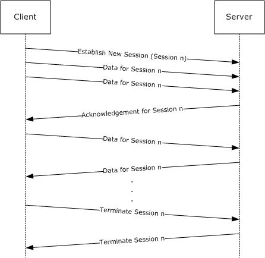
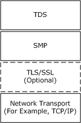
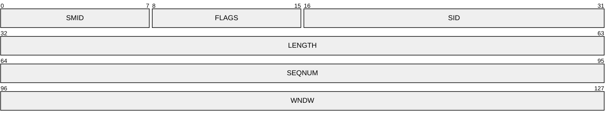
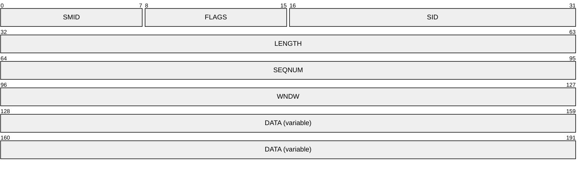
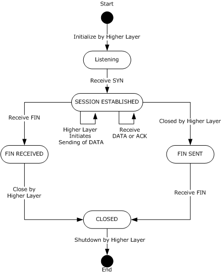
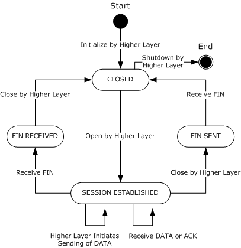

# [MC-SMP]: Session Multiplex Protocol

Table of Contents

1 Introduction

- [1 Introduction](#Section_1)
  - [1.1 Glossary](#Section_1.1)
  - [1.2 References](#Section_1.2)
    - [1.2.1 Normative References](#Section_1.2.1)
    - [1.2.2 Informative References](#Section_1.2.2)
  - [1.3 Overview](#Section_1.3)
  - [1.4 Relationship to Other Protocols](#Section_1.4)
  - [1.5 Prerequisites/Preconditions](#Section_1.5)
  - [1.6 Applicability Statement](#Section_1.6)
  - [1.7 Versioning and Capability Negotiation](#Section_1.7)
  - [1.8 Vendor-Extensible Fields](#Section_1.8)
  - [1.9 Standards Assignments](#Section_1.9)

2 Messages

- [2 Messages](#Section_2)
  - [2.1 Transport](#Section_2.1)
  - [2.2 Message Syntax](#Section_2.2)
    - [2.2.1 Header](#Section_2.2.1)
      - [2.2.1.1 Control Flags](#Section_2.2.1.1)
    - [2.2.2 SYN Packet](#Section_2.2.2)
    - [2.2.3 ACK Packet](#Section_2.2.3)
    - [2.2.4 FIN Packet](#Section_2.2.4)
    - [2.2.5 DATA Packet](#Section_2.2.5)

3 Protocol Details

- [3 Protocol Details](#Section_3)
  - [3.1 Common Details](#Section_3.1)
    - [3.1.1 Abstract Data Model](#Section_3.1.1)
      - [3.1.1.1 Session-Specific Structures](#Section_3.1.1.1)
      - [3.1.1.2 Session States](#Section_3.1.1.2)
    - [3.1.2 Timers](#Section_3.1.2)
    - [3.1.3 Initialization](#Section_3.1.3)
      - [3.1.3.1 Session-Specific Structure](#Section_3.1.3.1)
    - [3.1.4 Higher-Layer Triggered Events](#Section_3.1.4)
      - [3.1.4.1 Initialize by Higher Layer](#Section_3.1.4.1)
      - [3.1.4.2 Read by Higher Layer](#Section_3.1.4.2)
      - [3.1.4.3 Higher Layer Initiates Sending of Data](#Section_3.1.4.3)
      - [3.1.4.4 Close by Higher Layer](#Section_3.1.4.4)
      - [3.1.4.5 Shutdown by Higher Layer](#Section_3.1.4.5)
    - [3.1.5 Message Processing Events and Sequencing Rules](#Section_3.1.5)
      - [3.1.5.1 Receiving a Packet](#Section_3.1.5.1)
        - [3.1.5.1.1 Receiving a DATA Packet](#Section_3.1.5.1.1)
        - [3.1.5.1.2 Receiving an ACK Packet](#Section_3.1.5.1.2)
        - [3.1.5.1.3 Receiving a FIN Packet](#Section_3.1.5.1.3)
      - [3.1.5.2 Flow Control Algorithm](#Section_3.1.5.2)
        - [3.1.5.2.1 Session Variable Relationships for the Sender](#Section_3.1.5.2.1)
        - [3.1.5.2.2 Session Variable Relationships for the Receiver](#Section_3.1.5.2.2)
        - [3.1.5.2.3 Update Sender's HighWaterForSend Variable Using an ACK Packet](#Section_3.1.5.2.3)
    - [3.1.6 Timer Events](#Section_3.1.6)
    - [3.1.7 Other Local Events](#Section_3.1.7)
  - [3.2 Server Details](#Section_3.2)
    - [3.2.1 Initialization](#Section_3.2.1)
    - [3.2.2 Higher-Layer Triggered Events](#Section_3.2.2)
      - [3.2.2.1 Initialize by Higher Layer](#Section_3.2.2.1)
    - [3.2.3 Session States](#Section_3.2.3)
    - [3.2.4 Processing Events and Sequencing Rules](#Section_3.2.4)
      - [3.2.4.1 Receiving a SYN Packet](#Section_3.2.4.1)
  - [3.3 Client Details](#Section_3.3)
    - [3.3.1 Initialization](#Section_3.3.1)
    - [3.3.2 Higher-Layer Triggered Events](#Section_3.3.2)
      - [3.3.2.1 Initialize by Higher Layer](#Section_3.3.2.1)
      - [3.3.2.2 Open by Higher Layer](#Section_3.3.2.2)
    - [3.3.3 Processing Events and Sequencing Rules](#Section_3.3.3)
      - [3.3.3.1 Receiving a SYN Packet](#Section_3.3.3.1)

4 Protocol Examples

- [4 Protocol Examples](#Section_4)
  - [4.1 Opening a Session](#Section_4.1)
  - [4.2 Update Window - ACK](#Section_4.2)
  - [4.3 First Command in a Session](#Section_4.3)
  - [4.4 Closing a Session](#Section_4.4)

5 Security

- [5 Security](#Section_5)
  - [5.1 Security Considerations for Implementers](#Section_5.1)
  - [5.2 Index of Security Parameters](#Section_5.2)

6 Appendix A: Product Behavior

- [6 Appendix A: Product Behavior](#Section_6)

7 Change Tracking

- [7 Change Tracking](#Section_7)

For the legal notice and IP terms, see [LEGAL.md](../LEGAL.md).
Last updated: 10/31/2025.
See [Revision History](#revision-history) for full version history.

# 1 Introduction

The Session Multiplex Protocol (SMP) is an application-layer protocol that provides [**session**](#gt_session) management capabilities between a database client and a database server. Specifically, SMP enables multiple logical client connections to a single server over a lower-layer transport connection.

Sections 1.5, 1.8, 1.9, 2, and 3 of this specification are normative. All other sections and examples in this specification are informative.

## 1.1 Glossary

This document uses the following terms:

**little-endian**: Multiple-byte values that are byte-ordered with the least significant byte stored in the memory location with the lowest address.

**Multiple Active Result Sets (MARS)**: A feature in Microsoft SQL Server that allows applications to have more than one pending request per connection. For more information, see [[MSDN-MARS]](https://go.microsoft.com/fwlink/?LinkId=98459).

**peer**: The entity on either end of an established SMP session.

**receiver**: The entity that is receiving information from its [**peer**](#gt_peer). Both client and server can be receivers.

**recycle**: A process in which SMP releases a [**Session object**](#gt_session-object) so that the session identifier (SID) in use is made available again for a new session.

**sender**: The entity that is sending information to its [**peer**](#gt_peer). Both client and server can be senders.

**session**: In Kerberos, an active communication channel established through Kerberos that also has an associated cryptographic key, message counters, and other state.

**session identifier (SID)**: A unique value provided by the SID field of a SYN packet to each session established over an SMP connection.

**Session object**: An instance of SMP created by a SYN packet that corresponds to the SESSION ESTABLISHED state and is designated by a unique session identifier (SID).

**Session variable**: Members of a [**Session object**](#gt_session-object) instance that contain data to facilitate various SMP operations, such as messaging, event processing, and packet flow control.

**Tabular Data Stream (TDS)**: An application-level protocol that is used by SQL Server to facilitate requests and responses between a database server and client as specified in [MS-TDS](../MS-TDS/MS-TDS.md).

**Virtual Interface Architecture (VIA)**: A high-speed interconnect that requires special hardware and drivers that are provided by third parties.

**MAY, SHOULD, MUST, SHOULD NOT, MUST NOT:** These terms (in all caps) are used as defined in [[RFC2119]](https://go.microsoft.com/fwlink/?LinkId=90317). All statements of optional behavior use either MAY, SHOULD, or SHOULD NOT.

## 1.2 References

Links to a document in the Microsoft Open Specifications library point to the correct section in the most recently published version of the referenced document. However, because individual documents in the library are not updated at the same time, the section numbers in the documents may not match. You can confirm the correct section numbering by checking the [Errata](https://go.microsoft.com/fwlink/?linkid=850906).

### 1.2.1 Normative References

We conduct frequent surveys of the normative references to assure their continued availability. If you have any issue with finding a normative reference, please contact [dochelp@microsoft.com](https://go.microsoft.com/fwlink/). We will assist you in finding the relevant information.

[MS-DTYP] Microsoft Corporation, "[Windows Data Types](../MS-DTYP/MS-DTYP.md)".

[RFC2119] Bradner, S., "Key words for use in RFCs to Indicate Requirement Levels", BCP 14, RFC 2119, March 1997, [https://www.rfc-editor.org/info/rfc2119](https://go.microsoft.com/fwlink/?LinkId=90317)

[RFC2246] Dierks, T., and Allen, C., "The TLS Protocol Version 1.0", RFC 2246, January 1999, [https://www.rfc-editor.org/info/rfc2246](mailto:dochelp@microsoft.com?LinkId=90324)

[RFC6101] Freier, A., Karlton, P., and Kocher, P., "The Secure Sockets Layer (SSL) Protocol Version 3.0", RFC 6101, August 2011, [http://www.rfc-editor.org/rfc/rfc6101.txt](mailto:dochelp@microsoft.com?LinkId=509953)

[RFC793] Postel, J., Ed., "Transmission Control Protocol: DARPA Internet Program Protocol Specification", RFC 793, September 1981, [https://www.rfc-editor.org/info/rfc793](https://go.microsoft.com/fwlink/?LinkId=150872)

### 1.2.2 Informative References

[MS-TDS] Microsoft Corporation, "[Tabular Data Stream Protocol](../MS-TDS/MS-TDS.md)".

[MSDN-MARS] Microsoft Corporation, "Using Multiple Active Result Sets (MARS)", [https://learn.microsoft.com/en-us/sql/relational-databases/native-client/features/using-multiple-active-result-sets-mars](https://go.microsoft.com/fwlink/?LinkId=98459)

[MSDN-NP] Microsoft Corporation, "Named Pipes", [https://learn.microsoft.com/en-us/windows/desktop/ipc/named-pipes](https://go.microsoft.com/fwlink/?LinkId=90247)

[VIA] Intel Corporation, "Intel Virtual Interface (VI) Architecture Developer's Guide", September 1998, [http://www.t11.org/ftp/t11/docs/07-159v0.pdf](https://microsoft.sharepoint.com/teams/WindowsSQLPubFilesUpload/Shared%20Documents/Pub%20Files%20for%20Uploading/2025/SQL%20Server%202025%20GA/Azure/MC-SMP/../MS-DTYP/MS-DTYP.md?LinkId=98556)

## 1.3 Overview

Session Multiplex Protocol (SMP) is an application protocol that facilitates [**session**](#gt_session) management by providing a mechanism to create multiple lightweight communication channels (sessions) over a lower-layer transport connection. SMP does this by multiplexing data streams from different sessions on top of a single reliable stream-oriented transport.

SMP is beneficial in situations where database connections from the client and server are synchronous. In this context, "synchronous" means that the client application can only have one outstanding command or transaction per connection. Rather than incur the expense of creating multiple connections to the server, SMP is capable of simultaneously executing multiple database queries over a single connection.

SMP provides the following:

- The ability to interleave data from several different sessions and preserve message boundaries.
- A sliding window-based flow-control mechanism to facilitate fairness among sessions.
**Note** SMP is defined as a transport-independent mechanism. It relies on an underlying transport mechanism such as Transmission Control Protocol (TCP), as specified in [[RFC793]](https://go.microsoft.com/fwlink/?LinkId=150872), to ensure byte alignment, loss detection and recovery, and reliable in-order delivery. The scheduling algorithm that enforces fairness between sessions is an implementation issue for the application that implements SMP.

The following diagram shows typical SMP communication flow for an arbitrary session.

Figure 1: Example of a communication flow in SMP

## 1.4 Relationship to Other Protocols

Session Multiplex Protocol (SMP) depends on an underlying reliable stream-oriented network transport. Optionally, Transport Layer Security (TLS)/Secure Sockets Layer (SSL) [[RFC2246]](https://go.microsoft.com/fwlink/?LinkId=90324) [[RFC6101]](https://go.microsoft.com/fwlink/?LinkId=509953) can be inserted between SMP and the transport layer to provide data protection.

The [**Tabular Data Stream (TDS)**](#gt_tabular-data-stream-tds) protocol, as specified in [MS-TDS](../MS-TDS/MS-TDS.md), depends on SMP when the [**Multiple Active Result Sets (MARS)**](#gt_multiple-active-result-sets-mars) [[MSDN-MARS]](https://go.microsoft.com/fwlink/?LinkId=98459) feature is specified. TDS is an example of a higher-layer protocol for SMP. This dependency is illustrated in the following diagram.

Figure 2: Protocol relationship

## 1.5 Prerequisites/Preconditions

It is assumed throughout this document that the client has already discovered the server and established a network transport connection.

## 1.6 Applicability Statement

Session Multiplex Protocol (SMP) is used appropriately to facilitate the multiplexing of several [**sessions**](#gt_session) over a single reliable lower-layer transport connection where network or local connectivity is available.

## 1.7 Versioning and Capability Negotiation

No version of Session Multiplex Protocol (SMP) exists other than the version that is described in this specification. Additional details follow.

**Supported transports:** SMP can be implemented on top of any reliable transport mechanism, as specified in section [2.1](#Section_2.1).

**Protocol versions:** SMP supports the SMP 1.0 version, as defined in section [2.2](#Section_2.2), which is the only version of SMP that is available.

**Security and authentication methods:** SMP does not provide or support any security or authentication methods.

**Localization:** SMP does not provide any localization-specific features.

**Capability negotiation:** SMP does not support capability negotiation.

## 1.8 Vendor-Extensible Fields

There are no vendor-extensible fields.

## 1.9 Standards Assignments

There are no standards assignments for SMP.

# 2 Messages

All integer fields are represented in [**little-endian**](#gt_little-endian) byte order. This protocol references commonly used data types as defined in [MS-DTYP](../MS-DTYP/MS-DTYP.md).

## 2.1 Transport

Session Multiplex Protocol (SMP) is a simple protocol that is layered above existing reliable transport mechanisms, such as TCP [[RFC793]](https://go.microsoft.com/fwlink/?LinkId=150872), named pipes [[MSDN-NP]](https://aka.ms/AA9ufj8?LinkId=90247), or [**Virtual Interface Architecture**](#gt_virtual-interface-architecture-via) [[VIA]](https://go.microsoft.com/fwlink/?LinkId=98556).<1> SMP enables the creation of multiple [**sessions**](#gt_session) over a single connection. SMP is defined as a transport-independent mechanism.

## 2.2 Message Syntax

All SMP packets consist of a 16-byte header followed by an optional data payload, depending on the packet type.

### 2.2.1 Header

The 16-byte SMP header has the following format.

**SMID (1 byte):** This unsigned integer is the SMP packet identifier and MUST always be assigned the value 0x53. This field indicates that the packet is an SMP packet, which helps to distinguish it from other protocol packets.

**FLAGS (1 byte):** This unsigned integer value contains the control flags, as defined in section [2.2.1.1](#Section_2.2.1.1).

**SID (2 bytes):** This unsigned integer is the [**session**](#gt_session) identifier. This value is a unique identifier for each session that is multiplexed over this connection.

**LENGTH (4 bytes):** This unsigned integer specifies the length, in bytes (including the header), of the SMP packet.

**SEQNUM (4 bytes):** This unsigned integer is the SMP sequence number for this packet in the session. The first [DATA](#Section_2.2.5) packet in each session MUST have a SEQNUM value of 0x00000001. For every DATA packet thereafter, this integer MUST monotonically increase by a value of 1 up to 0xffffffff, and then wraps back to a starting value of 0x00000000. Sequence numbers MUST only be incremented for DATA packets. For the [ACK](#Section_2.2.3) packet type, the sequence number MUST remain stable. For the [FIN](#Section_2.2.4) packet type, the sequence number SHOULD remain stable. For the [SYN](#Section_2.2.2) packet type, the sequence number SHOULD be 0x00000000.

**WNDW (4 bytes):** This unsigned integer indicates the maximum SEQNUM value permitted for a receive packet.

**Note** The difference between the values of the WNDW field of a received packet and the SEQNUM field of the last sent packet is the available send window size. Any subsequent packets that are sent MUST NOT contain a SEQNUM value that is greater than the value of the WNDW field of the last received packet.

#### 2.2.1.1 Control Flags

The control flag is 1 byte after the **SMID** field and indicates the type of the packet. Only [DATA](#Section_2.2.5) packets have payload data. The [**sender**](#gt_sender) MUST NOT send a combination of flags in the same packet. For example, a **FLAGS** field value of 0x06 (ACK plus FIN) is an invalid value.

| Value | Meaning |
| --- | --- |
| SYN 0x01 | Indicates that a new connection is to be established (see [SYN](#Section_2.2.2) packet). The [**session**](#gt_session) ID for the session is the number that is stored in the **SID** field. |
| ACK 0x02 | Informs the [**peer**](#gt_peer) about a change in window size when consecutive unanswered DATA packets are received (see [ACK](#Section_2.2.3) packet). |
| FIN 0x04 | Indicates that the sending entity will no longer use the session to send data. |
| DATA 0x08 | Indicates that the packet carries user data after the header (see DATA packet). |

### 2.2.2 SYN Packet

The SYN packet is sent to indicate that a new connection is to be established. The ID for the [**session**](#gt_session) is the number that is stored in the **SID** field of the SYN packet.

**SMID (1 byte):** See section [2.2.1](#Section_2.2.1) for a description of the **SMID** field.

**FLAGS (1 byte):** This unsigned integer contains control flags that identify this packet as a SYN packet. The value of the **FLAGS** field MUST be 0x01. See section [2.2.1.1](#Section_2.2.1.1) for details.

**SID (2 bytes):** All subsequent packets in this session MUST use this identifier. See section 2.2.1 for a description of the **SID** field.

**LENGTH (4 bytes):** The value of this field MUST be 0x00000010. See section 2.2.1 for a description of the **LENGTH** field.

**SEQNUM (4 bytes):** The value of this field SHOULD be 0x00000000. See section 2.2.1 for a description of the **SEQNUM** field.

**WNDW (4 bytes):** See section 2.2.1 for a description of the **WNDW** field.

### 2.2.3 ACK Packet

The ACK packet updates the [**peer**](#gt_peer) by changing the peer's send window size when several consecutive unanswered [DATA](#Section_2.2.5) packets are received. For example, with a send window size of 4 (the value of the **WNDW** field of the sender's last received packet is equal to 0x00000004, and the value of the **SEQNUM** field of the sender's next sent packet will be equal to 0x00000001), if the [**sender**](#gt_sender) has 5 packets to pass to the [**receiver**](#gt_receiver) for a single request, then after 4 packets the sender will wait until it receives an ACK packet with an updated value for the **WNDW** field before it can transmit additional packets. After the receiver has processed at least one of the packets, the receiver can send the sender an ACK packet containing an updated **WNDW** field value, which allows the sender to send the final packet and complete the request.

**SMID (1 byte):** See section [2.2.1](#Section_2.2.1) for a description of the **SMID** field.

**FLAGS (1 byte):** This unsigned integer contains control flags that identify this packet as an ACK packet. The value of the **FLAGS** field value MUST be 0x02.

**SID (2 bytes):** See section 2.2.1 for a description of the **SID** field. This MUST be the value that was set in the [SYN](#Section_2.2.2) packet (when the [**session**](#gt_session) was opened).

**LENGTH (4 bytes):** See section 2.2.1 for a description of the **LENGTH** field. The value of this field MUST be 0x00000010.

**SEQNUM (4 bytes):** See section 2.2.1 for a description of the **SEQNUM** field.

**WNDW (4 bytes):** See section 2.2.1 for a description of the **WNDW** field.

### 2.2.4 FIN Packet

The FIN packet is sent to indicate that the sending entity will no longer use the [**session**](#gt_session) to send or receive data.

**SMID (1 byte):** See section [2.2.1](#Section_2.2.1) for a description of the **SMID** field.

**FLAGS (1 byte):** This unsigned integer contains control flags that identify this packet as a FIN packet. The value of the **FLAGS** field MUST be 0x04.

**SID (2 bytes):** The **SID** field MUST be set to the value that was set when the session was opened. See section 2.2.1 for a description of the **SID** field.

**LENGTH (4 bytes):** The value of the **LENGTH** field MUST be 0x00000010. See section 2.2.1 for a description of the **LENGTH** field.

**SEQNUM (4 bytes):** See section 2.2.1 for a description of the **SEQNUM** field.

**WNDW (4 bytes):** See section 2.2.1 for a description of the **WNDW** field.

### 2.2.5 DATA Packet

The DATA packet carries data in the **DATA** field, which follows the [Header](#Section_2.2.1). The length of the **DATA** field is the total SMP packet length minus the SMP packet header length.

**SMID (1 byte):** See section 2.2.1 for a description of the **SMID** field.

**FLAGS (1 byte):** This unsigned integer contains control flags that identify this packet as a DATA packet. The value of the **FLAGS** field MUST be 0x08.

**SID (2 bytes):** The **SID** field MUST be set to the value that was set when the [**session**](#gt_session) was opened. See section 2.2.1 for a description of the **SID** field.

**LENGTH (4 bytes):** The value of the **LENGTH** field MUST be at least 0x00000010. See section 2.2.1 for a description of the **LENGTH** field.

**SEQNUM (4 bytes):** See section 2.2.1 for a description of the **SEQNUM** field.

**WNDW (4 bytes):** See section 2.2.1 for a description of the **WNDW** field.

**DATA (variable):** The **DATA** field contains the user data of the DATA packet. The size of the **DATA** field can be determined by subtracting the length of the Header (16 bytes) from the value of the **LENGTH** field. For example, a **LENGTH** value of 0x00000025 means the user data will be 21 bytes long.

# 3 Protocol Details

This section describes the important elements of the client and server software necessary to support SMP.

SMP is largely a symmetric protocol that obeys the same rules and semantics on both the client and the server. Therefore, descriptions of the client and server roles are both contained in section [3.1](#Section_3.1), where section [3.3.2.2](#Section_3.3.2.2) applies only to the client and section [3.2.4.1](#Section_3.2.4.1) applies only to the server.

## 3.1 Common Details

Session Multiplex Protocol (SMP) is layered on top of a reliable, in-order, connection-oriented transport layer such as TCP [[RFC793]](https://go.microsoft.com/fwlink/?LinkId=150872), named pipes [[MSDN-NP]](https://microsoft.sharepoint.com/teams/WindowsSQLPubFilesUpload/Shared%20Documents/Pub%20Files%20for%20Uploading/2025/SQL%20Server%202025%20GA/Azure/MC-SMP/../MS-TDS/MS-TDS.md?LinkId=90247), or [**Virtual Interface Architecture (VIA)**](#gt_virtual-interface-architecture-via) [[VIA]](https://go.microsoft.com/fwlink/?LinkId=98556).<2>

After the transport connection is established, SMP initiation is negotiated through other protocols, such as the [**Tabular Data Stream (TDS)**](#gt_tabular-data-stream-tds) protocol [MS-TDS](../MS-TDS/MS-TDS.md). SMP has to be successfully initiated on both end points before SMP operations can begin. The shutdown sequence can be triggered either by the higher layer or by fatal events internal to SMP. The [**peer**](#gt_peer) is notified of the shutdown when the transport connection is closed.

SMP incorporates the concept of a client and a server interacting during [**session**](#gt_session) establishment. A session has to be initiated by the client (section [3.3.2.2](#Section_3.3.2.2)). After SMP enters the SESSION ESTABLISHED state, both endpoints of the session can be used by the higher layer to send and receive data symmetrically, and therefore each can act as a [**sender**](#gt_sender) and as a [**receiver**](#gt_receiver). Either the client or the server can initiate connection termination by sending a [FIN](#Section_2.2.4) packet.

### 3.1.1 Abstract Data Model

This section describes a conceptual model of possible data organization that an implementation maintains to participate in this protocol. The described organization is provided to facilitate the explanation of how the protocol behaves. This document does not mandate that implementations adhere to this model as long as their external behavior is consistent with what is described in this document.

#### 3.1.1.1 Session-Specific Structures

The following structures are required per SMP [**session**](#gt_session). These structures are needed to implement the flow control algorithm and for connection management:

**Note** The dotted notation of the following list items indicates the structures of a [**Session object**](#gt_session-object) instance. For example, Session.SeqNumForSend refers to the SeqNumForSend variable of the Session object.

- **Session.SeqNumForSend**: A 32-bit unsigned integer that monotonically increases for every session [DATA](#Section_2.2.5) packet that is sent.
- **Session.HighWaterForSend**: A 32-bit unsigned integer that tracks the [**peer**](#gt_peer) window that is obtained through the **WNDW** field in the received packet header.
- **Session.SeqNumForRecv**: A 32-bit unsigned integer that tracks the peer session sequence number obtained from the **SEQNUM** field in the DATA packet header. This number is used for comparison with the received packet.
- **Session.HighWaterForRecv**: A 32-bit unsigned integer that tracks the [**receiver's**](#gt_receiver) high-water mark of the receiver buffer window. It is used to set the value of the **WNDW** field of each sent packet.
- **Session.LastHighWaterForRecv**: A 32-bit unsigned integer that tracks the value of the **WNDW** field of the last sent packet. It is used to implement a selective [ACK](#Section_2.2.3) algorithm and is optional.
- **Session.ReceivePacketQueue**: A queue that buffers received packets.

#### 3.1.1.2 Session States

The state of an SMP [**session**](#gt_session) has to be maintained. An SMP session can be in any one of several states, which are described here and in the "Server Details" and "Client Details" sections.

**SESSION ESTABLISHED:** The session is successfully established and both session endpoints can send and receive data. The SESSION ESTABLISHED state is reached as specified in section [3.3.2.2](#Section_3.3.2.2).

**FIN RECEIVED:** The client or server has received a [FIN packet](#Section_2.2.4) from its [**peer**](#gt_peer), indicating a request to close this session.

**FIN SENT:** The client or server has sent a FIN packet to its peer after the session is closed by the higher layer. The sending entity will also receive a FIN packet from its peer before entering the CLOSED state (section [3.1.4.4](#Section_3.1.4.4)). However, if the transport connection will also be closed by the sending entity, it is unnecessary to wait to receive the FIN packet acknowledgement.

**CLOSED:** The session has been closed by the higher layer, either by closing the SMP session (section 3.1.4.4) or by shutting down the SMP connection (section [3.1.4.5](#Section_3.1.4.5)), at which point data can no longer be sent or received.

### 3.1.2 Timers

In SMP, there are no timers. SMP assumes a reliable transport and the eventual delivery of messages. In the event of an error from the transport connection, SMP [**recycles**](#gt_recycle) all [**Session objects**](#gt_session-object) associated with the failed transport connection. Idle [**sessions**](#gt_session) are kept open until the higher layer closes them or an error in the transport connection occurs.

### 3.1.3 Initialization

#### 3.1.3.1 Session-Specific Structure

[**Session**](#gt_session)-specific structures are initialized with the values described in the table that follows.

**Note** The dotted notation in the table indicates the structures of a [**Session object**](#gt_session-object) instance. For example, Session.SeqNumForSend refers to the SeqNumForSend variable of the Session object.

| Variable | Value |
| --- | --- |
| Session.SeqNumForSend | 0 |
| Session.HighWaterForSend | 4 |
| Session.SeqNumForRecv | 0 |
| Session.HighWaterForRecv | 4 |
| Session.ReceivePacketQueue | Empty |

If the delayed acknowledgment algorithm is used, as specified in section [3.1.5.2.3](#Section_3.1.5.2.3), Session.LastHighWaterforRecv will have a value of 4. Otherwise, the Session.LastHighWaterForRecv variable is not used.

### 3.1.4 Higher-Layer Triggered Events

#### 3.1.4.1 Initialize by Higher Layer

The higher layer on both the client and server have to initialize SMP on each end of the lower-layer transport connection before SMP can operate. After initialization, the client enters a CLOSED state and the server enters a LISTENING state.

#### 3.1.4.2 Read by Higher Layer

The Read by Higher Layer event is triggered when the higher layer chooses to perform a read operation on arriving [DATA](#Section_2.2.5) packets. The SMP layer performs one of the following, depending upon the status of [ReceivePacketQueue](#Section_3.1.1.1) variable of the [**Session object**](#gt_session-object):

- If the ReceivePacketQueue variable of the Session object is empty, the SMP layer notifies the higher layer once a DATA packet arrives, as described in section [3.1.5.1.1](#Section_3.1.5.1.1).
- If the ReceivePacketQueue variable of the Session object is not empty, the SMP layer retrieves only one packet from the ReceivePacketQueue and passes it to the higher layer. After the SMP layer passes the data to the higher layer, the HighWaterForRecv variable of the Session object is incremented by 1 and the SMP layer can send an [ACK](#Section_2.2.3) packet to the [**peer**](#gt_peer), as specified in section [3.1.5.2.3](#Section_3.1.5.2.3).

#### 3.1.4.3 Higher Layer Initiates Sending of Data

This event is triggered when the higher layer initiates the sending of data over an SMP [**session**](#gt_session).

Any packet that is sent MUST NOT contain a **SEQNUM** value higher than the value of the HighWaterForSend variable.

If a [DATA](#Section_2.2.5) packet cannot be sent to its [**peer**](#gt_peer) because the value of the SeqNumForSend variable of the [**Session object**](#gt_session-object) is equal to the value of the HighWaterForSend variable of the Session object, the SMP layer performs one of the following two actions:

- Buffer the DATA packet in a local buffer and send it at a later time according to the flow control algorithm described in section [3.1.5.2](#Section_3.1.5.2).
- Block the higher layer until the DATA packet is sent according to the flow control algorithm described in section 3.1.5.2.
If the value of SeqNumForSend is less than that of HighWaterForSend, the SMP layer of the [**sender**](#gt_sender) sends the DATA packet according to the flow control algorithm described in section 3.1.5.2.

#### 3.1.4.4 Close by Higher Layer

The Close by Higher Layer event is triggered when the upper layer closes a [**session**](#gt_session). When this happens, the following MUST occur:

- If SMP is in the SESSION ESTABLISHED state, send the [FIN](#Section_2.2.4) packet and then enter the FIN SENT state.
- If SMP is in the FIN RECEIVED state, send the FIN packet to the [**peer**](#gt_peer), [**recycle**](#gt_recycle) the [**Session object**](#gt_session-object), and then enter the CLOSED state.
**Note** The Session object cannot be recycled and the CLOSED state ought not be entered until the SMP layer receives a FIN packet from its peer, as described in section [3.1.5.1.3](#Section_3.1.5.1.3). It is also important to both receive and send a FIN packet (the order does not matter) before entering the CLOSED state to prevent a new session from attempting to use an existing [**session identifier (SID)**](#gt_session-identifier-sid). See section [2.2.1](#Section_2.2.1) for a description of the **SID** field.

#### 3.1.4.5 Shutdown by Higher Layer

The Shutdown by Higher Layer event is triggered when the upper layer shuts down the SMP connection. When this occurs, all [**sessions**](#gt_session) move from the CLOSED state to the END state and all associated data structures is released.

### 3.1.5 Message Processing Events and Sequencing Rules

#### 3.1.5.1 Receiving a Packet

The client or server MUST do the following when receiving a packet:

- Parse the header of the received packet to get the value of the **SID** field.
- If the [**Session object**](#gt_session-object) corresponding to the value of the **SID** field of the received packet does not exist and the value of the **FLAGS** field of the packet is not equal to 0x01 (a [SYN](#Section_2.2.2) packet), an error is raised to the higher layer and the underlying transport connection is closed.
- If the Session object is located, an error is raised to the higher layer and the underlying transport connection is closed if any of the following conditions are not met:
- The value of the **FLAGS** field in the received packet is equal to 0x02 ([ACK](#Section_2.2.3) packet), 0x04 ([FIN](#Section_2.2.4) packet), or 0x08 ([DATA](#Section_2.2.5) packet).
- The value of the **WNDW** field of the received packet is greater than or equal to the value of the HighWaterForSend variable of the Session object.
- The **SID** field of the received packet matches the [**session identifier (SID)**](#gt_session-identifier-sid) of the Session object.
- The value of the **SEQNUM** field is less than or equal to the value of the HighWaterForRecv variable of the Session object.
- If the value of the **FLAGS** field is equal to 0x08 (a DATA packet), parse the packet to get the user data (**DATA** field) while using the value of the **LENGTH** field of the packet to facilitate the parse.
**Note** The length of the **DATA** field will be equal to the overall packet **LENGTH** minus the length of the [Header](#Section_2.2.1) (16 bytes).

The sections that follow describe the processing of received DATA, ACK, and FIN packets. Processing of received SYN packets is covered in the server- and client-specific sections.

##### 3.1.5.1.1 Receiving a DATA Packet

When a [DATA](#Section_2.2.5) packet is received in the SESSION ESTABLISHED state:

- If a higher layer posted a receive, finish that receive with the data in the packet; otherwise, buffer the packet in the ReceivePacketQueue variable of the [**Session object**](#gt_session-object).
- If the value of the **WNDW** field of the DATA packet is greater than the value of the HighWaterForSend variable of the Session object, the [**receiver**](#gt_receiver) of the DATA packet MUST do the following:
- If there are any packets waiting to be sent (section [3.1.4.3](#Section_3.1.4.3)), the SMP layer sends the packets to its [**peer**](#gt_peer), up to and including the value of the packet number defined by the **WNDW** field.
- Set the value of the HighWaterForSend variable of the Session object equal to the value of the **WNDW** field of the DATA packet.
- If the value of the **SEQNUM** field of the DATA packet is not equal to the value of the SeqNumForRecv variable of the Session object plus 1, an error is raised to the higher layer and the underlying transport layer is closed.
**Note** When a DATA packet is received in the FIN SENT state, the packet is ignored.

**Note** When a DATA packet is received in the FIN RECEIVED state, an error SHOULD be raised to the higher layer and the underlying transport connection SHOULD be closed.

##### 3.1.5.1.2 Receiving an ACK Packet

When an [ACK](#Section_2.2.3) packet is received, the following applies:

- If the value of the **WNDW** field of the ACK packet is greater than the value of the HighWaterForSend variable of the [**Session object**](#gt_session-object), the [**receiver**](#gt_receiver) of the ACK packet MUST do the following:
- If there are any packets waiting to be sent, as specified in section [3.1.4.3](#Section_3.1.4.3), the SMP layer sends the packets to its [**peer**](#gt_peer), up to and including the value defined by the **WNDW** field.
- Set the value of the HighWaterForSend variable to that of the **WNDW** field.
- If an ACK packet is received in the FIN RECEIVED state, an error SHOULD be raised to the higher layer and the underlying transport connection SHOULD be closed.
- If the value of the **SEQNUM** field of the ACK packet is not equal to the value of the SeqNumForRecv variable of the Session object, an error is raised to the higher layer and the underlying transport connection is closed.

##### 3.1.5.1.3 Receiving a FIN Packet

When a [FIN](#Section_2.2.4) packet is received, the following applies:

- If SMP is in the SESSION ESTABLISHED state, then move into the FIN RECEIVED state.
- If SMP is in the FIN SENT state, then [**recycle**](#gt_recycle) the [**Session object**](#gt_session-object) and move into the CLOSED state.
When a FIN packet is received in the FIN RECEIVED state, an error SHOULD be raised to the higher layer and the underlying transport connection SHOULD be closed.

If the value of the **SEQNUM** field of the FIN packet is not equal to the value of the SeqNumForRecv variable of the Session object, an error MAY be raised to the higher layer and the underlying transport connection MAY be closed.

#### 3.1.5.2 Flow Control Algorithm

SMP provides a means for the [**receiver**](#gt_receiver) to govern the amount of data sent by the [**sender**](#gt_sender). This is achieved by returning a window with every [ACK](#Section_2.2.3) or [DATA](#Section_2.2.5) packet. The returned window indicates a range of acceptable sequence numbers beyond the last DATA packet that is successfully received. The window indicates an allowed number of DATA packets that the sender can transmit before receiving further permission.

Flow control involves the use of the following sender variables:

- Session.SeqNumForSend
- Session.HighWaterForSend
Flow control also involves the use of the following receiver variables:

- Session.SeqNumForRecv
- Session.HighWaterForRecv
- LastHighWaterForRecv
The sections that follow show the relationships of these variables in the sequence number space. The sequence number is a 32-bit unsigned integer that is allowed to wrap.

##### 3.1.5.2.1 Session Variable Relationships for the Sender

- The [DATA](#Section_2.2.5) packet MUST NOT be sent if the value of the SeqNumForSend variable of the [**Session object**](#gt_session-object) is equivalent to the value of the HighWaterForSend variable of the Session object.
- Otherwise, the value of the **SEQNUM** field of the DATA packet is set to the value of the SeqNumForSend variable plus 1, the DATA packet is sent, and the value of the SeqNumForSend variable is incremented by 1.
- Upon receiving a packet, the value of the HighWaterForSend variable isset to the value of the **WNDW** field of the received packet.
**Note** The value of the send window size equals the value of the HighWaterForSend variable minus the value of the SeqNumForSend variable. The send window is considered closed when the value of the send window size is 0. The maximum send window size for the implementation described in this document is 4.

##### 3.1.5.2.2 Session Variable Relationships for the Receiver

- When the higher layer retrieves a [DATA](#Section_2.2.5) packet from a [**session**](#gt_session) endpoint, the HighWaterForRecv variable of the [**Session object**](#gt_session-object) is incremented by 1.
- When sending a DATA packet, the value of the **WNDW** field of the packet is set to the value of the HighWaterForRecv variable.
- When receiving a DATA packet with a **SEQNUM** field value equivalent to the value of the SeqNumForRecv variable of the Session object plus 1 (and that value is less than or equal to the value of the HighWaterForRecv variable of the Session object), the value of the SeqNumForRecv variable is set to the value of the **SEQNUM** field of the received DATA packet.
- When receiving a DATA packet with a **SEQNUM** field that does not satisfy the condition specified above, an error is raised to the higher layer.
- When receiving a packet other than a DATA packet, the SeqNumForRecv variable is not changed.
**Note** The algorithm described above ensures that, at any time, the value of the SeqNumForRecv variable is less than or equal to the value of the HighWaterForRecv variable. The receive window size equals the value of HighWaterForRecv minus the value of SeqNumForRecv.

##### 3.1.5.2.3 Update Sender's HighWaterForSend Variable Using an ACK Packet

The ADM variable **HighWaterForSend** of the [**Session object**](#gt_session-object) is updated by receiving either a [DATA](#Section_2.2.5) packet or an [ACK](#Section_2.2.3) packet from the [**peer**](#gt_peer). The SMP layer MUST send ACK packets to facilitate flow control. There are several possible algorithms that can be used for sending ACK packets. This is an implementation choice. One example is to send an ACK packet for each DATA packet retrieved by the higher layer.<3>

### 3.1.6 Timer Events

There is no timer in SMP.

### 3.1.7 Other Local Events

In case of the following events, SMP closes the lower layer transport connection and an error is raised to the higher layer:

- The lower-layer transport disconnects.
- A packet is received by a [**peer**](#gt_peer) and does not follow the specifications outlined in section [2](#Section_1.3).

## 3.2 Server Details

The following state diagram illustrates the progress of a session during the lifetime of the server. The diagram is only a summary and does not represent the total specification; for example, it does not include error events and state changes within an established state.

Figure 3: Session Multiplex Protocol server state machine

### 3.2.1 Initialization

On the server side, initialization of the Abstract Data Model described in the Common Details is performed when the upper layer makes a request to begin listening.

### 3.2.2 Higher-Layer Triggered Events

#### 3.2.2.1 Initialize by Higher Layer

The higher layer on the server MUST initialize SMP on each end of the lower-layer transport connection before SMP can operate. After initialization, the server enters a LISTENING state.

### 3.2.3 Session States

In addition to the states specified in the Common Details, a Server Session can also be in the following state:

**Listening:** The server is ready for client connections.

### 3.2.4 Processing Events and Sequencing Rules

#### 3.2.4.1 Receiving a SYN Packet

The following logic applies to the server only when receiving a [SYN](#Section_2.2.2) packet.

- Create a [**Session object**](#gt_session-object) using the value of the **SID** field of the received SYN packet and enter the SESSION ESTABLISHED state.
- If the value of the **SEQNUM** field of the SYN packet is not equal to the value of the SeqNumForRecv variable of the Session object, an error MAY be raised to the higher layer and the underlying transport connection MAY be closed.
**Note** If a SYN packet is received in the FIN RECEIVED state, an error SHOULD be raised to the higher layer and the underlying transport connection SHOULD be closed.

## 3.3 Client Details

The following state diagram illustrates the progress of a session during the lifetime of the client. The diagram is only a summary and does not represent the total specification; for example, it does not include error events and state changes within an established state.

Figure 4: Session Multiplex Protocol client state machine

### 3.3.1 Initialization

On the client side, initialization of the Abstract Data Model described in the Common Details is performed when the upper layer makes a request for a new SMP session.

### 3.3.2 Higher-Layer Triggered Events

#### 3.3.2.1 Initialize by Higher Layer

The higher layer on the client MUST initialize SMP on each end of the lower-layer transport connection before SMP can operate. After initialization, the client enters a CLOSED state.

#### 3.3.2.2 Open by Higher Layer

The Open by Higher Layer event is triggered from the client side only. When the higher layer triggers this event, the SMP layer MUST:

- Choose a unique [**session identifier (SID)**](#gt_session-identifier-sid), as specified in section [2.2.1](#Section_2.2.1), for each [**session**](#gt_session) multiplexed over a lower-layer transport connection.
- Send a [SYN](#Section_2.2.2) packet to the server.
- **Note** The SYN packet creates a [**Session object**](#gt_session-object), which is an instance of the SMP protocol containing [**Session variables**](#gt_session-variable) that control protocol operation.
- Enter into the SESSION ESTABLISHED state.

### 3.3.3 Processing Events and Sequencing Rules

#### 3.3.3.1 Receiving a SYN Packet

If a SYN packet is received by the client, an error SHOULD be raised to the higher layer and the underlying transport connection SHOULD be closed.

# 4 Protocol Examples

This section provides examples of SMP packets for various operations being performed.

## 4.1 Opening a Session

This example illustrates a [SYN](#Section_2.2.2) packet which creates a new [**session**](#gt_session).

**SMID (1 byte):** 0x53

**FLAGS (1 byte):** 0x01 (SYN packet)

**SID (2 bytes):** 0x0000 (The first SMP session on this connection)

**LENGTH (4 bytes):** 0x00000010 (The SYN packet does not have any payload)

**SEQNUM (4 bytes):** 0x00000000 (The initial packet for this session)

**WNDW (4 bytes):** 0x00000004 (The default of 4 receive buffers posted)

## 4.2 Update Window - ACK

This example illustrates an [ACK](#Section_2.2.3) packet that updates the [**peer**](#gt_peer) with a change in window size.

**SMID (1 byte):** 0x53

**FLAGS (1 byte):** 0x02 (ACK packet)

**SID (2 bytes):** 0x0005 ([**session identifier (SID)**](#gt_session-identifier-sid) equals 5)

**LENGTH (4 bytes):** 0x00000010 (The ACK packet does not have a payload)

**SEQNUM (4 bytes):** 0x00000010

**WNDW (4 bytes):** 0x00000012

## 4.3 First Command in a Session

This example illustrates a [DATA](#Section_2.2.5) packet as the first command in a [**session**](#gt_session).

**SMID (1 byte):** 0x53

**FLAGS (1 byte):** 0x08 (DATA packet)

**SID (2 bytes):** 0x0005 ([**session identifier (SID)**](#gt_session-identifier-sid) equals 5)

**LENGTH (4 bytes):** 0x00000060

**SEQNUM (4 bytes):** 0x0000001

**WNDW (4 bytes):** 0x0000004

**DATA (variable):** 0x01 01 00 50 00 00 01 00 16 00 00 00 12 00 00 00 02 00 00 00 00 00 00 00 00 00 01 00 00 00 53 00 45 00 54 00 20 00 51 00 55 00 4F 00 54 00 45 00 44 00 5F 00 49 00 44 00 45 00 4E 00 54 00 49 00 46 00 49 00 45 00 52 00 20 00 4F 00 46 00 46 00 ([**TDS**](#gt_tabular-data-stream-tds) request)

## 4.4 Closing a Session

This example illustrates the [FIN](#Section_2.2.4) packet as the last command in a [**session**](#gt_session).

**SMID (1 byte):** 0x53

**FLAGS (1 byte):** 0x04 (FIN packet)

**SID (2 bytes):** 0x0005 ([**session identifier (SID)**](#gt_session-identifier-sid) equals 5)

**LENGTH (4 bytes):** 0x00000010 (The FIN packet does not have a payload)

**SEQNUM (4 bytes):** 0x0000023

**WNDW (4 bytes):** 0x0000013

# 5 Security

## 5.1 Security Considerations for Implementers

There are no special security considerations for this protocol.

## 5.2 Index of Security Parameters

None.

# 6 Appendix A: Product Behavior

The information in this specification is applicable to the following Microsoft products or supplemental software. References to product versions include updates to those products.

- Microsoft SQL Server 2005
- Microsoft SQL Server 2008
- Microsoft SQL Server 2008 R2
- Microsoft SQL Server 2012
- Microsoft SQL Server 2014
- Microsoft SQL Server 2016
- Microsoft SQL Server 2017
- Microsoft SQL Server 2019
- Microsoft SQL Server 2022
- Microsoft SQL Server 2025
- Windows Vista operating system
- Windows Server 2008 operating system
- Windows 7 operating system
- Windows Server 2008 R2 operating system
- Windows 8 operating system
- Windows Server 2012 operating system
- Windows 8.1 operating system
- Windows Server 2012 R2 operating system
- Windows 10 operating system
- Windows Server 2016 operating system
- Windows Server operating system
- Windows Server 2019 operating system
- Windows Server 2022 operating system
- Windows 11 operating system
- Windows Server 2025 operating system
Exceptions, if any, are noted in this section. If an update version, service pack or Knowledge Base (KB) number appears with a product name, the behavior changed in that update. The new behavior also applies to subsequent updates unless otherwise specified. If a product edition appears with the product version, behavior is different in that product edition.

Unless otherwise specified, any statement of optional behavior in this specification that is prescribed using the terms "SHOULD" or "SHOULD NOT" implies product behavior in accordance with the SHOULD or SHOULD NOT prescription. Unless otherwise specified, the term "MAY" implies that the product does not follow the prescription.

<1> Section 2.1: Microsoft SQL Server supports TCP and named pipes as transport protocols for the SMP protocol. In addition, SQL Server 2005, SQL Server 2008, and SQL Server 2008 R2 support the VIA protocol as a protocol configuration option that can be used as the underlying transport.

<2> Section 3.1: SQL Server supports TCP and named pipes as transport protocols for the SMP protocol. In addition, SQL Server 2005, SQL Server 2008, and SQL Server 2008 R2 support the VIA protocol as a protocol configuration option that can be used as the underlying transport.

<3> Section 3.1.5.2.3: In Microsoft implementations, when the SMP layer sends a packet, the value of the **LastHighWaterForRecv** ADM variable is set to the value of the **WNDW** field of the sent packet.

In Microsoft implementations, a delayed acknowledgement algorithm is implemented by sending an [ACK](#Section_2.2.3) packet after every other [DATA](#Section_2.2.5) packet that is retrieved by the higher layer. In the implementation example provided in section [3.1.5.2.3](#Section_3.1.5.2.3), an ACK packet is sent if the value of the **HighWaterForRecv** ADM variable minus the value of the **LastHighWaterForRecv** ADM variable is greater than or equal to 2.

# 7 Change Tracking

This section identifies changes that were made to this document since the last release. Changes are classified as Major, Minor, or None.

The revision class **Major** means that the technical content in the document was significantly revised. Major changes affect protocol interoperability or implementation. Examples of major changes are:

- A document revision that incorporates changes to interoperability requirements.
- A document revision that captures changes to protocol functionality.
The revision class **Minor** means that the meaning of the technical content was clarified. Minor changes do not affect protocol interoperability or implementation. Examples of minor changes are updates to clarify ambiguity at the sentence, paragraph, or table level.

The revision class **None** means that no new technical changes were introduced. Minor editorial and formatting changes may have been made, but the relevant technical content is identical to the last released version.

The changes made to this document are listed in the following table. For more information, please contact [dochelp@microsoft.com](https://go.microsoft.com/fwlink/).

| Section | Description | Revision class |
| --- | --- | --- |
| [6](#Section_6) Appendix A: Product Behavior | Added SQL Server 2025 to the product applicability list. | Major |

## Revision History

| Date | Version | Revision Class | Comments |
| --- | --- | --- | --- |
| 8/10/2007 | 0.1 | Major | Initial Availability |
| 9/28/2007 | 0.2 | Minor | Clarified the meaning of the technical content. |
| 10/23/2007 | 0.2.1 | Editorial | Changed language and formatting in the technical content. |
| 11/30/2007 | 0.2.2 | Editorial | Changed language and formatting in the technical content. |
| 1/25/2008 | 0.2.3 | Editorial | Changed language and formatting in the technical content. |
| 3/14/2008 | 0.2.4 | Editorial | Changed language and formatting in the technical content. |
| 5/16/2008 | 0.2.5 | Editorial | Changed language and formatting in the technical content. |
| 6/20/2008 | 0.3 | Minor | Clarified the meaning of the technical content. |
| 7/25/2008 | 0.3.1 | Editorial | Changed language and formatting in the technical content. |
| 8/29/2008 | 1.0 | Major | Updated and revised the technical content. |
| 10/24/2008 | 1.0.1 | Editorial | Changed language and formatting in the technical content. |
| 1/16/2009 | 1.0.2 | Editorial | Changed language and formatting in the technical content. |
| 2/27/2009 | 1.0.3 | Editorial | Changed language and formatting in the technical content. |
| 4/10/2009 | 1.0.4 | Editorial | Changed language and formatting in the technical content. |
| 5/22/2009 | 2.0 | Major | Updated and revised the technical content. |
| 7/2/2009 | 2.0.1 | Editorial | Changed language and formatting in the technical content. |
| 8/14/2009 | 2.0.2 | Editorial | Changed language and formatting in the technical content. |
| 9/25/2009 | 2.1 | Minor | Clarified the meaning of the technical content. |
| 11/6/2009 | 3.0 | Major | Updated and revised the technical content. |
| 12/18/2009 | 3.0.1 | Editorial | Changed language and formatting in the technical content. |
| 1/29/2010 | 3.1 | Minor | Clarified the meaning of the technical content. |
| 3/12/2010 | 4.0 | Major | Updated and revised the technical content. |
| 4/23/2010 | 5.0 | Major | Updated and revised the technical content. |
| 6/4/2010 | 5.0.1 | Editorial | Changed language and formatting in the technical content. |
| 7/16/2010 | 5.0.1 | None | No changes to the meaning, language, or formatting of the technical content. |
| 8/27/2010 | 5.0.1 | None | No changes to the meaning, language, or formatting of the technical content. |
| 10/8/2010 | 6.0 | Major | Updated and revised the technical content. |
| 11/19/2010 | 7.0 | Major | Updated and revised the technical content. |
| 1/7/2011 | 8.0 | Major | Updated and revised the technical content. |
| 2/11/2011 | 8.0 | None | No changes to the meaning, language, or formatting of the technical content. |
| 3/25/2011 | 8.0 | None | No changes to the meaning, language, or formatting of the technical content. |
| 5/6/2011 | 9.0 | Major | Updated and revised the technical content. |
| 6/17/2011 | 9.1 | Minor | Clarified the meaning of the technical content. |
| 9/23/2011 | 9.2 | Minor | Clarified the meaning of the technical content. |
| 12/16/2011 | 10.0 | Major | Updated and revised the technical content. |
| 3/30/2012 | 10.0 | None | No changes to the meaning, language, or formatting of the technical content. |
| 7/12/2012 | 10.0 | None | No changes to the meaning, language, or formatting of the technical content. |
| 10/25/2012 | 10.0 | None | No changes to the meaning, language, or formatting of the technical content. |
| 1/31/2013 | 10.0 | None | No changes to the meaning, language, or formatting of the technical content. |
| 8/8/2013 | 11.0 | Major | Updated and revised the technical content. |
| 11/14/2013 | 11.0 | None | No changes to the meaning, language, or formatting of the technical content. |
| 2/13/2014 | 12.0 | Major | Updated and revised the technical content. |
| 5/15/2014 | 12.0 | None | No changes to the meaning, language, or formatting of the technical content. |
| 6/30/2015 | 13.0 | Major | Significantly changed the technical content. |
| 10/16/2015 | 13.0 | None | No changes to the meaning, language, or formatting of the technical content. |
| 5/10/2016 | 14.0 | Major | Significantly changed the technical content. |
| 7/14/2016 | 14.0 | None | No changes to the meaning, language, or formatting of the technical content. |
| 6/1/2017 | 14.0 | None | No changes to the meaning, language, or formatting of the technical content. |
| 8/16/2017 | 15.0 | Major | Significantly changed the technical content. |
| 9/15/2017 | 16.0 | Major | Significantly changed the technical content. |
| 9/12/2018 | 17.0 | Major | Significantly changed the technical content. |
| 10/16/2019 | 18.0 | Major | Significantly changed the technical content. |
| 4/7/2021 | 19.0 | Major | Significantly changed the technical content. |
| 6/25/2021 | 20.0 | Major | Significantly changed the technical content. |
| 11/1/2022 | 21.0 | Major | Significantly changed the technical content. |
| 5/30/2025 | 21.1 | Minor | Clarified the meaning of the technical content. |
| 10/31/2025 | 22.0 | Major | Significantly changed the technical content. |
