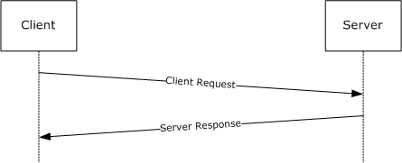
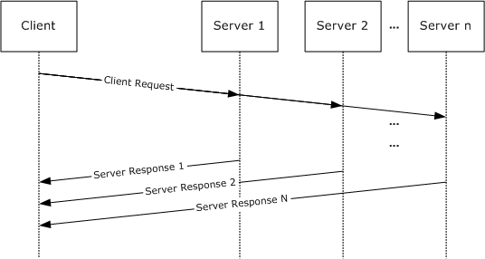
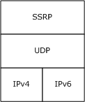
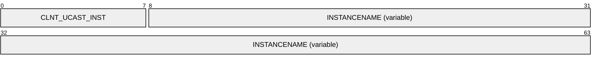
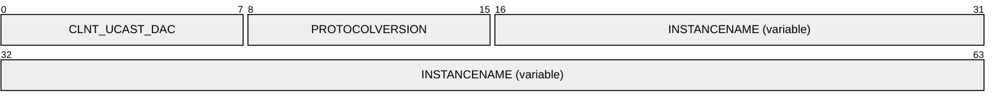
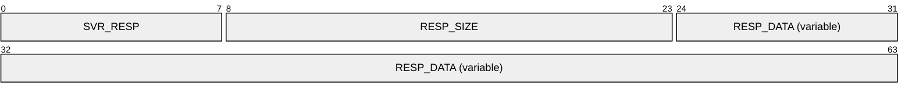
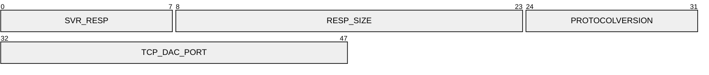
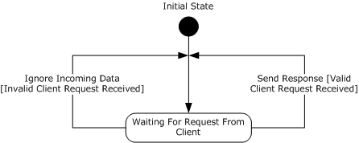
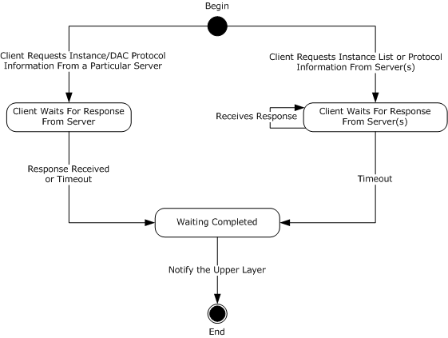

# [MC-SQLR]: SQL Server Resolution Protocol

Table of Contents

1 Introduction

- [1 Introduction](#Section_1)
  - [1.1 Glossary](#Section_1.1)
  - [1.2 References](#Section_1.2)
    - [1.2.1 Normative References](#Section_1.2.1)
    - [1.2.2 Informative References](#Section_1.2.2)
  - [1.3 Overview](#Section_1.3)
  - [1.4 Relationship to Other Protocols](#Section_1.4)
  - [1.5 Prerequisites/Preconditions](#Section_1.5)
  - [1.6 Applicability Statement](#Section_1.6)
  - [1.7 Versioning and Capability Negotiation](#Section_1.7)
  - [1.8 Vendor-Extensible Fields](#Section_1.8)
  - [1.9 Standards Assignments](#Section_1.9)

2 Messages

- [2 Messages](#Section_2)
  - [2.1 Transport](#Section_2.1)
  - [2.2 Message Syntax](#Section_2.2)
    - [2.2.1 CLNT_BCAST_EX](#Section_2.2.1)
    - [2.2.2 CLNT_UCAST_EX](#Section_2.2.2)
    - [2.2.3 CLNT_UCAST_INST](#Section_2.2.3)
    - [2.2.4 CLNT_UCAST_DAC](#Section_2.2.4)
    - [2.2.5 SVR_RESP](#Section_2.2.5)
    - [2.2.6 SVR_RESP (DAC)](#Section_2.2.6)

3 Protocol Details

- [3 Protocol Details](#Section_3)
  - [3.1 Server Details](#Section_3.1)
    - [3.1.1 Abstract Data Model](#Section_3.1.1)
    - [3.1.2 Timers](#Section_3.1.2)
    - [3.1.3 Initialization](#Section_3.1.3)
    - [3.1.4 Higher-Layer Triggered Events](#Section_3.1.4)
    - [3.1.5 Message Processing Events and Sequencing Rules](#Section_3.1.5)
      - [3.1.5.1 Initial State](#Section_3.1.5.1)
      - [3.1.5.2 Waiting For Request From Client](#Section_3.1.5.2)
    - [3.1.6 Timer Events](#Section_3.1.6)
    - [3.1.7 Other Local Events](#Section_3.1.7)
  - [3.2 Client Details](#Section_3.2)
    - [3.2.1 Abstract Data Model](#Section_3.2.1)
    - [3.2.2 Timers](#Section_3.2.2)
    - [3.2.3 Initialization](#Section_3.2.3)
    - [3.2.4 Higher-Layer Triggered Events](#Section_3.2.4)
    - [3.2.5 Message Processing Events and Sequencing Rules](#Section_3.2.5)
      - [3.2.5.1 Begin](#Section_3.2.5.1)
      - [3.2.5.2 Client Waits For Response From Server](#Section_3.2.5.2)
      - [3.2.5.3 Client Waits For Response From Server(s)](#Section_3.2.5.3)
      - [3.2.5.4 Waiting Completed](#Section_3.2.5.4)
      - [3.2.5.5 End](#Section_3.2.5.5)
    - [3.2.6 Timer Events](#Section_3.2.6)
    - [3.2.7 Other Local Events](#Section_3.2.7)

4 Protocol Examples

- [4 Protocol Examples](#Section_4)
  - [4.1 CLNT_UCAST_EX](#Section_4.1)
  - [4.2 CLNT_UCAST_INST](#Section_4.2)
  - [4.3 CLNT_UCAST_DAC](#Section_4.3)

5 Security

- [5 Security](#Section_5)
  - [5.1 Security Considerations for Implementers](#Section_5.1)
  - [5.2 Index of Security Parameters](#Section_5.2)

6 Appendix A: Product Behavior

- [6 Appendix A: Product Behavior](#Section_6)

7 Change Tracking

- [7 Change Tracking](#Section_7)

For the legal notice and IP terms, see [LEGAL.md](../LEGAL.md).
Last updated: 10/31/2025.
See [Revision History](#revision-history) for full version history.

# 1 Introduction

The SQL Server Resolution Protocol is an application-layer request/response protocol that facilitates connectivity to a database server. This protocol provides for the following:

- Communication [**endpoint**](#gt_endpoint) information; for example, the TCP port for connecting to a particular instance of the database server on a machine.
- Database instance enumeration.
Sections 1.5, 1.8, 1.9, 2, and 3 of this specification are normative. All other sections and examples in this specification are informative.

## 1.1 Glossary

This document uses the following terms:

**broadcast**: A style of resource location or data transmission in which a client makes a request to all parties on a network simultaneously (a one-to-many communication). Also, a mode of resource location that does not use a name service.

**database server discovery service**: A service that allows applications to discover the existence of database instances.

**dedicated administrator connection (DAC)**: A special TCP [**endpoint**](#gt_endpoint) that was introduced in Microsoft SQL Server 2005. DAC provides a special diagnostic connection for administrators when standard connections to the server are not possible.

**endpoint**: A client that is on a network and is requesting access to a network access server (NAS).

**Internet Protocol version 4 (IPv4)**: An Internet protocol that has 32-bit source and destination addresses. IPv4 is the predecessor of IPv6.

**Internet Protocol version 6 (IPv6)**: A revised version of the Internet Protocol (IP) designed to address growth on the Internet. Improvements include a 128-bit IP address size, expanded routing capabilities, and support for authentication and privacy.

**little-endian**: Multiple-byte values that are byte-ordered with the least significant byte stored in the memory location with the lowest address.

**multicast**: A style of resource location or a data transmission in which a client makes a request to specific parties on a network simultaneously.

**named pipe**: A named, one-way, or duplex pipe for communication between a pipe server and one or more pipe clients.

**Transmission Control Protocol (TCP)**: A protocol used with the Internet Protocol (IP) to send data in the form of message units between computers over the Internet. TCP handles keeping track of the individual units of data (called packets) that a message is divided into for efficient routing through the Internet.

**unicast**: A style of resource location or a data transmission in which a client makes a request to a single party.

**Virtual Interface Architecture (VIA)**: A high-speed interconnect that requires special hardware and drivers that are provided by third parties.

**MAY, SHOULD, MUST, SHOULD NOT, MUST NOT:** These terms (in all caps) are used as defined in [[RFC2119]](https://go.microsoft.com/fwlink/?LinkId=90317). All statements of optional behavior use either MAY, SHOULD, or SHOULD NOT.

## 1.2 References

Links to a document in the Microsoft Open Specifications library point to the correct section in the most recently published version of the referenced document. However, because individual documents in the library are not updated at the same time, the section numbers in the documents may not match. You can confirm the correct section numbering by checking the [Errata](https://go.microsoft.com/fwlink/?linkid=850906).

### 1.2.1 Normative References

We conduct frequent surveys of the normative references to assure their continued availability. If you have any issue with finding a normative reference, please contact [dochelp@microsoft.com](mailto:dochelp@microsoft.com). We will assist you in finding the relevant information.

[MS-UCODEREF] Microsoft Corporation, "[Windows Protocols Unicode Reference](../MS-UCODEREF/MS-UCODEREF.md)".

[RFC2119] Bradner, S., "Key words for use in RFCs to Indicate Requirement Levels", BCP 14, RFC 2119, March 1997, [https://www.rfc-editor.org/info/rfc2119](https://go.microsoft.com/fwlink/?LinkId=90317)

[RFC2460] Deering, S., and Hinden, R., "Internet Protocol, Version 6 (IPv6) Specification", RFC 2460, December 1998, [https://www.rfc-editor.org/info/rfc2460](https://go.microsoft.com/fwlink/?LinkId=90357)

[RFC4234] Crocker, D., Ed., and Overell, P., "Augmented BNF for Syntax Specifications: ABNF", RFC 4234, October 2005, [https://www.rfc-editor.org/info/rfc4234](https://go.microsoft.com/fwlink/?LinkId=90462)

[RFC768] Postel, J., "User Datagram Protocol", STD 6, RFC 768, August 1980, [https://www.rfc-editor.org/info/rfc768](https://go.microsoft.com/fwlink/?LinkId=90490)

[RFC791] Postel, J., Ed., "Internet Protocol: DARPA Internet Program Protocol Specification", RFC 791, September 1981, [https://www.rfc-editor.org/info/rfc791](https://go.microsoft.com/fwlink/?LinkId=392659)

[RFC793] Postel, J., Ed., "Transmission Control Protocol: DARPA Internet Program Protocol Specification", RFC 793, September 1981, [https://www.rfc-editor.org/info/rfc793](https://go.microsoft.com/fwlink/?LinkId=150872)

[VIA2002] Cameron, D., and Regnier, G., "The Virtual Interface Architecture", Intel Press, 2002, ISBN:0971288704.

### 1.2.2 Informative References

[MSDN-CS] Microsoft Corporation, "Character Sets", [https://learn.microsoft.com/en-us/windows/desktop/Intl/character-sets](https://go.microsoft.com/fwlink/?LinkId=90692)

[MSDN-DAC] Microsoft Corporation, "Diagnostic Connection for Database Administrators", [https://learn.microsoft.com/en-us/sql/database-engine/configure-windows/diagnostic-connection-for-database-administrators](https://go.microsoft.com/fwlink/?LinkId=95068)

[MSDN-NamedPipes] Microsoft Corporation, "Creating a Valid Connection String Using Named Pipes", [https://learn.microsoft.com/en-us/previous-versions/sql/sql-server-2008-r2/ms189307(v=sql.105)](https://go.microsoft.com/fwlink/?LinkId=127839)

[MSDN-NP] Microsoft Corporation, "Named Pipes", [https://learn.microsoft.com/en-us/windows/desktop/ipc/named-pipes](https://go.microsoft.com/fwlink/?LinkId=90247)

## 1.3 Overview

The SQL Server Resolution Protocol is a simple application-level protocol that is used for the transfer of requests and responses between clients and [**database server discovery services**](#gt_database-server-discovery-service). In such a system, the client either (i) sends a single request to a specific machine and expects a single response, or (ii) [**broadcasts**](#gt_broadcast) or [**multicasts**](#gt_multicast) a request to the network and expects zero or more responses from different discovery services on the network. The first case is used for the purpose of determining the communication [**endpoint**](#gt_endpoint) information of a particular database instance, whereas the second case is used for enumeration of database instances in the network and to obtain the endpoint information of each instance.

The SQL Server Resolution Protocol does not include any facilities for authentication, protection of data, or reliability. The SQL Server Resolution Protocol is always implemented on top of the UDP Transport Protocol [[RFC768]](https://go.microsoft.com/fwlink/?LinkId=90490).

In the case of endpoint determination for a single instance, the following diagram depicts a typical flow of communication.

Figure 1: Communication flow for single-instance endpoint discovery

Conversely, in the case of a broadcast/multicast request, the following diagram applies.

Figure 2: Communication flow for multiple-instance endpoint discovery

In the case of a broadcast or multicast request, the client does not necessarily know the number of responses that it can expect. As a result, it is reasonable for the client to enforce a time limitation during which it waits for responses. Because some servers might not respond quickly enough or might not receive the request (highly dependent on network topology), the broadcast/multicast request for multiple-instance endpoint information is considered nondeterministic.

## 1.4 Relationship to Other Protocols

The SQL Server Resolution Protocol (SSRP) depends on the UDP Transport Protocol to communicate with the database server machine or to [**broadcast**](#gt_broadcast)/[**multicast**](#gt_multicast) its request to the network. The types of addresses used can differ based on the underlying IP protocol version as described in section [2.1](#Section_2.1). For details about [**IPv4**](#gt_internet-protocol-version-4-ipv4), see [[RFC791]](https://go.microsoft.com/fwlink/?LinkId=392659). For details about [**IPv6**](#gt_internet-protocol-version-6-ipv6), see [[RFC2460]](https://go.microsoft.com/fwlink/?LinkId=90357).

Figure 3: Protocol relationship

## 1.5 Prerequisites/Preconditions

Unprohibited access to UDP port 1434 is required.

## 1.6 Applicability Statement

The SQL Server Resolution Protocol is appropriate for use to facilitate retrieval of database [**endpoint**](#gt_endpoint) information or for database instance enumeration in all scenarios where network or local connectivity is available.

## 1.7 Versioning and Capability Negotiation

This document covers versioning issues in the following areas:

- Supported transports: This protocol is implemented on top of UDP, as discussed in section [2.1](#Section_2.1).
- Protocol versions: The SQL Server Resolution Protocol supports the following explicit dialect: "SSRP 1.0", as defined in section [2.2](#Section_2.2).
- Security and authentication methods: The SQL Server Resolution Protocol does not provide or support any security or authentication methods.
- Localization: Localization-dependent protocol behavior is specified in sections 2.2 and [3.2.5](#Section_3.2.5).
- Capability negotiation: The SQL Server Resolution Protocol does not support negotiation of the dialect to use. Instead, an implementation can be configured with the dialect to use, as described later in this section.
No version or capability negotiation is supported by the SQL Server Resolution Protocol. For example, the client sends a request message to the server with the expectation that the server will understand the message and send back a response. If the server does not understand the message, the server ignores the request and does not send a response back to the client.

## 1.8 Vendor-Extensible Fields

None.

## 1.9 Standards Assignments

| Parameter | Value | Reference |
| --- | --- | --- |
| Microsoft-SQL-Monitor (ms-sql-m) | 1434/UDP | http://www.iana.com/assignments/port-numbers |

The client always sends its request to UDP port 1434 of the server or servers.

# 2 Messages

## 2.1 Transport

The SQL Server Resolution Protocol uses port 1434 of the UDP Protocol for message transport. When using the UDP Protocol over the [**IPv4**](#gt_internet-protocol-version-4-ipv4) Protocol, the SQL Server Resolution Protocol uses a [**unicast**](#gt_unicast) or broadcast address, depending on the message type, as specified in section [2.2](#Section_2.2). When using the UDP Protocol over the [**IPv6**](#gt_internet-protocol-version-6-ipv6) Protocol, the SQL Server Resolution Protocol uses a unicast or [**multicast**](#gt_multicast) address, depending on the message type, as specified in section 2.2.

## 2.2 Message Syntax

All integer fields are represented in [**little-endian**](#gt_little-endian) format. All text strings are represented as a multibyte character set (MBCS) string [MS-UCODEREF](../MS-UCODEREF/MS-UCODEREF.md) on the current system code page of the server and the client. (The system code page on the client and the system code page on the server are assumed to be common.) They are not case-sensitive. See [[MSDN-CS]](https://go.microsoft.com/fwlink/?LinkId=90692) for more information.

The valid requests from the client are as follows:

- [CLNT_BCAST_EX](#Section_2.2.1)
- [CLNT_UCAST_EX](#Section_4.1)
- [CLNT_UCAST_INST](#Section_4.2)
- [CLNT_UCAST_DAC](#Section_4.3)
The response from the server is always an [SVR_RESP](#Section_2.2.5) message. The response contains a string data field that is parsed by the client to extract the requested information. The contents of this string are not case-sensitive.

These messages are explained in more detail in the following sections.

### 2.2.1 CLNT_BCAST_EX

The CLNT_BCAST_EX packet is a [**broadcast**](#gt_broadcast) or [**multicast**](#gt_multicast) request that is generated by clients that are trying to identify the list of database instances on the network and their network protocol connection information.

**CLNT_BCAST_EX (1 byte):** A single byte whose value MUST be 0x02.

### 2.2.2 CLNT_UCAST_EX

The CLNT_UCAST_EX packet is a [**unicast**](#gt_unicast) request that is generated by clients that are trying to identify the list of database instances and their network protocol connection information installed on a single machine. The client generates a UDP packet with a single byte, as shown in the following diagram.

**CLNT_UCAST_EX (1 byte):** A single byte whose value MUST be 0x03.

### 2.2.3 CLNT_UCAST_INST

The CLNT_UCAST_INST packet is a request for information related to a specific instance. The structure of the request is as follows.

**CLNT_UCAST_INST (1 byte):** A single byte whose value MUST be 0x04.

**INSTANCENAME (variable):** A variable-length null-terminated multibyte character set (MBCS) string that does not need to be byte-aligned. It MUST be no greater than 32 bytes in length, not including the null terminator.

**Note**

- INSTANCENAME corresponds to the name of the database instance for which the information is requested.

### 2.2.4 CLNT_UCAST_DAC

The CLNT_UCAST_DAC packet request is used to determine the [**TCP**](#gt_transmission-control-protocol-tcp) [[RFC793]](https://go.microsoft.com/fwlink/?LinkId=150872) port on which the Microsoft SQL Server [**dedicated administrator connection (DAC)**](#gt_dedicated-administrator-connection-dac) [[MSDN-DAC]](https://go.microsoft.com/fwlink/?LinkId=95068) [**endpoint**](#gt_endpoint) is listening.

**CLNT_UCAST_DAC (1 byte):** A single byte whose value MUST be 0x0F.

**PROTOCOLVERSION (1 byte):** A single byte whose value MUST be 0x01.

**INSTANCENAME (variable):** A variable-length null-terminated multibyte character set (MBCS) string that does not need to be byte-aligned. It MUST be no greater than 32 bytes in length, not including the null terminator.

### 2.2.5 SVR_RESP

The server responds to all client requests with an SVR_RESP. There is a slight variation in the message format for a response to a [CLNT_UCAST_DAC (section 2.2.4)](#Section_2.2.4) request, as described in section [2.2.6](#Section_2.2.6).

**SVR_RESP (1 byte):** A single byte whose value MUST be 0x05.

**RESP_SIZE (2 bytes):** This unsigned integer specifies the length, in bytes, of subsequent response data **RESP_DATA**.

**RESP_DATA (variable):** A variable-length MBCS string that does not need to be byte-aligned. The maximum size of **RESP_DATA** MUST be 1,024 bytes if the server is responding to a [CLNT_UCAST_INST (section 2.2.3)](#Section_2.2.3) request. If the server is responding to a [CLNT_BCAST_EX (section 2.2.1)](#Section_2.2.1) or a [CLNT_UCAST_EX (section 2.2.2)](#Section_2.2.2) request, the maximum size of **RESP_DATA** MUST be 65,535 bytes.

**Note**

- The content of the **RESP_DATA** string corresponds to the type of request received. For example, a CLNT_UCAST_EX request is answered with a CLNT_UCAST_EX response string. The formal syntax of the message is provided in Augmented Backus-Naur Form (ABNF), as specified in [[RFC4234]](https://go.microsoft.com/fwlink/?LinkId=90462).
- All responses to client requests contain information about one or more of the following transports:
- [**TCP**](#gt_transmission-control-protocol-tcp) [[RFC793]](https://go.microsoft.com/fwlink/?LinkId=150872)
- [**Named Pipes**](#gt_named-pipe) in message mode [[MSDN-NP]](https://go.microsoft.com/fwlink/?LinkId=90247). See [[MSDN-NamedPipes]](https://go.microsoft.com/fwlink/?LinkId=127839) for additional information related to Microsoft-specific implementations.
- A reliable transport over the [**Virtual Interface Architecture (VIA)**](#gt_virtual-interface-architecture-via) interface [VIA2002].
RESP_DATA = CLNT_BCAST_EX_RESPONSE / CLNT_UCAST_EX_RESPONSE / CLNT_UCAST_INST_RESPONSE

CLNT_BCAST_EX_RESPONSE = CLNT_UCAST_EX_RESPONSE

CLNT_UCAST_EX_RESPONSE = *[CLNT_UCAST_INST_RESPONSE]

CLNT_UCAST_INST_RESPONSE = "ServerName" SEMICOLON SERVERNAME SEMICOLON

"InstanceName" SEMICOLON INSTANCENAME SEMICOLON "IsClustered"

SEMICOLON YES_OR_NO SEMICOLON "Version" SEMICOLON VERSION_STRING

[NP_INFO] [TCP_INFO] [VIA_INFO] [RPC_INFO] [SPX_INFO] [ADSP_INFO]

[BV_INFO] SEMICOLON SEMICOLON ; see Note 1

| Name | Value |
| --- | --- |
| SEMICOLON | SEMICOLON = ";" |
| SERVERNAME | The name of the server. The SERVERNAME MUST be no greater than 255 bytes. |
| INSTANCENAME | A text string that represents the name of the server instance being described. The INSTANCENAME MUST be no greater than 255 bytes but SHOULD be no greater than 16 MBCS characters. |
| YES_OR_NO | YES_OR_NO= "Yes" / "No" |
| VERSION_STRING | A text string that conveys the version of the server instance. The VERSION_STRING MUST be no greater than 16 bytes. VERSION_STRING MUST NOT be empty and MUST appear as follows: VERSION_STRING=1*[0-9"."] |
| NP_INFO | NP_INFO=SEMICOLON "np" SEMICOLON NP_PARAMETERS |
| NP_PARAMETERS | NP_PARAMETERS=PIPENAME |
| PIPENAME | A text string that represents the pipe name [MSDN-NP]. |
| TCP_INFO | TCP_INFO=SEMICOLON "tcp" SEMICOLON TCP_PARAMETERS |
| TCP_PARAMETERS | TCP_PARAMETERS = TCP_PORT |
| TCP_PORT | A text string that represents the decimal value of the TCP port that is used to connect to the requested server instance. TCP_PORT SHOULD be a valid TCP port as specified in [RFC793]; see Note 2. |
| VIA_INFO | VIA_INFO=SEMICOLON "via" SEMICOLON VIA_PARAMETERS; see Note 3. |
| VIA_PARAMETERS | VIA_PARAMETERS=NETBIOS VIALISTENINFO |
| VIALISTENINFO | VIALISTENINFO =1*["," VIANIC ":" VIAPORT]. |
| VIANIC | A text string that represents the VIA network interface card (NIC) identifier. VIANIC SHOULD be a valid VIA Adapter NIC number [VIA2002]. |
| VIAPORT | A text string that represents the decimal value of the VIA NIC's port. VIAPORT SHOULD be a valid VIA Adapter port number [VIA2002]. |
| NETBIOS | A text string that MUST be no greater than 15 bytes and that represents the NetBIOS name of a machine where the server resides. |
| RPC_INFO | SEMICOLON "rpc" SEMICOLON RPC_PARAMETERS |
| RPC_PARAMETERS | RPC_PARAMETERS=COMPUTERNAME |
| COMPUTERNAME | The name of the computer to connect to. SHOULD be no more than 127 MBCS characters. |
| SPX_INFO | SPX_INFO=SEMICOLON "spx" SEMICOLON SPX_PARAMETERS |
| SPX_PARAMETERS | SPX_PARAMETERS=SERVICENAME |
| SERVICENAME | The SPX service name of the server. MUST NOT be greater than 1,024 bytes and SHOULD be no more than 127 MBCS characters. |
| ADSP_INFO | ADSP_INFO=SEMICOLON "adsp" SEMICOLON ADSP_PARAMETERS |
| ADSP_PARAMETERS | ADSP_PARAMETERS=ADSPOBJECTNAME |
| ADSPOBJECTNAME | The AppleTalk service object name. SHOULD be no more than 127 MBCS characters. |
| BV_INFO | BV_INFO=SEMICOLON "bv" SEMICOLON ITEMNAME SEMICOLON GROUPNAME SEMICOLON BV_PARAMETERS |
| BV_PARAMETERS | BV_PARAMETERS=ITEMNAME SEMICOLON GROUPNAME SEMICOLON ORGNAME |
| ITEMNAME | The Banyan VINES item name. SHOULD be no more than 127 MBCS characters. |
| GROUPNAME | The Banyan VINES group name. SHOULD be no more than 127 MBCS characters. |
| ORGNAME | The Banyan VINES organization name. SHOULD be no more than 127 MBCS characters. |

**Note**

- NP_INFO, TCP_INFO, VIA_INFO, RPC_INFO, SPX_INFO, ADSP_INFO, and BV_INFO<1> can be listed in any order, and each token that is listed MUST NOT be listed more than one time. Multiple protocols can be sent in the response. The TCP_PORT in TCP_INFO MUST be in the range defined by [RFC793].
- VIA_INFO SHOULD cumulatively be no greater than 128 bytes.
- The size of the SQL Server Resolution Protocol response MUST be no greater than 1,024 bytes per instance.

### 2.2.6 SVR_RESP (DAC)

The format of the SVR_RESP is different for a [CLNT_UCAST_DAC](#Section_4.3) request only.

**SVR_RESP (1 byte):** A single byte whose value MUST be 0x05.

**RESP_SIZE (2 bytes):** This unsigned integer specifies the length of the entire response packet, in bytes. The value of this field MUST be 0x06.

**PROTOCOLVERSION (1 byte):** A single byte whose value MUST be 0x01.

**TCP_DAC_PORT (2 bytes):** The value of the [**TCP**](#gt_transmission-control-protocol-tcp) port number that is used for [**DAC**](#gt_dedicated-administrator-connection-dac).

**Note**

- All responses to client requests contain information about the following transport:
- TCP [[RFC793]](https://go.microsoft.com/fwlink/?LinkId=150872)

# 3 Protocol Details

This section describes the important elements of the client software and the server software necessary to support the SQL Server Resolution Protocol.

As described in section [1.3](#Section_1.3), the SQL Server Resolution Protocol is an application-level protocol that is used to query information regarding database instances on one or more servers. The protocol defines a limited set of messages through which the client can make a request to the server or servers. The SQL Server Resolution Protocol involves a single request and a single response from one or more servers. The response contains instance-specific values provided by the higher layer.

## 3.1 Server Details

The following state machine diagram describes the server side of the SQL Server Resolution Protocol.

Figure 4: SQL Server Resolution Protocol server state machine

### 3.1.1 Abstract Data Model

None.

### 3.1.2 Timers

None.

### 3.1.3 Initialization

The SQL Server Resolution Protocol does not perform any initialization on the server side. A UDP socket that is listening on port 1434 is assumed to have been created by the higher layer.

### 3.1.4 Higher-Layer Triggered Events

None.

### 3.1.5 Message Processing Events and Sequencing Rules

Because the SQL Server Resolution Protocol provides a single response per server for each client request, no sequencing issues occur with this protocol.

#### 3.1.5.1 Initial State

In the "Initial State", the initialization found in section [3.1.3](#Section_3.1.3) is assumed to have taken place. Upon success, the server MUST immediately enter the "Waiting For Request From Client" state.

#### 3.1.5.2 Waiting For Request From Client

In the "Waiting For Request From Client" state, the server listens on UDP port 1434 for an incoming request. If the request is valid and understood, the server immediately sends an [SVR_RESP](#Section_2.2.5) response back to the client. The data content of the response depends on the request type.

- For [CLNT_BCAST_EX](#Section_2.2.1) and [CLNT_UCAST_EX](#Section_4.1), the server returns information about all available instances. The information about all available instances is provided by the higher layer.
- For [CLNT_UCAST_INST](#Section_4.2), the server returns information about the specified instance only (if available). The information about the specified instance is provided by the higher layer.
- For [CLNT_UCAST_DAC](#Section_4.3), the server returns information about the [**dedicated administrator connection (DAC)**](#gt_dedicated-administrator-connection-dac) only.
The response SHOULD include information for a particular protocol as long as the aggregate information for the instance fits within the 1,024 bytes limit. If the information for a protocol would cause the total information for all protocols to exceed 1,024 bytes—for example, trying to add a 500-byte pipe name when 800 bytes of response data have already been collected—the information for this protocol SHOULD not be sent. The information for the next protocol (if any) SHOULD be included in the response (assuming that it does not cause the response to exceed the 1,024 bytes limit). Furthermore, the server SHOULD NOT include a protocol and its information if no valid information is available. For example, if the [**TCP**](#gt_transmission-control-protocol-tcp) port is invalid, TCP would not be included in the response. The SQL Server Resolution Protocol SHOULD NOT verify the length or content of the **PIPENAME** field, which is provided by the higher layer. It is the upper layer's responsibility to ensure that **PIPENAME** conforms to the specification of a valid pipe name [[MSDN-NP]](https://go.microsoft.com/fwlink/?LinkId=90247).

If the request is received on an [**IPv4**](#gt_internet-protocol-version-4-ipv4) socket, the response provides the instance's port that is associated with an IPv4 address, and likewise for [**IPv6**](#gt_internet-protocol-version-6-ipv6).

If the request is not valid, not understood, or if there is no instance for which it can send back [**endpoint**](#gt_endpoint) information, the server MUST ignore the request. The server MUST then enter the "Waiting For Request From Client" state.

### 3.1.6 Timer Events

None.

### 3.1.7 Other Local Events

None.

## 3.2 Client Details

The following state machine diagram describes the client side of the SQL Server Resolution Protocol.

Figure 5: SQL Server Resolution Protocol client state machine

### 3.2.1 Abstract Data Model

This section describes a conceptual model of possible data organization that an implementation maintains to participate in this protocol. The described organization is provided to facilitate the explanation of how the protocol behaves. This document does not mandate that implementations adhere to this model provided that their external behavior is consistent with that described in this document.

A SQL Server Resolution Protocol client does not need to maintain any state data except for the knowledge of the request sent to the server.

### 3.2.2 Timers

The SQL Server Resolution Protocol client MUST implement a timer for the amount of time to wait for an [SVR_RESP](#Section_2.2.5) message from the server when a [CLNT_UCAST_INST](#Section_4.2) or [CLNT_UCAST_DAC](#Section_4.3) request is sent. The timer mechanism that is used is implementation-specific but SHOULD<2> have a time-out value of 1 second.

The SQL Server Resolution Protocol client MUST implement a timer for the amount of time to wait for SVR_RESP messages from servers in the network after a [CLNT_UCAST_EX](#Section_4.1) or [CLNT_BCAST_EX](#Section_2.2.1) request is sent. The timer mechanism that is used is implementation-specific.<3>

### 3.2.3 Initialization

The SQL Server Resolution Protocol does not perform any initialization on the client side. A UDP socket is assumed to be created prior to requesting that a SQL Server Resolution Protocol request be sent.

### 3.2.4 Higher-Layer Triggered Events

The SQL Server Resolution Protocol client implementation MUST support the following event from the higher layer:

- Send client request to server or servers. The type of request dictates if the message is sent to a specific machine or [**broadcast**](#gt_broadcast)/[**multicast**](#gt_multicast) to the network. The higher layer has to have already created a UDP socket prior to triggering the SQL Server Resolution Protocol client to send a request message. After the message is sent, the timer MUST be started.
The higher layer is responsible for closing the UDP socket after the response is received or a time-out situation has occurred.

### 3.2.5 Message Processing Events and Sequencing Rules

Because the SQL Server Resolution Protocol provides a single response per server for each client request, no sequencing issues occur with this protocol.

#### 3.2.5.1 Begin

In the "Begin" state, the client awaits a request from the higher layer. After a request from the higher layer is made, the client sends a request to the server or servers. The request type determines what state the client enters next.

If the client sends a [CLNT_UCAST_INST](#Section_4.2) or [CLNT_UCAST_DAC](#Section_4.3) request to the server, the client MUST then enter the "Client Waits For Response From Server" state. If the client sends a [CLNT_UCAST_EX](#Section_4.1) or [CLNT_BCAST_EX](#Section_2.2.1) request to a server or servers, the client MUST then enter the "Client Waits For Response From Server(s)" state.

#### 3.2.5.2 Client Waits For Response From Server

In the "Client Waits For Response From Server" state, the client waits either for a time-out to occur or for the results of a request to return. As soon as either occurs, the client MUST enter the "Waiting Completed" state.

The details of the timer are outlined in section [3.2.2](#Section_3.2.2).

#### 3.2.5.3 Client Waits For Response From Server(s)

In the "Client Waits For Response From Server(s)" state, the client waits for responses up until the time-out expires. If the client receives an invalid message, it MUST ignore the message and continue listening for additional responses until the time-out period elapses. The client then MUST enter the "Waiting Completed" state.

For purposes of this section, invalid messages are defined as messages that do not follow the prescribed message format that is outlined in section [2](#Section_2) or defined as an unexpected [SVR_RESP](#Section_2.2.5) messages type.

The details of the timer are outlined in section [3.2.2](#Section_3.2.2).

#### 3.2.5.4 Waiting Completed

The client's actions upon entering the "Waiting Completed" state are determined by the client message type to which the server is responding.

[CLNT_UCAST_DAC](#Section_4.3): The client MUST notify the higher layer of the valid and properly formatted [SVR_RESP](#Section_2.2.5) (DAC) messages or notify the higher layer if it received an invalid message. After this, the client MUST enter the "End" state.

[CLNT_BCAST_EX](#Section_2.2.1): The client MUST notify the higher layer of the valid and properly formatted SVR_RESP messages. The client SHOULD buffer all responses until the timer has timed out. It MUST then pass the information to the higher layer. The client MUST ignore the invalid messages and does not notify the higher layer regarding these messages. After this, the client MUST enter the "End" state.

[CLNT_UCAST_EX](#Section_4.1): The client MUST notify the higher layer of the valid and properly formatted SVR_RESP messages or notify the higher layer if it received an invalid message. After this, the client MUST enter the "End" state. Although the server’s maximum RESP_DATA size for a SVR_RESP message is 65,535 bytes, the client MAY consider a SVR_RESP message improperly formatted if the RESP_DATA field exceeds a value set by the client that is smaller than 65,535 bytes.<4>

[CLNT_UCAST_INST](#Section_4.2): The client MUST notify the higher layer of the valid and properly formatted SVR_RESP messages or notify the higher layer if it received an invalid message. After this, the client MUST enter the "End" state. A SRV_RESP message SHOULD NOT be considered properly formatted if the cumulative length of the parameters of any transport protocol included in the response is more than 255 bytes (in other words, a SRV_RESP message SHOULD NOT be considered properly formatted if it contains an NP_PARAMETERS, TCP_PARAMETERS, VIA_PARAMETERS, RPC_PARAMETERS, SPX_PARAMETERS, ADSP_PARAMETERS, or BV_PARAMETERS token whose length is more than 255 bytes).

#### 3.2.5.5 End

The client has completed the request.

### 3.2.6 Timer Events

When the timer for the response to a [**broadcast**](#gt_broadcast) or [**multicast**](#gt_multicast) request expires, the client MUST enter the "Waiting Completed" state.

### 3.2.7 Other Local Events

None.

# 4 Protocol Examples

The following are examples of the binary representation of various client requests and the responses from the server.

## 4.1 CLNT_UCAST_EX

Request:

03

Response:

05 47 01 53 65 72 76 65 72 4e 61 6d 65 3b 49 4c | .G.ServerName;IL

53 55 4e 47 31 3b 49 6e 73 74 61 6e 63 65 4e 61 | SUNG1;InstanceNa

6d 65 3b 59 55 4b 4f 4e 53 54 44 3b 49 73 43 6c | me;YUKONSTD;IsCl

75 73 74 65 72 65 64 3b 4e 6f 3b 56 65 72 73 69 | ustered;No;Versi

6f 6e 3b 39 2e 30 30 2e 31 33 39 39 2e 30 36 3b | on;9.00.1399.06;

74 63 70 3b 35 37 31 33 37 3b 3b 53 65 72 76 65 | tcp;57137;;Serve

72 4e 61 6d 65 3b 49 4c 53 55 4e 47 31 3b 49 6e | rName;ILSUNG1;In

73 74 61 6e 63 65 4e 61 6d 65 3b 59 55 4b 4f 4e | stanceName;YUKON

44 45 56 3b 49 73 43 6c 75 73 74 65 72 65 64 3b | DEV;IsClustered;

4e 6f 3b 56 65 72 73 69 6f 6e 3b 39 2e 30 30 2e | No;Version;9.00.

31 33 39 39 2e 30 36 3b 6e 70 3b 5c 5c 49 4c 53 | 1399.06;np;\\ILS

55 4e 47 31 5c 70 69 70 65 5c 4d 53 53 51 4c 24 | UNG1\pipe\MSSQL$

59 55 4b 4f 4e 44 45 56 5c 73 71 6c 5c 71 75 65 | YUKONDEV\sql\que

72 79 3b 3b 53 65 72 76 65 72 4e 61 6d 65 3b 49 | ry;;ServerName;I

4c 53 55 4e 47 31 3b 49 6e 73 74 61 6e 63 65 4e | LSUNG1;InstanceN

61 6d 65 3b 4d 53 53 51 4c 53 45 52 56 45 52 3b | ame;MSSQLSERVER;

49 73 43 6c 75 73 74 65 72 65 64 3b 4e 6f 3b 56 | IsClustered;No;V

65 72 73 69 6f 6e 3b 39 2e 30 30 2e 31 33 39 39 | ersion;9.00.1399

2e 30 36 3b 74 63 70 3b 31 34 33 33 3b 6e 70 3b | .06;tcp;1433;np;

5c 5c 49 4c 53 55 4e 47 31 5c 70 69 70 65 5c 73 | \\ILSUNG1\pipe\s

71 6c 5c 71 75 65 72 79 3b 3b | ql\query;;

The response conveys the instance information for three instances named "YUKONSTD", "YUKONDEV", and "MSSQLSERVER".

## 4.2 CLNT_UCAST_INST

Request:

04 59 55 4b 4f 4e 53 54 44 00 | .YUKONSTD

The request is for information for an instance named "YUKONSTD".

Response:

05 58 00 53 65 72 76 65 72 4e 61 6d 65 3b 49 4c | .X.ServerName;IL

53 55 4e 47 31 3b 49 6e 73 74 61 6e 63 65 4e 61 | SUNG1;InstanceNa

6d 65 3b 59 55 4b 4f 4e 53 54 44 3b 49 73 43 6c | me;YUKONSTD;IsCl

75 73 74 65 72 65 64 3b 4e 6f 3b 56 65 72 73 69 | ustered;No;Versi

6f 6e 3b 39 2e 30 30 2e 31 33 39 39 2e 30 36 3b | on;9.00.1399.06;

74 63 70 3b 35 37 31 33 37 3b 3b | tcp;57137;;

## 4.3 CLNT_UCAST_DAC

Request:

0f 01 59 55 4b 4f 4e 53 54 44 00 | ..YUKONSTD

The request is for the [**DAC**](#gt_dedicated-administrator-connection-dac) port of an instance named "YUKONSTD".

Response:

05 06 00 01 32 df | ....2

The port number is 0xDF32 or 57138.

# 5 Security

## 5.1 Security Considerations for Implementers

No security considerations are associated with the SQL Server Resolution Protocol.

## 5.2 Index of Security Parameters

None.

# 6 Appendix A: Product Behavior

The information in this specification is applicable to the following Microsoft products or supplemental software. References to product versions include updates to those products.

- Microsoft SQL Server 2000
- Microsoft SQL Server 2005
- Microsoft SQL Server 2008
- Microsoft SQL Server 2008 R2
- Microsoft SQL Server 2012
- Microsoft SQL Server 2014
- Microsoft SQL Server 2016
- Microsoft SQL Server 2017
- Microsoft SQL Server 2019
- Microsoft SQL Server 2022
- Microsoft SQL Server 2025
- Windows XP operating system
- Windows Server 2003 operating system
- Windows Vista operating system
- Windows Server 2008 operating system
- Windows 7 operating system
- Windows Server 2008 R2 operating system
- Windows 8 operating system
- Windows Server 2012 operating system
- Windows 8.1 operating system
- Windows Server 2012 R2 operating system
- Windows 10 operating system
- Windows Server 2016 operating system
- Windows Server operating system
- Windows Server 2019 operating system
- Windows Server 2022 operating system
- Windows 11 operating system
- Windows Server 2025 operating system
Exceptions, if any, are noted in this section. If an update version, service pack or Knowledge Base (KB) number appears with a product name, the behavior changed in that update. The new behavior also applies to subsequent updates unless otherwise specified. If a product edition appears with the product version, behavior is different in that product edition.

Unless otherwise specified, any statement of optional behavior in this specification that is prescribed using the terms "SHOULD" or "SHOULD NOT" implies product behavior in accordance with the SHOULD or SHOULD NOT prescription. Unless otherwise specified, the term "MAY" implies that the product does not follow the prescription.

<1> Section 2.2.5: The information for an instance of Microsoft SQL Server can include the RPC_INFO, SPX_INFO, ADSP_INFO, and BV_INFO tokens only if the version of the SQL Server instance is SQL Server 2000. SQL Server 2000 Browser, SQL Server 2005 Browser, SQL Server 2008 Browser, and SQL Server 2008 R2 Browser support sending information about instances of SQL Server 2000 and will send these tokens.

<2> Section 3.2.2: Windows implements the timers for these two messages as follows:

For the [CLNT_UCAST_INST](#Section_4.2) request:

Windows implementations that use Microsoft Data Access Components (MDAC) or Windows Data Access Components (Windows DAC) time out if no response is received within 1 second. If a valid response is received within 1 second, the response is passed to the higher layer. If the response is not valid, the process is repeated.

Windows implementations that use Microsoft SQL Server Native Client time out if no response is received within 1 second. If a valid response is received within 1 second, the response is immediately passed to the higher layer. If the response is not valid, an error is passed to the higher layer.

For the [CLNT_UCAST_DAC](#Section_4.3) request:

Windows implementations that use MDAC or Windows DAC do not support this request.

Windows implementations that use SQL Server Native Client time out if no response is received within 1 second. If a valid response is received within 1 second, the response is immediately passed to the higher layer. If the response is not valid, an error is passed to the higher layer.

<3> Section 3.2.2: Windows implements the timers for these two messages as follows:

For the [CLNT_UCAST_EX](#Section_4.1) request:

Windows implementations that use Microsoft Data Access Components (MDAC) or Windows Data Access Components (Windows DAC) time out if no response is received within 0.5 second. If a valid response is received, it is appended to the results. If the response is not valid, it is discarded. The process is repeated until a time-out occurs.

Windows implementations that use SQL Server Native Client time out if no response is received within the lesser of 5 seconds or the specified logon time-out (the default logon time-out is 15 seconds.) If a valid response is received, it is appended to the results. If the response is not valid, it is discarded. The process is repeated for a maximum time period of the lesser of 5 seconds or the specified logon time-out.

For the [CLNT_BCAST_EX](#Section_2.2.1) request:

Windows implementations that use MDAC or Windows DAC time out if no response is received within 0.5 second. If a valid response is received, it is appended to the results. If the response is not valid, it is discarded. The process is repeated until a time-out occurs. There is no maximum time-out limit.

Windows implementations that use SQL Server Native Client time out if no response is received within 5 seconds and then each 1 second up to 15 seconds or to the specified logon time-out, if valid responses are not received within each respective interval. If valid responses are received, they are appended to the results; however, invalid responses are discarded. The default logon time-out is 15 seconds.

<4> Section 3.2.5.4: Microsoft clients, such as Microsoft Data Access Components (MDAC), Windows Data Access Components (Windows DAC), or SQL Server Native Client, consider a SVR_RESP message to a CLNT_UCAST_EX type request to be improperly formatted if the RESP_DATA field is more than 4,096 bytes.

# 7 Change Tracking

This section identifies changes that were made to this document since the last release. Changes are classified as Major, Minor, or None.

The revision class **Major** means that the technical content in the document was significantly revised. Major changes affect protocol interoperability or implementation. Examples of major changes are:

- A document revision that incorporates changes to interoperability requirements.
- A document revision that captures changes to protocol functionality.
The revision class **Minor** means that the meaning of the technical content was clarified. Minor changes do not affect protocol interoperability or implementation. Examples of minor changes are updates to clarify ambiguity at the sentence, paragraph, or table level.

The revision class **None** means that no new technical changes were introduced. Minor editorial and formatting changes may have been made, but the relevant technical content is identical to the last released version.

The changes made to this document are listed in the following table. For more information, please contact [dochelp@microsoft.com](mailto:dochelp@microsoft.com).

| Section | Description | Revision class |
| --- | --- | --- |
| [6](#Section_6) Appendix A: Product Behavior | Added SQL Server 2025 to the product applicability list. | Major |

## Revision History

| Date | Version | Revision Class | Comments |
| --- | --- | --- | --- |
| 8/10/2007 | 0.1 | Major | Initial Availability |
| 9/28/2007 | 0.2 | Minor | Clarified the meaning of the technical content. |
| 10/23/2007 | 0.2.1 | Editorial | Changed language and formatting in the technical content. |
| 11/30/2007 | 0.2.2 | Editorial | Changed language and formatting in the technical content. |
| 1/25/2008 | 0.2.3 | Editorial | Changed language and formatting in the technical content. |
| 3/14/2008 | 0.3 | Minor | Clarified the meaning of the technical content. |
| 5/16/2008 | 0.3.1 | Editorial | Changed language and formatting in the technical content. |
| 6/20/2008 | 0.4 | Minor | Clarified the meaning of the technical content. |
| 7/25/2008 | 0.5 | Minor | Clarified the meaning of the technical content. |
| 8/29/2008 | 0.5.1 | Editorial | Changed language and formatting in the technical content. |
| 10/24/2008 | 0.5.2 | Editorial | Changed language and formatting in the technical content. |
| 12/5/2008 | 0.6 | Minor | Clarified the meaning of the technical content. |
| 1/16/2009 | 0.6.1 | Editorial | Changed language and formatting in the technical content. |
| 2/27/2009 | 1.0 | Major | Updated and revised the technical content. |
| 4/10/2009 | 1.0.1 | Editorial | Changed language and formatting in the technical content. |
| 5/22/2009 | 1.1 | Minor | Clarified the meaning of the technical content. |
| 7/2/2009 | 1.1.1 | Editorial | Changed language and formatting in the technical content. |
| 8/14/2009 | 1.1.2 | Editorial | Changed language and formatting in the technical content. |
| 9/25/2009 | 1.2 | Minor | Clarified the meaning of the technical content. |
| 11/6/2009 | 1.3 | Minor | Clarified the meaning of the technical content. |
| 12/18/2009 | 1.3.1 | Editorial | Changed language and formatting in the technical content. |
| 1/29/2010 | 1.4 | Minor | Clarified the meaning of the technical content. |
| 3/12/2010 | 1.4.1 | Editorial | Changed language and formatting in the technical content. |
| 4/23/2010 | 1.5 | Minor | Clarified the meaning of the technical content. |
| 6/4/2010 | 1.6 | Minor | Clarified the meaning of the technical content. |
| 7/16/2010 | 1.6 | None | No changes to the meaning, language, or formatting of the technical content. |
| 8/27/2010 | 1.6 | None | No changes to the meaning, language, or formatting of the technical content. |
| 10/8/2010 | 2.0 | Major | Updated and revised the technical content. |
| 11/19/2010 | 2.0 | None | No changes to the meaning, language, or formatting of the technical content. |
| 1/7/2011 | 3.0 | Major | Updated and revised the technical content. |
| 2/11/2011 | 4.0 | Major | Updated and revised the technical content. |
| 3/25/2011 | 5.0 | Major | Updated and revised the technical content. |
| 5/6/2011 | 5.0 | None | No changes to the meaning, language, or formatting of the technical content. |
| 6/17/2011 | 5.1 | Minor | Clarified the meaning of the technical content. |
| 9/23/2011 | 5.2 | Minor | Clarified the meaning of the technical content. |
| 12/16/2011 | 6.0 | Major | Updated and revised the technical content. |
| 3/30/2012 | 6.0 | None | No changes to the meaning, language, or formatting of the technical content. |
| 7/12/2012 | 7.0 | Major | Updated and revised the technical content. |
| 10/25/2012 | 7.0 | None | No changes to the meaning, language, or formatting of the technical content. |
| 8/8/2013 | 8.0 | Major | Updated and revised the technical content. |
| 11/14/2013 | 8.0 | None | No changes to the meaning, language, or formatting of the technical content. |
| 2/13/2014 | 9.0 | Major | Updated and revised the technical content. |
| 5/15/2014 | 9.0 | None | No changes to the meaning, language, or formatting of the technical content. |
| 6/30/2015 | 10.0 | Major | Significantly changed the technical content. |
| 10/16/2015 | 10.0 | None | No changes to the meaning, language, or formatting of the technical content. |
| 5/10/2016 | 11.0 | Major | Significantly changed the technical content. |
| 7/14/2016 | 11.0 | None | No changes to the meaning, language, or formatting of the technical content. |
| 6/1/2017 | 11.0 | None | No changes to the meaning, language, or formatting of the technical content. |
| 8/16/2017 | 12.0 | Major | Significantly changed the technical content. |
| 9/15/2017 | 13.0 | Major | Significantly changed the technical content. |
| 9/12/2018 | 14.0 | Major | Significantly changed the technical content. |
| 10/16/2019 | 15.0 | Major | Significantly changed the technical content. |
| 4/7/2021 | 16.0 | Major | Significantly changed the technical content. |
| 6/25/2021 | 17.0 | Major | Significantly changed the technical content. |
| 11/1/2022 | 18.0 | Major | Significantly changed the technical content. |
| 4/23/2024 | 19.0 | Major | Significantly changed the technical content. |
| 10/31/2025 | 20.0 | Major | Significantly changed the technical content. |
