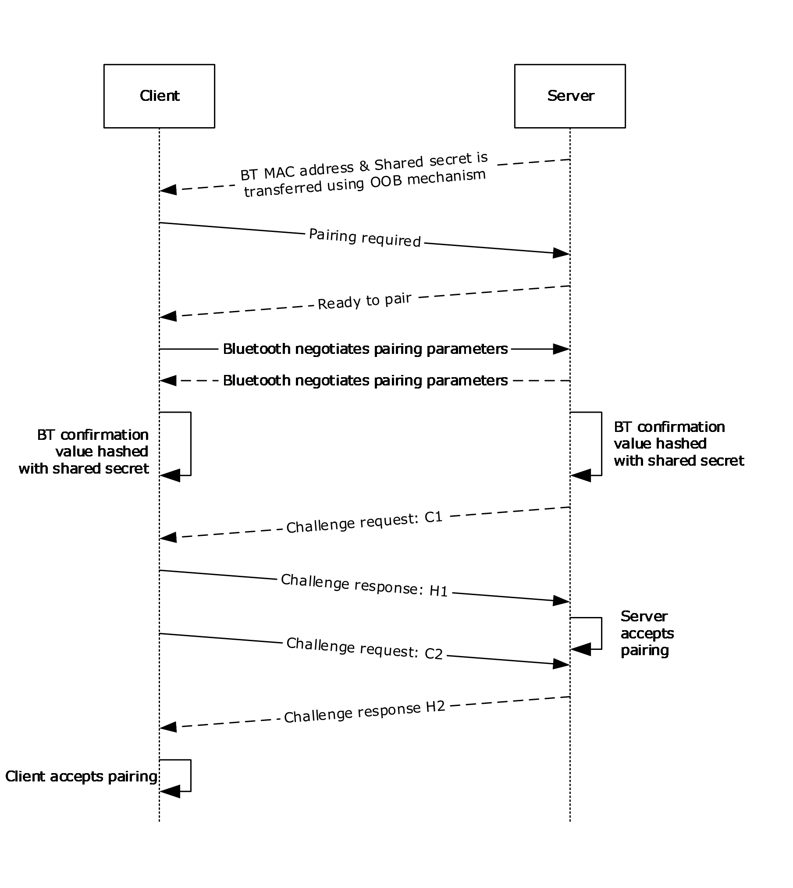
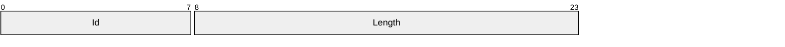
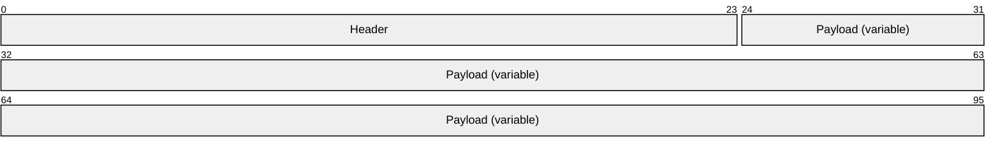
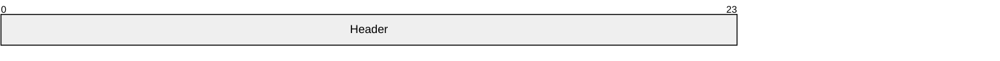
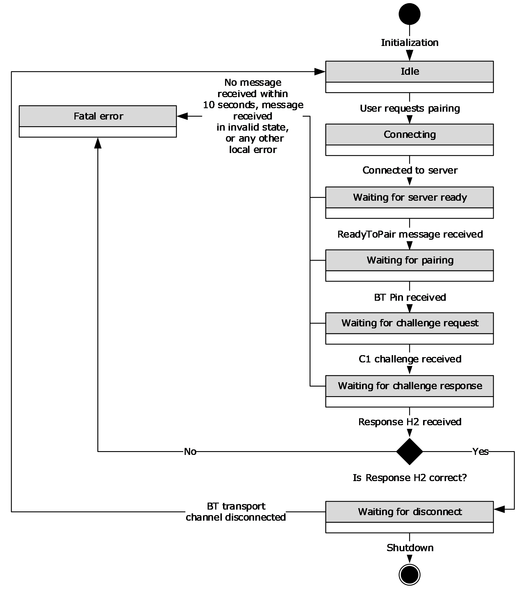

# [MS-ABTP]: Automatic Bluetooth Pairing Protocol

Table of Contents

1 Introduction

- [1 Introduction](#Section_1)
  - [1.1 Glossary](#Section_1.1)
  - [1.2 References](#Section_1.2)
    - [1.2.1 Normative References](#Section_1.2.1)
    - [1.2.2 Informative References](#Section_1.2.2)
  - [1.3 Overview](#Section_1.3)
  - [1.4 Relationship to Other Protocols](#Section_1.4)
  - [1.5 Prerequisites/Preconditions](#Section_1.5)
  - [1.6 Applicability Statement](#Section_1.6)
  - [1.7 Versioning and Capability Negotiation](#Section_1.7)
  - [1.8 Vendor-Extensible Fields](#Section_1.8)
  - [1.9 Standards Assignments](#Section_1.9)

2 Messages

- [2 Messages](#Section_2)
  - [2.1 Transport](#Section_2.1)
  - [2.2 Message Syntax](#Section_2.2)
    - [2.2.1 Enumerations](#Section_2.2.1)
      - [2.2.1.1 MessageId Enumeration](#Section_2.2.1.1)
    - [2.2.2 Structures](#Section_2.2.2)
      - [2.2.2.1 CommonHeader Structure](#Section_2.2.2.1)
    - [2.2.3 Messages](#Section_2.2.3)
      - [2.2.3.1 Challenge Message](#Section_2.2.3.1)
      - [2.2.3.2 PairingRequired Message](#Section_2.2.3.2)
      - [2.2.3.3 ProtocolErrorResponse Message](#Section_2.2.3.3)
      - [2.2.3.4 ReadyToPair Message](#Section_2.2.3.4)
      - [2.2.3.5 Response Message](#Section_2.2.3.5)

3 Protocol Details

- [3 Protocol Details](#Section_3)
  - [3.1 Client Details](#Section_3.1)
    - [3.1.1 Abstract Data Model](#Section_3.1.1)
    - [3.1.2 Timers](#Section_3.1.2)
    - [3.1.3 Initialization](#Section_3.1.3)
    - [3.1.4 Higher-Layer Triggered Events](#Section_3.1.4)
      - [3.1.4.1 Pairing Request](#Section_3.1.4.1)
      - [3.1.4.2 Cancellation](#Section_3.1.4.2)
    - [3.1.5 Message Processing Events and Sequencing Rules](#Section_3.1.5)
      - [3.1.5.1 ReadyToPair](#Section_3.1.5.1)
      - [3.1.5.2 Challenge](#Section_3.1.5.2)
      - [3.1.5.3 Response](#Section_3.1.5.3)
      - [3.1.5.4 Other Messages](#Section_3.1.5.4)
    - [3.1.6 Timer Events](#Section_3.1.6)
      - [3.1.6.1 ClientGuardTimer](#Section_3.1.6.1)
    - [3.1.7 Other Local Events](#Section_3.1.7)
      - [3.1.7.1 Successful Connection of Control Channel](#Section_3.1.7.1)
      - [3.1.7.2 Failed Connection of Control Channel](#Section_3.1.7.2)
      - [3.1.7.3 Disconnect Event of Control Channel](#Section_3.1.7.3)
      - [3.1.7.4 Pairing Indication](#Section_3.1.7.4)
  - [3.2 Server Details](#Section_3.2)
    - [3.2.1 Abstract Data Model](#Section_3.2.1)
    - [3.2.2 Timers](#Section_3.2.2)
    - [3.2.3 Initialization](#Section_3.2.3)
    - [3.2.4 Higher-Layer Triggered Events](#Section_3.2.4)
      - [3.2.4.1 Shutdown](#Section_3.2.4.1)
    - [3.2.5 Message Processing Events and Sequencing Rules](#Section_3.2.5)
      - [3.2.5.1 PairingRequired](#Section_3.2.5.1)
      - [3.2.5.2 Response](#Section_3.2.5.2)
      - [3.2.5.3 Challenge](#Section_3.2.5.3)
      - [3.2.5.4 Other Messages](#Section_3.2.5.4)
    - [3.2.6 Timer Events](#Section_3.2.6)
      - [3.2.6.1 GuardTimer](#Section_3.2.6.1)
      - [3.2.6.2 PausingTimer](#Section_3.2.6.2)
    - [3.2.7 Other Local Events](#Section_3.2.7)
      - [3.2.7.1 Connect Event](#Section_3.2.7.1)
      - [3.2.7.2 Disconnect Event](#Section_3.2.7.2)
      - [3.2.7.3 Pairing indication](#Section_3.2.7.3)

4 Protocol Examples

- [4 Protocol Examples](#Section_4)
  - [4.1 PairingRequired](#Section_4.1)
  - [4.2 ReadyToPair](#Section_4.2)
  - [4.3 Challenge](#Section_4.3)
  - [4.4 Response](#Section_4.4)

5 Security

- [5 Security](#Section_5)
  - [5.1 Security Considerations for Implementers](#Section_5.1)
  - [5.2 Index of Security Parameters](#Section_5.2)

6 Appendix A: Product Behavior

- [6 Appendix A: Product Behavior](#Section_6)

7 Change Tracking

- [7 Change Tracking](#Section_7)

For the legal notice and IP terms, see [LEGAL.md](../LEGAL.md).
Last updated: 4/23/2024.
See [Revision History](#revision-history) for full version history.

# 1 Introduction

This document specifies the Automatic Bluetooth Pairing Protocol. This protocol facilitates the establishment of a secure, trusted [**Bluetooth (BT)**](#gt_bluetooth-bt) pairing relationship between two devices without requiring any user interaction at the time of pairing. To use the Automatic Bluetooth Pairing Protocol, the Bluetooth [**media access control address (MAC address)**](#gt_5f9ccdf4-2607-4855-9a72-2010aa3300bf) of the [**server**](#gt_server) device and a shared secret are exchanged between the two devices using an [**out-of-band (OOB)**](#gt_out-of-band-oob) mechanism.

Sections 1.5, 1.8, 1.9, 2, and 3 of this specification are normative. All other sections and examples in this specification are informative.

## 1.1 Glossary

This document uses the following terms:

**binary large object (BLOB)**: A discrete packet of data that is stored in a database and is treated as a sequence of uninterpreted bytes.

**Bluetooth (BT)**: A wireless technology standard which is managed by the Bluetooth Special Interest Group and that is used for exchanging data over short distances between mobile and fixed devices.

**Bluetooth pairing**: A process in which two devices that are both running the Bluetooth technology establish a connection for communication by using an agreed upon security key.

**challenge value**: The request that is sent during challenge/response authentication. The value received in response to the challenge request is authenticated for validity.

**challenge/response authentication**: A common authentication technique in which a principal is prompted (the challenge) to provide some private information (the response) to facilitate authentication.

**client**: A computer on which the remote procedure call (RPC) client is executing.

**globally unique identifier (GUID)**: A term used interchangeably with universally unique identifier (UUID) in Microsoft protocol technical documents (TDs). Interchanging the usage of these terms does not imply or require a specific algorithm or mechanism to generate the value. Specifically, the use of this term does not imply or require that the algorithms described in [[RFC4122]](https://go.microsoft.com/fwlink/?LinkId=90460) or [[C706]](https://go.microsoft.com/fwlink/?LinkId=89824) must be used for generating the [**GUID**](#gt_globally-unique-identifier-guid). See also universally unique identifier (UUID).

**man in the middle (MITM)**: An attack that deceives a server or client into accepting an unauthorized upstream host as the actual legitimate host. Instead, the upstream host is an attacker's host that is manipulating the network so that the attacker's host appears to be the desired destination. This enables the attacker to decrypt and access all network traffic that would go to the legitimate host. The attacker is able to read, insert, and modify at-will messages between two hosts without either party knowing that the link between them is compromised.

**Media Access Control (MAC) address**: A hardware address provided by the network interface vendor that uniquely identifies each interface on a physical network for communication with other interfaces, as specified in [[IEEE802.3]](https://go.microsoft.com/fwlink/?LinkId=89911). It is used by the media access control sublayer of the data link layer of a network connection.

**network byte order**: The order in which the bytes of a multiple-byte number are transmitted on a network, most significant byte first (in big-endian storage). This may or may not match the order in which numbers are normally stored in memory for a particular processor.

**out-of-band (OOB)**: A process for authenticating a user where two communication channels are used simultaneously between two devices or roles. A cellular network is an example of a channel that is commonly used for performing out-of-band authentication.

**response value**: The value that is sent in response to a challenge request during challenge/response authentication. The response value is authenticated against the challenge value.

**server**: A computer on which the remote procedure call (RPC) server is executing.

**type-length-value (TLV)**: A method of organizing data that involves a Type code (16-bit), a specified length of a Value field (16-bit), and the data in the Value field (variable).

**MAY, SHOULD, MUST, SHOULD NOT, MUST NOT:** These terms (in all caps) are used as defined in [[RFC2119]](https://go.microsoft.com/fwlink/?LinkId=90317). All statements of optional behavior use either MAY, SHOULD, or SHOULD NOT.

## 1.2 References

Links to a document in the Microsoft Open Specifications library point to the correct section in the most recently published version of the referenced document. However, because individual documents in the library are not updated at the same time, the section numbers in the documents may not match. You can confirm the correct section numbering by checking the [Errata](https://go.microsoft.com/fwlink/?linkid=850906).

### 1.2.1 Normative References

We conduct frequent surveys of the normative references to assure their continued availability. If you have any issue with finding a normative reference, please contact [dochelp@microsoft.com](mailto:dochelp@microsoft.com). We will assist you in finding the relevant information.

[BT-RFCOMM] Bluetooth Special Interest Group, "Bluetooth Specification version 1.1, Part F:1, RFCOMM with TS 07.10, Serial Port Emulation", June 2003, [https://www.bluetooth.com/specifications/archived-specifications/](https://go.microsoft.com/fwlink/?LinkId=294277)

[BT-SDP] Bluetooth Special Interest Group, "Bluetooth Specification Version 4.0, Volume 3 - Core System Package [Host Volume], Part B - Service Discovery Protocol (SDP) Specification", June 2010, [https://www.bluetooth.com/specifications/archived-specifications/](https://go.microsoft.com/fwlink/?LinkId=294278)

[RFC2119] Bradner, S., "Key words for use in RFCs to Indicate Requirement Levels", BCP 14, RFC 2119, March 1997, [https://www.rfc-editor.org/info/rfc2119](https://go.microsoft.com/fwlink/?LinkId=90317)

### 1.2.2 Informative References

[BT-GAP] Bluetooth Special Interest Group, "Bluetooth Specification Version 4.0, Volume 3 - Core System Package [Host Volume], Part C - Generic Access Profile", June 2010, [https://www.bluetooth.org/docman/handlers/downloaddoc.ashx?doc_id=229737](https://go.microsoft.com/fwlink/?LinkId=298916)

[BT-SEC] Bluetooth Special Interest Group, "Bluetooth Specification Version 4.0, Volume 2 - Core System Package [BR/EDR Controller volume], Part H - Security Specification", June 2010, [https://www.bluetooth.org/docman/handlers/downloaddoc.ashx?doc_id=229737](https://go.microsoft.com/fwlink/?LinkId=298917)

[BT40] Bluetooth Special Interest Group, "Bluetooth Specification Version 4.0", June 2010, File Download, [https://www.bluetooth.org/docman/handlers/downloaddoc.ashx?doc_id=229737](https://go.microsoft.com/fwlink/?LinkId=298915)

[FIPS180-4] FIPS PUBS, "Secure Hash Standards (SHS)", March 2012, [http://csrc.nist.gov/publications/fips/fips180-4/fips-180-4.pdf](https://go.microsoft.com/fwlink/?LinkId=298918)

## 1.3 Overview

[**Bluetooth**](#gt_bluetooth-bt) is one of the most common communication technologies that is used to enable scenarios that involve two different devices [[BT40]](https://go.microsoft.com/fwlink/?LinkId=298915). For security purposes, it is necessary to ensure that the communication channel between the two devices is secure and authenticated. The process by which this is done in Bluetooth is known as [**Bluetooth pairing**](#gt_bluetooth-pairing) [[BT-SEC]](https://go.microsoft.com/fwlink/?LinkId=298917).

There are many different ways to pair two devices that are using Bluetooth. The most secure pairing methods typically involve user input, such as numeric PIN comparison; however, a device might not be able to accept user input or a manufacturer can choose to skip this step. Skipping the user input step lowers the security of the connection and enables [**man in the middle (MITM)**](#gt_man-in-the-middle-mitm) and other similar attacks. Traditional Bluetooth pairing also requires devices to be in a discoverable mode (see [[BT-GAP]](https://go.microsoft.com/fwlink/?LinkId=298916)). In this mode, the [**server**](#gt_server) device advertises its presence.

The Automatic Bluetooth Pairing Protocol enables a [**client**](#gt_client) to establish a secure, authenticated Bluetooth connection with a server. The protocol does not require any user interaction at the time of pairing, nor does it require either device to be in discoverable mode. Prior to using the Automatic Bluetooth Pairing Protocol, the Bluetooth [**MAC address**](#gt_5f9ccdf4-2607-4855-9a72-2010aa3300bf) of the server device and a shared secret have to be exchanged between the two devices by using an [**OOB**](#gt_out-of-band-oob) mechanism.

After the Bluetooth MAC address and shared secret information is available on both devices, the client sends a **PairingRequired** message (section [2.2.3.2](#Section_2.2.3.2)) to the server. This message is used to inform the server of the MAC address of the client.

The server has to be able to accept a **PairingRequired** message and when the message is received, send a **ReadyToPair** message (section [2.2.3.4](#Section_2.2.3.4)) in response. The server then readies itself to accept Bluetooth pairing from the client.

The client then initiates the Bluetooth pairing by using the Bluetooth Numeric Comparison Protocol [BT-SEC] during which the pairing parameters are negotiated between the client and server. The pairing parameters include a six digit confirmation value (PIN) and a link key.

To authenticate the client and server devices, both sides are required to have the same numeric value and the same shared secret. To accomplish the authentication, the server generates a 128-byte pseudo-random number and sends it to the client. The client then calculates the response as a hash of the challenge, the shared key, and the six digit confirmation value (the PIN that was previously negotiated between the client and the server) by using SHA-256 [[FIPS180-4]](https://go.microsoft.com/fwlink/?LinkId=298918) and sends it to the server. The client and server then perform a similar [**challenge/response authentication**](#gt_challengeresponse-authentication) process initiated by the client.

Each side accepts the pairing after it receives a satisfactory response to its challenge.

Figure 1: Establishing a secure, authenticated Bluetooth connection

## 1.4 Relationship to Other Protocols

The Automatic Bluetooth Pairing Protocol is dependent on the [**Bluetooth**](#gt_bluetooth-bt) [[BT40]](https://go.microsoft.com/fwlink/?LinkId=298915), RFComm [[BT-RFCOMM]](https://go.microsoft.com/fwlink/?LinkId=294277), Service Discovery Protocol [[BT-SDP]](https://go.microsoft.com/fwlink/?LinkId=294278), and Pairing protocols [[BT-SEC]](https://go.microsoft.com/fwlink/?LinkId=298917).

## 1.5 Prerequisites/Preconditions

To use the Automatic Bluetooth Pairing Protocol, both devices are required to support [**Bluetooth**](#gt_bluetooth-bt), the Bluetooth radio on both devices has to be turned on, and the Bluetooth [**MAC address**](#gt_5f9ccdf4-2607-4855-9a72-2010aa3300bf) of the [**server**](#gt_server) device and a shared secret have to be exchanged between the two devices by using an [**OOB**](#gt_out-of-band-oob) mechanism.

## 1.6 Applicability Statement

This protocol is applicable only when other [**Bluetooth pairing**](#gt_bluetooth-pairing) mechanisms are not appropriate or would prohibitively interrupt the user experience.

## 1.7 Versioning and Capability Negotiation

**Protocol Versions:** The Automatic Bluetooth Pairing Protocol does not support versioning, but it is extensible. This is defined in sections [3.1.5.4](#Section_3.1.5.4) and [3.2.5.4](#Section_3.2.5.4).

## 1.8 Vendor-Extensible Fields

None.

## 1.9 Standards Assignments

None.

# 2 Messages

## 2.1 Transport

The Automatic Bluetooth Pairing Protocol MUST have a byte stream connection between the [**client**](#gt_client) and [**server**](#gt_server). This connection MUST be established by using RFCOMM [[BT-RFCOMM]](https://go.microsoft.com/fwlink/?LinkId=294277). To identify an Automatic Bluetooth Pairing Protocol-capable server by using RFCOMM, the client MUST use the Bluetooth Service Discovery Protocol (SDP) [[BT-SDP]](https://go.microsoft.com/fwlink/?LinkId=294278). Tethering-capable servers MUST be identified through SDP by using the [**globally unique identifier (GUID)**](#gt_globally-unique-identifier-guid) {D9009112-CD2B-4e7a-A463-437D71E14905}. The RFCOMM communication channel is created before a [**Bluetooth pairing**](#gt_bluetooth-pairing) relationship with the server is created and MUST be unauthenticated.

## 2.2 Message Syntax

This protocol uses a common [**type-length-value (TLV)**](#gt_type-length-value-tlv) encoding schema for all messages.

### 2.2.1 Enumerations

#### 2.2.1.1 MessageId Enumeration

The **MessageId** enumeration specifies the message type. The structure is referenced in the header of each message, as defined in section [2.2.2.1](#Section_2.2.2.1).

| Bit Range | Field | Description |
| --- | --- | --- |
| Variable | ProtocolError 1 | Identifies the **ProtocolError** message, as specified in section [2.2.3.3](#Section_2.2.3.3). |
| Variable | PairingRequired 2 | Identifies the **PairingRequired** message, as specified in [2.2.3.2](#Section_2.2.3.2). |
| Variable | ReadyToPair 3 | Identifies the **ReadyToPair** message, as specified in [2.2.3.4](#Section_2.2.3.4). |
| Variable | Challenge 4 | Identifies the **Challenge** message, as specified in section [2.2.3.1](#Section_2.2.3.1). |
| Variable | Response 5 | Identifies the **Response** message, as specified in section [2.2.3.5](#Section_2.2.3.5). |

### 2.2.2 Structures

All multi-byte values are in [**network byte order**](#gt_network-byte-order) unless specified otherwise.

#### 2.2.2.1 CommonHeader Structure

The **CommonHeader** structure is used by all messages. It identifies the structure of the message and the encoded length of the message content.

**Id (1 byte):** This field specifies the message type as indicated by the **MessageId** enumeration (section [2.2.1.1](#Section_2.2.1.1)).

**Length (2 bytes):** This field specifies the number of bytes following the message header.

### 2.2.3 Messages

#### 2.2.3.1 Challenge Message

The **Challenge** message is sent by each device to the peer device to authenticate pairing.

**Header (3 bytes):** This field contains the **CommonHeader** structure (section [2.2.2.1](#Section_2.2.2.1)). The **Id** field (**Header.Id**) of the header is set to **MessageId.Challenge** (4). The **Length** (**Header.Length**) of the header is set to the payload size of the message.

**Payload (variable):** This field contains the [**challenge value**](#gt_challenge-value) (128 bytes). Future protocol versions MAY define additional payload elements. This protocol version MUST ignore any payload after the challenge value in the packet.

#### 2.2.3.2 PairingRequired Message

The **PairingRequired** message is sent by the [**client**](#gt_client) to the [**server**](#gt_server) to prepare the pairing.

**Header (3 bytes):** This field contains the **CommonHeader** structure (section [2.2.2.1](#Section_2.2.2.1)). The **Id** field (**Header.Id**) is set to **MessageId.PairingRequired** (2). The **Length** field (**Header.Length**) is set to the payload size of the message. In this version of the protocol, the payload is empty (0 bytes). Future protocol versions MAY define additional message elements. This protocol version MUST ignore any payload.

#### 2.2.3.3 ProtocolErrorResponse Message

The **ProtocolErrorResponse** message is sent by the receiver in response to a message that is not recognized. This message provides basic compatibility with future protocol versions that MAY contain additional messages. An implementation of this protocol version sends this message in response to receiving a message where the value of the **MessageId** is outside of the range defined in section [2.2.1.1](#Section_2.2.1.1).

**Header (3 bytes):** This field contains the **CommonHeader** structure (section [2.2.2.1](#Section_2.2.2.1)). The **Id** field (**Header.Id**) is set to **MessageId.ProtocolError** (1). The **Length** field (**Header.Length**) is set to the payload size of the message. The payload consists of the **MessageId** (section 2.2.1.1) of the message that was not recognized by the receiver.

**Payload (variable):** This field contains the **MessageId** (1 byte). Future protocol versions MAY define additional message elements. This protocol version MUST ignore any payload after the **MessageId**.

#### 2.2.3.4 ReadyToPair Message

The **ReadyToPair** message is sent by the [**server**](#gt_server) to the [**client**](#gt_client) in response to the **PairingRequired** message (section [2.2.3.2](#Section_2.2.3.2)).

**Header (3 bytes):** This field contains the **CommonHeader** structure (section [2.2.2.1](#Section_2.2.2.1)). The **Id** field (**Header.Id**) is set to **MessageId.ReadyToPair** (3). The **Length** field (**Header.Length**) is set to the payload size of the message. In this version of the protocol, the payload is empty (0 bytes). Future protocol versions MAY define additional message elements. This protocol version MUST ignore any payload.

#### 2.2.3.5 Response Message

The **Response** message is sent in response to a **Challenge** message (section [2.2.3.1](#Section_2.2.3.1)) to authenticate the pairing.

**Header (3 bytes):** This field contains the **CommonHeader** structure (section [2.2.2.1](#Section_2.2.2.1)). The **Id** field (**Header.Id**) is set to **MessageId.Response** (5). The **Length** field (**Header.Length**) is set to the payload size of the message.

**Payload (variable):** This field contains the [**response value**](#gt_response-value) (32 bytes). Future protocol versions MAY define additional message elements. This protocol version MUST ignore any payload after the response value in the packet.

# 3 Protocol Details

The Automatic Bluetooth Pairing Protocol provides a [**client**](#gt_client) role and a [**server**](#gt_server) role.

The client and server use the same algorithm to compute a [**response value**](#gt_response-value) for [**challenge/response authentication**](#gt_challengeresponse-authentication). Given a 128-byte [**challenge value**](#gt_challenge-value), a 128-byte shared secret, and a numeric value (representing a six-digit numeric code), the response value is calculated as a SHA-256 of the concatenation of the challenge value, the shared secret, and the numeric value represented (PIN) as a 32-byte value in [**network byte order**](#gt_network-byte-order).

## 3.1 Client Details

The role of the [**client**](#gt_client) in the [**Bluetooth pairing**](#gt_bluetooth-pairing) process is as follows:

- The client establishes an unauthenticated RFCOMM connection with the [**server**](#gt_server) to execute the Automatic Bluetooth Pairing Protocol.
- The client executes a state machine to initiate and authenticate the Bluetooth pairing.
- The client sends a **PairingRequired** message (section [2.2.3.2](#Section_2.2.3.2)) to the server and waits for the server to respond.
- After receiving a **ReadyToPair** message (section [2.2.3.4](#Section_2.2.3.4)) from the server, the client initiates the Bluetooth pairing with a numeric comparison procedure. The client then waits for the server to initiate [**challenge/response authentication**](#gt_challengeresponse-authentication).
- After receiving the **Challenge** message (section [2.2.3.1](#Section_2.2.3.1)) from the server, the client computes the corresponding [**response value**](#gt_response-value) and returns the value to the server by sending a **Response** message (section [2.2.3.5](#Section_2.2.3.5)).
- The client authenticates the server by generating a random challenge and sending it to the server by using a **Challenge** message (section 2.2.3.1).
- The client waits for the server to return a **Response** message (section 2.2.3.5).
- After receiving the **Response** message, the client validates the response value. If the validation succeeds, the client completes the pairing with the server. If the validation fails, the client aborts the pairing with the server.

Figure 2: Client state diagram

### 3.1.1 Abstract Data Model

This section describes a conceptual model of possible data organization that an implementation maintains to participate in this protocol. The described organization is provided to facilitate the explanation of how the protocol behaves. This document does not mandate that implementations adhere to this model as long as their external behavior is consistent with that described in this document.

**State:** Specifies the state of the [**client**](#gt_client) which can be one of the following: IDLE, CONNECTING, WAITING_FOR_SERVER_READY, WAITING_FOR_PAIRING, WAITING_FOR_CHALLENGE_REQUEST, WAITING_FOR_CHALLENGE_RESPONSE, WAITING_FOR_DISCONNECT, or FATAL_ERROR.

**Server Address:** The [**Bluetooth**](#gt_bluetooth-bt) address of the [**server**](#gt_server).

**Shared Secret:** A 128-byte [**binary large object (BLOB)**](#gt_binary-large-object-blob) that contains the shared secret.

**Expected Response:** A 32-byte BLOB that contains the expected [**response value**](#gt_response-value).

**Numeric Value:** A six-digit confirmation value (PIN).

### 3.1.2 Timers

The [**client**](#gt_client) role maintains the following timers.

**ClientGuardTimer:** The time-out interval is set to 10 seconds.

### 3.1.3 Initialization

The initial state for the [**client**](#gt_client) is IDLE. The **ClientGuardTimer** (section [3.1.2](#Section_3.1.2)) is not set.

### 3.1.4 Higher-Layer Triggered Events

#### 3.1.4.1 Pairing Request

The higher layer can initiate pairing when the [**client**](#gt_client) is in the IDLE state (see section [3.1.1](#Section_3.1.1)). When the client is in any other state, the client MUST fail the request. The higher layer MUST provide the **Server Address** and the **Shared Secret** that is common to the client and [**server**](#gt_server). The client stores the **Server Address** and the **Shared Secret**, initiates a [**Bluetooth**](#gt_bluetooth-bt) connection to the specified server, sets the **ClientGuardTimer** (section [3.1.2](#Section_3.1.2)), and transitions to the CONNECTING state.

#### 3.1.4.2 Cancellation

The higher layer can cancel the pairing attempt at any time. When the client is in the CONNECTING, WAITING_FOR_SERVER_READY, WAITING_FOR_PAIRING, WAITING_FOR_CHALLENGE_REQUEST, or WAITING_FOR_CHALLENGE_RESPONSE state, the [**client**](#gt_client) initiates a disconnect of the control channel, stops the **ClientGuardTimer** (section [3.1.2](#Section_3.1.2)), and transitions to the FATAL_ERROR state. When the client is in any other state, the client MUST ignore the request.

### 3.1.5 Message Processing Events and Sequencing Rules

The message type is identified by using the **MessageId** value stored in the message header, as specified in section [2.2.1.1](#Section_2.2.1.1). A message is processed only when it has been fully received as indicated by the value of the **Length** field specified within the message header. When the [**client**](#gt_client) is in the FATAL_ERROR or WAITING_FOR_DISCONNECT state, the client MUST ignore any messages received. When the client receives a message in any other state, the **ClientGuardTimer** (section [3.1.2](#Section_3.1.2)) MUST be started or restarted.

#### 3.1.5.1 ReadyToPair

When the [**client**](#gt_client) receives a **ReadyToPair** message (section [2.2.3.2](#Section_2.2.3.2)) in the WAITING_FOR_SERVER_READY state, the client MUST initiate [**Bluetooth pairing**](#gt_bluetooth-pairing) with the [**server**](#gt_server) (as specified by the **Server Address**) using the numeric comparison method. The client MUST restart the **ClientGuardTimer** (section [3.1.2](#Section_3.1.2)) and transition to the WAITING_FOR_PAIRING state.

When the client receives the **ReadyToPair** message in any other state, the client MUST initiate a disconnect of the control channel, stop the **ClientGuardTimer**, and transition to the FATAL_ERROR state.

#### 3.1.5.2 Challenge

When the [**client**](#gt_client) receives a **Challenge** message (section [2.2.3.1](#Section_2.2.3.1)) in the WAITING_FOR_CHALLENGE_REQUEST state, the client MUST compute the [**response value**](#gt_response-value) (as specified in section [3.2.1](#Section_3.1.1)) using the [**challenge value**](#gt_challenge-value) of the Challenge message (section 2.2.3.1), the **Shared Secret**, and the **Numeric Value**. The client MUST send a **Response** message (section [2.2.3.5](#Section_2.2.3.5)) to the [**server**](#gt_server) containing the computed response value.

The client MUST then create a random challenge value and send a **Challenge** message to the server containing the challenge value. The client MUST compute and store the **Expected Response** (as specified in section 3.2.1) for this challenge value. The client MUST restart the **ClientGuardTimer** (section [3.1.2](#Section_3.1.2)) and transition to the WAITING_FOR_CHALLENGE_RESPONSE state.

When the client receives the client message in any other state, the client MUST initiate a disconnect of the control channel, stop the **ClientGuardTimer**, and transition to the FATAL_ERROR state.

#### 3.1.5.3 Response

When the [**client**](#gt_client) receives a **Response** message (section [2.2.3.5](#Section_2.2.3.5)) in the WAITING_FOR_CHALLENGE_RESPONSE state, the client MUST stop the **ClientGuardTimer** (section [3.1.2](#Section_3.1.2)). The client MUST compare the [**response value**](#gt_response-value) of the **Response** message with the **Expected Response**. If the values match, the client MUST complete the pairing with the [**server**](#gt_server) and transition to the WAITING_FOR_DISCONNECT state. If the values do not match, the client MUST transition to the FATAL_ERROR state. In all cases, the client MUST initiate the disconnect of the control channel.

#### 3.1.5.4 Other Messages

When the [**client**](#gt_client) receives a message with an unknown message type, that is, a **MessageId** value that is not specified in section [2.2.1.1](#Section_2.2.1.1), the client MUST send a **ProtocolErrorResponse** message (section [2.2.3.3](#Section_2.2.3.3)) indicating the unknown message type and specifying the unrecognized **MessageId** value in the message payload.

After the client receives a message that cannot be parsed according to the message syntax specified in section [2.2](#Section_2.2), the client initiates a disconnect of the control channel, stops the **ClientGuardTimer** (section [3.1.2](#Section_3.1.2)), and transitions to the FATAL_ERROR state.

### 3.1.6 Timer Events

#### 3.1.6.1 ClientGuardTimer

Upon expiration of the **ClientGuardTimer** (section [3.1.2](#Section_3.1.2)), the [**client**](#gt_client) initiates a disconnect of the control channel and transitions to the FATAL_ERROR state.

### 3.1.7 Other Local Events

#### 3.1.7.1 Successful Connection of Control Channel

Upon successful connection of the control channel to the [**server**](#gt_server), the [**client**](#gt_client) MUST send a **PairingRequired** message (section [2.2.3.2](#Section_2.2.3.2)) to the server, restart the **ClientGuardTimer** (section [3.1.2](#Section_3.1.2)), and transition to the WAITING_FOR_SERVER_READY state.

#### 3.1.7.2 Failed Connection of Control Channel

Upon a failed connection of the control channel to the [**server**](#gt_server), the [**client**](#gt_client) MUST stop the **ClientGuardTimer** (section [3.1.2](#Section_3.1.2)), indicate the failed pairing attempt to the higher layer, and transition to the IDLE state.

#### 3.1.7.3 Disconnect Event of Control Channel

Upon receiving a disconnect event of the control channel while in the WAITING_FOR_DISCONNECT state, the [**client**](#gt_client) indicates the successful pairing with the [**server**](#gt_server) to the higher layer and transitions to the IDLE state.

When the client receives a disconnect event of the control channel while in any other state, the client stops the **ClientGuardTimer** (section [3.1.2](#Section_3.1.2)) if it is running, indicates the failed pairing with the server to the higher layer, and transitions to the IDLE state.

#### 3.1.7.4 Pairing Indication

When the [**Bluetooth**](#gt_bluetooth-bt) layer indicates to the [**client**](#gt_client) that a pairing attempt has to be authenticated, the client compares its state to the WAITING_FOR_PAIRING state, compares the indicated peer address with the **Server Address**, and compares the indicated authentication method to the numeric comparison. If all values match, the client MUST store the indicated **Numeric Value** and transition to the WAITING_FOR_CHALLENGE_REQUEST state; otherwise, the client MUST ignore the indication from the Bluetooth layer.

## 3.2 Server Details

The role of the [**server**](#gt_server) in the [**Bluetooth pairing**](#gt_bluetooth-pairing) process is as follows:

- The server creates an RFCOMM port and waits for clients to connect by using an unauthenticated RFCOMM connection to execute the Automatic Bluetooth Pairing Protocol.
- The server executes a strict state machine to authenticate the Bluetooth pairing.
- When a [**client**](#gt_client) has connected, the server waits for the client to send a **PairingRequired** message (section [2.2.3.2](#Section_2.2.3.2)). When this message is received, the server responds by sending a **ReadyToPair** message (section [2.2.3.4](#Section_2.2.3.4)) to the client and waits for the client to initiate the Bluetooth pairing with a numeric comparison procedure.
- After the pairing has been initiated and the numeric value to authenticate the pairing is available, the server initiates [**challenge/response authentication**](#gt_challengeresponse-authentication) by generating a random [**challenge value**](#gt_challenge-value) and sending it to the client by using a **Challenge** message (section [2.2.3.1](#Section_2.2.3.1)). The server then waits for the client to return a **Response** message (section [2.2.3.5](#Section_2.2.3.5)).
- After receiving the **Response** message, the server validates the [**response value**](#gt_response-value). If the validation succeeds, the server completes the pairing with the client.
- The server waits for the client to perform challenge/response authentication by the client sending a **Challenge** message to the server. Upon receiving the **Challenge** message from the client, the server computes the corresponding response value and returns the value to the client by sending a **Response** message.
- The server then waits for the client to disconnect.
The server MAY handle multiple clients simultaneously by having an instance of the server role for each connected client.

Figure 3: Server state diagram

### 3.2.1 Abstract Data Model

This section describes a conceptual model of possible data organization that an implementation maintains to participate in this protocol. The described organization is provided to facilitate the explanation of how the protocol behaves. This document does not mandate that implementations adhere to this model as long as their external behavior is consistent with that described in this document.

**State:** Specifies the [**server**](#gt_server) state which can be one of the following: IDLE, CONNECTED, WAITING_FOR_PAIRING, WAITING_FOR_CHALLENGE_RESPONSE, WAITING_FOR_CHALLENGE_REQUEST, WAITING_FOR_DISCONNECT, FATAL_ERROR, and PAUSING.

**Client Address:** The [**Bluetooth**](#gt_bluetooth-bt) address of the connected client.

**Shared Secret:** A 128 byte [**BLOB**](#gt_binary-large-object-blob) that contains the shared secret.

**Expected Response:** A 32 byte BLOB that contains the expected [**response value**](#gt_response-value).

**Numeric Value:** A six-digit confirmation value (PIN).

**Consecutive Failure Count:** An integer value representing the number of consecutive pairing attempts that have failed.

### 3.2.2 Timers

The [**server**](#gt_server) role maintains the following timers.

**GuardTimer:** The time-out interval is set to 10 seconds.

**PausingTimer:** The time-out interval is set to one hour.

### 3.2.3 Initialization

The initial **state** for the [**server**](#gt_server) is IDLE.

The **Shared Secret** (section [3.2.1](#Section_3.1.1)) is set to a value chosen by the higher layer.

The **GuardTimer** and **PausingTimer** are not set (see section [3.2.2](#Section_3.1.2)).

### 3.2.4 Higher-Layer Triggered Events

#### 3.2.4.1 Shutdown

The higher layer can shut down the [**server**](#gt_server) at any time. The server disconnects the control channel at shutdown.

### 3.2.5 Message Processing Events and Sequencing Rules

The message type is identified by using the **MessageId** value stored in the message header, as specified in section [2.2.1.1](#Section_2.2.1.1). A message is processed only when it has been fully received, as indicated by the value of the **Length** field specified within the message header. When the [**server**](#gt_server) is in the FATAL_ERROR, PAUSING, or WAITING_FOR_DISCONNECT state, the server MUST ignore any received messages. When the server receives a message in any other state, the **GuardTimer** (section [3.2.2](#Section_3.1.2)) MUST be started or restarted.

#### 3.2.5.1 PairingRequired

When the [**server**](#gt_server) receives a **PairingRequired** message (section [2.2.3.2](#Section_2.2.3.2)) in the CONNECTED state, the server MUST send a **ReadyToPair** message (section [2.2.3.4](#Section_2.2.3.4)) to the [**client**](#gt_client), restart the **GuardTimer** (section [3.2.2](#Section_3.1.2)), and transition to the WAITING_FOR_PAIRING state.

When the server receives the **PairingRequired** message in any other state, the server MUST initiate a disconnect of the control channel, stop the **GuardTimer**, and transition to the FATAL_ERROR state.

#### 3.2.5.2 Response

When the [**server**](#gt_server) receives a **Response** message (section [2.2.3.5](#Section_2.2.3.5)) in the WAITING_FOR_CHALLENGE_RESPONSE state, the server MUST compare the [**response value**](#gt_response-value) of the **Response** message with the **Expected Response** (section [3.2.1](#Section_3.1.1)).

If the values match, the server MUST complete the pairing with the [**client**](#gt_client), set the **Consecutive Failure Count** (section 3.2.1) to 0, and transition to the WAITING_FOR_CHALLENGE_REQUEST state. If the values do not match, the server MUST initiate a disconnect of the control channel, increment the value of the **Consecutive Failure Count** (section 3.2.1), and stop the **GuardTimer** (section [3.2.2](#Section_3.1.2)).

If the value of **Consecutive Failure Count** is less than 4, the server MUST transition to the FATAL_ERROR state; otherwise, the server MUST transition to the PAUSING state.

When the server receives a **Response** message in any other state, the server MUST initiate a disconnect of the control channel, stop the **GuardTimer**, and transition to the FATAL_ERROR state.

#### 3.2.5.3 Challenge

When the [**server**](#gt_server) receives a **Challenge** message (section [2.2.3.1](#Section_2.2.3.1)) in the WAITING_FOR_CHALLENGE_REQUEST state, the server MUST compute the [**response value**](#gt_response-value) (as described in section [3.2.1](#Section_3.1.1)) using the [**challenge value**](#gt_challenge-value) of the **Challenge** message, the **Shared Secret** (section 3.2.1), and the **Numeric Value** (section 3.2.1). The server MUST send a **Response** message (section [2.2.3.5](#Section_2.2.3.5)) to the [**client**](#gt_client) containing the computed response value. The server MUST restart the **GuardTimer** (section [3.2.2](#Section_3.1.2)) and transition to the WAITING_FOR_DISCONNECT state.

When the server receives a **Challenge** message in any other state, the server MUST initiate a disconnect of the control channel, stop the **GuardTimer**, and transition to the FATAL_ERROR state.

#### 3.2.5.4 Other Messages

When the [**server**](#gt_server) receives a message with an unknown message type, that is, a value for the **MessageId** that is not specified in section [2.2.1.1](#Section_2.2.1.1), the server MUST send a **ProtocolErrorResponse** message (section [2.2.3.3](#Section_2.2.3.3)) indicating the unknown message type and specifying the unrecognized **MessageId** value in the message payload.

When the server receives a message that cannot be parsed according to the message syntax specified in section [2.2](#Section_2.2), the server initiates a disconnect of the control channel, stops the **GuardTimer** (section [3.2.2](#Section_3.1.2)), and transitions to the FATAL_ERROR state.

### 3.2.6 Timer Events

#### 3.2.6.1 GuardTimer

Upon expiration of the **GuardTimer** (section [3.2.2](#Section_3.1.2)), the [**server**](#gt_server) initiates a disconnect of the control channel and transitions to the FATAL_ERROR state.

#### 3.2.6.2 PausingTimer

Upon expiration of the **PausingTimer** (section [3.2.2](#Section_3.1.2)), the [**server**](#gt_server) sets the **Consecutive Failure Count** (section [3.2.1](#Section_3.1.1)) to 0 and transitions to the IDLE state.

### 3.2.7 Other Local Events

#### 3.2.7.1 Connect Event

The [**server**](#gt_server) can only process connect events from clients when the server is in the IDLE state. When a [**client**](#gt_client) connects, the server MUST transition to the CONNECTED state, store the **Client Address** (section [3.2.1](#Section_3.1.1)), and start the **GuardTimer** (section [3.2.2](#Section_3.1.2)).

#### 3.2.7.2 Disconnect Event

When the [**server**](#gt_server) receives a disconnect event of the control channel, the server stops the **GuardTimer** (section [3.2.2](#Section_3.1.2)) if it is running. If the **Consecutive Failure Count** (section [3.2.1](#Section_3.1.1)) equals 4, the server MUST transition to the PAUSING state and start the **PausingTimer** (section 3.2.2); otherwise, the server transitions to the IDLE state.

#### 3.2.7.3 Pairing indication

When the [**Bluetooth**](#gt_bluetooth-bt) layer indicates that a pairing attempt has to be authenticated, the [**server**](#gt_server) compares its state to the WAITING_FOR_PAIRING state, compares the indicated peer address with the **Client Address** (section [3.2.1](#Section_3.1.1)), and compares the indicated authentication method to the numeric comparison value. If all values match, the server MUST store the indicated **Numeric Value** (section 3.2.1)**.** The server MUST then create a random [**challenge value**](#gt_challenge-value) and send a **Challenge** message (section [2.2.3.1](#Section_2.2.3.1)) to the [**client**](#gt_client) containing the challenge value. The server MUST compute and store the **Expected Response** (section 3.2.1) for this challenge value using the challenge value, the **Shared Secret** (section 3.2.1), and the **Numeric Value**. The server MUST restart the **GuardTimer** (section [3.2.2](#Section_3.1.2)) and transition to the WAITING_FOR_CHALLENGE_RESPONSE state.

If some of the value does not match, the server MUST ignore the indication from the Bluetooth layer.

# 4 Protocol Examples

The following examples show the sequence of a successful [**Bluetooth pairing**](#gt_bluetooth-pairing) by using the Automatic Bluetooth Pairing Protocol. This sequence is demonstrated in the figure shown in section [1.3](#Section_1.3).

## 4.1 PairingRequired

Message Header: 0x02 0x00 0x00 (Type == PairingRequired, Length == 0)

## 4.2 ReadyToPair

Message Header: 0x03 0x00 0x00 (Type == ReadyToPair, Length == 0)

## 4.3 Challenge

Message Header: 0x04 0x00 0x80 (Type == Challenge, Length == 128)

Payload: Challenge value: 0x01 0x02 0x03 0x04 … 0x80

## 4.4 Response

Message Header: 0x05 0x00 0x20 (Type == Response, Length == 32)

Payload: Response value: 0x01 0x02 0x03 0x04 … 0x20

# 5 Security

## 5.1 Security Considerations for Implementers

Implementers are required to ensure that the [**OOB**](#gt_out-of-band-oob) exchange of the shared secret is performed in a secure and authenticated manner.

## 5.2 Index of Security Parameters

| Security parameter | Section |
| --- | --- |
| Computation of the [**response value**](#gt_response-value) | [3](#Section_1.3) |
| Shared secret on the client | [3.1.1](#Section_3.1.1) |
| Shared secret on the server | [3.2.1](#Section_3.1.1) |

# 6 Appendix A: Product Behavior

The information in this specification is applicable to the following Microsoft products or supplemental software. References to product versions include updates to those products.

- Windows 8.1 operating system
- Windows Server 2012 R2 operating system
- Windows 10 operating system
- Windows Server 2016 operating system
- Windows Server 2019 operating system
- Windows Server 2022 operating system
- Windows 11 operating system
- Windows Server 2025 operating system
Exceptions, if any, are noted in this section. If an update version, service pack or Knowledge Base (KB) number appears with a product name, the behavior changed in that update. The new behavior also applies to subsequent updates unless otherwise specified. If a product edition appears with the product version, behavior is different in that product edition.

Unless otherwise specified, any statement of optional behavior in this specification that is prescribed using the terms "SHOULD" or "SHOULD NOT" implies product behavior in accordance with the SHOULD or SHOULD NOT prescription. Unless otherwise specified, the term "MAY" implies that the product does not follow the prescription.

# 7 Change Tracking

This section identifies changes that were made to this document since the last release. Changes are classified as Major, Minor, or None.

The revision class **Major** means that the technical content in the document was significantly revised. Major changes affect protocol interoperability or implementation. Examples of major changes are:

- A document revision that incorporates changes to interoperability requirements.
- A document revision that captures changes to protocol functionality.
The revision class **Minor** means that the meaning of the technical content was clarified. Minor changes do not affect protocol interoperability or implementation. Examples of minor changes are updates to clarify ambiguity at the sentence, paragraph, or table level.

The revision class **None** means that no new technical changes were introduced. Minor editorial and formatting changes may have been made, but the relevant technical content is identical to the last released version.

The changes made to this document are listed in the following table. For more information, please contact [dochelp@microsoft.com](mailto:dochelp@microsoft.com).

| Section | Description | Revision class |
| --- | --- | --- |
| [6](#Section_6) Appendix A: Product Behavior | Added Windows Server 2025 to the list of applicable products. | Major |

## Revision History

| Date | Version | Revision Class | Comments |
| --- | --- | --- | --- |
| 8/8/2013 | 1.0 | New | Released new document. |
| 11/14/2013 | 2.0 | Major | Significantly changed the technical content. |
| 2/13/2014 | 2.0 | None | No change to the meaning, language, or formatting of the technical content. |
| 5/15/2014 | 2.0 | None | No change to the meaning, language, or formatting of the technical content. |
| 6/30/2015 | 3.0 | Major | Significantly changed the technical content. |
| 10/16/2015 | 4.0 | Major | Significantly changed the technical content. |
| 7/14/2016 | 5.0 | Major | Significantly changed the technical content. |
| 6/1/2017 | 5.0 | None | No changes to the meaning, language, or formatting of the technical content. |
| 9/12/2018 | 6.0 | Major | Significantly changed the technical content. |
| 4/7/2021 | 7.0 | Major | Significantly changed the technical content. |
| 6/25/2021 | 8.0 | Major | Significantly changed the technical content. |
| 4/23/2024 | 9.0 | Major | Significantly changed the technical content. |
