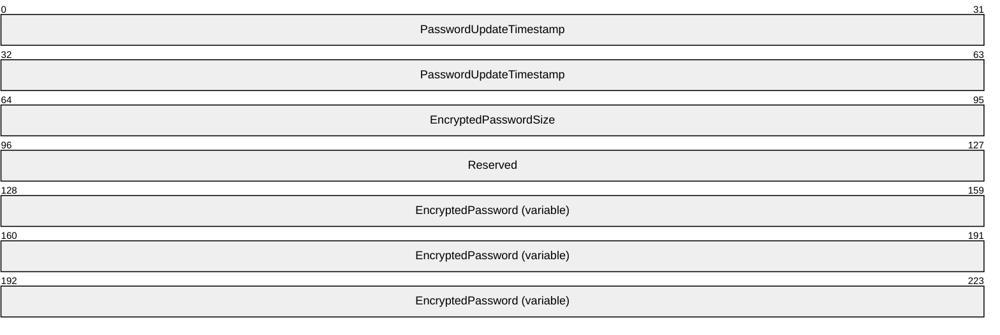

# [MS-ADA2]: Active Directory Schema Attributes M

Table of Contents

1 Introduction

- [1 Introduction](#Section_1)
  - [1.1 References](#Section_1.1)

2 Attributes

- [2 Attributes](#Section_2)
  - [2.1 Attribute macAddress](#Section_2.1)
  - [2.2 Attribute machineArchitecture](#Section_2.2)
  - [2.3 Attribute machinePasswordChangeInterval](#Section_2.3)
  - [2.4 Attribute machineRole](#Section_2.4)
  - [2.5 Attribute machineWidePolicy](#Section_2.5)
  - [2.6 Attribute mail](#Section_2.6)
  - [2.7 Attribute mailAddress](#Section_2.7)
  - [2.8 Attribute managedBy](#Section_2.8)
  - [2.9 Attribute managedObjects](#Section_2.9)
  - [2.10 Attribute manager](#Section_2.10)
  - [2.11 Attribute mAPIID](#Section_2.11)
  - [2.12 Attribute marshalledInterface](#Section_2.12)
  - [2.13 Attribute masteredBy](#Section_2.13)
  - [2.14 Attribute maxPwdAge](#Section_2.14)
  - [2.15 Attribute maxRenewAge](#Section_2.15)
  - [2.16 Attribute maxStorage](#Section_2.16)
  - [2.17 Attribute maxTicketAge](#Section_2.17)
  - [2.18 Attribute mayContain](#Section_2.18)
  - [2.19 Attribute meetingAdvertiseScope](#Section_2.19)
  - [2.20 Attribute meetingApplication](#Section_2.20)
  - [2.21 Attribute meetingBandwidth](#Section_2.21)
  - [2.22 Attribute meetingBlob](#Section_2.22)
  - [2.23 Attribute meetingContactInfo](#Section_2.23)
  - [2.24 Attribute meetingDescription](#Section_2.24)
  - [2.25 Attribute meetingEndTime](#Section_2.25)
  - [2.26 Attribute meetingID](#Section_2.26)
  - [2.27 Attribute meetingIP](#Section_2.27)
  - [2.28 Attribute meetingIsEncrypted](#Section_2.28)
  - [2.29 Attribute meetingKeyword](#Section_2.29)
  - [2.30 Attribute meetingLanguage](#Section_2.30)
  - [2.31 Attribute meetingLocation](#Section_2.31)
  - [2.32 Attribute meetingMaxParticipants](#Section_2.32)
  - [2.33 Attribute meetingName](#Section_2.33)
  - [2.34 Attribute meetingOriginator](#Section_2.34)
  - [2.35 Attribute meetingOwner](#Section_2.35)
  - [2.36 Attribute meetingProtocol](#Section_2.36)
  - [2.37 Attribute meetingRating](#Section_2.37)
  - [2.38 Attribute meetingRecurrence](#Section_2.38)
  - [2.39 Attribute meetingScope](#Section_2.39)
  - [2.40 Attribute meetingStartTime](#Section_2.40)
  - [2.41 Attribute meetingType](#Section_2.41)
  - [2.42 Attribute meetingURL](#Section_2.42)
  - [2.43 Attribute member](#Section_2.43)
  - [2.44 Attribute memberNisNetgroup](#Section_2.44)
  - [2.45 Attribute memberOf](#Section_2.45)
  - [2.46 Attribute memberUid](#Section_2.46)
  - [2.47 Attribute mhsORAddress](#Section_2.47)
  - [2.48 Attribute middleName](#Section_2.48)
  - [2.49 Attribute minPwdAge](#Section_2.49)
  - [2.50 Attribute minPwdLength](#Section_2.50)
  - [2.51 Attribute minTicketAge](#Section_2.51)
  - [2.52 Attribute mobile](#Section_2.52)
  - [2.53 Attribute modifiedCount](#Section_2.53)
  - [2.54 Attribute modifiedCountAtLastProm](#Section_2.54)
  - [2.55 Attribute modifyTimeStamp](#Section_2.55)
  - [2.56 Attribute moniker](#Section_2.56)
  - [2.57 Attribute monikerDisplayName](#Section_2.57)
  - [2.58 Attribute moveTreeState](#Section_2.58)
  - [2.59 Attribute mS-DS-ConsistencyChildCount](#Section_2.59)
  - [2.60 Attribute mS-DS-ConsistencyGuid](#Section_2.60)
  - [2.61 Attribute mS-DS-CreatorSID](#Section_2.61)
  - [2.62 Attribute ms-DS-MachineAccountQuota](#Section_2.62)
  - [2.63 Attribute mS-DS-ReplicatesNCReason](#Section_2.63)
  - [2.64 Attribute ms-LAPS-Password](#Section_2.64)
  - [2.65 Attribute ms-LAPS-PasswordExpirationTime](#Section_2.65)
  - [2.66 Attribute ms-LAPS-EncryptedPassword](#Section_2.66)
  - [2.67 Attribute ms-LAPS-EncryptedPasswordHistory](#Section_2.67)
  - [2.68 Attribute ms-LAPS-EncryptedDSRMPassword](#Section_2.68)
  - [2.69 Attribute ms-LAPS-EncryptedDSRMPasswordHistory](#Section_2.69)
  - [2.70 Attribute ms-Mcs-AdmPwd](#Section_2.70)
  - [2.71 Attribute ms-Mcs-AdmPwdExpirationTime](#Section_2.71)
  - [2.72 Attribute ms-net-ieee-80211-GP-PolicyData](#Section_2.72)
  - [2.73 Attribute ms-net-ieee-80211-GP-PolicyGUID](#Section_2.73)
  - [2.74 Attribute ms-net-ieee-80211-GP-PolicyReserved](#Section_2.74)
  - [2.75 Attribute ms-net-ieee-8023-GP-PolicyData](#Section_2.75)
  - [2.76 Attribute ms-net-ieee-8023-GP-PolicyGUID](#Section_2.76)
  - [2.77 Attribute ms-net-ieee-8023-GP-PolicyReserved](#Section_2.77)
  - [2.78 Attribute mS-SQL-Alias](#Section_2.78)
  - [2.79 Attribute mS-SQL-AllowAnonymousSubscription](#Section_2.79)
  - [2.80 Attribute mS-SQL-AllowImmediateUpdatingSubscription](#Section_2.80)
  - [2.81 Attribute mS-SQL-AllowKnownPullSubscription](#Section_2.81)
  - [2.82 Attribute mS-SQL-AllowQueuedUpdatingSubscription](#Section_2.82)
  - [2.83 Attribute mS-SQL-AllowSnapshotFilesFTPDownloading](#Section_2.83)
  - [2.84 Attribute mS-SQL-AppleTalk](#Section_2.84)
  - [2.85 Attribute mS-SQL-Applications](#Section_2.85)
  - [2.86 Attribute mS-SQL-Build](#Section_2.86)
  - [2.87 Attribute mS-SQL-CharacterSet](#Section_2.87)
  - [2.88 Attribute mS-SQL-Clustered](#Section_2.88)
  - [2.89 Attribute mS-SQL-ConnectionURL](#Section_2.89)
  - [2.90 Attribute mS-SQL-Contact](#Section_2.90)
  - [2.91 Attribute mS-SQL-CreationDate](#Section_2.91)
  - [2.92 Attribute mS-SQL-Database](#Section_2.92)
  - [2.93 Attribute mS-SQL-Description](#Section_2.93)
  - [2.94 Attribute mS-SQL-GPSHeight](#Section_2.94)
  - [2.95 Attribute mS-SQL-GPSLatitude](#Section_2.95)
  - [2.96 Attribute mS-SQL-GPSLongitude](#Section_2.96)
  - [2.97 Attribute mS-SQL-InformationDirectory](#Section_2.97)
  - [2.98 Attribute mS-SQL-InformationURL](#Section_2.98)
  - [2.99 Attribute mS-SQL-Keywords](#Section_2.99)
  - [2.100 Attribute mS-SQL-Language](#Section_2.100)
  - [2.101 Attribute mS-SQL-LastBackupDate](#Section_2.101)
  - [2.102 Attribute mS-SQL-LastDiagnosticDate](#Section_2.102)
  - [2.103 Attribute mS-SQL-LastUpdatedDate](#Section_2.103)
  - [2.104 Attribute mS-SQL-Location](#Section_2.104)
  - [2.105 Attribute mS-SQL-Memory](#Section_2.105)
  - [2.106 Attribute mS-SQL-MultiProtocol](#Section_2.106)
  - [2.107 Attribute mS-SQL-Name](#Section_2.107)
  - [2.108 Attribute mS-SQL-NamedPipe](#Section_2.108)
  - [2.109 Attribute mS-SQL-PublicationURL](#Section_2.109)
  - [2.110 Attribute mS-SQL-Publisher](#Section_2.110)
  - [2.111 Attribute mS-SQL-RegisteredOwner](#Section_2.111)
  - [2.112 Attribute mS-SQL-ServiceAccount](#Section_2.112)
  - [2.113 Attribute mS-SQL-Size](#Section_2.113)
  - [2.114 Attribute mS-SQL-SortOrder](#Section_2.114)
  - [2.115 Attribute mS-SQL-SPX](#Section_2.115)
  - [2.116 Attribute mS-SQL-Status](#Section_2.116)
  - [2.117 Attribute mS-SQL-TCPIP](#Section_2.117)
  - [2.118 Attribute mS-SQL-ThirdParty](#Section_2.118)
  - [2.119 Attribute mS-SQL-Type](#Section_2.119)
  - [2.120 Attribute mS-SQL-UnicodeSortOrder](#Section_2.120)
  - [2.121 Attribute mS-SQL-Version](#Section_2.121)
  - [2.122 Attribute mS-SQL-Vines](#Section_2.122)
  - [2.123 Attribute msAuthz-CentralAccessPolicyID](#Section_2.123)
  - [2.124 Attribute msAuthz-EffectiveSecurityPolicy](#Section_2.124)
  - [2.125 Attribute msAuthz-LastEffectiveSecurityPolicy](#Section_2.125)
  - [2.126 Attribute msAuthz-MemberRulesInCentralAccessPolicy](#Section_2.126)
  - [2.127 Attribute msAuthz-MemberRulesInCentralAccessPolicyBL](#Section_2.127)
  - [2.128 Attribute msAuthz-ProposedSecurityPolicy](#Section_2.128)
  - [2.129 Attribute msAuthz-ResourceCondition](#Section_2.129)
  - [2.130 Attribute msCOM-DefaultPartitionLink](#Section_2.130)
  - [2.131 Attribute msCOM-ObjectId](#Section_2.131)
  - [2.132 Attribute msCOM-PartitionLink](#Section_2.132)
  - [2.133 Attribute msCOM-PartitionSetLink](#Section_2.133)
  - [2.134 Attribute msCOM-UserLink](#Section_2.134)
  - [2.135 Attribute msCOM-UserPartitionSetLink](#Section_2.135)
  - [2.136 Attribute mscopeId](#Section_2.136)
  - [2.137 Attribute msDFS-Commentv2](#Section_2.137)
  - [2.138 Attribute msDFS-GenerationGUIDv2](#Section_2.138)
  - [2.139 Attribute msDFS-LastModifiedv2](#Section_2.139)
  - [2.140 Attribute msDFS-LinkIdentityGUIDv2](#Section_2.140)
  - [2.141 Attribute msDFS-LinkPathv2](#Section_2.141)
  - [2.142 Attribute msDFS-LinkSecurityDescriptorv2](#Section_2.142)
  - [2.143 Attribute msDFS-NamespaceIdentityGUIDv2](#Section_2.143)
  - [2.144 Attribute msDFS-Propertiesv2](#Section_2.144)
  - [2.145 Attribute msDFS-SchemaMajorVersion](#Section_2.145)
  - [2.146 Attribute msDFS-SchemaMinorVersion](#Section_2.146)
  - [2.147 Attribute msDFS-ShortNameLinkPathv2](#Section_2.147)
  - [2.148 Attribute msDFS-TargetListv2](#Section_2.148)
  - [2.149 Attribute msDFS-Ttlv2](#Section_2.149)
  - [2.150 Attribute msDFSR-CachePolicy](#Section_2.150)
  - [2.151 Attribute msDFSR-CommonStagingPath](#Section_2.151)
  - [2.152 Attribute msDFSR-CommonStagingSizeInMb](#Section_2.152)
  - [2.153 Attribute msDFSR-ComputerReference](#Section_2.153)
  - [2.154 Attribute msDFSR-ComputerReferenceBL](#Section_2.154)
  - [2.155 Attribute msDFSR-ConflictPath](#Section_2.155)
  - [2.156 Attribute msDFSR-ConflictSizeInMb](#Section_2.156)
  - [2.157 Attribute msDFSR-ContentSetGuid](#Section_2.157)
  - [2.158 Attribute msDFSR-DefaultCompressionExclusionFilter](#Section_2.158)
  - [2.159 Attribute msDFSR-DeletedPath](#Section_2.159)
  - [2.160 Attribute msDFSR-DeletedSizeInMb](#Section_2.160)
  - [2.161 Attribute msDFSR-DfsLinkTarget](#Section_2.161)
  - [2.162 Attribute msDFSR-DfsPath](#Section_2.162)
  - [2.163 Attribute msDFSR-DirectoryFilter](#Section_2.163)
  - [2.164 Attribute msDFSR-DisablePacketPrivacy](#Section_2.164)
  - [2.165 Attribute msDFSR-Enabled](#Section_2.165)
  - [2.166 Attribute msDFSR-Extension](#Section_2.166)
  - [2.167 Attribute msDFSR-FileFilter](#Section_2.167)
  - [2.168 Attribute msDFSR-Flags](#Section_2.168)
  - [2.169 Attribute msDFSR-Keywords](#Section_2.169)
  - [2.170 Attribute msDFSR-MaxAgeInCacheInMin](#Section_2.170)
  - [2.171 Attribute msDFSR-MemberReference](#Section_2.171)
  - [2.172 Attribute msDFSR-MemberReferenceBL](#Section_2.172)
  - [2.173 Attribute msDFSR-MinDurationCacheInMin](#Section_2.173)
  - [2.174 Attribute msDFSR-OnDemandExclusionDirectoryFilter](#Section_2.174)
  - [2.175 Attribute msDFSR-OnDemandExclusionFileFilter](#Section_2.175)
  - [2.176 Attribute msDFSR-Options](#Section_2.176)
  - [2.177 Attribute msDFSR-Options2](#Section_2.177)
  - [2.178 Attribute msDFSR-Priority](#Section_2.178)
  - [2.179 Attribute msDFSR-RdcEnabled](#Section_2.179)
  - [2.180 Attribute msDFSR-RdcMinFileSizeInKb](#Section_2.180)
  - [2.181 Attribute msDFSR-ReadOnly](#Section_2.181)
  - [2.182 Attribute msDFSR-ReplicationGroupGuid](#Section_2.182)
  - [2.183 Attribute msDFSR-ReplicationGroupType](#Section_2.183)
  - [2.184 Attribute msDFSR-RootFence](#Section_2.184)
  - [2.185 Attribute msDFSR-RootPath](#Section_2.185)
  - [2.186 Attribute msDFSR-RootSizeInMb](#Section_2.186)
  - [2.187 Attribute msDFSR-Schedule](#Section_2.187)
  - [2.188 Attribute msDFSR-StagingCleanupTriggerInPercent](#Section_2.188)
  - [2.189 Attribute msDFSR-StagingPath](#Section_2.189)
  - [2.190 Attribute msDFSR-StagingSizeInMb](#Section_2.190)
  - [2.191 Attribute msDFSR-TombstoneExpiryInMin](#Section_2.191)
  - [2.192 Attribute msDFSR-Version](#Section_2.192)
  - [2.193 Attribute msDNS-DNSKEYRecords](#Section_2.193)
  - [2.194 Attribute msDNS-DNSKEYRecordSetTTL](#Section_2.194)
  - [2.195 Attribute msDNS-DSRecordAlgorithms](#Section_2.195)
  - [2.196 Attribute msDNS-DSRecordSetTTL](#Section_2.196)
  - [2.197 Attribute msDNS-IsSigned](#Section_2.197)
  - [2.198 Attribute msDNS-KeymasterZones](#Section_2.198)
  - [2.199 Attribute msDNS-MaintainTrustAnchor](#Section_2.199)
  - [2.200 Attribute msDNS-NSEC3CurrentSalt](#Section_2.200)
  - [2.201 Attribute msDNS-NSEC3HashAlgorithm](#Section_2.201)
  - [2.202 Attribute msDNS-NSEC3Iterations](#Section_2.202)
  - [2.203 Attribute msDNS-NSEC3OptOut](#Section_2.203)
  - [2.204 Attribute msDNS-NSEC3RandomSaltLength](#Section_2.204)
  - [2.205 Attribute msDNS-NSEC3UserSalt](#Section_2.205)
  - [2.206 Attribute msDNS-ParentHasSecureDelegation](#Section_2.206)
  - [2.207 Attribute msDNS-PropagationTime](#Section_2.207)
  - [2.208 Attribute msDNS-RFC5011KeyRollovers](#Section_2.208)
  - [2.209 Attribute msDNS-SecureDelegationPollingPeriod](#Section_2.209)
  - [2.210 Attribute msDNS-SignatureInceptionOffset](#Section_2.210)
  - [2.211 Attribute msDNS-SigningKeyDescriptors](#Section_2.211)
  - [2.212 Attribute msDNS-SigningKeys](#Section_2.212)
  - [2.213 Attribute msDNS-SignWithNSEC3](#Section_2.213)
  - [2.214 Attribute msDRM-IdentityCertificate](#Section_2.214)
  - [2.215 Attribute msDS-AdditionalDnsHostName](#Section_2.215)
  - [2.216 Attribute msDS-AdditionalSamAccountName](#Section_2.216)
  - [2.217 Attribute msDS-AllowedDNSSuffixes](#Section_2.217)
  - [2.218 Attribute msDS-AllowedToActOnBehalfOfOtherIdentity](#Section_2.218)
  - [2.219 Attribute msDS-AllowedToDelegateTo](#Section_2.219)
  - [2.220 Attribute msDS-AllUsersTrustQuota](#Section_2.220)
  - [2.221 Attribute msDS-AppliesToResourceTypes](#Section_2.221)
  - [2.222 Attribute msDS-Approx-Immed-Subordinates](#Section_2.222)
  - [2.223 Attribute msDS-ApproximateLastLogonTimeStamp](#Section_2.223)
  - [2.224 Attribute msDS-AssignedAuthNPolicy](#Section_2.224)
  - [2.225 Attribute msDS-AssignedAuthNPolicyBL](#Section_2.225)
  - [2.226 Attribute msDS-AssignedAuthNPolicySilo](#Section_2.226)
  - [2.227 Attribute msDS-AssignedAuthNPolicySiloBL](#Section_2.227)
  - [2.228 Attribute msDS-AuthenticatedAtDC](#Section_2.228)
  - [2.229 Attribute msDS-AuthenticatedToAccountlist](#Section_2.229)
  - [2.230 Attribute msDS-AuthNPolicyEnforced](#Section_2.230)
  - [2.231 Attribute msDS-AuthNPolicySiloEnforced](#Section_2.231)
  - [2.232 Attribute msDS-AuthNPolicySiloMembers](#Section_2.232)
  - [2.233 Attribute msDS-AuthNPolicySiloMembersBL](#Section_2.233)
  - [2.234 Attribute msDS-Auxiliary-Classes](#Section_2.234)
  - [2.235 Attribute msDS-AzApplicationData](#Section_2.235)
  - [2.236 Attribute msDS-AzApplicationName](#Section_2.236)
  - [2.237 Attribute msDS-AzApplicationVersion](#Section_2.237)
  - [2.238 Attribute msDS-AzBizRule](#Section_2.238)
  - [2.239 Attribute msDS-AzBizRuleLanguage](#Section_2.239)
  - [2.240 Attribute msDS-AzClassId](#Section_2.240)
  - [2.241 Attribute msDS-AzDomainTimeout](#Section_2.241)
  - [2.242 Attribute msDS-AzGenerateAudits](#Section_2.242)
  - [2.243 Attribute msDS-AzGenericData](#Section_2.243)
  - [2.244 Attribute msDS-AzLastImportedBizRulePath](#Section_2.244)
  - [2.245 Attribute msDS-AzLDAPQuery](#Section_2.245)
  - [2.246 Attribute msDS-AzMajorVersion](#Section_2.246)
  - [2.247 Attribute msDS-AzMinorVersion](#Section_2.247)
  - [2.248 Attribute msDS-AzObjectGuid](#Section_2.248)
  - [2.249 Attribute msDS-AzOperationID](#Section_2.249)
  - [2.250 Attribute msDS-AzScopeName](#Section_2.250)
  - [2.251 Attribute msDS-AzScriptEngineCacheMax](#Section_2.251)
  - [2.252 Attribute msDS-AzScriptTimeout](#Section_2.252)
  - [2.253 Attribute msDS-AzTaskIsRoleDefinition](#Section_2.253)
  - [2.254 Attribute msDS-Behavior-Version](#Section_2.254)
  - [2.255 Attribute msDS-BridgeHeadServersUsed](#Section_2.255)
  - [2.256 Attribute msDS-ByteArray](#Section_2.256)
  - [2.257 Attribute msDS-Cached-Membership](#Section_2.257)
  - [2.258 Attribute msDS-Cached-Membership-Time-Stamp](#Section_2.258)
  - [2.259 Attribute msDS-ClaimAttributeSource](#Section_2.259)
  - [2.260 Attribute msDS-ClaimIsSingleValued](#Section_2.260)
  - [2.261 Attribute msDS-ClaimIsValueSpaceRestricted](#Section_2.261)
  - [2.262 Attribute msDS-ClaimPossibleValues](#Section_2.262)
  - [2.263 Attribute msDS-ClaimSharesPossibleValuesWith](#Section_2.263)
  - [2.264 Attribute msDS-ClaimSharesPossibleValuesWithBL](#Section_2.264)
  - [2.265 Attribute msDS-ClaimSource](#Section_2.265)
  - [2.266 Attribute msDS-ClaimSourceType](#Section_2.266)
  - [2.267 Attribute msDS-ClaimTypeAppliesToClass](#Section_2.267)
  - [2.268 Attribute msDS-ClaimValueType](#Section_2.268)
  - [2.269 Attribute msDS-CloudAnchor](#Section_2.269)
  - [2.270 Attribute msDS-cloudExtensionAttribute1](#Section_2.270)
  - [2.271 Attribute msDS-cloudExtensionAttribute2](#Section_2.271)
  - [2.272 Attribute msDS-cloudExtensionAttribute3](#Section_2.272)
  - [2.273 Attribute msDS-cloudExtensionAttribute4](#Section_2.273)
  - [2.274 Attribute msDS-cloudExtensionAttribute5](#Section_2.274)
  - [2.275 Attribute msDS-cloudExtensionAttribute6](#Section_2.275)
  - [2.276 Attribute msDS-cloudExtensionAttribute7](#Section_2.276)
  - [2.277 Attribute msDS-cloudExtensionAttribute8](#Section_2.277)
  - [2.278 Attribute msDS-cloudExtensionAttribute9](#Section_2.278)
  - [2.279 Attribute msDS-cloudExtensionAttribute10](#Section_2.279)
  - [2.280 Attribute msDS-cloudExtensionAttribute11](#Section_2.280)
  - [2.281 Attribute msDS-cloudExtensionAttribute12](#Section_2.281)
  - [2.282 Attribute msDS-cloudExtensionAttribute13](#Section_2.282)
  - [2.283 Attribute msDS-cloudExtensionAttribute14](#Section_2.283)
  - [2.284 Attribute msDS-cloudExtensionAttribute15](#Section_2.284)
  - [2.285 Attribute msDS-cloudExtensionAttribute16](#Section_2.285)
  - [2.286 Attribute msDS-cloudExtensionAttribute17](#Section_2.286)
  - [2.287 Attribute msDS-cloudExtensionAttribute18](#Section_2.287)
  - [2.288 Attribute msDS-cloudExtensionAttribute19](#Section_2.288)
  - [2.289 Attribute msDS-cloudExtensionAttribute20](#Section_2.289)
  - [2.290 Attribute msDS-CloudIsEnabled](#Section_2.290)
  - [2.291 Attribute msDS-CloudIsManaged](#Section_2.291)
  - [2.292 Attribute msDS-CloudIssuerPublicCertificates](#Section_2.292)
  - [2.293 Attribute msDS-ComputerAllowedToAuthenticateTo](#Section_2.293)
  - [2.294 Attribute msDS-ComputerAuthNPolicy](#Section_2.294)
  - [2.295 Attribute msDS-ComputerAuthNPolicyBL](#Section_2.295)
  - [2.296 Attribute msDS-ComputerSID](#Section_2.296)
  - [2.297 Attribute msDS-ComputerTGTLifetime](#Section_2.297)
  - [2.298 Attribute msDS-CustomKeyInformation](#Section_2.298)
  - [2.299 Attribute msDS-DateTime](#Section_2.299)
  - [2.300 Attribute msDS-DefaultQuota](#Section_2.300)
  - [2.301 Attribute msDS-DelegatedMSAState](#Section_2.301)
  - [2.302 Attribute msDS-DeletedObjectLifetime](#Section_2.302)
  - [2.303 Attribute msDS-DeviceDN](#Section_2.303)
  - [2.304 Attribute msDS-DeviceID](#Section_2.304)
  - [2.305 Attribute msDS-DeviceLocation](#Section_2.305)
  - [2.306 Attribute msDS-DeviceMDMStatus](#Section_2.306)
  - [2.307 Attribute msDS-DeviceObjectVersion](#Section_2.307)
  - [2.308 Attribute msDS-DeviceOSType](#Section_2.308)
  - [2.309 Attribute msDS-DeviceOSVersion](#Section_2.309)
  - [2.310 Attribute msDS-DevicePhysicalIDs](#Section_2.310)
  - [2.311 Attribute msDS-DeviceTrustType](#Section_2.311)
  - [2.312 Attribute msDS-DnsRootAlias](#Section_2.312)
  - [2.313 Attribute msDS-DrsFarmID](#Section_2.313)
  - [2.314 Attribute msDS-EgressClaimsTransformationPolicy](#Section_2.314)
  - [2.315 Attribute msDS-EnabledFeature](#Section_2.315)
  - [2.316 Attribute msDS-EnabledFeatureBL](#Section_2.316)
  - [2.317 Attribute msDS-Entry-Time-To-Die](#Section_2.317)
  - [2.318 Attribute msDS-ExecuteScriptPassword](#Section_2.318)
  - [2.319 Attribute msDS-ExpirePasswordsOnSmartCardOnlyAccounts](#Section_2.319)
  - [2.320 Attribute msDS-ExternalDirectoryObjectId](#Section_2.320)
  - [2.321 Attribute msDS-ExternalKey](#Section_2.321)
  - [2.322 Attribute msDS-ExternalStore](#Section_2.322)
  - [2.323 Attribute msDS-FailedInteractiveLogonCount](#Section_2.323)
  - [2.324 Attribute msDS-FailedInteractiveLogonCountAtLastSuccessfulLogon](#Section_2.324)
  - [2.325 Attribute msDS-FilterContainers](#Section_2.325)
  - [2.326 Attribute msDS-GenerationId](#Section_2.326)
  - [2.327 Attribute msDS-GeoCoordinatesAltitude](#Section_2.327)
  - [2.328 Attribute msDS-GeoCoordinatesLatitude](#Section_2.328)
  - [2.329 Attribute msDS-GeoCoordinatesLongitude](#Section_2.329)
  - [2.330 Attribute msDS-GroupMSAMembership](#Section_2.330)
  - [2.331 Attribute msDS-HABSeniorityIndex](#Section_2.331)
  - [2.332 Attribute msDS-HasDomainNCs](#Section_2.332)
  - [2.333 Attribute msDS-hasFullReplicaNCs](#Section_2.333)
  - [2.334 Attribute msDS-HasInstantiatedNCs](#Section_2.334)
  - [2.335 Attribute msDS-hasMasterNCs](#Section_2.335)
  - [2.336 Attribute msDS-HostServiceAccount](#Section_2.336)
  - [2.337 Attribute msDS-HostServiceAccountBL](#Section_2.337)
  - [2.338 Attribute msDS-IngressClaimsTransformationPolicy](#Section_2.338)
  - [2.339 Attribute msDS-Integer](#Section_2.339)
  - [2.340 Attribute msDS-IntId](#Section_2.340)
  - [2.341 Attribute msDS-IsCompliant](#Section_2.341)
  - [2.342 Attribute msDS-IsDomainFor](#Section_2.342)
  - [2.343 Attribute msDS-IsEnabled](#Section_2.343)
  - [2.344 Attribute msDS-IsFullReplicaFor](#Section_2.344)
  - [2.345 Attribute msDS-isGC](#Section_2.345)
  - [2.346 Attribute msDS-IsManaged](#Section_2.346)
  - [2.347 Attribute msDS-IsPartialReplicaFor](#Section_2.347)
  - [2.348 Attribute msDS-IsPossibleValuesPresent](#Section_2.348)
  - [2.349 Attribute msDS-IsPrimaryComputerFor](#Section_2.349)
  - [2.350 Attribute msDS-isRODC](#Section_2.350)
  - [2.351 Attribute msDS-IssuerCertificates](#Section_2.351)
  - [2.352 Attribute msDS-IssuerPublicCertificates](#Section_2.352)
  - [2.353 Attribute msDS-IsUsedAsResourceSecurityAttribute](#Section_2.353)
  - [2.354 Attribute msDS-IsUserCachableAtRodc](#Section_2.354)
  - [2.355 Attribute msDS-JetDBPageSize](#Section_2.355)
  - [2.356 Attribute msDS-JetGetRecordSize3](#Section_2.356)
  - [2.357 Attribute msDS-KeyApproximateLastLogonTimeStamp](#Section_2.357)
  - [2.358 msDS-KeyCredentialLink](#Section_2.358)
  - [2.359 msDS-KeyCredentialLink-BL](#Section_2.359)
  - [2.360 Attribute msDS-KeyId](#Section_2.360)
  - [2.361 Attribute msDS-KeyMaterial](#Section_2.361)
  - [2.362 Attribute msDS-KeyPrincipal](#Section_2.362)
  - [2.363 Attribute msDS-KeyPrincipalBL](#Section_2.363)
  - [2.364 Attribute msDS-KeyUsage](#Section_2.364)
  - [2.365 Attribute msDS-KeyVersionNumber](#Section_2.365)
  - [2.366 Attribute msDS-KrbTgtLink](#Section_2.366)
  - [2.367 Attribute msDS-KrbTgtLinkBl](#Section_2.367)
  - [2.368 Attribute msDS-LastFailedInteractiveLogonTime](#Section_2.368)
  - [2.369 Attribute msDS-LastKnownRDN](#Section_2.369)
  - [2.370 Attribute msDS-LastSuccessfulInteractiveLogonTime](#Section_2.370)
  - [2.371 Attribute msDS-LocalEffectiveDeletionTime](#Section_2.371)
  - [2.372 Attribute msDS-LocalEffectiveRecycleTime](#Section_2.372)
  - [2.373 Attribute msDS-LockoutDuration](#Section_2.373)
  - [2.374 Attribute msDS-LockoutThreshold](#Section_2.374)
  - [2.375 Attribute msDS-LockoutObservationWindow](#Section_2.375)
  - [2.376 Attribute msDS-LogonTimeSyncInterval](#Section_2.376)
  - [2.377 Attribute msDS-ManagedAccountPrecededByLink](#Section_2.377)
  - [2.378 Attribute msDS-ManagedAccountPrecededByLinkBL](#Section_2.378)
  - [2.379 Attribute msDS-ManagedPassword](#Section_2.379)
  - [2.380 Attribute msDS-ManagedPasswordId](#Section_2.380)
  - [2.381 Attribute msDS-ManagedPasswordInterval](#Section_2.381)
  - [2.382 Attribute msDS-ManagedPasswordPreviousId](#Section_2.382)
  - [2.383 Attribute msDs-masteredBy](#Section_2.383)
  - [2.384 Attribute msDS-MaximumPasswordAge](#Section_2.384)
  - [2.385 Attribute msDS-MaximumRegistrationInactivityPeriod](#Section_2.385)
  - [2.386 Attribute msDs-MaxValues](#Section_2.386)
  - [2.387 Attribute msds-memberOfTransitive](#Section_2.387)
  - [2.388 Attribute msDS-MembersForAzRole](#Section_2.388)
  - [2.389 Attribute msDS-MembersForAzRoleBL](#Section_2.389)
  - [2.390 Attribute msDS-MembersOfResourcePropertyList](#Section_2.390)
  - [2.391 Attribute msDS-MembersOfResourcePropertyListBL](#Section_2.391)
  - [2.392 Attribute msds-memberTransitive](#Section_2.392)
  - [2.393 Attribute msDS-MinimumPasswordAge](#Section_2.393)
  - [2.394 Attribute msDS-MinimumPasswordLength](#Section_2.394)
  - [2.395 Attribute msDS-NC-Replica-Locations](#Section_2.395)
  - [2.396 Attribute msDS-NC-RO-Replica-Locations](#Section_2.396)
  - [2.397 Attribute msDS-NC-RO-Replica-Locations-BL](#Section_2.397)
  - [2.398 Attribute msDS-NcType](#Section_2.398)
  - [2.399 Attribute msDS-NCReplCursors](#Section_2.399)
  - [2.400 Attribute msDS-NCReplInboundNeighbors](#Section_2.400)
  - [2.401 Attribute msDS-NCReplOutboundNeighbors](#Section_2.401)
  - [2.402 Attribute msDS-NeverRevealGroup](#Section_2.402)
  - [2.403 Attribute msDS-Non-Security-Group-Extra-Classes](#Section_2.403)
  - [2.404 Attribute msDS-NonMembers](#Section_2.404)
  - [2.405 Attribute msDS-NonMembersBL](#Section_2.405)
  - [2.406 Attribute msDS-ObjectReference](#Section_2.406)
  - [2.407 Attribute msDS-ObjectReferenceBL](#Section_2.407)
  - [2.408 Attribute msDS-ObjectSoa](#Section_2.408)
  - [2.409 Attribute msDS-OIDToGroupLink](#Section_2.409)
  - [2.410 Attribute msDS-OIDToGroupLinkBl](#Section_2.410)
  - [2.411 Attribute msDS-OperationsForAzRole](#Section_2.411)
  - [2.412 Attribute msDS-OperationsForAzRoleBL](#Section_2.412)
  - [2.413 Attribute msDS-OperationsForAzTask](#Section_2.413)
  - [2.414 Attribute msDS-OperationsForAzTaskBL](#Section_2.414)
  - [2.415 Attribute msDS-OptionalFeatureFlags](#Section_2.415)
  - [2.416 Attribute msDS-OptionalFeatureGUID](#Section_2.416)
  - [2.417 Attribute msDS-Other-Settings](#Section_2.417)
  - [2.418 Attribute msDS-parentdistname](#Section_2.418)
  - [2.419 Attribute msDS-PasswordComplexityEnabled](#Section_2.419)
  - [2.420 Attribute msDS-PasswordHistoryLength](#Section_2.420)
  - [2.421 Attribute msDS-PasswordReversibleEncryptionEnabled](#Section_2.421)
  - [2.422 Attribute msDS-PasswordSettingsPrecedence](#Section_2.422)
  - [2.423 Attribute msDS-PerUserTrustQuota](#Section_2.423)
  - [2.424 Attribute msDS-PerUserTrustTombstonesQuota](#Section_2.424)
  - [2.425 Attribute msDS-PhoneticCompanyName](#Section_2.425)
  - [2.426 Attribute msDS-PhoneticDepartment](#Section_2.426)
  - [2.427 Attribute msDS-PhoneticDisplayName](#Section_2.427)
  - [2.428 Attribute msDS-PhoneticFirstName](#Section_2.428)
  - [2.429 Attribute msDS-PhoneticLastName](#Section_2.429)
  - [2.430 Attribute msDS-Preferred-GC-Site](#Section_2.430)
  - [2.431 Attribute msDS-preferredDataLocation](#Section_2.431)
  - [2.432 Attribute msDS-PrimaryComputer](#Section_2.432)
  - [2.433 Attribute msDS-PrincipalName](#Section_2.433)
  - [2.434 Attribute msDS-PromotionSettings](#Section_2.434)
  - [2.435 Attribute msDS-PSOApplied](#Section_2.435)
  - [2.436 Attribute msDS-PSOAppliesTo](#Section_2.436)
  - [2.437 Attribute msDS-QuotaAmount](#Section_2.437)
  - [2.438 Attribute msDS-QuotaEffective](#Section_2.438)
  - [2.439 Attribute msDS-QuotaTrustee](#Section_2.439)
  - [2.440 Attribute msDS-QuotaUsed](#Section_2.440)
  - [2.441 Attribute msDS-RegisteredOwner](#Section_2.441)
  - [2.442 Attribute msDS-RegisteredUsers](#Section_2.442)
  - [2.443 Attribute msDS-RegistrationQuota](#Section_2.443)
  - [2.444 Attribute msDS-ReplAttributeMetaData](#Section_2.444)
  - [2.445 Attribute msDS-Replication-Notify-First-DSA-Delay](#Section_2.445)
  - [2.446 Attribute msDS-Replication-Notify-Subsequent-DSA-Delay](#Section_2.446)
  - [2.447 Attribute msDS-ReplicationEpoch](#Section_2.447)
  - [2.448 Attribute msDS-ReplValueMetaData](#Section_2.448)
  - [2.449 Attribute msDS-ReplValueMetaDataExt](#Section_2.449)
  - [2.450 Attribute msDS-RequiredDomainBehaviorVersion](#Section_2.450)
  - [2.451 Attribute msDS-RequiredForestBehaviorVersion](#Section_2.451)
  - [2.452 Attribute msDS-ResultantPSO](#Section_2.452)
  - [2.453 Attribute msDS-RetiredReplNCSignatures](#Section_2.453)
  - [2.454 Attribute msDS-RevealedDSAs](#Section_2.454)
  - [2.455 Attribute msDS-RevealedList](#Section_2.455)
  - [2.456 Attribute msDS-RevealedListBL](#Section_2.456)
  - [2.457 Attribute msDS-RevealedUsers](#Section_2.457)
  - [2.458 Attribute msDS-RevealOnDemandGroup](#Section_2.458)
  - [2.459 Attribute msDS-RIDPoolAllocationEnabled](#Section_2.459)
  - [2.460 Attribute msDs-Schema-Extensions](#Section_2.460)
  - [2.461 Attribute msDS-SDReferenceDomain](#Section_2.461)
  - [2.462 Attribute msDS-SecondaryKrbTgtNumber](#Section_2.462)
  - [2.463 Attribute msDS-Security-Group-Extra-Classes](#Section_2.463)
  - [2.464 Attribute msDS-ServiceAllowedNTLMNetworkAuthentication](#Section_2.464)
  - [2.465 Attribute msDS-ServiceAllowedToAuthenticateFrom](#Section_2.465)
  - [2.466 Attribute msDS-ServiceAllowedToAuthenticateTo](#Section_2.466)
  - [2.467 Attribute msDS-ServiceAuthNPolicy](#Section_2.467)
  - [2.468 Attribute msDS-ServiceAuthNPolicyBL](#Section_2.468)
  - [2.469 Attribute msDS-ServiceTGTLifetime](#Section_2.469)
  - [2.470 Attribute msDS-Settings](#Section_2.470)
  - [2.471 Attribute msDS-ShadowPrincipalSid](#Section_2.471)
  - [2.472 Attribute msDS-SiteName](#Section_2.472)
  - [2.473 Attribute msDS-Site-Affinity](#Section_2.473)
  - [2.474 Attribute msDS-SourceAnchor](#Section_2.474)
  - [2.475 Attribute msDS-SourceObjectDN](#Section_2.475)
  - [2.476 Attribute msDS-SPNSuffixes](#Section_2.476)
  - [2.477 Attribute msDS-StrongNTLMPolicy](#Section_2.477)
  - [2.478 Attribute msDS-SupersededManagedAccountLink](#Section_2.478)
  - [2.479 Attribute msDS-SupersededManagedAccountLinkBL](#Section_2.479)
  - [2.480 Attribute msDS-SupersededServiceAccountState](#Section_2.480)
  - [2.481 Attribute msDS-SupportedEncryptionTypes](#Section_2.481)
  - [2.482 Attribute msDS-SyncServerUrl](#Section_2.482)
  - [2.483 Attribute msDS-TasksForAzRole](#Section_2.483)
  - [2.484 Attribute msDS-TasksForAzRoleBL](#Section_2.484)
  - [2.485 Attribute msDS-TasksForAzTask](#Section_2.485)
  - [2.486 Attribute msDS-TasksForAzTaskBL](#Section_2.486)
  - [2.487 Attribute msDS-TDOEgressBL](#Section_2.487)
  - [2.488 Attribute msDS-TDOIngressBL](#Section_2.488)
  - [2.489 Attribute msds-tokenGroupNames](#Section_2.489)
  - [2.490 Attribute msds-tokenGroupNamesGlobalAndUniversal](#Section_2.490)
  - [2.491 Attribute msds-tokenGroupNamesNoGCAcceptable](#Section_2.491)
  - [2.492 Attribute msDS-TombstoneQuotaFactor](#Section_2.492)
  - [2.493 Attribute msDS-TopQuotaUsage](#Section_2.493)
  - [2.494 Attribute msDS-TransformationRules](#Section_2.494)
  - [2.495 Attribute msDS-TransformationRulesCompiled](#Section_2.495)
  - [2.496 Attribute msDS-TrustForestTrustInfo](#Section_2.496)
  - [2.497 Attribute msDS-UpdateScript](#Section_2.497)
  - [2.498 Attribute msDS-User-Account-Control-Computed](#Section_2.498)
  - [2.499 Attribute msDS-UserAllowedNTLMNetworkAuthentication](#Section_2.499)
  - [2.500 Attribute msDS-UserAllowedToAuthenticateFrom](#Section_2.500)
  - [2.501 Attribute msDS-UserAllowedToAuthenticateTo](#Section_2.501)
  - [2.502 Attribute msDS-UserAuthNPolicy](#Section_2.502)
  - [2.503 Attribute msDS-UserAuthNPolicyBL](#Section_2.503)
  - [2.504 Attribute msDS-UserPasswordExpiryTimeComputed](#Section_2.504)
  - [2.505 Attribute msDS-UserTGTLifetime](#Section_2.505)
  - [2.506 Attribute msDS-USNLastSyncSuccess](#Section_2.506)
  - [2.507 Attribute msDS-ValueTypeReference](#Section_2.507)
  - [2.508 Attribute msDS-ValueTypeReferenceBL](#Section_2.508)
  - [2.509 Attribute msExchAssistantName](#Section_2.509)
  - [2.510 Attribute msExchHouseIdentifier](#Section_2.510)
  - [2.511 Attribute msExchLabeledURI](#Section_2.511)
  - [2.512 Attribute msFRS-Hub-Member](#Section_2.512)
  - [2.513 Attribute msFRS-Topology-Pref](#Section_2.513)
  - [2.514 Attribute msFVE-KeyPackage](#Section_2.514)
  - [2.515 Attribute msFVE-RecoveryGuid](#Section_2.515)
  - [2.516 Attribute msFVE-RecoveryPassword](#Section_2.516)
  - [2.517 Attribute msFVE-VolumeGuid](#Section_2.517)
  - [2.518 Attribute msieee80211-Data](#Section_2.518)
  - [2.519 Attribute msieee80211-DataType](#Section_2.519)
  - [2.520 Attribute msieee80211-ID](#Section_2.520)
  - [2.521 Attribute msiFileList](#Section_2.521)
  - [2.522 Attribute msIIS-FTPDir](#Section_2.522)
  - [2.523 Attribute msIIS-FTPRoot](#Section_2.523)
  - [2.524 Attribute msImaging-HashAlgorithm](#Section_2.524)
  - [2.525 Attribute msImaging-PSPIdentifier](#Section_2.525)
  - [2.526 Attribute msImaging-PSPString](#Section_2.526)
  - [2.527 Attribute msImaging-ThumbprintHash](#Section_2.527)
  - [2.528 Attribute msiScript](#Section_2.528)
  - [2.529 Attribute msiScriptName](#Section_2.529)
  - [2.530 Attribute msiScriptPath](#Section_2.530)
  - [2.531 Attribute msiScriptSize](#Section_2.531)
  - [2.532 Attribute msKds-CreateTime](#Section_2.532)
  - [2.533 Attribute msKds-DomainID](#Section_2.533)
  - [2.534 Attribute msKds-KDFAlgorithmID](#Section_2.534)
  - [2.535 Attribute msKds-KDFParam](#Section_2.535)
  - [2.536 Attribute msKds-PrivateKeyLength](#Section_2.536)
  - [2.537 Attribute msKds-PublicKeyLength](#Section_2.537)
  - [2.538 Attribute msKds-RootKeyData](#Section_2.538)
  - [2.539 Attribute msKds-SecretAgreementAlgorithmID](#Section_2.539)
  - [2.540 Attribute msKds-SecretAgreementParam](#Section_2.540)
  - [2.541 Attribute msKds-UseStartTime](#Section_2.541)
  - [2.542 Attribute msKds-Version](#Section_2.542)
  - [2.543 Attribute MSMQ-MulticastAddress](#Section_2.543)
  - [2.544 Attribute msMQ-Recipient-FormatName](#Section_2.544)
  - [2.545 Attribute MSMQ-SecuredSource](#Section_2.545)
  - [2.546 Attribute mSMQAuthenticate](#Section_2.546)
  - [2.547 Attribute mSMQBasePriority](#Section_2.547)
  - [2.548 Attribute mSMQComputerType](#Section_2.548)
  - [2.549 Attribute mSMQComputerTypeEx](#Section_2.549)
  - [2.550 Attribute mSMQCost](#Section_2.550)
  - [2.551 Attribute mSMQCSPName](#Section_2.551)
  - [2.552 Attribute mSMQDependentClientService](#Section_2.552)
  - [2.553 Attribute mSMQDependentClientServices](#Section_2.553)
  - [2.554 Attribute mSMQDigests](#Section_2.554)
  - [2.555 Attribute mSMQDigestsMig](#Section_2.555)
  - [2.556 Attribute mSMQDsService](#Section_2.556)
  - [2.557 Attribute mSMQDsServices](#Section_2.557)
  - [2.558 Attribute mSMQEncryptKey](#Section_2.558)
  - [2.559 Attribute mSMQForeign](#Section_2.559)
  - [2.560 Attribute mSMQInRoutingServers](#Section_2.560)
  - [2.561 Attribute mSMQInterval1](#Section_2.561)
  - [2.562 Attribute mSMQInterval2](#Section_2.562)
  - [2.563 Attribute mSMQJournal](#Section_2.563)
  - [2.564 Attribute mSMQJournalQuota](#Section_2.564)
  - [2.565 Attribute mSMQLabel](#Section_2.565)
  - [2.566 Attribute mSMQLabelEx](#Section_2.566)
  - [2.567 Attribute mSMQLongLived](#Section_2.567)
  - [2.568 Attribute mSMQMigrated](#Section_2.568)
  - [2.569 Attribute mSMQNameStyle](#Section_2.569)
  - [2.570 Attribute mSMQNt4Flags](#Section_2.570)
  - [2.571 Attribute mSMQNt4Stub](#Section_2.571)
  - [2.572 Attribute mSMQOSType](#Section_2.572)
  - [2.573 Attribute mSMQOutRoutingServers](#Section_2.573)
  - [2.574 Attribute mSMQOwnerID](#Section_2.574)
  - [2.575 Attribute mSMQPrevSiteGates](#Section_2.575)
  - [2.576 Attribute mSMQPrivacyLevel](#Section_2.576)
  - [2.577 Attribute mSMQQMID](#Section_2.577)
  - [2.578 Attribute mSMQQueueJournalQuota](#Section_2.578)
  - [2.579 Attribute mSMQQueueNameExt](#Section_2.579)
  - [2.580 Attribute mSMQQueueQuota](#Section_2.580)
  - [2.581 Attribute mSMQQueueType](#Section_2.581)
  - [2.582 Attribute mSMQQuota](#Section_2.582)
  - [2.583 Attribute mSMQRoutingService](#Section_2.583)
  - [2.584 Attribute mSMQRoutingServices](#Section_2.584)
  - [2.585 Attribute mSMQServices](#Section_2.585)
  - [2.586 Attribute mSMQServiceType](#Section_2.586)
  - [2.587 Attribute mSMQSignCertificates](#Section_2.587)
  - [2.588 Attribute mSMQSignCertificatesMig](#Section_2.588)
  - [2.589 Attribute mSMQSignKey](#Section_2.589)
  - [2.590 Attribute mSMQSite1](#Section_2.590)
  - [2.591 Attribute mSMQSite2](#Section_2.591)
  - [2.592 Attribute mSMQSiteForeign](#Section_2.592)
  - [2.593 Attribute mSMQSiteGates](#Section_2.593)
  - [2.594 Attribute mSMQSiteGatesMig](#Section_2.594)
  - [2.595 Attribute mSMQSiteID](#Section_2.595)
  - [2.596 Attribute mSMQSiteName](#Section_2.596)
  - [2.597 Attribute mSMQSiteNameEx](#Section_2.597)
  - [2.598 Attribute mSMQSites](#Section_2.598)
  - [2.599 Attribute mSMQTransactional](#Section_2.599)
  - [2.600 Attribute mSMQUserSid](#Section_2.600)
  - [2.601 Attribute mSMQVersion](#Section_2.601)
  - [2.602 Attribute msNPAllowDialin](#Section_2.602)
  - [2.603 Attribute msNPCalledStationID](#Section_2.603)
  - [2.604 Attribute msNPCallingStationID](#Section_2.604)
  - [2.605 Attribute msNPSavedCallingStationID](#Section_2.605)
  - [2.606 Attribute msPKI-Cert-Template-OID](#Section_2.606)
  - [2.607 Attribute msPKI-Certificate-Application-Policy](#Section_2.607)
  - [2.608 Attribute msPKI-Certificate-Name-Flag](#Section_2.608)
  - [2.609 Attribute msPKI-Certificate-Policy](#Section_2.609)
  - [2.610 Attribute msPKI-CredentialRoamingTokens](#Section_2.610)
  - [2.611 Attribute msPKI-Enrollment-Flag](#Section_2.611)
  - [2.612 Attribute msPKI-Enrollment-Servers](#Section_2.612)
  - [2.613 Attribute msPKI-Minimal-Key-Size](#Section_2.613)
  - [2.614 Attribute msPKI-OID-Attribute](#Section_2.614)
  - [2.615 Attribute msPKI-OID-CPS](#Section_2.615)
  - [2.616 Attribute msPKI-OID-User-Notice](#Section_2.616)
  - [2.617 Attribute msPKI-OIDLocalizedName](#Section_2.617)
  - [2.618 Attribute msPKI-Private-Key-Flag](#Section_2.618)
  - [2.619 Attribute msPKI-RA-Application-Policies](#Section_2.619)
  - [2.620 Attribute msPKI-RA-Policies](#Section_2.620)
  - [2.621 Attribute msPKI-RA-Signature](#Section_2.621)
  - [2.622 Attribute msPKI-Site-Name](#Section_2.622)
  - [2.623 Attribute msPKI-Supersede-Templates](#Section_2.623)
  - [2.624 Attribute msPKI-Template-Minor-Revision](#Section_2.624)
  - [2.625 Attribute msPKI-Template-Schema-Version](#Section_2.625)
  - [2.626 Attribute msPKIAccountCredentials](#Section_2.626)
  - [2.627 Attribute msPKIDPAPIMasterKeys](#Section_2.627)
  - [2.628 Attribute msPKIRoamingTimeStamp](#Section_2.628)
  - [2.629 Attribute msRADIUSCallbackNumber](#Section_2.629)
  - [2.630 Attribute msRADIUS-FramedInterfaceId](#Section_2.630)
  - [2.631 Attribute msRADIUSFramedIPAddress](#Section_2.631)
  - [2.632 Attribute msRADIUS-FramedIpv6Prefix](#Section_2.632)
  - [2.633 Attribute msRADIUS-FramedIpv6Route](#Section_2.633)
  - [2.634 Attribute msRADIUSFramedRoute](#Section_2.634)
  - [2.635 Attribute msRADIUS-SavedFramedInterfaceId](#Section_2.635)
  - [2.636 Attribute msRADIUS-SavedFramedIpv6Prefix](#Section_2.636)
  - [2.637 Attribute msRADIUS-SavedFramedIpv6Route](#Section_2.637)
  - [2.638 Attribute msRADIUSServiceType](#Section_2.638)
  - [2.639 Attribute msRASSavedCallbackNumber](#Section_2.639)
  - [2.640 Attribute msRASSavedFramedIPAddress](#Section_2.640)
  - [2.641 Attribute msRASSavedFramedRoute](#Section_2.641)
  - [2.642 Attribute msRRASAttribute](#Section_2.642)
  - [2.643 Attribute msRRASVendorAttributeEntry](#Section_2.643)
  - [2.644 Attribute msSFU30Aliases](#Section_2.644)
  - [2.645 Attribute msSFU30CryptMethod](#Section_2.645)
  - [2.646 Attribute msSFU30Domains](#Section_2.646)
  - [2.647 Attribute msSFU30FieldSeparator](#Section_2.647)
  - [2.648 Attribute msSFU30IntraFieldSeparator](#Section_2.648)
  - [2.649 Attribute msSFU30IsValidContainer](#Section_2.649)
  - [2.650 Attribute msSFU30KeyAttributes](#Section_2.650)
  - [2.651 Attribute msSFU30KeyValues](#Section_2.651)
  - [2.652 Attribute msSFU30MapFilter](#Section_2.652)
  - [2.653 Attribute msSFU30MasterServerName](#Section_2.653)
  - [2.654 Attribute msSFU30MaxGidNumber](#Section_2.654)
  - [2.655 Attribute msSFU30MaxUidNumber](#Section_2.655)
  - [2.656 Attribute msSFU30Name](#Section_2.656)
  - [2.657 Attribute msSFU30NetgroupHostAtDomain](#Section_2.657)
  - [2.658 Attribute msSFU30NetgroupUserAtDomain](#Section_2.658)
  - [2.659 Attribute msSFU30NisDomain](#Section_2.659)
  - [2.660 Attribute msSFU30NSMAPFieldPosition](#Section_2.660)
  - [2.661 Attribute msSFU30OrderNumber](#Section_2.661)
  - [2.662 Attribute msSFU30PosixMember](#Section_2.662)
  - [2.663 Attribute msSFU30PosixMemberOf](#Section_2.663)
  - [2.664 Attribute msSFU30ResultAttributes](#Section_2.664)
  - [2.665 Attribute msSFU30SearchAttributes](#Section_2.665)
  - [2.666 Attribute msSFU30SearchContainer](#Section_2.666)
  - [2.667 Attribute msSFU30YpServers](#Section_2.667)
  - [2.668 Attribute msSPP-ConfigLicense](#Section_2.668)
  - [2.669 Attribute msSPP-ConfirmationId](#Section_2.669)
  - [2.670 Attribute msSPP-CSVLKPartialProductKey](#Section_2.670)
  - [2.671 Attribute msSPP-CSVLKPid](#Section_2.671)
  - [2.672 Attribute msSPP-CSVLKSkuId](#Section_2.672)
  - [2.673 Attribute msSPP-InstallationId](#Section_2.673)
  - [2.674 Attribute msSPP-IssuanceLicense](#Section_2.674)
  - [2.675 Attribute msSPP-KMSIds](#Section_2.675)
  - [2.676 Attribute msSPP-OnlineLicense](#Section_2.676)
  - [2.677 Attribute msSPP-PhoneLicense](#Section_2.677)
  - [2.678 Attribute msTAPI-ConferenceBlob](#Section_2.678)
  - [2.679 Attribute msTAPI-IpAddress](#Section_2.679)
  - [2.680 Attribute msTAPI-ProtocolId](#Section_2.680)
  - [2.681 Attribute msTAPI-uid](#Section_2.681)
  - [2.682 Attribute msTPM-OwnerInformation](#Section_2.682)
  - [2.683 Attribute msTPM-OwnerInformationTemp](#Section_2.683)
  - [2.684 Attribute msTPM-SrkPubThumbprint](#Section_2.684)
  - [2.685 Attribute msTPM-TpmInformationForComputer](#Section_2.685)
  - [2.686 Attribute msTPM-TpmInformationForComputerBL](#Section_2.686)
  - [2.687 Attribute msTSAllowLogon](#Section_2.687)
  - [2.688 Attribute msTSBrokenConnectionAction](#Section_2.688)
  - [2.689 Attribute msTSConnectClientDrives](#Section_2.689)
  - [2.690 Attribute msTSConnectPrinterDrives](#Section_2.690)
  - [2.691 Attribute msTSDefaultToMainPrinter](#Section_2.691)
  - [2.692 Attribute msTSEndpointData](#Section_2.692)
  - [2.693 Attribute msTSEndpointPlugin](#Section_2.693)
  - [2.694 Attribute msTSEndpointType](#Section_2.694)
  - [2.695 Attribute msTSExpireDate](#Section_2.695)
  - [2.696 Attribute msTSExpireDate2](#Section_2.696)
  - [2.697 Attribute msTSExpireDate3](#Section_2.697)
  - [2.698 Attribute msTSExpireDate4](#Section_2.698)
  - [2.699 Attribute msTSHomeDirectory](#Section_2.699)
  - [2.700 Attribute msTSHomeDrive](#Section_2.700)
  - [2.701 Attribute msTSInitialProgram](#Section_2.701)
  - [2.702 Attribute msTSLicenseVersion](#Section_2.702)
  - [2.703 Attribute msTSLicenseVersion2](#Section_2.703)
  - [2.704 Attribute msTSLicenseVersion3](#Section_2.704)
  - [2.705 Attribute msTSLicenseVersion4](#Section_2.705)
  - [2.706 Attribute msTSLSProperty01](#Section_2.706)
  - [2.707 Attribute msTSLSProperty02](#Section_2.707)
  - [2.708 Attribute msTSManagingLS](#Section_2.708)
  - [2.709 Attribute msTSManagingLS2](#Section_2.709)
  - [2.710 Attribute msTSManagingLS3](#Section_2.710)
  - [2.711 Attribute msTSManagingLS4](#Section_2.711)
  - [2.712 Attribute msTSMaxConnectionTime](#Section_2.712)
  - [2.713 Attribute msTSMaxDisconnectionTime](#Section_2.713)
  - [2.714 Attribute msTSMaxIdleTime](#Section_2.714)
  - [2.715 Attribute msTSPrimaryDesktop](#Section_2.715)
  - [2.716 Attribute msTSPrimaryDesktopBL](#Section_2.716)
  - [2.717 Attribute msTSProfilePath](#Section_2.717)
  - [2.718 Attribute msTSProperty01](#Section_2.718)
  - [2.719 Attribute msTSProperty02](#Section_2.719)
  - [2.720 Attribute msTSReconnectionAction](#Section_2.720)
  - [2.721 Attribute msTSRemoteControl](#Section_2.721)
  - [2.722 Attribute msTSSecondaryDesktops](#Section_2.722)
  - [2.723 Attribute msTSSecondaryDesktopBL](#Section_2.723)
  - [2.724 Attribute msTSWorkDirectory](#Section_2.724)
  - [2.725 Attribute msWMI-Author](#Section_2.725)
  - [2.726 Attribute msWMI-ChangeDate](#Section_2.726)
  - [2.727 Attribute msWMI-Class](#Section_2.727)
  - [2.728 Attribute msWMI-ClassDefinition](#Section_2.728)
  - [2.729 Attribute msWMI-CreationDate](#Section_2.729)
  - [2.730 Attribute msWMI-Genus](#Section_2.730)
  - [2.731 Attribute msWMI-ID](#Section_2.731)
  - [2.732 Attribute msWMI-Int8Default](#Section_2.732)
  - [2.733 Attribute msWMI-Int8Max](#Section_2.733)
  - [2.734 Attribute msWMI-Int8Min](#Section_2.734)
  - [2.735 Attribute msWMI-Int8ValidValues](#Section_2.735)
  - [2.736 Attribute msWMI-IntDefault](#Section_2.736)
  - [2.737 Attribute msWMI-intFlags1](#Section_2.737)
  - [2.738 Attribute msWMI-intFlags2](#Section_2.738)
  - [2.739 Attribute msWMI-intFlags3](#Section_2.739)
  - [2.740 Attribute msWMI-intFlags4](#Section_2.740)
  - [2.741 Attribute msWMI-IntMax](#Section_2.741)
  - [2.742 Attribute msWMI-IntMin](#Section_2.742)
  - [2.743 Attribute msWMI-IntValidValues](#Section_2.743)
  - [2.744 Attribute msWMI-Mof](#Section_2.744)
  - [2.745 Attribute msWMI-Name](#Section_2.745)
  - [2.746 Attribute msWMI-NormalizedClass](#Section_2.746)
  - [2.747 Attribute msWMI-Parm1](#Section_2.747)
  - [2.748 Attribute msWMI-Parm2](#Section_2.748)
  - [2.749 Attribute msWMI-Parm3](#Section_2.749)
  - [2.750 Attribute msWMI-Parm4](#Section_2.750)
  - [2.751 Attribute msWMI-PropertyName](#Section_2.751)
  - [2.752 Attribute msWMI-Query](#Section_2.752)
  - [2.753 Attribute msWMI-QueryLanguage](#Section_2.753)
  - [2.754 Attribute msWMI-ScopeGuid](#Section_2.754)
  - [2.755 Attribute msWMI-SourceOrganization](#Section_2.755)
  - [2.756 Attribute msWMI-StringDefault](#Section_2.756)
  - [2.757 Attribute msWMI-StringValidValues](#Section_2.757)
  - [2.758 Attribute msWMI-TargetClass](#Section_2.758)
  - [2.759 Attribute msWMI-TargetNameSpace](#Section_2.759)
  - [2.760 Attribute msWMI-TargetObject](#Section_2.760)
  - [2.761 Attribute msWMI-TargetPath](#Section_2.761)
  - [2.762 Attribute msWMI-TargetType](#Section_2.762)
  - [2.763 Attribute mustContain](#Section_2.763)

3 Change Tracking

- [3 Change Tracking](#Section_3)

For the legal notice and IP terms, see [LEGAL.md](../LEGAL.md).
Last updated: 4/23/2024.
See [Revision History](#revision-history) for full version history.

# 1 Introduction

Active Directory Schema Attributes M contains a partial list of the objects that exist in the Active Directory schema for Active Directory Domain Services (AD DS); it contains schema objects of type "attribute" whose names start with the letter M. Active Directory and all associated terms and concepts are described in [MS-ADTS](../MS-ADTS/MS-ADTS.md).

**Note**: This document is not intended to stand on its own; it is intended to act as an appendix to the Active Directory Technical Specification. For details about the Active Directory schema, see [MS-ADTS] section 3.1.1.2 (Active Directory Schema).

**Note**: The object definitions in this document are also available for download in LDAP Data Interchange Format (LDIF) at the following location: [[MSFT-ADSCHEMA]](https://go.microsoft.com/fwlink/?LinkId=212555).

**Note**: The object definitions in this document contain information about the product in which the objects were first implemented in the Active Directory schema. Unless otherwise specified, objects continue to be available in the Active Directory schema in all subsequent versions of the product according to the list of products in [MS-ADTS] section 1.

## 1.1 References

[MS-ADA1] Microsoft Corporation, "[Active Directory Schema Attributes A-L](../MS-ADA1/MS-ADA1.md)".

[MS-ADA3] Microsoft Corporation, "[Active Directory Schema Attributes N-Z](../MS-ADA3/MS-ADA3.md)".

[MS-ADOD] Microsoft Corporation, "[Active Directory Protocols Overview](../MS-ADOD/MS-ADOD.md)".

[MS-ADSC] Microsoft Corporation, "[Active Directory Schema Classes](../MS-ADSC/MS-ADSC.md)".

[MS-ADTS] Microsoft Corporation, "[Active Directory Technical Specification](../MS-ADTS/MS-ADTS.md)".

[MS-DRSR] Microsoft Corporation, "[Directory Replication Service (DRS) Remote Protocol](../MS-DRSR/MS-DRSR.md)".

[MS-DTYP] Microsoft Corporation, "[Windows Data Types](../MS-DTYP/MS-DTYP.md)".

[MS-LSAD] Microsoft Corporation, "[Local Security Authority (Domain Policy) Remote Protocol](../MS-LSAD/MS-LSAD.md)".

[MS-RDC] Microsoft Corporation, "[Remote Differential Compression Algorithm](../MS-RDC/MS-RDC.md)".

[MS-SAMR] Microsoft Corporation, "[Security Account Manager (SAM) Remote Protocol (Client-to-Server)](../MS-SAMR/MS-SAMR.md)".

[MS-WPO] Microsoft Corporation, "[Windows Protocols Overview](../MS-WPO/MS-WPO.md)".

[MSDN-ACL] Microsoft Corporation, "ACL structure", [http://msdn.microsoft.com/en-us/library/aa374931.aspx](https://go.microsoft.com/fwlink/?LinkId=89950)

[MSFT-ADSCHEMA] Microsoft Corporation, "Combined Active Directory Schema Classes and Attributes for Windows Server", December 2013, [https://www.microsoft.com/en-us/download/details.aspx?id=23782](https://go.microsoft.com/fwlink/?LinkId=212555)

[RFC2327] Handley, M. and Jacobson, V., "SDP: Session Description Protocol", RFC 2327, April 1998, [https://www.rfc-editor.org/info/rfc2327](https://go.microsoft.com/fwlink/?LinkId=90336)

[RFC2849] Good, G., "The LDAP Data Interchange Format (LDIF) - Technical Specification", RFC 2849, June 2000, [https://www.rfc-editor.org/info/rfc2849](https://go.microsoft.com/fwlink/?LinkId=90389)

[X400] ITU-T, "Message handling systems - Message handling system and service overview", Recommendation F.400/X.400, June 1999, [http://www.itu.int/rec/T-REC-X.400/en](https://go.microsoft.com/fwlink/?LinkId=107135)

# 2 Attributes

The following sections specify attributes in the Active Directory schema whose names start with the letter M.

These sections normatively specify the schema definition of each attribute and version-specific behavior of those schema definitions (such as when the attribute was added to the schema). Additionally, as an aid to the reader some of the sections include informative notes about how the attribute can be used.

**Note**: Lines of text in the attribute definitions that are excessively long have been "folded" in accordance with [[RFC2849]](https://go.microsoft.com/fwlink/?LinkId=90389) Note 2.

## 2.1 Attribute macAddress

This attribute specifies the Media Access Control (MAC) address of a network endpoint in colon-separated hexadecimal notation.

cn: MacAddress

ldapDisplayName: macAddress

attributeId: 1.3.6.1.1.1.1.22

attributeSyntax: 2.5.5.5

omSyntax: 22

isSingleValued: FALSE

schemaIdGuid: e6a522dd-9770-43e1-89de-1de5044328f7

systemOnly: FALSE

searchFlags: 0

rangeUpper: 128

Version-Specific Behavior: First implemented on Windows Server 2003 R2 operating system.

## 2.2 Attribute machineArchitecture

This attribute specifies a list of hardware processors supported by a given application.

cn: Machine-Architecture

ldapDisplayName: machineArchitecture

attributeId: 1.2.840.113556.1.4.68

attributeSyntax: 2.5.5.9

omSyntax: 10

isSingleValued: FALSE

schemaIdGuid: bf9679af-0de6-11d0-a285-00aa003049e2

systemOnly: FALSE

searchFlags: 0

systemFlags: FLAG_SCHEMA_BASE_OBJECT

Version-Specific Behavior: First implemented on Windows 2000 Server operating system.

## 2.3 Attribute machinePasswordChangeInterval

cn: Machine-Password-Change-Interval

ldapDisplayName: machinePasswordChangeInterval

attributeId: 1.2.840.113556.1.4.520

attributeSyntax: 2.5.5.16

omSyntax: 65

isSingleValued: TRUE

schemaIdGuid: c9b6358e-bb38-11d0-afef-0000f80367c1

systemOnly: FALSE

searchFlags: 0

attributeSecurityGuid: a29b89fe-c7e8-11d0-9bae-00c04fd92ef5

systemFlags: FLAG_SCHEMA_BASE_OBJECT

Version-Specific Behavior: First implemented on Windows 2000 Server.

## 2.4 Attribute machineRole

This attribute is not necessary for Active Directory to function. The protocol does not define a format beyond that required by the schema.

cn: Machine-Role

ldapDisplayName: machineRole

attributeId: 1.2.840.113556.1.4.71

attributeSyntax: 2.5.5.9

omSyntax: 10

isSingleValued: TRUE

schemaIdGuid: bf9679b2-0de6-11d0-a285-00aa003049e2

systemOnly: FALSE

searchFlags: 0

systemFlags: FLAG_SCHEMA_BASE_OBJECT

schemaFlagsEx: FLAG_ATTR_IS_CRITICAL

Version-Specific Behavior: First implemented on Windows 2000 Server.

The schemaFlagsEx attribute was added to this attribute definition in Windows Server 2008 operating system.

## 2.5 Attribute machineWidePolicy

For a given Active Directory domain, this attribute specifies the policy to be replicated to the clients.

cn: Machine-Wide-Policy

ldapDisplayName: machineWidePolicy

attributeId: 1.2.840.113556.1.4.459

attributeSyntax: 2.5.5.10

omSyntax: 4

isSingleValued: FALSE

schemaIdGuid: 80a67e4f-9f22-11d0-afdd-00c04fd930c9

systemOnly: FALSE

searchFlags: 0

attributeSecurityGuid: a29b8a01-c7e8-11d0-9bae-00c04fd92ef5

systemFlags: FLAG_SCHEMA_BASE_OBJECT

Version-Specific Behavior: First implemented on Windows 2000 Server.

## 2.6 Attribute mail

This attribute specifies the list of email addresses belonging to a contact object in the directory.

cn: E-mail-Addresses

ldapDisplayName: mail

attributeId: 0.9.2342.19200300.100.1.3

attributeSyntax: 2.5.5.12

omSyntax: 64

isSingleValued: TRUE

schemaIdGuid: bf967961-0de6-11d0-a285-00aa003049e2

systemOnly: FALSE

searchFlags: fATTINDEX

rangeLower: 0

rangeUpper: 256

attributeSecurityGuid: e48d0154-bcf8-11d1-8702-00c04fb96050

mapiID: 14846

isMemberOfPartialAttributeSet: TRUE

systemFlags: FLAG_SCHEMA_BASE_OBJECT

Version-Specific Behavior: First implemented on Windows 2000 Server.

## 2.7 Attribute mailAddress

This attribute specifies the email address to be used by a DC when email–based replication is configured.

cn: SMTP-Mail-Address

ldapDisplayName: mailAddress

attributeId: 1.2.840.113556.1.4.786

attributeSyntax: 2.5.5.12

omSyntax: 64

isSingleValued: TRUE

schemaIdGuid: 26d9736f-6070-11d1-a9c6-0000f80367c1

systemOnly: FALSE

searchFlags: 0

systemFlags: FLAG_SCHEMA_BASE_OBJECT

schemaFlagsEx: FLAG_ATTR_IS_CRITICAL

Version-Specific Behavior: First implemented on Windows 2000 Server.

The schemaFlagsEx attribute was added to this attribute definition in Windows Server 2008.

## 2.8 Attribute managedBy

This attribute can be used by administrators to specify the DN of an object representing the entity assigned to manage this object. A read-only domain controller object uses this attribute to store the DNs of security principals who would be implicit members of the Administrators group of the RODC as specified in [MS-ADTS](../MS-ADTS/MS-ADTS.md) section 6.1.1.3.2.

cn: Managed-By

ldapDisplayName: managedBy

attributeId: 1.2.840.113556.1.4.653

attributeSyntax: 2.5.5.1

omSyntax: 127

omObjectClass: 1.3.12.2.1011.28.0.714

isSingleValued: TRUE

schemaIdGuid: 0296c120-40da-11d1-a9c0-0000f80367c1

systemOnly: FALSE

searchFlags: 0

linkID: 72

mapiID: 32780

systemFlags: FLAG_SCHEMA_BASE_OBJECT

schemaFlagsEx: FLAG_ATTR_IS_CRITICAL

Version-Specific Behavior: First implemented on Windows 2000 Server.

The schemaFlagsEx attribute was added to this attribute definition in Windows Server 2008.

## 2.9 Attribute managedObjects

This attribute specifies the list of objects that are managed by a user.

cn: Managed-Objects

ldapDisplayName: managedObjects

attributeId: 1.2.840.113556.1.4.654

attributeSyntax: 2.5.5.1

omSyntax: 127

omObjectClass: 1.3.12.2.1011.28.0.714

isSingleValued: FALSE

schemaIdGuid: 0296c124-40da-11d1-a9c0-0000f80367c1

systemOnly: TRUE

searchFlags: 0

linkID: 73

mapiID: 32804

systemFlags: FLAG_SCHEMA_BASE_OBJECT | FLAG_ATTR_NOT_REPLICATED

Version-Specific Behavior: First implemented on Windows 2000 Server.

## 2.10 Attribute manager

For user object *a*, this attribute specifies the name of the user who is *a*'s manager.

cn: Manager

ldapDisplayName: manager

attributeId: 0.9.2342.19200300.100.1.10

attributeSyntax: 2.5.5.1

omSyntax: 127

omObjectClass: 1.3.12.2.1011.28.0.714

isSingleValued: TRUE

schemaIdGuid: bf9679b5-0de6-11d0-a285-00aa003049e2

systemOnly: FALSE

searchFlags: fCOPY

attributeSecurityGuid: e48d0154-bcf8-11d1-8702-00c04fb96050

linkID: 42

mapiID: 32773

isMemberOfPartialAttributeSet: TRUE

systemFlags: FLAG_SCHEMA_BASE_OBJECT

Version-Specific Behavior: First implemented on Windows 2000 Server.

## 2.11 Attribute mAPIID

This attribute specifies an integer used by Messaging Application Program Interface (MAPI) clients to define behavior.

cn: MAPI-ID

ldapDisplayName: mAPIID

attributeId: 1.2.840.113556.1.2.49

attributeSyntax: 2.5.5.9

omSyntax: 2

isSingleValued: TRUE

schemaIdGuid: bf9679b7-0de6-11d0-a285-00aa003049e2

systemOnly: TRUE

searchFlags: 0

mapiID: 32974

systemFlags: FLAG_SCHEMA_BASE_OBJECT

schemaFlagsEx: FLAG_ATTR_IS_CRITICAL

Version-Specific Behavior: First implemented on Windows 2000 Server.

The schemaFlagsEx attribute was added to this attribute definition in Windows Server 2008.

## 2.12 Attribute marshalledInterface

This attribute is not necessary for Active Directory to function. The protocol does not define a format beyond that required by the schema.

cn: Marshalled-Interface

ldapDisplayName: marshalledInterface

attributeId: 1.2.840.113556.1.4.72

attributeSyntax: 2.5.5.10

omSyntax: 4

isSingleValued: FALSE

schemaIdGuid: bf9679b9-0de6-11d0-a285-00aa003049e2

systemOnly: FALSE

searchFlags: 0

systemFlags: FLAG_SCHEMA_BASE_OBJECT

Version-Specific Behavior: First implemented on Windows 2000 Server.

## 2.13 Attribute masteredBy

This attribute specifies the distinguished name (DN) for the NTDS Settings objects, and is the back link for the hasMasterNCs attribute as specified in [MS-ADA1](../MS-ADA1/MS-ADA1.md) section 2.289.

cn: Mastered-By

ldapDisplayName: masteredBy

attributeId: 1.2.840.113556.1.4.1409

attributeSyntax: 2.5.5.1

omSyntax: 127

omObjectClass: 1.3.12.2.1011.28.0.714

isSingleValued: FALSE

schemaIdGuid: e48e64e0-12c9-11d3-9102-00c04fd91ab1

systemOnly: TRUE

searchFlags: 0

linkID: 77

systemFlags: FLAG_SCHEMA_BASE_OBJECT | FLAG_ATTR_NOT_REPLICATED

schemaFlagsEx: FLAG_ATTR_IS_CRITICAL

Version-Specific Behavior: First implemented on Windows 2000 Server.

The schemaFlagsEx attribute was added to this attribute definition in Windows Server 2008.

## 2.14 Attribute maxPwdAge

This attribute specifies the maximum amount of time that a password is valid. It is stored as a negative FILETIME, which represents a period of time expressed in a negative number of 100-nanosecond time slices. For example, a period of 20 minutes is represented as:

-12000000000

cn: Max-Pwd-Age

ldapDisplayName: maxPwdAge

attributeId: 1.2.840.113556.1.4.74

attributeSyntax: 2.5.5.16

omSyntax: 65

isSingleValued: TRUE

schemaIdGuid: bf9679bb-0de6-11d0-a285-00aa003049e2

systemOnly: FALSE

searchFlags: 0

attributeSecurityGuid: c7407360-20bf-11d0-a768-00aa006e0529

systemFlags: FLAG_SCHEMA_BASE_OBJECT

schemaFlagsEx: FLAG_ATTR_IS_CRITICAL

Version-Specific Behavior: First implemented on Windows 2000 Server.

The schemaFlagsEx attribute was added to this attribute definition in Windows Server 2008.

## 2.15 Attribute maxRenewAge

This attribute specifies the time period (in days) during which a user's ticket-granting ticket (TGT) can be renewed for the purposes of Kerberos authentication.

cn: Max-Renew-Age

ldapDisplayName: maxRenewAge

attributeId: 1.2.840.113556.1.4.75

attributeSyntax: 2.5.5.16

omSyntax: 65

isSingleValued: TRUE

schemaIdGuid: bf9679bc-0de6-11d0-a285-00aa003049e2

systemOnly: FALSE

searchFlags: 0

systemFlags: FLAG_SCHEMA_BASE_OBJECT

schemaFlagsEx: FLAG_ATTR_IS_CRITICAL

Version-Specific Behavior: First implemented on Windows 2000 Server.

The schemaFlagsEx attribute was added to this attribute definition in Windows Server 2008.

## 2.16 Attribute maxStorage

This attribute specifies the maximum amount of disk space that a given user can consume.

cn: Max-Storage

ldapDisplayName: maxStorage

attributeId: 1.2.840.113556.1.4.76

attributeSyntax: 2.5.5.16

omSyntax: 65

isSingleValued: TRUE

schemaIdGuid: bf9679bd-0de6-11d0-a285-00aa003049e2

systemOnly: FALSE

searchFlags: fCOPY

systemFlags: FLAG_SCHEMA_BASE_OBJECT

Version-Specific Behavior: First implemented on Windows 2000 Server.

## 2.17 Attribute maxTicketAge

This attribute specifies the maximum amount of time (in hours) that a user's ticket-granting ticket (TGT) can be used for the purpose of Kerberos authentication.

cn: Max-Ticket-Age

ldapDisplayName: maxTicketAge

attributeId: 1.2.840.113556.1.4.77

attributeSyntax: 2.5.5.16

omSyntax: 65

isSingleValued: TRUE

schemaIdGuid: bf9679be-0de6-11d0-a285-00aa003049e2

systemOnly: FALSE

searchFlags: 0

systemFlags: FLAG_SCHEMA_BASE_OBJECT

schemaFlagsEx: FLAG_ATTR_IS_CRITICAL

Version-Specific Behavior: First implemented on Windows 2000 Server.

The schemaFlagsEx attribute was added to this attribute definition in Windows Server 2008.

## 2.18 Attribute mayContain

This attribute specifies the list of optional attributes for a given class object.

cn: May-Contain

ldapDisplayName: mayContain

attributeId: 1.2.840.113556.1.2.25

attributeSyntax: 2.5.5.2

omSyntax: 6

isSingleValued: FALSE

schemaIdGuid: bf9679bf-0de6-11d0-a285-00aa003049e2

systemOnly: FALSE

searchFlags: 0

systemFlags: FLAG_SCHEMA_BASE_OBJECT

schemaFlagsEx: FLAG_ATTR_IS_CRITICAL

Version-Specific Behavior: First implemented on Windows 2000 Server.

The schemaFlagsEx attribute was added to this attribute definition in Windows Server 2008.

## 2.19 Attribute meetingAdvertiseScope

For a given meeting object, this attribute specifies whether the data contained is visible or advertised outside the corporate network.

cn: meetingAdvertiseScope

ldapDisplayName: meetingAdvertiseScope

attributeId: 1.2.840.113556.1.4.582

attributeSyntax: 2.5.5.12

omSyntax: 64

isSingleValued: TRUE

schemaIdGuid: 11b6cc8b-48c4-11d1-a9c3-0000f80367c1

systemOnly: FALSE

searchFlags: 0

systemFlags: FLAG_SCHEMA_BASE_OBJECT

Version-Specific Behavior: First implemented on Windows 2000 Server.

## 2.20 Attribute meetingApplication

For a given meeting object, this attribute specifies the application that can be used to enable Internet meeting services, for example, Microsoft NetMeeting or Microsoft Exchange 2000 Conferencing Server.

cn: meetingApplication

ldapDisplayName: meetingApplication

attributeId: 1.2.840.113556.1.4.573

attributeSyntax: 2.5.5.12

omSyntax: 64

isSingleValued: FALSE

schemaIdGuid: 11b6cc83-48c4-11d1-a9c3-0000f80367c1

systemOnly: FALSE

searchFlags: 0

systemFlags: FLAG_SCHEMA_BASE_OBJECT

Version-Specific Behavior: First implemented on Windows 2000 Server.

## 2.21 Attribute meetingBandwidth

For a given meeting object, this attribute specifies the bandwidth available to conduct that meeting.

cn: meetingBandwidth

ldapDisplayName: meetingBandwidth

attributeId: 1.2.840.113556.1.4.589

attributeSyntax: 2.5.5.9

omSyntax: 2

isSingleValued: FALSE

schemaIdGuid: 11b6cc92-48c4-11d1-a9c3-0000f80367c1

systemOnly: FALSE

searchFlags: 0

systemFlags: FLAG_SCHEMA_BASE_OBJECT

Version-Specific Behavior: First implemented on Windows 2000 Server.

## 2.22 Attribute meetingBlob

For a given meeting object, this attribute specifies general information about the meeting. The structure of the contents of this attribute is not constrained by Active Directory and is determined by the application that uses the binary large object (BLOB).

cn: meetingBlob

ldapDisplayName: meetingBlob

attributeId: 1.2.840.113556.1.4.590

attributeSyntax: 2.5.5.10

omSyntax: 4

isSingleValued: TRUE

schemaIdGuid: 11b6cc93-48c4-11d1-a9c3-0000f80367c1

systemOnly: FALSE

searchFlags: 0

isMemberOfPartialAttributeSet: TRUE

systemFlags: FLAG_SCHEMA_BASE_OBJECT

Version-Specific Behavior: First implemented on Windows 2000 Server.

## 2.23 Attribute meetingContactInfo

For a given meeting object, this attribute specifies how meeting attendees can attend the meeting by using the contact information specified, for example, a phone number or URL.

cn: meetingContactInfo

ldapDisplayName: meetingContactInfo

attributeId: 1.2.840.113556.1.4.578

attributeSyntax: 2.5.5.12

omSyntax: 64

isSingleValued: TRUE

schemaIdGuid: 11b6cc87-48c4-11d1-a9c3-0000f80367c1

systemOnly: FALSE

searchFlags: 0

systemFlags: FLAG_SCHEMA_BASE_OBJECT

Version-Specific Behavior: First implemented on Windows 2000 Server.

## 2.24 Attribute meetingDescription

For a given meeting object, this attribute specifies a description of the meeting (for example, agenda and attendees).

cn: meetingDescription

ldapDisplayName: meetingDescription

attributeId: 1.2.840.113556.1.4.567

attributeSyntax: 2.5.5.12

omSyntax: 64

isSingleValued: TRUE

schemaIdGuid: 11b6cc7e-48c4-11d1-a9c3-0000f80367c1

systemOnly: FALSE

searchFlags: 0

isMemberOfPartialAttributeSet: TRUE

systemFlags: FLAG_SCHEMA_BASE_OBJECT

Version-Specific Behavior: First implemented on Windows 2000 Server.

## 2.25 Attribute meetingEndTime

For a given meeting object, this attribute specifies the end date and time of a meeting.

cn: meetingEndTime

ldapDisplayName: meetingEndTime

attributeId: 1.2.840.113556.1.4.588

attributeSyntax: 2.5.5.11

omSyntax: 23

isSingleValued: FALSE

schemaIdGuid: 11b6cc91-48c4-11d1-a9c3-0000f80367c1

systemOnly: FALSE

searchFlags: 0

systemFlags: FLAG_SCHEMA_BASE_OBJECT

Version-Specific Behavior: First implemented on Windows 2000 Server.

## 2.26 Attribute meetingID

For a given meeting object, this attribute specifies a numerical ID for the meeting.

cn: meetingID

ldapDisplayName: meetingID

attributeId: 1.2.840.113556.1.4.565

attributeSyntax: 2.5.5.12

omSyntax: 64

isSingleValued: TRUE

schemaIdGuid: 11b6cc7c-48c4-11d1-a9c3-0000f80367c1

systemOnly: FALSE

searchFlags: 0

systemFlags: FLAG_SCHEMA_BASE_OBJECT

Version-Specific Behavior: First implemented on Windows 2000 Server.

## 2.27 Attribute meetingIP

For a given meeting object, this attribute specifies an IP address for the online meeting.

cn: meetingIP

ldapDisplayName: meetingIP

attributeId: 1.2.840.113556.1.4.580

attributeSyntax: 2.5.5.12

omSyntax: 64

isSingleValued: TRUE

schemaIdGuid: 11b6cc89-48c4-11d1-a9c3-0000f80367c1

systemOnly: FALSE

searchFlags: 0

systemFlags: FLAG_SCHEMA_BASE_OBJECT

Version-Specific Behavior: First implemented on Windows 2000 Server.

## 2.28 Attribute meetingIsEncrypted

For a given meeting object, this attribute specifies whether network traffic associated with the meeting is to be encrypted. A value of TRUE indicates that encryption is required.

cn: meetingIsEncrypted

ldapDisplayName: meetingIsEncrypted

attributeId: 1.2.840.113556.1.4.585

attributeSyntax: 2.5.5.12

omSyntax: 64

isSingleValued: TRUE

schemaIdGuid: 11b6cc8e-48c4-11d1-a9c3-0000f80367c1

systemOnly: FALSE

searchFlags: 0

systemFlags: FLAG_SCHEMA_BASE_OBJECT

Version-Specific Behavior: First implemented on Windows 2000 Server.

## 2.29 Attribute meetingKeyword

For a given meeting object, this attribute specifies a keyword that enables users to search for the meeting.

cn: meetingKeyword

ldapDisplayName: meetingKeyword

attributeId: 1.2.840.113556.1.4.568

attributeSyntax: 2.5.5.12

omSyntax: 64

isSingleValued: FALSE

schemaIdGuid: 11b6cc7f-48c4-11d1-a9c3-0000f80367c1

systemOnly: FALSE

searchFlags: 0

systemFlags: FLAG_SCHEMA_BASE_OBJECT

Version-Specific Behavior: First implemented on Windows 2000 Server.

## 2.30 Attribute meetingLanguage

For a given meeting object, this attribute specifies the language of the meeting.

cn: meetingLanguage

ldapDisplayName: meetingLanguage

attributeId: 1.2.840.113556.1.4.574

attributeSyntax: 2.5.5.12

omSyntax: 64

isSingleValued: FALSE

schemaIdGuid: 11b6cc84-48c4-11d1-a9c3-0000f80367c1

systemOnly: FALSE

searchFlags: 0

systemFlags: FLAG_SCHEMA_BASE_OBJECT

Version-Specific Behavior: First implemented on Windows 2000 Server.

## 2.31 Attribute meetingLocation

For a given meeting object, this attribute specifies the physical location of the meeting.

cn: meetingLocation

ldapDisplayName: meetingLocation

attributeId: 1.2.840.113556.1.4.569

attributeSyntax: 2.5.5.12

omSyntax: 64

isSingleValued: FALSE

schemaIdGuid: 11b6cc80-48c4-11d1-a9c3-0000f80367c1

systemOnly: FALSE

searchFlags: 0

systemFlags: FLAG_SCHEMA_BASE_OBJECT

Version-Specific Behavior: First implemented on Windows 2000 Server.

## 2.32 Attribute meetingMaxParticipants

For a given meeting object, this attribute specifies the maximum number of participants for the meeting.

cn: meetingMaxParticipants

ldapDisplayName: meetingMaxParticipants

attributeId: 1.2.840.113556.1.4.576

attributeSyntax: 2.5.5.9

omSyntax: 2

isSingleValued: TRUE

schemaIdGuid: 11b6cc85-48c4-11d1-a9c3-0000f80367c1

systemOnly: FALSE

searchFlags: 0

systemFlags: FLAG_SCHEMA_BASE_OBJECT

Version-Specific Behavior: First implemented on Windows 2000 Server.

## 2.33 Attribute meetingName

For a given meeting object, this attribute specifies the name of the meeting.

cn: meetingName

ldapDisplayName: meetingName

attributeId: 1.2.840.113556.1.4.566

attributeSyntax: 2.5.5.12

omSyntax: 64

isSingleValued: TRUE

schemaIdGuid: 11b6cc7d-48c4-11d1-a9c3-0000f80367c1

systemOnly: FALSE

searchFlags: 0

isMemberOfPartialAttributeSet: TRUE

systemFlags: FLAG_SCHEMA_BASE_OBJECT

Version-Specific Behavior: First implemented on Windows 2000 Server.

## 2.34 Attribute meetingOriginator

For a given meeting object, this attribute specifies the name of the individual who scheduled the meeting.

cn: meetingOriginator

ldapDisplayName: meetingOriginator

attributeId: 1.2.840.113556.1.4.577

attributeSyntax: 2.5.5.12

omSyntax: 64

isSingleValued: TRUE

schemaIdGuid: 11b6cc86-48c4-11d1-a9c3-0000f80367c1

systemOnly: FALSE

searchFlags: 0

systemFlags: FLAG_SCHEMA_BASE_OBJECT

Version-Specific Behavior: First implemented on Windows 2000 Server.

## 2.35 Attribute meetingOwner

For a given meeting object, this attribute specifies the name of the individual who owns the meeting.

cn: meetingOwner

ldapDisplayName: meetingOwner

attributeId: 1.2.840.113556.1.4.579

attributeSyntax: 2.5.5.12

omSyntax: 64

isSingleValued: TRUE

schemaIdGuid: 11b6cc88-48c4-11d1-a9c3-0000f80367c1

systemOnly: FALSE

searchFlags: 0

systemFlags: FLAG_SCHEMA_BASE_OBJECT

Version-Specific Behavior: First implemented on Windows 2000 Server.

## 2.36 Attribute meetingProtocol

For a given meeting object, this attribute specifies the video conferencing protocol(s) to be used for the meeting, for example, H.320 or T.120.

cn: meetingProtocol

ldapDisplayName: meetingProtocol

attributeId: 1.2.840.113556.1.4.570

attributeSyntax: 2.5.5.12

omSyntax: 64

isSingleValued: FALSE

schemaIdGuid: 11b6cc81-48c4-11d1-a9c3-0000f80367c1

systemOnly: FALSE

searchFlags: 0

isMemberOfPartialAttributeSet: TRUE

systemFlags: FLAG_SCHEMA_BASE_OBJECT

Version-Specific Behavior: First implemented on Windows 2000 Server.

## 2.37 Attribute meetingRating

For a given meeting object, this attribute specifies the Platform for Internet Content Selection (PICS) rating for the meeting.

cn: meetingRating

ldapDisplayName: meetingRating

attributeId: 1.2.840.113556.1.4.584

attributeSyntax: 2.5.5.12

omSyntax: 64

isSingleValued: FALSE

schemaIdGuid: 11b6cc8d-48c4-11d1-a9c3-0000f80367c1

systemOnly: FALSE

searchFlags: 0

systemFlags: FLAG_SCHEMA_BASE_OBJECT

Version-Specific Behavior: First implemented on Windows 2000 Server.

## 2.38 Attribute meetingRecurrence

For a given meeting object, this attribute specifies the recurrence parameters for the meeting, for example, "Every weekday, 6/1/2006–6/1/2007". The semantics of this attribute are not determined by Active Directory but by the application that uses the attribute.

cn: meetingRecurrence

ldapDisplayName: meetingRecurrence

attributeId: 1.2.840.113556.1.4.586

attributeSyntax: 2.5.5.12

omSyntax: 64

isSingleValued: TRUE

schemaIdGuid: 11b6cc8f-48c4-11d1-a9c3-0000f80367c1

systemOnly: FALSE

searchFlags: 0

systemFlags: FLAG_SCHEMA_BASE_OBJECT

Version-Specific Behavior: First implemented on Windows 2000 Server.

## 2.39 Attribute meetingScope

For a given meeting object, this attribute specifies the scope of the meeting (for example, global or local). The semantics of this attribute are not determined by Active Directory but by the application that uses the attribute.

cn: meetingScope

ldapDisplayName: meetingScope

attributeId: 1.2.840.113556.1.4.581

attributeSyntax: 2.5.5.12

omSyntax: 64

isSingleValued: FALSE

schemaIdGuid: 11b6cc8a-48c4-11d1-a9c3-0000f80367c1

systemOnly: FALSE

searchFlags: 0

systemFlags: FLAG_SCHEMA_BASE_OBJECT

Version-Specific Behavior: First implemented on Windows 2000 Server.

## 2.40 Attribute meetingStartTime

For a given meeting object, this attribute specifies the start date and time of the meeting.

cn: meetingStartTime

ldapDisplayName: meetingStartTime

attributeId: 1.2.840.113556.1.4.587

attributeSyntax: 2.5.5.11

omSyntax: 23

isSingleValued: FALSE

schemaIdGuid: 11b6cc90-48c4-11d1-a9c3-0000f80367c1

systemOnly: FALSE

searchFlags: 0

systemFlags: FLAG_SCHEMA_BASE_OBJECT

Version-Specific Behavior: First implemented on Windows 2000 Server.

## 2.41 Attribute meetingType

For a given meeting object, this attribute specifies the type of the meeting. The semantics of this attribute are not determined by Active Directory but by the application that uses the attribute.

cn: meetingType

ldapDisplayName: meetingType

attributeId: 1.2.840.113556.1.4.571

attributeSyntax: 2.5.5.12

omSyntax: 64

isSingleValued: TRUE

schemaIdGuid: 11b6cc82-48c4-11d1-a9c3-0000f80367c1

systemOnly: FALSE

searchFlags: 0

systemFlags: FLAG_SCHEMA_BASE_OBJECT

Version-Specific Behavior: First implemented on Windows 2000 Server.

## 2.42 Attribute meetingURL

For a given meeting object, this attribute specifies the URL for the meeting.

cn: meetingURL

ldapDisplayName: meetingURL

attributeId: 1.2.840.113556.1.4.583

attributeSyntax: 2.5.5.12

omSyntax: 64

isSingleValued: FALSE

schemaIdGuid: 11b6cc8c-48c4-11d1-a9c3-0000f80367c1

systemOnly: FALSE

searchFlags: 0

systemFlags: FLAG_SCHEMA_BASE_OBJECT

Version-Specific Behavior: First implemented on Windows 2000 Server.

## 2.43 Attribute member

For a given group object, this attribute specifies the list of objects that belong to the group, except for user accounts whose primaryGroupID specifies the given group object. Those user accounts are members of the group, although they are not reflected in this attribute. For more information, refer to primaryGroupID [MS-ADA3](../MS-ADA3/MS-ADA3.md) section 2.120.

cn: Member

ldapDisplayName: member

attributeId: 2.5.4.31

attributeSyntax: 2.5.5.1

omSyntax: 127

omObjectClass: 1.3.12.2.1011.28.0.714

isSingleValued: FALSE

schemaIdGuid: bf9679c0-0de6-11d0-a285-00aa003049e2

systemOnly: FALSE

searchFlags: 0

attributeSecurityGuid: bc0ac240-79a9-11d0-9020-00c04fc2d4cf

linkID: 2

mapiID: 32777

isMemberOfPartialAttributeSet: TRUE

systemFlags: FLAG_SCHEMA_BASE_OBJECT |

FLAG_ATTR_REQ_PARTIAL_SET_MEMBER

schemaFlagsEx: FLAG_ATTR_IS_CRITICAL

Version-Specific Behavior: First implemented on Windows 2000 Server.

The schemaFlagsEx attribute was added to this attribute definition in Windows Server 2008.

## 2.44 Attribute memberNisNetgroup

For a given group object, this attribute specifies the list of netgroups that are members of this netgroup.

cn: MemberNisNetgroup

ldapDisplayName: memberNisNetgroup

attributeId: 1.3.6.1.1.1.1.13

attributeSyntax: 2.5.5.5

omSyntax: 22

isSingleValued: FALSE

schemaIdGuid: 0f6a17dc-53e5-4be8-9442-8f3ce2f9012a

systemOnly: FALSE

searchFlags: 0

rangeUpper: 153600

Version-Specific Behavior: First implemented on Windows Server 2003 R2.

## 2.45 Attribute memberOf

For a given user or group object, this attribute specifies the distinguished names of the groups to which this object belongs, except for a user object's primary group. The user object's primary group is specified by the primaryGroupID attribute. The user is a member of the group specified by the primaryGroupID attribute, although this is not reflected in the memberOf attribute. For more information, refer to [MS-ADA3](../MS-ADA3/MS-ADA3.md) section 2.120.

cn: Is-Member-Of-DL

ldapDisplayName: memberOf

attributeId: 1.2.840.113556.1.2.102

attributeSyntax: 2.5.5.1

omSyntax: 127

omObjectClass: 1.3.12.2.1011.28.0.714

isSingleValued: FALSE

schemaIdGuid: bf967991-0de6-11d0-a285-00aa003049e2

systemOnly: TRUE

searchFlags: fCOPY

attributeSecurityGuid: bc0ac240-79a9-11d0-9020-00c04fc2d4cf

linkID: 3

mapiID: 32776

systemFlags: FLAG_SCHEMA_BASE_OBJECT | FLAG_ATTR_NOT_REPLICATED

schemaFlagsEx: FLAG_ATTR_IS_CRITICAL

Version-Specific Behavior: First implemented on Windows 2000 Server.

The schemaFlagsEx attribute was added to this attribute definition in Windows Server 2008.

## 2.46 Attribute memberUid

For a given group object, this attribute specifies the logon names of the members of the group.

cn: MemberUid

ldapDisplayName: memberUid

attributeId: 1.3.6.1.1.1.1.12

attributeSyntax: 2.5.5.5

omSyntax: 22

isSingleValued: FALSE

schemaIdGuid: 03dab236-672e-4f61-ab64-f77d2dc2ffab

systemOnly: FALSE

searchFlags: 0

rangeUpper: 256000

Version-Specific Behavior: First implemented on Windows Server 2003 R2.

## 2.47 Attribute mhsORAddress

For a given user or contact object, this attribute specifies the X.400 ([[X400]](https://go.microsoft.com/fwlink/?LinkId=107135)) address of the individual represented by that object.

cn: MHS-OR-Address

ldapDisplayName: mhsORAddress

attributeId: 1.2.840.113556.1.4.650

attributeSyntax: 2.5.5.12

omSyntax: 64

isSingleValued: FALSE

schemaIdGuid: 0296c122-40da-11d1-a9c0-0000f80367c1

systemOnly: FALSE

searchFlags: 0

systemFlags: FLAG_SCHEMA_BASE_OBJECT

Version-Specific Behavior: First implemented on Windows 2000 Server.

## 2.48 Attribute middleName

For a given user or contact object, this attribute specifies the middle name of the individual represented by that object.

cn: Other-Name

ldapDisplayName: middleName

attributeId: 2.16.840.1.113730.3.1.34

attributeSyntax: 2.5.5.12

omSyntax: 64

isSingleValued: TRUE

schemaIdGuid: bf9679f2-0de6-11d0-a285-00aa003049e2

systemOnly: FALSE

searchFlags: 0

rangeLower: 0

rangeUpper: 64

systemFlags: FLAG_SCHEMA_BASE_OBJECT

Version-Specific Behavior: First implemented on Windows 2000 Server.

## 2.49 Attribute minPwdAge

For a given security principle, this attribute specifies the minimum amount of time that a password can be used. It is stored as a negative FILETIME, which represents a period of time expressed in a negative number of 100-nanosecond time slices. For example, a period of 20 minutes is represented as:

-12000000000

cn: Min-Pwd-Age

ldapDisplayName: minPwdAge

attributeId: 1.2.840.113556.1.4.78

attributeSyntax: 2.5.5.16

omSyntax: 65

isSingleValued: TRUE

schemaIdGuid: bf9679c2-0de6-11d0-a285-00aa003049e2

systemOnly: FALSE

searchFlags: 0

attributeSecurityGuid: c7407360-20bf-11d0-a768-00aa006e0529

systemFlags: FLAG_SCHEMA_BASE_OBJECT

schemaFlagsEx: FLAG_ATTR_IS_CRITICAL

Version-Specific Behavior: First implemented on Windows 2000 Server.

The schemaFlagsEx attribute was added to this attribute definition in Windows Server 2008.

## 2.50 Attribute minPwdLength

For a given security principle, this attribute specifies the minimum number of characters that a password has to contain.

cn: Min-Pwd-Length

ldapDisplayName: minPwdLength

attributeId: 1.2.840.113556.1.4.79

attributeSyntax: 2.5.5.9

omSyntax: 2

isSingleValued: TRUE

schemaIdGuid: bf9679c3-0de6-11d0-a285-00aa003049e2

systemOnly: FALSE

searchFlags: 0

attributeSecurityGuid: c7407360-20bf-11d0-a768-00aa006e0529

systemFlags: FLAG_SCHEMA_BASE_OBJECT

schemaFlagsEx: FLAG_ATTR_IS_CRITICAL

Version-Specific Behavior: First implemented on Windows 2000 Server.

The schemaFlagsEx attribute was added to this attribute definition in Windows Server 2008.

## 2.51 Attribute minTicketAge

For a given security principle, this attribute specifies the minimum time period (in hours) that a user's TGT can be used for Kerberos authentication before a request can be made to renew the ticket.

cn: Min-Ticket-Age

ldapDisplayName: minTicketAge

attributeId: 1.2.840.113556.1.4.80

attributeSyntax: 2.5.5.16

omSyntax: 65

isSingleValued: TRUE

schemaIdGuid: bf9679c4-0de6-11d0-a285-00aa003049e2

systemOnly: FALSE

searchFlags: 0

systemFlags: FLAG_SCHEMA_BASE_OBJECT

schemaFlagsEx: FLAG_ATTR_IS_CRITICAL

Version-Specific Behavior: First implemented on Windows 2000 Server.

The schemaFlagsEx attribute was added to this attribute definition in Windows Server 2008.

## 2.52 Attribute mobile

For a given user or contact object, this attribute specifies the primary mobile phone number of the individual represented by that object.

cn: Phone-Mobile-Primary

ldapDisplayName: mobile

attributeId: 0.9.2342.19200300.100.1.41

attributeSyntax: 2.5.5.12

omSyntax: 64

isSingleValued: TRUE

schemaIdGuid: f0f8ffa3-1191-11d0-a060-00aa006c33ed

systemOnly: FALSE

searchFlags: 0

rangeLower: 1

rangeUpper: 64

attributeSecurityGuid: 77b5b886-944a-11d1-aebd-0000f80367c1

mapiID: 14876

systemFlags: FLAG_SCHEMA_BASE_OBJECT

Version-Specific Behavior: First implemented on Windows 2000 Server.

## 2.53 Attribute modifiedCount

This attribute specifies the NetLogon change log serial number, as specified in [MS-SAMR](../MS-SAMR/MS-SAMR.md) section 2.2.3.1.

cn: Modified-Count

ldapDisplayName: modifiedCount

attributeId: 1.2.840.113556.1.4.168

attributeSyntax: 2.5.5.16

omSyntax: 65

isSingleValued: TRUE

schemaIdGuid: bf9679c5-0de6-11d0-a285-00aa003049e2

systemOnly: FALSE

searchFlags: 0

attributeSecurityGuid: b8119fd0-04f6-4762-ab7a-4986c76b3f9a

systemFlags: FLAG_SCHEMA_BASE_OBJECT | FLAG_ATTR_NOT_REPLICATED

schemaFlagsEx: FLAG_ATTR_IS_CRITICAL

Version-Specific Behavior: First implemented on Windows 2000 Server.

In Windows 2000 Server, attribute attributeSecurityGuid is not defined.

The schemaFlagsEx attribute was added to this attribute definition in Windows Server 2008.

## 2.54 Attribute modifiedCountAtLastProm

This attribute specifies the NetLogon change log serial number at the last update, as specified in [MS-SAMR](../MS-SAMR/MS-SAMR.md) section 2.2.3.1.

cn: Modified-Count-At-Last-Prom

ldapDisplayName: modifiedCountAtLastProm

attributeId: 1.2.840.113556.1.4.81

attributeSyntax: 2.5.5.16

omSyntax: 65

isSingleValued: TRUE

schemaIdGuid: bf9679c6-0de6-11d0-a285-00aa003049e2

systemOnly: FALSE

searchFlags: 0

systemFlags: FLAG_SCHEMA_BASE_OBJECT

schemaFlagsEx: FLAG_ATTR_IS_CRITICAL

Version-Specific Behavior: First implemented on Windows 2000 Server.

The schemaFlagsEx attribute was added to this attribute definition in Windows Server 2008.

## 2.55 Attribute modifyTimeStamp

For a given object, this attribute specifies the date when that object was last changed.

cn: Modify-Time-Stamp

ldapDisplayName: modifyTimeStamp

attributeId: 2.5.18.2

attributeSyntax: 2.5.5.11

omSyntax: 24

isSingleValued: TRUE

schemaIdGuid: 9a7ad94a-ca53-11d1-bbd0-0080c76670c0

systemOnly: TRUE

searchFlags: 0

systemFlags: FLAG_SCHEMA_BASE_OBJECT | FLAG_ATTR_IS_CONSTRUCTED |

FLAG_DOMAIN_DISALLOW_RENAME

schemaFlagsEx: FLAG_ATTR_IS_CRITICAL

Version-Specific Behavior: First implemented on Windows 2000 Server.

The schemaFlagsEx attribute was added to this attribute definition in Windows Server 2008.

## 2.56 Attribute moniker

For a given Component Object Model (COM) object, this attribute specifies the name or path location for that COM object.

cn: Moniker

ldapDisplayName: moniker

attributeId: 1.2.840.113556.1.4.82

attributeSyntax: 2.5.5.10

omSyntax: 4

isSingleValued: FALSE

schemaIdGuid: bf9679c7-0de6-11d0-a285-00aa003049e2

systemOnly: FALSE

searchFlags: 0

systemFlags: FLAG_SCHEMA_BASE_OBJECT

Version-Specific Behavior: First implemented on Windows 2000 Server.

## 2.57 Attribute monikerDisplayName

For a given COM object, this attribute specifies the display name of that COM object.

cn: Moniker-Display-Name

ldapDisplayName: monikerDisplayName

attributeId: 1.2.840.113556.1.4.83

attributeSyntax: 2.5.5.12

omSyntax: 64

isSingleValued: FALSE

schemaIdGuid: bf9679c8-0de6-11d0-a285-00aa003049e2

systemOnly: FALSE

searchFlags: 0

systemFlags: FLAG_SCHEMA_BASE_OBJECT

Version-Specific Behavior: First implemented on Windows 2000 Server.

## 2.58 Attribute moveTreeState

This attribute is not necessary for Active Directory to function. The protocol does not define a format beyond that required by the schema.

cn: Move-Tree-State

ldapDisplayName: moveTreeState

attributeId: 1.2.840.113556.1.4.1305

attributeSyntax: 2.5.5.10

omSyntax: 4

isSingleValued: FALSE

schemaIdGuid: 1f2ac2c8-3b71-11d2-90cc-00c04fd91ab1

systemOnly: FALSE

searchFlags: 0

systemFlags: FLAG_SCHEMA_BASE_OBJECT

Version-Specific Behavior: First implemented on Windows 2000 Server.

## 2.59 Attribute mS-DS-ConsistencyChildCount

This attribute is not necessary for Active Directory to function. The protocol does not define a format beyond that required by the schema.

cn: MS-DS-Consistency-Child-Count

ldapDisplayName: mS-DS-ConsistencyChildCount

attributeId: 1.2.840.113556.1.4.1361

attributeSyntax: 2.5.5.9

omSyntax: 2

isSingleValued: TRUE

schemaIdGuid: 178b7bc2-b63a-11d2-90e1-00c04fd91ab1

systemOnly: FALSE

searchFlags: 0

systemFlags: FLAG_SCHEMA_BASE_OBJECT

Version-Specific Behavior: First implemented on Windows 2000 Server.

## 2.60 Attribute mS-DS-ConsistencyGuid

This attribute is not necessary for Active Directory to function. The protocol does not define a format beyond that required by the schema.

cn: MS-DS-Consistency-Guid

ldapDisplayName: mS-DS-ConsistencyGuid

attributeId: 1.2.840.113556.1.4.1360

attributeSyntax: 2.5.5.10

omSyntax: 4

isSingleValued: TRUE

schemaIdGuid: 23773dc2-b63a-11d2-90e1-00c04fd91ab1

systemOnly: FALSE

searchFlags: 0

systemFlags: FLAG_SCHEMA_BASE_OBJECT

Version-Specific Behavior: First implemented on Windows 2000 Server.

## 2.61 Attribute mS-DS-CreatorSID

For a given object, this attribute specifies the security identifier (SID), as defined in [MS-DTYP](../MS-DTYP/MS-DTYP.md) section 2.4.2, of the account that created the object.

cn: MS-DS-Creator-SID

ldapDisplayName: mS-DS-CreatorSID

attributeId: 1.2.840.113556.1.4.1410

attributeSyntax: 2.5.5.17

omSyntax: 4

isSingleValued: TRUE

schemaIdGuid: c5e60132-1480-11d3-91c1-0000f87a57d4

systemOnly: TRUE

searchFlags: fATTINDEX

systemFlags: FLAG_SCHEMA_BASE_OBJECT

schemaFlagsEx: FLAG_ATTR_IS_CRITICAL

Version-Specific Behavior: First implemented on Windows 2000 Server.

The schemaFlagsEx attribute was added to this attribute definition in Windows Server 2008.

## 2.62 Attribute ms-DS-MachineAccountQuota

For a given security principle, this attribute specifies, the quota of machine accounts that can be allocated, as specified in [MS-ADTS](../MS-ADTS/MS-ADTS.md) section 6.1.1.4.

cn: MS-DS-Machine-Account-Quota

ldapDisplayName: ms-DS-MachineAccountQuota

attributeId: 1.2.840.113556.1.4.1411

attributeSyntax: 2.5.5.9

omSyntax: 2

isSingleValued: TRUE

schemaIdGuid: d064fb68-1480-11d3-91c1-0000f87a57d4

systemOnly: FALSE

searchFlags: 0

systemFlags: FLAG_SCHEMA_BASE_OBJECT

schemaFlagsEx: FLAG_ATTR_IS_CRITICAL

Version-Specific Behavior: First implemented on Windows 2000 Server.

The schemaFlagsEx attribute was added to this attribute definition in Windows Server 2008.

## 2.63 Attribute mS-DS-ReplicatesNCReason

This attribute specifies the ntdsConnection object that indicates the connection as used by the Knowledge Consistency Checker (KCC) in the replication topology, as specified in [MS-ADTS](../MS-ADTS/MS-ADTS.md) section 6.1.1.2.2.1.2.1.2.

cn: MS-DS-Replicates-NC-Reason

ldapDisplayName: mS-DS-ReplicatesNCReason

attributeId: 1.2.840.113556.1.4.1408

attributeSyntax: 2.5.5.7

omSyntax: 127

omObjectClass: 1.2.840.113556.1.1.1.11

isSingleValued: FALSE

schemaIdGuid: 0ea12b84-08b3-11d3-91bc-0000f87a57d4

systemOnly: FALSE

searchFlags: 0

systemFlags: FLAG_SCHEMA_BASE_OBJECT

schemaFlagsEx: FLAG_ATTR_IS_CRITICAL

Version-Specific Behavior: First implemented on Windows 2000 Server.

The schemaFlagsEx attribute was added to this attribute definition in Windows Server 2008.

## 2.64 Attribute ms-LAPS-Password

This attribute is used by the Local Administrator Password Solution (LAPS) feature.

cn: msLAPS-Password

ldapDisplayName: msLAPS-Password

attributeId: 1.2.840.113556.1.6.44.1.2

attributeSyntax: 2.5.5.5

omSyntax: 19

isSingleValued: TRUE

systemOnly: FALSE

searchFlags: fPRESERVEONDELETE| fCONFIDENTIAL | fNEVERVALUEAUDIT | fRODCFilteredAttribute

Version-specific behavior: This attribute is added to Active Directory Domain Services (AD DS) by an Administrator.

The format of the JSON string stored in this attribute is as follows:

{"n":"Administrator","t":"1d8161b41c41cde","p":"A6a3#7%eb!5"}

where the supported name-value pairs are specified in the table that follows:

| Name | Value |
| --- | --- |
| “n” | Contains the name of the managed account |
| “t” | Contains the UTC password update time, represented as a 64-bit hexadecimal number |
| “p” | Contains the clear-text password |

## 2.65 Attribute ms-LAPS-PasswordExpirationTime

This attribute is used by the Local Administrator Password Solution (LAPS) feature.

This attribute contains the UTC password expiration time of the password stored in either the **ms-LAPS-Password** attribute (section [2.64](#Section_2.64)), the **ms-LAPS-EncryptedPassword** attribute (section [2.66](#Section_2.66)), or the **ms-LAPS-EncryptedDSRMPassword** attribute (section [2.68](#Section_2.68)).

cn: ms-LAPS-PasswordExpirationTime

ldapDisplayName: msLAPS-PasswordExpirationTime

attributeId: 1.2.840.113556.1.6.44.1.1

attributeSyntax: 2.5.5.16

omSyntax: 65

isSingleValued: TRUE

systemOnly: FALSE

searchFlags: 0

Version-specific behavior: This attribute is added to Active Directory Domain Services (AD DS) by an Administrator.

## 2.66 Attribute ms-LAPS-EncryptedPassword

This attribute is used by the Local Administrator Password Solution (LAPS) feature.

This attribute contains an encrypted password.

cn: ms-LAPS-EncryptedPassword

ldapDisplayName: msLAPS-EncryptedPassword

attributeId: 1.2.840.113556.1.6.44.1.3

attributeSyntax: 2.5.5.10

omSyntax: 4

isSingleValued: TRUE

systemOnly: FALSE

searchFlags: fPRESERVEONDELETE| fCONFIDENTIAL | fNEVERVALUEAUDIT | fRODCFilteredAttribute

Version-specific behavior: This attribute is added to AD DS by an Administrator.

The structure of the information contained in this attribute is represented as follows.

**PasswordUpdateTimestamp (8 bytes):** contains the UTC timestamp specifying when this password was stored**.**

**EncryptedPasswordSize (4 bytes):** specifies the size of the **EncryptedPassword** field in bytes.

**Reserved (4 bytes):** reserved for future use. This field MUST be set to zero.

**EncryptedPassword (variable):** variable-length data containing an encrypted buffer. The buffer is encrypted using a group key obtained via [MS-GKDI](../MS-GKDI/MS-GKDI.md). The decrypted data contains a JSON string that uses the format specified in **ms-LAPS-Password** (section [2.64](#Section_2.64)).

## 2.67 Attribute ms-LAPS-EncryptedPasswordHistory

This attribute is used by the Local Administrator Password Solution (LAPS) feature.

This attribute contains one or more encrypted passwords.

cn: ms-LAPS-EncryptedPassword

ldapDisplayName: msLAPS-EncryptedPassword

attributeId: 1.2.840.113556.1.6.44.1.4

attributeSyntax: 2.5.5.10

omSyntax: 4

isSingleValued: FALSE

systemOnly: FALSE

searchFlags: fPRESERVEONDELETE| fCONFIDENTIAL | fNEVERVALUEAUDIT | fRODCFilteredAttribute

Version-specific behavior: This attribute is added to AD DS by an Administrator.

Each value in this attribute MUST use the same format as specified for the **ms-LAPS-EncryptedPassword** attribute (section [2.66](#Section_2.66)).

## 2.68 Attribute ms-LAPS-EncryptedDSRMPassword

This attribute is used by the Local Administrator Password Solution feature.

This attribute contains an encrypted password.

cn: ms-LAPS-EncryptedPassword

ldapDisplayName: msLAPS-EncryptedPassword

attributeId: 1.2.840.113556.1.6.44.1.5

attributeSyntax: 2.5.5.10

omSyntax: 4

isSingleValued: TRUE

systemOnly: FALSE

searchFlags: fPRESERVEONDELETE| fCONFIDENTIAL | fNEVERVALUEAUDIT | fRODCFilteredAttribute

Version-specific behavior: This attribute is added to AD DS by an Administrator.

The value stored in this attribute MUST use the same format as specified for the **ms-LAPS-EncryptedPassword** attribute (section [2.66](#Section_2.66)).

## 2.69 Attribute ms-LAPS-EncryptedDSRMPasswordHistory

This attribute is used by the Local Administrator Password Solution (LAPS) feature.

This attribute contains one or more encrypted passwords.

cn: ms-LAPS-EncryptedPasswordHistory

ldapDisplayName: msLAPS-EncryptedPasswordHistory

attributeId: 1.2.840.113556.1.6.44.1.6

attributeSyntax: 2.5.5.10

omSyntax: 4

isSingleValued: FALSE

systemOnly: FALSE

searchFlags: fPRESERVEONDELETE| fCONFIDENTIAL | fNEVERVALUEAUDIT | fRODCFilteredAttribute

Version-specific behavior: This attribute is added to AD DS by an Administrator.

Each value in this attribute MUST use the same format as specified for the **ms-LAPS-EncryptedPassword** attribute (section [2.66](#Section_2.66)).

## 2.70 Attribute ms-Mcs-AdmPwd

This attribute is used by the Local Administrator Password Solution (LAPS) feature.

This attribute contains a cleartext password.

cn: ms-Mcs-AdmPwd

ldapDisplayName: ms-Mcs-AdmPwd

attributeId: 1.2.840.113556.1.8000.2554.50051.45980.28112.18903.35903.6685103.1224907.2.1

attributeSyntax: 2.5.5.7

omSyntax: 19

isSingleValued: TRUE

systemOnly: FALSE

searchFlags: fPRESERVEONDELETE| fCONFIDENTIAL | fNEVERVALUEAUDIT | fRODCFilteredAttribute

Version-specific behavior: This attribute is added to AD DS by an Administrator.

## 2.71 Attribute ms-Mcs-AdmPwdExpirationTime

This attribute is used by the Local Administrator Password Solution (LAPS) feature.

This attribute contains the UTC password expiration time of the password stored in the **ms-Mcs-AdmPwd** attribute (section [2.70](#Section_2.70)).

cn: ms-Mcs-AdmPwdExpirationTime

ldapDisplayName: ms-Mcs-AdmPwdExpirationTime

attributeId: 1.2.840.113556.1.8000.2554.50051.45980.28112.18903.35903.6685103.1224907.2.2

attributeSyntax: 2.5.5.16

omSyntax: 65

isSingleValued: TRUE

systemOnly: FALSE

searchFlags: 0

Version-specific behavior: This attribute is added to AD DS by an Administrator.

## 2.72 Attribute ms-net-ieee-80211-GP-PolicyData

This attribute contains all the settings and data that comprise a group policy configuration for 802.11 wireless networks.

cn: ms-net-ieee-80211-GP-PolicyData

ldapDisplayName: ms-net-ieee-80211-GP-PolicyData

attributeId: 1.2.840.113556.1.4.1952

attributeSyntax: 2.5.5.12

omSyntax: 64

isSingleValued: TRUE

schemaIdGuid: 9c1495a5-4d76-468e-991e-1433b0a67855

systemOnly: FALSE

searchFlags: 0

rangeUpper: 4194304

systemFlags: FLAG_SCHEMA_BASE_OBJECT

Version-Specific Behavior: First implemented on Windows Server 2008.

## 2.73 Attribute ms-net-ieee-80211-GP-PolicyGUID

This attribute contains a GUID that identifies a specific 802.11 group policy object on the domain. GUID is defined in [MS-DTYP](../MS-DTYP/MS-DTYP.md) section 2.3.4.

cn: ms-net-ieee-80211-GP-PolicyGUID

ldapDisplayName: ms-net-ieee-80211-GP-PolicyGUID

attributeId: 1.2.840.113556.1.4.1951

attributeSyntax: 2.5.5.12

omSyntax: 64

isSingleValued: TRUE

schemaIdGuid: 35697062-1eaf-448b-ac1e-388e0be4fdee

systemOnly: FALSE

searchFlags: 0

rangeUpper: 64

systemFlags: FLAG_SCHEMA_BASE_OBJECT

Version-Specific Behavior: First implemented on Windows Server 2008.

## 2.74 Attribute ms-net-ieee-80211-GP-PolicyReserved

This attribute is reserved for future use.

cn: ms-net-ieee-80211-GP-PolicyReserved

ldapDisplayName: ms-net-ieee-80211-GP-PolicyReserved

attributeId: 1.2.840.113556.1.4.1953

attributeSyntax: 2.5.5.10

omSyntax: 4

isSingleValued: TRUE

schemaIdGuid: 0f69c62e-088e-4ff5-a53a-e923cec07c0a

systemOnly: FALSE

searchFlags: 0

rangeUpper: 4194304

systemFlags: FLAG_SCHEMA_BASE_OBJECT

Version-Specific Behavior: First implemented on Windows Server 2008.

## 2.75 Attribute ms-net-ieee-8023-GP-PolicyData

This attribute contains all the settings and data that comprise a group policy configuration for 802.3 wired networks.

cn: ms-net-ieee-8023-GP-PolicyData

ldapDisplayName: ms-net-ieee-8023-GP-PolicyData

attributeId: 1.2.840.113556.1.4.1955

attributeSyntax: 2.5.5.12

omSyntax: 64

isSingleValued: TRUE

schemaIdGuid: 8398948b-7457-4d91-bd4d-8d7ed669c9f7

systemOnly: FALSE

searchFlags: 0

rangeUpper: 1048576

systemFlags: FLAG_SCHEMA_BASE_OBJECT

Version-Specific Behavior: First implemented on Windows Server 2008.

## 2.76 Attribute ms-net-ieee-8023-GP-PolicyGUID

This attribute contains a GUID that identifies a specific 802.3 group policy object on the domain.

cn: ms-net-ieee-8023-GP-PolicyGUID

ldapDisplayName: ms-net-ieee-8023-GP-PolicyGUID

attributeId: 1.2.840.113556.1.4.1954

attributeSyntax: 2.5.5.12

omSyntax: 64

isSingleValued: TRUE

schemaIdGuid: 94a7b05a-b8b2-4f59-9c25-39e69baa1684

systemOnly: FALSE

searchFlags: 0

rangeUpper: 64

systemFlags: FLAG_SCHEMA_BASE_OBJECT

Version-Specific Behavior: First implemented on Windows Server 2008.

## 2.77 Attribute ms-net-ieee-8023-GP-PolicyReserved

This attribute is reserved for future use.

cn: ms-net-ieee-8023-GP-PolicyReserved

ldapDisplayName: ms-net-ieee-8023-GP-PolicyReserved

attributeId: 1.2.840.113556.1.4.1956

attributeSyntax: 2.5.5.10

omSyntax: 4

isSingleValued: TRUE

schemaIdGuid: d3c527c7-2606-4deb-8cfd-18426feec8ce

systemOnly: FALSE

searchFlags: 0

rangeUpper: 1048576

systemFlags: FLAG_SCHEMA_BASE_OBJECT

Version-Specific Behavior: First implemented on Windows Server 2008.

## 2.78 Attribute mS-SQL-Alias

This attribute is used by Microsoft SQL Server. This attribute is not necessary for Active Directory to function. The protocol does not define a format beyond that required by the schema.

cn: MS-SQL-Alias

ldapDisplayName: mS-SQL-Alias

attributeId: 1.2.840.113556.1.4.1395

attributeSyntax: 2.5.5.12

omSyntax: 64

isSingleValued: TRUE

schemaIdGuid: e0c6baae-ccee-11d2-9993-0000f87a57d4

systemOnly: FALSE

searchFlags: fATTINDEX

isMemberOfPartialAttributeSet: TRUE

systemFlags: FLAG_SCHEMA_BASE_OBJECT

Version-Specific Behavior: First implemented on Windows 2000 Server.

## 2.79 Attribute mS-SQL-AllowAnonymousSubscription

This attribute is used by SQL Server. This attribute is not necessary for Active Directory to function. The protocol does not define a format beyond that required by the schema.

cn: MS-SQL-AllowAnonymousSubscription

ldapDisplayName: mS-SQL-AllowAnonymousSubscription

attributeId: 1.2.840.113556.1.4.1394

attributeSyntax: 2.5.5.8

omSyntax: 1

isSingleValued: TRUE

schemaIdGuid: db77be4a-ccee-11d2-9993-0000f87a57d4

systemOnly: FALSE

searchFlags: 0

systemFlags: FLAG_SCHEMA_BASE_OBJECT

Version-Specific Behavior: First implemented on Windows 2000 Server.

## 2.80 Attribute mS-SQL-AllowImmediateUpdatingSubscription

This attribute is used by SQL Server. This attribute is not necessary for Active Directory to function. The protocol does not define a format beyond that required by the schema.

cn: MS-SQL-AllowImmediateUpdatingSubscription

ldapDisplayName: mS-SQL-AllowImmediateUpdatingSubscription

attributeId: 1.2.840.113556.1.4.1404

attributeSyntax: 2.5.5.8

omSyntax: 1

isSingleValued: TRUE

schemaIdGuid: c4186b6e-d34b-11d2-999a-0000f87a57d4

systemOnly: FALSE

searchFlags: 0

systemFlags: FLAG_SCHEMA_BASE_OBJECT

Version-Specific Behavior: First implemented on Windows 2000 Server.

## 2.81 Attribute mS-SQL-AllowKnownPullSubscription

This attribute is used by SQL Server. This attribute is not necessary for Active Directory to function. The protocol does not define a format beyond that required by the schema.

cn: MS-SQL-AllowKnownPullSubscription

ldapDisplayName: mS-SQL-AllowKnownPullSubscription

attributeId: 1.2.840.113556.1.4.1403

attributeSyntax: 2.5.5.8

omSyntax: 1

isSingleValued: TRUE

schemaIdGuid: c3bb7054-d34b-11d2-999a-0000f87a57d4

systemOnly: FALSE

searchFlags: 0

systemFlags: FLAG_SCHEMA_BASE_OBJECT

Version-Specific Behavior: First implemented on Windows 2000 Server.

## 2.82 Attribute mS-SQL-AllowQueuedUpdatingSubscription

This attribute is used by SQL Server. This attribute is not necessary for Active Directory to function. The protocol does not define a format beyond that required by the schema.

cn: MS-SQL-AllowQueuedUpdatingSubscription

ldapDisplayName: mS-SQL-AllowQueuedUpdatingSubscription

attributeId: 1.2.840.113556.1.4.1405

attributeSyntax: 2.5.5.8

omSyntax: 1

isSingleValued: TRUE

schemaIdGuid: c458ca80-d34b-11d2-999a-0000f87a57d4

systemOnly: FALSE

searchFlags: 0

systemFlags: FLAG_SCHEMA_BASE_OBJECT

Version-Specific Behavior: First implemented on Windows 2000 Server.

## 2.83 Attribute mS-SQL-AllowSnapshotFilesFTPDownloading

This attribute is used by SQL Server. This attribute is not necessary for Active Directory to function. The protocol does not define a format beyond that required by the schema.

cn: MS-SQL-AllowSnapshotFilesFTPDownloading

ldapDisplayName: mS-SQL-AllowSnapshotFilesFTPDownloading

attributeId: 1.2.840.113556.1.4.1406

attributeSyntax: 2.5.5.8

omSyntax: 1

isSingleValued: TRUE

schemaIdGuid: c49b8be8-d34b-11d2-999a-0000f87a57d4

systemOnly: FALSE

searchFlags: 0

systemFlags: FLAG_SCHEMA_BASE_OBJECT

Version-Specific Behavior: First implemented on Windows 2000 Server.

## 2.84 Attribute mS-SQL-AppleTalk

This attribute is used by SQL Server. This attribute is not necessary for Active Directory to function. The protocol does not define a format beyond that required by the schema.

cn: MS-SQL-AppleTalk

ldapDisplayName: mS-SQL-AppleTalk

attributeId: 1.2.840.113556.1.4.1378

attributeSyntax: 2.5.5.12

omSyntax: 64

isSingleValued: TRUE

schemaIdGuid: 8fda89f4-ccee-11d2-9993-0000f87a57d4

systemOnly: FALSE

searchFlags: 0

systemFlags: FLAG_SCHEMA_BASE_OBJECT

Version-Specific Behavior: First implemented on Windows 2000 Server.

## 2.85 Attribute mS-SQL-Applications

This attribute is used by SQL Server. This attribute is not necessary for Active Directory to function. The protocol does not define a format beyond that required by the schema.

cn: MS-SQL-Applications

ldapDisplayName: mS-SQL-Applications

attributeId: 1.2.840.113556.1.4.1400

attributeSyntax: 2.5.5.12

omSyntax: 64

isSingleValued: FALSE

schemaIdGuid: fbcda2ea-ccee-11d2-9993-0000f87a57d4

systemOnly: FALSE

searchFlags: 0

systemFlags: FLAG_SCHEMA_BASE_OBJECT

Version-Specific Behavior: First implemented on Windows 2000 Server.

## 2.86 Attribute mS-SQL-Build

This attribute is used by SQL Server. This attribute is not necessary for Active Directory to function. The protocol does not define a format beyond that required by the schema.

cn: MS-SQL-Build

ldapDisplayName: mS-SQL-Build

attributeId: 1.2.840.113556.1.4.1368

attributeSyntax: 2.5.5.9

omSyntax: 2

isSingleValued: TRUE

schemaIdGuid: 603e94c4-ccee-11d2-9993-0000f87a57d4

systemOnly: FALSE

searchFlags: 0

systemFlags: FLAG_SCHEMA_BASE_OBJECT

Version-Specific Behavior: First implemented on Windows 2000 Server.

## 2.87 Attribute mS-SQL-CharacterSet

This attribute is used by SQL Server. This attribute is not necessary for Active Directory to function. The protocol does not define a format beyond that required by the schema.

cn: MS-SQL-CharacterSet

ldapDisplayName: mS-SQL-CharacterSet

attributeId: 1.2.840.113556.1.4.1370

attributeSyntax: 2.5.5.9

omSyntax: 2

isSingleValued: TRUE

schemaIdGuid: 696177a6-ccee-11d2-9993-0000f87a57d4

systemOnly: FALSE

searchFlags: 0

systemFlags: FLAG_SCHEMA_BASE_OBJECT

Version-Specific Behavior: First implemented on Windows 2000 Server.

## 2.88 Attribute mS-SQL-Clustered

This attribute is used by SQL Server. This attribute is not necessary for Active Directory to function. The protocol does not define a format beyond that required by the schema.

cn: MS-SQL-Clustered

ldapDisplayName: mS-SQL-Clustered

attributeId: 1.2.840.113556.1.4.1373

attributeSyntax: 2.5.5.8

omSyntax: 1

isSingleValued: TRUE

schemaIdGuid: 7778bd90-ccee-11d2-9993-0000f87a57d4

systemOnly: FALSE

searchFlags: 0

systemFlags: FLAG_SCHEMA_BASE_OBJECT

Version-Specific Behavior: First implemented on Windows 2000 Server.

## 2.89 Attribute mS-SQL-ConnectionURL

This attribute is used by SQL Server. This attribute is not necessary for Active Directory to function. The protocol does not define a format beyond that required by the schema.

cn: MS-SQL-ConnectionURL

ldapDisplayName: mS-SQL-ConnectionURL

attributeId: 1.2.840.113556.1.4.1383

attributeSyntax: 2.5.5.12

omSyntax: 64

isSingleValued: TRUE

schemaIdGuid: a92d23da-ccee-11d2-9993-0000f87a57d4

systemOnly: FALSE

searchFlags: 0

systemFlags: FLAG_SCHEMA_BASE_OBJECT

Version-Specific Behavior: First implemented on Windows 2000 Server.

## 2.90 Attribute mS-SQL-Contact

This attribute is used by SQL Server. This attribute is not necessary for Active Directory to function. The protocol does not define a format beyond that required by the schema.

cn: MS-SQL-Contact

ldapDisplayName: mS-SQL-Contact

attributeId: 1.2.840.113556.1.4.1365

attributeSyntax: 2.5.5.12

omSyntax: 64

isSingleValued: TRUE

schemaIdGuid: 4f6cbdd8-ccee-11d2-9993-0000f87a57d4

systemOnly: FALSE

searchFlags: 0

systemFlags: FLAG_SCHEMA_BASE_OBJECT

Version-Specific Behavior: First implemented on Windows 2000 Server.

## 2.91 Attribute mS-SQL-CreationDate

This attribute is used by SQL Server. This attribute is not necessary for Active Directory to function. The protocol does not define a format beyond that required by the schema.

cn: MS-SQL-CreationDate

ldapDisplayName: mS-SQL-CreationDate

attributeId: 1.2.840.113556.1.4.1397

attributeSyntax: 2.5.5.12

omSyntax: 64

isSingleValued: TRUE

schemaIdGuid: ede14754-ccee-11d2-9993-0000f87a57d4

systemOnly: FALSE

searchFlags: 0

systemFlags: FLAG_SCHEMA_BASE_OBJECT

Version-Specific Behavior: First implemented on Windows 2000 Server.

## 2.92 Attribute mS-SQL-Database

This attribute is used by SQL Server. This attribute is not necessary for Active Directory to function. The protocol does not define a format beyond that required by the schema.

cn: MS-SQL-Database

ldapDisplayName: mS-SQL-Database

attributeId: 1.2.840.113556.1.4.1393

attributeSyntax: 2.5.5.12

omSyntax: 64

isSingleValued: TRUE

schemaIdGuid: d5a0dbdc-ccee-11d2-9993-0000f87a57d4

systemOnly: FALSE

searchFlags: fATTINDEX

isMemberOfPartialAttributeSet: TRUE

systemFlags: FLAG_SCHEMA_BASE_OBJECT

Version-Specific Behavior: First implemented on Windows 2000 Server.

## 2.93 Attribute mS-SQL-Description

This attribute is used by SQL Server. This attribute is not necessary for Active Directory to function. The protocol does not define a format beyond that required by the schema.

cn: MS-SQL-Description

ldapDisplayName: mS-SQL-Description

attributeId: 1.2.840.113556.1.4.1390

attributeSyntax: 2.5.5.12

omSyntax: 64

isSingleValued: TRUE

schemaIdGuid: 8386603c-ccef-11d2-9993-0000f87a57d4

systemOnly: FALSE

searchFlags: 0

systemFlags: FLAG_SCHEMA_BASE_OBJECT

Version-Specific Behavior: First implemented on Windows 2000 Server.

## 2.94 Attribute mS-SQL-GPSHeight

This attribute is used by SQL Server. This attribute is not necessary for Active Directory to function. The protocol does not define a format beyond that required by the schema.

cn: MS-SQL-GPSHeight

ldapDisplayName: mS-SQL-GPSHeight

attributeId: 1.2.840.113556.1.4.1387

attributeSyntax: 2.5.5.12

omSyntax: 64

isSingleValued: TRUE

schemaIdGuid: bcdd4f0e-ccee-11d2-9993-0000f87a57d4

systemOnly: FALSE

searchFlags: 0

systemFlags: FLAG_SCHEMA_BASE_OBJECT

Version-Specific Behavior: First implemented on Windows 2000 Server.

## 2.95 Attribute mS-SQL-GPSLatitude

This attribute is used by SQL Server. This attribute is not necessary for Active Directory to function. The protocol does not define a format beyond that required by the schema.

cn: MS-SQL-GPSLatitude

ldapDisplayName: mS-SQL-GPSLatitude

attributeId: 1.2.840.113556.1.4.1385

attributeSyntax: 2.5.5.12

omSyntax: 64

isSingleValued: TRUE

schemaIdGuid: b222ba0e-ccee-11d2-9993-0000f87a57d4

systemOnly: FALSE

searchFlags: 0

systemFlags: FLAG_SCHEMA_BASE_OBJECT

Version-Specific Behavior: First implemented on Windows 2000 Server.

## 2.96 Attribute mS-SQL-GPSLongitude

This attribute is used by SQL Server. This attribute is not necessary for Active Directory to function. The protocol does not define a format beyond that required by the schema.

cn: MS-SQL-GPSLongitude

ldapDisplayName: mS-SQL-GPSLongitude

attributeId: 1.2.840.113556.1.4.1386

attributeSyntax: 2.5.5.12

omSyntax: 64

isSingleValued: TRUE

schemaIdGuid: b7577c94-ccee-11d2-9993-0000f87a57d4

systemOnly: FALSE

searchFlags: 0

systemFlags: FLAG_SCHEMA_BASE_OBJECT

Version-Specific Behavior: First implemented on Windows 2000 Server.

## 2.97 Attribute mS-SQL-InformationDirectory

This attribute is used by SQL Server. This attribute is not necessary for Active Directory to function. The protocol does not define a format beyond that required by the schema.

cn: MS-SQL-InformationDirectory

ldapDisplayName: mS-SQL-InformationDirectory

attributeId: 1.2.840.113556.1.4.1392

attributeSyntax: 2.5.5.8

omSyntax: 1

isSingleValued: TRUE

schemaIdGuid: d0aedb2e-ccee-11d2-9993-0000f87a57d4

systemOnly: FALSE

searchFlags: 0

systemFlags: FLAG_SCHEMA_BASE_OBJECT

Version-Specific Behavior: First implemented on Windows 2000 Server.

## 2.98 Attribute mS-SQL-InformationURL

This attribute is used by SQL Server. This attribute is not necessary for Active Directory to function. The protocol does not define a format beyond that required by the schema.

cn: MS-SQL-InformationURL

ldapDisplayName: mS-SQL-InformationURL

attributeId: 1.2.840.113556.1.4.1382

attributeSyntax: 2.5.5.12

omSyntax: 64

isSingleValued: TRUE

schemaIdGuid: a42cd510-ccee-11d2-9993-0000f87a57d4

systemOnly: FALSE

searchFlags: 0

systemFlags: FLAG_SCHEMA_BASE_OBJECT

Version-Specific Behavior: First implemented on Windows 2000 Server.

## 2.99 Attribute mS-SQL-Keywords

This attribute is used by SQL Server. This attribute is not necessary for Active Directory to function. The protocol does not define a format beyond that required by the schema.

cn: MS-SQL-Keywords

ldapDisplayName: mS-SQL-Keywords

attributeId: 1.2.840.113556.1.4.1401

attributeSyntax: 2.5.5.12

omSyntax: 64

isSingleValued: FALSE

schemaIdGuid: 01e9a98a-ccef-11d2-9993-0000f87a57d4

systemOnly: FALSE

searchFlags: 0

systemFlags: FLAG_SCHEMA_BASE_OBJECT

Version-Specific Behavior: First implemented on Windows 2000 Server.

## 2.100 Attribute mS-SQL-Language

This attribute is used by SQL Server. This attribute is not necessary for Active Directory to function. The protocol does not define a format beyond that required by the schema.

cn: MS-SQL-Language

ldapDisplayName: mS-SQL-Language

attributeId: 1.2.840.113556.1.4.1389

attributeSyntax: 2.5.5.12

omSyntax: 64

isSingleValued: TRUE

schemaIdGuid: c57f72f4-ccee-11d2-9993-0000f87a57d4

systemOnly: FALSE

searchFlags: 0

systemFlags: FLAG_SCHEMA_BASE_OBJECT

Version-Specific Behavior: First implemented on Windows 2000 Server.

## 2.101 Attribute mS-SQL-LastBackupDate

This attribute is used by SQL Server. This attribute is not necessary for Active Directory to function. The protocol does not define a format beyond that required by the schema.

cn: MS-SQL-LastBackupDate

ldapDisplayName: mS-SQL-LastBackupDate

attributeId: 1.2.840.113556.1.4.1398

attributeSyntax: 2.5.5.12

omSyntax: 64

isSingleValued: TRUE

schemaIdGuid: f2b6abca-ccee-11d2-9993-0000f87a57d4

systemOnly: FALSE

searchFlags: 0

systemFlags: FLAG_SCHEMA_BASE_OBJECT

Version-Specific Behavior: First implemented on Windows 2000 Server.

## 2.102 Attribute mS-SQL-LastDiagnosticDate

This attribute is used by SQL Server. This attribute is not necessary for Active Directory to function. The protocol does not define a format beyond that required by the schema.

cn: MS-SQL-LastDiagnosticDate

ldapDisplayName: mS-SQL-LastDiagnosticDate

attributeId: 1.2.840.113556.1.4.1399

attributeSyntax: 2.5.5.12

omSyntax: 64

isSingleValued: TRUE

schemaIdGuid: f6d6dd88-ccee-11d2-9993-0000f87a57d4

systemOnly: FALSE

searchFlags: 0

systemFlags: FLAG_SCHEMA_BASE_OBJECT

Version-Specific Behavior: First implemented on Windows 2000 Server.

## 2.103 Attribute mS-SQL-LastUpdatedDate

This attribute is used by SQL Server. This attribute is not necessary for Active Directory to function. The protocol does not define a format beyond that required by the schema.

cn: MS-SQL-LastUpdatedDate

ldapDisplayName: mS-SQL-LastUpdatedDate

attributeId: 1.2.840.113556.1.4.1381

attributeSyntax: 2.5.5.12

omSyntax: 64

isSingleValued: TRUE

schemaIdGuid: 9fcc43d4-ccee-11d2-9993-0000f87a57d4

systemOnly: FALSE

searchFlags: 0

systemFlags: FLAG_SCHEMA_BASE_OBJECT

Version-Specific Behavior: First implemented on Windows 2000 Server.

## 2.104 Attribute mS-SQL-Location

This attribute is used by SQL Server. This attribute is not necessary for Active Directory to function. The protocol does not define a format beyond that required by the schema.

cn: MS-SQL-Location

ldapDisplayName: mS-SQL-Location

attributeId: 1.2.840.113556.1.4.1366

attributeSyntax: 2.5.5.12

omSyntax: 64

isSingleValued: TRUE

schemaIdGuid: 561c9644-ccee-11d2-9993-0000f87a57d4

systemOnly: FALSE

searchFlags: 0

systemFlags: FLAG_SCHEMA_BASE_OBJECT

Version-Specific Behavior: First implemented on Windows 2000 Server.

## 2.105 Attribute mS-SQL-Memory

This attribute is used by SQL Server. This attribute is not necessary for Active Directory to function. The protocol does not define a format beyond that required by the schema.

cn: MS-SQL-Memory

ldapDisplayName: mS-SQL-Memory

attributeId: 1.2.840.113556.1.4.1367

attributeSyntax: 2.5.5.16

omSyntax: 65

isSingleValued: TRUE

schemaIdGuid: 5b5d448c-ccee-11d2-9993-0000f87a57d4

systemOnly: FALSE

searchFlags: 0

systemFlags: FLAG_SCHEMA_BASE_OBJECT

Version-Specific Behavior: First implemented on Windows 2000 Server.

## 2.106 Attribute mS-SQL-MultiProtocol

This attribute is used by SQL Server. This attribute is not necessary for Active Directory to function. The protocol does not define a format beyond that required by the schema.

cn: MS-SQL-MultiProtocol

ldapDisplayName: mS-SQL-MultiProtocol

attributeId: 1.2.840.113556.1.4.1375

attributeSyntax: 2.5.5.12

omSyntax: 64

isSingleValued: TRUE

schemaIdGuid: 8157fa38-ccee-11d2-9993-0000f87a57d4

systemOnly: FALSE

searchFlags: 0

systemFlags: FLAG_SCHEMA_BASE_OBJECT

Version-Specific Behavior: First implemented on Windows 2000 Server.

## 2.107 Attribute mS-SQL-Name

This attribute is used by SQL Server. This attribute is not necessary for Active Directory to function. The protocol does not define a format beyond that required by the schema.

cn: MS-SQL-Name

ldapDisplayName: mS-SQL-Name

attributeId: 1.2.840.113556.1.4.1363

attributeSyntax: 2.5.5.12

omSyntax: 64

isSingleValued: TRUE

schemaIdGuid: 3532dfd8-ccee-11d2-9993-0000f87a57d4

systemOnly: FALSE

searchFlags: fATTINDEX

isMemberOfPartialAttributeSet: TRUE

systemFlags: FLAG_SCHEMA_BASE_OBJECT

Version-Specific Behavior: First implemented on Windows 2000 Server.

## 2.108 Attribute mS-SQL-NamedPipe

This attribute is used by SQL Server. This attribute is not necessary for Active Directory to function. The protocol does not define a format beyond that required by the schema.

cn: MS-SQL-NamedPipe

ldapDisplayName: mS-SQL-NamedPipe

attributeId: 1.2.840.113556.1.4.1374

attributeSyntax: 2.5.5.12

omSyntax: 64

isSingleValued: TRUE

schemaIdGuid: 7b91c840-ccee-11d2-9993-0000f87a57d4

systemOnly: FALSE

searchFlags: 0

systemFlags: FLAG_SCHEMA_BASE_OBJECT

Version-Specific Behavior: First implemented on Windows 2000 Server.

## 2.109 Attribute mS-SQL-PublicationURL

This attribute is used by SQL Server. This attribute is not necessary for Active Directory to function. The protocol does not define a format beyond that required by the schema.

cn: MS-SQL-PublicationURL

ldapDisplayName: mS-SQL-PublicationURL

attributeId: 1.2.840.113556.1.4.1384

attributeSyntax: 2.5.5.12

omSyntax: 64

isSingleValued: TRUE

schemaIdGuid: ae0c11b8-ccee-11d2-9993-0000f87a57d4

systemOnly: FALSE

searchFlags: 0

systemFlags: FLAG_SCHEMA_BASE_OBJECT

Version-Specific Behavior: First implemented on Windows 2000 Server.

## 2.110 Attribute mS-SQL-Publisher

This attribute is used by SQL Server. This attribute is not necessary for Active Directory to function. The protocol does not define a format beyond that required by the schema.

cn: MS-SQL-Publisher

ldapDisplayName: mS-SQL-Publisher

attributeId: 1.2.840.113556.1.4.1402

attributeSyntax: 2.5.5.12

omSyntax: 64

isSingleValued: TRUE

schemaIdGuid: c1676858-d34b-11d2-999a-0000f87a57d4

systemOnly: FALSE

searchFlags: 0

systemFlags: FLAG_SCHEMA_BASE_OBJECT

Version-Specific Behavior: First implemented on Windows 2000 Server.

## 2.111 Attribute mS-SQL-RegisteredOwner

This attribute is used by SQL Server. This attribute is not necessary for Active Directory to function. The protocol does not define a format beyond that required by the schema.

cn: MS-SQL-RegisteredOwner

ldapDisplayName: mS-SQL-RegisteredOwner

attributeId: 1.2.840.113556.1.4.1364

attributeSyntax: 2.5.5.12

omSyntax: 64

isSingleValued: TRUE

schemaIdGuid: 48fd44ea-ccee-11d2-9993-0000f87a57d4

systemOnly: FALSE

searchFlags: 0

systemFlags: FLAG_SCHEMA_BASE_OBJECT

Version-Specific Behavior: First implemented on Windows 2000 Server.

## 2.112 Attribute mS-SQL-ServiceAccount

This attribute is used by SQL Server. This attribute is not necessary for Active Directory to function. The protocol does not define a format beyond that required by the schema.

cn: MS-SQL-ServiceAccount

ldapDisplayName: mS-SQL-ServiceAccount

attributeId: 1.2.840.113556.1.4.1369

attributeSyntax: 2.5.5.12

omSyntax: 64

isSingleValued: TRUE

schemaIdGuid: 64933a3e-ccee-11d2-9993-0000f87a57d4

systemOnly: FALSE

searchFlags: 0

systemFlags: FLAG_SCHEMA_BASE_OBJECT

Version-Specific Behavior: First implemented on Windows 2000 Server.

## 2.113 Attribute mS-SQL-Size

This attribute is used by SQL Server. This attribute is not necessary for Active Directory to function. The protocol does not define a format beyond that required by the schema.

cn: MS-SQL-Size

ldapDisplayName: mS-SQL-Size

attributeId: 1.2.840.113556.1.4.1396

attributeSyntax: 2.5.5.16

omSyntax: 65

isSingleValued: TRUE

schemaIdGuid: e9098084-ccee-11d2-9993-0000f87a57d4

systemOnly: FALSE

searchFlags: 0

systemFlags: FLAG_SCHEMA_BASE_OBJECT

Version-Specific Behavior: First implemented on Windows 2000 Server.

## 2.114 Attribute mS-SQL-SortOrder

This attribute is used by SQL Server. This attribute is not necessary for Active Directory to function. The protocol does not define a format beyond that required by the schema.

cn: MS-SQL-SortOrder

ldapDisplayName: mS-SQL-SortOrder

attributeId: 1.2.840.113556.1.4.1371

attributeSyntax: 2.5.5.12

omSyntax: 64

isSingleValued: TRUE

schemaIdGuid: 6ddc42c0-ccee-11d2-9993-0000f87a57d4

systemOnly: FALSE

searchFlags: 0

systemFlags: FLAG_SCHEMA_BASE_OBJECT

Version-Specific Behavior: First implemented on Windows 2000 Server.

## 2.115 Attribute mS-SQL-SPX

This attribute is used by SQL Server. This attribute is not necessary for Active Directory to function. The protocol does not define a format beyond that required by the schema.

cn: MS-SQL-SPX

ldapDisplayName: mS-SQL-SPX

attributeId: 1.2.840.113556.1.4.1376

attributeSyntax: 2.5.5.12

omSyntax: 64

isSingleValued: TRUE

schemaIdGuid: 86b08004-ccee-11d2-9993-0000f87a57d4

systemOnly: FALSE

searchFlags: 0

systemFlags: FLAG_SCHEMA_BASE_OBJECT

Version-Specific Behavior: First implemented on Windows 2000 Server.

## 2.116 Attribute mS-SQL-Status

This attribute is used by SQL Server. This attribute is not necessary for Active Directory to function. The protocol does not define a format beyond that required by the schema.

cn: MS-SQL-Status

ldapDisplayName: mS-SQL-Status

attributeId: 1.2.840.113556.1.4.1380

attributeSyntax: 2.5.5.16

omSyntax: 65

isSingleValued: TRUE

schemaIdGuid: 9a7d4770-ccee-11d2-9993-0000f87a57d4

systemOnly: FALSE

searchFlags: 0

systemFlags: FLAG_SCHEMA_BASE_OBJECT

Version-Specific Behavior: First implemented on Windows 2000 Server.

## 2.117 Attribute mS-SQL-TCPIP

This attribute is used by SQL Server. This attribute is not necessary for Active Directory to function. The protocol does not define a format beyond that required by the schema.

cn: MS-SQL-TCPIP

ldapDisplayName: mS-SQL-TCPIP

attributeId: 1.2.840.113556.1.4.1377

attributeSyntax: 2.5.5.12

omSyntax: 64

isSingleValued: TRUE

schemaIdGuid: 8ac263a6-ccee-11d2-9993-0000f87a57d4

systemOnly: FALSE

searchFlags: 0

systemFlags: FLAG_SCHEMA_BASE_OBJECT

Version-Specific Behavior: First implemented on Windows 2000 Server.

## 2.118 Attribute mS-SQL-ThirdParty

This attribute is used by SQL Server. This attribute is not necessary for Active Directory to function. The protocol does not define a format beyond that required by the schema.

cn: MS-SQL-ThirdParty

ldapDisplayName: mS-SQL-ThirdParty

attributeId: 1.2.840.113556.1.4.1407

attributeSyntax: 2.5.5.8

omSyntax: 1

isSingleValued: TRUE

schemaIdGuid: c4e311fc-d34b-11d2-999a-0000f87a57d4

systemOnly: FALSE

searchFlags: 0

systemFlags: FLAG_SCHEMA_BASE_OBJECT

Version-Specific Behavior: First implemented on Windows 2000 Server.

## 2.119 Attribute mS-SQL-Type

This attribute is used by SQL Server. This attribute is not necessary for Active Directory to function. The protocol does not define a format beyond that required by the schema.

cn: MS-SQL-Type

ldapDisplayName: mS-SQL-Type

attributeId: 1.2.840.113556.1.4.1391

attributeSyntax: 2.5.5.12

omSyntax: 64

isSingleValued: TRUE

schemaIdGuid: ca48eba8-ccee-11d2-9993-0000f87a57d4

systemOnly: FALSE

searchFlags: 0

systemFlags: FLAG_SCHEMA_BASE_OBJECT

Version-Specific Behavior: First implemented on Windows 2000 Server.

## 2.120 Attribute mS-SQL-UnicodeSortOrder

This attribute is used by SQL Server. This attribute is not necessary for Active Directory to function. The protocol does not define a format beyond that required by the schema.

cn: MS-SQL-UnicodeSortOrder

ldapDisplayName: mS-SQL-UnicodeSortOrder

attributeId: 1.2.840.113556.1.4.1372

attributeSyntax: 2.5.5.9

omSyntax: 2

isSingleValued: TRUE

schemaIdGuid: 72dc918a-ccee-11d2-9993-0000f87a57d4

systemOnly: FALSE

searchFlags: 0

systemFlags: FLAG_SCHEMA_BASE_OBJECT

Version-Specific Behavior: First implemented on Windows 2000 Server.

## 2.121 Attribute mS-SQL-Version

This attribute is used by SQL Server. This attribute is not necessary for Active Directory to function. The protocol does not define a format beyond that required by the schema.

cn: MS-SQL-Version

ldapDisplayName: mS-SQL-Version

attributeId: 1.2.840.113556.1.4.1388

attributeSyntax: 2.5.5.12

omSyntax: 64

isSingleValued: TRUE

schemaIdGuid: c07cc1d0-ccee-11d2-9993-0000f87a57d4

systemOnly: FALSE

searchFlags: fATTINDEX

isMemberOfPartialAttributeSet: TRUE

systemFlags: FLAG_SCHEMA_BASE_OBJECT

Version-Specific Behavior: First implemented on Windows 2000 Server.

## 2.122 Attribute mS-SQL-Vines

This attribute is used by SQL Server. This attribute is not necessary for Active Directory to function. The protocol does not define a format beyond that required by the schema.

cn: MS-SQL-Vines

ldapDisplayName: mS-SQL-Vines

attributeId: 1.2.840.113556.1.4.1379

attributeSyntax: 2.5.5.12

omSyntax: 64

isSingleValued: TRUE

schemaIdGuid: 94c56394-ccee-11d2-9993-0000f87a57d4

systemOnly: FALSE

searchFlags: 0

systemFlags: FLAG_SCHEMA_BASE_OBJECT

Version-Specific Behavior: First implemented on Windows 2000 Server.

## 2.123 Attribute msAuthz-CentralAccessPolicyID

For a Central Access Policy, this attribute defines a GUID that can be used to identify the set of policies when applied to a resource.

cn: ms-Authz-Central-Access-Policy-ID

ldapDisplayName: msAuthz-CentralAccessPolicyID

attributeId: 1.2.840.113556.1.4.2154

attributeSyntax: 2.5.5.17

omSyntax: 4

isSingleValued: TRUE

systemOnly: FALSE

searchFlags: 0

schemaIdGuid: 62f29b60-be74-4630-9456-2f6691993a86

systemFlags: FLAG_SCHEMA_BASE_OBJECT

Version-Specific Behavior: First implemented on Windows Server 2012 operating system.

## 2.124 Attribute msAuthz-EffectiveSecurityPolicy

For a central access rule, this attribute defines the permission that is applying to the target resources on the central access rule.

cn: ms-Authz-Effective-Security-Policy

ldapDisplayName: msAuthz-EffectiveSecurityPolicy

attributeId: 1.2.840.113556.1.4.2150

attributeSyntax: 2.5.5.12

omSyntax: 64

isSingleValued: TRUE

systemOnly: FALSE

searchFlags: 0

schemaIdGuid: 07831919-8f94-4fb6-8a42-91545dccdad3

systemFlags: FLAG_SCHEMA_BASE_OBJECT

Version-Specific Behavior: First implemented on Windows Server 2012.

## 2.125 Attribute msAuthz-LastEffectiveSecurityPolicy

For a central access policy entry (CAPE), this attribute defines the security policy that was last applied to the objects that the CAPE is applied to.

cn: ms-Authz-Last-Effective-Security-Policy

ldapDisplayName: msAuthz-LastEffectiveSecurityPolicy

attributeId: 1.2.840.113556.1.4.2152

attributeSyntax: 2.5.5.12

omSyntax: 64

isSingleValued: TRUE

systemOnly: FALSE

searchFlags: 0

schemaIdGuid: 8e1685c6-3e2f-48a2-a58d-5af0ea789fa0

systemFlags: FLAG_SCHEMA_BASE_OBJECT

Version-Specific Behavior: First implemented on Windows Server 2012.

## 2.126 Attribute msAuthz-MemberRulesInCentralAccessPolicy

For a central access policy, this attribute identifies the central access rules that make up the policy.

cn: ms-Authz-Member-Rules-In-Central-Access-Policy

ldapDisplayName: msAuthz-MemberRulesInCentralAccessPolicy

attributeId: 1.2.840.113556.1.4.2155

attributeSyntax: 2.5.5.1

omSyntax: 127

isSingleValued: FALSE

systemOnly: FALSE

searchFlags: 0

omObjectClass: 1.3.12.2.1011.28.0.714

schemaIdGuid: 57f22f7a-377e-42c3-9872-cec6f21d2e3e

linkID: 2184

systemFlags: FLAG_SCHEMA_BASE_OBJECT

Version-Specific Behavior: First implemented on Windows Server 2012.

## 2.127 Attribute msAuthz-MemberRulesInCentralAccessPolicyBL

This attribute is the back link for the msAuthz-MemberRulesInCentralAccessPolicy attribute. For a central access rule object, this attribute references one or more central access policies that point to it.

cn: ms-Authz-Member-Rules-In-Central-Access-Policy-BL

ldapDisplayName: msAuthz-MemberRulesInCentralAccessPolicyBL

attributeId: 1.2.840.113556.1.4.2156

attributeSyntax: 2.5.5.1

omSyntax: 127

isSingleValued: FALSE

systemOnly: FALSE

searchFlags: 0

omObjectClass: 1.3.12.2.1011.28.0.714

schemaIdGuid: 516e67cf-fedd-4494-bb3a-bc506a948891

linkID: 2185

systemFlags: FLAG_SCHEMA_BASE_OBJECT | FLAG_ATTR_NOT_REPLICATED

Version-Specific Behavior: First implemented on Windows Server 2012.

## 2.128 Attribute msAuthz-ProposedSecurityPolicy

This attribute defines, for a central access policy entry (CAPE), the proposed security policy of the objects that the CAPE is applied to.

cn: ms-Authz-Proposed-Security-Policy

ldapDisplayName: msAuthz-ProposedSecurityPolicy

attributeId: 1.2.840.113556.1.4.2151

attributeSyntax: 2.5.5.12

omSyntax: 64

isSingleValued: TRUE

systemOnly: FALSE

searchFlags: 0

schemaIdGuid: b946bece-09b5-4b6a-b25a-4b63a330e80e

systemFlags: FLAG_SCHEMA_BASE_OBJECT

Version-Specific Behavior: First implemented on Windows Server 2012.

## 2.129 Attribute msAuthz-ResourceCondition

For a central access rule, this attribute is an expression that identifies the scope of the target resource to which the policy applies.

cn: ms-Authz-Resource-Condition

ldapDisplayName: msAuthz-ResourceCondition

attributeId: 1.2.840.113556.1.4.2153

attributeSyntax: 2.5.5.12

omSyntax: 64

isSingleValued: TRUE

systemOnly: FALSE

searchFlags: 0

schemaIdGuid: 80997877-f874-4c68-864d-6e508a83bdbd

systemFlags: FLAG_SCHEMA_BASE_OBJECT

Version-Specific Behavior: First implemented on Windows Server 2012.

## 2.130 Attribute msCOM-DefaultPartitionLink

This attribute is not necessary for Active Directory to function. The protocol does not define a format beyond that required by the schema.

cn: ms-COM-DefaultPartitionLink

ldapDisplayName: msCOM-DefaultPartitionLink

attributeId: 1.2.840.113556.1.4.1427

attributeSyntax: 2.5.5.1

omSyntax: 127

omObjectClass: 1.3.12.2.1011.28.0.714

isSingleValued: TRUE

schemaIdGuid: 998b10f7-aa1a-4364-b867-753d197fe670

systemOnly: FALSE

searchFlags: 0

systemFlags: FLAG_SCHEMA_BASE_OBJECT

Version-Specific Behavior: First implemented on Windows Server 2003 operating system.

## 2.131 Attribute msCOM-ObjectId

This attribute is not necessary for Active Directory to function. The protocol does not define a format beyond that required by the schema.

cn: ms-COM-ObjectId

ldapDisplayName: msCOM-ObjectId

attributeId: 1.2.840.113556.1.4.1428

attributeSyntax: 2.5.5.10

omSyntax: 4

isSingleValued: TRUE

schemaIdGuid: 430f678b-889f-41f2-9843-203b5a65572f

systemOnly: FALSE

searchFlags: 0

systemFlags: FLAG_SCHEMA_BASE_OBJECT

Version-Specific Behavior: First implemented on Windows Server 2003.

## 2.132 Attribute msCOM-PartitionLink

This attribute is not necessary for Active Directory to function. The protocol does not define a format beyond that required by the schema.

cn: ms-COM-PartitionLink

ldapDisplayName: msCOM-PartitionLink

attributeId: 1.2.840.113556.1.4.1423

attributeSyntax: 2.5.5.1

omSyntax: 127

omObjectClass: 1.3.12.2.1011.28.0.714

isSingleValued: FALSE

schemaIdGuid: 09abac62-043f-4702-ac2b-6ca15eee5754

systemOnly: FALSE

searchFlags: 0

linkID: 1040

systemFlags: FLAG_SCHEMA_BASE_OBJECT

Version-Specific Behavior: First implemented on Windows Server 2003.

## 2.133 Attribute msCOM-PartitionSetLink

This attribute is not necessary for Active Directory to function. The protocol does not define a format beyond that required by the schema.

cn: ms-COM-PartitionSetLink

ldapDisplayName: msCOM-PartitionSetLink

attributeId: 1.2.840.113556.1.4.1424

attributeSyntax: 2.5.5.1

omSyntax: 127

omObjectClass: 1.3.12.2.1011.28.0.714

isSingleValued: FALSE

schemaIdGuid: 67f121dc-7d02-4c7d-82f5-9ad4c950ac34

systemOnly: TRUE

searchFlags: 0

linkID: 1041

systemFlags: FLAG_SCHEMA_BASE_OBJECT | FLAG_ATTR_NOT_REPLICATED

Version-Specific Behavior: First implemented on Windows Server 2003.

## 2.134 Attribute msCOM-UserLink

This attribute is not necessary for Active Directory to function. The protocol does not define a format beyond that required by the schema.

cn: ms-COM-UserLink

ldapDisplayName: msCOM-UserLink

attributeId: 1.2.840.113556.1.4.1425

attributeSyntax: 2.5.5.1

omSyntax: 127

omObjectClass: 1.3.12.2.1011.28.0.714

isSingleValued: FALSE

schemaIdGuid: 9e6f3a4d-242c-4f37-b068-36b57f9fc852

systemOnly: TRUE

searchFlags: 0

linkID: 1049

systemFlags: FLAG_SCHEMA_BASE_OBJECT | FLAG_ATTR_NOT_REPLICATED

Version-Specific Behavior: First implemented on Windows Server 2003.

## 2.135 Attribute msCOM-UserPartitionSetLink

This attribute is not necessary for Active Directory to function. The protocol does not define a format beyond that required by the schema.

cn: ms-COM-UserPartitionSetLink

ldapDisplayName: msCOM-UserPartitionSetLink

attributeId: 1.2.840.113556.1.4.1426

attributeSyntax: 2.5.5.1

omSyntax: 127

omObjectClass: 1.3.12.2.1011.28.0.714

isSingleValued: TRUE

schemaIdGuid: 8e940c8a-e477-4367-b08d-ff2ff942dcd7

systemOnly: FALSE

searchFlags: 0

linkID: 1048

systemFlags: FLAG_SCHEMA_BASE_OBJECT

Version-Specific Behavior: First implemented on Windows Server 2003.

## 2.136 Attribute mscopeId

For a given computer object that is a Dynamic Host Configuration Protocol (DHCP) server, this attribute specifies that there is a multicast scope on the DHCP server represented by that object.

cn: Mscope-Id

ldapDisplayName: mscopeId

attributeId: 1.2.840.113556.1.4.716

attributeSyntax: 2.5.5.5

omSyntax: 19

isSingleValued: TRUE

schemaIdGuid: 963d2751-48be-11d1-a9c3-0000f80367c1

systemOnly: FALSE

searchFlags: 0

systemFlags: FLAG_SCHEMA_BASE_OBJECT

Version-Specific Behavior: First implemented on Windows 2000 Server.

## 2.137 Attribute msDFS-Commentv2

A comment associated with a Distributed File System (DFS) root or link.

cn: ms-DFS-Comment-v2

ldapDisplayName: msDFS-Commentv2

attributeId: 1.2.840.113556.1.4.2036

attributeSyntax: 2.5.5.12

omSyntax: 64

isSingleValued: TRUE

schemaIdGuid: b786cec9-61fd-4523-b2c1-5ceb3860bb32

isMemberOfPartialAttributeSet: FALSE

searchFlags: 0

rangeLower: 0

rangeUpper: 32766

systemFlags: FLAG_SCHEMA_BASE_OBJECT

Version-Specific Behavior: First implemented on Windows Server 2008.

## 2.138 Attribute msDFS-GenerationGUIDv2

This attribute is updated each time the entry that contains this attribute is modified.

cn: ms-DFS-Generation-GUID-v2

ldapDisplayName: msDFS-GenerationGUIDv2

attributeId: 1.2.840.113556.1.4.2032

attributeSyntax: 2.5.5.10

omSyntax: 4

isSingleValued: TRUE

schemaIdGuid: 35b8b3d9-c58f-43d6-930e-5040f2f1a781

isMemberOfPartialAttributeSet: FALSE

searchFlags: 0

rangeLower: 16

rangeUpper: 16

systemFlags: FLAG_SCHEMA_BASE_OBJECT

Version-Specific Behavior: First implemented on Windows Server 2008.

## 2.139 Attribute msDFS-LastModifiedv2

This attribute is updated on each write to the entry that contains the attribute.

cn: ms-DFS-Last-Modified-v2

ldapDisplayName: msDFS-LastModifiedv2

attributeId: 1.2.840.113556.1.4.2034

attributeSyntax: 2.5.5.11

omSyntax: 24

isSingleValued: TRUE

schemaIdGuid: 3c095e8a-314e-465b-83f5-ab8277bcf29b

isMemberOfPartialAttributeSet: FALSE

searchFlags: 0

systemFlags: FLAG_SCHEMA_BASE_OBJECT

Version-Specific Behavior: First implemented on Windows Server 2008.

## 2.140 Attribute msDFS-LinkIdentityGUIDv2

This attribute is set only when the link is created.

cn: ms-DFS-Link-Identity-GUID-v2

ldapDisplayName: msDFS-LinkIdentityGUIDv2

attributeId: 1.2.840.113556.1.4.2041

attributeSyntax: 2.5.5.10

omSyntax: 4

isSingleValued: TRUE

schemaIdGuid: edb027f3-5726-4dee-8d4e-dbf07e1ad1f1

isMemberOfPartialAttributeSet: FALSE

searchFlags: 0

rangeLower: 16

rangeUpper: 16

systemFlags: FLAG_SCHEMA_BASE_OBJECT

Version-Specific Behavior: First implemented on Windows Server 2008.

## 2.141 Attribute msDFS-LinkPathv2

This attribute specifies the DFS link path relative to the DFS root target share.

cn: ms-DFS-Link-Path-v2

ldapDisplayName: msDFS-LinkPathv2

attributeId: 1.2.840.113556.1.4.2039

attributeSyntax: 2.5.5.12

omSyntax: 64

isSingleValued: TRUE

schemaIdGuid: 86b021f6-10ab-40a2-a252-1dc0cc3be6a9

isMemberOfPartialAttributeSet: FALSE

searchFlags: 0

rangeLower: 0

rangeUpper: 32766

systemFlags: FLAG_SCHEMA_BASE_OBJECT

Version-Specific Behavior: First implemented on Windows Server 2008.

## 2.142 Attribute msDFS-LinkSecurityDescriptorv2

A security descriptor of the DFS link's reparse point on the file system.

cn: ms-DFS-Link-Security-Descriptor-v2

ldapDisplayName: msDFS-LinkSecurityDescriptorv2

attributeId: 1.2.840.113556.1.4.2040

attributeSyntax: 2.5.5.15

omSyntax: 66

isSingleValued: TRUE

schemaIdGuid: 57cf87f7-3426-4841-b322-02b3b6e9eba8

isMemberOfPartialAttributeSet: FALSE

searchFlags: 0

systemFlags: FLAG_SCHEMA_BASE_OBJECT

Version-Specific Behavior: First implemented on Windows Server 2008.

## 2.143 Attribute msDFS-NamespaceIdentityGUIDv2

A GUID to identify the DFS namespace.

cn: ms-DFS-Namespace-Identity-GUID-v2

ldapDisplayName: msDFS-NamespaceIdentityGUIDv2

attributeId: 1.2.840.113556.1.4.2033

attributeSyntax: 2.5.5.10

omSyntax: 4

isSingleValued: TRUE

schemaIdGuid: 200432ce-ec5f-4931-a525-d7f4afe34e68

isMemberOfPartialAttributeSet: FALSE

searchFlags: 0

rangeLower: 16

rangeUpper: 16

systemFlags: FLAG_SCHEMA_BASE_OBJECT

Version-Specific Behavior: First implemented on Windows Server 2008.

## 2.144 Attribute msDFS-Propertiesv2

Properties associated with DFS root/link.

cn: ms-DFS-Properties-v2

ldapDisplayName: msDFS-Propertiesv2

attributeId: 1.2.840.113556.1.4.2037

attributeSyntax: 2.5.5.12

omSyntax: 64

isSingleValued: FALSE

schemaIdGuid: 0c3e5bc5-eb0e-40f5-9b53-334e958dffdb

isMemberOfPartialAttributeSet: FALSE

searchFlags: 0

rangeLower: 0

rangeUpper: 1024

systemFlags: FLAG_SCHEMA_BASE_OBJECT

Version-Specific Behavior: First implemented on Windows Server 2008.

## 2.145 Attribute msDFS-SchemaMajorVersion

Major version of the schema of DFS metadata.

cn: ms-DFS-Schema-Major-Version

ldapDisplayName: msDFS-SchemaMajorVersion

attributeId: 1.2.840.113556.1.4.2030

attributeSyntax: 2.5.5.9

omSyntax: 2

isSingleValued: TRUE

schemaIdGuid: ec6d7855-704a-4f61-9aa6-c49a7c1d54c7

isMemberOfPartialAttributeSet: FALSE

searchFlags: 0

rangeLower: 2

rangeUpper: 2

systemFlags: FLAG_SCHEMA_BASE_OBJECT

Version-Specific Behavior: First implemented on Windows Server 2008.

## 2.146 Attribute msDFS-SchemaMinorVersion

Minor version of the schema of DFS metadata.

cn: ms-DFS-Schema-Minor-Version

ldapDisplayName: msDFS-SchemaMinorVersion

attributeId: 1.2.840.113556.1.4.2031

attributeSyntax: 2.5.5.9

omSyntax: 2

isSingleValued: TRUE

schemaIdGuid: fef9a725-e8f1-43ab-bd86-6a0115ce9e38

isMemberOfPartialAttributeSet: FALSE

searchFlags: 0

rangeLower: 0

rangeUpper: 0

systemFlags: FLAG_SCHEMA_BASE_OBJECT

Version-Specific Behavior: First implemented on Windows Server 2008.

## 2.147 Attribute msDFS-ShortNameLinkPathv2

The short name DFS link path relative to the DFS root target share.

cn: ms-DFS-Short-Name-Link-Path-v2

ldapDisplayName: msDFS-ShortNameLinkPathv2

attributeId: 1.2.840.113556.1.4.2042

attributeSyntax: 2.5.5.12

omSyntax: 64

isSingleValued: TRUE

schemaIdGuid: 2d7826f0-4cf7-42e9-a039-1110e0d9ca99

isMemberOfPartialAttributeSet: FALSE

searchFlags: 0

rangeLower: 0

rangeUpper: 32766

systemFlags: FLAG_SCHEMA_BASE_OBJECT

Version-Specific Behavior: First implemented on Windows Server 2008.

## 2.148 Attribute msDFS-TargetListv2

Targets corresponding to DFS root/link.

cn: ms-DFS-Target-List-v2

ldapDisplayName: msDFS-TargetListv2

attributeId: 1.2.840.113556.1.4.2038

attributeSyntax: 2.5.5.10

omSyntax: 4

isSingleValued: TRUE

schemaIdGuid: 6ab126c6-fa41-4b36-809e-7ca91610d48f

isMemberOfPartialAttributeSet: FALSE

searchFlags: 0

rangeLower: 0

rangeUpper: 2097152

systemFlags: FLAG_SCHEMA_BASE_OBJECT

Version-Specific Behavior: First implemented on Windows Server 2008.

## 2.149 Attribute msDFS-Ttlv2

The Time to Live (TTL) associated with a DFS root or link. This attribute is used at DFS referral time.

cn: ms-DFS-Ttl-v2

ldapDisplayName: msDFS-Ttlv2

attributeId: 1.2.840.113556.1.4.2035

attributeSyntax: 2.5.5.9

omSyntax: 2

isSingleValued: TRUE

schemaIdGuid: ea944d31-864a-4349-ada5-062e2c614f5e

isMemberOfPartialAttributeSet: FALSE

searchFlags: 0

systemFlags: FLAG_SCHEMA_BASE_OBJECT

Version-Specific Behavior: First implemented on Windows Server 2008.

## 2.150 Attribute msDFSR-CachePolicy

This attribute is reserved for future use.

cn: ms-DFSR-CachePolicy

ldapDisplayName: msDFSR-CachePolicy

attributeId: 1.2.840.113556.1.6.13.3.29

attributeSyntax: 2.5.5.9

omSyntax: 2

isSingleValued: TRUE

schemaIdGuid: db7a08e7-fc76-4569-a45f-f5ecb66a88b5

searchFlags: 0

Version-Specific Behavior: First implemented on Windows Server 2008.

## 2.151 Attribute msDFSR-CommonStagingPath

This attribute is reserved for future use.

cn: ms-DFSR-CommonStagingPath

ldapDisplayName: msDFSR-CommonStagingPath

attributeId: 1.2.840.113556.1.6.13.3.38

attributeSyntax: 2.5.5.12

omSyntax: 64

isSingleValued: TRUE

schemaIdGuid: 936eac41-d257-4bb9-bd55-f310a3cf09ad

searchFlags: 0

rangeLower: 0

rangeUpper: 32767

Version-Specific Behavior: First implemented on Windows Server 2008.

## 2.152 Attribute msDFSR-CommonStagingSizeInMb

This attribute is reserved for future use.

cn: ms-DFSR-CommonStagingSizeInMb

ldapDisplayName: msDFSR-CommonStagingSizeInMb

attributeId: 1.2.840.113556.1.6.13.3.39

attributeSyntax: 2.5.5.16

omSyntax: 65

isSingleValued: TRUE

schemaIdGuid: 135eb00e-4846-458b-8ea2-a37559afd405

searchFlags: 0

rangeLower: 0

rangeUpper: -1

Version-Specific Behavior: First implemented on Windows Server 2008.

## 2.153 Attribute msDFSR-ComputerReference

This attribute is used by the Distributed File System Replication Protocol and contains a forward-link to a computer object.

cn: ms-DFSR-ComputerReference

ldapDisplayName: msDFSR-ComputerReference

attributeId: 1.2.840.113556.1.6.13.3.101

attributeSyntax: 2.5.5.1

omSyntax: 127

omObjectClass: 1.3.12.2.1011.28.0.714

isSingleValued: TRUE

schemaIdGuid: 6c7b5785-3d21-41bf-8a8a-627941544d5a

searchFlags: 0

linkID: 2050

Version-Specific Behavior: First implemented on Windows Server 2003 R2.

## 2.154 Attribute msDFSR-ComputerReferenceBL

This attribute specifies a back link attribute and contains a value used to indicate a back reference from a computer by the Distributed File System Replication Protocol.

cn: ms-DFSR-ComputerReferenceBL

ldapDisplayName: msDFSR-ComputerReferenceBL

attributeId: 1.2.840.113556.1.6.13.3.103

attributeSyntax: 2.5.5.1

omSyntax: 127

omObjectClass: 1.3.12.2.1011.28.0.714

isSingleValued: FALSE

schemaIdGuid: 5eb526d7-d71b-44ae-8cc6-95460052e6ac

searchFlags: 0

linkID: 2051

systemFlags: FLAG_ATTR_NOT_REPLICATED

Version-Specific Behavior: First implemented on Windows Server 2003 R2.

## 2.155 Attribute msDFSR-ConflictPath

This attribute specifies the full path of the conflict directory used by the Distributed File System Replication Protocol.

cn: ms-DFSR-ConflictPath

ldapDisplayName: msDFSR-ConflictPath

attributeId: 1.2.840.113556.1.6.13.3.7

attributeSyntax: 2.5.5.12

omSyntax: 64

isSingleValued: TRUE

schemaIdGuid: 5cf0bcc8-60f7-4bff-bda6-aea0344eb151

searchFlags: 0

rangeLower: 0

rangeUpper: 32767

Version-Specific Behavior: First implemented on Windows Server 2003 R2.

## 2.156 Attribute msDFSR-ConflictSizeInMb

This attribute specifies a value used by the Distributed File System Replication Protocol to control the size of the ConflictAndDeleted directory.

cn: ms-DFSR-ConflictSizeInMb

ldapDisplayName: msDFSR-ConflictSizeInMb

attributeId: 1.2.840.113556.1.6.13.3.8

attributeSyntax: 2.5.5.16

omSyntax: 65

isSingleValued: TRUE

schemaIdGuid: 9ad33fc9-aacf-4299-bb3e-d1fc6ea88e49

searchFlags: 0

rangeLower: 0

rangeUpper: -1

Version-Specific Behavior: First implemented on Windows Server 2003 R2.

## 2.157 Attribute msDFSR-ContentSetGuid

This attribute specifies the GUID of a content set in the Distributed File System Replication Protocol.

cn: ms-DFSR-ContentSetGuid

ldapDisplayName: msDFSR-ContentSetGuid

attributeId: 1.2.840.113556.1.6.13.3.18

attributeSyntax: 2.5.5.10

omSyntax: 4

isSingleValued: TRUE

schemaIdGuid: 1035a8e1-67a8-4c21-b7bb-031cdf99d7a0

searchFlags: 0

rangeLower: 16

rangeUpper: 16

Version-Specific Behavior: First implemented on Windows Server 2003 R2.

## 2.158 Attribute msDFSR-DefaultCompressionExclusionFilter

This attribute specifies a filter string containing extensions of file types not to be compressed.

cn: ms-DFSR-DefaultCompressionExclusionFilter

ldapDisplayName: msDFSR-DefaultCompressionExclusionFilter

attributeId: 1.2.840.113556.1.6.13.3.34

attributeSyntax: 2.5.5.12

omSyntax: 64

isSingleValued: TRUE

schemaIdGuid: 87811bd5-cd8b-45cb-9f5d-980f3a9e0c97

searchFlags: 0

rangeLower: 0

rangeUpper: 32767

Version-Specific Behavior: First implemented on Windows Server 2008.

## 2.159 Attribute msDFSR-DeletedPath

This attribute specifies the full path of the Deleted directory.

cn: ms-DFSR-DeletedPath

ldapDisplayName: msDFSR-DeletedPath

attributeId: 1.2.840.113556.1.6.13.3.26

attributeSyntax: 2.5.5.12

omSyntax: 64

isSingleValued: TRUE

schemaIdGuid: 817cf0b8-db95-4914-b833-5a079ef65764

searchFlags: 0

rangeUpper: 32767

Version-Specific Behavior: First implemented on Windows Server 2008.

## 2.160 Attribute msDFSR-DeletedSizeInMb

This attribute specifies the size (in megabytes) of the Deleted directory.

cn: ms-DFSR-DeletedSizeInMb

ldapDisplayName: msDFSR-DeletedSizeInMb

attributeId: 1.2.840.113556.1.6.13.3.27

attributeSyntax: 2.5.5.16

omSyntax: 65

isSingleValued: TRUE

schemaIdGuid: 53ed9ad1-9975-41f4-83f5-0c061a12553a

searchFlags: 0

rangeUpper: -1

Version-Specific Behavior: First implemented on Windows Server 2008.

## 2.161 Attribute msDFSR-DfsLinkTarget

This attribute specifies a value used by the Distributed File System Replication Protocol.

cn: ms-DFSR-DfsLinkTarget

ldapDisplayName: msDFSR-DfsLinkTarget

attributeId: 1.2.840.113556.1.6.13.3.24

attributeSyntax: 2.5.5.12

omSyntax: 64

isSingleValued: TRUE

schemaIdGuid: f7b85ba9-3bf9-428f-aab4-2eee6d56f063

searchFlags: 0

rangeLower: 0

rangeUpper: 32767

Version-Specific Behavior: First implemented on Windows Server 2003 R2.

## 2.162 Attribute msDFSR-DfsPath

This attribute specifies a value used by the Distributed File System Replication Protocol.

cn: ms-DFSR-DfsPath

ldapDisplayName: msDFSR-DfsPath

attributeId: 1.2.840.113556.1.6.13.3.21

attributeSyntax: 2.5.5.12

omSyntax: 64

isSingleValued: TRUE

schemaIdGuid: 2cc903e2-398c-443b-ac86-ff6b01eac7ba

searchFlags: fATTINDEX

rangeLower: 0

rangeUpper: 32767

Version-Specific Behavior: First implemented on Windows Server 2003 R2.

## 2.163 Attribute msDFSR-DirectoryFilter

This attribute specifies a value used by the Distributed File System Replication Protocol for folder name filters.

cn: ms-DFSR-DirectoryFilter

ldapDisplayName: msDFSR-DirectoryFilter

attributeId: 1.2.840.113556.1.6.13.3.13

attributeSyntax: 2.5.5.12

omSyntax: 64

isSingleValued: TRUE

schemaIdGuid: 93c7b477-1f2e-4b40-b7bf-007e8d038ccf

searchFlags: 0

rangeLower: 0

rangeUpper: 32767

Version-Specific Behavior: First implemented on Windows Server 2003 R2.

## 2.164 Attribute msDFSR-DisablePacketPrivacy

This attribute is reserved for future use.

cn: ms-DFSR-DisablePacketPrivacy

ldapDisplayName: msDFSR-DisablePacketPrivacy

attributeId: 1.2.840.113556.1.6.13.3.32

attributeSyntax: 2.5.5.8

omSyntax: 1

isSingleValued: TRUE

schemaIdGuid: 6a84ede5-741e-43fd-9dd6-aa0f61578621

searchFlags: 0

Version-Specific Behavior: First implemented on Windows Server 2008.

## 2.165 Attribute msDFSR-Enabled

This attribute specifies a value used by the Distributed File System Replication Protocol to identify whether a replicated folder is enabled or disabled.

cn: ms-DFSR-Enabled

ldapDisplayName: msDFSR-Enabled

attributeId: 1.2.840.113556.1.6.13.3.9

attributeSyntax: 2.5.5.8

omSyntax: 1

isSingleValued: TRUE

schemaIdGuid: 03726ae7-8e7d-4446-8aae-a91657c00993

searchFlags: 0

Version-Specific Behavior: First implemented on Windows Server 2003 R2.

## 2.166 Attribute msDFSR-Extension

This attribute is reserved for future use.

cn: ms-DFSR-Extension

ldapDisplayName: msDFSR-Extension

attributeId: 1.2.840.113556.1.6.13.3.2

attributeSyntax: 2.5.5.10

omSyntax: 4

isSingleValued: TRUE

schemaIdGuid: 78f011ec-a766-4b19-adcf-7b81ed781a4d

searchFlags: 0

rangeLower: 0

rangeUpper: 65536

Version-Specific Behavior: First implemented on Windows Server 2003 R2.

## 2.167 Attribute msDFSR-FileFilter

This attribute specifies a value used by the Distributed File System Replication Protocol to control file replication.

cn: ms-DFSR-FileFilter

ldapDisplayName: msDFSR-FileFilter

attributeId: 1.2.840.113556.1.6.13.3.12

attributeSyntax: 2.5.5.12

omSyntax: 64

isSingleValued: TRUE

schemaIdGuid: d68270ac-a5dc-4841-a6ac-cd68be38c181

searchFlags: 0

rangeLower: 0

rangeUpper: 32767

Version-Specific Behavior: First implemented on Windows Server 2003 R2.

## 2.168 Attribute msDFSR-Flags

This attribute specifies a value used by the Distributed File System Replication Protocol to reflect state.

cn: ms-DFSR-Flags

ldapDisplayName: msDFSR-Flags

attributeId: 1.2.840.113556.1.6.13.3.16

attributeSyntax: 2.5.5.9

omSyntax: 2

isSingleValued: TRUE

schemaIdGuid: fe515695-3f61-45c8-9bfa-19c148c57b09

searchFlags: 0

Version-Specific Behavior: First implemented on Windows Server 2003 R2.

## 2.169 Attribute msDFSR-Keywords

This attribute specifies a value used by the Distributed File System Replication Protocol.

cn: ms-DFSR-Keywords

ldapDisplayName: msDFSR-Keywords

attributeId: 1.2.840.113556.1.6.13.3.15

attributeSyntax: 2.5.5.12

omSyntax: 64

isSingleValued: TRUE

schemaIdGuid: 048b4692-6227-4b67-a074-c4437083e14b

searchFlags: 0

rangeLower: 0

rangeUpper: 32767

Version-Specific Behavior: First implemented on Windows Server 2003 R2.

## 2.170 Attribute msDFSR-MaxAgeInCacheInMin

This attribute is reserved for future use.

cn: ms-DFSR-MaxAgeInCacheInMin

ldapDisplayName: msDFSR-MaxAgeInCacheInMin

attributeId: 1.2.840.113556.1.6.13.3.31

attributeSyntax: 2.5.5.9

omSyntax: 2

isSingleValued: TRUE

schemaIdGuid: 2ab0e48d-ac4e-4afc-83e5-a34240db6198

searchFlags: 0

rangeUpper: 2147483647

Version-Specific Behavior: First implemented on Windows Server 2008.

## 2.171 Attribute msDFSR-MemberReference

This attribute specifies a value used by the Distributed File System Replication Protocol as a forward link to the msDFSR-Member object [MS-ADSC](../MS-ADSC/MS-ADSC.md).

cn: ms-DFSR-MemberReference

ldapDisplayName: msDFSR-MemberReference

attributeId: 1.2.840.113556.1.6.13.3.100

attributeSyntax: 2.5.5.1

omSyntax: 127

omObjectClass: 1.3.12.2.1011.28.0.714

isSingleValued: TRUE

schemaIdGuid: 261337aa-f1c3-44b2-bbea-c88d49e6f0c7

searchFlags: 0

linkID: 2052

Version-Specific Behavior: First implemented on Windows Server 2003 R2.

## 2.172 Attribute msDFSR-MemberReferenceBL

This attribute is a back link attribute and contains a value used by the Distributed File System Replication Protocol.

cn: ms-DFSR-MemberReferenceBL

ldapDisplayName: msDFSR-MemberReferenceBL

attributeId: 1.2.840.113556.1.6.13.3.102

attributeSyntax: 2.5.5.1

omSyntax: 127

omObjectClass: 1.3.12.2.1011.28.0.714

isSingleValued: FALSE

schemaIdGuid: adde62c6-1880-41ed-bd3c-30b7d25e14f0

searchFlags: 0

linkID: 2053

systemFlags: FLAG_ATTR_NOT_REPLICATED

Version-Specific Behavior: First implemented on Windows Server 2003 R2.

## 2.173 Attribute msDFSR-MinDurationCacheInMin

This attribute is reserved for future use.

cn: ms-DFSR-MinDurationCacheInMin

ldapDisplayName: msDFSR-MinDurationCacheInMin

attributeId: 1.2.840.113556.1.6.13.3.30

attributeSyntax: 2.5.5.9

omSyntax: 2

isSingleValued: TRUE

schemaIdGuid: 4c5d607a-ce49-444a-9862-82a95f5d1fcc

searchFlags: 0

rangeUpper: 2147483647

Version-Specific Behavior: First implemented on Windows Server 2008.

## 2.174 Attribute msDFSR-OnDemandExclusionDirectoryFilter

This attribute is reserved for future use.

cn: ms-DFSR-OnDemandExclusionDirectoryFilter

ldapDisplayName: msDFSR-OnDemandExclusionDirectoryFilter

attributeId: 1.2.840.113556.1.6.13.3.36

attributeSyntax: 2.5.5.12

omSyntax: 64

isSingleValued: TRUE

schemaIdGuid: 7d523aff-9012-49b2-9925-f922a0018656

searchFlags: 0

rangeLower: 0

rangeUpper: 32767

Version-Specific Behavior: First implemented on Windows Server 2008.

## 2.175 Attribute msDFSR-OnDemandExclusionFileFilter

This attribute is reserved for future use.

cn: ms-DFSR-OnDemandExclusionFileFilter

ldapDisplayName: msDFSR-OnDemandExclusionFileFilter

attributeId: 1.2.840.113556.1.6.13.3.35

attributeSyntax: 2.5.5.12

omSyntax: 64

isSingleValued: TRUE

schemaIdGuid: a68359dc-a581-4ee6-9015-5382c60f0fb4

searchFlags: 0

rangeLower: 0

rangeUpper: 32767

Version-Specific Behavior: First implemented on Windows Server 2008.

## 2.176 Attribute msDFSR-Options

This attribute specifies a value used by the Distributed File System Replication Protocol to control optional behavior.

cn: ms-DFSR-Options

ldapDisplayName: msDFSR-Options

attributeId: 1.2.840.113556.1.6.13.3.17

attributeSyntax: 2.5.5.9

omSyntax: 2

isSingleValued: TRUE

schemaIdGuid: d6d67084-c720-417d-8647-b696237a114c

searchFlags: 0

Version-Specific Behavior: First implemented on Windows Server 2003 R2.

## 2.177 Attribute msDFSR-Options2

This attribute is reserved for future use.

cn: ms-DFSR-Options2

ldapDisplayName: msDFSR-Options2

attributeId: 1.2.840.113556.1.6.13.3.37

attributeSyntax: 2.5.5.9

omSyntax: 2

isSingleValued: TRUE

schemaIdGuid: 11e24318-4ca6-4f49-9afe-e5eb1afa3473

searchFlags: 0

Version-Specific Behavior: First implemented on Windows Server 2008.

## 2.178 Attribute msDFSR-Priority

This attribute is reserved for future use.

cn: ms-DFSR-Priority

ldapDisplayName: msDFSR-Priority

attributeId: 1.2.840.113556.1.6.13.3.25

attributeSyntax: 2.5.5.9

omSyntax: 2

isSingleValued: TRUE

schemaIdGuid: eb20e7d6-32ad-42de-b141-16ad2631b01b

searchFlags: 0

Version-Specific Behavior: First implemented on Windows Server 2008.

## 2.179 Attribute msDFSR-RdcEnabled

This attribute specifies a value used by the Distributed File System Replication Protocol to control the use of Remote Differential Compression [MS-RDC](../MS-RDC/MS-RDC.md).

cn: ms-DFSR-RdcEnabled

ldapDisplayName: msDFSR-RdcEnabled

attributeId: 1.2.840.113556.1.6.13.3.19

attributeSyntax: 2.5.5.8

omSyntax: 1

isSingleValued: TRUE

schemaIdGuid: e3b44e05-f4a7-4078-a730-f48670a743f8

searchFlags: 0

Version-Specific Behavior: First implemented on Windows Server 2003 R2.

## 2.180 Attribute msDFSR-RdcMinFileSizeInKb

This attribute specifies a value used by the Distributed File System Replication Protocol to control the minimum size of files that will then be chunked by Remote Differential Compression [MS-RDC](../MS-RDC/MS-RDC.md).

cn: ms-DFSR-RdcMinFileSizeInKb

ldapDisplayName: msDFSR-RdcMinFileSizeInKb

attributeId: 1.2.840.113556.1.6.13.3.20

attributeSyntax: 2.5.5.16

omSyntax: 65

isSingleValued: TRUE

schemaIdGuid: f402a330-ace5-4dc1-8cc9-74d900bf8ae0

searchFlags: 0

rangeLower: 0

rangeUpper: -1

Version-Specific Behavior: First implemented on Windows Server 2003 R2.

## 2.181 Attribute msDFSR-ReadOnly

This attribute specifies whether the content is read-only or read-write.

cn: ms-DFSR-ReadOnly

ldapDisplayName: msDFSR-ReadOnly

attributeId: 1.2.840.113556.1.6.13.3.28

attributeSyntax: 2.5.5.8

omSyntax: 1

isSingleValued: TRUE

schemaIdGuid: 5ac48021-e447-46e7-9d23-92c0c6a90dfb

searchFlags: 0

Version-Specific Behavior: First implemented on Windows Server 2008.

## 2.182 Attribute msDFSR-ReplicationGroupGuid

This attribute specifies a value used by the Distributed File System Replication Protocol to store the replication group GUID.

cn: ms-DFSR-ReplicationGroupGuid

ldapDisplayName: msDFSR-ReplicationGroupGuid

attributeId: 1.2.840.113556.1.6.13.3.23

attributeSyntax: 2.5.5.10

omSyntax: 4

isSingleValued: TRUE

schemaIdGuid: 2dad8796-7619-4ff8-966e-0a5cc67b287f

searchFlags: fATTINDEX

rangeLower: 16

rangeUpper: 16

Version-Specific Behavior: First implemented on Windows Server 2003 R2.

## 2.183 Attribute msDFSR-ReplicationGroupType

This attribute specifies a value used by the Distributed File System Replication Protocol to store the replication group type.

cn: ms-DFSR-ReplicationGroupType

ldapDisplayName: msDFSR-ReplicationGroupType

attributeId: 1.2.840.113556.1.6.13.3.10

attributeSyntax: 2.5.5.9

omSyntax: 2

isSingleValued: TRUE

schemaIdGuid: eeed0fc8-1001-45ed-80cc-bbf744930720

searchFlags: 0

Version-Specific Behavior: First implemented on Windows Server 2003 R2.

## 2.184 Attribute msDFSR-RootFence

This attribute specifies a value used by the Distributed File System Replication Protocol for the root directory fence value.

cn: ms-DFSR-RootFence

ldapDisplayName: msDFSR-RootFence

attributeId: 1.2.840.113556.1.6.13.3.22

attributeSyntax: 2.5.5.9

omSyntax: 2

isSingleValued: TRUE

schemaIdGuid: 51928e94-2cd8-4abe-b552-e50412444370

searchFlags: 0

Version-Specific Behavior: First implemented on Windows Server 2003 R2.

## 2.185 Attribute msDFSR-RootPath

This attribute specifies a value used by the Distributed File System Replication Protocol for the replicated folder root directory.

cn: ms-DFSR-RootPath

ldapDisplayName: msDFSR-RootPath

attributeId: 1.2.840.113556.1.6.13.3.3

attributeSyntax: 2.5.5.12

omSyntax: 64

isSingleValued: TRUE

schemaIdGuid: d7d5e8c1-e61f-464f-9fcf-20bbe0a2ec54

searchFlags: 0

rangeLower: 0

rangeUpper: 32767

Version-Specific Behavior: First implemented on Windows Server 2003 R2.

## 2.186 Attribute msDFSR-RootSizeInMb

This attribute specifies a value used by the Distributed File System Replication Protocol.

cn: ms-DFSR-RootSizeInMb

ldapDisplayName: msDFSR-RootSizeInMb

attributeId: 1.2.840.113556.1.6.13.3.4

attributeSyntax: 2.5.5.16

omSyntax: 65

isSingleValued: TRUE

schemaIdGuid: 90b769ac-4413-43cf-ad7a-867142e740a3

searchFlags: 0

rangeLower: 0

Version-Specific Behavior: First implemented on Windows Server 2003 R2.

## 2.187 Attribute msDFSR-Schedule

This attribute specifies a value used by the Distributed File System Replication Protocol for replication schedule.

cn: ms-DFSR-Schedule

ldapDisplayName: msDFSR-Schedule

attributeId: 1.2.840.113556.1.6.13.3.14

attributeSyntax: 2.5.5.10

omSyntax: 4

isSingleValued: TRUE

schemaIdGuid: 4699f15f-a71f-48e2-9ff5-5897c0759205

searchFlags: 0

rangeLower: 336

rangeUpper: 336

Version-Specific Behavior: First implemented on Windows Server 2003 R2.

## 2.188 Attribute msDFSR-StagingCleanupTriggerInPercent

This attribute specifies the staging cleanup trigger in percentage of free disk space.

cn: ms-DFSR-StagingCleanupTriggerInPercent

ldapDisplayName: msDFSR-StagingCleanupTriggerInPercent

attributeId: 1.2.840.113556.1.6.13.3.40

attributeSyntax: 2.5.5.9

omSyntax: 2

isSingleValued: TRUE

schemaIdGuid: d64b9c23-e1fa-467b-b317-6964d744d633

searchFlags: 0

Version-Specific Behavior: First implemented on Windows Server 2008.

## 2.189 Attribute msDFSR-StagingPath

This attribute specifies a value used by the Distributed File System Replication Protocol for the replicated folder staging directory.

cn: ms-DFSR-StagingPath

ldapDisplayName: msDFSR-StagingPath

attributeId: 1.2.840.113556.1.6.13.3.5

attributeSyntax: 2.5.5.12

omSyntax: 64

isSingleValued: TRUE

schemaIdGuid: 86b9a69e-f0a6-405d-99bb-77d977992c2a

searchFlags: 0

rangeLower: 0

rangeUpper: 32767

Version-Specific Behavior: First implemented on Windows Server 2003 R2.

## 2.190 Attribute msDFSR-StagingSizeInMb

This attribute specifies a value used by the Distributed File System Replication Protocol for the staging directory’s cleanup quota size.

cn: ms-DFSR-StagingSizeInMb

ldapDisplayName: msDFSR-StagingSizeInMb

attributeId: 1.2.840.113556.1.6.13.3.6

attributeSyntax: 2.5.5.16

omSyntax: 65

isSingleValued: TRUE

schemaIdGuid: 250a8f20-f6fc-4559-ae65-e4b24c67aebe

searchFlags: 0

rangeLower: 0

rangeUpper: -1

Version-Specific Behavior: First implemented on Windows Server 2003 R2.

## 2.191 Attribute msDFSR-TombstoneExpiryInMin

This attribute is reserved for future use.

cn: ms-DFSR-TombstoneExpiryInMin

ldapDisplayName: msDFSR-TombstoneExpiryInMin

attributeId: 1.2.840.113556.1.6.13.3.11

attributeSyntax: 2.5.5.9

omSyntax: 2

isSingleValued: TRUE

schemaIdGuid: 23e35d4c-e324-4861-a22f-e199140dae00

searchFlags: 0

rangeLower: 0

rangeUpper: 2147483647

Version-Specific Behavior: First implemented on Windows Server 2003 R2.

## 2.192 Attribute msDFSR-Version

This attribute specifies a value used by the Distributed File System Replication Protocol.

cn: ms-DFSR-Version

ldapDisplayName: msDFSR-Version

attributeId: 1.2.840.113556.1.6.13.3.1

attributeSyntax: 2.5.5.12

omSyntax: 64

isSingleValued: TRUE

schemaIdGuid: 1a861408-38c3-49ea-ba75-85481a77c655

searchFlags: 0

rangeUpper: 256

Version-Specific Behavior: First implemented on Windows Server 2003 R2.

## 2.193 Attribute msDNS-DNSKEYRecords

This attribute is written onto dnsZone objects. It is used to store DNS state in BLOB format.

cn: ms-DNS-DNSKEY-Records

ldapDisplayName: msDNS-DNSKEYRecords

attributeId: 1.2.840.113556.1.4.2145

attributeSyntax: 2.5.5.10

omSyntax: 4

isSingleValued: FALSE

schemaIdGuid: 28c458f5-602d-4ac9-a77c-b3f1be503a7e

systemOnly: FALSE

searchFlags: fPRESERVEONDELETE

rangeUpper: 10000

systemFlags: FLAG_SCHEMA_BASE_OBJECT

Version-Specific Behavior: First implemented on Windows Server 2012.

## 2.194 Attribute msDNS-DNSKEYRecordSetTTL

This attribute is written onto dnsZone objects. It is used to store DNS configuration information.

cn: ms-DNS-DNSKEY-Record-Set-TTL

ldapDisplayName: msDNS-DNSKEYRecordSetTTL

attributeId: 1.2.840.113556.1.4.2139

attributeSyntax: 2.5.5.9

omSyntax: 2

isSingleValued: TRUE

schemaIdGuid: 8f4e317f-28d7-442c-a6df-1f491f97b326

systemOnly: FALSE

searchFlags: fPRESERVEONDELETE

rangeLower: 0

rangeUpper: 2592000

systemFlags: FLAG_SCHEMA_BASE_OBJECT

Version-Specific Behavior: First implemented on Windows Server 2012.

## 2.195 Attribute msDNS-DSRecordAlgorithms

This attribute is written onto dnsZone objects. It is used to store DNS configuration information.

cn: ms-DNS-DS-Record-Algorithms

ldapDisplayName: msDNS-DSRecordAlgorithms

attributeId: 1.2.840.113556.1.4.2134

attributeSyntax: 2.5.5.9

omSyntax: 2

isSingleValued: TRUE

schemaIdGuid: 5c5b7ad2-20fa-44bb-beb3-34b9c0f65579

systemOnly: FALSE

searchFlags: fPRESERVEONDELETE

systemFlags: FLAG_SCHEMA_BASE_OBJECT

Version-Specific Behavior: First implemented on Windows Server 2012.

## 2.196 Attribute msDNS-DSRecordSetTTL

This attribute is written onto dnsZone objects. It is used to store DNS configuration information.

cn: ms-DNS-DS-Record-Set-TTL

ldapDisplayName: msDNS-DSRecordSetTTL

attributeId: 1.2.840.113556.1.4.2140

attributeSyntax: 2.5.5.9

omSyntax: 2

isSingleValued: TRUE

schemaIdGuid: 29869b7c-64c4-42fe-97d5-fbc2fa124160

systemOnly: FALSE

searchFlags: fPRESERVEONDELETE

rangeLower: 0

rangeUpper: 2592000

systemFlags: FLAG_SCHEMA_BASE_OBJECT

Version-Specific Behavior: First implemented on Windows Server 2012.

## 2.197 Attribute msDNS-IsSigned

This attribute is written onto dnsZone objects. It is used to store DNS configuration information.

cn: ms-DNS-Is-Signed

ldapDisplayName: msDNS-IsSigned

attributeId: 1.2.840.113556.1.4.2130

attributeSyntax: 2.5.5.8

omSyntax: 1

isSingleValued: TRUE

schemaIdGuid: aa12854c-d8fc-4d5e-91ca-368b8d829bee

systemOnly: FALSE

searchFlags: fPRESERVEONDELETE

systemFlags: FLAG_SCHEMA_BASE_OBJECT

Version-Specific Behavior: First implemented on Windows Server 2012.

## 2.198 Attribute msDNS-KeymasterZones

This attribute is written onto msDNS-ServerSettings objects. It is used to store DNS state.

cn: ms-DNS-Keymaster-Zones

ldapDisplayName: msDNS-KeymasterZones

attributeId: 1.2.840.113556.1.4.2128

attributeSyntax: 2.5.5.12

omSyntax: 64

isSingleValued: FALSE

schemaIdGuid: 0be0dd3b-041a-418c-ace9-2f17d23e9d42

systemOnly: FALSE

searchFlags: 0

systemFlags: FLAG_SCHEMA_BASE_OBJECT

Version-Specific Behavior: First implemented on Windows Server 2012.

## 2.199 Attribute msDNS-MaintainTrustAnchor

This attribute is written onto dnsZone objects. It is used to store DNS configuration information.

cn: ms-DNS-Maintain-Trust-Anchor

ldapDisplayName: msDNS-MaintainTrustAnchor

attributeId: 1.2.840.113556.1.4.2133

attributeSyntax: 2.5.5.9

omSyntax: 2

isSingleValued: TRUE

schemaIdGuid: 0dc063c1-52d9-4456-9e15-9c2434aafd94

systemOnly: FALSE

searchFlags: fPRESERVEONDELETE

systemFlags: FLAG_SCHEMA_BASE_OBJECT

Version-Specific Behavior: First implemented on Windows Server 2012.

## 2.200 Attribute msDNS-NSEC3CurrentSalt

This attribute is written onto dnsZone objects. It is used to store DNS state.

cn: ms-DNS-NSEC3-Current-Salt

ldapDisplayName: msDNS-NSEC3CurrentSalt

attributeId: 1.2.840.113556.1.4.2149

attributeSyntax: 2.5.5.12

omSyntax: 64

isSingleValued: TRUE

schemaIdGuid: 387d9432-a6d1-4474-82cd-0a89aae084ae

systemOnly: FALSE

searchFlags: fPRESERVEONDELETE

rangeLower: 0

rangeUpper: 510

systemFlags: FLAG_SCHEMA_BASE_OBJECT

Version-Specific Behavior: First implemented on Windows Server 2012.

## 2.201 Attribute msDNS-NSEC3HashAlgorithm

This attribute is written onto dnsZone objects. It is used to store DNS configuration information.

cn: ms-DNS-NSEC3-Hash-Algorithm

ldapDisplayName: msDNS-NSEC3HashAlgorithm

attributeId: 1.2.840.113556.1.4.2136

attributeSyntax: 2.5.5.9

omSyntax: 2

isSingleValued: TRUE

schemaIdGuid: ff9e5552-7db7-4138-8888-05ce320a0323

systemOnly: FALSE

searchFlags: fPRESERVEONDELETE

systemFlags: FLAG_SCHEMA_BASE_OBJECT

Version-Specific Behavior: First implemented on Windows Server 2012.

## 2.202 Attribute msDNS-NSEC3Iterations

This attribute is written onto dnsZone objects. It is used to store DNS configuration information.

cn: ms-DNS-NSEC3-Iterations

ldapDisplayName: msDNS-NSEC3Iterations

attributeId: 1.2.840.113556.1.4.2138

attributeSyntax: 2.5.5.9

omSyntax: 2

isSingleValued: TRUE

schemaIdGuid: 80b70aab-8959-4ec0-8e93-126e76df3aca

systemOnly: FALSE

searchFlags: fPRESERVEONDELETE

rangeLower: 0

rangeUpper: 10000

systemFlags: FLAG_SCHEMA_BASE_OBJECT

Version-Specific Behavior: First implemented on Windows Server 2012.

## 2.203 Attribute msDNS-NSEC3OptOut

This attribute is written onto dnsZone objects. It is used to store DNS configuration information.

cn: ms-DNS-NSEC3-OptOut

ldapDisplayName: msDNS-NSEC3OptOut

attributeId: 1.2.840.113556.1.4.2132

attributeSyntax: 2.5.5.8

omSyntax: 1

isSingleValued: TRUE

schemaIdGuid: 7bea2088-8ce2-423c-b191-66ec506b1595

systemOnly: FALSE

searchFlags: fPRESERVEONDELETE

systemFlags: FLAG_SCHEMA_BASE_OBJECT

Version-Specific Behavior: First implemented on Windows Server 2012.

## 2.204 Attribute msDNS-NSEC3RandomSaltLength

This attribute is written onto dnsZone objects. It is used to store DNS configuration information.

cn: ms-DNS-NSEC3-Random-Salt-Length

ldapDisplayName: msDNS-NSEC3RandomSaltLength

attributeId: 1.2.840.113556.1.4.2137

attributeSyntax: 2.5.5.9

omSyntax: 2

isSingleValued: TRUE

schemaIdGuid: 13361665-916c-4de7-a59d-b1ebbd0de129

systemOnly: FALSE

searchFlags: fPRESERVEONDELETE

rangeLower: 0

rangeUpper: 255

systemFlags: FLAG_SCHEMA_BASE_OBJECT

Version-Specific Behavior: First implemented on Windows Server 2012.

## 2.205 Attribute msDNS-NSEC3UserSalt

This attribute is written onto dnsZone objects. It is used to store DNS configuration information.

cn: ms-DNS-NSEC3-User-Salt

ldapDisplayName: msDNS-NSEC3UserSalt

attributeId: 1.2.840.113556.1.4.2148

attributeSyntax: 2.5.5.12

omSyntax: 64

isSingleValued: TRUE

schemaIdGuid: aff16770-9622-4fbc-a128-3088777605b9

systemOnly: FALSE

searchFlags: fPRESERVEONDELETE

rangeLower: 0

rangeUpper: 510

systemFlags: FLAG_SCHEMA_BASE_OBJECT

Version-Specific Behavior: First implemented on Windows Server 2012.

## 2.206 Attribute msDNS-ParentHasSecureDelegation

This attribute is written onto dnsZone objects. It is used to store DNS state.

cn: ms-DNS-Parent-Has-Secure-Delegation

ldapDisplayName: msDNS-ParentHasSecureDelegation

attributeId: 1.2.840.113556.1.4.2146

attributeSyntax: 2.5.5.8

omSyntax: 1

isSingleValued: TRUE

schemaIdGuid: 285c6964-c11a-499e-96d8-bf7c75a223c6

systemOnly: FALSE

searchFlags: fPRESERVEONDELETE

systemFlags: FLAG_SCHEMA_BASE_OBJECT

Version-Specific Behavior: First implemented on Windows Server 2012.

## 2.207 Attribute msDNS-PropagationTime

This attribute is written onto dnsZone objects. It is used to store DNS configuration information.

cn: ms-DNS-Propagation-Time

ldapDisplayName: msDNS-PropagationTime

attributeId: 1.2.840.113556.1.4.2147

attributeSyntax: 2.5.5.9

omSyntax: 2

isSingleValued: TRUE

schemaIdGuid: ba340d47-2181-4ca0-a2f6-fae4479dab2a

systemOnly: FALSE

searchFlags: fPRESERVEONDELETE

systemFlags: FLAG_SCHEMA_BASE_OBJECT

Version-Specific Behavior: First implemented on Windows Server 2012.

## 2.208 Attribute msDNS-RFC5011KeyRollovers

This attribute is written onto dnsZone objects. It is used to store DNS configuration information.

cn: ms-DNS-RFC5011-Key-Rollovers

ldapDisplayName: msDNS-RFC5011KeyRollovers

attributeId: 1.2.840.113556.1.4.2135

attributeSyntax: 2.5.5.8

omSyntax: 1

isSingleValued: TRUE

schemaIdGuid: 27d93c40-065a-43c0-bdd8-cdf2c7d120aa

systemOnly: FALSE

searchFlags: fPRESERVEONDELETE

systemFlags: FLAG_SCHEMA_BASE_OBJECT

Version-Specific Behavior: First implemented on Windows Server 2012.

## 2.209 Attribute msDNS-SecureDelegationPollingPeriod

This attribute is written onto dnsZone objects. It is used to store DNS configuration information.

cn: ms-DNS-Secure-Delegation-Polling-Period

ldapDisplayName: msDNS-SecureDelegationPollingPeriod

attributeId: 1.2.840.113556.1.4.2142

attributeSyntax: 2.5.5.9

omSyntax: 2

isSingleValued: TRUE

schemaIdGuid: f6b0f0be-a8e4-4468-8fd9-c3c47b8722f9

systemOnly: FALSE

searchFlags: fPRESERVEONDELETE

rangeLower: 0

rangeUpper: 2592000

systemFlags: FLAG_SCHEMA_BASE_OBJECT

Version-Specific Behavior: First implemented on Windows Server 2012.

## 2.210 Attribute msDNS-SignatureInceptionOffset

This attribute is written onto dnsZone objects. It is used to store DNS configuration information.

cn: ms-DNS-Signature-Inception-Offset

ldapDisplayName: msDNS-SignatureInceptionOffset

attributeId: 1.2.840.113556.1.4.2141

attributeSyntax: 2.5.5.9

omSyntax: 2

isSingleValued: TRUE

schemaIdGuid: 03d4c32e-e217-4a61-9699-7bbc4729a026

systemOnly: FALSE

searchFlags: fPRESERVEONDELETE

rangeLower: 0

rangeUpper: 2592000

systemFlags: FLAG_SCHEMA_BASE_OBJECT

Version-Specific Behavior: First implemented on Windows Server 2012.

## 2.211 Attribute msDNS-SigningKeyDescriptors

This attribute is written onto dnsZone objects. It is used to store DNS configuration information.

cn: ms-DNS-Signing-Key-Descriptors

ldapDisplayName: msDNS-SigningKeyDescriptors

attributeId: 1.2.840.113556.1.4.2143

attributeSyntax: 2.5.5.10

omSyntax: 4

isSingleValued: FALSE

schemaIdGuid: 3443d8cd-e5b6-4f3b-b098-659a0214a079

systemOnly: FALSE

searchFlags: fPRESERVEONDELETE

rangeUpper: 10000

systemFlags: FLAG_SCHEMA_BASE_OBJECT

Version-Specific Behavior: First implemented on Windows Server 2012.

## 2.212 Attribute msDNS-SigningKeys

This attribute is written onto dnsZone objects. It is used to store DNS state.

cn: ms-DNS-Signing-Keys

ldapDisplayName: msDNS-SigningKeys

attributeId: 1.2.840.113556.1.4.2144

attributeSyntax: 2.5.5.10

omSyntax: 4

isSingleValued: FALSE

schemaIdGuid: b7673e6d-cad9-4e9e-b31a-63e8098fdd63

systemOnly: FALSE

searchFlags: fPRESERVEONDELETE

rangeUpper: 10000

systemFlags: FLAG_SCHEMA_BASE_OBJECT

Version-Specific Behavior: First implemented on Windows Server 2012.

## 2.213 Attribute msDNS-SignWithNSEC3

This attribute is written onto dnsZone objects. It is used to store DNS configuration information.

cn: ms-DNS-Sign-With-NSEC3

ldapDisplayName: msDNS-SignWithNSEC3

attributeId: 1.2.840.113556.1.4.2131

attributeSyntax: 2.5.5.8

omSyntax: 1

isSingleValued: TRUE

schemaIdGuid: c79f2199-6da1-46ff-923c-1f3f800c721e

systemOnly: FALSE

searchFlags: fPRESERVEONDELETE

systemFlags: FLAG_SCHEMA_BASE_OBJECT

Version-Specific Behavior: First implemented on Windows Server 2012.

## 2.214 Attribute msDRM-IdentityCertificate

For a given user object, this attribute specifies the XrML digital rights management (DRM) certificates for the individual represented by that object.

cn: MS-DRM-Identity-Certificate

ldapDisplayName: msDRM-IdentityCertificate

attributeId: 1.2.840.113556.1.4.1843

attributeSyntax: 2.5.5.10

omSyntax: 4

isSingleValued: FALSE

schemaIdGuid: e85e1204-3434-41ad-9b56-e2901228fff0

searchFlags: 0

rangeLower: 1

rangeUpper: 10240

systemFlags: FLAG_SCHEMA_BASE_OBJECT

isMemberOfPartialAttributeSet: TRUE

Version-Specific Behavior: First implemented on Windows Server 2003.

## 2.215 Attribute msDS-AdditionalDnsHostName

For a given computer object, this attribute specifies additional fully qualified domain names (FQDNs) (1) ([MS-ADTS](../MS-ADTS/MS-ADTS.md) section 1.1) of that computer, as specified in [MS-ADTS] section 3.1.1.

cn: ms-DS-Additional-Dns-Host-Name

ldapDisplayName: msDS-AdditionalDnsHostName

attributeId: 1.2.840.113556.1.4.1717

attributeSyntax: 2.5.5.12

omSyntax: 64

isSingleValued: FALSE

schemaIdGuid: 80863791-dbe9-4eb8-837e-7f0ab55d9ac7

systemOnly: TRUE

searchFlags: 0

rangeLower: 0

rangeUpper: 2048

attributeSecurityGuid: 72e39547-7b18-11d1-adef-00c04fd8d5cd

systemFlags: FLAG_SCHEMA_BASE_OBJECT

schemaFlagsEx: FLAG_ATTR_IS_CRITICAL

Version-Specific Behavior: First implemented on Windows Server 2003.

The schemaFlagsEx attribute was added to this attribute definition in Windows Server 2008.

## 2.216 Attribute msDS-AdditionalSamAccountName

For a given computer object, this attribute specifies the additional Security Accounts Manager (SAM) account names of that computer. For more information, see [MS-ADTS](../MS-ADTS/MS-ADTS.md).

cn: ms-DS-Additional-Sam-Account-Name

ldapDisplayName: msDS-AdditionalSamAccountName

attributeId: 1.2.840.113556.1.4.1718

attributeSyntax: 2.5.5.12

omSyntax: 64

isSingleValued: FALSE

schemaIdGuid: 975571df-a4d5-429a-9f59-cdc6581d91e6

systemOnly: TRUE

searchFlags: fPRESERVEONDELETE| fANR | fATTINDEX

rangeLower: 0

rangeUpper: 256

systemFlags: FLAG_SCHEMA_BASE_OBJECT

schemaFlagsEx: FLAG_ATTR_IS_CRITICAL

Version-Specific Behavior: First implemented on Windows Server 2003.

The schemaFlagsEx attribute was added to this attribute definition in Windows Server 2008.

## 2.217 Attribute msDS-AllowedDNSSuffixes

For a given Active Directory domain, this attribute specifies the list of DNS suffixes (by their fully qualified domain name (FQDN) (1) ([MS-ADTS](../MS-ADTS/MS-ADTS.md) section 1.1)) allowed to be used to identify computers that are members of that domain.

cn: ms-DS-Allowed-DNS-Suffixes

ldapDisplayName: msDS-AllowedDNSSuffixes

attributeId: 1.2.840.113556.1.4.1710

attributeSyntax: 2.5.5.12

omSyntax: 64

isSingleValued: FALSE

schemaIdGuid: 8469441b-9ac4-4e45-8205-bd219dbf672d

systemOnly: FALSE

searchFlags: 0

rangeLower: 0

rangeUpper: 2048

systemFlags: FLAG_SCHEMA_BASE_OBJECT

schemaFlagsEx: FLAG_ATTR_IS_CRITICAL

Version-Specific Behavior: First implemented on Windows Server 2003.

The schemaFlagsEx attribute was added to this attribute definition in Windows Server 2008.

## 2.218 Attribute msDS-AllowedToActOnBehalfOfOtherIdentity

This attribute is used for access checks to determine if a requestor has permission to act on the behalf of other identities to services running as this account.

cn: ms-DS-Allowed-To-Act-On-Behalf-Of-Other-Identity

ldapDisplayName: msDS-AllowedToActOnBehalfOfOtherIdentity

attributeId: 1.2.840.113556.1.4.2182

attributeSyntax: 2.5.5.15

omSyntax: 66

isSingleValued: TRUE

systemOnly: TRUE

searchFlags: 0

rangeLower: 0

rangeUpper: 132096

schemaIdGuid: 3f78c3e5-f79a-46bd-a0b8-9d18116ddc79

attributeSecurityGuid: 4c164200-20c0-11d0-a768-00aa006e0529

systemFlags: FLAG_SCHEMA_BASE_OBJECT

schemaFlagsEx: FLAG_ATTR_IS_CRITICAL

Version-Specific Behavior: First implemented on Windows Server 2012.

## 2.219 Attribute msDS-AllowedToDelegateTo

For a given computer or user account, this attribute specifies the list of service principal names (SPN) corresponding to Windows services that can act on behalf of the computer or user account.

cn: ms-DS-Allowed-To-Delegate-To

ldapDisplayName: msDS-AllowedToDelegateTo

attributeId: 1.2.840.113556.1.4.1787

attributeSyntax: 2.5.5.12

omSyntax: 64

isSingleValued: FALSE

schemaIdGuid: 800d94d7-b7a1-42a1-b14d-7cae1423d07f

systemOnly: FALSE

searchFlags: 0

attributeSecurityGuid: e48d0154-bcf8-11d1-8702-00c04fb96050

systemFlags: FLAG_SCHEMA_BASE_OBJECT

schemaFlagsEx: FLAG_ATTR_IS_CRITICAL

Version-Specific Behavior: First implemented on Windows Server 2003.

The schemaFlagsEx attribute was added to this attribute definition in Windows Server 2008.

## 2.220 Attribute msDS-AllUsersTrustQuota

For a given Active Directory forest, this attribute specifies the maximum number of trusted domain objects (TDOs) allowed. For more information on the use of this attribute, see [MS-LSAD](../MS-LSAD/MS-LSAD.md).

cn: MS-DS-All-Users-Trust-Quota

ldapDisplayName: msDS-AllUsersTrustQuota

attributeId: 1.2.840.113556.1.4.1789

attributeSyntax: 2.5.5.9

omSyntax: 2

isSingleValued: TRUE

schemaIdGuid: d3aa4a5c-4e03-4810-97aa-2b339e7a434b

systemOnly: FALSE

searchFlags: 0

systemFlags: FLAG_SCHEMA_BASE_OBJECT

schemaFlagsEx: FLAG_ATTR_IS_CRITICAL

Version-Specific Behavior: First implemented on Windows Server 2003.

The schemaFlagsEx attribute was added to this attribute definition in Windows Server 2008.

## 2.221 Attribute msDS-AppliesToResourceTypes

For a resource property, this attribute indicates what resource types this resource property applies to.

cn: ms-DS-Applies-To-Resource-Types

ldapDisplayName: msDS-AppliesToResourceTypes

attributeId: 1.2.840.113556.1.4.2195

attributeSyntax: 2.5.5.12

omSyntax: 64

isSingleValued: FALSE

systemOnly: FALSE

searchFlags: 0

schemaIdGuid: 693f2006-5764-3d4a-8439-58f04aab4b59

systemFlags: FLAG_SCHEMA_BASE_OBJECT

schemaFlagsEx: FLAG_ATTR_IS_CRITICAL

Version-Specific Behavior: First implemented on Windows Server 2012.

## 2.222 Attribute msDS-Approx-Immed-Subordinates

For a given object in the directory, this attribute specifies the approximate number of direct descendants. For more information, see [MS-ADTS](../MS-ADTS/MS-ADTS.md) section 3.1.1.4.5.15.

cn: ms-DS-Approx-Immed-Subordinates

ldapDisplayName: msDS-Approx-Immed-Subordinates

attributeId: 1.2.840.113556.1.4.1669

attributeSyntax: 2.5.5.9

omSyntax: 2

isSingleValued: TRUE

schemaIdGuid: e185d243-f6ce-4adb-b496-b0c005d7823c

systemOnly: TRUE

searchFlags: 0

attributeSecurityGuid: e48d0154-bcf8-11d1-8702-00c04fb96050

systemFlags: FLAG_SCHEMA_BASE_OBJECT | FLAG_ATTR_IS_CONSTRUCTED

schemaFlagsEx: FLAG_ATTR_IS_CRITICAL

Version-Specific Behavior: First implemented on Windows Server 2003.

The schemaFlagsEx attribute was added to this attribute definition in Windows Server 2008.

## 2.223 Attribute msDS-ApproximateLastLogonTimeStamp

This attribute specifies the approximate time a user last logged on from the device.

cn: ms-DS-Approximate-Last-Logon-Time-Stamp

ldapDisplayName: msDS-ApproximateLastLogonTimeStamp

attributeId: 1.2.840.113556.1.4.2262

attributeSyntax: 2.5.5.16

omSyntax: 65

isSingleValued: TRUE

schemaIdGuid: a34f983b-84c6-4f0c-9050-a3a14a1d35a4

systemOnly: FALSE

searchFlags: fATTINDEX

systemFlags: FLAG_SCHEMA_BASE_OBJECT

isMemberOfPartialAttributeSet: TRUE

showInAdvancedViewOnly: TRUE

Version-Specific Behavior: First implemented on Windows Server 2012 R2 operating system.

## 2.224 Attribute msDS-AssignedAuthNPolicy

This attribute specifies which AuthNPolicy is applied to this principal.

cn: ms-DS-Assigned-AuthN-Policy

ldapDisplayName: msDS-AssignedAuthNPolicy

attributeId: 1.2.840.113556.1.4.2295

attributeSyntax: 2.5.5.1

omObjectClass: 1.3.12.2.1011.28.0.714

omSyntax: 127

isSingleValued: TRUE

schemaIdGuid: b87a0ad8-54f7-49c1-84a0-e64d12853588

systemOnly: FALSE

searchFlags: 0

linkID: 2212

systemFlags: FLAG_SCHEMA_BASE_OBJECT

Version-Specific Behavior: First implemented on Windows Server 2012 R2.

## 2.225 Attribute msDS-AssignedAuthNPolicyBL

This attribute is the backlink for msDS-AssignedAuthNPolicy.

cn: ms-DS-Assigned-AuthN-Policy-BL

ldapDisplayName: msDS-AssignedAuthNPolicyBL

attributeId: 1.2.840.113556.1.4.2296

attributeSyntax: 2.5.5.1

omObjectClass: 1.3.12.2.1011.28.0.714

omSyntax: 127

isSingleValued: FALSE

schemaIdGuid: 2d131b3c-d39f-4aee-815e-8db4bc1ce7ac

systemOnly: TRUE

searchFlags: 0

linkID: 2213

systemFlags: FLAG_SCHEMA_BASE_OBJECT | FLAG_ATTR_NOT_REPLICATED

Version-Specific Behavior: First implemented on Windows Server 2012 R2.

## 2.226 Attribute msDS-AssignedAuthNPolicySilo

This attribute specifies the AuthNPolicySilo that a principal is assigned to.

cn: ms-DS-Assigned-AuthN-Policy-Silo

ldapDisplayName: msDS-AssignedAuthNPolicySilo

attributeId: 1.2.840.113556.1.4.2285

attributeSyntax: 2.5.5.1

omSyntax: 127

omObjectClass: 1.3.12.2.1011.28.0.714

isSingleValued: TRUE

schemaIdGuid: b23fc141-0df5-4aea-b33d-6cf493077b3f

systemOnly: FALSE

searchFlags: 0

linkID: 2202

systemFlags: FLAG_SCHEMA_BASE_OBJECT

Version-Specific Behavior: First implemented on Windows Server 2012 R2.

## 2.227 Attribute msDS-AssignedAuthNPolicySiloBL

This attribute is the backlink for msDS-AssignedAuthNPolicySilo.

cn: ms-DS-Assigned-AuthN-Policy-Silo-BL

ldapDisplayName: msDS-AssignedAuthNPolicySiloBL

attributeId: 1.2.840.113556.1.4.2286

attributeSyntax: 2.5.5.1

omObjectClass: 1.3.12.2.1011.28.0.714

omSyntax: 127

isSingleValued: FALSE

schemaIdGuid: 33140514-f57a-47d2-8ec4-04c4666600c7

systemOnly: TRUE

searchFlags: 0

linkID: 2203

systemFlags: FLAG_SCHEMA_BASE_OBJECT | FLAG_ATTR_NOT_REPLICATED

Version-Specific Behavior: First implemented on Windows Server 2012 R2.

## 2.228 Attribute msDS-AuthenticatedAtDC

This attribute specifies the forward link for [ms-DS-AuthenticatedTo-Accountlist](../ms-DS-AuthenticatedTo-Accountlist/ms-DS-AuthenticatedTo-Accountlist.md). For a user, it identifies which DC a user has authenticated to.

cn: ms-DS-AuthenticatedAt-DC

ldapDisplayName: msDS-AuthenticatedAtDC

attributeId: 1.2.840.113556.1.4.1958

attributeSyntax: 2.5.5.1

omSyntax: 127

omObjectClass: 1.3.12.2.1011.28.0.714

isSingleValued: FALSE

schemaIdGuid: 3e1ee99c-6604-4489-89d9-84798a89515a

systemOnly: FALSE

searchFlags: 0

linkID: 2112

systemFlags: FLAG_SCHEMA_BASE_OBJECT

schemaFlagsEx: FLAG_ATTR_IS_CRITICAL

Version-Specific Behavior: First implemented on Windows Server 2008.

## 2.229 Attribute msDS-AuthenticatedToAccountlist

This attribute specifies the back link for [ms-DS-AuthenticatedAt-DC](../ms-DS-AuthenticatedAt-DC/ms-DS-AuthenticatedAt-DC.md). For a computer, it identifies which users have authenticated to this computer.

cn: ms-DS-AuthenticatedTo-Accountlist

ldapDisplayName: msDS-AuthenticatedToAccountlist

attributeId: 1.2.840.113556.1.4.1957

attributeSyntax: 2.5.5.1

omSyntax: 127

omObjectClass: 1.3.12.2.1011.28.0.714

isSingleValued: FALSE

schemaIdGuid: e8b2c971-a6df-47bc-8d6f-62770d527aa5

systemOnly: TRUE

searchFlags: 0

linkID: 2113

systemFlags: FLAG_SCHEMA_BASE_OBJECT | FLAG_ATTR_NOT_REPLICATED

schemaFlagsEx: FLAG_ATTR_IS_CRITICAL

Version-Specific Behavior: First implemented on Windows Server 2008.

## 2.230 Attribute msDS-AuthNPolicyEnforced

This attribute specifies whether the authentication policy is enforced.

cn: ms-DS-AuthN-Policy-Enforced

ldapDisplayName: msDS-AuthNPolicyEnforced

attributeId: 1.2.840.113556.1.4.2297

attributeSyntax: 2.5.5.8

omSyntax: 1

isSingleValued: TRUE

schemaIdGuid: 7a560cc2-ec45-44ba-b2d7-21236ad59fd5

systemOnly: FALSE

searchFlags: 0

systemFlags: FLAG_SCHEMA_BASE_OBJECT

Version-Specific Behavior: First implemented on Windows Server 2012 R2.

## 2.231 Attribute msDS-AuthNPolicySiloEnforced

This attribute specifies whether the authentication policy silo is enforced.

cn: ms-DS-AuthN-Policy-Silo-Enforced

ldapDisplayName: msDS-AuthNPolicySiloEnforced

attributeId: 1.2.840.113556.1.4.2298

attributeSyntax: 2.5.5.8

omSyntax: 1

isSingleValued: TRUE

schemaIdGuid: f2f51102-6be0-493d-8726-1546cdbc8771

systemOnly: FALSE

searchFlags: 0

systemFlags: FLAG_SCHEMA_BASE_OBJECT

Version-Specific Behavior: First implemented on Windows Server 2012 R2.

## 2.232 Attribute msDS-AuthNPolicySiloMembers

This attribute specifies which principals are assigned to the AuthNPolicySilo object.

cn: ms-DS-AuthN-Policy-Silo-Members

ldapDisplayName: msDS-AuthNPolicySiloMembers

attributeId: 1.2.840.113556.1.4.2287

attributeSyntax: 2.5.5.1

omObjectClass: 1.3.12.2.1011.28.0.714

omSyntax: 127

isSingleValued: FALSE

schemaIdGuid: 164d1e05-48a6-4886-a8e9-77a2006e3c77

systemOnly: FALSE

searchFlags: 0

linkID: 2204

systemFlags: FLAG_SCHEMA_BASE_OBJECT

Version-Specific Behavior: First implemented on Windows Server 2012 R2.

## 2.233 Attribute msDS-AuthNPolicySiloMembersBL

This attribute is the backlink for msDS-AuthNPolicySiloMembers.

cn: ms-DS-AuthN-Policy-Silo-Members-BL

ldapDisplayName: msDS-AuthNPolicySiloMembersBL

attributeId: 1.2.840.113556.1.4.2288

attributeSyntax: 2.5.5.1

omObjectClass: 1.3.12.2.1011.28.0.714

omSyntax: 127

isSingleValued: FALSE

schemaIdGuid: 11fccbc7-fbe4-4951-b4b7-addf6f9efd44

systemOnly: TRUE

searchFlags: 0

linkID: 2205

systemFlags: FLAG_SCHEMA_BASE_OBJECT | FLAG_ATTR_NOT_REPLICATED

Version-Specific Behavior: First implemented on Windows Server 2012 R2.

## 2.234 Attribute msDS-Auxiliary-Classes

For a given object, this attribute specifies the list of auxiliary classes that have been dynamically attached to an object. For more information, see [MS-ADTS](../MS-ADTS/MS-ADTS.md) section 3.1.1.2.

cn: ms-DS-Auxiliary-Classes

ldapDisplayName: msDS-Auxiliary-Classes

attributeId: 1.2.840.113556.1.4.1458

attributeSyntax: 2.5.5.2

omSyntax: 6

isSingleValued: FALSE

schemaIdGuid: c4af1073-ee50-4be0-b8c0-89a41fe99abe

systemOnly: TRUE

searchFlags: fPRESERVEONDELETE

attributeSecurityGuid: e48d0154-bcf8-11d1-8702-00c04fb96050

systemFlags: FLAG_SCHEMA_BASE_OBJECT | FLAG_ATTR_IS_CONSTRUCTED

schemaFlagsEx: FLAG_ATTR_IS_CRITICAL

Version-Specific Behavior: First implemented on Windows Server 2003.

The schemaFlagsEx attribute was added to this attribute definition in Windows Server 2008.

## 2.235 Attribute msDS-AzApplicationData

This attribute specifies a string that is used by individual applications to store needed information.

cn: ms-DS-Az-Application-Data

ldapDisplayName: msDS-AzApplicationData

attributeId: 1.2.840.113556.1.4.1819

attributeSyntax: 2.5.5.12

omSyntax: 64

isSingleValued: TRUE

schemaIdGuid: 503fc3e8-1cc6-461a-99a3-9eee04f402a7

systemOnly: FALSE

searchFlags: 0

rangeLower: 0

systemFlags: FLAG_SCHEMA_BASE_OBJECT

Version-Specific Behavior: First implemented on Windows Server 2003.

## 2.236 Attribute msDS-AzApplicationName

This attribute is used by applications that leverage Active Directory for authentication and authorization.

cn: ms-DS-Az-Application-Name

ldapDisplayName: msDS-AzApplicationName

attributeId: 1.2.840.113556.1.4.1798

attributeSyntax: 2.5.5.12

omSyntax: 64

isSingleValued: TRUE

schemaIdGuid: db5b0728-6208-4876-83b7-95d3e5695275

systemOnly: FALSE

searchFlags: 0

rangeLower: 0

rangeUpper: 512

systemFlags: FLAG_SCHEMA_BASE_OBJECT

Version-Specific Behavior: First implemented on Windows Server 2003.

## 2.237 Attribute msDS-AzApplicationVersion

This attribute is used by applications that leverage Active Directory for authentication and authorization.

cn: ms-DS-Az-Application-Version

ldapDisplayName: msDS-AzApplicationVersion

attributeId: 1.2.840.113556.1.4.1817

attributeSyntax: 2.5.5.12

omSyntax: 64

isSingleValued: TRUE

schemaIdGuid: 7184a120-3ac4-47ae-848f-fe0ab20784d4

systemOnly: FALSE

searchFlags: 0

rangeLower: 0

systemFlags: FLAG_SCHEMA_BASE_OBJECT

Version-Specific Behavior: First implemented on Windows Server 2003.

## 2.238 Attribute msDS-AzBizRule

This attribute is used by applications that leverage Active Directory for authentication and authorization.

cn: ms-DS-Az-Biz-Rule

ldapDisplayName: msDS-AzBizRule

attributeId: 1.2.840.113556.1.4.1801

attributeSyntax: 2.5.5.12

omSyntax: 64

isSingleValued: TRUE

schemaIdGuid: 33d41ea8-c0c9-4c92-9494-f104878413fd

systemOnly: FALSE

searchFlags: 0

rangeLower: 0

rangeUpper: 65536

systemFlags: FLAG_SCHEMA_BASE_OBJECT

Version-Specific Behavior: First implemented on Windows Server 2003.

## 2.239 Attribute msDS-AzBizRuleLanguage

This attribute is used by applications that leverage Active Directory for authentication and authorization.

cn: ms-DS-Az-Biz-Rule-Language

ldapDisplayName: msDS-AzBizRuleLanguage

attributeId: 1.2.840.113556.1.4.1802

attributeSyntax: 2.5.5.12

omSyntax: 64

isSingleValued: TRUE

schemaIdGuid: 52994b56-0e6c-4e07-aa5c-ef9d7f5a0e25

systemOnly: FALSE

searchFlags: 0

rangeLower: 0

rangeUpper: 64

systemFlags: FLAG_SCHEMA_BASE_OBJECT

Version-Specific Behavior: First implemented on Windows Server 2003.

## 2.240 Attribute msDS-AzClassId

This attribute is used by applications that leverage Active Directory for authentication and authorization.

cn: ms-DS-Az-Class-ID

ldapDisplayName: msDS-AzClassId

attributeId: 1.2.840.113556.1.4.1816

attributeSyntax: 2.5.5.12

omSyntax: 64

isSingleValued: TRUE

schemaIdGuid: 013a7277-5c2d-49ef-a7de-b765b36a3f6f

systemOnly: FALSE

searchFlags: 0

rangeLower: 0

rangeUpper: 40

systemFlags: FLAG_SCHEMA_BASE_OBJECT

Version-Specific Behavior: First implemented on Windows Server 2003.

## 2.241 Attribute msDS-AzDomainTimeout

This attribute is used by applications that leverage Active Directory for authentication and authorization.

cn: ms-DS-Az-Domain-Timeout

ldapDisplayName: msDS-AzDomainTimeout

attributeId: 1.2.840.113556.1.4.1795

attributeSyntax: 2.5.5.9

omSyntax: 2

isSingleValued: TRUE

schemaIdGuid: 6448f56a-ca70-4e2e-b0af-d20e4ce653d0

systemOnly: FALSE

searchFlags: 0

rangeLower: 0

systemFlags: FLAG_SCHEMA_BASE_OBJECT

Version-Specific Behavior: First implemented on Windows Server 2003.

## 2.242 Attribute msDS-AzGenerateAudits

This attribute is used by applications that leverage Active Directory for authentication and authorization.

cn: ms-DS-Az-Generate-Audits

ldapDisplayName: msDS-AzGenerateAudits

attributeId: 1.2.840.113556.1.4.1805

attributeSyntax: 2.5.5.8

omSyntax: 1

isSingleValued: TRUE

schemaIdGuid: f90abab0-186c-4418-bb85-88447c87222a

systemOnly: FALSE

searchFlags: 0

systemFlags: FLAG_SCHEMA_BASE_OBJECT

Version-Specific Behavior: First implemented on Windows Server 2003.

## 2.243 Attribute msDS-AzGenericData

This attribute specifies AzMan-specific generic data.

cn: ms-DS-Az-Generic-Data

ldapDisplayName: msDS-AzGenericData

attributeId: 1.2.840.113556.1.4.1950

attributeSyntax: 2.5.5.12

omSyntax: 64

isSingleValued: TRUE

schemaIdGuid: b5f7e349-7a5b-407c-a334-a31c3f538b98

systemOnly: FALSE

searchFlags: 0

rangeUpper: 65536

systemFlags: FLAG_SCHEMA_BASE_OBJECT

Version-Specific Behavior: First implemented on Windows Server 2008.

## 2.244 Attribute msDS-AzLastImportedBizRulePath

This attribute is used by applications that leverage Active Directory for authentication and authorization.

cn: ms-DS-Az-Last-Imported-Biz-Rule-Path

ldapDisplayName: msDS-AzLastImportedBizRulePath

attributeId: 1.2.840.113556.1.4.1803

attributeSyntax: 2.5.5.12

omSyntax: 64

isSingleValued: TRUE

schemaIdGuid: 665acb5c-bb92-4dbc-8c59-b3638eab09b3

systemOnly: FALSE

searchFlags: 0

rangeLower: 0

rangeUpper: 65536

systemFlags: FLAG_SCHEMA_BASE_OBJECT

Version-Specific Behavior: First implemented on Windows Server 2003.

## 2.245 Attribute msDS-AzLDAPQuery

This attribute is used by applications that leverage Active Directory for authentication and authorization.

cn: ms-DS-Az-LDAP-Query

ldapDisplayName: msDS-AzLDAPQuery

attributeId: 1.2.840.113556.1.4.1792

attributeSyntax: 2.5.5.12

omSyntax: 64

isSingleValued: TRUE

schemaIdGuid: 5e53368b-fc94-45c8-9d7d-daf31ee7112d

systemOnly: FALSE

searchFlags: 0

rangeLower: 0

rangeUpper: 4096

systemFlags: FLAG_SCHEMA_BASE_OBJECT

schemaFlagsEx: FLAG_ATTR_IS_CRITICAL

Version-Specific Behavior: First implemented on Windows 2000 Server.

The schemaFlagsEx attribute was added to this attribute definition in Windows Server 2008.

## 2.246 Attribute msDS-AzMajorVersion

This attribute is used by applications that leverage Active Directory for authentication and authorization.

cn: ms-DS-Az-Major-Version

ldapDisplayName: msDS-AzMajorVersion

attributeId: 1.2.840.113556.1.4.1824

attributeSyntax: 2.5.5.9

omSyntax: 2

isSingleValued: TRUE

schemaIdGuid: cfb9adb7-c4b7-4059-9568-1ed9db6b7248

systemOnly: FALSE

searchFlags: 0

rangeLower: 1

systemFlags: FLAG_SCHEMA_BASE_OBJECT

Version-Specific Behavior: First implemented on Windows Server 2003.

## 2.247 Attribute msDS-AzMinorVersion

This attribute is used by applications that leverage Active Directory for authentication and authorization.

cn: ms-DS-Az-Minor-Version

ldapDisplayName: msDS-AzMinorVersion

attributeId: 1.2.840.113556.1.4.1825

attributeSyntax: 2.5.5.9

omSyntax: 2

isSingleValued: TRUE

schemaIdGuid: ee85ed93-b209-4788-8165-e702f51bfbf3

systemOnly: FALSE

searchFlags: 0

rangeLower: 0

systemFlags: FLAG_SCHEMA_BASE_OBJECT

Version-Specific Behavior: First implemented on Windows Server 2003.

## 2.248 Attribute msDS-AzObjectGuid

This attribute specifies the unique and portable identifier of AzMan objects.

cn: ms-DS-Az-Object-Guid

ldapDisplayName: msDS-AzObjectGuid

attributeId: 1.2.840.113556.1.4.1949

attributeSyntax: 2.5.5.10

omSyntax: 4

isSingleValued: TRUE

schemaIdGuid: 8491e548-6c38-4365-a732-af041569b02c

systemOnly: TRUE

searchFlags: fATTINDEX

rangeLower: 16

rangeUpper: 16

systemFlags: FLAG_SCHEMA_BASE_OBJECT

Version-Specific Behavior: First implemented on Windows Server 2008.

## 2.249 Attribute msDS-AzOperationID

This attribute is used by applications that leverage Active Directory for authentication and authorization.

cn: ms-DS-Az-Operation-ID

ldapDisplayName: msDS-AzOperationID

attributeId: 1.2.840.113556.1.4.1800

attributeSyntax: 2.5.5.9

omSyntax: 2

isSingleValued: TRUE

schemaIdGuid: a5f3b553-5d76-4cbe-ba3f-4312152cab18

systemOnly: FALSE

searchFlags: 0

rangeLower: 0

systemFlags: FLAG_SCHEMA_BASE_OBJECT

Version-Specific Behavior: First implemented on Windows Server 2003.

## 2.250 Attribute msDS-AzScopeName

This attribute is used by applications that leverage Active Directory for authentication and authorization.

cn: ms-DS-Az-Scope-Name

ldapDisplayName: msDS-AzScopeName

attributeId: 1.2.840.113556.1.4.1799

attributeSyntax: 2.5.5.12

omSyntax: 64

isSingleValued: TRUE

schemaIdGuid: 515a6b06-2617-4173-8099-d5605df043c6

systemOnly: FALSE

searchFlags: 0

rangeLower: 0

rangeUpper: 65536

systemFlags: FLAG_SCHEMA_BASE_OBJECT

Version-Specific Behavior: First implemented on Windows Server 2003.

## 2.251 Attribute msDS-AzScriptEngineCacheMax

This attribute is used by applications that leverage Active Directory for authentication and authorization.

cn: ms-DS-Az-Script-Engine-Cache-Max

ldapDisplayName: msDS-AzScriptEngineCacheMax

attributeId: 1.2.840.113556.1.4.1796

attributeSyntax: 2.5.5.9

omSyntax: 2

isSingleValued: TRUE

schemaIdGuid: 2629f66a-1f95-4bf3-a296-8e9d7b9e30c8

systemOnly: FALSE

searchFlags: 0

rangeLower: 0

systemFlags: FLAG_SCHEMA_BASE_OBJECT

Version-Specific Behavior: First implemented on Windows Server 2003.

## 2.252 Attribute msDS-AzScriptTimeout

This attribute is used by applications that leverage Active Directory for authentication and authorization.

cn: ms-DS-Az-Script-Timeout

ldapDisplayName: msDS-AzScriptTimeout

attributeId: 1.2.840.113556.1.4.1797

attributeSyntax: 2.5.5.9

omSyntax: 2

isSingleValued: TRUE

schemaIdGuid: 87d0fb41-2c8b-41f6-b972-11fdfd50d6b0

systemOnly: FALSE

searchFlags: 0

rangeLower: 0

systemFlags: FLAG_SCHEMA_BASE_OBJECT

Version-Specific Behavior: First implemented on Windows Server 2003.

## 2.253 Attribute msDS-AzTaskIsRoleDefinition

This attribute is used by applications that leverage Active Directory for authentication and authorization.

cn: ms-DS-Az-Task-Is-Role-Definition

ldapDisplayName: msDS-AzTaskIsRoleDefinition

attributeId: 1.2.840.113556.1.4.1818

attributeSyntax: 2.5.5.8

omSyntax: 1

isSingleValued: TRUE

schemaIdGuid: 7b078544-6c82-4fe9-872f-ff48ad2b2e26

systemOnly: FALSE

searchFlags: 0

systemFlags: FLAG_SCHEMA_BASE_OBJECT

Version-Specific Behavior: First implemented on Windows Server 2003.

## 2.254 Attribute msDS-Behavior-Version

For a given Active Directory domain or forest, this attribute specifies the domain or forest behavior version. It is a monotonically increasing number that is used to enable certain Active Directory features.

cn: ms-DS-Behavior-Version

ldapDisplayName: msDS-Behavior-Version

attributeId: 1.2.840.113556.1.4.1459

attributeSyntax: 2.5.5.9

omSyntax: 2

isSingleValued: TRUE

schemaIdGuid: d31a8757-2447-4545-8081-3bb610cacbf2

systemOnly: TRUE

searchFlags: 0

rangeLower: 0

systemFlags: FLAG_SCHEMA_BASE_OBJECT

schemaFlagsEx: FLAG_ATTR_IS_CRITICAL

Version-Specific Behavior: First implemented on Windows Server 2003.

The schemaFlagsEx attribute was added to this attribute definition in Windows Server 2008.

## 2.255 Attribute msDS-BridgeHeadServersUsed

This attribute specifies the list of bridge head servers used by the KCC in the previous run.

cn: ms-DS-BridgeHead-Servers-Used

ldapDisplayName: msDS-BridgeHeadServersUsed

attributeId: 1.2.840.113556.1.4.2049

attributeSyntax: 2.5.5.7

omSyntax: 127

omObjectClass: 1.2.840.113556.1.1.1.11

linkID: 2160

isSingleValued: FALSE

showInAdvancedViewOnly: TRUE

schemaIdGuid: 3ced1465-7b71-2541-8780-1e1ea6243a82

searchFlags: 0

systemFlags: FLAG_ATTR_NOT_REPLICATED | FLAG_ATTR_IS_OPERATIONAL |

FLAG_SCHEMA_BASE_OBJECT

schemaFlagsEx: FLAG_ATTR_IS_CRITICAL

Version-Specific Behavior: First implemented on Windows Server 2008.

## 2.256 Attribute msDS-ByteArray

This attribute specifies binary data for a given object. Its use is dependent on the object with which it is associated.

cn: ms-DS-Byte-Array

ldapDisplayName: msDS-ByteArray

attributeId: 1.2.840.113556.1.4.1831

attributeSyntax: 2.5.5.10

omSyntax: 4

isSingleValued: FALSE

schemaIdGuid: f0d8972e-dd5b-40e5-a51d-044c7c17ece7

systemOnly: FALSE

searchFlags: 0

rangeUpper: 1000000

Version-Specific Behavior: First implemented on Windows Server 2003.

## 2.257 Attribute msDS-Cached-Membership

This attribute specifies a membership of cached groups and is used during group expansion. For more information, see [MS-SAMR](../MS-SAMR/MS-SAMR.md).

cn: ms-DS-Cached-Membership

ldapDisplayName: msDS-Cached-Membership

attributeId: 1.2.840.113556.1.4.1441

attributeSyntax: 2.5.5.10

omSyntax: 4

isSingleValued: TRUE

schemaIdGuid: 69cab008-cdd4-4bc9-bab8-0ff37efe1b20

systemOnly: FALSE

searchFlags: 0

systemFlags: FLAG_SCHEMA_BASE_OBJECT | FLAG_ATTR_NOT_REPLICATED

schemaFlagsEx: FLAG_ATTR_IS_CRITICAL

Version-Specific Behavior: First implemented on Windows Server 2003.

The schemaFlagsEx attribute was added to this attribute definition in Windows Server 2008.

## 2.258 Attribute msDS-Cached-Membership-Time-Stamp

This attribute specifies the time stamp of cached groups and is used during group expansion. For more information, see [MS-SAMR](../MS-SAMR/MS-SAMR.md).

cn: ms-DS-Cached-Membership-Time-Stamp

ldapDisplayName: msDS-Cached-Membership-Time-Stamp

attributeId: 1.2.840.113556.1.4.1442

attributeSyntax: 2.5.5.16

omSyntax: 65

isSingleValued: TRUE

schemaIdGuid: 3566bf1f-beee-4dcb-8abe-ef89fcfec6c1

systemOnly: FALSE

searchFlags: fATTINDEX

systemFlags: FLAG_SCHEMA_BASE_OBJECT | FLAG_ATTR_NOT_REPLICATED

schemaFlagsEx: FLAG_ATTR_IS_CRITICAL

Version-Specific Behavior: First implemented on Windows Server 2003.

The schemaFlagsEx attribute was added to this attribute definition in Windows Server 2008.

## 2.259 Attribute msDS-ClaimAttributeSource

For a claim type object, this attribute points to the attribute that will be used as the source for the claim type.

cn: ms-DS-Claim-Attribute-Source

ldapDisplayName: msDS-ClaimAttributeSource

attributeId: 1.2.840.113556.1.4.2099

attributeSyntax: 2.5.5.1

omSyntax: 127

isSingleValued: TRUE

systemOnly: FALSE

searchFlags: 0

omObjectClass: 1.3.12.2.1011.28.0.714

schemaIdGuid: eebc123e-bae6-4166-9e5b-29884a8b76b0

systemFlags: FLAG_SCHEMA_BASE_OBJECT

Version-Specific Behavior: First implemented on Windows Server 2012.

## 2.260 Attribute msDS-ClaimIsSingleValued

For a claim type object, this attribute identifies whether the claim type or resource property can contain only a single value.

cn: ms-DS-Claim-Is-Single-Valued

ldapDisplayName: msDS-ClaimIsSingleValued

attributeId: 1.2.840.113556.1.4.2160

attributeSyntax: 2.5.5.8

omSyntax: 1

isSingleValued: TRUE

systemOnly: TRUE

searchFlags: 0

schemaIdGuid: cd789fb9-96b4-4648-8219-ca378161af38

systemFlags: FLAG_SCHEMA_BASE_OBJECT

Version-Specific Behavior: First implemented on Windows Server 2012.

## 2.261 Attribute msDS-ClaimIsValueSpaceRestricted

For a claim type, this attribute identifies whether a user can enter values in applications other than those described for the msDS-ClaimPossibleValues attribute.

cn: ms-DS-Claim-Is-Value-Space-Restricted

ldapDisplayName: msDS-ClaimIsValueSpaceRestricted

attributeId: 1.2.840.113556.1.4.2159

attributeSyntax: 2.5.5.8

omSyntax: 1

isSingleValued: TRUE

systemOnly: FALSE

searchFlags: 0

schemaIdGuid: 0c2ce4c7-f1c3-4482-8578-c60d4bb74422

systemFlags: FLAG_SCHEMA_BASE_OBJECT

Version-Specific Behavior: First implemented on Windows Server 2012.

## 2.262 Attribute msDS-ClaimPossibleValues

For a claim type or resource property object, this attribute describes the values suggested to a user when he or she uses the claim type or resource property in applications.

cn: ms-DS-Claim-Possible-Values

ldapDisplayName: msDS-ClaimPossibleValues

attributeId: 1.2.840.113556.1.4.2097

attributeSyntax: 2.5.5.12

omSyntax: 64

isSingleValued: TRUE

systemOnly: FALSE

searchFlags: 0

rangeUpper: 1048576

schemaIdGuid: 2e28edee-ed7c-453f-afe4-93bd86f2174f

systemFlags: FLAG_SCHEMA_BASE_OBJECT

Version-Specific Behavior: First implemented on Windows Server 2012.

## 2.263 Attribute msDS-ClaimSharesPossibleValuesWith

For a claim type object, this attribute indicates that the possible values of the claims issued are defined on the object that this linked attribute points to. If populated, this attribute overrides msDS-ClaimPossibleValues, msDS-ClaimValueType, and msDS-ClaimIsValueSpaceRestricted.

cn: ms-DS-Claim-Shares-Possible-Values-With

ldapDisplayName: msDS-ClaimSharesPossibleValuesWith

attributeId: 1.2.840.113556.1.4.2101

attributeSyntax: 2.5.5.1

omSyntax: 127

isSingleValued: TRUE

systemOnly: FALSE

searchFlags: 0

omObjectClass: 1.3.12.2.1011.28.0.714

schemaIdGuid: 52c8d13a-ce0b-4f57-892b-18f5a43a2400

linkID: 2178

systemFlags: FLAG_SCHEMA_BASE_OBJECT

Version-Specific Behavior: First implemented on Windows Server 2012.

## 2.264 Attribute msDS-ClaimSharesPossibleValuesWithBL

For a claim type object, this attribute indicates that the possible values described in msDS-ClaimPossibleValues are being referenced by other claim type objects.

cn: ms-DS-Claim-Shares-Possible-Values-With-BL

ldapDisplayName: msDS-ClaimSharesPossibleValuesWithBL

attributeId: 1.2.840.113556.1.4.2102

attributeSyntax: 2.5.5.1

omSyntax: 127

isSingleValued: FALSE

systemOnly: FALSE

searchFlags: 0

omObjectClass: 1.3.12.2.1011.28.0.714

schemaIdGuid: 54d522db-ec95-48f5-9bbd-1880ebbb2180

linkID: 2179

systemFlags: FLAG_SCHEMA_BASE_OBJECT | FLAG_ATTR_NOT_REPLICATED

Version-Specific Behavior: First implemented on Windows Server 2012.

## 2.265 Attribute msDS-ClaimSource

For a claim type, this attribute indicates the source of the claim type. For example, the source can be a certificate.

cn: ms-DS-Claim-Source

ldapDisplayName: msDS-ClaimSource

attributeId: 1.2.840.113556.1.4.2157

attributeSyntax: 2.5.5.12

omSyntax: 64

isSingleValued: TRUE

systemOnly: FALSE

searchFlags: 0

schemaIdGuid: fa32f2a6-f28b-47d0-bf91-663e8f910a72

systemFlags: FLAG_SCHEMA_BASE_OBJECT

Version-Specific Behavior: First implemented on Windows Server 2012.

## 2.266 Attribute msDS-ClaimSourceType

For a security principal claim type, this attribute lists the type of store the issued claim is sourced from.

cn: ms-DS-Claim-Source-Type

ldapDisplayName: msDS-ClaimSourceType

attributeId: 1.2.840.113556.1.4.2158

attributeSyntax: 2.5.5.12

omSyntax: 64

isSingleValued: TRUE

systemOnly: FALSE

searchFlags: 0

schemaIdGuid: 92f19c05-8dfa-4222-bbd1-2c4f01487754

systemFlags: FLAG_SCHEMA_BASE_OBJECT

Version-Specific Behavior: First implemented on Windows Server 2012.

## 2.267 Attribute msDS-ClaimTypeAppliesToClass

For a claim type object, this linked attribute points to the Active Directory security principal classes for which claims are issued (for example, a link to the user class).

cn: ms-DS-Claim-Type-Applies-To-Class

ldapDisplayName: msDS-ClaimTypeAppliesToClass

attributeId: 1.2.840.113556.1.4.2100

attributeSyntax: 2.5.5.1

omSyntax: 127

isSingleValued: FALSE

systemOnly: FALSE

searchFlags: 0

omObjectClass: 1.3.12.2.1011.28.0.714

schemaIdGuid: 6afb0e4c-d876-437c-aeb6-c3e41454c272

linkID: 2176

systemFlags: FLAG_SCHEMA_BASE_OBJECT

Version-Specific Behavior: First implemented on Windows Server 2012.

## 2.268 Attribute msDS-ClaimValueType

For a claim type object, this attribute specifies the value type of the claims issued.

cn: ms-DS-Claim-Value-Type

ldapDisplayName: msDS-ClaimValueType

attributeId: 1.2.840.113556.1.4.2098

attributeSyntax: 2.5.5.16

omSyntax: 65

isSingleValued: TRUE

systemOnly: TRUE

searchFlags: 0

schemaIdGuid: c66217b9-e48e-47f7-b7d5-6552b8afd619

systemFlags: FLAG_SCHEMA_BASE_OBJECT

Version-Specific Behavior: First implemented on Windows Server 2012.

## 2.269 Attribute msDS-CloudAnchor

This attribute is used by the DirSync engine to specify the object start of authority and to maintain the relationship between on-premises and cloud objects.

cn: ms-DS-Cloud-Anchor

ldapDisplayName: msDS-CloudAnchor

attributeId: 1.2.840.113556.1.4.2273

attributeSyntax: 2.5.5.10

omSyntax: 4

isSingleValued: TRUE

schemaIdGuid: 78565e80-03d4-4fe3-afac-8c3bca2f3653

systemOnly: FALSE

searchFlags: 0

systemFlags: FLAG_SCHEMA_BASE_OBJECT

showInAdvancedViewOnly: TRUE

Version-Specific Behavior: First implemented on Windows Server 2012 R2.

## 2.270 Attribute msDS-cloudExtensionAttribute1

This attribute contains an arbitrary, cloud-relevant string.

cn: ms-DS-cloudExtensionAttribute1

lDAPDisplayName: msDS-cloudExtensionAttribute1

attributeID: 1.2.840.113556.1.4.2214

attributeSyntax: 2.5.5.12

oMSyntax: 64

isSingleValued: TRUE

systemOnly: FALSE

searchFlags: fATTINDEX

isMemberOfPartialAttributeSet: TRUE

schemaIDGUID: 9709eaaf-49da-4db2-908a-0446e5eab844

attributeSecurityGUID: 77b5b886-944a-11d1-aebd-0000f80367c1

systemFlags: FLAG_SCHEMA_BASE_OBJECT

Version-Specific Behavior: First implemented on Windows Server 2012.

## 2.271 Attribute msDS-cloudExtensionAttribute2

This attribute contains an arbitrary, cloud-relevant string.

cn: ms-DS-cloudExtensionAttribute2

lDAPDisplayName: msDS-cloudExtensionAttribute2

attributeID: 1.2.840.113556.1.4.2215

attributeSyntax: 2.5.5.12

oMSyntax: 64

isSingleValued: TRUE

systemOnly: FALSE

searchFlags: fATTINDEX

isMemberOfPartialAttributeSet: TRUE

schemaIDGUID: f34ee0ac-c0c1-4ba9-82c9-1a90752f16a5

attributeSecurityGUID: 77b5b886-944a-11d1-aebd-0000f80367c1

systemFlags: FLAG_SCHEMA_BASE_OBJECT

Version-Specific Behavior: First implemented on Windows Server 2012.

## 2.272 Attribute msDS-cloudExtensionAttribute3

This attribute contains an arbitrary, cloud-relevant string.

cn: ms-DS-cloudExtensionAttribute3

lDAPDisplayName: msDS-cloudExtensionAttribute3

attributeID: 1.2.840.113556.1.4.2216

attributeSyntax: 2.5.5.12

oMSyntax: 64

isSingleValued: TRUE

systemOnly: FALSE

searchFlags: fATTINDEX

isMemberOfPartialAttributeSet: TRUE

schemaIDGUID: 82f6c81a-fada-4a0d-b0f7-706d46838eb5

attributeSecurityGUID: 77b5b886-944a-11d1-aebd-0000f80367c1

systemFlags: FLAG_SCHEMA_BASE_OBJECT

Version-Specific Behavior: First implemented on Windows Server 2012.

## 2.273 Attribute msDS-cloudExtensionAttribute4

This attribute contains an arbitrary, cloud-relevant string.

cn: ms-DS-cloudExtensionAttribute4

lDAPDisplayName: msDS-cloudExtensionAttribute4

attributeID: 1.2.840.113556.1.4.2217

attributeSyntax: 2.5.5.12

oMSyntax: 64

isSingleValued: TRUE

systemOnly: FALSE

searchFlags: fATTINDEX

isMemberOfPartialAttributeSet: TRUE

schemaIDGUID: 9cbf3437-4e6e-485b-b291-22b02554273f

attributeSecurityGUID: 77b5b886-944a-11d1-aebd-0000f80367c1

systemFlags: FLAG_SCHEMA_BASE_OBJECT

Version-Specific Behavior: First implemented on Windows Server 2012.

## 2.274 Attribute msDS-cloudExtensionAttribute5

This attribute contains an arbitrary, cloud-relevant string.

cn: ms-DS-cloudExtensionAttribute5

lDAPDisplayName: msDS-cloudExtensionAttribute5

attributeID: 1.2.840.113556.1.4.2218

attributeSyntax: 2.5.5.12

oMSyntax: 64

isSingleValued: TRUE

systemOnly: FALSE

searchFlags: fATTINDEX

isMemberOfPartialAttributeSet: TRUE

schemaIDGUID: 2915e85b-e347-4852-aabb-22e5a651c864

attributeSecurityGUID: 77b5b886-944a-11d1-aebd-0000f80367c1

systemFlags: FLAG_SCHEMA_BASE_OBJECT

Version-Specific Behavior: First implemented on Windows Server 2012.

## 2.275 Attribute msDS-cloudExtensionAttribute6

This attribute contains an arbitrary, cloud-relevant string.

cn: ms-DS-cloudExtensionAttribute6

lDAPDisplayName: msDS-cloudExtensionAttribute6

attributeID: 1.2.840.113556.1.4.2219

attributeSyntax: 2.5.5.12

oMSyntax: 64

isSingleValued: TRUE

systemOnly: FALSE

searchFlags: fATTINDEX

isMemberOfPartialAttributeSet: TRUE

schemaIDGUID: 60452679-28e1-4bec-ace3-712833361456

attributeSecurityGUID: 77b5b886-944a-11d1-aebd-0000f80367c1

systemFlags: FLAG_SCHEMA_BASE_OBJECT

Version-Specific Behavior: First implemented on Windows Server 2012.

## 2.276 Attribute msDS-cloudExtensionAttribute7

This attribute contains an arbitrary, cloud-relevant string.

cn: ms-DS-cloudExtensionAttribute7

lDAPDisplayName: msDS-cloudExtensionAttribute7

attributeID: 1.2.840.113556.1.4.2220

attributeSyntax: 2.5.5.12

oMSyntax: 64

isSingleValued: TRUE

systemOnly: FALSE

searchFlags: fATTINDEX

isMemberOfPartialAttributeSet: TRUE

schemaIDGUID: 4a7c1319-e34e-40c2-9d00-60ff7890f207

attributeSecurityGUID: 77b5b886-944a-11d1-aebd-0000f80367c1

systemFlags: FLAG_SCHEMA_BASE_OBJECT

Version-Specific Behavior: First implemented on Windows Server 2012.

## 2.277 Attribute msDS-cloudExtensionAttribute8

This attribute contains an arbitrary, cloud-relevant string.

cn: ms-DS-cloudExtensionAttribute8

lDAPDisplayName: msDS-cloudExtensionAttribute8

attributeID: 1.2.840.113556.1.4.2221

attributeSyntax: 2.5.5.12

oMSyntax: 64

isSingleValued: TRUE

systemOnly: FALSE

searchFlags: fATTINDEX

isMemberOfPartialAttributeSet: TRUE

schemaIDGUID: 3cd1c514-8449-44ca-81c0-021781800d2a

attributeSecurityGUID: 77b5b886-944a-11d1-aebd-0000f80367c1

systemFlags: FLAG_SCHEMA_BASE_OBJECT

Version-Specific Behavior: First implemented on Windows Server 2012.

## 2.278 Attribute msDS-cloudExtensionAttribute9

This attribute contains an arbitrary, cloud-relevant string.

cn: ms-DS-cloudExtensionAttribute9

lDAPDisplayName: msDS-cloudExtensionAttribute9

attributeID: 1.2.840.113556.1.4.2222

attributeSyntax: 2.5.5.12

oMSyntax: 64

isSingleValued: TRUE

systemOnly: FALSE

searchFlags: fATTINDEX

isMemberOfPartialAttributeSet: TRUE

schemaIDGUID: 0a63e12c-3040-4441-ae26-cd95af0d247e

attributeSecurityGUID: 77b5b886-944a-11d1-aebd-0000f80367c1

systemFlags: FLAG_SCHEMA_BASE_OBJECT

Version-Specific Behavior: First implemented on Windows Server 2012.

## 2.279 Attribute msDS-cloudExtensionAttribute10

This attribute contains an arbitrary, cloud-relevant string.

cn: ms-DS-cloudExtensionAttribute10

lDAPDisplayName: msDS-cloudExtensionAttribute10

attributeID: 1.2.840.113556.1.4.2223

attributeSyntax: 2.5.5.12

oMSyntax: 64

isSingleValued: TRUE

systemOnly: FALSE

searchFlags: fATTINDEX

isMemberOfPartialAttributeSet: TRUE

schemaIDGUID: 670afcb3-13bd-47fc-90b3-0a527ed81ab7

attributeSecurityGUID: 77b5b886-944a-11d1-aebd-0000f80367c1

systemFlags: FLAG_SCHEMA_BASE_OBJECT

Version-Specific Behavior: First implemented on Windows Server 2012.

## 2.280 Attribute msDS-cloudExtensionAttribute11

This attribute contains an arbitrary, cloud-relevant string.

cn: ms-DS-cloudExtensionAttribute11

lDAPDisplayName: msDS-cloudExtensionAttribute11

attributeID: 1.2.840.113556.1.4.2224

attributeSyntax: 2.5.5.12

oMSyntax: 64

isSingleValued: TRUE

systemOnly: FALSE

searchFlags: fATTINDEX

isMemberOfPartialAttributeSet: TRUE

schemaIDGUID: 9e9ebbc8-7da5-42a6-8925-244e12a56e24

attributeSecurityGUID: 77b5b886-944a-11d1-aebd-0000f80367c1

systemFlags: FLAG_SCHEMA_BASE_OBJECT

Version-Specific Behavior: First implemented on Windows Server 2012.

## 2.281 Attribute msDS-cloudExtensionAttribute12

This attribute contains an arbitrary, cloud-relevant string.

cn: ms-DS-cloudExtensionAttribute12

lDAPDisplayName: msDS-cloudExtensionAttribute12

attributeID: 1.2.840.113556.1.4.2225

attributeSyntax: 2.5.5.12

oMSyntax: 64

isSingleValued: TRUE

systemOnly: FALSE

searchFlags: fATTINDEX

isMemberOfPartialAttributeSet: TRUE

schemaIDGUID: 3c01c43d-e10b-4fca-92b2-4cf615d5b09a

attributeSecurityGUID: 77b5b886-944a-11d1-aebd-0000f80367c1

systemFlags: FLAG_SCHEMA_BASE_OBJECT

Version-Specific Behavior: First implemented on Windows Server 2012.

## 2.282 Attribute msDS-cloudExtensionAttribute13

This attribute contains an arbitrary, cloud-relevant string.

cn: ms-DS-cloudExtensionAttribute13

lDAPDisplayName: msDS-cloudExtensionAttribute13

attributeID: 1.2.840.113556.1.4.2226

attributeSyntax: 2.5.5.12

oMSyntax: 64

isSingleValued: TRUE

systemOnly: FALSE

searchFlags: fATTINDEX

isMemberOfPartialAttributeSet: TRUE

schemaIDGUID: 28be464b-ab90-4b79-a6b0-df437431d036

attributeSecurityGUID: 77b5b886-944a-11d1-aebd-0000f80367c1

systemFlags: FLAG_SCHEMA_BASE_OBJECT

Version-Specific Behavior: First implemented on Windows Server 2012.

## 2.283 Attribute msDS-cloudExtensionAttribute14

This attribute contains an arbitrary, cloud-relevant string.

cn: ms-DS-cloudExtensionAttribute14

lDAPDisplayName: msDS-cloudExtensionAttribute14

attributeID: 1.2.840.113556.1.4.2227

attributeSyntax: 2.5.5.12

oMSyntax: 64

isSingleValued: TRUE

systemOnly: FALSE

searchFlags: fATTINDEX

isMemberOfPartialAttributeSet: TRUE

schemaIDGUID: cebcb6ba-6e80-4927-8560-98feca086a9f

attributeSecurityGUID: 77b5b886-944a-11d1-aebd-0000f80367c1

systemFlags: FLAG_SCHEMA_BASE_OBJECT

Version-Specific Behavior: First implemented on Windows Server 2012.

## 2.284 Attribute msDS-cloudExtensionAttribute15

This attribute contains an arbitrary, cloud-relevant string.

cn: ms-DS-cloudExtensionAttribute15

lDAPDisplayName: msDS-cloudExtensionAttribute15

attributeID: 1.2.840.113556.1.4.2228

attributeSyntax: 2.5.5.12

oMSyntax: 64

isSingleValued: TRUE

systemOnly: FALSE

searchFlags: fATTINDEX

isMemberOfPartialAttributeSet: TRUE

schemaIDGUID: aae4d537-8af0-4daa-9cc6-62eadb84ff03

attributeSecurityGUID: 77b5b886-944a-11d1-aebd-0000f80367c1

systemFlags: FLAG_SCHEMA_BASE_OBJECT

Version-Specific Behavior: First implemented on Windows Server 2012.

## 2.285 Attribute msDS-cloudExtensionAttribute16

This attribute contains an arbitrary, cloud-relevant string.

cn: ms-DS-cloudExtensionAttribute16

lDAPDisplayName: msDS-cloudExtensionAttribute16

attributeID: 1.2.840.113556.1.4.2229

attributeSyntax: 2.5.5.12

oMSyntax: 64

isSingleValued: TRUE

systemOnly: FALSE

searchFlags: fATTINDEX

isMemberOfPartialAttributeSet: TRUE

schemaIDGUID: 9581215b-5196-4053-a11e-6ffcafc62c4d

attributeSecurityGUID: 77b5b886-944a-11d1-aebd-0000f80367c1

systemFlags: FLAG_SCHEMA_BASE_OBJECT

Version-Specific Behavior: First implemented on Windows Server 2012.

## 2.286 Attribute msDS-cloudExtensionAttribute17

This attribute contains an arbitrary, cloud-relevant string.

cn: ms-DS-cloudExtensionAttribute17

lDAPDisplayName: msDS-cloudExtensionAttribute17

attributeID: 1.2.840.113556.1.4.2230

attributeSyntax: 2.5.5.12

oMSyntax: 64

isSingleValued: TRUE

systemOnly: FALSE

searchFlags: fATTINDEX

isMemberOfPartialAttributeSet: TRUE

schemaIDGUID: 3d3c6dda-6be8-4229-967e-2ff5bb93b4ce

attributeSecurityGUID: 77b5b886-944a-11d1-aebd-0000f80367c1

systemFlags: FLAG_SCHEMA_BASE_OBJECT

Version-Specific Behavior: First implemented on Windows Server 2012.

## 2.287 Attribute msDS-cloudExtensionAttribute18

This attribute contains an arbitrary, cloud-relevant string.

cn: ms-DS-cloudExtensionAttribute18

lDAPDisplayName: msDS-cloudExtensionAttribute18

attributeID: 1.2.840.113556.1.4.2231

attributeSyntax: 2.5.5.12

oMSyntax: 64

isSingleValued: TRUE

systemOnly: FALSE

searchFlags: fATTINDEX

isMemberOfPartialAttributeSet: TRUE

schemaIDGUID: 88e73b34-0aa6-4469-9842-6eb01b32a5b5

attributeSecurityGUID: 77b5b886-944a-11d1-aebd-0000f80367c1

systemFlags: FLAG_SCHEMA_BASE_OBJECT

Version-Specific Behavior: First implemented on Windows Server 2012.

## 2.288 Attribute msDS-cloudExtensionAttribute19

This attribute contains an arbitrary, cloud-relevant string.

cn: ms-DS-cloudExtensionAttribute19

lDAPDisplayName: msDS-cloudExtensionAttribute19

attributeID: 1.2.840.113556.1.4.2232

attributeSyntax: 2.5.5.12

oMSyntax: 64

isSingleValued: TRUE

systemOnly: FALSE

searchFlags: fATTINDEX

isMemberOfPartialAttributeSet: TRUE

schemaIDGUID: 0975fe99-9607-468a-8e18-c800d3387395

attributeSecurityGUID: 77b5b886-944a-11d1-aebd-0000f80367c1

systemFlags: FLAG_SCHEMA_BASE_OBJECT

Version-Specific Behavior: First implemented on Windows Server 2012.

## 2.289 Attribute msDS-cloudExtensionAttribute20

This attribute contains an arbitrary, cloud-relevant string.

cn: ms-DS-cloudExtensionAttribute20

lDAPDisplayName: msDS-cloudExtensionAttribute20

attributeID: 1.2.840.113556.1.4.2233

attributeSyntax: 2.5.5.12

oMSyntax: 64

isSingleValued: TRUE

systemOnly: FALSE

searchFlags: fATTINDEX

isMemberOfPartialAttributeSet: TRUE

schemaIDGUID: f5446328-8b6e-498d-95a8-211748d5acdc

attributeSecurityGUID: 77b5b886-944a-11d1-aebd-0000f80367c1

systemFlags: FLAG_SCHEMA_BASE_OBJECT

Version-Specific Behavior: First implemented on Windows Server 2012.

## 2.290 Attribute msDS-CloudIsEnabled

This attribute is used to indicate whether the cloud device registration service is enabled.

cn: ms-DS-Cloud-IsEnabled

ldapDisplayName: msDS-CloudIsEnabled

attributeId: 1.2.840.113556.1.4.2275

attributeSyntax: 2.5.5.8

omSyntax: 1

isSingleValued: TRUE

schemaIdGuid: 89848328-7c4e-4f6f-a013-28ce3ad282dc

systemOnly: FALSE

searchFlags: 0

systemFlags: FLAG_SCHEMA_BASE_OBJECT

showInAdvancedViewOnly: TRUE

Version-Specific Behavior: First implemented on Windows Server 2012 R2.

## 2.291 Attribute msDS-CloudIsManaged

This attribute is used to indicate that the device is managed by a cloud mobile device manager.

cn: ms-DS-Cloud-IsManaged

ldapDisplayName: msDS-CloudIsManaged

attributeId: 1.2.840.113556.1.4.2271

attributeSyntax: 2.5.5.8

omSyntax: 1

isSingleValued: TRUE

schemaIdGuid: 5315ba8e-958f-4b52-bd38-1349a304dd63

systemOnly: FALSE

searchFlags: fATTINDEX

systemFlags: FLAG_SCHEMA_BASE_OBJECT

showInAdvancedViewOnly: TRUE

Version-Specific Behavior: First implemented on Windows Server 2012 R2.

## 2.292 Attribute msDS-CloudIssuerPublicCertificates

This attribute specifies the public keys used by the cloud device registration service to sign certificates that have been issued by the registration service.

cn: ms-DS-Cloud-Issuer-Public-Certificates

ldapDisplayName: msDS-CloudIssuerPublicCertificates

attributeId: 1.2.840.113556.1.4.2274

attributeSyntax: 2.5.5.10

omSyntax: 4

isSingleValued: FALSE

schemaIdGuid: a1e8b54f-4bd6-4fd2-98e2-bcee92a55497

systemOnly: FALSE

searchFlags: 0

rangeLower: 1

rangeUpper: 65536

systemFlags: FLAG_SCHEMA_BASE_OBJECT

showInAdvancedViewOnly: TRUE

Version-Specific Behavior: First implemented on Windows Server 2012 R2.

## 2.293 Attribute msDS-ComputerAllowedToAuthenticateTo

This attribute is used to determine whether a computer has permission to authenticate to a service.

cn: ms-DS-Computer-Allowed-To-Authenticate-To

ldapDisplayName: msDS-ComputerAllowedToAuthenticateTo

attributeId: 1.2.840.113556.1.4.2280

attributeSyntax: 2.5.5.10

omSyntax: 4

isSingleValued: TRUE

schemaIdGuid: 105babe9-077e-4793-b974-ef0410b62573

systemOnly: FALSE

searchFlags: 0

RangeLower: 0

RangeUpper: 132096

systemFlags: FLAG_SCHEMA_BASE_OBJECT

Version-Specific Behavior: First implemented on Windows Server 2012 R2.

## 2.294 Attribute msDS-ComputerAuthNPolicy

This attribute specifies which AuthNPolicy is applied to computers assigned to this silo object.

cn: ms-DS-Computer-AuthN-Policy

ldapDisplayName: msDS-ComputerAuthNPolicy

attributeId: 1.2.840.113556.1.4.2291

attributeSyntax: 2.5.5.1

omObjectClass: 1.3.12.2.1011.28.0.714

omSyntax: 127

isSingleValued: TRUE

schemaIdGuid: afb863c9-bea3-440f-a9f3-6153cc668929

systemOnly: FALSE

searchFlags: 0

linkID: 2208

systemFlags: FLAG_SCHEMA_BASE_OBJECT

Version-Specific Behavior: First implemented on Windows Server 2012 R2.

## 2.295 Attribute msDS-ComputerAuthNPolicyBL

This attribute is the backlink for msDS-ComputerAuthNPolicy.

cn: ms-DS-Computer-AuthN-Policy-BL

ldapDisplayName: msDS-ComputerAuthNPolicyBL

attributeId: 1.2.840.113556.1.4.2292

attributeSyntax: 2.5.5.1

omObjectClass: 1.3.12.2.1011.28.0.714

omSyntax: 127

isSingleValued: FALSE

schemaIdGuid: 2bef6232-30a1-457e-8604-7af6dbf131b8

systemOnly: TRUE

searchFlags: 0

linkID: 2209

systemFlags: FLAG_SCHEMA_BASE_OBJECT | FLAG_ATTR_NOT_REPLICATED

Version-Specific Behavior: First implemented on Windows Server 2012 R2.

## 2.296 Attribute msDS-ComputerSID

This attribute identifies a domain-joined computer.

cn: ms-DS-Computer-SID

ldapDisplayName: msDS-ComputerSID

attributeId: 1.2.840.113556.1.4.2321

attributeSyntax: 2.5.5.17

omSyntax: 4

isSingleValued: TRUE

schemaIdGuid: dffbd720-0872-402e-9940-fcd78db049ba

systemOnly: FALSE

searchFlags: fATTINDEX

systemFlags: FLAG_SCHEMA_BASE_OBJECT

isMemberOfPartialAttributeSet: FALSE

showInAdvancedViewOnly: TRUE

Version-Specific Behavior: First implemented on Windows Server 2016 operating system.

## 2.297 Attribute msDS-ComputerTGTLifetime

This attribute specifies the maximum age of a Kerberos TGT issued to a computer in units of 10^(-7) seconds.

cn: ms-DS-Computer-TGT-Lifetime

ldapDisplayName: msDS-ComputerTGTLifetime

attributeId: 1.2.840.113556.1.4.2281

attributeSyntax: 2.5.5.16

omSyntax: 65

isSingleValued: TRUE

schemaIdGuid: 2e937524-dfb9-4cac-a436-a5b7da64fd66

systemOnly: FALSE

searchFlags: 0

systemFlags: FLAG_SCHEMA_BASE_OBJECT

Version-Specific Behavior: First implemented on Windows Server 2012 R2.

## 2.298 Attribute msDS-CustomKeyInformation

This attribute contains additional information about the key.

cn: ms-DS-Custom-Key-Information

ldapDisplayName: msDS-CustomKeyInformation

attributeId: 1.2.840.113556.1.4.2322

attributeSyntax: 2.5.5.10

omSyntax: 4

isSingleValued: TRUE

schemaIdGuid: b6e5e988-e5e4-4c86-a2ae-0dacb970a0e1

systemOnly: FALSE

searchFlags: 0

systemFlags: FLAG_SCHEMA_BASE_OBJECT

RangeLower: 0

RangeUpper: 132096

isMemberOfPartialAttributeSet: FALSE

showInAdvancedViewOnly: TRUE

Version-Specific Behavior: First implemented on Windows Server 2016.

## 2.299 Attribute msDS-DateTime

This attribute specifies the date and time for a given object. Its use is dependent on the object with which it is associated.

cn: ms-DS-Date-Time

ldapDisplayName: msDS-DateTime

attributeId: 1.2.840.113556.1.4.1832

attributeSyntax: 2.5.5.11

omSyntax: 24

isSingleValued: FALSE

schemaIdGuid: 234fcbd8-fb52-4908-a328-fd9f6e58e403

systemOnly: FALSE

searchFlags: 0

Version-Specific Behavior: First implemented on Windows Server 2003.

## 2.300 Attribute msDS-DefaultQuota

This attribute specifies the default object creation quota for a given security principle. For more information, see [MS-ADTS](../MS-ADTS/MS-ADTS.md) section 6.1.1.4.

cn: ms-DS-Default-Quota

ldapDisplayName: msDS-DefaultQuota

attributeId: 1.2.840.113556.1.4.1846

attributeSyntax: 2.5.5.9

omSyntax: 2

isSingleValued: TRUE

schemaIdGuid: 6818f726-674b-441b-8a3a-f40596374cea

systemOnly: FALSE

searchFlags: 0

systemFlags: FLAG_SCHEMA_BASE_OBJECT

schemaFlagsEx: FLAG_ATTR_IS_CRITICAL

Version-Specific Behavior: First implemented on Windows Server 2003.

The schemaFlagsEx attribute was added to this attribute definition in Windows Server 2008.

## 2.301 Attribute msDS-DelegatedMSAState

This attribute is used to track whether a DelegatedManagedServiceAccount has been linked to a Service Account.

cn: ms-DS-Delegated-MSA-State

ldapDisplayName: msDS-DelegatedMSAState

attributeId: 1.2.840.113556.1.4.2372

attributeSyntax: 2.5.5.9

omSyntax: 10

isSingleValued: TRUE

schemaIdGuid: 2f5c138a-bd38-4016-88b4-0ec87cbb4919

systemOnly: FALSE

searchFlags: 0

showInAdvancedViewOnly: TRUE

systemFlags: FLAG_SCHEMA_BASE_OBJECT

Version-Specific Behavior: First implemented on Windows Server 2025 operating system.

## 2.302 Attribute msDS-DeletedObjectLifetime

This attribute specifies the lifetime of deleted objects.

cn: ms-DS-Deleted-Object-Lifetime

ldapDisplayName: msDS-DeletedObjectLifetime

attributeId: 1.2.840.113556.1.4.2068

attributeSyntax: 2.5.5.9

omSyntax: 10

isSingleValued: TRUE

schemaIdGuid: a9b38cb6-189a-4def-8a70-0fcfa158148e

systemOnly: FALSE

searchFlags: 0

systemFlags: FLAG_SCHEMA_BASE_OBJECT

schemaFlagsEx: FLAG_ATTR_IS_CRITICAL

Version-Specific Behavior: First implemented on Windows Server 2008 R2 operating system.

## 2.303 Attribute msDS-DeviceDN

This attribute identifies the registered device from which this key object was provisioned.

cn: ms-DS-Device-DN

ldapDisplayName: msDS-DeviceDN

attributeId: 1.2.840.113556.1.4.2320

attributeSyntax: 2.5.5.12

omSyntax: 64

isSingleValued: TRUE

schemaIdGuid: 642c1129-3899-4721-8e21-4839e3988ce5

systemOnly: FALSE

searchFlags: 0

systemFlags: FLAG_SCHEMA_BASE_OBJECT

isMemberOfPartialAttributeSet: FALSE

showInAdvancedViewOnly: TRUE

Version-Specific Behavior: First implemented on Windows Server 2016.

## 2.304 Attribute msDS-DeviceID

This attribute stores the ID of the device.

cn: ms-DS-Device-ID

ldapDisplayName: msDS-DeviceID

attributeId: 1.2.840.113556.1.4.2252

attributeSyntax: 2.5.5.10

omSyntax: 4

isSingleValued: TRUE

schemaIdGuid: c30181c7-6342-41fb-b279-f7c566cbe0a7

systemOnly: FALSE

searchFlags: fATTINDEX

rangeLower: 16

rangeUpper: 16

systemFlags: FLAG_SCHEMA_BASE_OBJECT

isMemberOfPartialAttributeSet: TRUE

showInAdvancedViewOnly: TRUE

Version-Specific Behavior: First implemented on Windows Server 2012 R2.

## 2.305 Attribute msDS-DeviceLocation

This attribute specifies the DN under which the device objects will be created.

cn: ms-DS-Device-Location

ldapDisplayName: msDS-DeviceLocation

attributeId: 1.2.840.113556.1.4.2261

attributeSyntax: 2.5.5.1

omSyntax: 127

omObjectClass: 1.3.12.2.1011.28.0.714

isSingleValued: TRUE

schemaIdGuid: e3fb56c8-5de8-45f5-b1b1-d2b6cd31e762

systemOnly: TRUE

searchFlags: 0

systemFlags: FLAG_SCHEMA_BASE_OBJECT

showInAdvancedViewOnly: TRUE

Version-Specific Behavior: First implemented on Windows Server 2012 R2.

## 2.306 Attribute msDS-DeviceMDMStatus

This attribute is used to manage the mobile device management status of the device.

cn: ms-DS-Device-MDMStatus

ldapDisplayName: msDS-DeviceMDMStatus

attributeId: 1.2.840.113556.1.4.2308

attributeSyntax: 2.5.5.12

omSyntax: 64

isSingleValued: TRUE

rangeUpper: 256

schemaIdGuid: f60a8f96-57c4-422c-a3ad-9e2fa09ce6f7

systemOnly: FALSE

searchFlags: 0

systemFlags: FLAG_SCHEMA_BASE_OBJECT

showInAdvancedViewOnly: TRUE

Version-Specific Behavior: First implemented on Windows Server 2016.

## 2.307 Attribute msDS-DeviceObjectVersion

This attribute is used to identify the schema version of the device.

cn: ms-DS-Device-Object-Version

ldapDisplayName: msDS-DeviceObjectVersion

attributeId: 1.2.840.113556.1.4.2257

attributeSyntax: 2.5.5.9

omSyntax: 2

isSingleValued: TRUE

schemaIdGuid: ef65695a-f179-4e6a-93de-b01e06681cfb

systemOnly: FALSE

searchFlags: fATTINDEX

systemFlags: FLAG_ATTR_REQ_PARTIAL_SET_MEMBER | FLAG_SCHEMA_BASE_OBJECT

isMemberOfPartialAttributeSet: TRUE

showInAdvancedViewOnly: TRUE

Version-Specific Behavior: First implemented on Windows Server 2012 R2.

## 2.308 Attribute msDS-DeviceOSType

This attribute is used to track the type of device based on the operating system.

cn: ms-DS-Device-OS-Type

ldapDisplayName: msDS-DeviceOSType

attributeId: 1.2.840.113556.1.4.2249

attributeSyntax: 2.5.5.12

omSyntax: 64

isSingleValued: TRUE

schemaIdGuid: 100e454d-f3bb-4dcb-845f-8d5edc471c59

systemOnly: FALSE

searchFlags: fATTINDEX

rangeLower: 0

rangeUpper: 1024

systemFlags: FLAG_SCHEMA_BASE_OBJECT

isMemberOfPartialAttributeSet: TRUE

showInAdvancedViewOnly: TRUE

Version-Specific Behavior: First implemented on Windows Server 2012 R2.

## 2.309 Attribute msDS-DeviceOSVersion

This attribute is used to track the operating system version of the device.

cn: ms-DS-Device-OS-Version

ldapDisplayName: msDS-DeviceOSVersion

attributeId: 1.2.840.113556.1.4.2250

attributeSyntax: 2.5.5.12

omSyntax: 64

isSingleValued: TRUE

schemaIdGuid: 70fb8c63-5fab-4504-ab9d-14b329a8a7f8

systemOnly: FALSE

searchFlags: fATTINDEX

rangeLower: 0

rangeUpper: 512

systemFlags: FLAG_SCHEMA_BASE_OBJECT

isMemberOfPartialAttributeSet: TRUE

showInAdvancedViewOnly: TRUE

Version-Specific Behavior: First implemented on Windows Server 2012 R2.

## 2.310 Attribute msDS-DevicePhysicalIDs

This attribute is used to store identifiers of the physical device.

cn: ms-DS-Device-Physical-IDs

ldapDisplayName: msDS-DevicePhysicalIDs

attributeId: 1.2.840.113556.1.4.2251

attributeSyntax: 2.5.5.12

omSyntax: 64

isSingleValued: FALSE

schemaIdGuid: 90615414-a2a0-4447-a993-53409599b74e

systemOnly: FALSE

searchFlags: fATTINDEX

rangeLower: 1

rangeUpper: 1024

systemFlags: FLAG_SCHEMA_BASE_OBJECT

isMemberOfPartialAttributeSet: TRUE

showInAdvancedViewOnly: TRUE

Version-Specific Behavior: First implemented on Windows Server 2012 R2.

## 2.311 Attribute msDS-DeviceTrustType

This attribute represents the join type for devices.

cn: ms-DS-Device-Trust-Type

ldapDisplayName: msDS-DeviceTrustType

attributeId: 1.2.840.113556.1.4.2325

oMSyntax: 2

attributeSyntax: 2.5.5.9

isSingleValued: TRUE

schemaIDGUID: c4a46807-6adc-4bbb-97de-6bed181a1bfe

searchFlags: 0

systemOnly: FALSE

systemFlags: FLAG_SCHEMA_BASE_OBJECT

isMemberOfPartialAttributeSet: TRUE

showInAdvancedViewOnly: TRUE

Version-Specific Behavior: First implemented on Windows Server 2016.

## 2.312 Attribute msDS-DnsRootAlias

This attribute specifies the additional fully qualified domain names (FQDNs) (1) ([MS-ADTS](../MS-ADTS/MS-ADTS.md) section 1.1) for a given application naming context (NC).

cn: ms-DS-DnsRootAlias

ldapDisplayName: msDS-DnsRootAlias

attributeId: 1.2.840.113556.1.4.1719

attributeSyntax: 2.5.5.12

omSyntax: 64

isSingleValued: TRUE

schemaIdGuid: 2143acca-eead-4d29-b591-85fa49ce9173

systemOnly: FALSE

searchFlags: 0

rangeLower: 0

rangeUpper: 255

systemFlags: FLAG_SCHEMA_BASE_OBJECT

schemaFlagsEx: FLAG_ATTR_IS_CRITICAL

Version-Specific Behavior: First implemented on Windows Server 2003.

The schemaFlagsEx attribute was added to this attribute definition in Windows Server 2008.

## 2.313 Attribute msDS-DrsFarmID

This attribute is not necessary for Active Directory to function. The protocol does not define a format beyond that required by the schema.

cn: ms-DS-Drs-Farm-ID

ldapDisplayName: msDS-DrsFarmID

attributeId: 1.2.840.113556.1.4.2265

attributeSyntax: 2.5.5.12

omSyntax: 64

isSingleValued: TRUE

systemOnly: TRUE

searchFlags: 0

schemaIdGuid: 6055f766-202e-49cd-a8be-e52bb159edfb

isMemberOfPartialAttributeSet: TRUE

systemFlags: FLAG_SCHEMA_BASE_OBJECT

isDefunct: TRUE

Version-Specific Behavior: First implemented on Windows Server 2012 R2.

## 2.314 Attribute msDS-EgressClaimsTransformationPolicy

This attribute is a link to a claims transformation policy object for the egress claims (that is, claims leaving this forest) to the Trusted Domain. This attribute is applicable only for an incoming or bidirectional cross-forest trust. When this link is not present, all claims are allowed to egress as is.

cn: ms-DS-Egress-Claims-Transformation-Policy

ldapDisplayName: msDS-EgressClaimsTransformationPolicy

attributeId: 1.2.840.113556.1.4.2192

attributeSyntax: 2.5.5.1

omSyntax: 127

isSingleValued: TRUE

systemOnly: FALSE

searchFlags: 0

omObjectClass: 1.3.12.2.1011.28.0.714

schemaIdGuid: c137427e-9a73-b040-9190-1b095bb43288

linkID: 2192

systemFlags: FLAG_SCHEMA_BASE_OBJECT

schemaFlagsEx: FLAG_ATTR_IS_CRITICAL

Version-Specific Behavior: First implemented on Windows Server 2012.

## 2.315 Attribute msDS-EnabledFeature

This attribute lists the enabled optional features.

cn: ms-DS-Enabled-Feature

ldapDisplayName: msDS-EnabledFeature

attributeId: 1.2.840.113556.1.4.2061

attributeSyntax: 2.5.5.1

omSyntax: 127

omObjectClass: 1.3.12.2.1011.28.0.714

linkId: 2168

isSingleValued: FALSE

schemaIdGuid: 5706aeaf-b940-4fb2-bcfc-5268683ad9fe

isMemberOfPartialAttributeSet: TRUE

systemOnly: TRUE

searchFlags: 0

systemFlags: FLAG_SCHEMA_BASE_OBJECT

schemaFlagsEx: FLAG_ATTR_IS_CRITICAL

Version-Specific Behavior: First implemented on Windows Server 2008 R2.

## 2.316 Attribute msDS-EnabledFeatureBL

This attribute is the back link attribute of msDS-EnabledFeature, and it lists the scopes where an optional feature is enabled.

cn: ms-DS-Enabled-Feature-BL

ldapDisplayName: msDS-EnabledFeatureBL

attributeId: 1.2.840.113556.1.4.2069

attributeSyntax: 2.5.5.1

omSyntax: 127

omObjectClass: 1.3.12.2.1011.28.0.714

linkId: 2169

isSingleValued: FALSE

schemaIdGuid: ce5b01bc-17c6-44b8-9dc1-a9668b00901b

systemOnly: TRUE

searchFlags: 0

systemFlags: FLAG_SCHEMA_BASE_OBJECT | FLAG_ATTR_NOT_REPLICATED

schemaFlagsEx: FLAG_ATTR_IS_CRITICAL

Version-Specific Behavior: First implemented on Windows Server 2008 R2.

## 2.317 Attribute msDS-Entry-Time-To-Die

This attribute specifies the absolute expiration time of a dynamic object in the directory. For more information, see [MS-ADTS](../MS-ADTS/MS-ADTS.md).

cn: ms-DS-Entry-Time-To-Die

ldapDisplayName: msDS-Entry-Time-To-Die

attributeId: 1.2.840.113556.1.4.1622

attributeSyntax: 2.5.5.11

omSyntax: 24

isSingleValued: TRUE

schemaIdGuid: e1e9bad7-c6dd-4101-a843-794cec85b038

systemOnly: TRUE

searchFlags: fPRESERVEONDELETE | fATTINDEX

isMemberOfPartialAttributeSet: TRUE

systemFlags: FLAG_SCHEMA_BASE_OBJECT | FLAG_ATTR_IS_OPERATIONAL

schemaFlagsEx: FLAG_ATTR_IS_CRITICAL

Version-Specific Behavior: First implemented on Windows Server 2003.

The schemaFlagsEx attribute was added to this attribute definition in Windows Server 2008.

## 2.318 Attribute msDS-ExecuteScriptPassword

This attribute specifies a password to be used when renaming an Active Directory domain or forest.

cn: ms-DS-ExecuteScriptPassword

ldapDisplayName: msDS-ExecuteScriptPassword

attributeId: 1.2.840.113556.1.4.1783

attributeSyntax: 2.5.5.10

omSyntax: 4

isSingleValued: TRUE

schemaIdGuid: 9d054a5a-d187-46c1-9d85-42dfc44a56dd

systemOnly: TRUE

searchFlags: 0

rangeLower: 0

rangeUpper: 64

systemFlags: FLAG_SCHEMA_BASE_OBJECT | FLAG_ATTR_NOT_REPLICATED

schemaFlagsEx: FLAG_ATTR_IS_CRITICAL

Version-Specific Behavior: First implemented on Windows Server 2003.

The schemaFlagsEx attribute was added to this attribute definition in Windows Server 2008.

## 2.319 Attribute msDS-ExpirePasswordsOnSmartCardOnlyAccounts

This attribute controls whether the passwords on smart-card-only accounts expire in accordance with the password policy.

cn: ms-DS-Expire-Passwords-On-Smart-Card-Only-Accounts

lDAPDisplayName: msDS-ExpirePasswordsOnSmartCardOnlyAccounts

attributeID: 1.2.840.113556.1.4.2344

attributeSyntax: 2.5.5.8

oMSyntax: 1

isSingleValued: TRUE

schemaIDGUID: 3417ab48-df24-4fb1-80b0-0fcb367e25e3

systemOnly: FALSE

searchFlags: 0

systemFlags: FLAG_SCHEMA_BASE_OBJECT

showInAdvancedViewOnly: TRUE

Version-Specific Behavior: First implemented on Windows Server 2016.

## 2.320 Attribute msDS-ExternalDirectoryObjectId

This attribute specifies the unique identifier for users and groups and is populated when applicable Windows Server releases of Active Directory are federated with Azure Active Directory.

cn: ms-DS-External-Directory-Object-Id

ldapDisplayName: msDS-ExternalDirectoryObjectId

attributeId: 1.2.840.113556.1.4.2310

attributeSyntax: 2.5.5.12

omSyntax: 64

isSingleValued: TRUE

rangeUpper: 256

schemaIdGuid: bd29bf90-66ad-40e1-887b-10df070419a6

systemOnly: FALSE

searchFlags: fATTINDEX | fPRESERVEONDELETE

systemFlags: FLAG_SCHEMA_BASE_OBJECT

attributeSecurityGuid: 77b5b886-944a-11d1-aebd-0000f80367c1

isMemberOfPartialAttributeSet: TRUE

showInAdvancedViewOnly: FALSE

Version-Specific Behavior: First implemented on Windows Server 2016.

## 2.321 Attribute msDS-ExternalKey

This attribute is not necessary for Active Directory to function. The protocol does not define a format beyond that required by the schema.

cn: ms-DS-External-Key

ldapDisplayName: msDS-ExternalKey

attributeId: 1.2.840.113556.1.4.1833

attributeSyntax: 2.5.5.12

omSyntax: 64

isSingleValued: FALSE

schemaIdGuid: b92fd528-38ac-40d4-818d-0433380837c1

systemOnly: FALSE

searchFlags: 0

rangeUpper: 10000

Version-Specific Behavior: First implemented on Windows Server 2003.

## 2.322 Attribute msDS-ExternalStore

This attribute is not necessary for Active Directory to function. The protocol does not define a format beyond that required by the schema.

cn: ms-DS-External-Store

ldapDisplayName: msDS-ExternalStore

attributeId: 1.2.840.113556.1.4.1834

attributeSyntax: 2.5.5.12

omSyntax: 64

isSingleValued: FALSE

schemaIdGuid: 604877cd-9cdb-47c7-b03d-3daadb044910

systemOnly: FALSE

searchFlags: 0

rangeUpper: 10000

Version-Specific Behavior: First implemented on Windows Server 2003.

## 2.323 Attribute msDS-FailedInteractiveLogonCount

This attribute specifies the total number of failed interactive logons since this feature was turned on.

cn: ms-DS-Failed-Interactive-Logon-Count

ldapDisplayName: msDS-FailedInteractiveLogonCount

attributeId: 1.2.840.113556.1.4.1972

attributeSyntax: 2.5.5.9

omSyntax: 2

isSingleValued: TRUE

schemaIdGuid: dc3ca86f-70ad-4960-8425-a4d6313d93dd

systemOnly: TRUE

searchFlags: 0

attributeSecurityGuid: 77b5b886-944a-11d1-aebd-0000f80367c1

systemFlags: FLAG_SCHEMA_BASE_OBJECT

schemaFlagsEx: FLAG_ATTR_IS_CRITICAL

Version-Specific Behavior: First implemented on Windows Server 2008.

## 2.324 Attribute msDS-FailedInteractiveLogonCountAtLastSuccessfulLogon

This attribute specifies the total number of failed interactive logons up until the last successful Ctrl-Alt-Del logon.

cn: ms-DS-Failed-Interactive-Logon-Count-At-Last-Successful-Logon

ldapDisplayName: msDS-FailedInteractiveLogonCountAtLastSuccessfulLogon

attributeId: 1.2.840.113556.1.4.1973

attributeSyntax: 2.5.5.9

omSyntax: 2

isSingleValued: TRUE

schemaIdGuid: c5d234e5-644a-4403-a665-e26e0aef5e98

systemOnly: TRUE

searchFlags: 0

attributeSecurityGuid: 77b5b886-944a-11d1-aebd-0000f80367c1

systemFlags: FLAG_SCHEMA_BASE_OBJECT

schemaFlagsEx: FLAG_ATTR_IS_CRITICAL

Version-Specific Behavior: First implemented on Windows Server 2008.

## 2.325 Attribute msDS-FilterContainers

This attribute specifies which container types are shown by the Active Directory Users and Computers Microsoft Management Console (ADUC MMC) snap-in.

cn: ms-DS-Filter-Containers

ldapDisplayName: msDS-FilterContainers

attributeId: 1.2.840.113556.1.4.1703

attributeSyntax: 2.5.5.12

omSyntax: 64

isSingleValued: FALSE

schemaIdGuid: fb00dcdf-ac37-483a-9c12-ac53a6603033

systemOnly: FALSE

searchFlags: 0

rangeLower: 1

rangeUpper: 64

systemFlags: FLAG_SCHEMA_BASE_OBJECT

Version-Specific Behavior: First implemented on Windows Server 2003.

## 2.326 Attribute msDS-GenerationId

For a virtual machine (VM) snapshot resuming detection, this attribute represents the VM Generation ID.

cn: ms-DS-Generation-Id

ldapDisplayName: msDS-GenerationId

attributeId: 1.2.840.113556.1.4.2166

attributeSyntax: 2.5.5.10

omSyntax: 4

isSingleValued: TRUE

rangeLower: 16

rangeUpper: 16

systemOnly: TRUE

searchFlags: 0

schemaIdGuid: 1e5d393d-8cb7-4b4f-840a-973b36cc09c3

systemFlags: FLAG_SCHEMA_BASE_OBJECT | FLAG_ATTR_NOT_REPLICATED

Version-Specific Behavior: First implemented on Windows Server 2012.

## 2.327 Attribute msDS-GeoCoordinatesAltitude

This attribute describes the elevation in a geographic coordinate system.

cn: ms-DS-GeoCoordinates-Altitude

ldapDisplayName: msDS-GeoCoordinatesAltitude

attributeId: 1.2.840.113556.1.4.2183

attributeSyntax: 2.5.5.16

omSyntax: 65

isSingleValued: TRUE

searchFlags: fATTINDEX

schemaIdGuid: a11703b7-5641-4d9c-863e-5fb3325e74e0

attributeSecurityGuid: 77b5b886-944a-11d1-aebd-0000f80367c1

systemFlags: FLAG_SCHEMA_BASE_OBJECT

Version-Specific Behavior: First implemented on Windows Server 2012.

## 2.328 Attribute msDS-GeoCoordinatesLatitude

This attribute describes the latitude in a geographic coordinate system.

cn: ms-DS-GeoCoordinates-Latitude

ldapDisplayName: msDS-GeoCoordinatesLatitude

attributeId: 1.2.840.113556.1.4.2184

attributeSyntax: 2.5.5.16

omSyntax: 65

isSingleValued: TRUE

searchFlags: fATTINDEX

schemaIdGuid: dc66d44e-3d43-40f5-85c5-3c12e169927e

attributeSecurityGuid: 77b5b886-944a-11d1-aebd-0000f80367c1

systemFlags: FLAG_SCHEMA_BASE_OBJECT

Version-Specific Behavior: First implemented on Windows Server 2012.

## 2.329 Attribute msDS-GeoCoordinatesLongitude

This attribute describes the longitude in a geographic coordinate system.

cn: ms-DS-GeoCoordinates-Longitude

ldapDisplayName: msDS-GeoCoordinatesLongitude

attributeId: 1.2.840.113556.1.4.2185

attributeSyntax: 2.5.5.16

omSyntax: 65

isSingleValued: TRUE

searchFlags: fATTINDEX

schemaIdGuid: 94c42110-bae4-4cea-8577-af813af5da25

attributeSecurityGuid: 77b5b886-944a-11d1-aebd-0000f80367c1

systemFlags: FLAG_SCHEMA_BASE_OBJECT

Version-Specific Behavior: First implemented on Windows Server 2012.

## 2.330 Attribute msDS-GroupMSAMembership

This attribute is used for access checks to determine if a requestor has permission to retrieve the password for a group MSA.

cn: ms-DS-GroupMSAMembership

ldapDisplayName: msDS-GroupMSAMembership

attributeId: 1.2.840.113556.1.4.2200

attributeSyntax: 2.5.5.15

omSyntax: 66

isSingleValued: TRUE

systemOnly: FALSE

searchFlags: 0

rangeUpper: 132096

schemaIdGuid: 888eedd6-ce04-df40-b462-b8a50e41ba38

systemFlags: FLAG_SCHEMA_BASE_OBJECT

schemaFlagsEx: FLAG_ATTR_IS_CRITICAL

Version-Specific Behavior: First implemented on Windows Server 2012.

## 2.331 Attribute msDS-HABSeniorityIndex

This attribute contains the seniority index as applied by the organization where the individual works.

cn: ms-DS-HAB-Seniority-Index

ldapDisplayName: msDS-HABSeniorityIndex

attributeId: 1.2.840.113556.1.4.1997

attributeSyntax: 2.5.5.9

omSyntax: 2

isSingleValued: TRUE

schemaIdGuid: def449f1-fd3b-4045-98cf-d9658da788b5

systemOnly: FALSE

searchFlags: fATTINDEX

attributeSecurityGuid: e48d0154-bcf8-11d1-8702-00c04fb96050

mapiID: 36000

systemFlags: FLAG_SCHEMA_BASE_OBJECT

isMemberOfPartialAttributeSet: TRUE

Version-Specific Behavior: First implemented on Windows Server 2008.

## 2.332 Attribute msDS-HasDomainNCs

This attribute specifies replication information regarding the domain NCs that are present in a particular server. For more information, see [MS-DRSR](../MS-DRSR/MS-DRSR.md).

cn: ms-DS-Has-Domain-NCs

ldapDisplayName: msDS-HasDomainNCs

attributeId: 1.2.840.113556.1.4.1820

attributeSyntax: 2.5.5.1

omSyntax: 127

omObjectClass: 1.3.12.2.1011.28.0.714

isSingleValued: FALSE

schemaIdGuid: 6f17e347-a842-4498-b8b3-15e007da4fed

systemOnly: TRUE

searchFlags: 0

rangeLower: 4

rangeUpper: 4

linkID: 2026

systemFlags: FLAG_SCHEMA_BASE_OBJECT

schemaFlagsEx: FLAG_ATTR_IS_CRITICAL

Version-Specific Behavior: First implemented on Windows Server 2003.

The schemaFlagsEx attribute was added to this attribute definition in Windows Server 2008.

## 2.333 Attribute msDS-hasFullReplicaNCs

For an Active Directory instance, this attribute identifies the partitions held as full replicas.

cn: ms-DS-Has-Full-Replica-NCs

ldapDisplayName: msDS-hasFullReplicaNCs

attributeId: 1.2.840.113556.1.4.1925

attributeSyntax: 2.5.5.1

omSyntax: 127

omObjectClass: 1.3.12.2.1011.28.0.714

isSingleValued: FALSE

schemaIdGuid: 1d3c2d18-42d0-4868-99fe-0eca1e6fa9f3

systemOnly: TRUE

searchFlags: 0

linkID: 2104

systemFlags: FLAG_SCHEMA_BASE_OBJECT

schemaFlagsEx: FLAG_ATTR_IS_CRITICAL

Version-Specific Behavior: First implemented on Windows Server 2008.

## 2.334 Attribute msDS-HasInstantiatedNCs

This attribute specifies replication information in the form of the distinguished name of each naming context that is present on a particular server. For more information, see [MS-DRSR](../MS-DRSR/MS-DRSR.md).

cn: ms-DS-Has-Instantiated-NCs

ldapDisplayName: msDS-HasInstantiatedNCs

attributeId: 1.2.840.113556.1.4.1709

attributeSyntax: 2.5.5.7

omSyntax: 127

omObjectClass: 1.2.840.113556.1.1.1.11

isSingleValued: FALSE

schemaIdGuid: 11e9a5bc-4517-4049-af9c-51554fb0fc09

systemOnly: TRUE

searchFlags: 0

rangeLower: 4

rangeUpper: 4

linkID: 2002

systemFlags: FLAG_SCHEMA_BASE_OBJECT

schemaFlagsEx: FLAG_ATTR_IS_CRITICAL

Version-Specific Behavior: First implemented on Windows Server 2003.

The schemaFlagsEx attribute was added to this attribute definition in Windows Server 2008.

## 2.335 Attribute msDS-hasMasterNCs

This attribute specifies the NCs contained on a domain controller (DC). For more information, see [MS-ADTS](../MS-ADTS/MS-ADTS.md).

cn: ms-DS-Has-Master-NCs

ldapDisplayName: msDS-hasMasterNCs

attributeId: 1.2.840.113556.1.4.1836

attributeSyntax: 2.5.5.1

omSyntax: 127

omObjectClass: 1.3.12.2.1011.28.0.714

isSingleValued: FALSE

schemaIdGuid: ae2de0e2-59d7-4d47-8d47-ed4dfe4357ad

systemOnly: TRUE

searchFlags: 0

linkID: 2036

systemFlags: FLAG_SCHEMA_BASE_OBJECT

schemaFlagsEx: FLAG_ATTR_IS_CRITICAL

Version-Specific Behavior: First implemented on Windows Server 2003.

The schemaFlagsEx attribute was added to this attribute definition in Windows Server 2008.

## 2.336 Attribute msDS-HostServiceAccount

On a computer object, this attribute lists service accounts that are configured to run on this computer.

cn: ms-DS-Host-Service-Account

ldapDisplayName: msDS-HostServiceAccount

attributeId: 1.2.840.113556.1.4.2056

attributeSyntax: 2.5.5.1

omSyntax: 127

omObjectClass: 1.3.12.2.1011.28.0.714

isSingleValued: FALSE

schemaIdGuid: 80641043-15a2-40e1-92a2-8ca866f70776

attributeSecurityGUID: 77b5b886-944a-11d1-aebd-0000f80367c1

searchFlags: 0

linkID: 2166

systemFlags: FLAG_SCHEMA_BASE_OBJECT

schemaFlagsEx: FLAG_ATTR_IS_CRITICAL

Version-Specific Behavior: First implemented on Windows Server 2008 R2.

## 2.337 Attribute msDS-HostServiceAccountBL

This attribute is the back link attribute for msDS-HostServiceAccount. It lists computer objects associated with a service account.

cn: ms-DS-Host-Service-Account-BL

ldapDisplayName: msDS-HostServiceAccountBL

attributeId: 1.2.840.113556.1.4.2057

attributeSyntax: 2.5.5.1

omSyntax: 127

omObjectClass: 1.3.12.2.1011.28.0.714

isSingleValued: FALSE

schemaIdGuid: 79abe4eb-88f3-48e7-89d6-f4bc7e98c331

searchFlags: 0

linkID: 2167

systemFlags: FLAG_SCHEMA_BASE_OBJECT | FLAG_ATTR_NOT_REPLICATED

schemaFlagsEx: FLAG_ATTR_IS_CRITICAL

Version-Specific Behavior: First implemented on Windows Server 2008 R2.

## 2.338 Attribute msDS-IngressClaimsTransformationPolicy

This attribute is a link to a claims transformation policy object for the ingress claims (that is, claims entering this forest) from the Trusted Domain. This is applicable only for an outgoing or bidirectional cross-forest trust. If this link is absent, all the ingress claims are dropped.

cn: ms-DS-Ingress-Claims-Transformation-Policy

ldapDisplayName: msDS-IngressClaimsTransformationPolicy

attributeId: 1.2.840.113556.1.4.2191

attributeSyntax: 2.5.5.1

omSyntax: 127

isSingleValued: TRUE

systemOnly: FALSE

searchFlags: 0

omObjectClass: 1.3.12.2.1011.28.0.714

schemaIdGuid: 86284c08-0c6e-1540-8b15-75147d23d20d

linkID: 2190

systemFlags: FLAG_SCHEMA_BASE_OBJECT

schemaFlagsEx: FLAG_ATTR_IS_CRITICAL

Version-Specific Behavior: First implemented on Windows Server 2012.

## 2.339 Attribute msDS-Integer

This attribute specifies an integer for a given object. Its use is dependent on the object with which it is associated.

cn: ms-DS-Integer

ldapDisplayName: msDS-Integer

attributeId: 1.2.840.113556.1.4.1835

attributeSyntax: 2.5.5.9

omSyntax: 2

isSingleValued: FALSE

schemaIdGuid: 7bc64cea-c04e-4318-b102-3e0729371a65

systemOnly: FALSE

searchFlags: 0

Version-Specific Behavior: First implemented on Windows Server 2003.

## 2.340 Attribute msDS-IntId

This attribute specifies an integer for a schema object. It can also be used to uniquely identify the associated schema object. For more information, see [MS-ADTS](../MS-ADTS/MS-ADTS.md) section 3.1.1.2.3 and [MS-DRSR](../MS-DRSR/MS-DRSR.md) section 5.15.

cn: ms-DS-IntId

ldapDisplayName: msDS-IntId

attributeId: 1.2.840.113556.1.4.1716

attributeSyntax: 2.5.5.9

omSyntax: 2

isSingleValued: TRUE

schemaIdGuid: bc60096a-1b47-4b30-8877-602c93f56532

systemOnly: TRUE

searchFlags: fPRESERVEONDELETE

systemFlags: FLAG_SCHEMA_BASE_OBJECT

schemaFlagsEx: FLAG_ATTR_IS_CRITICAL

Version-Specific Behavior: First implemented on Windows Server 2003.

The schemaFlagsEx attribute was added to this attribute definition in Windows Server 2008.

## 2.341 Attribute msDS-IsCompliant

This attribute is used to determine if the object is compliant with company policies.

cn: ms-DS-Is-Compliant

ldapDisplayName: msDS-IsCompliant

attributeId: 1.2.840.113556.1.4.2314

attributeSyntax: 2.5.5.8

oMSyntax: 1

isSingleValued: TRUE

schemaIdGuid: 59527d0f-b7c0-4ce2-a1dd-71cef6963292

systemOnly: FALSE

searchFlags: 0

systemFlags: FLAG_SCHEMA_BASE_OBJECT

isMemberOfPartialAttributeSet: TRUE

Version-Specific Behavior: First implemented on Windows Server 2016.

## 2.342 Attribute msDS-IsDomainFor

This attribute specifies a back link for [ms-DS-Has-Domain-NCs](../ms-DS-Has-Domain-NCs/ms-DS-Has-Domain-NCs.md). For a partition root object, it identifies which Active Directory instances hold that partition as their primary domain.

cn: ms-DS-Is-Domain-For

ldapDisplayName: msDS-IsDomainFor

attributeId: 1.2.840.113556.1.4.1933

attributeSyntax: 2.5.5.1

omSyntax: 127

omObjectClass: 1.3.12.2.1011.28.0.714

isSingleValued: FALSE

schemaIdGuid: ff155a2a-44e5-4de0-8318-13a58988de4f

systemOnly: TRUE

searchFlags: 0

linkID: 2027

systemFlags: FLAG_SCHEMA_BASE_OBJECT | FLAG_ATTR_NOT_REPLICATED

Version-Specific Behavior: First implemented on Windows Server 2008.

## 2.343 Attribute msDS-IsEnabled

This attribute is used to enable or disable the user-device relationship.

cn: ms-DS-Is-Enabled

ldapDisplayName: msDS-IsEnabled

attributeId: 1.2.840.113556.1.4.2248

attributeSyntax: 2.5.5.8

omSyntax: 1

isSingleValued: TRUE

schemaIdGuid: 22a95c0e-1f83-4c82-94ce-bea688cfc871

systemOnly: FALSE

searchFlags: 0

systemFlags: FLAG_SCHEMA_BASE_OBJECT

isMemberOfPartialAttributeSet: TRUE

showInAdvancedViewOnly: TRUE

Version-Specific Behavior: First implemented on Windows Server 2012 R2.

## 2.344 Attribute msDS-IsFullReplicaFor

This attribute specifies back link for [ms-Ds-Has-Full-Replica-NCs](../ms-Ds-Has-Full-Replica-NCs/ms-Ds-Has-Full-Replica-NCs.md). For a partition root object, it identifies which Active Directory instances hold that partition as a full replica.

cn: ms-DS-Is-Full-Replica-For

ldapDisplayName: msDS-IsFullReplicaFor

attributeId: 1.2.840.113556.1.4.1932

attributeSyntax: 2.5.5.1

omSyntax: 127

omObjectClass: 1.3.12.2.1011.28.0.714

isSingleValued: FALSE

schemaIdGuid: c8bc72e0-a6b4-48f0-94a5-fd76a88c9987

systemOnly: TRUE

searchFlags: 0

linkID: 2105

systemFlags: FLAG_SCHEMA_BASE_OBJECT | FLAG_ATTR_NOT_REPLICATED

Version-Specific Behavior: First implemented on Windows Server 2008.

## 2.345 Attribute msDS-isGC

For an Active Directory instance, this attribute identifies the state of the global catalog (GC) on the directory system agent (DSA).

cn: ms-DS-isGC

ldapDisplayName: msDS-isGC

attributeId: 1.2.840.113556.1.4.1959

attributeSyntax: 2.5.5.8

omSyntax: 1

isSingleValued: TRUE

schemaIdGuid: 1df5cf33-0fe5-499e-90e1-e94b42718a46

systemOnly: FALSE

searchFlags: 0

systemFlags: FLAG_SCHEMA_BASE_OBJECT | FLAG_ATTR_IS_CONSTRUCTED

schemaFlagsEx: FLAG_ATTR_IS_CRITICAL

Version-Specific Behavior: First implemented on Windows Server 2008.

## 2.346 Attribute msDS-IsManaged

This attribute is used to indicate that the device is managed by an on-premises mobile device manager.

cn: ms-DS-IsManaged

ldapDisplayName: msDS-IsManaged

attributeId: 1.2.840.113556.1.4.2270

attributeSyntax: 2.5.5.8

omSyntax: 1

isSingleValued: TRUE

schemaIdGuid: 60686ace-6c27-43de-a4e5-f00c2f8d3309

systemOnly: FALSE

searchFlags: fATTINDEX

systemFlags: FLAG_SCHEMA_BASE_OBJECT

showInAdvancedViewOnly: TRUE

Version-Specific Behavior: First implemented on Windows Server 2012 R2.

## 2.347 Attribute msDS-IsPartialReplicaFor

This attribute specifies a back link for has-Partial-Replica-NCs. For a partition root object, it identifies which Active Directory instances hold that partition as a partial replica.

cn: ms-DS-Is-Partial-Replica-For

ldapDisplayName: msDS-IsPartialReplicaFor

attributeId: 1.2.840.113556.1.4.1934

attributeSyntax: 2.5.5.1

omSyntax: 127

omObjectClass: 1.3.12.2.1011.28.0.714

isSingleValued: FALSE

schemaIdGuid: 37c94ff6-c6d4-498f-b2f9-c6f7f8647809

systemOnly: TRUE

searchFlags: 0

linkID: 75

systemFlags: FLAG_SCHEMA_BASE_OBJECT | FLAG_ATTR_NOT_REPLICATED

Version-Specific Behavior: First implemented on Windows Server 2008.

## 2.348 Attribute msDS-IsPossibleValuesPresent

This attribute identifies whether msDS-ClaimPossibleValues on a linked resource property has a value or does not have a value.

cn: ms-DS-Is-Possible-Values-Present

ldapDisplayName: msDS-IsPossibleValuesPresent

attributeId: 1.2.840.113556.1.4.2186

attributeSyntax: 2.5.5.8

omSyntax: 1

isSingleValued: TRUE

systemOnly: TRUE

searchFlags: 0

schemaIdGuid: 6fabdcda-8c53-204f-b1a4-9df0c67c1eb4

systemFlags: FLAG_SCHEMA_BASE_OBJECT

schemaFlagsEx: FLAG_ATTR_IS_CRITICAL

Version-Specific Behavior: First implemented on Windows Server 2012.

## 2.349 Attribute msDS-IsPrimaryComputerFor

This is the back link attribute for msDS-IsPrimaryComputer.

cn: ms-DS-Is-Primary-Computer-For

ldapDisplayName: msDS-IsPrimaryComputerFor

attributeId: 1.2.840.113556.1.4.2168

attributeSyntax: 2.5.5.1

omSyntax: 127

isSingleValued: FALSE

systemOnly: FALSE

searchFlags: 0

omObjectClass: 1.3.12.2.1011.28.0.714

schemaIdGuid: 998c06ac-3f87-444e-a5df-11b03dc8a50c

linkID: 2187

systemFlags: FLAG_SCHEMA_BASE_OBJECT | FLAG_ATTR_NOT_REPLICATED

Version-Specific Behavior: First implemented on Windows Server 2012.

## 2.350 Attribute msDS-isRODC

For an Active Directory instance, this attribute identifies whether the DSA is a read-only DSA.

cn: ms-DS-isRODC

ldapDisplayName: msDS-isRODC

attributeId: 1.2.840.113556.1.4.1960

attributeSyntax: 2.5.5.8

omSyntax: 1

isSingleValued: TRUE

schemaIdGuid: a8e8aa23-3e67-4af1-9d7a-2f1a1d633ac9

systemOnly: FALSE

searchFlags: 0

systemFlags: FLAG_SCHEMA_BASE_OBJECT | FLAG_ATTR_IS_CONSTRUCTED

schemaFlagsEx: FLAG_ATTR_IS_CRITICAL

Version-Specific Behavior: First implemented on Windows Server 2008.

## 2.351 Attribute msDS-IssuerCertificates

This attribute specifies the keys used to sign certificates that have been issued by the Registration Service.

cn: ms-DS-Issuer-Certificates

ldapDisplayName: msDS-IssuerCertificates

attributeId: 1.2.840.113556.1.4.2240

attributeSyntax: 2.5.5.10

omSyntax: 4

isSingleValued: FALSE

schemaIdGuid: 6b3d6fda-0893-43c4-89fb-1fb52a6616a9

rangeLower: 1

rangeUpper: 65536

searchFlags: fCONFIDENTIAL

systemOnly: FALSE

showInAdvancedViewOnly: TRUE

systemFlags: FLAG_SCHEMA_BASE_OBJECT

Version-Specific Behavior: First implemented on Windows Server 2012 R2.

## 2.352 Attribute msDS-IssuerPublicCertificates

This attribute specifies the public keys of the key pairs used to sign the certificates that have been issued by the device registration service.

cn: ms-DS-Issuer-Public-Certificates

ldapDisplayName: msDS-IssuerPublicCertificates

attributeId: 1.2.840.113556.1.4.2269

attributeSyntax: 2.5.5.10

omSyntax: 4

isSingleValued: FALSE

schemaIdGuid: b5f1edfe-b4d2-4076-ab0f-6148342b0bf6

systemOnly: FALSE

searchFlags: 0

rangeLower: 1

rangeUpper: 65536

systemFlags: FLAG_SCHEMA_BASE_OBJECT

showInAdvancedViewOnly: TRUE

Version-Specific Behavior: First implemented on Windows Server 2012 R2.

## 2.353 Attribute msDS-IsUsedAsResourceSecurityAttribute

For a resource property, this attribute indicates whether it is being used as a secure attribute.

cn: ms-DS-Is-Used-As-Resource-Security-Attribute

ldapDisplayName: msDS-IsUsedAsResourceSecurityAttribute

attributeId: 1.2.840.113556.1.4.2095

attributeSyntax: 2.5.5.8

omSyntax: 1

isSingleValued: TRUE

systemOnly: FALSE

searchFlags: 0

schemaIdGuid: 51c9f89d-4730-468d-a2b5-1d493212d17e

systemFlags: FLAG_SCHEMA_BASE_OBJECT

Version-Specific Behavior: First implemented on Windows Server 2012.

## 2.354 Attribute msDS-IsUserCachableAtRodc

For a read-only Active Directory instance, this attribute identifies whether the specified user's secrets can be cached.

cn: ms-DS-Is-User-Cachable-At-Rodc

ldapDisplayName: msDS-IsUserCachableAtRodc

attributeId: 1.2.840.113556.1.4.2025

attributeSyntax: 2.5.5.9

omSyntax: 2

isSingleValued: TRUE

schemaIdGuid: fe01245a-341f-4556-951f-48c033a89050

systemOnly: FALSE

searchFlags: 0

systemFlags: FLAG_SCHEMA_BASE_OBJECT | FLAG_ATTR_IS_CONSTRUCTED

schemaFlagsEx: FLAG_ATTR_IS_CRITICAL

Version-Specific Behavior: First implemented on Windows Server 2008.

## 2.355 Attribute msDS-JetDBPageSize

This attribute advertises what Jet database page size the DSA supports.

cn: ms-DS-JetDB-Page-Size

ldapDisplayName: msDS-JetDBPageSize

attributeId: 1.2.840.113556.1.4.2378

attributeSyntax: 2.5.5.9

omSyntax: 2

isSingleValued: TRUE

schemaIdGuid: da823a60-41f0-4c89-942b-2b70a6c003d4

systemOnly: TRUE

searchFlags: 0

systemFlags: SCHEMA_BASE_OBJECT

showInAdvancedViewOnly: TRUE

Version-Specific Behavior: First implemented on Windows Server 2025.

## 2.356 Attribute msDS-JetGetRecordSize3

This attribute provides the result of the JetGetRecordSize3 API call which gives you details about the record's size in the database.

cn: ms-DS-JetGetRecordSize3

ldapDisplayName: msDS-JetGetRecordSize3

attributeId: 1.2.840.113556.1.4.2377

attributeSyntax: 2.5.5.12

omSyntax: 64

isSingleValued: TRUE

schemaIdGuid: 59a1892f-719e-47a3-95a5-8633dd38ba78

systemOnly: FALSE

searchFlags: 0

systemFlags: ATTR_IS_CONSTRUCTED | SCHEMA_BASE_OBJECT

systemOnly: FALSE

Version-Specific Behavior: First implemented on Windows Server 2025.

## 2.357 Attribute msDS-KeyApproximateLastLogonTimeStamp

The approximate time this key was last used in a logon operation.

cn: ms-DS-Key-Approximate-Last-Logon-Time-Stamp

ldapDisplayName: msDS-KeyApproximateLastLogonTimeStamp

attributeId: 1.2.840.113556.1.4.2323

attributeSyntax: 2.5.5.16

omSyntax: 65

isSingleValued: TRUE

schemaIdGuid: 649ac98d-9b9a-4d41-af6b-f616f2a62e4a

searchFlags: fATTINDEX

systemOnly: FALSE

systemFlags: FLAG_SCHEMA_BASE_OBJECT

isMemberOfPartialAttributeSet: FALSE

showInAdvancedViewOnly: TRUE

Version-Specific Behavior: First implemented on Windows Server 2016.

## 2.358 msDS-KeyCredentialLink

This attribute contains key material and usage information.

cn: ms-DS-Key-Credential-Link

ldapDisplayName: msDS-KeyCredentialLink

attributeID: 1.2.840.113556.1.4.2328

attributeSyntax: 2.5.5.7

omObjectClass: 1.2.840.113556.1.1.1.11

oMSyntax: 127

isSingleValued: FALSE

schemaIdGuid: 5b47d60f-6090-40b2-9f37-2a4de88f3063

systemOnly: FALSE

searchFlags: 0

linkId: 2220

systemFlags: FLAG_SCHEMA_BASE_OBJECT

attributeSecurityGUID: 9b026da6-0d3c-465c-8bee-5199d7165cba

showInAdvancedViewOnly: TRUE

Version-Specific Behavior: First implemented on Windows Server 2016.

## 2.359 msDS-KeyCredentialLink-BL

This attribute is the backlink for msDS-KeyCredentialLink.

cn: ms-DS-Key-Credential-Link-BL

ldapDisplayName: msDS-KeyCredentialLink-BL

attributeID: 1.2.840.113556.1.4.2329

attributeSyntax: 2.5.5.1

omObjectClass: 1.3.12.2.1011.28.0.714

oMSyntax: 127

isSingleValued: FALSE

schemaIdGuid: 938ad788-225f-4eee-93b9-ad24a159e1db

systemOnly: FALSE

searchFlags: 0

linkId: 2221

systemFlags: FLAG_SCHEMA_BASE_OBJECT | FLAG_ATTR_NOT_REPLICATED

showInAdvancedViewOnly: TRUE

Version-Specific Behavior: First implemented on Windows Server 2016.

## 2.360 Attribute msDS-KeyId

This attribute contains a key identifier.

cn: ms-DS-Key-Id

ldapDisplayName: msDS-KeyId

attributeId: 1.2.840.113556.1.4.2315

attributeSyntax: 2.5.5.10

omSyntax: 4

isSingleValued: TRUE

schemaIdGuid: c294f84b-2fad-4b71-be4c-9fc5701f60ba

systemOnly: FALSE

searchFlags: fATTINDEX

systemFlags: FLAG_SCHEMA_BASE_OBJECT

RangeLower: 0

RangeUpper: 132096

isMemberOfPartialAttributeSet: FALSE

showInAdvancedViewOnly: TRUE

Version-Specific Behavior: First implemented on Windows Server 2016.

## 2.361 Attribute msDS-KeyMaterial

This attribute contains key material.

cn: ms-DS-Key-Material

ldapDisplayName: msDS-KeyMaterial

attributeId: 1.2.840.113556.1.4.2316

attributeSyntax: 2.5.5.10

omSyntax: 4

isSingleValued: TRUE

schemaIdGuid: a12e0e9f-dedb-4f31-8f21-1311b958182f

systemOnly: FALSE

searchFlags: 0

systemFlags: FLAG_SCHEMA_BASE_OBJECT

RangeLower: 0

RangeUpper: 132096

isMemberOfPartialAttributeSet: FALSE

showInAdvancedViewOnly: TRUE

Version-Specific Behavior: First implemented on Windows Server 2016.

## 2.362 Attribute msDS-KeyPrincipal

This attribute specifies the principal to which a key object applies.

cn: ms-DS-Key-Principal

ldapDisplayName: msDS-KeyPrincipal

attributeId: 1.2.840.113556.1.4.2318

attributeSyntax: 2.5.5.1

omObjectClass: 1.3.12.2.1011.28.0.714

omSyntax: 127

isSingleValued: TRUE

schemaIdGuid: bd61253b-9401-4139-a693-356fc400f3ea

systemOnly: FALSE

searchFlags: 0

systemFlags: FLAG_SCHEMA_BASE_OBJECT

linkID: 2218

isMemberOfPartialAttributeSet: FALSE

showInAdvancedViewOnly: TRUE

Version-Specific Behavior: First implemented on Windows Server 2016.

## 2.363 Attribute msDS-KeyPrincipalBL

This attribute is the backlink for msDS-KeyPrincipal.

cn: ms-DS-Key-Principal-BL

ldapDisplayName: msDS-KeyPrincipalBL

attributeId: 1.2.840.113556.1.4.2319

attributeSyntax: 2.5.5.1

omObjectClass: 1.3.12.2.1011.28.0.714

omSyntax: 127

isSingleValued: FALSE

schemaIdGuid: d1328fbc-8574-4150-881d-0b1088827878

systemOnly: TRUE

searchFlags: 0

systemFlags: FLAG_SCHEMA_BASE_OBJECT | FLAG_ATTR_NOT_REPLICATED

linkID: 2219

isMemberOfPartialAttributeSet: TRUE

showInAdvancedViewOnly: TRUE

Version-Specific Behavior: First implemented on Windows Server 2016.

## 2.364 Attribute msDS-KeyUsage

This attribute identifies the usage scenario for the key.

cn: ms-DS-Key-Usage

ldapDisplayName: msDS-KeyUsage

attributeId: 1.2.840.113556.1.4.2317

attributeSyntax: 2.5.5.12

omSyntax: 64

isSingleValued: TRUE

schemaIdGuid: de71b44c-29ba-4597-9eca-c3348ace1917

systemOnly: FALSE

searchFlags: 0

systemFlags: FLAG_SCHEMA_BASE_OBJECT

RangeLower: 0

RangeUpper: 132096

isMemberOfPartialAttributeSet: FALSE

showInAdvancedViewOnly: TRUE

Version-Specific Behavior: First implemented on Windows Server 2016.

## 2.365 Attribute msDS-KeyVersionNumber

For a given user, computer, or built-in account, this attribute specifies the Kerberos version number of the current key for that account. The Kerberos key version number for trusts is stored in the trusted domain object (TDO) whose object class is trustedDomain.

cn: ms-DS-KeyVersionNumber

ldapDisplayName: msDS-KeyVersionNumber

attributeId: 1.2.840.113556.1.4.1782

attributeSyntax: 2.5.5.9

omSyntax: 2

isSingleValued: TRUE

schemaIdGuid: c523e9c0-33b5-4ac8-8923-b57b927f42f6

systemOnly: TRUE

searchFlags: 0

systemFlags: FLAG_SCHEMA_BASE_OBJECT | FLAG_ATTR_IS_CONSTRUCTED

schemaFlagsEx: FLAG_ATTR_IS_CRITICAL

Version-Specific Behavior: First implemented on Windows Server 2003.

The schemaFlagsEx attribute was added to this attribute definition in Windows Server 2008.

## 2.366 Attribute msDS-KrbTgtLink

For a computer, this attribute identifies the user object (krbtgt) that acts as the domain or secondary domain master secret. This depends on which domain or secondary domain the computer resides in.

cn: ms-DS-KrbTgt-Link

ldapDisplayName: msDS-KrbTgtLink

attributeId: 1.2.840.113556.1.4.1923

attributeSyntax: 2.5.5.1

omSyntax: 127

omObjectClass: 1.3.12.2.1011.28.0.714

isSingleValued: TRUE

schemaIdGuid: 778ff5c9-6f4e-4b74-856a-d68383313910

systemOnly: FALSE

searchFlags: 0

linkID: 2100

systemFlags: FLAG_SCHEMA_BASE_OBJECT

schemaFlagsEx: FLAG_ATTR_IS_CRITICAL

Version-Specific Behavior: First implemented on Windows Server 2008.

## 2.367 Attribute msDS-KrbTgtLinkBl

This attribute specifies the back link for [ms-DS-KrbTgt-Link](../ms-DS-KrbTgt-Link/ms-DS-KrbTgt-Link.md). For a user object (krbtgt) that acts as a domain or secondary domain master secret, it identifies which computers are in that domain or secondary domain.

cn: ms-DS-KrbTgt-Link-BL

ldapDisplayName: msDS-KrbTgtLinkBl

attributeId: 1.2.840.113556.1.4.1931

attributeSyntax: 2.5.5.1

omSyntax: 127

omObjectClass: 1.3.12.2.1011.28.0.714

isSingleValued: FALSE

schemaIdGuid: 5dd68c41-bfdf-438b-9b5d-39d9618bf260

systemOnly: TRUE

searchFlags: 0

linkID: 2101

systemFlags: FLAG_SCHEMA_BASE_OBJECT | FLAG_ATTR_NOT_REPLICATED

schemaFlagsEx: FLAG_ATTR_IS_CRITICAL

Version-Specific Behavior: First implemented on Windows Server 2008.

## 2.368 Attribute msDS-LastFailedInteractiveLogonTime

This attribute specifies the time that an incorrect password was presented during a Ctrl-Alt-Del logon.

cn: ms-DS-Last-Failed-Interactive-Logon-Time

ldapDisplayName: msDS-LastFailedInteractiveLogonTime

attributeId: 1.2.840.113556.1.4.1971

attributeSyntax: 2.5.5.16

omSyntax: 65

isSingleValued: TRUE

schemaIdGuid: c7e7dafa-10c3-4b8b-9acd-54f11063742e

systemOnly: TRUE

searchFlags: 0

attributeSecurityGuid: 77b5b886-944a-11d1-aebd-0000f80367c1

systemFlags: FLAG_SCHEMA_BASE_OBJECT

schemaFlagsEx: FLAG_ATTR_IS_CRITICAL

Version-Specific Behavior: First implemented on Windows Server 2008.

## 2.369 Attribute msDS-LastKnownRDN

This attribute holds the original relative distinguished name (RDN) of a deleted object.

cn: ms-DS-Last-Known-RDN

ldapDisplayName: msDS-LastKnownRDN

attributeId: 1.2.840.113556.1.4.2067

attributeSyntax: 2.5.5.12

omSyntax: 64

isSingleValued: TRUE

schemaIdGuid: 8ab15858-683e-466d-877f-d640e1f9a611

systemOnly: TRUE

searchFlags: 0

rangeLower: 1

rangeUpper: 255

systemFlags: FLAG_SCHEMA_BASE_OBJECT

schemaFlagsEx: FLAG_ATTR_IS_CRITICAL

Version-Specific Behavior: First implemented on Windows Server 2008 R2.

## 2.370 Attribute msDS-LastSuccessfulInteractiveLogonTime

This attribute specifies the time that the correct password was presented during a Ctrl-Alt-Del logon.

cn: ms-DS-Last-Successful-Interactive-Logon-Time

ldapDisplayName: msDS-LastSuccessfulInteractiveLogonTime

attributeId: 1.2.840.113556.1.4.1970

attributeSyntax: 2.5.5.16

omSyntax: 65

isSingleValued: TRUE

schemaIdGuid: 011929e6-8b5d-4258-b64a-00b0b4949747

systemOnly: TRUE

searchFlags: 0

attributeSecurityGuid: 77b5b886-944a-11d1-aebd-0000f80367c1

systemFlags: FLAG_SCHEMA_BASE_OBJECT

schemaFlagsEx: FLAG_ATTR_IS_CRITICAL

Version-Specific Behavior: First implemented on Windows Server 2008.

## 2.371 Attribute msDS-LocalEffectiveDeletionTime

This attribute stores the deletion time of the object in the local domain controller.

cn: ms-DS-Local-Effective-Deletion-Time

ldapDisplayName: msDS-LocalEffectiveDeletionTime

attributeId: 1.2.840.113556.1.4.2059

attributeSyntax: 2.5.5.11

omSyntax: 24

isSingleValued: TRUE

schemaIdGuid: 94f2800c-531f-4aeb-975d-48ac39fd8ca4

systemOnly: TRUE

searchFlags: 0

systemFlags: FLAG_SCHEMA_BASE_OBJECT|FLAG_ATTR_IS_CONSTRUCTED

schemaFlagsEx: FLAG_ATTR_IS_CRITICAL

Version-Specific Behavior: First implemented on Windows Server 2008 R2.

## 2.372 Attribute msDS-LocalEffectiveRecycleTime

This attribute stores the recycle time of the object in the local domain controller.

cn: ms-DS-Local-Effective-Recycle-Time

ldapDisplayName: msDS-LocalEffectiveRecycleTime

attributeId: 1.2.840.113556.1.4.2060

attributeSyntax: 2.5.5.11

omSyntax: 24

isSingleValued: TRUE

schemaIdGuid: 4ad6016b-b0d2-4c9b-93b6-5964b17b968c

systemOnly: TRUE

searchFlags: 0

systemFlags: FLAG_SCHEMA_BASE_OBJECT|FLAG_ATTR_IS_CONSTRUCTED

schemaFlagsEx: FLAG_ATTR_IS_CRITICAL

Version-Specific Behavior: First implemented on Windows Server 2008 R2.

## 2.373 Attribute msDS-LockoutDuration

This attribute specifies the lockout duration for locked-out user accounts.

cn: ms-DS-Lockout-Duration

ldapDisplayName: msDS-LockoutDuration

attributeId: 1.2.840.113556.1.4.2018

attributeSyntax: 2.5.5.16

omSyntax: 65

isSingleValued: TRUE

systemOnly: FALSE

searchFlags: 0

rangeUpper: 0

schemaIdGuid: 421f889a-472e-4fe4-8eb9-e1d0bc6071b2

systemFlags: FLAG_SCHEMA_BASE_OBJECT

schemaFlagsEx: FLAG_ATTR_IS_CRITICAL

Version-Specific Behavior: First implemented on Windows Server 2008.

## 2.374 Attribute msDS-LockoutThreshold

This attribute specifies the lockout threshold for lockout of user accounts.

cn: ms-DS-Lockout-Threshold

ldapDisplayName: msDS-LockoutThreshold

attributeId: 1.2.840.113556.1.4.2019

attributeSyntax: 2.5.5.9

omSyntax: 2

isSingleValued: TRUE

systemOnly: FALSE

searchFlags: 0

rangeLower: 0

rangeUpper: 65535

schemaIdGuid: b8c8c35e-4a19-4a95-99d0-69fe4446286f

systemFlags: FLAG_SCHEMA_BASE_OBJECT

schemaFlagsEx: FLAG_ATTR_IS_CRITICAL

Version-Specific Behavior: First implemented on Windows Server 2008.

## 2.375 Attribute msDS-LockoutObservationWindow

This attribute specifies the observation window for lockout of user accounts.

cn: ms-DS-Lockout-Observation-Window

ldapDisplayName: msDS-LockoutObservationWindow

attributeId: 1.2.840.113556.1.4.2017

attributeSyntax: 2.5.5.16

omSyntax: 65

isSingleValued: TRUE

systemOnly: FALSE

searchFlags: 0

rangeUpper: 0

schemaIdGuid: b05bda89-76af-468a-b892-1be55558ecc8

systemFlags: FLAG_SCHEMA_BASE_OBJECT

schemaFlagsEx: FLAG_ATTR_IS_CRITICAL

Version-Specific Behavior: First implemented on Windows Server 2008.

## 2.376 Attribute msDS-LogonTimeSyncInterval

This attribute specifies the frequency (in days) with which the last logon time for a user/computer, recorded in the lastLogonTimestamp attribute, is updated.

cn: ms-DS-Logon-Time-Sync-Interval

ldapDisplayName: msDS-LogonTimeSyncInterval

attributeId: 1.2.840.113556.1.4.1784

attributeSyntax: 2.5.5.9

omSyntax: 2

isSingleValued: TRUE

schemaIdGuid: ad7940f8-e43a-4a42-83bc-d688e59ea605

systemOnly: FALSE

searchFlags: 0

rangeLower: 0

systemFlags: FLAG_SCHEMA_BASE_OBJECT

schemaFlagsEx: FLAG_ATTR_IS_CRITICAL

Version-Specific Behavior: First implemented on Windows Server 2003.

The schemaFlagsEx attribute was added to this attribute definition in Windows Server 2008.

## 2.377 Attribute msDS-ManagedAccountPrecededByLink

This attribute is the forward link from a delegated managed service account to a service account object.

cn: ms-DS-Managed-Account-Preceded-By-Link

ldapDisplayName: msDS-ManagedAccountPrecededByLink

attributeID: 1.2.840.113556.1.4.2375;

attributeSyntax: 2.5.5.1

isSingleValued: TRUE

linkID: 2224

oMObjectClass: 1.3.12.2.1011.28.0.714

oMSyntax: 127

schemaIDGUID: a0945b2b-57a2-43bd-b327-4d112a4e8bd1

systemOnly: FALSE

searchFlags: 0

showInAdvancedViewOnly: TRUE

systemFlags: FLAG_SCHEMA_BASE_OBJECT

Version-Specific Behavior: First implemented on Windows Server 2025.

## 2.378 Attribute msDS-ManagedAccountPrecededByLinkBL

This attribute is the back link from a delegated managed service account to a service account object.

cn: ms-DS-Managed-Account-Preceded-By-LinkBL

ldapDisplayName: msDS-ManagedAccountPrecededByLinkBL

attributeID: 1.2.840.113556.1.4.2376

attributeSyntax: 2.5.5.1

isSingleValued: TRUE

linkID: 2225

oMObjectClass: 1.3.12.2.1011.28.0.714

oMSyntax: 127

schemaIDGUID: 94774af0-5355-402c-9c9a-12470c873e4a

systemOnly: FALSE

searchFlags: 0

showInAdvancedViewOnly: TRUE

systemFlags: FLAG_SCHEMA_BASE_OBJECT

Version-Specific Behavior: First implemented on Windows Server 2025.

## 2.379 Attribute msDS-ManagedPassword

This attribute is the managed password data for a group MSA.

cn: ms-DS-ManagedPassword

ldapDisplayName: msDS-ManagedPassword

attributeId: 1.2.840.113556.1.4.2196

attributeSyntax: 2.5.5.10

omSyntax: 4

isSingleValued: TRUE

systemOnly: FALSE

searchFlags: 0

schemaIdGuid: e362ed86-b728-0842-b27d-2dea7a9df218

systemFlags: FLAG_SCHEMA_BASE_OBJECT | FLAG_ATTR_IS_CONSTRUCTED

schemaFlagsEx: FLAG_ATTR_IS_CRITICAL

Version-Specific Behavior: First implemented on Windows Server 2012.

## 2.380 Attribute msDS-ManagedPasswordId

This attribute is the identifier for the current managed password data for a group MSA.

cn: ms-DS-ManagedPasswordId

ldapDisplayName: msDS-ManagedPasswordId

attributeId: 1.2.840.113556.1.4.2197

attributeSyntax: 2.5.5.10

omSyntax: 4

isSingleValued: TRUE

systemOnly: TRUE

searchFlags: 0

rangeUpper: 1024

schemaIdGuid: 0e78295a-c6d3-0a40-b491-d62251ffa0a6

systemFlags: FLAG_SCHEMA_BASE_OBJECT

schemaFlagsEx: FLAG_ATTR_IS_CRITICAL

Version-Specific Behavior: First implemented on Windows Server 2012.

## 2.381 Attribute msDS-ManagedPasswordInterval

This attribute is used to retrieve the number of days before a managed password is automatically changed for a group MSA.

cn: ms-DS-ManagedPasswordInterval

ldapDisplayName: msDS-ManagedPasswordInterval

attributeId: 1.2.840.113556.1.4.2199

attributeSyntax: 2.5.5.9

omSyntax: 2

isSingleValued: TRUE

systemOnly: TRUE

searchFlags: 0

schemaIdGuid: f8758ef7-ac76-8843-a2ee-a26b4dcaf409

systemFlags: FLAG_SCHEMA_BASE_OBJECT

schemaFlagsEx: FLAG_ATTR_IS_CRITICAL

Version-Specific Behavior: First implemented on Windows Server 2012.

## 2.382 Attribute msDS-ManagedPasswordPreviousId

This attribute is the identifier for the previous managed password data for a group MSA.

cn: ms-DS-ManagedPasswordPreviousId

ldapDisplayName: msDS-ManagedPasswordPreviousId

attributeId: 1.2.840.113556.1.4.2198

attributeSyntax: 2.5.5.10

omSyntax: 4

isSingleValued: TRUE

systemOnly: TRUE

searchFlags: 0

rangeUpper: 1024

schemaIdGuid: d0d62131-2d4a-d04f-99d9-1c63646229a4

systemFlags: FLAG_SCHEMA_BASE_OBJECT

schemaFlagsEx: FLAG_ATTR_IS_CRITICAL

Version-Specific Behavior: First implemented on Windows Server 2012.

## 2.383 Attribute msDs-masteredBy

This attribute specifies the back link for [ms-DS-Has-Master-NCs](../ms-DS-Has-Master-NCs/ms-DS-Has-Master-NCs.md). For more information, see [MS-ADTS](../MS-ADTS/MS-ADTS.md).

cn: ms-DS-Mastered-By

ldapDisplayName: msDs-masteredBy

attributeId: 1.2.840.113556.1.4.1837

attributeSyntax: 2.5.5.1

omSyntax: 127

omObjectClass: 1.3.12.2.1011.28.0.714

isSingleValued: FALSE

schemaIdGuid: 60234769-4819-4615-a1b2-49d2f119acb5

systemOnly: TRUE

searchFlags: 0

linkID: 2037

systemFlags: FLAG_SCHEMA_BASE_OBJECT | FLAG_ATTR_NOT_REPLICATED

schemaFlagsEx: FLAG_ATTR_IS_CRITICAL

Version-Specific Behavior: First implemented on Windows Server 2003.

The schemaFlagsEx attribute was added to this attribute definition in Windows Server 2008.

## 2.384 Attribute msDS-MaximumPasswordAge

This attribute specifies the maximum age of passwords for user accounts.

cn: ms-DS-Maximum-Password-Age

ldapDisplayName: msDS-MaximumPasswordAge

attributeId: 1.2.840.113556.1.4.2011

attributeSyntax: 2.5.5.16

omSyntax: 65

isSingleValued: TRUE

systemOnly: FALSE

searchFlags: 0

rangeUpper: 0

schemaIdGuid: fdd337f5-4999-4fce-b252-8ff9c9b43875

systemFlags: FLAG_SCHEMA_BASE_OBJECT

schemaFlagsEx: FLAG_ATTR_IS_CRITICAL

Version-Specific Behavior: First implemented on Windows Server 2008.

## 2.385 Attribute msDS-MaximumRegistrationInactivityPeriod

This attribute specifies the maximum number of days used to detect inactivity of registration objects.

cn: ms-DS-Maximum-Registration-Inactivity-Period

ldapDisplayName: msDS-MaximumRegistrationInactivityPeriod

attributeId: 1.2.840.113556.1.4.2242

attributeSyntax: 2.5.5.9

omSyntax: 2

isSingleValued: TRUE

schemaIdGuid: 0a5caa39-05e6-49ca-b808-025b936610e7

systemOnly: FALSE

searchFlags: 0

systemFlags: FLAG_SCHEMA_BASE_OBJECT

showInAdvancedViewOnly: TRUE

Version-Specific Behavior: First implemented on Windows Server 2012 R2.

## 2.386 Attribute msDs-MaxValues

This attribute specifies the maximum values allowed for a given object. Its use is dependent on the object with which it is associated.

cn: ms-DS-Max-Values

ldapDisplayName: msDs-MaxValues

attributeId: 1.2.840.113556.1.4.1842

attributeSyntax: 2.5.5.9

omSyntax: 2

isSingleValued: TRUE

schemaIdGuid: d1e169a4-ebe9-49bf-8fcb-8aef3874592d

systemOnly: FALSE

searchFlags: 0

rangeLower: 1

systemFlags: FLAG_SCHEMA_BASE_OBJECT

Version-Specific Behavior: First implemented on Windows Server 2003.

## 2.387 Attribute msds-memberOfTransitive

This attribute specifies the set of distinguished names (DNs) in the memberOf attribute on the current object and the DNs from the memberOf attributes of each of the objects specified in the memberOf attribute on the current object.

cn: ms-DS-Is-Member-Of-DL-Transitive

ldapDisplayName: msds-memberOfTransitive

attributeId: 1.2.840.113556.1.4.2236

attributeSyntax: 2.5.5.1

omSyntax: 127

omObjectClass: 1.3.12.2.1011.28.0.714

isSingleValued: FALSE

schemaIdGuid: 862166b6-c941-4727-9565-48bfff2941de

systemOnly: TRUE

searchFlags: fBASEONLY

systemFlags: FLAG_ATTR_NOT_REPLICATED | FLAG_ATTR_IS_CONSTRUCTED |

FLAG_ATTR_IS_OPERATIONAL | FLAG_SCHEMA_BASE_OBJECT

showInAdvancedViewOnly: TRUE

Version-Specific Behavior: First implemented on Windows Server 2012 R2.

## 2.388 Attribute msDS-MembersForAzRole

This attribute is used by the Authorization Manager feature of Windows Server 2003 and is not necessary for Active Directory to function. It specifies the list of member application groups or users linked to Az-Role objects.

cn: ms-DS-Members-For-Az-Role

ldapDisplayName: msDS-MembersForAzRole

attributeId: 1.2.840.113556.1.4.1806

attributeSyntax: 2.5.5.1

omSyntax: 127

omObjectClass: 1.3.12.2.1011.28.0.714

isSingleValued: FALSE

schemaIdGuid: cbf7e6cd-85a4-4314-8939-8bfe80597835

systemOnly: FALSE

searchFlags: 0

linkID: 2016

systemFlags: FLAG_SCHEMA_BASE_OBJECT

schemaFlagsEx: FLAG_ATTR_IS_CRITICAL

Version-Specific Behavior: First implemented on Windows Server 2003.

The schemaFlagsEx attribute was added to this attribute definition in Windows Server 2008.

## 2.389 Attribute msDS-MembersForAzRoleBL

This attribute specifies the back link from a member application group or user to the Az-Role objects that link to it. It is used by the Authorization Manager feature of Windows Server 2003 and is not necessary for Active Directory to function.

cn: ms-DS-Members-For-Az-Role-BL

ldapDisplayName: msDS-MembersForAzRoleBL

attributeId: 1.2.840.113556.1.4.1807

attributeSyntax: 2.5.5.1

omSyntax: 127

omObjectClass: 1.3.12.2.1011.28.0.714

isSingleValued: FALSE

schemaIdGuid: ececcd20-a7e0-4688-9ccf-02ece5e287f5

systemOnly: TRUE

searchFlags: 0

linkID: 2017

systemFlags: FLAG_SCHEMA_BASE_OBJECT | FLAG_ATTR_NOT_REPLICATED

Version-Specific Behavior: First implemented on Windows Server 2003.

## 2.390 Attribute msDS-MembersOfResourcePropertyList

For a resource property list object, this multivalued link attribute points to one or more resource property objects.

cn: ms-DS-Members-Of-Resource-Property-List

ldapDisplayName: msDS-MembersOfResourcePropertyList

attributeId: 1.2.840.113556.1.4.2103

attributeSyntax: 2.5.5.1

omSyntax: 127

isSingleValued: FALSE

systemOnly: FALSE

searchFlags: 0

omObjectClass: 1.3.12.2.1011.28.0.714

schemaIdGuid: 4d371c11-4cad-4c41-8ad2-b180ab2bd13c

linkID: 2180

systemFlags: FLAG_SCHEMA_BASE_OBJECT

Version-Specific Behavior: First implemented on Windows Server 2012.

## 2.391 Attribute msDS-MembersOfResourcePropertyListBL

This attribute is the back link for msDS-MembersOfResourcePropertyList. For a resource property object, this attribute references the resource property list object that it is a member of.

cn: ms-DS-Members-Of-Resource-Property-List-BL

ldapDisplayName: msDS-MembersOfResourcePropertyListBL

attributeId: 1.2.840.113556.1.4.2104

attributeSyntax: 2.5.5.1

omSyntax: 127

isSingleValued: FALSE

systemOnly: FALSE

searchFlags: 0

omObjectClass: 1.3.12.2.1011.28.0.714

schemaIdGuid: 7469b704-edb0-4568-a5a5-59f4862c75a7

linkID: 2181

systemFlags: FLAG_SCHEMA_BASE_OBJECT | FLAG_ATTR_NOT_REPLICATED

Version-Specific Behavior: First implemented on Windows Server 2012.

## 2.392 Attribute msds-memberTransitive

This attribute specifies the set of distinguished names (DNs) in the member attribute on the current object and the DNs from the member attribute of each of the objects specified in the member attribute on the current object.

cn: ms-DS-Member-Transitive

ldapDisplayName: msds-memberTransitive

attributeId: 1.2.840.113556.1.4.2238

attributeSyntax: 2.5.5.1

omSyntax: 127

omObjectClass: 1.3.12.2.1011.28.0.714

isSingleValued: FALSE

schemaIdGuid: e215395b-9104-44d9-b894-399ec9e21dfc

systemOnly: TRUE

searchFlags: fBASEONLY

systemFlags: FLAG_ATTR_NOT_REPLICATED | FLAG_ATTR_IS_CONSTRUCTED |

FLAG_ATTR_IS_OPERATIONAL | FLAG_SCHEMA_BASE_OBJECT

showInAdvancedViewOnly: TRUE

Version-Specific Behavior: First implemented on Windows Server 2012 R2.

## 2.393 Attribute msDS-MinimumPasswordAge

This attribute specifies the minimum age of passwords for user accounts.

cn: ms-DS-Minimum-Password-Age

ldapDisplayName: msDS-MinimumPasswordAge

attributeId: 1.2.840.113556.1.4.2012

attributeSyntax: 2.5.5.16

omSyntax: 65

isSingleValued: TRUE

systemOnly: FALSE

searchFlags: 0

rangeUpper: 0

schemaIdGuid: 2a74f878-4d9c-49f9-97b3-6767d1cbd9a3

systemFlags: FLAG_SCHEMA_BASE_OBJECT

schemaFlagsEx: FLAG_ATTR_IS_CRITICAL

Version-Specific Behavior: First implemented on Windows Server 2008.

## 2.394 Attribute msDS-MinimumPasswordLength

This attribute specifies the minimum length of passwords for user accounts.

cn: ms-DS-Minimum-Password-Length

ldapDisplayName: msDS-MinimumPasswordLength

attributeId: 1.2.840.113556.1.4.2013

attributeSyntax: 2.5.5.9

omSyntax: 2

isSingleValued: TRUE

systemOnly: FALSE

searchFlags: 0

rangeLower: 0

rangeUpper: 255

schemaIdGuid: b21b3439-4c3a-441c-bb5f-08f20e9b315e

systemFlags: FLAG_SCHEMA_BASE_OBJECT

schemaFlagsEx: FLAG_ATTR_IS_CRITICAL

Version-Specific Behavior: First implemented on Windows Server 2008.

## 2.395 Attribute msDS-NC-Replica-Locations

This attribute specifies the list of servers that are the replica set for the corresponding non-domain NC. For more information, see [MS-ADTS](../MS-ADTS/MS-ADTS.md) section 6.1.1.2.1.1.5.

cn: ms-DS-NC-Replica-Locations

ldapDisplayName: msDS-NC-Replica-Locations

attributeId: 1.2.840.113556.1.4.1661

attributeSyntax: 2.5.5.1

omSyntax: 127

omObjectClass: 1.3.12.2.1011.28.0.714

isSingleValued: FALSE

schemaIdGuid: 97de9615-b537-46bc-ac0f-10720f3909f3

systemOnly: FALSE

searchFlags: 0

linkID: 1044

systemFlags: FLAG_SCHEMA_BASE_OBJECT

schemaFlagsEx: FLAG_ATTR_IS_CRITICAL

Version-Specific Behavior: First implemented on Windows Server 2003.

The schemaFlagsEx attribute was added to this attribute definition in Windows Server 2008.

## 2.396 Attribute msDS-NC-RO-Replica-Locations

This attribute specifies a linked attribute on a cross ref object for a partition. This attribute lists the DSA instances that host the partition in a read-only manner.

cn: ms-DS-NC-RO-Replica-Locations

ldapDisplayName: msDS-NC-RO-Replica-Locations

attributeId: 1.2.840.113556.1.4.1967

attributeSyntax: 2.5.5.1

omSyntax: 127

omObjectClass: 1.3.12.2.1011.28.0.714

isSingleValued: FALSE

schemaIdGuid: 3df793df-9858-4417-a701-735a1ecebf74

systemOnly: FALSE

searchFlags: 0

linkID: 2114

systemFlags: FLAG_SCHEMA_BASE_OBJECT

schemaFlagsEx: FLAG_ATTR_IS_CRITICAL

Version-Specific Behavior: First implemented on Windows Server 2008.

## 2.397 Attribute msDS-NC-RO-Replica-Locations-BL

This attribute specifies a back link attribute for [ms-DS-NC-RO-Replica-Locations](../ms-DS-NC-RO-Replica-Locations/ms-DS-NC-RO-Replica-Locations.md).

cn: ms-DS-NC-RO-Replica-Locations-BL

ldapDisplayName: msDS-NC-RO-Replica-Locations-BL

attributeId: 1.2.840.113556.1.4.1968

attributeSyntax: 2.5.5.1

omSyntax: 127

omObjectClass: 1.3.12.2.1011.28.0.714

isSingleValued: FALSE

schemaIdGuid: f547511c-5b2a-44cc-8358-992a88258164

systemOnly: FALSE

searchFlags: 0

linkID: 2115

systemFlags: FLAG_SCHEMA_BASE_OBJECT | FLAG_ATTR_NOT_REPLICATED

Version-Specific Behavior: First implemented on Windows Server 2008.

## 2.398 Attribute msDS-NcType

This attribute specifies a bit field that maintains information about aspects of an NC replica that are relevant to replication.

cn: ms-DS-NC-Type

ldapDisplayName: msDS-NcType

attributeId: 1.2.840.113556.1.4.2024

attributeSyntax: 2.5.5.9

omSyntax: 2

isSingleValued: TRUE

systemOnly: TRUE

searchFlags: 0

schemaIdGuid: 5a2eacd7-cc2b-48cf-9d9a-b6f1a0024de9

showInAdvancedViewOnly: TRUE

systemFlags: FLAG_SCHEMA_BASE_OBJECT | FLAG_ATTR_NOT_REPLICATED

schemaFlagsEx: FLAG_ATTR_IS_CRITICAL

Version-Specific Behavior: First implemented on Windows Server 2008.

## 2.399 Attribute msDS-NCReplCursors

This attribute specifies a list of past and present replication partners for a particular machine, and how up-to-date that machine is with each of them. For more information, see [MS-DRSR](../MS-DRSR/MS-DRSR.md).

cn: ms-DS-NC-Repl-Cursors

ldapDisplayName: msDS-NCReplCursors

attributeId: 1.2.840.113556.1.4.1704

attributeSyntax: 2.5.5.12

omSyntax: 64

isSingleValued: FALSE

schemaIdGuid: 8a167ce4-f9e8-47eb-8d78-f7fe80abb2cc

systemOnly: FALSE

searchFlags: 0

systemFlags: FLAG_SCHEMA_BASE_OBJECT | FLAG_ATTR_IS_CONSTRUCTED

schemaFlagsEx: FLAG_ATTR_IS_CRITICAL

Version-Specific Behavior: First implemented on Windows Server 2003.

The schemaFlagsEx attribute was added to this attribute definition in Windows Server 2008.

## 2.400 Attribute msDS-NCReplInboundNeighbors

This attribute specifies replication partners for this NC. For more information, see [MS-DRSR](../MS-DRSR/MS-DRSR.md).

cn: ms-DS-NC-Repl-Inbound-Neighbors

ldapDisplayName: msDS-NCReplInboundNeighbors

attributeId: 1.2.840.113556.1.4.1705

attributeSyntax: 2.5.5.12

omSyntax: 64

isSingleValued: FALSE

schemaIdGuid: 9edba85a-3e9e-431b-9b1a-a5b6e9eda796

systemOnly: FALSE

searchFlags: 0

systemFlags: FLAG_SCHEMA_BASE_OBJECT | FLAG_ATTR_IS_CONSTRUCTED

schemaFlagsEx: FLAG_ATTR_IS_CRITICAL

Version-Specific Behavior: First implemented on Windows Server 2003.

The schemaFlagsEx attribute was added to this attribute definition in Windows Server 2008.

## 2.401 Attribute msDS-NCReplOutboundNeighbors

This attribute specifies replication partners for this NC. For more information, see [MS-DRSR](../MS-DRSR/MS-DRSR.md).

cn: ms-DS-NC-Repl-Outbound-Neighbors

ldapDisplayName: msDS-NCReplOutboundNeighbors

attributeId: 1.2.840.113556.1.4.1706

attributeSyntax: 2.5.5.12

omSyntax: 64

isSingleValued: FALSE

schemaIdGuid: 855f2ef5-a1c5-4cc4-ba6d-32522848b61f

systemOnly: FALSE

searchFlags: 0

systemFlags: FLAG_SCHEMA_BASE_OBJECT | FLAG_ATTR_IS_CONSTRUCTED

schemaFlagsEx: FLAG_ATTR_IS_CRITICAL

Version-Specific Behavior: First implemented on Windows Server 2003.

The schemaFlagsEx attribute was added to this attribute definition in Windows Server 2008.

## 2.402 Attribute msDS-NeverRevealGroup

For an Active Directory instance, this attribute identifies the security group whose users never have their secrets disclosed to that instance.

cn: ms-DS-Never-Reveal-Group

ldapDisplayName: msDS-NeverRevealGroup

attributeId: 1.2.840.113556.1.4.1926

attributeSyntax: 2.5.5.1

omSyntax: 127

omObjectClass: 1.3.12.2.1011.28.0.714

isSingleValued: FALSE

schemaIdGuid: 15585999-fd49-4d66-b25d-eeb96aba8174

systemOnly: FALSE

searchFlags: 0

linkID: 2106

systemFlags: FLAG_SCHEMA_BASE_OBJECT

schemaFlagsEx: FLAG_ATTR_IS_CRITICAL

Version-Specific Behavior: First implemented on Windows Server 2008.

## 2.403 Attribute msDS-Non-Security-Group-Extra-Classes

This attribute specifies the common names of the nonstandard classes that can be added to a nonsecurity group through the Active Directory Users and Computers snap-in (ADUC MMC). For more information, see [[MSDN-ACL]](https://go.microsoft.com/fwlink/?LinkId=89950).

cn: ms-DS-Non-Security-Group-Extra-Classes

ldapDisplayName: msDS-Non-Security-Group-Extra-Classes

attributeId: 1.2.840.113556.1.4.1689

attributeSyntax: 2.5.5.12

omSyntax: 64

isSingleValued: FALSE

schemaIdGuid: 2de144fc-1f52-486f-bdf4-16fcc3084e54

systemOnly: FALSE

searchFlags: 0

systemFlags: FLAG_SCHEMA_BASE_OBJECT

Version-Specific Behavior: First implemented on Windows Server 2003.

## 2.404 Attribute msDS-NonMembers

This attribute holds non-security members of a group and is used for Microsoft Exchange Server distribution lists.

cn: ms-DS-Non-Members

ldapDisplayName: msDS-NonMembers

attributeId: 1.2.840.113556.1.4.1793

attributeSyntax: 2.5.5.1

omSyntax: 127

omObjectClass: 1.3.12.2.1011.28.0.714

isSingleValued: FALSE

schemaIdGuid: cafcb1de-f23c-46b5-adf7-1e64957bd5db

systemOnly: FALSE

searchFlags: 0

linkID: 2014

systemFlags: FLAG_SCHEMA_BASE_OBJECT

schemaFlagsEx: FLAG_ATTR_IS_CRITICAL

Version-Specific Behavior: First implemented on Windows 2000 Server.

The schemaFlagsEx attribute was added to this attribute definition in Windows Server 2008.

## 2.405 Attribute msDS-NonMembersBL

This attribute specifies the back link from a nonmember group or a user to the nonmember groups that link to it. Groups of this type are not used by Active Directory, and this attribute is not necessary for Active Directory to function. The protocol does not define a format beyond that required by the schema.

cn: ms-DS-Non-Members-BL

ldapDisplayName: msDS-NonMembersBL

attributeId: 1.2.840.113556.1.4.1794

attributeSyntax: 2.5.5.1

omSyntax: 127

omObjectClass: 1.3.12.2.1011.28.0.714

isSingleValued: FALSE

schemaIdGuid: 2a8c68fc-3a7a-4e87-8720-fe77c51cbe74

systemOnly: TRUE

searchFlags: 0

linkID: 2015

systemFlags: FLAG_SCHEMA_BASE_OBJECT | FLAG_ATTR_NOT_REPLICATED

Version-Specific Behavior: First implemented on Windows 2000 Server.

## 2.406 Attribute msDS-ObjectReference

For a given object, this attribute specifies a link to another object. Its use is dependent on the object with which it is associated.

cn: ms-DS-Object-Reference

ldapDisplayName: msDS-ObjectReference

attributeId: 1.2.840.113556.1.4.1840

attributeSyntax: 2.5.5.1

omSyntax: 127

omObjectClass: 1.3.12.2.1011.28.0.714

isSingleValued: FALSE

schemaIdGuid: 638ec2e8-22e7-409c-85d2-11b21bee72de

systemOnly: FALSE

searchFlags: 0

linkID: 2038

Version-Specific Behavior: First implemented on Windows Server 2003.

## 2.407 Attribute msDS-ObjectReferenceBL

For a given object, this attribute specifies a back link to another object. Its use is dependent on the object with which it is associated.

cn: ms-DS-Object-Reference-BL

ldapDisplayName: msDS-ObjectReferenceBL

attributeId: 1.2.840.113556.1.4.1841

attributeSyntax: 2.5.5.1

omSyntax: 127

omObjectClass: 1.3.12.2.1011.28.0.714

isSingleValued: FALSE

schemaIdGuid: 2b702515-c1f7-4b3b-b148-c0e4c6ceecb4

systemOnly: TRUE

searchFlags: 0

linkID: 2039

systemFlags: FLAG_ATTR_NOT_REPLICATED

Version-Specific Behavior: First implemented on Windows Server 2003.

## 2.408 Attribute msDS-ObjectSoa

This attribute is used to identify the source of authority of an object.

cn: ms-DS-Object-SOA

ldapDisplayName: msDS-ObjectSoa

attributeId: 1.2.840.113556.1.4.2353

attributeSyntax: 2.5.5.12

oMSyntax: 64

isSingleValued: TRUE

schemaIdGuid: 34f6bdf5-2e79-4c3b-8e14-3d93b75aab89

systemOnly: FALSE

searchFlags: 0

systemFlags: FLAG_SCHEMA_BASE_OBJECT

rangeLower: 1

showInAdvancedViewOnly: TRUE

Version-Specific Behavior: First implemented on Windows Server 2016.

## 2.409 Attribute msDS-OIDToGroupLink

On an object of class msPKI-Enterprise-Oid, this attribute identifies the group object corresponding to the issuance policy represented by this object.

cn: ms-DS-OIDToGroup-Link

ldapDisplayName: msDS-OIDToGroupLink

attributeId: 1.2.840.113556.1.4.2051

attributeSyntax: 2.5.5.1

omSyntax: 127

omObjectClass: 1.3.12.2.1011.28.0.714

isSingleValued: TRUE

schemaIdGuid: f9c9a57c-3941-438d-bebf-0edaf2aca187

systemOnly: FALSE

searchFlags: 0

linkID: 2164

systemFlags: FLAG_SCHEMA_BASE_OBJECT

schemaFlagsEx: FLAG_ATTR_IS_CRITICAL

Version-Specific Behavior: First implemented on Windows Server 2008 R2.

## 2.410 Attribute msDS-OIDToGroupLinkBl

This attribute is the back link attribute for ms-DS-OIDToGroupLink; it identifies the issuance policy, represented by an object of class msPKI-Enterprise-Oid, that is mapped to this group.

cn: ms-DS-OIDToGroup-Link-BL

ldapDisplayName: msDS-OIDToGroupLinkBl

attributeId: 1.2.840.113556.1.4.2052

attributeSyntax: 2.5.5.1

omSyntax: 127

omObjectClass: 1.3.12.2.1011.28.0.714

isSingleValued: FALSE

schemaIdGuid: 1a3d0d20-5844-4199-ad25-0f5039a76ada

systemOnly: TRUE

searchFlags: 0

linkID: 2165

systemFlags: FLAG_SCHEMA_BASE_OBJECT | FLAG_ATTR_NOT_REPLICATED

schemaFlagsEx: FLAG_ATTR_IS_CRITICAL

Version-Specific Behavior: First implemented on Windows Server 2008 R2.

## 2.411 Attribute msDS-OperationsForAzRole

This attribute is used by the Authorization Manager feature of Windows Server 2003 and is not necessary for Active Directory to function. It specifies a list of operations.

cn: ms-DS-Operations-For-Az-Role

ldapDisplayName: msDS-OperationsForAzRole

attributeId: 1.2.840.113556.1.4.1812

attributeSyntax: 2.5.5.1

omSyntax: 127

omObjectClass: 1.3.12.2.1011.28.0.714

isSingleValued: FALSE

schemaIdGuid: 93f701be-fa4c-43b6-bc2f-4dbea718ffab

systemOnly: FALSE

searchFlags: 0

linkID: 2022

systemFlags: FLAG_SCHEMA_BASE_OBJECT

Version-Specific Behavior: First implemented on Windows Server 2003.

## 2.412 Attribute msDS-OperationsForAzRoleBL

This attribute specifies a back link from Az-Operation to the Az-Role objects that link to it. It is used by the Authorization Manager feature of Windows Server 2003 and is not necessary for Active Directory to function.

cn: ms-DS-Operations-For-Az-Role-BL

ldapDisplayName: msDS-OperationsForAzRoleBL

attributeId: 1.2.840.113556.1.4.1813

attributeSyntax: 2.5.5.1

omSyntax: 127

omObjectClass: 1.3.12.2.1011.28.0.714

isSingleValued: FALSE

schemaIdGuid: f85b6228-3734-4525-b6b7-3f3bb220902c

systemOnly: TRUE

searchFlags: 0

linkID: 2023

systemFlags: FLAG_SCHEMA_BASE_OBJECT | FLAG_ATTR_NOT_REPLICATED

Version-Specific Behavior: First implemented on Windows Server 2003.

## 2.413 Attribute msDS-OperationsForAzTask

This attribute is used by the Authorization Manager feature of Windows Server 2003 and is not necessary for Active Directory to function. It specifies a list of operations linked to Az-Task.

cn: ms-DS-Operations-For-Az-Task

ldapDisplayName: msDS-OperationsForAzTask

attributeId: 1.2.840.113556.1.4.1808

attributeSyntax: 2.5.5.1

omSyntax: 127

omObjectClass: 1.3.12.2.1011.28.0.714

isSingleValued: FALSE

schemaIdGuid: 1aacb436-2e9d-44a9-9298-ce4debeb6ebf

systemOnly: FALSE

searchFlags: 0

linkID: 2018

systemFlags: FLAG_SCHEMA_BASE_OBJECT

Version-Specific Behavior: First implemented on Windows Server 2003.

## 2.414 Attribute msDS-OperationsForAzTaskBL

This attribute specifies a back link from Az-Operation to the Az-Task object(s) that link to it. It is used by the Authorization Manager Feature of Windows Server 2003 and is not necessary for Active Directory functioning.

cn: ms-DS-Operations-For-Az-Task-BL

ldapDisplayName: msDS-OperationsForAzTaskBL

attributeId: 1.2.840.113556.1.4.1809

attributeSyntax: 2.5.5.1

omSyntax: 127

omObjectClass: 1.3.12.2.1011.28.0.714

isSingleValued: FALSE

schemaIdGuid: a637d211-5739-4ed1-89b2-88974548bc59

systemOnly: TRUE

searchFlags: 0

linkID: 2019

systemFlags: FLAG_SCHEMA_BASE_OBJECT | FLAG_ATTR_NOT_REPLICATED

Version-Specific Behavior: First implemented on Windows Server 2003.

## 2.415 Attribute msDS-OptionalFeatureFlags

This attribute stores an integer value that contains flags that define behavior of an optional feature in Active Directory.

cn: ms-DS-Optional-Feature-Flags

ldapDisplayName: msDS-OptionalFeatureFlags

attributeId: 1.2.840.113556.1.4.2063

attributeSyntax: 2.5.5.9

omSyntax: 2

isSingleValued: TRUE

schemaIdGuid: 8a0560c1-97b9-4811-9db7-dc061598965b

systemOnly: TRUE

searchFlags: 0

systemFlags: FLAG_SCHEMA_BASE_OBJECT

schemaFlagsEx: FLAG_ATTR_IS_CRITICAL

Version-Specific Behavior: First implemented on Windows Server 2008 R2.

## 2.416 Attribute msDS-OptionalFeatureGUID

This attribute stores the GUID of an optional feature.

cn: ms-DS-Optional-Feature-GUID

ldapDisplayName: msDS-OptionalFeatureGUID

attributeId: 1.2.840.113556.1.4.2062

attributeSyntax: 2.5.5.10

omSyntax: 4

isSingleValued: TRUE

schemaIdGuid: 9b88bda8-dd82-4998-a91d-5f2d2baf1927

systemOnly: TRUE

searchFlags: 0

rangeLower: 16

rangeUpper: 16

systemFlags: FLAG_SCHEMA_BASE_OBJECT

schemaFlagsEx: FLAG_ATTR_IS_CRITICAL

Version-Specific Behavior: First implemented on Windows Server 2008 R2.

## 2.417 Attribute msDS-Other-Settings

For a given object, this attribute specifies any configurable setting in the "Name, Value" format. Its use is dependent on the object with which it is associated.

cn: ms-DS-Other-Settings

ldapDisplayName: msDS-Other-Settings

attributeId: 1.2.840.113556.1.4.1621

attributeSyntax: 2.5.5.12

omSyntax: 64

isSingleValued: FALSE

schemaIdGuid: 79d2f34c-9d7d-42bb-838f-866b3e4400e2

systemOnly: FALSE

searchFlags: 0

systemFlags: FLAG_SCHEMA_BASE_OBJECT

schemaFlagsEx: FLAG_ATTR_IS_CRITICAL

Version-Specific Behavior: First implemented on Windows Server 2003.

The schemaFlagsEx attribute was added to this attribute definition in Windows Server 2008.

## 2.418 Attribute msDS-parentdistname

This attribute specifies the distinguished name (DN) of the parent object of the current object.

cn: ms-DS-Parent-Dist-Name

ldapDisplayName: msDS-parentdistname

attributeId: 1.2.840.113556.1.4.2203

attributeSyntax: 2.5.5.1

omSyntax: 127

omObjectClass: 1.3.12.2.1011.28.0.714

isSingleValued: TRUE

schemaIDGUID: b918fe7d-971a-f404-9e21-9261abec970b

systemOnly: TRUE

searchFlags: 0

systemFlags: FLAG_ATTR_NOT_REPLICATED | FLAG_ATTR_IS_CONSTRUCTED |

FLAG_ATTR_IS_OPERATIONAL | FLAG_SCHEMA_BASE_OBJECT

showInAdvancedViewOnly: TRUE

Version-Specific Behavior: First implemented on Windows Server 2012 R2.

## 2.419 Attribute msDS-PasswordComplexityEnabled

This attribute specifies password complexity status for user accounts.

cn: ms-DS-Password-Complexity-Enabled

ldapDisplayName: msDS-PasswordComplexityEnabled

attributeId: 1.2.840.113556.1.4.2015

attributeSyntax: 2.5.5.8

omSyntax: 1

isSingleValued: TRUE

systemOnly: FALSE

searchFlags: 0

schemaIdGuid: db68054b-c9c3-4bf0-b15b-0fb52552a610

systemFlags: FLAG_SCHEMA_BASE_OBJECT

schemaFlagsEx: FLAG_ATTR_IS_CRITICAL

Version-Specific Behavior: First implemented on Windows Server 2008.

## 2.420 Attribute msDS-PasswordHistoryLength

This attribute specifies the length of password history for user accounts.

cn: ms-DS-Password-History-Length

ldapDisplayName: msDS-PasswordHistoryLength

attributeId: 1.2.840.113556.1.4.2014

attributeSyntax: 2.5.5.9

omSyntax: 2

isSingleValued: TRUE

systemOnly: FALSE

searchFlags: 0

rangeLower: 0

rangeUpper: 65535

schemaIdGuid: fed81bb7-768c-4c2f-9641-2245de34794d

systemFlags: FLAG_SCHEMA_BASE_OBJECT

schemaFlagsEx: FLAG_ATTR_IS_CRITICAL

Version-Specific Behavior: First implemented on Windows Server 2008.

## 2.421 Attribute msDS-PasswordReversibleEncryptionEnabled

This attribute specifies password-reversible encryption status for user accounts.

cn: ms-DS-Password-Reversible-Encryption-Enabled

ldapDisplayName: msDS-PasswordReversibleEncryptionEnabled

attributeId: 1.2.840.113556.1.4.2016

attributeSyntax: 2.5.5.8

omSyntax: 1

isSingleValued: TRUE

systemOnly: FALSE

searchFlags: 0

schemaIdGuid: 75ccdd8f-af6c-4487-bb4b-69e4d38a959c

systemFlags: FLAG_SCHEMA_BASE_OBJECT

schemaFlagsEx: FLAG_ATTR_IS_CRITICAL

Version-Specific Behavior: First implemented on Windows Server 2008.

## 2.422 Attribute msDS-PasswordSettingsPrecedence

This attribute specifies the precedence of password settings.

cn: ms-DS-Password-Settings-Precedence

ldapDisplayName: msDS-PasswordSettingsPrecedence

attributeId: 1.2.840.113556.1.4.2023

attributeSyntax: 2.5.5.9

omSyntax: 2

isSingleValued: TRUE

systemOnly: FALSE

searchFlags: 0

rangeLower: 1

schemaIdGuid: 456374ac-1f0a-4617-93cf-bc55a7c9d341

systemFlags: FLAG_SCHEMA_BASE_OBJECT

schemaFlagsEx: FLAG_ATTR_IS_CRITICAL

Version-Specific Behavior: First implemented on Windows Server 2008.

## 2.423 Attribute msDS-PerUserTrustQuota

For a given user, this attribute specifies a quota for creating trusted domain objects (TDOs).

cn: MS-DS-Per-User-Trust-Quota

ldapDisplayName: msDS-PerUserTrustQuota

attributeId: 1.2.840.113556.1.4.1788

attributeSyntax: 2.5.5.9

omSyntax: 2

isSingleValued: TRUE

schemaIdGuid: d161adf0-ca24-4993-a3aa-8b2c981302e8

systemOnly: FALSE

searchFlags: 0

systemFlags: FLAG_SCHEMA_BASE_OBJECT

schemaFlagsEx: FLAG_ATTR_IS_CRITICAL

Version-Specific Behavior: First implemented on Windows Server 2003.

The schemaFlagsEx attribute was added to this attribute definition in Windows Server 2008.

## 2.424 Attribute msDS-PerUserTrustTombstonesQuota

For a given user, this attribute specifies a quota for deleting TDOs.

cn: MS-DS-Per-User-Trust-Tombstones-Quota

ldapDisplayName: msDS-PerUserTrustTombstonesQuota

attributeId: 1.2.840.113556.1.4.1790

attributeSyntax: 2.5.5.9

omSyntax: 2

isSingleValued: TRUE

schemaIdGuid: 8b70a6c6-50f9-4fa3-a71e-1ce03040449b

systemOnly: FALSE

searchFlags: 0

systemFlags: FLAG_SCHEMA_BASE_OBJECT

schemaFlagsEx: FLAG_ATTR_IS_CRITICAL

Version-Specific Behavior: First implemented on Windows Server 2003.

The schemaFlagsEx attribute was added to this attribute definition in Windows Server 2008.

## 2.425 Attribute msDS-PhoneticCompanyName

This attribute contains the phonetic company name where the person works.

cn: ms-DS-Phonetic-Company-Name

ldapDisplayName: msDS-PhoneticCompanyName

attributeId: 1.2.840.113556.1.4.1945

attributeSyntax: 2.5.5.12

omSyntax: 64

isSingleValued: TRUE

schemaIdGuid: 5bd5208d-e5f4-46ae-a514-543bc9c47659

systemOnly: FALSE

searchFlags: fATTINDEX | fANR

rangeLower: 1

rangeUpper: 64

attributeSecurityGuid: e48d0154-bcf8-11d1-8702-00c04fb96050

mapiID: 35985

systemFlags: FLAG_SCHEMA_BASE_OBJECT

isMemberOfPartialAttributeSet: TRUE

Version-Specific Behavior: First implemented on Windows Server 2008.

## 2.426 Attribute msDS-PhoneticDepartment

This attribute contains the phonetic department name where the person works.

cn: ms-DS-Phonetic-Department

ldapDisplayName: msDS-PhoneticDepartment

attributeId: 1.2.840.113556.1.4.1944

attributeSyntax: 2.5.5.12

omSyntax: 64

isSingleValued: TRUE

schemaIdGuid: 6cd53daf-003e-49e7-a702-6fa896e7a6ef

systemOnly: FALSE

searchFlags: fATTINDEX | fANR

rangeLower: 1

rangeUpper: 64

attributeSecurityGuid: e48d0154-bcf8-11d1-8702-00c04fb96050

mapiID: 35984

systemFlags: FLAG_SCHEMA_BASE_OBJECT

isMemberOfPartialAttributeSet: TRUE

Version-Specific Behavior: First implemented on Windows Server 2008.

## 2.427 Attribute msDS-PhoneticDisplayName

This attribute contains the phonetic display name of an object. In the absence of a phonetic display name, the existing display name is used.

cn: ms-DS-Phonetic-Display-Name

ldapDisplayName: msDS-PhoneticDisplayName

attributeId: 1.2.840.113556.1.4.1946

attributeSyntax: 2.5.5.12

omSyntax: 64

isSingleValued: TRUE

schemaIdGuid: e21a94e4-2d66-4ce5-b30d-0ef87a776ff0

systemOnly: FALSE

searchFlags: fATTINDEX | fANR

rangeLower: 0

rangeUpper: 256

attributeSecurityGuid: e48d0154-bcf8-11d1-8702-00c04fb96050

mapiID: 35986

systemFlags: FLAG_SCHEMA_BASE_OBJECT

isMemberOfPartialAttributeSet: TRUE

schemaFlagsEx: FLAG_ATTR_IS_CRITICAL

Version-Specific Behavior: First implemented on Windows Server 2008.

## 2.428 Attribute msDS-PhoneticFirstName

This attribute contains the phonetic given name or first name of the person.

cn: ms-DS-Phonetic-First-Name

ldapDisplayName: msDS-PhoneticFirstName

attributeId: 1.2.840.113556.1.4.1942

attributeSyntax: 2.5.5.12

omSyntax: 64

isSingleValued: TRUE

schemaIdGuid: 4b1cba4e-302f-4134-ac7c-f01f6c797843

systemOnly: FALSE

searchFlags: fATTINDEX | fANR

rangeLower: 1

rangeUpper: 64

attributeSecurityGuid: e48d0154-bcf8-11d1-8702-00c04fb96050

mapiID: 35982

systemFlags: FLAG_SCHEMA_BASE_OBJECT

isMemberOfPartialAttributeSet: TRUE

Version-Specific Behavior: First implemented on Windows Server 2008.

## 2.429 Attribute msDS-PhoneticLastName

This attribute contains the phonetic last name of the person.

cn: ms-DS-Phonetic-Last-Name

ldapDisplayName: msDS-PhoneticLastName

attributeId: 1.2.840.113556.1.4.1943

attributeSyntax: 2.5.5.12

omSyntax: 64

isSingleValued: TRUE

schemaIdGuid: f217e4ec-0836-4b90-88af-2f5d4bbda2bc

systemOnly: FALSE

searchFlags: fATTINDEX | fANR

rangeLower: 1

rangeUpper: 64

attributeSecurityGuid: e48d0154-bcf8-11d1-8702-00c04fb96050

mapiID: 35983

systemFlags: FLAG_SCHEMA_BASE_OBJECT

isMemberOfPartialAttributeSet: TRUE

Version-Specific Behavior: First implemented on Windows Server 2008.

## 2.430 Attribute msDS-Preferred-GC-Site

This attribute specifies a preferred global catalog server and is used during group expansion. For more information, see [MS-SAMR](../MS-SAMR/MS-SAMR.md).

cn: ms-DS-Preferred-GC-Site

ldapDisplayName: msDS-Preferred-GC-Site

attributeId: 1.2.840.113556.1.4.1444

attributeSyntax: 2.5.5.1

omSyntax: 127

omObjectClass: 1.3.12.2.1011.28.0.714

isSingleValued: TRUE

schemaIdGuid: d921b50a-0ab2-42cd-87f6-09cf83a91854

systemOnly: FALSE

searchFlags: 0

systemFlags: FLAG_SCHEMA_BASE_OBJECT

schemaFlagsEx: FLAG_ATTR_IS_CRITICAL

Version-Specific Behavior: First implemented on Windows Server 2003.

The schemaFlagsEx attribute was added to this attribute definition in Windows Server 2008.

## 2.431 Attribute msDS-preferredDataLocation

This attribute indicates the preferred data location.

cn: ms-DS-Preferred-Data-Location

lDAPDisplayName: msDS-preferredDataLocation

attributeID: 1.2.840.113556.1.4.2366

attributeSyntax: 2.5.5.12

oMSyntax: 64

isSingleValued: TRUE

schemaIDGUID: fa0c8ade-4c94-4610-bace-180efdee2140

systemOnly: FALSE

searchFlags: 0

rangeLower: 1

rangeUpper: 10

systemFlags: FLAG_SCHEMA_BASE_OBJECT

isMemberOfPartialAttributeSet: TRUE

showInAdvancedViewOnly: FALSE

Version-Specific Behavior: First implemented on Windows Server v1803 operating system.

## 2.432 Attribute msDS-PrimaryComputer

For a user or group object, this attribute identifies the primary computers.

cn: ms-DS-Primary-Computer

ldapDisplayName: msDS-PrimaryComputer

attributeId: 1.2.840.113556.1.4.2167

attributeSyntax: 2.5.5.1

omSyntax: 127

isSingleValued: FALSE

systemOnly: FALSE

searchFlags: fATTINDEX

omObjectClass: 1.3.12.2.1011.28.0.714

schemaIdGuid: a13df4e2-dbb0-4ceb-828b-8b2e143e9e81

linkID: 2186

isMemberOfPartialAttributeSet: TRUE

systemFlags: FLAG_SCHEMA_BASE_OBJECT

Version-Specific Behavior: First implemented on Windows Server 2012.

## 2.433 Attribute msDS-PrincipalName

This attribute specifies the account name for the security principal (constructed).

cn: ms-DS-Principal-Name

ldapDisplayName: msDS-PrincipalName

attributeId: 1.2.840.113556.1.4.1865

attributeSyntax: 2.5.5.12

omSyntax: 64

isSingleValued: TRUE

schemaIdGuid: 564e9325-d057-c143-9e3b-4f9e5ef46f93

systemOnly: FALSE

searchFlags: 0

systemFlags: FLAG_SCHEMA_BASE_OBJECT | FLAG_ATTR_IS_CONSTRUCTED

schemaFlagsEx: FLAG_ATTR_IS_CRITICAL

Version-Specific Behavior: First implemented on Windows Server 2008.

## 2.434 Attribute msDS-PromotionSettings

For a computer, this attribute contains an XML string to be used for delegated DSA promotion.

cn: ms-DS-Promotion-Settings

ldapDisplayName: msDS-PromotionSettings

attributeId: 1.2.840.113556.1.4.1962

attributeSyntax: 2.5.5.12

omSyntax: 64

isSingleValued: TRUE

schemaIdGuid: c881b4e2-43c0-4ebe-b9bb-5250aa9b434c

systemOnly: TRUE

searchFlags: 0

rangeUpper: 65536

systemFlags: FLAG_SCHEMA_BASE_OBJECT

Version-Specific Behavior: First implemented on Windows Server 2008.

## 2.435 Attribute msDS-PSOApplied

This attribute specifies a password settings object. When present on a user or group object, it identifies the password settings object applied to that user or group object.

cn: ms-DS-PSO-Applied

ldapDisplayName: msDS-PSOApplied

attributeId: 1.2.840.113556.1.4.2021

attributeSyntax: 2.5.5.1

omSyntax: 127

isSingleValued: FALSE

systemOnly: TRUE

searchFlags: 0

omObjectClass: 1.3.12.2.1011.28.0.714

schemaIdGuid: 5e6cf031-bda8-43c8-aca4-8fee4127005b

linkID: 2119

systemFlags: FLAG_SCHEMA_BASE_OBJECT | FLAG_ATTR_NOT_REPLICATED

schemaFlagsEx: FLAG_ATTR_IS_CRITICAL

Version-Specific Behavior: First implemented on Windows Server 2008.

## 2.436 Attribute msDS-PSOAppliesTo

This attribute specifies the links to objects that this password settings object applies to.

cn: ms-DS-PSO-Applies-To

ldapDisplayName: msDS-PSOAppliesTo

attributeId: 1.2.840.113556.1.4.2020

attributeSyntax: 2.5.5.1

omSyntax: 127

isSingleValued: FALSE

systemOnly: FALSE

searchFlags: 0

omObjectClass: 1.3.12.2.1011.28.0.714

schemaIdGuid: 64c80f48-cdd2-4881-a86d-4e97b6f561fc

linkID: 2118

systemFlags: FLAG_SCHEMA_BASE_OBJECT

Version-Specific Behavior: First implemented on Windows Server 2008.

## 2.437 Attribute msDS-QuotaAmount

This attribute specifies the assigned quota in terms of the number of objects owned in the database. For more information on how Active Directory uses this attribute, refer to [MS-ADTS](../MS-ADTS/MS-ADTS.md).

cn: ms-DS-Quota-Amount

ldapDisplayName: msDS-QuotaAmount

attributeId: 1.2.840.113556.1.4.1845

attributeSyntax: 2.5.5.9

omSyntax: 2

isSingleValued: TRUE

schemaIdGuid: fbb9a00d-3a8c-4233-9cf9-7189264903a1

systemOnly: FALSE

searchFlags: 0

systemFlags: FLAG_SCHEMA_BASE_OBJECT

schemaFlagsEx: FLAG_ATTR_IS_CRITICAL

Version-Specific Behavior: First implemented on Windows Server 2003.

The schemaFlagsEx attribute was added to this attribute definition in Windows Server 2008.

## 2.438 Attribute msDS-QuotaEffective

For a given user, this attribute specifies the cumulative quota based on multiple policies within a given NC. For more information about this attribute, see [MS-ADTS](../MS-ADTS/MS-ADTS.md) section 3.1.1.4.5.22.

cn: ms-DS-Quota-Effective

ldapDisplayName: msDS-QuotaEffective

attributeId: 1.2.840.113556.1.4.1848

attributeSyntax: 2.5.5.9

omSyntax: 2

isSingleValued: TRUE

schemaIdGuid: 6655b152-101c-48b4-b347-e1fcebc60157

systemOnly: FALSE

searchFlags: 0

systemFlags: FLAG_SCHEMA_BASE_OBJECT | FLAG_ATTR_IS_CONSTRUCTED

schemaFlagsEx: FLAG_ATTR_IS_CRITICAL

Version-Specific Behavior: First implemented on Windows Server 2003.

The schemaFlagsEx attribute was added to this attribute definition in Windows Server 2008.

## 2.439 Attribute msDS-QuotaTrustee

For a given set of quotas, this attribute specifies the SID for a security principal who is constrained by the quota policy. For more information on how Active Directory uses this attribute, refer to [MS-ADTS](../MS-ADTS/MS-ADTS.md).

cn: ms-DS-Quota-Trustee

ldapDisplayName: msDS-QuotaTrustee

attributeId: 1.2.840.113556.1.4.1844

attributeSyntax: 2.5.5.17

omSyntax: 4

isSingleValued: TRUE

schemaIdGuid: 16378906-4ea5-49be-a8d1-bfd41dff4f65

systemOnly: FALSE

searchFlags: 0

rangeLower: 0

rangeUpper: 28

systemFlags: FLAG_SCHEMA_BASE_OBJECT

schemaFlagsEx: FLAG_ATTR_IS_CRITICAL

Version-Specific Behavior: First implemented on Windows Server 2003.

The schemaFlagsEx attribute was added to this attribute definition in Windows Server 2008.

## 2.440 Attribute msDS-QuotaUsed

For a given user, this attribute specifies the quota currently consumed. For more information about this attribute, see [MS-ADTS](../MS-ADTS/MS-ADTS.md) section 3.1.1.4.5.23.

cn: ms-DS-Quota-Used

ldapDisplayName: msDS-QuotaUsed

attributeId: 1.2.840.113556.1.4.1849

attributeSyntax: 2.5.5.9

omSyntax: 2

isSingleValued: TRUE

schemaIdGuid: b5a84308-615d-4bb7-b05f-2f1746aa439f

systemOnly: FALSE

searchFlags: 0

systemFlags: FLAG_SCHEMA_BASE_OBJECT | FLAG_ATTR_IS_CONSTRUCTED

schemaFlagsEx: FLAG_ATTR_IS_CRITICAL

Version-Specific Behavior: First implemented on Windows Server 2003.

The schemaFlagsEx attribute was added to this attribute definition in Windows Server 2008.

## 2.441 Attribute msDS-RegisteredOwner

This attribute is a single-valued binary attribute containing the primary SID that references the first user to register the device. The value is not removed during de-registration, but could be managed by an administrator.

cn: ms-DS-Registered-Owner

ldapDisplayName: msDS-RegisteredOwner

attributeId: 1.2.840.113556.1.4.2258

attributeSyntax: 2.5.5.10

omSyntax: 4

isSingleValued: TRUE

schemaIdGuid: 617626e9-01eb-42cf-991f-ce617982237e

systemOnly: FALSE

searchFlags: fATTINDEX

systemFlags: FLAG_ATTR_REQ_PARTIAL_SET_MEMBER | FLAG_SCHEMA_BASE_OBJECT

isMemberOfPartialAttributeSet: TRUE

showInAdvancedViewOnly: TRUE

Version-Specific Behavior: First implemented on Windows Server 2012 R2.

## 2.442 Attribute msDS-RegisteredUsers

This attribute contains the list of users that have registered the device. Users in this list have access to all of the features provided by the "Company Portal" application, and they have single-sign-on access to company resources.

cn: ms-DS-Registered-Users

ldapDisplayName: msDS-RegisteredUsers

attributeId: 1.2.840.113556.1.4.2263

attributeSyntax: 2.5.5.10

omSyntax: 4

isSingleValued: FALSE

schemaIdGuid: 0449160c-5a8e-4fc8-b052-01c0f6e48f02

systemOnly: FALSE

searchFlags: fATTINDEX

systemFlags: FLAG_ATTR_REQ_PARTIAL_SET_MEMBER | FLAG_SCHEMA_BASE_OBJECT

isMemberOfPartialAttributeSet: TRUE

showInAdvancedViewOnly: TRUE

Version-Specific Behavior: First implemented on Windows Server 2012 R2.

## 2.443 Attribute msDS-RegistrationQuota

This attribute specifies the policy used to limit the number of registrations allowed for a single user.

cn: ms-DS-Registration-Quota

ldapDisplayName: msDS-RegistrationQuota

attributeId: 1.2.840.113556.1.4.2241

attributeSyntax: 2.5.5.9

omSyntax: 2

isSingleValued: TRUE

schemaIdGuid: ca3286c2-1f64-4079-96bc-e62b610e730f

systemOnly: FALSE

searchFlags: 0

systemFlags: FLAG_SCHEMA_BASE_OBJECT

showInAdvancedViewOnly: TRUE

Version-Specific Behavior: First implemented on Windows Server 2012 R2.

## 2.444 Attribute msDS-ReplAttributeMetaData

This attribute specifies a list of metadata for each replicated attribute. The metadata indicates who last changed the attribute. For more information, see [MS-DRSR](../MS-DRSR/MS-DRSR.md).

cn: ms-DS-Repl-Attribute-Meta-Data

ldapDisplayName: msDS-ReplAttributeMetaData

attributeId: 1.2.840.113556.1.4.1707

attributeSyntax: 2.5.5.12

omSyntax: 64

isSingleValued: FALSE

schemaIdGuid: d7c53242-724e-4c39-9d4c-2df8c9d66c7a

systemOnly: FALSE

searchFlags: 0

systemFlags: FLAG_SCHEMA_BASE_OBJECT | FLAG_ATTR_IS_CONSTRUCTED

schemaFlagsEx: FLAG_ATTR_IS_CRITICAL

Version-Specific Behavior: First implemented on Windows Server 2003.

The schemaFlagsEx attribute was added to this attribute definition in Windows Server 2008.

## 2.445 Attribute msDS-Replication-Notify-First-DSA-Delay

This attribute specifies the delay between changes to directory objects and notification of the first replica partner for an NC.

cn: ms-DS-Replication-Notify-First-DSA-Delay

ldapDisplayName: msDS-Replication-Notify-First-DSA-Delay

attributeId: 1.2.840.113556.1.4.1663

attributeSyntax: 2.5.5.9

omSyntax: 2

isSingleValued: TRUE

schemaIdGuid: 85abd4f4-0a89-4e49-bdec-6f35bb2562ba

systemOnly: FALSE

searchFlags: 0

systemFlags: FLAG_SCHEMA_BASE_OBJECT

schemaFlagsEx: FLAG_ATTR_IS_CRITICAL

Version-Specific Behavior: First implemented on Windows Server 2003.

The schemaFlagsEx attribute was added to this attribute definition in Windows Server 2008.

## 2.446 Attribute msDS-Replication-Notify-Subsequent-DSA-Delay

This attribute specifies the delay between notification of each subsequent replica partner for an NC.

cn: ms-DS-Replication-Notify-Subsequent-DSA-Delay

ldapDisplayName: msDS-Replication-Notify-Subsequent-DSA-Delay

attributeId: 1.2.840.113556.1.4.1664

attributeSyntax: 2.5.5.9

omSyntax: 2

isSingleValued: TRUE

schemaIdGuid: d63db385-dd92-4b52-b1d8-0d3ecc0e86b6

systemOnly: FALSE

searchFlags: 0

systemFlags: FLAG_SCHEMA_BASE_OBJECT

schemaFlagsEx: FLAG_ATTR_IS_CRITICAL

Version-Specific Behavior: First implemented on Windows Server 2003.

The schemaFlagsEx attribute was added to this attribute definition in Windows Server 2008.

## 2.447 Attribute msDS-ReplicationEpoch

This attribute specifies the epoch under which all the DCs are replicating. For more information, see [MS-DRSR](../MS-DRSR/MS-DRSR.md).

cn: ms-DS-ReplicationEpoch

ldapDisplayName: msDS-ReplicationEpoch

attributeId: 1.2.840.113556.1.4.1720

attributeSyntax: 2.5.5.9

omSyntax: 2

isSingleValued: TRUE

schemaIdGuid: 08e3aa79-eb1c-45b5-af7b-8f94246c8e41

systemOnly: FALSE

searchFlags: 0

systemFlags: FLAG_SCHEMA_BASE_OBJECT | FLAG_ATTR_NOT_REPLICATED

schemaFlagsEx: FLAG_ATTR_IS_CRITICAL

Version-Specific Behavior: First implemented on Windows Server 2003.

The schemaFlagsEx attribute was added to this attribute definition in Windows Server 2008.

## 2.448 Attribute msDS-ReplValueMetaData

This attribute specifies a list of metadata for each value of an attribute. The metadata indicates who last changed the value. For more information, see [MS-DRSR](../MS-DRSR/MS-DRSR.md).

cn: ms-DS-Repl-Value-Meta-Data

ldapDisplayName: msDS-ReplValueMetaData

attributeId: 1.2.840.113556.1.4.1708

attributeSyntax: 2.5.5.12

omSyntax: 64

isSingleValued: FALSE

schemaIdGuid: 2f5c8145-e1bd-410b-8957-8bfa81d5acfd

systemOnly: FALSE

searchFlags: 0

systemFlags: FLAG_SCHEMA_BASE_OBJECT | FLAG_ATTR_IS_CONSTRUCTED

schemaFlagsEx: FLAG_ATTR_IS_CRITICAL

Version-Specific Behavior: First implemented on Windows Server 2003.

The schemaFlagsEx attribute was added to this attribute definition in Windows Server 2008.

## 2.449 Attribute msDS-ReplValueMetaDataExt

This attribute contains no values on any object.

cn: ms-DS-Repl-Value-Meta-Data-Ext

ldapDisplayName: msDS-ReplValueMetaDataExt

attributeId: 1.2.840.113556.1.4.2235

attributeSyntax: 2.5.5.12

omSyntax: 64

isSingleValued: FALSE

schemaIdGuid: 1e02d2ef-44ad-46b2-a67d-9fd18d780bca

systemOnly: FALSE

searchFlags: 0

systemFlags: FLAG_ATTR_IS_CONSTRUCTED | FLAG_SCHEMA_BASE_OBJECT

showInAdvancedViewOnly: TRUE

Version-Specific Behavior: First implemented on Windows Server 2012 R2.

## 2.450 Attribute msDS-RequiredDomainBehaviorVersion

This attribute specifies the required domain functional level for an optional feature enabled in a domain-mode scope.

cn: ms-DS-Required-Domain-Behavior-Version

ldapDisplayName: msDS-RequiredDomainBehaviorVersion

attributeId: 1.2.840.113556.1.4.2066

attributeSyntax: 2.5.5.9

omSyntax: 2

isSingleValued: TRUE

schemaIdGuid: eadd3dfe-ae0e-4cc2-b9b9-5fe5b6ed2dd2

systemOnly: TRUE

searchFlags: 0

systemFlags: FLAG_SCHEMA_BASE_OBJECT

schemaFlagsEx: FLAG_ATTR_IS_CRITICAL

Version-Specific Behavior: First implemented on Windows Server 2008 R2.

## 2.451 Attribute msDS-RequiredForestBehaviorVersion

This attribute specifies the required forest functional level for an optional feature.

cn: ms-DS-Required-Forest-Behavior-Version

ldapDisplayName: msDS-RequiredForestBehaviorVersion

attributeId: 1.2.840.113556.1.4.2079

attributeSyntax: 2.5.5.9

omSyntax: 2

isSingleValued: TRUE

schemaIdGuid: 4beca2e8-a653-41b2-8fee-721575474bec

systemOnly: TRUE

searchFlags: 0

systemFlags: FLAG_SCHEMA_BASE_OBJECT

schemaFlagsEx: FLAG_ATTR_IS_CRITICAL

Version-Specific Behavior: First implemented on Windows Server 2008 R2.

## 2.452 Attribute msDS-ResultantPSO

This attribute specifies the effective password policy applied to this object.

cn: ms-DS-Resultant-PSO

ldapDisplayName: msDS-ResultantPSO

attributeId: 1.2.840.113556.1.4.2022

attributeSyntax: 2.5.5.1

omSyntax: 127

isSingleValued: TRUE

systemOnly: TRUE

searchFlags: 0

omObjectClass: 1.3.12.2.1011.28.0.714

schemaIdGuid: b77ea093-88d0-4780-9a98-911f8e8b1dca

systemFlags: FLAG_SCHEMA_BASE_OBJECT | FLAG_ATTR_IS_CONSTRUCTED

schemaFlagsEx: FLAG_ATTR_IS_CRITICAL

Version-Specific Behavior: First implemented on Windows Server 2008.

## 2.453 Attribute msDS-RetiredReplNCSignatures

This attribute specifies information about NCs that are no longer held on this computer. For more information, see [MS-DRSR](../MS-DRSR/MS-DRSR.md).

cn: ms-DS-Retired-Repl-NC-Signatures

ldapDisplayName: msDS-RetiredReplNCSignatures

attributeId: 1.2.840.113556.1.4.1826

attributeSyntax: 2.5.5.10

omSyntax: 4

isSingleValued: TRUE

schemaIdGuid: d5b35506-19d6-4d26-9afb-11357ac99b5e

systemOnly: TRUE

searchFlags: 0

systemFlags: FLAG_SCHEMA_BASE_OBJECT | FLAG_ATTR_NOT_REPLICATED

schemaFlagsEx: FLAG_ATTR_IS_CRITICAL

Version-Specific Behavior: First implemented on Windows Server 2003.

The schemaFlagsEx attribute was added to this attribute definition in Windows Server 2008.

## 2.454 Attribute msDS-RevealedDSAs

This attribute specifies the back link for [ms-DS-Revealed-Users](../ms-DS-Revealed-Users/ms-DS-Revealed-Users.md). For a user, it identifies which Active Directory instances hold that user's secret.

cn: ms-DS-Revealed-DSAs

ldapDisplayName: msDS-RevealedDSAs

attributeId: 1.2.840.113556.1.4.1930

attributeSyntax: 2.5.5.1

omSyntax: 127

omObjectClass: 1.3.12.2.1011.28.0.714

isSingleValued: FALSE

schemaIdGuid: 94f6f2ac-c76d-4b5e-b71f-f332c3e93c22

systemOnly: TRUE

searchFlags: 0

linkID: 2103

systemFlags: FLAG_SCHEMA_BASE_OBJECT | FLAG_ATTR_NOT_REPLICATED

schemaFlagsEx: FLAG_ATTR_IS_CRITICAL

Version-Specific Behavior: First implemented on Windows Server 2008.

## 2.455 Attribute msDS-RevealedList

For an Active Directory instance, this attribute identifies the user objects whose secrets have been disclosed to that instance.

cn: ms-DS-Revealed-List

ldapDisplayName: msDS-RevealedList

attributeId: 1.2.840.113556.1.4.1940

attributeSyntax: 2.5.5.14

omSyntax: 127

omObjectClass: 1.2.840.113556.1.1.1.12

isSingleValued: FALSE

schemaIdGuid: cbdad11c-7fec-387b-6219-3a0627d9af81

systemOnly: TRUE

searchFlags: 0

systemFlags: FLAG_SCHEMA_BASE_OBJECT | FLAG_ATTR_IS_CONSTRUCTED

schemaFlagsEx: FLAG_ATTR_IS_CRITICAL

Version-Specific Behavior: First implemented on Windows Server 2008.

## 2.456 Attribute msDS-RevealedListBL

This attribute specifies the back link attribute for [ms-DS-Revealed-List](../ms-DS-Revealed-List/ms-DS-Revealed-List.md).

cn: ms-DS-Revealed-List-BL

ldapDisplayName: msDS-RevealedListBL

attributeId: 1.2.840.113556.1.4.1975

attributeSyntax: 2.5.5.1

omSyntax: 127

omObjectClass: 1.3.12.2.1011.28.0.714

isSingleValued: FALSE

schemaIdGuid: aa1c88fd-b0f6-429f-b2ca-9d902266e808

systemOnly: TRUE

searchFlags: 0

systemFlags: FLAG_SCHEMA_BASE_OBJECT | FLAG_ATTR_IS_CONSTRUCTED

schemaFlagsEx: FLAG_ATTR_IS_CRITICAL

Version-Specific Behavior: First implemented on Windows Server 2008.

## 2.457 Attribute msDS-RevealedUsers

For an Active Directory instance, this attribute identifies the user objects whose secrets have been disclosed to that instance.

cn: ms-DS-Revealed-Users

ldapDisplayName: msDS-RevealedUsers

attributeId: 1.2.840.113556.1.4.1924

attributeSyntax: 2.5.5.7

omSyntax: 127

omObjectClass: 1.2.840.113556.1.1.1.11

isSingleValued: FALSE

schemaIdGuid: 185c7821-3749-443a-bd6a-288899071adb

systemOnly: TRUE

searchFlags: 0

linkID: 2102

systemFlags: FLAG_SCHEMA_BASE_OBJECT

schemaFlagsEx: FLAG_ATTR_IS_CRITICAL

Version-Specific Behavior: First implemented on Windows Server 2008.

## 2.458 Attribute msDS-RevealOnDemandGroup

For an Active Directory instance, this attribute identifies the security group whose users can have their secrets disclosed to that instance.

cn: ms-DS-Reveal-OnDemand-Group

ldapDisplayName: msDS-RevealOnDemandGroup

attributeId: 1.2.840.113556.1.4.1928

attributeSyntax: 2.5.5.1

omSyntax: 127

omObjectClass: 1.3.12.2.1011.28.0.714

isSingleValued: FALSE

schemaIdGuid: 303d9f4a-1dd6-4b38-8fc5-33afe8c988ad

systemOnly: FALSE

searchFlags: 0

linkID: 2110

systemFlags: FLAG_SCHEMA_BASE_OBJECT

schemaFlagsEx: FLAG_ATTR_IS_CRITICAL

Version-Specific Behavior: First implemented on Windows Server 2008.

## 2.459 Attribute msDS-RIDPoolAllocationEnabled

This attribute indicates whether RID pool allocation is enabled.

cn: ms-DS-RID-Pool-Allocation-Enabled

ldapDisplayName: msDS-RIDPoolAllocationEnabled

attributeId: 1.2.840.113556.1.4.2213

attributeSyntax: 2.5.5.8

omSyntax: 1

isSingleValued: TRUE

schemaIdGuid: 24977c8c-c1b7-3340-b4f6-2b375eb711d7

systemOnly: TRUE

searchFlags: 0

systemFlags: FLAG_SCHEMA_BASE_OBJECT

schemaFlagsEx: FLAG_ATTR_IS_CRITICAL

Version-Specific Behavior: First implemented on Windows Server 2012.

## 2.460 Attribute msDs-Schema-Extensions

This attribute specifies a BLOB used to store information about extensions to schema objects.

cn: ms-ds-Schema-Extensions

ldapDisplayName: msDs-Schema-Extensions

attributeId: 1.2.840.113556.1.4.1440

attributeSyntax: 2.5.5.10

omSyntax: 4

isSingleValued: FALSE

schemaIdGuid: b39a61be-ed07-4cab-9a4a-4963ed0141e1

systemOnly: TRUE

searchFlags: 0

systemFlags: FLAG_SCHEMA_BASE_OBJECT

Version-Specific Behavior: First implemented on Windows Server 2003.

## 2.461 Attribute msDS-SDReferenceDomain

This attribute specifies the domain to be used for default security descriptor translation for a non-domain NC. For more information, see [MS-WPO](../MS-WPO/MS-WPO.md).

cn: ms-DS-SD-Reference-Domain

ldapDisplayName: msDS-SDReferenceDomain

attributeId: 1.2.840.113556.1.4.1711

attributeSyntax: 2.5.5.1

omSyntax: 127

omObjectClass: 1.3.12.2.1011.28.0.714

isSingleValued: TRUE

schemaIdGuid: 4c51e316-f628-43a5-b06b-ffb695fcb4f3

systemOnly: FALSE

searchFlags: 0

linkID: 2000

systemFlags: FLAG_SCHEMA_BASE_OBJECT

schemaFlagsEx: FLAG_ATTR_IS_CRITICAL

Version-Specific Behavior: First implemented on Windows Server 2003.

The schemaFlagsEx attribute was added to this attribute definition in Windows Server 2008.

## 2.462 Attribute msDS-SecondaryKrbTgtNumber

For a user object (krbtgt) acting as a secondary domain master secret, this attribute identifies the protocol identification number associated with the secondary domain.

cn: ms-DS-Secondary-KrbTgt-Number

ldapDisplayName: msDS-SecondaryKrbTgtNumber

attributeId: 1.2.840.113556.1.4.1929

attributeSyntax: 2.5.5.9

omSyntax: 2

isSingleValued: TRUE

schemaIdGuid: aa156612-2396-467e-ad6a-28d23fdb1865

systemOnly: TRUE

searchFlags: fATTINDEX

rangeLower: 65536

rangeUpper: 65536

systemFlags: FLAG_SCHEMA_BASE_OBJECT

schemaFlagsEx: FLAG_ATTR_IS_CRITICAL

Version-Specific Behavior: First implemented on Windows Server 2008.

## 2.463 Attribute msDS-Security-Group-Extra-Classes

This attribute specifies the common names of the nonstandard classes that can be added to a security group through the Active Directory Users and Computers snap-in (ADUC MMC).

cn: ms-DS-Security-Group-Extra-Classes

ldapDisplayName: msDS-Security-Group-Extra-Classes

attributeId: 1.2.840.113556.1.4.1688

attributeSyntax: 2.5.5.12

omSyntax: 64

isSingleValued: FALSE

schemaIdGuid: 4f146ae8-a4fe-4801-a731-f51848a4f4e4

systemOnly: FALSE

searchFlags: 0

systemFlags: FLAG_SCHEMA_BASE_OBJECT

Version-Specific Behavior: First implemented on Windows Server 2003.

## 2.464 Attribute msDS-ServiceAllowedNTLMNetworkAuthentication

This attribute is used to determine if a service is allowed to authenticate using NTLM authentication.

cn: ms-DS-Service-Allowed-NTLM-Network-Authentication

ldapDisplayName: msDS-ServiceAllowedNTLMNetworkAuthentication

attributeId: 1.2.840.113556.1.4.2349

attributeSyntax: 2.5.5.8

omSyntax: 1

isSingleValued: TRUE

systemOnly: FALSE

schemaIdGuid: 278947b9-5222-435e-96b7-1503858c2b48

searchFlags: 0

systemFlags: FLAG_SCHEMA_BASE_OBJECT

showInAdvancedViewOnly: TRUE

Version-Specific Behavior: First implemented on Windows Server 2016.

## 2.465 Attribute msDS-ServiceAllowedToAuthenticateFrom

This attribute is used to determine whether a service has permission to authenticate from a computer.

cn: ms-DS-Service-Allowed-To-Authenticate-From

ldapDisplayName: msDS-ServiceAllowedToAuthenticateFrom

attributeId: 1.2.840.113556.1.4.2283

attributeSyntax: 2.5.5.10

omSyntax: 4

isSingleValued: TRUE

schemaIdGuid: 97da709a-3716-4966-b1d1-838ba53c3d89

systemOnly: FALSE

searchFlags: 0

RangeLower: 0

RangeUpper: 132096

systemFlags: FLAG_SCHEMA_BASE_OBJECT

Version-Specific Behavior: First implemented on Windows Server 2012 R2.

## 2.466 Attribute msDS-ServiceAllowedToAuthenticateTo

This attribute is used to determine whether a service has permission to authenticate to a service.

cn: ms-DS-Service-Allowed-To-Authenticate-To

ldapDisplayName: msDS-ServiceAllowedToAuthenticateTo

attributeId: 1.2.840.113556.1.4.2282

attributeSyntax: 2.5.5.10

omSyntax: 4

isSingleValued: TRUE

schemaIdGuid: f2973131-9b4d-4820-b4de-0474ef3b849f

systemOnly: FALSE

searchFlags: 0

RangeLower: 0

RangeUpper: 132096

systemFlags: FLAG_SCHEMA_BASE_OBJECT

Version-Specific Behavior: First implemented on Windows Server 2012 R2.

## 2.467 Attribute msDS-ServiceAuthNPolicy

This attribute specifies which AuthNPolicy is applied to services assigned to this silo object.

cn: ms-DS-Service-AuthN-Policy

ldapDisplayName: msDS-ServiceAuthNPolicy

attributeId: 1.2.840.113556.1.4.2293

attributeSyntax: 2.5.5.1

omObjectClass: 1.3.12.2.1011.28.0.714

omSyntax: 127

isSingleValued: TRUE

schemaIdGuid: 2a6a6d95-28ce-49ee-bb24-6d1fc01e3111

systemOnly: FALSE

searchFlags: 0

linkID: 2210

systemFlags: FLAG_SCHEMA_BASE_OBJECT

Version-Specific Behavior: First implemented on Windows Server 2012 R2.

## 2.468 Attribute msDS-ServiceAuthNPolicyBL

This attribute is the backlink for msDS-ServiceAuthNPolicy.

cn: ms-DS-Service-AuthN-Policy-BL

ldapDisplayName: msDS-ServiceAuthNPolicyBL

attributeId: 1.2.840.113556.1.4.2294

attributeSyntax: 2.5.5.1

omObjectClass: 1.3.12.2.1011.28.0.714

omSyntax: 127

isSingleValued: FALSE

schemaIdGuid: 2c1128ec-5aa2-42a3-b32d-f0979ca9fcd2

systemOnly: TRUE

searchFlags: 0

linkID: 2211

systemFlags: FLAG_SCHEMA_BASE_OBJECT | FLAG_ATTR_NOT_REPLICATED

Version-Specific Behavior: First implemented on Windows Server 2012 R2.

## 2.469 Attribute msDS-ServiceTGTLifetime

This attribute specifies the maximum age of a Kerberos TGT issued to a service in units of 10^(-7) seconds.

cn: ms-DS-Service-TGT-Lifetime

ldapDisplayName: msDS-ServiceTGTLifetime

attributeId: 1.2.840.113556.1.4.2284

attributeSyntax: 2.5.5.16

omSyntax: 65

isSingleValued: TRUE

schemaIdGuid: 5dfe3c20-ca29-407d-9bab-8421e55eb75c

systemOnly: FALSE

searchFlags: 0

systemFlags: FLAG_SCHEMA_BASE_OBJECT

Version-Specific Behavior: First implemented on Windows Server 2012 R2.

## 2.470 Attribute msDS-Settings

This attribute specifies settings for a given object. Its use is dependent on the object with which it is associated.

cn: ms-DS-Settings

ldapDisplayName: msDS-Settings

attributeId: 1.2.840.113556.1.4.1697

attributeSyntax: 2.5.5.12

omSyntax: 64

isSingleValued: FALSE

schemaIdGuid: 0e1b47d7-40a3-4b48-8d1b-4cac0c1cdf21

systemOnly: FALSE

searchFlags: 0

rangeUpper: 1000000

Version-Specific Behavior: First implemented on Windows Server 2003.

## 2.471 Attribute msDS-ShadowPrincipalSid

This attribute contains the SID of a principal from an external forest.

cn: ms-DS-Shadow-Principal-Sid

ldapDisplayName: msDS-ShadowPrincipalSid

attributeID: 1.2.840.113556.1.4.2324

attributeSyntax: 2.5.5.17

oMSyntax: 4

isSingleValued: TRUE

schemaIDGUID: 1dcc0722-aab0-4fef-956f-276fe19de107

systemOnly: FALSE

searchFlags: fATTINDEX

systemFlags: FLAG_SCHEMA_BASE_OBJECT

showInAdvancedViewOnly: TRUE

Version-Specific Behavior: First implemented on Windows Server 2016.

## 2.472 Attribute msDS-SiteName

For an Active Directory instance, this attribute identifies the site name that contains the DSA.

cn: ms-DS-SiteName

ldapDisplayName: msDS-SiteName

attributeId: 1.2.840.113556.1.4.1961

attributeSyntax: 2.5.5.12

omSyntax: 64

isSingleValued: TRUE

schemaIdGuid: 98a7f36d-3595-448a-9e6f-6b8965baed9c

systemOnly: FALSE

searchFlags: 0

systemFlags: FLAG_SCHEMA_BASE_OBJECT | FLAG_ATTR_IS_CONSTRUCTED

schemaFlagsEx: FLAG_ATTR_IS_CRITICAL

Version-Specific Behavior: First implemented on Windows Server 2008.

## 2.473 Attribute msDS-Site-Affinity

This attribute specifies site affinity and is used during group expansion. For more information, see [MS-SAMR](../MS-SAMR/MS-SAMR.md).

cn: ms-DS-Site-Affinity

ldapDisplayName: msDS-Site-Affinity

attributeId: 1.2.840.113556.1.4.1443

attributeSyntax: 2.5.5.10

omSyntax: 4

isSingleValued: FALSE

schemaIdGuid: c17c5602-bcb7-46f0-9656-6370ca884b72

systemOnly: FALSE

searchFlags: fATTINDEX

systemFlags: FLAG_SCHEMA_BASE_OBJECT

schemaFlagsEx: FLAG_ATTR_IS_CRITICAL

Version-Specific Behavior: First implemented on Windows Server 2003.

The schemaFlagsEx attribute was added to this attribute definition in Windows Server 2008.

## 2.474 Attribute msDS-SourceAnchor

The msDS-SourceAnchor attribute defines a unique, immutable identifier for the object in the authoritative directory. This attribute is reserved for future use.

cn: ms-DS-Source-Anchor

ldapDisplayName: msDS-SourceAnchor

attributeId: 1.2.840.113556.1.4.2352

attributeSyntax: 2.5.5.12

oMSyntax: 64

isSingleValued: TRUE

schemaIdGuid: b002f407-1340-41eb-bca0-bd7d938e25a9

systemOnly: FALSE

searchFlags: fPDNTATTINDEX | fPRESERVEONDELETE

systemFlags: FLAG_SCHEMA_BASE_OBJECT

rangeLower: 1

showInAdvancedViewOnly: TRUE

Version-Specific Behavior: First implemented on Windows Server 2016.

## 2.475 Attribute msDS-SourceObjectDN

This attribute specifies a string representation of the DN of the object in another forest that has a relationship to this object. The details of the relationship are defined by the objects.

cn: ms-DS-Source-Object-DN

ldapDisplayName: msDS-SourceObjectDN

attributeId: 1.2.840.113556.1.4.1879

attributeSyntax: 2.5.5.12

omSyntax: 64

isSingleValued: TRUE

schemaIdGuid: 773e93af-d3b4-48d4-b3f9-06457602d3d0

attributeSecurityGuid: e48d0154-bcf8-11d1-8702-00c04fb96050

systemOnly: FALSE

searchFlags: 0

rangeLower: 0

rangeUpper: 10240

Version-Specific Behavior: First implemented on Windows Server 2003 R2.

## 2.476 Attribute msDS-SPNSuffixes

This attribute specifies the suffixes of DNS host names used by servers in the forest. These DNS suffixes are shared with other forests that have cross-forest trust with this forest.

cn: ms-DS-SPN-Suffixes

ldapDisplayName: msDS-SPNSuffixes

attributeId: 1.2.840.113556.1.4.1715

attributeSyntax: 2.5.5.12

omSyntax: 64

isSingleValued: FALSE

schemaIdGuid: 789ee1eb-8c8e-4e4c-8cec-79b31b7617b5

systemOnly: FALSE

searchFlags: 0

rangeUpper: 255

systemFlags: FLAG_SCHEMA_BASE_OBJECT

schemaFlagsEx: FLAG_ATTR_IS_CRITICAL

Version-Specific Behavior: First implemented on Windows Server 2003.

The schemaFlagsEx attribute was added to this attribute definition in Windows Server 2008.

## 2.477 Attribute msDS-StrongNTLMPolicy

This attribute specifies policy options for NTLM secrets with strong entropy.

cn: ms-DS-Strong-NTLM-Policy

ldapDisplayName: msDS-StrongNTLMPolicy

attributeId: 1.2.840.113556.1.4.2350

attributeSyntax: 2.5.5.9

omSyntax: 2

isSingleValued: TRUE

systemOnly: FALSE

schemaIdGuid: aacd2170-482a-44c6-b66e-42c2f66a285c

searchFlags: 0

systemFlags: FLAG_SCHEMA_BASE_OBJECT

showInAdvancedViewOnly: TRUE

Version-Specific Behavior: First implemented on Windows Server 2016.

## 2.478 Attribute msDS-SupersededManagedAccountLink

This attribute is the forward link from a service account to a delegated managed service account object

cn: ms-DS-Superseded-Managed-Account-Link

ldapDisplayName: : msDS-SupersededManagedAccountLink

attributeID: 1.2.840.113556.1.4.2373

attributeSyntax: 2.5.5.1

isSingleValued: TRUE

linkID: 2222

oMObjectClass: 1.3.12.2.1011.28.0.714

oMSyntax: 127

schemaIDGUID: 3752e002-43be-48c8-b3ca-2cb2fffbc8a1

systemOnly: FALSE

searchFlags: 0

showInAdvancedViewOnly: TRUE

systemFlags: FLAG_SCHEMA_BASE_OBJECT

Version-Specific Behavior: First implemented on Windows Server 2025.

## 2.479 Attribute msDS-SupersededManagedAccountLinkBL

This attribute is the forward link from a service account to a delegated managed service account object.

cn: ms-DS-Superseded-Managed-Account-LinkBL

ldapDisplayName: : msDS-SupersededManagedAccountLinkBL

attributeID: 1.2.840.113556.1.4.2374

attributeSyntax: 2.5.5.1

isSingleValued: TRUE

linkID: 2223

oMObjectClass: 1.3.12.2.1011.28.0.714

oMSyntax: 127

schemaIDGUID: fa05730a-9efd-4bba-a4a6-1c9e54ef57d5

systemOnly: FALSE

searchFlags: 0

showInAdvancedViewOnly: TRUE

systemFlags: FLAG_SCHEMA_BASE_OBJECT

Version-Specific Behavior: First implemented on Windows Server 2025.

## 2.480 Attribute msDS-SupersededServiceAccountState

This attribute is used to track whether a service account has been superseded by a Delegated Managed Service Account.

cn: ms-DS-Superseded-Service-Account-State

ldapDisplayName: msDS-SupersededServiceAccountState

attributeId: 1.2.840.113556.1.4.237

attributeSyntax: 2.5.5.9

omSyntax: 10

isSingleValued: TRUE

schemaIdGuid: a4693096-a4c3-4ecd-b8cb-73cd6398b7a2

systemOnly: FALSE

searchFlags: 0

showInAdvancedViewOnly: TRUE

systemOnly: FALSE

systemFlags: FLAG_SCHEMA_BASE_OBJECT

Version-Specific Behavior: First implemented on Windows Server 2025.

## 2.481 Attribute msDS-SupportedEncryptionTypes

This attribute specifies the encryption algorithms supported by user, computer, or trust accounts. The Key Distribution Center (KDC) uses this information while generating a service ticket for this account. Services and computers can automatically update this attribute on their respective accounts in Active Directory, and therefore need write access to this attribute.

cn: ms-DS-Supported-Encryption-Types

ldapDisplayName: msDS-SupportedEncryptionTypes

attributeId: 1.2.840.113556.1.4.1963

attributeSyntax: 2.5.5.9

omSyntax: 2

isSingleValued: TRUE

schemaIdGuid: 20119867-1d04-4ab7-9371-cfc3d5df0afd

systemOnly: FALSE

searchFlags: 0

attributeSecurityGuid: 77b5b886-944a-11d1-aebd-0000f80367c1

systemFlags: FLAG_SCHEMA_BASE_OBJECT

schemaFlagsEx: FLAG_ATTR_IS_CRITICAL

Version-Specific Behavior: First implemented on Windows Server 2008.

## 2.482 Attribute msDS-SyncServerUrl

This attribute stores information about the sync server (in URL format) that hosts the user's sync folder.

cn: ms-DS-SyncServerUrl

ldapDisplayName: msDS-SyncServerUrl

AttributeID: 1.2.840.113556.1.4.2276

attributeSyntax: 2.5.5.12

omSyntax: 64

isSingleValued: FALSE

schemaIdGuid: b7acc3d2-2a74-4fa4-ac25-e63fe8b61218

SystemOnly: FALSE

searchFlags: fATTINDEX

rangeLower: 1

rangeUpper: 512

systemFlags: FLAG_SCHEMA_BASE_OBJECT

showInAdvancedViewOnly: FALSE

Version-Specific Behavior: First implemented on Windows Server 2012 R2.

## 2.483 Attribute msDS-TasksForAzRole

This attribute is used by the Authorization Manager feature of Windows Server 2003 and is not necessary for Active Directory to function. It specifies a list of tasks for Az-Role.

cn: ms-DS-Tasks-For-Az-Role

ldapDisplayName: msDS-TasksForAzRole

attributeId: 1.2.840.113556.1.4.1814

attributeSyntax: 2.5.5.1

omSyntax: 127

omObjectClass: 1.3.12.2.1011.28.0.714

isSingleValued: FALSE

schemaIdGuid: 35319082-8c4a-4646-9386-c2949d49894d

systemOnly: FALSE

searchFlags: 0

linkID: 2024

systemFlags: FLAG_SCHEMA_BASE_OBJECT

Version-Specific Behavior: First implemented on Windows Server 2003.

## 2.484 Attribute msDS-TasksForAzRoleBL

This attribute specifies a back link from Az-Task to Az-Role objects linking to it. It is used by the Authorization Manager feature of Windows Server 2003 and is not necessary for Active Directory to function.

cn: ms-DS-Tasks-For-Az-Role-BL

ldapDisplayName: msDS-TasksForAzRoleBL

attributeId: 1.2.840.113556.1.4.1815

attributeSyntax: 2.5.5.1

omSyntax: 127

omObjectClass: 1.3.12.2.1011.28.0.714

isSingleValued: FALSE

schemaIdGuid: a0dcd536-5158-42fe-8c40-c00a7ad37959

systemOnly: TRUE

searchFlags: 0

linkID: 2025

systemFlags: FLAG_SCHEMA_BASE_OBJECT | FLAG_ATTR_NOT_REPLICATED

Version-Specific Behavior: First implemented on Windows Server 2003.

## 2.485 Attribute msDS-TasksForAzTask

This attribute is used by the Authorization Manager feature of Windows Server 2003 and is not necessary for Active Directory to function. It specifies a list of tasks linked to Az-Task.

cn: ms-DS-Tasks-For-Az-Task

ldapDisplayName: msDS-TasksForAzTask

attributeId: 1.2.840.113556.1.4.1810

attributeSyntax: 2.5.5.1

omSyntax: 127

omObjectClass: 1.3.12.2.1011.28.0.714

isSingleValued: FALSE

schemaIdGuid: b11c8ee2-5fcd-46a7-95f0-f38333f096cf

systemOnly: FALSE

searchFlags: 0

linkID: 2020

systemFlags: FLAG_SCHEMA_BASE_OBJECT

Version-Specific Behavior: First implemented on Windows Server 2003.

## 2.486 Attribute msDS-TasksForAzTaskBL

This attribute specifies a back link from Az-Task to the Az-Task objects linking to it. It is used by the Authorization Manager feature of Windows Server 2003 and is not necessary for Active Directory to function.

cn: ms-DS-Tasks-For-Az-Task-BL

ldapDisplayName: msDS-TasksForAzTaskBL

attributeId: 1.2.840.113556.1.4.1811

attributeSyntax: 2.5.5.1

omSyntax: 127

omObjectClass: 1.3.12.2.1011.28.0.714

isSingleValued: FALSE

schemaIdGuid: df446e52-b5fa-4ca2-a42f-13f98a526c8f

systemOnly: TRUE

searchFlags: 0

linkID: 2021

systemFlags: FLAG_SCHEMA_BASE_OBJECT | FLAG_ATTR_NOT_REPLICATED

Version-Specific Behavior: First implemented on Windows Server 2003.

## 2.487 Attribute msDS-TDOEgressBL

This attribute is the back link to the TDO egress rules link on an object.

cn: ms-DS-TDO-Egress-BL

ldapDisplayName: msDS-TDOEgressBL

attributeId: 1.2.840.113556.1.4.2194

attributeSyntax: 2.5.5.1

omSyntax: 127

isSingleValued: FALSE

systemOnly: TRUE

searchFlags: 0

omObjectClass: 1.3.12.2.1011.28.0.714

schemaIdGuid: d5006229-9913-2242-8b17-83761d1e0e5b

linkID: 2193

systemFlags: FLAG_SCHEMA_BASE_OBJECT | FLAG_ATTR_NOT_REPLICATED

schemaFlagsEx: FLAG_ATTR_IS_CRITICAL

Version-Specific Behavior: First implemented on Windows Server 2012.

## 2.488 Attribute msDS-TDOIngressBL

This attribute is the back link to the TDO ingress rules link on an object.

cn: ms-DS-TDO-Ingress-BL

ldapDisplayName: msDS-TDOIngressBL

attributeId: 1.2.840.113556.1.4.2193

attributeSyntax: 2.5.5.1

omSyntax: 127

isSingleValued: FALSE

systemOnly: TRUE

searchFlags: 0

omObjectClass: 1.3.12.2.1011.28.0.714

schemaIdGuid: 5a5661a1-97c6-544b-8056-e430fe7bc554

linkID: 2191

systemFlags: FLAG_SCHEMA_BASE_OBJECT | FLAG_ATTR_NOT_REPLICATED

schemaFlagsEx: FLAG_ATTR_IS_CRITICAL

Version-Specific Behavior: First implemented on Windows Server 2012.

## 2.489 Attribute msds-tokenGroupNames

This attribute contains the distinguished names of security groups that the principal is directly or indirectly a member of.

cn: ms-DS-Token-Group-Names

ldapDisplayName: msds-tokenGroupNames

attributeId: 1.2.840.113556.1.4.2345

attributeSyntax: 2.5.5.1

omSyntax: 127

omObjectClass: 1.3.12.2.1011.28.0.714

isSingleValued: FALSE

systemOnly: TRUE

schemaIdGuid: 65650576-4699-4fc9-8d18-26e0cd0137a6

attributeSecurityGuid: 037088f8-0ae1-11d2-b422-00a0c968f939

searchFlags: fBASEONLY

systemFlags: FLAG_ATTR_NOT_REPLICATED | FLAG_ATTR_IS_CONSTRUCTED |

FLAG_ATTR_IS_OPERATIONAL | FLAG_SCHEMA_BASE_OBJECT

showInAdvancedViewOnly: TRUE

Version-Specific Behavior: First implemented on Windows Server 2016.

## 2.490 Attribute msds-tokenGroupNamesGlobalAndUniversal

This attribute contains the distinguished names of global and universal security groups the principal is directly or indirectly a member of.

cn: ms-DS-Token-Group-Names-Global-And-Universal

ldapDisplayName: msds-tokenGroupNamesGlobalAndUniversal

attributeId: 1.2.840.113556.1.4.2346

attributeSyntax: 2.5.5.1

omSyntax: 127

omObjectClass: 1.3.12.2.1011.28.0.714

isSingleValued: FALSE

systemOnly: TRUE

schemaIdGuid: fa06d1f4-7922-4aad-b79c-b2201f54417c

attributeSecurityGuid: 037088f8-0ae1-11d2-b422-00a0c968f939

searchFlags: fBASEONLY

systemFlags: FLAG_ATTR_NOT_REPLICATED | FLAG_ATTR_IS_CONSTRUCTED |

FLAG_ATTR_IS_OPERATIONAL | FLAG_SCHEMA_BASE_OBJECT

showInAdvancedViewOnly: TRUE

Version-Specific Behavior: First implemented on Windows Server 2016.

## 2.491 Attribute msds-tokenGroupNamesNoGCAcceptable

This attribute contains the distinguished names of security groups that the principal is directly or indirectly a member of as reported by the local DC.

cn: ms-DS-Token-Group-Names-No-GC-Acceptable

ldapDisplayName: msds-tokenGroupNamesNoGCAcceptable

attributeId: 1.2.840.113556.1.4.2347

attributeSyntax: 2.5.5.1

omSyntax: 127

omObjectClass: 1.3.12.2.1011.28.0.714

isSingleValued: FALSE

systemOnly: TRUE

schemaIdGuid: 523fc6c8-9af4-4a02-9cd7-3dea129eeb27

attributeSecurityGuid: 037088f8-0ae1-11d2-b422-00a0c968f939

searchFlags: fBASEONLY

systemFlags: FLAG_ATTR_NOT_REPLICATED | FLAG_ATTR_IS_CONSTRUCTED |

FLAG_ATTR_IS_OPERATIONAL | FLAG_SCHEMA_BASE_OBJECT

showInAdvancedViewOnly: TRUE

Version-Specific Behavior: First implemented on Windows Server 2016.

## 2.492 Attribute msDS-TombstoneQuotaFactor

This attribute specifies the percentage factor by which tombstone object count is reduced for the purpose of quota accounting. ("Tombstoned" objects are objects that have been deleted but not yet removed from the directory.) For more information on how Active Directory uses this attribute, refer to [MS-ADTS](../MS-ADTS/MS-ADTS.md).

cn: ms-DS-Tombstone-Quota-Factor

ldapDisplayName: msDS-TombstoneQuotaFactor

attributeId: 1.2.840.113556.1.4.1847

attributeSyntax: 2.5.5.9

omSyntax: 2

isSingleValued: TRUE

schemaIdGuid: 461744d7-f3b6-45ba-8753-fb9552a5df32

systemOnly: FALSE

searchFlags: 0

rangeLower: 0

rangeUpper: 100

systemFlags: FLAG_SCHEMA_BASE_OBJECT

schemaFlagsEx: FLAG_ATTR_IS_CRITICAL

Version-Specific Behavior: First implemented on Windows Server 2003.

The schemaFlagsEx attribute was added to this attribute definition in Windows Server 2008.

## 2.493 Attribute msDS-TopQuotaUsage

This attribute specifies the top quota users ordered by decreasing quota usage currently in the directory. For more information about this attribute, see [MS-ADTS](../MS-ADTS/MS-ADTS.md) section 3.1.1.3.2.31.

cn: ms-DS-Top-Quota-Usage

ldapDisplayName: msDS-TopQuotaUsage

attributeId: 1.2.840.113556.1.4.1850

attributeSyntax: 2.5.5.12

omSyntax: 64

isSingleValued: FALSE

schemaIdGuid: 7b7cce4f-f1f5-4bb6-b7eb-23504af19e75

systemOnly: FALSE

searchFlags: 0

systemFlags: FLAG_SCHEMA_BASE_OBJECT | FLAG_ATTR_IS_CONSTRUCTED

schemaFlagsEx: FLAG_ATTR_IS_CRITICAL

Version-Specific Behavior: First implemented on Windows Server 2003.

The schemaFlagsEx attribute was added to this attribute definition in Windows Server 2008.

## 2.494 Attribute msDS-TransformationRules

This attribute specifies the transformation rules for cross-forest claims transformation.

cn: ms-DS-Transformation-Rules

ldapDisplayName: msDS-TransformationRules

attributeId: 1.2.840.113556.1.4.2189

attributeSyntax: 2.5.5.12

omSyntax: 64

isSingleValued: TRUE

systemOnly: FALSE

searchFlags: 0

schemaIdGuid: 55872b71-c4b2-3b48-ae51-4095f91ec600

systemFlags: FLAG_SCHEMA_BASE_OBJECT

schemaFlagsEx: FLAG_ATTR_IS_CRITICAL

Version-Specific Behavior: First implemented on Windows Server 2012.

## 2.495 Attribute msDS-TransformationRulesCompiled

This attribute is a blob containing compiled transformation rules.

cn: ms-DS-Transformation-Rules-Compiled

ldapDisplayName: msDS-TransformationRulesCompiled

attributeId: 1.2.840.113556.1.4.2190

attributeSyntax: 2.5.5.10

omSyntax: 4

isSingleValued: TRUE

systemOnly: TRUE

searchFlags: fCONFIDENTIAL

schemaIdGuid: 0bb49a10-536b-bc4d-a273-0bab0dd4bd10

systemFlags: FLAG_SCHEMA_BASE_OBJECT | FLAG_ATTR_NOT_REPLICATED

schemaFlagsEx: FLAG_ATTR_IS_CRITICAL

Version-Specific Behavior: First implemented on Windows Server 2012.

## 2.496 Attribute msDS-TrustForestTrustInfo

This attribute specifies forest trust information (BLOB) that is used by the Active Directory system [MS-ADOD](../MS-ADOD/MS-ADOD.md) for a trusted domain object (TDO). For more information about this attribute, see [MS-ADTS](../MS-ADTS/MS-ADTS.md) section 6.1.6.9.3.

cn: ms-DS-Trust-Forest-Trust-Info

ldapDisplayName: msDS-TrustForestTrustInfo

attributeId: 1.2.840.113556.1.4.1702

attributeSyntax: 2.5.5.10

omSyntax: 4

isSingleValued: TRUE

schemaIdGuid: 29cc866e-49d3-4969-942e-1dbc0925d183

systemOnly: FALSE

searchFlags: 0

isMemberOfPartialAttributeSet: TRUE

systemFlags: FLAG_SCHEMA_BASE_OBJECT

schemaFlagsEx: FLAG_ATTR_IS_CRITICAL

Version-Specific Behavior: First implemented on Windows Server 2003.

The schemaFlagsEx attribute was added to this attribute definition in Windows Server 2008.

## 2.497 Attribute msDS-UpdateScript

This attribute stores an XML script that is generated during a domain rename operation.

cn: ms-DS-UpdateScript

ldapDisplayName: msDS-UpdateScript

attributeId: 1.2.840.113556.1.4.1721

attributeSyntax: 2.5.5.12

omSyntax: 64

isSingleValued: TRUE

schemaIdGuid: 146eb639-bb9f-4fc1-a825-e29e00c77920

systemOnly: FALSE

searchFlags: 0

systemFlags: FLAG_SCHEMA_BASE_OBJECT

schemaFlagsEx: FLAG_ATTR_IS_CRITICAL

Version-Specific Behavior: First implemented on Windows Server 2003.

The schemaFlagsEx attribute was added to this attribute definition in Windows Server 2008.

## 2.498 Attribute msDS-User-Account-Control-Computed

This attribute specifies flags that control behavior of the user account. For more information, see [MS-ADTS](../MS-ADTS/MS-ADTS.md) section 3.1.1.4.5.17.

cn: ms-DS-User-Account-Control-Computed

ldapDisplayName: msDS-User-Account-Control-Computed

attributeId: 1.2.840.113556.1.4.1460

attributeSyntax: 2.5.5.9

omSyntax: 2

isSingleValued: TRUE

schemaIdGuid: 2cc4b836-b63f-4940-8d23-ea7acf06af56

systemOnly: FALSE

searchFlags: 0

attributeSecurityGuid: 4c164200-20c0-11d0-a768-00aa006e0529

systemFlags: FLAG_SCHEMA_BASE_OBJECT | FLAG_ATTR_IS_CONSTRUCTED

schemaFlagsEx: FLAG_ATTR_IS_CRITICAL

Version-Specific Behavior: First implemented on Windows Server 2003.

The schemaFlagsEx attribute was added to this attribute definition in Windows Server 2008.

## 2.499 Attribute msDS-UserAllowedNTLMNetworkAuthentication

This attribute is used to determine if a user is allowed to authenticate using NTLM authentication.

cn: ms-DS-User-Allowed-NTLM-Network-Authentication

ldapDisplayName: msDS-UserAllowedNTLMNetworkAuthentication

attributeId: 1.2.840.113556.1.4.2348

attributeSyntax: 2.5.5.8

omSyntax: 1

isSingleValued: TRUE

systemOnly: FALSE

schemaIdGuid: 7ece040f-9327-4cdc-aad3-037adfe62639

searchFlags: 0

systemFlags: FLAG_SCHEMA_BASE_OBJECT

showInAdvancedViewOnly: TRUE

Version-Specific Behavior: First implemented on Windows Server 2016.

## 2.500 Attribute msDS-UserAllowedToAuthenticateFrom

This attribute is used to determine whether a user has permission to authenticate from a computer.

cn: ms-DS-User-Allowed-To-Authenticate-From

ldapDisplayName: msDS-UserAllowedToAuthenticateFrom

attributeId: 1.2.840.113556.1.4.2278

attributeSyntax: 2.5.5.10

omSyntax: 4

isSingleValued: TRUE

schemaIdGuid: 2c4c9600-b0e1-447d-8dda-74902257bdb5

systemOnly: FALSE

searchFlags: 0

RangeLower: 0

RangeUpper: 132096

systemFlags: FLAG_SCHEMA_BASE_OBJECT

Version-Specific Behavior: First implemented on Windows Server 2012 R2.

## 2.501 Attribute msDS-UserAllowedToAuthenticateTo

This attribute is used to determine whether a user has permission to authenticate to a service.

cn: ms-DS-User-Allowed-To-Authenticate-To

ldapDisplayName: msDS-UserAllowedToAuthenticateTo

attributeId: 1.2.840.113556.1.4.2277

attributeSyntax: 2.5.5.10

omSyntax: 4

isSingleValued: TRUE

schemaIdGuid: de0caa7f-724e-4286-b179-192671efc664

systemOnly: FALSE

searchFlags: 0

RangeLower: 0

RangeUpper: 132096

systemFlags: FLAG_SCHEMA_BASE_OBJECT

Version-Specific Behavior: First implemented on Windows Server 2012 R2.

## 2.502 Attribute msDS-UserAuthNPolicy

This attribute specifies which AuthNPolicy is applied to users assigned to this silo object.

cn: ms-DS-User-AuthN-Policy

ldapDisplayName: msDS-UserAuthNPolicy

attributeId: 1.2.840.113556.1.4.2289

attributeSyntax: 2.5.5.1

omObjectClass: 1.3.12.2.1011.28.0.714

omSyntax: 127

isSingleValued: TRUE

schemaIdGuid: cd26b9f3-d415-442a-8f78-7c61523ee95b

systemOnly: FALSE

searchFlags: 0

linkID: 2206

systemFlags: FLAG_SCHEMA_BASE_OBJECT

Version-Specific Behavior: First implemented on Windows Server 2012 R2.

## 2.503 Attribute msDS-UserAuthNPolicyBL

This attribute is the backlink for msDS-UserAuthNPolicy.

cn: ms-DS-User-AuthN-Policy-BL

ldapDisplayName: msDS-UserAuthNPolicyBL

attributeId: 1.2.840.113556.1.4.2290

attributeSyntax: 2.5.5.1

omObjectClass: 1.3.12.2.1011.28.0.714

omSyntax: 127

isSingleValued: FALSE

schemaIdGuid: 2f17faa9-5d47-4b1f-977e-aa52fabe65c8

systemOnly: TRUE

searchFlags: 0

linkID: 2207

systemFlags: FLAG_SCHEMA_BASE_OBJECT | FLAG_ATTR_NOT_REPLICATED

Version-Specific Behavior: First implemented on Windows Server 2012 R2.

## 2.504 Attribute msDS-UserPasswordExpiryTimeComputed

This attribute contains the expiry time for the user's current password.

cn: ms-DS-User-Password-Expiry-Time-Computed

ldapDisplayName: msDS-UserPasswordExpiryTimeComputed

attributeId: 1.2.840.113556.1.4.1996

attributeSyntax: 2.5.5.16

omSyntax: 65

isSingleValued: TRUE

schemaIdGuid: add5cf10-7b09-4449-9ae6-2534148f8a72

systemOnly: FALSE

searchFlags: 0

attributeSecurityGuid: 4c164200-20c0-11d0-a768-00aa006e0529

systemFlags: FLAG_SCHEMA_BASE_OBJECT | FLAG_ATTR_IS_CONSTRUCTED

schemaFlagsEx: FLAG_ATTR_IS_CRITICAL

Version-Specific Behavior: First implemented on Windows Server 2008.

## 2.505 Attribute msDS-UserTGTLifetime

This attribute specifies the maximum age of a Kerberos TGT issued to a user in units of 10^(-7) seconds.

cn: ms-DS-User-TGT-Lifetime

ldapDisplayName: msDS-UserTGTLifetime

attributeId: 1.2.840.113556.1.4.2279

attributeSyntax: 2.5.5.16

omSyntax: 65

isSingleValued: TRUE

schemaIdGuid: 8521c983-f599-420f-b9ab-b1222bdf95c1

systemOnly: FALSE

searchFlags: 0

systemFlags: FLAG_SCHEMA_BASE_OBJECT

Version-Specific Behavior: First implemented on Windows Server 2012 R2.

## 2.506 Attribute msDS-USNLastSyncSuccess

The update sequence number (USN) at which the last successful replication synchronization occurred.

cn: ms-DS-USN-Last-Sync-Success

ldapDisplayName: msDS-USNLastSyncSuccess

attributeId: 1.2.840.113556.1.4.2055

attributeSyntax: 2.5.5.16

omSyntax: 65

isSingleValued: TRUE

schemaIdGuid: 31f7b8b6-c9f8-4f2d-a37b-58a823030331

systemOnly: FALSE

searchFlags: 0

systemFlags: FLAG_SCHEMA_BASE_OBJECT | FLAG_ATTR_NOT_REPLICATED | FLAG_ATTR_IS_OPERATIONAL

schemaFlagsEx: FLAG_ATTR_IS_CRITICAL

Version-Specific Behavior: First implemented on Windows Server 2008 R2.

## 2.507 Attribute msDS-ValueTypeReference

This attribute is used to link a resource property object to its value type.

cn: ms-DS-Value-Type-Reference

ldapDisplayName: msDS-ValueTypeReference

attributeId: 1.2.840.113556.1.4.2187

attributeSyntax: 2.5.5.1

omSyntax: 127

isSingleValued: TRUE

systemOnly: TRUE

searchFlags: 0

omObjectClass: 1.3.12.2.1011.28.0.714

schemaIdGuid: 78fc5d84-c1dc-3148-8984-58f792d41d3e

linkID: 2188

systemFlags: FLAG_SCHEMA_BASE_OBJECT

schemaFlagsEx: FLAG_ATTR_IS_CRITICAL

Version-Specific Behavior: First implemented on Windows Server 2012.

## 2.508 Attribute msDS-ValueTypeReferenceBL

This attribute is the back link for msDS-ValueTypeReference. It links a value type object back to resource properties.

cn: ms-DS-Value-Type-Reference-BL

ldapDisplayName: msDS-ValueTypeReferenceBL

attributeId: 1.2.840.113556.1.4.2188

attributeSyntax: 2.5.5.1

omSyntax: 127

isSingleValued: FALSE

systemOnly: TRUE

searchFlags: 0

omObjectClass: 1.3.12.2.1011.28.0.714

schemaIdGuid: ab5543ad-23a1-3b45-b937-9b313d5474a8

linkID: 2189

systemFlags: FLAG_SCHEMA_BASE_OBJECT | FLAG_ATTR_NOT_REPLICATED

schemaFlagsEx: FLAG_ATTR_IS_CRITICAL

Version-Specific Behavior: First implemented on Windows Server 2012.

## 2.509 Attribute msExchAssistantName

This attribute is used by Exchange Server. This attribute is not necessary for Active Directory to function. The protocol does not define a format beyond that required by the schema.

cn: ms-Exch-Assistant-Name

ldapDisplayName: msExchAssistantName

attributeId: 1.2.840.113556.1.2.444

attributeSyntax: 2.5.5.12

omSyntax: 64

isSingleValued: TRUE

schemaIdGuid: a8df7394-c5ea-11d1-bbcb-0080c76670c0

searchFlags: 0

rangeLower: 1

rangeUpper: 256

mapiID: 14896

Version-Specific Behavior: First implemented on Windows 2000 Server.

## 2.510 Attribute msExchHouseIdentifier

This attribute specifies a physical address for a contact in an Exchange Server address book.

cn: ms-Exch-House-Identifier

ldapDisplayName: msExchHouseIdentifier

attributeId: 1.2.840.113556.1.2.596

attributeSyntax: 2.5.5.12

omSyntax: 64

isSingleValued: TRUE

schemaIdGuid: a8df7407-c5ea-11d1-bbcb-0080c76670c0

searchFlags: 0

rangeLower: 1

rangeUpper: 128

mapiID: 35924

Version-Specific Behavior: First implemented on Windows Server 2003.

## 2.511 Attribute msExchLabeledURI

This attribute is used by Exchange Server. This attribute is not necessary for Active Directory to function. The protocol does not define a format beyond that required by the schema.

cn: ms-Exch-LabeledURI

ldapDisplayName: msExchLabeledURI

attributeId: 1.2.840.113556.1.2.593

attributeSyntax: 2.5.5.12

omSyntax: 64

isSingleValued: FALSE

schemaIdGuid: 16775820-47f3-11d1-a9c3-0000f80367c1

searchFlags: 0

rangeLower: 1

rangeUpper: 1024

mapiID: 35921

Version-Specific Behavior: First implemented on Windows 2000 Server.

## 2.512 Attribute msFRS-Hub-Member

This attribute specifies a value used by the File Replication Service.

cn: ms-FRS-Hub-Member

ldapDisplayName: msFRS-Hub-Member

attributeId: 1.2.840.113556.1.4.1693

attributeSyntax: 2.5.5.1

omSyntax: 127

omObjectClass: 1.3.12.2.1011.28.0.714

isSingleValued: TRUE

schemaIdGuid: 5643ff81-35b6-4ca9-9512-baf0bd0a2772

searchFlags: 0

linkID: 1046

Version-Specific Behavior: First implemented on Windows Server 2003.

## 2.513 Attribute msFRS-Topology-Pref

This attribute specifies a value used by the File Replication Service.

cn: ms-FRS-Topology-Pref

ldapDisplayName: msFRS-Topology-Pref

attributeId: 1.2.840.113556.1.4.1692

attributeSyntax: 2.5.5.12

omSyntax: 64

isSingleValued: TRUE

schemaIdGuid: 92aa27e0-5c50-402d-9ec1-ee847def9788

searchFlags: 0

Version-Specific Behavior: First implemented on Windows Server 2003.

## 2.514 Attribute msFVE-KeyPackage

This attribute contains a volume's BitLocker encryption key secured by the corresponding recovery password. Full Volume Encryption (FVE) was the prerelease name for BitLocker Drive Encryption.

cn: ms-FVE-KeyPackage

ldapDisplayName: msFVE-KeyPackage

attributeId: 1.2.840.113556.1.4.1999

attributeSyntax: 2.5.5.10

omSyntax: 4

isSingleValued: TRUE

rangeUpper: 102400

schemaIdGuid: 1fd55ea8-88a7-47dc-8129-0daa97186a54

searchFlags: fRODCFilteredAttribute | fCONFIDENTIAL | fCOPY |

fPRESERVEONDELETE

systemFlags: FLAG_SCHEMA_BASE_OBJECT

Version-Specific Behavior: First implemented on Windows Server 2008.

## 2.515 Attribute msFVE-RecoveryGuid

This attribute contains the GUID associated with a BitLocker recovery password. Full Volume Encryption (FVE) was the prerelease name for BitLocker Drive Encryption.

cn: ms-FVE-RecoveryGuid

ldapDisplayName: msFVE-RecoveryGuid

attributeId: 1.2.840.113556.1.4.1965

attributeSyntax: 2.5.5.10

omSyntax: 4

isSingleValued: TRUE

schemaIdGuid: f76909bc-e678-47a0-b0b3-f86a0044c06d

searchFlags: fCOPY | fPRESERVEONDELETE | fPDNTATTINDEX | fATTINDEX

rangeUpper: 128

systemFlags: FLAG_SCHEMA_BASE_OBJECT

isMemberOfPartialAttributeSet: TRUE

Version-Specific Behavior: First implemented on Windows Server 2008.

## 2.516 Attribute msFVE-RecoveryPassword

This attribute contains a password that can recover a BitLocker-encrypted volume. Full Volume Encryption (FVE) was the prerelease name for BitLocker Drive Encryption.

cn: ms-FVE-RecoveryPassword

ldapDisplayName: msFVE-RecoveryPassword

attributeId: 1.2.840.113556.1.4.1964

attributeSyntax: 2.5.5.12

omSyntax: 64

isSingleValued: TRUE

rangeUpper: 256

schemaIdGuid: 43061ac1-c8ad-4ccc-b785-2bfac20fc60a

searchFlags: fRODCFilteredAttribute | fCONFIDENTIAL | fCOPY |

fPRESERVEONDELETE

systemFlags: FLAG_SCHEMA_BASE_OBJECT

Version-Specific Behavior: First implemented on Windows Server 2008.

## 2.517 Attribute msFVE-VolumeGuid

This attribute contains the GUID associated with a BitLocker-supported disk volume. Full Volume Encryption (FVE) was the prerelease name for BitLocker Drive Encryption.

cn: ms-FVE-VolumeGuid

ldapDisplayName: msFVE-VolumeGuid

attributeId: 1.2.840.113556.1.4.1998

attributeSyntax: 2.5.5.10

omSyntax: 4

isSingleValued: TRUE

searchFlags: fCOPY | fPRESERVEONDELETE | fPDNTATTINDEX | fATTINDEX

rangeUpper: 128

schemaIdGuid: 85e5a5cf-dcee-4075-9cfd-ac9db6a2f245

systemFlags: FLAG_SCHEMA_BASE_OBJECT

isMemberOfPartialAttributeSet: TRUE

Version-Specific Behavior: First implemented on Windows Server 2008.

## 2.518 Attribute msieee80211-Data

This attribute specifies the network configurations for wireless support.

cn: ms-ieee-80211-Data

ldapDisplayName: msieee80211-Data

attributeId: 1.2.840.113556.1.4.1821

attributeSyntax: 2.5.5.10

omSyntax: 4

isSingleValued: TRUE

schemaIdGuid: 0e0d0938-2658-4580-a9f6-7a0ac7b566cb

searchFlags: 0

systemFlags: FLAG_SCHEMA_BASE_OBJECT

Version-Specific Behavior: First implemented on Windows Server 2003.

## 2.519 Attribute msieee80211-DataType

This attribute specifies the network configurations for wireless support.

cn: ms-ieee-80211-Data-Type

ldapDisplayName: msieee80211-DataType

attributeId: 1.2.840.113556.1.4.1822

attributeSyntax: 2.5.5.9

omSyntax: 2

isSingleValued: TRUE

schemaIdGuid: 6558b180-35da-4efe-beed-521f8f48cafb

searchFlags: 0

systemFlags: FLAG_SCHEMA_BASE_OBJECT

Version-Specific Behavior: First implemented on Windows Server 2003.

## 2.520 Attribute msieee80211-ID

This attribute specifies the network configurations for wireless support.

cn: ms-ieee-80211-ID

ldapDisplayName: msieee80211-ID

attributeId: 1.2.840.113556.1.4.1823

attributeSyntax: 2.5.5.12

omSyntax: 64

isSingleValued: TRUE

schemaIdGuid: 7f73ef75-14c9-4c23-81de-dd07a06f9e8b

searchFlags: 0

systemFlags: FLAG_SCHEMA_BASE_OBJECT

Version-Specific Behavior: First implemented on Windows Server 2003.

## 2.521 Attribute msiFileList

For a given Active Directory domain, this attribute specifies a list of Microsoft installer files, such as the base MSI file (.msi) and MST transform files (.mst).

cn: Msi-File-List

ldapDisplayName: msiFileList

attributeId: 1.2.840.113556.1.4.671

attributeSyntax: 2.5.5.12

omSyntax: 64

isSingleValued: FALSE

schemaIdGuid: 7bfdcb7d-4807-11d1-a9c3-0000f80367c1

systemOnly: FALSE

searchFlags: 0

systemFlags: FLAG_SCHEMA_BASE_OBJECT

Version-Specific Behavior: First implemented on Windows 2000 Server.

## 2.522 Attribute msIIS-FTPDir

This attribute is not necessary for Active Directory to function. The protocol does not define a format beyond that required by the schema.

cn: ms-IIS-FTP-Dir

ldapDisplayName: msIIS-FTPDir

attributeId: 1.2.840.113556.1.4.1786

attributeSyntax: 2.5.5.12

omSyntax: 64

isSingleValued: TRUE

schemaIdGuid: 8a5c99e9-2230-46eb-b8e8-e59d712eb9ee

systemOnly: FALSE

searchFlags: 0

rangeLower: 1

rangeUpper: 256

systemFlags: FLAG_SCHEMA_BASE_OBJECT

Version-Specific Behavior: First implemented on Windows 2000 Server.

## 2.523 Attribute msIIS-FTPRoot

This attribute is not necessary for Active Directory to function. The protocol does not define a format beyond that required by the schema.

cn: ms-IIS-FTP-Root

ldapDisplayName: msIIS-FTPRoot

attributeId: 1.2.840.113556.1.4.1785

attributeSyntax: 2.5.5.12

omSyntax: 64

isSingleValued: TRUE

schemaIdGuid: 2a7827a4-1483-49a5-9d84-52e3812156b4

systemOnly: FALSE

searchFlags: 0

rangeLower: 1

rangeUpper: 256

systemFlags: FLAG_SCHEMA_BASE_OBJECT

Version-Specific Behavior: First implemented on Windows Server 2003.

## 2.524 Attribute msImaging-HashAlgorithm

This attribute contains the name of the hash algorithm used to create the thumbprint hash for the Scan Repository/Secure Print device.

cn: ms-Imaging-Hash-Algorithm

ldapDisplayName: msImaging-HashAlgorithm

attributeId: 1.2.840.113556.1.4.2181

attributeSyntax: 2.5.5.12

omSyntax: 64

isSingleValued: TRUE

systemOnly: FALSE

searchFlags: 0

rangeUpper: 64

schemaIdGuid: 8ae70db5-6406-4196-92fe-f3bb557520a7

systemFlags: FLAG_SCHEMA_BASE_OBJECT

Version-Specific Behavior: First implemented on Windows Server 2012.

## 2.525 Attribute msImaging-PSPIdentifier

This attribute contains the unique identifier for this PostScan Process.

cn: ms-Imaging-PSP-Identifier

ldapDisplayName: msImaging-PSPIdentifier

attributeId: 1.2.840.113556.1.4.2053

attributeSyntax: 2.5.5.10

omSyntax: 4

isSingleValued: TRUE

schemaIdGuid: 51583ce9-94fa-4b12-b990-304c35b18595

searchFlags: 0

systemFlags: FLAG_SCHEMA_BASE_OBJECT

Version-Specific Behavior: First implemented on Windows Server 2008 R2.

## 2.526 Attribute msImaging-PSPString

This attribute contains the XML sequence for this PostScan Process.

cn: ms-Imaging-PSP-String

ldapDisplayName: msImaging-PSPString

attributeId: 1.2.840.113556.1.4.2054

attributeSyntax: 2.5.5.12

omSyntax: 64

isSingleValued: TRUE

schemaIdGuid: 7b6760ae-d6ed-44a6-b6be-9de62c09ec67

searchFlags: 0

rangeUpper: 524288

systemFlags: FLAG_SCHEMA_BASE_OBJECT

Version-Specific Behavior: First implemented on Windows Server 2008 R2.

## 2.527 Attribute msImaging-ThumbprintHash

This attribute contains a hash of the security certificate for the Scan Repository/Secure Print device.

cn: ms-Imaging-Thumbprint-Hash

ldapDisplayName: msImaging-ThumbprintHash

attributeId: 1.2.840.113556.1.4.2180

attributeSyntax: 2.5.5.10

omSyntax: 4

isSingleValued: TRUE

systemOnly: FALSE

searchFlags: 0

rangeUpper: 1024

schemaIdGuid: 9cdfdbc5-0304-4569-95f6-c4f663fe5ae6

systemFlags: FLAG_SCHEMA_BASE_OBJECT

Version-Specific Behavior: First implemented on Windows Server 2012.

## 2.528 Attribute msiScript

For a given application, this attribute specifies the Microsoft Installer (MSI) script.

cn: Msi-Script

ldapDisplayName: msiScript

attributeId: 1.2.840.113556.1.4.814

attributeSyntax: 2.5.5.10

omSyntax: 4

isSingleValued: TRUE

schemaIdGuid: d9e18313-8939-11d1-aebc-0000f80367c1

systemOnly: FALSE

searchFlags: 0

systemFlags: FLAG_SCHEMA_BASE_OBJECT

Version-Specific Behavior: First implemented on Windows 2000 Server.

## 2.529 Attribute msiScriptName

For a given application, this attribute specifies the MSI script name.

cn: Msi-Script-Name

ldapDisplayName: msiScriptName

attributeId: 1.2.840.113556.1.4.845

attributeSyntax: 2.5.5.12

omSyntax: 64

isSingleValued: TRUE

schemaIdGuid: 96a7dd62-9118-11d1-aebc-0000f80367c1

systemOnly: FALSE

searchFlags: 0

systemFlags: FLAG_SCHEMA_BASE_OBJECT

Version-Specific Behavior: First implemented on Windows 2000 Server.

## 2.530 Attribute msiScriptPath

For a given application, this attribute specifies the MSI script file path.

cn: Msi-Script-Path

ldapDisplayName: msiScriptPath

attributeId: 1.2.840.113556.1.4.15

attributeSyntax: 2.5.5.12

omSyntax: 64

isSingleValued: TRUE

schemaIdGuid: bf967937-0de6-11d0-a285-00aa003049e2

systemOnly: FALSE

searchFlags: 0

systemFlags: FLAG_SCHEMA_BASE_OBJECT

Version-Specific Behavior: First implemented on Windows 2000 Server.

## 2.531 Attribute msiScriptSize

For a given application, this attribute specifies the MSI script file size.

cn: Msi-Script-Size

ldapDisplayName: msiScriptSize

attributeId: 1.2.840.113556.1.4.846

attributeSyntax: 2.5.5.9

omSyntax: 2

isSingleValued: TRUE

schemaIdGuid: 96a7dd63-9118-11d1-aebc-0000f80367c1

systemOnly: FALSE

searchFlags: 0

systemFlags: FLAG_SCHEMA_BASE_OBJECT

Version-Specific Behavior: First implemented on Windows 2000 Server.

## 2.532 Attribute msKds-CreateTime

This attribute contains the time when this root key was created.

cn: ms-Kds-CreateTime

ldapDisplayName: msKds-CreateTime

attributeId: 1.2.840.113556.1.4.2179

attributeSyntax: 2.5.5.16

omSyntax: 65

isSingleValued: TRUE

systemOnly: FALSE

searchFlags: fRODCFilteredAttribute | fCONFIDENTIAL

schemaIdGuid: ae18119f-6390-0045-b32d-97dbc701aef7

systemFlags: FLAG_SCHEMA_BASE_OBJECT

Version-Specific Behavior: First implemented on Windows Server 2012.

## 2.533 Attribute msKds-DomainID

This attribute holds the distinguished name of the domain controller that generated this root key.

cn: ms-Kds-DomainID

ldapDisplayName: msKds-DomainID

attributeId: 1.2.840.113556.1.4.2177

attributeSyntax: 2.5.5.1

omSyntax: 127

isSingleValued: TRUE

systemOnly: FALSE

searchFlags: fRODCFilteredAttribute | fCONFIDENTIAL

omObjectClass: 1.3.12.2.1011.28.0.714

schemaIdGuid: 96400482-cf07-e94c-90e8-f2efc4f0495e

systemFlags: FLAG_SCHEMA_BASE_OBJECT

Version-Specific Behavior: First implemented on Windows Server 2012.

## 2.534 Attribute msKds-KDFAlgorithmID

This attribute contains the algorithm name of the key derivation function used to compute keys.

cn: ms-Kds-KDF-AlgorithmID

ldapDisplayName: msKds-KDFAlgorithmID

attributeId: 1.2.840.113556.1.4.2169

attributeSyntax: 2.5.5.12

omSyntax: 64

isSingleValued: TRUE

systemOnly: FALSE

searchFlags: fRODCFilteredAttribute | fCONFIDENTIAL

rangeUpper: 200

schemaIdGuid: db2c48b2-d14d-ec4e-9f58-ad579d8b440e

systemFlags: FLAG_SCHEMA_BASE_OBJECT

Version-Specific Behavior: First implemented on Windows Server 2012.

## 2.535 Attribute msKds-KDFParam

This attribute holds parameters for the key derivation algorithm.

cn: ms-Kds-KDF-Param

ldapDisplayName: msKds-KDFParam

attributeId: 1.2.840.113556.1.4.2170

attributeSyntax: 2.5.5.10

omSyntax: 4

isSingleValued: TRUE

systemOnly: FALSE

searchFlags: fRODCFilteredAttribute | fCONFIDENTIAL

rangeUpper: 2000

schemaIdGuid: 8a800772-f4b8-154f-b41c-2e4271eff7a7

systemFlags: FLAG_SCHEMA_BASE_OBJECT

Version-Specific Behavior: First implemented on Windows Server 2012.

## 2.536 Attribute msKds-PrivateKeyLength

This attribute contains the length of the secret agreement private key.

cn: ms-Kds-PrivateKey-Length

ldapDisplayName: msKds-PrivateKeyLength

attributeId: 1.2.840.113556.1.4.2174

attributeSyntax: 2.5.5.9

omSyntax: 2

isSingleValued: TRUE

systemOnly: FALSE

searchFlags: fRODCFilteredAttribute | fCONFIDENTIAL

schemaIdGuid: 615f42a1-37e7-1148-a0dd-3007e09cfc81

systemFlags: FLAG_SCHEMA_BASE_OBJECT

Version-Specific Behavior: First implemented on Windows Server 2012.

## 2.537 Attribute msKds-PublicKeyLength

This attribute contains the length of the secret agreement public key.

cn: ms-Kds-PublicKey-Length

ldapDisplayName: msKds-PublicKeyLength

attributeId: 1.2.840.113556.1.4.2173

attributeSyntax: 2.5.5.9

omSyntax: 2

isSingleValued: TRUE

systemOnly: FALSE

searchFlags: fRODCFilteredAttribute | fCONFIDENTIAL

schemaIdGuid: e338f470-39cd-4549-ab5b-f69f9e583fe0

systemFlags: FLAG_SCHEMA_BASE_OBJECT

Version-Specific Behavior: First implemented on Windows Server 2012.

## 2.538 Attribute msKds-RootKeyData

This attribute contains the data for the root key.

cn: ms-Kds-RootKeyData

ldapDisplayName: msKds-RootKeyData

attributeId: 1.2.840.113556.1.4.2175

attributeSyntax: 2.5.5.10

omSyntax: 4

isSingleValued: TRUE

systemOnly: FALSE

searchFlags: fRODCFilteredAttribute | fCONFIDENTIAL

rangeUpper: 128

schemaIdGuid: 26627c27-08a2-0a40-a1b1-8dce85b42993

systemFlags: FLAG_SCHEMA_BASE_OBJECT

Version-Specific Behavior: First implemented on Windows Server 2012.

## 2.539 Attribute msKds-SecretAgreementAlgorithmID

This attribute contains the name of the secret agreement algorithm to be used with public keys.

cn: ms-Kds-SecretAgreement-AlgorithmID

ldapDisplayName: msKds-SecretAgreementAlgorithmID

attributeId: 1.2.840.113556.1.4.2171

attributeSyntax: 2.5.5.12

omSyntax: 64

isSingleValued: TRUE

systemOnly: FALSE

searchFlags: fRODCFilteredAttribute | fCONFIDENTIAL

rangeUpper: 200

schemaIdGuid: 1702975d-225e-cb4a-b15d-0daea8b5e990

systemFlags: FLAG_SCHEMA_BASE_OBJECT

Version-Specific Behavior: First implemented on Windows Server 2012.

## 2.540 Attribute msKds-SecretAgreementParam

This attribute holds the parameters for the secret agreement algorithm.

cn: ms-Kds-SecretAgreement-Param

ldapDisplayName: msKds-SecretAgreementParam

attributeId: 1.2.840.113556.1.4.2172

attributeSyntax: 2.5.5.10

omSyntax: 4

isSingleValued: TRUE

systemOnly: FALSE

searchFlags: fRODCFilteredAttribute | fCONFIDENTIAL

rangeUpper: 2000

schemaIdGuid: 30b099d9-edfe-7549-b807-eba444da79e9

systemFlags: FLAG_SCHEMA_BASE_OBJECT

Version-Specific Behavior: First implemented on Windows Server 2012.

## 2.541 Attribute msKds-UseStartTime

This attribute contains the time after which a root key can be used.

cn: ms-Kds-UseStartTime

ldapDisplayName: msKds-UseStartTime

attributeId: 1.2.840.113556.1.4.2178

attributeSyntax: 2.5.5.16

omSyntax: 65

isSingleValued: TRUE

systemOnly: FALSE

searchFlags: fRODCFilteredAttribute | fCONFIDENTIAL

schemaIdGuid: 6cdc047f-f522-b74a-9a9c-d95ac8cdfda2

systemFlags: FLAG_SCHEMA_BASE_OBJECT

Version-Specific Behavior: First implemented on Windows Server 2012.

## 2.542 Attribute msKds-Version

This attribute holds the version number of this root key.

cn: ms-Kds-Version

ldapDisplayName: msKds-Version

attributeId: 1.2.840.113556.1.4.2176

attributeSyntax: 2.5.5.9

omSyntax: 2

isSingleValued: TRUE

systemOnly: FALSE

searchFlags: fRODCFilteredAttribute | fCONFIDENTIAL

schemaIdGuid: d5f07340-e6b0-1e4a-97be-0d3318bd9db1

systemFlags: FLAG_SCHEMA_BASE_OBJECT

Version-Specific Behavior: First implemented on Windows Server 2012.

## 2.543 Attribute MSMQ-MulticastAddress

For a given Microsoft Message Queuing (MSMQ) object, this attribute specifies the multicast address associated with the queue.

cn: MSMQ-Multicast-Address

ldapDisplayName: MSMQ-MulticastAddress

attributeId: 1.2.840.113556.1.4.1714

attributeSyntax: 2.5.5.12

omSyntax: 64

isSingleValued: TRUE

schemaIdGuid: 1d2f4412-f10d-4337-9b48-6e5b125cd265

systemOnly: FALSE

searchFlags: 0

rangeLower: 9

isMemberOfPartialAttributeSet: TRUE

systemFlags: FLAG_SCHEMA_BASE_OBJECT

Version-Specific Behavior: First implemented on Windows Server 2003.

## 2.544 Attribute msMQ-Recipient-FormatName

For a given MSMQ object, this attribute specifies the recipient format name of a queue.

cn: MSMQ-Recipient-FormatName

ldapDisplayName: msMQ-Recipient-FormatName

attributeId: 1.2.840.113556.1.4.1695

attributeSyntax: 2.5.5.12

omSyntax: 64

isSingleValued: TRUE

schemaIdGuid: 3bfe6748-b544-485a-b067-1b310c4334bf

systemOnly: FALSE

searchFlags: 0

rangeLower: 1

rangeUpper: 255

systemFlags: FLAG_SCHEMA_BASE_OBJECT

Version-Specific Behavior: First implemented on Windows Server 2003.

## 2.545 Attribute MSMQ-SecuredSource

This attribute is not necessary for Active Directory to function. The protocol does not define a format beyond that required by the schema.

cn: MSMQ-Secured-Source

ldapDisplayName: MSMQ-SecuredSource

attributeId: 1.2.840.113556.1.4.1713

attributeSyntax: 2.5.5.8

omSyntax: 1

isSingleValued: TRUE

schemaIdGuid: 8bf0221b-7a06-4d63-91f0-1499941813d3

systemOnly: FALSE

searchFlags: 0

isMemberOfPartialAttributeSet: TRUE

systemFlags: FLAG_SCHEMA_BASE_OBJECT

Version-Specific Behavior: First implemented on Windows Server 2003.

## 2.546 Attribute mSMQAuthenticate

For a given MSMQ object, this attribute specifies whether authenticated messages are accepted.

cn: MSMQ-Authenticate

ldapDisplayName: mSMQAuthenticate

attributeId: 1.2.840.113556.1.4.923

attributeSyntax: 2.5.5.8

omSyntax: 1

isSingleValued: TRUE

schemaIdGuid: 9a0dc326-c100-11d1-bbc5-0080c76670c0

systemOnly: FALSE

searchFlags: 0

isMemberOfPartialAttributeSet: TRUE

systemFlags: FLAG_SCHEMA_BASE_OBJECT

Version-Specific Behavior: First implemented on Windows 2000 Server.

## 2.547 Attribute mSMQBasePriority

For a given MSMQ object, this attribute specifies the base priority of messages transmitted to this queue.

cn: MSMQ-Base-Priority

ldapDisplayName: mSMQBasePriority

attributeId: 1.2.840.113556.1.4.920

attributeSyntax: 2.5.5.9

omSyntax: 2

isSingleValued: TRUE

schemaIdGuid: 9a0dc323-c100-11d1-bbc5-0080c76670c0

systemOnly: FALSE

searchFlags: 0

isMemberOfPartialAttributeSet: TRUE

systemFlags: FLAG_SCHEMA_BASE_OBJECT

Version-Specific Behavior: First implemented on Windows 2000 Server.

## 2.548 Attribute mSMQComputerType

This attribute is not necessary for Active Directory to function. The protocol does not define a format beyond that required by the schema.

cn: MSMQ-Computer-Type

ldapDisplayName: mSMQComputerType

attributeId: 1.2.840.113556.1.4.933

attributeSyntax: 2.5.5.4

omSyntax: 20

isSingleValued: TRUE

schemaIdGuid: 9a0dc32e-c100-11d1-bbc5-0080c76670c0

systemOnly: FALSE

searchFlags: 0

systemFlags: FLAG_SCHEMA_BASE_OBJECT

Version-Specific Behavior: First implemented on Windows 2000 Server.

## 2.549 Attribute mSMQComputerTypeEx

For a given MSMQ object, this attribute specifies the operating system and MSMQ version.

cn: MSMQ-Computer-Type-Ex

ldapDisplayName: mSMQComputerTypeEx

attributeId: 1.2.840.113556.1.4.1417

attributeSyntax: 2.5.5.12

omSyntax: 64

isSingleValued: TRUE

schemaIdGuid: 18120de8-f4c4-4341-bd95-32eb5bcf7c80

systemOnly: FALSE

searchFlags: 0

systemFlags: FLAG_SCHEMA_BASE_OBJECT

Version-Specific Behavior: First implemented on Windows 2000 Server.

## 2.550 Attribute mSMQCost

For a given MSMQ object, this attribute specifies the cost of routing between two MSMQ endpoints.

cn: MSMQ-Cost

ldapDisplayName: mSMQCost

attributeId: 1.2.840.113556.1.4.946

attributeSyntax: 2.5.5.9

omSyntax: 2

isSingleValued: TRUE

schemaIdGuid: 9a0dc33a-c100-11d1-bbc5-0080c76670c0

systemOnly: FALSE

searchFlags: 0

systemFlags: FLAG_SCHEMA_BASE_OBJECT

Version-Specific Behavior: First implemented on Windows 2000 Server.

## 2.551 Attribute mSMQCSPName

For a given MSMQ object, this attribute specifies the type of cryptographic provider used by MSMQ for a given Active Directory domain.

cn: MSMQ-CSP-Name

ldapDisplayName: mSMQCSPName

attributeId: 1.2.840.113556.1.4.940

attributeSyntax: 2.5.5.4

omSyntax: 20

isSingleValued: TRUE

schemaIdGuid: 9a0dc334-c100-11d1-bbc5-0080c76670c0

systemOnly: FALSE

searchFlags: 0

systemFlags: FLAG_SCHEMA_BASE_OBJECT

Version-Specific Behavior: First implemented on Windows 2000 Server.

## 2.552 Attribute mSMQDependentClientService

For a given server, this attribute specifies whether this server can be a supporting MSMQ server for dependent clients.

cn: MSMQ-Dependent-Client-Service

ldapDisplayName: mSMQDependentClientService

attributeId: 1.2.840.113556.1.4.1239

attributeSyntax: 2.5.5.8

omSyntax: 1

isSingleValued: TRUE

schemaIdGuid: 2df90d83-009f-11d2-aa4c-00c04fd7d83a

systemOnly: FALSE

searchFlags: 0

systemFlags: FLAG_SCHEMA_BASE_OBJECT

Version-Specific Behavior: First implemented on Windows 2000 Server.

## 2.553 Attribute mSMQDependentClientServices

For a given server, this attribute specifies whether the Microsoft Message Queuing service installed on the server provides MSMQ-dependent client services.

cn: MSMQ-Dependent-Client-Services

ldapDisplayName: mSMQDependentClientServices

attributeId: 1.2.840.113556.1.4.1226

attributeSyntax: 2.5.5.8

omSyntax: 1

isSingleValued: TRUE

schemaIdGuid: 2df90d76-009f-11d2-aa4c-00c04fd7d83a

systemOnly: FALSE

searchFlags: 0

isMemberOfPartialAttributeSet: TRUE

systemFlags: FLAG_SCHEMA_BASE_OBJECT

Version-Specific Behavior: First implemented on Windows 2000 Server.

## 2.554 Attribute mSMQDigests

For a given MSMQ object, this attribute specifies an array of digests used by MSMQ.

cn: MSMQ-Digests

ldapDisplayName: mSMQDigests

attributeId: 1.2.840.113556.1.4.948

attributeSyntax: 2.5.5.10

omSyntax: 4

isSingleValued: FALSE

schemaIdGuid: 9a0dc33c-c100-11d1-bbc5-0080c76670c0

systemOnly: FALSE

searchFlags: fATTINDEX

rangeLower: 16

rangeUpper: 16

attributeSecurityGuid: 77b5b886-944a-11d1-aebd-0000f80367c1

isMemberOfPartialAttributeSet: TRUE

systemFlags: FLAG_SCHEMA_BASE_OBJECT

Version-Specific Behavior: First implemented on Windows 2000 Server.

## 2.555 Attribute mSMQDigestsMig

For a given MSMQ object, this attribute is to be empty.

cn: MSMQ-Digests-Mig

ldapDisplayName: mSMQDigestsMig

attributeId: 1.2.840.113556.1.4.966

attributeSyntax: 2.5.5.10

omSyntax: 4

isSingleValued: FALSE

schemaIdGuid: 0f71d8e0-da3b-11d1-90a5-00c04fd91ab1

systemOnly: FALSE

searchFlags: 0

isMemberOfPartialAttributeSet: TRUE

systemFlags: FLAG_SCHEMA_BASE_OBJECT

Version-Specific Behavior: First implemented on Windows 2000 Server.

In Windows 2000 Server, the value of this attribute is set to the value of [mSMQDigests](#Section_2.554) attribute when the MSMQ object is created.

## 2.556 Attribute mSMQDsService

For a given MSMQ object, this attribute specifies whether the MSMQ server provides access to Active Directory.

cn: MSMQ-Ds-Service

ldapDisplayName: mSMQDsService

attributeId: 1.2.840.113556.1.4.1238

attributeSyntax: 2.5.5.8

omSyntax: 1

isSingleValued: TRUE

schemaIdGuid: 2df90d82-009f-11d2-aa4c-00c04fd7d83a

systemOnly: FALSE

searchFlags: 0

systemFlags: FLAG_SCHEMA_BASE_OBJECT

Version-Specific Behavior: First implemented on Windows 2000 Server.

## 2.557 Attribute mSMQDsServices

For a given MSMQ object, this attribute specifies whether the MSMQ server provides access to Active Directory.

cn: MSMQ-Ds-Services

ldapDisplayName: mSMQDsServices

attributeId: 1.2.840.113556.1.4.1228

attributeSyntax: 2.5.5.8

omSyntax: 1

isSingleValued: TRUE

schemaIdGuid: 2df90d78-009f-11d2-aa4c-00c04fd7d83a

systemOnly: FALSE

searchFlags: 0

isMemberOfPartialAttributeSet: TRUE

systemFlags: FLAG_SCHEMA_BASE_OBJECT

Version-Specific Behavior: First implemented on Windows 2000 Server.

## 2.558 Attribute mSMQEncryptKey

For a given MSMQ object, this attribute specifies the computer's public key certificate used for encryption.

cn: MSMQ-Encrypt-Key

ldapDisplayName: mSMQEncryptKey

attributeId: 1.2.840.113556.1.4.936

attributeSyntax: 2.5.5.10

omSyntax: 4

isSingleValued: TRUE

schemaIdGuid: 9a0dc331-c100-11d1-bbc5-0080c76670c0

systemOnly: FALSE

searchFlags: 0

isMemberOfPartialAttributeSet: TRUE

systemFlags: FLAG_SCHEMA_BASE_OBJECT

Version-Specific Behavior: First implemented on Windows 2000 Server.

## 2.559 Attribute mSMQForeign

For a given MSMQ object, this attribute specifies whether the queue manager is a foreign system that services foreign queues.

cn: MSMQ-Foreign

ldapDisplayName: mSMQForeign

attributeId: 1.2.840.113556.1.4.934

attributeSyntax: 2.5.5.8

omSyntax: 1

isSingleValued: TRUE

schemaIdGuid: 9a0dc32f-c100-11d1-bbc5-0080c76670c0

systemOnly: FALSE

searchFlags: 0

isMemberOfPartialAttributeSet: TRUE

systemFlags: FLAG_SCHEMA_BASE_OBJECT

Version-Specific Behavior: First implemented on Windows 2000 Server.

## 2.560 Attribute mSMQInRoutingServers

For a given MSMQ object, this attribute specifies the distinguished names of MSMQ routing servers through which all incoming traffic to the server is routed.

cn: MSMQ-In-Routing-Servers

ldapDisplayName: mSMQInRoutingServers

attributeId: 1.2.840.113556.1.4.929

attributeSyntax: 2.5.5.1

omSyntax: 127

omObjectClass: 1.3.12.2.1011.28.0.714

isSingleValued: FALSE

schemaIdGuid: 9a0dc32c-c100-11d1-bbc5-0080c76670c0

systemOnly: FALSE

searchFlags: 0

isMemberOfPartialAttributeSet: TRUE

systemFlags: FLAG_SCHEMA_BASE_OBJECT

Version-Specific Behavior: First implemented on Windows 2000 Server.

## 2.561 Attribute mSMQInterval1

For a given MSMQ object, this attribute specifies the default replication time within an MSMQ site.

cn: MSMQ-Interval1

ldapDisplayName: mSMQInterval1

attributeId: 1.2.840.113556.1.4.1308

attributeSyntax: 2.5.5.9

omSyntax: 2

isSingleValued: TRUE

schemaIdGuid: 8ea825aa-3b7b-11d2-90cc-00c04fd91ab1

systemOnly: FALSE

searchFlags: 0

systemFlags: FLAG_SCHEMA_BASE_OBJECT

Version-Specific Behavior: First implemented on Windows 2000 Server.

## 2.562 Attribute mSMQInterval2

For a given MSMQ object, this attribute specifies the default replication time between MSMQ sites.

cn: MSMQ-Interval2

ldapDisplayName: mSMQInterval2

attributeId: 1.2.840.113556.1.4.1309

attributeSyntax: 2.5.5.9

omSyntax: 2

isSingleValued: TRUE

schemaIdGuid: 99b88f52-3b7b-11d2-90cc-00c04fd91ab1

systemOnly: FALSE

searchFlags: 0

systemFlags: FLAG_SCHEMA_BASE_OBJECT

Version-Specific Behavior: First implemented on Windows 2000 Server.

## 2.563 Attribute mSMQJournal

For a given MSMQ object, this attribute specifies how MSMQ tracks messages removed from the queue.

cn: MSMQ-Journal

ldapDisplayName: mSMQJournal

attributeId: 1.2.840.113556.1.4.918

attributeSyntax: 2.5.5.8

omSyntax: 1

isSingleValued: TRUE

schemaIdGuid: 9a0dc321-c100-11d1-bbc5-0080c76670c0

systemOnly: FALSE

searchFlags: 0

isMemberOfPartialAttributeSet: TRUE

systemFlags: FLAG_SCHEMA_BASE_OBJECT

Version-Specific Behavior: First implemented on Windows 2000 Server.

## 2.564 Attribute mSMQJournalQuota

For a given MSMQ object, this attribute specifies the journal storage quota.

cn: MSMQ-Journal-Quota

ldapDisplayName: mSMQJournalQuota

attributeId: 1.2.840.113556.1.4.921

attributeSyntax: 2.5.5.9

omSyntax: 2

isSingleValued: TRUE

schemaIdGuid: 9a0dc324-c100-11d1-bbc5-0080c76670c0

systemOnly: FALSE

searchFlags: 0

systemFlags: FLAG_SCHEMA_BASE_OBJECT

Version-Specific Behavior: First implemented on Windows 2000 Server.

## 2.565 Attribute mSMQLabel

This attribute has been superseded by the [mSMQLabelEx](#Section_2.566) attribute.

cn: MSMQ-Label

ldapDisplayName: mSMQLabel

attributeId: 1.2.840.113556.1.4.922

attributeSyntax: 2.5.5.4

omSyntax: 20

isSingleValued: TRUE

schemaIdGuid: 9a0dc325-c100-11d1-bbc5-0080c76670c0

systemOnly: FALSE

searchFlags: fATTINDEX

rangeLower: 0

rangeUpper: 124

isMemberOfPartialAttributeSet: TRUE

systemFlags: FLAG_SCHEMA_BASE_OBJECT

Version-Specific Behavior: First implemented on Windows 2000 Server.

## 2.566 Attribute mSMQLabelEx

For a given MSMQ object, this attribute specifies a descriptive label for a queue.

cn: MSMQ-Label-Ex

ldapDisplayName: mSMQLabelEx

attributeId: 1.2.840.113556.1.4.1415

attributeSyntax: 2.5.5.12

omSyntax: 64

isSingleValued: TRUE

schemaIdGuid: 4580ad25-d407-48d2-ad24-43e6e56793d7

systemOnly: FALSE

searchFlags: fATTINDEX

rangeLower: 0

rangeUpper: 124

isMemberOfPartialAttributeSet: TRUE

systemFlags: FLAG_SCHEMA_BASE_OBJECT

Version-Specific Behavior: First implemented on Windows 2000 Server.

## 2.567 Attribute mSMQLongLived

For a given MSMQ object, this attribute specifies the default value for the length of time a message has to reach a queue.

cn: MSMQ-Long-Lived

ldapDisplayName: mSMQLongLived

attributeId: 1.2.840.113556.1.4.941

attributeSyntax: 2.5.5.9

omSyntax: 2

isSingleValued: TRUE

schemaIdGuid: 9a0dc335-c100-11d1-bbc5-0080c76670c0

systemOnly: FALSE

searchFlags: 0

systemFlags: FLAG_SCHEMA_BASE_OBJECT

Version-Specific Behavior: First implemented on Windows 2000 Server.

## 2.568 Attribute mSMQMigrated

For a given MSMQ object, this attribute specifies information used for MSMQ migration.

cn: MSMQ-Migrated

ldapDisplayName: mSMQMigrated

attributeId: 1.2.840.113556.1.4.952

attributeSyntax: 2.5.5.8

omSyntax: 1

isSingleValued: TRUE

schemaIdGuid: 9a0dc33f-c100-11d1-bbc5-0080c76670c0

systemOnly: FALSE

searchFlags: 0

systemFlags: FLAG_SCHEMA_BASE_OBJECT

Version-Specific Behavior: First implemented on Windows 2000 Server.

## 2.569 Attribute mSMQNameStyle

For a given MSMQ object, this attribute specifies whether weakened security is enabled.

cn: MSMQ-Name-Style

ldapDisplayName: mSMQNameStyle

attributeId: 1.2.840.113556.1.4.939

attributeSyntax: 2.5.5.8

omSyntax: 1

isSingleValued: TRUE

schemaIdGuid: 9a0dc333-c100-11d1-bbc5-0080c76670c0

systemOnly: FALSE

searchFlags: 0

systemFlags: FLAG_SCHEMA_BASE_OBJECT

Version-Specific Behavior: First implemented on Windows 2000 Server.

## 2.570 Attribute mSMQNt4Flags

For a given MSMQ object, this attribute specifies whether the server is MSMQ 1.0.

cn: MSMQ-Nt4-Flags

ldapDisplayName: mSMQNt4Flags

attributeId: 1.2.840.113556.1.4.964

attributeSyntax: 2.5.5.9

omSyntax: 2

isSingleValued: TRUE

schemaIdGuid: eb38a158-d57f-11d1-90a2-00c04fd91ab1

systemOnly: FALSE

searchFlags: 0

systemFlags: FLAG_SCHEMA_BASE_OBJECT

Version-Specific Behavior: First implemented on Windows 2000 Server.

## 2.571 Attribute mSMQNt4Stub

For a given MSMQ object, this attribute specifies whether the server was migrated from an MSMQ 1.0 database.

cn: MSMQ-Nt4-Stub

ldapDisplayName: mSMQNt4Stub

attributeId: 1.2.840.113556.1.4.960

attributeSyntax: 2.5.5.9

omSyntax: 2

isSingleValued: FALSE

schemaIdGuid: 6f914be6-d57e-11d1-90a2-00c04fd91ab1

systemOnly: FALSE

searchFlags: 0

systemFlags: FLAG_SCHEMA_BASE_OBJECT

Version-Specific Behavior: First implemented on Windows 2000 Server.

## 2.572 Attribute mSMQOSType

For a given MSMQ object, this attribute specifies the operating system type of the queue manager.

cn: MSMQ-OS-Type

ldapDisplayName: mSMQOSType

attributeId: 1.2.840.113556.1.4.935

attributeSyntax: 2.5.5.9

omSyntax: 2

isSingleValued: TRUE

schemaIdGuid: 9a0dc330-c100-11d1-bbc5-0080c76670c0

systemOnly: FALSE

searchFlags: 0

isMemberOfPartialAttributeSet: TRUE

systemFlags: FLAG_SCHEMA_BASE_OBJECT

Version-Specific Behavior: First implemented on Windows 2000 Server.

## 2.573 Attribute mSMQOutRoutingServers

For a given MSMQ object, this attribute specifies the distinguished names of the MSMQ routing servers through which outgoing traffic is routed.

cn: MSMQ-Out-Routing-Servers

ldapDisplayName: mSMQOutRoutingServers

attributeId: 1.2.840.113556.1.4.928

attributeSyntax: 2.5.5.1

omSyntax: 127

omObjectClass: 1.3.12.2.1011.28.0.714

isSingleValued: FALSE

schemaIdGuid: 9a0dc32b-c100-11d1-bbc5-0080c76670c0

systemOnly: FALSE

searchFlags: 0

isMemberOfPartialAttributeSet: TRUE

systemFlags: FLAG_SCHEMA_BASE_OBJECT

Version-Specific Behavior: First implemented on Windows 2000 Server.

## 2.574 Attribute mSMQOwnerID

For a given MSMQ object, this attribute specifies the GUID of the MSMQ server that owns the queue.

cn: MSMQ-Owner-ID

ldapDisplayName: mSMQOwnerID

attributeId: 1.2.840.113556.1.4.925

attributeSyntax: 2.5.5.10

omSyntax: 4

isSingleValued: TRUE

schemaIdGuid: 9a0dc328-c100-11d1-bbc5-0080c76670c0

systemOnly: FALSE

searchFlags: fPRESERVEONDELETE | fATTINDEX

rangeLower: 16

rangeUpper: 16

isMemberOfPartialAttributeSet: TRUE

systemFlags: FLAG_SCHEMA_BASE_OBJECT

schemaFlagsEx: FLAG_ATTR_IS_CRITICAL

Version-Specific Behavior: First implemented on Windows 2000 Server.

The schemaFlagsEx attribute was added to this attribute definition in Windows Server 2008.

## 2.575 Attribute mSMQPrevSiteGates

This attribute was intended for use by MSMQ.

cn: MSMQ-Prev-Site-Gates

ldapDisplayName: mSMQPrevSiteGates

attributeId: 1.2.840.113556.1.4.1225

attributeSyntax: 2.5.5.1

omSyntax: 127

omObjectClass: 1.3.12.2.1011.28.0.714

isSingleValued: FALSE

schemaIdGuid: 2df90d75-009f-11d2-aa4c-00c04fd7d83a

systemOnly: FALSE

searchFlags: 0

systemFlags: FLAG_SCHEMA_BASE_OBJECT

Version-Specific Behavior: First implemented on Windows 2000 Server.

## 2.576 Attribute mSMQPrivacyLevel

For a given MSMQ object, this attribute specifies the privacy level of the queue.

cn: MSMQ-Privacy-Level

ldapDisplayName: mSMQPrivacyLevel

attributeId: 1.2.840.113556.1.4.924

attributeSyntax: 2.5.5.9

omSyntax: 10

isSingleValued: TRUE

schemaIdGuid: 9a0dc327-c100-11d1-bbc5-0080c76670c0

systemOnly: FALSE

searchFlags: 0

rangeLower: 0

rangeUpper: 2

isMemberOfPartialAttributeSet: TRUE

systemFlags: FLAG_SCHEMA_BASE_OBJECT

Version-Specific Behavior: First implemented on Windows 2000 Server.

## 2.577 Attribute mSMQQMID

For a given MSMQ object, this attribute contains the GUID of the server's MSMQ configuration object.

cn: MSMQ-QM-ID

ldapDisplayName: mSMQQMID

attributeId: 1.2.840.113556.1.4.951

attributeSyntax: 2.5.5.10

omSyntax: 4

isSingleValued: TRUE

schemaIdGuid: 9a0dc33e-c100-11d1-bbc5-0080c76670c0

systemOnly: FALSE

searchFlags: 0

rangeLower: 16

rangeUpper: 16

systemFlags: FLAG_SCHEMA_BASE_OBJECT

Version-Specific Behavior: First implemented on Windows 2000 Server.

## 2.578 Attribute mSMQQueueJournalQuota

For a given MSMQ object, this attribute contains the maximum size of the queue journal.

cn: MSMQ-Queue-Journal-Quota

ldapDisplayName: mSMQQueueJournalQuota

attributeId: 1.2.840.113556.1.4.963

attributeSyntax: 2.5.5.9

omSyntax: 2

isSingleValued: TRUE

schemaIdGuid: 8e441266-d57f-11d1-90a2-00c04fd91ab1

systemOnly: FALSE

searchFlags: 0

isMemberOfPartialAttributeSet: TRUE

systemFlags: FLAG_SCHEMA_BASE_OBJECT

Version-Specific Behavior: First implemented on Windows 2000 Server.

## 2.579 Attribute mSMQQueueNameExt

For a given MSMQ object, this attribute contains the suffix of the queue name if the name exceeds 64 characters.

cn: MSMQ-Queue-Name-Ext

ldapDisplayName: mSMQQueueNameExt

attributeId: 1.2.840.113556.1.4.1243

attributeSyntax: 2.5.5.12

omSyntax: 64

isSingleValued: TRUE

schemaIdGuid: 2df90d87-009f-11d2-aa4c-00c04fd7d83a

systemOnly: FALSE

searchFlags: 0

rangeLower: 0

rangeUpper: 92

isMemberOfPartialAttributeSet: TRUE

systemFlags: FLAG_SCHEMA_BASE_OBJECT

Version-Specific Behavior: First implemented on Windows 2000 Server.

## 2.580 Attribute mSMQQueueQuota

For a given MSMQ object, this attribute contains the maximum size of the queue.

cn: MSMQ-Queue-Quota

ldapDisplayName: mSMQQueueQuota

attributeId: 1.2.840.113556.1.4.962

attributeSyntax: 2.5.5.9

omSyntax: 2

isSingleValued: TRUE

schemaIdGuid: 3f6b8e12-d57f-11d1-90a2-00c04fd91ab1

systemOnly: FALSE

searchFlags: 0

isMemberOfPartialAttributeSet: TRUE

systemFlags: FLAG_SCHEMA_BASE_OBJECT

Version-Specific Behavior: First implemented on Windows 2000 Server.

## 2.581 Attribute mSMQQueueType

For a given MSMQ object, this attribute specifies the type of service that the queue provides.

cn: MSMQ-Queue-Type

ldapDisplayName: mSMQQueueType

attributeId: 1.2.840.113556.1.4.917

attributeSyntax: 2.5.5.10

omSyntax: 4

isSingleValued: TRUE

schemaIdGuid: 9a0dc320-c100-11d1-bbc5-0080c76670c0

systemOnly: FALSE

searchFlags: fATTINDEX

rangeLower: 16

rangeUpper: 16

isMemberOfPartialAttributeSet: TRUE

systemFlags: FLAG_SCHEMA_BASE_OBJECT

Version-Specific Behavior: First implemented on Windows 2000 Server.

## 2.582 Attribute mSMQQuota

For a given MSMQ object, this attribute specifies the disk quota for all queues located at the queue manager.

cn: MSMQ-Quota

ldapDisplayName: mSMQQuota

attributeId: 1.2.840.113556.1.4.919

attributeSyntax: 2.5.5.9

omSyntax: 2

isSingleValued: TRUE

schemaIdGuid: 9a0dc322-c100-11d1-bbc5-0080c76670c0

systemOnly: FALSE

searchFlags: 0

systemFlags: FLAG_SCHEMA_BASE_OBJECT

Version-Specific Behavior: First implemented on Windows 2000 Server.

## 2.583 Attribute mSMQRoutingService

For a given MSMQ object, this attribute specifies whether the server is a routing server.

cn: MSMQ-Routing-Service

ldapDisplayName: mSMQRoutingService

attributeId: 1.2.840.113556.1.4.1237

attributeSyntax: 2.5.5.8

omSyntax: 1

isSingleValued: TRUE

schemaIdGuid: 2df90d81-009f-11d2-aa4c-00c04fd7d83a

systemOnly: FALSE

searchFlags: 0

systemFlags: FLAG_SCHEMA_BASE_OBJECT

Version-Specific Behavior: First implemented on Windows 2000 Server.

## 2.584 Attribute mSMQRoutingServices

For a given MSMQ object, this attribute specifies whether the queue manager is configured as a routing server.

cn: MSMQ-Routing-Services

ldapDisplayName: mSMQRoutingServices

attributeId: 1.2.840.113556.1.4.1227

attributeSyntax: 2.5.5.8

omSyntax: 1

isSingleValued: TRUE

schemaIdGuid: 2df90d77-009f-11d2-aa4c-00c04fd7d83a

systemOnly: FALSE

searchFlags: 0

isMemberOfPartialAttributeSet: TRUE

systemFlags: FLAG_SCHEMA_BASE_OBJECT

Version-Specific Behavior: First implemented on Windows 2000 Server.

## 2.585 Attribute mSMQServices

For a given MSMQ object, this attribute specifies the type of service.

cn: MSMQ-Services

ldapDisplayName: mSMQServices

attributeId: 1.2.840.113556.1.4.950

attributeSyntax: 2.5.5.9

omSyntax: 2

isSingleValued: TRUE

schemaIdGuid: 9a0dc33d-c100-11d1-bbc5-0080c76670c0

systemOnly: FALSE

searchFlags: 0

systemFlags: FLAG_SCHEMA_BASE_OBJECT

Version-Specific Behavior: First implemented on Windows 2000 Server.

## 2.586 Attribute mSMQServiceType

For a given MSMQ object, this attribute specifies the type of service.

cn: MSMQ-Service-Type

ldapDisplayName: mSMQServiceType

attributeId: 1.2.840.113556.1.4.930

attributeSyntax: 2.5.5.9

omSyntax: 2

isSingleValued: TRUE

schemaIdGuid: 9a0dc32d-c100-11d1-bbc5-0080c76670c0

systemOnly: FALSE

searchFlags: 0

isMemberOfPartialAttributeSet: TRUE

systemFlags: FLAG_SCHEMA_BASE_OBJECT

Version-Specific Behavior: First implemented on Windows 2000 Server.

## 2.587 Attribute mSMQSignCertificates

For a given MSMQ object, this attribute contains an array of certificates.

cn: MSMQ-Sign-Certificates

ldapDisplayName: mSMQSignCertificates

attributeId: 1.2.840.113556.1.4.947

attributeSyntax: 2.5.5.10

omSyntax: 4

isSingleValued: TRUE

schemaIdGuid: 9a0dc33b-c100-11d1-bbc5-0080c76670c0

systemOnly: FALSE

searchFlags: 0

rangeUpper: 1048576

attributeSecurityGuid: 77b5b886-944a-11d1-aebd-0000f80367c1

isMemberOfPartialAttributeSet: TRUE

systemFlags: FLAG_SCHEMA_BASE_OBJECT

Version-Specific Behavior: First implemented on Windows 2000 Server.

In Windows 2000 Server, the rangeUpper attribute is not defined.

## 2.588 Attribute mSMQSignCertificatesMig

For a given MSMQ object, this attribute is to be empty.

cn: MSMQ-Sign-Certificates-Mig

ldapDisplayName: mSMQSignCertificatesMig

attributeId: 1.2.840.113556.1.4.967

attributeSyntax: 2.5.5.10

omSyntax: 4

isSingleValued: TRUE

schemaIdGuid: 3881b8ea-da3b-11d1-90a5-00c04fd91ab1

systemOnly: FALSE

searchFlags: 0

rangeUpper: 1048576

isMemberOfPartialAttributeSet: TRUE

systemFlags: FLAG_SCHEMA_BASE_OBJECT

Version-Specific Behavior: First implemented on Windows 2000 Server.

In Windows 2000 Server, the rangeUpper attribute is not defined, and the value of this attribute is set to the value of the [mSMQSignCertificates](#Section_2.587) attribute when the MSMQ object is created.

## 2.589 Attribute mSMQSignKey

For a given MSMQ object, this attribute specifies the computer's public key certificate used for signing.

cn: MSMQ-Sign-Key

ldapDisplayName: mSMQSignKey

attributeId: 1.2.840.113556.1.4.937

attributeSyntax: 2.5.5.10

omSyntax: 4

isSingleValued: TRUE

schemaIdGuid: 9a0dc332-c100-11d1-bbc5-0080c76670c0

systemOnly: FALSE

searchFlags: 0

isMemberOfPartialAttributeSet: TRUE

systemFlags: FLAG_SCHEMA_BASE_OBJECT

Version-Specific Behavior: First implemented on Windows 2000 Server.

## 2.590 Attribute mSMQSite1

For a given MSMQ object, this attribute contains the GUID of a routing site.

cn: MSMQ-Site-1

ldapDisplayName: mSMQSite1

attributeId: 1.2.840.113556.1.4.943

attributeSyntax: 2.5.5.1

omSyntax: 127

omObjectClass: 1.3.12.2.1011.28.0.714

isSingleValued: TRUE

schemaIdGuid: 9a0dc337-c100-11d1-bbc5-0080c76670c0

systemOnly: FALSE

searchFlags: 0

systemFlags: FLAG_SCHEMA_BASE_OBJECT

Version-Specific Behavior: First implemented on Windows 2000 Server.

## 2.591 Attribute mSMQSite2

For a given MSMQ object, this attribute contains the GUID of a routing site.

cn: MSMQ-Site-2

ldapDisplayName: mSMQSite2

attributeId: 1.2.840.113556.1.4.944

attributeSyntax: 2.5.5.1

omSyntax: 127

omObjectClass: 1.3.12.2.1011.28.0.714

isSingleValued: TRUE

schemaIdGuid: 9a0dc338-c100-11d1-bbc5-0080c76670c0

systemOnly: FALSE

searchFlags: 0

systemFlags: FLAG_SCHEMA_BASE_OBJECT

Version-Specific Behavior: First implemented on Windows 2000 Server.

## 2.592 Attribute mSMQSiteForeign

For a given MSMQ object, this attribute specifies whether a site is an external messaging system.

cn: MSMQ-Site-Foreign

ldapDisplayName: mSMQSiteForeign

attributeId: 1.2.840.113556.1.4.961

attributeSyntax: 2.5.5.8

omSyntax: 1

isSingleValued: FALSE

schemaIdGuid: fd129d8a-d57e-11d1-90a2-00c04fd91ab1

systemOnly: FALSE

searchFlags: 0

systemFlags: FLAG_SCHEMA_BASE_OBJECT

Version-Specific Behavior: First implemented on Windows 2000 Server.

## 2.593 Attribute mSMQSiteGates

For a given MSMQ object, this attribute contains the GUIDs of the MSMQ configuration objects of the servers that are site gates on the link.

cn: MSMQ-Site-Gates

ldapDisplayName: mSMQSiteGates

attributeId: 1.2.840.113556.1.4.945

attributeSyntax: 2.5.5.1

omSyntax: 127

omObjectClass: 1.3.12.2.1011.28.0.714

isSingleValued: FALSE

schemaIdGuid: 9a0dc339-c100-11d1-bbc5-0080c76670c0

systemOnly: FALSE

searchFlags: 0

systemFlags: FLAG_SCHEMA_BASE_OBJECT

Version-Specific Behavior: First implemented on Windows 2000 Server.

## 2.594 Attribute mSMQSiteGatesMig

For a given MSMQ object, this attribute contains the previous value of the [mSMQSiteGates](#Section_2.593) attribute.

cn: MSMQ-Site-Gates-Mig

ldapDisplayName: mSMQSiteGatesMig

attributeId: 1.2.840.113556.1.4.1310

attributeSyntax: 2.5.5.1

omSyntax: 127

omObjectClass: 1.3.12.2.1011.28.0.714

isSingleValued: FALSE

schemaIdGuid: e2704852-3b7b-11d2-90cc-00c04fd91ab1

systemOnly: FALSE

searchFlags: 0

systemFlags: FLAG_SCHEMA_BASE_OBJECT

Version-Specific Behavior: First implemented on Windows 2000 Server.

## 2.595 Attribute mSMQSiteID

This attribute is not necessary for Active Directory to function. The protocol does not define a format beyond that required by the schema.

cn: MSMQ-Site-ID

ldapDisplayName: mSMQSiteID

attributeId: 1.2.840.113556.1.4.953

attributeSyntax: 2.5.5.10

omSyntax: 4

isSingleValued: TRUE

schemaIdGuid: 9a0dc340-c100-11d1-bbc5-0080c76670c0

systemOnly: FALSE

searchFlags: 0

systemFlags: FLAG_SCHEMA_BASE_OBJECT

Version-Specific Behavior: First implemented on Windows 2000 Server.

## 2.596 Attribute mSMQSiteName

For a given MSMQ object, this attribute contains the name of a site. This attribute has been superseded by the [mSMQSiteNameEx](#Section_2.597) attribute.

cn: MSMQ-Site-Name

ldapDisplayName: mSMQSiteName

attributeId: 1.2.840.113556.1.4.965

attributeSyntax: 2.5.5.4

omSyntax: 20

isSingleValued: TRUE

schemaIdGuid: ffadb4b2-de39-11d1-90a5-00c04fd91ab1

systemOnly: FALSE

searchFlags: 0

systemFlags: FLAG_SCHEMA_BASE_OBJECT

Version-Specific Behavior: First implemented on Windows 2000 Server.

## 2.597 Attribute mSMQSiteNameEx

For a given MSMQ object, this attribute contains the name of a site.

cn: MSMQ-Site-Name-Ex

ldapDisplayName: mSMQSiteNameEx

attributeId: 1.2.840.113556.1.4.1416

attributeSyntax: 2.5.5.12

omSyntax: 64

isSingleValued: TRUE

schemaIdGuid: 422144fa-c17f-4649-94d6-9731ed2784ed

systemOnly: FALSE

searchFlags: 0

systemFlags: FLAG_SCHEMA_BASE_OBJECT

Version-Specific Behavior: First implemented on Windows 2000 Server.

## 2.598 Attribute mSMQSites

For a given MSMQ object, this attribute contains the site identifiers for sites to which the server belongs.

cn: MSMQ-Sites

ldapDisplayName: mSMQSites

attributeId: 1.2.840.113556.1.4.927

attributeSyntax: 2.5.5.10

omSyntax: 4

isSingleValued: FALSE

schemaIdGuid: 9a0dc32a-c100-11d1-bbc5-0080c76670c0

systemOnly: FALSE

searchFlags: 0

rangeLower: 16

rangeUpper: 16

isMemberOfPartialAttributeSet: TRUE

systemFlags: FLAG_SCHEMA_BASE_OBJECT

Version-Specific Behavior: First implemented on Windows 2000 Server.

## 2.599 Attribute mSMQTransactional

This attribute specifies, for a queue in MSMQ, the transaction level of the queue.

cn: MSMQ-Transactional

ldapDisplayName: mSMQTransactional

attributeId: 1.2.840.113556.1.4.926

attributeSyntax: 2.5.5.8

omSyntax: 1

isSingleValued: TRUE

schemaIdGuid: 9a0dc329-c100-11d1-bbc5-0080c76670c0

systemOnly: FALSE

searchFlags: 0

isMemberOfPartialAttributeSet: TRUE

systemFlags: FLAG_SCHEMA_BASE_OBJECT

Version-Specific Behavior: First implemented on Windows 2000 Server.

## 2.600 Attribute mSMQUserSid

For a given MSMQ object, this attribute contains the SID of a migrated user.

cn: MSMQ-User-Sid

ldapDisplayName: mSMQUserSid

attributeId: 1.2.840.113556.1.4.1337

attributeSyntax: 2.5.5.10

omSyntax: 4

isSingleValued: TRUE

schemaIdGuid: c58aae32-56f9-11d2-90d0-00c04fd91ab1

systemOnly: TRUE

searchFlags: 0

rangeLower: 0

rangeUpper: 128

isMemberOfPartialAttributeSet: TRUE

systemFlags: FLAG_SCHEMA_BASE_OBJECT |

FLAG_ATTR_REQ_PARTIAL_SET_MEMBER

Version-Specific Behavior: First implemented on Windows 2000 Server.

In Windows 2000 Server, the following attributes are defined differently.

systemFlags: FLAG_SCHEMA_BASE_OBJECT

## 2.601 Attribute mSMQVersion

For a given MSMQ object, this attribute contains the version number of the MSMQ information.

cn: MSMQ-Version

ldapDisplayName: mSMQVersion

attributeId: 1.2.840.113556.1.4.942

attributeSyntax: 2.5.5.9

omSyntax: 2

isSingleValued: TRUE

schemaIdGuid: 9a0dc336-c100-11d1-bbc5-0080c76670c0

systemOnly: FALSE

searchFlags: 0

systemFlags: FLAG_SCHEMA_BASE_OBJECT

Version-Specific Behavior: First implemented on Windows 2000 Server.

## 2.602 Attribute msNPAllowDialin

For a given user or machine account, this attribute specifies whether the account has permission to dial in to the Remote Access Service from outside the corporate network.

cn: msNPAllowDialin

ldapDisplayName: msNPAllowDialin

attributeId: 1.2.840.113556.1.4.1119

attributeSyntax: 2.5.5.8

omSyntax: 1

isSingleValued: TRUE

schemaIdGuid: db0c9085-c1f2-11d1-bbc5-0080c76670c0

systemOnly: FALSE

searchFlags: fCOPY

attributeSecurityGuid: 037088f8-0ae1-11d2-b422-00a0c968f939

systemFlags: FLAG_SCHEMA_BASE_OBJECT

Version-Specific Behavior: First implemented on Windows 2000 Server.

## 2.603 Attribute msNPCalledStationID

This attribute is not necessary for Active Directory to function. The protocol does not define a format beyond that required by the schema.

cn: msNPCalledStationID

ldapDisplayName: msNPCalledStationID

attributeId: 1.2.840.113556.1.4.1123

attributeSyntax: 2.5.5.5

omSyntax: 22

isSingleValued: FALSE

schemaIdGuid: db0c9089-c1f2-11d1-bbc5-0080c76670c0

systemOnly: FALSE

searchFlags: 0

systemFlags: FLAG_SCHEMA_BASE_OBJECT

Version-Specific Behavior: First implemented on Windows 2000 Server.

## 2.604 Attribute msNPCallingStationID

This attribute is not necessary for Active Directory to function. The protocol does not define a format beyond that required by the schema.

cn: msNPCallingStationID

ldapDisplayName: msNPCallingStationID

attributeId: 1.2.840.113556.1.4.1124

attributeSyntax: 2.5.5.5

omSyntax: 22

isSingleValued: FALSE

schemaIdGuid: db0c908a-c1f2-11d1-bbc5-0080c76670c0

systemOnly: FALSE

searchFlags: fCOPY

attributeSecurityGuid: 037088f8-0ae1-11d2-b422-00a0c968f939

systemFlags: FLAG_SCHEMA_BASE_OBJECT

Version-Specific Behavior: First implemented on Windows 2000 Server.

## 2.605 Attribute msNPSavedCallingStationID

This attribute is not necessary for Active Directory to function. The protocol does not define a format beyond that required by the schema.

cn: msNPSavedCallingStationID

ldapDisplayName: msNPSavedCallingStationID

attributeId: 1.2.840.113556.1.4.1130

attributeSyntax: 2.5.5.5

omSyntax: 22

isSingleValued: FALSE

schemaIdGuid: db0c908e-c1f2-11d1-bbc5-0080c76670c0

systemOnly: FALSE

searchFlags: fCOPY

systemFlags: FLAG_SCHEMA_BASE_OBJECT

Version-Specific Behavior: First implemented on Windows 2000 Server.

## 2.606 Attribute msPKI-Cert-Template-OID

For the certificate authority (CA) for the Active Directory domain, this attribute specifies the object identifier for a certificate template.

cn: ms-PKI-Cert-Template-OID

ldapDisplayName: msPKI-Cert-Template-OID

attributeId: 1.2.840.113556.1.4.1436

attributeSyntax: 2.5.5.12

omSyntax: 64

isSingleValued: TRUE

schemaIdGuid: 3164c36a-ba26-468c-8bda-c1e5cc256728

systemOnly: FALSE

searchFlags: 1

systemFlags: FLAG_SCHEMA_BASE_OBJECT

Version-Specific Behavior: First implemented on Windows Server 2003.

## 2.607 Attribute msPKI-Certificate-Application-Policy

For the CA for the Active Directory domain, this attribute specifies application identifiers that can be found in a certificate.

cn: ms-PKI-Certificate-Application-Policy

ldapDisplayName: msPKI-Certificate-Application-Policy

attributeId: 1.2.840.113556.1.4.1674

attributeSyntax: 2.5.5.12

omSyntax: 64

isSingleValued: FALSE

schemaIdGuid: dbd90548-aa37-4202-9966-8c537ba5ce32

systemOnly: FALSE

searchFlags: 0

systemFlags: FLAG_SCHEMA_BASE_OBJECT

Version-Specific Behavior: First implemented on Windows Server 2003.

## 2.608 Attribute msPKI-Certificate-Name-Flag

For the CA for the Active Directory domain, this attribute specifies flags to construct the subject name in an issued certificate.

cn: ms-PKI-Certificate-Name-Flag

ldapDisplayName: msPKI-Certificate-Name-Flag

attributeId: 1.2.840.113556.1.4.1432

attributeSyntax: 2.5.5.9

omSyntax: 2

isSingleValued: TRUE

schemaIdGuid: ea1dddc4-60ff-416e-8cc0-17cee534bce7

systemOnly: FALSE

searchFlags: 0

systemFlags: FLAG_SCHEMA_BASE_OBJECT

Version-Specific Behavior: First implemented on Windows Server 2003.

## 2.609 Attribute msPKI-Certificate-Policy

For the CA for the Active Directory domain, this attribute specifies the list of policy identifiers and (optional) certificate service providers (CSPs) in an issued certificate.

cn: ms-PKI-Certificate-Policy

ldapDisplayName: msPKI-Certificate-Policy

attributeId: 1.2.840.113556.1.4.1439

attributeSyntax: 2.5.5.12

omSyntax: 64

isSingleValued: FALSE

schemaIdGuid: 38942346-cc5b-424b-a7d8-6ffd12029c5f

systemOnly: FALSE

searchFlags: 0

systemFlags: FLAG_SCHEMA_BASE_OBJECT

Version-Specific Behavior: First implemented on Windows Server 2003.

## 2.610 Attribute msPKI-CredentialRoamingTokens

This attribute stores the encrypted user credential token blobs for roaming.

cn: ms-PKI-Credential-Roaming-Tokens

ldapDisplayName: msPKI-CredentialRoamingTokens

attributeId: 1.2.840.113556.1.4.2050

attributeSyntax: 2.5.5.7

omSyntax: 127

omObjectClass: 1.2.840.113556.1.1.1.11

isSingleValued: FALSE

showInAdvancedViewOnly: TRUE

schemaIdGuid: b7ff5a38-0818-42b0-8110-d3d154c97f24

attributeSecurityGUID: 91e647de-d96f-4b70-9557-d63ff4f3ccd8

searchFlags: fCONFIDENTIAL

linkID: 2162

systemFlags: FLAG_SCHEMA_BASE_OBJECT

Version-Specific Behavior: First implemented on Windows Server 2008 R2.

## 2.611 Attribute msPKI-Enrollment-Flag

For the CA for the Active Directory domain, this attribute specifies enrollment flags for clients.

cn: ms-PKI-Enrollment-Flag

ldapDisplayName: msPKI-Enrollment-Flag

attributeId: 1.2.840.113556.1.4.1430

attributeSyntax: 2.5.5.9

omSyntax: 2

isSingleValued: TRUE

schemaIdGuid: d15ef7d8-f226-46db-ae79-b34e560bd12c

systemOnly: FALSE

searchFlags: 0

systemFlags: FLAG_SCHEMA_BASE_OBJECT

Version-Specific Behavior: First implemented on Windows Server 2003.

## 2.612 Attribute msPKI-Enrollment-Servers

For the certificate authority (CA) for the Active Directory domain, this attribute specifies priority, authentication type, and URI of each certificate enrollment Web service.

cn: ms-PKI-Enrollment-Servers

ldapDisplayName: msPKI-Enrollment-Servers

attributeId: 1.2.840.113556.1.4.2076

attributeSyntax: 2.5.5.12

omSyntax: 64

isSingleValued: FALSE

schemaIdGuid: f22bd38f-a1d0-4832-8b28-0331438886a6

systemOnly: FALSE

rangeUpper: 65536

isMemberOfPartialAttributeSet: TRUE

searchFlags: 0

systemFlags: FLAG_SCHEMA_BASE_OBJECT

Version-Specific Behavior: First implemented on Windows Server 2008 R2.

## 2.613 Attribute msPKI-Minimal-Key-Size

For the CA for the Active Directory domain, this attribute specifies the minimum private key size for a certificate.

cn: ms-PKI-Minimal-Key-Size

ldapDisplayName: msPKI-Minimal-Key-Size

attributeId: 1.2.840.113556.1.4.1433

attributeSyntax: 2.5.5.9

omSyntax: 2

isSingleValued: TRUE

schemaIdGuid: e96a63f5-417f-46d3-be52-db7703c503df

systemOnly: FALSE

searchFlags: 0

systemFlags: FLAG_SCHEMA_BASE_OBJECT

Version-Specific Behavior: First implemented on Windows Server 2003.

## 2.614 Attribute msPKI-OID-Attribute

For the CA for the Active Directory domain, this attribute specifies the enterprise object identifier (OID).

cn: ms-PKI-OID-Attribute

ldapDisplayName: msPKI-OID-Attribute

attributeId: 1.2.840.113556.1.4.1671

attributeSyntax: 2.5.5.9

omSyntax: 2

isSingleValued: TRUE

schemaIdGuid: 8c9e1288-5028-4f4f-a704-76d026f246ef

systemOnly: FALSE

searchFlags: 0

systemFlags: FLAG_SCHEMA_BASE_OBJECT

Version-Specific Behavior: First implemented on Windows Server 2003.

## 2.615 Attribute msPKI-OID-CPS

For the CA for the Active Directory domain, this attribute specifies the certification practice statement (CPS).

cn: ms-PKI-OID-CPS

ldapDisplayName: msPKI-OID-CPS

attributeId: 1.2.840.113556.1.4.1672

attributeSyntax: 2.5.5.12

omSyntax: 64

isSingleValued: FALSE

schemaIdGuid: 5f49940e-a79f-4a51-bb6f-3d446a54dc6b

systemOnly: FALSE

searchFlags: 0

rangeUpper: 32768

systemFlags: FLAG_SCHEMA_BASE_OBJECT

Version-Specific Behavior: First implemented on Windows Server 2003.

## 2.616 Attribute msPKI-OID-User-Notice

For the CA for the Active Directory domain, this attribute specifies the user notice for the enterprise issuer policy OID.

cn: ms-PKI-OID-User-Notice

ldapDisplayName: msPKI-OID-User-Notice

attributeId: 1.2.840.113556.1.4.1673

attributeSyntax: 2.5.5.12

omSyntax: 64

isSingleValued: FALSE

schemaIdGuid: 04c4da7a-e114-4e69-88de-e293f2d3b395

systemOnly: FALSE

searchFlags: 0

rangeUpper: 32768

systemFlags: FLAG_SCHEMA_BASE_OBJECT

Version-Specific Behavior: First implemented on Windows Server 2003.

## 2.617 Attribute msPKI-OIDLocalizedName

For the CA for the Active Directory domain, this attribute specifies the list of display names used to describe an OID by locale.

cn: ms-PKI-OID-LocalizedName

ldapDisplayName: msPKI-OIDLocalizedName

attributeId: 1.2.840.113556.1.4.1712

attributeSyntax: 2.5.5.12

omSyntax: 64

isSingleValued: FALSE

schemaIdGuid: 7d59a816-bb05-4a72-971f-5c1331f67559

systemOnly: FALSE

searchFlags: 0

rangeUpper: 512

systemFlags: FLAG_SCHEMA_BASE_OBJECT

Version-Specific Behavior: First implemented on Windows Server 2003.

## 2.618 Attribute msPKI-Private-Key-Flag

For the CA for the Active Directory domain, this attribute specifies the private key-related flags.

cn: ms-PKI-Private-Key-Flag

ldapDisplayName: msPKI-Private-Key-Flag

attributeId: 1.2.840.113556.1.4.1431

attributeSyntax: 2.5.5.9

omSyntax: 2

isSingleValued: TRUE

schemaIdGuid: bab04ac2-0435-4709-9307-28380e7c7001

systemOnly: FALSE

searchFlags: 0

systemFlags: FLAG_SCHEMA_BASE_OBJECT

Version-Specific Behavior: First implemented on Windows Server 2003.

## 2.619 Attribute msPKI-RA-Application-Policies

For the CA for the Active Directory domain, this attribute specifies the required registration authority (RA) application policy OID in the counter signatures of the certificate request.

cn: ms-PKI-RA-Application-Policies

ldapDisplayName: msPKI-RA-Application-Policies

attributeId: 1.2.840.113556.1.4.1675

attributeSyntax: 2.5.5.12

omSyntax: 64

isSingleValued: FALSE

schemaIdGuid: 3c91fbbf-4773-4ccd-a87b-85d53e7bcf6a

systemOnly: FALSE

searchFlags: 0

systemFlags: FLAG_SCHEMA_BASE_OBJECT

Version-Specific Behavior: First implemented on Windows Server 2003.

## 2.620 Attribute msPKI-RA-Policies

For the CA for the Active Directory domain, this attribute specifies the required RA application policy OID in the counter signatures of the certificate request.

cn: ms-PKI-RA-Policies

ldapDisplayName: msPKI-RA-Policies

attributeId: 1.2.840.113556.1.4.1438

attributeSyntax: 2.5.5.12

omSyntax: 64

isSingleValued: FALSE

schemaIdGuid: d546ae22-0951-4d47-817e-1c9f96faad46

systemOnly: FALSE

searchFlags: 0

systemFlags: FLAG_SCHEMA_BASE_OBJECT

Version-Specific Behavior: First implemented on Windows Server 2003.

## 2.621 Attribute msPKI-RA-Signature

For the CA for the Active Directory domain, this attribute specifies the number of enrollment RA signatures required in an enrollment request.

cn: ms-PKI-RA-Signature

ldapDisplayName: msPKI-RA-Signature

attributeId: 1.2.840.113556.1.4.1429

attributeSyntax: 2.5.5.9

omSyntax: 2

isSingleValued: TRUE

schemaIdGuid: fe17e04b-937d-4f7e-8e0e-9292c8d5683e

systemOnly: FALSE

searchFlags: 0

systemFlags: FLAG_SCHEMA_BASE_OBJECT

Version-Specific Behavior: First implemented on Windows Server 2003.

## 2.622 Attribute msPKI-Site-Name

For the CA for the Active Directory domain, this attribute specifies the Active Directory site to which the CA machine belongs.

cn: ms-PKI-Site-Name

ldapDisplayName: msPKI-Site-Name

attributeId: 1.2.840.113556.1.4.2077

attributeSyntax: 2.5.5.12

omSyntax: 64

isSingleValued: TRUE

schemaIdGuid: 0cd8711f-0afc-4926-a4b1-09b08d3d436c

systemOnly: FALSE

rangeUpper: 1024

isMemberOfPartialAttributeSet: TRUE

searchFlags: 0

systemFlags: FLAG_SCHEMA_BASE_OBJECT

Version-Specific Behavior: First implemented on Windows Server 2008 R2.

## 2.623 Attribute msPKI-Supersede-Templates

For the CA for the Active Directory domain, this attribute specifies the names of the certificate templates that are superseded by the current template.

cn: ms-PKI-Supersede-Templates

ldapDisplayName: msPKI-Supersede-Templates

attributeId: 1.2.840.113556.1.4.1437

attributeSyntax: 2.5.5.12

omSyntax: 64

isSingleValued: FALSE

schemaIdGuid: 9de8ae7d-7a5b-421d-b5e4-061f79dfd5d7

systemOnly: FALSE

searchFlags: 0

systemFlags: FLAG_SCHEMA_BASE_OBJECT

Version-Specific Behavior: First implemented on Windows Server 2003.

## 2.624 Attribute msPKI-Template-Minor-Revision

For the CA for the Active Directory domain, this attribute specifies the attributes in the template that are changing.

cn: ms-PKI-Template-Minor-Revision

ldapDisplayName: msPKI-Template-Minor-Revision

attributeId: 1.2.840.113556.1.4.1435

attributeSyntax: 2.5.5.9

omSyntax: 2

isSingleValued: TRUE

schemaIdGuid: 13f5236c-1884-46b1-b5d0-484e38990d58

systemOnly: FALSE

searchFlags: 0

systemFlags: FLAG_SCHEMA_BASE_OBJECT

Version-Specific Behavior: First implemented on Windows Server 2003.

## 2.625 Attribute msPKI-Template-Schema-Version

For the CA for the Active Directory domain, this attribute specifies the schema updates of the Certificate Template class object.

cn: ms-PKI-Template-Schema-Version

ldapDisplayName: msPKI-Template-Schema-Version

attributeId: 1.2.840.113556.1.4.1434

attributeSyntax: 2.5.5.9

omSyntax: 2

isSingleValued: TRUE

schemaIdGuid: 0c15e9f5-491d-4594-918f-32813a091da9

systemOnly: FALSE

searchFlags: 0

systemFlags: FLAG_SCHEMA_BASE_OBJECT

Version-Specific Behavior: First implemented on Windows Server 2003.

## 2.626 Attribute msPKIAccountCredentials

This attribute specifies the storage of encrypted user credential token BLOBS for roaming.

cn: ms-PKI-AccountCredentials

ldapDisplayName: msPKIAccountCredentials

attributeId: 1.2.840.113556.1.4.1894

attributeSyntax: 2.5.5.7

omSyntax: 127

omObjectClass: 1.2.840.113556.1.1.1.11

isSingleValued: FALSE

schemaIdGuid: b8dfa744-31dc-4ef1-ac7c-84baf7ef9da7

systemOnly: FALSE

searchFlags: fCONFIDENTIAL | fRODCFilteredAttribute

attributeSecurityGuid: 91e647de-d96f-4b70-9557-d63ff4f3ccd8

linkID: 2048

systemFlags: FLAG_SCHEMA_BASE_OBJECT

isMemberOfPartialAttributeSet: FALSE

Version-Specific Behavior: First implemented on Windows Server 2008.

## 2.627 Attribute msPKIDPAPIMasterKeys

This attribute specifies the storage of encrypted Data Protection API (DPAPI) master keys for the user.

cn: ms-PKI-DPAPIMasterKeys

ldapDisplayName: msPKIDPAPIMasterKeys

attributeId: 1.2.840.113556.1.4.1893

attributeSyntax: 2.5.5.7

omSyntax: 127

omObjectClass: 1.2.840.113556.1.1.1.11

isSingleValued: FALSE

schemaIdGuid: b3f93023-9239-4f7c-b99c-6745d87adbc2

systemOnly: FALSE

searchFlags: fCONFIDENTIAL | fRODCFilteredAttribute

attributeSecurityGuid: 91e647de-d96f-4b70-9557-d63ff4f3ccd8

linkID: 2046

systemFlags: FLAG_SCHEMA_BASE_OBJECT

isMemberOfPartialAttributeSet: FALSE

Version-Specific Behavior: First implemented on Windows Server 2008.

## 2.628 Attribute msPKIRoamingTimeStamp

This attribute specifies the time stamp for last change to roaming tokens.

cn: ms-PKI-RoamingTimeStamp

ldapDisplayName: msPKIRoamingTimeStamp

attributeId: 1.2.840.113556.1.4.1892

attributeSyntax: 2.5.5.10

omSyntax: 4

isSingleValued: TRUE

schemaIdGuid: 6617e4ac-a2f1-43ab-b60c-11fbd1facf05

systemOnly: FALSE

searchFlags: fCONFIDENTIAL | fRODCFilteredAttribute

attributeSecurityGuid: 91e647de-d96f-4b70-9557-d63ff4f3ccd8

systemFlags: FLAG_SCHEMA_BASE_OBJECT

isMemberOfPartialAttributeSet: FALSE

Version-Specific Behavior: First implemented on Windows Server 2008.

## 2.629 Attribute msRADIUSCallbackNumber

This attribute specifies values used by the Microsoft Network Access Protection (NAP) service.

cn: msRADIUSCallbackNumber

ldapDisplayName: msRADIUSCallbackNumber

attributeId: 1.2.840.113556.1.4.1145

attributeSyntax: 2.5.5.5

omSyntax: 22

isSingleValued: TRUE

schemaIdGuid: db0c909c-c1f2-11d1-bbc5-0080c76670c0

systemOnly: FALSE

searchFlags: fCOPY

attributeSecurityGuid: 037088f8-0ae1-11d2-b422-00a0c968f939

systemFlags: FLAG_SCHEMA_BASE_OBJECT

Version-Specific Behavior: First implemented on Windows 2000 Server.

## 2.630 Attribute msRADIUS-FramedInterfaceId

This attribute indicates the IPv6 interface identifier to be configured for the user.

cn: ms-RADIUS-FramedInterfaceId

ldapDisplayName: msRADIUS-FramedInterfaceId

attributeId: 1.2.840.113556.1.4.1913

attributeSyntax: 2.5.5.5

omSyntax: 22

isSingleValued: TRUE

schemaIdGuid: a6f24a23-d65c-4d65-a64f-35fb6873c2b9

systemOnly: FALSE

searchFlags: fCOPY

rangeUpper: 8

systemFlags: FLAG_SCHEMA_BASE_OBJECT

Version-Specific Behavior: First implemented on Windows Server 2008.

## 2.631 Attribute msRADIUSFramedIPAddress

This attribute specifies values used by the NAP service.

cn: msRADIUSFramedIPAddress

ldapDisplayName: msRADIUSFramedIPAddress

attributeId: 1.2.840.113556.1.4.1153

attributeSyntax: 2.5.5.9

omSyntax: 2

isSingleValued: TRUE

schemaIdGuid: db0c90a4-c1f2-11d1-bbc5-0080c76670c0

systemOnly: FALSE

searchFlags: fCOPY

attributeSecurityGuid: 037088f8-0ae1-11d2-b422-00a0c968f939

systemFlags: FLAG_SCHEMA_BASE_OBJECT

Version-Specific Behavior: First implemented on Windows 2000 Server.

## 2.632 Attribute msRADIUS-FramedIpv6Prefix

This attribute indicates an IPv6 prefix (and corresponding route) to be configured for the user.

cn: ms-RADIUS-FramedIpv6Prefix

ldapDisplayName: msRADIUS-FramedIpv6Prefix

attributeId: 1.2.840.113556.1.4.1915

attributeSyntax: 2.5.5.5

omSyntax: 22

isSingleValued: TRUE

schemaIdGuid: f63ed610-d67c-494d-87be-cd1e24359a38

systemOnly: FALSE

searchFlags: fCOPY

rangeUpper: 16

systemFlags: FLAG_SCHEMA_BASE_OBJECT

Version-Specific Behavior: First implemented on Windows Server 2008.

## 2.633 Attribute msRADIUS-FramedIpv6Route

This attribute provides routing information to be configured for the user on the network attached storage (NAS).

cn: ms-RADIUS-FramedIpv6Route

ldapDisplayName: msRADIUS-FramedIpv6Route

attributeId: 1.2.840.113556.1.4.1917

attributeSyntax: 2.5.5.5

omSyntax: 22

isSingleValued: FALSE

schemaIdGuid: 5a5aa804-3083-4863-94e5-018a79a22ec0

systemOnly: FALSE

searchFlags: fCOPY

rangeUpper: 4096

Version-Specific Behavior: First implemented on Windows Server 2008.

## 2.634 Attribute msRADIUSFramedRoute

This attribute specifies values used by the NAP service.

cn: msRADIUSFramedRoute

ldapDisplayName: msRADIUSFramedRoute

attributeId: 1.2.840.113556.1.4.1158

attributeSyntax: 2.5.5.5

omSyntax: 22

isSingleValued: FALSE

schemaIdGuid: db0c90a9-c1f2-11d1-bbc5-0080c76670c0

systemOnly: FALSE

searchFlags: fCOPY

attributeSecurityGuid: 037088f8-0ae1-11d2-b422-00a0c968f939

systemFlags: FLAG_SCHEMA_BASE_OBJECT

Version-Specific Behavior: First implemented on Windows 2000 Server.

## 2.635 Attribute msRADIUS-SavedFramedInterfaceId

This attribute indicates the IPv6 interface identifier to be configured for the user.

cn: ms-RADIUS-SavedFramedInterfaceId

ldapDisplayName: msRADIUS-SavedFramedInterfaceId

attributeId: 1.2.840.113556.1.4.1914

attributeSyntax: 2.5.5.5

omSyntax: 22

isSingleValued: TRUE

schemaIdGuid: a4da7289-92a3-42e5-b6b6-dad16d280ac9

systemOnly: FALSE

searchFlags: fCOPY

rangeUpper: 8

systemFlags: FLAG_SCHEMA_BASE_OBJECT

Version-Specific Behavior: First implemented on Windows Server 2008.

## 2.636 Attribute msRADIUS-SavedFramedIpv6Prefix

This attribute indicates an IPv6 prefix (and corresponding route) to be configured for the user.

cn: ms-RADIUS-SavedFramedIpv6Prefix

ldapDisplayName: msRADIUS-SavedFramedIpv6Prefix

attributeId: 1.2.840.113556.1.4.1916

attributeSyntax: 2.5.5.5

omSyntax: 22

isSingleValued: TRUE

schemaIdGuid: 0965a062-b1e1-403b-b48d-5c0eb0e952cc

systemOnly: FALSE

searchFlags: fCOPY

rangeUpper: 16

systemFlags: FLAG_SCHEMA_BASE_OBJECT

Version-Specific Behavior: First implemented on Windows Server 2008.

## 2.637 Attribute msRADIUS-SavedFramedIpv6Route

This attribute provides routing information to be configured for the user on the NAS.

cn: ms-RADIUS-SavedFramedIpv6Route

ldapDisplayName: msRADIUS-SavedFramedIpv6Route

attributeId: 1.2.840.113556.1.4.1918

attributeSyntax: 2.5.5.5

omSyntax: 22

isSingleValued: FALSE

schemaIdGuid: 9666bb5c-df9d-4d41-b437-2eec7e27c9b3

systemOnly: FALSE

searchFlags: fCOPY

rangeUpper: 4096

Version-Specific Behavior: First implemented on Windows Server 2008.

## 2.638 Attribute msRADIUSServiceType

This attribute specifies values used by the Microsoft NAP service.

cn: msRADIUSServiceType

ldapDisplayName: msRADIUSServiceType

attributeId: 1.2.840.113556.1.4.1171

attributeSyntax: 2.5.5.9

omSyntax: 2

isSingleValued: TRUE

schemaIdGuid: db0c90b6-c1f2-11d1-bbc5-0080c76670c0

systemOnly: FALSE

searchFlags: fCOPY

attributeSecurityGuid: 037088f8-0ae1-11d2-b422-00a0c968f939

systemFlags: FLAG_SCHEMA_BASE_OBJECT

Version-Specific Behavior: First implemented on Windows 2000 Server.

## 2.639 Attribute msRASSavedCallbackNumber

This attribute is not necessary for Active Directory to function. The protocol does not define a format beyond that required by the schema.

cn: msRASSavedCallbackNumber

ldapDisplayName: msRASSavedCallbackNumber

attributeId: 1.2.840.113556.1.4.1189

attributeSyntax: 2.5.5.5

omSyntax: 22

isSingleValued: TRUE

schemaIdGuid: db0c90c5-c1f2-11d1-bbc5-0080c76670c0

systemOnly: FALSE

searchFlags: fCOPY

systemFlags: FLAG_SCHEMA_BASE_OBJECT

Version-Specific Behavior: First implemented on Windows 2000 Server.

## 2.640 Attribute msRASSavedFramedIPAddress

This attribute is not necessary for Active Directory to function. The protocol does not define a format beyond that required by the schema.

cn: msRASSavedFramedIPAddress

ldapDisplayName: msRASSavedFramedIPAddress

attributeId: 1.2.840.113556.1.4.1190

attributeSyntax: 2.5.5.9

omSyntax: 2

isSingleValued: TRUE

schemaIdGuid: db0c90c6-c1f2-11d1-bbc5-0080c76670c0

systemOnly: FALSE

searchFlags: fCOPY

systemFlags: FLAG_SCHEMA_BASE_OBJECT

Version-Specific Behavior: First implemented on Windows 2000 Server.

## 2.641 Attribute msRASSavedFramedRoute

This attribute is not necessary for Active Directory to function. The protocol does not define a format beyond that required by the schema.

cn: msRASSavedFramedRoute

ldapDisplayName: msRASSavedFramedRoute

attributeId: 1.2.840.113556.1.4.1191

attributeSyntax: 2.5.5.5

omSyntax: 22

isSingleValued: FALSE

schemaIdGuid: db0c90c7-c1f2-11d1-bbc5-0080c76670c0

systemOnly: FALSE

searchFlags: fCOPY

systemFlags: FLAG_SCHEMA_BASE_OBJECT

Version-Specific Behavior: First implemented on Windows 2000 Server.

## 2.642 Attribute msRRASAttribute

This attribute is not necessary for Active Directory to function. The protocol does not define a format beyond that required by the schema.

cn: ms-RRAS-Attribute

ldapDisplayName: msRRASAttribute

attributeId: 1.2.840.113556.1.4.884

attributeSyntax: 2.5.5.12

omSyntax: 64

isSingleValued: FALSE

schemaIdGuid: f39b98ad-938d-11d1-aebd-0000f80367c1

systemOnly: FALSE

searchFlags: 0

isMemberOfPartialAttributeSet: TRUE

systemFlags: FLAG_SCHEMA_BASE_OBJECT

Version-Specific Behavior: First implemented on Windows 2000 Server.

## 2.643 Attribute msRRASVendorAttributeEntry

This attribute is not necessary for Active Directory to function. The protocol does not define a format beyond that required by the schema.

cn: ms-RRAS-Vendor-Attribute-Entry

ldapDisplayName: msRRASVendorAttributeEntry

attributeId: 1.2.840.113556.1.4.883

attributeSyntax: 2.5.5.12

omSyntax: 64

isSingleValued: FALSE

schemaIdGuid: f39b98ac-938d-11d1-aebd-0000f80367c1

systemOnly: FALSE

searchFlags: 0

systemFlags: FLAG_SCHEMA_BASE_OBJECT

Version-Specific Behavior: First implemented on Windows 2000 Server.

## 2.644 Attribute msSFU30Aliases

This attribute is used by Windows Services for UNIX.

cn: msSFU-30-Aliases

ldapDisplayName: msSFU30Aliases

attributeId: 1.2.840.113556.1.6.18.1.323

attributeSyntax: 2.5.5.5

omSyntax: 22

isSingleValued: FALSE

schemaIdGuid: 20ebf171-c69a-4c31-b29d-dcb837d8912d

systemOnly: FALSE

searchFlags: 0

rangeUpper: 153600

Version-Specific Behavior: First implemented on Windows Server 2003 R2.

## 2.645 Attribute msSFU30CryptMethod

This attribute is used by Windows Services for UNIX.

cn: msSFU-30-Crypt-Method

ldapDisplayName: msSFU30CryptMethod

attributeId: 1.2.840.113556.1.6.18.1.352

attributeSyntax: 2.5.5.5

omSyntax: 22

isSingleValued: TRUE

schemaIdGuid: 4503d2a3-3d70-41b8-b077-dff123c15865

systemOnly: FALSE

searchFlags: 0

rangeUpper: 1024

Version-Specific Behavior: First implemented on Windows Server 2003 R2.

## 2.646 Attribute msSFU30Domains

This attribute is used by Windows Services for UNIX.

cn: msSFU-30-Domains

ldapDisplayName: msSFU30Domains

attributeId: 1.2.840.113556.1.6.18.1.340

attributeSyntax: 2.5.5.5

omSyntax: 22

isSingleValued: FALSE

schemaIdGuid: 93095ed3-6f30-4bdd-b734-65d569f5f7c9

systemOnly: FALSE

searchFlags: fATTINDEX

rangeUpper: 256000

Version-Specific Behavior: First implemented on Windows Server 2003 R2.

## 2.647 Attribute msSFU30FieldSeparator

This attribute is used by Windows Services for UNIX.

cn: msSFU-30-Field-Separator

ldapDisplayName: msSFU30FieldSeparator

attributeId: 1.2.840.113556.1.6.18.1.302

attributeSyntax: 2.5.5.12

omSyntax: 64

isSingleValued: TRUE

schemaIdGuid: a2e11a42-e781-4ca1-a7fa-ec307f62b6a1

systemOnly: FALSE

searchFlags: 0

rangeUpper: 50

Version-Specific Behavior: First implemented on Windows Server 2003 R2.

## 2.648 Attribute msSFU30IntraFieldSeparator

This attribute is used by Windows Services for UNIX.

cn: msSFU-30-Intra-Field-Separator

ldapDisplayName: msSFU30IntraFieldSeparator

attributeId: 1.2.840.113556.1.6.18.1.303

attributeSyntax: 2.5.5.12

omSyntax: 64

isSingleValued: TRUE

schemaIdGuid: 95b2aef0-27e4-4cb9-880a-a2d9a9ea23b8

systemOnly: FALSE

searchFlags: 0

rangeUpper: 50

Version-Specific Behavior: First implemented on Windows Server 2003 R2.

## 2.649 Attribute msSFU30IsValidContainer

This attribute is used by Windows Services for UNIX.

cn: msSFU-30-Is-Valid-Container

ldapDisplayName: msSFU30IsValidContainer

attributeId: 1.2.840.113556.1.6.18.1.350

attributeSyntax: 2.5.5.9

omSyntax: 2

isSingleValued: TRUE

schemaIdGuid: 0dea42f5-278d-4157-b4a7-49b59664915b

systemOnly: FALSE

searchFlags: fATTINDEX

Version-Specific Behavior: First implemented on Windows Server 2003 R2.

## 2.650 Attribute msSFU30KeyAttributes

This attribute is used by Windows Services for UNIX.

cn: msSFU-30-Key-Attributes

ldapDisplayName: msSFU30KeyAttributes

attributeId: 1.2.840.113556.1.6.18.1.301

attributeSyntax: 2.5.5.12

omSyntax: 64

isSingleValued: FALSE

schemaIdGuid: 32ecd698-ce9e-4894-a134-7ad76b082e83

systemOnly: FALSE

searchFlags: 0

rangeUpper: 1024

Version-Specific Behavior: First implemented on Windows Server 2003 R2.

## 2.651 Attribute msSFU30KeyValues

This attribute is used by Windows Services for UNIX.

cn: msSFU-30-Key-Values

ldapDisplayName: msSFU30KeyValues

attributeId: 1.2.840.113556.1.6.18.1.324

attributeSyntax: 2.5.5.5

omSyntax: 22

isSingleValued: FALSE

schemaIdGuid: 37830235-e5e9-46f2-922b-d8d44f03e7ae

systemOnly: FALSE

searchFlags: 0

rangeUpper: 10240

Version-Specific Behavior: First implemented on Windows Server 2003 R2.

## 2.652 Attribute msSFU30MapFilter

This attribute is used by Windows Services for UNIX.

cn: msSFU-30-Map-Filter

ldapDisplayName: msSFU30MapFilter

attributeId: 1.2.840.113556.1.6.18.1.306

attributeSyntax: 2.5.5.12

omSyntax: 64

isSingleValued: TRUE

schemaIdGuid: b7b16e01-024f-4e23-ad0d-71f1a406b684

systemOnly: FALSE

searchFlags: 0

rangeUpper: 1024

Version-Specific Behavior: First implemented on Windows Server 2003 R2.

## 2.653 Attribute msSFU30MasterServerName

This attribute is used by Windows Services for UNIX.

cn: msSFU-30-Master-Server-Name

ldapDisplayName: msSFU30MasterServerName

attributeId: 1.2.840.113556.1.6.18.1.307

attributeSyntax: 2.5.5.12

omSyntax: 64

isSingleValued: TRUE

schemaIdGuid: 4cc908a2-9e18-410e-8459-f17cc422020a

systemOnly: FALSE

searchFlags: fATTINDEX

rangeUpper: 1024

Version-Specific Behavior: First implemented on Windows Server 2003 R2.

## 2.654 Attribute msSFU30MaxGidNumber

This attribute is used by Windows Services for UNIX.

cn: msSFU-30-Max-Gid-Number

ldapDisplayName: msSFU30MaxGidNumber

attributeId: 1.2.840.113556.1.6.18.1.342

attributeSyntax: 2.5.5.9

omSyntax: 2

isSingleValued: TRUE

schemaIdGuid: 04ee6aa6-f83b-469a-bf5a-3c00d3634669

systemOnly: FALSE

searchFlags: fATTINDEX

Version-Specific Behavior: First implemented on Windows Server 2003 R2.

## 2.655 Attribute msSFU30MaxUidNumber

This attribute is used by Windows Services for UNIX.

cn: msSFU-30-Max-Uid-Number

ldapDisplayName: msSFU30MaxUidNumber

attributeId: 1.2.840.113556.1.6.18.1.343

attributeSyntax: 2.5.5.9

omSyntax: 2

isSingleValued: TRUE

schemaIdGuid: ec998437-d944-4a28-8500-217588adfc75

systemOnly: FALSE

searchFlags: fATTINDEX

Version-Specific Behavior: First implemented on Windows Server 2003 R2.

## 2.656 Attribute msSFU30Name

This attribute is used by Windows Services for UNIX.

cn: msSFU-30-Name

ldapDisplayName: msSFU30Name

attributeId: 1.2.840.113556.1.6.18.1.309

attributeSyntax: 2.5.5.5

omSyntax: 22

isSingleValued: TRUE

schemaIdGuid: 16c5d1d3-35c2-4061-a870-a5cefda804f0

systemOnly: FALSE

searchFlags: fATTINDEX

rangeUpper: 1024

Version-Specific Behavior: First implemented on Windows Server 2003 R2.

## 2.657 Attribute msSFU30NetgroupHostAtDomain

This attribute is used by Windows Services for UNIX.

cn: msSFU-30-Netgroup-Host-At-Domain

ldapDisplayName: msSFU30NetgroupHostAtDomain

attributeId: 1.2.840.113556.1.6.18.1.348

attributeSyntax: 2.5.5.5

omSyntax: 22

isSingleValued: FALSE

schemaIdGuid: 97d2bf65-0466-4852-a25a-ec20f57ee36c

systemOnly: FALSE

searchFlags: fATTINDEX

rangeUpper: 2048

Version-Specific Behavior: First implemented on Windows Server 2003 R2.

## 2.658 Attribute msSFU30NetgroupUserAtDomain

This attribute is used by Windows Services for UNIX.

cn: msSFU-30-Netgroup-User-At-Domain

ldapDisplayName: msSFU30NetgroupUserAtDomain

attributeId: 1.2.840.113556.1.6.18.1.349

attributeSyntax: 2.5.5.5

omSyntax: 22

isSingleValued: FALSE

schemaIdGuid: a9e84eed-e630-4b67-b4b3-cad2a82d345e

systemOnly: FALSE

searchFlags: fATTINDEX

rangeUpper: 2048

Version-Specific Behavior: First implemented on Windows Server 2003 R2.

## 2.659 Attribute msSFU30NisDomain

This attribute is used by Windows Services for UNIX.

cn: msSFU-30-Nis-Domain

ldapDisplayName: msSFU30NisDomain

attributeId: 1.2.840.113556.1.6.18.1.339

attributeSyntax: 2.5.5.5

omSyntax: 22

isSingleValued: TRUE

schemaIdGuid: 9ee3b2e3-c7f3-45f8-8c9f-1382be4984d2

systemOnly: FALSE

searchFlags: fPRESERVEONDELETE | fATTINDEX

rangeUpper: 1024

Version-Specific Behavior: First implemented on Windows Server 2003 R2.

## 2.660 Attribute msSFU30NSMAPFieldPosition

This attribute is used by Windows Services for UNIX.

cn: msSFU-30-NSMAP-Field-Position

ldapDisplayName: msSFU30NSMAPFieldPosition

attributeId: 1.2.840.113556.1.6.18.1.345

attributeSyntax: 2.5.5.5

omSyntax: 22

isSingleValued: TRUE

schemaIdGuid: 585c9d5e-f599-4f07-9cf9-4373af4b89d3

systemOnly: FALSE

searchFlags: 0

rangeUpper: 1024

Version-Specific Behavior: First implemented on Windows Server 2003 R2.

## 2.661 Attribute msSFU30OrderNumber

This attribute is used by Windows Services for UNIX.

cn: msSFU-30-Order-Number

ldapDisplayName: msSFU30OrderNumber

attributeId: 1.2.840.113556.1.6.18.1.308

attributeSyntax: 2.5.5.12

omSyntax: 64

isSingleValued: TRUE

schemaIdGuid: 02625f05-d1ee-4f9f-b366-55266becb95c

systemOnly: FALSE

searchFlags: fATTINDEX

rangeUpper: 1024

Version-Specific Behavior: First implemented on Windows Server 2003 R2.

## 2.662 Attribute msSFU30PosixMember

This attribute is used by Windows Services for UNIX.

cn: msSFU-30-Posix-Member

ldapDisplayName: msSFU30PosixMember

attributeId: 1.2.840.113556.1.6.18.1.346

attributeSyntax: 2.5.5.1

omSyntax: 127

omObjectClass: 1.3.12.2.1011.28.0.714

isSingleValued: FALSE

schemaIdGuid: c875d82d-2848-4cec-bb50-3c5486d09d57

systemOnly: FALSE

searchFlags: 0

linkID: 2030

Version-Specific Behavior: First implemented on Windows Server 2003 R2.

## 2.663 Attribute msSFU30PosixMemberOf

This attribute is used by Windows Services for UNIX.

cn: msSFU-30-Posix-Member-Of

ldapDisplayName: msSFU30PosixMemberOf

attributeId: 1.2.840.113556.1.6.18.1.347

attributeSyntax: 2.5.5.1

omSyntax: 127

omObjectClass: 1.3.12.2.1011.28.0.714

isSingleValued: FALSE

schemaIdGuid: 7bd76b92-3244-438a-ada6-24f5ea34381e

systemOnly: FALSE

searchFlags: 0

linkID: 2031

systemFlags: FLAG_ATTR_NOT_REPLICATED

Version-Specific Behavior: First implemented on Windows Server 2003 R2.

## 2.664 Attribute msSFU30ResultAttributes

This attribute is used by Windows Services for UNIX.

cn: msSFU-30-Result-Attributes

ldapDisplayName: msSFU30ResultAttributes

attributeId: 1.2.840.113556.1.6.18.1.305

attributeSyntax: 2.5.5.12

omSyntax: 64

isSingleValued: FALSE

schemaIdGuid: e167b0b6-4045-4433-ac35-53f972d45cba

systemOnly: FALSE

searchFlags: 0

rangeUpper: 1024

Version-Specific Behavior: First implemented on Windows Server 2003 R2.

## 2.665 Attribute msSFU30SearchAttributes

This attribute is used by Windows Services for UNIX.

cn: msSFU-30-Search-Attributes

ldapDisplayName: msSFU30SearchAttributes

attributeId: 1.2.840.113556.1.6.18.1.304

attributeSyntax: 2.5.5.12

omSyntax: 64

isSingleValued: FALSE

schemaIdGuid: ef9a2df0-2e57-48c8-8950-0cc674004733

systemOnly: FALSE

searchFlags: 0

rangeUpper: 1024

Version-Specific Behavior: First implemented on Windows Server 2003 R2.

## 2.666 Attribute msSFU30SearchContainer

This attribute is used by Windows Services for UNIX.

cn: msSFU-30-Search-Container

ldapDisplayName: msSFU30SearchContainer

attributeId: 1.2.840.113556.1.6.18.1.300

attributeSyntax: 2.5.5.12

omSyntax: 64

isSingleValued: TRUE

schemaIdGuid: 27eebfa2-fbeb-4f8e-aad6-c50247994291

systemOnly: FALSE

searchFlags: 0

rangeUpper: 2048

Version-Specific Behavior: First implemented on Windows Server 2003 R2.

## 2.667 Attribute msSFU30YpServers

This attribute is used by Windows Services for UNIX.

cn: msSFU-30-Yp-Servers

ldapDisplayName: msSFU30YpServers

attributeId: 1.2.840.113556.1.6.18.1.341

attributeSyntax: 2.5.5.5

omSyntax: 22

isSingleValued: FALSE

schemaIdGuid: 084a944b-e150-4bfe-9345-40e1aedaebba

systemOnly: FALSE

searchFlags: fATTINDEX

rangeUpper: 20480

Version-Specific Behavior: First implemented on Windows Server 2003 R2.

## 2.668 Attribute msSPP-ConfigLicense

This attribute contains the product-key configuration license used during online/phone activation of the Active Directory forest.

cn: ms-SPP-Config-License

ldapDisplayName: msSPP-ConfigLicense

attributeId: 1.2.840.113556.1.4.2087

attributeSyntax: 2.5.5.10

omSyntax: 4

isSingleValued: TRUE

systemOnly: FALSE

searchFlags: 0

rangeUpper: 5242880

schemaIdGuid: 0353c4b5-d199-40b0-b3c5-deb32fd9ec06

systemFlags: FLAG_SCHEMA_BASE_OBJECT

Version-Specific Behavior: First implemented on Windows Server 2012.

## 2.669 Attribute msSPP-ConfirmationId

This attribute contains the confirmation ID (CID) used for phone activation of the Active Directory forest.

cn: ms-SPP-Confirmation-Id

ldapDisplayName: msSPP-ConfirmationId

attributeId: 1.2.840.113556.1.4.2084

attributeSyntax: 2.5.5.12

omSyntax: 64

isSingleValued: TRUE

systemOnly: FALSE

searchFlags: 0

rangeUpper: 512

schemaIdGuid: 6e8797c4-acda-4a49-8740-b0bd05a9b831

systemFlags: FLAG_SCHEMA_BASE_OBJECT

Version-Specific Behavior: First implemented on Windows Server 2012.

## 2.670 Attribute msSPP-CSVLKPartialProductKey

This attribute contains the last five characters of the CSVLK product key used to create the activation object.

cn: ms-SPP-CSVLK-Partial-Product-Key

ldapDisplayName: msSPP-CSVLKPartialProductKey

attributeId: 1.2.840.113556.1.4.2106

attributeSyntax: 2.5.5.12

omSyntax: 64

isSingleValued: TRUE

systemOnly: FALSE

searchFlags: 0

rangeLower: 5

rangeUpper: 5

schemaIdGuid: a601b091-8652-453a-b386-87ad239b7c08

systemFlags: FLAG_SCHEMA_BASE_OBJECT

Version-Specific Behavior: First implemented on Windows Server 2012.

## 2.671 Attribute msSPP-CSVLKPid

This attribute contains the ID of the CSVLK product key used to create the activation object.

cn: ms-SPP-CSVLK-Pid

ldapDisplayName: msSPP-CSVLKPid

attributeId: 1.2.840.113556.1.4.2105

attributeSyntax: 2.5.5.12

omSyntax: 64

isSingleValued: TRUE

systemOnly: FALSE

searchFlags: 0

rangeUpper: 512

schemaIdGuid: b47f510d-6b50-47e1-b556-772c79e4ffc4

systemFlags: FLAG_SCHEMA_BASE_OBJECT

Version-Specific Behavior: First implemented on Windows Server 2012.

## 2.672 Attribute msSPP-CSVLKSkuId

This attribute contains the SKU ID of the CSVLK product key used to create the activation object.

cn: ms-SPP-CSVLK-Sku-Id

ldapDisplayName: msSPP-CSVLKSkuId

attributeId: 1.2.840.113556.1.4.2081

attributeSyntax: 2.5.5.10

omSyntax: 4

isSingleValued: TRUE

systemOnly: FALSE

searchFlags: 0

rangeLower: 16

rangeUpper: 16

schemaIdGuid: 9684f739-7b78-476d-8d74-31ad7692eef4

systemFlags: FLAG_SCHEMA_BASE_OBJECT

Version-Specific Behavior: First implemented on Windows Server 2012.

## 2.673 Attribute msSPP-InstallationId

This attribute contains the installation ID (IID) used for phone activation of the Active Directory forest.

cn: ms-SPP-Installation-Id

ldapDisplayName: msSPP-InstallationId

attributeId: 1.2.840.113556.1.4.2083

attributeSyntax: 2.5.5.12

omSyntax: 64

isSingleValued: TRUE

systemOnly: FALSE

searchFlags: 0

rangeUpper: 512

schemaIdGuid: 69bfb114-407b-4739-a213-c663802b3e37

systemFlags: FLAG_SCHEMA_BASE_OBJECT

Version-Specific Behavior: First implemented on Windows Server 2012.

## 2.674 Attribute msSPP-IssuanceLicense

This attribute contains the issuance license used during online/phone activation of the Active Directory forest.

cn: ms-SPP-Issuance-License

ldapDisplayName: msSPP-IssuanceLicense

attributeId: 1.2.840.113556.1.4.2088

attributeSyntax: 2.5.5.10

omSyntax: 4

isSingleValued: TRUE

systemOnly: FALSE

searchFlags: 0

rangeUpper: 5242880

schemaIdGuid: 1075b3a1-bbaf-49d2-ae8d-c4f25c823303

systemFlags: FLAG_SCHEMA_BASE_OBJECT

Version-Specific Behavior: First implemented on Windows Server 2012.

## 2.675 Attribute msSPP-KMSIds

This attribute holds the KMS IDs enabled by the activation object.

cn: ms-SPP-KMS-Ids

ldapDisplayName: msSPP-KMSIds

attributeId: 1.2.840.113556.1.4.2082

attributeSyntax: 2.5.5.10

omSyntax: 4

isSingleValued: FALSE

systemOnly: FALSE

searchFlags: fATTINDEX

rangeLower: 16

rangeUpper: 16

schemaIdGuid: 9b663eda-3542-46d6-9df0-314025af2bac

systemFlags: FLAG_SCHEMA_BASE_OBJECT

Version-Specific Behavior: First implemented on Windows Server 2012.

## 2.676 Attribute msSPP-OnlineLicense

This attribute contains the license that is used during online activation of the Active Directory forest.

cn: ms-SPP-Online-License

ldapDisplayName: msSPP-OnlineLicense

attributeId: 1.2.840.113556.1.4.2085

attributeSyntax: 2.5.5.10

omSyntax: 4

isSingleValued: TRUE

systemOnly: FALSE

searchFlags: 0

rangeUpper: 5242880

schemaIdGuid: 098f368e-4812-48cd-afb7-a136b96807ed

systemFlags: FLAG_SCHEMA_BASE_OBJECT

Version-Specific Behavior: First implemented on Windows Server 2012.

## 2.677 Attribute msSPP-PhoneLicense

This attribute contains the license that is used during phone activation of the Active Directory forest.

cn: ms-SPP-Phone-License

ldapDisplayName: msSPP-PhoneLicense

attributeId: 1.2.840.113556.1.4.2086

attributeSyntax: 2.5.5.10

omSyntax: 4

isSingleValued: TRUE

systemOnly: FALSE

searchFlags: 0

rangeUpper: 5242880

schemaIdGuid: 67e4d912-f362-4052-8c79-42f45ba7b221

systemFlags: FLAG_SCHEMA_BASE_OBJECT

Version-Specific Behavior: First implemented on Windows Server 2012.

## 2.678 Attribute msTAPI-ConferenceBlob

This attribute is used by the Telephonic Application Programming Interface (TAPI). For more information, see [[RFC2327]](https://go.microsoft.com/fwlink/?LinkId=90336).

cn: ms-TAPI-Conference-Blob

ldapDisplayName: msTAPI-ConferenceBlob

attributeId: 1.2.840.113556.1.4.1700

attributeSyntax: 2.5.5.10

omSyntax: 4

isSingleValued: TRUE

schemaIdGuid: 4cc4601e-7201-4141-abc8-3e529ae88863

systemOnly: FALSE

searchFlags: 0

systemFlags: FLAG_SCHEMA_BASE_OBJECT

Version-Specific Behavior: First implemented on Windows Server 2003.

## 2.679 Attribute msTAPI-IpAddress

This attribute is used by TAPI. For more information, see [[RFC2327]](https://go.microsoft.com/fwlink/?LinkId=90336).

cn: ms-TAPI-Ip-Address

ldapDisplayName: msTAPI-IpAddress

attributeId: 1.2.840.113556.1.4.1701

attributeSyntax: 2.5.5.12

omSyntax: 64

isSingleValued: FALSE

schemaIdGuid: efd7d7f7-178e-4767-87fa-f8a16b840544

systemOnly: FALSE

searchFlags: 0

systemFlags: FLAG_SCHEMA_BASE_OBJECT

Version-Specific Behavior: First implemented on Windows Server 2003.

## 2.680 Attribute msTAPI-ProtocolId

This attribute is used by TAPI. For more information, see [[RFC2327]](https://go.microsoft.com/fwlink/?LinkId=90336).

cn: ms-TAPI-Protocol-Id

ldapDisplayName: msTAPI-ProtocolId

attributeId: 1.2.840.113556.1.4.1699

attributeSyntax: 2.5.5.12

omSyntax: 64

isSingleValued: TRUE

schemaIdGuid: 89c1ebcf-7a5f-41fd-99ca-c900b32299ab

systemOnly: FALSE

searchFlags: 0

systemFlags: FLAG_SCHEMA_BASE_OBJECT

Version-Specific Behavior: First implemented on Windows Server 2003.

## 2.681 Attribute msTAPI-uid

This attribute is used by TAPI. For more information, see [[RFC2327]](https://go.microsoft.com/fwlink/?LinkId=90336).

cn: ms-TAPI-Unique-Identifier

ldapDisplayName: msTAPI-uid

attributeId: 1.2.840.113556.1.4.1698

attributeSyntax: 2.5.5.12

omSyntax: 64

isSingleValued: TRUE

schemaIdGuid: 70a4e7ea-b3b9-4643-8918-e6dd2471bfd4

systemOnly: FALSE

searchFlags: 0

rangeUpper: 256

systemFlags: FLAG_SCHEMA_BASE_OBJECT

Version-Specific Behavior: First implemented on Windows Server 2003.

## 2.682 Attribute msTPM-OwnerInformation

This attribute contains the owner information of a particular trusted platform module (TPM).

cn: ms-TPM-OwnerInformation

ldapDisplayName: msTPM-OwnerInformation

attributeId: 1.2.840.113556.1.4.1966

attributeSyntax: 2.5.5.12

omSyntax: 64

isSingleValued: TRUE

schemaIdGuid: aa4e1a6d-550d-4e05-8c35-4afcb917a9fe

searchFlags: fPRESERVEONDELETE | fCOPY | fCONFIDENTIAL |

fRODCFilteredAttribute

rangeUpper: 128

systemFlags: FLAG_SCHEMA_BASE_OBJECT

Version-Specific Behavior: First implemented on Windows Server 2008.

## 2.683 Attribute msTPM-OwnerInformationTemp

This attribute contains temporary owner information for a particular TPM.

cn: ms-TPM-Owner-Information-Temp

ldapDisplayName: msTPM-OwnerInformationTemp

attributeId: 1.2.840.113556.1.4.2108

attributeSyntax: 2.5.5.12

omSyntax: 64

isSingleValued: TRUE

systemOnly: FALSE

searchFlags: fRODCFilteredAttribute | fCONFIDENTIAL

rangeUpper: 128

schemaIdGuid: c894809d-b513-4ff8-8811-f4f43f5ac7bc

systemFlags: FLAG_SCHEMA_BASE_OBJECT

Version-Specific Behavior: First implemented on Windows Server 2012.

## 2.684 Attribute msTPM-SrkPubThumbprint

This attribute contains the thumbprint of the SrkPub corresponding to a particular TPM. This thumbprint helps to index the TPM devices in the directory.

cn: ms-TPM-Srk-Pub-Thumbprint

ldapDisplayName: msTPM-SrkPubThumbprint

attributeId: 1.2.840.113556.1.4.2107

attributeSyntax: 2.5.5.10

omSyntax: 4

isSingleValued: TRUE

systemOnly: FALSE

searchFlags: fPRESERVEONDELETE | fPDNTATTINDEX | fATTINDEX

rangeUpper: 20

schemaIdGuid: 19d706eb-4d76-44a2-85d6-1c342be3be37

systemFlags: FLAG_SCHEMA_BASE_OBJECT

Version-Specific Behavior: First implemented on Windows Server 2012.

## 2.685 Attribute msTPM-TpmInformationForComputer

This attribute links a computer object to a TPM object.

cn: ms-TPM-Tpm-Information-For-Computer

ldapDisplayName: msTPM-TpmInformationForComputer

attributeId: 1.2.840.113556.1.4.2109

attributeSyntax: 2.5.5.1

omSyntax: 127

isSingleValued: TRUE

systemOnly: FALSE

searchFlags: fCOPY

omObjectClass: 1.3.12.2.1011.28.0.714

schemaIdGuid: ea1b7b93-5e48-46d5-bc6c-4df4fda78a35

linkID: 2182

systemFlags: FLAG_SCHEMA_BASE_OBJECT

Version-Specific Behavior: First implemented on Windows Server 2012.

## 2.686 Attribute msTPM-TpmInformationForComputerBL

This attribute links a TPM object to the computer objects associated with it.

cn: ms-TPM-Tpm-Information-For-Computer-BL

ldapDisplayName: msTPM-TpmInformationForComputerBL

attributeId: 1.2.840.113556.1.4.2110

attributeSyntax: 2.5.5.1

omSyntax: 127

isSingleValued: FALSE

systemOnly: TRUE

searchFlags: 0

omObjectClass: 1.3.12.2.1011.28.0.714

schemaIdGuid: 14fa84c9-8ecd-4348-bc91-6d3ced472ab7

linkID: 2183

systemFlags: FLAG_SCHEMA_BASE_OBJECT | FLAG_ATTR_NOT_REPLICATED

Version-Specific Behavior: First implemented on Windows Server 2012.

## 2.687 Attribute msTSAllowLogon

This attribute specifies whether the user is allowed to log on to the terminal server. The value is 1 if logon is allowed or 0 if logon is not allowed.

cn: ms-TS-Allow-Logon

ldapDisplayName: msTSAllowLogon

attributeId: 1.2.840.113556.1.4.1979

attributeSyntax: 2.5.5.8

omSyntax: 1

isSingleValued: TRUE

schemaIdGuid: 3a0cd464-bc54-40e7-93ae-a646a6ecc4b4

systemOnly: FALSE

searchFlags: 0

systemFlags: FLAG_SCHEMA_BASE_OBJECT

Version-Specific Behavior: First implemented on Windows Server 2008.

## 2.688 Attribute msTSBrokenConnectionAction

This attribute specifies the action to take when a Terminal Services session limit is reached. The value is 1 if the client session is to be terminated or 0 if the client session is to be disconnected.

cn: ms-TS-Broken-Connection-Action

ldapDisplayName: msTSBrokenConnectionAction

attributeId: 1.2.840.113556.1.4.1985

attributeSyntax: 2.5.5.8

omSyntax: 1

isSingleValued: TRUE

schemaIdGuid: 1cf41bba-5604-463e-94d6-1a1287b72ca3

systemOnly: FALSE

searchFlags: 0

systemFlags: FLAG_SCHEMA_BASE_OBJECT

Version-Specific Behavior: First implemented on Windows Server 2008.

## 2.689 Attribute msTSConnectClientDrives

This attribute specifies whether to reconnect to mapped client drives at logon. The value is 1 if reconnection is enabled or 0 if reconnection is disabled.

cn: ms-TS-Connect-Client-Drives

ldapDisplayName: msTSConnectClientDrives

attributeId: 1.2.840.113556.1.4.1986

attributeSyntax: 2.5.5.8

omSyntax: 1

isSingleValued: TRUE

schemaIdGuid: 23572aaf-29dd-44ea-b0fa-7e8438b9a4a3

systemOnly: FALSE

searchFlags: 0

systemFlags: FLAG_SCHEMA_BASE_OBJECT

Version-Specific Behavior: First implemented on Windows Server 2008.

## 2.690 Attribute msTSConnectPrinterDrives

This attribute specifies whether to reconnect to mapped client printers at logon. The value is 1 if reconnection is enabled or 0 if reconnection is disabled.

cn: ms-TS-Connect-Printer-Drives

ldapDisplayName: msTSConnectPrinterDrives

attributeId: 1.2.840.113556.1.4.1987

attributeSyntax: 2.5.5.8

omSyntax: 1

isSingleValued: TRUE

schemaIdGuid: 8ce6a937-871b-4c92-b285-d99d4036681c

systemOnly: FALSE

searchFlags: 0

systemFlags: FLAG_SCHEMA_BASE_OBJECT

Version-Specific Behavior: First implemented on Windows Server 2008.

## 2.691 Attribute msTSDefaultToMainPrinter

This attribute specifies whether to print automatically to the client's default printer. The value is 1 if printing to the client's default printer is enabled or 0 if it is disabled.

cn: ms-TS-Default-To-Main-Printer

ldapDisplayName: msTSDefaultToMainPrinter

attributeId: 1.2.840.113556.1.4.1988

attributeSyntax: 2.5.5.8

omSyntax: 1

isSingleValued: TRUE

schemaIdGuid: c0ffe2bd-cacf-4dc7-88d5-61e9e95766f6

systemOnly: FALSE

searchFlags: 0

systemFlags: FLAG_SCHEMA_BASE_OBJECT

Version-Specific Behavior: First implemented on Windows Server 2008.

## 2.692 Attribute msTSEndpointData

This attribute represents the virtual machine name for a machine.

cn: ms-TS-Endpoint-Data

ldapDisplayName: msTSEndpointData

attributeId: 1.2.840.113556.1.4.2070

attributeSyntax: 2.5.5.12

omSyntax: 64

isSingleValued: TRUE

schemaIdGuid: 40e1c407-4344-40f3-ab43-3625a34a63a2

systemOnly: FALSE

rangeLower: 0

rangeUpper: 32767

searchFlags: 0

systemFlags: FLAG_SCHEMA_BASE_OBJECT

Version-Specific Behavior: First implemented on Windows Server 2008 R2.

## 2.693 Attribute msTSEndpointPlugin

This attribute represents the name of the plugin for the terminal server connection.

cn: ms-TS-Endpoint-Plugin

ldapDisplayName: msTSEndpointPlugin

attributeId: 1.2.840.113556.1.4.2072

attributeSyntax: 2.5.5.12

omSyntax: 64

isSingleValued: TRUE

schemaIdGuid: 3c08b569-801f-4158-b17b-e363d6ae696a

systemOnly: FALSE

rangeLower: 0

rangeUpper: 32767

searchFlags: 0

systemFlags: FLAG_SCHEMA_BASE_OBJECT

Version-Specific Behavior: First implemented on Windows Server 2008 R2.

## 2.694 Attribute msTSEndpointType

This attribute defines whether the machine is a physical machine or a virtual machine.

cn: ms-TS-Endpoint-Type

ldapDisplayName: msTSEndpointType

attributeId: 1.2.840.113556.1.4.2071

attributeSyntax: 2.5.5.9

omSyntax: 2

isSingleValued: TRUE

schemaIdGuid: 377ade80-e2d8-46c5-9bcd-6d9dec93b35e

systemOnly: FALSE

searchFlags: 0

systemFlags: FLAG_SCHEMA_BASE_OBJECT

Version-Specific Behavior: First implemented on Windows Server 2008 R2.

## 2.695 Attribute msTSExpireDate

This attribute specifies the expiration date of the Terminal Services session per user Client Address License (CAL).

cn: MS-TS-ExpireDate

ldapDisplayName: msTSExpireDate

attributeId: 1.2.840.113556.1.4.1993

attributeSyntax: 2.5.5.11

omSyntax: 24

isSingleValued: TRUE

schemaIdGuid: 70004ef5-25c3-446a-97c8-996ae8566776

systemOnly: FALSE

searchFlags: fATTINDEX

attributeSecurityGuid: 5805bc62-bdc9-4428-a5e2-856a0f4c185e

systemFlags: FLAG_SCHEMA_BASE_OBJECT

showInAdvancedViewOnly: TRUE

Version-Specific Behavior: First implemented on Windows Server 2008.

## 2.696 Attribute msTSExpireDate2

This attribute specifies the expiration date of the second Terminal Services session per user CAL.

cn: MS-TS-ExpireDate2

ldapDisplayName: msTSExpireDate2

attributeId: 1.2.840.113556.1.4.2000

attributeSyntax: 2.5.5.11

omSyntax: 24

isSingleValued: TRUE

schemaIdGuid: 54dfcf71-bc3f-4f0b-9d5a-4b2476bb8925

systemOnly: FALSE

searchFlags: fATTINDEX

attributeSecurityGuid: 5805bc62-bdc9-4428-a5e2-856a0f4c185e

systemFlags: FLAG_SCHEMA_BASE_OBJECT

showInAdvancedViewOnly: TRUE

Version-Specific Behavior: First implemented on Windows Server 2008.

## 2.697 Attribute msTSExpireDate3

This attribute specifies the expiration date of the third Terminal Services session per user CAL.

cn: MS-TS-ExpireDate3

ldapDisplayName: msTSExpireDate3

attributeId: 1.2.840.113556.1.4.2003

attributeSyntax: 2.5.5.11

omSyntax: 24

isSingleValued: TRUE

schemaIdGuid: 41bc7f04-be72-4930-bd10-1f3439412387

systemOnly: FALSE

searchFlags: fATTINDEX

attributeSecurityGuid: 5805bc62-bdc9-4428-a5e2-856a0f4c185e

systemFlags: FLAG_SCHEMA_BASE_OBJECT

showInAdvancedViewOnly: TRUE

Version-Specific Behavior: First implemented on Windows Server 2008.

## 2.698 Attribute msTSExpireDate4

This attribute specifies the expiration date of the fourth Terminal Services session per user CAL.

cn: MS-TS-ExpireDate4

ldapDisplayName: msTSExpireDate4

attributeId: 1.2.840.113556.1.4.2006

attributeSyntax: 2.5.5.11

omSyntax: 24

isSingleValued: TRUE

schemaIdGuid: 5e11dc43-204a-4faf-a008-6863621c6f5f

systemOnly: FALSE

searchFlags: fATTINDEX

attributeSecurityGuid: 5805bc62-bdc9-4428-a5e2-856a0f4c185e

systemFlags: FLAG_SCHEMA_BASE_OBJECT

showInAdvancedViewOnly: TRUE

Version-Specific Behavior: First implemented on Windows Server 2008.

## 2.699 Attribute msTSHomeDirectory

This attribute specifies the home directory for the user. Each user on a terminal server has a unique home directory. This ensures that application information is stored separately for each user in a multiuser environment. To set a home directory on the local computer, the implementer specifies a local path; for example, C:\Path. To set a home directory in a network environment, the implementer first sets the TerminalServicesHomeDrive property, and then sets this property to a Universal Naming Convention (UNC) path.

cn: ms-TS-Home-Directory

ldapDisplayName: msTSHomeDirectory

attributeId: 1.2.840.113556.1.4.1977

attributeSyntax: 2.5.5.12

omSyntax: 64

isSingleValued: TRUE

schemaIdGuid: 5d3510f0-c4e7-4122-b91f-a20add90e246

systemOnly: FALSE

searchFlags: 0

rangeLower: 0

rangeUpper: 32767

systemFlags: FLAG_SCHEMA_BASE_OBJECT

Version-Specific Behavior: First implemented on Windows Server 2008.

## 2.700 Attribute msTSHomeDrive

This attribute specifies a home drive for the user. In a network environment, this property is a string containing a drive specification (a drive letter followed by a colon) to which the UNC path specified in the TerminalServicesHomeDirectory property is mapped. To set a home directory in a network environment, the implementer first sets this property, and then sets the TerminalServicesHomeDirectory property.

cn: ms-TS-Home-Drive

ldapDisplayName: msTSHomeDrive

attributeId: 1.2.840.113556.1.4.1978

attributeSyntax: 2.5.5.12

omSyntax: 64

isSingleValued: TRUE

schemaIdGuid: 5f0a24d9-dffa-4cd9-acbf-a0680c03731e

systemOnly: FALSE

searchFlags: 0

rangeLower: 0

rangeUpper: 32767

systemFlags: FLAG_SCHEMA_BASE_OBJECT

Version-Specific Behavior: First implemented on Windows Server 2008.

## 2.701 Attribute msTSInitialProgram

This attribute specifies the path and file name of the application that the user wants to start automatically when the user logs on to the terminal server. To set an initial application to start when the user logs on, the implementer first sets this property, and then sets the TerminalServicesWorkDirectory property. If the implementer sets only the TerminalServicesInitialProgram property, the application starts in the user's session in the default user directory.

cn: ms-TS-Initial-Program

ldapDisplayName: msTSInitialProgram

attributeId: 1.2.840.113556.1.4.1990

attributeSyntax: 2.5.5.12

omSyntax: 64

isSingleValued: TRUE

schemaIdGuid: 9201ac6f-1d69-4dfb-802e-d95510109599

systemOnly: FALSE

searchFlags: 0

rangeLower: 0

rangeUpper: 32767

systemFlags: FLAG_SCHEMA_BASE_OBJECT

Version-Specific Behavior: First implemented on Windows Server 2008.

## 2.702 Attribute msTSLicenseVersion

This attribute specifies the version of the Terminal Services session per user CAL.

cn: MS-TS-LicenseVersion

ldapDisplayName: msTSLicenseVersion

attributeId: 1.2.840.113556.1.4.1994

attributeSyntax: 2.5.5.12

omSyntax: 64

isSingleValued: TRUE

schemaIdGuid: 0ae94a89-372f-4df2-ae8a-c64a2bc47278

systemOnly: FALSE

searchFlags: fATTINDEX

attributeSecurityGuid: 5805bc62-bdc9-4428-a5e2-856a0f4c185e

systemFlags: FLAG_SCHEMA_BASE_OBJECT

Version-Specific Behavior: First implemented on Windows Server 2008.

## 2.703 Attribute msTSLicenseVersion2

This attribute specifies the version of the second Terminal Services session per user CAL.

cn: MS-TS-LicenseVersion2

ldapDisplayName: msTSLicenseVersion2

attributeId: 1.2.840.113556.1.4.2001

attributeSyntax: 2.5.5.12

omSyntax: 64

isSingleValued: TRUE

schemaIdGuid: 4b0df103-8d97-45d9-ad69-85c3080ba4e7

systemOnly: FALSE

searchFlags: fATTINDEX

rangeLower: 0

rangeUpper: 255

attributeSecurityGuid: 5805bc62-bdc9-4428-a5e2-856a0f4c185e

systemFlags: FLAG_SCHEMA_BASE_OBJECT

Version-Specific Behavior: First implemented on Windows Server 2008.

## 2.704 Attribute msTSLicenseVersion3

This attribute specifies the version of the third Terminal Services session per user CAL.

cn: MS-TS-LicenseVersion3

ldapDisplayName: msTSLicenseVersion3

attributeId: 1.2.840.113556.1.4.2004

attributeSyntax: 2.5.5.12

omSyntax: 64

isSingleValued: TRUE

schemaIdGuid: f8ba8f81-4cab-4973-a3c8-3a6da62a5e31

systemOnly: FALSE

searchFlags: fATTINDEX

rangeLower: 0

rangeUpper: 255

attributeSecurityGuid: 5805bc62-bdc9-4428-a5e2-856a0f4c185e

systemFlags: FLAG_SCHEMA_BASE_OBJECT

Version-Specific Behavior: First implemented on Windows Server 2008.

## 2.705 Attribute msTSLicenseVersion4

This attribute specifies the version of the fourth Terminal Services session per user CAL.

cn: MS-TS-LicenseVersion4

ldapDisplayName: msTSLicenseVersion4

attributeId: 1.2.840.113556.1.4.2007

attributeSyntax: 2.5.5.12

omSyntax: 64

isSingleValued: TRUE

schemaIdGuid: 70ca5d97-2304-490a-8a27-52678c8d2095

systemOnly: FALSE

searchFlags: fATTINDEX

rangeLower: 0

rangeUpper: 255

attributeSecurityGuid: 5805bc62-bdc9-4428-a5e2-856a0f4c185e

systemFlags: FLAG_SCHEMA_BASE_OBJECT

Version-Specific Behavior: First implemented on Windows Server 2008.

## 2.706 Attribute msTSLSProperty01

This attribute is a placeholder for Terminal Server License Server Property 01.

cn: MS-TSLS-Property01

ldapDisplayName: msTSLSProperty01

attributeId: 1.2.840.113556.1.4.2009

attributeSyntax: 2.5.5.12

omSyntax: 64

isSingleValued: FALSE

systemOnly: FALSE

searchFlags: fATTINDEX

rangeLower: 0

rangeUpper: 32767

schemaIdGuid: 87e53590-971d-4a52-955b-4794d15a84ae

systemFlags: FLAG_SCHEMA_BASE_OBJECT

Version-Specific Behavior: First implemented on Windows Server 2008.

## 2.707 Attribute msTSLSProperty02

This attribute is a placeholder for Terminal Server License Server Property 02.

cn: MS-TSLS-Property02

ldapDisplayName: msTSLSProperty02

attributeId: 1.2.840.113556.1.4.2010

attributeSyntax: 2.5.5.12

omSyntax: 64

isSingleValued: FALSE

systemOnly: FALSE

searchFlags: fATTINDEX

rangeLower: 0

rangeUpper: 32767

schemaIdGuid: 47c77bb0-316e-4e2f-97f1-0d4c48fca9dd

systemFlags: FLAG_SCHEMA_BASE_OBJECT

Version-Specific Behavior: First implemented on Windows Server 2008.

## 2.708 Attribute msTSManagingLS

This attribute specifies the issuer name of the Terminal Services session per user CAL.

cn: MS-TS-ManagingLS

ldapDisplayName: msTSManagingLS

attributeId: 1.2.840.113556.1.4.1995

attributeSyntax: 2.5.5.12

omSyntax: 64

isSingleValued: TRUE

schemaIdGuid: f3bcc547-85b0-432c-9ac0-304506bf2c83

systemOnly: FALSE

searchFlags: fATTINDEX

attributeSecurityGuid: 5805bc62-bdc9-4428-a5e2-856a0f4c185e

systemFlags: FLAG_SCHEMA_BASE_OBJECT

Version-Specific Behavior: First implemented on Windows Server 2008.

## 2.709 Attribute msTSManagingLS2

This attribute specifies the issuer name of the second Terminal Services session per user CAL.

cn: MS-TS-ManagingLS2

ldapDisplayName: msTSManagingLS2

attributeId: 1.2.840.113556.1.4.2002

attributeSyntax: 2.5.5.12

omSyntax: 64

isSingleValued: TRUE

systemOnly: FALSE

rangeLower: 0

rangeUpper: 255

schemaIdGuid: 349f0757-51bd-4fc8-9d66-3eceea8a25be

searchFlags: fATTINDEX

attributeSecurityGuid: 5805bc62-bdc9-4428-a5e2-856a0f4c185e

systemFlags: FLAG_SCHEMA_BASE_OBJECT

Version-Specific Behavior: First implemented on Windows Server 2008.

## 2.710 Attribute msTSManagingLS3

This attribute specifies the issuer name of the third Terminal Services session per user CAL.

cn: MS-TS-ManagingLS3

ldapDisplayName: msTSManagingLS3

attributeId: 1.2.840.113556.1.4.2005

attributeSyntax: 2.5.5.12

omSyntax: 64

isSingleValued: TRUE

systemOnly: FALSE

rangeLower: 0

rangeUpper: 255

schemaIdGuid: fad5dcc1-2130-4c87-a118-75322cd67050

searchFlags: fATTINDEX

attributeSecurityGuid: 5805bc62-bdc9-4428-a5e2-856a0f4c185e

systemFlags: FLAG_SCHEMA_BASE_OBJECT

Version-Specific Behavior: First implemented on Windows Server 2008.

## 2.711 Attribute msTSManagingLS4

This attribute specifies the issuer name of the fourth Terminal Services session per user CAL.

cn: MS-TS-ManagingLS4

ldapDisplayName: msTSManagingLS4

attributeId: 1.2.840.113556.1.4.2008

attributeSyntax: 2.5.5.12

omSyntax: 64

isSingleValued: TRUE

systemOnly: FALSE

rangeLower: 0

rangeUpper: 255

schemaIdGuid: f7a3b6a0-2107-4140-b306-75cb521731e5

searchFlags: fATTINDEX

attributeSecurityGuid: 5805bc62-bdc9-4428-a5e2-856a0f4c185e

systemFlags: FLAG_SCHEMA_BASE_OBJECT

Version-Specific Behavior: First implemented on Windows Server 2008.

## 2.712 Attribute msTSMaxConnectionTime

This attribute specifies the maximum duration (in minutes) of the Terminal Services session. After the specified number of minutes have elapsed, the session can be disconnected or terminated.

cn: ms-TS-Max-Connection-Time

ldapDisplayName: msTSMaxConnectionTime

attributeId: 1.2.840.113556.1.4.1982

attributeSyntax: 2.5.5.9

omSyntax: 2

isSingleValued: TRUE

schemaIdGuid: 1d960ee2-6464-4e95-a781-e3b5cd5f9588

systemOnly: FALSE

searchFlags: 0

systemFlags: FLAG_SCHEMA_BASE_OBJECT

Version-Specific Behavior: First implemented on Windows Server 2008.

## 2.713 Attribute msTSMaxDisconnectionTime

This attribute specifies the maximum amount of time (in minutes) that a disconnected Terminal Services session remains active on the terminal server. After the specified number of minutes have elapsed, the session is terminated.

cn: ms-TS-Max-Disconnection-Time

ldapDisplayName: msTSMaxDisconnectionTime

attributeId: 1.2.840.113556.1.4.1981

attributeSyntax: 2.5.5.9

omSyntax: 2

isSingleValued: TRUE

schemaIdGuid: 326f7089-53d8-4784-b814-46d8535110d2

systemOnly: FALSE

searchFlags: 0

systemFlags: FLAG_SCHEMA_BASE_OBJECT

Version-Specific Behavior: First implemented on Windows Server 2008.

## 2.714 Attribute msTSMaxIdleTime

This attribute specifies the maximum amount of time (in minutes) that the Terminal Services session can remain idle. After the specified number of minutes have elapsed, the session can be disconnected or terminated.

cn: ms-TS-Max-Idle-Time

ldapDisplayName: msTSMaxIdleTime

attributeId: 1.2.840.113556.1.4.1983

attributeSyntax: 2.5.5.9

omSyntax: 2

isSingleValued: TRUE

schemaIdGuid: ff739e9c-6bb7-460e-b221-e250f3de0f95

systemOnly: FALSE

searchFlags: 0

systemFlags: FLAG_SCHEMA_BASE_OBJECT

Version-Specific Behavior: First implemented on Windows Server 2008.

## 2.715 Attribute msTSPrimaryDesktop

This attribute links to the computer object of the primary desktop assigned to a user. If this attribute is empty, the user has no assigned desktop.

cn: ms-TS-Primary-Desktop

ldapDisplayName: msTSPrimaryDesktop

attributeId: 1.2.840.113556.1.4.2073

attributeSyntax: 2.5.5.1

omSyntax: 127

omObjectClass: 1.3.12.2.1011.28.0.714

linkID: 2170

isSingleValued: TRUE

schemaIdGuid: 29259694-09e4-4237-9f72-9306ebe63ab2

systemOnly: FALSE

searchFlags: 0

systemFlags: FLAG_SCHEMA_BASE_OBJECT

Version-Specific Behavior: First implemented on Windows Server 2008 R2.

## 2.716 Attribute msTSPrimaryDesktopBL

This attribute is the back link attribute for [attribute msTSPrimaryDesktop](#Section_2.715).

cn: ms-TS-Primary-Desktop-BL

ldapDisplayName: msTSPrimaryDesktopBL

attributeId: 1.2.840.113556.1.4.2074

attributeSyntax: 2.5.5.1

omSyntax: 127

omObjectClass: 1.3.12.2.1011.28.0.714

linkID: 2171

isSingleValued: FALSE

schemaIdGuid: 9daadc18-40d1-4ed1-a2bf-6b9bf47d3daa

systemOnly: TRUE

searchFlags: 0

systemFlags: FLAG_SCHEMA_BASE_OBJECT | FLAG_ATTR_NOT_REPLICATED

Version-Specific Behavior: First implemented on Windows Server 2008 R2.

## 2.717 Attribute msTSProfilePath

This attribute specifies a roaming or mandatory profile path to use when the user logs on to the terminal server. The profile path is in the following network path format: "\\servername\profiles folder name\username".

cn: ms-TS-Profile-Path

ldapDisplayName: msTSProfilePath

attributeId: 1.2.840.113556.1.4.1976

attributeSyntax: 2.5.5.12

omSyntax: 64

isSingleValued: TRUE

schemaIdGuid: e65c30db-316c-4060-a3a0-387b083f09cd

systemOnly: FALSE

searchFlags: 0

rangeLower: 0

rangeUpper: 32767

systemFlags: FLAG_SCHEMA_BASE_OBJECT

Version-Specific Behavior: First implemented on Windows Server 2008.

## 2.718 Attribute msTSProperty01

This attribute is a placeholder for Terminal Server Property 01.

cn: MS-TS-Property01

ldapDisplayName: msTSProperty01

attributeId: 1.2.840.113556.1.4.1991

attributeSyntax: 2.5.5.12

omSyntax: 64

isSingleValued: FALSE

schemaIdGuid: faaea977-9655-49d7-853d-f27bb7aaca0f

systemOnly: FALSE

searchFlags: fATTINDEX

rangeLower: 0

rangeUpper: 32767

systemFlags: FLAG_SCHEMA_BASE_OBJECT

Version-Specific Behavior: First implemented on Windows Server 2008.

## 2.719 Attribute msTSProperty02

This attribute is a placeholder for Terminal Server Property 02.

cn: MS-TS-Property02

ldapDisplayName: msTSProperty02

attributeId: 1.2.840.113556.1.4.1992

attributeSyntax: 2.5.5.12

omSyntax: 64

isSingleValued: FALSE

schemaIdGuid: 3586f6ac-51b7-4978-ab42-f936463198e7

systemOnly: FALSE

searchFlags: fATTINDEX

rangeLower: 0

rangeUpper: 32767

systemFlags: FLAG_SCHEMA_BASE_OBJECT

Version-Specific Behavior: First implemented on Windows Server 2008.

## 2.720 Attribute msTSReconnectionAction

This attribute specifies whether to allow reconnection to a disconnected Terminal Services session from any client computer. The value is 1 if reconnection is allowed from the original client computer only, or 0 if reconnection from any client computer is allowed.

cn: ms-TS-Reconnection-Action

ldapDisplayName: msTSReconnectionAction

attributeId: 1.2.840.113556.1.4.1984

attributeSyntax: 2.5.5.8

omSyntax: 1

isSingleValued: TRUE

schemaIdGuid: 366ed7ca-3e18-4c7f-abae-351a01e4b4f7

systemOnly: FALSE

searchFlags: 0

systemFlags: FLAG_SCHEMA_BASE_OBJECT

Version-Specific Behavior: First implemented on Windows Server 2008.

## 2.721 Attribute msTSRemoteControl

This attribute specifies whether to allow remote observation or remote control of the user's Terminal Services session. The values are as follows:

- 0: Disable
- 1: EnableInputNotify
- 2: EnableInputNoNotify
- 3: EnableNoInputNotify
- 4: EnableNoInputNoNotify
For a description of these values, see the RemoteControl method of the Win32_TSRemoteControlSetting WMI class.

cn: ms-TS-Remote-Control

ldapDisplayName: msTSRemoteControl

attributeId: 1.2.840.113556.1.4.1980

attributeSyntax: 2.5.5.9

omSyntax: 2

isSingleValued: TRUE

schemaIdGuid: 15177226-8642-468b-8c48-03ddfd004982

systemOnly: FALSE

searchFlags: 0

systemFlags: FLAG_SCHEMA_BASE_OBJECT

Version-Specific Behavior: First implemented on Windows Server 2008.

## 2.722 Attribute msTSSecondaryDesktops

This attribute links to the computer objects of the secondary desktops that a user can be assigned.

cn: ms-TS-Secondary-Desktops

ldapDisplayName: msTSSecondaryDesktops

attributeId: 1.2.840.113556.1.4.2075

attributeSyntax: 2.5.5.1

omSyntax: 127

omObjectClass: 1.3.12.2.1011.28.0.714

linkID: 2172

isSingleValued: FALSE

schemaIdGuid: f63aa29a-bb31-48e1-bfab-0a6c5a1d39c2

systemOnly: FALSE

searchFlags: 0

systemFlags: FLAG_SCHEMA_BASE_OBJECT

Version-Specific Behavior: First implemented on Windows Server 2008 R2.

## 2.723 Attribute msTSSecondaryDesktopBL

This attribute is the back link attribute for [msTSSecondaryDesktops](#Section_2.722).

cn: ms-TS-Secondary-Desktop-BL

ldapDisplayName: msTSSecondaryDesktopBL

attributeId: 1.2.840.113556.1.4.2078

attributeSyntax: 2.5.5.1

omSyntax: 127

omObjectClass: 1.3.12.2.1011.28.0.714

linkID: 2173

isSingleValued: FALSE

schemaIdGuid: 34b107af-a00a-455a-b139-dd1a1b12d8af

systemOnly: TRUE

searchFlags: 0

systemFlags: FLAG_ATTR_NOT_REPLICATED | FLAG_SCHEMA_BASE_OBJECT

Version-Specific Behavior: First implemented on Windows Server 2008 R2.

## 2.724 Attribute msTSWorkDirectory

This attribute specifies the working directory path for the user. To set an initial application to start when the user logs on to the terminal server, the implementer first sets the TerminalServicesInitialProgram property and then sets this property.

cn: ms-TS-Work-Directory

ldapDisplayName: msTSWorkDirectory

attributeId: 1.2.840.113556.1.4.1989

attributeSyntax: 2.5.5.12

omSyntax: 64

isSingleValued: TRUE

schemaIdGuid: a744f666-3d3c-4cc8-834b-9d4f6f687b8b

systemOnly: FALSE

searchFlags: 0

rangeLower: 0

rangeUpper: 32767

systemFlags: FLAG_SCHEMA_BASE_OBJECT

Version-Specific Behavior: First implemented on Windows Server 2008.

## 2.725 Attribute msWMI-Author

This attribute is used by the Windows Management Instrumentation (WMI) Remote Protocol for network communication and specifies the author of an instance of a class.

cn: ms-WMI-Author

ldapDisplayName: msWMI-Author

attributeId: 1.2.840.113556.1.4.1623

attributeSyntax: 2.5.5.12

omSyntax: 64

isSingleValued: TRUE

schemaIdGuid: 6366c0c1-6972-4e66-b3a5-1d52ad0c0547

systemOnly: FALSE

searchFlags: 0

systemFlags: FLAG_SCHEMA_BASE_OBJECT

Version-Specific Behavior: First implemented on Windows Server 2003.

## 2.726 Attribute msWMI-ChangeDate

This attribute is used by the WMI Remote Protocol for network communication and specifies the last date that an object was changed.

cn: ms-WMI-ChangeDate

ldapDisplayName: msWMI-ChangeDate

attributeId: 1.2.840.113556.1.4.1624

attributeSyntax: 2.5.5.12

omSyntax: 64

isSingleValued: TRUE

schemaIdGuid: f9cdf7a0-ec44-4937-a79b-cd91522b3aa8

systemOnly: FALSE

searchFlags: 0

systemFlags: FLAG_SCHEMA_BASE_OBJECT

Version-Specific Behavior: First implemented on Windows Server 2003.

## 2.727 Attribute msWMI-Class

This attribute is used by the WMI Remote Protocol for network communication and specifies the name of a WMI Class object in an associated encoding (for example, Win32_ComputerSystem).

cn: ms-WMI-Class

ldapDisplayName: msWMI-Class

attributeId: 1.2.840.113556.1.4.1676

attributeSyntax: 2.5.5.12

omSyntax: 64

isSingleValued: TRUE

schemaIdGuid: 90c1925f-4a24-4b07-b202-be32eb3c8b74

systemOnly: FALSE

searchFlags: 0

systemFlags: FLAG_SCHEMA_BASE_OBJECT

Version-Specific Behavior: First implemented on Windows Server 2003.

## 2.728 Attribute msWMI-ClassDefinition

This attribute is for the WMI Remote Protocol for network communication and specifies a class definition to be instated in some WMI namespace.

cn: ms-WMI-ClassDefinition

ldapDisplayName: msWMI-ClassDefinition

attributeId: 1.2.840.113556.1.4.1625

attributeSyntax: 2.5.5.12

omSyntax: 64

isSingleValued: TRUE

schemaIdGuid: 2b9c0ebc-c272-45cb-99d2-4d0e691632e0

systemOnly: FALSE

searchFlags: 0

systemFlags: FLAG_SCHEMA_BASE_OBJECT

Version-Specific Behavior: First implemented on Windows Server 2003.

## 2.729 Attribute msWMI-CreationDate

This attribute is used by the WMI Remote Protocol for network communication and specifies the creation time of an instance.

cn: ms-WMI-CreationDate

ldapDisplayName: msWMI-CreationDate

attributeId: 1.2.840.113556.1.4.1626

attributeSyntax: 2.5.5.12

omSyntax: 64

isSingleValued: TRUE

schemaIdGuid: 748b0a2e-3351-4b3f-b171-2f17414ea779

systemOnly: FALSE

searchFlags: 0

systemFlags: FLAG_SCHEMA_BASE_OBJECT

Version-Specific Behavior: First implemented on Windows Server 2003.

## 2.730 Attribute msWMI-Genus

This attribute is used by the WMI Remote Protocol for network communication and specifies the object type of an encoding.

cn: ms-WMI-Genus

ldapDisplayName: msWMI-Genus

attributeId: 1.2.840.113556.1.4.1677

attributeSyntax: 2.5.5.9

omSyntax: 2

isSingleValued: TRUE

schemaIdGuid: 50c8673a-8f56-4614-9308-9e1340fb9af3

systemOnly: FALSE

searchFlags: 0

systemFlags: FLAG_SCHEMA_BASE_OBJECT

Version-Specific Behavior: First implemented on Windows Server 2003.

## 2.731 Attribute msWMI-ID

This attribute is used by the WMI Remote Protocol for network communication and specifies a unique ID for an object instance.

cn: ms-WMI-ID

ldapDisplayName: msWMI-ID

attributeId: 1.2.840.113556.1.4.1627

attributeSyntax: 2.5.5.12

omSyntax: 64

isSingleValued: TRUE

schemaIdGuid: 9339a803-94b8-47f7-9123-a853b9ff7e45

systemOnly: FALSE

searchFlags: 0

systemFlags: FLAG_SCHEMA_BASE_OBJECT

Version-Specific Behavior: First implemented on Windows Server 2003.

## 2.732 Attribute msWMI-Int8Default

This attribute is used by the WMI Remote Protocol for network communication and specifies the default value for WMI 64-bit integer parameter objects.

cn: ms-WMI-int8Default

ldapDisplayName: msWMI-Int8Default

attributeId: 1.2.840.113556.1.4.1632

attributeSyntax: 2.5.5.16

omSyntax: 65

isSingleValued: TRUE

schemaIdGuid: f4d8085a-8c5b-4785-959b-dc585566e445

systemOnly: FALSE

searchFlags: 0

systemFlags: FLAG_SCHEMA_BASE_OBJECT

Version-Specific Behavior: First implemented on Windows Server 2003.

## 2.733 Attribute msWMI-Int8Max

This attribute is used by the WMI Remote Protocol for network communication and specifies the maximum value for a WMI 64-bit integer parameter object.

cn: ms-WMI-int8Max

ldapDisplayName: msWMI-Int8Max

attributeId: 1.2.840.113556.1.4.1633

attributeSyntax: 2.5.5.16

omSyntax: 65

isSingleValued: TRUE

schemaIdGuid: e3d8b547-003d-4946-a32b-dc7cedc96b74

systemOnly: FALSE

searchFlags: 0

systemFlags: FLAG_SCHEMA_BASE_OBJECT

Version-Specific Behavior: First implemented on Windows Server 2003.

## 2.734 Attribute msWMI-Int8Min

This attribute is used by the WMI Remote Protocol for network communication and specifies the minimum value for a WMI 64-bit integer parameter object.

cn: ms-WMI-int8Min

ldapDisplayName: msWMI-Int8Min

attributeId: 1.2.840.113556.1.4.1634

attributeSyntax: 2.5.5.16

omSyntax: 65

isSingleValued: TRUE

schemaIdGuid: ed1489d1-54cc-4066-b368-a00daa2664f1

systemOnly: FALSE

searchFlags: 0

systemFlags: FLAG_SCHEMA_BASE_OBJECT

Version-Specific Behavior: First implemented on Windows Server 2003.

## 2.735 Attribute msWMI-Int8ValidValues

This attribute is for the WMI Remote Protocol for network communication and specifies the valid values for a WMI 64-bit integer parameter object.

cn: ms-WMI-int8ValidValues

ldapDisplayName: msWMI-Int8ValidValues

attributeId: 1.2.840.113556.1.4.1635

attributeSyntax: 2.5.5.16

omSyntax: 65

isSingleValued: FALSE

schemaIdGuid: 103519a9-c002-441b-981a-b0b3e012c803

systemOnly: FALSE

searchFlags: 0

systemFlags: FLAG_SCHEMA_BASE_OBJECT

Version-Specific Behavior: First implemented on Windows Server 2003.

## 2.736 Attribute msWMI-IntDefault

This attribute is used by the WMI Remote Protocol for network communication and specifies the default value for WMI 32-bit integer parameter objects.

cn: ms-WMI-intDefault

ldapDisplayName: msWMI-IntDefault

attributeId: 1.2.840.113556.1.4.1628

attributeSyntax: 2.5.5.9

omSyntax: 2

isSingleValued: TRUE

schemaIdGuid: 1b0c07f8-76dd-4060-a1e1-70084619dc90

systemOnly: FALSE

searchFlags: 0

systemFlags: FLAG_SCHEMA_BASE_OBJECT

Version-Specific Behavior: First implemented on Windows Server 2003.

## 2.737 Attribute msWMI-intFlags1

This attribute is used by the WMI Remote Protocol for network communication.

cn: ms-WMI-intFlags1

ldapDisplayName: msWMI-intFlags1

attributeId: 1.2.840.113556.1.4.1678

attributeSyntax: 2.5.5.9

omSyntax: 2

isSingleValued: TRUE

schemaIdGuid: 18e006b9-6445-48e3-9dcf-b5ecfbc4df8e

systemOnly: FALSE

searchFlags: 0

systemFlags: FLAG_SCHEMA_BASE_OBJECT

Version-Specific Behavior: First implemented on Windows Server 2003.

## 2.738 Attribute msWMI-intFlags2

This attribute is used by the WMI Remote Protocol for network communication.

cn: ms-WMI-intFlags2

ldapDisplayName: msWMI-intFlags2

attributeId: 1.2.840.113556.1.4.1679

attributeSyntax: 2.5.5.9

omSyntax: 2

isSingleValued: TRUE

schemaIdGuid: 075a42c9-c55a-45b1-ac93-eb086b31f610

systemOnly: FALSE

searchFlags: 0

systemFlags: FLAG_SCHEMA_BASE_OBJECT

Version-Specific Behavior: First implemented on Windows Server 2003.

## 2.739 Attribute msWMI-intFlags3

This attribute is used by the WMI Remote Protocol for network communication.

cn: ms-WMI-intFlags3

ldapDisplayName: msWMI-intFlags3

attributeId: 1.2.840.113556.1.4.1680

attributeSyntax: 2.5.5.9

omSyntax: 2

isSingleValued: TRUE

schemaIdGuid: f29fa736-de09-4be4-b23a-e734c124bacc

systemOnly: FALSE

searchFlags: 0

systemFlags: FLAG_SCHEMA_BASE_OBJECT

Version-Specific Behavior: First implemented on Windows Server 2003.

## 2.740 Attribute msWMI-intFlags4

This attribute is used by the WMI Remote Protocol for network communication.

cn: ms-WMI-intFlags4

ldapDisplayName: msWMI-intFlags4

attributeId: 1.2.840.113556.1.4.1681

attributeSyntax: 2.5.5.9

omSyntax: 2

isSingleValued: TRUE

schemaIdGuid: bd74a7ac-c493-4c9c-bdfa-5c7b119ca6b2

systemOnly: FALSE

searchFlags: 0

systemFlags: FLAG_SCHEMA_BASE_OBJECT

Version-Specific Behavior: First implemented on Windows Server 2003.

## 2.741 Attribute msWMI-IntMax

This attribute is used by the WMI Remote Protocol for network communication and specifies the maximum value for a WMI 32-bit integer parameter object.

cn: ms-WMI-intMax

ldapDisplayName: msWMI-IntMax

attributeId: 1.2.840.113556.1.4.1629

attributeSyntax: 2.5.5.9

omSyntax: 2

isSingleValued: TRUE

schemaIdGuid: fb920c2c-f294-4426-8ac1-d24b42aa2bce

systemOnly: FALSE

searchFlags: 0

systemFlags: FLAG_SCHEMA_BASE_OBJECT

Version-Specific Behavior: First implemented on Windows Server 2003.

## 2.742 Attribute msWMI-IntMin

This attribute is used by the WMI Remote Protocol for network communication and specifies the minimum value for a WMI 32-bit integer parameter object.

cn: ms-WMI-intMin

ldapDisplayName: msWMI-IntMin

attributeId: 1.2.840.113556.1.4.1630

attributeSyntax: 2.5.5.9

omSyntax: 2

isSingleValued: TRUE

schemaIdGuid: 68c2e3ba-9837-4c70-98e0-f0c33695d023

systemOnly: FALSE

searchFlags: 0

systemFlags: FLAG_SCHEMA_BASE_OBJECT

Version-Specific Behavior: First implemented on Windows Server 2003.

## 2.743 Attribute msWMI-IntValidValues

This attribute is for the WMI Remote Protocol for network communication and specifies the valid values for a WMI 32-bit integer parameter object.

cn: ms-WMI-intValidValues

ldapDisplayName: msWMI-IntValidValues

attributeId: 1.2.840.113556.1.4.1631

attributeSyntax: 2.5.5.9

omSyntax: 2

isSingleValued: FALSE

schemaIdGuid: 6af565f6-a749-4b72-9634-3c5d47e6b4e0

systemOnly: FALSE

searchFlags: 0

systemFlags: FLAG_SCHEMA_BASE_OBJECT

Version-Specific Behavior: First implemented on Windows Server 2003.

## 2.744 Attribute msWMI-Mof

This attribute is used by the WMI Remote Protocol for network communication and specifies the Manage Operations Framework (MOF) definition of some WMI object.

cn: ms-WMI-Mof

ldapDisplayName: msWMI-Mof

attributeId: 1.2.840.113556.1.4.1638

attributeSyntax: 2.5.5.12

omSyntax: 64

isSingleValued: TRUE

schemaIdGuid: 6736809f-2064-443e-a145-81262b1f1366

systemOnly: FALSE

searchFlags: 0

systemFlags: FLAG_SCHEMA_BASE_OBJECT

Version-Specific Behavior: First implemented on Windows Server 2003.

## 2.745 Attribute msWMI-Name

This attribute is used by the WMI Remote Protocol for network communication and specifies the friendly name for top-level policy objects.

cn: ms-WMI-Name

ldapDisplayName: msWMI-Name

attributeId: 1.2.840.113556.1.4.1639

attributeSyntax: 2.5.5.12

omSyntax: 64

isSingleValued: TRUE

schemaIdGuid: c6c8ace5-7e81-42af-ad72-77412c5941c4

systemOnly: FALSE

searchFlags: 0

systemFlags: FLAG_SCHEMA_BASE_OBJECT

Version-Specific Behavior: First implemented on Windows Server 2003.

## 2.746 Attribute msWMI-NormalizedClass

This attribute is used by the WMI Remote Protocol for network communication and specifies the name of a core WMI policy class.

cn: ms-WMI-NormalizedClass

ldapDisplayName: msWMI-NormalizedClass

attributeId: 1.2.840.113556.1.4.1640

attributeSyntax: 2.5.5.12

omSyntax: 64

isSingleValued: FALSE

schemaIdGuid: eaba628f-eb8e-4fe9-83fc-693be695559b

systemOnly: FALSE

searchFlags: 0

systemFlags: FLAG_SCHEMA_BASE_OBJECT

Version-Specific Behavior: First implemented on Windows Server 2003.

## 2.747 Attribute msWMI-Parm1

This attribute is used by the WMI Remote Protocol for network communication.

cn: ms-WMI-Parm1

ldapDisplayName: msWMI-Parm1

attributeId: 1.2.840.113556.1.4.1682

attributeSyntax: 2.5.5.12

omSyntax: 64

isSingleValued: TRUE

schemaIdGuid: 27e81485-b1b0-4a8b-bedd-ce19a837e26e

systemOnly: FALSE

searchFlags: 0

systemFlags: FLAG_SCHEMA_BASE_OBJECT

Version-Specific Behavior: First implemented on Windows Server 2003.

## 2.748 Attribute msWMI-Parm2

This attribute is used by the WMI Remote Protocol for network communication.

cn: ms-WMI-Parm2

ldapDisplayName: msWMI-Parm2

attributeId: 1.2.840.113556.1.4.1683

attributeSyntax: 2.5.5.12

omSyntax: 64

isSingleValued: TRUE

schemaIdGuid: 0003508e-9c42-4a76-a8f4-38bf64bab0de

systemOnly: FALSE

searchFlags: 0

systemFlags: FLAG_SCHEMA_BASE_OBJECT

Version-Specific Behavior: First implemented on Windows Server 2003.

## 2.749 Attribute msWMI-Parm3

This attribute is used by the WMI Remote Protocol for network communication.

cn: ms-WMI-Parm3

ldapDisplayName: msWMI-Parm3

attributeId: 1.2.840.113556.1.4.1684

attributeSyntax: 2.5.5.12

omSyntax: 64

isSingleValued: TRUE

schemaIdGuid: 45958fb6-52bd-48ce-9f9f-c2712d9f2bfc

systemOnly: FALSE

searchFlags: 0

systemFlags: FLAG_SCHEMA_BASE_OBJECT

Version-Specific Behavior: First implemented on Windows Server 2003.

## 2.750 Attribute msWMI-Parm4

This attribute is used by the WMI Remote Protocol for network communication.

cn: ms-WMI-Parm4

ldapDisplayName: msWMI-Parm4

attributeId: 1.2.840.113556.1.4.1685

attributeSyntax: 2.5.5.12

omSyntax: 64

isSingleValued: TRUE

schemaIdGuid: 3800d5a3-f1ce-4b82-a59a-1528ea795f59

systemOnly: FALSE

searchFlags: 0

systemFlags: FLAG_SCHEMA_BASE_OBJECT

Version-Specific Behavior: First implemented on Windows Server 2003.

## 2.751 Attribute msWMI-PropertyName

This attribute is used by the WMI Remote Protocol for network communication and specifies the target policy object name for a parameter object.

cn: ms-WMI-PropertyName

ldapDisplayName: msWMI-PropertyName

attributeId: 1.2.840.113556.1.4.1641

attributeSyntax: 2.5.5.12

omSyntax: 64

isSingleValued: TRUE

schemaIdGuid: ab920883-e7f8-4d72-b4a0-c0449897509d

systemOnly: FALSE

searchFlags: 0

systemFlags: FLAG_SCHEMA_BASE_OBJECT

Version-Specific Behavior: First implemented on Windows Server 2003.

## 2.752 Attribute msWMI-Query

This attribute is used by the WMI Remote Protocol for network communication and specifies a single WMI Query Language (WQL) query.

cn: ms-WMI-Query

ldapDisplayName: msWMI-Query

attributeId: 1.2.840.113556.1.4.1642

attributeSyntax: 2.5.5.12

omSyntax: 64

isSingleValued: TRUE

schemaIdGuid: 65fff93e-35e3-45a3-85ae-876c6718297f

systemOnly: FALSE

searchFlags: 0

systemFlags: FLAG_SCHEMA_BASE_OBJECT

Version-Specific Behavior: First implemented on Windows Server 2003.

## 2.753 Attribute msWMI-QueryLanguage

This attribute is used by the WMI Remote Protocol for network communication and specifies a WMI Query Language (WQL).

cn: ms-WMI-QueryLanguage

ldapDisplayName: msWMI-QueryLanguage

attributeId: 1.2.840.113556.1.4.1643

attributeSyntax: 2.5.5.12

omSyntax: 64

isSingleValued: TRUE

schemaIdGuid: 7d3cfa98-c17b-4254-8bd7-4de9b932a345

systemOnly: FALSE

searchFlags: 0

systemFlags: FLAG_SCHEMA_BASE_OBJECT

Version-Specific Behavior: First implemented on Windows Server 2003.

## 2.754 Attribute msWMI-ScopeGuid

This attribute is used by the WMI Remote Protocol for network communication and specifies the GUID for the scope in which the associated encoding is located.

cn: ms-WMI-ScopeGuid

ldapDisplayName: msWMI-ScopeGuid

attributeId: 1.2.840.113556.1.4.1686

attributeSyntax: 2.5.5.12

omSyntax: 64

isSingleValued: TRUE

schemaIdGuid: 87b78d51-405f-4b7f-80ed-2bd28786f48d

systemOnly: FALSE

searchFlags: 0

systemFlags: FLAG_SCHEMA_BASE_OBJECT

Version-Specific Behavior: First implemented on Windows Server 2003.

## 2.755 Attribute msWMI-SourceOrganization

This attribute is used by the WMI Remote Protocol for network communication and specifies the business organization that initially created a policy object.

cn: ms-WMI-SourceOrganization

ldapDisplayName: msWMI-SourceOrganization

attributeId: 1.2.840.113556.1.4.1644

attributeSyntax: 2.5.5.12

omSyntax: 64

isSingleValued: TRUE

schemaIdGuid: 34f7ed6c-615d-418d-aa00-549a7d7be03e

systemOnly: FALSE

searchFlags: 0

systemFlags: FLAG_SCHEMA_BASE_OBJECT

Version-Specific Behavior: First implemented on Windows Server 2003.

## 2.756 Attribute msWMI-StringDefault

This attribute is used by the WMI Remote Protocol for network communication and specifies the default string setting for a set of string parameter objects.

cn: ms-WMI-stringDefault

ldapDisplayName: msWMI-StringDefault

attributeId: 1.2.840.113556.1.4.1636

attributeSyntax: 2.5.5.12

omSyntax: 64

isSingleValued: TRUE

schemaIdGuid: 152e42b6-37c5-4f55-ab48-1606384a9aea

systemOnly: FALSE

searchFlags: 0

systemFlags: FLAG_SCHEMA_BASE_OBJECT

Version-Specific Behavior: First implemented on Windows Server 2003.

## 2.757 Attribute msWMI-StringValidValues

This attribute is used by the WMI Remote Protocol for network communication and specifies the set of strings belonging to a string set parameter object.

cn: ms-WMI-stringValidValues

ldapDisplayName: msWMI-StringValidValues

attributeId: 1.2.840.113556.1.4.1637

attributeSyntax: 2.5.5.12

omSyntax: 64

isSingleValued: FALSE

schemaIdGuid: 37609d31-a2bf-4b58-8f53-2b64e57a076d

systemOnly: FALSE

searchFlags: 0

systemFlags: FLAG_SCHEMA_BASE_OBJECT

Version-Specific Behavior: First implemented on Windows Server 2003.

## 2.758 Attribute msWMI-TargetClass

This attribute is used by the WMI Remote Protocol for network communication and specifies the class name of the policy object to be created.

cn: ms-WMI-TargetClass

ldapDisplayName: msWMI-TargetClass

attributeId: 1.2.840.113556.1.4.1645

attributeSyntax: 2.5.5.12

omSyntax: 64

isSingleValued: TRUE

schemaIdGuid: 95b6d8d6-c9e8-4661-a2bc-6a5cabc04c62

systemOnly: FALSE

searchFlags: 0

systemFlags: FLAG_SCHEMA_BASE_OBJECT

Version-Specific Behavior: First implemented on Windows Server 2003.

## 2.759 Attribute msWMI-TargetNameSpace

This attribute is used by the WMI Remote Protocol for network communication and specifies the namespace in which the object is to be created.

cn: ms-WMI-TargetNameSpace

ldapDisplayName: msWMI-TargetNameSpace

attributeId: 1.2.840.113556.1.4.1646

attributeSyntax: 2.5.5.12

omSyntax: 64

isSingleValued: TRUE

schemaIdGuid: 1c4ab61f-3420-44e5-849d-8b5dbf60feb7

systemOnly: FALSE

searchFlags: 0

systemFlags: FLAG_SCHEMA_BASE_OBJECT

Version-Specific Behavior: First implemented on Windows Server 2003.

## 2.760 Attribute msWMI-TargetObject

This attribute is used by the WMI Remote Protocol for network communication and specifies the one or more binary sequences representing compiled WMI objects.

cn: ms-WMI-TargetObject

ldapDisplayName: msWMI-TargetObject

attributeId: 1.2.840.113556.1.4.1647

attributeSyntax: 2.5.5.10

omSyntax: 4

isSingleValued: FALSE

schemaIdGuid: c44f67a5-7de5-4a1f-92d9-662b57364b77

systemOnly: FALSE

searchFlags: 0

systemFlags: FLAG_SCHEMA_BASE_OBJECT

Version-Specific Behavior: First implemented on Windows Server 2003.

## 2.761 Attribute msWMI-TargetPath

This attribute is used by the WMI Remote Protocol for network communication and specifies the list of key/value pairs that uniquely identify a WMI object.

cn: ms-WMI-TargetPath

ldapDisplayName: msWMI-TargetPath

attributeId: 1.2.840.113556.1.4.1648

attributeSyntax: 2.5.5.12

omSyntax: 64

isSingleValued: TRUE

schemaIdGuid: 5006a79a-6bfe-4561-9f52-13cf4dd3e560

systemOnly: FALSE

searchFlags: 0

systemFlags: FLAG_SCHEMA_BASE_OBJECT

Version-Specific Behavior: First implemented on Windows Server 2003.

## 2.762 Attribute msWMI-TargetType

This attribute is used by the WMI Remote Protocol for network communication and specifies the WMI reference to a type definition for a policy object.

cn: ms-WMI-TargetType

ldapDisplayName: msWMI-TargetType

attributeId: 1.2.840.113556.1.4.1649

attributeSyntax: 2.5.5.12

omSyntax: 64

isSingleValued: TRUE

schemaIdGuid: ca2a281e-262b-4ff7-b419-bc123352a4e9

systemOnly: FALSE

searchFlags: 0

systemFlags: FLAG_SCHEMA_BASE_OBJECT

Version-Specific Behavior: First implemented on Windows Server 2003.

## 2.763 Attribute mustContain

This attribute is used by Active Directory to specify the list of mandatory attributes for a class.

cn: Must-Contain

ldapDisplayName: mustContain

attributeId: 1.2.840.113556.1.2.24

attributeSyntax: 2.5.5.2

omSyntax: 6

isSingleValued: FALSE

schemaIdGuid: bf9679d3-0de6-11d0-a285-00aa003049e2

systemOnly: FALSE

searchFlags: 0

systemFlags: FLAG_SCHEMA_BASE_OBJECT

schemaFlagsEx: FLAG_ATTR_IS_CRITICAL

Version-Specific Behavior: First implemented on Windows 2000 Server.

The schemaFlagsEx attribute was added to this attribute definition in Windows Server 2008.

# 3 Change Tracking

This section identifies changes that were made to this document since the last release. Changes are classified as Major, Minor, or None.

The revision class **Major** means that the technical content in the document was significantly revised. Major changes affect protocol interoperability or implementation. Examples of major changes are:

- A document revision that incorporates changes to interoperability requirements.
- A document revision that captures changes to protocol functionality.
The revision class **Minor** means that the meaning of the technical content was clarified. Minor changes do not affect protocol interoperability or implementation. Examples of minor changes are updates to clarify ambiguity at the sentence, paragraph, or table level.

The revision class **None** means that no new technical changes were introduced. Minor editorial and formatting changes may have been made, but the relevant technical content is identical to the last released version.

The changes made to this document are listed in the following table. For more information, please contact [dochelp@microsoft.com](mailto:dochelp@microsoft.com).

| Section | Description | Revision class |
| --- | --- | --- |
| [2.301](#Section_2.301) Attribute msDS-DelegatedMSAState | Updated for Windows Server 2025. Added new attribute, msDS-DelegatedMSAState. | Major |
| [2.355](#Section_2.355) Attribute msDS-JetDBPageSize | Updated for Windows 11 v24H2 and Windows Server 2025. Added new attribute, msDS-JetDBPageSize. | Major |
| [2.356](#Section_2.356) Attribute msDS-JetGetRecordSize3 | Updated for Windows 11 v24H2 and Windows Server 2025. Added new attribute, msDS-JetGetRecordSize3. | Major |
| [2.377](#Section_2.377) Attribute msDS-ManagedAccountPrecededByLink | Updated for Windows Server 2025. Added new attribute, msDS-ManagedAccountPrecededByLink. | Major |
| [2.378](#Section_2.378) Attribute msDS-ManagedAccountPrecededByLinkBL | Updated for Windows Server 2025. Added new attribute, msDS-ManagedAccountPrecededByLinkBL. | Major |
| [2.478](#Section_2.478) Attribute msDS-SupersededManagedAccountLink | Updated for Windows Server 2025. Added new attribute, msDS-SupersededManagedAccountLink. | Major |
| [2.479](#Section_2.479) Attribute msDS-SupersededManagedAccountLinkBL | Updated for Windows Server 2025. Added new attribute, msDS-SupersededManagedAccountLinkBL. | Major |
| [2.480](#Section_2.480) Attribute msDS-SupersededServiceAccountState | Updated for Windows Server 2025. Added new attribute, msDS-SupersededServiceAccountState. | Major |

## Revision History

| Date | Version | Revision Class | Comments |
| --- | --- | --- | --- |
| 2/22/2007 | 0.01 | New | Version 0.01 release |
| 6/1/2007 | 1.0 | Major | Updated and revised the technical content. |
| 7/3/2007 | 2.0 | Major | Corrected reference for mustContain attribute. Changed introductory text and added reference. Added DFS content. |
| 7/20/2007 | 2.1 | Minor | Enhanced descriptions for MSMQ attributes. |
| 8/10/2007 | 2.1.1 | Editorial | Changed language and formatting in the technical content. |
| 9/28/2007 | 2.1.2 | Editorial | Changed language and formatting in the technical content. |
| 10/23/2007 | 2.1.3 | Editorial | Changed language and formatting in the technical content. |
| 11/30/2007 | 3.0 | Major | Deleted object. |
| 1/25/2008 | 4.0 | Major | Updated and revised the technical content. |
| 3/14/2008 | 4.1 | Minor | Clarified status of several attributes. |
| 5/16/2008 | 4.1.1 | Editorial | Changed language and formatting in the technical content. |
| 6/20/2008 | 4.2 | Minor | Clarified the meaning of the technical content. |
| 7/25/2008 | 5.0 | Major | Updated and revised the technical content. |
| 8/29/2008 | 6.0 | Major | Updated and revised the technical content. |
| 10/24/2008 | 7.0 | Major | Updated and revised the technical content. |
| 12/5/2008 | 8.0 | Major | Updated and revised the technical content. |
| 1/16/2009 | 9.0 | Major | Updated and revised the technical content. |
| 2/27/2009 | 9.0.1 | Editorial | Changed language and formatting in the technical content. |
| 4/10/2009 | 9.0.2 | Editorial | Changed language and formatting in the technical content. |
| 5/22/2009 | 9.0.3 | Editorial | Changed language and formatting in the technical content. |
| 7/2/2009 | 9.1 | Minor | Clarified the meaning of the technical content. |
| 8/14/2009 | 9.2 | Minor | Clarified the meaning of the technical content. |
| 9/25/2009 | 10.0 | Major | Updated and revised the technical content. |
| 11/6/2009 | 11.0 | Major | Updated and revised the technical content. |
| 12/18/2009 | 12.0 | Major | Updated and revised the technical content. |
| 1/29/2010 | 13.0 | Major | Updated and revised the technical content. |
| 3/12/2010 | 14.0 | Major | Updated and revised the technical content. |
| 4/23/2010 | 15.0 | Major | Updated and revised the technical content. |
| 6/4/2010 | 16.0 | Major | Updated and revised the technical content. |
| 7/16/2010 | 17.0 | Major | Updated and revised the technical content. |
| 8/27/2010 | 18.0 | Major | Updated and revised the technical content. |
| 10/8/2010 | 19.0 | Major | Updated and revised the technical content. |
| 11/19/2010 | 20.0 | Major | Updated and revised the technical content. |
| 1/7/2011 | 21.0 | Major | Updated and revised the technical content. |
| 2/11/2011 | 21.0 | None | No changes to the meaning, language, or formatting of the technical content. |
| 3/25/2011 | 21.0 | None | No changes to the meaning, language, or formatting of the technical content. |
| 5/6/2011 | 21.1 | Minor | Clarified the meaning of the technical content. |
| 6/17/2011 | 21.2 | Minor | Clarified the meaning of the technical content. |
| 9/23/2011 | 21.2 | None | No changes to the meaning, language, or formatting of the technical content. |
| 12/16/2011 | 22.0 | Major | Updated and revised the technical content. |
| 3/30/2012 | 22.0 | None | No changes to the meaning, language, or formatting of the technical content. |
| 7/12/2012 | 23.0 | Major | Updated and revised the technical content. |
| 10/25/2012 | 23.1 | Minor | Clarified the meaning of the technical content. |
| 1/31/2013 | 23.2 | Minor | Clarified the meaning of the technical content. |
| 8/8/2013 | 24.0 | Major | Updated and revised the technical content. |
| 11/14/2013 | 25.0 | Major | Updated and revised the technical content. |
| 2/13/2014 | 25.0 | None | No changes to the meaning, language, or formatting of the technical content. |
| 5/15/2014 | 26.0 | Major | Updated and revised the technical content. |
| 6/30/2015 | 27.0 | Major | Significantly changed the technical content. |
| 10/16/2015 | 28.0 | Major | Significantly changed the technical content. |
| 7/14/2016 | 29.0 | Major | Significantly changed the technical content. |
| 6/1/2017 | 30.0 | Major | Significantly changed the technical content. |
| 9/15/2017 | 31.0 | Major | Significantly changed the technical content. |
| 12/1/2017 | 31.0 | None | No changes to the meaning, language, or formatting of the technical content. |
| 3/16/2018 | 32.0 | Major | Significantly changed the technical content. |
| 5/12/2023 | 33.0 | Major | Significantly changed the technical content. |
| 9/20/2023 | 33.0 | None | No changes to the meaning, language, or formatting of the technical content. |
| 4/23/2024 | 34.0 | Major | Significantly changed the technical content. |
