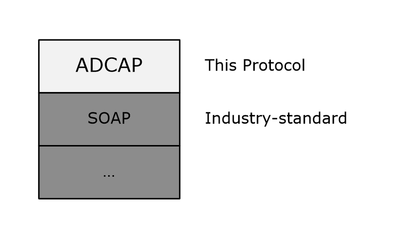

# [MS-ADCAP]: Active Directory Web Services: Custom Action Protocol

Table of Contents

1 Introduction

- [1 Introduction](#Section_1)
  - [1.1 Glossary](#Section_1.1)
  - [1.2 References](#Section_1.2)
    - [1.2.1 Normative References](#Section_1.2.1)
    - [1.2.2 Informative References](#Section_1.2.2)
  - [1.3 Overview](#Section_1.3)
  - [1.4 Relationship to Other Protocols](#Section_1.4)
  - [1.5 Prerequisites/Preconditions](#Section_1.5)
  - [1.6 Applicability Statement](#Section_1.6)
  - [1.7 Versioning and Capability Negotiation](#Section_1.7)
  - [1.8 Vendor-Extensible Fields](#Section_1.8)
  - [1.9 Standards Assignments](#Section_1.9)

2 Messages

- [2 Messages](#Section_2)
  - [2.1 Transport](#Section_2.1)
  - [2.2 Common Message Syntax](#Section_2.2)
    - [2.2.1 Namespaces](#Section_2.2.1)
    - [2.2.2 Messages](#Section_2.2.2)
    - [2.2.3 Elements](#Section_2.2.3)
      - [2.2.3.1 ActiveDirectoryObject](#Section_2.2.3.1)
      - [2.2.3.2 ActiveDirectoryPrincipal](#Section_2.2.3.2)
      - [2.2.3.3 ActiveDirectoryGroup](#Section_2.2.3.3)
      - [2.2.3.4 CustomActionFault](#Section_2.2.3.4)
      - [2.2.3.5 Server](#Section_2.2.3.5)
    - [2.2.4 Complex Types](#Section_2.2.4)
      - [2.2.4.1 ActiveDirectoryObject](#Section_2.2.4.1)
        - [2.2.4.1.1 ActiveDirectoryObject/DistinguishedName](#Section_2.2.4.1.1)
        - [2.2.4.1.2 ActiveDirectoryObject/Name](#Section_2.2.4.1.2)
        - [2.2.4.1.3 ActiveDirectoryObject/ObjectClass](#Section_2.2.4.1.3)
        - [2.2.4.1.4 ActiveDirectoryObject/ObjectGuid](#Section_2.2.4.1.4)
        - [2.2.4.1.5 ActiveDirectoryObject/ObjectTypes](#Section_2.2.4.1.5)
        - [2.2.4.1.6 ActiveDirectoryObject/ReferenceServer](#Section_2.2.4.1.6)
      - [2.2.4.2 ActiveDirectoryPrincipal](#Section_2.2.4.2)
        - [2.2.4.2.1 ActiveDirectoryPrincipal/SamAccountName](#Section_2.2.4.2.1)
        - [2.2.4.2.2 ActiveDirectoryPrincipal/SID](#Section_2.2.4.2.2)
      - [2.2.4.3 ActiveDirectoryGroup](#Section_2.2.4.3)
        - [2.2.4.3.1 ActiveDirectoryGroup/GroupScope](#Section_2.2.4.3.1)
        - [2.2.4.3.2 ActiveDirectoryGroup/GroupType](#Section_2.2.4.3.2)
      - [2.2.4.4 ArrayOfActiveDirectoryGroup](#Section_2.2.4.4)
      - [2.2.4.5 ArgumentErrorDetailCA](#Section_2.2.4.5)
        - [2.2.4.5.1 ArgumentErrorDetailCA/Message](#Section_2.2.4.5.1)
        - [2.2.4.5.2 ArgumentErrorDetailCA/ParameterName](#Section_2.2.4.5.2)
        - [2.2.4.5.3 ArgumentErrorDetailCA/ShortMessage](#Section_2.2.4.5.3)
      - [2.2.4.6 CustomActionFault](#Section_2.2.4.6)
        - [2.2.4.6.1 CustomActionFault/ArgumentError](#Section_2.2.4.6.1)
        - [2.2.4.6.2 CustomActionFault/DirectoryError](#Section_2.2.4.6.2)
        - [2.2.4.6.3 CustomActionFault/Error](#Section_2.2.4.6.3)
        - [2.2.4.6.4 CustomActionFault/ShortError](#Section_2.2.4.6.4)
      - [2.2.4.7 DirectoryErrorDetailCA](#Section_2.2.4.7)
        - [2.2.4.7.1 DirectoryErrorDetailCA/ErrorCode](#Section_2.2.4.7.1)
        - [2.2.4.7.2 DirectoryErrorDetailCA/ExtendedErrorMessage](#Section_2.2.4.7.2)
        - [2.2.4.7.3 DirectoryErrorDetailCA/MatchedDN](#Section_2.2.4.7.3)
        - [2.2.4.7.4 DirectoryErrorDetailCA/Message](#Section_2.2.4.7.4)
        - [2.2.4.7.5 DirectoryErrorDetailCA/Referral](#Section_2.2.4.7.5)
        - [2.2.4.7.6 DirectoryErrorDetailCA/ShortMessage](#Section_2.2.4.7.6)
        - [2.2.4.7.7 DirectoryErrorDetailCA/Win32ErrorCode](#Section_2.2.4.7.7)
      - [2.2.4.8 sera:ArrayOfString](#Section_2.2.4.8)
    - [2.2.5 Simple Types](#Section_2.2.5)
      - [2.2.5.1 ActiveDirectoryGroupScope](#Section_2.2.5.1)
      - [2.2.5.2 ActiveDirectoryGroupType](#Section_2.2.5.2)
      - [2.2.5.3 ActiveDirectoryOperationMasterRole](#Section_2.2.5.3)
      - [2.2.5.4 ser:duration](#Section_2.2.5.4)
      - [2.2.5.5 ser:guid](#Section_2.2.5.5)
    - [2.2.6 Attributes](#Section_2.2.6)
    - [2.2.7 Groups](#Section_2.2.7)
    - [2.2.8 Attribute Groups](#Section_2.2.8)
  - [2.3 Directory Service Schema Elements](#Section_2.3)

3 Protocol Details

- [3 Protocol Details](#Section_3)
  - [3.1 Common Server Processing and Notational Conventions](#Section_3.1)
    - [3.1.1 Abstract Data Model](#Section_3.1.1)
      - [3.1.1.1 Attribute List](#Section_3.1.1.1)
      - [3.1.1.2 Object Class List](#Section_3.1.1.2)
      - [3.1.1.3 Read and Write Operations](#Section_3.1.1.3)
        - [3.1.1.3.1 Read Operations](#Section_3.1.1.3.1)
        - [3.1.1.3.2 Write Operations](#Section_3.1.1.3.2)
    - [3.1.2 Timers](#Section_3.1.2)
    - [3.1.3 Initialization](#Section_3.1.3)
    - [3.1.4 Message Processing Events and Sequencing Rules](#Section_3.1.4)
      - [3.1.4.1 Header Processing Rules](#Section_3.1.4.1)
      - [3.1.4.2 Common Response Elements Processing Rules](#Section_3.1.4.2)
        - [3.1.4.2.1 ActiveDirectoryGroup](#Section_3.1.4.2.1)
        - [3.1.4.2.2 ActiveDirectoryObject](#Section_3.1.4.2.2)
        - [3.1.4.2.3 ActiveDirectoryPrincipal](#Section_3.1.4.2.3)
      - [3.1.4.3 Security Context of Operations](#Section_3.1.4.3)
    - [3.1.5 Timer Events](#Section_3.1.5)
    - [3.1.6 Other Local Events](#Section_3.1.6)
  - [3.2 Port Types](#Section_3.2)
  - [3.3 AccountManagement Server Details](#Section_3.3)
    - [3.3.1 Abstract Data Model](#Section_3.3.1)
    - [3.3.2 Timers](#Section_3.3.2)
    - [3.3.3 Initialization](#Section_3.3.3)
    - [3.3.4 Message Processing Events and Sequencing Rules](#Section_3.3.4)
      - [3.3.4.1 ChangePassword](#Section_3.3.4.1)
        - [3.3.4.1.1 Messages](#Section_3.3.4.1.1)
          - [3.3.4.1.1.1 AccountManagement_ChangePassword_ChangePasswordFault_FaultMessage](#Section_3.3.4.1.1.1)
          - [3.3.4.1.1.2 ChangePasswordRequest](#Section_3.3.4.1.1.2)
          - [3.3.4.1.1.3 ChangePasswordResponse](#Section_3.3.4.1.1.3)
        - [3.3.4.1.2 Elements](#Section_3.3.4.1.2)
          - [3.3.4.1.2.1 ChangePasswordFault](#Section_3.3.4.1.2.1)
          - [3.3.4.1.2.2 ChangePasswordRequest](#Section_3.3.4.1.2.2)
          - [3.3.4.1.2.3 ChangePasswordRequest/AccountDN](#Section_3.3.4.1.2.3)
          - [3.3.4.1.2.4 ChangePasswordRequest/NewPassword](#Section_3.3.4.1.2.4)
          - [3.3.4.1.2.5 ChangePasswordRequest/OldPassword](#Section_3.3.4.1.2.5)
          - [3.3.4.1.2.6 ChangePasswordRequest/PartitionDN](#Section_3.3.4.1.2.6)
          - [3.3.4.1.2.7 ChangePasswordResponse](#Section_3.3.4.1.2.7)
        - [3.3.4.1.3 Complex Types](#Section_3.3.4.1.3)
          - [3.3.4.1.3.1 ChangePasswordFault](#Section_3.3.4.1.3.1)
        - [3.3.4.1.4 Simple Types](#Section_3.3.4.1.4)
        - [3.3.4.1.5 Attributes](#Section_3.3.4.1.5)
        - [3.3.4.1.6 Groups](#Section_3.3.4.1.6)
        - [3.3.4.1.7 Attribute Groups](#Section_3.3.4.1.7)
        - [3.3.4.1.8 ChangePassword SOAP Faults](#Section_3.3.4.1.8)
          - [3.3.4.1.8.1 Bad Parameter Error](#Section_3.3.4.1.8.1)
          - [3.3.4.1.8.2 Bad Principal Error](#Section_3.3.4.1.8.2)
          - [3.3.4.1.8.3 Bad Principal AD LDS Error](#Section_3.3.4.1.8.3)
          - [3.3.4.1.8.4 Bad Password Error](#Section_3.3.4.1.8.4)
          - [3.3.4.1.8.5 Bad Naming Context Error](#Section_3.3.4.1.8.5)
          - [3.3.4.1.8.6 Directory Error](#Section_3.3.4.1.8.6)
          - [3.3.4.1.8.7 Authorization Error](#Section_3.3.4.1.8.7)
          - [3.3.4.1.8.8 Authentication Error](#Section_3.3.4.1.8.8)
      - [3.3.4.2 GetADGroupMember](#Section_3.3.4.2)
        - [3.3.4.2.1 Messages](#Section_3.3.4.2.1)
          - [3.3.4.2.1.1 AccountManagement_GetADGroupMember_GetADGroupMemberFault_FaultMessage](#Section_3.3.4.2.1.1)
          - [3.3.4.2.1.2 GetADGroupMemberRequest](#Section_3.3.4.2.1.2)
          - [3.3.4.2.1.3 GetADGroupMemberResponse](#Section_3.3.4.2.1.3)
        - [3.3.4.2.2 Elements](#Section_3.3.4.2.2)
          - [3.3.4.2.2.1 GetADGroupMemberFault](#Section_3.3.4.2.2.1)
          - [3.3.4.2.2.2 GetADGroupMemberRequest](#Section_3.3.4.2.2.2)
          - [3.3.4.2.2.3 GetADGroupMemberRequest/GroupDN](#Section_3.3.4.2.2.3)
          - [3.3.4.2.2.4 GetADGroupMemberRequest/PartitionDN](#Section_3.3.4.2.2.4)
          - [3.3.4.2.2.5 GetADGroupMemberRequest/Recursive](#Section_3.3.4.2.2.5)
          - [3.3.4.2.2.6 GetADGroupMemberResponse](#Section_3.3.4.2.2.6)
          - [3.3.4.2.2.7 GetADGroupMemberResponse/Members](#Section_3.3.4.2.2.7)
        - [3.3.4.2.3 Complex Types](#Section_3.3.4.2.3)
          - [3.3.4.2.3.1 ArrayOfActiveDirectoryPrincipal](#Section_3.3.4.2.3.1)
          - [3.3.4.2.3.2 GetADGroupMemberFault](#Section_3.3.4.2.3.2)
        - [3.3.4.2.4 Simple Types](#Section_3.3.4.2.4)
        - [3.3.4.2.5 Attributes](#Section_3.3.4.2.5)
        - [3.3.4.2.6 Groups](#Section_3.3.4.2.6)
        - [3.3.4.2.7 Attribute Groups](#Section_3.3.4.2.7)
        - [3.3.4.2.8 GetADGroupMember SOAP Faults](#Section_3.3.4.2.8)
          - [3.3.4.2.8.1 Bad Parameter Error](#Section_3.3.4.2.8.1)
          - [3.3.4.2.8.2 Bad Principal Error](#Section_3.3.4.2.8.2)
          - [3.3.4.2.8.3 Multiple Matching Principals Error](#Section_3.3.4.2.8.3)
          - [3.3.4.2.8.4 Bad Naming Context Error](#Section_3.3.4.2.8.4)
          - [3.3.4.2.8.5 Directory Error](#Section_3.3.4.2.8.5)
          - [3.3.4.2.8.6 Authentication Error](#Section_3.3.4.2.8.6)
          - [3.3.4.2.8.7 Remote Authentication Error](#Section_3.3.4.2.8.7)
      - [3.3.4.3 GetADPrincipalAuthorizationGroup](#Section_3.3.4.3)
        - [3.3.4.3.1 Messages](#Section_3.3.4.3.1)
          - [3.3.4.3.1.1 AccountManagement_GetADPrincipalAuthorizationGroup_GetADPrincipalAuthorizationGroupFault_FaultMessage](#Section_3.3.4.3.1.1)
          - [3.3.4.3.1.2 GetADPrincipalAuthorizationGroupRequest](#Section_3.3.4.3.1.2)
          - [3.3.4.3.1.3 GetADPrincipalAuthorizationGroupResponse](#Section_3.3.4.3.1.3)
        - [3.3.4.3.2 Elements](#Section_3.3.4.3.2)
          - [3.3.4.3.2.1 GetADPrincipalAuthorizationGroupFault](#Section_3.3.4.3.2.1)
          - [3.3.4.3.2.2 GetADPrincipalAuthorizationGroupRequest](#Section_3.3.4.3.2.2)
          - [3.3.4.3.2.3 GetADPrincipalAuthorizationGroupRequest/PartitionDN](#Section_3.3.4.3.2.3)
          - [3.3.4.3.2.4 GetADPrincipalAuthorizationGroupRequest/PrincipalDN](#Section_3.3.4.3.2.4)
          - [3.3.4.3.2.5 GetADPrincipalAuthorizationGroupResponse](#Section_3.3.4.3.2.5)
          - [3.3.4.3.2.6 GetADPrincipalAuthorizationGroupResponse/MemberOf](#Section_3.3.4.3.2.6)
        - [3.3.4.3.3 Complex Types](#Section_3.3.4.3.3)
          - [3.3.4.3.3.1 GetADPrincipalAuthorizationGroupFault](#Section_3.3.4.3.3.1)
        - [3.3.4.3.4 Simple Types](#Section_3.3.4.3.4)
        - [3.3.4.3.5 Attributes](#Section_3.3.4.3.5)
        - [3.3.4.3.6 Groups](#Section_3.3.4.3.6)
        - [3.3.4.3.7 Attribute Groups](#Section_3.3.4.3.7)
        - [3.3.4.3.8 GetADPrincipalAuthorizationGroup SOAP Faults](#Section_3.3.4.3.8)
          - [3.3.4.3.8.1 Bad Parameter Error](#Section_3.3.4.3.8.1)
          - [3.3.4.3.8.2 Bad Principal Error](#Section_3.3.4.3.8.2)
          - [3.3.4.3.8.3 Multiple Matching Principals Error](#Section_3.3.4.3.8.3)
          - [3.3.4.3.8.4 Bad Naming Context Error](#Section_3.3.4.3.8.4)
          - [3.3.4.3.8.5 Directory Error](#Section_3.3.4.3.8.5)
          - [3.3.4.3.8.6 Authentication Error](#Section_3.3.4.3.8.6)
          - [3.3.4.3.8.7 Remote Authentication Error](#Section_3.3.4.3.8.7)
      - [3.3.4.4 GetADPrincipalGroupMembership](#Section_3.3.4.4)
        - [3.3.4.4.1 Messages](#Section_3.3.4.4.1)
          - [3.3.4.4.1.1 AccountManagement_GetADPrincipalGroupMembership_GetADPrincipalGroupMembershipFault_FaultMessage](#Section_3.3.4.4.1.1)
          - [3.3.4.4.1.2 GetADPrincipalGroupMembershipRequest](#Section_3.3.4.4.1.2)
          - [3.3.4.4.1.3 GetADPrincipalGroupMembershipResponse](#Section_3.3.4.4.1.3)
        - [3.3.4.4.2 Elements](#Section_3.3.4.4.2)
          - [3.3.4.4.2.1 GetADPrincipalGroupMembershipFault](#Section_3.3.4.4.2.1)
          - [3.3.4.4.2.2 GetADPrincipalGroupMembershipRequest](#Section_3.3.4.4.2.2)
          - [3.3.4.4.2.3 GetADPrincipalGroupMembershipRequest/PartitionDN](#Section_3.3.4.4.2.3)
          - [3.3.4.4.2.4 GetADPrincipalGroupMembershipRequest/PrincipalDN](#Section_3.3.4.4.2.4)
          - [3.3.4.4.2.5 GetADPrincipalGroupMembershipRequest/ResourceContextPartition](#Section_3.3.4.4.2.5)
          - [3.3.4.4.2.6 GetADPrincipalGroupMembershipRequest/ResourceContextServer](#Section_3.3.4.4.2.6)
          - [3.3.4.4.2.7 GetADPrincipalGroupMembershipResponse](#Section_3.3.4.4.2.7)
          - [3.3.4.4.2.8 GetADPrincipalGroupMembershipResponse/MemberOf](#Section_3.3.4.4.2.8)
        - [3.3.4.4.3 Complex Types](#Section_3.3.4.4.3)
          - [3.3.4.4.3.1 GetADPrincipalGroupMembershipFault](#Section_3.3.4.4.3.1)
        - [3.3.4.4.4 Simple Types](#Section_3.3.4.4.4)
        - [3.3.4.4.5 Attributes](#Section_3.3.4.4.5)
        - [3.3.4.4.6 Groups](#Section_3.3.4.4.6)
        - [3.3.4.4.7 Attribute Groups](#Section_3.3.4.4.7)
        - [3.3.4.4.8 GetADPrincipalGroupMembership SOAP Faults](#Section_3.3.4.4.8)
          - [3.3.4.4.8.1 Bad Parameter Error](#Section_3.3.4.4.8.1)
          - [3.3.4.4.8.2 Bad Principal Error](#Section_3.3.4.4.8.2)
          - [3.3.4.4.8.3 Multiple Matching Principals Error](#Section_3.3.4.4.8.3)
          - [3.3.4.4.8.4 Bad Naming Context Error](#Section_3.3.4.4.8.4)
          - [3.3.4.4.8.5 ObjectGuid Error](#Section_3.3.4.4.8.5)
          - [3.3.4.4.8.6 Directory Error](#Section_3.3.4.4.8.6)
          - [3.3.4.4.8.7 Authentication Error](#Section_3.3.4.4.8.7)
          - [3.3.4.4.8.8 Remote Authentication Error](#Section_3.3.4.4.8.8)
          - [3.3.4.4.8.9 Resource Context Server Format Error](#Section_3.3.4.4.8.9)
      - [3.3.4.5 SetPassword](#Section_3.3.4.5)
        - [3.3.4.5.1 Messages](#Section_3.3.4.5.1)
          - [3.3.4.5.1.1 AccountManagement_SetPassword_SetPasswordFault_FaultMessage](#Section_3.3.4.5.1.1)
          - [3.3.4.5.1.2 SetPasswordRequest](#Section_3.3.4.5.1.2)
          - [3.3.4.5.1.3 SetPasswordResponse](#Section_3.3.4.5.1.3)
        - [3.3.4.5.2 Elements](#Section_3.3.4.5.2)
          - [3.3.4.5.2.1 SetPasswordFault](#Section_3.3.4.5.2.1)
          - [3.3.4.5.2.2 SetPasswordRequest](#Section_3.3.4.5.2.2)
          - [3.3.4.5.2.3 SetPasswordRequest/AccountDN](#Section_3.3.4.5.2.3)
          - [3.3.4.5.2.4 SetPasswordRequest/NewPassword](#Section_3.3.4.5.2.4)
          - [3.3.4.5.2.5 SetPasswordRequest/PartitionDN](#Section_3.3.4.5.2.5)
          - [3.3.4.5.2.6 SetPasswordResponse](#Section_3.3.4.5.2.6)
        - [3.3.4.5.3 Complex Types](#Section_3.3.4.5.3)
          - [3.3.4.5.3.1 SetPasswordFault](#Section_3.3.4.5.3.1)
        - [3.3.4.5.4 Simple Types](#Section_3.3.4.5.4)
        - [3.3.4.5.5 Attributes](#Section_3.3.4.5.5)
        - [3.3.4.5.6 Groups](#Section_3.3.4.5.6)
        - [3.3.4.5.7 Attribute Groups](#Section_3.3.4.5.7)
        - [3.3.4.5.8 SetPassword SOAP Faults](#Section_3.3.4.5.8)
          - [3.3.4.5.8.1 Bad Parameter Error](#Section_3.3.4.5.8.1)
          - [3.3.4.5.8.2 Bad Principal Error](#Section_3.3.4.5.8.2)
          - [3.3.4.5.8.3 Bad Principal AD LDS Error](#Section_3.3.4.5.8.3)
          - [3.3.4.5.8.4 Bad Password Error](#Section_3.3.4.5.8.4)
          - [3.3.4.5.8.5 Bad Naming Context Error](#Section_3.3.4.5.8.5)
          - [3.3.4.5.8.6 Directory Error](#Section_3.3.4.5.8.6)
          - [3.3.4.5.8.7 Authorization Error](#Section_3.3.4.5.8.7)
          - [3.3.4.5.8.8 Authentication Error](#Section_3.3.4.5.8.8)
      - [3.3.4.6 TranslateName](#Section_3.3.4.6)
        - [3.3.4.6.1 Messages](#Section_3.3.4.6.1)
          - [3.3.4.6.1.1 AccountManagement_TranslateName_TranslateNameFault_FaultMessage](#Section_3.3.4.6.1.1)
          - [3.3.4.6.1.2 TranslateNameRequest](#Section_3.3.4.6.1.2)
          - [3.3.4.6.1.3 TranslateNameResponse](#Section_3.3.4.6.1.3)
        - [3.3.4.6.2 Elements](#Section_3.3.4.6.2)
          - [3.3.4.6.2.1 TranslateNameFault](#Section_3.3.4.6.2.1)
          - [3.3.4.6.2.2 TranslateNameRequest](#Section_3.3.4.6.2.2)
          - [3.3.4.6.2.3 TranslateNameRequest/FormatDesired](#Section_3.3.4.6.2.3)
          - [3.3.4.6.2.4 TranslateNameRequest/FormatOffered](#Section_3.3.4.6.2.4)
          - [3.3.4.6.2.5 TranslateNameRequest/Names](#Section_3.3.4.6.2.5)
          - [3.3.4.6.2.6 TranslateNameResponse](#Section_3.3.4.6.2.6)
          - [3.3.4.6.2.7 TranslateNameResponse/NameTranslateResult](#Section_3.3.4.6.2.7)
        - [3.3.4.6.3 Complex Types](#Section_3.3.4.6.3)
          - [3.3.4.6.3.1 ActiveDirectoryNameTranslateResult](#Section_3.3.4.6.3.1)
            - [3.3.4.6.3.1.1 ActiveDirectoryNameTranslateResult/Result](#Section_3.3.4.6.3.1.1)
            - [3.3.4.6.3.1.2 ActiveDirectoryNameTranslateResult/Name](#Section_3.3.4.6.3.1.2)
          - [3.3.4.6.3.2 ArrayOfActiveDirectoryNameTranslateResult](#Section_3.3.4.6.3.2)
            - [3.3.4.6.3.2.1 ArrayOfActiveDirectoryNameTranslateResult/ActiveDirectoryNameTranslateResult](#Section_3.3.4.6.3.2.1)
          - [3.3.4.6.3.3 TranslateNameFault](#Section_3.3.4.6.3.3)
        - [3.3.4.6.4 Simple Types](#Section_3.3.4.6.4)
          - [3.3.4.6.4.1 ActiveDirectoryNameFormat](#Section_3.3.4.6.4.1)
        - [3.3.4.6.5 Attributes](#Section_3.3.4.6.5)
        - [3.3.4.6.6 Groups](#Section_3.3.4.6.6)
        - [3.3.4.6.7 Attribute Groups](#Section_3.3.4.6.7)
        - [3.3.4.6.8 TranslateName SOAP Faults](#Section_3.3.4.6.8)
          - [3.3.4.6.8.1 Bad Parameter Error](#Section_3.3.4.6.8.1)
          - [3.3.4.6.8.2 Directory Error](#Section_3.3.4.6.8.2)
          - [3.3.4.6.8.3 Authentication Error](#Section_3.3.4.6.8.3)
    - [3.3.5 Timer Events](#Section_3.3.5)
    - [3.3.6 Other Local Events](#Section_3.3.6)
  - [3.4 TopologyManagement Server Details](#Section_3.4)
    - [3.4.1 Abstract Data Model](#Section_3.4.1)
    - [3.4.2 Timers](#Section_3.4.2)
    - [3.4.3 Initialization](#Section_3.4.3)
    - [3.4.4 Message Processing Events and Sequencing Rules](#Section_3.4.4)
      - [3.4.4.1 ChangeOptionalFeature](#Section_3.4.4.1)
        - [3.4.4.1.1 Messages](#Section_3.4.4.1.1)
          - [3.4.4.1.1.1 ChangeOptionalFeatureRequest](#Section_3.4.4.1.1.1)
          - [3.4.4.1.1.2 ChangeOptionalFeatureResponse](#Section_3.4.4.1.1.2)
          - [3.4.4.1.1.3 TopologyManagement_ChangeOptionalFeature_ChangeOptionalFeatureFault_FaultMessage](#Section_3.4.4.1.1.3)
        - [3.4.4.1.2 Elements](#Section_3.4.4.1.2)
          - [3.4.4.1.2.1 ChangeOptionalFeatureFault](#Section_3.4.4.1.2.1)
          - [3.4.4.1.2.2 ChangeOptionalFeatureRequest](#Section_3.4.4.1.2.2)
          - [3.4.4.1.2.3 ChangeOptionalFeatureRequest/DistinguishedName](#Section_3.4.4.1.2.3)
          - [3.4.4.1.2.4 ChangeOptionalFeatureRequest/Enable](#Section_3.4.4.1.2.4)
          - [3.4.4.1.2.5 ChangeOptionalFeatureRequest/FeatureId](#Section_3.4.4.1.2.5)
          - [3.4.4.1.2.6 ChangeOptionalFeatureResponse](#Section_3.4.4.1.2.6)
        - [3.4.4.1.3 Complex Types](#Section_3.4.4.1.3)
          - [3.4.4.1.3.1 ChangeOptionalFeatureFault](#Section_3.4.4.1.3.1)
        - [3.4.4.1.4 Simple Types](#Section_3.4.4.1.4)
        - [3.4.4.1.5 Attributes](#Section_3.4.4.1.5)
        - [3.4.4.1.6 Groups](#Section_3.4.4.1.6)
        - [3.4.4.1.7 Attribute Groups](#Section_3.4.4.1.7)
        - [3.4.4.1.8 ChangeOptionalFeature SOAP Faults](#Section_3.4.4.1.8)
          - [3.4.4.1.8.1 Bad Parameter Error](#Section_3.4.4.1.8.1)
          - [3.4.4.1.8.2 Bad DistinguishedName Error](#Section_3.4.4.1.8.2)
          - [3.4.4.1.8.3 Bad FeatureId Error](#Section_3.4.4.1.8.3)
          - [3.4.4.1.8.4 Directory Error](#Section_3.4.4.1.8.4)
          - [3.4.4.1.8.5 Authorization Error](#Section_3.4.4.1.8.5)
          - [3.4.4.1.8.6 Authentication Error](#Section_3.4.4.1.8.6)
      - [3.4.4.2 GetADDomain](#Section_3.4.4.2)
        - [3.4.4.2.1 Messages](#Section_3.4.4.2.1)
          - [3.4.4.2.1.1 GetADDomainRequest](#Section_3.4.4.2.1.1)
          - [3.4.4.2.1.2 GetADDomainResponse](#Section_3.4.4.2.1.2)
          - [3.4.4.2.1.3 TopologyManagement_GetADDomain_GetADDomainFault_FaultMessage](#Section_3.4.4.2.1.3)
        - [3.4.4.2.2 Elements](#Section_3.4.4.2.2)
          - [3.4.4.2.2.1 GetADDomainFault](#Section_3.4.4.2.2.1)
          - [3.4.4.2.2.2 GetADDomainRequest](#Section_3.4.4.2.2.2)
          - [3.4.4.2.2.3 GetADDomainResponse](#Section_3.4.4.2.2.3)
          - [3.4.4.2.2.4 GetADDomainResponse/Domain](#Section_3.4.4.2.2.4)
        - [3.4.4.2.3 Complex Types](#Section_3.4.4.2.3)
          - [3.4.4.2.3.1 ActiveDirectoryDomain](#Section_3.4.4.2.3.1)
            - [3.4.4.2.3.1.1 ActiveDirectoryDomain/AllowedDNSSuffixes](#Section_3.4.4.2.3.1.1)
            - [3.4.4.2.3.1.2 ActiveDirectoryDomain/AppliedGroupPolicies](#Section_3.4.4.2.3.1.2)
            - [3.4.4.2.3.1.3 ActiveDirectoryDomain/ChildDomains](#Section_3.4.4.2.3.1.3)
            - [3.4.4.2.3.1.4 ActiveDirectoryDomain/ComputersContainer](#Section_3.4.4.2.3.1.4)
            - [3.4.4.2.3.1.5 ActiveDirectoryDomain/DomainControllersContainer](#Section_3.4.4.2.3.1.5)
            - [3.4.4.2.3.1.6 ActiveDirectoryDomain/DomainMode](#Section_3.4.4.2.3.1.6)
            - [3.4.4.2.3.1.7 ActiveDirectoryDomain/DomainSID](#Section_3.4.4.2.3.1.7)
            - [3.4.4.2.3.1.8 ActiveDirectoryDomain/ForeignSecurityPrincipalsContainer](#Section_3.4.4.2.3.1.8)
            - [3.4.4.2.3.1.9 ActiveDirectoryDomain/Forest](#Section_3.4.4.2.3.1.9)
            - [3.4.4.2.3.1.10 ActiveDirectoryDomain/InfrastructureMaster](#Section_3.4.4.2.3.1.10)
            - [3.4.4.2.3.1.11 ActiveDirectoryDomain/LastLogonReplicationInterval](#Section_3.4.4.2.3.1.11)
            - [3.4.4.2.3.1.12 ActiveDirectoryDomain/ManagedBy](#Section_3.4.4.2.3.1.12)
            - [3.4.4.2.3.1.13 ActiveDirectoryDomain/NetBIOSName](#Section_3.4.4.2.3.1.13)
            - [3.4.4.2.3.1.14 ActiveDirectoryDomain/ParentDomain](#Section_3.4.4.2.3.1.14)
            - [3.4.4.2.3.1.15 ActiveDirectoryDomain/PDCEmulator](#Section_3.4.4.2.3.1.15)
            - [3.4.4.2.3.1.16 ActiveDirectoryDomain/RIDMaster](#Section_3.4.4.2.3.1.16)
            - [3.4.4.2.3.1.17 ActiveDirectoryDomain/SystemsContainer](#Section_3.4.4.2.3.1.17)
            - [3.4.4.2.3.1.18 ActiveDirectoryDomain/UsersContainer](#Section_3.4.4.2.3.1.18)
          - [3.4.4.2.3.2 ActiveDirectoryPartition](#Section_3.4.4.2.3.2)
            - [3.4.4.2.3.2.1 ActiveDirectoryPartition/DeletedObjectsContainer](#Section_3.4.4.2.3.2.1)
            - [3.4.4.2.3.2.2 ActiveDirectoryPartition/DistinguishedName](#Section_3.4.4.2.3.2.2)
            - [3.4.4.2.3.2.3 ActiveDirectoryPartition/DNSRoot](#Section_3.4.4.2.3.2.3)
            - [3.4.4.2.3.2.4 ActiveDirectoryPartition/LostAndFoundContainer](#Section_3.4.4.2.3.2.4)
            - [3.4.4.2.3.2.5 ActiveDirectoryPartition/Name](#Section_3.4.4.2.3.2.5)
            - [3.4.4.2.3.2.6 ActiveDirectoryPartition/ObjectClass](#Section_3.4.4.2.3.2.6)
            - [3.4.4.2.3.2.7 ActiveDirectoryPartition/ObjectGuid](#Section_3.4.4.2.3.2.7)
            - [3.4.4.2.3.2.8 ActiveDirectoryPartition/ObjectTypes](#Section_3.4.4.2.3.2.8)
            - [3.4.4.2.3.2.9 ActiveDirectoryPartition/SubordinateReferences](#Section_3.4.4.2.3.2.9)
            - [3.4.4.2.3.2.10 ActiveDirectoryPartition/QuotasContainer](#Section_3.4.4.2.3.2.10)
            - [3.4.4.2.3.2.11 ActiveDirectoryPartition/ReadOnlyReplicaDirectoryServer](#Section_3.4.4.2.3.2.11)
            - [3.4.4.2.3.2.12 ActiveDirectoryPartition/ReferenceServer](#Section_3.4.4.2.3.2.12)
            - [3.4.4.2.3.2.13 ActiveDirectoryPartition/ReplicaDirectoryServer](#Section_3.4.4.2.3.2.13)
          - [3.4.4.2.3.3 GetADDomainFault](#Section_3.4.4.2.3.3)
        - [3.4.4.2.4 Simple Types](#Section_3.4.4.2.4)
        - [3.4.4.2.5 Attributes](#Section_3.4.4.2.5)
        - [3.4.4.2.6 Groups](#Section_3.4.4.2.6)
        - [3.4.4.2.7 Attribute Groups](#Section_3.4.4.2.7)
        - [3.4.4.2.8 GetADDomain SOAP Faults](#Section_3.4.4.2.8)
          - [3.4.4.2.8.1 Bad Parameter Error](#Section_3.4.4.2.8.1)
          - [3.4.4.2.8.2 Directory Error](#Section_3.4.4.2.8.2)
          - [3.4.4.2.8.3 Bad Principal Error](#Section_3.4.4.2.8.3)
          - [3.4.4.2.8.4 Authentication Error](#Section_3.4.4.2.8.4)
      - [3.4.4.3 GetADDomainController](#Section_3.4.4.3)
        - [3.4.4.3.1 Messages](#Section_3.4.4.3.1)
          - [3.4.4.3.1.1 GetADDomainControllerRequest](#Section_3.4.4.3.1.1)
          - [3.4.4.3.1.2 GetADDomainControllerResponse](#Section_3.4.4.3.1.2)
          - [3.4.4.3.1.3 TopologyManagement_GetADDomainController_GetADDomainControllerFault_FaultMessage](#Section_3.4.4.3.1.3)
        - [3.4.4.3.2 Elements](#Section_3.4.4.3.2)
          - [3.4.4.3.2.1 GetADDomainControllerFault](#Section_3.4.4.3.2.1)
          - [3.4.4.3.2.2 GetADDomainControllerRequest](#Section_3.4.4.3.2.2)
          - [3.4.4.3.2.3 GetADDomainControllerRequest/NtdsSettingsDN](#Section_3.4.4.3.2.3)
          - [3.4.4.3.2.4 GetADDomainControllerResponse](#Section_3.4.4.3.2.4)
          - [3.4.4.3.2.5 GetADDomainControllerResponse/DomainControllers](#Section_3.4.4.3.2.5)
        - [3.4.4.3.3 Complex Types](#Section_3.4.4.3.3)
          - [3.4.4.3.3.1 ActiveDirectoryDirectoryServer](#Section_3.4.4.3.3.1)
            - [3.4.4.3.3.1.1 ActiveDirectoryDirectoryServer/DefaultPartition](#Section_3.4.4.3.3.1.1)
            - [3.4.4.3.3.1.2 ActiveDirectoryDirectoryServer/HostName](#Section_3.4.4.3.3.1.2)
            - [3.4.4.3.3.1.3 ActiveDirectoryDirectoryServer/InvocationId](#Section_3.4.4.3.3.1.3)
            - [3.4.4.3.3.1.4 ActiveDirectoryDirectoryServer/LdapPort](#Section_3.4.4.3.3.1.4)
            - [3.4.4.3.3.1.5 ActiveDirectoryDirectoryServer/Name](#Section_3.4.4.3.3.1.5)
            - [3.4.4.3.3.1.6 ActiveDirectoryDirectoryServer/NTDSSettingsObjectDN](#Section_3.4.4.3.3.1.6)
            - [3.4.4.3.3.1.7 ActiveDirectoryDirectoryServer/OperationMasterRole](#Section_3.4.4.3.3.1.7)
            - [3.4.4.3.3.1.8 ActiveDirectoryDirectoryServer/Partitions](#Section_3.4.4.3.3.1.8)
            - [3.4.4.3.3.1.9 ActiveDirectoryDirectoryServer/ServerObjectDN](#Section_3.4.4.3.3.1.9)
            - [3.4.4.3.3.1.10 ActiveDirectoryDirectoryServer/ServerObjectGuid](#Section_3.4.4.3.3.1.10)
            - [3.4.4.3.3.1.11 ActiveDirectoryDirectoryServer/Site](#Section_3.4.4.3.3.1.11)
            - [3.4.4.3.3.1.12 ActiveDirectoryDirectoryServer/SslPort](#Section_3.4.4.3.3.1.12)
          - [3.4.4.3.3.2 ActiveDirectoryDomainController](#Section_3.4.4.3.3.2)
            - [3.4.4.3.3.2.1 ActiveDirectoryDomainController/ComputerDN](#Section_3.4.4.3.3.2.1)
            - [3.4.4.3.3.2.2 ActiveDirectoryDomainController/Domain](#Section_3.4.4.3.3.2.2)
            - [3.4.4.3.3.2.3 ActiveDirectoryDomainController/Enabled](#Section_3.4.4.3.3.2.3)
            - [3.4.4.3.3.2.4 ActiveDirectoryDomainController/Forest](#Section_3.4.4.3.3.2.4)
            - [3.4.4.3.3.2.5 ActiveDirectoryDomainController/IsGlobalCatalog](#Section_3.4.4.3.3.2.5)
            - [3.4.4.3.3.2.6 ActiveDirectoryDomainController/IsReadOnly](#Section_3.4.4.3.3.2.6)
            - [3.4.4.3.3.2.7 ActiveDirectoryDomainController/OSHotFix](#Section_3.4.4.3.3.2.7)
            - [3.4.4.3.3.2.8 ActiveDirectoryDomainController/OSName](#Section_3.4.4.3.3.2.8)
            - [3.4.4.3.3.2.9 ActiveDirectoryDomainController/OSServicepack](#Section_3.4.4.3.3.2.9)
            - [3.4.4.3.3.2.10 ActiveDirectoryDomainController/OSVersion](#Section_3.4.4.3.3.2.10)
          - [3.4.4.3.3.3 ArrayOfActiveDirectoryDomainController](#Section_3.4.4.3.3.3)
          - [3.4.4.3.3.4 ArrayOfActiveDirectoryOperationMasterRole](#Section_3.4.4.3.3.4)
          - [3.4.4.3.3.5 GetADDomainControllerFault](#Section_3.4.4.3.3.5)
        - [3.4.4.3.4 Simple Types](#Section_3.4.4.3.4)
        - [3.4.4.3.5 Attributes](#Section_3.4.4.3.5)
        - [3.4.4.3.6 Groups](#Section_3.4.4.3.6)
        - [3.4.4.3.7 Attribute Groups](#Section_3.4.4.3.7)
        - [3.4.4.3.8 GetADDomainController SOAP Faults](#Section_3.4.4.3.8)
          - [3.4.4.3.8.1 Bad Parameter Error](#Section_3.4.4.3.8.1)
          - [3.4.4.3.8.2 Invalid NtdsSettingsDN Error](#Section_3.4.4.3.8.2)
          - [3.4.4.3.8.3 Directory Error](#Section_3.4.4.3.8.3)
          - [3.4.4.3.8.4 Authentication Error](#Section_3.4.4.3.8.4)
      - [3.4.4.4 GetADForest](#Section_3.4.4.4)
        - [3.4.4.4.1 Messages](#Section_3.4.4.4.1)
          - [3.4.4.4.1.1 GetADForestRequest](#Section_3.4.4.4.1.1)
          - [3.4.4.4.1.2 GetADForestResponse](#Section_3.4.4.4.1.2)
          - [3.4.4.4.1.3 TopologyManagement_GetADForest_GetADForestFault_FaultMessage](#Section_3.4.4.4.1.3)
        - [3.4.4.4.2 Elements](#Section_3.4.4.4.2)
          - [3.4.4.4.2.1 GetADForestFault](#Section_3.4.4.4.2.1)
          - [3.4.4.4.2.2 GetADForestRequest](#Section_3.4.4.4.2.2)
          - [3.4.4.4.2.3 GetADForestResponse](#Section_3.4.4.4.2.3)
          - [3.4.4.4.2.4 GetADForestResponse/Forest](#Section_3.4.4.4.2.4)
        - [3.4.4.4.3 Complex Types](#Section_3.4.4.4.3)
          - [3.4.4.4.3.1 ActiveDirectoryForest](#Section_3.4.4.4.3.1)
            - [3.4.4.4.3.1.1 ActiveDirectoryForest/ApplicationPartitions](#Section_3.4.4.4.3.1.1)
            - [3.4.4.4.3.1.2 ActiveDirectoryForest/CrossForestReferences](#Section_3.4.4.4.3.1.2)
            - [3.4.4.4.3.1.3 ActiveDirectoryForest/DomainNamingMaster](#Section_3.4.4.4.3.1.3)
            - [3.4.4.4.3.1.4 ActiveDirectoryForest/Domains](#Section_3.4.4.4.3.1.4)
            - [3.4.4.4.3.1.5 ActiveDirectoryForest/ForestMode](#Section_3.4.4.4.3.1.5)
            - [3.4.4.4.3.1.6 ActiveDirectoryForest/GlobalCatalogs](#Section_3.4.4.4.3.1.6)
            - [3.4.4.4.3.1.7 ActiveDirectoryForest/Name](#Section_3.4.4.4.3.1.7)
            - [3.4.4.4.3.1.8 ActiveDirectoryForest/RootDomain](#Section_3.4.4.4.3.1.8)
            - [3.4.4.4.3.1.9 ActiveDirectoryForest/SchemaMaster](#Section_3.4.4.4.3.1.9)
            - [3.4.4.4.3.1.10 ActiveDirectoryForest/Sites](#Section_3.4.4.4.3.1.10)
            - [3.4.4.4.3.1.11 ActiveDirectoryForest/SPNSuffixes](#Section_3.4.4.4.3.1.11)
            - [3.4.4.4.3.1.12 ActiveDirectoryForest/UPNSuffixes](#Section_3.4.4.4.3.1.12)
          - [3.4.4.4.3.2 GetADForestFault](#Section_3.4.4.4.3.2)
        - [3.4.4.4.4 Simple Types](#Section_3.4.4.4.4)
        - [3.4.4.4.5 Attributes](#Section_3.4.4.4.5)
        - [3.4.4.4.6 Groups](#Section_3.4.4.4.6)
        - [3.4.4.4.7 Attribute Groups](#Section_3.4.4.4.7)
        - [3.4.4.4.8 GetADForest SOAP Faults](#Section_3.4.4.4.8)
          - [3.4.4.4.8.1 Bad Parameter Error](#Section_3.4.4.4.8.1)
          - [3.4.4.4.8.2 Directory Error](#Section_3.4.4.4.8.2)
          - [3.4.4.4.8.3 Authentication Error](#Section_3.4.4.4.8.3)
      - [3.4.4.5 GetVersion](#Section_3.4.4.5)
        - [3.4.4.5.1 Messages](#Section_3.4.4.5.1)
          - [3.4.4.5.1.1 GetVersionRequest](#Section_3.4.4.5.1.1)
          - [3.4.4.5.1.2 GetVersionResponse](#Section_3.4.4.5.1.2)
          - [3.4.4.5.1.3 TopologyManagement_GetVersion_GetVersionFault_FaultMessage](#Section_3.4.4.5.1.3)
        - [3.4.4.5.2 Elements](#Section_3.4.4.5.2)
          - [3.4.4.5.2.1 GetVersionFault](#Section_3.4.4.5.2.1)
          - [3.4.4.5.2.2 GetVersionRequest](#Section_3.4.4.5.2.2)
          - [3.4.4.5.2.3 GetVersionResponse](#Section_3.4.4.5.2.3)
          - [3.4.4.5.2.4 GetVersionResponse/VersionMajor](#Section_3.4.4.5.2.4)
          - [3.4.4.5.2.5 GetVersionResponse/VersionMinor](#Section_3.4.4.5.2.5)
          - [3.4.4.5.2.6 GetVersionResponse/VersionString](#Section_3.4.4.5.2.6)
        - [3.4.4.5.3 Complex Types](#Section_3.4.4.5.3)
          - [3.4.4.5.3.1 GetVersionFault](#Section_3.4.4.5.3.1)
        - [3.4.4.5.4 Simple Types](#Section_3.4.4.5.4)
        - [3.4.4.5.5 Attributes](#Section_3.4.4.5.5)
        - [3.4.4.5.6 Groups](#Section_3.4.4.5.6)
        - [3.4.4.5.7 Attribute Groups](#Section_3.4.4.5.7)
        - [3.4.4.5.8 GetVersion SOAP Faults](#Section_3.4.4.5.8)
      - [3.4.4.6 MoveADOperationMasterRole](#Section_3.4.4.6)
        - [3.4.4.6.1 Messages](#Section_3.4.4.6.1)
          - [3.4.4.6.1.1 MoveADOperationMasterRoleRequest](#Section_3.4.4.6.1.1)
          - [3.4.4.6.1.2 MoveADOperationMasterRoleResponse](#Section_3.4.4.6.1.2)
          - [3.4.4.6.1.3 TopologyManagement_MoveADOperationMasterRole_MoveADOperationMasterRoleFault_FaultMessage](#Section_3.4.4.6.1.3)
        - [3.4.4.6.2 Elements](#Section_3.4.4.6.2)
          - [3.4.4.6.2.1 MoveADOperationMasterRoleFault](#Section_3.4.4.6.2.1)
          - [3.4.4.6.2.2 MoveADOperationMasterRoleRequest](#Section_3.4.4.6.2.2)
          - [3.4.4.6.2.3 MoveADOperationMasterRoleRequest/OperationMasterRole](#Section_3.4.4.6.2.3)
            - [3.4.4.6.2.3.1 Transferring a FSMO Role](#Section_3.4.4.6.2.3.1)
            - [3.4.4.6.2.3.2 Seizing a FSMO Role](#Section_3.4.4.6.2.3.2)
          - [3.4.4.6.2.4 MoveADOperationMasterRoleRequest/Seize](#Section_3.4.4.6.2.4)
          - [3.4.4.6.2.5 MoveADOperationMasterRoleResponse](#Section_3.4.4.6.2.5)
          - [3.4.4.6.2.6 MoveADOperationMasterRoleResponse/WasSeized](#Section_3.4.4.6.2.6)
        - [3.4.4.6.3 Complex Types](#Section_3.4.4.6.3)
          - [3.4.4.6.3.1 MoveADOperationMasterRoleFault](#Section_3.4.4.6.3.1)
        - [3.4.4.6.4 Simple Types](#Section_3.4.4.6.4)
        - [3.4.4.6.5 Attributes](#Section_3.4.4.6.5)
        - [3.4.4.6.6 Groups](#Section_3.4.4.6.6)
        - [3.4.4.6.7 Attribute Groups](#Section_3.4.4.6.7)
        - [3.4.4.6.8 MoveADOperationMasterRole SOAP Faults](#Section_3.4.4.6.8)
          - [3.4.4.6.8.1 Bad Parameter Error](#Section_3.4.4.6.8.1)
          - [3.4.4.6.8.2 Could Not Transfer PDC FSMO Error](#Section_3.4.4.6.8.2)
          - [3.4.4.6.8.3 Unwilling to Perform Error](#Section_3.4.4.6.8.3)
          - [3.4.4.6.8.4 Directory Error](#Section_3.4.4.6.8.4)
          - [3.4.4.6.8.5 Authorization Error](#Section_3.4.4.6.8.5)
          - [3.4.4.6.8.6 Authentication Error](#Section_3.4.4.6.8.6)
    - [3.4.5 Timer Events](#Section_3.4.5)
    - [3.4.6 Other Local Events](#Section_3.4.6)

4 Protocol Examples

- [4 Protocol Examples](#Section_4)
  - [4.1 AccountManagement Examples](#Section_4.1)
    - [4.1.1 Example of ChangePassword](#Section_4.1.1)
    - [4.1.2 Example of GetADGroupMember](#Section_4.1.2)
    - [4.1.3 Example of GetADPrincipalAuthorizationGroup](#Section_4.1.3)
    - [4.1.4 Example of GetADPrincipalGroupMembership](#Section_4.1.4)
    - [4.1.5 Example of SetPassword](#Section_4.1.5)
    - [4.1.6 Example of TranslateName](#Section_4.1.6)
  - [4.2 TopologyManagement Examples](#Section_4.2)
    - [4.2.1 Example of ChangeOptionalFeature](#Section_4.2.1)
    - [4.2.2 Example of GetADDomain](#Section_4.2.2)
    - [4.2.3 Example of GetADDomainController](#Section_4.2.3)
    - [4.2.4 Example of GetADForest](#Section_4.2.4)
    - [4.2.5 Example of GetVersion](#Section_4.2.5)
    - [4.2.6 Example of MoveADOperationMasterRole](#Section_4.2.6)

5 Security

- [5 Security](#Section_5)
  - [5.1 Security Considerations for Implementers](#Section_5.1)
  - [5.2 Index of Security Parameters](#Section_5.2)

6 Appendix A: Full WSDL

- [6 Appendix A: Full WSDL](#Section_6)

7 Appendix B: Product Behavior

- [7 Appendix B: Product Behavior](#Section_7)

8 Change Tracking

- [8 Change Tracking](#Section_8)

For the legal notice and IP terms, see [LEGAL.md](../LEGAL.md).
Last updated: 4/23/2024.
See [Revision History](#revision-history) for full version history.

# 1 Introduction

The Active Directory Web Services: Custom Action Protocol is used for directory access in identity management and topology management. Examples of these operations are managing [**groups**](#gt_group) and passwords (identity management; see section [3.3](#Section_1.3)) and retrieving information about the [**forest**](#gt_forest) and [**domain**](#gt_domain) (topology management; see section [3.4](#Section_1.3)). A portion of the Microsoft implementation of the Active Directory Web Services: Custom Action Protocol is used to communicate between servers; for example the implementation of server-to-server [**FSMO**](#gt_flexible-single-master-operation-fsmo) transfers or the implementation of server-to-server methods for retrieving group memberships from other servers. Those server-to-server communications are not used by Microsoft to communicate with Windows client operating systems and are not included in this specification. Licensees can implement those server-to-server communications using any protocol they choose. This specification describes the client-to-server portions of the Active Directory Web Services: Custom Action Protocol that are used between applicable Windows Server releases and Windows client operating systems to manage [**Active Directory**](#gt_active-directory) identities and topologies. In some cases, the client-to-server communications include status of the success or failure of server-to-server communication, to give administrators the ability to assist in diagnosing or monitoring the server-to-server implementation. However, the specific content of these communications is not understood by Windows client operating systems, and the semantics are not prescribed by this specification. Interoperation with Windows client operating systems does not require an understanding of the status of the server-to-server implementation. Licensees can implement the Active Directory Web Services: Custom Action Protocol to provide and accept any status that is meaningful for diagnosing or monitoring their server-to-server communications, or no data at all, as they choose.

The goal of this specification is to enable the transition of client applications that are currently using non–Web services protocols such as [**Lightweight Directory Access Protocol (LDAP)**](#gt_lightweight-directory-access-protocol-ldap) version 3 [[RFC2251]](https://go.microsoft.com/fwlink/?LinkId=90325) for managing information held in [**directory services**](#gt_directory-service-ds) to using Web services protocols.

Sections 1.5, 1.8, 1.9, 2, and 3 of this specification are normative. All other sections and examples in this specification are informative.

## 1.1 Glossary

This document uses the following terms:

**Active Directory**: The Windows implementation of a general-purpose [**directory service**](#gt_directory-service-ds), which uses [**LDAP**](#gt_lightweight-directory-access-protocol-ldap) as its primary access protocol. [**Active Directory**](#gt_active-directory) stores information about a variety of objects in the network such as user accounts, computer accounts, groups, and all related credential information used by Kerberos [MS-KILE](../MS-KILE/MS-KILE.md). [**Active Directory**](#gt_active-directory) is either deployed as [**Active Directory Domain Services (AD DS)**](#gt_active-directory-domain-services-ad-ds) or [**Active Directory Lightweight Directory Services (AD LDS)**](#gt_active-directory-lightweight-directory-services-ad-lds), which are both described in [MS-ADOD](#Section_1.3): Active Directory Protocols Overview.

**Active Directory Domain Services (AD DS)**: A [**directory service (DS)**](#gt_directory-service-ds) implemented by a [**domain controller (DC)**](#gt_domain-controller-dc). The [**DS**](#gt_directory-service-ds) provides a data store for objects that is distributed across multiple [**DCs**](#gt_domain-controller-dc). The [**DCs**](#gt_domain-controller-dc) interoperate as peers to ensure that a local change to an object replicates correctly across [**DCs**](#gt_domain-controller-dc). AD DS is a deployment of [**Active Directory**](#gt_active-directory) [MS-ADTS](../MS-ADTS/MS-ADTS.md).

**Active Directory Lightweight Directory Services (AD LDS)**: A [**directory service (DS)**](#gt_directory-service-ds) implemented by a [**domain controller (DC)**](#gt_domain-controller-dc). AD LDS is a deployment of [**Active Directory**](#gt_active-directory) [MS-ADTS]. The most significant difference between [**AD LDS**](#gt_active-directory-lightweight-directory-services-ad-lds) and [**Active Directory Domain Services (AD DS)**](#gt_active-directory-domain-services-ad-ds) is that [**AD LDS**](#gt_active-directory-lightweight-directory-services-ad-lds) does not host [**domain naming contexts (domain NCs)**](#gt_domain-naming-context-domain-nc). A server can host multiple [**AD LDS**](#gt_active-directory-lightweight-directory-services-ad-lds) [**DCs**](#gt_domain-controller-dc). Each [**DC**](#gt_domain-controller-dc) is an independent [**AD LDS**](#gt_active-directory-lightweight-directory-services-ad-lds) instance, with its own independent state. [**AD LDS**](#gt_active-directory-lightweight-directory-services-ad-lds) can be run as an operating system [**DS**](#gt_directory-service-ds) or as a directory service provided by a standalone application (Active Directory Application Mode (ADAM)).

**Active Directory Web Services (ADWS)**: Provides a web service interface to [**Active Directory Domain Services (AD DS)**](#gt_active-directory-domain-services-ad-ds) and [**Active Directory Lightweight Directory Services (AD LDS)**](#gt_active-directory-lightweight-directory-services-ad-lds) instances.

**application naming context (application NC)**: A specific type of [**naming context (NC)**](#gt_naming-context-nc), or an instance of that type, that supports only full replicas (no partial replicas). An [**application NC**](#gt_application-naming-context-application-nc) cannot contain security principal objects in Active Directory Domain Services (AD DS), but can contain security principal objects in Active Lightweight Directory Services (AD LDS). A [**forest**](#gt_forest) can have zero or more [**application NCs**](#gt_application-naming-context-application-nc) in either AD DS or AD LDS. An application NC can contain dynamic objects. [**Application NCs**](#gt_application-naming-context-application-nc) do not appear in the [**global catalog (GC)**](#gt_global-catalog-gc). The root of an [**application NC**](#gt_application-naming-context-application-nc) is an object of class domainDNS.

**attribute**: A characteristic of some object or entity, typically encoded as a name/value pair.

**authenticable principal**: In [**AD DS**](#gt_active-directory-domain-services-ad-ds), a [**directory object**](#gt_directory-object) of class user or of a class derived from user. In [**AD LDS**](#gt_active-directory-lightweight-directory-services-ad-lds), a [**directory object**](#gt_directory-object) of a class that statically links to the msDS-BindableObject auxiliary class. See [MS-ADTS] section 3.1.1.2.4.

**child domain**: A [**domain**](#gt_domain) that is a member of a [**domain tree**](#gt_domain-tree) but is not the [**root domain**](#gt_root-domain) of the [**domain tree**](#gt_domain-tree).

**computer object**: An object of class computer. A [**computer object**](#gt_computer-object) is a [**security principal**](#gt_security-principal) object; the principal is the operating system running on the computer. The shared secret allows the operating system running on the computer to authenticate itself independently of any user running on the system. See [**security principal**](#gt_security-principal).

**configuration naming context (config NC)**: A specific type of [**naming context (NC)**](#gt_naming-context-nc), or an instance of that type, that contains configuration information. In [**Active Directory**](#gt_active-directory), a single [**config NC**](#gt_configuration-naming-context-config-nc) is shared among all [**domain controllers (DCs)**](#gt_domain-controller-dc) in the forest. A [**config NC**](#gt_configuration-naming-context-config-nc) cannot contain security principal objects.

**crossRef object**: An object residing in the partitions container of the [**config NC**](#gt_configuration-naming-context-config-nc) that describes the properties of a [**naming context (NC)**](#gt_naming-context-nc), such as its domain naming service name, operational settings, and so on.

**directory instance**: The [**directory service**](#gt_directory-service-ds) referred to by the [**SOAP header**](#gt_soap-header) in the Active Directory Web Services: Custom Action Protocol custom action [**XML**](#gt_xml) operation, which is the target of the custom action request. This [**directory service**](#gt_directory-service-ds) is assumed to be running locally on the server. This can be an [**Active Directory**](#gt_active-directory) [**directory service**](#gt_directory-service-ds) instance, or an [**Active Directory Lightweight Directory Services**](#gt_active-directory-lightweight-directory-services-ad-lds) instance (one of possibly many). For more detail on the format of the [**SOAP header**](#gt_soap-header), see [MS-ADDM](#Section_3.4.4.5.2) section 2.5.1.

**directory object**: A [**Lightweight Directory Access Protocol (LDAP)**](#gt_lightweight-directory-access-protocol-ldap) object, as specified in [[RFC2251]](https://go.microsoft.com/fwlink/?LinkId=90325), that is a specialization of an object.

**directory service (DS)**: A service that stores and organizes information about a computer network's users and network shares, and that allows network administrators to manage users' access to the shares. See also [**Active Directory**](#gt_active-directory).

**distinguished name (DN)**: A name that uniquely identifies an object by using the relative distinguished name (RDN) for the object, and the names of container objects and domains that contain the object. The distinguished name (DN) identifies the object and its location in a tree.

**domain**: A set of users and computers sharing a common namespace and management infrastructure. At least one computer member of the set has to act as a [**domain controller (DC)**](#gt_domain-controller-dc) and host a member list that identifies all members of the domain, as well as optionally hosting the [**Active Directory**](#gt_active-directory) service. The domain controller provides authentication of members, creating a unit of trust for its members. Each domain has an identifier that is shared among its members. For more information, see [MS-AUTHSOD](#Section_1.3) section 1.1.1.5 and [MS-ADTS].

**domain controller (DC)**: The service, running on a server, that implements [**Active Directory**](#gt_active-directory), or the server hosting this service. The service hosts the data store for objects and interoperates with other [**DCs**](#gt_domain-controller-dc) to ensure that a local change to an object replicates correctly across all [**DCs**](#gt_domain-controller-dc). When [**Active Directory**](#gt_active-directory) is operating as [**Active Directory Domain Services (AD DS)**](#gt_active-directory-domain-services-ad-ds), the [**DC**](#gt_domain-controller-dc) contains full NC replicas of the [**configuration naming context (config NC)**](#gt_configuration-naming-context-config-nc), [**schema naming context (schema NC)**](#gt_schema-naming-context-schema-nc), and one of the [**domain NCs**](#gt_domain-naming-context-domain-nc) in its [**forest**](#gt_forest). If the [**AD DS**](#gt_active-directory-domain-services-ad-ds) [**DC**](#gt_domain-controller-dc) is a global catalog server (GC server), it contains partial NC replicas of the remaining [**domain NCs**](#gt_domain-naming-context-domain-nc) in its [**forest**](#gt_forest). For more information, see [MS-AUTHSOD] section 1.1.1.5.2 and [MS-ADTS]. When [**Active Directory**](#gt_active-directory) is operating as [**Active Directory Lightweight Directory Services (AD LDS)**](#gt_active-directory-lightweight-directory-services-ad-lds), several [**AD LDS**](#gt_active-directory-lightweight-directory-services-ad-lds) [**DCs**](#gt_domain-controller-dc) can run on one server. When [**Active Directory**](#gt_active-directory) is operating as [**AD DS**](#gt_active-directory-domain-services-ad-ds), only one [**AD DS**](#gt_active-directory-domain-services-ad-ds) [**DC**](#gt_domain-controller-dc) can run on one server. However, several [**AD LDS**](#gt_active-directory-lightweight-directory-services-ad-lds) [**DCs**](#gt_domain-controller-dc) can coexist with one [**AD DS**](#gt_active-directory-domain-services-ad-ds) [**DC**](#gt_domain-controller-dc) on one server. The [**AD LDS**](#gt_active-directory-lightweight-directory-services-ad-lds) [**DC**](#gt_domain-controller-dc) contains full NC replicas of the [**config NC**](#gt_configuration-naming-context-config-nc) and the [**schema NC**](#gt_schema-naming-context-schema-nc) in its [**forest**](#gt_forest). The domain controller is the server side of Authentication Protocol Domain Support [MS-APDS](../MS-APDS/MS-APDS.md).

**domain local group**: An [**Active Directory**](#gt_active-directory) group that allows [**user objects**](#gt_user-object), [**global groups**](#gt_global-group), and [**universal groups**](#gt_universal-group) from any [**domain**](#gt_domain) as members. It can additionally include, and be a member of, other [**domain local groups**](#gt_domain-local-group) from within its [**domain**](#gt_domain). A [**group object**](#gt_group-object) g is a [**domain local group**](#gt_domain-local-group) if and only if GROUP_TYPE_RESOURCE_GROUP is present in g!groupType; see [MS-ADTS] section 2.2.12, "Group Type Flags". A security-enabled [**domain local group**](#gt_domain-local-group) is valid for inclusion within access control lists (ACLs) from its own [**domain**](#gt_domain). If a [**domain**](#gt_domain) is in mixed mode, then a security-enabled [**domain local group**](#gt_domain-local-group) in that [**domain**](#gt_domain) allows only [**user objects**](#gt_user-object) as members.

**Domain Name System (DNS)**: A hierarchical, distributed database that contains mappings of domain names to various types of data, such as IP addresses. DNS enables the location of computers and services by user-friendly names, and it also enables the discovery of other information stored in the database.

**domain naming context (domain NC)**: A [**naming context (NC)**](#gt_naming-context-nc) whose replicas are able to contain [**security principal**](#gt_security-principal) objects. No other NC replica can contain [**security principal**](#gt_security-principal) objects. The [**distinguished name (DN)**](#gt_distinguished-name-dn) of a [**domain NC**](#gt_domain-naming-context-domain-nc) takes the form "dc=n1,dc=n2, ... dc=nk" where each "ni" satisfies the syntactic requirements of a DNS name component. For more information, see [[RFC1034]](https://go.microsoft.com/fwlink/?LinkId=90263). Such a [**DN**](#gt_distinguished-name-dn) corresponds to the domain naming service name: "n1.n2. ... .nk". This is the domain naming service name of the [**domain NC**](#gt_domain-naming-context-domain-nc). [**Domain NCs**](#gt_domain-naming-context-domain-nc) appear in the [**global catalog (GC)**](#gt_global-catalog-gc). A [**forest**](#gt_forest) has one or more [**domain NCs**](#gt_domain-naming-context-domain-nc). The root of a [**domain NC**](#gt_domain-naming-context-domain-nc) is an object of class domainDns.

**domain tree**: A set of [**domains**](#gt_domain) that are arranged hierarchically, typically following an accompanying DNS hierarchy, with trusts between parents and children. An example [**domain tree**](#gt_domain-tree) might be a.example.com, b.example.com, and example.com; domain A and domain B each trust example.com but do not trust each other directly. They will have a transitive trust relationship through example.com.

**endpoint**: In the context of a web service, a network target to which a [**SOAP**](#gt_soap) message can be addressed. See [[WSADDR]](https://go.microsoft.com/fwlink/?LinkId=113065).

**flexible single master operation (FSMO)**: A read or update operation on a [**naming context (NC)**](#gt_naming-context-nc), such that the operation must be performed on the single designated master replica of that [**NC**](#gt_naming-context-nc). The master replica designation is "flexible" because it can be changed without losing the consistency gained from having a single master. This term, pronounced "fizmo", is never used alone; see also [**FSMO role**](#gt_fsmo-role), FSMO role owner, and FSMO object.

**forest**: In the [**Active Directory**](#gt_active-directory) directory service, a [**forest**](#gt_forest) is a set of [**naming contexts (NCs)**](#gt_naming-context-nc) consisting of one [**schema NC**](#gt_schema-naming-context-schema-nc), one [**config NC**](#gt_configuration-naming-context-config-nc), and one or more [**domain NCs**](#gt_domain-naming-context-domain-nc). Because a set of [**NCs**](#gt_naming-context-nc) can be arranged into a tree structure, a [**forest**](#gt_forest) is also a set of one or several trees of [**NCs**](#gt_naming-context-nc).

**forest functional level**: A specification of functionality available in a [**forest**](#gt_forest). It must be less than or equal to the [**domain controller (DC)**](#gt_domain-controller-dc) functional level of every [**DC**](#gt_domain-controller-dc) in the [**forest**](#gt_forest). See [MS-ADTS] section 6.1.4.4 for information on how the [**forest functional level**](#gt_forest-functional-level) is determined.

**FSMO role**: A set of objects that can be updated in only one [**naming context (NC)**](#gt_naming-context-nc) replica (the FSMO role owner's replica) at any given time. For more information, see [MS-ADTS] section 3.1.1.1.11. See also FSMO role owner.

**fully qualified domain name (FQDN)**: (1) An unambiguous domain name that gives an absolute location in the [**Domain Name System's (DNS)**](#gt_domain-name-system-dns) hierarchy tree, as defined in [[RFC1035]](https://go.microsoft.com/fwlink/?LinkId=90264) section 3.1 and [[RFC2181]](https://go.microsoft.com/fwlink/?LinkId=127732) section 11.

(2) In [**Active Directory**](#gt_active-directory), a [**fully qualified domain name (FQDN) (1)**](#gt_1769aec9-237e-44ed-9014-1abb3ec6de6e) that identifies a [**domain**](#gt_domain).

**global catalog (GC)**: A unified partial view of multiple [**naming contexts (NCs)**](#gt_naming-context-nc) in a distributed partitioned directory. The [**Active Directory**](#gt_active-directory) directory service [**GC**](#gt_global-catalog-gc) is implemented by GC servers. The definition of [**global catalog**](#gt_global-catalog-gc) is specified in [MS-ADTS] section 3.1.1.1.8.

**global group**: An [**Active Directory**](#gt_active-directory) [**group**](#gt_group) that allows [**user objects**](#gt_user-object) from its own [**domain**](#gt_domain) and [**global groups**](#gt_global-group) from its own [**domain**](#gt_domain) as members. Also called domain global group. [**Universal groups**](#gt_universal-group) can contain [**global groups**](#gt_global-group). A [**group object**](#gt_group-object) g is a [**global group**](#gt_global-group) if and only if GROUP_TYPE_ACCOUNT_GROUP is present in g! groupType; see [MS-ADTS] section 2.2.12, "Group Type Flags". A [**global group**](#gt_global-group) that is also a [**security-enabled group**](#gt_security-enabled-group) is valid for inclusion within ACLs anywhere in the [**forest**](#gt_forest). If a [**domain**](#gt_domain) is in mixed mode, then a [**global group**](#gt_global-group) in that [**domain**](#gt_domain) that is also a [**security-enabled group**](#gt_security-enabled-group) allows only [**user object**](#gt_user-object) as members. See also [**domain local group**](#gt_domain-local-group), [**security-enabled group**](#gt_security-enabled-group).

**globally unique identifier (GUID)**: A term used interchangeably with universally unique identifier (UUID) in Microsoft protocol technical documents (TDs). Interchanging the usage of these terms does not imply or require a specific algorithm or mechanism to generate the value. Specifically, the use of this term does not imply or require that the algorithms described in [[RFC4122]](https://go.microsoft.com/fwlink/?LinkId=90460) or [[C706]](https://go.microsoft.com/fwlink/?LinkId=89824) must be used for generating the [**GUID**](#gt_globally-unique-identifier-guid). See also universally unique identifier (UUID).

**group**: A collection of objects that can be treated as a whole.

**group object**: In [**Active Directory**](#gt_active-directory), a [**group object**](#gt_group-object) has an [**object class**](#gt_object-class) group. A [**group**](#gt_group) has a forward link attribute member; the values of this attribute either represent elements of the [**group**](#gt_group) (for example, objects of class user or computer) or subsets of the [**group**](#gt_group) (objects of class group). The representation of group subsets is called "nested group membership". The back link attribute memberOf enables navigation from [**group**](#gt_group) members to the [**groups**](#gt_group) containing them. Some [**groups**](#gt_group) represent [**groups**](#gt_group) of [**security principals**](#gt_security-principal) and some do not and are, for instance, used to represent email distribution lists.

**Group Policy Object (GPO)**: A collection of administrator-defined specifications of the policy settings that can be applied to groups of computers in a domain. Each GPO includes two elements: an object that resides in the [**Active Directory**](#gt_active-directory) for the domain, and a corresponding file system subdirectory that resides on the sysvol DFS share of the Group Policy server for the domain.

**Lightweight Directory Access Protocol (LDAP)**: The primary access protocol for [**Active Directory**](#gt_active-directory). Lightweight Directory Access Protocol (LDAP) is an industry-standard protocol, established by the Internet Engineering Task Force (IETF), which allows users to query and update information in a [**directory service (DS)**](#gt_directory-service-ds), as described in [MS-ADTS]. The Lightweight Directory Access Protocol can be either version 2 [[RFC1777]](https://go.microsoft.com/fwlink/?LinkId=90290) or version 3 [[RFC3377]](https://go.microsoft.com/fwlink/?LinkID=91337).

**naming context (NC)**: An [**NC**](#gt_naming-context-nc) is a set of objects organized as a tree. It is referenced by a DSName. The [**DN**](#gt_distinguished-name-dn) of the DSName is the distinguishedName [**attribute**](#gt_attribute) of the tree root. The [**GUID**](#gt_globally-unique-identifier-guid) of the DSName is the objectGUID [**attribute**](#gt_attribute) of the tree root. The [**security identifier (SID)**](#gt_security-identifier-sid) of the DSName, if present, is the objectSid [**attribute**](#gt_attribute) of the tree root; for [**Active Directory Domain Services (AD DS)**](#gt_active-directory-domain-services-ad-ds), the [**SID**](#gt_security-identifier-sid) is present if and only if the [**NC**](#gt_naming-context-nc) is a [**domain naming context (domain NC)**](#gt_domain-naming-context-domain-nc). [**Active Directory**](#gt_active-directory) supports organizing several [**NCs**](#gt_naming-context-nc) into a tree structure.

**NetBIOS name**: A 16-byte address that is used to identify a NetBIOS resource on the network. For more information, see [[RFC1001]](https://go.microsoft.com/fwlink/?LinkId=90260) and [[RFC1002]](https://go.microsoft.com/fwlink/?LinkId=90261).

**non-authenticable principal**: A reference identifying a [**directory object**](#gt_directory-object) that is not an [**authenticable principal**](#gt_authenticable-principal) object.

**nonexistent naming context (nonexistent NC)**: A reference that does not identify an [**NC**](#gt_naming-context-nc) in the specified [**directory instance**](#gt_directory-instance).

**nonexistent principal**: A reference that does not identify a [**security principal**](#gt_security-principal) in the specified [**directory instance**](#gt_directory-instance).

**non-group principal**: A reference identifying a [**directory object**](#gt_directory-object) that is not a [**group object**](#gt_group-object).

**non-security principal**: A reference identifying a [**directory object**](#gt_directory-object) that is not a [**security principal**](#gt_security-principal) object.

**non-user principal**: A reference identifying a [**directory object**](#gt_directory-object) that is not a [**user object**](#gt_user-object).

**nTDSDSA object**: An object of class nTDSDSA that is always located in the [**configuration naming context (config NC)**](#gt_configuration-naming-context-config-nc). This object represents a [**domain controller (DC)**](#gt_domain-controller-dc) in the [**forest**](#gt_forest). See [MS-ADTS] section 6.1.1.2.2.1.2.1.1.

**object class**: A predicate defined on objects that constrains their [**attributes**](#gt_attribute). Also an identifier for such a predicate.

**object class inheritance**: The process of defining one [**object class**](#gt_object-class) in terms of its variations from an existing [**object class**](#gt_object-class). The may-have, must-have, and possible superiors restrictions of an [**object class**](#gt_object-class) are all inherited.

**parent domain**: A [**domain**](#gt_domain) that is part of a [**domain tree**](#gt_domain-tree) and has [**child domains**](#gt_child-domain) is a parent of those [**child domains**](#gt_child-domain).

**primary group**: The [**group object**](#gt_group-object) ([MS-ADSC](../MS-ADSC/MS-ADSC.md) section 2.53) identified by the primaryGroupID [**attribute**](#gt_attribute) ([MS-ADA3](#Section_3.4.4.4.5) section 2.120) of a user object ([MS-ADSC] section 2.263). The [**primary group's**](#gt_primary-group) objectSid [**attribute**](#gt_attribute) ([MS-ADA3] section 2.45) equals the user's objectSid, with its [**relative identifier (RID)**](#gt_relative-identifier-rid) portion replaced by the primaryGroupID value. The user is considered a member of its [**primary group**](#gt_primary-group).

**principal**: An authenticated entity that initiates a message or channel in a distributed system.

**read-only domain controller (RODC)**: A [**domain controller (DC)**](#gt_domain-controller-dc) that does not accept originating updates. Additionally, an [**RODC**](#gt_read-only-domain-controller-rodc) does not perform outbound replication. An RODC cannot be the primary domain controller (PDC) for its domain.

**relative identifier (RID)**: The last item in the series of SubAuthority values in a [**security identifier (SID)**](#gt_security-identifier-sid) [[SIDD]](https://go.microsoft.com/fwlink/?LinkId=90516). It distinguishes one account or group from all other accounts and groups in the domain. No two accounts or groups in any domain share the same RID.

**root directory system agent-specific entry (rootDSE)**: The logical root of a directory server, whose [**distinguished name (DN)**](#gt_distinguished-name-dn) is the empty string. In the [**Lightweight Directory Access Protocol (LDAP)**](#gt_lightweight-directory-access-protocol-ldap), the [**rootDSE**](#gt_root-directory-system-agent-specific-entry-rootdse) is a nameless entry (a [**DN**](#gt_distinguished-name-dn) with an empty string) containing the configuration status of the server. Access to this entry is typically available to unauthenticated clients. The [**rootDSE**](#gt_root-directory-system-agent-specific-entry-rootdse) contains [**attributes**](#gt_attribute) that represent the features, capabilities, and extensions provided by the particular server.

**root domain**: The unique [**domain naming contexts (domain NCs)**](#gt_domain-naming-context-domain-nc) of an Active Directory [**forest**](#gt_forest) that is the parent of the [**forest's**](#gt_forest) [**config NC**](#gt_configuration-naming-context-config-nc). The [**config NC's**](#gt_configuration-naming-context-config-nc) relative distinguished name (RDN) is "cn=Configuration" relative to the root object of the root domain. The root domain is the domain that is created first in a [**forest**](#gt_forest).

**schema naming context (schema NC)**: A specific type of [**naming context (NC)**](#gt_naming-context-nc) or an instance of that type. A [**forest**](#gt_forest) has a single [**schema NC**](#gt_schema-naming-context-schema-nc), which is replicated to each [**domain controller (DC)**](#gt_domain-controller-dc) in the [**forest**](#gt_forest). No other NC replicas can contain these objects. Each [**attribute**](#gt_attribute) and class in the [**forest's**](#gt_forest) schema is represented as a corresponding object in the [**forest's**](#gt_forest) [**schema NC**](#gt_schema-naming-context-schema-nc). A schema NC cannot contain security principal objects.

**Secure Sockets Layer (SSL)**: A security protocol that supports confidentiality and integrity of messages in client and server applications that communicate over open networks. SSL supports server and, optionally, client authentication using X.509 certificates [[X509]](https://go.microsoft.com/fwlink/?LinkId=90590) and [[RFC5280]](https://go.microsoft.com/fwlink/?LinkId=131034). SSL is superseded by Transport Layer Security (TLS). TLS version 1.0 is based on SSL version 3.0 [[SSL3]](https://go.microsoft.com/fwlink/?LinkId=90534).

**security identifier (SID)**: An identifier for [**security principals**](#gt_security-principal) that is used to identify an account or a group. Conceptually, the [**SID**](#gt_security-identifier-sid) is composed of an account authority portion (typically a [**domain**](#gt_domain)) and a smaller integer representing an identity relative to the account authority, termed the [**relative identifier (RID)**](#gt_relative-identifier-rid). The [**SID**](#gt_security-identifier-sid) format is specified in [MS-DTYP](../MS-DTYP/MS-DTYP.md) section 2.4.2; a string representation of [**SIDs**](#gt_security-identifier-sid) is specified in [MS-DTYP] section 2.4.2 and [MS-AZOD](../MS-AZOD/MS-AZOD.md) section 1.1.1.2.

**security principal**: A unique entity identifiable through cryptographic means by at least one key. A [**security principal**](#gt_security-principal) often corresponds to a human user but can also be a service offering a resource to other [**security principals**](#gt_security-principal). Sometimes referred to simply as a "principal".

**security-enabled group**: A [**group object**](#gt_group-object) with GROUP_TYPE_SECURITY_ENABLED present in its groupType [**attribute**](#gt_attribute). Only [**security-enabled groups**](#gt_security-enabled-group) are added to a security context. See also [**group object**](#gt_group-object).

**site**: A collection of one or more well-connected (reliable and fast) TCP/IP subnets. By defining [**sites**](#gt_site) (represented by site objects) an administrator can optimize both [**Active Directory**](#gt_active-directory) access and Active Directory replication with respect to the physical network. When users log in, Active Directory clients find [**domain controllers (DCs)**](#gt_domain-controller-dc) that are in the same site as the user, or near the same site if there is no [**DC**](#gt_domain-controller-dc) in the site. See also Knowledge Consistency Checker (KCC). For more information, see [MS-ADTS].

**snapshot store instance**: A read-only copy of an [**Active Directory Domain Services**](#gt_active-directory-domain-services-ad-ds) instance or an [**Active Directory Lightweight Directory Services**](#gt_active-directory-lightweight-directory-services-ad-lds) instance at some point in time.

**SOAP**: A lightweight protocol for exchanging structured information in a decentralized, distributed environment. [**SOAP**](#gt_soap) uses [**XML**](#gt_xml) technologies to define an extensible messaging framework, which provides a message construct that can be exchanged over a variety of underlying protocols. The framework has been designed to be independent of any particular programming model and other implementation-specific semantics. SOAP 1.2 supersedes SOAP 1.1. See [[SOAP1.2-1/2003]](https://go.microsoft.com/fwlink/?LinkId=90521).

**SOAP action**: The HTTP request header field used to indicate the intent of the [**SOAP**](#gt_soap) request, using a [**URI**](#gt_uniform-resource-identifier-uri) value. See [[SOAP1.1]](https://go.microsoft.com/fwlink/?LinkId=90520) section 6.1.1 for more information.

**SOAP fault**: A container for error and status information within a [**SOAP message**](#gt_soap-message). See [[SOAP1.2-1/2007]](https://go.microsoft.com/fwlink/?LinkId=94664) section 5.4 for more information.

**SOAP fault code**: The algorithmic mechanism for identifying a [**SOAP fault**](#gt_soap-fault). See [SOAP1.2-1/2007] section 5.6 for more information.

**SOAP fault detail**: A string containing a human-readable explanation of a [**SOAP fault**](#gt_soap-fault), which is not intended for algorithmic processing. See [SOAP1.2-1/2007] section 5.4.5 for more information.

**SOAP fault subcode**: An element of a [**SOAP fault**](#gt_soap-fault), defined in [SOAP1.2-1/2003].

**SOAP header**: A mechanism for implementing extensions to a [**SOAP message**](#gt_soap-message) in a decentralized manner without prior agreement between the communicating parties. See [SOAP1.2-1/2007] section 5.2 for more information.

**SOAP message**: An [**XML**](#gt_xml) document consisting of a mandatory SOAP envelope, an optional [**SOAP header**](#gt_soap-header), and a mandatory SOAP body. See [SOAP1.2-1/2007] section 5 for more information.

**SOAP mustUnderstand attribute**: A global, Boolean [**attribute**](#gt_attribute) that is used to indicate whether a header entry is mandatory or optional for the recipient to process. See [SOAP1.2-1/2007] section 5.2.3 for more information.

**Uniform Resource Identifier (URI)**: A string that identifies a resource. The URI is an addressing mechanism defined in Internet Engineering Task Force (IETF) Uniform Resource Identifier (URI): Generic Syntax [[RFC3986]](https://go.microsoft.com/fwlink/?LinkId=90453).

**Uniform Resource Locator (URL)**: A string of characters in a standardized format that identifies a document or resource on the World Wide Web. The format is as specified in [[RFC1738]](https://go.microsoft.com/fwlink/?LinkId=90287).

**universal group**: An [**Active Directory**](#gt_active-directory) [**group**](#gt_group) that allows [**user objects**](#gt_user-object), [**global groups**](#gt_global-group), and [**universal groups**](#gt_universal-group) from anywhere in the [**forest**](#gt_forest) as members. A [**group object**](#gt_group-object) g is a [**universal group**](#gt_universal-group) if and only if GROUP_TYPE_UNIVERSAL_GROUP is present in g! groupType. A security-enabled universal group is valid for inclusion within ACLs anywhere in the [**forest**](#gt_forest). If a [**domain**](#gt_domain) is in mixed mode, then a [**universal group**](#gt_universal-group) cannot be created in that [**domain**](#gt_domain). See also [**domain local group**](#gt_domain-local-group), [**security-enabled group**](#gt_security-enabled-group).

**user object**: An object of class user. A user object is a security principal object; the principal is a person or service entity running on the computer. The shared secret allows the person or service entity to authenticate itself, as described in ([MS-AUTHSOD] section 1.1.1.1).

**Web Services Description Language (WSDL)**: An XML format for describing network services as a set of endpoints that operate on messages that contain either document-oriented or procedure-oriented information. The operations and messages are described abstractly and are bound to a concrete network protocol and message format in order to define an endpoint. Related concrete endpoints are combined into abstract endpoints, which describe a network service. WSDL is extensible, which allows the description of endpoints and their messages regardless of the message formats or network protocols that are used.

**WSDL message**: An abstract, typed definition of the data that is communicated during a [**WSDL operation**](#gt_wsdl-operation) [[WSDL]](https://go.microsoft.com/fwlink/?LinkId=90577). Also, an element that describes the data being exchanged between web service providers and clients.

**WSDL operation**: A single action or function of a web service. The execution of a WSDL operation typically requires the exchange of messages between the service requestor and the service provider.

**WSDL port type**: A named set of logically-related, abstract [**Web Services Description Language (WSDL)**](#gt_web-services-description-language-wsdl) operations and messages.

**XML**: The Extensible Markup Language, as described in [[XML1.0]](https://go.microsoft.com/fwlink/?LinkId=90599).

**XML namespace**: A collection of names that is used to identify elements, types, and attributes in XML documents identified in a URI reference [RFC3986]. A combination of XML namespace and local name allows XML documents to use elements, types, and attributes that have the same names but come from different sources. For more information, see [[XMLNS-2ED]](https://go.microsoft.com/fwlink/?LinkId=90602).

**XML schema**: A description of a type of XML document that is typically expressed in terms of constraints on the structure and content of documents of that type, in addition to the basic syntax constraints that are imposed by [**XML**](#gt_xml) itself. An XML schema provides a view of a document type at a relatively high level of abstraction.

**MAY, SHOULD, MUST, SHOULD NOT, MUST NOT:** These terms (in all caps) are used as defined in [[RFC2119]](https://go.microsoft.com/fwlink/?LinkId=90317). All statements of optional behavior use either MAY, SHOULD, or SHOULD NOT.

## 1.2 References

Links to a document in the Microsoft Open Specifications library point to the correct section in the most recently published version of the referenced document. However, because individual documents in the library are not updated at the same time, the section numbers in the documents may not match. You can confirm the correct section numbering by checking the [Errata](https://go.microsoft.com/fwlink/?linkid=850906).

### 1.2.1 Normative References

We conduct frequent surveys of the normative references to assure their continued availability. If you have any issue with finding a normative reference, please contact [dochelp@microsoft.com](mailto:dochelp@microsoft.com). We will assist you in finding the relevant information.

[MS-ADA1] Microsoft Corporation, "[Active Directory Schema Attributes A-L](#Section_3.4.4.4.5)".

[MS-ADA2] Microsoft Corporation, "[Active Directory Schema Attributes M](#Section_3.4.4.4.5)".

[MS-ADA3] Microsoft Corporation, "[Active Directory Schema Attributes N-Z](#Section_3.4.4.4.5)".

[MS-ADDM] Microsoft Corporation, "[Active Directory Web Services: Data Model and Common Elements](#Section_3.4.4.5.2)".

[MS-ADLS] Microsoft Corporation, "[Active Directory Lightweight Directory Services Schema](../MS-ADLS/MS-ADLS.md)".

[MS-ADSC] Microsoft Corporation, "[Active Directory Schema Classes](../MS-ADSC/MS-ADSC.md)".

[MS-ADTS] Microsoft Corporation, "[Active Directory Technical Specification](../MS-ADTS/MS-ADTS.md)".

[MS-DRSR] Microsoft Corporation, "[Directory Replication Service (DRS) Remote Protocol](../MS-DRSR/MS-DRSR.md)".

[MS-DTYP] Microsoft Corporation, "[Windows Data Types](../MS-DTYP/MS-DTYP.md)".

[MS-ERREF] Microsoft Corporation, "[Windows Error Codes](../MS-ERREF/MS-ERREF.md)".

[MS-GPOL] Microsoft Corporation, "[Group Policy: Core Protocol](../MS-GPOL/MS-GPOL.md)".

[MS-NNS] Microsoft Corporation, "[.NET NegotiateStream Protocol](../MS-NNS/MS-NNS.md)".

[MS-SAMR] Microsoft Corporation, "[Security Account Manager (SAM) Remote Protocol (Client-to-Server)](#Section_5)".

[MS-SPNG] Microsoft Corporation, "[Simple and Protected GSS-API Negotiation Mechanism (SPNEGO) Extension](../MS-SPNG/MS-SPNG.md)".

[MS-WSDS] Microsoft Corporation, "[WS-Enumeration: Directory Services Protocol Extensions](../MS-WSDS/MS-WSDS.md)".

[MS-WSPELD] Microsoft Corporation, "[WS-Transfer and WS-Enumeration Protocol Extension for Lightweight Directory Access Protocol v3 Controls](../MS-WSPELD/MS-WSPELD.md)".

[MS-WSTIM] Microsoft Corporation, "[WS-Transfer: Identity Management Operations for Directory Access Extensions](../MS-WSTIM/MS-WSTIM.md)".

[RFC2119] Bradner, S., "Key words for use in RFCs to Indicate Requirement Levels", BCP 14, RFC 2119, March 1997, [https://www.rfc-editor.org/info/rfc2119](https://go.microsoft.com/fwlink/?LinkId=90317)

[RFC2251] Wahl, M., Howes, T., and Kille, S., "Lightweight Directory Access Protocol (v3)", RFC 2251, December 1997, [https://www.rfc-editor.org/info/rfc2251](https://go.microsoft.com/fwlink/?LinkId=90325)

[RFC3296] Zeilenga, K., "Named Subordinate References in Lightweight Directory (LDAP) Directories", RFC 3296, July 2002, [https://www.rfc-editor.org/info/rfc3296](https://go.microsoft.com/fwlink/?LinkId=131789)

[RFC4122] Leach, P., Mealling, M., and Salz, R., "A Universally Unique Identifier (UUID) URN Namespace", RFC 4122, July 2005, [https://www.rfc-editor.org/info/rfc4122](https://go.microsoft.com/fwlink/?LinkId=90460)

[SOAP1.1] Box, D., Ehnebuske, D., Kakivaya, G., et al., "Simple Object Access Protocol (SOAP) 1.1", W3C Note, May 2000, [https://www.w3.org/TR/2000/NOTE-SOAP-20000508/](https://go.microsoft.com/fwlink/?LinkId=90520)

[SOAP1.2-1/2003] Gudgin, M., Hadley, M., Mendelsohn, N., et al., "SOAP Version 1.2 Part 1: Messaging Framework", W3C Recommendation, June 2003, [http://www.w3.org/TR/2003/REC-soap12-part1-20030624](https://go.microsoft.com/fwlink/?LinkId=90521)

[WSASB] Gudgin, M., Hadley, M., and Rogers, T., Eds., "Web Services Addressing 1.0 - SOAP Binding", W3C Recommendation, May 2006, [http://www.w3.org/TR/2006/REC-ws-addr-soap-20060509/](https://go.microsoft.com/fwlink/?LinkId=120449)

[WSDLSOAP] Angelov, D., Ballinger, K., Butek, R., et al., "WSDL 1.1 Binding Extension for SOAP 1.2", W3C Member Submission, April 2006, [http://www.w3.org/Submission/2006/SUBM-wsdl11soap12-20060405/](https://go.microsoft.com/fwlink/?LinkId=131790)

[WSDL] Christensen, E., Curbera, F., Meredith, G., and Weerawarana, S., "Web Services Description Language (WSDL) 1.1", W3C Note, March 2001, [https://www.w3.org/TR/2001/NOTE-wsdl-20010315](https://go.microsoft.com/fwlink/?LinkId=90577)

[XMLNS] Bray, T., Hollander, D., Layman, A., et al., Eds., "Namespaces in XML 1.0 (Third Edition)", W3C Recommendation, December 2009, [https://www.w3.org/TR/2009/REC-xml-names-20091208/](https://go.microsoft.com/fwlink/?LinkId=191840)

[XMLSCHEMA1] Thompson, H., Beech, D., Maloney, M., and Mendelsohn, N., Eds., "XML Schema Part 1: Structures", W3C Recommendation, May 2001, [https://www.w3.org/TR/2001/REC-xmlschema-1-20010502/](https://go.microsoft.com/fwlink/?LinkId=90608)

[XMLSCHEMA2] Biron, P.V., Ed. and Malhotra, A., Ed., "XML Schema Part 2: Datatypes", W3C Recommendation, May 2001, [https://www.w3.org/TR/2001/REC-xmlschema-2-20010502/](https://go.microsoft.com/fwlink/?LinkId=90610)

### 1.2.2 Informative References

[MS-ADOD] Microsoft Corporation, "[Active Directory Protocols Overview](#Section_1.3)".

[MS-AUTHSOD] Microsoft Corporation, "[Authentication Services Protocols Overview](#Section_1.3)".

[MSFT-RSAT] Microsoft Corporation, "Remote Server Administration Tools (RSAT) for Windows operating systems", [https://support.microsoft.com/en-us/kb/2693643](https://go.microsoft.com/fwlink/?linkid=839006)

## 1.3 Overview

The Active Directory Web Services: Custom Action Protocol is one of the protocols that make up the set of [**Active Directory Web Services (ADWS)**](#gt_active-directory-web-services-adws) protocols. The Active Directory Web Services: Custom Action Protocol permits access to [**Active Directory**](#gt_active-directory) [MS-ADTS](../MS-ADTS/MS-ADTS.md) via the use of common [**SOAP**](#gt_soap)-based Web services.

This protocol adds a protocol to ADWS to permit it to do such operations as changing passwords, expanding [**groups**](#gt_group), retrieving [**domain**](#gt_domain), [**forest**](#gt_forest) and [**site**](#gt_site) information, and translating names.

To do so, this protocol defines the following [**Web Services Description Language (WSDL)**](#gt_web-services-description-language-wsdl) operations:<1>

- [ChangeOptionalFeature](#Section_3.4.4.1)
- [ChangePassword](#Section_3.3.4.1)
- [GetADDomain](#Section_3.4.4.2)
- [GetADDomainController](#Section_3.4.4.3)
- [GetADForest](#Section_3.4.4.4)
- [GetADGroupMember](#Section_3.3.4.2)
- [GetADPrincipalAuthorizationGroup](#Section_3.3.4.3)
- [GetADPrincipalGroupMembership](#Section_3.3.4.4)
- [GetVersion](#Section_3.4.4.5)
- [MoveADOperationMasterRole](#Section_3.4.4.6)
- [SetPassword](#Section_3.3.4.5)
- [TranslateName](#Section_3.3.4.6)
Requests that make use of the Active Directory Web Services: Custom Action Protocol can be identified by the presence of a protocol-specific [**SOAP header**](#gt_soap-header).

The Active Directory Web Services: Custom Action Protocol specifies a set of [**SOAP faults**](#gt_soap-fault) that a server is permitted to return to the client to indicate that an error occurred while processing the request. The intent is to allow interoperability between clients and servers by providing a standardized set of errors that both sides of the communication session can understand. This protocol specifies SOAP faults for the custom actions as specified in section [3](#Section_1.3).

## 1.4 Relationship to Other Protocols

The Active Directory Web Services: Custom Action Protocol uses transports that support the sending of [**SOAP messages**](#gt_soap-message), as described in section [2.1](#Section_2.1) and as shown in the following layering diagram.

Figure 1: Protocol layering diagram

The information in this document is used by the Active Directory Web Services: Custom Action Protocol in the set of [**ADWS**](#gt_active-directory-web-services-adws) protocols. The ADWS protocol documentation set comprises this document and the following documents: [MS-WSDS](../MS-WSDS/MS-WSDS.md), [MS-WSPELD](../MS-WSPELD/MS-WSPELD.md), [MS-WSTIM](../MS-WSTIM/MS-WSTIM.md), and [MS-ADDM](#Section_3.4.4.5.2).

Active Directory Web Services: Custom Action Protocol uses the Microsoft.NET NegotiateStream Protocol Specification [MS-NNS](../MS-NNS/MS-NNS.md) to establish the security context of the operations as described in section [3.1.4.3](../MS-NNS/MS-NNS.md).

## 1.5 Prerequisites/Preconditions

The Active Directory Web Services: Custom Action Protocol assumes that the client is able to discover the server by means not specified in this protocol.<2>

## 1.6 Applicability Statement

The Active Directory Web Services: Custom Action Protocol is suitable for use when the implementer desires to retrieve and manipulate data stored in a [**directory service**](#gt_directory-service-ds) via an [**XML**](#gt_xml)-based model. It is used to manage access to [**Active Directory**](#gt_active-directory) data (setting and retrieving) which is not easily done via the other protocols specified in this documentation set, including [MS-WSDS](../MS-WSDS/MS-WSDS.md), [MS-WSTIM](../MS-WSTIM/MS-WSTIM.md), and [MS-WSPELD](../MS-WSPELD/MS-WSPELD.md). Examples of the capabilities provided by this protocol include retrieving and changing user passwords and retrieving information about the Active Directory [**domain**](#gt_domain) and Active Directory [**forest**](#gt_forest).

## 1.7 Versioning and Capability Negotiation

This document covers versioning issues in the following areas:

**Supported Transports:** This protocol can be implemented using transports that support sending [**SOAP messages**](#gt_soap-message) as described in section [2.1](#Section_2.1).

**Protocol Versions:** This protocol is not versioned.

**Capability Negotiation:** This protocol does not support version negotiation.

**Localization:** This protocol includes text strings in various [**SOAP faults**](#gt_soap-fault). Localization considerations for such strings are specified in the SOAP faults section of each operation described in section [3.3.4](#Section_1.3). See, for example, section [3.3.4.1.8](#Section_3.3.4.1.8.2) for the ChangePassword operation.

## 1.8 Vendor-Extensible Fields

None.

## 1.9 Standards Assignments

| Parameter | Value | Reference |
| --- | --- | --- |
| TCP Port | 9389 | IANA |

**Note** [**XML namespaces**](#gt_xml-namespace) used by [**SOAP**](#gt_soap)-based protocols are listed in section [2.2.1](#Section_2.2.1).

# 2 Messages

## 2.1 Transport

The Active Directory Web Services: Custom Action Protocol MUST use a transport binding that supports either SOAP 1.1 [[SOAP1.1]](https://go.microsoft.com/fwlink/?LinkId=90520) or SOAP 1.2 [[SOAP1.2-1/2003]](https://go.microsoft.com/fwlink/?LinkId=90521). All messages MUST be formatted as specified in either SOAP 1.1 or SOAP 1.2.<3>

## 2.2 Common Message Syntax

This section contains common definitions used by this protocol. The syntax of the definitions uses [**XML schema**](#gt_xml-schema) as defined in [[XMLSCHEMA1]](https://go.microsoft.com/fwlink/?LinkId=90608) and [[XMLSCHEMA2]](https://go.microsoft.com/fwlink/?LinkId=90610), and [**Web Services Description Language**](#gt_web-services-description-language-wsdl) as defined in [[WSDL]](https://go.microsoft.com/fwlink/?LinkId=90577).

### 2.2.1 Namespaces

This specification defines and references various [**XML namespaces**](#gt_xml-namespace) using the mechanisms specified in [[XMLNS]](https://go.microsoft.com/fwlink/?LinkId=191840). Although this specification associates a specific XML namespace prefix for each XML namespace that is used, the choice of any particular XML namespace prefix is implementation-specific and not significant for interoperability.

| Prefix | Namespace URI | Reference |
| --- | --- | --- |
| ca: | http://schemas.microsoft.com/2008/1/ActiveDirectory/CustomActions | This specification |
| ser: | http://schemas.microsoft.com/2003/10/Serialization/ | This specification. |
| sera: | http://schemas.microsoft.com/2003/10/Serialization/Arrays | This specification. |
| soap12: | http://schemas.xmlsoap.org/wsdl/soap12/ | [[WSDLSOAP]](https://go.microsoft.com/fwlink/?LinkId=131790) |
| wsam: | http://www.w3.org/2007/05/addressing/metadata | This specification. |
| wsdl: | http://schemas.xmlsoap.org/wsdl/ | [[WSDL]](https://go.microsoft.com/fwlink/?LinkId=90577) |
| xs: | http://www.w3.org/2001/XMLSchema | [[XMLSCHEMA1]](https://go.microsoft.com/fwlink/?LinkId=90608) |
| xsi: | http://www.w3.org/2001/XMLSchema-instance | [XMLSCHEMA1] |

### 2.2.2 Messages

This protocol does not contain any [**WSDL messages**](#gt_wsdl-message) that are used in more than one operation.

### 2.2.3 Elements

The following table summarizes the set of common [**XML schema**](#gt_xml-schema) element definitions defined by this specification. XML schema element definitions that are specific to a particular operation are described with the operation.

| Element | Description |
| --- | --- |
| ActiveDirectoryGroup | An extension of the ActiveDirectoryPrincipal element to include a GroupScope and a GroupType. |
| ActiveDirectoryObject | The base object for the ActiveDirectoryPrincipal element. |
| ActiveDirectoryPrincipal | Represents a [**principal**](#gt_principal). |
| CustomActionFault | The base fault for all the Custom Action faults. |
| Server | Specifies which [**directory service**](#gt_directory-service-ds) a request is intended for. |

#### 2.2.3.1 ActiveDirectoryObject

The ActiveDirectoryObject element represents an object in the directory. This element MUST NOT be returned in any messages in the Active Directory Web Services: Custom Action Protocol, because the complex type ActiveDirectoryObject is used only as a base type, with no elements created from that type. The ActiveDirectoryObject element MUST NOT be null.

<xs:element

name="ActiveDirectoryObject"

nillable="true" type="ca:ActiveDirectoryObject" />

#### 2.2.3.2 ActiveDirectoryPrincipal

The ActiveDirectoryPrincipal element represents a [**principal**](#gt_principal) ([MS-ADTS](../MS-ADTS/MS-ADTS.md) section 5.1.1.5). It is an extension of the [ActiveDirectoryObject](#Section_2.2.4.1) (section 2.2.3.1) element to include a SamAccountName (section [2.2.4.2.1](#Section_2.2.4.2.1)) and a [**SID**](#gt_security-identifier-sid) (section [2.2.4.2.2](#Section_2.2.4.2.2)). The ActiveDirectoryPrincipal element MUST NOT be null.

<xs:element

name="ActiveDirectoryPrincipal" nillable="true"

type="ca:ActiveDirectoryPrincipal" />

#### 2.2.3.3 ActiveDirectoryGroup

The ActiveDirectoryGroup element is contained in the response for [**group**](#gt_group) information. It is an extension of the ActiveDirectoryPrincipal element (section [2.2.3.2](#Section_2.2.3.2)) to include a [GroupScope (section 2.2.4.3.1)](#Section_2.2.4.3.1) and a [GroupType (section 2.2.4.3.2)](#Section_2.2.4.3.2). The ActiveDirectoryGroup element MUST NOT be null.

<xs:element

name="ActiveDirectoryGroup" nillable="true"

type="ca:ActiveDirectoryGroup" />

#### 2.2.3.4 CustomActionFault

The CustomActionFault element is the base fault for all the Custom Action faults. This fault MUST NOT be returned directly by any Custom Actions. Only the derived children fault of this element is to be returned.

<xs:element name="CustomActionFault" nillable="true" type="ca:CustomActionFault" />

#### 2.2.3.5 Server

An implementation MAY<4> allow multiple [**directory services**](#gt_directory-service-ds) to be accessed via a single [**endpoint**](#gt_endpoint). Therefore, when sending a [**SOAP**](#gt_soap) request message (for example, to change a password), the requestor MUST specify which directory service the request is intended for. The Server [**SOAP header**](#gt_soap-header), which is located in the http://schemas.microsoft.com/2008/1/ActiveDirectory/Customactions [**XML namespace**](#gt_xml-namespace), is used to accomplish this. It MUST be specified by the requestor in any SOAP request message that is intended to target a specific directory service.

The contents of the Server header are the string literal "ldap:" followed by an integer (expressed as a string in base 10) that specifies the TCP port number of the desired directory service's [**LDAP**](#gt_lightweight-directory-access-protocol-ldap) interface.

In the following example, the requestor is asking that the operation (ADCAP ChangePassword) that is specified in the [**SOAP message**](#gt_soap-message) be performed against the directory service that listens on port 3268.

<soapenv:Envelope

xmlns:soapenv="http://www.w3.org/2003/05/soap-envelope"

xmlns:wsa="http://www.w3.org/2005/08/addressing">

<soapenv:Header>

<wsa:Action soapenv:mustUnderstand="1">http://schemas.microsoft.com/2008/1/ActiveDirectory/CustomActions/AccountManagement/ChangePassword</wsa:Action>

<ca:Server

xmlns:ca="http://schemas.microsoft.com/2008/1/ActiveDirectory/CustomActions"

xmlns="http://schemas.microsoft.com/2008/1/ActiveDirectory/CustomActions">ldap:3268</ca:Server>

<wsa:MessageID>urn:uuid:a541d67c-707d-41f0-b27e-78d40b5a8293</wsa:MessageID>

<wsa:ReplyTo>

<wsa:Address>http://www.w3.org/2005/08/addressing/anonymous</wsa:Address>

</wsa:ReplyTo>

<wsa:To soapenv:mustUnderstand="1">net.tcp://server01.fabrikam.com:9389/ActiveDirectoryWebServices/Windows/AccountManagement</wsa:To>

</soapenv:Header>

<soapenv:Body

xmlns:xs="http://www.w3.org/2001/XMLSchema-instance"

xmlns:xsd="http://www.w3.org/2001/XMLSchema">

<ChangePasswordRequest xmlns="http://schemas.microsoft.com/2008/1/ActiveDirectory/CustomActions">

<AccountDN>CN=Guest,CN=Users,DC=fabrikam,DC=com</AccountDN>

<NewPassword>Password2</NewPassword>

<OldPassword>Password1</OldPassword>

<PartitionDN>DC=fabrikam,DC=com</PartitionDN>

</ChangePasswordRequest>

</soapenv:Body>

</soapenv:Envelope>

### 2.2.4 Complex Types

The following table summarizes the set of common [**XML schema**](#gt_xml-schema) complex type definitions defined by this specification. XML schema complex type definitions that are specific to a particular operation are described with the operation.

| Complex Type | Description |
| --- | --- |
| ActiveDirectoryObject | The base type for the ActiveDirectoryPrincipal complex type and the ActiveDirectoryPartition complex type. Represents a [**directory object**](#gt_directory-object). |
| ActiveDirectoryPrincipal | An extension of an ActiveDirectoryObject complex type definition, adding a [**SID**](#gt_security-identifier-sid) element and a SamAccountName element. |
| ActiveDirectoryGroup | Extends the ActiveDirectoryPrincipal complex type definition to specify [**group**](#gt_group) results. |
| ArrayOfActiveDirectoryGroup | Defines an array of ActiveDirectoryGroup complex types. |
| ArgumentErrorDetailCA | Indicates that one or more of the parameters supplied were invalid. |
| CustomActionFault | The base type for all Active Directory Web Services: Custom Action Protocol faults. |
| DirectoryErrorDetailCA | Supplies details about the directory or LDAP error that was returned. |
| sera:ArrayOfString | Defines an array of strings. |

#### 2.2.4.1 ActiveDirectoryObject

The ActiveDirectoryObject complex type represents a [**directory object**](#gt_directory-object).

<xs:complexType name="ActiveDirectoryObject">

<xs:sequence>

<xs:element name="DistinguishedName" nillable="true" type="xs:string" />

<xs:element name="Name" nillable="true" type="xs:string" />

<xs:element name="ObjectClass" nillable="true" type="xs:string" />

<xs:element name="ObjectGuid" type="ser:guid" />

<xs:element name="ObjectTypes" nillable="true" type="sera:ArrayOfstring" />

<xs:element name="ReferenceServer" nillable="true" type="xs:string" />

</xs:sequence>

</xs:complexType>

##### 2.2.4.1.1 ActiveDirectoryObject/DistinguishedName

The DistinguishedName element specifies the [**distinguished name (DN)**](#gt_distinguished-name-dn) of the ActiveDirectoryObject [**directory object**](#gt_directory-object).

<xs:element name="DistinguishedName" nillable="true" type="xs:string" />

##### 2.2.4.1.2 ActiveDirectoryObject/Name

The Name element specifies the name of the ActiveDirectoryObject [**directory object**](#gt_directory-object).

<xs:element name="Name" nillable="true" type="xs:string" />

##### 2.2.4.1.3 ActiveDirectoryObject/ObjectClass

The ObjectClass element specifies the [**object class**](#gt_object-class) of the ActiveDirectoryObject [**directory object**](#gt_directory-object).

<xs:element name="ObjectClass" nillable="true" type="xs:string" />

##### 2.2.4.1.4 ActiveDirectoryObject/ObjectGuid

The ObjectGuid element specifies the [**GUID**](#gt_globally-unique-identifier-guid) of the ActiveDirectoryObject [**directory object**](#gt_directory-object). GUID is defined in [MS-DTYP](../MS-DTYP/MS-DTYP.md) section 2.3.4.

<xs:element name="ObjectGuid" type="ser:guid" />

##### 2.2.4.1.5 ActiveDirectoryObject/ObjectTypes

The ObjectTypes element specifies an array of [**object class**](#gt_object-class) strings (the objectClass hierarchy) that form the [**object class inheritance**](#gt_object-class-inheritance) of the ActiveDirectoryObject [**directory object**](#gt_directory-object).

<xs:element name="ObjectTypes" nillable="true" type="sera:ArrayOfstring" />

##### 2.2.4.1.6 ActiveDirectoryObject/ReferenceServer

When the [**directory service**](#gt_directory-service-ds) is [**AD DS**](#gt_active-directory-domain-services-ad-ds), the ReferenceServer element is the [**fully qualified domain name (FQDN) (1)**](#gt_1769aec9-237e-44ed-9014-1abb3ec6de6e) of the [**domain**](#gt_domain) for this ActiveDirectoryObject, ActiveDirectoryPrincipal, or ActiveDirectoryGroup [**directory object**](#gt_directory-object). If the directory service is [**AD LDS**](#gt_active-directory-lightweight-directory-services-ad-lds), this element is a string "*servername*:*port*", where *servername* is the name of the AD LDS server hosting the [**NC**](#gt_naming-context-nc) for this ActiveDirectoryObject, ActiveDirectoryPrincipal, or ActiveDirectoryGroup directory object, and *port* is the base-10 representation of the TCP port number that the AD LDS instance is using for [**LDAP**](#gt_lightweight-directory-access-protocol-ldap).

<xs:element name="ReferenceServer" nillable="true" type="xs:string" />

#### 2.2.4.2 ActiveDirectoryPrincipal

The ActiveDirectoryPrincipal complex type is an extension of an ActiveDirectoryObject complex type definition (section [2.2.4.1](#Section_2.2.4.1)), adding a [**SID**](#gt_security-identifier-sid) element and a SamAccountName element.

<xs:complexType name="ActiveDirectoryPrincipal">

<xs:complexContent mixed="false">

<xs:extension base="ca:ActiveDirectoryObject">

<xs:sequence>

<xs:element name="SID" nillable="true" type="xs:base64Binary" />

<xs:element name="SamAccountName" nillable="true" type="xs:string" />

</xs:sequence>

</xs:extension>

</xs:complexContent>

</xs:complexType>

##### 2.2.4.2.1 ActiveDirectoryPrincipal/SamAccountName

The SamAccountName element specifies the account name of the [**principal**](#gt_principal) specified by the ActiveDirectoryPrincipal or ActiveDirectoryGroup [**directory object**](#gt_directory-object).

<xs:element name="SamAccountName" nillable="true" type="xs:string" />

##### 2.2.4.2.2 ActiveDirectoryPrincipal/SID

The [**SID**](#gt_security-identifier-sid) element specifies the object security identifier (SID) on the [**principal**](#gt_principal) specified by the ActiveDirectoryPrincipal or ActiveDirectoryGroup [**directory object**](#gt_directory-object). The SID is encoded in base64Binary format ([[XMLSCHEMA2]](https://go.microsoft.com/fwlink/?LinkId=90610) section 3.2.16).

<xs:element name="SID" nillable="true" type="xs:base64Binary" />

#### 2.2.4.3 ActiveDirectoryGroup

The ActiveDirectoryGroup complex type extends the ActiveDirectoryPrincipal (section [2.2.4.2](#Section_2.2.3.2)) complex type definition, adding the elements GroupScope and GroupType.

<xs:complexType name="ActiveDirectoryGroup">

<xs:complexContent mixed="false">

<xs:extension base="ca:ActiveDirectoryPrincipal">

<xs:sequence>

<xs:element name="GroupScope" type="ca:ActiveDirectoryGroupScope" />

<xs:element name="GroupType" type="ca:ActiveDirectoryGroupType" />

</xs:sequence>

</xs:extension>

</xs:complexContent>

</xs:complexType>

##### 2.2.4.3.1 ActiveDirectoryGroup/GroupScope

The [GroupScope](#Section_2.2.4.3.1) element contains the Group Scope (Unknown, DomainLocal, Global or Universal; see section 2.2.5.1) of the ActiveDirectoryGroup [**directory object**](#gt_directory-object).

<xs:element name="GroupScope" type="ca:ActiveDirectoryGroupScope" />

##### 2.2.4.3.2 ActiveDirectoryGroup/GroupType

The GroupType element contains the [**group**](#gt_group) type (Unknown, Distribution or Security, see section [2.2.5.2](#Section_2.2.5.2)) of the ActiveDirectoryGroup [**directory object**](#gt_directory-object).

<xs:element name="GroupType" type="ca:ActiveDirectoryGroupType" />

#### 2.2.4.4 ArrayOfActiveDirectoryGroup

The ArrayOfActiveDirectoryGroup complex type defines an array of ActiveDirectoryGroup (section [2.2.4.3](#Section_2.2.3.3)) complex types.

<xs:complexType name="ArrayOfActiveDirectoryGroup">

<xs:sequence>

<xs:element

minOccurs="0"

maxOccurs="unbounded"

name="ActiveDirectoryGroup"

nillable="true"

type="ca:ActiveDirectoryGroup" />

</xs:sequence>

</xs:complexType>

#### 2.2.4.5 ArgumentErrorDetailCA

The ArgumentErrorDetailCA complex type definition SHOULD be used in a [**SOAP fault**](#gt_soap-fault) to indicate that one or more of the parameters supplied were invalid.

<xs:complexType name="ArgumentErrorDetailCA">

<xs:sequence>

<xs:element minOccurs="0" name="Message" nillable="true" type="xs:string" />

<xs:element minOccurs="0" name="ParameterName" nillable="true" type="xs:string" />

<xs:element minOccurs="0" name="ShortMessage" nillable="true" type="xs:string" />

</xs:sequence>

</xs:complexType>

##### 2.2.4.5.1 ArgumentErrorDetailCA/Message

The Message element contains a human-readable error string explaining the nature of the argument error that occurred.<5> The value of this element is implementation-specific; therefore a client MUST NOT rely on the value.

<xs:element

minOccurs="0" name="Message" nillable="true" type="xs:string" />

##### 2.2.4.5.2 ArgumentErrorDetailCA/ParameterName

The ParameterName element contains a human-readable error string containing the name of the argument that caused the error.<6> The value of this element is implementation-specific; therefore, a client MUST NOT rely on the value.

<xs:element

minOccurs="0" name="ParameterName"

nillable="true" type="xs:string" />

##### 2.2.4.5.3 ArgumentErrorDetailCA/ShortMessage

The ShortMessage element contains a human-readable error string that explains the nature of the argument error that occurred.<7> The value of this element is implementation specific; therefore, a client MUST NOT rely on the value.

<xs:element

minOccurs="0" name="ShortMessage" nillable="true" type="xs:string" />

#### 2.2.4.6 CustomActionFault

The CustomActionFault complex type definition SHOULD be the base type for all Active Directory Web Services: Custom Action Protocol faults.

<xs:complexType name="CustomActionFault">

<xs:sequence>

<xs:element minOccurs="0"

name="ArgumentError" nillable="true" type="ca:ArgumentErrorDetailCA" />

<xs:element minOccurs="0"

name="DirectoryError" nillable="true" type="ca:DirectoryErrorDetailCA" />

<xs:element minOccurs="0"

name="Error" nillable="true" type="xs:string" />

<xs:element minOccurs="0"

name="ShortError" nillable="true" type="xs:string" />

</xs:sequence>

</xs:complexType>

The ADCAP protocol implementation MUST return only one of the following elements: ArgumentError, DirectoryError, or Error.

##### 2.2.4.6.1 CustomActionFault/ArgumentError

The ArgumentError element SHOULD be used in a [**SOAP fault**](#gt_soap-fault) to indicate that one or more of the parameters supplied were invalid.

<xs:element

minOccurs="0" name="ArgumentError"

nillable="true" type="ca:ArgumentErrorDetailCA" />

##### 2.2.4.6.2 CustomActionFault/DirectoryError

The DirectoryError element SHOULD be used in a [**SOAP fault**](#gt_soap-fault) to supply details about the directory error that was returned.

<xs:element

minOccurs="0" name="DirectoryError"

nillable="true" type="ca:DirectoryErrorDetailCA" />

##### 2.2.4.6.3 CustomActionFault/Error

The Error element contains a human-readable error string explaining the nature of the error that occurred.<8> The value of this element is implementation specific; therefore, a client MUST NOT rely on the value.

<xs:element

minOccurs="0" name="Error" nillable="true" type="xs:string" />

##### 2.2.4.6.4 CustomActionFault/ShortError

The ShortError element contains a human-readable error string explaining the nature of the error that occurred.<9> The value of this element is implementation specific; therefore, a client MUST NOT rely on the value.

<xs:element

minOccurs="0" name="ShortError" nillable="true" type="xs:string" />

#### 2.2.4.7 DirectoryErrorDetailCA

The DirectoryErrorDetailCA complex type definition SHOULD be used in a [**SOAP fault**](#gt_soap-fault) to supply details about the directory or [**LDAP**](#gt_lightweight-directory-access-protocol-ldap) error that was returned.

<xs:complexType name="DirectoryErrorDetailCA">

<xs:sequence>

<xs:element minOccurs="0"

name="ErrorCode" nillable="true" type="xs:string" />

<xs:element minOccurs="0"

name="ExtendedErrorMessage" nillable="true" type="xs:string" />

<xs:element minOccurs="0"

name="MatchedDN" nillable="true" type="xs:string" />

<xs:element minOccurs="0"

name="Message" nillable="true" type="xs:string" />

<xs:element minOccurs="0"

name="Referral" nillable="true" type="sera:ArrayOfstring" />

<xs:element minOccurs="0"

name="ShortMessage" nillable="true" type="xs:string" />

<xs:element minOccurs="0"

name="Win32ErrorCode" nillable="true" type="xs:string" />

</xs:sequence>

</xs:complexType>

##### 2.2.4.7.1 DirectoryErrorDetailCA/ErrorCode

The ErrorCode element contains a numeric error code, in string form, representing the cause of the error.

<xs:element

minOccurs="0" name="ErrorCode" nillable="true" type="xs:string" />

##### 2.2.4.7.2 DirectoryErrorDetailCA/ExtendedErrorMessage

The ExtendedErrorMessage element contains a human-readable error string explaining the nature of the error that occurred. The value of this element is implementation-specific; therefore a client MUST NOT rely on the value.

<xs:element

minOccurs="0" name="ExtendedErrorMessage"

nillable="true" type="xs:string" />

##### 2.2.4.7.3 DirectoryErrorDetailCA/MatchedDN

The MatchedDN element contains an [**LDAP**](#gt_lightweight-directory-access-protocol-ldap) matchedDN as specified in [[RFC2251]](https://go.microsoft.com/fwlink/?LinkId=90325).

<xs:element

minOccurs="0" name="MatchedDN" nillable="true" type="xs:string" />

##### 2.2.4.7.4 DirectoryErrorDetailCA/Message

The Message element contains a human-readable error string that explains the nature of the directory error that occurred.<10> The value of this element is implementation specific; therefore, a client MUST NOT rely on the value.

<xs:element

minOccurs="0" name="Message" nillable="true" type="xs:string" />

##### 2.2.4.7.5 DirectoryErrorDetailCA/Referral

The Referral element contains an [**LDAP**](#gt_lightweight-directory-access-protocol-ldap) referral [**URL**](#gt_uniform-resource-locator-url) as specified in [[RFC2251]](https://go.microsoft.com/fwlink/?LinkId=90325).

<xs:element

minOccurs="0" name="Referral"

nillable="true" type="sera:ArrayOfstring" />

##### 2.2.4.7.6 DirectoryErrorDetailCA/ShortMessage

The ShortMessage element contains a human-readable error string explaining the nature of the error that occurred.<11> The value of this element is implementation specific; therefore, a client MUST NOT rely on the value.

<xs:element

minOccurs="0" name="ShortMessage" nillable="true" type="xs:string" />

##### 2.2.4.7.7 DirectoryErrorDetailCA/Win32ErrorCode

When [DirectoryErrorDetailCA/errorCode](#Section_2.2.4.7.1) (section 2.2.4.7.1) is an [**LDAP**](#gt_lightweight-directory-access-protocol-ldap) error code, the Win32ErrorCode element SHOULD contain the Win32 error code ([MS-ERREF](../MS-ERREF/MS-ERREF.md) section 2.2), in string form, translated from the error contained in ErrorCode.<12> When ErrorCode is a non-LDAP error code, the Win32ErrorCode element SHOULD contain the error contained in ErrorCode.

<xs:element

minOccurs="0" name="Win32ErrorCode"

nillable="true" type="xs:string" />

#### 2.2.4.8 sera:ArrayOfString

The sera:ArrayOfString complex type defines an array of strings.

<xs:complexType name="ArrayOfstring">

<xs:sequence>

<xs:element

minOccurs="0" maxOccurs="unbounded"

name="string" nillable="true" type="xs:string" />

</xs:sequence>

</xs:complexType>

### 2.2.5 Simple Types

The following table summarizes the set of common [**XML schema**](#gt_xml-schema) simple type definitions defined by this specification. XML schema simple type definitions that are specific to a particular operation are described with the operation.

| Simple type | Description |
| --- | --- |
| ActiveDirectoryGroupScope | Specifies the type of the GroupScope element. |
| ActiveDirectoryGroupType | Defines the allowable types of [**groups**](#gt_group). |
| ActiveDirectoryOperationMasterRole | Represents the [**FSMO roles**](#gt_fsmo-role) that a [**directory service**](#gt_directory-service-ds) can hold. |
| ser:duration | Defines a type to express a duration of time. |
| ser:guid | Defines a [**globally unique identifier (GUID)**](#gt_globally-unique-identifier-guid) using a pattern. |

#### 2.2.5.1 ActiveDirectoryGroupScope

This enumeration simple type is used to specify the type of the GroupScope element. It indicates the type of [**group**](#gt_group) that is specified in the ActiveDirectoryGroup element.

<xs:simpleType name="ActiveDirectoryGroupScope">

<xs:restriction base="xs:string">

<xs:enumeration value="Unknown" />

<xs:enumeration value="DomainLocal" />

<xs:enumeration value="Global" />

<xs:enumeration value="Universal" />

</xs:restriction>

</xs:simpleType>

| Value | Meaning |
| --- | --- |
| Unknown | The group membership is unknown. |
| DomainLocal | The group membership is in a [**domain local group**](#gt_domain-local-group). |
| Global | The group membership is in a [**global group**](#gt_global-group). |
| Universal | The group membership is in a [**universal group**](#gt_universal-group). |

#### 2.2.5.2 ActiveDirectoryGroupType

The ActiveDirectoryGroupType simple type defines the three allowable types of [**groups**](#gt_group) (Unknown, Distribution, and Security).

This enumeration simple type is used to specify the type of the [GroupType](#Section_2.2.4.3.2) element. It indicates the type of group that is specified in the [ActiveDirectoryGroup](#Section_2.2.3.3) element.

<xs:simpleType name="ActiveDirectoryGroupType">

<xs:restriction base="xs:string">

<xs:enumeration value="Unknown" />

<xs:enumeration value="Distribution" />

<xs:enumeration value="Security" />

</xs:restriction>

</xs:simpleType>

| Value | Meaning |
| --- | --- |
| Unknown | The type of group represented is unknown. |
| Distribution | The group does not represent a group of [**security principals**](#gt_security-principal). |
| Security | The group represents a group of security principals. |

#### 2.2.5.3 ActiveDirectoryOperationMasterRole

The ActiveDirectoryOperationMasterRole simple type is an enumeration, representing the [**FSMO roles**](#gt_fsmo-role) that a [**directory service**](#gt_directory-service-ds) can hold.

<xs:simpleType name="ActiveDirectoryOperationMasterRole">

<xs:restriction base="xs:string">

<xs:enumeration value="PDCEmulator" />

<xs:enumeration value="RIDMaster" />

<xs:enumeration value="InfrastructureMaster" />

<xs:enumeration value="SchemaMaster" />

<xs:enumeration value="DomainNamingMaster" />

</xs:restriction>

</xs:simpleType>

The enumeration values specify a FSMO role, according to the following table.

| Value | Description |
| --- | --- |
| "PDCEmulator" | PDC Emulator FSMO role, per [MS-ADTS](../MS-ADTS/MS-ADTS.md) section 6.1.5.4. |
| "RIDMaster" | [**relative identifier (RID)**](#gt_relative-identifier-rid) Master FSMO role, per [MS-ADTS] section 6.1.5.3. |
| "InfrastructureMaster" | Infrastructure Master FSMO role, per [MS-ADTS] section 6.1.5.5. |
| "SchemaMaster" | Schema Master FSMO role, per [MS-ADTS] section 6.1.5. |
| "DomainNamingMaster" | Domain Naming Master FSMO role, per [MS-ADTS] section 6.1.5.2. |

#### 2.2.5.4 ser:duration

The ser:duration simple type defines a type to express a duration of time.

<xs:simpleType name="duration">

<xs:restriction base="xs:duration">

<xs:pattern value="\-?P(\d*D)?(T(\d*H)?(\d*M)?(\d*(\.\d*)?S)?)?" />

<xs:minInclusive value="-P10675199DT2H48M5.4775808S" />

<xs:maxInclusive value="P10675199DT2H48M5.4775807S" />

</xs:restriction>

</xs:simpleType>

#### 2.2.5.5 ser:guid

The ser:guid simple type defines a [**GUID**](#gt_globally-unique-identifier-guid) using a pattern.

<xs:simpleType name="guid">

<xs:restriction base="xs:string">

<xs:pattern

value="[\da-fA-F]{8}-[\da-fA-F]{4}-[\da-fA-F]{4}-[\da-fA-F]{4}-[\da-fA-F]{12}" />

</xs:restriction>

</xs:simpleType>

### 2.2.6 Attributes

This specification does not define any common [**XML schema**](#gt_xml-schema) [**attribute**](#gt_attribute) definitions.

### 2.2.7 Groups

This specification does not define any common [**XML schema**](#gt_xml-schema) [**group**](#gt_group) definitions.

### 2.2.8 Attribute Groups

This specification does not define any common [**XML schema**](#gt_xml-schema) [**attribute**](#gt_attribute) [**group**](#gt_group) definitions.

## 2.3 Directory Service Schema Elements

The protocol accesses the [**directory service**](#gt_directory-service-ds) schema classes and [**attributes**](#gt_attribute) listed in the following table.

For the syntactic specifications of the following <Class> or <Class> <Attribute> pairs, refer either to:

[**Active Directory Domain Services (AD DS)**](#gt_active-directory-domain-services-ad-ds) ([MS-ADA1](#Section_3.4.4.4.5), [MS-ADA2](#Section_3.4.4.4.5), [MS-ADA3](#Section_3.4.4.4.5), and [MS-ADSC](../MS-ADSC/MS-ADSC.md)).

Or to:

[**Active Directory Lightweight Directory Services (AD LDS)**](#gt_active-directory-lightweight-directory-services-ad-lds) ([MS-ADLS](../MS-ADLS/MS-ADLS.md)).

| Class | Attribute |
| --- | --- |
| computer | dnsHostName memberOf name objectSID operatingSystemHotFix operatingSystem operatingSystemServicePack operatingSystemVersion sAMAccountName userAccountControl |
| crossRef | distinguishedName dnsRoot Enabled nETBIOSNAme ncName objectGUID systemFlags trustParent |
| crossRefContainer | fSMORoleOwner msDS-Behavior-Version msDS-SPNSuffixes uPNSuffixes |
| dMD | fSMORoleOwner |
| domainDNS | distinguishedName fSMORoleOwner gpLink msDS-AllowedDNSSuffixes msDS-Behavior-Version msDS-LogonTimeSyncInterval managedBy name objectSID objectClass rIDManagerReference subRefs wellKnownObjects |
| foreignSecurityPrincipal | objectSID |
| group | groupType member memberOf name objectSID sAMAccountName |
| inetOrgPerson | unicodePwd userPassword |
| infrastructureUpdate | fSMORoleOwner |
| nTDSDSA | distinguishedName invocationId msDS-hasDomainNCs msDS-hasMasterNCs msDS-hasFullReplicaNCs hasPartialReplicaNCs msDS-PortLDAP msDS-PortSSL name objectCategory options |
| rIDManager | fSMORoleOwner |
| rootDSE | becomeDomainMaster becomeInfrastructureMaster becomePdc becomeRidMaster becomeSchemaMaster defaultNamingContext disableOptionalFeature enableOptionalFeature isGlobalCatalogReady supportedCapabilities<13> |
| server | distinguishedName dnsHostName objectGUID serverReference |
| site | cn |
| user | name memberOf objectSID primaryGroupID sAMAccountName userPassword unicodePwd |

# 3 Protocol Details

The following sections describe the behavior of the Active Directory Web Services: Custom Action Protocol. This protocol follows a client-server model, in which a client sends a [**SOAP message**](#gt_soap-message) containing a request (a [ChangePassword](#Section_3.3.4.1), [GetADGroupMember](#Section_3.3.4.2), [GetADPrincipalAuthorizationGroup](#Section_3.3.4.3), [GetADPrincipalGroupMembership](#Section_3.3.4.4), [SetPassword](#Section_3.3.4.5), [TranslateName](#Section_3.3.4.6), [ChangeOptionalFeature](#Section_3.4.4.1), [GetADDomain](#Section_3.4.4.2), [GetADDomainController](#Section_3.4.4.3), [GetADForest](#Section_3.4.4.4), [GetVersion](#Section_3.4.4.5), or [MoveADOperationMasterRole](#Section_3.4.4.6) operation) to the server, and the server responds with a SOAP message containing the response (or a [**SOAP fault**](#gt_soap-fault), if an error occurred during server processing).<14>

In the following sections, the operations are grouped by the two [**WSDL port types**](#gt_wsdl-port-type) to which they apply, the AccountManagement (section [3.3](#Section_1.3)) port type (on which ChangePassword, GetADGroupMember, GetADPrincipalAuthorizationGroup, GetADPrincipalGroupMembership, SetPassword and TranslateName operations are processed) and the TopologyManagement (section [3.4](#Section_1.3)) port type (on which ChangeOptionalFeature, GetADDomain, GetADDomainController, GetADForest, GetVersion and MoveADOperationMasterRole operations are processed). Prior to discussing the operation-specific behaviors associated with each port type, a common server processing section is included that contains protocol details common to all operations on all port types.

The client side of this protocol is simply a pass-through. That is, no additional timers or other state is required on the client side of this protocol. Calls made by the higher-layer protocol or application are passed directly to the transport, and the results returned by the transport are passed directly back to the higher-layer protocol or application.

## 3.1 Common Server Processing and Notational Conventions

This section describes processing that is common to all operations on all port types. Specifically, it discusses the [**SOAP header**](#gt_soap-header) that is included by clients on [**SOAP messages**](#gt_soap-message) to identity Active Directory Web Services: Custom Action Protocol requests. It also documents the abstract data model and initialization procedure common to all port types.

If e is an element, then the following list defines common states of the value of e:

- **Empty:** The string "<e></e>" is considered to specify an empty e element.
- **Null:** The string "<e nil="true"></e>" is considered to specify a null e element.
- **Not Present:** A [**SOAP**](#gt_soap) block that does not contain the string "<e>" is considered to specify an element e that is not present.
- **Unspecific:** The string "<e>…</e>" is considered to specify any value permitted for the element e. The value can include null, empty, or not present, if permitted for e.

### 3.1.1 Abstract Data Model

This section describes a conceptual model of possible data organization that an implementation maintains to participate in this protocol. The described organization is provided to facilitate the explanation of how the protocol behaves. This document does not mandate that implementations adhere to this model as long as their external behavior is consistent with that described in this document.

An implementer should read [MS-ADTS](../MS-ADTS/MS-ADTS.md) sections 3.1.1.1 and 3.1.1.2 to understand the data model in this specification. Specifically, the State Modeling Primitives and Notation Conventions in this document are per [MS-ADTS] section 3.1.1.1.2.

This protocol operates over an external [**directory instance**](#gt_directory-instance) that is composed of a set of named objects as described in [MS-ADTS] section 3.1.1.

Objects are retrieved from the directory database using the Active Directory Web Services: Custom Action Protocol Web Service Protocol by specifying [**attribute**](#gt_attribute) values that the object's attribute's values satisfy (for example, object!distinguishedName must match an input string). Sections [3.1.1.1](#Section_3.1.1.1) and [3.1.1.2](#Section_3.1.1.2) list the [**Active Directory**](#gt_active-directory) attributes and classes that are relevant to this protocol.

When requesting or manipulating [**directory objects**](#gt_directory-object), the constraints on individual objects and their attributes MUST be honored as specified in [MS-ADTS].

#### 3.1.1.1 Attribute List

The following [**attributes**](#gt_attribute) are referenced by this protocol (listed by ldapDisplayName). For a normative description of these attributes, see [MS-ADA1](#Section_3.4.4.4.5), [MS-ADA2](#Section_3.4.4.4.5), and [MS-ADA3](#Section_3.4.4.4.5).

- cn
- distinguishedName
- dNSHostName
- dnsRoot
- fSMORoleOwner
- gPLink
- groupType
- hasPartialReplicaNCs
- invocationId
- managedBy
- member
- memberOf
- msDS-AllowedDNSSuffixes
- msDS-Behavior-Version
- msDS-HasDomainNCs
- msDS-hasFullReplicaNCs
- msDS-hasMasterNCs
- msDS-LogonTimeSyncInterval
- msDS-SPNSuffixes
- name
- nCName
- nETBIOSName
- objectCategory
- objectClass
- objectGUID
- objectSid
- operatingSystem
- operatingSystemHotFix
- operatingSystemServicePack
- operatingSystemVersion
- options
- rIDManagerReference
- sAMAccountName
- serverReference
- subRefs
- systemFlags
- trustParent
- unicodePwd
- uPNSuffixes
- userAccountControl
- userPassword
- wellKnownObjects
For the normative description of the following attributes, see [MS-ADLS](../MS-ADLS/MS-ADLS.md).

- msDS-PortLDAP
- msDS-PortSSL
For the normative description of the following attributes, see [MS-ADTS](../MS-ADTS/MS-ADTS.md) sections 3.1.1.3.2 and 3.1.1.3.3.

- becomeDomainMaster
- becomeInfrastructureMaster
- becomePdc
- becomeRidMaster
- becomeSchemaMaster
- defaultNamingContext
- disableOptionalFeature
- enableOptionalFeature
- isGlobalCatalogReady
- supportedCapabilities<15>

#### 3.1.1.2 Object Class List

The following classes are referenced by this protocol (listed by ldapDisplayName). For a normative description of these classes, see [MS-ADSC](../MS-ADSC/MS-ADSC.md).

- classSchema
- computer
- configuration
- crossRef
- crossRefContainer
- dMD
- domainDNS
- foreignSecurityPrincipal
- group
- inetOrgPerson
- infrastructureUpdate
- nTDSDSA
- rIDManager
- server
- site
- sitesContainer
- user

#### 3.1.1.3 Read and Write Operations

The Active Directory Web Services: Custom Action Protocol consists of 12 [**WSDL operations**](#gt_wsdl-operation), on two ports (AccountManagement, section [3.3](#Section_1.3), and TopologyManagement, section [3.4](#Section_1.3)). Of these 12 WSDL operations, eight consist of reading information, and four consist of writing information. The eight read WSDL operations are listed in section [3.1.1.3.1](#Section_3.1.1.3.1), and the four write operations are listed in section [3.1.1.3.2](#Section_3.1.1.3.2).

##### 3.1.1.3.1 Read Operations

- [GetVersion (section 3.4.4.5)](#Section_3.4.4.5)
- [GetADGroupMember (section 3.3.4.2)](#Section_3.3.4.2)
- [GetADDomain (section 3.4.4.2)](#Section_3.4.4.2)
- [GetADPrincipalAuthorizationGroup (section 3.3.4.3)](#Section_3.3.4.3)
- [GetADDomainController (section 3.4.4.3)](#Section_3.4.4.3)
- [GetADPrincipalGroupMembership (section 3.3.4.4)](#Section_3.3.4.4)
- [GetADForest (section 3.4.4.4)](#Section_3.4.4.4)
- [TranslateName (section 3.3.4.6)](#Section_3.3.4.6)

##### 3.1.1.3.2 Write Operations

- [ChangePassword (section 3.3.4.1)](#Section_3.3.4.1)
- [ChangeOptionalFeature (section 3.4.4.1)](#Section_3.4.4.1)
- [SetPassword (section 3.3.4.5)](#Section_3.3.4.5)
- [MoveADOperationMasterRole (section 3.4.4.6)](#Section_3.4.4.6)

### 3.1.2 Timers

None.

### 3.1.3 Initialization

When this protocol initializes, it MUST begin listening on [**endpoints**](#gt_endpoint) for the AccountManagement (section [3.3](#Section_1.3)) and TopologyManagement (section [3.4](#Section_1.3)) port types. The endpoints exposed, along with the transports and authentication mechanisms used by this protocol, are specified in [MS-ADDM](#Section_3.4.4.5.2) section 2.1.

### 3.1.4 Message Processing Events and Sequencing Rules

#### 3.1.4.1 Header Processing Rules

With the exception of the GetVersion operation, a client MUST include the Server element (section [2.2.3.5](#Section_2.2.3.5)) as a [**SOAP header**](#gt_soap-header) in all Active Directory Web Services: Custom Action Protocol requests. The client SHOULD set the [**SOAP mustUnderstand attribute**](#gt_soap-mustunderstand-attribute) to true on this element.

When the server receives an Active Directory Web Services: Custom Action Protocol request on which the Server element is present as a SOAP header, the server processes the request in accord with Active Directory Web Services: Custom Action Protocol operation(s) as described in this document. Otherwise, the server rejects the request entirely. If the server receives an Active Directory Web Services: Custom Action Protocol request where the SOAP header contains an empty, not present, invalid, null, or unknown Server element, the server returns a [**SOAP fault**](#gt_soap-fault) corresponding to the Custom Action that was requested as described in sections [3.3.4.1.8.1](#Section_3.3.4.1.8.1), [3.3.4.2.8.1](#Section_3.3.4.2.8.1), [3.3.4.3.8.1](#Section_3.3.4.3.8.1), [3.3.4.4.8.1](#Section_3.3.4.4.8.1), [3.3.4.5.8.1](#Section_3.3.4.5.8.1), [3.3.4.6.8.1](#Section_3.3.4.6.8.1), [3.4.4.1.8.1](#Section_3.4.4.1.8.1), [3.4.4.2.8.1](#Section_3.4.4.2.8.1), [3.4.4.3.8.1](#Section_3.4.4.3.8.1), [3.4.4.4.8.1](#Section_3.4.4.4.8.1), and [3.4.4.6.8.1](#Section_3.4.4.6.8.1). The interpretation of an invalid or unknown Server element is as follows.

- A Custom Action Protocol request with a SOAP header containing a Server element that does not conform to section 2.2.3.5 is considered to specify an invalid Server element.
- A Custom Action Protocol request with a SOAP header containing a Server element that conforms to the format constraints specified in section 2.2.3.5 but fails to identify an instance of a [**directory service**](#gt_directory-service-ds) is considered to specify an unknown Server element.

#### 3.1.4.2 Common Response Elements Processing Rules

##### 3.1.4.2.1 ActiveDirectoryGroup

The GroupScope element is populated from the group!groupType ([MS-ADTS](../MS-ADTS/MS-ADTS.md) section 2.2.12), according to the table that follows. If group!groupType is not set, cannot be read, or does not contain one of the values listed in the table that follows, the GroupScope element SHOULD be populated with Unknown.<16>

| groupType contains (Symbolic name [MS-ADTS]) | Value of GroupScope element | Group scope |
| --- | --- | --- |
| GROUP_TYPE_BUILTIN_LOCAL_GROUP | DomainLocal | The [**group**](#gt_group) membership is in a [**domain local group**](#gt_domain-local-group). |
| GROUP_TYPE_RESOURCE_GROUP | DomainLocal | The group membership is in a domain local group. |
| GROUP_TYPE_ACCOUNT_GROUP | Global | The group membership is in a [**global group**](#gt_global-group). |
| GROUP_TYPE_UNIVERSAL_GROUP | Universal | The group membership is in a [**universal group**](#gt_universal-group). |

The GroupType element is populated from the group!groupType flag GROUP_TYPE_SECURITY_ENABLED ([MS-ADTS] section 2.2.12), according to the following table. If group!groupType is not set or cannot be read, the GroupType element SHOULD be populated with Unknown.<17>

| GROUP_TYPE_SECURITY_ENABLED | Value of GroupType Element | Meaning |
| --- | --- | --- |
| Zero | Distribution | The group does not represent a group of [**security principals**](#gt_security-principal). |
| One | Security | The group represents a group of security principals. |

##### 3.1.4.2.2 ActiveDirectoryObject

The DistinguishedName element is populated from the [**directory object's**](#gt_directory-object) **distinguishedName** attribute. If the **DistinguishedName** attribute is not present on the directory object or cannot be read due to the client lacking access rights to read the [**attribute**](#gt_attribute), then the server MUST return a [**SOAP fault**](#gt_soap-fault) corresponding to the custom action that was requested as described in sections [3.4.4.2.8.1](#Section_3.4.4.2.8.1), [3.4.4.3.8.1](#Section_3.4.4.3.8.1), and [3.4.4.4.8.1](#Section_3.4.4.4.8.1). For the [GetADDomain (section 3.4.4.2)](#Section_3.4.4.2) custom action defined in section 3.4.4.2, however, if the **distinguishedName** attribute is not present on the directory object or cannot be read due to the client lacking access rights to read the attribute, then the server returns a null [ActiveDirectoryObject/DistinguishedName](#Section_2.2.4.1.1) element. Therefore, except in the response to the GetADDomain custom action, the DistinguishedName element MUST NOT be null in any other custom action response.

The Name element is populated from the group!name, user!name, or **computer!name** attribute on the [**group object**](#gt_group-object), [**user object**](#gt_user-object), or [**computer object**](#gt_computer-object) depending on which type of directory object a response encapsulates. If the attribute is not present on the directory object or cannot be read due to the client lacking access rights to read the attribute, then the server returns a null [ActiveDirectoryObject/Name](#Section_2.2.4.1.2) element.

The ObjectClass element is populated from the directory object's **objectClass** attribute. This element contains the most specific structural [**object class**](#gt_object-class) ([MS-ADTS](../MS-ADTS/MS-ADTS.md) section 3.1.1.4) among the set of classes in the multivalued **objectClass** attribute's values. If the **objectClass** attribute is not present on the directory object or cannot be read due to the client lacking access rights to read the attribute, and:

- The custom action is GetADDomain or [GetADPrincipalAuthorizationGroup](#Section_3.3.4.3), then the server MUST return a SOAP fault corresponding to the custom action that was requested as described in sections [3.3.4.3.8.5](#Section_3.3.4.3.8.5) and 3.4.4.2.8.1.
- The custom action is [GetADGroupMember](#Section_3.3.4.2) or [GetADPrincipalGroupMembership](#Section_3.3.4.4), then the server omits the object when constructing the response (sections [3.3.4.2.2.6](#Section_3.3.4.2.2.6) and [3.3.4.4.2.7](#Section_3.3.4.4.2.7)).
The ObjectClass element MUST NOT be null in any custom action response.

The ObjectGuid element is populated from the directory object's **objectGUID** attribute, converted to UUID string form ([[RFC4122]](https://go.microsoft.com/fwlink/?LinkId=90460) section 3). If the **objectGUID** attribute is not present on the directory object or cannot be read due to the client lacking access rights to read the attribute, then the server MUST return a SOAP fault corresponding to the custom action that was requested as described in sections [3.3.4.2.8.1](#Section_3.3.4.2.8.1), [3.3.4.3.8.1](#Section_3.3.4.3.8.1), and [3.3.4.4.8.5](#Section_3.3.4.4.8.5). For the GetADDomain custom action defined in section 3.4.4.2, however, if the **objectGUID** attribute is not present on the directory object or cannot be read due to the client lacking access rights to read the attribute, then the server populates the ActiveDirectoryObject/ObjectGuid element with a value of 00000000-0000-0000-0000-000000000000. The **ObjectGuid** element MUST NOT be null in any custom action response.

The ObjectTypes element is populated from the directory object's **objectClass** multivalued attribute. The values in the array are ordered in the same sequence as values in the **objectClass** attribute ([MS-ADTS] section 3.1.1.2.4.3). If the **objectClass** multivalued attribute is not present on the directory object or cannot be read due to the client lacking access rights to read the attribute, and:

- The custom action is GetADDomain or GetADPrincipalAuthorizationGroup, then the server MUST return a SOAP fault corresponding to the custom action that was requested as described in sections 3.3.4.3.8.5 and 3.4.4.2.8.1.
- The custom action is GetADGroupMember or GetADPrincipalGroupMembership, then the server omits the object when constructing the response (sections 3.3.4.2.2.6 and 3.3.4.4.2.7).
The ObjectTypes element MUST NOT be null in any custom action response.

The ReferenceServer element is populated as follows:

- If the [**directory instance**](#gt_directory-instance) is [**AD DS**](#gt_active-directory-domain-services-ad-ds) and:
- The custom actions is not GetADDomain (section 3.4.4.2), then the element is populated by converting from the **rootDSE!defaultNamingContext** attribute ([**fully qualified domain name (FQDN) (1)**](#gt_1769aec9-237e-44ed-9014-1abb3ec6de6e)) to a canonical name following the syntactic transformation described in [MS-ADTS] section 3.1.1.1.7, but with any trailing "/" omitted. If the **rootDSE!defaultNamingContext** attribute is not present or cannot be read due to the client lacking access rights to read the attribute, then the server MUST return a SOAP fault corresponding to the custom action that was requested as described in sections [3.3.4.2.8.5](#Section_3.3.4.2.8.5), 3.3.4.3.8.5, and [3.3.4.4.8.6](#Section_3.3.4.4.8.6).
- The custom action is GetADDomain, then the element is populated with the value of the [ActiveDirectoryPartition/DNSRoot (section 3.4.4.2.3.2.3)](#Section_3.4.4.2.3.2) element of the response.
- If the directory instance is [**AD LDS**](#gt_active-directory-lightweight-directory-services-ad-lds), the element is populated from the server name, concatenated with a colon (:) followed by the base 10 representation of the TCP port number that AD LDS is using. Note that the port number string is equal to the Server element port number that was received in the message header. The server name is populated from the [**Active Directory**](#gt_active-directory) instance's **computer!dNSHostName** attribute, for the computer object representing this [**DC**](#gt_domain-controller-dc). If the **dNSHostName** attribute is not present on the computer object or cannot be read due to the client lacking access rights to read the attribute, then the server MUST return a SOAP fault corresponding to the custom action that was requested as described in sections 3.3.4.2.8.5, 3.3.4.3.8.5, 3.3.4.4.8.6, and [3.4.4.2.8.2](#Section_3.4.4.2.8.2).

##### 3.1.4.2.3 ActiveDirectoryPrincipal

The SamAccountName element is populated from the group!sAMAccountName or **user!sAMAccountName** attribute on the [**user object**](#gt_user-object) or [**group object**](#gt_group-object). If the [**attribute**](#gt_attribute) is not present on the [**directory object**](#gt_directory-object) or cannot be read due to the client lacking access rights to read the attribute, then the server returns a null [ActiveDirectoryPrincipal/SamAccountName](#Section_2.2.4.2.1) element.

The [**SID**](#gt_security-identifier-sid) element is populated from the group!objectSID, user!objectSID, or **computer!objectSID** attribute on the group object, user object, or [**computer object**](#gt_computer-object). If the attribute is not present on the directory object or cannot be read due to the client lacking access rights to read the attribute, then the server returns a null [ActiveDirectoryPrincipal/SID](#Section_2.2.4.2.2) element.

#### 3.1.4.3 Security Context of Operations

When the server receives an Active Directory Web Services: Custom Action Protocol request, the operations are performed under the caller's security context. The caller's security context is established as specified in [MS-NNS](../MS-NNS/MS-NNS.md) section 3.1.4. The client MUST allow the server to impersonate its credentials; otherwise, the server returns a [**SOAP fault**](#gt_soap-fault) corresponding to the custom action that was requested as described in sections [3.3.4.1.8.8](#Section_3.3.4.1.8.8), [3.3.4.5.8.8](#Section_3.3.4.5.8.8), [3.3.4.6.8.3](#Section_3.3.4.6.8.3), [3.4.4.1.8.6](#Section_3.4.4.1.8.6), [3.4.4.2.8.4](#Section_3.4.4.2.8.4), [3.4.4.3.8.4](#Section_3.4.4.3.8.4), [3.4.4.4.8.3](#Section_3.4.4.4.8.3), [3.4.4.5.8](#Section_3.4.4.5.8), and [3.4.4.6.8.6](#Section_3.4.4.6.8.6).

For the [GetADGroupMember](#Section_3.3.4.2), [GetADPrincipalAuthorizationGroup](#Section_3.3.4.3), and [GetADPrincipalGroupMembership](#Section_3.3.4.4) custom actions, if any of the following is true:

- The [GetADGroupMemberRequest/GroupDN](#Section_3.3.4.2.2.3) element of GetADGroupMember specifies a [**group**](#gt_group) from a [**domain**](#gt_domain) that is different from what is hosted by the target server (specified by the [Server element (section 2.2.3.5)](#Section_2.2.3.5) in the [**SOAP header**](#gt_soap-header)).
- The [GetADPrincipalAuthorizationGroupRequest/PrincipalDN](#Section_3.3.4.3.2.4) element of GetADPrincipalAuthorizationGroup specifies an object from a domain that is different from what is hosted by the target server (specified by the Server element in the SOAP header).
- The [GetADPrincipalGroupMembershipRequest/PrincipalDN](#Section_3.3.4.4.2.4) element of GetADPrincipalGroupMembership specifies an object from a domain that is different from what is hosted by the target server (specified by the Server element in the SOAP header).
- The group specified in GetADGroupMemberRequest/GroupDN contains [**security principals**](#gt_security-principal) that are defined in a domain that is different from what is hosted by the target server (specified by the Server element in the SOAP header).
- The security principal specified in GetADPrincipalAuthorizationGroupRequest/PrincipalDN is part of a [**security-enabled group**](#gt_security-enabled-group) defined in a domain that is different from what is hosted by the target server (specified by the Server element in the SOAP header).
- The security principal specified in GetADPrincipalGroupMembershipRequest/PrincipalDN is part of a group defined in a domain that is different from what is hosted by the target server (specified by the Server element (section 2.2.3.5) in the SOAP header).
Then, these custom actions rely on implementation specific server-to-server protocol behavior to retrieve information from remote servers in order to populate their response elements. For such requests, in addition to allowing the server to impersonate the client's credentials, the client MUST allow the server to delegate its credentials and execute operations on remote servers using the client's security context. Otherwise, the server returns a SOAP fault corresponding to the custom action that was requested as described in sections [3.3.4.2.8.7](#Section_3.3.4.2.8.7), [3.3.4.3.8.7](#Section_3.3.4.3.8.7), and [3.3.4.4.8.8](#Section_3.3.4.4.8.8).

If none of the above is true, these custom actions populate their response elements by retrieving information from the target server (specified by the Server element in the SOAP header). For such requests, the client MUST allow the server to impersonate its credentials; otherwise, the server returns a SOAP fault corresponding to the custom action that was requested as described in sections [3.3.4.2.8.6](#Section_3.3.4.2.8.6), [3.3.4.3.8.6](#Section_3.3.4.3.8.6), and [3.3.4.4.8.7](#Section_3.3.4.4.8.7).

### 3.1.5 Timer Events

None.

### 3.1.6 Other Local Events

None.

## 3.2 Port Types

This protocol includes the following port types.

| Namespace | Port type |
| --- | --- |
| http://schemas.microsoft.com/2008/1/ActiveDirectory/CustomActions | AccountManagement (section [3.3](#Section_1.3)) |
| http://schemas.microsoft.com/2008/1/ActiveDirectory/CustomActions | TopologyManagement (section [3.4](#Section_1.3)) |

## 3.3 AccountManagement Server Details

This section describes the server behaviors of the Active Directory Web Services: Custom Action Protocol as they apply to the protocol's [AccountManagement](#Section_3.3.4.4.1.1) port type. In the Active Directory Web Services: Custom Action Protocol, this port type is used to process six [**WSDL operations**](#gt_wsdl-operation):

- [ChangePassword](#Section_3.3.4.1)
- [GetADGroupMember](#Section_3.3.4.2)
- [GetADPrincipalAuthorizationGroup](#Section_3.3.4.3)
- [GetADPrincipalGroupMembership](#Section_3.3.4.4)
- [SetPassword](#Section_3.3.4.5)
- [TranslateName](#Section_3.3.4.6)
This protocol defines a [**SOAP message**](#gt_soap-message) for each of these operations.

### 3.3.1 Abstract Data Model

See the abstract data model in the common processing section [3.1.1](#Section_3.1).

### 3.3.2 Timers

None.

### 3.3.3 Initialization

See the initialization in the common processing section [3.1.3](#Section_3.3.3).

### 3.3.4 Message Processing Events and Sequencing Rules

The following table summarizes the list of [**WSDL operations**](#gt_wsdl-operation) as defined by this specification.

| Operation | Description |
| --- | --- |
| [ChangePassword](#Section_3.3.4.1) | Changes the password for an account. |
| [GetADGroupMember](#Section_3.3.4.2) | Retrieves the recursive or non-recursive members of the specified [**group**](#gt_group). |
| [GetADPrincipalAuthorizationGroup](#Section_3.3.4.3) | Retrieves the [**security-enabled groups**](#gt_security-enabled-group) that the specified user is a member of (recursively). |
| [GetADPrincipalGroupMembership](#Section_3.3.4.4) | Retrieves the direct (non-recursive) group membership of the specified [**principal**](#gt_principal). |
| [SetPassword](#Section_3.3.4.5) | Sets the password for an account. |
| [TranslateName](#Section_3.3.4.6) | Translates names specified in one format to another format. |

#### 3.3.4.1 ChangePassword

A server processes a ChangePassword request using the Active Directory Web Services: Custom Action Protocol upon receiving a [**SOAP message**](#gt_soap-message) that contains the ChangePasswordRequest_Headers header and that specifies the following [**Uniform Resource Identifier (URI)**](#gt_uniform-resource-identifier-uri) as the [**SOAP action**](#gt_soap-action):

http://schemas.microsoft.com/2008/1/ActiveDirectory/CustomActions/AccountManagement/ChangePassword

This operation is specified by the following [**WSDL**](#gt_web-services-description-language-wsdl).

<wsdl:operation name="ChangePassword">

<wsdl:input

wsam:Action=

"http://schemas.microsoft.com/2008/1/ActiveDirectory/CustomActions/AccountManagement/ChangePassword"

name="ChangePasswordRequest"

message="ca:ChangePasswordRequest" />

<wsdl:output

wsam:Action=

"http://schemas.microsoft.com/2008/1/ActiveDirectory/CustomActions/AccountManagement/ChangePasswordResponse"

name="ChangePasswordResponse"

message="ca:ChangePasswordResponse" />

<wsdl:fault

wsam:Action="http://schemas.microsoft.com/2008/1/ActiveDirectory/Data/fault"

name="ChangePasswordFault"

message=

"ca:AccountManagement_ChangePassword_ChangePasswordFault_FaultMessage" />

</wsdl:operation>

Upon receiving the ChangePassword request, the server changes the password on the [**principal**](#gt_principal) contained in the ChangePasswordRequest/AccountDN element ([3.3.4.1.2.3](#Section_3.3.4.1.2.3)), specified by the [**naming context (NC)**](#gt_naming-context-nc) that is contained in the ChangePasswordRequest/PartitionDN element (section [3.3.4.1.2.6](#Section_3.3.4.1.2.6)). The current password is contained in the ChangePasswordRequest/OldPassword element (section [3.3.4.1.2.5](#Section_3.3.4.1.2.5)), and the new password is contained in the ChangePasswordRequest/NewPassword element (section [3.3.4.1.2.4](#Section_3.3.4.1.2.4)). Upon success, the server MUST return a [ChangePasswordResponse](#Section_3.3.4.1.2.7) message (section 3.3.4.1.1.3) with an empty [ChangePasswordResponse](#Section_3.3.4.1.2.7) element (section 3.3.4.1.2.7).

In the case of [**AD LDS**](#gt_active-directory-lightweight-directory-services-ad-lds), the ChangePassword custom action changes the value of the user!userPassword or the **inetOrgPerson!userPassword** attribute of the given [**security principal**](#gt_security-principal). In the case of [**AD DS**](#gt_active-directory-domain-services-ad-ds), either the user!unicodePwd or the **inetOrgPerson!unicodePw**d attribute is changed. See [MS-ADTS](../MS-ADTS/MS-ADTS.md) section 3.1.1.3.1.5 and [MS-SAMR](#Section_5) section 3.1.1.7.2 for additional processing considerations that apply.

If an error occurs while processing this operation, the server MUST return the appropriate [**SOAP fault**](#gt_soap-fault) for the particular error condition, as specified in section [3.3.4.1.8](#Section_3.3.4.1.8.2).

##### 3.3.4.1.1 Messages

The following table summarizes the set of [**WSDL message**](#gt_wsdl-message) definitions that are specific to this operation.

| Message | Description |
| --- | --- |
| AccountManagement_ChangePassword_ChangePasswordFault_FaultMessage | Contains a ChangePasswordFault element. |
| ChangePasswordRequest | Used to change the password of a [**principal**](#gt_principal). |
| ChangePasswordResponse | The response to the ChangePasswordRequest message. |

###### 3.3.4.1.1.1 AccountManagement_ChangePassword_ChangePasswordFault_FaultMessage

The AccountManagement_ChangePassword_ChangePasswordFault_FaultMessage message contains a [ChangePasswordFault](#Section_3.3.4.1.3.1) element.

<wsdl:message name=

"AccountManagement_ChangePassword_ChangePasswordFault_FaultMessage">

<wsdl:part name="detail" element="ca:ChangePasswordFault " />

</wsdl:message>

**detail:** A ChangePasswordFault element, as specified in section 3.3.4.1.2.1.

###### 3.3.4.1.1.2 ChangePasswordRequest

The ChangePasswordRequest message contains a [ChangePasswordRequest](#Section_3.3.4.1.1.2) element, and is sent by the client to the server to change the password of a [**principal**](#gt_principal).

<wsdl:message name="ChangePasswordRequest">

<wsdl:part name="parameters" element="ca:ChangePasswordRequest" />

</wsdl:message>

**parameters:** A ChangePasswordRequest element, as specified in section 3.3.4.1.2.2.

###### 3.3.4.1.1.3 ChangePasswordResponse

The ChangePasswordResponse message contains a [ChangePasswordResponse](#Section_3.3.4.1.2.7) element with the server response to the ChangePasswordRequest message.

<wsdl:message name="ChangePasswordResponse">

<wsdl:part name="parameters" element="ca:ChangePasswordResponse " />

</wsdl:message>

**parameters:** A ChangePasswordResponse element, as specified in section 3.3.4.1.2.7.

##### 3.3.4.1.2 Elements

The following table summarizes the [**XML schema**](#gt_xml-schema) element definitions that are specific to this operation.

| Element | Description |
| --- | --- |
| ChangePasswordFault | Forms the body of a ChangePasswordFault message. |
| ChangePasswordRequest | Forms the body of the ChangePassword request. |
| ChangePasswordResponse | Contains the response to a ChangePasswordRequest. |

###### 3.3.4.1.2.1 ChangePasswordFault

The ChangePasswordFault element forms the body of a ChangePasswordFault message returned by the server in response to a client request, and MUST be returned when the request could not be performed. See section [3.3.4.1.3.1](#Section_3.3.4.1.3.1) for the definition of the type.

<xs:element name="ChangePasswordFault"

nillable="true"

type="ca:ChangePasswordFault" />

###### 3.3.4.1.2.2 ChangePasswordRequest

The ChangePasswordRequest element forms the body of the ChangePassword request, and contains the *AccountDN*, *NewPassword*, *OldPassword*, and *PartitionDN* parameters.

<xs:element name="ChangePasswordRequest">

<xs:complexType>

<xs:sequence>

<xs:element

minOccurs="0" name="AccountDN" nillable="true" type="xs:string" />

<xs:element

minOccurs="0" name="NewPassword" nillable="true" type="xs:string" />

<xs:element

minOccurs="0" name="OldPassword" nillable="true" type="xs:string" />

<xs:element

minOccurs="0" name="PartitionDN" nillable="true" type="xs:string" />

</xs:sequence>

</xs:complexType>

</xs:element>

###### 3.3.4.1.2.3 ChangePasswordRequest/AccountDN

The AccountDN element contains the [**distinguished name (DN)**](#gt_distinguished-name-dn) of the [**directory object**](#gt_directory-object) representing the [**principal**](#gt_principal) whose password should be changed.

<xs:element minOccurs="0" name="AccountDN" nillable="true" type="xs:string" />

###### 3.3.4.1.2.4 ChangePasswordRequest/NewPassword

The NewPassword element contains a string that represents the desired new password that is to be assigned to the specified [**principal**](#gt_principal).

<xs:element minOccurs="0" name="NewPassword" nillable="true" type="xs:string" />

###### 3.3.4.1.2.5 ChangePasswordRequest/OldPassword

The OldPassword element contains a string that represents the current password for the specified [**principal**](#gt_principal).

<xs:element minOccurs="0" name="OldPassword" nillable="true" type="xs:string" />

###### 3.3.4.1.2.6 ChangePasswordRequest/PartitionDN

The PartitionDN element contains the [**DN**](#gt_distinguished-name-dn) of the root of the [**naming context (NC)**](#gt_naming-context-nc), which represents the NC that contains the [**principal**](#gt_principal) specified in [ChangePasswordRequest/AccountDN](#Section_3.3.4.1.2.3).

<xs:element minOccurs="0" name="PartitionDN" nillable="true" type="xs:string" />

The PartitionDN element refers to the [**directory instance**](#gt_directory-instance) root [**directory object**](#gt_directory-object) of the NC ([MS-ADTS](../MS-ADTS/MS-ADTS.md) section 6.1.1.1) that contains the directory object referenced by ChangePasswordRequest/AccountDN.

###### 3.3.4.1.2.7 ChangePasswordResponse

The ChangePasswordResponse element contains the response to a [ChangePasswordRequest](#Section_3.3.4.1.1.2), and contains no child elements and so conveys no information to the client other than that the [ChangePassword](#Section_3.3.4.1) operation requested by the client was performed successfully.

<xs:element name="ChangePasswordResponse">

<xs:complexType>

<xs:sequence />

</xs:complexType>

</xs:element>

##### 3.3.4.1.3 Complex Types

The following table summarizes the [**XML schema**](#gt_xml-schema) complex type definitions that are specific to this operation.

| Complex Type | Description |
| --- | --- |
| ChangePasswordFault | Extends a CustomActionFault complex type. Returned by the server when it is unable to process the ChangePassword request. |

###### 3.3.4.1.3.1 ChangePasswordFault

The ChangePasswordFault complex type extends a [CustomActionFault](#Section_2.2.4.6) complex type, defined in section 2.2.4.6. The server MUST return this fault when it is unable to process the [ChangePassword](#Section_3.3.4.1) request.

<xs:complexType name="ChangePasswordFault">

<xs:complexContent mixed="false">

<xs:extension base="ca:CustomActionFault">

<xs:sequence />

</xs:extension>

</xs:complexContent>

</xs:complexType>

##### 3.3.4.1.4 Simple Types

There are no [**XML schema**](#gt_xml-schema) simple type definitions specific to this operation.

##### 3.3.4.1.5 Attributes

There are no [**XML schema**](#gt_xml-schema) [**attribute**](#gt_attribute) definitions specific to this operation.

##### 3.3.4.1.6 Groups

There are no [**XML schema**](#gt_xml-schema) [**group**](#gt_group) definitions specific to this operation.

##### 3.3.4.1.7 Attribute Groups

There are no [**XML schema**](#gt_xml-schema) [**attribute**](#gt_attribute) [**group**](#gt_group) definitions specific to this operation.

##### 3.3.4.1.8 ChangePassword SOAP Faults

This section documents the [**SOAP faults**](#gt_soap-fault) specified for use by servers that implement the Active Directory Web Services: Custom Action Protocol [ChangePassword](#Section_3.3.4.1) operation. These faults SHOULD be used by servers while processing an Active Directory Web Services: Custom Action Protocol message, to indicate to the client that a server-side error has occurred. This protocol assigns these faults a specific meaning within the context of an Active Directory Web Services: Custom Action Protocol operation using the protocol that is defined in this document.

Server implementations are permitted to return additional faults beyond those described below. However, to maximize interoperability, implementations SHOULD make use of the below faults where applicable.

Some of the SOAP faults documented below specify English-language text in their fault reason. Server implementations are permitted to localize this text to other languages. It is important that localized text maintain, to the extent possible, the same meaning as the English text supplied in this document.

All SOAP faults defined in this document MUST be sent as described in [[WSASB]](https://go.microsoft.com/fwlink/?LinkId=120449) section 6.

In the tables in the following sections:

[Code] is the [**SOAP fault code**](#gt_soap-fault-code).

[Subcode] is the [**SOAP fault subcode**](#gt_soap-fault-subcode).

[Action] is the [**SOAP action**](#gt_soap-action) [**URI**](#gt_uniform-resource-identifier-uri) for the fault.

[Reason] is an illustrative example of a human-readable explanation of the error.

[Details] is the fault detail (also known as [**SOAP fault detail**](#gt_soap-fault-detail)).

The following table summarizes the faults (grouped by fault subcode) specified in this section.

| Fault subcode | Description |
| --- | --- |
| ChangePasswordFault | Bad Parameter Error: One or more parameters in the request was invalid. |
| ChangePasswordFault | Bad Principal Error: The request contained a [**nonexistent principal**](#gt_nonexistent-principal) or a [**non-user principal**](#gt_non-user-principal). |
| ChangePasswordFault | Bad Principal AD LDS Error: The request contained a [**non-authenticable principal**](#gt_non-authenticable-principal). |
| ChangePasswordFault | Bad Password Error: The old password is not correct or the new password does not meet the password policy. |
| ChangePasswordFault | Bad Naming Context Error: The request contained a [**nonexistent NC**](#gt_nonexistent-naming-context-nonexistent-nc). |
| ChangePasswordFault | Directory Error: Implementation specific errors. |
| ChangePasswordFault | Authorization Error: The client does not have sufficient rights for this operation to succeed. |
| ChangePasswordFault | Authentication Error: The server was unable to authenticate using the client's security context. |

###### 3.3.4.1.8.1 Bad Parameter Error

If the client sends a request where any of the following is true:

- The [**SOAP header**](#gt_soap-header) (section [2.2.3.5](#Section_2.2.3.5)) contains an empty, not present, invalid, unknown, or null Server element (section [3.1.4](#Section_3.1.4)).
- The request contains an empty, not present, or null AccountDN element.
- The request contains an empty, not present, or null PartitionDN element.
- The request contains a null or not present NewPassword element.
- The request contains a null or not present OldPassword element.
Then the server MUST return a [**SOAP fault**](#gt_soap-fault) with a [ChangePasswordFault](#Section_3.3.4.1.3.1) fault subcode. The fault detail SHOULD be as specified in the following table.

| Bit Range | Field | Description |
| --- | --- | --- |
| Variable | [Code] | soapenv:Sender |
| Variable | [Subcode] | ChangePasswordFault |
| Variable | [Action] | http://schemas.microsoft.com/2008/1/ActiveDirectory/Data/fault |
| Variable | [Reason] | The operation failed because of a bad parameter. |
| Variable | [Detail] | <soapenv:Detail> <ChangePasswordFault xmlns="http://schemas.microsoft.com/2008/1/ActiveDirectory/CustomActions" xmlns:xsi="http://www.w3.org/2001/XMLSchema-instance"> <ArgumentError> <Message>...</Message> <ParameterName>...</ParameterName> <ShortMessage>...</ShortMessage> </ArgumentError> <DirectoryError xsi:nil="true"></DirectoryError> <Error xsi:nil="true"></Error> <ShortError xsi:nil="true"></ShortError> </ChangePasswordFault> </soapenv:Detail> |

###### 3.3.4.1.8.2 Bad Principal Error

If the client sends a request where all of the following are true:

- The Server element specifies an [**AD DS**](#gt_active-directory-domain-services-ad-ds) instance.
- The PartitionDN/AccountDN elements specify a [**nonexistent principal**](#gt_nonexistent-principal) or a [**non-user principal**](#gt_non-user-principal).
Or where all of the following are true:

- The Server element specifies an [**AD LDS**](#gt_active-directory-lightweight-directory-services-ad-lds) instance.
- The PartitionDN/AccountDN elements specify a nonexistent principal.
Then the server MUST return a [**SOAP fault**](#gt_soap-fault) with a [ChangePasswordFault](#Section_3.3.4.1.3.1) fault subcode. The fault detail SHOULD be as specified in the following table.

| Bit Range | Field | Description |
| --- | --- | --- |
| Variable | [Code] | soapenv:Sender |
| Variable | [Subcode] | ChangePasswordFault |
| Variable | [Action] | http://schemas.microsoft.com/2008/1/ActiveDirectory/Data/fault |
| Variable | [Reason] | The operation failed because of a nonexistent principal or a non-user principal. |
| Variable | [Detail] | <soapenv:Detail> <ChangePasswordFault xmlns="http://schemas.microsoft.com/2008/1/ActiveDirectory/CustomActions" xmlns:xsi="http://www.w3.org/2001/XMLSchema-instance"> <ArgumentError xsi:nil="true"></ArgumentError> <DirectoryError xsi:nil="true"></DirectoryError> <Error>...</Error> <ShortError>...</ShortError> </ChangePasswordFault> </soapenv:Detail> |

###### 3.3.4.1.8.3 Bad Principal AD LDS Error

If the client sends a request where all of the following are true:

- The Server element specifies an [**AD LDS**](#gt_active-directory-lightweight-directory-services-ad-lds) instance.
- The PartitionDN/AccountDN elements specify a [**non-authenticable principal**](#gt_non-authenticable-principal).
Then the server MUST return a [**SOAP fault**](#gt_soap-fault) with a ChangePasswordFault fault subcode. The fault detail SHOULD be as specified in the following table.

| Bit Range | Field | Description |
| --- | --- | --- |
| Variable | [Code] | soapenv:Receiver |
| Variable | [Subcode] | ChangePasswordFault |
| Variable | [Action] | http://schemas.microsoft.com/2008/1/ActiveDirectory/Data/fault |
| [**Active Directory**](#gt_active-directory) returned an error processing the operation. | [Reason] | - |
| Variable | [Detail] | <soapenv:Detail> <ChangePasswordFault xmlns="http://schemas.microsoft.com/2008/1/ActiveDirectory/CustomActions" xmlns:xsi="http://www.w3.org/2001/XMLSchema-instance"> <ArgumentError xsi:nil="true"></ArgumentError> <DirectoryError> <ErrorCode>65</ErrorCode> <ExtendedErrorMessage>...</ExtendedErrorMessage> <MatchedDN>...</MatchedDN> <Message>…</Message> <Referral xmlns:sera="http://schemas.microsoft.com/2003/10/Serialization/Arrays">...</Referral> <ShortMessage>…</ShortMessage> <Win32ErrorCode>8212</Win32ErrorCode> </DirectoryError> <Error xsi:nil="true"></Error> <ShortError xsi:nil="true"></ShortError> </ChangePasswordFault> </soapenv:Detail> |

###### 3.3.4.1.8.4 Bad Password Error

If the client sends a request with the OldPassword element not matching the current password for the [**principal**](#gt_principal) identified by the PartitionDN/AccountDN elements, or a request with the NewPassword element that does not meet the password policy ([MS-SAMR](#Section_5) section 3.1.1.7.1), then the server MUST return a [**SOAP fault**](#gt_soap-fault) with a ChangePasswordFault [**fault subcode**](#gt_soap-fault-subcode). The fault detail SHOULD be as specified in the following table.

| Bit Range | Field | Description |
| --- | --- | --- |
| Variable | [Code] | soapenv:Sender |
| Variable | [Subcode] | ChangePasswordFault |
| Variable | [Action] | http://schemas.microsoft.com/2008/1/ActiveDirectory/Data/fault |
| [**Active Directory**](#gt_active-directory) returned an error processing the operation. | [Reason] | - |
| Variable | [Detail] | <soapenv:Detail> <ChangePasswordFault xmlns="http://schemas.microsoft.com/2008/1/ActiveDirectory/CustomActions" xmlns:xsi="http://www.w3.org/2001/XMLSchema-instance"> <ArgumentError xsi:nil="true"></ArgumentError> <DirectoryError> <ErrorCode>19</ErrorCode> <ExtendedErrorMessage>...</ExtendedErrorMessage> <MatchedDN>...</MatchedDN> <Message>...</Message> <Referral xmlns:b=http://schema.microsoft.com/2003/10/Serialization/Arrays></Referral> <ShortMessage>...</ShortMessage> <Win32ErrorCode>8239</Win32Errorcode> </DirectoryError> <Error i:nil="true"></Error> <ShortError i:nil="true"></ShortError> </ChangePasswordFault> </soapenv:Detail> |

###### 3.3.4.1.8.5 Bad Naming Context Error

If the client sends a request with the PartitionDN element specifying a [**nonexistent NC**](#gt_nonexistent-naming-context-nonexistent-nc), then the server MUST return a [**SOAP fault**](#gt_soap-fault) with a [ChangePasswordFault](#Section_3.3.4.1.3.1) [**fault subcode**](#gt_soap-fault-subcode). The fault detail SHOULD be as specified in the following table.

| Bit Range | Field | Description |
| --- | --- | --- |
| Variable | [Code] | soapenv:Sender |
| Variable | [Subcode] | ChangePasswordFault |
| Variable | [Action] | http://schemas.microsoft.com/2008/1/ActiveDirectory/Data/fault |
| [**Active Directory**](#gt_active-directory) returned an error processing the operation. | [Reason] | - |
| Variable | [Detail] | <soapenv:Detail> <ChangePasswordFault xmlns="http://schemas.microsoft.com/2008/1/ActiveDirectory/CustomActions" xmlns:xsi="http://www.w3.org/2001/XMLSchema-instance"> <ArgumentError xsi:nil="true"></ArgumentError> <DirectoryError> <ErrorCode>32</ErrorCode> <ExtendedErrorMessage>...</ExtendedErrorMessage> <MatchedDN>...</MatchedDN> <Message>...</Message> <Referral xmlns:b=http://schema.microsoft.com/2003/10/Serialization/Arrays></Referral> <ShortMessage>...</ShortMessage> <Win32ErrorCode>8240</Win32Errorcode> </DirectoryError> <Error i:nil="true"></Error> <ShortError i:nil="true"></ShortError> </ChangePasswordFault> </soapenv:Detail> |

###### 3.3.4.1.8.6 Directory Error

If the server is unable to complete the request because the following is true:

- Implementation-specific errors were encountered while processing the request.
Then the server MUST return a [**SOAP fault**](#gt_soap-fault) with a [ChangePasswordFault](#Section_3.3.4.1.3.1) fault subcode. The fault detail SHOULD<18> be as specified in the following table.

| Bit Range | Field | Description |
| --- | --- | --- |
| Variable | [Code] | soapenv:Receiver |
| Variable | [Subcode] | ChangePasswordFault |
| Variable | [Action] | http://schemas.microsoft.com/2008/1/ActiveDirectory/Data/fault |
| [**Active Directory**](#gt_active-directory) returned an error processing the operation. | [Reason] | - |
| Variable | [Detail] | <soapenv:Detail> <ChangePasswordFault xmlns="http://schemas.microsoft.com/2008/1/ActiveDirectory/CustomActions" xmlns:xsi="http://www.w3.org/2001/XMLSchema-instance"> <ArgumentError xsi:nil="true"></ArgumentError> <DirectoryError> <ErrorCode>...</ErrorCode> <ExtendedErrorMessage>...</ExtendedErrorMessage> <MatchedDN>...</MatchedDN> <Message>...</Message> <Referral xmlns:sera="http://schemas.microsoft.com/2003/10/Serialization/Arrays">...</Referral> <ShortMessage>...</ShortMessage> <Win32ErrorCode>...</Win32ErrorCode> </DirectoryError> <Error xsi:nil="true"></Error> <ShortError xsi:nil="true"></ShortError> </ChangePasswordFault> </soapenv:Detail> |

###### 3.3.4.1.8.7 Authorization Error

If the client sends a request where the [**principal**](#gt_principal) contained in the [ChangePasswordRequest/AccountDN](#Section_3.3.4.1.2.3) element does not have the "User-Change-Password" control access right on itself (as described in [MS-ADTS](../MS-ADTS/MS-ADTS.md) section 3.1.1.3.1.5), the server MUST return a [**SOAP fault**](#gt_soap-fault) with a ChangePasswordFault fault subcode. The fault detail SHOULD be as specified in the following table.

| Bit Range | Field | Description |
| --- | --- | --- |
| Variable | [Code] | soapenv:Receiver |
| Variable | [Subcode] | ChangePasswordFault |
| Variable | [Action] | http://schemas.microsoft.com/2008/1/ActiveDirectory/Data/fault |
| [**Active Directory**](#gt_active-directory) returned an error processing the operation. | [Reason] | - |
| Variable | [Detail] | <soapenv:Detail> <ChangePasswordFault xmlns="http://schemas.microsoft.com/2008/1/ActiveDirectory/CustomActions" xmlns:xsi="http://www.w3.org/2001/XMLSchema-instance"> <ArgumentError xsi:nil="true"></ArgumentError> <DirectoryError> <ErrorCode>19</ErrorCode> <ExtendedErrorMessage>...</ExtendedErrorMessage> <MatchedDN>...</MatchedDN> <Message>...</Message> <Referral xmlns:sera="http://schemas.microsoft.com/2003/10/Serialization/Arrays">...</Referral> <ShortMessage>...</ShortMessage> <Win32ErrorCode>8239</Win32ErrorCode> </DirectoryError> <Error xsi:nil="true"></Error> <ShortError xsi:nil="true"></ShortError> </ChangePasswordFault> </soapenv:Detail> |

###### 3.3.4.1.8.8 Authentication Error

If the client does not allow the server to impersonate its credentials, the server MUST return a [**SOAP fault**](#gt_soap-fault) with a ChangePasswordFault fault subcode. The fault detail SHOULD be as specified in the following table.

| Bit Range | Field | Description |
| --- | --- | --- |
| Variable | [Code] | soapenv:Receiver |
| Variable | [Subcode] | ChangePasswordFault |
| Variable | [Action] | http://schemas.microsoft.com/2008/1/ActiveDirectory/Data/fault |
| The [**Lightweight Directory Access Protocol (LDAP)**](#gt_lightweight-directory-access-protocol-ldap) operation failed. | [Reason] | - |
| Variable | [Detail] | <soapenv:Detail> <ChangePasswordFault xmlns="http://schemas.microsoft.com/2008/1/ActiveDirectory/CustomActions" xmlns:xsi="http://www.w3.org/2001/XMLSchema-instance"> <ArgumentError xsi:nil="true"></ArgumentError> <DirectoryError> <ErrorCode>...</ErrorCode> <ExtendedErrorMessage i:nil="true"></ExtendedErrorMessage> <MatchedDN i:nil="true"></MatchedDN> <Message>...</Message> <Referral i:nil="true" xmlns:sera="http://schemas.microsoft.com/2003/10/Serialization/Arrays"></Referral> <ShortMessage>...</ShortMessage> <Win32ErrorCode>...</Win32ErrorCode> </DirectoryError> <Error xsi:nil="true"></Error> <ShortError xsi:nil="true"></ShortError> </ChangePasswordFault> </soapenv:Detail> |

#### 3.3.4.2 GetADGroupMember

A server processes a GetADGroupMember request using the Active Directory Web Services: Custom Action Protocol upon receiving a [**SOAP message**](#gt_soap-message) that contains the GetADGroupMemberRequest_Headers header and that specifies the following [**URI**](#gt_uniform-resource-identifier-uri) as the [**SOAP action**](#gt_soap-action):

http://schemas.microsoft.com/2008/1/ActiveDirectory/CustomActions/AccountManagement/GetADGroupMember

This operation is specified by the following [**WSDL**](#gt_web-services-description-language-wsdl).

<wsdl:operation name="GetADGroupMember">

<wsdl:input

wsam:Action=

"http://schemas.microsoft.com/2008/1/ActiveDirectory/CustomActions/AccountManagement/GetADGroupMember"

name="GetADGroupMemberRequest"

message="ca:GetADGroupMemberRequest" />

<wsdl:output

wsam:Action=

"http://schemas.microsoft.com/2008/1/ActiveDirectory/CustomActions/AccountManagement/GetADGroupMemberResponse"

name="GetADGroupMemberResponse"

message="ca:GetADGroupMemberResponse" />

<wsdl:fault

wsam:Action="http://schemas.microsoft.com/2008/1/ActiveDirectory/Data/fault"

name="GetADGroupMemberFault"

message=

"ca:AccountManagement_GetADGroupMember_GetADGroupMemberFault_FaultMessage" />

</wsdl:operation>

The GetADGroupMember custom action retrieves the members of the [**group**](#gt_group) (Local/Global/Universal and Security/Distribution) that is specified by [GetADGroupMemberRequest/GroupDN](#Section_3.3.4.2.2.3) (section 3.3.4.2.2.3) in the [**NC**](#gt_naming-context-nc) specified in [GetADGroupMemberRequest/PartitionDN](#Section_3.3.4.2.2.4) (section 3.3.4.2.2.4).

Members that are returned are [**security principals**](#gt_security-principal) (see [MS-AUTHSOD](#Section_1.3) section 1.1.1.1 and [MS-ADTS](../MS-ADTS/MS-ADTS.md) section 5.1.1.5) that meet one of the following criteria:

- Security principals identified by the **group!member** attribute of the group.
- Security principals whose membership is determined via the [**primary group**](#gt_primary-group) (the **user!primaryGroupID** attribute).
- Foreign security principals (members with the value of user!objectSID, computer!objectSID, or group!objectSID equal to the value of foreignSecurityPrincipal!objectSID of the corresponding foreignSecurityPrincipal object), when the foreignSecurityPrincipal object is a member of a qualifying group. See [MS-SAMR](#Section_5) section 3.1.1.8.9.
If the group contains other members that are not security principals, they are ignored.

If the group contains other groups and element [GetADGroupMemberRequest/Recursive](#Section_3.3.4.2.2.5) (section 3.3.4.2.2.5) is set to TRUE, then GetADGroupMember retrieves members of the child groups as well (recursively). The child groups themselves are not included in the returned members.

For every member previously specified, GetADGroupMember constructs an ActiveDirectoryPrincipal element (section [2.2.3.2](#Section_2.2.3.2)) with all the child elements populated and adds it to the GetADGroupMemberResponse/Members element (section [3.3.4.2.2.7](#Section_3.3.4.2.2.7)). Upon success, the GetADGroupMemberResponse element is returned. If a group has no members, then the server returns a GetADGroupMemberResponse with an empty Members element.

Members are returned without respect to the context supplied in GetADGroupMemberRequest/PartitionDN. If no members were returned by the server, then the GetADGroupMemberResponse element SHOULD have an empty Members element.

If an error occurs while processing this operation, the server MUST return the appropriate [**SOAP fault**](#gt_soap-fault) for the particular error condition as specified in section [3.3.4.2.8](#Section_3.3.4.2.8).

##### 3.3.4.2.1 Messages

The following table summarizes the set of [**WSDL message**](#gt_wsdl-message) definitions that are specific to this operation.

| Message | Description |
| --- | --- |
| AccountManagement_GetADGroupMember_GetADGroupMemberFault_FaultMessage | Contains a GetADGroupMemberFault element. |
| GetADGroupMemberRequest | Specifies which [**group**](#gt_group) should be expanded. |
| GetADGroupMemberResponse | The response to a successful GetADGroupMember operation. |

###### 3.3.4.2.1.1 AccountManagement_GetADGroupMember_GetADGroupMemberFault_FaultMessage

The AccountManagement_GetADGroupMember_GetADGroupMemberFault_FaultMessage message contains a [GetADGroupMemberFault](#Section_3.3.4.2.3.2) element.

<wsdl:message name=

"AccountManagement_GetADGroupMember_GetADGroupMemberFault_FaultMessage">

<wsdl:part name="detail" element="ca:GetADGroupMemberFault " />

</wsdl:message>

**detail:** A GetADGroupMemberFault element, as specified in section 3.3.4.2.2.1.

###### 3.3.4.2.1.2 GetADGroupMemberRequest

The GetADGroupMemberRequest message is sent by the client to the server to specify which [**group**](#gt_group) should be expanded, the [**NC**](#gt_naming-context-nc) containing the group, and whether included groups should be expanded as well (recursively).

<wsdl:message name="GetADGroupMemberRequest">

<wsdl:part name="parameters" element="ca:GetADGroupMemberRequest" />

</wsdl:message>

**parameters:** A [GetADGroupMemberRequest](#Section_3.3.4.2.2.2) element, as specified in section 3.3.4.2.2.2.

###### 3.3.4.2.1.3 GetADGroupMemberResponse

The GetADGroupMemberResponse message is returned in response to a successful [GetADGroupMember](#Section_3.3.4.2) operation, and contains a [GetADGroupMemberResponse](#Section_3.3.4.2.2.6) element with the server response to the GetADGroupMember message. The body of the response is a [GetADGroupMemberResponse/Members](#Section_3.3.4.2.2.7) element containing an array of ActiveDirectoryPrincipal elements (section [2.2.4.2](#Section_2.2.3.2)), with the child elements filled in.

<wsdl:message name="GetADGroupMemberResponse">

<wsdl:part name="parameters" element="ca:GetADGroupMemberResponse " />

</wsdl:message>

**parameters:** A GetADGroupMemberResponse element, as specified in section 3.3.4.2.2.6.

##### 3.3.4.2.2 Elements

The following table summarizes the [**XML schema**](#gt_xml-schema) element definitions that are specific to this operation.

| Element | Description |
| --- | --- |
| GetADGroupMemberFault | Forms the body of a GetADGroupMemberFault message. |
| GetADGroupMemberRequest | Forms the body of the GetADGroupMember request. |
| GetADGroupMemberResponse | Contains the response to a GetADGroupMemberRequest. |

###### 3.3.4.2.2.1 GetADGroupMemberFault

The GetADGroupMemberFault element forms the body of a GetADGroupMemberFault message returned by the server in response to a client request, and MUST be returned when the request could not be performed. See section [3.3.4.2.3.2](#Section_3.3.4.2.3.2) for the type. The GetADGroupMemberFault element MUST NOT be null.

<xs:element name="GetADGroupMemberFault"

nillable="true" type="ca:GetADGroupMemberFault" />

###### 3.3.4.2.2.2 GetADGroupMemberRequest

The GetADGroupMemberRequest element forms the body of the GetADGroupMember request and contains the *GroupDN*, *PartitionDN*, and *Recursive* parameters.

<xs:element name="GetADGroupMemberRequest">

<xs:complexType>

<xs:sequence>

<xs:element

minOccurs="0" name="GroupDN" nillable="true" type="xs:string" />

<xs:element

minOccurs="0" name="PartitionDN" nillable="true" type="xs:string" />

<xs:element

minOccurs="0" name="Recursive" type="xs:boolean" />

</xs:sequence>

</xs:complexType>

</xs:element>

###### 3.3.4.2.2.3 GetADGroupMemberRequest/GroupDN

The GroupDN element contains the [**DN**](#gt_distinguished-name-dn) of the [**directory object**](#gt_directory-object) that represents the [**group**](#gt_group) ([MS-AUTHSOD](#Section_1.3) section 1.1.1.4) whose membership should be returned.

<xs:element minOccurs="0" name="GroupDN" nillable="true" type="xs:string" />

###### 3.3.4.2.2.4 GetADGroupMemberRequest/PartitionDN

The PartitionDN element contains the [**DN**](#gt_distinguished-name-dn) of the [**NC**](#gt_naming-context-nc) containing the [**group object**](#gt_group-object) ([MS-AUTHSOD](#Section_1.3) section 1.1.1.4) as specified in [GetADGroupMemberRequest/GroupDN (section 3.3.4.2.2.3)](#Section_3.3.4.2.2.3).

<xs:element minOccurs="0" name="PartitionDN" nillable="true" type="xs:string" />

The PartitionDN element refers to the [**directory instance**](#gt_directory-instance) root [**directory object**](#gt_directory-object) of the NC ([MS-ADTS](../MS-ADTS/MS-ADTS.md) section 6.1.1.1) that contains the directory object by GetADGroupMemberRequest/GroupDN.

###### 3.3.4.2.2.5 GetADGroupMemberRequest/Recursive

The Recursive element contains a Boolean flag, indicating to the server to recursively return all members of child [**groups**](#gt_group) of the group specified in [GetADGroupMemberRequest/GroupDN](#Section_3.3.4.2.2.3).

<xs:element minOccurs="0" name="Recursive" type="xs:boolean" />

If the GetADGroupMemberRequest/Recursive element is not specified, the server MUST treat this as if the element is specified, and contains the value FALSE.

###### 3.3.4.2.2.6 GetADGroupMemberResponse

The GetADGroupMemberResponse contains the response to a [GetADGroupMemberRequest](#Section_3.3.4.2.2.2). It contains one child element, GetADGroupMemberResponse/Members (section [3.3.4.2.2.7](#Section_3.3.4.2.2.7)), representing an array of ActiveDirectoryPrincipal elements (section [2.2.3.2](#Section_2.2.3.2)), each representing the members of the [**group**](#gt_group) specified in [GetADGroupMemberRequest/GroupDN](#Section_3.3.4.2.2.3).

The Members element MUST NOT be null.

<xs:element name="GetADGroupMemberResponse">

<xs:complexType>

<xs:sequence>

<xs:element

minOccurs="0" name="Members" nillable="true"

type="ca:ArrayOfActiveDirectoryPrincipal" />

</xs:sequence>

</xs:complexType>

</xs:element>

###### 3.3.4.2.2.7 GetADGroupMemberResponse/Members

The Members element contains an array of ActiveDirectoryPrincipal elements (section [2.2.3.2](#Section_2.2.3.2)), each representing a member of the [**group**](#gt_group) specified in the [GetADGroupMemberRequest/GroupDN](#Section_3.3.4.2.2.3).

<xs:element

minOccurs="0" name="Members" nillable="true"

type="ca:ArrayOfActiveDirectoryPrincipal" />

See section [3.1.4.2.3](#Section_3.1.4.2.3) for information on how to populate the ActiveDirectoryPrincipal element and subelements.

##### 3.3.4.2.3 Complex Types

The following table summarizes the [**XML schema**](#gt_xml-schema) complex type definitions that are specific to this operation.

| Complex Type | Description |
| --- | --- |
| ArrayOfActiveDirectoryPrincipal | Defines an array of ActiveDirectoryPrincipal elements. |
| GetADGroupMemberFault | An extension of a CustomActionFault complex type indicating that the server is unable to process the GetADGroupMember request. |

###### 3.3.4.2.3.1 ArrayOfActiveDirectoryPrincipal

The ArrayOfActiveDirectoryPrincipal complex type defines an array of ActiveDirectoryPrincipal elements. See section [2.2.4.2](#Section_2.2.3.2) for detail on the ActiveDirectoryPrincipal complex type.

<xs:complexType name="ArrayOfActiveDirectoryPrincipal">

<xs:sequence>

<xs:element

minOccurs="0" maxOccurs="unbounded" name="ActiveDirectoryPrincipal"

nillable="true" type="ca:ActiveDirectoryPrincipal" />

</xs:sequence>

</xs:complexType>

###### 3.3.4.2.3.2 GetADGroupMemberFault

The GetADGroupMemberFault complex type is an extension of a [CustomActionFault](#Section_2.2.4.6) complex type, defined in section 2.2.4.6. The server MUST return this fault when it is unable to process the [GetADGroupMember](#Section_3.3.4.2) request.

<xs:complexType name="GetADGroupMemberFault">

<xs:complexContent mixed="false">

<xs:extension base="ca:CustomActionFault">

<xs:sequence />

</xs:extension>

</xs:complexContent>

</xs:complexType>

##### 3.3.4.2.4 Simple Types

There are no [**XML schema**](#gt_xml-schema) simple type definitions specific to this operation.

##### 3.3.4.2.5 Attributes

There are no [**XML schema**](#gt_xml-schema) [**attribute**](#gt_attribute) definitions specific to this operation.

##### 3.3.4.2.6 Groups

There are no [**XML schema**](#gt_xml-schema) [**group**](#gt_group) definitions specific to this operation.

##### 3.3.4.2.7 Attribute Groups

There are no [**XML schema**](#gt_xml-schema) [**attribute**](#gt_attribute) [**group**](#gt_group) definitions specific to this operation.

##### 3.3.4.2.8 GetADGroupMember SOAP Faults

This section documents the [**SOAP faults**](#gt_soap-fault) specified for use by servers that implement the Active Directory Web Services: Custom Action Protocol [GetADGroupMember](#Section_3.3.4.2) operation. These faults SHOULD be used by servers while processing an Active Directory Web Services: Custom Action Protocol message to indicate to the client that a server-side error has occurred. This protocol assigns these faults a specific meaning within the context of an Active Directory Web Services: Custom Action Protocol operation using the protocol defined in this document.

Server implementations are permitted to return additional faults beyond those described below. However, to maximize interoperability, implementations SHOULD make use of the below faults where applicable.

Some of the SOAP faults documented below specify English-language text in their fault reason. Server implementations are permitted to localize this text to other languages. It is important that localized text maintain, to the extent possible, the same meaning as the English text supplied in this document.

All SOAP faults defined in this document MUST be sent as described in [[WSASB]](https://go.microsoft.com/fwlink/?LinkId=120449) section 6.

In the tables in the following sections:

[Code] is the [**SOAP fault code**](#gt_soap-fault-code).

[Subcode] is the [**SOAP fault subcode**](#gt_soap-fault-subcode).

[Action] is the [**SOAP action**](#gt_soap-action) [**URI**](#gt_uniform-resource-identifier-uri) for the fault.

[Reason] is an illustrative example of a human-readable explanation of the error.

[Details] is the fault detail (also known as [**SOAP fault detail**](#gt_soap-fault-detail)).

The following table summarizes the faults (grouped by fault subcode) that are specified in this section.

| Fault subcode | Description |
| --- | --- |
| GetADGroupMemberFault | Bad Parameter Error: One or more parameters in the request was invalid. |
| GetADGroupMemberFault | Bad Principal Error: The request contained a nonexistent [**group**](#gt_group). |
| GetADGroupMemberFault | Multiple Matching Principals Error: Multiple matching [**principals**](#gt_principal) were found. |
| GetADGroupMemberFault | Bad Naming Context Error: The request contained a [**nonexistent NC**](#gt_nonexistent-naming-context-nonexistent-nc). |
| GetADGroupMemberFault | Directory Error: Implementation-specific errors. |
| GetADGroupMemberFault | Authentication Error: The server was unable to authenticate using the client's security context. |
| GetADGroupMemberFault | Remote Authentication Error: The server was unable to authenticate on a remote machine using the client's security context. |

###### 3.3.4.2.8.1 Bad Parameter Error

If the client sends a request where any of the following is true:

- The [**SOAP header**](#gt_soap-header) (section [2.2.3.5](#Section_2.2.3.5)) contains an empty, not present, invalid, unknown, or null Server element (section [3.1.4](#Section_3.1.4)).
- The request contains an empty, not present, or null GroupDN element.
- The request contains an empty, not present, or null PartitionDN element.
Or if, during the processing of the request by the server, the following is true:

- The server fails to populate the DistinguishedName or the ObjectGuid elements of ActiveDirectoryObject according to the processing rules documented in section [3.1.4.2.2](#Section_3.1.4.2.2).
Then the server MUST return a [**SOAP fault**](#gt_soap-fault) with a [GetADGroupMemberFault](#Section_3.3.4.2.3.2) fault subcode. The fault detail SHOULD be as specified in the following table.

| Bit Range | Field | Description |
| --- | --- | --- |
| Variable | [Code] | soapenv:Sender |
| Variable | [Subcode] | GetADGroupMemberFault |
| Variable | [Action] | http://schemas.microsoft.com/2008/1/ActiveDirectory/Data/fault |
| Variable | [Reason] | The operation failed because of a bad parameter. |
| Variable | [Detail] | <soapenv:Detail> <GetADGroupMemberFault xmlns="http://schemas.microsoft.com/2008/1/ActiveDirectory/CustomActions" xmlns:xsi="http://www.w3.org/2001/XMLSchema-instance"> <ArgumentError> <Message>...</Message> <ParameterName>...</ParameterName> <ShortMessage>...</ShortMessage> </ArgumentError> <DirectoryError xsi:nil="true"></DirectoryError> <Error xsi:nil="true"></Error> <ShortError xsi:nil="true"></ShortError> </GetADGroupMemberFault> </soapenv:Detail> |

###### 3.3.4.2.8.2 Bad Principal Error

If the client sends a request with the PartitionDN/GroupDN elements specifying a [**nonexistent principal**](#gt_nonexistent-principal) or a [**non-group principal**](#gt_non-group-principal), then the server MUST return a [**SOAP fault**](#gt_soap-fault) with a [GetADGroupMemberFault](#Section_3.3.4.2.3.2) fault subcode. The fault detail SHOULD be as specified in the following table.

| Bit Range | Field | Description |
| --- | --- | --- |
| Variable | [Code] | soapenv:Sender |
| Variable | [Subcode] | GetADGroupMemberFault |
| Variable | [Action] | http://schemas.microsoft.com/2008/1/ActiveDirectory/Data/fault |
| Variable | [Reason] | The operation failed because of a bad parameter. |
| Variable | [Detail] | <soapenv:Detail> <GetADGroupMemberFault xmlns="http://schemas.microsoft.com/2008/1/ActiveDirectory/CustomActions" xmlns:xsi="http://www.w3.org/2001/XMLSchema-instance"> <ArgumentError xsi:nil="true"></ArgumentError> <DirectoryError xsi:nil="true"></DirectoryError> <Error>...</Error> <ShortError>...</ShortError> </GetADGroupMemberFault> </soapenv:Detail> |

###### 3.3.4.2.8.3 Multiple Matching Principals Error

If the client sends a request with a GroupDN element that matches more than one [**security principal**](#gt_security-principal), then the server MUST return a [**SOAP fault**](#gt_soap-fault) with a [GetADGroupMemberFault](#Section_3.3.4.2.3.2) fault subcode. The fault detail SHOULD be as specified in the following table.<19>

| Bit Range | Field | Description |
| --- | --- | --- |
| Variable | [Code] | soapenv:Sender |
| Variable | [Subcode] | GetADGroupMemberFault |
| Variable | [Action] | http://schemas.microsoft.com/2008/1/ActiveDirectory/Data/fault |
| Variable | [Reason] | Multiple matching security principals were found. |
| Variable | [Detail] | <soapenv:Detail> <GetADGroupMemberFault xmlns="http://schemas.microsoft.com/2008/1/ActiveDirectory/CustomActions" xmlns:xsi="http://www.w3.org/2001/XMLSchema-instance"> <ArgumentError xsi:nil="true"></ArgumentError> <DirectoryError xsi:nil="true"></DirectoryError> <Error>...</Error> <ShortError>...</ShortError> </GetADGroupMemberFault> </soapenv:Detail> |

###### 3.3.4.2.8.4 Bad Naming Context Error

If the client sends a request with the PartitionDN element specifying a [**nonexistent NC**](#gt_nonexistent-naming-context-nonexistent-nc), then the server MUST return a [**SOAP fault**](#gt_soap-fault) with a [GetADGroupMemberFault](#Section_3.3.4.2.3.2) [**fault subcode**](#gt_soap-fault-subcode). The fault detail SHOULD be as specified in the following table.

| Bit Range | Field | Description |
| --- | --- | --- |
| Variable | [Code] | soapenv:Sender |
| Variable | [Subcode] | GetADGroupMemberFault |
| Variable | [Action] | http://schemas.microsoft.com/2008/1/ActiveDirectory/Data/fault |
| [**Active Directory**](#gt_active-directory) returned an error processing the operation. | [Reason] | - |
| Variable | [Detail] | <soapenv:Detail> <GetADGroupMemberFault xmlns="http://schemas.microsoft.com/2008/1/ActiveDirectory/CustomActions" xmlns:xsi="http://www.w3.org/2001/XMLSchema-instance"> <ArgumentError xsi:nil="true"></ArgumentError> <DirectoryError> <ErrorCode>-2147016656</ErrorCode> <ExtendedErrorMessage>...</ExtendedErrorMessage> <MatchedDN>...</MatchedDN> <Message>...</Message> <Referral xmlns:b=http://schema.microsoft.com/2003/10/Serialization/Arrays></Referral> <ShortMessage>...</ShortMessage> <Win32ErrorCode>-2147016656</Win32Errorcode> </DirectoryError> <Error i:nil="true"></Error> <ShortError i:nil="true"></ShortError> </GetADGroupMemberFault> </soapenv:Detail> |

###### 3.3.4.2.8.5 Directory Error

If any of the following conditions are true, the server MUST return a [**SOAP fault**](#gt_soap-fault) with a [GetADGroupMemberFault](#Section_3.3.4.2.3.2) fault subcode:

- The client sends a request that the server is unable to complete because of implementation-specific errors encountered while processing the request.
- During the processing of the request, the server fails to populate the ReferenceServer element of the ActiveDirectoryObject according to the processing rules documented in section [3.1.4.2.2](#Section_3.1.4.2.2).
The fault detail SHOULD be as specified in the following table.

| Bit Range | Field | Description |
| --- | --- | --- |
| Variable | [Code] | soapenv:Receiver |
| Variable | [Subcode] | GetADGroupMemberFault |
| Variable | [Action] | http://schemas.microsoft.com/2008/1/ActiveDirectory/Data/fault |
| [**Active Directory**](#gt_active-directory) returned an error processing the operation. | [Reason] | - |
| Variable | [Detail] | <soapenv:Detail> <GetADGroupMemberFault xmlns="http://schemas.microsoft.com/2008/1/ActiveDirectory/CustomActions" xmlns:xsi="http://www.w3.org/2001/XMLSchema-instance"> <ArgumentError xsi:nil="true"></ArgumentError> <DirectoryError> <ErrorCode>...</ErrorCode> <ExtendedErrorMessage>...</ExtendedErrorMessage> <MatchedDN>...</MatchedDN> <Message>...</Message> <Referral xmlns:sera="http://schemas.microsoft.com/2003/10/Serialization/Arrays">...</Referral> <ShortMessage>...</ShortMessage> <Win32ErrorCode>...</Win32ErrorCode> </DirectoryError> <Error xsi:nil="true"></Error> <ShortError xsi:nil="true"></ShortError> </GetADGroupMemberFault> </soapenv:Detail> |

###### 3.3.4.2.8.6 Authentication Error

If the client does not allow the server to impersonate its credentials, the server MUST return a [**SOAP fault**](#gt_soap-fault) with a GetADGroupMemberFault fault subcode. The fault detail SHOULD be as specified in the following table.

| Bit Range | Field | Description |
| --- | --- | --- |
| Variable | [Code] | soapenv:Receiver |
| Variable | [Subcode] | GetADGroupMemberFault |
| Variable | [Action] | http://schemas.microsoft.com/2008/1/ActiveDirectory/Data/fault |
| The [**Lightweight Directory Access Protocol (LDAP)**](#gt_lightweight-directory-access-protocol-ldap) operation failed. | [Reason] | - |
| Variable | [Detail] | <soapenv:Detail> <GetADGroupMemberFault xmlns="http://schemas.microsoft.com/2008/1/ActiveDirectory/CustomActions" xmlns:xsi="http://www.w3.org/2001/XMLSchema-instance"> <ArgumentError xsi:nil="true"></ArgumentError> <DirectoryError> <ErrorCode>...</ErrorCode> <ExtendedErrorMessage i:nil="true"></ExtendedErrorMessage> <MatchedDN i:nil="true"></MatchedDN> <Message>...</Message> <Referral i:nil="true" xmlns:sera="http://schemas.microsoft.com/2003/10/Serialization/Arrays"></Referral> <ShortMessage>...</ShortMessage> <Win32ErrorCode>...</Win32ErrorCode> </DirectoryError> <Error xsi:nil="true"></Error> <ShortError xsi:nil="true"></ShortError> </GetADGroupMemberFault> </soapenv:Detail> |

###### 3.3.4.2.8.7 Remote Authentication Error

If the server receiving the request needs to contact another server to service the request, but the client does not allow the server to delegate its credentials for execution of the request on the remote server using the client's security context (as specified in section [3.1.4.3](#Section_3.1.4.3)), the server MUST return a [**SOAP fault**](#gt_soap-fault) with a GetADGroupMemberFault fault subcode. The fault detail SHOULD be as specified in the following table.

| Bit Range | Field | Description |
| --- | --- | --- |
| Variable | [Code] | soapenv:Receiver |
| Variable | [Subcode] | GetADGroupMemberFault |
| Variable | [Action] | http://schemas.microsoft.com/2008/1/ActiveDirectory/Data/fault |
| [**Active Directory**](#gt_active-directory) returned an error processing the operation. | [Reason] | - |
| Variable | [Detail] | <soapenv:Detail> <GetADGroupMemberFault xmlns="http://schemas.microsoft.com/2008/1/ActiveDirectory/CustomActions" xmlns:xsi="http://www.w3.org/2001/XMLSchema-instance"> <ArgumentError xsi:nil="true"></ArgumentError> <DirectoryError> <ErrorCode>...</ErrorCode> <ExtendedErrorMessage i:nil="true"></ExtendedErrorMessage> <MatchedDN i:nil="true"></MatchedDN> <Message>...</Message> <Referral i:nil="true" xmlns:sera="http://schemas.microsoft.com/2003/10/Serialization/Arrays"></Referral> <ShortMessage>...</ShortMessage> <Win32ErrorCode>...</Win32ErrorCode> </DirectoryError> <Error xsi:nil="true"></Error> <ShortError xsi:nil="true"></ShortError> </GetADGroupMemberFault> </soapenv:Detail> |

#### 3.3.4.3 GetADPrincipalAuthorizationGroup

A server processes a GetADPrincipalAuthorizationGroup request using the Active Directory Web Services: Custom Action Protocol upon receiving a [**SOAP message**](#gt_soap-message) that contains the GetADPrincipalAuthorizationGroupRequest_Headers header and that specifies the following [**URI**](#gt_uniform-resource-identifier-uri) as the [**SOAP action**](#gt_soap-action):

http://schemas.microsoft.com/2008/1/ActiveDirectory/CustomActions/AccountManagement/GetADPrincipalAuthorizationGroup

This operation is specified by the following [**WSDL**](#gt_web-services-description-language-wsdl).

<wsdl:operation name="GetADPrincipalAuthorizationGroup">

<wsdl:input

wsam:Action=

"http://schemas.microsoft.com/2008/1/ActiveDirectory/CustomActions/AccountManagement/GetADPrincipalAuthorizationGroup"

name="GetADPrincipalAuthorizationGroupRequest"

message="ca:GetADPrincipalAuthorizationGroupRequest" />

<wsdl:output

wsam:Action=

"http://schemas.microsoft.com/2008/1/ActiveDirectory/CustomActions/AccountManagement/GetADPrincipalAuthorizationGroupResponse"

name="GetADPrincipalAuthorizationGroupResponse"

message="ca:GetADPrincipalAuthorizationGroupResponse" />

<wsdl:fault

wsam:Action="http://schemas.microsoft.com/2008/1/ActiveDirectory/Data/fault"

name="GetADPrincipalAuthorizationGroupFault"

message=

"ca:AccountManagement_GetADPrincipalAuthorizationGroup_GetADPrincipalAuthorizationGroupFault_FaultMessage" />

</wsdl:operation>

The GetADPrincipalAuthorizationGroup custom action retrieves information for all [**security-enabled groups**](#gt_security-enabled-group) that contain, as a member, the [**authenticable principal**](#gt_authenticable-principal) specified in [GetADPrincipalAuthorizationGroupRequest/PrincipalDN (section 3.3.4.3.2.4)](#Section_3.3.4.3.2.4) in the [**NC**](#gt_naming-context-nc) specified in [GetADPrincipalAuthorizationGroupRequest/PartitionDN (section 3.3.4.3.2.3)](#Section_3.3.4.3.2.2).

For each security-enabled group in which the specified authenticable principal is a member, the GetADPrincipalAuthorizationGroup operation constructs an [ActiveDirectoryGroup](#Section_2.2.3.3) object (section 2.2.3.3) with all the elements populated and adds it to the GetADPrincipalAuthorizationGroupResponse/MemberOf (section [3.3.4.3.2.6](#Section_3.3.4.3.2.6)) element. Upon success, the [GetADPrincipalAuthorizationGroupResponse](#Section_3.3.4.3.2.5) element is returned. If an authenticable principal is not a member of any security-enabled groups, then the server returns a GetADPrincipalAuthorizationGroupResponse with an empty MemberOf element.

[**Groups**](#gt_group) are returned without respect to the context supplied in GetADPrincipalAuthorizationGroupRequest/PartitionDN (section 3.3.4.3.2.3).

**Note** Returned groups include the [**primary group**](#gt_primary-group) of the authenticable principal specified in GetADPrincipalAuthorizationGroupRequest/PrincipalDN.

If an error occurs while processing this operation, the server MUST return the appropriate [**SOAP fault**](#gt_soap-fault) for the particular error condition as specified in section [3.3.4.3.8](#Section_3.3.4.3.8.5).

##### 3.3.4.3.1 Messages

The following table summarizes the set of [**WSDL message**](#gt_wsdl-message) definitions that are specific to this operation.

| Message | Description |
| --- | --- |
| AccountManagement_GetADPrincipalAuthorizationGroup_GetADPrincipalAuthorizationGroupFault_FaultMessage | Contains a GetADPrincipalAuthorizationGroupFault element. |
| GetADPrincipalAuthorizationGroupRequest | Sent by the client to the server to retrieve a list of all the [**groups**](#gt_group) of a specified [**NC**](#gt_naming-context-nc) that contain the specified [**principal**](#gt_principal) as a member (via direct or recursive group membership). |
| GetADPrincipalAuthorizationGroupResponse | Contains a GetADPrincipalAuthorizationGroupResponse element with the server response to the GetADPrincipalAuthorizationGroup message. |

###### 3.3.4.3.1.1 AccountManagement_GetADPrincipalAuthorizationGroup_GetADPrincipalAuthorizationGroupFault_FaultMessage

The AccountManagement_GetADPrincipalAuthorizationGroup_GetADPrincipalAuthorizationGroupFault_FaultMessage message contains a [GetADPrincipalAuthorizationGroupFault](#Section_3.3.4.3.3.1) element.

<wsdl:message name=

"AccountManagement_GetADPrincipalAuthorizationGroup_GetADPrincipalAuthorizationGroupFault_FaultMessage">

<wsdl:part name="detail" element="ca:GetADPrincipalAuthorizationGroupFault " />

</wsdl:message>

**detail:** A GetADPrincipalAuthorizationGroupFault element, as specified in section 3.3.4.3.2.1.

###### 3.3.4.3.1.2 GetADPrincipalAuthorizationGroupRequest

The GetADPrincipalAuthorizationGroupRequest message is sent by the client to the server to retrieve a list of all the [**groups**](#gt_group) of a specified [**NC**](#gt_naming-context-nc) that contain the specified [**principal**](#gt_principal) as a member (via direct or recursive group membership).

<wsdl:message name="GetADPrincipalAuthorizationGroupRequest">

<wsdl:part name="parameters" element="ca:GetADPrincipalAuthorizationGroupRequest" />

</wsdl:message>

**parameters:** A [GetADPrincipalAuthorizationGroupRequest](#Section_3.3.4.3.2.2) element, as specified in section 3.3.4.3.2.2.

###### 3.3.4.3.1.3 GetADPrincipalAuthorizationGroupResponse

The GetADPrincipalAuthorizationGroupResponse message contains a [GetADPrincipalAuthorizationGroupResponse](#Section_3.3.4.3.2.5) element with the server response to the GetADPrincipalAuthorizationGroup message.

<wsdl:message name="GetADPrincipalAuthorizationGroupResponse">

<wsdl:part name="parameters" element="ca:GetADPrincipalAuthorizationGroupResponse " />

</wsdl:message>

**parameters:** A GetADPrincipalAuthorizationGroupResponse element, as specified in section 3.3.4.3.2.5.

##### 3.3.4.3.2 Elements

The following table summarizes the [**XML schema**](#gt_xml-schema) element definitions that are specific to this operation.

| Element | Description |
| --- | --- |
| GetADPrincipalAuthorizationGroupFault | Forms the body of a GetADPrincipalAuthorizationGroupFault message. |
| GetADPrincipalAuthorizationGroupRequest | Forms the body of the GetADPrincipalAuthorizationGroup request. |
| GetADPrincipalAuthorizationGroupResponse | Contains the response to a GetADPrincipalAuthorizationGroupRequest. |

###### 3.3.4.3.2.1 GetADPrincipalAuthorizationGroupFault

The GetADPrincipalAuthorizationGroupFault element forms the body of a GetADPrincipalAuthorizationGroupFault message that is returned by the server in response to a client request, and MUST be returned when the request could not be performed. See section [3.3.4.3.3.1](#Section_3.3.4.3.3.1) for the type definition. The GetADPrincipalAuthorizationGroupFault element MUST NOT be null.

<xs:element name="GetADPrincipalAuthorizationGroupFault"

nillable="true"

type="ca:GetADPrincipalAuthorizationGroupFault" />

###### 3.3.4.3.2.2 GetADPrincipalAuthorizationGroupRequest

The GetADPrincipalAuthorizationGroupRequest element is the body of the [GetADPrincipalAuthorizationGroup](#Section_3.3.4.3) request and contains the *PartitionDN* and *PrincipalDN* parameters.

<xs:element name="GetADPrincipalAuthorizationGroupRequest">

<xs:complexType>

<xs:sequence>

<xs:element

minOccurs="0" name="PartitionDN" nillable="true"

type="xs:string" />

<xs:element

minOccurs="0" name="PrincipalDN" nillable="true"

type="xs:string" />

</xs:sequence>

</xs:complexType>

</xs:element>

###### 3.3.4.3.2.3 GetADPrincipalAuthorizationGroupRequest/PartitionDN

The PartitionDN element contains the [**DN**](#gt_distinguished-name-dn) of the [**NC**](#gt_naming-context-nc) that contains the [**principal**](#gt_principal) specified in GetADPrincipalAuthorizationGroupRequest/PrincipalDN.

<xs:element minOccurs="0" name="PartitionDN" nillable="true" type="xs:string" />

The PartitionDN element refers to the [**directory instance**](#gt_directory-instance) root [**directory object**](#gt_directory-object) of the NC ([MS-ADTS](../MS-ADTS/MS-ADTS.md) section 6.1.1.1) that contains the directory object referenced by GetADPrincipalAuthorizationGroupRequest/PrincipalDN.

###### 3.3.4.3.2.4 GetADPrincipalAuthorizationGroupRequest/PrincipalDN

The PrincipalDN element contains the [**DN**](#gt_distinguished-name-dn) of the [**directory object**](#gt_directory-object) representing the [**authenticable principal**](#gt_authenticable-principal) whose [**group**](#gt_group) memberships should be returned.

<xs:element minOccurs="0" name="PrincipalDN" nillable="true" type="xs:string" />

The PrincipalDN element refers to a directory object that is an authenticable principal.

###### 3.3.4.3.2.5 GetADPrincipalAuthorizationGroupResponse

The GetADPrincipalAuthorizationGroupResponse element contains the response to a [GetADPrincipalAuthorizationGroupRequest](#Section_3.3.4.3.2.2). It contains one child element, GetADPrincipalAuthorizationGroupResponse/MemberOf (section [3.3.4.3.2.6](#Section_3.3.4.3.2.6)) that represents an array of ActiveDirectoryGroup elements (section [2.2.3.3](#Section_2.2.3.3)), each representing a [**group**](#gt_group) that contains the [**authenticable principal**](#gt_authenticable-principal) specified in [GetADAuthorizationGroupRequest/PrincipalDN](#Section_3.3.4.3.2.4). The complex type [ArrayOfActiveDirectoryGroup (section 2.2.4.4)](#Section_2.2.3.3) describes the array of ActiveDirectoryGroup elements returned in GetADPrincipalAuthorizationGroupResponse/MemberOf.

<xs:element name="GetADPrincipalAuthorizationGroupResponse">

<xs:complexType>

<xs:sequence>

<xs:element

minOccurs="0" name="MemberOf" nillable="true"

type="ca:ArrayOfActiveDirectoryGroup" />

</xs:sequence>

</xs:complexType>

</xs:element>

###### 3.3.4.3.2.6 GetADPrincipalAuthorizationGroupResponse/MemberOf

The MemberOf element contains an array of ActiveDirectoryGroup elements (section [2.2.3.3](#Section_2.2.3.3)), each representing a [**group**](#gt_group) that contains the [**authenticable principal**](#gt_authenticable-principal) specified in [GetADAuthorizationGroupRequest/PrincipalDN](#Section_3.3.4.3.2.4). The MemberOf element MUST NOT be null.

<xs:element

minOccurs="0" name="MemberOf" nillable="true"

type="ca:ArrayOfActiveDirectoryGroup" />

See section [3.1.4.2.1](#Section_3.1.4.2.1) for information on how to populate the ActiveDirectoryGroup element and subelements.

##### 3.3.4.3.3 Complex Types

The following table summarizes the [**XML schema**](#gt_xml-schema) complex type definitions that are specific to this operation.

| Complex Type | Description |
| --- | --- |
| GetADPrincipalAuthorizationGroupFault | An extension of a CustomActionFault complex type indicating that the server is unable to process the GetADPrincipalAuthorizationGroup request. |

###### 3.3.4.3.3.1 GetADPrincipalAuthorizationGroupFault

The GetADPrincipalAuthorizationGroupFault complex type is an extension of a [CustomActionFault](#Section_2.2.4.6) complex type, defined in section 2.2.4.6. The server MUST return this fault when it is unable to process the [GetADPrincipalAuthorizationGroup](#Section_3.3.4.3) request.

<xs:complexType name="GetADPrincipalAuthorizationGroupFault">

<xs:complexContent mixed="false">

<xs:extension base="ca:CustomActionFault">

<xs:sequence />

</xs:extension>

</xs:complexContent>

</xs:complexType>

##### 3.3.4.3.4 Simple Types

There are no [**XML schema**](#gt_xml-schema) simple type definitions specific to this operation.

##### 3.3.4.3.5 Attributes

There are no [**XML schema**](#gt_xml-schema) [**attribute**](#gt_attribute) definitions specific to this operation.

##### 3.3.4.3.6 Groups

There are no [**XML schema**](#gt_xml-schema) [**group**](#gt_group) definitions specific to this operation.

##### 3.3.4.3.7 Attribute Groups

There are no [**XML schema**](#gt_xml-schema) [**attribute**](#gt_attribute) [**group**](#gt_group) definitions specific to this operation.

##### 3.3.4.3.8 GetADPrincipalAuthorizationGroup SOAP Faults

This section documents the [**SOAP faults**](#gt_soap-fault) specified for use by servers that implement the Active Directory Web Services: Custom Action Protocol [GetADPrincipalAuthorizationGroup](#Section_3.3.4.3) operation. These faults SHOULD be used by servers while processing an Active Directory Web Services: Custom Action Protocol message to indicate to the client that a server-side error has occurred. This protocol assigns these faults a specific meaning within the context of an Active Directory Web Services: Custom Action Protocol operation using the protocol defined in this document.

Server implementations are permitted to return additional faults beyond those described below. However, to maximize interoperability, implementations SHOULD make use of the below faults where applicable.

Some of the SOAP faults documented below specify English-language text in their fault reason. Server implementations are permitted to localize this text to other languages. It is important that localized text maintain, to the extent possible, the same meaning as the English text supplied in this document.

All SOAP faults defined in this document MUST be sent as described in [[WSASB]](https://go.microsoft.com/fwlink/?LinkId=120449) section 6.

In the tables in the following sections:

[Code] is the [**SOAP fault code**](#gt_soap-fault-code).

[Subcode] is the [**SOAP fault subcode**](#gt_soap-fault-subcode).

[Action] is the [**SOAP action**](#gt_soap-action) [**URI**](#gt_uniform-resource-identifier-uri) for the fault.

[Reason] is an illustrative example of a human-readable explanation of the error.

[Details] is the fault detail (also known as [**SOAP fault detail**](#gt_soap-fault-detail)).

The following table summarizes the faults (grouped by fault subcode) that are specified in this section.

| Fault subcode | Description |
| --- | --- |
| GetADPrincipalAuthorizationGroupFault | Bad Parameter Error: One or more parameters in the request was invalid. |
| GetADPrincipalAuthorizationGroupFault | Bad Principal Error: The request contained a [**nonexistent principal**](#gt_nonexistent-principal). |
| GetADPrincipalAuthorizationGroupFault | Multiple Matching Principals Error: Multiple matching [**principals**](#gt_principal) were found. |
| GetADPrincipalAuthorizationGroupFault | Bad Naming Context Error: The request contained a [**nonexistent NC**](#gt_nonexistent-naming-context-nonexistent-nc). |
| GetADPrincipalAuthorizationGroupFault | Directory Error: Implementation specific errors. |
| GetADPrincipalAuthorizationGroupFault | Authentication Error: The server was unable to authenticate using the client's security context. |
| GetADPrincipalAuthorizationGroupFault | Remote Authentication Error: The server was unable to authenticate on a remote machine using the client's security context. |

###### 3.3.4.3.8.1 Bad Parameter Error

If the client sends a request where any of the following is true:

- The [**SOAP header**](#gt_soap-header) (section [2.2.3.5](#Section_2.2.3.5)) contains an empty, not present, invalid, unknown, or null Server element (section [3.1.4](#Section_3.1.4)).
- The request contains an empty, not present, or null PartitionDN element.
- The request contains an empty, not present, or null PrincipalDN element.
Or if, during the processing of the request by the server, the following is true:

- The server fails to populate the DistinguishedName element of ActiveDirectoryObject according to the processing rules documented in section [3.1.4.2.2](#Section_3.1.4.2.2) .
Then the server MUST return a [**SOAP fault**](#gt_soap-fault) with a [GetADPrincipalAuthorizationGroupFault](#Section_3.3.4.3.3.1) fault subcode. The fault detail SHOULD be as specified in the following table.

| Bit Range | Field | Description |
| --- | --- | --- |
| Variable | [Code] | soapenv:Sender |
| Variable | [Subcode] | GetADPrincipalAuthorizationGroupFault |
| Variable | [Action] | http://schemas.microsoft.com/2008/1/ActiveDirectory/Data/fault |
| Variable | [Reason] | The operation failed because of a bad parameter. |
| Variable | [Detail] | <soapenv:Detail> <GetADPrincipalAuthorizationGroupFault xmlns="http://schemas.microsoft.com/2008/1/ActiveDirectory/CustomActions" xmlns:xsi="http://www.w3.org/2001/XMLSchema-instance"> <ArgumentError> <Message>...</Message> <ParameterName>...</ParameterName> <ShortMessage>...</ShortMessage> </ArgumentError> <DirectoryError xsi:nil="true"></DirectoryError> <Error xsi:nil="true"></Error> <ShortError xsi:nil="true"></ShortError> </GetADPrincipalAuthorizationGroupFault> </soapenv:Detail> |

###### 3.3.4.3.8.2 Bad Principal Error

If the client sends a request with the PartitionDN/PrincipalDN elements specifying a [**nonexistent principal**](#gt_nonexistent-principal) or a [**non-authenticable principal**](#gt_non-authenticable-principal), then the server MUST return a [**SOAP fault**](#gt_soap-fault) with a [GetADPrincipalAuthorizationGroupFault](#Section_3.3.4.3.3.1) fault subcode. The fault detail SHOULD be as specified in the following table.

| Bit Range | Field | Description |
| --- | --- | --- |
| Variable | [Code] | soapenv:Sender |
| Variable | [Subcode] | GetADPrincipalAuthorizationGroupFault |
| Variable | [Action] | http://schemas.microsoft.com/2008/1/ActiveDirectory/Data/fault |
| Variable | [Reason] | The operation failed because of a bad parameter. |
| Variable | [Detail] | <soapenv:Detail> <GetADPrincipalAuthorizationGroupFault xmlns="http://schemas.microsoft.com/2008/1/ActiveDirectory/CustomActions" xmlns:xsi="http://www.w3.org/2001/XMLSchema-instance"> <ArgumentError xsi:nil="true"></ArgumentError> <DirectoryError xsi:nil="true"></DirectoryError> <Error>...</Error> <ShortError>...</ShortError> </GetADPrincipalAuthorizationGroupFault> </soapenv:Detail> |

###### 3.3.4.3.8.3 Multiple Matching Principals Error

If the client sends a request with a PrincipalDN element that matches more than one [**security principal**](#gt_security-principal), then the server MUST return a [**SOAP fault**](#gt_soap-fault) with a [GetADPrincipalAuthorizationGroupFault](#Section_3.3.4.3.3.1) fault subcode. The fault detail SHOULD be as specified in the following table.<20>

| Bit Range | Field | Description |
| --- | --- | --- |
| Variable | [Code] | soapenv:Sender |
| Variable | [Subcode] | GetADPrincipalAuthorizationGroupFault |
| Variable | [Action] | http://schemas.microsoft.com/2008/1/ActiveDirectory/Data/fault |
| Variable | [Reason] | Multiple matching security principals were found. |
| Variable | [Detail] | <soapenv:Detail> <GetADPrincipalAuthorizationGroupFault xmlns="http://schemas.microsoft.com/2008/1/ActiveDirectory/CustomActions" xmlns:xsi="http://www.w3.org/2001/XMLSchema-instance"> <ArgumentError> <Message>...</Message> <ParameterName>...</ParameterName> <ShortMessage>...</ShortMessage> </ArgumentError> <DirectoryError xsi:nil="true"></DirectoryError> <Error xsi:nil="true"></Error> <ShortError xsi:nil="true"></ShortError> </GetADPrincipalAuthorizationGroupFault> </soapenv:Detail> |

###### 3.3.4.3.8.4 Bad Naming Context Error

If the client sends a request with the PartitionDN element specifying a [**nonexistent NC**](#gt_nonexistent-naming-context-nonexistent-nc), then the server MUST return a [**SOAP fault**](#gt_soap-fault) with a [GetADPrincipalAuthorizationGroupFault](#Section_3.3.4.3.3.1) fault subcode. The fault detail SHOULD be as specified in the following table.

| Bit Range | Field | Description |
| --- | --- | --- |
| Variable | [Code] | soapenv:Sender |
| Variable | [Subcode] | GetADPrincipalAuthorizationGroupFault |
| Variable | [Action] | http://schemas.microsoft.com/2008/1/ActiveDirectory/Data/fault |
| [**Active Directory**](#gt_active-directory) returned an error processing the operation. | [Reason] | - |
| Variable | [Detail] | <soapenv:Detail> <GetADPrincipalAuthorizationGroupFault xmlns="http://schemas.microsoft.com/2008/1/ActiveDirectory/CustomActions" xmlns:xsi="http://www.w3.org/2001/XMLSchema-instance"> <ArgumentError xsi:nil="true"></ArgumentError> <DirectoryError> <ErrorCode>-2147016656</ErrorCode> <ExtendedErrorMessage>...</ExtendedErrorMessage> <MatchedDN>...</MatchedDN> <Message>...</Message> <Referral xmlns:b=http://schema.microsoft.com/2003/10/Serialization/Arrays></Referral> <ShortMessage>...</ShortMessage> <Win32ErrorCode>-2147016656</Win32Errorcode> </DirectoryError> <Error i:nil="true"></Error> <ShortError i:nil="true"></ShortError> </GetADPrincipalAuthorizationGroupFault> </soapenv:Detail> |

###### 3.3.4.3.8.5 Directory Error

If any of the following conditions are true:

- The client sends a request that the server is unable to complete because of implementation-specific errors encountered while processing the request.
- During the processing of the request, the server fails to populate any one of the ObjectClass, ObjectTypes, or the ReferenceServer elements of ActiveDirectoryObject according to the processing rules documented in section [3.1.4.2.2](#Section_3.1.4.2.2).
Then the server MUST return a [**SOAP fault**](#gt_soap-fault) with a [GetADPrincipalAuthorizationGroupFault](#Section_3.3.4.3.3.1) fault subcode. The fault detail SHOULD<21> be as specified in the following table.

| Bit Range | Field | Description |
| --- | --- | --- |
| Variable | [Code] | soapenv:Receiver |
| Variable | [Subcode] | GetADPrincipalAuthorizationGroupFault |
| Variable | [Action] | http://schemas.microsoft.com/2008/1/ActiveDirectory/Data/fault |
| [**Active Directory**](#gt_active-directory) returned an error processing the operation. | [Reason] | - |
| Variable | [Detail] | <soapenv:Detail> <GetADPrincipalAuthorizationGroupFault xmlns="http://schemas.microsoft.com/2008/1/ActiveDirectory/CustomActions" xmlns:xsi="http://www.w3.org/2001/XMLSchema-instance"> <ArgumentError xsi:nil="true"></ArgumentError> <DirectoryError> <ErrorCode>...</ErrorCode> <ExtendedErrorMessage>...</ExtendedErrorMessage> <MatchedDN>...</MatchedDN> <Message>...</Message> <Referral xmlns:sera="http://schemas.microsoft.com/2003/10/Serialization/Arrays">...</Referral> <ShortMessage>...</ShortMessage> <Win32ErrorCode>...</Win32ErrorCode> </DirectoryError> <Error xsi:nil="true"></Error> <ShortError xsi:nil="true"></ShortError> </GetADPrincipalAuthorizationGroupFault> </soapenv:Detail> |

###### 3.3.4.3.8.6 Authentication Error

If the client does not allow the server to impersonate its credentials, the server MUST return a [**SOAP fault**](#gt_soap-fault) with a GetADPrincipalAuthorizationGroupFault fault subcode. The fault detail SHOULD be as specified in the following table.

| Bit Range | Field | Description |
| --- | --- | --- |
| Variable | [Code] | soapenv:Receiver |
| Variable | [Subcode] | GetADPrincipalAuthorizationGroupFault |
| Variable | [Action] | http://schemas.microsoft.com/2008/1/ActiveDirectory/Data/fault |
| The [**Lightweight Directory Access Protocol (LDAP)**](#gt_lightweight-directory-access-protocol-ldap) operation failed. | [Reason] | - |
| Variable | [Detail] | <soapenv:Detail> <GetADPrincipalAuthorizationGroupFault xmlns="http://schemas.microsoft.com/2008/1/ActiveDirectory/CustomActions" xmlns:xsi="http://www.w3.org/2001/XMLSchema-instance"> <ArgumentError xsi:nil="true"></ArgumentError> <DirectoryError> <ErrorCode>...</ErrorCode> <ExtendedErrorMessage i:nil="true"></ExtendedErrorMessage> <MatchedDN i:nil="true"></MatchedDN> <Message>...</Message> <Referral i:nil="true" xmlns:sera="http://schemas.microsoft.com/2003/10/Serialization/Arrays"></Referral> <ShortMessage>...</ShortMessage> <Win32ErrorCode>...</Win32ErrorCode> </DirectoryError> <Error xsi:nil="true"></Error> <ShortError xsi:nil="true"></ShortError> </GetADPrincipalAuthorizationGroupFault> </soapenv:Detail> |

###### 3.3.4.3.8.7 Remote Authentication Error

If the server receiving the request needs to contact another server to service the request, but the client does not allow the server to delegate its credentials for execution of the request on the remote server using the client's security context (as specified in section [3.1.4.3](#Section_3.1.4.3)), the server MUST return a [**SOAP fault**](#gt_soap-fault) with a GetADPrincipalAuthorizationGroupFault fault subcode. The fault detail SHOULD be as specified in the following table.

| Bit Range | Field | Description |
| --- | --- | --- |
| Variable | [Code] | soapenv:Receiver |
| Variable | [Subcode] | GetADPrincipalAuthorizationGroupFault |
| Variable | [Action] | http://schemas.microsoft.com/2008/1/ActiveDirectory/Data/fault |
| [**Active Directory**](#gt_active-directory) returned an error processing the operation. | [Reason] | - |
| Variable | [Detail] | <soapenv:Detail> <GetADPrincipalAuthorizationGroupFault xmlns="http://schemas.microsoft.com/2008/1/ActiveDirectory/CustomActions" xmlns:xsi="http://www.w3.org/2001/XMLSchema-instance"> <ArgumentError xsi:nil="true"></ArgumentError> <DirectoryError> <ErrorCode>...</ErrorCode> <ExtendedErrorMessage i:nil="true"></ExtendedErrorMessage> <MatchedDN i:nil="true"></MatchedDN> <Message>...</Message> <Referral i:nil="true" xmlns:sera="http://schemas.microsoft.com/2003/10/Serialization/Arrays"></Referral> <ShortMessage>...</ShortMessage> <Win32ErrorCode>...</Win32ErrorCode> </DirectoryError> <Error xsi:nil="true"></Error> <ShortError xsi:nil="true"></ShortError> </GetADPrincipalAuthorizationGroupFault> </soapenv:Detail> |

#### 3.3.4.4 GetADPrincipalGroupMembership

A server processes a GetADPrincipalGroupMembership request using the Active Directory Web Services: Custom Action Protocol upon receiving a [**SOAP message**](#gt_soap-message) that contains the GetADPrincipalGroupMembershipRequest_Headers header and that specifies the following [**URI**](#gt_uniform-resource-identifier-uri) as the [**SOAP action**](#gt_soap-action):

http://schemas.microsoft.com/2008/1/ActiveDirectory/CustomActions/AccountManagement/GetADPrincipalGroupMembership

This operation is specified by the following [**WSDL**](#gt_web-services-description-language-wsdl).

<wsdl:operation name="GetADPrincipalGroupMembership">

<wsdl:input

wsam:Action=

"http://schemas.microsoft.com/2008/1/ActiveDirectory/CustomActions/AccountManagement/GetADPrincipalGroupMembership"

name="GetADPrincipalGroupMembershipRequest"

message="ca:GetADPrincipalGroupMembershipRequest" />

<wsdl:output

wsam:Action=

"http://schemas.microsoft.com/2008/1/ActiveDirectory/CustomActions/AccountManagement/GetADPrincipalGroupMembershipResponse"

name="GetADPrincipalGroupMembershipResponse"

message="ca:GetADPrincipalGroupMembershipResponse" />

<wsdl:fault

wsam:Action="http://schemas.microsoft.com/2008/1/ActiveDirectory/Data/fault"

name="GetADPrincipalGroupMembershipFault"

message=

"ca:AccountManagement_GetADPrincipalGroupMembership_GetADPrincipalGroupMembershipFault_FaultMessage" />

</wsdl:operation>

The GetADPrincipalGroupMembership custom action retrieves a set of [**groups**](#gt_group) associated with the [**principal**](#gt_principal) specified by the GetADPrincipalGroupMembershipRequest/PrincipalDN element (section [3.3.4.4.2.4](#Section_3.3.4.4.2.4)).

The elements [GetADPrincipalGroupMembershipRequest/ResourceContextServer (section 3.3.4.4.2.6)](#Section_3.3.4.4.2.2) and [GetADPrincipalGroupMembershipRequest/ResourceContextPartition (section 3.3.4.4.2.5)](#Section_3.3.4.4.2.5) are optional. If specified, they are specified together. That is, if one is non-null then the other is also non-null; otherwise, the server MUST return the appropriate [**SOAP fault**](#gt_soap-fault) for this particular condition as specified in section [3.3.4.4.8](#Section_3.3.4.4.8.1).

Depending on the parameters of GetADPrincipalGroupMembershipRequest, the group membership of the principal specified by GetADPrincipalGroupMembershipRequest/PrincipalDN is retrieved according to the following rules:

- If GetADPrincipalGroupMembershipRequest/ResourceContextServer and GetADPrincipalGroupMembershipRequest/ResourceContextPartition elements are not specified in the GetADPrincipalGroupMembershipRequest then:
- If the [Server](#Section_2.2.3.5) element specified in the GetADPrincipalGroupMembershipRequest SOAP message envelope (section 2.2.3.5) identifies an [**AD DS**](#gt_active-directory-domain-services-ad-ds) instance then the set of groups contains:
- All [**domain**](#gt_domain) local and [**global groups**](#gt_global-group) from the domain of the principal specified by GetADPrincipalGroupMembershipRequest/PrincipalDN element that have that principal as a member.
- All [**universal groups**](#gt_universal-group) from the [**forest**](#gt_forest) of the principal specified by GetADPrincipalGroupMembershipRequest/PrincipalDN element that have that principal as a member.
- The [**primary group**](#gt_primary-group) of the principal specified by GetADPrincipalGroupMembershipRequest/PrincipalDN element.
- If the Server element specified in the GetADPrincipalGroupMembershipRequest SOAP message envelope (section 2.2.3.5) identifies an [**AD LDS**](#gt_active-directory-lightweight-directory-services-ad-lds) instance, then the set of groups contains all groups, in the AD LDS forest ([MS-ADTS](../MS-ADTS/MS-ADTS.md) section 3.1.1.1.7) in which the principal specified by the GetADPrincipalGroupMembershipRequest/PrincipalDN element is defined, that have the principal as member.
The server-to-server methods required to implement retrieving group memberships, including possibly contacting other servers, are not included in this document. Any failure of this method specific to the server-to-server implementation MUST return the SOAP fault as described in section [3.3.4.4.8.5](#Section_3.3.4.4.8.5). The fault MAY have meaning to peer servers or administrators of those servers.

- If GetADPrincipalGroupMembershipRequest/ResourceContextServer and GetADPrincipalGroupMembershipRequest/ResourceContextPartition elements are specified in the GetADPrincipalGroupMembershipRequest, then the [**domain controller**](#gt_domain-controller-dc) specified by the GetADPrincipalGroupMembershipRequest/ResourceContextServer element is used to retrieve a set of groups from the [**NC**](#gt_naming-context-nc) specified by GetADPrincipalGroupMembershipRequest/ResourceContextPartition which have the principal specified by GetADPrincipalGroupMembershipRequest/PrincipalDN element as a member. The NC specified by the GetADPrincipalGroupMembershipRequest/ResourceContextPartition can exist either in the same forest or in a different forest than the principal specified by the GetADPrincipalGroupMembershipRequest/PrincipalDN.
The server-to-server methods required to implement retrieving group memberships from GetADPrincipalGroupMembershipRequest/ResourceContextPartition, are not included in this document. Any failure of this method specific to the server-to-server implementation MUST return the SOAP fault as described in section 3.3.4.4.8.5. The fault MAY have meaning to peer servers or administrators of those servers.

For each group in the set retrieved using the above rules, the GetADPrincipalGroupMembership custom action constructs an ActiveDirectoryGroup element with all the properties populated, and adds it to the [GeADPrincipalGroupMembershipResponse/MemberOf](#Section_3.3.4.4.2.8) element (section 3.3.4.4.2.8). Upon success, the [GeADPrincipalGroupMembershipResponse (section 3.3.4.4.2.7)](#Section_3.3.4.4.2.7) element is returned. If no groups satisfy the above rules, then the server returns a GeADPrincipalGroupMembershipResponse with an empty MemberOf element.

If an error occurs while processing this operation, the server MUST return the appropriate SOAP fault for the particular error condition as specified in section 3.3.4.4.8.

**Note** The set of groups returned contains only those that have the principal specified by GetADPrincipalGroupMembershipRequest/PrincipalDN element as a direct member. No transitive group membership evaluation is done.

**Note** The [GetADPrincipalGroupMembershipRequest/PartitionDN](#Section_3.3.4.4.2.3) element, together with the GetADPrincipalGroupMembershipRequest/PrincipalDN element, is used only to verify the existence of the principal. The GetADPrincipalGroupMembershipRequest/PartitionDN element does not affect the set of groups returned in GeADPrincipalGroupMembershipResponse.

##### 3.3.4.4.1 Messages

The following table summarizes the set of [**WSDL message**](#gt_wsdl-message) definitions that are specific to this operation.

| Message | Description |
| --- | --- |
| AccountManagement_GetADPrincipalGroupMembership_GetADPrincipalGroupMembershipFault_FaultMessage | Contains a GetADPrincipalGroupMembershipFault element. |
| GetADPrincipalGroupMembershipRequest | Sent by the client to the server to retrieve all [**groups**](#gt_group) that contain the specified [**principal**](#gt_principal). |
| GetADPrincipalGroupMembershipResponse | Contains a GetADPrincipalGroupMembershipResponse element with the server response to the GetADPrincipalGroupMembership message. |

###### 3.3.4.4.1.1 AccountManagement_GetADPrincipalGroupMembership_GetADPrincipalGroupMembershipFault_FaultMessage

The AccountManagement_GetADPrincipalGroupMembership_GetADPrincipalGroupMembershipFault_FaultMessage message contains a [GetADPrincipalGroupMembershipFault](#Section_3.3.4.4.2.1) element.

<wsdl:message name=

"AccountManagement_GetADPrincipalGroupMembership_GetADPrincipalGroupMembershipFault_FaultMessage">

<wsdl:part name="detail" element="ca:GetADPrincipalGroupMembershipFault " />

</wsdl:message>

**detail:** A GetADPrincipalGroupMembershipFault element, as specified in section 3.3.4.4.2.1.

###### 3.3.4.4.1.2 GetADPrincipalGroupMembershipRequest

The GetADPrincipalGroupMembershipRequest message is sent by the client to the server to retrieve all [**groups**](#gt_group) that contain, as a member, the specified [**principal**](#gt_principal).

<wsdl:message name="GetADPrincipalGroupMembershipRequest">

<wsdl:part name="parameters" element="ca:GetADPrincipalGroupMembershipRequest" />

</wsdl:message>

**parameters:** A [GetADPrincipalGroupMembershipRequest](#Section_3.3.4.4.2.2) element, as specified in section 3.3.4.4.2.2.

###### 3.3.4.4.1.3 GetADPrincipalGroupMembershipResponse

The GetADPrincipalGroupMembershipResponse message contains a [GetADPrincipalGroupMembershipResponse](#Section_3.3.4.4.2.7) element with the server response to the GetADPrincipalGroupMembership message.

<wsdl:message name="GetADPrincipalGroupMembershipResponse">

<wsdl:part name="parameters" element="ca:GetADPrincipalGroupMembershipResponse " />

</wsdl:message>

**parameters:** A GetADPrincipalGroupMembershipResponse element, as specified in section 3.3.4.4.2.7.

##### 3.3.4.4.2 Elements

The following table summarizes the [**XML schema**](#gt_xml-schema) element definitions that are specific to this operation.

| Element | Description |
| --- | --- |
| GetADPrincipalGroupMembershipFault | Forms the body of a GetADPrincipalGroupMembershipFault message. |
| GetADPrincipalGroupMembershipRequest | Forms the body of the GetADPrincipalGroupMembership request. |
| GetADPrincipalGroupMembershipResponse | The response to a GetADPrincipalGroupMembershipRequest. |

###### 3.3.4.4.2.1 GetADPrincipalGroupMembershipFault

The GetADPrincipalGroupMembershipFault element forms the body of a GetADPrincipalGroupMembershipFault message that is returned by the server in response to a client request, and MUST be returned when the request could not be performed. See section [3.3.4.4.3.1](#Section_3.3.4.4.3.1) for the type definition.

<xs:element name="GetADPrincipalGroupMembershipFault"

nillable="true"

type="ca:GetADPrincipalGroupMembershipFault" />

###### 3.3.4.4.2.2 GetADPrincipalGroupMembershipRequest

The GetADPrincipalGroupMembershipRequest element is the body of the [GetADPrincipalGroupMembership](#Section_3.3.4.4) request and contains the *PartitionDN*, *PrincipalDN*, *ResourceContextPartition*, and *ResourceContextServer* parameters.

<xs:element name="GetADPrincipalGroupMembershipRequest">

<xs:complexType>

<xs:sequence>

<xs:element

minOccurs="0" name="PartitionDN" nillable="true" type="xs:string" />

<xs:element

minOccurs="0" name="PrincipalDN" nillable="true" type="xs:string" />

<xs:element

minOccurs="0" name="ResourceContextPartition" nillable="true"

type="xs:string" />

<xs:element

minOccurs="0" name="ResourceContextServer" nillable="true"

type="xs:string" />

</xs:sequence>

</xs:complexType>

</xs:element>

###### 3.3.4.4.2.3 GetADPrincipalGroupMembershipRequest/PartitionDN

The PartitionDN element contains the [**DN**](#gt_distinguished-name-dn) ofany ancestor object of the [**principal**](#gt_principal) specified in GetADPrincipalGroupMembershipRequest/PrincipalDN.

<xs:element minOccurs="0" name="PartitionDN" nillable="true" type="xs:string" />

###### 3.3.4.4.2.4 GetADPrincipalGroupMembershipRequest/PrincipalDN

The PrincipalDN element contains the [**DN**](#gt_distinguished-name-dn) of the [**directory object**](#gt_directory-object) representing the [**principal**](#gt_principal) whose [**group**](#gt_group) memberships should be returned.

<xs:element minOccurs="0" name="PrincipalDN" nillable="true" type="xs:string" />

The PrincipalDN element refers to a directory object that is a [**security principal**](#gt_security-principal) ([MS-ADTS](../MS-ADTS/MS-ADTS.md) section 5.1.1.5).

###### 3.3.4.4.2.5 GetADPrincipalGroupMembershipRequest/ResourceContextPartition

If non-null, the ResourceContextPartition element contains the [**DN**](#gt_distinguished-name-dn) string that is used to limit the set of returned [**groups**](#gt_group). Only groups that have their DN string ending with the string specified by the GetADPrincipalGroupMembershipRequest/ResourceContextPartition and have the [**principal**](#gt_principal) specified by [GetADPrincipalGroupMembershipRequest/PrincipalDN](#Section_3.3.4.4.2.4) element as a direct member are returned.

<xs:element minOccurs="0" name="ResourceContextPartition" nillable="true" type="xs:string" />

###### 3.3.4.4.2.6 GetADPrincipalGroupMembershipRequest/ResourceContextServer

If non-null, the ResourceContextServer element contains the [**FQDN (1)**](#gt_1769aec9-237e-44ed-9014-1abb3ec6de6e) of a server/[**domain**](#gt_domain), optionally followed by a ":" and a port number ranging from 1 to 65535.<22>

<xs:element minOccurs="0" name="ResourceContextServer" nillable="true" type="xs:string" />

###### 3.3.4.4.2.7 GetADPrincipalGroupMembershipResponse

The GetADPrincipalGroupMembershipResponse element contains the response to a [GetADPrincipalGroupMembershipRequest](#Section_3.3.4.4.2.2). It contains one child element, GetADPrincipalGroupMembershipResponse/MemberOf (section [3.3.4.4.2.8](#Section_3.3.4.4.2.8)) that represents an array of ActiveDirectoryGroup elements (section [2.2.3.3](#Section_2.2.3.3)), each representing a [**group**](#gt_group) that contains the [**principal**](#gt_principal) specified in [GetADPrincipalGroupMembershipRequest/PrincipalDN](#Section_3.3.4.4.2.4). The complex type [ArrayOfActiveDirectoryGroup (section 2.2.4.4)](#Section_2.2.3.3) describes the array of ActiveDirectoryGroup elements returned in GetADPrincipalGroupMembershipResponse/MemberOf.

<xs:element name="GetADPrincipalGroupMembershipResponse">

<xs:complexType>

<xs:sequence>

<xs:element

minOccurs="0"

name="MemberOf"

nillable="true"

type="ca:ArrayOfActiveDirectoryGroup" />

</xs:sequence>

</xs:complexType>

</xs:element>

###### 3.3.4.4.2.8 GetADPrincipalGroupMembershipResponse/MemberOf

The MemberOf element contains an array of ActiveDirectoryGroup elements (section [2.2.3.3](#Section_2.2.3.3)), each representing a [**group**](#gt_group) that contains the [**principal**](#gt_principal) specified in [GetADPrincipalGroupMembershipRequest/PrincipalDN](#Section_3.3.4.4.2.4). The MemberOf element MUST NOT be null.

<xs:element

minOccurs="0" name="MemberOf" nillable="true"

type="ca:ArrayOfActiveDirectoryGroup" />

See section [3.1.4.2.1](#Section_3.1.4.2.1) for information on how to populate the ActiveDirectoryGroup element and subelements.

##### 3.3.4.4.3 Complex Types

The following table summarizes the [**XML schema**](#gt_xml-schema) complex type definitions that are specific to this operation.

| Complex Type | Description |
| --- | --- |
| GetADPrincipalGroupMembershipFault | An extension of a CustomActionFault complex type indicating that the server is unable to process the GetADPrincipalGroupMembership request. |

###### 3.3.4.4.3.1 GetADPrincipalGroupMembershipFault

The GetADPrincipalGroupMembershipFault complex type is an extension of a [CustomActionFault](#Section_2.2.4.6) complex type, defined in section 2.2.4.6. The server MUST return this fault when it is unable to process the [GetADPrincipalGroupMembership](#Section_3.3.4.4) request.

<xs:complexType name="GetADPrincipalGroupMembershipFault">

<xs:complexContent mixed="false">

<xs:extension base="ca:CustomActionFault">

<xs:sequence />

</xs:extension>

</xs:complexContent>

</xs:complexType>

##### 3.3.4.4.4 Simple Types

There are no [**XML schema**](#gt_xml-schema) simple type definitions specific to this operation.

##### 3.3.4.4.5 Attributes

There are no [**XML schema**](#gt_xml-schema) [**attribute**](#gt_attribute) definitions specific to this operation.

##### 3.3.4.4.6 Groups

There are no [**XML schema**](#gt_xml-schema) [**group**](#gt_group) definitions specific to this operation.

##### 3.3.4.4.7 Attribute Groups

There are no [**XML schema**](#gt_xml-schema) [**attribute**](#gt_attribute) [**group**](#gt_group) definitions specific to this operation.

##### 3.3.4.4.8 GetADPrincipalGroupMembership SOAP Faults

This section documents the [**SOAP faults**](#gt_soap-fault) specified for use by servers that implement the Active Directory Web Services: Custom Action Protocol [GetADPrincipalGroupMembership](#Section_3.3.4.4) operation. These faults SHOULD be used by servers while processing an Active Directory Web Services: Custom Action Protocol message to indicate to the client that a server-side error has occurred. This protocol assigns these faults a specific meaning within the context of an Active Directory Web Services: Custom Action Protocol operation using the protocol defined in this document.

Server implementations are permitted to return additional faults<23> beyond those described below. However, to maximize interoperability, implementations SHOULD make use of the below faults where applicable.

Some of the SOAP faults documented below specify English-language text in their fault reason. Server implementations are permitted to localize this text to other languages. It is important that localized text maintain, to the extent possible, the same meaning as the English text supplied in this document.

All SOAP faults defined in this document MUST be sent as described in [[WSASB]](https://go.microsoft.com/fwlink/?LinkId=120449) section 6.

In the tables in the following sections:

[Code] is the [**SOAP fault code**](#gt_soap-fault-code).

[Subcode] is the [**SOAP fault subcode**](#gt_soap-fault-subcode).

[Action] is the [**SOAP action**](#gt_soap-action) [**URI**](#gt_uniform-resource-identifier-uri) for the fault.

[Reason] is an illustrative example of a human-readable explanation of the error.

[Details] is the fault detail (also known as [**SOAP fault detail**](#gt_soap-fault-detail)).

The following table summarizes the faults (grouped by fault subcode) that are specified in this section.

| Fault subcode | Description |
| --- | --- |
| GetADPrincipalGroupMembershipFault | Bad Parameter Error: One or more parameters in the request was invalid. |
| GetADPrincipalGroupMembershipFault | Bad Principal Error: The request contained a [**nonexistent principal**](#gt_nonexistent-principal). |
| GetADPrincipalGroupMembershipFault | Multiple Matching Principals Error: Multiple matching [**principals**](#gt_principal) were found. |
| GetADPrincipalGroupMembershipFault | Bad Naming Context Error: The request contained a [**nonexistent NC**](#gt_nonexistent-naming-context-nonexistent-nc). |
| GetADPrincipalGroupMembershipFault | ObjectGuid Error: The server failed to populate the ObjectGuid element of an ActiveDirectoryObject. |
| GetADPrincipalGroupMembershipFault | Directory Error: Implementation specific errors. |
| GetADPrincipalGroupMembershipFault | Authentication Error: The server was unable to authenticate using the client's security context. |
| GetADPrincipalGroupMembershipFault | Remote Authentication Error: The server was unable to authenticate on a remote machine using the client's security context. |
| GetADPrincipalGroupMembershipFault | Resource Context Server Format Error: The ResourceContextServer element must consist of the name of the directory server, optionally followed by a colon and a TCP port number in the range of 1 to 65535.<24> |

###### 3.3.4.4.8.1 Bad Parameter Error

If the client sends a request where any of the following is true:

- The [**SOAP header**](#gt_soap-header) (section [2.2.3.5](#Section_2.2.3.5)) contains an empty, not present, invalid, unknown, or null Server element (section [3.1.4](#Section_3.1.4)).
- The request contains an empty, not present, or null PartitionDN element.
- The request contains an empty, not present, or null PrincipalDN element.
- The request contains an empty ResourceContextPartition element.
- The request contains an empty ResourceContextServer element.
- The ResourceContextPartition element is present and not null, and the ResourceContextServer element is null or not present.
- The ResourceContextServer element is present and not null, and the ResourceContextPartition element is null or not present.
Or if, during the processing of the request by the server, the following is true:

- The server fails to populate the DistinguishedName element of ActiveDirectoryObject as per the processing rules documented in section [3.1.4.2.2](#Section_3.1.4.2.2).
Then the server MUST return a [**SOAP fault**](#gt_soap-fault) with a [GetADPrincipalGroupMembershipFault](#Section_3.3.4.4.2.1) fault subcode. The fault detail SHOULD be as specified in the following table.

| Bit Range | Field | Description |
| --- | --- | --- |
| Variable | [Code] | soapenv:Sender |
| Variable | [Subcode] | GetADPrincipalGroupMembershipFault |
| Variable | [Action] | http://schemas.microsoft.com/2008/1/ActiveDirectory/Data/fault |
| Variable | [Reason] | The operation failed because of a bad parameter. |
| Variable | [Detail] | <soapenv:Detail> <GetADPrincipalGroupMembershipFault xmlns="http://schemas.microsoft.com/2008/1/ActiveDirectory/CustomActions" xmlns:xsi="http://www.w3.org/2001/XMLSchema-instance"> <ArgumentError> <Message>...</Message> <ParameterName>...</ParameterName> <ShortMessage>...</ShortMessage> </ArgumentError> <DirectoryError xsi:nil="true"></DirectoryError> <Error xsi:nil="true"></Error> <ShortError xsi:nil="true"></ShortError> </GetADPrincipalGroupMembershipFault> </soapenv:Detail> |

###### 3.3.4.4.8.2 Bad Principal Error

If the client sends a request with the PartitionDN/PrincipalDN element specifying a [**nonexistent principal**](#gt_nonexistent-principal) or a [**non-security principal**](#gt_non-security-principal), then the server MUST return a [**SOAP fault**](#gt_soap-fault) with a [GetADPrincipalGroupMembershipFault](#Section_3.3.4.4.2.1) fault subcode. The fault detail SHOULD be as specified in the following table.

| Bit Range | Field | Description |
| --- | --- | --- |
| Variable | [Code] | soapenv:Sender |
| Variable | [Subcode] | GetADPrincipalGroupMembershipFault |
| Variable | [Action] | http://schemas.microsoft.com/2008/1/ActiveDirectory/Data/fault |
| Variable | [Reason] | The operation failed because of a bad parameter. |
| Variable | [Detail] | <soapenv:Detail> <GetADPrincipalGroupMembershipFault xmlns="http://schemas.microsoft.com/2008/1/ActiveDirectory/CustomActions" xmlns:xsi="http://www.w3.org/2001/XMLSchema-instance"> <ArgumentError xsi:nil="true"></ArgumentError> <DirectoryError xsi:nil="true"></DirectoryError> <Error>...</Error> <ShortError>...</ShortError> </GetADPrincipalGroupMembershipFault> </soapenv:Detail> |

###### 3.3.4.4.8.3 Multiple Matching Principals Error

If the client sends a request with PartitionDN/AccountDN that specifies multiple [**security principals**](#gt_security-principal), then the server MUST return a [**SOAP fault**](#gt_soap-fault) with a [GetADPrincipalGroupMembershipFault](#Section_3.3.4.4.2.1) fault subcode. The fault detail SHOULD<25> be as specified in the following table.

| Bit Range | Field | Description |
| --- | --- | --- |
| Variable | [Code] | soapenv:Sender |
| Variable | [Subcode] | GetADPrincipalGroupMembershipFault |
| Variable | [Action] | http://schemas.microsoft.com/2008/1/ActiveDirectory/Data/fault |
| Variable | [Reason] | Multiple matching security principals were found. |
| Variable | [Detail] | <soapenv:Detail> <GetADPrincipalGroupMembershipFault xmlns="http://schemas.microsoft.com/2008/1/ActiveDirectory/CustomActions" xmlns:xsi="http://www.w3.org/2001/XMLSchema-instance"> <ArgumentError xsi:nil="true"></ArgumentError> <DirectoryError xsi:nil="true"></DirectoryError> <Error>...</Error> <ShortError>...</ShortError> </GetADPrincipalGroupMembershipFault> </soapenv:Detail> |

###### 3.3.4.4.8.4 Bad Naming Context Error

If the client sends a request with the PartitionDN element specifying a [**nonexistent NC**](#gt_nonexistent-naming-context-nonexistent-nc), then the server MUST return a [**SOAP fault**](#gt_soap-fault) with a [GetADPrincipalGroupMembershipFault](#Section_3.3.4.4.2.1) fault subcode. The fault detail SHOULD be as specified in the following table.

| Bit Range | Field | Description |
| --- | --- | --- |
| Variable | [Code] | soapenv:Sender |
| Variable | [Subcode] | GetADPrincipalGroupMembershipFault |
| Variable | [Action] | http://schemas.microsoft.com/2008/1/ActiveDirectory/Data/fault |
| [**Active Directory**](#gt_active-directory) returned an error processing the operation. | [Reason] | - |
| Variable | [Detail] | <soapenv:Detail> <GetADPrincipalGroupMembershipFault xmlns="http://schemas.microsoft.com/2008/1/ActiveDirectory/CustomActions" xmlns:xsi="http://www.w3.org/2001/XMLSchema-instance"> <ArgumentError xsi:nil="true"></ArgumentError> <DirectoryError> <ErrorCode>-2147016656</ErrorCode> <ExtendedErrorMessage>...</ExtendedErrorMessage> <MatchedDN>...</MatchedDN> <Message>...</Message> <Referral xmlns:b=http://schema.microsoft.com/2003/10/Serialization/Arrays></Referral> <ShortMessage>...</ShortMessage> <Win32ErrorCode>-2147016656</Win32Errorcode> </DirectoryError> <Error i:nil="true"></Error> <ShortError i:nil="true"></ShortError> </GetADPrincipalGroupMembershipFault> </soapenv:Detail> |

###### 3.3.4.4.8.5 ObjectGuid Error

If the server fails to populate the ObjectGuid element of [ActiveDirectoryObject](#Section_3.1.4.2.2) as per the processing rules documented in section 3.1.4.2.2, then the server MUST return a [**SOAP fault**](#gt_soap-fault) with a GetADPrincipalGroupMembershipFault fault subcode. The fault detail SHOULD be as specified in the following table.

| Bit Range | Field | Description |
| --- | --- | --- |
| Variable | [Code] | soapenv:Sender |
| Variable | [Subcode] | GetADPrincipalGroupMembershipFault |
| Variable | [Action] | http://schemas.microsoft.com/2008/1/ActiveDirectory/Data/fault |
| [**Active Directory**](#gt_active-directory) returned an error processing the operation. | [Reason] | - |
| Variable | [Detail] | <soapenv:Detail> <GetADPrincipalGroupMembershipFault xmlns="http://schemas.microsoft.com/2008/1/ActiveDirectory/CustomActions" xmlns:xsi="http://www.w3.org/2001/XMLSchema-instance"> <ArgumentError xsi:nil="true"></ArgumentError> <DirectoryError> <ErrorCode>-2147463155</ErrorCode> <ExtendedErrorMessage>...</ExtendedErrorMessage> <MatchedDN>...</MatchedDN> <Message>...</Message> <Referral xmlns:b=http://schema.microsoft.com/2003/10/Serialization/Arrays></Referral> <ShortMessage>...</ShortMessage> <Win32ErrorCode>-2147463155</Win32Errorcode> </DirectoryError> <Error i:nil="true"></Error> <ShortError i:nil="true"></ShortError> </GetADPrincipalGroupMembershipFault> </soapenv:Detail> |

###### 3.3.4.4.8.6 Directory Error

If any of the following conditions are true:

- The client sends a request that the server is unable to complete because of implementation-specific errors encountered while processing the request.
- If, during the processing of the request, the server fails to populate the ReferenceServer element of the ActiveDirectoryObject as per the processing rules documented in section [3.1.4.2.2](#Section_3.1.4.2.2).
Then the server MUST return a [**SOAP fault**](#gt_soap-fault) with a [GetADPrincipalGroupMembershipFault](#Section_3.3.4.4.2.1) fault subcode. The fault detail SHOULD<26> be as specified in the following table.

| Bit Range | Field | Description |
| --- | --- | --- |
| Variable | [Code] | soapenv:Receiver |
| Variable | [Subcode] | GetADPrincipalGroupMembershipFault |
| Variable | [Action] | http://schemas.microsoft.com/2008/1/ActiveDirectory/Data/fault |
| [**Active Directory**](#gt_active-directory) returned an error processing the operation. | [Reason] | - |
| Variable | [Detail] | <soapenv:Detail> <GetADPrincipalGroupMembershipFault xmlns="http://schemas.microsoft.com/2008/1/ActiveDirectory/CustomActions" xmlns:xsi="http://www.w3.org/2001/XMLSchema-instance"> <ArgumentError xsi:nil="true"></ArgumentError> <DirectoryError> <ErrorCode>...</ErrorCode> <ExtendedErrorMessage>...</ExtendedErrorMessage> <MatchedDN>...</MatchedDN> <Message>...</Message> <Referral xmlns:sera="http://schemas.microsoft.com/2003/10/Serialization/Arrays">...</Referral> <ShortMessage>...</ShortMessage> <Win32ErrorCode>...</Win32ErrorCode> </DirectoryError> <Error xsi:nil="true"></Error> <ShortError xsi:nil="true"></ShortError> </GetADPrincipalGroupMembershipFault> </soapenv:Detail> |

###### 3.3.4.4.8.7 Authentication Error

If the client does not allow the server to impersonate its credentials, the server MUST return a [**SOAP fault**](#gt_soap-fault) with a GetADPrincipalGroupMembershipFault fault subcode. The fault detail SHOULD be as specified in the following table.

| Bit Range | Field | Description |
| --- | --- | --- |
| Variable | [Code] | soapenv:Receiver |
| Variable | [Subcode] | GetADPrincipalGroupMembershipFault |
| Variable | [Action] | http://schemas.microsoft.com/2008/1/ActiveDirectory/Data/fault |
| The [**Lightweight Directory Access Protocol (LDAP)**](#gt_lightweight-directory-access-protocol-ldap) operation failed | [Reason] | - |
| Variable | [Detail] | <soapenv:Detail> <GetADPrincipalGroupMembershipFault xmlns="http://schemas.microsoft.com/2008/1/ActiveDirectory/CustomActions" xmlns:xsi="http://www.w3.org/2001/XMLSchema-instance"> <ArgumentError xsi:nil="true"></ArgumentError> <DirectoryError> <ErrorCode>...</ErrorCode> <ExtendedErrorMessage i:nil="true"></ExtendedErrorMessage> <MatchedDN i:nil="true"></MatchedDN> <Message>...</Message> <Referral i:nil="true" xmlns:sera="http://schemas.microsoft.com/2003/10/Serialization/Arrays"></Referral> <ShortMessage>...</ShortMessage> <Win32ErrorCode>...</Win32ErrorCode> </DirectoryError> <Error xsi:nil="true"></Error> <ShortError xsi:nil="true"></ShortError> </GetADPrincipalGroupMembershipFault> </soapenv:Detail> |

###### 3.3.4.4.8.8 Remote Authentication Error

If the server receiving the request needs to contact another server to service the request, but the client does not allow the server to delegate its credentials for execution of the request on the remote server using the client’s security context (as specified in section [3.1.4.3](#Section_3.1.4.3)), the server MUST return a [**SOAP fault**](#gt_soap-fault) with a GetADPrincipalGroupMembershipFault fault subcode. The fault detail SHOULD be as specified in the following table.

| Bit Range | Field | Description |
| --- | --- | --- |
| Variable | [Code] | soapenv:Receiver |
| Variable | [Subcode] | GetADPrincipalGroupMembershipFault |
| Variable | [Action] | http://schemas.microsoft.com/2008/1/ActiveDirectory/Data/fault |
| [**Active Directory**](#gt_active-directory) returned an error processing the operation. | [Reason] | - |
| Variable | [Detail] | <soapenv:Detail> <GetADPrincipalGroupMembershipFault xmlns="http://schemas.microsoft.com/2008/1/ActiveDirectory/CustomActions" xmlns:xsi="http://www.w3.org/2001/XMLSchema-instance"> <ArgumentError xsi:nil="true"></ArgumentError> <DirectoryError> <ErrorCode>...</ErrorCode> <ExtendedErrorMessage i:nil="true"></ExtendedErrorMessage> <MatchedDN i:nil="true"></MatchedDN> <Message>...</Message> <Referral i:nil="true" xmlns:sera="http://schemas.microsoft.com/2003/10/Serialization/Arrays"></Referral> <ShortMessage>...</ShortMessage> <Win32ErrorCode>...</Win32ErrorCode> </DirectoryError> <Error xsi:nil="true"></Error> <ShortError xsi:nil="true"></ShortError> </GetADPrincipalGroupMembershipFault> </soapenv:Detail> |

###### 3.3.4.4.8.9 Resource Context Server Format Error

If the client sends a request with a ResourceContextServer element that does not conform to the specification in section [3.3.4.4.2.6](#Section_3.3.4.4.2.6), then the server MUST return a [**SOAP fault**](#gt_soap-fault) with a GetADPrincipalGroupMembershipFault [**fault subcode**](#gt_soap-fault-subcode).<27> The fault detail SHOULD be as specified in the following table.

| Bit Range | Field | Description |
| --- | --- | --- |
| Variable | [Code] | soapenv:Receiver |
| Variable | [Subcode] | GetADPrincipalGroupMembershipFault |
| Variable | [Action] | http://schemas.microsoft.com/2008/1/ActiveDirectory/Data/fault |
| [**Active Directory**](#gt_active-directory) returned an error processing the operation. | [Reason] | - |
| Variable | [Detail] | <soapenv:Detail> <GetADPrincipalGroupMembershipFault xmlns="http://schemas.microsoft.com/2008/1/ActiveDirectory/CustomActions" xmlns:xsi="http://www.w3.org/2001/XMLSchema-instance"> <ArgumentError> <Message>...</Message> <ParameterName>...</ParameterName> <ShortMessage>...</ShortMessage> </ArgumentError> <DirectoryError xsi:nil="true"></DirectoryError> <Error xsi:nil="true"></Error> <ShortError xsi:nil="true"></ShortError> </GetADPrincipalGroupMembershipFault> </soapenv:Detail> |

#### 3.3.4.5 SetPassword

A server processes a SetPassword request using the Active Directory Web Services: Custom Action Protocol upon receiving a [**SOAP message**](#gt_soap-message) that contains the SetPasswordRequest_Headers header and that specifies the following [**URI**](#gt_uniform-resource-identifier-uri) as the [**SOAP action**](#gt_soap-action):

http://schemas.microsoft.com/2008/1/ActiveDirectory/CustomActions/AccountManagement/SetPassword

This operation is specified by the following [**WSDL**](#gt_web-services-description-language-wsdl).

<wsdl:operation name="SetPassword">

<wsdl:input

wsam:Action=

"http://schemas.microsoft.com/2008/1/ActiveDirectory/CustomActions/AccountManagement/SetPassword"

name="SetPasswordRequest"

message="ca:SetPasswordRequest" />

<wsdl:output

wsam:Action=

"http://schemas.microsoft.com/2008/1/ActiveDirectory/CustomActions/AccountManagement/SetPasswordResponse"

name="SetPasswordResponse"

message="ca:SetPasswordResponse" />

<wsdl:fault

wsam:Action="http://schemas.microsoft.com/2008/1/ActiveDirectory/Data/fault"

name="SetPasswordFault"

message=

"ca:AccountManagement_SetPassword_SetPasswordFault_FaultMessage" />

</wsdl:operation>

Upon receiving the SetPassword request, the server sets the password on the [**principal**](#gt_principal) contained in the SetPasswordRequest/AccountDN element (section [3.3.4.5.2.3](#Section_3.3.4.5.2.3)), specified by the [**NC**](#gt_naming-context-nc) contained in the SetPasswordRequest/PartitionDN element (section [3.3.4.5.2.5](#Section_3.3.4.5.2.5)). The new password is contained in the SetPasswordRequest/NewPassword element (section [3.3.4.5.2.4](#Section_3.3.4.5.2.4)). Upon success, the server MUST return a [SetPasswordResponse](#Section_3.3.4.5.1.3) message (section 3.3.4.5.1.3) with an empty [SetPasswordResponse](#Section_3.3.4.5.1.3) element (section 3.3.4.5.2.6).

In the case of [**AD LDS**](#gt_active-directory-lightweight-directory-services-ad-lds), the SetPassword custom action sets the value of the user!userPassword or the **inetOrgPerson!userPassword** attribute of the given [**security principal**](#gt_security-principal). In the case of [**AD DS**](#gt_active-directory-domain-services-ad-ds), either the user!unicodePwd or the **inetOrgPerson!unicodePwd** attribute is set. See [MS-ADTS](../MS-ADTS/MS-ADTS.md) section 3.1.1.3.1.5 and [MS-SAMR](#Section_5) section 3.1.1.7.2 for additional processing considerations.

If an error occurs while processing this operation, the server MUST return the appropriate [**SOAP fault**](#gt_soap-fault) for the particular error condition as specified in section [3.3.4.5.8](#Section_3.3.4.5.8.1).

##### 3.3.4.5.1 Messages

The following table summarizes the set of [**WSDL message**](#gt_wsdl-message) definitions that are specific to this operation.

| Message | Description |
| --- | --- |
| AccountManagement_SetPassword_SetPasswordFault_FaultMessage | Contains a SetPasswordFault element. |
| SetPasswordRequest | Sent by the client to the server to set the password of a [**principal**](#gt_principal). |
| SetPasswordResponse | Contains a SetPasswordResponse element. |

###### 3.3.4.5.1.1 AccountManagement_SetPassword_SetPasswordFault_FaultMessage

The AccountManagement_SetPassword_SetPasswordFault_FaultMessage message contains a [SetPasswordFault](#Section_3.3.4.5.2.1) element.

<wsdl:message name=

"AccountManagement_SetPassword_SetPasswordFault_FaultMessage">

<wsdl:part name="detail" element="ca:SetPasswordFault " />

</wsdl:message>

**detail:** A SetPasswordFault element, as specified in section 3.3.4.5.2.1.

###### 3.3.4.5.1.2 SetPasswordRequest

The SetPasswordRequest message is sent by the client to the server to set the password of a [**principal**](#gt_principal).

<wsdl:message name="SetPasswordRequest">

<wsdl:part name="parameters" element="ca:SetPasswordRequest" />

</wsdl:message>

**parameters:** A SetPasswordRequest element, as specified in section [3.3.4.5.2.2](#Section_3.3.4.5.2.2).

###### 3.3.4.5.1.3 SetPasswordResponse

The SetPasswordResponse message contains a [SetPasswordResponse](#Section_3.3.4.5.1.3) element with the server response to the SetPassword message.

<wsdl:message name="SetPasswordResponse">

<wsdl:part name="parameters" element="ca:SetPasswordResponse " />

</wsdl:message>

**parameters:** A SetPasswordResponse element, as specified in section 3.3.4.5.2.6.

##### 3.3.4.5.2 Elements

The following table summarizes the [**XML schema**](#gt_xml-schema) element definitions that are specific to this operation.

| Element | Description |
| --- | --- |
| SetPasswordFault | Forms the body of a SetPasswordFault message. |
| SetPasswordRequest | Forms the body of the SetPassword request. |
| SetPasswordResponse | Indicates that the SetPassword operation requested by the client was performed successfully. |

###### 3.3.4.5.2.1 SetPasswordFault

The SetPasswordFault element forms the body of a SetPasswordFault message returned by the server in response to a client request, and MUST be returned when the request could not be performed. See section [3.3.4.5.3.1](#Section_3.3.4.5.3.1) for the type definition.

<xs:element name="SetPasswordFault"

nillable="true"

type="ca:SetPasswordFault" />

###### 3.3.4.5.2.2 SetPasswordRequest

The SetPasswordRequest element is the body of the [SetPassword](#Section_3.3.4.5) request, and contains the *AccountDN*, *NewPassword*, and *PartitionDN* parameters.

<xs:element name="SetPasswordRequest">

<xs:complexType>

<xs:sequence>

<xs:element

minOccurs="0" name="AccountDN" nillable="true" type="xs:string" />

<xs:element

minOccurs="0" name="NewPassword" nillable="true" type="xs:string" />

<xs:element

minOccurs="0" name="PartitionDN" nillable="true" type="xs:string" />

</xs:sequence>

</xs:complexType>

</xs:element>

###### 3.3.4.5.2.3 SetPasswordRequest/AccountDN

The AccountDN element contains the [**DN**](#gt_distinguished-name-dn) of the [**directory object**](#gt_directory-object) representing the [**principal**](#gt_principal) whose password should be changed.

<xs:element minOccurs="0" name="AccountDN" nillable="true" type="xs:string" />

###### 3.3.4.5.2.4 SetPasswordRequest/NewPassword

The NewPassword element contains a string representing the desired new password to be assigned to the specified [**principal**](#gt_principal).

<xs:element minOccurs="0" name="NewPassword" nillable="true" type="xs:string" />

###### 3.3.4.5.2.5 SetPasswordRequest/PartitionDN

The PartitionDN element contains the [**DN**](#gt_distinguished-name-dn) of the [**NC**](#gt_naming-context-nc) that contains the [**principal**](#gt_principal) specified in SetPasswordRequest/AccountDN.

<xs:element minOccurs="0" name="PartitionDN" nillable="true" type="xs:string" />

The PartitionDN element refers to the [**directory instance**](#gt_directory-instance) root [**directory object**](#gt_directory-object) of the NC ([MS-ADTS](../MS-ADTS/MS-ADTS.md) section 6.1.1.1) that contains the directory object referenced by SetPasswordRequest/AccountDN.

###### 3.3.4.5.2.6 SetPasswordResponse

The SetPasswordResponse element contains no child elements and so conveys no information to the client other than that the [SetPassword](#Section_3.3.4.5) operation requested by the client was performed successfully.

<xs:element name="SetPasswordResponse">

<xs:complexType>

<xs:sequence />

</xs:complexType>

</xs:element>

##### 3.3.4.5.3 Complex Types

The following table summarizes the [**XML schema**](#gt_xml-schema) complex type definitions that are specific to this operation.

| Complex Type | Description |
| --- | --- |
| SetPasswordFault | An extension of a CustomActionFault complex type indicating that the server is unable to process the SetPassword request. |

###### 3.3.4.5.3.1 SetPasswordFault

The SetPasswordFault complex type is an extension of a [CustomActionFault](#Section_2.2.4.6) complex type, defined in section 2.2.4.6. The server MUST return this fault when it is unable to process the [SetPassword](#Section_3.3.4.5) request.

<xs:complexType name="SetPasswordFault">

<xs:complexContent mixed="false">

<xs:extension base="ca:CustomActionFault">

<xs:sequence />

</xs:extension>

</xs:complexContent>

</xs:complexType>

##### 3.3.4.5.4 Simple Types

There are no [**XML schema**](#gt_xml-schema) simple type definitions specific to this operation.

##### 3.3.4.5.5 Attributes

There are no [**XML schema**](#gt_xml-schema) [**attribute**](#gt_attribute) definitions specific to this operation.

##### 3.3.4.5.6 Groups

There are no [**XML schema**](#gt_xml-schema) [**group**](#gt_group) definitions specific to this operation.

##### 3.3.4.5.7 Attribute Groups

There are no [**XML schema**](#gt_xml-schema) [**attribute**](#gt_attribute) [**group**](#gt_group) definitions specific to this operation.

##### 3.3.4.5.8 SetPassword SOAP Faults

This section documents the [**SOAP faults**](#gt_soap-fault) specified for use by servers that implement the Active Directory Web Services: Custom Action Protocol [SetPassword](#Section_3.3.4.5) operation. These faults SHOULD be used by servers while processing an Active Directory Web Services: Custom Action Protocol message to indicate to the client that a server-side error has occurred. This protocol assigns these faults a specific meaning within the context of an Active Directory Web Services: Custom Action Protocol operation using the protocol defined in this document.

Server implementations are permitted to return additional faults beyond those described below. However, to maximize interoperability, implementations SHOULD make use of the below faults where applicable.

Some of the SOAP faults documented below specify English-language text in their fault reason. Server implementations are permitted to localize this text to other languages. It is important that localized text maintain, to the extent possible, the same meaning as the English text supplied in this document.

All SOAP faults defined in this document MUST be sent as described in [[WSASB]](https://go.microsoft.com/fwlink/?LinkId=120449) section 6.

In the tables in the following sections:

[Code] is the [**SOAP fault code**](#gt_soap-fault-code).

[Subcode] is the [**SOAP fault subcode**](#gt_soap-fault-subcode).

[Action] is the [**SOAP action**](#gt_soap-action) [**URI**](#gt_uniform-resource-identifier-uri) for the fault.

[Reason] is an illustrative example of a human-readable explanation of the error.

[Details] is the fault detail (also known as [**SOAP fault detail**](#gt_soap-fault-detail)).

The following table summarizes the faults (grouped by fault subcode) that are specified in this section.

| Fault subcode | Description |
| --- | --- |
| SetPasswordFault | Bad Parameter Error: One or more parameters in the request was invalid. |
| SetPasswordFault | Bad Principal Error: The request contained a [**nonexistent principal**](#gt_nonexistent-principal) or a [**non-authenticable principal**](#gt_non-authenticable-principal). |
| SetPasswordFault | Bad Principal AD LDS Error: The request contained a non-authenticable principal. |
| SetPasswordFault | Bad Password Error: The new password does not meet the password policy. |
| SetPasswordFault | Bad Naming Context Error: The request contained a [**nonexistent NC**](#gt_nonexistent-naming-context-nonexistent-nc). |
| SetPasswordFault | Directory Error: Implementation specific errors. |
| SetPasswordFault | Authorization Error: The client does not have sufficient rights for this operation to succeed. |
| SetPasswordFault | Authentication Error: The server was unable to authenticate using the client's security context. |

###### 3.3.4.5.8.1 Bad Parameter Error

If the client sends a request where any of the following is true:

- The [**SOAP header**](#gt_soap-header) (section [2.2.3.5](#Section_2.2.3.5)) contains an empty, not present, invalid, null, or unknown Server element (section [3.1.4](#Section_3.1.4)).
- The request contains an empty, not present, or null AccountDN element.
- The request contains an empty, not present, or null PartitionDN element.
- The request contains a null or not present NewPassword element.
Then the server MUST return a [**SOAP fault**](#gt_soap-fault) with a [SetPasswordFault](#Section_3.3.4.5.2.1) fault subcode. The fault detail SHOULD be as specified in the following table.

| Bit Range | Field | Description |
| --- | --- | --- |
| Variable | [Code] | soapenv:Sender |
| Variable | [Subcode] | SetPasswordFault |
| Variable | [Action] | http://schemas.microsoft.com/2008/1/ActiveDirectory/Data/fault |
| Variable | [Reason] | The operation failed because of a bad parameter. |
| Variable | [Detail] | <soapenv:Detail> <SetPasswordFault xmlns="http://schemas.microsoft.com/2008/1/ActiveDirectory/CustomActions" xmlns:xsi="http://www.w3.org/2001/XMLSchema-instance"> <ArgumentError> <Message>...</Message> <ParameterName>...</ParameterName> <ShortMessage>...</ShortMessage> </ArgumentError> <DirectoryError xsi:nil="true"></DirectoryError> <Error xsi:nil="true"></Error> <ShortError xsi:nil="true"></ShortError> </SetPasswordFault> </soapenv:Detail> |

###### 3.3.4.5.8.2 Bad Principal Error

If the client sends a request where all of the following are true:

- The Server element specifies an [**AD DS**](#gt_active-directory-domain-services-ad-ds) instance.
- The PartitionDN/AccountDN elements specify a [**nonexistent principal**](#gt_nonexistent-principal) or a [**non-authenticable principal**](#gt_non-authenticable-principal).
Or where all of the following are true:

- The Server element specifies an [**AD LDS**](#gt_active-directory-lightweight-directory-services-ad-lds) instance.
- The PartitionDN/AccountDN elements specify a nonexistent principal.
Then the server MUST return a [**SOAP fault**](#gt_soap-fault) with a [SetPasswordFault](#Section_3.3.4.5.2.1) fault subcode. The fault detail SHOULD be as specified in the following table.

| Bit Range | Field | Description |
| --- | --- | --- |
| Variable | [Code] | soapenv:Sender |
| Variable | [Subcode] | SetPasswordFault |
| Variable | [Action] | http://schemas.microsoft.com/2008/1/ActiveDirectory/Data/fault |
| Variable | [Reason] | The operation failed because of a bad parameter. |
| Variable | [Detail] | <soapenv:Detail> <SetPasswordFault xmlns="http://schemas.microsoft.com/2008/1/ActiveDirectory/CustomActions" xmlns:xsi="http://www.w3.org/2001/XMLSchema-instance"> <ArgumentError xsi:nil="true"></ArgumentError> <DirectoryError xsi:nil="true"></DirectoryError> <Error>...</Error> <ShortError>...</ShortError> </SetPasswordFault> </soapenv:Detail> |

###### 3.3.4.5.8.3 Bad Principal AD LDS Error

If the client sends a request where all of the following are true:

- The Server element specifies an [**AD LDS**](#gt_active-directory-lightweight-directory-services-ad-lds) instance.
- The PartitionDN/AccountDN elements specify a [**non-authenticable principal**](#gt_non-authenticable-principal).
Then the server MUST return a [**SOAP fault**](#gt_soap-fault) with a [SetPasswordFault](#Section_3.3.4.5.2.1) fault subcode. The fault detail SHOULD be as specified in the following table.

| Bit Range | Field | Description |
| --- | --- | --- |
| Variable | [Code] | soapenv:Receiver |
| Variable | [Subcode] | SetPasswordFault |
| Variable | [Action] | http://schemas.microsoft.com/2008/1/ActiveDirectory/Data/fault |
| [**Active Directory**](#gt_active-directory) returned an error processing the operation. | [Reason] | - |
| Variable | [Detail] | <soapenv:Detail> <SetPasswordFault xmlns="http://schemas.microsoft.com/2008/1/ActiveDirectory/CustomActions" xmlns:xsi="http://www.w3.org/2001/XMLSchema-instance"> <ArgumentError xsi:nil="true"></ArgumentError> <DirectoryError> <ErrorCode>65</ErrorCode> <ExtendedErrorMessage>...</ExtendedErrorMessage> <MatchedDN>...</MatchedDN> <Message>…</Message> <Referral xmlns:sera="http://schemas.microsoft.com/2003/10/Serialization/Arrays">...</Referral> <ShortMessage>…</ShortMessage> <Win32ErrorCode>8212</Win32ErrorCode> </DirectoryError> <Error xsi:nil="true"></Error> <ShortError xsi:nil="true"></ShortError> </SetPasswordFault> </soapenv:Detail> |

###### 3.3.4.5.8.4 Bad Password Error

If the client sends a request with the NewPassword element that does not meet the password policy ([MS-SAMR](#Section_5) section 3.1.1.7.1), then the server MUST return a [**SOAP fault**](#gt_soap-fault) with a SetPasswordFault [**fault subcode**](#gt_soap-fault-subcode).

For [**AD DS**](#gt_active-directory-domain-services-ad-ds), the fault detail SHOULD be as specified in the following table.

| Bit Range | Field | Description |
| --- | --- | --- |
| Variable | [Code] | soapenv:Sender |
| Variable | [Subcode] | SetPasswordFault |
| Variable | [Action] | http://schemas.microsoft.com/2008/1/ActiveDirectory/Data/fault |
| [**Active Directory**](#gt_active-directory) returned an error processing the operation. | [Reason] | - |
| Variable | [Detail] | <soapenv:Detail> <ChangePasswordFault xmlns="http://schemas.microsoft.com/2008/1/ActiveDirectory/CustomActions" xmlns:xsi="http://www.w3.org/2001/XMLSchema-instance"> <ArgumentError xsi:nil="true"></ArgumentError> <DirectoryError> <ErrorCode>53</ErrorCode> <ExtendedErrorMessage>...</ExtendedErrorMessage> <MatchedDN>...</MatchedDN> <Message>...</Message> <Referral xmlns:b=http://schema.microsoft.com/2003/10/Serialization/Arrays></Referral> <ShortMessage>...</ShortMessage> <Win32ErrorCode>8245</Win32Errorcode> </DirectoryError> <Error i:nil="true"></Error> <ShortError i:nil="true"></ShortError> </ChangePasswordFault> </soapenv:Detail> |

For [**AD LDS**](#gt_active-directory-lightweight-directory-services-ad-lds), the fault detail SHOULD be as specified in the following table.

| Bit Range | Field | Description |
| --- | --- | --- |
| Variable | [Code] | soapenv:Sender |
| Variable | [Subcode] | SetPasswordFault |
| Variable | [Action] | http://schemas.microsoft.com/2008/1/ActiveDirectory/Data/fault |
| Variable | [Reason] | Active Directory returned an error processing the operation. |
| Variable | [Detail] | <soapenv:Detail> <ChangePasswordFault xmlns="http://schemas.microsoft.com/2008/1/ActiveDirectory/CustomActions" xmlns:xsi="http://www.w3.org/2001/XMLSchema-instance"> <ArgumentError xsi:nil="true"></ArgumentError> <DirectoryError> <ErrorCode>19</ErrorCode> <ExtendedErrorMessage>...</ExtendedErrorMessage> <MatchedDN>...</MatchedDN> <Message>...</Message> <Referral xmlns:b=http://schema.microsoft.com/2003/10/Serialization/Arrays></Referral> <ShortMessage>...</ShortMessage> <Win32ErrorCode>8239</Win32Errorcode> </DirectoryError> <Error i:nil="true"></Error> <ShortError i:nil="true"></ShortError> </ChangePasswordFault> </soapenv:Detail> |

###### 3.3.4.5.8.5 Bad Naming Context Error

If the client sends a request with the PartitionDN element specifying a [**nonexistent NC**](#gt_nonexistent-naming-context-nonexistent-nc), then the server MUST return a [**SOAP fault**](#gt_soap-fault) with a [SetPasswordFault](#Section_3.3.4.5.2.1) [**fault subcode**](#gt_soap-fault-subcode). The fault detail SHOULD be as specified in the following table.

| Bit Range | Field | Description |
| --- | --- | --- |
| Variable | [Code] | soapenv:Sender |
| Variable | [Subcode] | SetPasswordFault |
| Variable | [Action] | http://schemas.microsoft.com/2008/1/ActiveDirectory/Data/fault |
| [**Active Directory**](#gt_active-directory) returned an error processing the operation. | [Reason] | - |
| Variable | [Detail] | <soapenv:Detail> <SetPasswordFault xmlns="http://schemas.microsoft.com/2008/1/ActiveDirectory/CustomActions" xmlns:xsi="http://www.w3.org/2001/XMLSchema-instance"> <ArgumentError xsi:nil="true"></ArgumentError> <DirectoryError> <ErrorCode>32</ErrorCode> <ExtendedErrorMessage>...</ExtendedErrorMessage> <MatchedDN>...</MatchedDN> <Message>...</Message> <Referral xmlns:b=http://schema.microsoft.com/2003/10/Serialization/Arrays></Referral> <ShortMessage>...</ShortMessage> <Win32ErrorCode>8240</Win32Errorcode> </DirectoryError> <Error i:nil="true"></Error> <ShortError i:nil="true"></ShortError> </SetPasswordFault> </soapenv:Detail> |

###### 3.3.4.5.8.6 Directory Error

If the server is unable to complete the request because the following is true:

- Implementation-specific errors were encountered while processing the request.
Then the server MUST return a [**SOAP fault**](#gt_soap-fault) with a [SetPasswordFault](#Section_3.3.4.5.2.1) fault subcode. The fault detail SHOULD<28> be as specified in the following table.

| Bit Range | Field | Description |
| --- | --- | --- |
| Variable | [Code] | soapenv:Receiver |
| Variable | [Subcode] | SetPasswordFault |
| Variable | [Action] | http://schemas.microsoft.com/2008/1/ActiveDirectory/Data/fault |
| [**Active Directory**](#gt_active-directory) returned an error processing the operation. | [Reason] | - |
| Variable | [Detail] | <soapenv:Detail> <SetPasswordFault xmlns="http://schemas.microsoft.com/2008/1/ActiveDirectory/CustomActions" xmlns:xsi="http://www.w3.org/2001/XMLSchema-instance"> <ArgumentError xsi:nil="true"></ArgumentError> <DirectoryError> <ErrorCode>...</ErrorCode> <ExtendedErrorMessage>...</ExtendedErrorMessage> <MatchedDN>...</MatchedDN> <Message>...</Message> <Referral xmlns:sera="http://schemas.microsoft.com/2003/10/Serialization/Arrays">...</Referral> <ShortMessage>...</ShortMessage> <Win32ErrorCode>...</Win32ErrorCode> </DirectoryError> <Error xsi:nil="true"></Error> <ShortError xsi:nil="true"></ShortError> </SetPasswordFault> </soapenv:Detail> |

###### 3.3.4.5.8.7 Authorization Error

If the client sends a request where the client does not have the "User-Force-Change-Password" control access right on the [**principal**](#gt_principal) contained in the SetPasswordRequest/AccountDN element (as described in [MS-ADTS](../MS-ADTS/MS-ADTS.md) section 3.1.1.3.1.5), the server MUST return a [**SOAP fault**](#gt_soap-fault) with a SetPasswordFault fault subcode. The fault detail SHOULD be as specified in the following table.

| Bit Range | Field | Description |
| --- | --- | --- |
| Variable | [Code] | soapenv:Receiver |
| Variable | [Subcode] | SetPasswordFault |
| Variable | [Action] | http://schemas.microsoft.com/2008/1/ActiveDirectory/Data/fault |
| [**Active Directory**](#gt_active-directory) returned an error processing the operation. | [Reason] | - |
| Variable | [Detail] | <soapenv:Detail> <SetPasswordFault xmlns="http://schemas.microsoft.com/2008/1/ActiveDirectory/CustomActions" xmlns:xsi="http://www.w3.org/2001/XMLSchema-instance"> <ArgumentError xsi:nil="true"></ArgumentError> <DirectoryError> <ErrorCode>50</ErrorCode> <ExtendedErrorMessage>...</ExtendedErrorMessage> <MatchedDN>...</MatchedDN> <Message>...</Message> <Referral xmlns:sera="http://schemas.microsoft.com/2003/10/Serialization/Arrays">...</Referral> <ShortMessage>...</ShortMessage> <Win32ErrorCode>5</Win32ErrorCode> </DirectoryError> <Error xsi:nil="true"></Error> <ShortError xsi:nil="true"></ShortError> </SetPasswordFault> </soapenv:Detail> |

###### 3.3.4.5.8.8 Authentication Error

If the client does not allow the server to impersonate its credentials, the server MUST return a [**SOAP fault**](#gt_soap-fault) with a SetPasswordFault fault subcode. The fault detail SHOULD be as specified in the following table.

| Bit Range | Field | Description |
| --- | --- | --- |
| Variable | [Code] | soapenv:Receiver |
| Variable | [Subcode] | SetPasswordFault |
| Variable | [Action] | http://schemas.microsoft.com/2008/1/ActiveDirectory/Data/fault |
| The [**Lightweight Directory Access Protocol (LDAP)**](#gt_lightweight-directory-access-protocol-ldap) operation failed. | [Reason] | - |
| Variable | [Detail] | <soapenv:Detail> <SetPasswordFault xmlns="http://schemas.microsoft.com/2008/1/ActiveDirectory/CustomActions" xmlns:xsi="http://www.w3.org/2001/XMLSchema-instance"> <ArgumentError xsi:nil="true"></ArgumentError> <DirectoryError> <ErrorCode>...</ErrorCode> <ExtendedErrorMessage i:nil="true"></ExtendedErrorMessage> <MatchedDN i:nil="true"></MatchedDN> <Message>...</Message> <Referral i:nil="true" xmlns:sera="http://schemas.microsoft.com/2003/10/Serialization/Arrays"></Referral> <ShortMessage>...</ShortMessage> <Win32ErrorCode>...</Win32ErrorCode> </DirectoryError> <Error xsi:nil="true"></Error> <ShortError xsi:nil="true"></ShortError> </SetPasswordFault> </soapenv:Detail> |

#### 3.3.4.6 TranslateName

A server processes a TranslateName request using the Active Directory Web Services: Custom Action Protocol upon receiving a [**SOAP message**](#gt_soap-message) that contains the TranslateNameRequest_Headers header and that specifies the following [**URI**](#gt_uniform-resource-identifier-uri) as the [**SOAP action**](#gt_soap-action):

http://schemas.microsoft.com/2008/1/ActiveDirectory/CustomActions/AccountManagement/TranslateName

This operation is specified by the following [**WSDL**](#gt_web-services-description-language-wsdl).

<wsdl:operation name="TranslateName">

<wsdl:input

wsam:Action=

"http://schemas.microsoft.com/2008/1/ActiveDirectory/CustomActions/AccountManagement/TranslateName"

name="TranslateNameRequest"

message="ca:TranslateNameRequest" />

<wsdl:output

wsam:Action=

"http://schemas.microsoft.com/2008/1/ActiveDirectory/CustomActions/AccountManagement/TranslateNameResponse"

name="TranslateNameResponse"

message="ca:TranslateNameResponse" />

<wsdl:fault

wsam:Action="http://schemas.microsoft.com/2008/1/ActiveDirectory/Data/fault"

name="TranslateNameFault"

message=

"ca:AccountManagement_TranslateName_TranslateNameFault_FaultMessage" />

</wsdl:operation>

For every string element found in the [TranslateNameRequest/Names](#Section_3.3.4.6.2.5) (section 3.3.4.6.2.5) element array, TranslateName constructs an ActiveDirectoryNameTranslateResult element (section [3.3.4.6.3.1](#Section_3.3.4.6.3.1)) with all child elements populated, and adds it to the TranslateNameResponse/NameTranslateResult element (section [3.3.4.6.2.7](#Section_3.3.4.6.2.7)). Upon success, the [TranslateNameResponse (section 3.3.4.6.2.6)](#Section_3.3.4.6) element is returned.

The number and order of ActiveDirectoryNameTranslateResult elements in the TranslateNameResponse/NameTranslateResult array MUST match the number and order of TranslateNameRequest/Names array elements specified in the request.

If the [**directory service**](#gt_directory-service-ds) performing this request is a [**global catalog**](#gt_global-catalog-gc), the scope of the name translation includes all [**domains**](#gt_domain).

The translation is done using the IDL_DRSCrackNames method ([MS-DRSR](../MS-DRSR/MS-DRSR.md) section 4.1.4).

If an error occurs while processing this operation, the server MUST return the appropriate [**SOAP fault**](#gt_soap-fault) for the particular error condition as specified in section [3.3.4.6.8](#Section_3.3.4.6.8).

##### 3.3.4.6.1 Messages

The following table summarizes the set of [**WSDL message**](#gt_wsdl-message) definitions that are specific to this operation.

| Message | Description |
| --- | --- |
| AccountManagement_TranslateName_TranslateNameFault_FaultMessage | Contains a TranslateNameFault element. |
| TranslateNameRequest | Sent by the client to the server to convert an array of string elements representing names to another, alternate name format. |
| TranslateNameResponse | Contains a TranslateNameResponse element with the server response to the TranslateName message. |

###### 3.3.4.6.1.1 AccountManagement_TranslateName_TranslateNameFault_FaultMessage

The AccountManagement_TranslateName_TranslateNameFault_FaultMessage message contains a [TranslateNameFault](#Section_3.3.4.6.3.3) element.

<wsdl:message name=

"AccountManagement_TranslateName_TranslateNameFault_FaultMessage">

<wsdl:part name="detail" element="ca:TranslateNameFault " />

</wsdl:message>

**detail:** A TranslateNameFault element, as specified in section 3.3.4.6.2.1.

###### 3.3.4.6.1.2 TranslateNameRequest

The TranslateNameRequest message is sent by the client to the server to convert an array of string elements representing names to another, alternate name format. The two allowed formats (DistinguishedName and CanonicalName) are defined by the simple type [ActiveDirectoryNameFormat](#Section_3.3.4.6.4.1) (section 3.3.4.6.4.1).

<wsdl:message name="TranslateNameRequest">

<wsdl:part name="parameters" element="ca:TranslateNameRequest" />

</wsdl:message>

**parameters:** A [TranslateNameRequest](#Section_3.3.4.6.1.2) element, as specified in section 3.3.4.6.2.2.

###### 3.3.4.6.1.3 TranslateNameResponse

The TranslateNameResponse message contains a [TranslateNameResponse](#Section_3.3.4.6) element with the server response to the TranslateName message.

<wsdl:message name="TranslateNameResponse">

<wsdl:part name="parameters" element="ca:TranslateNameResponse " />

</wsdl:message>

**parameters:** A TranslateNameResponse element, as specified in section 3.3.4.6.2.6.

##### 3.3.4.6.2 Elements

The following table summarizes the [**XML schema**](#gt_xml-schema) element definitions that are specific to this operation.

| Element | Description |
| --- | --- |
| TranslateNameFault | Forms the body of a TranslateNameFault message. |
| TranslateNameRequest | Forms the body of the TranslateName request. |
| TranslateNameResponse | Contains the response to a TranslateNameRequest. |

###### 3.3.4.6.2.1 TranslateNameFault

The TranslateNameFault element forms the body of a TranslateNameFault message returned by the server in response to a client request, and MUST be returned when the request could not be performed. See section [3.3.4.6.3.3](#Section_3.3.4.6.3.3) for the type definition.

<xs:element name="TranslateNameFault"

nillable="true"

type="ca:TranslateNameFault" />

###### 3.3.4.6.2.2 TranslateNameRequest

The TranslateNameRequest element is the body of the TranslateName request, and contains the *FormatDesired*, *FormatOffered*, and *Names* parameters.

<xs:element name="TranslateNameRequest">

<xs:complexType>

<xs:sequence>

<xs:element

minOccurs="0" name="FormatDesired"

type="ca:ActiveDirectoryNameFormat" />

<xs:element

minOccurs="0" name="FormatOffered"

type="ca:ActiveDirectoryNameFormat" />

<xs:element

minOccurs="0" name="Names"

nillable="true" type="sera:ArrayOfstring" />

</xs:sequence>

</xs:complexType>

</xs:element>

###### 3.3.4.6.2.3 TranslateNameRequest/FormatDesired

The FormatDesired element contains either DistinguishedName or CanonicalName, per the [ActiveDirectoryNameFormat](#Section_3.3.4.6.4.1) simple type defined in section 3.3.4.6.4.1, indicating the format of the desired resultant [TranslateNameResponse/NameTranslateResult/ActiveDirectoryNameTranslateResult/Name](#Section_3.3.4.6.3.1) elements array.

Note that there MUST be one, and only one, FormatDesired element. Each string element in the [TranslateNamesRequest/Names](#Section_3.3.4.6.1.2) array element is converted to that specified type.

<xs:element minOccurs="0" name="FormatDesired" type="ca:ActiveDirectoryNameFormat" />

The FormatDesired element is either DS_FQDN_1779_Name or DS_CANONICAL_NAME, as specified in [MS-DRSR](../MS-DRSR/MS-DRSR.md) section 4.1.4.1.3. See also section [3.3.4.6.3.1.1](#Section_3.3.4.6.3.1).

###### 3.3.4.6.2.4 TranslateNameRequest/FormatOffered

The FormatOffered element contains either DistinguishedName or CanonicalName, per the [ActiveDirectoryNameFormat](#Section_3.3.4.6.4.1) simple type defined in section 3.3.4.6.4.1, indicating the format of the name in the supplied string element in the corresponding TranslateNameRequest/Names element (section [3.3.4.6.2.5](#Section_3.3.4.6.2.5)).

Note that there MUST be one, and only one, FormatOffered element. All string elements in the TranslateNameRequest/Names array element MUST be of the format specified.

<xs:element minOccurs="0" name="FormatOffered" type="ca:ActiveDirectoryNameFormat" />

The FormatOffered element is either DS_FQDN_1779_Name or DS_CANONICAL_NAME, as specified in [MS-DRSR](../MS-DRSR/MS-DRSR.md) section 4.1.4.1.3. See also section [3.3.4.6.3.1.1](#Section_3.3.4.6.3.1).

###### 3.3.4.6.2.5 TranslateNameRequest/Names

The Names element contains the array of string elements representing names to translate in the [TranslateNameRequest/FormatOffered](#Section_3.3.4.6.2.4) format.

<xs:element minOccurs="0" name="Names" nillable="true" type="sera:ArrayOfstring" />

The string elements that are contained by the Names array are formatted as either DS_FQDN_1779_Name or DS_CANONICAL_NAME, as specified in [MS-DRSR](../MS-DRSR/MS-DRSR.md) section 4.1.4.1.3. See also section [3.3.4.6.3.1.1](#Section_3.3.4.6.3.1).

###### 3.3.4.6.2.6 TranslateNameResponse

The TranslateNameResponse contains the response to a [TranslateNameRequest](#Section_3.3.4.6.1.2). It defines one child element, TranslateNameResponse/NameTranslateResult (section [3.3.4.6.2.7](#Section_3.3.4.6.2.7)), representing an array of ActiveDirectoryNameTranslateResult elements (section [3.3.4.6.3.1](#Section_3.3.4.6.3.1)).

<xs:element name="TranslateNameResponse">

<xs:complexType>

<xs:sequence>

<xs:element

minOccurs="0"

name="NameTranslateResult"

nillable="true"

type="ca:ArrayOfActiveDirectoryNameTranslateResult" />

</xs:sequence>

</xs:complexType>

</xs:element>

###### 3.3.4.6.2.7 TranslateNameResponse/NameTranslateResult

The NameTranslateResult element defines an array of ActiveDirectoryNameTranslateResult elements (section [3.3.4.6.3.1](#Section_3.3.4.6.3.1)), each representing the results (if successful) of the name conversion, and an error code if the name was unable to be converted. The result MUST be of same size (number of elements) and order as the [TranslateNameRequest/Names](#Section_3.3.4.6.2.5) input, because the assumption is that the result of TranslateNameRequest/Name[N] will be returned, on success, in TranslateNameResponse/NameTranslateResult[N].

<xs:element

minOccurs="0" name="NameTranslateResult"

nillable="true"

type="ca:ArrayOfActiveDirectoryNameTranslateResult" />

##### 3.3.4.6.3 Complex Types

The following table summarizes the [**XML schema**](#gt_xml-schema) complex type definitions that are specific to this operation.

| Complex Type | Description |
| --- | --- |
| ActiveDirectoryNameTranslateResult | Defines an element containing a Result element and a Name element. |
| ArrayOfActiveDirectoryNameTranslateResult | Creates an array of ActiveDirectoryNameTranslateResult elements. |
| TranslateNameFault | An extension of a CustomActionFault complex type indicating that the server is unable to process the TranslateName request. |

###### 3.3.4.6.3.1 ActiveDirectoryNameTranslateResult

The ActiveDirectoryNameTranslateResult complex type defines an element containing a Result (section [3.3.4.6.3.1.1](#Section_3.3.4.6.3.1)) element and a Name (section [3.3.4.6.3.1.2](#Section_3.3.4.6.3.1)) element.

<xs:complexType name="ActiveDirectoryNameTranslateResult">

<xs:sequence>

<xs:element name="Name" nillable="true" type="xs:string" />

<xs:element name="Result" type="xs:unsignedInt" />

</xs:sequence>

</xs:complexType>

ActiveDirectoryNameTranslateResult/Result

The Result element contains an integer with the translation result code.

<xs:element name="Result" type="xs:unsignedInt" />

The Result element is populated from the status result of calling IDL_DRSCrackNames ([MS-DRSR](../MS-DRSR/MS-DRSR.md) section 4.1.4) with the FormatOffered (section [3.3.4.6.2.4](#Section_3.3.4.6.2.4)), FormatDesired (section [3.3.4.6.2.3](#Section_3.3.4.6.2.3)), and Names (section [3.3.4.6.2.5](#Section_3.3.4.6.2.5)) elements as parameters. The IDL_DRSCrackNames *FormatOffered* and *FormatDesired* parameters are translated according to the following table. See [MS-DRSR] section 4.1.4.1.8.

| FormatOffered/FormatDesired enumeration | IDL_DRSCrackNames enumeration* |
| --- | --- |
| DistinguishedName | DS_FQDN_1779_NAME |
| CanonicalName | DS_CANONICAL_NAME |

* See [MS-DRSR] section 4.1.4.1.3.

**Note** IDL_DRSCrackNames also requires an additional parameter, *dwFlags* ([MS-DRSR] section 4.1.4.1.2). The DS_NAME_FLAG_GCVERIFY bit MUST be set to 1 when the [**directory instance**](#gt_directory-instance) is a [**global catalog**](#gt_global-catalog-gc), and 0 otherwise. The **rootDSE!isGlobalCatalogReady** attribute ([MS-ADTS](../MS-ADTS/MS-ADTS.md) section 3.1.1.3.2.10) is used to determine if the directory instance is a global catalog.

ActiveDirectoryNameTranslateResult/Name

The Name element contains the results of the translation. If the translation was successful, the ActiveDirectoryNameTranslateResult/Result must be "0". If the translation could not be performed, the ActiveDirectoryNameTranslateResult/Name element must be empty, and the ActiveDirectoryNameTranslateResult/Result must be nonzero.

<xs:element name="Name" nillable="true" type="xs:string" />

The Name element is populated from the FormatOffered (section [3.3.4.6.2.4](#Section_3.3.4.6.2.4)) name format converted to FormatDesired (section [3.3.4.6.2.3](#Section_3.3.4.6.2.3)) using IDL_DRSCrackNames ([MS-DRSR](../MS-DRSR/MS-DRSR.md) section 4.1.4) when IDL_DRSCrackNames returns DS_NAME_NO_ERROR.

###### 3.3.4.6.3.2 ArrayOfActiveDirectoryNameTranslateResult

The ArrayOfActiveDirectoryNameTranslateResult complex type creates an array of ActiveDirectoryNameTranslateResult elements (section [3.3.4.6.3.1](#Section_3.3.4.6.3.1)).

<xs:complexType name="ArrayOfActiveDirectoryNameTranslateResult">

<xs:sequence>

<xs:element

minOccurs="0"

maxOccurs="unbounded"

name="ActiveDirectoryNameTranslateResult"

nillable="true"

type="ca:ActiveDirectoryNameTranslateResult" />

</xs:sequence>

</xs:complexType>

ArrayOfActiveDirectoryNameTranslateResult/ActiveDirectoryNameTranslateResult

The ActiveDirectoryNameTranslateResult element contains the results of one name translation. It contains two child elements, Result (section [3.3.4.6.3.1.1](#Section_3.3.4.6.3.1)) and Name (section [3.3.4.6.3.1.2](#Section_3.3.4.6.3.1)).

<xs:element

name="ActiveDirectoryNameTranslateResult"

nillable="true"

type="ca:ActiveDirectoryNameTranslateResult" />

###### 3.3.4.6.3.3 TranslateNameFault

The TranslateNameFault complex type is an extension of a [CustomActionFault](#Section_2.2.4.6) complex type, defined in section 2.2.4.6. The server MUST return this fault when it is unable to process the [TranslateName](#Section_3.3.4.6) request.

<xs:complexType name="TranslateNameFault">

<xs:complexContent mixed="false">

<xs:extension base="ca:CustomActionFault">

<xs:sequence />

</xs:extension>

</xs:complexContent>

</xs:complexType>

##### 3.3.4.6.4 Simple Types

The following table summarizes the [**XML schema**](#gt_xml-schema) simple type definitions that are specific to this operation.

| Simple Type | Description |
| --- | --- |
| ActiveDirectoryNameFormat | Contains the type of format for the FormatDesired and FormatOffered elements. |

###### 3.3.4.6.4.1 ActiveDirectoryNameFormat

The ActiveDirectoryNameFormat simple type MUST contain the type of format (DistinguishedName or CanonicalName) for the TranslateNameRequest/FormatDesired (section [3.3.4.6.2.3](#Section_3.3.4.6.2.3)) and TranslateNameRequest/FormatOffered (section [3.3.4.6.2.4](#Section_3.3.4.6.2.4)) elements.

<xs:simpleType name="ActiveDirectoryNameFormat">

<xs:restriction base="xs:string">

<xs:enumeration value="DistinguishedName">

<xs:annotation>

<xs:appinfo>

<EnumerationValue

xmlns="http://schemas.microsoft.com/2003/10/Serialization/">

1

</EnumerationValue>

</xs:appinfo>

</xs:annotation>

</xs:enumeration>

<xs:enumeration value="CanonicalName">

<xs:annotation>

<xs:appinfo>

<EnumerationValue

xmlns="http://schemas.microsoft.com/2003/10/Serialization/">

2

</EnumerationValue>

</xs:appinfo>

</xs:annotation>

</xs:enumeration>

</xs:restriction>

</xs:simpleType>

| Value | Enumeration |
| --- | --- |
| 1 | DistinguishedName |
| 2 | CanonicalName |

##### 3.3.4.6.5 Attributes

There are no [**XML schema**](#gt_xml-schema) [**attribute**](#gt_attribute) definitions specific to this operation.

##### 3.3.4.6.6 Groups

There are no [**XML schema**](#gt_xml-schema) [**group**](#gt_group) definitions specific to this operation.

##### 3.3.4.6.7 Attribute Groups

There are no [**XML schema**](#gt_xml-schema) [**attribute**](#gt_attribute) [**group**](#gt_group) definitions specific to this operation.

##### 3.3.4.6.8 TranslateName SOAP Faults

This section documents the [**SOAP faults**](#gt_soap-fault) specified for use by servers which implement the Active Directory Web Services: Custom Action Protocol [TranslateName](#Section_3.3.4.6) operation. These faults SHOULD be used by servers while processing an Active Directory Web Services: Custom Action Protocol message to indicate to the client that a server-side error has occurred. This protocol assigns these faults a specific meaning within the context of an Active Directory Web Services: Custom Action Protocol operation using the protocol defined in this document.

Server implementations are permitted to return additional faults beyond those described below. However, to maximize interoperability, implementations SHOULD make use of the below faults where applicable.

Some of the SOAP faults documented below specify English-language text in their fault reason. Server implementations are permitted to localize this text to other languages. It is important that localized text maintain, to the extent possible, the same meaning as the English text supplied in this document.

All SOAP faults defined in this document MUST be sent as described in [[WSASB]](https://go.microsoft.com/fwlink/?LinkId=120449) section 6.

In the tables in the following sections:

[Code] is the [**SOAP fault code**](#gt_soap-fault-code).

[Subcode] is the [**SOAP fault subcode**](#gt_soap-fault-subcode).

[Action] is the [**SOAP action**](#gt_soap-action) [**URI**](#gt_uniform-resource-identifier-uri) for the fault.

[Reason] is an illustrative example of a human-readable explanation of the error.

[Details] is the fault detail (also known as [**SOAP fault detail**](#gt_soap-fault-detail)).

The following table summarizes the faults (grouped by fault subcode) that are specified in this section.

| Fault subcode | Description |
| --- | --- |
| TranslateNameFault | Bad Parameter Error: One or more parameters in the request was invalid. |
| TranslateNameFault | Directory Error: Implementation specific errors. |
| TranslateNameFault | Authentication Error: The server was unable to authenticate using the client's security context. |

###### 3.3.4.6.8.1 Bad Parameter Error

If the client sends a request where any of the following is true:

- The [**SOAP header**](#gt_soap-header) (section [2.2.3.5](#Section_2.2.3.5)) contains an empty, not present, invalid, null, or unknown Server element (section [3.1.4](#Section_3.1.4)).
- The request contains a null or not present Names element.
- The request contains a Names element containing a null string element.
- The request contains a null or not present FormatDesired element.
- The request contains a null or not present FormatOffered element.
Then the server MUST return a [**SOAP fault**](#gt_soap-fault) with a [TranslateNameFault](#Section_3.3.4.6.3.3) fault subcode. The fault detail SHOULD be as specified in the following table.

| Bit Range | Field | Description |
| --- | --- | --- |
| Variable | [Code] | soapenv:Sender |
| Variable | [Subcode] | TranslateNameFault |
| Variable | [Action] | http://schemas.microsoft.com/2008/1/ActiveDirectory/Data/fault |
| Variable | [Reason] | The operation failed because of a bad parameter. |
| Variable | [Detail] | <soapenv:Detail> <TranslateNameFault xmlns="http://schemas.microsoft.com/2008/1/ActiveDirectory/CustomActions" xmlns:xsi="http://www.w3.org/2001/XMLSchema-instance"> <ArgumentError> <Message>...</Message> <ParameterName>...</ParameterName> <ShortMessage>...</ShortMessage> </ArgumentError> <DirectoryError xsi:nil="true"></DirectoryError> <Error xsi:nil="true"></Error> <ShortError xsi:nil="true"></ShortError> </TranslateNameFault> </soapenv:Detail> |

###### 3.3.4.6.8.2 Directory Error

If the client sends a request that the server is unable to complete because of implementation-specific errors encountered while processing the request, then the server MUST return [**SOAP fault**](#gt_soap-fault) with a [TranslateNameFault](#Section_3.3.4.6.3.3) fault subcode. The fault detail SHOULD be as specified in the following table.

| Bit Range | Field | Description |
| --- | --- | --- |
| Variable | [Code] | soapenv:Receiver |
| Variable | [Subcode] | TranslateNameFault |
| Variable | [Action] | http://schemas.microsoft.com/2008/1/ActiveDirectory/Data/fault |
| [**Active Directory**](#gt_active-directory) returned an error processing the operation. | [Reason] | - |
| Variable | [Detail] | <soapenv:Detail> <TranslateNameFault xmlns="http://schemas.microsoft.com/2008/1/ActiveDirectory/CustomActions" xmlns:xsi="http://www.w3.org/2001/XMLSchema-instance"> <ArgumentError xsi:nil="true"></ArgumentError> <DirectoryError> <ErrorCode>...</ErrorCode> <ExtendedErrorMessage>...</ExtendedErrorMessage> <MatchedDN>...</MatchedDN> <Message>...</Message> <Referral xmlns:sera="http://schemas.microsoft.com/2003/10/Serialization/Arrays">...</Referral> <ShortMessage>...</ShortMessage> <Win32ErrorCode>...</Win32ErrorCode> </DirectoryError> <Error xsi:nil="true"></Error> <ShortError xsi:nil="true"></ShortError> </TranslateNameFault> </soapenv:Detail> |

###### 3.3.4.6.8.3 Authentication Error

If the client does not allow the server to impersonate its credentials, the server MUST return a [**SOAP fault**](#gt_soap-fault) with a TranslateNameFault fault subcode. The fault detail SHOULD be as specified in the following table.

| Bit Range | Field | Description |
| --- | --- | --- |
| Variable | [Code] | soapenv:Receiver |
| Variable | [Subcode] | TranslateNameFault |
| Variable | [Action] | http://schemas.microsoft.com/2008/1/ActiveDirectory/Data/fault |
| The [**Lightweight Directory Access Protocol (LDAP)**](#gt_lightweight-directory-access-protocol-ldap) operation failed. | [Reason] | - |
| Variable | [Detail] | <soapenv:Detail> <TranslateNameFault xmlns="http://schemas.microsoft.com/2008/1/ActiveDirectory/CustomActions" xmlns:xsi="http://www.w3.org/2001/XMLSchema-instance"> <ArgumentError xsi:nil="true"></ArgumentError> <DirectoryError> <ErrorCode>...</ErrorCode> <ExtendedErrorMessage i:nil="true"></ExtendedErrorMessage> <MatchedDN i:nil="true"></MatchedDN> <Message>...</Message> <Referral i:nil="true" xmlns:sera="http://schemas.microsoft.com/2003/10/Serialization/Arrays"></Referral> <ShortMessage>...</ShortMessage> <Win32ErrorCode>...</Win32ErrorCode> </DirectoryError> <Error xsi:nil="true"></Error> <ShortError xsi:nil="true"></ShortError> </TranslateNameFault> </soapenv:Detail> |

### 3.3.5 Timer Events

None.

### 3.3.6 Other Local Events

None.

## 3.4 TopologyManagement Server Details

This section describes the server behaviors of the Active Directory Web Services: Custom Action Protocol as they apply to the protocol's [TopologyManagement](#Section_3.3.4.4.1.1) port type. In the Active Directory Web Services: Custom Action Protocol, this port type is used to process six [**WSDL operations**](#gt_wsdl-operation):

- [ChangeOptionalFeature](#Section_3.4.4.1)
- [GetADDomain](#Section_3.4.4.2)
- [GetADDomainController](#Section_3.4.4.3)
- [GetADForest](#Section_3.4.4.4)
- [GetVersion](#Section_3.4.4.5)
- [MoveADOperationMasterRole](#Section_3.4.4.6)
This protocol defines a [**SOAP message**](#gt_soap-message) for each of these operations.

### 3.4.1 Abstract Data Model

See the abstract data model in the common processing section [3.1.1](#Section_3.1).

### 3.4.2 Timers

None.

### 3.4.3 Initialization

See the initialization in the common processing section [3.1.3](#Section_3.3.3).

### 3.4.4 Message Processing Events and Sequencing Rules

The following table summarizes the list of [**WSDL operations**](#gt_wsdl-operation) as defined by this specification:

| Operation | Description |
| --- | --- |
| [ChangeOptionalFeature](#Section_3.4.4.1) | Enables or disables a specified optional feature (such as Undelete). |
| [GetADDomain](#Section_3.4.4.2) | Returns information about a [**domain**](#gt_domain). |
| [GetADDomainController](#Section_3.4.4.3) | Returns information about one or more [**domain controllers**](#gt_domain-controller-dc). |
| [GetADForest](#Section_3.4.4.4) | Returns information about a [**forest**](#gt_forest). |
| [GetVersion](#Section_3.4.4.5) | Returns information about the [**ADWS**](#gt_active-directory-web-services-adws) version. |
| [MoveADOperationMasterRole](#Section_3.4.4.6) | Moves the specified [**FSMO role**](#gt_fsmo-role). Optionally, it can try to seize the [**FSMO**](#gt_flexible-single-master-operation-fsmo) if the transfer fails. |

#### 3.4.4.1 ChangeOptionalFeature

A server processes a ChangeOptionalFeature request using the Active Directory Web Services: Custom Action Protocol upon receiving a [**SOAP message**](#gt_soap-message) that contains the ChangeOptionalFeatureRequest_Headers header and that specifies the following [**URI**](#gt_uniform-resource-identifier-uri) as the [**SOAP action**](#gt_soap-action):

http://schemas.microsoft.com/2008/1/ActiveDirectory/CustomActions/TopologyManagement/ChangeOptionalFeature

This operation is specified by the following [**WSDL**](#gt_web-services-description-language-wsdl).

<wsdl:operation name="ChangeOptionalFeature">

<wsdl:input

wsam:Action=

"http://schemas.microsoft.com/2008/1/ActiveDirectory/CustomActions/TopologyManagement/ChangeOptionalFeature"

name="ChangeOptionalFeatureRequest"

message="ca:ChangeOptionalFeatureRequest" />

<wsdl:output

wsam:Action=

"http://schemas.microsoft.com/2008/1/ActiveDirectory/CustomActions/TopologyManagement/ChangeOptionalFeatureResponse"

name="ChangeOptionalFeatureResponse"

message="ca:ChangeOptionalFeatureResponse" />

<wsdl:fault

wsam:Action="http://schemas.microsoft.com/2008/1/ActiveDirectory/Data/fault"

name="ChangeOptionalFeatureFault"

message=

"ca:TopologyManagement_ChangeOptionalFeature_ChangeOptionalFeatureFault_FaultMessage" />

</wsdl:operation>

Upon receiving the ChangeOptionalFeature custom action request, the server enables or disables the [**directory instance**](#gt_directory-instance) feature specified by the [ChangeOptionalFeatureRequest/FeatureId](#Section_3.4.4.1.2.5) (section 3.4.4.1.2.5) element in the [**naming context (NC)**](#gt_naming-context-nc) identified by the [**distinguished name (DN)**](#gt_distinguished-name-dn) specified in the [ChangeOptionalFeatureRequest/DistinguishedName](#Section_3.4.4.1.2.3) (section 3.4.4.1.2.3) element. The feature is enabled when the ChangeOptionalFeatureRequest/Enable (section [3.4.4.1.2.4](#Section_3.4.4.1.2.4)) Boolean element is TRUE, and disabled when the element is either FALSE or not present.

To enable an optional feature, the server writes the [**rootDSE**](#gt_root-directory-system-agent-specific-entry-rootdse) attribute enableOptionalFeature of the directory instance ([MS-ADTS](../MS-ADTS/MS-ADTS.md) section 3.1.1.3.3.28). To disable an optional feature, the server writes the rootDSE attribute **disableOptionalFeature** of the directory instance ([MS-ADTS] section 3.1.1.3.3.27). In both cases, the content of the write is a string formed from the concatenation of the ChangeOptionalFeatureRequest/DistinguishedName element, a colon (':'), and the contents of the ChangeOptionalFeatureRequest/FeatureId element.

For more information on optional features, see [MS-ADTS] section 3.1.1.9.

Upon success, the server MUST return a [ChangeOptionalFeatureResponse](#Section_3.4.4.1.1.2) message (section 3.4.4.1.1.2) with an empty ChangeOptionalFeatureResponse element (section [3.4.4.1.2.6](#Section_3.4.4.1.2.6)).

If an error occurs while processing this operation, the server MUST return the appropriate [**SOAP fault**](#gt_soap-fault) for the particular error condition as specified in section [3.4.4.1.8](#Section_3.4.4.1.8.1).

##### 3.4.4.1.1 Messages

The following table summarizes the set of [**WSDL message**](#gt_wsdl-message) definitions that are specific to this operation.

| Message | Description |
| --- | --- |
| ChangeOptionalFeatureRequest | Sent by the client to the server to specify which optional feature is to be enabled or disabled by the request. |
| ChangeOptionalFeatureResponse | Contains a ChangeOptionalFeatureResponse element. |
| TopologyManagement_ChangeOptionalFeature_ChangeOptionalFeatureFault_FaultMessage | Contains a ChangeOptionalFeatureFault element. |

###### 3.4.4.1.1.1 ChangeOptionalFeatureRequest

The ChangeOptionalFeatureRequest message is sent by the client to the server to specify which optional feature is to be enabled or disabled by the request.

<wsdl:message name="ChangeOptionalFeatureRequest">

<wsdl:part name="parameters" element="ca:ChangeOptionalFeatureRequest" />

</wsdl:message>

**parameters:** A [ChangeOptionalFeatureRequest](#Section_3.4.4.1.1.1) element, as specified in section 3.4.4.1.2.2.

###### 3.4.4.1.1.2 ChangeOptionalFeatureResponse

The ChangeOptionalFeatureResponse message contains a [ChangeOptionalFeatureResponse](#Section_3.4.4.1.2.6) element with the server response to the [ChangeOptionalFeature](#Section_3.4.4.1) message.

<wsdl:message name="ChangeOptionalFeatureResponse">

<wsdl:part name="parameters" element="ca:ChangeOptionalFeatureResponse " />

</wsdl:message>

**parameters:** A ChangeOptionalFeatureResponse element, as specified in section 3.4.4.1.2.6.

###### 3.4.4.1.1.3 TopologyManagement_ChangeOptionalFeature_ChangeOptionalFeatureFault_FaultMessage

The TopologyManagement_ChangeOptionalFeature_ChangeOptionalFeatureFault_FaultMessage message contains a [ChangeOptionalFeatureFault](#Section_3.4.4.1.2.1) element.

<wsdl:message name=

"TopologyManagement_ChangeOptionalFeature_ChangeOptionalFeatureFault_FaultMessage">

<wsdl:part name="detail" element="ca:ChangeOptionalFeatureFault " />

</wsdl:message>

**detail:** A ChangeOptionalFeatureFault element, as specified in section 3.4.4.1.2.1.

##### 3.4.4.1.2 Elements

The following table summarizes the [**XML schema**](#gt_xml-schema) element definitions that are specific to this operation.

| Element | Description |
| --- | --- |
| ChangeOptionalFeatureFault | Forms the body of a ChangeOptionalFeatureFault message. |
| ChangeOptionalFeatureRequest | Forms the body of the ChangeOptionalFeature request. |
| ChangeOptionalFeatureResponse | Indicates that the ChangeOptionalFeature operation requested by the client was performed successfully. |

###### 3.4.4.1.2.1 ChangeOptionalFeatureFault

The ChangeOptionalFeatureFault element is the body of a ChangeOptionalFeatureFault message returned by the server in response to a client request, and MUST be returned when the request could not be performed.

<xs:element name="ChangeOptionalFeatureFault"

nillable="true" type="ca:ChangeOptionalFeatureFault" />

###### 3.4.4.1.2.2 ChangeOptionalFeatureRequest

The ChangeOptionalFeatureRequest element is the body of the [ChangeOptionalFeature](#Section_3.4.4.1) request, and contains the *DistinguishedName*, *Enable*, and *FeatureID* parameters.

<xs:element name="ChangeOptionalFeatureRequest">

<xs:complexType>

<xs:sequence>

<xs:element

minOccurs="0" name="DistinguishedName" nillable="true"

type="xs:string" />

<xs:element

minOccurs="0" name="Enable" type="xs:boolean" />

<xs:element

minOccurs="0" name="FeatureId" type="ser:guid" />

</xs:sequence>

</xs:complexType>

</xs:element>

###### 3.4.4.1.2.3 ChangeOptionalFeatureRequest/DistinguishedName

The DistinguishedName element contains the [**distinguished name**](#gt_distinguished-name-dn) of the [**naming context**](#gt_naming-context-nc) in which to enable/disable the feature.

<xs:element minOccurs="0" name="DistinguishedName" nillable="true" type="xs:string" />

The DistinguishedName element refers to the [**directory instance**](#gt_directory-instance) root [**directory object**](#gt_directory-object) of the NC ([MS-ADTS](../MS-ADTS/MS-ADTS.md) section 6.1.1.1) whose [**rootDSE**](#gt_root-directory-system-agent-specific-entry-rootdse) **disableOptionalFeature** or **enableOptionalFeature** attribute is to be written to. See [MS-ADTS] sections 3.1.1.3.3.27 and 3.1.1.3.3.28. The [**attribute**](#gt_attribute) to write is determined by the ChangeOptionalFeatureRequest/Enable Boolean, while the value to write is determined by the ChangeOptionalFeatureRequest/FeatureId element.

For more information on optional features, see [MS-ADTS] section 3.1.1.9.

###### 3.4.4.1.2.4 ChangeOptionalFeatureRequest/Enable

The Enable element, when set to TRUE, indicates that the feature MUST be enabled. Otherwise, if the element is set to FALSE or the element is not present, it indicates that the feature MUST be disabled.

<xs:element minOccurs="0" name="Enable" type="xs:boolean" />

The Enable element indicates the [**rootDSE**](#gt_root-directory-system-agent-specific-entry-rootdse) attribute to write to: enableOptionalFeature (TRUE) or disableOptionalFeature (FALSE or not present) ([MS-ADTS](../MS-ADTS/MS-ADTS.md) sections 3.1.1.3.3.27 and 3.1.1.3.3.28).

###### 3.4.4.1.2.5 ChangeOptionalFeatureRequest/FeatureId

The FeatureId element contains the [**GUID**](#gt_globally-unique-identifier-guid) of the feature to enable or disable.

<xs:element minOccurs="0" name="FeatureId" type="ser:guid" />

The FeatureId contains a GUID in string form, according to [[RFC4122]](https://go.microsoft.com/fwlink/?LinkId=90460) section 3, to write to the **rootDSE!enableOptionFeature** or **rootDSE!disableOptionalFeature**, as determined by the ChangeOptionalFeatureRequest/Enable element Boolean (section [3.4.4.1.2.4](#Section_3.4.4.1.2.4)). The contents of the write is a string formed from the concatenation of the ChangeOptionalFeatureRequest/DistinguishedName element (section [3.4.4.1.2.3](#Section_3.4.4.1.2.3)), a colon (':'), and the FeatureId element.

###### 3.4.4.1.2.6 ChangeOptionalFeatureResponse

The ChangeOptionalFeatureResponse element contains no parameters, and so conveys no information to the client other than that the [ChangeOptionalFeature](#Section_3.4.4.1) operation requested by the client was performed successfully.

<xs:element name="ChangeOptionalFeatureResponse">

<xs:complexType>

<xs:sequence />

</xs:complexType>

</xs:element>

##### 3.4.4.1.3 Complex Types

The following table summarizes the [**XML schema**](#gt_xml-schema) complex type definitions that are specific to this operation.

| Complex Type | Description |
| --- | --- |
| ChangeOptionalFeatureFault | An extension of a CustomActionFault complex type indicating that the server is unable to process the ChangeOptionalFeature request. |

###### 3.4.4.1.3.1 ChangeOptionalFeatureFault

The ChangeOptionalFeatureFault complex type is an extension of a [CustomActionFault](#Section_2.2.4.6) complex type, defined in section 2.2.4.6. The server MUST return this fault when it is unable to process the [ChangeOptionalFeature](#Section_3.4.4.1) request.

<xs:complexType name="ChangeOptionalFeatureFault">

<xs:complexContent mixed="false">

<xs:extension base="ca:CustomActionFault">

<xs:sequence />

</xs:extension>

</xs:complexContent>

</xs:complexType>

##### 3.4.4.1.4 Simple Types

There are no [**XML schema**](#gt_xml-schema) simple type definitions specific to this operation.

##### 3.4.4.1.5 Attributes

There are no [**XML schema**](#gt_xml-schema) [**attribute**](#gt_attribute) definitions specific to this operation.

##### 3.4.4.1.6 Groups

There are no [**XML schema**](#gt_xml-schema) [**group**](#gt_group) definitions specific to this operation.

##### 3.4.4.1.7 Attribute Groups

There are no [**XML schema**](#gt_xml-schema) [**attribute**](#gt_attribute) [**group**](#gt_group) definitions specific to this operation.

##### 3.4.4.1.8 ChangeOptionalFeature SOAP Faults

This section documents the [**SOAP faults**](#gt_soap-fault) specified for use by servers that implement the Active Directory Web Services: Custom Action Protocol [ChangeOptionalFeature](#Section_3.4.4.1) operation. These faults SHOULD be used by servers while processing an Active Directory Web Services: Custom Action Protocol message to indicate to the client that a server-side error has occurred. This protocol assigns these faults a specific meaning within the context of an Active Directory Web Services: Custom Action Protocol operation using the protocol defined in this document.

Server implementations are permitted to return additional faults beyond those described below. However, to maximize interoperability, implementations SHOULD make use of the below faults where applicable.

Some of the SOAP faults documented below specify English-language text in their fault reason. Server implementations are permitted to localize this text to other languages. It is important that localized text maintain, to the extent possible, the same meaning as the English text supplied in this document.

All SOAP faults defined in this document MUST be sent as described in [[WSASB]](https://go.microsoft.com/fwlink/?LinkId=120449) section 6.

In the tables in the following sections:

[Code] is the [**SOAP fault code**](#gt_soap-fault-code).

[Subcode] is the [**SOAP fault subcode**](#gt_soap-fault-subcode).

[Action] is the [**SOAP action**](#gt_soap-action) [**URI**](#gt_uniform-resource-identifier-uri) for the fault.

[Reason] is an illustrative example of a human-readable explanation of the error.

[Details] is the fault detail (also known as [**SOAP fault detail**](#gt_soap-fault-detail)).

The following table summarizes the faults (grouped by fault subcode) that are specified in this section.

| Fault subcode | Description |
| --- | --- |
| ChangeOptionalFeatureFault | Bad Parameter Error: One or more parameters in the request was invalid. |
| ChangeOptionalFeatureFault | Directory Error: Implementation specific errors. |
| ChangeOptionalFeatureFault | Authorization Error: The client does not have sufficient rights for this operation to succeed. |
| ChangeOptionalFeatureFault | Authentication Error: The server was unable to authenticate using the client's security context. |
| ChangeOptionalFeatureFault | Bad DistinguishedName Error: The value specified in the request for the DistinguishedName element refers to a [**nonexistent NC**](#gt_nonexistent-naming-context-nonexistent-nc). |
| ChangeOptionalFeatureFault | Bad FeatureId Error: The value specified in the request for the FeatureId element refers to a nonexistent feature. |

###### 3.4.4.1.8.1 Bad Parameter Error

If the client sends a request where any of the following is true:

- The [**SOAP header**](#gt_soap-header) (section [2.2.3.5](#Section_2.2.3.5)) contains an empty, not present, invalid, unknown, or null Server element (section [3.1.4](#Section_3.1.4)).
- The request contains an empty, not present, or null DistinguishedName element.
- The request contains an empty or not present FeatureId element.
Then the server MUST return a [**SOAP fault**](#gt_soap-fault) with a [ChangeOptionalFeatureFault](#Section_3.4.4.1.2.1) fault subcode. The fault detail SHOULD be as specified in the following table.

| Bit Range | Field | Description |
| --- | --- | --- |
| Variable | [Code] | soapenv:Sender |
| Variable | [Subcode] | ChangeOptionalFeatureFault |
| Variable | [Action] | http://schemas.microsoft.com/2008/1/ActiveDirectory/Data/fault |
| Variable | [Reason] | The operation failed because of a bad parameter. |
| Variable | [Detail] | <soapenv:Detail> <ChangeOptionalFeatureFault xmlns="http://schemas.microsoft.com/2008/1/ActiveDirectory/CustomActions" xmlns:xsi="http://www.w3.org/2001/XMLSchema-instance"> <ArgumentError> <Message>...</Message> <ParameterName>...</ParameterName> <ShortMessage>...</ShortMessage> </ArgumentError> <DirectoryError xsi:nil="true"></DirectoryError> <Error xsi:nil="true"></Error> <ShortError xsi:nil="true"></ShortError> </ChangeOptionalFeatureFault> </soapenv:Detail> |

###### 3.4.4.1.8.2 Bad DistinguishedName Error

If the client sends a request with the DistinguishedName element specifying a [**nonexistent NC**](#gt_nonexistent-naming-context-nonexistent-nc), then the server MUST return a [**SOAP fault**](#gt_soap-fault) with a [ChangeOptionalFeatureFault (section 3.4.4.1.3.1)](#Section_3.4.4.1.2.1) fault subcode. The fault detail SHOULD be as specified in the following table.

| Bit Range | Field | Description |
| --- | --- | --- |
| Variable | [Code] | soapenv:Receiver |
| Variable | [Subcode] | ChangeOptionalFeatureFault |
| Variable | [Action] | http://schemas.microsoft.com/2008/1/ActiveDirectory/Data/fault |
| [**Active Directory**](#gt_active-directory) returned an error processing the operation. | [Reason] | - |
| Variable | [Detail] | soapenv:Detail> <ChangeOptionalFeatureFault xmlns="http://schemas.microsoft.com/2008/1/ActiveDirectory/CustomActions" xmlns:i="http://www.w3.org/2001/XMLSchema-instance"> <ArgumentError i:nil="true"></ArgumentError> <DirectoryError> <ErrorCode>1</ErrorCode> <ExtendedErrorMessage>...</ExtendedErrorMessage> <MatchedDN>...</MatchedDN> <Message>...</Message> <Referral xmlns:b="http://schemas.microsoft.com/2003/10/Serialization/Arrays"></Referral> <ShortMessage>...</ShortMessage> <Win32ErrorCode>8224</Win32ErrorCode> </DirectoryError> <Error i:nil="true"></Error> <ShortError i:nil="true"></ShortError> </ChangeOptionalFeatureFault> </soapenv:Detail> |

###### 3.4.4.1.8.3 Bad FeatureId Error

If the client sends a request with the FeatureId element specifying a nonexistent feature, then the server MUST return a [**SOAP fault**](#gt_soap-fault) with a [ChangeOptionalFeatureFault (section 3.4.4.1.3.1)](#Section_3.4.4.1.2.1) fault subcode. The fault detail SHOULD be as specified in the following table.

| Bit Range | Field | Description |
| --- | --- | --- |
| Variable | [Code] | soapenv:Receiver |
| Variable | [Subcode] | ChangeOptionalFeatureFault |
| Variable | [Action] | http://schemas.microsoft.com/2008/1/ActiveDirectory/Data/fault |
| [**Active Directory**](#gt_active-directory) returned an error processing the operation. | [Reason] | - |
| Variable | [Detail] | <soapenv:Detail> <ChangeOptionalFeatureFault xmlns="http://schemas.microsoft.com/2008/1/ActiveDirectory/CustomActions" xmlns:i="http://www.w3.org/2001/XMLSchema-instance"> <ArgumentError i:nil="true"></ArgumentError> <DirectoryError> <ErrorCode>1</ErrorCode> <ExtendedErrorMessage>...</ExtendedErrorMessage> <MatchedDN>...</MatchedDN> <Message>...</Message> <Referral xmlns:b="http://schemas.microsoft.com/2003/10/Serialization/Arrays"></Referral> <ShortMessage>...</ShortMessage> <Win32ErrorCode>8224</Win32ErrorCode> </DirectoryError> <Error i:nil="true"></Error> <ShortError i:nil="true"></ShortError> </ChangeOptionalFeatureFault> </soapenv:Detail> |

###### 3.4.4.1.8.4 Directory Error

If the client sends a request that the server is unable to complete because of implementation-specific errors encountered while processing the request, then the server MUST return a [**SOAP fault**](#gt_soap-fault) with a [ChangeOptionalFeatureFault](#Section_3.4.4.1.2.1) fault subcode. The fault detail SHOULD be as specified in the following table.

| Bit Range | Field | Description |
| --- | --- | --- |
| Variable | [Code] | soapenv:Receiver |
| Variable | [Subcode] | ChangeOptionalFeatureFault |
| Variable | [Action] | http://schemas.microsoft.com/2008/1/ActiveDirectory/Data/fault |
| [**Active Directory**](#gt_active-directory) returned an error processing the operation. | [Reason] | - |
| Variable | [Detail] | <soapenv:Detail> <ChangeOptionalFeatureFault xmlns="http://schemas.microsoft.com/2008/1/ActiveDirectory/CustomActions" xmlns:xsi="http://www.w3.org/2001/XMLSchema-instance"> <ArgumentError xsi:nil="true"></ArgumentError> <DirectoryError> <ErrorCode>...</ErrorCode> <ExtendedErrorMessage>...</ExtendedErrorMessage> <MatchedDN>...</MatchedDN> <Message>...</Message> <Referral xmlns:sera="http://schemas.microsoft.com/2003/10/Serialization/Arrays">...</Referral> <ShortMessage>...</ShortMessage> <Win32ErrorCode>...</Win32ErrorCode> </DirectoryError> <Error xsi:nil="true"></Error> <ShortError xsi:nil="true"></ShortError> </ChangeOptionalFeatureFault> </soapenv:Detail> |

###### 3.4.4.1.8.5 Authorization Error

If the client sends a request where the client does not have the "Manage OptionalFeatures" control access right on the object contained in the [ChangeOptionalFeatureRequest/DistinguishedName](#Section_3.4.4.1.2.3) element (representing the feature's scope as described in [MS-ADTS](../MS-ADTS/MS-ADTS.md) section 3.1.1.3.3.28), the server MUST return [**SOAP fault**](#gt_soap-fault) with a ChangeOptionalFeatureFault fault subcode. The fault detail SHOULD be as specified in the following table.

| Bit Range | Field | Description |
| --- | --- | --- |
| Variable | [Code] | soapenv:Receiver |
| Variable | [Subcode] | ChangeOptionalFeatureFault |
| Variable | [Action] | http://schemas.microsoft.com/2008/1/ActiveDirectory/Data/fault |
| [**Active Directory**](#gt_active-directory) returned an error processing the operation. | [Reason] | - |
| Variable | [Detail] | <soapenv:Detail> <ChangeOptionalFeatureFault xmlns="http://schemas.microsoft.com/2008/1/ActiveDirectory/CustomActions" xmlns:xsi="http://www.w3.org/2001/XMLSchema-instance"> <ArgumentError xsi:nil="true"></ArgumentError> <DirectoryError> <ErrorCode>50</ErrorCode> <ExtendedErrorMessage>...</ExtendedErrorMessage> <MatchedDN>...</MatchedDN> <Message>...</Message> <Referral xmlns:sera="http://schemas.microsoft.com/2003/10/Serialization/Arrays">...</Referral> <ShortMessage>...</ShortMessage> <Win32ErrorCode>5</Win32ErrorCode> </DirectoryError> <Error xsi:nil="true"></Error> <ShortError xsi:nil="true"></ShortError> </ChangeOptionalFeatureFault> </soapenv:Detail> |

###### 3.4.4.1.8.6 Authentication Error

If the client does not allow the server to impersonate its credentials, the server MUST return a [**SOAP fault**](#gt_soap-fault) with a ChangeOptionalFeatureFault fault subcode. The fault detail SHOULD be as specified in the following table.

| Bit Range | Field | Description |
| --- | --- | --- |
| Variable | [Code] | soapenv:Receiver |
| Variable | [Subcode] | ChangeOptionalFeatureFault |
| Variable | [Action] | http://schemas.microsoft.com/2008/1/ActiveDirectory/Data/fault |
| The [**Lightweight Directory Access Protocol (LDAP)**](#gt_lightweight-directory-access-protocol-ldap) operation failed. | [Reason] | - |
| Variable | [Detail] | <soapenv:Detail> <ChangeOptionalFeatureFault xmlns="http://schemas.microsoft.com/2008/1/ActiveDirectory/CustomActions" xmlns:xsi="http://www.w3.org/2001/XMLSchema-instance"> <ArgumentError xsi:nil="true"></ArgumentError> <DirectoryError> <ErrorCode>...</ErrorCode> <ExtendedErrorMessage i:nil="true"></ExtendedErrorMessage> <MatchedDN i:nil="true"></MatchedDN> <Message>...</Message> <Referral i:nil="true" xmlns:sera="http://schemas.microsoft.com/2003/10/Serialization/Arrays"></Referral> <ShortMessage>...</ShortMessage> <Win32ErrorCode>...</Win32ErrorCode> </DirectoryError> <Error xsi:nil="true"></Error> <ShortError xsi:nil="true"></ShortError> </ChangeOptionalFeatureFault> </soapenv:Detail> |

#### 3.4.4.2 GetADDomain

A server processes a GetADDomain request using the Active Directory Web Services: Custom Action Protocol upon receiving a [**SOAP message**](#gt_soap-message) that contains the GetADDomain [**SOAP header**](#gt_soap-header) and that specifies the following [**URI**](#gt_uniform-resource-identifier-uri) as the [**SOAP action**](#gt_soap-action):

http://schemas.microsoft.com/2008/1/ActiveDirectory/CustomActions/TopologyManagement/GetADDomain

This operation is specified by the following [**WSDL**](#gt_web-services-description-language-wsdl).

<wsdl:operation name="GetADDomain">

<wsdl:input

wsam:Action=

"http://schemas.microsoft.com/2008/1/ActiveDirectory/CustomActions/TopologyManagement/GetADDomain"

name="GetADDomainRequest"

message="ca:GetADDomainRequest" />

<wsdl:output

wsam:Action=

"http://schemas.microsoft.com/2008/1/ActiveDirectory/CustomActions/TopologyManagement/GetADDomainResponse"

name="GetADDomainResponse"

message="ca:GetADDomainResponse" />

<wsdl:fault

wsam:Action="http://schemas.microsoft.com/2008/1/ActiveDirectory/Data/fault"

name="GetADDomainFault"

message="ca:TopologyManagement_GetADDomain_GetADDomainFault_FaultMessage" />

</wsdl:operation>

The GetADDomain custom action retrieves information for the [**domain**](#gt_domain) that contains the [**directory service**](#gt_directory-service-ds) specified in the [GetADDomainRequest](#Section_3.4.4.2.1.1) SOAP header [Server](#Section_2.2.3.5) element. If the Server element specifies an [**AD LDS**](#gt_active-directory-lightweight-directory-services-ad-lds) instance, the server MUST return a fault as specified in section [3.4.4.2.8.1](#Section_3.4.4.2.8.1). Upon success, the server MUST return a [GetADDomainResponse](#Section_3.4.4.2.2.3) with the [GetADDomainResponse/Domain](#Section_3.4.4.2.2.4) element (including child elements) filled in.

If an error occurs while processing this operation, the server MUST return the appropriate [**SOAP fault**](#gt_soap-fault) for the particular error condition as specified in section [3.4.4.2.8](#Section_3.4.4.2.8.2).

##### 3.4.4.2.1 Messages

The following table summarizes the set of [**WSDL message**](#gt_wsdl-message) definitions that are specific to this operation.

| Message | Description |
| --- | --- |
| GetADDomainRequest | Contains a [**SOAP header**](#gt_soap-header) with a Server element specifying a [**directory service**](#gt_directory-service-ds). |
| GetADDomainResponse | The response to a successful GetADDomain operation. |
| TopologyManagement_GetADDomain_GetADDomainFault_FaultMessage | Contains a GetADDomainFault element. |

###### 3.4.4.2.1.1 GetADDomainRequest

The GetADDomainRequest message is sent by the client to the server. It MUST contain a [**SOAP header**](#gt_soap-header) with a [Server](#Section_2.2.3.5) element specifying a [**directory service**](#gt_directory-service-ds).

<wsdl:message name="GetADDomainRequest">

<wsdl:part name="parameters" element="ca:GetADDomainRequest" />

</wsdl:message>

**parameters:** A [GetADDomainRequest](#Section_3.4.4.2.1.1) element, as specified in section 3.4.4.2.2.2.

###### 3.4.4.2.1.2 GetADDomainResponse

The GetADDomainResponse message is returned in response to a successful [GetADDomain](#Section_3.4.4.2) operation and contains a [GetADDomainResponse](#Section_3.4.4.2.2.3) element, with the server response to the GetADDomainRequest message. The body of the response is a filled-in [GetADDomainResponse/Domain](#Section_3.4.4.2.2.4) element containing information about the [**domain**](#gt_domain).

<wsdl:message name="GetADDomainResponse">

<wsdl:part name="parameters" element="ca:GetADDomainResponse " />

</wsdl:message>

**parameters:** A GetADDomainResponse element, as specified in section 3.4.4.2.2.3.

###### 3.4.4.2.1.3 TopologyManagement_GetADDomain_GetADDomainFault_FaultMessage

The TopologyManagement_GetADDomain_GetADDomainFault_FaultMessage message contains a [GetADDomainFault](#Section_3.4.4.2.3.3) element.

<wsdl:message name=

"TopologyManagement_GetADDomain_GetADDomainFault_FaultMessage">

<wsdl:part name="detail" element="ca:GetADDomainFault " />

</wsdl:message>

**detail:** A GetADDomainFault element, as specified in section 3.4.4.2.2.1.

##### 3.4.4.2.2 Elements

The following table summarizes the [**XML schema**](#gt_xml-schema) element definitions that are specific to this operation.

| Element | Description |
| --- | --- |
| GetADDomainFault | Forms the body of a GetADDomainFault message. |
| GetADDomainRequest | Contains the request for a GetADDomain operation. |
| GetADDomainResponse | Contains the response to a GetADDomainRequest. |

###### 3.4.4.2.2.1 GetADDomainFault

The GetADDomainFault element forms the body of a GetADDomainFault message returned by the server in response to a client request, and MUST be returned when the request could not be performed. See section [3.4.4.2.3.3](#Section_3.4.4.2.3.3) for type details.

<xs:element

name="GetADDomainFault" nillable="true" type="ca:GetADDomainFault" />

###### 3.4.4.2.2.2 GetADDomainRequest

The GetADDomainRequest element contains the request for a [GetADDomain](#Section_3.4.4.2) operation. It contains no child elements and so conveys no information to the server other than that a GetADDomain request was made.

<xs:element name="GetADDomainRequest">

<xs:complexType>

<xs:sequence />

</xs:complexType>

</xs:element>

###### 3.4.4.2.2.3 GetADDomainResponse

The GetADDomainResponse contains the response to a [GetADDomainRequest](#Section_3.4.4.2.1.1). It contains one child element, [GetADGroupMemberResponse/Domain](#Section_3.4.4.2.2.4) (as specified in section 3.4.4.2.2.4), containing details about the [**domain**](#gt_domain).

<xs:element name="GetADDomainResponse">

<xs:complexType>

<xs:sequence>

<xs:element

minOccurs="0"

name="Domain"

nillable="true"

type="ca:ActiveDirectoryDomain" />

</xs:sequence>

</xs:complexType>

</xs:element>

###### 3.4.4.2.2.4 GetADDomainResponse/Domain

The Domain element contains the body of the response to the [GetADDomainRequest](#Section_3.4.4.2.1.1) message. It contains the child elements specified in sections [3.4.4.2.3.1.1](#Section_3.4.4.2.3.1) through [3.4.4.2.3.1.18](#Section_3.4.4.2.3.1).

<xs:element minOccurs="0" name="Domain" nillable="true" type="ca:ActiveDirectoryDomain" />

The Domain element is always present in the response and it is null when all its child elements are null.

##### 3.4.4.2.3 Complex Types

The following table summarizes the [**XML schema**](#gt_xml-schema) complex type definitions that are specific to this operation.

| Complex Type | Description |
| --- | --- |
| ActiveDirectoryDomain | An extension of the ActiveDirectoryPartition complex type defining the body of the response from the GetADDomain method. |
| ActiveDirectoryPartition | Extends the ActiveDirectoryObject complex type. |
| GetADDomainFault | An extension of a CustomActionFault complex type indicating that the server is unable to process the GetADDomain request. |

###### 3.4.4.2.3.1 ActiveDirectoryDomain

The ActiveDirectoryDomain complex type is an extension of the [ActiveDirectoryPartition](#Section_3.4.4.2.3.2) complex type, and defines the body of the response from the [GetADDomain](#Section_3.4.4.2) method. It contains elements holding the body of the GetADDomain response.

<xs:complexType name="ActiveDirectoryDomain">

<xs:complexContent mixed="false">

<xs:extension base="ca:ActiveDirectoryPartition">

<xs:sequence>

<xs:element

name="AllowedDNSSuffixes" nillable="true"

type="sera:ArrayOfstring" />

<xs:element

name="AppliedGroupPolicies" nillable="true"

type="sera:ArrayOfstring" />

<xs:element

name="ChildDomains" nillable="true"

type="sera:ArrayOfstring" />

<xs:element

name="ComputersContainer" nillable="true"

type="xs:string" />

<xs:element

name="DomainControllersContainer" nillable="true"

type="xs:string" />

<xs:element

name="DomainMode" type="xs:int" />

<xs:element

name="DomainSID" nillable="true"

type="xs:base64Binary" />

<xs:element

name="ForeignSecurityPrincipalsContainer" nillable="true"

type="xs:string" />

<xs:element

name="Forest" nillable="true"

type="xs:string" />

<xs:element

name="InfrastructureMaster" nillable="true"

type="xs:string" />

<xs:element

name="LastLogonReplicationInterval" nillable="true"

type="ser:duration" />

<xs:element

name="ManagedBy" nillable="true" type="xs:string" />

<xs:element

name="NetBIOSName" nillable="true"

type="xs:string" />

<xs:element

name="PDCEmulator" nillable="true"

type="xs:string" />

<xs:element

name="ParentDomain" nillable="true"

type="xs:string" />

<xs:element

name="RIDMaster" nillable="true"

type="xs:string" />

<xs:element

name="SystemsContainer" nillable="true"

type="xs:string" />

<xs:element

name="UsersContainer" nillable="true"

type="xs:string" />

</xs:sequence>

</xs:extension>

</xs:complexContent>

</xs:complexType>

ActiveDirectoryDomain/AllowedDNSSuffixes

The AllowedDNSSuffixes element contains an array of [**DNS**](#gt_domain-name-system-dns) suffixes for this [**domain**](#gt_domain).

<xs:element

name="AllowedDNSSuffixes" nillable="true" type="sera:ArrayOfstring" />

The AllowedDNSSuffixes element is populated from the **domainDNS!msDS-AllowedDNSSuffixes** multivalued [**attribute**](#gt_attribute) on the [**domain NC**](#gt_domain-naming-context-domain-nc) root object ([MS-ADTS](../MS-ADTS/MS-ADTS.md) section 6.1.1.1.4). If the **domainDNS!msDS-AllowedDNSSuffixes** attribute is not present or cannot be read due to the client lacking access rights to read the attribute, the server returns a null ActiveDirectoryDomain/AllowedDNSSuffixes element.

ActiveDirectoryDomain/AppliedGroupPolicies

The AppliedGroupPolicies element contains an array of [**distinguished names**](#gt_distinguished-name-dn) representing the [**group policy objects (GPOs)**](#gt_group-policy-object-gpo) to apply to this [**domain**](#gt_domain).

<xs:element

name="AppliedGroupPolicies" nillable="true" type="sera:ArrayOfstring" />

The AppliedGroupPolicies element is populated from the **domainDNS!gpLink** attribute on the [**domain NC**](#gt_domain-naming-context-domain-nc) root object [MS-ADTS](../MS-ADTS/MS-ADTS.md) section 6.1.1.1.4). The **domainDNS!gpLink** attribute has the format for **gpLink** attributes described in [MS-GPOL](../MS-GPOL/MS-GPOL.md) section 2.2.2. The AppliedGroupPolicies element is populated with an array of the GPO DNs in this [**attribute**](#gt_attribute), excluding the initial "LDAP://" portion of each GPO DN. If the **domainDNS!gpLink** attribute is not present or cannot be read due to the client lacking access rights to read the attribute, the server returns a null ActiveDirectoryDomain/AppliedGroupPolicies element.

ActiveDirectoryDomain/ChildDomains

The ChildDomains element contains an array of [**FQDNs (2)**](#gt_1769aec9-237e-44ed-9014-1abb3ec6de6e) of the [**child domains**](#gt_child-domain) of the [**domain**](#gt_domain).

<xs:element

name="ChildDomains" nillable="true" type="sera:ArrayOfstring" />

The ChildDomains element is populated from the **crossRef!dnsRoot** attribute of all [**crossRef objects**](#gt_crossref-object) ([MS-ADTS](../MS-ADTS/MS-ADTS.md) section 6.1.1.2.1.1.4) that meet the following criteria:

- The **crossRef!trustParent** attribute is equal to the [**DN**](#gt_distinguished-name-dn) of the domain and the client has access rights to read the [**attribute**](#gt_attribute).
- The **crossRef!systemFlags** attribute's bits FLAG_CR_NTDS_NC and FLAG_CR_NTDS_DOMAIN are set to 1 and the client has access rights to read the attribute. See [MS-ADTS] section 6.1.1.2.1.1.
- The **crossRef!dnsRoot** attribute is present, and the client has access rights to read the attribute.
- The **crossRef!Enabled** attribute is not present, is not equal to FALSE, or cannot be read due to the client lacking access rights to read the attribute.
If the **crossRef!dnsRoot** attribute on a crossRef object satisfying the above requirements has multiple values, then only one of the values MUST be chosen, but any of the values MAY be chosen<29> to populate the element. If no crossRef objects satisfy the above requirements, the server returns a null ActiveDirectoryDomain/ChildDomains element.

ActiveDirectoryDomain/ComputersContainer

The ComputersContainer element contains the [**distinguished name**](#gt_distinguished-name-dn) of the [**computer object**](#gt_computer-object) container of the [**domain**](#gt_domain).

<xs:element

name="ComputersContainer" nillable="true" type="xs:string" />

The ComputersContainer element is populated from the DN portion ([MS-ADTS](../MS-ADTS/MS-ADTS.md) section 6.1.1.4) of one of the values of the multivalued attribute **domainDNS!wellKnownObjects** on the [**domain NC**](#gt_domain-naming-context-domain-nc) root object that meets the following criteria.

- The Binary portion of value is equal to GUID_COMPUTERS_CONTAINER_W. See [MS-ADTS] section 6.1.1.4.
If multiple values satisfy the above requirements, then only one of the values MUST be chosen, but any of the values MAY be chosen<30> to populate the element. If no values satisfy the above requirements, the server returns a null ActiveDirectoryDomain/ComputersContainer element. If the **domainDNS!wellKnownObjects** attribute is not present or cannot be read due to the client lacking access rights to read the [**attribute**](#gt_attribute), the server returns the [**SOAP fault**](#gt_soap-fault) described in section [3.4.4.2.8.1](#Section_3.4.4.2.8.1).

ActiveDirectoryDomain/DomainControllersContainer

The DomainControllersContainer element contains the [**distinguished name**](#gt_distinguished-name-dn) of the Domain Controllers OU ([MS-ADTS](../MS-ADTS/MS-ADTS.md) section 6.1.1.4.5) [**directory object**](#gt_directory-object) that contains the [**domain controllers**](#gt_domain-controller-dc) for this [**domain**](#gt_domain).

<xs:element

name="DomainControllersContainer" nillable="true" type="xs:string" />

The DomainControllersContainer element is populated from the DN portion ([MS-ADTS] section 6.1.1.4) of one of the values of the multivalued attribute **domainDNS!wellKnownObjects** on the [**domain NC**](#gt_domain-naming-context-domain-nc) root object which meets the following criteria:

- The Binary portion of the value is equal to GUID_DOMAIN_CONTROLLERS_CONTAINER_W. See [MS-ADTS] section 6.1.1.4.
If multiple values satisfy the above requirements, then only one of the values MUST be chosen, but any of the values MAY be chosen<31> to populate the element. If no values satisfy the above requirements, the server returns a null ActiveDirectoryDomain/DomainControllersContainer element. If the **domainDNS!wellKnownObjects** attribute is not present or cannot be read due to the client lacking access rights to read the [**attribute**](#gt_attribute), the server returns the [**SOAP fault**](#gt_soap-fault) described in section [3.4.4.2.8.1](#Section_3.4.4.2.8.1).

ActiveDirectoryDomain/DomainMode

The DomainMode element contains an integer representing the functional level of the [**domain**](#gt_domain).

<xs:element name="DomainMode" type="xs:int" />

The DomainMode element is populated from the **domainDNS!msDS-Behavior-Version** on the [**domain NC**](#gt_domain-naming-context-domain-nc) root object ([MS-ADTS](../MS-ADTS/MS-ADTS.md) section 6.1.1.1.4). See [MS-ADTS] section 6.1.4.3. If the **domainDNS!msDS-Behavior-Version** attribute is not present or cannot be read due to the client lacking access rights to read the [**attribute**](#gt_attribute), the server populates the ActiveDirectoryDomain/DomainMode element with a value of 0.

ActiveDirectoryDomain/DomainSID

The DomainSID element contains the [**SID**](#gt_security-identifier-sid) of the [**domain**](#gt_domain), encoded in base-64 binary format.

<xs:element name="DomainSID" nillable="true" type="xs:base64Binary" />

The DomainSID element is populated from the **domainDNS!objectSID** attribute on the [**domain NC**](#gt_domain-naming-context-domain-nc) root object ([MS-ADTS](../MS-ADTS/MS-ADTS.md) section 6.1.1.1.4). If the **domainDNS!objectSID** attribute is not present or cannot be read due to the client lacking access rights to read the [**attribute**](#gt_attribute), the server returns a null ActiveDirectoryDomain/DomainSID element.

ActiveDirectoryDomain/ForeignSecurityPrincipalsContainer

The ForeignSecurityPrincipalsContainer is the [**distinguished name**](#gt_distinguished-name-dn) of the Foreign Security Principals Container ([MS-ADTS](../MS-ADTS/MS-ADTS.md) section 6.1.1.4.10) [**directory object**](#gt_directory-object) in the [**domain**](#gt_domain).

<xs:element

name="ForeignSecurityPrincipalsContainer" nillable="true" type="xs:string" />

The ForeignSecurityPrincipalsContainer element is populated from the DN portion ([MS-ADTS] section 6.1.1.4) of one of the values of the multivalued attribute **domainDNS!wellKnownObjects** on the [**domain NC**](#gt_domain-naming-context-domain-nc) root object which meets the following criteria:

- The Binary portion of value of the value is equal to GUID_FOREIGNSECURITYPRINCIPALS_CONTAINER_W. See [MS-ADTS] section 6.1.1.4.
If multiple values satisfy the above requirements, then only one of the values MUST be chosen, but any of the values MAY be chosen<32> to populate the element. If no values satisfy the above requirements, the server returns a null ActiveDirectoryDomain/ForeignSecurityPrincipalsContainer element. If the **domainDNS!wellKnownObjects** attribute is not present or cannot be read due to the client lacking access rights to read the [**attribute**](#gt_attribute), the server returns the [**SOAP fault**](#gt_soap-fault) as described in section [3.4.4.2.8.1](#Section_3.4.4.2.8.1).

ActiveDirectoryDomain/Forest

The Forest element contains the [**FQDN (2)**](#gt_1769aec9-237e-44ed-9014-1abb3ec6de6e) of the [**forest**](#gt_forest) of which the [**domain**](#gt_domain) is a member.

<xs:element name="Forest" nillable="true" type="xs:string" />

The Forest element is populated from the **crossRef!dnsRoot** attribute on the domain [**crossRef object**](#gt_crossref-object) ([MS-ADTS](../MS-ADTS/MS-ADTS.md) section 6.1.1.2.1.1.4) which meets the following criteria:

- The **crossRef!ncName** attribute is equal to the **rootDSE!rootDomainNamingContext** attribute and the client has access rights to read the [**attributes**](#gt_attribute).
- The **crossRef!systemFlags** attribute's FLAG_CR_NTDS_NC and FLAG_CR_NTDS_DOMAIN bits are set to 1 and the client has access rights to read the attribute. See [MS-ADTS] section 6.1.1.2.1.1.
- The **crossRef!Enabled** attribute is not present, is not equal to FALSE, or cannot be read due to the client lacking access rights to read the attribute.
If no crossRef objects satisfy the above requirements, the server returns the [**SOAP fault**](#gt_soap-fault) described in section [3.4.4.2.8.1](#Section_3.4.4.2.8.1). If multiple crossRef objects satisfy the above requirements, then only one of the crossRef object MUST be chosen, but any of the objects MAY be chosen<33> in constructing the response. If the **crossRef!dnsRoot** attribute on the chosen crossRef object satisfying the above requirements has multiple values, then only one of the values MUST be chosen, but any of the values MAY be chosen<34> to populate the element. If the **crossRef!dnsRoot** attribute on the chosen crossRef object satisfying the above requirements is not present or cannot be read due to the client lacking access rights to read the attribute, the server returns a null ActiveDirectoryDomain/Forest element.

ActiveDirectoryDomain/InfrastructureMaster

The InfrastructureMaster element contains the [**FQDN (1)**](#gt_1769aec9-237e-44ed-9014-1abb3ec6de6e) of the server holding the Infrastructure [**FSMO role**](#gt_fsmo-role) for this [**domain**](#gt_domain). See [MS-ADTS](../MS-ADTS/MS-ADTS.md) section 6.1.5.

<xs:element

name="InfrastructureMaster" nillable="true" type="xs:string" />

The InfrastructureMaster element is populated from the **server!dnsHostName** attribute on the parent of the Infrastructure Master's [**nTDSDSA object**](#gt_ntdsdsa-object). The Infrastructure Master's nTDSDSA object is the object referenced by the **infrastructureUpdate!fSMORoleOwner** attribute on the infrastructureUpdate object directly under the [**domain NC**](#gt_domain-naming-context-domain-nc) root. See [MS-ADTS] section 6.1.1.2.2.1.2.1.1 for information on the nTDSDSA object. See [MS-ADTS] sections 3.1.1.1.11 and 6.1 for information on FSMO roles and the **fSMORoleOwner** attribute. If the infrastructureUpdate!fSMORoleOwner or **server!dnsHostName** attribute is not present or cannot be read due to the client lacking access rights to read the [**attribute**](#gt_attribute), the server returns a null ActiveDirectoryDomain/InfrastructureMaster element.

ActiveDirectoryDomain/LastLogonReplicationInterval

The LastLogonReplicationInterval element represents the duration, in days, during which the last logon time for a [**principal**](#gt_principal) is replicated. See [MS-DRSR](../MS-DRSR/MS-DRSR.md).

<xs:element

name="LastLogonReplicationInterval" nillable="true" type="ser:duration" />

The LastLogonReplicationInterval element is populated from the **domainDNS!msDS-LogonTimeSyncInterval** attribute on the [**domain NC**](#gt_domain-naming-context-domain-nc) root object ([MS-ADTS](../MS-ADTS/MS-ADTS.md) section 6.1.1.1.4). If this [**attribute**](#gt_attribute) is present, the element is populated with **domainDNS!msDS-LogonTimeSyncInterval** days, 0 hours, 0 minutes, and 0 seconds, encoded in ser:duration format (a restricted form of xs:duration (see [[XMLSCHEMA2]](https://go.microsoft.com/fwlink/?LinkId=90610), section 2.2.5.4)<35>; otherwise, the server returns a null ActiveDirectoryDomain/LastLogonReplicationInterval element.

ActiveDirectoryDomain/ManagedBy

The ManagedBy element contains information on who manages this [**domain**](#gt_domain) if the administrator has specified the value of the **managedBy** attribute on the domainDNS object. See [MS-ADA2](#Section_3.4.4.4.5) section 2.8.

<xs:element name="ManagedBy" nillable="true" type="xs:string" />

The ManagedBy element is populated from the **domainDNS!managedBy** attribute on the [**domain NC**](#gt_domain-naming-context-domain-nc) root object ([MS-ADTS](../MS-ADTS/MS-ADTS.md) section 6.1.1.1.4). If the **domainDNS!managedBy** attribute is not present or cannot be read due to the client lacking access rights to read the [**attribute**](#gt_attribute), the server returns a null ActiveDirectoryDomain/ManagedBy element.

ActiveDirectoryDomain/NetBIOSName

The NetBIOSName element contains the [**NetBIOS name**](#gt_netbios-name) of the [**domain**](#gt_domain).

<xs:element name="NetBIOSName" nillable="true" type="xs:string" />

The NetBIOSName element is populated from **crossRef!nETBIOSName** attribute on the domain [**crossRef object**](#gt_crossref-object) ([MS-ADTS](../MS-ADTS/MS-ADTS.md) section 6.1.1.2.1.1.4) that meets the following criteria:

- The **crossRef!ncName** attribute is equal to the **rootDSE!defaultNamingContext** attribute and the client has access rights to read the [**attributes**](#gt_attribute).
- The **crossRef!systemFlags** attribute's FLAG_CR_NTDS_NC and FLAG_CR_NTDS_DOMAIN bits are set to 1 and the client has access rights to read the attribute. See [MS-ADTS] section 6.1.1.2.1.1.
- The **crossRef!Enabled** attribute is not present, is not equal to FALSE, or cannot be read due to the client lacking access rights to read the attribute.
If no crossRef objects satisfy the above requirements, the server returns the [**SOAP fault**](#gt_soap-fault) described in section [3.4.4.2.8.1](#Section_3.4.4.2.8.1). If multiple crossRef objects satisfy the above requirements, then only one of the crossRef objects MUST be chosen, but any of the objects MAY be chosen<36> in constructing the response. If the **crossRef!netBIOSName** attribute on the chosen crossRef object satisfying the above requirements is not present or cannot be read due to the client lacking access rights to read the attribute, the server returns a null ActiveDirectoryDomain/NetBIOSName element.

ActiveDirectoryDomain/ParentDomain

The ParentDomain element contains the [**FQDN (2)**](#gt_1769aec9-237e-44ed-9014-1abb3ec6de6e) of the [**parent domain**](#gt_parent-domain) for this [**domain**](#gt_domain), if any.

<xs:element name="ParentDomain" nillable="true" type="xs:string" />

The ParentDomain element is populated from **crossRef!dnsRoot** attribute on domain [**crossRef object**](#gt_crossref-object) ([MS-ADTS](../MS-ADTS/MS-ADTS.md) section 6.1.1.2.1.1.4) that meets the following criteria.

- The **crossRef!ncName** attribute is equal to the **crossRef!trustParent** attribute on the [**domain NC's**](#gt_domain-naming-context-domain-nc) crossRef object and the client has access rights to read the [**attributes**](#gt_attribute).
- The **crossRef!systemFlag**s attribute's FLAG_CR_NTDS_NC and FLAG_CR_NTDS_DOMAIN bits are set to 1 and the client has access rights to read the attribute. See [MS-ADTS] section 6.1.1.2.1.1.
- The **crossRef!dnsRoot** attribute is present and the client has access rights to read the attribute.
- The **crossRef!Enabled** attribute is not present, is not equal to FALSE, or cannot be read due to the client lacking access rights to read the attribute.
If no crossRef objects satisfy the above requirements, the server returns a null ActiveDirectoryDomain/ParentDomain element. If multiple crossRef objects satisfy the above requirements, then only one of the crossRef object MUST be chosen, but any of the objects MAY be chosen<37> in constructing the response. If the **crossRef!dnsRoot** attribute on the chosen crossRef object satisfying the above requirements has multiple values, then only one of the values MUST be chosen, but any of the values MAY be chosen<38> to populate the element.

ActiveDirectoryDomain/PDCEmulator

The PDCEmulator element contains the [**FQDN (1)**](#gt_1769aec9-237e-44ed-9014-1abb3ec6de6e) of the server holding the PDC Emulator [**FSMO role**](#gt_fsmo-role) for this [**domain**](#gt_domain). See [MS-ADTS](../MS-ADTS/MS-ADTS.md) section 6.1.5.

<xs:element name="PDCEmulator" nillable="true" type="xs:string" />

The PDCEmulator element is populated from the **server!dnsHostName** attribute on the parent of the PDC Master's [**nTDSDSA object**](#gt_ntdsdsa-object). The PDC Master's nTDSDSA object is the object referenced by the **domainDNS!fSMORoleOwne**r on the [**domain NC**](#gt_domain-naming-context-domain-nc) root. See [MS-ADTS] section 6.1.1.2.2.1.2.1.1 for information on the nTDSDSA object. See [MS-ADTS] sections 3.1.1.1.11 and 6.1 for information on FSMO roles and the **fSMORoleOwner** attribute. If the **domainDNS!fSMORoleOwner** or **server!dnsHostName** attribute is not present or cannot be read due to the client lacking access rights to read the [**attribute**](#gt_attribute), the server returns a null ActiveDirectoryDomain/PDCEmulator element.

ActiveDirectoryDomain/RIDMaster

The RIDMaster element contains the [**FQDN (1)**](#gt_1769aec9-237e-44ed-9014-1abb3ec6de6e) of the server holding the [**RID**](#gt_relative-identifier-rid) Master [**FSMO role**](#gt_fsmo-role) for this [**domain**](#gt_domain). See [MS-ADTS](../MS-ADTS/MS-ADTS.md) section 6.1.5.

<xs:element name="RIDMaster" nillable="true" type="xs:string" />

The RIDMaster element is populated from the **server!dnsHostName** attribute on the parent of the RID Master's [**nTDSDSA object**](#gt_ntdsdsa-object). The RID Master's nTDSDSA object is the object referenced by the **rIDManager!fSMORoleOwner** attribute on the rIDManager object referenced by the [**domain NC**](#gt_domain-naming-context-domain-nc) root's **domainDNS!rIDManagerReference** attribute. See [MS-ADTS] section 6.1.1.2.2.1.2.1.1 for information on the nTDSDSA object. See [MS-ADTS] sections 3.1.1.1.11 and 6.1 for information on FSMO roles and the **fSMORoleOwner** attribute. If the **domainDNs!rIDManagerReference**, **rIDManager!fSMORoleOwner**, or **server!dnsHostName** attribute is not present or cannot be read due to the client lacking access rights to read the [**attribute**](#gt_attribute), the server returns a null ActiveDirectoryDomain/RIDMaster element.

ActiveDirectoryDomain/SystemsContainer

The SystemsContainer element contains the [**distinguished name**](#gt_distinguished-name-dn) of the System Container ([MS-ADTS](../MS-ADTS/MS-ADTS.md) section 6.1.1.4.11) [**directory object**](#gt_directory-object) of the [**domain**](#gt_domain).

<xs:element name="SystemsContainer" nillable="true" type="xs:string" />

The SystemsContainer element is populated from the DN portion ([MS-ADTS] section 6.1.1.4) of one of the values of the multivalued attribute **domainDNS!wellKnownObjects** on the [**domain NC**](#gt_domain-naming-context-domain-nc) root object that meets the following criteria:

- The Binary portion of the value is equal to GUID_SYSTEMS_CONTAINER_W. See [MS-ADTS] section 6.1.1.4.
If multiple values satisfy the above requirements, then only one of the values MUST be chosen, but any of the values MAY be chosen<39> to populate the element. If no values satisfy the above requirements, the server returns a null ActiveDirectoryDomain/SystemsContainer element. If the **domainDNS!wellKnownObjects** attribute is not present or cannot be read due to the client lacking access rights to read the [**attribute**](#gt_attribute), the server returns the [**SOAP fault**](#gt_soap-fault) described in section [3.4.4.2.8.1](#Section_3.4.4.2.8.1).

ActiveDirectoryDomain/UsersContainer

The UsersContainer element contains the [**distinguished name**](#gt_distinguished-name-dn) of the Users Container ([MS-ADTS](../MS-ADTS/MS-ADTS.md) section 6.1.1.4.6) [**directory object**](#gt_directory-object) of the [**domain**](#gt_domain).

<xs:element name="UsersContainer" nillable="true" type="xs:string" />

The UsersContainer element is populated from the DN portion ([MS-ADTS] section 6.1.1.4) of one of the values of the multivalued attribute **domainDNS!wellKnownObjects** on the [**domain NC**](#gt_domain-naming-context-domain-nc) root object that meets the following criteria:

- The Binary portion of value of the value is equal to GUID_USERS_CONTAINER_W. See [MS-ADTS] section 6.1.1.4.
If multiple values satisfy the above requirements, then only one of the values MUST be chosen, but any of the values MAY be chosen<40> to populate the element. If no values satisfy the above requirements, the server returns a null ActiveDirectoryDomain/UsersContainer element. If the **domainDNS!wellKnownObjects** attribute is not present or cannot be read due to the client lacking access rights to read the [**attribute**](#gt_attribute), the server returns the [**SOAP fault**](#gt_soap-fault) described in section [3.4.4.2.8.1](#Section_3.4.4.2.8.1).

###### 3.4.4.2.3.2 ActiveDirectoryPartition

The ActiveDirectoryPartition complex type extends the [ActiveDirectoryObject](#Section_2.2.4.1) complex type (section 2.2.4.1).

<xs:complexType name="ActiveDirectoryPartition">

<xs:complexContent mixed="false">

<xs:extension base="ca:ActiveDirectoryObject">

<xs:sequence>

<xs:element

name="DNSRoot"

nillable="true"

type="xs:string" />

<xs:element

name="DeletedObjectsContainer"

nillable="true"

type="xs:string" />

<xs:element

name="LostAndFoundContainer"

nillable="true"

type="xs:string" />

<xs:element

name="QuotasContainer"

nillable="true"

type="xs:string" />

<xs:element

name="ReadOnlyReplicaDirectoryServer"

nillable="true"

type="sera:ArrayOfstring" />

<xs:element

name="ReplicaDirectoryServer"

nillable="true"

type="sera:ArrayOfstring" />

<xs:element

name="SubordinateReferences"

nillable="true"

type="sera:ArrayOfstring" />

</xs:sequence>

</xs:extension>

</xs:complexContent>

</xs:complexType>

ActiveDirectoryPartition/DeletedObjectsContainer

The DeletedObjectsContainer element contains the [**distinguished name**](#gt_distinguished-name-dn) of the container object that contains deleted objects (see [MS-ADTS](../MS-ADTS/MS-ADTS.md) section 6.1.1.4.2) of the [**domain**](#gt_domain).

<xs:element name="DeletedObjectsContainer" nillable="true" type="xs:string" />

The DeletedObjectsContainer element is populated from the DN portion ([MS-ADTS] section 6.1.1.4) of one of the values of the multivalued attribute **domainDNS!wellKnownObjects** on the [**domain NC**](#gt_domain-naming-context-domain-nc) root object which meets the following criteria:

- The Binary portion of the value is equal to GUID_DELETED_OBJECTS_CONTAINER_W. See [MS-ADTS] section 6.1.1.4.
If multiple values satisfy the above requirements, then only one of the values MUST be chosen, but any of the values MAY be chosen<41> to populate the element. If no values satisfy the above requirements, the server returns a null ActiveDirectoryPartition/DeletedObjectsContainer element. If the **domainDNS!wellKnownObjects** attribute is not present or cannot be read due to the client lacking access rights to read the [**attribute**](#gt_attribute), the server returns the [**SOAP fault**](#gt_soap-fault) described in section [3.4.4.2.8.1](#Section_3.4.4.2.8.1)

ActiveDirectoryPartition/DistinguishedName

The DistinguishedName element contains the [**distinguished name**](#gt_distinguished-name-dn) of the [**domain**](#gt_domain).

<xs:element name="DistinguishedName" nillable="true" type="xs:string" />

The DistinguishedName element is populated from the **domainDNS!distinguishedName** attribute on the [**domain NC**](#gt_domain-naming-context-domain-nc) root object ([MS-ADTS](../MS-ADTS/MS-ADTS.md) section 6.1.1.1.4). If the **domainDNS!distinguishedName** attribute is not present or cannot be read due to the client lacking access rights to read the [**attribute**](#gt_attribute), the server returns a null ActiveDirectoryPartition/DistinguishedName.

ActiveDirectoryPartition/DNSRoot

The DNSRoot element contains the [**FQDN (2)**](#gt_1769aec9-237e-44ed-9014-1abb3ec6de6e) of the [**root domain**](#gt_root-domain) of the [**domain tree**](#gt_domain-tree) that contains the [**domain**](#gt_domain).

<xs:element name="DNSRoot" nillable="true" type="xs:string" />

The DNSRoot element is populated from the **crossRef!dnsRoot** attribute on the domain [**crossRef object**](#gt_crossref-object) ([MS-ADTS](../MS-ADTS/MS-ADTS.md) section 6.1.1.2.1.1.4) that meets the following criteria:

- The **crossRef!ncName** attribute is equal to the **rootDSE!defaultNamingContext** attribute and the client has access rights to read the [**attributes**](#gt_attribute).
- The **crossRef!systemFlags** attribute's FLAG_CR_NTDS_NC and FLAG_CR_NTDS_DOMAIN bits are set to 1 and the client has access rights to read the attribute. See [MS-ADTS] section 6.1.1.2.1.1.
- The **crossRef!Enabled** attribute is not present, is not equal to FALSE, or cannot be read due to the client lacking access rights to read the attribute.
If no crossRef objects satisfy the above requirements, the server returns the [**SOAP fault**](#gt_soap-fault) described in section [3.4.4.2.8.1](#Section_3.4.4.2.8.1). If multiple crossRef objects satisfy the above requirements, then only one of the crossRef object MUST be chosen, but any of the objects MAY be chosen <42> in constructing the response. If the **crossRef!dnsRoot** attribute on the chosen crossRef object that satisfies the above requirements has multiple values, then only one of the values MUST be chosen, but any of the values MAY be chosen<43> to populate the element. If the **crossRef!dnsRoot** attribute on the chosen crossRef object that satisfies the above requirements is not present or cannot be read due to the client lacking access rights to read the attribute, the server returns a null ActiveDirectoryPartition/DNSRoot element.

ActiveDirectoryPartition/LostAndFoundContainer

The LostAndFoundContainer element contains the [**distinguished name**](#gt_distinguished-name-dn) of the Lost And Found Container ([MS-ADTS](../MS-ADTS/MS-ADTS.md) section 6.1.1.4.1) [**directory object**](#gt_directory-object) of the [**domain**](#gt_domain).

<xs:element name="LostAndFoundContainer" nillable="true" type="xs:string" />

The LostAndFoundContainer element is populated from the DN portion ([MS-ADTS] section 6.1.1.4) of one of the values of the multivalued attribute **domainDNS!wellKnownObjects** on the [**domain NC**](#gt_domain-naming-context-domain-nc) root object that meets the following criteria:

- The Binary portion of the value is equal to GUID_LOSTANDFOUND_CONTAINER_W. See [MS-ADTS] section 6.1.1.4.
If multiple values satisfy the above requirements, then only one of the values MUST be chosen, but any of the values MAY be chosen<44> to populate the element. If no values satisfy the above requirements, the server returns a null ActiveDirectoryPartition/LostAndFoundContainer element. If the **domainDNS!wellKnownObject**s attribute is not present or cannot be read due to the client lacking access rights to read the [**attribute**](#gt_attribute), the server returns the [**SOAP fault**](#gt_soap-fault) described in section [3.4.4.2.8.1](#Section_3.4.4.2.8.1).

ActiveDirectoryPartition/Name

The Name element contains the name of the [**domain**](#gt_domain).

<xs:element name="Name" nillable="true" type="xs:string" />

The Name element is populated from the **domainDNS!name** attribute on the [**domain NC**](#gt_domain-naming-context-domain-nc) root object ([MS-ADTS](../MS-ADTS/MS-ADTS.md) section 6.1.1.1.4). If the **domainDNS!name** attribute is not present or cannot be read due to the client lacking access rights to read the [**attribute**](#gt_attribute), the server returns a null ActiveDirectoryPartition/Name element.

ActiveDirectoryPartition/ObjectClass

The ObjectClass element contains the most-derived [**object class**](#gt_object-class) of the [**directory object**](#gt_directory-object) that represents the [**naming context**](#gt_naming-context-nc) for this [**domain**](#gt_domain).

<xs:element name="ObjectClass" nillable="true" type="xs:string" />

The ObjectClass element is populated from the **domainDNS!objectClass** multivalued attribute on the [**domain NC**](#gt_domain-naming-context-domain-nc) root object ([MS-ADTS](../MS-ADTS/MS-ADTS.md) section 6.1.1.1.4). This element contains the most specific structural object class ([MS-ADTS] section 3.1.1.4) among the set of classes in the multivalued **domainDNS!objectClass** attribute's values. If the **domainDNS!objectClass** attribute is not present or cannot be read due to the client lacking access rights to read the [**attribute**](#gt_attribute), the server returns the [**SOAP fault**](#gt_soap-fault) described in section [3.4.4.2.8.1](#Section_3.4.4.2.8.1).

ActiveDirectoryPartition/ObjectGuid

The ObjectGuid element contains the [**GUID**](#gt_globally-unique-identifier-guid) representing this [**domain**](#gt_domain).

<xs:element name="ObjectGuid" type="ser:guid" />

The ObjectGuid element is populated from the **domainDNS!objectGUID** attribute on the [**domain NC**](#gt_domain-naming-context-domain-nc) root object ([MS-ADTS](../MS-ADTS/MS-ADTS.md) section 6.1.1.1.4). If the **domainDNS!objectGUID** attribute is not present or cannot be read due to the client lacking access rights to read the [**attribute**](#gt_attribute), the server populates the ActiveDirectoryPartition /ObjectGuid element with a value of 00000000-0000-0000-0000-000000000000.

ActiveDirectoryPartition/ObjectTypes

The ObjectTypes element contains the full [**object class**](#gt_object-class) hierarchy of the [**directory object**](#gt_directory-object) that represents the [**naming context**](#gt_naming-context-nc) for this [**domain**](#gt_domain).

<xs:element name="ObjectTypes" nillable="true" type="sera:ArrayOfstring" />

The ObjectTypes element is populated from the **domainDNS!objectClass** multivalued attribute on the [**domain NC**](#gt_domain-naming-context-domain-nc) root object ([MS-ADTS](../MS-ADTS/MS-ADTS.md) section 6.1.1.1.4). The values in the array are ordered in the same sequence as values in the **objectClass** attribute ([MS-ADTS] section 3.1.1.2.4.3). If the **domainDNS!objectClass** attribute is not present or cannot be read due to the client lacking access rights to read the [**attribute**](#gt_attribute), the server returns a [**SOAP fault**](#gt_soap-fault) described in section [3.4.4.2.8.1](#Section_3.4.4.2.8.1).

ActiveDirectoryPartition/SubordinateReferences

The SubordinateReferences element contains an array of [**distinguished names**](#gt_distinguished-name-dn) of subordinate references (referrals) (see [[RFC3296]](https://go.microsoft.com/fwlink/?LinkId=131789)) that this [**directory service**](#gt_directory-service-ds) returns.

<xs:element

name="SubordinateReferences" nillable="true" type="sera:ArrayOfstring" />

The SubordinateReferences element is populated from the **domainDNS!subRefs** multivalued attribute on the [**domain NC**](#gt_domain-naming-context-domain-nc) root object ([MS-ADTS](../MS-ADTS/MS-ADTS.md) section 6.1.1.1.4). If the **domainDNS!subRefs** attribute is not present or cannot be read due to the client lacking access rights to read the [**attribute**](#gt_attribute), the server returns a null ActiveDirectoryPartition/SubordinateReferences element.

ActiveDirectoryPartition/QuotasContainer

The QuotasContainer element contains the [**distinguished name**](#gt_distinguished-name-dn) of the NTDS Quotas Container ([MS-ADTS](../MS-ADTS/MS-ADTS.md) section 6.1.1.4.3) [**directory object**](#gt_directory-object) of the [**domain**](#gt_domain).

<xs:element name="QuotasContainer" nillable="true" type="xs:string" />

The QuotasContainer element is populated from the DN portion ([MS-ADTS] section 6.1.1.1.4) of one of the values of the multivalued attribute **domainDNS!wellKnownObjects** on the [**domain NC**](#gt_domain-naming-context-domain-nc) root object, which meets the following criteria:

- The Binary portion of the value is equal to GUID_NTDS_QUOTAS_CONTAINER_W. See [[MS-ADTS] section 6.1.1.1.4.
If multiple values satisfy the above requirements, then only one of the values MUST be chosen, but any of the values MAY be chosen<45> to populate the element. If no values satisfy the above requirements, the server returns a null ActiveDirectoryDomain/QuotasContainer element. If the **domainDNS!wellKnownObjects** attribute is not present or cannot be read due to the client lacking access rights to read the [**attribute**](#gt_attribute), the server returns the [**SOAP fault**](#gt_soap-fault) described in section [3.4.4.2.8.1](#Section_3.4.4.2.8.1).

ActiveDirectoryPartition/ReadOnlyReplicaDirectoryServer

The ReadOnlyReplicaDirectoryServer element contains the [**FQDNs (1)**](#gt_1769aec9-237e-44ed-9014-1abb3ec6de6e) of the read-only directory servers in the [**domain**](#gt_domain).

<xs:element

name="ReadOnlyReplicaDirectoryServer" nillable="true"

type="sera:ArrayOfstring" />

The ReadOnlyReplicaDirectoryServer element is populated from the **server!dnsHostName** attribute on the parent object of all [**nTDSDSA objects**](#gt_ntdsdsa-object) ([MS-ADTS](../MS-ADTS/MS-ADTS.md) section 6.1.1.2.2.1.2.1.1) which meet the following criteria:

- The **objectClass** attribute of the object is nTDSSDA and the client has access rights to read the [**attribute**](#gt_attribute).
- The **nTDSDSA!msDS-hasDomainNCs** attribute is equal to the **rootDSE!defaultNamingContext** attribute ([MS-ADTS] section 3.1.1.3.2.3) and the client has access rights to read the attributes.
- The **nTDSDSA!objectCategory** attribute ([MS-ADTS] section 6.1.6.7.6) refers to the classSchema object for the nTDSDSRO class and the client has access rights to read the attribute.
- The **server!dnsHostName** attribute is present on the parent of the nTDSDSA object and the client has access rights to read the attribute.
If no nTDSDSA objects satisfy the above requirements, the server returns a null ActiveDirectoryPartition/ReadOnlyReplicaDirectoryServer element.

ActiveDirectoryPartition/ReferenceServer

When the [**directory service**](#gt_directory-service-ds) is [**AD DS**](#gt_active-directory-domain-services-ad-ds), the ReferenceServer element is the [**FQDN (1)**](#gt_1769aec9-237e-44ed-9014-1abb3ec6de6e) of the [**domain**](#gt_domain) for this ActiveDirectoryPartition [**directory object**](#gt_directory-object). If the directory service is [**AD LDS**](#gt_active-directory-lightweight-directory-services-ad-lds), this element is a string "*servername*: *port*", where *servername* is the name of the AD LDS server hosting the [**NC**](#gt_naming-context-nc) for this ActiveDirectoryPartition directory object, and *port* is the base-10 representation of the TCP port number that the AD LDS instance is using for [**LDAP**](#gt_lightweight-directory-access-protocol-ldap).

<xs:element name="ReferenceServer" nillable="true" type="xs:string" />

The ReferenceServer element is populated as per the processing rules documented in section [3.1.4.2.2](#Section_3.1.4.2.2).

ActiveDirectoryPartition/ReplicaDirectoryServer

The ReplicaDirectoryServer element contains an array of [**FQDNs (1)**](#gt_1769aec9-237e-44ed-9014-1abb3ec6de6e) representing the servers that replicate this [**domain**](#gt_domain), including the target server itself.

<xs:element name="ReplicaDirectoryServer" nillable="true" type="sera:ArrayOfstring" />

The ReplicaDirectoryServer element is populated from the **server!dnsHostName** attribute on the parent object of all [**nTDSDSA objects**](#gt_ntdsdsa-object) ([MS-ADTS](../MS-ADTS/MS-ADTS.md) section 6.1.1.2.2.1.2.1.1) that meet the following criteria:

- The **objectClass** attribute of the object is nTDSSDA and the client has access rights to read the [**attribute**](#gt_attribute).
- The **nTDSDSA!msDS-hasDomainNCs** attribute is equal to the **rootDSE!defaultNamingContext** attribute ([MS-ADTS] section 3.1.1.3.2.3) and the client has access rights to read the attributes.
- The **nTDSDSA!objectCategory** attribute ([MS-ADTS] section 6.1.6.7.6) refers to the classSchema object for the nTDSDS class and the client has access rights to read the attribute.
- The **server!dnsHostName** attribute is present on the parent of the nTDSDSA object and the client has access rights to read the attribute.
If no nTDSDSA objects satisfy the above requirements, the server returns a null ActiveDirectoryPartition/ReplicaDirectoryServer element.

###### 3.4.4.2.3.3 GetADDomainFault

The GetADDomainFault complex type is an extension of a [CustomActionFault](#Section_2.2.4.6) complex type, defined in section 2.2.4.6. The server MUST return this fault when it is unable to process the [GetADDomain](#Section_3.4.4.2) request.

<xs:complexType name=" GetADDomainFault">

<xs:complexContent mixed="false">

<xs:extension base="ca:CustomActionFault">

<xs:sequence />

</xs:extension>

</xs:complexContent>

</xs:complexType>

##### 3.4.4.2.4 Simple Types

There are no [**XML schema**](#gt_xml-schema) simple type definitions specific to this operation.

##### 3.4.4.2.5 Attributes

There are no [**XML schema**](#gt_xml-schema) [**attribute**](#gt_attribute) definitions specific to this operation.

##### 3.4.4.2.6 Groups

There are no [**XML schema**](#gt_xml-schema) [**group**](#gt_group) definitions specific to this operation.

##### 3.4.4.2.7 Attribute Groups

There are no [**XML schema**](#gt_xml-schema) [**attribute**](#gt_attribute) [**group**](#gt_group) definitions specific to this operation.

##### 3.4.4.2.8 GetADDomain SOAP Faults

This section documents the [**SOAP faults**](#gt_soap-fault) specified for use by servers that implement the Active Directory Web Services: Custom Action Protocol [GetADDomain](#Section_3.4.4.2) operation. These faults SHOULD be used by servers while processing an Active Directory Web Services: Custom Action Protocol message to indicate to the client that a server-side error has occurred. This protocol assigns these faults a specific meaning within the context of an Active Directory Web Services: Custom Action Protocol operation using the protocol defined in this document.

Server implementations are permitted to return additional faults beyond those described below. However, to maximize interoperability, implementations SHOULD make use of the below faults where applicable.

Some of the SOAP faults documented below specify English-language text in their fault reason. Server implementations are permitted to localize this text to other languages. It is important that localized text maintain, to the extent possible, the same meaning as the English text supplied in this document.

All SOAP faults defined in this document MUST be sent as described in [[WSASB]](https://go.microsoft.com/fwlink/?LinkId=120449) section 6.

In the tables in the following sections:

[Code] is the [**SOAP fault code**](#gt_soap-fault-code).

[Subcode] is the [**SOAP fault subcode**](#gt_soap-fault-subcode).

[Action] is the [**SOAP action**](#gt_soap-action) [**URI**](#gt_uniform-resource-identifier-uri) for the fault.

[Reason] is an illustrative example of a human-readable explanation of the error.

[Details] is the fault detail (also known as [**SOAP fault detail**](#gt_soap-fault-detail)).

The following table summarizes the faults (grouped by fault subcode) that are specified in this section.

| Fault Subcode | Description |
| --- | --- |
| GetADDomainFault | Bad Parameter Error: One or more parameters in the request was invalid. |
| GetADDomainFault | Directory Error: Implementation specific errors. |
| GetADDomainFault | Bad Principal Error: The request contained a nonexistent [**domain**](#gt_domain). |
| GetADDomainFault | Authentication Error: The server was unable to authenticate using the client's security context. |

###### 3.4.4.2.8.1 Bad Parameter Error

If the client sends a request where any of the following is true:

- The [**SOAP header**](#gt_soap-header) (section [2.2.3.5](#Section_2.2.3.5)) contains an empty, not present, invalid, null, or unknown Server element (section [3.1.4](#Section_3.1.4)).
- The SOAP header contains a Server element that specifies an [**AD LDS**](#gt_active-directory-lightweight-directory-services-ad-lds) instance.
- The **domainDNS!wellKnownObjects** attribute on the [**domain NC**](#gt_domain-naming-context-domain-nc) root object is not present or cannot be read due to the client lacking access rights to read the [**attribute**](#gt_attribute). See sections [3.4.4.2.3.1.4](#Section_3.4.4.2.3.1), [3.4.4.2.3.1.5](#Section_3.4.4.2.3.1), [3.4.4.2.3.1.8](#Section_5), [3.4.4.2.3.1.17](#Section_3.4.4.2.3.1), [3.4.4.2.3.1.18](#Section_3.4.4.2.3.1), [3.4.4.2.3.2.1](#Section_3.4.4.2.3.2), [3.4.4.2.3.2.4](#Section_3.4.4.2.3.2), and [3.4.4.2.3.2.10](#Section_3.4.4.2.3.2).
- No [**crossRef objects**](#gt_crossref-object) satisfy the requirements given in sections [3.4.4.2.3.1.9](#Section_3.4.4.2.3.1), [3.4.4.2.3.1.13](#Section_3.4.4.2.3.1), and [3.4.4.2.3.2.3](#Section_3.4.4.2.3.2) for populating the Forest, NetBIOSName, and DNSRoot elements.
- If, during the processing of the request, the server fails to populate the ObjectClass or ObjectTypes elements of the ActiveDirectoryPartiton as per the processing rules documented in sections [3.4.4.2.3.2.6](#Section_3.4.4.2.3.2) and [3.4.4.2.3.2.8](#Section_3.4.4.2.3.2).
Then the server MUST return a [**SOAP fault**](#gt_soap-fault) with a [GetADDomainFault](#Section_3.4.4.2.3.3) fault subcode. The fault detail SHOULD be as specified in the following table.

| Bit Range | Field | Description |
| --- | --- | --- |
| Variable | [Code] | soapenv:Sender |
| Variable | [Subcode] | GetADDomainFault |
| Variable | [Action] | http://schemas.microsoft.com/2008/1/ActiveDirectory/Data/fault |
| Variable | [Reason] | The operation failed because of a bad parameter. |
| Variable | [Detail] | <soapenv:Detail> <GetADDomainFault xmlns="http://schemas.microsoft.com/2008/1/ActiveDirectory/CustomActions" xmlns:xsi="http://www.w3.org/2001/XMLSchema-instance"> <ArgumentError> <Message>...</Message> <ParameterName>...</ParameterName> <ShortMessage>...</ShortMessage> </ArgumentError> <DirectoryError xsi:nil="true"></DirectoryError> <Error xsi:nil="true"></Error> <ShortError xsi:nil="true"></ShortError> </GetADDomainFault> </soapenv:Detail> |

###### 3.4.4.2.8.2 Directory Error

If the client sends a request that the server is unable to complete because of implementation-specific errors encountered while processing the request, then the server MUST return a [**SOAP fault**](#gt_soap-fault) with a [GetADDomainFault](#Section_3.4.4.2.3.3) fault subcode. The fault detail SHOULD<46> be as specified in the following table.

| Bit Range | Field | Description |
| --- | --- | --- |
| Variable | [Code] | soapenv:Receiver |
| Variable | [Subcode] | GetADDomainFault |
| Variable | [Action] | http://schemas.microsoft.com/2008/1/ActiveDirectory/Data/fault |
| [**Active Directory**](#gt_active-directory) returned an error processing the operation. | [Reason] | - |
| Variable | [Detail] | <soapenv:Detail> <GetADDomainFault xmlns="http://schemas.microsoft.com/2008/1/ActiveDirectory/CustomActions" xmlns:xsi="http://www.w3.org/2001/XMLSchema-instance"> <ArgumentError xsi:nil="true"></ArgumentError> <DirectoryError> <ErrorCode>...</ErrorCode> <ExtendedErrorMessage>...</ExtendedErrorMessage> <MatchedDN>...</MatchedDN> <Message>...</Message> <Referral xmlns:sera="http://schemas.microsoft.com/2003/10/Serialization/Arrays">...</Referral> <ShortMessage>...</ShortMessage> <Win32ErrorCode>...</Win32ErrorCode> </DirectoryError> <Error xsi:nil="true"></Error> <ShortError xsi:nil="true"></ShortError> </GetADDomainFault> </soapenv:Detail> |

###### 3.4.4.2.8.3 Bad Principal Error

If the client sends a request that the server is unable to complete because it cannot populate the ObjectClass or ObjectTypes elements of the ActiveDirectoryObject as per the processing rules documented in [3.1.4.2.2](#Section_3.1.4.2.2), then the server MUST return a [**SOAP fault**](#gt_soap-fault) with a [GetADDomainFault](#Section_3.4.4.2.3.3) fault subcode. The fault detail SHOULD be as specified in the following table.

| Bit Range | Field | Description |
| --- | --- | --- |
| Variable | [Code] | soapenv:Sender |
| Variable | [Subcode] | GetADDomainFault |
| Variable | [Action] | http://schemas.microsoft.com/2008/1/ActiveDirectory/Data/fault |
| Variable | [Reason] | The operation failed because of a bad parameter. |
| Variable | [Detail] | <soapenv:Detail> <GetADDomainFault xmlns="http://schemas.microsoft.com/2008/1/ActiveDirectory/CustomActions" xmlns:xsi="http://www.w3.org/2001/XMLSchema-instance"> <ArgumentError xsi:nil="true"></ArgumentError> <DirectoryError xsi:nil="true"></DirectoryError> <Error>...</Error> <ShortError>...</ShortError> </GetADDomainFault> </soapenv:Detail> |

###### 3.4.4.2.8.4 Authentication Error

If the client does not allow the server to impersonate its credentials, the server MUST return a [**SOAP fault**](#gt_soap-fault) with a GetADDomainFault fault subcode. The fault detail SHOULD be as specified in the following table.

| Bit Range | Field | Description |
| --- | --- | --- |
| Variable | [Code] | soapenv:Receiver |
| Variable | [Subcode] | GetADDomainFault |
| Variable | [Action] | http://schemas.microsoft.com/2008/1/ActiveDirectory/Data/fault |
| The [**Lightweight Directory Access Protocol (LDAP)**](#gt_lightweight-directory-access-protocol-ldap) operation failed. | [Reason] | - |
| Variable | [Detail] | <soapenv:Detail> <GetADDomainFault xmlns="http://schemas.microsoft.com/2008/1/ActiveDirectory/CustomActions" xmlns:xsi="http://www.w3.org/2001/XMLSchema-instance"> <ArgumentError xsi:nil="true"></ArgumentError> <DirectoryError> <ErrorCode>...</ErrorCode> <ExtendedErrorMessage i:nil="true"></ExtendedErrorMessage> <MatchedDN i:nil="true"></MatchedDN> <Message>...</Message> <Referral i:nil="true" xmlns:sera="http://schemas.microsoft.com/2003/10/Serialization/Arrays"></Referral> <ShortMessage>...</ShortMessage> <Win32ErrorCode>...</Win32ErrorCode> </DirectoryError> <Error xsi:nil="true"></Error> <ShortError xsi:nil="true"></ShortError> </GetADDomainFault> </soapenv:Detail> |

#### 3.4.4.3 GetADDomainController

A server processes a GetADDomainController request using the Active Directory Web Services: Custom Action Protocol upon receiving a [**SOAP message**](#gt_soap-message) that contains the GetADDomainController [**SOAP header**](#gt_soap-header) and that specifies the following [**URI**](#gt_uniform-resource-identifier-uri) as the [**SOAP action**](#gt_soap-action):

http://schemas.microsoft.com/2008/1/ActiveDirectory/CustomActions/TopologyManagement/GetADDomainController

This operation is specified by the following [**WSDL**](#gt_web-services-description-language-wsdl).

<wsdl:operation name="GetADDomainController">

<wsdl:input

wsam:Action=

"http://schemas.microsoft.com/2008/1/ActiveDirectory/CustomActions/TopologyManagement/GetADDomainController"

name="GetADDomainControllerRequest"

message="ca:GetADDomainControllerRequest" />

<wsdl:output

wsam:Action=

"http://schemas.microsoft.com/2008/1/ActiveDirectory/CustomActions/TopologyManagement/GetADDomainControllerResponse"

name="GetADDomainControllerResponse"

message="ca:GetADDomainControllerResponse" />

<wsdl:fault

wsam:Action="http://schemas.microsoft.com/2008/1/ActiveDirectory/Data/fault"

name="GetADDomainControllerFault"

message=

"ca:TopologyManagement_GetADDomainController_GetADDomainControllerFault_FaultMessage" />

</wsdl:operation>

The GetADDomainController custom action retrieves information for the [**domain controllers**](#gt_domain-controller-dc) in the [**domain**](#gt_domain) that contain the [**directory service**](#gt_directory-service-ds) specified in the [GetADDomainControllersRequest (section 3.4.4.3.1.1)](#Section_3.4.4.2) SOAP header [Server (section 2.2.3.5)](#Section_2.2.3.5) element. If the Server element specifies an [**AD LDS**](#gt_active-directory-lightweight-directory-services-ad-lds) instance, then the server MUST return a fault, as specified in section [3.4.4.3.8.1](#Section_3.4.4.3.8.1). Upon success, the server MUST return a [GetADDomainControllerResponse (section 3.4.4.3.2.4)](#Section_3.4.4.2)) element with the [GetADDomainControllerResponse/DomainControllers (section 3.4.4.3.2.5)](#Section_3.4.4.2) element (including child elements) filled in.

Upon receiving a GetADDomainControllerRequest message, the GetADDomainController custom action retrieves information on all domain controllers in the domain as specified by the input array of [**distinguished names**](#gt_distinguished-name-dn) of [**nTDSDSA objects**](#gt_ntdsdsa-object) (see [MS-ADTS](../MS-ADTS/MS-ADTS.md) section 6.1.1.2.2.1.2.1.1) in the [GetADDomainControllerRequest/NtdsSettingsDN (section 3.4.4.3.2.3)](#Section_3.4.4.3.2.2) element.

For every domain controller represented by the GetADDomainControllerRequest/NtdsSettingsDN array, the GetADDomainController custom action constructs an [ActiveDirectoryDomainController (section 3.4.4.3.3.2)](#Section_3.4.4.3.3.2) object (with all its elements populated) and adds it to the GetADDomainControllerResponse/DomainControllers array. When complete, the GetADDomainControllerResponse element MUST be returned.

The number and order of ActiveDirectoryDomainController elements in the GetADDomainControllerResponse/DomainControllers array MUST match the number and order of GetADDomainControllerRequest/NtdsSettingsDN elements specified in the request.

If an error occurs while processing this operation, the server MUST return the appropriate [**SOAP fault**](#gt_soap-fault) for the particular error condition as specified in section [3.4.4.3.8](#Section_3.4.4.3.8.2).

##### 3.4.4.3.1 Messages

The following table summarizes the set of [**WSDL message**](#gt_wsdl-message) definitions that are specific to this operation.

| Message | Description |
| --- | --- |
| GetADDomainControllerRequest | Retrieves information about [**domain controllers**](#gt_domain-controller-dc). |
| GetADDomainControllerResponse | Contains a GetADDomainControllerResponse element. |
| TopologyManagement_GetADDomainController_GetADDomainControllerFault_FaultMessage | Contains a GetADDomainControllerFault element. |

###### 3.4.4.3.1.1 GetADDomainControllerRequest

The GetADDomainControllerRequest message is sent by the client to the server to retrieve information about [**domain controllers**](#gt_domain-controller-dc) in the [**domain**](#gt_domain) as specified by the input array [GetADDomainControllerRequest/NtdsSettingsDN](#Section_3.4.4.3.2.2).

<wsdl:message name="GetADDomainControllerRequest">

<wsdl:part name="parameters" element="ca:GetADDomainControllerRequest" />

</wsdl:message>

**parameters:** A GetADDomainControllerRequest element, as specified in section [3.4.4.3.2.2](#Section_3.4.4.3.2.2).

###### 3.4.4.3.1.2 GetADDomainControllerResponse

The GetADDomainControllerResponse message contains a GetADDomainControllerResponse element with the server response to the [GetADDomainController](#Section_3.4.4.3) message.

<wsdl:message name="GetADDomainControllerResponse">

<wsdl:part name="parameters" element="ca:GetADDomainControllerResponse" />

</wsdl:message>

**parameters:** A [GetADDomainControllerResponse](#Section_3.4.4.2) element, as specified in section 3.4.4.3.2.4.

###### 3.4.4.3.1.3 TopologyManagement_GetADDomainController_GetADDomainControllerFault_FaultMessage

The TopologyManagement_GetADDomainController_GetADDomainControllerFault_FaultMessage message contains a [GetADDomainControllerFault](#Section_3.4.4.3.3.5) element.

<wsdl:message name=

"TopologyManagement_GetADDomainController_GetADDomainControllerFault_FaultMessage">

<wsdl:part name="detail" element="ca:GetADDomainControllerFault" />

</wsdl:message>

**detail:** A GetADDomainControllerFault element, as specified in section 3.4.4.3.2.1.

##### 3.4.4.3.2 Elements

The following table summarizes the [**XML schema**](#gt_xml-schema) element definitions that are specific to this operation.

| Element | Description |
| --- | --- |
| GetADDomainControllerFault | Forms the body of a GetADDomainControllerFault message. |
| GetADDomainControllerRequest | Forms the body of the GetADDomainController request. |
| GetADDomainControllerResponse | Contains the response to a GetADDomainControllerRequest. |

###### 3.4.4.3.2.1 GetADDomainControllerFault

The GetADDomainControllerFault element forms the body of a GetADDomainControllerFault message returned by the server in response to a client request, and MUST be returned when the request could not be performed. See section [3.4.4.3.3.5](#Section_3.4.4.3.3.5) for type details.

<xs:element name="GetADDomainControllerFault"

nillable="true"

type="ca:GetADDomainControllerFault" />

###### 3.4.4.3.2.2 GetADDomainControllerRequest

The GetADDomainControllerRequest element is the body of the [GetADDomainController](#Section_3.4.4.3) request and contains one child element, the NtdsSettingsDN element (section [3.4.4.3.2.3](#Section_3.4.4.3.2.2)), representing an array of [**distinguished names**](#gt_distinguished-name-dn) of [**nTDSDSA objects**](#gt_ntdsdsa-object) ([MS-ADTS](../MS-ADTS/MS-ADTS.md) section 6.1.1.2.2.1.2.1.1) of the [**domain controllers**](#gt_domain-controller-dc) on which to retrieve information.

<xs:element name="GetADDomainControllerRequest">

<xs:complexType>

<xs:sequence>

<xs:element

minOccurs="0"

name="NtdsSettingsDN"

nillable="true"

type="sera:ArrayOfstring" />

</xs:sequence>

</xs:complexType>

</xs:element>

###### 3.4.4.3.2.3 GetADDomainControllerRequest/NtdsSettingsDN

The NtdsSettingsDN element contains an array of [**distinguished names**](#gt_distinguished-name-dn) specifying the [**nTDSDSA objects**](#gt_ntdsdsa-object) ([MS-ADTS](../MS-ADTS/MS-ADTS.md) section 6.1.1.2.2.1.2.1.1) of the [**domain controllers**](#gt_domain-controller-dc) on which to retrieve information.

<xs:element minOccurs="0" name="NtdsSettingsDN" nillable="true" type="sera:ArrayOfstring" />

The NtdsSettingsDN elements refers to domain controller nTDSDSA objects in the [**config NC**](#gt_configuration-naming-context-config-nc) of the [**directory instance**](#gt_directory-instance) indicated by the server element in the message header (section [2.2.3.5](#Section_2.2.3.5)).

###### 3.4.4.3.2.4 GetADDomainControllerResponse

The <GetADDomainControllerResponse> element contains the response to a [GetADDomainControllerRequest](#Section_3.4.4.3.2.2). It defines one child element, [GetADDomainControllerResponse/DomainControllers (section 3.4.4.3.2.5)](#Section_3.4.4.2), representing an array of [ActiveDirectoryDomainController](#Section_3.4.4.3.3.2) elements, as specified in section 3.4.4.3.3.2.

The number and order of ActiveDirectoryDomainController elements in the GetADDomainControllerResponse/DomainControllers array MUST match the number and order of [GetADDomainControllerRequest/NtdsSettingsDN](#Section_3.4.4.3.2.2) elements specified in the request.

<xs:element name="GetADDomainControllerResponse">

<xs:complexType>

<xs:sequence>

<xs:element

minOccurs="0"

name="DomainControllers"

nillable="true"

type="ca:ArrayOfActiveDirectoryDomainController" />

</xs:sequence>

</xs:complexType>

</xs:element>

###### 3.4.4.3.2.5 GetADDomainControllerResponse/DomainControllers

The DomainControllers element defines an array of ActiveDirectoryDomainController elements (section [3.4.4.3.3.2](#Section_3.4.4.3.3.2)), each representing a result for a [**domain controller**](#gt_domain-controller-dc). The DomainControllers array MUST be of the same size and order as the [GetADDomainControllerRequest/NtdsSettingsDN (section 3.4.4.3.2.3)](#Section_3.4.4.3.2.2) input.

<xs:element

minOccurs="0" name="DomainControllers" nillable="true"

type="ca:ArrayOfActiveDirectoryDomainController" />

##### 3.4.4.3.3 Complex Types

The following table summarizes the [**XML schema**](#gt_xml-schema) complex type definitions that are specific to this operation.

| Complex Type | Description |
| --- | --- |
| ActiveDirectoryDirectoryServer | The base type for the ActiveDirectoryDomainController complex type; a representation of a server. |
| ActiveDirectoryDomainController | Extends the ActiveDirectoryDirectoryServer base complex type; a representation of a [**domain controller**](#gt_domain-controller-dc). |
| ArrayOfActiveDirectoryDomainController | An array of ActiveDirectoryDomainController elements. |
| ArrayOfActiveDirectoryOperationMasterRole | An array of ActiveDirectoryOperationMasterRole elements. |
| GetADDomainControllerFault | An extension of a CustomActionFault complex type indicating that the server is unable to process the GetADDomainController request. |

###### 3.4.4.3.3.1 ActiveDirectoryDirectoryServer

The ActiveDirectoryDirectoryServer is the base type for the ActiveDirectoryDomainController complex type (see section [3.4.4.3.3.2](#Section_3.4.4.3.3.2)). It is a representation of a server.

<xs:complexType name="ActiveDirectoryDirectoryServer">

<xs:sequence>

<xs:element name="DefaultPartition" nillable="true" type="xs:string" />

<xs:element name="HostName" nillable="true" type="xs:string" />

<xs:element name="InvocationId" type="ser:guid" />

<xs:element name="LdapPort" type="xs:int" />

<xs:element name="NTDSSettingsObjectDN" nillable="true" type="xs:string" />

<xs:element name="Name" nillable="true" type="xs:string" />

<xs:element name="OperationMasterRole"

nillable="true"

type="ca:ArrayOfActiveDirectoryOperationMasterRole" />

<xs:element name="Partitions" nillable="true" type="sera:ArrayOfstring" />

<xs:element name="ServerObjectDN" nillable="true" type="xs:string" />

<xs:element name="ServerObjectGuid" type="ser:guid" />

<xs:element name="Site" nillable="true" type="xs:string" />

<xs:element name="SslPort" type="xs:int" />

</xs:sequence>

</xs:complexType>

ActiveDirectoryDirectoryServer/DefaultPartition

The DefaultPartition element contains the [**distinguished name**](#gt_distinguished-name-dn) of the [**domain naming context**](#gt_domain-naming-context-domain-nc) of the [**directory service**](#gt_directory-service-ds).

<xs:element name="DefaultPartition" nillable="true" type="xs:string" />

The DefaultPartition element is populated from the **nTDSDSA!msDS-hasDomainNCs** attribute on the [**nTDSDSA object**](#gt_ntdsdsa-object) specified by the [GetADDomainControllerRequest/NtdsSettingsDN (section 3.4.4.3.2.3)](#Section_3.4.4.3.2.2) input parameter element. If the **nTDSDSA!msDS-hasDomainNCs** attribute is not present or cannot be read due to the client lacking access rights to read the [**attribute**](#gt_attribute), the server returns a null ActiveDirectoryDirectoryServer/DefaultPartition element.

ActiveDirectoryDirectoryServer/HostName

The HostName element contains the [**FQDN (1)**](#gt_1769aec9-237e-44ed-9014-1abb3ec6de6e) of the [**domain controller**](#gt_domain-controller-dc).

<xs:element name="HostName" nillable="true" type="xs:string" />

The HostName element is populated from the **computer!dnsHostName** attribute on the Directory Server's [**computer object**](#gt_computer-object). The Directory Server's computer object is referenced by the **server!serverReference** attribute ([MS-ADTS](../MS-ADTS/MS-ADTS.md) section 6.1.1.2.2.1.2.1) on the parent of the [**nTDSDSA object**](#gt_ntdsdsa-object) specified by the [GetADDomainControllerRequest/NtdsSettingsDN (section 3.4.4.3.2.3)](#Section_3.4.4.3.2.2) input parameter element. If the **server!serverReference** attribute is not present or cannot be read due to the client lacking access rights to read the [**attribute**](#gt_attribute), the server returns the [**SOAP fault**](#gt_soap-fault) described in section [3.4.4.3.8.1](#Section_3.4.4.3.8.1). If the **computer!dnsHostName** attribute is not present or cannot be read due to the client lacking access rights to read the attribute, the server returns a null ActiveDirectoryDirectoryServer/HostName element.

ActiveDirectoryDirectoryServer/InvocationId

The InvocationId element contains the [**GUID**](#gt_globally-unique-identifier-guid) that represents the [**domain**](#gt_domain) containing the [**domain controller**](#gt_domain-controller-dc).

<xs:element name="InvocationId" type="ser:guid" />

The InvocationId element is populated from the **nTDSDSA!invocationId** attribute of the [**nTDSDSA object**](#gt_ntdsdsa-object) specified by the [GetADDomainControllerRequest/NtdsSettingsDN (section 3.4.4.3.2.3)](#Section_3.4.4.3.2.2) input parameter element. If the **nTDSDSA!invocationId** attribute is not present or cannot be read due to the client lacking access rights to read the [**attribute**](#gt_attribute), the server populates the ActiveDirectoryDirectoryServer/InvocationId element with a value of 00000000-0000-0000-0000-000000000000.

ActiveDirectoryDirectoryServer/LdapPort

The LdapPort contains the TCP port number, as a base-10 integer, that the [**directory service**](#gt_directory-service-ds) on that [**domain controller**](#gt_domain-controller-dc) is using.

<xs:element name="LdapPort" type="xs:int" />

The LdapPort element is populated from the **nTDSDSA!msDS-PortLDAP** attribute of the [**nTDSDSA object**](#gt_ntdsdsa-object) specified by the [GetADDomainControllerRequest/NtdsSettingsDN (section 3.4.4.3.2.3)](#Section_3.4.4.3.2.2) input parameter element. If the **nTDSDSA!msDs-PortLDAP** attribute is not present or cannot be read due to the client lacking access rights to read the [**attribute**](#gt_attribute), the server populates the ActiveDirectoryDirectoryServer/LdapPort element with a value of "389".

ActiveDirectoryDirectoryServer/Name

The Name element contains the [**NetBIOS name**](#gt_netbios-name) of this [**domain controller**](#gt_domain-controller-dc).

<xs:element name="Name" nillable="true" type="xs:string" />

The Name element is populated from the **computer!sAMAccountName** attribute, with any trailing "$" omitted, on the Directory Server's [**computer object**](#gt_computer-object). The Directory Server's computer object is referenced by the **server!serverReference** attribute ([MS-ADTS](../MS-ADTS/MS-ADTS.md) section 6.1.1.2.2.1.2.1) on the parent object of the [**nTDSDSA object**](#gt_ntdsdsa-object) specified by the [GetADDomainControllerRequest/NtdsSettingsDN (section 3.4.4.3.2.3)](#Section_3.4.4.3.2.2) input parameter element. If the **server!serverReference** attribute is not present or cannot be read due to the client lacking access rights to read the [**attribute**](#gt_attribute), the server returns the [**SOAP fault**](#gt_soap-fault) described in section [3.4.4.3.8.1](#Section_3.4.4.3.8.1). If the **computer!sAMAccountName** attribute is not present or cannot be read due to the client lacking access rights to read the attribute, the server returns a null ActiveDirectoryDirectoryServer/Name element.

ActiveDirectoryDirectoryServer/NTDSSettingsObjectDN

The NTDSSettingsObjectDN contains the [**distinguished name**](#gt_distinguished-name-dn) of the NTDSSettingsObject [**directory object**](#gt_directory-object) that represents this [**domain controller**](#gt_domain-controller-dc).

<xs:element name="NTDSSettingsObjectDN" nillable="true" type="xs:string" />

The NTDSSettingsObjectDN element is populated from the **nTDSDSA!distinguishedName** attribute on the [**nTDSDSA object**](#gt_ntdsdsa-object) specified by the [GetADDomainControllerRequest/NtdsSettingsDN (section 3.4.4.3.2.3)](#Section_3.4.4.3.2.2) input parameter element. If the **nTDSDSA!distinguishedName** attribute is not present or cannot be read due to the client lacking access rights to read the [**attribute**](#gt_attribute), the server retruns a null ActiveDirectoryDirectoryServer/NTDSSettingsObjectDn element.

ActiveDirectoryDirectoryServer/OperationMasterRole

The OperationMasterRole element contains an array of ActiveDirectoryOperationMasterRole (section [2.2.5.3](#Section_2.2.5.3)) elements representing the [**FSMO roles**](#gt_fsmo-role) held by this [**domain controller**](#gt_domain-controller-dc).

<xs:element

name="OperationMasterRole" nillable="true"

type="ca:ArrayOfActiveDirectoryOperationMasterRole" />

The OperationMasterRole element is populated by comparing the **nTDSDSA!distinguishedName** attribute on the [**nTDSDSA object**](#gt_ntdsdsa-object) specified in the [GetADDomainControllerRequest/NtdsSettingsDN (section 3.4.4.3.2.3)](#Section_3.4.4.3.2.2) input parameter element with the FSMO roles held in the [**domain**](#gt_domain). The **fsmoRoleOwner** attribute on each of the following objects contains the [**DN**](#gt_distinguished-name-dn) of the FSMO role holder. If the DN of the FSMO role holder is equal to the **nTDSDSA!distinguishedName** attribute, the OperationMasterRole array contains a corresponding <ActiveDirectoryOperationMasterRole> element. If the **nTDSDSA!distinguishedName** attribute is not present or cannot be read due to the client lacking access rights to read the [**attribute**](#gt_attribute), the server returns a null ActiveDirectoryDirectoryServer/OperationMasterRole element. If the **nTDSDSA!distinguishedName** attribute is not equal to any of the **fsmoRoleOwner** attributes, either because the **fsmoRoleOwner** attribute has a different value or because the attribute is not present or cannot be read due to the client lacking access rights to read the attribute, the server returns an empty ActiveDirectoryDirectoryServer/OperationMasterRole element.

The **fsmoRoleOwner** attributes, and the corresponding FSMO role, are listed in the following table.

| Object | Object!attribute | nTDSDSA object |
| --- | --- | --- |
| Domain NC | domainDNS!fsmoRoleOwner | PDCEmulator |
| Domain NC!rIDManagerReference | rIDManager!fsmoRoleOwner | RIDMaster |
| Infrastructure container in Domain NC | infrastructureUpdate!fsmoRoleOwner | InfrastructureMaster |
| Schema NC | dMD!fsmoRoleOwner | SchemaMaster |
| Config NC | crossRefContainer!fsmoRoleOwner | DomainNamingMaster |

ActiveDirectoryDirectoryServer/Partitions

The Partitions element contains an array of [**distinguished names**](#gt_distinguished-name-dn) of all [**naming contexts**](#gt_naming-context-nc) hosted by the [**directory service**](#gt_directory-service-ds) on the [**domain controller**](#gt_domain-controller-dc).

<xs:element name="Partitions" nillable="true" type="sera:ArrayOfstring" />

The Partitions element is populated from the union, with all duplicates removed, of the **nTDSDSA!msDS-hasMasterNCs** multivalued attribute, the **nTDSDSA!msDS-hasFullReplicaNCs** multivalued attribute and the **nTDSDSA!hasPartialReplicaNCs** multivalued attribute on the [**nTDSDSA object**](#gt_ntdsdsa-object) specified by the [GetADDomainControllerRequest/NtdsSettingsDN (section 3.4.4.3.2.3)](#Section_3.4.4.3.2.2) input parameter element. If the union of these [**attribute**](#gt_attribute) values is empty because the **nTDSDSA!msDS-hasMasterNCs**, **nTDSDSA!msDS-hasFullReplicaNCs** and **nTDSDSA!hasPartialReplicaNCs** attributes are not present or cannot be read due to the client lacking access rights to read the attributes, the server returns an empty ActiveDirectoryDirectoryServer/Partitions element.

ActiveDirectoryDirectoryServer/ServerObjectDN

The ServerObjectDN contains the [**distinguished name**](#gt_distinguished-name-dn) of the server that is the [**domain controller**](#gt_domain-controller-dc) hosting the [**directory service**](#gt_directory-service-ds).

<xs:element name="ServerObjectDN" nillable="true" type="xs:string" />

The ServerObjectDN element is populated from the **server!distinguishedName** attribute on the parent of the [**nTDSDSA object**](#gt_ntdsdsa-object) specified by the [GetADDomainControllerRequest/NtdsSettingsDN (section 3.4.4.3.2.3)](#Section_3.4.4.3.2.2) input parameter element. If the **server!distinguishedName** attribute is not present or cannot be read due to the client lacking access rights to read the [**attribute**](#gt_attribute), the server returns a null ActiveDirectoryDirectoryServer/ServerObjectDN element.

ActiveDirectoryDirectoryServer/ServerObjectGuid

The ServerObjectGuid contains a [**GUID**](#gt_globally-unique-identifier-guid) that represents the server that is the [**domain controller**](#gt_domain-controller-dc) hosting the [**directory service**](#gt_directory-service-ds).

<xs:element name="ServerObjectGuid" type="ser:guid" />

The ServerObjectGuid element is populated from the **server!objectGUID** attribute on the parent of the [**nTDSDSA object**](#gt_ntdsdsa-object) specified by the [GetADDomainControllerRequest/NtdsSettingsDN (section 3.4.4.3.2.3)](#Section_3.4.4.3.2.2) input parameter element. If the **server!objectGUID** attribute is not present or cannot be read due to the client lacking access rights to read the [**attribute**](#gt_attribute), the server populates the ActiveDirectoryDirectoryServer/ServerObjectGuid element with a value of 00000000-0000-0000-0000-000000000000.

ActiveDirectoryDirectoryServer/Site

The Site element contains the [**distinguished name (DN)**](#gt_distinguished-name-dn) of the [**site**](#gt_site) in which this [**domain controller**](#gt_domain-controller-dc) is located.

<xs:element name="Site" nillable="true" type="xs:string" />

The Site element is populated from the **nTDSDSA!name** attribute on the grandparent of the [**nTDSDSA object**](#gt_ntdsdsa-object) specified by the [GetADDomainControllerRequest/NtdsSettingsDN (section 3.4.4.3.2.3)](#Section_3.4.4.3.2.2) input parameter element. If the **nTDSDSA!name** attribute is not present or cannot be read due to the client lacking access rights to read the [**attribute**](#gt_attribute), the server returns a null ActiveDirectoryDirectoryServer/Site element. If the server returns a null [ActiveDirectoryDirectoryServer/ServerObjectDN (section 3.4.4.3.3.1.9)](#Section_3.4.4.3.3.1) element, then the server also returns a null ActiveDirectoryDirectoryServer/Site element.

ActiveDirectoryDirectoryServer/SslPort

The SslPort element contains the TCP port number of the [**SSL**](#gt_secure-sockets-layer-ssl) port, as a base-10 integer, that the [**directory service**](#gt_directory-service-ds) on that [**domain controller**](#gt_domain-controller-dc) is using.

<xs:element name="SslPort" type="xs:int" />

The SslPort element is populated from the **nTDSDSA!msDs-PortSSL** attribute of the [**nTDSDSA object**](#gt_ntdsdsa-object) specified by the [GetADDomainControllerRequest/NtdsSettingsDN (section 3.4.4.3.2.3)](#Section_3.4.4.3.2.2) input parameter element. If the **nTDSDSA!msDs-PortSSL** attribute is not present or cannot be read due to the client lacking access rights to read the [**attribute**](#gt_attribute), the server populates the ActiveDirectoryDirectoryServer/SslPort element with a value of "636".

###### 3.4.4.3.3.2 ActiveDirectoryDomainController

An ActiveDirectoryDomainController complex type extends the [ActiveDirectoryDirectoryServer](#Section_3.4.4.3.3.1) base complex type. It is a representation of a [**domain controller**](#gt_domain-controller-dc).

<xs:complexType name="ActiveDirectoryDomainController">

<xs:complexContent mixed="false">

<xs:extension base="ca:ActiveDirectoryDirectoryServer">

<xs:sequence>

<xs:element name="ComputerDN" nillable="true" type="xs:string" />

<xs:element name="Domain" nillable="true" type="xs:string" />

<xs:element name="Enabled" type="xs:boolean" />

<xs:element name="Forest" nillable="true" type="xs:string" />

<xs:element name="IsGlobalCatalog" type="xs:boolean" />

<xs:element name="IsReadOnly" type="xs:boolean" />

<xs:element name="OSHotFix" nillable="true" type="xs:string" />

<xs:element name="OSName" nillable="true" type="xs:string" />

<xs:element name="OSServicepack" nillable="true" type="xs:string" />

<xs:element name="OSVersion" nillable="true" type="xs:string" />

</xs:sequence>

</xs:extension>

</xs:complexContent>

</xs:complexType>

ActiveDirectoryDomainController/ComputerDN

The ComputerDN element contains the [**distinguished name**](#gt_distinguished-name-dn) of the [**domain controller**](#gt_domain-controller-dc).

<xs:element name="ComputerDN" nillable="true" type="xs:string" />

The ComputerDN element is populated from the **computer!distinguishedName** attribute on the Directory Server's [**computer object**](#gt_computer-object). The Directory Server's computer object is referenced by the **server!serverReference** attribute ([MS-ADTS](../MS-ADTS/MS-ADTS.md) section 6.1.1.2.2.1.2.1) on the parent of the [**nTDSDSA object**](#gt_ntdsdsa-object) specified by the [GetADDomainControllerRequest/NtdsSettingsDN (section 3.4.4.3.2.3)](#Section_3.4.4.3.2.2) input parameter element. If the **server!serverReference** attribute is not present or cannot be read due to the client lacking access rights to read the [**attribute**](#gt_attribute), the server returns the [**SOAP fault**](#gt_soap-fault) described in section [3.4.4.3.8.1](#Section_3.4.4.3.8.1). If the **computer!distinguishedName** attribute is not present or cannot be read due to the client lacking access rights to read the attribute, the server returns a null ActiveDirectoryDomainController/ComputerDN element.

ActiveDirectoryDomainController/Domain

The Domain element contains the [**FQDN (2)**](#gt_1769aec9-237e-44ed-9014-1abb3ec6de6e) of the [**domain**](#gt_domain) containing the [**domain controller**](#gt_domain-controller-dc).

<xs:element name="Domain" nillable="true" type="xs:string" />

The Domain element is populated from the **nTDSDSA!msDS-hasDomainNCs** attribute on the [**nTDSDSA object**](#gt_ntdsdsa-object) specified by the [GetADDomainControllerRequest/NtdsSettingsDN (section 3.4.4.3.2.3)](#Section_3.4.4.3.2.2) input parameter element , converted from a [**DN**](#gt_distinguished-name-dn) to a canonical name following the syntactic transformation described in [MS-ADTS](../MS-ADTS/MS-ADTS.md) section 3.1.1.1.7, but with any trailing "/" omitted. If the **nTDSDSA!msDS-hasDomainNCs** attribute is not present or cannot be read due to the client lacking access rights to read the [**attribute**](#gt_attribute), the server returns a null ActiveDirectoryDomainController/Domain element.

ActiveDirectoryDomainController/Enabled

The Enabled element contains a Boolean element indicating that the [**domain controller's**](#gt_domain-controller-dc) computer account is enabled (TRUE) or is disabled (FALSE).

<xs:element name="Enabled" type="xs:boolean" />

The Enabled element is populated from the ADS_UF_ACCOUNT_DISABLE bit of the **computer!userAccountControl** attribute on the directory server's [**computer object**](#gt_computer-object). The Directory Server's computer object is referenced by the **server!serverReference** attribute ([MS-ADTS](../MS-ADTS/MS-ADTS.md) section 6.1.1.2.2.1.2.1) on the parent of the [**nTDSDSA object**](#gt_ntdsdsa-object) specified by the [GetADDomainControllerRequest/NtdsSettingsDN (section 3.4.4.3.2.3)](#Section_3.4.4.3.2.2) input parameter element. If the **server!serverReference** attribute is not present or cannot be read due to the client lacking access rights to read the [**attribute**](#gt_attribute), the server returns the [**SOAP fault**](#gt_soap-fault) described in section [3.4.4.3.8.1](#Section_3.4.4.3.8.1). If the ADS_UF_ACCOUNT_DISABLE bit of the **computer!userAccountControl** attribute (see [MS-ADTS] section 2.2.16) is set to 1 and the client has access rights to read the attribute, the server populates the ActiveDirectoryDomainController/Enabled element with a value of FALSE; otherwise, the server populates the element with a value of TRUE.

ActiveDirectoryDomainController/Forest

The Forest element contains the [**FQDN (2)**](#gt_1769aec9-237e-44ed-9014-1abb3ec6de6e) of the [**forest**](#gt_forest) that contains the [**domain controller**](#gt_domain-controller-dc).

<xs:element name="Forest" nillable="true" type="xs:string" />

The Forest element is populated from the **crossRef!dnsRoot** attribute on the Configuration [**crossRef object**](#gt_crossref-object) ([MS-ADTS](../MS-ADTS/MS-ADTS.md) section 6.1.1.2.1.1.2) in the [**config NC**](#gt_configuration-naming-context-config-nc) that meets the following criteria:

- The **objectClass** attribute of the object is crossRef and the client has access rights to read the [**attribute**](#gt_attribute).
- The **crossRef!Enabled** attribute is not present, is not equal to FALSE, or cannot be read due to the client lacking access rights to read the attribute.
If no crossRef object satisfies the above requirements, the server returns the [**SOAP fault**](#gt_soap-fault) described in section [3.4.4.3.8.1](#Section_3.4.4.3.8.1). If the **crossRef!dnsRoot** attribute has multiple values, then only one of the values MUST be chosen, but any of the values MAY be chosen<47> to populate the element. If crossRef!dnsRoot is not present or cannot be read due to the client lacking access rights to read the attribute, the server returns a null ActiveDirectoryDomainController/Forest element.

ActiveDirectoryDomainController/IsGlobalCatalog

The IsGlobalCatalog element contains a Boolean indicating that the [**domain controller**](#gt_domain-controller-dc) is a [**global catalog**](#gt_global-catalog-gc) (TRUE) or is not a global catalog (FALSE).

<xs:element name="IsGlobalCatalog" type="xs:boolean" />

The IsGlobalCatalog element is populated from the NTDSDSA_OPT_IS_GC bit of the **nTDSDSA!options** attribute on the [**nTDSDSA object**](#gt_ntdsdsa-object) specified by the [GetADDomainControllerRequest/NtdsSettingsDN (section 3.4.4.3.2.3)](#Section_3.4.4.3.2.2) input parameter element. If the NTDSDSA_OPT_IS_GC ([MS-ADTS](../MS-ADTS/MS-ADTS.md) section 6.1.1.2.2.1.2.1.1) bit of the **nTDSDSA!options** attribute is set to 1 and the client has access rights to read the [**attribute**](#gt_attribute), the server populates the ActiveDirectoryDomainController/IsGlobalCatalog element with a value of TRUE; otherwise, the server populates the element with a value of FALSE.

ActiveDirectoryDomainController/IsReadOnly

The IsReadOnly element contains a Boolean indicating that the [**domain controller**](#gt_domain-controller-dc) is a [**read-only domain controller**](#gt_read-only-domain-controller-rodc) (TRUE) or is not a read-only domain controller (FALSE).

<xs:element name="IsReadOnly" type="xs:boolean" />

The IsReadOnly element is populated from the **nTDSDSA!objectCategory** attribute on the [**nTDSDSA object**](#gt_ntdsdsa-object) specified by the [GetADDomainControllerRequest/NtdsSettingsDN (section 3.4.4.3.2.3)](#Section_3.4.4.3.2.2) input parameter element. If the **nTDSDSA!objectCategory** attribute ([MS-ADTS](../MS-ADTS/MS-ADTS.md) section 6.1.1.2.2.1.2.1.1) refers to the classSchema object for the nTDSDSARO class and the client has access rights to read the [**attribute**](#gt_attribute), the server populates the ActiveDirectoryDomainController/IsReadOnly element with a value of TRUE; otherwise, the server populates the element with a value of FALSE.

ActiveDirectoryDomainController/OSHotFix

The OSHotFix element contains a string representing the hotfixes applied to this [**domain controller**](#gt_domain-controller-dc).

<xs:element name="OSHotFix" nillable="true" type="xs:string" />

The OSHotFix element is populated from the **computer!operatingSystemHotFix** attribute on the directory server's [**computer object**](#gt_computer-object). The directory server's computer object is referenced by the **server!serverReference** attribute ([MS-ADTS](../MS-ADTS/MS-ADTS.md) section 6.1.1.2.2.1.2.1) on the parent of the [**nTDSDSA object**](#gt_ntdsdsa-object) specified by the [GetADDomainControllerRequest/NtdsSettingsDN (section 3.4.4.3.2.3)](#Section_3.4.4.3.2.2) input parameter element. If the **server!serverReference** attribute is not present or cannot be read due to the client lacking access rights to read the [**attribute**](#gt_attribute), the server returns the [**SOAP fault**](#gt_soap-fault) described in section [3.4.4.3.8.1](#Section_3.4.4.3.8.1). If the **computer!operatingSystemHotFix** attribute is not present or cannot be read due to the client lacking access rights to read the attribute, the server returns a null ActiveDirectoryDomainController/OSHotFix element.

ActiveDirectoryDomainController/OSName

The OSName element contains the name of the operating system running on the [**domain controller**](#gt_domain-controller-dc).

<xs:element name="OSName" nillable="true" type="xs:string" />

The OSName element is populated from the **computer!operatingSystem** attribute on the Directory Server's [**computer object**](#gt_computer-object). The directory server's computer object is referenced by the **server!serverReference** attribute ([MS-ADTS](../MS-ADTS/MS-ADTS.md) section 6.1.1.2.2.1.2.1) on the parent of the [**nTDSDSA object**](#gt_ntdsdsa-object) specified by the [GetADDomainControllerRequest/NtdsSettingsDN (section 3.4.4.3.2.3)](#Section_3.4.4.3.2.2) input parameter element. If the **server!serverReference** attribute is not present or cannot be read due to the client lacking access rights to read the [**attribute**](#gt_attribute), the server returns the [**SOAP fault**](#gt_soap-fault) described in section [3.4.4.3.8.1](#Section_3.4.4.3.8.1). If the **computer!operatingSystem** attribute is not present or cannot be read due to the client lacking access rights to read the attribute, the server returns a null ActiveDirectoryDomainController/OSName element.

ActiveDirectoryDomainController/OSServicepack

The OSServicepack element contains a string indicating the service pack that has been applied to the [**domain controller**](#gt_domain-controller-dc).

<xs:element name="OSServicepack" nillable="true" type="xs:string" />

The OSServicepack element is populated from the **computer!operatingSystemServicePack** attribute on the Directory Server's [**computer object**](#gt_computer-object). The Directory Server's computer object is referenced by **the server!serverReference** attribute ([MS-ADTS](../MS-ADTS/MS-ADTS.md) section 6.1.1.2.2.1.2.1) on the parent of the [**nTDSDSA object**](#gt_ntdsdsa-object) specified by the [GetADDomainControllerRequest/NtdsSettingsDN (section 3.4.4.3.2.3)](#Section_3.4.4.3.2.2) input parameter element. If the **server!serverReference** attribute is not present or cannot be read due to the client lacking access rights to read the [**attribute**](#gt_attribute), the server returns the [**SOAP fault**](#gt_soap-fault) described in section [3.4.4.3.8.1](#Section_3.4.4.3.8.1). If the **computer!operatingSystemServicePack** attribute is not present or cannot be read due to the client lacking access rights to read the attribute, the server returns a null ActiveDirectoryDomainController/OSServicePack element.

ActiveDirectoryDomainController/OSVersion

The OSVersion element contains the version of the operating system running on the [**domain controller**](#gt_domain-controller-dc).

<xs:element name="OSVersion" nillable="true" type="xs:string" />

The OSVersion element is populated from the **computer!operatingSystemVersion** attribute on the directory server's [**computer object**](#gt_computer-object). The Directory Server's computer object is referenced by the **server!serverReference** attribute ([MS-ADTS](../MS-ADTS/MS-ADTS.md) section 6.1.1.2.2.1.2.1) on the parent of the [**nTDSDSA object**](#gt_ntdsdsa-object) specified by the [GetADDomainControllerRequest/NtdsSettingsDN (section 3.4.4.3.2.3)](#Section_3.4.4.3.2.2) input parameter element. If the **server!serverReference** attribute is not present or cannot be read due to the client lacking access rights to read the [**attribute**](#gt_attribute), the server returns the [**SOAP fault**](#gt_soap-fault) described in section [3.4.4.3.8.1](#Section_3.4.4.3.8.1). If the **computer!operatingSystemVersion** attribute is not present or cannot be read due to the client lacking access rights to read the attribute, the server returns a null ActiveDirectoryDomainController/OSVersion element.

###### 3.4.4.3.3.3 ArrayOfActiveDirectoryDomainController

The ArrayOfActiveDirectoryDomainController complex type is an array of ActiveDirectoryDomainController (section [3.4.4.3.3.2](#Section_3.4.4.3.3.2)) elements, representing the [**domain controllers**](#gt_domain-controller-dc) for which information was requested in the [GetADDomainController](#Section_3.4.4.3) request.

<xs:complexType name="ArrayOfActiveDirectoryDomainController">

<xs:sequence>

<xs:element

minOccurs="0"

maxOccurs="unbounded"

name="ActiveDirectoryDomainController"

nillable="true"

type="ca:ActiveDirectoryDomainController" />

</xs:sequence>

</xs:complexType>

###### 3.4.4.3.3.4 ArrayOfActiveDirectoryOperationMasterRole

The ArrayOfActiveDirectoryOperationMasterRole complex type is an array of ActiveDirectoryOperationMasterRole elements (section [2.2.5.3](#Section_2.2.5.3)), representing the [**FSMO roles**](#gt_fsmo-role) that the [**domain controller**](#gt_domain-controller-dc) holds.

<xs:complexType name="ArrayOfActiveDirectoryOperationMasterRole">

<xs:sequence>

<xs:element

minOccurs="0"

maxOccurs="unbounded"

name="ActiveDirectoryOperationMasterRole"

type="ca:ActiveDirectoryOperationMasterRole" />

</xs:sequence>

</xs:complexType>

###### 3.4.4.3.3.5 GetADDomainControllerFault

The GetADDomainControllerFault complex type is an extension of a [CustomActionFault](#Section_2.2.4.6) complex type, defined in section 2.2.4.6. The server MUST return this fault when it is unable to process the [GetADDomainController](#Section_3.4.4.3) request.

<xs:complexType name=" GetADDomainControllerFault">

<xs:complexContent mixed="false">

<xs:extension base="ca:CustomActionFault">

<xs:sequence />

</xs:extension>

</xs:complexContent>

</xs:complexType>

##### 3.4.4.3.4 Simple Types

There are no [**XML schema**](#gt_xml-schema) simple type definitions specific to this operation.

##### 3.4.4.3.5 Attributes

There are no [**XML schema**](#gt_xml-schema) [**attribute**](#gt_attribute) definitions specific to this operation.

##### 3.4.4.3.6 Groups

There are no [**XML schema**](#gt_xml-schema) [**group**](#gt_group) definitions specific to this operation.

##### 3.4.4.3.7 Attribute Groups

There are no [**XML schema**](#gt_xml-schema) [**attribute**](#gt_attribute) [**group**](#gt_group) definitions specific to this operation.

##### 3.4.4.3.8 GetADDomainController SOAP Faults

This section documents the [**SOAP faults**](#gt_soap-fault) specified for use by servers that implement the Active Directory Web Services: Custom Action Protocol GetADDomainController operation. These faults SHOULD be used by servers while processing an Active Directory Web Services: Custom Action Protocol message to indicate to the client that a server-side error has occurred. This protocol assigns these faults a specific meaning within the context of an Active Directory Web Services: Custom Action Protocol operation using the protocol defined in this document.

Server implementations are permitted to return additional faults beyond those described below. However, to maximize interoperability, implementations SHOULD make use of the below faults where applicable.

Some of the SOAP faults documented below specify English-language text in their fault reason. Server implementations are permitted to localize this text to other languages. It is important that localized text maintain, to the extent possible, the same meaning as the English text supplied in this document.

All SOAP faults defined in this document MUST be sent as described in [[WSASB]](https://go.microsoft.com/fwlink/?LinkId=120449) section 6.

In the tables in the following sections:

[Code] is the [**SOAP fault code**](#gt_soap-fault-code).

[Subcode] is the [**SOAP fault subcode**](#gt_soap-fault-subcode).

[Action] is the [**SOAP action**](#gt_soap-action) [**URI**](#gt_uniform-resource-identifier-uri) for the fault.

[Reason] is an illustrative example of a human-readable explanation of the error.

[Details] is the fault detail (also known as [**SOAP fault detail**](#gt_soap-fault-detail)).

The following table summarizes the faults (grouped by fault subcode) that are specified in this section.

| Fault subcode | Description |
| --- | --- |
| GetADDomainControllerFault | Bad Parameter Error: One or more parameters in the request was invalid. |
| GetADDomainControllerFault | Invalid NtdsSettingsDN Error: NtdsSettingsDN element contains values that are not the [**distinguished name**](#gt_distinguished-name-dn) of the [**nTDSDSA object**](#gt_ntdsdsa-object) in the [**config NC**](#gt_configuration-naming-context-config-nc). |
| GetADDomainControllerFault | Directory Error: Implementation specific errors. |
| GetADDomainControllerFault | Authentication Error: The server was unable to authenticate using the client's security context. |

###### 3.4.4.3.8.1 Bad Parameter Error

If the client sends a request where any of the following is true:

- The [**SOAP header**](#gt_soap-header) (section [2.2.3.5](#Section_2.2.3.5)) contains an empty, not present, invalid, null, or unknown Server element (section [3.1.4](#Section_3.1.4)).
- The SOAP header contains a Server element that specifies an [**AD LDS**](#gt_active-directory-lightweight-directory-services-ad-lds) instance.
- The request contains a null or not present [NtdsSettingsDN](#Section_3.4.4.3.2.2) element.
- The request contains an NtdsSettingsDN element containing at least one empty or null element.
- The **server!serverReference** attribute on the parent of the [**nTDSDSA object**](#gt_ntdsdsa-object) specified by the GetADDomainControllerRequest/NtdsSettingsDN (section 3.4.4.3.2.3) input parameter element is not present or cannot be read due to the client lacking access rights to read the [**attribute**](#gt_attribute). See sections [3.4.4.3.3.1.2](#Section_3.4.4.3.3.1), [3.4.4.3.3.1.5](#Section_3.4.4.3.3.1), [3.4.4.3.3.2.1](#Section_3.4.4.3.3.2), [3.4.4.3.3.2.3](#Section_3.4.4.3.3.2), [3.4.4.3.3.2.7](#Section_3.4.4.3.3.2), [3.4.4.3.3.2.8](#Section_3.4.4.3.3.2), [3.4.4.3.3.2.9](#Section_3.4.4.3.3.2), and [3.4.4.3.3.2.10](#Section_3.4.4.3.3.2).
- No [**crossRef objects**](#gt_crossref-object) satisfy the requirements given in section [3.4.4.3.3.2.4](#Section_3.4.4.3.3.2) for populating the Forest element.
Then the server MUST return a [**SOAP fault**](#gt_soap-fault) with a [GetADDomainControllerFault](#Section_3.4.4.3.3.5) fault subcode. The fault detail SHOULD be as specified in the following table.

| Bit Range | Field | Description |
| --- | --- | --- |
| Variable | [Code] | soapenv:Sender |
| Variable | [Subcode] | GetADDomainControllerFault |
| Variable | [Action] | http://schemas.microsoft.com/2008/1/ActiveDirectory/Data/fault |
| Variable | [Reason] | The operation failed because of a bad parameter. |
| Variable | [Detail] | <soapenv:Detail> <GetADDomainControllerFault xmlns="http://schemas.microsoft.com/2008/1/ActiveDirectory/CustomActions" xmlns:xsi="http://www.w3.org/2001/XMLSchema-instance"> <ArgumentError> <Message>...</Message> <ParameterName>...</ParameterName> <ShortMessage>...</ShortMessage> </ArgumentError> <DirectoryError xsi:nil="true"></DirectoryError> <Error xsi:nil="true"></Error> <ShortError xsi:nil="true"></ShortError> </GetADDomainControllerFault> </soapenv:Detail> |

###### 3.4.4.3.8.2 Invalid NtdsSettingsDN Error

If the client sends a request with an invalid NtdsSettingsDN element (contains any values that are not the [**distinguished name**](#gt_distinguished-name-dn) of an [**nTDSDSA object**](#gt_ntdsdsa-object) in the [**config NC**](#gt_configuration-naming-context-config-nc) of the [**directory instance**](#gt_directory-instance) indicated by the server element in the message header), then the server MUST return a [**SOAP fault**](#gt_soap-fault) with a [GetADDomainControllerFault](#Section_3.4.4.3.3.5) fault subcode. The fault detail SHOULD be as specified in the following table.

| Bit Range | Field | Description |
| --- | --- | --- |
| Variable | [Code] | soapenv:Sender |
| Variable | [Subcode] | GetADDomainControllerFault |
| Variable | [Action] | http://schemas.microsoft.com/2008/1/ActiveDirectory/Data/fault |
| Variable | [Reason] | The operation failed because of a bad parameter. |
| Variable | [Detail] | <soapenv:Detail> <GetADDomainControllerFault xmlns="http://schemas.microsoft.com/2008/1/ActiveDirectory/CustomActions" xmlns:xsi="http://www.w3.org/2001/XMLSchema-instance"> <ArgumentError xsi:nil="true"></ArgumentError> <DirectoryError xsi:nil="true"></DirectoryError> <Error>...</Error> <ShortError>...</ShortError> </GetADDomainControllerFault> </soapenv:Detail> |

###### 3.4.4.3.8.3 Directory Error

If the client sends a request that the server is unable to complete because of implementation-specific errors encountered while processing the request, then the server MUST return a [**SOAP fault**](#gt_soap-fault) with a [GetADDomainControllerFault](#Section_3.4.4.3.3.5) fault subcode. The fault detail SHOULD<48> be as specified in the following table.

| Bit Range | Field | Description |
| --- | --- | --- |
| Variable | [Code] | soapenv:Receiver |
| Variable | [Subcode] | GetADDomainControllerFault |
| Variable | [Action] | http://schemas.microsoft.com/2008/1/ActiveDirectory/Data/fault |
| [**Active Directory**](#gt_active-directory) returned an error processing the operation. | [Reason] | - |
| Variable | [Detail] | <soapenv:Detail> <GetADDomainControllerFault xmlns="http://schemas.microsoft.com/2008/1/ActiveDirectory/CustomActions" xmlns:xsi="http://www.w3.org/2001/XMLSchema-instance"> <ArgumentError xsi:nil="true"></ArgumentError> <DirectoryError> <ErrorCode>...</ErrorCode> <ExtendedErrorMessage>...</ExtendedErrorMessage> <MatchedDN>...</MatchedDN> <Message>...</Message> <Referral xmlns:sera="http://schemas.microsoft.com/2003/10/Serialization/Arrays">...</Referral> <ShortMessage>...</ShortMessage> <Win32ErrorCode>...</Win32ErrorCode> </DirectoryError> <Error xsi:nil="true"></Error> <ShortError xsi:nil="true"></ShortError> </GetADDomainControllerFault> </soapenv:Detail> |

###### 3.4.4.3.8.4 Authentication Error

If the client does not allow the server to impersonate its credentials, the server MUST return a [**SOAP fault**](#gt_soap-fault) with a GetADDomainControllerFault fault subcode. The fault detail SHOULD be as specified in the following table.

| Bit Range | Field | Description |
| --- | --- | --- |
| Variable | [Code] | soapenv:Receiver |
| Variable | [Subcode] | GetADDomainControllerFault |
| Variable | [Action] | http://schemas.microsoft.com/2008/1/ActiveDirectory/Data/fault |
| The [**Lightweight Directory Access Protocol (LDAP)**](#gt_lightweight-directory-access-protocol-ldap) operation failed. | [Reason] | - |
| Variable | [Detail] | <soapenv:Detail> <GetADDomainControllerFault xmlns="http://schemas.microsoft.com/2008/1/ActiveDirectory/CustomActions" xmlns:xsi="http://www.w3.org/2001/XMLSchema-instance"> <ArgumentError xsi:nil="true"></ArgumentError> <DirectoryError> <ErrorCode>...</ErrorCode> <ExtendedErrorMessage i:nil="true"></ExtendedErrorMessage> <MatchedDN i:nil="true"></MatchedDN> <Message>...</Message> <Referral i:nil="true" xmlns:sera="http://schemas.microsoft.com/2003/10/Serialization/Arrays"></Referral> <ShortMessage>...</ShortMessage> <Win32ErrorCode>...</Win32ErrorCode> </DirectoryError> <Error xsi:nil="true"></Error> <ShortError xsi:nil="true"></ShortError> </GetADDomainControllerFault> </soapenv:Detail> |

#### 3.4.4.4 GetADForest

A server processes a GetADForest request using the Active Directory Web Services: Custom Action Protocol upon receiving a [**SOAP message**](#gt_soap-message) containing the GetADForest [**SOAP header**](#gt_soap-header) and specifying the following [**URI**](#gt_uniform-resource-identifier-uri) as the [**SOAP action**](#gt_soap-action):

http://schemas.microsoft.com/2008/1/ActiveDirectory/CustomActions/TopologyManagement/GetADForest

This operation is specified by the following [**WSDL**](#gt_web-services-description-language-wsdl).

<wsdl:operation name="GetADForest">

<wsdl:input

wsam:Action=

"http://schemas.microsoft.com/2008/1/ActiveDirectory/CustomActions/TopologyManagement/GetADForest"

name="GetADForestRequest"

message="ca:GetADForestRequest" />

<wsdl:output

wsam:Action=

"http://schemas.microsoft.com/2008/1/ActiveDirectory/CustomActions/TopologyManagement/GetADForestResponse"

name="GetADForestResponse"

message="ca:GetADForestResponse" />

<wsdl:fault

wsam:Action="http://schemas.microsoft.com/2008/1/ActiveDirectory/Data/fault"

name="GetADForestFault"

message="ca:TopologyManagement_GetADForest_GetADForestFault_FaultMessage" />

</wsdl:operation>

The GetADForest custom action retrieves information for the [**forest**](#gt_forest) that contains the [**directory service**](#gt_directory-service-ds) specified in the GetADForestRequest SOAP header Server (section [2.2.3.5](#Section_2.2.3.5)) element. If the Server element specifies an [**AD LDS**](#gt_active-directory-lightweight-directory-services-ad-lds) instance, then the server MUST return a fault as specified in section [3.4.4.4.8.1](#Section_3.4.4.4.8.1). Upon success, the server MUST return a GetADForestResponse (section [3.4.4.4.2.3](#Section_3.4.4.4.2.3)) with the GetADForestResponse/Forest (section [3.4.4.4.2.4](#Section_3.4.4.4.2.4)) element (including child elements) filled in.

If an error occurs while processing this operation, the server MUST return the appropriate [**SOAP fault**](#gt_soap-fault) for the particular error condition as specified in section [3.4.4.4.8](#Section_3.4.4.4.8.2).

##### 3.4.4.4.1 Messages

The following table summarizes the set of [**WSDL message**](#gt_wsdl-message) definitions that are specific to this operation.

| Message | Description |
| --- | --- |
| GetADForestRequest | Contains a [**SOAP header**](#gt_soap-header) with a Server element specifying a [**directory service**](#gt_directory-service-ds). |
| GetADForestResponse | The response to a successful GetADForest operation. |
| TopologyManagement_GetADForest_GetADForestFault_FaultMessage | Contains a GetADForestFault element. |

###### 3.4.4.4.1.1 GetADForestRequest

The GetADForestRequest message is sent by the client to the server. It MUST contain a [**SOAP header**](#gt_soap-header) with a [Server](#Section_2.2.3.5) element specifying a [**directory service**](#gt_directory-service-ds).

<wsdl:message name="GetADForestRequest">

<wsdl:part name="parameters" element="ca:GetADForestRequest" />

</wsdl:message>

**parameters:** A [GetADForestRequest](#Section_3.4.4.4.2.2) element, as specified in section 3.4.4.4.2.2.

###### 3.4.4.4.1.2 GetADForestResponse

The GetADForestResponse message is returned in response to a successful [GetADForest](#Section_3.4.4.4) operation and contains a [GetADForestResponse](#Section_3.4.4.4.2.3) element with the server response to the [GetADForestRequest](#Section_3.4.4.4.2.2) message. The body of the response is a filled-in GetADForestResponse/Forest (section [3.4.4.4.2.4](#Section_3.4.4.4.2.4)) element containing information about the [**forest**](#gt_forest).

<wsdl:message name="GetADForestResponse">

<wsdl:part name="parameters" element="ca:GetADForest

Response" />

</wsdl:message>

**parameters:** A GetADForestResponse element, as specified in section 3.4.4.4.2.3.

###### 3.4.4.4.1.3 TopologyManagement_GetADForest_GetADForestFault_FaultMessage

The TopologyManagement_GetADForest_GetADForestFault_FaultMessage message contains a [GetADForestFault](#Section_3.4.4.4.2.1) element.

<wsdl:message name=

"TopologyManagement_GetADForest_GetADForestFault_FaultMessage">

<wsdl:part name="detail" element="ca:GetADForestFault" />

</wsdl:message>

**detail:** A GetADForestFault element, as specified in section 3.4.4.4.2.1.

##### 3.4.4.4.2 Elements

The following table summarizes the [**XML schema**](#gt_xml-schema) element definitions that are specific to this operation.

| Element | Description |
| --- | --- |
| GetADForestFault | Forms the body of a GetADForestFault message. |
| GetADForestRequest | Contains the request for a GetADForest operation. |
| GetADForestResponse | Contains the response to a GetADForestRequest. |

###### 3.4.4.4.2.1 GetADForestFault

The GetADForestFault element forms the body of a GetADForestFault message returned by the server in response to a client request, and MUST be returned when the request could not be performed. See section [3.4.4.4.3.2](#Section_3.4.4.4.3.2) for type details.

<xs:element name="GetADForestFault"

nillable="true" type="ca:GetADForestFault" />

###### 3.4.4.4.2.2 GetADForestRequest

The GetADForestRequest element contains the request for a [GetADForest](#Section_3.4.4.4) operation. It contains no child elements and so conveys no information to the server other than that a GetADForest request was made.

<xs:element name="GetADForestRequest">

<xs:complexType>

<xs:sequence />

</xs:complexType>

</xs:element>

###### 3.4.4.4.2.3 GetADForestResponse

The GetADForestResponse contains the response to a [GetADForestRequest](#Section_3.4.4.4.2.2). It contains one child element, GetADForestResponse/Forest (section [3.4.4.4.2.4](#Section_3.4.4.4.2.4)), that contains detail about the [**forest**](#gt_forest).

<xs:element name="GetADForestResponse">

<xs:complexType>

<xs:sequence>

<xs:element

minOccurs="0"

name="Forest"

nillable="true"

type="ca:ActiveDirectoryForest" />

</xs:sequence>

</xs:complexType>

</xs:element>

###### 3.4.4.4.2.4 GetADForestResponse/Forest

The Forest element contains the body of the response to the [GetADForestRequest](#Section_3.4.4.4.2.2) message. It contains the child elements specified in sections [3.4.4.4.3.1.1](#Section_3.4.4.4.3.1) through [3.4.4.4.3.1.12](#Section_3.4.4.4.3.1).

<xs:element minOccurs="0" name="Forest" nillable="true" type="ca:ActiveDirectoryForest" />

##### 3.4.4.4.3 Complex Types

The following table summarizes the [**XML schema**](#gt_xml-schema) complex type definitions that are specific to this operation.

| Complex Type | Description |
| --- | --- |
| ActiveDirectoryForest | Defines the body of the response from the GetADForest method. |
| GetADForestFault | An extension of a CustomActionFault complex type indicating that the server is unable to process the GetADForest request. |

###### 3.4.4.4.3.1 ActiveDirectoryForest

The ActiveDirectoryForest complex type defines the body of the response from the [GetADForest](#Section_3.4.4.4) method.

<xs:complexType name="ActiveDirectoryForest">

<xs:sequence>

<xs:element

name="ApplicationPartitions" nillable="true" type="sera:ArrayOfstring" />

<xs:element

name="CrossForestReferences" nillable="true" type="sera:ArrayOfstring" />

<xs:element

name="DomainNamingMaster" nillable="true" type="xs:string" />

<xs:element

name="Domains" nillable="true" type="sera:ArrayOfstring" />

<xs:element

name="ForestMode" type="xs:int" />

<xs:element

name="GlobalCatalogs" nillable="true" type="sera:ArrayOfstring" />

<xs:element

name="Name" nillable="true" type="xs:string" />

<xs:element

name="RootDomain" nillable="true" type="xs:string" />

<xs:element

name="SPNSuffixes" nillable="true" type="sera:ArrayOfstring" />

<xs:element

name="SchemaMaster" nillable="true" type="xs:string" />

<xs:element

name="Sites" nillable="true" type="sera:ArrayOfstring" />

<xs:element

name="UPNSuffixes" nillable="true" type="sera:ArrayOfstring" />

</xs:sequence>

</xs:complexType>

ActiveDirectoryForest/ApplicationPartitions

The ApplicationPartitions element contains an array of [**distinguished names**](#gt_distinguished-name-dn) of the [**application NCs**](#gt_application-naming-context-application-nc) in the [**forest**](#gt_forest).

<xs:element name="ApplicationPartitions" nillable="true" type="sera:ArrayOfstring" />

The ApplicationPartitions element is populated from the **crossRef!ncName** attribute of all [**crossRef objects**](#gt_crossref-object) ([MS-ADTS](../MS-ADTS/MS-ADTS.md) section 6.1.1.2.1.1) under the Partitions container ([MS-ADTS] section 6.1.1.2.1) which meet the following criteria:

- The **objectClass** attribute of the object is crossRef and the client has access rights to read the [**attribute**](#gt_attribute).
- The FLAG_CR_NTDS_NC and FLAG_CR_NTDS_NOT_GC_REPLICATED bits of the **crossRef!systemFlags** attribute ([MS-ADTS] section 6.1.1.2.1.1) are set to 1 and the client has access rights to read the attribute.
- The **crossRef!ncName** attribute is present and the client has access rights to read the attribute.
- The **crossRef!Enabled** attribute is not present, is not equal to FALSE, or cannot be read due to the client lacking access rights to read the attribute.
If no crossRef objects satisfy the above requirements, the server returns a null ActiveDirectoryForest/ApplicationPartitions element.

ActiveDirectoryForest/CrossForestReferences

The CrossForestReferences element contains an array of [**distinguished names**](#gt_distinguished-name-dn) of the [**crossRef objects**](#gt_crossref-object) that represent [**naming contexts**](#gt_naming-context-nc) in other [**forests**](#gt_forest).

<xs:element

name="CrossForestReferences" nillable="true" type="sera:ArrayOfstring" />

The CrossForestReferences element is populated from the **crossRef!distinguishedName** attribute of all crossRef objects ([MS-ADTS](../MS-ADTS/MS-ADTS.md) section 6.1.1.2.1.1.1) under the Partitions container ([MS-ADTS] section 6.1.1.2.1) which meet the following criteria:

- The **objectClass** attribute of the object is crossRef and the client has access rights to read the [**attribute**](#gt_attribute).
- The **crossRef!systemFlags** attribute is 0, is not present, or cannot be read due to the client lacking access rights to read the attribute.
- The **crossRef!distinguishedName** attribute is present and the client has access rights to read the attribute.
- The **crossRef!Enabled** attribute is not present, is not equal to FALSE, or cannot be read due to the client lacking access rights to read the attribute.
If no crossRef objects satisfy the above requirements, the server returns a null ActiveDirectoryForest/CrossForestReferences element.

ActiveDirectoryForest/DomainNamingMaster

The DomainNamingMaster element contains the [**FQDN (1)**](#gt_1769aec9-237e-44ed-9014-1abb3ec6de6e) of the server holding the Domain Naming Master [**FSMO role**](#gt_fsmo-role) for this [**forest**](#gt_forest). See [MS-ADTS](../MS-ADTS/MS-ADTS.md) section 6.1.5.

<xs:element name="DomainNamingMaster" nillable="true" type="xs:string" />

The DomainNamingMaster element is populated from the **server!dnsHostName** attribute on the parent object of the Domain Master's [**nTDSDSA object**](#gt_ntdsdsa-object). The Domain Master's nTDSDSA object referenced by the **crossRefContainer!fSMORoleOwner** attribute on the crossRefContainer object directly under the [**config NC**](#gt_configuration-naming-context-config-nc) root. See [MS-ADTS] section 6.1.1.2.2.1.2.1.1 for information on the nTDSDSA object. See [MS-ADTS] sections 3.1.1.1.11 and 6.1 for information on FSMO roles and the **fSMORoleOwner** attribute. If the **crossRefContainer!fSMORoleOwner** or **server!dnsHostName** attribute is not present or cannot be read due to the client lacking access rights to read the [**attribute**](#gt_attribute), the server returns a null ActiveDirectoryForest/DomainNamingMaster element.

ActiveDirectoryForest/Domains

The Domains element contains an array of [**FQDNs (2)**](#gt_1769aec9-237e-44ed-9014-1abb3ec6de6e) of the [**domains**](#gt_domain) in the [**forest**](#gt_forest).

<xs:element

name="Domains" nillable="true" type="sera:ArrayOfstring" />

The Domains element is populated from the **crossRef!dnsRoo**t attribute of all [**crossRef objects**](#gt_crossref-object) ([MS-ADTS](../MS-ADTS/MS-ADTS.md) section 6.1.1.2.1.1) under the Partitions container ([MS-ADTS] section 6.1.1.2.1) that meet the following criteria:

- The **objectClass** attribute of the object is crossRef and the client has access rights to read the [**attribute**](#gt_attribute).
- The FLAG_CR_NTDS_NC and FLAG_CR_NTDS_NOT_GC_REPLICATED bits of the **crossRef!systemFlags** attribute ([MS-ADTS] section 6.1.1.2.1.1) are set to 1 and the client has access rights to read the attribute.
- The **crossRef!dnsRoot** attribute is present and the client has access rights to read the attribute.
- The **crossRef!Enabled** attribute is not present, is not equal to FALSE, or cannot be read due to the client lacking access rights to read the attribute.
If no crossRef objects satisfy requirements 1 and 2, the server returns the [**SOAP fault**](#gt_soap-fault) described in section [3.4.4.4.8.1](#Section_3.4.4.4.8.1). If no crossRef objects satisfy all of the above requirements, the server returns a null ActiveDirectoryForest/Domains element. If the **crossRef!dnsRoot** attribute on a crossRef object satisfying all of the above requirements has multiple values, then only one of the values MUST be chosen; but any of the values MAY be chosen<49> to populate the element.

ActiveDirectoryForest/ForestMode

The ForestMode element contains an integer representing the [**forest functional level**](#gt_forest-functional-level) of the [**forest**](#gt_forest).

<xs:element name="ForestMode" type="xs:int" />

The ForestMode element is populated from the **crossRefContainer!msDS-Behavior-Version** attribute on the Partitions Container object ([MS-ADTS](../MS-ADTS/MS-ADTS.md) section 6.1.1.2.1). If the **crossRefContainer!msDS-Behavior-Version** attribute is not present or cannot be read due to the client lacking access rights to read the [**attribute**](#gt_attribute), the server populates the ActiveDirectoryForest/ForestMode element with a value of 0.

ActiveDirectoryForest/GlobalCatalogs

The GlobalCatalogs element contains an array of [**FQDNs (1)**](#gt_1769aec9-237e-44ed-9014-1abb3ec6de6e) of the [**global catalogs**](#gt_global-catalog-gc) in the [**forest**](#gt_forest).

<xs:element name="GlobalCatalogs" nillable="true" type="sera:ArrayOfstring" />

The GlobalCatalogs element is populated from the **server!dnsHostName** attribute on the parent object of all [**nTDSDSA objects**](#gt_ntdsdsa-object) ([MS-ADTS](../MS-ADTS/MS-ADTS.md) section 6.1.1.2.2.1.2.1.1) that meet the following criteria:

- The **objectClass** attribute of the object is nTDSDSA and the client has access rights to read the [**attribute**](#gt_attribute).
- The NTDSDSA_OPT_IS_GC ([MS-ADTS] section 6.1.1.2.2.1.2.1.1) bit of the **nTDSDSA!options** attribute is set to 1 and the client has access rights to read the attribute.
- The **server!dnsHostName** attribute is present on the parent of the nTDSDSA object and the client has access rights to read the attribute.
If no nTDSDSA objects satisfy the above requirements, the server returns a null ActiveDirectoryForest/GlobalCatalogs element.

ActiveDirectoryForest/Name

The Name element contains the [**FQDN (2)**](#gt_1769aec9-237e-44ed-9014-1abb3ec6de6e) of the [**forest**](#gt_forest).

<xs:element name="Name" nillable="true" type="xs:string" />

The Name element is populated from the **crossRef!dnsRoot** attribute on [**domain**](#gt_domain) [**crossRef object**](#gt_crossref-object) ([MS-ADTS](../MS-ADTS/MS-ADTS.md) section 6.1.1.2.1.1.4) which meets the following criteria:

- The **crossRef!ncName** attribute is equal to the **rootDSE!rootDomainNamingContext** attribute and the client has access rights to read the [**attributes**](#gt_attribute).
- The **crossRef!systemFlags** attribute's FLAG_CR_NTDS_NC and FLAG_CR_NTDS_DOMAIN bits are set to 1 and the client has access rights to read the attribute. See [MS-ADTS] section 6.1.1.2.1.1.
- The **crossRef!Enabled** attribute is not present, is not equal to FALSE, or cannot be read due to the client lacking access rights to read the attribute.
If no crossRef objects satisfy the above requirements, the server returns the [**SOAP fault**](#gt_soap-fault) described in section [3.4.4.4.8.1](#Section_3.4.4.4.8.1). If multiple crossRef objects satisfy the above requirements, then only one of the crossRef object MUST be chosen, but any of the objects MAY be chosen<50> in constructing the response. If the **crossRef!dnsRoot** attribute on the chosen crossRef object satisfying the above requirements has multiple values, then only one of the values MUST be chosen, but any of the values MAY be chosen<51> to populate the element. If the **crossRef!dnsRoot** attribute on the chosen crossRef object satisfying the above requirements is not present or cannot be read due to the client lacking access rights to read the attribute, the server returns a null ActiveDirectoryForest/Name element.

ActiveDirectoryForest/RootDomain

The RootDomain element contains the [**FQDN (2)**](#gt_1769aec9-237e-44ed-9014-1abb3ec6de6e) of the [**root domain**](#gt_root-domain) of the [**forest**](#gt_forest).

<xs:element name="RootDomain" nillable="true" type="xs:string" />

The RootDomain element is populated with the value of the [ActiveDirectoryForest/Name (section 3.4.4.4.3.1.7)](#Section_3.4.4.4.3.1) element of the response.

ActiveDirectoryForest/SchemaMaster

The SchemaMaster element contains the [**FQDN (1)**](#gt_1769aec9-237e-44ed-9014-1abb3ec6de6e) of the server holding the Schema Master [**FSMO role**](#gt_fsmo-role) for this [**forest**](#gt_forest). See [MS-ADTS](../MS-ADTS/MS-ADTS.md) section 6.1.5.

<xs:element name="SchemaMaster" nillable="true" type="xs:string" />

The SchemaMaster element is populated from the **server!dnsHostName** attribute on the parent of the Schema Master's [**nTDSDSA object**](#gt_ntdsdsa-object). The Schema Master's nTDSDSA object is the object referenced by the **dMD!fSMORoleOwne**r attribute on the [**schema NC**](#gt_schema-naming-context-schema-nc) root. See [MS-ADTS] section 6.1.1.2.2.1.2.1.1 for information on the nTDSDSA object. See [MS-ADTS] sections 3.1.1.1.11 and 6.1 for information on FSMO roles and the **fSMORoleOwner** attribute. If the **dMD!fSMORoleOwner** or **server!dnsHostName** attribute is not present or cannot be read due to the client lacking access rights to read the [**attribute**](#gt_attribute), the server returns a null ActiveDirectoryForest/SchemaMaster element.

ActiveDirectoryForest/Sites

The Sites element contains the [**DNs**](#gt_distinguished-name-dn) of the [**sites**](#gt_site) in the [**forest**](#gt_forest).

<xs:element name="Sites" nillable="true" type="sera:ArrayOfstring" />

The Sites element is populated from the **site!cn** attribute of all site objects ([MS-ADTS](../MS-ADTS/MS-ADTS.md) section 6.1.1.2.2.1) which meet the following criteria:

- The **site!cn** attribute is present and the client has access rights to read the [**attribute**](#gt_attribute).
If no site objects satisfy the above requirements, the server returns a null ActiveDirectoryForest/Sites element.

ActiveDirectoryForest/SPNSuffixes

The SPNSuffixes element contains the SPN suffixes for the [**forest**](#gt_forest).

<xs:element name="SPNSuffixes" nillable="true" type="sera:ArrayOfstring" />

The SPNSuffixes element is populated from the **crossRefContainer!msDS-SPNSuffixes** multivalued attribute on the Partitions Container object ([MS-ADTS](../MS-ADTS/MS-ADTS.md) section 6.1.1.2.1). If the **crossRefContainer!msDS-SPNSuffixes** attribute is not present or cannot be read due to the client lacking access rights to read the [**attribute**](#gt_attribute), the server returns a null ActiveDirectoryForest/UPNSuffixes element.

ActiveDirectoryForest/UPNSuffixes

The UPNSuffixes element contains the UPN suffixes for the [**forest**](#gt_forest).

<xs:element name="UPNSuffixes" nillable="true" type="sera:ArrayOfstring" />

The UPNSuffixes element is populated from the **crossRefContainer!uPNSuffixes** multivalued attribute on the Partitions Container object ([MS-ADTS](../MS-ADTS/MS-ADTS.md) section 6.1.1.2.1). If the **crossRefContainer!uPNSuffixes** attribute is not present or cannot be read due to the client lacking access rights to read the [**attribute**](#gt_attribute), the server returns a null ActiveDirectoryForest/UPNSuffixes element.

###### 3.4.4.4.3.2 GetADForestFault

The GetADForestFault complex type is an extension of a [CustomActionFault (section 2.2.4.6)](#Section_2.2.4.6) complex type. The server MUST return this fault when it is unable to process the [GetADForest](#Section_3.4.4.4) request.

<xs:complexType name="GetADForestFault">

<xs:complexContent mixed="false">

<xs:extension base="ca:CustomActionFault">

<xs:sequence />

</xs:extension>

</xs:complexContent>

</xs:complexType>

##### 3.4.4.4.4 Simple Types

There are no [**XML schema**](#gt_xml-schema) simple type definitions specific to this operation.

##### 3.4.4.4.5 Attributes

There are no [**XML schema**](#gt_xml-schema) [**attribute**](#gt_attribute) definitions specific to this operation.

##### 3.4.4.4.6 Groups

There are no [**XML schema**](#gt_xml-schema) [**group**](#gt_group) definitions specific to this operation.

##### 3.4.4.4.7 Attribute Groups

There are no [**XML schema**](#gt_xml-schema) [**attribute**](#gt_attribute) [**group**](#gt_group) definitions specific to this operation.

##### 3.4.4.4.8 GetADForest SOAP Faults

This section documents the [**SOAP faults**](#gt_soap-fault) specified for use by servers that implement the Active Directory Web Services: Custom Action Protocol [GetADForest](#Section_3.4.4.4) operation. These faults SHOULD be used by servers while processing an Active Directory Web Services: Custom Action Protocol message to indicate to the client that a server-side error has occurred. This protocol assigns these faults a specific meaning within the context of an Active Directory Web Services: Custom Action Protocol operation using the protocol defined in this document.

Server implementations are permitted to return additional faults beyond those described below. However, to maximize interoperability, implementations SHOULD make use of the below faults where applicable.

Some of the SOAP faults documented below specify English-language text in their fault reason. Server implementations are permitted to localize this text to other languages. It is important that localized text maintain, to the extent possible, the same meaning as the English text supplied in this document.

All SOAP faults defined in this document MUST be sent as described in [[WSASB]](https://go.microsoft.com/fwlink/?LinkId=120449) section 6.

In the tables in the following sections:

[Code] is the [**SOAP fault code**](#gt_soap-fault-code).

[Subcode] is the [**SOAP fault subcode**](#gt_soap-fault-subcode).

[Action] is the [**SOAP action**](#gt_soap-action) [**URI**](#gt_uniform-resource-identifier-uri) for the fault.

[Reason] is an illustrative example of a human-readable explanation of the error.

[Details] is the fault detail (also known as [**SOAP fault detail**](#gt_soap-fault-detail)).

The following table summarizes the faults (grouped by fault subcode) that are specified in this section.

| Fault subcode | Description |
| --- | --- |
| GetADForestFault | Bad Parameter Error: One or more parameters in the request was invalid. |
| GetADForestFault | Directory Error: Implementation specific errors. |
| GetADForestFault | Authentication Error: The server was unable to authenticate using the client's security context. |

###### 3.4.4.4.8.1 Bad Parameter Error

If the client sends a request where any of the following is true:

- The [**SOAP header**](#gt_soap-header) (section [2.2.3.5](#Section_2.2.3.5)) contains an empty, not present, invalid, null, or unknown Server element (section [3.1.4](#Section_3.1.4)).
- The SOAP header contains a Server element that specifies an [**AD LDS**](#gt_active-directory-lightweight-directory-services-ad-lds) instance.
- No [**crossRef objects**](#gt_crossref-object) satisfy the requirements given in sections [3.4.4.4.3.1.4](#Section_3.4.4.4.3.1) and [3.4.4.4.3.1.7](#Section_3.4.4.4.3.1) for populating the **Domains** and **Name** elements.
Then the server MUST return a [**SOAP fault**](#gt_soap-fault) with a [GetADForestFault](#Section_3.4.4.4.2.1) fault subcode. The fault detail SHOULD be as specified in the following table.

| Bit Range | Field | Description |
| --- | --- | --- |
| Variable | [Code] | soapenv:Sender |
| Variable | [Subcode] | GetADForestFault |
| Variable | [Action] | http://schemas.microsoft.com/2008/1/ActiveDirectory/Data/fault |
| Variable | [Reason] | The operation failed because of a bad parameter. |
| Variable | [Detail] | <soapenv:Detail> <GetADForestFault xmlns="http://schemas.microsoft.com/2008/1/ActiveDirectory/CustomActions" xmlns:xsi="http://www.w3.org/2001/XMLSchema-instance"> <ArgumentError> <Message>...</Message> <ParameterName>...</ParameterName> <ShortMessage>...</ShortMessage> </ArgumentError> <DirectoryError xsi:nil="true"></DirectoryError> <Error xsi:nil="true"></Error> <ShortError xsi:nil="true"></ShortError> </GetADForestFault> </soapenv:Detail> |

###### 3.4.4.4.8.2 Directory Error

If the client sends a request that the server is unable to complete because of implementation-specific errors encountered while processing the request, then the server MUST return a [**SOAP fault**](#gt_soap-fault) with a [GetADForestFault](#Section_3.4.4.4.2.1) fault subcode. The fault detail SHOULD<52> be as specified in the following table.

| Bit Range | Field | Description |
| --- | --- | --- |
| Variable | [Code] | soapenv:Receiver |
| Variable | [Subcode] | GetADForestFault |
| Variable | [Action] | http://schemas.microsoft.com/2008/1/ActiveDirectory/Data/fault |
| [**Active Directory**](#gt_active-directory) returned an error processing the operation. | [Reason] | - |
| Variable | [Detail] | <soapenv:Detail> <GetADForestFault xmlns="http://schemas.microsoft.com/2008/1/ActiveDirectory/CustomActions" xmlns:xsi="http://www.w3.org/2001/XMLSchema-instance"> <ArgumentError xsi:nil="true"></ArgumentError> <DirectoryError> <ErrorCode>...</ErrorCode> <ExtendedErrorMessage>...</ExtendedErrorMessage> <MatchedDN>...</MatchedDN> <Message>...</Message> <Referral xmlns:sera="http://schemas.microsoft.com/2003/10/Serialization/Arrays">...</Referral> <ShortMessage>...</ShortMessage> <Win32ErrorCode>...</Win32ErrorCode> </DirectoryError> <Error xsi:nil="true"></Error> <ShortError xsi:nil="true"></ShortError> </GetADForestFault> </soapenv:Detail> |

###### 3.4.4.4.8.3 Authentication Error

If the client does not allow the server to impersonate its credentials, the server MUST return a [**SOAP fault**](#gt_soap-fault) with a GetADForestFault fault subcode. The fault detail SHOULD be as specified in the following table.

| Bit Range | Field | Description |
| --- | --- | --- |
| Variable | [Code] | soapenv:Receiver |
| Variable | [Subcode] | GetADForestFault |
| Variable | [Action] | http://schemas.microsoft.com/2008/1/ActiveDirectory/Data/fault |
| The [**Lightweight Directory Access Protocol (LDAP)**](#gt_lightweight-directory-access-protocol-ldap) operation failed. | [Reason] | - |
| Variable | [Detail] | <soapenv:Detail> <GetADForestFault xmlns="http://schemas.microsoft.com/2008/1/ActiveDirectory/CustomActions" xmlns:xsi="http://www.w3.org/2001/XMLSchema-instance"> <ArgumentError xsi:nil="true"></ArgumentError> <DirectoryError> <ErrorCode>...</ErrorCode> <ExtendedErrorMessage i:nil="true"></ExtendedErrorMessage> <MatchedDN i:nil="true"></MatchedDN> <Message>...</Message> <Referral i:nil="true" xmlns:sera="http://schemas.microsoft.com/2003/10/Serialization/Arrays"></Referral> <ShortMessage>...</ShortMessage> <Win32ErrorCode>...</Win32ErrorCode> </DirectoryError> <Error xsi:nil="true"></Error> <ShortError xsi:nil="true"></ShortError> </GetADForestFault> </soapenv:Detail> |

#### 3.4.4.5 GetVersion

A server processes a GetVersion request using the Active Directory Web Services: Custom Action Protocol upon receiving a [**SOAP message**](#gt_soap-message) containing the GetVersion [**SOAP header**](#gt_soap-header) and specifying the following [**URI**](#gt_uniform-resource-identifier-uri) as the [**SOAP action**](#gt_soap-action):

http://schemas.microsoft.com/2008/1/ActiveDirectory/CustomActions/TopologyManagement/GetVersion

This operation is specified by the following [**WSDL**](#gt_web-services-description-language-wsdl).

<wsdl:operation name="GetVersion">

<wsdl:input

wsam:Action=

"http://schemas.microsoft.com/2008/1/ActiveDirectory/CustomActions/TopologyManagement/GetVersion"

name="GetVersionRequest"

message="ca:GetVersionRequest" />

<wsdl:output

wsam:Action=

"http://schemas.microsoft.com/2008/1/ActiveDirectory/CustomActions/TopologyManagement/GetVersionResponse"

name="GetVersionResponse"

message="ca:GetVersionResponse" />

<wsdl:fault

wsam:Action="http://schemas.microsoft.com/2008/1/ActiveDirectory/Data/fault"

name="GetVersionFault"

message="ca:TopologyManagement_GetVersion_GetVersionFault_FaultMessage" />

</wsdl:operation>

The GetVersion custom action retrieves version information on the Active Directory Web Service: Custom Action Protocol. Upon success, the server MUST return a [GetVersionResponse (section 3.4.4.5.2.3)](#Section_3.4.4.5) with the [GetVersionResponse/VersionMajor (section 3.4.4.5.2.4)](#Section_3.4.4.5.2.4), [GetVersionResponse/VersionMinor (section 3.4.4.5.2.5)](#Section_3.4.4.5.2.5), and [GetVersionResponse/VersionString (section 3.4.4.5.2.6)](#Section_3.4.4.5.2.6) elements filled in.

##### 3.4.4.5.1 Messages

The following table summarizes the set of [**WSDL message**](#gt_wsdl-message) definitions that are specific to this operation.

| Message | Description |
| --- | --- |
| GetVersionRequest | The request for the GetVersion operation. |
| GetVersionResponse | The response to a successful GetVersion operation. |
| TopologyManagement_GetVersion_GetVersionFault_FaultMessage | Contains a GetVersionFault element. |

###### 3.4.4.5.1.1 GetVersionRequest

The GetVersionRequest message is sent by the client to the server.

<wsdl:message name="GetVersionRequest">

<wsdl:part name="parameters" element="ca:GetVersionRequest" />

</wsdl:message>

**parameters:** A [GetVersionRequest](#Section_3.4.4.5.2.2) element, as specified in section 3.4.4.5.2.2.

###### 3.4.4.5.1.2 GetVersionResponse

The GetVersionResponse message is returned in response to a successful [GetVersion](#Section_3.4.4.5) operation and contains a [GetVersionResponse](#Section_3.4.4.5) element with the server response to the [GetVersionRequest](#Section_3.4.4.5.2.2) message.

<wsdl:message name="GetVersionResponse">

<wsdl:part name="parameters" element="ca:GetVersionResponse" />

</wsdl:message>

**parameters:** A GetVersionResponse element, as specified in section 3.4.4.5.2.3.

###### 3.4.4.5.1.3 TopologyManagement_GetVersion_GetVersionFault_FaultMessage

The TopologyManagement_GetVersion_GetVersionFault_FaultMessage message contains a [GetVersionFault](#Section_3.4.4.5.3.1) element.<53>

<wsdl:message

name="TopologyManagement_GetVersion_GetVersionFault_FaultMessage">

<wsdl:part name="detail" element="ca:GetVersionFault" />

</wsdl:message>

**detail:** A GetVersionFault element, as specified in section 3.4.4.5.2.1.

##### 3.4.4.5.2 Elements

The following table summarizes the [**XML schema**](#gt_xml-schema) element definitions that are specific to this operation.

| Element | Description |
| --- | --- |
| GetVersionFault | Forms the body of a GetVersionFault message. |
| GetVersionRequest | Contains the request for a GetVersion operation. |
| GetVersionResponse | Contains the response to a GetVersionRequest. |

###### 3.4.4.5.2.1 GetVersionFault

The GetVersionFault element forms the body of a GetVersionFault message returned by the server in response to a client request. This fault, while defined, is not used by the protocol. See section [3.4.4.5.3.1](#Section_3.4.4.5.3.1) for type details.

<xs:element name="GetVersionFault"

nillable="true" type="ca:GetVersionFault" />

###### 3.4.4.5.2.2 GetVersionRequest

The GetVersionRequest element contains the request for a [GetVersion](#Section_3.4.4.5) operation. It contains no child elements and so conveys no information to the server other than that a GetVersion request was made.

<xs:element name="GetVersionRequest">

<xs:complexType>

<xs:sequence />

</xs:complexType>

</xs:element>

###### 3.4.4.5.2.3 GetVersionResponse

The GetVersionResponse contains the response to a [GetVersionRequest](#Section_3.4.4.5.2.2). It contains the child elements specified in sections [3.4.4.5.2.4](#Section_3.4.4.5.2.4), [3.4.4.5.2.5](#Section_3.4.4.5.2.5), and [3.4.4.5.2.6](#Section_3.4.4.5.2.6)

<xs:element name="GetVersionResponse">

<xs:complexType>

<xs:sequence>

<xs:element minOccurs="0" name="VersionMajor" type="xs:int" />

<xs:element minOccurs="0" name="VersionMinor" type="xs:int" />

<xs:element minOccurs="0" name="VersionString" nillable="true" type="xs:string" />

</xs:sequence>

</xs:complexType>

</xs:element>

###### 3.4.4.5.2.4 GetVersionResponse/VersionMajor

The VersionMajor element contains the Active Directory Web Services: Custom Action Protocol major version number.

<xs:element minOccurs="0" name="VersionMajor" type="xs:int" />

The VersionMajor levels are defined in the following table.<54> Note that other values are reserved for future use.

| Possible VersionMajor values |
| --- |
| 1 |

###### 3.4.4.5.2.5 GetVersionResponse/VersionMinor

The VersionMinor element contains the Active Directory Web Services: Custom Action Protocol minor version number.

<xs:element minOccurs="0" name="VersionMinor" type="xs:int" />

The VersionMinor levels are defined in the following table.<55> Note that other values are reserved for future use.

| Possible VersionMinor values |
| --- |
| 1 |

###### 3.4.4.5.2.6 GetVersionResponse/VersionString

The VersionString element contains a human-readable Active Directory Web Services: Custom Action Protocol string containing information about the version.

<xs:element minOccurs="0" name="VersionString" nillable="true" type="xs:string" />

The VersionString values are defined in the following table.<56> Note that other values SHOULD NOT be sent.

| Possible VersionString values |
| --- |
| "Active Directory Web Services v1.1" |

##### 3.4.4.5.3 Complex Types

The following table summarizes the [**XML schema**](#gt_xml-schema) complex type definitions that are specific to this operation.

| Complex Type | Description |
| --- | --- |
| GetVersionFault | An extension of the CustomActionFault complex type. |

###### 3.4.4.5.3.1 GetVersionFault

The GetVersionFault complex type is an extension of the [CustomActionFault](#Section_2.2.4.6) complex type defined in section 2.2.4.6. This fault, while defined, is not returned by this protocol.

<xs:complexType name="GetVersionFault">

<xs:complexContent mixed="false">

<xs:extension base="ca:CustomActionFault">

<xs:sequence />

</xs:extension>

</xs:complexContent>

</xs:complexType>

##### 3.4.4.5.4 Simple Types

There are no [**XML schema**](#gt_xml-schema) simple type definitions specific to this operation.

##### 3.4.4.5.5 Attributes

There are no [**XML schema**](#gt_xml-schema) [**attribute**](#gt_attribute) definitions specific to this operation.

##### 3.4.4.5.6 Groups

There are no [**XML schema**](#gt_xml-schema) [**group**](#gt_group) definitions specific to this operation.

##### 3.4.4.5.7 Attribute Groups

There are no [**XML schema**](#gt_xml-schema) [**attribute**](#gt_attribute) [**group**](#gt_group) definitions specific to this operation.

##### 3.4.4.5.8 GetVersion SOAP Faults

There are no [**SOAP faults**](#gt_soap-fault) specific to this operation.

#### 3.4.4.6 MoveADOperationMasterRole

A server processes a MoveADOperationMasterRole request using the Active Directory Web Services: Custom Action Protocol upon receiving a [**SOAP message**](#gt_soap-message) that contains the MoveADOperationMasterRole [**SOAP header**](#gt_soap-header) and that specifies the following [**URI**](#gt_uniform-resource-identifier-uri) as the [**SOAP action**](#gt_soap-action):

http://schemas.microsoft.com/2008/1/ActiveDirectory/CustomActions/TopologyManagement/MoveADOperationMasterRole

This operation is specified by the following [**WSDL**](#gt_web-services-description-language-wsdl).

<wsdl:operation name="MoveADOperationMasterRole">

<wsdl:input

wsam:Action=

"http://schemas.microsoft.com/2008/1/ActiveDirectory/CustomActions/TopologyManagement/MoveADOperationMasterRole"

name="MoveADOperationMasterRoleRequest"

message="ca:MoveADOperationMasterRoleRequest" />

<wsdl:output

wsam:Action=

"http://schemas.microsoft.com/2008/1/ActiveDirectory/CustomActions/TopologyManagement/MoveADOperationMasterRoleResponse"

name="MoveADOperationMasterRoleResponse"

message="ca:MoveADOperationMasterRoleResponse" />

<wsdl:fault

wsam:Action=

"http://schemas.microsoft.com/2008/1/ActiveDirectory/Data/fault"

name="MoveADOperationMasterRoleFault"

message=

"ca:TopologyManagement_MoveADOperationMasterRole_MoveADOperationMasterRoleFault_FaultMessage" />

</wsdl:operation>

The MoveADOperationMasterRole custom action moves the [**FSMO role**](#gt_fsmo-role) specified by element MoveADOperationMasterRoleRequest/OperationMasterRole (section [3.4.4.6.2.3](#Section_3.4.4.6.2.3)) to the [**directory service**](#gt_directory-service-ds) specified by the SOAP header Server element (section [2.2.3.5](#Section_2.2.3.5)) in the [MoveADOperationMasterRoleRequest](#Section_3.4.4.6.1.1).

If the [MoveADOperationMasterRoleRequest/Seize](#Section_3.4.4.6.2.4) element is set to TRUE, then the MoveADOperationMasterRole custom action seizes (section [3.4.4.6.2.3.2](#Section_3.4.4.6.2.3.2)) the FSMO role only after first attempting a regular transfer (section [3.4.4.6.2.3.1](#Section_3.4.4.6.2.3.1)) which has failed.

On successful completion of the FSMO role transfer (or seizure), the MoveADOperationMasterRole custom action MUST create a [MoveADOperationMasterRoleResponse](#Section_3.4.4.6.2.5) element, set the [MoveADOperationMasterRoleResponse/WasSeized](#Section_3.4.4.6.2.6) element to TRUE or FALSE, and return the MoveADOperationMasterRoleResponse object. The WasSeized element indicates whether the FSMO role was seized (TRUE) or transferred (FALSE).

To transfer a FSMO role, the server writes the appropriate [**rootDSE**](#gt_root-directory-system-agent-specific-entry-rootdse) attribute of the [**directory instance**](#gt_directory-instance) ([MS-ADTS](../MS-ADTS/MS-ADTS.md) sections 3.1.1.3.3.1 through 3.1.1.3.3.6). The table under section 3.4.4.6.2.3.1 contains information on the rootDSE attribute to modify to transfer a role.

To seize a FSMO role, the server writes the distinguishedName of the [**nTDSDSA object**](#gt_ntdsdsa-object) of the new role owner [MS-ADTS] sections 3.1.1.5.3.1.2 and 3.1.1.5.3.2.<57> The table under section 3.4.4.6.2.3.2 contains information about which object [**attribute**](#gt_attribute) to write to seize a role.

If an error occurs while processing this operation, the server MUST return the appropriate [**SOAP fault**](#gt_soap-fault) for the particular error condition as specified in section [3.4.4.6.8](#Section_3.4.4.6.8.5).

##### 3.4.4.6.1 Messages

The following table summarizes the set of [**WSDL message**](#gt_wsdl-message) definitions that are specific to this operation.

| Message | Description |
| --- | --- |
| MoveADOperationMasterRoleRequest | Contains a MoveADOperationMasterRoleRequest element. |
| MoveADOperationMasterRoleResponse | Contains a MoveADOperationMasterRoleResponse element. |
| TopologyManagement_MoveADOperationMasterRole_MoveADOperationMasterRoleFault_FaultMessage | Contains a MoveADOperationMasterRoleFault element. |

###### 3.4.4.6.1.1 MoveADOperationMasterRoleRequest

The MoveADOperationMasterRoleRequest message contains a [MoveADOperationMasterRoleRequest](#Section_3.4.4.6.1.1) element and MUST contain a header with a [Server](#Section_2.2.3.5) element.

<wsdl:message name="MoveADOperationMasterRoleRequest">

<wsdl:part name="parameters" element="ca:MoveADOperationMasterRoleRequest" />

</wsdl:message>

**parameters:** A MoveADOperationMasterRoleRequest element, as specified in section 3.4.4.6.2.2.

###### 3.4.4.6.1.2 MoveADOperationMasterRoleResponse

The MoveADOperationMasterRoleResponse message contains a [MoveADOperationMasterRoleResponse](#Section_3.4.4.6.2.5) element.

<wsdl:message name="MoveADOperationMasterRoleResponse">

<wsdl:part

name="parameters"

element="ca:MoveADOperationMasterRoleResponse" />

</wsdl:message>

**parameters:** A MoveADOperationMasterRoleResponse element, as specified in section 3.4.4.6.2.5.

###### 3.4.4.6.1.3 TopologyManagement_MoveADOperationMasterRole_MoveADOperationMasterRoleFault_FaultMessage

The TopologyManagement_MoveADOperationMasterRole_MoveADOperationMasterRoleFault_FaultMessage message contains a [MoveADOperationMasterRoleFault](#Section_3.4.4.6.2.1) element.

<wsdl:message name=

"TopologyManagement_MoveADOperationMasterRole_MoveADOperationMasterRoleFault_FaultMessage">

<wsdl:part name="detail" element="ca:MoveADOperationMasterRoleFault" />

</wsdl:message>

**detail:** A MoveADOperationMasterRoleFault element, as specified in section 3.4.4.6.2.1.

##### 3.4.4.6.2 Elements

The following table summarizes the [**XML schema**](#gt_xml-schema) element definitions that are specific to this operation.

| Element | Description |
| --- | --- |
| MoveADOperationMasterRoleFault | Forms the body of a MoveADOperationMasterRoleFault message. |
| MoveADOperationMasterRoleRequest | The request for the MoveADOperationMasterRole operation. |
| MoveADOperationMasterRoleResponse | Contains the response to a MoveADOperationMasterRoleRequest. |

###### 3.4.4.6.2.1 MoveADOperationMasterRoleFault

The MoveADOperationMasterRoleFault element forms the body of a MoveADOperationMasterRoleFault message returned by the server in response to a client request, and MUST be returned when the request could not be performed. See section [3.4.4.6.3.1](#Section_3.4.4.6.3.1) for the type definition.

<xs:element name="MoveADOperationMasterRoleFault"

nillable="true"

type="ca:MoveADOperationMasterRoleFault" />

###### 3.4.4.6.2.2 MoveADOperationMasterRoleRequest

The MoveADOperationMasterRoleRequest element contains an [OperationMasterRole](#Section_3.4.4.6.2.3) element indicating the role to transfer or seize, and a [Seize](#Section_3.4.4.6.2.4) element indicating whether to attempt to seize the indicated role if the transfer fails.

<xs:element name="MoveADOperationMasterRoleRequest">

<xs:complexType>

<xs:sequence>

<xs:element

minOccurs="0"

name="OperationMasterRole"

type="ca:ActiveDirectoryOperationMasterRole" />

<xs:element

minOccurs="0"

name="Seize"

type="xs:boolean" />

</xs:sequence>

</xs:complexType>

</xs:element>

###### 3.4.4.6.2.3 MoveADOperationMasterRoleRequest/OperationMasterRole

The OperationMasterRole element contains the role to transfer. See the ActiveDirectoryOperationMasterRole (section [2.2.5.3](#Section_2.2.5.3)) simple type for the allowable values.

<xs:element

minOccurs="0" name="OperationMasterRole"

type="ca:ActiveDirectoryOperationMasterRole" />

If the OperationMasterRole element is not specified, the server SHOULD treat this as if the **PDCEmulator** role is being requested to be transferred.

Transferring a FSMO Role

The OperationMasterRole element contains a string as specified in section [2.2.5.3](#Section_2.2.5.3). Each role triggers a write to the appropriate [**rootDSE**](#gt_root-directory-system-agent-specific-entry-rootdse) attribute, as listed in the following table.

Not all [**DCs**](#gt_domain-controller-dc)/instances support all [**FSMO roles**](#gt_fsmo-role). The following table also lists which types of DCs/instances support which roles.

| Role to transfer | rootDSE!attribute | Value | (AD DS DC)/(AD DS RODC)/(AD LDS) |
| --- | --- | --- | --- |
| Domain Naming Master FSMO | rootDSE!becomeDomainMaster | 1 | Yes/No/Yes |
| Infrastructure Master FSMO | rootDSE!becomeInfrastructureMaster | 1 | Yes/No/No |
| PDC Emulator FSMO | rootDSE!becomePdc | Domain SID** | Yes/No/No |
| RID Master FSMO | rootDSE!becomeRidMaster | 1 | Yes/No/No |
| Schema Master FSMO | rootDSE!becomeSchemaMaster | 1 | Yes/No/Yes |

Additional constraints, such as control access rights, apply to [**AD DS**](#gt_active-directory-domain-services-ad-ds) and [**AD LDS**](#gt_active-directory-lightweight-directory-services-ad-lds); see [MS-ADTS](../MS-ADTS/MS-ADTS.md) section 3.1.1.3.3.

** The [**domain**](#gt_domain) [**SID**](#gt_security-identifier-sid) must be in binary format ([MS-DTYP](../MS-DTYP/MS-DTYP.md) section 2.4.2). The domain SID is the **domainDNS!objectSID** attribute on the [**domain NC**](#gt_domain-naming-context-domain-nc) root object. See also [MS-ADTS] section 3.1.1.3.3.3.

Seizing a FSMO Role

The OperationMasterRole element contains a string as specified in section [2.2.5.3](#Section_2.2.5.3). To seize a role, the server writes the distinguishedName of the [**nTDSDSA object**](#gt_ntdsdsa-object) of the new role owner. The **fsmoRoleOwner** attribute to write, by role, is indicated in the following table, along with which types of [**DCs**](#gt_domain-controller-dc)/instances support which roles.

Not all DCs/instances support all [**FSMO roles**](#gt_fsmo-role).

| Role | Object | Object!attribute | (AD DS DC)/(AD DS RODC)/(AD LDS) |
| --- | --- | --- | --- |
| Domain Naming Master FSMO | Config NC root | crossRefContainer!fsmoRoleOwner | Yes/No/Yes |
| Infrastructure Master FSMO | Infrastructure container in Domain NC | infrastructureUpdate!fsmoRoleOwner | Yes/No/No |
| PDC Emulator FSMO | Domain NC root | domainDNS!fsmoRoleOwner | Yes/No/No |
| RID Master FSMO | Domain NC!rIDManagerReference | rIDManager!fsmoRoleOwner | Yes/No/No |
| Schema Master FSMO | [**Schema NC**](#gt_schema-naming-context-schema-nc) root | dMD!fsmoRoleOwner | Yes/No/Yes |

Additional constraints, such as control access rights, apply to [**AD DS**](#gt_active-directory-domain-services-ad-ds) and [**AD LDS**](#gt_active-directory-lightweight-directory-services-ad-lds). See [MS-ADTS](../MS-ADTS/MS-ADTS.md) sections 3.1.1.5.3.1.2 and 3.1.1.5.3.2.

###### 3.4.4.6.2.4 MoveADOperationMasterRoleRequest/Seize

The Seize element indicates whether the role MUST be seized (TRUE) if a transfer attempt fails. If FALSE or not present, the operation MUST not attempt to seize the role.

<xs:element minOccurs="0" name="Seize" type="xs:boolean" />

###### 3.4.4.6.2.5 MoveADOperationMasterRoleResponse

The MoveADOperationMasterRoleResponse element contains the response parameter *WasSeized*.

<xs:element name="MoveADOperationMasterRoleResponse">

<xs:complexType>

<xs:sequence>

<xs:element minOccurs="0" name="WasSeized" type="xs:boolean" />

</xs:sequence>

</xs:complexType>

</xs:element>

###### 3.4.4.6.2.6 MoveADOperationMasterRoleResponse/WasSeized

The WasSeized element indicates whether the role was seized (TRUE). If FALSE, the operation did not seize the role.

<xs:element minOccurs="0" name="WasSeized" type="xs:boolean" />

The WasSeized element MUST be populated according to whether the [**FSMO role**](#gt_fsmo-role) was transferred (FALSE) or seized (TRUE).

##### 3.4.4.6.3 Complex Types

The following table summarizes the [**XML schema**](#gt_xml-schema) complex type definitions that are specific to this operation.

| Complex Type | Description |
| --- | --- |
| MoveADOperationMasterRoleFault | An extension of a CustomActionFault complex type indicating that the server is unable to process the MoveADOperationMasterRole request. |

###### 3.4.4.6.3.1 MoveADOperationMasterRoleFault

The MoveADOperationMasterRoleFault complex type is an extension of a [CustomActionFault](#Section_2.2.4.6) complex type, defined in section 2.2.4.6. The server MUST return this fault when it is unable to process the [MoveADOperationMasterRole](#Section_3.4.4.6) request.

<xs:complexType name="MoveADOperationMasterRoleFault ">

<xs:complexContent mixed="false">

<xs:extension base="ca:CustomActionFault">

<xs:sequence />

</xs:extension>

</xs:complexContent>

</xs:complexType>

##### 3.4.4.6.4 Simple Types

There are no [**XML schema**](#gt_xml-schema) simple type definitions specific to this operation.

##### 3.4.4.6.5 Attributes

There are no [**XML schema**](#gt_xml-schema) [**attribute**](#gt_attribute) definitions specific to this operation.

##### 3.4.4.6.6 Groups

There are no [**XML schema**](#gt_xml-schema) [**group**](#gt_group) definitions specific to this operation.

##### 3.4.4.6.7 Attribute Groups

There are no [**XML schema**](#gt_xml-schema) [**attribute**](#gt_attribute) [**group**](#gt_group) definitions specific to this operation.

##### 3.4.4.6.8 MoveADOperationMasterRole SOAP Faults

This section documents the [**SOAP faults**](#gt_soap-fault) specified for use by servers that implement the Active Directory Web Services: Custom Action Protocol [MoveADOperationMasterRole](#Section_3.4.4.6) operation. These faults SHOULD be used by servers while processing an Active Directory Web Services: Custom Action Protocol message to indicate to the client that a server-side error has occurred. This protocol assigns these faults a specific meaning within the context of an Active Directory Web Services: Custom Action Protocol operation using the protocol defined in this document.

Server implementations are permitted to return additional faults beyond those described below. However, to maximize interoperability, implementations SHOULD make use of the below faults where applicable.

Some of the SOAP faults documented below specify English-language text in their fault reason. Server implementations are permitted to localize this text to other languages. It is important that localized text, to the extent possible, maintain the same meaning as the English text supplied in this document.

All SOAP faults defined in this document MUST be sent as described in [[WSASB]](https://go.microsoft.com/fwlink/?LinkId=120449) section 6.

In the tables in the following sections:

[Code] is the [**SOAP fault code**](#gt_soap-fault-code).

[Subcode] is the [**SOAP fault subcode**](#gt_soap-fault-subcode).

[Action] is the [**SOAP action**](#gt_soap-action) [**URI**](#gt_uniform-resource-identifier-uri) for the fault.

[Reason] is an illustrative example of a human-readable explanation of the error.

[Details] is the fault detail (also known as [**SOAP fault detail**](#gt_soap-fault-detail)).

The following table summarizes the faults (grouped by fault subcode) that are specified in this section.

| Fault subcode | Description |
| --- | --- |
| MoveADOperationMasterRoleFault | Bad Parameter Error: One or more parameters in the request was invalid. |
| MoveADOperationMasterRoleFault | Could Not Transfer PDC FSMO Error: Error trying to transfer PDC Emulator [**FSMO role**](#gt_fsmo-role) to [**AD DS**](#gt_active-directory-domain-services-ad-ds) instance that does not support this role. |
| MoveADOperationMasterRoleFault | Unwilling to Perform Error: Error trying to seize a server FSMO role for AD DS instance. |
| MoveADOperationMasterRoleFault | Directory Error: Implementation specific errors. |
| MoveADOperationMasterRoleFault | Authorization Error: The client does not have sufficient rights for this operation to succeed. |
| MoveADOperationMasterRoleFault | Authentication Error: The server was unable to authenticate using the client's security context. |

###### 3.4.4.6.8.1 Bad Parameter Error

If the client sends a request where any of the following is true:

- The [**SOAP header**](#gt_soap-header) (section [2.2.3.5](#Section_2.2.3.5)) contains an empty, not present, invalid, null, or unknown Server element (section [3.1.4](#Section_3.1.4)).
- The SOAP header contains a Server element that specifies an [**AD LDS**](#gt_active-directory-lightweight-directory-services-ad-lds) instance and the client is requesting to transfer (section [3.4.4.6.2.3.1](#Section_3.4.4.6.2.3.1)) or seize (section [3.4.4.6.2.3.2](#Section_3.4.4.6.2.3.2)) a [**FSMO role**](#gt_fsmo-role) that the DC does not support.
Then the server MUST return a [**SOAP fault**](#gt_soap-fault) with a [MoveADOperationMasterRoleFault](#Section_3.4.4.6.2.1) fault subcode. The fault detail SHOULD be as specified in the following table.

| Bit Range | Field | Description |
| --- | --- | --- |
| Variable | [Code] | soapenv:Sender |
| Variable | [Subcode] | MoveADOperationMasterRoleFault |
| Variable | [Action] | http://schemas.microsoft.com/2008/1/ActiveDirectory/Data/fault |
| Variable | [Reason] | The operation failed because of a bad parameter. |
| Variable | [Detail] | <soapenv:Detail> <MoveADOperationMasterRoleFault xmlns="http://schemas.microsoft.com/2008/1/ActiveDirectory/CustomActions" xmlns:xsi="http://www.w3.org/2001/XMLSchema-instance"> <ArgumentError> <Message>...</Message> <ParameterName>...</ParameterName> <ShortMessage>...</ShortMessage> </ArgumentError> <DirectoryError xsi:nil="true"></DirectoryError> <Error xsi:nil="true"></Error> <ShortError xsi:nil="true"></ShortError> </MoveADOperationMasterRoleFault> </soapenv:Detail> |

###### 3.4.4.6.8.2 Could Not Transfer PDC FSMO Error

If the client sends a request where the [**SOAP header**](#gt_soap-header) contains a Server element that specifies an [**AD DS**](#gt_active-directory-domain-services-ad-ds) instance, and the request is to transfer (section [3.4.4.6.2.3](#Section_3.4.4.6.2.3)) the PDC Emulator [**FSMO role**](#gt_fsmo-role) to a [**DC**](#gt_domain-controller-dc) that does not support that role, then the server MUST return a [**SOAP fault**](#gt_soap-fault) with a MoveADOperationMasterRoleFault fault subcode. The fault detail SHOULD be as specified in the following table.

| Bit Range | Field | Description |
| --- | --- | --- |
| Variable | [Code] | soapenv:Receiver |
| Variable | [Subcode] | MoveADOperationMasterRoleFault |
| Variable | [Action] | http://schemas.microsoft.com/2008/1/ActiveDirectory/Data/fault |
| [**Active Directory**](#gt_active-directory) returned an error processing the operation. | [Reason] | - |
| Variable | [Detail] | <soapenv:Detail> <MoveADOperationMasterRoleFault xmlns="http://schemas.microsoft.com/2008/1/ActiveDirectory/CustomActions" xmlns:xsi="http://www.w3.org/2001/XMLSchema-instance"> <ArgumentError xsi:nil="true"></ArgumentError> <DirectoryError> <ErrorCode>-2147016651</ErrorCode> <ExtendedErrorMessage xsi:nil="true"></ExtendedErrorMessage> <MatchedDN xsi:nil="true"></MatchedDN> <Message>...</Message> <Referral xsi:nil="true" xmlns:sera="http://schemas.microsoft.com/2003/10/Serialization/Arrays"></Referral> <ShortMessage>…</ShortMessage> <Win32ErrorCode>-2147016651</Win32ErrorCode> </DirectoryError> <Error xsi:nil="true"></Error> <ShortError xsi:nil="true"></ShortError> </MoveADOperationMasterRoleFault> </soapenv:Detail> |

###### 3.4.4.6.8.3 Unwilling to Perform Error

If the client sends a request where any of the following are true:

- The [**SOAP header**](#gt_soap-header) contains a [Server](#Section_2.2.3.5) element that specifies an [**AD DS**](#gt_active-directory-domain-services-ad-ds) instance, and the request is to transfer (section [3.4.4.6.2.3.1](#Section_3.4.4.6.2.3.1)) a [**FSMO role**](#gt_fsmo-role) other than PDC Emulator [**FSMO**](#gt_flexible-single-master-operation-fsmo) to a [**DC**](#gt_domain-controller-dc) that does not support the FSMO role.
- The SOAP header contains a Server element that specifies an AD DS instance, and the request is to seize (section [3.4.4.6.2.3.2](#Section_3.4.4.6.2.3.2)) a FSMO role to a DC that does not support the FSMO role.
Then the server MUST return a [**SOAP fault**](#gt_soap-fault) with a [MoveADOperationMasterRoleFault](#Section_3.4.4.6.2.1) fault subcode. The fault detail SHOULD be as specified in the following table.

| Bit Range | Field | Description |
| --- | --- | --- |
| Variable | [Code] | soapenv:Receiver |
| Variable | [Subcode] | MoveADOperationMasterRoleFault |
| Variable | [Action] | http://schemas.microsoft.com/2008/1/ActiveDirectory/Data/fault |
| [**Active Directory**](#gt_active-directory) returned an error processing the operation. | [Reason] | - |
| Variable | [Detail] | <soapenv:Detail> <MoveADOperationMasterRoleFault xmlns="http://schemas.microsoft.com/2008/1/ActiveDirectory/CustomActions" xmlns:xsi="http://www.w3.org/2001/XMLSchema-instance"> <ArgumentError xsi:nil="true"></ArgumentError> <DirectoryError xsi:nil="true"></DirectoryError> <Error>…</Error> <ShortError>…</ShortError> </MoveADOperationMasterRoleFault> </soapenv:Detail> |

###### 3.4.4.6.8.4 Directory Error

If the client sends a request that the server is unable to complete because of implementation-specific errors encountered while processing the request, then the server MUST return a [**SOAP fault**](#gt_soap-fault) with a [MoveADOperationMasterRoleFault](#Section_3.4.4.6.2.1) fault subcode. The fault detail SHOULD be as specified in the following table.

| Bit Range | Field | Description |
| --- | --- | --- |
| Variable | [Code] | soapenv:Receiver |
| Variable | [Subcode] | MoveADOperationMasterRoleFault |
| Variable | [Action] | http://schemas.microsoft.com/2008/1/ActiveDirectory/Data/fault |
| [**Active Directory**](#gt_active-directory) returned an error processing the operation. | [Reason] | - |
| Variable | [Detail] | <soapenv:Detail> <MoveADOperationMasterRoleFault xmlns="http://schemas.microsoft.com/2008/1/ActiveDirectory/CustomActions" xmlns:xsi="http://www.w3.org/2001/XMLSchema-instance"> <ArgumentError xsi:nil="true"></ArgumentError> <DirectoryError> <ErrorCode>...</ErrorCode> <ExtendedErrorMessage>...</ExtendedErrorMessage> <MatchedDN>...</MatchedDN> <Message>...</Message> <Referral xmlns:sera="http://schemas.microsoft.com/2003/10/Serialization/Arrays">...</Referral> <ShortMessage>...</ShortMessage> <Win32ErrorCode>...</Win32ErrorCode> </DirectoryError> <Error xsi:nil="true"></Error> <ShortError xsi:nil="true"></ShortError> </MoveADOperationMasterRoleFault> </soapenv:Detail> |

###### 3.4.4.6.8.5 Authorization Error

If the client sends a request where any of the following are true:

- The [**FSMO role**](#gt_fsmo-role) specified by the [MoveADOperationMasterRoleRequest/OperationMasterRole](#Section_3.4.4.6.2.3) element is the "DomainNamingMaster" and the client does not have the "Change-Domain-Master" control access right on the Partitions container in the [**config NC**](#gt_configuration-naming-context-config-nc) (as described in [MS-ADTS](../MS-ADTS/MS-ADTS.md) section 3.1.1.3.3.1).
- The [**FSMO**](#gt_flexible-single-master-operation-fsmo) specified by the MoveADOperationMasterRoleRequest/OperationMasterRole element is the "InfrastructureMaster" and the client does not have the "Change-Infrastructure-Master" control access right on the Infrastructure container in the [**domain NC**](#gt_domain-naming-context-domain-nc) (as described in [MS-ADTS] section 3.1.1.3.3.2).
- The FSMO specified by the element MoveADOperationMasterRoleRequest/OperationMasterRole is the "PDCEmulator" and the client does not have the "Change-PDC" control access right on the root of the domain NC (as described in [MS-ADTS] section 3.1.1.3.3.3).
- The FSMO specified by the MoveADOperationMasterRoleRequest/OperationMasterRole element is the "RIDMaster" and the client does not have the "Change-Rid-Master" control access right on the [**RID**](#gt_relative-identifier-rid) Manager object, or the client does not have read permission on the **RIDManagerReference** attribute on the root of the domain NC (as described in [MS-ADTS] section 3.1.1.3.3.5).
- The FSMO specified by the element MoveADOperationMasterRoleRequest/OperationMasterRole is the "SchemaMaster" and the client does not have the "Change-Schema-Master" control access right on the root of the [**schema NC**](#gt_schema-naming-context-schema-nc) (as described in [MS-ADTS] section 3.1.1.3.3.6).
Then the server MUST return a [**SOAP fault**](#gt_soap-fault) with a MoveADOperationMasterRoleFault fault subcode. The fault detail SHOULD be as specified in the following table.

| Bit Range | Field | Description |
| --- | --- | --- |
| Variable | [Code] | soapenv:Receiver |
| Variable | [Subcode] | MoveADOperationMasterRoleFault |
| Variable | [Action] | http://schemas.microsoft.com/2008/1/ActiveDirectory/Data/fault |
| [**Active Directory**](#gt_active-directory) returned an error processing the operation. | [Reason] | - |
| Variable | [Detail] | <soapenv:Detail> <MoveADOperationMasterRoleFault xmlns="http://schemas.microsoft.com/2008/1/ActiveDirectory/CustomActions" xmlns:xsi="http://www.w3.org/2001/XMLSchema-instance"> <ArgumentError i:nil="true"></ArgumentError> <DirectoryError i:nil="true"></ArgumentError> <Error>...</Error> <ShortError>...</ShortError> </MoveADOperationMasterRoleFault> </soapenv:Detail> |

###### 3.4.4.6.8.6 Authentication Error

If the client does not allow the server to impersonate its credentials, the server MUST return a [**SOAP fault**](#gt_soap-fault) with a MoveADOperationMasterRoleFault fault subcode. The fault detail SHOULD be as specified in the following table.

| Bit Range | Field | Description |
| --- | --- | --- |
| Variable | [Code] | soapenv:Receiver |
| Variable | [Subcode] | MoveADOperationMasterRoleFault |
| Variable | [Action] | http://schemas.microsoft.com/2008/1/ActiveDirectory/Data/fault |
| The [**Lightweight Directory Access Protocol (LDAP)**](#gt_lightweight-directory-access-protocol-ldap) operation failed. | [Reason] | - |
| Variable | [Detail] | <soapenv:Detail> <MoveADOperationMasterRoleFault xmlns="http://schemas.microsoft.com/2008/1/ActiveDirectory/CustomActions" xmlns:xsi="http://www.w3.org/2001/XMLSchema-instance"> <ArgumentError xsi:nil="true"></ArgumentError> <DirectoryError> <ErrorCode>...</ErrorCode> <ExtendedErrorMessage i:nil="true"></ExtendedErrorMessage> <MatchedDN i:nil="true"></MatchedDN> <Message>...</Message> <Referral i:nil="true" xmlns:sera="http://schemas.microsoft.com/2003/10/Serialization/Arrays"></Referral> <ShortMessage>...</ShortMessage> <Win32ErrorCode>...</Win32ErrorCode> </DirectoryError> <Error xsi:nil="true"></Error> <ShortError xsi:nil="true"></ShortError> </MoveADOperationMasterRoleFault> </soapenv:Detail> |

### 3.4.5 Timer Events

None.

### 3.4.6 Other Local Events

None.

# 4 Protocol Examples

In this section, several sample Active Directory Web Services: Custom Action Protocol operations are presented.

## 4.1 AccountManagement Examples

### 4.1.1 Example of ChangePassword

In this section, there is an example of a ChangePassword request, a ChangePassword response, and a ChangePassword fault.

ChangePassword [**SOAP**](#gt_soap) request:

<soapenv:Envelope

xmlns:soapenv="http://www.w3.org/2003/05/soap-envelope"

xmlns:wsa="http://www.w3.org/2005/08/addressing">

<soapenv:Header>

<wsa:Action soapenv:mustUnderstand="1">http://schemas.microsoft.com/2008/1/ActiveDirectory/CustomActions/AccountManagement/ChangePassword</wsa:Action>

<ca:Server

xmlns:ca="http://schemas.microsoft.com/2008/1/ActiveDirectory/CustomActions"

xmlns="http://schemas.microsoft.com/2008/1/ActiveDirectory/CustomActions">ldap:389</ca:Server>

<wsa:MessageID>urn:uuid:a541d67c-707d-41f0-b27e-78d40b5a8293</wsa:MessageID>

<wsa:ReplyTo>

<wsa:Address>http://www.w3.org/2005/08/addressing/anonymous</wsa:Address>

</wsa:ReplyTo>

<wsa:To soapenv:mustUnderstand="1">net.tcp://server01.fabrikam.com:9389/ActiveDirectoryWebServices/Windows/AccountManagement</wsa:To>

</soapenv:Header>

<soapenv:Body

xmlns:xs="http://www.w3.org/2001/XMLSchema-instance"

xmlns:xsd="http://www.w3.org/2001/XMLSchema">

<ChangePasswordRequest xmlns="http://schemas.microsoft.com/2008/1/ActiveDirectory/CustomActions">

<AccountDN>CN=Guest,CN=Users,DC=fabrikam,DC=com</AccountDN>

<NewPassword>Password2</NewPassword>

<OldPassword>Password1</OldPassword>

<PartitionDN>DC=fabrikam,DC=com</PartitionDN>

</ChangePasswordRequest>

</soapenv:Body>

</soapenv:Envelope>

ChangePassword SOAP response:

<soapenv:Envelope

xmlns:wsa="http://www.w3.org/2005/08/addressing"

xmlns:soapenv="http://www.w3.org/2003/05/soap-envelope">

<soapenv:Header>

<wsa:Action soapenv:mustUnderstand="1">http://schemas.microsoft.com/2008/1/ActiveDirectory/CustomActions/AccountManagement/ChangePassword</wsa:Action>

<wsa:RelatesTo>urn:uuid:a541d67c-707d-41f0-b27e-78d40b5a8293</wsa:RelatesTo>

<wsa:To soapenv:mustUnderstand="1">http://www.w3.org/2005/08/addressing/anonymous</wsa:To>

</soapenv:Header>

<soapenv:Body>

<ChangePassword xmlns="http://schemas.microsoft.com/2008/1/ActiveDirectory/CustomActions"></ChangePassword>

</soapenv:Body>

</soapenv:Envelope>

ChangePassword [**SOAP fault**](#gt_soap-fault):

<soapenv:Envelope

xmlns:soapenv="http://www.w3.org/2003/05/soap-envelope"

xmlns:wsa="http://www.w3.org/2005/08/addressing">

<soapenv:Header>

<wsa:Action soapenv:mustUnderstand="1">http://schemas.microsoft.com/2008/1/ActiveDirectory/Data/fault</wsa:Action>

<wsa:RelatesTo>urn:uuid:a541d67c-707d-41f0-b27e-78d40b5a8293</wsa:RelatesTo>

<wsa:To soapenv:mustUnderstand="1">http://www.w3.org/2005/08/addressing/anonymous</wsa:To>

</soapenv:Header>

<soapenv:Body>

<soapenv:Fault>

<soapenv:Code>

<soapenv:Value>soapenv:Receiver</soapenv:Value>

<soapenv:Subcode>

<soapenv:Value xmlns:ca="http://schemas.microsoft.com/2008/1/ActiveDirectory/CustomActions">ca:ChangePasswordFault</soapenv:Value>

</soapenv:Subcode>

</soapenv:Code>

<soapenv:Reason>

<soapenv:Text xml:lang="en-US">Active Directory returned an error processing the operation.</soapenv:Text>

</soapenv:Reason>

<soapenv:Detail>

<ChangePasswordFault

xmlns="http://schemas.microsoft.com/2008/1/ActiveDirectory/CustomActions"

xmlns:xsi="http://www.w3.org/2001/XMLSchema-instance">

<ArgumentError xsi:nil="true"></ArgumentError>

<DirectoryError>

<ErrorCode>19</ErrorCode>

<ExtendedErrorMessage>

0000052D: AtrErr: DSID-03190F64, #1:

0: 0000052D: DSID-03190F64, problem 1005 (CONSTRAINT_ATT_TYPE), data 0, Att 9005a (unicodePwd)

</ExtendedErrorMessage>

<MatchedDN></MatchedDN>

<Message>A value in the request is invalid.</Message>

<Referral xmlns:sera="http://schemas.microsoft.com/2003/10/Serialization/Arrays"></Referral>

<ShortMessage>EDirectoryOperation</ShortMessage>

<Win32ErrorCode>8239</Win32ErrorCode>

</DirectoryError>

<Error xsi:nil="true"></Error>

<ShortError xsi:nil="true"></ShortError>

</ChangePasswordFault>

</soapenv:Detail>

</soapenv:Fault>

</soapenv:Body>

</soapenv:Envelope>

### 4.1.2 Example of GetADGroupMember

In this section, there is an example of a GetADGroupMember request and a GetADGroupMember response. In this example, Group1 contains User1 and Group2 as members. Group2 contains User2 as a member. The request sets the [GetADGroupMemberRequest/Recursive](#Section_3.3.4.2.2.5) element to true to indicate that recursive [**group**](#gt_group) membership is being requested.

GetADGroupMember [**SOAP**](#gt_soap) request:

<soapenv:Envelope

xmlns:soapenv="http://www.w3.org/2003/05/soap-envelope"

xmlns:wsa="http://www.w3.org/2005/08/addressing">

<soapenv:Header>

<wsa:Action soapenv:mustUnderstand="1">http://schemas.microsoft.com/2008/1/ActiveDirectory/CustomActions/AccountManagement/GetADGroupMember</wsa:Action>

<ca:Server

xmlns:ca="http://schemas.microsoft.com/2008/1/ActiveDirectory/CustomActions"

xmlns="http://schemas.microsoft.com/2008/1/ActiveDirectory/CustomActions">ldap:389</ca:Server>

<wsa:MessageID>urn:uuid:3f761fc3-4cff-48a8-8670-873ee7363e6a</wsa:MessageID>

<wsa:ReplyTo>

<wsa:Address>http://www.w3.org/2005/08/addressing/anonymous</wsa:Address>

</wsa:ReplyTo>

<wsa:To soapenv:mustUnderstand="1">net.tcp://server01.fabrikam.com:9389/ActiveDirectoryWebServices/Windows/AccountManagement</wsa:To>

</soapenv:Header>

<soapenv:Body

xmlns:xsi="http://www.w3.org/2001/XMLSchema-instance"

xmlns:xsd="http://www.w3.org/2001/XMLSchema">

<GetADGroupMemberRequest xmlns="http://schemas.microsoft.com/2008/1/ActiveDirectory/CustomActions">

<GroupDN>CN=Group1,CN=Users,DC=fabrikam,DC=com</GroupDN>

<PartitionDN>DC=fabrikam,DC=com</PartitionDN>

<Recursive>true</Recursive>

</GetADGroupMemberRequest>

</soapenv:Body>

</soapenv:Envelope>

GetADGroupMember SOAP response:

<soapenv:Envelope

xmlns:wsa="http://www.w3.org/2005/08/addressing"

xmlns:soapenv="http://www.w3.org/2003/05/soap-envelope">

<soapenv:Header>

<wsa:Action soapenv:mustUnderstand="1">http://schemas.microsoft.com/2008/1/ActiveDirectory/CustomActions/AccountManagement/GetADGroupMemberResponse</wsa:Action>

<wsa:RelatesTo>urn:uuid:3f761fc3-4cff-48a8-8670-873ee7363e6a</wsa:RelatesTo>

<wsa:To soapenv:mustUnderstand="1">http://www.w3.org/2005/08/addressing/anonymous</wsa:To>

</soapenv:Header>

<soapenv:Body>

<GetADGroupMemberResponse xmlns="http://schemas.microsoft.com/2008/1/ActiveDirectory/CustomActions">

<Members xmlns:xsi="http://www.w3.org/2001/XMLSchema-instance">

<ActiveDirectoryPrincipal>

<DistinguishedName>CN=User1,CN=Users,DC=fabrikam,DC=com</DistinguishedName>

<Name>User1</Name>

<ObjectClass>user</ObjectClass>

<ObjectGuid>959ef0cb-78ab-4f79-8f65-044ab059eda8</ObjectGuid>

<ObjectTypes xmlns:sera="http://schemas.microsoft.com/2003/10/Serialization/Arrays">

<sera:string>top</sera:string>

<sera:string>person</sera:string>

<sera:string>organizationalPerson</sera:string>

<sera:string>user</sera:string>

</ObjectTypes>

<ReferenceServer>fabrikam.com</ReferenceServer>

<SID>AQUAAAAAAAUVAAAAfoPolY9ew2y2Bh7y9AEAAA==</SID>

<SamAccountName>User1</SamAccountName>

</ActiveDirectoryPrincipal>

<ActiveDirectoryPrincipal>

<DistinguishedName>CN=User2,CN=Users,DC=fabrikam,DC=com</DistinguishedName>

<Name>User2</Name>

<ObjectClass>user</ObjectClass>

<ObjectGuid>ccb22c0e-91f3-4fb5-b790-fef0523de6f5</ObjectGuid>

<ObjectTypes xmlns:sera="http://schemas.microsoft.com/2003/10/Serialization/Arrays">

<sera:string>top</sera:string>

<sera:string>person</sera:string>

<sera:string>organizationalPerson</sera:string>

<sera:string>user</sera:string>

</ObjectTypes>

<ReferenceServer>fabrikam.com</ReferenceServer>

<SID>AQIAAAAAAAUgAAAAIQIAAA==</SID>

<SamAccountName>User2</SamAccountName>

</ActiveDirectoryPrincipal>

</Members>

</GetADGroupMemberResponse>

</soapenv:Body>

</soapenv:Envelope>

### 4.1.3 Example of GetADPrincipalAuthorizationGroup

In this section, there is an example of a GetADPrincipalAuthorizationGroup request and a GetADPrincipalAuthorizationGroup response.

GetADPrincipalAuthorizationGroup [**SOAP**](#gt_soap) request:

<soapenv:Envelope

xmlns:wsa="http://www.w3.org/2005/08/addressing"

xmlns:soapenv="http://www.w3.org/2003/05/soap-envelope">

<soapenv:Header>

<wsa:Action soapenv:mustUnderstand="1">

http://schemas.microsoft.com/2008/1/ActiveDirectory/CustomActions/AccountManagement/GetADPrincipalAuthorizationGroup

</wsa:Action>

<ca:Server

xmlns="http://schemas.microsoft.com/2008/1/ActiveDirectory/CustomActions"

xmlns:ca="http://schemas.microsoft.com/2008/1/ActiveDirectory/CustomActions">

ldap:389

</ca:Server>

<wsa:MessageID>

urn:uuid:b32c2fe6-2a13-441a-b141-b398ca0fd08b

</wsa:MessageID>

<wsa:ReplyTo>

<wsa:Address>

http://www.w3.org/2005/08/addressing/anonymous

</wsa:Address>

</wsa:ReplyTo>

<wsa:To soapenv:mustUnderstand="1">net.tcp://server01.fabrikam.com:9389/ActiveDirectoryWebServices/Windows/AccountManagement</wsa:To>

</soapenv:Header>

<soapenv:Body

xmlns:xsi="http://www.w3.org/2001/XMLSchema-instance"

xmlns:xs="http://www.w3.org/2001/XMLSchema">

<GetADPrincipalAuthorizationGroupRequest

xmlns="http://schemas.microsoft.com/2008/1/ActiveDirectory/CustomActions">

<PartitionDN>

DC=fabrikam,DC=com

</PartitionDN>

<PrincipalDN>

CN=server01,OU=Domain Controllers,DC=fabrikam,DC=com

</PrincipalDN>

</GetADPrincipalAuthorizationGroupRequest>

</soapenv:Body>

</soapenv:Envelope>

GetADPrincipalAuthorizationGroup SOAP response:

<soapenv:Envelope

xmlns:wsa="http://www.w3.org/2005/08/addressing"

xmlns:soapenv="http://www.w3.org/2003/05/soap-envelope">

<soapenv:Header>

<wsa:Action soapenv:mustUnderstand="1">

http://schemas.microsoft.com/2008/1/ActiveDirectory/CustomActions/AccountManagement/GetADPrincipalAuthorizationGroupResponse

</wsa:Action>

<wsa:RelatesTo>urn:uuid:b32c2fe6-2a13-441a-b141-b398ca0fd08b</wsa:RelatesTo>

<wsa:To soapenv:mustUnderstand="1">

http://www.w3.org/2005/08/addressing/anonymous

</wsa:To>

</soapenv:Header>

<soapenv:Body>

<GetADPrincipalAuthorizationGroupResponse

xmlns="http://schemas.microsoft.com/2008/1/ActiveDirectory/CustomActions">

<MemberOf xmlns:xs="http://www.w3.org/2001/XMLSchema-instance">

<ActiveDirectoryGroup>

<DistinguishedName>CN=Domain Controllers,CN=Users,DC=fabrikam,DC=com</DistinguishedName>

<Name>Domain Controllers</Name>

<ObjectClass>group</ObjectClass>

<ObjectGuid>88425dd0-3ef9-4765-a03e-884b9f2eebb5</ObjectGuid>

<ObjectTypes xmlns:sera="http://schemas.microsoft.com/2003/10/Serialization/Arrays">

<sera:string>top</sera:string>

<sera:string>group</sera:string>

</ObjectTypes>

<ReferenceServer>fabrikam.com</ReferenceServer>

<SID>AQUAAAAAAAUVAAAAfoPolY9ew2y2Bh7yBAIAAA==</SID>

<SamAccountName>Domain Controllers</SamAccountName>

<GroupScope>Global</GroupScope>

<GroupType>

Security

</GroupType>

</ActiveDirectoryGroup>

<ActiveDirectoryGroup>

<DistinguishedName xs:nil="true">

</DistinguishedName>

<Name>Everyone</Name>

<ObjectClass xs:nil="true">

</ObjectClass>

<ObjectGuid>00000000-0000-0000-0000-000000000000</ObjectGuid>

<ObjectTypes xmlns:sera="http://schemas.microsoft.com/2003/10/Serialization/Arrays">

</ObjectTypes><ReferenceServer>fabrikam.com

</ReferenceServer>

<SID>AQEAAAAAAAEAAAAA</SID>

<SamAccountName>Everyone</SamAccountName>

<GroupScope>DomainLocal</GroupScope>

<GroupType>Security</GroupType>

</ActiveDirectoryGroup>

<ActiveDirectoryGroup>

<DistinguishedName>CN=Pre-Windows 2000 Compatible Access,CN=Builtin,DC=fabrikam,DC=com</DistinguishedName>

<Name>Pre-Windows 2000 Compatible Access</Name>

<ObjectClass>group</ObjectClass>

<ObjectGuid>5d854c1b-9f36-4132-8628-8dd9930c6dc9</ObjectGuid>

<ObjectTypes xmlns:sera="http://schemas.microsoft.com/2003/10/Serialization/Arrays">

<sera:string>top</sera:string>

<sera:string>group</sera:string>

</ObjectTypes>

<ReferenceServer>fabrikam.com</ReferenceServer>

<SID>AQIAAAAAAAUgAAAAKgIAAA==</SID>

<SamAccountName>Pre-Windows 2000 Compatible Access</SamAccountName>

<GroupScope>DomainLocal</GroupScope>

<GroupType>Security</GroupType>

</ActiveDirectoryGroup>

<ActiveDirectoryGroup>

<DistinguishedName>CN=Users,CN=Builtin,DC=fabrikam,DC=com</DistinguishedName>

<Name>Users</Name>

<ObjectClass>group</ObjectClass>

<ObjectGuid>ccb22c0e-91f3-4fb5-b790-fef0523de6f5</ObjectGuid>

<ObjectTypes xmlns:sera="http://schemas.microsoft.com/2003/10/Serialization/Arrays">

<sera:string>top</sera:string>

<sera:string>group</sera:string>

</ObjectTypes>

<ReferenceServer>fabrikam.com</ReferenceServer>

<SID>AQIAAAAAAAUgAAAAIQIAAA==</SID>

<SamAccountName>Users</SamAccountName>

<GroupScope>DomainLocal</GroupScope>

<GroupType>Security</GroupType>

</ActiveDirectoryGroup>

<ActiveDirectoryGroup>

<DistinguishedName>CN=Windows Authorization Access Group,CN=Builtin,DC=fabrikam,DC=com</DistinguishedName>

<Name>Windows Authorization Access Group</Name>

<ObjectClass>group</ObjectClass>

<ObjectGuid>9c6b0e66-7e63-4c36-8ec8-b02132112877</ObjectGuid>

<ObjectTypes xmlns:sera="http://schemas.microsoft.com/2003/10/Serialization/Arrays">

<sera:string>top</sera:string>

<sera:string>group</sera:string>

</ObjectTypes>

<ReferenceServer>fabrikam.com</ReferenceServer>

<SID>AQIAAAAAAAUgAAAAMAIAAA==</SID>

<SamAccountName>Windows Authorization Access Group</SamAccountName>

<GroupScope>DomainLocal</GroupScope>

<GroupType>Security</GroupType>

</ActiveDirectoryGroup>

<ActiveDirectoryGroup>

<DistinguishedName xs:nil="true"></DistinguishedName>

<Name>Authenticated Users</Name>

<ObjectClass xs:nil="true"></ObjectClass>

<ObjectGuid>00000000-0000-0000-0000-000000000000</ObjectGuid>

<ObjectTypes xmlns:sera="http://schemas.microsoft.com/2003/10/Serialization/Arrays"></ObjectTypes>

<ReferenceServer>fabrikam.com</ReferenceServer>

<SID>AQEAAAAAAAULAAAA</SID>

<SamAccountName>Authenticated Users</SamAccountName>

<GroupScope>DomainLocal</GroupScope>

<GroupType>Security</GroupType>

</ActiveDirectoryGroup>

<ActiveDirectoryGroup>

<DistinguishedName xs:nil="true"></DistinguishedName>

<Name>This Organization</Name>

<ObjectClass xs:nil="true"></ObjectClass>

<ObjectGuid>00000000-0000-0000-0000-000000000000</ObjectGuid>

<ObjectTypes xmlns:sera="http://schemas.microsoft.com/2003/10/Serialization/Arrays"></ObjectTypes>

<ReferenceServer>fabrikam.com</ReferenceServer>

<SID>AQEAAAAAAAUPAAAA</SID>

<SamAccountName>This Organization</SamAccountName>

<GroupScope>DomainLocal</GroupScope>

<GroupType>Security</GroupType>

</ActiveDirectoryGroup>

<ActiveDirectoryGroup>

<DistinguishedName xs:nil="true"></DistinguishedName>

<Name>ENTERPRISE DOMAIN CONTROLLERS</Name>

<ObjectClass xs:nil="true"></ObjectClass>

<ObjectGuid>00000000-0000-0000-0000-000000000000</ObjectGuid>

<ObjectTypes xmlns:sera="http://schemas.microsoft.com/2003/10/Serialization/Arrays"></ObjectTypes>

<ReferenceServer>fabrikam.com</ReferenceServer>

<SID>AQEAAAAAAAUJAAAA</SID>

<SamAccountName>ENTERPRISE DOMAIN CONTROLLERS</SamAccountName>

<GroupScope>DomainLocal</GroupScope>

<GroupType>Security</GroupType>

</ActiveDirectoryGroup>

<ActiveDirectoryGroup>

<DistinguishedName>CN=Denied RODC Password Replication Group,CN=Users,DC=fabrikam,DC=com</DistinguishedName>

<Name>Denied RODC Password Replication Group</Name>

<ObjectClass>group</ObjectClass>

<ObjectGuid>61c2546b-9511-41a1-834b-7f1e10129b87</ObjectGuid>

<ObjectTypes xmlns:sera="http://schemas.microsoft.com/2003/10/Serialization/Arrays">

<sera:string>top</sera:string>

<sera:string>group</sera:string>

</ObjectTypes>

<ReferenceServer>fabrikam.com</ReferenceServer>

<SID>AQUAAAAAAAUVAAAAfoPolY9ew2y2Bh7yPAIAAA==</SID>

<SamAccountName>Denied RODC Password Replication Group</SamAccountName>

<GroupScope>DomainLocal</GroupScope>

<GroupType>Security</GroupType>

</ActiveDirectoryGroup>

<ActiveDirectoryGroup>

<DistinguishedName xs:nil="true"></DistinguishedName>

<Name>Medium Plus Mandatory Level</Name>

<ObjectClass xs:nil="true"></ObjectClass>

<ObjectGuid>00000000-0000-0000-0000-000000000000</ObjectGuid>

<ObjectTypes xmlns:sera="http://schemas.microsoft.com/2003/10/Serialization/Arrays"></ObjectTypes>

<ReferenceServer>fabrikam.com</ReferenceServer>

<SID>AQEAAAAAABAAIQAA</SID>

<SamAccountName>Medium Plus Mandatory Level</SamAccountName>

<GroupScope>DomainLocal</GroupScope>

<GroupType>Security</GroupType>

</ActiveDirectoryGroup>

</MemberOf>

</GetADPrincipalAuthorizationGroupResponse>

</soapenv:Body>

</soapenv:Envelope>

### 4.1.4 Example of GetADPrincipalGroupMembership

In this section, there is an example of a GetADPrincipalGroupMembership request and a GetADPrincipalGroupMembershipResponse.

GetADPrincipalGroupMembership [**SOAP**](#gt_soap) request:

<soapenv:Envelope

xmlns:soapenv="http://www.w3.org/2003/05/soap-envelope"

xmlns:wsa="http://www.w3.org/2005/08/addressing">

<soapenv:Header>

<wsa:Action soapenv:mustUnderstand="1">http://schemas.microsoft.com/2008/1/ActiveDirectory/CustomActions/AccountManagement/GetADPrincipalGroupMembership</wsa:Action>

<ca:Server

xmlns:ca="http://schemas.microsoft.com/2008/1/ActiveDirectory/CustomActions"

xmlns="http://schemas.microsoft.com/2008/1/ActiveDirectory/CustomActions">ldap:389</ca:Server>

<wsa:MessageID>urn:uuid:4d9a0454-098e-4ff6-aa7c-b1e36c517e08</wsa:MessageID>

<wsa:ReplyTo>

<wsa:Address>http://www.w3.org/2005/08/addressing/anonymous</wsa:Address>

</wsa:ReplyTo>

<wsa:To soapenv:mustUnderstand="1">net.tcp://server01.fabrikam.com:9389/ActiveDirectoryWebServices/Windows/AccountManagement</wsa:To>

</soapenv:Header>

<soapenv:Body

xmlns:xsi="http://www.w3.org/2001/XMLSchema-instance"

xmlns:xs="http://www.w3.org/2001/XMLSchema">

<GetADPrincipalGroupMembershipRequest xmlns="http://schemas.microsoft.com/2008/1/ActiveDirectory/CustomActions">

<PartitionDN>DC=fabrikam,DC=com</PartitionDN>

<PrincipalDN>CN=Administrator,CN=Users,DC=fabrikam,DC=com</PrincipalDN>

<ResourceContextPartition xsi:nil="true"></ResourceContextPartition>

<ResourceContextServer xsi:nil="true"></ResourceContextServer>

</GetADPrincipalGroupMembershipRequest>

</soapenv:Body>

</soapenv:Envelope>

GetADPrincipalGroupMembership SOAP response:

<soapenv:Envelope

xmlns:wsa="http://www.w3.org/2005/08/addressing"

xmlns:soapenv="http://www.w3.org/2003/05/soap-envelope">

<soapenv:Header>

<wsa:Action soapenv:mustUnderstand="1">http://schemas.microsoft.com/2008/1/ActiveDirectory/CustomActions/AccountManagement/GetADPrincipalGroupMembershipResponse</wsa:Action>

<wsa:RelatesTo>urn:uuid:4d9a0454-098e-4ff6-aa7c-b1e36c517e08</wsa:RelatesTo>

<wsa:To soapenv:mustUnderstand="1">http://www.w3.org/2005/08/addressing/anonymous</wsa:To>

</soapenv:Header>

<soapenv:Body>

<GetADPrincipalGroupMembershipResponse xmlns="http://schemas.microsoft.com/2008/1/ActiveDirectory/CustomActions">

<MemberOf xmlns:xsi="http://www.w3.org/2001/XMLSchema-instance">

<ActiveDirectoryGroup>

<DistinguishedName>CN=Domain Users,CN=Users,DC=fabrikam,DC=com</DistinguishedName>

<Name>Domain Users</Name>

<ObjectClass>group</ObjectClass>

<ObjectGuid>dfc6c0e3-fccf-4149-8fe0-c284fff4cd89</ObjectGuid>

<ObjectTypes xmlns:sera="http://schemas.microsoft.com/2003/10/Serialization/Arrays">

<sera:string>top</sera:string>

<sera:string>group</sera:string>

</ObjectTypes>

<ReferenceServer>fabrikam.com</ReferenceServer>

<SID>AQUAAAAAAAUVAAAAAoo3LXgjlrY1VI2hAQIAAA==</SID>

<SamAccountName>Domain Users</SamAccountName>

<GroupScope>Global</GroupScope>

<GroupType>Security</GroupType>

</ActiveDirectoryGroup>

<ActiveDirectoryGroup>

<DistinguishedName>CN=Administrators,CN=Builtin,DC=fabrikam,DC=com</DistinguishedName>

<Name>Administrators</Name>

<ObjectClass>group</ObjectClass>

<ObjectGuid>2b8118dc-3c2d-41a7-b0eb-4aa394fb991c</ObjectGuid>

<ObjectTypes xmlns:sera="http://schemas.microsoft.com/2003/10/Serialization/Arrays">

<sera:string>top</sera:string>

<sera:string>group</sera:string>

</ObjectTypes>

<ReferenceServer>fabrikam.com</ReferenceServer>

<SID>AQIAAAAAAAUgAAAAIAIAAA==</SID>

<SamAccountName>Administrators</SamAccountName>

<GroupScope>DomainLocal</GroupScope>

<GroupType>Security</GroupType>

</ActiveDirectoryGroup>

<ActiveDirectoryGroup>

<DistinguishedName>CN=Schema Admins,CN=Users,DC=fabrikam,DC=com</DistinguishedName>

<Name>Schema Admins</Name>

<ObjectClass>group</ObjectClass>

<ObjectGuid>ee95c61f-b971-4b07-9936-6814ec8bcb57</ObjectGuid>

<ObjectTypes xmlns:sera="http://schemas.microsoft.com/2003/10/Serialization/Arrays">

<sera:string>top</sera:string>

<sera:string>group</sera:string>

</ObjectTypes>

<ReferenceServer>fabrikam.com</ReferenceServer>

<SID>AQUAAAAAAAUVAAAAAoo3LXgjlrY1VI2hBgIAAA==</SID>

<SamAccountName>Schema Admins</SamAccountName>

<GroupScope>Universal</GroupScope>

<GroupType>Security</GroupType>

</ActiveDirectoryGroup>

<ActiveDirectoryGroup>

<DistinguishedName>CN=Enterprise Admins,CN=Users,DC=fabrikam,DC=com</DistinguishedName>

<Name>Enterprise Admins</Name>

<ObjectClass>group</ObjectClass>

<ObjectGuid>021a8f3c-7406-40ec-8ce9-5d431cff8e71</ObjectGuid>

<ObjectTypes xmlns:sera="http://schemas.microsoft.com/2003/10/Serialization/Arrays">

<sera:string>top</sera:string>

<sera:string>group</sera:string>

</ObjectTypes>

<ReferenceServer>fabrikam.com</ReferenceServer>

<SID>AQUAAAAAAAUVAAAAAoo3LXgjlrY1VI2hBwIAAA==</SID>

<SamAccountName>Enterprise Admins</SamAccountName>

<GroupScope>Universal</GroupScope>

<GroupType>Security</GroupType>

</ActiveDirectoryGroup>

<ActiveDirectoryGroup>

<DistinguishedName>CN=Domain Admins,CN=Users,DC=fabrikam,DC=com</DistinguishedName>

<Name>Domain Admins</Name>

<ObjectClass>group</ObjectClass>

<ObjectGuid>20c934d9-a6e0-45b2-b26b-8a4948f333b2</ObjectGuid>

<ObjectTypes xmlns:sera="http://schemas.microsoft.com/2003/10/Serialization/Arrays">

<sera:string>top</sera:string>

<sera:string>group</sera:string>

</ObjectTypes>

<ReferenceServer>fabrikam.com</ReferenceServer>

<SID>AQUAAAAAAAUVAAAAAoo3LXgjlrY1VI2hAAIAAA==</SID>

<SamAccountName>Domain Admins</SamAccountName>

<GroupScope>Global</GroupScope>

<GroupType>Security</GroupType>

</ActiveDirectoryGroup>

<ActiveDirectoryGroup>

<DistinguishedName>CN=Group Policy Creator Owners,CN=Users,DC=fabrikam,DC=com</DistinguishedName>

<Name>Group Policy Creator Owners</Name>

<ObjectClass>group</ObjectClass>

<ObjectGuid>fe80c15c-07b2-4184-a163-1ecebed3bd48</ObjectGuid>

<ObjectTypes xmlns:sera="http://schemas.microsoft.com/2003/10/Serialization/Arrays">

<sera:string>top</sera:string>

<sera:string>group</sera:string>

</ObjectTypes>

<ReferenceServer>fabrikam.com</ReferenceServer>

<SID>AQUAAAAAAAUVAAAAAoo3LXgjlrY1VI2hCAIAAA==</SID>

<SamAccountName>Group Policy Creator Owners</SamAccountName>

<GroupScope>Global</GroupScope>

<GroupType>Security</GroupType>

</ActiveDirectoryGroup>

</MemberOf>

</GetADPrincipalGroupMembershipResponse>

</soapenv:Body>

</soapenv:Envelope>

### 4.1.5 Example of SetPassword

In this section, there is an example of a SetPassword request, a SetPassword response, and a SetPassword fault.

SetPassword [**SOAP**](#gt_soap) request:

<soapenv:Envelope

xmlns:soapenv="http://www.w3.org/2003/05/soap-envelope"

xmlns:wsa="http://www.w3.org/2005/08/addressing">

<soapenv:Header>

<wsa:Action soapenv:mustUnderstand="1">http://schemas.microsoft.com/2008/1/ActiveDirectory/CustomActions/AccountManagement/SetPassword</wsa:Action>

<ca:Server

xmlns:ca="http://schemas.microsoft.com/2008/1/ActiveDirectory/CustomActions"

xmlns="http://schemas.microsoft.com/2008/1/ActiveDirectory/CustomActions">ldap:389</ca:Server>

<wsa:MessageID>urn:uuid:926ae408-bee6-4922-8f9a-0cd61e1e470b</wsa:MessageID>

<wsa:ReplyTo>

<wsa:Address>http://www.w3.org/2005/08/addressing/anonymous</wsa:Address>

</wsa:ReplyTo>

<wsa:To soapenv:mustUnderstand="1">net.tcp://server01.fabrikam.com:9389/ActiveDirectoryWebServices/Windows/AccountManagement</wsa:To>

</soapenv:Header>

<soapenv:Body

xmlns:xs="http://www.w3.org/2001/XMLSchema-instance"

xmlns:xsd="http://www.w3.org/2001/XMLSchema">

<SetPasswordRequest xmlns="http://schemas.microsoft.com/2008/1/ActiveDirectory/CustomActions">

<AccountDN>CN=Guest,CN=Users,DC=fabrikam,DC=com</AccountDN>

<NewPassword>Password</NewPassword>

<PartitionDN>DC=fabrikam,DC=com</PartitionDN>

</SetPasswordRequest>

</soapenv:Body>

</soapenv:Envelope>

SetPassword SOAP response:

<soapenv:Envelope

xmlns:wsa="http://www.w3.org/2005/08/addressing"

xmlns:soapenv="http://www.w3.org/2003/05/soap-envelope">

<soapenv:Header>

<wsa:Action soapenv:mustUnderstand="1">http://schemas.microsoft.com/2008/1/ActiveDirectory/CustomActions/AccountManagement/SetPassword</wsa:Action>

<wsa:RelatesTo>urn:uuid:926ae408-bee6-4922-8f9a-0cd61e1e470b</wsa:RelatesTo>

<wsa:To soapenv:mustUnderstand="1">http://www.w3.org/2005/08/addressing/anonymous</wsa:To>

</soapenv:Header>

<soapenv:Body>

<SetPasswordResponse xmlns="http://schemas.microsoft.com/2008/1/ActiveDirectory/CustomActions"></SetPasswordResponse>

</soapenv:Body>

</soapenv:Envelope>

SetPassword [**SOAP fault**](#gt_soap-fault):

<soapenv:Envelope

xmlns:soapenv="http://www.w3.org/2003/05/soap-envelope"

xmlns:wsa="http://www.w3.org/2005/08/addressing">

<soapenv:Header>

<wsa:Action soapenv:mustUnderstand="1">http://schemas.microsoft.com/2008/1/ActiveDirectory/Data/fault</wsa:Action>

<wsa:RelatesTo>urn:uuid:926ae408-bee6-4922-8f9a-0cd61e1e470b</wsa:RelatesTo>

<wsa:To soapenv:mustUnderstand="1">http://www.w3.org/2005/08/addressing/anonymous</wsa:To>

</soapenv:Header>

<soapenv:Body>

<soapenv:Fault>

<soapenv:Code>

<soapenv:Value>soapenv:Sender</soapenv:Value>

<soapenv:Subcode>

<soapenv:Value xmlns:ca="http://schemas.microsoft.com/2008/1/ActiveDirectory/CustomActions">ca:SetPasswordFault</soapenv:Value>

</soapenv:Subcode>

</soapenv:Code>

<soapenv:Reason>

<soapenv:Text xml:lang="en-US">The operation failed because of a bad parameter.</soapenv:Text>

</soapenv:Reason>

<soapenv:Detail>

<SetPasswordFault

xmlns="http://schemas.microsoft.com/2008/1/ActiveDirectory/CustomActions"

xmlns:xsi="http://www.w3.org/2001/XMLSchema-instance">

<ArgumentError xsi:nil="true"></ArgumentError>

<DirectoryError xsi:nil="true"></DirectoryError>

<Error>The specified Authenticable principal was not found.</Error>

<ShortError>NoSuchAuthenticablePrincipal</ShortError>

</SetPasswordFault>

</soapenv:Detail>

</soapenv:Fault>

</soapenv:Body>

</soapenv:Envelope>

### 4.1.6 Example of TranslateName

In this section, there is an example of a TranslateName request and a TranslateName response.

TranslateName [**SOAP**](#gt_soap) request:

<soapenv:Envelope

xmlns:soapenv="http://www.w3.org/2003/05/soap-envelope"

xmlns:wsa="http://www.w3.org/2005/08/addressing">

<soapenv:Header>

<wsa:Action soapenv:mustUnderstand="1">http://schemas.microsoft.com/2008/1/ActiveDirectory/CustomActions/AccountManagement/TranslateName</wsa:Action>

<ca:Server

xmlns:ca="http://schemas.microsoft.com/2008/1/ActiveDirectory/CustomActions"

xmlns="http://schemas.microsoft.com/2008/1/ActiveDirectory/CustomActions">ldap:389</ca:Server>

<wsa:MessageID>urn:uuid:c7618f87-f31d-40d5-a2c2-e5db3860fba9</wsa:MessageID>

<wsa:ReplyTo>

<wsa:Address>http://www.w3.org/2005/08/addressing/anonymous</wsa:Address>

</wsa:ReplyTo>

<wsa:To soapenv:mustUnderstand="1">net.tcp://server01.fabrikam.com:9389/ActiveDirectoryWebServices/Windows/AccountManagement</wsa:To>

</soapenv:Header>

<soapenv:Body

xmlns:xsi="http://www.w3.org/2001/XMLSchema-instance"

xmlns:xs="http://www.w3.org/2001/XMLSchema">

<TranslateNameRequest xmlns="http://schemas.microsoft.com/2008/1/ActiveDirectory/CustomActions">

<FormatDesired>DistinguishedName</FormatDesired>

<FormatOffered>CanonicalName</FormatOffered>

<Names>

<string xmlns="http://schemas.microsoft.com/2003/10/Serialization/Arrays">DomainDnsZones.fabrikam.com/</string>

</Names>

</TranslateNameRequest>

</soapenv:Body>

</soapenv:Envelope>

TranslateName SOAP response:

<soapenv:Envelope

xmlns:wsa="http://www.w3.org/2005/08/addressing"

xmlns:soapenv="http://www.w3.org/2003/05/soap-envelope">

<soapenv:Header>

<wsa:Action soapenv:mustUnderstand="1">http://schemas.microsoft.com/2008/1/ActiveDirectory/CustomActions/AccountManagement/TranslateNameResponse</wsa:Action>

<wsa:RelatesTo>urn:uuid:c7618f87-f31d-40d5-a2c2-e5db3860fba9</wsa:RelatesTo>

<wsa:To soapenv:mustUnderstand="1">http://www.w3.org/2005/08/addressing/anonymous</wsa:To>

</soapenv:Header>

<soapenv:Body>

<TranslateNameResponse xmlns="http://schemas.microsoft.com/2008/1/ActiveDirectory/CustomActions">

<NameTranslateResult xmlns:xsi="http://www.w3.org/2001/XMLSchema-instance">

<ActiveDirectoryNameTranslateResult>

<Name>DC=DomainDnsZones,DC=fabrikam,DC=com</Name>

<Result>0</Result>

</ActiveDirectoryNameTranslateResult>

</NameTranslateResult>

</TranslateNameResponse>

</soapenv:Body>

</soapenv:Envelope>

## 4.2 TopologyManagement Examples

### 4.2.1 Example of ChangeOptionalFeature

In this section, there is an example of a ChangeOptionalFeature request and a ChangeOptionalFeature response.

ChangeOptionalFeature [**SOAP**](#gt_soap) request:

<soapenv:Envelope

xmlns:soapenv="http://www.w3.org/2003/05/soap-envelope"

xmlns:wsa="http://www.w3.org/2005/08/addressing">

<soapenv:Header>

<wsa:Action soapenv:mustUnderstand="1">http://schemas.microsoft.com/2008/1/ActiveDirectory/CustomActions/TopologyManagement/ChangeOptionalFeature</wsa:Action>

<ca:Server

xmlns:ca="http://schemas.microsoft.com/2008/1/ActiveDirectory/CustomActions"

xmlns="http://schemas.microsoft.com/2008/1/ActiveDirectory/CustomActions">ldap:389</ca:Server>

<wsa:MessageID>urn:uuid:f7ed5b9b-7376-4c6c-9d31-5a3a31c2e472</wsa:MessageID>

<wsa:ReplyTo>

<wsa:Address>http://www.w3.org/2005/08/addressing/anonymous</wsa:Address>

</wsa:ReplyTo>

<wsa:To soapenv:mustUnderstand="1">net.tcp://server01.fabrikam.com:9389/ActiveDirectoryWebServices/Windows/TopologyManagement</wsa:To>

</soapenv:Header>

<soapenv:Body

xmlns:xsi="http://www.w3.org/2001/XMLSchema-instance"

xmlns:xs="http://www.w3.org/2001/XMLSchema">

<ChangeOptionalFeatureRequest xmlns="http://schemas.microsoft.com/2008/1/ActiveDirectory/CustomActions">

<DistinguishedName>CN=Partitions,CN=Configuration,DC=fabrikam,DC=com</DistinguishedName>

<Enable>true</Enable>

<FeatureId>766ddcd8-acd0-445e-f3b9-a7f9b6744f2a</FeatureId>

</ChangeOptionalFeatureRequest>

</soapenv:Body>

</soapenv:Envelope>

ChangeOptionalFeature SOAP response:

<soapenv:Envelope

xmlns:wsa="http://www.w3.org/2005/08/addressing"

xmlns:soapenv="http://www.w3.org/2003/05/soap-envelope">

<soapenv:Header>

<wsa:Action soapenv:mustUnderstand="1">http://schemas.microsoft.com/2008/1/ActiveDirectory/CustomActions/TopologyManagement/ChangeOptionalFeatureResponse</wsa:Action>

<wsa:RelatesTo>urn:uuid:f7ed5b9b-7376-4c6c-9d31-5a3a31c2e472</wsa:RelatesTo>

<wsa:To soapenv:mustUnderstand="1">http://www.w3.org/2005/08/addressing/anonymous</wsa:To>

</soapenv:Header>

<soapenv:Body>

<ChangeOptionalFeatureResponse xmlns="http://schemas.microsoft.com/2008/1/ActiveDirectory/CustomActions"></ChangeOptionalFeatureResponse>

</soapenv:Body>

</soapenv:Envelope>

### 4.2.2 Example of GetADDomain

In this section, there is an example of a GetADDomain request, a GetADDomain response, and a GetADDomain fault.

GetADDomain [**SOAP**](#gt_soap) request:

<soapenv:Envelope

xmlns:wsa="http://www.w3.org/2005/08/addressing"

xmlns:soapenv="http://www.w3.org/2003/05/soap-envelope">

<soapenv:Header>

<wsa:Action soapenv:mustUnderstand="1">http://schemas.microsoft.com/2008/1/ActiveDirectory/CustomActions/TopologyManagement/GetADDomain</wsa:Action>

<ca:Server

xmlns="http://schemas.microsoft.com/2008/1/ActiveDirectory/CustomActions"

xmlns:ca="http://schemas.microsoft.com/2008/1/ActiveDirectory/CustomActions">ldap:389</ca:Server>

<wsa:MessageID>urn:uuid:d4f595a4-0437-40e8-9f2e-48cea7709acc</wsa:MessageID>

<wsa:ReplyTo>

<wsa:Address>http://www.w3.org/2005/08/addressing/anonymous</wsa:Address>

</wsa:ReplyTo>

<wsa:To soapenv:mustUnderstand="1">net.tcp://server01.fabrikam.com:9389/ActiveDirectoryWebServices/Windows/TopologyManagement</wsa:To>

</soapenv:Header>

<soapenv:Body

xmlns:xs="http://www.w3.org/2001/XMLSchema-instance"

xmlns:xsd="http://www.w3.org/2001/XMLSchema">

<GetADDomainRequest xmlns="http://schemas.microsoft.com/2008/1/ActiveDirectory/CustomActions"></GetADDomainRequest>

</soapenv:Body>

</soapenv:Envelope>

GetADDomain SOAP response message:

<soapenv:Envelope

xmlns:wsa="http://www.w3.org/2005/08/addressing"

xmlns:soapenv="http://www.w3.org/2003/05/soap-envelope">

<soapenv:Header>

<wsa:Action soapenv:mustUnderstand="1">http://schemas.microsoft.com/2008/1/ActiveDirectory/CustomActions/TopologyManagement/GetADDomainResponse</wsa:Action>

<wsa:RelatesTo>urn:uuid:d4f595a4-0437-40e8-9f2e-48cea7709acc</wsa:RelatesTo>

<wsa:To soapenv:mustUnderstand="1">http://www.w3.org/2005/08/addressing/anonymous</wsa:To>

</soapenv:Header>

<soapenv:Body>

<GetADDomainResponse

xmlns="http://schemas.microsoft.com/2008/1/ActiveDirectory/CustomActions">

<Domain

xmlns:xsi="http://www.w3.org/2001/XMLSchema-instance">

<DistinguishedName>DC=fabrikam,DC=com</DistinguishedName>

<Name>fabrikam</Name>

<ObjectClass>domainDNS</ObjectClass>

<ObjectGuid>cd971818-a64e-4c56-b42b-55deff480ad3</ObjectGuid>

<ObjectTypes

xmlns:sera="http://schemas.microsoft.com/2003/10/Serialization/Arrays">

<sera:string>top</sera:string>

<sera:string>domain</sera:string>

<sera:string>domainDNS</sera:string>

</ObjectTypes>

<ReferenceServer>fabrikam.com</ReferenceServer>

<DNSRoot>fabrikam.com</DNSRoot>

<DeletedObjectsContainer>CN=Deleted Objects,DC=fabrikam,DC=com</DeletedObjectsContainer>

<LostAndFoundContainer>CN=LostAndFound,DC=fabrikam,DC=com</LostAndFoundContainer>

<QuotasContainer>CN=NTDS Quotas,DC=fabrikam,DC=com</QuotasContainer>

<ReadOnlyReplicaDirectoryServer xsi:nil="true"

xmlns:sera="http://schemas.microsoft.com/2003/10/Serialization/Arrays"></ReadOnlyReplicaDirectoryServer>

<ReplicaDirectoryServer

xmlns:sera="http://schemas.microsoft.com/2003/10/Serialization/Arrays">

<sera:string>server01.fabrikam.com</sera:string>

</ReplicaDirectoryServer>

<SubordinateReferences

xmlns:sera="http://schemas.microsoft.com/2003/10/Serialization/Arrays">

<sera:string>DC=ForestDnsZones,DC=fabrikam,DC=com</sera:string>

<sera:string>DC=DomainDnsZones,DC=fabrikam,DC=com</sera:string>

<sera:string>CN=Configuration,DC=fabrikam,DC=com</sera:string>

</SubordinateReferences>

<AllowedDNSSuffixes xsi:nil="true"

xmlns:sera="http://schemas.microsoft.com/2003/10/Serialization/Arrays"></AllowedDNSSuffixes>

<AppliedGroupPolicies

xmlns:sera="http://schemas.microsoft.com/2003/10/Serialization/Arrays">

<sera:string>CN={31B2F340-016D-11D2-945F-00C04FB984F9},CN=Policies,CN=System,DC=fabrikam,DC=com</sera:string>

</AppliedGroupPolicies>

<ChildDomains xsi:nil="true"

xmlns:sera="http://schemas.microsoft.com/2003/10/Serialization/Arrays"></ChildDomains>

<ComputersContainer>CN=Computers,DC=fabrikam,DC=com</ComputersContainer>

<DomainControllersContainer>OU=Domain Controllers,DC=fabrikam,DC=com</DomainControllersContainer>

<DomainMode>3</DomainMode>

<DomainSID>AQQAAAAAAAUVAAAARAtI/J1BHmmbFJPq</DomainSID>

<ForeignSecurityPrincipalsContainer>CN=ForeignSecurityPrincipals,DC=fabrikam,DC=com</ForeignSecurityPrincipalsContainer>

<Forest>fabrikam.com</Forest>

<InfrastructureMaster>server01.fabrikam.com</InfrastructureMaster>

<LastLogonReplicationInterval xsi:nil="true"></LastLogonReplicationInterval>

<ManagedBy xsi:nil="true"></ManagedBy>

<NetBIOSName>FABRIKAM</NetBIOSName>

<PDCEmulator>server01.fabrikam.com</PDCEmulator>

<ParentDomain xsi:nil="true"></ParentDomain>

<RIDMaster>server01.fabrikam.com</RIDMaster>

<SystemsContainer>CN=System,DC=fabrikam,DC=com</SystemsContainer>

<UsersContainer>CN=Users,DC=fabrikam,DC=com</UsersContainer>

</Domain>

</GetADDomainResponse>

</soapenv:Body>

</soapenv:Envelope>

GetADDomain [**SOAP fault**](#gt_soap-fault) message:

<soapenv:Envelope

xmlns:soapenv="http://www.w3.org/2003/05/soap-envelope"

xmlns:wsa="http://www.w3.org/2005/08/addressing">

<soapenv:Header>

<wsa:Action soapenv:mustUnderstand="1">http://schemas.microsoft.com/2008/1/ActiveDirectory/Data/fault

</wsa:Action>

<wsa:RelatesTo>urn:uuid:a176367c-7cf6-4df9-a6ac-aa4ab37bfb05</wsa:RelatesTo>

<wsa:To soapenv:mustUnderstand="1">http://www.w3.org/2005/08/addressing/anonymous</wsa:To>

</soapenv:Header>

<soapenv:Body>

<soapenv:Fault>

<soapenv:Code>

<soapenv:Value>soapenv:Receiver</soapenv:Value>

<soapenv:Subcode>

<soapenv:Value xmlns:ca="http://schemas.microsoft.com/2008/1/ActiveDirectory/CustomActions">ca:GetADDomainFault</soapenv:Value>

</soapenv:Subcode>

</soapenv:Code>

<soapenv:Reason>

<soapenv:Text xml:lang="en-US">The lightweight directory access protocol (LDAP) operation failed.</soapenv:Text>

</soapenv:Reason>

<soapenv:Detail>

<GetADDomainFault

xmlns="http://schemas.microsoft.com/2008/1/ActiveDirectory/CustomActions"

xmlns:xsi="http://www.w3.org/2001/XMLSchema-instance">

<ArgumentError xsi:nil="true"></ArgumentError>

<DirectoryError>

<ErrorCode>81</ErrorCode>

<ExtendedErrorMessage xsi:nil="true"></ExtendedErrorMessage>

<MatchedDN xsi:nil="true"></MatchedDN>

<Message>The LDAP server is unavailable.</Message>

<Referral xsi:nil="true" xmlns:sera="http://schemas.microsoft.com/2003/10/Serialization/Arrays"></Referral>

<ShortMessage>ELdap</ShortMessage>

<Win32ErrorCode>8250</Win32ErrorCode>

</DirectoryError>

<Error xsi:nil="true"></Error>

<ShortError xsi:nil="true"></ShortError>

</GetADDomainFault>

</soapenv:Detail>

</soapenv:Fault>

</soapenv:Body>

</soapenv:Envelope>

### 4.2.3 Example of GetADDomainController

In this section, there is an example of a GetADDomainController request and a GetADDomainController response.

GetADDomainController [**SOAP**](#gt_soap) request message:

<soapenv:Envelope

xmlns:soapenv="http://www.w3.org/2003/05/soap-envelope"

xmlns:wsa="http://www.w3.org/2005/08/addressing">

<soapenv:Header>

<wsa:Action soapenv:mustUnderstand="1">http://schemas.microsoft.com/2008/1/ActiveDirectory/CustomActions/TopologyManagement/GetADDomainController</wsa:Action>

<ca:Server

xmlns:ca="http://schemas.microsoft.com/2008/1/ActiveDirectory/CustomActions">ldap:389</ca:Server>

<wsa:MessageID>urn:uuid:9661bd85-c47f-4e62-bca6-da5c27ec60bf</wsa:MessageID>

<wsa:ReplyTo>

<wsa:Address>http://www.w3.org/2005/08/addressing/anonymous</wsa:Address>

</wsa:ReplyTo>

<wsa:To soapenv:mustUnderstand="1">net.tcp://server01:9389/ActiveDirectoryWebServices/Windows/TopologyManagement</wsa:To>

</soapenv:Header>

<soapenv:Body>

<GetADDomainControllerRequest xmlns="http://schemas.microsoft.com/2008/1/ActiveDirectory/CustomActions">

<NtdsSettingsDN

xmlns:sera="http://schemas.microsoft.com/2003/10/Serialization/Arrays"

xmlns:xsi="http://www.w3.org/2001/XMLSchema-instance">

<sera:string>CN=NTDS Settings,CN=server01,CN=Servers,CN=Default-First-Site-Name,CN=Sites,CN=Configuration,DC=fabrikam,DC=com</sera:string>

</NtdsSettingsDN>

</GetADDomainControllerRequest>

</soapenv:Body>

</soapenv:Envelope>

GetADDomainController SOAP response message:

<soapenv:Envelope

xmlns:wsa="http://www.w3.org/2005/08/addressing"

xmlns:soapenv="http://www.w3.org/2003/05/soap-envelope">

<soapenv:Header>

<wsa:Action soapenv:mustUnderstand="1">http://schemas.microsoft.com/2008/1/ActiveDirectory/CustomActions/TopologyManagement/GetADDomainControllerResponse</wsa:Action>

<wsa:RelatesTo>urn:uuid:9661bd85-c47f-4e62-bca6-da5c27ec60bf</wsa:RelatesTo>

<wsa:To soapenv:mustUnderstand="1">http://www.w3.org/2005/08/addressing/anonymous</wsa:To>

</soapenv:Header>

<soapenv:Body>

<GetADDomainControllerResponse xmlns="http://schemas.microsoft.com/2008/1/ActiveDirectory/CustomActions">

<DomainControllers xmlns:xsi="http://www.w3.org/2001/XMLSchema-instance">

<ActiveDirectoryDomainController>

<DefaultPartition>DC=fabrikam,DC=com</DefaultPartition>

<HostName>server01.fabrikam.com</HostName>

<InvocationId>a5671348-acc7-48b9-b9e5-249bc35a4aca</InvocationId>

<LdapPort>389</LdapPort>

<NTDSSettingsObjectDN>CN=NTDS Settings,CN=server01,CN=Servers,CN=Default-First-Site-Name,CN=Sites,CN=Configuration,DC=fabrikam,DC=com</NTDSSettingsObjectDN>

<Name>SERVER01</Name>

<OperationMasterRole>

<ActiveDirectoryOperationMasterRole>SchemaMaster</ActiveDirectoryOperationMasterRole>

<ActiveDirectoryOperationMasterRole>DomainNamingMaster</ActiveDirectoryOperationMasterRole>

<ActiveDirectoryOperationMasterRole>PDCEmulator</ActiveDirectoryOperationMasterRole>

<ActiveDirectoryOperationMasterRole>RIDMaster</ActiveDirectoryOperationMasterRole>

<ActiveDirectoryOperationMasterRole>InfrastructureMaster</ActiveDirectoryOperationMasterRole>

</OperationMasterRole>

<Partitions xmlns:sera="http://schemas.microsoft.com/2003/10/Serialization/Arrays">

<sera:string>CN=Schema,CN=Configuration,DC=fabrikam,DC=com</sera:string>

<sera:string>CN=Configuration,DC=fabrikam,DC=com</sera:string>

<sera:string>DC=fabrikam,DC=com</sera:string>

</Partitions>

<ServerObjectDN>CN=server01,CN=Servers,CN=Default-First-Site-Name,CN=Sites,CN=Configuration,DC=fabrikam,DC=com</ServerObjectDN>

<ServerObjectGuid>2836232f-a020-446a-a15d-94131dd8003c</ServerObjectGuid>

<Site>Default-First-Site-Name</Site>

<SslPort>636</SslPort>

<ComputerDN>CN=server01,OU=Domain Controllers,DC=fabrikam,DC=com</ComputerDN>

<Domain>fabrikam.com</Domain>

<Enabled>true</Enabled>

<Forest>fabrikam.com</Forest>

<IsGlobalCatalog>true</IsGlobalCatalog>

<IsReadOnly>false</IsReadOnly>

<OSHotFix xsi:nil="true"></OSHotFix>

<OSName>Windows Server 2008 R2 Enterprise</OSName>

<OSServicepack xsi:nil="true"></OSServicepack>

<OSVersion>6.1 (7068)</OSVersion>

</ActiveDirectoryDomainController>

</DomainControllers>

</GetADDomainControllerResponse>

</soapenv:Body>

</soapenv:Envelope>

### 4.2.4 Example of GetADForest

In this section, there is an example of a GetADForest request and a GetADForest response.

GetADForest [**SOAP**](#gt_soap) request message:

<soapenv:Envelope

xmlns:soapenv="http://www.w3.org/2003/05/soap-envelope"

xmlns:wsa="http://www.w3.org/2005/08/addressing">

<soapenv:Header>

<wsa:Action

soapenv:mustUnderstand="1">http://schemas.microsoft.com/2008/1/ActiveDirectory/CustomActions/TopologyManagement/GetADForest</wsa:Action>

<ca:Server

xmlns:ca="http://schemas.microsoft.com/2008/1/ActiveDirectory/CustomActions">ldap:389</ca:Server>

<wsa:MessageID>urn:uuid:4820e316-3396-432d-abcb-00dff37634bb</wsa:MessageID>

<wsa:ReplyTo>

<wsa:Address>http://www.w3.org/2005/08/addressing/anonymous</wsa:Address>

</wsa:ReplyTo>

<wsa:To soapenv:mustUnderstand="1">net.tcp://server01.fabrikam.com:9389/ActiveDirectoryWebServices/Windows/TopologyManagement</wsa:To>

</soapenv:Header>

<soapenv:Body>

<GetADForestRequest xmlns="http://schemas.microsoft.com/2008/1/ActiveDirectory/CustomActions"></GetADForestRequest>

</soapenv:Body>

</soapenv:Envelope>

GetADForest SOAP response message:

<soapenv:Envelope

xmlns:wsa="http://www.w3.org/2005/08/addressing"

xmlns:soapenv="http://www.w3.org/2003/05/soap-envelope">

<soapenv:Header>

<wsa:Action soapenv:mustUnderstand="1">http://schemas.microsoft.com/2008/1/ActiveDirectory/CustomActions/TopologyManagement/GetADForestResponse</wsa:Action>

<wsa:RelatesTo>urn:uuid:4820e316-3396-432d-abcb-00dff37634bb</wsa:RelatesTo>

<wsa:To soapenv:mustUnderstand="1">http://www.w3.org/2005/08/addressing/anonymous</wsa:To>

</soapenv:Header>

<soapenv:Body>

<GetADForestResponse xmlns="http://schemas.microsoft.com/2008/1/ActiveDirectory/CustomActions">

<Forest xmlns:xsi="http://www.w3.org/2001/XMLSchema-instance">

<ApplicationPartitions xsi:nil="true" xmlns:sera="http://schemas.microsoft.com/2003/10/Serialization/Arrays"></ApplicationPartitions>

<CrossForestReferences xsi:nil="true" xmlns:sera="http://schemas.microsoft.com/2003/10/Serialization/Arrays"></CrossForestReferences>

<DomainNamingMaster>server01.fabrikam.com</DomainNamingMaster>

<Domains xmlns:sera="http://schemas.microsoft.com/2003/10/Serialization/Arrays">

<sera:string>fabrikam.com</sera:string>

</Domains>

<ForestMode>0</ForestMode>

<GlobalCatalogs xmlns:sera="http://schemas.microsoft.com/2003/10/Serialization/Arrays">

<sera:string>server01.fabrikam.com</sera:string>

</GlobalCatalogs>

<Name>fabrikam.com</Name>

<RootDomain>fabrikam.com</RootDomain>

<SPNSuffixes xsi:nil="true" xmlns:sera="http://schemas.microsoft.com/2003/10/Serialization/Arrays"></SPNSuffixes>

<SchemaMaster>server01.fabrikam.com</SchemaMaster>

<Sites xmlns:sera="http://schemas.microsoft.com/2003/10/Serialization/Arrays">

<sera:string>Default-First-Site-Name</sera:string>

</Sites>

<UPNSuffixes xsi:nil="true" xmlns:sera="http://schemas.microsoft.com/2003/10/Serialization/Arrays"></UPNSuffixes>

</Forest>

</GetADForestResponse>

</soapenv:Body>

</soapenv:Envelope>

### 4.2.5 Example of GetVersion

In this section, there is an example of a GetVersion request and a GetVersion response.

GetVersion [**SOAP**](#gt_soap) request message:

<soapenv:Envelope

xmlns:wsa="http://www.w3.org/2005/08/addressing"

xmlns:soapenv="http://www.w3.org/2003/05/soap-envelope">

<soapenv:Header>

<wsa:Action soapenv:mustUnderstand="1">http://schemas.microsoft.com/2008/1/ActiveDirectory/CustomActions/TopologyManagement/GetVersion</wsa:Action>

<wsa:MessageID>urn:uuid:680a119e-d421-41f6-8e84-b3d3d8887e49</wsa:MessageID>

<wsa:ReplyTo>

<wsa:Address>http://www.w3.org/2005/08/addressing/anonymous</wsa:Address>

</wsa:ReplyTo>

<wsa:To soapenv:mustUnderstand="1">net.tcp://server01.fabrikam.com:9389/ActiveDirectoryWebServices/Windows/TopologyManagement</wsa:To>

</soapenv:Header>

<soapenv:Body>

<GetVersionRequest xmlns="http://schemas.microsoft.com/2008/1/ActiveDirectory/CustomActions"></GetVersionRequest>

</soapenv:Body>

</soapenv:Envelope>

GetVersion SOAP response message:

<soapenv:Envelope

xmlns:soapenv="http://www.w3.org/2003/05/soap-envelope"

xmlns:wsa="http://www.w3.org/2005/08/addressing">

<soapenv:Header>

<wsa:Action soapenv:mustUnderstand="1">http://schemas.microsoft.com/2008/1/ActiveDirectory/CustomActions/TopologyManagement/GetVersionResponse</wsa:Action>

<wsa:RelatesTo>urn:uuid:680a119e-d421-41f6-8e84-b3d3d8887e49</wsa:RelatesTo>

<wsa:To soapenv:mustUnderstand="1">http://www.w3.org/2005/08/addressing/anonymous</wsa:To>

</soapenv:Header>

<soapenv:Body>

<GetVersionResponse xmlns="http://schemas.microsoft.com/2008/1/ActiveDirectory/CustomActions">

<VersionMajor>1</VersionMajor>

<VersionMinor>1</VersionMinor>

<VersionString>Active Directory Web Services v1.1</VersionString>

</GetVersionResponse>

</soapenv:Body>

</soapenv:Envelope>

### 4.2.6 Example of MoveADOperationMasterRole

In this section, there is an example of a MoveADOperationMasterRole request and a MoveADOperationMasterRole response.

MoveADOperationMasterRole [**SOAP**](#gt_soap) request message:

<soapenv:Envelope

xmlns:soapenv="http://www.w3.org/2003/05/soap-envelope"

xmlns:wsa="http://www.w3.org/2005/08/addressing">

<soapenv:Header>

<wsa:Action soapenv:mustUnderstand="1">http://schemas.microsoft.com/2008/1/ActiveDirectory/CustomActions/TopologyManagement/MoveADOperationMasterRole</wsa:Action>

<ca:Server

xmlns:ca="http://schemas.microsoft.com/2008/1/ActiveDirectory/CustomActions"

xmlns="http://schemas.microsoft.com/2008/1/ActiveDirectory/CustomActions">ldap:389</ca:Server>

<wsa:MessageID>urn:uuid:21a0874f-6dd7-426f-8449-aede7f0ffd61</wsa:MessageID>

<wsa:ReplyTo>

<wsa:Address>http://www.w3.org/2005/08/addressing/anonymous</wsa:Address>

</wsa:ReplyTo>

<wsa:To soapenv:mustUnderstand="1">net.tcp://server01.fabrikam.com:9389/ActiveDirectoryWebServices/Windows/TopologyManagement</wsa:To>

</soapenv:Header>

<soapenv:Body

xmlns:xsi="http://www.w3.org/2001/XMLSchema-instance"

xmlns:xs="http://www.w3.org/2001/XMLSchema">

<MoveADOperationMasterRoleRequest xmlns="http://schemas.microsoft.com/2008/1/ActiveDirectory/CustomActions">

<OperationMasterRole>RIDMaster</OperationMasterRole>

<Seize>false</Seize>

</MoveADOperationMasterRoleRequest>

</soapenv:Body>

</soapenv:Envelope>

MoveADOperationMasterRole SOAP response message:

<soapenv:Envelope

xmlns:wsa="http://www.w3.org/2005/08/addressing"

xmlns:soapenv="http://www.w3.org/2003/05/soap-envelope">

<soapenv:Header>

<wsa:Action soapenv:mustUnderstand="1">http://schemas.microsoft.com/2008/1/ActiveDirectory/CustomActions/TopologyManagement/MoveADOperationMasterRoleResponse</wsa:Action>

<wsa:RelatesTo>urn:uuid:21a0874f-6dd7-426f-8449-aede7f0ffd61</wsa:RelatesTo>

<wsa:To soapenv:mustUnderstand="1">http://www.w3.org/2005/08/addressing/anonymous</wsa:To>

</soapenv:Header>

<soapenv:Body>

<MoveADOperationMasterRoleResponse xmlns="http://schemas.microsoft.com/2008/1/ActiveDirectory/CustomActions">

<WasSeized>false</WasSeized>

</MoveADOperationMasterRoleResponse>

</soapenv:Body>

</soapenv:Envelope>

# 5 Security

## 5.1 Security Considerations for Implementers

There are no known additional security considerations for these protocol extensions, but server implementers are encouraged to use transport mechanisms that support encryption and integrity verification of the messages.

## 5.2 Index of Security Parameters

None.

# 6 Appendix A: Full WSDL

For ease of implementation, the full [**WSDL**](#gt_web-services-description-language-wsdl) is provided below. Included in this WSDL is a sample binding for using the AccountManagement and Topology [port types](#Section_3.3.4.4.1.1) with SOAP 1.2 [[SOAP1.2-1/2003]](https://go.microsoft.com/fwlink/?LinkId=90521). This binding is included for illustration purposes only and cannot be construed to restrict servers from implementing this protocol using other versions of [**SOAP**](#gt_soap) or over other transports.

<?xml version="1.0" encoding="utf-8"?>

<wsdl:definitions

xmlns:ca="http://schemas.microsoft.com/2008/1/ActiveDirectory/CustomActions"

xmlns:ser="http://schemas.microsoft.com/2003/10/Serialization/"

xmlns:sera="http://schemas.microsoft.com/2003/10/Serialization/Arrays"

xmlns:soap12="http://schemas.xmlsoap.org/wsdl/soap12/"

xmlns:wsam="http://www.w3.org/2007/05/addressing/metadata"

xmlns:wsdl="http://schemas.xmlsoap.org/wsdl/"

xmlns:xs="http://www.w3.org/2001/XMLSchema"

name="ActiveDirectoryWebService"

targetNamespace="http://schemas.microsoft.com/2008/1/ActiveDirectory/CustomActions">

<wsdl:types>

<wsdl:documentation>

XSD Schema for the http://schemas.microsoft.com/2003/10/Serialization/

("ser:") namespace. This contains the definitions for "ser:guid"

and "ser:duration", used by the ADCAP protocol.

</wsdl:documentation>

<xs:schema

elementFormDefault="qualified"

targetNamespace="http://schemas.microsoft.com/2003/10/Serialization/">

<xs:element name="duration" nillable="true" type="ser:duration" />

<xs:simpleType name="duration">

<xs:restriction base="xs:duration">

<xs:pattern value="\-?P(\d*D)?(T(\d*H)?(\d*M)?(\d*(\.\d*)?S)?)?" />

<xs:minInclusive value="-P10675199DT2H48M5.4775808S" />

<xs:maxInclusive value="P10675199DT2H48M5.4775807S" />

</xs:restriction>

</xs:simpleType>

<xs:element name="guid" nillable="true" type="ser:guid" />

<xs:simpleType name="guid">

<xs:restriction base="xs:string">

<xs:pattern value="[\da-fA-F]{8}-[\da-fA-F]{4}-[\da-fA-F]{4}-[\da-fA-F]{4}-[\da-fA-F]{12}" />

</xs:restriction>

</xs:simpleType>

</xs:schema>

<wsdl:documentation>

XSD Schema for the http://schemas.microsoft.com/2003/10/Serialization/Arrays

("sera:") namespace. This contains the definition for "sera:ArrayOfString", used

throughout the ADCAP protocol.

</wsdl:documentation>

<xs:schema

elementFormDefault="qualified"

targetNamespace="http://schemas.microsoft.com/2003/10/Serialization/Arrays">

<xs:complexType name="ArrayOfstring">

<xs:sequence>

<xs:element minOccurs="0" maxOccurs="unbounded" name="string" nillable="true" type="xs:string" />

</xs:sequence>

</xs:complexType>

<xs:element name="ArrayOfstring" nillable="true" type="sera:ArrayOfstring" />

</xs:schema>

<wsdl:documentation>

XSD Schema for the http://schemas.microsoft.com/2008/1/ActiveDirectory/CustomActions ("ca:") namespace. This is the core schema for ADCAP, and includes all the request and response messages, and the types and elements used in those messages. It also contains the ADCAP SOAP Fault detail types and elements.

</wsdl:documentation>

<xs:schema targetNamespace="http://schemas.microsoft.com/2008/1/ActiveDirectory/CustomActions"

elementFormDefault="qualified">

<xs:import namespace="http://schemas.microsoft.com/2003/10/Serialization/" />

<xs:import namespace="http://schemas.microsoft.com/2003/10/Serialization/Arrays" />

<xs:element name="GetADGroupMemberRequest">

<xs:complexType>

<xs:sequence>

<xs:element minOccurs="0" name="GroupDN" nillable="true" type="xs:string" />

<xs:element minOccurs="0" name="PartitionDN" nillable="true" type="xs:string" />

<xs:element minOccurs="0" name="Recursive" type="xs:boolean" />

</xs:sequence>

</xs:complexType>

</xs:element>

<xs:element name="Server" nillable="true" type="xs:string" />

<xs:element name="GetADGroupMemberResponse">

<xs:complexType>

<xs:sequence>

<xs:element minOccurs="0" name="Members" nillable="true" type="ca:ArrayOfActiveDirectoryPrincipal" />

</xs:sequence>

</xs:complexType>

</xs:element>

<xs:complexType name="ArrayOfActiveDirectoryPrincipal">

<xs:sequence>

<xs:element minOccurs="0" maxOccurs="unbounded" name="ActiveDirectoryPrincipal" nillable="true" type="ca:ActiveDirectoryPrincipal" />

</xs:sequence>

</xs:complexType>

<xs:element name="ArrayOfActiveDirectoryPrincipal" nillable="true" type="ca:ArrayOfActiveDirectoryPrincipal" />

<xs:complexType name="ActiveDirectoryPrincipal">

<xs:complexContent mixed="false">

<xs:extension base="ca:ActiveDirectoryObject">

<xs:sequence>

<xs:element name="SID" nillable="true" type="xs:base64Binary" />

<xs:element name="SamAccountName" nillable="true" type="xs:string" />

</xs:sequence>

</xs:extension>

</xs:complexContent>

</xs:complexType>

<xs:element name="ActiveDirectoryPrincipal" nillable="true" type="ca:ActiveDirectoryPrincipal" />

<xs:complexType name="ActiveDirectoryObject">

<xs:sequence>

<xs:element name="DistinguishedName" nillable="true" type="xs:string" />

<xs:element name="Name" nillable="true" type="xs:string" />

<xs:element name="ObjectClass" nillable="true" type="xs:string" />

<xs:element name="ObjectGuid" type="ser:guid" />

<xs:element name="ObjectTypes" nillable="true" type="sera:ArrayOfstring" />

<xs:element name="ReferenceServer" nillable="true" type="xs:string" />

</xs:sequence>

</xs:complexType>

<xs:element name="ActiveDirectoryObject" nillable="true" type="ca:ActiveDirectoryObject" />

<xs:complexType name="ActiveDirectoryGroup">

<xs:complexContent mixed="false">

<xs:extension base="ca:ActiveDirectoryPrincipal">

<xs:sequence>

<xs:element name="GroupScope" type="ca:ActiveDirectoryGroupScope" />

<xs:element name="GroupType" type="ca:ActiveDirectoryGroupType" />

</xs:sequence>

</xs:extension>

</xs:complexContent>

</xs:complexType>

<xs:element name="ActiveDirectoryGroup" nillable="true" type="ca:ActiveDirectoryGroup" />

<xs:simpleType name="ActiveDirectoryGroupScope">

<xs:restriction base="xs:string">

<xs:enumeration value="Unknown" />

<xs:enumeration value="DomainLocal" />

<xs:enumeration value="Global" />

<xs:enumeration value="Universal" />

</xs:restriction>

</xs:simpleType>

<xs:element name="ActiveDirectoryGroupScope" nillable="true" type="ca:ActiveDirectoryGroupScope" />

<xs:simpleType name="ActiveDirectoryGroupType">

<xs:restriction base="xs:string">

<xs:enumeration value="Unknown" />

<xs:enumeration value="Distribution" />

<xs:enumeration value="Security" />

</xs:restriction>

</xs:simpleType>

<xs:element name="ActiveDirectoryGroupType" nillable="true" type="ca:ActiveDirectoryGroupType" />

<xs:complexType name="ActiveDirectoryPartition">

<xs:complexContent mixed="false">

<xs:extension base="ca:ActiveDirectoryObject">

<xs:sequence>

<xs:element name="DNSRoot" nillable="true" type="xs:string" />

<xs:element name="DeletedObjectsContainer" nillable="true" type="xs:string" />

<xs:element name="LostAndFoundContainer" nillable="true" type="xs:string" />

<xs:element name="QuotasContainer" nillable="true" type="xs:string" />

<xs:element name="ReadOnlyReplicaDirectoryServer" nillable="true" type="sera:ArrayOfstring" />

<xs:element name="ReplicaDirectoryServer" nillable="true" type="sera:ArrayOfstring" />

<xs:element name="SubordinateReferences" nillable="true" type="sera:ArrayOfstring" />

</xs:sequence>

</xs:extension>

</xs:complexContent>

</xs:complexType>

<xs:element name="ActiveDirectoryPartition" nillable="true" type="ca:ActiveDirectoryPartition" />

<xs:complexType name="ActiveDirectoryDomain">

<xs:complexContent mixed="false">

<xs:extension base="ca:ActiveDirectoryPartition">

<xs:sequence>

<xs:element name="AllowedDNSSuffixes" nillable="true" type="sera:ArrayOfstring" />

<xs:element name="AppliedGroupPolicies" nillable="true" type="sera:ArrayOfstring" />

<xs:element name="ChildDomains" nillable="true" type="sera:ArrayOfstring" />

<xs:element name="ComputersContainer" nillable="true" type="xs:string" />

<xs:element name="DomainControllersContainer" nillable="true" type="xs:string" />

<xs:element name="DomainMode" type="xs:int" />

<xs:element name="DomainSID" nillable="true" type="xs:base64Binary" />

<xs:element name="ForeignSecurityPrincipalsContainer" nillable="true" type="xs:string" />

<xs:element name="Forest" nillable="true" type="xs:string" />

<xs:element name="InfrastructureMaster" nillable="true" type="xs:string" />

<xs:element name="LastLogonReplicationInterval" nillable="true" type="ser:duration" />

<xs:element name="ManagedBy" nillable="true" type="xs:string" />

<xs:element name="NetBIOSName" nillable="true" type="xs:string" />

<xs:element name="PDCEmulator" nillable="true" type="xs:string" />

<xs:element name="ParentDomain" nillable="true" type="xs:string" />

<xs:element name="RIDMaster" nillable="true" type="xs:string" />

<xs:element name="SystemsContainer" nillable="true" type="xs:string" />

<xs:element name="UsersContainer" nillable="true" type="xs:string" />

</xs:sequence>

</xs:extension>

</xs:complexContent>

</xs:complexType>

<xs:element name="ActiveDirectoryDomain" nillable="true" type="ca:ActiveDirectoryDomain" />

<xs:complexType name="GetADGroupMemberFault">

<xs:complexContent mixed="false">

<xs:extension base="ca:CustomActionFault">

<xs:sequence />

</xs:extension>

</xs:complexContent>

</xs:complexType>

<xs:element name="GetADGroupMemberFault" nillable="true" type="ca:GetADGroupMemberFault" />

<xs:complexType name="CustomActionFault">

<xs:sequence>

<xs:element minOccurs="0" name="ArgumentError" nillable="true" type="ca:ArgumentErrorDetailCA" />

<xs:element minOccurs="0" name="DirectoryError" nillable="true" type="ca:DirectoryErrorDetailCA" />

<xs:element minOccurs="0" name="Error" nillable="true" type="xs:string" />

<xs:element minOccurs="0" name="ShortError" nillable="true" type="xs:string" />

</xs:sequence>

</xs:complexType>

<xs:element name="CustomActionFault" nillable="true" type="ca:CustomActionFault" />

<xs:complexType name="ArgumentErrorDetailCA">

<xs:sequence>

<xs:element minOccurs="0" name="Message" nillable="true" type="xs:string" />

<xs:element minOccurs="0" name="ParameterName" nillable="true" type="xs:string" />

<xs:element minOccurs="0" name="ShortMessage" nillable="true" type="xs:string" />

</xs:sequence>

</xs:complexType>

<xs:complexType name="DirectoryErrorDetailCA">

<xs:sequence>

<xs:element minOccurs="0" name="ErrorCode" nillable="true" type="xs:string" />

<xs:element minOccurs="0" name="ExtendedErrorMessage" nillable="true" type="xs:string" />

<xs:element minOccurs="0" name="MatchedDN" nillable="true" type="xs:string" />

<xs:element minOccurs="0" name="Message" nillable="true" type="xs:string" />

<xs:element minOccurs="0" name="Referral" nillable="true" type="sera:ArrayOfstring" />

<xs:element minOccurs="0" name="ShortMessage" nillable="true" type="xs:string" />

<xs:element minOccurs="0" name="Win32ErrorCode" nillable="true" type="xs:string" />

</xs:sequence>

</xs:complexType>

<xs:complexType name="ChangeOptionalFeatureFault">

<xs:complexContent mixed="false">

<xs:extension base="ca:CustomActionFault">

<xs:sequence />

</xs:extension>

</xs:complexContent>

</xs:complexType>

<xs:element name="ChangeOptionalFeatureFault" nillable="true" type="ca:ChangeOptionalFeatureFault" />

<xs:complexType name="GetADForestFault">

<xs:complexContent mixed="false">

<xs:extension base="ca:CustomActionFault">

<xs:sequence />

</xs:extension>

</xs:complexContent>

</xs:complexType>

<xs:element name="GetADForestFault" nillable="true" type="ca:GetADForestFault" />

<xs:complexType name="MoveADOperationMasterRoleFault">

<xs:complexContent mixed="false">

<xs:extension base="ca:CustomActionFault">

<xs:sequence />

</xs:extension>

</xs:complexContent>

</xs:complexType>

<xs:element name="MoveADOperationMasterRoleFault" nillable="true" type="ca:MoveADOperationMasterRoleFault" />

<xs:complexType name="GetADPrincipalGroupMembershipFault">

<xs:complexContent mixed="false">

<xs:extension base="ca:CustomActionFault">

<xs:sequence />

</xs:extension>

</xs:complexContent>

</xs:complexType>

<xs:element name="GetADPrincipalGroupMembershipFault" nillable="true" type="ca:GetADPrincipalGroupMembershipFault" />

<xs:complexType name="SetPasswordFault">

<xs:complexContent mixed="false">

<xs:extension base="ca:CustomActionFault">

<xs:sequence />

</xs:extension>

</xs:complexContent>

</xs:complexType>

<xs:element name="SetPasswordFault" nillable="true" type="ca:SetPasswordFault" />

<xs:complexType name="ChangePasswordFault">

<xs:complexContent mixed="false">

<xs:extension base="ca:CustomActionFault">

<xs:sequence />

</xs:extension>

</xs:complexContent>

</xs:complexType>

<xs:element name="ChangePasswordFault" nillable="true" type="ca:ChangePasswordFault" />

<xs:complexType name="GetADPrincipalAuthorizationGroupFault">

<xs:complexContent mixed="false">

<xs:extension base="ca:CustomActionFault">

<xs:sequence />

</xs:extension>

</xs:complexContent>

</xs:complexType>

<xs:element name="GetADPrincipalAuthorizationGroupFault" nillable="true" type="ca:GetADPrincipalAuthorizationGroupFault" />

<xs:complexType name="GetADDomainFault">

<xs:complexContent mixed="false">

<xs:extension base="ca:CustomActionFault">

<xs:sequence />

</xs:extension>

</xs:complexContent>

</xs:complexType>

<xs:element name="GetADDomainFault" nillable="true" type="ca:GetADDomainFault" />

<xs:complexType name="GetADDomainControllerFault">

<xs:complexContent mixed="false">

<xs:extension base="ca:CustomActionFault">

<xs:sequence />

</xs:extension>

</xs:complexContent>

</xs:complexType>

<xs:element name="GetADDomainControllerFault" nillable="true" type="ca:GetADDomainControllerFault" />

<xs:complexType name="TranslateNameFault">

<xs:complexContent mixed="false">

<xs:extension base="ca:CustomActionFault">

<xs:sequence />

</xs:extension>

</xs:complexContent>

</xs:complexType>

<xs:element name="TranslateNameFault" nillable="true" type="ca:TranslateNameFault" />

<xs:element name="GetADPrincipalGroupMembershipRequest">

<xs:complexType>

<xs:sequence>

<xs:element minOccurs="0" name="PartitionDN" nillable="true" type="xs:string" />

<xs:element minOccurs="0" name="PrincipalDN" nillable="true" type="xs:string" />

<xs:element minOccurs="0" name="ResourceContextPartition" nillable="true" type="xs:string" />

<xs:element minOccurs="0" name="ResourceContextServer" nillable="true" type="xs:string" />

</xs:sequence>

</xs:complexType>

</xs:element>

<xs:element name="GetADPrincipalGroupMembershipResponse">

<xs:complexType>

<xs:sequence>

<xs:element minOccurs="0" name="MemberOf" nillable="true" type="ca:ArrayOfActiveDirectoryGroup" />

</xs:sequence>

</xs:complexType>

</xs:element>

<xs:complexType name="ArrayOfActiveDirectoryGroup">

<xs:sequence>

<xs:element minOccurs="0" maxOccurs="unbounded" name="ActiveDirectoryGroup" nillable="true" type="ca:ActiveDirectoryGroup" />

</xs:sequence>

</xs:complexType>

<xs:element name="ArrayOfActiveDirectoryGroup" nillable="true" type="ca:ArrayOfActiveDirectoryGroup" />

<xs:element name="SetPasswordRequest">

<xs:complexType>

<xs:sequence>

<xs:element minOccurs="0" name="AccountDN" nillable="true" type="xs:string" />

<xs:element minOccurs="0" name="NewPassword" nillable="true" type="xs:string" />

<xs:element minOccurs="0" name="PartitionDN" nillable="true" type="xs:string" />

</xs:sequence>

</xs:complexType>

</xs:element>

<xs:element name="SetPasswordResponse">

<xs:complexType>

<xs:sequence />

</xs:complexType>

</xs:element>

<xs:element name="ChangePasswordRequest">

<xs:complexType>

<xs:sequence>

<xs:element minOccurs="0" name="AccountDN" nillable="true" type="xs:string" />

<xs:element minOccurs="0" name="NewPassword" nillable="true" type="xs:string" />

<xs:element minOccurs="0" name="OldPassword" nillable="true" type="xs:string" />

<xs:element minOccurs="0" name="PartitionDN" nillable="true" type="xs:string" />

</xs:sequence>

</xs:complexType>

</xs:element>

<xs:element name="ChangePasswordResponse">

<xs:complexType>

<xs:sequence />

</xs:complexType>

</xs:element>

<xs:element name="GetADPrincipalAuthorizationGroupRequest">

<xs:complexType>

<xs:sequence>

<xs:element minOccurs="0" name="PartitionDN" nillable="true" type="xs:string" />

<xs:element minOccurs="0" name="PrincipalDN" nillable="true" type="xs:string" />

</xs:sequence>

</xs:complexType>

</xs:element>

<xs:element name="GetADPrincipalAuthorizationGroupResponse">

<xs:complexType>

<xs:sequence>

<xs:element minOccurs="0" name="MemberOf" nillable="true" type="ca:ArrayOfActiveDirectoryGroup" />

</xs:sequence>

</xs:complexType>

</xs:element>

<xs:element name="TranslateNameRequest">

<xs:complexType>

<xs:sequence>

<xs:element minOccurs="0" name="FormatDesired" type="ca:ActiveDirectoryNameFormat" />

<xs:element minOccurs="0" name="FormatOffered" type="ca:ActiveDirectoryNameFormat" />

<xs:element minOccurs="0" name="Names" nillable="true" type="sera:ArrayOfstring" />

</xs:sequence>

</xs:complexType>

</xs:element>

<xs:simpleType name="ActiveDirectoryNameFormat">

<xs:restriction base="xs:string">

<xs:enumeration value="DistinguishedName">

<xs:annotation>

<xs:appinfo>

<ser:EnumerationValue>1</ser:EnumerationValue>

</xs:appinfo>

</xs:annotation>

</xs:enumeration>

<xs:enumeration value="CanonicalName">

<xs:annotation>

<xs:appinfo>

<ser:EnumerationValue>2</ser:EnumerationValue>

</xs:appinfo>

</xs:annotation>

</xs:enumeration>

</xs:restriction>

</xs:simpleType>

<xs:element name="ActiveDirectoryNameFormat" nillable="true" type="ca:ActiveDirectoryNameFormat" />

<xs:element name="TranslateNameResponse">

<xs:complexType>

<xs:sequence>

<xs:element minOccurs="0" name="NameTranslateResult" nillable="true" type="ca:ArrayOfActiveDirectoryNameTranslateResult" />

</xs:sequence>

</xs:complexType>

</xs:element>

<xs:complexType name="ArrayOfActiveDirectoryNameTranslateResult">

<xs:sequence>

<xs:element minOccurs="0" maxOccurs="unbounded" name="ActiveDirectoryNameTranslateResult" nillable="true" type="ca:ActiveDirectoryNameTranslateResult" />

</xs:sequence>

</xs:complexType>

<xs:element name="ArrayOfActiveDirectoryNameTranslateResult" nillable="true" type="ca:ArrayOfActiveDirectoryNameTranslateResult" />

<xs:complexType name="ActiveDirectoryNameTranslateResult">

<xs:sequence>

<xs:element name="Name" nillable="true" type="xs:string" />

<xs:element name="Result" type="xs:unsignedInt" />

</xs:sequence>

</xs:complexType>

<xs:element name="ActiveDirectoryNameTranslateResult" nillable="true" type="ca:ActiveDirectoryNameTranslateResult" />

<xs:element name="GetADDomainControllerRequest">

<xs:complexType>

<xs:sequence>

<xs:element minOccurs="0" name="NtdsSettingsDN" nillable="true" type="sera:ArrayOfstring" />

</xs:sequence>

</xs:complexType>

</xs:element>

<xs:element name="GetADDomainControllerResponse">

<xs:complexType>

<xs:sequence>

<xs:element minOccurs="0" name="DomainControllers" nillable="true" type="ca:ArrayOfActiveDirectoryDomainController" />

</xs:sequence>

</xs:complexType>

</xs:element>

<xs:complexType name="ArrayOfActiveDirectoryDomainController">

<xs:sequence>

<xs:element minOccurs="0" maxOccurs="unbounded" name="ActiveDirectoryDomainController" nillable="true" type="ca:ActiveDirectoryDomainController" />

</xs:sequence>

</xs:complexType>

<xs:element name="ArrayOfActiveDirectoryDomainController" nillable="true" type="ca:ArrayOfActiveDirectoryDomainController" />

<xs:complexType name="ActiveDirectoryDomainController">

<xs:complexContent mixed="false">

<xs:extension base="ca:ActiveDirectoryDirectoryServer">

<xs:sequence>

<xs:element name="ComputerDN" nillable="true" type="xs:string" />

<xs:element name="Domain" nillable="true" type="xs:string" />

<xs:element name="Enabled" type="xs:boolean" />

<xs:element name="Forest" nillable="true" type="xs:string" />

<xs:element name="IsGlobalCatalog" type="xs:boolean" />

<xs:element name="IsReadOnly" type="xs:boolean" />

<xs:element name="OSHotFix" nillable="true" type="xs:string" />

<xs:element name="OSName" nillable="true" type="xs:string" />

<xs:element name="OSServicepack" nillable="true" type="xs:string" />

<xs:element name="OSVersion" nillable="true" type="xs:string" />

</xs:sequence>

</xs:extension>

</xs:complexContent>

</xs:complexType>

<xs:element name="ActiveDirectoryDomainController" nillable="true" type="ca:ActiveDirectoryDomainController" />

<xs:complexType name="ActiveDirectoryDirectoryServer">

<xs:sequence>

<xs:element name="DefaultPartition" nillable="true" type="xs:string" />

<xs:element name="HostName" nillable="true" type="xs:string" />

<xs:element name="InvocationId" type="ser:guid" />

<xs:element name="LdapPort" type="xs:int" />

<xs:element name="NTDSSettingsObjectDN" nillable="true" type="xs:string" />

<xs:element name="Name" nillable="true" type="xs:string" />

<xs:element name="OperationMasterRole" nillable="true" type="ca:ArrayOfActiveDirectoryOperationMasterRole" />

<xs:element name="Partitions" nillable="true" type="sera:ArrayOfstring" />

<xs:element name="ServerObjectDN" nillable="true" type="xs:string" />

<xs:element name="ServerObjectGuid" type="ser:guid" />

<xs:element name="Site" nillable="true" type="xs:string" />

<xs:element name="SslPort" type="xs:int" />

</xs:sequence>

</xs:complexType>

<xs:element name="ActiveDirectoryDirectoryServer" nillable="true" type="ca:ActiveDirectoryDirectoryServer" />

<xs:complexType name="ArrayOfActiveDirectoryOperationMasterRole">

<xs:sequence>

<xs:element minOccurs="0" maxOccurs="unbounded" name="ActiveDirectoryOperationMasterRole" type="ca:ActiveDirectoryOperationMasterRole" />

</xs:sequence>

</xs:complexType>

<xs:element name="ArrayOfActiveDirectoryOperationMasterRole" nillable="true" type="ca:ArrayOfActiveDirectoryOperationMasterRole" />

<xs:simpleType name="ActiveDirectoryOperationMasterRole">

<xs:restriction base="xs:string">

<xs:enumeration value="PDCEmulator" />

<xs:enumeration value="RIDMaster" />

<xs:enumeration value="InfrastructureMaster" />

<xs:enumeration value="SchemaMaster" />

<xs:enumeration value="DomainNamingMaster" />

</xs:restriction>

</xs:simpleType>

<xs:element name="ActiveDirectoryOperationMasterRole" nillable="true" type="ca:ActiveDirectoryOperationMasterRole" />

<xs:element name="GetADDomainRequest">

<xs:complexType>

<xs:sequence />

</xs:complexType>

</xs:element>

<xs:element name="GetADDomainResponse">

<xs:complexType>

<xs:sequence>

<xs:element minOccurs="0" name="Domain" nillable="true" type="ca:ActiveDirectoryDomain" />

</xs:sequence>

</xs:complexType>

</xs:element>

<xs:element name="MoveADOperationMasterRoleRequest">

<xs:complexType>

<xs:sequence>

<xs:element minOccurs="0" name="OperationMasterRole" type="ca:ActiveDirectoryOperationMasterRole" />

<xs:element minOccurs="0" name="Seize" type="xs:boolean" />

</xs:sequence>

</xs:complexType>

</xs:element>

<xs:element name="MoveADOperationMasterRoleResponse">

<xs:complexType>

<xs:sequence>

<xs:element minOccurs="0" name="WasSeized" type="xs:boolean" />

</xs:sequence>

</xs:complexType>

</xs:element>

<xs:element name="GetADForestRequest">

<xs:complexType>

<xs:sequence />

</xs:complexType>

</xs:element>

<xs:element name="GetADForestResponse">

<xs:complexType>

<xs:sequence>

<xs:element minOccurs="0" name="Forest" nillable="true" type="ca:ActiveDirectoryForest" />

</xs:sequence>

</xs:complexType>

</xs:element>

<xs:complexType name="ActiveDirectoryForest">

<xs:sequence>

<xs:element name="ApplicationPartitions" nillable="true" type="sera:ArrayOfstring" />

<xs:element name="CrossForestReferences" nillable="true" type="sera:ArrayOfstring" />

<xs:element name="DomainNamingMaster" nillable="true" type="xs:string" />

<xs:element name="Domains" nillable="true" type="sera:ArrayOfstring" />

<xs:element name="ForestMode" type="xs:int" />

<xs:element name="GlobalCatalogs" nillable="true" type="sera:ArrayOfstring" />

<xs:element name="Name" nillable="true" type="xs:string" />

<xs:element name="RootDomain" nillable="true" type="xs:string" />

<xs:element name="SPNSuffixes" nillable="true" type="sera:ArrayOfstring" />

<xs:element name="SchemaMaster" nillable="true" type="xs:string" />

<xs:element name="Sites" nillable="true" type="sera:ArrayOfstring" />

<xs:element name="UPNSuffixes" nillable="true" type="sera:ArrayOfstring" />

</xs:sequence>

</xs:complexType>

<xs:element name="ActiveDirectoryForest" nillable="true" type="ca:ActiveDirectoryForest" />

<xs:element name="ChangeOptionalFeatureRequest">

<xs:complexType>

<xs:sequence>

<xs:element minOccurs="0" name="DistinguishedName" nillable="true" type="xs:string" />

<xs:element minOccurs="0" name="Enable" type="xs:boolean" />

<xs:element minOccurs="0" name="FeatureId" type="ser:guid" />

</xs:sequence>

</xs:complexType>

</xs:element>

<xs:element name="ChangeOptionalFeatureResponse">

<xs:complexType>

<xs:sequence />

</xs:complexType>

</xs:element>

<xs:element name="GetVersionRequest">

<xs:complexType>

<xs:sequence />

</xs:complexType>

</xs:element>

<xs:element name="GetVersionResponse">

<xs:complexType>

<xs:sequence>

<xs:element minOccurs="0" name="VersionMajor" type="xs:int" />

<xs:element minOccurs="0" name="VersionMinor" type="xs:int" />

<xs:element minOccurs="0" name="VersionString" nillable="true" type="xs:string" />

</xs:sequence>

</xs:complexType>

</xs:element>

<xs:complexType name="GetVersionFault">

<xs:complexContent mixed="false">

<xs:extension base="ca:CustomActionFault">

<xs:sequence />

</xs:extension>

</xs:complexContent>

</xs:complexType>

<xs:element name="GetVersionFault" nillable="true" type="ca:GetVersionFault" />

</xs:schema>

</wsdl:types>

<wsdl:documentation>

WSDL Messages for the ADCAP protocol.

</wsdl:documentation>

<wsdl:message name="GetADGroupMemberRequest">

<wsdl:part name="parameters" element="ca:GetADGroupMemberRequest" />

</wsdl:message>

<wsdl:message name="GetADGroupMemberRequest_Headers">

<wsdl:part name="Server" element="ca:Server" />

</wsdl:message>

<wsdl:message name="GetADGroupMemberResponse">

<wsdl:part name="parameters" element="ca:GetADGroupMemberResponse" />

</wsdl:message>

<wsdl:message name="AccountManagement_GetADGroupMember_GetADGroupMemberFault_FaultMessage">

<wsdl:part name="detail" element="ca:GetADGroupMemberFault" />

</wsdl:message>

<wsdl:message name="GetADPrincipalGroupMembershipRequest">

<wsdl:part name="parameters" element="ca:GetADPrincipalGroupMembershipRequest" />

</wsdl:message>

<wsdl:message name="GetADPrincipalGroupMembershipRequest_Headers">

<wsdl:part name="Server" element="ca:Server" />

</wsdl:message>

<wsdl:message name="GetADPrincipalGroupMembershipResponse">

<wsdl:part name="parameters" element="ca:GetADPrincipalGroupMembershipResponse" />

</wsdl:message>

<wsdl:message name="AccountManagement_GetADPrincipalGroupMembership_GetADPrincipalGroupMembershipFault_FaultMessage">

<wsdl:part name="detail" element="ca:GetADPrincipalGroupMembershipFault" />

</wsdl:message>

<wsdl:message name="SetPasswordRequest">

<wsdl:part name="parameters" element="ca:SetPasswordRequest" />

</wsdl:message>

<wsdl:message name="SetPasswordRequest_Headers">

<wsdl:part name="Server" element="ca:Server" />

</wsdl:message>

<wsdl:message name="SetPasswordResponse">

<wsdl:part name="parameters" element="ca:SetPasswordResponse" />

</wsdl:message>

<wsdl:message name="AccountManagement_SetPassword_SetPasswordFault_FaultMessage">

<wsdl:part name="detail" element="ca:SetPasswordFault" />

</wsdl:message>

<wsdl:message name="ChangePasswordRequest">

<wsdl:part name="parameters" element="ca:ChangePasswordRequest" />

</wsdl:message>

<wsdl:message name="ChangePasswordRequest_Headers">

<wsdl:part name="Server" element="ca:Server" />

</wsdl:message>

<wsdl:message name="ChangePasswordResponse">

<wsdl:part name="parameters" element="ca:ChangePasswordResponse" />

</wsdl:message>

<wsdl:message name="AccountManagement_ChangePassword_ChangePasswordFault_FaultMessage">

<wsdl:part name="detail" element="ca:ChangePasswordFault" />

</wsdl:message>

<wsdl:message name="GetADPrincipalAuthorizationGroupRequest">

<wsdl:part name="parameters" element="ca:GetADPrincipalAuthorizationGroupRequest" />

</wsdl:message>

<wsdl:message name="GetADPrincipalAuthorizationGroupRequest_Headers">

<wsdl:part name="Server" element="ca:Server" />

</wsdl:message>

<wsdl:message name="GetADPrincipalAuthorizationGroupResponse">

<wsdl:part name="parameters" element="ca:GetADPrincipalAuthorizationGroupResponse" />

</wsdl:message>

<wsdl:message name="AccountManagement_GetADPrincipalAuthorizationGroup_GetADPrincipalAuthorizationGroupFault_FaultMessage">

<wsdl:part name="detail" element="ca:GetADPrincipalAuthorizationGroupFault" />

</wsdl:message>

<wsdl:message name="TranslateNameRequest">

<wsdl:part name="parameters" element="ca:TranslateNameRequest" />

</wsdl:message>

<wsdl:message name="TranslateNameRequest_Headers">

<wsdl:part name="Server" element="ca:Server" />

</wsdl:message>

<wsdl:message name="TranslateNameResponse">

<wsdl:part name="parameters" element="ca:TranslateNameResponse" />

</wsdl:message>

<wsdl:message name="AccountManagement_TranslateName_TranslateNameFault_FaultMessage">

<wsdl:part name="detail" element="ca:TranslateNameFault" />

</wsdl:message>

<wsdl:message name="GetADDomainControllerRequest">

<wsdl:part name="parameters" element="ca:GetADDomainControllerRequest" />

</wsdl:message>

<wsdl:message name="GetADDomainControllerRequest_Headers">

<wsdl:part name="Server" element="ca:Server" />

</wsdl:message>

<wsdl:message name="GetADDomainControllerResponse">

<wsdl:part name="parameters" element="ca:GetADDomainControllerResponse" />

</wsdl:message>

<wsdl:message name="TopologyManagement_GetADDomainController_GetADDomainControllerFault_FaultMessage">

<wsdl:part name="detail" element="ca:GetADDomainControllerFault" />

</wsdl:message>

<wsdl:message name="GetADDomainRequest">

<wsdl:part name="parameters" element="ca:GetADDomainRequest" />

</wsdl:message>

<wsdl:message name="GetADDomainRequest_Headers">

<wsdl:part name="Server" element="ca:Server" />

</wsdl:message>

<wsdl:message name="GetADDomainResponse">

<wsdl:part name="parameters" element="ca:GetADDomainResponse" />

</wsdl:message>

<wsdl:message name="TopologyManagement_GetADDomain_GetADDomainFault_FaultMessage">

<wsdl:part name="detail" element="ca:GetADDomainFault" />

</wsdl:message>

<wsdl:message name="MoveADOperationMasterRoleRequest">

<wsdl:part name="parameters" element="ca:MoveADOperationMasterRoleRequest" />

</wsdl:message>

<wsdl:message name="MoveADOperationMasterRoleRequest_Headers">

<wsdl:part name="Server" element="ca:Server" />

</wsdl:message>

<wsdl:message name="MoveADOperationMasterRoleResponse">

<wsdl:part name="parameters" element="ca:MoveADOperationMasterRoleResponse" />

</wsdl:message>

<wsdl:message name="TopologyManagement_MoveADOperationMasterRole_MoveADOperationMasterRoleFault_FaultMessage">

<wsdl:part name="detail" element="ca:MoveADOperationMasterRoleFault" />

</wsdl:message>

<wsdl:message name="GetADForestRequest">

<wsdl:part name="parameters" element="ca:GetADForestRequest" />

</wsdl:message>

<wsdl:message name="GetADForestRequest_Headers">

<wsdl:part name="Server" element="ca:Server" />

</wsdl:message>

<wsdl:message name="GetADForestResponse">

<wsdl:part name="parameters" element="ca:GetADForestResponse" />

</wsdl:message>

<wsdl:message name="TopologyManagement_GetADForest_GetADForestFault_FaultMessage">

<wsdl:part name="detail" element="ca:GetADForestFault" />

</wsdl:message>

<wsdl:message name="ChangeOptionalFeatureRequest">

<wsdl:part name="parameters" element="ca:ChangeOptionalFeatureRequest" />

</wsdl:message>

<wsdl:message name="ChangeOptionalFeatureRequest_Headers">

<wsdl:part name="Server" element="ca:Server" />

</wsdl:message>

<wsdl:message name="ChangeOptionalFeatureResponse">

<wsdl:part name="parameters" element="ca:ChangeOptionalFeatureResponse" />

</wsdl:message>

<wsdl:message name="TopologyManagement_ChangeOptionalFeature_ChangeOptionalFeatureFault_FaultMessage">

<wsdl:part name="detail" element="ca:ChangeOptionalFeatureFault" />

</wsdl:message>

<wsdl:message name="GetVersionRequest">

<wsdl:part name="parameters" element="ca:GetVersionRequest" />

</wsdl:message>

<wsdl:message name="GetVersionResponse">

<wsdl:part name="parameters" element="ca:GetVersionResponse" />

</wsdl:message>

<wsdl:documentation>

AccountManagement port type for the ADCAP protocol.

</wsdl:documentation>

<wsdl:message name="TopologyManagement_GetVersion_GetVersionFault_FaultMessage">

<wsdl:part name="detail" element="ca:GetVersionFault" />

</wsdl:message>

<wsdl:portType name="AccountManagement">

<wsdl:operation name="GetADGroupMember">

<wsdl:input wsam:Action="http://schemas.microsoft.com/2008/1/ActiveDirectory/CustomActions/AccountManagement/GetADGroupMember" name="GetADGroupMemberRequest" message="ca:GetADGroupMemberRequest" />

<wsdl:output wsam:Action="http://schemas.microsoft.com/2008/1/ActiveDirectory/CustomActions/AccountManagement/GetADGroupMemberResponse" name="GetADGroupMemberResponse" message="ca:GetADGroupMemberResponse" />

<wsdl:fault wsam:Action="http://schemas.microsoft.com/2008/1/ActiveDirectory/Data/fault" name="GetADGroupMemberFault" message="ca:AccountManagement_GetADGroupMember_GetADGroupMemberFault_FaultMessage" />

</wsdl:operation>

<wsdl:operation name="GetADPrincipalGroupMembership">

<wsdl:input wsam:Action="http://schemas.microsoft.com/2008/1/ActiveDirectory/CustomActions/AccountManagement/GetADPrincipalGroupMembership" name="GetADPrincipalGroupMembershipRequest" message="ca:GetADPrincipalGroupMembershipRequest" />

<wsdl:output wsam:Action="http://schemas.microsoft.com/2008/1/ActiveDirectory/CustomActions/AccountManagement/GetADPrincipalGroupMembershipResponse" name="GetADPrincipalGroupMembershipResponse" message="ca:GetADPrincipalGroupMembershipResponse" />

<wsdl:fault wsam:Action="http://schemas.microsoft.com/2008/1/ActiveDirectory/Data/fault" name="GetADPrincipalGroupMembershipFault" message="ca:AccountManagement_GetADPrincipalGroupMembership_GetADPrincipalGroupMembershipFault_FaultMessage" />

</wsdl:operation>

<wsdl:operation name="SetPassword">

<wsdl:input wsam:Action="http://schemas.microsoft.com/2008/1/ActiveDirectory/CustomActions/AccountManagement/SetPassword" name="SetPasswordRequest" message="ca:SetPasswordRequest" />

<wsdl:output wsam:Action="http://schemas.microsoft.com/2008/1/ActiveDirectory/CustomActions/AccountManagement/SetPasswordResponse" name="SetPasswordResponse" message="ca:SetPasswordResponse" />

<wsdl:fault wsam:Action="http://schemas.microsoft.com/2008/1/ActiveDirectory/Data/fault" name="SetPasswordFault" message="ca:AccountManagement_SetPassword_SetPasswordFault_FaultMessage" />

</wsdl:operation>

<wsdl:operation name="ChangePassword">

<wsdl:input wsam:Action="http://schemas.microsoft.com/2008/1/ActiveDirectory/CustomActions/AccountManagement/ChangePassword" name="ChangePasswordRequest" message="ca:ChangePasswordRequest" />

<wsdl:output wsam:Action="http://schemas.microsoft.com/2008/1/ActiveDirectory/CustomActions/AccountManagement/ChangePasswordResponse" name="ChangePasswordResponse" message="ca:ChangePasswordResponse" />

<wsdl:fault wsam:Action="http://schemas.microsoft.com/2008/1/ActiveDirectory/Data/fault" name="ChangePasswordFault" message="ca:AccountManagement_ChangePassword_ChangePasswordFault_FaultMessage" />

</wsdl:operation>

<wsdl:operation name="GetADPrincipalAuthorizationGroup">

<wsdl:input wsam:Action="http://schemas.microsoft.com/2008/1/ActiveDirectory/CustomActions/AccountManagement/GetADPrincipalAuthorizationGroup" name="GetADPrincipalAuthorizationGroupRequest" message="ca:GetADPrincipalAuthorizationGroupRequest" />

<wsdl:output wsam:Action="http://schemas.microsoft.com/2008/1/ActiveDirectory/CustomActions/AccountManagement/GetADPrincipalAuthorizationGroupResponse" name="GetADPrincipalAuthorizationGroupResponse" message="ca:GetADPrincipalAuthorizationGroupResponse" />

<wsdl:fault wsam:Action="http://schemas.microsoft.com/2008/1/ActiveDirectory/Data/fault" name="GetADPrincipalAuthorizationGroupFault" message="ca:AccountManagement_GetADPrincipalAuthorizationGroup_GetADPrincipalAuthorizationGroupFault_FaultMessage" />

</wsdl:operation>

<wsdl:operation name="TranslateName">

<wsdl:input wsam:Action="http://schemas.microsoft.com/2008/1/ActiveDirectory/CustomActions/AccountManagement/TranslateName" name="TranslateNameRequest" message="ca:TranslateNameRequest" />

<wsdl:output wsam:Action="http://schemas.microsoft.com/2008/1/ActiveDirectory/CustomActions/AccountManagement/TranslateNameResponse" name="TranslateNameResponse" message="ca:TranslateNameResponse" />

<wsdl:fault wsam:Action="http://schemas.microsoft.com/2008/1/ActiveDirectory/Data/fault" name="TranslateNameFault" message="ca:AccountManagement_TranslateName_TranslateNameFault_FaultMessage" />

</wsdl:operation>

</wsdl:portType>

<wsdl:documentation>

TopologyManagement port type for the ADCAP protocol.

</wsdl:documentation>

<wsdl:portType name="TopologyManagement">

<wsdl:operation name="GetADDomainController">

<wsdl:input wsam:Action="http://schemas.microsoft.com/2008/1/ActiveDirectory/CustomActions/TopologyManagement/GetADDomainController" name="GetADDomainControllerRequest" message="ca:GetADDomainControllerRequest" />

<wsdl:output wsam:Action="http://schemas.microsoft.com/2008/1/ActiveDirectory/CustomActions/TopologyManagement/GetADDomainControllerResponse" name="GetADDomainControllerResponse" message="ca:GetADDomainControllerResponse" />

<wsdl:fault wsam:Action="http://schemas.microsoft.com/2008/1/ActiveDirectory/Data/fault" name="GetADDomainControllerFault" message="ca:TopologyManagement_GetADDomainController_GetADDomainControllerFault_FaultMessage" />

</wsdl:operation>

<wsdl:operation name="GetADDomain">

<wsdl:input wsam:Action="http://schemas.microsoft.com/2008/1/ActiveDirectory/CustomActions/TopologyManagement/GetADDomain" name="GetADDomainRequest" message="ca:GetADDomainRequest" />

<wsdl:output wsam:Action="http://schemas.microsoft.com/2008/1/ActiveDirectory/CustomActions/TopologyManagement/GetADDomainResponse" name="GetADDomainResponse" message="ca:GetADDomainResponse" />

<wsdl:fault wsam:Action="http://schemas.microsoft.com/2008/1/ActiveDirectory/Data/fault" name="GetADDomainFault" message="ca:TopologyManagement_GetADDomain_GetADDomainFault_FaultMessage" />

</wsdl:operation>

<wsdl:operation name="MoveADOperationMasterRole">

<wsdl:input wsam:Action="http://schemas.microsoft.com/2008/1/ActiveDirectory/CustomActions/TopologyManagement/MoveADOperationMasterRole" name="MoveADOperationMasterRoleRequest" message="ca:MoveADOperationMasterRoleRequest" />

<wsdl:output wsam:Action="http://schemas.microsoft.com/2008/1/ActiveDirectory/CustomActions/TopologyManagement/MoveADOperationMasterRoleResponse" name="MoveADOperationMasterRoleResponse" message="ca:MoveADOperationMasterRoleResponse" />

<wsdl:fault wsam:Action="http://schemas.microsoft.com/2008/1/ActiveDirectory/Data/fault" name="MoveADOperationMasterRoleFault" message="ca:TopologyManagement_MoveADOperationMasterRole_MoveADOperationMasterRoleFault_FaultMessage" />

</wsdl:operation>

<wsdl:operation name="GetADForest">

<wsdl:input wsam:Action="http://schemas.microsoft.com/2008/1/ActiveDirectory/CustomActions/TopologyManagement/GetADForest" name="GetADForestRequest" message="ca:GetADForestRequest" />

<wsdl:output wsam:Action="http://schemas.microsoft.com/2008/1/ActiveDirectory/CustomActions/TopologyManagement/GetADForestResponse" name="GetADForestResponse" message="ca:GetADForestResponse" />

<wsdl:fault wsam:Action="http://schemas.microsoft.com/2008/1/ActiveDirectory/Data/fault" name="GetADForestFault" message="ca:TopologyManagement_GetADForest_GetADForestFault_FaultMessage" />

</wsdl:operation>

<wsdl:operation name="ChangeOptionalFeature">

<wsdl:input wsam:Action="http://schemas.microsoft.com/2008/1/ActiveDirectory/CustomActions/TopologyManagement/ChangeOptionalFeature" name="ChangeOptionalFeatureRequest" message="ca:ChangeOptionalFeatureRequest" />

<wsdl:output wsam:Action="http://schemas.microsoft.com/2008/1/ActiveDirectory/CustomActions/TopologyManagement/ChangeOptionalFeatureResponse" name="ChangeOptionalFeatureResponse" message="ca:ChangeOptionalFeatureResponse" />

<wsdl:fault wsam:Action="http://schemas.microsoft.com/2008/1/ActiveDirectory/Data/fault" name="ChangeOptionalFeatureFault" message="ca:TopologyManagement_ChangeOptionalFeature_ChangeOptionalFeatureFault_FaultMessage" />

</wsdl:operation>

<wsdl:operation name="GetVersion">

<wsdl:input wsam:Action="http://schemas.microsoft.com/2008/1/ActiveDirectory/CustomActions/TopologyManagement/GetVersion" name="GetVersionRequest" message="ca:GetVersionRequest" />

<wsdl:output wsam:Action="http://schemas.microsoft.com/2008/1/ActiveDirectory/CustomActions/TopologyManagement/GetVersionResponse" name="GetVersionResponse" message="ca:GetVersionResponse" />

<wsdl:fault wsam:Action="http://schemas.microsoft.com/2008/1/ActiveDirectory/Data/fault" name="GetVersionFault" message="ca:TopologyManagement_GetVersion_GetVersionFault_FaultMessage" />

</wsdl:operation>

</wsdl:portType>

<wsdl:documentation>

WSDL Binding for the AccountManagement port type over the net.tcp transport using SOAP1.2.

</wsdl:documentation>

<wsdl:binding name="NetTcpBinding_AccountManagement" type="ca:AccountManagement">

<soap12:binding transport="http://schemas.microsoft.com/soap/tcp" />

<wsdl:operation name="GetADGroupMember">

<soap12:operation soapAction="http://schemas.microsoft.com/2008/1/ActiveDirectory/CustomActions/AccountManagement/GetADGroupMember" style="document" />

<wsdl:input name="GetADGroupMemberRequest">

<soap12:header message="ca:GetADGroupMemberRequest_Headers" part="Server" use="literal" />

<soap12:body use="literal" />

</wsdl:input>

<wsdl:output name="GetADGroupMemberResponse">

<soap12:body use="literal" />

</wsdl:output>

<wsdl:fault name="GetADGroupMemberFault">

<soap12:fault use="literal" name="GetADGroupMemberFault" namespace="" />

</wsdl:fault>

</wsdl:operation>

<wsdl:operation name="GetADPrincipalGroupMembership">

<soap12:operation soapAction="http://schemas.microsoft.com/2008/1/ActiveDirectory/CustomActions/AccountManagement/GetADPrincipalGroupMembership" style="document" />

<wsdl:input name="GetADPrincipalGroupMembershipRequest">

<soap12:header message="ca:GetADPrincipalGroupMembershipRequest_Headers" part="Server" use="literal" />

<soap12:body use="literal" />

</wsdl:input>

<wsdl:output name="GetADPrincipalGroupMembershipResponse">

<soap12:body use="literal" />

</wsdl:output>

<wsdl:fault name="GetADPrincipalGroupMembershipFault">

<soap12:fault use="literal" name="GetADPrincipalGroupMembershipFault" namespace="" />

</wsdl:fault>

</wsdl:operation>

<wsdl:operation name="SetPassword">

<soap12:operation soapAction="http://schemas.microsoft.com/2008/1/ActiveDirectory/CustomActions/AccountManagement/SetPassword" style="document" />

<wsdl:input name="SetPasswordRequest">

<soap12:header message="ca:SetPasswordRequest_Headers" part="Server" use="literal" />

<soap12:body use="literal" />

</wsdl:input>

<wsdl:output name="SetPasswordResponse">

<soap12:body use="literal" />

</wsdl:output>

<wsdl:fault name="SetPasswordFault">

<soap12:fault use="literal" name="SetPasswordFault" namespace="" />

</wsdl:fault>

</wsdl:operation>

<wsdl:operation name="ChangePassword">

<soap12:operation soapAction="http://schemas.microsoft.com/2008/1/ActiveDirectory/CustomActions/AccountManagement/ChangePassword" style="document" />

<wsdl:input name="ChangePasswordRequest">

<soap12:header message="ca:ChangePasswordRequest_Headers" part="Server" use="literal" />

<soap12:body use="literal" />

</wsdl:input>

<wsdl:output name="ChangePasswordResponse">

<soap12:body use="literal" />

</wsdl:output>

<wsdl:fault name="ChangePasswordFault">

<soap12:fault use="literal" name="ChangePasswordFault" namespace="" />

</wsdl:fault>

</wsdl:operation>

<wsdl:operation name="GetADPrincipalAuthorizationGroup">

<soap12:operation soapAction="http://schemas.microsoft.com/2008/1/ActiveDirectory/CustomActions/AccountManagement/GetADPrincipalAuthorizationGroup" style="document" />

<wsdl:input name="GetADPrincipalAuthorizationGroupRequest">

<soap12:header message="ca:GetADPrincipalAuthorizationGroupRequest_Headers" part="Server" use="literal" />

<soap12:body use="literal" />

</wsdl:input>

<wsdl:output name="GetADPrincipalAuthorizationGroupResponse">

<soap12:body use="literal" />

</wsdl:output>

<wsdl:fault name="GetADPrincipalAuthorizationGroupFault">

<soap12:fault use="literal" name="GetADPrincipalAuthorizationGroupFault" namespace="" />

</wsdl:fault>

</wsdl:operation>

<wsdl:operation name="TranslateName">

<soap12:operation soapAction="http://schemas.microsoft.com/2008/1/ActiveDirectory/CustomActions/AccountManagement/TranslateName" style="document" />

<wsdl:input name="TranslateNameRequest">

<soap12:header message="ca:TranslateNameRequest_Headers" part="Server" use="literal" />

<soap12:body use="literal" />

</wsdl:input>

<wsdl:output name="TranslateNameResponse">

<soap12:body use="literal" />

</wsdl:output>

<wsdl:fault name="TranslateNameFault">

<soap12:fault use="literal" name="TranslateNameFault" namespace="" />

</wsdl:fault>

</wsdl:operation>

</wsdl:binding>

<wsdl:documentation>

WSDL Binding for the TopologyManagement port type over the net.tcp transport using SOAP 1.2.

</wsdl:documentation>

<wsdl:binding name="NetTcpBinding_TopologyManagement" type="ca:TopologyManagement">

<soap12:binding transport="http://schemas.microsoft.com/soap/tcp" />

<wsdl:operation name="GetADDomainController">

<soap12:operation soapAction="http://schemas.microsoft.com/2008/1/ActiveDirectory/CustomActions/TopologyManagement/GetADDomainController" style="document" />

<wsdl:input name="GetADDomainControllerRequest">

<soap12:header message="ca:GetADDomainControllerRequest_Headers" part="Server" use="literal" />

<soap12:body use="literal" />

</wsdl:input>

<wsdl:output name="GetADDomainControllerResponse">

<soap12:body use="literal" />

</wsdl:output>

<wsdl:fault name="GetADDomainControllerFault">

<soap12:fault use="literal" name="GetADDomainControllerFault" namespace="" />

</wsdl:fault>

</wsdl:operation>

<wsdl:operation name="GetADDomain">

<soap12:operation soapAction="http://schemas.microsoft.com/2008/1/ActiveDirectory/CustomActions/TopologyManagement/GetADDomain" style="document" />

<wsdl:input name="GetADDomainRequest">

<soap12:header message="ca:GetADDomainRequest_Headers" part="Server" use="literal" />

<soap12:body use="literal" />

</wsdl:input>

<wsdl:output name="GetADDomainResponse">

<soap12:body use="literal" />

</wsdl:output>

<wsdl:fault name="GetADDomainFault">

<soap12:fault use="literal" name="GetADDomainFault" namespace="" />

</wsdl:fault>

</wsdl:operation>

<wsdl:operation name="MoveADOperationMasterRole">

<soap12:operation soapAction="http://schemas.microsoft.com/2008/1/ActiveDirectory/CustomActions/TopologyManagement/MoveADOperationMasterRole" style="document" />

<wsdl:input name="MoveADOperationMasterRoleRequest">

<soap12:header message="ca:MoveADOperationMasterRoleRequest_Headers" part="Server" use="literal" />

<soap12:body use="literal" />

</wsdl:input>

<wsdl:output name="MoveADOperationMasterRoleResponse">

<soap12:body use="literal" />

</wsdl:output>

<wsdl:fault name="MoveADOperationMasterRoleFault">

<soap12:fault use="literal" name="MoveADOperationMasterRoleFault" namespace="" />

</wsdl:fault>

</wsdl:operation>

<wsdl:operation name="GetADForest">

<soap12:operation soapAction="http://schemas.microsoft.com/2008/1/ActiveDirectory/CustomActions/TopologyManagement/GetADForest" style="document" />

<wsdl:input name="GetADForestRequest">

<soap12:header message="ca:GetADForestRequest_Headers" part="Server" use="literal" />

<soap12:body use="literal" />

</wsdl:input>

<wsdl:output name="GetADForestResponse">

<soap12:body use="literal" />

</wsdl:output>

<wsdl:fault name="GetADForestFault">

<soap12:fault use="literal" name="GetADForestFault" namespace="" />

</wsdl:fault>

</wsdl:operation>

<wsdl:operation name="ChangeOptionalFeature">

<soap12:operation soapAction="http://schemas.microsoft.com/2008/1/ActiveDirectory/CustomActions/TopologyManagement/ChangeOptionalFeature" style="document" />

<wsdl:input name="ChangeOptionalFeatureRequest">

<soap12:header message="ca:ChangeOptionalFeatureRequest_Headers" part="Server" use="literal" />

<soap12:body use="literal" />

</wsdl:input>

<wsdl:output name="ChangeOptionalFeatureResponse">

<soap12:body use="literal" />

</wsdl:output>

<wsdl:fault name="ChangeOptionalFeatureFault">

<soap12:fault use="literal" name="ChangeOptionalFeatureFault" namespace="" />

</wsdl:fault>

</wsdl:operation>

<wsdl:operation name="GetVersion">

<soap12:operation soapAction="http://schemas.microsoft.com/2008/1/ActiveDirectory/CustomActions/TopologyManagement/GetVersion" style="document" />

<wsdl:input name="GetVersionRequest">

<soap12:body use="literal" />

</wsdl:input>

<wsdl:output name="GetVersionResponse">

<soap12:body use="literal" />

</wsdl:output>

<wsdl:fault name="GetVersionFault">

<soap12:fault use="literal" name="GetVersionFault" namespace="" />

</wsdl:fault>

</wsdl:operation>

</wsdl:binding>

</wsdl:definitions>

# 7 Appendix B: Product Behavior

The information in this specification is applicable to the following Microsoft products or supplemental software. References to product versions include updates to those products.

The terms "earlier" and "later", when used with a product version, refer to either all preceding versions or all subsequent versions, respectively. The term "through" refers to the inclusive range of versions. Applicable Microsoft products are listed chronologically in this section.

- Windows Server 2008 R2 operating system
- Windows Server 2012 operating system
- Windows Server 2012 R2 operating system
- Windows Server 2016 operating system
- Windows Server operating system
- Windows Server 2019 operating system
- Windows Server 2022 operating system
- Windows Server 2025 operating system
Exceptions, if any, are noted in this section. If an update version, service pack or Knowledge Base (KB) number appears with a product name, the behavior changed in that update. The new behavior also applies to subsequent updates unless otherwise specified. If a product edition appears with the product version, behavior is different in that product edition.

Unless otherwise specified, any statement of optional behavior in this specification that is prescribed using the terms "SHOULD" or "SHOULD NOT" implies product behavior in accordance with the SHOULD or SHOULD NOT prescription. Unless otherwise specified, the term "MAY" implies that the product does not follow the prescription.

<1> Section 1.3: For Microsoft implementations of Active Directory Web Services: Custom Action Protocol operations that are intended to target a specific [**directory service**](#gt_directory-service-ds), the following table defines the applicability of the operation against an [**Active Directory Domain Services (AD DS)**](#gt_active-directory-domain-services-ad-ds) instance, an [**Active Directory Lightweight Directory Services (AD LDS)**](#gt_active-directory-lightweight-directory-services-ad-lds) instance, and a [**snapshot store instance**](#gt_snapshot-store-instance) (for either AD DS or AD LDS). The AD DS instance is further subdivided into a [**global catalog (GC)**](#gt_global-catalog-gc) instance and a non–GC instance. In each cell below, "Y" means "Yes, is applicable" and "N" means "No, is not applicable".

| AD-CAP Operation | AD DS Instance | AD LDS Instance | Snapshot Store Instance (AD DS or AD LDS) | Column 5 |
| --- | --- | --- | --- | --- |
| - | **Non-GC** | **GC** | - | - |
| ChangePassword | Y | N | Y | N |
| GetADGroupMember | Y | N | Y | N |
| GetADPrincipalAuthorizationGroup | Y | N | Y | N |
| GetADPrincipalGroupMembership | Y | N | Y | N |
| SetPassword | Y | N | Y | N |
| TranslateName | Y | Y | Y | N |
| ChangeOptionalFeature | Y | N | Y | N |
| GetADDomain | Y | N | N | N |
| GetADDomainController | Y | N | N | N |
| GetADForest | Y | N | N | N |
| MoveADOperationsMasterRole | Y | N | Y | N |

<2> Section 1.5: Windows implementations use the [**domain**](#gt_domain) locator protocol, described in [MS-ADOD](#Section_1.3) section 2.7.7.3.1 and [MS-ADTS](../MS-ADTS/MS-ADTS.md) section 6.3.3.2, to locate a [**DC**](#gt_domain-controller-dc) server running an instance of the Active Directory Web Services: Custom Action Protocol.

<3> Section 2.1: Microsoft implementations of Active Directory Web Services: Custom Action Protocol use SOAP 1.2 [[SOAP1.2-1/2003]](https://go.microsoft.com/fwlink/?LinkId=90521). The transports used, as well as the authentication mechanisms supported and the [**endpoints**](#gt_endpoint) exposed, are specified in [MS-ADDM](#Section_3.4.4.5.2) section 2.1.

<4> Section 2.2.3.5: Microsoft implementations of Active Directory Web Services: Custom Action Protocol provide access to any Active Directory Domain Services (AD DS) or Active Directory Lightweight Directory Services (AD LDS) directory service that is running on the same computer as [**Active Directory Web Services**](#gt_active-directory-web-services-adws). AD DS can be accessed via "ldap:389". If the machine is also an AD DS global catalog, then the global catalog can be accessed as "ldap:3268". An AD LDS instance can be accessed as "ldap:N", where N is the [**LDAP**](#gt_lightweight-directory-access-protocol-ldap) port number that the AD LDS instance has been configured to use.

<5> Section 2.2.4.5.1: In some cases, Microsoft implementations of the Active Directory Web Services: Custom Action Protocol populate the Message element from the list of values shown in column B in Table 1 shown below. In some cases, Microsoft implementations of the Active Directory Web Services: Custom Action Protocol populate the Message element with null, empty, or not present values.

<6> Section 2.2.4.5.2: The ArgumentErrorDetailCA/ParameterName element is null in the Active Directory Web Services: Custom Action Protocol implementation in Active Directory Management Gateway Service for Windows Server 2003 operating system with Service Pack 2 (SP2), Windows Server 2003 R2 operating system SP2, and Windows Server 2008 operating system. It is also null in the Active Directory Web Services: Custom Action Protocol implementation in Windows Server 2008 R2.

<7> Section 2.2.4.5.3: Microsoft implementations of Active Directory Web Services: Custom Action Protocol populate the ShortMessage from the Message based on Table 1 shown below.

- If the value of Message is found in column B of Table 1, the ShortMessage is populated with text from column A.
- If the value of Message is not found in column B of Table 1, the ShortMessage is populated with the text from column A of Table 2 shown below, based on the error encountered, as described in column B of Table 2.
Table 1.

| A | B |
| --- | --- |
| AnonymousNotAllowed | Anonymous access to the directory is not permitted. |
| CantCrackNamesForTranslateName | A name translation operation could not be performed against the directory. |
| CouldNotRetrieveLocalDomainName | The [**DNS**](#gt_domain-name-system-dns) name of the local domain could not be retrieved. |
| CouldNotTransferPdcFsmo | The Primary Domain Controller Emulator role could not be transferred. |
| CouldntConvertDomainDnToDomainDnsNameForGetADDomainController | The domain distinguished name could not be converted to a DNS name. |
| CouldntRetrieveAddsFsmoRoles | The [**FSMO roles**](#gt_fsmo-role) for Active Directory Domain Services could not be retrieved. |
| InvalidInstanceInTheHeader | The Instance present in the Request Header is invalid. |
| MustSupplyAccountDnForSetPasswordorChangePassword | A non-null, nonempty value for the AccountDN parameter must be supplied. |
| MustSupplyNewPasswordForSetPasswordorChangePassword | A non-null value for the NewPassword parameter must be supplied. |
| MustSupplyOldPasswordForChangePassword | A non-null value for the OldPassword parameter must be supplied. |
| MustSupplyPartitionDn | A non-null, nonempty value for the PartitionDN parameter must be supplied. |
| MustSupplyServerNameForCustomActions | A non-null, nonempty value for the Server parameter must be supplied. |
| NonNTDSOrADLDSInstanceInTheHeader | The specified value of Server does not name a Active Directory Domain Services or Active Directory Lightweight Directory Services instance. |
| NoSuchAuthenticablePrincipal | The specified Authenticable principal was not found. |
| ObjectSidCouldNotBeRetrievedForPdcFsmoTransfer | The [**SID**](#gt_security-identifier-sid) of the domain could not be retrieved, preventing transfer of the Primary Domain Controller Emulator role. |
| OperationTimeout | The operation timed-out. |
| UnknownFormatForNameTranslate | The specified name format is unknown. |
| UnknownRoleForMoveADOperationMasterRole | The request specified an unknown operation master role to move. |

Table 2.

| A | B |
| --- | --- |
| EArgument | An ArgumentException was returned. |
| EAuthentication | An AuthenticationException was returned. |
| EDirectoryOperation | A DirectoryOperationException was returned. |
| EInvalidOperation | An InvalidOperationException was returned. |
| ENoConnection | A NoConnectionAvailableException was returned. |
| ENotSupported | A NotSupportedException was returned. |
| EOutOfMemory | An OutOfMemoryException was returned. |
| EWindows32 | A Win32Exception was returned. |
| ECOMServices | A DirectoryServicesCOMException was returned. |
| EObjectNotFound | An ActiveDirectoryObjectNotFoundException was returned. |
| EADirectoryOperation | An ActiveDirectoryOperationException was returned. |
| EServerDown | An ActiveDirectoryServerDownException was returned. |
| EMultipleMatchingSecurityPrincipals | A MultipleMatchesException was returned. |
| ESecurityPrincipalOperation | A PrincipalOperationException was returned. |
| ELdap | The LDAP server is unavailable. |

<8> Section 2.2.4.6.3: In some cases, Microsoft implementations of Active Directory Web Services: Custom Action Protocol populate the Error element from the list of values in column A of Table 2 shown above. In some cases, Microsoft implementations of Active Directory Web Services: Custom Action Protocol populate the Error element with null, empty, or not present values.

<9> Section 2.2.4.6.4: Microsoft implementations of Active Directory Web Services: Custom Action Protocol populate the ShortError from the Error based on Table 1 from the product behavior note in section [2.2.4.5.3](#Section_2.2.4.5.3), shown above.

- If the value of Error is found in column B of Table 1, the ShortError is populated with text from column A.
- If the value of Error is not found in column B of Table 1, the ShortError is populated with the text from column A of Table 2 from the product behavior note in section 2.2.4.5.3, shown above, based on the error encountered as described in column B of Table 2.
<10> Section 2.2.4.7.4: In some cases, Microsoft implementations of Active Directory Web Services: Custom Action Protocol populate the Message element from the list of values in column B of Table 1 shown above. In some cases, Microsoft implementations of Active Directory Web Services: Custom Action Protocol populate the Message element with null, empty, or not present values.

<11> Section 2.2.4.7.6: Microsoft implementations of Active Directory Web Services: Custom Action Protocol populate the ShortMessage from the Message based on Table 1 from the product behavior note in section 2.2.4.5.3, shown above.

- If the value of Message is found in column B of Table 1, the ShortMessage is populated with text from column A.
- If the value of Message is not found in column B of Table 1, the ShortMessage is populated with the text from column A of Table 2 from the product behavior note in section 2.2.4.5.3, shown above, based on the error encountered as described in column B of Table 2.
<12> Section 2.2.4.7.7: Microsoft implementations of Active Directory Web Services: Custom Action Protocol translate LDAP error codes into Win32 error codes ([MS-ERREF](../MS-ERREF/MS-ERREF.md) section 2.2) using the following table.

| LDAP Error | Win32 Error | Column 3 | Column 4 |
| --- | --- | --- | --- |
| **Code (Hex)** | **Name** | **Code (Dec)** | **Name** |
| 0x00 | LDAP_SUCCESS | 0 | NO_ERROR |
| 0x01 | LDAP_OPERATIONS_ERROR | 8224 | ERROR_DS_OPERATIONS_ERROR |
| 0x02 | LDAP_PROTOCOL_ERROR | 8225 | ERROR_DS_PROTOCOL_ERROR |
| 0x03 | LDAP_TIMELIMIT_EXCEEDED | 8226 | ERROR_DS_TIMELIMIT_EXCEEDED |
| 0x04 | LDAP_SIZELIMIT_EXCEEDED | 8227 | ERROR_DS_SIZELIMIT_EXCEEDED |
| 0x05 | LDAP_COMPARE_FALSE | 8229 | ERROR_DS_COMPARE_FALSE |
| 0x06 | LDAP_COMPARE_TRUE | 8230 | ERROR_DS_COMPARE_TRUE |
| 0x07 | LDAP_AUTH_METHOD_NOT_SUPPORTED | 8231 | ERROR_DS_AUTH_METHOD_NOT_SUPPORTED |
| 0x08 | LDAP_STRONG_AUTH_REQUIRED | 8232 | ERROR_DS_STRONG_AUTH_REQUIRED |
| 0x09 | LDAP_PARTIAL_RESULTS | 299 | ERROR_PARTIAL_COPY |
| 0x0a | LDAP_REFERRAL | 8235 | ERROR_DS_REFERRAL |
| 0x0b | LDAP_ADMIN_LIMIT_EXCEEDED | 8228 | ERROR_DS_ADMIN_LIMIT_EXCEEDED |
| 0x0c | LDAP_UNAVAILABLE_CRIT_EXTENSION | 8236 | ERROR_DS_UNAVAILABLE_CRIT_EXTENSION |
| 0x0d | LDAP_CONFIDENTIALITY_REQUIRED | 8237 | ERROR_DS_CONFIDENTIALITY_REQUIRED |
| 0x0e | LDAP_SASL_BIND_IN_PROGRESS | 590610 | SEC_I_CONTINUE_NEEDED |
| 0x10 | LDAP_NO_SUCH_ATTRIBUTE | 8202 | ERROR_DS_NO_ATTRIBUTE_OR_VALUE |
| 0x11 | LDAP_UNDEFINED_TYPE | 8204 | ERROR_DS_ATTRIBUTE_TYPE_UNDEFINED |
| 0x12 | LDAP_INAPPROPRIATE_MATCHING | 8238 | ERROR_DS_INAPPROPRIATE_MATCHING |
| 0x13 | LDAP_CONSTRAINT_VIOLATION | 8239 | ERROR_DS_CONSTRAINT_VIOLATION |
| 0x14 | LDAP_ATTRIBUTE_OR_VALUE_EXISTS | 8205 | ERROR_DS_ATTRIBUTE_OR_VALUE_EXISTS |
| 0x15 | LDAP_INVALID_SYNTAX | 8203 | ERROR_DS_INVALID_ATTRIBUTE_SYNTAX |
| 0x20 | LDAP_NO_SUCH_OBJECT | 8240 | ERROR_DS_NO_SUCH_OBJECT |
| 0x21 | LDAP_ALIAS_PROBLEM | 8241 | ERROR_DS_ALIAS_PROBLEM |
| 0x22 | LDAP_INVALID_DN_SYNTAX | 8242 | ERROR_DS_INVALID_DN_SYNTAX |
| 0x23 | LDAP_IS_LEAF | 8243 | ERROR_DS_IS_LEAF |
| 0x24 | LDAP_ALIAS_DEREF_PROBLEM | 8244 | ERROR_DS_ALIAS_DEREF_PROBLEM |
| 0x30 | LDAP_INAPPROPRIATE_AUTH | 8233 | ERROR_DS_INAPPROPRIATE_AUTH |
| 0x31 | LDAP_INVALID_CREDENTIALS | 1326 | ERROR_LOGON_FAILURE |
| 0x32 | LDAP_INSUFFICIENT_RIGHTS | 5 | ERROR_ACCESS_DENIED |
| 0x33 | LDAP_BUSY | 8206 | ERROR_DS_BUSY |
| 0x34 | LDAP_UNAVAILABLE | 8207 | ERROR_DS_UNAVAILABLE |
| 0x35 | LDAP_UNWILLING_TO_PERFORM | 8245 | ERROR_DS_UNWILLING_TO_PERFORM |
| 0x36 | LDAP_LOOP_DETECT | 8246 | ERROR_DS_LOOP_DETECT |
| 0x3C | LDAP_SORT_CONTROL_MISSING | 8261 | ERROR_DS_SORT_CONTROL_MISSING |
| 0x3D | LDAP_OFFSET_RANGE_ERROR | 8262 | ERROR_DS_OFFSET_RANGE_ERROR |
| 0x40 | LDAP_NAMING_VIOLATION | 8247 | ERROR_DS_NAMING_VIOLATION |
| 0x41 | LDAP_OBJECT_CLASS_VIOLATION | 8212 | ERROR_DS_OBJ_CLASS_VIOLATION |
| 0x42 | LDAP_NOT_ALLOWED_ON_NONLEAF | 8213 | ERROR_DS_CANT_ON_NON_LEAF |
| 0x43 | LDAP_NOT_ALLOWED_ON_RDN | 8214 | ERROR_DS_CANT_ON_RDN |
| 0x44 | LDAP_ALREADY_EXISTS | 5010 | ERROR_OBJECT_ALREADY_EXISTS |
| 0x45 | LDAP_NO_OBJECT_CLASS_MODS | 8215 | ERROR_DS_CANT_MOD_OBJ_CLASS |
| 0x46 | LDAP_RESULTS_TOO_LARGE | 8248 | ERROR_DS_OBJECT_RESULTS_TOO_LARGE |
| 0x47 | LDAP_AFFECTS_MULTIPLE_DSAS | 8249 | ERROR_DS_AFFECTS_MULTIPLE_DSAS |
| 0x4c | LDAP_VIRTUAL_LIST_VIEW_ERROR | 8341 | ERROR_DS_GENERIC_ERROR |
| 0x50 | LDAP_OTHER | 31 | ERROR_GEN_FAILURE |
| 0x51 | LDAP_SERVER_DOWN | 8250 | ERROR_DS_SERVER_DOWN |
| 0x52 | LDAP_LOCAL_ERROR | 8251 | ERROR_DS_LOCAL_ERROR |
| 0x53 | LDAP_ENCODING_ERROR | 8252 | ERROR_DS_ENCODING_ERROR |
| 0x54 | LDAP_DECODING_ERROR | 8253 | ERROR_DS_DECODING_ERROR |
| 0x55 | LDAP_TIMEOUT | 1460 | ERROR_TIMEOUT |
| 0x56 | LDAP_AUTH_UNKNOWN | 8234 | ERROR_DS_AUTH_UNKNOWN |
| 0x57 | LDAP_FILTER_ERROR | 8254 | ERROR_DS_FILTER_UNKNOWN |
| 0x58 | LDAP_USER_CANCELLED | 1223 | ERROR_CANCELLED |
| 0x59 | LDAP_PARAM_ERROR | 8255 | ERROR_DS_PARAM_ERROR |
| 0x5a | LDAP_NO_MEMORY | 8 | ERROR_NOT_ENOUGH_MEMORY |
| 0x5b | LDAP_CONNECT_ERROR | 1225 | ERROR_CONNECTION_REFUSED |
| 0x5c | LDAP_NOT_SUPPORTED | 8256 | ERROR_DS_NOT_SUPPORTED |
| 0x5e | LDAP_NO_RESULTS_RETURNED | 8257 | ERROR_DS_NO_RESULTS_RETURNED |
| 0x5d | LDAP_CONTROL_NOT_FOUND | 8258 | ERROR_DS_CONTROL_NOT_FOUND |
| 0x5f | LDAP_MORE_RESULTS_TO_RETURN | 234 | ERROR_MORE_DATA |
| 0x60 | LDAP_CLIENT_LOOP | 8259 | ERROR_DS_CLIENT_LOOP |
| 0x61 | LDAP_REFERRAL_LIMIT_EXCEEDED | 8260 | ERROR_DS_REFERRAL_LIMIT_EXCEEDED |

<13> Section 2.3: The Windows Server 2008 R2 implementation of Active Directory Web Services: Custom Action Protocol cannot access the supportedCapabilities [**rootDSE**](#gt_root-directory-system-agent-specific-entry-rootdse) attribute.

<14> Section 3: The following products are applicable to the Active Directory Web Services: Custom Action Protocol:

- Active Directory Management Gateway Service contains the server implementation of Active Directory Web Services: Custom Action Protocol.
- Remote Server Administration Tools (excluding Remote Server Administration Tools for Windows Vista operating system) contains the client implementation. For more information about Remote Server Administration Tools, see [[MSFT-RSAT]](https://go.microsoft.com/fwlink/?linkid=839006).
- Windows Server 2008 R2 and later have both the server and the client implementations.
Active Directory Management Gateway Service is available for Windows Server 2003 SP2, Windows Server 2003 R2 with Service Pack 2 (SP2), and Windows Server 2008.

<15> Section 3.1.1.1: The Windows Server 2008 R2 implementation of Active Directory Web Services: Custom Action Protocol does not reference the supportedCapabilities rootDSE attribute.

<16> Section 3.1.4.2.1: Microsoft implementations of Active Directory Web Services: Custom Action Protocol populate the GroupScope element with Universal if group!groupType is not set, cannot be read, or does not contain one of the values in the table in section [3.1.4.2.1](#Section_3.1.4.2.1). For example, if group!groupType contains GROUP_TYPE_APP_BASIC_GROUP, then the GroupScope element is set to Universal instead of Unknown.

<17> Section 3.1.4.2.1: Microsoft implementations of Active Directory Web Services: Custom Action Protocol populate the GroupType element with Distribution if group!groupType is not set or cannot be read.

<18> Section 3.3.4.1.8.6: In Microsoft implementations of Active Directory Web Services: Custom Action Protocol, if the client sends a request that the server is unable to perform because a directory [**attribute**](#gt_attribute) or attributes needed to complete the request are not present or cannot be read, then the fault returned is as specified in section [3.3.4.1.8.2](#Section_3.3.4.1.8.2).

<19> Section 3.3.4.2.8.3: Microsoft implementations of Active Directory Web Services: Custom Action Protocol will not return a fault with the reason "Multiple matching [**security principals**](#gt_security-principal) were found". This is because it is not possible to have more than one security principal with the same [**distinguished name**](#gt_distinguished-name-dn) in these implementations.

<20> Section 3.3.4.3.8.3: Microsoft implementations of Active Directory Web Services: Custom Action Protocol will not return a fault with the reason "Multiple matching security principals were found". This is because it is not possible to have more than one security principal with the same distinguished name in these implementations.

<21> Section 3.3.4.3.8.5: In Microsoft implementations of Active Directory Web Services: Custom Action Protocol, if the client sends a request that the server is unable to perform because a directory attribute or attributes needed to complete the request are not present or cannot be read, then the fault returned is as specified in section [3.3.4.3.8.2](#Section_3.3.4.3.8.2).

<22> Section 3.3.4.4.2.6: In the Windows Server 2008 R2 implementation of Active Directory Web Services: Custom Action Protocol, the ResourceContextServer element does not include a port number.

<23> Section 3.3.4.4.8: In Microsoft implementations of Active Directory Web Services: Custom Action Protocol for Windows Server 2012 and later, if the client sends a request with the ResourceContextServer element but the server cannot determine whether the resource context server is an instance of AD DS or AD LDS, the server returns a [**SOAP fault**](#gt_soap-fault) with a GetADPrincipalGroupMembershipFault [**fault subcode**](#gt_soap-fault-subcode).

The type of resource context server is determined in the following steps:

- By well-known port first.
| Port | Resource context server type |
| --- | --- |
| Specified but not 389, 636, 3268, or 3269 | AD LDS |
| 389, 636, 3268, or 3269 | Query the given port for LDAP capabilities in the next step |
| Not specified | Query port 389 for LDAP capabilities in the next step |

- By querying for LDAP capabilities, as in [MS-ADTS] sections 3.1.1.3.2.20 and 3.1.1.3.4.3.
The supported capabilities of AD DS and AD LDS are defined as the following.

| Capability Name | Resource context server type |
| --- | --- |
| LDAP_CAP_ACTIVE_DIRECTORY_OID | AD DS |
| LDAP_CAP_ACTIVE_DIRECTORY_ADAM_OID | AD LDS |

The fault has the details that are specified in the following table.

| Bit Range | Field | Description |
| --- | --- | --- |
| Variable | [Code] | soapenv:Receiver |
| Variable | [Subcode] | GetADPrincipalGroupMembershipFault |
| Variable | [Action] | http://schemas.microsoft.com/2008/1/ActiveDirectory/Data/fault |
| Variable | [Reason] | The operation failed because of a bad parameter. |
| Variable | [Detail] | <soapenv:Detail> <GetADPrincipalGroupMembershipFault xmlns="http://schemas.microsoft.com/2008/1/ActiveDirectory/CustomActions" xmlns:xsi="http://www.w3.org/2001/XMLSchema-instance"> <ArgumentError xsi:nil="true"></ArgumentError> <DirectoryError xsi:nil="true"></DirectoryError> <Error>...</Error> <ShortError>...</ShortError> </GetADPrincipalGroupMembershipFault> </soapenv:Detail> |

<24> Section 3.3.4.4.8: The Resource Context Server Format Error fault is not available in the Windows Server 2008 R2 implementation of Active Directory Web Services: Custom Action Protocol.

<25> Section 3.3.4.4.8.3: Microsoft implementations of Active Directory Web Services: Custom Action Protocol will not return a fault with the reason "Multiple matching security principals were found". This is because it is not possible to have more than one security principal with the same distinguished name in these implementations.

<26> Section 3.3.4.4.8.6: In Microsoft implementations of Active Directory Web Services: Custom Action Protocol, if the client sends a request that the server is unable to perform because a directory attribute or attributes needed to complete the request are not present or cannot be read, then the fault returned is as specified in the second fault defined in section [3.3.4.4.8.2](#Section_3.3.4.4.8.2).

<27> Section 3.3.4.4.8.9: The Resource Context Server Format Error fault is not available in the Windows Server 2008 R2 implementation of Active Directory Web Services: Custom Action Protocol.

<28> Section 3.3.4.5.8.6: In Microsoft implementations of Active Directory Web Services: Custom Action Protocol, if the client sends a request that the server is unable to perform because a directory attribute or attributes needed to complete the request are not present or cannot be read, then the fault returned is as specified in section [3.3.4.5.8.2](#Section_3.3.4.5.8.2).

<29> Section 3.4.4.2.3.1.3: No Microsoft implementations of Active Directory Web Services: Custom Action Protocol have any specific logic to choose from multiple values of any **dnsRoot** attribute. If the **dnsRoot** attribute has more than a single value, the Microsoft implementations of Active Directory Web Services: Custom Action Protocol choose a single value randomly from the set of values.

<30> Section 3.4.4.2.3.1.4: No Microsoft implementations of Active Directory Web Services: Custom Action Protocol have any specific logic to choose from multiple values of any **wellKnownObjects** attribute. If the **wellKnownObjects** attribute has more than a single value which satisfies the requirements given in section [3.4.4.2.3.1.4](#Section_3.4.4.2.3.1), the Microsoft implementations of Active Directory Web Services: Custom Action Protocol choose a single value randomly from the set of values meeting the requirements.

<31> Section 3.4.4.2.3.1.5: No Microsoft implementations of Active Directory Web Services: Custom Action Protocol have any specific logic to choose from multiple values of any **wellKnownObjects** attribute. If the **wellKnownObjects** attribute has more than a single value which satisfies the requirements given in section [3.4.4.2.3.1.5](#Section_3.4.4.2.3.1), the Microsoft implementations of Active Directory Web Services: Custom Action Protocol choose a single value randomly from the set of values meeting the requirements.

<32> Section 3.4.4.2.3.1.8: No Microsoft implementations of Active Directory Web Services: Custom Action Protocol have any specific logic to choose from multiple values of any **wellKnownObjects** attribute. If the **wellKnownObjects** attribute has more than a single value which satisfies the requirements given in section [3.4.4.2.3.1.8](#Section_5), the Microsoft implementations of Active Directory Web Services: Custom Action Protocol choose a single value randomly from the set of values meeting the requirements.

<33> Section 3.4.4.2.3.1.9: No Microsoft implementations of Active Directory Web Services: Custom Action Protocol have any specific logic to choose from multiple [**crossRef objects**](#gt_crossref-object) which satisfy the requirements given in section [3.4.4.2.3.1.9](#Section_3.4.4.2.3.1). If multiple crossRef objects satisfy these requirements, the Microsoft implementations of Active Directory Web Services: Custom Action Protocol choose a single object randomly from the set of objects meeting the requirements.

<34> Section 3.4.4.2.3.1.9: No Microsoft implementations of Active Directory Web Services: Custom Action Protocol have any specific logic to choose from multiple values of any **wellKnownObjects** attribute. If the **wellKnownObjects** attribute has more than a single value that satisfies the requirements given in section [3.4.4.2.3.2.1](#Section_3.4.4.2.3.2), the Microsoft implementations of Active Directory Web Services: Custom Action Protocol choose a single value randomly from the set of values meeting the requirements

<35> Section 3.4.4.2.3.1.11: Microsoft implementations of Active Directory Web Services: Custom Action Protocol omit the time items (hours, minutes, seconds) and "T" designator from the response when all are zero as is permitted for xs:duration ([[XMLSCHEMA2]](https://go.microsoft.com/fwlink/?LinkId=90610))

<36> Section 3.4.4.2.3.1.13: No Microsoft implementations of Active Directory Web Services: Custom Action Protocol have any specific logic to choose from multiple crossRef objects which satisfy the requirements given in section [3.4.4.2.3.1.13](#Section_3.4.4.2.3.1). If multiple crossRef objects satisfy these requirements, the Microsoft implementations of Active Directory Web Services: Custom Action Protocol choose a single object randomly from the set of objects meeting the requirements.

<37> Section 3.4.4.2.3.1.14: No Microsoft implementations of Active Directory Web Services: Custom Action Protocol have any specific logic to choose from multiple crossRef objects that satisfy the requirements given in section [3.4.4.2.3.1.14](#Section_3.4.4.2.3.1). If multiple crossRef objects satisfy these requirements, the Microsoft implementations of Active Directory Web Services: Custom Action Protocol choose a single object randomly from the set of objects meeting the requirements.

<38> Section 3.4.4.2.3.1.14: No Microsoft implementations of Active Directory Web Services: Custom Action Protocol have any specific logic to choose from multiple values of any **dnsRoot** attribute. If the **dnsRoot** attribute has more than a single value, the Microsoft implementations of Active Directory Web Services: Custom Action Protocol choose a single value randomly from the set of values.

<39> Section 3.4.4.2.3.1.17: No Microsoft implementations of Active Directory Web Services: Custom Action Protocol have any specific logic to choose from multiple values of any **wellKnownObjects** attribute. If the **wellKnownObjects** attribute has more than a single value which satisfies the requirements given in section [3.4.4.2.3.1.17](#Section_3.4.4.2.3.1), the Microsoft implementations of Active Directory Web Services: Custom Action Protocol choose a single value randomly from the set of values meeting the requirements.

<40> Section 3.4.4.2.3.1.18: No Microsoft implementations of Active Directory Web Services: Custom Action Protocol have any specific logic to choose from multiple values of any **wellKnownObjects** attribute. If the **wellKnownObjects** attribute has more than a single value which satisfies the requirements given in section [3.4.4.2.3.1.18](#Section_3.4.4.2.3.1), the Microsoft implementations of Active Directory Web Services: Custom Action Protocol choose a single value randomly from the set of values meeting the requirements

<41> Section 3.4.4.2.3.2.1: No Microsoft implementations of Active Directory Web Services: Custom Action Protocol have any specific logic to choose from multiple values of any **wellKnownObjects** attribute. If the **wellKnownObjects** attribute has more than a single value which satisfies the requirements given in section 3.4.4.2.3.2.1, the Microsoft implementations of Active Directory Web Services: Custom Action Protocol choose a single value randomly from the set of values meeting the requirements.

<42> Section 3.4.4.2.3.2.3: No Microsoft implementations of the Active Directory Web Services: Custom Action Protocol have any specific logic to choose from multiple crossRef objects that satisfy the requirements given in section [3.4.4.2.3.2.3](#Section_3.4.4.2.3.2). If multiple crossRef objects satisfy these requirements, the Microsoft implementations of the Active Directory Web Services: Custom Action Protocol choose a single object randomly from the set of objects meeting the requirements.

<43> Section 3.4.4.2.3.2.3: No Microsoft implementations of the Active Directory Web Services: Custom Action Protocol have any specific logic to choose from multiple values of any **dnsRoot** attribute. If the **dnsRoot** attribute has more than a single value, the Microsoft implementations of the Active Directory Web Services: Custom Action Protocol choose a single value randomly from the set of values.

<44> Section 3.4.4.2.3.2.4: No Microsoft implementations of Active Directory Web Services: Custom Action Protocol have any specific logic to choose from multiple values of any **wellKnownObjects** attribute. If the **wellKnownObjects** attribute has more than a single value which satisfies the requirements given in section [3.4.4.2.3.2.4](#Section_3.4.4.2.3.2), the Microsoft implementations of Active Directory Web Services: Custom Action Protocol choose a single value randomly from the set of values meeting the requirements.

<45> Section 3.4.4.2.3.2.10: No Microsoft implementations of Active Directory Web Services: Custom Action Protocol have any specific logic to choose from multiple values of any **wellKnownObjects** attribute. If the **wellKnownObjects** attribute has more than a single value which satisfies the requirements given in section [3.4.4.2.3.2.10](#Section_3.4.4.2.3.2), the Microsoft implementations of Active Directory Web Services: Custom Action Protocol choose a single value randomly from the set of values meeting the requirements

<46> Section 3.4.4.2.8.2: In Microsoft implementations of Active Directory Web Services: Custom Action Protocol, if the client sends a request that the server is unable to perform because a directory attribute or attributes needed to complete the request are not present or cannot be read, then the following fault is returned.

| Bit Range | Field | Description |
| --- | --- | --- |
| Variable | [Code] | soapenv:Sender |
| Variable | [Subcode] | GetADDomainFault |
| Variable | [Action] | http://schemas.microsoft.com/2008/1/ActiveDirectory/Data/fault |
| Variable | [Reason] | The operation failed because of a bad parameter. |
| Variable | [Detail] | <soapenv:Detail> <GetADDomainFault xmlns="http://schemas.microsoft.com/2008/1/ActiveDirectory/CustomActions" xmlns:xsi="http://www.w3.org/2001/XMLSchema-instance"> <ArgumentError xsi:nil="true"></ArgumentError> <DirectoryError xsi:nil="true"></DirectoryError> <Error>...</Error> <ShortError>...</ShortError> </GetADDomainFault> </soapenv:Detail> |

<47> Section 3.4.4.3.3.2.4: No Microsoft implementations of the Active Directory Web Services: Custom Action Protocol have any specific logic to choose from multiple values of any **dnsRoot** attribute. If the **dnsRoot** attribute has more than a single value, the Microsoft implementations of the Active Directory Web Services: Custom Action Protocol choose a single value randomly from the set of values.

<48> Section 3.4.4.3.8.3: In Microsoft implementations of Active Directory Web Services: Custom Action Protocol, if the client sends a request that the server is unable to perform because a directory attribute or attributes needed to complete the request are not present or cannot be read, then the fault returned is as specified in section [3.4.4.3.8.2](#Section_3.4.4.3.8.2).

<49> Section 3.4.4.4.3.1.4: No Microsoft implementations of Active Directory Web Services: Custom Action Protocol have any specific logic to choose from multiple values of any **dnsRoot** attribute. If the **dnsRoot** attribute has more than a single value, the Microsoft implementations of Active Directory Web Services: Custom Action Protocol choose a single value randomly from the set of values.

<50> Section 3.4.4.4.3.1.7: No Microsoft implementations of Active Directory Web Services: Custom Action Protocol have any specific logic to choose from multiple crossRef objects which satisfy the requirements given in section [3.4.4.4.3.1.7](#Section_3.4.4.4.3.1). If multiple crossRef objects satisfy these requirements, the Microsoft implementations of Active Directory Web Services: Custom Action Protocol choose a single object randomly from the set of objects meeting the requirements.

<51> Section 3.4.4.4.3.1.7: No Microsoft implementations of Active Directory Web Services: Custom Action Protocol have any specific logic to choose from multiple values of any **dnsRoot** attribute. If the **dnsRoot** attribute has more than a single value, the Microsoft implementations of Active Directory Web Services: Custom Action Protocol choose a single value randomly from the set of values.

<52> Section 3.4.4.4.8.2: In Microsoft implementations of Active Directory Web Services: Custom Action Protocol, if the client sends a request that the server is unable to perform because a directory attribute or attributes needed to complete the request are not present or cannot be read, then the following fault is returned.

| Bit Range | Field | Description |
| --- | --- | --- |
| Variable | [Code] | soapenv:Receiver |
| Variable | [Subcode] | GetADForestFault |
| Variable | [Action] | http://schemas.microsoft.com/2008/1/ActiveDirectory/Data/fault |
| [**Active Directory**](#gt_active-directory) returned an error processing the operation. | [Reason] | - |
| Variable | [Detail] | <soapenv:Detail> <GetADForestFault xmlns="http://schemas.microsoft.com/2008/1/ActiveDirectory/CustomActions" xmlns:xsi="http://www.w3.org/2001/XMLSchema-instance"> <ArgumentError xsi:nil="true"></ArgumentError> <DirectoryError xsi:nil="true"></DirectoryError> <Error>...</Error> <ShortError>...</ShortError> </GetADForestFault> </soapenv:Detail> |

<53> Section 3.4.4.5.1.3: The TopologyManagement_GetVersion_GetVersionFault_FaultMessage message is not returned by this protocol.

<54> Section 3.4.4.5.2.4: The VersionMajor levels are available in product versions as indicated by the following table.

| Value | Available in product version |
| --- | --- |
| 1 | Windows Server 2008 R2, Windows Server 2012, Windows Server 2012 R2, Windows Server 2016, Windows Server operating system, Windows Server 2019, and Active Directory Management Gateway Service |

<55> Section 3.4.4.5.2.5: The VersionMinor levels are available in product versions as indicated by the following table.

| Value | Available in product version |
| --- | --- |
| 1 | Windows Server 2008 R2, Windows Server 2012, Windows Server 2012 R2, Windows Server 2016, Windows Server operating system, Windows Server 2019, and Active Directory Management Gateway Service |

<56> Section 3.4.4.5.2.6: The VersionString values are available in product versions as indicated by the following table.

| Value | Available in product version |
| --- | --- |
| "Active Directory Web Services v1.1" | Windows Server 2008 R2, Windows Server 2012, Windows Server 2012 R2, Windows Server 2016, Windows Server operating system, Windows Server 2019, and Active Directory Management Gateway Service |

<57> Section 3.4.4.6: In Microsoft implementations of Active Directory Web Services: Custom Action Protocol, if the server is an [**RODC**](#gt_read-only-domain-controller-rodc), then the server attempts (and always fails) to remotely write the new role owner before returning the failure described in section [3.4.4.6.8.4](#Section_3.4.4.6.8.4). The remote server is a DC that holds a writable replica of the [**NC**](#gt_naming-context-nc) that the object specified in section [3.4.4.6.2.3.2](#Section_3.4.4.6.2.3.2) is in. The remote write is performed using the LDAP protocol (as specified in [[RFC2251]](https://go.microsoft.com/fwlink/?LinkId=90325)) as follows.

The server first creates a TCP connection to the remote DC on port 389. Then the server binds to the DC using an LDAP bind operation [RFC2251] section 4.2) with the version parameter set to 3, the name parameter set to NULL, and the authentication set to SASL ([MS-ADTS] section 5.1.1.1.2). The mechanism field of the SaslCredentials in the bind request is set to GSS-SPNEGO [MS-SPNG](../MS-SPNG/MS-SPNG.md)), and the credentials field contains the client's credentials. On success, the server attempts to modify an object using an LDAP modify ([RFC2251] section 4.6). The object parameter in this method is set to the DN of the object specified in section 3.4.4.6.2.3.2 based on which FSMO role to seize. The *replace* operation is listed in **operation** field. The *fsmoRoleOwner* is set to the *type* parameter. And the *vals* parameter is set to the DN of the [**nTDSDSA object**](#gt_ntdsdsa-object) of the new role owner.

Any error returned from any of these steps other than the final modify method results in the server returning a SOAP fault as described in section [3.4.4.6.8.5](#Section_3.4.4.6.8.5). Note that the final remote modify always fails, as specified in [MS-ADTS] section 3.1.1.5.3.2 (**fSMORoleOwner** attribute modification constraint) and then always returns the fault described in section 3.4.4.6.8.4. The Active Directory Web Services: Custom Action Protocol requires only that the seizure of the role fails when the server is an RODC with the appropriate fault, not that the remote modification is attempted. It is the Microsoft implementations of Active Directory Web Services: Custom Action Protocol that fail this seizure after attempting this remote write (which itself always fails) instead of failing directly.

# 8 Change Tracking

This section identifies changes that were made to this document since the last release. Changes are classified as Major, Minor, or None.

The revision class **Major** means that the technical content in the document was significantly revised. Major changes affect protocol interoperability or implementation. Examples of major changes are:

- A document revision that incorporates changes to interoperability requirements.
- A document revision that captures changes to protocol functionality.
The revision class **Minor** means that the meaning of the technical content was clarified. Minor changes do not affect protocol interoperability or implementation. Examples of minor changes are updates to clarify ambiguity at the sentence, paragraph, or table level.

The revision class **None** means that no new technical changes were introduced. Minor editorial and formatting changes may have been made, but the relevant technical content is identical to the last released version.

The changes made to this document are listed in the following table. For more information, please contact [dochelp@microsoft.com](mailto:dochelp@microsoft.com).

| Section | Description | Revision class |
| --- | --- | --- |
| [7](#Section_7) Appendix B: Product Behavior | Added Windows Server 2025 to the list of applicable products. | Major |

## Revision History

| Date | Version | Revision Class | Comments |
| --- | --- | --- | --- |
| 12/5/2008 | 0.1 | Major | Initial Availability |
| 1/16/2009 | 0.1.1 | Editorial | Changed language and formatting in the technical content. |
| 2/27/2009 | 1.0 | Major | Updated and revised the technical content. |
| 4/10/2009 | 2.0 | Major | Updated and revised the technical content. |
| 5/22/2009 | 3.0 | Major | Updated and revised the technical content. |
| 7/2/2009 | 4.0 | Major | Updated and revised the technical content. |
| 8/14/2009 | 5.0 | Major | Updated and revised the technical content. |
| 9/25/2009 | 6.0 | Major | Updated and revised the technical content. |
| 11/6/2009 | 7.0 | Major | Updated and revised the technical content. |
| 12/18/2009 | 8.0 | Major | Updated and revised the technical content. |
| 1/29/2010 | 9.0 | Major | Updated and revised the technical content. |
| 3/12/2010 | 10.0 | Major | Updated and revised the technical content. |
| 4/23/2010 | 11.0 | Major | Updated and revised the technical content. |
| 6/4/2010 | 12.0 | Major | Updated and revised the technical content. |
| 7/16/2010 | 13.0 | Major | Updated and revised the technical content. |
| 8/27/2010 | 13.1 | Minor | Clarified the meaning of the technical content. |
| 10/8/2010 | 13.1 | None | No changes to the meaning, language, or formatting of the technical content. |
| 11/19/2010 | 13.1 | None | No changes to the meaning, language, or formatting of the technical content. |
| 1/7/2011 | 14.0 | Major | Updated and revised the technical content. |
| 2/11/2011 | 14.0 | None | No changes to the meaning, language, or formatting of the technical content. |
| 3/25/2011 | 14.0 | None | No changes to the meaning, language, or formatting of the technical content. |
| 5/6/2011 | 14.0 | None | No changes to the meaning, language, or formatting of the technical content. |
| 6/17/2011 | 14.1 | Minor | Clarified the meaning of the technical content. |
| 9/23/2011 | 14.1 | None | No changes to the meaning, language, or formatting of the technical content. |
| 12/16/2011 | 15.0 | Major | Updated and revised the technical content. |
| 3/30/2012 | 16.0 | Major | Updated and revised the technical content. |
| 7/12/2012 | 16.0 | None | No changes to the meaning, language, or formatting of the technical content. |
| 10/25/2012 | 17.0 | Major | Updated and revised the technical content. |
| 1/31/2013 | 17.1 | Minor | Clarified the meaning of the technical content. |
| 8/8/2013 | 18.0 | Major | Updated and revised the technical content. |
| 11/14/2013 | 18.0 | None | No changes to the meaning, language, or formatting of the technical content. |
| 2/13/2014 | 18.0 | None | No changes to the meaning, language, or formatting of the technical content. |
| 5/15/2014 | 18.0 | None | No changes to the meaning, language, or formatting of the technical content. |
| 6/30/2015 | 19.0 | Major | Significantly changed the technical content. |
| 10/16/2015 | 19.0 | None | No changes to the meaning, language, or formatting of the technical content. |
| 7/14/2016 | 19.0 | None | No changes to the meaning, language, or formatting of the technical content. |
| 6/1/2017 | 19.0 | None | No changes to the meaning, language, or formatting of the technical content. |
| 9/15/2017 | 20.0 | Major | Significantly changed the technical content. |
| 9/12/2018 | 21.0 | Major | Significantly changed the technical content. |
| 4/7/2021 | 22.0 | Major | Significantly changed the technical content. |
| 4/23/2024 | 23.0 | Major | Significantly changed the technical content. |
