# [MS-ADOD]: Active Directory Protocols Overview

Table of Contents

1 Introduction

- [1 Introduction](#Section_1)
  - [1.1 Glossary](#Section_1.1)
  - [1.2 References](#Section_1.2)

2 Functional Overview

- [2 Functional Overview](#Section_2)
  - [2.1 Components and Capabilities](#Section_2.1)
  - [2.2 Relevant Standards](#Section_2.2)
  - [2.3 Protocol Relationships](#Section_2.3)
  - [2.4 Protocol Summary](#Section_2.4)
  - [2.5 Environment](#Section_2.5)
    - [2.5.1 Active Directory Protocols Dependencies](#Section_2.5.1)
    - [2.5.2 Dependencies on Active Directory Protocols](#Section_2.5.2)
  - [2.6 Assumptions and Preconditions](#Section_2.6)
  - [2.7 Use Cases](#Section_2.7)
    - [2.7.1 Object Management](#Section_2.7.1)
      - [2.7.1.1 Create a Directory Object - Client Application](#Section_2.7.1.1)
      - [2.7.1.2 Search for a Directory Object - Client Application](#Section_2.7.1.2)
      - [2.7.1.3 Modify a Directory Object - Client Application](#Section_2.7.1.3)
      - [2.7.1.4 Delete a Directory Object - Client Application](#Section_2.7.1.4)
      - [2.7.1.5 Create an Organizational Unit - Client Application](#Section_2.7.1.5)
      - [2.7.1.6 Cross-Domain Move - Client Application](#Section_2.7.1.6)
    - [2.7.2 Identity Lifecycle Management](#Section_2.7.2)
      - [2.7.2.1 Create a New Account - Client Application](#Section_2.7.2.1)
      - [2.7.2.2 Reset an Existing Account's Password - Client Application](#Section_2.7.2.2)
      - [2.7.2.3 Change an Existing Account's Password (PDC) - Client Application](#Section_2.7.2.3)
      - [2.7.2.4 Change an Existing Account's Password (DC) - Client Application](#Section_2.7.2.4)
      - [2.7.2.5 Change User Account Password Against an RODC - Client Application](#Section_2.7.2.5)
      - [2.7.2.6 User Logon to Domain Services by Using an RODC and Updating the User LastLogonTimeStamp - Client Application](#Section_2.7.2.6)
      - [2.7.2.7 Query an Account's Group Membership - Client Application](#Section_2.7.2.7)
      - [2.7.2.8 Delete an Account - Client Application](#Section_2.7.2.8)
      - [2.7.2.9 Create a Security Group - Client Application](#Section_2.7.2.9)
      - [2.7.2.10 Modify Group Member List - Client Application](#Section_2.7.2.10)
      - [2.7.2.11 Query for Members of a Group - Client Application](#Section_2.7.2.11)
    - [2.7.3 Schema Management](#Section_2.7.3)
      - [2.7.3.1 Add a New Class to the Schema - Client Application](#Section_2.7.3.1)
      - [2.7.3.2 Add a New Attribute to the Schema - Client Application](#Section_2.7.3.2)
      - [2.7.3.3 Add an Attribute to a Class - Client Application](#Section_2.7.3.3)
    - [2.7.4 Name Translation](#Section_2.7.4)
      - [2.7.4.1 Convert a SID to/from a Human-Readable Format - Client Application](#Section_2.7.4.1)
    - [2.7.5 Directory Replication](#Section_2.7.5)
      - [2.7.5.1 Replicate Changes Within a Domain - Domain Controller](#Section_2.7.5.1)
      - [2.7.5.2 Replicate Changes to a GC or a Partial Replica by Using RPC - Domain Controller](#Section_2.7.5.2)
      - [2.7.5.3 Transferring a FSMO Role - Domain Controller](#Section_2.7.5.3)
    - [2.7.6 Trust Management](#Section_2.7.6)
      - [2.7.6.1 Create a Trust - Domain Controller](#Section_2.7.6.1)
    - [2.7.7 Domain Services](#Section_2.7.7)
      - [2.7.7.1 Join a Domain with a New Account - Domain Client](#Section_2.7.7.1)
      - [2.7.7.2 Unjoin from the Domain - Domain Client](#Section_2.7.7.2)
      - [2.7.7.3 Supporting Use Cases](#Section_2.7.7.3)
        - [2.7.7.3.1 Locate a Domain Controller - Domain Client](#Section_2.7.7.3.1)
  - [2.8 Versioning, Capability Negotiation, and Extensibility](#Section_2.8)
  - [2.9 Error Handling](#Section_2.9)
    - [2.9.1 Transient Unavailability of Durable Storage](#Section_2.9.1)
    - [2.9.2 Permanent Unavailability of Durable Storage](#Section_2.9.2)
    - [2.9.3 Data Corruption](#Section_2.9.3)
    - [2.9.4 Unavailability of Networking](#Section_2.9.4)
    - [2.9.5 Unavailability of DNS](#Section_2.9.5)
    - [2.9.6 Failures while Joining or Unjoining a Domain](#Section_2.9.6)
  - [2.10 Coherency Requirements](#Section_2.10)
  - [2.11 Security](#Section_2.11)
    - [2.11.1 Security Elements](#Section_2.11.1)
    - [2.11.2 Communications Security](#Section_2.11.2)
    - [2.11.3 System Configuration Security](#Section_2.11.3)
    - [2.11.4 Internal Security](#Section_2.11.4)
    - [2.11.5 External Security](#Section_2.11.5)
  - [2.12 Additional Considerations](#Section_2.12)

3 Examples

- [3 Examples](#Section_3)
  - [3.1 Domain-Join Examples](#Section_3.1)
    - [3.1.1 Example 1: Locate a Domain Controller](#Section_3.1.1)
    - [3.1.2 Example 2: Joining a Domain by Creating an Account via SAMR](#Section_3.1.2)
    - [3.1.3 Example 3: Joining a Domain by Creating an Account via LDAP](#Section_3.1.3)
    - [3.1.4 Example 4: Unjoining a Domain Member](#Section_3.1.4)
  - [3.2 Directory Examples](#Section_3.2)
    - [3.2.1 Example 1: Provision a User Account by Using LDAP](#Section_3.2.1)
    - [3.2.2 Example 2: Provision a User Account by Using the SAMR Protocol](#Section_3.2.2)
    - [3.2.3 Example 3: Provision a User Account by Using the SAMR Protocol Including the Need for a RID Allocation Request](#Section_3.2.3)
    - [3.2.4 Example 4: Change a User Account's Password](#Section_3.2.4)
    - [3.2.5 Example 5: Change a User Account's Password Against a Non-PDC DC](#Section_3.2.5)
    - [3.2.6 Example 6: Update the User's lastLogOnTimeStamp Against an RODC When the User Binds to an LDAP Server](#Section_3.2.6)
    - [3.2.7 Example 7: Determine the Group Membership of a User](#Section_3.2.7)
    - [3.2.8 Example 8: Delete a User Account](#Section_3.2.8)
    - [3.2.9 Example 9: Obtain a List of User Accounts Using the Web Services Protocols](#Section_3.2.9)
    - [3.2.10 Example 10: Obtain a List of User Accounts Using LDAP](#Section_3.2.10)
    - [3.2.11 Example 11: Manage Groups and Their Memberships](#Section_3.2.11)
    - [3.2.12 Example12: Delete a Group](#Section_3.2.12)
    - [3.2.13 Example 13: Extend the Schema to Support an Application by Adding a New Class](#Section_3.2.13)
    - [3.2.14 Example 14: Extend the Schema to Support an Application by Adding a New Attribute](#Section_3.2.14)
    - [3.2.15 Example 15: Extend the Schema to Support an Application by Adding an Attribute to a Class](#Section_3.2.15)
    - [3.2.16 Example 16: Partition Directory Data with Organizational Units](#Section_3.2.16)
    - [3.2.17 Example 17: Store Application Data in the Directory](#Section_3.2.17)
    - [3.2.18 Example 18: Manage Access Control on Directory Objects](#Section_3.2.18)
    - [3.2.19 Example 19: Raise the Domain Functional Level](#Section_3.2.19)
    - [3.2.20 Example 20: Replicate Changes within a Domain](#Section_3.2.20)
    - [3.2.21 Example 21: Transferring FSMO roles](#Section_3.2.21)
    - [3.2.22 Example 22: Replicate Changes to a GC or a Partial Replica by Using SMTP](#Section_3.2.22)
    - [3.2.23 Example 23: Cross-Domain Move](#Section_3.2.23)

4 Microsoft Implementations

- [4 Microsoft Implementations](#Section_4)
  - [4.1 Product Behavior](#Section_4.1)

5 Change Tracking

- [5 Change Tracking](#Section_5)

For the legal notice and IP terms, see [LEGAL.md](../LEGAL.md).
Last updated: 10/26/2021.
See [Revision History](#revision-history) for full version history.

# 1 Introduction

Active Directory® is a [**directory service (DS)**](#gt_directory-service-ds). Directory services can be used to provide a central store for [**identity**](#gt_identity) and [**account**](#gt_account) information as well as storage of information for other systems and applications. Use of the [**Active Directory**](#gt_active-directory) system is appropriate when there is a requirement for a DS. It is also appropriate when building another system that has a dependency on the Active Directory protocols. An example of such a system is the Group Policy system, which is described in the Group Policy Protocols Overview document [MS-GPOD](../MS-GPOD/MS-GPOD.md).

This document describes the member protocols that comprise the Active Directory system. It also describes the abstract state that is shared between the system's protocols. This document is intended for anyone who plans to implement the Active Directory system because it provides a high-level introduction to the functionality of the system and also describes the protocols that an implementation of the Active Directory system supports.

This document does not duplicate or replace the content of the protocol specifications that describe the individual protocols in the Active Directory system. An implementer has to refer to those Technical Documents (TDs) for information about each protocol. Additionally, the Active Directory Technical Specification [MS-ADTS](../MS-ADTS/MS-ADTS.md) contains vital information about the behavior of the DS, such as the state model and processing rules, that is essential to the correct functioning of the system.

A DS is a service that stores and organizes [**directory objects**](#gt_directory-object) in a centralized, hierarchical data store. This hierarchical organization of objects is called the [**directory**](#gt_directory). A directory object is an object that contains one or more [**attributes**](#gt_attribute). Each attribute can have one or more values. Directory objects are identified by a name that is unique among all directory objects in the DS. The directory objects are organized in a hierarchical manner with regards to other directory objects. For example, a DS might have a container directory object named Users, the contents of which (referred to as child directory objects) are containers named for each logical division of users; for example, Accounting Department, Human Resources Department, Engineering Department, and so on. The contents of each of these containers, in turn, could be user objects, each of which represents one individual user and contains attributes that store information about that user, such as the user name, password, or telephone number. The following diagram shows this example.

Figure 1: Example of directory organization

The Active Directory system can operate in two distinct modes: as [**Active Directory Lightweight Directory Services (AD LDS)**](#gt_active-directory-lightweight-directory-services-ad-lds) and as [**Active Directory Domain Services (AD DS)**](#gt_active-directory-domain-services-ad-ds).

AD LDS consists of a directory service that is accessible via the [**Lightweight Directory Access Protocol (LDAP)**](#gt_lightweight-directory-access-protocol-ldap) versions 2 and 3. AD LDS is primarily intended for use by application software as a storage mechanism. Note that information that is applicable to AD LDS on applicable Windows Server releases is also generally applicable to AD LDS on Windows clients. For more information, see [MS-ADTS] section 1.

AD DS is also accessible via LDAP versions 2 and 3, but it extends the basic DS to include additional capabilities, such as the ability to host [**domain naming contexts (domain NCs)**](#gt_domain-naming-context-domain-nc), and additional protocols. This permits AD DS to store the account information for the users of a computer network. The collection of accounts that is stored in AD DS is referred to as a [**domain**](#gt_domain). Such account storage is a vital function of the Active Directory system, and in particular of AD DS. However, the Active Directory system is not limited to storing such information. Any information that can be represented as a collection of attribute/value pairs, including the possibility of multivalued attributes, can be modeled as a directory object and can be stored in the Active Directory system.

Except where noted otherwise, information in this document applies to both AD DS and AD LDS. The Active Directory system encompasses both AD DS and AD LDS.

Physically, the Active Directory system consists of one or more computer [**servers**](#gt_server) that run a directory service. In the case of both AD DS and AD LDS, these computers are referred to as [**domain controllers (DCs)**](#gt_domain-controller-dc). Even though the directory service can be running on multiple computers, these computers replicate the contents of the directory so that a [**client**](#gt_client) sees a consistent view of the directory no matter which directory server or DC it communicates with. The network protocols that perform this replication are described in [MS-DRSR](#Section_2.7.5), [MS-NRPC](../MS-NRPC/MS-NRPC.md) section 3.6, and [MS-SRPL](#Section_2.7.5).<1>

**Note** This document, like [MS-ADTS] and [MS-DRSR], uses the term "domain controller" to refer to a DS that runs as either AD DS or AD LDS. Both AD DS and AD LDS are considered to be directory services.

Directory objects can be created and deleted in the directory. Subsequent to its creation, the contents of a directory object can be modified by adding or removing attributes and their values, or by changing the values of existing attributes. Clients can retrieve the contents of directory objects either by reading the attributes of a specific object or by querying for any objects that match client-specified criteria.

The core protocol that clients use to perform operations is LDAP version 3 as described in [MS-ADTS] which is preferred over version 2. Clients can also communicate with the Active Directory system by using the network protocols described in [MS-DRSR], [MS-SRPL], [MS-SAMR](#Section_2.11), [MS-LSAD](#Section_2.11), [MS-LSAT](#Section_2.11), and [MS-DSSP](../MS-DSSP/MS-DSSP.md), as well as the Web Service protocols described in [MS-ADDM](../MS-ADDM/MS-ADDM.md), [MS-WSTIM](../MS-WSTIM/MS-WSTIM.md), [MS-ADCAP](../MS-ADCAP/MS-ADCAP.md), [MS-WSDS](../MS-WSDS/MS-WSDS.md), and [MS-WSPELD](../MS-WSPELD/MS-WSPELD.md). The set of protocols that the Active Directory system supports depends on whether the system is running as AD DS or AD LDS (see section [2.8](#Section_2.8)).

This document provides a description of the client-server functionality of the Active Directory system and additional specific benefits that a client realizes from being associated with an AD DS directory service (that is, "joined to a domain") that are described later in this document. This document does not describe identity and security concepts that are defined as part of the Windows Protocols Overview Document [MS-WPO](../MS-WPO/MS-WPO.md).

A directory service is a service that stores and organizes directory objects in a centralized, hierarchical data store. A central concept in the directory service is the [**directory tree**](#gt_directory-tree). A directory tree is an arrangement of directory objects into a tree structure. Each directory object has exactly one parent directory object, except for the object that serves as the root of the tree and has no parent. Each directory object can have zero or more child objects. Each directory object is assigned a name (the [**relative distinguished name (RDN)**](#gt_relative-distinguished-name-rdn)) that is unique among its sibling objects. Each directory object can be uniquely identified from among all the other objects in the directory service by its [**distinguished name (DN)**](#gt_distinguished-name-dn), which is formed by concatenating the RDNs of the directory objects along the path from the root of the tree to the specific object. For more information, see [[MSDN-DomainTrees]](https://go.microsoft.com/fwlink/?LinkId=237475).

**Domain Interaction**

AD DS implements one or more domains within a [**forest**](#gt_forest). A domain provides a number of services to its clients, primarily related to security and management. The [**security principals**](#gt_security-principal) of the domain are all available from the AD DS domain controller; therefore, the domain serves as the primary source of identity for the clients of the domain. The domain, through the relevant security protocols, provides the basis for authentication within the domain, allowing [**principals**](#gt_principal) within the domain to establish authenticated connections with each other. During the authentication process, the domain provides authorization information in the form of additional identities that represent groups, enabling authorization decisions to be made.

AD DS stores directory data and manages communication between users and domains. This includes user logon processes, authentication, and directory searches. AD DS provides a distributed database that stores and manages information about network resources and application-specific data from directory-enabled applications. Administrators can use AD DS to organize elements of a network, such as users, computers, and other devices, into a hierarchical containment structure. The hierarchical containment structure includes the Active Directory forest, domains in the forest, and organizational units (OUs) in each domain.

The Active Directory system that runs as the AD DS service on an AD DS domain controller provides certain services and benefits to domain-joined clients. These benefits include support for the [**Kerberos**](#gt_kerberos) authentication protocol, which domain-joined clients can use to authenticate to the AD DS domain controller and to each other. The benefits also include [**certificate**](#gt_certificate) autoenrollment, which automatically deploys certificates to domain-joined computers and to users whose accounts are stored in the directory service, and automatic deployment of administrator-configured [**policy**](#gt_policy) settings.

Many network-related operations depend on domains in order to complete various tasks. This document describes some of these tasks, including:

- Locating a domain controller using [**DNS**](#gt_domain-name-system-dns) and [**NetBIOS**](#gt_netbios).
- Joining a domain by creating an account via the Security Account Manager [**remote procedure call (RPC)**](#gt_remote-procedure-call-rpc) protocol [MS-SAMR].
- Joining a domain by creating an account via LDAP.
- Removing a [**domain member**](#gt_domain-member-member-machine).
This document includes protocols that are used to communicate with a domain controller and maintain state. It also includes protocols that are used to augment authentication and authorization actions, and protocols that are used to interact with domain controllers.

The domain controller serves a central [**role**](#gt_role) in an enterprise network by functioning as the root of authority for sets of users and computers. A domain controller aggregates functionality that relates to identity management, authentication, authorization, and other management policy. Clients of the domain functionality in turn rely on the domain controller to establish secure communication, authorize requests, and apply policy. A client of the domain can itself be a server of some other role, for example, a file server that is handling the file storage requirements of other client workstations.

**Directory Replication**

Active Directory is a distributed directory service that stores objects that represent real-world entities, such as users, computers, services, and network resources. Objects in the directory are distributed among all domain controllers in a forest, and all domain controllers can be updated directly. Active Directory replication is the process by which the changes that originate on one domain controller are automatically transferred to other domain controllers that store the same data.

The Active Directory replication model ensures that Active Directory data on one domain controller will eventually converge with the [**replica**](#gt_replica) of the same data on other domain controllers in the same domain. The Active Directory replication model determines how changes to Active Directory data are propagated and tracked automatically between domain controllers. The replication model allows directory data on each domain controller to be updated directly. Each domain controller maintains replication metadata that indicates the update status both for itself and relative to other domain controllers. In addition, the replication model allows each domain controller to request (or pull) only the changes that need to be replicated and to forward changes to other domain controllers that require them.

When a change is made to an object in a directory partition, the value of the changed attribute or attributes is updated on all domain controllers that store a replica of the same directory partition. Domain controllers communicate data updates automatically through Active Directory replication. Their communication about updates is always specific to a single directory partition at a time.

A domain that is run by AD DS can consist of many partitions or [**naming contexts (NCs)**](#gt_naming-context-nc). The DN of an object includes enough information to locate a replica of the partition that holds the object. The [**global catalog (GC)**](#gt_global-catalog-gc) contains a partial replica of every NC in the directory. It also contains the [**schema**](#gt_schema) and [**configuration naming contexts (config NCs)**](#gt_configuration-naming-context-config-nc). This means that the GC holds a replica of every object in the directory but with only a small number of their attributes. The attributes in the GC are those that are most frequently used in search operations, such as a user's first and last names or logon names, and those required to locate the full replica of the object.

Active Directory objects are instances of schema-defined classes, which consist of named sets of attributes. Schema definitions determine whether an attribute can be administratively changed. Attributes that cannot be changed are never updated and therefore never replicated. However, most Active Directory objects have attribute values that can be updated.

Replication within a [**site**](#gt_site) occurs as a response to changes. On its [**NTDS**](#gt_nt-directory-service-ntds) Settings object, the source domain controller stores a repsTo attribute that lists all servers in the same site that pull replication from it. The Knowledge Consistency Checker (KCC) updates these attributes, as described later in this section.

When a change occurs on a source domain controller, it notifies its destination replication partner, prompting the destination domain controller to request the changes from the source domain controller. The source domain controller either responds to the change request with a replication operation or places the request in a queue if requests are already pending. Each domain controller has a queue of pending replication operations that are processed one at a time.

Directory Replication Service (DRS) Remote Protocol [MS-DRSR] is an RPC protocol for replication and management of data in Active Directory. Domain controllers use the Security Account Manager (SAM) Remote Protocol (Server-to-Server) [MS-SAMS](#Section_2.11) to forward time-critical database changes to the [**primary domain controller (PDC)**](#gt_primary-domain-controller-pdc), and to forward time-critical database changes from a [**read-only domain controller (RODC)**](#gt_read-only-domain-controller-rodc) to a [**writable NC replica**](#gt_51db485c-dcf6-4845-99b3-2df414ef0aa9) within the same domain outside the normal replication protocol. This protocol is used only between Active Directory servers in the same domain. Beginning with Windows Server 2008 operating system, this protocol was extended to forward certain write operations that are not time critical from an RODC to a writable NC replica. The SAMS protocol addresses the requirement to propagate a subset of database changes to the PDC more quickly than the Directory Replication Service (DRS) Remote Protocol. This rapid propagation is used for sensitive information when the delay imposed by standard Active Directory replication creates an unwelcome burden on the user or creates a risk to the enterprise. An example of the former is a password change operation; if the password is not made available rapidly, a user can experience unpredictable authentication failures when the new password is tried against domain controllers that have not yet replicated it. An example of the latter is when an account is locked out due to multiple password failures; the lockout condition, and, equally important, the lockout-cleared condition, has to be propagated rapidly throughout the domain.

Replication can be event-driven or schedule-driven as explained in [MS-ADTS] section 3.1.1.1.14.

**Knowledge Consistency Checker (KCC)**

A domain controller that runs Active Directory is part of a distributed system that performs replication. The KCC is a component that reduces the administrative burden of maintaining a functioning replication topology. The KCC ensures that a replication path exists between the same NCs that are present in different DCs. The KCC is explained in [MS-ADTS] sections 3.1.1.1.13 and 6.2. The KCC helps administrators build a replication topology that incurs minimal cost. This cost is defined by the administrator as explained in [MS-ADTS] section 3.1.1.1.13.

**FSMO Roles**

Each DC accepts [**originating updates**](#gt_originating-update) for most attributes of most objects within its writable NC replicas. However, certain updates are accepted only if the DC is the single designated "master" DC for the update. This mechanism is called [**flexible single master operation (FSMO)**](#gt_flexible-single-master-operation-fsmo).

If some or all of the updates to an object are single-mastered, that object belongs to a defined set of objects. [MS-DRSR] section 4.1.10.5.3 (GetReplScope) specifies these sets, which are called [**FSMO roles**](#gt_fsmo-role). Each FSMO role is applicable to a certain scope: either domain-wide, or forest-wide. The domain-wide FSMO roles include the *Infrastructure Master FSMO*, the *Rid Master FSMO*, and the *PDC Emulator FSMO*. The forest-wide FSMO roles include the *Domain Naming FSMO* and the *Schema Master FSMO*. There are no FSMO roles that apply strictly to [**application NCs**](#gt_application-naming-context-application-nc).

Because a server that is operating as AD LDS does not host domain NCs, it cannot own any of the three domain-specific FSMO roles. It can own the Schema Master FSMO and Domain Naming FSMO roles.

In a given NC, each FSMO role is represented by an object. [MS-DRSR] section 4.1.10.5.3 (GetReplScope) specifies these objects, which are called [**FSMO role objects**](#gt_fsmo-role-object).

The fSMORoleOwner attribute of each FSMO role object is an object reference to the nTDSDSA object of the DC that owns the role; that is, the DC that performs updates to objects in the role. Information about nTDSDSA objects and how they represent DCs are specified in [MS-ADTS] section 6.1.

An originating update to an object within a FSMO role generates an LDAP referral if the DC that receives the request cannot perform the update; the referral is to the DC represented by the nTDSDSA object referenced by the FSMO role object's fSMORoleOwner attribute on the DC that received the request.

The processing of updates affected by FSMO roles is fully specified in [MS-ADTS] section 3.1.1.5.

The IDL_DRSGetNCChanges method ([MS-DRSR] section 4.1.10) makes an originating update to the fSMORoleOwner attribute of a FSMO role object while preserving single-mastering of updates to the FSMO role. The ability to update the fSMORoleOwner attribute in this way is exposed through LDAP as the root DSE updates becomeDomainMaster, becomeInfrastructureMaster, becomePdc, becomePdcWithCheckPoint, becomeRidMaster, and becomeSchemaMaster, as specified in [MS-ADTS] section 3.1.1.3.

Reading the rootDSE attribute valid FSMOs on a DC returns the set of all FSMO roles (represented as FSMO role objects) that the DC will update, as specified in [MS-ADTS] section 3.1.1.3.

**Active Directory Trust Management**

Active Directory domains rarely exist in isolation. Many Active Directory deployments in customer sites consist of two or more domains that represent boundaries between different geographical, managerial, organizational, or administrative layouts. For example, when company "A" acquires company "B", it quickly becomes necessary for preexisting domains to start trusting each other. Alternatively, in some deployments, servers that have a specific role (such as a mail server) can be members of a "resource domain", easing the management burden by combining like roles under one administrative domain.

Communication between disparate domains, especially secure communication that involves authentication and authorization, requires that some stateful knowledge is shared between the peer domains in order for them to trust one another. Some of this knowledge is sensitive, forming the cryptographic basis of trust mechanisms used in protocols such as Kerberos and [**Netlogon**](#gt_netlogon) RPC. Other state is public knowledge, such as the NetBIOS name of a peer domain, or which [**security identifiers**](#gt_security-identifier-sid) are owned by the peer domain. Information like this plays a crucial role when performing name lookups, which are essential for authorization, locating user accounts, or simply displaying information in some type of user interface.

Active Directory stores trust information in [**trusted domain objects (TDOs)**](#gt_trusted-domain-object-tdo) ([MS-ADTS] section 6.1.6.2) and, depending on the kind of trust established, in associated user accounts, [**interdomain trust accounts**](#gt_interdomain-trust-account), for the [**trusted domain**](#gt_trusted-domain). There are different types of trusts that exist between Active Directory domains, as described in [MS-ADTS] section 6.1.6.2. TDOs can be managed through the LSAD protocol ([MS-LSAD] section 3.1.4.7).

## 1.1 Glossary

This document uses the following terms:

**access control entry (ACE)**: An entry in an [**access control list (ACL)**](#gt_access-control-list-acl) that contains a set of user rights and a [**security identifier (SID)**](#gt_security-identifier-sid) that identifies a principal for whom the rights are allowed, denied, or audited.

**access control list (ACL)**: A list of [**access control entries (ACEs)**](#gt_b581857f-39aa-4979-876b-daba67a40f15) that collectively describe the security rules for authorizing access to some resource; for example, an object or set of objects.

**account**: A user (including machine account), [**group**](#gt_group), or alias object. Also a synonym for security principal or principal.

**account database**: The portion of the directory that maintains the accounts for the [**principals**](#gt_principal) of the domain. In Windows NT-4 style domains, the account database includes all information in the domain; in Active Directory–style domains, the account database contains a subset of the entire LDAP-accessible directory that the Active Directory–style domain hosts.

**Active Directory**: The Windows implementation of a general-purpose [**directory service**](#gt_directory-service-ds), which uses [**LDAP**](#gt_lightweight-directory-access-protocol-ldap) as its primary access protocol. [**Active Directory**](#gt_active-directory) stores information about a variety of objects in the network such as user accounts, computer accounts, groups, and all related credential information used by [**Kerberos**](#gt_kerberos) [MS-KILE](../MS-KILE/MS-KILE.md). [**Active Directory**](#gt_active-directory) is either deployed as [**Active Directory Domain Services (AD DS)**](#gt_active-directory-domain-services-ad-ds) or [**Active Directory Lightweight Directory Services (AD LDS)**](#gt_active-directory-lightweight-directory-services-ad-lds), which are both described in [MS-ADOD](#Section_5ff67bf4c14548cb89cd4f5482d94664): Active Directory Protocols Overview.

**Active Directory Domain Services (AD DS)**: A [**directory service (DS)**](#gt_directory-service-ds) implemented by a [**domain controller (DC)**](#gt_domain-controller-dc). The [**DS**](#gt_directory-service-ds) provides a data store for objects that is distributed across multiple [**DCs**](#gt_domain-controller-dc). The [**DCs**](#gt_domain-controller-dc) interoperate as peers to ensure that a local change to an object replicates correctly across [**DCs**](#gt_domain-controller-dc). AD DS is a deployment of [**Active Directory**](#gt_active-directory) [MS-ADTS](../MS-ADTS/MS-ADTS.md).

**Active Directory Lightweight Directory Services (AD LDS)**: A [**directory service (DS)**](#gt_directory-service-ds) implemented by a [**domain controller (DC)**](#gt_domain-controller-dc). AD LDS is a deployment of [**Active Directory**](#gt_active-directory) [MS-ADTS]. The most significant difference between [**AD LDS**](#gt_active-directory-lightweight-directory-services-ad-lds) and [**Active Directory Domain Services (AD DS)**](#gt_active-directory-domain-services-ad-ds) is that [**AD LDS**](#gt_active-directory-lightweight-directory-services-ad-lds) does not host [**domain naming contexts (domain NCs)**](#gt_domain-naming-context-domain-nc). A server can host multiple [**AD LDS**](#gt_active-directory-lightweight-directory-services-ad-lds) [**DCs**](#gt_domain-controller-dc). Each [**DC**](#gt_domain-controller-dc) is an independent [**AD LDS**](#gt_active-directory-lightweight-directory-services-ad-lds) instance, with its own independent state. [**AD LDS**](#gt_active-directory-lightweight-directory-services-ad-lds) can be run as an operating system [**DS**](#gt_directory-service-ds) or as a directory service provided by a standalone application (Active Directory Application Mode (ADAM)).

**Active Directory-style domain**: A domain that is created as described in [MS-ADTS] section 1. Active Directory-style domains implement Active Directory, LDAP, Kerberos authentication, and advanced configurations and features that are not supported in Windows NT 4.0-style domains.

**ADCAP**: The Active Directory Web Services Custom Action Protocol [MS-ADCAP](../MS-ADCAP/MS-ADCAP.md).

**application naming context (application NC)**: A specific type of [**naming context (NC)**](#gt_naming-context-nc), or an instance of that type, that supports only full replicas (no partial replicas). An [**application NC**](#gt_application-naming-context-application-nc) cannot contain security principal objects in Active Directory Domain Services (AD DS), but can contain security principal objects in Active Lightweight Directory Services (AD LDS). A [**forest**](#gt_forest) can have zero or more [**application NCs**](#gt_application-naming-context-application-nc) in either AD DS or AD LDS. An application NC can contain dynamic objects. [**Application NCs**](#gt_application-naming-context-application-nc) do not appear in the [**global catalog (GC)**](#gt_global-catalog-gc). The root of an [**application NC**](#gt_application-naming-context-application-nc) is an object of class domainDNS.

**attribute**: An identifier for a single or multivalued data element that is associated with a directory object. An object consists of its [**attributes**](#gt_attribute) and their values. For example, cn (common name), street (street address), and mail (email addresses) can all be [**attributes**](#gt_attribute) of a user object. An [**attribute's**](#gt_attribute) schema, including the syntax of its values, is defined in an attributeSchema object.

**backup domain controller (BDC)**: A [**domain controller (DC)**](#gt_domain-controller-dc) that receives a copy of the [**domain**](#gt_domain) directory database from the [**primary domain controller (PDC)**](#gt_primary-domain-controller-pdc). This copy is synchronized periodically and automatically with the [**primary domain controller (PDC)**](#gt_primary-domain-controller-pdc). BDCs also authenticate user logons and can be promoted to function as the [**PDC**](#gt_primary-domain-controller-pdc). There is only one [**PDC**](#gt_primary-domain-controller-pdc) or [**PDC**](#gt_primary-domain-controller-pdc) emulator in a [**domain**](#gt_domain), and the rest are [**backup domain controllers**](#gt_backup-domain-controller-bdc).

**binary large object (BLOB)**: A collection of binary data stored as a single entity in a database.

**binding**: The string representation of the protocol sequence, NetworkAddress, and optionally the [**endpoint**](#gt_endpoint). Also referred to as "string binding". For more information, see [[C706]](https://go.microsoft.com/fwlink/?LinkId=89824) section "String Bindings".

**certificate**: A certificate is a collection of attributes and extensions that can be stored persistently. The set of attributes in a certificate can vary depending on the intended usage of the certificate. A certificate securely binds a public key to the entity that holds the corresponding private key. A certificate is commonly used for authentication and secure exchange of information on open networks, such as the Internet, extranets, and intranets. Certificates are digitally signed by the issuing certification authority (CA) and can be issued for a user, a computer, or a service. The most widely accepted format for certificates is defined by the ITU-T X.509 version 3 international standards. For more information about attributes and extensions, see [[RFC3280]](https://go.microsoft.com/fwlink/?LinkId=90414) and [[X509]](https://go.microsoft.com/fwlink/?LinkId=90590) sections 7 and 8.

**client**: Synonym for [**client computer**](#gt_client-computer).

**client computer**: The client machine in the [**domain**](#gt_domain) or network topology of clients, servers, and [**domain controllers**](#gt_domain-controller-dc). Alternatively, a computer that is not a [**domain controller server**](#gt_domain-controller-server); the computer may or may not be joined to a domain.

**configuration naming context (config NC)**: A specific type of [**naming context (NC)**](#gt_naming-context-nc), or an instance of that type, that contains configuration information. In [**Active Directory**](#gt_active-directory), a single [**config NC**](#gt_configuration-naming-context-config-nc) is shared among all [**domain controllers (DCs)**](#gt_domain-controller-dc) in the forest. A [**config NC**](#gt_configuration-naming-context-config-nc) cannot contain security principal objects.

**credential**: Previously established, authentication data that is used by a security principal to establish its own identity. When used in reference to the Netlogon Protocol, it is the data that is stored in the NETLOGON_CREDENTIAL structure.

**deleted-object**: An object that has been deleted, but remains in storage until a configured amount of time (the deleted-object lifetime) has passed, after which the object is transformed to a recycled-object. Unlike a recycled-object or a [**tombstone**](#gt_tombstone), a [**deleted-object**](#gt_deleted-object) maintains virtually all the state of the object before deletion, and can be undeleted without loss of information. [**Deleted-objects**](#gt_deleted-object) exist only when the Recycle Bin optional feature is enabled.

**directory**: The database that stores information about objects such as users, groups, computers, printers, and the [**directory service**](#gt_directory-service-ds) that makes this information available to users and applications.

**directory object**: A [**Lightweight Directory Access Protocol (LDAP)**](#gt_lightweight-directory-access-protocol-ldap) object, as specified in [[RFC2251]](https://go.microsoft.com/fwlink/?LinkId=90325), that is a specialization of an object.

**directory service (DS)**: A service that stores and organizes information about a computer network's users and network shares, and that allows network administrators to manage users' access to the shares. See also [**Active Directory**](#gt_active-directory).

**directory tree**: An [**LDAP**](#gt_lightweight-directory-access-protocol-ldap) [**directory service**](#gt_directory-service-ds) is organized into a hierarchical tree structure in which each [**directory object**](#gt_directory-object) has exactly one parent [**directory object**](#gt_directory-object) (except for one object that serves as the root of the tree) and zero or more child [**directory objects**](#gt_directory-object).

**distinguished name (DN)**: In the [**Active Directory**](#gt_active-directory) directory service, the unique identifier of an object in [**Active Directory**](#gt_active-directory), as described in [MS-ADTS] and [RFC2251].

**domain**: A set of users and computers sharing a common namespace and management infrastructure. At least one computer member of the set must act as a [**domain controller (DC)**](#gt_domain-controller-dc) and host a member list that identifies all members of the domain, as well as optionally hosting the [**Active Directory**](#gt_active-directory) service. The domain controller provides authentication of members, creating a unit of trust for its members. Each domain has an identifier that is shared among its members. For more information, see [MS-AUTHSOD](../MS-AUTHSOD/MS-AUTHSOD.md) section 1.1.1.5 and [MS-ADTS].

**domain account**: A stored set of [**attributes**](#gt_attribute) representing a principal used to authenticate a user or machine to an [**Active Directory**](#gt_active-directory) domain.

**domain client**: A client computer that is joined to a domain. The domain client can be a client or a server that offers other services to its clients. When the domain client acts as a supplicant to another domain client, the supplicant is referred to as a domain client in a workstation role and the latter as a domain client in a server role.

**domain controller (DC)**: The service, running on a server, that implements [**Active Directory**](#gt_active-directory), or the server hosting this service. The service hosts the data store for objects and interoperates with other [**DCs**](#gt_domain-controller-dc) to ensure that a local change to an object replicates correctly across all [**DCs**](#gt_domain-controller-dc). When [**Active Directory**](#gt_active-directory) is operating as [**Active Directory Domain Services (AD DS)**](#gt_active-directory-domain-services-ad-ds), the [**DC**](#gt_domain-controller-dc) contains full NC replicas of the [**configuration naming context (config NC)**](#gt_configuration-naming-context-config-nc), schema naming context (schema NC), and one of the [**domain NCs**](#gt_domain-naming-context-domain-nc) in its [**forest**](#gt_forest). If the [**AD DS**](#gt_active-directory-domain-services-ad-ds) [**DC**](#gt_domain-controller-dc) is a global catalog server (GC server), it contains partial NC replicas of the remaining [**domain NCs**](#gt_domain-naming-context-domain-nc) in its [**forest**](#gt_forest). For more information, see [MS-AUTHSOD] section 1.1.1.5.2 and [MS-ADTS]. When [**Active Directory**](#gt_active-directory) is operating as [**Active Directory Lightweight Directory Services (AD LDS)**](#gt_active-directory-lightweight-directory-services-ad-lds), several [**AD LDS**](#gt_active-directory-lightweight-directory-services-ad-lds) [**DCs**](#gt_domain-controller-dc) can run on one server. When [**Active Directory**](#gt_active-directory) is operating as [**AD DS**](#gt_active-directory-domain-services-ad-ds), only one [**AD DS**](#gt_active-directory-domain-services-ad-ds) [**DC**](#gt_domain-controller-dc) can run on one server. However, several [**AD LDS**](#gt_active-directory-lightweight-directory-services-ad-lds) [**DCs**](#gt_domain-controller-dc) can coexist with one [**AD DS**](#gt_active-directory-domain-services-ad-ds) [**DC**](#gt_domain-controller-dc) on one server. The [**AD LDS**](#gt_active-directory-lightweight-directory-services-ad-lds) [**DC**](#gt_domain-controller-dc) contains full NC replicas of the [**config NC**](#gt_configuration-naming-context-config-nc) and the schema NC in its [**forest**](#gt_forest). The domain controller is the server side of Authentication Protocol Domain Support [MS-APDS](../MS-APDS/MS-APDS.md).

**domain controller server**: A domain member, which can be a client or a server that offers other services to its clients. When the domain client acts as a supplicant to another domain client, the supplicant is referred to as a domain client in a workstation role and the latter as a domain client in a server role.

**domain functional level**: A specification of functionality available in a [**domain**](#gt_domain). Must be less than or equal to the DC functional level of every [**domain controller (DC)**](#gt_domain-controller-dc) that hosts a [**replica**](#gt_replica) of the [**domain's**](#gt_domain) [**naming context (NC)**](#gt_naming-context-nc). For information on defined levels, corresponding features, information on how the [**domain functional level**](#gt_domain-functional-level) is determined, and supported [**domain controllers**](#gt_domain-controller-dc), see [MS-ADTS] sections 6.1.4.2 and 6.1.4.3. When [**Active Directory**](#gt_active-directory) is operating as [**Active Directory Lightweight Directory Services (AD LDS)**](#gt_active-directory-lightweight-directory-services-ad-lds), [**domain functional level**](#gt_domain-functional-level) does not exist.

**domain member (member machine)**: A machine that is joined to a domain by sharing a secret between the machine and the domain.

**Domain Name System (DNS)**: A hierarchical, distributed database that contains mappings of domain names to various types of data, such as IP addresses. DNS enables the location of computers and services by user-friendly names, and it also enables the discovery of other information stored in the database.

**domain naming context (domain NC)**: A specific type of [**naming context (NC)**](#gt_naming-context-nc), or an instance of that type, that represents a [**domain**](#gt_domain). A [**domain NC**](#gt_domain-naming-context-domain-nc) can contain security principal objects; no other type of [**NC**](#gt_naming-context-nc) can contain security principal objects. [**Domain NCs**](#gt_domain-naming-context-domain-nc) appear in the [**global catalog (GC)**](#gt_global-catalog-gc). A [**domain NC**](#gt_domain-naming-context-domain-nc) is hosted by one or more [**domain controllers (DCs)**](#gt_domain-controller-dc) operating as [**AD DS**](#gt_active-directory-domain-services-ad-ds). In [**AD DS**](#gt_active-directory-domain-services-ad-ds), a [**forest**](#gt_forest) has one or more [**domain NCs**](#gt_domain-naming-context-domain-nc). A domain NC cannot exist in AD LDS. The root of a [**domain NC**](#gt_domain-naming-context-domain-nc) is an object of class domainDNS; for directory replication [MS-DRSR](#Section_2.7.5), see domainDNS.

**domain object**: A unit of data storage in a [**domain**](#gt_domain) that is maintained and made available to [**domain**](#gt_domain) members by a [**domain controller (DC)**](#gt_domain-controller-dc).

**endpoint**: A network-specific address of a remote procedure call (RPC) server process for remote procedure calls. The actual name and type of the endpoint depends on the [**RPC**](#gt_remote-procedure-call-rpc) protocol sequence that is being used. For example, for RPC over TCP (RPC Protocol Sequence ncacn_ip_tcp), an endpoint might be TCP port 1025. For RPC over Server Message Block (RPC Protocol Sequence ncacn_np), an endpoint might be the name of a named pipe. For more information, see [C706].

**enumeration context**: A session context that represents a specific traversal through a logical sequence of XML element information items using the Pull operation defined in WS-Enumeration specification. See [[WSENUM]](https://go.microsoft.com/fwlink/?LinkId=90580).

**extended control**: A mechanism that is used to specify extension information in a [**Lightweight Directory Access Protocol (LDAP)**](#gt_lightweight-directory-access-protocol-ldap) version 3 operation. It is documented in [RFC2251] section 4.1.12, Controls, where it is referred to as a "control".

**flexible single master operation (FSMO)**: A read or update operation on a [**naming context (NC)**](#gt_naming-context-nc), such that the operation must be performed on the single designated master [**replica**](#gt_replica) of that [**NC**](#gt_naming-context-nc). The master [**replica**](#gt_replica) designation is "flexible" because it can be changed without losing the consistency gained from having a single master. This term, pronounced "fizmo", is never used alone; see also [**FSMO role**](#gt_fsmo-role), FSMO role owner, and FSMO object.

**forest**: For [**Active Directory Domain Services (AD DS)**](#gt_active-directory-domain-services-ad-ds), a set of [**naming contexts (NCs)**](#gt_naming-context-nc) consisting of one schema naming context (schema NC), one [**configuration naming context (config NC)**](#gt_configuration-naming-context-config-nc), one or more [**domain naming contexts (domain NCs)**](#gt_domain-naming-context-domain-nc), and zero or more [**application naming contexts (application NCs)**](#gt_application-naming-context-application-nc). Because a set of [**NCs**](#gt_naming-context-nc) can be arranged into a tree structure, a [**forest**](#gt_forest) is also a set containing one or several trees of [**NCs**](#gt_naming-context-nc). For [**AD LDS**](#gt_active-directory-lightweight-directory-services-ad-lds), a set of [**NCs**](#gt_naming-context-nc) consisting of one schema NC, one [**config NC**](#gt_configuration-naming-context-config-nc), and zero or more [**application NCs**](#gt_application-naming-context-application-nc). (In Microsoft documentation, an [**AD LDS**](#gt_active-directory-lightweight-directory-services-ad-lds) [**forest**](#gt_forest) is called a "configuration set".)

**FSMO role**: A set of objects that can be updated in only one [**naming context (NC)**](#gt_naming-context-nc) replica (the FSMO role owner's replica) at any given time. For more information, see [MS-ADTS] section 3.1.1.1.11. See also FSMO role owner.

**FSMO role object**: An object in a [**directory**](#gt_directory) that represents a specific [**FSMO role**](#gt_fsmo-role). This object is an element of the [**FSMO role**](#gt_fsmo-role) and contains the fSMORoleOwner attribute.

**fully qualified domain name (FQDN)**: (1) An unambiguous domain name that gives an absolute location in the [**Domain Name System's (DNS)**](#gt_domain-name-system-dns) hierarchy tree, as defined in [[RFC1035]](https://go.microsoft.com/fwlink/?LinkId=90264) section 3.1 and [[RFC2181]](https://go.microsoft.com/fwlink/?LinkId=127732) section 11.

(2) In [**Active Directory**](#gt_active-directory), a [**fully qualified domain name (FQDN) (1)**](#gt_1769aec9-237e-44ed-9014-1abb3ec6de6e) that identifies a [**domain**](#gt_domain).

**global catalog (GC)**: A unified partial view of multiple [**naming contexts (NCs)**](#gt_naming-context-nc) in a distributed partitioned directory. The [**Active Directory**](#gt_active-directory) directory service [**GC**](#gt_global-catalog-gc) is implemented by GC servers. The definition of [**global catalog**](#gt_global-catalog-gc) is specified in [MS-ADTS] section 3.1.1.1.8.

**group**: A collection of objects that can be treated as a whole.

**identity**: An account that represents a person (user account), an application (service account), and computers that participate in the domain (machine accounts). A password is used by the system as proof of an identity.

**interdomain trust account**: An account that stores information associated with a [**domain**](#gt_domain) trust in the [**domain controllers (DCs)**](#gt_domain-controller-dc) of the [**domain**](#gt_domain) that is trusted to perform authentication.

**Interface Definition Language (IDL)**: The International Standards Organization (ISO) standard language for specifying the interface for remote procedure calls. For more information, see [C706] section 4.

**Kerberos**: An authentication system that enables two parties to exchange private information across an otherwise open network by assigning a unique key (called a ticket) to each user that logs on to the network and then embedding these tickets into messages sent by the users. For more information, see [MS-KILE].

**Key Distribution Center (KDC)**: The [**Kerberos**](#gt_kerberos) service that implements the authentication and ticket granting services specified in the [**Kerberos**](#gt_kerberos) protocol. The service runs on computers selected by the administrator of the realm or domain; it is not present on every machine on the network. It must have access to an [**account**](#gt_account) database for the realm that it serves. [**KDCs**](#gt_key-distribution-center-kdc) are integrated into the [**domain controller**](#gt_domain-controller-dc) role. It is a network service that supplies tickets to [**clients**](#gt_client) for use in authenticating to services.

**Lightweight Directory Access Protocol (LDAP)**: The primary access protocol for [**Active Directory**](#gt_active-directory). Lightweight Directory Access Protocol (LDAP) is an industry-standard protocol, established by the Internet Engineering Task Force (IETF), which allows users to query and update information in a [**directory service (DS)**](#gt_directory-service-ds), as described in [MS-ADTS]. The Lightweight Directory Access Protocol can be either version 2 [[RFC1777]](https://go.microsoft.com/fwlink/?LinkId=90290) or version 3 [[RFC3377]](https://go.microsoft.com/fwlink/?LinkID=91337).

**mailslot**: A mechanism for one-way interprocess communications (IPC). For more information, see [[MSLOT]](https://go.microsoft.com/fwlink/?LinkId=90218) and [MS-MAIL](../MS-MAIL/MS-MAIL.md).

**member server**: A server that is joined to a domain and is not acting as an [**Active Directory**](#gt_active-directory) [**domain controller (DC)**](#gt_domain-controller-dc). Member servers typically function as file servers, application servers, and so on and defer user authentication to the domain controller.

**mutual authentication**: A mode in which each party verifies the identity of the other party, as described in [[RFC3748]](https://go.microsoft.com/fwlink/?LinkId=90444) section 7.2.1.

**naming context (NC)**: An [**NC**](#gt_naming-context-nc) is a set of objects organized as a tree. It is referenced by a DSName. The [**DN**](#gt_distinguished-name-dn) of the DSName is the distinguishedName [**attribute**](#gt_attribute) of the tree root. The GUID of the DSName is the objectGUID [**attribute**](#gt_attribute) of the tree root. The [**security identifier (SID)**](#gt_security-identifier-sid) of the DSName, if present, is the objectSid [**attribute**](#gt_attribute) of the tree root; for [**Active Directory Domain Services (AD DS)**](#gt_active-directory-domain-services-ad-ds), the [**SID**](#gt_security-identifier-sid) is present if and only if the [**NC**](#gt_naming-context-nc) is a [**domain naming context (domain NC)**](#gt_domain-naming-context-domain-nc). [**Active Directory**](#gt_active-directory) supports organizing several [**NCs**](#gt_naming-context-nc) into a tree structure.

**NetBIOS**: A particular network transport that is part of the LAN Manager protocol suite. [**NetBIOS**](#gt_netbios) uses a broadcast communication style that was applicable to early segmented local area networks. A protocol family including name resolution, datagram, and connection services. For more information, see [[RFC1001]](https://go.microsoft.com/fwlink/?LinkId=90260) and [[RFC1002]](https://go.microsoft.com/fwlink/?LinkId=90261).

**Netlogon**: The Netlogon Remote Protocol, as specified in [MS-NRPC](../MS-NRPC/MS-NRPC.md).

**Network Data Representation (NDR)**: A specification that defines a mapping from [**Interface Definition Language (IDL)**](#gt_interface-definition-language-idl) data types onto octet streams. [**NDR**](#gt_network-data-representation-ndr) also refers to the runtime environment that implements the mapping facilities (for example, data provided to [**NDR**](#gt_network-data-representation-ndr)). For more information, see [MS-RPCE](../MS-RPCE/MS-RPCE.md) and [C706] section 14.

**NT Directory Service (NTDS)**: A previous name for [**Active Directory**](#gt_active-directory).

**object class**: A set of restrictions on the construction and update of objects. An [**object class**](#gt_object-class) can specify a set of must-have attributes (every object of the class must have at least one value of each) and may-have attributes (every object of the class may have a value of each). An [**object class**](#gt_object-class) can also specify the allowable classes for the parent object of an object in the class. An [**object class**](#gt_object-class) can be defined by single inheritance; an object whose class is defined in this way is a member of all [**object classes**](#gt_object-class) used to derive its most specific class. An [**object class**](#gt_object-class) is defined in a classSchema object. See section 1 of [MS-ADTS] and section 1 of [MS-DRSR].

**originating update**: An update that is performed to an NC replica via any protocol except replication. An [**originating update**](#gt_originating-update) to an attribute or link value generates a new stamp for the attribute or link value.

**policy**: A collection of settings that contains global settings, profile settings, firewall rules, and connection security rules. Together these settings specify how the host firewall and Internet Protocol security (IPsec) behave on the client computer.

**primary domain controller (PDC)**: A [**domain controller (DC)**](#gt_domain-controller-dc) designated to track changes made to the accounts of all computers on a [**domain**](#gt_domain). It is the only computer to receive these changes directly, and is specialized so as to ensure consistency and to eliminate the potential for conflicting entries in the [**Active Directory**](#gt_active-directory) database. A [**domain**](#gt_domain) has only one [**PDC**](#gt_primary-domain-controller-pdc).

**principal**: A unique entity identifiable by a [**security identifier (SID)**](#gt_security-identifier-sid) that is typically the requester of access to securable objects or resources. It often corresponds to a human user but can also be a computer or service. It is sometimes referred to as a [**security principal**](#gt_security-principal).

**read-only domain controller (RODC)**: A [**domain controller (DC)**](#gt_domain-controller-dc) that does not accept [**originating updates**](#gt_originating-update). Additionally, an [**RODC**](#gt_read-only-domain-controller-rodc) does not perform outbound replication. An RODC cannot be the primary domain controller (PDC) for its domain.

**relative distinguished name (RDN)**: In the [**Active Directory**](#gt_active-directory) directory service, the unique name of a child element relative to its parent in Active Directory. The RDN of a child element combined with the [**fully qualified domain name (FQDN) (2)**](#gt_1769aec9-237e-44ed-9014-1abb3ec6de6e) of the parent forms the FQDN of the child.

**relative identifier (RID)**: The last item in the series of SubAuthority values in a [**security identifier (SID)**](#gt_security-identifier-sid) [[SIDD]](https://go.microsoft.com/fwlink/?LinkId=90516). It distinguishes one account or group from all other accounts and groups in the domain. No two accounts or groups in any domain share the same RID.

**remote procedure call (RPC)**: A communication protocol used primarily between client and server. The term has three definitions that are often used interchangeably: a runtime environment providing for communication facilities between computers (the RPC runtime); a set of request-and-response message exchanges between computers (the RPC exchange); and the single message from an RPC exchange (the RPC message). For more information, see [C706].

**replica**: A variable containing a set of objects.

**replica domain controller / replica directory server**: A server that contains a replicated copy of the directory and is able to answer client requests over any protocol that the directory service supports.

**role**: The domain role quantifies the relationship between a computer and a domain. Domain roles include the following: Joined: Linked to a domain for purposes of policy and security. Standalone: Not associated with any domain. Domain controller: Linked to a domain, and hosting that domain.

**SASL**: The Simple Authentication and Security Layer, as described in [[RFC2222]](https://go.microsoft.com/fwlink/?LinkId=90322). This is an authentication mechanism used by the [**Lightweight Directory Access Protocol (LDAP)**](#gt_lightweight-directory-access-protocol-ldap).

**schema**: The set of [**attributes**](#gt_attribute) and [**object classes**](#gt_object-class) that govern the creation and update of objects.

**Secure Sockets Layer (SSL)**: A security protocol that supports confidentiality and integrity of messages in client and server applications that communicate over open networks. SSL supports server and, optionally, client authentication using X.509 certificates [X509] and [[RFC5280]](https://go.microsoft.com/fwlink/?LinkId=131034). SSL is superseded by [**Transport Layer Security (TLS)**](#gt_transport-layer-security-tls). TLS version 1.0 is based on SSL version 3.0 [[SSL3]](https://go.microsoft.com/fwlink/?LinkId=90534).

**security descriptor**: A data structure containing the security information associated with a securable object. A [**security descriptor**](#gt_security-descriptor) identifies an object's owner by its [**security identifier (SID)**](#gt_security-identifier-sid). If access control is configured for the object, its [**security descriptor**](#gt_security-descriptor) contains a discretionary access control list (DACL) with [**SIDs**](#gt_security-identifier-sid) for the [**security principals**](#gt_security-principal) who are allowed or denied access. Applications use this structure to set and query an object's security status. The [**security descriptor**](#gt_security-descriptor) is used to guard access to an object as well as to control which type of auditing takes place when the object is accessed. The [**security descriptor**](#gt_security-descriptor) format is specified in [MS-DTYP](../MS-DTYP/MS-DTYP.md) section 2.4.6; a string representation of [**security descriptors**](#gt_security-descriptor), called SDDL, is specified in [MS-DTYP] section 2.5.1.

**security identifier (SID)**: An identifier for [**security principals**](#gt_security-principal) that is used to identify an account or a group. Conceptually, the [**SID**](#gt_security-identifier-sid) is composed of an account authority portion (typically a [**domain**](#gt_domain)) and a smaller integer representing an identity relative to the account authority, termed the [**relative identifier (RID)**](#gt_relative-identifier-rid). The [**SID**](#gt_security-identifier-sid) format is specified in [MS-DTYP] section 2.4.2; a string representation of [**SIDs**](#gt_security-identifier-sid) is specified in [MS-DTYP] section 2.4.2 and [MS-AZOD](../MS-AZOD/MS-AZOD.md) section 1.1.1.2.

**security principal**: An entity that is associated with a human user or a program that can be authenticated. At a minimum, it has two basic attributes, a name and an identifier, that uniquely identifies it and makes it meaningful to the system, administrators, and users. A security principal is also known as a principal or an account.

**server**: A domain controller. Used as a synonym for domain controller. See [MS-ADOD]

**Server Message Block (SMB)**: A protocol that is used to request file and print services from server systems over a network. The SMB protocol extends the CIFS protocol with additional security, file, and disk management support. For more information, see [[CIFS]](https://go.microsoft.com/fwlink/?linkid=2109334) and [MS-SMB](../MS-SMB/MS-SMB.md).

**service (SRV) resource record**: A [**Domain Name System (DNS)**](#gt_domain-name-system-dns) resource record used to identify computers that host specific services, as specified in [[RFC2782]](https://go.microsoft.com/fwlink/?LinkId=90381). SRV resource records are used to locate [**domain controllers (DCs)**](#gt_domain-controller-dc) for [**Active Directory**](#gt_active-directory).

**service principal name (SPN)**: The name a client uses to identify a service for mutual authentication. (For more information, see [[RFC1964]](https://go.microsoft.com/fwlink/?LinkId=90304) section 2.1.1.) An [**SPN**](#gt_service-principal-name-spn) consists of either two parts or three parts, each separated by a forward slash ('/'). The first part is the service class, the second part is the host name, and the third part (if present) is the service name. For example, "ldap/dc-01.fabrikam.com/fabrikam.com" is a three-part [**SPN**](#gt_service-principal-name-spn) where "ldap" is the service class name, "dc-01.fabrikam.com" is the host name, and "fabrikam.com" is the service name. See [[SPNNAMES]](https://go.microsoft.com/fwlink/?LinkId=90532) for more information about [**SPN**](#gt_service-principal-name-spn) format and composing a unique [**SPN**](#gt_service-principal-name-spn).

**service ticket**: A ticket for any service other than the [**ticket-granting service (TGS)**](#gt_ticket-granting-service-tgs). A [**service ticket**](#gt_service-ticket) serves only to classify a ticket as not a [**ticket-granting ticket (TGT)**](#gt_ticket-granting-ticket-tgt) or cross-realm TGT, as specified in [[RFC4120]](https://go.microsoft.com/fwlink/?LinkId=90458).

**site**: A collection of one or more well-connected (reliable and fast) TCP/IP subnets. By defining [**sites**](#gt_site) (represented by site objects) an administrator can optimize both [**Active Directory**](#gt_active-directory) access and [**Active Directory**](#gt_active-directory) replication with respect to the physical network. When users log in, [**Active Directory**](#gt_active-directory) clients find [**domain controllers (DCs)**](#gt_domain-controller-dc) that are in the same [**site**](#gt_site) as the user, or near the same [**site**](#gt_site) if there is no [**DC**](#gt_domain-controller-dc) in the [**site**](#gt_site). See also Knowledge Consistency Checker (KCC). For more information, see [MS-ADTS].

**SOAP**: A lightweight protocol for exchanging structured information in a decentralized, distributed environment. [**SOAP**](#gt_soap) uses [**XML**](#gt_xml) technologies to define an extensible messaging framework, which provides a message construct that can be exchanged over a variety of underlying protocols. The framework has been designed to be independent of any particular programming model and other implementation-specific semantics. SOAP 1.2 supersedes SOAP 1.1. See [[SOAP1.2-1/2003]](https://go.microsoft.com/fwlink/?LinkId=90521).

**ticket-granting service (TGS)**: A service that issues tickets for admission to other services in its own domain or for admission to the ticket-granting service in another domain.

**ticket-granting ticket (TGT)**: A special type of ticket that can be used to obtain other tickets. The TGT is obtained after the initial authentication in the Authentication Service (AS) exchange; thereafter, users do not need to present their credentials, but can use the TGT to obtain subsequent tickets.

**tombstone**: An object that has been deleted, but remains in storage until a configured amount of time (the tombstone lifetime) has passed, after which the object is permanently removed from storage. By keeping the [**tombstone**](#gt_tombstone) in existence for the tombstone lifetime, the deleted state of the object is able to replicate. [**Tombstones**](#gt_tombstone) exist only when the Recycle Bin optional feature is not enabled.

**Transmission Control Protocol (TCP)**: A protocol used with the Internet Protocol (IP) to send data in the form of message units between computers over the Internet. TCP handles keeping track of the individual units of data (called packets) that a message is divided into for efficient routing through the Internet.

**Transport Layer Security (TLS)**: A security protocol that supports confidentiality and integrity of messages in client and server applications communicating over open networks. TLS supports server and, optionally, client authentication by using X.509 certificates (as specified in [X509]). TLS is standardized in the IETF TLS working group.

**trusted domain**: A domain that is trusted to make authentication decisions for security principals in that domain.

**trusted domain object (TDO)**: A collection of properties that define a trust relationship with another domain, such as direction (outbound, inbound, or both), trust attributes, name, and security identifier of the other domain. For more information, see [MS-ADTS].

**User Datagram Protocol (UDP)**: The connectionless protocol within TCP/IP that corresponds to the transport layer in the ISO/OSI reference model.

**user principal name (UPN)**: A user account name (sometimes referred to as the user logon name) and a domain name that identifies the domain in which the user account is located. This is the standard usage for logging on to a Windows domain. The format is: someone@example.com (in the form of an email address). In [**Active Directory**](#gt_active-directory), the userPrincipalName [**attribute**](#gt_attribute) of the account object, as described in [MS-ADTS].

**Windows NT 4.0-style domain**: A domain that is created from Windows NT 4.0 operating system servers with an account database that includes all the information in the domain. Windows NT 4.0-style domains do not implement Active Directory, LDAP directories, or Kerberos authentication.

**writable naming context (NC) replica**: A [**naming context (NC)**](#gt_naming-context-nc) replica that accepts originating updates. A [**writable NC replica**](#gt_51db485c-dcf6-4845-99b3-2df414ef0aa9) is always full, but a full NC replica is not always writable. Partial replicas are not writable. See also read-only full NC replica.

**XML**: The Extensible Markup Language, as described in [[XML1.0]](https://go.microsoft.com/fwlink/?LinkId=90599).

## 1.2 References

Links to a document in the Microsoft Open Specifications library point to the correct section in the most recently published version of the referenced document. However, because individual documents in the library are not updated at the same time, the section numbers in the documents may not match. You can confirm the correct section numbering by checking the [Errata](https://go.microsoft.com/fwlink/?linkid=850906).

[LDAP] Microsoft Corporation, "About Lightweight Directory Access Protocol", [http://msdn.microsoft.com/en-us/library/aa366075.aspx](https://go.microsoft.com/fwlink/?LinkId=89932)

[MS-ADA1] Microsoft Corporation, "[Active Directory Schema Attributes A-L](../MS-ADA1/MS-ADA1.md)".

[MS-ADA2] Microsoft Corporation, "[Active Directory Schema Attributes M](../MS-ADA2/MS-ADA2.md)".

[MS-ADA3] Microsoft Corporation, "[Active Directory Schema Attributes N-Z](../MS-ADA3/MS-ADA3.md)".

[MS-ADCAP] Microsoft Corporation, "[Active Directory Web Services: Custom Action Protocol](../MS-ADCAP/MS-ADCAP.md)".

[MS-ADDM] Microsoft Corporation, "[Active Directory Web Services: Data Model and Common Elements](../MS-ADDM/MS-ADDM.md)".

[MS-ADLS] Microsoft Corporation, "[Active Directory Lightweight Directory Services Schema](../MS-ADLS/MS-ADLS.md)".

[MS-ADSC] Microsoft Corporation, "[Active Directory Schema Classes](../MS-ADSC/MS-ADSC.md)".

[MS-ADTS] Microsoft Corporation, "[Active Directory Technical Specification](../MS-ADTS/MS-ADTS.md)".

[MS-AUTHSOD] Microsoft Corporation, "[Authentication Services Protocols Overview](../MS-AUTHSOD/MS-AUTHSOD.md)".

[MS-CIFS] Microsoft Corporation, "[Common Internet File System (CIFS) Protocol](../MS-CIFS/MS-CIFS.md)".

[MS-DRSR] Microsoft Corporation, "[Directory Replication Service (DRS) Remote Protocol](#Section_2.7.5)".

[MS-DSSP] Microsoft Corporation, "[Directory Services Setup Remote Protocol](../MS-DSSP/MS-DSSP.md)".

[MS-DTYP] Microsoft Corporation, "[Windows Data Types](../MS-DTYP/MS-DTYP.md)".

[MS-GPOD] Microsoft Corporation, "[Group Policy Protocols Overview](../MS-GPOD/MS-GPOD.md)".

[MS-LSAD] Microsoft Corporation, "[Local Security Authority (Domain Policy) Remote Protocol](#Section_2.11)".

[MS-LSAT] Microsoft Corporation, "[Local Security Authority (Translation Methods) Remote Protocol](#Section_2.11)".

[MS-MAIL] Microsoft Corporation, "[Remote Mailslot Protocol](../MS-MAIL/MS-MAIL.md)".

[MS-NAPOD] Microsoft Corporation, "[Network Access Protection Protocols Overview](../MS-NAPOD/MS-NAPOD.md)".

[MS-NRPC] Microsoft Corporation, "[Netlogon Remote Protocol](../MS-NRPC/MS-NRPC.md)".

[MS-RPCE] Microsoft Corporation, "[Remote Procedure Call Protocol Extensions](../MS-RPCE/MS-RPCE.md)".

[MS-SAMR] Microsoft Corporation, "[Security Account Manager (SAM) Remote Protocol (Client-to-Server)](#Section_2.11)".

[MS-SAMS] Microsoft Corporation, "[Security Account Manager (SAM) Remote Protocol (Server-to-Server)](#Section_2.11)".

[MS-SMB2] Microsoft Corporation, "[Server Message Block (SMB) Protocol Versions 2 and 3](../MS-SMB2/MS-SMB2.md)".

[MS-SMB] Microsoft Corporation, "[Server Message Block (SMB) Protocol](../MS-SMB/MS-SMB.md)".

[MS-SNTP] Microsoft Corporation, "[Network Time Protocol (NTP) Authentication Extensions](../MS-SNTP/MS-SNTP.md)".

[MS-SRPL] Microsoft Corporation, "[Directory Replication Service (DRS) Protocol Extensions for SMTP](#Section_2.7.5)".

[MS-WPO] Microsoft Corporation, "[Windows Protocols Overview](../MS-WPO/MS-WPO.md)".

[MS-WSDS] Microsoft Corporation, "[WS-Enumeration: Directory Services Protocol Extensions](../MS-WSDS/MS-WSDS.md)".

[MS-WSPELD] Microsoft Corporation, "[WS-Transfer and WS-Enumeration Protocol Extension for Lightweight Directory Access Protocol v3 Controls](../MS-WSPELD/MS-WSPELD.md)".

[MS-WSTIM] Microsoft Corporation, "[WS-Transfer: Identity Management Operations for Directory Access Extensions](../MS-WSTIM/MS-WSTIM.md)".

[MSDN-DomainTrees] Microsoft Corporation, "Domain Trees", [http://msdn.microsoft.com/en-us/library/windows/desktop/ms675914(v=vs.85).aspx](https://go.microsoft.com/fwlink/?LinkId=237475)

[RFC1001] Network Working Group, "Protocol Standard for a NetBIOS Service on a TCP/UDP Transport: Concepts and Methods", RFC 1001, March 1987, [http://www.ietf.org/rfc/rfc1001.txt](https://go.microsoft.com/fwlink/?LinkId=90260)

[RFC1002] Network Working Group, "Protocol Standard for a NetBIOS Service on a TCP/UDP Transport: Detailed Specifications", STD 19, RFC 1002, March 1987, [http://www.rfc-editor.org/rfc/rfc1002.txt](https://go.microsoft.com/fwlink/?LinkId=90261)

[RFC1034] Mockapetris, P., "Domain Names - Concepts and Facilities", STD 13, RFC 1034, November 1987, [http://www.ietf.org/rfc/rfc1034.txt](https://go.microsoft.com/fwlink/?LinkId=90263)

[RFC1035] Mockapetris, P., "Domain Names - Implementation and Specification", STD 13, RFC 1035, November 1987, [http://www.ietf.org/rfc/rfc1035.txt](https://go.microsoft.com/fwlink/?LinkId=90264)

[RFC1305] Mills, D. L., "Network Time Protocol (Version 3) Specification, Implementation and Analysis", RFC 1305, March 1992, [http://www.ietf.org/rfc/rfc1305.txt](https://go.microsoft.com/fwlink/?LinkId=90272)

[RFC1769] Mills, D., "Simple Network Time Protocol (SNTP)", RFC 1769, March 1995, [http://www.ietf.org/rfc/rfc1769.txt](https://go.microsoft.com/fwlink/?LinkId=90289)

[RFC1777] Yeong, W., Howes, T., and Kille, S., "Lightweight Directory Access Protocol", RFC 1777, March 1995, [http://www.ietf.org/rfc/rfc1777.txt](https://go.microsoft.com/fwlink/?LinkId=90290)

[RFC2052] Gulbrandsen, A. and Vixie, P., "A DNS RR for specifying the location of services (DNS SRV)", RFC 2052, October 1996, [http://www.ietf.org/rfc/rfc2052.txt](https://go.microsoft.com/fwlink/?LinkId=94441)

[RFC2136] Thomson, S., Rekhter Y. and Bound, J., "Dynamic Updates in the Domain Name System (DNS UPDATE)", RFC 2136, April 1997, [http://www.ietf.org/rfc/rfc2136.txt](https://go.microsoft.com/fwlink/?LinkId=107017)

[RFC2246] Dierks, T., and Allen, C., "The TLS Protocol Version 1.0", RFC 2246, January 1999, [https://datatracker.ietf.org/doc/rfc2246/](https://go.microsoft.com/fwlink/?LinkId=90324)

[RFC2247] Kille, S., Wahl, M., Grimstad, A., et al., "Using Domains in LDAP/X.500 Distinguished Names", RFC 2247, January 1998, [http://www.ietf.org/rfc/rfc2247.txt](https://go.microsoft.com/fwlink/?LinkId=91344)

[RFC2251] Wahl, M., Howes, T., and Kille, S., "Lightweight Directory Access Protocol (v3)", RFC 2251, December 1997, [http://www.ietf.org/rfc/rfc2251.txt](https://go.microsoft.com/fwlink/?LinkId=90325)

[RFC2252] Wahl, M., Coulbeck, A., Howes, T., and Kille, S., "Lightweight Directory Access Protocol (v3): Attribute Syntax Definitions", RFC 2252, December 1997, [http://www.ietf.org/rfc/rfc2252.txt](https://go.microsoft.com/fwlink/?LinkId=90326)

[RFC2782] Gulbrandsen, A., Vixie, P., and Esibov, L., "A DNS RR for specifying the location of services (DNS SRV)", RFC 2782, February 2000, [http://www.ietf.org/rfc/rfc2782.txt](https://go.microsoft.com/fwlink/?LinkId=90381)

[RFC2821] Klensin, J., "Simple Mail Transfer Protocol", RFC 2821, April 2001, [http://www.ietf.org/rfc/rfc2821.txt](https://go.microsoft.com/fwlink/?LinkId=90384)

[RFC3244] Swift, M., Trostle, J., and Brezak, J., "Microsoft Windows 2000 Kerberos Change Password and Set Password Protocols", RFC 3244, February 2002, [http://www.ietf.org/rfc/rfc3244.txt](https://go.microsoft.com/fwlink/?LinkId=90409)

[RFC3377] Hodges, J. and Morgan, R., "Lightweight Directory Access Protocol (v3): Technical Specification", RFC 3377, September 2002, [http://www.ietf.org/rfc/rfc3377.txt](https://go.microsoft.com/fwlink/?LinkID=91337)

[RFC3596] Thomson, S., Huitema, C., Ksinant, V., and Souissi, M., "DNS Extensions to Support IP version 6", RFC 3596, October 2003, [http://www.ietf.org/rfc/rfc3596.txt](https://go.microsoft.com/fwlink/?LinkId=107027)

[RFC3629] Yergeau, F., "UTF-8, A Transformation Format of ISO 10646", STD 63, RFC 3629, November 2003, [http://www.ietf.org/rfc/rfc3629.txt](https://go.microsoft.com/fwlink/?LinkId=90439)

[RFC3645] Kwan, S., Garg, P., Gilroy, J., Esibov, L., Westhead, J., and Hall, R., "Generic Security Service Algorithm for Secret Key Transaction Authentication for DNS (GSS-TSIG)", RFC 3645, October 2003, [http://www.ietf.org/rfc/rfc3645.txt](https://go.microsoft.com/fwlink/?LinkId=90440)

[RFC3961] Raeburn, K., "Encryption and Checksum Specifications for Kerberos 5", RFC 3961, February 2005, [http://www.ietf.org/rfc/rfc3961.txt](https://go.microsoft.com/fwlink/?LinkId=90450)

[RFC4120] Neuman, C., Yu, T., Hartman, S., and Raeburn, K., "The Kerberos Network Authentication Service (V5)", RFC 4120, July 2005, [https://www.rfc-editor.org/rfc/rfc4120.txt](https://go.microsoft.com/fwlink/?LinkId=90458)

[RFC4556] Zhu, L., and Tung, B., "Public Key Cryptography for Initial Authentication in Kerberos", RFC 4556, June 2006, [http://www.ietf.org/rfc/rfc4556.txt](https://go.microsoft.com/fwlink/?LinkId=90482)

[WSAddressing] Box, D., et al., "Web Services Addressing (WS-Addressing)", August 2004, [http://www.w3.org/Submission/ws-addressing/](https://go.microsoft.com/fwlink/?LinkId=90575)

[WSENUM] Alexander, J., Box, D., Cabrera, L.F., et al., "Web Services Enumeration (WS-Enumeration)", March 2006, [http://www.w3.org/Submission/2006/SUBM-WS-Enumeration-20060315/](https://go.microsoft.com/fwlink/?LinkId=90580)

[WXFR] Alexander, J., Box, D., Cabrera, L.F., et al., "Web Services Transfer (WS-Transfer)", September 2006, [http://www.w3.org/Submission/2006/SUBM-WS-Transfer-20060927/](https://go.microsoft.com/fwlink/?LinkId=90587)

# 2 Functional Overview

The [**Active Directory**](#gt_active-directory) protocols provide a centralized [**directory service**](#gt_directory-service-ds) with the ability to integrate with the Windows domain security model. They are used for the following purposes:

- For storage of data that is a good fit to the data model used by [**LDAP**](#gt_lightweight-directory-access-protocol-ldap) [[LDAP]](https://go.microsoft.com/fwlink/?LinkId=89932) and the other Active Directory Services protocols, namely, hierarchically organized objects that consist of a collection of attributes.
- For storage of relatively static data that is expected to be read at a significantly higher rate than it is updated.
- For use in scenarios where [**domain**](#gt_domain) integration capabilities are required. When deploying the Active Directory system to provide these capabilities, the [**AD DS**](#gt_active-directory-domain-services-ad-ds) mode of operation is used.
- For use in scenarios where other systems that have a dependency on the Active Directory system, such as Group Policy or Message Queuing, are to be deployed. When deploying the Active Directory system in support of these other systems, make sure to choose the appropriate mode of operation (typically, AD DS) for the Active Directory system.
- As a directory service for use by applications, such as web portals, that store information about their registered users. In scenarios where domain integration capabilities are not required, the [**AD LDS**](#gt_active-directory-lightweight-directory-services-ad-lds) mode of operation can be a particularly good choice because it does not require support for protocols such as [MS-SAMR](#Section_2.11) (SAMR), [MS-LSAD](#Section_2.11) (LSAD), and [MS-LSAT](#Section_2.11) (LSAT) that are not used by the [**client**](#gt_client) application in these scenarios.
- For replication of objects. Active Directory is a distributed directory service that stores objects that represent real-world entities such as users, computers, services, and network resources. Objects in the [**directory**](#gt_directory) are distributed among all [**domain controllers**](#gt_domain-controller-dc) in a [**forest**](#gt_forest). Directory replication protocols [MS-DRSR](#Section_2.7.5) (DRSR), [MS-SRPL](#Section_2.7.5) (SRPL), [MS-SAMS](#Section_2.11) (SAMS) are used to replicate [**directory objects**](#gt_directory-object) between different domain controllers.
The Active Directory protocols are not used for the following purposes:

- As a replacement for a file system. Directory services such as the Active Directory system are not intended for storing highly volatile data, and emphasize read performance over write performance. They are also not designed for storing large amounts of unstructured data, such as storing a multimegabyte value in a single [**attribute**](#gt_attribute) of a directory object.
- As a means of passing transient messages between clients. The Active Directory system is not intended to be a message-passing system. Applications that require such a system are encouraged to investigate the use of a system that is designed for that purpose.
There is no interoperability requirement that an implementation of the Active Directory system support both the AD DS and AD LDS modes of operation. Implementers are free to implement either or both modes of operation, depending on their requirements for and intended use of the Active Directory system.

## 2.1 Components and Capabilities

From an abstract point of view, the functionality provided by the [**Active Directory**](#gt_active-directory) protocols can be represented by the components shown in the following diagram.

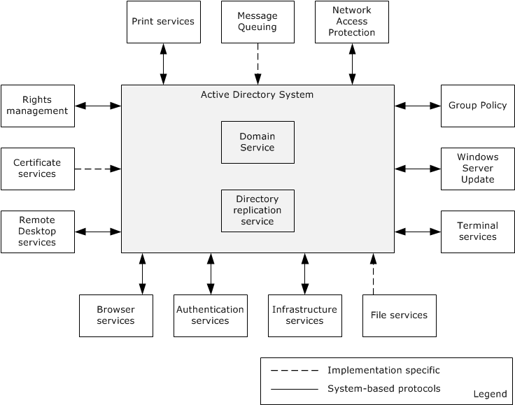

Figure 2: Active Directory system components

## 2.2 Relevant Standards

The following standards are relevant to the Active Directory system.

[**Lightweight Directory Access Protocol (LDAP)**](#gt_lightweight-directory-access-protocol-ldap), as specified in [[RFC2247]](https://go.microsoft.com/fwlink/?LinkId=91344): The [**Active Directory**](#gt_active-directory) system conforms to LDAP version 3, as specified in [[RFC3377]](https://go.microsoft.com/fwlink/?LinkID=91337). Details of Active Directory's conformance are specified in [MS-ADTS](../MS-ADTS/MS-ADTS.md) section 3.1.1.3.1, LDAP Conformance. The Active Directory system also supports LDAP version 2 [[RFC1777]](https://go.microsoft.com/fwlink/?LinkId=90290), although [**clients**](#gt_client) are encouraged to use LDAP version 3.

**WS-Enumeration:** The Active Directory system uses the protocol [[WSENUM]](https://go.microsoft.com/fwlink/?LinkId=90580) (WS-Enumeration) to query for [**directory objects**](#gt_directory-object). The system extends the standard protocol with the extensions that are defined in [MS-WSDS](../MS-WSDS/MS-WSDS.md) and [MS-WSPELD](../MS-WSPELD/MS-WSPELD.md). In the Active Directory system, the WS-Enumeration protocol operates over the [**XML**](#gt_xml) data model described in [MS-ADDM](../MS-ADDM/MS-ADDM.md).

**WS-Transfer:** The Active Directory system uses the protocol [[WXFR]](https://go.microsoft.com/fwlink/?LinkId=90587) (WS-Transfer) to create, modify, remove, and read directory objects. The system extends the standard protocol with the extensions defined in [MS-WSTIM](../MS-WSTIM/MS-WSTIM.md) and [MS-WSPELD]. As with WS-Enumeration, the WS-Transfer protocol operates over the XML data model described in [MS-ADDM] in the Active Directory system.

This document uses and extends the following standards.

**Encryption and Checksum Specifications for Kerberos 5**, as specified in [[RFC3961]](https://go.microsoft.com/fwlink/?LinkId=90450). This standard is used for encryption and checksum mechanisms.

**Kerberos Authentication Protocol**, as specified in [[RFC4120]](https://go.microsoft.com/fwlink/?LinkId=90458). This standard is used for authentication.

**Public Key Cryptography for Initial Authentication in Kerberos (PKINIT)**, as specified in [[RFC4556]](https://go.microsoft.com/fwlink/?LinkId=90482). This standard is used for initial authentication in [**Kerberos**](#gt_kerberos).

**Simple Network Time Protocol (SNTP)**, as specified in [[RFC1769]](https://go.microsoft.com/fwlink/?LinkId=90289). This standard is an adaptation of the Network Time Protocol (NTP) that is used to synchronize computer clocks in the Internet. SNTP can be used when the ultimate performance of the full NTP implementation described in [[RFC1305]](https://go.microsoft.com/fwlink/?LinkId=90272) is not required or justified.

**Domain Names - Concepts and Facilities**, as specified in [[RFC1034]](https://go.microsoft.com/fwlink/?LinkId=90263). This standard is used for [**Domain Name System (DNS)**](#gt_domain-name-system-dns) and [**domain**](#gt_domain) naming concepts.

**Domain Names - Implementation and Specification**, as specified in [[RFC1035]](https://go.microsoft.com/fwlink/?LinkId=90264). This standard is used for DNS and provides details of the domain system and protocol.

**DNS Extensions to Support IP Version 6**, as specified in [[RFC3596]](https://go.microsoft.com/fwlink/?LinkId=107027). This standard is used for DNS to support hosts running IP version 6 (IPv6).

**UTF-8, A Transformation Format of ISO 10646**, as specified in [[RFC3629]](https://go.microsoft.com/fwlink/?LinkId=90439). This standard is used for string data type specification.

**Protocol Standard for a NetBIOS Service on a TCP/UDP Transport: Concepts and Methods**, as specified in [[RFC1001]](https://go.microsoft.com/fwlink/?LinkId=90260). This standard is used for [**NetBIOS**](#gt_netbios) services.

**Protocol Standard for a NetBIOS Service on a TCP/UDP Transport: Detailed Specifications**, as specified in [[RFC1002]](https://go.microsoft.com/fwlink/?LinkId=90261). This standard is used for NetBIOS services.

## 2.3 Protocol Relationships

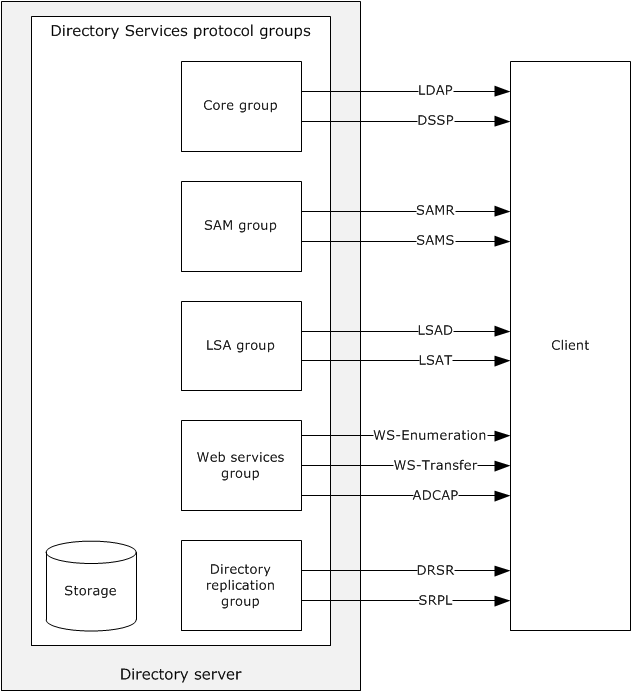

Figure 3: Active Directory protocol grouping

As shown in the preceding diagram, the member protocols that make up the Active Directory Services Protocol Groups can be divided into five functional groups. Each group accomplishes an interrelated set of tasks. A client typically uses protocols in the same group in conjunction with each other. The groups are as follows:

- The core group contains protocols that are supported by all [**directory**](#gt_directory) [**servers**](#gt_server) in the Active Directory system, whether they run in [**AD DS**](#gt_active-directory-domain-services-ad-ds) or [**AD LDS**](#gt_active-directory-lightweight-directory-services-ad-lds) mode. This group includes [**LDAP**](#gt_lightweight-directory-access-protocol-ldap), which is the primary protocol that is used to read and write objects in the [**directory tree**](#gt_directory-tree). The [MS-DSSP](../MS-DSSP/MS-DSSP.md) (DSSP) protocol does not perform operations against the directory tree, but is included in this group because it is also present on all directory servers in the Active Directory Services Protocols.
- The SAM group includes SAMR and SAMS. SAMR is used to perform [**account**](#gt_account) maintenance and operates on the same directory tree as the core group of protocols, but it provides access to only a subset of the objects in that tree, and further, provides access to only a subset of the [**attributes**](#gt_attribute) on those objects. SAMR is supported only when operating in AD DS mode. SAMS is used to perform account maintenance and time-critical database changes between Active Directory servers that are in the same [**domain**](#gt_domain).
- The LSA group contains the LSAD and LSAT protocols. Both protocols are serviced by the same [**RPC**](#gt_remote-procedure-call-rpc) interface and [**endpoint**](#gt_endpoint) ([MS-LSAD](#Section_2.11) section 1.8, Vendor-Extensible Fields, and [MS-LSAT](#Section_2.11) section 1.8, Vendor-Extensible Fields).
- The Web Services group consists of the WS-Transfer, WS-Enumeration, and [**ADCAP**](#gt_adcap) protocols along with the [MS-WSDS](../MS-WSDS/MS-WSDS.md) (WSDS), and [MS-WSPELD](../MS-WSPELD/MS-WSPELD.md) (WSPELD) protocol extensions. This protocol group is only supported on some versions of the Active Directory Services. Much like the core group, these protocols permit clients to read and write [**directory objects**](#gt_directory-object) in the directory tree, and to perform selected tasks against the tree. Unlike the core group, the protocols in this group are based on [**SOAP**](#gt_soap) rather than remote procedure call (RPC) or block-structured transports.
- The Directory Replication group contains the DRSR and SRPL protocols. DRSR is an RPC protocol that is used for management of replication and management of data in Active Directory. SRPL is the extension to the DRS protocol for transport over the Simple Mail Transfer Protocol (SMTP).
The following diagram shows the relationship among the protocols of the Active Directory system.

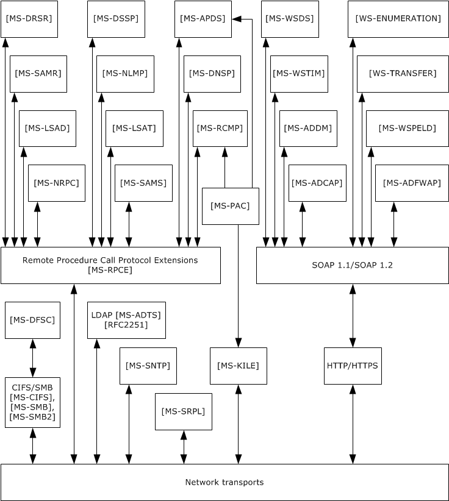

Figure 4: Protocol relationships

## 2.4 Protocol Summary

The following tables provide a comprehensive list of the member protocols of the Active Directory system. Section [2.8](#Section_2.8) provides details about which protocols or protocol subsets are supported in the different modes of operation.

The protocols in the following table enable the core functionality of the Active Directory system, including access to the directory tree, replication, name translation, determination of [**group**](#gt_group) membership, and [**domain controller**](#gt_domain-controller-dc) status. These protocols are supported by all [**directory**](#gt_directory) [**servers**](#gt_server) in the Active Directory system, whether running in [**Active Directory Domain Services (AD DS)**](#gt_active-directory-domain-services-ad-ds) or [**Active Directory Lightweight Directory Services (AD LDS)**](#gt_active-directory-lightweight-directory-services-ad-lds) mode.

| Protocol name | Description | Short name |
| --- | --- | --- |
| Active Directory extensions for [**Lightweight Directory Access Protocol (LDAP)**](#gt_lightweight-directory-access-protocol-ldap), versions 2 and 3 | Active Directory is a server for LDAP. [MS-ADTS](../MS-ADTS/MS-ADTS.md) section 3.1.1.3 specifies the extensions and variations of LDAP that are supported by Active Directory. **Note** In a reference to LDAP without a version number, LDAP refers to both versions 2 and 3. | [MS-ADTS] section 3.1.1.3.1 |
| Directory Replication Service Remote Protocol (drsuapi) - Replication | The Directory Replication Service (DRS) Remote Protocol. This protocol includes the drsuapi and dsaop [**RPC**](#gt_remote-procedure-call-rpc) interfaces. Methods on these interfaces provide replication of directory information among the domain controllers of an AD DS [**domain**](#gt_domain). Methods on these interfaces also provide a variety of functionality to clients, such as converting names between formats and retrieving information about AD DS domain controllers. This protocol also supports DC cloning operations.<2> | [MS-DRSR](#Section_2.7.5) |
| SMTP Replication Protocol Extensions | The Directory Replication Service (DRS) Protocol Extensions for SMTP. This protocol provides Simple Mail Transfer Protocol (SMTP) transport of replication information as an alternative to RPC. | [MS-SRPL](#Section_2.7.5) |
| Directory Services Setup Remote Protocol | The Directory Services Setup Remote Protocol, as defined in [MS-DSSP](../MS-DSSP/MS-DSSP.md). This protocol can be used to retrieve information about the state of a computer in a domain or a non-domain workgroup. | [MS-DSSP] |

The protocols in the following table enable account maintenance when the Active Directory system is operating in AD DS mode. This includes the creation, modification, retrieval, and deletion of users and groups.

| Protocol name | Description | Short name |
| --- | --- | --- |
| Security Account Manager (SAM) Remote Protocol (Client-to-Server) | The Security Account Manager (SAM) Remote Protocol. Clients can use this protocol to perform account maintenance, for example, to create and delete accounts. The capabilities of this protocol are a subset of the capabilities of LDAP. | [MS-SAMR](#Section_2.11) |
| Security Account Manager (SAM) Remote Protocol (Server-to-Server) | The Security Account Manager (SAM) Remote Protocol. Domain controllers (DCs) use this protocol to forward time-critical database changes to the [**primary domain controller (PDC)**](#gt_primary-domain-controller-pdc), and to forward time-critical database changes from a [**read-only domain controller (RODC)**](#gt_read-only-domain-controller-rodc) to a [**writable NC replica**](#gt_51db485c-dcf6-4845-99b3-2df414ef0aa9) within the same domain outside the normal replication protocol. This protocol is used only between Active Directory servers in the same domain. | [MS-SAMS](#Section_2.11) |

The protocols in the following table allow [**clients**](#gt_client) to retrieve security [**policy**](#gt_policy) information and translate [**security identifiers (SIDs)**](#gt_security-identifier-sid) that [**identity**](#gt_identity) [**security principals**](#gt_security-principal), such as users, to human-readable names.

| Protocol name | Description | Short name |
| --- | --- | --- |
| Local Security Authority (Domain Policy) Remote Protocol | The Local Security Authority (Domain Policy) Remote Protocol. Clients can use this protocol to retrieve security policy information. | [MS-LSAD](#Section_2.11) |
| Local Security Authority (Translation Methods) Remote Protocol | The Local Security Authority (Translation Methods) Remote Protocol. Clients can use this protocol to translate security identifiers (SIDs) of security principals to human-readable names, and vice versa. | [MS-LSAT](#Section_2.11) |

The protocols in the following table enable Web services for the Active Directory system that allow access to the directory tree and the management of Active Directory account information and topologies.

| Protocol name | Description | Short name |
| --- | --- | --- |
| Active Directory Web Services Custom Action Protocol | The Active Directory Web Services Custom Action Protocol. It is a [**SOAP**](#gt_soap)-based Web Services protocol for managing account and topology information. | [MS-ADCAP](../MS-ADCAP/MS-ADCAP.md) |
| WS-Transfer: Identity Management Operations for Directory Access Extensions | WS-Transfer: Identity Management Operations for Directory Access Extensions. This is a set of protocol extensions to WS-Transfer that allows [**directory objects**](#gt_directory-object) to be manipulated at a finer level of granularity than unextended WS-Transfer. | [MS-WSTIM](../MS-WSTIM/MS-WSTIM.md) |
| WS-Enumeration: Web Services Enumeration | The WS-Enumeration protocol. This protocol allows directory objects to be queried by using a SOAP-based Web Services protocol. | [[WSENUM]](https://go.microsoft.com/fwlink/?LinkId=90580) |
| WS-Transfer: Web Services Transfer | The WS-Transfer protocol. This protocol allows directory objects to be created, removed, modified, and read by using a SOAP-based Web Services protocol. | [[WXFR]](https://go.microsoft.com/fwlink/?LinkId=90587) |
| WS-Enumeration: Directory Services Protocol Extensions | The WS-Enumeration Directory Services Protocol Extensions. This is a set of protocol extensions to WS-Enumeration that, among other things, allows a client to request that query results be sorted. It also specifies a query language that is used by clients to specify which directory objects are to be returned from the query. | [MS-WSDS](../MS-WSDS/MS-WSDS.md) |
| WS-Transfer and WS-Enumeration Protocol Extension for Lightweight Directory Access Protocol v3 Controls | WS-Transfer and WS-Enumeration Protocol Extension for Lightweight Directory Access Protocol v3 Controls. This is a protocol extension to WS-Transfer and WS-Enumeration. It permits LDAP [**extended controls**](#gt_extended-control) to be attached to operations in the protocols that it extends. | [MS-WSPELD](../MS-WSPELD/MS-WSPELD.md) |
| Active Directory Web Services: Data Model and Common Elements | The Active Directory Web Services: Data Model and Common Elements. Although not a protocol itself, this defines an [**XML**](#gt_xml) data model that is shared by the other Web Service protocols and protocol extensions, as well as common protocol elements referenced by the other documents. | [MS-ADDM](../MS-ADDM/MS-ADDM.md) |

## 2.5 Environment

Because [**domain**](#gt_domain) interactions are distributed among many computers for different, but related purposes, enumerating the dependencies of the [**Active Directory**](#gt_active-directory) protocols is complex. The following rough diagram serves as a very high-level illustration of how the dependencies among components can be visualized.

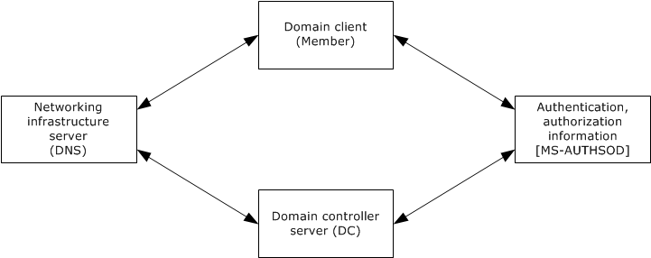

Figure 5: Dependencies among domain components

In this diagram, the dependencies of the system are symmetrical between the [**domain client**](#gt_domain-client) and the [**domain controller server**](#gt_domain-controller-server). Both the domain client and the domain controller server rely upon infrastructure [**servers**](#gt_server), such as [**DNS**](#gt_domain-name-system-dns), and leverage those servers for locating each other (rendezvous). During this rendezvous process, the domain controller server publishes its name and the domain client locates the domain controller server through DNS. The details of this rendezvous process are described in section [2.7.7.3.1](#Section_2.7.7.3.1).

In addition to service location, the rendezvous process between a domain client and a domain controller server relies upon authentication and authorization information. The domain controller server, for example, leverages the authorization information that it contains for controlling access to its resources. For more detailed information about authentication and authorization, see [MS-AUTHSOD](../MS-AUTHSOD/MS-AUTHSOD.md) and related documents.

### 2.5.1 Active Directory Protocols Dependencies

This section describes the dependencies that the [**Active Directory**](#gt_active-directory) protocols have on other entities. The Active Directory protocols require a durable storage system to maintain the state of the [**directory**](#gt_directory) and meet the transactional guarantees specified in [MS-ADTS](../MS-ADTS/MS-ADTS.md) section 3.1.1.5.1.4, Transactional Semantics. This storage system has to provide a means of securing the contents of the storage system from unauthorized access.

The Active Directory protocols also require a networking system that [**clients**](#gt_client) can use to send requests to the directory [**server**](#gt_server) and to receive responses. This networking system has to support the [**Transmission Control Protocol (TCP)**](#gt_transmission-control-protocol-tcp), [**User Datagram Protocol (UDP)**](#gt_user-datagram-protocol-udp), and [**Server Message Block (SMB)**](#gt_server-message-block-smb) transports. This networking system has to provide an accessible name resolution service through a [**DNS**](#gt_domain-name-system-dns) service. The DNS service has to be capable of storing and resolving [**service (SRV) resource records**](#gt_service-srv-resource-record) [[RFC2782]](https://go.microsoft.com/fwlink/?LinkId=90381), CNAME and A resource records [[RFC1034]](https://go.microsoft.com/fwlink/?LinkId=90263), and AAAA resource records [[RFC3596]](https://go.microsoft.com/fwlink/?LinkId=107027). It is recommended that an implementation of the Active Directory system uses dynamic updates ([[RFC2136]](https://go.microsoft.com/fwlink/?LinkId=107017) and [[RFC3645]](https://go.microsoft.com/fwlink/?LinkId=90440)) to update DNS with the records, as described in [MS-ADTS] section 6.3.2, DNS Record Registrations, but any alternative method that creates the DNS records described there is permissible.<3> DNS can be used by clients of the Active Directory system in order to locate directory servers by using the algorithms described in [MS-ADTS] section 6.3, Publishing and Locating a Domain Controller.

Several of the Active Directory protocols are [**RPC**](#gt_remote-procedure-call-rpc)-based and therefore depend on the availability of an RPC runtime that implements an RPC mechanism as described in [MS-RPCE](../MS-RPCE/MS-RPCE.md).

A system of [**domain**](#gt_domain) interactions forms the framework that other systems leverage in their environments. As such, this system requires comparatively little in terms of services available for use because its purpose is to create a useful environment for other scenarios. Services that the Active Directory protocols require from their environment include the following:

- **Network Infrastructure.** This system of domain interactions requires that a viable network system is available. This includes a networked environment that supports TCP/IP and UDP/IP, as well as a name resolution system that is available for use by both the [**domain controller server**](#gt_domain-controller-server) and [**domain members**](#gt_6234a38c-ed1b-4c69-969f-6e6479566f65). The name resolution system has to support DNS form if the domain is to support [**Active Directory-style domain**](#gt_active-directory-style-domain) functionality, and [**NetBIOS**](#gt_netbios) form if the domain is to support [**Windows NT 4.0-style domain**](#gt_windows-nt-40-style-domain) functionality.
- **Coexistence.** Any given domain on a network has to be uniquely named. There is no architectural limit to the number of domains that are possible on a network.
Even at this relatively high level, the system of domain interactions is a complex aggregation.

### 2.5.2 Dependencies on Active Directory Protocols

This section lists entities that depend on the interfaces provided by the Active Directory protocols, as well as other entities that the Active Directory protocols depend on. Other entities take dependencies on the Active Directory protocols, and in particular on [**AD DS**](#gt_active-directory-domain-services-ad-ds), not only by making use of the Active Directory protocols' external interfaces, but also by sharing state with this system; that is, there are overlapping abstract data models.

The Active Directory protocols depend on the Windows Authentication Services [MS-AUTHSOD](../MS-AUTHSOD/MS-AUTHSOD.md) to authenticate clients that are accessing the system. The system controls access based on the [**identity**](#gt_identity) of the [**client**](#gt_client).

The following components have dependencies on the protocol interfaces provided by the Active Directory system. All of these components apply to Active Directory that is operating as AD DS. Note that while these components depend on the Active Directory system, the Active Directory system does not in turn depend on them. In other words, any of these components can be omitted from the environment, and the Active Directory system will continue to function.

The Active Directory protocols influence the behavior of the following components:

**Print Services:** The Print Services service can optionally publish information about shared printers in the [**directory**](#gt_directory). Domain-joined clients discover shared printers that are available to them by querying the directory for this information.

**Message Queuing:** The Message Queuing service uses the [**directory service**](#gt_directory-service-ds) to store information such as queue and system metadata.

**Network Access Protection:** The Network Access Protection (NAP) service [MS-NAPOD](../MS-NAPOD/MS-NAPOD.md) determines how machines can be examined for access to a network. The machines need to be members of a [**domain**](#gt_domain) to authenticate to the NAP [**servers**](#gt_server).

**Group Policy:** The Group Policy service [MS-GPOD](../MS-GPOD/MS-GPOD.md) defines how [**domain clients**](#gt_domain-client) can retrieve group [**policy**](#gt_policy) information from the [**domain controller**](#gt_domain-controller-dc), which is based on the group memberships of a [**domain account**](#gt_domain-account) and a domain account's location in the LDAP directory structure.

**Windows Server Update:** This component specifies how different machines in a domain can have different update policies for patch management, which relies on domain interactions to specify the domain authorization information.

**File Services:** This component specifies how file servers present a unified view of files and other resources, and rely upon [MS-AUTHSOD] and domain interactions for authentication when the file server is part of a domain.

**Infrastructure Service:** The Infrastructure Service includes services such as name resolution ([**DNS**](#gt_domain-name-system-dns), WINS) and network maintenance services (routers). The directory service uses such services to make domain controllers available to their clients.

**Authentication System:** The authentication system [MS-AUTHSOD] defines how other protocols take advantage of authentication protocols such as NTLM and [**Kerberos**](#gt_kerberos) to secure their communications, and also defines the authentication services that support the client-to-server communication. The authentication system depends on domain interactions to specify how those protocols are used in a domain context to authenticate clients to servers when both are members of a domain.

Several protocol groups leverage the domain controller as the source of identity and authorization information for the domain. These include:

- **Browser Services**, which define how the browser service leverages the directory service to browse and locate the shared resources in the domain based on information that is associated with the [**accounts**](#gt_account) in the domain.
- **Certificate Services**, which specifies how the [**certificate**](#gt_certificate) authority leverages the domain infrastructure to manage certificate distribution and enrollment, and makes authorization decisions based on information that is associated with the accounts in the domain.
- **Rights Management**, which determines how content can be protected against offline access based on authorization information from the directory.

## 2.6 Assumptions and Preconditions

The following assumptions and preconditions have to be satisfied for the Active Directory system to start to operate successfully:

- For [**AD DS**](#gt_active-directory-domain-services-ad-ds), the [**server**](#gt_server) is configured (that is, "promoted") to act as an AD DS [**domain controller**](#gt_domain-controller-dc). This is accomplished by having the server host the Active Directory service in AD DS mode. When hosting an AD DS [**directory service**](#gt_directory-service-ds), the [**directory**](#gt_directory) server registers (if not already registered) [**DNS**](#gt_domain-name-system-dns) and [**NetBIOS**](#gt_netbios) records, as described in [MS-ADTS](../MS-ADTS/MS-ADTS.md) sections 6.3.2 and 6.3.4, respectively, to enable [**clients**](#gt_client) to locate the directory server. If an [**AD LDS**](#gt_active-directory-lightweight-directory-services-ad-lds) directory service is hosted on a directory server that is joined to an AD DS [**domain**](#gt_domain), the directory server publishes itself by creating an object in AD DS, as described in [MS-ADTS] section 6.3.8.
- When operating as AD DS, after the server has initialized the protocols that are listed in section [2.4](#Section_2.4) and is prepared to process incoming requests for those protocols, the directory server begins responding to LDAP and [**mailslot**](#gt_mailslot) ping requests in the manner described in [MS-ADTS] sections 6.3.3 and 6.3.5, respectively.
- For AD DS, member clients assume basic network connectivity and the availability of basic network infrastructure services, such as DNS. Prior to being associated with a domain, there are no other notable preconditions for member clients. After a client has been associated with a domain, it is under the assumption that the domain controller also has an entry in its directory that corresponds to the client. If this assumption is proven wrong, the system (from the client's perspective) becomes unusable until the association is reestablished.
- For AD LDS, the server is configured to host the Active Directory service that operates in AD LDS mode.
- A network that provides transport for communications between the directory server and its clients is available. As described in section [2.5](#Section_2.5), this network supplies access to DNS and supports the [**TCP**](#gt_transmission-control-protocol-tcp), [**UDP**](#gt_user-datagram-protocol-udp), and [**SMB**](#gt_server-message-block-smb) transports.
- The transport protocol for that network is available and configured; for example, the TCP transport is configured with a valid IP address.
- Support for all authentication mechanisms that are indicated in the technical documents of the Active Directory system's member protocols are available.
- The durable storage system that is used to store the Active Directory system's state is available to the Active Directory system.
- The directory contains at least the required [**directory objects**](#gt_directory-object) and [**naming contexts**](#gt_naming-context-nc) described in [MS-ADTS] section 6.1.
- The directory's [**schema**](#gt_schema) contains at least the [**attribute**](#gt_attribute) and class schema definitions described in [MS-ADA1](../MS-ADA1/MS-ADA1.md), [MS-ADA2](../MS-ADA2/MS-ADA2.md), [MS-ADA3](../MS-ADA3/MS-ADA3.md), and [MS-ADSC](../MS-ADSC/MS-ADSC.md) (for AD DS) or [MS-ADLS](../MS-ADLS/MS-ADLS.md) (for AD LDS) in order to be compliant with the protocol described in [MS-ADTS]. However, Active Directory currently does not make use of all the attributes and classes that are defined in the schema definitions.
Upon startup, the Active Directory system initializes all of the protocols that are listed in section 2.4 as described in the protocol documents for each listed protocol and also begins servicing requests that are coming in on those protocols' interfaces. There is no requirement that the protocols be initialized in a particular sequence.

Because member clients treat all domain controller instances as equivalent, each domain controller that operates as AD DS needs to ensure that it is synchronized with its peer AD DS domain controllers, if any are supported in the implementation, through implementation-specific means such as directory replication.

## 2.7 Use Cases

The following use cases span the functionality of the Active Directory system.

| Use case category | Use cases |
| --- | --- |
| Object Management | [Create Directory Object - Client Application (section 2.7.1.1)](#Section_2.7.1.1) [Search for Directory Object - Client Application (section 2.7.1.2)](#Section_2.7.1.2) [Modify Directory Object - Client Application (section 2.7.1.3)](#Section_2.7.1.3) [Delete Directory Object - Client Application (section 2.7.1.4)](#Section_2.7.1.4) [Create Organizational Unit - Client Application (section 2.7.1.5)](#Section_2.7.1.5) [Cross-Domain Move - Client Application (section 2.7.1.6)](#Section_2.7.1.6) |
| Identity Lifecycle Management | [Create a New Account - Client Application (section 2.7.2.1)](#Section_2.7.2.1) [Reset an Existing Account's Password - Client Application (section 2.7.2.2)](#Section_2.7.2.2) [Change an Existing Account's Password (PDC) - Client Application (section 2.7.2.3)](#Section_2.7.2.3) [Change an Existing Account's Password (DC) - Client Application (section 2.7.2.4)](#Section_2.7.2.4) [Change User Account Password Against an RODC - Client Application (section 2.7.2.5)](#Section_2.7.2.5) [User Logon to Domain Services by using an RODC and Updating the User LastLogonTimeStamp - Client Application (section 2.7.2.6)](#Section_2.7.2.6) [Query an Account's Group Membership - Client Application (section 2.7.2.7)](#Section_2.7.2.7) [Delete an Account - Client Application (section 2.7.2.8)](#Section_2.7.2.8) [Create a Security Group - Client Application (section 2.7.2.9)](#Section_2.7.2.9) [Modify Group Member List - Client Application (section 2.7.2.10)](#Section_2.7.2.10) [Query for Members of a Group - Client Application (section 2.7.2.11)](#Section_2.7.2.11) |
| Schema Management | [Add a New Class to the Schema - Client Application (section 2.7.3.1)](#Section_2.7.3.1) [Add a New Attribute to the Schema - Client Application (section 2.7.3.2)](#Section_2.7.3.2) [Add an Attribute to a Class - Client Application (section 2.7.3.3)](#Section_2.7.3.3) |
| Name Translation | [Convert a SID to/from a Human-Readable Format - Client Application (section 2.7.4.1)](#Section_2.7.4.1) |
| Directory Replication | [Replicate Changes within a Domain - Domain Controller (section 2.7.5.1)](#Section_2.7.5.1) [Replicate Changes to a GC or a Partial Replica by using RPC - Domain Controller (section 2.7.5.2)](#Section_2.7.5.2) [Transferring a FSMO Role - Domain Controller (section 2.7.5.3)](#Section_2.7.5.3) |
| Trust Management | [Create a Trust - Domain Controller (section 2.7.6.1)](#Section_2.7.6.1) |
| Domain Services | [Join a Domain with a New Account - Domain Client (section 2.7.7.1)](#Section_2.7.7.1) [Unjoin from the Domain - Domain Client (section 2.7.7.2)](#Section_2.7.7.2) [Locate a Domain Controller - Domain Client (section 2.7.7.3.1)](#Section_2.7.7.3.1) |

Detailed descriptions for these use cases are provided in subsequent sections.

### 2.7.1 Object Management

The use cases in this category reflect the most fundamental of operations in the Active Directory system, namely, the storage and retrieval of [**directory objects**](#gt_directory-object). Client applications, which, in a general sense, are used to access and manipulate data that is stored in the Active Directory system, perform object management operations to store data in the [**directory service**](#gt_directory-service-ds) for their own use or to configure and manipulate other systems that rely on data that is stored in the directory service.

The lifecycle of a directory object begins with its creation. After the directory object is created, [**clients**](#gt_client) can retrieve it by issuing a search to the directory service. Clients can also modify [**attributes**](#gt_attribute) of the directory object. When an object is no longer required, it can be deleted.

The following use case diagram shows the use cases for object management.

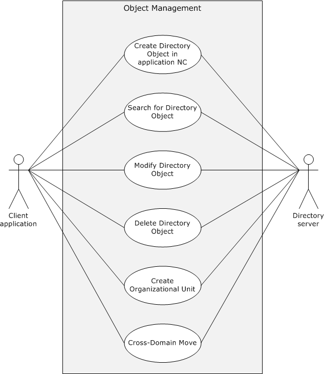

Figure 6: Use cases for object management

#### 2.7.1.1 Create a Directory Object - Client Application

In this use case, an administrator wants to create a new [**directory object**](#gt_directory-object) on an existing application [**naming context (NC)**](#gt_naming-context-nc) to store information that could be used by applications on the [**client**](#gt_client). To achieve this, the administrator launches the client application to interact with the Active Directory system. The client application establishes a connection to the Active Directory system. The administrator creates the directory object by using the client application.

**Goal**

Create a directory object on an [**application NC**](#gt_application-naming-context-application-nc) to store application-related data.

**Context of Use**

An administrator wants to create a new directory object in an existing application NC.

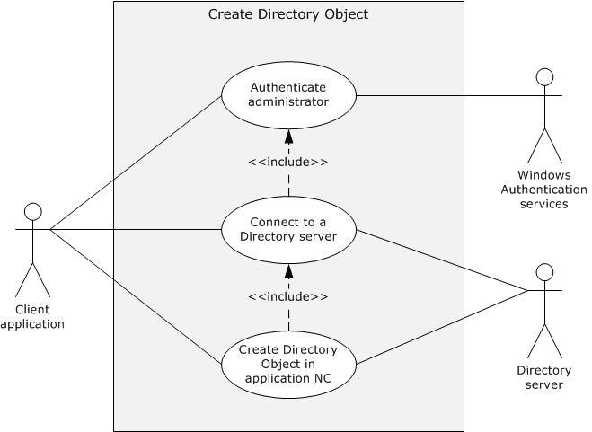

Figure 7: Use case diagram for creating a directory object on an application NC

**Actors**

- Client application
The client application is the primary actor. It is the entity that prepares the connection to the [**directory**](#gt_directory) [**server**](#gt_server), submits the request to create the object, and relays the response to the administrator.

- Windows Authentication Services
Windows Authentication Services [MS-AUTHSOD](../MS-AUTHSOD/MS-AUTHSOD.md) is the supporting actor that authenticates the administrator's [**identity**](#gt_identity) so that the Active Directory system can make access-control decisions.

- Directory server
The directory server is the supporting actor that receives the creation request and creates the application directory object.

**Stakeholders**

- Administrator
The administrator is the one who initiates operations such as create, search, modify, and delete on the application directory object. The administrator primarily wants to receive information that the operations are successfully completed or receive an error message if they failed.

- Applications
Applications on the client are the entities that store information in the application directory for later retrieval and use in various operations.

- Application NC
The application NC is the naming context of the directory that contains the application-specific directory objects.

**Preconditions**

- The system-wide preconditions, as described in section [2.6](#Section_2.6), are satisfied. The Active Directory system completes initialization, as described in section 2.6.
- The client application has access to a directory server to which it can establish a connection, if it is not already connected, and send the request.
- There already exists an [**object class**](#gt_object-class) in the Active Directory system [**schema**](#gt_schema) that corresponds to the directory object to be created under the application NC. For a detailed description of schema extensions, see section [2.7.3](#Section_2.7.3).
- The Active Directory system hosts an application NC on which the client application is configured to store its application data.
**Main Success Scenario**

- **Trigger:** To initiate this activity, the administrator provides the name of the directory object along with [**credentials**](#gt_credential) as input to the client application. The administrator then invokes the operation that creates the application directory object.
- The client application establishes a connection to the directory server. Windows Authentication Services authenticates the client application by using the supplied credentials ([MS-AUTHSOD] section 2).
- The client application sends a request to the directory server to create a new application directory object and specifies details for the new object.
- The directory server verifies that the credentials that are supplied through the client application have the necessary access-control rights to complete the operation ([MS-ADTS](../MS-ADTS/MS-ADTS.md) section 5.1.3).
- The directory server creates an object under the application NC with the name and other attributes that the client application supplies. The directory object is also populated with attributes that are mandated by the server's processing rules and constraints ([MS-ADTS] sections 3.1.1.5.1 and 3.1.1.5.2).
- The directory server sends a response to the client application that the new application directory object has been successfully created.
**Postcondition**

The new application directory object is created and ready for use.

**Extensions**

- If the credentials that are passed through the client application have insufficient access-control rights to create the new application directory object:
1-4. Same as Main Success Scenario.

5. The directory server sends a response to the client application that it supplied credentials with insufficient access-control rights to create the new application directory object.

- If the [**relative distinguished name (RDN)**](#gt_relative-distinguished-name-rdn) value (that is, the name of the directory object to be created) supplied by the administrator is not unique under the same parent container, as required by [MS-ADTS] section 3.1.1.5.2.2:
1-5. Same as Main Success Scenario.

6. The directory server sends a response to the client application that indicates that the provided object name already exists.

- If the directory object creation request does not contain all the mandatory attributes, as required in [MS-ADTS] section 3.1.1.2.4.5:
1-5. Same as Main Success Scenario.

6. The directory server sends a response to the client application that indicates that the missing [**attribute**](#gt_attribute) is required in the request.

- If the directory object to be created under the application NC by the client application is a [**security principal**](#gt_security-principal) in [**AD DS**](#gt_active-directory-domain-services-ad-ds):
1-5. Same as Main Success Scenario.

6. The directory server sends a response to the client application that indicates that a security principal can be created only in a [**domain NC**](#gt_domain-naming-context-domain-nc).

#### 2.7.1.2 Search for a Directory Object - Client Application

In this use case, an administrator or user wants to inspect the [**attribute**](#gt_attribute) values for a given set of [**directory objects**](#gt_directory-object) in order to make informed decisions about the Active Directory system. To achieve this task, the administrator or user launches the [**client**](#gt_client) application to interact with the Active Directory system. The client application establishes a connection to the Active Directory system. The administrator or user then performs a search on the [**directory tree**](#gt_directory-tree).

**Goal**

Retrieve information from one or more directory objects in the Active Directory system.

**Context of Use**

An administrator or user wants to search for and retrieve the attribute values of the existing directory object.

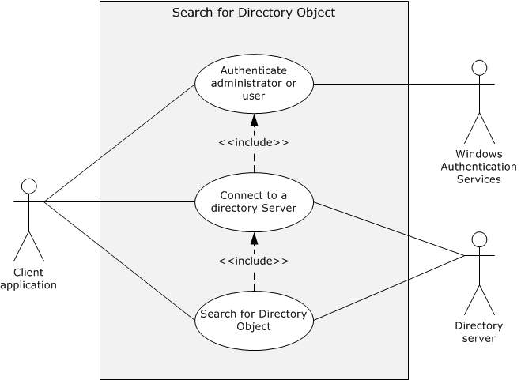

Figure 8: Use case diagram for searching for a directory object

**Actors**

- Client application
The client application is the primary actor. It is the entity that prepares the connection to the [**directory**](#gt_directory) [**server**](#gt_server), submits search requests to the directory on behalf of the user, and returns the results to the user.

- Windows Authentication Services
Windows Authentication Services [MS-AUTHSOD](../MS-AUTHSOD/MS-AUTHSOD.md) is the supporting actor that authenticates the administrator's or user's [**identity**](#gt_identity). This is done so that access control decisions can be made by the Active Directory system.

- Directory server
The directory server is the supporting actor that receives the search request and performs the search of the application directory.

**Stakeholders**

- Administrator or user
The administrator or user is the entity that initiates the search in the application directory. The administrator or user primarily wants to obtain the search results.

- Directory
The application directory is the directory that contains the application-specific directory objects.

In this operation, the directory remains unchanged.

**Preconditions**

- The system-wide preconditions, as described in section [2.6](#Section_2.6), are satisfied. The Active Directory system completes initialization, as described in section 2.6.
- The client application has access to a directory server to which it can establish a connection, if it is not already connected, and send the request.
**Main Success Scenario**

- **Trigger:** To initiate a search, the administrator or user provides the search criteria for the directory objects that are of interest as input to the client application, along with [**credentials**](#gt_credential). The administrator or user then invokes the operation that searches for directory objects. The search criteria also specify what information about each object is to be returned.
- The client application establishes a connection to the directory server. Windows Authentication Services authenticates the client application by using the supplied credentials ([MS-AUTHSOD] section 2).
- The client application sends a request to the directory server to search for the directory objects, specifying the search criteria.
- The directory server verifies that the credentials that are supplied through the client application have the necessary access-control rights to complete the operation ([MS-ADTS](../MS-ADTS/MS-ADTS.md) section 5.1.3).
- The directory server identifies all directory objects that match the criteria that the client application supplies. From the set of directory objects that is identified, the directory server extracts the information that the client application requests.
- The directory server sends a response to the client application that contains the extracted information.
**Postcondition**

Information for the directory object is available to the client application.

**Extensions**

- If the search criteria that the client application supplies returns a result set that is larger than the configured MaxPageSize ([MS-ADTS] section 3.1.1.3.4.6):
1-5. Same as Main Success Scenario.

6. The directory server sends a response to the client application that it has exceeded the size limit for the request and returns all results up to the limit for the result size.

- If the search criteria that the client application supplies potentially return objects that are located on a different [**NC**](#gt_naming-context-nc):
1-4. Same as Main Success Scenario.

5. Because the directory server that the client application is connected to does not host the objects that the search criteria specify, the directory server determines that another server or NC is better suited to process the search request ([MS-ADTS] section 3.1.1.4.6).

6. The directory server sends a response to the client application that a referral error has occurred.

#### 2.7.1.3 Modify a Directory Object - Client Application

A common activity for an administrator is to modify objects. Timely updates on these [**directory objects**](#gt_directory-object) ensure that the data in the system is current, which enables the Active Directory system to function correctly. To achieve this, the administrator launches the client application to interact with the Active Directory system. The [**client**](#gt_client) application establishes a connection to the Active Directory system. The administrator uses the client application to modify an existing directory object.

**Goal**

Modify a directory object in the Active Directory system.

**Context of Use**

An administrator wants to modify [**attributes**](#gt_attribute) of existing directory objects.

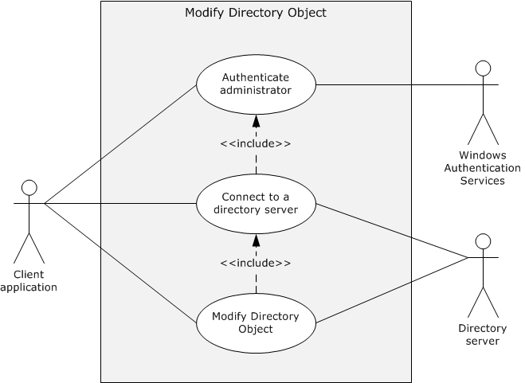

Figure 9: Use case diagram for modifying a directory object

**Actors**

- Client application
The client application is the primary actor. It is the entity that prepares the connection to the [**directory**](#gt_directory) [**server**](#gt_server), submits the modification request, and relays the response to the administrator.

- Windows Authentication Services
Windows Authentication Services [MS-AUTHSOD](../MS-AUTHSOD/MS-AUTHSOD.md) is the supporting actor that authenticates the administrator's [**identity**](#gt_identity). This is done so that access control decisions can be made by the Active Directory system.

- Directory server
The directory server is the supporting actor that receives the modification request and modifies the directory object.

**Stakeholders**

- Administrator
The administrator initiates operations such as create, search, modify, and delete on the application directory object. The administrator primarily wants to receive information that the operations are successfully completed or receive an error message if they failed.

- Directory
The directory is the entity that contains the object that is being modified.

**Preconditions**

- The system-wide preconditions, as described in section [2.6](#Section_2.6), are satisfied. The Active Directory system completes initialization, as described in section 2.6.
- The client application has access to a directory server to which it can establish a connection, if it is not already connected, and send the request.
- The directory object to be modified exists in the Active Directory system.
**Main Success Scenario**

- **Trigger:** To initiate the modify operation, the administrator provides the name of the directory object to modify as input to the client application, along with [**credentials**](#gt_credential). The information provided by the administrator includes the attribute(s) being modified on the object and the list of modifications to be made to those attributes.
- The client application establishes a connection to the directory server. Windows Authentication Services authenticates the client application using the supplied credentials ([MS-AUTHSOD] section 2).
- The client application sends a modify request to the directory server to make the appropriate modifications on the directory object.
- The directory server verifies that the credentials that are supplied through the client application have the necessary access-control rights to complete the operation ([MS-ADTS](../MS-ADTS/MS-ADTS.md) section 5.1.3).
- The directory server modifies the object, as specified by the client application, and makes any additional modifications that are mandated by the server's processing rules and constraints ([MS-ADTS] sections 3.1.1.5.1, 3.1.1.5.3, and 3.1.1.5.4).
- The directory server sends a response to the client application that the modifications were successfully completed.
**Postconditions:**

The directory object is modified.

**Extensions**

- There are multiple failure scenarios when the administrator modifies a directory object in the Active Directory system. The operation has to be validated against the server's processing rules and constraints, as described in [MS-ADTS] sections 3.1.1.5.1 and 3.1.1.5.3.

#### 2.7.1.4 Delete a Directory Object - Client Application

An administrator can perform maintenance on an Active Directory system by removing objects that are no longer needed by the applications on the [**client**](#gt_client). To achieve this, an administrator launches the client application to interact with the Active Directory system. The client application establishes a connection to the Active Directory system. The administrator performs a delete operation on an existing [**directory object**](#gt_directory-object) (not a leaf object).

**Goal**

Delete a directory object from the Active Directory system.

**Context of Use**

An administrator wants to delete an existing directory object.

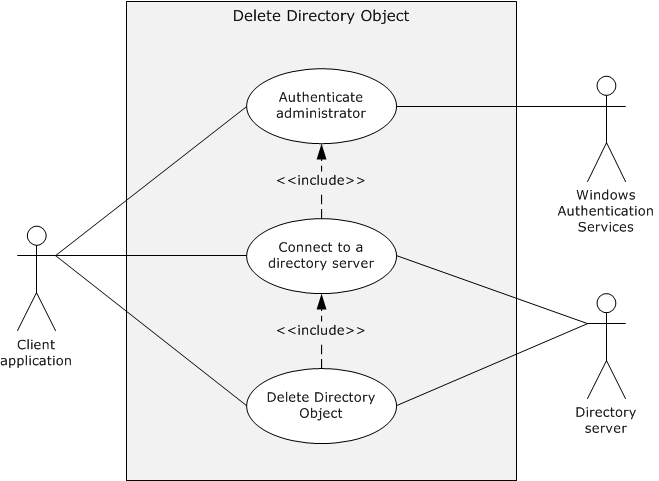

Figure 10: Use case diagram for deleting a directory object

**Supporting Actors**

- Client application
The client application is the primary actor. It is the entity that prepares the connection to the [**directory**](#gt_directory) [**server**](#gt_server), submits the request to delete an object, and relays the response to the administrator.

- Windows Authentication Services
Windows Authentication Services [MS-AUTHSOD](../MS-AUTHSOD/MS-AUTHSOD.md) is the supporting actor that authenticates the administrator's [**identity**](#gt_identity). This is done so that access control decisions can be made by the Active Directory system.

- Directory server
The directory server is the supporting actor that receives the deletion request and deletes the directory object.

**Stakeholders**

- Administrator
The administrator initiates operations on the application directory object such as create, search, modify, and delete. The administrator primarily wants to receive information that the operations are successfully completed or receive an error message if they failed.

- Directory
The directory is the entity that contains the object being deleted.

**Preconditions**

- The system-wide preconditions, as described in section [2.6](#Section_2.6), are satisfied. The Active Directory system completes initialization, as described in section 2.6.
- The client application has access to a directory server to which it can establish a connection, if it is not already connected, and send the request.
- The directory object to be deleted exists in the Active Directory system.
**Main Success Scenario**

- **Trigger:** The administrator initiates the delete operation by providing the name of the directory object to delete to the Client Application with [**credentials**](#gt_credential). The administrator then selects the directory object to delete and submits the deletion request to the Active Directory system.
- The client application establishes a connection to the directory server. Windows Authentication Services authenticates the client application using the supplied credentials ([MS-AUTHSOD] section 2).
- The client application sends a delete request to the directory server to delete the specified directory object.
- The directory server verifies that the credentials supplied through the client application have the necessary access-control rights to complete the operation ([MS-ADTS](../MS-ADTS/MS-ADTS.md) section 5.1.3).
- The directory server deletes the object that the client specified and makes any additional modifications that are mandated by the server's processing rules and constraints ([MS-ADTS] sections 3.1.1.5.1 and 3.1.1.5.5).
- The directory server sends a response to the client application that the deletion was successfully completed.
**Postcondition**

The directory object is no longer available.

**Extensions**

- If the client application attempted to delete a non-leaf directory object:
1-5. Same as Main Success Scenario

6. The directory server sends a response to the client application that it cannot delete a non-leaf object ([MS-ADTS] section 3.1.1.5.5.5).

- If the client application attempted to delete a directory object that is owned by the system ([MS-ADTS] section 3.1.1.5.5.3):
1-5. Same as Main Success Scenario.

6. The directory server sends a response to the client application that it cannot perform the operation.

#### 2.7.1.5 Create an Organizational Unit - Client Application

To streamline [**directory object**](#gt_directory-object) management, an administrator can use organizational units (OUs) to partition [**directory**](#gt_directory) data. An organizational unit represents the smallest unit to which an administrator can assign Group Policy settings or delegate administrative authority. To achieve this, the administrator launches the [**client**](#gt_client) application to interact with the Active Directory system. The client application establishes a connection to the Active Directory system. The administrator creates an organizational unit through the client application.

**Goal**

Create an organizational unit to facilitate partitioning of data in the Active Directory system.

**Context of Use**

An administrator wants to create a different group to represent a specific set of directory objects. On these objects, the administrator can apply a common [**policy**](#gt_policy).

Figure 11: Use case diagram for creating an organizational unit

**Primary Actor:** The primary actor is the client application.

**Actors**

- Client application
The client application is the primary actor. It is the entity that prepares the connection to the directory [**server**](#gt_server), submits the request to create an organizational unit, and relays the response to the administrator.

- Windows Authentication Services
Windows Authentication Services [MS-AUTHSOD](../MS-AUTHSOD/MS-AUTHSOD.md) is the supporting actor that authenticates the administrator's [**identity**](#gt_identity). This is done so that access control decisions can be made by the Active Directory system.

- Directory server
The directory server is the supporting actor that receives the creation request and creates the organizational unit in the directory.

**Stakeholders**

- Administrator
The administrator initiates operations such as create, search, modify, and delete on the application directory object. The administrator primarily wants to receive information that the operations are successfully completed or receive an error message if they failed.

- Group Policy
Group Policy allows managed configurations for users and computers.

The Active Directory system guarantees that, if possible, the new organizational unit object is created, contains all the [**attribute**](#gt_attribute) values that the client application set, and is ready for Group Policy assignments.

- Directory
The directory is the entity that will contain the object for the organizational unit.

**Preconditions**

- The system-wide preconditions, as described in section [2.6](#Section_2.6), are satisfied. The Active Directory system completes initialization, as described in section 2.6.
- The client application has access to a directory server to which it can establish a connection, if it is not already connected, and send the request.
**Main Success Scenario**

- **Trigger:** The administrator provides the name of the organizational unit as input to the client application with [**credentials**](#gt_credential) and invokes the operation that creates the organizational unit.
- The client application establishes a connection to the directory server. Windows Authentication Services authenticates the client application by using the supplied credentials ([MS-AUTHSOD] section 2).
- The client application sends a request to the directory server to create a new organizational unit and specifies the name for the new organizational unit.
- The directory server verifies that the credentials supplied through the client application have the necessary access-control rights to complete the operation ([MS-ADTS](../MS-ADTS/MS-ADTS.md) section 5.1.3).
- The directory server creates an object in the directory that represents the new organizational unit with the name and other attributes that the client supplied. The directory object is also populated with attributes that are mandated by the server's processing rules and constraints ([MS-ADTS] sections 3.1.1.5.1 and 3.1.1.5.2).
- The directory server sends a response to the client application that the new organizational unit has been successfully created.
**Postcondition**

The organization unit is created and ready for use.

**Extensions**

- If the [**RDN**](#gt_relative-distinguished-name-rdn) value (that is, the name of the organizational unit to be created) supplied through the client application is not unique under the same parent container, as required by [MS-ADTS] section 3.1.1.5.2.2:
1-5. Same as Main Success Scenario.

6. The directory server sends a response to the client application that the object name that was provided already exists.

- If the organizational unit creation request does not contain all mandatory attributes, as required in [MS-ADTS] section 3.1.1.2.4.5:
1-5. Same as Main Success Scenario.

6. The directory server sends a response to the client application that the missing attribute is required in the request.

#### 2.7.1.6 Cross-Domain Move - Client Application

In this use case, cross-domain movement of an object is performed between two [**domain controllers**](#gt_domain-controller-dc) that are present in different [**domains**](#gt_domain).

**Goal**

To move an object from one domain to another domain.

**Context of Use**

To perform cross-domain movement when an object is required to be moved from one domain to another domain. An administrator launches the client application in order to perform the action.

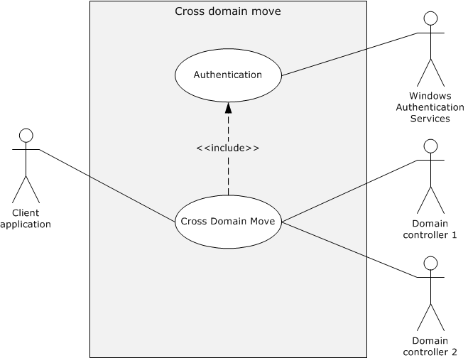

Figure 12: Use case diagram for performing a cross-domain move

**Actors**

- Client application
The [**client**](#gt_client) application is the primary actor that initiates the cross-domain move of a particular object.

- Windows Authentication Services
Windows Authentication Services [MS-AUTHSOD](../MS-AUTHSOD/MS-AUTHSOD.md) is the supporting actor that authenticates the administrator's [**identity**](#gt_identity). This is done so that access control decisions can be made by the Active Directory system.

- Domain Controller 1 (DC1)
DC1 is the supporting actor that is a domain controller in a domain.

- Domain Controller 2 (DC2)
DC2 is the supporting actor that is a domain controller in another domain.

**Stakeholders**

- Domain administrators and applications
Domain administrators and applications are the entities that move objects from one domain to another.

**Preconditions**

- The environment, as described in section [2.5](#Section_2.5), is in place and the system-wide preconditions, as described in section [2.6](#Section_2.6), are satisfied. The Active Directory system completes initialization, as described in section 2.6.
- DC1 and DC2 are in different domains.
- The requester has permissions to perform a cross-domain move operation, as described in [MS-ADTS](../MS-ADTS/MS-ADTS.md) section 3.1.1.5.4.2.1.
**Main Success Scenario**

- **Trigger:** An administrator triggers a request on the [**domain client**](#gt_domain-client) to move an object from DC1 to DC2.
- The client application establishes a connection to DC1. Windows Authentication Services authenticates the client application using the supplied [**credentials**](#gt_credential) ([MS-AUTHSOD] section 2).
- The domain client sends a Modify DN request to DC1 for movement of the object, as specified in [MS-ADTS] section 3.1.1.5.4.
- DC1 sends an interdomain move request to DC2, as specified in [MS-ADTS] section 3.1.1.5.4.2.3.
- DC2 adds a new object to its [**replica**](#gt_replica).
- DC1 creates a proxy object and deletes the original object.
**Postcondition**

An object is moved from one domain to the other.

**Extensions**

None.

### 2.7.2 Identity Lifecycle Management

The use cases in this category represent the management of [**accounts**](#gt_account) in the Active Directory system. These accounts are used to gain access to the Active Directory system. An account's lifecycle begins with its creation. After it is created, an account can be used to access the system and perform other operations based on the account's access-control rights. Accounts can be modified to change the state or [**attributes**](#gt_attribute) of the account. When accounts are no longer needed, they can be deleted. An account is a [**directory object**](#gt_directory-object), for example, a user object, so these use cases represent a specialization of the use cases in the Object Management category (section [2.7.1](#Section_2.7.1)).

**Note** These use cases are applicable only to [**AD DS**](#gt_active-directory-domain-services-ad-ds); they are not applicable to [**AD LDS**](#gt_active-directory-lightweight-directory-services-ad-lds).

The following use case diagram shows the use cases of [**identity**](#gt_identity) lifecycle management.

Figure 13: Use cases for identity lifecycle management

#### 2.7.2.1 Create a New Account - Client Application

In this use case, an administrator wants to create a new [**account**](#gt_account) in the [**directory**](#gt_directory) to allow a user to access directory resources. The administrator launches the [**client**](#gt_client) application to create a new account. The client application establishes a connection to the Active Directory system.

**Goal**

Create a new account in the directory.

**Context of Use**

An administrator wants to create a new account in the directory.

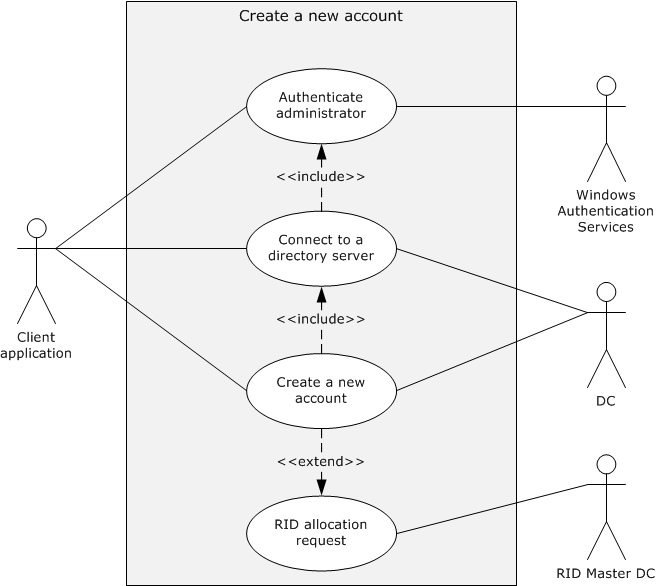

Figure 14: Use case diagram for creating a new account

**Actors**

- Client application
The client application is the primary actor. It is the entity that prepares the connection to the [**domain controller (DC)**](#gt_domain-controller-dc), submits the request to create the new account, and relays the response to the administrator.

- Windows Authentication Services
Windows Authentication Services [MS-AUTHSOD](../MS-AUTHSOD/MS-AUTHSOD.md) is the supporting actor that authenticates the administrator's [**identity**](#gt_identity). This is done so that access-control decisions can be made by the Active Directory system.

- DC
The DC is the supporting actor that receives the creation request and creates the new account.

- RID Master DC
The RID Master DC is a supporting actor. It is the domain controller that is the owner of the RID Master FSMO role for the [**domain**](#gt_domain).

**Stakeholders**

- Administrator
The administrator initiates operations such as create, reset, change, query for group members, create a security group, modify the group member list, and delete on the new account. The administrator primarily wants to receive information that the operations are successfully completed or receive an error message if they failed.

- Directory
The directory is the entity that contains the account being created.

**Preconditions**

- The system-wide preconditions, as described in section [2.6](#Section_2.6), are satisfied. The Active Directory system completes initialization, as described in section 2.6.
- The client application has connectivity to a directory [**server**](#gt_server) to which it can establish a connection, if it is not already connected, and send the request.
**Main Success Scenario**

- **Trigger:** The administrator launches the client application. To create a new account, the administrator provides the account name for the new account along with [**credentials**](#gt_credential) as input to the client application.
- The client application establishes a connection to the DC. Windows Authentication Services uses the supplied credentials to authenticate the client application ([MS-AUTHSOD] section 2).
- The client application sends a request to the DC to create a new account and specifies the account name for the new account.
- The DC verifies that the credentials supplied through the client application have the necessary access-control rights to complete the operation ([MS-ADTS](../MS-ADTS/MS-ADTS.md) section 5.1.3).
- The DC validates the constraints on the new account name ([MS-SAMR](#Section_2.11) sections 3.1.1.6 and 3.1.1.8.4).
- The DC creates an object in the directory that represents the new account with the account name that the client supplied. The [**directory object**](#gt_directory-object) is additionally populated with [**attributes**](#gt_attribute) that are mandated by the server's processing rules and constraints ([MS-ADTS] sections 3.1.1.5.1 and 3.1.1.5.2 and [MS-SAMR] sections 3.1.1.8 and 3.1.1.9).
- The DC sends a response to the client application that the new account has been successfully created.
**Postcondition**

The new account is created and ready for use.

**Extensions**

- If the credentials that are passed through the client application have insufficient access-control rights to set the password on the account:
1-4. Same as Main Success Scenario.

5. The DC sends a response to the client application that the client application has supplied credentials with insufficient access-control rights to set the password on the account.

- If the account name that is supplied through the client application does not satisfy the account name constraints that are outlined in [MS-SAMR] section 3.1.1.6:
1-5. Same as Main Success Scenario.

6. The DC sends a response to the client application that the supplied account name does not meet the constraints.

- If the account name that is supplied through the client application is not unique, as described in [MS-SAMR] section 3.1.1.8.4:
1-5. Same as Main Success Scenario.

6. The DC sends a response to the client application that the supplied account name is already in use by an existing account.

- If the DC has used all of the [**relative identifiers (RIDs)**](#gt_relative-identifier-rid) that were allocated to it by RID Master FSMO role owner:
1-5. Same as Main Success Scenario. Then, after step 5, the DC sends a RID allocation request to the RID Master DC according to the rules specified in [MS-DRSR](#Section_2.7.5) section 4.1.10.4.3 to obtain a new RID range.

6-7. Same as main Success Scenario.

#### 2.7.2.2 Reset an Existing Account's Password - Client Application

In this use case, a user has forgotten the password for his or her [**account**](#gt_account) and contacts an administrator. The administrator wants to reset the account's password to a known value so that they can communicate the new password to the user. The administrator launches a [**client**](#gt_client) application to reset the password on an existing account. The client application establishes a connection to the Active Directory system.

**Goal**

Reset the password on an account to a known value.

**Context of Use**

A user has forgotten his or her password and wants to reset it to a new value.

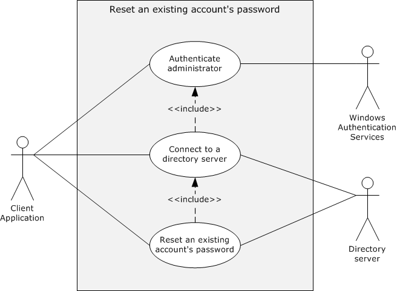

Figure 15: Use case diagram for resetting the password of an existing account

**Actors**

- Client application
The client application is the primary actor. It is the entity that prepares the connection to the [**directory**](#gt_directory) [**server**](#gt_server), submits the request to reset the password, and relays the response to the administrator.

- Windows Authentication Services
Windows Authentication Services [MS-AUTHSOD](../MS-AUTHSOD/MS-AUTHSOD.md) is the supporting actor that authenticates the administrator's [**identity**](#gt_identity). This is done so that access control decisions can be made by the Active Directory system.

- Directory server
The directory server is the supporting actor that receives the password-reset request and performs the tasks that are associated with resetting a user's password in the directory.

**Stakeholders**

- Administrator
The administrator initiates operations such as create, reset, change, query for group members, create a security group, modify the group member list, and delete on an account. The administrator primarily wants to receive information that the operations are successfully completed or receive an error message if they failed.

- User
The user is the person who needs to access directory resources.

For the user, the Active Directory system guarantees that, if possible, the password for the user's account is reset.

- Directory
The directory is the entity that contains the user's existing account.

**Preconditions**

- The system-wide preconditions, as described in section [2.6](#Section_2.6), are satisfied. The Active Directory system completes initialization, as described in section 2.6.
- The client application has connectivity to a directory server to which it can establish a connection, if it is not already connected, and send the request.
- The account for which the password change is performed exists.
**Main Success Scenario**

- **Trigger:** The administrator provides the account name of the existing account and the new password as input to the client application and invokes the operation that resets the password of an account.
- The client application establishes a connection to the directory server. Windows Authentication Services uses the supplied [**credentials**](#gt_credential) to authenticate the client application ([MS-AUTHSOD] section 2).
- The client application sends a request to the directory server to reset the password of an existing account. This request includes the account name of the account and the new password supplied by the administrator.
- The directory server verifies that the credentials that are supplied through the client application have the necessary access-control rights to complete the operation. ([MS-ADTS](../MS-ADTS/MS-ADTS.md) section 5.1.3).
- The directory server verifies that the new password satisfies the password [**policy**](#gt_policy), as described in [MS-SAMR](#Section_2.11) section 3.1.1.7.1.
- The directory server updates the password of the existing account with the new value that is supplied in the request. Additional [**attributes**](#gt_attribute) are updated as mandated by the server's processing rules and constraints ([MS-ADTS] sections 3.1.1.5.1 and 3.1.1.5.3 and [MS-SAMR] section 3.1.1.8.7).
- The directory server sends a response to the client application that the password has been successfully updated.
**Postcondition**

The account's password is reset.

**Extensions**

- If the credentials that were passed through the client application have insufficient access-control rights to set the password on the account:
1-4. Same as Main Success Scenario.

5. The directory server sends a response to the client application that the client application has supplied credentials with insufficient access-control rights to set the password on the account.

- If the password that was supplied through the client application does not satisfy the password constraints described in [MS-SAMR] section 3.1.1.7.1:
1-5. Same as Main Success Scenario.

6. The directory server sends a response to the client that the supplied password does not meet the constraints.

#### 2.7.2.3 Change an Existing Account's Password (PDC) - Client Application

In this use case, a user whose [**account**](#gt_account) is present in an Active Directory [**domain**](#gt_domain) wants to change the existing password to a new value. The user launches a [**client**](#gt_client) application to change the password on the user account. The client application establishes a connection to the Active Directory system by connecting to a [**domain controller**](#gt_domain-controller-dc) that is the [**primary domain controller (PDC)**](#gt_primary-domain-controller-pdc) [**FSMO role**](#gt_fsmo-role) owner for the domain.

**Goal**

Change the password on an account to a new value.

**Context of Use**

This use case is used when a client machine connects to the PDC for LDAP and domain services and the user wants to change the password of the user account.

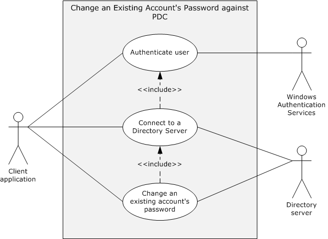

Figure 16: Use case diagram for changing the password of an existing account (PDC)

**Actors**

- Client application
The client application is the primary actor. It is the entity that prepares the connection to the [**directory**](#gt_directory) [**server**](#gt_server), submits the request to change the password, and relays the response to the user.

- Windows Authentication Services
Windows Authentication Services [MS-AUTHSOD](../MS-AUTHSOD/MS-AUTHSOD.md) is the supporting actor that authenticates the user's [**identity**](#gt_identity). This is done so that access control decisions can be made by the Active Directory system.

- Directory server
The directory server is the supporting actor that receives the password-change request and performs the tasks that are associated with changing a user's password in the directory. The directory server is the owner of the PDC FSMO role for the domain.

**Stakeholders**

- User
The user initiates the password change on his or her existing account. The user primarily wants to receive information that the password was successfully changed or receive an error message if the password was not changed.

- Directory
The directory is the entity that contains the user's existing account.

**Preconditions**

- The system-wide preconditions, as described in section [2.6](#Section_2.6), are satisfied. The Active Directory system completes initialization, as described in section 2.6.
- The client application has connectivity to a directory server to which it can establish a connection, if it is not already connected, and send the request.
- The account on which the password change is being performed exists.
**Main Success Scenario**

- **Trigger:** The user provides the account name of the existing account, the existing password for the account, and the new value for the password to the client application, and then invokes the operation that changes the password of the account.
- The client application establishes a connection to the directory server. Windows Authentication Services uses the supplied [**credentials**](#gt_credential) to authenticate the client application ([MS-AUTHSOD] section 2).
- The client application sends a request to the directory server to change the password of an existing account. This request includes the account name of the account, the current password, and the new password that the user supplies.
- The directory server verifies that the credentials that are supplied through the client application have the necessary access-control rights to complete the operation ([MS-ADTS](../MS-ADTS/MS-ADTS.md) section 5.1.3).
- The directory server verifies that the current password that is supplied through the client application matches the account's password that is stored in the directory.
- The directory server verifies that the new password satisfies the password [**policy**](#gt_policy), as described in [MS-SAMR](#Section_2.11) section 3.1.1.7.1.
- The directory server updates the password of the existing account with the new value that is supplied in the request. Additional [**attributes**](#gt_attribute) are updated as mandated by the server's processing rules and constraints ([MS-ADTS] sections 3.1.1.5.1 and 3.1.1.5.3 and [MS-SAMR] section 3.1.1.8.7).
- The directory server sends a response to the client application that the password has been successfully updated.
**Postcondition**

The account's password is changed.

**Extensions:**

- If the credentials that are passed through the client application have insufficient access-control rights to set the password on the account:
1-4. Same as Main Success Scenario.

5. The directory server sends a response to the client application that it supplied credentials with insufficient access-control rights to set the password on the account.

- If the current password that the user supplies does not match the password that is stored in the directory:
1-5. Same as Main Success Scenario.

6. The directory server sends a response to the client application that the supplied password is incorrect.

- If the new password that the user supplies does not satisfy the password constraints described in [MS-SAMR] section 3.1.1.7.1:
1-6. Same as Main Success Scenario.

7. The directory server sends a response to the client application that the supplied password does not meet the constraints.

#### 2.7.2.4 Change an Existing Account's Password (DC) - Client Application

In this use case, a user whose [**account**](#gt_account) is present in an Active Directory [**domain**](#gt_domain) wants to change the existing password to a new value. The user starts a [**client**](#gt_client) application to change the password on the account. The client application establishes a connection to the Active Directory system by connecting to a DC that is not the owner of the [**PDC**](#gt_primary-domain-controller-pdc) [**FSMO role**](#gt_fsmo-role) for the domain. This use case highlights the communication between the DC and the PDC in the domain.

**Goal**

Change the password on an account to a new value.

**Context of use**

The user wants to change the password on the user account.

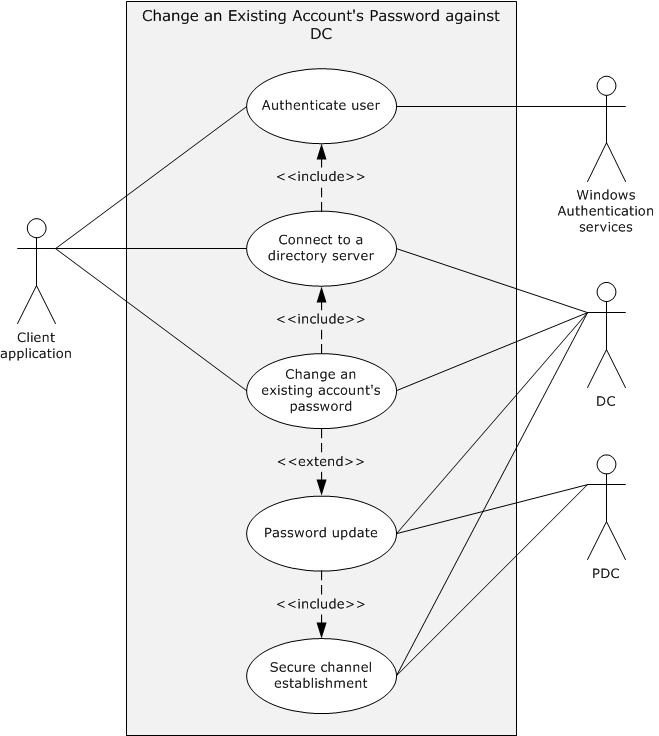

Figure 17: Use case diagram for changing the password of an existing account (DC)

**Actors**

- Client application
The client application is the primary actor. It is the entity that prepares the connection to the [**directory**](#gt_directory) [**server**](#gt_server), submits the request to change the password, and relays the response to the user.

- Windows Authentication Services
Windows Authentication Services [MS-AUTHSOD](../MS-AUTHSOD/MS-AUTHSOD.md) is the supporting actor that authenticates the user's [**identity**](#gt_identity) so that the Active Directory system can make access-control decisions.

- DC
A domain controller that is not the owner of the PDC FSMO role for the domain. It is the supporting actor that receives the password-change request, performs the tasks that are associated with changing a user's password in the directory, and sends a password update request to the PDC.

- PDC
The primary domain controller of the domain. It is the supporting actor that receives the password update request from the DC and updates the user-password details in its directory database. The PDC is the owner of PDC FSMO role for the domain.

**Stakeholders**

- User
The user initiates the password change on his or her existing account. The user primarily wants to receive information that the password was successfully changed or receive an error message if the password was not changed.

- Directory
The directory is the entity that contains the user's existing account.

**Preconditions**

- The system-wide preconditions described in section [2.6](#Section_2.6) are satisfied. The Active Directory system completes initialization, as described in section 2.6.
- The client application has connectivity to a DC to which it can establish a connection, if it is not already connected, and send the request.
- The DC has connectivity to the PDC to which it establishes a secure channel and sends the password update request.
- The account on which the password is to be changed exists.
**Main Success Scenario**

- **Trigger:** The user provides the account name of the existing account, the existing password for the account, and the new value for the password to the client application and invokes the operation that changes the password of the account.
- The client application establishes a connection to the DC. Windows Authentication Services uses the supplied [**credentials**](#gt_credential) to authenticate the client application, as described in [MS-AUTHSOD] section 2.
- The client application sends a request to the DC to change the password of the given account. This request includes the account name, the current password, and the new password supplied by the user.
- An access check is performed on the DC to ensure that the user has the access rights to complete the operation, as described in [MS-ADTS](../MS-ADTS/MS-ADTS.md) section 5.1.3.
- The DC verifies that the current password that is supplied through the client application matches the account's password that is stored in the directory.
- The DC verifies that the new password satisfies the password [**policy**](#gt_policy), as described in [MS-SAMR](#Section_2.11) section 3.1.1.7.1.
- The DC updates the password of the existing account with the new value that is supplied in the request. Additional [**attributes**](#gt_attribute) are updated as mandated by the server's processing rules and constraints ([MS-ADTS] sections 3.1.1.5.1 and 3.1.1.5.3 and [MS-SAMR] section 3.1.1.8.7).
- The DC establishes a secure channel with the PDC according to the processing rules and constraints specified in [MS-NRPC](../MS-NRPC/MS-NRPC.md) sections 3.1.1 and 3.1.4.3 and [MS-ADTS] section 6.1.6.9.2.
- The DC sends a password update request to the PDC according to the processing rules and constraints specified in [MS-SAMS](#Section_2.11) section 3.3.5.4.
- The PDC sends a response to the DC indicating that the password has been successfully updated.
- The DC sends a response to the client application that the password has been successfully updated.
**Postconditions**

The account's password is changed at the DC, and it is also updated for the PDC FSMO role owner of the domain.

#### 2.7.2.5 Change User Account Password Against an RODC - Client Application

In this use case, a user whose [**account**](#gt_account) is present in an Active Directory [**domain**](#gt_domain) wants to change the existing password to a new value. The user starts a [**client**](#gt_client) application to change the password on the user account. The client application establishes a connection to the Active Directory system via a [**read-only domain controller (RODC)**](#gt_read-only-domain-controller-rodc) to update the password.

**Goal**

Change the password on an account to a new value.

**Context of use**

This use case is used when a client machine connects to an RODC for LDAP and domain services, and the user wants to change the password of the user account.

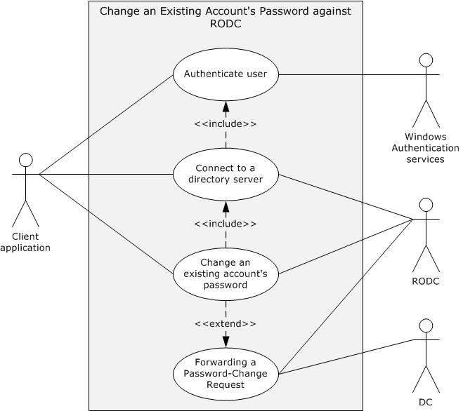

Figure 18: Use case diagram for changing the password of an existing account (RODC)

**Actors**

- Client application
The client application is the primary actor. It is the entity that prepares the connection to the [**directory**](#gt_directory) [**server**](#gt_server), submits the request to change the password, and relays the response to the user.

- Windows Authentication Services
Windows Authentication Services [MS-AUTHSOD](../MS-AUTHSOD/MS-AUTHSOD.md) is the supporting actor that authenticates the user's [**identity**](#gt_identity) so that the Active Directory system can make access-control decisions.

- RODC
A read-only domain controller that contains a read-only [**replica**](#gt_replica) of the [**naming context (NC)**](#gt_naming-context-nc) that contains the user account. The RODC is the supporting actor that receives the password-change request and performs the tasks associated with changing a user's password in the directory. The RODC forwards the password update request to the DC.

- DC
A [**domain controller**](#gt_domain-controller-dc) that contains a writable replica of the NC that contains the user account. The DC is the supporting actor that receives the password update request from the RODC and updates the user password details in its directory database. The DC contains a writable replica of the [**domain NC**](#gt_domain-naming-context-domain-nc) in which the user account is present.

**Stakeholders**

- User
The user initiates the password change on his or her existing account. The user primarily wants to know that the password was successfully changed or receive an error message if the password was not changed.

- Directory
The directory is the entity that contains the user's existing account.

**Preconditions**

- The system-wide preconditions, as described in section [2.6](#Section_2.6), are satisfied. The Active Directory system completes initialization, as described in section 2.6.
- The client application has connectivity to an RODC to which it can establish a connection (if it is not already connected) and send the request.
- The RODC has connectivity to a DC to which it can establish a secure channel and send the password update request.
- The account on which the password is to be changed exists.
**Main Success Scenario**

- **Trigger:** The user provides the account name of the existing account, the existing password for the account, and the new value for the password to the client application, and then invokes the operation that changes the password of the account.
- The client application establishes a connection to the RODC. Windows Authentication Services uses the supplied [**credentials**](#gt_credential) to authenticate the client application, as described in [MS-AUTHSOD] section 2.
- The client application sends a request to the RODC to change the password of an existing account according to rules specified in one of the following references:
- [MS-NRPC](../MS-NRPC/MS-NRPC.md) sections 3.5.4.4.6 and 3.5.4.4.5
- [MS-SAMR](#Section_2.11) sections 3.1.5.10.2 and 3.1.5.10.3
- The RODC processes the request according to the following rules.
- If the client application sends the request in step 3 according to the rules specified in [MS-NRPC], the RODC forwards the request to the DC according to the processing rules specified in [MS-SAMS](#Section_2.11) section 3.2.4.4.
- If the client application sends the request in step 3 according to the rules specified in [MS-SAMR], the RODC forwards the request to the DC according to the processing rules specified in [MS-SAMS] section 3.2.4.5.
- The DC processes the request from the RODC according to the rules that are specified in the appropriate section of [MS-SAMS], as indicated in step 4, and sends a response.
- On receiving the success response from the DC, the RODC sends that response to the client application.
**Postconditions**

The account's password is changed, and it is updated in the [**writable NC replica**](#gt_51db485c-dcf6-4845-99b3-2df414ef0aa9) of the DC.

#### 2.7.2.6 User Logon to Domain Services by Using an RODC and Updating the User LastLogonTimeStamp - Client Application

In this use case, a user successfully logs on to a domain by using an [**RODC**](#gt_read-only-domain-controller-rodc), after which the associated last-logon time value is updated in the lastLogonTimeStamp [**attribute**](#gt_attribute) of the user account.

**Goal**

When the user successfully logs on, the lastLogonTimeStamp attribute of the user [**account**](#gt_account) is updated in the directory.

**Context of Use**

This use case is used by an RODC to communicate the user's latest lastLogonTimeStamp to the DC whenever the user logs on to the [**domain**](#gt_domain). The lastLogonTimeStamp attribute represents the time when the user successfully logged on to the domain. This use case is used in scenarios where the [**client**](#gt_client) application is connecting to an RODC for [**directory services**](#gt_directory-service-ds).

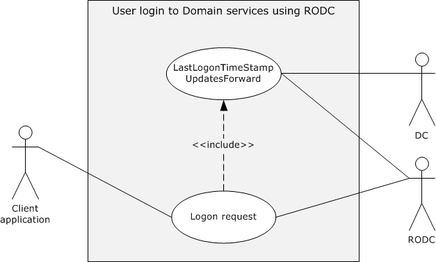

Figure 19: Use case diagram for a last-logon time value update by using an RODC

**Actors**

- Client application
The client application is the primary actor. The user is trying to log on to the domain by using the client application. It is the entity that initiates authentication operations to access a resource in the [**directory**](#gt_directory).

- RODC
The RODC is a read-only domain controller. It is the supporting actor to which the client application is connected in order to authenticate the user.

- DC
The DC is a [**domain controller**](#gt_domain-controller-dc) in the domain. It is the supporting actor that contains a writable [**replica**](#gt_replica) of the [**naming context**](#gt_naming-context-nc) in which the user account is present.

**Stakeholders**

- User
The user is the person whose account is being updated with a last-logon time value.

- Directory
The directory is the entity that contains user accounts and logon details of the user.

**Preconditions**

- The system-wide preconditions described in section [2.6](#Section_2.6) are satisfied. The Active Directory system completes initialization, as described in section 2.6.
- The client application has connectivity to an RODC to which it can establish a connection (if it is not already connected) and send the request.
- The account that the user uses for the logon is present in the directory.
- The RODC is configured to allow caching of the account [**credentials**](#gt_credential) of a user.
**Main Success Scenario**

- **Trigger:** The user enters the credentials needed to log on to the client.
- The client application establishes a connection to the RODC. Windows Authentication Services that is present in the RODC uses the supplied credentials to authenticate the user ([MS-AUTHSOD](../MS-AUTHSOD/MS-AUTHSOD.md) section 2).
- The RODC verifies that the credentials supplied by the client application have the necessary access-control rights to complete the operation ([MS-ADTS](../MS-ADTS/MS-ADTS.md) section 5.1.3).
- If the user is successfully authenticated, the RODC sends a success response to the client application.
- On successful verification of step 3, the RODC sends a LogonTimeStampUpdatesForward request ([MS-SAMS](#Section_2.11) section 3.2.4.6) to the DC.
- The DC updates the lastLogonTimeStamp attribute of the user account and sends a response.
**Postcondition**

The user account's lastLogonTimeStamp attribute is updated to reflect the user's last logon time.

#### 2.7.2.7 Query an Account's Group Membership - Client Application

In this use case, an administrator wants to display an account's group membership in order to determine the account's access rights. The administrator launches a [**client**](#gt_client) application to query the group membership of a specified [**account**](#gt_account). The client application establishes a connection to the Active Directory system.

**Goal**

Retrieve an account's group membership.

**Context of Use**

An administrator wants to retrieve or use group membership of a [**directory object**](#gt_directory-object).

Figure 20: Use case diagram for querying the group membership of an account

**Actors**

- Client application
The client application is the primary actor. It is the entity that prepares the connection to the [**directory**](#gt_directory) [**server**](#gt_server), submits the request to obtain group membership, and relays the response to the administrator.

- Windows Authentication Services
Windows Authentication Services [MS-AUTHSOD](../MS-AUTHSOD/MS-AUTHSOD.md) is the supporting actor that authenticates the administrator's [**identity**](#gt_identity) so that the Active Directory system can make access-control decisions.

- Directory server
The directory server is the supporting actor that receives the request for group-membership information and gathers the information for the requestor.

**Stakeholders**

- Administrator
The administrator initiates operations such as create, reset, change, query group members, create security group, modify group member list, and delete on an account. The administrator primarily wants to receive information that the operations are successfully completed or receive an error message if they failed.

- Directory
The directory is the entity that contains and maintains group membership.

In this operation, the directory is left unchanged.

**Preconditions**

- The system-wide preconditions, as described in section [2.6](#Section_2.6), are satisfied. The Active Directory system completes initialization, as described in section 2.6.
- The client application has connectivity to a directory server to which it can establish a connection, if it is not already connected, and send the request.
- The account for which group membership is being requested exists.
**Main Success Scenario**

- **Trigger:** The administrator provides the account name of the account to query as input to the client application with [**credentials**](#gt_credential) and invokes the operation that queries the group membership of an account.
- The client application establishes a connection to the directory server. Windows Authentication Services use the supplied credentials to authenticate the client application ([MS-AUTHSOD] section 2).
- The client application sends a request to the directory server to retrieve the group membership of the account.
- The directory server verifies that the credentials that are supplied through the client application have the necessary access-control rights to complete the operation ([MS-ADTS](../MS-ADTS/MS-ADTS.md) section 5.1.3).
- The directory server sends a response to the client application that contains the group membership of the specified account.
**Postcondition**

Group-membership information for the account is available to the client application.

**Extensions**

- If the credentials that are supplied through the client application have insufficient access-control rights to retrieve the group membership of the account:
1-4. Same as Main Success Scenario.

5. The directory server sends a response to the client application. Group-membership information is not returned to the client application.

#### 2.7.2.8 Delete an Account - Client Application

In this use case, an administrator wants to delete an [**account**](#gt_account) from the directory to prevent its further use. The administrator launches a client application to delete an account. The client application establishes a connection to the Active Directory system.

**Goal**

Delete an account in the [**directory**](#gt_directory).

**Context of Use**

An administrator wants to delete an account from the directory to prevent its further use.

Figure 21: Use case diagram for deleting an account

**Actors**

- Client application
The client application is the primary actor. It is the entity that prepares the connection to the directory [**server**](#gt_server), submits the request to delete an account, and relays the response to the administrator.

- Windows Authentication Services
Windows Authentication Services [MS-AUTHSOD](../MS-AUTHSOD/MS-AUTHSOD.md) is the supporting actor that authenticates the administrator's [**identity**](#gt_identity) so that the Active Directory system can make access-control decisions.

- Directory server
The directory server is the supporting actor that receives the deletion request and deletes the account from the directory.

**Stakeholders**

- Administrator
The administrator initiates operations such as create, reset, change, query for group members, create a security group, modify the group member list, and delete on an account. The administrator primarily wants to receive information that the operations are successfully completed or receive an error message if they failed.

- Directory
The directory is the entity that contains the account being deleted.

**Preconditions**

- The system-wide preconditions, as described in section [2.6](#Section_2.6), are satisfied. The Active Directory system completes initialization, as described in section 2.6.
- The client application has connectivity to a directory server to which it can establish a connection, if it is not already connected, and send the request.
- The account that is being deleted exists.
**Main Success Scenario**

- **Trigger:** The administrator provides the account name of the account to be deleted as input to the client application with [**credentials**](#gt_credential) and invokes the operation that deletes an account.
- The client application establishes a connection to the directory server. Windows Authentication Services authenticates the [**client**](#gt_client) application using the supplied credentials ([MS-AUTHSOD] section 2).
- The client application sends a request to the directory server to delete the account.
- The directory server verifies that the credentials that are supplied through the client application have the necessary access-control rights to complete the operation ([MS-ADTS](../MS-ADTS/MS-ADTS.md) section 5.1.3).
- The directory server deletes the object in the directory that represents the account with the account name that the client supplies. Additional processing tasks that are mandated by the server's processing rules and constraints might occur ([MS-ADTS] sections 3.1.1.5.1 and 3.1.1.5.3).
- The directory server sends a response to the client application indicating that the account has been successfully deleted.
**Postcondition**

The account is no longer available.

**Extensions**

- If the credentials that are supplied through the client application have insufficient access-control rights to delete the account:
1-4. Same as Main Success Scenario.

5. The directory server sends a response to the client application that the supplied credentials have insufficient access-control rights to delete the account.

#### 2.7.2.9 Create a Security Group - Client Application

In this use case, an administrator wants to create a security group to be used for access-control decisions. The administrator launches a [**client**](#gt_client) application to create the new security group. The client application establishes a connection to the Active Directory system.

**Goal**

Create a new security group in the [**directory**](#gt_directory).

**Context of Use**

An administrator wants to create a security group to be used for access-control decisions.

Figure 22: Use case diagram for creating a security group

**Actors**

- Client application
The client application is the primary actor. It is the entity that prepares the connection to the directory [**server**](#gt_server), submits the request to create the security group, and relays the response to the administrator.

- Windows Authentication Services
Windows Authentication Services [MS-AUTHSOD](../MS-AUTHSOD/MS-AUTHSOD.md) is the supporting actor that authenticates the administrator's [**identity**](#gt_identity) so that the Active Directory system can make access-control decisions.

- Directory server
The directory server is the supporting actor that receives the creation request and creates the security group.

**Stakeholders**

- Administrator
The administrator initiates operations such as create, reset, change, query for group members, create a security group, modify the group member list, and delete on an [**account**](#gt_account). The administrator primarily wants to receive information that the operations are successfully completed or receive an error message if they failed.

- Directory
The directory is the entity that contains the security group being created.

**Preconditions**

- The system-wide preconditions, as described in section [2.6](#Section_2.6), are satisfied. The Active Directory system completes initialization, as described in section 2.6.
- The client application has connectivity to a directory server to which it can establish a connection, if it is not already connected, and send the request.
**Main Success Scenario**

- **Trigger:** The administrator provides the group name for the new security group as input to the client application, along with [**credentials**](#gt_credential), and invokes the operation that creates a new security group.
- The client application establishes a connection to the directory server. Windows Authentication Services authenticates the client application by using the supplied credentials ([MS-AUTHSOD] section 2).
- The client application sends a request to the directory server to create a new security group and specifies the group name for the new group.
- The directory server verifies that the credentials that are supplied through the client application have the necessary access-control rights to complete the operation ([MS-ADTS](../MS-ADTS/MS-ADTS.md) section 5.1.3).
- The directory server validates the constraints on the new group name, as described in [MS-SAMR](#Section_2.11) sections 3.1.1.6 and 3.1.1.8.4.
- The directory server creates an object in the directory that represents the new security group with the group name supplied by the client. The [**directory object**](#gt_directory-object) is additionally populated with [**attributes**](#gt_attribute) that are mandated by the server's processing rules and constraints ([MS-ADTS] sections 3.1.1.5.1 and 3.1.1.5.2).
- The directory server sends a response to the client application that the new security group has been successfully created.
**Postcondition**

The new security group is created and ready for use.

**Extensions**

- If the credentials that are supplied through the client application have insufficient access-control rights to create the new security group:
1-4. Same as Main Success Scenario.

5. The directory server sends a response to the client application that the supplied credentials have insufficient access-control rights to create the new security group.

- If the group name that the administrator supplies does not satisfy the group name constraints, as described in [MS-SAMR] section 3.1.1.6:
1-5. Same as Main Success Scenario.

6. The directory server sends a response to the client application that the specified group name does not meet the constraints.

- If the group name that is supplied through the client application is not unique, as described in [MS-SAMR] section 3.1.1.8.4:
1-5. Same as Main Success Scenario.

6. The directory server sends a response to the client application that the specified group name is already in use by an existing group.

#### 2.7.2.10 Modify Group Member List - Client Application

In this use case, an existing security group is used to control access to [**directory**](#gt_directory) resources. An administrator wants to modify the member list of that group so that a new [**account**](#gt_account) can access the controlled resources. The administrator starts a [**client**](#gt_client) application to modify the member list for an existing group. The client application establishes a connection to the Active Directory system.

**Goal**

Modify the member list of an existing group.

**Context of Use**

An administrator wants to add or delete members to a security group.

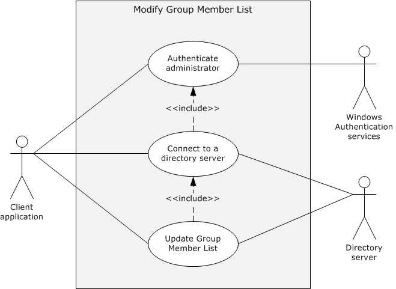

Figure 23: Use case diagram for modifying the member list of a group

**Actors**

- Client application
The client application is the primary actor. It is the entity that prepares the connection to the directory [**server**](#gt_server), submits the request to modify the member list of a group, and relays the response to the administrator.

- Windows Authentication Services
Windows Authentication Services [MS-AUTHSOD](../MS-AUTHSOD/MS-AUTHSOD.md) is the supporting actor that authenticates the administrator's [**identity**](#gt_identity) so that the Active Directory system can make access-control decisions.

- Directory server
The directory server is the supporting actor that receives the request and modifies the list.

**Stakeholders**

- Administrator
The administrator initiates operations on an account such as create, reset, change, query for group members, create a security group, modify the group member list, and delete. The administrator primarily wants to know that the operations are successfully completed or receive an error message if they failed.

- Directory
The directory is the entity that contains the list being modified.

**Preconditions**

- The system-wide preconditions, as described in section [2.6](#Section_2.6), are satisfied. The Active Directory system completes initialization, as described in section 2.6.
- The client application has connectivity to a directory server to which it can establish a connection (if it is not already connected) and send the request.
- The security group that is being modified exists.
**Main Success Scenario**

- **Trigger:** The administrator provides the group name for the group to be modified and the updates for the group's member list, along with [**credentials**](#gt_credential), as input to the client application, and invokes the operation that modifies the member list of a group.
- The client application establishes a connection to the directory server. Windows Authentication Services uses the supplied credentials to authenticate the client application ([MS-AUTHSOD] section 2).
- The client application sends a request to the directory server to modify the member list of the specified group. The updates for the member list are included in the request.
- The directory server verifies that the credentials supplied through the client application have the necessary access-control rights to complete the operation ([MS-ADTS](../MS-ADTS/MS-ADTS.md) section 5.1.3).
- The directory server verifies that the new member list satisfies the constraints described in [MS-SAMR](#Section_2.11) section 3.1.1.8.9.
- The [**directory object**](#gt_directory-object) that represents the group is modified with the new member list. Additional processing might occur, as described in [MS-ADTS] sections 3.1.1.5.1 and 3.1.1.5.3, and [MS-SAMR] section 3.1.1.8.9.
- The directory server sends a response to the client application that the member list has been modified.
**Postcondition**

The group's member list is modified.

**Extensions**

- If the credentials supplied through the client application have insufficient access-control rights to modify the member list of the group:
1-4. Same as Main Success Scenario.

5. The directory server sends a response to the client application that the supplied credentials have insufficient access-control rights to modify the member list of the group.

- If the member list supplied through the client application does not satisfy the constraints ([MS-SAMR] section 3.1.1.8.9):
1-5. Same as Main Success Scenario.

6. The directory server sends a response to the client application that the specified member list does not meet the constraints.

#### 2.7.2.11 Query for Members of a Group - Client Application

In this use case, an administrator wants to view the members of a group to better determine which users have certain access-control rights. The administrator starts a [**client**](#gt_client) application to query for the membership of a specified group. The client application establishes a connection to the Active Directory system.

**Goal**

Retrieve the member list of a group.

**Context of Use**

An administrator wants to view the members of a group to better determine which users have certain access-control rights.

Figure 24: Use case diagram for querying for the members of a group

**Actors**

- Client application
The client application is the primary actor. It is the entity that prepares the connection to the [**directory**](#gt_directory) [**server**](#gt_server), submits the request to retrieve a group's member list, and relays the response to the administrator.

- Windows Authentication Services
Windows Authentication Services [MS-AUTHSOD](../MS-AUTHSOD/MS-AUTHSOD.md) is the supporting actor that authenticates the administrator's [**identity**](#gt_identity) so that the Active Directory system can make access-control decisions.

- Directory server
The directory server is the supporting actor that receives the request for a group's member list and gathers the information for the requestor.

**Stakeholders**

- Administrator
The administrator initiates operations on an [**account**](#gt_account) such as create, reset, change, query for group members, create a security group, modify the group member list, and delete. The administrator primarily wants to receive information confirming that the operations are successfully completed or receive an error message if they failed.

- Directory
The directory is the entity that contains and maintains group membership information.

In this operation, the directory remains unchanged.

**Preconditions**

- The system-wide preconditions, as described in section [2.6](#Section_2.6), are satisfied. The Active Directory system completes initialization, as described in section 2.6.
- The client application has connectivity to a directory server to which it can establish a connection (if it is not already connected) and send the request.
- The group for which information is being sought exists.
**Main Success Scenario**

- **Trigger:** The administrator provides the group name of the group to be queried as input to the client application with [**credentials**](#gt_credential) and invokes the operation that queries a group's member list.
- The client application establishes a connection to the directory server. Windows Authentication Services uses the supplied credentials to authenticate the client application ([MS-AUTHSOD] section 2).
- The client application sends a request to the directory server to retrieve the member list of the group.
- The directory server verifies that the credentials that are supplied through the client application have the necessary access-control rights to complete the operation ([MS-ADTS](../MS-ADTS/MS-ADTS.md) section 5.1.3).
- The directory server sends a response to the client application that contains the member list for the specified group.
**Postcondition**

The member list of the group is available to the client application.

**Extensions**

- If the credentials that are supplied through the client application have insufficient access-control rights to retrieve the member list of the group:
1-4. Same as Main Success Scenario.

5. The directory server sends a response to the client application. The member list of the group is not returned to the client application.

### 2.7.3 Schema Management

When the set of classes and [**attributes**](#gt_attribute) in the base Active Directory [**schema**](#gt_schema) does not meet the requirements of the applications, the administrator can extend the schema by adding a new class to the schema, by adding a new attribute to the schema, or by adding an attribute to an existing class. Schema classes and attributes are objects that are stored in Active Directory. Adding a new class to the schema is equivalent to creating a new object of the classSchema class ([MS-ADTS](../MS-ADTS/MS-ADTS.md) section 3.1.1.2.4.8); adding a new attribute to the schema is equivalent to creating a new object of the attributeSchema class ([MS-ADTS] section 3.1.1.2.3); adding an attribute to an existing class is done by modifying the corresponding classSchema object, which modifies the class definition to contain the attribute. After a new class or attribute is successfully added to the schema, users can create the objects of the newly defined or extended schema class.

The following diagram illustrates the use cases of schema management.

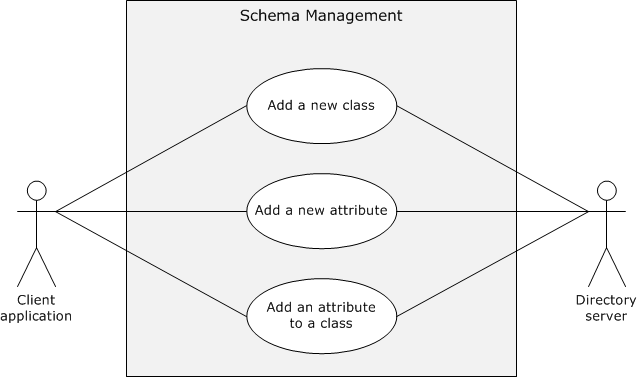

Figure 25: Use cases for schema management

#### 2.7.3.1 Add a New Class to the Schema - Client Application

In this use case, the administrator realizes that the set of classes in the base Active Directory [**schema**](#gt_schema) does not meet the requirements of an application on the [**client**](#gt_client). The administrator extends the schema by adding a new class to the schema; that is, by creating a new object of the classSchema class. After the new class is successfully added to the schema, the administrator can create objects of the newly defined class.

**Goal**

The client application adds a new class to the schema of the Active Directory system.

**Context of Use**

When the set of classes in the base Active Directory schema does not meet the requirements of a client application, the administrator can extend the schema by adding new objects of the classSchema class.

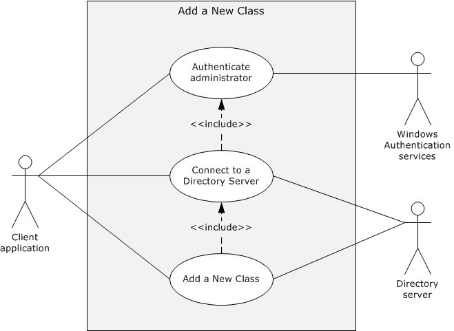

Figure 26: Use case diagram for adding a new class to the Active Directory schema

**Actors**

- Client application
The client application is the primary actor. It is the entity that prepares the connection to the [**directory**](#gt_directory) [**server**](#gt_server), submits the request to add a new class, and relays the response to the administrator.

- Windows Authentication Services
The Windows Authentication Services [MS-AUTHSOD](../MS-AUTHSOD/MS-AUTHSOD.md) is the supporting actor that authenticates the administrator's [**identity**](#gt_identity) so that the Active Directory system can make access-control decisions.

- Directory server
The directory server is the supporting actor that receives the request and adds the new class.

**Stakeholders**

- Administrator
The administrator initiates the addition of a new class to the schema. The administrator primarily wants to receive information that the class was successfully added or receive an error message if it was not added.

- Directory
The directory is the entity that contains the additional class.

**Preconditions**

- The system-wide preconditions described in section [2.6](#Section_2.6) are satisfied. The Active Directory system completes initialization, as described in section 2.6.
- The client application has connectivity to a directory server to which it can establish a connection, if it is not already connected, and send the request.
**Main Success Scenario**

- **Trigger:** The administrator provides the mandatory [**attributes**](#gt_attribute) ([MS-ADTS](../MS-ADTS/MS-ADTS.md) section 3.1.1.2) for the new class, along with [**credentials**](#gt_credential), as input to the client application, and then invokes the operation that adds a new class to the schema.
- The client application establishes a connection to the directory server that owns the Schema Master FSMO role ([MS-ADTS] section 3.1.1.5.1.8). Windows Authentication Services uses the supplied credentials to authenticate the client application ([MS-AUTHSOD] section 2).
- The client application sends a request to the directory server to create a new class, specifying the values of the attributes that are present on the classSchema object for the new class.
- The directory server verifies that the credentials that are supplied through the client application have the necessary access-control rights to complete the operation ([MS-ADTS] section 3.1.1.2.5).
- The directory server verifies that it owns the Schema Master FSMO role ([MS-ADTS] section 3.1.1.2.5).
- The directory server validates the constraints on the new class attributes, as specified in [MS-ADTS] section 3.1.1.2.5.
- The directory server creates an object in the directory that represents the new class with the attributes supplied by the client application. The [**directory object**](#gt_directory-object) is additionally populated with attributes that are mandated by the server's processing rules and constraints ([MS-ADTS] sections 3.1.1.2.5, 3.1.1.5.1, and 3.1.1.5.2.)
- The directory server sends a response to the client application indicating that the new class has been successfully added to the schema.
**Postcondition**

The new object of class classSchema is created and ready for use.

**Extensions**

- If the credentials that are supplied through the client application have insufficient access-control rights to add the new schema class:
1-4. Same as Main Success Scenario.

5. The directory server sends a response to the client application indicating that the supplied credentials have insufficient access-control rights to add the new class to the schema.

- If the directory server to which the client application connects does not own the Schema Master FSMO role ([MS-ADTS] section 3.1.1.2.5):
1-5. Same as Main Success Scenario.

6. The directory server sends a response to the client application with a referral to the directory server that does own the Schema Master FSMO role.

- If the class name that is supplied through the client application is not unique:
1-6. Same as Main Success Scenario.

7. The directory server sends a response to the client application that the object name to be created is already in use.

- If the attributes that the client application provides do not meet consistency checks ([MS-ADTS] section 3.1.1.2.5.1.1):
1-6. Same as Main Success Scenario.

7. The directory server sends a response to the client application that it cannot perform the operation.

#### 2.7.3.2 Add a New Attribute to the Schema - Client Application

In this use case, an administrator realizes that the set of [**attributes**](#gt_attribute) in the base Active Directory [**schema**](#gt_schema) does not meet the requirements of an application on the [**client**](#gt_client). To extend the schema, the administrator adds a new attribute to the schema; that is, the administrator creates an object of class attributeSchema. After the new attribute is successfully added to the schema, the administrator can then add the attribute to a class and create objects of that class with the new attribute.

**Goal**

The client application adds a new attribute to the schema of the Active Directory system.

**Context of Use**

When the set of attributes in the base Active Directory schema does not meet the requirements of a client application.

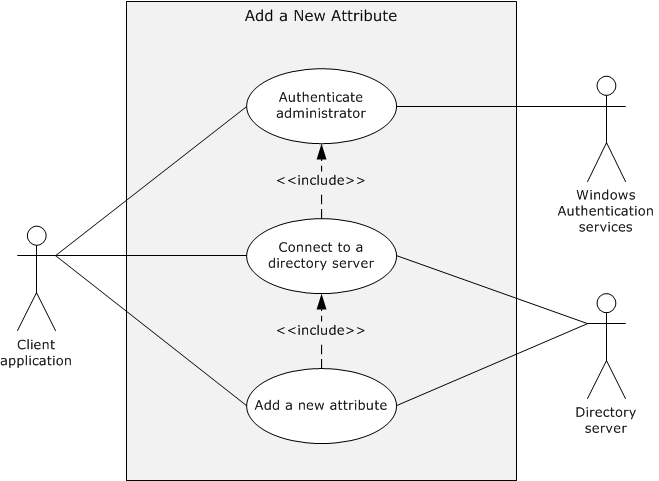

Figure 27: Use case diagram for adding a new attribute to the Active Directory schema

**Actors**

- Client application
The client application is the primary actor. It is the entity that prepares the connection to the [**directory**](#gt_directory) [**server**](#gt_server), submits the request to add a new attribute, and relays the response to the administrator.

- Windows Authentication Services
The Windows Authentication Services [MS-AUTHSOD](../MS-AUTHSOD/MS-AUTHSOD.md) is the supporting actor that authenticates the administrator's [**identity**](#gt_identity) so that the Active Directory system can make access-control decisions.

- Directory server
The directory server is the supporting actor that receives the request and adds the new attribute.

**Stakeholders**

- Administrator
The administrator initiates the addition of a new attribute to the schema. The administrator primarily wants to receive information that the attribute was successfully added or receive an error message if it was not added.

- Directory
The directory is the entity that contains the additional attribute.

**Preconditions**

- The system-wide preconditions described in section [2.6](#Section_2.6) are satisfied. The Active Directory system completes initialization, as described in section 2.6.
- The client application has connectivity to a directory server to which it can establish a connection, if it is not already connected, and send the request.
**Main Success Scenario**

- **Trigger:** The administrator provides the mandatory attributes ([MS-ADTS](../MS-ADTS/MS-ADTS.md) section 3.1.1.2) for the new object, along with [**credentials**](#gt_credential), as input to the client application, and then invokes the operation that adds a new attribute to the schema.
- The client application establishes a connection to the directory server that owns the Schema Master FSMO role ([MS-ADTS] section 3.1.1.5.1.8). Windows Authentication Services uses the supplied credentials to authenticate the client application ([MS-AUTHSOD] section 2).
- The administrator provides the required information for the new schema attribute to the client application.
- The client application sends a request to the directory server to create a new attribute (an object of class attributeSchema), specifying the values of the attributes that are present on the attributeSchema object.
- The directory server verifies that the credentials that are supplied through the client application have the necessary access-control rights to complete the operation ([MS-ADTS] section 3.1.1.2.5).
- The directory server verifies that it owns the Schema Master FSMO role ([MS-ADTS] section 3.1.1.2.5).
- The directory server validates the constraints on the new attributeSchema object attributes, as described in ([MS-ADTS] section 3.1.1.2.5).
- The directory server creates an object of class attributeSchema in the directory that represents the new attribute with the values of the attributes that the client application supplied. The [**directory object**](#gt_directory-object) is additionally populated with attributes that are mandated by the server's processing rules and constraints ([MS-ADTS] sections 3.1.1.2.5, 3.1.1.5.1, and 3.1.1.5.2).
- The directory server sends a response to the client application that the new attribute has been successfully added to the schema.
**Postconditions**

The new object of class attributeSchema is created and ready for use.

**Extensions**

- If the credentials that are supplied through the client application have insufficient access-control rights to add the new attribute to the schema:
1-5. Same as Main Success Scenario.

6. The directory server sends a response to the client application that the supplied credentials have insufficient access-control rights to add the new attribute to the schema.

- If the directory server to which the client application connects does not own the Schema Master FSMO role ([MS-ADTS] section 3.1.1.2.5):
1-6. Same as Main Success Scenario.

7. The directory server sends a response to the client application with a referral to the directory server that does own the Schema Master FSMO role.

- If the attribute name supplied through the client application is not unique:
1-7. Same as Main Success Scenario.

8. The directory server sends a response to the client application that the object name to be created is already in use.

- If the attributes that the client application provides do not meet the consistency checks ([MS-ADTS] section 3.1.1.2.5.1.1):
1-7. Same as Main Success Scenario.

8. The directory server sends a response to the client application that it cannot perform the operation.

#### 2.7.3.3 Add an Attribute to a Class - Client Application

In this use case, an existing class in the base Active Directory [**schema**](#gt_schema) lacks an [**attribute**](#gt_attribute) that an application on the [**client**](#gt_client) requires. The administrator extends the schema by adding an attribute to the class. After the attribute is successfully added to the class, the administrator can create objects of the extended class with the newly added attribute.

**Goal**

The client application adds an attribute to a class.

**Context of Use**

A class in the base Active Directory schema lacks an attribute that the client application requires.

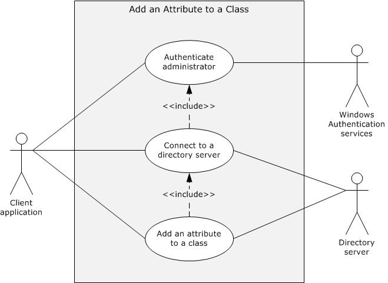

Figure 28: Use case diagram for adding an attribute to an existing class

**Actors**

- Client application
The client application is the primary actor. It is the entity that prepares the connection to the [**directory**](#gt_directory) [**server**](#gt_server), submits the request to add an attribute to a class, and relays the response to the administrator.

- Windows Authentication Services
Windows Authentication Services [MS-AUTHSOD](../MS-AUTHSOD/MS-AUTHSOD.md) is the supporting actor that authenticates the administrator's [**identity**](#gt_identity) so that the Active Directory system can make access-control decisions.

- Directory server
The directory server is the supporting actor that receives the request and adds the attribute to the class.

**Stakeholders**

- Administrator
The administrator initiates the addition of an attribute to a class in the schema. The administrator primarily wants to receive information that the attribute was successfully added to the class or receive an error message if it was not added.

- Directory
The directory is the entity that contains the attribute and the class.

**Preconditions**

- The system-wide preconditions, as described in section [2.6](#Section_2.6), are satisfied. The Active Directory system completes initialization, as described in section 2.6.
- The client application has connectivity to a directory server to which it can establish a connection, if it is not already connected, and send the request.
- The attribute and the class exist in the directory schema.
**Main Success Scenario**

- **Trigger:** The administrator provides the attribute name and the class name as input to the client application, along with [**credentials**](#gt_credential), and then invokes the operation that adds an attribute to a class.
- The client application establishes a connection to the directory server that owns the Schema Master FSMO role ([MS-ADTS](../MS-ADTS/MS-ADTS.md) section 3.1.1.5.1.8). Windows Authentication Services authenticates the client application that is using the supplied credentials ([MS-AUTHSOD] section 2).
- The client application sends a request to the directory server to add an attribute to a class in the directory schema and specifies the attribute name and the class name for this operation.
- The directory server verifies that the credentials that are supplied through the client application have the necessary access-control rights to complete the operation ([MS-ADTS] section 3.1.1.2.5).
- The directory server verifies that it owns the Schema Master FSMO role ([MS-ADTS] section 3.1.1.2.5).
- The directory server validates the constraints on the attribute and the class, as described in ([MS-ADTS] section 3.1.1.2.5).
- The directory server adds the attribute to the class.
- The directory server sends a response to the client application indicating that the attribute has been successfully added to the class.
**Postcondition**

The class has been updated with the specified attribute.

**Extensions**

- If the credentials supplied through the client application have insufficient access-control rights to modify the class:
1-4. Same as Main Success Scenario.

5. The directory server sends a response to the client application indicating that the supplied credentials have insufficient access-control rights to add the attribute to the class.

- If the directory server to which the client application connects does not own the Schema Master FSMO role ([MS-ADTS] section 3.1.1.2.5):
1-5. Same as Main Success Scenario.

6. The directory server sends a response to the client application with a referral to the directory server that does own the Schema Master FSMO role.

- If the attribute to be added or the class to be modified is not defined in the schema:
1-6. Same as Main Success Scenario.

7. The directory server sends a response to the client application indicating that the attribute or the class is not defined in the schema.

- If the Active Directory schema has the attribute to be added already defined in the class:
1-6. Same as Main Success Scenario.

7. The directory server sends a response to the client application indicating that the value to be added already exists.

- If the attributes that the client application provides do not meet the constraints ([MS-ADTS] section 3.1.1.2.5):
1-6. Same as Main Success Scenario.

7. The directory server sends a response to the client application indicating that it cannot perform the operation.

### 2.7.4 Name Translation

The use case in this category represents name translation between a directory object's [**security identifier (SID)**](#gt_security-identifier-sid) and human-readable names of the [**security principals**](#gt_security-principal) in the [**access control entries (ACEs)**](#gt_b581857f-39aa-4979-876b-daba67a40f15) that secure the object. Name translation can be used in such tasks as determining how an object is secured in the [**directory**](#gt_directory) or modifying the way in which it is secured.

The following use case diagram illustrates the use case of name translation.

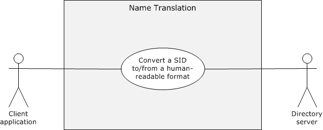

Figure 29: Use case for name translation

#### 2.7.4.1 Convert a SID to/from a Human-Readable Format - Client Application

**Note** This use case is applicable only to [**AD DS**](#gt_active-directory-domain-services-ad-ds); it is not applicable to [**AD LDS**](#gt_active-directory-lightweight-directory-services-ad-lds).

This use case describes the translation between the machine-readable and human-readable forms of names.

When an administrator wants to investigate and maintain the security of a [**directory object**](#gt_directory-object), translation between the machine-readable and human-readable forms of names might be required. This translation allows the administrator, via a [**client**](#gt_client) application, to secure access to a directory object without the requirement to understand machine-readable names. The client application displays the human-readable names of the [**security principals**](#gt_security-principal) in the [**access control entries (ACEs)**](#gt_b581857f-39aa-4979-876b-daba67a40f15) that secure the object, which have been translated from [**SIDs**](#gt_security-identifier-sid). The administrator specifies human-readable names of security principals when securing the object, which are translated to SIDs.

**Goal**

Translate an object's SID to or from another format or type of name.

**Context of Use**

An IT administrator uses a client application to secure access to a directory object. The application displays the human-readable names of the security principals in the ACEs that secure the object. The administrator specifies human-readable names of security principals when securing the object.

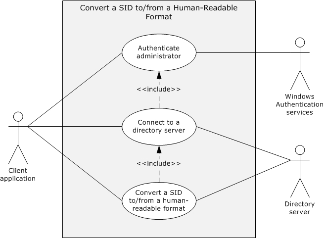

Figure 30: Use case diagram for converting a SID to or from a human-readable format

**Actors**

- Client application
The client application is the primary actor. It is the entity that prepares the connection to the [**directory**](#gt_directory) [**server**](#gt_server), submits the request for name translation, and returns the result to the administrator.

- Windows Authentication Services
Windows Authentication Services [MS-AUTHSOD](../MS-AUTHSOD/MS-AUTHSOD.md) is the supporting actor that authenticates the administrator's [**identity**](#gt_identity) so that the Active Directory system can make access-control decisions.

- Directory server
The directory server is the supporting actor that receives the translation request and performs the actual translation.

**Stakeholders**

- Administrator
The administrator performs security actions that trigger the requirement for a name translation. The administrator primarily wants to read and provide human-readable names and does not want to understand machine-readable names.

- Directory
The directory is the entity that contains the objects being considered by the administrator.

**Preconditions**

- The system-wide preconditions, as described in section [2.6](#Section_2.6), are satisfied. The Active Directory system completes initialization, as described in section 2.6.
- The application has network connectivity to a directory server that meets the requirements described in section [2.5](#Section_2.5) to which it can establish a connection, if it is not already connected, and send the request.
**Main Success Scenario**

- **Trigger:** Following an administrator action, the client application has to display human-readable names. These names correspond to the SIDs in the [**access control lists (ACLs)**](#gt_access-control-list-acl) that secure the object with which the administrator is interacting. Alternatively, the administrator provides a human-readable name to the client application, along with [**credentials**](#gt_credential), in order to set an ACL on an object. To perform the requested action, the client application has to retrieve the SID of the object that corresponds to that name.
- The client application establishes a connection to the directory server. Windows Authentication Services authenticates the client application using the supplied credentials ([MS-AUTHSOD] section 2).
- The client application sends a request to the directory server to perform name translation between the SID and the human-readable name of directory objects of interest to the administrator.
- The directory server identifies the directory objects for which name translation has to be performed.
- From the set of directory objects so identified, the directory server obtains their names in the requested name format.
- The directory server sends a response to the client that contains the names in the requested format.
**Postcondition**

The translated information is available to the client application.

**Extensions**

- The SID or the name that is supplied through the client application is misformatted, as described in [MS-DTYP](../MS-DTYP/MS-DTYP.md) section 2.4.2.3 and [MS-LSAT](#Section_2.11) section 3.1.4.5, respectively:
1-4. Same as Main Success Scenario.

5. The directory server sends a response to the client application indicating that an invalid parameter was used in the request, as described in [MS-LSAT] sections 3.1.4.5 and 3.1.4.9.

- No object exists in the directory with the SID or the name provided:
1-4. Same as Main Success Scenario.

5. The directory server sends a response to the client application indicating that no object exists with the SID or the name provided.

- Not all SIDs in the request could be translated to names:
1-4. Same as Main Success Scenario.

5. The Directory Server sends a response to the client application indicating that only some of the SIDs were translated to names.

- Not all names in the request could be translated to SIDs:
1-4. Same as Main Success Scenario.

5. The directory server sends a response to the client application indicating that only some of the names were translated to SIDs.

- The client does not have necessary permissions to read the object whose SID or name was supplied:
1-3. Same as Main Success Scenario.

4. The directory server sends a response to the client application indicating that it has insufficient access-control rights to perform the name translation.

### 2.7.5 Directory Replication

The use cases in this category represent replication of [**directory**](#gt_directory) data that is maintained by the Active Directory system. Domain and [**forest**](#gt_forest) data have to be replicated among disparate physical storage devices to maintain the integrity of the abstract logical structure of the directory. Replication can happen at various levels within a directory and under varying circumstances. Consider the following examples:

- If copies of [**domain**](#gt_domain) data, or [**replicas**](#gt_replica), exist on multiple [**servers**](#gt_server) within the domain, that is, if there are multiple [**domain controllers (DCs)**](#gt_domain-controller-dc) within the domain, new objects and modifications to existing objects are replicated to all of the domain's DCs by using normal replication cycles.
- A forest typically consists of multiple domains, each of which is maintained by one or more domain controllers. Some of the data that is stored in the directory is considered to be forest-wide data, which is replicated to all of the domain controllers in the forest.
- Some of the values that are stored in the directory, such as user password and [**account**](#gt_account) status, are of such a nature that propagation of changes in these values is time-critical. Replication of these values has to happen outside of normal replication cycles to allow for rapid propagation of the changes throughout the directory.
The following use case diagram shows the use cases of directory replication that are described in this document.

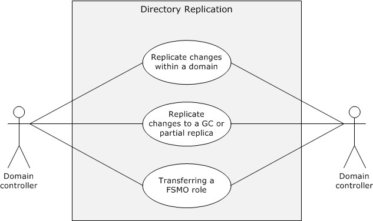

Figure 31: Use cases for directory replication

#### 2.7.5.1 Replicate Changes Within a Domain - Domain Controller

In this use case, a [**domain**](#gt_domain) is maintained by three [**domain controllers**](#gt_domain-controller-dc); that is, copies of the domain data, or [**replicas**](#gt_replica), exist on three domain controllers within the domain: Domain Controller 1 (DC1), Domain Controller 2 (DC2), and Domain Controller 3 (DC3). Changes to the data have been implemented on DC1; that is, DC1 has [**originating updates**](#gt_originating-update), and those changes need to be replicated to DC2 and DC3 by using a normal, intra-[**site**](#gt_site) replication cycle. This replication topology between DC1, DC2, and DC3 is formed by the Knowledge Consistency Checker (KCC) based on administrator-assigned costs, as described in section [1](#Section_1) and [MS-ADTS](../MS-ADTS/MS-ADTS.md) section 6.2.

**Goal**

Replicate originating updates that occurred on one domain controller to the other domain controllers in the domain.

**Context of use**

Changes need to be replicated within a domain to keep data consistent among domain controllers that store the same directory partitions. This scenario works in a replication topology built by the KCC, as described in section 1 and specified in [MS-ADTS] section 6.2.

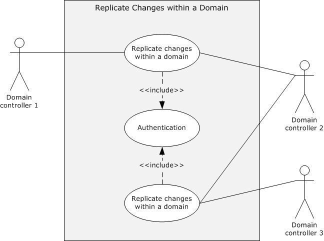

Figure 32: Use case diagram for replicating changes in domain data

**Actors**

- Domain Controller 1 (DC1)
DC1 is the primary actor and has originating updates to its domain data.

- Domain Controller 2 (DC2)
DC2 is a supporting actor that has not yet received the originating updates that were applied to DC1. DC2 is a replication partner of DC1.

- Domain Controller 3 (DC3)
DC3 is a supporting actor that has not yet received the originating updates that were applied to DC1. DC3 is a replication partner of DC2.

**Stakeholders**

- Domain administrators and applications
Domain administrators and applications are the entities that change [**attribute**](#gt_attribute) values in domain data.

- Domain users
Domain users are the people who depend on the information that is stored in the [**directory**](#gt_directory).

For all of these entities, the Active Directory system propagates all changes to domain data to all domain controllers in the domain so that a consistent view of the directory is maintained for all [**clients**](#gt_client), regardless of which domain controller they communicate with.

**Preconditions**

- The environment described in section [2.5](#Section_2.5) is in place, and the system-wide preconditions described in section [2.6](#Section_2.6) are satisfied. The Active Directory system completes initialization, as described in section 2.6.
- The KCC has created the replication topology of the domain; that is, the physical connections among the domain controllers of the domain that are used for replication traffic.
**Main Success Scenario**

**Note** This Main Success Scenario has no dependency on replication requests between DC1 to DC2 and DC2 to DC3. The order in this scenario has been chosen to show how the changes are replicated from DC1 to DC2 and DC3. This scenario covers scheduled replication, which is described in section 1 and [MS-ADTS] section 3.1.1.1.14.

- **Trigger:** A domain administrator changes an attribute's value for an object in the domain data; the change is manifested as an originating update on DC1.
- DC2 identifies its replication partner as DC1.
- DC1 and DC2 perform [**mutual authentication**](#gt_mutual-authentication) by using [**Kerberos**](#gt_kerberos).
- DC2 sends a request to DC1 periodically to obtain the new value.
- DC2 applies the change to its replica.
- DC3 then identifies its replication partner as DC2.
- DC2 and DC3 perform mutual authentication by using Kerberos.
- DC3 sends a request to DC2 periodically to obtain the new value.
- DC3 applies the change to its replica.
**Postcondition**

The change to the attribute's value is replicated throughout the domain.

**Extensions**

None.

#### 2.7.5.2 Replicate Changes to a GC or a Partial Replica by Using RPC - Domain Controller

In this use case, replication of changes is performed periodically between a [**domain controller**](#gt_domain-controller-dc) that is a full [**replica**](#gt_replica) and a [**global catalog (GC)**](#gt_global-catalog-gc) or a partial replica in another [**domain**](#gt_domain) by using [**RPC**](#gt_remote-procedure-call-rpc).

**Goal**

Replicate changes to a GC or partial replica.

**Context of use**

Changes have to be replicated between two domain controllers, where one is a full replica and the other is a GC or a partial replica in another domain. This scenario works in a replication topology that was built by the KCC, as described in section [1](#Section_1) and [MS-ADTS](../MS-ADTS/MS-ADTS.md) section 6.2.

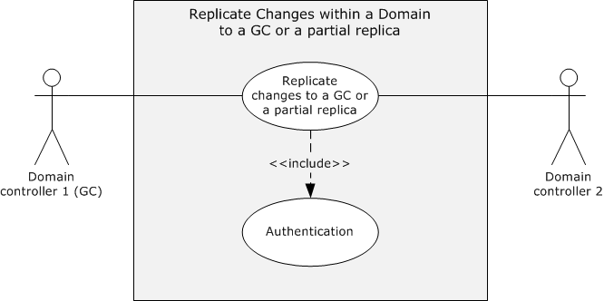

Figure 33: Use case diagram for replicating changes in a full replica to a GC or a partial replica

**Actors**

- Domain Controller 1 (GC)
Domain Controller 1, or DC1, is the primary actor that has not yet received the [**originating updates**](#gt_originating-update) that were applied to DC2. DC1 is a GC or partial replica and a replication partner of DC2.

- Domain Controller 2 (DC2)
DC2 is the supporting actor that has originating updates to its domain data.

**Stakeholders**

- Domain administrators and applications
Domain administrators and applications are the entities that change [**attribute**](#gt_attribute) values in domain data.

**Preconditions**

- The environment described in section [2.5](#Section_2.5) is in place and the system-wide preconditions described in section [2.6](#Section_2.6) are satisfied. The Active Directory system completes initialization, as described in section 2.6.
- The KCC has created the replication topology of the domain; that is, the physical connections among the domain controllers of the domain that are used for replication traffic.
- DC1 and DC2 are in different domains.
- DC1 has a partial replica of the domain in which DC2 resides.
**Main Success Scenario**

- **Trigger:** A domain administrator changes an attribute's value for an object in the domain data. The change is manifested as an originating update on DC2.
- Depending on the replication interval calculated by the KCC ([MS-ADTS] section 6.2), DC1 sends a request to DC2 to obtain new values of only the attributes of the objects that are present in the DC1 partial replica.
- DC2 responds to DC1 with the new values.
- DC1 applies the changes to its replica.
**Postcondition**

Replication changes to the attributes that are present in the partial replica are updated to the new values that are present in the full replica.

**Extensions**

None.

**Variation**

Replicate changes to a GC or a partial replica by using SMTP

All the details in the preceding scenario are the same except that there are additional preconditions as follows:

- DC1 and DC2 are in different [**sites**](#gt_site) ([MS-SRPL](#Section_2.7.5) section 1.3).
- The domain controllers require the ability to send and receive SMTP messages using any SMTP mail transfer agent, as specified in [[RFC2821]](https://go.microsoft.com/fwlink/?LinkId=90384).
- There are additional conditions that the configurations of the domain controllers have to meet before the DRS Protocol Extensions for SMTP can be used to replicate state between the domain controllers, as described in [MS-SRPL] sections 1.5 and 3.1.3.

#### 2.7.5.3 Transferring a FSMO Role - Domain Controller

This use case describes the transfer of a [**FSMO role**](#gt_fsmo-role) of one [**domain controller**](#gt_domain-controller-dc) to another domain controller.

**Goal**

Transfer a FSMO role that one domain controller owns to another domain controller.

**Context of Use**

To transfer a FSMO role when a domain controller is being demoted or a [**domain**](#gt_domain) administrator initiates the transfer of FSMO roles.

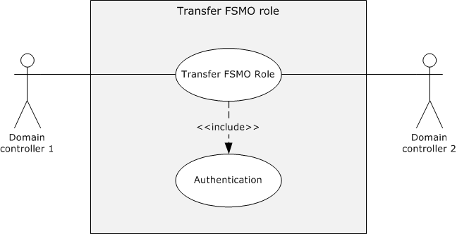

Figure 34: Use case diagram for transferring a FSMO role

**Actors**

- Domain Controller 1 (DC1)
DC1 is the primary actor that is shutting down or that an administrator is demoting.

- Domain Controller 2 (DC2)
DC2 is the supporting actor to which the FSMO role is being transferred.

**Stakeholders**

- Domain administrators and applications
Domain administrators and applications are the entities that trigger the transfer of FSMO roles.

**Preconditions**

- The environment described in section [2.5](#Section_2.5) is in place, and the system-wide preconditions described in section [2.6](#Section_2.6) are satisfied. The Active Directory system completes initialization, as described in section 2.6.
- DC1 is the owner of the FSMO role being transferred to DC2.
**Main Success Scenario**

- **Trigger**: Transfer of the FSMO role is triggered when DC1 is demoted or when the domain administrator initiates the transfer.
- DC1 identifies the new FSMO role owner to be DC2, either arbitrarily in the case of demotion, or because of the input of the administrator.
- DC1 and DC2 perform [**mutual authentication**](#gt_mutual-authentication) by using [**Kerberos**](#gt_kerberos).
- DC1 sends a rootDSE modify message ([MS-ADTS](../MS-ADTS/MS-ADTS.md) section 3.1.1.3.3) to DC2 requesting that DC2 assume ownership of the FSMO role.
- DC2 determines the current owner of the FSMO role, which in this case is DC1, and invokes an extended operation request ([MS-DRSR](#Section_2.7.5) section 4.1.10.4.3) against DC1 to request transfer of the FSMO role ownership.
- DC1 transfers its FSMO role to DC2 through the transfer request.
**Postcondition**

The FSMO role is transferred to another domain controller.

**Extensions**

None.

### 2.7.6 Trust Management

These use cases describe the creation of trust relationships between [**domains**](#gt_domain) or [**forests**](#gt_forest), along with trust validation. A domain trust is created by creating a [**trusted domain object (TDO)**](#gt_trusted-domain-object-tdo), as specified in [MS-ADTS](../MS-ADTS/MS-ADTS.md) section 6.1.6. These TDOs are managed and created as specified in [MS-LSAD](#Section_2.11) section 3.1.4.7. The Netlogon Remote Protocol ([MS-NRPC](../MS-NRPC/MS-NRPC.md) (NRPC)) validates or manages domain trusts, as specified in [MS-NRPC] section 3.5.4.7.

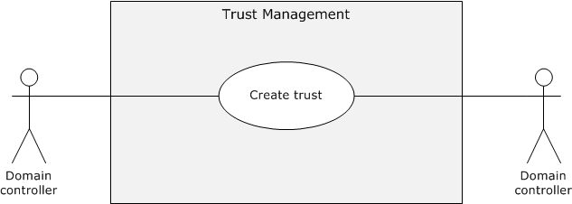

Figure 35: Use cases for trust management

#### 2.7.6.1 Create a Trust - Domain Controller

In this use case, a trust is created between two [**domains**](#gt_domain) or [**forests**](#gt_forest).

**Goal**

Create a trust between domains or forests in order to grant access to resources.

**Context of Use**

Access to resources is needed between certain domains or forests.

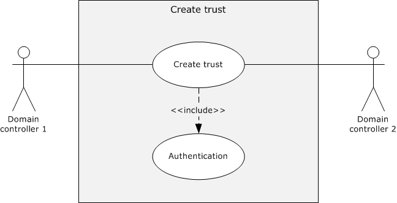

Figure 36: Use case diagram for creating a trust between domains or forests

**Actors**

- Domain Controller 1 (DC1)
DC1 is the primary actor that is in a domain.

- Domain Controller 2 (DC2)
DC2 is the supporting actor that is in a different domain. It can be in the same forest or in a different forest.

**Stakeholders**

- Users
Users are people or other entities that belong to one domain who need to access [**directory**](#gt_directory) resources in the other domain.

**Preconditions**

- The environment described in section [2.5](#Section_2.5) is in place and the system-wide preconditions described in section [2.6](#Section_2.6) are satisfied. The Active Directory system completes initialization, as described in section 2.6.
- DC1 and DC2 are in different domains but can be in the same forest or different forests.
**Main Success Scenario**

- **Trigger**: An application triggers this scenario when it creates a trust between [**domain controllers**](#gt_domain-controller-dc) that belong to different domains.
- DC1 and DC2 use [**Kerberos**](#gt_kerberos) to perform [**mutual authentication**](#gt_mutual-authentication).
- DC1 sends a request to create a [**trusted domain object (TDO)**](#gt_trusted-domain-object-tdo) to DC2.
- The TDO is created in DC2.
**Postcondition**

The trust is created between the two domains.

**Extensions**

None.

### 2.7.7 Domain Services

The use cases in this category pertain to the interaction between [**domain clients**](#gt_domain-client) and those [**servers**](#gt_server) that service requests from the domain client to participate in [**domain**](#gt_domain) activities. The relevant domain activities include the following: locating a domain controller, joining a domain, and unjoining from a domain.

The following use case diagram shows the use cases that pertain to domain-join activities.

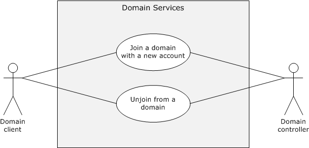

Figure 37: Use cases for domain services

#### 2.7.7.1 Join a Domain with a New Account - Domain Client

This use case describes the general case of how to join a [**domain**](#gt_domain) with a new [**account**](#gt_account). A new account can be created in the domain by using either SAMR or LDAP. See sections [3.1.2](#Section_3.1.2) and [3.1.3](#Section_3.1.3) for details.

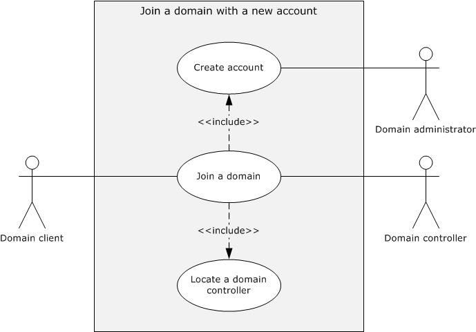

Figure 38: Join a domain by creating a new account

**Goal**

Join a [**domain client**](#gt_domain-client) to a domain by creating a new account for the domain client in the domain.

**Context of Use**

The domain-client administrator invokes this task to enable the domain client to access the services and resources in a domain and to grant [**domain members**](#gt_6234a38c-ed1b-4c69-969f-6e6479566f65) access to the domain client.

**Actors**

- Domain client
The domain client is the primary actor. It is the entity that locates and connects to the [**domain controller**](#gt_domain-controller-dc) and is joined to the domain.

- Domain controller
The domain controller is the supporting actor that advertises its capabilities, responds to domain-join inquiries, and ultimately joins the domain client to the domain.

- Domain administrator
The domain administrator is the supporting actor that enables the domain client, by using the [**credentials**](#gt_credential) of the domain administrator, to open a secure connection to the domain controller.

**Stakeholders**

- End user
The end user wants to join a domain client to a domain so that he or she can access resources within the domain.

The end user primarily wants to receive information that the domain client was joined to the domain.

- Client administrator
The client administrator initiates the domain-join process on the domain client.

The client administrator primarily wants to receive information that the domain client was successfully joined to the domain and to receive an error message if it was not joined.

**Preconditions**

The credentials of an administrator of the domain who can create machine accounts in the domain are available to the client administrator.

**Main Success Scenario**

- **Trigger**: The client administrator triggers this use case to join the [**client computer**](#gt_client-computer) to a domain.
- The domain client uses the Locate a Domain Controller use case to locate a domain controller (see section [2.7.7.3.1](#Section_2.7.7.3.1)).
- The domain client uses the domain administrator's supplied credentials to open a secure connection to the domain controller.
- The domain client retrieves domain information.
- The domain client uses the domain administrator's credentials to set up an account for itself in the domain.
- The domain client determines the [**trusted domains**](#gt_trusted-domain).
- The domain client updates the client account in the domain.
- The domain client updates the local client state.
- The domain client reinitializes local protocols.
**Postcondition**

The domain client is joined to the domain.

**Extensions**

None.

**Variation - Join a Domain with a new account that is created via LDAP**

All details are identical to those of the main success scenario except for steps 3-5, which are replaced with the following steps:

- The domain client uses the domain administrator's credentials to connect to the LDAP [**server**](#gt_server) on the domain controller and performs a bind to establish a secure LDAP connection.
- The domain client retrieves domain information.
- The domain client uses LDAP to create an account in the domain for itself.

#### 2.7.7.2 Unjoin from the Domain - Domain Client

In this use case, a [**client**](#gt_client) administrator wants to unjoin a domain client from the [**domain**](#gt_domain) that it is currently part of, usually to repurpose or decommission the [**client computer**](#gt_client-computer).

**Goal**

Unjoin a domain client from the domain.

**Context of Use**

The domain-client administrator invokes this task to enable the domain client to unjoin from the domain so that the members of the domain do not access its resources.

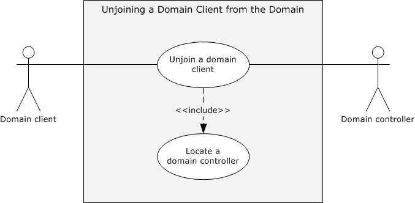

Figure 39: Use case diagram to unjoin a domain client from the domain

**Actors**

- Domain client
The domain client is the primary actor. It is the entity that locates and connects to the domain controller and unjoins from the domain. If the unjoin task fails, the local state of the domain client is unchanged.

- Domain controller
The [**domain controller**](#gt_domain-controller-dc) is the supporting actor that advertises its capabilities, responds to domain-unjoin inquiries, and services the request from the [**domain client**](#gt_domain-client) to disable the domain account.

**Stakeholders**

- Client administrator
The client administrator initiates the domain-unjoin process on the domain client.

The primary interest of the client administrator is that the state of the computer object on the domain controller is updated to reflect that the domain client has unjoined from the domain.

- Client computer
The client computer is the computer on which the domain client runs before the domain-unjoin task is initiated.

The primary interest of the client computer is that the machine local state of the domain client is updated to reflect that the client has unjoined from the domain.

**Preconditions**

- The client computer has successfully completed the domain join task, as described in preceding sections, and is still part of the domain.
**Main Success Scenario**

- **Trigger**: The client administrator triggers this use case to unjoin the client computer from the domain.
- The domain client uses the Locate a Domain Controller use case to locate a domain controller. For more information, see section [2.7.7.3.1](#Section_2.7.7.3.1).
- The domain client uses the [**credentials**](#gt_credential) of the domain administrator to establish an [**SMB**](#gt_server-message-block-smb)/CIFS connection to the domain controller ([MS-SMB2](../MS-SMB2/MS-SMB2.md), [MS-SMB](../MS-SMB/MS-SMB.md), or [MS-CIFS](../MS-CIFS/MS-CIFS.md)).
- The domain client uses the SAMR protocol to disable the machine account on the domain controller [MS-SAMR](#Section_2.11).
- The (former) domain client updates its local state.
- The (former) domain client closes connections.
- The (former) domain client reinitializes local protocols.
**Postcondition**

The domain client is no longer joined to the domain.

**Extensions**

None.

#### 2.7.7.3 Supporting Use Cases

##### 2.7.7.3.1 Locate a Domain Controller - Domain Client

This use case describes the task of locating a [**domain controller**](#gt_domain-controller-dc). When an application on the [**client**](#gt_client) needs to access resources in a [**domain**](#gt_domain), locating a domain controller is the first step in the process.

This use case is important for other use cases and examples in which the [**domain client**](#gt_domain-client) is not yet joined to the domain and the Netlogon Remote Protocol is therefore not initialized. For more information, see the preceding use cases about domain services and section [3.1](#Section_3.1).

**Goal**

To locate a domain controller to perform domain-oriented actions.

**Context of Use**

Any domain client that requires access to directory resources needs to authenticate itself to the [**directory**](#gt_directory). For authentication, domain clients need to be connected to one of the domain controllers that is reachable. To locate a reachable domain controller, domain clients perform this use case.

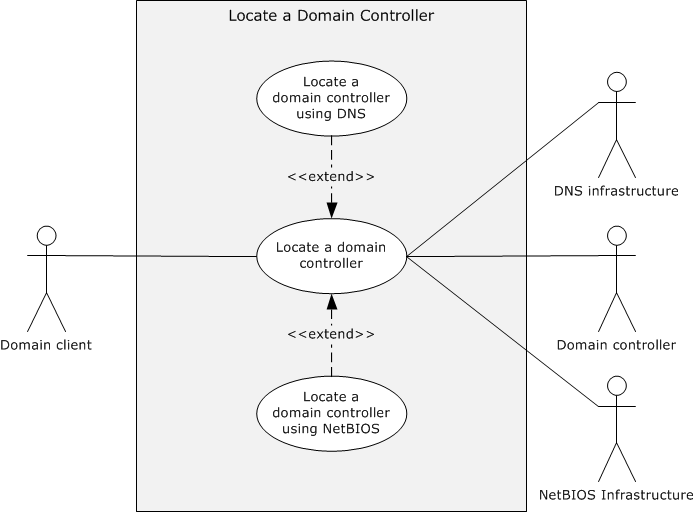

Figure 40: Use case diagram for locating a domain controller

**Actors**

- Domain client
The domain client is the primary actor. It is the entity that locates and queries the domain controller and that will eventually be joined to the domain.

- Domain controller
The domain controller is the supporting actor that registers its capabilities, responds to inquiries about those capabilities, and ultimately joins the domain client to the domain.

- DNS Infrastructure
The DNS Infrastructure is a supporting actor that maintains information about domain controllers and sends that information to the domain client.

- NetBIOS Infrastructure
The NetBIOS Infrastructure is a supporting actor that maintains information about domain controllers and sends that information to the domain client.

**Stakeholders**

- End user
The end user wants to join a domain client to a domain so that he or she can access resources in the domain.

The end user primarily wants to receive information that a domain controller can be located so that the domain client can be joined to the domain or to receive an error message if the domain client cannot be joined. If a domain controller cannot be located, the local state of the domain client is left unchanged.

- Applications
Applications enable the end user to access resources within the domain. Applications can also use domain resources autonomously.

The primary interest of an application is that a domain controller that meets the required capabilities is located and that information about the domain controller is provided to the domain client so that the domain client can be joined to the domain. By having the domain client joined to the domain, the application can use domain resources to perform the tasks that the end user, the application itself, or other applications on the domain client initiated.

**Preconditions**

To locate a domain controller requires that at least one of the infrastructures, [**NetBIOS**](#gt_netbios) or [**DNS**](#gt_domain-name-system-dns), is available to discover domain controllers that can satisfy the requested capabilities.

**Main Success Scenario**

In this scenario, the [**fully qualified domain name (FQDN) (2)**](#gt_1769aec9-237e-44ed-9014-1abb3ec6de6e) of the domain in which the Domain Controller is to be located is available to the domain client.

- **Trigger**: This use case is triggered by operations such as joining a computer to a domain in order to locate a domain controller.
- The domain client uses the FQDN to query the DNS Infrastructure for the [**service (SRV) resource records**](#gt_service-srv-resource-record) of certain types of domain controllers, as described in [MS-ADTS](../MS-ADTS/MS-ADTS.md) section 6.3.6.1.
- The DNS Infrastructure provides one or more SRV resource records of domain controllers that are of the specified type to the domain client.
- The domain client uses the DNS Infrastructure to resolve the names of the domain controllers in order to obtain the IP addresses. It then contacts the domain controllers via an LDAP Ping ([MS-ADTS] section 6.3.3) to determine "liveness" and to confirm that the requested capabilities are present.
- At least one domain controller that satisfies the domain client's requirements responds to the domain client's ping.
- A domain controller is chosen for use in other tasks; for example to join a domain.
**Postcondition**

A domain controller is located.

**Extensions**

None.

**Variation - Locate a Domain Controller by using NetBIOS**

In this scenario, only the NetBIOS domain name of the domain is available. Domain controllers in the domain have created a [**mailslot**](#gt_mailslot) with a registered NetBIOS group name, as described in [MS-MAIL](../MS-MAIL/MS-MAIL.md) section 3.1.4.1 and [MS-ADTS] section 6.3.5.

- The domain client queries the NetBIOS Infrastructure for NetBIOS group names that contain a list of domain controllers.
- The NetBIOS Infrastructure provides the NetBIOS group names.
- Using the NetBIOS group names, the domain client contacts the candidate domain controllers via a MAILSLOT ping ([MS-ADTS] section 6.3.5), which is sent to a NetBIOS group name ([MS-MAIL] section 3.1.4.1) that has been registered by domain controllers ([MS-ADTS] section 6.3.5).
- At least one domain controller that satisfies the client's requirements responds to the domain client's ping.
- A domain controller is chosen for use in other tasks; for example, to join a domain.

## 2.8 Versioning, Capability Negotiation, and Extensibility

There are two distinct modes of operation of the [**Active Directory**](#gt_active-directory) system: [**Active Directory Domain Services (AD DS)**](#gt_active-directory-domain-services-ad-ds) and [**Active Directory Lightweight Directory Services (AD LDS)**](#gt_active-directory-lightweight-directory-services-ad-lds). Additionally, some versions of AD DS and AD LDS include support for Web Services protocols. A summary of the different modes along with the protocols (or protocol subsets) and [**directory**](#gt_directory) [**schemas**](#gt_schema) supported by each is provided in the table later in this section. Information about which versions of AD DS and AD LDS support Web Services protocols is given in the following product behavior note.<4>. The Technical Documents for the individual protocols specify additional versioning information; that is, not all versions of the Active Directory system support every method of a protocol that is listed in the table.

Modes and Protocols Supported

| Mode | Protocols supported | Protocols of which a subset is supported | Schemas implemented |
| --- | --- | --- | --- |
| AD DS (without Web Services) | [MS-DSSP](../MS-DSSP/MS-DSSP.md) (DSSP) [[LDAP]](https://go.microsoft.com/fwlink/?LinkId=89932) (LDAP) [MS-LSAD](#Section_2.11) (LSAD) [MS-LSAT](#Section_2.11) (LSAT) [MS-SAMR](#Section_2.11) (SAMR) | DRSR: All methods of the dsaop RPC interface are supported. All methods of the drsuapi interface are supported except for the following: IDL_DRSInitDemotion IDL_DRSFinishDemotion | [MS-ADA1](../MS-ADA1/MS-ADA1.md) [MS-ADA2](../MS-ADA2/MS-ADA2.md) [MS-ADA3](../MS-ADA3/MS-ADA3.md) [MS-ADSC](../MS-ADSC/MS-ADSC.md) |
| AD DS (with Web Services) | [MS-ADCAP](../MS-ADCAP/MS-ADCAP.md) (ADCAP) [MS-DSSP] (DSSP) [LDAP] (LDAP) [MS-LSAD] (LSAD) [MS-LSAT] (LSAT) [MS-SAMR] (SAMR) [[WSENUM]](https://go.microsoft.com/fwlink/?LinkId=90580) (WS-Enumeration) [[WXFR]](https://go.microsoft.com/fwlink/?LinkId=90587) (WS-Transfer) *Protocol Extensions* [MS-WSTIM](../MS-WSTIM/MS-WSTIM.md) (IMDA) [MS-WSDS](../MS-WSDS/MS-WSDS.md) (WSDS) [MS-WSPELD](../MS-WSPELD/MS-WSPELD.md) (WSPELD) | DRSR: All methods of the dsaop RPC interface are supported. All methods of the drsuapi interface are supported except for the following: IDL_DRSInitDemotion IDL_DRSFinishDemotion | [MS-ADA1] [MS-ADA2] [MS-ADA3] [MS-ADSC] |
| AD LDS (without Web Services) | [LDAP] (LDAP) | DRSR: All methods of the drsuapi RPC interface are supported except for the following: IDL_DRSAddSidHistory IDL_DRSDomainControllerInfo IDL_DRSRemoveDsDomain IDL_DRSGetNT4ChangeLog IDL_DRSGetMemberships IDL_DRSInterDomainMove IDL_DRSGetMemberships2 IDL_DRSQuerySitesByCost IDL_DRSWriteSpn No methods of the dsaop RPC interface are supported. DSSP: Supported in the same manner as any [**member server**](#gt_member-server) or stand-alone [**server**](#gt_server) on which the Active Directory system is not running. | [MS-ADLS](../MS-ADLS/MS-ADLS.md) |
| AD LDS (with Web Services) | [LDAP] (LDAP) [WSENUM] (WS-Enumeration) [WXFR] (WS-Transfer) *Protocol Extensions* [MS-WSTIM] (IMDA) [MS-WSDS] (WSDS) [MS-WSPELD] (WSPELD) | ADCAP: All methods of the AccountManagement port type are supported. The following methods of the TopologyManagement port type are supported: MoveADOperationMasterRole ChangeOptionalFeature DRSR: All methods of the drsuapi RPC interface are supported except for the following: IDL_DRSAddSidHistory IDL_DRSDomainControllerInfo IDL_DRSRemoveDsDomain IDL_DRSGetNT4ChangeLog IDL_DRSGetMemberships IDL_DRSInterDomainMove IDL_DRSGetMemberships2 IDL_DRSQuerySitesByCost IDL_DRSWriteSpn No methods of the dsaop interface are supported. DSSP: Supported in the same manner as any member server or stand-alone server on which the Active Directory system is not running. | [MS-ADLS] |

The state model, constraints, processing rules, and so on, in [MS-ADTS](../MS-ADTS/MS-ADTS.md) apply to both AD DS and AD LDS, except as otherwise noted in [MS-ADTS]. [MS-ADDM](../MS-ADDM/MS-ADDM.md) applies to the Web Services-enabled versions of both AD DS and AD LDS.

## 2.9 Error Handling

There are several potential failure scenarios for the Active Directory system. "Failure", in this context, does not refer to an error returned by a member protocol due to an invalid or not permitted request (for example, a request to modify a [**directory object**](#gt_directory-object) when the requestor does not have the necessary permissions to do so). Such errors are part of the normal processing behavior of the system. Instead, "failure" in this context refers to conditions that can prevent the system from successfully servicing requests made by a [**client**](#gt_client) that uses the member protocols.

These failure scenarios are the following:

- Transient unavailability of durable storage, without loss or corruption of data
- Permanent unavailability of durable storage
- Corruption of data on the durable storage
- Unavailability of networking
- Unavailability of [**DNS**](#gt_domain-name-system-dns)
- Failures while joining or unjoining a [**domain**](#gt_domain)
Additionally, individual member protocols can have their own failure scenarios. Such scenarios are documented in the protocols' Technical Documents and are not repeated here.

The Active Directory system does not define any error handling requirements beyond those that are described in the Technical Documents of the protocols that the system supports, as listed in section [2.4](#Section_2.4), and in the failure scenarios described in the sections that follow.

Various kinds of errors might occur that affect the system. More precisely, an error condition might affect one or more protocols supported by the system. Such error conditions and the resulting protocol semantics are described in the corresponding protocol Technical Documents. The system does not constrain the types of errors that can be received through the member protocols.

### 2.9.1 Transient Unavailability of Durable Storage

As described in section [2.6](#Section_2.6), the [**Active Directory**](#gt_active-directory) system requires access to durable storage. The system has to be able to read from and write to this storage. This storage is used to store all persisted state, including the [**directory tree**](#gt_directory-tree), in the Active Directory system.

It is possible that while operating, a [**directory**](#gt_directory) [**server**](#gt_server) might temporarily lose access to its durable storage. The state that is stored on the durable storage is intact and uncorrupted, but the directory server cannot access it; for example, the disk could have become unplugged, or the disk controller could have failed. In such a case, the directory server does not permit any request to succeed that requires altering the persisted state of the directory. The directory server can permit a request that requires retrieving state to succeed if that request can be completely and accurately answered by using only the state that the directory server has available to it while the durable storage is unavailable. For example, as a performance optimization, an implementation can choose to cache some state in memory, provided that doing so does not violate any transactional guarantees of the member protocols. An implementation could (but is not required to) use such cached state to respond to any requests that require retrieving state, provided the cached state is sufficient to completely and accurately respond to the request.

When rejecting a request while in this scenario, the member protocol is permitted to use any suitable error code that indicates that the directory server cannot process the request. The system does not constrain the protocol's choice of error code.

A implementation of the system is permitted, but not required, to monitor the durable storage system to determine if the storage becomes available again and to automatically resume normal servicing of requests. Alternatively, an implementation of the system can require administrative action to recover from such a scenario; for example, to require a restart of the directory server.

Because the state that is stored on the durable storage was not altered while the storage was offline, and the directory server rejected any requests that would have required a modification of the state during that period, after the durable system becomes available and the system resumes normal servicing of requests, the abstract data of the system's protocols is in the same state as immediately prior to the storage becoming unavailable.

### 2.9.2 Permanent Unavailability of Durable Storage

The preceding failure scenario dealt with the case of a transient unavailability of the durable storage. However, it is also possible that the durable storage on which the system's state is stored becomes permanently unavailable; for example, due to a nonrepairable hardware failure in the disk media. In this case, all of the state that is stored in the storage system is lost.

As in the case of a transient unavailability of the storage system, the directory [**server**](#gt_server) does not permit any request to succeed that requires altering the persisted state of the [**directory**](#gt_directory). The directory server can permit a request to succeed that requires retrieving state if that request can be completely and accurately answered by using only the state that the directory server has available to it while durable storage is unavailable.

When rejecting a request while in this scenario, the member protocol is permitted to use any suitable error code that indicates that the directory server cannot process the request. The system does not constrain the protocol's choice of error code.

Because the system generally does not have any means to determine on its own whether the storage system is temporarily or permanently unavailable, the key difference between this scenario and the previous scenario is that recovery in this scenario typically requires administrative intervention.

After making any necessary repairs or replacements of the storage system to return it to service, the administrator restores the state of the directory server from the most recent backup copy. The means of backing up and restoring such state is implementation-specific.

After the backup is restored, the state of the directory server is as it was at the time the backup was taken. Further, any changes to the state that were replicated to one or more [**replica directory servers**](#gt_c1e95030-a275-4772-bdce-47450b31b3d7) in the [**directory service**](#gt_directory-service-ds) subsequent to the time the backup was taken can be regained after the restore through replication.

### 2.9.3 Data Corruption

While a durable storage system does everything possible to protect the integrity of the data that is stored on it, data corruption nonetheless remains a possibility even in the best maintained storage system. Such corruption could occur while the storage system is online, or it could occur during a transient outage of the storage system.

In such a case, the directory [**server**](#gt_server) detects such data corruption. An implementation is permitted to use any means of detection that it has at its disposal. The [**directory**](#gt_directory) server does not permit any protocol requests that require access to the corrupted data to succeed. When rejecting a request while in this scenario, the member protocol is permitted to use any suitable error code that indicates that the directory server cannot process the request. The system does not constrain the protocol's choice of error code.

After data corruption has been detected, recovery proceeds in a manner similar to the case where the durable storage has become permanently unavailable. Essentially, data that cannot be trusted is treated in the same manner as no data at all.

### 2.9.4 Unavailability of Networking

A functional networking system is vital to the ability of [**clients**](#gt_client) to communicate with the directory [**server**](#gt_server). If the networking system becomes unavailable, clients cannot send any new requests to the directory server, and they cannot receive any responses to outstanding requests. A functional networking system is also vital to the ability of directory servers to replicate [**directory**](#gt_directory) data among themselves. This situation could cause a temporary loss of system coherency if segments of the network that are part of the same [**domain**](#gt_domain) cannot communicate with each other but clients and [**domain controllers**](#gt_domain-controller-dc) within the segments can still communicate.

Networking could become unavailable due to a hardware failure, such as the failure of a network switch or router, or a software problem, such as misconfiguration of a routing table.

When the directory server is in this state, it cannot respond to any requests that clients attempt to send to it, and directory servers cannot respond to replication requests. As such, it is beneficial for clients and directory servers to enforce a time-out on any requests that they send so that they do not stop responding indefinitely while they wait for a response.

After the network becomes available again and communications are restored between the client(s) and the directory server and among directory servers, individual directory servers resume processing requests in accord with the behavior described in the Technical Documents. The loss of networking does not in itself cause any change in the state of the abstract data of the system's protocols.

### 2.9.5 Unavailability of DNS

[**DNS**](#gt_domain-name-system-dns) can be used by clients of the Active Directory system in order to locate [**directory**](#gt_directory) [**servers**](#gt_server) by using the algorithms described in [MS-ADTS](../MS-ADTS/MS-ADTS.md) section 6.3. If DNS ceases to be available (for example, by failure of the DNS servers), any clients that use those location algorithms will be unable to find a directory server to send their requests to. This will not affect any connections that clients already have to the directory server. Additionally, clients are permitted to use other means to locate a directory server (for example, by prompting the user to enter the IP address of a directory server) or to store and reuse the address of a previously located directory server. Such [**clients**](#gt_client) will also not be immediately affected by the loss of DNS.

After DNS is restored to normal operating behavior, clients that depend on the location algorithms of [MS-ADTS] section 6.3 can once again locate directory servers.

### 2.9.6 Failures while Joining or Unjoining a Domain

Several of the examples in this document describe domain-join tasks that are completed through a series of actions that affect necessary state changes such that the [**client**](#gt_client) is joined to the [**domain**](#gt_domain) (see section [3.1](#Section_3.1)). These changes include those that are local to the client and those that occur in the domain (that is, those that create or modify a computer [**account**](#gt_account) object on a [**domain controller (DC)**](#gt_domain-controller-dc)). In general, failure of any one particular action causes failure of the associated task. Exceptions to this principle are specified where necessary; for example, failed updates to the SNTP protocol [MS-SNTP](../MS-SNTP/MS-SNTP.md) during join or unjoin processing are ignored.

Although unlikely, the domain-join tasks that are described in this document might fail when making local (client) state changes. Such failures can occur due to reasons such as resource starvation. The tasks do not attempt to remedy these failure conditions; the only recourse is for the task caller to re-execute the task.

When communicating with a remote machine such as a domain controller, some obvious potential failure conditions include lack of network connectivity, or insufficient security privileges to create or modify a computer account object. The domain-join tasks that are described in this document do not attempt to remedy these failure conditions; the only recourse is for the task caller to re-execute the task. When a task is re-executed, no assumptions are made about the state of a computer-account object in the domain.

All domain-join tasks that are described in this document make reasonable efforts in the face of failure to restore local client state to the original starting state. If those efforts fail, administrator intervention (outside the scope of the task) might be necessary. Similarly, if a task successfully creates or modifies a computer account object in the domain but then fails in a later step, the task makes reasonable efforts to either disable or delete the computer account object. Failure to disable or delete the computer account object in that case might require domain administrator intervention (outside the scope of the task) to apply the changes manually.

## 2.10 Coherency Requirements

Coherency requirements exist for shared state between the protocols that comprise the Active Directory system. As a general requirement, when multiple protocols share state and one of the protocols performs an operation on that shared state that is specified as atomic in that protocol's Technical Documents, other protocols that share that state have to honor the atomicity of that transaction. They must not attempt to perform operations on the uncommitted transaction or expose the uncommitted transaction to the client's view. For example, because SAMR and LDAP share state, the SAMR protocol methods to retrieve information about users can be used to view users that are created by LDAP as well as by SAMR. Because the creation of a [**directory object**](#gt_directory-object) via LDAP is specified as an atomic transaction ([MS-ADTS](../MS-ADTS/MS-ADTS.md) section 3.1.1.5.1.3), a user that is in the process of being created by LDAP must not be visible via SAMR until the atomic transaction is committed.

The system exposes the same view of the shared state via all the protocols that share that state. This means that all committed changes to the shared state are visible (subject to access-control restrictions) through all protocols that share that state, and no uncommitted changes are visible through any of the protocols that share that state. This does not require that all state be visible through all protocols, but rather that if a piece of state is specified as being visible through two or more protocols, then that state has to be the same when viewed through any of those protocols (subject to access-control restrictions).

State is shared transitively. If one abstract data model has a field that shares state with a field in a second abstract data model, and a third abstract data model also shares state with that field in the second model, then transitively the first and third abstract data models share state.

## 2.11 Security

This section documents system-wide security issues that are not otherwise described in the Technical Documents (TDs) for the member protocols. It does not duplicate what is already in the protocol TDs unless there is some unique aspect that applies to the system as a whole.

Security is vital to the Active Directory system. As a central repository of [**account**](#gt_account) information for the [**domain**](#gt_domain), a compromise of the system could, in turn, permit the compromise of other systems that are dependent on the Active Directory system for authentication. If a hostile party can create an account in the [**directory**](#gt_directory), or gain access to an existing account, they might be granted access to systems to which they should not have access. If they can modify configuration information stored in the directory by other systems, such as the Group Policy system [MS-GPOD](../MS-GPOD/MS-GPOD.md), they can exert control over the behavior of those systems. The directory can also contain sensitive information to which read access should be restricted.

In addition, interaction with a [**domain controller**](#gt_domain-controller-dc) includes certain constraints that affect the security of a distributed system and the domain as a whole. Because the domain controller serves as the root of trust for the entire domain, and potentially additional domains that are based on trust relationships, great attention has to be paid to the correctness of the implementation of all the member protocols. Any security flaw in the implementation could compromise the entire domain. When beginning any interaction with the domain controller, the [**domain client**](#gt_domain-client) is in a tenuous state. It needs to establish a connection and authenticate in such a way that prevents attackers from manipulating the messages that are exchanged between the client and the domain controller.

It is crucial, therefore, that an implementation of the Active Directory system be resilient to attack. Such an implementation has to be designed and written with the expectation that it will be subject to hostile network traffic from an adversary that is intent on compromising it.

To mitigate these threats, the system contains a set of security mechanisms to restrict access to information that is stored in the directory. The system's protocols use these mechanisms to restrict access to only those users who are authorized to have it. Such access restrictions can be specified not only at the level of individual [**directory objects**](#gt_directory-object) but also at the level of individual [**attributes**](#gt_attribute) on a directory object. The system also provides a means to secure the network traffic in the system against eavesdropping and tampering.

The following sections describe in more detail the security mechanisms and conditions in the Active Directory system.

### 2.11.1 Security Elements

Directory objects are protected by [**security descriptors**](#gt_security-descriptor) that contain [**access control lists (ACLs)**](#gt_access-control-list-acl) that grant or deny permissions to [**security principals**](#gt_security-principal), either directly or through group membership, to read, update, or otherwise manipulate the object, as described in [MS-ADTS](../MS-ADTS/MS-ADTS.md) section 5.1.3. However, it is the decision of the individual protocol what access checks to enforce when accessing the [**directory**](#gt_directory). That is, while some protocols enforce the authorization checks described in [MS-ADTS], other protocols substitute their own access checks, as described in that individual protocol's Technical Document.

In the Active Directory system, the following protocols perform access checks, as described in [MS-ADTS] section 5.1.3:

- LDAP [[LDAP]](https://go.microsoft.com/fwlink/?LinkId=89932)
- WS-Transfer [[WXFR]](https://go.microsoft.com/fwlink/?LinkId=90587)
- WS-Enumeration [[WSENUM]](https://go.microsoft.com/fwlink/?LinkId=90580)
- ADCAP [MS-ADCAP](../MS-ADCAP/MS-ADCAP.md)
The following protocols substitute, in full or in part, a different access check methodology, as described in the protocol's Technical Document:

- DRSR [MS-DRSR](#Section_2.7.5)
- SAMR [MS-SAMR](#Section_2.11)
- SAMS [MS-SAMS](#Section_2.11)
- LSAD [MS-LSAD](#Section_2.11)
- LSAT [MS-LSAT](#Section_2.11)
- DSSP [MS-DSSP](../MS-DSSP/MS-DSSP.md)
When performing an access check, the [**identity**](#gt_identity) of the requestor, represented as a [**security identifier (SID)**](#gt_security-identifier-sid), is used to compare the permissions that are required to perform a given operation to the permissions that are granted to that identity, in accord with the access check rules of the protocol in use. Each protocol specifies a means by which a requestor can prove (authenticate) its identity to the [**directory service**](#gt_directory-service-ds) so that the identity can be used in subsequent access check decisions. Each protocol's means of authentication is described in the corresponding protocol document, except that for WS-Transfer, WS-Enumeration, and ADCAP, it is instead described in [MS-ADDM](../MS-ADDM/MS-ADDM.md) section 2.1.

The protocols provide mechanisms to digitally sign requests and responses to protect them from tampering while they are transferred over the network and to encrypt the traffic to prevent eavesdropping. For more information, see section [2.11.2](#Section_2.11.2).

### 2.11.2 Communications Security

The Active Directory system relies on messages that are passed across the network between the [**client**](#gt_client) and the [**directory service**](#gt_directory-service-ds) and from one directory service [**server**](#gt_server) to another. The system does not require this network to be fully trusted and allows for the possibility that a hostile party might be able to intercept such messages while they are transferred. Most of the protocols in the Active Directory system are designed to protect against two key attacks from such an attacker:

- Eavesdropping on the messages to gain information that the attacker is not intended to have.
- Altering request or response messages to cause the directory service or client, respectively, to take action based on information supplied by the attacker.
To protect against these attacks, the system uses transport- and message-level security features to protect traffic between the clients and the directory service, and between directory service servers. Transport-level security protects the entire transport, effectively creating a protected "tunnel" between machines through which the messages are sent, protecting the confidentially and integrity of the messages sent through the tunnel. Message-level security encrypts and/or digitally signs each individual message to provide confidentially and integrity of the message, respectively.

There is no single transport- or message-level mechanism that is used throughout all the protocols that comprise the Active Directory system. The following table summarizes the mechanisms that are used in each protocol. It includes a reference to the relevant section of the protocol Technical Documents for more information.

Transport- and Message-Level Security Features

| Protocol | Mechanisms | Reference |
| --- | --- | --- |
| LDAP | Transport-level Protection is provided by signing and encryption over a [**Secure Sockets Layer (SSL)**](#gt_secure-sockets-layer-ssl)/[**Transport Layer Security (TLS)**](#gt_transport-layer-security-tls)-protected connection. | [MS-ADTS](../MS-ADTS/MS-ADTS.md) section 5.1.2.2 |
| - | Message-level Protection is provided by signing and/or encryption using [**SASL**](#gt_sasl). | [MS-ADTS] section 5.1.2.1, Using SASL |
| DRSR | Message-level Protection is provided by use of the SPNEGO security provider ([MS-RPCE](../MS-RPCE/MS-RPCE.md) section 2.2.1.1.7) to protect the messages at the [**RPC**](#gt_remote-procedure-call-rpc) layer. | [MS-DRSR](#Section_2.7.5) sections 2.2.3.1 and 2.2.4.1 |
| DSSP | None. | - |
| SAMR | Transport-level When using RPC over the [**SMB**](#gt_server-message-block-smb) transport, protection is provided by the SMB transport. | [MS-SAMR](#Section_2.11) section 2.1 |
| - | Message-level When using RPC over the [**TCP**](#gt_transmission-control-protocol-tcp) transport, protection is provided by use of the SPNEGO security provider ([MS-RPCE] section 2.2.1.1.7) to protect the messages at the RPC layer. | [MS-SAMR] section 2.1 |
| LSAD | Transport-level Protection is provided by the SMB transport over which the RPC requests are sent. | [MS-LSAD](#Section_2.11) section 2.1 |
| LSAT | Transport-level When using RPC over the SMB transport, protection is provided by the SMB transport. | [MS-LSAT](#Section_2.11) sections 2.1 and 3.1.4 |
| - | Message-level When using RPC over the TCP transport, protection is provided by use of the [**Netlogon**](#gt_netlogon) security provider ([MS-RPCE] section 2.2.1.1.7) to protect the messages at the RPC layer. | [MS-LSAT] sections 2.1 and 3.1.4 |
| WS-Transfer | Transport-level Protection is provided by the use of TLS [[RFC2246]](https://go.microsoft.com/fwlink/?LinkId=90324) to protect the TCP transport. When using the Windows integrated authentication [**endpoints**](#gt_endpoint), the SPNEGO security provider is used to negotiate the session key used by TLS. When using the username/password authentication endpoints, TLS is used to negotiate a session key using the server's certificate. | [MS-ADDM](../MS-ADDM/MS-ADDM.md) section 2.1 |
| WS-Enumeration | Same as WS-Transfer, above. | [MS-ADDM] section 2.1 |
| ADCAP | Same as WS-Transfer, above. | [MS-ADDM] section 2.1 |

In addition to these mechanisms to protect intended traffic between machines, many of the protocols in the Active Directory system also have mechanisms to reject undesirable traffic; that is, traffic that has been judged as potentially harmful to the directory service. The following table lists the protocols that have such mechanisms, a summary of the mechanisms, and a reference to further information. Note that these mechanisms are in addition to any access checks (section [2.11.1](#Section_2.11.1)) that are performed by the protocol.

Additional Security Mechanisms

| Protocol | Mechanisms | Reference |
| --- | --- | --- |
| LDAP | LDAP Policies: establish limits on the size of the operations that a client can request. | [MS-ADTS] section 3.1.1.3.4.6 |
| - | LDAP IP Deny List: provides a configurable list of IPv4 addresses from which the directory service ignores requests. | [MS-ADTS] section 3.1.1.3.4.8 |
| DRSR | Uses [**Interface Definition Language (IDL)**](#gt_interface-definition-language-idl) "[range]" attributes to limit the size of requests that will be accepted by the directory service. | [MS-DRSR] section 7 |
| DSSP | None. | - |
| SAMR | Uses IDL "[range]" attributes to limit the size of requests that the directory service accepts. | [MS-SAMR] section 6 |
| - | Configures the RPC runtime to perform a strict [**Network Data Representation (NDR)**](#gt_network-data-representation-ndr) data consistency check at target level 5.0. | [MS-SAMR] section 2.1 |
| LSAD | In the Microsoft implementation, uses IDL "[range]" attributes to limit the size of requests that will be accepted by the directory service. | [MS-LSAD] sections 6 and 7 |
| - | In the Microsoft implementation, configures the RPC runtime to perform a strict NDR data consistency check at target level 5.0. | [MS-LSAD] section 7 |
| - | Configures the RPC runtime to enforce Maximum Server Input Data Size. | [MS-LSAD] section 2.2.1 |
| LSAT | In the Microsoft implementation, uses IDL "[range]" attributes to limit the size of requests that will be accepted by the directory service. | [MS-LSAT] sections 6 and 7 |
| - | In the Microsoft implementation, configures the RPC runtime to perform a strict NDR data consistency check at target level 5.0. | [MS-LSAT] section 7 |
| WS-Transfer | * | - |
| WS-Enumeration | * | - |
| ADCAP | * | - |

* Implementations can provide mechanisms to limit the operations that can be performed or the size of the response.<5>

### 2.11.3 System Configuration Security

The configuration data and parameters for the Active Directory system are stored in the [**directory service**](#gt_directory-service-ds) itself. The configuration data is retrieved and manipulated by using the same protocols that are used to manipulate any other data that is stored in the [**directory**](#gt_directory). In particular, much of it is stored in the form of [**directory objects**](#gt_directory-object) that are accessible via LDAP. As such, this configuration data is protected by the access checks that are enforced by these protocols. Therefore, the [**security descriptors**](#gt_security-descriptor) of the directory object on which the settings are stored are vital to protecting the system configuration.

This also means that the security of these configuration settings is dependent on the system's ability to secure the messages as they travel over the network, as described in section [2.11.2](#Section_2.11.2). At a minimum, [**clients**](#gt_client) would use one of the mechanisms documented there to ensure message integrity. Failure to do so could permit an attacker to perform an elevation-of-privilege attack by intercepting and modifying a request message sent by the client to perform an action of the attacker's choosing (using the client's privileges).

### 2.11.4 Internal Security

Internal security is the means by which the Active Directory system ensures its own security, including the steps that other entities that interact with the system have to take to protect the security of the system.

To protect its own security, the Active Directory system uses the mechanisms described in sections [2.11.1](#Section_2.11.1), [2.11.2](#Section_2.11.2), and [2.11.3](#Section_2.11.3) to enforce access controls, protect communications, and protect its configuration. The system times out operations that consume an excessive amount of [**directory service**](#gt_directory-service-ds) resources or that otherwise interfere with the directory service's ability to respond to requests from other [**clients**](#gt_client).

Other systems that interact with the Active Directory system can take the following steps to protect the security of this system:

- Use the [**service principal names (SPNs)**](#gt_service-principal-name-spn) defined in [MS-DRSR](#Section_2.7.5) sections 2.2.3.2, 2.2.3.3, 2.2.4.2, and 2.2.4.3 to perform [**mutual authentication**](#gt_mutual-authentication) against the directory service.
- Use the mechanisms that are available in the protocols to provide integrity and confidentiality of the messages.
- If performing a request against the directory service on behalf of a less-trusted component, any input from the less-trusted component is validated to protect against a luring attack where the less-trusted component tries to get the more-trusted component to perform an operation of the less-trusted component's choice against the directory service.
- Avoid performing queries against the directory service that take an excessive amount of time to satisfy; for example, queries that require the directory service to walk through tens of thousands of entries to find a matching entry.
- Avoid opening an excessive number of simultaneous connections to the directory service. Each connection consumes resources on the directory service. A single client that opens a large number of connections can reduce the number of clients that the directory service can simultaneously service.

### 2.11.5 External Security

External security is the means by which the Active Directory system ensures the security of other systems with which it interacts, and the steps that such other systems can take to protect their own security when interacting with the Active Directory system.

The Active Directory system takes the following steps to protect the security of other systems that interact with it:

- Times out long running operations to prevent [**clients**](#gt_client) from becoming unresponsive indefinitely while waiting for a response from the [**directory service**](#gt_directory-service-ds).
- Honors operation time-limits specified by a client in requests made by that client.
- Exposes [**SPNs**](#gt_service-principal-name-spn) that can be used by clients to perform [**mutual authentication**](#gt_mutual-authentication) against the directory service.
Other systems that interact with the Active Directory system can take the following steps to protect their own security:

- Specify a time limit in their requests to the directory service that is not longer than the maximum amount of time clients can afford to wait for a response.
- Enforce client-side time-outs so that even if the directory service does not respond in a timely fashion or ignores the time limit that clients specify, the clients abandon the operation and do not become unresponsive indefinitely while they wait for the directory service to respond.
- Avoid performing inefficient operations against the directory service that take longer to complete than clients can afford to wait.
- Use the SPNs to perform mutual authentication to ensure that it is communicating with the intended directory service and not an impostor.

## 2.12 Additional Considerations

None.

# 3 Examples

The following sections provide examples for the most common activities in the Active Directory system. These examples are divided into two major categories: domain-join examples and [**directory**](#gt_directory) examples.

**Note** Windows [**clients**](#gt_client) might generate extra messages for their internal processing. These messages are not required to achieve the goals of the examples and are therefore not described in this document.

## 3.1 Domain-Join Examples

This section contains a set of examples that illustrate the activity of the Active Directory system when a [**client computer**](#gt_client-computer) is joined to a [**domain**](#gt_domain). The following types of examples are covered in this section:

- Locating a [**domain controller**](#gt_domain-controller-dc)
- Joining a domain
- Unjoining from a domain
A key aspect of these examples is that multiple protocols, such as LDAP and SAMR, can be used to affect the same state change such as provisioning a user. After that state change is completed, any protocol that provides access to that state, not just the protocol that originally created the state, can be used to further modify that state. For example, a user that was created by using the SAMR protocol can have his or her password changed by using LDAP.

### 3.1.1 Example 1: Locate a Domain Controller

This example shows the pattern to locate a [**domain controller**](#gt_domain-controller-dc) that is based on the [**domain**](#gt_domain) name provided--both flat, [**NetBIOS**](#gt_netbios) names and the fully qualified [**Domain Name System (DNS)**](#gt_domain-name-system-dns) names that are preferred for Active Directory-style domains. This example is useful in order to locate a domain controller for the purpose of joining a domain or performing other domain-related operations in a domain environment.

This example builds on the use case described in section [2.7.7.3.1](#Section_2.7.7.3.1), Locate a Domain Controller - Domain Client.

**Prerequisites**

The general requirements that are set forth in section [2.6](#Section_2.6), Assumptions and Preconditions.

The Active Directory system meets all preconditions described in section 2.7.7.3.1.

**Initial System State**

The location of a domain controller (DC) is not known.

**Final System State**

A DC that meets the required capabilities is located, and information about the DC is provided to the caller. If this goal cannot be achieved, an error is returned indicating that a DC could not be located.

Upon failure, the local state of the [**client computer**](#gt_client-computer) remains unchanged.

**Sequence of Events**

This task can be performed by using one or both of two possible approaches: DNS-based location or NetBIOS-based location. If the FQDN of the domain is available, the DNS-based location is performed. If only the NetBIOS name of the domain is available, or if the DNS-based location is unsuccessful, the NetBIOS-based location is performed.

**Locate a Domain Controller by Using the DNS Infrastructure**

The following sequence diagram shows the message flow that is associated with this example.

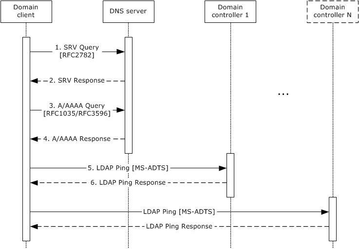

Figure 41: Message flow for domain location that is based on a DNS domain name

- The FQDN of the domain in which the domain controller is to be located is available. The [**domain client**](#gt_domain-client) makes use of the FQDN of the domain along with [**site**](#gt_site) information from the [**client**](#gt_client) and sends an SRV query to the DNS [**server**](#gt_server) to get a list of IP addresses of candidate domain controllers.
- If no candidate domain controllers can be identified using SRV queries, the client falls back to NetBIOS-based location (described later in this section).
Active Directory servers offer the [**Lightweight Directory Access Protocol (LDAP)**](#gt_lightweight-directory-access-protocol-ldap) service over the [**TCP**](#gt_transmission-control-protocol-tcp) protocol; for example (see [MS-ADTS](../MS-ADTS/MS-ADTS.md) section 6.3.6), clients can find an LDAP server by querying DNS for a record of the form:<6>

_ldap._tcp.DnsDomainName

- After the list of candidate domain controllers is obtained by using the DNS Infrastructure, the domain client selects a candidate domain controller that is based on a weighted random order ([[RFC2052]](https://go.microsoft.com/fwlink/?LinkId=94441)). The client sends A/AAAA DNS queries to resolve the SRV record to an IP address.
- The domain client receives the IP address that was resolved from the SRV record in an A/AAAA DNS response.
- After the IP address is known, the client sends an LDAP "Ping" to the candidate domain controller to determine whether the domain controller is in fact handling requests and whether its capabilities satisfy the client's requirements.
- Upon receipt of a successful LDAP Ping response, the domain client validates that the capabilities that the domain controller returned satisfy the requested capabilities. If the capabilities that the domain controller returned are incompatible with the requirements that the client specifies, the client selects another candidate domain controller from the list of domain controller SRV records that were returned in step 2 and repeats steps 3 through 6.
If all the responses in the SRV records have been checked and each SRV record points to a server that is either not available or does not match the requirements, then the DC location operation fails. In this case, the client falls back to NetBIOS-based DC location (described later in this section). If a domain controller still cannot be found, an error is returned indicating that a domain controller could not be located.

If the domain in which the domain controller is to be located is the same as the client computer's domain, the site name abstract data is updated with the client site name information that the domain controller returns as part of the LDAP Ping response.

**Locate a Domain Controller by Using the NetBIOS Infrastructure**

The following sequence diagram shows the message flow that is associated with this example.

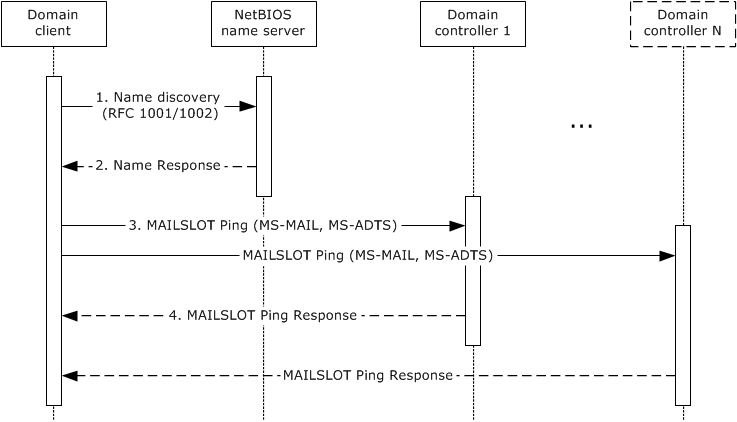

Figure 42: Message flow for domain location that is based on a NetBIOS domain name

- When the FQDN of the domain is not available, the domain client determines the NetBIOS name of the domain based on the client's abstract data. If the NetBIOS name cannot be determined, an error is returned indicating that a domain controller could not be located. The domain client queries the NetBIOS name server for NetBIOS group names that contain the list of DCs.
- The NetBIOS name server responds with the NetBIOS group names.
- By using the NetBIOS group names that domain controllers register along with their capabilities, the domain client sends a MAILSLOT Ping to candidate domain controllers by using the Remote Mailslot Protocol [MS-MAIL](../MS-MAIL/MS-MAIL.md). The Ping response is used to determine availability and to confirm that the domain controller supports all the specified requirements.
- Upon receipt of a successful MAILSLOT Ping response, the domain client validates that the capabilities that the domain controller returned satisfy the requested capabilities. If no domain controllers respond or if none match the required capabilities, the client returns an error indicating that a domain controller could not be located.

### 3.1.2 Example 2: Joining a Domain by Creating an Account via SAMR

This example describes the process of joining a [**client computer**](#gt_client-computer) to a [**domain**](#gt_domain) by creating an [**account**](#gt_account) via the SAMR protocol. This is a secure method to join a domain. It establishes the account on the domain controller and creates a new, random password for the [**domain client**](#gt_domain-client) and the account in the domain. This example is useful to join a domain or perform other domain-related operations that use the SAMR protocol in a domain environment.

This example builds on the use case described in section [2.7.7.1](#Section_2.7.7.1), Join a Domain with a New Account- Domain Client.

**Prerequisites**

The general requirements described in section [2.6](#Section_2.6), Assumptions and Preconditions.

The Active Directory system meets all preconditions described in section 2.7.7.1.

**Initial System State**

The client is in a workgroup.

**Final System State**

Upon successful completion, the client state is updated, which indicates that the client is now joined to the domain.

**Sequence of Events**

The following sequence diagram shows the message flow that is associated with this example.

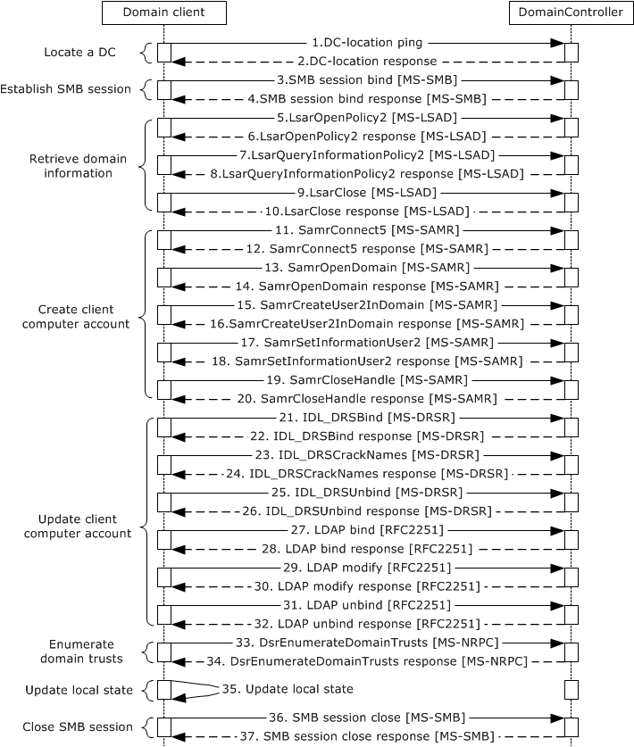

Figure 43: Message flow to join a domain by creating a new account via SAMR

- If the [**domain controller (DC)**](#gt_domain-controller-dc) was not located earlier, the client locates a domain controller, as described in section [3.1.1](#Section_3.1.1).
- If the client receives a successful response from the domain controller, the DC is located. If the response is not successful, the task fails.
- To establish an [**SMB**](#gt_server-message-block-smb)/CIFS session to the domain controller, the domain client sends an SMB session bind request. In this bind request, it sends anonymous user [**credentials**](#gt_credential) to the domain controller ([MS-CIFS](../MS-CIFS/MS-CIFS.md) section 3.2.4.2).
- When a successful SMB session bind response is received from the domain controller, the SMB/CIFS session is established between the domain client and the DC.
- By using the SMB/CIFS session (established in the preceding step) as transport, the domain client makes an LsarOpenPolicy2 [**RPC**](#gt_remote-procedure-call-rpc) call to obtain a [**policy**](#gt_policy) handle. This handle is used for subsequent calls to retrieve domain information from the domain controller ([MS-LSAD](#Section_2.11) section 3.1.4.4.1).
- Upon receiving a successful response from the domain controller, the domain client obtains a policy handle.
- Using the policy handle obtained from the preceding step, the domain client sends an LsarQueryInformationPolicy2 request to the domain controller to retrieve domain information ([MS-LSAD] section 3.1.4.4.3).
- Upon receiving a successful response from the domain controller, the domain client retrieves domain information and updates its abstract data.
- The domain client makes an LsarClose RPC call to close the policy handle ([MS-LSAD] section 3.1.4.9.4.) that was obtained in step 6.
- Upon a successful response from the domain controller, the policy handle is closed. Any failure during the preceding call sequence causes the task to fail.
- By using the SMB connection that was established previously, the domain client makes a SamrConnect5 request ([MS-SAMR](#Section_2.11) section 1.7.2) to the domain controller to connect to the SAM RPC [**server**](#gt_server) on the DC.
- Upon a successful response from the domain controller, the domain client receives a handle to the server object from the DC.
- By using the server handle that was obtained in the preceding step, the domain client sends a SamrOpenDomain request ([MS-SAMR] section 3.1.5.1.5) to the domain controller to obtain a handle for a [**domain object**](#gt_domain-object).
- Upon a successful response, the domain controller returns a handle for a domain object.
- The domain client sends a SamrCreateUser2InDomain request ([MS-SAMR] section 3.1.5.4.4) to the domain controller to create a new user account.
- Upon a successful response from the domain controller, a new user of the domain client computer is created on the domain controller. If this step fails because the account already exists, the domain client attempts to obtain a handle to the existing account ([MS-SAMR] sections 3.1.5.1.9 and 3.1.5.11.2).
- The domain client sends a SamrSetInformationUser2 request ([MS-SAMR] section 3.1.5.6.4) to the domain controller to set the password of the newly created user.
- Upon a successful response from the domain controller, the password is set.
- After the new user account has been created, the domain client sends a SamrCloseHandle request to the domain controller to close the handles that were opened previously ([MS-SAMR] section 3.1.5.13.1).
- Upon successful completion of the preceding call sequence, the domain client has successfully created or updated the client account in the domain.
- The domain client sends an IDL_DRSBind request, which creates a context handle that is necessary to call any other methods in the interface ([MS-DRSR](#Section_2.7.5) section 4.1.3).
- Upon a successful response from the domain controller, the domain client obtains a context handle.
- The domain client sends an IDL_DRSCrackNames request ([MS-DRSR] section 4.1.4) to the domain controller to obtain the distinguished name (DN).
- Upon a successful response from the domain controller, the domain client updates the DN of the client account.
- The domain client sends an IDL_DRSUnbind request, which destroys the context handle that was previously created by the IDL_DRSBind method ([MS-DRSR] section 4.1.25).
- Upon a successful response from the domain controller, the context handle that was created previously is destroyed.
- The domain client connects to the LDAP service, as described in the LDAP specification [[RFC2251]](https://go.microsoft.com/fwlink/?LinkId=90325), and performs an LDAP bind to authenticate the connection by using the process that is described in [MS-ADTS](../MS-ADTS/MS-ADTS.md) section 5.1.1.
- Upon a successful LDAP bind response, the client account is validated successfully.
- By using the LDAP connection that was created in the previous step, the domain client sends an LDAP modify request to the domain controller. This request is used to update the client account with values for the server [**principal**](#gt_principal) name and host name [**attributes**](#gt_attribute).
- Upon a successful response from the domain controller, the domain client updates the attributes in the client account.
- The domain client sends an LDAP unbind request to unbind from the LDAP service, as specified in the LDAP specification [RFC2251].
- Upon a successful response from the domain controller, the domain client unbinds from the LDAP service. This operation is performed even if errors were encountered in the preceding call sequence. Any errors in this operation are ignored.
- To retrieve the list of domain trusts from the domain controller, the domain client sends a DsrEnumerateDomainTrusts request ([MS-NRPC](../MS-NRPC/MS-NRPC.md) section 3.5.4.7.1).
- Upon a successful response from the domain controller, the domain client retrieves the list of trusts from the DC.
- The domain client updates its local state variables.
- After the domain client updates its local state, the domain client sends an SMB session close request ([MS-CIFS] section 3.4.4.8) to the domain controller to close the SMB/CIFS session that was established previously.
- Upon a successful response from the domain controller, the SMB/CIFS session is closed.

### 3.1.3 Example 3: Joining a Domain by Creating an Account via LDAP

This example describes the process of joining a [**client computer**](#gt_client-computer) to a [**domain**](#gt_domain) by creating an [**account**](#gt_account) via [**LDAP**](#gt_lightweight-directory-access-protocol-ldap). This is a secure way to join the domain. This task shares many of the actions to establish the relationship between the client and the [**domain controller (DC)**](#gt_domain-controller-dc) with the example in section [3.1.2](#Section_3.1.2). As a variation of that example, the creation or modification of the machine account in the domain can be accomplished via LDAP instead of the SAM [**RPC**](#gt_remote-procedure-call-rpc) interface. This can be useful for alternate [**domain client**](#gt_domain-client) implementations that do not intend to include the SAM RPC interface client. This example also highlights again why the [**domain controller server**](#gt_domain-controller-server) implementation has to enforce that the multiple interfaces to the same underlying [**account database**](#gt_account-database) keep the objects synchronized across the different protocol interfaces. This example is useful to join a client to a domain or to perform other domain-related operations by using LDAP in a domain environment.

This example builds on the variation in the use case described in section [2.7.7.1](#Section_2.7.7.1).

**Prerequisites**

The general requirements are described in section [2.6](#Section_2.6).

The Active Directory system meets all preconditions described in section 2.7.7.1.

**Initial System State**

The client is in a workgroup.

**Final System State**

Upon successful completion, the client state is updated, which indicates that the client is now joined to the domain.

**Sequence of Events**

The following sequence diagram shows the message flow that is associated with this example.

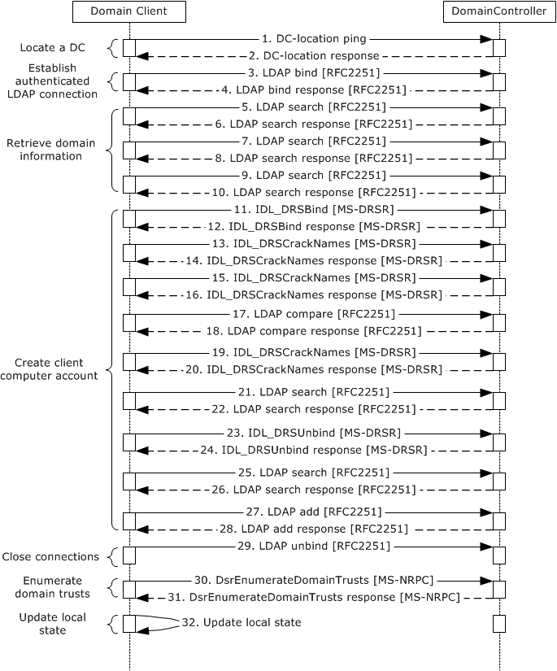

Figure 44: Message flow to join a domain by creating a new account via LDAP

- If the domain controller was not located earlier, the client locates a domain controller, as described in section [3.1.1](#Section_3.1.1).
- If the client receives a successful response from the domain controller, the DC is located. If the response is not successful, the task fails.
- The domain client computer sends an LDAP bind request ([[RFC2251]](https://go.microsoft.com/fwlink/?LinkId=90325) section 4.2) to the domain controller with the [**credentials**](#gt_credential) of the administrator.
- The domain controller uses one of the methods defined elsewhere ([MS-AUTHSOD](../MS-AUTHSOD/MS-AUTHSOD.md) section 2) to verify the credentials. Depending on the negotiated authentication method, this might involve additional domain client and [**server**](#gt_server) interactions not directly relevant to this discussion. After verification, the domain controller sends an LDAP bind response ([RFC2251] section 4.2.3) to the domain client.
- The domain client computer sends an LDAP search request to the domain controller ([RFC2251] section 4.5.1) with baseObject set to the NULL domain name.
- Upon a successful response from the domain controller, the domain client updates the local domain name and the [**forest**](#gt_forest) name in its abstract data.
- The domain client computer sends an LDAP search request to the domain controller ([RFC2251] section 4.5.1) with baseObject set to the domain name that was obtained from step 5.
- Upon a successful response from the domain controller, the domain client updates the local domain GUID and domain [**SID**](#gt_security-identifier-sid) in its abstract data.
- The domain client computer sends an LDAP search request to the domain controller ([RFC2251] section 4.5.1) with baseObject set to the concatenation of "CN=Partitions," with the value of configurationNamingContext that was obtained in step 5.
- Upon a successful response from the domain controller, the domain client updates the [**NetBIOS**](#gt_netbios) name in its abstract data.
- The domain client sends an IDL_DRSBind request ([MS-DRSR](#Section_2.7.5) section 4.1.3) to create a context handle that is necessary to call any other DRSR messages.
- The domain controller sends an IDL_DRSBind response to the domain client.
- The domain client sends an IDL_DRSCrackNames request ([MS-DRSR] section 4.1.4) to the domain controller to get the NetBIOS name from the canonical name of the domain.
- Upon a successful response from the domain controller, the NetBIOS-formatted domain name and the computer name are used to form the NetBIOS-formatted computer name.
- The domain client sends an IDL_DRSCrackNames request ([MS-DRSR] section 4.1.4) to the domain controller to translate NetBIOS format computer name to [**fully qualified domain name (FQDN) (1)**](#gt_1769aec9-237e-44ed-9014-1abb3ec6de6e) name format.
- Upon a successful response from the domain controller, the domain client gets back the list of computer objects with the above FQDN name. If there are more than 1, the task fails.
If the returned result contains a name, and the domain client does not specify an OU, the domain client updates the DN of the client account. If the domain client specifies an OU, and the returned name is not in the same OU, the task fails.

- If no result is obtained in step 16 and the domain client does not specify an OU, the domain client sends an LDAP compare request ([RFC2251] section 4.10) to the domain controller to verify the OU.
- Upon a successful response from the domain controller, the domain client uses the DN of the OU and the computer name to form the FQDN formatted computer name.
- If the domain client does not specify an OU and no account was found in step 16, the domain client sends an IDL_DRSCrackNames request ([MS-DRSR] section 4.1.4) to the domain controller to get the FQDN format domain from the NetBIOS format domain name (obtained via IDL_DRSCrackNames request in step 13).
- Upon a successful response from the domain controller, the domain client updates the FQDN format domain name in its abstract data.
- The domain client sends an LDAP search request ([RFC2251] section 4.5.1) to the domain controller with baseObject set to the FQDN format domain name.
- Upon a successful response from the domain controller, the domain client parses the returned value for the DN of the default computer container DN (see [MS-ADTS](../MS-ADTS/MS-ADTS.md) section 6.1.1.4 for details) and obtains the DN of the preferred OU, which it uses to form the computer DN. If this search fails, the task fails.
- The domain client sends an IDL_DRSUnbind request ([MS-DRSR] section 4.1.25) to destroy the context handle that was created previously.
- Upon a successful response from the domain controller, the previously created context handle is destroyed.
- The domain client sends LDAP search request ([RFC2251] section 4.5.1) to the domain controller with baseObject set to the computer DN.
- Upon a successful response from the domain controller, the domain client updates the DN of the client account.
- The domain client sends an LDAP add request ([RFC2251] section 4.7) to the domain controller to add the new account to the [**directory**](#gt_directory) with the updated DN from the previous step.
- Upon a successful response from domain controller, the new account is added in the directory.
- The domain client sends an LDAP unbind message ([RFC2251] section 4.3) to the domain controller to remove all the connections that were built in the previous steps.
- To retrieve the list of domain trusts from the domain controller, the domain client sends a DsrEnumerateDomainTrusts request ([MS-NRPC](../MS-NRPC/MS-NRPC.md) section 3.5.4.7.1).
- Upon a successful response from the domain controller, the domain client retrieves the list of trusts from the DC.
- The domain client updates its local state variables.

### 3.1.4 Example 4: Unjoining a Domain Member

This example describes the process of unjoining a [**client computer**](#gt_client-computer) from a [**domain**](#gt_domain). To unjoin from a domain, a client administrator locates a [**domain controller (DC)**](#gt_domain-controller-dc) and then performs actions against the DC. This example is applicable to a client computer that is part of a domain and needs to unjoin from the domain.

This example builds on the use case described in section [2.7.7.2](#Section_2.7.7.2), Unjoin from a Domain - Domain Client.

**Prerequisites**

The general requirements are described in section [2.6](#Section_2.6), Assumptions and Preconditions.

The Active Directory system meets all preconditions described in section 2.7.7.2.

**Initial System State**

The client is joined to a domain.

**Final System State**

Upon successful completion of this task, the client's state variables are updated and the client is unjoined from the domain.

**Sequence of Events**

The following sequence diagram shows the message flow that is associated with this example.

Figure 45: Message flow for unjoining from a domain

1. If the domain controller was not located earlier, the client locates a domain controller, as described in section [3.1.1](#Section_3.1.1).

2. If the client receives a successful response from the domain controller, the DC is located. If the response is not successful, the task fails.

**Note** The initial exchange to locate a DC is representative only of the traffic between the client and the selected domain controller. This traffic might not even be present, depending on whether previous results from the Locate a Domain Controller task (section 3.1.1) have been cached. Also, additional exchanges that might occur to other domain controllers are not represented.

3. To establish an [**SMB**](#gt_server-message-block-smb)/SMB2/CIFS session to the domain controller, the [**domain client**](#gt_domain-client) sends an SMB session bind request using anonymous user [**credentials**](#gt_credential) to the domain controller ([MS-CIFS](../MS-CIFS/MS-CIFS.md) section 3.2.4.2).

4. Upon a successful response from domain controller, the SMB/SMB2/CIFS session is established between the domain client and the DC.

5. By using the SMB connection that was established in the previous step, the domain client sends a SamrConnect5 request ([MS-SAMR](#Section_2.11) section 3.1.5.1.1) to the domain controller to connect to the SAM [**RPC**](#gt_remote-procedure-call-rpc) [**server**](#gt_server) on the DC.

6. Upon a successful response from domain controller, the domain client receives a handle to the server object from the DC.

7. By using the server handle that was obtained in the preceding step, the domain client sends a SamrOpenDomain request ([MS-SAMR] section 3.1.5.1.5) to the domain controller to obtain a handle for a [**domain object**](#gt_domain-object).

8. Upon a successful response, the domain controller returns a handle for a domain object.

9. To determine the [**relative identifier (RID)**](#gt_relative-identifier-rid) of the account, the domain client sends a SamrLookUpNamesInDomain request ([MS-SAMR] section 3.1.5.11.2) to the domain controller.

10. Upon a successful response, the domain controller returns the RID of the existing domain client [**account**](#gt_account).

11. To obtain a handle to modify user account information, the domain client sends a SamrOpenUser request ([MS-SAMR] section 3.1.5.1.9) to the domain controller.

12. Upon a successful response, the domain controller returns a handle to a user account.

13. The domain client sends a SamrQueryInformationUser request ([MS-SAMR] section 3.1.5.5.6) to the domain controller to obtain [**attributes**](#gt_attribute) from the user object.

14. Upon a successful response, the domain controller returns attributes of the user object.

15. To disable the user account in the [**directory**](#gt_directory), the domain client sends a SamrSetInformationUser request ([MS-SAMR] section 3.1.5.6.5) to the domain controller.

16. Upon a successful response from the domain controller, the domain client disables the user account in the directory.

17. The domain client updates its local state variables.

18. – 23. After the user account is disabled, the domain client sends SamrCloseHandle requests to the domain controller to close the handles that were opened earlier ([MS-SAMR] section 3.1.5.13.1). The client receives responses from the server for all the close-handle requests. Upon successful completion of the preceding call sequence, the domain client has successfully created or updated the client account in the domain.

24. The domain client sends an SMB session close request ([MS-CIFS] section 3.4.4.8) to the domain controller to close the SMB/SMB2/CIFS session that was established earlier.

25. Upon a successful response from the domain controller, the SMB/SMB2/CIFS session is closed.

## 3.2 Directory Examples

This section contains a set of examples that describe common uses of the [**Active Directory**](#gt_active-directory) system. The following examples are given:

- Provision a user [**account**](#gt_account) by using [**LDAP**](#gt_lightweight-directory-access-protocol-ldap).
- Provision a user account by using the SAMR protocol.
- Change a user account's password.
- Update a user's lastLogOnTimeStamp.
- Determine the group membership of a user.
- Delete a user account.
- Obtain a list of user accounts by using the Web Services protocols.
- Obtain a list of user accounts by using LDAP.
- Manage groups and their memberships.
- Delete a group.
- Extend the [**schema**](#gt_schema) to support an application by adding a new class.
- Extend the schema to support an application by adding a new [**attribute**](#gt_attribute).
- Extend the schema to support an application by adding an attribute to a class.
- Partition directory data by using organizational units.
- Store application data in the [**directory**](#gt_directory).
- Manage access control on [**directory objects**](#gt_directory-object).
- Raise the [**domain functional level**](#gt_domain-functional-level).
A key aspect of these examples is that multiple protocols, such as LDAP and SAMR, can be used to affect the same state change, such as provisioning a user. After that state change is complete, any protocol that provides access to that state (not just the protocol that originally created the state) can be used to further modify that state. For example, the user that was created by using the SAMR protocol can have his or her password changed by using LDAP, or can be queried by using the Web Services protocols.

### 3.2.1 Example 1: Provision a User Account by Using LDAP

In this example, an administrator provisions a user [**account**](#gt_account) by using the [**Lightweight Directory Access Protocol (LDAP)**](#gt_lightweight-directory-access-protocol-ldap). To perform this task, the administrator runs a [**client**](#gt_client) application on a [**client computer**](#gt_client-computer) that targets a [**directory**](#gt_directory) [**server**](#gt_server) in the Active Directory system. The client application creates a user account, uses LDAP to set the user account properties, and uses the [**Kerberos**](#gt_kerberos) protocol to set the user account password.

This example applies only to [**Active Directory Domain Services (AD DS)**](#gt_active-directory-domain-services-ad-ds).

This example uses LDAP and the Kerberos protocol and uses concepts described in [MS-SAMR](#Section_2.11) (although it does not use the protocol defined in [MS-SAMR]).

This example covers the use cases in sections [2.7.2.1](#Section_2.7.2.1), Create a New Account - Client Application, and [2.7.2.2](#Section_2.7.2.2), Reset an Existing Account's Password - Client Application.

**Prerequisites**

The general requirements described in section [2.6](#Section_2.6), Assumptions and Preconditions.

The Active Directory system meets all preconditions described in section 2.7.2.1.

**Initial System State**

None.

**Final System State**

The new user object has been provisioned in the directory with the specified [**attributes**](#gt_attribute).

**Sequence of Events**

The following sequence diagram shows the message flow that is associated with this example.

Figure 46: Message flow to provision a user account by using LDAP

Unless otherwise noted, all responses that include a return code contain a return code that indicates that the operation was successfully performed.

- The client application starts, and an LDAP bind request ([[RFC2251]](https://go.microsoft.com/fwlink/?LinkId=90325) section 4.2) is sent to the directory server with the [**credentials**](#gt_credential) of the administrator.
- The directory server uses one of the methods defined elsewhere ([MS-AUTHSOD](../MS-AUTHSOD/MS-AUTHSOD.md) section 2) to verify the credentials. Depending on the negotiated authentication method, this might involve additional client and server interactions that are not directly relevant to this discussion. After verification, the directory server sends an LDAP bind response ([RFC2251] section 4.2.3) to the client.
- At this point, the client sends LDAP search requests ([RFC2251] section 4.5.1) to populate data in the client application's user interface. This step is necessary only for user-interface display purposes that are specific to the example.
- An LDAP connection to a [**global catalog (GC)**](#gt_global-catalog-gc) is established. An LDAP bind request ([RFC2251] section 4.2) to the global catalog is sent with the administrator's credentials.
- The global catalog verifies the credentials ([MS-AUTHSOD] section 2) and sends an LDAP bind response ([RFC2251] section 4.2.3).
- An LDAP search request ([RFC2251] section 4.5.1) is sent to the global catalog. It starts at the root of the [**forest**](#gt_forest) and queries the entire forest to look for [**security principals**](#gt_security-principal) that have the same [**user principal name (UPN)**](#gt_user-principal-name-upn) as the requested user principal name of the new account. The purpose of this search is to verify that the requested user principal name of the new account is not currently in use.
- The global catalog sends an LDAP search response ([RFC2251] section 4.5.2) that lists any accounts that have the specified user principal name.
- An LDAP unbind request ([RFC2251] section 4.3) is sent to the global catalog. The LDAP connection to the global catalog is closed.
- The client application sends an LDAP search request ([RFC2251] section 4.5.1) to the directory. It starts at the root of the [**domain**](#gt_domain) and queries the entire domain to look for security principals that have the same name (stored in the sAMAccountName attribute) as the one requested for the new account. The purpose of this search is to ensure that the name that the administrator specified is not currently in use.
- The directory server sends an LDAP search response ([RFC2251] section 4.5.2) that lists any accounts that have the specified user name.
For the purposes of this example, it is assumed that the LDAP search responses for the user principal name and the user name do not contain any accounts; that is, there were no matches. With this assumption, the client application has now verified that the chosen user principal name and user name are not currently in use. The client application continues with the add operation.

- An LDAP add request ([RFC2251] section 4.7) is sent to the directory server. The LDAP add operation contains the distinguishedName, sAMAccountName, userPrincipalName, displayName, and givenName of the new user and specifies that the [**object class**](#gt_object-class) of the object to be created is user.
- The directory server processes the add request ([RFC2251] section 4.7) and performs validation, as described in [MS-ADTS](../MS-ADTS/MS-ADTS.md) sections 3.1.1.5.1 and 3.1.1.5.2. It then sends an LDAP add response that indicates success.
Now that the user object has been created, the client application starts to set additional attributes that the administrator provides. It begins by setting the password for the new account. To do so, it uses Kerberos messages that are sent to the Kerberos [**Key Distribution Center (KDC)**](#gt_key-distribution-center-kdc).

- The client begins by sending a Kerberos AS request ([[RFC4120]](https://go.microsoft.com/fwlink/?LinkId=90458) section 3.1) to the Authentication Service (AS) to obtain a [**ticket-granting ticket (TGT)**](#gt_ticket-granting-ticket-tgt) that it will use later for authentication.
- The service validates the credentials in the AS request and sends an AS response ([RFC4120] section 3.1) with a TGT.
- The client sends a Kerberos [**TGS**](#gt_ticket-granting-service-tgs) request ([RFC4120] section 3.3) to the ticket-granting service (TGS) by using the TGT and requests a [**service ticket**](#gt_service-ticket) for the kadmin/changepw service ([[RFC3244]](https://go.microsoft.com/fwlink/?LinkId=90409)), which provides functionality to change an account's password via Kerberos.
- The service validates the credentials in the TGS request and sends a TGS response ([RFC4120] section 3.3) with the service ticket.
- Using the service ticket, the client sends a **KRB_PRIV** change-password request message ([RFC4120] section 3.5 and [RFC3244] section 2) to the Kerberos password-changing service along with the new password for the account.
**Note** The **KRB_PRIV** message is a Kerberos message that is part of a **KRB_PRIV** exchange.

- The password-changing service processes the request and sends a **KRB_PRIV** response ([RFC4120] section 3.5 and [RFC3244] section 2) that indicates success. As part of this change-password operation, the Active Directory database is modified according to the sequence of actions described in [MS-SAMR] section 3.1.1.8.5.
At this point, the Kerberos operations are complete. The client now continues to set remaining attributes via LDAP.

- If the administrator indicated that the user has to change his or her password at the next logon, the client sends an LDAP modify request ([RFC2251] section 4.6) where the pwdLastSet attribute value is set to 0. This setting tells the directory server that the user's password has expired and has to be changed the next time the new user attempts to log on.
- The directory server processes the request and sends a response ([RFC2251] section 4.6).
The client computes a new value for the userAccountControl attribute. At a minimum, this includes the ADS_UF_NORMAL_ACCOUNT bit ([MS-ADTS] section 2.2.16) and can contain additional bits depending on administrator-provided values.

- The client sends an LDAP modify request ([RFC2251] section 4.6) with the new value for userAccountControl.
- The directory server processes the request and sends a response ([RFC2251] section 4.6).
The new user account, represented as a [**directory object**](#gt_directory-object) of class user, has now been created. The user object has been populated with all specified attributes.

- The client sends an LDAP unbind request ([RFC2251] section 4.3) to the directory server. The LDAP connection to the directory server is closed.

### 3.2.2 Example 2: Provision a User Account by Using the SAMR Protocol

A common administrative task is to provision an [**account**](#gt_account) for a new user. As shown in the previous section, this can be done by using [**LDAP**](#gt_lightweight-directory-access-protocol-ldap). Another way to accomplish this task is to use the SAMR protocol to communicate with the Active Directory system. Regardless of which protocol is chosen, the end state is the same: a new user object is created in the [**directory tree**](#gt_directory-tree).

To perform this task, an administrator runs a [**client**](#gt_client) application, using the SAMR protocol from a [**client computer**](#gt_client-computer) that targets a [**directory**](#gt_directory) [**server**](#gt_server) in the Active Directory system.

This example applies only to [**AD DS**](#gt_active-directory-domain-services-ad-ds).

This example differs from the previous example (section [3.2.1](#Section_3.2.1)) in that it uses the SAMR protocol rather than LDAP to create the user and in that it only provides a minimal set of [**attributes**](#gt_attribute) for the newly created account.

This example covers the use case in section [2.7.2.1](#Section_2.7.2.1), Create a New Account - Client Application.

**Prerequisites**

The general requirements described in section [2.6](#Section_2.6), Assumptions and Preconditions.

The Active Directory system meets all preconditions described in sections [2.7.1.1](#Section_2.7.1.1) and 2.7.2.1.

**Initial System State**

None.

**Final System State**

The new user object has been created in the directory.

**Sequence of Events**

The following sequence diagram depicts the message flow that is associated with this example.

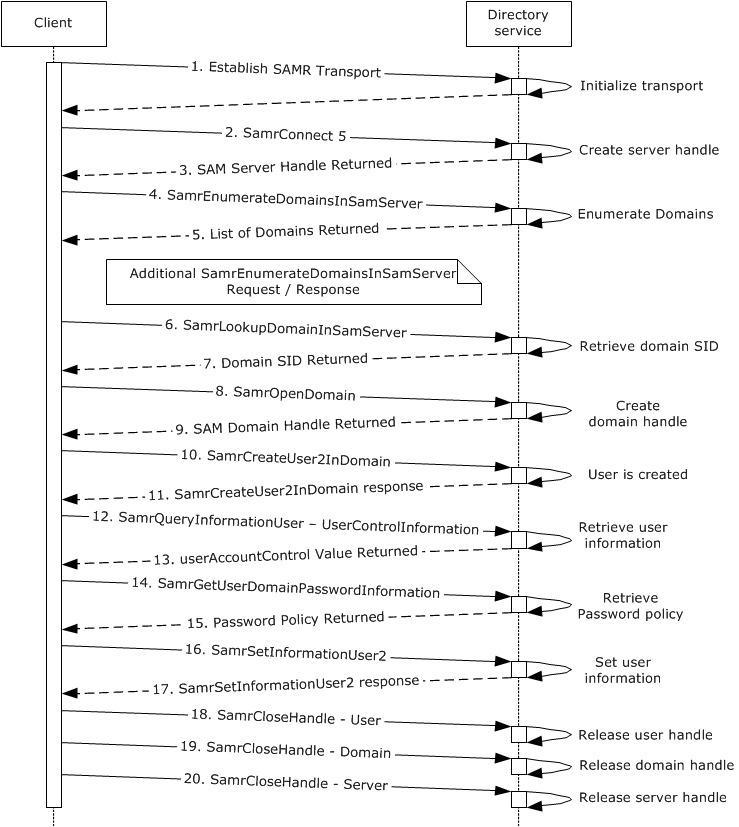

Figure 47: Message flow for provisioning a user account by using the SAMR protocol

Unless otherwise noted, all responses that include a return code contain a return code that indicates that the operation was successfully performed.

- The client binds to the SAMR [**endpoint**](#gt_endpoint) on the server using a supported transport, as specified in [MS-SAMR](#Section_2.11) section 2.1.
- The next step is to open a SAMR handle to the directory server. The client application sends a SamrConnect5 request ([MS-SAMR] section 3.1.5.1.1) with the DesiredAccess parameter set to MAXIMUM_ALLOWED ([MS-SAMR] section 2.2.1.1) to the server, requesting a server handle.
- The server processes the request ([MS-SAMR] section 3.1.5.1.1) and sends a response with the server handle to be used by later calls.
Before continuing by opening a SAMR handle to the domain, the client application has to first know the [**security identifier (SID)**](#gt_security-identifier-sid) of the [**domain**](#gt_domain). This is determined in steps 4-7.

- The client application sends a SamrEnumerateDomainsInSamServer request ([MS-SAMR] section 3.1.5.2.1), using the server handle that it previously obtained in step 3.
- The server processes the request ([MS-SAMR] section 3.1.5.2.1) and returns a list of all domains hosted by the server.
The client application repeats sending a SamrEnumerateDomainsInSamServer request if the [**directory service**](#gt_directory-service-ds) returns STATUS_MORE_ENTRIES ([MS-SAMR] section 3.1.5.2.1) to indicate that there is additional data to retrieve.

- The client application sends a SamrLookupDomainInSamServer request ([MS-SAMR] section 3.1.5.11.1), using the server handle from step 3. In this request, it specifies one of the names that was returned in step 5, which corresponds to the [**domain object**](#gt_domain-object).
- The server processes the request ([MS-SAMR] section 3.1.5.11.1) and returns the domain SID.
The client application has now obtained the domain SID and can use it to open a SAMR handle to the domain.

- The client application sends a SamrOpenDomain request ([MS-SAMR] section 3.1.5.1.5), using the server handle that it previously obtained in step 3 and the domain SID that it obtained in step 7, with the DesiredAccess parameter set to MAXIMUM_ALLOWED ([MS-SAMR] section 2.2.1.1).
- The server processes this request ([MS-SAMR] section 3.1.5.1.5) and returns a response with a domain handle.
Now that the client application has the domain handle, it can use this handle to create users in the domain.

- The client application sends a SamrCreateUser2InDomain request ([MS-SAMR] section 3.1.5.4.4) with the DesiredAccess parameter set to MAXIMUM_ALLOWED ([MS-SAMR] section 2.2.1.1) to create the new user. The request includes the domain handle that was received earlier and the user name of the new user to create. It has the AccountType parameter set to USER_NORMAL_ACCOUNT ([MS-SAMR] section 2.2.1.12). The request also specifies the account type (in this case USER_NORMAL_ACCOUNT) and the desired access on the returned user handle (in this case USER_WRITE_ACCOUNT and USER_FORCE_PASSWORD_CHANGE so that the account can be updated in subsequent steps).
- The server processes the request ([MS-SAMR] section 3.1.5.4.4) and creates the new user. It creates a user [**directory object**](#gt_directory-object) with sAMAccountName set to the user name that the client application specified in the request. The server then returns a response with a user handle for the newly created user, the [**relative identifier (RID)**](#gt_relative-identifier-rid) of the new user, and the access that was granted on the user handle (in accordance with the behavior specified in [MS-SAMR] section 3.1.5.4.4).
- The client application sends a SamrQueryInformationUser request ([MS-SAMR] section 3.1.5.5.6), using the user handle it obtained in the previous step, and requesting that UserControlInformation be returned. This is done in order to retrieve the value of the userAccountControl attribute of the newly created user.
- The server processes the request ([MS-SAMR] section 3.1.5.5.6), and returns the value of the userAccountControl attribute (in accordance with the behavior specified in [MS-SAMR] sections 3.1.5.4.4 and 3.1.5.14.11) of the newly created user.
- To obtain password [**policy**](#gt_policy) information, the client application sends a SamrGetUserDomainPasswordInformation request ([MS-SAMR] section 3.1.5.13.3), using the user handle that it previously obtained in step 11 for the newly created user.
- The server processes the request ([MS-SAMR] section 3.1.5.13.3) and returns information about the password policy that applies to the newly created user.
- The client application sets the password of the newly created user by sending a SamrSetInformationUser2 request ([MS-SAMR] section 3.1.5.6.4) that specifies a UserInformationClass of UserInternal4InformationNew. As part of this request, it also updates the value of the user's userAccountControl attribute (whose current value was previously retrieved in steps 12 and 13) with any additional bits ([MS-SAMR] section 2.2.6.1) based on values that the administrator provided.
- The server processes the request ([MS-SAMR] section 3.1.5.6.4) and returns a response that indicates that the user was successfully updated.
- - 20. The client application performs cleanup by closing all the handles that it opened during the session. This is done by calling SamrCloseHandle ([MS-SAMR] section 3.1.5.13.1) with SamHandle set to the handle that the client is attempting to close. The client application closes the handles in the reverse order that they were received (namely, the user handle, the domain handle, and then the server handle).
As the final step, the transports that were created for communication are closed.

### 3.2.3 Example 3: Provision a User Account by Using the SAMR Protocol Including the Need for a RID Allocation Request

This example demonstrates the communication between a [**DC**](#gt_domain-controller-dc) in a [**domain**](#gt_domain) and the [**RID**](#gt_relative-identifier-rid) Master [**FSMO role**](#gt_fsmo-role) owner of the domain to obtain a RID range allocation. The RID Master FSMO role owner is responsible for allocating RID ranges that DCs use to create new [**security principals**](#gt_security-principal) in the [**directory service**](#gt_directory-service-ds).

To perform this task, an administrator runs a [**client**](#gt_client) application using the SAMR protocol from a [**client computer**](#gt_client-computer). The client application targets a [**directory**](#gt_directory) [**server**](#gt_server) in the Active Directory system to create a user. However, the DC against which the user is to be created has exhausted its allocated RID range. The DC communicates with the RID Master FSMO role owner to obtain a new RID range.

This example applies only to [**AD DS**](#gt_active-directory-domain-services-ad-ds).

This example covers the use case in section [2.7.2.1](#Section_2.7.2.1), Create a New Account - Client Application; specifically the extension wherein the DC that serves the request has exhausted its allocated RID range.

**Prerequisites**

The general requirements set forth in section [2.6](#Section_2.6), Assumptions and Preconditions.

The Active Directory system meets all preconditions described in sections [2.7.1.1](#Section_2.7.1.1) and 2.7.2.1.

**Initial System State**

The DC that serves the request does not have any RIDs left from its allocated range of RIDs.

**Final System State**

The new user object has been created in the directory.

**Sequence of Events**

The following sequence diagram depicts the message flow that is associated with this example.

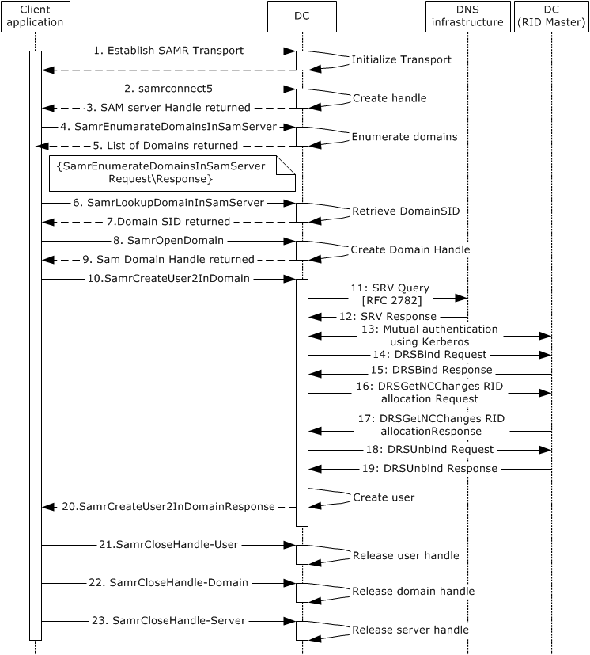

Figure 48: Message flow for provisioning a user account by using the SAMR protocol

Unless otherwise noted, all responses that include a return code contain a return code that indicates that the operation was successfully performed.

1. The client binds to the SAMR [**endpoint**](#gt_endpoint) on the server using a supported transport, as specified in [MS-SAMR](#Section_2.11) section 2.1.

2. The next step is to open a SAMR handle to the DC (directory server). The client application sends a SamrConnect5 request ([MS-SAMR] section 3.1.5.1.1) with the DesiredAccess parameter set to MAXIMUM_ALLOWED ([MS-SAMR] section 2.2.1.1) to the server, requesting a server handle.

3. The DC processes the request ([MS-SAMR] section 3.1.5.1.1) and sends a response with the server handle to be used in subsequent calls.

Before continuing by opening a SAMR handle to the domain, the client application has to first know the [**security identifier (SID)**](#gt_security-identifier-sid) of the domain. This is determined in steps 4-7.

4. The client application sends a SamrEnumerateDomainsInSamServer request ([MS-SAMR] section 3.1.5.2.1). The request uses the server handle that it obtained in step 3.

5. The DC processes the request ([MS-SAMR] section 3.1.5.2.1) and returns a list of all domains hosted by the server.

The client application repeats sending SamrEnumerateDomainsInSamServer if the directory service returns STATUS_MORE_ENTRIES ([MS-SAMR] section 3.1.5.2.1) to indicate that there is additional data to retrieve.

6. The client application sends a SamrLookupDomainInSamServer request ([MS-SAMR] section 3.1.5.11.1), using the server handle from step 3. In this request it specifies one of the names that was returned in step 5, which corresponds to the [**domain object**](#gt_domain-object).

7. The DC processes the request ([MS-SAMR] section 3.1.5.11.1) and returns the domain SID.

The client application has now obtained the domain SID and can use it to open a SAMR handle to the domain.

8. The client application sends a SamrOpenDomain request ([MS-SAMR] section 3.1.5.1.5), using the server handle that it obtained in step 3 and the domain SID that it obtained in step 7 with the DesiredAccess parameter set to MAXIMUM_ALLOWED ([MS-SAMR] section 2.2.1.1).

9. The DC processes this request ([MS-SAMR] section 3.1.5.1.5) and returns a response with a domain handle.

Now that the client application has the domain handle, it can use this handle to create users in the domain.

10. The client application sends a SamrCreateUser2InDomain request ([MS-SAMR] section 3.1.5.4.4) with the DesiredAccess parameter set to MAXIMUM_ALLOWED ([MS-SAMR] section 2.2.1.1) to create the new user. The request includes the domain handle that was received in the previous step and the user name of the new user to create, and has the AccountType parameter set to USER_NORMAL_ACCOUNT ([MS-SAMR] section 2.2.1.12). The request also specifies the account type (in this case USER_NORMAL_ACCOUNT) and the desired access on the returned user handle (in this case USER_WRITE_ACCOUNT and USER_FORCE_PASSWORD_CHANGE so that the [**account**](#gt_account) can be updated in subsequent steps).

11. – 13. When the server receives the request and determines that it has exhausted its allocated RIDs, it attempts to connect to the owner of the RID Master FSMO role, or RID master. The server obtains the appropriate IP address from the [**DNS**](#gt_domain-name-system-dns) and mutually authenticates with the RID master.

14. The DC sends an IDL_DRSBind request, as specified in [MS-DRSR](#Section_2.7.5) section 4.1.3, to the RID master.

15. The RID master returns a Directory Replication Service (DRS) handle to the DC.

16. The DC sends an IDL_DRSGetNCChanges request, with ulExtendedOp set to EXOP_FSMO_REQ_RID_ALLOC, according to the rules specified in [MS-DRSR] section 4.1.10.4.3.

17. The RID master processes this request according the processing rules specified in [MS-DRSR] section 4.1.10.5 and returns a range of RIDs.

18. – 19. The DC sends an IDL_DRSUnbind request to clean up the connection.

20. After having obtained a new allocation of RIDs, the server processes the user-creation request ([MS-SAMR] section 3.1.5.4.4), and creates the new user. It creates a user [**directory object**](#gt_directory-object) with the sAMAccountName [**attribute**](#gt_attribute) set to the user name specified by the client application in the request. The server then returns a response with a user handle for the newly created user, the RID of the new user, and the access that was granted on the user handle (in accordance with the behavior specified in [MS-SAMR] section 3.1.5.4.4).

21.-23. The client application performs cleanup by closing all the handles that it has opened during the session. This is done by calling SamrCloseHandle ([MS-SAMR] section 3.1.5.13.1) with SamHandle set to the handle that the client is attempting to close. The client application closes the handles in the reverse order in which they were created (namely, the user handle, the domain handle, and then the server handle).

As the final step, the transports that were created for communication are closed.

### 3.2.4 Example 4: Change a User Account's Password

In this example, a user changes the password on their [**account**](#gt_account) by using the SAMR protocol. To perform this task, a user runs a [**client**](#gt_client) application from a [**client computer**](#gt_client-computer) that targets a directory [**server**](#gt_server) in the Active Directory system. The client application uses the SAMR protocol to change the account's password.

This example applies only to [**AD DS**](#gt_active-directory-domain-services-ad-ds).

This example uses the SAMR protocol.

This example covers the use case in section [2.7.2.3](#Section_2.7.2.3), Change an Existing Account's Password ([**PDC**](#gt_primary-domain-controller-pdc)) - Client Application.

**Prerequisites**

The general requirements described in section [2.6](#Section_2.6), Assumptions and Preconditions.

The Active Directory system meets all preconditions described in section 2.7.2.3.

**Initial System State**

None.

**Final System State**

The user account's password in the [**directory**](#gt_directory) has been changed to the new value.

**Sequence of Events**

The following sequence diagram depicts the message flow that is associated with this example.

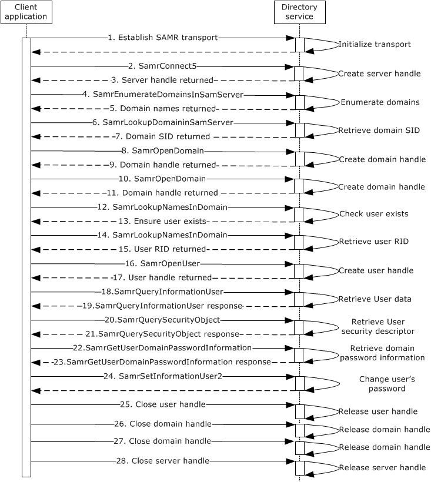

Figure 49: Message flow for changing a user account's password

Unless otherwise noted, all responses that include a return code contain a return code that indicates that the operation was performed successfully.

- The client binds to the SAMR [**endpoint**](#gt_endpoint) on the server using a supported transport, as specified in [MS-SAMR](#Section_2.11) section 2.1.
- The next step is to open a SAMR handle to the directory server. The client application sends a SamrConnect5 request ([MS-SAMR] section 3.1.5.1.1) to the server with the desired value set in the *DesiredAccess* parameter ([MS-SAMR] section 2.2.1.1). This message requests a server handle.
- The server processes the request ([MS-SAMR] section 3.1.5.1.1) and sends a response with the server handle to be used in later calls.
Before continuing by opening a SAMR handle to the [**domain**](#gt_domain), the client application has to first know the domain names hosted by the directory server. This is determined by using steps 4 and 5.

- The client application sends a SamrEnumerateDomainsInSamServer request ([MS-SAMR] section 3.1.5.2.1), using the server handle from step 3.
- The server processes the request ([MS-SAMR] section 3.1.5.2.1) and returns a SAMPR_ENUMERATION_BUFFER array containing the domain information hosted by the directory server.
Before continuing by opening a SAMR handle to the domain, the client application has to first know the [**security identifier (SID)**](#gt_security-identifier-sid) of the domain. This is determined by using steps 6 and 7.

- The client application sends a SamrLookupDomainInSamServer request ([MS-SAMR] section 3.1.5.11.1), using the server handle from step 3 for each directory server domain name returned in step 5 until it finds a domain that is not the Builtin domain (S-1-5-32).
- The server processes the request ([MS-SAMR] section 3.1.5.11.1) and returns the domain SID.
The client application has now obtained the domain SID and can use it to open a SAMR handle to the domain.

- The client application sends a SamrOpenDomain request ([MS-SAMR] section 3.1.5.1.5), using the server handle that it previously obtained in step 3 and the domain SID that it obtained in step 7, with the desired value set in the *DesiredAccess* parameter ([MS-SAMR] section 2.2.1.1).
- The server processes this request ([MS-SAMR] section 3.1.5.1.5) and returns a response with a domain handle.
- The client application sends a SamrOpenDomain request ([MS-SAMR] section 3.1.5.1.5), using the server handle that it previously obtained in step 3 and the Builtin domain SID, with the desired value set in the *DesiredAccess* parameter ([MS-SAMR] section 2.2.1.1).
- The server processes this request ([MS-SAMR] section 3.1.5.1.5) and returns a response with a domain handle.
The client application now obtains the [**relative identifier (RID)**](#gt_relative-identifier-rid) of the user so that it can open a user handle.

- The client application sends a SamrLookupNamesInDomain request ([MS-SAMR] section 3.1.5.11.2) to ensure that the user exists. The request includes the domain handle and the sAMAccountName [**attribute**](#gt_attribute).
- The server processes the request ([MS-SAMR] section 3.1.5.11.2) and returns the RID of the user account.
- The client application sends a SamrLookupNamesInDomain request ([MS-SAMR] section 3.1.5.11.2). The request includes the domain handle and the sAMAccountName attribute.
- The server processes the request ([MS-SAMR] section 3.1.5.11.2) and returns the RID of the user account.
The client application now has the user account RID and can use it to open a handle to the user.

- The client application sends a SamrOpenUser request ([MS-SAMR] section 3.1.5.1.9). The request includes the domain handle and the RID of the user, and has the desired value set in the *DesiredAccess* parameter ([MS-SAMR] section 2.2.1.1).
- The server processes the request ([MS-SAMR] section 3.1.5.1.9) and returns a response with a user handle.
- The client application sends a SamrQueryInformationUser request ([MS-SAMR] section 3.1.5.5.6) to the server to query all user information.
- The server processes the request and returns a response with all user information.
- The client application sends a SamrQuerySecurityObject ([MS-SAMR] section 3.1.5.12.2.1) request to the server to obtain the [**security descriptor**](#gt_security-descriptor) for the user object in the directory server.
- The server processes the request ([MS-SAMR] section 3.1.5.12.2.1) and returns a response with the security descriptor set on the user object in the directory server.
- The client application sends a SamrGetUserDomainPasswordInformation request ([MS-SAMR] section 3.1.5.13.3) to the server to query for the password [**policy**](#gt_policy) applied on the user in the domain.
- The server processes the request ([MS-SAMR] section 3.1.5.13.3) and returns a response with domain password information about the user to the application.
- Now that the client application has a handle to the user, it calls SamrSetInformationUser2 to change the user's password. The server processes the request, returns STATUS_SUCESS, and changes the password of the user. Refer to [MS-SAMR] section 3.1.5.6.4.
- - 28. The client. application performs cleanup by closing all the handles that it opened during the session. This is done by calling SamrCloseHandle ([MS-SAMR] section 3.1.5.13.1) with SamHandle set to the handle that the client application is attempting to close. The client application closes the handles in the reverse order in which they were created (that is, the user handle, the domain handles, and then the server handle).

### 3.2.5 Example 5: Change a User Account's Password Against a Non-PDC DC

In this example, a user changes the password on the user [**account**](#gt_account) by using the SAMR protocol. To perform this task, a user runs a [**client**](#gt_client) application on a [**client computer**](#gt_client-computer) that targets a [**DC**](#gt_domain-controller-dc) in the [**Active Directory**](#gt_active-directory) system. The client application uses the SAMR protocol to change the account's password.

In this example, the client connects to a DC that is not a [**primary domain controller (PDC)**](#gt_primary-domain-controller-pdc) in order to change the account password. This example demonstrates the communication between a DC and a PDC when a user sends a password change request.

This example applies only to [**AD DS**](#gt_active-directory-domain-services-ad-ds).

This example uses the SAMR, SAMS, and NRPC protocols.

This example covers the use case in section [2.7.2.4](#Section_2.7.2.4), "Change an Existing Account's Password (DC) - Client Application".

**Prerequisites**

The general requirements set forth in section [2.6](#Section_2.6), "Assumptions and Preconditions".

The Active Directory system meets all preconditions described in section 2.7.2.4.

**Initial System State**

None.

**Final System State**

The user account's password in the DC has been changed to the new value, and it is also updated at the PDC.

**Sequence of Events**

The following sequence diagram shows the message flow that is associated with this example.

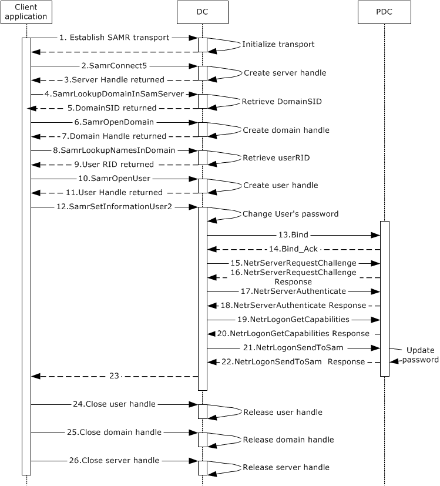

Figure 50: Message flow to change a user account's password

Unless otherwise noted, all responses that include a return code contain a return code that indicates that the operation was performed successfully.

1. The client application uses a supported transport to bind to the SAMR [**endpoint**](#gt_endpoint) on the DC, as described in [MS-SAMR](#Section_2.11) section 2.1.

2. The next step is to open a SAMR handle to the DC's SAMR [**server**](#gt_server). The client application sends a SamrConnect5 request ([MS-SAMR] section 3.1.5.1.1) to the DC with the desired value set in the *DesiredAccess* parameter ([MS-SAMR] section 2.2.1.1). This message requests a server handle.

3. The DC processes the request ([MS-SAMR] section 3.1.5.1.1) and sends a response with the server handle to be used in subsequent calls.

Before the client application can open a SAMR handle to the [**domain**](#gt_domain), it has to first have the [**SID**](#gt_security-identifier-sid) of the domain. This is determined in steps 4 and 5

4. The client application sends a SamrLookupDomainInSamServer request ([MS-SAMR] section 3.1.5.11.1) that uses the server handle from step 3. In this request, it specifies the domain name for the account.

5. The DC processes the request ([MS-SAMR] section 3.1.5.11.1) and returns the domain SID.

The client application has now obtained the domain SID and can use it to open a SAMR handle to the domain

6. The client application sends a SamrOpenDomain request ([MS-SAMR] section 3.1.5.1.5) that includes the server handle that it obtained in step 3 and the domain SID that it obtained in step 5 with the desired value set in the *DesiredAccess* parameter ([MS-SAMR] section 2.2.1.1).

7. The DC processes this request ([MS-SAMR] section 3.1.5.1.5) and returns a response with a domain handle.

The client application now obtains the [**RID**](#gt_relative-identifier-rid) of the user so that it can open a user handle.

8. The client application sends a SamrLookupNamesInDomain request ([MS-SAMR] section 3.1.5.11.2). The request includes the domain handle and the sAMAccountName [**attribute**](#gt_attribute).

9. DC processes the request ([MS-SAMR] section 3.1.5.11.2) and returns the RID of the user account.

The client application now has the user account RID and can use it to open a handle to the user.

10. The client application sends a SamrOpenUser request ([MS-SAMR] section 3.1.5.1.9). The request includes the domain handle and the RID of the user, and has the desired value set in the *DesiredAccess* parameter ([MS-SAMR] section 2.2.1.1).

11. The [**directory**](#gt_directory) server processes the request ([MS-SAMR] section 3.1.5.1.9) and returns a response with a user handle.

12. Now that the client application has a handle to the user, it calls SamrSetInformationUser2 to change the user's password. The DC changes the password of the user. Refer to [MS-SAMR] section 3.1.5.6.4.

13. – 20. The DC establishes a secure channel with the PDC, as specified in [MS-NRPC](../MS-NRPC/MS-NRPC.md) section 3.1.4.1.

21. The DC sends a password update request to the PDC, as specified in [MS-SAMS](#Section_2.11) section 3.2.4.4, using the NetrLogonSendToSam method defined in [MS-NRPC] section 3.5.4.8.4, and according to the rules in [MS-NRPC] section 3.4.5.6.4.

22. The PDC processes the request according to the rules specified in [MS-SAMS] section 3.3.5.2 and [MS-NRPC] section 3.5.4.8.4, and returns a response.

23. The DC returns a response to the client application.

24. – 25. The client application performs cleanup by closing all the handles that it opened during the session. This is done by calling SamrCloseHandle ([MS-SAMR] section 3.1.5.13.1) with SamHandle set to the handle that the client application is attempting to close. The client application closes the handles in the reverse order in which they were created (that is, the user handle, the domain handle, and then the server handle).

### 3.2.6 Example 6: Update the User's lastLogOnTimeStamp Against an RODC When the User Binds to an LDAP Server

In this example, the user's lastLogonTimeStamp attribute is updated when the user authenticates successfully to the [**LDAP**](#gt_lightweight-directory-access-protocol-ldap) [**server**](#gt_server) by using an LDAP bind request .

This example applies only to [**AD DS**](#gt_active-directory-domain-services-ad-ds).

This example uses the SAMS protocol.

This example covers the use case in section [2.7.2.6](#Section_2.7.2.6), User Logon to Domain Services by Using an [**RODC**](#gt_read-only-domain-controller-rodc) and Updating the User LastLogonTimeStamp - Client Application.

The lastLogonTimeStamp [**attribute**](#gt_attribute) is updated on successful authentication of the user who either uses interactive logon or Network logon to the directory system. This example shows user logon to the [**directory**](#gt_directory) by using Network logon to the LDAP server.

**Prerequisites**

The general requirements described in section [2.6](#Section_2.6), Assumptions and Preconditions.

The Active Directory system meets all preconditions described in section 2.7.2.6.

**Initial System State**

None.

**Final System State**

The user's lastLogonTimeStamp attribute is updated.

**Sequence of Events**

The following sequence diagram shows the message flow that is associated with this example.

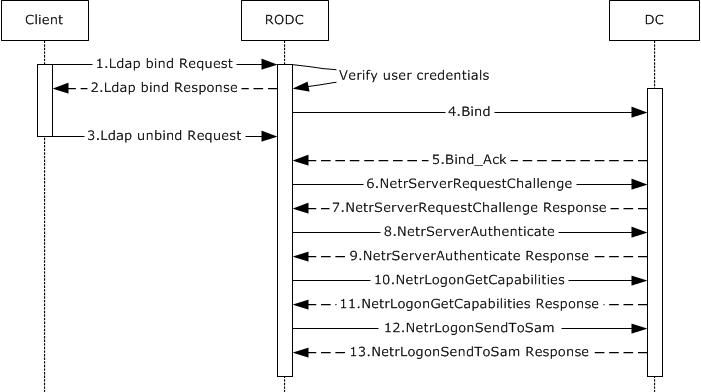

Figure 51: User lastLogonTimeStamp update message flow

Unless otherwise noted, all responses that include a return code contain a return code that indicates that the operation was performed successfully.

1. The [**client**](#gt_client) starts and sends an LDAP bind request ([[RFC2251]](https://go.microsoft.com/fwlink/?LinkId=90325) section 4.2) to the RODC along with the [**credentials**](#gt_credential) of the user.

2. The RODC uses one of the methods specified in [MS-AUTHSOD](../MS-AUTHSOD/MS-AUTHSOD.md) section 2 to verify the credentials. Depending on the negotiated authentication method, this might involve additional client and server interactions that are not directly relevant to this discussion. After verification, the directory server sends an LDAP bind response ([RFC2251] section 4.2.3) to the client.

3. The client sends an unbind request to clean up the bind operation. This step can occur in any order after step 2. It is not dependent on the timing of the subsequent steps in this example.

4. – 11. In these steps, the RODC establishes a secure channel with a DC that contains a [**writable NC replica**](#gt_51db485c-dcf6-4845-99b3-2df414ef0aa9) of the domain, as specified in [MS-NRPC](../MS-NRPC/MS-NRPC.md) section 3.1.4.1.

12. The RODC sends a password update request to the DC, as specified in [MS-SAMS](#Section_2.11) section 3.2.4.6, by using the NetrLogonSendToSam method specified in [MS-NRPC] section 3.5.4.8.4, and according to the processing rules specified in [MS-NRPC] section 3.4.5.6.4.

13. The DC processes the request ([MS-SAMS] section 3.3.5.6 and [MS-NRPC] section 3.5.4.8.4), updates the user account's lastLogonTimeStamp attribute, and returns a response.

### 3.2.7 Example 7: Determine the Group Membership of a User

In this example, an administrator queries the directory to determine the group membership of a user. The administrator does so by using the SAMR protocol. To perform this task, an administrator runs a [**client**](#gt_client) application from a [**client computer**](#gt_client-computer) that targets a [**directory**](#gt_directory) [**server**](#gt_server) in the Active Directory system. The client application uses the SAMR protocol to query the user's group membership.

This example applies only to [**AD DS**](#gt_active-directory-domain-services-ad-ds).

This example uses the SAMR protocol.

This example covers the use case in section [2.7.2.7](#Section_2.7.2.7), Query an Account's Group Membership - Client Application.

**Prerequisites**

The general requirements described in section [2.6](#Section_2.6), Assumptions and Preconditions.

The Active Directory system meets all preconditions described in section 2.7.2.7.

**Initial System State**

None.

**Final System State**

The user's group membership information has been returned to the client application.

**Sequence of Events**

The following sequence diagram depicts the message flow associated with this example.

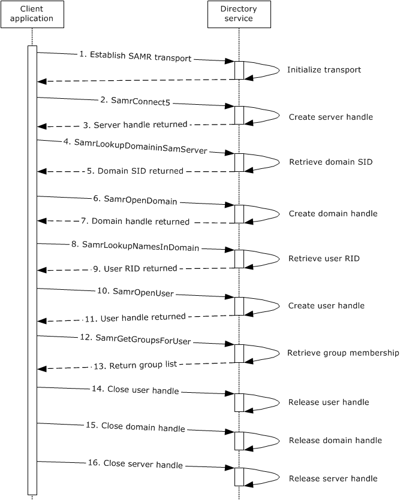

Figure 52: Message flow for determining the group membership of a user

Unless otherwise noted, all responses that include a return code contain a return code that indicates that the operation was performed successfully.

- The client application uses a supported transport to bind to the SAMR [**endpoint**](#gt_endpoint) on the server, as specified in [MS-SAMR](#Section_2.11) section 2.1.
- The next step is to open a SAMR handle to the directory server. To obtain a server handle, the client application sends a SamrConnect5 request ([MS-SAMR] section 3.1.5.1.1) with the *DesiredAccess* parameter set to MAXIMUM_ALLOWED ([MS-SAMR] section 2.2.1.1) to the directory server.
- The server processes the request ([MS-SAMR] section 3.1.5.1.1) and sends a response with the server handle to be used by later calls.
Before the client application continues to open a SAMR handle to the [**domain**](#gt_domain), the client has to first know the [**SID**](#gt_security-identifier-sid) of the domain. This is determined in steps 4 and 5.

- The client application sends a SamrLookupDomainInSamServer request ([MS-SAMR] section 3.1.5.11.1), using the server handle from step 3. In this request, it specifies the domain name for the [**account**](#gt_account).
- The server processes the request ([MS-SAMR] section 3.1.5.11.1) and returns the domain SID.
The client application has now obtained the domain SID and can use it to open a SAMR handle to the domain.

- The client application sends a SamrOpenDomain request ([MS-SAMR] section 3.1.5.1.5), using the server handle that it previously obtained in step 3 and the domain SID that it obtained in step 5, with the *DesiredAccess* parameter set to MAXIMUM_ALLOWED ([MS-SAMR] section 2.2.1.1).
- The server processes this request ([MS-SAMR] section 3.1.5.1.5) and returns a response with a domain handle.
The client application now obtains the [**relative identifier (RID)**](#gt_relative-identifier-rid) of the user so that it can open a user handle.

- The client application sends a SamrLookupNamesInDomain request ([MS-SAMR] section 3.1.5.11.2). The request includes the user name and the domain handle.
- The server processes the request ([MS-SAMR] section 3.1.5.11.2) and returns the RID of the user account.
The client application now has the user account RID and can use it to open a handle to the user.

- The client application sends a SamrOpenUser request ([MS-SAMR] section 3.1.5.1.9) with the *DesiredAccess* parameter set to MAXIMUM_ALLOWED ([MS-SAMR] section 2.2.1.1). The request includes the domain handle and the RID of the user.
- The server processes the request ([MS-SAMR] section 3.1.5.1.9) and returns a response with a user handle.
- Now that the client application has a handle to the user, it calls SamrGetGroupsForUser ([MS-SAMR] section 3.1.5.9.1) to retrieve the group membership of the user.
- The server processes the request ([MS-SAMR] section 3.1.5.9.1) and returns a response with the list of groups that the user is a member of.
- - 16. The client application performs cleanup by closing all the handles that it opened during the session. This is done by calling SamrCloseHandle ([MS-SAMR] section 3.1.5.13.1) with SamHandle set to the handle that the client application is attempting to close. The client application closes the handles in the reverse order in which they were received (that is, the user handle, the domain handle, and then the server handle).

### 3.2.8 Example 8: Delete a User Account

In this example, an administrator deletes a user [**account**](#gt_account). This includes [**directory objects**](#gt_directory-object) of class user as well as objects of classes that are derived from the user class. One way to delete a user account is to use the LDAP. To perform this task, an administrator runs a [**client**](#gt_client) application on a [**client computer**](#gt_client-computer) and targets a [**directory**](#gt_directory) [**server**](#gt_server) in the Active Directory system. The client application uses LDAP to delete the user account.

This example applies only to [**AD DS**](#gt_active-directory-domain-services-ad-ds).

This example uses LDAP.

This example covers the use case in section [2.7.2.8](#Section_2.7.2.8), Delete an Account - Client Application.

**Prerequisites**

The general requirements described in section [2.6](#Section_2.6), Assumptions and Preconditions.

The Active Directory system meets all preconditions described in section 2.7.2.8.

**Initial System State**

None.

**Final System State**

The specified user object is successfully converted into a [**tombstone**](#gt_tombstone) or [**deleted-object**](#gt_deleted-object), depending on whether the Recycle Bin optional feature is enabled, as specified in [MS-ADTS](../MS-ADTS/MS-ADTS.md) sections 3.1.1.5.5.1.1 and 3.1.1.5.5.1.2.

**Sequence of Events**

The following sequence diagram shows the message flow that is associated with this example.

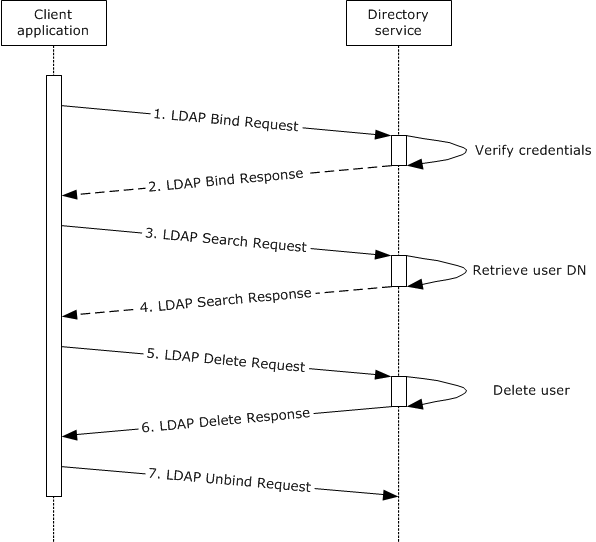

Figure 53: Message flow for deleting a user account

Unless otherwise noted, all responses that include a return code contain a return code that indicates that the operation was performed successfully.

- The client application starts and sends an LDAP bind request ([[RFC2251]](https://go.microsoft.com/fwlink/?LinkId=90325) section 4.2) to the directory server with [**credentials**](#gt_credential).
- The directory server verifies the credentials ([MS-AUTHSOD](../MS-AUTHSOD/MS-AUTHSOD.md) section 2) and sends an LDAP bind response ([RFC2251] section 4.2.3) to the client application.
- The user interacts with the client application and provides details of the search criteria to be performed on the [**directory tree**](#gt_directory-tree). The client application sends an LDAP search request ([RFC2251] section 4.5.1) to the server, querying the entire [**domain**](#gt_domain). It starts at the root of the domain, looks for the user ([MS-ADSC](../MS-ADSC/MS-ADSC.md) section 2.246), and requests the user's distinguishedName [**attribute**](#gt_attribute).
- The server sends an LDAP search response ([RFC2251] section 4.5.2) that contains the distinguishedName attribute of the user.
- The client application sends an LDAP delete request ([RFC2251] section 4.8) to the server that contains the distinguishedName attribute of the user to be deleted.
- The server processes the delete request ([RFC2251] section 4.8), verifies the processing rules and constraints, and then deletes the user object ([MS-ADTS] section 3.1.1.5.5). It then sends an LDAP delete response ([RFC2251] section 4.8) that indicates success.
- The client application sends an LDAP unbind request ([RFC2251] section 4.3) to the server. The LDAP connection to the directory server is closed.

### 3.2.9 Example 9: Obtain a List of User Accounts Using the Web Services Protocols

One way to obtain a list of users in the Active Directory system is to use the Web Services protocols, specifically WS-Enumeration [[WSENUM]](https://go.microsoft.com/fwlink/?LinkId=90580), to query the [**directory**](#gt_directory). A [**client**](#gt_client) application can create a query with a supplied filter to locate [**accounts**](#gt_account) that are based on specific criteria, similar to an LDAP search operation.

To perform this task, the client application uses the Web Services protocols to send a query to the [**directory service**](#gt_directory-service-ds). This example uses the WS-Enumeration protocol to communicate with the directory service.

This example covers the use case in section [2.7.1.2](#Section_2.7.1.2), Search for Directory Object - Client Application.

**Prerequisites**

The general requirements described in section [2.6](#Section_2.6), Assumptions and Preconditions.

The Active Directory system meets all preconditions described in section 2.7.1.2.

**Initial System State**

The system supports the Web Services protocols (see section [2.8](#Section_2.8)).

**Final System State**

The requested information for the user object(s) is returned to the client application.

**Sequence of Events**

The following sequence diagram shows the message flow that is associated with this example.

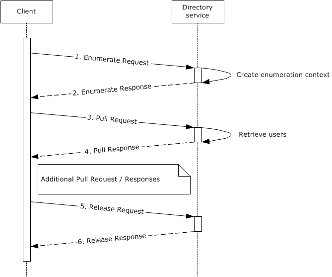

Figure 54: Communication flow for obtaining a list of user accounts by using the Web Services protocols

The client application uses the net.tcp transport to establish a connection to the directory service. In this example, all communications that are sent and received via this transport use the SOAP 1.2 and [[WSAddressing]](https://go.microsoft.com/fwlink/?LinkId=90575) (WS-Addressing) protocols. Unless otherwise noted, all responses that include a return code contain a return code that indicates that the operation was successfully performed.

- The client application sends a [**SOAP**](#gt_soap) message that contains a WS-Enumeration Enumerate request ([WSENUM] section 3.1). The filter section of the Enumerate request contains the query that the client intends to use to identify which accounts are to be returned ([MS-WSDS](../MS-WSDS/MS-WSDS.md) section 3.1.4.1.1.1). The filter also includes (objectClass=user) to indicate that only user [**directory objects**](#gt_directory-object) are to be returned.
The request also contains a Selection element that indicates which attributes of the queried user objects are to be returned to the client ([MS-WSDS] section 3.1.4.1.1.2).

- The directory [**server**](#gt_server) processes the request and generates an [**enumeration context**](#gt_enumeration-context) ([WSENUM] section 3) that the client application can use in further requests. It then returns a SOAP message that contains a WS-Enumeration Enumeration response with the enumeration context and the expiration time of the request.
- Now that the client application has set up the enumeration, it can begin to request data. It sends a SOAP message that contains a Pull request ([WSENUM] section 3.2). The request contains the previously returned enumeration context along with optional values such as the number of items (directory objects) that the server is to return to the client application in the Pull response.
- The server retrieves the matching user objects ([MS-ADTS](../MS-ADTS/MS-ADTS.md) section 3.1.1.3.1.3) from the directory. It returns a SOAP message that contains a Pull response to the client application ([WSENUM] section 3.2). This response contains the objects that match the client application's query, including the [**attributes**](#gt_attribute) of those objects that the client requested in the Enumerate request that established the enumeration context.
The client application repeats sending Pull requests and processing Pull responses as needed until the directory service indicates that there is no additional data to retrieve ([WSENUM] section 3.2).

- When all the data that was requested is retrieved, the client application terminates the enumeration by sending a SOAP message that contains a Release request ([WSENUM] section 3.5). This tells the server that the client application is finished with the enumeration content and that the server can release any server-side resources that it has allocated to process the enumeration.
**Note** If the wsen:EndOfSequence element is obtained by the client in the Pull response, then the Release request is not sent.

- The server performs any necessary processing of the Release request and returns a Release response to the client.

### 3.2.10 Example 10: Obtain a List of User Accounts Using LDAP

To obtain a list of user accounts in the [**Active Directory**](#gt_active-directory) system, [**LDAP**](#gt_lightweight-directory-access-protocol-ldap) can be used to query the [**directory**](#gt_directory). A [**client**](#gt_client) can create a query with a supplied filter to locate [**accounts**](#gt_account) that are based on specific criteria. To perform this task, a user runs a client application from a [**client computer**](#gt_client-computer) that sends a query targeting a directory [**server**](#gt_server) in the Active Directory system.

This example covers the use case in section [2.7.1.2](#Section_2.7.1.2), Search for Directory Object - Client Application.

**Prerequisites**

The general requirements described in section [2.6](#Section_2.6), Assumptions and Preconditions.

The Active Directory system meets all preconditions described in section 2.7.1.2.

**Initial System State**

None.

**Final System State**

The requested information for the user object(s) is returned to the client application.

**Sequence of Events**

The following sequence diagram shows the message flow that is associated with this example.

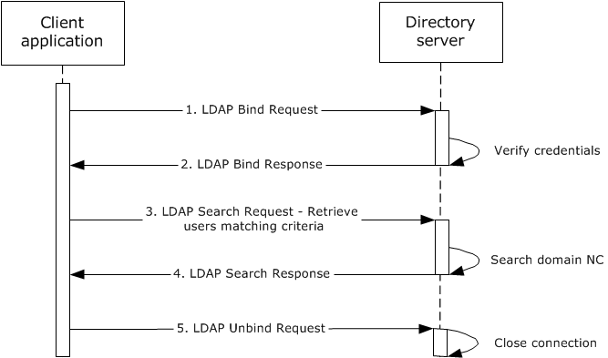

Figure 55: Message flow for obtaining a list of user accounts using LDAP

Unless otherwise noted, all responses that include a return code contain a return code that indicates that the operation was successfully performed.

- The client application starts and an LDAP bind request ([[RFC2251]](https://go.microsoft.com/fwlink/?LinkId=90325) section 4.2) is sent to the directory server with [**credentials**](#gt_credential).
- The directory server verifies the credentials ([MS-AUTHSOD](../MS-AUTHSOD/MS-AUTHSOD.md) section 2) and sends an LDAP bind response ([RFC2251] section 4.2.3) to the client application.
- The user interacts with the client application and provides details of the search criteria to be performed on the [**directory tree**](#gt_directory-tree). The client application sends an LDAP search request ([RFC2251] section 4.5.1) to the directory, querying the entire [**domain**](#gt_domain). It starts at the root of the domain, looking for users ([MS-ADSC](../MS-ADSC/MS-ADSC.md) section 2.246 or [MS-ADLS](../MS-ADLS/MS-ADLS.md) section 3.62) and requesting all [**attributes**](#gt_attribute).
- The directory server sends an LDAP search response ([RFC2251] section 4.5.2) that contains the list of users under the [**domain NC**](#gt_domain-naming-context-domain-nc). The client application organizes this information and displays it to the user. Search filters and results are additionally validated by the server's processing rules and constraints described in [MS-ADTS](../MS-ADTS/MS-ADTS.md) sections 3.1.1.3.1.3 and 3.1.1.3.4.6.
- The client application sends an LDAP unbind request ([RFC2251] section 4.3) to the directory server. The LDAP connection to the directory server is closed.

### 3.2.11 Example 11: Manage Groups and Their Memberships

This section discusses how to create a group, to add members to that group, and to query its membership. The state transitions of the [**directory**](#gt_directory) [**client**](#gt_client) and the message flow between client and [**server**](#gt_server) illustrate this process.

This example covers the use cases in sections [2.7.2.9](#Section_2.7.2.9), "Create a Security Group - Client Application", [2.7.2.10](#Section_2.7.2.10), "Modify Group Member List - Client Application", and [2.7.2.11](#Section_2.7.2.11), "Query for Members of a Group - Client Application".

**Prerequisites**

The general requirements set forth in section [2.6](#Section_2.6), "Assumptions and Preconditions".

The Active Directory system meets all preconditions described in section [2.7.1.3](#Section_2.7.1.3).

**Initial System State**

None.

**Final System State**

The new group object has been created and provisioned in the directory, and updated with the specified membership.

**Sequence of Events**

The following sequence diagram shows the message flow that is associated with this example.

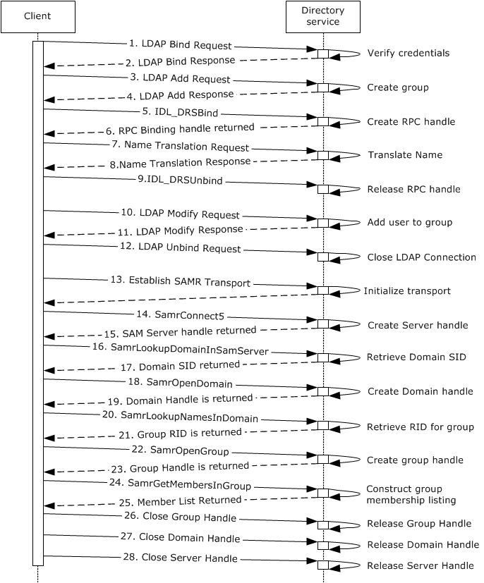

Figure 56: Communication flow to manage groups and their memberships

Unless otherwise noted, all responses that include a return code contain a return code that indicates that the operation was successfully performed.

- The client application establishes an [**LDAP**](#gt_lightweight-directory-access-protocol-ldap) connection to the directory server and sends an LDAP bind request ([[RFC2251]](https://go.microsoft.com/fwlink/?LinkId=90325) section 4.2) to the directory server along with the [**credentials**](#gt_credential) of an administrator.
- The directory server verifies the credentials ([MS-AUTHSOD](../MS-AUTHSOD/MS-AUTHSOD.md) section 2) and sends an LDAP bind response ([RFC2251] section 4.2.3) to the client application.
- An LDAP add request ([RFC2251] section 4.7) is sent to the directory server. The LDAP add operation contains the distinguishedName, samAccountName, objectClass, and groupType for the new group.
- The directory server processes the add request ([RFC2251] section 4.7) and performs validation, as described in [MS-ADTS](../MS-ADTS/MS-ADTS.md) sections 3.1.1.5.1 and 3.1.1.5.2. The directory server then sends an LDAP add response that indicates success.
- The client uses the DRSR protocol ([MS-DRSR](#Section_2.7.5) section 4.1.3) to request an [**RPC**](#gt_remote-procedure-call-rpc) [**binding**](#gt_binding) handle to establish a connection with the directory server.
- The directory server processes the bind request and sends a response with an RPC binding handle.
- The client uses the RPC binding handle ([MS-DRSR] section 4.1.4) to send a request for name translation to the directory server. The request specifies the name to translate (the user's NT4 [**account**](#gt_account) name, in this example), its format (NT4 account name), and the desired format for the response (distinguished name (DN)).
- The directory server processes the request and returns the translated name (the user's distinguished name (DN)), as defined in [MS-DRSR] section 4.1.4.3.
- The client requests to release the RPC binding handle that it received in step 6, as defined in [MS-DRSR] section 4.1.25. The directory server processes that request as described in [MS-DRSR] section 4.1.25.1.
- An LDAP modify request is sent to the directory server to add the user to the group, as described in [RFC2251] section 4.6. The distinguished name of the user is added to the multivalued linked [**attribute**](#gt_attribute) "member" of the group object ([MS-ADA2](../MS-ADA2/MS-ADA2.md) section 2.43 or [MS-ADLS](../MS-ADLS/MS-ADLS.md) section 2.136).
- The directory server processes the request and sends a response ([RFC2251] section 4.6).
- The client sends an LDAP unbind request ([RFC2251] section 4.3) to the directory server. The LDAP connection to the directory server is closed.
At this point, the group has been created with the attributes that the administrator requested, and a user has been added as a member of that group with only the information about that user's NT4 account name. The remainder of this example is about displaying the resultant group's member list.

- The client uses a supported transport ([MS-SAMR](#Section_2.11) section 2.1) to bind to the SAMR [**endpoint**](#gt_endpoint) on the directory server.
- The next step is to open a SAMR handle to the directory server. To request a server handle, the client application sends a SamrConnect5 request ([MS-SAMR] section 3.1.5.1.1) to the directory server, with the *DesiredAccess* parameter set to MAXIMUM_ALLOWED ([MS-SAMR] section 2.2.1.1).
- The directory server processes the request and sends a response with the server handle to be used by later calls.
Before the client continues to open a SAMR handle to the [**domain**](#gt_domain), the client has to first have the [**security identifier (SID)**](#gt_security-identifier-sid) of the domain. The SID is determined in steps 16 and 17.

- The client application sends a SamrLookupDomainInSamServer request ([MS-SAMR] section 3.1.5.11.1). The request includes the server handle from step 14. In this request, the client specifies the domain name for the account.
- The directory server processes the request and returns the domain SID.
The client application has now obtained the domain SID and can use it to open a SAMR handle to the domain.

- The client application sends a SamrOpenDomain request ([MS-SAMR] section 3.1.5.1.5). The request includes the server handle that was previously obtained in step 15 and the domain SID that was obtained in step 17, with the *DesiredAccess* parameter set to MAXIMUM_ALLOWED ([MS-SAMR] section 2.2.1.1).
- The directory server processes this request and returns a response with a domain handle.
The client application now obtains the [**relative identifier (RID)**](#gt_relative-identifier-rid) of the group so that it can open a group handle.

- The client application sends a SamrLookupNamesInDomain request ([MS-SAMR] section 3.1.5.11.2). The request includes the group name and domain handle.
- The directory server processes the request and returns the RID of the group.
The client application now has the group RID and can use it to open a handle to the group.

- The client application sends a SamrOpenGroup request ([MS-SAMR] section 3.1.5.1.7). The request includes the domain handle and the RID of the group, with the *DesiredAccess* parameter set to MAXIMUM_ALLOWED ([MS-SAMR] section 2.2.1.1).
- The server processes the request and returns a response with a group handle.
- Now that the client application has a handle to the group, it calls SamrGetMembersInGroup ([MS-SAMR] section 3.1.5.8.3) to retrieve the group's member list.
- The server processes the request and returns the member list for the group.
The client application now has the member list for the group and can present it to the administrator.

- - 28. The client application performs cleanup by closing all the handles that it opened during the session. This is done by calling SamrCloseHandle ([MS-SAMR] section 3.1.5.13.1) with SamHandle set to the handle that the client application is attempting to close. The client application closes the handles in the reverse order in which they were received (that is, the group handle, the domain handle, and then the server handle).

### 3.2.12 Example12: Delete a Group

In this example, a user deletes a security group, which is transformed into a [**tombstone**](#gt_tombstone) ([MS-ADTS](../MS-ADTS/MS-ADTS.md) section 3.1.1.5.5.1.1). To use LDAP is one way to accomplish this task. To perform this task, a user runs a [**client**](#gt_client) application on a [**client computer**](#gt_client-computer) that targets a [**directory**](#gt_directory) [**server**](#gt_server) in the Active Directory system and deletes a security group.

This example covers the use case in section [2.7.1.4](#Section_2.7.1.4), "Delete Directory Object - Client Application".

**Prerequisites**

The general requirements set forth in section [2.6](#Section_2.6), "Assumptions and Preconditions".

The Active Directory system meets all preconditions that are specified in section 2.7.1.4.

**Initial System State**

None.

**Final System State**

The security group object is successfully converted into a tombstone or deleted-object, depending upon whether the Recycle Bin optional feature is enabled, as described in [MS-ADTS] sections 3.1.1.5.5.1.1 and 3.1.1.5.5.1.2.

**Sequence of Events**

The following sequence diagram shows the message flow that is associated with this example.

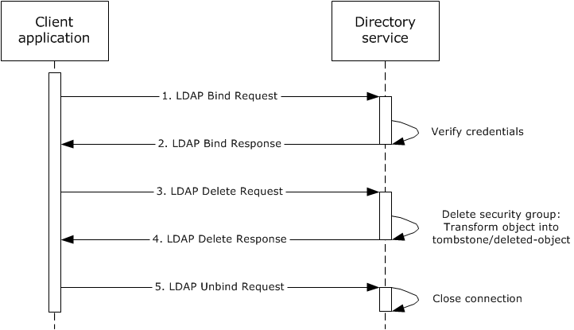

Figure 57: Message flow to delete a security group

Unless otherwise noted, all responses that include a return code contain a return code that indicates that the operation was successfully performed.

- The client application starts and sends an LDAP bind request ([[RFC2251]](https://go.microsoft.com/fwlink/?LinkId=90325) section 4.2) to the directory server along with [**credentials**](#gt_credential).
- The directory server verifies the credentials ([MS-AUTHSOD](../MS-AUTHSOD/MS-AUTHSOD.md) section 2) and sends an LDAP bind response ([RFC2251] section 4.2.3) to the client application.
- The user interacts with the client application and identifies the security group to be deleted. An LDAP delete request ([RFC2251] section 4.8) is sent to the directory server. The LDAP delete operation contains the distinguishedName of the security group to be deleted.
- The directory server processes the delete request ([RFC2251] section 4.8) and verifies the processing rules and constraints and the tombstone transformation operations on the security group, as described in [MS-ADTS] sections 3.1.1.5.1 and 3.1.1.5.5. It then sends an LDAP delete response ([RFC2251] section 4.8) that indicates success.
- The client application sends an LDAP unbind request ([RFC2251] section 4.3) to the directory server. The LDAP connection to the directory server is closed.

### 3.2.13 Example 13: Extend the Schema to Support an Application by Adding a New Class

In this example, an administrator extends the [**schema**](#gt_schema) by adding a class that is required by an application. This is accomplished using LDAP. To perform this task, an administrator runs a [**client**](#gt_client) application from a [**client computer**](#gt_client-computer) targeting a [**directory**](#gt_directory) [**server**](#gt_server) that owns the Schema Master FSMO role in the Active Directory system. The client application adds a class and sets its properties by using LDAP.

This example uses LDAP.

This example covers the use case in section [2.7.3.1](#Section_2.7.3.1), Add a New Class to the Schema - Client Application.

**Prerequisites**

The general requirements described in section [2.6](#Section_2.6), Assumptions and Preconditions.

The Active Directory system meets all preconditions described in section 2.7.3.1.

**Initial System State**

None.

**Final System State**

A new class has been added to the schema.

**Sequence of Events**

The diagram that follows illustrates the messages that are exchanged between a client and a directory server when a class is successfully added to the schema.

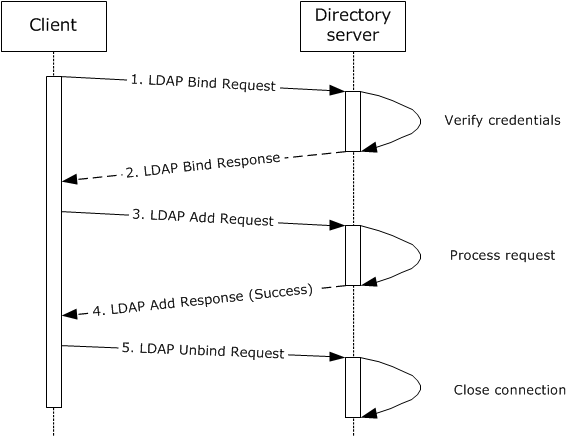

Figure 58: Message flow for extending the schema by adding a class

The sequence of events is described in the following steps.

- The client application establishes an LDAP connection to the directory server and sends an LDAP bind request ([[RFC2251]](https://go.microsoft.com/fwlink/?LinkId=90325) section 4.2) along with the [**credentials**](#gt_credential) of the administrator.
- The directory server verifies the credentials ([MS-AUTHSOD](../MS-AUTHSOD/MS-AUTHSOD.md) section 2) and sends an LDAP bind response ([RFC2251] section 4.2.3) to the client application.
- The client application sends an LDAP add request ([RFC2251] section 4.7) to the server. The request contains the values of the mandatory [**attributes**](#gt_attribute) ([MS-ADTS](../MS-ADTS/MS-ADTS.md) section 3.1.1.2.4.8) for the new object of class classSchema.
- The server verifies all the processing rules and constraints ([MS-ADTS] sections 3.1.1.2.5, 3.1.1.5.1, and 3.1.1.5.2). On success, the class is added to the schema, and the server sends an LDAP add response ([[RFC2252]](https://go.microsoft.com/fwlink/?LinkId=90326) section 4.7) that indicates that the object creation was successful.
- The client application closes the LDAP connection by sending an LDAP unbind request ([RFC2251] section 4.3) to the directory server.

### 3.2.14 Example 14: Extend the Schema to Support an Application by Adding a New Attribute

In this example, an administrator extends the [**schema**](#gt_schema) by adding an [**attribute**](#gt_attribute) that is required by an application. This is accomplished by using LDAP. To perform this task, an administrator runs a [**client**](#gt_client) application on a [**client computer**](#gt_client-computer). The application client targets a [**directory**](#gt_directory) [**server**](#gt_server) that owns the Schema Master FSMO role in the Active Directory system. The client application uses LDAP to add an attribute and set its properties.

This example uses LDAP.

This example covers the use case in section [2.7.3.2](#Section_2.7.3.2), Add a New Attribute to the Schema - Client Application.

**Prerequisites**

The general requirements described in section [2.6](#Section_2.6), Assumptions and Preconditions.

The Active Directory system meets all preconditions described in section 2.7.3.2.

**Initial System State**

None.

**Final System State**

A new attribute has been added to the schema.

**Sequence of Events**

The diagram that follows illustrates the messages that are exchanged between a client application and a directory server when an attribute is successfully added to the schema.

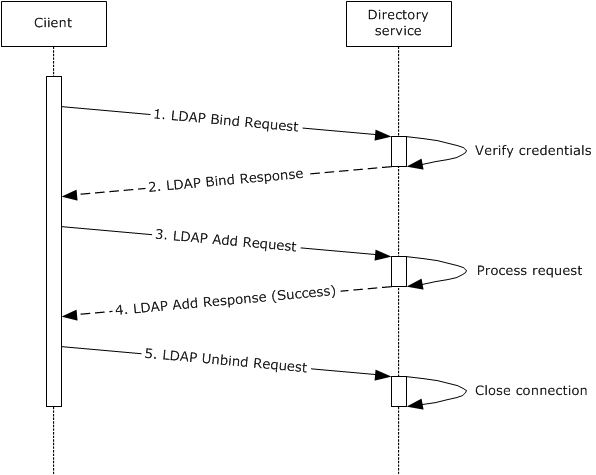

Figure 59: Message flow for extending the schema by adding an attribute

The sequence of events is described in the following steps.

- The client application establishes an LDAP connection to the directory server. An LDAP bind request ([[RFC2251]](https://go.microsoft.com/fwlink/?LinkId=90325) section 4.2) is sent to the directory server with the [**credentials**](#gt_credential) of the administrator.
- The directory server verifies the credentials ([MS-AUTHSOD](../MS-AUTHSOD/MS-AUTHSOD.md) section 2) and sends an LDAP bind response ([RFC2251] section 4.2.3) to the client application.
- The client application sends an LDAP add request ([RFC2251] section 4.7) to the server. The request contains the values of the mandatory attributes ([MS-ADTS](../MS-ADTS/MS-ADTS.md) section 3.1.1.2.3) for the new object of class attributeSchema.
- The server verifies all the processing rules and constraints ([MS-ADTS] section 3.1.1.2.5, 3.1.1.5.1, and 3.1.1.5.2). On success, an instance of an object of class attributeSchema is added to the schema, and the server sends an LDAP add response ([[RFC2252]](https://go.microsoft.com/fwlink/?LinkId=90326) section 4.7) that indicates that the object creation was successful.
- The client application closes the LDAP connection by sending an LDAP unbind request ([RFC2251] section 4.3) to the directory server.

### 3.2.15 Example 15: Extend the Schema to Support an Application by Adding an Attribute to a Class

In this example, an administrator extends the [**schema**](#gt_schema) by adding an [**attribute**](#gt_attribute) that is already present in the schema to a class that is also already present in the schema. This is accomplished using [**LDAP**](#gt_lightweight-directory-access-protocol-ldap). To perform this task, an administrator runs a [**client**](#gt_client) application from a [**client computer**](#gt_client-computer) targeting a [**directory**](#gt_directory) [**server**](#gt_server) that owns the Schema Master FSMO role in the Active Directory system. The client application adds an attribute to a class using LDAP.

This example uses LDAP.

This example covers the use case in section [2.7.3.3](#Section_2.7.3.3), Add an Attribute to a Class - Client Application.

**Prerequisites**

The general requirements described in section [2.6](#Section_2.6), Assumptions and Preconditions.

The Active Directory system meets all preconditions described in sections [2.7.1.1](#Section_2.7.1.1) and 2.7.3.3.

**Initial System State**

None.

**Final System State**

The schema has been modified to add the specified attribute as a valid attribute for the specified class.

**Sequence of Events**

The diagram that follows shows the messages that are exchanged between a client and a directory server when successfully adding an attribute to a class.

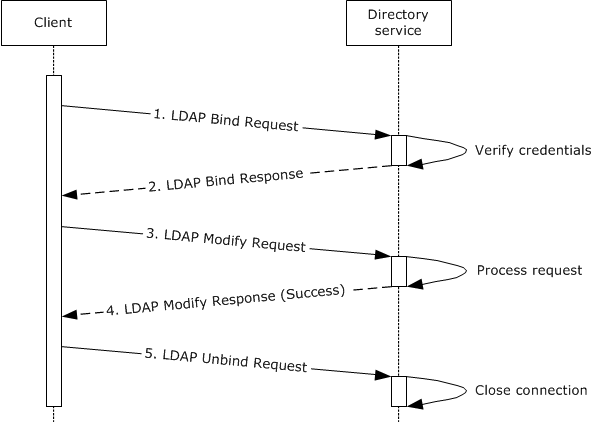

Figure 60: Message flow for extending the schema by adding an attribute to a class

The sequence of events is described in the following steps.

- The client application establishes an LDAP connection to the directory server. An LDAP bind request ([[RFC2251]](https://go.microsoft.com/fwlink/?LinkId=90325) section 4.2) is sent to the directory server with the [**credentials**](#gt_credential) of the administrator.
- The directory server verifies the credentials ([MS-AUTHSOD](../MS-AUTHSOD/MS-AUTHSOD.md) section 2) and sends an LDAP bind response ([RFC2251] section 4.2.3) to the client application.
- The client application sends an LDAP modify request ([RFC2251] section 4.6) to the directory server. The request contains the attribute name, the class name, and the attribute name in the class definition to which this attribute is to be added (namely systemMayContain, as specified in [MS-ADA3](../MS-ADA3/MS-ADA3.md) section 2.294 or [MS-ADLS](../MS-ADLS/MS-ADLS.md) section 2.356, or mayContain, as specified in [MS-ADA2](../MS-ADA2/MS-ADA2.md) section 2.18 or [MS-ADLS] section 2.135).
- The directory server verifies all the processing rules and constraints ([MS-ADTS](../MS-ADTS/MS-ADTS.md) section 3.1.1.2.5, 3.1.1.5.1, and 3.1.1.5.3). Upon success, the attribute is added to the class and the directory server sends an LDAP add response ([[RFC2252]](https://go.microsoft.com/fwlink/?LinkId=90326) section 4.7) indicating that the object modification was successful.
- The client application closes the LDAP connection by sending an LDAP unbind request ([RFC2251] section 4.3) to the directory server.

### 3.2.16 Example 16: Partition Directory Data with Organizational Units

In this example, a user partitions the [**directory**](#gt_directory) data using organizational units (OUs). This can be accomplished using LDAP. To perform this task, a user runs a [**client**](#gt_client) application from a [**client computer**](#gt_client-computer) that targets a directory [**server**](#gt_server) in the [**Active Directory**](#gt_active-directory) system. The client application creates an organizational unit to represent an organization's department and moves existing [**directory objects**](#gt_directory-object) under the new departmental organizational unit.

This example covers the use cases in sections [2.7.1.3](#Section_2.7.1.3), Modify Directory Object - Client Application, and [2.7.1.5](#Section_2.7.1.5), Create Organizational Unit - Client Application.

**Prerequisites**

The general requirements described in section [2.6](#Section_2.6), Assumptions and Preconditions.

The Active Directory system meets all preconditions described in sections 2.7.1.3 and 2.7.1.5.

**Initial System State**

None.

**Final System State**

The new organizational unit object has been created in the directory with the [**attributes**](#gt_attribute) that were specified. Selected directory objects are moved under the new organizational unit.

**Sequence of Events**

The following sequence diagram shows the message flow that is associated with this example.

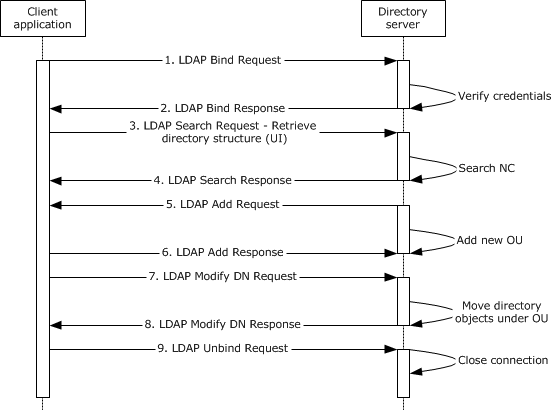

Figure 61: Message flow for partitioning directory data

Unless otherwise noted, all responses that include a return code contain a return code that indicates that the operation was performed successfully.

- The client application starts and sends an LDAP bind request ([[RFC2251]](https://go.microsoft.com/fwlink/?LinkId=90325) section 4.2) to the directory server along with [**credentials**](#gt_credential).
- The directory server verifies the credentials ([MS-AUTHSOD](../MS-AUTHSOD/MS-AUTHSOD.md) section 2) and sends an LDAP bind response ([RFC2251] section 4.2.3) to the client application.
- The client application sends an LDAP search request ([RFC2251] section 4.5.1) to the directory server. The application requests the subtree contents of the [**domain NC**](#gt_domain-naming-context-domain-nc) or [**application NC**](#gt_application-naming-context-application-nc) for [**AD DS**](#gt_active-directory-domain-services-ad-ds) or the application NC for [**AD LDS**](#gt_active-directory-lightweight-directory-services-ad-lds).
- The directory server sends an LDAP search response ([RFC2251] section 4.5.2) that contains the list of objects under the [**NC**](#gt_naming-context-nc) that is to be used to populate data in the client application's user interface. This step is necessary only for user-interface display purposes that are specific to this example.
- The user selects a parent directory object under which the new organizational unit (OU) is to be located and provides the name of the new organizational unit to the client application. The client application sends an LDAP add request ([RFC2251] section 4.7) to the directory server. The LDAP add operation contains the distinguished name (DN) and specifies that the [**object class**](#gt_object-class) of the object to be created is organizationalUnit ([MS-ADSC](../MS-ADSC/MS-ADSC.md) section 2.195 or [MS-ADLS](../MS-ADLS/MS-ADLS.md) section 3.44).
- The directory server processes the add request ([RFC2251] section 4.7) and verifies the processing rules and constraints, as described in [MS-ADTS](../MS-ADTS/MS-ADTS.md) sections 3.1.1.5.1 and 3.1.1.5.2. It then sends an LDAP add response ([RFC2251] section 4.7) that indicates success.
- The user selects directory object(s) to be moved under the new OU. The client application sends a series of LDAP modify DN requests ([RFC2251] section 4.9) to the directory server to move the directory object(s). The LDAP modify DN operation contains the distinguished name (DN) of the object to be moved, the new [**relative distinguished name (RDN)**](#gt_relative-distinguished-name-rdn), the DN of the new parent, and a Boolean flag to indicate whether the old RDN has to be retained.
- The directory server processes the modify DN request ([RFC2251] section 4.9) for each directory object and verifies the processing rules and constraints, as described in [MS-ADTS] sections 3.1.1.5.1 and 3.1.1.5.4. For each directory object that was moved, the directory server sends an LDAP modify DN response ([RFC2251] section 4.9) to the client application that indicates success.
- The client sends an LDAP unbind request ([RFC2251] section 4.3) to the directory server. The LDAP connection to the directory server is closed.

### 3.2.17 Example 17: Store Application Data in the Directory

Developers can create directory-enabled applications that store data in the [**Active Directory**](#gt_active-directory) system. To store application data, a user runs the [**client**](#gt_client) application on a [**client computer**](#gt_client-computer) that targets a [**directory**](#gt_directory) [**server**](#gt_server) in the Active Directory system. The client application uses LDAP to create the [**directory object**](#gt_directory-object) in the [**application NC**](#gt_application-naming-context-application-nc).

This example covers the use case in section [2.7.1.1](#Section_2.7.1.1), Create Directory Object - Client Application.

**Prerequisites**

The general requirements described in section [2.6](#Section_2.6), Assumptions and Preconditions.

The Active Directory system meets all preconditions described in section 2.7.1.1.

**Initial System State**

None.

**Final System State**

The new directory object for the application to use has been created in the application NC with the [**attributes**](#gt_attribute) that were specified. No other state in the directory has changed.

**Sequence of Events**

The following sequence diagram shows the message flow that is associated with this example.

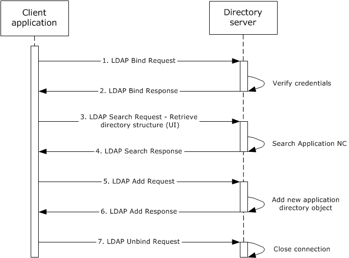

Figure 62: Message flow for storing application data in the directory

Unless otherwise noted, all responses that include a return code contain a return code that indicates that the operation was successfully performed.

- The client application starts and sends an LDAP bind request ([[RFC2251]](https://go.microsoft.com/fwlink/?LinkId=90325) section 4.2) to the directory server with [**credentials**](#gt_credential).
- The directory server verifies the credentials ([MS-AUTHSOD](../MS-AUTHSOD/MS-AUTHSOD.md) section 2) and sends an LDAP bind response ([RFC2251] section 4.2.3) to the client application.
- The client application sends an LDAP search request ([RFC2251] section 4.5.1) to the server. The application requests the subtree contents of the application NC.
- The server sends an LDAP search response ([RFC2251] section 4.5.2) that contains the list of objects under the application NC. The client application organizes this information and displays it to the user. Steps 3 and 4 are artifacts of the client application.
- The user selects a parent directory object under which the new application directory object is to be located, and all the necessary data is provided in preparation for the creation of the directory object. An LDAP add request ([RFC2251] section 4.7) is sent to the directory server. The LDAP add operation contains the distinguished name (DN), the [**object class**](#gt_object-class) of the object to be created, and any other mandatory parameters specified in [MS-ADTS](../MS-ADTS/MS-ADTS.md) section 3.1.1.2.4.5. [**Security principal**](#gt_security-principal) objects can be created only in the [**domain NC**](#gt_domain-naming-context-domain-nc) for [**AD DS**](#gt_active-directory-domain-services-ad-ds) and in the application NC for [**AD LDS**](#gt_active-directory-lightweight-directory-services-ad-lds), as specified in [MS-ADTS] section 5.1.1.5.
- The server processes the add request ([RFC2251] section 4.7) and verifies the processing rules and constraints specified in [MS-ADTS] sections 3.1.1.5.1 and 3.1.1.5.2. It then sends an LDAP add response ([RFC2251] section 4.7) to the client application indicating success.
- The client application sends an LDAP unbind request ([RFC2251] section 4.3) to the server. The LDAP connection to the directory server is closed.

### 3.2.18 Example 18: Manage Access Control on Directory Objects

In this example, an administrator reads and modifies the access control settings of a [**directory object**](#gt_directory-object). This permits the administrator to control who has access to that object, and what type of access they have.

This example applies only to [**AD DS**](#gt_active-directory-domain-services-ad-ds).

This example covers the use case in section [2.7.4.1](#Section_2.7.4.1), Convert a [**SID**](#gt_security-identifier-sid) to/from a Human-Readable Format - Client Application.

**Prerequisites**

The general requirements described in section [2.6](#Section_2.6), Assumptions and Preconditions.

The Active Directory system meets all preconditions described in section 2.7.4.1.

**Initial System State**

None.

**Final System State**

The [**access control entries (ACEs)**](#gt_b581857f-39aa-4979-876b-daba67a40f15) on the object that is specified by the administrator have been updated to secure that object as specified by the administrator.

**Sequence of Events**

The following sequence diagram shows the message flow that is associated with this example.

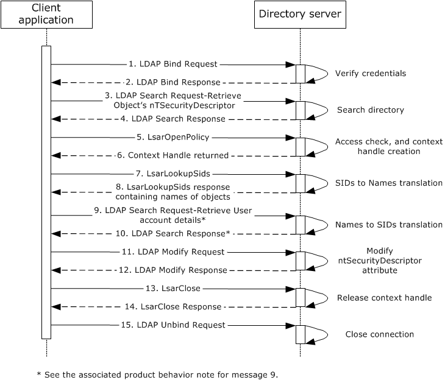

Figure 63: Message flow to manage access control on a directory object

Unless otherwise noted, all responses that include a return code contain a return code indicating that the operation was successfully performed. There is no dependency between LDAP and LSAT messages in this scenario. Those messages can come in any order.

- The [**client**](#gt_client) application starts and sends an LDAP bind request ([[RFC2251]](https://go.microsoft.com/fwlink/?LinkId=90325) section 4.2) to the [**directory**](#gt_directory) server with [**credentials**](#gt_credential).
- The directory server verifies the credentials ([MS-AUTHSOD](../MS-AUTHSOD/MS-AUTHSOD.md) section 2), and sends an LDAP bind response ([RFC2251] section 4.2.3) to the client application.
- An LDAP search request ([RFC2251] section 4.5.1) is sent to the directory, querying the directory for the object specified by the administrator to the client application in order to retrieve the nTSecurityDescriptor [**attribute**](#gt_attribute) ([MS-ADTS](../MS-ADTS/MS-ADTS.md) section 5.1.3 and [MS-ADA3](../MS-ADA3/MS-ADA3.md) section 2.36).
- The directory server performs an access check to ensure that the client has permissions to read the attribute ([MS-ADTS] section 5.1.3) and then sends an LDAP search response ([RFC2251] section 4.5.2) that contains the current value of the nTSecurityDescriptor attribute for the object that is specified in the request.
- The client extracts the SIDs of the [**security principals**](#gt_security-principal) that are specified in the ntSecurityDescriptor attribute of the object ([MS-ADTS] section 5.1 and [MS-DTYP](../MS-DTYP/MS-DTYP.md) section 2.4.6) and then sends an LsarOpenPolicy<7> request ([MS-LSAT](#Section_2.11) section 3.1.4.2) with the *DesiredAccess* parameter set to POLICY_LOOKUP_NAMES ([MS-LSAD](#Section_2.11) section 2.2.1.1.2) to the server to retrieve a context handle that it can later use to request name/SID translations.
- The directory server processes the LsarOpenPolicy request by performing an access check for the desired access ([MS-LSAD] section 3.1.4.2) and constructing an LSAPR_HANDLE ([MS-LSAD] section 2.2.2.1), as described in [MS-LSAT] section 3.1.4.2. It sends the response to the client.
- The client sends an LsarLookupSids<8> request ([MS-LSAT] section 3.1.4.11) using the server handle from step 6. In this request, it specifies the SIDs that it wants to be translated to names for display to the administrator.
- The directory server processes the request, as described in [MS-LSAT] section 3.1.4.11, and sends a response to the client that includes the names of the security principals whose SIDs were passed in the request.
- The client receives input from the administrator as to which users he or she wants to define access control entries (ACEs) for on the object. It then sends an LDAP search request to query the directory for user attributes.
**Note** Some client and server implementations use a different set of messages at this point in the exchange, as shown in the following sequence diagram fragment. <9>

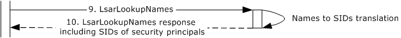

Figure 64: Partial, previous message flow to manage access control on a directory object

- The directory server performs an access check to ensure that the client has permissions to read the requested attributes and objects ([MS-ADTS] section 5.1.3) and then sends an LDAP search response ([RFC2251] section 4.5.2) that contains the attributes for the objects that are specified in the request. See the note in the previous step.
- The client prepares the updated value for the nTSecurityDescriptor attribute ([MS-ADTS] section 5.1) and sends an LDAP modify request ([RFC2251] section 4.6) to commit that update.
- The directory server verifies that the client has permissions to update the attribute and then processes the modify request and performs validation, as described in [MS-ADTS] sections 3.1.1.5.1 and 3.1.1.5.3. It then sends an LDAP modify response that indicates success.
- The client finally sends an LsarClose request ([MS-LSAT] section 3.1.4.3 and [MS-LSAD] sections 3.1.4.3 and 3.1.4.9.4) to the directory server to release the context handle that was opened in step 6.
- The directory server releases the handle and sends a response to the client that indicates success.
- The client application sends an LDAP unbind request ([RFC2251] section 4.3) to the directory server. The LDAP connection to the directory server is closed.

### 3.2.19 Example 19: Raise the Domain Functional Level

In this example, an administrator uses [**LDAP**](#gt_lightweight-directory-access-protocol-ldap) to modify the msDS-Behavior-Version attribute ([MS-ADA2](../MS-ADA2/MS-ADA2.md) section 2.246 and [MS-ADTS](../MS-ADTS/MS-ADTS.md) section 3.1.1.5.3.1.1.5) to an incremented value in order to raise the [**domain functional level**](#gt_domain-functional-level). To perform this task, an administrator runs a [**client**](#gt_client) application on a [**client computer**](#gt_client-computer) that targets a [**directory**](#gt_directory) [**server**](#gt_server) in the Active Directory system and raises the domain functional level ([MS-ADTS] section 6.1.4.3).

This example applies only to [**AD DS**](#gt_active-directory-domain-services-ad-ds).

This example covers the use case in section [2.7.1.3](#Section_2.7.1.3), "Modify Directory Object - Client Application".

**Prerequisites**

The general requirements set forth in section [2.6](#Section_2.6), "Assumptions and Preconditions".

The Active Directory system meets all preconditions described in section 2.7.1.3.

**Initial System State**

None.

**Final System State**

The crossRef object is modified, and the domain functional level is raised.

**Sequence of Events**

The following sequence diagram shows the message flow that is associated with this example.

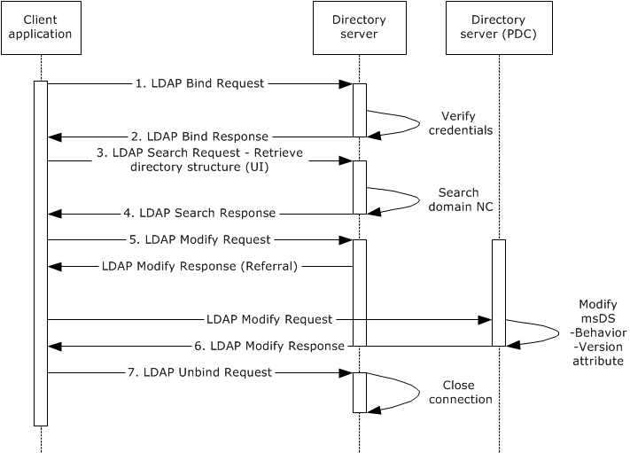

Figure 65: Message flow to raise the domain functional level

Unless otherwise noted, all responses that include a return code contain a return code that indicates that the operation was successfully performed.

- The client application starts and sends an LDAP bind request ([[RFC2251]](https://go.microsoft.com/fwlink/?LinkId=90325) section 4.2) to the directory server along with [**credentials**](#gt_credential).
- The directory server verifies the credentials ([MS-AUTHSOD](../MS-AUTHSOD/MS-AUTHSOD.md) section 2) and sends an LDAP bind response ([RFC2251] section 4.2.3) to the client application.
- An LDAP search request ([RFC2251] section 4.5.1) is sent to the directory to query the base [**domain**](#gt_domain) to look for the msDS-Behavior-Version [**attribute**](#gt_attribute) ([MS-ADA2] section 2.207 and [MS-ADTS] section 3.1.1.5.3.1.1.5).
- The directory server sends an LDAP search response ([RFC2251] section 4.5.2) that contains the current domain functional level value (2, DS_BEHAVIOR_WIN2003, [MS-ADTS] section 6.1.4.2).
- The user interacts with the client application and provides the name of the [**domain NC**](#gt_domain-naming-context-domain-nc) and the new domain functional level (3, DS_BEHAVIOR_WIN2008, [MS-ADTS] section 6.1.4.2).
An LDAP modify request ([RFC2251] section 4.6) is sent to the directory server. The LDAP modify operation contains the distinguishedName of the domain along with the msDS-Behavior-Version attribute ([MS-ADA2] section 2.207) as a replace operation with the value of 3.

If necessary, the client application reroutes the modify request ([RFC2251] section 4.6) to the [**PDC**](#gt_primary-domain-controller-pdc) [**FSMO**](#gt_flexible-single-master-operation-fsmo) if a referral was returned from the initial modify request. This is because only the PDC [**FSMO role**](#gt_fsmo-role) holder can perform this modification ([MS-ADTS] section 6.1.4.3).

- The directory server processes the modify request and verifies the processing rules and constraints as described in [MS-ADTS] sections 3.1.1.5.1 and 3.1.1.5.3. It then sends an LDAP modify response ([RFC2251] section 4.6) that indicates success.
- The client application sends an LDAP unbind request ([RFC2251] section 4.3) to the directory server. The LDAP connection to the directory server is closed.

### 3.2.20 Example 20: Replicate Changes within a Domain

This example shows how the [**originating updates**](#gt_originating-update) to a [**domain controller**](#gt_domain-controller-dc) are replicated to other domain controllers in the same [**domain**](#gt_domain).

This example covers the use case in section [2.7.5.1](#Section_2.7.5.1), Replicate Changes within a Domain - Domain Controller.

**Prerequisites**

The general requirements described in section [2.6](#Section_2.6), Assumptions and Preconditions.

The Active Directory system meets all preconditions described in section 2.7.5.1.

**Initial State**

An administrator adds a user to a domain controller, DC1, and this change is not yet replicated to other domain controllers, DC2 and DC3.

**Final State**

Originating updates for DC1 are replicated to DC2 and DC3.

**Sequence of Events**

The following sequence diagram shows the message flow that is associated with this example.

Figure 66: Message flow for replication changes within a domain

- DC1 and DC2 use [**Kerberos**](#gt_kerberos) ([MS-DRSR](#Section_2.7.5) section 2.2.3.2) to perform [**mutual authentication**](#gt_mutual-authentication).
- DC2 sends an IDL_DRSBind request to DC1, which creates a context handle that is required to call any other methods in the interface ([MS-DRSR] section 4.1.3).
- Upon a successful response from DC1, DC2 obtains a context handle.
- DC2 invokes IDL_DRSGetNCChanges on DC1 periodically to replicate the changes that are performed to DC1 ([MS-DRSR] section 4.1.10).
- Upon a successful response, DC1 replicates its changes to DC2.
- DC2 sends an IDL_DRSUnbind request, which destroys the context handle that was previously created by the IDL_DRSBind request ([MS-DRSR] section 4.1.25).
- Upon a successful response from DC1, the context handle that was created previously is destroyed.
- DC2 and DC3 use Kerberos ([MS-DRSR] section 2.2.3.2) to perform mutual authentication.
- DC3 sends an IDL_DRSBind request to DC2, which creates a context handle that is required to call any other methods in the interface ([MS-DRSR] section 4.1.3).
- Upon a successful response from DC2, DC3 obtains a context handle.
- DC3 invokes IDL_DRSGetNCChanges on DC2 periodically to replicate the changes that are performed to DC2 ([MS-DRSR] section 4.1.10).
- Upon a successful response, DC2 replicates its changes to DC3.
- DC3 sends an IDL_DRSUnbind request, which destroys the context handle that was previously created by the IDL_DRSBind request ([MS-DRSR] section 4.1.25).
- Upon a successful response from DC2, the context handle that was created previously is destroyed.

### 3.2.21 Example 21: Transferring FSMO roles

This example shows how the operation to transfer a [**FSMO role**](#gt_fsmo-role) is accomplished by a [**DC**](#gt_domain-controller-dc) that is being demoted.

This example applies only to [**AD LDS**](#gt_active-directory-lightweight-directory-services-ad-lds).

This example covers the use case in section [2.7.5.3](#Section_2.7.5.3), Transferring a FSMO Role - Domain Controller.

**Prerequisites**

The general requirements described in section [2.6](#Section_2.6), Assumptions and Preconditions.

The Active Directory system meets all preconditions described in section 2.7.5.3.

DC1, DC2, and DC3 are domain controllers in AD LDS [**forest**](#gt_forest).

DC2 and DC3 are replication partners to DC1.

**Initial State**

DC1 is the owner of the Schema Master FSMO role and the Infrastructure FSMO role.

An administrator initiates the demotion of DC1.

**Final State**

DC1 is demoted.

DC2 becomes the Infrastructure FSMO role owner.

DC3 becomes the Schema Master FSMO role owner.

**Sequence of Events**

The following sequence diagram shows the message flow that is associated with this example.

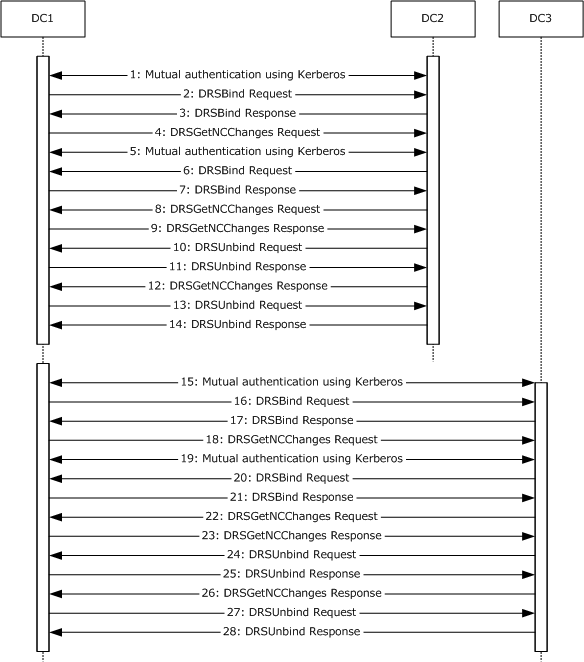

Figure 67: Message flow for transferring FSMO roles

- DC1 uses [**Kerberos**](#gt_kerberos) ([MS-DRSR](#Section_2.7.5) section 2.2.3.2) to perform [**mutual authentication**](#gt_mutual-authentication) with DC2.
- DC1 sends an IDL_DRSBind request to DC2, which creates a context handle that is required to call any other methods in the interface ([MS-DRSR] section 4.1.3).
- Upon a successful response from DC2, DC1 obtains a context handle.
- DC1 invokes IDL_DRSGetNCChanges on DC2 to inform DC2 that it needs to abandon its Infrastructure FSMO role and transfer it to DC2. DC1 chooses DC2 randomly out of all its replication partners.
- DC2 uses Kerberos ([MS-DRSR] section 2.2.3.2) to perform mutual authentication with DC1.
- DC2 sends an IDL_DRSBind request to DC1, which creates a context handle that is required to call any other methods in the interface ([MS-DRSR] section 4.1.3).
- Upon a successful response from DC1, DC2 obtains a context handle to DC1.
- DC2 invokes IDL_DRSGetNCChanges on DC1 to request a transfer of the Infrastructure FSMO role to itself.
- Upon successful response, DC1 considers DC2 to be the owner of the Infrastructure FSMO role and returns all the changed objects to DC2.
- DC2 sends an IDL_DRSUnbind request to DC1, which destroys the context handle that was previously created by the IDL_DRSBind request ([MS-DRSR] section 4.1.25).
- Upon a successful response from DC1, the context handle that was created previously is destroyed.
- Upon successful completion of the preceding steps, DC2 returns a successful response for the IDL_DRSGetNCChanges request to DC1.
- DC1 sends an IDL_DRSUnbind request to DC2, which destroys the context handle that was previously created by the IDL_DRSBind request ([MS-DRSR] section 4.1.25).
- Upon a successful response from DC2, the context handle that was created previously is destroyed.
- DC1 uses Kerberos ([MS-DRSR] section 2.2.3.2) to perform mutual authentication with DC3.
- DC1 sends an IDL_DRSBind request to DC3, which creates a context handle that is required to call any other methods in the interface ([MS-DRSR] section 4.1.3).
- Upon a successful response from DC3, DC1 obtains a context handle.
- DC1 invokes IDL_DRSGetNCChanges on DC3 to inform DC3 that it needs to abandon its Schema Master FSMO role and transfer it to DC3. DC1 chooses DC3 randomly out of all its replication partners.
- DC3 uses Kerberos ([MS-DRSR] section 2.2.3.2) to perform mutual authentication with DC1.
- DC3 sends an IDL_DRSBind request to DC1, which creates a context handle that is required to call any other methods in the interface ([MS-DRSR] section 4.1.3).
- Upon a successful response from DC1, DC3 obtains a context handle to DC1.
- DC3 invokes IDL_DRSGetNCChanges on DC1 to request a transfer of the Schema Master FSMO role to itself.
- Upon successful response, DC1 considers DC3 to be the owner of the Schema Master FSMO role and returns all the changed objects to DC3.
- DC3 sends an IDL_DRSUnbind request to DC1, which destroys the context handle that was previously created by the IDL_DRSBind request ([MS-DRSR] section 4.1.25).
- Upon a successful response from DC1, the context handle that was created previously is destroyed.
- Upon successful completion of the preceding steps, DC3 returns a successful response for the IDL_DRSGetNCChanges request to DC1.
- DC1 sends an IDL_DRSUnbind request to DC3, which destroys the context handle that was previously created by the IDL_DRSBind request ([MS-DRSR] section 4.1.25).
- Upon a successful response from DC3, the context handle that was created previously is destroyed.

### 3.2.22 Example 22: Replicate Changes to a GC or a Partial Replica by Using SMTP

This example describes how replication is performed between a full replica [**domain controller**](#gt_domain-controller-dc) (DC1) and a partial replica domain controller (DC2) by using the SMTP transport.

This example covers the use case in section [2.7.5.2](#Section_2.7.5.2), Replicate Changes to a [**GC**](#gt_global-catalog-gc) or a Partial Replica Using [**RPC**](#gt_remote-procedure-call-rpc) - Domain Controller, specifically, the SMTP variation.

**Prerequisites**

The general requirements described in section [2.6](#Section_2.6), Assumptions and Preconditions.

The Active Directory system meets all preconditions described in the variation of section 2.7.5.2.

**Initial State**

DC1 has [**originating updates**](#gt_originating-update) that have not yet been replicated to DC2.

**Final State**

The originating updates on DC1 are replicated to DC2.

**Sequence of events**

The following sequence diagram shows the message flow that is associated with this example.

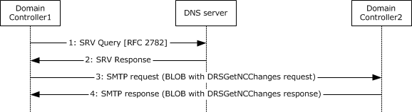

Figure 68: Message flow to replicate changes to a GC or a partial replica

- DC1 sends an SRV query request to the [**Domain Name System (DNS)**](#gt_domain-name-system-dns) [**server**](#gt_server) to obtain the IP address of DC2.
- The DNS server responds to DC1 and returns the IP address of DC2 ([MS-ADTS](../MS-ADTS/MS-ADTS.md) section 6.3.6).
- DC1 sends the SMTP message as follows.
The DRS engine hands the SRPL extension a [**binary large object (BLOB)**](#gt_binary-large-object-blob) that contains a "get changes" request. The SRPL extension performs the higher-layer triggered operation ([MS-SRPL](#Section_2.7.5) section 3.2.4) that encodes the request BLOB as a frame. The frame is then handed to the SMTP service on DC1. The frame, as an attachment to an SMTP mail message, is sent to DC2. DC2 receives the request. The SMTP service on DC2 receives the mail message from DC1 and gives the frame to the SRPL extension. The SRPL extension performs message processing operations ([MS-SRPL] section 3.3.5) and then passes the BLOB to the DRS engine, which processes the request.

- DC2 sends the SMTP response as follows.
After it processes the request, the DRS engine on DC2 generates another DRS BLOB, which contains the response. The SRPL extension performs the higher-layer triggered operation and then passes the response to the SMTP service. The SMTP service sends the message to DC1 as an attachment to an SMTP mail message. DC1 receives the response. The SMTP service on DC1 receives the mail message and gives the frame to the SRPL extension. The SRPL extension performs message processing and passes the BLOB to the DRS engine, which processes the response.

### 3.2.23 Example 23: Cross-Domain Move

This example demonstrates the use case in section [2.7.1.6](#Section_2.7.1.6), Cross-Domain Move - Client Application.

It is explained in [MS-DRSR](#Section_2.7.5) section 4.1.15.4.

# 4 Microsoft Implementations

There are no variations in the behavior of the Active Directory system in different versions of Windows beyond those that are described in the specifications of the protocols supported by the system, as listed in section [2.4](#Section_2.4).

The information in this overview document is applicable to the following Microsoft products or supplemental software. References to product versions include released service packs.

The terms "earlier" and "later", when used with a product version, refer to either all preceding versions or all subsequent versions, respectively. The term "through" refers to the inclusive range of versions. Applicable Microsoft products are listed chronologically in this section.

**Windows Client releases**

- Windows NT 3.1 operating system
- Windows NT 3.5 operating system
- Windows NT 3.51 operating system
- Windows NT 4.0 operating system
- Windows 2000 Professional operating system
- Windows XP operating system
- Windows Vista operating system
- Windows 7 operating system
- Windows 8 operating system
- Windows 8.1 operating system
- Windows 10 operating system
- Windows 11 operating system
**Windows Server releases**

- Windows NT 3.1
- Windows NT 3.5
- Windows NT 3.51
- Windows NT 4.0
- Windows 2000 Server operating system
- Windows Server 2003 operating system
- Windows Server 2003 R2 operating system
- Windows Server 2008 operating system
- Windows Server 2008 R2 operating system
- Windows Server 2012 operating system
- Windows Server 2012 R2 operating system
- Windows Server 2016 operating system
- Windows Server operating system
- Windows Server 2019 operating system
- Windows Server 2022 operating system
Exceptions, if any, are noted below.

## 4.1 Product Behavior

<1> Section 1: AD DS uses the operations described in [MS-NRPC](../MS-NRPC/MS-NRPC.md) section 3.6 only to maintain the change log that Windows NT 4.0 [**backup domain controller (BDC)**](#gt_backup-domain-controller-bdc) replication uses.

<2> Section 2.4: This feature is implemented on Windows Server 2012 and later.

<3> Section 2.5.1: [RFC2136] allows dynamic update responses to be formed in either of the following two ways:

- Respond with the ZOCOUNT, PRCOUNT, UPCOUNT, and ADCOUNT fields and corresponding sections that are copied from the request.
- Respond with the ZOCOUNT, PRCOUNT, UPCOUNT, and ADCOUNT fields set to 0 and without copying the corresponding sections from the request.
The Windows [**DNS**](#gt_domain-name-system-dns) server in Windows NT operating system, Windows 2000 Server, and later use Method 1 when formatting dynamic update responses. The Windows DNS client in Windows 2000 operating system, Windows XP, Windows Server 2003, Windows Vista, and Windows Server 2008 expect Method 1 when parsing dynamic update responses and might log an error when parsing dynamic update responses that use Method 2. The Windows DNS client in Windows 7 and later and in Windows Server 2008 R2 and later accept either method of formatting dynamic update responses.

<4> Section 2.8: Web Services support is included in Active Directory Domain Services (AD DS) and Active Directory Lightweight Directory Services (AD LDS) for Windows Server 2008 R2 and later. Web Services support for AD DS and AD LDS is also available as a separate installable package (namely, Active Directory Management Gateway Service) for the following operating systems: Windows Server 2003 operating system with Service Pack 2 (SP2), Windows Server 2003 R2 SP2, and Windows Server 2008.

<5> Section 2.11.2: The Microsoft implementation of Active Directory Web Services permits administrators to configure settings that are used to limit the amount of [**server**](#gt_server) resources that can be consumed in processing a request. Examples of such settings are included below for illustrative purposes. Implementations are free to implement some, all, or none of these settings, and to implement other settings of their own devising.

Common to implementations of WS-Transfer, WS-Enumeration, and ADCAP:

- Maximum size of a [**SOAP**](#gt_soap) request message that the [**directory service**](#gt_directory-service-ds) accepts.
- Maximum level of nested [**XML**](#gt_xml) elements in the SOAP request message that the directory service accepts.
- Maximum length of strings and maximum number of elements in arrays in the SOAP request message that the directory service accepts.
- Maximum number of concurrent requests that the directory service processes at one time.
- Maximum number of concurrent requests from one user that the directory service processes at one time.
- Length of time the directory service waits when it performs an operation before the operation is timed-out.
Specific to implementations of WS-Enumeration:

- Maximum total number of [**enumeration contexts**](#gt_enumeration-context) that can exist at one time.
- Length of time an enumeration context can be left idle by a client before the directory service automatically releases it.
- Length of time an enumeration context can be kept open (whether idle or in use) by a client before the directory service automatically releases it.
- Maximum expiration time the directory service permits a client to specify in an Enumerate or Renew request (via the Expires element).
- Maximum amount of time the directory service permits a client to specify in a Pull request (via the MaxTime element).
- Maximum number of elements the directory service permits a client to specify in a Pull request (via the MaxElements element).
<6> Section 3.1.1: A workstation that logs on to a Windows 2000 domain queries DNS for SRV records in the general form:

_service._protocol.DnsDomainName

<7> Section 3.2.18: Windows uses the highest version of the operation first; that is, LsarOpenPolicy2 is preferred over LsarOpenPolicy.

<8> Section 3.2.18: Windows uses the highest version of the operation first; that is, LsarLookupSids2 is preferred over LsarLookupSids.

<9> Section 3.2.18: Windows NT, Windows 2000, Windows XP, Windows Server 2003, Windows Server 2003 R2, Windows Vista, Windows Server 2008, Windows 7, Windows Server 2008 R2, Windows 8, and Windows Server 2012, when operating as LSA clients, send an additional LsarLookupNames request to retrieve the currently logged on user, and the server responds with a LsarLookupNames response.

# 5 Change Tracking

This section identifies changes that were made to this document since the last release. Changes are classified as Major, Minor, or None.

The revision class **Major** means that the technical content in the document was significantly revised. Major changes affect protocol interoperability or implementation. Examples of major changes are:

- A document revision that incorporates changes to interoperability requirements.
- A document revision that captures changes to protocol functionality.
The revision class **Minor** means that the meaning of the technical content was clarified. Minor changes do not affect protocol interoperability or implementation. Examples of minor changes are updates to clarify ambiguity at the sentence, paragraph, or table level.

The revision class **None** means that no new technical changes were introduced. Minor editorial and formatting changes may have been made, but the relevant technical content is identical to the last released version.

The changes made to this document are listed in the following table. For more information, please contact [dochelp@microsoft.com](mailto:dochelp@microsoft.com).

| Section | Description | Revision class |
| --- | --- | --- |
| [4](#Section_4) Microsoft Implementations | Added Windows 11 operating system to the Windows client product applicability list. | Major |

## Revision History

| Date | Version | Revision Class | Comments |
| --- | --- | --- | --- |
| 3/30/2012 | 1.0 | New | Released new document. |
| 7/12/2012 | 2.0 | Major | Updated and revised the technical content. |
| 10/25/2012 | 2.1 | Minor | Clarified the meaning of the technical content. |
| 1/31/2013 | 2.1 | None | No changes to the meaning, language, or formatting of the technical content. |
| 8/8/2013 | 3.0 | Major | Updated and revised the technical content. |
| 11/14/2013 | 4.0 | Major | Updated and revised the technical content. |
| 2/13/2014 | 5.0 | Major | Updated and revised the technical content. |
| 5/15/2014 | 5.0 | None | No changes to the meaning, language, or formatting of the technical content. |
| 6/30/2015 | 6.0 | Major | Significantly changed the technical content. |
| 9/24/2015 | 6.1 | Minor | Clarified the meaning of the technical content. |
| 10/16/2015 | 6.1 | None | No changes to the meaning, language, or formatting of the technical content. |
| 9/26/2016 | 6.2 | Minor | Clarified the meaning of the technical content. |
| 6/1/2017 | 6.2 | None | No changes to the meaning, language, or formatting of the technical content. |
| 12/15/2017 | 7.0 | Major | Significantly changed the technical content. |
| 11/5/2018 | 8.0 | Major | Significantly changed the technical content. |
| 6/3/2021 | 8.0 | None | No changes to the meaning, language, or formatting of the technical content. |
| 10/26/2021 | 9.0 | Major | Significantly changed the technical content. |
