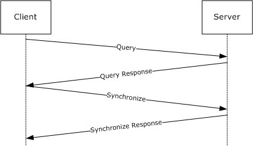
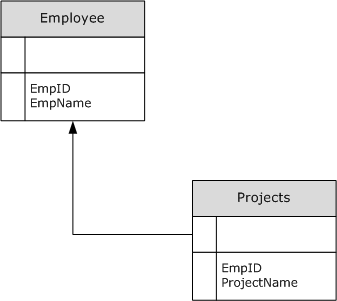

# [MS-ADTG]: Remote Data Services (RDS) Transport Protocol

Table of Contents

1 Introduction

- [1 Introduction](#Section_1)
  - [1.1 Glossary](#Section_1.1)
  - [1.2 References](#Section_1.2)
    - [1.2.1 Normative References](#Section_1.2.1)
    - [1.2.2 Informative References](#Section_1.2.2)
  - [1.3 Overview](#Section_1.3)
  - [1.4 Relationship to Other Protocols](#Section_1.4)
  - [1.5 Prerequisites/Preconditions](#Section_1.5)
  - [1.6 Applicability Statement](#Section_1.6)
  - [1.7 Versioning and Capability Negotiation](#Section_1.7)
  - [1.8 Vendor-Extensible Fields](#Section_1.8)
  - [1.9 Standards Assignments](#Section_1.9)

2 Messages

- [2 Messages](#Section_2)
  - [2.1 Transport](#Section_2.1)
  - [2.2 Message Syntax](#Section_2.2)
    - [2.2.1 Basic Data Structures](#Section_2.2.1)
      - [2.2.1.1 Fundamental Data Types](#Section_2.2.1.1)
      - [2.2.1.2 Datatype Identifiers](#Section_2.2.1.2)
      - [2.2.1.3 Fixed-Length Types](#Section_2.2.1.3)
      - [2.2.1.4 Variable-Length Types](#Section_2.2.1.4)
      - [2.2.1.5 Externally Encoded Data Types - Non-Groupable](#Section_2.2.1.5)
      - [2.2.1.6 Database Types - Groupable](#Section_2.2.1.6)
      - [2.2.1.7 Array Data Types - Non-Groupable](#Section_2.2.1.7)
    - [2.2.2 RDS Transport Method Invocation](#Section_2.2.2)
      - [2.2.2.1 rdsMethodRequest](#Section_2.2.2.1)
        - [2.2.2.1.1 rdsMethodRequest Defined as an HTTP Request](#Section_2.2.2.1.1)
      - [2.2.2.2 rdsMethodResponse](#Section_2.2.2.2)
        - [2.2.2.2.1 rdsMethodResponse Defined as an HTTP Response](#Section_2.2.2.2.1)
      - [2.2.2.3 rdsMethodInfo](#Section_2.2.2.3)
        - [2.2.2.3.1 rdsMethodNameSpace, rdsMethodName](#Section_2.2.2.3.1)
      - [2.2.2.4 rdsClientVersion](#Section_2.2.2.4)
      - [2.2.2.5 rdsHeaders](#Section_2.2.2.5)
        - [2.2.2.5.1 rdsParamCountValue](#Section_2.2.2.5.1)
      - [2.2.2.6 rdsParameters](#Section_2.2.2.6)
        - [2.2.2.6.1 rdsParamHeader](#Section_2.2.2.6.1)
        - [2.2.2.6.2 rdsParamContentLength](#Section_2.2.2.6.2)
        - [2.2.2.6.3 rdsParamContentSize](#Section_2.2.2.6.3)
      - [2.2.2.7 rdsCloseDelimiter](#Section_2.2.2.7)
    - [2.2.3 RDS Data Factory Namespace](#Section_2.2.3)
      - [2.2.3.1 rdsExecuteRequest Message](#Section_2.2.3.1)
      - [2.2.3.2 rdsExecuteResponse Message](#Section_2.2.3.2)
      - [2.2.3.3 rdsQueryRequest Message](#Section_2.2.3.3)
      - [2.2.3.4 rdsQueryResponse Message](#Section_2.2.3.4)
      - [2.2.3.5 rdsSynchronizeRequest Message](#Section_2.2.3.5)
      - [2.2.3.6 rdsSynchronizeResponse Message](#Section_2.2.3.6)
      - [2.2.3.7 rdsSubmitChangesRequest Message](#Section_2.2.3.7)
      - [2.2.3.8 rdsSubmitChangesResponse Message](#Section_2.2.3.8)
      - [2.2.3.9 rdsConvertToStringRequest Message](#Section_2.2.3.9)
      - [2.2.3.10 rdsConvertToStringResponse Message](#Section_2.2.3.10)
      - [2.2.3.11 rdsCreateRecordsetRequest Message](#Section_2.2.3.11)
      - [2.2.3.12 rdsCreateRecordsetResponse Message](#Section_2.2.3.12)
      - [2.2.3.13 Common Parameters for RDS Data Factory Methods](#Section_2.2.3.13)
        - [2.2.3.13.1 rdsConnectionString](#Section_2.2.3.13.1)
        - [2.2.3.13.2 rdsErrorInformation](#Section_2.2.3.13.2)
        - [2.2.3.13.3 rdsExecuteOptions](#Section_2.2.3.13.3)
        - [2.2.3.13.4 rdsExecuteProperties](#Section_2.2.3.13.4)
        - [2.2.3.13.5 rdsHandlerString](#Section_2.2.3.13.5)
        - [2.2.3.13.6 rdsFetchOptions](#Section_2.2.3.13.6)
        - [2.2.3.13.7 rdsSQLCommandParameters](#Section_2.2.3.13.7)
        - [2.2.3.13.8 rdsSQLCommandString](#Section_2.2.3.13.8)
        - [2.2.3.13.9 rdsEncapsulatedData](#Section_2.2.3.13.9)
        - [2.2.3.13.10 rdsStatusArray](#Section_2.2.3.13.10)
        - [2.2.3.13.11 rdsSynchronizeOptions](#Section_2.2.3.13.11)
        - [2.2.3.13.12 rdsSynchronizeResult](#Section_2.2.3.13.12)
        - [2.2.3.13.13 rdsTableName](#Section_2.2.3.13.13)
        - [2.2.3.13.14 rdsLCID](#Section_2.2.3.13.14)
        - [2.2.3.13.15 rdsFieldShapeArray](#Section_2.2.3.13.15)
      - [2.2.3.14 adtgTablegram](#Section_2.2.3.14)
        - [2.2.3.14.1 adtgHeader](#Section_2.2.3.14.1)
        - [2.2.3.14.2 adtgHandlerOptions](#Section_2.2.3.14.2)
        - [2.2.3.14.3 adtgAllMetaInformation](#Section_2.2.3.14.3)
          - [2.2.3.14.3.1 adtgResultDescriptor](#Section_2.2.3.14.3.1)
          - [2.2.3.14.3.2 adtgRecordSetContext](#Section_2.2.3.14.3.2)
          - [2.2.3.14.3.3 adtgTableDescriptor](#Section_2.2.3.14.3.3)
          - [2.2.3.14.3.4 adtgColumnDescriptorParent](#Section_2.2.3.14.3.4)
          - [2.2.3.14.3.5 adtgColumnDescriptorChild](#Section_2.2.3.14.3.5)
          - [2.2.3.14.3.6 adtgColumnDescriptorCommon](#Section_2.2.3.14.3.6)
          - [2.2.3.14.3.7 Common Fields in adtgAllMetaInformation](#Section_2.2.3.14.3.7)
        - [2.2.3.14.4 adtgAllRowOperations](#Section_2.2.3.14.4)
          - [2.2.3.14.4.1 adtgParentChange](#Section_2.2.3.14.4.1)
          - [2.2.3.14.4.2 adtgParentDelete](#Section_2.2.3.14.4.2)
          - [2.2.3.14.4.3 adtgParentInsert](#Section_2.2.3.14.4.3)
          - [2.2.3.14.4.4 adtgParentUnchanged](#Section_2.2.3.14.4.4)
          - [2.2.3.14.4.5 adtgChildChange](#Section_2.2.3.14.4.5)
          - [2.2.3.14.4.6 adtgChildDelete](#Section_2.2.3.14.4.6)
          - [2.2.3.14.4.7 adtgChildInsert](#Section_2.2.3.14.4.7)
          - [2.2.3.14.4.8 adtgChildUnChanged](#Section_2.2.3.14.4.8)
          - [2.2.3.14.4.9 Common Fields in adtgAllRowOperations](#Section_2.2.3.14.4.9)
        - [2.2.3.14.5 adtgTokenDone](#Section_2.2.3.14.5)
        - [2.2.3.14.6 adtgTablegram Constants](#Section_2.2.3.14.6)

3 Protocol Details

- [3 Protocol Details](#Section_3)
  - [3.1 Common Details](#Section_3.1)
    - [3.1.1 Abstract Data Model](#Section_3.1.1)
      - [3.1.1.1 Data Store](#Section_3.1.1.1)
      - [3.1.1.2 RecordSet](#Section_3.1.1.2)
        - [3.1.1.2.1 Processing for Maintaining a Hierarchical RecordSet](#Section_3.1.1.2.1)
        - [3.1.1.2.2 Algorithm for Processing Synchronization Results for Concurrency](#Section_3.1.1.2.2)
        - [3.1.1.2.3 Algorithm for Producing a TableGram from a RecordSet or a RecordSet from a TableGram](#Section_3.1.1.2.3)
        - [3.1.1.2.4 Algorithm (Recursive) for Encoding a RecordSet into a TableGram](#Section_3.1.1.2.4)
        - [3.1.1.2.5 Calculating a DiffGram](#Section_3.1.1.2.5)
    - [3.1.2 Timers](#Section_3.1.2)
    - [3.1.3 Initialization](#Section_3.1.3)
    - [3.1.4 Higher-Layer Triggered Events](#Section_3.1.4)
    - [3.1.5 Message Processing Events and Sequencing Rules](#Section_3.1.5)
    - [3.1.6 Timer Events](#Section_3.1.6)
    - [3.1.7 Other Local Events](#Section_3.1.7)
  - [3.2 Client Details](#Section_3.2)
    - [3.2.1 Abstract Data Model](#Section_3.2.1)
    - [3.2.2 Timers](#Section_3.2.2)
      - [3.2.2.1 Request Execution Timer](#Section_3.2.2.1)
    - [3.2.3 Initialization](#Section_3.2.3)
    - [3.2.4 Higher-Layer Triggered Events](#Section_3.2.4)
      - [3.2.4.1 Establishing a Connection to the RDS Transport Server](#Section_3.2.4.1)
      - [3.2.4.2 Executing a Complex SQL Command Query](#Section_3.2.4.2)
      - [3.2.4.3 Changing Cached Data](#Section_3.2.4.3)
      - [3.2.4.4 Synchronizing Client RecordSet Changes to the Server](#Section_3.2.4.4)
      - [3.2.4.5 Creating a New Set of Data and Sending It to the Server](#Section_3.2.4.5)
    - [3.2.5 Message Processing Events and Sequencing Rules](#Section_3.2.5)
    - [3.2.6 Timer Events](#Section_3.2.6)
    - [3.2.7 Other Local Events](#Section_3.2.7)
  - [3.3 Server Details](#Section_3.3)
    - [3.3.1 Abstract Data Model](#Section_3.3.1)
      - [3.3.1.1 Algorithm for Hooking Up Message Invocation](#Section_3.3.1.1)
      - [3.3.1.2 Algorithm for Constructing Method Invocation Parameter Sets](#Section_3.3.1.2)
      - [3.3.1.3 Algorithm for Working with SQL Command Parameters](#Section_3.3.1.3)
    - [3.3.2 Timers](#Section_3.3.2)
      - [3.3.2.1 SQL Command Execution Timer](#Section_3.3.2.1)
    - [3.3.3 Initialization](#Section_3.3.3)
    - [3.3.4 Higher-Layer Triggered Events](#Section_3.3.4)
    - [3.3.5 Message Processing Events and Sequencing Rules](#Section_3.3.5)
      - [3.3.5.1 Common Steps in Request Processing](#Section_3.3.5.1)
        - [3.3.5.1.1 Handler Execution](#Section_3.3.5.1.1)
        - [3.3.5.1.2 Error Handling](#Section_3.3.5.1.2)
      - [3.3.5.2 Command Processing](#Section_3.3.5.2)
        - [3.3.5.2.1 Languages](#Section_3.3.5.2.1)
        - [3.3.5.2.2 Hierarchical RecordSet](#Section_3.3.5.2.2)
        - [3.3.5.2.3 Bound Parameters](#Section_3.3.5.2.3)
        - [3.3.5.2.4 Shape Command Language Details](#Section_3.3.5.2.4)
      - [3.3.5.3 Execute Event Processing](#Section_3.3.5.3)
      - [3.3.5.4 Query Event Processing](#Section_3.3.5.4)
      - [3.3.5.5 Synchronize Event Processing](#Section_3.3.5.5)
      - [3.3.5.6 SubmitChanges Event Processing](#Section_3.3.5.6)
      - [3.3.5.7 ConvertToString Event Processing](#Section_3.3.5.7)
      - [3.3.5.8 CreateRecordset Event Processing](#Section_3.3.5.8)
        - [3.3.5.8.1 Algorithm for Parsing Data in an rdsCreateRecordsetRequest](#Section_3.3.5.8.1)
        - [3.3.5.8.2 Algorithm for Creating a RecordSet for rdsCreateRecordsetResponse](#Section_3.3.5.8.2)
      - [3.3.5.9 Method Invocation Processing](#Section_3.3.5.9)
    - [3.3.6 Timer Events](#Section_3.3.6)
    - [3.3.7 Other Local Events](#Section_3.3.7)

4 Protocol Examples

- [4 Protocol Examples](#Section_4)
  - [4.1 Constructing a Generic Processing Message](#Section_4.1)
  - [4.2 rdsMethodResponse with Error Information](#Section_4.2)
  - [4.3 rdsSynchronizeResponse with Error Information](#Section_4.3)
  - [4.4 rdsExecuteRequest](#Section_4.4)
  - [4.5 rdsExecuteResponse](#Section_4.5)
  - [4.6 rdsExecuteResponse with Error Information](#Section_4.6)

5 Security

- [5 Security](#Section_5)
  - [5.1 Security Considerations for Implementers](#Section_5.1)
  - [5.2 Index of Security Parameters](#Section_5.2)

6 Appendix A: Full IDL

- [6 Appendix A: Full IDL](#Section_6)

7 Appendix B: Product Behavior

- [7 Appendix B: Product Behavior](#Section_7)

8 Change Tracking

- [8 Change Tracking](#Section_8)

For the legal notice and IP terms, see [LEGAL.md](../LEGAL.md).
Last updated: 5/30/2025.
See [Revision History](#revision-history) for full version history.

# 1 Introduction

The Remote Data Services (RDS) Transport Protocol<1> is an HTTP request/response protocol that facilitates:

- Remote method definition and invocation, including encoding of method call, parameters, and return parameters.
- Method definitions for executing database commands and for synchronizing database results.
- Definition of a record format for encoding database results.
Sections 1.5, 1.8, 1.9, 2, and 3 of this specification are normative. All other sections and examples in this specification are informative.

## 1.1 Glossary

This document uses the following terms:

**Augmented Backus-Naur Form (ABNF)**: A modified version of Backus-Naur Form (BNF), commonly used by Internet specifications. ABNF notation balances compactness and simplicity with reasonable representational power. ABNF differs from standard BNF in its definitions and uses of naming rules, repetition, alternatives, order-independence, and value ranges. For more information, see [[RFC5234]](https://go.microsoft.com/fwlink/?LinkId=123096).

**Backus-Naur Form (BNF)**: A syntax used to describe context-free grammars, which is a prescribed way to describe languages ([[RFC2616]](https://go.microsoft.com/fwlink/?LinkId=90372) section 2.1). See also "Augmented Backus-Naur Form (ABNF)".

**base table**: A persistent table that represents part of the data store.

**big-endian**: Multiple-byte values that are byte-ordered with the most significant byte stored in the memory location with the lowest address.

**chapter column**: A column in a table that references another [**RecordSet**](#gt_recordset).

**child RecordSet**: Any [**RecordSet**](#gt_recordset) that is contained within another [**RecordSet**](#gt_recordset).

**computed column**: A non-persistent column that is generated from other data.

**concurrency**: In database technology, the property of a system that allows the execution of commands to overlap in time. Concurrency can impact common values in the data store.

**connection string**: A character string expression that uniquely identifies the data store to use for a particular query or set of queries and the methods, including authentication information and configuration options, for connecting to that data store.

**datatype identifier**: A 2-byte constant that precedes a piece of data and identifies the type and format of the data to follow, known as the constant's [**designated datatype**](#gt_designated-datatype).

**designated datatype**: The format of the data that follows a [**datatype identifier**](#gt_datatype-identifier).

**DiffGram**: A collection of update, change, and delete commands along with relevant [**concurrency**](#gt_concurrency) data. These command groups provide a mechanism to synchronize the changes within a [**RecordSet**](#gt_recordset) with a backend data store.

**globally unique identifier (GUID)**: A term used interchangeably with universally unique identifier (UUID) in Microsoft protocol technical documents (TDs). Interchanging the usage of these terms does not imply or require a specific algorithm or mechanism to generate the value. Specifically, the use of this term does not imply or require that the algorithms described in [[RFC4122]](https://go.microsoft.com/fwlink/?LinkId=90460) or [[C706]](https://go.microsoft.com/fwlink/?LinkId=89824) have to be used for generating the GUID. See also universally unique identifier (UUID).

**groupable**: A set of parameters that share a single parameter header.

**interface**: A specification in a Component Object Model (COM) server that describes how to access the methods of a class. For more information, see [MS-DCOM](../MS-DCOM/MS-DCOM.md).

**interface identifier (IID)**: A [**GUID**](#gt_globally-unique-identifier-guid) that identifies an [**interface**](#gt_interface).

**key column**: One of a set of columns that uniquely identifies each row in a table.

**language code identifier (LCID)**: A 32-bit number that identifies the user interface human language dialect or variation that is supported by an application or a client computer.

**little-endian**: Multiple-byte values that are byte-ordered with the least significant byte stored in the memory location with the lowest address.

**method name**: A string identifier that distinguishes between request message types. Because each request type requires a different response type, the [**method name**](#gt_method-name) is one of the pieces of information most critical to correctly processing the request.

**method namespace**: A string identifier used to ensure that [**method names**](#gt_method-name) do not collide, which would lead to a misinterpretation of requests by the server.

**nullable column**: A database table column that is allowed to contain no value for a given row.

**parameterized query**: A query that contains placeholders for values to be bound at query execution.

**parent RecordSet**: A [**RecordSet**](#gt_recordset) not contained within another [**RecordSet**](#gt_recordset).

**query parameter**: See [**parameterized query**](#gt_parameterized-query).

**RecordSet**: A collection of data that is returned from the execution of a SQL command.

**select**: The operation of creating a [**RecordSet**](#gt_recordset) from one or more [**base tables**](#gt_base-table).

**TableGram**: The results of a [**RecordSet**](#gt_recordset) instance encoded in a standard form.

**update**: An add, modify, or delete of one or more objects or attribute values. See originating update, replicated update.

**MAY, SHOULD, MUST, SHOULD NOT, MUST NOT:** These terms (in all caps) are used as defined in [[RFC2119]](https://go.microsoft.com/fwlink/?LinkId=90317). All statements of optional behavior use either MAY, SHOULD, or SHOULD NOT.

## 1.2 References

Links to a document in the Microsoft Open Specifications library point to the correct section in the most recently published version of the referenced document. However, because individual documents in the library are not updated at the same time, the section numbers in the documents may not match. You can confirm the correct section numbering by checking the [Errata](https://go.microsoft.com/fwlink/?linkid=850906).

### 1.2.1 Normative References

We conduct frequent surveys of the normative references to assure their continued availability. If you have any issue with finding a normative reference, please contact [dochelp@microsoft.com](mailto:dochelp@microsoft.com). We will assist you in finding the relevant information.

[FIPS127] National Institute of Standards and Technology, "Database Language SQL", FIPS PUB 127, June 1993, [https://nvlpubs.nist.gov/nistpubs/Legacy/FIPS/fipspub127-1.pdf](https://go.microsoft.com/fwlink/?LinkId=89865)

[IEEE754] IEEE, "IEEE Standard for Binary Floating-Point Arithmetic", IEEE 754-1985, October 1985, [http://ieeexplore.ieee.org/servlet/opac?punumber=2355](https://go.microsoft.com/fwlink/?LinkId=89903)

[MS-DTYP] Microsoft Corporation, "[Windows Data Types](../MS-DTYP/MS-DTYP.md)".

[MS-ERREF] Microsoft Corporation, "[Windows Error Codes](../MS-ERREF/MS-ERREF.md)".

[MS-LCID] Microsoft Corporation, "[Windows Language Code Identifier (LCID) Reference](../MS-LCID/MS-LCID.md)".

[MS-OAUT] Microsoft Corporation, "[OLE Automation Protocol](../MS-OAUT/MS-OAUT.md)".

[RFC1738] Berners-Lee, T., Masinter, L., and McCahill, M., Eds., "Uniform Resource Locators (URL)", RFC 1738, December 1994, [https://www.rfc-editor.org/info/rfc1738](https://go.microsoft.com/fwlink/?LinkId=90287)

[RFC2045] Freed, N., and Borenstein, N., "Multipurpose Internet Mail Extensions (MIME) Part One: Format of Internet Message Bodies", RFC 2045, November 1996, [https://www.rfc-editor.org/info/rfc2045](https://go.microsoft.com/fwlink/?LinkId=90307)

[RFC2119] Bradner, S., "Key words for use in RFCs to Indicate Requirement Levels", BCP 14, RFC 2119, March 1997, [https://www.rfc-editor.org/info/rfc2119](https://go.microsoft.com/fwlink/?LinkId=90317)

[RFC2616] Fielding, R., Gettys, J., Mogul, J., et al., "Hypertext Transfer Protocol -- HTTP/1.1", RFC 2616, June 1999, [https://www.rfc-editor.org/info/rfc2616](https://go.microsoft.com/fwlink/?LinkId=90372)

[RFC2818] Rescorla, E., "HTTP Over TLS", RFC 2818, May 2000, [https://www.rfc-editor.org/info/rfc2818](https://go.microsoft.com/fwlink/?LinkId=90383)

[RFC4234] Crocker, D., Ed., and Overell, P., "Augmented BNF for Syntax Specifications: ABNF", RFC 4234, October 2005, [https://www.rfc-editor.org/info/rfc4234](https://go.microsoft.com/fwlink/?LinkId=90462)

[UNICODE] The Unicode Consortium, "The Unicode Consortium Home Page", [http://www.unicode.org/](https://go.microsoft.com/fwlink/?LinkId=90550)

[US-ASCII] Injosoft AB, "ASCII Code - The extended ASCII table", [https://www.ascii-code.com/](https://go.microsoft.com/fwlink/?LinkId=90557)

### 1.2.2 Informative References

[MS-DCOM] Microsoft Corporation, "[Distributed Component Object Model (DCOM) Remote Protocol](../MS-DCOM/MS-DCOM.md)".

[MS-RPCE] Microsoft Corporation, "[Remote Procedure Call Protocol Extensions](../MS-RPCE/MS-RPCE.md)".

[MS-RPCH] Microsoft Corporation, "[Remote Procedure Call over HTTP Protocol](../MS-RPCH/MS-RPCH.md)".

[MSDN-EXMETHOD] Microsoft Corporation, "Execute Method (RDS)", [https://learn.microsoft.com/en-us/previous-versions/ms808308(v=msdn.10)](https://go.microsoft.com/fwlink/?LinkId=90002)

[MSDN-FetchOptsProp] Microsoft Corporation, "FetchOptions Property (RDS)", [https://learn.microsoft.com/en-us/sql/ado/reference/rds-api/fetchoptions-property-rds](https://go.microsoft.com/fwlink/?LinkId=128249)

[MSDN-LOCKTYPE] Microsoft Corporation, "LockTypeEnum", [https://learn.microsoft.com/en-us/sql/ado/reference/ado-api/locktypeenum](https://go.microsoft.com/fwlink/?LinkId=90036)

[MSDN-RDS] Microsoft Corporation, "Remote Data Service (RDS)", [https://learn.microsoft.com/en-us/sql/ado/guide/remote-data-service/remote-data-service-rds](https://go.microsoft.com/fwlink/?LinkId=90074)

[MSDN-SAFEARRAY] Microsoft Corporation, "SAFEARRAY structure", [https://learn.microsoft.com/en-us/windows/win32/api/oaidl/ns-oaidl-safearray](https://go.microsoft.com/fwlink/?LinkId=90118)

[SOAP1.1] Box, D., Ehnebuske, D., Kakivaya, G., et al., "Simple Object Access Protocol (SOAP) 1.1", W3C Note, May 2000, [https://www.w3.org/TR/2000/NOTE-SOAP-20000508/](https://go.microsoft.com/fwlink/?LinkId=90520)

## 1.3 Overview

The Remote Data Services (RDS) Transport Protocol is an application-level protocol for distributed applications. RDS Transport Protocol specifies a protocol allowing for the remote query and manipulation of data on a remote server. To facilitate data operations, it specifies how a remote method and its parameters are represented in an RDS message for transmission by way of an HTTP request to a server for execution. It also specifies how the results of an invoked method are represented in a message for transmission back to the client by way of the HTTP response. Finally, it specifies the data-centric messages used for data query and manipulation as well as their associated [**RecordSets**](#gt_recordset).

The core data-centric messages used in an RDS Transport Protocol server are as follows:

- Execute - Provides a method to execute a complex SQL command and return a RecordSet.
- Query - Provides a method to execute a simple parameterless SQL query command and return a RecordSet.
- Synchronize - Provides a method for an RDS Transport Protocol client to synchronize data changes from the client to the server.
The following diagram depicts a typical flow of communication in the RDS Transport Protocol. The client uses Query to populate a client-side RecordSet and uses data from the RecordSet for processing. The client-side RecordSet tracks changes made to the data. Only these changes are then transmitted back to the server.<2>

Figure 1: Communication flow in the RDS Transport Protocol

For more information, refer to the following sections:

- Section [2.1](#Section_2.1): General overview on how RDS messages relate to HTTP.
- Sections [2.2.2](#Section_2.2.2) through [2.2](#Section_2.2): The [**Backus-Naur Form (BNF)**](#gt_backus-naur-form-bnf) syntax and encoding of the RDS messages.
- Section [2.2.3](#Section_2.2.3): The RDS messages specific to data query and manipulation.
- Section 2.2: The syntax and encoding of the resulting RecordSets.
**Note** The RDS Transport Protocol was developed to support communication of tabular data between systems; specifically, Microsoft used the RDS Transport Protocol in early versions of Windows SharePoint Services. This method of transporting tabular data has been superseded by SOAP and the Distributed Component Object Model (DCOM), and is no longer used by Windows SharePoint Services. Microsoft does not use the RDS Transport Protocol within the Windows operating systems.

## 1.4 Relationship to Other Protocols

The RDS Transport Protocol depends on HTTP/1.1, as specified in [[RFC2616]](https://go.microsoft.com/fwlink/?LinkId=90372), and uses HTTP as its underlying transport. The functionality supplied by the RDS Transport Protocol has been superseded by SOAP and DCOM. For more information, see [[SOAP1.1]](https://go.microsoft.com/fwlink/?LinkId=90520) and [MS-DCOM](../MS-DCOM/MS-DCOM.md).

## 1.5 Prerequisites/Preconditions

Throughout this document, it is assumed that the client has already discovered the server and established an HTTP connection for use with RDS Transport Protocol.

## 1.6 Applicability Statement

The RDS Transport Protocol specifies a protocol used for method invocation over HTTP. The RDS Transport Protocol is fully deprecated and is maintained only for backward-compatibility reasons. The functionality supplied by the RDS Transport Protocol is fully provided by SOAP [[SOAP1.1]](https://go.microsoft.com/fwlink/?LinkId=90520) and by DCOM [MS-DCOM](../MS-DCOM/MS-DCOM.md) (which is layered on RPC [MS-RPCE](../MS-RPCE/MS-RPCE.md)) being transported over HTTP [MS-RPCH](../MS-RPCH/MS-RPCH.md). New implementations of client/server applications use SOAP and DCOM over HTTP.

## 1.7 Versioning and Capability Negotiation

RDS Transport Protocol does not exhibit explicit or implicit versioning or capability negotiation behavior.

## 1.8 Vendor-Extensible Fields

There are three areas of vendor extensibility in RDS Transport Protocol, including:

- Data-provider (as specified in section [2.2.3.13.1](#Section_2.2.3.13.12)).
- Command language (as specified in section [3.3.5.2.1](#Section_3.3.5.2.1)).
- SCODEs (as specified in section [3.3.5.1.2](#Section_3.3.5.1.2)).
The data-provider field can specify a vendor-supplied data provider used for processing the command language associated with a given RDS message. In addition, the command language is specific to the data provider and not restricted by the RDS Transport Protocol specification.

This protocol uses SCODES, which are vendor-extensible. Vendors are free to choose their own values for this field, as long as the C bit (0x20000000) is set as specified in [MS-ERREF](../MS-ERREF/MS-ERREF.md) section 2.1.

## 1.9 Standards Assignments

There are no standards assignments for the RDS Transport Protocol.

# 2 Messages

The RDS Transport Protocol enables the transport of method invocations and responses over an HTTP POST stream. The following key elements are specified in this section:

- HTTP Transport Setup: Specifies how to express RDS messages as HTTP requests and responses.
- Method Definitions: Specifies how to lay out method invocations. This includes [**method names**](#gt_method-name) and parameter definitions.
- Execute, Synchronize, and Query Method Definitions: Specifies mechanisms related to the use of the RDS Transport Protocol for data access.
- Common Data Types: Specifies common data types used in parameter definitions.
The formal syntax of all messages is provided in [**Augmented Backus-Naur Form (ABNF)**](#gt_augmented-backus-naur-form-abnf), as specified in [[RFC4234]](https://go.microsoft.com/fwlink/?LinkId=90462).

**Note** This document deviates from the convention of using block-formatted protocol diagrams to depict message structure. RDS Transport Protocol specifies its message syntax using self-describing elements that are constructed together to create a very flexible message system. This is in contrast to C structure–based protocols, such as TCP/IP or HTTP, which often have fixed structures in fixed orders. The ABNF constructs in this specification precisely describe the allowable message contents. Section [4.1](#Section_4.1) provides an example of how the ABNF in this specification is used to construct a generic processing message.

## 2.1 Transport

The request and response messages of the RDS Transport Protocol are performed as HTTP 1.1 POST requests. An RDS message always contains a Request-URI corresponding to the method to be invoked on a remote system, and a Status-Line corresponding to the result of the method invoked. For a detailed description of how RDS messages map to HTTP requests and responses, refer to the following sections:

- Section [2.2.2.1.1](#Section_2.2.2.1.1): Specifies how an RDS request message is represented as an HTTP request.
- Section [2.2.2.2.1](#Section_2.2.2.2.1): Specifies how an RDS response message is represented as an HTTP Response.
Except where otherwise specified, the RDS Transport Protocol uses a UTF-16LE encoding, as specified in [[UNICODE]](https://go.microsoft.com/fwlink/?LinkId=90550), for all string data, including all string constants appearing in syntax definitions.

## 2.2 Message Syntax

The following sections specify the RDS Transport Protocol message syntax.

### 2.2.1 Basic Data Structures

This section specifies the basic data types that can be encoded within RDS Transport Protocol messages.

#### 2.2.1.1 Fundamental Data Types

The RDS Transport Protocol encodes the fundamental datatype within an RDS Transport Protocol message by writing a 2-byte constant that identifies the datatype followed by the data in a format corresponding to the constant. Data structure encodings in the RDS Transport Protocol are defined in terms of the following fundamental data types:

- **BIT**: A single bit value of either 0 or 1.
BIT = %b0 / %b1

- **BYTE**: An unsigned single byte (8-bit) value. The range is 0 to 255.
- [**Designated datatype**](#gt_designated-datatype): VT-UI1
BYTE = 8BIT

- **VARIANT-BOOL**: An unsigned 2-byte (16-bit) value. Value %x00.00 corresponds to boolean "false". Value %xFF.FF corresponds to boolean "true".
VARIANT-BOOL = %x00.00 / %xFF.FF

- **WORD**: An unsigned 2-byte (16-bit) value usually used as a set of bit flags. The range as a numeric value is 0 to 65535.<3>
WORD = 16BIT

- **USHORT**: An unsigned 2-byte (16-bit) value. The range is 0 to 65535.
USHORT = 2BYTE

- **DWORD**: An unsigned 4-byte (32-bit) value usually used as a set of bit flags. The range when used as a numeric value is 0 to (2^32)-1.<4>
DWORD = 32BIT;

- **LONG**: A signed 4-byte (32-bit) value. The range is -(2^31) to (2^31)-1.<5>
LONG = 4BYTE;

- **ULONG**: An unsigned 4-byte (32-bit) value. The range is 0 to (2^32)-1.<6>
ULONG = 4BYTE

- **FLOAT**: A single-precision floating-point value. The range is -2^104 to 2^128, as specified in [[IEEE754]](https://go.microsoft.com/fwlink/?LinkId=89903).<7>
FLOAT = 4BYTE

- **DOUBLE**: A double-precision floating-point number, as specified in [IEEE754].<8>
DOUBLE = 8BYTE

- **VARIANT**: A variant data type that can be used to hold any single, scalar, fixed-size data type. Sixteen bytes are allocated to support the variant sizes of different data types, from 1 byte (BYTE) to 16 bytes (GUID).
VARIANT = 16BYTE

- **RESERVEDBIT**: A BIT value used for padding that does not transmit information. Unlike ZEROBIT (defined later), which MUST be %b0, the value of the RESERVEDBIT field MAY be %b1, although this MUST be treated as if the value was %b0. RESERVEDBIT fields SHOULD<9> be set to %b0 and MUST be ignored on receipt.
RESERVEDBIT = BIT

- **RESERVEDBYTE**: A BYTE value used for padding that does not transmit information. Unlike ZEROBYTE (defined later), which MUST be %b00, the value of the RESERVEDBYTE field MAY be a value other than %b00, although this MUST be treated as if the value were %b00. RESERVEDBYTE fields SHOULD<10> be set to %x00 and MUST be ignored on receipt.
RESERVEDBYTE = BYTE

- **GUID**: A 16-byte value used to uniquely identify a specific data object, as specified in [MS-DTYP](../MS-DTYP/MS-DTYP.md) section 2.3.4. It is commonly represented in the following hexadecimal form: "{12345678-1234-1234-1234-123456789ABC}".
GUID = 16BYTE

- **UNICODECHAR**: A single Unicode character in the UTF-16LE encoding, as specified in [[UNICODE]](https://go.microsoft.com/fwlink/?LinkId=90550).
UNICODECHAR = 1*(2BYTE)

- **UNICODESTRING**: A non-null-terminated string of Unicode characters.
UNICODESTRING = *UNICODECHAR

- **ASCIICHAR**: A single-byte ASCII character. Encoding details are specified in [[US-ASCII]](https://go.microsoft.com/fwlink/?LinkId=90557).
ASCIICHAR = BYTE

- **ASCIISTRING**: A non-null-terminated string of ASCII characters.
ASCIISTRING = *ASCIICHAR

- **LENGTH-PREFIXED-STRING**: A Unicode character string prefixed by its length in characters and not terminated by null.
LENGTH-PREFIXED-STRING = StringLength *UNICODECHAR

- **StringLength**: A 2-byte (16-bit) value that specifies the number of Unicode characters in the string. The maximum length value is 65535.

StringLength = USHORT

- **BYTECOUNT-PREFIXED-STRING**: A Unicode character string prefixed by its length in bytes and not terminated by null.
BYTECOUNT-PREFIXED-STRING = StringBytes *UNICODECHAR

- **StringBytes**: A 2-byte (16-bit) value that specifies the string's length in bytes. Note that since a Unicode character is at least 2-bytes, the maximum string length in characters supported by this datatype is 32767.

StringBytes = USHORT

- **LENGTH-PREFIXED-BYTE-ARRAY**: An array prefixed by its length in bytes.
LENGTH-PREFIXED-BYTE-ARRAY = NumberOfBytes *BYTE

- **NumberOfBytes**: A 4-byte (32-bit) value that denotes the number of bytes in a byte array. The maximum size of the corresponding byte array is (2^32)-1.

NumberOfBytes = ULONG

These data types have several associated constants and subsets of the data types' ranges, which are commonly used by the protocol:

ZEROBYTE = %x00

ZEROLONG = 4ZEROBYTE

ZEROULONG = 4ZEROBYTE

NULL-BPS = %x00.00 ()

NULLINDICATOR = %x01

DIGIT = "0" / NONZERODIGIT

NONZERODIGIT = "1" / "2" / "3" / "4" / "5" / "6" / "7" / "8" / "9"

CRLF = %x0D %x0A

NUMBER = "0" / (NONZERODIGIT *(DIGIT))

ZEROBIT = %b0

#### 2.2.1.2 Datatype Identifiers

[**Datatype identifiers**](#gt_datatype-identifier) are 2-byte values that specify the exact type and encoding format of data as follows:<11>

VTDataType = VT-EMPTY / VT-NULL / VT-I2 / VT-I4 / VT-R4 / VT-R8 /

VT-CY / VT-DATE / VT-BSTR / VT-DISPATCH / VT-ERROR / VT-BOOL /

VT-UNKNOWN / VT-DECIMAL / VT-UI1 / VT-ARRAY-EMPTY / VT-ARRAY-NULL /

VT-ARRAY-I2 / VT-ARRAY-I4 / VT-ARRAY-R4 / VT-ARRAY-R8 / VT-ARRAY-CY /

VT-ARRAY-DATE / VT-ARRAY-BSTR / VT-ARRAY-DISPATCH / VT-ARRAY-ERROR /

VT-ARRAY-BOOL / VT-ARRAY-VARIANT / VT-ARRAY-UNKNOWN / VT-ARRAY-UI1 /

DBTYPE-I1 / DBTYPE-UI2 / DBTYPE-UI4 / DBTYPE-I8 / DBTYPE-UI8 /

DBTYPE-FILETIME / DBTYPE-GUID / DBTYPE-BYTES /

DBTYPE-STR / DBTYPE-WSTR / DBTYPE-DBDATE / DBTYPE-DBTIME /

DBTYPE-DBTIMESTAMP / DBTYPE-VARNUMERIC

VT-EMPTY = %x00.00

VT-NULL = %x01.00

VT-I2 = %x02.00

VT-I4 = %x03.00

VT-R4 = %x04.00

VT-R8 = %x05.00

VT-CY = %x06.00

VT-DATE = %x07.00

VT-BSTR = %x08.00

VT-DISPATCH = %x09.00

VT-ERROR = %x0A.00

VT-BOOL = %x0B.00

VT-UNKNOWN = %x0D.00

VT-DECIMAL = %x0E.00

VT-UI1 = %x11.00

VT-UI4 = %x19.00

VT-UI8 = %x21.00

The following constants indicate array types:

VT-ARRAY-EMPTY = %x00.20

VT-ARRAY-NULL = %x01.20

VT-ARRAY-I2 = %x02.20

VT-ARRAY-I4 = %x03.20

VT-ARRAY-R4 = %x04.20

VT-ARRAY-R8 = %x05.20

VT-ARRAY-CY = %x06.20

VT-ARRAY-DATE = %x07.20

VT-ARRAY-BSTR = %x08.20

VT-ARRAY-DISPATCH = %x09.20

VT-ARRAY-ERROR = %x0A.20

VT-ARRAY-BOOL = %x0B.20

VT-ARRAY-VARIANT = %x0C.20

VT-ARRAY-UNKNOWN = %x0D.20

VT-ARRAY-UI1 = %x11.20

The following constants are used for database communication:

DBTYPE-I1 = %x10.00

DBTYPE-UI2 = %x12.00

DBTYPE-UI4 = %x13.00

DBTYPE-I8 = %x14.00

DBTYPE-UI8 = %x15.00

DBTYPE-FILETIME = %x40.00

DBTYPE-GUID = %x48.00

DBTYPE-BYTES = %x80.00

DBTYPE-STR = %x81.00

DBTYPE-WSTR = %x82.00

DBTYPE-DBDATE = %x85.00

DBTYPE-DBTIME = %x86.00

DBTYPE-DBTIMESTAMP = %x87.00

DBTYPE-VARNUMERIC = %x8B.00

#### 2.2.1.3 Fixed-Length Types

The following specifies [**groupable**](#gt_groupable) data types of fixed length:

FIXED-LEN-VTDATA-GROUPABLE =

( VT-EMPTY ) /

( VT-NULL ) /

( VT-I2 WORD ) /

( VT-I4 LONG ) /

( VT-R4 FLOAT ) /

( VT-R8 DOUBLE ) /

( VT-CY CY ) /

( VT-DATE DATEVAL ) /

( VT-BOOL BOOLVAL ) /

( VT-UI1 BYTE ) /

( VT-DECIMAL DECIMAL )

- **VT-CY**: Currency is a fixed-point number with four digits to the right of the decimal point. It is stored in an 8-byte signed integer, scaled by 10,000. The syntax of CY is as follows:
CY = CYLOW CYHI

CYLOW = LONG

CYHI = ULONG

- **VT-BOOL**: A two-byte value that corresponds and encodes two states of true and false. By convention %x00.00, it corresponds to a value of "true". The related definition is as follows:
BOOLVAL = %xFF.FF / %x00.00

- **VT-DATE**: DATEVAL is a Double, the whole part of which is the number of days since December 30, 1899, and the fractional part is the fraction of a day. For example, the number 2.25 represents the date and time January 1, 1900, at 6:00AM.
DATEVAL = DOUBLE

- **DECIMAL**:
[**datatype identifier**](#gt_datatype-identifier): VT-DECIMAL

A DECIMAL specifies a decimal value, a number in decimal exponential notation with a fixed precision of 12 bytes. The decimal value is specified according to the following rules:

- The decimal value's sign MUST be negative if the value of the **DECIMALSign** field is DECIMALNegative, and positive or zero otherwise.
- The decimal value's absolute value is specified by the following formula, in which *v* is the decimal value, *s* is the value of DECIMALScale, and *m* is the value of the mantissa: |*v*| = 10^(-*s*)**m*
The syntax of DECIMAL is as follows:

DECIMAL = 2ZEROBYTE DECIMALScale DECIMALSign DECIMALMantissa

- **DECIMALScale**: The exponent of the decimal ranges from 0 to 28.
DECIMALScale = BYTE

- **DECIMALSign**: Specifies the sign of the decimal value.
DECIMALSign = DECIMALPositive / DECIMALNegative

DECIMALPositive = %x00

DECIMALNegative = %x80

- **DECIMALMantissa**: A 12-byte, unsigned integer that specifies the mantissa of the decimal value. The range of the mantissa is 0-2^96.
DECIMALMantissa = DECIMALHigh DECIMALLow DECIMALMid

- **DECIMALHigh**: The most significant 4 bytes of the mantissa.
DECIMALHigh = ULONG

- **DECIMALLow**: The least significant 4 bytes of the mantissa.
DECIMALLow = ULONG

- **DECIMALMid**: The middle 4 bytes of the mantissa.
DECIMALMid = ULONG

#### 2.2.1.4 Variable-Length Types

The following specifies [**groupable**](#gt_groupable) data types of variable length. The data length appears in a known location in the data.

VAR-LEN-VTDATA-GROUPABLE = (VT-BSTR BSTRNULLABLE) /

(VT-ERROR VARIANTERROR)

- **VT-BSTR**:
[**Designated datatype**](#gt_designated-datatype): BSTRNULLABLE

A 2-byte-aligned Unicode string. The syntax of BSTRNULLABLE is:

BSTRNULLABLE = BSTRNULL / BSTRNONNULLABLE

BSTRNULL = ZEROULONG NULLDICATOR

BSTRNONNULLABLE = BSTRLENGTH BSTRVAL

BSTRLENGTH = ULONG

BSTRVAL = *(UNICODECHAR)

NULLDICATOR = %x00.00

The length of BSTRVAL, in bytes, MUST be equal to the value in BSTRLENGTH. Note that BSTRLENGTH is the length of the string in bytes, not in characters. Also note that BSTRs are not null-terminated.

Common BSTR constructs

BSTR = (VT-BSTR BSTRNULLABLE)

BSTREMPTY = BSTR / VT-EMPTY

UHEXDIGIT = HEXDIGIT %x00

HEXDIGIT = DIGIT / "A" / "B" / "C" / "D" / "E" / "F"

GUIDBSTRLEN = %x4C.00.00.00

GUIDBSTRVAL = "{" %x00 8UHEXDIGIT 3("-" %x00 4UHEXDIGIT) "-" %x00

GUIDBSTR = (VT-BSTR GUIDBSTRLEN GUIDBSTRVAL) / VT-EMPTY

- **VT-ERROR**:
**Designated datatype:** VARIANTERROR

Specifies errors and related information that allow the recipient of an RDS Transport Protocol message to determine the appropriate course of action or to send a failure message to the end user. The syntax of VARIANTERROR is as follows:

VARIANTERROR = SCODE [EXCEPINFO]

SCODE = LONG

EXCEPINFO = SCODE2 BSTRSOURCE BSTRDESCRIPTION BSTRHELPFILE

SCODE2 = LONG

BSTRSOURCE = BSTRNULLABLE

BSTRDESCRIPTION = BSTRNULLABLE

BSTRHELPFILE = BSTRNULLABLE

DB-S-ERRORSOCCURRED = %xDA.0E.04.00

- **EXCEPINFO**: Contains additional descriptive information about the error. EXCEPINFO MUST be present if the MOST significant bit of SCODE (corresponding to bitmask %x00.00.00.80) is set to 1 or if SCODE is equal to DB-S-ERRORSOCCURRED. EXCEPINFO MUST NOT be present otherwise.
- **BSTRSOURCE, BSTRDESCRIPTION, BSTRHELPFILE**: Friendly descriptions of the error. The information in these strings can be ignored by the recipient with no harm to the flow of RDS Transport Protocol communication, and the sender can set these strings to BSTRNULL with no ill effect.
- **SCODE**: The SCODE MUST comply with the syntax and semantics of HRESULT values, as specified in [MS-ERREF](../MS-ERREF/MS-ERREF.md) section 2.1. For more details on the use of SCODEs in RDS Transport Protocol messages, see section [3.3.5.1.2](#Section_3.3.5.1.2).
- **SCODE2**: The SCODE2 can be equal to the value of SCODE. If specified as a different value than SCODE, which can be done at the implementer's discretion, it is considered informative to the end user and not a determining factor of protocol behavior. The SCODE2 MUST comply with the syntax and semantics of HRESULT values, as specified in [MS-ERREF] section 2.1. For more details on the use of SCODEs in RDS Transport Protocol messages, see section 3.3.5.1.2.<12>
- **DB-S-ERRORSOCCURRED**: Specifies an error condition in which the rowset was opened, but one or more properties failed to be set.

#### 2.2.1.5 Externally Encoded Data Types - Non-Groupable

The following specifies the data types that are constructed from multiple base types:

EXTERNAL-VTDATA-NONGROUPABLE = ( VT-DISPATCH INTERFACEVAL )

INTERFACEVAL = NULLINDICATOR /

(ZEROBYTE INTERFACEDATA)

INTERFACEDATA = INTERFACEID IMPLEMENTATIONID DATASTREAM

INTERFACEID = 16BYTE

IMPLEMENTATIONID = 16BYTE

DATASTREAM = *(BYTE)

Calling applications or protocols making use of RDS MUST provide serialization and deserialization routines for sending and receiving INTERFACEDATA. RDS does not provide length counting for DATASTREAM, so the caller MUST format the DATASTREAM in such a way that the end of the sequence of bytes is determinable; for example, by using an end-of-stream delimiter.

INTERFACEID and IMPLEMENTATIONID are used by the caller to uniquely distinguish the type of the bytes that follow it in the DATASTREAM component.<13>

#### 2.2.1.6 Database Types - Groupable

The following data types specify data for storing into a data store.

- **DBTYPE-VARNUMERIC**:
[**Designated datatype**](#gt_designated-datatype): dbVARNUMERICData

This type transmits numeric types of arbitrary precision. The dbVARNUMERICData field contains one value, encoded using the following rules:

- The sign of the value of the dbVARNUMERICData field as a whole is negative if dbVARNUMERICSign is equal to dbVARNUMERICNegative, and positive or zero otherwise.
- The absolute value of the dbVARNUMERICData field as a whole is equal to the value in dbVARNUMERICValue, rounded to the number of decimal digits of precision given by the value in dbVARNUMERICPrec, times 10 to the power of the value in dbVARNUMERICScale.
The syntax of dbVARNUMERICDATA is as follows:

dbVARNUMERICData = dbVARNUMERICPrec

dbVARNUMERICScale

dbVARNUMERICSign

dbVARNUMERICValue

dbVARNUMERICPrec = BYTE

dbVARNUMERICScale = BYTE

dbVARNUMERICSign = dbVARNUMERICPositive / dbVARNUMERICNegative

dbVARNUMERICPositive = %x01

dbVARNUMERICNegative = %x00

dbVARNUMERICValue = *BYTE

- **dbVARNUMERICPrec**:
Datatype: BYTE

A 1-byte unsigned integer that specifies the number of significant digits, in base 10, of dbVARNUMERICValue.

- **dbVARNUMERICScale**:
Datatype: BYTE

See the description of dbVARNUMERICData for the exact use of dbVARNUMERICScale. For example, "12000" could be stored as "12" with a scale of -3. Also, the scale can be greater than precision to represent very small numbers without using exponential notation; for example, "0.00012" could be stored as dbVARNUMERICValue = 12 with dbVARNUMERICPrec=2 and dbVARNUMERICScale = 5.

- **dbVARNUMERICValue**:
Datatype: *BYTE

A sequence of unsigned BYTEs containing the primary value of the dvVARNUMERICData. The number of bytes in dbVARNUMERICValue is given by the formula:

CEIL(LOG(10^p, 256)), where p is the value in the dbVARNUMERICPrecision field, CEIL(x) rounds x up to the nearest integer, and LOG(y, z) is the logarithm of y to the base z.

For example, to specify the base 10 number "6553E+50" with 5 digits of precision, the number is scaled to "65530", which is %xff.fa in hexadecimal. In this case, dbVARNUMERICValue would contain the bytes %xfa and %xff, the precision would 5, the scale would be 49, and the sign would be 1.

- **DBTYPE-DBDATE**:
**Designated datatype:** dbDBDATEData

A date format suitable for use in databases. The syntax of dbDBDATEData is:

dbDBDATEData = dbDBDATEYear

dbDBDATEMonth

dbDBDATEDay

dbDBDATEYear = USHORT

dbDBDATEMonth = USHORT

dbDBDATEDay = USHORT

- **dbDBDATEYear**:
Datatype: USHORT

A 2-byte signed integer, with a valid range of 0-9999, that specifies the year, measured from 0 A. D.

- **dbDBDATEMonth**:
Datatype: USHORT

A 2-byte unsigned integer, with a valid range of 1-12, that specifies the month of the year.

- **dbDBDATEDay**:
Datatype: USHORT

A 2-byte unsigned integer, with a valid range of 1-31, that specifies the day of the month.

- **DBTYPE-DBTIME**:
**Designated datatype:** dbDBTIMEData

A time format suitable for use in databases. The syntax of dbDBTIMEData is:

dbDBTIMEData = dbDBTIMEHour

dbDBTIMEMinute

dbDBTIMESecond

dbDBTIMEHour = USHORT

dbDBTIMEMinute = USHORT

dbDBTIMESecond = USHORT

- **dbDBDATEHour**:
Datatype: USHORT

A 2-byte unsigned integer, with a valid range of 0-23, that specifies the hour of day.

- **dbDBDATEMinute**:
Datatype: USHORT

A 2-byte unsigned integer, with a valid range of 0-59, that specifies the minute of the hour.

- **dbDBDATESecond**:
Datatype: USHORT

A 2-byte unsigned integer, with a valid range of 0-61, that specifies the second. Although in the majority of circumstances only the range 0-59 is used, two "leap" seconds exist in the valid range for synchronization with sidereal time.

- **DBTYPE-DBTIMESTAMP**:
**Designated datatype:** dbDBTIMESTAMPData

A high-precision date and time structure used primarily to record when an event of interest occurred. The syntax of dbDBTIMESTAMPData is:

dbDBTIMESTAMPData = dbDBDATEData

dbDBTIMEData

dbDBTIMENanoSecond

dbDBTIMENanoSecond = ULONG

- **dbDBTIMENanoSecond**:
Datatype: ULONG

A 4-byte unsigned integer that specifies the number of nanoseconds (billionths of a second) since the beginning of the last second for the time of the event.

#### 2.2.1.7 Array Data Types - Non-Groupable

This section specifies the encoding of array data types. The encoding of all arrays has a common form:

- The first two bytes are a [**datatype identifier**](#gt_datatype-identifier) for the array. Arrays MUST have the same datatype for every element.
- An array metadata section, which specifies key features of the array and specifies syntax and semantics for the data following the array metadata. The syntax of the array metadata section is described by ARRAYMD.
- An array data element section, which consists of an array of actual data elements of a data type specified in the preceding ARRAYMD. The number of data elements in the array is determined in ARRAYMD. If the datatype identifier is VT-ARRAY-EMPTY or VT-ARRAY-NULL, the elements section MUST be omitted.
- Alternately, the datatype identifier can be followed by the one-byte NULLARRAY constant instead of the ARRAYMD and the array elements, which specifies that the array has no data and is the last byte in the serialization of the array.
All array types in RDST are non-groupable. The syntax of an encoded array, known as ARRAY-VTDATA-NONGROUPABLE, is

ARRAY-VTDATA-NONGROUPABLE =

FIXED-LEN-ARRAY

BSTR-ARRAY /

VARIANT-ARRAY /

UNKNOWN-ARRAY /

DISPATCH-ARRAY

FIXED-LEN-ARRAY = EMPTY-ARRAY / I2-ARRAY / I4-ARRAY / R4-ARRAY /

R8-ARRAY / CY-ARRAY / DATE-ARRAY /

ERROR-ARRAY / BOOL-ARRAY / UI1-ARRAY

EMPTY-ARRAY = VT-ARRAY-EMPTY / VT-ARRAY-NULL

NULLARRAY / ( ARRAYMD ())

I2-ARRAY = VT-ARRAY-I2 NULLARRAY / (ARRAYMD *WORD)

I4-ARRAY = VT-ARRAY-I4 NULLARRAY / (ARRAYMD *LONG)

R4-ARRAY = VT-ARRAY-R4 NULLARRAY / (ARRAYMD *FLOAT)

R8-ARRAY = VT-ARRAY-R8 NULLARRAY / (ARRAYMD *DOUBLE)

CY-ARRAY = VT-ARRAY-CY NULLARRAY / (ARRAYMD *CY)

DATE-ARRAY = VT-ARRAY-DATE NULLARRAY / (ARRAYMD *DATE)

ERROR-ARRAY = VT-ARRAY-ERROR NULLARRAY /

(ARRAYMD *VARIANTERROR)

BOOL-ARRAY = VT-ARRAY-BOOL NULLARRAY / (ARRAYMD *VARIANT-BOOL)

UI1-ARRAY = VT-ARRAY-UI1 NULLARRAY / (ARRAYMD *BYTE)

ARRAYMD = ZEROBYTE

NUMDIMS

ARRAYFEATURES-FIXED-VT

SIZEOFELEMENT

BOUNDSDATA

BSTR-ARRAY = VT-ARRAY-BSTR NULLARRAY /

( ZEROBYTE

NUMDIMS

ARRAYFEATURES-BSTR

SIZEOFELEMBSTR

BOUNDSDATA

SAFEARRAYDATABSTR )

VARIANT-ARRAY = VT-ARRAY-VARIANT NULLARRAY /

( ZEROBYTE

NUMDIMS

ARRAYFEATURES-VARIANT

SIZEOFELEMVARIANT

BOUNDSDATA

SAFEARRAYDATAVARIANT )

UNKNOWN-ARRAY = VT-ARRAY-UNKNOWN NULLARRAY /

( ZEROBYTE

NUMDIMS

ARRAYFEATURES-UNKNOWN

SIZEOFELEMINTERFACE

BOUNDSDATA

SAFEARRAYDATAINTERFACE )

DISPATCH-ARRAY = VT-ARRAY-DISPATCH NULLARRAY /

( ZEROBYTE

NUMDIMS

ARRAYFEATURES-DISPATCH

SIZEOFELEMINTERFACE

BOUNDSDATA

SAFEARRAYDATAINTERFACE )

NULLARRAY = NULLINDICATOR

NUMDIMS = USHORT

SIZEOFELEMENT = ULONG

SIZEOFELEMBSTR = %x04.00.00.00

SIZEOFELEMVARIANT = %x10.00.00.00

SIZEOFELEMINTERFACE = %x04.00.00.00

BOUNDSDATA = *(SAFEARRAYBOUND)

SAFEARRAYBOUND = SAFEARRAYBOUNDELEMS SAFEARRAYBOUNDLOWER

SAFEARRAYBOUNDELEMS = ULONG

SAFEARRAYBOUNDLOWER = LONG

SAFEARRAYDATABSTR = *BSTRNULLABLE

SAFEARRAYDATAINTERFACE = *INTERFACEVAL

SAFEARRAYDATAVARIANT = *(FIXED-LEN-VTDATA-GROUPABLE /

VAR-LEN-VTDATA-GROUPABLE /

EXTERNAL-VTDATA-NONGROUPABLE /

ARRAY-VTDATA-NONGROUPABLE)

- **ARRAYFEATURES:**
Datatype: USHORT

A 2-byte bit field that represents features of the array. The type of the array used imposes constraints on the range of values of ARRAYFEATURES as listed below.<14> The syntax of ARRAYFEATURES is

ARRAYFEATURES = ARRAYFEATURES-FIXED-VT /

ARRAYFEATURES-BSTR /

ARRAYFEATURES-UNKNOWN /

ARRAYFEATURES-DISPATCH /

ARRAYFEATURES-VARIANT

ARRAYFEATURES-FIXED-VT = FADF-FIXED-LEN-BIT

ARRAYOPTIMIZATIONS

FADF-FIXED-LEN-TYPE

ARRAYFEATURES-BSTR = FADF-VAR-LEN-BIT

ARRAYOPTIMIZATIONS

FADF-BSTR-TYPE

ARRAYFEATURES-UNKNOWN = FADF-VAR-LEN-BIT

ARRAYOPTIMIZATIONS

FADF-UNKNOWN-TYPE

ARRAYFEATURES-DISPATCH = FADF-VAR-LEN-BIT

ARRAYOPTIMIZATIONS

FADF-DISPATCH-TYPE

ARRAYFEATURES-VARIANT = FADF-VAR-LEN-BIT

ARRAYOPTIMIZATIONS

FADF-VARIANT-TYPE

ARRAYOPTIMIZATIONS = RESERVEDBIT ; bitmask %x40.00

FADF-HAVEVARTYPE-BIT; bitmask %x80.00

FADF-RECORD-BIT ; bitmask %x20.00

RESERVEDBIT ; bitmask %x10.00

RESERVEDBIT ; bitmask %x08.00

FADF-EMBEDDED-BIT ; bitmask %x04.00

FADF-STATIC-BIT ; bitmask %x02.00

FADF-AUTO-BIT ; bitmask %x01.00

FADF-HAVEVARTYPE-BIT = BIT

FADF-RECORD-BIT = BIT

FADF-EMBEDDED-BIT = BIT

FADF-STATIC-BIT = BIT

FADF-AUTO-BIT = BIT

FADF-BSTR-TYPE = %x01

FADF-UNKNOWN-TYPE = %x02

FADF-DISPATCH-TYPE = %x04

FADF-VARIANT-TYPE = %x08

FADF-FIXED-LEN-TYPE = ZEROBYTE

FADF-FIXED-LEN-BIT = %b1

FADF-VAR-LEN-BIT = ZEROBIT

- **FADF-RECORD-BIT:** An array optimization bit that can be set to ZEROBIT, and can be safely ignored. However, for implementers wanting to implement the optimization technique, the following invariant can be used to optimize allocation, deallocation, and lookup techniques. When the value FADF-RECORD-BIT is %b1, each element in the array MUST have the same length in bytes.
- **FADF-AUTO-BIT, FADF-STATIC-BIT, and FADF-EMBEDDED-BIT:** These bits indicate the use of memory-management optimizations. These bits can be set in the in-memory data structure that is encoded as an ARRAY-VTDATA-NONGROUPABLE, and as part of ARRAYFEATURES. However, these bits have no meaning to the receiver and MUST be ignored.
- **FADF-BSTR-TYPE, FADF-UNKNOWN-TYPE, FADF-DISPATCH-TYPE, FADF-VARIANT-TYPE, FADF-FIXED-LEN-TYPE:** These bytes specify the data type of the array elements.
- **FADF-FIXED-LEN-BIT:** This bit is set to %b1 in ARRAYFEATURES-FIXED-VT to indicate a fixed length array.
- **FADF-VAR-LEN-BIT:** This bit is set to ZEROBIT in ARRAYFEATURES-BSTR, ARRAYFEATURES-UNKNOWN, ARRAYFEATURES-DISPATCH, and ARRAYFEATURES-VARIANT to indicate a variable length array.
- **SIZEOFELEMENT:**
Datatype: USHORT

The length, in bytes, of each element in the array. For arrays of the variable-length types VT-ARRAY-BSTR, VT-ARRAY-VARIANT, VT-ARRAY-UNKNOWN, and VT-ARRAY-DISPATCH, the special constants SIZEOFELEMBSTR, SIZEOFELEMVARIANT, and SIZEOFELEMINTERFACE are used in place of SIZEOFELEMENT.

- **BOUNDSDATA:** Defines the size of each dimension of the array parameter. SAFEARRAYBOUND MUST occur exactly NUMDIMS times.
- **NUMDIMS:** The number of dimensions of the array parameter used in the BOUNDSDATA field. NUMDIMS MUST be greater than zero. A maximum limit MAY be imposed by the implementation of the protocol.
- **SAFEARRAYBOUND:** Represents the bounds of one dimension of the array. The lower bound of the dimension is represented by SAFEARRAYBOUNDLOWER. This allows the declaration of arrays that are not zero-based. SAFEARRAYBOUNDELEMS represents the number of elements in the dimension.
The first dimension appears in the first occurrence of SAFEARRAYBOUND. Additional bounds are represented in order. If an array was specified in a C-like syntax as a [2][5], it would have two occurrences of SAFEARRAYBOUND in the BOUNDSDATA component. The first occurrence of SAFEARRAYBOUND would have SAFEARRAYBOUNDLOWER of 0 and SAFEARRAYBOUNDELEMS of 2. The second occurrence would have SAFEARRAYBOUNDLOWER of 0 and SAFEARRAYBOUNDELEMS of 5. For more information, see [[MSDN-SAFEARRAY]](https://go.microsoft.com/fwlink/?LinkId=90118).

- The actual data of an array are elements of a specific data type following the array metadata. The total number of elements in the array is calculated as the product of the value of SAFEARRAYBOUNDELEMS components of all occurrences of SAFEARRAYBOUND in the preceding BOUNDSDATA component.
For example, if an array is two-dimensional and has dimensions two and five, then NUMDIMS will be 2, and two occurrences of SAFEARRAYBOUND will be present inside the BOUNDSDATA component. The total number of elements will be 10 (2 * 5).

In this example, the array has 10 elements. They occur in order from the lowest dimension to the highest. For this example the array elements would encode as follows:

[0][0], [0][1], [0][2], [0][3], [0][4], [1][0], [1][1], [1][2], [1][3], [1][4], [1][5]

### 2.2.2 RDS Transport Method Invocation

The RDS Transport Protocol specifies syntax and encoding for method calls over HTTP requests. It defines how methods can be located and how the parameters are constructed for the HTTP requests.

The security and authentication provisions are determined by the transport security of HTTP and HTTPS. Implementation-specific authentication such as the user name and password can also be specified in the parameters of the request messages of the RDS Transport Protocol. The RDS Transport Protocol has no additional security or authentication capabilities.

#### 2.2.2.1 rdsMethodRequest

This section specifies a message to invoke a method on the server.

rdsMethodRequest is an HTTP/1.1 POST request.

The syntax of rdsMethodRequest is defined as follows.

rdsMethodRequest = rdsMethodInfo

rdsClientVersion

rdsHeaders

rdsParameters

rdsCloseDelimiter

##### 2.2.2.1.1 rdsMethodRequest Defined as an HTTP Request

The [rdsMethodRequest](#Section_2.2.2.1) is separated into the following HTTP elements:

- Request-URI: [rdsMethodInfo](#Section_2.2.2.3)
- Headers: [rdsClientVersion](#Section_2.2.2.4) [rdsHeaders](#Section_2.2.2.5)
- Body: [rdsParameters](#Section_2.2.2.6) [rdsCloseDelimiter](#Section_2.2.2.7)
As specified in [[RFC2616]](https://go.microsoft.com/fwlink/?LinkId=90372) section 5, the Request-Line MUST be as follows.

Request-Line = Method SP Request-URI SP HTTP-Version CRLF

Method = "POST"

Request-URI = EndPoint NameSpace "." rdsMethodName

HTTP-Version = "HTTP/1.1"

The HTTP headers SHOULD include:

- User-Agent
- Host
- Cache-Control
The HTTP headers MUST include:

- Connection.
- rdsClientVersion, as specified in section 2.2.2.4.
- Content-Type, as specified in section [2.2.2.6.1](#Section_2.2.2.6.1).
The HTTP request body contains the rdsParameters and rdsCloseDelimiter of the RDS message. The character set encoding for the HTTP Request-line and header is as specified in [RFC2616].<15><16>

#### 2.2.2.2 rdsMethodResponse

The rdsMethodResponse specifies the response returned from invoking a method with parameters on a remote system. This message is used in the definition of all response messages.

The rdsMethodResponse is an HTTP/1.1 200 OK response.

The syntax of rdsMethodResponse is defined as follows.

rdsMethodResponse = (rdsHeaders

rdsParameters

[rdsReturnValue]

rdsCloseDelimiter) /

rdsMethodResponseError

rdsMethodResponseError = rdsParamContentType

CRLF

rdsParamContentLength

CRLF

VT-ERROR VARIANTERROR

rdsReturnValue = rdsParamHeader (rdsNonGroupableParam /

rdsGroupableParam)

The rdsReturnValue is present if the remote method being invoked is defined to have a return value.

##### 2.2.2.2.1 rdsMethodResponse Defined as an HTTP Response

The [rdsMethodResponse](#Section_2.2.2.2) is separated into the following HTTP elements:

- Status-Line: Defined later in this section.
- Headers: [rdsHeaders](#Section_2.2.2.5)
- Body: (rdsParameters [rdsReturnValue] [rdsCloseDelimiter](#Section_2.2.2.7)) /rdsMethodResponseError
The responses of the RDS Transport Protocol are performed as HTTP 1.1 responses with the status line corresponding to the result of the method invoked. As specified in [[RFC2616]](https://go.microsoft.com/fwlink/?LinkId=90372) section 6, the Status-Line MUST be as follows.

Status-Line = HTTP-Version SP Status-Code SP Reason-Phrase

CRLF

Status-Code = "200"

Reason-Phrase = "OK"

The HTTP response body contains the [rdsParameters](#Section_2.2.2.6) and rdsCloseDelimiter of the RDS message.<17>

#### 2.2.2.3 rdsMethodInfo

The rdsMethodInfo specifies the type of operation the request is instructing the server to perform. The rdsMethodInfo method is sent as the HTTP URI in the HTTP request.<18>

The syntax of an rdsMethodInfo is defined as follows. String literals in the syntax of rdsMethodInfo use ASCII encoding, as specified in [[US-ASCII]](https://go.microsoft.com/fwlink/?LinkId=90557).

rdsMethodInfo = rdsPostURI rdsQualifiedMethodName

rdsPostURI = ASCIISTRING

rdsQualifiedMethodName = rdsMethodNameSpace "." rdsMethodName

##### 2.2.2.3.1 rdsMethodNameSpace, rdsMethodName

The rdsMethodNameSpace is the [**method namespace**](#gt_method-namespace) of the remote method to be invoked.<19> rdsMethodName is the name of the remote method to be invoked.

The syntax for rdsMethodNameSpace and rdsMethodName is as follows.

rdsMethodNameSpace = ASCIISTRING

rdsMethodName = ASCIISTRING

New message sets SHOULD choose rdsMethodNameSpace and rdsMethodName such that the total length of the [rdsMethodInfo](#Section_2.2.2.3) component is at most 255 characters. New messages MUST also choose rdsMethodNameSpace greater than 0 characters and rdsMethodName greater than 0 characters.

#### 2.2.2.4 rdsClientVersion

The rdsClientVersion contains the RDS Transport Protocol client version as an HTTP header.

The syntax of rdsClientVersion is defined as follows.<20>

rdsClientVersion = rdsClientVersionName

rdsVerMajor

"."

rdsVerMinor

CRLF

rdsClientVersionName = *ASCIICHAR

rdsVerMajor = ASCIIDIGIT ASCIIDIGIT

rdsVerMinor = ASCIIDIGIT ASCIIDIGIT

ASCIIDIGIT = %x30-39

#### 2.2.2.5 rdsHeaders

The rdsHeaders defines the HTTP content type of the RDS message as MIME multipart encoded, as specified in [[RFC2045]](https://go.microsoft.com/fwlink/?LinkId=90307), and contains the number of rdsNonGroupableParam and rdsGroupableParam in the message.

The syntax of rdsHeaders is defined as follows.

rdsHeaders = rdsHeaderContentType

rdsParamCountName

rdsParamCountValue

CRLF

rdsHeaderContentType = "Content-Type: multipart/mixed"

"; boundary="

BOUNDARY

BOUNDARY = 20BoundaryChar

BoundaryChar = %x61-%x7A / %x30-%x39 / "'" / "(" / ")" / "+" /

"," / "-" / "." / "/" / ":" / "=" / "?"

rdsParamCountName = "; num-args="

BOUNDARY delimits MIME multipart entities, as specified in [RFC2045].

##### 2.2.2.5.1 rdsParamCountValue

The rdsParamCountValue defines the number of parameters to be passed to [rdsMethodName](#Section_2.2.2.3.1) in the [rdsMethodInfo](#Section_2.2.2.3) component. rdsParamCountValue defines the number of occurrences of rdsNonGroupableParam and rdsGroupableParam in the [rdsParameters](#Section_2.2.2.6) component.<21>

rdsParamCountValue = NUMBER

#### 2.2.2.6 rdsParameters

The rdsParameters component defines the values of the parameters of the method to be invoked.

The syntax of rdsParameters is defined as follows.<22>

rdsParameters = *rdsParamGroup

rdsParamGroup = rdsParamHeader

(rdsNonGroupableParam / rdsParamGroupData)

rdsNonGroupableParam = EXTERNAL-VTDATA-NONGROUPABLE /

ARRAY-VTDATA-NONGROUPABLE

rdsGroupableParam = FIXED-LEN-VTDATA-GROUPABLE /

VAR-LEN-VTDATA-GROUPABLE

rdsParamGroupData = 1*rdsGroupableParam

##### 2.2.2.6.1 rdsParamHeader

The rdsParamHeader specifies the HTTP Content-Type of a parameter. It delimits a group of parameters and precedes a sequence of one or more [**groupable**](#gt_groupable) parameters or exactly one non-groupable parameter.

The syntax of rdsParamHeader is defined as follows.

rdsParamHeader = CRLF

rdsDelimiter

CRLF

rdsParamContentType

CRLF

[rdsParamContentLength]

CRLF

rdsDelimiter = DOUBLEDASH BOUNDARY

DOUBLEDASH = "--"

rdsParamContentType = "Content-Type:" SP "application/x-varg"

##### 2.2.2.6.2 rdsParamContentLength

An rdsParamContentLength field MUST be omitted when the **rdsParamGroup** field contains an **rdsNonGroupableParam** field. Otherwise, the rdsParamContentLength field MUST be present. The syntax of an rdsParamContentLength field is defined as follows.

rdsParamContentLength = "Content-Length: "

rdsParamContentSize

CRLF

##### 2.2.2.6.3 rdsParamContentSize

The value of the **rdsParamContentSize** field MUST be the length, in bytes, of the value of the **rdsParamContentSize** field's containing **rdsParamGroup** field minus the length, in bytes, of the value of the **rdsParamContentSize** field's containing [rdsParamHeader](#Section_2.2.2.6.1). The number obtained appears in the message as a decimal string.

rdsParamContentSize = NUMBER

#### 2.2.2.7 rdsCloseDelimiter

An rdsCloseDelimiter component designates the end of a message.

The syntax of rdsCloseDelimiter is defined as follows.

rdsCloseDelimiter = CRLF

rdsDelimiter

DOUBLEDASH

CRLF

### 2.2.3 RDS Data Factory Namespace

This section specifies the set of messages that are specific to data query and manipulation. These messages conform to the syntax of [rdsMethodRequest (section 2.2.2.1)](#Section_2.2.2.1) or [rdsMethodResponse (section 2.2.2.2)](#Section_2.2.2.2), respectively. Different types of request messages are identified by [rdsMethodName (section 2.2.2.3.1)](#Section_2.2.2.3.1). A response message follows a request message and is identified by the type of the request.

These Remote Data Service (RDS) messages are encapsulated in HTTP requests and responses and are exchanged by RDS Transport Protocol clients and servers. This section also specifies the syntax and encoding of [**RecordSets**](#gt_recordset) (adtgTableGram, as specified in section [2.2.3.14](#Section_2.2.3.14.6)), which are transmitted as parameters in the following messages. The names of all the message components that are described in this document match the names of their corresponding [**ABNF**](#gt_augmented-backus-naur-form-abnf) syntax definition.

The following message components are specific for the RDS Data Factory namespace and are used by all the request and response messages specified in this section. rdsMethodInfoDataFactory is the combination of rdsPostURI and rdsMethodNameSpace in section [2.2.2.3](#Section_2.2.2.3).<23> rdsClientVersionDataFactory corresponds to rdsClientVersion in section [2.2.2.4](#Section_2.2.2.4).

rdsMethodInfoDataFactory = rdsPostURI

rdsMethodNameSpace

"."

rdsClientVersionDataFactory = "ADCClientVersion:"

rdsDataFactoryVerMajor "."

rdsDataFactoryVerMinor

rdsDataFactoryVerMajor = "01"

rdsDataFactoryVerMinor = "06"

#### 2.2.3.1 rdsExecuteRequest Message

The [rdsExecuteRequest](#Section_4.4) message is sent to request the execution of a specified SQL or Shape command.<24>

The syntax of rdsExecuteRequest is defined as follows.

rdsExecuteRequest = rdsExecuteRequest8Args /

rdsExecuteRequest9Args /

rdsExecuteRequest10Args

rdsExecuteRequest8Args = (rdsMethodInfoExecute /

rdsMethodInfoExecute21)

rdsClientVersionDataFactory

rdsHeadersExecuteReq8Args

rdsParametersExecuteReq8Args

rdsCloseDelimiter

rdsExecuteRequest9Args = rdsMethodInfoExecute

rdsClientVersionDataFactory

rdsHeadersExecuteReq9Args

rdsParametersExecuteReq9Args

rdsCloseDelimiter

rdsExecuteRequest10Args = rdsMethodInfoExecute

rdsClientVersionDataFactory

rdsHeadersExecuteReq10Args

rdsParametersExecuteReq10Args

rdsCloseDelimiter

rdsMethodInfoExecute = rdsMethodInfoDataFactory "Execute"

rdsMethodInfoExecute21 = rdsMethodInfoDataFactory "Execute21"

rdsHeadersExecuteReq8Args = rdsHeaderContentType

rdsParamCountName

rdsParamCountExecuteReq8Args

CRLF

rdsParamCountExecuteReq8Args = "8"

rdsHeadersExecuteReq9Args = rdsHeaderContentType

rdsParamCountName

rdsParamCountExecuteReq9Args

CRLF

rdsParamCountExecuteReq9Args = "9"

rdsHeadersExecuteReq10Args = rdsHeaderContentType

rdsParamCountName

rdsParamCountExecuteReq10Args

CRLF

rdsParamCountExecuteReq10Args = "10"

rdsParametersExecuteReq8Args = rdsParamHeader

VT-EMPTY /

(rdsSQLCommandParameters rdsParamHeader)

rdsExecuteOptions

ExecuteReqTableName

rdsExecuteProperties

rdsFetchOptions

rdsQueryString

rdsHandlerString

rdsConnectionString

rdsParametersExecuteReq9Args = rdsParamHeader

rdsLCID

rdsParametersExecuteReqCommon

rdsParametersExecuteReq10Args = rdsParamHeader

VT-EMPTY

rdsLCID

rdsParametersExecuteReqCommon

rdsParametersExecuteReqCommon = ExecuteReqQueryParameters

rdsExecuteOptions

ExecuteReqTableName

rdsExecuteProperties

rdsFetchOptions

rdsQueryString

rdsHandlerString

rdsConnectionString

ExecuteReqTableName = VT-EMPTY / rdsTableName

ExecuteReqQueryParameters = VT-EMPTY /

(rdsParamHeader

rdsSQLCommandParameters

rdsParamHeader)

rdsQueryString = rdsSQLCommandString /

rdsShapeCommandString

#### 2.2.3.2 rdsExecuteResponse Message

The rdsExecuteResponse message is sent in response to an [rdsExecuteRequest](#Section_4.4) message.<25>

The syntax of rdsExecuteResponse is defined as follows.

rdsExecuteResponse = rdsExecuteResponse8Args /

rdsExecuteResponse9Args /

rdsExecuteResponse10Args

rdsExecuteResponse8Args = rdsHeadersExecuteRes8Args

rdsParametersExecuteRes8Args

rdsReturnValueExecuteRes

rdsCloseDelimiter

rdsExecuteResponse9Args = rdsHeadersExecuteRes9Args

rdsParametersExecuteRes9Args

rdsReturnValueExecuteRes

rdsCloseDelimiter

rdsExecuteResponse10Args = rdsHeadersExecuteRes10Args

rdsParametersExecuteRes10Args

rdsReturnValueExecuteRes

rdsCloseDelimiter

rdsHeadersExecuteRes8Args = rdsHeaderContentType

rdsParamCountName

rdsParamCountExecuteRes8Args

CRLF

rdsParamCountExecuteRes8Args = "8"

rdsHeadersExecuteRes9Args = rdsHeaderContentType

rdsParamCountName

rdsParamCountExecuteRes9Args

CRLF

rdsParamCountExecuteRes9Args = "9"

rdsHeadersExecuteRes10Args = rdsHeaderContentType

rdsParamCountName

rdsParamCountExecuteRes10Args

CRLF

rdsParamCountExecuteRes10Args = "10"

rdsParametersExecuteRes8Args = rdsParamHeader

VT-EMPTY /

(rdsSQLCommandParameters rdsParamHeader)

VT-EMPTY

VT-EMPTY

VT-EMPTY

VT-EMPTY

VT-EMPTY

VT-EMPTY

VT-EMPTY

rdsParametersExecuteRes9Args = rdsParamHeader

VT-EMPTY

rdsParametersExecuteResCommon

rdsParametersExecuteRes10Args = rdsParamHeader

ExecuteResErrorInformation

VT-EMPTY

rdsParametersExecuteResCommon

rdsParametersExecuteResCommon = ExecuteResSQLCommandParameters

VT-EMPTY

VT-EMPTY

VT-EMPTY

VT-EMPTY

VT-EMPTY

VT-EMPTY

VT-EMPTY

ExecuteResErrorInformation = VT-EMPTY /

( rdsErrorInformation

rdsParamHeader )

ExecuteResSQLCommandParameters = VT-EMPTY /

(rdsParamHeader

rdsSQLCommandParameters

rdsParamHeader)

rdsReturnValueExecuteRes = rdsParamHeader

rdsEncapsulatedData

#### 2.2.3.3 rdsQueryRequest Message

The rdsQueryRequest message is sent to request the execution of a simple parameterless SQL query.

The syntax of rdsQueryRequest is defined as follows.

rdsQueryRequest = rdsMethodInfoQuery

rdsClientVersionDataFactory

rdsHeadersQueryReq

rdsParametersQueryReq

rdsCloseDelimiter

rdsMethodInfoQuery = rdsMethodInfoDataFactory "Query"

rdsHeadersQueryReq = rdsHeaderContentType

rdsParamCountName

rdsParamCountQueryReq

CRLF

rdsParamCountQueryReq = "2"

rdsParametersQueryReq = rdsParamHeader

rdsSQLCommandString / rdsShapeCommandString

rdsConnectionString

#### 2.2.3.4 rdsQueryResponse Message

The rdsQueryResponse message is sent in response to an [rdsQueryRequest](#Section_2.2.3.3) message.

The syntax of rdsQueryResponse is defined as follows.

rdsQueryResponse = rdsHeadersQueryRes

rdsParametersQueryRes

rdsReturnValueQueryRes

rdsCloseDelimiter

rdsHeadersQueryRes = rdsHeaderContentType

rdsParamCountName

rdsParamCountQueryRes

CRLF

rdsParamCountQueryRes = "2"

rdsParametersQueryRes = rdsParamHeader

VT-EMPTY

VT-EMPTY

rdsReturnValueQueryRes = rdsParamHeader

rdsEncapsulatedData

#### 2.2.3.5 rdsSynchronizeRequest Message

The rdsSynchronizeRequest message is sent to request synchronization of data between the client and server.<26>

The syntax of rdsSynchronizeRequest is defined as follows.

rdsSynchronizeRequest = rdsSynchronizeRequest5Args /

rdsSynchronizeRequest6Args /

rdsSynchronizeRequest7Args

rdsSynchronizeRequest5Args = ( rdsMethodInfoSynchronize /

rdsMethodInfoSynchronize21 )

rdsClientVersionDataFactory

rdsHeadersSynchronizeReq5Args

rdsParametersSynchronizeReq5Args

rdsCloseDelimiter

rdsSynchronizeRequest6Args = rdsMethodInfoSynchronize

rdsClientVersionDataFactory

rdsHeadersSynchronizeReq6Args

rdsParametersSynchronizeReq6Args

rdsCloseDelimiter

rdsSynchronizeRequest7Args = rdsMethodInfoSynchronize

rdsClientVersionDataFactory

rdsHeadersSynchronizeReq7Args

rdsParametersSynchronizeReq7Args

rdsCloseDelimiter

rdsMethodInfoSynchronize = rdsMethodInfoDataFactory "Synchronize"

rdsMethodInfoSynchronize21 = rdsMethodInfoDataFactory

"Synchronize21"

rdsHeadersSynchronizeReq5Args = rdsHeaderContentType

rdsParamCountName

rdsParamCountSynchronizeReq5Args

CRLF

rdsParamCountSynchronizeReq5Args = "5"

rdsHeadersSynchronizeReq6Args = rdsHeaderContentType

rdsParamCountName

rdsParamCountSynchronizeReq6Args

CRLF

rdsParamCountSynchronizeReq6Args = "6"

rdsHeadersSynchronizeReq7Args = rdsHeaderContentType

rdsParamCountName

rdsParamCountSynchronizeReq7Args

CRLF

rdsParamCountSynchronizeReq7Args = "7"

rdsParametersSynchronizeReq5Args = rdsParamHeader

rdsParametersSynchronizeReqCommon

rdsParametersSynchronizeReq6Args = rdsParamHeader

VT-EMPTY / rdsLCID

rdsParametersSynchronizeReqCommon

rdsParametersSynchronizeReq7Args = rdsParamHeader

VT-EMPTY

VT-EMPTY / rdsLCID

rdsParametersSynchronizeReqCommon

rdsParametersSynchronizeReqCommon = rdsOptionalLastArgStatusArray

rdsParamHeader

rdsEncapsulatedData

rdsParamHeader

rdsSynchronizeOptions

rdsHandlerString

rdsConnectionString

rdsOptionalLastArgStatusArray = VT-EMPTY / rdsStatusArray

#### 2.2.3.6 rdsSynchronizeResponse Message

The rdsSynchronizeResponse message is sent in response to an [rdsSynchronizeRequest](#Section_2.2.3.5) message.<27>

The syntax of rdsSynchronizeResponse is defined as follows.

rdsSynchronizeResponse = rdsSynchronizeResponse5Args /

rdsSynchronizeResponse6Args /

rdsSynchronizeResponse7Args

rdsSynchronizeResponse5Args = rdsHeadersSynchronizeRes5Args

rdsParametersSynchronizeRes5Args

rdsReturnValueSynchronizeRes

rdsCloseDelimiter

rdsSynchronizeResponse6Args = rdsHeadersSynchronizeRes6Args

rdsParametersSynchronizeRes6Args

rdsReturnValueSynchronizeRes

rdsCloseDelimiter

rdsSynchronizeResponse7Args = rdsHeadersSynchronizeRes7Args

rdsParametersSynchronizeRes7Args

rdsReturnValueSynchronizeRes

rdsCloseDelimiter

rdsHeadersSynchronizeRes5Args = rdsHeaderContentType

rdsParamCountName

rdsParamCountSynchronizeRes5Args

CRLF

rdsParamCountSynchronizeRes5Args = "5"

rdsHeadersSynchronizeRes6Args = rdsHeaderContentType

rdsParamCountName

rdsParamCountSynchronizeRes6Args

CRLF

rdsParamCountSynchronizeRes6Args = "6"

rdsHeadersSynchronizeRes7Args = rdsHeaderContentType

rdsParamCountName

rdsParamCountSynchronizeRes7Args

CRLF

rdsParamCountSynchronizeRes7Args = "7"

rdsParametersSynchronizeRes7Args = rdsParamHeader

SynchronizeResErrorInformation

VT-EMPTY

rdsParametersSynchronizeResCommon

rdsParametersSynchronizeRes6Args = rdsParamHeader

VT-EMPTY

rdsParametersSynchronizeResCommon

rdsParametersSynchronizeRes5Args = rdsParamHeader

VT-EMPTY / rdsStatusArray

rdsParamHeader

rdsEncapsulatedData

rdsParamHeader

VT-EMPTY

VT-EMPTY

VT-EMPTY

rdsParametersSynchronizeResCommon = rdsOptionalStatusArray

rdsParamHeader

rdsEncapsulatedData

rdsParamHeader

VT-EMPTY

VT-EMPTY

VT-EMPTY

rdsOptionalStatusArray = VT-EMPTY / (rdsParamHeader rdsStatusArray)

SynchronizeResErrorInformation = VT-EMPTY /

( rdsErrorInformation

rdsParamHeader )

rdsReturnValueSynchronizeRes = rdsParamHeader

rdsSynchronizeResult

#### 2.2.3.7 rdsSubmitChangesRequest Message

The rdsSubmitChangesRequest message is sent to request the propagation of data changes on the client to the data store.<28>

The syntax of rdsSubmitChangesRequest is defined as follows.

rdsSubmitChangesRequest = rdsMethodInfoSubmitChanges

rdsClientVersionDataFactory

rdsHeadersSubmitChanges

rdsParametersSubmitChangesReq

rdsCloseDelimiter

rdsMethodInfoSubmitChanges = rdsMethodInfoDataFactory

"SubmitChanges"

rdsHeadersSubmitChanges = rdsHeaderContentType

rdsParamCountName

rdsParamCountSubmitChanges

CRLF

rdsParamCountSubmitChanges = "2"

rdsParametersSubmitChangesReq = rdsParamHeader

rdsEncapsulatedData

rdsParamHeader

rdsConnectionString

#### 2.2.3.8 rdsSubmitChangesResponse Message

The rdsSubmitChangesResponse message is sent in response to an [rdsSubmitChangesRequest](#Section_2.2.3.7) message.<29>

The syntax of rdsSubmitChangesResponse is defined as follows:

rdsSubmitChangesResponse = rdsHeadersSubmitChanges

rdsParametersSubmitChangesRes

rdsCloseDelimiter

rdsParametersSubmitChangesRes = rdsParamHeader

VT-EMPTY

VT-EMPTY

where rdsHeadersSubmitChanges is defined in section 2.2.3.7.

#### 2.2.3.9 rdsConvertToStringRequest Message

The rdsConvertToStringRequest message is sent to request the encoding of a [**RecordSet**](#gt_recordset) as a string by encoding its binary representation on the wire using BASE64.<30>

The syntax of rdsConvertToStringRequest is defined as follows.

rdsConvertToStringRequest = rdsMethodInfoConvertToString

rdsClientVersionDataFactory

rdsHeadersConvertToString

rdsParametersConvertToStringReq

rdsCloseDelimiter

rdsMethodInfoConvertToString = rdsMethodInfoDataFactory

"ConvertToString"

rdsHeadersConvertToString = rdsHeaderContentType

rdsParamCountName

rdsParamCountConvertToString

CRLF

rdsParamCountConvertToString = "1"

rdsParametersConvertToStringReq = rdsParamHeader

rdsEncapsulatedData

#### 2.2.3.10 rdsConvertToStringResponse Message

The rdsConvertToStringResponse message is sent in response to an [rdsConvertToStringRequest](#Section_2.2.3.9) message.<31>

The syntax of rdsConvertToStringResponse is defined as follows.

rdsConvertToStringResponse = rdsHeadersConvertToStringRes

rdsParametersConvertToStringRes

rdsReturnValueConvertToStringRes

rdsCloseDelimiter

rdsHeadersConvertToStringRes = rdsHeaderContentType

rdsParamCountName

rdsParamCountConvertToString

CRLF

rdsParametersConvertToStringRes = rdsParamHeader

VT-EMPTY

rdsReturnValueConvertToStringRes = rdsParamHeader

VT-BSTR rdsMIMERecordSet

rdsMIMERecordSet = BSTRNULLABLE

#### 2.2.3.11 rdsCreateRecordsetRequest Message

The rdsCreateRecordsetRequest message is sent to request the creation of a [**RecordSet**](#gt_recordset) with specific columns. An [rdsFieldShapeArray](#Section_2.2.3.13.15) parameter describes the order and key attributes of the columns requested.

The syntax of an rdsCreateRecordsetRequest is defined as follows.

rdsCreateRecordsetRequest = rdsMethodInfoCreateRecordset

rdsClientVersionDataFactory

rdsHeadersCreateRecordsetReq

rdsParametersCreateRecordsetReq

rdsCloseDelimiter

rdsMethodInfoCreateRecordset = rdsMethodInfoDataFactory

"CreateRecordset"

rdsHeadersCreateRecordsetReq = rdsHeaderContentType

rdsParamCountName

rdsParamCountCreateRecordsetReq

CRLF

rdsParamCountCreateRecordsetReq = "1"

rdsParametersCreateRecordsetReq = rdsParamHeader

rdsFieldShapeArray

#### 2.2.3.12 rdsCreateRecordsetResponse Message

The rdsCreateRecordsetResponse message is sent in response to an [rdsCreateRecordsetRequest](#Section_2.2.3.11) message.

The syntax of an rdsCreateRecordsetResponse message is defined as follows.

rdsCreateRecordsetResponse = rdsHeadersCreateRecordsetRes

rdsParametersCreateRecordsetRes

rdsReturnValueCreateRecordsetRes

rdsCloseDelimiter

rdsHeadersCreateRecordsetRes = rdsHeaderContentType

rdsParamCountName

rdsParamCountCreateRecordsetRes

CRLF

rdsParamCountCreateRecordsetRes = "1"

rdsParametersCreateRecordsetRes = rdsParamHeader

VT-EMPTY

rdsReturnValueCreateRecordsetRes = rdsParamHeader

rdsEncapsulatedData

#### 2.2.3.13 Common Parameters for RDS Data Factory Methods

The following sections contain common parameters for RDS data factory methods.

##### 2.2.3.13.1 rdsConnectionString

The rdsConnectionString specifies:<32>

- The data store with which the RDS Transport Protocol server MUST communicate to process the request.
- The attributes of the connection.
The syntax of rdsConnectionString is defined as follows.

rdsConnectionString = rdsGeneralConnectionString

rdsGeneralConnectionString = KeyValuePair *(";" KeyValuePair) [";"]

KeyValuePair = (Key "=" Value / QuotedValue)

/ DataSourceKV / UserIdKV / PasswordKV

QuotedValue = ("'" Value "'") / (DQUOTE Value DQUOTE)

DataSourceKV = "DataSource=" DataSource

/ ("'" DataSource "'") / (DQUOTE DataSource DQUOTE)

DataSource = DataSourceNetwork / DataSourceFile / DataSourceURL

DataSourceNetwork = MachineName [ "\" ServerInstance]

MachineName = "(local)" / "(localhost)" / "." / ServerNetworkName

ServerNetworkName = ConnectionStringIdentifier

ServerInstance = ConnectionStringIdentifier

DataSourceFile = ConnectionStringIdentifier

DataSourceURL = DataSourceScheme ":" DataSourceSSP

DataSourceScheme = *(ALPHA / "+" / "." / "-")

DataSourceSSP = *(ALPHA / DIGIT / "+" / "%" / "/" / "\" /

"$" / "-" / "_" / "." / "!" / "*" / "'" / "(" / ")" / ",")

UserIdKV = "User Id=" UserId /

("'" UserId "'") / (DQUOTE UserId DQUOTE)

UserId = ALPHA / "_" *(ALPHA / DIGIT / "@" / "$" / "#" / "_")

PasswordKV = "Password=" Password /

("'" Password "'") / (DQUOTE Password DQUOTE)

Key = ConnectionStringIdentifier

Value = ConnectionStringIdentifier

Password = Value

ConnectionStringIdentifier = *ASCIICHAR / QuotedValue

- **ConnectionStringIdentifier**
This field MUST NOT contain any of the characters "[]{}(),;?*!@", unless it is an instance of QuotedValue.

- **DataSource**
- The DataSource uniquely specifies a data store in one of three ways:
- DataSourceNetwork - A database on the network.
- DataSourceFile - A file on the RDS Transport Protocol server or the network.
- DataSourceURL - A URL (as specified in [[RFC1738]](https://go.microsoft.com/fwlink/?LinkId=90287)), which may point to a server, a server/instance combination, a file, or a web resource.
- **DataSourceNetwork**
When any of the special keywords "(local)", "(localhost)", and "." appear at the beginning of the **DataSourceNetwork** field, they specify that the data store is located on the same machine as the RDS Transport Protocol server.

- **DataSourceURL**
RDS Transport Protocol servers MUST allow the "\" character to be used in the scheme-specific part of the DataSourceURL. RDS Transport Protocol servers MAY<33> allow the use of additional schemes beyond those specified in [RFC1738].

- **ServerNetworkName**
A valid TCP/IP address or name of the machine that hosts the data store.

- **ServerInstance**
A string identifier that distinguishes between multiple data stores hosted on the same machine.

- **UserId**
Specifies the user name. The data store can specify and enforce further restrictions on the range of valid values for this field.

- **Password**
Specifies the user password. The data store may specify and enforce further restrictions on the range of valid values for this field.

##### 2.2.3.13.2 rdsErrorInformation

The rdsErrorInformation specifies the error information returned in response to a failed request.

The syntax of rdsErrorInformation is defined as follows.

rdsErrorInformation = VT-EMPTY /

( VT-ARRAY-VARIANT

ZEROBYTE

esaNumDims

esaArrayFeatures

SIZEOFELEMVARIANT

esaNumElems

esaLowerBound

(VT-ERROR VARIANTERROR)

rdsErrorCollection )

- **esaNumDims**: Number of dimensions in this array. This MUST always be set to 1.
esaNumDims = %x01.00

- **esaArrayFeatures**: Array features are always %x80.28 for a record array of variants.
esaArrayFeatures = %x80.28 ; array of variants

- **esaNumElems**: Number of elements in this array. This MUST always be set to 2.
esaNumElems = %x02.00.00.00

- **esaLowerBound**: The lower bound of this array dimension. This MUST always be set to 0.
esaLowerBound = %x00.00.00.00

- **rdsErrorCollection**: Specifies the error information.
rdsErrorCollection = VT-ARRAY-VARIANT

ZEROBYTE

esaNumDims

esaArrayFeatures

SIZEOFELEMVARIANT

rdsNumberOfErrors

esaLowerBound

1*ErrorSafeArray ; there are rdsNumberOfErrors

; of these

- **rdsNumberOfErrors**: The number of errors in this array.
rdsNumberOfErrors = ULONG

- **ErrorSafeArray**: Specifies each error. There are rdsNumberOfErrors of them.

ErrorSafeArray = VT-ARRAY-VARIANT

ZEROBYTE

errorArrayMinimal /

errorArrayExtended /

errorArrayExtendedSQL

- **errorArrayMinimal**: A five-element array that specifies an error with minimal detail.
errorArrayMinimal = esaNumDims

esaArrayFeatures

SIZEOFELEMVARIANT

esaElements5

esaLowerBound

esaData5

esaElements5 = %x05.00.00.00

esaData5 = esaHR

esaMinor

esaClsid

esaInterfaceId

esaDispid

- **errorArrayExtended**: An 11-element array that specifies an error with additional details to aid in troubleshooting.
errorArrayExtended = esaNumDims

esaArrayFeatures

SIZEOFELEMVARIANT

esaElements11

esaLowerBound

esaData11

esaElements11 = %x0B.00.00.00

esaData11 = esaData5

esaLCId

esaDescription

esaInterfaceId

esaHelpId

esaHelpFile

esaSource

- **errorArrayExtendedSQL**: A 13-element array that specifies an error with additional details that describe the source of error in the data store.
errorArrayExtendedSQL = esaNumDims

esaArrayFeatures

SIZEOFELEMVARIANT

esaElements13

esaLowerBound

esaData13

esaElements13 = %x0D.00.00.00

esaData13 = esaData11

esaSQLNative

esaSQLState

- **Common error constructs**
esaHR = VT-I4 LONG

esaMinor = VT-I4 LONG

esaDescription = BSTREMPTY

esaHelpId = VT-I4 LONG

esaHelpFile = BSTREMPTY

esaSource = BSTREMPTY

- **esaClsid**: The Class Id of the containing object for the [**interface**](#gt_interface) that generated the error. If the method that generates an error belongs to more than one interface because of inheritance, this value MUST be the Id of the first interface in which the method is defined.
esaClsid = GUIDBSTR

- **esaInterfaceId**: The [**Interface Identifier (IID)**](#gt_interface-identifier-iid) of the interface that generated the error. If the method that generates an error belongs to more than one interface because of inheritance, this value MUST be the Id of the first interface in which the method is defined.
esaInterfaceId = GUIDBSTR

- **esaDispid**: The index of the method to invoke on an interface that enumerates its methods starting with a value of 1. If the interface does not enumerate its methods, this value MUST be set to ZEROLONG.
esaDispid = VT-I4 LONG

- **esaLCId**: The default [**language code identifier (LCID)**](#gt_language-code-identifier-lcid), as specified in [MS-LCID](../MS-LCID/MS-LCID.md), of the server.
esaLCId = VT-I4 LONG

- **esaSQLNative**: The error number returned from the data store.
esaSQLNative = VT-I4 LONG

- **esaSQLState**: The error state as reported by the data store.
esaSQLState = BSTREMPTY

##### 2.2.3.13.3 rdsExecuteOptions

The rdsExecuteOptions specifies a bitmask that selects behavior options for processing an [rdsExecuteRequest](#Section_4.4).<34>

The syntax of an rdsExecuteOptions is as follows.

rdsExecuteOptions = VT-I4 LONG;

rdsExecuteReadOnly = %x01.00.00.00

rdsExecuteNoBatch = %x02.00.00.00

rdsExecuteAllParamInfoSupplied = %x04.00.00.00

rdsExecuteGetInfo = %x08.00.00.00

rdsExecuteGetHiddenColumns = %x10.00.00.00

The options are described in the following table.<35>

| Bit Range | Field | Description |
| --- | --- | --- |
| ReadOnly - The [**RecordSet**](#gt_recordset) will be opened in read-only mode such that the data cannot be altered. | %x01.00.00.00 | - |
| Variable | %x02.00.00.00 | NoBatch - The RecordSet will be opened in optimistic locking mode, record by record. This means that the server uses optimistic locking. |
| Variable | %x04.00.00.00 | AllParamInfoSupplied - The caller guarantees that parameter information for all parameters is supplied in *pParameters*. |
| Variable | %x08.00.00.00 | GetInfo - Parameter information for the query will be obtained from the server and returned in the *rdsSQLCommandParameters* parameter. The query is not executed and no RecordSet is returned. |
| Variable | %x10.00.00.00 | GetHiddenColumns - The RecordSet will be opened in optimistic locking mode and any hidden columns will be included in the RecordSet. |

If multiple options are set, GetHiddenColumns take precedence over all others followed by ReadOnly. If no options are specified, the server SHOULD behave as if only NoBatch is set in rdsExecuteOptions.

##### 2.2.3.13.4 rdsExecuteProperties

rdsExecuteProperties specifies a set of properties that the server MUST set on the returned [**RecordSet**](#gt_recordset). The properties appear in section [2.2.3.14.3.1](#Section_2.2.3.14.3.1).

The syntax of the property string is defined as follows.

rdsExecuteProperties = VT-EMPTY / (VT-BSTR BSTRNULL) /

(VT-BSTR BSTRLENGTH *ExecPropKeyValue)

**ExecPropKeyValue**: Specifies a property of the returned RecordSet and its desired value. The properties specified MUST be within the range of properties of the **adtgProperty** field. See section [2.2.3.14.3.7](#Section_2.2.3.14.3.7) for details. The syntax of ExecPropKeyValue is as follows.

ExecPropKeyValue = ExecPropKey "=" [PropertyIsOptional]

ExecPropValue ";"

- **ExecPropKey**: The name of the property. The value of ExecPropKey MUST be a string name for a PropertyId. The value of ExecPropKey specifies the PropertyId/PropertyValue pair to which this ExecPropKeyValue is equivalent. See section 2.2.3.14.3.7 for details.
ExecPropKey = UNICODESTRING

- **ExecPropValue**: The desired value of the property. The syntax and meaning of the value of ExecPropValue is specified according to the following rules:
- If the equivalent PropertyValue is an IntegerProperty, ExecPropValue MUST be a NUMBER whose value is a decimal string representation of the equivalent PropertyValue.
- If the equivalent PropertyValue is a BooleanProperty, ExecPropValue MUST be BooleanString whose value is "False" if the equivalent PropertyValue is VARIANT_FALSE (0x00.00), and "True" otherwise.
- If the equivalent PropertyValue is a StringProperty, ExecPropValue MUST be a UNICODESTRING that contains the equivalent PropertyValue.
ExecPropValue = NUMBER / BooleanString / UNICODESTRING

BooleanString = "True" / "False"

- **PropertyIsOptional**: If present, specifies that failure to set the property to its desired value on the server MUST NOT be treated as an error.
PropertyIsOptional = "~"

##### 2.2.3.13.5 rdsHandlerString

The rdsHandlerString specifies what handler to use for the request and what parameters to supply to the handler. The syntax of an rdsHandlerString is defined as follows.

rdsHandlerString = BSTREMPTY

A handler is a custom component on the server that examines a request and transforms it before the normal request processing rules are applied. Handlers are used for:

- Aliasing [**connection strings**](#gt_connection-string).
- Aliasing queries.
- Implementing security restrictions.
- Parameterization of queries.
The rdsHandlerString can be either a BSTR value or VT-EMPTY. If the rdsHandlerString is VT-EMPTY or (VT-BSTR BSTRNULL), the request uses the default handler on the server.

When the rdsHandlerString is set to a BSTR value, the value identifies the handler to be used with this request.<36> The string contains two parts:

- The first part of the string MUST contain the name of the handler to be used.
- The second part of the string MUST contain arguments to be passed to the handler. How the arguments string is interpreted is handler-specific.
The two parts are separated by the first instance of a comma in the string (although the arguments string can contain additional commas). The arguments to the handler are optional.

##### 2.2.3.13.6 rdsFetchOptions

The rdsFetchOptions parameter is a bitmask used to indicate the type of asynchronous fetching.<37>

The syntax of rdsFetchOptions is as follows.

rdsFetchOptions = VT-I4 LONG

The options are described in the following table:

| Bit Range | Field | Description |
| --- | --- | --- |
| All the records of the [**RecordSet**](#gt_recordset) are fetched before control is returned to the application.<38> | %x01.00.00.00 | - |
| Variable | %x02.00.00.00 | Control can return to the application as soon as the first batch of records has been fetched.<39> |
| Variable | %x03.00.00.00 | Default. Control returns immediately to the application while records are fetched in the background.<40> |

For more information, see [[MSDN-FetchOptsProp]](https://go.microsoft.com/fwlink/?LinkId=128249).

##### 2.2.3.13.7 rdsSQLCommandParameters

The rdsSQLCommandParameters specifies the parameter information for an rdsSQLCommandString, and is used in one of two ways.

- To send parameter information to an execute request.
- To return the parameter information for a given command. [rdsExecuteOptions](#Section_2.2.3.13.3) MUST be set to rdsExecuteGetInfo.
The syntax of rdsSQLCommandParameters is as follows:

rdsSQLCommandParameters = VT-ARRAY-VARIANT

ZEROBYTE

rdsPVWNumDims

rdsPVWArrayFeatures

rdsPVWElementSize

rdsPVWArraySize

rdsPVWLowerBound

( 1*(rdsSQLCommandParameterArray) /

VT-EMPTY )

Sending rdsSQLCommandParameters set to VT-EMPTY designates that parameters are not included in this execute request. The client MUST send one rdsSQLCommandParameters for each parameter in the rdsSQLCommandString.

- **rdsPVWNumDims**: MUST be set to 1.
rdsPVWNumDims = %x01.00

- **rdsPVWArrayFeatures**: MUST be %x80 %x28.
rdsPVWArrayFeatures = %x80 %x28

- **rdsPVWElementSize**: This is an array of variants. It MUST be set to 16.
rdsPVWElementSize = %x10.00.00.00

- **rdsPVWArraySize**: MUST be set to the number of parameters that are being sent.
rdsPVWArraySize = ULONG

- **rdsPVWLowerBound**: MUST set to zero.
rdsPVWLowerBound = %x00.00.00.00

- **rdsSQLCommandParameterArray**: An array that specifies the data for a single parameter.
rdsSQLCommandParameterArray = VT-ARRAY-VARIANT

ZEROBYTE

rdsSCPNumDims

rdsSCPArrayFeatures

rdsSCPElementSize

rdsSCPArraySize

rdsSCPLowerBound

( *(rdsSQLCommandParameter) /

VT-EMPTY )

- **rdsSCPNumDims**: The number of dimensions of the rdsSQLCommandParameterArray MUST be 1.
rdsSCPNumDims = %x01.00

- **rdsSCPArrayFeatures**: Specifies that the rdsSQLCommandParameterArray uses the FADF-RECORD-BIT optimization and has the FADF-VARIANT-TYPE. See section [2.2.1.7](#Section_2.2.1.7) for details.
rdsSCPArrayFeatures = %x80.08

- **rdsSCPElementSize**: Specifies that the rdsSQLCommandParameterArray is composed of 16-byte elements.
rdsSCPElementSize = %x10.00.00.00

- **rdsSCPArraySize**: Specifies that each parameter is encoded as an 8-element array.
rdsSCPArraySize = %x08.00.00.00

- **rdsSCPLowerBound**: MUST always be zero-based.
rdsSCPLowerBound = %x00.00.00.00

- **rdsSQLCommandParameter**: Holds the parameter metadata and the parameter value. It has the following syntax.
rdsSQLCommandParameter = paramFlags

(paramName / VT-EMPTY)

(paramPrecision / VT-EMPTY)

(paramNumericScale / VT-EMPTY)

(paramSize / VT-EMPTY)

(paramType / VT-EMPTY)

paramValue

(paramMeta / paramOrdinal)

- **paramPrecision**: Specifies the precision of a numeric parameter.
paramPrecision = VT-UI1 BYTE

- **paramNumericScale**: Specifies the scale of a numeric value.
paramNumericScale = VT-UI1 BYTE

- **paramSize**: Specifies the fixed size of the parameter. If the parameter is a string, then this is the length of the string.
paramSize = VT-I4 LONG

- **paramMeta**: Specifies if this parameter value includes the metadata information or if this parameter only contains the value. The metadata information includes paramName, paramType, paramNumericScale, and paramPrecision. If paramMeta is paramDataOnly, only the **paramValue** field is used; other fields can safely be set to VT-EMPTY. Also, with paramMeta set to paramDataOnly, parameter binding is determined by the parameter's position in the rdsSQLCommandParameters array of parameters.
This field MUST NOT appear in rdsSQLCommandParameters in a response.

paramMeta = paramDataOnly / paramIncludeMeta

paramDataOnly = %x00

paramIncludeMeta = %x01

- **paramFlags**: Specify attributes of a parameter.
paramFlags = VT-I4 ParamBitFlags

- **ParamBitFlags**
Length: 4 bytes

Datatype: LONG

ParamBitFlags = LONG

Each flag occupies 1 bit. Of the 32 bit flags, the following table describes the six that are used. The other flags are unused or reserved, and SHOULD be set to zero and ignored on receipt.

| Bit Range | Field | Description |
| --- | --- | --- |
| Variable | paramReturnValue %x40.00.00.00 | Set to 1 to indicate that the parameter is a return value. |
| Variable | paramOutput %x20.00.00.00 | Set to 1 to indicate that the parameter value is an output parameter. |
| Variable | paramInput %x10.00.00.00 | Set to 1 to indicate that the parameter value is an input parameter. |
| Variable | paramIsLong %x08.00.00.00 | Set to 1 if the parameter contains a long stream of data. |
| Variable | paramNullable %x04.00.00.00 | Set to 1 if the parameter can be null (as specified in [[FIPS127]](https://go.microsoft.com/fwlink/?LinkId=89865)). |
| Variable | paramSigned %x01.00.00.00 | Set to 1 if the numeric parameter contains signed content. |

- **paramOrdinal**: The ordinal value of this parameter in the SQL command. Determined by counting the number of parameter markers, starting with the leftmost parameter marker.
This field MUST NOT appear in rdsSQLCommandParameters in a request.

paramOrdinal = VT-I4 LONG

- **paramName**: Used for named binding of parameters.
paramName = VT-EMPTY / (VT-BSTR BSTRNULLABLE)

If the command language provides for the naming of parameters, this value can be used to reference the parameter by that name. The default language for RDS Transport Protocol command is SQL-92, and SQL-92 does not provide for parameter naming.

Implementers can extend the RDS command language to provide a parameter naming mechanism.

- **paramType**: Determines the data type of the parameter. The types are defined in section [2.2.1](#Section_2.2.1).
paramType = VT-I4 VTDataType %x00.00

- **paramValue**: The actual value of the parameter data.
paramValue = rdsNonGroupableParam /

rdsGroupableParam

##### 2.2.3.13.8 rdsSQLCommandString

The rdsSQLCommandString specifies the SQL command to be executed by the server. The syntax of the rdsSQLCommand is a SQL-92 command string, as specified in [[FIPS127]](https://go.microsoft.com/fwlink/?LinkId=89865).

The syntax of rdsSQLCommandString is as follows.

rdsSQLCommandString = VT-BSTR BSTRNULLABLE

##### 2.2.3.13.9 rdsEncapsulatedData

The rdsEncapsulatedData specifies a [**RecordSet**](#gt_recordset) transmitted between a client and server. rdsEncapsulatedData is used as a parameter in RDS Transport Protocol requests and responses to return data requested through a query, to propagate a set of data changes to a data store, or to update the client RecordSet. The syntax of rdsEncapsulatedData is as follows.<41>

rdsEncapsulatedData = EXTERNAL-VTDATA-NONGROUPABLE

##### 2.2.3.13.10 rdsStatusArray

The rdsStatusArray specifies a variant used to return an array of row statuses for the rows affected by the current request. This parameter is returned as a part of the Synchronize request.

A typical use of Synchronize would be to pass a [**RecordSet**](#gt_recordset) from the client back to the server. That RecordSet contains all of the commands that need to be applied to the data store to synchronize the client and the server. The rdsStatusArray allows a result to be returned for each of the commands in the RecordSet.

The rdsStatusArray MUST be VT-EMPTY if [rdsSynchronizationOptions](#Section_2.2.3.13.11) are set to UpdateTransact.

The syntax of rdsStatusArray is as follows.

rdsStatusArray = VT-ARRAY-I4

ZEROBYTE

rdsSANumDims

rdsSAFeatures

rdsSAElementSize

rdsStatusElementCount

rdsSALowerBound

*rdsStatusElement ; rdsStatusElementCount of them

- **rdsSANumDims**: MUST be set to 1.
rdsSANumDims = %x01.00

- **rdsSAFeatures**: Array features are always %x80.20 for a variant array of VT-I4.
rdsSAFeatures = %x80.20 ; array of variants VT-I4

- **rdsSAElementSize**: This is an array of VT-I4. Variants are always 16 bytes long.
rdsSAElementSize = %x04.00.00.00

- **rdsStatusElementCount**: MUST be set to the number of parameters that are being sent.
rdsStatusElementCount = ULONG

- **rdsSALowerBound**: MUST set to zero.
rdsSALowerBound = %x00.00.00.00

- **rdsStatusElement:** Contains rdsStatusElementCount ULONGs. Possible values are as follows.
rdsStatusElement = seOk /

seMultipleChanges /

sePendingChanges /

seCanceled /

seConcurrencyViolation /

seDeleted /

seNewlyInserted /

seIntegrityViolation /

seInvalid /

seMaxPendingChangesExceeded /

seOutofMemory /

sePermissionDenied /

seLimitReached /

seSchemaViolation /

seFail

seOK = %x00.00.00.00

seMultipleChanges = %x02.00.00.00

seCanceled = %x04.00.00.00

seConcurrencyViolation = %x07.00.00.00

seDeleted = %x08.00.00.00

seNewlyInserted = %x0A.00.00.00

seIntegrityViolation = %x0B.00.00.00

seInvalid = %x0C.00.00.00

seMaxPendingChangesExceeded = %x0D.00.00.00

seOutofMemory = %x0F.00.00.00

sePermissionDenied = %x10.00.00.00

seLimitReached = %x11.00.00.00

seSchemaViolation = %x12.00.00.00

seFail = %x13.00.00.00

| Value | Meaning |
| --- | --- |
| seOK %x00.00.00.00 | The operation on the row succeeded. |
| seMultipleChanges %x02.00.00.00 | Occurs when updating or deleting a single row caused more than one row to be updated or deleted in the data store. |
| seCanceled %x04.00.00.00 | Operation on a row was canceled during notification. The row operation was not completed, and the corresponding row status contains this value. |
| seConcurrencyViolation %x07.00.00.00 | The operation upon the row failed because of a [**concurrency**](#gt_concurrency) violation on the backend data store. It is likely that one of the records affected by the operation is currently locked. |
| seDeleted %x08.00.00.00 | Client referred to a row for which a deletion had been transmitted to the data source, and the requested operation could not be completed. Under these circumstances, the status for the corresponding row contains this value. |
| seNewlyInserted %x0A.00.00.00 | The row is newly added to the database. |
| seIntegrityViolation %x0B.00.00.00 | Occurs when the provider recognizes that deleting a referred row violates the integrity constraints for the column or table. |
| seInvalid %x0C.00.00.00 | The row operation was requested on an invalid row. For instance, the row referenced in the operation is no longer in the backend data store. |
| seMaxPendingChangesExceeded %x0D.00.00.00 | The operation upon the row failed because the maximum number of pending changes was exceeded. |
| seOutofMemory %x0F.00.00.00 | The server ran out of memory and was unable to perform the operation for the row. |
| sePermissionDenied %x10.00.00.00 | The client did not have sufficient permission to perform the operation for the row. |
| seLimitReached %x11.00.00.00 | A quota or resource limitation applied by the data store has been exceeded. |
| seSchemaViolation %x12.00.00.00 | The operation upon the row failed because of a schema violation; for instance, a parent/child constraint was violated (as specified in [[FIPS127]](https://go.microsoft.com/fwlink/?LinkId=89865)). |
| seFail %x13.00.00.00 | A problem on the server was encountered. |

##### 2.2.3.13.11 rdsSynchronizeOptions

The rdsSynchronizeOptions is a bitmask of synchronization options.

rdsSynchronizeOptions = VT-I4 LONG

The options are described in the following table.

| Bit Range | Field | Description |
| --- | --- | --- |
| Variable | %x01.00.00.00 (UpdateTransact) | Updates to the database are wrapped in a transaction. The transaction is aborted if any of the Updates fail. |
| Variable | %x02.00.00.00 (RefreshWithUpdate) | Causes row statuses to be returned when neither Refresh nor RefreshConflicts is set. |
| The [**RecordSet**](#gt_recordset) is refreshed with current data from the database. Pending Updates are not pushed to the database. If this bit is not set, the RecordSet is not refreshed and any pending Updates are pushed to the database. | %x04.00.00.00 (Refresh) | - |
| Variable | %x08.00.00.00 (RefreshConflicts) | Any rows with pending changes fail to update; the rows that failed to update are refreshed with current data from the database. |

##### 2.2.3.13.12 rdsSynchronizeResult

The rdsSynchronizeResult specifies the success or failure of an executed [rdsSynchronizeRequest](#Section_2.2.3.5). The rdsSynchonizeSuccess value is used to indicate a successful operation.

rdsSynchronizeResult = VT-ERROR

(rdsSynchronizeSuccess / VARIANTERROR)

rdsSynchronizeSuccess = %x00.00.00.00

##### 2.2.3.13.13 rdsTableName

The rdsTableName specifies the table in the data store to query.

The syntax of rdsTableName is as follows.

rdsTableName = VT-EMPTY / (VT-BSTR BSTRNULLABLE)

The rdsTableName is a variant of type either VT-EMPTY or VT-BSTR. If this value is of type VT-EMPTY, it is ignored. If it is of type VT-BSTR, then the [**RecordSet**](#gt_recordset) is created using the value specified here and the *rdsSQLCommandString* parameter is ignored. The value specified MUST be evaluated as a table name whose columns are all returned.<42>

##### 2.2.3.13.14 rdsLCID

The rdsLCID specifies the [**Language Code Identifier (LCID)**](#gt_language-code-identifier-lcid), as specified in [MS-LCID](../MS-LCID/MS-LCID.md), used to build any errors that are returned in rdsErrorInformation.<43>

The syntax of rdsLCID is as follows.

rdsLCID = VT-I4 LONG

##### 2.2.3.13.15 rdsFieldShapeArray

The rdsFieldShapeArray specifies the order and key features of the columns of the [**RecordSet**](#gt_recordset) encapsulated in an [rdsCreateRecordsetResponse](#Section_3.1.1.2) message.

The syntax of rdsFieldShapeArray is as follows.

rdsFieldShapeArray = VT-ARRAY-VARIANT

ZEROBYTE

rdsFieldShapeArrayNumDims

rdsFieldShapeArrayFeatures

rdsFieldShapeArrayElemSize

rdsFieldShapeArrayCount

rdsFieldShapeArrayLowerBound

*rdsFieldShape ;number of elements is value

;of rdsFieldShapeArrayCount

- **rdsFieldShapeArrayNumDims**: Number of dimensions in this array. This MUST always be set to 1.
rdsFieldShapeArrayNumDims = %x01.00

- **rdsFieldShapeArrayFeatures**: Array features for all VARIANT arrays MUST be ARRAYFEATURES-VARIANT.
rdsFieldShapeArrayFeatures = ARRAYFEATURES-VARIANT

- **rdsFieldShapeArrayElemSize**: The size of each element. This value MUST be fixed at 16 for all variants.
rdsFieldShapeArrayElemSize = SIZEOFELEMVARIANT

- **rdsFieldShapeArrayCount**: Number of elements in this array. This is the number of columns in the RecordSet to be returned by CreateRecordset.
rdsFieldShapeArrayCount = ULONG

- **rdsFieldShapeArrayLowerBound**: The lower bound of the array. MUST be 0 value.
rdsFieldShapeArrayLowerBound = %x00.00.00.00

- **rdsFieldShape**: Specifies the attributes of a single column of the result RecordSet. This is encoded as an array of VARIANTs.
rdsFieldShape = VT-ARRAY-VARIANT

ZEROBYTE

rdsFieldShapeNumDims

rdsFieldShapeFeatures

rdsFieldShapeElemSize

rdsFieldShapeSize

rdsFieldShapeLowerBound

rdsFieldShapeSafeArrayData

- **rdsFieldShapeNumDims**: Number of dimensions in this array. This MUST always be set to 1.
rdsFieldShapeNumDims = %x01.00

- **rdsFieldShapeFeatures**: Array features for all VARIANT arrays MUST be ARRAYFEATURES-VARIANT.
rdsFieldShapeFeatures = ARRAYFEATURES-VARIANT

- **rdsFieldShapeElemSize**: The size of each element. This value is fixed at 16 for all variants.
rdsFieldShapeElemSize = SIZEOFELEMVARIANT

- **rdsFieldShapeSize**: Number of elements in this array. MUST be 4 for an rdsFieldShape.
rdsFieldShapeSize = %x04.00.00.00

- **rdsFieldShapeLowerBound**: The lower bound of the array. MUST be 0.
rdsFieldShapeLowerBound = %x00.00.00.00

- **rdsFieldShapeSafeArrayData**: Specifies four attributes of the RecordSet column: the name, [**datatype identifier**](#gt_datatype-identifier), column size, and a "nullable" flag.
rdsFieldShapeSafeArrayData = rdsFieldNameVariant

rdsFieldDBTYPEVariant

rdsFieldColumnSizeVariant

rdsFieldNullableVariant

- **rdsFieldNameVariant**: Specifies the name (rdsFieldName) of the column.
rdsFieldNameVariant = VT-BSTR rdsFieldName

rdsFieldName = BSTRNULLABLE

- **rdsFieldDBTypeVariant**: Specifies the datatype identifier (VTDataType) of the column.
rdsFieldDBTYPEVariant = (VT-I2 VTDataType) /

(VT-I4 VTDataType %x00.00)

- **rdsFieldColumnSizevariant**: Specifies the size (rdsFieldColumnSizeUSHORT or rdsFieldColumnSizeULONG) of the column.
rdsFieldColumnSizeVariant = (VT-I2 rdsFieldColumnSizeUSHORT) /

(VT-I4 rdsFieldColumnSizeULONG)

rdsFieldColumnSizeUSHORT = USHORT

rdsFieldColumnSizeULONG = ULONG

- **rdsFieldNullableVariant**: Specifies whether the column is nullable (rdsFieldNullable).
rdsFieldNullableVariant = VT-BOOL rdsFieldNullable

rdsFieldNullable = BOOLVAL

#### 2.2.3.14 adtgTablegram

The adtgTablegram specifies the tabular data or [**RecordSet**](#gt_recordset) syntax and encoding for transfer in RDS Transport Protocol messages. This element is also called a [**TableGram**](#gt_tablegram). For more information about how an adtgTablegram is encoded into RDS Transport Protocol messages, see section [2.2.3.13.9](#Section_2.2.3.13.9).

The adtgTablegram has five sections, or submessages. Its syntax is defined as follows.

adtgTablegram = adtgHeader

adtgHandlerOptions

adtgAllMetaInformation

adtgAllRowOperations

adtgTokenDone

##### 2.2.3.14.1 adtgHeader

The adtgHeader sub-message specifies attributes global to the [**TableGram**](#gt_tablegram).

The syntax of an adtgHeader submessage is defined as follows.

adtgHeader = adtgTokenHeader

adtgHeaderSize

adtgSignature

adtgVersion

adtgByteOrder

adtgUnicode

adtgTokenHeader = %x01

adtgHeaderSize = BYTE

adtgSignature = "TG!"

adtgVersion = adtgMajorVersion adtgMinorVersion

adtgMajorVersion = BYTE

adtgMinorVersion = BYTE

adtgByteOrder = adtgByteOrderLittleEndian / adtgByteOrderBigEndian

adtgByteOrderLittleEndian = %x00

adtgByteOrderBigEndian = %x01

adtgUnicode = adtgNonUnicodeFormatForMBCS / adtgUnicodeFormatForMBCS

adtgNonUnicodeFormatForMBCS = %x00

adtgUnicodeFormatForMBCS = %x01

The definition of a Unicode character is as specified in [[UNICODE]](https://go.microsoft.com/fwlink/?LinkId=90550). [adtgTablegram](#Section_2.2.3.14.6) uses a UTF-16LE encoding.

The fields of an adtgHeader sub-message have the following lengths, types, and meanings:

- **adtgTokenHeader**
Length: 1 byte

Specifies the beginning of the adtgHeader submessage. The value MUST be set to %x01.

- **adtgHeaderSize**
Length: 1 byte

The length of the rest of the adtgHeader submessage, in bytes; specifically, the collective length of the **adtgSignature**, **adtgVersion**, **adtgByteOrder**, and **adtgUnicode** fields, for a fixed value of 7 (%x07).

- **adtgSignature**
Length: 3 bytes

Specifies the beginning of the adtgTablegram. The value in this field MUST be the 3-byte ASCII string constant "TG!".

- **adtgVersion**
Length: 2 bytes

Specifies the current version of the protocol being used.<44>

- **adtgByteOrder**
Length: 1 byte

Specifies the byte order of any multibyte integer values in the adtgTablegram. Applies to WORD, USHORT, LONG, ULONG, WCHAR, and equivalent types.

| Value | Meaning |
| --- | --- |
| adtgByteOrderLittleEndian 0x00 | [**Little-endian**](#gt_little-endian) |
| adtgByteOrderBigEndian 0x01 | [**Big-endian**](#gt_big-endian) (MAY<45> be supported) |

- **adtgUnicode**
Length: 1 byte

Specifies how non-Unicode character data in the rows (found in ColumnData) is encoded for transmission over the wire.<46>

| Value | Meaning |
| --- | --- |
| adtgNonUnicodeFormatForMBCS 0x00 | Non-Unicode format |
| adtgUnicodeFormatForMBCS 0x01 | Unicode format |

##### 2.2.3.14.2 adtgHandlerOptions

An adtgHandlerOptions submessage specifies how the [**TableGram**](#gt_tablegram) is handled. This component is used by the source process (the process that generates the TableGram) to communicate handling specifics to the receiving process.

The syntax of the adtgHandlerOptions submessage is defined as follows.

adtgHandlerOptions = adtgTokenHandlerOptions

adtgTokenHandlerOptionsSize

adtgRecordSetGUID

adtgUpdateTableGramType

adtgOriginalURL

adtgUpdateURL

adtgFriendlyName

adtgAsyncOptions

adtgTokenHandlerOptions = %x02

adtgTokenHandlerOptionsSize = USHORT

adtgRecordSetGUID = %xB6 %x92 %xF2 %x3F

%x04 %xB2 %xCF %x11

%x8D %x23 %x00 %xAA

%x00 %x5F %xFE %x58

adtgUpdateTableGramType = adtgUpdateColumnsOnly /

adtgUpdateRowsOnly /

adtgUpdateAllRows

adtgUpdateColumnsOnly = %x01

adtgUpdateRowsOnly = %x02

adtgUpdateAllRows = %x03

adtgOriginalURL = LENGTH-PREFIXED-STRING

adtgUpdateURL = LENGTH-PREFIXED-STRING

adtgFriendlyName = LENGTH-PREFIXED-STRING

adtgAsyncOptions = adtgAsyncOptionSynch /

adtgAsyncOptionAsynchBlocking /

adtgAsyncOptionAsynchNonBlocking

adtgAsyncOptionSynch = %x01.00

adtgAsyncOptionAsynchBlocking = %x02.00

adtgAsyncOptionAsynchNonBlocking = %x03.00

The fields of the adtgHandlerOptions submessage have the following lengths, types, and meanings:

- **adtgTokenHandlerOptions**
Length: 1 byte

Datatype: BYTE

Identifies this component as an adtgHandlerOptions submessage. The value MUST be set to 0x02.

- **adtgTokenHandlerOptionsSize**
Length: 2 bytes

Datatype: USHORT

Specifies the length of the rest of the adtgHandlerOptions submessage. The value is variable and does not include the length of the **adtgTokenHandlerOptions** and **adtgTokenHandlerOptionsSize** fields.

- **adtgRecordSetGUID**
Length: 16 bytes

Datatype: GUID

Contains the class identifier of an object; a [**GUID**](#gt_globally-unique-identifier-guid) that is used as a processing instruction to the receiver of the TableGram.<47>

- **adtgUpdateTableGramType**
Length: 1 byte

Datatype: BYTE

Specifies the type of information included in an update message. The value is fixed at 0x01. Other values of **adtgUpdateTableGramType** MUST NOT be specified by a server, and SHOULD be treated as 0x01 when received by a client.

| Value | Meaning |
| --- | --- |
| adtgUpdateColumnsOnly 0x01 | Send only the updated columns of each row. The [**key columns**](#gt_key-column) and version columns are also sent. |
| adtgUpdateRowsOnly 0x02 | Send only the updated rows. The updated columns of each row along with the original values are sent. The key columns and version columns are also sent. This value is reserved but not supported. |
| adtgUpdateAllRows 0x03 | Send all of the initially selected rows, both updated and not updated. All columns of a row are sent. This value is reserved but not supported. |

- **adtgOriginalURL**
Length: Variable

Datatype: LENGTH-PREFIXED-STRING

Specifies the source of the TableGram as a URL. The first two bytes of this field store the length, in bytes, of the string, which follows. Supplying a URL is not required, and a zero-length string MAY<48> be safely used.

- **adtgUpdateURL**
Length: Variable

Datatype: LENGTH-PREFIXED-STRING

Reserved and not used. This SHOULD be set to a zero-length string and MUST be ignored on receipt.

- **adtgFriendlyName**
Length: Variable

Datatype: LENGTH-PREFIXED-STRING

Specifies the human-readable name of the table handler that generated the TableGram. If the length is zero, no name is supplied.<49>

- **adtgAsyncOptions**
Length: 2 bytes

Datatype: USHORT

The **adtgAsyncOptions** is used as a hint to the client on the suggested method for loading the [**RecordSet**](#gt_recordset) into memory.<50>

| Value | Meaning |
| --- | --- |
| adtgAsyncOptionsSync 0x0001 | Fetch row data synchronously. |
| adtgAsyncOptionsBlocking 0x0002 | Fetch row data asynchronously while blocking. |
| adtgAsyncOptionsNonBlocking 0x0003 | Fetch row data asynchronously while not blocking. |

##### 2.2.3.14.3 adtgAllMetaInformation

An adtgAllMetaInformation submessage specifies the attributes of the data in the [**RecordSets**](#gt_recordset).

The [**parent RecordSet**](#gt_parent-recordset) attributes are specified by the adtgParentMetaInformation group.

Each [**chapter column**](#gt_chapter-column) in the parent RecordSet has an associated adtgChildMetaInformation group. A parent row operation element or a child row operation element (such as an [adtgParentChange](#Section_2.2.3.14.4.1), [adtgParentDelete](#Section_2.2.3.14.4.2), [adtgParentInsert](#Section_2.2.3.14.4.3), or [adtgParentUnchanged](#Section_2.2.3.14.4.4) element) signifies the end of the adtgAllMetaInformation submessage.

The syntax of the adtgAllMetaInformation submessage is defined as follows.

adtgAllMetaInformation = adtgParentMetaInformation

*adtgChildMetaInformation

The adtgParentMetaInformation specifies the attributes of the parent RecordSet.

adtgParentMetaInformation = adtgResultDescriptor

adtgRecordSetContext

*adtgTableDescriptor

*adtgColumnDescriptorParent

The adtgParentMetaInformation group contains exactly one [adtgResultDescriptor](#Section_2.2.3.14.3.1) element, exactly one [adtgRecordSetContext](#Section_2.2.3.14.3.2) element, one or more [adtgTableDescriptor](#Section_2.2.3.14.3.3) elements (as many as the number of [**base tables**](#gt_base-table) from which the data for the RecordSet originates), and one or more [adtgColumnDescriptorParent](#Section_2.2.3.14.3.4) elements (as many as the number of columns in the RecordSet).

| Element | Description |
| --- | --- |
| adtgResultDescriptor | Specifies the general composition and properties of the RecordSet. |
| adtgRecordSetContext | Used to transmit additional information about the RecordSet. |
| adtgTableDescriptor | Specifies the base table that is involved with the RecordSet (that is, data was extracted from the base table, or an update of the data is being applied to the base table). |
| adtgColumnDescriptorParent | Specifies the properties of a column in the [**TableGram**](#gt_tablegram). |

The adtgChildMetaInformation specifies the attributes of its corresponding [**child RecordSet**](#gt_child-recordset). Each adtgChildMetaInformation group contains as many nested adtgChildMetaInformation groups as there are chapter columns in its corresponding child RecordSet.

adtgChildMetaInformation = adtgResultDescriptor

adtgRecordSetContext

*adtgTableDescriptor

*adtgColumnDescriptorChild

*adtgChildMetaInformation

An adtgChildMetaInformation group can be nested inside another adtgChildMetaInformation group because the RecordSets themselves can be nested (to an arbitrary depth). There are as many adtgChildMetaInformation groups as there are chapter columns in the current RecordSet.

| Element/Group | Description |
| --- | --- |
| adtgResultDescriptor | Specifies the general composition and properties of the RecordSet. |
| adtgRecordSetContext | Used to transfer additional information about the RecordSet. |
| adtgTableDescriptor | Specifies the base table that is involved with the RecordSet (that is, data was extracted from the base table, or an update of the data is being applied to the base table). |
| [adtgColumnDescriptorChild](#Section_2.2.3.14.3.5) | Specifies the properties of a column in the TableGram. |
| adtgChildMetaInformation | Specifies metadata for chapter columns in the current RecordSet. |

###### 2.2.3.14.3.1 adtgResultDescriptor

An adtgResultDescriptor element specifies the composition and properties of the [**RecordSet**](#gt_recordset). A [**TableGram**](#gt_tablegram) can contain multiple RecordSets. There is one adtgResultDescriptor element for each RecordSet.

The syntax of an adtgResultDescriptor element is defined as follows.

adtgResultDescriptor = adtgTokenResultDescriptor

adtgTokenResultDescriptorSize

adtgGUIDResultDescriptor

adtgResultInfo

adtgCursorModel

adtgNormalization

VisibleColumnsCount

TotalColumnsCount

ComputedColumnsCount

TableCount

OrderByColumnsCount

RowCount

[adtgPropertySets]

adtgTokenResultDescriptor = %x03

adtgTokenResultDescriptorSize = USHORT

adtgGUIDResultDescriptor = GUID

adtgResultInfo = RESERVEDBYTE

adtgCursorModel = adtgCursorSnapshot /

adtgCursorGreedyKeyset /

adtgCursorKeyset /

adtgCursorUpdatableSnapshot

adtgCursorSnapshot = %x00

adtgCursorGreedyKeyset = %x01

adtgCursorKeyset = %x02

adtgCursorUpdatableSnapshot = %x03

adtgNormalization = adtgNonNormalized /

adtgNormalized

adtgNonNormalized = %x00

adtgNormalized = %x01

VisibleColumnsCount = USHORT

TotalColumnsCount = USHORT

ComputedColumnsCount = USHORT

TableCount = USHORT

OrderByColumnsCount = USHORT

RowCount = ULONG

The fields of an adtgResultDescriptor element have the following lengths, types, and meanings:

- **adtgTokenResultDescriptor**
Length: 1 byte

Identifies this component as an adtgResultDescriptor element. The value MUST be set to 0x03.

- **adtgTokenResultDescriptorSize**
Length: 2 bytes

Datatype: USHORT

Specifies the size, in bytes, of the remainder of the adtgResultDescriptor element. The value in this field is equal to the total size of the adtgResultDescriptor element, less the size of the **adtgTokenResultDescriptor** field (1 byte) and the size of the **adtgTokenResultDescriptorSize** field (2 bytes).

- **adtgGUIDResultDescriptor**
Length: 16 bytes

Datatype: GUID

A [**GUID**](#gt_globally-unique-identifier-guid) that identifies a particular RecordSet descriptor in the TableGram.<51>

- **adtgResultInfo**
Length: 1 byte

Datatype: RESERVEDBYTE

Reserved and not used. This SHOULD be set to 0 and MUST be ignored on receipt.

- **adtgCursorModel**
Length: 1 byte

Specifies the type of the cursor model represented by the RecordSet.<52>

| Value | Meaning |
| --- | --- |
| adtgCursorSnapshot 0x00 | The TableGram contains only those columns that were explicitly selected. |
| adtgCursorGreedyKeyset 0x01 | The TableGram contains [**key columns**](#gt_key-column), even if they were not explicitly selected, and all columns selected in the query. |
| adtgCursorKeyset 0x02 | Specifies that the transmission of data MUST be limited to only the key columns and values for [**update**](#gt_update). |
| adtgCursorUpdatableSnapshot 0x03 | All original values of the selected columns are used to identify rows when submitting updates to the database. |

- **adtgNormalization**
Length: 1 byte

A flag that specifies if the row data will be transferred in a normalized form.

The RDS Transport Protocol does not support normalization. This value MUST be set to 0x00.

| Value | Meaning |
| --- | --- |
| adtgNonNormalized 0x00 | Not normalized |
| adtgNormalized 0x01 | Reserved |

- **VisibleColumnsCount**
Length: 2 bytes

Datatype: USHORT

Specifies the total number of visible columns. A column is visible when its corresponding [adtgColumnDescriptorParent](#Section_2.2.3.14.3.4) or [adtgColumnDescriptorChild](#Section_2.2.3.14.3.5) element has the IsVisible field set to VARIANT_TRUE (0xFFFF).

- **TotalColumnsCount**
Length: 2 bytes

Datatype: USHORT

Specifies the total number of columns in the RecordSet, including the key columns and version columns added to the RecordSet by the server for keyset implementations. For snapshots, this count is the same as the **VisibleColumnsCount**. This field also determines how many adtgColumnDescriptorParent or adtgColumnDescriptorChild elements there will be in the adtgResultDescriptor element.

- **ComputedColumnsCount**
Length: 2 bytes

Datatype: USHORT

Specifies the number of [**computed columns**](#gt_computed-column) (that is, those that are not present in any [**base table**](#gt_base-table)) in the RecordSet.

- **TableCount**
Length: 2 bytes

Datatype: USHORT

Specifies the number of base tables included in the current RecordSet. This value determines how many [adtgTableDescriptor](#Section_2.2.3.14.3.3) elements there will be in the adtgResultDescriptor element. If the RecordSet contains an [adtgChildChange](#Section_2.2.3.14.4.5) or an [adtgParentChange](#Section_2.2.3.14.4.1) element, the value MUST be 1.

- **OrderByColumnsCount**
Length: 2 bytes

Datatype: USHORT

Reserved and not used. This SHOULD be set to 0 and MUST be ignored on receipt.

- **RowCount**
Length: 4 bytes

Datatype: ULONG

Specifies the number of rows in the RecordSet. Set the value to 0x00000000 if a row count is not available.

- **adtgPropertySets**
Length: Variable

If **adtgPropertySets** appears in adtgResultDescriptor, **adtgTokenResultDescriptorSize** MUST be greater than 33. If **adtgPropertySets** is omitted, **adtgTokenResultDescriptorSize** is 33. For more information, including a description of this field, see section [2.2.3.14.3.7](#Section_2.2.3.14.3.7).

A counted field is one of the following fields: **VisibleColumnsCount**, **TotalColumnsCount**, **ComputedColumnsCount**, **TableCount**, **OrderByColumnsCount**, and **RowCount**. A parent result descriptor is an adtgResultDescriptor element that is part of an adtgParentMetaInformation group. A child result descriptor is an adtgResultDescriptor element that is part of an adtgChildMetaInformation group.

The RecordSet used to calculate the value of a counted field varies for parent and child result descriptors. For parent result descriptors, the RecordSet used as a basis for calculation is the set of columns in the base table. For child result descriptors, the RecordSet used as a basis for calculation is the set of columns in the [**child RecordSet**](#gt_child-recordset). For both parent and child result descriptors, if the request is to not persist the whole hierarchy (but only the [**parent RecordSet**](#gt_parent-recordset)), then [**chapter columns**](#gt_chapter-column) are excluded from the set of columns forming the basis for calculation.

###### 2.2.3.14.3.2 adtgRecordSetContext

The adtgRecordSetContext element specifies additional information about the [**RecordSet**](#gt_recordset).

The adtgRecordSetContext element contains a collection of property sets (that is, some number of **adtgPropertySet** members), each of which contains a collection of properties. Each **adtgPropertySet** member contains a **PropertyId** that implicitly defines the type of the property, and a variable-length **PropertyValue** that contains the value of the property. For each **adtgPropertySet** member, the **PropertyId** and **GUIDPropertySet** pair unambiguously specifies a single datatype for its **PropertyValue**.

The syntax of an adtgRecordSetContext element is defined as follows.

adtgRecordSetContext = adtgTokenResultContext

adtgTokenResultContextSize

[adtgPropertySets]

adtgTokenResultContext = %x10

adtgTokenResultContextSize = USHORT

The fields of an adtgRecordSetContext element have the following lengths, types, and meanings:

- **adtgTokenResultContext**
Length: 1 byte

Identifies this component as an adtgRecordSetContext element. The value MUST be set to 0x10.

- **adtgTokenResultContextSize**
Length: 2 bytes

Specifies the size, in bytes, of the remainder of the adtgRecordSetContext element. This value is equal to the total size of the adtgRecordSetContext element, less the size of the **adtgTokenResultContext** field (1 byte) and the size of the **adtgTokenResultContextSize** field (2 bytes).

- **adtgPropertySets**
Length: Variable

For a description of this field, see section [2.2.3.14.3.7](#Section_2.2.3.14.3.7).

The properties specified in this element are RecordSet properties, not properties global to the [**TableGram**](#gt_tablegram) (that is, the information in an **adtgPropertySets** field that pertains to one RecordSet does not apply to another RecordSet).

###### 2.2.3.14.3.3 adtgTableDescriptor

The adtgTableDescriptor element specifies a [**base table**](#gt_base-table) on the server that is related to the [**RecordSet**](#gt_recordset) as follows: either the data in the RecordSet was extracted from the base table, or the base table is being updated by applying the data in the RecordSet.

There is one adtgTableDescriptor element for each base table. An adtgTableDescriptor element contains details about a table that is related to a RecordSet, whereas an [adtgResultDescriptor](#Section_2.2.3.14.3.1) element contains details about the RecordSet itself.

The syntax of an adtgTableDescriptor element is defined as follows.

adtgTableDescriptor = adtgTokenTableDescriptor

adtgTokenTableDescriptorSize

TableOrdinal

OriginalTableName

UpdateTableName

CodePage

ColumnCount

KeyColumnInfo

adtgTokenTableDescriptor = %x05

adtgTokenTableDescriptorSize = USHORT

TableOrdinal = USHORT

OriginalTableName = LENGTH-PREFIXED-STRING

UpdateTableName = LENGTH-PREFIXED-STRING

CodePage = USHORT

ColumnCount = USHORT

KeyColumnInfo = KeyColumnCount *KeyColumnOrdinal

KeyColumnCount = USHORT

KeyColumnOrdinal = USHORT

The fields of this element have the following lengths, types, and meanings:

- **adtgTokenTableDescriptor**
Length: 1 byte

Identifies this component as an adtgTableDescriptor element. The value MUST be set to 0x05.

- **adtgTokenTableDescriptorSize**
Length: 2 bytes

Datatype: USHORT

Specifies the size, in bytes, of the remainder of the adtgTableDescriptor element. This value is equal to the total size of the adtgTableDescriptor element, less the size of the **adtgTokenTableDescriptor** field (1 byte) and the size of the **adtgTokenTableDescriptorSize** field (2 bytes).

- **TableOrdinal**
Length: 2 bytes

Datatype: USHORT

Contains the ordinal number of the table, relative to other base tables related to the same RecordSet.

- **OriginalTableName**
Length: Variable

Datatype: LENGTH-PREFIXED-STRING

Specifies the name of the base table from which the data was extracted. For more information about the LENGTH-PREFIXED-STRING type, see section [2.2.1.1](#Section_2.2.1.1).

- **UpdateTableName**
Length: Variable

Datatype: LENGTH-PREFIXED-STRING

Specifies the name of the base table to which updates MUST be sent. For more information about the LENGTH-PREFIXED-STRING type, see section 2.2.1.1.

- **CodePage**
Length: 2 bytes

Datatype: USHORT

Reserved. MUST be set to 0 and ignored on receipt.

- **ColumnCount**
Length: 2 bytes

Datatype: USHORT

Specifies the number of columns from the base table that are in the RecordSet.

- **KeyColumnInfo**
Length: Variable

Specifies the number of columns that make up the table's primary key and the ordinals of those columns.

The **KeyColumnInfo** field contains exactly one **KeyColumnCount** member and zero or more **KeyColumnOrdinal** members. The number of **KeyColumnOrdinal** members is equal to the value of **KeyColumnCount**.

The **KeyColumnOrdinal** members MUST be transmitted in the order of their column ordinal positions in the base table. For example, if columns 3 and 5 of a base table form its key, then the first **KeyColumnOrdinal** member refers to column 3, and the second **KeyColumnOrdinal** member to column 5. If **KeyColumnCount** is 0, then no **KeyColumnOrdinal** values are written to the wire.

- **KeyColumnCount**
Length: 2 bytes

Datatype: USHORT

Specifies the number of columns that make up the table's primary key. The number of **KeyColumnOrdinal** members is equal to the value of **KeyColumnCount**.

If a table has no primary key, then **KeyColumnCount** is set to zero.

- **KeyColumnOrdinal**
Length: 2 bytes

Datatype: USHORT

Specifies the ordinal number of a column that is part of the table's primary key. The ordinal number of a column MUST match the ordinal number in the **BaseTableOrdinal** of an [adtgColumnDescriptorChild](#Section_2.2.3.14.3.5) element or an [adtgColumnDescriptorParent](#Section_2.2.3.14.3.4) element.

###### 2.2.3.14.3.4 adtgColumnDescriptorParent

The adtgColumnDescriptorParent element specifies a column of a [**RecordSet**](#gt_recordset). An adtgColumnDescriptorParent is used whether the column is a column in a [**base table**](#gt_base-table) or is computed.

The syntax of an adtgColumnDescriptorParent element is defined as follows.

adtgColumnDescriptorParent = adtgColumnDescriptorParentChapter /

adtgColumnDescriptorParentNonChapter

adtgColumnDescriptorParentNonChapter = adtgColumnDescriptorCommon

[CalculationInfo]

adtgColumnDescriptorParentChapter = adtgColumnDescriptorCommon

[RelationConditions]

[CalculationInfo]

The fields of this element have the following lengths, types, and meanings:

- **adtgColumnDescriptorCommon**
Length: Variable

For a description, see section [2.2.3.14.3.6](#Section_2.2.3.14.3.6).

- **RelationConditions**
Specifies a relationship between a column in the parent table and a related column in a [**child RecordSet**](#gt_child-recordset).

**RelationConditions** MUST be present if, for the same adtgColumnDescriptorParent, **adtgColumnDBType** contains the value %x88.00 (DBTYPE-HCHAPTER) or the DBCOLUMNFLAGS_ISCHAPTER bit of **ColumnFlags** is 1. **RelationConditions** MUST be omitted otherwise. For details on the syntax and contents of **RelationConditions**, see section [2.2.3.14.3.7](#Section_2.2.3.14.3.7). For details on **adtgColumnDBType**, see section 2.2.3.14.3.6.

- **CalculationInfo**
Specifies how a column is computed.

The **CalculationInfo** field is optional, and its presence or absence is specified by the value of the fCalculationInfo bit in the **adtgColumnDescriptorPresenceMap** field (in adtgColumnDescriptorCommon). For details on the syntax and contents of **CalculationInfo**, see section 2.2.3.14.3.7.

###### 2.2.3.14.3.5 adtgColumnDescriptorChild

The adtgColumnDescriptorChild element specifies a [**computed column**](#gt_computed-column) of a [**RecordSet**](#gt_recordset) or a column of a [**base table**](#gt_base-table).

The syntax of an adtgColumnDescriptorChild element is defined as follows.

adtgColumnDescriptorChild = adtgColumnDescriptorChildChapter /

adtgColumnDescriptorChildNonChapter

adtgColumnDescriptorChildNonChapter = adtgColumnDescriptorCommon

adtgColumnChildRecordSetId

[CalculationInfo]

adtgColumnDescriptorChildChapter = adtgColumnDescriptorCommon

adtgColumnChildRecordSetId

[RelationConditions]

[CalculationInfo]

adtgColumnChildRecordSetId = ULONG

The fields of this element have the following lengths, types, and meanings:

- **adtgColumnDescriptorCommon**
Length: Variable

For a description, see section [2.2.3.14.3.6](#Section_2.2.3.14.3.6).

- **adtgColumnChildRecordSetId**
Length: 4 bytes

Contains the Id of the [**child RecordSet**](#gt_child-recordset) where this column resides.

- **RelationConditions**
Specifies a relationship between a column in the parent table and a related column in a child RecordSet.

**RelationConditions** MUST be present if, for the same [adtgColumnDescriptorParent](#Section_2.2.3.14.3.4), **adtgColumnDBType** contains the value %x88.00 (DBTYPE-HCHAPTER) or the DBCOLUMNFLAGS_ISCHAPTER bit of **ColumnFlags** is 1. **RelationConditions** MUST be omitted otherwise. For details on the syntax and contents of **RelationConditions**, see section [2.2.3.14.3.7](#Section_2.2.3.14.3.7).

- **CalculationInfo**
Specifies how a column is computed.

The **CalculationInfo** field is optional, and its presence or absence is specified by the value of the fCalculationInfo bit in the **adtgColumnDescriptorPresenceMap** field (in adtgColumnDescriptorCommon). For details on the syntax and contents of **CalculationInfo**, see section 2.2.3.14.3.7.

###### 2.2.3.14.3.6 adtgColumnDescriptorCommon

The adtgColumnDescriptorCommon element specifies the properties of a column of data in a [**RecordSet**](#gt_recordset), and is used by the [adtgColumnDescriptorParent](#Section_2.2.3.14.3.4) and [adtgColumnDescriptorChild](#Section_2.2.3.14.3.5) elements.

The syntax of an adtgColumnDescriptorCommon element is defined as follows.

adtgColumnDescriptorCommon = adtgTokenColumnDescriptor

adtgTokenColumnDescriptorSize

adtgColumnDescriptorPresenceMap

ColumnOrdinal

[FriendlyColumnName]

[adtgBaseTableInformation]

adtgColumnDBTYPE

adtgColumnMaxLength

Precision

Scale

ColumnFlags

[BaseCatalogName]

[BaseSchemaName]

[CollatingSequence]

[ComputeMode]

[DateTimePrecision]

[VariantDefaultValue]

[IsAutoIncrement]

[IsCaseSensitive]

[IsMultiValued]

[IsSearchable]

[IsUnique]

[OctetLength]

IsVisible

adtgTokenColumnDescriptor = %x06

adtgTokenColumnDescriptorSize = USHORT

adtgColumnDescriptorPresenceMap = adtgColumnDescriptorPresenceByte1

adtgColumnDescriptorPresenceByte2

adtgColumnDescriptorPresenceByte3

adtgColumnDescriptorPresenceByte1 = fBaseSchemaName

fBaseCatalogName

RESERVEDBIT

RESERVEDBIT

fBaseTableColumnName

fBaseTableColumnOrdinal

fBaseTableOrdinal

fFriendlyColumnName

adtgColumnDescriptorPresenceByte2 = fIsAutoIncrement

RESERVEDBIT

RESERVEDBIT

RESERVEDBIT

fVariantDefaultValue

fDateTimePrecision

fComputeMode

fCollatingSequence

adtgColumnDescriptorPresenceByte3 = RESERVEDBIT RESERVEDBIT

fCalculationInfo

fOctetLength

fIsUnique

fIsSearchable

fIsMultivalued

fIsCaseSensitive

adtgBaseTableInformation = BaseTableOrdinal

BaseTableColumnOrdinal

BaseTableColumnName

fBaseSchemaName = BIT

fBaseCatalogName = BIT

fBaseTableColumnName = BIT

fBaseTableColumnOrdinal = BIT

fBaseTableOrdinal = BIT

fFriendlyColumnName = BIT

fIsAutoIncrement = BIT

fVariantDefaultValue = BIT

fDateTimePrecision = BIT

fComputeMode = BIT

fCollatingSequence = BIT

fCalculationInfo = BIT

fOctetLength = BIT

fIsUnique = BIT

fIsSearchable = BIT

fIsMultivalued = BIT

fIsCaseSensitive = BIT

ColumnOrdinal = USHORT

FriendlyColumnName = LENGTH-PREFIXED-STRING

BaseTableOrdinal = USHORT

BaseTableColumnOrdinal = USHORT

BaseTableColumnName = LENGTH-PREFIXED-STRING

adtgColumnMaxLength = ULONG

Precision = ULONG

Scale = LONG

ColumnFlags = DBCOLUMNFLAGS

DBCOLUMNFLAGS = DWORD

BaseCatalogName = LENGTH-PREFIXED-STRING

BaseSchemaName = LENGTH-PREFIXED-STRING

CollatingSequence = LONG

ComputeMode = LONG

DateTimePrecision = ULONG

VariantDefaultValue = VARIANT

IsAutoIncrement = VARIANT-BOOL

IsCaseSensitive = VARIANT-BOOL

IsMultiValued = VARIANT-BOOL

IsSearchable = ULONG

IsUnique = VARIANT-BOOL

OctetLength = ULONG

IsVisible = VARIANT-BOOL

The fields in this element have the following lengths, types, and meanings:

- **adtgTokenColumnDescriptor**
Length: 1 byte

Datatype: BYTE

Identifies this component as an adtgColumnDescriptorCommon element. The value MUST be set to 0x06.

- **adtgTokenColumnDescriptorSize**
Length: 2 bytes

Datatype: USHORT

Specifies the length in bytes of the rest of this element. This value is variable and does not include the lengths of the **adtgTokenColumnDescriptor** and **adtgTokenColumnDescriptorSize** fields.

- **adtgColumnDescriptorPresenceMap**
Length: 3 bytes

Datatype: BYTE

Contains bit flags that specify which of the optional fields are present.

The byte array contains one bit for each optional field. If a bit is set to 1, the corresponding field is present; otherwise, it is absent, and therefore not transmitted.

The following table identifies the optional fields and their corresponding **adtgColumnDescriptorPresenceMap** bit flags.<53>

| Bit Range | Field | Description |
| --- | --- | --- |
| Variable | FriendlyColumnName | 0x800000 |
| Variable | BaseTableOrdinal | 0x400000 |
| Variable | BaseTableColumnOrdinal | 0x200000 |
| Variable | BaseTableColumnName | 0x100000 |
| Variable | (Reserved) | 0x080000 |
| Variable | (Reserved) | 0x040000 |
| Variable | BaseCatalogName | 0x020000 |
| Variable | BaseSchemaName | 0x010000 |
| Variable | CollatingSequence | 0x008000 |
| Variable | ComputeMode | 0x004000 |
| Variable | DateTimePrecision | 0x002000 |
| Variable | VariantDefaultValue | 0x001000 |
| Variable | (Reserved) | 0x000800 |
| Variable | (Reserved) | 0x000400 |
| Variable | (Reserved) | 0x000200 |
| Variable | IsAutoIncrement | 0x000100 |
| Variable | IsCaseSensitive | 0x000080 |
| Variable | IsMultivalued | 0x000040 |
| Variable | IsSearchable | 0x000020 |
| Variable | IsUnique | 0x000010 |
| Variable | OctetLength | 0x000008 |
| Variable | CalculationInfo | 0x000004 |
| Variable | (Reserved) | 0x000002 |
| Variable | (Reserved) | 0x000001 |

- **ColumnOrdinal**
Length: 2 bytes

Datatype: USHORT

Contains the ordinal of the column in the RecordSet. Column ordinal values begin at a value of 1.

Columns in the RecordSet that were not specified as part of the original query but are part of the [**TableGram**](#gt_tablegram) (such as the primary key and time stamp columns for keyset implementations), are always transmitted after all the visible columns. This results in the ordinal value for such columns being greater than the value of the **VisibleColumnsCount** in the [adtgResultDescriptor](#Section_2.2.3.14.3.1) element.

- **FriendlyColumnName**
Length: Variable

Datatype: LENGTH-PREFIXED-STRING

A string that contains the human-readable name of the column.

The **FriendlyColumnName** field is optional, and its presence or absence is specified by the value of the corresponding bit in the **adtgColumnDescriptorPresenceMap** field.

- **BaseTableOrdinal**
Length: 2 bytes

Datatype: USHORT

Specifies the [**base table**](#gt_base-table) to which the column belongs. The value of this field MUST match the value of the **TableOrdinal** field in the [adtgTableDescriptor](#Section_2.2.3.14.3.3) element. For [**computed columns**](#gt_computed-column), the **BaseTableOrdinal** field is not present.

The **BaseTableOrdinal** field is optional, and its presence or absence is specified by the value of the corresponding bit in the **adtgColumnDescriptorPresenceMap** field.

- **BaseTableColumnOrdinal**
Length: 2 bytes

Datatype: USHORT

Specifies the ordinal of the column in the base table. For computed columns, the **BaseTableColumnOrdinal** field is not present.

The **BaseTableColumnOrdinal** is optional, and its presence or absence is specified by the value of the corresponding bit in the **adtgColumnDescriptorPresenceMap** field.

- **BaseTableColumnName**
Length: Variable

Datatype: LENGTH-PREFIXED-STRING

A string that contains the name of the column in the base table. The value can be the same as the value of the **FriendlyColumnName** field.

The **BaseTableColumnName** field is optional, and its presence or absence is specified by the value of the corresponding bit in the **adtgColumnDescriptorPresenceMap** field.

- **adtgColumnDBType**
Length: 2 bytes

Datatype: DBTYPE

adtgColumnDBType = DBTYPE

DBTYPE = WORD

Specifies the datatype of the column. The following table illustrates how the value of the **adtgColumnDBType** field of a column's metadata determines how to interpret the **ColumnData** field, which contains the values of the column's fields. For details on the **ColumnData** field, see section [2.2.3.14.4.9](#Section_2.2.3.14.4.9).

The following table specifies how the values of the **adtgColumnDBType** field and the **adtgColumnMaxLength** field in a column's metadata determine which of the possible fields of **ColumnData** will actually be used for that column. In the following table, the "Type" column refers to the value in the **adtgColumnDBType** field for this adtgColumnDescriptorCommon. The "<=255" column refers to whether the value in the **adtgColumnMaxLength** field for this adtgColumnDescriptorCommon is to be less than or equal to 255. The "Fixed?" column contains the value of the DBCOLUMNFLAGS_ISFIXEDLENGTH bit in the **ColumnFlags** field of this adtgColumnDescriptorCommon. The "ColumnData" column specifies that any **ColumnData** fields corresponding to this adtgColumnDescriptorCommon MUST be of the type indicated when the conditions specified in the remainder of the table row are met.

| Type | <=255 | Fixed? | ColumnData |
| --- | --- | --- | --- |
| %x00.00 (VT-EMPTY) | Yes | 1 | () |
| %x01.00 (VT-NULL) | Yes | 1 | () |
| %x02.00 (VT-I2) | Yes | 1 | WORD |
| %x03.00 (VT-I4) | Yes | 1 | LONG |
| %x04.00 (VT-R4) | Yes | 1 | FLOAT |
| %x05.00 (VT-R8) | Yes | 1 | DOUBLE |
| %x06.00 (VT-CY) | Yes | 1 | CY |
| %x07.00 (VT-DATE) | Yes | 1 | DATEVAL |
| %x08.00 (VT-BSTR) | Yes | 0 | (ShortColumnDataLen BSTRVAL) |
| %x08.00 (VT-BSTR) | No | 0 | (LongColumnDataLen BSTRVAL) |
| %x08.00 (VT-BSTR) | Any | 1 | BSTRVAL |
| %x0A.00 (VT-ERROR) | Yes | 1 | VARIANTERROR |
| %x0B.00 (VT-BOOL) | Yes | 1 | BOOLVAL |
| %x0E.00 (VT-DECIMAL) | Yes | 1 | DECIMAL |
| %x10.00 (VT-I1) | Yes | 1 | BYTE |
| %x12.00 (VT-UI2) | Yes | 1 | USHORT |
| %x13.00 (VT-UI4) | Yes | 1 | ULONG |
| %x14.00 (VT-I8) | Yes | 1 | 2LONG |
| %x15.00 (VT-UI8) | Yes | 1 | 2ULONG |
| %x48.00 (VT-CLSID) | Yes | 1 | 16BYTE |
| %x80.00 (DBTYPE-BYTES) | Yes | 0 | (ShortColumnDataLen *BYTE) |
| %x80.00 (DBTYPE-BYTES) | No | 0 | (LongColumnDataLen *BYTE) |
| %x80.00 (DBTYPE-BYTES) | Any | 1 | *BYTE |
| %x81.00 (DBTYPE-STR) | Yes | 0 | (ShortColumnDataLen ASCIISTRING) |
| %x81.00 (DBTYPE-STR) | No | 0 | (LongColumnDataLen ASCIISTRING) |
| %x81.00 (DBTYPE-STR) | Any | 1 | ASCIISTRING |
| %x82.00 (DBTYPE-WSTR) | Yes | 0 | (ShortColumnDataLen BSTRVAL) |
| %x82.00 (DBTYPE-WSTR) | No | 0 | (LongColumnDataLen BSTRVAL) |
| %x82.00 (DBTYPE-WSTR) | Any | 1 | BSTRVAL |
| %x85.00 (DBTYPE-DBDATE) | Yes | 1 | dbDBDATEData |
| %x86.00 (DBTYPE-DBTIME) | Yes | 1 | dbDBTIMEData |
| %x87.00 (DBTYPE-DBTIMESTAMP) | Yes | 1 | dbDBTIMESTAMPData |
| %x88.00 (DBTYPE-HCHAPTER) | Any | 1 | () |
| %x8B.00 (DBTYPE-VARNUMERIC) | Yes | 1 | dbVARNUMERICData |

If the value in the "ColumnData" column of the preceding table is BSTRVAL or *BYTE then length, in bytes, of **ColumnData** corresponding to this adtgColumnDescriptorCommon MUST be equal to the value of the adtgColumnDescriptorCommon's **adtgColumnMaxLength** field. This is not the case when the BSTRVAL or *BYTE is preceded by a length constant in the **ColumnData** field.

- **adtgColumnMaxLength**
Length: 4 bytes

Datatype: ULONG

Specifies the maximum size of the column. If the value of this field is 0xFFFFFFFF, no maximum size is defined for the column.

- **Precision**
Length: 4 bytes

Datatype: ULONG

Specifies the number of digits if the datatype specified by the **adtgColumnDBType** field is NUMERIC; otherwise, zero.

- **Scale**
Length: 4 bytes

Datatype: LONG

Specifies the number of digits to the right of the decimal point if the data specified by the **adgtColumnDBType** field is NUMERIC; otherwise, zero.

- **ColumnFlags**
Length: 4 bytes

Datatype: DBCOLUMNFLAGS

Flags that specify characteristics of the column. Each flag is 1 bit. Of the 32 flags, 16 are used. The remaining flags are either unused or reserved for future use. If a flag is unused or reserved, the flag SHOULD be set to zero and ignored on receipt.

**Note** The following pairs of flags are mutually exclusive. Both flags MUST NOT be set to 1. The mutually exclusive pairs of flags are the following.

DBCOLUMNFLAGS_WRITE

and DBCOLUMNFLAGS_WRITEUNKNOWN

DBCOLUMNFLAGS_SCALEISNEGATIVE

and DBCOLUMNFLAGS_ISCHAPTER

| Bit Range | Field | Description |
| --- | --- | --- |
| Variable | DBCOLUMNFLAGS_RESERVED0 0 | Reserved. |
| Variable | DBCOLUMNFLAGS_MAYDEFER 1 | Set to 1 if the column can be deferred. If the value of this flag is 1, the column values are not obtained from the data source until they are explicitly accessed. |
| Variable | DBCOLUMNFLAGS_WRITE 2 | Set to 1 if the value of the column can be [**updated**](#gt_update). |
| Variable | DBCOLUMNFLAGS_WRITEUNKNOWN 3 | Set to 1 if it is not known if the value of the column can be updated. |
| Variable | DBCOLUMNFLAGS_ISFIXEDLENGTH 4 | Set to 1 if all data in the column has the same length. |
| Set to 1 if null can be written to the column. When a row contains a null value for a column that can contain null values, the value for this column is omitted from the RDS Transport Protocol serialization of the row. The **ColumnValuePresenceMap** field of the [adtgParentUnchanged](#Section_2.2.3.14.4.4) or [adtgChildUnchanged](#Section_2.2.3.14.4.8) element represents the absence of the column by setting the bit that corresponds to the column to 0. | DBCOLUMNFLAGS_ISNULLABLE 5 | - |
| Set to 1 if null can be read from the column. When a row contains a null value for a column that can contain null values, the value for this column is omitted from the serialization of the row. The **ColumnValuePresenceMap** field of the adtgParentUnchanged element represents the absence of the column by setting the bit that corresponds to the column to 0. | DBCOLUMNFLAGS_MAYBENULL 6 | - |
| Variable | DBCOLUMNFLAGS_ISLONG 7 | Set to 1 if the column contains a large amount of data. The definition of "large amount" is specific to the server implementation. |
| Variable | DBCOLUMNFLAGS_ISROWId 8 | Set to 1 if the column contains a persistent row identifier. This row identifier is read-only and has no meaningful value except to identify the row. |
| Variable | DBCOLUMNFLAGS_ISROWVER 9 | Set to 1 if the column contains a time stamp or other version information to track updates. |
| 10 - 11 | Unused/reserved. | - |
| Variable | DBCOLUMNFLAGS_CACHEDEFERRED 12 | Set to 1 if the column is cached. If the value of this flag is 1, the server caches the value of a deferred column when the client first gets a value from that column. When the client later gets a value from the column, the server returns the value in the cache. |
| Set to 1 if the column is a chapter that specifies a specific child RecordSet related to this Parent column. Typically, [**chapter columns**](#gt_chapter-column) are used with data shaping or filters. | DBCOLUMNFLAGS_ISCHAPTER 13 | - |
| Variable | DBCOLUMNFLAGS_SCALEISNEGATIVE 14 | Set to 1 if the scale of the column is negative. |
| Variable | DBCOLUMNFLAGS_KEYCOLUMN 15 | Set to 1 if the column is a key. |
| 16 - 31 | Unused/reserved. | - |

- **BaseCatalogName**
Length: Variable

Datatype: LENGTH-PREFIXED-STRING

A string that contains the name of the base table catalog.

The **BaseCatalogName** field is optional, and its presence or absence is specified by the value of the corresponding bit in the **adtgColumnDescriptorPresenceMap** field.

- **BaseSchemaName**
Length: Variable

Datatype: LENGTH-PREFIXED-STRING

A string that contains the name of the base table schema.

The **BaseSchemaName** field is optional, and its presence or absence is specified by the value of the corresponding bit in the **adtgColumnDescriptorPresenceMap** field.

- **CollatingSequence**
Length: 4 bytes

Datatype: LONG

Data strings in adtgTableGram MUST always be encoded as Unicode. This field specifies the collating sequence, as specified in [[UNICODE]](https://go.microsoft.com/fwlink/?LinkId=90550), and MUST set to %x00.00.

The **CollatingSequence** field is optional, and its presence or absence is specified by the value of the corresponding bit in the **adtgColumnDescriptorPresenceMap** field.<54>

- **ComputeMode**
Length: 4 bytes

Datatype: LONG

Specifies an implementation-specific hint to the method used to compute the column.

Because server implementations vary, the meaning of the **ComputeMode** field is specific to the server. The **ComputeMode** field is optional, and its presence or absence is specified by the value of the corresponding bit in the **adtgColumnDescriptorPresenceMap** field. RDS Transport Protocol servers SHOULD<55> omit this field.

| Value | Meaning |
| --- | --- |
| DBCOMPUTEMODE_COMPUTED 0x00000001 | The value in the column is determined on the server based on a formula or other operation involving one or more columns; for example, mathematical or string functions. |
| DBCOMPUTEMODE_DYNAMIC 0x00000002 | The value in the column is reserved for a special type of computed column that enforces computation rules without a round trip to the server. These columns are treated as normal columns when encoded; therefore, this flag has no meaning within the context of a TableGram. Servers SHOULD NOT send this flag, and client implementations SHOULD ignore it if observed. |
| DBCOMPUTEMODE_NOTCOMPUTED 0x00000003 | The value in the column is not computed. |

- **DateTimePrecision**
Length: 4 bytes

Datatype: ULONG

Specifies the precision of the date and time (the number of digits in the fractional seconds portion) if the column is of datetime or interval type. If the column's datatype is not datetime, **DateTimePrecision** SHOULD NOT be present.

**DateTimePrecision** is optional, and its presence or absence is specified by the value of the corresponding bit in the **adtgColumnDescriptorPresenceMap** field.<56>

- **VariantDefaultValue**
Length: 16 bytes

Datatype: VARIANT

Contains the default value of the column.

**VariantDefaultValue** is optional, and its presence or absence is specified by the value of the corresponding bit in the **adtgColumnDescriptorPresenceMap** field.<57>

- **IsAutoIncrement**
Length: 2 bytes

Datatype: VARIANT-BOOL

0xFFFF if the values of the column are autoincrementing; otherwise, 0x0000.

**IsAutoIncrement** is optional, and its presence or absence is specified by the value of the corresponding bit in the **adtgColumnDescriptorPresenceMap** field.

- **IsCaseSensitive**
Length: 2 bytes

Datatype: VARIANT-BOOL

0xFFFF if the values of the column are case-sensitive; otherwise, 0x0000.

**IsCaseSensitive** is optional, and its presence or absence is specified by the value of the corresponding bit in the **adtgColumnDescriptorPresenceMap** field.<58>

- **IsMultivalued**
Length: 2 bytes

Datatype: VARIANT-BOOL

0xFFFF if the cells in this column contain more than one value; otherwise, 0x0000.

**IsMultivalued** is optional, and its presence or absence is specified by the value of the corresponding bit in the **adtgColumnDescriptorPresenceMap** field.<59>

- **IsSearchable**
Length: 2 bytes

Datatype: VARIANT-BOOL

0xFFFF if the values in this column are searchable; otherwise, 0x0000.

**IsSearchable** is optional, and its presence or absence is specified by the value of the corresponding bit in the **adtgColumnDescriptorPresenceMap** field.<60>

- **IsUnique**
Length: 2 bytes

Datatype: VARIANT-BOOL

0xFFFF if the values of the column are unique within the table; otherwise, 0x0000.

The **IsUnique** field is optional, and its presence or absence is specified by the value of the corresponding bit in the **adtgColumnDescriptorPresenceMap** field.<61>

- **OctetLength**
Length: 4 bytes

Datatype: ULONG

Specifies the maximum length, in octets (bytes) of the column if the type of the column is character or binary. A value of zero means the column has no maximum length. This field is absent for all other types of columns.

**OctetLength** is optional, and its presence or absence is specified by the value of the corresponding bit in the **adtgColumnDescriptorPresenceMap** field.<62>

- **IsVisible**
Length: 2 bytes

Datatype: VARIANT-BOOL

0xFFFF if the column is in the Selection list of the original query; otherwise, 0x0000 if the column is an extra column generated by the query ([**key columns**](#gt_key-column) in a keyset are examples of extra columns).

###### 2.2.3.14.3.7 Common Fields in adtgAllMetaInformation

The following common fields are used by the [adtgResultDescriptor](#Section_2.2.3.14.3.1) and [adtgRecordSetContext](#Section_2.2.3.14.3.2) elements of the [adtgAllMetaInformation](#Section_2.2.3.14.3) submessage.

- **adtgPropertySets**
Length: Variable

A collection of property sets. The properties specified are [**RecordSet**](#gt_recordset) properties. The **adtgPropertySets** field contains exactly one **adtgPropSetCount** member and one or more **adtgPropertySet** members.

The syntax of the **adtgPropertySets** field is defined as follows.

adtgPropertySets = adtgPropSetCount *adtgPropertySet

adtgPropSetCount = USHORT

adtgPropertySet = GUIDPropertySet

PropertyCount

*adtgProperty

GUIDPropertySet = GUID

PropertyCount = USHORT

adtgProperty = PropertyId PropertyValue

PropertyId = DWORD

PropertyValue = BooleanProperty /

IntegerProperty /

StringProperty

BooleanProperty = BooleanSize BooleanValue

BooleanSize = %x02.00

BooleanValue = VARIANT-BOOL

IntegerProperty = IntegerSize IntegerValue

IntegerSize = %x04.00

IntegerValue = LONG

StringProperty = BYTECOUNT-PREFIXED-STRING

- **adtgPropSetCount**
Datatype: USHORT

Length: 2 bytes

Specifies the number of property sets that are present.

- **adtgPropertySet**
Length: Variable

Contains a collection of properties.

The **adtgPropertySet** member contains one **GUIDPropertySet** member, one **PropertyCount** member, and one or more **adtgProperty** members, in that order.

- **GUIDPropertySet**
Datatype: GUID

Length: 16 bytes

Specifies the unique identity of a property set. The adtgTablegram uses the DBPROPSET_ROWSET and DBPROPSET_ADC property sets. See the **PropertyId** member for a list of valid properties for each property set.

There are two possible values for the **GUIDPropertySet** member.

| Value | Meaning |
| --- | --- |
| C8B522BE-5CF3-11CE-ADE500AA0044773D | The property set is of type DBPROPSET_ROWSET. |
| B68E3CC1-6DEB-11D0-8DF600AA005FFE58 | The property set is of type DBPROPSET_ADC. |

- **PropertyCount**
Datatype: USHORT

Length: 2 bytes

The number of properties in the property set.

- **adtgProperty**
Length: Variable

Specifies a property identifier and the property value.

The **adtgProperty** member contains exactly one **PropertyId** member and exactly one **PropertyValue** member, appearing in that order. One or more **adtgProperty** members can appear in sequence after the **PropertyCount** member. The number of **adtgProperty** members is specified by the value of the **PropertyCount** member.

- **PropertyId**
Datatype: DWORD

Length: 4 bytes

Specifies a unique identifier of the property

The range of possible values for the **PropertyId** member depends on the value of the **GUIDPropertySet** member specified in the parent **adtgPropertySet** member.

The following table shows the possible **PropertyId** values for a property set of type DBPROPSET_ROWSET; that is, a property set with the **GUIDPropertySet** value set to C8B522BE-5CF3-11CE-ADE500AA0044773D. All DBPROPSET_ROWSET properties are valid only for **adtgRecordSetContext**.

| PropertyId value | Property name | Description |
| --- | --- | --- |
| %x22.00.00.00 | DBPROP_COMMANDTIMEOUT | Type: **IntegerProperty** Specifies the number of seconds for which a RecordSet implementation needs to wait for the data store to process the operation. |
| %x7F.00.00.00 | DBPROP_IRecordSetChange | Type: **BooleanProperty** Specifies if the RecordSet can be changed. VARIANT_TRUE (0xFFFF). The RecordSet can be changed. VARIANT_FALSE (0). The RecordSet is read-only. |
| %x86.00.00.00 | DBPROP_IRecordSetUpdate | Type: **BooleanProperty** Specifies if the changes to the RecordSet can be propagated to the originating server. The RDS Transport Protocol update mechanism MUST be used for propagation. For more information about the RDS Transport Protocol update mechanism, see the adtgParentChange and adtgChildChange elements. VARIANT_TRUE (0xFFFF). Changes to the RecordSet can be propagated to the originating server. VARIANT_FALSE (0). The RecordSet does not support the [**interface**](#gt_interface). |
| %x49.00.00.00 | DBPROP_MAXROWS | Type: **IntegerProperty** Specifies the maximum number of Rows that can be returned in this RecordSet. |

The following tables show the possible **PropertyId** values for a property set of type DBPROPSET_ADC; that is, a property set with the **GUIDPropertySet** value set to B68E3CC1-6DEB-11D0-8DF600AA005FFE58.

The following values are encoded only if the data in the [**TableGram**](#gt_tablegram) can be used without parsing the entire RecordSet. This means that the TableGram data could be processed further or displayed to the end user without parsing the whole RecordSet. Further parsing of the RecordSet can happen asynchronously.

The following DBPROPSET_ADC properties are valid only for **adtgRecordSetContext**.

| PropertyId value | Property name | Description |
| --- | --- | --- |
| %x03.00.00.00 | "Background Fetch Size"<63> | Type: **IntegerProperty** Default value: 15 The number of Rows to fetch when parsing the RecordSet data incrementally. |
| %x07.00.00.00 | "Initial Fetch Size"<64> | Type: **IntegerProperty** Default value: 50 The number of Rows to parse when the RecordSet is used. This is a hint to the receiver to parse the Rows up front. |
| %x08.00.00.00 | "Background Thread Priority"<65> | Type: **IntegerProperty** Default value: adPriorityNormal The allowed range of values is: adPriorityLowest: 1 adPriorityBelowNormal: 2 adPriorityBelowNormal: 3 adPriorityBelowNormal: 4 adPriorityBelowNormal: 5 The priority of the thread performing asynchronous or incremental operations, relative to the average system thread. An average system thread has priority adPriorityNormal. |
| %x04.00.00.00 | "Batch Size"<66> | Type: **IntegerProperty** Default value: 15 The number of Rows to be batched together when changes to the RecordSet are propagated to the originating server. |
| %x05.00.00.00 | "Update Criteria" | Type: **IntegerProperty** Default value: 2 (adCriteriaUpdCols) Possible values include the following: adCriteriaKey: 0 adCriteriaAllCols: 1 adCriteriaUpdCols: 2 adCriteriaTimeStamp: 3 The criterion used to select the columns of an altered row included in a propagation message (such as an adtgParentChange element). This field tells the client how to identify rows in a record for a given action. If adCriteriaKey is sent, then the client only needs to return the fields for those columns that are marked as keys. adCriteriaAllCols means that the client needs to send all of the columns. adCriteriaUpdCols means that the client needs to send only the update columns. With adCriteriaTimeStamp, the client needs to include the time stamp column, because this column will be used to determine update status on the record in the data store. |

The following DBPROPSET_ADC properties are valid only for **adtgResultDescriptor**.

| PropertyId value | Property name | Description |
| --- | --- | --- |
| %x0B.00.00.00 | "Auto Recalc" | Type: **IntegerProperty** Default Value: %x01.00.00.00 Specifies when calculated expressions in the RecordSets obtained by executing a Shape command language query need to be recalculated. The range of allowed values is %x01.00.00.00 (always recalculate) and %x00.00.00.00 (recalculate on access). A value of %x00.00.00.00 is not valid in the context of the RDS Transport Protocol and SHOULD be ignored on receipt. The Server SHOULD set this property to %x 01.00.00.00 when the Shape command language is used, and omit it otherwise. Clients SHOULD never set this property, and Servers SHOULD ignore it on receipt. |
| %x0D.00.00.00 | "Unique Table" | Type: **StringProperty** Default Value: BSTRNULL Specifies the table (last part of a SQL-92 three-part name, as specified in [[FIPS127]](https://go.microsoft.com/fwlink/?LinkId=89865)) to which the update or updates in this [adtgTablegram](#Section_2.2.3.14.6) need to be applied. When the original adtgTablegram that is retrieved from the data store is the result of a complex query containing nested joins or subqueries, update attempts can fail due to ambiguity about what part of the schema needs to be updated with the new value. This property is specified to target the update to a specific table in the data store. This property SHOULD be BSTRNULL when sent from the server to the client, and MUST be ignored by the client on receipt. |
| %x0E.00.00.00 | "Unique Schema" | Type: **StringProperty** Default Value: NULL-BPS Specifies the schema (middle part of a SQL-92 three-part name, as specified in [FIPS127]) to which the update or updates in this adtgTablegram need to be applied. When the original adtgTablegram that is retrieved from the data store is the result of a complex query containing nested joins or subqueries, update attempts can fail due to ambiguity about what part of the schema needs to be updated with the new value. This property is specified to target the update to a specific table in the data store. This property SHOULD be NULL-BPS when sent from the server to the client, and MUST be ignored by the client on receipt. |
| %x0F.00.00.00 | "Unique Catalog" | Type: **StringProperty** Default Value: NULL-BPS Specifies the catalog (first part of a SQL-92 three-part name, as specified in [FIPS127]) to which the update or updates in this adtgTablegram need to be applied. When the original adtgTablegram that is retrieved from the data store is the result of a complex query containing nested joins or subqueries, update attempts can fail due to ambiguity about what part of the schema needs to be updated with the new value. This property is specified to target the update to a specific table in the data store. This property SHOULD be NULL-BPS when sent from the server to the client, and MUST be ignored by the client on receipt. |
| %x10.00.00.00 | "Resync Command" | Type: **StringProperty** Default Value: NULL-BPS Specifies the query that is executed on the data store to refresh the data in the adtgRecordset after update, insert, and delete operations have been applied. |
| %x12.00.00.00 | "Reshape Name" | Type: **StringProperty** Default Value: NULL-BPS Specifies a unique name for each RecordSet in an adtgTablegram that is generated from a Shape command language query. Clients SHOULD NOT set this property or allow its value to be modified. Servers MUST ignore the value of this property on receipt if it is set or changed by a client. Servers SHOULD<67> set this property to a unique value for every RecordSet when the Shape command language is used to specify a query. Clients can ignore this value on receipt. |
| %x13.00.00.00 | "Update Resync"<68> | Type: **IntegerProperty** Default value: 1 Defines if the update operation on the RecordSet is followed by an implicit synchronize operation. The scope of the implicit synchronize can be the rows that have conflicts or the entire set of rows in the RecordSet. The following are valid values for this property. Implementations can extend this list as appropriate, and are not required to support all update resync modes. adResyncNone Value=0 No auto-resynchronization performed. adResyncAutoIncrement Value=1 Auto-resynchronization, autoincrement columns for inserted rows. adResyncConflicts Value=2 Auto-resynchronization performed on rows with conflicts. adResynchUpdates Value=4 Auto-resynchronization performed on any successfully updated row. adResyncInserts Value=8 Auto-resynchronization performed on any newly inserted rows. adResyncAll Value=15 Auto-resynchronization performed on all columns for all changes; acts as a shortcut for all the others. The adRsyncAutoIncrement, adResyncUpdates, adResyncInserts, and adResyncConflicts values can be used simultaneously. The resynchronization operation performed in adResyncConflicts is very different from the other two because it stores the resync values as underlying values but does not override pending changes. |

- **PropertyValue**
Length: Variable

Contains a **BooleanProperty**, an **IntegerProperty**, or a **StringProperty**.

The **PropertyValue** member MUST contain a **BooleanProperty** if the **PropertyId** has a value of 0x7F (DBPROP_IRecordSetChange) or 0x86 (DBPROP_IRecordSetUpdate); otherwise, the **PropertyValue** member MUST contain an **IntegerProperty** or a **StringProperty**.

- **BooleanProperty**
Contains a Boolean property value. The **BooleanProperty** member contains the following members.

| Term | Description |
| --- | --- |
| **BooleanSize** | Length: 2 bytes Indicates that the following member contains a Boolean value, and gives the size, in bytes, of the Boolean value. The value in the **BooleanSize** member MUST be %x02.00. |
| **BooleanValue** | Datatype: VARIANT-BOOL Length: 2 bytes A Boolean property value. |

- **IntegerProperty**
Contains an integer property value. The **IntegerProperty** member contains the following members.

| Term | Description |
| --- | --- |
| **IntegerSize** | Length: 2 bytes Specifies that the following member contains an integer value, and gives the size, in bytes, of the integer value. The value in the **IntegerSize** member MUST be %x04.00. |
| **IntegerValue** | Datatype: LONG Length: 4 bytes An integer property value. |

- **StringProperty**
Contains a BYTECOUNT-PREFIXED-STRING, which is a Unicode character string prefixed by its length, in bytes.

- **RelationConditions**
**RelationConditions** specifies a relationship between a column in the parent table (specified by the containing adtgResultDescriptor) and a related column in a [**child RecordSet**](#gt_child-recordset). The relationship is defined according to the following rules:

- Child RecordSets containing related columns MUST be in the same order as the **RelationConditions** fields for the parent table. There is one **RelationConditions** field for each [**chapter column**](#gt_chapter-column) in the table.
- The column in the parent table is specified by the **ParentColumnOrdinal** value.
- The related column in the child RecordSet is specified by the **ChildColumnOrdinal**.
The syntax of **RelationConditions** is as follows.

RelationConditions = RelationConditionsSize

RelationConditionsData

ZEROBYTE

ZEROBYTE

ZEROBYTE

ZEROBYTE

RelationConditionsSize = ULONG

RelationConditionsData = ParentColumnOrdinal

ChildColumnOrdinal

RelationType

ParentColumnOrdinal = ULONG

ChildColumnOrdinal = ULONG

RelationType = ULONG

- **RelationConditionsSize:** Specifies the size of **RelationConditionsData**, in bytes. The value of **RelationConditionsSize** MUST be the constant 12 (%x0C.00.00.00).
- **ParentColumnOrdinal**: Specifies the ordinal of the related column in the parent table. The value of **ParentColumnOrdinal** MUST be the value in the primary [**key column's**](#gt_b85b1ce5-b6a7-4f62-829d-5d692d7918e3) **ColumnOrdinal**.
- **ChildColumnOrdinal:** Specifies the ordinal of the column in the child RecordSet. The value of **ChildColumnOrdinal** MUST be the value in the child RecordSet column's ColumnOrdinal.
- **RelationType:** Specifies properties of the relationship. The value of **RelationType** MUST be one of the values in the following table.
| Value | Meaning |
| --- | --- |
| %x00.00.00.00 (RelationType_Relation) | The relationship described by the **RelationType** is a foreign key relationship ([FIPS127]), and the column specified by **ParentColumnOrdinal** is the primary key. |
| %x01.00.00.00 (RelationType_Grouped) | The relationship is the result of a "GROUP BY clause" ([FIPS127]) of a SQL command or equivalent instruction. The rows in the related table MUST share a value with the column in the parent table matching **ChildColumnOrdinal**. |
| %x02.00.00.00(RelationType_GrandTotal) | The value in the column specified by **ParentColumnOrdinal** MUST be the sum of the values in the column specified by **ChildColumnOrdinal**. |

- **CalculationInfo:**
Specifies the computation of a column. The following rules apply:

- If FunctionType is FunctionType_Expression or FunctionType_AggregateExpression, then the calculation is the expression specified by the string **CalculationExpression**.
- For all other values of **FunctionType**, the aggregation function specified by **FunctionType** is computed on the column specified by the **ChildColumnOrdinal** on the ChildRecordSet.
The syntax of **CalculationInfo** is as follows.

CalculationInfo = (CalculationInfoSize CalculationInfoData)\

CalculationInfoNull

CalculationInfoSize = ULONG

CalculationInfoData = FunctionType

ChapterColumnOrdinal

ChildColumnOrdinal

CalculationExpression

FunctionType = ULONG

ChapterColumnOrdinal = ULONG

ChildColumnOrdinal = ULONG

CalculationExpression = BYTECOUNT-PREFIXED-STRING

CalculationInfoNull = %x01.00.00.00 ZEROBYTE

- **CalculationInfoSize:** Specifies the size of **CalculationInfoData**, in bytes.
- **FunctionType:** Specifies the type of function used to calculate values in this column. The value of **FunctionType** MUST be one of the values in the following table.
| Value | Meaning |
| --- | --- |
| %x00.00.00.00 (FunctionType_Expression) | The function is the expression specified by the string **CalculationExpression**. **ChapterColumnOrdinal** and **ChildColumnOrdinal** MUST be ignored if this value is specified. |
| %x01.00.00.00 (FunctionType_AggregateExpression) | The function is the aggregate expression specified by the string **CalculationExpression**. **ChapterColumnOrdinal** and **ChildColumnOrdinal** MUST be ignored if this value is specified. |
| %x02.00.00.00 (FunctionType_Sum) | The function is the arithmetic sum. |
| %x03.00.00.00 (FunctionType_Average) | The function is the arithmetic mean. |
| %x04.00.00.00 (FunctionType_Maximum) | The function is the maximum, defined as returning the largest value. |
| %x05.00.00.00 (FunctionType_Minimum) | The function is the minimum, defined as returning the smallest value. |
| %x06.00.00.00 (FunctionType_Count) | The function is the count of rows. |
| %x07.00.00.00 (FunctionType_StandardDeviation) | The function is the arithmetic standard deviation. |

- **ChapterColumnOrdinal:** Specifies the ordinal of the chapter column in the table whose RelationConditions field identifies the child RecordSet.
- **ChildColumnOrdinal:** Specifies the ordinal of the column in the child RecordSet.
- **CalculationExpression:** Specifies a data store-specific command expression that describes how values in the current column are computed from values in the column of the child RecordSet. **CalculationExpression** MUST be set to a zero-length string and ignored on receipt unless FunctionType is FunctionType_Expression or FunctionType_AggregateExpression.

##### 2.2.3.14.4 adtgAllRowOperations

The adtgAllRowOperations submessage specifies the row operations (consisting of unchanged rows, inserts, updates, and deletes) to be performed on the [**RecordSets**](#gt_recordset) in the [**TableGram**](#gt_tablegram). Row operations are in a compressed format. For more information about how to decompress the information that is contained in an adtgAllRowOperations submessage, see section [3.3.5](#Section_3.3.5).

The adtgAllRowOperations submessage is defined as follows.

adtgAllRowOperations = *adtgRowOperationParent

*adtgRowOperationChild

The adtgRowOperationParent specifies the row operation to be performed on a [**parent RecordSet**](#gt_parent-recordset).

adtgRowOperationParent = adtgParentInsert /

adtgParentChange /

adtgParentDelete /

adtgParentUnchanged

A TableGram contains one parent row operation element for each row to be acted upon in the parent RecordSet. If zero row operations are to be performed on the parent RecordSet, the TableGram contains no parent row operation elements.

The following table lists the parent row operations that are available.

| Operation | Description |
| --- | --- |
| [adtgParentInsert](#Section_2.2.3.14.4.3) | Length: Variable Inserts row data into a parent RecordSet. |
| [adtgParentChange](#Section_2.2.3.14.4.1) | Length: Variable Changes row data in a parent RecordSet. |
| [adtgParentDelete](#Section_2.2.3.14.4.2) | Length: Variable Deletes row data from a parent RecordSet. |
| [adtgParentUnchanged](#Section_2.2.3.14.4.4) | Length: Variable Specifies unchanged row data in a parent RecordSet. |

The adtgRowOperationChild specifies the row operation to be performed on a row in a [**child RecordSet**](#gt_child-recordset).

adtgRowOperationChild = adtgChildInsert /

adtgChildChange /

adtgChildDelete /

adtgChildUnChanged

A TableGram contains one child row operation element for each row to be acted upon in the child RecordSets. If no row operations are to be performed on any child RecordSets, the TableGram contains no child row operation elements.

The following table lists the child row operations that are available.

| Operation | Description |
| --- | --- |
| [adtgChildInsert](#Section_2.2.3.14.4.7) | Length: Variable Inserts row data into a child row in a child RecordSet. |
| [adtgChildChange](#Section_2.2.3.14.4.5) | Length: Variable Changes row data in a child row in a child RecordSet. |
| [adtgChildDelete](#Section_2.2.3.14.4.6) | Length: Variable Deletes row data from a child row in a child RecordSet. |
| [adtgChildUnchanged](#Section_2.2.3.14.4.8) | Length: Variable Specifies unchanged row data of a row in a child RecordSet. |

###### 2.2.3.14.4.1 adtgParentChange

An adtgParentChange element is used in the adtgRowOperationParent of a request message to specify the row data to be changed.

The syntax of an adtgParentChange element is defined as follows.

adtgParentChange = ParentOriginalResultRow ParentChangeRow

ParentChangeRow = adtgTokenChangeResultRow

UpdateRowData

adtgTokenChangeResultRow = %x0A

The fields of this element have the following lengths, types, and meanings:

- **ParentOriginalResultRow**
Length: Variable

For a description of the **ParentOriginalResultRow** field, see section [2.2.3.14.4.9](#Section_2.2.3.14.4.9).

- **adtgTokenChangeResultRow**
Length: 1 byte

Identifies this component as an adtgParentChange element. The value MUST be set to 0x0A.

- **UpdateRowData**
Length: Variable

For a description of the **UpdateRowData** field, see section 2.2.3.14.4.9.

###### 2.2.3.14.4.2 adtgParentDelete

The adtgParentDelete element is used in the adtgRowOperationParent of a request message to specify the row data to be deleted.

The syntax of an adtgParentDelete element is defined as follows.

adtgParentDelete = ParentOriginalResultRow ParentDeleteRow

ParentDeleteRow = adtgTokenDeleteResultRow

adtgTokenDeleteResultRow = %x0C

The fields of an adtgParentDelete element have the following lengths, types, and meanings:

- **ParentOriginalResultRow**
Length: Variable

For a description of the **ParentOriginalResultRow** field, see section [2.2.3.14.4.9](#Section_2.2.3.14.4.9).

- **adtgTokenDeleteResultRow**
Length: 1 byte

Identifies this component as an adtgParentDelete element. The value MUST be set to 0x0C.

###### 2.2.3.14.4.3 adtgParentInsert

The adtgParentInsert element is used in the adtgRowOperationParent of a request message to specify the row operation as an insert operation to a [**parent RecordSet**](#gt_parent-recordset).

The syntax of an adtgParentInsert element is defined as follows.

adtgParentInsert = ParentInsertRow

ParentInsertRow = adtgTokenInsertResultRow

UpdateRowData

adtgTokenInsertResultRow = %x0D

The fields of an adtgParentInsert element have the following lengths, types, and meanings:

- **adtgTokenInsertResultRow**
Length: 1 byte

Identifies the component as an adtgParentInsert element. The value MUST be set to 0x0D.

- **UpdateRowData**
Length: Variable

For a description of the **UpdateRowData** field, see section [2.2.3.14.4.9](#Section_2.2.3.14.4.9).

###### 2.2.3.14.4.4 adtgParentUnchanged

The adtgParentUnchanged element specifies the row data in a [**parent RecordSet**](#gt_parent-recordset) that is unchanged since it was read from its data source. This is used when performing a [**select**](#gt_select) operation, and as part of the [adtgParentChange](#Section_2.2.3.14.4.1) and [adtgParentDelete](#Section_2.2.3.14.4.2) operations.

The syntax of an adtgParentUnchanged element is defined as follows.

adtgParentUnchanged = ParentOriginalResultRow

The fields of an adtgParentUnchanged element have the following lengths, types, and meanings:

- **ParentOriginalResultRow**
Length: Variable

For a description of the **ParentOriginalResultRow** field, see section [2.2.3.14.4.9](#Section_2.2.3.14.4.9).

###### 2.2.3.14.4.5 adtgChildChange

The adtgChildChange element specifies the row data in a child row to be updated.

The syntax of an adtgChildChange element is defined as follows.

adtgChildChange = adtgChildUnChanged ChildChangeRow

ChildChangeRow = adtgTokenChildChangeRow

adtgChildRecordSetId

UpdateRowData

adtgTokenChildChangeRow = %x8A

The fields of an adtgChildChange element have the following lengths, types, and meanings:

- **adtgChildUnChanged**
Length: Variable

For a description of the **adtgChildUnChanged** field, see section [2.2.3.14.4.8](#Section_2.2.3.14.4.8).

- **adtgTokenChildChangeRow**
Length: 1 byte

Identifies the component as an adtgChildChange element. The value MUST be set to 0x8A.

- **adtgChildRecordSetId**
Length: 4 bytes

Datatype: ULONG

For a description of the **adtgChildRecordSetId** field, see section [2.2.3.14.4.9](#Section_2.2.3.14.4.9).

- **UpdateRowData**
Length: Variable

For a description of the **UpdateRowData** field, see section 2.2.3.14.4.9.

###### 2.2.3.14.4.6 adtgChildDelete

The adtgChildDelete element specifies the row operation as a delete operation.

The syntax of an adtgChildDelete element is defined as follows.

adtgChildDelete = adtgChildUnChanged ChildDeleteRow

ChildDeleteRow = adtgTokenChildDeleteRow

adtgChildRecordSetId

adtgTokenChildDeleteRow = %x8C

The fields of an adtgChildDelete element have the following lengths, types, and meanings:

- **adtgChildUnChanged**
Length: Variable

For a description of the **adtgChildUnChanged** field, see section [2.2.3.14.4.8](#Section_2.2.3.14.4.8).

- **adtgTokenChildDeleteRow**
Length: 1 byte

Identifies the component as an adtgChildDelete element. The value MUST be set to 0x8C.

- **adtgChildRecordSetId**
Length: 4 bytes

Datatype: ULONG

For a description of the **adtgChildRecordSetId** field, see section [2.2.3.14.4.9](#Section_2.2.3.14.4.9).

###### 2.2.3.14.4.7 adtgChildInsert

The adtgChildInsert element specifies the row operation as an insert operation.

The syntax of an adtgChildInsert element is defined as follows.

adtgChildInsert = adtgTokenChildResultRow

adtgChildRecordSetId

UpdateRowData

The fields of an [adtgChildChange](#Section_2.2.3.14.4.5) element have the following lengths, types, and meanings:

- **adtgTokenChildResultRow**
Length: 1 byte

Identifies the data as row data in a [**child RecordSet**](#gt_child-recordset). The value MUST be set to 0x87.

The definition of **adtgTokenChildResultRow** is in section [2.2.3.14.4.8](#Section_2.2.3.14.4.8).

- **adtgChildRecordSetId**
Length: 4 bytes

Datatype: ULONG

For a description of the **adtgChildRecordSetId** field, see section [2.2.3.14.4.9](#Section_2.2.3.14.4.9).

- **UpdateRowData**
Length: Variable

For a description of the **UpdateRowData** field, see section 2.2.3.14.4.9.

###### 2.2.3.14.4.8 adtgChildUnChanged

The adtgChildUnChanged element specifies the original row data from a [**child RecordSet**](#gt_child-recordset).

The syntax of an adtgChildUnChanged element is defined as follows.

adtgChildUnChanged = adtgTokenChildResultRow

adtgChildRecordSetId

OriginalRowData

adtgTokenChildResultRow = %x87

The fields of an adtgChildUnChanged element have the following lengths, types, and meanings:

- **adtgTokenChildResultRow**
Length: 1 byte

Identifies the data as row data in a child RecordSet. The value MUST be set to 0x87.

- **adtgChildRecordSetId**
Length: 4-bytes

Datatype: ULONG

For a description of the **adtgChildRecordSetId** field, see section [2.2.3.14.4.9](#Section_2.2.3.14.4.9).

- **OriginalRowData**
Length: Variable

For a description of the **OriginalRowData** field, see section 2.2.3.14.4.9.

###### 2.2.3.14.4.9 Common Fields in adtgAllRowOperations

The following common fields are used by the [adtgParentInsert](#Section_2.2.3.14.4.3), [adtgParentChange](#Section_2.2.3.14.4.1), [adtgParentDelete](#Section_2.2.3.14.4.2), [adtgParentUnchanged](#Section_2.2.3.14.4.4), [adtgChildInsert](#Section_2.2.3.14.4.7), [adtgChildChange](#Section_2.2.3.14.4.5), [adtgChildDelete](#Section_2.2.3.14.4.6), and [adtgChildUnChanged](#Section_2.2.3.14.4.8) elements:

- **adtgChildRecordSetId**
Length: 4 bytes

Datatype: ULONG

Uniquely identifies a [**child RecordSet**](#gt_child-recordset).

The value of the **adtgChildRecordSetId** field corresponds to the value of the **adtgColumnChildRecordSetId** field in the adtgColumnDescriptorChild element.

The syntax of the **adtgChildRecordSetId** field is defined as follows.

adtgChildRecordSetId = ULONG

- **ColumnData**
Length: Variable

Specifies the values of all the row's non-null columns, including [**key columns**](#gt_key-column). A [**nullable column**](#gt_nullable-column) value MUST be specified in the **ColumnData** field if the column's bit in the associated **ColumnValuePresenceMap** field is set to 1.

The column values are in the order specified by their column ordinals, which identify their relative positions in the row. A column ordinal is specified by the **ColumnOrdinal** field in the associated [adtgColumnDescriptorParent](#Section_2.2.3.14.3.4) or [adtgColumnDescriptorChild](#Section_2.2.3.14.3.5) element. The version columns follow the key columns. A version column tracks a row's version, and SHOULD be updated whenever the row is updated. Version columns are used to identify any changes since the client last accessed the data.

The number of times the **ColumnData** field is present is equal to the number of non-null and non-chapter columns present in the current [**RecordSet**](#gt_recordset).

The **ColumnData** field contains one of the following fields:

- **FixedLenColumnData**
Length: Variable

Data type: BYTE

Contains the value of the non-chaptered, non-null column on which to operate.

For most data types, the length of this data is equal to the value of the **adtgColumnMaxLength** field in the [adtgColumnDescriptorCommon](#Section_2.2.3.14.3.6) element. If the **adtgColumnDBType** field of the adtgColumnDescriptorCommon element is DBTYPE-STR, then the length of this data is adtgColumnMaxLength bytes. If the **adtgColumnDBType** field of the adtgColumnDescriptorCommon element is DBTYPE-WSTR, then the length of this data is 2*adtgColumnMaxLength bytes.

The syntax of the **FixedLenColumnData** field is defined as follows.

FixedLenColumnData = BYTE

- **VarLenColumnData**
Length: Variable

Datatype: BYTE

The value of the non-chaptered, non-null columns on which to operate, prefixed by the size, in bytes, of the data.

The prefix is a 1-byte or 4-byte value. If the value of the **ColumnSize** field in the adtgColumnDescriptorCommon element corresponding to the column being described is less than 256, a ShortColumnDataLen (1-byte) value will be present. Otherwise, a LongColumnDataLen (4-byte) value will be present.

The syntax of the **VarLenColumnData** field is defined as follows.

VarLenColumnData = (LongColumnDataLen / ShortColumnDataLen)

*BYTE

The **adtgColumnDBType** field in the corresponding adtgColumnDescriptorParent or adtgColumnDescriptorChild element specifies whether the **FixedLenColumnData** or the **VarLenColumnData** field appears in the [**TableGram**](#gt_tablegram). If the **adtgColumnDBType** value is on the list of Fixed-Length datatypes, then the **FixedLenColumnData** field is used. If the **adtgColumnDBType** value is on the list of Variable-Length datatypes, then the **VarLenColumnData** field is used.

The syntax of the **ColumnData** field is defined as follows.

ColumnData = FixedLenColumnData / VarLenColumnData

FixedLenColumnData = *BYTE

VarLenColumnData = (LongColumnDataLen / ShortColumnDataLen)

*BYTE

LongColumnDataLen = LONG

ShortColumnDataLen = BYTE

- **ColumnValuePresenceMap**
Length: Variable

Data type: BYTE

A bitmap that contains 1 bit for each nullable key column in the row data.

Nullable means that the column is not required to have a value. In other words, it can be null. The length of the **ColumnValuePresenceMap** field contains as many BYTEs as are necessary to map 1 bit for each key column of the table that is permitted to be null. Provision is made for key columns to be null because the table might be denormalized.

The order of the bits in the **ColumnValuePresenceMap** field is the same as the order of the columns in the table.

The number of bytes is the number of nullable columns in the current RecordSet, rounded up to the nearest multiple of 8 and then divided by 8.

For each row, if a nullable column has value null or is a [**chapter column**](#gt_chapter-column), the bit corresponding to it is 0; otherwise, the corresponding bit is 1. The **ColumnFlags** field in the adtgColumnDescriptorCommon element specifies whether a column is a chapter column or a nullable column. For example, if there are 19 non-null, non-chapter columns in the RecordSet, the **ColumnFlags** field would have a width of 3 bytes (24 bits). The 5 least significant bits of the last byte would be reserved and unused. The sender of an adtgTablegram SHOULD initialize these reserved bits to 0, and an implementation for receiving an adtgTablegram MUST ignore the value of such bits in the message.

The syntax of the **ColumnValuePresenceMap** field is defined as follows.

ColumnValuePresenceMap = *BYTE

- **ForceNullMap**
Length: Variable

Data type: BYTE

A bitmap that contains 1 bit for each column of the table that can contain null values. The corresponding bit is set to 1 if the column value is to be explicitly set to null. The bit is set to 0 if the value is not to be set to null.

The order of the bits in the **ForceNullMap** field is the same as the order of the columns in the table.

The number of bytes is the number of columns in the current RecordSet, rounded to the nearest multiple of 8 and then divided by 8. For each row, if a column has a value of null, has not been updated, or is a chapter column, the bit corresponding to it is 0; otherwise, it is 1.

For example, if there are 19 columns in the RecordSet, the **ForceNullMap** field would have a width of 3 bytes (24 bits). The 5 least significant bits of the last byte would be reserved and unused. The sender of an adtgTablegram SHOULD initialize these unused bits to 0, and an implementation for receiving an adtgTablegram MUST ignore the value of such bits in the message.

The syntax of the **ForceNullMap** field is defined as follows.

ForceNullMap = *BYTE

- **UpdateMap**
Length: Variable

Datatype: BYTE

A bitmap that contains 1 bit for each column of the table that has an updated value. The corresponding bit is set to 0 if the value is not to be modified. The bit is set to 1 if either of the following is true:

- **ColumnData** contains a value for the corresponding column to use in updating the data store. In this case, the corresponding bit in **ForceNullMap** is 0.
- The corresponding column's value in the data store is to be explicitly set to null. In this case, the corresponding bit in **ForceNullMap** is 1.
The order of the bits in the **UpdateMap** field is the same as the order of the columns in the table.

The number of bytes is the number of columns in the current RecordSet, rounded to the nearest multiple of 8 and then divided by 8. For each row, if a column has a value of null, has not been updated, or is a chapter column, the bit corresponding to it is 0; otherwise, the corresponding bit is 1. For example, if there are 19 columns in the RecordSet, this field would have a width of 3 bytes (24 bits). The 5 least significant bits of the last byte would be reserved and unused. The sender of an adtgTableGram SHOULD initialize these unused bits to 0, and an implementation for receiving an adtgTableGram MUST ignore the value of such bits in the message.

The syntax of the **UpdateMap** field is defined as follows.

UpdateMap = *BYTE

- **OriginalRowData**
Length: Variable

The original data of the row.

The syntax of the **OriginalRowData** field is defined as follows.

OriginalRowData = ColumnValuePresenceMap

*ColumnData

- **UpdateRowData**
Length: Variable

The updated data of the row.

The syntax of the **UpdateRowData** field is defined as follows.

UpdateRowData = UpdateMap

ForceNullMap

*ColumnData

- **ParentOriginalResultRow**
Length: Variable

The syntax of the **ParentOriginalResultRow** field is defined as follows.

ParentOriginalResultRow = adtgTokenOriginalResultRow

OriginalRowData

adtgTokenOriginalResultRow = %x07

##### 2.2.3.14.5 adtgTokenDone

The adtgTokenDone submessage designates the end of the [**TableGram**](#gt_tablegram).

The syntax of an adtgTokenDone submessage is defined as follows.

adtgTokenDone = %x0F

The adtgTokenDone submessage has the following type, length, and meaning:

- **adtgTokenDone**
Length: 1 byte

Datatype: BYTE

Identifies the end of the adtgTableGram. The value MUST be set to 0x0F.

##### 2.2.3.14.6 adtgTablegram Constants

The RDS Transport Protocol constants are provided as BYTE and USHORT values. The constants are the specific values of the constant terminals expressed in this documentation as part of the [**ABNF**](#gt_augmented-backus-naur-form-abnf) representation.

The following constants are used throughout the syntax definitions of the [adtgTableGram](#Section_2.2.3.14.6):

BYTE Constants

- adtgByteOrderLittleEndian (0x00)
- adtgByteOrderBigEndian (0x01)
- adtgNonUnicodeFormatForMBCS (0x00)
- adtgUnicodeFormatForMBCS (0x01)
- adtgUpdateColumnsOnly (0x01)
- adtgUpdateRowsOnly (0x02)
- adtgUpdateAllRows (0x03)
- adtgCursorSnapshot (0x00)
- adtgCursorGreedyKeyset (0x01)
- adtgCursorKeyset (0x02)
- adtgCursorUpdatableSnapshot (0x03)
- adtgNonNormalized (0x00)
- adtgNormalized (0x01)
- BooleanSize (0x02)
- IntegerSize (0x04)
USHORT Constants

- adtgAsyncOptionSynch (0x0001)
- adtgAsyncOptionAsynchBlocking (0x0002)
- adtgAsyncOptionAsynchNonBlocking (0x0003)
- DBTYPE-HCHAPTER (0x0088)
Token Identifier Constants

- adtgTokenHeader (0x01)
- adtgTokenHandlerOptions (0x02)
- adtgTokenResultDescriptor (0x03)
- adtgTokenResultContext (0x10)
- adtgTokenTableDescriptor (0x05)
- adtgTokenColumnDescriptor (0x06)
- adtgTokenOriginalResultRow (0x07)
- adtgTokenChangeResultRow (0x0A)
- adtgTokenDeleteResultRow (0x0C)
- adtgTokenInsertResultRow (0x0D)
- adtgTokenDeleteResultRow (0x0C)
- adtgTokenDone (0x0F)
- adtgTokenChildRow (0x80)
- adtgTokenChildResultRow (0x87)
- adtgTokenChildChangeRow (0x8A)
- adtgTokenChildDelete (0x8C)
- adtgTokenChildInsert (0x8D)

# 3 Protocol Details

As described in section [1.3](#Section_1.3), the RDS Transport Protocol specification defines a protocol that enables a customer application on the client to query and process data from a remote server. The client and the server share a common representation of the data. The client, upon receiving data from the server, maintains a cached local copy of the data as a [**RecordSet**](#gt_recordset) object. The customer application on the client makes changes to the local copy of the data, and chooses when to send those changes to the server, individually or in batches, using the RDS Transport Protocol. In this regard, the protocol provides a flexible means of managing changes between the client and server. The number of changes that can be batched together is not limited by the RDS Transport Protocol.

The protocol provides a means for populating the client cache and transmitting those results back to the server. This section describes the important elements of the client software and the server software necessary to support this protocol.

The main object used on the server and on the client is the RecordSet object.

## 3.1 Common Details

### 3.1.1 Abstract Data Model

This section describes a model of possible data organization that an implementation maintains to participate in this protocol. The organization is provided to explain how the protocol behaves. This document does not mandate that implementations adhere to this model as long as their external behavior is consistent with that described in this document.

#### 3.1.1.1 Data Store

DataStore: An organized collection of data accessed by way of an implementation-specific API that MUST support the following operations:

- Insert
- Update
- Delete
- Query
Each DataStore MUST maintain the following:

Tables: A set of data elements (values) organized according to a model of vertical columns corresponding to fields of each data element with horizontal rows corresponding to the individual elements. Each table MUST maintain the following:

- Name: A textual string containing the table's name.
- Columns: A collection of items corresponding to the fields of the table's data elements. Columns MUST maintain the following list of properties (this list of properties is the column's metadata):
- Name: A textual string containing the column's name.
- IsKey: Set to TRUE to indicate the column that, together with the other columns whose IsKey properties are also set to TRUE, can uniquely identify each row in a table.
- IsUnique: Set to TRUE to indicate the column that defines a field whose value is unique across all data elements in the table, and FALSE otherwise.
- IsVersion: Set to TRUE to indicate the column that is used to track versions of changes applied simultaneously by multiple clients, and FALSE otherwise.
- IsChaptered: Set to TRUE to indicate the column that is used to model child and parent table relationships, and FALSE otherwise.
- IsNullable: Set to TRUE to indicate that the column can contain NULL, as defined in SQL-92 values (as specified in [[FIPS127]](https://go.microsoft.com/fwlink/?LinkId=89865)), and FALSE otherwise.
- Datatype: The data type of the column. See section [2.2.3.14.3.6](#Section_2.2.3.14.3.6).
- Rows: A collection of items corresponding to the table's data elements.

#### 3.1.1.2 RecordSet

RecordSet: A collection of records accessed by way of an implementation-specific API. [**RecordSet**](#gt_recordset) is used on both the client and the server.

Each client maintains as many RecordSets as needed. RecordSets maintained in this fashion are unrelated to each other. [**Concurrency**](#gt_concurrency) control ensures that changes to records are maintained in the correct order.

A RecordSet MUST maintain all of the properties of the data store specified in section [3.1.1.1](#Section_3.1.1.1). In addition, RecordSets MUST maintain the following elements:

- Cache: A mechanism to maintain an in-memory cache of the snapshot of data from a data store.
- Concurrency tracking: A mechanism to track original values along with changes so that database concurrency can be managed. This works with change tracking. For details, see section [3.1.1.2.2](#Section_3.1.1.2.2).
- Hierarchal relationships: Manage multiple tables and maintain parent-child relationships between those tables.
- Change tracking: A mechanism to track the updates to the RecordSet such that change, delete, and insert operations can be forwarded to the backend data store.
- [**TableGram**](#gt_tablegram) generation: A facility to encode the RecordSet's tables and records as a TableGram. For details, see section [2.2.3.14](#Section_2.2.3.14.6).
A RecordSet can be used in local cache-only mode where the data on the client is generated, processed, and thrown away. A RecordSet can also coordinate changes with a backend data store. In this mode, the dataset is filled from the data store, changes are made, and results are sent back to the data store.

##### 3.1.1.2.1 Processing for Maintaining a Hierarchical RecordSet

[**RecordSets**](#gt_recordset) manage multiple tables in the same RecordSet by nesting [**child RecordSets**](#gt_child-recordset). This enables scenarios where clients can change parent tables and have dependent changes against child tables and then send the entire list of changes grouped together to the data store.

The tables can be related to each other using the data shaping language. In the RecordSet model, the RecordSet has a parent table. The parent table can have an arbitrary number of child RecordSets.

The data shaping language described in section [3.3.5.2.4](#Section_3.3.5.2.4) allows the implementer to specify a command that creates a hierarchical RecordSet. For instance, the following Shape command will create a hierarchical RecordSet with a top level table.

SHAPE { select EmpID, EmpName from Employee } AS Employee

APPEND ( { select EmpID, ProjectName from Projects } AS Projects

RELATE EmpID TO EmpID

)

This example assumes that the data store contains an Employee table with EmpID and EmpName columns, and a Projects table with EmpID and ProjectName columns. It also assumes that these tables are related by a primary key-foreign key relationship around EmpID. The following diagram shows the table structure.

Figure 2: Table structure example

In this example, the Employee table is the parent table and the Projects table is the child table.

Looking at both the RecordSet that is constructed in memory and the result that is encoded in an [adtgTablegram](#Section_2.2.3.14.6), it is apparent that the RecordSet contains a third column in the Employee table. This third column is the [**chapter column**](#gt_chapter-column) and contains the necessary syntax from the shape command to define the relationship between the parent table and the child table. For more information, see the **RelationConditions** description in section [2.2.3.14.3.7](#Section_2.2.3.14.3.7).

The parent to child relationship is managed in the RecordSet object, as described in section [3.1.1.2](#Section_3.1.1.2). The column metadata information portion of the adtgTablegram shown in section [2.2.3.14.3](#Section_2.2.3.14.3) encodes the RelationConditions and CalculationInfo fields. When a column that has the property IsChaptered is set to TRUE, the RecordSet encoding algorithm SHOULD include the RelationConditions and CalculationInfo fields. Setting the IsChaptered property to TRUE is represented in an adtgTablegram by setting the DBCOLUMNFLAGS_ISCHAPTER bit of the column's **ColumnFlags** to 1. For more information, see section [2.2.3.14.3.6](#Section_2.2.3.14.3.6).

##### 3.1.1.2.2 Algorithm for Processing Synchronization Results for Concurrency

A [**TableGram**](#gt_tablegram), as specified in section [2.2.3.14](#Section_2.2.3.14.6), can contain new result data or commands for changing the database. When the TableGram contains commands for changing a database, these commands are known as a [**DiffGram**](#gt_diffgram). This section describes how a DiffGram is processed. A DiffGram represents changes from the client-side [**RecordSet**](#gt_recordset) that can be applied to the server-side RecordSet, so that the client-side and server-side RecordSets are synchronized.

Clients that are using RecordSets to manage data are making changes to a locally cached copy of the server's data. The client RecordSet is initially populated from a snapshot of the data from the server. Based on input from the higher-level application, the client RecordSet can be changed and sent to the server. While the client retained the snapshot of the data from the server, there might have been other applications changing that same data on the server. The system is responsible for managing the concurrent access to the records on the system.

A DiffGram MUST contain the following:

- A sequence of insert, update, and delete commands that specify the required changes to the data store.
- New values that are to be stored in the data store.
- [**Concurrency**](#gt_concurrency) information. Data that contains the initial version of the data from the server.
Concurrency information provides the information necessary to determine if any changes to the current record of data are applied to a record of data that was changed on the server from a different client. If the data on the server has been changed by another processing system, then the current change is considered stale and MUST NOT be applied.

Concurrency information can come in four forms:

- Time stamp: The record carries a date and time that denotes the last update date and time for this version of the data record. If the record in the data store has a new time stamp than the one in the update, then the update data is stale and MUST be rejected.
- Original version of the data: The update record contains an original copy of all of the values of the record. That copy reflects the original version of the data when the RecordSet was populated. If the record in the data store has changed in any of the values from the update record, the update request is stale and MUST be rejected.
- Original version of the data, updates only: The update record contains a copy of the original version of the data for any fields that are in the update command. The copy reflects the original version of the data when the client RecordSet was populated. If the record in the data store has changed in any of the values from the update record, the update request is stale and MUST be rejected.
- Original version of the data, keys only: The update record contains a copy of the original versions of the data for any key fields. The copy reflects the original version of the data when the client RecordSet was populated. If the record in the data store has changed in any of the values from the update record, the update request is stale and MUST be rejected.
If the update is not applied for concurrency reasons, the server MUST append (see Error Handling, section [3.3.5.1.2](#Section_3.3.5.1.2)) the entry to the rdsStatusArray (see section [2.2.3.13.10](#Section_2.2.3.13.10)).

##### 3.1.1.2.3 Algorithm for Producing a TableGram from a RecordSet or a RecordSet from a TableGram

The [**TableGram**](#gt_tablegram) is a direct encoding of the contents of a [**RecordSet**](#gt_recordset). This encoding sequence is as follows:

Encode the [adtgResultDescriptor (section 2.2.3.14.3.1)](#Section_2.2.3.14.3.1) to define the overall shape of the RecordSet. The result descriptor MUST contain:

- CursorModel - Set to the cursor model of the RecordSet.
- TotalColumns - The count of all the columns in the parent table added with all of the columns in its child tables.
- VisibleColumns - The count of all of the visible columns in the parent table added with all of the visible columns in its child tables.
- TableCount - The number of tables in this TableGram.
Starting at the [**parent RecordSet**](#gt_parent-recordset), apply the algorithm from section [3.1.1.2.4](#Section_3.1.1.2.4).

##### 3.1.1.2.4 Algorithm (Recursive) for Encoding a RecordSet into a TableGram

This algorithm describes how a [**RecordSet**](#gt_recordset) can be encoded into a [**TableGram**](#gt_tablegram). The algorithm is recursive.

A table description needs to be encoded in an [adtgTableDescriptor (section 2.2.3.14.3.3)](#Section_2.2.3.14.3.3). The adtgTableDescriptor MUST contain:

- Table Name: Set to the name of the table. Table Name MUST be unique.
- ColumnCount: Set to the number of columns in this table.
- KeyColumnInfo: An ordered list of the ordinal of the columns that make the key.
- KeyColumnCount: The number of IsKey columns in this table.
- CodePage: The [**LCID**](#gt_language-code-identifier-lcid) of the data contained in any string values.
For each column in the table, the column metadata is encoded in the adtgColumnDescriptorCommon, adtgColumnDescriptorParent, or adtgColumnDescriptorChild. The column metadata MUST contain the following:

- Column Ordinal
- ColumnDescriptor Map: A bitmap that contains a bit set to '1' for each optional column descriptor encoded in the metadata.
- Datatype
- Precision
- Scale
- Column Flags
The column metadata can contain:

- Column Name: Set the name of the column. Column Name MUST be unique.
For additional column metadata that MAY<69> be sent, see section [2.2.3.14.3.6](#Section_2.2.3.14.3.6).

Applications MUST be able to process the columns if any of the optional columns are not present in the TableGram.

If the column is an IsChaptered column, the column is a placeholder in the table for the [**child RecordSet**](#gt_child-recordset). [**Chapter columns**](#gt_chapter-column) MUST include RelationConditions, CalculationInfo, and adtgColumnChildRecordSetId.

For each row in the table, the row is encoded as record (see section [2.2.3.14.4.4](#Section_2.2.3.14.4.4)) adtgParentUnchanged for a [**parent RecordSet**](#gt_parent-recordset) and encoded as record [adtgChildUnChanged (section 2.2.3.14.4.8)](#Section_2.2.3.14.4.8) for a child RecordSet. For each column in that row, a field is encoded into the adtgParentUnchanged or adtgChildUnChanged.

For each IsChaptered column in the table, encode the child RecordSet. The child RecordSet is encoded by applying the algorithm to the child table.

##### 3.1.1.2.5 Calculating a DiffGram

A [**DiffGram**](#gt_diffgram) is a collection of update, change, and delete commands along with relevant [**concurrency**](#gt_concurrency) data. For information about how concurrency is managed, see section [3.1.1.2.2](#Section_3.1.1.2.2).

A higher-level application makes changes to the [**RecordSet**](#gt_recordset) using the implementation-specific API. The RecordSet tracks these changes on the RecordSet change list. There are three types of commands in a DiffGram:

- Insert Command: Instructs the RDS Transport Protocol server to create a new record on the data store with new column data values. Columns that duplicate the keys on the table will fail the insert request at the server.
- Data MUST contain the name of the table that the insert command is targeting.
- Data values MUST contain a field entry for every column that is marked as IsKey and for every column where IsNullable is set to FALSE.
If the table is a parent table in the RecordSet, this command MUST be encoded as [adtgParentInsert (section 2.2.3.14.4.3)](#Section_2.2.3.14.4.3). If the table is a child table, this command MUST be encoded as [adtgChildInsert (section 2.2.3.14.4.7)](#Section_2.2.3.14.4.7).

- Update Command: Instructs the RDS Transport Protocol server to update an existing record on the data store. Changing any column where IsKey is set to TRUE will result in the record identified by the new key being updated.
- Data MUST contain the name of the table that the update command is targeting.
- Data MUST contain a field entry for every column that is marked as IsKey.
- Data MUST not set to TRUE any fields where the column property of IsNullable is already set to FALSE.
- Data MUST contain a field for every value that is to be updated.
- Data MUST contain a copy of the original value for every field in the updated field list.
If the table is a parent table in the RecordSet, this command MUST be encoded as [adtgParentChange (section 2.2.3.14.4.1)](#Section_2.2.3.14.4.1). If the table is a child table, this command MUST be encoded as [adtgChildChange (section 2.2.3.14.4.5)](#Section_2.2.3.14.4.5).

- Delete Command: Instructs the RDS Transport Protocol server to delete an existing record on the data store. The delete command targets the record identified by the key fields where IsKey is set to TRUE.
- Data MUST contain the name of the table that the delete command is targeting.
- Data values MUST contain a field entry for every column that is marked as IsKey.
If the table is a parent table in the RecordSet, this command MUST be encoded as [adtgParentDelete (section 2.2.3.14.4.2)](#Section_2.2.3.14.4.2). If the table is a child table, this command MUST be encoded as [adtgChildDelete (section 2.2.3.14.4.6)](#Section_2.2.3.14.4.6).

The DiffGram is encoded by:

- Writing one adtgParentInsert for each insert command in the RecordSet change list.
- Writing one adtgParentDelete for each delete command in the RecordSet change list.
- Writing one adtgParentChange for each update command in the RecordSet change list.

### 3.1.2 Timers

See section [3.2.2.1](#Section_3.2.2.1) for a description of the client timer used and section [3.3.2.1](#Section_3.3.2.1) for a description of the server timer used.

### 3.1.3 Initialization

There is no common initialization.

### 3.1.4 Higher-Layer Triggered Events

See section [3.2.4](#Section_3.2.4) for information on higher-layer triggered events for an RDS Transport Protocol client. The RDS Transport Protocol server has no higher-layer triggered events, as noted in section [3.3.4](#Section_3.2.4).

### 3.1.5 Message Processing Events and Sequencing Rules

None

### 3.1.6 Timer Events

None

### 3.1.7 Other Local Events

None

## 3.2 Client Details

### 3.2.1 Abstract Data Model

This section describes a conceptual model of possible data organization that an implementation maintains to participate in this protocol. The organization is provided to explain how the protocol behaves. This document does not mandate that implementations adhere to this model as long as their external behavior is consistent with that described in this document.

The abstract data model for the client consists of a collection of [**RecordSets**](#gt_recordset), as specified in section [3.1.1.2](#Section_3.1.1.2).

### 3.2.2 Timers

#### 3.2.2.1 Request Execution Timer

This timer optionally regulates the amount of time a client waits for a response from the server before failing the request and disconnecting the connection. The client MAY<70> choose to implement the timer.

No initialization is required.

### 3.2.3 Initialization

None

### 3.2.4 Higher-Layer Triggered Events

The RDS Transport Protocol client is initiated and subsequently driven by a series of higher-layer triggered events, in the following categories:

- Execute a complex SQL command query that contains nested joins or subqueries.
- Cache the data local to the client in a [**RecordSet**](#gt_recordset).
- Provide a mechanism to modify the RecordSet.
- Track those changes.
- Synchronize changes back to the RDS Transport Protocol server.
The following sections provide details on the events listed above.

#### 3.2.4.1 Establishing a Connection to the RDS Transport Server

The higher-layer triggered events require establishing a connection to the HTTP port on the server. This processing event is used in the other events to describe how the connection to the RDS Transport Protocol server needs to be handled.

The higher-level application MUST provide an RDS Transport Protocol server name as a URI (see section [2.2.2.1.1](#Section_2.2.2.1.1)).

The client SHOULD create an HTTP connection to the target RDS Transport Protocol server using the server name. If this fails, the client MUST return the error code back to the calling application.

#### 3.2.4.2 Executing a Complex SQL Command Query

The client uses the RDS Transport Protocol connection sequence described in section [3.2.4.1](#Section_2.1).

The client can request the server to execute the SQL command specified in the [rdsExecuteRequest Message (section 2.2.3.1)](#Section_4.4). The higher-level application MUST provide the following:

- Data store [**connection string**](#gt_connection-string) (see section [2.2.3.13.1](#Section_2.2.3.13.12)).
- SQL command (see section [2.2.3.13.8](#Section_2.2.3.13.8)).
- SQL command parameters array (see section [2.2.3.13.7](#Section_2.2.3.13.7)).
The client MUST establish a connection to the RDS Transport Protocol server, as specified in section 3.2.4.1.

The server processes the command and returns the results in an [rdsExecuteResponse Message (section 2.2.3.2)](#Section_4.5). The client MUST set the command text according to section 2.2.3.13.8. See section [3.3.5.2.3](#Section_3.3.5.2.3) for a description of command languages and bound parameters. The client MUST also provide a parameter value array for any bound parameters in the command (see section 2.2.3.13.7).

If the execution of rdsExecuteRequest succeeds, the client receives an rdsExecuteResponse Message (section 2.2.3.2). The client MUST process the execute responses status array and the rdsExecuteResponse [**TableGram**](#gt_tablegram) components (see section [3.1.1.2.3](#Section_3.1.1.2.3)). The TableGram component SHOULD be used to populate a local cache stored in a [**RecordSet**](#gt_recordset) (see section 3.1.1.2.3).

#### 3.2.4.3 Changing Cached Data

RDS Transport Protocol uses the processing event in section [3.2.4.2](#Section_3.2.4.2) to populate a local [**RecordSet**](#gt_recordset). The RDS Transport Protocol client exposes methods allowing data in a RecordSet to be modified. These modifications can include inserts, updates, and deletes against the RecordSet data.

The client-side RecordSet tracks these changes. Changes are tracked as a series of modification commands to the client-side RecordSet. The client RecordSet also retains the original values for the specified changes. In this scenario, the changes stored in the local cache are not sent back to the data store. They are used for the duration on the client. When the client is finished with the temporary results, it releases the RecordSet, and the changes are discarded.<71>

#### 3.2.4.4 Synchronizing Client RecordSet Changes to the Server

The RDS Transport Protocol client uses the processing sequence described in section [3.2.4.2](#Section_3.2.4.2) to populate a RecordSet. The RDS Transport Protocol client SHOULD expose a synchronize method (see section [3.3.5.5](#Section_3.3.5.5)). The Synchronize method provides a method to synchronize the client cache version of data with the server. The client can group together any number of changes and apply all of those changes in one batch back to the server. The RDS Transport Protocol client MUST provide the following:

- [**TableGram**](#gt_tablegram) data stream (see section [2.2.3.14](#Section_2.2.3.14.6)).
- SQL command (see section [2.2.3.13.8](#Section_2.2.3.13.8))
- SQL command parameters array (see section [2.2.3.13.7](#Section_2.2.3.13.7)).
The client MUST establish a connection to the RDS Transport Protocol server, as specified in section [3.2.4.1](#Section_2.1). If the connection attempt fails, the RDS Transport Protocol client MUST notify the calling application.

Upon establishing the connection, the client MUST create a TableGram from the [**RecordSet**](#gt_recordset) (see section [3.1.1.2.3](#Section_3.1.1.2.3)) and send the TableGram to the RDS Transport Protocol server using the rdsSynchronizeRequest message (see section [2.2.3.5](#Section_2.2.3.5)).

If the server responds with an error, the RDS Transport Protocol client MUST return that error to the higher-level application. The server will respond with an rdsSynchronizeResponse (see section [2.2.3.6](#Section_4.3)). The client MUST process the rdsStatusArray (see section [2.2.3.13.10](#Section_2.2.3.13.10)) and make appropriate changes to the RecordSet (see section [3.1.1.2](#Section_3.1.1.2)).

#### 3.2.4.5 Creating a New Set of Data and Sending It to the Server

The higher-level application invokes APIs to create a local [**RecordSet**](#gt_recordset). The client can then perform operations on the local cache of data. These operations will result in a series of insert commands that MUST be maintained in the RecordSet. The client MUST then synchronize the RecordSet to the RDS Transport Protocol server, resulting in the records in the RecordSet being added to the data store.

To use the RecordSet in this mode, the client MUST ensure that the RecordSet has the same table definitions as the target database. The client MUST provide the following:

- Data store [**connection string**](#gt_connection-string) (see section [2.2.3.13.1](#Section_2.2.3.13.12)).
- Table name targeted for update.
The table name provided is stored in the RecordSet and MUST be used to specify the server table when the [**TableGram**](#gt_tablegram) is created and sent to the server.

The client MUST establish a connection to the RDS Transport Protocol server, as specified in section [3.2.4.1](#Section_2.1).

The client MUST construct a TableGram (see section [3.1.1.2.3](#Section_3.1.1.2.3) for details). The client MUST send an rdsSynchronizeRequest message passing the TableGram (see section [2.2.3.14](#Section_2.2.3.14.6)). If the RDS Transport Protocol server returns an error, the RDS Transport Protocol client MUST surface the error to the higher-level application.

The client MUST process rdsStatusArray (see section [2.2.3.13.10](#Section_2.2.3.13.10)) in the rdsSynchronizeResponse and apply any relevant changes to the RecordSet. If the rdsStatusArray contains errors, the client software MUST surface those errors to the higher-level application.

### 3.2.5 Message Processing Events and Sequencing Rules

None

### 3.2.6 Timer Events

None

### 3.2.7 Other Local Events

None

## 3.3 Server Details

### 3.3.1 Abstract Data Model

This section describes a conceptual model of possible data organization that an implementation maintains to participate in this protocol. The organization is provided to explain how the protocol behaves. This document does not mandate that implementations adhere to this model as long as their external behavior is consistent with what is described in this document.

The abstract data model for the client consists of a collection of [**RecordSets**](#gt_recordset), as specified in section [3.1.1.2](#Section_3.1.1.2).

#### 3.3.1.1 Algorithm for Hooking Up Message Invocation

The server SHOULD<72> maintain an ObjectList that is a list of available Namespaces and their object instantiation data. Upon receiving an rdsMethodRequest, the server SHOULD obtain the Namespace. This name is then used to look up the information on the ObjectList. The server SHOULD then instantiate that object. If the server is unable to instantiate the object, it MUST return an error to the client.

The server then processes the message to get the [**method name**](#gt_method-name). The server MUST then process the rdsParameters portion of the message (see section [2.2.2.6](#Section_2.2.2.6)). The server creates one object of the appropriate type for each parameter in the destination method name. If the server is not able to invoke the method for any reason, the server SHOULD return an error to the client.

#### 3.3.1.2 Algorithm for Constructing Method Invocation Parameter Sets

The parameters for a given method call define how the message for that method call is constructed. The RDS Transport Protocol uses the right-to-left arrangement for parameters. For a call to the method, the right-most parameter is constructed into the message. The parameters are appended one after the other. On a method call, all input parameters are appended in the order described in [rdsParameters (section 2.2.2.6)](#Section_2.2.2.6).

To return the results of the method invocation, the server appends all parameters in right-to-left order. The return value of the method invocation is included in the [rdsMethodResponse (section 2.2.2.2)](#Section_2.2.2.2).

#### 3.3.1.3 Algorithm for Working with SQL Command Parameters

The SQL-92, as specified in [[FIPS127]](https://go.microsoft.com/fwlink/?LinkId=89865), CLI specification and Shape command language provide for [**parameterized queries**](#gt_parameterized-query).

### 3.3.2 Timers

#### 3.3.2.1 SQL Command Execution Timer

This timer optionally regulates the amount of time the server waits for a response from the data store before failing the request and disconnecting the connection. The server MAY<73> choose to implement the timer.

### 3.3.3 Initialization

The server MUST establish a listening TCP endpoint on port 80, as specified in [[RFC2616]](https://go.microsoft.com/fwlink/?LinkId=90372) section 1.4, or port 443 for using HTTPS, as specified in [[RFC2818]](https://go.microsoft.com/fwlink/?LinkId=90383) section 2.3. The server MAY establish additional listening ports.<74>

The server MUST successfully initialize the machinery required to listen on the URI of the RDS server.<75> The server also MUST successfully initialize channels of communication to a data store in order to successfully run queries against that data store.

### 3.3.4 Higher-Layer Triggered Events

There are no high-layer triggered events for the RDS Transport Protocol server component.

### 3.3.5 Message Processing Events and Sequencing Rules

#### 3.3.5.1 Common Steps in Request Processing

The following steps are common to the processing of a request by the server to generate a response.

An RDS Transport Protocol server provides a flexible endpoint for method invocation.

The server uses rdsParameters (see section [2.2.2.6](#Section_2.2.2.6)) during method invocation. The following algorithm is used in the processing of a message:

- The message is processed according to the algorithm from section [3.3.1.1](#Section_3.3.1.1).
- The object is instantiated.
- The parameters are constructed from the rdsMethodRequest. This happens according to the algorithm in section [3.3.1.2](#Section_3.3.1.2).
- The method is called and processes the parameters.
- The method then fills in the return parameter values and returns to the RDS Transport Protocol server.
- The return parameters are constructed into an rdsMethodReponse according to the algorithm described in section 3.3.1.2.
All messages processed by the RDS Transport Protocol server are processed in this fashion.

##### 3.3.5.1.1 Handler Execution

A handler is a software component on the server that examines an incoming request and takes one of two possible actions: disallows the request or makes transformations to the request. When the handler disallows a request, the server SHOULD<76> close the HTTP connection. Sending server information in the response can pose a security risk.

The server can choose to execute the default handler if the rdsHandlerString is VT-EMPTY or is the empty string (VT-BSTR BSTRNULL).

##### 3.3.5.1.2 Error Handling

There are two types of error mechanisms that exist in the RDS Transport Protocol: rdsMethodResponseError and rdsErrorInformation<77>. Every request type has a corresponding response type (for example, rdsExecuteRequest and rdsExecuteResponse). The biggest difference between the error mechanisms is that rdsMethodResponseError is sent instead of the request's corresponding response (for example, responding to an rdsExecuteRequest with an rdsMethodResponseError), whereas rdsErrorInformation is sent as part of the normal server response. The rdsErrorInformation mechanism MUST NOT be used unless the normal response can contain an rdsErrorInformation without violating its syntax rules. For the RDS Data Factory Message Set, this effectively means that the rdsErrorInformation mechanism can be used in responding to an rdsExecuteRequest or rdsSynchronizeRequest, but MUST NOT be used for responding to an rdsQueryRequest.

Every error that occurs on the server in the course of RDS Transport Protocol processing has a corresponding 4-byte SCODE field (found in VARIANTERROR). The following table specifies the values and meaning of SCODEs that the server returns as part of using the rdsMethodResponseError mechanism.

| SCODE | Meaning |
| --- | --- |
| %x00.00.04.80 (EOutOfMemory) | The server had insufficient memory for processing the request. |
| %x01.00.04.80 (ENotImpl) | The server does not implement the requested functionality. |
| %x02.00.04.80 (ENoInterface) | The server does not implement an [**interface**](#gt_interface) required for the operation. |
| %x04.00.04.80 (EAccessDenied) | The operation requested was aborted. |
| %x05.00.04.80 (EFail) | The requested operation resulted in a failure. |
| %x 09.00.02.80 (DispEException) | Methods or properties of an object cannot be accessed. |
| %x57.00.07.80 (EInvalidArgument) | One or more elements of the request message was missing, invalid, or malformed. |

If the rdsMethodNamespace is unrecognized, the server MUST use the rdsMethodResponseError mechanism and set the SCODE to %x57.00.07.80.

If the rdsMethodName is unrecognized, the server MUST use rdsMethodResponseError mechanism and set the SCODE to %x02.04.00.80.

The rdsQualifiedMethodName uniquely identifies the request type, and therefore the request type's corresponding syntactic constraints. When a request arrives and the syntactic constraints are violated, the server MUST respond using the rdsMethodResponseError mechanism and SHOULD set the SCODE to %x57.00.07.80.

After the request has been recognized and parsed, the following rules SHOULD be followed:

- For catastrophic failures listed in the preceding SCODE table, use the rdsMethodResponseError mechanism, and set the SCODE's most significant bit (in [**little-endian**](#gt_little-endian) notation, this corresponds to the bitmask %x00.00.00.80) to 1.
- For errors in connecting to the data store, retrieving or manipulating data, or serializing the data, use the rdsErrorInformation mechanism to report all of the errors that have occurred. The exception to this rule is when the server is responding to an rdsQueryRequest, in which case it SHOULD use the rdsMethodResponseError mechanism and return the single most severe error.
- For errors in constructing the response, the server uses the rdsMethodResponseError mechanism and returns the single most severe error.
Relevant examples of error messages are provided in section [4](#Section_4).

The RDS Transport Protocol server MUST process any shape commands (see section [3.3.5.2.4](#Section_3.3.5.2.4)).

The RDS Transport Protocol server MUST process the rdsSQLCommandParameters array according to the algorithm in section [3.3.1.3](#Section_3.3.1.3).

The RDS Transport Protocol server SHOULD<78> send the SQL-92 commands to the data store specified in the rdsConnectionString. The RDS Transport Protocol server SHOULD handle the SQL command Execution Timer (see section [3.3.2.1](#Section_3.3.2.1)). If the timer fires, RDS Transport Protocol server MUST return an error to the client using the error processing rules in this section and assign an appropriate SCODE.

The RDS Transport Protocol server then builds up a local [**RecordSet**](#gt_recordset) to accumulate results coming from the backend data stores.

The RDS Transport Protocol server MUST then construct an rdsExecuteResponse. The RecordSet is used to create the [**TableGram**](#gt_tablegram) property. The contents of the rdsExecuteResponse are sent back to the client in the Reply.

#### 3.3.5.2 Command Processing

##### 3.3.5.2.1 Languages

The RDS Transport Protocol server receives text commands from the client (see section [2.2.3.13.8](#Section_2.2.3.13.8)) in the [rdsExecuteRequest](#Section_4.4) message and the [rdsQueryRequest](#Section_2.2.3.3) messages. This command invokes processing on the RDS Transport Protocol server. The command can also result in processing on the data store. The RDS Transport Protocol server MUST implement the Shape Command Language (see section [3.3.5.2.4](#Section_3.3.5.2.4)) and the SQL-92 query language, as specified in [[FIPS127]](https://go.microsoft.com/fwlink/?LinkId=89865).<79>

##### 3.3.5.2.2 Hierarchical RecordSet

One of the key functions of the shape command language in the RDS Transport Protocol is to enable the client application to request multiple tables in a single response. RDS Transport Protocol is primarily focused on allowing clients from remote locations to access and modify data on the server. Batching changes allows the overall number of round trips to be reduced and provides for more efficient ways to manage this type of data.

The Shape command language uses the Append and the Relates To commands to build up hierarchical data. This typically would happen in an in-memory data structure on the server. This hierarchical data structure would then be serialized out as [**TableGram**](#gt_tablegram) data stream.

The shape command language can be used to construct simple and complex sets of related tables.

- **Relation Hierarchy**: Two source [**RecordSets**](#gt_recordset), a parent and a child, create the relation hierarchy, and it usually models a one-to-many relationship between the two RecordSets. The definition specifies the relation between the parent and the child by way of an equality predicate between two fields. When a child reference is requested, the child is filtered for the fields that match the corresponding field in the parent, and the resulting chapter or RecordSet is returned.<80>
- **Parameterized Hierarchy**: The parameterized hierarchy is similar to the relation hierarchy. The [**parent RecordSet**](#gt_parent-recordset) is static and fetched up front. But the [**child RecordSet**](#gt_child-recordset) is defined using a parameterized command, having parent fields as command parameters. The parameterized hierarchy is always delivered by way of a [**parameterized query**](#gt_parameterized-query).
- **Group Hierarchy**: This hierarchy requires only one input RecordSet that will become the child of the group hierarchy. The shape provider performs a grouping on this RecordSet and stores the result in a new local RecordSet, the parent of the group hierarchy. The parent has a column to hold the group details for each row. Group hierarchies are static and can be created on top of any other hierarchy.
More samples of using shape command language are included in section [4](#Section_4).<81>

[**Chapter columns**](#gt_chapter-column) are indicated by having the DBCOLUMNFLAGS_ISCHAPTER bit in their adtgColumnDescriptorCommon element set to 1. The adtgColumnChildRecordSetId field of the RecordSet referenced by a given row is used as the value for the row/column combination. A RecordSet can contain Any Number of chapter columns greater than or equal to 0.

##### 3.3.5.2.3 Bound Parameters

RDS Transport Protocol uses two features of the parameter binding extensions: [**query parameter**](#gt_query-parameter) substitution and parameter metadata discovery. In query parameter substitution, the server allows a literal value in a SQL-92 query to be replaced with a '?' placeholder. At the time the query is run, literal values for the '?' placeholders are supplied to the server as query parameters using the rdsSQLCommandParameters field (for more information, see [[MSDN-RDS]](https://go.microsoft.com/fwlink/?LinkId=90074)). Given a [**parameterized query**](#gt_parameterized-query) such as "Select * from authors where fname = ? and lname = ?" and query parameters of 'Ernest' and 'Hemingway', query parameter substitution will replace '?' placeholders with the literal parameters, resulting in a self-contained query such as "Select * from authors where fname = 'Ernest' and lname= 'Hemingway'" are being sent to the data store.

In parameter metadata discovery, the server parses the semantics of the query and returns to the client the set of syntactic and semantic constraints on the range of values the placeholder can take that can be expressed using the metadata vocabulary supported by rdsSQLCommandParameters. An RDS Transport Protocol server MUST perform query parameter substitution. The client sends a parameterized rdsSQLCommandString and a non-empty value of the rdsSQLCommandParameters field. The RDS Transport Protocol server MUST perform parameter metadata discovery when the client sends a parameterized rdsSQLCommandString and does not send an rdsSQLCommandParameters in the input request, provided that the data store to which the operations are sent supports parameterized queries. In this case, the RDS Transport Protocol server would include the parameter metadata in an rdsSQLCommandParameters field in the response to the client.

##### 3.3.5.2.4 Shape Command Language Details

When the client issues commands to the server, those commands can contain the Shape command language. The Shape command language is a specialized command language with the primary design goal of providing a mechanism to build [**RecordSets**](#gt_recordset) that have [**child RecordSets**](#gt_child-recordset). Section [3.1.1.2.1](#Section_3.1.1.2.1) specifies how to map the parent-child relationship to entities specified in an [adtgTablegram](#Section_2.2.3.14.6).

There are two distinct ways to specify the parent-child relationship between RecordSets using Shape. The first is to use a primary key–foreign key relationship, as specified in [[FIPS127]](https://go.microsoft.com/fwlink/?LinkId=89865), in which the [**parent RecordSet**](#gt_parent-recordset) contains the primary key, and the child RecordSet contains the foreign key. The Shape APPEND command is used to specify this type of relationship. Consider the following example.

SHAPE { select * from customers } AS rsCustomer

APPEND ( { select * from orders } AS rsOrders

RELATE customerid TO customerid

)

This command will create a parent RecordSet called rsCustomers that will be related to the child RecordSet rsOrders. The customerid column is the key field used to form the relationship.

The second type of relationship is a computed RecordSet relationship. In this case, the parent RecordSet is computed from data in the child RecordSet. The Shape COMPUTE command is used to specify this type of relationship. Consider the following example.

SHAPE { select * from orders } AS rsOrders

COMPUTE rsOrders, SUM(rsOrders.TotalPrice) BY customerid

This command will create a child RecordSet called rsOrders, and a parent RecordSet that contains two columns: the first will be a [**chapter column**](#gt_chapter-column) that relates the two RecordSets, and the second will contain the sum of the TotalPrice columns for customerid in rsOrders.

While both COMPUTE and APPEND define parent-child relationships between RecordSets, the semantics of a relationship's direction are opposite for the two command types.

SHAPE <parent RecordSet> APPEND <child Recordset(s)>

SHAPE <child RecordSet(s)> COMPUTE <parent Recordset>

The Shape APPEND command can be used to create RecordSets with child RecordSets that have child RecordSets of their own. The depth to which such structures can be nested is not limited by the Shape command language or by the RDS Transport Protocol. This nesting is accomplished by substituting a nested Shape command for a Shape expression normally producing a single RecordSet. The first example in this section can be extended as follows.

SHAPE { select * from customers } AS rsCustomer

APPEND (

(

SHAPE { select * from orders } AS rsOrders

APPEND (

{ select * from orderdetails } AS rsOrderDetails

RELATE orderid to orderid

)

) AS rsOrders

RELATE customerid TO customerid

)

This would produce the same parent and child RecordSets as the first example, but there would be an additional child RecordSet of rsOrders called rsOrderDetails.

Additional examples of the usage of the Shape command language can be found in section [4.1](#Section_4.1).

The formal definition of the shape command language is as follows.

rdsShapeCommandString = "SHAPE" sp

appendCommand / computeCommand

appendCommand = parentRecordSet [[ sp "AS"] sp ParentAlias]

appendClause *([sp] "," [sp] appendClause)

ParentAlias = fieldname

appendClause =

"APPEND" sp childRecordSet [[sp "AS"] sp ChildAlias] sp

"RELATE" sp relationConditionList

[[sp "AS"] sp chapterColumnAlias ]

relationConditionList = relationCondition

*([sp] "," [sp] relationCondition)

relationCondition = parentFieldName sp "TO" sp childFieldName

parentFieldName = fieldName

childFieldName = fieldName

parentRecordSet = "{" nativeSqlStatement "}"

childRecordSet = ( "{" nativeSqlStatement "}" ) /

( "(" [sp] rdsShapeCommandString [sp] ")" ) /

recordSetName

nativeSqlStatement = UNICODESTRING

recordSetName = quotedName

computeCommand = childRecordSet [sp "AS"] childAlias sp

"COMPUTE" childAlias [[sp "AS"] sp chapterColumnAlias]

[sp] "," [sp] addedColumnList

[computeByClause]

addedColumnList = columnList

computeByClause = sp "BY" sp columnList

columnList = aliasedField *([sp] "," [sp] aliasedField)

aliasedField = fieldExpression [[ sp "AS"] sp alias]

fieldExpression = fieldName / compoundFieldName / calculatedExpression

compoundFieldName = fieldName 1*("." fieldName)

childAlias = fieldName

chapterColumnAlias = fieldName

calculatedExpression = sumExpression / avgExpression

/ minExpression / maxExpression / countExpression

/ stdevExpression / anyExpression / calcExpression

sumExpression = "SUM(" [sp] qualifiedFieldName [sp] ")"

avgExpression = "AVG(" [sp] qualifiedFieldName [sp] ")"

minExpression = "MIN(" [sp] qualifiedFieldName [sp] ")"

maxExpression = "MAX(" [sp] qualifiedFieldName [sp] ")"

countExpression = "COUNT(" [sp] qualifiedFieldName [sp] ")"

stdevExpression = "STDEV(" [sp] qualifiedFieldName [sp] ")"

anyExpression = "ANY(" [sp] qualifiedFieldName [sp] ")"

calcExpression = "CALC(" [sp] expression [sp] ")"

qualifiedFieldName = (alias "." fieldname) / fieldName

alias = quotedName

fieldName = quotedName

quotedName = (dQuote name dQuote) / (sQuote name sQuote) / name

name = ALPHA *(ALPHA / DIGIT / "#")

sQuote = %x27.00

dQuote = %x22.00

sp = 1*LWSP

The semantic meanings of these fields are as follows:

- **rdsShapeCommandString**
An **rdsShapeCommandString** is a string expression that appears as a parameter in the RDS Transport Protocol, and is executed by the server to produce a RecordSet that contains one or more child RecordSets. Note that an **rdsShapeCommandString** can be legally nested within another **rdsShapeCommandString**—the resulting behavior is a child RecordSet that has child RecordSets of its own.

- **appendCommand**
Specifies one or more primary key–foreign key relationships between a parent RecordSet and one or more child RecordSets.

- **appendClause**
Specifies a child RecordSet and its relationship to the parent using one or more foreign keys.

- **relationConditionList**
Specifies the set of primary key–foreign key relationships that relates the child RecordSet to its parent RecordSet.

- **relationCondition**
Specifies a column in the parent RecordSet (the parentFieldName field) that serves as the primary key, and a column in the child RecordSet (the childFieldName field) that serves as the foreign key in the relationship.

- **childRecordSet**
Specifies a child RecordSet in one of three ways:

- A query that can be executed by the data store, specified as a nativeSqlStatement.
- A nested Shape language Command, specified as an **rdsShapeCommandString**.
- The name of a RecordSet specified elsewhere within the top-level **rdsShapeCommandString**.
- **nativeSqlStatement**
Specifies a query that can be executed by the data store.

- **recordSetName**
Specifies a RecordSet already defined elsewhere within the top-level **rdsShapeCommandString**.

- **computeCommand**
Specifies a parent-child RecordSet relationship in which the parent RecordSet is computed from data in the child RecordSet.

- **addedColumnList**
Specifies columns in the parent RecordSet in addition to the chapter column. These are typically aggregate functions specified using the calculatedExpression syntax. See below for details.

- **computeByClause**
Specifies the grouping of columns in the child RecordSet for the purpose of computing the values in the parent RecordSet. The rows of the child RecordSet are organized into groups according to the following algorithm:

- If the computeByClause is present, one group is created for each unique combination of values in the column or columns specified in the computeByClause. Otherwise, all rows of the child RecordSet are treated as a single group.
- Each row of the child RecordSet is assigned to a group that matches the combination of values contained in the row.
- One row per group is created in the parent RecordSet.
- The chapter column in the parent RecordSet is used to link each row in the parent RecordSet to its respective group of rows in the child RecordSet. For more information, see **RelationConditions** in section [2.2.3.14.3.7](#Section_2.2.3.14.3.7).
- The values of each row in the parent RecordSet are populated by computing aggregate functions specified in the addedColumnList list field on its group of rows in the child RecordSet.
- **compoundFieldName**
Specifies a field in another named RecordSet. The syntax used is "<RecordSet name>.<Field name>". The field can also be specified by tracing the parent-child relationships using the syntax "<RecordSet>.<Child RecordSet>.[<Additional Descendant RecordSets].<Field Name>".

- **calculatedExpression**
Specifies how a value for a column in a row of the parent RecordSet is calculated from the corresponding rows in the child RecordSet using an aggregate function. In each case, the value of the qualifiedFieldName field specifies which column or columns in the child RecordSet will supply values to the aggregate function. The allowed type of values for this field and their semantic meanings are as follows:

- sumExpression - The aggregate function returns the arithmetic sum of its arguments.
- avgExpression - The aggregate function is an arithmetic average of its arguments.
- minExpression - The aggregate function returns the smallest of its arguments.
- maxExpression - The aggregate function returns the largest of its arguments.
- stdevExpression - The aggregate function returns the standard deviation of its arguments.
- countExpression - The aggregate function returns the number of arguments supplied to it.
- anyExpression - The aggregate function returns true if any of its arguments evaluate to true.
- calcExpression - The aggregate function, which can be any of the above, operates on an expression involving the values in each row of the child RecordSet, instead of any one of the values directly.
The syntax and semantics of the range of values for the expression field is as follows.

expression = aggregateFunction "(" [sp]

(stringExpression / numericExpression /

dateExpression / booleanExpression)

[sp] ")"

aggregateFunction = "SUM" / "AVG" / "COUNT" / "STDEV" / "ANY"

stringOperand = string / qualifiedFieldName / stringExpression

; the qualifiedFieldName MUST evaluate to a string field

numericOperand = number / qualifiedFieldName / numericExpression

; the qualifiedFieldName MUST evaluate to a numeric field

dateOperand = date / dateNow / qualifiedFieldName

; the qualifiedFieldName MUST evaluate to a date and time field

date = "#" month "/" day "/" year "#"

month = [unicodeNum] unicodeNum ; January = 1

day = [unicodeNum] unicodeNum

year = [2*unicodeNum] 2*unicodeNum ; two- or four-digit year

dateNow = "NOW(" [sp] ")" ; returns the current date and time

booleanOperand = boolean / qualifiedFieldName / booleanExpression

; the qualifiedFieldName MUST evaluate to a Boolean field

stringExpression = stringOperand /

(stringOperand binaryStringOperation stringOperand) /

( "(" [sp] stringExpression [sp] ")" )

numericExpression = numericOperand /

(unaryNumericOperation [sp] numericOperand) /

(numericOperand [sp] binaryNumericOperation [sp] numericOperand) /

( "(" [sp] numericExpression [sp] ")" )

booleanExpression = reservedBoolean /

(unaryBooleanOperation [sp] booleanOperand) /

(booleanOperand [sp] binaryBooleanOperation [sp] booleanOperand) /

(stringOperand [sp] strComparisonOperation [sp] stringOperand) /

(numericOperand [sp] numComparisonOperation [sp] numericOperand) /

(dateOperand [sp] dateComparisonOperation [sp] dateOperand) /

( "(" [sp] booleanExpression [sp] ")" )

reservedBoolean = "True" / "False"

dateExpression = dateOperand / ( "(" [sp] dateExpression [sp] ")" )

binaryStringOperation = opConcat

opConcat = "&" ; operator concatenates two string together

unaryNumericOperation = ( opPositive / opNegative/ (sp opBnot sp) )

opNegative = "-" ; operator negates a numeric value

opPositive = "+" ; operator makes a numeric value positive

opBnot = "bnot" ; bitwise negation

binaryNumericOperation = binaryMathOperation /

binaryBitwiseOperation

binaryMathOperation = opPlus / opMinus / opMult / opDiv / opModulus

opPlus = "+" ; operator adds operands together

opMinus = "-" ; operator subtracts following operand from preceding

; operand

opMult = "*" ; operator multiplies operands together

opDiv = "/" ; operator divides preceding operand by following operand

opModulus = "%" ; operator returns remainder of dividing preceding

; operand by following operand

binaryBitwiseOperation = sp (opBAnd / opBOr / opBXor) sp

opBAnd = "band" ; bitwise and

opBOr = "bor" ; bitwise or

opBXor = "bxor" ; bitwise exclusive-or

unaryBooleanOperation = opNot

opNot = "!" ; operator negates a Boolean value

binaryBooleanOperation = sp (opEqv / opXor / opImp / opAnd / opOr) sp

opEqv = "Eqv" ; operation returns true iff operands are equal

opXor = "Xor" ; operation returns true iff exactly one operand is true

opImp = "Imp" ; operation returns true if preceding operand is false

; else it returns the following operand

opAnd = "And" ; operation returns true iff both operands are true

opOr = "Or" ; operation return true iff one or both operands are true

strComparisonOperation= (sp opContains sp) / commonComparisonOperation

; In the context of a strComparisonOperation, less than is

; interpreted to mean "comes alphabetically before", and greater

; than is interpreted to mean "comes alphabetically after"

opContains = "contains" ; operation returns true if following operand

; is a substring of preceding operand

numComparisonOperation = commonComparisonOperation

dateComparisonOperation = commonComparisonOperation

commonComparisonOperation = opLT / opLTE / opGT / opGTE / opEq

opLT = "<" ; operation returns true if preceding operand is less than

; following operand, and false otherwise

opLTE = "=<" ; operation returns true if preceding operand is

; less than or equal to following operand, and false otherwise

opGT = ">" ; operation returns true if preceding operand is greater

; than following operand, and false otherwise

opGTE = ">=" ; operation returns true if preceding operand is greater

; than or equal to following operand, and false otherwise

opEq = "=" ; operation returns true if preceding operand is equal to

; following operand, and false otherwise

boolean = rTrue / rFalse / rYes / rNo / rOn / rOff

rTrue = "true"

rFalse = "false"

rYes = "Yes" ; equivalent to rTrue

rNo = "No" ; equivalent to rFalse

rOn = "On" ; equivalent to rTrue

rOff = "Off" ; equivalent to rFalse

identifier = *(unicodeAlpha / %x5F.00 / "$")

string = sQuote *(unicodeAlpha / %x5F.00 / "$") sQuote

hexConstant = "0" ("x" / "X") hexDigit hexDigit

number = *unicodeNum [ ("e" / "E") ["+" "-"] *unicodeNum ]

hexDigit = %x30-39 / %x41-46 / %x61-66

unicodeAlpha = ( %x41-5A %x00 ) / ( %x61-7A %x00 )

unicodeNum = %x30-39 %x00

#### 3.3.5.3 Execute Event Processing

The server receives an [rdsExecuteRequest](#Section_4.4) from the client. The server will process out the parameters and fashion a call to the Execute method. The parameters are processed according to the algorithm described in section [3.3.1.2](#Section_3.3.1.2).

The RDS Transport Protocol server MUST use the rdsConnectionString (see section [2.2.3.13.1](#Section_2.2.3.13.12)) to establish a connection to the data store. If a connection is not established, the RDS Transport Protocol server MUST return an error to the client indicating why the connection could not be established (see section [3.3.5.1.2](#Section_3.3.5.1.2)). The RDS Transport Protocol server SHOULD<82> take caution to not expose internal information in this error response.

The RDS Transport Protocol server MUST process any shape commands (see section [3.3.5.2.1](#Section_3.3.5.2.1)).

The RDS Transport Protocol server MUST process the rdsSQLCommandParameters array according to the algorithm in section [3.3.1.3](#Section_3.3.1.3).

The RDS Transport Protocol server SHOULD send the SQL-92 commands to the data store specified in the rdsConnectionString.

The RDS Transport Protocol server SHOULD handle the SQL Command Execution Timer (see section [3.3.2.1](#Section_3.3.2.1)). If the timer fires, the RDS Transport Protocol server MUST return an error to the client using the error processing rules defined in Error Handling (see section 3.3.5.1.2).

The RDS Transport Protocol server then builds up a local [**RecordSet**](#gt_recordset) to accumulate results coming from the backend data stores.

The RDS Transport Protocol server MUST then construct an [rdsExecuteResponse](#Section_4.5). The RecordSet is used to create the [**TableGram**](#gt_tablegram) property. The contents of the rdsExecuteResponse are sent back to the client in the reply. The form of the rdsExecuteResponse depends on the form of the rdsExecuteRequest received as follows.

| Request received | Response sent |
| --- | --- |
| rdsExecuteRequest8Args | rdsExecuteResponse8Args |
| rdsExecuteRequest9Args | rdsExecuteResponse9Args |
| rdsExecuteRequest10Args | rdsExecuteResponse10Args |

#### 3.3.5.4 Query Event Processing

The server receives an [rdsQueryRequest](#Section_2.2.3.3) message from the client. The server will process out the parameters and fashion a call to the Query method. The parameters are processed according to the algorithm described in section [3.3.1.2](#Section_3.3.1.2).

The RDS Transport Protocol server MUST use the rdsConnectionString (see section [2.2.3.13.1](#Section_2.2.3.13.12)) to establish a connection to the data store. If a connection is not established, the RDS Transport Protocol server MUST return an error to the client indicating why the connection could not be established (see section [3.3.5.1.2](#Section_3.3.5.1.2)). The RDS Transport Protocol server SHOULD<83> take caution to not expose internal information in this error response.

The RDS Transport Protocol server processes any parameterless shape and SQL commands (see section [3.3.5.2.1](#Section_3.3.5.2.1)).

The RDS Transport Protocol server SHOULD send the SQL-92 commands to the data store specified in the rdsConnectionString.

The RDS Transport Protocol server SHOULD handle the SQL Command Execution Timer (see section [3.3.2.1](#Section_3.3.2.1)). If the timer fires, the RDS Transport Protocol server MUST return an error to the client using the error processing rules defined in Error Handling (see section 3.3.5.1.2).

The RDS Transport Protocol server then builds up a local [**RecordSet**](#gt_recordset) to accumulate results coming from the backend data stores.

The RDS Transport Protocol server MUST then construct an [rdsQueryResponse](#Section_2.2.3.4). The RecordSet is used to create the [**TableGram**](#gt_tablegram) property. The contents of the rdsQueryResponse are sent back to the client in the reply.

#### 3.3.5.5 Synchronize Event Processing

The server receives an [rdsSynchronizeRequest](#Section_2.2.3.5) message from the client. The server will process out the parameters and fashion a call to the Synchronize method. The parameters are processed according to the algorithm described in section [3.3.1.2](#Section_3.3.1.2).<84>

The RDS Transport Protocol server Synchronize method MUST go through the [**TableGram**](#gt_tablegram) and for each update request in the TableGram apply the algorithm detailed in section 3.3.1.2 to determine if the update is an active or stale update. If the update request is a stale update, this SHOULD be noted in the rdsStatusArray return parameter (see section [2.2.3.13.10](#Section_2.2.3.13.10)). If the update is active, the update SHOULD be sent to the data store.

For each insert message in the TableGram, the RDS Transport Protocol server MUST execute a SQL command on the backend database to insert the new record. If the backend data store returns an error, the RDST server MUST note this in the rdsStatusArray.

For each delete message in a TableGram, RDS Transport Protocol server MUST execute a SQL command on the backend database to delete the requested record. If the backend data store returns an error, the RDST server MUST note this in the rdsStatusArray.

The RDS Transport Protocol server SHOULD<85> do all of the above in a single transaction.

The RDS Transport Protocol server MUST then construct an [rdsSynchronizeResponse](#Section_4.3) message. The contents of the rdsSynchronizeResponse are sent back to the client in the reply. The form of the rdsSynchronizeResponse depends on the form of the rdsSynchronizeRequest received, as follows.

| Request received | Response sent |
| --- | --- |
| rdsSynchronizeRequest5Args | rdsSynchronizeResponse5Args |
| rdsSynchronizeRequest6Args | rdsSynchronizeResponse6Args |
| rdsSynchronizeRequest7Args | rdsSynchronizeResponse7Args |

If the client sends the server an rdsOptionalStatusArray or rdsOptionalLastArgStatusArray containing VT-EMPTY instead of an rdsStatusArray, the server SHOULD respond with an rdsOptionalStatusArray or rdsOptionalLastArgStatusArray containing VT-EMPTY instead of an rdsStatusArray. However, if the client sends the server an rdsOptionalStatusArray or rdsOptionalLastArgStatusArray containing an rdsStatusArray, the server MUST respond by populating the rdsStatusArray in the rdsSynchronizeResponse according to the rules described above.

#### 3.3.5.6 SubmitChanges Event Processing

The server receives an [rdsSubmitChangesRequest](#Section_2.2.3.7) message from the client. The server will process out the parameters and fashion a call to the SubmitChanges method. The parameters are processed according to the algorithm described in section [3.3.1.2](#Section_3.3.1.2).<86>

The RDS Transport Protocol server SubmitChanges method MUST go through the [**TableGram**](#gt_tablegram), and for each update request in the TableGram apply the algorithm detailed in section 3.3.1.2 to determine if the update is an active or stale update. If the update request is a stale update, the method returns [rdsMethodResponseError](#Section_2.2.2.2) with an SCODE of %x09.00.02.80 (DispEException) and an SCODE2 of %x38.0E.04.80 (DBEConcurrencyViolation) in place of [rdsSubmitChangesResponse](#Section_2.2.3.8). If the update is active, the update is sent to the data store.

For each insert message in the TableGram, the RDS Transport Protocol server MUST execute a SQL command on the backend database to insert the new record. If the backend data store returns an error, the RDS Transport Protocol server returns rdsMethodResponseError with an SCODE of %x09.00.02.80 (DispEException) and an SCODE2 of %x38.0E.04.80 (DBEConcurrencyViolation) in place of rdsSubmitChangesResponse.

For each delete message in a TableGram, the RDS Transport Protocol server MUST execute a SQL command on the backend database to delete the requested record. If the backend data store returns an error, the RDS Transport Protocol server returns rdsMethodResponseError <87> with an SCODE of %x09.00.02.80 (DispEException) and an SCODE2 of %x38.0E.04.80 (DBEConcurrencyViolation) in place of rdsSubmitChangesResponse.

The RDS Transport Protocol server SHOULD<88> do all of the above in a single transaction.

The RDS Transport Protocol server MUST then construct an rdsSubmitChangesResponse. The contents of the rdsSubmitChangesResponse are sent back to the client in the reply.

#### 3.3.5.7 ConvertToString Event Processing

The server receives an [rdsConvertToStringRequest](#Section_2.2.3.9) message from the client. The server will process out the parameters and fashion a call to the ConvertToString method. The parameters are processed according to the algorithm described in section [3.3.1.2](#Section_3.3.1.2).

The RDS Transport Protocol server MUST process any [**RecordSet**](#gt_recordset) in the rdsConvertToStringRequest.

The RDS Transport Protocol server MUST build MIMERecordSet by converting the RecordSet to a BASE64 string (BASE64 encoding).

The RDS Transport Protocol server MUST then construct an [rdsConvertToStringResponse](#Section_2.2.3.10) with MIMERecordSet. The contents of the rdsConvertToStringResponse are sent back to the client in the reply.

#### 3.3.5.8 CreateRecordset Event Processing

The server receives an [rdsCreateRecordsetRequest](#Section_2.2.3.11) message from the client. The server will process out the parameters and fashion a call to the CreateRecordset method. The parameters are processed according to the algorithm described in section [3.3.1.2](#Section_3.3.1.2).

The algorithm produces an ordered list of columns. The RDS Transport Protocol server MUST then construct an [rdsCreateRecordsetResponse](#Section_3.1.1.2) from this ordered list using the algorithm described in section [3.3.5.8.2](#Section_3.3.5.8.2). The contents of the rdsCreateRecordsetResponse are sent back to the client in the reply.

##### 3.3.5.8.1 Algorithm for Parsing Data in an rdsCreateRecordsetRequest

- Create an empty ordered list corresponding to the columns of the requested [**recordset**](#gt_recordset). Each item in the list holds four attributes of a recordset column: name, data type indicator, size, and a "nullable" flag. The list will have rdsFieldShapeArrayCount elements at the completion of this algorithm.
- For each rdsFieldShape in the rdsFieldShapeArray, process as follows:
- The rdsFieldName becomes the name of the new column.
- The VTDataType of the rdsFieldDBTYPEVariant becomes the data type indicator of the new column.
- The rdsFieldColumnSizeUSHORT or rdsFieldColumnSizeULONG becomes the column size of the new column.
- The rdsFieldNullable becomes the "nullable" flag of the new column. For more information, see section [3.1.1.2.4](#Section_3.1.1.2.4).
- Create a list item with the four values identified in the four previous steps, and add it to the back of the list.

##### 3.3.5.8.2 Algorithm for Creating a RecordSet for rdsCreateRecordsetResponse

Given an ordered list, where each item contains the following column attributes: name, data type, column size, and "nullable" flag, process as follows:

- Create a [**recordset**](#gt_recordset) that contains no [**child recordsets**](#gt_child-recordset). The resulting recordset MUST have exactly one [adtgResultDescriptor](#Section_2.2.3.14.3.1) and one [adtgRecordSetContext](#Section_2.2.3.14.3.2) in its wire representation.
- Initialize a "column ordinal" counter to 1.
- Iterate through the input list in order, creating a column in the recordset (corresponding to an adtgColumnDescriptorCommon on the wire) for each list item as follows. Each column created by this algorithm corresponds to an adtgColumnDescriptorCommon on the wire, and the column's metadata attributes are referred to below by the identifiers for their on-the-wire representation.
- Determine the column's data type by locating the list item's data type indicator value in the "Type Indicator" column of the Column Attribute Value. A data type indicator value of %x08.00 (corresponding to a data type of VT-BSTR) MUST be processed as a value of %x82.00 (corresponding to a data type of DBTYPE-WSTR).
- If the data type indicator cannot be located or if the data type is marked as "Disallowed for CreateRecordset" in the column attribute table (below), the server MUST abort the algorithm and return an rdsMethodResponseError with an SCODE of %x09.00.02.80 (DispEException) and an SCODE2 of %57.00.07.80 (EInvalidArgument).
- DBCOLUMNFLAGS_ISNULLABLE and DBCOLUMNFLAGS_MAYBENULL are set to 1 if the "nullable" flag is set, and to 0 otherwise.
- The data type of a column can be either fixed length or variable length. If the data type is a fixed length type, the "column size" value can be specified as -1, and adtgColumnMaxLength is set to a predetermined value of the specific data type. If the data type is a variable length type, the "column size" value can be from 1 to 32767, and adtgColumnMaxLength is set to the "column size" value.
- The column's Precision is set to the Precision value in the column attribute table.
- The FriendlyColumnName is set to the current list item's "name" value.
- The ColumnOrdinal is set to the current value of the "column ordinal" counter.
- The "column ordinal" counter is incremented.
- adtgColumnDescriptorPresenceMap is set to 0x80.01.00 (fFriendlyColumnName, fIsAutoIncrement are set to 1).
- IsVisible is set to %xFF.FF (VARIANT_TRUE).
- IsAutoIncrement is set to 0x00.00 (VARIANT_FALSE).
- DBCOLUMNFLAGS_WRITE is set to 1.
- The resulting recordset is converted into a [**TableGram**](#gt_tablegram) per the algorithm described in section [3.1.1.2.3](#Section_3.1.1.2.3) and returned to the client as an rdsEncapsulatedData field in an [rdsCreateRecordsSetResponse](#Section_3.1.1.2) message.
The following table identifies column attributes and data type indicator values for the various data types of interest. The following list provides more precise descriptions of some of the columns in the table:

- Column Size: adtgColumnMaxLength of adtgColumnDescriptorCommon
- Precision: of adtgColumnDescriptorCommon
- Scale: of adtgColumnDescriptorCommon
| Bit Range | Field | Description |
| --- | --- | --- |
| Variable | VT-EMPTY | %x00.00 Y Y - - - |
| Variable | VT-NULL | %x01.00 Y Y - - - |
| Variable | VT-I2 | %x02.00 - Y 0x02.00.00.00 0x05.00.00.00 0xFF.00.00.00 |
| Variable | VT-I4 | %x03.00 - Y 0x04.00.00.00 0x0A.00.00.00 0xFF.00.00.00 |
| Variable | VT-R4 | %x04.00 - Y 0x04.00.00.00 0x07.00.00.00 0xFF.00.00.00 |
| Variable | VT-R8 | %x05.00 - Y 0x08.00.00.00 0x10.00.00.00 0xFF.00.00.00 |
| Variable | VT-CY | %x06.00 - Y 0x08.00.00.00 0xFF.00.00.00 0xFF.00.00.00 |
| Variable | VT-DATE | %x07.00 - Y 0x08.00.00.00 0xFF.00.00.00 0xFF.00.00.00 |
| Variable | VT-BSTR | %x08.00 Treated and returned as DBTYPE-WSTR - - - - |
| Variable | VT-DISPATCH | %x09.00 Y - - - - |
| Variable | VT-ERROR | %x0A.00 - Y 0x04.00.00.00 0xFF.00.00.00 0xFF.00.00.00 |
| Variable | VT-BOOL | %x0B.00 - Y 0x02.00.00.00 0xFF.00.00.00 0xFF.00.00.00 |
| Variable | VT-UNKNOWN | %x0D.00 Y - - - - |
| Variable | VT-UI1 | %x11.00 - Y 0x01.00.00.00 0x03.00.00.00 0xFF.00.00.00 |
| Variable | VT-UI4 | %x19.00 Y - - - - |
| Variable | VT-UI8 | %x21.00 Y - - - - |
| Variable | VT-DECIMAL | %x0E.00 - Y 0x10.00.00.00 0x1D.00.00.00 0x03.00.00.00 |
| Variable | DBTYPE-I1 | %x10.00 - Y 0x01.00.00.00 0x03.00.00.00 0xFF.00.00.00 |
| Variable | DBTYPE-UI2 | %x12.00 - Y 0x02.00.00.00 0x05.00.00.00 0xFF.00.00.00 |
| Variable | DBTYPE-UI4 | %x13.00 - Y 0x04.00.00.00 0x0A.00.00.00 0xFF.00.00.00 |
| Variable | DBTYPE-I8 | %x14.00 - Y 0x08.00.00.00 0x13.00.00.00 0xFF.00.00.00 |
| Variable | DBTYPE-UI8 | %x15.00 - Y 0x08.00.00.00 0x14.00.00.00 0xFF.00.00.00 |
| Variable | DBTYPE-FILETIME | %x40.00 Y - - - - |
| Variable | DBTYPE-GUID | %x48.00 - Y 0x10.00.00.00 0xFF.00.00.00 0xFF.00.00.00 |
| Variable | DBTYPE-BYTES | %x80.00 - - User supplied 0xFF.00.00.00 0xFF.00.00.00 |
| Variable | DBTYPE-STR | %x81.00 - - User supplied 0xFF.00.00.00 0xFF.00.00.00 |
| Variable | DBTYPE-WSTR | %x82.00 - - User supplied 0xFF.00.00.00 0xFF.00.00.00 |
| Variable | DBTYPE-DBDATE | %x85.00 - Y 0x06.00.00.00 0xFF.00.00.00 0xFF.00.00.00 |
| Variable | DBTYPE-DBTIME | %x86.00 - Y 0x06.00.00.00 0xFF.00.00.00 0xFF.00.00.00 |
| Variable | DBTYPE-DBTIMESTAMP | %x87.00 - Y 0x10.00.00.00 0xFF.00.00.00 0xFF.00.00.00 |
| Variable | DBTYPE-VARNUMERIC | %x8B.00 - Y 0x13.00.00.00 0x10.00.00.00 0x00.00.00.00 |

#### 3.3.5.9 Method Invocation Processing

Processing a method invocation is identical to the common message processing outlined in section [3.3.5.1](#Section_1.3).

### 3.3.6 Timer Events

None

### 3.3.7 Other Local Events

The only system events that impact the server are failures in communication. Disruptions in connectivity prevent the RDS Transport Protocol server from accomplishing necessary tasks, but no attempt is made to explicitly detect and correct for these errors. The server listens for requests coming off the wire and generates responses to be sent back to the client.

The standard error mechanism is used when errors are encountered at any point in the workflow. The only exceptional case is the loss of network connectivity with the client between receipt of the request and transmission of the response. In this case, no response is sent to the client; the client detects this condition as an HTTP time-out and relays the failure to the end user.

# 4 Protocol Examples

## 4.1 Constructing a Generic Processing Message

The flexibility of the RDS Transport Protocol message specification allows an implementation to build up messages as if they were method calls in a programming language. Using this model, [**ABNF**](#gt_augmented-backus-naur-form-abnf) constructs are used to create a new processing endpoint in an RDS Transport Protocol server.

The method from which the endpoint is modeled is defined in C programming language as the following.

HRESULT Query( BSTR Connection, BSTR Query, long lMarshalOptions,

Idispatch **ppRecordset)

This method takes a [**connection string**](#gt_connection-string), a query String, and lMarshalOptions and then returns a [**RecordSet**](#gt_recordset) object. It also has a return parameter that is an HRESULT. This is described with the following ABNF syntax.

rdsQueryRequest = rdsMethodInfoQuery

rdsClientVersionDataFactory

rdsHeadersQueryReq

rdsParametersQueryReq

rdsCloseDelimiter

For information on the rdsQueryRequest message, see section [2.2.3.3](#Section_2.2.3.3).

The following header components are required to construct the HTTP portions of the message.

rdsMethodInfoQuery = rdsMethodInfo "QUERY"

For information on the rdsMethodInfo message, see section [2.2.2.3](#Section_2.2.2.3).

The following is an example of an rdsQueryRequest message.

0 1 2 3 4 5 6 7 8 9 A B C D E F

0000000 50 4f 53 54 20 2f 6d 73 61 64 63 2f 6d 73 61 64 POST /msadc/msad

0000001 63 73 2e 64 6c 6c 2f 52 44 53 53 65 72 76 65 72 cs.dll/RDSServer

0000002 2e 44 61 74 61 46 61 63 74 6f 72 79 2e 51 75 65 .DataFactory.Que

0000003 72 79 20 48 54 54 50 2f 31 2e 31 0d 0a 55 73 65 ry HTTP/1.1..Use

0000004 72 2d 41 67 65 6e 74 3a 20 41 43 54 49 56 45 44 r-Agent: ACTIVED

0000005 41 54 41 0d 0a 48 6f 73 74 3a 20 31 30 2e 31 39 ATA..Host: 10.19

0000006 33 2e 32 30 2e 31 39 36 0d 0a 43 6f 6e 74 65 6e 3.20.196..Conten

0000007 74 2d 4c 65 6e 67 74 68 3a 20 37 33 33 0d 0a 43 t-Length: 733..C

0000008 6f 6e 6e 65 63 74 69 6f 6e 3a 20 4b 65 65 70 2d onnection: Keep-

0000009 41 6c 69 76 65 0d 0a 43 61 63 68 65 2d 43 6f 6e Alive..Cache-Con

000000A 74 72 6f 6c 3a 20 6e 6f 2d 63 61 63 68 65 0d 0a trol: no-cache..

000000B 0d 0a 41 44 43 43 6c 69 65 6e 74 56 65 72 73 69 ..ADCClientVersi

000000C 6f 6e 3a 30 31 2e 30 36 0d 0a 43 6f 6e 74 65 6e on:01.06..Conten

000000D 74 2d 54 79 70 65 3a 20 6d 75 6c 74 69 70 61 72 t-Type: multipar

000000E 74 2f 6d 69 78 65 64 3b 20 62 6f 75 6e 64 61 72 t/mixedboundar

000000F 79 3d 6d 79 29 68 77 7a 6d 3d 7a 28 28 2e 79 2c y=my)hwzm=z((.y,

0000010 2e 65 3d 6f 64 64 3b 20 6e 75 6d 2d 61 72 67 73 .e=oddnum-args

0000011 3d 32 0d 0a 0d 0a 2d 2d 6d 79 29 68 77 7a 6d 3d =2....--my)hwzm=

0000012 7a 28 28 2e 79 2c 2e 65 3d 6f 64 64 0d 0a 43 6f z((.y,.e=odd..Co

0000013 6e 74 65 6e 74 2d 54 79 70 65 3a 20 61 70 70 6c ntent-Type: appl

0000014 69 63 61 74 69 6f 6e 2f 78 2d 76 61 72 67 0d 0a ication/x-varg..

0000015 43 6f 6e 74 65 6e 74 2d 4c 65 6e 67 74 68 3a 20 Content-Length:

0000016 35 32 34 0d 0a 0d 0a 08 20 3e 01 20 20 53 20 48 524..... >. S H

0000017 20 41 20 50 20 45 20 20 20 7b 20 53 20 45 20 4c A P E { S E L

0000018 20 45 20 43 20 54 20 20 20 43 20 55 20 53 20 54 E C T C U S T

0000019 20 4f 20 4d 20 45 20 52 20 49 20 44 20 2c 20 20 O M E R I D ,

000001A 20 43 20 4f 20 4d 20 50 20 41 20 4e 20 59 20 4e C O M P A N Y N

000001B 20 41 20 4d 20 45 20 20 20 46 20 52 20 4f 20 4d A M E F R O M

000001C 20 20 20 43 20 75 20 73 20 74 20 6f 20 6d 20 65 C u s t o m e

000001D 20 72 20 73 20 7d 20 20 20 41 20 50 20 50 20 45 r s } A P P E

000001E 20 4e 20 44 20 28 20 7b 20 53 20 45 20 4c 20 45 N D ( { S E L E

000001F 20 43 20 54 20 20 20 4f 20 52 20 44 20 45 20 52 C T O R D E R

0000020 20 49 20 44 20 2c 20 20 20 43 20 55 20 53 20 54 I D , C U S T

0000021 20 4f 20 4d 20 45 20 52 20 49 20 44 20 2c 20 20 O M E R I D ,

0000022 20 4f 20 52 20 44 20 45 20 52 20 44 20 41 20 54 O R D E R D A T

0000023 20 45 20 20 20 46 20 52 20 4f 20 4d 20 20 20 4f E F R O M O

0000024 20 72 20 64 20 65 20 72 20 73 20 7d 20 20 20 52 r d e r s } R

0000025 20 45 20 4c 20 41 20 54 20 45 20 20 20 43 20 55 E L A T E C U

0000026 20 53 20 54 20 4f 20 4d 20 45 20 52 20 49 20 44 S T O M E R I D

0000027 20 20 20 54 20 4f 20 20 20 43 20 55 20 53 20 54 T O C U S T

0000028 20 4f 20 4d 20 45 20 52 20 49 20 44 20 29 20 20 O M E R I D )

0000029 20 41 20 53 20 20 20 43 20 75 20 73 20 74 20 4f A S C u s t O

000002A 20 72 20 64 20 65 20 72 20 73 20 08 20 c2 20 20 r d e r s . ┬

000002B 20 50 20 72 20 6f 20 76 20 69 20 64 20 65 20 72 P r o v i d e r

000002C 20 3d 20 27 20 53 20 51 20 4c 20 4f 20 4c 20 45 = ' S Q L O L E

000002D 20 44 20 42 20 27 20 3b 20 49 20 6e 20 74 20 65 D B ' I n t e

000002E 20 67 20 72 20 61 20 74 20 65 20 64 20 20 20 53 g r a t e d S

000002F 20 65 20 63 20 75 20 72 20 69 20 74 20 79 20 3d e c u r i t y =

0000030 20 27 20 53 20 53 20 50 20 49 20 27 20 3b 20 44 ' S S P I ' D

0000031 20 61 20 74 20 61 20 20 20 53 20 6f 20 75 20 72 a t a S o u r

0000032 20 63 20 65 20 20 20 3d 20 20 20 77 20 64 20 67 c e = w d g

0000033 20 31 20 31 20 31 20 3b 20 20 20 49 20 6e 20 69 1 1 1 I n i

0000034 20 74 20 69 20 61 20 6c 20 20 20 43 20 61 20 74 t i a l C a t

0000035 20 61 20 6c 20 6f 20 67 20 3d 20 27 20 4e 20 6f a l o g = ' N o

0000036 20 72 20 74 20 68 20 77 20 69 20 6e 20 64 20 27 r t h w i n d '

0000037 20 3b 20 0d 0a 2d 2d 6d 79 29 68 77 7a 6d 3d 7a ..--my)hwzm=z

0000038 28 28 2e 79 2c 2e 65 3d 6f 64 64 2d 2d 0d 0a 20 ((.y,.e=odd--..

0000039 20 48 20 20 20 e2 20 20 20 H Γ

The following table correlates the binary data to the elements of the rdsQueryRequest message.

| Bit Range | Field | Description |
| --- | --- | --- |
| Variable | 0x5 | 0x2C rdsMethodInfoDataFactory |
| Variable | 0x5 | 0x16 rdsPostURI |
| Variable | 0x17 | 0x2C rdsMethodNameSpace |
| Variable | 0x2E | 0x31 rdsMethodName |
| Variable | 0xB2 | 0xC7 rdsClientVersionDataFactory |
| Variable | 0xCA | 0x105 rdsheadercontentType |
| Variable | 0x106 | 0x111 rdsParamCountName |
| Variable | 0x112 | 0x112 rdsParamCountQueryReq |
| Variable | 0x113 | 0x113 CRLF |
| Variable | 0x114 | 0x166 rdsParamHeader |
| Variable | 0x167 | 0x2AA rdsShapeCommandString |
| Variable | 0x2AB | 0x372 rdsConnetionString |
| Variable | 0x373 | 0x38E rdsCloseDelimiter |

## 4.2 rdsMethodResponse with Error Information

This is an example of an [rdsMethodResponse](#Section_2.2.2.2) for the case when an operation cannot be successfully completed on the server. In this particular case, the call was made to a query method with an incorrect [**connection string**](#gt_connection-string).

The binary data for this example is the following.

0 1 2 3 4 5 6 7 8 9 A B C D E F

00000030 43 6F Co

00000040 6E 74 65 6E 74 2D 54 79 70 65 3A 20 61 70 70 6C ntent-Type:.appl

00000050 69 63 61 74 69 6F 6E 2F 78 2D 76 61 72 67 0D 0A ication/x-varg..

00000060 43 6F 6E 74 65 6E 74 2D 4C 65 6E 67 74 68 3A 20 Content-Length:.

00000070 36 0D 0A 0D 0A 0A 00 09 00 02 80 7A 0E 0A 80 20 6..........z....

00000080 00 00 00 41 00 44 00 4F 00 44 00 42 00 2E 00 43 ...A.D.O.D.B...C

00000090 00 6F 00 6E 00 6E 00 65 00 63 00 74 00 69 00 6F .o.n.n.e.c.t.i.o

000000A0 00 6E 00 76 00 00 00 50 00 72 00 6F 00 76 00 69 .n.v...P.r.o.v.i

000000B0 00 64 00 65 00 72 00 20 00 63 00 61 00 6E 00 6E .d.e.r...c.a.n.n

000000C0 00 6F 00 74 00 20 00 62 00 65 00 20 00 66 00 6F .o.t...b.e...f.o

000000D0 00 75 00 6E 00 64 00 2E 00 20 00 49 00 74 00 20 .u.n.d.....I.t..

000000E0 00 6D 00 61 00 79 00 20 00 6E 00 6F 00 74 00 20 .m.a.y...n.o.t..

000000F0 00 62 00 65 00 20 00 70 00 72 00 6F 00 70 00 65 .b.e...p.r.o.p.e

00000100 00 72 00 6C 00 79 00 20 00 69 00 6E 00 73 00 74 .r.l.y...i.n.s.t

00000110 00 61 00 6C 00 6C 00 65 00 64 00 2E 00 00 00 00 .a.l.l.e.d......

00000120 00 01 01 02 03 04 05 06 06 06 D9 8F 21 B4 BA 37 ............!..7

The following table correlates the binary data to the elements of the rdsMethodResponse message.

| Bit Range | Field | Description |
| --- | --- | --- |
| Variable | 0x3E | 0x5D rdsParamContentType |
| Variable | 0x5E | 0x5F CRLF |
| Variable | 0x60 | 0x72 rdsParamContentLength |
| Variable | 0x73 | 0x74 CRLF |
| Variable | 0x75 | 0x76 VT-ERROR |
| Variable | 0x77 | 0x121 VARIANTERROR |
| Variable | 0x77 | 0x7A SCODE |
| Variable | 0x7B | 0x121 EXCEPINFO |
| Variable | 0x7B | 0x7E SCODE |
| Variable | 0x7F | 0xA2 BSTRSOURCE |
| Variable | 0xA3 | 0x11C BSTRDESCRIPTION |
| Variable | 0x11D | 0x121 BSTRHELPFILE |

## 4.3 rdsSynchronizeResponse with Error Information

This is an example of an [rdsSynchronizeResponse](#Section_4.3) message for the case when an operation cannot be successfully completed on the server. In this particular case, the row on the server was changed after it was read by the client, so the update cannot be done with the existing row data.

The binary data for this example is the following.

0 1 2 3 4 5 6 7 8 9 A B C D E F

00000030 43 6F Co

00000040 6E 74 65 6E 74 2D 54 79 70 65 3A 20 6D 75 6C 74 ntent-Type:.mult

00000050 69 70 61 72 74 2F 6D 69 78 65 64 3B 20 62 6F 75 ipart/mixed;.bou

00000060 6E 64 61 72 79 3D 2B 76 61 6C 64 75 30 3A 64 3D ndary=+valdu0:d=

00000070 28 2D 70 72 2F 76 61 6E 3F 32 3B 20 6E 75 6D 2D (-pr/van?2;.num-

00000080 61 72 67 73 3D 37 0D 0A 0D 0A 2D 2D 2B 76 61 6C args=7....--+val

00000090 64 75 30 3A 64 3D 28 2D 70 72 2F 76 61 6E 3F 32 du0:d=(-pr/van?2

000000A0 0D 0A 43 6F 6E 74 65 6E 74 2D 54 79 70 65 3A 20 ..Content-Type:.

000000B0 61 70 70 6C 69 63 61 74 69 6F 6E 2F 78 2D 76 61 application/x-va

000000C0 72 67 0D 0A 0D 0A 0C 20 00 01 00 80 08 10 00 00 rg..............

000000D0 00 02 00 00 00 00 00 00 00 0A 00 DA 0E 04 00 00 ................

000000E0 00 00 00 00 00 00 00 01 00 00 00 00 01 00 00 00 ................

000000F0 00 01 0C 20 00 01 00 80 08 10 00 00 00 01 00 00 ................

00000100 00 00 00 00 00 0C 20 00 01 00 80 08 10 00 00 00 ................

00000110 0B 00 00 00 00 00 00 00 03 00 38 0E 04 80 03 00 ..........8.....

00000120 20 00 00 00 08 00 4C 00 00 00 7B 00 33 00 46 00 ......L...{.3.F.

00000130 46 00 32 00 39 00 32 00 42 00 36 00 2D 00 42 00 F.2.9.2.B.6.-.B.

00000140 32 00 30 00 34 00 2D 00 31 00 31 00 43 00 46 00 2.0.4.-.1.1.C.F.

00000150 2D 00 38 00 44 00 32 00 33 00 2D 00 30 00 30 00 -.8.D.2.3.-.0.0.

00000160 41 00 41 00 30 00 30 00 35 00 46 00 46 00 45 00 A.A.0.0.5.F.F.E.

00000170 35 00 38 00 7D 00 00 00 03 00 00 00 00 00 03 00 5.8.}...........

0 1 2 3 4 5 6 7 8 9 A B C D E F

00000180 09 04 00 00 08 00 BA 00 00 00 52 00 6F 00 77 00 ..........R.o.w.

00000190 20 00 63 00 61 00 6E 00 6E 00 6F 00 74 00 20 00 ..c.a.n.n.o.t...

000001A0 62 00 65 00 20 00 6C 00 6F 00 63 00 61 00 74 00 b.e...l.o.c.a.t.

000001B0 65 00 64 00 20 00 66 00 6F 00 72 00 20 00 75 00 e.d...f.o.r...u.

000001C0 70 00 64 00 61 00 74 00 69 00 6E 00 67 00 2E 00 p.d.a.t.i.n.g...

000001D0 20 00 53 00 6F 00 6D 00 65 00 20 00 76 00 61 00 ..S.o.m.e...v.a.

000001E0 6C 00 75 00 65 00 73 00 20 00 6D 00 61 00 79 00 l.u.e.s...m.a.y.

000001F0 20 00 68 00 61 00 76 00 65 00 20 00 62 00 65 00 ..h.a.v.e...b.e.

00000200 65 00 6E 00 20 00 63 00 68 00 61 00 6E 00 67 00 e.n...c.h.a.n.g.

00000210 65 00 64 00 20 00 73 00 69 00 6E 00 63 00 65 00 e.d...s.i.n.c.e.

00000220 20 00 69 00 74 00 20 00 77 00 61 00 73 00 20 00 ..i.t...w.a.s...

00000230 6C 00 61 00 73 00 74 00 20 00 72 00 65 00 61 00 l.a.s.t...r.e.a.

00000240 64 00 2E 00 00 00 03 00 00 00 00 00 08 00 00 00 d...............

00000250 00 00 01 08 00 2E 00 00 00 4D 00 69 00 63 00 72 .........M.i.c.r

00000260 00 6F 00 73 00 6F 00 66 00 74 00 20 00 43 00 75 .o.s.o.f.t...C.u

00000270 00 72 00 73 00 6F 00 72 00 20 00 45 00 6E 00 67 .r.s.o.r...E.n.g

00000280 00 69 00 6E 00 65 00 0D 0A 2D 2D 2B 76 61 6C 64 .i.n.e...--+vald

00000290 75 30 3A 64 3D 28 2D 70 72 2F 76 61 6E 3F 32 0D u0:d=(-pr/van?2.

000002A0 0A 43 6F 6E 74 65 6E 74 2D 54 79 70 65 3A 20 61 .Content-Type:.a

000002B0 70 70 6C 69 63 61 74 69 6F 6E 2F 78 2D 76 61 72 pplication/x-var

000002C0 67 0D 0A 43 6F 6E 74 65 6E 74 2D 4C 65 6E 67 74 g..Content-Lengt

000002D0 68 3A 20 32 0D 0A 0D 0A 00 00 0D 0A 2D 2D 2B 76 h:.2........--+v

000002E0 61 6C 64 75 30 3A 64 3D 28 2D 70 72 2F 76 61 6E aldu0:d=(-pr/van

000002F0 3F 32 0D 0A 43 6F 6E 74 65 6E 74 2D 54 79 70 65 ?2..Content-Type

00000300 3A 20 61 70 70 6C 69 63 61 74 69 6F 6E 2F 78 2D :.application/x-

00000310 76 61 72 67 0D 0A 0D 0A 03 20 00 01 00 80 00 04 varg............

00000320 00 00 00 02 00 00 00 00 00 00 00 07 00 00 00 04 ................

00000330 00 00 00 0D 0A 2D 2D 2B 76 61 6C 64 75 30 3A 64 .....--+valdu0:d

00000340 3D 28 2D 70 72 2F 76 61 6E 3F 32 0D 0A 43 6F 6E =(-pr/van?2..Con

00000350 74 65 6E 74 2D 54 79 70 65 3A 20 61 70 70 6C 69 tent-Type:.appli

00000360 63 61 74 69 6F 6E 2F 78 2D 76 61 72 67 0D 0A 0D cation/x-varg...

00000370 0A 09 00 01 0D 0A 2D 2D 2B 76 61 6C 64 75 30 3A ......--+valdu0:

00000380 64 3D 28 2D 70 72 2F 76 61 6E 3F 32 0D 0A 43 6F d=(-pr/van?2..Co

00000390 6E 74 65 6E 74 2D 54 79 70 65 3A 20 61 70 70 6C ntent-Type:.appl

000003A0 69 63 61 74 69 6F 6E 2F 78 2D 76 61 72 67 0D 0A ication/x-varg..

000003B0 43 6F 6E 74 65 6E 74 2D 4C 65 6E 67 74 68 3A 20 Content-Length:.

000003C0 36 0D 0A 0D 0A 00 00 00 00 00 00 0D 0A 2D 2D 2B 6............--+

000003D0 76 61 6C 64 75 30 3A 64 3D 28 2D 70 72 2F 76 61 valdu0:d=(-pr/va

000003E0 6E 3F 32 0D 0A 43 6F 6E 74 65 6E 74 2D 54 79 70 n?2..Content-Typ

000003F0 65 3A 20 61 70 70 6C 69 63 61 74 69 6F 6E 2F 78 e:.application/x

00000400 2D 76 61 72 67 0D 0A 0D 0A 0A 00 DA 0E 04 00 00 -varg...........

00000410 00 00 00 00 00 00 00 01 00 00 00 00 01 00 00 00 ................

00000420 00 01 0D 0A 2D 2D 2B 76 61 6C 64 75 30 3A 64 3D ....--+valdu0:d=

00000430 28 2D 70 72 2F 76 61 6E 3F 32 2D 2D 0D 0A 01 02 (-pr/van?2--....

The following table correlates the binary data to the elements of the rdsSynchronizeResponse message.

| Bit Range | Field | Description |
| --- | --- | --- |
| Variable | 0x3E | 0x87 rdsHeaders |
| Variable | 0x88 | 0x3CA rdsParameters |
| Variable | 0x88 | 0xC5 rdsParamHeader |
| Variable | 0xC6 | 0x286 rdsErrorInformation |
| Variable | 0xC6 | 0xC7 VT-ARRAY-VARIANT |
| Variable | 0xC8 | 0xC8 ZEROBYTE |
| Variable | 0xC9 | 0xCA esaNumDims |
| Variable | 0xCB | 0xCC esaArrayFeatures |
| Variable | 0xCD | 0xD0 SIZEOFELEMVARIANT |
| Variable | 0xD1 | 0xD4 2 |
| Variable | 0xD5 | 0xD8 esaLowerBound |
| Variable | 0xD9 | 0xDA VT-ERROR |
| Variable | 0xDB | 0xDE SCODE |
| Variable | 0xDF | 0xF1 EXCEPINFO |
| Variable | 0xDF | 0xE2 SCODE |
| Variable | 0xE3 | 0xE7 BSTRSOURCE |
| Variable | 0xE8 | 0xEC BSTRDESCRIPTION |
| Variable | 0xED | 0xF1 BSTRHELPFILE |
| Variable | 0xF2 | 0x286 rdsErrorCollection |
| Variable | 0xF2 | 0xF3 VT-ARRAY-VARIANT |
| Variable | 0xF4 | 0xF4 ZEROBYTE |
| Variable | 0xF5 | 0xF6 esaNumDims |
| Variable | 0xF7 | 0xF8 esaArrayFeatures |
| Variable | 0xF9 | 0xFC SIZEOFELEMVARIANT |
| Variable | 0xFD | 0x100 rdsNumberOfErrors |
| Variable | 0x101 | 0x104 esaLowerBound |
| Variable | 0x105 | 0x286 ErrorSafeArray |
| Variable | 0x105 | 0x106 VT-ARRAY-VARIANT |
| Variable | 0x107 | 0x107 ZEROBYTE |
| Variable | 0x108 | 0x109 esaNumDims |
| Variable | 0x10A | 0x10B esaArrayFeatures |
| Variable | 0x10C | 0x10F SIZEOFELEMVARIANT |
| Variable | 0x110 | 0x113 esaElements11 |
| Variable | 0x114 | 0x117 esaLowerBound |
| Variable | 0x118 | 0x11D esaHR |
| Variable | 0x11E | 0x123 esaMinor |
| Variable | 0x124 | 0x175 esaClsid |
| Variable | 0x176 | 0x177 esaInterfaceId |
| Variable | 0x178 | 0x17D esaDispid |
| Variable | 0x17E | 0x183 esaLCId |
| Variable | 0x184 | 0x243 esaDescription |
| Variable | 0x244 | 0x245 esaInterfaceId |
| Variable | 0x246 | 0x24B esaHelpId |
| Variable | 0x24C | 0x252 esaHelpFile |
| Variable | 0x253 | 0x286 esaSource |
| Variable | 0x287 | 0x2D7 rdsParamHeader |
| Variable | 0x2D8 | 0x2D9 VT-EMPTY |
| Variable | 0x2DA | 0x317 rdsParamHeader |
| Variable | 0x318 | 0x332 rdsStatusArray |
| Variable | 0x333 | 0x370 rdsParamHeader |
| Variable | 0x371 | 0x372 VT-DISPATCH |
| Variable | 0x373 | 0x373 INTERFACEVAL |
| Variable | 0x374 | 0x3C4 rdsParamHeader |
| Variable | 0x3C5 | 0x3C6 VT-EMPTY |
| Variable | 0x3C7 | 0x3C8 VT-EMPTY |
| Variable | 0x3C9 | 0x3CA VT-EMPTY |
| Variable | 0x3CB | 0x421 rdsReturnValue |
| Variable | 0x3CB | 0x408 rdsParamHeader |
| Variable | 0x409 | 0x40A VT-ERROR |
| Variable | 0x40B | 0x421 VARIANTERROR |
| Variable | 0x422 | 0x43D rdsCloseDelimiter |

## 4.4 rdsExecuteRequest

This is an example of an [rdsExecuteRequest](#Section_4.4) message.

The binary data for this example is the following.

0 1 2 3 4 5 6 7 8 9 A B C D E F

00000030 50 4F PO

00000040 53 54 20 2F 6D 73 61 64 63 2F 6D 73 61 64 63 73 ST./msadc/msadcs

00000050 2E 64 6C 6C 2F 41 64 76 61 6E 63 65 64 44 61 74 .dll/AdvancedDat

00000060 61 46 61 63 74 6F 72 79 2E 45 78 65 63 75 74 65 aFactory.Execute

00000070 20 48 54 54 50 2F 31 2E 31 0D 0A 55 73 65 72 2D .HTTP/1.1..User-

00000080 41 67 65 6E 74 3A 20 41 43 54 49 56 45 44 41 54 Agent:.ACTIVEDAT

00000090 41 0D 0A 48 6F 73 74 3A 20 62 72 61 64 72 68 6F A..Host:.bradrho

000000A0 64 31 0D 0A 43 6F 6E 74 65 6E 74 2D 4C 65 6E 67 d1..Content-Leng

000000B0 74 68 3A 20 38 32 37 0D 0A 43 6F 6E 6E 65 63 74 th:.827..Connect

000000C0 69 6F 6E 3A 20 4B 65 65 70 2D 41 6C 69 76 65 0D ion:.Keep-Alive.

000000D0 0A 43 61 63 68 65 2D 43 6F 6E 74 72 6F 6C 3A 20 .Cache-Control:.

000000E0 6E 6F 2D 63 61 63 68 65 0D 0A 0D 0A 41 44 43 43 no-cache....ADCC

000000F0 6C 69 65 6E 74 56 65 72 73 69 6F 6E 3A 30 31 2E lientVersion:01.

00000100 30 36 0D 0A 43 6F 6E 74 65 6E 74 2D 54 79 70 65 06..Content-Type

00000110 3A 20 6D 75 6C 74 69 70 61 72 74 2F 6D 69 78 65 :.multipart/mixe

00000120 64 3B 20 62 6F 75 6E 64 61 72 79 3D 64 64 2B 64 d;.boundary=dd+d

0 1 2 3 4 5 6 7 8 9 A B C D E F

00000130 79 79 6E 75 6D 30 75 64 39 3A 36 6F 6F 3F 2C 67 yynum0ud9:6oo?,g

00000140 3B 20 6E 75 6D 2D 61 72 67 73 3D 31 30 0D 0A 0D ;.num-args=10...

00000150 0A 2D 2D 64 64 2B 64 79 79 6E 75 6D 30 75 64 39 .--dd+dyynum0ud9

00000160 3A 36 6F 6F 3F 2C 67 0D 0A 43 6F 6E 74 65 6E 74 :6oo?,g..Content

00000170 2D 54 79 70 65 3A 20 61 70 70 6C 69 63 61 74 69 -Type:.applicati

00000180 6F 6E 2F 78 2D 76 61 72 67 0D 0A 43 6F 6E 74 65 on/x-varg..Conte

00000190 6E 74 2D 4C 65 6E 67 74 68 3A 20 36 31 37 0D 0A nt-Length:.617..

000001A0 0D 0A 00 00 03 00 09 04 00 00 00 00 03 00 04 00 ................

000001B0 00 00 00 00 08 00 4A 01 00 00 43 00 6F 00 6D 00 ......J...C.o.m.

000001C0 6D 00 61 00 6E 00 64 00 20 00 54 00 69 00 6D 00 m.a.n.d...T.i.m.

000001D0 65 00 20 00 4F 00 75 00 74 00 3D 00 7E 00 33 00 e...O.u.t.=.~.3.

000001E0 30 00 3B 00 42 00 61 00 74 00 63 00 68 00 20 00 0.;.B.a.t.c.h...

000001F0 53 00 69 00 7A 00 65 00 3D 00 7E 00 31 00 35 00 S.i.z.e.=.~.1.5.

00000200 3B 00 55 00 70 00 64 00 61 00 74 00 65 00 20 00 ;.U.p.d.a.t.e...

00000210 43 00 72 00 69 00 74 00 65 00 72 00 69 00 61 00 C.r.i.t.e.r.i.a.

00000220 3D 00 7E 00 32 00 3B 00 42 00 61 00 63 00 6B 00 =.~.2.;.B.a.c.k.

0 1 2 3 4 5 6 7 8 9 A B C D E F

00000230 67 00 72 00 6F 00 75 00 6E 00 64 00 20 00 46 00 g.r.o.u.n.d...F.

00000240 65 00 74 00 63 00 68 00 20 00 53 00 69 00 7A 00 e.t.c.h...S.i.z.

00000250 65 00 3D 00 7E 00 31 00 35 00 3B 00 49 00 6E 00 e.=.~.1.5.;.I.n.

00000260 69 00 74 00 69 00 61 00 6C 00 20 00 46 00 65 00 i.t.i.a.l...F.e.

00000270 74 00 63 00 68 00 20 00 53 00 69 00 7A 00 65 00 t.c.h...S.i.z.e.

00000280 3D 00 7E 00 35 00 30 00 3B 00 42 00 61 00 63 00 =.~.5.0.;.B.a.c.

00000290 6B 00 67 00 72 00 6F 00 75 00 6E 00 64 00 20 00 k.g.r.o.u.n.d...

000002A0 74 00 68 00 72 00 65 00 61 00 64 00 20 00 50 00 t.h.r.e.a.d...P.

000002B0 72 00 69 00 6F 00 72 00 69 00 74 00 79 00 3D 00 r.i.o.r.i.t.y.=.

000002C0 7E 00 33 00 3B 00 41 00 75 00 74 00 6F 00 20 00 ~.3.;.A.u.t.o...

000002D0 52 00 65 00 63 00 61 00 6C 00 63 00 3D 00 7E 00 R.e.c.a.l.c.=.~.

000002E0 31 00 3B 00 55 00 70 00 64 00 61 00 74 00 65 00 1.;.U.p.d.a.t.e.

000002F0 20 00 52 00 65 00 73 00 79 00 6E 00 63 00 3D 00 ..R.e.s.y.n.c.=.

00000300 7E 00 31 00 03 00 03 00 00 00 08 00 3C 00 00 00 ~.1.........<...

00000310 53 00 65 00 6C 00 65 00 63 00 74 00 20 00 74 00 S.e.l.e.c.t...t.

00000320 6F 00 70 00 20 00 31 00 20 00 2A 00 20 00 66 00 o.p...1...*...f.

0 1 2 3 4 5 6 7 8 9 A B C D E F

00000330 72 00 6F 00 6D 00 20 00 50 00 75 00 62 00 6C 00 r.o.m...P.u.b.l.

00000340 69 00 73 00 68 00 65 00 72 00 73 00 08 00 00 00 i.s.h.e.r.s.....

00000350 00 00 00 08 00 B2 00 00 00 50 00 72 00 6F 00 76 .........P.r.o.v

00000360 00 69 00 64 00 65 00 72 00 3D 00 73 00 71 00 6C .i.d.e.r.=.s.q.l

00000370 00 6F 00 6C 00 65 00 64 00 62 00 3B 00 44 00 61 .o.l.e.d.b.;.D.a

00000380 00 74 00 61 00 20 00 53 00 6F 00 75 00 72 00 63 .t.a...S.o.u.r.c

00000390 00 65 00 3D 00 62 00 72 00 61 00 64 00 72 00 68 .e.=.b.r.a.d.r.h

000003A0 00 6F 00 64 00 31 00 3B 00 55 00 73 00 65 00 72 .o.d.1.;.U.s.e.r

000003B0 00 20 00 49 00 44 00 3D 00 6F 00 6C 00 65 00 64 ...I.D.=.o.l.e.d

000003C0 00 62 00 3B 00 50 00 61 00 73 00 73 00 77 00 6F .b.;.P.a.s.s.w.o

000003D0 00 72 00 64 00 3D 00 2A 00 2A 00 2A 00 2A 00 2A .r.d.=.*.*.*.*.*

000003E0 00 3B 00 49 00 6E 00 69 00 74 00 69 00 61 00 6C .;.I.n.i.t.i.a.l

000003F0 00 20 00 43 00 61 00 74 00 61 00 6C 00 6F 00 67 ...C.a.t.a.l.o.g

00000400 00 3D 00 70 00 75 00 62 00 73 00 0D 0A 2D 2D 64 .=.p.u.b.s...--d

00000410 64 2B 64 79 79 6E 75 6D 30 75 64 39 3A 36 6F 6F d+dyynum0ud9:6oo

00000420 3F 2C 67 2D 2D 0D 0A ?,g--..

The following table correlates the binary data to the elements of the rdsExecuteRequest message.

| Bit Range | Field | Description |
| --- | --- | --- |
| Variable | 0x43 | 0x6F rdsMethodInfo |
| Variable | 0x54 | 0x6D rdsMethodNameSpace |
| Variable | 0x69 | 0x6F rdsMethodName |
| Variable | 0xEC | 0xFC rdsClientVersion |
| Variable | 0xFD | 0xFE rdsVerMajor |
| Variable | 0x100 | 0x101 rdsVerMinor |
| Variable | 0x104 | 0x13F rdsHeaderContentType |
| Variable | 0x140 | 0x14E rdsParamCountName |
| Variable | 0x14B | 0x14C rdsParamCountValue |
| Variable | 0x14F | 0x1A1 rdsParamHeader |
| Variable | 0x151 | 0x166 rdsDelimiter |
| Variable | 0x169 | 0x188 rdsParamContentType |
| Variable | 0x18B | 0x19F rdsParamContentLength |
| Variable | 0x19B | 0x19D rdsParamContentSize |
| Variable | 0x1A2 | 0x1A3 VT-EMPTY |
| Variable | 0x1A4 | 0x1A9 VT-I4 LONG |
| Variable | 0x1AA | 0x1AB VT-EMPTY |
| Variable | 0x1AC | 0x1B1 VT-I4 LONG |
| Variable | 0x1B2 | 0x1B3 VT-EMPTY |
| Variable | 0x1B4 | 0x303 VT-BSTR BSTRNULLABLE |
| Variable | 0x304 | 0x309 VT-I4 LONG |
| Variable | 0x30A | 0x34B VT-BSTR BSTRNULLABLE |
| Variable | 0x34C | 0x352 VT-BSTR BSTRNULLABLE |
| Variable | 0x353 | 0x40A VT-BSTR BSTRNULLABLE |
| Variable | 0x40B | 0x426 rdsCloseDelimiter |
| Variable | 0x40D | 0x422 rdsDelimiter |

## 4.5 rdsExecuteResponse

This is an example of an [rdsExecuteResponse](#Section_4.5) message.

The binary data for this example is the following.

0 1 2 3 4 5 6 7 8 9 A B C D E F

00000030 48 54 HT

00000040 54 50 2F 31 2E 31 20 32 30 30 20 4F 4B 0D 0A 53 TP/1.1.200.OK..S

00000050 65 72 76 65 72 3A 20 4D 69 63 72 6F 73 6F 66 74 erver:.Microsoft

00000060 2D 49 49 53 2F 35 2E 31 0D 0A 44 61 74 65 3A 20 -IIS/5.1..Date:.

00000070 54 68 75 2C 20 30 36 20 4A 75 6C 20 32 30 30 36 Thu,.06.Jul.2006

00000080 20 32 32 3A 34 33 3A 30 37 20 47 4D 54 0D 0A 43 .22:43:07.GMT..C

00000090 6F 6E 6E 65 63 74 69 6F 6E 3A 20 63 6C 6F 73 65 onnection:.close

000000A0 0D 0A 0D 0A 43 6F 6E 74 65 6E 74 2D 54 79 70 65 ....Content-Type

000000B0 3A 20 6D 75 6C 74 69 70 61 72 74 2F 6D 69 78 65 :.multipart/mixe

000000C0 64 3B 20 62 6F 75 6E 64 61 72 79 3D 64 64 2B 64 d;.boundary=dd+d

000000D0 79 79 6E 75 6D 30 75 64 39 3A 36 6F 6F 3F 2C 67 yynum0ud9:6oo?,g

000000E0 3B 20 6E 75 6D 2D 61 72 67 73 3D 31 30 0D 0A 0D ;.num-args=10...

000000F0 0A 2D 2D 64 64 2B 64 79 79 6E 75 6D 30 75 64 39 .--dd+dyynum0ud9

00000100 3A 36 6F 6F 3F 2C 67 0D 0A 43 6F 6E 74 65 6E 74 :6oo?,g..Content

00000110 2D 54 79 70 65 3A 20 61 70 70 6C 69 63 61 74 69 -Type:.applicati

00000120 6F 6E 2F 78 2D 76 61 72 67 0D 0A 43 6F 6E 74 65 on/x-varg..Conte

0 1 2 3 4 5 6 7 8 9 A B C D E F

00000130 6E 74 2D 4C 65 6E 67 74 68 3A 20 32 30 0D 0A 0D nt-Length:.20...

00000140 0A 00 00 00 00 00 00 00 00 00 00 00 00 00 00 00 ................

00000150 00 00 00 00 00 0D 0A 2D 2D 64 64 2B 64 79 79 6E .......--dd+dyyn

00000160 75 6D 30 75 64 39 3A 36 6F 6F 3F 2C 67 0D 0A 43 um0ud9:6oo?,g..C

00000170 6F 6E 74 65 6E 74 2D 54 79 70 65 3A 20 61 70 70 ontent-Type:.app

00000180 6C 69 63 61 74 69 6F 6E 2F 78 2D 76 61 72 67 0D lication/x-varg.

00000190 0A 0D 0A 09 00 00 35 05 00 00 00 00 10 00 80 00 ......5.........

000001A0 00 AA 00 6D 2E A4 B6 92 F2 3F 04 B2 CF 11 8D 23 ...m.....?.....#

000001B0 00 AA 00 5F FE 58 01 07 54 47 21 00 00 00 00 02 ..._.X..TG!.....

000001C0 19 00 B6 92 F2 3F 04 B2 CF 11 8D 23 00 AA 00 5F .....?.....#..._

000001D0 FE 58 01 00 00 00 00 00 00 03 00 03 67 00 D2 AD .X..........g...

000001E0 63 F6 02 EB CF 11 B0 E3 00 AA 00 3F 00 0F 00 00 c..........?....

000001F0 00 05 00 05 00 00 00 01 00 00 00 01 00 00 00 01 ................

00000200 00 C1 3C 8E B6 EB 6D D0 11 8D F6 00 AA 00 5F FE ..<...m......._.

00000210 58 07 00 0B 00 00 00 04 00 01 00 00 00 13 00 00 X...............

00000220 00 04 00 01 00 00 00 0D 00 00 00 00 00 0E 00 00 ................

0 1 2 3 4 5 6 7 8 9 A B C D E F

00000230 00 00 00 0F 00 00 00 00 00 10 00 00 00 00 00 12 ................

00000240 00 00 00 00 00 10 7C 00 02 00 BE 22 B5 C8 F3 5C ......|...."...\

00000250 CE 11 AD E5 00 AA 00 44 77 3D 04 00 7F 00 00 00 .......Dw=......

00000260 02 00 FF FF 86 00 00 00 02 00 FF FF 22 00 00 00 ............"...

00000270 04 00 1E 00 00 00 49 00 00 00 04 00 00 00 00 00 ......I.........

00000280 C1 3C 8E B6 EB 6D D0 11 8D F6 00 AA 00 5F FE 58 .<...m......._.X

00000290 05 00 04 00 00 00 04 00 0F 00 00 00 05 00 00 00 ................

000002A0 04 00 02 00 00 00 03 00 00 00 04 00 0F 00 00 00 ................

000002B0 07 00 00 00 04 00 32 00 00 00 08 00 00 00 04 00 ......2.........

000002C0 03 00 00 00 05 4A 00 01 00 14 00 22 00 70 00 75 .....J.....".p.u

000002D0 00 62 00 73 00 22 00 2E 00 2E 00 22 00 50 00 75 .b.s.".....".P.u

000002E0 00 62 00 6C 00 69 00 73 00 68 00 65 00 72 00 73 .b.l.i.s.h.e.r.s

000002F0 00 22 00 0A 00 50 00 75 00 62 00 6C 00 69 00 73 ."...P.u.b.l.i.s

00000300 00 68 00 65 00 72 00 73 00 00 00 05 00 01 00 01 .h.e.r.s........

00000310 00 06 45 00 F2 01 00 01 00 06 00 70 00 75 00 62 ..E........p.u.b

00000320 00 5F 00 69 00 64 00 01 00 01 00 06 00 70 00 75 ._.i.d.......p.u

0 1 2 3 4 5 6 7 8 9 A B C D E F

00000330 00 62 00 5F 00 69 00 64 00 81 00 04 00 00 00 FF .b._.i.d........

00000340 00 00 00 FF 00 00 00 18 80 00 00 04 00 70 00 75 .............p.u

00000350 00 62 00 73 00 00 00 FF FF 06 4D 00 F2 01 00 02 .b.s......M.....

00000360 00 08 00 70 00 75 00 62 00 5F 00 6E 00 61 00 6D ...p.u.b._.n.a.m

00000370 00 65 00 01 00 02 00 08 00 70 00 75 00 62 00 5F .e.......p.u.b._

00000380 00 6E 00 61 00 6D 00 65 00 81 00 28 00 00 00 FF .n.a.m.e...(....

00000390 00 00 00 FF 00 00 00 68 00 00 00 04 00 70 00 75 .......h.....p.u

000003A0 00 62 00 73 00 00 00 FF FF 06 3D 00 F2 01 00 03 .b.s......=.....

000003B0 00 04 00 63 00 69 00 74 00 79 00 01 00 03 00 04 ...c.i.t.y......

000003C0 00 63 00 69 00 74 00 79 00 81 00 14 00 00 00 FF .c.i.t.y........

000003D0 00 00 00 FF 00 00 00 68 00 00 00 04 00 70 00 75 .......h.....p.u

000003E0 00 62 00 73 00 00 00 FF FF 06 41 00 F2 01 00 04 .b.s......A.....

000003F0 00 05 00 73 00 74 00 61 00 74 00 65 00 01 00 04 ...s.t.a.t.e....

00000400 00 05 00 73 00 74 00 61 00 74 00 65 00 81 00 02 ...s.t.a.t.e....

00000410 00 00 00 FF 00 00 00 FF 00 00 00 78 00 00 00 04 ...........x....

00000420 00 70 00 75 00 62 00 73 00 00 00 FF FF 06 49 00 .p.u.b.s......I.

0 1 2 3 4 5 6 7 8 9 A B C D E F

00000430 F2 01 00 05 00 07 00 63 00 6F 00 75 00 6E 00 74 .......c.o.u.n.t

00000440 00 72 00 79 00 01 00 05 00 07 00 63 00 6F 00 75 .r.y.......c.o.u

00000450 00 6E 00 74 00 72 00 79 00 81 00 1E 00 00 00 FF .n.t.r.y........

00000460 00 00 00 FF 00 00 00 68 00 00 00 04 00 70 00 75 .......h.....p.u

00000470 00 62 00 73 00 00 00 FF FF 07 FF 30 37 33 36 0E .b.s.......0736.

00000480 4E 65 77 20 4D 6F 6F 6E 20 42 6F 6F 6B 73 08 4E New.Moon.Books.N

00000490 65 77 20 59 6F 72 6B 4D 41 03 55 53 41 0F 0D 0A ew.YorkMA.USA...

000004A0 2D 2D 64 64 2B 64 79 79 6E 75 6D 30 75 64 39 3A --dd+dyynum0ud9:

000004B0 36 6F 6F 3F 2C 67 2D 2D 0D 0A 01 02 03 04 05 06 6oo?,g--........

000004C0 06 06 E1 8C 17 DF D5 7E AA 55 91 C6 D6 C8 .......~.U....

The following table correlates the binary data to the elements of the rdsExecuteResponse message.

| Bit Range | Field | Description |
| --- | --- | --- |
| Variable | 0xA4 | 0xDF rdsHeaderContentType |
| Variable | 0xE0 | 0xEE rdsParamCountName |
| Variable | 0xEB | 0xEC rdsParamCountValue |
| Variable | 0xEF | 0x140 rdsParamHeader |
| Variable | 0xF1 | 0x106 rdsDelimiter |
| Variable | 0x109 | 0x128 rdsParamContentType |
| Variable | 0x12B | 0x13E rdsParamContentLength |
| Variable | 0x13B | 0x13C rdsParamContentSize |
| Variable | 0x141 | 0x142 VT-EMPTY |
| Variable | 0x143 | 0x144 VT-EMPTY |
| Variable | 0x145 | 0x146 VT-EMPTY |
| Variable | 0x147 | 0x148 VT-EMPTY |
| Variable | 0x149 | 0x14A VT-EMPTY |
| Variable | 0x14B | 0x14C VT-EMPTY |
| Variable | 0x14D | 0x14E VT-EMPTY |
| Variable | 0x14F | 0x150 VT-EMPTY |
| Variable | 0x151 | 0x152 VT-EMPTY |
| Variable | 0x153 | 0x154 VT-EMPTY |
| Variable | 0x155 | 0x192 rdsParamHeader |
| Variable | 0x157 | 0x16C rdsDelimiter |
| Variable | 0x16F | 0x18E rdsParamContentType |
| Variable | 0x193 | 0x49D VT-DISPATCH INTERFACEVAL |
| Variable | 0x49E | 0x4B9 rdsCloseDelimiter |
| Variable | 0x40D | 0x4B7 rdsDelimiter |

## 4.6 rdsExecuteResponse with Error Information

This is an example of an [rdsExecuteResponse](#Section_4.5) for the case when an operation cannot be successfully completed on the server. In this particular case, the [**connection string**](#gt_connection-string) was not specified correctly.

The binary data for this example is the following.

0 1 2 3 4 5 6 7 8 9 A B C D E F

00000030 43 6F Co

00000040 6E 74 65 6E 74 2D 54 79 70 65 3A 20 6D 75 6C 74 ntent-Type:.mult

00000050 69 70 61 72 74 2F 6D 69 78 65 64 3B 20 62 6F 75 ipart/mixed;.bou

00000060 6E 64 61 72 79 3D 71 61 30 36 62 65 73 64 30 36 ndary=qa06besd06

00000070 70 6F 7A 29 39 30 36 3D 3A 2C 3B 20 6E 75 6D 2D poz)906=:,;.num-

00000080 61 72 67 73 3D 31 30 0D 0A 0D 0A 2D 2D 71 61 30 args=10....--qa0

00000090 36 62 65 73 64 30 36 70 6F 7A 29 39 30 36 3D 3A 6besd06poz)906=:

000000A0 2C 0D 0A 43 6F 6E 74 65 6E 74 2D 54 79 70 65 3A ,..Content-Type:

000000B0 20 61 70 70 6C 69 63 61 74 69 6F 6E 2F 78 2D 76 .application/x-v

000000C0 61 72 67 0D 0A 0D 0A 0C 20 00 01 00 80 08 10 00 arg.............

000000D0 00 00 02 00 00 00 00 00 00 00 0A 00 7A 0E 0A 80 ............z...

000000E0 00 00 00 00 00 00 00 00 01 00 00 00 00 01 00 00 ................

000000F0 00 00 01 0C 20 00 01 00 80 08 10 00 00 00 01 00 ................

00000100 00 00 00 00 00 00 0C 20 00 01 00 80 08 10 00 00 ................

00000110 00 0B 00 00 00 00 00 00 00 03 00 7A 0E 0A 80 03 ...........z....

00000120 00 7A 0E 0A 80 08 00 4C 00 00 00 7B 00 30 00 30 .z.....L...{.0.0

00000130 00 30 00 30 00 30 00 35 00 31 00 41 00 2D 00 30 .0.0.0.5.1.A.-.0

00000140 00 30 00 30 00 30 00 2D 00 30 00 30 00 31 00 30 .0.0.0.-.0.0.1.0

00000150 00 2D 00 38 00 30 00 30 00 30 00 2D 00 30 00 30 .-.8.0.0.0.-.0.0

00000160 00 41 00 41 00 30 00 30 00 36 00 44 00 32 00 45 .A.A.0.0.6.D.2.E

00000170 00 41 00 34 00 7D 00 08 00 4C 00 00 00 7B 00 30 .A.4.}...L...{.0

00000180 00 30 00 30 00 30 00 30 00 35 00 35 00 30 00 2D .0.0.0.0.5.5.0.-

00000190 00 30 00 30 00 30 00 30 00 2D 00 30 00 30 00 31 .0.0.0.0.-.0.0.1

000001A0 00 30 00 2D 00 38 00 30 00 30 00 30 00 2D 00 30 .0.-.8.0.0.0.-.0

000001B0 00 30 00 41 00 41 00 30 00 30 00 36 00 44 00 32 .0.A.A.0.0.6.D.2

000001C0 00 45 00 41 00 34 00 7D 00 03 00 7C 75 C1 4B 03 .E.A.4.}...|u.K.

000001D0 00 09 04 00 00 08 00 76 00 00 00 50 00 72 00 6F .......v...P.r.o

000001E0 00 76 00 69 00 64 00 65 00 72 00 20 00 63 00 61 .v.i.d.e.r...c.a

000001F0 00 6E 00 6E 00 6F 00 74 00 20 00 62 00 65 00 20 .n.n.o.t...b.e..

00000200 00 66 00 6F 00 75 00 6E 00 64 00 2E 00 20 00 49 .f.o.u.n.d.....I

00000210 00 74 00 20 00 6D 00 61 00 79 00 20 00 6E 00 6F .t...m.a.y...n.o

00000220 00 74 00 20 00 62 00 65 00 20 00 70 00 72 00 6F .t...b.e...p.r.o

00000230 00 70 00 65 00 72 00 6C 00 79 00 20 00 69 00 6E .p.e.r.l.y...i.n

00000240 00 73 00 74 00 61 00 6C 00 6C 00 65 00 64 00 2E .s.t.a.l.l.e.d..

00000250 00 08 00 4C 00 00 00 7B 00 30 00 30 00 30 00 30 ...L...{.0.0.0.0

00000260 00 30 00 35 00 35 00 30 00 2D 00 30 00 30 00 30 .0.5.5.0.-.0.0.0

00000270 00 30 00 2D 00 30 00 30 00 31 00 30 00 2D 00 38 .0.-.0.0.1.0.-.8

00000280 00 30 00 30 00 30 00 2D 00 30 00 30 00 41 00 41 .0.0.0.-.0.0.A.A

00000290 00 30 00 30 00 36 00 44 00 32 00 45 00 41 00 34 .0.0.6.D.2.E.A.4

000002A0 00 7D 00 03 00 4F EE 12 00 08 00 30 00 00 00 43 .}...O.....0...C

000002B0 00 3A 00 5C 00 57 00 49 00 4E 00 4E 00 54 00 5C .:.\.W.I.N.N.T.\

000002C0 00 48 00 45 00 4C 00 50 00 5C 00 41 00 44 00 4F .H.E.L.P.\.A.D.O

000002D0 00 32 00 37 00 30 00 2E 00 43 00 48 00 4D 00 08 .2.7.0...C.H.M..

000002E0 00 20 00 00 00 41 00 44 00 4F 00 44 00 42 00 2E .....A.D.O.D.B..

000002F0 00 43 00 6F 00 6E 00 6E 00 65 00 63 00 74 00 69 .C.o.n.n.e.c.t.i

00000300 00 6F 00 6E 00 0D 0A 2D 2D 71 61 30 36 62 65 73 .o.n...--qa06bes

00000310 64 30 36 70 6F 7A 29 39 30 36 3D 3A 2C 0D 0A 43 d06poz)906=:,..C

00000320 6F 6E 74 65 6E 74 2D 54 79 70 65 3A 20 61 70 70 ontent-Type:.app

00000330 6C 69 63 61 74 69 6F 6E 2F 78 2D 76 61 72 67 0D lication/x-varg.

00000340 0A 43 6F 6E 74 65 6E 74 2D 4C 65 6E 67 74 68 3A .Content-Length:

00000350 20 31 38 0D 0A 0D 0A 00 00 00 00 00 00 00 00 00 .18.............

00000360 00 00 00 00 00 00 00 00 00 0D 0A 2D 2D 71 61 30 ...........--qa0

00000370 36 62 65 73 64 30 36 70 6F 7A 29 39 30 36 3D 3A 6besd06poz)906=:

00000380 2C 0D 0A 43 6F 6E 74 65 6E 74 2D 54 79 70 65 3A ,..Content-Type:

00000390 20 61 70 70 6C 69 63 61 74 69 6F 6E 2F 78 2D 76 .application/x-v

000003A0 61 72 67 0D 0A 0D 0A 09 00 01 0D 0A 2D 2D 71 61 arg.........--qa

000003B0 30 36 62 65 73 64 30 36 70 6F 7A 29 39 30 36 3D 06besd06poz)906=

000003C0 3A 2C 2D 2D 0D 0A 01 02 02 06 4F 56 74 58 28 41 :,--......OVtX(A

000003D0 B8 47 3C 01 87 39 .G<..9

The following table correlates the binary data to the elements of the rdsExecuteResponse message.

| Bit Range | Field | Description |
| --- | --- | --- |
| Variable | 0x3E | 0x88 rdsHeaders |
| Variable | 0x89 | 0x368 rdsParameters |
| Variable | 0x89 | 0xC6 rdsParamHeader |
| Variable | 0xC7 | 0x304 rdsErrorInformation |
| Variable | 0xC7 | 0xC8 VT-ARRAY-VARIANT |
| Variable | 0xC9 | 0xC9 ZEROBYTE |
| Variable | 0xCA | 0xCB esaNumDims |
| Variable | 0xCC | 0xCD esaArrayFeatures |
| Variable | 0xCE | 0xD1 SIZEOFELEMVARIANT |
| Variable | 0xD2 | 0xD5 esaNumElems |
| Variable | 0xD6 | 0xD9 esaLowerBound |
| Variable | 0xDA | 0xDB VT-ERROR |
| Variable | 0xDC | 0xDF SCODE |
| Variable | 0xE0 | 0xF2 EXCEPINFO |
| Variable | 0xE0 | 0xE3 SCODE |
| Variable | 0xE4 | 0xE8 BSTRSOURCE |
| Variable | 0xE9 | 0xED BSTRDESCRIPTION |
| Variable | 0xEE | 0xF2 BSTRHELPFILE |
| Variable | 0xF3 | 0x304 rdsErrorCollection |
| Variable | 0xF3 | 0xF4 VT-ARRAY-VARIANT |
| Variable | 0xF5 | 0xF5 ZEROBYTE |
| Variable | 0xF6 | 0xF7 esaNumDims |
| Variable | 0xF8 | 0xF9 esaArrayFeatures |
| Variable | 0xFA | 0xFD SIZEOFELEMVARIANT |
| Variable | 0xFE | 0x101 rdsNumberOfErrors |
| Variable | 0x102 | 0x105 esaLowerBound |
| Variable | 0x106 | 0x304 ErrorSafeArray |
| Variable | 0x106 | 0x107 VT-ARRAY-VARIANT |
| Variable | 0x108 | 0x108 ZEROBYTE |
| Variable | 0x109 | 0x10A esaNumDims |
| Variable | 0x10B | 0x10C esaArrayFeatures |
| Variable | 0x10D | 0x110 SIZEOFELEMVARIANT |
| Variable | 0x111 | 0x114 esaElements11 |
| Variable | 0x115 | 0x118 esaLowerBound |
| Variable | 0x119 | 0x11E esaHR |
| Variable | 0x11F | 0x124 esaMinor |
| Variable | 0x125 | 0x176 esaClsid |
| Variable | 0x177 | 0x1C8 esaInterfaceId |
| Variable | 0x1C9 | 0x1CE esaDispid |
| Variable | 0x1CF | 0x1D4 esaLCId |
| Variable | 0x1D5 | 0x250 esaDescription |
| Variable | 0x251 | 0x2A2 esaInterfaceId |
| Variable | 0x2A3 | 0x2A8 esaHelpId |
| Variable | 0x2A9 | 0x2DE esaHelpFile |
| Variable | 0x2DF | 0x304 esaSource |
| Variable | 0x305 | 0x356 rdsParamHeader |
| Variable | 0x357 | 0x358 VT-EMPTY |
| Variable | 0x359 | 0x35A VT-EMPTY |
| Variable | 0x35B | 0x35C VT-EMPTY |
| Variable | 0x35D | 0x35E VT-EMPTY |
| Variable | 0x35F | 0x360 VT-EMPTY |
| Variable | 0x361 | 0x362 VT-EMPTY |
| Variable | 0x363 | 0x364 VT-EMPTY |
| Variable | 0x365 | 0x366 VT-EMPTY |
| Variable | 0x367 | 0x368 VT-EMPTY |
| Variable | 0x369 | 0x3A9 rdsReturnValue |
| Variable | 0x369 | 0x3A6 rdsParamHeader |
| Variable | 0x3A7 | 0x3A8 VT-DISPATCH |
| Variable | 0x3A9 | 0x3A9 INTERFACEVAL |
| Variable | 0x3AA | 0x3C5 rdsCloseDelimiter |

# 5 Security

## 5.1 Security Considerations for Implementers

RDS Transport Protocol has no security (authentication/authorization/encryption) built into the protocol itself. However, a typical application of this protocol will work in conjunction with the underlying transport layer and the chosen data store on the server side to provide security for the complete solution. For example, when the [**RecordSet**](#gt_recordset) data is carried as RDS payload and transported over HTTP, Secure Sockets Layer (SSL) can be utilized to provide data encryption. Also, various data stores provide different levels of authentication and authorization support that can be taken into consideration when adopting RDS Transport Protocol to implement remote RecordSet operations.<89>

## 5.2 Index of Security Parameters

No security parameters are used in RDS Transport Protocol.

# 6 Appendix A: Full IDL

For ease of implementation, the full IDL is provided below, where "ms-oaut.idl" is the IDL specified in [MS-OAUT](../MS-OAUT/MS-OAUT.md) Appendix A.

import "ms-oaut.idl";

midl_pragma warning (disable: 2400)

[

uuid(0EAC4842-8763-11cf-A743-00AA00A3F00D)

, helpstring("Definition of interface IDataFactory")

, odl

, hidden //hidden from object browser

, oleautomation

]

interface IDataFactory : IUnknown

{

//Methods

[

id(1),

helpstring("Execute the request and create an advanced data rowset"),

// helpcontext(mdmthQuery)

]

HRESULT Query(

[in] BSTR bstrConnection,

[in] BSTR bstrQuery,

[in, defaultvalue(0)] long lMarshalOptions,

[out, retval] IDispatch **ppRecordset);

[

id(2),

helpstring("Given a recordset with pending changes, this method submits them to the database identified in the connection string"),

// helpcontext(mdmthSubChanges)

]

HRESULT SubmitChanges(

[in] BSTR bstrConnection,

[in] IDispatch *pRecordset);

[

id(3),

helpstring("Converts a recordset into a MIME64 string"),

// helpcontext(mdmthConvertToString)

]

HRESULT ConvertToString(

[in] IUnknown * punkObject,

[out, retval] BSTR *pbstrInline);

[

id(4),

helpstring("Creates and returns an empty recordset"),

// helpcontext(mdmthCreateRecordset)

]

HRESULT CreateRecordSet(

[in] VARIANT varColumnInfos,

[out, retval] IDispatch **ppDispatch);

}

/*

* IID_IDataFactory2

* 'interface' entries must have 'odl' attribute

*/

[

uuid(070669EB-B52F-11d1-9270-00C04FBBBFB3)

, helpstring("Definition of interface IDataFactory2")

, odl

, hidden //hidden from object browser

, oleautomation

]

interface IDataFactory2 : IDataFactory

{

//Methods

[ id(5), helpstring("Execute the request and create an advanced data rowset") ]

HRESULT Execute21(

[in] BSTR ConnectionString,

[in] BSTR HandlerString,

[in] BSTR QueryString,

[in] long lMarshalOptions,

[in] VARIANT Properties,

[in] VARIANT TableId,

[in] long lExecuteOptions,

[in, out] VARIANT *pParameters,

[out, retval] IDispatch **ppRecordset);

[ id(6), helpstring("Synchronize the given recordset with the database specified by the connection string") ]

HRESULT Synchronize21(

[in] BSTR ConnectionString,

[in] BSTR HandlerString,

[in] long lSynchronizeOptions, // UPDATE or REFRESH, etc.

[in, out] IDispatch **ppRecordset,

[in, out] VARIANT *pStatusArray,

[out, retval] VARIANT *pResult);

}

/*

* IID_IDataFactory3

* 'interface' entries must have 'odl' attribute

*/

[

uuid(4639DB2A-BFC5-11d2-9318-00C04FBBBFB3)

, helpstring("Definition of interface IDataFactory3")

, odl

, hidden //hidden from object browser

, oleautomation

]

interface IDataFactory3 : IDataFactory2

{

//Methods

[ id(7), helpstring("Execute the request and create an advanced data rowset") ]

HRESULT Execute(

[in] BSTR ConnectionString,

[in] BSTR HandlerString,

[in] BSTR QueryString,

[in] long lMarshalOptions,

[in] VARIANT Properties,

[in] VARIANT TableId,

[in] long lExecuteOptions,

[in, out] VARIANT *pParameters,

[in, optional] long lcid,

[in, out, optional] VARIANT *pInformation,

[out, retval] IDispatch **ppRecordset);

[ id(8), helpstring("Synchronize the given recordset with the database specified by the connection string") ]

HRESULT Synchronize(

[in] BSTR ConnectionString,

[in] BSTR HandlerString,

[in] long lSynchronizeOptions, // UPDATE or REFRESH, etc.

[in, out] IDispatch **ppRecordset,

[in, out] VARIANT *pStatusArray,

[in, optional] long lcid,

[in, out, optional] VARIANT *pInformation,

[out, retval] VARIANT *pResult);

}

# 7 Appendix B: Product Behavior

The information in this specification is applicable to the following Microsoft products or supplemental software. References to product versions include updates to those products.

- Windows NT Server 4.0 operating system Service Pack 3 (SP3)
- Windows 2000 Professional operating system
- Windows 2000 Server operating system
- Windows XP operating system
- Windows Server 2003 operating system
- Windows Vista operating system
- Windows Server 2008 operating system
- Windows 7 operating system
- Windows Server 2008 R2 operating system
- Windows 8 operating system
- Windows Server 2012 operating system
- Windows 8.1 operating system
- Windows Server 2012 R2 operating system
- Windows 10 operating system
- Windows Server 2016 operating system
- Windows Server operating system
- Windows Server 2019 operating system
- Windows Server 2022 operating system
- Windows 11 operating system
- Windows Server 2025 operating system
Exceptions, if any, are noted in this section. If an update version, service pack or Knowledge Base (KB) number appears with a product name, the behavior changed in that update. The new behavior also applies to subsequent updates unless otherwise specified. If a product edition appears with the product version, behavior is different in that product edition.

Unless otherwise specified, any statement of optional behavior in this specification that is prescribed using the terms "SHOULD" or "SHOULD NOT" implies product behavior in accordance with the SHOULD or SHOULD NOT prescription. Unless otherwise specified, the term "MAY" implies that the product does not follow the prescription.

<1> Section 1: No applications or services in Windows make use of RDS Transport Protocol. In Windows 2000 Professional, Windows 2000 Server, Windows XP, Windows Server 2003, Windows Vista, Windows Server 2008, Windows 7, and Windows Server 2008 R2, RDS Transport Protocol support is included as an optional component for the primary purpose of maintaining backward compatibility with Windows SharePoint Services 1.0 clients.

<2> Section 1.3: No applications or services in Windows make use of RDS Transport Protocol. In Windows 2000 Professional, Windows 2000 Server, Windows XP, Windows Server 2003, Windows Vista, Windows Server 2008, Windows 7, and Windows Server 2008 R2, RDS Transport Protocol support is included as an optional component for the primary purpose of maintaining backward compatibility with Windows SharePoint Services 1.0 clients.

**Note** As of Windows 8 and Windows Server 2012, the RDS server has been removed from the Windows implementation of the RDS Transport Protocol. The RDS client is still available in the Windows implementation of the RDS Transport Protocol.

<3> Section 2.2.1.1: When used as a numeric value, WORD fields always use [**little-endian**](#gt_little-endian) byte order.

<4> Section 2.2.1.1: When used as a numeric value, DWORD fields always use little-endian byte order.

<5> Section 2.2.1.1: LONG fields always use little-endian byte order.

<6> Section 2.2.1.1: ULONG fields always use little-endian byte order.

<7> Section 2.2.1.1: FLOAT fields always use little-endian byte order.

<8> Section 2.2.1.1: DOUBLE fields always use little-endian byte order.

<9> Section 2.2.1.1: The Microsoft implementation always sets RESERVEDBITs to %b0.

<10> Section 2.2.1.1: The Microsoft implementation always sets RESERVEDBYTEs to %x00.

<11> Section 2.2.1.2: Currently implemented RDS Transport Protocol messages do not make use of the type VT-UNKNOWN. The presence of the VT-UNKNOWN and VT-DISPATCH types allows for future extensibility by means of creating messages that make use of objects that expose different [**interfaces**](#gt_interface).

<12> Section 2.2.1.4: In the Windows implementation, SCODE2 typically identifies the root cause of the error represented by SCODE.

<13> Section 2.2.1.5: INTERFACEID is used as CLSID and, in typical cases, this is CLSID_CADORecordset, IMPLEMENTATIONID is set to adtgRecordSetGUID, and DATASTREAM is an adtgTablegram.

<14> Section 2.2.1.7: In the Windows implementation, if there is a disagreement between the value of ARRAYFEATURES and the datatype of the array, the ARRAYFEATURES value is used and the datatype is ignored.

<15> Section 2.2.2.1.1: RDS Transport Protocol always issues the HTTP Request with the following settings:

Method = "POST"

EndPoint = "/msadc/msadcs.dll/"

NameSpace = "RDSServer.DataFactory"

User-Agent = "ACTIVEDATA"

<16> Section 2.2.2.1.1: RDS Transport Protocol always sets Connection attribute to Keep-Alive and Cache-Control to no-cache, as specified in [[RFC2616]](https://go.microsoft.com/fwlink/?LinkId=90372) section 14.

<17> Section 2.2.2.2.1: RDS Transport Protocol always sets Response Header fields of the response with Connection = "close" and server = "Microsoft-IIS/M.m", where "M" is replaced with the major version and "m" with the minor version of the Internet Information Services (IIS) server delivering the HTTP response.

<18> Section 2.2.2.3: The RDS Transport Protocol client always issues requests to the HTTP endpoint "<servername>/msadc/msadcs.dll". The RDS Transport Protocol server is always set to listen on the same endpoint.

<19> Section 2.2.2.3.1: For the RDS Data Factory Message Set, all messages use a namespace of "RDSServer.DataFactory".

<20> Section 2.2.2.4: In the Windows implementation, the rdsClientVersionName is always sent as "ADCCLientVersion". rdsVerMajor is set to "01" and rdsVerMinor is set to "06".

<21> Section 2.2.2.5.1: All messages in the RDS Data Factory Message Set have an exact value for [rdsParamCountValue](#Section_2.2.2.5.1) between 2 and 210. rdsParamCountValue cannot exceed 1024. Therefore, methods callable using the RDS Transport Protocol have fewer than 1024 parameters.

<22> Section 2.2.2.6: The [rdsParameters](#Section_2.2.2.6) are encoded in right-to-left order such that the last parameter in a method definition is the first occurrence of rdsNonGroupableParam or rdsGroupableParam in the rdsParameters component.

<23> Section 2.2.3: For the RDS Data Factory namespace, all messages use the following settings:

- rdsPostURI is set to "RDSServer.DataFactory" or "AdvancedDataFactory". Both possible values are equivalent.
- rdsMethodNameSpace is set to "/msadc/msadcs.dll/".
<24> Section 2.2.3.1: The [rdsExecuteRequest](#Section_4.4) message corresponds to two methods: Execute and Execute21. The Execute21 method is not used by Windows. Its functionality is not routinely tested by Microsoft.

<25> Section 2.2.3.2: The [rdsExecuteResponse](#Section_4.5) message corresponds to two methods: Execute and Execute21. The Execute21 method is not used by Windows. Its functionality is not routinely tested by Microsoft.

<26> Section 2.2.3.5: The [rdsSynchronizeRequest](#Section_2.2.3.5) message corresponds to two methods: Synchronize and Synchronize21. The Synchronize21 method is not used by Windows. Its functionality is not routinely tested by Microsoft.

<27> Section 2.2.3.6: The [rdsSynchronizeResponse](#Section_4.3) message corresponds to two methods: Synchronize and Synchronize21. The Synchronize21 method is not used by Windows. Its functionality is not routinely tested by Microsoft.

<28> Section 2.2.3.7: The [rdsSubmitChangesRequest](#Section_2.2.3.7) message corresponds to the SubmitChanges method. This method is not used by Windows. Its functionality is not routinely tested by Microsoft.

<29> Section 2.2.3.8: The [rdsSubmitChangesResponse](#Section_2.2.3.8) message corresponds to the SubmitChanges method. This method is not used by Windows. Its functionality is not routinely tested by Microsoft.

<30> Section 2.2.3.9: The [rdsConvertToStringRequest](#Section_2.2.3.9) message corresponds to the ConvertToString method. This method is not used by Windows. Its functionality is not routinely tested by Microsoft.

<31> Section 2.2.3.10: The [rdsConvertToStringResponse](#Section_2.2.3.10) message corresponds to the ConvertToString method. This method is not used by Windows. Its functionality is not routinely tested by Microsoft.

<32> Section 2.2.3.13.1: For the RDS Data Factory Message Set, the following special cases are used.

rdsConnectionString = SQLConnectionString /

OracleConnectionString / ShapeConnectionString /

JetConnectionString

SQLConnectionString = *(SQLKV ";")

"Provider=SQLOLEDB" [".1"] *(";" SQLKV) [";"]

OracleConnectionString = *(OracleKV ";")

"Provider=MSDAORA" [".1"] *(";" OracleKV) [";"]

ShapeConnectionString = *(ShapeKV ";")

"Provider=MSDATASHAPE" [".1"] *(";" ShapeKV) [";"]

JetConnectionString = *(JetKV ";")

"Provider= Microsoft.Jet.OLEDB.4.0" [".1"] *(";" JetKV) [";"]

SQLKV = DataSourceKV / UserIdKV / PasswordKV /

InitialCatalogKV / ServerKV / DatabaseKV / uidKV / pwdKV /

TrustedConnectionKV / OtherKV

OracleKV = DataSourceKV / UserIdKV / PasswordKV /

InitialCatalogKV / OtherKV

ShapeKV = DataSourceKV / UserIdKV / PasswordKV /

InitialCatalogKV / DataProviderKV / OtherKV

JetKV = DataSourceKV / UserIdKV / PasswordKV /

InitialCatalogKV / OtherKV

ServerKV = "Server=" DataSource

DatabaseKV = "Database=" Value

InitialCatalogKV = "Initial Catalog=" Value

uidKV = "uid=" UserId

pwdKV = "pwd=" Password

DataProviderKV = "Data Provider=" Value

TrustedConnectionKV = "Trusted_connection=" Value

OtherKV = Key "=" ( Value / QuotedValue )

SQLConnectionString

| Bit Range | Field | Description |
| --- | --- | --- |
| Variable | ServerKV or DataSourceKV | Specifies the name of a data store, and adheres to the constraints of the **DataSource** field. |
| Variable | DatabaseKV or InitialCatalogKV | Specifies the name of a database in the data store. A database name adheres to the constraints of the **ConnectionStringIdentifier** field. The data store can specify and enforce further restrictions on the database name. |
| Variable | UserIdKV or uidKV | Specifies the user name. |
| Variable | PasswordKV or pwdKV | Specifies the user password. |
| Variable | TrustedConnectionKV | Specifies if the default authentication is to be used. "Yes" designates that the RDS Transport Protocol server uses default authentication information. "No" designates that the user name for data store authentication is taken from UserIdKV or uidKV of [rdsConnectionString](#Section_2.2.3.13.12) and the password for data store authentication is taken from PasswordKV or pwdKV. For details on data store authentication, see section [3.3.5](#Section_3.3.5). If the Value is "Yes", Integrated Authentication is used to authenticate against the data store. |

ShapeConnectionString

| Bit Range | Field | Description |
| --- | --- | --- |
| Variable | DataProviderKV | Specifies which data store will provide the primary data. |

When the value of the rdsConnectionString field supplied in the request is an instance of the ShapeConnectionString, the value in the **rdsShapeCommandString** field is parsed and processed according to the rules of the Shape command language, as described in section [3.3.5.2.4](#Section_3.3.5.2.4). Otherwise, the value of the **rdsSQLCommandString** field is a SQL-92 string (as specified in [[FIPS127]](https://go.microsoft.com/fwlink/?LinkId=89865)) to be interpreted by the data store and not the RDS Transport Protocol server, with the exception of additional processing that occurs if applicable, as described by the rules in section [3.3.5.2.3](#Section_3.3.5.2.3).

<33> Section 2.2.3.13.1: The Microsoft implementation allows additional schemes to be used.

<34> Section 2.2.3.13.3: Windows will accept additional data types. If a FIXED-LEN-VTDATA-GROUPABLE or VAR-LEN-VTDATA-GROUPABLE is substituted for [rdsExecuteOptions](#Section_2.2.3.13.3), the server will attempt to use Automation Argument Coercion to convert the data to VT-I4 LONG. If the conversion is successful, message processing proceeds normally. If the conversion is unsuccessful, an rdsMethodResponseError corresponding to a malformed request message is sent. For more information on Automation Argument Coercion, see [MS-OAUT](../MS-OAUT/MS-OAUT.md) section 3.1.4.4.4.

<35> Section 2.2.3.13.3: For more information on the data described in the table, see [[MSDN-EXMETHOD]](https://go.microsoft.com/fwlink/?LinkId=90002) and [[MSDN-LOCKTYPE]](https://go.microsoft.com/fwlink/?LinkId=90036).

<36> Section 2.2.3.13.5: A handler string of "MSDFMAP.handler" specifies that the Microsoft supplied handler (MSDFMAP.DLL) is to be used. A handler string of "MSDFMAP.handler,sample.ini" specifies that the Msdfmap.dll handler is to be used and that the argument "sample.ini" is to be passed to the handler. The sample.ini file is expected to contain the information for replacing connection and query strings with the values provided in the sample.ini. Similarly, restrictions based on the current user (for example, data store access restrictions) can be enforced by the handler.

For example, if the client specifies "DataSource=AuthorDataBase" as the [**connection string**](#gt_connection-string), it might get translated to "Provider='sqloledb';User Id=a;Password=b;Initial Catalog='Northwind'". Similarly, a query like "AuthorIdOnly" might become "select au_id from authors".

<37> Section 2.2.3.13.6: Windows will accept additional data types. If a FIXED-LEN-VTDATA-GROUPABLE or VAR-LEN-VTDATA-GROUPABLE is substituted for [rdsFetchOptions](#Section_2.2.3.13.6), the server will attempt to use Automation Argument Coercion to convert the data to VT-I4 LONG. If the conversion is successful, message processing proceeds normally. If the conversion is unsuccessful, an rdsMethodResponseError corresponding to a malformed request message is sent. For more information on Automation Argument Coercion, see [MS-OAUT] section 3.1.4.4.4.

<38> Section 2.2.3.13.6: The Windows implementation defines this flag in API as adcFetchUpFront.

<39> Section 2.2.3.13.6: The Windows implementation defines this flag in API as adcFetchBackground.

<40> Section 2.2.3.13.6: The Windows implementation defines this flag in the API as adcFetchAsync.

<41> Section 2.2.3.13.9: The [rdsEncapsulatedData](#Section_2.2.3.13.9) parameter always uses a [**TableGram**](#gt_tablegram) to transmit RecordSets. Therefore, the syntax of rdsEncapsulatedData in the Windows implementation is as follows.

| Name | Value |
| --- | --- |
| rdsEncapsulatedData | VT-DISPATCH ZEROBYTE adtgInterfaceId adtgImplementationId adtgTablegram |
| adtgInterfaceId | %x35.05.00.00.00.00.10.00.80.00.00.AA.00.6D.2E.A4 |
| adtgImplementationId | %xB6.92.F2.3F.04.B2.CF.11.8D.23.00.AA.00.5F.FE.58 |
| adtgTablegram | See section [2.2.3.14](#Section_2.2.3.14.6) for details. |

<42> Section 2.2.3.13.13: A request with an [rdsTableName](#Section_2.2.3.13.13) parameter that contains the string value "[My Table]" is equivalent to a request with an rdsSQLCommandString that contains the string value "Select * from [My Table]".

<43> Section 2.2.3.13.14: Windows will accept additional data types. If a FIXED-LEN-VTDATA-GROUPABLE or VAR-LEN-VTDATA-GROUPABLE is substituted for rdsLCID, the server will attempt to use Automation Argument Coercion to convert the data to VT-I4 LONG. For more information on Automation Argument Coercion, see [MS-OAUT] section 3.1.4.4.4.

If the conversion is successful, message processing proceeds normally. If the conversion is unsuccessful, an rdsMethodResponseError corresponding to a malformed request message is sent.

<44> Section 2.2.3.14.1: In the Windows implementation, the version is fixed at %x00.00.

<45> Section 2.2.3.14.1: The Windows implementation of RDS Transport Protocol does not support [**big-endian**](#gt_big-endian) byte order; little-endian byte order is used when interoperating with a Microsoft client or server.

<46> Section 2.2.3.14.1: The Windows implementation requires the non-Unicode format.

<47> Section 2.2.3.14.2: In the Windows implementation, the value of **adtgRecordSetGUID** is set at (0xb6, 0x92, 0xf2, 0x3f, 0x04, 0xb2, 0xcf, 0x11, 0x8d, 0x23, 0x00, 0xaa, 0x00, 0x5f, 0xfe, 0x58). The [**GUID**](#gt_globally-unique-identifier-guid) is the class identifier of the FoxRowset object, which holds the [**RecordSets**](#gt_recordset) in the TableGram on the client side. A FoxRowset object is an object implemented on the Microsoft platform for the caching of data.

<48> Section 2.2.3.14.2: In the Windows implementation, **adtgOriginalURL** is a zero-length string. Both the client and server will ignore any non-empty value of this string.

<49> Section 2.2.3.14.2: In the Windows implementation, **adtgFriendlyName** is a zero-length string. Both the client and server will ignore any non-empty value of this string.

<50> Section 2.2.3.14.2: Windows regards 0 as the default value and takes the same behavior as 1 (adtgAsyncOptionsSync).

<51> Section 2.2.3.14.3.1: In the Windows implementation, the value of the GUID contained by **adtgGUIDResultDescriptor** is ignored. A server initializes it to (0xd2, 0xad, 0x63, 0xf6, 0x02, 0xeb, 0xcf, 0x11, 0xb0, 0xe3, 0x00, 0xaa, 0x00, 0x3f, 0x00, 0x0f).

<52> Section 2.2.3.14.3.1: The Windows implementation supports only adtgCursorSnapshot.

<53> Section 2.2.3.14.3.6: The following bit flags in **adtgColumnDescriptorPresenceMap** correspond to column properties of a database. The value of a particular bit defines whether the corresponding property is applicable to a column. For example, if a column supports the auto-increment property, then the fIsAutoIncrement flag is set to 1. On the other hand, if the database column does not support the auto-increment property, then the fIsAutoIncrement flag is set to 0.

- fBaseSchemaName
- fBaseCatalogName
- fBaseTableColumnName
- fBaseTableColumnOrdinal
- fBaseTableOrdinal
- fFriendlyColumnName
- fIsAutoIncrement
- fVariantDefaultValue
- fDateTimePrecision
- fComputeMode
- fCollatingSequence
- fCalculationInfo
- fOctetLength
- fIsUnique
- fIsSearchable
- fIsMultivalued
- fIsCaseSensitive
<54> Section 2.2.3.14.3.6: The Windows implementation always omits the **CollatingSequence** field by setting its corresponding bit in the presence map to 0.

<55> Section 2.2.3.14.3.6: The Windows implementation always omits the **ComputeMode** field by setting its corresponding bit in the presence map to 0.

<56> Section 2.2.3.14.3.6: The Windows implementation always omits the **DateTimePrecision** field by setting its corresponding bit in the presence map to 0.

<57> Section 2.2.3.14.3.6: The Windows implementation always omits the **VariantDefaultValue** field by setting its corresponding bit in the presence map to 0.

<58> Section 2.2.3.14.3.6: The Windows implementation always omits the **IsCaseSensitive** field by setting its corresponding bit in the presence map to 0.

<59> Section 2.2.3.14.3.6: The Windows implementation always omits the **IsMultivalued** field by setting its corresponding bit in the presence map to 0.

<60> Section 2.2.3.14.3.6: The Windows implementation always omits the **IsSearchable** field by setting its corresponding bit in the presence map to 0.

<61> Section 2.2.3.14.3.6: The Windows implementation always omits the **IsUnique** field by setting its corresponding bit in the presence map to 0.

<62> Section 2.2.3.14.3.6: The Windows implementation always omits the **OctetLength** field by setting its corresponding bit in the presence map to 0.

<63> Section 2.2.3.14.3.7: In the Windows implementation, the "Background Fetch Size" **PropertyId** is also known as DBPROP_ADC_ASYNCHFETCHSIZE.

<64> Section 2.2.3.14.3.7: In the Windows implementation, the "Initial Fetch Size" **PropertyId** is also known as DBPROP_ADC_ASYNCHPREFETCHSIZE.

<65> Section 2.2.3.14.3.7: In the Windows implementation, the "Background Thread Priority" **PropertyId** is also known as DBPROP_ADC_ASYNCHTHREADPRIORITY.

<66> Section 2.2.3.14.3.7: In the Windows implementation, the "Batch Size" **PropertyId** is also known as DBPROP_ADC_BATCHSIZE.

<67> Section 2.2.3.14.3.7: The Windows implementation generates unique values using the following algorithm:

- Each RecordSet is assigned a "Reshape Name", which is initialized to its alias as specified by the **parentAlias** or **childAlias** fields in the **rdsShapeCommandString**. (For more information about these fields, see section 3.3.5.2.4.) Any RecordSet that has no alias is assigned the default "Reshape Name" of "DSRowset".
- Each unique "Reshape Name" is assigned a use count, which is initialized to 0 for all names, except "DSRowset", for which the use count is initialized to 1.
- As each RecordSet is added to the adtgTablegram, this property is assigned according to the following algorithm:
- If the RecordSet's "Reshape Name" has a use count of 0, the property is assigned the value of the "Reshape Name".
- If the RecordSet's "Reshape Name" has a use count greater than 0, the property is assigned by concatenating the RecordSet's "Reshape Name", and the use count in decimal form. For example, if the "Reshape Name" is "Orders" and the use count is 2, the property would be set to the value "Orders2". Similarly, if the "Reshape Name" is the default value "DSRowset" and the use count is 3, the property would be set to the value "DSRowset3".
- The use count of the RecordSet's "Reshape Name" is incremented. In this way, Windows generates unique values for this property.
<68> Section 2.2.3.14.3.7: In the Windows implementation, the "Update Resync" **PropertyId** is also known as DBPROP_ADC_UPDATERESYNC.

<69> Section 3.1.1.2.4: The Microsoft implementation always includes optional fields that are provided by the higher-level application.

<70> Section 3.2.2.1: The Windows client uses the request execution timer with a default time-out value of 60 seconds.

<71> Section 3.2.4.3: RDS Transport Protocol client RecordSet change tracking allows an arbitrary number of changes to be compounded together and sent to the server as a single batch.

<72> Section 3.3.1.1: The list of client namespaces is maintained within the Component Object Model (COM) programming system (for more information, see [MS-DCOM](../MS-DCOM/MS-DCOM.md)). The COM system maintains a registration database that behaves the same as the "SHOULD" in this paragraph.

<73> Section 3.3.2.1: A server that is running an applicable Windows Server release uses a SQL request execution timer with a default time-out value of 3 minutes.

<74> Section 3.3.3: Servers that are running applicable Windows Server releases listen on both TCP/IP port 80 and on TCP/IP port 443 by default. Administrators can change the port configuration of the HTTP server.

<75> Section 3.3.3: Servers that are running applicable Windows Server releases listen on the URI "http://<servername>/msadc".

<76> Section 3.3.5.1.1: The Microsoft RDS Transport Protocol server closes the HTTP connection when it receives a request that violates the handler specifications.

<77> Section 3.3.5.1.2: The RDS Transport Protocol server by default returns very limited error information to the client in order to not expose internal information in the error response.

<78> Section 3.3.5.1.2: The RDS server that is running an applicable Windows Server release always passes SQL-92 commands to the data store for processing.

<79> Section 3.3.5.2.1: The Windows implementation uses pluggable data providers on the server to communicate with data stores. Microsoft currently supports four primary providers: Microsoft OLEDB provider for Microsoft SQL Server, Microsoft OLEDB provider for Jet, Microsoft OLEDB provider for Oracle, and Microsoft OLEDB provider for Shape. All of these providers rely on the SQL-92 command language, as specified in [FIPS127]. The Shape provider allows the server to process Shape commands over the top of the SQL-92 commands.

<80> Section 3.3.5.2.2: The row set that exposes relation hierarchy enables dynamic data to be maintained. This means that changes in the [**child RecordSet**](#gt_child-recordset) are directly reflected in the [**parent RecordSet**](#gt_parent-recordset).

<81> Section 3.3.5.2.2: In the Windows implementation, RDS Transport Protocol data is produced and consumed on the client by the RDS.DataControl object. The RDS.DataControl object works with ADO RecordSet objects. ADO provides a facility for caching and maintaining the cached state of a data source on the client. It is this cache that maintains the batch of commands to [**update**](#gt_update) the server.

<82> Section 3.3.5.3: The RDS Transport Protocol server by default returns very limited error information to the client in order to not expose internal information in the error response.

<83> Section 3.3.5.4: The RDS Transport Protocol server by default returns very limited error information to the client in order to not expose internal information in the error response.

<84> Section 3.3.5.5: The Microsoft implementation of RDS Transport Protocol server always first uses the connection string to establish a connection to the data store before performing additional processing.

<85> Section 3.3.5.5: The RDS Transport Protocol server always submits the batch of SQL commands to the data store under a single transaction.

<86> Section 3.3.5.6: The Microsoft implementation of RDS Transport Protocol server always first uses connection string to establish a connection to the data store before performing additional processing.

<87> Section 3.3.5.6: The RDS Transport Protocol server by default returns very limited error information to the client in order to not expose internal information in the error response.

<88> Section 3.3.5.6: The RDS Transport Protocol server always submits the batch of SQL commands to the data store under a single transaction.

<89> Section 5.1: Windows implements an RDS handler mechanism. The main function of the handler mechanism is to allow the RDS Transport Protocol server to block a large number of inbound requests. Only very specific actions are allowed within the handler mechanism. For example, the handler can force all clients to use the same connection string to the data store, or only allow a certain SQL command to be executed.

# 8 Change Tracking

This section identifies changes that were made to this document since the last release. Changes are classified as Major, Minor, or None.

The revision class **Major** means that the technical content in the document was significantly revised. Major changes affect protocol interoperability or implementation. Examples of major changes are:

- A document revision that incorporates changes to interoperability requirements.
- A document revision that captures changes to protocol functionality.
The revision class **Minor** means that the meaning of the technical content was clarified. Minor changes do not affect protocol interoperability or implementation. Examples of minor changes are updates to clarify ambiguity at the sentence, paragraph, or table level.

The revision class **None** means that no new technical changes were introduced. Minor editorial and formatting changes may have been made, but the relevant technical content is identical to the last released version.

The changes made to this document are listed in the following table. For more information, please contact [dochelp@microsoft.com](mailto:dochelp@microsoft.com).

| Section | Description | Revision class |
| --- | --- | --- |
| [7](#Section_7) Appendix B: Product Behavior | 3778347 : Added Windows Server 2025 token to the product applicability list. | Minor |

## Revision History

| Date | Version | Revision Class | Comments |
| --- | --- | --- | --- |
| 5/11/2007 | 0.1 | New | Version 0.1 release |
| 8/10/2007 | 0.1.1 | Editorial | Changed language and formatting in the technical content. |
| 9/28/2007 | 0.1.2 | Editorial | Changed language and formatting in the technical content. |
| 10/23/2007 | 0.1.3 | Editorial | Changed language and formatting in the technical content. |
| 11/30/2007 | 1.0 | Major | Corrected technical discrepancies. |
| 1/25/2008 | 1.0.1 | Editorial | Changed language and formatting in the technical content. |
| 3/14/2008 | 1.0.2 | Editorial | Changed language and formatting in the technical content. |
| 5/16/2008 | 2.0 | Major | Updated and revised the technical content. |
| 6/20/2008 | 2.1 | Minor | Clarified the meaning of the technical content. |
| 7/25/2008 | 3.0 | Major | Updated and revised the technical content. |
| 8/29/2008 | 3.0.1 | Editorial | Changed language and formatting in the technical content. |
| 10/24/2008 | 4.0 | Major | Updated and revised the technical content. |
| 12/5/2008 | 5.0 | Major | Updated and revised the technical content. |
| 1/16/2009 | 6.0 | Major | Updated and revised the technical content. |
| 2/27/2009 | 7.0 | Major | Updated and revised the technical content. |
| 4/10/2009 | 8.0 | Major | Updated and revised the technical content. |
| 5/22/2009 | 9.0 | Major | Updated and revised the technical content. |
| 7/2/2009 | 9.0.1 | Editorial | Changed language and formatting in the technical content. |
| 8/14/2009 | 9.0.2 | Editorial | Changed language and formatting in the technical content. |
| 9/25/2009 | 9.1 | Minor | Clarified the meaning of the technical content. |
| 11/6/2009 | 9.1.1 | Editorial | Changed language and formatting in the technical content. |
| 12/18/2009 | 9.1.2 | Editorial | Changed language and formatting in the technical content. |
| 1/29/2010 | 9.1.3 | Editorial | Changed language and formatting in the technical content. |
| 3/12/2010 | 9.1.4 | Editorial | Changed language and formatting in the technical content. |
| 4/23/2010 | 9.2 | Minor | Clarified the meaning of the technical content. |
| 6/4/2010 | 9.3 | Minor | Clarified the meaning of the technical content. |
| 7/16/2010 | 9.4 | Minor | Clarified the meaning of the technical content. |
| 8/27/2010 | 9.4 | None | No changes to the meaning, language, or formatting of the technical content. |
| 10/8/2010 | 9.4 | None | No changes to the meaning, language, or formatting of the technical content. |
| 11/19/2010 | 9.5 | Minor | Clarified the meaning of the technical content. |
| 1/7/2011 | 9.5 | None | No changes to the meaning, language, or formatting of the technical content. |
| 2/11/2011 | 10.0 | Major | Updated and revised the technical content. |
| 3/25/2011 | 11.0 | Major | Updated and revised the technical content. |
| 5/6/2011 | 11.0 | None | No changes to the meaning, language, or formatting of the technical content. |
| 6/17/2011 | 11.1 | Minor | Clarified the meaning of the technical content. |
| 9/23/2011 | 11.1 | None | No changes to the meaning, language, or formatting of the technical content. |
| 12/16/2011 | 12.0 | Major | Updated and revised the technical content. |
| 3/30/2012 | 12.0 | None | No changes to the meaning, language, or formatting of the technical content. |
| 7/12/2012 | 12.0 | None | No changes to the meaning, language, or formatting of the technical content. |
| 10/25/2012 | 12.0 | None | No changes to the meaning, language, or formatting of the technical content. |
| 1/31/2013 | 12.0 | None | No changes to the meaning, language, or formatting of the technical content. |
| 8/8/2013 | 13.0 | Major | Updated and revised the technical content. |
| 11/14/2013 | 13.0 | None | No changes to the meaning, language, or formatting of the technical content. |
| 2/13/2014 | 13.0 | None | No changes to the meaning, language, or formatting of the technical content. |
| 5/15/2014 | 13.0 | None | No changes to the meaning, language, or formatting of the technical content. |
| 6/30/2015 | 14.0 | Major | Significantly changed the technical content. |
| 10/16/2015 | 14.0 | None | No changes to the meaning, language, or formatting of the technical content. |
| 7/14/2016 | 15.0 | Major | Significantly changed the technical content. |
| 6/1/2017 | 15.0 | None | No changes to the meaning, language, or formatting of the technical content. |
| 9/15/2017 | 16.0 | Major | Significantly changed the technical content. |
| 9/12/2018 | 17.0 | Major | Significantly changed the technical content. |
| 4/7/2021 | 18.0 | Major | Significantly changed the technical content. |
| 6/25/2021 | 19.0 | Major | Significantly changed the technical content. |
| 5/30/2025 | 19.1 | Minor | Clarified the meaning of the technical content. |
