# [MS-ADTS]: Active Directory Technical Specification

Table of Contents

1 Introduction

- [1 Introduction](#Section_1)
  - [1.1 Glossary](#Section_1.1)
  - [1.2 References](#Section_1.2)
    - [1.2.1 Normative References](#Section_1.2.1)
    - [1.2.2 Informative References](#Section_1.2.2)
  - [1.3 Overview](#Section_1.3)
  - [1.4 Relationship to Other Protocols](#Section_1.4)
  - [1.5 Prerequisites/Preconditions](#Section_1.5)
  - [1.6 Applicability Statement](#Section_1.6)
  - [1.7 Versioning and Capability Negotiation](#Section_1.7)
  - [1.8 Vendor-Extensible Fields](#Section_1.8)
  - [1.9 Standards Assignments](#Section_1.9)

2 Messages

- [2 Messages](#Section_2)
  - [2.1 Transport](#Section_2.1)
  - [2.2 Message Syntax](#Section_2.2)
    - [2.2.1 LCID-Locale Mapping Table](#Section_2.2.1)
    - [2.2.2 DS_REPL_NEIGHBORW_BLOB](#Section_2.2.2)
    - [2.2.3 DS_REPL_KCC_DSA_FAILUREW_BLOB](#Section_2.2.3)
    - [2.2.4 DS_REPL_OPW_BLOB](#Section_2.2.4)
    - [2.2.5 DS_REPL_QUEUE_STATISTICSW_BLOB](#Section_2.2.5)
    - [2.2.6 DS_REPL_CURSOR_BLOB](#Section_2.2.6)
    - [2.2.7 DS_REPL_ATTR_META_DATA_BLOB](#Section_2.2.7)
    - [2.2.8 DS_REPL_VALUE_META_DATA_BLOB](#Section_2.2.8)
    - [2.2.9 Search Flags](#Section_2.2.9)
    - [2.2.10 System Flags](#Section_2.2.10)
    - [2.2.11 schemaFlagsEx Flags](#Section_2.2.11)
    - [2.2.12 Group Type Flags](#Section_2.2.12)
    - [2.2.13 Group Security Flags](#Section_2.2.13)
    - [2.2.14 Security Privilege Flags](#Section_2.2.14)
    - [2.2.15 Domain RID Values](#Section_2.2.15)
    - [2.2.16 userAccountControl Bits](#Section_2.2.16)
    - [2.2.17 Optional Feature Values](#Section_2.2.17)
    - [2.2.18 Claims Wire Structures](#Section_2.2.18)
      - [2.2.18.1 CLAIM_ID](#Section_2.2.18.1)
      - [2.2.18.2 CLAIM_TYPE](#Section_2.2.18.2)
      - [2.2.18.3 CLAIMS_SOURCE_TYPE](#Section_2.2.18.3)
      - [2.2.18.4 CLAIMS_COMPRESSION_FORMAT](#Section_2.2.18.4)
      - [2.2.18.5 CLAIM_ENTRY](#Section_2.2.18.5)
      - [2.2.18.6 CLAIMS_ARRAY](#Section_2.2.18.6)
      - [2.2.18.7 CLAIMS_SET](#Section_2.2.18.7)
      - [2.2.18.8 CLAIMS_SET_METADATA](#Section_2.2.18.8)
      - [2.2.18.9 CLAIMS_BLOB](#Section_2.2.18.9)
    - [2.2.19 MSDS-MANAGEDPASSWORD_BLOB](#Section_2.2.19)
    - [2.2.20 Key Credential Link Structures](#Section_2.2.20)
      - [2.2.20.1 Key Credential Link Constants](#Section_2.2.20.1)
      - [2.2.20.2 KEYCREDENTIALLINK_BLOB](#Section_2.2.20.2)
      - [2.2.20.3 KEYCREDENTIALLINK_ENTRY](#Section_2.2.20.3)
      - [2.2.20.4 CUSTOM_KEY_INFORMATION](#Section_2.2.20.4)
        - [2.2.20.4.1 EncodedExtendedCKI](#Section_2.2.20.4.1)
      - [2.2.20.5 KeyMaterial](#Section_2.2.20.5)
        - [2.2.20.5.1 KEY_USAGE_NGC](#Section_2.2.20.5.1)
        - [2.2.20.5.2 KEY_USAGE_FIDO](#Section_2.2.20.5.2)
        - [2.2.20.5.3 KEY_USAGE_FEK](#Section_2.2.20.5.3)
      - [2.2.20.6 KEYCREDENTIALLINK_ENTRY Identifiers](#Section_2.2.20.6)
    - [2.2.21 Service Principal Name](#Section_2.2.21)

3 Details

- [3 Details](#Section_3)
  - [3.1 Common Details](#Section_3.1)
    - [3.1.1 Abstract Data Model](#Section_3.1.1)
      - [3.1.1.1 State Model](#Section_3.1.1.1)
        - [3.1.1.1.1 Scope](#Section_3.1.1.1.1)
        - [3.1.1.1.2 State Modeling Primitives and Notational Conventions](#Section_3.1.1.1.2)
        - [3.1.1.1.3 Basics, objectGUID, and Special Attribute Behavior](#Section_3.1.1.1.3)
        - [3.1.1.1.4 objectClass, RDN, DN, Constructed Attributes, Secret Attributes](#Section_3.1.1.1.4)
        - [3.1.1.1.5 NC, NC Replica](#Section_3.1.1.1.5)
          - [3.1.1.1.5.1 Tombstone Lifetime and Deleted-Object Lifetime](#Section_3.1.1.1.5.1)
        - [3.1.1.1.6 Attribute Syntaxes, Object References, Referential Integrity, and Well-Known Objects](#Section_3.1.1.1.6)
        - [3.1.1.1.7 Forest, Canonical Name](#Section_3.1.1.1.7)
        - [3.1.1.1.8 GC](#Section_3.1.1.1.8)
        - [3.1.1.1.9 DCs, USN Counters, and the Originating Update Stamp](#Section_3.1.1.1.9)
        - [3.1.1.1.10 GC Server](#Section_3.1.1.1.10)
        - [3.1.1.1.11 FSMO Roles](#Section_3.1.1.1.11)
        - [3.1.1.1.12 Cross-NC Object References](#Section_3.1.1.1.12)
        - [3.1.1.1.13 NC Replica Graph](#Section_3.1.1.1.13)
        - [3.1.1.1.14 Scheduled and Event-Driven Replication](#Section_3.1.1.1.14)
        - [3.1.1.1.15 Replication Latency and Tombstone Lifetime](#Section_3.1.1.1.15)
        - [3.1.1.1.16 Delayed Link Processing](#Section_3.1.1.1.16)
      - [3.1.1.2 Active Directory Schema](#Section_3.1.1.2)
        - [3.1.1.2.1 Schema NC](#Section_3.1.1.2.1)
        - [3.1.1.2.2 Syntaxes](#Section_3.1.1.2.2)
          - [3.1.1.2.2.1 Introduction](#Section_3.1.1.2.2.1)
          - [3.1.1.2.2.2 LDAP Representations](#Section_3.1.1.2.2.2)
            - [3.1.1.2.2.2.1 Object(DN-String)](#Section_3.1.1.2.2.2.1)
            - [3.1.1.2.2.2.2 Object(Access-Point)](#Section_3.1.1.2.2.2.2)
            - [3.1.1.2.2.2.3 Object(DN-Binary)](#Section_3.1.1.2.2.2.3)
            - [3.1.1.2.2.2.4 Object(OR-Name)](#Section_3.1.1.2.2.2.4)
            - [3.1.1.2.2.2.5 String(Case)](#Section_3.1.1.2.2.2.5)
            - [3.1.1.2.2.2.6 String(NT-Sec-Desc)](#Section_3.1.1.2.2.2.6)
            - [3.1.1.2.2.2.7 String(Sid)](#Section_3.1.1.2.2.2.7)
            - [3.1.1.2.2.2.8 String(Teletex)](#Section_3.1.1.2.2.2.8)
          - [3.1.1.2.2.3 Referential Integrity](#Section_3.1.1.2.2.3)
          - [3.1.1.2.2.4 Supported Comparison Operations](#Section_3.1.1.2.2.4)
            - [3.1.1.2.2.4.1 Bool Comparison Rule](#Section_3.1.1.2.2.4.1)
            - [3.1.1.2.2.4.2 Integer Comparison Rule](#Section_3.1.1.2.2.4.2)
            - [3.1.1.2.2.4.3 DN-String Comparison Rule](#Section_3.1.1.2.2.4.3)
            - [3.1.1.2.2.4.4 DN-Binary Comparison Rule](#Section_3.1.1.2.2.4.4)
            - [3.1.1.2.2.4.5 DN Comparison Rule](#Section_3.1.1.2.2.4.5)
            - [3.1.1.2.2.4.6 PresentationAddress Comparison Rule](#Section_3.1.1.2.2.4.6)
            - [3.1.1.2.2.4.7 Octet Comparison Rule](#Section_3.1.1.2.2.4.7)
            - [3.1.1.2.2.4.8 CaseString Comparison Rule](#Section_3.1.1.2.2.4.8)
            - [3.1.1.2.2.4.9 SecDesc Comparison Rule](#Section_3.1.1.2.2.4.9)
            - [3.1.1.2.2.4.10 OID Comparison Rule](#Section_3.1.1.2.2.4.10)
            - [3.1.1.2.2.4.11 Sid Comparison Rule](#Section_3.1.1.2.2.4.11)
            - [3.1.1.2.2.4.12 NoCaseString Comparison Rule](#Section_3.1.1.2.2.4.12)
            - [3.1.1.2.2.4.13 UnicodeString Comparison Rule](#Section_3.1.1.2.2.4.13)
            - [3.1.1.2.2.4.14 Time Comparison Rule](#Section_3.1.1.2.2.4.14)
        - [3.1.1.2.3 Attributes](#Section_3.1.1.2.3)
          - [3.1.1.2.3.1 Auto-Generated linkID](#Section_3.1.1.2.3.1)
          - [3.1.1.2.3.2 Auto-Generated mAPIID](#Section_3.1.1.2.3.2)
          - [3.1.1.2.3.3 Property Set](#Section_3.1.1.2.3.3)
          - [3.1.1.2.3.4 lDAPDisplayName Generation](#Section_3.1.1.2.3.4)
          - [3.1.1.2.3.5 Flag fRODCFilteredAttribute in Attribute searchFlags](#Section_3.1.1.2.3.5)
        - [3.1.1.2.4 Classes](#Section_3.1.1.2.4)
          - [3.1.1.2.4.1 Class Categories](#Section_3.1.1.2.4.1)
          - [3.1.1.2.4.2 Inheritance](#Section_3.1.1.2.4.2)
          - [3.1.1.2.4.3 objectClass](#Section_3.1.1.2.4.3)
          - [3.1.1.2.4.4 Structure Rules](#Section_3.1.1.2.4.4)
          - [3.1.1.2.4.5 Content Rules](#Section_3.1.1.2.4.5)
          - [3.1.1.2.4.6 Auxiliary Class](#Section_3.1.1.2.4.6)
          - [3.1.1.2.4.7 RDN Attribute of a Class](#Section_3.1.1.2.4.7)
          - [3.1.1.2.4.8 Class classSchema](#Section_3.1.1.2.4.8)
        - [3.1.1.2.5 Schema Modifications](#Section_3.1.1.2.5)
          - [3.1.1.2.5.1 Consistency and Safety Checks](#Section_3.1.1.2.5.1)
            - [3.1.1.2.5.1.1 Consistency Checks](#Section_3.1.1.2.5.1.1)
            - [3.1.1.2.5.1.2 Safety Checks](#Section_3.1.1.2.5.1.2)
          - [3.1.1.2.5.2 Auto-Generated Attributes](#Section_3.1.1.2.5.2)
          - [3.1.1.2.5.3 Defunct](#Section_3.1.1.2.5.3)
            - [3.1.1.2.5.3.1 Forest Functional Level Less Than WIN2003](#Section_3.1.1.2.5.3.1)
            - [3.1.1.2.5.3.2 Forest Functional Level WIN2003 or Greater](#Section_3.1.1.2.5.3.2)
        - [3.1.1.2.6 ATTRTYP](#Section_3.1.1.2.6)
      - [3.1.1.3 LDAP](#Section_3.1.1.3)
        - [3.1.1.3.1 LDAP Conformance](#Section_3.1.1.3.1)
          - [3.1.1.3.1.1 Schema](#Section_3.1.1.3.1.1)
            - [3.1.1.3.1.1.1 subSchema](#Section_3.1.1.3.1.1.1)
            - [3.1.1.3.1.1.2 Syntaxes](#Section_3.1.1.3.1.1.2)
            - [3.1.1.3.1.1.3 Attributes](#Section_3.1.1.3.1.1.3)
            - [3.1.1.3.1.1.4 Classes](#Section_3.1.1.3.1.1.4)
            - [3.1.1.3.1.1.5 Auxiliary Classes](#Section_3.1.1.3.1.1.5)
          - [3.1.1.3.1.2 Object Naming](#Section_3.1.1.3.1.2)
            - [3.1.1.3.1.2.1 Naming Attributes](#Section_3.1.1.3.1.2.1)
            - [3.1.1.3.1.2.2 NC Naming](#Section_3.1.1.3.1.2.2)
            - [3.1.1.3.1.2.3 Multivalued and Multiple-Attribute RDNs](#Section_3.1.1.3.1.2.3)
            - [3.1.1.3.1.2.4 Alternative Forms of DNs](#Section_3.1.1.3.1.2.4)
            - [3.1.1.3.1.2.5 Alternative Form of SIDs](#Section_3.1.1.3.1.2.5)
          - [3.1.1.3.1.3 Search Operations](#Section_3.1.1.3.1.3)
            - [3.1.1.3.1.3.1 Search Filters](#Section_3.1.1.3.1.3.1)
            - [3.1.1.3.1.3.2 Selection Filters](#Section_3.1.1.3.1.3.2)
            - [3.1.1.3.1.3.3 Range Retrieval of Attribute Values](#Section_3.1.1.3.1.3.3)
            - [3.1.1.3.1.3.4 Ambiguous Name Resolution](#Section_3.1.1.3.1.3.4)
            - [3.1.1.3.1.3.5 Searches Using the objectCategory Attribute](#Section_3.1.1.3.1.3.5)
            - [3.1.1.3.1.3.6 Restrictions on rootDSE Searches](#Section_3.1.1.3.1.3.6)
          - [3.1.1.3.1.4 Referrals in LDAPv2 and LDAPv3](#Section_3.1.1.3.1.4)
          - [3.1.1.3.1.5 Password Modify Operations](#Section_3.1.1.3.1.5)
            - [3.1.1.3.1.5.1 unicodePwd](#Section_3.1.1.3.1.5.1)
            - [3.1.1.3.1.5.2 userPassword](#Section_3.1.1.3.1.5.2)
          - [3.1.1.3.1.6 Dynamic Objects](#Section_3.1.1.3.1.6)
          - [3.1.1.3.1.7 Modify DN Operations](#Section_3.1.1.3.1.7)
          - [3.1.1.3.1.8 Aliases](#Section_3.1.1.3.1.8)
          - [3.1.1.3.1.9 Error Message Strings](#Section_3.1.1.3.1.9)
          - [3.1.1.3.1.10 Ports](#Section_3.1.1.3.1.10)
          - [3.1.1.3.1.11 LDAP Search Over UDP](#Section_3.1.1.3.1.11)
          - [3.1.1.3.1.12 Unbind Operation](#Section_3.1.1.3.1.12)
        - [3.1.1.3.2 rootDSE Attributes](#Section_3.1.1.3.2)
          - [3.1.1.3.2.1 configurationNamingContext](#Section_3.1.1.3.2.1)
          - [3.1.1.3.2.2 currentTime](#Section_3.1.1.3.2.2)
          - [3.1.1.3.2.3 defaultNamingContext](#Section_3.1.1.3.2.3)
          - [3.1.1.3.2.4 dNSHostName](#Section_3.1.1.3.2.4)
          - [3.1.1.3.2.5 dsSchemaAttrCount](#Section_3.1.1.3.2.5)
          - [3.1.1.3.2.6 dsSchemaClassCount](#Section_3.1.1.3.2.6)
          - [3.1.1.3.2.7 dsSchemaPrefixCount](#Section_3.1.1.3.2.7)
          - [3.1.1.3.2.8 dsServiceName](#Section_3.1.1.3.2.8)
          - [3.1.1.3.2.9 highestCommittedUSN](#Section_3.1.1.3.2.9)
          - [3.1.1.3.2.10 isGlobalCatalogReady](#Section_3.1.1.3.2.10)
          - [3.1.1.3.2.11 isSynchronized](#Section_3.1.1.3.2.11)
          - [3.1.1.3.2.12 ldapServiceName](#Section_3.1.1.3.2.12)
          - [3.1.1.3.2.13 namingContexts](#Section_3.1.1.3.2.13)
          - [3.1.1.3.2.14 netlogon](#Section_3.1.1.3.2.14)
          - [3.1.1.3.2.15 pendingPropagations](#Section_3.1.1.3.2.15)
          - [3.1.1.3.2.16 rootDomainNamingContext](#Section_3.1.1.3.2.16)
          - [3.1.1.3.2.17 schemaNamingContext](#Section_3.1.1.3.2.17)
          - [3.1.1.3.2.18 serverName](#Section_3.1.1.3.2.18)
          - [3.1.1.3.2.19 subschemaSubentry](#Section_3.1.1.3.2.19)
          - [3.1.1.3.2.20 supportedCapabilities](#Section_3.1.1.3.2.20)
          - [3.1.1.3.2.21 supportedControl](#Section_3.1.1.3.2.21)
          - [3.1.1.3.2.22 supportedLDAPPolicies](#Section_3.1.1.3.2.22)
          - [3.1.1.3.2.23 supportedLDAPVersion](#Section_3.1.1.3.2.23)
          - [3.1.1.3.2.24 supportedSASLMechanisms](#Section_3.1.1.3.2.24)
          - [3.1.1.3.2.25 domainControllerFunctionality](#Section_3.1.1.3.2.25)
          - [3.1.1.3.2.26 domainFunctionality](#Section_3.1.1.3.2.26)
          - [3.1.1.3.2.27 forestFunctionality](#Section_3.1.1.3.2.27)
          - [3.1.1.3.2.28 msDS-ReplAllInboundNeighbors, msDS-ReplConnectionFailures, msDS-ReplLinkFailures, and msDS-ReplPendingOps](#Section_3.1.1.3.2.28)
          - [3.1.1.3.2.29 msDS-ReplAllOutboundNeighbors](#Section_3.1.1.3.2.29)
          - [3.1.1.3.2.30 msDS-ReplQueueStatistics](#Section_3.1.1.3.2.30)
          - [3.1.1.3.2.31 msDS-TopQuotaUsage](#Section_3.1.1.3.2.31)
          - [3.1.1.3.2.32 supportedConfigurableSettings](#Section_3.1.1.3.2.32)
          - [3.1.1.3.2.33 supportedExtension](#Section_3.1.1.3.2.33)
          - [3.1.1.3.2.34 validFSMOs](#Section_3.1.1.3.2.34)
          - [3.1.1.3.2.35 dsaVersionString](#Section_3.1.1.3.2.35)
          - [3.1.1.3.2.36 msDS-PortLDAP](#Section_3.1.1.3.2.36)
          - [3.1.1.3.2.37 msDS-PortSSL](#Section_3.1.1.3.2.37)
          - [3.1.1.3.2.38 msDS-PrincipalName](#Section_3.1.1.3.2.38)
          - [3.1.1.3.2.39 serviceAccountInfo](#Section_3.1.1.3.2.39)
          - [3.1.1.3.2.40 spnRegistrationResult](#Section_3.1.1.3.2.40)
          - [3.1.1.3.2.41 tokenGroups](#Section_3.1.1.3.2.41)
          - [3.1.1.3.2.42 usnAtRifm](#Section_3.1.1.3.2.42)
          - [3.1.1.3.2.43 approximateHighestInternalObjectID](#Section_3.1.1.3.2.43)
          - [3.1.1.3.2.44 databaseGuid](#Section_3.1.1.3.2.44)
          - [3.1.1.3.2.45 schemaIndexUpdateState](#Section_3.1.1.3.2.45)
          - [3.1.1.3.2.46 dumpLdapNotifications](#Section_3.1.1.3.2.46)
          - [3.1.1.3.2.47 msDS-ProcessLinksOperations](#Section_3.1.1.3.2.47)
          - [3.1.1.3.2.48 msDS-SegmentCacheInfo](#Section_3.1.1.3.2.48)
          - [3.1.1.3.2.49 msDS-ThreadStates](#Section_3.1.1.3.2.49)
          - [3.1.1.3.2.50 ConfigurableSettingsEffective](#Section_3.1.1.3.2.50)
          - [3.1.1.3.2.51 LDAPPoliciesEffective](#Section_3.1.1.3.2.51)
          - [3.1.1.3.2.52 msDS-ArenaInfo](#Section_3.1.1.3.2.52)
          - [3.1.1.3.2.53 msDS-Anchor](#Section_3.1.1.3.2.53)
          - [3.1.1.3.2.54 msDS-PrefixTable](#Section_3.1.1.3.2.54)
          - [3.1.1.3.2.55 msDS-SupportedRootDSEAttributes](#Section_3.1.1.3.2.55)
          - [3.1.1.3.2.56 msDS-SupportedRootDSEModifications](#Section_3.1.1.3.2.56)
          - [3.1.1.3.2.57 msDS-DiskUsage](#Section_3.1.1.3.2.57)
          - [3.1.1.3.2.58 msDS-DatabaseIndices](#Section_3.1.1.3.2.58)
          - [3.1.1.3.2.59 msDS-DatabaseIndicesWithSize](#Section_3.1.1.3.2.59)
          - [3.1.1.3.2.60 msDS-PriorityBoost](#Section_3.1.1.3.2.60)
          - [3.1.1.3.2.61 msDS-JetPageSize](#Section_3.1.1.3.2.61)
        - [3.1.1.3.3 rootDSE Modify Operations](#Section_3.1.1.3.3)
          - [3.1.1.3.3.1 becomeDomainMaster](#Section_3.1.1.3.3.1)
          - [3.1.1.3.3.2 becomeInfrastructureMaster](#Section_3.1.1.3.3.2)
          - [3.1.1.3.3.3 becomePdc](#Section_3.1.1.3.3.3)
          - [3.1.1.3.3.4 becomePdcWithCheckPoint](#Section_3.1.1.3.3.4)
          - [3.1.1.3.3.5 becomeRidMaster](#Section_3.1.1.3.3.5)
          - [3.1.1.3.3.6 becomeSchemaMaster](#Section_3.1.1.3.3.6)
          - [3.1.1.3.3.7 checkPhantoms](#Section_3.1.1.3.3.7)
          - [3.1.1.3.3.8 doGarbageCollection](#Section_3.1.1.3.3.8)
          - [3.1.1.3.3.9 dumpDatabase](#Section_3.1.1.3.3.9)
          - [3.1.1.3.3.10 fixupInheritance](#Section_3.1.1.3.3.10)
          - [3.1.1.3.3.11 invalidateRidPool](#Section_3.1.1.3.3.11)
          - [3.1.1.3.3.12 recalcHierarchy](#Section_3.1.1.3.3.12)
          - [3.1.1.3.3.13 schemaUpdateNow](#Section_3.1.1.3.3.13)
          - [3.1.1.3.3.14 schemaUpgradeInProgress](#Section_3.1.1.3.3.14)
          - [3.1.1.3.3.15 removeLingeringObject](#Section_3.1.1.3.3.15)
          - [3.1.1.3.3.16 doLinkCleanup](#Section_3.1.1.3.3.16)
          - [3.1.1.3.3.17 doOnlineDefrag](#Section_3.1.1.3.3.17)
          - [3.1.1.3.3.18 replicateSingleObject](#Section_3.1.1.3.3.18)
          - [3.1.1.3.3.19 updateCachedMemberships](#Section_3.1.1.3.3.19)
          - [3.1.1.3.3.20 doGarbageCollectionPhantomsNow](#Section_3.1.1.3.3.20)
          - [3.1.1.3.3.21 invalidateGCConnection](#Section_3.1.1.3.3.21)
          - [3.1.1.3.3.22 renewServerCertificate](#Section_3.1.1.3.3.22)
          - [3.1.1.3.3.23 rODCPurgeAccount](#Section_3.1.1.3.3.23)
          - [3.1.1.3.3.24 runSamUpgradeTasks](#Section_3.1.1.3.3.24)
          - [3.1.1.3.3.25 sqmRunOnce](#Section_3.1.1.3.3.25)
          - [3.1.1.3.3.26 runProtectAdminGroupsTask](#Section_3.1.1.3.3.26)
          - [3.1.1.3.3.27 disableOptionalFeature](#Section_3.1.1.3.3.27)
          - [3.1.1.3.3.28 enableOptionalFeature](#Section_3.1.1.3.3.28)
          - [3.1.1.3.3.29 dumpReferences](#Section_3.1.1.3.3.29)
          - [3.1.1.3.3.30 sidCompatibilityVersion](#Section_3.1.1.3.3.30)
          - [3.1.1.3.3.31 dumpLinks](#Section_3.1.1.3.3.31)
          - [3.1.1.3.3.32 schemaUpdateIndicesNow](#Section_3.1.1.3.3.32)
          - [3.1.1.3.3.33 null](#Section_3.1.1.3.3.33)
          - [3.1.1.3.3.34 dumpQuota](#Section_3.1.1.3.3.34)
          - [3.1.1.3.3.35 dumpLinksExtended](#Section_3.1.1.3.3.35)
          - [3.1.1.3.3.36 dumpLDAPState](#Section_3.1.1.3.3.36)
          - [3.1.1.3.3.37 msDS-ProcessLinksAbandonOperation](#Section_3.1.1.3.3.37)
          - [3.1.1.3.3.38 msDS-ProcessLinksScheduleOperation](#Section_3.1.1.3.3.38)
          - [3.1.1.3.3.39 stopService](#Section_3.1.1.3.3.39)
          - [3.1.1.3.3.40 msDS-RunDeletedPhantomsWithLinksTask](#Section_3.1.1.3.3.40)
          - [3.1.1.3.3.41 dumpDatabaseExtended](#Section_3.1.1.3.3.41)
          - [3.1.1.3.3.42 setPriorityBoost](#Section_3.1.1.3.3.42)
          - [3.1.1.3.3.43 migrateADServiceAccount](#Section_3.1.1.3.3.43)
          - [3.1.1.3.3.44 fixupObjectState](#Section_3.1.1.3.3.44)
          - [3.1.1.3.3.45 CheckAndFixDNReference](#Section_3.1.1.3.3.45)
        - [3.1.1.3.4 LDAP Extensions](#Section_3.1.1.3.4)
          - [3.1.1.3.4.1 LDAP Extended Controls](#Section_3.1.1.3.4.1)
            - [3.1.1.3.4.1.1 LDAP_PAGED_RESULT_OID_STRING](#Section_3.1.1.3.4.1.1)
            - [3.1.1.3.4.1.2 LDAP_SERVER_CROSSDOM_MOVE_TARGET_OID](#Section_3.1.1.3.4.1.2)
            - [3.1.1.3.4.1.3 LDAP_SERVER_DIRSYNC_OID](#Section_3.1.1.3.4.1.3)
            - [3.1.1.3.4.1.4 LDAP_SERVER_DOMAIN_SCOPE_OID](#Section_3.1.1.3.4.1.4)
            - [3.1.1.3.4.1.5 LDAP_SERVER_EXTENDED_DN_OID](#Section_3.1.1.3.4.1.5)
            - [3.1.1.3.4.1.6 LDAP_SERVER_GET_STATS_OID](#Section_3.1.1.3.4.1.6)
            - [3.1.1.3.4.1.7 LDAP_SERVER_LAZY_COMMIT_OID](#Section_3.1.1.3.4.1.7)
            - [3.1.1.3.4.1.8 LDAP_SERVER_PERMISSIVE_MODIFY_OID](#Section_3.1.1.3.4.1.8)
            - [3.1.1.3.4.1.9 LDAP_SERVER_NOTIFICATION_OID](#Section_3.1.1.3.4.1.9)
            - [3.1.1.3.4.1.10 LDAP_SERVER_RANGE_OPTION_OID](#Section_3.1.1.3.4.1.10)
            - [3.1.1.3.4.1.11 LDAP_SERVER_SD_FLAGS_OID](#Section_3.1.1.3.4.1.11)
            - [3.1.1.3.4.1.12 LDAP_SERVER_SEARCH_OPTIONS_OID](#Section_3.1.1.3.4.1.12)
            - [3.1.1.3.4.1.13 LDAP_SERVER_SORT_OID and LDAP_SERVER_RESP_SORT_OID](#Section_3.1.1.3.4.1.13)
            - [3.1.1.3.4.1.14 LDAP_SERVER_SHOW_DELETED_OID](#Section_3.1.1.3.4.1.14)
            - [3.1.1.3.4.1.15 LDAP_SERVER_TREE_DELETE_OID](#Section_3.1.1.3.4.1.15)
            - [3.1.1.3.4.1.16 LDAP_SERVER_VERIFY_NAME_OID](#Section_3.1.1.3.4.1.16)
            - [3.1.1.3.4.1.17 LDAP_CONTROL_VLVREQUEST and LDAP_CONTROL_VLVRESPONSE](#Section_3.1.1.3.4.1.17)
            - [3.1.1.3.4.1.18 LDAP_SERVER_ASQ_OID](#Section_3.1.1.3.4.1.18)
            - [3.1.1.3.4.1.19 LDAP_SERVER_QUOTA_CONTROL_OID](#Section_3.1.1.3.4.1.19)
            - [3.1.1.3.4.1.20 LDAP_SERVER_SHUTDOWN_NOTIFY_OID](#Section_3.1.1.3.4.1.20)
            - [3.1.1.3.4.1.21 LDAP_SERVER_FORCE_UPDATE_OID](#Section_3.1.1.3.4.1.21)
            - [3.1.1.3.4.1.22 LDAP_SERVER_RANGE_RETRIEVAL_NOERR_OID](#Section_3.1.1.3.4.1.22)
            - [3.1.1.3.4.1.23 LDAP_SERVER_RODC_DCPROMO_OID](#Section_3.1.1.3.4.1.23)
            - [3.1.1.3.4.1.24 LDAP_SERVER_DN_INPUT_OID](#Section_3.1.1.3.4.1.24)
            - [3.1.1.3.4.1.25 LDAP_SERVER_SHOW_DEACTIVATED_LINK_OID](#Section_3.1.1.3.4.1.25)
            - [3.1.1.3.4.1.26 LDAP_SERVER_SHOW_RECYCLED_OID](#Section_3.1.1.3.4.1.26)
            - [3.1.1.3.4.1.27 LDAP_SERVER_POLICY_HINTS_OID](#Section_3.1.1.3.4.1.27)
            - [3.1.1.3.4.1.28 LDAP_SERVER_POLICY_HINTS_DEPRECATED_OID](#Section_3.1.1.3.4.1.28)
            - [3.1.1.3.4.1.29 LDAP_SERVER_DIRSYNC_EX_OID](#Section_3.1.1.3.4.1.29)
            - [3.1.1.3.4.1.30 LDAP_SERVER_UPDATE_STATS_OID](#Section_3.1.1.3.4.1.30)
              - [3.1.1.3.4.1.30.1 Highest USN Allocated](#Section_3.1.1.3.4.1.30.1)
              - [3.1.1.3.4.1.30.2 Invocation ID Of Server](#Section_3.1.1.3.4.1.30.2)
            - [3.1.1.3.4.1.31 LDAP_SERVER_TREE_DELETE_EX_OID](#Section_3.1.1.3.4.1.31)
            - [3.1.1.3.4.1.32 LDAP_SERVER_SEARCH_HINTS_OID](#Section_3.1.1.3.4.1.32)
              - [3.1.1.3.4.1.32.1 Require Sort Index](#Section_3.1.1.3.4.1.32.1)
              - [3.1.1.3.4.1.32.2 Soft Size Limit](#Section_3.1.1.3.4.1.32.2)
            - [3.1.1.3.4.1.33 LDAP_SERVER_EXPECTED_ENTRY_COUNT_OID](#Section_3.1.1.3.4.1.33)
            - [3.1.1.3.4.1.34 LDAP_SERVER_SET_OWNER_OID](#Section_3.1.1.3.4.1.34)
            - [3.1.1.3.4.1.35 LDAP_SERVER_BYPASS_QUOTA_OID](#Section_3.1.1.3.4.1.35)
            - [3.1.1.3.4.1.36 LDAP_SERVER_LINK_TTL_OID](#Section_3.1.1.3.4.1.36)
            - [3.1.1.3.4.1.37 LDAP_SERVER_SET_CORRELATION_ID_OID](#Section_3.1.1.3.4.1.37)
            - [3.1.1.3.4.1.38 LDAP_SERVER_THREAD_TRACE_OVERRIDE_OID](#Section_3.1.1.3.4.1.38)
          - [3.1.1.3.4.2 LDAP Extended Operations](#Section_3.1.1.3.4.2)
            - [3.1.1.3.4.2.1 LDAP_SERVER_FAST_BIND_OID](#Section_3.1.1.3.4.2.1)
            - [3.1.1.3.4.2.2 LDAP_SERVER_START_TLS_OID](#Section_3.1.1.3.4.2.2)
            - [3.1.1.3.4.2.3 LDAP_TTL_REFRESH_OID](#Section_3.1.1.3.4.2.3)
            - [3.1.1.3.4.2.4 LDAP_SERVER_WHO_AM_I_OID](#Section_3.1.1.3.4.2.4)
            - [3.1.1.3.4.2.5 LDAP_SERVER_BATCH_REQUEST_OID](#Section_3.1.1.3.4.2.5)
          - [3.1.1.3.4.3 LDAP Capabilities](#Section_3.1.1.3.4.3)
            - [3.1.1.3.4.3.1 LDAP_CAP_ACTIVE_DIRECTORY_OID](#Section_3.1.1.3.4.3.1)
            - [3.1.1.3.4.3.2 LDAP_CAP_ACTIVE_DIRECTORY_LDAP_INTEG_OID](#Section_3.1.1.3.4.3.2)
            - [3.1.1.3.4.3.3 LDAP_CAP_ACTIVE_DIRECTORY_V51_OID](#Section_3.1.1.3.4.3.3)
            - [3.1.1.3.4.3.4 LDAP_CAP_ACTIVE_DIRECTORY_ADAM_DIGEST_OID](#Section_3.1.1.3.4.3.4)
            - [3.1.1.3.4.3.5 LDAP_CAP_ACTIVE_DIRECTORY_ADAM_OID](#Section_3.1.1.3.4.3.5)
            - [3.1.1.3.4.3.6 LDAP_CAP_ACTIVE_DIRECTORY_PARTIAL_SECRETS_OID](#Section_3.1.1.3.4.3.6)
            - [3.1.1.3.4.3.7 LDAP_CAP_ACTIVE_DIRECTORY_V60_OID](#Section_3.1.1.3.4.3.7)
            - [3.1.1.3.4.3.8 LDAP_CAP_ACTIVE_DIRECTORY_V61_R2_OID](#Section_3.1.1.3.4.3.8)
            - [3.1.1.3.4.3.9 LDAP_CAP_ACTIVE_DIRECTORY_W8_OID](#Section_3.1.1.3.4.3.9)
          - [3.1.1.3.4.4 LDAP Matching Rules (extensibleMatch)](#Section_3.1.1.3.4.4)
            - [3.1.1.3.4.4.1 LDAP_MATCHING_RULE_BIT_AND](#Section_3.1.1.3.4.4.1)
            - [3.1.1.3.4.4.2 LDAP_MATCHING_RULE_BIT_OR](#Section_3.1.1.3.4.4.2)
            - [3.1.1.3.4.4.3 LDAP_MATCHING_RULE_TRANSITIVE_EVAL](#Section_3.1.1.3.4.4.3)
            - [3.1.1.3.4.4.4 LDAP_MATCHING_RULE_DN_WITH_DATA](#Section_3.1.1.3.4.4.4)
          - [3.1.1.3.4.5 LDAP SASL Mechanisms](#Section_3.1.1.3.4.5)
            - [3.1.1.3.4.5.1 GSSAPI](#Section_3.1.1.3.4.5.1)
            - [3.1.1.3.4.5.2 GSS-SPNEGO](#Section_3.1.1.3.4.5.2)
            - [3.1.1.3.4.5.3 EXTERNAL](#Section_3.1.1.3.4.5.3)
            - [3.1.1.3.4.5.4 DIGEST-MD5](#Section_3.1.1.3.4.5.4)
          - [3.1.1.3.4.6 LDAP Policies](#Section_3.1.1.3.4.6)
          - [3.1.1.3.4.7 LDAP Configurable Settings](#Section_3.1.1.3.4.7)
          - [3.1.1.3.4.8 LDAP IP-Deny List](#Section_3.1.1.3.4.8)
      - [3.1.1.4 Reads](#Section_3.1.1.4)
        - [3.1.1.4.1 Introduction](#Section_3.1.1.4.1)
        - [3.1.1.4.2 Definitions](#Section_3.1.1.4.2)
        - [3.1.1.4.3 Access Checks](#Section_3.1.1.4.3)
        - [3.1.1.4.4 Extended Access Checks](#Section_3.1.1.4.4)
        - [3.1.1.4.5 Constructed Attributes](#Section_3.1.1.4.5)
          - [3.1.1.4.5.1 subSchemaSubEntry](#Section_3.1.1.4.5.1)
          - [3.1.1.4.5.2 canonicalName](#Section_3.1.1.4.5.2)
          - [3.1.1.4.5.3 allowedChildClasses](#Section_3.1.1.4.5.3)
          - [3.1.1.4.5.4 sDRightsEffective](#Section_3.1.1.4.5.4)
          - [3.1.1.4.5.5 allowedChildClassesEffective](#Section_3.1.1.4.5.5)
          - [3.1.1.4.5.6 allowedAttributes](#Section_3.1.1.4.5.6)
          - [3.1.1.4.5.7 allowedAttributesEffective](#Section_3.1.1.4.5.7)
          - [3.1.1.4.5.8 fromEntry](#Section_3.1.1.4.5.8)
          - [3.1.1.4.5.9 createTimeStamp](#Section_3.1.1.4.5.9)
          - [3.1.1.4.5.10 modifyTimeStamp](#Section_3.1.1.4.5.10)
          - [3.1.1.4.5.11 primaryGroupToken](#Section_3.1.1.4.5.11)
          - [3.1.1.4.5.12 entryTTL](#Section_3.1.1.4.5.12)
          - [3.1.1.4.5.13 msDS-NCReplInboundNeighbors, msDS-NCReplCursors, msDS-ReplAttributeMetaData, msDS-ReplValueMetaData](#Section_3.1.1.4.5.13)
          - [3.1.1.4.5.14 msDS-NCReplOutboundNeighbors](#Section_3.1.1.4.5.14)
          - [3.1.1.4.5.15 msDS-Approx-Immed-Subordinates](#Section_3.1.1.4.5.15)
          - [3.1.1.4.5.16 msDS-KeyVersionNumber](#Section_3.1.1.4.5.16)
          - [3.1.1.4.5.17 msDS-User-Account-Control-Computed](#Section_3.1.1.4.5.17)
          - [3.1.1.4.5.18 msDS-Auxiliary-Classes](#Section_3.1.1.4.5.18)
          - [3.1.1.4.5.19 tokenGroups, tokenGroupsNoGCAcceptable](#Section_3.1.1.4.5.19)
          - [3.1.1.4.5.20 tokenGroupsGlobalAndUniversal](#Section_3.1.1.4.5.20)
          - [3.1.1.4.5.21 possibleInferiors](#Section_3.1.1.4.5.21)
          - [3.1.1.4.5.22 msDS-QuotaEffective](#Section_3.1.1.4.5.22)
          - [3.1.1.4.5.23 msDS-QuotaUsed](#Section_3.1.1.4.5.23)
          - [3.1.1.4.5.24 msDS-TopQuotaUsage](#Section_3.1.1.4.5.24)
          - [3.1.1.4.5.25 ms-DS-UserAccountAutoLocked](#Section_3.1.1.4.5.25)
          - [3.1.1.4.5.26 msDS-UserPasswordExpired](#Section_3.1.1.4.5.26)
          - [3.1.1.4.5.27 msDS-PrincipalName](#Section_3.1.1.4.5.27)
          - [3.1.1.4.5.28 parentGUID](#Section_3.1.1.4.5.28)
          - [3.1.1.4.5.29 msDS-SiteName](#Section_3.1.1.4.5.29)
          - [3.1.1.4.5.30 msDS-isRODC](#Section_3.1.1.4.5.30)
          - [3.1.1.4.5.31 msDS-isGC](#Section_3.1.1.4.5.31)
          - [3.1.1.4.5.32 msDS-isUserCachableAtRodc](#Section_3.1.1.4.5.32)
          - [3.1.1.4.5.33 msDS-UserPasswordExpiryTimeComputed](#Section_3.1.1.4.5.33)
          - [3.1.1.4.5.34 msDS-RevealedList](#Section_3.1.1.4.5.34)
          - [3.1.1.4.5.35 msDS-RevealedListBL](#Section_3.1.1.4.5.35)
          - [3.1.1.4.5.36 msDS-ResultantPSO](#Section_3.1.1.4.5.36)
          - [3.1.1.4.5.37 msDS-LocalEffectiveDeletionTime](#Section_3.1.1.4.5.37)
          - [3.1.1.4.5.38 msDS-LocalEffectiveRecycleTime](#Section_3.1.1.4.5.38)
          - [3.1.1.4.5.39 msDS-ManagedPassword](#Section_3.1.1.4.5.39)
          - [3.1.1.4.5.40 msds-memberOfTransitive](#Section_3.1.1.4.5.40)
          - [3.1.1.4.5.41 msds-memberTransitive](#Section_3.1.1.4.5.41)
          - [3.1.1.4.5.42 msds-tokenGroupNames, msds-tokenGroupNamesNoGCAcceptable](#Section_3.1.1.4.5.42)
          - [3.1.1.4.5.43 msds-tokenGroupNamesGlobalAndUniversal](#Section_3.1.1.4.5.43)
          - [3.1.1.4.5.44 structuralObjectClass](#Section_3.1.1.4.5.44)
        - [3.1.1.4.6 Referrals](#Section_3.1.1.4.6)
        - [3.1.1.4.7 Continuations](#Section_3.1.1.4.7)
        - [3.1.1.4.8 Effects of Defunct Attributes and Classes](#Section_3.1.1.4.8)
      - [3.1.1.5 Updates](#Section_3.1.1.5)
        - [3.1.1.5.1 General](#Section_3.1.1.5.1)
          - [3.1.1.5.1.1 Enforce Schema Constraints](#Section_3.1.1.5.1.1)
          - [3.1.1.5.1.2 Naming Constraints](#Section_3.1.1.5.1.2)
          - [3.1.1.5.1.3 Uniqueness Constraints](#Section_3.1.1.5.1.3)
          - [3.1.1.5.1.4 Transactional Semantics](#Section_3.1.1.5.1.4)
          - [3.1.1.5.1.5 Stamp Construction](#Section_3.1.1.5.1.5)
          - [3.1.1.5.1.6 Replication Notification](#Section_3.1.1.5.1.6)
          - [3.1.1.5.1.7 Urgent Replication](#Section_3.1.1.5.1.7)
          - [3.1.1.5.1.8 Updates Performed Only on FSMOs](#Section_3.1.1.5.1.8)
          - [3.1.1.5.1.9 Allow Updates Only When They Are Enabled](#Section_3.1.1.5.1.9)
          - [3.1.1.5.1.10 Originating Updates Attempted on an RODC](#Section_3.1.1.5.1.10)
          - [3.1.1.5.1.11 Constraints and Processing Specifics Defined Elsewhere](#Section_3.1.1.5.1.11)
        - [3.1.1.5.2 Add Operation](#Section_3.1.1.5.2)
          - [3.1.1.5.2.1 Security Considerations](#Section_3.1.1.5.2.1)
            - [3.1.1.5.2.1.1 Per Attribute Authorization for Add Operation](#Section_3.1.1.5.2.1.1)
          - [3.1.1.5.2.2 Constraints](#Section_3.1.1.5.2.2)
          - [3.1.1.5.2.3 Special Classes and Attributes](#Section_3.1.1.5.2.3)
          - [3.1.1.5.2.4 Processing Specifics](#Section_3.1.1.5.2.4)
          - [3.1.1.5.2.5 Quota Calculation](#Section_3.1.1.5.2.5)
          - [3.1.1.5.2.6 NC Requirements](#Section_3.1.1.5.2.6)
          - [3.1.1.5.2.7 crossRef Requirements](#Section_3.1.1.5.2.7)
          - [3.1.1.5.2.8 NC-Add Operation](#Section_3.1.1.5.2.8)
            - [3.1.1.5.2.8.1 Constraints](#Section_3.1.1.5.2.8.1)
            - [3.1.1.5.2.8.2 Security Considerations](#Section_3.1.1.5.2.8.2)
            - [3.1.1.5.2.8.3 Processing Specifics](#Section_3.1.1.5.2.8.3)
        - [3.1.1.5.3 Modify Operation](#Section_3.1.1.5.3)
          - [3.1.1.5.3.1 Security Considerations](#Section_3.1.1.5.3.1)
            - [3.1.1.5.3.1.1 Validated Writes](#Section_3.1.1.5.3.1.1)
              - [3.1.1.5.3.1.1.1 Member](#Section_3.1.1.5.3.1.1.1)
              - [3.1.1.5.3.1.1.2 dNSHostName](#Section_3.1.1.5.3.1.1.2)
              - [3.1.1.5.3.1.1.3 msDS-AdditionalDnsHostName](#Section_3.1.1.5.3.1.1.3)
              - [3.1.1.5.3.1.1.4 servicePrincipalName](#Section_3.1.1.5.3.1.1.4)
              - [3.1.1.5.3.1.1.5 msDS-Behavior-Version](#Section_3.1.1.5.3.1.1.5)
              - [3.1.1.5.3.1.1.6 msDS-KeyCredentialLink](#Section_3.1.1.5.3.1.1.6)
            - [3.1.1.5.3.1.2 FSMO Changes](#Section_3.1.1.5.3.1.2)
          - [3.1.1.5.3.2 Constraints](#Section_3.1.1.5.3.2)
          - [3.1.1.5.3.3 Processing Specifics](#Section_3.1.1.5.3.3)
          - [3.1.1.5.3.4 BehaviorVersion Updates](#Section_3.1.1.5.3.4)
          - [3.1.1.5.3.5 ObjectClass Updates](#Section_3.1.1.5.3.5)
          - [3.1.1.5.3.6 wellKnownObjects Updates](#Section_3.1.1.5.3.6)
          - [3.1.1.5.3.7 Undelete Operation](#Section_3.1.1.5.3.7)
            - [3.1.1.5.3.7.1 Undelete Security Considerations](#Section_3.1.1.5.3.7.1)
            - [3.1.1.5.3.7.2 Undelete Constraints](#Section_3.1.1.5.3.7.2)
            - [3.1.1.5.3.7.3 Undelete Processing Specifics](#Section_3.1.1.5.3.7.3)
        - [3.1.1.5.4 Modify DN](#Section_3.1.1.5.4)
          - [3.1.1.5.4.1 Intra Domain Modify DN](#Section_3.1.1.5.4.1)
            - [3.1.1.5.4.1.1 Security Considerations](#Section_3.1.1.5.4.1.1)
            - [3.1.1.5.4.1.2 Constraints](#Section_3.1.1.5.4.1.2)
            - [3.1.1.5.4.1.3 Processing Specifics](#Section_3.1.1.5.4.1.3)
          - [3.1.1.5.4.2 Cross Domain Move](#Section_3.1.1.5.4.2)
            - [3.1.1.5.4.2.1 Security Considerations](#Section_3.1.1.5.4.2.1)
            - [3.1.1.5.4.2.2 Constraints](#Section_3.1.1.5.4.2.2)
            - [3.1.1.5.4.2.3 Processing Specifics](#Section_3.1.1.5.4.2.3)
        - [3.1.1.5.5 Delete Operation](#Section_3.1.1.5.5)
          - [3.1.1.5.5.1 Resultant Object Requirements](#Section_3.1.1.5.5.1)
            - [3.1.1.5.5.1.1 Tombstone Requirements](#Section_3.1.1.5.5.1.1)
            - [3.1.1.5.5.1.2 Deleted-Object Requirements](#Section_3.1.1.5.5.1.2)
            - [3.1.1.5.5.1.3 Recycled-Object Requirements](#Section_3.1.1.5.5.1.3)
          - [3.1.1.5.5.2 dynamicObject Requirements](#Section_3.1.1.5.5.2)
          - [3.1.1.5.5.3 Protected Objects](#Section_3.1.1.5.5.3)
          - [3.1.1.5.5.4 Security Considerations](#Section_3.1.1.5.5.4)
          - [3.1.1.5.5.5 Constraints](#Section_3.1.1.5.5.5)
          - [3.1.1.5.5.6 Processing Specifics](#Section_3.1.1.5.5.6)
            - [3.1.1.5.5.6.1 Transformation into a Tombstone](#Section_3.1.1.5.5.6.1)
            - [3.1.1.5.5.6.2 Transformation into a Deleted-Object](#Section_3.1.1.5.5.6.2)
            - [3.1.1.5.5.6.3 Transformation into a Recycled-Object](#Section_3.1.1.5.5.6.3)
          - [3.1.1.5.5.7 Tree-delete Operation](#Section_3.1.1.5.5.7)
            - [3.1.1.5.5.7.1 Tree-delete Security Considerations](#Section_3.1.1.5.5.7.1)
            - [3.1.1.5.5.7.2 Tree-delete Constraints](#Section_3.1.1.5.5.7.2)
            - [3.1.1.5.5.7.3 Tree-delete Processing Specifics](#Section_3.1.1.5.5.7.3)
      - [3.1.1.6 Background Tasks](#Section_3.1.1.6)
        - [3.1.1.6.1 AdminSDHolder](#Section_3.1.1.6.1)
          - [3.1.1.6.1.1 Authoritative Security Descriptor](#Section_3.1.1.6.1.1)
          - [3.1.1.6.1.2 Protected Objects](#Section_3.1.1.6.1.2)
          - [3.1.1.6.1.3 Protection Operation](#Section_3.1.1.6.1.3)
          - [3.1.1.6.1.4 Configurable State](#Section_3.1.1.6.1.4)
        - [3.1.1.6.2 Reference Update](#Section_3.1.1.6.2)
        - [3.1.1.6.3 Security Descriptor Propagator Update](#Section_3.1.1.6.3)
        - [3.1.1.6.4 PDC Forest Trust Update](#Section_3.1.1.6.4)
          - [3.1.1.6.4.1 Informative Overview](#Section_3.1.1.6.4.1)
          - [3.1.1.6.4.2 Logical Processing](#Section_3.1.1.6.4.2)
      - [3.1.1.7 NT4 Replication Support](#Section_3.1.1.7)
        - [3.1.1.7.1 Format of nt4ReplicationState and pdcChangeLog](#Section_3.1.1.7.1)
          - [3.1.1.7.1.1 nt4ReplicationState](#Section_3.1.1.7.1.1)
          - [3.1.1.7.1.2 pdcChangeLog](#Section_3.1.1.7.1.2)
        - [3.1.1.7.2 State Changes](#Section_3.1.1.7.2)
          - [3.1.1.7.2.1 Initialization](#Section_3.1.1.7.2.1)
          - [3.1.1.7.2.2 Directory Updates](#Section_3.1.1.7.2.2)
          - [3.1.1.7.2.3 Acquiring the PDC Role](#Section_3.1.1.7.2.3)
          - [3.1.1.7.2.4 Resetting the pdcChangeLog](#Section_3.1.1.7.2.4)
        - [3.1.1.7.3 Format of the Referent of pmsgOut.V1.pLog](#Section_3.1.1.7.3)
      - [3.1.1.8 AD LDS Special Objects](#Section_3.1.1.8)
        - [3.1.1.8.1 AD LDS Users](#Section_3.1.1.8.1)
        - [3.1.1.8.2 Bind Proxies](#Section_3.1.1.8.2)
      - [3.1.1.9 Optional Features](#Section_3.1.1.9)
        - [3.1.1.9.1 Recycle Bin Optional Feature](#Section_3.1.1.9.1)
        - [3.1.1.9.2 Privileged Access Management Optional Feature](#Section_3.1.1.9.2)
        - [3.1.1.9.3 Database 32K Pages Optional Feature](#Section_3.1.1.9.3)
      - [3.1.1.10 Revisions](#Section_3.1.1.10)
        - [3.1.1.10.1 Forest Revision](#Section_3.1.1.10.1)
        - [3.1.1.10.2 RODC Revision](#Section_3.1.1.10.2)
        - [3.1.1.10.3 Domain Revision](#Section_3.1.1.10.3)
      - [3.1.1.11 Claims](#Section_3.1.1.11)
        - [3.1.1.11.1 Informative Overview](#Section_3.1.1.11.1)
          - [3.1.1.11.1.1 Claim](#Section_3.1.1.11.1.1)
          - [3.1.1.11.1.2 Claims Dictionary](#Section_3.1.1.11.1.2)
          - [3.1.1.11.1.3 Claim Source](#Section_3.1.1.11.1.3)
          - [3.1.1.11.1.4 Claims Issuance](#Section_3.1.1.11.1.4)
          - [3.1.1.11.1.5 Claims Transformation Rules](#Section_3.1.1.11.1.5)
          - [3.1.1.11.1.6 Claims Transformation](#Section_3.1.1.11.1.6)
        - [3.1.1.11.2 Claims Procedures](#Section_3.1.1.11.2)
          - [3.1.1.11.2.1 GetClaimsForPrincipal](#Section_3.1.1.11.2.1)
          - [3.1.1.11.2.2 GetADSourcedClaims](#Section_3.1.1.11.2.2)
          - [3.1.1.11.2.3 GetCertificateSourcedClaims](#Section_3.1.1.11.2.3)
          - [3.1.1.11.2.4 GetConstructedClaims](#Section_3.1.1.11.2.4)
          - [3.1.1.11.2.5 EncodeClaimsSet](#Section_3.1.1.11.2.5)
          - [3.1.1.11.2.6 FillClaimsSetMetadata](#Section_3.1.1.11.2.6)
          - [3.1.1.11.2.7 RunCompressionAlgorithm](#Section_3.1.1.11.2.7)
          - [3.1.1.11.2.8 NdrEncode](#Section_3.1.1.11.2.8)
          - [3.1.1.11.2.9 NdrDecode](#Section_3.1.1.11.2.9)
          - [3.1.1.11.2.10 DecodeClaimsSet](#Section_3.1.1.11.2.10)
          - [3.1.1.11.2.11 TransformClaimsOnTrustTraversal](#Section_3.1.1.11.2.11)
          - [3.1.1.11.2.12 GetClaimsTransformationRulesXml](#Section_3.1.1.11.2.12)
          - [3.1.1.11.2.13 GetTransformationRulesText](#Section_3.1.1.11.2.13)
          - [3.1.1.11.2.14 GetCTAClaims](#Section_3.1.1.11.2.14)
          - [3.1.1.11.2.15 CollapseMultiValuedClaims](#Section_3.1.1.11.2.15)
          - [3.1.1.11.2.16 FilterAndPackOutputClaims](#Section_3.1.1.11.2.16)
          - [3.1.1.11.2.17 ValidateClaimDefinition](#Section_3.1.1.11.2.17)
          - [3.1.1.11.2.18 GetAuthSiloClaim](#Section_3.1.1.11.2.18)
      - [3.1.1.12 NC Rename](#Section_3.1.1.12)
        - [3.1.1.12.1 Abstract Data Types](#Section_3.1.1.12.1)
          - [3.1.1.12.1.1 FlatName](#Section_3.1.1.12.1.1)
          - [3.1.1.12.1.2 SPNValue](#Section_3.1.1.12.1.2)
          - [3.1.1.12.1.3 ServerDescription](#Section_3.1.1.12.1.3)
          - [3.1.1.12.1.4 InterdomainTrustAccountDescription](#Section_3.1.1.12.1.4)
          - [3.1.1.12.1.5 TrustedDomainObjectDescription](#Section_3.1.1.12.1.5)
          - [3.1.1.12.1.6 NCDescription](#Section_3.1.1.12.1.6)
          - [3.1.1.12.1.7 DomainDescriptionElements](#Section_3.1.1.12.1.7)
          - [3.1.1.12.1.8 DomainDescription](#Section_3.1.1.12.1.8)
          - [3.1.1.12.1.9 NewTrustParentElements](#Section_3.1.1.12.1.9)
          - [3.1.1.12.1.10 DomainWithNewTrustParentDescription](#Section_3.1.1.12.1.10)
          - [3.1.1.12.1.11 NCRenameDescription](#Section_3.1.1.12.1.11)
        - [3.1.1.12.2 Encoding/Decoding Rules](#Section_3.1.1.12.2)
          - [3.1.1.12.2.1 EBNF-M](#Section_3.1.1.12.2.1)
            - [3.1.1.12.2.1.1 Tuples as Parameters to Production Rules](#Section_3.1.1.12.2.1.1)
            - [3.1.1.12.2.1.2 Parameter Fields as Terminal Values](#Section_3.1.1.12.2.1.2)
            - [3.1.1.12.2.1.3 Formatting of Non-String Parameter Fields as Terminal Values](#Section_3.1.1.12.2.1.3)
            - [3.1.1.12.2.1.4 Parameter Fields as Iterators](#Section_3.1.1.12.2.1.4)
            - [3.1.1.12.2.1.5 Reversed Production Rules](#Section_3.1.1.12.2.1.5)
          - [3.1.1.12.2.2 CodedNCRenameDescription](#Section_3.1.1.12.2.2)
            - [3.1.1.12.2.2.1 Expression](#Section_3.1.1.12.2.2.1)
            - [3.1.1.12.2.2.2 Common](#Section_3.1.1.12.2.2.2)
            - [3.1.1.12.2.2.3 Tests](#Section_3.1.1.12.2.2.3)
              - [3.1.1.12.2.2.3.1 TestConfigurationNC](#Section_3.1.1.12.2.2.3.1)
              - [3.1.1.12.2.2.3.2 TestReplicationEpoch](#Section_3.1.1.12.2.2.3.2)
              - [3.1.1.12.2.2.3.3 TestAppNCs](#Section_3.1.1.12.2.2.3.3)
              - [3.1.1.12.2.2.3.4 TestDomains](#Section_3.1.1.12.2.2.3.4)
                - [3.1.1.12.2.2.3.4.1 TestCrossRef](#Section_3.1.1.12.2.2.3.4.1)
                - [3.1.1.12.2.2.3.4.2 TestServersInstantiated](#Section_3.1.1.12.2.2.3.4.2)
                - [3.1.1.12.2.2.3.4.3 TestTrustCount](#Section_3.1.1.12.2.2.3.4.3)
                - [3.1.1.12.2.2.3.4.4 TestTrustedDomainObjectDescriptions](#Section_3.1.1.12.2.2.3.4.4)
                - [3.1.1.12.2.2.3.4.5 TestInterdomainTrustAccountDescriptions](#Section_3.1.1.12.2.2.3.4.5)
                - [3.1.1.12.2.2.3.4.6 TestServerDescriptions](#Section_3.1.1.12.2.2.3.4.6)
              - [3.1.1.12.2.2.3.5 TestPartitionCounts](#Section_3.1.1.12.2.2.3.5)
            - [3.1.1.12.2.2.4 Flatten](#Section_3.1.1.12.2.2.4)
            - [3.1.1.12.2.2.5 Rebuild](#Section_3.1.1.12.2.2.5)
            - [3.1.1.12.2.2.6 Trusts](#Section_3.1.1.12.2.2.6)
              - [3.1.1.12.2.2.6.1 DomainTrustSpecifications](#Section_3.1.1.12.2.2.6.1)
              - [3.1.1.12.2.2.6.2 DomainTrustAccounts](#Section_3.1.1.12.2.2.6.2)
            - [3.1.1.12.2.2.7 CrossRefs](#Section_3.1.1.12.2.2.7)
              - [3.1.1.12.2.2.7.1 ConfigurationCrossRef](#Section_3.1.1.12.2.2.7.1)
              - [3.1.1.12.2.2.7.2 SchemaCrossRef](#Section_3.1.1.12.2.2.7.2)
              - [3.1.1.12.2.2.7.3 AppNCsCrossRefs](#Section_3.1.1.12.2.2.7.3)
              - [3.1.1.12.2.2.7.4 NCRenameDescriptionRootCrossRef](#Section_3.1.1.12.2.2.7.4)
              - [3.1.1.12.2.2.7.5 TrustTreeNonRootDomainCrossRefs](#Section_3.1.1.12.2.2.7.5)
              - [3.1.1.12.2.2.7.6 TrustTreeRootDomainCrossRefs](#Section_3.1.1.12.2.2.7.6)
            - [3.1.1.12.2.2.8 ReplicationEpoch](#Section_3.1.1.12.2.2.8)
        - [3.1.1.12.3 Decode Operation](#Section_3.1.1.12.3)
        - [3.1.1.12.4 Verify Conditions](#Section_3.1.1.12.4)
        - [3.1.1.12.5 Process Changes](#Section_3.1.1.12.5)
      - [3.1.1.13 Authentication Information Retrieval](#Section_3.1.1.13)
        - [3.1.1.13.1 Informative Overview](#Section_3.1.1.13.1)
        - [3.1.1.13.2 ExpandMemberships](#Section_3.1.1.13.2)
        - [3.1.1.13.3 GetUserLogonInfo](#Section_3.1.1.13.3)
        - [3.1.1.13.4 GetResourceDomainInfo](#Section_3.1.1.13.4)
        - [3.1.1.13.5 ExpandShadowPrincipal](#Section_3.1.1.13.5)
        - [3.1.1.13.6 GetUserLogonInfoByAttribute](#Section_3.1.1.13.6)
        - [3.1.1.13.7 GetUserLogonInfoByUPNOrAccountName](#Section_3.1.1.13.7)

4 Protocol Examples

- [4 Protocol Examples](#Section_4)

5 Security

- [5 Security](#Section_5)
  - [5.1 LDAP Security](#Section_5.1)
    - [5.1.1 Authentication](#Section_5.1.1)
      - [5.1.1.1 Supported Authentication Methods](#Section_5.1.1.1)
        - [5.1.1.1.1 Simple Authentication](#Section_5.1.1.1.1)
        - [5.1.1.1.2 SASL Authentication](#Section_5.1.1.1.2)
        - [5.1.1.1.3 Sicily Authentication](#Section_5.1.1.1.3)
      - [5.1.1.2 Using SSL/TLS](#Section_5.1.1.2)
      - [5.1.1.3 Using Fast Bind](#Section_5.1.1.3)
      - [5.1.1.4 Mutual Authentication](#Section_5.1.1.4)
      - [5.1.1.5 Supported Types of Security Principals](#Section_5.1.1.5)
      - [5.1.1.6 Authentication Expiration](#Section_5.1.1.6)
    - [5.1.2 Message Security](#Section_5.1.2)
      - [5.1.2.1 Using SASL](#Section_5.1.2.1)
      - [5.1.2.2 Using SSL/TLS](#Section_5.1.2.2)
    - [5.1.3 Authorization](#Section_5.1.3)
      - [5.1.3.1 Background](#Section_5.1.3.1)
      - [5.1.3.2 Access Rights](#Section_5.1.3.2)
        - [5.1.3.2.1 Control Access Rights](#Section_5.1.3.2.1)
        - [5.1.3.2.2 Validated Writes](#Section_5.1.3.2.2)
      - [5.1.3.3 Checking Access](#Section_5.1.3.3)
        - [5.1.3.3.1 Null vs. Empty DACLs](#Section_5.1.3.3.1)
        - [5.1.3.3.2 Checking Simple Access](#Section_5.1.3.3.2)
        - [5.1.3.3.3 Checking Object-Specific Access](#Section_5.1.3.3.3)
        - [5.1.3.3.4 Checking Control Access Right-Based Access](#Section_5.1.3.3.4)
        - [5.1.3.3.5 Checking Validated Write-Based Access](#Section_5.1.3.3.5)
        - [5.1.3.3.6 Checking Object Visibility](#Section_5.1.3.3.6)
      - [5.1.3.4 AD LDS Security Context Construction](#Section_5.1.3.4)

6 Additional Information

- [6 Additional Information](#Section_6)
  - [6.1 Special Objects and Forest Requirements](#Section_6.1)
    - [6.1.1 Special Objects](#Section_6.1.1)
      - [6.1.1.1 Naming Contexts](#Section_6.1.1.1)
        - [6.1.1.1.1 Any NC Root](#Section_6.1.1.1.1)
        - [6.1.1.1.2 Config NC Root](#Section_6.1.1.1.2)
        - [6.1.1.1.3 Schema NC Root](#Section_6.1.1.1.3)
        - [6.1.1.1.4 Domain NC Root](#Section_6.1.1.1.4)
        - [6.1.1.1.5 Application NC Root](#Section_6.1.1.1.5)
      - [6.1.1.2 Configuration Objects](#Section_6.1.1.2)
        - [6.1.1.2.1 Cross-Ref-Container Container](#Section_6.1.1.2.1)
          - [6.1.1.2.1.1 Cross-Ref Objects](#Section_6.1.1.2.1.1)
            - [6.1.1.2.1.1.1 Foreign crossRef Objects](#Section_6.1.1.2.1.1.1)
            - [6.1.1.2.1.1.2 Configuration crossRef Object](#Section_6.1.1.2.1.1.2)
            - [6.1.1.2.1.1.3 Schema crossRef Object](#Section_6.1.1.2.1.1.3)
            - [6.1.1.2.1.1.4 Domain crossRef Object](#Section_6.1.1.2.1.1.4)
            - [6.1.1.2.1.1.5 Application NC crossRef Object](#Section_6.1.1.2.1.1.5)
        - [6.1.1.2.2 Sites Container](#Section_6.1.1.2.2)
          - [6.1.1.2.2.1 Site Object](#Section_6.1.1.2.2.1)
            - [6.1.1.2.2.1.1 NTDS Site Settings Object](#Section_6.1.1.2.2.1.1)
            - [6.1.1.2.2.1.2 Servers Container](#Section_6.1.1.2.2.1.2)
              - [6.1.1.2.2.1.2.1 Server Object](#Section_6.1.1.2.2.1.2.1)
                - [6.1.1.2.2.1.2.1.1 nTDSDSA Object](#Section_6.1.1.2.2.1.2.1.1)
                - [6.1.1.2.2.1.2.1.2 Connection Object](#Section_6.1.1.2.2.1.2.1.2)
                - [6.1.1.2.2.1.2.1.3 RODC NTFRS Connection Object](#Section_6.1.1.2.2.1.2.1.3)
          - [6.1.1.2.2.2 Subnets Container](#Section_6.1.1.2.2.2)
            - [6.1.1.2.2.2.1 Subnet Object](#Section_6.1.1.2.2.2.1)
          - [6.1.1.2.2.3 Inter-Site Transports Container](#Section_6.1.1.2.2.3)
            - [6.1.1.2.2.3.1 IP Transport Container](#Section_6.1.1.2.2.3.1)
            - [6.1.1.2.2.3.2 SMTP Transport Container](#Section_6.1.1.2.2.3.2)
            - [6.1.1.2.2.3.3 Site Link Object](#Section_6.1.1.2.2.3.3)
            - [6.1.1.2.2.3.4 Site Link Bridge Object](#Section_6.1.1.2.2.3.4)
        - [6.1.1.2.3 Display Specifiers Container](#Section_6.1.1.2.3)
          - [6.1.1.2.3.1 Display Specifier Object](#Section_6.1.1.2.3.1)
        - [6.1.1.2.4 Services](#Section_6.1.1.2.4)
          - [6.1.1.2.4.1 Windows NT](#Section_6.1.1.2.4.1)
            - [6.1.1.2.4.1.1 Directory Service](#Section_6.1.1.2.4.1.1)
            - [6.1.1.2.4.1.2 dSHeuristics](#Section_6.1.1.2.4.1.2)
            - [6.1.1.2.4.1.3 Optional Features Container](#Section_6.1.1.2.4.1.3)
              - [6.1.1.2.4.1.3.1 Recycle Bin Feature Object](#Section_6.1.1.2.4.1.3.1)
              - [6.1.1.2.4.1.3.2 Privileged Access Management Feature Object](#Section_6.1.1.2.4.1.3.2)
              - [6.1.1.2.4.1.3.3 Database 32K Pages Feature](#Section_6.1.1.2.4.1.3.3)
            - [6.1.1.2.4.1.4 Query-Policies](#Section_6.1.1.2.4.1.4)
              - [6.1.1.2.4.1.4.1 Default Query Policy](#Section_6.1.1.2.4.1.4.1)
            - [6.1.1.2.4.1.5 SCP Publication Service Object](#Section_6.1.1.2.4.1.5)
          - [6.1.1.2.4.2 Claims Configuration](#Section_6.1.1.2.4.2)
        - [6.1.1.2.5 Physical Locations](#Section_6.1.1.2.5)
        - [6.1.1.2.6 WellKnown Security Principals](#Section_6.1.1.2.6)
          - [6.1.1.2.6.1 Anonymous Logon](#Section_6.1.1.2.6.1)
          - [6.1.1.2.6.2 Authenticated Users](#Section_6.1.1.2.6.2)
          - [6.1.1.2.6.3 Batch](#Section_6.1.1.2.6.3)
          - [6.1.1.2.6.4 Console Logon](#Section_6.1.1.2.6.4)
          - [6.1.1.2.6.5 Creator Group](#Section_6.1.1.2.6.5)
          - [6.1.1.2.6.6 Creator Owner](#Section_6.1.1.2.6.6)
          - [6.1.1.2.6.7 Dialup](#Section_6.1.1.2.6.7)
          - [6.1.1.2.6.8 Digest Authentication](#Section_6.1.1.2.6.8)
          - [6.1.1.2.6.9 Enterprise Domain Controllers](#Section_6.1.1.2.6.9)
          - [6.1.1.2.6.10 Everyone](#Section_6.1.1.2.6.10)
          - [6.1.1.2.6.11 Interactive](#Section_6.1.1.2.6.11)
          - [6.1.1.2.6.12 IUSR](#Section_6.1.1.2.6.12)
          - [6.1.1.2.6.13 Local Service](#Section_6.1.1.2.6.13)
          - [6.1.1.2.6.14 Network](#Section_6.1.1.2.6.14)
          - [6.1.1.2.6.15 Network Service](#Section_6.1.1.2.6.15)
          - [6.1.1.2.6.16 NTLM Authentication](#Section_6.1.1.2.6.16)
          - [6.1.1.2.6.17 Other Organization](#Section_6.1.1.2.6.17)
          - [6.1.1.2.6.18 Owner Rights](#Section_6.1.1.2.6.18)
          - [6.1.1.2.6.19 Proxy](#Section_6.1.1.2.6.19)
          - [6.1.1.2.6.20 Remote Interactive Logon](#Section_6.1.1.2.6.20)
          - [6.1.1.2.6.21 Restricted](#Section_6.1.1.2.6.21)
          - [6.1.1.2.6.22 SChannel Authentication](#Section_6.1.1.2.6.22)
          - [6.1.1.2.6.23 Self](#Section_6.1.1.2.6.23)
          - [6.1.1.2.6.24 Service](#Section_6.1.1.2.6.24)
          - [6.1.1.2.6.25 System](#Section_6.1.1.2.6.25)
          - [6.1.1.2.6.26 Terminal Server User](#Section_6.1.1.2.6.26)
          - [6.1.1.2.6.27 This Organization](#Section_6.1.1.2.6.27)
        - [6.1.1.2.7 Extended Rights](#Section_6.1.1.2.7)
          - [6.1.1.2.7.1 controlAccessRight objects](#Section_6.1.1.2.7.1)
          - [6.1.1.2.7.2 Change-Rid-Master](#Section_6.1.1.2.7.2)
          - [6.1.1.2.7.3 Do-Garbage-Collection](#Section_6.1.1.2.7.3)
          - [6.1.1.2.7.4 Recalculate-Hierarchy](#Section_6.1.1.2.7.4)
          - [6.1.1.2.7.5 Allocate-Rids](#Section_6.1.1.2.7.5)
          - [6.1.1.2.7.6 Change-PDC](#Section_6.1.1.2.7.6)
          - [6.1.1.2.7.7 Add-GUID](#Section_6.1.1.2.7.7)
          - [6.1.1.2.7.8 Change-Domain-Master](#Section_6.1.1.2.7.8)
          - [6.1.1.2.7.9 Public-Information](#Section_6.1.1.2.7.9)
          - [6.1.1.2.7.10 msmq-Receive-Dead-Letter](#Section_6.1.1.2.7.10)
          - [6.1.1.2.7.11 msmq-Peek-Dead-Letter](#Section_6.1.1.2.7.11)
          - [6.1.1.2.7.12 msmq-Receive-computer-Journal](#Section_6.1.1.2.7.12)
          - [6.1.1.2.7.13 msmq-Peek-computer-Journal](#Section_6.1.1.2.7.13)
          - [6.1.1.2.7.14 msmq-Receive](#Section_6.1.1.2.7.14)
          - [6.1.1.2.7.15 msmq-Peek](#Section_6.1.1.2.7.15)
          - [6.1.1.2.7.16 msmq-Send](#Section_6.1.1.2.7.16)
          - [6.1.1.2.7.17 msmq-Receive-journal](#Section_6.1.1.2.7.17)
          - [6.1.1.2.7.18 msmq-Open-Connector](#Section_6.1.1.2.7.18)
          - [6.1.1.2.7.19 Apply-Group-Policy](#Section_6.1.1.2.7.19)
          - [6.1.1.2.7.20 RAS-Information](#Section_6.1.1.2.7.20)
          - [6.1.1.2.7.21 DS-Install-Replica](#Section_6.1.1.2.7.21)
          - [6.1.1.2.7.22 Change-Infrastructure-Master](#Section_6.1.1.2.7.22)
          - [6.1.1.2.7.23 Update-Schema-Cache](#Section_6.1.1.2.7.23)
          - [6.1.1.2.7.24 Recalculate-Security-Inheritance](#Section_6.1.1.2.7.24)
          - [6.1.1.2.7.25 DS-Check-Stale-Phantoms](#Section_6.1.1.2.7.25)
          - [6.1.1.2.7.26 Certificate-Enrollment](#Section_6.1.1.2.7.26)
          - [6.1.1.2.7.27 Self-Membership](#Section_6.1.1.2.7.27)
          - [6.1.1.2.7.28 Validated-DNS-Host-Name](#Section_6.1.1.2.7.28)
          - [6.1.1.2.7.29 Validated-SPN](#Section_6.1.1.2.7.29)
          - [6.1.1.2.7.30 Generate-RSoP-Planning](#Section_6.1.1.2.7.30)
          - [6.1.1.2.7.31 Refresh-Group-Cache](#Section_6.1.1.2.7.31)
          - [6.1.1.2.7.32 Reload-SSL-Certificate](#Section_6.1.1.2.7.32)
          - [6.1.1.2.7.33 SAM-Enumerate-Entire-Domain](#Section_6.1.1.2.7.33)
          - [6.1.1.2.7.34 Generate-RSoP-Logging](#Section_6.1.1.2.7.34)
          - [6.1.1.2.7.35 Domain-Other-Parameters](#Section_6.1.1.2.7.35)
          - [6.1.1.2.7.36 DNS-Host-Name-Attributes](#Section_6.1.1.2.7.36)
          - [6.1.1.2.7.37 Create-Inbound-Forest-Trust](#Section_6.1.1.2.7.37)
          - [6.1.1.2.7.38 DS-Replication-Get-Changes-All](#Section_6.1.1.2.7.38)
          - [6.1.1.2.7.39 Migrate-SID-History](#Section_6.1.1.2.7.39)
          - [6.1.1.2.7.40 Reanimate-Tombstones](#Section_6.1.1.2.7.40)
          - [6.1.1.2.7.41 Allowed-To-Authenticate](#Section_6.1.1.2.7.41)
          - [6.1.1.2.7.42 DS-Execute-Intentions-Script](#Section_6.1.1.2.7.42)
          - [6.1.1.2.7.43 DS-Replication-Monitor-Topology](#Section_6.1.1.2.7.43)
          - [6.1.1.2.7.44 Update-Password-Not-Required-Bit](#Section_6.1.1.2.7.44)
          - [6.1.1.2.7.45 Unexpire-Password](#Section_6.1.1.2.7.45)
          - [6.1.1.2.7.46 Enable-Per-User-Reversibly-Encrypted-Password](#Section_6.1.1.2.7.46)
          - [6.1.1.2.7.47 DS-Query-Self-Quota](#Section_6.1.1.2.7.47)
          - [6.1.1.2.7.48 Private-Information](#Section_6.1.1.2.7.48)
          - [6.1.1.2.7.49 MS-TS-GatewayAccess](#Section_6.1.1.2.7.49)
          - [6.1.1.2.7.50 Terminal-Server-License-Server](#Section_6.1.1.2.7.50)
          - [6.1.1.2.7.51 Domain-Administer-Server](#Section_6.1.1.2.7.51)
          - [6.1.1.2.7.52 User-Change-Password](#Section_6.1.1.2.7.52)
          - [6.1.1.2.7.53 User-Force-Change-Password](#Section_6.1.1.2.7.53)
          - [6.1.1.2.7.54 Send-As](#Section_6.1.1.2.7.54)
          - [6.1.1.2.7.55 Receive-As](#Section_6.1.1.2.7.55)
          - [6.1.1.2.7.56 Send-To](#Section_6.1.1.2.7.56)
          - [6.1.1.2.7.57 Domain-Password](#Section_6.1.1.2.7.57)
          - [6.1.1.2.7.58 General-Information](#Section_6.1.1.2.7.58)
          - [6.1.1.2.7.59 User-Account-Restrictions](#Section_6.1.1.2.7.59)
          - [6.1.1.2.7.60 User-Logon](#Section_6.1.1.2.7.60)
          - [6.1.1.2.7.61 Membership](#Section_6.1.1.2.7.61)
          - [6.1.1.2.7.62 Open-Address-Book](#Section_6.1.1.2.7.62)
          - [6.1.1.2.7.63 Personal-Information](#Section_6.1.1.2.7.63)
          - [6.1.1.2.7.64 Email-Information](#Section_6.1.1.2.7.64)
          - [6.1.1.2.7.65 Web-Information](#Section_6.1.1.2.7.65)
          - [6.1.1.2.7.66 DS-Replication-Get-Changes](#Section_6.1.1.2.7.66)
          - [6.1.1.2.7.67 DS-Replication-Synchronize](#Section_6.1.1.2.7.67)
          - [6.1.1.2.7.68 DS-Replication-Manage-Topology](#Section_6.1.1.2.7.68)
          - [6.1.1.2.7.69 Change-Schema-Master](#Section_6.1.1.2.7.69)
          - [6.1.1.2.7.70 DS-Replication-Get-Changes-In-Filtered-Set](#Section_6.1.1.2.7.70)
          - [6.1.1.2.7.71 Run-Protect-Admin-Groups-Task](#Section_6.1.1.2.7.71)
          - [6.1.1.2.7.72 Manage-Optional-Features](#Section_6.1.1.2.7.72)
          - [6.1.1.2.7.73 Read-Only-Replication-Secret-Synchronization](#Section_6.1.1.2.7.73)
          - [6.1.1.2.7.74 Validated-MS-DS-Additional-DNS-Host-Name](#Section_6.1.1.2.7.74)
          - [6.1.1.2.7.75 Validated-MS-DS-Behavior-Version](#Section_6.1.1.2.7.75)
          - [6.1.1.2.7.76 DS-Clone-Domain-Controller](#Section_6.1.1.2.7.76)
          - [6.1.1.2.7.77 Certificate-AutoEnrollment](#Section_6.1.1.2.7.77)
          - [6.1.1.2.7.78 DS-Read-Partition-Secrets](#Section_6.1.1.2.7.78)
          - [6.1.1.2.7.79 DS-Write-Partition-Secrets](#Section_6.1.1.2.7.79)
          - [6.1.1.2.7.80 DS-Set-Owner](#Section_6.1.1.2.7.80)
          - [6.1.1.2.7.81 DS-Bypass-Quota](#Section_6.1.1.2.7.81)
          - [6.1.1.2.7.82 DS-Validated-Write-Computer](#Section_6.1.1.2.7.82)
          - [6.1.1.2.7.83 Validated-MS-DS-JetDB-Page-Size](#Section_6.1.1.2.7.83)
        - [6.1.1.2.8 Forest Updates Container](#Section_6.1.1.2.8)
          - [6.1.1.2.8.1 Operations Container](#Section_6.1.1.2.8.1)
          - [6.1.1.2.8.2 Windows2003Update Container](#Section_6.1.1.2.8.2)
          - [6.1.1.2.8.3 ActiveDirectoryUpdate Container](#Section_6.1.1.2.8.3)
          - [6.1.1.2.8.4 ActiveDirectoryRodcUpdate Container](#Section_6.1.1.2.8.4)
      - [6.1.1.3 Critical Domain Objects](#Section_6.1.1.3)
        - [6.1.1.3.1 Domain Controller Object](#Section_6.1.1.3.1)
        - [6.1.1.3.2 Read-Only Domain Controller Object](#Section_6.1.1.3.2)
      - [6.1.1.4 Well-Known Objects](#Section_6.1.1.4)
        - [6.1.1.4.1 Lost and Found Container](#Section_6.1.1.4.1)
        - [6.1.1.4.2 Deleted Objects Container](#Section_6.1.1.4.2)
        - [6.1.1.4.3 NTDS Quotas Container](#Section_6.1.1.4.3)
        - [6.1.1.4.4 Infrastructure Object](#Section_6.1.1.4.4)
        - [6.1.1.4.5 Domain Controllers OU](#Section_6.1.1.4.5)
        - [6.1.1.4.6 Users Container](#Section_6.1.1.4.6)
        - [6.1.1.4.7 Computers Container](#Section_6.1.1.4.7)
        - [6.1.1.4.8 Program Data Container](#Section_6.1.1.4.8)
        - [6.1.1.4.9 Managed Service Accounts Container](#Section_6.1.1.4.9)
        - [6.1.1.4.10 Foreign Security Principals Container](#Section_6.1.1.4.10)
        - [6.1.1.4.11 System Container](#Section_6.1.1.4.11)
          - [6.1.1.4.11.1 Password Settings Container](#Section_6.1.1.4.11.1)
        - [6.1.1.4.12 Builtin Container](#Section_6.1.1.4.12)
          - [6.1.1.4.12.1 Account Operators Group Object](#Section_6.1.1.4.12.1)
          - [6.1.1.4.12.2 Administrators Group Object](#Section_6.1.1.4.12.2)
          - [6.1.1.4.12.3 Backup Operators Group Object](#Section_6.1.1.4.12.3)
          - [6.1.1.4.12.4 Certificate Service DCOM Access Group Object](#Section_6.1.1.4.12.4)
          - [6.1.1.4.12.5 Cryptographic Operators Group Object](#Section_6.1.1.4.12.5)
          - [6.1.1.4.12.6 Distributed COM Users Group Object](#Section_6.1.1.4.12.6)
          - [6.1.1.4.12.7 Event Log Readers Group Object](#Section_6.1.1.4.12.7)
          - [6.1.1.4.12.8 Guests Group Object](#Section_6.1.1.4.12.8)
          - [6.1.1.4.12.9 IIS_IUSRS Group Object](#Section_6.1.1.4.12.9)
          - [6.1.1.4.12.10 Incoming Forest Trust Builders Group Object](#Section_6.1.1.4.12.10)
          - [6.1.1.4.12.11 Network Configuration Operators Group Object](#Section_6.1.1.4.12.11)
          - [6.1.1.4.12.12 Performance Log Users Group Object](#Section_6.1.1.4.12.12)
          - [6.1.1.4.12.13 Performance Monitor Users Group Object](#Section_6.1.1.4.12.13)
          - [6.1.1.4.12.14 Pre-Windows 2000 Compatible Access Group Object](#Section_6.1.1.4.12.14)
          - [6.1.1.4.12.15 Print Operators Group Object](#Section_6.1.1.4.12.15)
          - [6.1.1.4.12.16 Remote Desktop Users Group Object](#Section_6.1.1.4.12.16)
          - [6.1.1.4.12.17 Replicator Group Object](#Section_6.1.1.4.12.17)
          - [6.1.1.4.12.18 Server Operators Group Object](#Section_6.1.1.4.12.18)
          - [6.1.1.4.12.19 Terminal Server License Servers Group Object](#Section_6.1.1.4.12.19)
          - [6.1.1.4.12.20 Users Group Object](#Section_6.1.1.4.12.20)
          - [6.1.1.4.12.21 Windows Authorization Access Group Group Object](#Section_6.1.1.4.12.21)
        - [6.1.1.4.13 Roles Container](#Section_6.1.1.4.13)
          - [6.1.1.4.13.1 Administrators Group Object](#Section_6.1.1.4.13.1)
          - [6.1.1.4.13.2 Readers Group Object](#Section_6.1.1.4.13.2)
          - [6.1.1.4.13.3 Users Group Object](#Section_6.1.1.4.13.3)
          - [6.1.1.4.13.4 Instances Group Object](#Section_6.1.1.4.13.4)
      - [6.1.1.5 Other System Objects](#Section_6.1.1.5)
        - [6.1.1.5.1 AdminSDHolder Object](#Section_6.1.1.5.1)
        - [6.1.1.5.2 Default Domain Policy Container](#Section_6.1.1.5.2)
        - [6.1.1.5.3 Sam Server Object](#Section_6.1.1.5.3)
        - [6.1.1.5.4 Domain Updates Container](#Section_6.1.1.5.4)
          - [6.1.1.5.4.1 Operations Container](#Section_6.1.1.5.4.1)
          - [6.1.1.5.4.2 Windows2003Update Container](#Section_6.1.1.5.4.2)
          - [6.1.1.5.4.3 ActiveDirectoryUpdate Container](#Section_6.1.1.5.4.3)
      - [6.1.1.6 Well-Known Domain-Relative Security Principals](#Section_6.1.1.6)
        - [6.1.1.6.1 Administrator](#Section_6.1.1.6.1)
        - [6.1.1.6.2 Guest](#Section_6.1.1.6.2)
        - [6.1.1.6.3 Key Distribution Center Service Account](#Section_6.1.1.6.3)
        - [6.1.1.6.4 Cert Publishers](#Section_6.1.1.6.4)
        - [6.1.1.6.5 Domain Administrators](#Section_6.1.1.6.5)
        - [6.1.1.6.6 Domain Computers](#Section_6.1.1.6.6)
        - [6.1.1.6.7 Domain Controllers](#Section_6.1.1.6.7)
        - [6.1.1.6.8 Domain Guests](#Section_6.1.1.6.8)
        - [6.1.1.6.9 Domain Users](#Section_6.1.1.6.9)
        - [6.1.1.6.10 Enterprise Administrators](#Section_6.1.1.6.10)
        - [6.1.1.6.11 Group Policy Creator Owners](#Section_6.1.1.6.11)
        - [6.1.1.6.12 RAS and IAS Servers](#Section_6.1.1.6.12)
        - [6.1.1.6.13 Read-Only Domain Controllers](#Section_6.1.1.6.13)
        - [6.1.1.6.14 Enterprise Read-Only Domain Controllers](#Section_6.1.1.6.14)
        - [6.1.1.6.15 Schema Admins](#Section_6.1.1.6.15)
        - [6.1.1.6.16 Allowed RODC Password Replication Group](#Section_6.1.1.6.16)
        - [6.1.1.6.17 Denied RODC Password Replication Group](#Section_6.1.1.6.17)
    - [6.1.2 Forest Requirements](#Section_6.1.2)
      - [6.1.2.1 DC Existence](#Section_6.1.2.1)
      - [6.1.2.2 NC Existence](#Section_6.1.2.2)
      - [6.1.2.3 Hosting Requirements](#Section_6.1.2.3)
        - [6.1.2.3.1 DC and Application NC Replica](#Section_6.1.2.3.1)
        - [6.1.2.3.2 DC and Regular Domain NC Replica](#Section_6.1.2.3.2)
        - [6.1.2.3.3 DC and Schema/Config NC Replicas](#Section_6.1.2.3.3)
        - [6.1.2.3.4 DC and Partial Replica NCs Replicas](#Section_6.1.2.3.4)
    - [6.1.3 Security Descriptor Requirements](#Section_6.1.3)
      - [6.1.3.1 ACE Ordering Rules](#Section_6.1.3.1)
      - [6.1.3.2 SD Flags Control](#Section_6.1.3.2)
      - [6.1.3.3 Processing Specifics](#Section_6.1.3.3)
      - [6.1.3.4 Blocking Implicit Owner Rights](#Section_6.1.3.4)
      - [6.1.3.5 Security Considerations](#Section_6.1.3.5)
      - [6.1.3.6 SD Defaulting Rules](#Section_6.1.3.6)
      - [6.1.3.7 Owner and Group Defaulting Rules](#Section_6.1.3.7)
      - [6.1.3.8 Default Administrators Group](#Section_6.1.3.8)
    - [6.1.4 Special Attributes](#Section_6.1.4)
      - [6.1.4.1 ntMixedDomain](#Section_6.1.4.1)
      - [6.1.4.2 msDS-Behavior-Version: DC Functional Level](#Section_6.1.4.2)
      - [6.1.4.3 msDS-Behavior-Version: Domain NC Functional Level](#Section_6.1.4.3)
      - [6.1.4.4 msDS-Behavior-Version: Forest Functional Level](#Section_6.1.4.4)
      - [6.1.4.5 Replication Schedule Structures](#Section_6.1.4.5)
        - [6.1.4.5.1 SCHEDULE_HEADER Structure](#Section_6.1.4.5.1)
        - [6.1.4.5.2 SCHEDULE Structure](#Section_6.1.4.5.2)
        - [6.1.4.5.3 REPS_FROM](#Section_6.1.4.5.3)
        - [6.1.4.5.4 REPS_TO](#Section_6.1.4.5.4)
        - [6.1.4.5.5 MTX_ADDR Structure](#Section_6.1.4.5.5)
        - [6.1.4.5.6 REPLTIMES Structure](#Section_6.1.4.5.6)
        - [6.1.4.5.7 PAS_DATA Structure](#Section_6.1.4.5.7)
      - [6.1.4.6 msDS-AuthenticatedAtDC](#Section_6.1.4.6)
    - [6.1.5 FSMO Roles](#Section_6.1.5)
      - [6.1.5.1 Schema Master FSMO Role](#Section_6.1.5.1)
      - [6.1.5.2 Domain Naming Master FSMO Role](#Section_6.1.5.2)
      - [6.1.5.3 RID Master FSMO Role](#Section_6.1.5.3)
      - [6.1.5.4 PDC Emulator FSMO Role](#Section_6.1.5.4)
      - [6.1.5.5 Infrastructure FSMO Role](#Section_6.1.5.5)
    - [6.1.6 Trust Objects](#Section_6.1.6)
      - [6.1.6.1 Overview (Synopsis)](#Section_6.1.6.1)
      - [6.1.6.2 Relationship to Other Protocols](#Section_6.1.6.2)
        - [6.1.6.2.1 TDO Replication over DRS](#Section_6.1.6.2.1)
        - [6.1.6.2.2 TDO Roles in Authentication Protocols over Domain Boundaries](#Section_6.1.6.2.2)
        - [6.1.6.2.3 TDO Roles in Authorization over Domain Boundaries](#Section_6.1.6.2.3)
      - [6.1.6.3 Prerequisites/Preconditions](#Section_6.1.6.3)
      - [6.1.6.4 Versioning and Capability Negotiation](#Section_6.1.6.4)
      - [6.1.6.5 Vendor-Extensible Fields](#Section_6.1.6.5)
      - [6.1.6.6 Transport](#Section_6.1.6.6)
      - [6.1.6.7 Essential Attributes of a Trusted Domain Object](#Section_6.1.6.7)
        - [6.1.6.7.1 flatName](#Section_6.1.6.7.1)
        - [6.1.6.7.2 isCriticalSystemObject](#Section_6.1.6.7.2)
        - [6.1.6.7.3 msDs-supportedEncryptionTypes](#Section_6.1.6.7.3)
        - [6.1.6.7.4 msDS-TrustForestTrustInfo](#Section_6.1.6.7.4)
        - [6.1.6.7.5 nTSecurityDescriptor](#Section_6.1.6.7.5)
        - [6.1.6.7.6 objectCategory](#Section_6.1.6.7.6)
        - [6.1.6.7.7 objectClass](#Section_6.1.6.7.7)
        - [6.1.6.7.8 securityIdentifier](#Section_6.1.6.7.8)
        - [6.1.6.7.9 trustAttributes](#Section_6.1.6.7.9)
        - [6.1.6.7.10 trustAuthIncoming](#Section_6.1.6.7.10)
        - [6.1.6.7.11 trustAuthOutgoing](#Section_6.1.6.7.11)
        - [6.1.6.7.12 trustDirection](#Section_6.1.6.7.12)
        - [6.1.6.7.13 trustPartner](#Section_6.1.6.7.13)
        - [6.1.6.7.14 trustPosixOffset](#Section_6.1.6.7.14)
        - [6.1.6.7.15 trustType](#Section_6.1.6.7.15)
      - [6.1.6.8 Essential Attributes of Interdomain Trust Accounts](#Section_6.1.6.8)
        - [6.1.6.8.1 cn (RDN)](#Section_6.1.6.8.1)
        - [6.1.6.8.2 objectClass](#Section_6.1.6.8.2)
        - [6.1.6.8.3 sAMAccountName](#Section_6.1.6.8.3)
        - [6.1.6.8.4 sAMAccountType](#Section_6.1.6.8.4)
        - [6.1.6.8.5 userAccountControl](#Section_6.1.6.8.5)
      - [6.1.6.9 Details](#Section_6.1.6.9)
        - [6.1.6.9.1 trustAuthInfo Attributes](#Section_6.1.6.9.1)
          - [6.1.6.9.1.1 LSAPR_AUTH_INFORMATION](#Section_6.1.6.9.1.1)
          - [6.1.6.9.1.2 Kerberos Usages of trustAuthInfo Attributes](#Section_6.1.6.9.1.2)
        - [6.1.6.9.2 Netlogon Usages of Trust Objects](#Section_6.1.6.9.2)
        - [6.1.6.9.3 msDS-TrustForestTrustInfo Attribute](#Section_6.1.6.9.3)
          - [6.1.6.9.3.1 Record](#Section_6.1.6.9.3.1)
          - [6.1.6.9.3.2 Building Well-Formed msDS-TrustForestTrustInfo Messages](#Section_6.1.6.9.3.2)
        - [6.1.6.9.4 Computation of trustPosixOffset](#Section_6.1.6.9.4)
        - [6.1.6.9.5 Mapping Logon SIDs to POSIX Identifiers](#Section_6.1.6.9.5)
        - [6.1.6.9.6 Timers](#Section_6.1.6.9.6)
          - [6.1.6.9.6.1 Trust Secret Cycling](#Section_6.1.6.9.6.1)
          - [6.1.6.9.6.2 PDC Forest Trust Scanning](#Section_6.1.6.9.6.2)
        - [6.1.6.9.7 Initialization](#Section_6.1.6.9.7)
      - [6.1.6.10 Security Considerations for Implementers](#Section_6.1.6.10)
    - [6.1.7 DynamicObject Requirements](#Section_6.1.7)
  - [6.2 Knowledge Consistency Checker](#Section_6.2)
    - [6.2.1 References](#Section_6.2.1)
    - [6.2.2 Overview](#Section_6.2.2)
      - [6.2.2.1 Refresh kCCFailedLinks and kCCFailedConnections](#Section_6.2.2.1)
      - [6.2.2.2 Intrasite Connection Creation](#Section_6.2.2.2)
      - [6.2.2.3 Intersite Connection Creation](#Section_6.2.2.3)
        - [6.2.2.3.1 ISTG Selection](#Section_6.2.2.3.1)
        - [6.2.2.3.2 Merge of kCCFailedLinks and kCCFailedLinks from Bridgeheads](#Section_6.2.2.3.2)
        - [6.2.2.3.3 Site Graph Concepts](#Section_6.2.2.3.3)
        - [6.2.2.3.4 Connection Creation](#Section_6.2.2.3.4)
          - [6.2.2.3.4.1 Types](#Section_6.2.2.3.4.1)
          - [6.2.2.3.4.2 Main Entry Point](#Section_6.2.2.3.4.2)
          - [6.2.2.3.4.3 Site Graph Construction](#Section_6.2.2.3.4.3)
          - [6.2.2.3.4.4 Spanning Tree Computation](#Section_6.2.2.3.4.4)
          - [6.2.2.3.4.5 nTDSConnection Creation](#Section_6.2.2.3.4.5)
      - [6.2.2.4 Removing Unnecessary Connections](#Section_6.2.2.4)
      - [6.2.2.5 Connection Translation](#Section_6.2.2.5)
      - [6.2.2.6 Remove Unneeded kCCFailedLinks and kCCFailedConnections Tuples](#Section_6.2.2.6)
      - [6.2.2.7 Updating the RODC NTFRS Connection Object](#Section_6.2.2.7)
  - [6.3 Publishing and Locating a Domain Controller](#Section_6.3)
    - [6.3.1 Structures and Constants](#Section_6.3.1)
      - [6.3.1.1 NETLOGON_NT_VERSION Options Bits](#Section_6.3.1.1)
      - [6.3.1.2 DS_FLAG Options Bits](#Section_6.3.1.2)
      - [6.3.1.3 Operation Code](#Section_6.3.1.3)
      - [6.3.1.4 NETLOGON_LOGON_QUERY](#Section_6.3.1.4)
      - [6.3.1.5 NETLOGON_PRIMARY_RESPONSE](#Section_6.3.1.5)
      - [6.3.1.6 NETLOGON_SAM_LOGON_REQUEST](#Section_6.3.1.6)
      - [6.3.1.7 NETLOGON_SAM_LOGON_RESPONSE_NT40](#Section_6.3.1.7)
      - [6.3.1.8 NETLOGON_SAM_LOGON_RESPONSE](#Section_6.3.1.8)
      - [6.3.1.9 NETLOGON_SAM_LOGON_RESPONSE_EX](#Section_6.3.1.9)
      - [6.3.1.10 DNSRegistrationSettings](#Section_6.3.1.10)
    - [6.3.2 DNS Record Registrations](#Section_6.3.2)
      - [6.3.2.1 Timers](#Section_6.3.2.1)
        - [6.3.2.1.1 Register DNS Records Timer](#Section_6.3.2.1.1)
      - [6.3.2.2 Non-Timer Events](#Section_6.3.2.2)
        - [6.3.2.2.1 Force Register DNS Records Non-Timer Event](#Section_6.3.2.2.1)
      - [6.3.2.3 SRV Records](#Section_6.3.2.3)
      - [6.3.2.4 Non-SRV Records](#Section_6.3.2.4)
    - [6.3.3 LDAP Ping](#Section_6.3.3)
      - [6.3.3.1 Syntactic Validation of the Filter](#Section_6.3.3.1)
      - [6.3.3.2 Domain Controller Response to an LDAP Ping](#Section_6.3.3.2)
      - [6.3.3.3 Response to Invalid Filter](#Section_6.3.3.3)
    - [6.3.4 NetBIOS Broadcast and NBNS Background](#Section_6.3.4)
    - [6.3.5 Mailslot Ping](#Section_6.3.5)
    - [6.3.6 Locating a Domain Controller](#Section_6.3.6)
      - [6.3.6.1 DNS-Based Discovery](#Section_6.3.6.1)
      - [6.3.6.2 NetBIOS-Based Discovery](#Section_6.3.6.2)
    - [6.3.7 Name Compression and Decompression](#Section_6.3.7)
    - [6.3.8 AD LDS DC Publication](#Section_6.3.8)
  - [6.4 Domain Join](#Section_6.4)
    - [6.4.1 State of a Machine Joined to a Domain](#Section_6.4.1)
    - [6.4.2 State in an Active Directory Domain](#Section_6.4.2)
    - [6.4.3 Relationship to Protocols](#Section_6.4.3)
  - [6.5 Unicode String Comparison](#Section_6.5)
    - [6.5.1 String Comparison by Using Sort Keys](#Section_6.5.1)
  - [6.6 Claims.idl](#Section_6.6)

7 Communication Details for Active Directory Connections

- [7 Communication Details for Active Directory Connections](#Section_7)
  - [7.1 Connection Resolution of LDAP Clients](#Section_7.1)
  - [7.2 ADConnection Overview](#Section_7.2)
  - [7.3 ADConnection Abstract Data Model](#Section_7.3)
  - [7.4 Handling Network Errors](#Section_7.4)
  - [7.5 ICMP Pings](#Section_7.5)
  - [7.6 Tasks and Events](#Section_7.6)
    - [7.6.1 Tasks](#Section_7.6.1)
      - [7.6.1.1 Initializing an ADConnection](#Section_7.6.1.1)
      - [7.6.1.2 Setting an LDAP Option on an ADConnection](#Section_7.6.1.2)
      - [7.6.1.3 Establishing an ADConnection](#Section_7.6.1.3)
      - [7.6.1.4 Performing an LDAP Bind on an ADConnection](#Section_7.6.1.4)
      - [7.6.1.5 Performing an LDAP Unbind on an ADConnection](#Section_7.6.1.5)
      - [7.6.1.6 Performing an LDAP Operation on an ADConnection](#Section_7.6.1.6)
    - [7.6.2 Internal Tasks](#Section_7.6.2)
      - [7.6.2.1 Initializing a Connection to a Directory Server](#Section_7.6.2.1)
      - [7.6.2.2 Connecting to a Directory Server](#Section_7.6.2.2)
      - [7.6.2.3 Performing an LDAP Bind Against a Directory Server](#Section_7.6.2.3)
      - [7.6.2.4 Performing an LDAP Unbind Against a Directory Server](#Section_7.6.2.4)
      - [7.6.2.5 Performing an LDAP Operation Against a Directory Server](#Section_7.6.2.5)
      - [7.6.2.6 Following an LDAP Referral or Continuation Reference](#Section_7.6.2.6)
      - [7.6.2.7 Autoreconnecting to a Directory Server](#Section_7.6.2.7)
    - [7.6.3 External Triggered Events](#Section_7.6.3)
      - [7.6.3.1 Processing Network Errors](#Section_7.6.3.1)
      - [7.6.3.2 Getting an LDAP Response from a Directory Server](#Section_7.6.3.2)
    - [7.6.4 Timer Triggered Events](#Section_7.6.4)
      - [7.6.4.1 Timer Expiry on RequestTimer](#Section_7.6.4.1)
  - [7.7 LDAP Over UDP](#Section_7.7)
    - [7.7.1 ADUDPHandle Overview](#Section_7.7.1)
    - [7.7.2 ADUDPHandle Abstract Data Model](#Section_7.7.2)
    - [7.7.3 Tasks](#Section_7.7.3)
      - [7.7.3.1 Initializing an ADUDPHandle](#Section_7.7.3.1)
      - [7.7.3.2 Performing an LDAP Operation on an ADUDPHandle](#Section_7.7.3.2)
  - [7.8 Transport Requirements](#Section_7.8)
  - [7.9 Security Elements](#Section_7.9)
  - [7.10 Communications Security](#Section_7.10)

8 Change Tracking

- [8 Change Tracking](#Section_8)

For the legal notice and IP terms, see [LEGAL.md](../LEGAL.md).
Last updated: 11/12/2025.
See [Revision History](#revision-history) for full version history.

# 1 Introduction

This is the primary specification for [**Active Directory**](#gt_active-directory), both [**Active Directory Domain Services (AD DS)**](#gt_active-directory-domain-services-ad-ds) and [**Active Directory Lightweight Directory Services (AD LDS)**](#gt_active-directory-lightweight-directory-services-ad-lds). When the specification does not refer specifically to AD DS or AD LDS, it applies to both. The state model for this specification is prerequisite to the other specifications for Active Directory: [MS-DRSR](../MS-DRSR/MS-DRSR.md) and [MS-SRPL](../MS-SRPL/MS-SRPL.md).

When no operating system version information is specified, information in this document applies to all relevant versions of Windows. Similarly, when no [**DC functional level**](#gt_dc-functional-level) is specified, information in this document applies to all DC functional levels.

The information in this specification is applicable to the following Microsoft products or supplemental software. References to product versions include released service packs.

**Note**: The terms "earlier" and "later", when used with a product version, refer to either all preceding versions or all subsequent versions, respectively. The term "through" refers to the inclusive range of versions. Applicable Microsoft products are listed chronologically in this section.

- Windows 2000 Server operating system
- Windows Server 2003 operating system
- Windows Server 2003 R2 operating system
- Windows Server 2008 operating system
- Windows Server 2008 R2 operating system
- Windows Server 2012 operating system
- Windows Server 2012 R2 operating system
- Windows Server 2016 operating system
- Windows Server v1709 operating system
- Windows Server v1803 operating system
- Windows Server v1809 operating system
- Windows Server 2019 operating system
- Windows Server v1903 operating system
- Windows Server 2022 operating system
- Windows 11, version 24H2 operating system
- Windows Server 2025 operating system
AD DS first became available as part of Microsoft Windows 2000 operating system and is available as part of Windows 2000 Server, Windows Server 2003, and Windows Server 2003 R2 products; in these products it is called "Active Directory". It is also available as part of Windows Server 2008 and later. AD DS is not present in Windows NT 3.1 operating system, Windows NT 3.51 operating system, Windows NT 4.0 operating system, or Windows XP operating system.

AD LDS first became available during the release of Windows Server 2003. In Windows XP, Windows Server 2003, and Windows Server 2003 R2, it is a standalone application called "Active Directory Application Mode (ADAM)". AD LDS is also available as part of Windows Server 2008 and later. Unless otherwise specified, information in this specification is also applicable to AD LDS. There are two versions of ADAM, ADAM RTW (introduced in the same timeframe as Windows Server 2003 operating system with Service Pack 1 (SP1)) and ADAM SP1 (introduced in the same timeframe as Windows Server 2003 operating system with Service Pack 2 (SP2)); unless otherwise specified, where ADAM is discussed in this document it refers to both versions of ADAM.

AD LDS for a particular Windows client is a standalone application that provides AD LDS capabilities for that Windows client. Information that is applicable to AD LDS on applicable Windows Server releases is generally also applicable to AD LDS on Windows clients, including Windows 11 operating system and later, except where it is explicitly specified that such information is not applicable to that product. The following list provides a mapping of this applicability:

- Information that is applicable to AD LDS on Windows Server 2008 is also applicable to Active Directory Lightweight Directory Services (AD LDS) for Windows Vista.
- Information that is applicable to AD LDS on Windows Server 2008 R2 is also applicable to Active Directory Lightweight Directory Services (AD LDS) for Windows 7.
- Information that is applicable to AD LDS on Windows Server 2012 is also applicable to Active Directory Lightweight Directory Services (AD LDS) for Windows 8 operating system.
- Information that is applicable to AD LDS on Windows Server 2012 R2 is also applicable to Active Directory Lightweight Directory Services (AD LDS) for Windows 8.1 operating system.
- Information that is applicable to AD LDS on Windows Server 2016 is also applicable to Active Directory Lightweight Directory Services (AD LDS) for Windows 10 operating system.
- Information that is applicable to AD LDS on Windows Server v1709 is also applicable to AD LDS for Windows 10 v1703 operating system and Windows 10 v1709 operating system.
- Information that is applicable to AD LDS on Windows Server v1803 is also applicable to AD LDS for Windows 10 v1803 operating system.
- Information that is applicable to AD LDS on Windows Server v1809 and Windows Server 2019 is also applicable to AD LDS for Windows 10 v1809 operating system.
- Information that is applicable to AD LDS on Windows Server v1903 is also applicable to AD LDS for Windows 10 v1903 operating system.
- Information that is applicable to AD LDS on Windows Server 2022 is also applicable to AD LDS for Windows 10 v21H1 operating system and Windows 10 v21H2 operating system.
State is included in the state model for this specification only as necessitated by the requirement that a licensee implementation of the protocols of applicable Windows Server releases has to be capable of receiving messages and responding in the same manner as applicable Windows Server releases. Behavior is specified in terms of request message received, processing based on current state, resulting state transformation, and response message sent. Unless otherwise specified in the sections that follow, all of the behaviors are required for interoperability.

The following typographical convention is used to indicate the special meaning of certain names:

- Underline, as in instanceType: the name of an [**attribute**](#gt_attribute) or [**object class**](#gt_object-class) whose interpretation is specified in the following documents:
- [MS-ADA1](#Section_3.1.1.2) Attribute names for AD DS whose initial letter is A through L.
- [MS-ADA2](#Section_3.1.1.2) Attribute names for AD DS whose initial letter is M.
- [MS-ADA3](#Section_3.1.1.2) Attribute names for AD DS whose initial letter is N through Z.
- [MS-ADSC](#Section_3.1.1.2) [**Object class names**](#gt_object-class-name) for AD DS.
- [MS-ADLS](#Section_6.1.1.2.4) Object class names and attribute names for AD LDS.
For clarity, bit flags are sometimes shown as bit field diagrams. In the case of bit flags for [**Lightweight Directory Access Protocol (LDAP)**](#gt_lightweight-directory-access-protocol-ldap) attributes, these diagrams take on [**big-endian**](#gt_big-endian) characteristics but do not reflect the actual byte ordering of integers over the wire, because LDAP transfers an integer as the [**UTF-8**](#gt_utf-8) string of the decimal representation of that integer, as specified in [[RFC2252]](https://go.microsoft.com/fwlink/?LinkId=90326).

**Pervasive Concepts**

The following concepts are pervasive throughout this specification.

This specification uses [KNUTH1] section 2.3.4.2 as a reference for the graph-related terms [**oriented tree**](#gt_oriented-tree), root, vertex, arc, initial vertex, and final vertex.

Authentication concepts for domains, account domains, domain controllers, security principals, and user objects can be found in [MS-AUTHSOD](#Section_5.1.1) section 1.1.1 and subsections.

**replica:** A variable containing a set of [**objects**](#gt_object).

**attribute:** An identifier for a value or set of values. See also attribute in the Glossary (section [1.1](#Section_1.1)).

**object:** A set of attributes, each with its associated values. Two attributes of an object have special significance:

- Identifying attribute: A designated single-valued attribute appears on every object. The value of this attribute identifies the object. For the set of objects in a [**replica**](#gt_replica), the values of the identifying attribute are distinct.
- Parent-identifying attribute: A designated single-valued attribute appears on every object. The value of this attribute identifies the object's parent. That is, this attribute contains the value of the parent's identifying attribute or a reserved value identifying no object (for more information, see section [3.1.1.1.3](#Section_3.1.1.1.3)). For the set of objects in a replica, the values of this parent-identifying attribute define an oriented tree with objects as vertices and child-parent references as directed arcs, with the child as an arc's initial vertex and the parent as an arc's final vertex.
Note that an object is a value, not a variable; a replica is a variable. The process of adding, modifying, or deleting an object in a replica replaces the entire value of the replica with a new value.

As the term "replica" suggests, it is often the case that two replicas contain "the same objects". In this usage, objects in two replicas are considered "the same" if they have the same value of the identifying attribute and if there is a process in place (that is, [**replication**](#gt_replication)) to converge the values of the remaining attributes. When the members of a set of replicas are considered to be the same, it is common to say "an object" as a shorthand way of referring to the set of corresponding objects in the replicas.

**object class:** A set of restrictions on the construction and [**update**](#gt_update) of objects. An object class MUST be specified when an object is created. An object class specifies a set of required attributes (every object of the class MUST have at least one value of each) and may-have attributes (every object of the class may have a value of each). An object class also specifies a set of possible superiors (the [**parent object**](#gt_parent-object) of an object of the class MUST have one of these classes). An object class is defined by a classSchema object.

**parent object:** See "object", above.

**child object, children:** An object that is not the root of its oriented tree. The children of an object O is the set of all objects whose parent object is *O*.

See section 3.1.1.1.3 for the particular use made of these definitions in this specification.

## 1.1 Glossary

This document uses the following terms:

**88 object class**: An [**object class**](#gt_object-class) as specified in the X.500 directory specification ([[X501]](https://go.microsoft.com/fwlink/?LinkId=98847) section 8.4.3). An 88 object class can be instantiated as a new [**object**](#gt_object), like a [**structural object class**](#gt_structural-object-class), and on an existing object, like an [**auxiliary object class**](#gt_auxiliary-object-class).

**abstract object class**: An [**object class**](#gt_object-class) whose only function is to be the basis of inheritance by other [**object classes**](#gt_object-class), thereby simplifying their definition.

**access check**: A verification to determine whether a specific access type is allowed by checking a [**security context**](#gt_security-context) against a [**security descriptor**](#gt_security-descriptor).

**access control entry (ACE)**: An entry in an [**access control list (ACL)**](#gt_access-control-list-acl) that contains a set of user rights and a [**security identifier (SID)**](#gt_security-identifier-sid) that identifies a principal for whom the rights are allowed, denied, or audited.

**access control list (ACL)**: A list of [**access control entries (ACEs)**](#gt_access-control-entry-ace) that collectively describe the security rules for authorizing access to some resource; for example, an object or set of objects.

**access mask**: A 32-bit value present in an [**access control entry (ACE)**](#gt_access-control-entry-ace) that specifies the allowed or denied rights to manipulate an object.

**account domain**: A [**domain**](#gt_domain), identified by a [**security identifier (SID)**](#gt_security-identifier-sid), that is the [**SID**](#gt_security-identifier-sid) namespace for which a given machine is authoritative. The [**account domain**](#gt_account-domain) is the same as the primary domain for a [**domain controller (DC)**](#gt_domain-controller-dc) and is its default [**domain**](#gt_domain). For a machine that is joined to a [**domain**](#gt_domain), the [**account domain**](#gt_account-domain) is the [**SID**](#gt_security-identifier-sid) namespace defined by the local Security Accounts Manager [MS-SAMR](#Section_5).

**ACID**: A term that refers to the four properties that any database system has to achieve in order to be considered transactional: Atomicity, Consistency, Isolation, and Durability.

**active**: A state of an attributeSchema or classSchema [**object**](#gt_object) that represents part of the [**schema**](#gt_schema). It is possible to instantiate an active [**attribute**](#gt_attribute) or an active class. The opposite term is [**defunct**](#gt_defunct).

**Active Directory**: The Windows implementation of a general-purpose [**directory service**](#gt_directory-service-ds), which uses [**LDAP**](#gt_lightweight-directory-access-protocol-ldap) as its primary access protocol. Active Directory stores information about a variety of [**objects**](#gt_object) in the network such as user accounts, computer accounts, groups, and all related credential information used by [**Kerberos**](#gt_kerberos) [MS-KILE](../MS-KILE/MS-KILE.md). Active Directory is either deployed as [**Active Directory Domain Services (AD DS)**](#gt_active-directory-domain-services-ad-ds) or [**Active Directory Lightweight Directory Services (AD LDS)**](#gt_active-directory-lightweight-directory-services-ad-lds), which are both described in [MS-ADOD](../MS-ADOD/MS-ADOD.md): Active Directory Protocols Overview.

**Active Directory Domain Services (AD DS)**: A [**directory service (DS)**](#gt_directory-service-ds) implemented by a [**domain controller (DC)**](#gt_domain-controller-dc). The DS provides a data store for [**objects**](#gt_object) that is distributed across multiple [**DCs**](#gt_domain-controller-dc). The DCs interoperate as peers to ensure that a local change to an object replicates correctly across DCs. AD DS is a deployment of [**Active Directory**](#gt_active-directory) [MS-ADTS](#Section_d243592709994c628c6d13ba31a52e1a).

**Active Directory Lightweight Directory Services (AD LDS)**: A [**directory service (DS)**](#gt_directory-service-ds) implemented by a [**domain controller (DC)**](#gt_domain-controller-dc). AD LDS is a deployment of [**Active Directory**](#gt_active-directory) [MS-ADTS]. The most significant difference between [**AD LDS**](#gt_active-directory-lightweight-directory-services-ad-lds) and [**Active Directory Domain Services (AD DS)**](#gt_active-directory-domain-services-ad-ds) is that AD LDS does not host [**domain naming contexts (domain NCs)**](#gt_domain-naming-context-domain-nc). A server can host multiple AD LDS DCs. Each DC is an independent AD LDS instance, with its own independent state. AD LDS can be run as an operating system DS or as a directory service provided by a standalone application (ADAM).

**Advanced Encryption Standard (AES)**: A block cipher that supersedes the Data Encryption Standard (DES). AES can be used to protect electronic data. The AES algorithm can be used to encrypt (encipher) and decrypt (decipher) information. Encryption converts data to an unintelligible form called ciphertext; decrypting the ciphertext converts the data back into its original form, called plaintext. AES is used in symmetric-key cryptography, meaning that the same key is used for the encryption and decryption operations. It is also a block cipher, meaning that it operates on fixed-size blocks of plaintext and ciphertext, and requires the size of the plaintext as well as the ciphertext to be an exact multiple of this block size. AES is also known as the Rijndael symmetric encryption algorithm [[FIPS197]](https://go.microsoft.com/fwlink/?LinkId=89870).

**ambiguous name resolution (ANR)**: A search algorithm that permits a client to search multiple naming-related [**attributes**](#gt_attribute) on [**objects**](#gt_object) by way of a single clause of the form "(anr=value)" in a [**Lightweight Directory Access Protocol (LDAP)**](#gt_lightweight-directory-access-protocol-ldap) search filter. This permits a client to query for an object when the client possesses some identifying material related to the object but does not know which attribute of the object contains that identifying material.

**application naming context (application NC)**: A specific type of [**naming context (NC)**](#gt_naming-context-nc), or an instance of that type, that supports only [**full replicas**](#gt_full-nc-replica) (no partial replicas). An [**application NC**](#gt_application-nc) cannot contain [**security principal objects**](#gt_security-principal-object) in Active Directory Domain Services (AD DS), but can contain security principal objects in Active Lightweight Directory Services (AD LDS). A [**forest**](#gt_forest) can have zero or more [**application NCs**](#gt_application-nc) in either AD DS or AD LDS. An application NC can contain dynamic objects. [**Application NCs**](#gt_application-nc) do not appear in the [**global catalog (GC)**](#gt_global-catalog-gc). The root of an [**application NC**](#gt_application-nc) is an object of class domainDNS.

**ASN.1**: Abstract Syntax Notation One. ASN.1 is used to describe Kerberos datagrams as a sequence of components, sent in messages. ASN.1 is described in the following specifications: [[ITUX660]](https://go.microsoft.com/fwlink/?LinkId=89922) for general procedures; [[ITUX680]](https://go.microsoft.com/fwlink/?LinkId=89923) for syntax specification, and [[ITUX690]](https://go.microsoft.com/fwlink/?LinkId=89924) for the Basic Encoding Rules (BER), Canonical Encoding Rules (CER), and Distinguished Encoding Rules (DER) encoding rules.

**attribute**: An identifier for a single or multivalued data element that is associated with a directory [**object**](#gt_object). An [**object**](#gt_object) consists of its [**attributes**](#gt_attribute) and their values. For example, cn (common name), street (street address), and mail (email addresses) can all be [**attributes**](#gt_attribute) of a [**user object**](#gt_user-object). An [**attribute's**](#gt_attribute) schema, including the syntax of its values, is defined in an attributeSchema [**object**](#gt_object).

**attribute syntax**: Specifies the format and range of permissible values of an attribute. The syntax of an attribute is defined by several attributes on the attributeSchema object, as specified in [MS-ADTS] section 3.1.1.2. Attribute syntaxes supported by [**Active Directory**](#gt_active-directory) include Boolean, Enumeration, Integer, LargeInteger, String(UTC-Time), Object(DS-DN), and String(Unicode).

**AttributeStamp**: The type of a [**stamp**](#gt_stamp) attached to an [**attribute**](#gt_attribute).

**authentication**: The act of proving an identity to a server while providing key material that binds the identity to subsequent communications.

**authorization**: The secure computation of roles and accesses granted to an identity.

**auxiliary object class**: An [**object class**](#gt_object-class) that cannot be instantiated in the directory but can be either added to, or removed from, an existing [**object**](#gt_object) to make its [**attributes**](#gt_attribute) available for use on that [**object**](#gt_object); or associated with an abstract or [**structural object class**](#gt_structural-object-class) to add its [**attributes**](#gt_attribute) to that abstract or [**structural object class**](#gt_structural-object-class).

**back link attribute**: A [**constructed attribute**](#gt_constructed-attribute) whose values include [**object references**](#gt_object-reference) (for example, an [**attribute**](#gt_attribute) of syntax Object(DS-DN)). The [**back link values**](#gt_back-link-value) are derived from the values of a related [**attribute**](#gt_attribute), a [**forward link attribute**](#gt_forward-link-attribute), on other [**objects**](#gt_object). If f is the [**forward link attribute**](#gt_forward-link-attribute), one [**back link value**](#gt_back-link-value) exists on [**object**](#gt_object) o for each [**object**](#gt_object) r that contains a value of o for [**attribute**](#gt_attribute) f. The relationship between the [**forward link attributes**](#gt_forward-link-attribute) and [**back link attributes**](#gt_back-link-attribute) is expressed using the linkId [**attribute**](#gt_attribute) on the attributeSchema [**objects**](#gt_object) representing the two [**attributes**](#gt_attribute). The forward link's linkId is an even number, and the back link's linkId is the forward link's linkId plus one. For more information, see [MS-ADTS] section 3.1.1.1.6.

**back link value**: The value of a [**back link attribute**](#gt_back-link-attribute).

**backup domain controller (BDC)**: A [**domain controller (DC)**](#gt_domain-controller-dc) that receives a copy of the [**domain**](#gt_domain) directory database from the [**primary domain controller (PDC)**](#gt_primary-domain-controller-pdc). This copy is synchronized periodically and automatically with the [**primary domain controller (PDC)**](#gt_primary-domain-controller-pdc). BDCs also authenticate user logons and can be promoted to function as the [**PDC**](#gt_primary-domain-controller-pdc). There is only one [**PDC**](#gt_primary-domain-controller-pdc) or [**PDC**](#gt_primary-domain-controller-pdc) emulator in a [**domain**](#gt_domain), and the rest are [**backup domain controllers**](#gt_backup-domain-controller-bdc).

**base64 encoding**: A binary-to-text encoding scheme whereby an arbitrary sequence of bytes is converted to a sequence of printable ASCII characters, as described in [[RFC4648]](https://go.microsoft.com/fwlink/?LinkId=90487).

**Basic Encoding Rules (BER)**: A set of encoding rules for [**ASN.1**](#gt_asn1) notation. These encoding schemes allow the identification, extraction, and decoding of data structures. These encoding rules are defined in [ITUX690].

**big-endian**: Multiple-byte values that are byte-ordered with the most significant byte stored in the memory location with the lowest address.

**binary large object (BLOB)**: A collection of binary data stored as a single entity in a database.

**bridgehead domain controller (bridgehead DC)**: A [**domain controller (DC)**](#gt_domain-controller-dc) that can replicate updates to or from [**DCs**](#gt_domain-controller-dc) in sites other than its own.

**broadcast**: A style of resource location or data transmission in which a client makes a request to all parties on a network simultaneously (a one-to-many communication). Also, a mode of resource location that does not use a name service.

**built-in domain**: The [**security identifier (SID)**](#gt_security-identifier-sid) namespace defined by the fixed [**SID**](#gt_security-identifier-sid) S-1-5-32. Contains [**groups**](#gt_group) that define roles on a local machine such as Backup Operators.

**built-in domain SID**: The fixed [**SID**](#gt_security-identifier-sid) S-1-5-32.

**canonical name**: A syntactic transformation of an [**Active Directory**](#gt_active-directory) [**distinguished name (DN)**](#gt_distinguished-name-dn) into something resembling a path that still identifies an [**object**](#gt_object) within a [**forest**](#gt_forest). [**DN**](#gt_distinguished-name-dn) "cn=Peter Houston, ou=NTDEV, dc=microsoft, dc=com" translates to the canonical name "microsoft.com/NTDEV/Peter Houston", while the [**DN**](#gt_distinguished-name-dn) "dc=microsoft, dc=com" translates to the canonical name "microsoft.com/".

**child naming context (child NC)**: Given [**naming contexts (NCs)**](#gt_naming-context-nc) with their corresponding [**distinguished names (DNs)**](#gt_distinguished-name-dn) forming a child and parent relationship, the [**NC**](#gt_naming-context-nc) in the child relationship is referred as the [**child NC**](#gt_child-naming-context-child-nc). The parent of a [**child NC**](#gt_child-naming-context-child-nc) has to be an [**NC**](#gt_naming-context-nc) and is referred to as the [**parent naming context (parent NC)**](#gt_parent-naming-context-parent-nc).

**child object, children**: An [**object**](#gt_object) that is not the root of its tree. The children of an [**object**](#gt_object) o are the set of all [**objects**](#gt_object) whose parent is o. See section 1 of [MS-ADTS] and section 1 of [MS-DRSR].

**claim**: An assertion about a security principal expressed as the n-tuple {Identifier, ValueType, m Value(s) of type ValueType} where m is greater than or equal to 1. A claim with only one Value in the n-tuple is called a [**single-valued claim**](#gt_single-valued-claim); a claim with more than one Value is called a [**multi-valued claim**](#gt_multi-valued-claim).

**code page**: An ordered set of characters of a specific script in which a numerical index (code-point value) is associated with each character. Code pages are a means of providing support for character sets and keyboard layouts used in different countries/regions. Devices such as the display and keyboard can be configured to use a specific code page and to switch from one code page (such as the United States) to another (such as Portugal) at the user's request.

**Component Object Model (COM)**: An object-oriented programming model that defines how objects interact within a single process or between processes. In [**COM**](#gt_component-object-model-com), clients have access to an object through interfaces implemented on the object. For more information, see [MS-DCOM](../MS-DCOM/MS-DCOM.md).

**computer object**: An [**object**](#gt_object) of class computer. A [**computer object**](#gt_computer-object) is a [**security principal**](#gt_security-principal) [**object**](#gt_object); the principal is the operating system running on the computer. The shared secret allows the operating system running on the computer to authenticate itself independently of any user running on the system. See [**security principal**](#gt_security-principal).

**configuration naming context (config NC)**: A specific type of [**naming context (NC)**](#gt_naming-context-nc), or an instance of that type, that contains configuration information. In [**Active Directory**](#gt_active-directory), a single [**config NC**](#gt_configuration-naming-context-config-nc) is shared among all [**domain controllers (DCs)**](#gt_domain-controller-dc) in the forest. A [**config NC**](#gt_configuration-naming-context-config-nc) cannot contain [**security principal objects**](#gt_security-principal-object).

**connection**: A link between two devices that uses the Simple Symmetric Transport Protocol (SSTP). Each connection can support one or more SSTP sessions.

**constructed attribute**: An attribute whose values are computed from normal attributes (for read) and/or have effects on the values of normal attributes (for write).

**container**: An [**object**](#gt_object) in the directory that can serve as the parent for other [**objects**](#gt_object). In the absence of schema constraints, all [**objects**](#gt_object) would be [**containers**](#gt_container). The schema allows only [**objects**](#gt_object) of specific classes to be [**containers**](#gt_container).

**control access right**: An extended access right that can be granted or denied on an [**access control list (ACL)**](#gt_access-control-list-acl).

**Coordinated Universal Time (UTC)**: A high-precision atomic time standard that approximately tracks Universal Time (UT). It is the basis for legal, civil time all over the Earth. Time zones around the world are expressed as positive and negative offsets from UTC. In this role, it is also referred to as Zulu time (Z) and Greenwich Mean Time (GMT). In these specifications, all references to UTC refer to the time at UTC-0 (or GMT).

**cross-forest trust**: A relationship between two [**forests**](#gt_forest) that enables [**security principals**](#gt_security-principal) from any [**domain**](#gt_domain) in one [**forest**](#gt_forest) to authenticate to computers joined to any [**domain**](#gt_domain) in the other [**forest**](#gt_forest).

**crossRef object**: An [**object**](#gt_object) residing in the partitions container of the [**config NC**](#gt_configuration-naming-context-config-nc) that describes the properties of a [**naming context (NC)**](#gt_naming-context-nc), such as its domain naming service name, operational settings, and so on.

**DC functional level**: A specification of functionality available in a [**domain controller (DC)**](#gt_domain-controller-dc). See [MS-ADTS] section 6.1.4.2 for possible values and a mapping between the possible values and product versions.

**default domain naming context (default domain NC)**: When [**Active Directory**](#gt_active-directory) is operating as [**Active Directory Domain Services (AD DS)**](#gt_active-directory-domain-services-ad-ds), this is the [**default naming context (default NC)**](#gt_default-naming-context-default-nc) of the [**domain controller (DC)**](#gt_domain-controller-dc). When operating as [**Active Directory Lightweight Directory Services (AD LDS)**](#gt_active-directory-lightweight-directory-services-ad-lds), this [**NC**](#gt_naming-context-nc) is not defined.

**default naming context (default NC)**: When [**Active Directory**](#gt_active-directory) is operating as [**Active Directory Domain Services (AD DS)**](#gt_active-directory-domain-services-ad-ds), the [**default naming context (default NC)**](#gt_default-naming-context-default-nc) is the [**domain naming context (domain NC)**](#gt_domain-naming-context-domain-nc) whose full [**replica**](#gt_replica) is hosted by a [**domain controller (DC)**](#gt_domain-controller-dc), except when the [**DC**](#gt_domain-controller-dc) is a [**read-only domain controller (RODC)**](#gt_read-only-domain-controller-rodc), in which case the [**default NC**](#gt_default-naming-context-default-nc) is a [**filtered partial NC replica**](#gt_filtered-partial-nc-replica). When operating as [**AD DS**](#gt_active-directory-domain-services-ad-ds), a DC's default NC is the NC of its default NC replica, and the [**default NC**](#gt_default-naming-context-default-nc) contains the [**DC's**](#gt_domain-controller-dc) [**computer object**](#gt_computer-object). When [**Active Directory**](#gt_active-directory) is operating as [**AD LDS**](#gt_active-directory-lightweight-directory-services-ad-lds), the [**default NC**](#gt_default-naming-context-default-nc) is the [**naming context (NC)**](#gt_naming-context-nc) specified by the msDS-DefaultNamingContext [**attribute**](#gt_attribute) on the nTDSDSA [**object**](#gt_object) for the [**DC**](#gt_domain-controller-dc). See [**nTDSDSA object**](#gt_ntdsdsa-object).

**default schema**: The [**schema**](#gt_schema) of a given version of [**Active Directory**](#gt_active-directory), as defined by [MS-ADSC](#Section_3.1.1.2), [MS-ADA1](#Section_3.1.1.2), [MS-ADA2](#Section_3.1.1.2), and [MS-ADA3](#Section_3.1.1.2) for [**AD DS**](#gt_active-directory-domain-services-ad-ds), and as defined by [MS-ADLS](#Section_6.1.1.2.4) for [**Active Directory Lightweight Directory Services (AD LDS)**](#gt_active-directory-lightweight-directory-services-ad-lds).

**defunct**: A state of an attributeSchema or classSchema [**object**](#gt_object) that represents part of the [**schema**](#gt_schema). It is not possible to instantiate a [**defunct**](#gt_defunct) [**attribute**](#gt_attribute) or a [**defunct**](#gt_defunct) class. The opposite term is [**active**](#gt_active).

**deleted-object**: An [**object**](#gt_object) that has been deleted, but remains in storage until a configured amount of time (the [**deleted-object lifetime**](#gt_deleted-object-lifetime)) has passed, after which the [**object**](#gt_object) is transformed to a [**recycled-object**](#gt_recycled-object). Unlike a [**recycled-object**](#gt_recycled-object) or a [**tombstone**](#gt_tombstone), a [**deleted-object**](#gt_deleted-object) maintains virtually all the state of the [**object**](#gt_object) before deletion, and can be undeleted without loss of information. [**Deleted-objects**](#gt_deleted-object) exist only when the [**Recycle Bin**](#gt_recycle-bin) [**optional feature**](#gt_optional-feature) is enabled.

**deleted-object lifetime**: The time period that a [**deleted-object**](#gt_deleted-object) is kept in storage before it is transformed into a [**recycled-object**](#gt_recycled-object).

**digest**: The fixed-length output string from a one-way hash function that takes a variable-length input string and is probabilistically unique for every different input string. Also, a cryptographic checksum of a data (octet) stream.

**directory**: A [**forest**](#gt_forest).

**directory object**: An [**Active Directory**](#gt_active-directory) [**object**](#gt_object), which is a specialization of the "object" concept that is described in [MS-ADTS] section 1 or [MS-DRSR](../MS-DRSR/MS-DRSR.md) section 1, Introduction, under Pervasive Concepts. An [**Active Directory**](#gt_active-directory) [**object**](#gt_object) can be identified by the objectGUID [**attribute**](#gt_attribute) of a [**dsname**](#gt_dsname) according to the matching rules defined in [MS-DRSR] section 5.50, DSNAME. The parent-identifying [**attribute**](#gt_attribute) (not exposed as an [**LDAP**](#gt_lightweight-directory-access-protocol-ldap) [**attribute**](#gt_attribute)) is parent. [**Active Directory**](#gt_active-directory) [**objects**](#gt_object) are similar to [**LDAP**](#gt_lightweight-directory-access-protocol-ldap) [**entries**](#gt_entry), as defined in [[RFC2251]](https://go.microsoft.com/fwlink/?LinkId=90325); the differences are specified in [MS-ADTS] section 3.1.1.3.1.

**directory service (DS)**: A service that stores and organizes information about a computer network's users and network shares, and that allows network administrators to manage users' access to the shares. See also [**Active Directory**](#gt_active-directory).

**directory service agent (DSA)**: A term from the X.500 [**directory**](#gt_directory) specification [X501] that represents a component that maintains and communicates [**directory**](#gt_directory) information.

**discretionary access control list (DACL)**: An [**access control list (ACL)**](#gt_access-control-list-acl) that is controlled by the owner of an object and that specifies the access particular users or groups can have to the object.

**distinguished name (DN)**: In [**Lightweight Directory Access Protocol (LDAP)**](#gt_lightweight-directory-access-protocol-ldap), an LDAP Distinguished Name, as described in [RFC2251] section 4.1.3. The DN of an object is the DN of its parent, preceded by the RDN of the object. For example: CN=David Thompson, OU=Users, DC=Microsoft, DC=COM. For definitions of CN and OU, see [[RFC2256]](https://go.microsoft.com/fwlink/?LinkId=91339) sections 5.4 and 5.12, respectively.

**DNS name**: A [**fully qualified domain name (FQDN)**](#gt_fully-qualified-domain-name-fqdn).

**domain**: A set of users and computers sharing a common namespace and management infrastructure. At least one computer member of the set has to act as a [**domain controller (DC)**](#gt_domain-controller-dc) and host a member list that identifies all members of the domain, as well as optionally hosting the [**Active Directory**](#gt_active-directory) service. The domain controller provides [**authentication**](#gt_authentication) of members, creating a unit of trust for its members. Each domain has an identifier that is shared among its members. For more information, see [MS-AUTHSOD](#Section_5.1.1) section 1.1.1.5 and [MS-ADTS].

**domain controller (DC)**: The service, running on a server, that implements [**Active Directory**](#gt_active-directory), or the server hosting this service. The service hosts the data store for [**objects**](#gt_object) and interoperates with other [**DCs**](#gt_domain-controller-dc) to ensure that a local change to an [**object**](#gt_object) replicates correctly across all [**DCs**](#gt_domain-controller-dc). When [**Active Directory**](#gt_active-directory) is operating as [**Active Directory Domain Services (AD DS)**](#gt_active-directory-domain-services-ad-ds), the [**DC**](#gt_domain-controller-dc) contains [**full NC replicas**](#gt_full-nc-replica) of the [**configuration naming context (config NC)**](#gt_configuration-naming-context-config-nc), [**schema naming context (schema NC)**](#gt_schema-naming-context-schema-nc), and one of the [**domain NCs**](#gt_domain-naming-context-domain-nc) in its [**forest**](#gt_forest). If the [**AD DS**](#gt_active-directory-domain-services-ad-ds) [**DC**](#gt_domain-controller-dc) is a [**global catalog server (GC server)**](#gt_global-catalog-server-gc-server), it contains [**partial NC replicas**](#gt_partial-nc-replica) of the remaining [**domain NCs**](#gt_domain-naming-context-domain-nc) in its [**forest**](#gt_forest). For more information, see [MS-AUTHSOD] section 1.1.1.5.2 and [MS-ADTS]. When [**Active Directory**](#gt_active-directory) is operating as [**Active Directory Lightweight Directory Services (AD LDS)**](#gt_active-directory-lightweight-directory-services-ad-lds), several [**AD LDS**](#gt_active-directory-lightweight-directory-services-ad-lds) [**DCs**](#gt_domain-controller-dc) can run on one server. When [**Active Directory**](#gt_active-directory) is operating as [**AD DS**](#gt_active-directory-domain-services-ad-ds), only one [**AD DS**](#gt_active-directory-domain-services-ad-ds) [**DC**](#gt_domain-controller-dc) can run on one server. However, several [**AD LDS**](#gt_active-directory-lightweight-directory-services-ad-lds) [**DCs**](#gt_domain-controller-dc) can coexist with one [**AD DS**](#gt_active-directory-domain-services-ad-ds) [**DC**](#gt_domain-controller-dc) on one server. The [**AD LDS**](#gt_active-directory-lightweight-directory-services-ad-lds) [**DC**](#gt_domain-controller-dc) contains [**full NC replicas**](#gt_full-nc-replica) of the [**config NC**](#gt_configuration-naming-context-config-nc) and the [**schema NC**](#gt_schema-naming-context-schema-nc) in its [**forest**](#gt_forest). The domain controller is the server side of Authentication Protocol Domain Support [MS-APDS](#Section_5.1.1).

**domain functional level**: A specification of functionality available in a [**domain**](#gt_domain). Has to be less than or equal to the [**DC functional level**](#gt_dc-functional-level) of every [**domain controller (DC)**](#gt_domain-controller-dc) that hosts a [**replica**](#gt_replica) of the domain's [**naming context (NC)**](#gt_naming-context-nc). For information on defined levels, corresponding features, information on how the domain functional level is determined, and supported domain controllers, see [MS-ADTS] sections 6.1.4.2 and 6.1.4.3. When [**Active Directory**](#gt_active-directory) is operating as [**Active Directory Lightweight Directory Services (AD LDS)**](#gt_active-directory-lightweight-directory-services-ad-lds), domain functional level does not exist.

**domain joined**: A relationship between a machine and some [**domain naming context (domain NC)**](#gt_domain-naming-context-domain-nc) in which they share a secret. The shared secret allows the machine to authenticate to a [**domain controller (DC)**](#gt_domain-controller-dc) for the [**domain**](#gt_domain).

**domain local group**: An [**Active Directory**](#gt_active-directory) group that allows [**user objects**](#gt_user-object), [**global groups**](#gt_global-group), and [**universal groups**](#gt_universal-group) from any [**domain**](#gt_domain) as members. It can additionally include, and be a member of, other [**domain local groups**](#gt_domain-local-group) from within its [**domain**](#gt_domain). A [**group object**](#gt_group-object) g is a [**domain local group**](#gt_domain-local-group) if and only if GROUP_TYPE_RESOURCE_GROUP is present in g!groupType; see [MS-ADTS] section 2.2.12, "Group Type Flags". A security-enabled [**domain local group**](#gt_domain-local-group) is valid for inclusion within [**access control lists (ACLs)**](#gt_access-control-list-acl) from its own [**domain**](#gt_domain). If a [**domain**](#gt_domain) is in [**mixed mode**](#gt_mixed-mode), then a security-enabled [**domain local group**](#gt_domain-local-group) in that [**domain**](#gt_domain) allows only [**user objects**](#gt_user-object) as members.

**domain name**: A domain name or a NetBIOS name that identifies a [**domain**](#gt_domain).

**Domain Name System (DNS)**: A hierarchical, distributed database that contains mappings of domain names to various types of data, such as IP addresses. DNS enables the location of computers and services by user-friendly names, and it also enables the discovery of other information stored in the database.

**domain naming context (domain NC)**: A specific type of [**naming context (NC)**](#gt_naming-context-nc), or an instance of that type, that represents a [**domain**](#gt_domain). A [**domain NC**](#gt_domain-naming-context-domain-nc) can contain [**security principal objects**](#gt_security-principal-object); no other type of [**NC**](#gt_naming-context-nc) can contain [**security principal objects**](#gt_security-principal-object). [**Domain NCs**](#gt_domain-naming-context-domain-nc) appear in the [**global catalog (GC)**](#gt_global-catalog-gc). A [**domain NC**](#gt_domain-naming-context-domain-nc) is hosted by one or more [**domain controllers (DCs)**](#gt_domain-controller-dc) operating as [**AD DS**](#gt_active-directory-domain-services-ad-ds). In [**AD DS**](#gt_active-directory-domain-services-ad-ds), a [**forest**](#gt_forest) has one or more [**domain NCs**](#gt_domain-naming-context-domain-nc). A domain NC cannot exist in AD LDS. The root of a [**domain NC**](#gt_domain-naming-context-domain-nc) is an [**object of class**](#gt_c2c67596-8d8f-42b9-9c70-1c4f7c952200) domainDNS; for directory replication [MS-DRSR], see domainDNS.

**domain prefix**: A [**security identifier (SID)**](#gt_security-identifier-sid) of a [**domain**](#gt_domain) without the [**relative identifier (RID)**](#gt_relative-identifier-rid) portion. The domain prefix refers to the issuing authority [**SID**](#gt_security-identifier-sid). For example, the domain prefix of S-1-5-21-397955417-626881126-188441444-1010 is S-1-5-21-397955417-626881126-188441444.

**downlevel trust**: A trust in which one of the peers is running Windows NT 4.0.

**DSA GUID**: The objectGUID of a [**DSA object**](#gt_ntdsdsa-object).

**dsname**: A tuple that contains between one and three identifiers for an object. The term [**dsname**](#gt_dsname) does not stand for anything. The possible identifiers are the object's [**GUID**](#gt_globally-unique-identifier-guid) (attribute objectGuid), [**security identifier (SID)**](#gt_security-identifier-sid) (attribute objectSid), and [**distinguished name (DN)**](#gt_distinguished-name-dn) (attribute distinguishedName). A [**dsname**](#gt_dsname) can appear in a protocol message and as an attribute value (for example, a value of an attribute with syntax Object(DS-DN)). Given a [**DSName**](#gt_dsname), an [**object**](#gt_object) can be identified within a set of [**NC replicas**](#gt_nc-replica) according to the matching rules defined in [MS-DRSR] section 5.49.

**dynamic object**: An object with a time-to-die (attribute msDS-Entry-Time-To-Die). The directory service garbage-collects a [**dynamic object**](#gt_dynamic-object) immediately after its time-to-die has passed. The constructed attribute entryTTL gives a [**dynamic object's**](#gt_dynamic-object) current time-to-live, that is, the difference between the current time and msDS-Entry-Time-To-Die. For more information, see [[RFC2589]](https://go.microsoft.com/fwlink/?LinkId=90370).

**entry**: In [**Active Directory**](#gt_active-directory), a synonym for [**object**](#gt_object).

**existing-object**: An [**object**](#gt_object) that is not a [**tombstone**](#gt_tombstone), [**deleted-object**](#gt_deleted-object), or [**recycled-object**](#gt_recycled-object).

**expunge**: To permanently remove an object from a [**naming context (NC) replica**](#gt_nc-replica), without converting it to a [**tombstone**](#gt_tombstone).

**Extended-Rights container**: A [**container**](#gt_container) holding [**objects**](#gt_object) that correspond to [**control access rights**](#gt_control-access-right). The [**container**](#gt_container) is a child of [**configuration naming context (config NC)**](#gt_configuration-naming-context-config-nc) and has [**relative distinguished name (RDN)**](#gt_relative-distinguished-name-rdn) CN=Extended-Rights.

**File Replication Service (FRS)**: One of the services offered by a [**domain controller (DC)**](#gt_domain-controller-dc), which is advertised through the Domain Controller Location protocol. The service being offered to clients is a replicated data storage volume that is associated with the default [**naming context (NC)**](#gt_naming-context-nc). The running or paused state of the [**FRS**](#gt_file-replication-service-frs) on a [**DC**](#gt_domain-controller-dc) is available through protocols documented in [MS-ADTS] section 6.3.

**filter**: In the context of the [**Lightweight Directory Access Protocol (LDAP)**](#gt_lightweight-directory-access-protocol-ldap), the [**filter**](#gt_filter) is one of the parameters in a search request. The [**filter**](#gt_filter) specifies matching constraints for the candidate objects.

**filtered attribute set**: The subset of [**attributes**](#gt_attribute) that are not replicated to the [**filtered partial NC replica**](#gt_filtered-partial-nc-replica) and the [**filtered GC partial NC replica**](#gt_filtered-gc-partial-nc-replica). The [**filtered attribute set**](#gt_filtered-attribute-set) is part of the state of the [**forest**](#gt_forest) and is used to control the [**attributes**](#gt_attribute) that replicate to a [**read-only domain controller (RODC)**](#gt_read-only-domain-controller-rodc). The searchFlags [**schema**](#gt_schema) [**attribute**](#gt_attribute) is used to define this set.

**filtered GC partial NC replica**: An [**NC replica**](#gt_nc-replica) that contains a [**schema**](#gt_schema)-specified subset of [**attributes**](#gt_attribute) for the [**objects**](#gt_object). The [**attributes**](#gt_attribute) consist of the [**attributes**](#gt_attribute) in the [**GC partial attribute set (PAS)**](#gt_gc-partial-attribute-set-pas), excluding those present in the [**filtered attribute set**](#gt_filtered-attribute-set). A [**filtered GC partial NC replica**](#gt_filtered-gc-partial-nc-replica) is not writable; that is, it does not accept [**originating updates**](#gt_originating-update).

**filtered partial NC replica**: An [**NC replica**](#gt_nc-replica) that contains a schema-specified subset of attributes for the [**objects**](#gt_object) it contains. The subset of attributes consists of all the attributes of the [**objects**](#gt_object), excluding those [**attributes**](#gt_attribute) in the [**filtered attribute set**](#gt_filtered-attribute-set). A [**filtered partial NC replica**](#gt_filtered-partial-nc-replica) is not writable; that is, it does not accept [**originating updates**](#gt_originating-update).

**flexible single master operation (FSMO)**: A read or [**update**](#gt_update) operation on a [**naming context (NC)**](#gt_naming-context-nc), such that the operation has to be performed on the single designated master [**replica**](#gt_replica) of that NC. The master replica designation is "flexible" because it can be changed without losing the consistency gained from having a single master. This term, pronounced "fizmo", is never used alone; see also [**FSMO role**](#gt_fsmo-role), [**FSMO role owner**](#gt_fsmo-role-owner), and FSMO object.

**foreign principal object (FPO)**: A foreignSecurityPrincipal [**object**](#gt_object).

**forest**: For [**Active Directory Domain Services (AD DS)**](#gt_active-directory-domain-services-ad-ds), a set of [**naming contexts (NCs)**](#gt_naming-context-nc) consisting of one [**schema naming context (schema NC)**](#gt_schema-naming-context-schema-nc), one [**configuration naming context (config NC)**](#gt_configuration-naming-context-config-nc), one or more [**domain naming contexts (domain NCs)**](#gt_domain-naming-context-domain-nc), and zero or more [**application naming contexts (application NCs)**](#gt_application-nc). Because a set of [**NCs**](#gt_naming-context-nc) can be arranged into a tree structure, a [**forest**](#gt_forest) is also a set containing one or several trees of [**NCs**](#gt_naming-context-nc). For [**AD LDS**](#gt_active-directory-lightweight-directory-services-ad-lds), a set of [**NCs**](#gt_naming-context-nc) consisting of one [**schema NC**](#gt_schema-naming-context-schema-nc), one [**config NC**](#gt_configuration-naming-context-config-nc), and zero or more [**application NCs**](#gt_application-nc). (In Microsoft documentation, an [**AD LDS**](#gt_active-directory-lightweight-directory-services-ad-lds) [**forest**](#gt_forest) is called a "configuration set".)

**forest functional level**: A specification of functionality available in a [**forest**](#gt_forest). It has to be less than or equal to the [**domain controller (DC)**](#gt_domain-controller-dc) functional level of every DC in the forest. See [MS-ADTS] section 6.1.4.4 for information on how the forest functional level is determined.

**forest root domain NC**: For [**Active Directory Domain Services (AD DS)**](#gt_active-directory-domain-services-ad-ds), the [**domain naming context (domain NC)**](#gt_domain-naming-context-domain-nc) within a [**forest**](#gt_forest) whose child is the [**forest's**](#gt_forest) [**configuration naming context (config NC)**](#gt_configuration-naming-context-config-nc). The [**fully qualified domain name (FQDN)**](#gt_fully-qualified-domain-name-fqdn) of the [**forest root domain NC**](#gt_forest-root-domain-nc) serves as the [**forest's**](#gt_forest) name.

**forward link attribute**: An [**attribute**](#gt_attribute) whose values include [**object**](#gt_object) references (for example, an [**attribute**](#gt_attribute) of syntax Object(DS-DN)). The [**forward link values**](#gt_forward-link-value) can be used to compute the values of a related [**attribute**](#gt_attribute), a [**back link attribute**](#gt_back-link-attribute), on other [**objects**](#gt_object). If an [**object**](#gt_object) o refers to [**object**](#gt_object) r in [**forward link attribute**](#gt_forward-link-attribute) f, and there exists a [**back link attribute**](#gt_back-link-attribute) b corresponding to f, then a [**back link value**](#gt_back-link-value) referring to o exists in [**attribute**](#gt_attribute) b on object r. The relationship between the forward and [**back link attributes**](#gt_back-link-attribute) is expressed using the linkId [**attribute**](#gt_attribute) on the attributeSchema [**objects**](#gt_object) representing the two [**attributes**](#gt_attribute). The forward link's linkId is an even number, and the back link's linkId is the forward link's linkId plus one. A [**forward link attribute**](#gt_forward-link-attribute) can exist with no corresponding [**back link attribute**](#gt_back-link-attribute), but not vice-versa. For more information, see [MS-ADTS].

**forward link value**: The value of a [**forward link attribute**](#gt_forward-link-attribute).

**FSMO role**: A set of objects that can be updated in only one [**naming context (NC)**](#gt_naming-context-nc) replica (the FSMO role owner's replica) at any given time. For more information, see [MS-ADTS] section 3.1.1.1.11. See also [**FSMO role owner**](#gt_fsmo-role-owner).

**FSMO role object**: An [**object**](#gt_object) in a [**directory**](#gt_directory) that represents a specific [**FSMO role**](#gt_fsmo-role). This [**object**](#gt_object) is an element of the [**FSMO role**](#gt_fsmo-role) and contains the fSMORoleOwner attribute.

**FSMO role owner**: The [**domain controller (DC)**](#gt_domain-controller-dc) holding the [**naming context (NC) replica**](#gt_nc-replica) in which the [**objects**](#gt_object) of a [**FSMO role**](#gt_fsmo-role) can be updated.

**full NC replica**: A [**naming context (NC) replica**](#gt_nc-replica) that contains all the [**attributes**](#gt_attribute) of the [**objects**](#gt_object) it contains. A [**full replica**](#gt_full-nc-replica) accepts originating updates.

**fully qualified domain name (FQDN)**: (1) An unambiguous domain name that gives an absolute location in the [**Domain Name System's (DNS)**](#gt_domain-name-system-dns) hierarchy tree, as defined in [[RFC1035]](https://go.microsoft.com/fwlink/?LinkId=90264) section 3.1 and [[RFC2181]](https://go.microsoft.com/fwlink/?LinkId=127732) section 11.

(2) In [**Active Directory**](#gt_active-directory), a [**fully qualified domain name (FQDN) (1)**](#gt_fully-qualified-domain-name-fqdn) that identifies a [**domain**](#gt_domain).

**garbage collection**: The process of identifying logically deleted [**objects**](#gt_object) (also known as [**tombstones**](#gt_tombstone)) and [**link values**](#gt_link-value) that have passed their [**tombstone**](#gt_tombstone) lifetime, and then permanently removing these [**objects**](#gt_object) from a [**naming context (NC) replica**](#gt_nc-replica). [**Garbage collection**](#gt_garbage-collection) does not generate replication traffic.

**GC partial attribute set (PAS)**: The subset of [**attributes**](#gt_attribute) that replicate to a [**GC partial NC replica**](#gt_gc-partial-nc-replica). A particular [**GC partial attribute set (PAS)**](#gt_gc-partial-attribute-set-pas) is part of the state of the [**forest**](#gt_forest) and is used to control the [**attributes**](#gt_attribute) that replicate to [**global catalog servers (GC servers)**](#gt_global-catalog-server-gc-server). The isMemberOfPartialAttributeSet [**schema**](#gt_schema) [**attribute**](#gt_attribute) is used to define this set.

**GC partial NC replica**: An [**NC replica**](#gt_nc-replica) that contains a [**schema**](#gt_schema)-specified subset of [**attributes**](#gt_attribute) for the [**objects**](#gt_object) it contains. The subset of [**attributes**](#gt_attribute) consists of the [**attributes**](#gt_attribute) in the [**GC partial attribute set (PAS)**](#gt_gc-partial-attribute-set-pas). A [**GC partial NC replica**](#gt_gc-partial-nc-replica) is not writable; for example, it does not accept [**originating updates**](#gt_originating-update).

**global catalog (GC)**: A unified partial view of multiple [**naming contexts (NCs)**](#gt_naming-context-nc) in a distributed partitioned directory. The [**Active Directory**](#gt_active-directory) directory service [**GC**](#gt_global-catalog-gc) is implemented by [**GC servers**](#gt_global-catalog-server-gc-server). The definition of [**global catalog**](#gt_global-catalog-gc) is specified in [MS-ADTS] section 3.1.1.1.8.

**global catalog server (GC server)**: A [**domain controller (DC)**](#gt_domain-controller-dc) that contains a [**naming context (NC) replica**](#gt_nc-replica) (one full, the rest partial) for each [**domain naming context**](#gt_domain-naming-context-domain-nc) in the [**forest**](#gt_forest).

**global group**: An [**Active Directory**](#gt_active-directory) [**group**](#gt_group) that allows [**user objects**](#gt_user-object) from its own [**domain**](#gt_domain) and [**global groups**](#gt_global-group) from its own [**domain**](#gt_domain) as members. Also called domain global group. [**Universal groups**](#gt_universal-group) can contain [**global groups**](#gt_global-group). A [**group object**](#gt_group-object) g is a [**global group**](#gt_global-group) if and only if GROUP_TYPE_ACCOUNT_GROUP is present in g! groupType; see [MS-ADTS] section 2.2.12, "Group Type Flags". A [**global group**](#gt_global-group) that is also a [**security-enabled group**](#gt_security-enabled-group) is valid for inclusion within ACLs anywhere in the [**forest**](#gt_forest). If a [**domain**](#gt_domain) is in [**mixed mode**](#gt_mixed-mode), then a [**global group**](#gt_global-group) in that [**domain**](#gt_domain) that is also a [**security-enabled group**](#gt_security-enabled-group) allows only [**user object**](#gt_user-object) as members. See also [**domain local group**](#gt_domain-local-group), [**security-enabled group**](#gt_security-enabled-group).

**globally unique identifier (GUID)**: A term used interchangeably with [**universally unique identifier (UUID)**](#gt_universally-unique-identifier-uuid) in Microsoft protocol technical documents (TDs). Interchanging the usage of these terms does not imply or require a specific algorithm or mechanism to generate the value. Specifically, the use of this term does not imply or require that the algorithms described in [[RFC4122]](https://go.microsoft.com/fwlink/?LinkId=90460) or [[C706]](https://go.microsoft.com/fwlink/?LinkId=89824) have to be used for generating the GUID. See also universally unique identifier (UUID).

**group**: A collection of [**objects**](#gt_object) that can be treated as a whole.

**group object**: In [**Active Directory**](#gt_active-directory), a [**group object**](#gt_group-object) has an [**object class**](#gt_object-class) group. A [**group**](#gt_group) has a [**forward link attribute**](#gt_forward-link-attribute) member; the values of this [**attribute**](#gt_attribute) either represent elements of the [**group**](#gt_group) (for example, [**objects**](#gt_object) of class user or computer) or subsets of the [**group**](#gt_group) ([**objects**](#gt_object) of class group). The representation of group subsets is called "nested group membership". The [**back link attribute**](#gt_back-link-attribute) memberOf enables navigation from [**group**](#gt_group) members to the [**groups**](#gt_group) containing them. Some [**groups**](#gt_group) represent [**groups**](#gt_group) of [**security principals**](#gt_security-principal) and some do not and are, for instance, used to represent email distribution lists.

**Group Policy**: A mechanism that allows the implementer to specify managed configurations for users and computers in an [**Active Directory**](#gt_active-directory) service environment.

**GUID-based DNS name**: The domain naming service name of a [**domain controller (DC)**](#gt_domain-controller-dc), constructed by concatenating the dashed string representation of the objectGuid of the [**DC's**](#gt_domain-controller-dc) nTDSDSA [**object**](#gt_object), the string "._msdcs.", and the syntactic transformation of the [**root domain's**](#gt_root-domain) [**distinguished name (DN)**](#gt_distinguished-name-dn) to a domain naming service name. If a [**DC's**](#gt_domain-controller-dc) [**DSA GUID**](#gt_dsa-guid) is "52f6c43b-99ec-4040-a2b0-e9ebf2ec02b8", and the [**forest root domain NC's**](#gt_forest-root-domain-nc) [**DNS name**](#gt_dns-name) is "fabrikam.com", then the [**GUID-based DNS name**](#gt_guid-based-dns-name) of the [**DC**](#gt_domain-controller-dc) is "52f6c43b-99ec-4040-a2b0-e9ebf2ec02b8._msdcs.fabrikam.com".

**GUIDString**: A [**GUID**](#gt_globally-unique-identifier-guid) in the form of an ASCII or [**Unicode**](#gt_unicode) string, consisting of one group of 8 hexadecimal digits, followed by three groups of 4 hexadecimal digits each, followed by one group of 12 hexadecimal digits. It is the standard representation of a GUID, as described in [RFC4122] section 3. For example, "6B29FC40-CA47-1067-B31D-00DD010662DA". Unlike a curly braced GUID string, a GUIDString is not enclosed in braces.

**inbound trust**: A [**trust**](#gt_trust) relationship between two [**domains**](#gt_domain), from the perspective of the [**domain**](#gt_domain) that is trusted to perform [**authentication**](#gt_authentication).

**inheritance**: See object class inheritance.

**interdomain trust account**: An account that stores information associated with a [**domain**](#gt_domain) [**trust**](#gt_trust) in the [**domain controllers (DCs)**](#gt_domain-controller-dc) of the [**domain**](#gt_domain) that is trusted to perform [**authentication**](#gt_authentication).

**Interface Definition Language (IDL)**: The International Standards Organization (ISO) standard language for specifying the interface for remote procedure calls. For more information, see [C706] section 4.

**intersite topology generator (ISTG)**: A [**domain controller (DC)**](#gt_domain-controller-dc) within a given [**site**](#gt_site) that computes an [**NC replica graph**](#gt_nc-replica-graph) for each [**NC replica**](#gt_nc-replica) on any [**DC**](#gt_domain-controller-dc) in its [**site**](#gt_site). This [**DC**](#gt_domain-controller-dc) creates, [**updates**](#gt_update), and deletes corresponding nTDSConnection [**objects**](#gt_object) for edges directed from [**NC replicas**](#gt_nc-replica) in other [**sites**](#gt_site) to [**NC replicas**](#gt_nc-replica) in its [**site**](#gt_site).

**invocation ID**: The invocationId [**attribute**](#gt_attribute). An [**attribute**](#gt_attribute) of an [**nTDSDSA object**](#gt_ntdsdsa-object). Its value is a unique identifier for a function that maps from [**update sequence numbers (USNs)**](#gt_update-sequence-number-usn) to [**updates**](#gt_update) to the [**NC replicas**](#gt_nc-replica) of a [**domain controller (DC)**](#gt_domain-controller-dc). See also [**nTDSDSA object**](#gt_ntdsdsa-object).

**JavaScript Object Notation (JSON)**: A text-based, data interchange format that is used to transmit structured data, typically in Asynchronous JavaScript + XML (AJAX) web applications, as described in [[RFC7159]](https://go.microsoft.com/fwlink/?linkid=842522). The JSON format is based on the structure of ECMAScript (Jscript, JavaScript) objects.

**Kerberos**: An [**authentication**](#gt_authentication) system that enables two parties to exchange private information across an otherwise open network by assigning a unique key (called a ticket) to each user that logs on to the network and then embedding these tickets into messages sent by the users. For more information, see [MS-KILE].

**Knowledge Consistency Checker (KCC)**: A component of the [**Active Directory**](#gt_active-directory) replication that is used to create spanning trees for [**domain controller**](#gt_domain-controller-dc) to [**domain controller**](#gt_domain-controller-dc) replication and to translate those trees into settings of variables that implement the [**replication**](#gt_replication) topology.

**LDAP connection**: A TCP connection from a client to a server over which the client sends Lightweight Directory Access Protocol (LDAP) requests and the server sends responses to the client's requests.

**LDAP Data Interchange Format (LDIF)**: A standard that defines how to import and export directory data between directory servers that use the [**Lightweight Directory Access Protocol (LDAP)**](#gt_lightweight-directory-access-protocol-ldap), as described in [[RFC2849]](https://go.microsoft.com/fwlink/?LinkId=90389).

**LDAP ping**: A specific [**Lightweight Directory Access Protocol (LDAP)**](#gt_lightweight-directory-access-protocol-ldap) search that returns information about whether services are live on a [**domain controller (DC)**](#gt_domain-controller-dc).

**Lightweight Directory Access Protocol (LDAP)**: The primary access protocol for [**Active Directory**](#gt_active-directory). Lightweight Directory Access Protocol (LDAP) is an industry-standard protocol, established by the Internet Engineering Task Force (IETF), which allows users to query and update information in a [**directory service (DS)**](#gt_directory-service-ds), as described in [MS-ADTS]. The Lightweight Directory Access Protocol can be either version 2 [[RFC1777]](https://go.microsoft.com/fwlink/?LinkId=90290) or version 3 [[RFC3377]](https://go.microsoft.com/fwlink/?LinkID=91337).

**lingering object**: An [**object**](#gt_object) that still exists in an [**NC replica**](#gt_nc-replica) even though it has been deleted and garbage-collected from other [**replicas**](#gt_replica). This occurs, for instance, when a [**domain controller (DC)**](#gt_domain-controller-dc) goes offline for longer than the [**tombstone lifetime**](#gt_tombstone-lifetime).

**link attribute**: A [**forward link attribute**](#gt_forward-link-attribute) or a [**back link attribute**](#gt_back-link-attribute).

**link value**: The value of a [**link attribute**](#gt_link-attribute).

**little-endian**: Multiple-byte values that are byte-ordered with the least significant byte stored in the memory location with the lowest address.

**local domain controller (local DC)**: A [**domain controller (DC)**](#gt_domain-controller-dc) on which the current method is executing.

**Lost and Found container**: A container holding objects in a given [**naming context (NC)**](#gt_naming-context-nc) that do not have parent objects due to add and remove operations that originated on different [**domain controllers (DCs)**](#gt_domain-controller-dc). The container is a child of the [**NC**](#gt_naming-context-nc) root and has RDN CN=LostAndFound in [**domain NCs**](#gt_domain-naming-context-domain-nc) and CN=LostAndFoundConfig in [**config NCs**](#gt_configuration-naming-context-config-nc).

**mailslot**: A form of datagram communication using the Server Message Block (SMB) protocol, as specified in [MS-MAIL](../MS-MAIL/MS-MAIL.md).

**mailslot ping**: A specific [**mailslot**](#gt_mailslot) request that returns information about whether services are live on a [**domain controller (DC)**](#gt_domain-controller-dc).

**marshal**: To encode one or more data structures into an octet stream using a specific [**remote procedure call (RPC)**](#gt_remote-procedure-call-rpc) transfer syntax (for example, marshaling a 32-bit integer).

**Messaging Application Programming Interface (MAPI)**: A Windows programming interface that enables email to be sent from within a Windows application.

**mixed mode**: A state of an [**Active Directory**](#gt_active-directory) [**domain**](#gt_domain) that supports [**domain controllers (DCs)**](#gt_domain-controller-dc) running Windows NT Server 4.0 operating system. Mixed mode does not allow organizations to take advantage of new [**Active Directory**](#gt_active-directory) features such as universal groups, nested group membership, and interdomain group membership. See also native mode.

**most specific object class**: In a sequence of [**object classes**](#gt_object-class) related by [**inheritance**](#gt_inheritance), the class that none of the other classes inherits from. The special [**object class**](#gt_object-class) top is less specific than any other class.

**multi-valued claim**: A [**claim**](#gt_claim) with more than one Value in the n-tuple {Identifier, ValueType, m Value(s) of type ValueType}.

**name service provider interface (NSPI)**: A method of performing address-book-related operations on [**Active Directory**](#gt_active-directory).

**naming context (NC)**: An [**NC**](#gt_naming-context-nc) is a set of objects organized as a tree. It is referenced by a DSName. The [**DN**](#gt_distinguished-name-dn) of the DSName is the distinguishedName [**attribute**](#gt_attribute) of the tree root. The [**GUID**](#gt_globally-unique-identifier-guid) of the DSName is the objectGUID [**attribute**](#gt_attribute) of the tree root. The [**security identifier (SID)**](#gt_security-identifier-sid) of the DSName, if present, is the objectSid [**attribute**](#gt_attribute) of the tree root; for [**Active Directory Domain Services (AD DS)**](#gt_active-directory-domain-services-ad-ds), the [**SID**](#gt_security-identifier-sid) is present if and only if the [**NC**](#gt_naming-context-nc) is a [**domain naming context (domain NC)**](#gt_domain-naming-context-domain-nc). [**Active Directory**](#gt_active-directory) supports organizing several [**NCs**](#gt_naming-context-nc) into a tree structure.

**NC replica**: A variable containing a tree of [**objects**](#gt_object) whose root [**object**](#gt_object) is identified by some [**naming context (NC)**](#gt_naming-context-nc).

**NC replica graph**: A directed graph containing [**NC replicas**](#gt_nc-replica) as nodes and repsFrom tuples as inbound edges by which [**originating updates**](#gt_originating-update) replicate from each full [**replica**](#gt_replica) of a given [**naming context (NC)**](#gt_naming-context-nc) to all other [**NC replicas**](#gt_nc-replica) of the [**NC**](#gt_naming-context-nc), directly or transitively.

**NetBIOS**: A particular network transport that is part of the LAN Manager protocol suite. [**NetBIOS**](#gt_netbios) uses a broadcast communication style that was applicable to early segmented local area networks. A protocol family including name resolution, datagram, and connection services. For more information, see [[RFC1001]](https://go.microsoft.com/fwlink/?LinkId=90260) and [[RFC1002]](https://go.microsoft.com/fwlink/?LinkId=90261).

**NetBIOS domain name**: The name registered by [**domain controllers (DCs)**](#gt_domain-controller-dc) on [1C] records of the NBNS (WINS) server (see section 6.3.4). For details of NetBIOS name registration, see [MS-WPO](../MS-WPO/MS-WPO.md) sections 7.1.4 and 10.4.

**NetBIOS Name Service (NBNS)**: The name service for [**NetBIOS**](#gt_netbios). For more information, see [RFC1001] and [RFC1002].

**Netlogon**: A component that authenticates a computer and provides other services. The running/paused state of [**Netlogon**](#gt_netlogon) on a [**domain controller (DC)**](#gt_domain-controller-dc) is available through protocols documented in [MS-ADTS] section 6.3.

**nonreplicated attribute**: An attribute whose values are not replicated between [**naming context (NC)**](#gt_naming-context-nc) replicas. The nonreplicated attributes of an object are, in effect, local variables of the [**domain controller (DC)**](#gt_domain-controller-dc) hosting the [**NC**](#gt_naming-context-nc) replica containing that object, since changes to these attributes have no effect outside that [**DC**](#gt_domain-controller-dc).

**nTDSDSA object**: An [**object of class**](#gt_c2c67596-8d8f-42b9-9c70-1c4f7c952200) nTDSDSA that is always located in the [**configuration naming context (config NC)**](#gt_configuration-naming-context-config-nc). This [**object**](#gt_object) represents a [**domain controller (DC)**](#gt_domain-controller-dc) in the [**forest**](#gt_forest). See [MS-ADTS] section 6.1.1.2.2.1.2.1.1.

**NULL GUID**: A [**GUID**](#gt_globally-unique-identifier-guid) of all zeros.

**object**: A set of attributes, each with its associated values. For more information on objects, see [MS-ADTS] section 1 or [MS-DRSR] section 1.

**object class**: A set of restrictions on the construction and update of objects. An object class can specify a set of "must-have" attributes (every object of the class must have at least one value of each) and "may-have" attributes (every object of the class may have a value of each). An object class can also specify the allowable classes for the parent object of an object in the class. An object class can be defined by single inheritance; an object whose class is defined in this way is a member of all object classes used to derive its most specific class. An object class is defined in a classSchema object. See section 1 of [MS-ADTS] and section 1 of [MS-DRSR].

**object class name**: The lDAPDisplayName of the classSchema [**object**](#gt_object) of an [**object class**](#gt_object-class). This document consistently uses [**object class names**](#gt_object-class-name) to denote [**object classes**](#gt_object-class); for example, user and group are both [**object classes**](#gt_object-class). The correspondence between [**Lightweight Directory Access Protocol (LDAP)**](#gt_lightweight-directory-access-protocol-ldap) display names and numeric [**object identifiers (OIDs)**](#gt_object-identifier-oid) in the [**Active Directory**](#gt_active-directory) [**schema**](#gt_schema) is defined in the appendices of these documents: [MS-ADSC], [MS-ADA1], [MS-ADA2], and [MS-ADA3].

**object identifier (OID)**: In the Lightweight Directory Access Protocol (LDAP), a sequence of numbers in a format described by [[RFC1778]](https://go.microsoft.com/fwlink/?LinkId=90291). In many LDAP directory implementations, an OID is the standard internal representation of an attribute. In the directory model used in this specification, the more familiar ldapDisplayName represents an attribute.

**object of class x (or x object)**: An object o such that one of the values of its objectClass attributes is x. For instance, if objectClass contains the value user, o is an object of class user. This is often contracted to "user object".

**object reference**: An [**attribute**](#gt_attribute) value that references an [**object**](#gt_object). Reading a reference gives the [**distinguished name (DN)**](#gt_distinguished-name-dn) of the [**object**](#gt_object).

**operational attribute**: An [**attribute**](#gt_attribute) that is returned only when requested by name in a [**Lightweight Directory Access Protocol (LDAP)**](#gt_lightweight-directory-access-protocol-ldap) search request. An LDAP search request requesting "all attributes" does not return operational attributes and their values.

**optional feature**: A non-default behavior that modifies the [**Active Directory**](#gt_active-directory) state model. An [**optional feature**](#gt_optional-feature) is enabled or disabled in a specific scope, such as a [**forest**](#gt_forest) or a [**domain**](#gt_domain). For more information, refer to [MS-ADTS] section 3.1.1.9.

**organization**: A collection of forests, including the current forest, whose TRUST_ATTRIBUTE_CROSS_ORGANIZATION bit of the Trust attribute ([MS-ADTS] section 6.1.6.7.9) of the trusted domain object (TDO) is not set.

**oriented tree**: A directed acyclic graph such that for every vertex v, except one (the root), there is a unique edge whose tail is v. There is no edge whose tail is the root. For more information, see [KNUTH1] section 2.3.4.2.

**originating update**: An update that is performed to an [**NC replica**](#gt_nc-replica) via any protocol except replication. An [**originating update**](#gt_originating-update) to an attribute or link value generates a new [**stamp**](#gt_stamp) for the attribute or link value.

**outbound trust**: A [**trust**](#gt_trust) relationship between two [**domains**](#gt_domain), from the perspective of the [**domain**](#gt_domain) that trusts another [**domain**](#gt_domain) to perform [**authentication**](#gt_authentication).

**parent naming context (parent NC)**: Given [**naming contexts (NCs)**](#gt_naming-context-nc) with their corresponding [**distinguished names (DNs)**](#gt_distinguished-name-dn) forming a child and parent relationship, the [**NC**](#gt_naming-context-nc) in the parent relationship is referred as the [**parent NC**](#gt_parent-naming-context-parent-nc).

**parent object**: An object is either the root of a tree of objects or has a parent. If two objects have the same parent, they have to have different values in their [**relative distinguished names (RDNs)**](#gt_relative-distinguished-name-rdn). See also, [**object**](#gt_object) in section 1 of [MS-ADTS] and section 1 of [MS-DRSR].

**partial attribute set (PAS)**: The subset of attributes that replicate to partial [**naming context (NC)**](#gt_naming-context-nc) replicas. Also, the particular partial attribute set that is part of the state of a forest and that is used to control the attributes that replicate to [**global catalog (GC)**](#gt_global-catalog-gc) servers.

**partial NC replica**: An [**NC replica**](#gt_nc-replica) that contains a [**schema**](#gt_schema)-specified subset of [**attributes**](#gt_attribute) for the [**objects**](#gt_object) it contains. A [**partial NC replica**](#gt_partial-nc-replica) is not writable—it does not accept [**originating updates**](#gt_originating-update). See also [**writable NC replica**](#gt_writable-naming-context-nc-replica).

**Partitions container**: A [**child object**](#gt_9b04b599-9dca-48f1-aa9e-08e254d20553) of the [**configuration naming context (config NC)**](#gt_configuration-naming-context-config-nc) root. The [**relative distinguished name (RDN)**](#gt_relative-distinguished-name-rdn) of the [**Partitions container**](#gt_partitions-container) is "cn=Partitions" and its class is crossRefContainer ([MS-ADTS] section 2.30). See also [**crossRef object**](#gt_crossref-object).

**prefix table**: A data structure that is used to translate between an [**object identifier (OID)**](#gt_object-identifier-oid) and a compressed representation for [**OIDs**](#gt_object-identifier-oid). See [MS-DRSR] section 5.14.

**primary domain controller (PDC)**: A [**domain controller (DC)**](#gt_domain-controller-dc) designated to track changes made to the accounts of all computers on a [**domain**](#gt_domain). It is the only computer to receive these changes directly, and is specialized so as to ensure consistency and to eliminate the potential for conflicting entries in the [**Active Directory**](#gt_active-directory) database. A [**domain**](#gt_domain) has only one [**PDC**](#gt_primary-domain-controller-pdc).

**primary group**: The [**group object**](#gt_group-object) ([MS-ADSC] section 2.53) identified by the primaryGroupID [**attribute**](#gt_attribute) ([MS-ADA3] section 2.120) of a user [**object**](#gt_object) ([MS-ADSC] section 2.263). The [**primary group's**](#gt_primary-group) objectSid [**attribute**](#gt_attribute) ([MS-ADA3] section 2.45) equals the user's objectSid, with its [**relative identifier (RID)**](#gt_relative-identifier-rid) portion replaced by the primaryGroupID value. The user is considered a member of its [**primary group**](#gt_primary-group).

**principal**: A unique entity identifiable by a [**security identifier (SID)**](#gt_security-identifier-sid) that is typically the requester of access to securable [**objects**](#gt_object) or resources. It often corresponds to a human user but can also be a computer or service. It is sometimes referred to as a [**security principal**](#gt_security-principal).

**privilege**: The right of a user to perform system-related operations, such as debugging the system. A user's authorization context specifies what privileges are held by that user.

**property set**: A set of attributes, identified by a [**GUID**](#gt_globally-unique-identifier-guid). Granting access to a property set grants access to all the attributes in the set.

**RDN attribute**: The attribute used in a [**relative distinguished name (RDN)**](#gt_relative-distinguished-name-rdn). In the [**RDN**](#gt_relative-distinguished-name-rdn) "cn=Peter Houston" the [**RDN attribute**](#gt_rdn-attribute) is cn. In the [**Active Directory**](#gt_active-directory) directory service, the [**RDN attribute**](#gt_rdn-attribute) of an [**object**](#gt_object) is determined by the [**88 object class**](#gt_88-object-class) or the most specific [**structural object class**](#gt_structural-object-class) of the [**object**](#gt_object).

**read permission**: The authorization to read an [**attribute**](#gt_attribute) of an [**object**](#gt_object). For more information, see [MS-ADTS] section 5.1.3.

**read-only domain controller (RODC)**: A [**domain controller (DC)**](#gt_domain-controller-dc) that does not accept [**originating updates**](#gt_originating-update). Additionally, an [**RODC**](#gt_read-only-domain-controller-rodc) does not perform outbound [**replication**](#gt_replication). An RODC cannot be the primary domain controller (PDC) for its domain.

**read-only full NC replica**: An [**NC replica**](#gt_nc-replica) that contains all [**attributes**](#gt_attribute) of the [**objects**](#gt_object) it contains, and does not accept [**originating updates**](#gt_originating-update).

**Recycle Bin**: An [**optional feature**](#gt_optional-feature) that modifies the state model of object deletions and undeletions, making undeletion of [**deleted-objects**](#gt_deleted-object) possible without loss of the object's attribute values. For more information, see [MS-ADTS] section 3.1.1.9.1.

**recycled-object**: An [**object**](#gt_object) that has been deleted, but remains in storage until a configured amount of time (the [**tombstone lifetime**](#gt_tombstone-lifetime)) has passed, after which the [**object**](#gt_object) is permanently removed from storage. Unlike a [**deleted-object**](#gt_deleted-object), most of the state of the [**object**](#gt_object) has been removed, and the [**object**](#gt_object) can no longer be undeleted without loss of information. By keeping the [**recycled-object**](#gt_recycled-object) in existence for the [**tombstone lifetime**](#gt_tombstone-lifetime), the deleted state of the [**object**](#gt_object) is able to replicate. [**Recycled-objects**](#gt_recycled-object) exist only when the [**Recycle Bin**](#gt_recycle-bin) [**optional feature**](#gt_optional-feature) is enabled.

**relative distinguished name (RDN)**: The name of an [**object**](#gt_object) relative to its parent. This is the leftmost attribute-value pair in the [**distinguished name (DN)**](#gt_distinguished-name-dn) of an [**object**](#gt_object). For example, in the [**DN**](#gt_distinguished-name-dn) "cn=Peter Houston, ou=NTDEV, dc=microsoft, dc=com", the [**RDN**](#gt_relative-distinguished-name-rdn) is "cn=Peter Houston". For more information, see [RFC2251].

**relative identifier (RID)**: The last item in the series of [**SubAuthority**](#gt_subauthority) values in a [**security identifier (SID)**](#gt_security-identifier-sid) [[SIDD]](https://go.microsoft.com/fwlink/?LinkId=90516). It distinguishes one account or group from all other accounts and groups in the domain. No two accounts or groups in any domain share the same RID.

**remote procedure call (RPC)**: A communication protocol used primarily between client and server. The term has three definitions that are often used interchangeably: a runtime environment providing for communication facilities between computers (the RPC runtime); a set of request-and-response message exchanges between computers (the RPC exchange); and the single message from an RPC exchange (the RPC message). For more information, see [C706].

**replica**: A variable containing a set of objects.

**replicated attribute**: An [**attribute**](#gt_attribute) whose values are replicated to other [**NC replicas**](#gt_nc-replica). An [**attribute**](#gt_attribute) is replicated if its attributeSchema [**object**](#gt_object) o does not have a value for the systemFlags [**attribute**](#gt_attribute), or if the FLAG_ATTR_NOT_REPLICATED bit (bit 0) of o! systemFlags is zero.

**replicated update**: An update performed to a [**naming context (NC) replica**](#gt_nc-replica) by the [**replication**](#gt_replication) system, to propagate the effect of an [**originating update**](#gt_originating-update) at another [**NC replica**](#gt_nc-replica). The [**stamp**](#gt_stamp) assigned during the [**originating update**](#gt_originating-update) to attribute values or a link value is preserved by [**replication**](#gt_replication).

**replication**: The process of propagating the effects of all originating writes to any replica of a [**naming context (NC)**](#gt_naming-context-nc), to all replicas of the [**NC**](#gt_naming-context-nc). If originating writes cease and replication continues, all replicas converge to a common application-visible state.

**replication cycle**: Sometimes referred to simply as "cycle". A series of one or more [**replication**](#gt_replication) responses associated with the same [**invocationId**](#gt_e7869b9a-61fa-46e3-89dd-fb3f57d1ba7a), concluding with the return of a new up-to-date vector.

**replication latency**: The time lag between a final originating update to a [**naming context (NC)**](#gt_naming-context-nc) replica and all [**NC**](#gt_naming-context-nc) replicas reaching a common application-visible state.

**Rivest-Shamir-Adleman (RSA)**: A system for public key cryptography. [**RSA**](#gt_rivest-shamir-adleman-rsa) is specified in [[RFC8017]](https://go.microsoft.com/fwlink/?linkid=2164409).

**root directory system agent-specific entry (rootDSE)**: The logical root of a [**directory**](#gt_directory) server, whose [**distinguished name (DN)**](#gt_distinguished-name-dn) is the empty string. In the [**Lightweight Directory Access Protocol (LDAP)**](#gt_lightweight-directory-access-protocol-ldap), the [**rootDSE**](#gt_root-directory-system-agent-specific-entry-rootdse) is a nameless entry (a [**DN**](#gt_distinguished-name-dn) with an empty string) containing the configuration status of the server. Access to this entry is typically available to unauthenticated clients. The [**rootDSE**](#gt_root-directory-system-agent-specific-entry-rootdse) contains [**attributes**](#gt_attribute) that represent the features, capabilities, and extensions provided by the particular server.

**root domain**: The unique [**domain naming contexts (domain NCs)**](#gt_domain-naming-context-domain-nc) of an Active Directory [**forest**](#gt_forest) that is the parent of the [**forest's**](#gt_forest) [**config NC**](#gt_configuration-naming-context-config-nc). The [**config NC's**](#gt_configuration-naming-context-config-nc) [**relative distinguished name (RDN)**](#gt_relative-distinguished-name-rdn) is "cn=Configuration" relative to the root object of the root domain. The root domain is the domain that is created first in a [**forest**](#gt_forest).

**RPC transport**: The underlying network services used by the remote procedure call (RPC) runtime for communications between network nodes. For more information, see [C706] section 2.

**SASL**: The Simple Authentication and Security Layer, as described in [[RFC2222]](https://go.microsoft.com/fwlink/?LinkId=90322). This is an [**authentication**](#gt_authentication) mechanism used by the [**Lightweight Directory Access Protocol (LDAP)**](#gt_lightweight-directory-access-protocol-ldap).

**schema**: The set of [**attributes**](#gt_attribute) and [**object classes**](#gt_object-class) that govern the creation and update of [**objects**](#gt_object).

**schema container**: The root [**object**](#gt_object) of the [**schema naming context (schema NC)**](#gt_schema-naming-context-schema-nc).

**schema naming context (schema NC)**: A specific type of [**naming context (NC)**](#gt_naming-context-nc) or an instance of that type. A [**forest**](#gt_forest) has a single [**schema NC**](#gt_schema-naming-context-schema-nc), which is replicated to each [**domain controller (DC)**](#gt_domain-controller-dc) in the [**forest**](#gt_forest). No other [**NC replicas**](#gt_nc-replica) can contain these [**objects**](#gt_object). Each [**attribute**](#gt_attribute) and class in the [**forest's**](#gt_forest) schema is represented as a corresponding [**object**](#gt_object) in the [**forest's**](#gt_forest) [**schema NC**](#gt_schema-naming-context-schema-nc). A schema NC cannot contain [**security principal objects**](#gt_security-principal-object).

**schema object**: An object that defines an attribute or an object class. Schema objects are contained in the schema naming context (schema NC).

**secret attribute**: Any of the following [**attributes**](#gt_attribute): currentValue, dBCSPwd, initialAuthIncoming, initialAuthOutgoing, lmPwdHistory, ntPwdHistory, priorValue, supplementalCredentials, trustAuthIncoming, trustAuthOutgoing, and unicodePwd.

**Secure Sockets Layer (SSL)**: A security protocol that supports confidentiality and integrity of messages in client and server applications that communicate over open networks. SSL supports server and, optionally, client [**authentication**](#gt_authentication) using X.509 certificates [[X509]](https://go.microsoft.com/fwlink/?LinkId=90590) and [[RFC5280]](https://go.microsoft.com/fwlink/?LinkId=131034). SSL is superseded by [**Transport Layer Security (TLS)**](#gt_transport-layer-security-tls). TLS version 1.0 is based on SSL version 3.0 [[SSL3]](https://go.microsoft.com/fwlink/?LinkId=90534).

**security context**: A data structure containing [**authorization**](#gt_authorization) information for a particular [**security principal**](#gt_security-principal) in the form of a collection of [**security identifiers (SIDs)**](#gt_security-identifier-sid). One [**SID**](#gt_security-identifier-sid) identifies the [**principal**](#gt_principal) specifically, whereas others represent other capabilities. A server uses the [**authorization**](#gt_authorization) information in a [**security context**](#gt_security-context) to check access to requested resources.

**security descriptor**: A data structure containing the security information associated with a securable [**object**](#gt_object). A [**security descriptor**](#gt_security-descriptor) identifies an [**object's**](#gt_object) owner by its [**security identifier (SID)**](#gt_security-identifier-sid). If access control is configured for the [**object**](#gt_object), its [**security descriptor**](#gt_security-descriptor) contains a [**discretionary access control list (DACL)**](#gt_discretionary-access-control-list-dacl) with [**SIDs**](#gt_security-identifier-sid) for the [**security principals**](#gt_security-principal) who are allowed or denied access. Applications use this structure to set and query an [**object's**](#gt_object) security status. The [**security descriptor**](#gt_security-descriptor) is used to guard access to an [**object**](#gt_object) as well as to control which type of auditing takes place when the [**object**](#gt_object) is accessed. The [**security descriptor**](#gt_security-descriptor) format is specified in [MS-DTYP](../MS-DTYP/MS-DTYP.md) section 2.4.6; a string representation of [**security descriptors**](#gt_security-descriptor), called SDDL, is specified in [MS-DTYP] section 2.5.1.

**security identifier (SID)**: An identifier for [**security principals**](#gt_security-principal) that is used to identify an account or a group. Conceptually, the [**SID**](#gt_security-identifier-sid) is composed of an account authority portion (typically a [**domain**](#gt_domain)) and a smaller integer representing an identity relative to the account authority, termed the [**relative identifier (RID)**](#gt_relative-identifier-rid). The [**SID**](#gt_security-identifier-sid) format is specified in [MS-DTYP] section 2.4.2; a string representation of [**SIDs**](#gt_security-identifier-sid) is specified in [MS-DTYP] section 2.4.2 and [MS-AZOD](../MS-AZOD/MS-AZOD.md) section 1.1.1.2.

**security principal**: A unique entity, also referred to as a principal, that can be authenticated by [**Active Directory**](#gt_active-directory). It frequently corresponds to a human user, but also can be a service that offers a resource to other security principals. Other security principals might be a group, which is a set of principals. Groups are supported by [**Active Directory**](#gt_active-directory).

**security principal object**: An [**object**](#gt_object) that corresponds to a [**security principal**](#gt_security-principal). A [**security principal object**](#gt_security-principal-object) contains an identifier, used by the system and applications to name the principal, and a secret that is shared only by the principal. In [**Active Directory**](#gt_active-directory), a [**security principal object**](#gt_security-principal-object) has the objectSid [**attribute**](#gt_attribute). In [**Active Directory**](#gt_active-directory), the user, computer, and group [**object classes**](#gt_object-class) are examples of [**security principal**](#gt_security-principal) [**object classes**](#gt_object-class) (though not every [**group object**](#gt_group-object) is a [**security principal object**](#gt_security-principal-object)). In [**AD LDS**](#gt_active-directory-lightweight-directory-services-ad-lds), any [**object**](#gt_object) containing the msDS-BindableObject [**auxiliary class**](#gt_auxiliary-object-class) is a [**security principal**](#gt_security-principal). See also [**computer object**](#gt_computer-object), [**group object**](#gt_group-object), and [**user object**](#gt_user-object).

**security-enabled group**: A [**group object**](#gt_group-object) with GROUP_TYPE_SECURITY_ENABLED present in its groupType [**attribute**](#gt_attribute). Only [**security-enabled groups**](#gt_security-enabled-group) are added to a [**security context**](#gt_security-context). See also [**group object**](#gt_group-object).

**server object**: A class of [**object**](#gt_object) in the [**configuration naming context (config NC)**](#gt_configuration-naming-context-config-nc). A [**server object**](#gt_server-object) can have an [**nTDSDSA object**](#gt_ntdsdsa-object) as a child.

**service principal name (SPN)**: (1) The name a client uses to identify a service for mutual [**authentication**](#gt_authentication). (For more information, see [[RFC1964]](https://go.microsoft.com/fwlink/?LinkId=90304) section 2.1.1.) An [**SPN**](#gt_service-principal-name-spn) consists of either two parts or three parts, each separated by a forward slash ('/'). The first part is the service class, the second part is the host name, and the third part (if present) is the service name. For example, "ldap/dc-01.fabrikam.com/fabrikam.com" is a three-part [**SPN**](#gt_service-principal-name-spn) where "ldap" is the service class name, "dc-01.fabrikam.com" is the host name, and "fabrikam.com" is the service name. See [[SPNNAMES]](https://go.microsoft.com/fwlink/?LinkId=90532) for more information about [**SPN**](#gt_service-principal-name-spn) format and composing a unique [**SPN**](#gt_service-principal-name-spn).

(2) The name a client uses to identify a service for mutual authentication. For more information, see [MS-ADTS] section 2.2.21 (Service Principal Name) and [RFC1964] section 2.1.1.

**simple bind**: A bind with the simple [**authentication**](#gt_authentication) option enabled according to [RFC2251].

**Simple Mail Transfer Protocol (SMTP)**: A member of the TCP/IP suite of protocols that is used to transport Internet messages, as described in [[RFC5321]](https://go.microsoft.com/fwlink/?LinkId=144740).

**single-valued claim**: A [**claim**](#gt_claim) with only one Value in the n-tuple {Identifier, ValueType, m Value(s) of type ValueType}.

**site**: A collection of one or more well-connected (reliable and fast) TCP/IP subnets. By defining [**sites**](#gt_site) (represented by [**site objects**](#gt_site-object)) an administrator can optimize both [**Active Directory**](#gt_active-directory) access and Active Directory [**replication**](#gt_replication) with respect to the physical network. When users log in, Active Directory clients find [**domain controllers (DCs)**](#gt_domain-controller-dc) that are in the same site as the user, or near the same site if there is no [**DC**](#gt_domain-controller-dc) in the site. See also [**Knowledge Consistency Checker (KCC)**](#gt_knowledge-consistency-checker-kcc). For more information, see [MS-ADTS].

**site object**: An [**object**](#gt_object) of class site, representing a [**site**](#gt_site).

**site settings object**: For a given [**site**](#gt_site) with [**site object**](#gt_site-object) s, its [**site settings object**](#gt_site-settings-object) o is the child of s such that o is of class nTDSSiteSettings and the [**relative distinguished name (RDN)**](#gt_relative-distinguished-name-rdn) of o is CN=NTDS Site Settings. See also [**site object**](#gt_site-object).

**SRV record**: A type of information record in DNS that maps the name of a service to the [**DNS name**](#gt_dns-name) of a server that offers that service. [**domain controllers (DCs)**](#gt_domain-controller-dc) advertise their capabilities by publishing [**SRV records**](#gt_srv-record) in DNS.

**SSL/TLS handshake**: The process of negotiating and establishing a connection protected by [**Secure Sockets Layer (SSL)**](#gt_secure-sockets-layer-ssl) or [**Transport Layer Security (TLS)**](#gt_transport-layer-security-tls). For more information, see [SSL3] and [[RFC2246]](https://go.microsoft.com/fwlink/?LinkId=90324).

**stamp**: Information that describes an [**originating update**](#gt_originating-update) by a [**domain controller (DC)**](#gt_domain-controller-dc). The [**stamp**](#gt_stamp) is not the new data value; the [**stamp**](#gt_stamp) is information about the update that created the new data value. A [**stamp**](#gt_stamp) is often called metadata, because it is additional information that "talks about" the conventional data values. A [**stamp**](#gt_stamp) contains the following pieces of information: the unique identifier of the [**DC**](#gt_domain-controller-dc) that made the [**originating update**](#gt_originating-update); a sequence number characterizing the order of this change relative to other changes made at the originating [**DC**](#gt_domain-controller-dc); a version number identifying the number of times the data value has been modified; and the time when the change occurred.

**structural object class**: An [**object class**](#gt_object-class) that is not an [**88 object class**](#gt_88-object-class) and can be instantiated to create a new [**object**](#gt_object).

**SubAuthority**: A variable-length array of unsigned, 32-bit integer values that is part of a [**security identifier (SID)**](#gt_security-identifier-sid). Each of these values is called a [**SubAuthority**](#gt_subauthority). All [**SubAuthority**](#gt_subauthority) values excluding the last one collectively identify a [**domain**](#gt_domain). The last value, termed as the [**relative identifier (RID)**](#gt_relative-identifier-rid), identifies a particular [**group**](#gt_group) or account relative to the [**domain**](#gt_domain). For more information, see [SIDD].

**subordinate reference object (sub-ref object)**: The [**naming context (NC)**](#gt_naming-context-nc) root of a [**parent NC**](#gt_parent-naming-context-parent-nc) has a list of all the [**NC**](#gt_naming-context-nc) roots of its [**child NCs**](#gt_child-naming-context-child-nc) in the subRefs [**attribute**](#gt_attribute) ([MS-ADA3] section 2.282). Each entry in this list is a subordinate reference and the [**object**](#gt_object) named by the entry is denominated a [**subordinate reference object**](#gt_subordinate-reference-object-sub-ref-object). An [**object**](#gt_object) is a [**subordinate reference object**](#gt_subordinate-reference-object-sub-ref-object) if and only if it is in such a list. If a server has [**replicas**](#gt_replica) of both an [**NC**](#gt_naming-context-nc) and its [**child NC**](#gt_child-naming-context-child-nc), then the [**child NC**](#gt_child-naming-context-child-nc) root is the [**subordinate reference object**](#gt_subordinate-reference-object-sub-ref-object), in the context of the [**parent NC**](#gt_parent-naming-context-parent-nc). If the server does not have a [**replica**](#gt_replica) of the [**child NC**](#gt_child-naming-context-child-nc), then another [**object**](#gt_object), with distinguishedName ([MS-ADA1] section 2.177) and objectGUID ([MS-ADA3] section 2.44) [**attributes**](#gt_attribute) equal to the [**child NC**](#gt_child-naming-context-child-nc) root, is present in the server and is the [**subordinate reference object**](#gt_subordinate-reference-object-sub-ref-object).

**system access control list (SACL)**: An [**access control list (ACL)**](#gt_access-control-list-acl) that controls the generation of audit messages for attempts to access a securable object. The ability to get or set an object's [**SACL**](#gt_system-access-control-list-sacl) is controlled by a privilege typically held only by system administrators.

**ticket-granting ticket (TGT)**: A special type of ticket that can be used to obtain other tickets. The TGT is obtained after the initial authentication in the Authentication Service (AS) exchange; thereafter, users do not need to present their credentials, but can use the TGT to obtain subsequent tickets.

**tombstone**: An object that has been deleted, but remains in storage until a configured amount of time (the [**tombstone lifetime**](#gt_tombstone-lifetime)) has passed, after which the object is permanently removed from storage. By keeping the tombstone in existence for the tombstone lifetime, the deleted state of the object is able to replicate. Tombstones exist only when the [**Recycle Bin**](#gt_recycle-bin) [**optional feature**](#gt_optional-feature) is not enabled.

**tombstone lifetime**: The amount of time a deleted directory object remains in storage before it is permanently deleted. To avoid inconsistencies in object deletion, the [**tombstone lifetime**](#gt_tombstone-lifetime) is configured to be many times longer than the worst-case replication latency.

**top level name (TLN)**: The [**DNS name**](#gt_dns-name) of the [**forest root domain NC**](#gt_forest-root-domain-nc).

**transitive membership**: An indirect group membership that occurs when an object is a member of a group that is a member of a second group. The object is a member of the second group through a [**transitive membership**](#gt_transitive-membership).

**Transmission Control Protocol (TCP)**: A protocol used with the Internet Protocol (IP) to send data in the form of message units between computers over the Internet. TCP handles keeping track of the individual units of data (called packets) that a message is divided into for efficient routing through the Internet.

**Transport Layer Security (TLS)**: A security protocol that supports confidentiality and integrity of messages in client and server applications communicating over open networks. TLS supports server and, optionally, client authentication by using X.509 certificates (as specified in [X509]). TLS is standardized in the IETF TLS working group.

**trust**: To accept another authority's statements for the purposes of [**authentication**](#gt_authentication) and [**authorization**](#gt_authorization), especially in the case of a relationship between two domains. If [**domain**](#gt_domain) A trusts [**domain**](#gt_domain) B, [**domain**](#gt_domain) A accepts [**domain**](#gt_domain) B's [**authentication**](#gt_authentication) and [**authorization**](#gt_authorization) statements for [**principals**](#gt_principal) represented by [**security principal objects**](#gt_security-principal-object) in [**domain**](#gt_domain) B; for example, the list of groups to which a particular user belongs. As a noun, a [**trust**](#gt_trust) is the relationship between two [**domains**](#gt_domain) described in the previous sentence.

**trust object**: An object representing a [**trust**](#gt_trust).

**trust secret**: A pair of keys used to encrypt or sign sensitive protocol data between two trust authorities, such as domain controllers.

**trusted domain object (TDO)**: A collection of properties that define a trust relationship with another domain, such as direction (outbound, inbound, or both), trust attributes, name, and security identifier of the other domain. For more information, see [MS-ADTS].

**TTL-DN**: An alternative form of distinguished name (DN), applicable only to values of link valued attributes, that includes the time until the link is no longer returned to LDAP clients.

**Unicode**: A character encoding standard developed by the Unicode Consortium that represents almost all of the written languages of the world. The [**Unicode**](#gt_unicode) standard [[UNICODE5.0.0/2007]](https://go.microsoft.com/fwlink/?LinkId=154659) provides three forms (UTF-8, UTF-16, and UTF-32) and seven schemes (UTF-8, UTF-16, UTF-16 BE, UTF-16 LE, UTF-32, UTF-32 LE, and UTF-32 BE).

**universal group**: An [**Active Directory**](#gt_active-directory) [**group**](#gt_group) that allows [**user objects**](#gt_user-object), [**global groups**](#gt_global-group), and [**universal groups**](#gt_universal-group) from anywhere in the [**forest**](#gt_forest) as members. A [**group object**](#gt_group-object) g is a [**universal group**](#gt_universal-group) if and only if GROUP_TYPE_UNIVERSAL_GROUP is present in g! groupType. A security-enabled universal group is valid for inclusion within ACLs anywhere in the [**forest**](#gt_forest). If a [**domain**](#gt_domain) is in [**mixed mode**](#gt_mixed-mode), then a [**universal group**](#gt_universal-group) cannot be created in that [**domain**](#gt_domain). See also [**domain local group**](#gt_domain-local-group), [**security-enabled group**](#gt_security-enabled-group).

**universally unique identifier (UUID)**: A 128-bit value. UUIDs can be used for multiple purposes, from tagging objects with an extremely short lifetime, to reliably identifying very persistent objects in cross-process communication such as client and server interfaces, manager entry-point vectors, and [**RPC**](#gt_remote-procedure-call-rpc) objects. UUIDs are highly likely to be unique. UUIDs are also known as [**globally unique identifiers (GUIDs)**](#gt_globally-unique-identifier-guid) and these terms are used interchangeably in the Microsoft protocol technical documents (TDs). Interchanging the usage of these terms does not imply or require a specific algorithm or mechanism to generate the UUID. Specifically, the use of this term does not imply or require that the algorithms described in [RFC4122] or [C706] has to be used for generating the UUID.

**update**: An add, modify, or delete of one or more objects or attribute values. See [**originating update**](#gt_originating-update), [**replicated update**](#gt_replicated-update).

**update sequence number (USN)**: A monotonically increasing sequence number used in assigning a stamp to an originating update. For more information, see [MS-ADTS].

**uplevel trust**: A trust in which both peers are running Windows 2000 or later domain controllers.

**User Datagram Protocol (UDP)**: The connectionless protocol within TCP/IP that corresponds to the transport layer in the ISO/OSI reference model.

**user object**: An object of class user. A user object is a security principal object; the principal is a person or service entity running on the computer. The shared secret allows the person or service entity to authenticate itself, as described in ([MS-AUTHSOD] section 1.1.1.1).

**user principal name (UPN)**: A user account name (sometimes referred to as the user logon name) and a domain name that identifies the domain in which the user account is located. This is the standard usage for logging on to a Windows domain. The format is: someone@example.com (in the form of an email address). In [**Active Directory**](#gt_active-directory), the userPrincipalName [**attribute**](#gt_attribute) of the account object, as described in [MS-ADTS].

**UTF-16**: A standard for encoding Unicode characters, defined in the Unicode standard, in which the most commonly used characters are defined as double-byte characters. Unless specified otherwise, this term refers to the UTF-16 encoding form specified in [UNICODE5.0.0/2007] section 3.9.

**UTF-8**: A byte-oriented standard for encoding Unicode characters, defined in the Unicode standard. Unless specified otherwise, this term refers to the UTF-8 encoding form specified in [UNICODE5.0.0/2007] section 3.9.

**Virtual List View (VLV) search**: Refers to a [**Lightweight Directory Access Protocol (LDAP)**](#gt_lightweight-directory-access-protocol-ldap) search operation that enables the server to return a contiguous subset of a large search result set. [**LDAP**](#gt_lightweight-directory-access-protocol-ldap) controls LDAP_CONTROL_VLVREQUEST and LDAP_CONTROL_VLVRESPONSE (section 3.1.1.3.4.1.17) that are used to perform a [**VLV search**](#gt_virtual-list-view-vlv-search).

**well-known object (WKO)**: An [**object**](#gt_object) within an [**naming context (NC)**](#gt_naming-context-nc) that can be located using a fixed [**globally unique identifier (GUID)**](#gt_globally-unique-identifier-guid).

**Windows error code**: A 32-bit quantity where zero represents success and nonzero represents failure. The specific failure codes are specified in [MS-ERREF](../MS-ERREF/MS-ERREF.md).

**Windows security descriptor**: See [**security descriptor**](#gt_security-descriptor).

**writable naming context (NC) replica**: A [**naming context (NC)**](#gt_naming-context-nc) replica that accepts originating updates. A [**writable NC replica**](#gt_writable-naming-context-nc-replica) is always full, but a [**full NC replica**](#gt_full-nc-replica) is not always writable. Partial replicas are not writable. See also [**read-only full NC replica**](#gt_read-only-full-nc-replica).

**MAY, SHOULD, MUST, SHOULD NOT, MUST NOT:** These terms (in all caps) are used as defined in [[RFC2119]](https://go.microsoft.com/fwlink/?LinkId=90317). All statements of optional behavior use either MAY, SHOULD, or SHOULD NOT.

## 1.2 References

Links to a document in the Microsoft Open Specifications library point to the correct section in the most recently published version of the referenced document. However, because individual documents in the library are not updated at the same time, the section numbers in the documents may not match. You can confirm the correct section numbering by checking the [Errata](https://go.microsoft.com/fwlink/?linkid=850906).

### 1.2.1 Normative References

We conduct frequent surveys of the normative references to assure their continued availability. If you have any issue with finding a normative reference, please contact [dochelp@microsoft.com](mailto:dochelp@microsoft.com). We will assist you in finding the relevant information.

[C706] The Open Group, "DCE 1.1: Remote Procedure Call", C706, August 1997, [https://publications.opengroup.org/c706](https://go.microsoft.com/fwlink/?LinkId=89824)

**Note** Registration is required to download the document.

[GRAY] Gray, J., and Reuter, A., "Transaction Processing: Concepts and Techniques", The Morgan Kaufmann Series in Data Management Systems, San Francisco: Morgan Kaufmann Publishers, 1992, Hardcover ISBN: 9781558601901.

[IEEE1003.1] The Open Group, "IEEE Std 1003.1, 2004 Edition", 2004, [http://www.unix.org/version3/ieee_std.html](https://go.microsoft.com/fwlink/?LinkId=89897)

[ISO-8601] International Organization for Standardization, "Data Elements and Interchange Formats - Information Interchange - Representation of Dates and Times", ISO/IEC 8601:2004, December 2004, [http://www.iso.org/iso/en/CatalogueDetailPage.CatalogueDetail?CSNUMBER=40874&ICS1=1&ICS2=140&ICS3=30](https://go.microsoft.com/fwlink/?LinkId=89920)

**Note** There is a charge to download the specification.

[ISO/IEC-14977] International Organization for Standardization, "Information technology -- Syntactic metalanguage -- Extended BNF", ISO/IEC 14977:1996, [http://www.iso.org/iso/iso_catalogue/catalogue_tc/catalogue_detail.htm?csnumber=26153](https://go.microsoft.com/fwlink/?LinkId=112362)

[ISO/IEC-9899] International Organization for Standardization, "Programming Languages - C", ISO/IEC 9899:TC2, May 2005, [http://www.open-std.org/jtc1/sc22/wg14/www/docs/n1124.pdf](https://go.microsoft.com/fwlink/?LinkId=89921)

[ITUX680] ITU-T, "Abstract Syntax Notation One (ASN.1): Specification of Basic Notation", Recommendation X.680, Approved 2021-02-13, [https://www.itu.int/rec/T-REC-X.680-202102-I/en](https://go.microsoft.com/fwlink/?LinkId=89923)

[ITUX690] ITU-T, "ASN.1 Encoding Rules: Specification of Basic Encoding Rules (BER), Canonical Encoding Rules (CER) and Distinguished Encoding Rules (DER)", Recommendation X.690, July 2002, [http://www.itu.int/ITU-T/studygroups/com17/languages/X.690-0207.pdf](https://go.microsoft.com/fwlink/?LinkId=89924)

[KNUTH1] Knuth, D., "The Art of Computer Programming: Volume 1/Fundamental Algorithms (Second Edition)", Reading, MA: Addison-Wesley, 1973, ASIN: B000NV8YOA.

[MS-ADA1] Microsoft Corporation, "[Active Directory Schema Attributes A-L](#Section_3.1.1.2)".

[MS-ADA2] Microsoft Corporation, "[Active Directory Schema Attributes M](#Section_3.1.1.2)".

[MS-ADA3] Microsoft Corporation, "[Active Directory Schema Attributes N-Z](#Section_3.1.1.2)".

[MS-ADLS] Microsoft Corporation, "[Active Directory Lightweight Directory Services Schema](#Section_6.1.1.2.4)".

[MS-ADSC] Microsoft Corporation, "[Active Directory Schema Classes](#Section_3.1.1.2)".

[MS-APDS] Microsoft Corporation, "[Authentication Protocol Domain Support](#Section_5.1.1)".

[MS-CTA] Microsoft Corporation, "[Claims Transformation Algorithm](#Section_3.1.1.11.1.6)".

[MS-DRSR] Microsoft Corporation, "[Directory Replication Service (DRS) Remote Protocol](../MS-DRSR/MS-DRSR.md)".

[MS-DTYP] Microsoft Corporation, "[Windows Data Types](../MS-DTYP/MS-DTYP.md)".

[MS-ERREF] Microsoft Corporation, "[Windows Error Codes](../MS-ERREF/MS-ERREF.md)".

[MS-FRS1] Microsoft Corporation, "[File Replication Service Protocol](../MS-FRS1/MS-FRS1.md)".

[MS-GKDI] Microsoft Corporation, "[Group Key Distribution Protocol](../MS-GKDI/MS-GKDI.md)".

[MS-GPSB] Microsoft Corporation, "[Group Policy: Security Protocol Extension](#Section_5)".

[MS-KILE] Microsoft Corporation, "[Kerberos Protocol Extensions](../MS-KILE/MS-KILE.md)".

[MS-LSAD] Microsoft Corporation, "[Local Security Authority (Domain Policy) Remote Protocol](#Section_5)".

[MS-MAIL] Microsoft Corporation, "[Remote Mailslot Protocol](../MS-MAIL/MS-MAIL.md)".

[MS-NLMP] Microsoft Corporation, "[NT LAN Manager (NTLM) Authentication Protocol](#Section_5.1.1)".

[MS-NRPC] Microsoft Corporation, "[Netlogon Remote Protocol](#Section_3.1.1.3.2.14)".

[MS-PAC] Microsoft Corporation, "[Privilege Attribute Certificate Data Structure](../MS-PAC/MS-PAC.md)".

[MS-RPCE] Microsoft Corporation, "[Remote Procedure Call Protocol Extensions](../MS-RPCE/MS-RPCE.md)".

[MS-SAMR] Microsoft Corporation, "[Security Account Manager (SAM) Remote Protocol (Client-to-Server)](#Section_5)".

[MS-SFU] Microsoft Corporation, "[Kerberos Protocol Extensions: Service for User and Constrained Delegation Protocol](../MS-SFU/MS-SFU.md)".

[MS-SPNG] Microsoft Corporation, "[Simple and Protected GSS-API Negotiation Mechanism (SPNEGO) Extension](../MS-SPNG/MS-SPNG.md)".

[MS-SRPL] Microsoft Corporation, "[Directory Replication Service (DRS) Protocol Extensions for SMTP](../MS-SRPL/MS-SRPL.md)".

[MS-UCODEREF] Microsoft Corporation, "[Windows Protocols Unicode Reference](../MS-UCODEREF/MS-UCODEREF.md)".

[MS-W32T] Microsoft Corporation, "[W32Time Remote Protocol](../MS-W32T/MS-W32T.md)".

[MSKB-3106637] Microsoft Corporation, "Incorrect results in LDAP query, domain controller restarts, or user logons are denied in Windows Server 2012 R2", [https://support.microsoft.com/en-us/kb/3106637](https://go.microsoft.com/fwlink/?LinkId=823244)

[MSKB-3155495] Microsoft Corporation, "You can't use the Active Directory shadow principal groups feature for groups that are always filtered out in Windows", revision 2.0, May 2016, [https://support.microsoft.com/en-us/kb/3155495](https://go.microsoft.com/fwlink/?LinkId=808755)

[MSKB-3192404] Microsoft Corporation, "October 2016 Preview of Monthly Quality Rollup for Windows 8.1 and Windows Server 2012 R2", [https://support.microsoft.com/en-us/kb/3192404](https://go.microsoft.com/fwlink/?linkid=849792)

[MSKB-4019217] Microsoft Corporation, "May 16, 2017 - KB4019217 (Preview of Monthly Rollup)", [https://support.microsoft.com/en-us/kb/4019217](https://go.microsoft.com/fwlink/?linkid=849791)

[MSKB-4025334] Microsoft Corporation, "July 18, 2017—KB4025334 (OS Build 14393.1532)", [https://support.microsoft.com/en-us/kb/4025334](https://go.microsoft.com/fwlink/?linkid=852925)

[MSKB-4038801] Microsoft Corporation, "September 28, 2017—KB4038801 (OS Build 14393.1737)", [https://support.microsoft.com/help/4038801](https://go.microsoft.com/fwlink/?linkid=856119)

[MSKB-4490425] Microsoft Corporation, "Updates to TGT delegation across incoming trusts in Windows Server", [https://support.microsoft.com/en-us/help/4490425/updates-to-tgt-delegation-across-incoming-trusts-in-windows-server](https://go.microsoft.com/fwlink/?linkid=2102428)

[MSKB-4505903] Microsoft Corporation, "July 26, 2019--KB4505903 (OS Build 18362.267)", July 2019, [https://support.microsoft.com/en-us/help/4505903/windows-10-update-kb4505903](https://go.microsoft.com/fwlink/?linkid=2141835)

[RFC1001] Network Working Group, "Protocol Standard for a NetBIOS Service on a TCP/UDP Transport: Concepts and Methods", RFC 1001, March 1987, [https://www.rfc-editor.org/info/rfc1001](https://go.microsoft.com/fwlink/?LinkId=90260)

[RFC1002] Network Working Group, "Protocol Standard for a NetBIOS Service on a TCP/UDP Transport: Detailed Specifications", STD 19, RFC 1002, March 1987, [https://www.rfc-editor.org/info/rfc1002](https://go.microsoft.com/fwlink/?LinkId=90261)

[RFC1034] Mockapetris, P., "Domain Names - Concepts and Facilities", STD 13, RFC 1034, November 1987, [https://www.rfc-edit.org/info/rfc1034](https://go.microsoft.com/fwlink/?LinkId=90263)

[RFC1035] Mockapetris, P., "Domain Names - Implementation and Specification", STD 13, RFC 1035, November 1987, [https://www.rfc-editor.org/info/rfc1035](https://go.microsoft.com/fwlink/?LinkId=90264)

[RFC1088] McLaughlin III, L., "A Standard for the Transmission of IP Datagrams over NetBIOS Networks", RFC 1088, February 1989, [https://www.rfc-editor.org/info/rfc1088](https://go.microsoft.com/fwlink/?LinkId=90266)

[RFC1166] Kirkpatrick, S., Stahl, M., Recker, M., "Internet Numbers", RFC 1166, July 1990, [https://www.rfc-editor.org/info/rfc1166](https://go.microsoft.com/fwlink/?LinkId=103593)

[RFC1274] Barker, P. and Kille, S., "The COSINE and Internet X.500 Schema", RFC 1274, November 1991, [https://www.rfc-editor.org/info/rfc1274](https://go.microsoft.com/fwlink/?LinkId=90271)

[RFC1278] Hardcastle-Kille, S. E., "A string encoding of Presentation Address", RFC 1278, November 1991, [https://www.rfc-editor.org/info/rfc1278](https://go.microsoft.com/fwlink/?LinkId=94440)

[RFC1777] Yeong, W., Howes, T., and Kille, S., "Lightweight Directory Access Protocol", RFC 1777, March 1995, [https://www.rfc-editor.org/info/rfc1777](https://go.microsoft.com/fwlink/?LinkId=90290)

[RFC1798] Young, A., "Connection-less Lightweight X.500 Directory Access Protocol", RFC 1798, June 1995, [https://www.rfc-editor.org/info/rfc1798](https://go.microsoft.com/fwlink/?LinkId=90292)

[RFC1964] Linn, J., "The Kerberos Version 5 GSS-API Mechanism", RFC 1964, June 1996, [https://www.rfc-editor.org/info/rfc1964](https://go.microsoft.com/fwlink/?LinkId=90304)

[RFC2078] Linn, J., "Generic Security Service Application Program Interface, Version 2", RFC 2078, January 1997, [https://www.rfc-editor.org/info/rfc2078](https://go.microsoft.com/fwlink/?LinkId=90312)

[RFC2119] Bradner, S., "Key words for use in RFCs to Indicate Requirement Levels", BCP 14, RFC 2119, March 1997, [https://www.rfc-editor.org/info/rfc2119](https://go.microsoft.com/fwlink/?LinkId=90317)

[RFC2136] Thomson, S., Rekhter Y. and Bound, J., "Dynamic Updates in the Domain Name System (DNS UPDATE)", RFC 2136, April 1997, [https://www.rfc-editor.org/info/rfc2136](https://go.microsoft.com/fwlink/?LinkId=107017)

[RFC2222] Myers, J., "Simple Authentication and Security Layer (SASL)", RFC 2222, October 1997, [https://www.rfc-editor.org/info/rfc2222](https://go.microsoft.com/fwlink/?LinkId=90322)

[RFC2246] Dierks, T., and Allen, C., "The TLS Protocol Version 1.0", RFC 2246, January 1999, [https://www.rfc-editor.org/info/rfc2246](https://go.microsoft.com/fwlink/?LinkId=90324)

[RFC2247] Kille, S., Wahl, M., Grimstad, A., et al., "Using Domains in LDAP/X.500 Distinguished Names", RFC 2247, January 1998, [https://www.rfc-editor.org/info/rfc2247](https://go.microsoft.com/fwlink/?LinkId=91344)

[RFC2251] Wahl, M., Howes, T., and Kille, S., "Lightweight Directory Access Protocol (v3)", RFC 2251, December 1997, [https://www.rfc-editor.org/info/rfc2251](https://go.microsoft.com/fwlink/?LinkId=90325)

[RFC2252] Wahl, M., Coulbeck, A., Howes, T., and Kille, S., "Lightweight Directory Access Protocol (v3): Attribute Syntax Definitions", RFC 2252, December 1997, [https://www.rfc-editor.org/info/rfc2252](https://go.microsoft.com/fwlink/?LinkId=90326)

[RFC2253] Wahl, M., Kille, S., and Howe, T., "Lightweight Directory Access Protocol (v3): UTF-8 String Representation of Distinguished Names", RFC 2253, December 1997, [https://www.rfc-editor.org/info/rfc2253](https://go.microsoft.com/fwlink/?LinkId=90327)

[RFC2255] Howes, T. and Smith, M., "The LDAP URL Format", RFC 2255, December 1997, [https://www.rfc-editor.org/info/rfc2255](https://go.microsoft.com/fwlink/?LinkId=90329)

[RFC2256] Wahl, M., "A Summary of the X.500(96) User Schema for use with LDAPv3", RFC 2256, December 1997, [https://www.rfc-editor.org/info/rfc2256](https://go.microsoft.com/fwlink/?LinkId=91339)

[RFC2307] Howard, L., "An Approach for Using LDAP as a Network Information Service", RFC 2307, March 1998, [https://www.rfc-editor.org/info/rfc2307](https://go.microsoft.com/fwlink/?LinkId=90333)

[RFC2589] Yaacovi, Y., Wahl, M., and Genovese, T., "Lightweight Directory Access Protocol (v3): Extensions for Dynamic Directory Services", RFC 2589, May 1999, [https://www.rfc-editor.org/info/rfc2589](https://go.microsoft.com/fwlink/?LinkId=90370)

[RFC2696] Weider, C., Herron, A., Anantha, A., and Howes, T., "LDAP Control Extension for Simple Paged Results Manipulation", RFC 2696, September 1999, [https://www.rfc-editor.org/info/rfc2696](https://go.microsoft.com/fwlink/?LinkId=91352)

[RFC2782] Gulbrandsen, A., Vixie, P., and Esibov, L., "A DNS RR for specifying the location of services (DNS SRV)", RFC 2782, February 2000, [https://www.rfc-editor.org/info/rfc2782](https://go.microsoft.com/fwlink/?LinkId=90381)

[RFC2798] Smith, M., "Definition of the inetOrgPerson LDAP Object Class", RFC 2798, April 2000, [https://www.rfc-editor.org/info/rfc2798](https://go.microsoft.com/fwlink/?LinkId=91342)

[RFC2829] Wahl, M., Alvestrand, H., Hodges, J., and Morgan, R., "Authentication Methods for LDAP", RFC 2829, May 2000, [https://www.rfc-editor.org/info/rfc2829](https://go.microsoft.com/fwlink/?LinkId=90386)

[RFC2830] Hodges, J., Morgan, R., and Wahl, M., "Lightweight Directory Access Protocol (v3): Extension for Transport Layer Security", RFC 2830, May 2000, [https://www.rfc-editor.org/info/rfc2830](https://go.microsoft.com/fwlink/?LinkId=91359)

[RFC2831] Leach, P. and Newman, C., "Using Digest Authentication as a SASL Mechanism", RFC 2831, May 2000, [https://www.rfc-editor.org/info/rfc2831](https://go.microsoft.com/fwlink/?LinkId=90387)

[RFC2849] Good, G., "The LDAP Data Interchange Format (LDIF) - Technical Specification", RFC 2849, June 2000, [https://www.rfc-editor.org/info/rfc2849](https://go.microsoft.com/fwlink/?LinkId=90389)

[RFC2891] Howes, T., Wahl, M., and Anantha, A., "LDAP Control Extension for Server Side Sorting of Search Results", RFC 2891, August 2000, [https://www.rfc-editor.org/info/rfc2891](https://go.microsoft.com/fwlink/?LinkId=91357)

[RFC3377] Hodges, J. and Morgan, R., "Lightweight Directory Access Protocol (v3): Technical Specification", RFC 3377, September 2002, [http://www.ietf.org/rfc/rfc3377.txt](https://go.microsoft.com/fwlink/?LinkID=91337)

[RFC3961] Raeburn, K., "Encryption and Checksum Specifications for Kerberos 5", RFC 3961, February 2005, [https://www.rfc-editor.org/info/rfc3961](https://go.microsoft.com/fwlink/?LinkId=90450)

[RFC4120] Neuman, C., Yu, T., Hartman, S., and Raeburn, K., "The Kerberos Network Authentication Service (V5)", RFC 4120, July 2005, [https://www.rfc-editor.org/rfc/rfc4120](https://go.microsoft.com/fwlink/?LinkId=90458)

[RFC4121] Zhu, L., Jaganathan, K., and Hartman, S., "The Kerberos Version 5 Generic Security Service Application Program Interface (GSS-API) Mechanism: Version 2", RFC 4121, July 2005, [https://www.rfc-editor.org/info/rfc4121](https://go.microsoft.com/fwlink/?LinkId=90459)

[RFC4122] Leach, P., Mealling, M., and Salz, R., "A Universally Unique Identifier (UUID) URN Namespace", RFC 4122, July 2005, [https://www.rfc-editor.org/info/rfc4122](https://go.microsoft.com/fwlink/?LinkId=90460)

[RFC4178] Zhu, L., Leach, P., Jaganathan, K., and Ingersoll, W., "The Simple and Protected Generic Security Service Application Program Interface (GSS-API) Negotiation Mechanism", RFC 4178, October 2005, [https://www.rfc-editor.org/info/rfc4178](https://go.microsoft.com/fwlink/?LinkId=90461)

[RFC4291] Hinden, R. and Deering, S., "IP Version 6 Addressing Architecture", RFC 4291, February 2006, [https://www.rfc-editor.org/info/rfc4291](https://go.microsoft.com/fwlink/?LinkId=90464)

[RFC4370] Weltman, R., "Lightweight Directory Access Protocol (LDAP) Proxied Authorization Control", RFC 4370, February 2006, [https://www.rfc-editor.org/info/rfc4370](https://go.microsoft.com/fwlink/?LinkId=90475)

[RFC4532] Zeilenga, K., "Lightweight Directory Access Protocol (LDAP)", Who Am I?" Operation", RFC 4532, June 2006, [https://www.rfc-editor.org/info/rfc4532](https://go.microsoft.com/fwlink/?LinkId=90480)

[RFC4757] Jaganathan, K., Zhu, L., and Brezak, J., "The RC4-HMAC Kerberos Encryption Types Used by Microsoft Windows", RFC 4757, December 2006, [https://www.rfc-editor.org/info/rfc4757](https://go.microsoft.com/fwlink/?LinkId=90488)

[RFC5056] Williams, N., "On the Use of Channel Bindings to Secure Channels", RFC 5056, November 2007, [https://www.rfc-editor.org/info/rfc5056](https://go.microsoft.com/fwlink/?linkid=2127877)

[RFC5929] Altman, J., Williams, N., and Zhu, L., "Channel Bindings for TLS", RFC 5929, July 2010, [https://www.rfc-editor.org/info/rfc5929](https://go.microsoft.com/fwlink/?linkid=2127878)

[RFC5952] Kawamura, S., Kawashima, M., "A Recommendation for IPv6 Address Text Representation", RFC 5952, August 2010, [https://www.rfc-editor.org/info/rfc5952](https://go.microsoft.com/fwlink/?linkid=835928)

[RFC7049] Bormann, C., and Hoffman, P., "Concise Binary Object Representation (CBOR)", RFC 7049, October 2013, [https://www.rfc-editor.org/info/rfc7049](https://go.microsoft.com/fwlink/?linkid=867790)

[RFC791] Postel, J., Ed., "Internet Protocol: DARPA Internet Program Protocol Specification", RFC 791, September 1981, [https://www.rfc-editor.org/info/rfc791](https://go.microsoft.com/fwlink/?LinkId=392659)

[RFC8017] Moriarty, K., Ed., Kaliski, B., Jonsson, J., and Rusch, A., "PKCS #1: RSA Cryptography Specifications Version 2.2", November 2016, [https://www.rfc-editor.org/info/rfc8017](https://go.microsoft.com/fwlink/?linkid=2164409)

[RFC8259] Bray, T., Ed., "The JavaScript Object Notation (JSON) Data Interchange Format", RFC 8259, December 2017, [https://www.rfc-editor.org/info/rfc8259](https://go.microsoft.com/fwlink/?linkid=867803)

[W3C-WebAuthPKC1] Balfanz, D., Czeskis, A., Hodges, J., et al., Eds., "Web Authentication: An API for accessing Public Key Credentials Level 1", W3C Recommendation, March 2019, [https://www.w3.org/TR/webauthn-1/](https://go.microsoft.com/fwlink/?linkid=2102929)

[X501] ITU-T, "Information Technology - Open Systems Interconnection - The Directory: The Models", Recommendation X.501, August 2005, [http://www.itu.int/rec/T-REC-X.501-200508-S/en](https://go.microsoft.com/fwlink/?LinkId=98847)

[XMLSCHEMA1] Thompson, H., Beech, D., Maloney, M., and Mendelsohn, N., Eds., "XML Schema Part 1: Structures", W3C Recommendation, May 2001, [https://www.w3.org/TR/2001/REC-xmlschema-1-20010502/](https://go.microsoft.com/fwlink/?LinkId=90608)

[XMLSCHEMA2/2] Biron, P., and Malhotra, A., Eds., "XML Schema Part 2: Datatypes Second Edition", W3C Recommendation, October 2004, [https://www.w3.org/TR/2004/REC-xmlschema-2-20041028/](https://go.microsoft.com/fwlink/?LinkId=90609)

[XPATH] Clark, J. and DeRose, S., "XML Path Language (XPath), Version 1.0", W3C Recommendation, November 1999, [http://www.w3.org/TR/1999/REC-xpath-19991116/](https://go.microsoft.com/fwlink/?LinkId=90611)

### 1.2.2 Informative References

[ADDLG] Microsoft Corporation, "Security Briefs: Credentials and Delegation", September 2005, [http://msdn.microsoft.com/en-us/magazine/cc163740.aspx](https://go.microsoft.com/fwlink/?LinkId=89792)

[LISP15] McCarthy, J., Abrahams, P., Edwards, D., Hart, T., and Levin, M., "LISP 1.5 Programmers Manual", Cambridge, MA: The M.I.T. Press, 1965, ISBN-10: 0262130114.

[MS-ADDM] Microsoft Corporation, "[Active Directory Web Services: Data Model and Common Elements](#Section_6.1.1.2.4)".

[MS-AUTHSOD] Microsoft Corporation, "[Authentication Services Protocols Overview](#Section_5.1.1)".

[MS-DSSP] Microsoft Corporation, "[Directory Services Setup Remote Protocol](#Section_6.1.1.2.4)".

[MS-GPOD] Microsoft Corporation, "[Group Policy Protocols Overview](#Section_1.3)".

[MS-SYS-ARCHIVE] Microsoft Corporation, "Windows System Overview", [https://learn.microsoft.com/en-us/openspecs/windows_protocols/MS-WINPROTLP/df36f95e-6a6b-48d6-a3ae-35a17674f546](https://go.microsoft.com/fwlink/?LinkId=311687)

[MS-XCA] Microsoft Corporation, "[Xpress Compression Algorithm](../MS-XCA/MS-XCA.md)".

[MSDN-CAR] Microsoft Corporation, "Control Access Rights", [https://msdn.microsoft.com/en-us/library/ms680945(v=vs.85).aspx](https://go.microsoft.com/fwlink/?linkid=865865)

[MSDN-gethostbyname] Microsoft Corporation, "gethostbyname function", [http://msdn.microsoft.com/en-us/library/windows/desktop/ms738524(v=vs.85).aspx](https://go.microsoft.com/fwlink/?LinkId=394350)

[MSDOCS-SchUpd] Microsoft Corporation, "Schema Updates", [https://learn.microsoft.com/en-us/windows-server/identity/ad-ds/deploy/schema-updates](https://go.microsoft.com/fwlink/?linkid=865864)

[MSFT-CVE-2021-42278] Microsoft Corporation, "Active Directory Domain Services Elevation of Privilege Vulnerability", CVE-2021-42278, November 9, 2021, [https://msrc.microsoft.com/update-guide/vulnerability/CVE-2021-42278](https://go.microsoft.com/fwlink/?linkid=2179768)

[MSFT-CVE-2021-42282] Microsoft Corporation, "Active Directory Domain Services Elevation of Privilege Vulnerability", CVE-2021-42282, November 9, 2021, [https://msrc.microsoft.com/update-guide/vulnerability/CVE-2021-42282](https://go.microsoft.com/fwlink/?linkid=2179823)

[MSFT-CVE-2021-42291] Microsoft Corporation, "Active Directory Domain Services Elevation of Privilege Vulnerability", CVE-2021-42291, November 9, 2021, [https://msrc.microsoft.com/update-guide/vulnerability/CVE-2021-42291](https://go.microsoft.com/fwlink/?linkid=2180155)

[MSFT-CVE-2022-21857] Microsoft Corporation, "Active Directory Domain Services Elevation of Privilege Vulnerability", CVE-2022-21857, January 11, 2022, [https://msrc.microsoft.com/update-guide/vulnerability/CVE-2022-21857](https://go.microsoft.com/fwlink/?linkid=2184901)

[MSFT-CVE-2025-27469] Microsoft Corporation, "Windows Lightweight Directory Access Protocol (LDAP) Denial of Service Vulnerability", [https://msrc.microsoft.com/update-guide/vulnerability/CVE-2025-27469](https://go.microsoft.com/fwlink/?linkid=2313302)

[MSKB-3070083] Microsoft Corporation, "Domain join against a Windows Server 2012 R2-based domain controller fails if SPN is not unique in the forest", [https://support.microsoft.com/en-us/kb/3070083](https://go.microsoft.com/fwlink/?LinkId=619010)

[MSKB-5011543] Microsoft Corporation, "March 22, 2022—KB5011543 (OS Builds 19042.1620, 19043.1620, and 19044.1620) Preview", March 2022, [https://support.microsoft.com/en-us/topic/march-22-2022-kb5011543-os-builds-19042-1620-19043-1620-and-19044-1620-preview-4fe2d1c0-720f-47fe-9523-75339bc107a1](https://go.microsoft.com/fwlink/?linkid=2188923)

[MSKB-5011551] Microsoft Corporation, "March 22, 2022—KB5011551 (OS Build 17763.2746) Preview", March 2022, [https://support.microsoft.com/en-us/topic/march-22-2022-kb5011551-os-build-17763-2746-preview-690a59cd-059e-40f4-87e8-e9139cc65de4](https://go.microsoft.com/fwlink/?linkid=2188687)

[MSKB-5011558] Microsoft Corporation, "March 22, 2022—KB5011558 (OS Build 20348.617) Preview", March 2022, [https://support.microsoft.com/en-us/topic/march-22-2022-kb5011558-os-build-20348-617-preview-8bb6ded6-7515-44eb-9fa0-e214eb6d7a75](https://go.microsoft.com/fwlink/?linkid=2188592)

[MSKB-5011563] Microsoft Corporation, "March 28, 2022—KB5011563 (OS Build 22000.593) Preview", March 2022, [https://support.microsoft.com/en-us/topic/march-28-2022-kb5011563-os-build-22000-593-preview-40df54c9-b5a9-42e5-ae1c-9a33ff91ca91](https://go.microsoft.com/fwlink/?linkid=2188658)

[MSKB-5023696] Microsoft Corporation, "March 14, 2023—KB5023696 (OS Builds 19042.2728, 19044.2728, and 19045.2728)", March 2023, [https://support.microsoft.com/en-us/topic/march-14-2023-kb5023696-os-builds-19042-2728-19044-2728-and-19045-2728-9a6dafce-d387-410d-a1bc-9ff5a9cafdc1](https://go.microsoft.com/fwlink/?linkid=2227070)

[MSKB-5023698] Microsoft Corporation, "March 14, 2023—KB5023698 (OS Build 22000.1696)", March 2023, [https://support.microsoft.com/en-us/topic/march-14-2023-kb5023698-os-build-22000-1696-3e54e715-3d5a-493b-bfad-4bb989516a7b](https://go.microsoft.com/fwlink/?linkid=2227222)

[MSKB-5023702] Microsoft Corporation, "March 14, 2023—KB5023702 (OS Build 17763.4131)", March 2023, [https://support.microsoft.com/en-us/topic/march-14-2023-kb5023702-os-build-17763-4131-f3e27d13-7dcc-4d32-826b-8d57e1600ccf](https://go.microsoft.com/fwlink/?linkid=2227220)

[MSKB-5023705] Microsoft Corporation, "March 14, 2023—KB5023705 (OS Build 20348.1607)", March 2023, [https://support.microsoft.com/en-us/topic/march-14-2023-kb5023705-os-build-20348-1607-31770c64-430e-4b0e-8eb4-175980e29f3b](https://go.microsoft.com/fwlink/?linkid=2227069)

[MSKB-5023706] Microsoft Corporation, "March 14, 2023—KB5023706 (OS Build 22621.1413)", March 2023, [https://support.microsoft.com/en-us/topic/march-14-2023-kb5023706-os-build-22621-1413-9d3f2de5-08e7-4462-8fba-d944201f4ae1](https://go.microsoft.com/fwlink/?linkid=2227221)

[MSKB-5025297] Microsoft Corporation, "April 2023 KB5025297", April 2023, [https://support.microsoft.com/en-us/topic/april-25-2023-kb5025297-os-build-19045-2913-preview-a5e3f0ce-b9f1-40b9-a3fa-42b8093f3873](https://go.microsoft.com/fwlink/?linkid=2230783)

[MSKB-5025298] Microsoft Corporation, "April 2023 KB5025298", April 2023, [https://support.microsoft.com/en-us/topic/april-25-2023-kb5025298-os-build-22000-1880-preview-db479cb8-14cd-4c86-8700-699f25d67087](https://go.microsoft.com/fwlink/?linkid=2231311)

[MSKB-5025305] Microsoft Corporation, "April 2023 - KB5025305", April 2023, [https://support.microsoft.com/en-us/topic/april-25-2023-kb5025305-os-build-22621-1635-preview-2482528b-7e8e-4179-b255-808f484b9c0c](https://go.microsoft.com/fwlink/?linkid=2231310)

[MSKB-5026362] Microsoft Corporation, "May 2023 - KB5026362", May 2023, [https://support.microsoft.com/en-us/topic/may-9-2023-kb5026362-os-build-17763-4377-b0133287-05dd-4bc5-b1c3-5edaca650afd](https://go.microsoft.com/fwlink/?linkid=2233745)

[MSKB-5026370] Microsoft Corporation, "May 2023 - KB5026370", May 2023, [https://support.microsoft.com/en-us/topic/may-9-2023-kb5026370-os-build-20348-1726-8c5dc605-d613-46ea-9232-1425cfc91d62](https://go.microsoft.com/fwlink/?linkid=2233744)

[RFC1122] Braden, R., Ed., "Requirements for Internet Hosts -- Communication Layers", STD 3, RFC 1122, October 1989, [https://www.rfc-editor.org/rfc/rfc1122](https://go.microsoft.com/fwlink/?LinkId=112180)

[RFC768] Postel, J., "User Datagram Protocol", STD 6, RFC 768, August 1980, [https://www.rfc-editor.org/info/rfc768](https://go.microsoft.com/fwlink/?LinkId=90490)

[RFC792] Postel, J., "Internet Control Message Protocol", RFC 792, September 1981, [https://www.rfc-editor.org/info/rfc792](https://go.microsoft.com/fwlink/?LinkId=90492)

[RFC793] Postel, J., Ed., "Transmission Control Protocol: DARPA Internet Program Protocol Specification", RFC 793, September 1981, [https://www.rfc-editor.org/info/rfc793](https://go.microsoft.com/fwlink/?LinkId=150872)

[SPNNAMES] Microsoft Corporation, "Name Formats for Unique SPNs", [http://msdn.microsoft.com/en-us/library/ms677601.aspx](https://go.microsoft.com/fwlink/?LinkId=90532)

[VLVDRAFT] Boreham, D., Sermersheim, J., and Kashi, A., "LDAP Extensions for Scrolling View Browsing of Search Results", draft-ietf-ldapext-ldapv3-vlv-09, November 2002, [http://tools.ietf.org/html/draft-ietf-ldapext-ldapv3-vlv-09](https://go.microsoft.com/fwlink/?LinkId=94450)

## 1.3 Overview

This is the primary specification for [**Active Directory**](#gt_active-directory). The state model for this specification is prerequisite to the other specifications for Active Directory: [MS-DRSR](../MS-DRSR/MS-DRSR.md) and [MS-SRPL](../MS-SRPL/MS-SRPL.md).

Active Directory is either deployed as [**AD DS**](#gt_active-directory-domain-services-ad-ds) or as [**AD LDS**](#gt_active-directory-lightweight-directory-services-ad-lds). This document describes both forms. When the specification does not refer specifically to AD DS or AD LDS, it applies to both.

The remainder of this section describes the structure of this document.

The basic state model is specified in section [3.1.1.1](#Section_3.1.1.1). The basic state model is prerequisite to the remainder of the document. Section 3.1.1.1 also includes descriptive content to introduce key concepts and refer to places in the document where the full specification is given.

The [**schema**](#gt_schema) completes the state model and is specified in section [3.1.1.2](#Section_1.3). The schema is prerequisite to the remainder of the document.

Active Directory is a server for [**LDAP**](#gt_lightweight-directory-access-protocol-ldap). Section [3.1.1.3](#Section_1.3) specifies the extensions and variations of LDAP that are supported by Active Directory.

LDAP is an access protocol that determines very little about the behavior of the data being accessed. Section [3.1.1.4](#Section_1.3) specifies read (LDAP Search) behaviors, and section [3.1.1.5](#Section_3.1.1.5) specifies [**update**](#gt_update) (LDAP Add, Modify, Modify DN, Delete) behaviors. Section [3.1.1.6](#Section_3.1.1.6) specifies background tasks required due to write operations, to the extent that those tasks are exposed by protocols.

One of the update behaviors is the maintenance of the change log for use by Windows NT 4.0 [**backup domain controller (BDC)**](#gt_backup-domain-controller-bdc) [**replication**](#gt_replication) [MS-NRPC](#Section_3.1.1.3.2.14) section 3.6. The maintenance of this change log is specified in section [3.1.1.7](#Section_3.1.1.7).

The security services that Active Directory offers clients of LDAP are specified in section [5.1](#Section_5).

Active Directory contains a number of [**objects**](#gt_object), visible through LDAP, that have special significance to the system. Section [6.1](#Section_1) specifies these objects.

A server running Active Directory is part of a distributed system that performs replication. The [**Knowledge Consistency Checker (KCC)**](#gt_knowledge-consistency-checker-kcc) is a component that is used to create spanning trees for [**DC**](#gt_domain-controller-dc)-to-DC replication and is specified in section [6.2](#Section_6.2).

A server running Active Directory is responsible for publishing the services that it offers, in order to eliminate the administrative burden of configuring clients to use particular servers running Active Directory. A server running Active Directory also implements the server side of the [**LDAP ping**](#gt_ldap-ping) and [**mailslot ping**](#gt_mailslot-ping) protocols to aid clients in selecting among all the servers offering the same service. Section [6.3](#Section_1.3) specifies how a server running Active Directory publishes its services, and how a client needing some service can use this publication plus the LDAP ping or mailslot ping to locate a suitable server.

Computers in a network with Active Directory can be put into a state called "domain joined"; when in this state, the computer can authenticate itself. Section [6.4](#Section_1.3) specifies both the state in Active Directory and the state on a computer required for the [**domain joined**](#gt_domain-joined) state.

Each type of data stored in Active Directory has an associated function that compares two values to determine if they are equal and, if not, which is greater. Section 3.1.1.2 specifies all but one of these functions; the methodology for comparing two [**Unicode**](#gt_unicode) strings is specified in section [6.5](#Section_1.3).

## 1.4 Relationship to Other Protocols

This is the primary specification for [**Active Directory**](#gt_active-directory). The state model for this specification is prerequisite to the specification for Active Directory described in [MS-DRSR](../MS-DRSR/MS-DRSR.md). This Active Directory Technical Specification depends on the following protocols:

- Lightweight Directory Access Protocol (LDAP)
- Remote Procedure Call (RPC)
- Domain Name System (DNS)
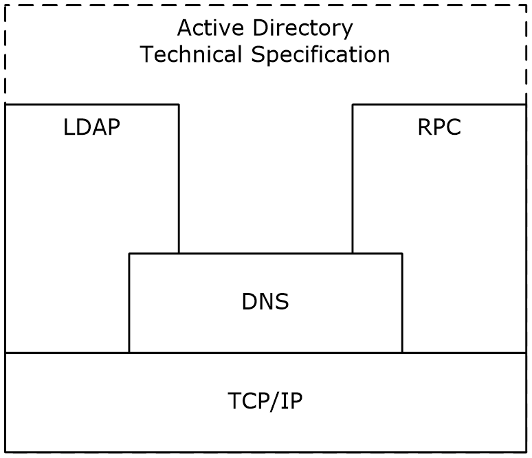

Figure 1: Protocol and technical specification relationships

Other protocols make use of implementations of the Active Directory Technical Specification as a data store.

## 1.5 Prerequisites/Preconditions

[**Active Directory**](#gt_active-directory) requires an IP network and a [**DNS**](#gt_domain-name-system-dns) infrastructure.

## 1.6 Applicability Statement

[**Active Directory**](#gt_active-directory) is not suitable for storing very large [**attribute**](#gt_attribute) values because, for instance, there is no provision for check-pointing a large data transfer to allow restart after a failure. The bandwidth and latency of typical networks makes Active Directory unsuitable for storing volatile data in [**replicated attributes**](#gt_replicated-attribute). Active Directory is especially suitable for storing security account data, including passwords, and email address book data.

## 1.7 Versioning and Capability Negotiation

Capability negotiation is performed using the root DSE as described in section [3.1.1.3.2](#Section_3.1.1.3.2.1).

## 1.8 Vendor-Extensible Fields

[**LDAP**](#gt_lightweight-directory-access-protocol-ldap) is not extensible by [**Active Directory**](#gt_active-directory) applications. Applications extend the [**directory**](#gt_directory) by adding [**objects**](#gt_object), including [**schema objects**](#gt_schema-object) to control the application objects.

## 1.9 Standards Assignments

[**Active Directory's**](#gt_active-directory) extensions and variations of [**LDAP**](#gt_lightweight-directory-access-protocol-ldap) have no standards assignments. [**AD DS**](#gt_active-directory-domain-services-ad-ds) uses private allocations for its LDAP [**global catalog (GC)**](#gt_global-catalog-gc) port (3268) and LDAP GC port with [**Secure Sockets Layer (SSL)**](#gt_secure-sockets-layer-ssl)/[**Transport Layer Security (TLS)**](#gt_transport-layer-security-tls) (3269).

# 2 Messages

The following sections specify how LDAP is transported and denote common information such as bit flag values.

## 2.1 Transport

[**LDAP**](#gt_lightweight-directory-access-protocol-ldap) transport is specified in section [3.1.1.3](#Section_1.3), and in [[RFC2251]](https://go.microsoft.com/fwlink/?LinkId=90325) section 5 (for LDAPv3), in [[RFC1777]](https://go.microsoft.com/fwlink/?LinkId=90290) section 3 (for LDAPv2), and in [[RFC1798]](https://go.microsoft.com/fwlink/?LinkId=90292) section 3.1 (for both LDAPv2 and LDAPv3).

When sending any control to the DC which does not require a controlValue field, the client sets the controlValue field of the Control structure to an OctetString of length zero and explicitly encodes this rather than omitting the **controlValue** field as indicated in [RFC2251] section 4.12.1. The server MUST ignore any **controlValue** provided in such requests.

## 2.2 Message Syntax

This section specifies types and data structures used in the remainder of this document. These type specifications reference the following:

- DWORD and FILETIME types: [MS-DTYP](../MS-DTYP/MS-DTYP.md) sections 2.2.9 and 2.3.3.
- repsFrom, repsTo, replUpToDateVector abstract [**attributes**](#gt_attribute) of an [**NC replica**](#gt_nc-replica): [MS-DRSR](../MS-DRSR/MS-DRSR.md) sections 5.172, 5.173, and 5.166.
- ReplUpToDateVector abstract type of a NC replica: [MS-DRSR] section 5.166.
- kCCFailedConnections, kCCFailedLinks, RPCClientContexts, RPCOutgoingContexts, ldapConnections, and replicationQueue variables of a [**DC**](#gt_domain-controller-dc): [MS-DRSR] sections 5.111, 5.112, 5.177, 5.178, 5.116, and 5.164.
- [**Stamp**](#gt_stamp) variable of an attribute: [MS-DRSR] section 5.11.
- Stamp variable of a [**link value**](#gt_link-value): [MS-DRSR] section 5.118.
- DS_REPL_ATTR_META_DATA_2, DS_REPL_CURSOR_3W, DS_REPL_KCC_DSA_FAILUREW, DS_REPL_NEIGHBORW, DS_REPL_OPW, DS_REPL_VALUE_META_DATA_2 types: [MS-DRSR] section 4.1.13.1.
- IDL_DRSGetReplInfo method: [MS-DRSR] section 4.1.13.

### 2.2.1 LCID-Locale Mapping Table

The following table maps Windows locales (for example, French - France, Irish - Ireland) to numeric identifiers called locale identifiers (LCIDs). These numeric identifiers are used as input to the [**Unicode**](#gt_unicode) string comparison function specified in section [6.5](#Section_1.3). They are also used to name Display Specifier [**containers**](#gt_container), specified in section [6.1.1.2.3](#Section_6.1.1.2.3.1), "Display Specifiers Container".

| LCID | Language | Location |
| --- | --- | --- |
| 0436 | Afrikaans | South Africa |
| 041c | Albanian | Albania |
| 0401 | Arabic | Saudi Arabia |
| 0801 | Arabic | Iraq |
| 0c01 | Arabic | Egypt |
| 1001 | Arabic | Libya |
| 1401 | Arabic | Algeria |
| 1801 | Arabic | Morocco |
| 1c01 | Arabic | Tunisia |
| 2001 | Arabic | Oman |
| 2401 | Arabic | Yemen |
| 2801 | Arabic | Syria |
| 2c01 | Arabic | Jordan |
| 3001 | Arabic | Lebanon |
| 3401 | Arabic | Kuwait |
| 3801 | Arabic | U.A.E. |
| 3c01 | Arabic | Bahrain |
| 4001 | Arabic | Qatar |
| 042b | Armenian | Armenia |
| 082c | Azeri (Cyrillic) | Azerbaijan |
| 042c | Azeri (Latin) | Azerbaijan |
| 042d | Basque | Basque |
| 0423 | Belarusian | Belarus |
| 201a | Bosnian (Cyrillic) | Bosnia and Herzegovina |
| 141a | Bosnian (Latin) | Bosnia and Herzegovina |
| 0402 | Bulgarian | Bulgaria |
| 0403 | Catalan | Catalan |
| 0004 | Chinese | Simplified |
| 0404 | Chinese | Taiwan |
| 0804 | Chinese | PRC |
| 0c04 | Chinese | Hong Kong SAR |
| 1004 | Chinese | Singapore |
| 1404 | Chinese | Macao SAR |
| 7c04 | Chinese | Traditional |
| 041a | Croatian | Croatia |
| 101a | Croatian (Latin) | Bosnia and Herzegovina |
| 0405 | Czech | Czech Republic |
| 0406 | Danish | Denmark |
| 0465 | Divehi | Maldives |
| 0813 | Dutch | Belgium |
| 0413 | Dutch | Netherlands |
| 1009 | English | Canada |
| 2009 | English | Jamaica |
| 2409 | English | Caribbean |
| 2809 | English | Belize |
| 2c09 | English | Trinidad |
| 0809 | English | United Kingdom |
| 1809 | English | Ireland |
| 1c09 | English | South Africa |
| 3009 | English | Zimbabwe |
| 0c09 | English | Australia |
| 1409 | English | New Zealand |
| 3409 | English | Philippines |
| 0409 | English | United States |
| 0425 | Estonian | Estonia |
| 0438 | Faroese | Faroe Islands |
| 0464 | Filipino | Philippines |
| 040b | Finnish | Finland |
| 0c0c | French | Canada |
| 040c | French | France |
| 180c | French | Monaco |
| 100c | French | Switzerland |
| 080c | French | Belgium |
| 140c | French | Luxembourg |
| 0462 | Frisian | Netherlands |
| 0456 | Galician | Galician |
| 0437 | Georgian | Georgia |
| 0407 | German | Germany |
| 0807 | German | Switzerland |
| 0c07 | German | Austria |
| 1407 | German | Liechtenstein |
| 1007 | German | Luxembourg |
| 0408 | Greek | Greece |
| 0447 | Gujarati | India |
| 040d | Hebrew | Israel |
| 0439 | Hindi | India |
| 040e | Hungarian | Hungary |
| 040f | Icelandic | Iceland |
| 0421 | Indonesian | Indonesia |
| 085d | Inuktitut (Latin) | Canada |
| 083c | Irish | Ireland |
| 0434 | isiXhosa | South Africa |
| 0435 | isiZulu | South Africa |
| 0410 | Italian | Italy |
| 0810 | Italian | Switzerland |
| 0411 | Japanese | Japan |
| 044b | Kannada | India |
| 043f | Kazakh | Kazakhstan |
| 0441 | Kiswahili | Kenya |
| 0457 | Konkani | India |
| 0412 | Korean | Korea |
| 0440 | Kyrgyz | Kirghizstan |
| 0426 | Latvian | Latvia |
| 0427 | Lithuanian | Lithuania |
| 046e | Luxembourgish | Luxembourg |
| 042f | North Macedonian | North Macedonia, Republic of |
| 043e | Malay | Malaysia |
| 083e | Malay | Brunei Darussalam |
| 043a | Maltese | Malta |
| 0481 | Maori | New Zealand |
| 047a | Mapudungun | Chile |
| 044e | Marathi | India |
| 047c | Mohawk | Mohawk |
| 0450 | Mongolian (Cyrillic) | Mongolia |
| 0461 | Nepali | Nepal |
| 0414 | Norwegian (Bokmål) | Norway |
| 0814 | Norwegian (Nynorsk) | Norway |
| 0463 | Pashto | Afghanistan |
| 0429 | Persian | Iran |
| 0415 | Polish | Poland |
| 0416 | Portuguese | Brazil |
| 0816 | Portuguese | Portugal |
| 0446 | Punjabi (Gurmukhi) | India |
| 046b | Quechua | Bolivia |
| 086b | Quechua | Ecuador |
| 0c6b | Quechua | Peru |
| 0418 | Romanian | Romania |
| 0417 | Romansh | Switzerland |
| 0419 | Russian | Russia |
| 243b | Sami, Inari | Finland |
| 143b | Sami, Lule | Sweden |
| 103b | Sami, Lule | Norway |
| 043b | Sami, Northern | Norway |
| 083b | Sami, Northern | Sweden |
| 0c3b | Sami, Northern | Finland |
| 203b | Sami, Skolt | Finland |
| 183b | Sami, Southern | Norway |
| 1c3b | Sami, Southern | Sweden |
| 044f | Sanskrit | India |
| 0c1a | Serbian (Cyrillic) | Serbia |
| 0c1a | Serbian (Cyrillic) | Montenegro |
| 1c1a | Serbian (Cyrillic) | Bosnia and Herzegovina |
| 081a | Serbian (Latin) | Serbia |
| 081a | Serbian (Latin) | Montenegro |
| 181a | Serbian (Latin) | Bosnia and Herzegovina |
| 046c | Sesotho sa Leboa | South Africa |
| 0432 | Setswana | South Africa |
| 041b | Slovak | Slovakia |
| 0424 | Slovenian | Slovenia |
| 080a | Spanish | Mexico |
| 100a | Spanish | Guatemala |
| 140a | Spanish | Costa Rica |
| 180a | Spanish | Panama |
| 1c0a | Spanish | Dominican Republic |
| 200a | Spanish | Venezuela |
| 240a | Spanish | Colombia |
| 280a | Spanish | Peru |
| 2c0a | Spanish | Argentina |
| 300a | Spanish | Ecuador |
| 340a | Spanish | Chile |
| 3c0a | Spanish | Paraguay |
| 400a | Spanish | Bolivia |
| 440a | Spanish | El Salvador |
| 480a | Spanish | Honduras |
| 4c0a | Spanish | Nicaragua |
| 500a | Spanish | Commonwealth of Puerto Rico |
| 380a | Spanish | Uruguay |
| 0c0a | Spanish (International Sort) | Spain |
| 040a | Spanish (Traditional Sort) | Spain |
| 041d | Swedish | Sweden |
| 081d | Swedish | Finland |
| 045a | Syriac | Syria |
| 0449 | Tamil | India |
| 0444 | Tatar | Russia |
| 044a | Telugu | India |
| 041e | Thai | Thailand |
| 041f | Turkish | Turkey |
| 0422 | Ukrainian | Ukraine |
| 0420 | Urdu | Pakistan |
| 0843 | Uzbek (Cyrillic) | Uzbekistan |
| 0443 | Uzbek (Latin) | Uzbekistan |
| 042a | Vietnamese | Vietnam |
| 0452 | Welsh | United Kingdom |

### 2.2.2 DS_REPL_NEIGHBORW_BLOB

The **DS_REPL_NEIGHBORW_BLOB** structure is a representation of a tuple from the repsFrom or repsTo abstract [**attribute**](#gt_attribute) of an [**NC replica**](#gt_nc-replica). This structure, retrieved using an [**LDAP**](#gt_lightweight-directory-access-protocol-ldap) search method, is an alternative representation of DS_REPL_NEIGHBORW, retrieved using the IDL_DRSGetReplInfo [**RPC**](#gt_remote-procedure-call-rpc) method.

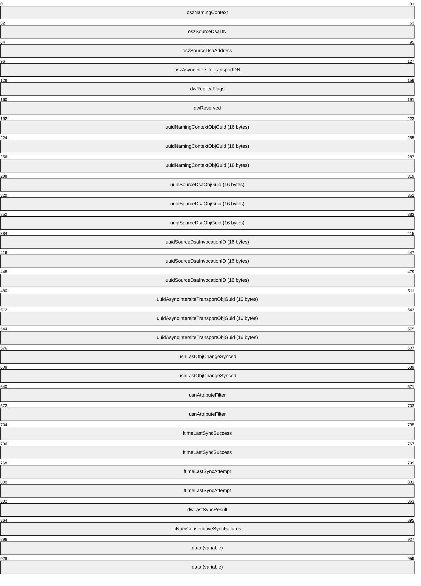
```mermaid
packet-beta
  0-31: "oszNamingContext"
  32-63: "oszSourceDsaDN"
  64-95: "oszSourceDsaAddress"
  96-127: "oszAsyncIntersiteTransportDN"
  128-159: "dwReplicaFlags"
  160-191: "dwReserved"
  192-287: "uuidNamingContextObjGuid (16 bytes)"
  288-383: "uuidSourceDsaObjGuid (16 bytes)"
  384-479: "uuidSourceDsaInvocationID (16 bytes)"
  480-575: "uuidAsyncIntersiteTransportObjGuid (16 bytes)"
  576-639: "usnLastObjChangeSynced"
  640-703: "usnAttributeFilter"
  704-767: "ftimeLastSyncSuccess"
  768-831: "ftimeLastSyncAttempt"
  832-863: "dwLastSyncResult"
  864-895: "cNumConsecutiveSyncFailures"
  896-959: "data (variable)"
```

**oszNamingContext (4 bytes):** A 32-bit offset, in bytes, from the address of this structure to a null-terminated [**Unicode**](#gt_unicode) string that contains the [**naming context (NC)**](#gt_naming-context-nc) to which this [**replication**](#gt_replication) state data pertains.

**oszSourceDsaDN (4 bytes):** A 32-bit offset, in bytes, from the address of this structure to a null-terminated Unicode string that contains the [**distinguished name (DN)**](#gt_distinguished-name-dn) of the [**nTDSDSA object**](#gt_ntdsdsa-object) of the source server to which this replication state data pertains. Each source server has different associated neighbor data.

**oszSourceDsaAddress (4 bytes):** A 32-bit offset, in bytes, from the address of this structure to a null-terminated Unicode string that contains the transport-specific network address of the source server—that is, a [**directory**](#gt_directory) name service name for RPC/IP replication, or a [**Simple Mail Transfer Protocol (SMTP)**](#gt_simple-mail-transfer-protocol-smtp) address for an SMTP replication.

**oszAsyncIntersiteTransportDN (4 bytes):** A 32-bit offset, in bytes, from the address of this structure to a null-terminated Unicode string that contains the DN of the interSiteTransport object (as specified in [MS-ADSC](#Section_3.1.1.2) section 2.65) that corresponds to the transport over which replication is performed. This member contains NULL for RPC/IP replication.

**dwReplicaFlags (4 bytes):** A 32-bit bit field containing a set of flags that specify attributes and options for the replication data. This can be zero or a combination of one or more of the following flags presented in [**big-endian**](#gt_big-endian) byte order.

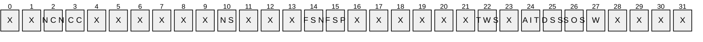
```mermaid
packet-beta
  0-0: "X"
  1-1: "X"
  2-2: "N C N"
  3-3: "C C"
  4-4: "X"
  5-5: "X"
  6-6: "X"
  7-7: "X"
  8-8: "X"
  9-9: "X"
  10-10: "N S"
  11-11: "X"
  12-12: "X"
  13-13: "X"
  14-14: "F S N"
  15-15: "F S P"
  16-16: "X"
  17-17: "X"
  18-18: "X"
  19-19: "X"
  20-20: "X"
  21-21: "X"
  22-22: "T W S"
  23-23: "X"
  24-24: "A I T"
  25-25: "D S S"
  26-26: "S O S"
  27-27: "W"
  28-28: "X"
  29-29: "X"
  30-30: "X"
  31-31: "X"
```

**X:** Unused. Must be zero and ignored.

**W (DS_REPL_NBR_WRITEABLE, 0x00000010):** The NC replica is writable.

**SOS (DS_REPL_NBR_SYNC_ON_STARTUP, 0x00000020):** Replication of this NC from this source is attempted when the destination server is booted.

**DSS (DS_REPL_NBR_DO_SCHEDULED_SYNCS, 0x00000040):** Perform replication on a schedule.

**AIT (DS_REPL_NBR_USE_ASYNC_INTERSITE_TRANSPORT, 0x00000080):** Perform replication indirectly through the Inter-Site Messaging Service. This flag is set only when replicating over SMTP. This flag is not set when replicating over inter-site RPC/IP.

**TWS (DS_REPL_NBR_TWO_WAY_SYNC, 0x00000200):** When inbound replication is complete, the destination server requests the source server to synchronize in the reverse direction.

**FSP (DS_REPL_NBR_FULL_SYNC_IN_PROGRESS, 0x00010000):** The destination server is performing a full synchronization from the source server.

**FSN (DS_REPL_NBR_FULL_SYNC_NEXT_PACKET, 0x00020000):** The last packet from the source indicated a modification of an object that the destination server has not yet created. The next packet to be requested instructs the source server to put all attributes of the modified object into the packet.

**NS (DS_REPL_NBR_NEVER_SYNCED, 0x00200000):** A synchronization has never been successfully completed from this source.

**CC (DS_REPL_NBR_COMPRESS_CHANGES, 0x10000000):** Changes received from this source are to be compressed.

**NCN (DS_REPL_NBR_NO_CHANGE_NOTIFICATIONS, 0x20000000):** Applies to repsFrom only. The [**domain controller (DC)**](#gt_domain-controller-dc) storing this repsFrom is not configured to receive change notifications from this source.

**dwReserved (4 bytes):** Reserved for future use.

**uuidNamingContextObjGuid (16 bytes):** A GUID structure, as defined in [MS-DTYP](../MS-DTYP/MS-DTYP.md) section 2.3.4, specifying the objectGUID of the NC that corresponds to oszNamingContext.

**uuidSourceDsaObjGuid (16 bytes):** A GUID structure, as defined in [MS-DTYP] section 2.3.4, specifying the objectGUID of the nTDSDSA object that corresponds to oszSourceDsaDN.

**uuidSourceDsaInvocationID (16 bytes):** A GUID structure, as defined in [MS-DTYP] section 2.3.4, specifying the [**invocationId**](#gt_e7869b9a-61fa-46e3-89dd-fb3f57d1ba7a) used by the source server as of the last replication attempt.

**uuidAsyncIntersiteTransportObjGuid (16 bytes):** A GUID structure, as defined in [MS-DTYP] section 2.3.4, specifying the objectGUID of the intersite transport [**object**](#gt_object) that corresponds to oszAsyncIntersiteTransportDN.

**usnLastObjChangeSynced (8 bytes):** An [**update sequence number (USN)**](#gt_update-sequence-number-usn) value, as defined in section [3.1.1.1.9](#Section_3.1.1.1.9), containing the USN of the last object [**update**](#gt_update) received.

**usnAttributeFilter (8 bytes):** A USN value, as defined in section 3.1.1.1.9, containing the usnLastObjChangeSynced value at the end of the last complete, successful [**replication cycle**](#gt_replication-cycle), or 0 if none.

**ftimeLastSyncSuccess (8 bytes):** A FILETIME structure that contains the date and time that the last successful replication cycle was completed from this source. All members of this structure are zero if the replication cycle has never been completed.

**ftimeLastSyncAttempt (8 bytes):** A FILETIME structure that contains the date and time of the last replication attempt from this source. All members of this structure are zero if the replication has never been attempted.

**dwLastSyncResult (4 bytes):** A 32-bit unsigned integer specifying a [**Windows error code**](#gt_windows-error-code) associated with the last replication attempt from this source. Contains ERROR_SUCCESS if the last attempt was successful or replication was not attempted.

**cNumConsecutiveSyncFailures (4 bytes):** A 32-bit integer specifying the number of failed replication attempts that have been made from this source since the last successful replication attempt or since the source was added as a neighbor, if no previous attempt succeeded.

**data (variable):** This field contains all the null-terminated strings that are pointed to by the offset fields in the structure (oszNamingContext, oszSourceDsaDN, oszSourceDsaAddress, oszAsyncIntersiteTransportDN). The strings are packed into this field, and the offsets can be used to determine the start of each string.

All multibyte fields have [**little-endian**](#gt_little-endian) byte ordering.

### 2.2.3 DS_REPL_KCC_DSA_FAILUREW_BLOB

The **DS_REPL_KCC_DSA_FAILUREW_BLOB** structure is a representation of a tuple from the *kCCFailedConnections* or *kCCFailedLinks* variables of a [**DC**](#gt_domain-controller-dc). This structure, retrieved using an [**LDAP**](#gt_lightweight-directory-access-protocol-ldap) search method, is an alternative representation of DS_REPL_KCC_DSA_FAILUREW, retrieved using the IDL_DRSGetReplInfo [**RPC**](#gt_remote-procedure-call-rpc) method.

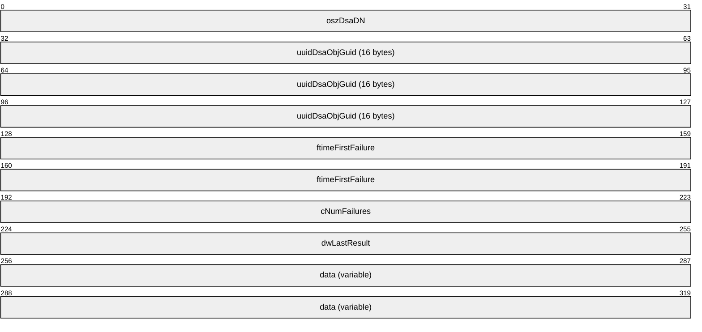
```mermaid
packet-beta
  0-31: "oszDsaDN"
  32-127: "uuidDsaObjGuid (16 bytes)"
  128-191: "ftimeFirstFailure"
  192-223: "cNumFailures"
  224-255: "dwLastResult"
  256-319: "data (variable)"
```

**oszDsaDN (4 bytes):** A 32-bit offset, in bytes, from the address of this structure to a null-terminated string that contains the [**DN**](#gt_distinguished-name-dn) of the [**nTDSDSA object**](#gt_ntdsdsa-object) of the source server.

**uuidDsaObjGuid (16 bytes):** A GUID structure, defined in [MS-DTYP](../MS-DTYP/MS-DTYP.md) section 2.3.4, specifying the objectGUID of the [**object**](#gt_object) represented by the oszDsaDN member.

**ftimeFirstFailure (8 bytes):** A FILETIME structure, the content of which depends on the requested binary [**replication**](#gt_replication) data.

| Attribute requested | Meaning |
| --- | --- |
| [msDS-ReplConnectionFailures](#Section_b4a0b2bf95f940b49301834ccadea40c) | Contains the date and time that the first failure occurred when attempting to establish a replica link to the source server. |
| msDS-ReplLinkFailures | Contains the date and time that the first failure occurred when replicating from the source server. |

**cNumFailures (4 bytes):** A 32-bit unsigned integer specifying the number of consecutive failures since the last successful replication.

**dwLastResult (4 bytes):** A 32-bit unsigned integer specifying the error code associated with the most recent failure, or ERROR_SUCCESS if no failures occurred.

**data (variable):** The **data** field contains the null-terminated string that contains the DN of the nTDSDSA object of the source server.

All multibyte fields have little-endian byte ordering.

### 2.2.4 DS_REPL_OPW_BLOB

The **DS_REPL_OPW_BLOB** structure is a representation of a tuple from the **replicationQueue** variable of a [**DC**](#gt_domain-controller-dc). This structure, retrieved using an [**LDAP**](#gt_lightweight-directory-access-protocol-ldap) search method, is an alternative representation of DS_REPL_OPW, retrieved using the IDL_DRSGetReplInfo [**RPC**](#gt_remote-procedure-call-rpc) method.

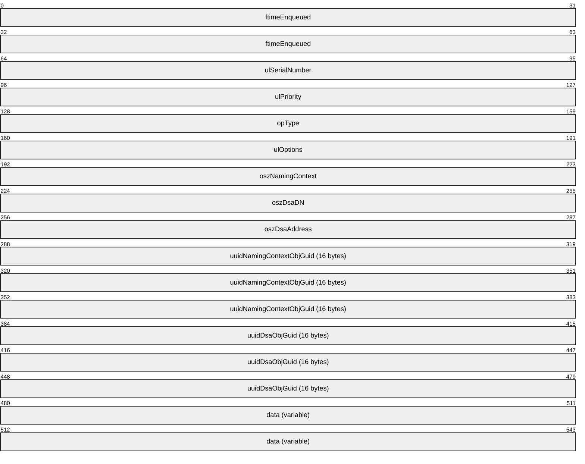
```mermaid
packet-beta
  0-63: "ftimeEnqueued"
  64-95: "ulSerialNumber"
  96-127: "ulPriority"
  128-159: "opType"
  160-191: "ulOptions"
  192-223: "oszNamingContext"
  224-255: "oszDsaDN"
  256-287: "oszDsaAddress"
  288-383: "uuidNamingContextObjGuid (16 bytes)"
  384-479: "uuidDsaObjGuid (16 bytes)"
  480-543: "data (variable)"
```

**ftimeEnqueued (8 bytes):** A FILETIME structure that contains the date and time that this operation was added to the queue.

**ulSerialNumber (4 bytes):** An unsigned integer specifying the identifier of the operation. The counter used to assign this identifier is volatile; it is reset during startup of a DC. Therefore, these identifiers are only unique between restarts of a DC.

**ulPriority (4 bytes):** An unsigned integer specifying the priority value of this operation. Tasks with a higher priority value are executed first. The priority is calculated by the server based on the type of operation and its parameters.

**opType (4 bytes):** Contains one of the following values that indicate the type of operation that this structure represents.

| Operation | Value |
| --- | --- |
| DS_REPL_OP_TYPE_SYNC | 0 |
| DS_REPL_OP_TYPE_ADD | 1 |
| DS_REPL_OP_TYPE_DELETE | 2 |
| DS_REPL_OP_TYPE_MODIFY | 3 |
| DS_REPL_OP_TYPE_UPDATE_REFS | 4 |

**ulOptions (4 bytes):** Zero or more bits from the Directory Replication Service (DRS) options defined in [MS-DRSR](../MS-DRSR/MS-DRSR.md) section 5.41, the interpretation of which depends on the **opType**.

**oszNamingContext (4 bytes):** Contains a 32-bit offset, in bytes, from the address of this structure to a null-terminated string that contains the [**DN**](#gt_distinguished-name-dn) of the [**NC**](#gt_naming-context-nc) associated with this operation (for example, the NC to be synchronized for DS_REPL_OP_TYPE_SYNC).

**oszDsaDN (4 bytes):** Contains a 32-bit offset, in bytes, from the address of this structure to a null-terminated string that contains the DN of the [**nTDSDSA object**](#gt_ntdsdsa-object) of the remote server corresponding to this operation. For example, the server from which to ask for changes for DS_REPL_OP_TYPE_SYNC. This can be NULL.

**oszDsaAddress (4 bytes):** Contains a 32-bit offset, in bytes, from the address of this structure to a null-terminated string that contains the transport-specific network address of the remote server associated with this operation. For example, the [**DNS**](#gt_domain-name-system-dns) or [**SMTP**](#gt_simple-mail-transfer-protocol-smtp) address of the server from which to ask for changes for DS_REPL_OP_TYPE_SYNC. This can be NULL.

**uuidNamingContextObjGuid (16 bytes):** A GUID structure, as defined in [MS-DTYP](../MS-DTYP/MS-DTYP.md) section 2.3.4, specifying the objectGUID of the NC identified by oszNamingContext.

**uuidDsaObjGuid (16 bytes):** A GUID structure, as defined in [MS-DTYP] section 2.3.4, specifying the objectGUID of the directory system agent [**object**](#gt_object) identified by oszDsaDN.

**data (variable):** This field contains all the null-terminated strings that are pointed to by the offset fields in the structure (**oszNamingContext**, **oszDsaDN**, **oszDsaAddress**). The strings are packed into this field and the offsets can be used to determine the start of each string.

All multibyte fields have little-endian byte ordering.

### 2.2.5 DS_REPL_QUEUE_STATISTICSW_BLOB

The **DS_REPL_QUEUE_STATISTICSW_BLOB** structure contains the statistics related to the *replicationQueue* variable of a [**DC**](#gt_domain-controller-dc), returned by reading the [msDS-ReplQueueStatistics (section 3.1.1.3.2.30)](#Section_3.1.1.3.2.30) [**rootDSE**](#gt_root-directory-system-agent-specific-entry-rootdse) [**attribute**](#gt_attribute).

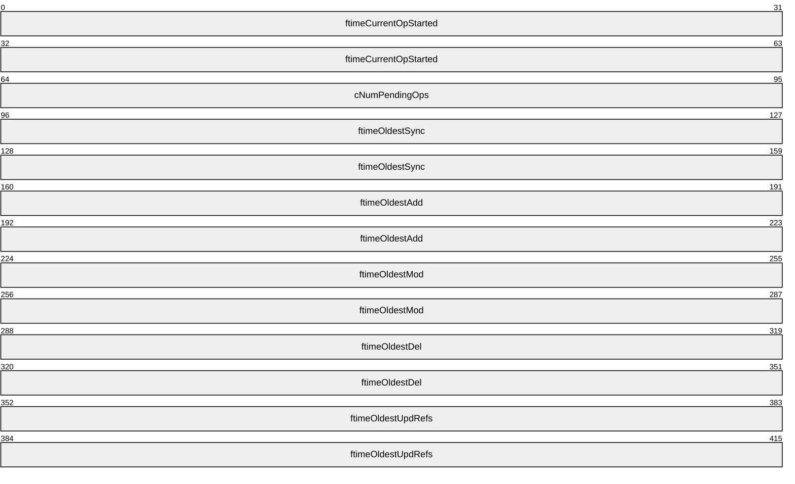
```mermaid
packet-beta
  0-63: "ftimeCurrentOpStarted"
  64-95: "cNumPendingOps"
  96-159: "ftimeOldestSync"
  160-223: "ftimeOldestAdd"
  224-287: "ftimeOldestMod"
  288-351: "ftimeOldestDel"
  352-415: "ftimeOldestUpdRefs"
```

**ftimeCurrentOpStarted (8 bytes):** A FILETIME structure that contains the date and time that the currently running operation started.

**cNumPendingOps (4 bytes):** An unsigned integer specifying the number of currently pending operations.

**ftimeOldestSync (8 bytes):** A FILETIME structure that contains the date and time of the oldest synchronization operation.

**ftimeOldestAdd (8 bytes):** A FILETIME structure that contains the date and time of the oldest add operation.

**ftimeOldestMod (8 bytes):** A FILETIME structure that contains the date and time of the oldest modification operation.

**ftimeOldestDel (8 bytes):** A FILETIME structure that contains the date and time of the oldest delete operation.

**ftimeOldestUpdRefs (8 bytes):** A FILETIME structure that contains the date and time of the oldest reference update operation.

All multibyte fields have little-endian byte ordering.

### 2.2.6 DS_REPL_CURSOR_BLOB

The **DS_REPL_CURSOR_BLOB** is the packet representation of the ReplUpToDateVector type ([MS-DRSR](../MS-DRSR/MS-DRSR.md) section 5.166) of an [**NC replica**](#gt_nc-replica). This structure, retrieved using an [**LDAP**](#gt_lightweight-directory-access-protocol-ldap) search method, is an alternative representation of DS_REPL_CURSOR_3W, retrieved using the IDL_DRSGetReplInfo [**RPC**](#gt_remote-procedure-call-rpc) method.

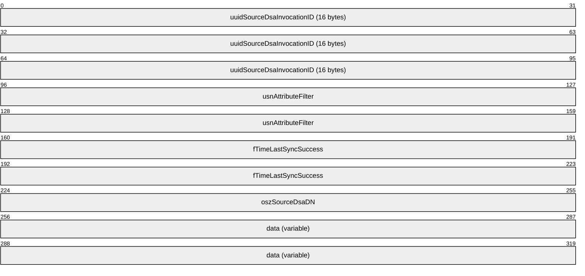
```mermaid
packet-beta
  0-95: "uuidSourceDsaInvocationID (16 bytes)"
  96-159: "usnAttributeFilter"
  160-223: "fTimeLastSyncSuccess"
  224-255: "oszSourceDsaDN"
  256-319: "data (variable)"
```

**uuidSourceDsaInvocationID (16 bytes):** A GUID structure, defined in [MS-DTYP](../MS-DTYP/MS-DTYP.md) section 2.3.4, specifying the [**invocationId**](#gt_e7869b9a-61fa-46e3-89dd-fb3f57d1ba7a) of the originating server to which the usnAttributeFilter corresponds.

**usnAttributeFilter (8 bytes):** A [**USN**](#gt_update-sequence-number-usn) value, as defined in section [3.1.1.1.9](#Section_3.1.1.1.9), containing the maximum USN to which the destination server can indicate that it has recorded all changes originated by the given server at USNs less than or equal to this USN. This is used to [**filter**](#gt_filter) changes at [**replication**](#gt_replication) source servers that the destination server has already applied.

**fTimeLastSyncSuccess (8 bytes):** A FILETIME structure that contains the date and time of the last successful synchronization operation.

**oszSourceDsaDN (4 bytes):** Contains a 32-bit offset, in bytes, from the address of this structure to a null-terminated [**Unicode**](#gt_unicode) string. The string contains the [**distinguished name**](#gt_distinguished-name-dn) of the [**directory service agent (DSA)**](#gt_directory-service-agent-dsa) that corresponds to the source server to which this replication state data applies.

**data (variable):** This field contains the null-terminated string pointed to by the offset field in the structure (oszSourceDsaDN). The offset can be used to determine the start of the string.

All multibyte fields have little-endian byte ordering.

### 2.2.7 DS_REPL_ATTR_META_DATA_BLOB

The **DS_REPL_ATTR_META_DATA_BLOB** packet is a representation of a *stamp* variable (of type [**AttributeStamp**](#gt_attributestamp)) of an [**attribute**](#gt_attribute). This structure, retrieved using an [**LDAP**](#gt_lightweight-directory-access-protocol-ldap) search method, is an alternative representation of DS_REPL_ATTR_META_DATA_2, retrieved using the IDL_DRSGetReplInfo [**RPC**](#gt_remote-procedure-call-rpc) method.

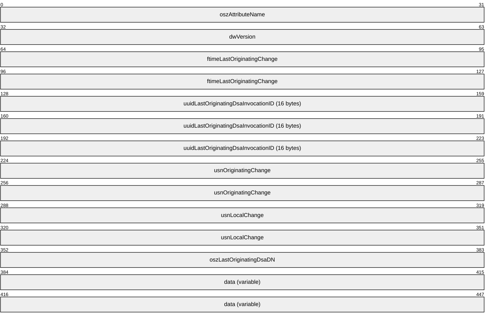
```mermaid
packet-beta
  0-31: "oszAttributeName"
  32-63: "dwVersion"
  64-127: "ftimeLastOriginatingChange"
  128-223: "uuidLastOriginatingDsaInvocationID (16 bytes)"
  224-287: "usnOriginatingChange"
  288-351: "usnLocalChange"
  352-383: "oszLastOriginatingDsaDN"
  384-447: "data (variable)"
```

**oszAttributeName (4 bytes):** Contains a 32-bit offset, in bytes, from the address of this structure to a null-terminated [**Unicode**](#gt_unicode) string that contains the LDAP display name of the attribute corresponding to this metadata.

**dwVersion (4 bytes):** Contains the *dwVersion* of this attribute's AttributeStamp, as specified in section [3.1.1.1.9](#Section_3.1.1.1.9).

**ftimeLastOriginatingChange (8 bytes):** Contains the *timeChanged* of this attribute's AttributeStamp, as specified in section 3.1.1.1.9.

**uuidLastOriginatingDsaInvocationID (16 bytes):** Contains the *uuidOriginating* of this attribute's AttributeStamp, as specified in section 3.1.1.1.9.

**usnOriginatingChange (8 bytes):** Contains the *usnOriginating* of this attribute's AttributeStamp, as specified in section 3.1.1.1.9.

**usnLocalChange (8 bytes):** A [**USN**](#gt_update-sequence-number-usn) value, defined in section 3.1.1.1.9, specifying the USN on the destination server (the server from which the metadata information is retrieved) at which the last change to this attribute was applied. This value typically is different on all servers.

**oszLastOriginatingDsaDN (4 bytes):** Contains a 32-bit offset, in bytes, from the address of this structure to a null-terminated Unicode string that contains the [**DN**](#gt_distinguished-name-dn) of the [**nTDSDSA object**](#gt_ntdsdsa-object) of the server that originated the last [**replication**](#gt_replication).

**data (variable):** This field contains all the null-terminated strings that are pointed to by the offset fields in the structure (oszAttributeName, oszLastOriginatingDsaDN). The strings are packed into this field, and the offsets can be used to determine the start of each string.

All multibyte fields have little-endian byte ordering.

### 2.2.8 DS_REPL_VALUE_META_DATA_BLOB

The **DS_REPL_VALUE_META_DATA_BLOB** packet is a representation of a *stamp* variable (of type *LinkValueStamp*) of a [**link value**](#gt_link-value). This structure, retrieved using an [**LDAP**](#gt_lightweight-directory-access-protocol-ldap) search method, is an alternative representation of DS_REPL_VALUE_META_DATA_2, retrieved using the IDL_DRSGetReplInfo [**RPC**](#gt_remote-procedure-call-rpc) method.

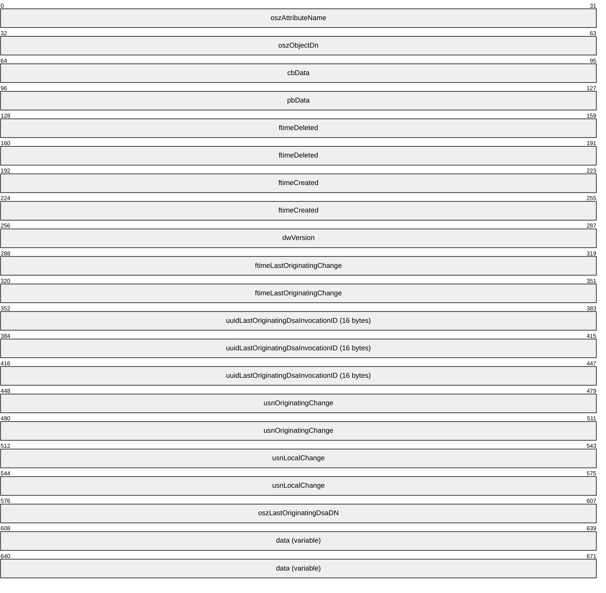
```mermaid
packet-beta
  0-31: "oszAttributeName"
  32-63: "oszObjectDn"
  64-95: "cbData"
  96-127: "pbData"
  128-191: "ftimeDeleted"
  192-255: "ftimeCreated"
  256-287: "dwVersion"
  288-351: "ftimeLastOriginatingChange"
  352-447: "uuidLastOriginatingDsaInvocationID (16 bytes)"
  448-511: "usnOriginatingChange"
  512-575: "usnLocalChange"
  576-607: "oszLastOriginatingDsaDN"
  608-671: "data (variable)"
```

**oszAttributeName (4 bytes):** Contains a 32-bit offset, in bytes, from the address of this structure to a null-terminated [**Unicode**](#gt_unicode) string that contains the LDAP display name of the [**attribute**](#gt_attribute) corresponding to this metadata.

**oszObjectDn (4 bytes):** Contains a 32-bit offset, in bytes, from the address of this structure to a null-terminated Unicode string that contains the [**DN**](#gt_distinguished-name-dn) of the [**object**](#gt_object) that this attribute belongs to.

**cbData (4 bytes):** Contains the number of bytes in the pbData array.

**pbData (4 bytes):** Contains a 32-bit offset, in bytes, from the address of this structure to a buffer that contains the attribute [**replication**](#gt_replication) metadata. The **cbData** member contains the length, in bytes, of this buffer.

**ftimeDeleted (8 bytes):** Contains the *timeDeleted* of this link value's *LinkValueStamp*, as specified in section [3.1.1.1.9](#Section_3.1.1.1.9).

**ftimeCreated (8 bytes):** Contains the *timeCreated* of this link value's *LinkValueStamp*, as specified in section 3.1.1.1.9.

**dwVersion (4 bytes):** Contains the *dwVersion* of this link value's *LinkValueStamp*, as specified in section 3.1.1.1.9.

**ftimeLastOriginatingChange (8 bytes):** Contains the *timeChanged* of this link value's *LinkValueStamp*, as specified in section 3.1.1.1.9.

**uuidLastOriginatingDsaInvocationID (16 bytes):** Contains the *uuidOriginating* of this link value's *LinkValueStamp*, as specified in section 3.1.1.1.9.

**usnOriginatingChange (8 bytes):** Contains the *usnOriginating* of this link value's *LinkValueStamp*, as specified in section 3.1.1.1.9.

**usnLocalChange (8 bytes):** Specifies the [**USN**](#gt_update-sequence-number-usn), as found on the server from which the metadata information is being retrieved, at which the last change to this attribute was applied. This value is typically different on all servers.

**oszLastOriginatingDsaDN (4 bytes):** Contains a 32-bit offset, in bytes, from the address of this structure to a null-terminated Unicode string that contains the DN of the [**nTDSDSA object**](#gt_ntdsdsa-object) of the server that originated the last replication.

**data (variable):** This field contains all the null-terminated strings that are pointed to by the offset fields in the structure (oszAttributeName, oszObjectDn, oszLastOriginatingDsaDN) and the buffer pointed to by **pbData**. The strings and buffers are packed into this field (aligned at 32-bit boundaries), and the offsets can be used to determine the start of each string.

All multibyte fields have little-endian byte ordering.

### 2.2.9 Search Flags

The following table defines the valid search flags used on [**attributes**](#gt_attribute), as specified in section [3.1.1.2.3](#Section_3.1.1.2.3.1). The flags are presented in [**big-endian**](#gt_big-endian) byte order.

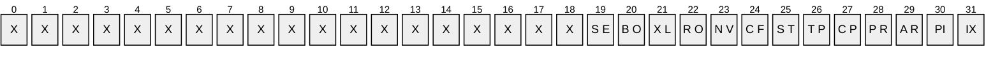
```mermaid
packet-beta
  0-0: "X"
  1-1: "X"
  2-2: "X"
  3-3: "X"
  4-4: "X"
  5-5: "X"
  6-6: "X"
  7-7: "X"
  8-8: "X"
  9-9: "X"
  10-10: "X"
  11-11: "X"
  12-12: "X"
  13-13: "X"
  14-14: "X"
  15-15: "X"
  16-16: "X"
  17-17: "X"
  18-18: "X"
  19-19: "S E"
  20-20: "B O"
  21-21: "X L"
  22-22: "R O"
  23-23: "N V"
  24-24: "C F"
  25-25: "S T"
  26-26: "T P"
  27-27: "C P"
  28-28: "P R"
  29-29: "A R"
  30-30: "PI"
  31-31: "IX"
```

**X:** Unused. Must be zero and ignored.

**IX (fATTINDEX, 0x00000001):** Specifies a hint to the [**DC**](#gt_domain-controller-dc) to create an index for the attribute.

**PI (fPDNTATTINDEX, 0x00000002):** Specifies a hint to the DC to create an index for the [**container**](#gt_container) and the attribute.

**AR(fANR, 0x00000004):** Specifies that the attribute is a member of the [**ambiguous name resolution (ANR)**](#gt_ambiguous-name-resolution-anr) set.

**PR (fPRESERVEONDELETE, 0x00000008):** Specifies that the attribute MUST be preserved on [**objects**](#gt_object) after deletion of the object (that is, when the object is transformed to a [**tombstone**](#gt_tombstone), [**deleted-object**](#gt_deleted-object), or [**recycled-object**](#gt_recycled-object)). This flag is ignored on [**link attributes**](#gt_link-attribute), objectCategory, and sAMAccountType.

**CP (fCOPY, 0x00000010):** Specifies a hint to [**LDAP**](#gt_lightweight-directory-access-protocol-ldap) clients that the attribute is intended to be copied when copying the object. This flag is not interpreted by the server.

**TP (fTUPLEINDEX, 0x00000020):** Specifies a hint for the DC to create a tuple index for the attribute. This will affect the performance of searches where the wildcard appears at the front of the search string.

**ST (fSUBTREEATTINDEX, 0x00000040):** Specifies a hint for the DC to create subtree index for a [**Virtual List View (VLV) search**](#gt_virtual-list-view-vlv-search).

**CF (fCONFIDENTIAL, 0x00000080):** Specifies that the attribute is confidential. An [extended access check (section 3.1.1.4.4)](#Section_3.1.1.4.4) is required.

**Note**: The effect of this flag can vary depending on whether the LDAP_SERVER_DIRSYNC_OID control (section [3.1.1.3.4.1.3](#Section_3.1.1.3.4.1.3)) or the LDAP_SERVER_DIRSYNC_EX_OID control (section [3.1.1.3.4.1.29](#Section_3.1.1.3.4.1.29)) is present in an LDAP search request. If neither of these controls is present, a confidential attribute will not be included in the LDAP search response. If one of these controls is present and the LDAP_DIRSYNC_OBJECT_SECURITY flag is set (section 3.1.1.3.4.1.3), a confidential attribute might be included in the response, but its value will be empty.

**NV (fNEVERVALUEAUDIT, 0x00000100):** Specifies that auditing of changes to individual values contained in this attribute MUST NOT be performed. Auditing is outside of the state model.

**RO (fRODCFilteredAttribute, 0x00000200):** Specifies that the attribute is a member of the [**filtered attribute set**](#gt_filtered-attribute-set).

**XL (fEXTENDEDLINKTRACKING, 0x00000400):** Specifies a hint to the DC to perform additional implementation-specific, nonvisible tracking of [**link values**](#gt_link-value). The behavior of this hint is outside the state model.

**BO (fBASEONLY, 0x00000800):** Specifies that the attribute is not to be returned by search operations that are not scoped to a single object. Read operations that would otherwise return an attribute that has this search flag set instead fail with *operationsError* / *ERROR_DS_NON_BASE_SEARCH*.

**SE (fPARTITIONSECRET, 0x00001000):** Specifies that the attribute is a partition secret. An extended [**access check**](#gt_access-check) is required.

Flags that specify "hints" only direct the server to create certain indices that affect the system performance. The effects of these flags are outside the state model. Implementations are permitted to ignore these flags.

### 2.2.10 System Flags

The following table defines the valid system flags used on [**directory objects**](#gt_directory-object). The flags are presented in [**big-endian**](#gt_big-endian) byte order.

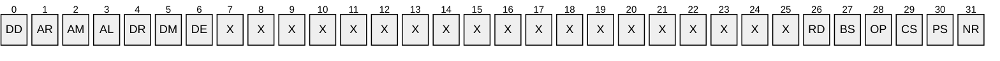
```mermaid
packet-beta
  0-0: "DD"
  1-1: "AR"
  2-2: "AM"
  3-3: "AL"
  4-4: "DR"
  5-5: "DM"
  6-6: "DE"
  7-7: "X"
  8-8: "X"
  9-9: "X"
  10-10: "X"
  11-11: "X"
  12-12: "X"
  13-13: "X"
  14-14: "X"
  15-15: "X"
  16-16: "X"
  17-17: "X"
  18-18: "X"
  19-19: "X"
  20-20: "X"
  21-21: "X"
  22-22: "X"
  23-23: "X"
  24-24: "X"
  25-25: "X"
  26-26: "RD"
  27-27: "BS"
  28-28: "OP"
  29-29: "CS"
  30-30: "PS"
  31-31: "NR"
```

**X:** Unused. Must be zero and ignored.

**NR (FLAG_ATTR_NOT_REPLICATED or FLAG_CR_NTDS_NC, 0x00000001):** When used on an attributeSchema [**object**](#gt_object), it specifies that this [**attribute**](#gt_attribute) is not replicated. If it is used on a [**crossRef object**](#gt_crossref-object), it specifies that the [**NC**](#gt_naming-context-nc) that the crossRef is for is an [**Active Directory**](#gt_active-directory) NC.

**PS (FLAG_ATTR_REQ_PARTIAL_SET_MEMBER or FLAG_CR_NTDS_DOMAIN, 0x00000002):** When used on an attributeSchema object, it specifies that the attribute is a member of a [**partial attribute set (PAS)**](#gt_partial-attribute-set-pas). If used on a crossRef object, it specifies that the NC is a [**domain NC**](#gt_domain-naming-context-domain-nc).

**CS (FLAG_ATTR_IS_CONSTRUCTED or FLAG_CR_NTDS_NOT_GC_REPLICATED, 0x00000004):** When used on an attributeSchema object, this flag specifies that the attribute is a [**constructed attribute**](#gt_constructed-attribute). If used on a crossRef object, it specifies that the NC is not to be replicated to [**GCs**](#gt_global-catalog-gc).

**OP (FLAG_ATTR_IS_OPERATIONAL, 0x00000008):** Only used on an attributeSchema object. It specifies that the attribute (2) is an [**operational attribute**](#gt_operational-attribute).

**BS (FLAG_SCHEMA_BASE_OBJECT, 0x00000010):** Only used on attributeSchema and classSchema object. It specifies that this attribute or class is part of the base [**schema**](#gt_schema). Modifications to base [**schema objects**](#gt_schema-object) are specially restricted.

**RD (FLAG_ATTR_IS_RDN, 0x00000020):** Only used on an attributeSchema object. It specifies that this attribute can be used as an [**RDN attribute**](#gt_rdn-attribute).

**DE (FLAG_DISALLOW_MOVE_ON_DELETE, 0x02000000):** Specifies that the object does not move to the [**Deleted Objects**](#gt_deleted-object) [**container**](#gt_container) when the object is deleted.

**DM (FLAG_DOMAIN_DISALLOW_MOVE, 0x04000000):** Specifies that if the object is in a domain NC, the object cannot be moved.

**DR (FLAG_DOMAIN_DISALLOW_RENAME, 0x08000000):** Specifies that if the object is in a domain NC, the object cannot be renamed.

**AL (FLAG_CONFIG_ALLOW_LIMITED_MOVE, 0x10000000):** Specifies that if the object is in the [**config NC**](#gt_configuration-naming-context-config-nc), the object can be moved, with restrictions.

**AM (FLAG_CONFIG_ALLOW_MOVE, 0x20000000):** Specifies that if the object is in the config NC, the object can be moved.

**AR (FLAG_CONFIG_ALLOW_RENAME, 0x40000000):** Specifies that if the object is in the config NC, the object can be renamed.

**DD (FLAG_DISALLOW_DELETE, 0x80000000):** Specifies that the object cannot be deleted.

### 2.2.11 schemaFlagsEx Flags

The following table defines the valid schemaFlagsEx flags that are used on [**attributes**](#gt_attribute), as specified in section [3.1.1.2.3](#Section_3.1.1.2.3.1). The flags are presented in [**big-endian**](#gt_big-endian) byte order.

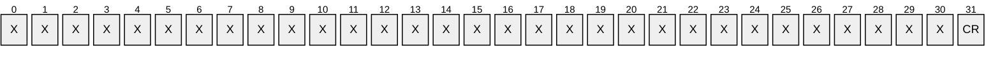
```mermaid
packet-beta
  0-0: "X"
  1-1: "X"
  2-2: "X"
  3-3: "X"
  4-4: "X"
  5-5: "X"
  6-6: "X"
  7-7: "X"
  8-8: "X"
  9-9: "X"
  10-10: "X"
  11-11: "X"
  12-12: "X"
  13-13: "X"
  14-14: "X"
  15-15: "X"
  16-16: "X"
  17-17: "X"
  18-18: "X"
  19-19: "X"
  20-20: "X"
  21-21: "X"
  22-22: "X"
  23-23: "X"
  24-24: "X"
  25-25: "X"
  26-26: "X"
  27-27: "X"
  28-28: "X"
  29-29: "X"
  30-30: "X"
  31-31: "CR"
```

**X:** Unused. MUST be zero and ignored.

**CR (FLAG_ATTR_IS_CRITICAL, 0x00000001):** Specifies that the attribute is not a member of the [**filtered attribute set**](#gt_filtered-attribute-set) even if the fRODCFilteredAttribute flag is set. For more details, see sections 3.1.1.2.3 and [3.1.1.2.3.5](#Section_3.1.1.2.3.5).

### 2.2.12 Group Type Flags

Constants for defining [**group**](#gt_group) type. These constants define the values that are used in the groupType [**attribute**](#gt_attribute).

| Symbolic name | Value |
| --- | --- |
| GROUP_TYPE_BUILTIN_LOCAL_GROUP | 0x00000001 |
| GROUP_TYPE_ACCOUNT_GROUP | 0x00000002 |
| GROUP_TYPE_RESOURCE_GROUP | 0x00000004 |
| GROUP_TYPE_UNIVERSAL_GROUP | 0x00000008 |
| GROUP_TYPE_APP_BASIC_GROUP | 0x00000010 |
| GROUP_TYPE_APP_QUERY_GROUP | 0x00000020 |
| GROUP_TYPE_SECURITY_ENABLED | 0x80000000 |

**GROUP_TYPE_BUILTIN_LOCAL_GROUP:** Specifies a group that is created by the system.

**GROUP_TYPE_ACCOUNT_GROUP:** Specifies a [**global group**](#gt_global-group).

**GROUP_TYPE_RESOURCE_GROUP:** Specifies a [**domain local group**](#gt_domain-local-group).

**GROUP_TYPE_UNIVERSAL_GROUP:** Specifies a [**universal group**](#gt_universal-group).

**GROUP_TYPE_APP_BASIC_GROUP:** Groups of this type are not used by [**Active Directory**](#gt_active-directory). This constant is included in this document because the value of this constant is used by Active Directory in processing the groupType attribute (see section [3.1.1.5.4.2.2](#Section_3.1.1.5.4.2.2)).

**GROUP_TYPE_APP_QUERY_GROUP:** Groups of this type are not used by Active Directory. This constant is included in this document because the value of this constant is used by Active Directory in processing the groupType attribute.

**GROUP_TYPE_SECURITY_ENABLED:** Specifies a [**security-enabled group**](#gt_security-enabled-group).

The flag GROUP_TYPE_BUILTIN_LOCAL_GROUP is reserved for use by the system, and can be set in combination with other flags on system-created **Builtin** [**objects**](#gt_object) (see section [6.1.1.4.12](#Section_6.1.1.4.12.6)). The flag GROUP_TYPE_BUILTIN_LOCAL_GROUP cannot be set by clients.

Otherwise, the flags GROUP_TYPE_ACCOUNT_GROUP, GROUP_TYPE_RESOURCE_GROUP, GROUP_TYPE_UNIVERSAL_GROUP, GROUP_TYPE_APP_BASIC_GROUP, and GROUP_TYPE_APP_QUERY_GROUP are mutually exclusive, and only one value MUST be set. The flag GROUP_TYPE_SECURITY_ENABLED can be combined using a bitwise OR with flags GROUP_TYPE_BUILTIN_LOCAL_GROUP, GROUP_TYPE_ACCOUNT_GROUP, GROUP_TYPE_RESOURCE_GROUP, and GROUP_TYPE_UNIVERSAL_GROUP.

### 2.2.13 Group Security Flags

Constants for defining [**group**](#gt_group) security [**attributes**](#gt_attribute).

| Symbolic name | Value |
| --- | --- |
| SE_GROUP_OWNER | 0x00000008 |
| SE_GROUP_USE_FOR_DENY_ONLY | 0x00000010 |

**SE_GROUP_OWNER:** Specifies that a particular user is the owner of the group.

**SE_GROUP_USE_FOR_DENY_ONLY:** Specifies that the group is used only for denial of access.

### 2.2.14 Security Privilege Flags

Constants for defining security [**privilege**](#gt_privilege).

| Symbolic name | Value |
| --- | --- |
| SE_SECURITY_PRIVILEGE | 0x00000008 |
| SE_TAKE_OWNERSHIP_PRIVILEGE | 0x00000009 |
| SE_RESTORE_PRIVILEGE | 0x00000012 |
| SE_DEBUG_PRIVILEGE | 0x00000014 |
| SE_ENABLE_DELEGATION_PRIVILEGE | 0x0000001B |

**SE_SECURITY_PRIVILEGE**: Specifies the privilege to manage auditing and the security log.

**SE_TAKE_OWNERSHIP_PRIVILEGE**: Specifies the privilege to take ownership of [**objects**](#gt_object). Possession of this privilege overrides the [**DACL**](#gt_discretionary-access-control-list-dacl) on an object and gives the possessor implicit RIGHT_WRITE_OWNER access.

**SE_RESTORE_PRIVILEGE**: Specifies the privilege to restore objects.

**SE_DEBUG_PRIVILEGE**: Specifies the privilege to debug the system.

**SE_ENABLE_DELEGATION_PRIVILEGE**: Specifies the privilege to enable accounts to be [**trusted**](#gt_trust) for delegation.

### 2.2.15 Domain RID Values

Constants for defining [**domain**](#gt_domain) [**relative identifiers (RIDs)**](#gt_relative-identifier-rid).

| Symbolic name | Value |
| --- | --- |
| DOMAIN_USER_RID_ADMIN | 0x000001F4 |
| DOMAIN_USER_RID_KRBTGT | 0x000001F6 |
| DOMAIN_GROUP_RID_ADMINS | 0x00000200 |
| DOMAIN_GROUP_RID_CONTROLLERS | 0x00000204 |
| DOMAIN_GROUP_RID_SCHEMA_ADMINS | 0x00000206 |
| DOMAIN_GROUP_RID_ENTERPRISE_ADMINS | 0x00000207 |
| DOMAIN_GROUP_RID_READONLY_CONTROLLERS | 0x00000209 |
| DOMAIN_ALIAS_RID_ADMINS | 0x00000220 |
| DOMAIN_ALIAS_RID_ACCOUNT_OPS | 0x00000224 |
| DOMAIN_ALIAS_RID_SYSTEM_OPS | 0x00000225 |
| DOMAIN_ALIAS_RID_PRINT_OPS | 0x00000226 |
| DOMAIN_ALIAS_RID_BACKUP_OPS | 0x00000227 |
| DOMAIN_ALIAS_RID_REPLICATOR | 0x00000228 |

**DOMAIN_USER_RID_ADMIN:** The administrative user account in a domain.

**DOMAIN_USER_RID_KRBTGT:** The [**Kerberos**](#gt_kerberos) [**ticket-granting ticket (TGT)**](#gt_ticket-granting-ticket-tgt) account in a domain.

**DOMAIN_GROUP_RID_ADMINS:** The domain administrators' [**group**](#gt_group).

**DOMAIN_GROUP_RID_CONTROLLERS:** The [**DCs'**](#gt_domain-controller-dc) group. All DCs in the domain are members of the group.

**DOMAIN_GROUP_RID_SCHEMA_ADMINS:** The [**schema**](#gt_schema) administrators' group. Members of this group can modify the [**Active Directory**](#gt_active-directory) schema.

**DOMAIN_GROUP_RID_ENTERPRISE_ADMINS:** The enterprise administrators' group. Members of this group have full access to all domains in the Active Directory [**forest**](#gt_forest). Enterprise administrators are responsible for forest-level operations, such as adding or removing new domains.

**DOMAIN_GROUP_RID_READONLY_CONTROLLERS:** The [**read-only domain controllers**](#gt_read-only-domain-controller-rodc)' group. All read-only DCs in the domain are members of this group.

**DOMAIN_ALIAS_RID_ADMINS:** The administrators' group in the [**built-in domain**](#gt_built-in-domain).

**DOMAIN_ALIAS_RID_ACCOUNT_OPS:** A group that permits control over nonadministrator accounts.

**DOMAIN_ALIAS_RID_SYSTEM_OPS:** A group that performs system administrative functions, not including security functions. It establishes network shares, controls printers, unlocks workstations, and performs other operations.

**DOMAIN_ALIAS_RID_PRINT_OPS:** A group that controls printers and print queues.

**DOMAIN_ALIAS_RID_BACKUP_OPS:** A group that is used for controlling assignment of file backup and restoring user rights.

**DOMAIN_ALIAS_RID_REPLICATOR:** A group responsible for copying security databases to the Windows NT operating system backup controllers.

### 2.2.16 userAccountControl Bits

The userAccountControl bits are bit flags that describe various qualities of a security account. The flags are presented in [**big-endian**](#gt_big-endian) byte order.

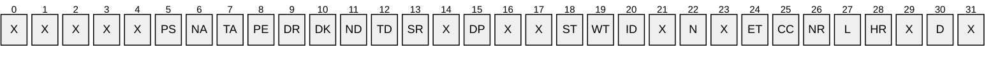
```mermaid
packet-beta
  0-0: "X"
  1-1: "X"
  2-2: "X"
  3-3: "X"
  4-4: "X"
  5-5: "PS"
  6-6: "NA"
  7-7: "TA"
  8-8: "PE"
  9-9: "DR"
  10-10: "DK"
  11-11: "ND"
  12-12: "TD"
  13-13: "SR"
  14-14: "X"
  15-15: "DP"
  16-16: "X"
  17-17: "X"
  18-18: "ST"
  19-19: "WT"
  20-20: "ID"
  21-21: "X"
  22-22: "N"
  23-23: "X"
  24-24: "ET"
  25-25: "CC"
  26-26: "NR"
  27-27: "L"
  28-28: "HR"
  29-29: "X"
  30-30: "D"
  31-31: "X"
```

**X:** Unused. Must be zero and ignored.

**D (ADS_UF_ACCOUNT_DISABLE, 0x00000002):** Specifies that the account is not enabled for [**authentication**](#gt_authentication).

**HR (ADS_UF_HOMEDIR_REQUIRED, 0x00000008):** Specifies that the homeDirectory [**attribute**](#gt_attribute) is required.

**L (ADS_UF_LOCKOUT, 0x00000010):** Specifies that the account is temporarily locked out.

**NR (ADS_UF_PASSWD_NOTREQD, 0x00000020):** Specifies that the password-length policy, as specified in [MS-SAMR](#Section_5) section [3.1.1.8.1](#Section_3.1.1.8.1), does not apply to this user.

**CC (ADS_UF_PASSWD_CANT_CHANGE, 0x00000040):** Specifies that the user cannot change his or her password.

**ET (ADS_UF_ENCRYPTED_TEXT_PASSWORD_ALLOWED, 0x00000080):** Specifies that the cleartext password is to be persisted.

**N (ADS_UF_NORMAL_ACCOUNT, 0x00000200):** Specifies that the account is the default account type that represents a typical user.

**ID (ADS_UF_INTERDOMAIN_TRUST_ACCOUNT, 0x00000800):** Specifies that the account is for a domain-to-domain [**trust**](#gt_trust).

**WT (ADS_UF_WORKSTATION_TRUST_ACCOUNT, 0x00001000):** Specifies that the account is a computer account for a computer that is a member of this [**domain**](#gt_domain).

**ST (ADS_UF_SERVER_TRUST_ACCOUNT, 0x00002000):** Specifies that the account is a computer account for a [**DC**](#gt_domain-controller-dc).

**DP (ADS_UF_DONT_EXPIRE_PASSWD, 0x00010000):** Specifies that the password does not expire for the account.

**SR (ADS_UF_SMARTCARD_REQUIRED, 0x00040000):** Specifies that a smart card is required to log in to the account.

**TD (ADS_UF_TRUSTED_FOR_DELEGATION, 0x00080000):** Used by the [**Kerberos**](#gt_kerberos) protocol. This bit indicates that the "OK as Delegate" ticket flag, as specified in [[RFC4120]](https://go.microsoft.com/fwlink/?LinkId=90458) section 2.8, MUST be set.

**ND (ADS_UF_NOT_DELEGATED, 0x00100000):** Used by the Kerberos protocol. This bit indicates that the [**ticket-granting tickets (TGTs)**](#gt_ticket-granting-ticket-tgt) of this account and the service tickets obtained by this account are not marked as forwardable or proxiable when the forwardable or proxiable ticket flags are requested. For more details, see [RFC4120].

**DK (ADS_UF_USE_DES_KEY_ONLY, 0x00200000):** Used by the Kerberos protocol. This bit indicates that only des-cbc-md5 or des-cbc-crc keys, as specified in [[RFC3961]](https://go.microsoft.com/fwlink/?LinkId=90450), are used in the Kerberos protocols for this account.

**DR (ADS_UF_DONT_REQUIRE_PREAUTH, 0x00400000):** Used by the Kerberos protocol. This bit indicates that the account is not required to present valid preauthentication data, as described in [RFC4120] section 7.5.2.

**PE (ADS_UF_PASSWORD_EXPIRED, 0x00800000):** Specifies that the password age on the user has exceeded the maximum password age policy.

**TA (ADS_UF_TRUSTED_TO_AUTHENTICATE_FOR_DELEGATION, 0x01000000):** Used by the Kerberos protocol. When set, this bit indicates that the account (when running as a service) obtains an S4U2self service ticket (as specified in [MS-SFU](../MS-SFU/MS-SFU.md)) with the forwardable flag set. If this bit is cleared, the forwardable flag is not set in the S4U2self service ticket.

**NA (ADS_UF_NO_AUTH_DATA_REQUIRED, 0x02000000):** Used by the Kerberos protocol. This bit indicates that when the Key Distribution Center (KDC) is issuing a service ticket for this account, the Privilege Attribute Certificate (PAC) MUST NOT be included. For more details, see [RFC4120].

**PS (ADS_UF_PARTIAL_SECRETS_ACCOUNT, 0x04000000):** Specifies that the account is a computer account for a [**read-only domain controller (RODC)**](#gt_read-only-domain-controller-rodc). If this bit is set, the ADS_UF_WORKSTATION_TRUST_ACCOUNT MUST also be set. This flag is only interpreted by a DC whose [**DC functional level**](#gt_dc-functional-level) is DS_BEHAVIOR_WIN2008 or greater.

### 2.2.17 Optional Feature Values

The optional feature values are constants for defining behaviors of [**optional features**](#gt_optional-feature).

| Symbolic name | Value |
| --- | --- |
| FOREST_OPTIONAL_FEATURE | 0x00000001 |
| DOMAIN_OPTIONAL_FEATURE | 0x00000002 |
| DISABLABLE_OPTIONAL_FEATURE | 0x00000004 |
| SERVER_OPTIONAL_FEATURE | 0x00000008 |

**FOREST_OPTIONAL_FEATURE:** Specifies that the scope of the optional feature is forest-wide.

**DOMAIN_OPTIONAL_FEATURE:** Specifies that the scope of the optional feature is domain-wide.

**DISABLABLE_OPTIONAL_FEATURE:** Specifies that the optional feature can be disabled.

**SERVER_OPTIONAL_FEATURE:** Specifies that the scope of the optional feature is server-wide.

For more details, see section [3.1.1.9](#Section_3.1.1.9.2).

### 2.2.18 Claims Wire Structures

The claims wire structures are structures related to [**claims**](#gt_claim) using [**interface definition language (IDL)**](#gt_interface-definition-language-idl) format. This section defines those structures. The term [**marshal**](#gt_marshal) refers to converting these structures into the appropriate wire format.

The following figure illustrates the nesting of various larger claims structures for descriptive reference purposes.

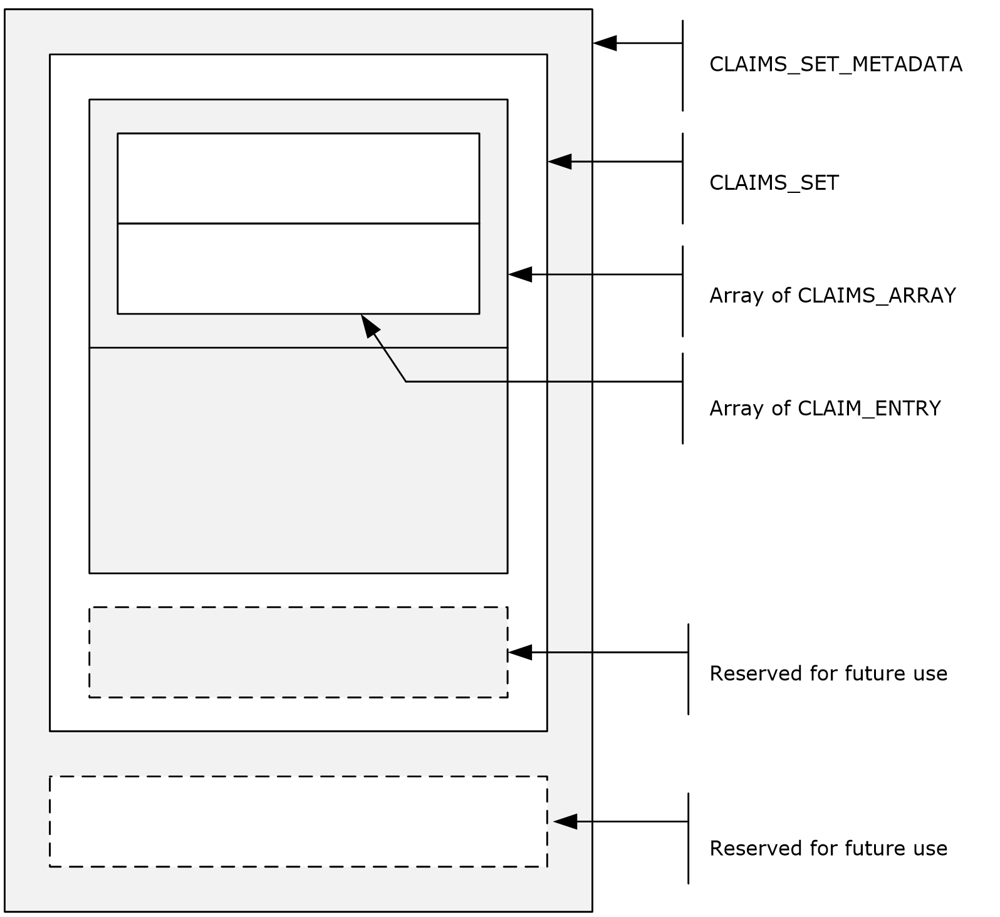

Figure 2: Nesting of claims structures

#### 2.2.18.1 CLAIM_ID

The **CLAIM_ID** type is a null-terminated [**UTF-16**](#gt_utf-16) string used for typing [**claim**](#gt_claim) IDs.

typedef [string] wchar_t* CLAIM_ID;

typedef [string] wchar_t** PCLAIM_ID;

#### 2.2.18.2 CLAIM_TYPE

The **CLAIM_TYPE** enumeration enumerates various value types of a [**claim**](#gt_claim).

typedef enum _CLAIM_TYPE

{

CLAIM_TYPE_INT64 = 1,

CLAIM_TYPE_UINT64 = 2,

CLAIM_TYPE_STRING = 3,

CLAIM_TYPE_BOOLEAN = 6

} CLAIM_TYPE,

*PCLAIM_TYPE;

**CLAIM_TYPE_INT64:** The value type of the claim is LONG64.

**CLAIM_TYPE_UINT64:** The value type of the claim is ULONG64.

**CLAIM_TYPE_STRING:** The value type of the claim is a null-terminated string of [**Unicode**](#gt_unicode) characters.

**CLAIM_TYPE_BOOLEAN:** The value type of the claim is ULONG64; a value is set to 1 to specify TRUE, or 0 to specify FALSE.

#### 2.2.18.3 CLAIMS_SOURCE_TYPE

The **CLAIMS_SOURCE_TYPE** enumeration specifies the source of the [**claims**](#gt_claim).

typedef enum _CLAIMS_SOURCE_TYPE

{

CLAIMS_SOURCE_TYPE_AD = 1,

CLAIMS_SOURCE_TYPE_CERTIFICATE

} CLAIMS_SOURCE_TYPE;

**Note** No semantics are to be attached to these values other than those specified in section [3](#Section_3).

#### 2.2.18.4 CLAIMS_COMPRESSION_FORMAT

The **CLAIMS_COMPRESSION_FORMAT** enumeration specifies the source of the compression algorithm that is used for encoding [**claims**](#gt_claim) in a [CLAIMS_SET_METADATA](#Section_2.2.18.8) structure.

typedef enum _CLAIMS_COMPRESSION_FORMAT

{

COMPRESSION_FORMAT_NONE = 0,

COMPRESSION_FORMAT_LZNT1 = 2,

COMPRESSION_FORMAT_XPRESS = 3,

COMPRESSION_FORMAT_XPRESS_HUFF = 4

} CLAIMS_COMPRESSION_FORMAT;

**COMPRESSION_FORMAT_NONE:** No compression.

**COMPRESSION_FORMAT_LZNT1:** The LZNT1 compression algorithm is used. For more information, see [MS-XCA](../MS-XCA/MS-XCA.md) section 2.5.

**COMPRESSION_FORMAT_XPRESS:** The Xpress LZ77 compression algorithm is used. For more information, see [MS-XCA] sections 2.3 and 2.4.

**COMPRESSION_FORMAT_XPRESS_HUFF:** The Xpress LZ77+Huffman compression algorithm is used. For more details, see [MS-XCA] sections 2.1 and 2.2.

#### 2.2.18.5 CLAIM_ENTRY

The **CLAIM_ENTRY** structure specifies a single [**claim**](#gt_claim).

typedef struct _CLAIM_ENTRY {

CLAIM_ID Id;

CLAIM_TYPE Type;

[switch_is(Type), switch_type(CLAIM_TYPE)]

union {

[case(CLAIM_TYPE_INT64)]

struct {

[range(1, 10*1024*1024)] ULONG ValueCount;

[size_is(ValueCount)] LONG64* Int64Values;

};

[case(CLAIM_TYPE_UINT64)]

struct {

[range(1, 10*1024*1024)] ULONG ValueCount;

[size_is(ValueCount)] ULONG64* Uint64Values;

};

[case(CLAIM_TYPE_STRING)]

struct {

[range(1, 10*1024*1024)] ULONG ValueCount;

[size_is(ValueCount), string] LPWSTR* StringValues;

};

[case(CLAIM_TYPE_BOOLEAN)]

struct {

[range(1, 10*1024*1024)] ULONG ValueCount;

[size_is(ValueCount)] ULONG64* BooleanValues;

};

[default] ;

} Values;

} CLAIM_ENTRY,

*PCLAIM_ENTRY;

**Id:** Specifies the claim identifier.

**Type:** Specifies the type of the data in the **Values** union. Refer to section [2.2.18.2](#Section_2.2.18.2) for allowed values and their interpretation.

**Values:** A union of arrays of the various types of claim values that a CLAIM_ENTRY can contain. The actual type of the elements is specified by the **Type** member.

**ValueCount:** Specifies the number of array elements in the **Int64Values** member.

**Int64Values:** An array of LONG64 values of the claim. The array has **ValueCount** elements.

**ValueCount:** Specifies the number of array elements in the **Uint64Values** member.

**Uint64Values:** An array of ULONG64 values of the claim. The array has **ValueCount** elements.

**ValueCount:** Specifies the number of array elements in the **StringValues** member.

**StringValues:** An array of null-terminated, [**Unicode**](#gt_unicode) string values of the claim. The array has **ValueCount** elements.

**ValueCount:** Specifies the number of array elements in the **BooleanValues** member.

**BooleanValues:** An array of ULONG64 values of the claim. The array has **ValueCount** elements.

#### 2.2.18.6 CLAIMS_ARRAY

The **CLAIMS_ARRAY** structure specifies an array of CLAIM_ENTRY structures and the associated [**claims**](#gt_claim) source type.

typedef struct _CLAIMS_ARRAY {

CLAIMS_SOURCE_TYPE usClaimsSourceType;

ULONG ulClaimsCount;

[size_is(ulClaimsCount)] PCLAIM_ENTRY ClaimEntries;

} CLAIMS_ARRAY,

*PCLAIMS_ARRAY;

**usClaimsSourceType:** Specifies the source of the claims.

**ulClaimsCount:** Specifies the number of [CLAIM_ENTRY](#Section_2.2.18.5) elements in the **ClaimEntries** member of this structure.

**ClaimEntries:** An array that contains **ulClaimsCount** number of CLAIM_ENTRY elements.

#### 2.2.18.7 CLAIMS_SET

The **CLAIMS_SET** structure specifies [CLAIMS_ARRAY](#Section_2.2.18.6) structures, each from a different [**claims**](#gt_claim) source.

typedef struct _CLAIMS_SET {

ULONG ulClaimsArrayCount;

[size_is(ulClaimsArrayCount)] PCLAIMS_ARRAY ClaimsArrays;

USHORT usReservedType;

ULONG ulReservedFieldSize;

[size_is(ulReservedFieldSize)] BYTE* ReservedField;

} CLAIMS_SET,

*PCLAIMS_SET;

**ulClaimsArrayCount:** Specifies the number of CLAIMS_ARRAY elements that are in the **ClaimsArrays** member. This field MUST be greater than or equal to 1.

**ClaimsArrays:** An array containing **ulClaimsArrayCount** number of CLAIMS_ARRAY structures.

**usReservedType:** This field is not used.

**ulReservedFieldSize:** Specifies the length, in bytes, of the **ReservedField** member.

**ReservedField:** A byte array containing **ulReservedFieldSize** bytes.

#### 2.2.18.8 CLAIMS_SET_METADATA

The **CLAIMS_SET_METADATA** structure specifies an encoded CLAIMS_SET structure with information about the encoding.

typedef struct _CLAIMS_SET_METADATA {

ULONG ulClaimsSetSize;

[size_is(ulClaimsSetSize)] BYTE* ClaimsSet;

CLAIMS_COMPRESSION_FORMAT usCompressionFormat;

ULONG ulUncompressedClaimsSetSize;

USHORT usReservedType;

ULONG ulReservedFieldSize;

[size_is(ulReservedFieldSize)] BYTE* ReservedField;

} CLAIMS_SET_METADATA,

*PCLAIMS_SET_METADATA;

**ulClaimsSetSize:** Contains the size, in bytes, of the **ClaimsSet** member.

**ClaimsSet:** A byte array of length **ulClaimsSetSize** bytes. This field contains a [CLAIMS_SET](#Section_2.2.18.7) structure that is encoded as described in section [3.1.1.11.2.5](#Section_3.1.1.11.2.5).

**usCompressionFormat:** Specifies the compression algorithm used for encoding a CLAIMS_SET structure, as specified in section 3.1.1.11.2.5.

**ulUncompressedClaimsSetSize:** Specifies the size of the partially encoded CLAIMS_SET structure before compression, the fully encoded version of which is stored in the **ClaimsSet** member.

**usReservedType:** The server MUST set this member to 0. The client MUST ignore this member.

**ulReservedFieldSize:** Specifies the size, in bytes, of the **ReservedField** member.

**ReservedField:** A byte array containing **ulReservedFieldSize** elements.

#### 2.2.18.9 CLAIMS_BLOB

The **CLAIMS_BLOB** structure is generated from a [CLAIMS_SET](#Section_2.2.18.7) structure, as specified in section [3.1.1.11.2.5](#Section_3.1.1.11.2.5).

typedef struct CLAIMS_BLOB {

ULONG ulBlobSizeinBytes;

[size_is(ulBlobSizeinBytes)] BYTE* EncodedBlob;

} CLAIMS_BLOB,

*PCLAIMS_BLOB;

**ulBlobSizeinBytes:** The size of the **EncodedBlob** member, in bytes.

**EncodedBlob:** A byte array of length **ulBlobSizeinBytes** bytes that contains an encoded [CLAIMS_SET_METADATA](#Section_2.2.18.8) structure.

### 2.2.19 MSDS-MANAGEDPASSWORD_BLOB

The **MSDS-MANAGEDPASSWORD_BLOB** structure is a representation of a group-managed service account's password information. This structure is returned as the [msDS-ManagedPassword (section 3.1.1.4.5.39)](#Section_3.1.1.4.5.39) [**constructed attribute**](#gt_constructed-attribute).

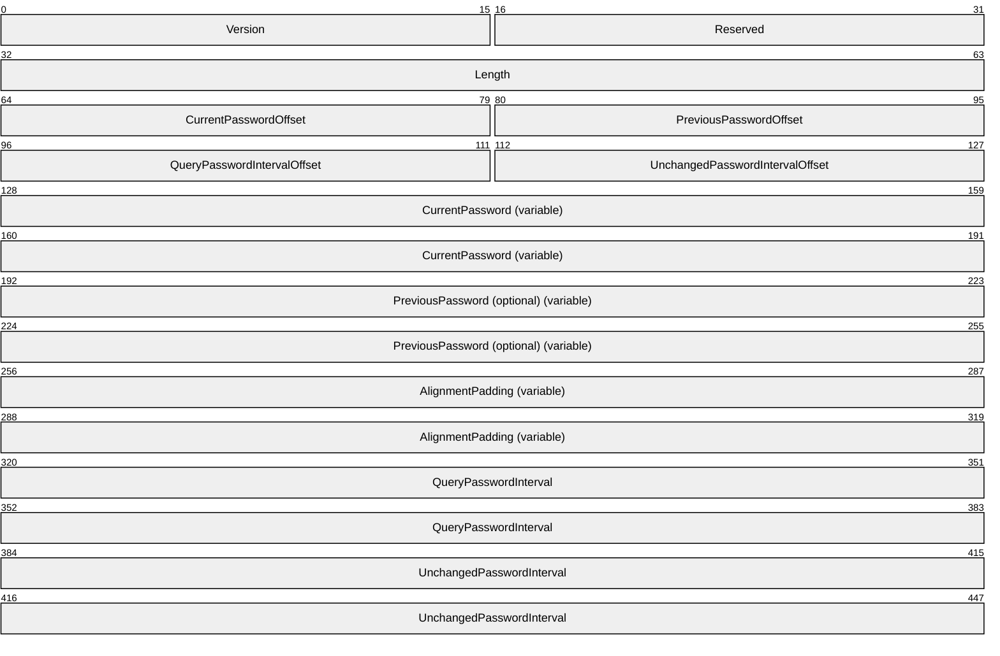
```mermaid
packet-beta
  0-15: "Version"
  16-31: "Reserved"
  32-63: "Length"
  64-79: "CurrentPasswordOffset"
  80-95: "PreviousPasswordOffset"
  96-111: "QueryPasswordIntervalOffset"
  112-127: "UnchangedPasswordIntervalOffset"
  128-191: "CurrentPassword (variable)"
  192-255: "PreviousPassword (optional) (variable)"
  256-319: "AlignmentPadding (variable)"
  320-383: "QueryPasswordInterval"
  384-447: "UnchangedPasswordInterval"
```

**Version (2 bytes):** A 16-bit unsigned integer that defines the version of the msDS-ManagedPassword [**binary large object (BLOB)**](#gt_binary-large-object-blob). The **Version** field MUST be set to 0x0001.

**Reserved (2 bytes):** A 16-bit unsigned integer that MUST be set to 0x0000.

**Length (4 bytes):** A 32-bit unsigned integer that specifies the length, in bytes, of the msDS-ManagedPassword BLOB.

**CurrentPasswordOffset (2 bytes):** A 16-bit offset, in bytes, from the beginning of this structure to the **CurrentPassword** field. The **CurrentPasswordOffset** field MUST NOT be set to 0x0000.

**PreviousPasswordOffset (2 bytes):** A 16-bit offset, in bytes, from the beginning of this structure to the **PreviousPassword** field. If this field is set to 0x0000, then the account has no previous password.

**QueryPasswordIntervalOffset (2 bytes):** A 16-bit offset, in bytes, from the beginning of this structure to the **QueryPasswordInterval** field.

**UnchangedPasswordIntervalOffset (2 bytes):** A 16-bit offset, in bytes, from the beginning of this structure to the **UnchangedPasswordInterval** field.

**CurrentPassword (variable):** A null-terminated **WCHAR** string containing the cleartext current password for the account.

**PreviousPassword (optional) (variable):** A null-terminated **WCHAR** string containing the cleartext previous password for the account. If **PreviousPasswordOffset** is 0x0000, then this field MUST be absent.

**AlignmentPadding (variable):** A padding field used to align the **QueryPasswordInterval** field to a 64-bit boundary. This field is ignored by the receiver. This field SHOULD set to zero and MUST be ignored on receipt.

**QueryPasswordInterval (8 bytes):** A 64-bit unsigned integer containing the length of time, in units of 10^(-7) seconds, after which the receiver MUST re-query the password. The **QueryPasswordInterval** field MUST be placed on a 64-bit boundary.

**UnchangedPasswordInterval (8 bytes):** A 64-bit unsigned integer containing the length of time, in units of 10^(-7) seconds, before which password queries will always return this password value. The **UnchangedPasswordInterval** field MUST be placed on a 64-bit boundary.

### 2.2.20 Key Credential Link Structures

#### 2.2.20.1 Key Credential Link Constants

The **KEYCREDENTIALLINK_BLOB** structure (section [2.2.20.2](#Section_2.2.20.2)) contains a **Version** field that can be set to one of the following values.

| Symbolic name | Value |
| --- | --- |
| KEY_CREDENTIAL_LINK_VERSION_2 | 0x00000200 |

The **KEYCREDENTIALLINK_ENTRY** of type KeyUsage (section [2.2.20.6](#Section_2.2.20.6)) can have one of the following values.

| Symbolic name | Value |
| --- | --- |
| KEY_USAGE_NGC | 0x01 |
| KEY_USAGE_FIDO | 0x07 |
| KEY_USAGE_FEK | 0x08 |

The **KEYCREDENTIALLINK_ENTRY** of type KeySource can have one of the following values.

| Symbolic name | Value |
| --- | --- |
| KEY_SOURCE_AD | 0x00 |

#### 2.2.20.2 KEYCREDENTIALLINK_BLOB

The **KEYCREDENTIALLINK_BLOB** structure is a representation of a single credential stored as a series of values. This structure is stored as the binary portion of the msDS-KeyCredentialLink DN-Binary attribute (section [3.1.1.5.3.1.1.6](#Section_3.1.1.5.3.1.1.6)). The structure contains a **Version** field followed by an array of **KEYCREDENTIALLINK_ENTRY** structures (section [2.2.20.3](#Section_2.2.20.3)). The **KEYCREDENTIALLINK_ENTRY** structure MUST be sorted by their **Identifier** fields in increasing order.

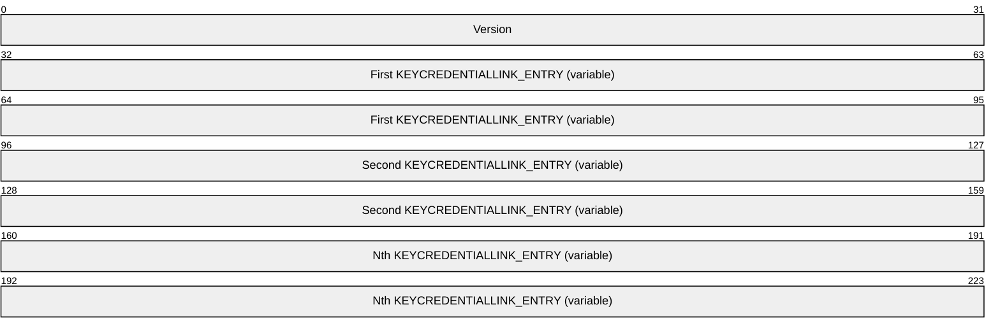
```mermaid
packet-beta
  0-31: "Version"
  32-95: "First KEYCREDENTIALLINK_ENTRY (variable)"
  96-159: "Second KEYCREDENTIALLINK_ENTRY (variable)"
  160-223: "Nth KEYCREDENTIALLINK_ENTRY (variable)"
```

**Version (4 bytes)**: A 32-bit unsigned integer that defines the version of the **KEYCREDENTIALLINK_BLOB**. The **Version** field MUST be set to KEY_CREDENTIAL_LINK_VERSION_2.

**KEYCREDENTIALLINK_ENTRY (variable)**: A sequence of **KEYCREDENTIALLINK_ENTRY** structures (section 2.2.20.3) that describe various aspects of a single credential.

#### 2.2.20.3 KEYCREDENTIALLINK_ENTRY

The **KEYCREDENTIALLINK_ENTRY** structure describes various aspects of a single credential.

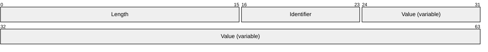
```mermaid
packet-beta
  0-15: "Length"
  16-23: "Identifier"
  24-63: "Value (variable)"
```

**Length (2 bytes):** A 16-bit unsigned integer that specifies the length of the **Value** field.

**Identifier (1 byte):** An 8-bit unsigned integer that specifies the type of data that is stored in the **Value** field.

**Value (variable):** A series of bytes whose size and meaning are defined by the **Identifier** field.

The available identifiers and the semantics of the related data are defined in section [2.2.20.6](#Section_2.2.20.6).

#### 2.2.20.4 CUSTOM_KEY_INFORMATION

The **CUSTOM_KEY_INFORMATION** structure is a structure that contains key information.

**Note**: This structure has two possible representations. In the first representation, only the **Version** and **Flags** fields are present; in this case the structure has a total size of two bytes. In the second representation, all additional fields shown below are also present; in this case, the structure's total size is variable. Differentiating between the two representations MUST be inferred using only the total size.

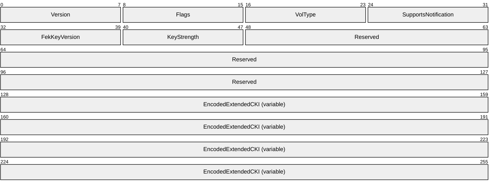
```mermaid
packet-beta
  0-7: "Version"
  8-15: "Flags"
  16-23: "VolType"
  24-31: "SupportsNotification"
  32-39: "FekKeyVersion"
  40-47: "KeyStrength"
  48-127: "Reserved"
  128-255: "EncodedExtendedCKI (variable)"
```

**Version (1 byte):** An 8-bit unsigned integer that MUST be set to 1.

**Flags (1 byte):** An 8-bit unsigned integer that specifies zero or more of the following bit-flag values:

| Name and Value | Description |
| --- | --- |
| CUSTOMKEYINFO_FLAGS_ATTESTATION 0x01 | Reserved for future use. |
| CUSTOMKEYINFO_FLAGS_MFA_NOT_USED 0x02 | During creation of this key, the requesting client authenticated using only a single credential. |

**VolType (1 byte):** An 8-bit unsigned integer that specifies one of the following volume types:

| Name and Value | Description |
| --- | --- |
| None 0x00 | Volume not specified. |
| OSV 0x01 | Operating system volume. |
| FDV 0x02 | Fixed data volume. |
| RDV 0x03 | Removable data volume. |

**SupportsNotification (1 byte):** An 8-bit unsigned integer that specifies whether the device associated with this credential supports notification.

| Name and Value | Description |
| --- | --- |
| None 0x00 | Notification is not supported. |
| Supported 0x01 | Notification is supported. |

**FekKeyVersion (1 byte):** An 8-bit unsigned integer that specifies the version of the buffer stored in KEY_USAGE_FEK (section [2.2.20.5.3](#Section_2.2.20.5.3)). This field MUST be set to 1.

**KeyStrength (1 byte):** An 8-bit unsigned integer that specifies the strength of the NGC key.

| Name and Value | Description |
| --- | --- |
| Unknown 0x00 | Key strength is unknown. |
| Weak 0x01 | Key strength is weak. |
| Normal 0x02 | Key strength is normal. |

**Reserved (10 bytes):** Reserved for future use.

**EncodedExtendedCKI (variable):** Extended custom key information. The contents of this field are defined in section [2.2.20.4.1](#Section_2.2.20.4.1).

##### 2.2.20.4.1 EncodedExtendedCKI

The **EncodedExtendedCKI** structure contains extended custom key information.

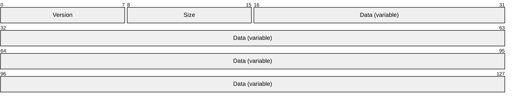
```mermaid
packet-beta
  0-7: "Version"
  8-15: "Size"
  16-127: "Data (variable)"
```

**Version (1 byte):** An 8-bit unsigned integer that MUST be 0.

**Size (1 byte):** An 8-bit unsigned integer that specifies the size of the **Data** field.

**Data (variable):** A Concise Binary Object Representation (CBOR)-encoded blob whose length is specified by the **Size** field. CBOR is a binary data serialization format defined in [[RFC7049]](https://go.microsoft.com/fwlink/?linkid=867790). The contents of this field are opaque and result in no behavioral impact on the protocol.

#### 2.2.20.5 KeyMaterial

The content of the KeyMaterial entry (see section [2.2.20.6](#Section_2.2.20.6)) is dependent upon the content of the KeyUsage entry, as shown in the following sections.

##### 2.2.20.5.1 KEY_USAGE_NGC

The key material is a 2048-bit [**RSA**](#gt_rivest-shamir-adleman-rsa) [[RFC8017]](https://go.microsoft.com/fwlink/?linkid=2164409) public key stored in the following format:

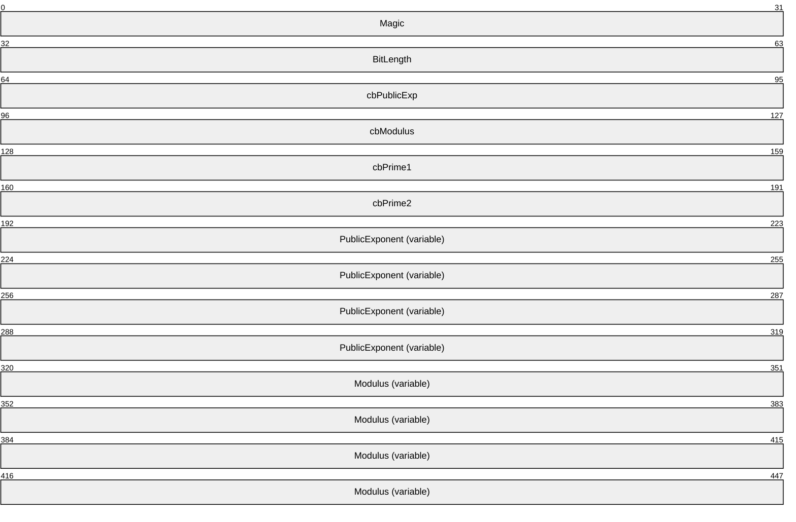
```mermaid
packet-beta
  0-31: "Magic"
  32-63: "BitLength"
  64-95: "cbPublicExp"
  96-127: "cbModulus"
  128-159: "cbPrime1"
  160-191: "cbPrime2"
  192-319: "PublicExponent (variable)"
  320-447: "Modulus (variable)"
```

**Magic (4 bytes):** A 32-bit, unsigned integer. This field MUST be set to 0x31415352.

**BitLength (4 bytes):** A 32-bit, unsigned integer. The size in bits of the public key.

**cbPublicExp (4 bytes):** A 32-bit, unsigned integer. The size in bytes of the **PublicExponent** field.

**cbModulus (4 bytes):** A 32-bit, unsigned integer. The size in bytes of the **Modulus** field.

**cbPrime1 (4 bytes):** A 32-bit, unsigned integer. The size, in bytes, of the first prime number of the key. MUST be set to zero.

**cbPrime2 (4 bytes):** A 32-bit, unsigned integer. The size, in bytes, of the second prime number of the key. MUST be set to zero.

**PublicExponent (variable):** A variable-length array of bytes containing the exponent of the public key. The length in bytes of this field is given by the **cbPublicExp** field.

**Modulus (variable):** A variable-length array of bytes containing the public key modulus. The length in bytes of this field is given by the **cbModulus** field.

##### 2.2.20.5.2 KEY_USAGE_FIDO

The key material is a [**UTF-8**](#gt_utf-8) encoding of a [**JSON**](#gt_javascript-object-notation-json) serialized object [[RFC8259]](https://go.microsoft.com/fwlink/?linkid=867803) of the following structure:

{

"version": {"type": "integer"},

"authData": {"type": "string"},

"x5c":

{

"type": "array",

"items": {"type": "string"}

},

"displayName": {"type": "string"}

}

**version**: An integer that specifies the version of the structure.

**authData**: A [**base64-encoded**](#gt_179b9392-9019-45a3-880b-26f6890522b7) Authenticator Data structure, as specified in section 6.1 of [[W3C-WebAuthPKC1]](https://go.microsoft.com/fwlink/?linkid=2102929).

**x5c**: An array of base64-encoded certificates.

**displayName**: A string representing the display name that is associated with the credential.

##### 2.2.20.5.3 KEY_USAGE_FEK

The key material is a combination of [**RSA**](#gt_rivest-shamir-adleman-rsa) 2048 [[RFC8017]](https://go.microsoft.com/fwlink/?linkid=2164409) and [**AES**](#gt_advanced-encryption-standard-aes)-256 KDF keys.

#### 2.2.20.6 KEYCREDENTIALLINK_ENTRY Identifiers

The **KEYCREDENTIALLINK_ENTRY** structure, **Identifier** and **Value** fields are defined in section [2.2.20.3](#Section_2.2.20.3) where the **Value** is a series of bytes whose size and meaning are defined by the **Identifier**. The following table lists the available identifiers, data length, and the semantics of the related data.

| Bit Range | Field | Description |
| --- | --- | --- |
| Variable | KeyID (0x01) | 32 A SHA256 hash of the **Value** field of the KeyMaterial entry. |
| Variable | KeyHash (0x02) | 32 A SHA256 hash of all entries following this entry. |
| Variable | KeyMaterial (0x03) | Variable Key material of the credential. |
| Variable | KeyUsage (0x04) | 1 Must be set to one of KEY_USAGE_NGC, KEY_USAGE_FIDO, or KEY_USAGE_FEK. |
| Variable | KeySource (0x05) | 1 Must be set to KEY_SOURCE_AD. |
| Variable | DeviceId (0x06) | 16 Contains a device object identifier, or all zeros. |
| Variable | CustomKeyInformation (0x07) | 2 Must contain a **CUSTOM_KEY_INFORMATION** structure. |
| Variable | KeyApproximateLastLogonTimeStamp (0x08) | 8 The approximate time this key was last used, in FILETIME format. |
| Variable | KeyCreationTime (0x09) | 8 The approximate time this key was created, in FILETIME format. |

All keys MUST contain KeyID, KeyMaterial, and KeyUsage entries. Keys SHOULD contain KeyHash, KeyApproximateLastLogonTimeStamp, and KeyCreationTime entries.

### 2.2.21 Service Principal Name

The service principal name is the name that a client uses to identify a service for mutual [**authentication**](#gt_authentication). For more details, see [[RFC1964]](https://go.microsoft.com/fwlink/?LinkId=90304) section 2.1.1.

A [**service principal name (SPN) (2)**](#gt_service-principal-name-spn) is a string with the following format:

serviceclass "/" hostname [":"port | ":"instancename] ["/" servicename]

An SPN (2) consists of either two parts or three parts, each separated by a forward slash ("/"). The first part is the service class, the second part is the host name, and the third part (if present) is the service name. The host name part can optionally be suffixed with either a ":port" component or an ":instancename" component. A port component is distinguished from an instancename component by being entirely composed of numeric digits.

For example, "ldap/dc-01.fabrikam.com/fabrikam.com" is a three-part SPN where "ldap" is the service class name, "dc-01.fabrikam.com" is the host name, and "fabrikam.com" is the service name.

See Mutual Authentication (section [5.1.1.4](#Section_5.1.1.4)) for an example of how three-part SPNs (2) are used. See [[SPNNAMES]](https://go.microsoft.com/fwlink/?LinkId=90532) for more information about SPN format and composing a unique SPN.

# 3 Details

The following sections specify details of the abstract data model and [**directory**](#gt_directory) operations for [**Active Directory**](#gt_active-directory).

When an [**LDAP**](#gt_lightweight-directory-access-protocol-ldap) operation results in an error, the error is expressed in this document in the form:

- *LDAP error* / *Extended error code*
Where the *Extended error code* is either a *Windows error code* or the literal string "<unrestricted>".

The *LDAP error* is specified in the **resultCode** field of an LDAP response. See [[RFC2251]](https://go.microsoft.com/fwlink/?LinkId=90325) section 4.1.10 for the specification of **resultCode** in an LDAP response. See section [3.1.1.3.1.9](#Section_3.1.1.3.1.9) for the specification of *Extended error codes* in an LDAP response.

**Note**: This document contains tables that specify the capabilities of applicable Windows Server releases or ADAM versions. The table columns are indexed, as appropriate, using the following key. The order of products in this key does not necessarily imply chronology.

| Column index | Product version |
| --- | --- |
| A | Windows 2000 operating system |
| B | Windows 2000 operating system Service Pack 1 (SP1) |
| C | Windows 2000 Server operating system Service Pack 3 (SP3) |
| D | Windows Server 2003 operating system |
| E | Windows Server 2003 operating system with Service Pack 1 (SP1) |
| DR2 | Windows Server 2003 R2 operating system |
| F | Windows Server 2003 operating system with Service Pack 2 (SP2) |
| G | Active Directory Application Mode (ADAM) |
| H | ADAM RTW |
| I | ADAM SP1 |
| J | Windows Server 2008 operating system |
| K | Windows Server 2008 AD DS |
| L | Windows Server 2008 AD LDS |
| M | Windows Server 2008 R2 operating system |
| N | Windows Server 2008 R2 AD DS |
| P | Windows Server 2008 R2 AD LDS |
| R | Windows Server 2012 operating system |
| S | Windows Server 2012 AD DS |
| T | Windows Server 2012 AD LDS |
| U | Windows Server 2012 R2 operating system |
| V | Windows Server 2012 R2 AD DS |
| W | Windows Server 2012 R2 AD LDS |
| X | Windows Server 2016 operating system |
| Y | Windows Server 2016 AD DS |
| Z | Windows Server 2016 AD LDS |
| A2 | Windows Server v1709 operating system |
| B2 | Windows Server v1709 AD DS |
| C2 | Windows Server v1709 AD LDS |
| D2 | Windows Server v1803 operating system |
| E2 | Windows Server v1803 AD DS |
| F2 | Windows Server v1803 AD LDS |
| G2 | Windows Server v1809 operating system |
| H2 | Windows Server v1809 AD DS |
| I2 | Windows Server v1809 AD LDS |
| J2 | Windows Server 2019 operating system |
| K2 | Windows Server 2019 AD DS |
| L2 | Windows Server 2019 AD LDS |
| M2 | Windows Server v1903 operating system AD DS |
| N2 | Windows Server v1903 AD LDS |
| P2 | Windows Server 2022 operating system AD DS |
| Q2 | Windows Server 2022 AD LDS |
| R2 | Windows Server 2022, 23H2 operating system AD DS |
| S2 | Windows Server 2022, 23H2 AD LDS |
| J3 | Windows Server 2025 operating system |

## 3.1 Common Details

### 3.1.1 Abstract Data Model

Sections [3.1.1.1](#Section_3.1.1.1) and [3.1.1.2](#Section_1.3) describe a conceptual model of possible data [**organization**](#gt_organization) that an implementation maintains to participate in this protocol. The described organization is provided to facilitate the explanation of how the protocol behaves. This document does not mandate that implementations adhere to this model as long as their external behavior is consistent with that described in this document.

#### 3.1.1.1 State Model

##### 3.1.1.1.1 Scope

The specification of all [**Active Directory**](#gt_active-directory) protocols is based on a definition, shared by all Active Directory protocols, of the state of a server running Active Directory that is implied by the protocols. Call this the "state model" of Active Directory.

The Active Directory state model is divided into two categories:

- Certain state that is represented as [**objects**](#gt_object) and [**attributes**](#gt_attribute) within Active Directory is *promoted directly* into the state model. State within Active Directory becomes part of the state model if it satisfies one of the following conditions:
- It is replicated.
- It is nonreplicated, but a protocol exists in the protocol documentation set of applicable Windows Server releases whose behavior is dependent upon the state.
The representation of nonreplicated state that is only accessed by a process running on the same server, that is itself implementing Active Directory, is private to the implementation. Therefore, such attributes are *not* promoted directly into the state model. It might still be required for this state to be modeled as described in category 2 later in this section.

Excluded from the second condition above is all generic access by browsing tools such as ldp.exe that can access any attribute of any object in the [**directory**](#gt_directory). If ldp.exe or a similar tool covered by a Windows license can display or even modify a [**nonreplicated attribute**](#gt_nonreplicated-attribute) of an object using only the attribute's syntax as defined by the [**schema**](#gt_schema), that does not make the attribute part of the state model. If ldp.exe or a similar tool covered by a Windows license accesses a nonreplicated attribute and decodes or encodes its value using information outside the attribute's syntax as defined by the schema, that nonreplicated attribute is included in the state model under condition 1 (2) above. For example, by using LDP, it is possible to look at a nonreplicated attribute using an attribute's syntax of type String(Unicode). However, if the string stored in that attribute would be an XML content defined by an external XSD, then if LDP had special knowledge of how to interpret that XML, that nonreplicated attribute would be included in the state model under condition 1 (2) above.

- Other state, however represented within Active Directory, is "abstracted" in the state model. Such state is included only as necessitated by the requirement that a licensee implementation of the protocols of applicable Windows Server releases has to be capable of receiving messages and responding in the same manner as applicable Windows Server releases.
For example, certain values sent by the Active Directory [**replication**](#gt_replication) protocol [MS-DRSR](../MS-DRSR/MS-DRSR.md) are accompanied by metadata. If the replicated values are stored by the receiving system, it MUST also store the metadata associated with the values. Otherwise, the receiving system will make incorrect responses to subsequent replication requests. These incorrect responses will, in general, prevent replication from converging. So this metadata MUST be included within the state model. The specific way that this metadata is stored by Active Directory, and the algorithms that optimize access to this metadata, are excluded from the state model.

The various indexes used by the Active Directory implementation to improve the performance of directory search are another example of state within Active Directory. These indexes have no effect, other than performance, on the protocol responses that Active Directory makes. Therefore, these indexes are not included in the state model.

In this specification, the first category of state is modeled in a variant of [**LDAP**](#gt_lightweight-directory-access-protocol-ldap) information structures: [**naming contexts**](#gt_naming-context-nc), objects, attributes, and values. These structures are defined precisely in the following sections. The set of [**replicated attributes**](#gt_replicated-attribute) is defined in [MS-ADA1](#Section_3.1.1.2), [MS-ADA2](#Section_3.1.1.2), and [MS-ADA3](#Section_3.1.1.2). The set of nonreplicated attributes covered under condition 1 (2) (described earlier in this section) consists of the repsFrom and repsTo attributes documented in [MS-DRSR] sections 5.172 and 5.173.

**Note** Only the schema elements and instances of objects that are fundamental to Active Directory are described in this specification. If a protocol defines its own [**schema objects**](#gt_schema-object) or otherwise creates its own objects in the directory, those objects are described in that protocol's specification. A summary of schema elements defined by such other protocols is included in [MS-ADA1], [MS-ADA2], [MS-ADA3], [MS-ADSC](#Section_3.1.1.2), and [MS-ADLS](#Section_6.1.1.2.4) as a convenience for the reader, but the documentation for the protocols using those schema elements SHOULD be consulted for a complete description.

In this specification, the second category of state is modeled using standard mathematical concepts. The concepts used and their associated notational conventions are described in the next section.

LDAP mandates very little about the behavior of a directory. Active Directory has many specific behaviors that are observable through LDAP. The remainder of this section describes the most pervasive of these behaviors. The remainder of the specification completes the discussion.

##### 3.1.1.1.2 State Modeling Primitives and Notational Conventions

[**Attribute**](#gt_attribute) names are underlined in this document, as specified in section [1](#Section_1). If a variable *o* refers to an [**object**](#gt_object), and a is an attribute name, then *o*!a denotes the value or values of attribute *a* on object *o*. If attribute a is not present on *o*, the value of *o*!a is null.

The specification uses the [**LDAP**](#gt_lightweight-directory-access-protocol-ldap) display names of attributes and [**object classes**](#gt_object-class) when referring to specific attributes and object classes. So if *o* refers to an object,

*o*!name

denotes the name attribute of object *o*.

Some attributes in this specification are abstract in the sense of [MS-DRSR](../MS-DRSR/MS-DRSR.md) section 3.3.3. Abstract attribute names are also underlined, for example, repsFrom. [**rootDSE**](#gt_root-directory-system-agent-specific-entry-rootdse) attribute names are also underlined, for example, dumpDatabase, even though rootDSE attributes are not declared as attributes in the [**schema**](#gt_schema).

This specification models state in category 2 from the previous section using the standard mathematical concepts of set, sequence, directed graph, and tuple.

The notation [first .. last] stands for the *subrange* first, first+1, ... , last. The type *byte* is the subrange [0.. 255].

A *sequence* is an indexed collection of variables, which are called the *elements* of the sequence. The elements all have the same type. The *index type* of a sequence is a zero-based subrange. *S*[*i*] denotes the element of the sequence *S* corresponding to the value *i* of the index type. The number of elements in a sequence *S* is denoted *S*.length. Therefore the index type of a sequence *S* is [0 .. *S*.length-1].

A fixed-length sequence can be constructed using the notation:

[*first element*, *second element*, ... , *last element*]

A *tuple* is a set of name-value pairs: [name1: value1, name2: value2, ... , namen: valuen] where namek is an identifier and valuek is the value bound to that identifier. Tuple types are defined as in this example:

- type **DSName** = [dn: **DN**, guid: **GUID**, sid: **SID**]
This defines **DSName** as a type of tuple with a DN–valued field *dn*, a **GUID**–valued field *guid*, and a **SID**–valued field *sid*.

##### 3.1.1.1.3 Basics, objectGUID, and Special Attribute Behavior

The [**LDAP**](#gt_lightweight-directory-access-protocol-ldap) data model is defined by [[RFC3377]](https://go.microsoft.com/fwlink/?LinkID=91337). Because the LDAP RFCs and their underlying ITU specifications have been interpreted in a variety of ways, this section defines a more specific model that correctly represents the behavior of [**Active Directory**](#gt_active-directory) [**objects**](#gt_object) and [**attributes**](#gt_attribute) and describes the correspondence between this model and the LDAP model.

The model is based on the general definitions of Replica, Object, and Attribute given in section [1](#Section_1), and repeated here for convenience:

A *replica* is a variable containing a set of objects.

An *attribute* is an identifier for a set of values.

An object is set of attributes, each with its associated values. Two attributes of an object have special significance:

- *Identifying attribute*. A designated single-valued attribute appears on every object; the value of this attribute identifies the object. For the set of objects in a [**replica**](#gt_replica), the values of the identifying attribute are distinct.
- *Parent-identifying attribute*. A designated single-valued attribute appears on every object; the value of this attribute identifies the object's parent. That is, this attribute either contains the value of the parent's identifying attribute, or contains a reserved value ([**NULL GUID**](#gt_null-guid), as described later in this section) identifying no object. For the set of objects in a replica, the values of this parent-identifying attribute define an [**oriented tree**](#gt_oriented-tree) with objects as vertices and child-parent references as directed edges, with the child as an edge's tail and the parent as an edge's head.
Note that an object is a value, *not* a variable; a replica is a variable. The process of adding, modifying, or deleting an object in a replica replaces the entire value of the replica with a new value.

As the word replica suggests, it is often the case that two replicas contain "the same objects". In this usage, objects in two replicas are considered "the same" if they have the same value of the identifying attribute and if there is a process in place ([**replication**](#gt_replication)) to converge both the set of objects in existence and the values of the non-identifying attributes as [**originating updates**](#gt_originating-update) take place in replicas. When the members of a set of replicas are considered to be the same, it is common to say "an object" as a shorthand referring to the set of corresponding objects in the replicas.

A [**child object**](#gt_9b04b599-9dca-48f1-aa9e-08e254d20553) is an object that is not the root of its oriented tree. The children of an object *o* is the set of all objects whose parent is *o*.

The [**directory**](#gt_directory) model used in this specification instantiates the preceding definitions as follows. The identifying attribute is objectGUID and the parent-identifying attribute is parent, an abstract attribute. Both attributes have [**GUID**](#gt_globally-unique-identifier-guid) values. No actual object has objectGUID equal to the NULL GUID. The root object has parent equal to the NULL GUID.

This specification uses the following s-expression representation ([LISP15]) of directory values, attributes, objects, and replicas to provide a notation for examples:

- Represent an attribute and its values as a list (Attr Val1 Val2 ... Valn) where *Attr* is an atom whose name is the attribute's name (its lDAPDisplayName, defined in section [3.1.1.2](#Section_1.3)) and each *Val*k is a value. The attribute comes first, but the ordering of values in the list is not significant, with the exception of the values of the objectClass attribute explained later in this section. If a value is a GUID, represent it as a 128-bit unsigned integer instead of using a representation that reflects the internal structure of a GUID. To aid the readability of examples, the GUIDs used in examples are unrealistically small integers.
- Represent an object as a list (Attrval1 Attrval2 ...Attrvaln) where each *Attrval*k is the representation of an attribute and its values; the ordering of this list is not significant.
- Represent a replica as a list (Obj1 Obj2 ... Objn) where each *Obj*k is the representation of an object; the ordering of this list is not significant.
The following list

(

( (objectGUID 5) (parent 0) (dc "microsoft") )

( (objectGUID 2) (parent 5) (ou "NTDEV") )

( (objectGUID 9) (parent 2) (cn "Peter Houston") )

)

is one representation of the value of some replica containing three objects. The object with objectGUID = 5 is the root, the object with objectGUID = 2 is the only child of the root, and the object with objectGUID = 9 is the only grandchild of the root. Each object in this example has one additional attribute whose meaning has not yet been described.

Representing an attribute as its lDAPDisplayName makes examples readable. In the actual state model, an attribute is identified by an [ATTRTYP](#Section_3.1.1.2.6). An ATTRTYP is a 32-bit unsigned integer that can be mapped to and from an object representing an attribute. This mapping is specified in section 3.1.1.2.6.

Active Directory's objectGUID attribute has special behavior. A GUID that is generated by the [**DC**](#gt_domain-controller-dc) is assigned to the objectGUID attribute of an object during its creation (LDAP Add), and this attribute is read-only thereafter. This is the first of many examples of an attribute with special behavior. Section [3.1.1.5](#Section_3.1.1.5) specifies the behavior of every attribute that has special behavior.

Active Directory includes the objectSid attribute on certain objects, called [**security principal objects**](#gt_security-principal-object). The objectSid attribute has special behavior. A fresh [**SID**](#gt_security-identifier-sid) is assigned to the objectSid attribute of an object during its creation (LDAP Add), and this attribute is read-only thereafter, unless the object moves to another [**NC**](#gt_naming-context-nc) (LDAP Modify DN; see section 3.1.1.5 for the specification of such moves). More on objectSid generation can be found in section [3.1.1.1.5](#Section_3.1.1.1.5).

##### 3.1.1.1.4 objectClass, RDN, DN, Constructed Attributes, Secret Attributes

A [**directory object**](#gt_directory-object) is constrained by the [**directory's**](#gt_directory) [**schema**](#gt_schema), which is a set of predicates. A few schema concepts are mentioned here. A full understanding of these concepts is not required to understand this section; additional information is available in the Glossary or in section [3.1.1.2](#Section_1.3).

When an [**object**](#gt_object) is created, it is assigned a most specific [**structural object class**](#gt_structural-object-class) or an [**88 object class**](#gt_88-object-class), plus the sequence of [**object classes**](#gt_object-class) that this class inherits from. The set of inherited classes always includes the class top. The value of an object's objectClass [**attribute**](#gt_attribute) is the full set of object classes (each identified by lDAPDisplayName) assigned to the object. The example in the previous section is elaborated in the following list.

(

( (objectGUID 5) (parent 0) (dc "microsoft")

(objectClass top ... domainDNS) )

( (objectGUID 2) (parent 5) (ou "NTDEV")

(objectClass top ... organizationalUnit) )

( (objectGUID 9) (parent 2) (cn "Peter Houston")

(objectClass top ... user) )

)

This list represents three objects, including their first and last objectClass values. The intermediate objectClass values are elided. Unlike all other multivalued attributes, the ordering of objectClass values is significant—top is always listed first; the most specific structural object class (or the 88 object class used in place of the structural class) is always listed last. So, for instance, the most specific structural object class of the root is domainDNS.

Representing a class as its lDAPDisplayName makes examples readable. In the actual state model, a class is identified by an [ATTRTYP](#Section_3.1.1.2.6). An ATTRTYP is a 32-bit unsigned integer that can be mapped to and from the [**schema object**](#gt_schema-object) representing a class. This mapping is specified in section 3.1.1.2.6.

In [**Active Directory**](#gt_active-directory), each object has an [**RDN attribute**](#gt_rdn-attribute), which is determined by the most specific structural object class of the object when the object is created. The RDN attribute is the attribute that defines an object's name relative to its parent. In Active Directory, the RDN attribute of an object class has String([**Unicode**](#gt_unicode)) syntax; that is, its value is a Unicode string, and the RDN attribute of an object always has exactly one value. (See section 3.1.1.2 for more on the topic of [**attribute syntax**](#gt_attribute-syntax).)

Confusingly, the Active Directory schema includes an attribute whose attributeSchema object's cn is "RDN"; this is the name attribute, described later in this section. The term "RDN attribute" never refers to the name attribute in this document.

The [**relative distinguished name (RDN)**](#gt_relative-distinguished-name-rdn) of an object is a string of the form "att=val" where *att* is the lDAPDisplayName of the RDN attribute of the object and *val* is the value of the RDN attribute on this object. In the preceding example, the object class user has RDN attribute cn, as can be confirmed by consulting [MS-ADSC](#Section_3.1.1.2). Therefore the RDN of the object with objectGUID = 9 is "cn=Peter Houston". An RDN can also be written using the attributeID of the RDN attribute in place of its lDAPDisplayName; the example just given becomes "2.5.4.3=Peter Houston". The RDN form based on lDAPDisplayName is used throughout this document.

Active Directory requires that the value parts of the RDNs of all children of an object be distinct. This guarantees that the RDNs of all children of an object are distinct.

The [**DN**](#gt_distinguished-name-dn) of an object is defined recursively as follows. The DN of the root has an assigned value; the way Active Directory assigns this value is described later in section [3.1.1.1.5](#Section_3.1.1.1.5). The DN of a [**child object**](#gt_9b04b599-9dca-48f1-aa9e-08e254d20553) is the RDN of the child, followed by "," and the DN of the parent. In the preceding example, suppose the assigned DN of the root object is "dc=microsoft,dc=com". Then the DN of the object with objectGUID = 9 is "cn=Peter Houston,ou=NTDEV,dc=microsoft,dc=com".

The correspondence between this model and the [**LDAP**](#gt_lightweight-directory-access-protocol-ldap) data model is as follows. An object with its attributes and values corresponds to an LDAP [**entry**](#gt_entry) with its attributes and values. This model and LDAP agree on the definition of the objectClass attribute. The definition of RDN in this model is a subset of LDAP's definition; all RDNs in this model are valid LDAP RDNs, but not vice versa. For example, the following multivalued RDN is a valid LDAP RDN, but it is not valid in this model: "cn=Peter Houston+employeeID=ABC123". Given the RDN definition, the definition of DN in this model is the same as LDAP's definition. In the LDAP data model, the child-parent relationship is represented in the DNs of the child and parent, whereas in the Active Directory data model, the child-parent relationship is represented in the parent attribute and the DN is derived. Active Directory does not expose the model's parent attribute through LDAP.

Active Directory includes the distinguishedName attribute on every object; the value is the object's DN. The following example elaborates the previous example to include a value of distinguishedName on each object.

(

( (objectGUID 5) (parent 0) (dc "microsoft")

(objectClass top ... domainDNS)

(distinguishedName "dc=microsoft,dc=com") )

( (objectGUID 2) (parent 5) (ou "NTDEV")

(objectClass top ... organizationalUnit)

(distinguishedName "ou=NTDEV,dc=microsoft,dc=com" ) )

( (objectGUID 9) (parent 2) (cn "Peter Houston")

(objectClass top ... user)

(distinguishedName

"cn=Peter Houston,ou=NTDEV,dc=microsoft,dc=com") )

)

But including distinguishedName on each object this way is misleading, because the distinguishedName attribute is not stored as a string on each object. If it were stored as a string on each object, renaming an object would require updating every object in the subtree rooted at the renamed object. For a large subtree, this would take a long time and would either interfere with other directory activity (if performed as a single transaction) or would expose observable inconsistency to clients (if performed as multiple transactions). Active Directory does neither of these, so its state model can't imply that it does.

The distinguishedName attribute is not declared in the schema as a [**constructed attribute**](#gt_constructed-attribute), but it behaves like one. Normal attributes, including attributes with special behavior such as objectGUID, have their values stored as part of an object's representation. Constructed attributes have the property that they have values computed from normal attributes (for read) and/or have effects on the values of normal attributes (for write). Constructed attributes are not included in the state model. Because the distinguishedName attribute behaves like a constructed attribute in that it also contributes no state to an instance of an object, it is not considered to be part of the state model.

Active Directory includes the name attribute on every object. An object's value of name equals the value of the object's RDN attribute. The following example removes the incorrect modeling of distinguishedName from the previous example, then elaborates that example to include name.

(

( (objectGUID 5) (parent 0) (dc "microsoft")

(objectClass top ... domainDNS)

(name "microsoft") )

( (objectGUID 2) (parent 5) (ou "NTDEV")

(objectClass top ... organizationalUnit)

(name "NTDEV") )

( (objectGUID 9) (parent 2) (cn "Peter Houston")

(objectClass top ... user)

(name "Peter Houston") )

)

The name attribute has special behavior. Even if an object is renamed (LDAP Modify DN), the object's name attribute remains equal to the object's RDN attribute. As with the distinguishedName attribute, the name attribute is not declared in the schema as a constructed attribute, but it behaves like one.

Because Active Directory requires that the value parts of the RDNs of all children of an object be distinct, it follows that the name attribute of all children of an object are distinct.

Active Directory includes the rdnType attribute on every object. An object's value of rdnType is the object's RDN attribute at object creation time—the identifier, not its associated value. The following example elaborates the previous example to include rdnType.

(

( (objectGUID 5) (parent 0) (dc "microsoft")

(objectClass top ... domainDNS)

(name "microsoft") (rdnType dc))

( (objectGUID 2) (parent 5) (ou "NTDEV")

(objectClass top ... organizationalUnit)

(name "NTDEV") (rdnType ou))

( (objectGUID 9) (parent 2) (cn "Peter Houston")

(objectClass top ... user)

(name "Peter Houston") (rdnType cn))

)

The rdnType attribute, like the parent attribute, is not declared in the Active Directory schema. [MS-DRSR](../MS-DRSR/MS-DRSR.md) section 5.159 specifies the special behavior of the rdnType attribute.

A [**secret attribute**](#gt_secret-attribute) is any attribute from the following set: currentValue, dBCSPwd, initialAuthIncoming, initialAuthOutgoing, lmPwdHistory, ntPwdHistory, priorValue, supplementalCredentials, trustAuthIncoming, trustAuthOutgoing, and unicodePwd.

##### 3.1.1.1.5 NC, NC Replica

The type **DSNAME** is defined as a C structure in [MS-DRSR](../MS-DRSR/MS-DRSR.md) section 5.50; this state model uses the simpler **DSName**, which contains the same information in a tuple of the form:

**DSName**: [*dn*: **DN**; *guid*: **GUID**; *sid*: SID]

An [**NC**](#gt_naming-context-nc) is a set of [**objects**](#gt_object) organized as a tree. It is referenced by a **DSName** containing a non-NULL dn and a non-[**NULL GUID**](#gt_null-guid). This **DSName** also references the NC root, which is the root object of the tree of objects in the NC. The NC root has the IT_NC_HEAD bit set in the instanceType [**attribute**](#gt_attribute). Any instance of the NC on any [**DC**](#gt_domain-controller-dc) is called an [**NC replica**](#gt_nc-replica). It is convenient to say "the NC x" where x is the **DSName** referencing the NC.

A [**replica**](#gt_replica) of NC *x* is a replica as already defined, with its root object *r* constrained as follows:

- r!objectGUID = x.guid
- r!distinguishedName = x.dn
- If x.sid ≠ NULL then r!objectSid = x.sid, otherwise r!objectSid = NULL
Mutation of a replica in the general sense is unconstrained. In the case of a replica of a specific NC, the root object cannot be replaced, because doing so would change the objectGUID (and objectSid if any), and this MUST equal the NC's *guid*. In a replica of a given NC the root object's [**DN**](#gt_distinguished-name-dn) cannot be changed, because the root object's DN MUST equal the NC's *dn*.

All replicas in [**Active Directory**](#gt_active-directory) are NC replicas.

NC replicas are mutable. The term [**originating update**](#gt_originating-update) means any mutation to an NC replica performed via any protocol except [**replication**](#gt_replication).

Active Directory performs replication between replicas of the same NC to converge their states, so an [**update**](#gt_update) originated on one replica is reflected in all the others. The replication algorithm has the property that if originating updates to all replicas ceases and communication between replicas is maintained, the application-visible states of the replicas will eventually converge to a common value. Applications of Active Directory can read from several replicas of a given NC and observe the differences, but applications typically bind to a single replica.

Active Directory supports four NC types:

**Domain NC**: A [**domain naming context (domain NC)**](#gt_domain-naming-context-domain-nc). The *sid* field of a domain NC is not NULL.

**Config NC:** An NC that stores Active Directory configuration information. The *sid* field of a [**config NC**](#gt_configuration-naming-context-config-nc) is NULL.

**Schema NC:** An NC that stores Active Directory [**schema**](#gt_schema) information. The *sid* field of a [**schema NC**](#gt_schema-naming-context-schema-nc) is NULL.

**Application NC**: An [**application NC**](#gt_application-nc). The *sid* field of an application NC is NULL.

The *dn* of a domain NC or an [**AD DS**](#gt_active-directory-domain-services-ad-ds) application NC takes the form:

dc=*n*1,dc=*n*2, ... dc=*n*k

where each *n*i satisfies the syntactic requirements of a [**DNS name**](#gt_dns-name) component [[RFC1034]](https://go.microsoft.com/fwlink/?LinkId=90263). Such a DN corresponds to the DNS name:

*n*1.*n*2. ... .*n*k

This is the *DNS name of the NC*. The mapping just specified follows [[RFC2247]](https://go.microsoft.com/fwlink/?LinkId=91344).

In [**AD LDS**](#gt_active-directory-lightweight-directory-services-ad-lds), an application NC can have any valid DN; therefore an AD LDS application NC does not necessarily have a DNS name.

Replicas of a domain NC have one of these two subtypes:

- *Full*. A replica whose objects contain their full state as defined by all originating updates.
- *Partial*. A replica whose objects contain a [**filtered**](#gt_filter) view of the full state as defined by all originating updates. There are three types of the partial replica:
- [**GC partial NC replica**](#gt_gc-partial-nc-replica): The filter removes all attributes (and their values) that are not in the partial replica's [**GC partial attribute set**](#gt_gc-partial-attribute-set-pas).
- [**Filtered partial NC replica**](#gt_filtered-partial-nc-replica): The filter removes all the attributes (and their values) that are in the [**filtered attribute set**](#gt_filtered-attribute-set). The [**default naming context (default NC)**](#gt_default-naming-context-default-nc), config NC, and application NC on a [**RODC**](#gt_read-only-domain-controller-rodc) are filtered partial NC replicas.
- [**Filtered GC partial NC replica**](#gt_filtered-gc-partial-nc-replica): The filter removes all the attributes (and their values) that are not in the partial replica's GC partial attribute set, as well as all the attributes (and their values) in the filtered attribute set. Domain NCs, excluding the [**default domain NC**](#gt_default-domain-naming-context-default-domain-nc), that are hosted on an RODC are filtered GC partial NC replicas. Such domain NCs will exist on the RODC when the RODC is a [**GC**](#gt_global-catalog-gc).
Replicas of other NC types are always full. A full replica is either *writable*, that is, it accepts originating updates, or is read-only. A partial replica is read-only.

This section has introduced many concepts without describing how they are reflected in the state model. To a great extent this obligation will be discharged in other sections of this document. The schema NC is described in section [3.1.1.2](#Section_1.3), while the other NC types are described in section [6.1](#Section_1). Here are three elaborations of the state model that can be explained without making a forward reference:

- NC replicas are modeled by making a **DSName**, converted into a string formatted as specified in [MS-DRSR] section 5.16.2.1, the first element of a replica.
- The root object of a domain NC or an AD DS application NC has class domainDNS. The [**RDN attribute**](#gt_rdn-attribute) of domainDNS is dc. Therefore both the dc and name attributes of the root object of a domain NC or an AD DS application NC equal the first component (for example, *n*1 for DNS name *n*1.*n*2. ... .*n*k) of the NC's DNS name. The root object of an AD LDS application NC can have any object class except dMD or configuration.
- In AD DS, the generation of objectSid values is constrained by the *sid* of a domain NC as follows. The *sid* of a domain NC, the [**domain**](#gt_domain) [**SID**](#gt_security-identifier-sid), is a SID with four [**SubAuthority**](#gt_subauthority) values. The root object of a domain NC has objectSid equal to the domain SID, as required by the definition of NC replica. Every [**security principal object**](#gt_security-principal-object) *o* in a domain NC has *o*!objectSid equal to the domain SID plus the [**RID**](#gt_relative-identifier-rid) portion (that is, it has five SubAuthority values). The RID portion of *o*!objectSid is a number not assigned as the RID portion of the objectSid to any other object of the domain, including objects that existed earlier but have been deleted.
Section [3.1.1.5.2.4](#Section_3.1.1.5.2.4) specifies how AD DS assigns RIDs. The same section specifies how AD LDS generates objectSid values for new AD LDS [**security principals**](#gt_security-principal).

Continuing the example, let the example NC be a domain NC, and let the object with name "Peter Houston" be assigned the RID value 2055 (decimal). Then the state of the example NC is as follows.

(

"<GUID=5>;<SID=0x0105...94E1F2E6>;

dc=microsoft,dc=com"

( (objectGUID 5) (parent 0) (dc "microsoft")

(objectClass top ... domainDNS)

(name "microsoft") (rdnType dc)

(objectSid 0x0105...94E1F2E6) )

( (objectGUID 2) (parent 5) (ou "NTDEV")

(objectClass top ... organizationalUnit)

(name "NTDEV") (rdnType ou) )

( (objectGUID 9) (parent 2) (cn "Peter Houston")

(objectClass top ... user)

(name "Peter Houston") (rdnType cn)

(objectSid 0x0105...94E1F2E607080000) )

)

The DNS name of this domain NC is *microsoft.com*. Note that the domain SID is a prefix of the "Peter Houston" object's objectSid. Portions of the (long) SID values have been elided for clarity; consider the elided portions to be the following hex digits

0000000000051500000089598D33D3C56B68

and the example SID will be a valid SID.

###### 3.1.1.1.5.1 Tombstone Lifetime and Deleted-Object Lifetime

The [**tombstone lifetime**](#gt_tombstone-lifetime) is controlled by the tombstoneLifetime [**attribute**](#gt_attribute) of the Directory Services object specified in section [6.1.1.2.4.1.1](#Section_6.1.1.2.4.1.1), interpreted as a number of days. If no value is specified for the tombstoneLifetime attribute of the Directory Services object, the tombstone lifetime defaults to 60 days. The minimum value that can be specified is 2 days. If a value of less than 2 days is specified, tombstone lifetime defaults to either 60 days (Windows 2000 Server operating system through Windows Server 2008), or 2 days (Windows Server 2008 R2 and later).

The [**deleted-object lifetime**](#gt_deleted-object-lifetime) is controlled by the msDS-DeletedObjectLifetime attribute of the Directory Services [**object**](#gt_object) specified in section 6.1.1.2.4.1.1, interpreted as a number of days. If no value is specified for the msDS-DeletedObjectLifetime attribute of the Directory Services object, deleted-object lifetime defaults to the tombstone lifetime as calculated above. The minimum value that can be specified is 2 days. If a value less than 2 days is specified, deleted-object lifetime defaults to 2 days.

##### 3.1.1.1.6 Attribute Syntaxes, Object References, Referential Integrity, and Well-Known Objects

The complete set of [**attribute syntaxes**](#gt_attribute-syntax) supported by [**Active Directory**](#gt_active-directory) are specified in section [3.1.1.2](#Section_1.3). The representation used by the abstract data model for values of each attribute syntax is specified in [MS-DRSR](../MS-DRSR/MS-DRSR.md) section 5.16.2. These representations of each syntax can be returned in an [**LDAP**](#gt_lightweight-directory-access-protocol-ldap) response without conversion, that is, the values are represented in the abstract data model in the same format as used by the LDAP protocol.

The following five attribute syntaxes are called [**object reference**](#gt_object-reference) syntaxes:

- Object(DS-DN)
- Object(DN-String)
- Object(DN-Binary)
- Object(Access-Point)
- Object(OR-Name)
The values of an [**attribute**](#gt_attribute) with Object(DS-DN) syntax are [**DNs**](#gt_distinguished-name-dn), which represent references to [**objects**](#gt_object). The values of attributes with the other object reference syntaxes have two portions; one portion is a DN, which represents a reference to an object, and the other has information specific to each syntax. The five object reference syntaxes have a special behavior called "referential integrity"; no other attribute syntax have special behavior intrinsic to the syntax. The referential integrity behavior applies only to the DN portion of the syntax (the portion that represents a reference to an object), leaving the remaining portion unchanged. For this reason, and because the referential integrity is the same for the DN portion of all five object reference syntaxes, it suffices to specify the referential integrity behavior of syntax (the portion that represents a reference to an object), leaving the remaining portion unchanged. For this reason, and because the referential integrity is the same for the DN portion of all five object reference syntaxes, it suffices to specify the referential integrity behavior only for the Object(DS-DN) syntax (the simplest of the object reference syntaxes).

To specify referential integrity, some background on object deletion is required; object deletion is specified fully in section [3.1.1.5](#Section_3.1.1.5).

When the [**Recycle Bin**](#gt_recycle-bin) [**optional feature**](#gt_optional-feature) is not enabled, object deletion is performed in two stages.

- In the first stage, the object to be deleted is transformed into a [**tombstone**](#gt_tombstone). A tombstone is a special object, part of a [**replica's**](#gt_replica) state. The state of a deleted object's tombstone resembles the state of the object before deletion; it has the same objectGUID but a different DN. Specifically, its [**RDN**](#gt_relative-distinguished-name-rdn) is changed to a "delete-mangled RDN" and, in most cases, it is moved into the Deleted Objects [**container**](#gt_container) of its [**NC**](#gt_naming-context-nc), as described in section [3.1.1.5.5](#Section_3.1.1.5.5). A tombstone is generally *not* an object from the LDAP perspective: a tombstone is not returned by a normal LDAP Search request, only by a Search request with extended control LDAP_SERVER_SHOW_DELETED_OID or LDAP_SERVER_SHOW_RECYCLED_OID, as described in section [3.1.1.3](#Section_1.3).
- In the second stage, after a significant delay (the [**tombstone lifetime**](#gt_tombstone-lifetime)), a tombstone is [**garbage collected**](#gt_garbage-collection), which removes it from the replica's state.
When the Recycle Bin optional feature is enabled, object deletion is performed in three stages.

- In the first stage, the object being deleted is transformed into a [**deleted-object**](#gt_deleted-object). A deleted-object is a special object, part of a replica's state. The deleted-object also resembles the state of the object before deletion; it has the same objectGUID but a different DN. Specifically, its RDN is changed to a "delete-mangled RDN" and, in most cases, it is moved into the Deleted Objects container of its NC, as described in section 3.1.1.5.5. A deleted-object is generally *not* an object from the LDAP perspective: a deleted-object is not returned by a normal LDAP Search request, only by a Search request with extended control LDAP_SERVER_SHOW_DELETED_OID OID or LDAP_SERVER_SHOW_RECYCLED_OID, as described in section 3.1.1.3.
- In the second stage, after a significant delay (the [**deleted-object lifetime**](#gt_deleted-object-lifetime)), a deleted-object is transformed into a [**recycled-object**](#gt_recycled-object). A recycled-object is a special object, part of a replica's state. The recycled-object also resembles the state of the object before deletion; it has the same objectGUID but a different DN. Specifically, its RDN has been changed and, in most cases, the object moved, as described in the first stage. A recycled-object is also generally *not* an object from the LDAP perspective: a recycled-object is not returned by a normal LDAP Search request, only by a Search request with extended control LDAP_SERVER_SHOW_RECYCLED_OID, as described in section 3.1.1.3.
Note that this transformation from deleted-object to recycled-object is only initiated on [**DCs**](#gt_domain-controller-dc) where the deleted-object is in a [**writable naming context (NC) replica**](#gt_writable-naming-context-nc-replica). On DCs where the deleted-object is not in a writable NC replica, the transformation from deleted-object to recycled-object occurs as the result of [**replication**](#gt_replication) in this state change from a DC that holds a writable copy of the object.

- In the third and final stage, after a significant delay (the tombstone lifetime), a recycled-object is garbage collected, which removes it from the replica's state.
In situations where a deletion does not need to be replicated, an object is [**expunged**](#gt_expunge) (that is, removed in a single step from the replica's state) instead. A deletion does not need to be replicated in the following cases: removal of a [**lingering object**](#gt_lingering-object) (section [3.1.1.3.3.15](#Section_3.1.1.3.3.15)), removal of an object being moved during a cross-domain move (section [3.1.1.5.4.2](#Section_3.1.1.5.4.2)), and removal of a [**dynamic object**](#gt_dynamic-object) (section [6.1.7](#Section_3.1.1.5.5.2)).

An application is not limited to specifying a DN when creating an object reference; using the syntax specified in section 3.1.1.2, it can specify any combination of DN, [**SID**](#gt_security-identifier-sid), or [**GUID**](#gt_globally-unique-identifier-guid) as the reference as long as it specifies at least one. A **DSName** is created using the specified references and is resolved to an object using **DSName** equality as defined in [MS-DRSR] section 5.50, **DSNAME**.

The state kept with an attribute to represent an object reference is a **DSName**.

When reading an object reference, an application can request the full **DSName** in the representation specified in [MS-DRSR] section 5.16.2.1 instead of a DN by passing the [LDAP_SERVER_EXTENDED_DN_OID](../MS-DRSR/MS-DRSR.md) extended control as described in section 3.1.1.3.

A single-valued Object(DS-DN) attribute *a* on object *src* behaves as follows:

- When an LDAP Add or Modify creates an object reference within attribute *src.a*, the server uses the DN (or SID or GUID) specified in the Add or Modify to locate an existing object *dst*. If no such object exists, including the case where the object has been deleted and exists as a tombstone, deleted-object, or recycled-object, the request fails with error *noSuchObject* / *ERROR_DS_OBJ_NOT_FOUND*. The values *dst*!distinguishedName, *dst*!objectGUID and *dst*!objectSid are used to populate the **DSName** representing the object reference within attribute *src.a*. If the object *dst* has no objectSid attribute, the "SID=" portion of the **DSName** representation is omitted.
- If object *dst* has not been deleted, reading attribute *a* gives the DN (or extended format as described in section 3.1.1.3) of object *dst*, even if *dst* has been renamed since *a* was written.
- If the object *dst* has been deleted or expunged, reading *src.a* gives a **DN** field that corresponds to no object. Either this **DN** is impossible to create via LDAP Add and LDAP Modify DN, or this **DN** changes (that is, the value of *src.a* changes) when an LDAP Add or Modify DN would give some other object this **DN**.
The multivalued case is similar; a multivalued attribute is capable of containing multiple object references that behave as described.

Each object reference syntax exists in two versions. The description just given is for the "nonlink" version. The other version is the "forward link". The Object(DS-DN) syntax also exists in a "back link" version.

A forward link Object(DS-DN) attribute supports the definition of a corresponding back link Object(DS-DN) attribute. The [**back link attribute**](#gt_back-link-attribute) is a read-only [**constructed attribute**](#gt_constructed-attribute); clients MUST NOT write to the back link attribute, and servers MUST reject any such writes. If an object *o* contains a reference to object *r* in [**forward link attribute**](#gt_forward-link-attribute) *f*, and there exists a back link attribute *b* corresponding to *f*, then a [**back link value**](#gt_back-link-value) referencing *o* exists in attribute *b* on object *r*. The correspondence between the forward and back link attributes is expressed in the [**schema**](#gt_schema); see section 3.1.1.2 for details. A forward link attribute can exist with no corresponding back link attribute, but not vice versa.

If the syntax of a forward link attribute is not Object(DS-DN), a corresponding back link attribute has syntax Object(DS-DN), *not* the syntax of the forward link. The non-reference portion of the forward link, if any, is ignored in computing the back link. If ignoring the non-reference portion of the forward link results in duplicate back references, the duplicates are present in the values of the back link attribute.

The referential integrity behavior of a forward link attribute differs from that of a non[**link attribute**](#gt_link-attribute) as follows:

- When an object *o* is expunged or transformed into a tombstone or recycled-object, any forward link reference to *o* is removed from the attribute that contains it.
- When an object *o* is transformed into a deleted-object, any forward link reference to *o* is maintained, but is made invisible to LDAP operations that do not specify the LDAP_SERVER_SHOW_DEACTIVATED_LINK_OID control.
- When a deleted-object *o* is transformed into an object that is not a deleted-object, a tombstone, or a recycled-object, any forward link reference to *o* from object *p* where *p* is not a deleted-object is made visible to LDAP operations. Similarly, any forward link reference from *o* to *p* is made visible to LDAP operations.
Since a back link attribute is constructed, its referential integrity behavior follows from that of the corresponding forward link attribute.

The distinction between nonlink and forward link references is not visible in the part of the state model described in this section; it is a schema difference only. There is no difference in the state kept with an attribute to represent the object reference. There is a difference in the replication metadata accompanying the object reference, as will be described in section [3.1.1.1.9](#Section_3.1.1.1.9).

The behavior described in this section is for object references within a single [**NC replica**](#gt_nc-replica). Additional behaviors, specified in section [3.1.1.1.12](#Section_3.1.1.1.12), are possible when an object reference crosses an NC replica boundary.

Extend the running example by adding a [**group object**](#gt_group-object) named "DSYS" as a child of "ou=NTDEV,dc=microsoft,dc=com". The [**object class**](#gt_object-class) group includes the attribute member with Object(DS-DN) syntax. In this example, the "DSYS" [**group**](#gt_group) has the [**user object**](#gt_user-object) "Peter Houston" as its only member.

(

"<GUID=5>;<SID=0x0105...00000000>;dc=microsoft,dc=com"

( (objectGUID 5) (parent 0) (dc "microsoft")

(objectClass top ... domainDNS)

(name "microsoft") (rdnType dc)

(objectSid 0x0105...94E1F2E6) )

( (objectGUID 2) (parent 5) (ou "NTDEV")

(objectClass top ... organizationalUnit)

(name "NTDEV") (rdnType ou) )

( (objectGUID 9) (parent 2) (cn "Peter Houston")

(objectClass top ... user)

(name "Peter Houston") (rdnType cn)

(objectSid 0x0105...94E1F2E607080000) )

( (objectGUID 6) (parent 2) (cn "DSYS")

(objectClass top ... group)

(name "DSYS") (rdnType cn)

(objectSid 0x0105...94E1F2E60B080000)

(member

"<GUID=9>;<SID=0x0105...07080000>;

cn=Peter Houston,ou=NTDEV,dc=microsoft,dc=com" ) )

)

Note that the group "DSYS" is a [**security principal object**](#gt_security-principal-object) within the [**domain NC**](#gt_domain-naming-context-domain-nc), with the distinct [**RID**](#gt_relative-identifier-rid) value 2059 (decimal).

The root object of each NC contains the attribute wellKnownObjects. The purpose of this attribute is to provide a location-independent way to access certain objects within the NC. For instance, the Deleted Objects container where most tombstones live can be found using wellKnownObjects.

The wellKnownObjects attribute has syntax Object(DN-Binary). Each value consists of an object reference *ref* and a byte string *binary* that is 16 bytes long. The byte string *binary* contains a GUID identifying a [**well-known object (WKO)**](#gt_well-known-object-wko) within an NC; the object reference *ref* is a reference to the corresponding object. A table of the GUIDs that identify well-known objects is given in section [6.1.1.4](#Section_6.1.1.6).

The following procedure implements well-known object location using the wellKnownObjects attribute. This procedure will be used throughout the rest of this specification:

- procedure GetWellknownObject(*nc*: NC, *guid*: **GUID**): **DSName**
- If there is no replica of NC *nc* on the server executing this procedure, return null.
- Let *v* be the value of *nc*!wellKnownObjects on the server's replica satisfying *v.binary* = *guid*; if no such *v* exists, return null.
- Return *v.ref*.
Assignments to the wellKnownObjects attribute are specially checked as described in section 3.1.1.5.

LDAP supports access to well-known objects using an extended **DSName** syntax as described in section 3.1.1.3.

##### 3.1.1.1.7 Forest, Canonical Name

An [**Active Directory**](#gt_active-directory) [**forest**](#gt_forest) is a set of [**NCs**](#gt_naming-context-nc). Every forest contains one [**schema NC**](#gt_schema-naming-context-schema-nc) and one [**config NC**](#gt_configuration-naming-context-config-nc). The other types of NCs present in a forest depends on whether it is an [**AD DS**](#gt_active-directory-domain-services-ad-ds) forest or an [**AD LDS**](#gt_active-directory-lightweight-directory-services-ad-lds) forest:

- AD DS: Every forest also contains one or more [**domain NCs**](#gt_domain-naming-context-domain-nc), and zero or more [**application NCs**](#gt_application-nc).
- AD LDS: Every forest also contains zero or more application NCs.
The NCs within a forest are related by their assigned [**DNs**](#gt_distinguished-name-dn) as follows:

- In AD DS there MUST exist a domain NC *root* such that the config NC's *dn* equals *Cat*("cn=Configuration", *root.dn*) (where *Cat* is the string concatenation function). This unique domain NC is called the [**root domain**](#gt_root-domain) NC of the forest.
Describe this DN relationship as "The config NC is a child of the root domain NC". Technically these NCs are not related in the same way that a [**child object**](#gt_9b04b599-9dca-48f1-aa9e-08e254d20553) and its [**parent object**](#gt_parent-object) are related within an NC; the parent relationship stops at the root of an NC. But their DNs are related in the same way as the DNs of a child object and its parent object within an NC. Given NCs with their corresponding DNs forming a child and parent relationship, it is convenient to refer to the NCs as the [**child NC**](#gt_child-naming-context-child-nc) and the [**parent NC**](#gt_parent-naming-context-parent-nc).

In AD LDS, the config NC does not have a parent NC. An AD LDS forest contains no domain NCs, so there is no [**forest root domain NC**](#gt_forest-root-domain-nc), either. The DN of an AD LDS config NC takes the form "CN=Configuration, CN={*G*}" where *G* is a [**GUID**](#gt_globally-unique-identifier-guid) in dashed-string form ([[RFC4122]](https://go.microsoft.com/fwlink/?LinkId=90460) section 3). For example,

CN=Configuration, CN={FD783EE9-0216-4B83-8A2A-60E45AECCB81}

is a possible DN of the config NC in an AD LDS forest.

- The schema NC is a child of the config NC, with [**RDN**](#gt_relative-distinguished-name-rdn) "cn=Schema".
- If *short* and *long* are NCs with [**DNS names**](#gt_dns-name) (domain NCs or application NCs), and *short* is a suffix of *long*, then each DNS name obtained by removing DNS name components successively from the front of *long* until the result is *short* MUST also name NCs with DNS names. For instance, if a forest contains both NCs *microsoft.com* and *nttest.ntdev.microsoft.com*, it MUST also contain NC *ntdev.microsoft.com*.
- If *app* is an application NC and *dom* is a domain NC, then *dom* MUST not be a child of *app*.
- If *root* is the root domain NC and *dom* is another domain NC in the forest, then *root* MUST not be a child of *dom*.
Extend the running example by adding the config NC and schema NC as follows.

(

"<GUID=4>;cn=Configuration,dc=microsoft,dc=com"

( (objectGUID 4) (parent 0) (cn "Configuration")

(objectClass top ... configuration)

(name "Configuration") (rdnType cn) )

)

(

"<GUID=8>;cn=Schema,cn=Configuration,dc=microsoft,dc=com"

( (objectGUID 8) (parent 0) (cn "Schema")

(objectClass top ... dMD)

(name "Schema") (rdnType cn) )

)

(

"<GUID=5>;<SID=0x0105...00000000>;dc=microsoft,dc=com"

( (objectGUID 5) (parent 0) (dc "microsoft")

(objectClass top ... domainDNS)

(name "microsoft") (rdnType dc)

(objectSid 0x0105...94E1F2E6) )

( (objectGUID 2) (parent 5) (ou "NTDEV")

(objectClass top ... organizationalUnit)

(name "NTDEV") (rdnType ou))

( (objectGUID 9) (parent 2) (cn "Peter Houston")

(objectClass top ... user)

(name "Peter Houston") (rdnType cn)

(objectSid 0x0105...94E1F2E607080000) )

( (objectGUID 6) (parent 2) (cn "DSYS")

(objectClass top ... group)

(name "DSYS") (rdnType cn)

(objectSid 0x0105...94E1F2E60B080000)

(members

"<GUID=9>;<SID=0x0105...07080000>;

cn=Peter Houston,ou=NTDEV,dc=microsoft,dc=com" ) )

)

This example illustrates the *dn* relationships between the root domain NC, config NC, and schema NC. It shows that in a forest, the parent relationship does not cross NC boundaries. It also illustrates the [**object classes**](#gt_object-class) of the config NC and schema NC root objects and the lack of a *sid* in these NCs. It does not show the contents of these NCs, which are specified in sections [6.1](#Section_1) and [3.1.1.2](#Section_1.3).

Every [**object**](#gt_object) in a forest has a [**canonical name**](#gt_canonical-name). The canonical name of an object is a syntactic transformation of its DN into something resembling a pathname that still identifies the object. A canonical name is a DNS name, followed by a "/", followed by a sequence of zero or more names separated by "/". The DNS name is the translation of the final sequence of "dc=" DN components into an equivalent DNS name (following [[RFC2247]](https://go.microsoft.com/fwlink/?LinkId=91344)). The sequence of names is the sequence of names in the non-"dc=" DN components, appearing in the reverse order to the order they appeared in the DN. Here are several examples of this translation drawn from the preceding example.

DN: cn=Peter Houston, ou=NTDEV, dc=microsoft,

dc=com

canonical name: microsoft.com/NTDEV/Peter Houston

DN: cn=Configuration, dc=microsoft, dc=com

canonical name: microsoft.com/Configuration

DN: dc=microsoft, dc=com

canonical name: microsoft.com/

Active Directory supports a [**constructed attribute**](#gt_constructed-attribute) canonicalName on every object. Its value is the object's canonical name.

##### 3.1.1.1.8 GC

In [**AD DS**](#gt_active-directory-domain-services-ad-ds), the [**global catalog (GC)**](#gt_global-catalog-gc) is a partial view of a [**forest's**](#gt_forest) [**NCs**](#gt_naming-context-nc), with these properties:

- The GC view includes all [**domain NCs**](#gt_domain-naming-context-domain-nc), the [**config NC**](#gt_configuration-naming-context-config-nc), and the [**schema NC**](#gt_schema-naming-context-schema-nc).
- The GC view is partial. It includes all [**objects**](#gt_object) in the included NCs, but only those [**attributes**](#gt_attribute) defined as members of the partial attribute set in the schema NC (as specified in section [3.1.1.2](#Section_1.3)). If the GC is an [**RODC**](#gt_read-only-domain-controller-rodc), the attribute list is further restricted to those attributes not present in the [**filtered**](#gt_filter) attribute set in the schema NC (as specified in section 3.1.1.2).
- The GC view is read-only.
The GC has no state model impact outside the schema NC, which defines the forest's partial attribute set. The implementation of the GC (that is, actually providing the specified view to [**LDAP**](#gt_lightweight-directory-access-protocol-ldap) clients) does have impact, explained in section [3.1.1.1.9](#Section_3.1.1.1.9).

In [**AD LDS**](#gt_active-directory-lightweight-directory-services-ad-lds) there is no support for the GC.

##### 3.1.1.1.9 DCs, USN Counters, and the Originating Update Stamp

The model defines the state of a [**DC**](#gt_domain-controller-dc) as a tuple of type DC.

type DC = [

serverGuid: GUID,

invocationId: GUID,

usn: 64-bit integer,

prefixTable: PrefixTable,

defaultNC: domain NC replica,

configNC: config NC replica,

schemaNC: schema NC replica,

partialDomainNCs: set of partial domain NC replica,

appNCs: set of application NC replica,

pdcChangeLog: PDCChangeLog

nt4ReplicationState: NT4ReplicationState

ldapConnections: LDAPConnections,

replicationQueue: ReplicationQueue,

kccFailedConnections: KCCFailedConnections,

kccFailedLinks: KCCFailedLinks,

rpcClientContexts: RPCClientContexts,

rpcOutgoingContexts: RPCOutgoingContexts,

fLinkValueStampEnabled: boolean,

nt4EmulatorEnabled: boolean,

fEnableUpdates: boolean

dnsRegistrationSettings: DNSRegistrationSettings

minimumGetChangesRequestVersion: integer

minimumGetChangesReplyVersion: integer

]

The variable **dc** is the only global variable in this specification. It contains the state of the DC.

dc: DC

*serverGuid* is initialized to a [**GUID**](#gt_globally-unique-identifier-guid) when the *dc* is created and does not change thereafter. Section [6.1.1.2.2.1.2.1.1](#Section_6.1.1.2.2.1.2.1.1) describes the [**nTDSDSA object**](#gt_ntdsdsa-object); *serverGuid* equals the objectGUID of the DC's nTDSDSA object. *serverGuid* is independent of the objectGUID of the [**computer object**](#gt_computer-object) for the computer playing the role of this DC.

*invocationId* is initialized to a GUID that is generated by the DC when the *dc* is created. This GUID MUST NOT be the [**NULL GUID**](#gt_null-guid). The circumstances under which a DC changes its *invocationId* are outside the effects of the state model. A DC changes its *invocationId* when [**Active Directory**](#gt_active-directory) is restored from a backup. Section 6.1.1.2.2.1.2.1.1 describes the nTDSDSA object; *invocationId* equals the invocationId of the DC's nTDSDSA object.

*usn* is a counter used in assigning [**replication**](#gt_replication) metadata to every [**originating update**](#gt_originating-update) to an [**NC replica**](#gt_nc-replica) in the DC, as detailed later in this section. The invocationId of *dc's* nTDSDSA object is an "epoch number" for *usn*; if an observer reads a *dc* at times t1 and t2 with t1 < t2, and invocationId is the same, then *usn* at time t1 is less than or equal to *usn* at time t2. If the invocationId has been changed between t1 and t2, the DC at t2 is treated as a different DC then at t1 for the purposes of replication, and the *usn* of the DC is not compared.

*prefixTable* is the PrefixTable used to translate all [ATTRTYP](#Section_3.1.1.2.6) values stored in this DC's NC replicas; section 3.1.1.2.6 specifies the translation process.

The default NC replica of an [**AD DS**](#gt_active-directory-domain-services-ad-ds) DC, modeled as *dc.defaultNC*, is a [**domain**](#gt_domain) NC replica of some [**domain NC**](#gt_domain-naming-context-domain-nc) in the [**forest**](#gt_forest). In an [**AD LDS**](#gt_active-directory-lightweight-directory-services-ad-lds) DC, *dc.defaultNC* is null.

The fields *dc.configNC* and *dc.schemaNC* contain [**replicas**](#gt_replica) of the forest's [**config NC**](#gt_configuration-naming-context-config-nc) and [**schema NC**](#gt_schema-naming-context-schema-nc).

If *dc* is not an AD DS [**GC server**](#gt_global-catalog-server-gc-server) (as determined by the state of the [**GC**](#gt_global-catalog-gc) bit of the options [**attribute**](#gt_attribute) of the nTDSDSA object as specified in section 6.1.1.2.2.1.2.1.1), then *dc.partialDomainNCs* is null. Otherwise it contains a partial domain NC replica for each domain NC in the forest, excluding the [**default domain NC**](#gt_default-domain-naming-context-default-domain-nc) of dc.

The field *dc.appNCs* contains replicas of the [**application NCs**](#gt_application-nc) hosted by the DC. An AD DS DC can be an [**RODC**](#gt_read-only-domain-controller-rodc); [MS-DRSR](../MS-DRSR/MS-DRSR.md) section 5.7, AmIRODC, specifies how this is determined by state in the config NC.

All NC replicas of an RODC are read-only; that is, they do not accept originating updates. In other DCs, all NC replicas are writable except for *dc.partialDomainNCs*, but writes to these NC replicas are controlled by the constraints and processing specifics described in section [3.1.1.5](#Section_3.1.1.5). Also, on an RODC the *dc.defaultNC* is a [**filtered partial domain NC replica**](#gt_filtered-partial-nc-replica). On other DCs, the *dc.defaultNC* is a [**full domain NC replica**](#gt_full-nc-replica), and is the only full domain NC replica in the state of a DC.

The *nt4ReplicationState* and *pdcChangeLog* variables contain state used by the IDL_DRSGetNT4ChangeLog method ([MS-DRSR] section 4.1.11.3). Section [3.1.1.7](#Section_3.1.1.7) specifies the format of these variables and how they are maintained during state changes in AD DS.

The *ldapConnections*, *replicationQueue*, *kccFailedConnections*, *kccFailedLinks*, *rpcClientContexts*, and *rpcOutgoingContexts* fields of a DC are volatile state. Each volatile field is set to the empty sequence on server startup. The other fields are persistent state, [**updated**](#gt_update) using transactions.

The construction of the *kccFailedConnections* and *kccFailedLinks* fields of a DC are discussed in section [6.2](../MS-DRSR/MS-DRSR.md). The construction of the *replicationQueue*, *kccFailedConnections*, and *rpcOutgoingContexts* fields are discussed in [MS-DRSR]. The construction of the *fLinkValueStampEnabled* field is described later in this section.

The *nt4EmulatorEnabled* field determines how the DC responds to a [Mailslot Ping](#Section_6.3.5) request, as described in section 6.3.5. The *nt4EmulatorEnabled* field is not configurable through the Active Directory. The *nt4EmulatorEnabled* field can be configured by an implementation-dependent mechanism. On applicable Windows Server releases, the *nt4EmulatorEnabled* field can be configured at the following registry key path:

HKEY_LOCAL_MACHINE\system\currentcontrolset\services\netlogon\parameters\NT4Emulator

This registry value is of type REG_DWORD. If the value is 0 or not present, the field *nt4EmulatorEnabled* is set to FALSE; otherwise, the field is set to TRUE. By default, this registry value is not set.

The *fEnableUpdates* field determines whether or not a DC allows updates, as described in section [3.1.1.5.1.9](#Section_3.1.1.5.1.9). The field is initialized to TRUE.

The *dnsRegistrationSettings* field contains the settings that determine whether the DC registers [**DNS**](#gt_domain-name-system-dns) records (for the purpose of DC location), and which DNS records it registers. The field is of type [DNSRegistrationSettings (section 6.3.1.10)](#Section_6.3.1.10) and is initialized as described in section 6.3.1.10.

The *minimumGetChangesRequestVersion* field contains a value limiting the acceptable versions of the input message for a replication request. See [MS-DRSR] section 4.1.10.5.1. The value is set by [**DSA**](#gt_directory-service-agent-dsa) Heuristics (section [6.1.1.2.4.1.2](#Section_6.1.1.2.4.1.2)).

The *minimumGetChangesReplyVersion* field contains a value limiting the acceptable versions of the output message for a replication request. See [MS-DRSR] section 4.1.10.5.20. The value is set by DSA Heuristics (section 6.1.1.2.4.1.2).

Each originating update on a DC creates replication metadata values (*AttributeStamp* and *LinkValueStamp* values), as will now be described.

*AttributeStamp* and *LinkValueStamp* values contain times read from the system clock of the server creating the value. If clocks on different DCs disagree by a significant fraction of the [**tombstone lifetime**](#gt_tombstone-lifetime), then it is probable that different DCs will eventually disagree about whether some [**objects**](#gt_object) have been deleted or not; see section [3.1.1.1.15](#Section_3.1.1.1.15). DCs use [**Kerberos**](#gt_kerberos) for mutual [**authentication**](#gt_authentication), and Kerberos does not mutually authenticate two DCs whose clocks are more than 5 minutes out of sync. The tombstone lifetime is generally several months, so synchronization within 5 minutes is much better than required to avoid object lifetime issues.

The type *AttributeStamp* is defined authoritatively in [MS-DRSR] section 5.11. In summary, it is the following tuple.

AttributeStamp: [

dwVersion: 32-bit Integer;

timeChanged: 64-bit number of seconds

since January 1, 1601, 12:00:00am;

uuidOriginating: GUID;

usnOriginating: 64-bit Integer]

Similarly, the type *LinkValueStamp* is defined authoritatively in [MS-DRSR] section 5.118. In summary, it is an *AttributeStamp* tuple extended on the bottom with the following fields:

- *timeCreated*: 64-bit number of seconds since January 1, 1601, 12:00:00 A.M.
- *timeDeleted*: 64-bit number of seconds since January 1, 1601, 12:00:00 A.M.
An *AttributeStamp* [**stamp**](#gt_stamp) is associated with all [**replicated attributes**](#gt_replicated-attribute), except [**forward link attributes**](#gt_forward-link-attribute) updated when the [**forest functional level**](#gt_forest-functional-level) is greater than DS_BEHAVIOR_WIN2000 or *dc.fLinkValueStampEnabled* is TRUE, that have ever had values on an object. For forward link attributes updated when the forest functional level is greater than DS_BEHAVIOR_WIN2000 or *dc.fLinkValueStampEnabled* is TRUE, a *LinkValueStamp* stamp is associated with each value of the attribute, both current [**link values**](#gt_link-value) and *tombstoned* link values. More details on *tombstoned* link values are given later in this section.

Together with forest functional level, *dc.fLinkValueStampEnabled* regulates whether a DC creates replication metadata for forward link attributes. *dc.fLinkValueStampEnabled* is initialized to TRUE when the forest functional level is greater than DS_BEHAVIOR_WIN2000. When the forest functional level is DS_BEHAVIOR_WIN2000, *dc.fLinkValueStampEnabled* is initialized to FALSE. When a DC receives an update containing *LinkValueStamp* values, it sets *dc.fLinkValueStampEnabled* to TRUE. (For more information, see [MS-DRSR] sections 4.1.10.5.5 and 4.1.10.6.1.)

When an originating write occurs, either the *AttributeStamp* or the *LinkValueStamp* of the attribute's value is updated, but not both. This chart specifies the conditions under which each is updated.

| Attribute type | Forest functional level | AttributeStamp associated with the attribute | LinkValueStamp associated with the attribute's values |
| --- | --- | --- | --- |
| Any type of attribute other than a forward link attribute | Any | Updated | Not updated |
| Forward link attribute | DS_BEHAVIOR_WIN2000 | Updated | Not updated |
| Forward link attribute | Greater than DS_BEHAVIOR_WIN2000 | Not updated | Updated |

Whether an attribute value has an *AttributeStamp* or *LinkValueStamp* depends on the state at the time of the originating update. The data model does not require an attribute to have an *AttributeStamp* or *LinkValueStamp*. If an attribute has never had a value, it will not have an *AttributeStamp*.

A forward link attribute will have an *AttributeStamp* if it is updated when the forest functional level is DS_BEHAVIOR_WIN2000. However, if the forest functional level is changed to be greater than DS_BEHAVIOR_WIN2000, then any further updates will cause the attribute's value to have a *LinkValueStamp*. The previously associated *AttributeStamp* of the attribute will be left unchanged.

On the other hand, if the attribute is a forward link attribute that was never updated when the forest functional level was DS_BEHAVIOR_WIN2000, it will not have an associated *AttributeStamp*. If a value of the attribute is updated when the forest functional level is greater than DS_BEHAVIOR_WIN2000, the attribute value will have a *LinkValueStamp* and the attribute will still not have an *AttributeStamp*.

Let *o*!*a.stamp* denote the *AttributeStamp* associated with replicated attribute *a* on object *o*. When an originating update creates or modifies replicated attribute *a* on object *o*, the value of *o*!*a.stamp* is determined as follows:

- *dwVersion*: If the attribute did not exist on this object before the originating update (that is, an LDAP Add operation of this object, or an LDAP Modify operation creating the initial value of this attribute on this object), *dwVersion* equals one. Otherwise *dwVersion* equals *o*!*a.stamp.dwVersion* before the update, plus one.
- *timeChanged*: The time of the originating update, according to the system clock on this DC.
- *uuidOriginating*: the invocationId of the *dc's* nTDSDSA object.
- *usnOriginating*: *dc.usn*.
Once a replicated attribute exists on an object, it will continue to exist for the lifetime of the object, in order to carry the stamp. If all values have been removed from the attribute, the attribute will be absent from the [**LDAP**](#gt_lightweight-directory-access-protocol-ldap) perspective, but it remains present in the state model in order to preserve the stamp. If a value is added to *o*!*a* and *o*!*a.stamp* exists, even if *o*!*a* had no values before the addition, the value of *o*!*a.stamp*.*dwVersion* is used as described previously in creating the new stamp's *dwVersion*.

Let *o*!*a.r* denote a single link value *r* that is part of a replicated forward link attribute *a*, and let *o*!*a.r.stamp* denote the *LinkValueStamp* associated with this value. An originating update cannot modify a single link value *r* that is part of a forward link attribute, except to delete it or to re-create it. A link value *r* is deleted, but exists as a *tombstone*, if *r.stamp.timeDeleted* ≠ 0. When the current time minus *r.stamp.timeDeleted* exceeds the tombstone lifetime, the link value *r* is [**garbage-collected**](#gt_garbage-collection); that is, removed from its containing forward link attribute.

When an originating update creates a link value *r* of a forward link attribute *a* of object *o*, the *LinkValueStamp o*!*a.r.stamp* is computed as follows:

- *dwVersion*: 1.
- *timeChanged*: The time of the originating update, according to the system clock on this DC.
- *uuidOriginating*: the invocationId of *dc's* nTDSDSA object.
- *usnOriginating*: *dc.usn*.
- *timeCreated*: The time of the originating update, according to the system clock on this DC.
- *timeDeleted*: Zeros.
When an originating update re-creates a link value *r* of a forward link attribute *a* of object *o*, that is, a create occurs when the same link value exists as a [**tombstone**](#gt_tombstone), the *LinkValueStamp o*!*a.r.stamp* is computed as follows:

- *dwVersion*: *o*!*a.r.stamp.dwVersion* before the originating update, plus one.
- *timeChanged*: The time of the originating update, according to the system clock on this DC.
- *uuidOriginating*: the invocationId of *dc's* nTDSDSA object.
- *usnOriginating*: *dc.usn*.
- *timeCreated*: *o*!*a.r.stamp.timeCreated* before the originating update.
- *timeDeleted*: Zeros.
When an originating update deletes a link value *r* of a forward link attribute *a* of object *o*, the *LinkValueStamp o*!*a.r.stamp* is computed as follows:

- *dwVersion*: *o*!*a.r.stamp.dwVersion* before the originating update, plus one.
- *timeChanged*: The time of the originating update, according to the system clock on this DC.
- *uuidOriginating*: the invocationId of *dc's* nTDSDSA object.
- *usnOriginating*: *dc.usn*.
- *timeCreated*: *o*!*a.r.stamp.timeCreated* before the originating update.
- *timeDeleted*: The time of the originating update, according to the system clock on this DC.
The stamp values created by originating updates are used by protocols described in [MS-DRSR]. Some stamp values maintained in this state model are not used by those protocols; see [MS-DRSR] section 4.1.10.5.6 (FilterAttribute) for specifics on the stamps that are [**filtered**](#gt_filter) out.

When all updates associated with an originating update request are complete, the variable *dc.usn* is increased by at least one. Between originating updates, the variable *dc.usn* does not decrease.

The effects of an originating update are captured in the state model by committing a transaction. When the originating update is initiated by a protocol request, such as an LDAP Modify, the transaction is committed before sending the appropriate protocol response. The transaction has the [**ACID**](#gt_acid) properties [GRAY] and provides at least degree 2 isolation of concurrent read and update requests [GRAY].

Each read request is performed as a transaction. When multiple read requests are used to retrieve a large set of results, each request is its own transaction. Section 3.1.1.5 specifies the transaction boundaries that are used for all originating updates. To preview: An originating update is almost always performed as a single transaction; a few are processed as multiple transactions. In some cases, an originating update request will cause transactions to occur after the response has been sent; section 3.1.1.5 specifies all cases where processing of an update continues after the response.

The following example illustrates the effects of originating updates on stamp values. In this example, the forest functional level is assumed to be greater than DS_BEHAVIOR_WIN2000, so *LinkValueStamps* are used for updates to forward link attributes. In the example, stamp values are represented as lists whose elements are the elements of the stamp, in the order listed in the type definition. Thus *dwVersion* is always first, and *timeDeleted* is last in a *LinkValueStamp*. An *AttributeStamp* is placed between the attribute's lDAPDisplayName and the first value, if any. A *LinkValueStamp* is placed immediately following the link value.

This example shows the stamp values on two attributes of a single group object: the description attribute and the member attribute (a forward link attribute). In the initial state neither attribute is present.

(

"<GUID=5>;<SID=0x0105...94E1F2E6>;dc=microsoft,dc=com"

. . .

( (objectGUID 6) (parent 2) (cn "DSYS")

(objectClass top ... group)

(name "DSYS") (rdnType cn)

(objectSid 0x0105...94E1F2E60B080000)

)

)

An LDAP Modify adds a value for description. This DC's invocationId is 103, and its *usn* is 501 at the time of the originating update.

(

"<GUID=5>;<SID=0x0105...94E1F2E6>;dc=microsoft,dc=com"

. . .

( (objectGUID 6) (parent 2) (cn "DSYS")

(objectClass top ... group)

(name "DSYS") (rdnType cn)

(objectSid 0x0105...94E1F2E60B080000)

(description (1 0x2FA9A74EA 103 501) "QWERTY")

)

)

An LDAP Modify adds a value for member. This originating update occurred one second after the previous one, with no updates in between. This pattern continues for the rest of this example.

(

"<GUID=5>;<SID=0x0105...94E1F2E6>;dc=microsoft,dc=com"

. . .

( (objectGUID 6) (parent 2) (cn "DSYS")

(objectClass top ... group)

(name "DSYS") (rdnType cn)

(objectSid 0x0105...94E1F2E60B080000)

(description (1 0x2FA9A74EA 103 501) "QWERTY")

(member

"<GUID=9>;<SID=0x0105...07080000>;

cn=Peter Houston,ou=NTDEV,dc=microsoft,dc=com"

(1 0x2FA9A74EB 103 502 0x2FA9A74EB 0) )

)

)

An LDAP Modify removes the values of both description and member.

(

"<GUID=5>;<SID=0x0105...94E1F2E6>;dc=microsoft,dc=com"

. . .

( (objectGUID 6) (parent 2) (cn "DSYS")

(objectClass top ... group)

(name "DSYS") (rdnType cn)

(objectSid 0x0105...94E1F2E60B080000)

(description (2 0x2FA9A74EC 103 503) )

(member

"<GUID=9>;<SID=0x0105...07080000>;

cn=Peter Houston,ou=NTDEV,dc=microsoft,dc=com"

(2 0x2FA9A74EC 103 503 0x2FA9A74EB 0x2FA9A74EC) )

)

)

An LDAP Modify sets member back to the value it had before the previous update. The stamp it receives is *not* what it had before.

(

"<GUID=5>;<SID=0x0105...94E1F2E6>;dc=microsoft,dc=com"

. . .

( (objectGUID 6) (parent 2) (cn "DSYS")

(objectClass top ... group)

(name "DSYS") (rdnType cn)

(objectSid 0x0105...94E1F2E60B080000)

(description (2 0x2FA9A74EC 103 503) )

(member

"<GUID=9>;<SID=0x0105...07080000>;

cn=Peter Houston,ou=NTDEV,dc=microsoft,dc=com"

(3 0x2FA9A74ED 103 504 0x2FA9A74EB 0) )

)

)

Finally, an LDAP Modify sets description to a new value.

(

"<GUID=5>;<SID=0x0105...94E1F2E6>;dc=microsoft,dc=com"

. . .

( (objectGUID 6) (parent 2) (cn "DSYS")

(objectClass top ... group)

(name "DSYS") (rdnType cn)

(objectSid 0x0105...94E1F2E60B080000)

(description (3 0x2fa9a74ee 103 505) "SHRDLU")

(member

"<GUID=9>;<SID=0x0105...07080000>;

cn=Peter Houston,ou=NTDEV,dc=microsoft,dc=com"

(3 0x2FA9A74ED 103 504 0x2FA9A74EB 0) )

)

)

##### 3.1.1.1.10 GC Server

An [**AD DS**](#gt_active-directory-domain-services-ad-ds) [**DC**](#gt_domain-controller-dc) can be a [**GC server**](#gt_global-catalog-server-gc-server) as determined by state in the [**config NC**](#gt_configuration-naming-context-config-nc), as specified in section [6.1.1.2.2.1.2.1.1](#Section_6.1.1.2.2.1.2.1.1). A GC server provides [**LDAP**](#gt_lightweight-directory-access-protocol-ldap) access to the GC view of the [**forest**](#gt_forest) via a special LDAP port, as specified in section [3.1.1.3](#Section_1.3).

##### 3.1.1.1.11 FSMO Roles

Each [**DC**](#gt_domain-controller-dc) accepts [**originating updates**](#gt_originating-update) for most [**attributes**](#gt_attribute) of most [**objects**](#gt_object) within its [**writable NC replicas**](#gt_writable-naming-context-nc-replica). But certain [**updates**](#gt_update) are only accepted if the DC is the single designated "master" DC for the update, as specified in this section. The mechanism is called [**FSMO roles**](#gt_fsmo-role), which stands for [**flexible single master operation (FSMO)**](#gt_flexible-single-master-operation-fsmo) roles.

If some or all of the updates to an object are single-mastered, that object belongs to a defined set of objects. [MS-DRSR](../MS-DRSR/MS-DRSR.md) section 4.1.10.5.3 (GetReplScope) specifies these sets, which are called FSMO roles. Each FSMO role is contained within a single [**NC**](#gt_naming-context-nc). Each [**domain NC**](#gt_domain-naming-context-domain-nc) contains three FSMO roles called *InfrastructureMasterRole*, *RidAllocationMasterRole*, and *PdcEmulationMasterRole*. A [**config NC**](#gt_configuration-naming-context-config-nc) contains one FSMO role called *DomainNamingMasterRole*. A [**schema NC**](#gt_schema-naming-context-schema-nc) contains one FSMO role called *SchemaMasterRole*. An [**application NC**](#gt_application-nc) has no FSMO roles.

Since a DC operating as [**AD LDS**](#gt_active-directory-lightweight-directory-services-ad-lds) does not host domain NCs, it cannot own any of the three roles contained by domain NCs. It can own the Schema Master and Domain Naming FSMO roles.

In a given NC, each FSMO role is represented by an object. [MS-DRSR] section 4.1.10.5.3 (GetReplScope) specifies these objects, which are called [**FSMO role objects**](#gt_fsmo-role-object).

The fSMORoleOwner attribute of each FSMO role object is an [**object reference**](#gt_object-reference) to the nTDSDSA object of the DC that owns the role; that is, the DC that performs updates to objects in the role. nTDSDSA objects and how they represent DCs are specified in section [6.1](#Section_1).

An originating update to an object within a FSMO role generates an [**LDAP**](#gt_lightweight-directory-access-protocol-ldap) referral if the DC that receives the request cannot perform the update; the referral is to the DC represented by the nTDSDSA object referenced by the FSMO role object's fSMORoleOwner attribute on the DC that received the request.

The processing of updates affected by FSMO roles is fully specified in section [3.1.1.5](#Section_3.1.1.5).

The IDL_DRSGetNCChanges method ([MS-DRSR] section 4.1.10) makes an originating update to the fSMORoleOwner attribute of a FSMO role object while preserving single-mastering of updates to the FSMO role. The ability to update the fSMORoleOwner attribute in this way is exposed through LDAP as the root DSE updates becomeDomainMaster, becomeInfrastructureMaster, becomePdc, becomePdcWithCheckPoint, becomeRidMaster, and becomeSchemaMaster specified in section [3.1.1.3](#Section_1.3).

Reading the [**rootDSE**](#gt_root-directory-system-agent-specific-entry-rootdse) attribute validFSMOs on a DC returns the set of all FSMO roles (represented as FSMO role objects) that the DC will update; this is specified in section 3.1.1.3.

##### 3.1.1.1.12 Cross-NC Object References

Section [3.1.1.1.6](#Section_3.1.1.1.6) specifies the referential integrity behavior of [**attributes**](#gt_attribute) with [**object reference**](#gt_object-reference) syntaxes. That section only specifies the case of references within a single [**NC**](#gt_naming-context-nc). This section specifies the differences for the case of object references that cross an NC boundary.

Suppose *src* and *dst* are [**objects**](#gt_object) in different NCs, *src* has an attribute *a* with an object reference syntax, and *dc* is a [**DC**](#gt_domain-controller-dc) hosting a writable [**replica**](#gt_replica) of *src*'s NC.

- When an LDAP Add or Modify creates an object reference within attribute *src.a*, the server uses the [**DN**](#gt_distinguished-name-dn) (or [**SID**](#gt_security-identifier-sid) or [**GUID**](#gt_globally-unique-identifier-guid)) specified in the Add or Modify to locate an existing object *dst*. The behavior is identical to the single NC case, with two exceptions:
- Locating the object *dst* can fail if *dc* does not host a replica of *dst* and if *dc* fails to communicate with a server that hosts a *dst* replica; the response is error *unavailable* / *<unrestricted>*.
- Certain cross-NC references are not allowed; the specific references that are not allowed are specified in section [3.1.1.2.2.3](#Section_3.1.1.2.2.3). If the reference is not allowed, the response is error *constraintViolation* / *ERROR_DS_NAME_REFERENCE_INVALID*.
- After the assignment, the referential integrity behavior is the same as if the reference did not cross an NC boundary, except that reference *src.a* reflects the state of object *dst* at some time *t* in the past, not at the current time. If the distributed system of DCs in the [**forest**](#gt_forest) is functioning normally, the difference between the current time and the time *t* of the previous sentence is bounded by an administrator-configurable amount of time. (During this period of time, between *t* and the current time, the cross-NC reference can refer to the object by its previous name or at its previous location, or it can refer to the object after the object has been deleted.) The phrase "functioning normally" shown previously means that the DCs are running and communicating as needed, with only transient failures.
The mechanism the system uses for restoring the integrity of object references is specified in section [3.1.1.6](#Section_3.1.1.6).

##### 3.1.1.1.13 NC Replica Graph

This section uses directed graphs to model [**replication**](#gt_replication) topology. Use [KNUTH1] section 2.3.4.2 as a reference for the terms *directed graph*, *vertex*, *arc*, *initial vertex*, *final vertex*, *path*, and *strongly-connected*.

This section introduces concepts that are used in specifying the KCC in section [6.2](../MS-SRPL/MS-SRPL.md). The concepts are simplified here because this section ignores the [**SMTP**](#gt_simple-mail-transfer-protocol-smtp) replication transport [MS-SRPL](../MS-SRPL/MS-SRPL.md) and [**RODCs**](#gt_read-only-domain-controller-rodc). Section 6.2 specifies the concepts in full generality.

Associated with each [**NC replica**](#gt_nc-replica) is a repsFrom abstract [**attribute**](#gt_attribute) as specified in [MS-DRSR](../MS-DRSR/MS-DRSR.md) section 5.172. The value of this attribute is a set of tuples. Each tuple contains a field *uuidDsa* that contains the objectGUID of an nTDSDSA object. The nTDSDSA object represents a [**DC**](#gt_domain-controller-dc) as specified in section [6.1](#Section_1).

Given a [**forest**](#gt_forest) and an [**NC**](#gt_naming-context-nc) within the forest, define the [**NC replica graph**](#gt_nc-replica-graph) as follows:

- Each DC of the given forest is a vertex of the directed graph.
- For each DC *d* containing a [**replica**](#gt_replica) of the given NC:
- Set *r* to the given NC's repsFrom on the DC *d*, as a sequence in any order.
- For *i* in [0 .. *r.length*-1]:
- *r[i].uuidDsa* is a directed arc to *d* (the final vertex of the arc) from the DC represented by the nTDSDSA object with objectGUID = *r[i].uuidDsa* (the initial vertex of the arc).
Each arc in the directed graph represents a replication relationship. The DC at the final vertex of an arc performs [**cycles**](#gt_replication-cycle) of IDL_DRSGetNCChanges requests ([MS-DRSR] section 4.1.10.1) to the DC at the initial vertex of that arc, applying the results of these requests to [**update**](#gt_update) the replica of the given NC at the final vertex. The events that trigger a cycle of IDL_DRSGetNCChanges request over a given arc of the NC replica graph are specified in the next section.

The KCC is an automated management component of [**Active Directory**](#gt_active-directory) that controls the repsFrom values on each DC and thereby controls the NC replica graph for each NC. One of the KCC's goals is to keep each NC replica graph of the forest in a good state, defined as follows:

- Each DC in the NC replica graph contains a replica of the given NC.
- If the DC at the initial vertex of an arc contains a partial replica of the given NC, so does the DC at the final vertex of that arc.
- If *d* is any DC that contains a partial replica of the given NC, there is a path to *d* from some DC that contains a full replica of the given NC.
- Define *F* as the set of all DCs that contain full replicas of the given NC. The subgraph of the NC replica graph whose vertex set is *F* is strongly-connected.
For example, the following NC replica graph contains five DCs. DC 1, DC 2, and DC 3 contain full replicas of the given NC and DC 4 and DC 5 contain partial replicas of the given NC.

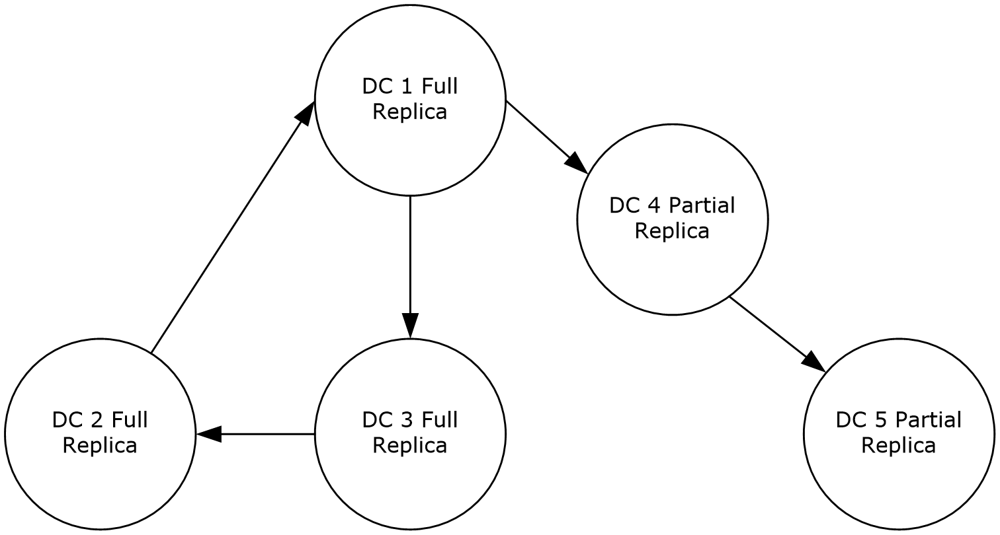

Figure 3: A sample NC replica graph

Per item 1 in the numbered list above, every DC present in the graph contains a replica of the given NC.

There is an arc from DC 4 to DC 5. DC 4 is the initial vertex of this arc and DC 5 is the final vertex. Per item 2 in the list above, because DC 4 contains a partial replica of the NC, DC 5 also contains a partial replica of the NC.

Per item 3 in the list above, there is a path from DC 1, which contains a full replica of the NC, to both DC 4 and DC 5 that contains a partial replica of the NC.

Per item 4 in the list above, the subgraph of the NC replica graph made by DC 1, DC 2, and DC 3 that contains a full replica of the NC is strongly connected because there is a path from each vertex in the subgraph to every other vertex in the subgraph.

The KCC performs this management by first creating *connection* [**objects**](#gt_object) (specified in section [6.1.1.2.2.1.2.1.2](#Section_6.1.1.2.2.1.2.1.2)), then creating repsFrom values from those connection objects (specified in section 6.2). An administrator can create specially marked connection objects, with the NTDSCONN_OPT_IS_GENERATED bit not set in the options attribute, that the KCC will not modify but will use in creating repsFrom values.

##### 3.1.1.1.14 Scheduled and Event-Driven Replication

If *client* and *server* are two [**DCs**](#gt_domain-controller-dc) in the [**NC replica graph**](#gt_nc-replica-graph) of a given [**NC**](#gt_naming-context-nc) and [**forest**](#gt_forest), where *server* is the initial vertex of an arc and *client* is the final vertex of the same arc, *client* will perform a [**replication cycle**](#gt_replication-cycle) from *server* by calling IDL_DRSGetNCChanges ([MS-DRSR](../MS-DRSR/MS-DRSR.md) section 4.1.10) until the cycle is complete in either of these two cases:

- The DC *client's* repsFrom tuple for *server* contains a *schedule* field that calls for [**replication**](#gt_replication) at the current time. The *schedule* contains a REPLTIMES structure as specified in [MS-DRSR] section 5.165. This is *scheduled replication*.
- The DC *server* calls the IDL_DRSReplicaSync method ([MS-DRSR] section 4.1.23.2) on the *client*. This is *event-driven replication*. The events that cause this form of replication are specified later in this section.
A precondition for event-driven replication involves *server's* repsTo abstract [**attribute**](#gt_attribute), specified in [MS-DRSR] section 5.173. The repsTo abstract attribute is a sequence tuples, like repsFrom. Like repsFrom, each repsTo tuple contains a field *uuidDsa* that contains the objectGUID of an nTDSDSA object. The nTDSDSA object represents a DC as specified in section [6.1](#Section_1). If *server's* repsTo abstract attribute contains a tuple whose *uuidDsa* field contains the objectGUID of client's nTDSDSA object, *server* performs event-driven replication to *client*.

It remains to specify how a DC's repsTo abstract attribute is populated, and to specify the events that trigger event-driven replication.

A DC's repsTo abstract attribute is populated as follows:

- A DC *server's* repsTo abstract attribute is populated for event-driven replication to *client* if *client's* repsFrom tuple for *server* has the DRS_ADD_REF bit set in its *replicaFlags* field, and *client* calls the IDL_DRSGetNCChanges method on *server* during scheduled replication. The DC *client* sets the DRS_ADD_REF bit in *Request.ulFlags* on the scheduled call to IDL_DRSGetNCChanges on *server* ([MS-DRSR] section 4.1.10.4.1) and *server* [**updates**](#gt_update) repsTo for event-driven replication to *client* as a result ([MS-DRSR] section 4.1.10.5.2).
Since the KCC running on *client* writes *client's* repsFrom, this behavior is controlled by the state of KCC [**objects**](#gt_object) as specified in section [6.2](#Section_6.2).

- A DC *server's* repsTo abstract attribute is populated for event-driven replication to DC *client* if the IDL_DRSReplicaAdd method ([MS-DRSR] section 4.1.19.2) is called on *client*, specifying *server* as the replication source (either *pmsgIn.V1.pszSourceDsaAddress* or *pmsgIn.V2.pszDsaSrc*, depending upon the request version used). If the IDL_DRSReplicaAdd adds a new tuple to *client's* repsFrom, it proceeds to call IDL_DRSUpdateRefs ([MS-DRSR] section 4.1.26.2) on *server* to update *server's* repsTo abstract attribute.
Since IDL_DRSReplicaAdd is an [**RPC**](#gt_remote-procedure-call-rpc) method, this behavior is controlled by any authorized requester of this method. Within [**Active Directory**](#gt_active-directory) itself, IDL_DRSReplicaAdd is called by the KCC to maintain repsFrom.

The events that trigger event-driven replication from a DC *server* are as follows:

- The DC *server* receives an update, either originating or replicated, as specified in section [3.1.1.5.1.7](#Section_3.1.1.5.1.7) (Urgent Replication).
- A configurable time expires after DC server receives any update, as specified in section [3.1.1.5.1.6](#Section_3.1.1.5.1.6) (Replication notification).

##### 3.1.1.1.15 Replication Latency and Tombstone Lifetime

[**Replication latency**](#gt_replication-latency) is the delay between the time of an [**originating update**](#gt_originating-update) to an [**NC**](#gt_naming-context-nc) and the time when this [**update**](#gt_update) is reflected in all [**replicas**](#gt_replica) of that NC. Some updates are superseded before reaching all replicas, but for the purposes of this simplified definition, consider an [**attribute**](#gt_attribute) update that is not followed by other updates to that attribute for a long time.

Administrators of [**Active Directory**](#gt_active-directory) control [**replication**](#gt_replication) latency by setting several variables, specified in section [6.1](#Section_1) and section [6.2](#Section_6.2). These variables ultimately control the schedules used for scheduled replication, and they control the use of event-driven replication. Replication latency is not fully predictable in a real system, because it depends upon the volume of read requests to [**DCs**](#gt_domain-controller-dc), the volume of originating update requests to DCs, and the availability of DCs and communications links.

If the typical replication latency is larger than the [**tombstone lifetime**](#gt_tombstone-lifetime) (the value of the tombstoneLifetime attribute of the Directory Services [**object**](#gt_object) specified in section [6.1.1.2.4.1.1](#Section_6.1.1.2.4.1.1), interpreted as a number of days), some [**tombstones**](#gt_tombstone) or [**recycled-objects**](#gt_recycled-object) will be garbage collected before they have replicated to every [**NC replica**](#gt_nc-replica). As a result, some objects will never be deleted in some replicas. To restore consistency of object existence, an administrator cleans up such *lingering objects* with utility programs.

##### 3.1.1.1.16 Delayed Link Processing

When an [**update**](#gt_update) to an [**object**](#gt_object) would result in removal of more than 10,000 [**forward link values**](#gt_forward-link-value), or the update would result in more than 10,000 forward link values to be made either visible or invisible to [**LDAP**](#gt_lightweight-directory-access-protocol-ldap) operations that do not specify the LDAP_SERVER_SHOW_DEACTIVATED_LINK_OID control, then at least 10,000 of the value changes so directed are completed within the transaction encompassing the modification (that is, the "originating transaction").

**Note** In Windows Server 2003, Windows Server 2003 R2, and Windows Server 2008, the number is 1,000 instead of 10,000.

Any values not so changed within the originating transaction are changed by continuing processing after and outside of that originating transaction. These changes that occur outside the originating transactions are called "delayed link processing". Delayed link processing occurs within one or more transactions subsequent to the originating transaction.

Although delayed link processing always uses at least one subsequent transaction, there is no constraint on the upper bound of the number of transactions that [**Active Directory**](#gt_active-directory) uses during delayed link processing. Therefore, there is no requirement that at any given time all such values have been removed, made visible, or made invisible. It is possible that there is a period of time during which an object that SHOULD not have a specific value for a [**link valued**](#gt_link-value) [**attribute**](#gt_attribute) will continue to have that value. Likewise, it is possible that there is a period of time during which an object that SHOULD have a specific value for a link valued attribute be either visible or invisible might not have that value in the correct state. Although the protocol places no boundary or requirements on the length of this period of time, it is recommended that implementations minimize the length of this period of time to improve usability of the [**directory**](#gt_directory) for clients.

The server MUST guarantee that all such changes to values of link valued attributes are eventually made to all affected link valued attributes.

**Note** In Windows 2000 Server, delayed link processing is not supported.

#### 3.1.1.2 Active Directory Schema

In [**Active Directory**](#gt_active-directory), the [**schema**](#gt_schema) contains definitions for the [**objects**](#gt_object) that can be stored in the [**directory**](#gt_directory), and it enforces the rules that govern both the structure and the content of the directory. The schema consists of a set of classes, [**attributes**](#gt_attribute), and syntaxes. A *class* is a category of objects that share a set of common characteristics. It is a formal description of a discrete, identifiable type of object that can be stored in the directory. Each object in the directory is an instance of one or more classes in the schema. Attributes define the types of information that an object can hold. For each class, the schema specifies the mandatory attributes and optional attributes that constitute the set of shared characteristics of the class. A syntax is the data type of a particular attribute. Syntaxes determine what data type an attribute can have. Active Directory uses a set of predefined syntaxes. The predefined syntaxes do not actually appear in the directory, and new syntaxes cannot be added.

The schema itself is represented in Active Directory by a set of objects known as *schema objects*. For each class in the schema, there is a [**schema object**](#gt_schema-object) that defines the class. This object is a classSchema object. For each attribute in the schema, there is a schema object that defines the attribute. This object is an attributeSchema object. Therefore, every class is actually an instance of the classSchema class, and every attribute is an instance of the attributeSchema class. Administrators and applications can extend the schema by adding new attributes and classes and by modifying existing ones.

A schema object cannot be deleted, but it can be made [**defunct**](#gt_defunct) by setting the isDefunct attribute to TRUE. A schema object that is not defunct is [**active**](#gt_active). The primary effect of the defunct state is to prevent the schema object from being used in the creation or modification of new objects. For instance, attempts to perform an LDAP Add of an object with a defunct class fails, just as an attempt to perform an LDAP Add of a nonexistent class fails. The full effects of the defunct state are specified later in this section.

##### 3.1.1.2.1 Schema NC

The [**schema NC**](#gt_schema-naming-context-schema-nc) contains all of the [**objects**](#gt_object) that define [**object classes**](#gt_object-class) and [**attributes**](#gt_attribute) used in a [**forest**](#gt_forest).

The root object of the schema NC, called the [**schema container**](#gt_schema-container), is an instance of class dMD.

The contents of the schema NC are established when a forest is created. To enable a [**DC**](#gt_domain-controller-dc) of a forest to be upgraded to a newer version of the operating system, a *schema upgrade* process is first performed. This process [**updates**](#gt_update) the portion of the [**schema**](#gt_schema) that the new operating system depends upon.

The attribute objectVersion on the schema container object stores the schema version of the forest. This attribute is set during the creation of the first [**domain**](#gt_domain) in a forest and is changed during schema upgrade after the schema is successfully upgraded to a newer version. In [**AD DS**](#gt_active-directory-domain-services-ad-ds), to add a DC running a particular Windows release to an existing forest, the objectVersion of the forest's schema container MUST be greater than or equal to the value for that Windows release. In [**AD LDS**](#gt_active-directory-lightweight-directory-services-ad-lds), this is not a requirement. In AD LDS, to add a DC running a particular Windows release to an existing forest, the objectVersion of the forest's schema container can be less than the value for that Windows release. The correspondence between Windows releases and values of the schema container objectVersion is the following:

- Windows 2000 Server: 13
- Windows Server 2003: 30
- Windows Server 2003 R2: 31
- Windows Server 2008 (AD DS): 44
- Windows Server 2008 R2 (AD DS): 47
- Windows Server 2012 (AD DS): 56
- Windows Server 2012 R2 (AD DS): 69
- Windows Server 2016 (AD DS): 87
- Windows Server v1709 (AD DS): 87
- Windows Server v1803 (AD DS): 88
- Windows Server v1809 (AD DS): 88
- Windows Server 2019 (AD DS): 88
- ADAM: 30
- Windows Server 2008 (AD LDS): 30
- Windows Server 2008 R2 (AD LDS): 31
- Windows Server 2012 (AD LDS): 31
- Windows Server 2012 R2 (AD LDS): 31
- Windows Server 2016 (AD LDS): 31
- Windows Server v1709 (AD LDS): 31
- Windows Server v1803 (AD LDS): 31
- Windows Server v1809 (AD LDS): 31
- Windows Server 2019 (AD LDS): 31
Attribute schemaInfo on the schema container stores a String(Octet) value of length 21 bytes. This attribute has no value in a new forest. This attribute is updated on every original schema Add or Modify in the same transaction, and it is replicated to all the domain controllers in the forest upon completion of schema NC [**replication**](#gt_replication). The first byte of schemaInfo is 0xFF. The next 4 bytes are a 32-bit integer in [**big-endian**](#gt_big-endian) byte order, used as the version of the update. The first update sets the version to 1. For subsequent updates, the version is incremented by one. The last 16 bytes are the invocationId of the DC where the schema change is made. The invocationId attribute is specified in section [3.1.1.1.9](#Section_3.1.1.1.9).

For example, here is a value of schemaInfo:

0xFF 0x00 0x00 0x07 0xC7 0x20 0x79 0x92 0xE6 0x84 0xB6 0xF6 0x40 0x99 0x47 0x21 0x8B 0xC9 0xE0 0xF1 0xF3

After a schema change is done on the schema master, the following is the new value:

0xFF 0x00 0x00 0x07 0xC8 0x20 0x79 0x92 0xE6 0x84 0xB6 0xF6 0x40 0x99 0x47 0x21 0x8B 0xC9 0xE0 0xF1 0xF3

There is a child of the schema container with [**RDN**](#gt_relative-distinguished-name-rdn) cn=Aggregate and class subSchema. This object has several [**constructed attributes**](#gt_constructed-attribute) that are compliant with [[RFC2251]](https://go.microsoft.com/fwlink/?LinkId=90325) section 4.5.2, through which the client can retrieve the forest's current schema. See constructed attributes in section [3.1.1.4.5](#Section_3.1.1.4.5.1). This object cannot be modified.

##### 3.1.1.2.2 Syntaxes

###### 3.1.1.2.2.1 Introduction

This section describes the [**LDAP**](#gt_lightweight-directory-access-protocol-ldap) syntaxes used in [**attributes**](#gt_attribute) in [**Active Directory**](#gt_active-directory) [**DCs**](#gt_domain-controller-dc).

###### 3.1.1.2.2.2 LDAP Representations

The [**LDAP**](#gt_lightweight-directory-access-protocol-ldap) syntaxes supported by [**DCs**](#gt_domain-controller-dc) are as shown in the following table. The set of syntaxes supported is not extensible by [**schema**](#gt_schema) modifications. Each syntax is identified by the combination of the attributeSyntax, oMSyntax and, in select cases, oMObjectClass [**attributes**](#gt_attribute) of an attributeSchema object. The cases for which oMObjectClass is not used are indicated by the presence of a hyphen in the oMObjectClass column in the table. The combinations shown in the following table are exhaustive; this table is consistent and identical for Windows 2000 Server and later.

While oMObjectClass conceptually contains an [**object identifier (OID)**](#gt_object-identifier-oid), it is declared in the schema as String(Octet) syntax, requiring that values read from and written to it be expressed as the [**Basic Encoding Rules (BER)**](#gt_basic-encoding-rules-ber) encoding of the OID (BER encoding is defined in [[ITUX690]](https://go.microsoft.com/fwlink/?LinkId=89924)). In the table, both the BER-encoded form and the dotted string form of the OID are given.

| LDAP syntax name | attributeSyntax | oMSyntax | oMObjectClass |
| --- | --- | --- | --- |
| Boolean | 2.5.5.8 | 1 | - |
| Enumeration | 2.5.5.9 | 10 | - |
| Integer | 2.5.5.9 | 2 | - |
| LargeInteger | 2.5.5.16 | 65 | - |
| Object(Access-Point) | 2.5.5.14 | 127 | 0x2B 0x0C 0x02 0x87 0x73 0x1C 0x00 0x85 0x3E (1.3.12.2.1011.28.0.702) |
| Object(DN-String) | 2.5.5.14 | 127 | 0x2A 0x86 0x48 0x86 0xF7 0x14 0x01 0x01 0x01 0x0C (1.2.840.113556.1.1.1.12) |
| Object(OR-Name) | 2.5.5.7 | 127 | 0x56 0x06 0x01 0x02 0x05 0x0B 0x1D (2.6.6.1.2.5.11.29) |
| Object(DN-Binary) | 2.5.5.7 | 127 | 0x2A 0x86 0x48 0x86 0xF7 0x14 0x01 0x01 0x01 0x0B (1.2.840.113556.1.1.1.11) |
| Object(DS-DN) | 2.5.5.1 | 127 | 0x2B 0x0C 0x02 0x87 0x73 0x1C 0x00 0x85 0x4A (1.3.12.2.1011.28.0.714) |
| Object(Presentation-Address) | 2.5.5.13 | 127 | 0x2B 0x0C 0x02 0x87 0x73 0x1C 0x00 0x85 0x5C (1.3.12.2.1011.28.0.732) |
| Object(Replica-Link) | 2.5.5.10 | 127 | 0x2A 0x86 0x48 0x86 0xF7 0x14 0x01 0x01 0x01 0x06 (1.2.840.113556.1.1.1.6) |
| String(Case) | 2.5.5.3 | 27 | - |
| String(IA5) | 2.5.5.5 | 22 | - |
| String(NT-Sec-Desc) | 2.5.5.15 | 66 | - |
| String(Numeric) | 2.5.5.6 | 18 | - |
| String(Object-Identifier) | 2.5.5.2 | 6 | - |
| String(Octet) | 2.5.5.10 | 4 | - |
| String(Printable) | 2.5.5.5 | 19 | - |
| String(Sid) | 2.5.5.17 | 4 | - |
| String(Teletex) | 2.5.5.4 | 20 | - |
| String(Unicode) | 2.5.5.12 | 64 | - |
| String(UTC-Time) | 2.5.5.11 | 23 | - |
| String(Generalized-Time) | 2.5.5.11 | 24 | - |

The representation for many of the preceding syntaxes is adopted from [[RFC2252]](https://go.microsoft.com/fwlink/?LinkId=90326). The following table lists the syntaxes whose representation is adopted from that RFC, the [RFC2252] name of that syntax, and the associated section of [RFC2252] that specifies the representation.

| LDAP syntax name | RFC 2252 name | Section of RFC 2252 |
| --- | --- | --- |
| Boolean | Boolean | 6.4 |
| Enumeration | INTEGER | 6.16 |
| Integer | INTEGER | 6.16* |
| LargeInteger | INTEGER | 6.16* |
| Object(DS-DN) | [**DN**](#gt_distinguished-name-dn) | 6.9 (see also [[RFC2253]](https://go.microsoft.com/fwlink/?LinkId=90327))** |
| Object(Presentation-Address) | Presentation Address | 6.28*** |
| Object(Replica-Link) | Binary | 6.2 |
| String(IA5) | IA5 String | 6.15† |
| String(Numeric) | Numeric String | 6.23†† |
| String(Object-Identifier) | OID | 6.25††† |
| String(Octet) | Binary | 6.2 |
| String(Printable) | Printable String | 6.29†††† |
| String(Unicode) | Directory String | 6.10 |
| String(UTC-Time) | [**UTC**](#gt_coordinated-universal-time-utc) Time | 6.31††††† |
| String(Generalized-Time) | Generalized Time | 6.14††††† |

* The Integer syntax in [**Active Directory**](#gt_active-directory) is restricted to 32-bit integers. The LargeInteger syntax is restricted to 64-bit integers.

** While Active Directory uses the [RFC2252] and [RFC2253] representation of DNs, it can also use alternative forms of the DN representation when it accepts requests and sends responses, if requested by the client. This is documented in LDAP_SERVER_EXTENDED_DN_OID (section [3.1.1.3.4.1.5](#Section_3.1.1.3.4.1.5)).

*** No validation is done by the DC to confirm that the value conforms to the representation specified in [[RFC1278]](https://go.microsoft.com/fwlink/?LinkId=94440).

† Values restricted to ASN.1 IA5 strings (as specified in [[ITUX680]](https://go.microsoft.com/fwlink/?LinkId=89923)).

†† Values restricted to ASN.1 Numeric strings (as specified in [ITUX680]).

††† Values of attributes of syntax String(OID) are accepted in either the numericoid (numeric OID) or descr (the LDAP display name of the attribute or class identified by that OID) format, as defined in [RFC2252] section 4.1. The server determines the format of returning OID values using the first matching rule in the following set of processing rules:

- If a "Binary Option" is present on the AttributeDescription (as described in [[RFC2251]](https://go.microsoft.com/fwlink/?LinkId=90325) section 4.1.5.1) of the request, the server MUST return the OID converted to binary format as described in [RFC2252] section 4.3.1. The result is a binary encoded value using Basic Encoding Rules defined in [ITUX690].
- If a value of either attributeID of an AttributeSchema object or governsID of a ClassSchema object is requested, the server MUST return the OID in numericoid (Numeric OID) format.
- If the attribute requested is not attributeID or governsID, but the value of the attribute identifies an attribute or class, the server MUST return the value in Descr format.
- If none of the above applies, the server MUST return the OID in numericoid (Numeric OID) format.
†††† Active Directory has two differences from the character set specified in [RFC2252]:

- The quote character ("), or ASCII 0x22, is part of the character set in the RFC but not in Active Directory.
- The "@" symbol, or ASCII 0x40, is not part of the character set in the RFC, but it is part of the character set in Active Directory.
††††† Times are measured in granularity of 1 second.

The remaining syntaxes are represented as shown in the following sections.

Object(DN-String)

A value with this syntax is a [**UTF-8**](#gt_utf-8) string in the following format:

S:**byte_count**:**string_value**:**object_DN**

where **byte_count** is the number (in decimal) of bytes in the **string_value** string, **object_DN** is a [**DN**](#gt_distinguished-name-dn) in Object(DS-DN) form, and all remaining characters are string literals. Since **string_value** is a UTF-8 string, one character can require more than one byte to represent it.

Object(Access-Point)

A value with this syntax is a [**UTF-8**](#gt_utf-8) string in the following format:

**presentation_address**#X500:**object_DN**

where **presentation_address** is a value encoded in the Object(Presentation-Address) syntax, **object_DN** is a [**DN**](#gt_distinguished-name-dn) in Object(DS-DN) form, and all remaining characters are string literals.

Object(DN-Binary)

A value with this syntax is a [**UTF-8**](#gt_utf-8) string in the following format:

B:**char_count**:**binary_value**:**object_DN**

where **char_count** is the number (in decimal) of hexadecimal digits in **binary_value**, **binary_value** is the hexadecimal representation of a binary value, **object_DN** is a [**DN**](#gt_distinguished-name-dn) in Object(DS-DN) form, and all remaining characters are string literals. Each byte is represented by a pair of hexadecimal characters in **binary_value**, with the first character of each pair corresponding to the most-significant nibble of the byte. The first pair in **binary_value** corresponds to the first byte of the binary value, with subsequent pairs corresponding to the remaining bytes in sequential order. Note that **char_count** is always even in a syntactically-valid Object(DN-Binary) value.

Object(OR-Name)

A value with this syntax is a [**UTF-8**](#gt_utf-8) string in the following format:

**object_DN**

where **object_DN** is a [**DN**](#gt_distinguished-name-dn) in Object(DS-DN) form.

String(Case)

A value with this syntax is a case-sensitive [**UTF-8**](#gt_utf-8) string, but the server does not enforce that a value of this syntax MUST be a valid UTF-8 string.

String(NT-Sec-Desc)

A value with this syntax contains a [**Windows security descriptor**](#gt_windows-security-descriptor) in binary form. The binary form is that of a SECURITY_DESCRIPTOR structure and is specified in [MS-DTYP](../MS-DTYP/MS-DTYP.md) section 2.4.6. It is otherwise encoded the same as the String(Octet) syntax.

String(Sid)

A value with this syntax contains a [**SID**](#gt_security-identifier-sid) in binary form. The binary form is that of a SID structure (the SID structure is specified in [MS-DTYP](../MS-DTYP/MS-DTYP.md) section 2.4.2.2; all multibyte fields have little-endian byte ordering). It is otherwise encoded the same as the String(Octet) syntax.

String(Teletex)

A value with this syntax is a [**UTF-8**](#gt_utf-8) string restricted to characters with values between 0x20 and 0x7E, inclusive.

###### 3.1.1.2.2.3 Referential Integrity

[**Attributes**](#gt_attribute) with [**object reference**](#gt_object-reference) syntaxes have special behavior, called *referential integrity*, as specified in section [3.1.1.1.6](#Section_3.1.1.1.6). The following are object reference syntaxes:

- Object(Access-Point)
- Object(DN-String)
- Object(OR-Name)
- Object(DN-Binary)
- Object(DS-DN)
For the four syntaxes other than Object(DS-DN), referential integrity only applies to the **object_DN** portion of the value.

[**Active Directory**](#gt_active-directory) imposes restrictions on which [**objects**](#gt_object) can be referenced by an attribute that has referential integrity. An attribute can reference any object in the same [**NC**](#gt_naming-context-nc) as the object on which that attribute is located. Additionally, attributes on an object in the [**domain NC**](#gt_domain-naming-context-domain-nc), [**schema NC**](#gt_schema-naming-context-schema-nc), or [**config NC**](#gt_configuration-naming-context-config-nc) can reference any object in any domain NC in the [**forest**](#gt_forest), any object in the schema NC or the config NC, or the root object of any [**application NC**](#gt_application-nc). For objects in application NCs, such attributes can reference any object in the config NC or the schema NC, or the root object of any application NC, in addition to any object in the same application NC as the object doing the referencing. All other references are disallowed by the server.

These restrictions are identical for [**AD DS**](#gt_active-directory-domain-services-ad-ds) and for [**AD LDS**](#gt_active-directory-lightweight-directory-services-ad-lds). Because AD LDS does not support domain NCs, the only cross-NC references in an AD LDS forest are from any NC to any object in the config and schema NCs or to the root of an application NC.

###### 3.1.1.2.2.4 Supported Comparison Operations

In addition to determining what can be stored in an [**attribute**](#gt_attribute), the syntaxes determine what comparison operations the server permits on an attribute in an [**LDAP**](#gt_lightweight-directory-access-protocol-ldap) search [**filter**](#gt_filter), as well as how the server performs those comparisons. The following table maps each of the LDAP syntaxes to a comparison rule. All syntaxes of the same comparison rule support the same comparison operations and are compared using the same comparison rules.

| LDAP syntax | Comparison rule |
| --- | --- |
| *Boolean* | *Bool* |
| *Enumeration* | *Integer* |
| *Integer* | *Integer* |
| *LargeInteger* | *Integer* |
| *Object(Access-Point)* | *DN-String* |
| *Object(DN-String)* | *DN-String* |
| *Object(OR-Name)* | *DN-Binary* |
| *Object(DN-Binary)* | *DN-Binary* |
| *Object(DS-DN)* | *DN* |
| *Object(Presentation-Address)* | *PresentationAddress* |
| *Object(Replica-Link)* | *Octet* |
| *String(Case)* | *CaseString* |
| *String(IA5)* | *CaseString* |
| *String(NT-Sec-Desc)* | *SecDesc* |
| *String(Numeric)* | *CaseString* |
| *String(Object-Identifier)* | *OID* |
| *String(Octet)* | *Octet* |
| *String(Printable)* | *CaseString* |
| *String(Sid)* | *Sid* |
| *String(Teletex)* | *NoCaseString* |
| *String(*Unicode*)* | *UnicodeString* |
| *String(UTC-Time)* | *Time* |
| *String(Generalized-Time)* | *Time* |

The following table (split into three parts for readability) shows which of the choices in an LDAP filter (that is, which comparison operations) are supported for each comparison rule. The LDAP filter structure is defined in [[RFC2251]](https://go.microsoft.com/fwlink/?LinkId=90325) section 4.5.1. Each comparison rule (for example, the rule for comparing two Bool values) is discussed following the table. The "and", "or", and "not" choices in an LDAP filter are not included in this table because they are not comparisons performed against an attribute value. [**Active Directory**](#gt_active-directory) treats approxMatch as equivalent to equalityMatch. For details on the three extensible matching rules, see section [3.1.1.3.4.4](#Section_3.1.1.3.4.4).

| Comparison rule | present | equalityMatch | approxMatch |
| --- | --- | --- | --- |
| *Bool* | *X* | *X* | *X* |
| *Integer* | *X* | *X* | *X* |
| *DN-String* | *X* | *X* | *X* |
| *DN-Binary* | *X* | *X* | *X* |
| *DN* | *X* | *X* | *X* |
| *PresentationAddress* | *X* | *X* | *X* |
| *Octet* | *X* | *X* | *X* |
| *CaseString* | *X* | *X* | *X* |
| *SecDesc* | *X* | - | - |
| *OID* | *X* | *X* | *X* |
| *Sid* | *X* | *X* | *X* |
| *NoCaseString* | *X* | *X* | *X* |
| *UnicodeString* | *X* | *X* | *X* |
| *Time* | *X* | *X* | *X* |

| Comparison rule | lessOrEqual | greaterOrEqual | substrings |
| --- | --- | --- | --- |
| *Bool* | *X* | *X* | - |
| *Integer* | *X* | *X* | - |
| *DN-String* | - | - | - |
| *DN-Binary* | - | - | - |
| *DN* | - | - | - |
| *PresentationAddress* | - | - | - |
| *Octet* | *X* | *X* | *X* |
| *CaseString* | *X* | *X* | *X* |
| *SecDesc* | - | - | - |
| *OID* | - | - | - |
| *Sid* | *X* | *X* | *X* |
| *NoCaseString* | *X* | *X* | *X* |
| *UnicodeString* | *X* | *X* | *X* |
| *Time* | *X* | *X* | - |

**Note** In the following table, the constant names in the headers for the extensibleMatch columns are prefixed with "LDAP_MATCHING_RULE_". For example, "...BIT_AND" is actually "LDAP_MATCHING_RULE_BIT_AND".

| Bit Range | Field | Description |
| --- | --- | --- |
| Variable | *Bool* | - - - |
| Variable | *Integer* | *X* *X* - |
| Variable | *DN-String* | - - *X** |
| Variable | *DN-Binary* | - - *X** |
| Variable | *DN* | - - *X** |
| Variable | *PresentationAddress* | - - - |
| Variable | *Octet* | - - - |
| Variable | *CaseString* | - - - |
| Variable | *SecDesc* | - - - |
| Variable | *OID* | - - - |
| Variable | *Sid* | - - - |
| Variable | *NoCaseString* | - - - |
| Variable | *UnicodeString* | - - - |
| Variable | *Time* | - - - |

* Supported only if the attribute is a [**link attribute**](#gt_link-attribute). Evaluates to Undefined otherwise.

Bool Comparison Rule

A value of TRUE is considered to be greater than a value of FALSE.

Integer Comparison Rule

A signed comparison of integer values is performed.

DN-String Comparison Rule

Values of String(DN-String) or String(Access-Point) are equal if the **object_DN** components name the same [**object**](#gt_object) and the **string_value** or **presentation_address** components are equal according to the UnicodeString comparison rule.

Evaluation of an LDAP_MATCHING_RULE_TRANSITIVE_EVAL matching rule is performed as documented in section [3.1.1.3.4.4](#Section_3.1.1.3.4.4). Only the **object_DN** component is considered when evaluating a [**filter**](#gt_filter) clause that uses this rule; **string_value** or **presentation_address** is ignored.

DN-Binary Comparison Rule

Values of String(DN-Binary) or String(OR-Name) are equal if the **object_DN** components name the same [**object**](#gt_object) and the **binary_value** or **OR_address** components are identical in length and in content.

Evaluation of an LDAP_MATCHING_RULE_TRANSITIVE_EVAL matching rule is performed as documented in section [3.1.1.3.4.4](#Section_3.1.1.3.4.4). Only the **object_DN** component is considered when evaluating a [**filter**](#gt_filter) clause that uses this rule; **binary_value** or **OR_address** is ignored.

DN Comparison Rule

[**DN**](#gt_distinguished-name-dn) values are equal when they name the same [**object**](#gt_object).

Evaluation of an LDAP_MATCHING_RULE_TRANSITIVE_EVAL matching rule is performed as documented in section [3.1.1.3.4.4](#Section_3.1.1.3.4.4).

PresentationAddress Comparison Rule

Two Object(Presentation-Address) values are equal when they have the same length and content.

Octet Comparison Rule

Two values are equal when they are the same length and have identical contents. A value S1 is less than a value S2, where L is the smaller of the length of S1 and the length of S2, if either the first L bytes of S1 are less than the first L bytes of S2, or if the first L bytes of S1 and S2 are identical but the length of S1 is less than the length of S2. Given L = 1, S1 is less than S2 if the value of the first byte of S1 is less than the value of the first byte of S2. Given L > 1, for the first L bytes of S1 to be less than the first L bytes of S2 means that there exists an N (where N<L) such that bytes 0...N-1 of S1 and S2 are identical, and byte N of S1 is less than byte N of S2.

For substring purposes, each byte in the value is treated as if it was a character. Values are compared using the ordinary rules for a SubstringFilter, as defined in [[RFC2251]](https://go.microsoft.com/fwlink/?LinkId=90325) section 4.5.1. The "characters" are treated as if they were case-sensitive; that is, two characters are considered identical if and only if the bytes that represent them are identical.

CaseString Comparison Rule

When compared using this comparison rule, two values are equal if they have identical length and contents. A value S1 is less than a value S2, where L is the smaller of the length of S1 and the length of S2, if either the first L bytes of S1 are less than the first L bytes of S2, or if the first L bytes of S1 and S2 are identical but the length of S1 is less than the length of S2. Given L = 1, S1 is less than S2 if the value of the first byte of S1 is less than the value of the first byte of S2. Given L > 1, for the first L bytes of S1 to be less than the first L bytes of S2 means that there exists an N (where N<L) such that bytes 0...N-1 of S1 and S2 are identical, and byte N of S1 is less than byte N of S2.

For substring purposes, this comparison rule treats values as if they were case-sensitive strings of characters and obey the ordinary rules for a SubstringFilter, as defined in [[RFC2251]](https://go.microsoft.com/fwlink/?LinkId=90325) section 4.5.1. In this comparison, two characters are considered identical if and only if the bytes that represent them are identical.

SecDesc Comparison Rule

SecDescs are compared as octet strings as in section [3.1.1.2.2.4.7](#Section_3.1.1.2.2.4.7).

OID Comparison Rule

Two String(Object-Identifier) values are equal when they are the same [**OID**](#gt_object-identifier-oid).

Sid Comparison Rule

String([**SID**](#gt_security-identifier-sid)) values are treated as the binary representation of the SID (see section [3.1.1.2.2.2.7](#Section_3.1.1.2.2.2.7)). The binary representations of the SID are compared using the Octet comparison rule.

NoCaseString Comparison Rule

This comparison rule is identical to the CaseString comparison rule, except that for each comparison, characters are treated in a case-insensitive fashion. For equality, ordering (greater-than-or-equals and less-than-or-equals), and substrings, two characters are identical if the bytes that represent them are identical or if the characters differ from each other only by their case. The "C" locale, as defined in [[ISO/IEC-9899]](https://go.microsoft.com/fwlink/?LinkId=89921), is used for determining whether two characters differ by case.

UnicodeString Comparison Rule

Comparison of values using this comparison rule is performed via [**Unicode**](#gt_unicode) comparison, which is specified in section [6.5](#Section_1.3). If an LDAP_SERVER_SORT_OID extended control (see section [3.1.1.3.4](#Section_3.1.1.3.4.2)) is attached to the search request and specifies a locale in its orderingRule field, the locale specified is used for the Unicode comparison. Otherwise, the Unicode comparison is performed using United States English (LCID 0409). The comparison function is independent of the server locale and therefore gives the same result on all [**DCs**](#gt_domain-controller-dc). The comparison function operates on Unicode strings containing characters from all alphabets and does not, for instance, involve reducing the string to the alphabet used by United States English before performing the comparison. This comparison function is used to determine both equality and ordering (greater-than-or-equals and less-than-or-equals), as well as to determine equality of substrings when performing a substring comparison.

This comparison rule is used in processing search [**filters**](#gt_filter), *not* in sorting search results. See section [3.1.1.3.4.1.13](#Section_3.1.1.3.4.1.13) for per-locale sorting of search results.

Time Comparison Rule

Time T1 is greater than time T2 if T1 denotes a time subsequent to T2.

##### 3.1.1.2.3 Attributes

The [**attributes**](#gt_attribute) of class attributeSchema are specified in the following table.

The term "Unique" (in quotation marks) in the following table, and in the similar table for classSchema in section [3.1.1.2.4.8](#Section_3.1.1.2.4.8), means that the value satisfies the following constraint:

- If the [**forest functional level**](#gt_forest-functional-level) is less than DS_BEHAVIOR_WIN2003, the value is unique among all values of this attribute in the set containing every attributeSchema and classSchema [**object**](#gt_object) in the [**schema NC**](#gt_schema-naming-context-schema-nc).
- If the forest functional level is DS_BEHAVIOR_WIN2003 or greater, the value is unique among all values of this attribute in the set containing every attributeSchema and classSchema object S in the schema NC that satisfies at least one of the following three conditions:
- S!isDefunct ≠ TRUE, that is, S is [**active**](#gt_active).
- FLAG_ATTR_IS_RDN is present in S!systemFlags (defined in the following table).
- S = C!rDNAttID (section 3.1.1.2.4.8) for some classSchema object C.
The term system-only in the following table means that the attribute is defined with systemOnly TRUE. The value of the system-only attributes in the table can be specified on Add (except where noted) but cannot be modified on existing objects by LDAP Modify requests (except as specified in section [3.1.1.5.3.2](#Section_3.1.1.5.3.2)), only by the system. The table is ordered with the system-only attributes before the other attributes.

| Attribute | Description |
| --- | --- |
| objectClass | Equals the sequence [ top, classSchema ]. System-only. |
| attributeID | "Unique" [**OID**](#gt_object-identifier-oid) that identifies this attribute. System-only. |
| schemaIDGUID | "Unique" [**GUID**](#gt_globally-unique-identifier-guid) that identifies this attribute, used in [**security descriptors (SDs)**](#gt_security-descriptor). If not specified on Add, the [**DC**](#gt_domain-controller-dc) generates a GUID. This GUID MUST NOT be the [**NULL GUID**](#gt_null-guid). System-only. |
| msDS-IntId | Not specified on Add (if specified in the Add request, the DC returns error *unwillingToPerform* / *<unrestricted>*); the value (a 32-bit unsigned integer in the subrange [0x80000000..0xBFFFFFFF]) is generated by the DC. Present on attributeSchema objects added when forest functional level is DS_BEHAVIOR_WIN2003 or greater with FLAG_SCHEMA_BASE_OBJECT not present in systemFlags (below). The value of msDS-IntId is the [ATTRTYP](#Section_3.1.1.2.6) of this attributeSchema object. Unique among all values of this attribute on objects in the schema NC, regardless of forest functional level. System-only. |
| linkID | Optional. If present, and not zero, this is a [**link attribute**](#gt_link-attribute), and the linkID value is unique among all values of this attribute on objects in the schema NC, regardless of forest functional level. If linkID is even, the attribute is a [**forward link attribute**](#gt_forward-link-attribute); otherwise it is a [**back link attribute**](#gt_back-link-attribute). The linkID for back link attribute equals to the linkID of the corresponding forward link attribute plus one. Special auto-generation behavior for the linkID attribute is specified in section [3.1.1.2.3.1](#Section_3.1.1.2.3.1). System-only. |
| mAPIID | Optional. "Unique" integer that identifies this attribute, used by [**Messaging Application Programming Interface (MAPI)**](#gt_messaging-application-programming-interface-mapi) clients. Not present on attributeSchema objects in [**AD LDS**](#gt_active-directory-lightweight-directory-services-ad-lds). Special auto-generation behavior for the mAPIID attribute is specified in section [3.1.1.2.3.2](#Section_3.1.1.2.3.2). System-only. If the [**DC functional level**](#gt_dc-functional-level) is DS_BEHAVIOR_WIN2008 or greater, the mAPIID attribute can be modified on attributeSchema objects that do not include FLAG_SCHEMA_BASE_OBJECT as the systemFlags attribute. Otherwise, the mAPIID attribute cannot be modified. |
| attributeSyntax | One of the three attributes that identify the syntax of the attribute. See section [3.1.1.2.2](#Section_3.1.1.2.2.1). System-only. |
| oMSyntax | One of the three attributes that identify the syntax of the attribute. See section 3.1.1.2.2. System-only. |
| oMObjectClass | Optional. One of the three attributes that identify the syntax of the attribute. See section 3.1.1.2.2. System-only. |
| isSingleValued | TRUE if this attribute is single-valued; FALSE, if it is multivalued. If an attribute is multivalued, all values have the syntax specified for the attribute. System-only. |
| systemFlags | Optional. Flags that determine specific system operations; see section [2.2.10](#Section_6.1.1.2.6.25) for values. The systemFlags values specific to an attributeSchema object are: FLAG_ATTR_NOT_REPLICATED: This attribute is [**nonreplicated**](#gt_nonreplicated-attribute). **Note** If the FLAG_ATTR_NOT_REPLICATED bit is not specified on Add and the linkID value is odd (denoting a back link attribute), the DC adds the FLAG_ATTR_NOT_REPLICATED bit to the systemFlags value using a bitwise OR. FLAG_ATTR_REQ_PARTIAL_SET_MEMBER: This attribute is a member of [**PAS**](#gt_partial-attribute-set-pas) regardless the value of attribute isMemberOfPartialAttributeSet. FLAG_ATTR_IS_CONSTRUCTED: This attribute is a [**constructed attribute**](#gt_constructed-attribute). FLAG_ATTR_IS_OPERATIONAL: This attribute is an [**operational attribute**](#gt_operational-attribute), as defined in [[RFC2251]](https://go.microsoft.com/fwlink/?LinkId=90325) section 3.2.1. FLAG_SCHEMA_BASE_OBJECT: This class is part of the base [**schema**](#gt_schema). Modifications to a base [**schema object**](#gt_schema-object) are restricted as described in section [3.1.1.2.5](#Section_3.1.1.2.5.2). FLAG_ATTR_IS_RDN: This attribute can be used as an [**RDN attribute**](#gt_rdn-attribute) of a class. System-only. |
| systemOnly | Optional. The value of a system-only attribute cannot be modified on existing objects by LDAP Modify requests (except as specified in section 3.1.1.5.3.2), only by the system. System-only. |
| cn | [**RDN**](#gt_relative-distinguished-name-rdn) for the schema object. |
| lDAPDisplayName | "Unique" name that identifies this attribute, used by [**LDAP**](#gt_lightweight-directory-access-protocol-ldap) clients. If not specified on Add, the DC generates a value as specified in section [3.1.1.2.3.4](#Section_3.1.1.2.3.4). The syntax of lDAPDisplayName is described in [RFC2251] section 4.1.4. |
| attributeSecurityGUID | Optional. GUID by which the security system identifies the [**property set**](#gt_property-set) of this attribute. If present, this value MUST NOT be the NULL GUID. See the specification of property sets in section [3.1.1.2.3.3](#Section_3.1.1.2.3.3). |
| extendedCharsAllowed | Optional. If TRUE, character set constraint is not enforced on values of this attribute. Applies to attributes of syntax String(IA5), String(Numeric), String(Teletex), String(Printable). |
| rangeLower | Optional. Lower range of values that are allowed for this attribute. For syntax Integer, LargeInteger, Enumeration, String(UTC-Time), and String(Generalized-Time), rangeLower equals the minimum allowed value. For syntax Object(DN-binary), Object(DN-String), rangeLower equals the minimum length of the binary_value or string_value portion of the given value. For String(Unicode), rangeLower is the minimum length in characters. rangeLower does not affect the allowed values for syntax Boolean and Object(DS-DN). For all other syntaxes, rangeLower equals the minimum length in bytes. Note that rangeLower is a 32-bit integer and cannot express the full range of LargeInteger, String(UTC-Time), and String(Generalized-Time). |
| rangeUpper | Optional. Upper range of values that are allowed for this attribute. For syntax Integer, LargeInteger, Enumeration, String(UTC-Time), and String(Generalized-Time), rangeUpper equals the maximum allowed value. For syntax Object(DN-binary), Object(DN-String), rangeUpper equals the maximum length of the binary_value or string_value portion of the given value. For String(Unicode), rangeUpper is the maximum length in character. rangeUpper does not affect the allowed values for syntax Boolean and Object(DS-DN). For all other syntaxes, rangeUpper equals the maximum length in bytes. Note that rangeUpper is a 32-bit integer and cannot express the full range of LargeInteger, String(UTC-Time), and String(Generalized-Time). |
| searchFlags | Optional. The searchFlags attribute specifies whether an attribute is indexed, among other things; see section [2.2.9](#Section_2.2.9) for values. It contains bitwise flags as follows: fATTINDEX: * fPDNTATTINDEX: * fANR: Add this attribute to the [**ambiguous name resolution (ANR)**](#gt_ambiguous-name-resolution-anr) set. If this flag is set, then fATTINDEX MUST also be set. See [3.1.1.3.1.3.4](#Section_3.1.1.3.1.3.4) for ANR search. fPRESERVEONDELETE: Specifies that the attribute values MUST be preserved on objects after deletion of the object (that is, when the object is transformed to a [**tombstone**](#gt_tombstone) or [**recycled-object**](#gt_recycled-object)). This flag is ignored for the attributes [objectCategory](#Section_6.1.6.7.6) and [sAMAccountType](#Section_6.1.6.8.4), plus all linked attributes. fCOPY: Specifies a hint to LDAP clients that the attribute is intended to be copied when copying the object. This flag is not interpreted by the server. fTUPLEINDEX: * fSUBTREEATTINDEX: * fCONFIDENTIAL: This attribute is confidential, so a special [**access check**](#gt_access-check) is required; for details, see the Extended Access Checks in section [3.1.1.4.4](#Section_3.1.1.4.4). fNEVERVALUEAUDIT: Auditing of changes to values contained in this attribute MUST NOT be performed. Auditing is outside the state model. fRODCFilteredAttribute: This attribute is part of the [**filtered attribute set**](#gt_filtered-attribute-set). This flag is only effective on a DC whose DC functionality level is DS_BEHAVIOR_WIN2008 or greater. See section [3.1.1.2.3.5](#Section_3.1.1.2.3.5) for additional restrictions. fEXTENDEDLINKTRACKING: The effects of this search flag are outside the state model. Suggests that a DC do additional internal tracking for link changes. This flag can be ignored by other implementations but MUST not be used in a conflicting way that would affect the performance of Windows DCs. fBASEONLY: This attribute is returned only on searches scoped to one object. fPARTITIONSECRET: This attribute requires extended access checks to add, read, and [**update**](#gt_update). The effects of searchFlags marked * are outside the state model. They direct the server to construct certain indexes that affect system performance. These flags can be ignored by other implementations but MUST not be used in a conflicting way that would affect the performance of Windows DCs. |
| schemaFlagsEx | Optional. The schemaFlagsEx attribute specifies whether an attribute can be part of the [**filtered**](#gt_filter) attribute set; see section [2.2.11](#Section_2.2.11) for values. It contains bitwise flags as follows: FLAG_ATTR_IS_CRITICAL: If this flag is set and the fRODCFilteredAttribute flag in searchFlags is also set, the fRODCFilteredAttribute flag is ignored. If fRODCFilteredAttribute is not set, then setting this flag has no effect. This flag is effective only on a DC whose DC functionality level is DS_BEHAVIOR_WIN2008 or greater; it is ignored by a DC that is not at that level or greater. |
| isMemberOfPartialAttributeSet | Optional. If TRUE, the attribute is a member of the [**forest's**](#gt_forest) partial attribute set. An attribute is a member of the forest's partial attribute set if and only if either (1) this attribute is TRUE or (2) the FLAG_ATTR_REQ_PARTIAL_SET_MEMBER bit is set in the systemFlags attribute. If this attribute is TRUE and the FLAG_ATTR_NOT_REPLICATED bit is set in the systemFlags attribute, and if the attribute is modified on a DC that is also a [**GC server**](#gt_global-catalog-server-gc-server), then the value of the attribute is accessible through that GC server, but the value of the attribute does not replicate. If the FLAG_ATTR_NOT_REPLICATED bit is set in the systemFlags attribute, the attribute value does not replicate to other GC servers. |

###### 3.1.1.2.3.1 Auto-Generated linkID

If the [**DC functional level**](#gt_dc-functional-level) is DS_BEHAVIOR_WIN2003 or greater, and an attributeSchema [**object**](#gt_object) is created with LDAP Add, and the Add request assigns the [**OID**](#gt_object-identifier-oid) 1.2.840.113556.1.2.50 as the value of the linkID [**attribute**](#gt_attribute), the [**DC**](#gt_domain-controller-dc) sets the linkID attribute to an even integer that does not already appear as the linkID on a [**schema object**](#gt_schema-object). The attribute created by the Add is a [**forward link attribute**](#gt_forward-link-attribute).

If the DC functional level is DS_BEHAVIOR_WIN2003 or greater, and an attributeSchema object is created with LDAP Add, and the Add request assigns either the attributeID or the lDAPDisplayName of an existing forward link attribute as the value of the linkID attribute, the DC sets the linkID attribute to the linkID of the given forward link attribute plus one. The attribute created by the Add is a [**back link attribute**](#gt_back-link-attribute) corresponding to the given forward link attribute.

The aforementioned values that trigger auto-generation behavior for the linkID are of syntax String(Object-Identifier) or String(Unicode), and therefore do not conform to the declared syntax of the linkID attribute. The DC accepts these values without the error that would normally occur in such a case.

###### 3.1.1.2.3.2 Auto-Generated mAPIID

If the [**DC functional level**](#gt_dc-functional-level) is DS_BEHAVIOR_WIN2008 or greater, and an attributeSchema [**object**](#gt_object) is created with LDAP Add, and the Add request assigns the [**OID**](#gt_object-identifier-oid) 1.2.840.113556.1.2.49 as the value of the mAPIID [**attribute**](#gt_attribute), the [**DC**](#gt_domain-controller-dc) sets the mAPIID attribute to an integer that does not already appear as the mAPIID on a [**schema object**](#gt_schema-object). An implementation can use any algorithm to choose the next integer as long as that algorithm satisfies this uniqueness constraint. This mAPIID uniqueness spans all the mAPIID attributes on schema objects that are currently persisted in the [**directory**](#gt_directory).

The aforementioned value that triggers auto-generation behavior for mAPIID is of syntax String (Object-Identifier), which does not conform to the declared syntax of the mAPIID attribute. The DC accepts these values without the error that would normally occur in such a case.

###### 3.1.1.2.3.3 Property Set

A [**property set**](#gt_property-set) consists of a set of related [**attributes**](#gt_attribute). An attribute whose attributeSchema [**object**](#gt_object) has a value for the attributeSecurityGUID attribute belongs to that property set; the property set is identified by the property set [**GUID**](#gt_globally-unique-identifier-guid), which is the attributeSecurityGUID value.

A property set GUID can be used instead of the schemaIDGUID of an attribute when defining a [**security descriptor**](#gt_security-descriptor), as specified in section [5.1.3.2](#Section_5.1.3.2), to grant or deny access to all attributes in one [**access control entry (ACE)**](#gt_access-control-entry-ace).

The following table lists the property sets present in the default [**AD DS**](#gt_active-directory-domain-services-ad-ds) [**schema**](#gt_schema).

| Name | Property set GUID |
| --- | --- |
| Domain Password & Lockout Policies | C7407360-20BF-11D0-A768-00AA006E0529 |
| General Information | 59BA2F42-79A2-11D0-9020-00C04FC2D3CF |
| Account Restrictions | 4C164200-20C0-11D0-A768-00AA006E0529 |
| Logon Information | 5F202010-79A5-11D0-9020-00C04FC2D4CF |
| Group Membership | BC0AC240-79A9-11D0-9020-00C04FC2D4CF |
| Phone and Mail Options | E45795B2-9455-11D1-AEBD-0000F80367C1 |
| Personal Information | 77B5B886-944A-11D1-AEBD-0000F80367C1 |
| Web Information | E45795B3-9455-11D1-AEBD-0000F80367C1 |
| Public Information | E48D0154-BCF8-11D1-8702-00C04FB96050 |
| Remote Access Information | 037088F8-0AE1-11D2-B422-00A0C968F939 |
| Other Domain Parameters (for use by SAM) | B8119FD0-04F6-4762-AB7A-4986C76B3F9A |
| DNS Host Name Attributes | 72E39547-7B18-11D1-ADEF-00C04FD8D5CD |
| MS-TS-GatewayAccess (*) | FFA6F046-CA4B-4FEB-B40D-04DFEE722543 |
| Private Information (*) | 91E647DE-D96F-4B70-9557-D63FF4F3CCD8 |
| Terminal Server License Server (*) | 5805BC62-BDC9-4428-A5E2-856A0F4C185E |

(*) The last three property sets are present only in Windows Server 2008 and later AD DS [**forests**](#gt_forest).

To determine the set of attributes that belong to a property set, search for the corresponding property-set GUID in [MS-ADA1](#Section_3.1.1.2), [MS-ADA2](#Section_3.1.1.2), and [MS-ADA3](#Section_3.1.1.2) for AD DS, or in [MS-ADLS](#Section_6.1.1.2.4) for [**AD LDS**](#gt_active-directory-lightweight-directory-services-ad-lds). All attributeSchema classes that have their attributeSecurityGUID set as the property-set GUID belong to that property set.

New property sets can be created by adding controlAccessRight objects to the [**Extended-Rights container**](#gt_extended-rights-container) as described in section [5.1.3.2.1](#Section_5.1.3.2.1). The rightsGuid attribute of the controlAccessRight object is the property set GUID. This GUID MUST NOT be the [**NULL GUID**](#gt_null-guid).

AD LDS installs a reduced schema by default. The default AD LDS schema only includes the following property sets:

- General Information
- Account Restrictions
- Logon Information
- Group Membership
- Phone and Mail Options
- Personal Information
- Web Information
- Public Information

###### 3.1.1.2.3.4 lDAPDisplayName Generation

When lDAPDisplayName is not given explicitly when creating an [**attribute**](#gt_attribute) or class, the system will generate a default one from the value of cn with the following routine:

String generateLdapDisplayName(IN cn: String)

{

Identify the substrings in cn that are delimited by

one or more characters in the set {' ', '-', '_'},

let S be a string array containing all the substrings;

Let T be a string array with the same number of elements

as S, such that

1. First string in T (T[1]) is exactly the same string

as S[1], except the first character of T[1] is the

lower case form of the first character of S[1];

2. For the remaining strings, T[i] is the same as S[i],

except the first character of T[i] is the upper case

of the first character of S[i];

Let string st be the concatenation of the strings in T;

Return st;

}

For example, if the cn of a new class is Sam-Domain, the default lDAPDisplayName is samDomain.

###### 3.1.1.2.3.5 Flag fRODCFilteredAttribute in Attribute searchFlags

An [**attribute**](#gt_attribute) cannot be a member of a [**filtered attribute set**](#gt_filtered-attribute-set) if one of the following conditions is TRUE:

- The FLAG_ATTR_NOT_REPLICATED bit is set in attribute systemFlags of the attributeSchema [**object**](#gt_object);
- The FLAG_ATTR_REQ_PARTIAL_SET_MEMBER bit is set in attribute systemFlags of the attributeSchema object;
- The FLAG_ATTR_IS_CONSTRUCTED bit is set in attribute systemFlags of the attributeSchema object;
- The FLAG_ATTR_IS_CRITICAL bit is set in attribute schemaFlagsEx of the attributeSchema object;
- Attribute systemOnly of the attributeSchema object is TRUE;
- The attribute is in the following list: currentValue, dBCSPwd, unicodePwd, ntPwdHistory, priorValue, supplementalCredentials, trustAuthIncoming, trustAuthOutgoing, lmPwdHistory, initialAuthIncoming, initialAuthOutgoing, msDS-ExecuteScriptPassword, displayName, codePage, creationTime, lockoutDuration, lockOutObservationWindow, logonHours, lockoutThreshold, maxPwdAge, minPwdAge, minPwdLength, nETBIOSName, pwdProperties, pwdHistoryLength, pwdLastSet, securityIdentifier, trustDirection, trustPartner, trustPosixOffset, trustType, rid, domainReplica, accountExpires, nTMixedDomain, operatingSystem, operatingSystemVersion, operatingSystemServicePack, fSMORoleOwner, trustAttributes, trustParent, flatName, sIDHistory, dNSHostName, lockoutTime, servicePrincipalName, isCriticalSystemObject, msDS-TrustForestTrustInfo, msDS-SPNSuffixes, msDS-AdditionalDnsHostName, msDS-AdditionalSamAccountName, msDS-AllowedToDelegateTo, msDS-KrbTgtLink, msDS-AuthenticatedAtDC, msDS-SupportedEncryptionTypes.
If one of the conditions is TRUE, the attribute will not be in the [**filtered**](#gt_filter) attribute set even if the flag fRODCFilteredAttribute is set in attribute searchFlags of the attributeSchema object.

##### 3.1.1.2.4 Classes

###### 3.1.1.2.4.1 Class Categories

There are four categories of classes:

**Structural classes**: Structural classes are the classes that can have instances in the [**directory**](#gt_directory).

**Abstract classes**: [**Abstract classes**](#gt_abstract-classes) are templates that are used to derive new classes. Abstract classes cannot be instantiated in the directory.

**Auxiliary classes**: [**Auxiliary classes**](#gt_auxiliary-object-class) contain a list of [**attributes**](#gt_attribute). Adding the auxiliary class to the definition of a structural or abstract class adds the auxiliary class's attributes to the definition. An auxiliary class cannot be instantiated by itself in the directory.

**88 classes**: 88 classes do not fall into any of the preceding categories. An 88 class can be used as an abstract class, a structural class, or an auxiliary class.

Structural class, abstract class, and auxiliary class are defined in [[X501]](https://go.microsoft.com/fwlink/?LinkId=98847) section 8.3. 88 class corresponds to the definition of [**object classes**](#gt_object-class) described in [X501] section 8.3.4. 88 class is included for compatibility with this older standard and is not intended to be used in new [**schema**](#gt_schema) extensions.

###### 3.1.1.2.4.2 Inheritance

[**Inheritance**](#gt_inheritance) is the ability to build new classes from existing classes. The new class is defined as a subclass of another class, called its *superclass*. A subclass inherits from its superclass the mandatory and optional [**attributes**](#gt_attribute) and its structural parent classes in the [**directory**](#gt_directory) hierarchy. All classes are subclasses, directly or indirectly, of a single [**abstract object class**](#gt_abstract-classes), called top. In [**Active Directory**](#gt_active-directory), a class has exactly one superclass; top is its own superclass. An ordered set of superclasses of a class, ending with class top, is its *superclass chain* ([[X501]](https://go.microsoft.com/fwlink/?LinkId=98847)). The superclass chain of a class does not include the class itself, except that the superclass chain of top is the single-element sequence [ top ].

Abstract classes can inherit only from abstract classes, [**auxiliary classes**](#gt_auxiliary-object-class) can inherit from all classes except structural classes, and structural classes can inherit from all classes except auxiliary classes. Classes of the category **88 class** (section [3.1.1.2.4.1](#Section_3.1.1.2.4.1)) can inherit from all classes.

###### 3.1.1.2.4.3 objectClass

[**Attribute**](#gt_attribute) objectClass is a multivalued attribute that appears on all the [**objects**](#gt_object) in the [**directory**](#gt_directory). When instantiating a structural class or an [**88 object class**](#gt_88-object-class), the objectClass attribute of the new object contains a sequence of class names. The first element is always class top. The last element is the name of the structural class or the 88 object class that was instantiated (referred to as the most specific class). The rest of the classes in the superclass chain are listed in between in the order of [**inheritance**](#gt_inheritance) from class top. For example, a [**user object**](#gt_user-object) has the following four-element sequence as the value of objectClass:

[ top, person, organizationalPerson, user ]

For information on instantiating [**auxiliary classes**](#gt_auxiliary-object-class) see section [3.1.1.2.4.6](#Section_3.1.1.2.4.6).

###### 3.1.1.2.4.4 Structure Rules

Structure rules define the possible tree structures. In [**Active Directory**](#gt_active-directory), the structure rules (for [**directory**](#gt_directory) hierarchy, see section [3.1.1.2.4.2](#Section_3.1.1.2.4.2)) are completely expressed by the possSuperiors and systemPossSuperiors [**attributes**](#gt_attribute) that are present on each classSchema [**object**](#gt_object). The union of values in these two attributes specifies the list of classes, instances of which are allowed to be parents of an object instance of the class in question.

###### 3.1.1.2.4.5 Content Rules

Content rules determine the mandatory and optional [**attributes**](#gt_attribute) of the class instances that are stored in the [**directory**](#gt_directory). In [**Active Directory**](#gt_active-directory), the content rules are completely expressed by the mustContain, mayContain, systemMustContain, and systemMayContain attributes of the [**schema**](#gt_schema) definitions for each class. The union of values in the mustContain and systemMustContain attributes specifies the attributes that are required to be present on an [**object**](#gt_object) instance of the class in question. The union of values in the mustContain, systemMustContain, mayContain, and systemMayContain attributes specifies the attributes that are allowed to be present on an object instance of the class in question.

###### 3.1.1.2.4.6 Auxiliary Class

[**Active Directory**](#gt_active-directory) provides support for statically linking [**auxiliary classes**](#gt_auxiliary-object-class) to the classSchema definition of another [**object class**](#gt_object-class). When an auxiliary class *aux* is statically linked to some other class *cl*, it is as if all of the mandatory and optional [**attributes**](#gt_attribute) of the auxiliary class *aux* are added to the class *cl*.

The governsID of auxiliary class *aux* is contained in the auxiliaryClass attribute of *cl* if *aux* was statically linked to *cl* by modifying the auxiliaryClass attribute of *cl*'s classSchema definition as specified in section [3.1.1.3.1.1.5](#Section_3.1.1.3.1.1.5). The governsID of auxiliary class *aux* is contained in the systemAuxiliaryClass attribute of *cl* if *aux* was statically linked to *cl* by modifying the systemAuxiliaryClass attribute of *cl*'s classSchema definition as specified in section 3.1.1.3.1.1.5.

A statically linked auxiliary class with mandatory attributes MUST be linked to the class *cl* through the systemAuxiliaryClass attribute of *cl* at the time *cl* is defined as described in section 3.1.1.3.1.1.5. The objectClass attribute of [**objects**](#gt_object) of class *cl* does not include the names of statically linked auxiliary classes or the classes in their superclass chains.

Active Directory also provides support for dynamically linking auxiliary classes on objects, which reflects the model of auxiliary object classes described in [[X501]](https://go.microsoft.com/fwlink/?LinkId=98847) section 8.3.3. In this case, the dynamically linked auxiliary class affects only the individual object to which it is linked, as opposed to a statically linked auxiliary class, which is linked to a class and affects every object of that class. The classSchema of the class is not affected by dynamic auxiliary classes. When an auxiliary class is dynamically linked to an object, the mandatory and optional attributes of the auxiliary class become mandatory and optional attributes of the object. Refer to section 3.1.1.3.1.1.5 for auxiliary class related [**LDAP**](#gt_lightweight-directory-access-protocol-ldap) operations supported by Active Directory.

If an object is dynamically linked to one or more auxiliary classes, attribute objectClass of the object contains the following values in the order described below.

- Class top remains as the first value;
- Then it is followed by the set of dynamic auxiliary classes and the classes in their superclass chains, excluding those already present in the superclass chain of the most specific structural class. There is no specific order among the classes in this set, and no class is listed more than once.
- Next, the classes in the superclass chain of the most specific structural class are listed after that, in the order of [**inheritance**](#gt_inheritance) from top.
- The most specific structural class remains last in the sequence.
The auxiliaryClass or systemAuxiliaryClass attributes are not affected by dynamic auxiliary classes.

For example, a [**user object**](#gt_user-object) with auxiliary class mailRecipient dynamically added has the following five-element sequence as the value of objectClass:

[ top, mailRecipient, person, organizationalPerson, user ]

Dynamic auxiliary classes are not supported when the [**forest functional level**](#gt_forest-functional-level) is DS_BEHAVIOR_WIN2000.

###### 3.1.1.2.4.7 RDN Attribute of a Class

Each class designates an [**RDN attribute**](#gt_rdn-attribute). The RDN attribute's name and value provide the [**RDN**](#gt_relative-distinguished-name-rdn) for the class, for example "ou=ntdev", "cn=Peter Houston". If not specified in a class by [**attribute**](#gt_attribute) rDNAttID, the RDN attribute is inherited from the superclass of the class. The RDN attribute is of syntax String(Unicode).

###### 3.1.1.2.4.8 Class classSchema

The [**attributes**](#gt_attribute) of class classSchema are specified in the following table.

The term "Unique" (in quotation marks) in the table is defined in section [3.1.1.2.3](#Section_3.1.1.2.3.1).

The term system-only in the table is defined in section 3.1.1.2.3.

| Attribute | Description |
| --- | --- |
| objectClass | Equals the sequence [ top, classSchema ]. System-only. |
| governsID | "Unique" [**OID**](#gt_object-identifier-oid) that identifies this class. System-only. |
| schemaIDGUID | "Unique" [**GUID**](#gt_globally-unique-identifier-guid) that identifies this class, used in [**security descriptors**](#gt_security-descriptor). If not specified on Add, the [**DC**](#gt_domain-controller-dc) generates a GUID. This GUID MUST NOT be the [**NULL GUID**](#gt_null-guid). System-only. |
| msDS-IntId | Optional. 32-bit unsigned integer. System-only. |
| rDNAttID | Optional. attributeID of the [**RDN attribute**](#gt_rdn-attribute). If the rDNAttID is not present, the RDN attribute is inherited from the superclass of this class. System-only. |
| subClassOf | governsID of the superclass of this class. System-only. Also see section [3.1.1.2.5.2](#Section_3.1.1.2.5.2) for auto-generated behavior when a new classSchema [**object**](#gt_object) is created. |
| systemMustContain | Optional. attributeIDs of the mandatory attributes of this class. This attribute is system-only. |
| systemMayContain | Optional. attributeIDs of the optional attributes of this class. This attribute is system-only. |
| systemPossSuperiors | Optional. governsIDs of the classes that can be parents of this class within an [**NC**](#gt_naming-context-nc) tree. This attribute is system-only. |
| systemAuxiliaryClass | Optional. governsIDs of the [**auxiliary classes**](#gt_auxiliary-object-class) that are statically linked to this class. This attribute is system-only. |
| objectClassCategory | Class category (section [3.1.1.2.4.1](#Section_3.1.1.2.4.1)), encoded as follows: 0: 88 Class 1: Structural class 2: [**Abstract class**](#gt_abstract-classes) 3: Auxiliary class System-only. |
| systemFlags | Optional. Flags that determine specific system operations; see section [2.2.10](#Section_6.1.1.2.6.25) for values. The single systemFlags value specific to a classSchema object is: FLAG_SCHEMA_BASE_OBJECT: this class is part of the base [**schema**](#gt_schema). Modifications to a base [**schema object**](#gt_schema-object) are restricted as described in section [3.1.1.2.5](#Section_3.1.1.2.5.2). System-only. |
| systemOnly | Optional. Only a DC can create (section [3.1.1.5.2.2](#Section_3.1.1.5.2.2)) and modify (section [3.1.1.5.3.2](#Section_3.1.1.5.3.2)) instances of a system-only class. System-only. |
| cn | [**RDN**](#gt_relative-distinguished-name-rdn) for the schema object. |
| lDAPDisplayName | "Unique" name that identifies this class, used by [**LDAP**](#gt_lightweight-directory-access-protocol-ldap) clients. If not specified on Add, the DC generates a value as specified in section [3.1.1.2.3.4](#Section_3.1.1.2.3.4). The syntax of lDAPDisplayName is described in [[RFC2251]](https://go.microsoft.com/fwlink/?LinkId=90325) section 4.1.4. |
| mustContain | Optional. attributeIDs of the mandatory attributes of this class in addition to the systemMustContain attributes. |
| mayContain | Optional. attributeIDs of the optional attributes of this class in addition to the systemMayContain attributes. |
| possSuperiors | Optional. governsIDs of the classes that can be parents of this class within an NC tree, in addition to the systemPossSuperiors classes. |
| auxiliaryClass | Optional. governsIDs of the auxiliary classes that are statically linked to this class, in addition to the systemAuxiliaryClass classes. |
| defaultSecurityDescriptor | Optional. The default security descriptor (in SDDL format, [MS-DTYP](../MS-DTYP/MS-DTYP.md) section 2.5.1) that is assigned to new instances of this class if no security descriptor is specified during creation of the class or is merged into a security descriptor if one is specified. The rules for security descriptor merging are specified in [MS-DTYP] section 2.5.3.4. |
| defaultObjectCategory | A reference to some classSchema object. This value is the default value of the objectCategory attribute of new instances of this class if none is specified during LDAP Add. Also see section 3.1.1.2.5.2 for auto-generated behavior when a new classSchema object is created. |
| defaultHidingValue | Optional. If defaultHidingValue is TRUE on a classSchema object, then when an Add creates an instance of this class (that is, where this class is the most specific class) and the Add does not specify a value for the showInAdvancedViewOnly attribute, it is as if the Add had specified TRUE for the showInAdvancedViewOnly attribute. The showInAdvancedViewOnly attribute is interpreted by LDAP clients, not by the DC. If TRUE, certain user interfaces do not display the object. |
| showInAdvancedViewOnly | Specifies whether the attribute is to be visible in the advanced mode of user interfaces. Also see defaultHidingValue defined previously and section 3.1.1.2.5.2 for auto-generated behavior when a new classSchema object is created. |

##### 3.1.1.2.5 Schema Modifications

This section documents the special behavior of [**schema objects**](#gt_schema-object) with respect to LDAP Add, Modify, Modify DN, and Delete requests.

Only the [**DC**](#gt_domain-controller-dc) that owns the Schema Master FSMO role performs [**originating updates**](#gt_originating-update) of [**objects**](#gt_object) in the [**schema NC**](#gt_schema-naming-context-schema-nc), as specified in section [3.1.1.1.11](#Section_3.1.1.1.11).

All transactions that perform originating updates to objects in the schema NC are serialized, even if the updates do not appear to conflict and thus do not seem to require serialization.

Many [**attributes**](#gt_attribute) of attributeSchema and classSchema objects are system-only, as specified in sections [3.1.1.2.3](#Section_3.1.1.2.3.1) and [3.1.1.2.4](#Section_3.1.1.2.4.4). An LDAP Modify request that attempts to modify a system-only attribute (except as specified in section [3.1.1.5.3.2](#Section_3.1.1.5.3.2)) fails with error *constraintViolation* / *ERROR_DS_CANT_MOD_SYSTEM_ONLY*.

A Delete of an attributeSchema or classSchema object fails, with error *unwillingToPerform* / *ERROR_DS_CANT_DELETE*.

An attempt to add any object other than a schema object in the schema NC fails with the error *unwillingToPerform* / ERROR_DS_CANT_CREATE_UNDER_SCHEMA.

There is no constraint on the amount of time between when an object in the schema NC is successfully added or modified and when the DC enforces the updated [**schema**](#gt_schema). Therefore, it is possible that there is a period of time during which the schema enforced by the DC does not reflect the schema represented by the objects in the schema NC. Although the protocol places no boundary or requirements on the length of this time period, it is recommended that implementations minimize the length of this time period to improve the usability of the [**directory**](#gt_directory) for clients.

The server MUST guarantee that all successful schema modifications are eventually enforced.

###### 3.1.1.2.5.1 Consistency and Safety Checks

This section documents [**schema object**](#gt_schema-object) special behaviors that are not closely tied to the [**defunct**](#gt_defunct) state. These special behaviors are divided into two classes:

- Consistency checks
- Safety checks
Consistency checks maintain the consistency of the [**schema**](#gt_schema). Safety checks reduce the possibility of a schema [**update**](#gt_update) by one application breaking another application.

If an Add or Modify request fails either a consistency or a safety check, the response is error *unwillingToPerform* / *<unrestricted>*.

Consistency Checks

The term "Unique" (in quotation marks) in the following statements is defined in section [3.1.1.2.3](#Section_3.1.1.2.3.1).

An Add or Modify request on an attributeSchema [**object**](#gt_object) succeeds only if the resulting object passes all of the following tests:

- The value of lDAPDisplayName is syntactically valid, per [[RFC2251]](https://go.microsoft.com/fwlink/?LinkId=90325) section 4.1.4.
- The values of attributeID, lDAPDisplayName, mAPIID (if present) and schemaIDGUID are "Unique".
- A nonzero linkID, if any, is unique among all values of the linkID [**attribute**](#gt_attribute) on objects in the [**schema NC**](#gt_schema-naming-context-schema-nc), regardless of [**forest functional level**](#gt_forest-functional-level). If a linkID is an odd number, it is not one, and an object exists whose linkID is the even number one smaller.
- The values of attributeSyntax, oMSyntax, and oMObjectClass match some defined syntax (section [3.1.1.2.2](#Section_3.1.1.2.2.1)).
- Flag fANR is only present in the searchFlags attribute if the syntax is String(Unicode), String(IA5), String(Printable), String(Teletex) or String(Case).
- If rangeLower and rangeUpper are present, rangeLower is smaller than or equal to rangeUpper.
An Add or Modify request on a classSchema object succeeds only if the resulting object passes all of the following tests.

- The value of lDAPDisplayName is syntactically valid, per [RFC2251] section 4.1.4.
- The values of governsID, lDAPDisplayName, and schemaIDGUID are "Unique".
- All attributes that are referenced in the systemMayContain, mayContain, systemMustContain, and mustContain lists exist and are [**active**](#gt_active).
- All classes that are referenced in the subClassOf, systemAuxiliaryClass, auxiliaryClass, systemPossSuperiors, and possSuperiors lists exist and are active.
- All classes in the systemAuxiliaryClass and auxiliaryClass attributes have either 88 class or [**auxiliary class**](#gt_auxiliary-object-class) specified as their objectClassCategory.
- All classes in the systemPossSuperiors and possSuperiors attributes have either 88 class or structural class specified as their objectClassCategory.
- The superclass chain of a class follows the rules for [**inheritance**](#gt_inheritance) as specified in section [3.1.1.2.4.2](#Section_3.1.1.2.4.2).
- The dynamicObject class is not referenced by the subClassOf attribute of a class.
- The attribute specified in the rDNAttID attribute has syntax String(Unicode).
- Attribute defaultSecurityDescriptor, if present, is a valid SDDL string.
Safety Checks

The following checks reduce the possibility of [**schema**](#gt_schema) [**updates**](#gt_update) by one application breaking another application.

These checks apply to all [**schema objects**](#gt_schema-object):

- A Modify adds no [**attributes**](#gt_attribute) to the mustContain or systemMustContain of an existing class.
- A Modify does not add an [**auxiliary class**](#gt_auxiliary-object-class) to the auxiliaryClass or systemAuxiliaryClass of an existing class, if doing so would effectively add either mustContain or systemMustContain attributes to the class.
- A Modify does not change the objectClassCategory of an existing class.
- A Modify does not change a [**constructed attribute**](#gt_constructed-attribute) (an attribute with FLAG_ATTR_IS_CONSTRUCTED in systemFlags).
- A Modify does not change class top, except to add [**back link attributes**](#gt_back-link-attribute) as may-contains, either by adding back link attributes to mayContain of top, or by adding auxiliary classes to auxiliaryClass of top whose only effect on top is adding back link attributes as may-contains.
- A Modify does not change the subSchema [**object**](#gt_object).
- A Modify does not change the fRODCFilteredAttribute bit of the searchFlags attribute of an attributeSchema object, if the [**DC functional level**](#gt_dc-functional-level) is DS_BEHAVIOR_WIN2008 or higher, and the attributeSchema object cannot be a member of the [**filtered attribute set**](#gt_filtered-attribute-set) (see section [3.1.1.2.3.5](#Section_3.1.1.2.3.5)).
These checks apply to schema objects that include FLAG_SCHEMA_BASE_OBJECT in the systemFlags attribute:

- A Modify does not change the lDAPDisplayName or cn of an attributeSchema or classSchema object, or the defaultObjectCategory of a classSchema object.
- A Modify does not change the classSchema objects attributeSchema, classSchema, subSchema and dMD.
- A Modify does not change the fCONFIDENTIAL bit of the searchFlags attribute of an attributeSchema object.
- A Modify does not change the attributeSecurityGUID on the following fixed list of attributeSchema objects: accountExpires, badPwdCount, codePage, countryCode, description, displayName, domainReplica, forceLogoff, homeDirectory, homeDrive, memberOf, lastLogoff, lastLogon, lockOutObservationWindow, lockoutDuration, lockoutThreshold, logonCount, logonHours, logonWorkstation, maxPwdAge, member, minPwdAge, minPwdLength, modifiedCount, objectSid, oEMInformation, profilePath, primaryGroupID, pwdHistoryLength, pwdProperties, sAMAccountName, scriptPath, serverState, serverRole, uASCompat, comment, pwdLastSet, userAccountControl, userParameters.

###### 3.1.1.2.5.2 Auto-Generated Attributes

If a classSchema [**object**](#gt_object) is created with an LDAP Add operation and the following [**attributes**](#gt_attribute) are not included as part of the Add, they MUST be created on the object as specified in the following table.

| Attribute | Default auto-generated value |
| --- | --- |
| subClassOf | Must refer to class top |
| showInAdvancedViewOnly | TRUE |
| defaultObjectCategory | Must refer to the new classSchema object itself |

###### 3.1.1.2.5.3 Defunct

A [**schema object**](#gt_schema-object) with isDefunct = TRUE is [**defunct**](#gt_defunct); a schema object that is not defunct is [**active**](#gt_active). This section documents the special behavior of attributeSchema and classSchema [**objects**](#gt_object) related to the defunct state.

The effect of being defunct depends upon the [**forest functional level**](#gt_forest-functional-level) as specified in the following subsections. The following statements are independent of the forest functional level.

- The isDefunct [**attribute**](#gt_attribute) being not present on an attributeSchema or classSchema object is equivalent to isDefunct = FALSE; modifications that move between these two representations of the active state have no special behavior.
- If an LDAP Modify changes the isDefunct attribute (giving it a value of TRUE or FALSE, or removing it), this change MUST be the only change in the LDAP Modify request; otherwise, the request fails with error *unwillingToPerform* / *ERROR_DS_ILLEGAL_MOD_OPERATION*.
- If a Modify sets isDefunct to TRUE but the attributeSchema or classSchema object is base (that is, it has FLAG_SCHEMA_BASE_OBJECT present in its systemFlags attribute), the Modify fails, with error *unwillingToPerform* / *ERROR_DS_ILLEGAL_BASE_SCHEMA_MOD*.
- LDAP Add cannot create instances of a defunct class (section [3.1.1.5.2.2](#Section_3.1.1.5.2.2)), and LDAP Add and Modify cannot create instances of a defunct attribute (see sections 3.1.1.5.2.2 and [3.1.1.5.3.2](#Section_3.1.1.5.3.2)).
- Making an attributeSchema or classSchema object defunct has no effect on the state of existing objects that use the defunct attribute or class, but it changes the behavior of reads and [**updates**](#gt_update) of such objects as described in sections [3.1.1.4.8](#Section_3.1.1.4.8) (Search), 3.1.1.5.2.2 (Add), 3.1.1.5.3.2 (Modify), and [3.1.1.5.5](#Section_3.1.1.5.5.3) (Delete).

Forest Functional Level Less Than WIN2003

If the [**forest functional level**](#gt_forest-functional-level) is less than DS_BEHAVIOR_WIN2003, a [**DC**](#gt_domain-controller-dc) behaves as follows with respect to the [**defunct**](#gt_defunct) state:

- The isDefunct [**attribute**](#gt_attribute) can be changed from not present (or FALSE) to TRUE on an attributeSchema or classSchema [**object**](#gt_object). This modification is subject to the following checks:
- If the modification is to an attributeSchema object and the object is a mustContain, systemMustContain, mayContain, or systemMayContain of an [**active**](#gt_active) class, the modification fails.
- If the modification is to a classSchema object and the object is a subClassOf, auxiliaryClass, or possSuperiors of an active class, the modification fails.
The error if the isDefunct modification fails is *unwillingToPerform* / *<unrestricted>*.

- When isDefunct is TRUE on an attributeSchema or classSchema object, an LDAP Modify can set isDefunct to FALSE (or remove the isDefunct attribute). This modification is subject to the following check:
- If the modification is to a classSchema object and the [**object references**](#gt_object-reference) any defunct attributes through its mustContain, systemMustContain, mayContain, or systemMayContain attributes, or references any defunct classes through its subClassOf, auxiliaryClass, or possSuperiors attributes, the modification fails.
The error if the isDefunct modification fails is *unwillingToPerform* / *<unrestricted>*.

- No other modification to a defunct attributeSchema or classSchema object is allowed. The error if the modification fails is *noSuchObject* / *<unrestricted>*.

Forest Functional Level WIN2003 or Greater

If the [**forest functional level**](#gt_forest-functional-level) is DS_BEHAVIOR_WIN2003 or greater, a [**DC**](#gt_domain-controller-dc) behaves as follows with respect to the [**defunct**](#gt_defunct) state:

- An LDAP Modify can change the isDefunct [**attribute**](#gt_attribute) from not present (or FALSE) to TRUE on an attributeSchema or classSchema [**object**](#gt_object). This modification is subject to the following checks, in addition to the checks performed when the forest functional level is less than DS_BEHAVIOR_WIN2003:
- If the modification is to an attributeSchema object and the object is a mustContain, systemMustContain, mayContain, systemMayContain, or rDNAttID of an [**active**](#gt_active) class, the modification fails.
- If the modification is to a classSchema object and the object is a subClassOf, auxiliaryClass, or possSuperiors of an active class, the modification fails.
The error if the isDefunct modification fails is *unwillingToPerform* / *<unrestricted>*.

- An LDAP Modify can change the isDefunct attribute from TRUE to FALSE (or not present) on an attributeSchema or classSchema object. This modification is subject to the following checks, in addition to the checks performed when the forest functional level is less than DS_BEHAVIOR_WIN2003:
- If the modification is to a classSchema object and the [**object references**](#gt_object-reference) any defunct attributes through its mustContain, systemMustContain, mayContain, systemMayContain or rDNAttID attributes, or references any defunct classes through its subClassOf, auxiliaryClass, or possSuperiors attributes, the modification fails.
- The same uniqueness checks are performed when setting isDefunct to FALSE as would have been performed if the same object were being added to a [**schema**](#gt_schema) where it was not present. In particular, the uniqueness checks on attributeID, governsID, schemaIDGUID, mAPIID, linkID, and lDAPDisplayName MUST pass.
The error if the isDefunct modification fails is *unwillingToPerform* / *<unrestricted>*.

- An LDAP Modify can change the other attributes of defunct [**schema objects**](#gt_schema-object) subject to the same checks that apply to changes to active schema objects.
Therefore, for instance, a Modify can change the lDAPDisplayName of a defunct attributeSchema object, or the lDAPDisplayName, mustContain, mayContain, subClassOf, auxiliaryClass, and possSuperiors of a defunct classSchema object.

Because the checks that apply to changes to active schema objects are still in force, Modify cannot (for instance) change the attributeID, governsID, schemaIDGUID, mAPIID, linkID, attributeSyntax, oMSyntax, and oMObjectClass attributes of defunct schema objects.

- Section [3.1.1.4.8](#Section_3.1.1.4.8) specifies the effects of the defunct state on reads of [**OID**](#gt_object-identifier-oid)-valued attributes that identify schema objects (mustContain, systemMustContain, mayContain, systemMayContain, subClassOf, auxiliaryClass, and possSuperiors).

##### 3.1.1.2.6 ATTRTYP

Any OID-valued quantity stored on an [**object**](#gt_object) is stored as an ATTRTYP ([MS-DRSR](../MS-DRSR/MS-DRSR.md) section 5.14), a 32-bit unsigned integer. The ATTRTYP space is 32 bits wide and is divided into the following ranges.

| Range | Description |
| --- | --- |
| [0x00000000..0x7FFFFFFF] | ATTRTYPs that map to [**OIDs**](#gt_object-identifier-oid) via the [**prefix table**](#gt_prefix-table). |
| [0x80000000..0xBFFFFFFF] | ATTRTYPs used as values of msDS-IntId [**attribute**](#gt_attribute). |
| [0xC0000000..0xFFFEFFFF] | Reserved for future use. |
| [0xFFFF0000.. 0xFFFFFFFF] | Reserved for internal use (never appear on the wire). |

The mapping from ATTRTYPs A to OID O works as follows:

- If A in [0x00000000..0x7FFFFFFF], A maps to O via a prefix table as specified in [MS-DRSR] section 5.16.4 (the OidFromAttid procedure).
- If A in [0x80000000..0xBFFFFFFF], let X be the object such that X!msDS-IntId equals A. If X is an attributeSchema object, O is X!attributeID; otherwise X is an classSchema object, and O is X!governsID.
Given an OID O, the [**schema object**](#gt_schema-object) X representing the class or attribute identified by O is the object X such that either X!attributeID equals O or X!governsID equals O.

#### 3.1.1.3 LDAP

[**Active Directory**](#gt_active-directory) is a server for [**LDAP**](#gt_lightweight-directory-access-protocol-ldap). This section specifies the extensions and variations of LDAP that are supported by Active Directory. Except as otherwise noted, all material applies to both [**AD DS**](#gt_active-directory-domain-services-ad-ds) and [**AD LDS**](#gt_active-directory-lightweight-directory-services-ad-lds). Also, except as noted, all information applies to all versions of AD DS and AD LDS.

This section is structured as follows:

- Section [3.1.1.3.1](#Section_3.1.1.3.1.4) documents the interpretation of the LDAP RFCs made by Active Directory and deviations from the LDAP RFCs.
- The [**rootDSE**](#gt_root-directory-system-agent-specific-entry-rootdse) (empty [**DN**](#gt_distinguished-name-dn)) is a mechanism for clients of an LDAP server to interact with the server itself, rather than with particular [**objects**](#gt_object) contained by the server. Section [3.1.1.3.2](#Section_3.1.1.3.2.1) specifies the rootDSE reads supported by Active Directory, and section [3.1.1.3.3](#Section_3.1.1.3.3.34) specifies the rootDSE [**updates**](#gt_update).
- LDAP has several extension mechanisms in addition to the rootDSE. Section [3.1.1.3.4](#Section_3.1.1.3.4.2) specifies the LDAP extensions that Active Directory supports.

##### 3.1.1.3.1 LDAP Conformance

The purpose of this section is to document how the implementation of [**Active Directory**](#gt_active-directory) [**DCs**](#gt_domain-controller-dc) interprets the [**LDAP**](#gt_lightweight-directory-access-protocol-ldap) v3 RFCs, including differences from those RFCs. Except as noted in the following subsections, Active Directory is compliant to [[RFC3377]](https://go.microsoft.com/fwlink/?LinkID=91337).

Active Directory DCs nominally implement support for LDAP v2 [[RFC1777]](https://go.microsoft.com/fwlink/?LinkId=90290). However, except as noted in the next paragraph, Active Directory processes LDAP v2 requests and generates responses as if LDAP v3 had been requested by the client.

When processing an LDAP v2 request, Active Directory exhibits the following behavioral differences from processing an LDAP v3 request:

- Instead of using the [**UTF-8**](#gt_utf-8) character encoding for LDAPString [[RFC2251]](https://go.microsoft.com/fwlink/?LinkId=90325), the system's configured [**code page**](#gt_code-page) is used. The code page is configured locally on the DC by the DC's administrator.
- Referrals and continuation references are generated using the format for LDAP v2 referrals as specified in section [3.1.1.3.4](#Section_3.1.1.3.4.2).
All LDAP error codes returned by Active Directory are taken from the resultCode enumeration of the LDAPResult structure defined in [RFC2251] section 4.1.10.

###### 3.1.1.3.1.1 Schema

This section discusses the implementation of the [**schema**](#gt_schema) in [**Active Directory**](#gt_active-directory) [**DCs**](#gt_domain-controller-dc), as it relates to the IETF RFC standards for [**LDAP**](#gt_lightweight-directory-access-protocol-ldap) schemas.

subSchema

Per [[RFC2251]](https://go.microsoft.com/fwlink/?LinkId=90325) and [[RFC2252]](https://go.microsoft.com/fwlink/?LinkId=90326), [**Active Directory**](#gt_active-directory) exposes a subSchema [**object**](#gt_object) that is pointed to by the subschemaSubentry [**attribute**](#gt_attribute) on the [**rootDSE**](#gt_root-directory-system-agent-specific-entry-rootdse). In accord with [RFC2251] section 3.2.2, this subSchema object contains the required cn, objectClass, objectClasses, and attributeTypes attributes. Additionally, it contains the dITContentRules attribute. It does not contain the matchingRules, matchingRuleUse, dITStructureRules, nameForms, or ldapSyntaxes attributes. It contains the modifyTimeStamp attribute but not the createTimeStamp attribute. The subSchema object does not support the createTimeStamp attribute even though its [**object class**](#gt_object-class) derives from top, which contains the createTimeStamp attribute as part of systemMayContain. In contrast to [RFC2252] section 7.2, in Active Directory the subSchema class is defined to be structural rather than auxiliary.

The meaning of the attributeTypes, objectClasses, and dITContentRules attributes are as described in those RFCs. However, the values stored in these attributes use only a subset of the AttributeTypeDescription, ObjectClassDescription, and DITContentRuleDescription grammars described in [RFC2252]. The following grammars are used by Active Directory. Other than the removal of certain elements, these grammars are identical to those of [RFC2252].

SQUOTE = %x27 ; single quote ("'")

syntaxoid = SQUOTE (numericoid / “OctetString”) SQUOTE

AttributeTypeDescription = "(" whsp

numericoid whsp ; attributeID

[ "NAME" qdescrs ] ; lDAPDisplayName

[ "SYNTAX" whsp syntaxoid whsp ] ;

[ "SINGLE-VALUE" whsp ] ; default multi-valued

[ "NO-USER-MODIFICATION" whsp ] ; default user modifiable

whsp ")"

ObjectClassDescription = "(" whsp

numericoid whsp ; governsID

[ "NAME" qdescrs ] ; lDAPDisplayName

[ "SUP" oids ] ; governsIDs of superior object classes

[ ( "ABSTRACT" / "STRUCTURAL" / "AUXILIARY" ) whsp ]

; default structural

[ "MUST" oids ] ; attributeIDs of required attributes

[ "MAY" oids ] ; attributeIDs of optional attributes

whsp ")"

DITContentRuleDescription = "("

numericoid ; governsID of structural object class

[ "NAME" qdescrs ] ; lDAPDisplayName

[ "AUX" oids ] ; governsIDs of auxiliary classes

[ "MUST" oids ] ; attributeIDs of required attributes

[ "MAY" oids ] ; attributeIDs of optional attributes

")"

**Note** The **AttributeTypeDescription** grammar updates above deviate slightly from [RFC2252] sections 4.2 and 4.3, as the syntax OID (syntaxoid) is wrapped in single quotes; while in the case of octet string syntax, the syntax numeric OID (numericoid) is replaced with the hard-coded literal string value “OctetString".

Active Directory supports additional SYNTAX values not defined in [RFC2252]. The following table lists the SYNTAX values returned for each [**LDAP**](#gt_lightweight-directory-access-protocol-ldap) syntax name. See section [3.1.1.2.2](#Section_3.1.1.2.2) for more information on syntaxes.

| LDAP syntax name | SYNTAX Value |
| --- | --- |
| Boolean | 1.3.6.1.4.1.1466.115.121.1.7 |
| Enumeration | 1.3.6.1.4.1.1466.115.121.1.27 |
| Integer | 1.3.6.1.4.1.1466.115.121.1.27 |
| LargeInteger | 1.2.840.113556.1.4.906 |
| Object(Access-Point) | 1.3.6.1.4.1.1466.115.121.1.2 |
| Object(DN-Binary) | 1.2.840.113556.1.4.903 |
| Object(DN-String) | 1.2.840.113556.1.4.904 |
| Object(DS-DN) | 1.3.6.1.4.1.1466.115.121.1.12 |
| Object(OR-Name) | 1.2.840.113556.1.4.1221 |
| Object(Presentation-Address) | 1.3.6.1.4.1.1466.115.121.1.43 |
| Object(Replica-Link) | OctetString |
| String(Case) | 1.2.840.113556.1.4.1362 |
| String(Generalized-Time) | 1.3.6.1.4.1.1466.115.121.1.24 |
| String(IA5) | 1.3.6.1.4.1.1466.115.121.1.26 |
| String(NT-Sec-Desc) | 1.2.840.113556.1.4.907 |
| String(Numeric) | 1.3.6.1.4.1.1466.115.121.1.36 |
| String(Object-Identifier) | 1.3.6.1.4.1.1466.115.121.1.38 |
| String(Octet) | 1.3.6.1.4.1.1466.115.121.1.40 |
| String(Printable) | 1.3.6.1.4.1.1466.115.121.1.44 |
| String(Sid) | 1.3.6.1.4.1.1466.115.121.1.40 |
| String(Teletex) | 1.2.840.113556.1.4.905 |
| String(Unicode) | 1.3.6.1.4.1.1466.115.121.1.15 |
| String(UTC-Time) | 1.3.6.1.4.1.1466.115.121.1.53 |

In addition to the preceding attributes, Active Directory contains two additional subSchema attributes, named extendedClassInfo and extendedAttributeInfo. These return additional data about the classes and attributes in a format similar to objectClasses and attributeTypes, respectively. The grammar used for extendedClassInfo is as follows.

ObjectClassDescriptionExtended = "(" whsp

numericoid whsp ; governsID

[ "NAME" qdescrs ] ; lDAPDisplayName

[ "CLASS-GUID" whsp guid ] ; schemaIDGUID

whsp ")"

The NAME field is as in the ObjectClassDescription grammar. The CLASS-GUID field contains the value of the class's schemaIDGUID attribute. That value, which is a [**GUID**](#gt_globally-unique-identifier-guid), is expressed not in the dashed-string GUID format of [[RFC4122]](https://go.microsoft.com/fwlink/?LinkId=90460) section 3 but rather as the hexadecimal representation of the binary format of the GUID. For example, the GUID whose dashed-string representation is "3fdfee4f-47f4-11d1-a9c3-0000f80367c1" would be expressed as "4feedf3ff447d111a9c30000f80367c1" in the CLASS-GUID field.

The grammar for extendedAttributeInfo is as follows.

AttributeTypeDescriptionExtended = "(" whsp

numericoid whsp ; attributeID

[ "NAME" qdescrs ] ; lDAPDisplayName

[ "RANGE-LOWER" whsp numericstring ] ; rangeLower

[ "RANGE-UPPER" whsp numericstring ] ; rangeUpper

[ "PROPERTY-GUID" whsp guid ] ; schemaIDGUID

[ "PROPERTY-SET-GUID" whsp guid ] ; attributeSecurityGUID

[ "INDEXED" whsp ] ; fATTINDEX in searchFlags

[ "SYSTEM-ONLY" whsp ] ; systemOnly

whsp ")"

The NAME field is as in the AttributeTypeDescription grammar. The RANGE-LOWER and RANGE-UPPER fields are only present if the attribute's attributeSchema contains values for the rangeLower and rangeUpper attributes, respectively. If present, those fields contain the values of those attributes. The PROPERTY-GUID field contains the value of the attribute's schemaIDGUID. If the attribute has an attributeSecurityGUID attribute, the PROPERTY-SET-GUID field contains the value of that attribute; otherwise, it contains the value of the [**NULL GUID**](#gt_null-guid). For both PROPERTY-GUID and PROPERTY-SET-GUID, the GUID is represented in the same form as that CLASS-GUID from the ObjectClassDescriptionExtended grammar. If the fATTINDEX bit of the attribute's searchFlags is set, the INDEXED field is present. If the attribute's systemOnly attribute is TRUE, the SYSTEM-ONLY field is present.

The attributeTypes, objectClasses, dITContentRules, extendedClassInfo, and extendedAttributeInfo attributes on the subSchema object are read-only. They permit applications to discover the [**schema**](#gt_schema) on the [**DC**](#gt_domain-controller-dc), but they are not the mechanism for changing the schema on the DC. DCs change their schema in response to the addition or modification of classSchema and attributeSchema objects in the [**schema NC**](#gt_schema-naming-context-schema-nc). These objects also contain attributes that supply additional information about the schema that is not present in the attributes of the subSchema object, such as the systemFlags attribute, which specifies additional properties of an attribute (for example, whether it is a [**constructed attribute**](#gt_constructed-attribute)). The attributeSchema and classSchema objects and their associated attributes are specified in section [3.1.1.2](#Section_1.3).

If the [**forest functional level**](#gt_forest-functional-level) is DS_BEHAVIOR_WIN2003 or greater, the attributeTypes, dITContentRules, extendedAttributeInfo, extendedClassInfo, and objectClasses attributes on the subSchema object do not contain [**defunct**](#gt_defunct) attributes or classes, only [**active**](#gt_active) attributes or classes.

Syntaxes

The syntaxes used in [**Active Directory**](#gt_active-directory) are based on [[RFC2252]](https://go.microsoft.com/fwlink/?LinkId=90326) section 6. Where Active Directory and [RFC2252] have syntaxes in common, the same means of encoding the value into the syntax is used. However, Active Directory has a number of syntaxes that are not defined in [RFC2252], and vice versa. Additionally, even when Active Directory and [RFC2252] have syntaxes in common, in many cases they use different names for the same syntax, and in all cases they use different [**OIDs**](#gt_object-identifier-oid) to identify the same syntax.

Active Directory does not use the syntaxes defined in [[RFC2256]](https://go.microsoft.com/fwlink/?LinkId=91339) section 6. The list of syntaxes in Active Directory, their encodings, and how they map to the [RFC2252] syntaxes are documented in section [3.1.1.2.2](#Section_3.1.1.2.2.1).

Attributes

Sections 5.1 through 5.4 of [[RFC2252]](https://go.microsoft.com/fwlink/?LinkId=90326), as well as section 5 of [[RFC2256]](https://go.microsoft.com/fwlink/?LinkId=91339) and section 2 of [[RFC2798]](https://go.microsoft.com/fwlink/?LinkId=91342), define a set of [**attributes**](#gt_attribute) common to [**LDAP**](#gt_lightweight-directory-access-protocol-ldap) directories. Additionally, portions of the [**Active Directory**](#gt_active-directory) [**schema**](#gt_schema) are derived from [[RFC1274]](https://go.microsoft.com/fwlink/?LinkId=90271) and [[RFC2307]](https://go.microsoft.com/fwlink/?LinkId=90333). The following tables show, for each of these RFCs, the attributes that are either included in the Active Directory [**default schemas**](#gt_default-schema) of Windows Server 2003 and later, or present as readable attributes of the [**rootDSE**](#gt_root-directory-system-agent-specific-entry-rootdse) of Windows 2000 and later [**DCs**](#gt_domain-controller-dc) (both [**AD DS**](#gt_active-directory-domain-services-ad-ds) and [**AD LDS**](#gt_active-directory-lightweight-directory-services-ad-lds)). Some of these attributes were added to the schema of Windows Server 2003 or Windows Server 2003 R2 but were not present in the Windows 2000 schema; [MS-ADA1](#Section_3.1.1.2), [MS-ADA2](#Section_3.1.1.2), [MS-ADA3](#Section_3.1.1.2), and [MS-ADLS](#Section_6.1.1.2.4) specify the attributes included in each version of the schema. For more information about rootDSE attributes, which are not part of the schema, see section [3.1.1.3.2](#Section_3.1.1.3.2).

RFC 1274

| Attribute | Included by AD DS? | Included by AD LDS? |
| --- | --- | --- |
| objectClass | Yes | Yes |
| knowledgeInformation | Yes | No |
| serialNumber | Yes | Yes |
| streetAddress | Yes | Yes |
| title | Yes | Yes |
| description | Yes | Yes |
| searchGuide | Yes | Yes |
| businessCategory | Yes | Yes |
| postalAddress | Yes | Yes |
| postalCode | Yes | Yes |
| postOfficeBox | Yes | Yes |
| physicalDeliveryOfficeName | Yes | Yes |
| telephoneNumber | Yes | Yes |
| telexNumber | Yes | Yes |
| teletexTerminalIdentifier | Yes | Yes |
| facsimileTelephoneNumber | Yes | Yes |
| x121Address | Yes | Yes |
| internationalISDNNumber | Yes | Yes |
| registeredAddress | Yes | Yes |
| destinationIndicator | Yes | Yes |
| preferredDeliveryMethod | Yes | Yes |
| presentationAddress | Yes | No |
| supportedApplicationContext | Yes | No |
| member | Yes | Yes |
| owner | Yes | Yes |
| roleOccupant | Yes | No |
| seeAlso | Yes | Yes |
| userPassword | Yes* | Yes* |
| userCertificate | Yes | Yes |
| cACertificate | Yes | No |
| authorityRevocationList | Yes | No |
| certificateRevocationList | Yes | No |
| crossCertificatePair | Yes | No |
| textEncodedORAddress | Yes | No |
| roomNumber | Yes | Yes |
| photo | Yes | Yes |
| userClass | Yes | No |
| host | Yes | No |
| manager | Yes | Yes |
| documentIdentifier | Yes | No |
| documentTitle | Yes | No |
| documentVersion | Yes | No |
| documentAuthor | Yes | No |
| documentLocation | Yes | No |
| secretary | Yes | Yes |
| otherMailbox | Yes | No |
| associatedDomain | Yes | No |
| associatedName | Yes | No |
| homePostalAddress | Yes | Yes |
| personalTitle | Yes | Yes |
| organizationalStatus | Yes | No |
| buildingName | Yes | No |
| audio | Yes | Yes |
| documentPublisher | Yes | No |
| aliasedObjectName | No | No |
| commonName | No | No |
| surname | No | No |
| countryName | No | No |
| localityName | No | No |
| stateOrProvinceName | No | No |
| organizationName | No | No |
| mhsDeliverableContentLength | No | No |
| mhsDeliverableContentTypes | No | No |
| mhsDeliverableEits | No | No |
| mhsDLMembers | No | No |
| mhsDLSubmitPermissions | No | No |
| mhsMessageStoreName | No | No |
| mhsORAddresses | No | No |
| mhsPreferredDeliveryMethods | No | No |
| mhsSupportedAutomaticActions | No | No |
| mhsSupportedContentTypes | No | No |
| mhsSupportedOptionalAttributes | No | No |
| userid | No | No |
| rfc822Mailbox | No | No |
| info | No | No |
| favouriteDrink | No | No |
| homeTelephoneNumber | No | No |
| lastModifiedTime | No | No |
| lastModifiedBy | No | No |
| domainComponent | No | No |
| aRecord | No | No |
| mXRecord | No | No |
| nSRecord | No | No |
| sOARecord | No | No |
| cNAMERecord | No | No |
| mobileTelephoneNumber | No | No |
| pagerTelephoneNumber | No | No |
| friendlyCountryName | No | No |
| uniqueIdentifier | No | No |
| janetMailbox | No | No |
| mailPreferenceOption | No | No |
| dSAQuality | No | No |
| singleLevelQuality | No | No |
| subtreeMinimumQuality | No | No |
| subtreeMaximumQuality | No | No |
| personalSignature | No | No |
| dITRedirect | No | No |

* Active Directory uses the userPassword attribute to set or change passwords only in limited circumstances. See section [3.1.1.3.1.5](#Section_3.1.1.3.1.5).

RFC 2252

| Attribute | Included by AD DS? | Included by AD LDS? |
| --- | --- | --- |
| createTimeStamp | Yes | Yes |
| modifyTimeStamp | Yes | Yes |
| subSchemaSubEntry | Yes | Yes |
| attributeTypes | Yes | Yes |
| objectClasses | Yes | Yes |
| namingContexts | Yes | Yes |
| supportedExtension | Yes | Yes |
| supportedControl | Yes | Yes |
| supportedSASLMechanisms | Yes | Yes |
| supportedLDAPVersion | Yes | Yes |
| dITContentRules | Yes | Yes |
| creatorsName | No | No |
| modifiersName | No | No |
| matchingRules | No | No |
| matchingRulesUse | No | No |
| altServer | No | No |
| ldapSyntaxes | No | No |
| dITStructureRules | No | No |
| nameForms | No | No |

RFC 2256

| Attribute | Included by AD DS? | Included by AD LDS? |
| --- | --- | --- |
| objectClass | Yes | Yes |
| knowledgeInformation | Yes | No |
| cn | Yes | Yes |
| sn | Yes | Yes |
| serialNumber | Yes | Yes |
| c | Yes | Yes |
| l | Yes | Yes |
| st | Yes | Yes |
| street | Yes | Yes |
| o | Yes | Yes |
| ou | Yes | Yes |
| title | Yes | Yes |
| description | Yes | Yes |
| searchGuide | Yes | Yes |
| businessCategory | Yes | Yes |
| postalAddress | Yes | Yes |
| postalCode | Yes | Yes |
| postOfficeBox | Yes | Yes |
| physicalDeliveryOfficeName | Yes | Yes |
| telephoneNumber | Yes | Yes |
| telexNumber | Yes | Yes |
| teletexTerminalIdentifier | Yes | Yes |
| facsimileTelephoneNumber | Yes | Yes |
| x121Address | Yes | Yes |
| internationalISDNNumber | Yes | Yes |
| registeredAddress | Yes | Yes |
| destinationIndicator | Yes | Yes |
| preferredDeliveryMethod | Yes | Yes |
| presentationAddress | Yes | No |
| supportedApplicationContext | Yes | No |
| member | Yes | Yes |
| owner | Yes | Yes |
| roleOccupant | Yes | No |
| seeAlso | Yes | Yes |
| userPassword | Yes* | Yes* |
| userCertificate | Yes | Yes |
| cACertificate | Yes | No |
| authorityRevocationList | Yes | No |
| certificateRevocationList | Yes | No |
| crossCertificatePair | Yes | No |
| name | Yes | Yes |
| givenName | Yes | Yes |
| initials | Yes | Yes |
| generationQualifier | Yes | Yes |
| x500uniqueIdentifier | Yes | Yes |
| distinguishedName | Yes | Yes |
| uniqueMember | Yes | Yes |
| houseIdentifier | Yes | No |
| deltaRevocationList | Yes | No |
| dmdName | Yes | Yes |
| aliasedObjectName | No | No |
| dnQualifier | No | No |
| protocolInformation | No | No |
| supportedAlgorithms | No | No |

* Active Directory uses the userPassword attribute to set or change passwords only in limited circumstances. See section 3.1.1.3.1.5.

RFC 2798

| Attribute | Included by AD DS? | Included by AD LDS? |
| --- | --- | --- |
| carLicense | Yes | Yes |
| departmentNumber | Yes | Yes |
| displayName | Yes | Yes |
| employeeNumber | Yes | Yes |
| employeeType | Yes | Yes |
| jpegPhoto | Yes | Yes |
| preferredLanguage | Yes | Yes |
| userSMIMECertificate | Yes | Yes |
| userPKCS12 | Yes | Yes |

RFC 2307

| Attribute | Included by AD DS? | Included by AD LDS? |
| --- | --- | --- |
| uidNumber | Yes | No |
| gidNumber | Yes | No |
| gecos | Yes | No |
| homeDirectory | Yes | No |
| loginShell | Yes | No |
| shadowLastChange | Yes | No |
| shadowMin | Yes | No |
| shadowMax | Yes | No |
| shadowWarning | Yes | No |
| shadowInactive | Yes | No |
| shadowExpire | Yes | No |
| shadowFlag | Yes | No |
| memberUid | Yes | No |
| memberNisNetgroup | Yes | No |
| nisNetgroupTriple | Yes | No |
| ipServicePort | Yes | No |
| ipServiceProtocol | Yes | No |
| ipProtocolNumber | Yes | No |
| oncRpcNumber | Yes | No |
| ipHostNumber | Yes | No |
| ipNetworkNumber | Yes | No |
| ipNetmaskNumber | Yes | No |
| macAddress | Yes | No |
| bootParameter | Yes | No |
| bootFile | Yes | No |
| nisMapName | Yes | No |
| nisMapEntry | Yes | No |

Classes

Section 7 of [[RFC2252]](https://go.microsoft.com/fwlink/?LinkId=90326), as well as section 7 of [[RFC2256]](https://go.microsoft.com/fwlink/?LinkId=91339) and section 3 of [[RFC2798]](https://go.microsoft.com/fwlink/?LinkId=91342), defines a set of classes common to [**LDAP**](#gt_lightweight-directory-access-protocol-ldap) directories. In addition, portions of the [**Active Directory**](#gt_active-directory) [**schema**](#gt_schema) are derived from [[RFC1274]](https://go.microsoft.com/fwlink/?LinkId=90271) and [[RFC2307]](https://go.microsoft.com/fwlink/?LinkId=90333). The following tables show, for each of these RFCs, the classes included in the Active Directory [**default schemas**](#gt_default-schema) of Windows Server 2003 and later (including ADAM). Some of these classes were added to the schema of Windows Server 2003 or Windows Server 2003 R2 but were not present in the Windows 2000 schema; [MS-ADSC](#Section_3.1.1.2) and [MS-ADLS](#Section_6.1.1.2.4) specify the classes included in each version of the schema.

RFC 1274

| Class | Included by AD DS? | Included by AD LDS? |
| --- | --- | --- |
| top | Yes | Yes |
| country | Yes | Yes |
| locality | Yes | Yes |
| organization | Yes | Yes |
| organizationalUnit | Yes | Yes |
| person | Yes | Yes |
| organizationalPerson | Yes | Yes |
| organizationalRole | Yes | No |
| groupOfNames | Yes | Yes |
| residentialPerson | Yes | No |
| applicationProcess | Yes | No |
| applicationEntity | Yes | No |
| dSA | Yes | No |
| device | Yes | No |
| certificationAuthority | Yes | No |
| account | Yes | No |
| document | Yes | No |
| room | Yes | No |
| documentSeries | Yes | No |
| domain | Yes | Yes |
| rFC822LocalPart | Yes | No |
| domainRelatedObject | Yes | No |
| friendlyCountry | Yes | No |
| simpleSecurityObject | Yes | No |
| [Alias](#Section_3.1.1.3.1.8) | No | No |
| strongAuthenticationUser | No | No |
| mhsDistributionList | No | No |
| mhsMessageStore | No | No |
| mhsMessageTransferAgent | No | No |
| mhsOrganizationalUser | No | No |
| mhsResidentialUser | No | No |
| mhsUserAgent | No | No |
| pilotObject | No | No |
| pilotPerson | No | No |
| dNSDomain | No | No |
| pilotOrganization | No | No |
| pilotDSA | No | No |
| qualityLabelledData | No | No |

RFC 2252

| Class | Included by AD DS? | Included by AD LDS? |
| --- | --- | --- |
| subSchema | Yes | Yes |
| extensibleObject | No | No |

RFC 2256

| Class | Included by AD DS? | Included by AD LDS? |
| --- | --- | --- |
| top | Yes | Yes |
| country | Yes | Yes |
| locality | Yes | Yes |
| organization | Yes | Yes |
| organizationalUnit | Yes | Yes |
| person | Yes | Yes |
| organizationalPerson | Yes | Yes |
| organizationalRole | Yes | No |
| groupOfNames | Yes | Yes |
| residentialPerson | Yes | No |
| applicationProcess | Yes | No |
| applicationEntity | Yes | No |
| dSA | Yes | No |
| device | Yes | No |
| certificationAuthority | Yes | No |
| groupOfUniqueNames | Yes | No |
| cRLDistributionPoint | Yes | No |
| dMD | Yes | Yes |
| alias | No | No |
| strongAuthenticationUser | No | No |
| userSecurityInformation | No | No |
| certificationAuthority-V2 | No | No |

RFC 2798

| Class | Included by AD DS? | Included by AD LDS? |
| --- | --- | --- |
| inetOrgPerson | Yes | Yes |

RFC 2307

| Class | Included by AD DS? | Included by AD LDS? |
| --- | --- | --- |
| posixAccount | Yes | No |
| shadowAccount | Yes | No |
| posixGroup | Yes | No |
| ipService | Yes | No |
| ipProtocol | Yes | No |
| oncRpc | Yes | No |
| ipHost | Yes | No |
| ipNetwork | Yes | No |
| nisNetgroup | Yes | No |
| nisMap | Yes | No |
| nisObject | Yes | No |
| ieee802Device | Yes | No |
| bootableDevice | Yes | No |

Auxiliary Classes

Windows 2000 had limited support for [**LDAP**](#gt_lightweight-directory-access-protocol-ldap) [**auxiliary classes**](#gt_auxiliary-object-class). An auxiliary class would be associated with the [**schema**](#gt_schema) definition of a particular class C when the auxiliary class was added to the auxiliaryClass or systemAuxiliaryClass [**attribute**](#gt_attribute) of the classSchema [**object**](#gt_object) that defines C. In this case, all instances of C will inherit the attributes of the auxiliary class.

The server permits adding or removing an auxiliary class to or from the auxiliaryClass attribute of C at any point in time. Doing so adds or removes the auxiliary class from every existing instance of C but does not cause the [**object class**](#gt_object-class) of the auxiliary class to appear in the objectClass attribute of those instances. Such an auxiliary class can have optional (mayContain) attributes but not mandatory (mustContain) attributes. This is because there can be existing instances of C, in which case adding a new mandatory attribute would cause those existing instances to violate the modified schema.

The server permits adding an auxiliary class to the systemAuxiliaryClass attribute of C only when C is defined, that is, when C's classSchema object is added to the [**schema NC**](#gt_schema-naming-context-schema-nc). After a classSchema object has been created, its systemAuxiliaryClass attribute cannot be modified. An auxiliary class that is associated with C by the addition of it to C!systemAuxiliaryClass can have mandatory (mustContain) as well as optional (mayContain) attributes. As in the previous case, the auxiliary classes added in this manner are not shown in the objectClass attribute of the instances of C.

In addition to the Windows 2000 auxiliary class mechanism, dynamic auxiliary classes are supported in Windows Server 2003 and later. This dynamic auxiliary class mechanism reflects the model of auxiliary object classes described in [[X501]](https://go.microsoft.com/fwlink/?LinkId=98847) section 8.3.3. The server permits adding an auxiliary class to any instance I of a class by a request to add that auxiliary class to I!objectClass. This will cause only that instance I to inherit the attributes of the auxiliary class. The dynamic auxiliary class will be removed from I, after the values of all attributes in the auxiliary class have been cleared by the client, by a request to remove the auxiliary class from I!objectClass. Dynamic auxiliary classes can have both mandatory (mustContain) and optional (mayContain) attributes.

If the dynamic auxiliary class that is added to I is a subclass of another auxiliary class, both auxiliary classes are added to I when the child auxiliary class is added to I. However, removing the child auxiliary class does not cause the server to remove its parent from I. A parent auxiliary class can be removed from I only when all child auxiliary classes that inherit from the parent are also removed from I.

For each I, I!objectClass contains the structural, abstract, and dynamic auxiliary object classes of which I is an instance (and their [**inheritance**](#gt_inheritance) chains). I!structuralObjectClass includes only the structural class of which I is an instance and its inheritance chain. I!msDS-Auxiliary-Classes contains the dynamic auxiliary classes of which I is an instance along with their inheritance chain, except it does not include those classes in the inheritance chain that are in I!structuralObjectClass.

###### 3.1.1.3.1.2 Object Naming

This section discusses the naming of [**objects**](#gt_object) via [**distinguished names**](#gt_distinguished-name-dn) in [**Active Directory**](#gt_active-directory), as it differs from the appropriate RFCs.

Naming Attributes

As with [[RFC2253]](https://go.microsoft.com/fwlink/?LinkId=90327) section 2.3, [**Active Directory**](#gt_active-directory) permits any [**attribute**](#gt_attribute) to be used as the AttributeType in an [**RDN**](#gt_relative-distinguished-name-rdn). However, Active Directory imposes the additional restriction that the AttributeType used MUST be of String(Unicode) syntax. Furthermore, all [**objects**](#gt_object) of the same class use the same attribute in their RDN. The attribute to be used in the RDN is specified by the rDNAttID attribute in the classSchema object that defines the class. The rDNAttID attribute contains the attribute to be used in the RDN. Multivalued RDNs are not permitted (see section [3.1.1.3.1.2.3](#Section_3.1.1.3.1.2.3)), so if the attribute A specified by rDNAttID is multivalued, an attempt to add an additional value to A on an object O for which O!rDNAttID = A is rejected with the error *invalidDNSyntax* / *ERROR_DS_BAD_NAME_SYNTAX* if it takes place at the time of the object's creation, or the error *notAllowedOnRDN* / *<unrestricted>* if it takes place in a subsequent LDAP Modify operation.

The AttributeValue of the RDN MUST be unique among sibling objects. For example, the following two [**DNs**](#gt_distinguished-name-dn) cannot coexist in the [**directory**](#gt_directory), because two identical AttributeValues ("Abc") would exist in the same [**container**](#gt_container) ("OU=Users,DC=Fabrikam,DC=com"):

- CN=Abc,OU=Users,DC=Fabrikam,DC=com
- L=Abc,OU=Users,DC=Fabrikam,DC=com
The server will reject an attempt to create such a non-uniquely named object with the error *entryAlreadyExists* / *<unrestricted>*. This requirement for unique AttributeValues guarantees the uniqueness of [**canonical names**](#gt_canonical-name).

NC Naming

The [**DN**](#gt_distinguished-name-dn) of a [**domain NC**](#gt_domain-naming-context-domain-nc) is derived from the [**DNS name**](#gt_dns-name) of the [**domain**](#gt_domain) using the transformation algorithm of [[RFC2247]](https://go.microsoft.com/fwlink/?LinkId=91344) section 3. The [**object**](#gt_object) at the root of each domain NC is a domainDNS object, in accord with section 5.2 of that RFC. The rDNAttID for the domainDNS class is dc, in accord with section 4 of the RFC. While the same [**attribute**](#gt_attribute) [**OID**](#gt_object-identifier-oid) is used for the dc attribute in [**Active Directory**](#gt_active-directory) as in section 4 of the RFC, the syntax of the attribute in Active Directory is String(Unicode) rather than the specified String(IA5). The dcObject [**auxiliary class**](#gt_auxiliary-object-class), specified in section 5.1 of the RFC, is not present in Active Directory.

When operating as [**AD DS**](#gt_active-directory-domain-services-ad-ds), the DN for the [**config NC**](#gt_configuration-naming-context-config-nc) is the [**RDN**](#gt_relative-distinguished-name-rdn) "CN=Configuration", followed by the DN of the domain NC of the [**forest**](#gt_forest) [**root domain**](#gt_root-domain). When operating as [**AD LDS**](#gt_active-directory-lightweight-directory-services-ad-lds), the DN for the config NC is the RDN "CN=Configuration, CN={guid}", where **guid** is a [**GUID**](#gt_globally-unique-identifier-guid) in dashed-string form ([[RFC4122]](https://go.microsoft.com/fwlink/?LinkId=90460) section 3). For example,

CN=Configuration, CN={FD783EE9-0216-4B83-8A2A-60E45AECCB81}

is a possible DN of the config NC when operating as AD LDS.

The DN for the [**schema NC**](#gt_schema-naming-context-schema-nc) is the RDN "CN=Schema" followed by the DN of the config NC.

When operating as AD DS, an [**application NC**](#gt_application-nc) is named in the same way as a domain NC; the root of each AD DS application NC is a domainDNS object. When operating as AD LDS, the DN of an application NC consists of one or more RDNs.

Multivalued and Multiple-Attribute RDNs

[[RFC2253]](https://go.microsoft.com/fwlink/?LinkId=90327) section 2 defines the following grammar rule for RelativeDistinguishedName, which explicitly allows [**RDNs**](#gt_relative-distinguished-name-rdn) to contain multiple [**attributes**](#gt_attribute) and values:

- RelativeDistinguishedName ::= SET SIZE (1..MAX) OF AttributeTypeAndValue
[**Active Directory**](#gt_active-directory) is conformant with this rule, with the restriction that MAX equals 1 within the scope of the rule. As a result, multivalued RDNs that consist of multiple attributes (sometimes referred to as "multi-AVA RDNs"), or multiple instances of the same attribute, are both disallowed in Active Directory. An attempt to create such a [**DN**](#gt_distinguished-name-dn) is considered an attempt to create a syntactically invalid DN, and returns the error *invalidDNSyntax* / *ERROR_DS_BAD_NAME_SYNTAX*. For example, assuming that F is a multivalued attribute of String(Unicode) syntax, the following two DNs are both disallowed because they contain multivalued RDNs:

- F=John Smith+F=David Jones, OU=Users,DC=Fabrikam,DC=com
- F=John Smith+l=Redmond, OU=Users,DC=Fabrikam,DC=com
(Note that, if it is assumed that these DNs represent an [**object**](#gt_object) of a class C for which C!rDNAttID = F, the second example is also disallowed because it contains the *l* attribute in the RDN. The server will return a *namingViolation* / *<unrestricted>* error when an attempt is made to add an [**object of class**](#gt_c2c67596-8d8f-42b9-9c70-1c4f7c952200) C whose RDN contains a different AttributeType than that declared in C!rDNAttID.)

Alternative Forms of DNs

In addition to the form of the [**DN**](#gt_distinguished-name-dn) defined in [[RFC2253]](https://go.microsoft.com/fwlink/?LinkId=90327), [**Active Directory**](#gt_active-directory) supports several alternative forms of DNs that can be used to specify [**objects**](#gt_object) in requests sent to the [**DC**](#gt_domain-controller-dc), for example, as the baseObject in a SearchRequest or as an AttributeValue in a ModifyRequest.

The first alternative form is in the format

<GUID=object_guid>

where **object_guid** is a [**GUID**](#gt_globally-unique-identifier-guid) that corresponds to the value of the objectGUID [**attribute**](#gt_attribute) of the object being specified. All DCs support **object_guid** expressed as the hexadecimal representation of the binary form of a GUID ([MS-DTYP](../MS-DTYP/MS-DTYP.md) section 2.3.4). Windows Server 2003 and later DCs also support the dashed-string form of a GUID ([[RFC4122]](https://go.microsoft.com/fwlink/?LinkId=90460) section 3).

The second alternative form is in the format

<SID=sid>

where **sid** is the [**security identifier (SID)**](#gt_security-identifier-sid) that corresponds to the value of the objectSid attribute of the object being specified. The **sid** is expressed as either the hexadecimal representation of a binary SID structure ([MS-DTYP] section 2.4.2.2) in little-endian byte order, or as a SID string ([MS-DTYP] section 2.4.2.1). Windows 2000 DCs support only the hexadecimal representation.

The third alternative form is in the format

<WKGUID=guid, object_DN>

where **guid** is a GUID expressed as the hexadecimal representation of the binary form of the GUID. A DN of this form is resolved to an object O by applying the following algorithm.

MapWellKnownGuidToDN(GUID guid, DN object_DN)

This algorithm resolves a well-known GUID, expressed as a GUID, **guid**, and an object, **object_DN**, into the DN of the object O that is identified by that well-known GUID.

- If **object_DN** does not name an object in the [**directory**](#gt_directory), reject the DN.
- Otherwise, let C be the object named by **object_DN**.
- If there exists a value V in C!wellKnownObjects such that the binary portion of V contains the same GUID as **guid**, then the DN of O is the DN portion of V.
- Otherwise, if there exists a value V' in C!otherWellKnownObjects such that the binary portion of V' contains the same GUID as **guid**, then the DN of O is the DN portion of V'.
- Otherwise, reject the DN.
The fourth alternative form is referred to as a [**TTL-DN**](#gt_ttl-dn).

**Note** The TTL-DN form is not supported by Windows 2000, Windows Server 2003, Windows Server 2003 R2, Windows Server 2008, Windows Server 2008 R2, Windows Server 2012, or Windows Server 2012 R2. Additionally, this form is only valid under the following conditions.

- When the Privileged Access Management [**optional feature**](#gt_optional-feature) is enabled (see section [3.1.1.9.2](#Section_3.1.1.9.2)).
- When specifying or retrieving values for [**link valued**](#gt_link-value) attributes.
The TTL-DN form is in the format

<TTL=seconds,<dn>>

where **seconds** is the number of seconds, expressed as an integer in ASCII text, until the expiry time for the link valued attribute value, and **dn** is any valid form of DN, including alternative forms of DNs except for this fourth alternative form. DCs MUST treat the literal "TTL" in a case-insensitive manner. This protocol does not specify the character case to use when a DC creates a TTL-DN.

When a client adds a new value or modifies an existing value for a link valued attribute, and provides a TTL-DN where **seconds** is 0, any existing expiry time associated with the link value is removed and the link no longer has an expiry time.

When a client provides any DN form other than a TTL-DN, the server MUST treat that as a value without an expiry time; that is, in the same manner as a TTL-DN where **seconds** is 0.

Normally, Active Directory will return DNs in the [RFC2253] format. However, clients can request that Active Directory return DNs in the "extended DN" format. This format combines an RFC 2253-style DN with a representation of the object's objectGUID and objectSid attributes. This form is documented in the [**LDAP**](#gt_lightweight-directory-access-protocol-ldap) section [3.1.1.3.4.1.5](#Section_3.1.1.3.4.1.5), which defines the LDAP_SERVER_EXTENDED_DN_OID control that is used by the client to request that the DC use the "extended DN" form when returning DNs. The "extended DN" form is not accepted as a means of specifying DNs in requests sent to the DC. The "extended DN" form is only used in LDAP responses from the DC, and only when the LDAP_SERVER_EXTENDED_DN_OID control is used to request such a form.

Additionally, clients can request that Active Directory return DNs for link valued attributes in the TTL-DN form. This form is documented in the LDAP section [3.1.1.3.4.1.36](#Section_3.1.1.3.4.1.36), which defines the LDAP_SERVER_LINK_TTL_OID control that is used by the client to request that the DC use the TTL-DN form when returning DNs.

When returning a TTL-DN, **seconds** is the remaining number of seconds until the expiry time associated with the link value.

A DC MUST NOT return a TTL-DN for a link value with no associated expiry time, even if LDAP_SERVER_LINK_TTL_OID has been specified. Another DN format MUST be used.

Note that a request for a TTL-DN can be combined with a request for an extended DN. In this case, the DN portion of the TTL-DN is an extended DN.

Alternative Form of SIDs

[**Attributes**](#gt_attribute) of String([**SID**](#gt_security-identifier-sid)) syntax contain a SID in binary form. However, a client can instead specify a value for such an attribute as a [**UTF-8**](#gt_utf-8) string that is a valid SDDL SID string beginning with "S-" (see [MS-DTYP](../MS-DTYP/MS-DTYP.md) section 2.4.2.1). The server will convert such a string to the binary form of the SID and use that binary form as the value of the attribute.

###### 3.1.1.3.1.3 Search Operations

Search Filters

[**Active Directory**](#gt_active-directory) does not support the extensible match rules defined in [[RFC2252]](https://go.microsoft.com/fwlink/?LinkId=90326) section 8, [[RFC2256]](https://go.microsoft.com/fwlink/?LinkId=91339) section 8, and [[RFC2798]](https://go.microsoft.com/fwlink/?LinkId=91342) section 9. Active Directory exposes extensible match rules, which are defined in section [3.1.1.3.4.4](#Section_3.1.1.3.4.4). Other than these rules, the rules that Active Directory uses for comparing values (for example, comparing two String(Unicode) [**attributes**](#gt_attribute) for equality or ordering) are not exposed as extensible match rules. These comparison rules are documented for each syntax type in section [3.1.1.2.2.4](#Section_3.1.1.2.2.4). When performing an extensible match search against Active Directory, if the type field of the MatchingRuleAssertion is not specified ([[RFC2251]](https://go.microsoft.com/fwlink/?LinkId=90325) section 4.5.1), the extensible match [**filter**](#gt_filter) clause is evaluated to "Undefined". The dnAttributes field of the MatchingRuleAssertion is ignored and always treated as if set to FALSE.

Active Directory supports the approxMatch filter clause of [RFC2251] section 4.5.1. However, it is implemented identically to equalityMatch; for example, the filter is TRUE if the values are equal. No approximation is performed. Filter clauses of the form "(X=Y)" and "(X~=Y)" can be freely substituted for each other.

Active Directory in Windows 2000 does not implement three-value logic for search filter evaluation as defined in [RFC2251] section 4.5.1. In Windows 2000, filters evaluate to either "TRUE" or "FALSE". Filters that would evaluate to "Undefined", as per the RFC, are instead evaluated to "FALSE". Active Directory in Windows Server 2003 and later uses three-value logic for evaluating search filters, in conformance with the RFC.

Active Directory does not support [**constructed attributes**](#gt_constructed-attribute) (defined in section [3.1.1.4.5](#Section_3.1.1.4.5)) in search filters. When a search operation is performed with such a search filter, Active Directory fails with inappropriateMatching ([RFC2251] section 4.1.10).

Filter clauses of the form (objectClass=*), (distinguishedName=*), (name=*), and (objectGUID=*) always evaluate to TRUE for all objects.

A filter can be constructed recursively such that the filter clause takes the form of another filter. The maximum recursion depth supported by Active Directory is hardcoded to 512.

Selection Filters

[**Active Directory**](#gt_active-directory) supports the ability to [**filter**](#gt_filter) the values of an [**attribute**](#gt_attribute) that are returned. By default, all values up to the default range of a given attribute are returned. A selection filter is used to filter values to be returned by the server. When no selection filter is specified, the returned values of an attribute MUST NOT be filtered. An explicit selection filter specifies the filtering on the attribute values to be returned by the server.

Selection filtering is requested by specifying an Attribute Description ([[RFC2251]](https://go.microsoft.com/fwlink/?LinkId=90325) section 4.1.5) with the "filtered" option. This option takes the form

filtered=B:**char_count**:**binary_value**

where **char_count** is the number (in decimal) of hexadecimal digits in **binary_value** and **binary_value** is the hexadecimal representation of a binary value. Each byte is represented by a pair of hexadecimal characters in **binary_value**, with the first character of each pair corresponding to the most-significant nibble of the byte. The first pair in **binary_value** corresponds to the first byte of the binary value, with subsequent pairs corresponding to the remaining bytes in sequential order. Note that **char_count** is always even in a syntactically valid selection filter.

The binary value is a [**BER**](#gt_basic-encoding-rules-ber) encoded filter, as specified in [RFC2251] section 4.5.1.

Selection filters are available in [**DCs**](#gt_domain-controller-dc) with a [**functional level**](#gt_dc-functional-level) of DS_BEHAVIOR_WIN2012R2 or greater.

Range Retrieval of Attribute Values

When retrieving the values from a multivalued [**attribute**](#gt_attribute), [**Active Directory**](#gt_active-directory) limits the number of values that can be retrieved from one attribute in a single search request. The maximum number of values that will be returned by Active Directory at one time is determined by the MaxValRange policy (see section [3.1.1.3.4.6](#Section_3.1.1.3.4.6)). To permit all the values of a multivalued attribute to be retrieved, Active Directory provides a "range retrieval" mechanism. This mechanism permits a client-specified subset of the values to be retrieved in a search request. By performing multiple search requests, each retrieving a distinct subset, the complete set of values for the attribute can be retrieved.

Range retrieval is requested by attaching a range option to the name of the attribute (for example, the AttributeDescription, as specified in [[RFC2251]](https://go.microsoft.com/fwlink/?LinkId=90325) section 4.1.5) to be retrieved by the search request. This option takes the form

range=**low**-**high**

where **low** is the zero-based index of the first value of the attribute to retrieve, and **high** is the zero-based index of the last value of the attribute to retrieve. For example, to retrieve the 100th through the 500th values of the member attribute, the attributes list in the SearchRequest would specify the AttributeDescription "member;range=99-499". Zero is used for **low** to specify the first [**entry**](#gt_entry). A client can substitute an asterisk for **high** to indicate all remaining entries (subject to any limitations imposed by the server on the maximum number of values to return). The server can return fewer values than requested.

When the server receives a range retrieval request, it will include a range option in the AttributeDescription returned. This range option will take the same form as described previously, with **low** indicating the zero-based index of the first value of the attribute that the server returned and **high** indicating the zero-based index of the last value of the attribute that the server returned. However, if the set of attributes returned includes the last value in the attribute, the server will substitute an asterisk for **high**, indicating to the client that there are no more values to be retrieved.

If a SearchRequest does not contain a range option for a given attribute, but that attribute has too many values to be returned at one time, the server returns a SearchResultEntry containing (1) the attribute requested without the range option and with no values, and (2) the attribute requested with a range option attached and with the values corresponding to that range option.

The ordering of the values returned in a range retrieval request is arbitrary but consistent across multiple range retrieval requests on the same [**LDAP connection**](#gt_ldap-connection), provided that the attribute is not modified between successive range retrieval requests.

Ambiguous Name Resolution

[**ANR**](#gt_ambiguous-name-resolution-anr) is a search algorithm in [**Active Directory**](#gt_active-directory) that permits a client to search multiple naming-related [**attributes**](#gt_attribute) on [**objects**](#gt_object) via a single clause in a search [**filter**](#gt_filter). A substring search against the aNR attribute is interpreted by the [**DC**](#gt_domain-controller-dc) as a substring search against a set of attributes, known as the "ANR attribute set". The intent is that the attributes in the ANR attribute set are those attributes that are commonly used to identify an object, such as the displayName and name attributes, thereby permitting a client to query for an object when the client possesses some identifying material related to the object but does not know the attribute of the object that contains that identifying material. The ANR attribute set consists of those attributes whose searchFlags attribute contains the fANR flag (see section [3.1.1.2.3](#Section_3.1.1.2.3.1)).

A server performs an ANR search by rewriting a search filter that contains one or more occurrences of the aNR attribute so that the filter no longer contains any occurrences of the aNR attribute, then performing a regular [**LDAP**](#gt_lightweight-directory-access-protocol-ldap) search using the rewritten search filter. The search filter is rewritten according to the following algorithm:

- If the ANR attribute set does not contain the attribute legacyExchangeDN, then let S be the ANR attribute set and let PLegacy be FALSE. Otherwise, let S be the ANR attribute set excluding legacyExchangeDN and let PLegacy be TRUE. In either case, S is a set containing attributes A1...An.
- Let P1 be the value of the fSupFirstLastANR heuristic of the dSHeuristics attribute (see section [6.1.1.2.4.1.2](#Section_6.1.1.2.4.1.2)). Let P2 be the value of the fSupLastFirstANR heuristic of the dSHeuristics attribute.
- Let F be the search filter of the search request.
- For each LDAP search filter clause C of the form "(aNR=*)" in F, resolve the clause to "FALSE". (Such a clause tests for the presence of a value for the aNR attribute itself, and this attribute is not present on any object.)
- For each LDAP search filter clause C of the form "(aNR=**substringFilter**)", where **substringFilter** is an LDAP substring filter of the form "*i***f*", in F:
- If *i* is the empty string, resolve clause C to the value "Undefined" (see [[RFC2251]](https://go.microsoft.com/fwlink/?LinkId=90325) section 4.5.1).
- If *i* is non-empty, replace clause C with the clause "(aNR=*i*)" and apply the rule for "(aNR=**value**) in the next step of this algorithm.
- For each LDAP search filter clause C of the form "(aNR=**value**)" or "(aNR~=**value**)" or "(aNR>=**value**)" or "(aNR<=**value**)" in F:
- If **value**'s first non-space character is an equal sign ("=") similar to "=**value1**" or " =**value1**", it is used for an exact string search instead of a substring search. Set "**value**" to "**value1**", apply the following steps in rule 6, and replace all the "**value***" with "**value**".
- If **value** does not contain any space characters, or if P1 is TRUE and P2 is TRUE, construct an LDAP search filter clause C' of the form "(|(A1=**value***)...(An=**value***))" if PLegacy is FALSE, or of the form "(|(A1=**value***)...(An=**value***)(legacyExchangeDN=**value**)" if PLegacy is TRUE. (This clause resolves to "TRUE" for an object if **value** is a prefix of the value of any attribute in the ANR set on that object, except an exact match is always performed on the legacyExchangeDN attribute.)
- If **value** does contain one or more space characters, then:
- Split **value** into two components, **value1** and **value2**, at the location of the first space, discarding that space.
- If PLegacy is FALSE, do the following:
- If P1 is FALSE and P2 is FALSE, then construct an LDAP search filter clause C' of the form "(|(A1=**value***)...(An=**value***)(&(givenName=**value1***) (sn=**value2***)) (&(givenName=**value2***)(sn=**value1***)))". (This clause resolves to "TRUE" for an object if **value** is a prefix of the value of any attribute in the ANR set on that object, or if the two parts of the split **value** are prefixes of the givenName and sn attributes ([MS-ADA3](#Section_3.1.1.2) section 2.275) on that object, regardless of which part matches which attribute.)
- If P1 is TRUE and P2 is FALSE, then construct an LDAP search filter clause C' of the form "(|(A1=**value***)...(An=**value***)(&(givenName=**value2***) (sn=**value1***)))". (This clause will resolve to "TRUE" for an object if **value** is a prefix of the value of any attribute in the ANR set on that object, or if the first part of the split **value** is a prefix of the sn attribute and the second part is a prefix of the givenName attribute on that object.)
- If P1 is FALSE and P2 is TRUE, then construct an LDAP search filter clause C' of the form "(|(A1=**value***)...(An=**value***)(&(givenName=**value1***) (sn=**value2***)))". (This clause will resolve to "TRUE" for an object if **value** is a prefix of the value of any attribute in the ANR set on that object, or if the first part of the split **value** is a prefix of the givenName attribute and the second part is a prefix of the sn attribute on that object.)
- If PLegacy is TRUE, do the following:
- If P1 is FALSE and P2 is FALSE, then construct an LDAP search filter clause C' of the form "(|(A1=**value***)...(An=**value***)(legacyExchangeDN=**value**)(&(givenName=**value1***) (sn=**value2***)) (&(givenName=**value2***)(sn=**value1***)))". (This clause resolves to "TRUE" for an object if **value** equals the value of legacyExchangeDN on that object or **value** is a prefix of the value of any attribute in the ANR set on that object, or if the two parts of the split **value** are prefixes of the givenName and sn attributes on that object, regardless of which part matches which attribute.)
- If P1 is TRUE and P2 is FALSE, then construct an LDAP search filter clause C' of the form "(|(A1=**value***)...(An=**value***)(legacyExchangeDN=**value**) (&(givenName=**value2***) (sn=**value1***)))". (This clause will resolve to "TRUE" for an object if **value** equals the value of legacyExchangeDN on that object or **value** is a prefix of the value of any attribute in the ANR set on that object, or if the first part of the split **value** is a prefix of the sn attribute and the second part is a prefix of the givenName attribute on that object.)
- If P1 is FALSE and P2 is TRUE, then construct an LDAP search filter clause C' of the form "(|(A1=**value***)...(An=**value***)(legacyExchangeDN=**value**) (&(givenName=**value1***) (sn=**value2***)))". (This clause will resolve to "TRUE" for an object if **value** equals the value of legacyExchangeDN on that object or **value** is a prefix of the value of any other attribute in the ANR set on that object, or if the first part of the split **value** is a prefix of the givenName attribute and the second part is a prefix of the sn attribute on that object.)
- Remove clause C from F, and insert C' into F at the position vacated by C.
Note that the replacement clause C' always contains equality matches, regardless of the type of match in the original clause C.

Searches Using the objectCategory Attribute

When an [**LDAP**](#gt_lightweight-directory-access-protocol-ldap) search [**filter**](#gt_filter) F contains a clause C of the form "(objectCategory=**V**)", if **V** is not a [**DN**](#gt_distinguished-name-dn) but there exists an [**object**](#gt_object) O such that O!objectClass = classSchema and O!lDAPDisplayName = **V**, then the server treats the search filter as if clause C was replaced in F with the clause "(objectCategory=**V'**)", where **V'** is O!defaultObjectCategory.

For example, if the LDAP search filter contains clause "(objectCategory=contact)", because the defaultObjectCategory of class contact is CN=person,CN=schema,CN=configuration,DC=Fabrikam,DC=com, [**Active Directory**](#gt_active-directory) will treat the clause as "(objectCategory=CN=person,CN=schema,CN=configuration,DC=Fabrikam,DC=com)".

Restrictions on rootDSE Searches

When performing a search against the [**rootDSE**](#gt_root-directory-system-agent-specific-entry-rootdse) and specifying a list of [**attributes**](#gt_attribute) to be returned, the attributes to be returned MUST be specified by their [**LDAP**](#gt_lightweight-directory-access-protocol-ldap) display name. Specifying the attribute by their numeric [**OID**](#gt_object-identifier-oid) will be treated by the server the same as specifying a nonexistent attribute. The server supports specifying the attributes to be returned by their numeric OIDs in searches that do not use the rootDSE as the search base.

When performing a search against the rootDSE, the server will ignore the contents of the search [**filter**](#gt_filter), except as noted in section [6.3](#Section_1.3).

###### 3.1.1.3.1.4 Referrals in LDAPv2 and LDAPv3

When using the LDAPv3 protocol, [**Active Directory**](#gt_active-directory) returns referrals and continuation references in accord with [[RFC2251]](https://go.microsoft.com/fwlink/?LinkId=90325) section 4.5.3. When using the LDAPv2 protocol, Active Directory also returns referrals and continuation references, although these are not part of the LDAPv2 protocol, as defined in [[RFC1777]](https://go.microsoft.com/fwlink/?LinkId=90290).

When Active Directory generates a referral in the LDAPv2 protocol, it sets the resultCode field in the LDAPResult structure (defined in [RFC1777]) to the value 9. This is a value not defined in [RFC1777] or [RFC2251] but that, by convention, is used by LDAPv2 servers to indicate the presence of a referral in the response.

The contents of the referral are conveyed in the errorMessage field of the LDAPResult. This field consists of the string "Referral:", followed by a newline character, followed by one or more LDAPURLs (defined in [[RFC2255]](https://go.microsoft.com/fwlink/?LinkId=90329)). Each LDAPURL is separated by a newline character. The meaning of these LDAPURLs is equivalent to that of an LDAPURL in an LDAPv3 referral; that is, they indicate a server or servers against which the operation can be retried.

Active Directory uses the same mechanism to return continuation references in LDAPv2. When a continuation reference is required, the [**DC**](#gt_domain-controller-dc) will return a SearchResponse message (defined in [RFC1777]) in which the resultCode and errorMessage fields in the embedded LDAPResult are set as described previously for LDAPv2 referrals. As with the LDAPv2 referrals, the meaning of the LDAPURLs embedded in the errorMessage field is equivalent to their LDAPv3 equivalent; that is, they indicate another server or [**NC**](#gt_naming-context-nc) in which the search can be continued.

###### 3.1.1.3.1.5 Password Modify Operations

[**Active Directory**](#gt_active-directory) provides the ability to change the password of a [**security principal**](#gt_security-principal) (that is, the Windows password for that security principal) by performing LDAP Modify operations. The password change is modeled as an [**LDAP**](#gt_lightweight-directory-access-protocol-ldap) modify of either the unicodePwd or userPassword [**attribute**](#gt_attribute) of the [**security principal object**](#gt_security-principal-object). The difference between these two attributes is discussed in the sections that follow. However, regardless of whether the password is modified via unicodePwd or userPassword, the same attribute on the [**object**](#gt_object) is modified. If running as [**AD DS**](#gt_active-directory-domain-services-ad-ds), both are treated like a write to the clearTextPassword attribute in [MS-SAMR](#Section_5) section 3.1.1.8.5. If running as [**AD LDS**](#gt_active-directory-lightweight-directory-services-ad-lds), a write to userPassword [**updates**](#gt_update) unicodePwd.

unicodePwd

[**Active Directory**](#gt_active-directory) stores the password on a [**user object**](#gt_user-object) or inetOrgPerson [**object**](#gt_object) in the unicodePwd [**attribute**](#gt_attribute). This attribute is written by an LDAP Modify under the following restricted conditions. Windows 2000 servers require that the client have a 128-bit (or better) [**SSL**](#gt_secure-sockets-layer-ssl)/[**TLS**](#gt_transport-layer-security-tls)-encrypted connection to the [**DC**](#gt_domain-controller-dc) in order to modify this attribute. On Windows Server 2003 and later, the DC also permits modification of the unicodePwd attribute on a connection protected by 128-bit (or better) [**Simple Authentication and Security Layer (SASL)**](#gt_sasl)-layer encryption instead of SSL/TLS. In Windows Server 2008 and later, if the fAllowPasswordOperationsOverNonSecureConnection heuristic of the dSHeuristics attribute (section [6.1.1.2.4.1.2](#Section_6.1.1.2.4.1.2)) is TRUE and Active Directory is operating as [**AD LDS**](#gt_active-directory-lightweight-directory-services-ad-lds), then the DC permits modification of the unicodePwd attribute over a connection that is neither SSL/TLS-encrypted nor SASL-encrypted. The unicodePwd attribute is never returned by an [**LDAP**](#gt_lightweight-directory-access-protocol-ldap) search.

When a DC receives an LDAP Modify request to modify this attribute, it follows the following procedure:

- If the Modify request contains a delete operation containing a value **Vdel** for unicodePwd followed by an add operation containing a value **Vadd** for unicodePwd, the server considers the request to be a request to change the password. The server decodes **Vadd** and **Vdel** using the password decoding procedure documented later in this section. **Vdel** is the old password, while **Vadd** is the new password.
- If the Modify request contains a single replace operation containing a value **Vrep** for unicodePwd, the server considers the request to be an administrative reset of the password, that is, a password modification without knowledge of the old password. The server decodes **Vrep** using the password decoding procedure documented later in this section and uses it as the new password.
For the password change operation to succeed, the server enforces the requirement that the user or inetOrgPerson object whose password is being changed MUST possess the "User-Change-Password" [**control access right**](#gt_control-access-right) on itself, and that **Vdel** MUST be the current password on the object. For the password reset to succeed, the server enforces the requirement that the client possess the "User-Force-Change-Password" control access right on the user or inetOrgPerson object whose password is to be reset.

The syntax of the unicodePwd attribute is Object(Replica-Link). However, the DC requires that the password value be specified in a [**UTF-16**](#gt_utf-16) encoded [**Unicode**](#gt_unicode) string containing the password surrounded by quotation marks, which has been [**BER**](#gt_basic-encoding-rules-ber)-encoded as an octet string per the Object(Replica-Link) syntax. BER encoding and decoding is defined in [[ITUX690]](https://go.microsoft.com/fwlink/?LinkId=89924). To decode such a value **V**, the server follows this password decoding procedure:

- If **V** is not a valid BER-encoding of an octet string, reject the password operation with the error *protocolError* / *ERROR_DS_DECODING_ERROR*.
- BER-decode **V** to produce **Vdecoded**.
- If the first and last characters of **Vdecoded** are not the UTF-16 Unicode representation of quotation marks, reject the password operation with the error *constraintViolation*/ *ERROR_DS_UNICODEPWD_NOT_IN_QUOTES*.
- Remove the first and last characters from **Vdecoded** to produce **Vpassword**.
**Vpassword** is the value the DC uses for the password—the actual password, not a password hash. This encoding is used for both the old and the new passwords in a password change request.

Following is an example of the first steps of password encoding. Suppose the implementer wants to set unicodePwd to the string "new".

ASCII "new": 0x6E 0x65 0x77

UTF-16 "new": 0x6E 0x00 0x65 0x00 0x77 0x00

UTF-16 "new"

with quotes: 0x22 0x00 0x6E 0x00 0x65 0x00 0x77 0x00 0x22 0x00

The 10-byte octet string is then BER-encoded and sent in an LDAP Modify request as described previously.

userPassword

[**Active Directory**](#gt_active-directory) supports modifying passwords on [**objects**](#gt_object) via the userPassword [**attribute**](#gt_attribute), provided that (1) either the [**DC**](#gt_domain-controller-dc) is running as [**AD LDS**](#gt_active-directory-lightweight-directory-services-ad-lds), or the DC is running as [**AD DS**](#gt_active-directory-domain-services-ad-ds) and the [**domain functional level**](#gt_domain-functional-level) is DS_BEHAVIOR_WIN2003 or greater, and (2) the fUserPwdSupport heuristic is TRUE in the dSHeuristics attribute (section [6.1.1.2.4.1.2](#Section_6.1.1.2.4.1.2)). If fUserPwdSupport is FALSE, the userPassword attribute is treated as an ordinary attribute and has no special semantics associated with it. If fUserPwdSupport is TRUE but the DC is running as AD DS and the domain functional level is less than DS_BEHAVIOR_WIN2003, the DC fails the operation with the error *constraintViolation* / *ERROR_NOT_SUPPORTED*.

As with the unicodePwd attribute, changing a password via the userPassword attribute is modeled as an LDAP Modify operation containing a Delete operation followed by an Add operation, and resetting a password is modeled as an LDAP Modify operation containing a single Replace operation. The [**control access rights**](#gt_control-access-right) required are the same as for the unicodePwd attribute, as is the requirement that when changing a password, **Vdel** MUST match the object's current password.

The special encoding required for updating the unicodePwd attribute is not used with the userPassword attribute; that is, **Vpassword** = **V**. The same restrictions on [**SSL**](#gt_secure-sockets-layer-ssl)/[**TLS**](#gt_transport-layer-security-tls)- or [**SASL**](#gt_sasl)-protected connections are enforced. The password values are sent to the server as [**UTF-8**](#gt_utf-8) strings, and surrounding quotation marks are not used. For example, the following [**LDAP Data Interchange Format (LDIF)**](#gt_ldap-data-interchange-format-ldif) sample changes a password from oldPassword to newPassword.

dn: CN=John Smith, OU=Users,DC=Fabrikam,DC=com

changetype: modify

delete: userPassword

userPassword: oldPassword

-

add: userPassword

userPassword: newPassword

-

The following example uses LDIF to reset the password to newPassword.

dn: CN=John Smith, OU=Users,DC=Fabrikam,DC=com

changetype: modify

replace: userPassword

userPassword: newPassword

-

Optionally, when performing a password change operation, the add operation portion of the [**LDAP**](#gt_lightweight-directory-access-protocol-ldap) modify can be omitted. The server treats this as a request to change the user or inetOrgPerson object's password to the empty string.

###### 3.1.1.3.1.6 Dynamic Objects

The Windows Server 2003 and later versions of [**Active Directory**](#gt_active-directory) have support for [**dynamic objects**](#gt_dynamic-object), as specified in [[RFC2589]](https://go.microsoft.com/fwlink/?LinkId=90370). The Active Directory implementation is conformant to that RFC, except that it does not implement the *dynamicSubtrees* [**attribute**](#gt_attribute) used to represent which [**NCs**](#gt_naming-context-nc) support dynamic objects.

Dynamic objects are supported in all NCs except for the [**schema NC**](#gt_schema-naming-context-schema-nc) and the [**config NC**](#gt_configuration-naming-context-config-nc). A dynamic object cannot be the parent of an [**object**](#gt_object) that is not dynamic, and the server will reject such a request with the error *unwillingToPerform* / *ERROR_DS_UNWILLING_TO_PERFORM*. When a dynamic object reaches the end of its time-to-live, the object is [**expunged**](#gt_expunge) from the [**directory**](#gt_directory) by the server and does not leave behind a [**tombstone**](#gt_tombstone).

###### 3.1.1.3.1.7 Modify DN Operations

Because [**Active Directory**](#gt_active-directory) does not support multivalued [**RDNs**](#gt_relative-distinguished-name-rdn) (see section [3.1.1.3.1.2.3](#Section_3.1.1.3.1.2.3)), the **deleteoldrdn** field of a ModifyDNRequest (defined in [[RFC2251]](https://go.microsoft.com/fwlink/?LinkId=90325) section 4.9) MUST always be set to TRUE. If **deleteoldrdn** is set to FALSE, the server fails the request with the error *unwillingToPerform* / *ERROR_INVALID_PARAMETER*.

###### 3.1.1.3.1.8 Aliases

[**LDAP**](#gt_lightweight-directory-access-protocol-ldap) aliases, the class for which is defined in [[RFC2256]](https://go.microsoft.com/fwlink/?LinkId=91339) section 7.2 and which are discussed in [[RFC2251]](https://go.microsoft.com/fwlink/?LinkId=90325) section 4.1.10, are not supported in [**Active Directory**](#gt_active-directory).

###### 3.1.1.3.1.9 Error Message Strings

When the server fails an [**LDAP**](#gt_lightweight-directory-access-protocol-ldap) operation with an error, and the server has sufficient resources to compute a string value for the **errorMessage** field of the LDAPResult, it includes a string in the **errorMessage** field of the LDAPResult (see [[RFC2251]](https://go.microsoft.com/fwlink/?LinkId=90325) section 4.1.10). The string contains further information about the error.

The first eight characters of the **errorMessage** string are a 32-bit integer, expressed in hexadecimal. Where protocol specifies the extended error code "<unrestricted>" there is no restriction on the value of the 32-bit integer. It is recommended that implementations use a [**Windows error code**](#gt_windows-error-code) for the 32-bit integer in this case in order to improve usability of the [**directory**](#gt_directory) for clients. Where protocol specifies an extended error code which is a Windows error code, the 32-bit integer is the specified Windows error code. Any data after the eighth character is strictly informational and used only for debugging. Conformant implementations need not put any value beyond the eighth character of the **errorMessage** field.

When the server returns a referral and not an error, the **errorMessage** field is used as described in section [3.1.1.3.1.1.4](#Section_3.1.1.3.1.1.4).

###### 3.1.1.3.1.10 Ports

An [**AD DS**](#gt_active-directory-domain-services-ad-ds) [**DC**](#gt_domain-controller-dc) accepts [**LDAP connections**](#gt_ldap-connection) on the standard [**LDAP**](#gt_lightweight-directory-access-protocol-ldap) and LDAPS (LDAP over [**SSL**](#gt_secure-sockets-layer-ssl)/[**TLS**](#gt_transport-layer-security-tls)) ports: 389 and 636. If the AD DS DC is a [**GC server**](#gt_global-catalog-server-gc-server), it also accepts LDAP connections for GC access on port 3268 and LDAPS connections for GC access on port 3269.

An [**AD LDS**](#gt_active-directory-lightweight-directory-services-ad-lds) DC accepts LDAP and LDAPS connections on ports that are configured when creating the DC.

###### 3.1.1.3.1.11 LDAP Search Over UDP

[**Active Directory**](#gt_active-directory) supports search over [**UDP**](#gt_user-datagram-protocol-udp) only for searches against [**rootDSE**](#gt_root-directory-system-agent-specific-entry-rootdse). It encodes the results of an [**LDAP**](#gt_lightweight-directory-access-protocol-ldap) search performed over UDP in the same manner as it does a search performed over [**TCP**](#gt_transmission-control-protocol-tcp); specifically, as one or more SearchResultEntry messages followed by a SearchResultDone message, as described in [[RFC2251]](https://go.microsoft.com/fwlink/?LinkId=90325). This means that the search response is not encoded as described in [[RFC1798]](https://go.microsoft.com/fwlink/?LinkId=90292). Only LDAP search and LDAP abandon operations are supported over UDP by Active Directory.

###### 3.1.1.3.1.12 Unbind Operation

Upon receipt of an unbind request on an [**LDAP connection**](#gt_ldap-connection), all outstanding requests on the connection are abandoned, and the [**Active Directory**](#gt_active-directory) [**DC**](#gt_domain-controller-dc) closes the connection.

##### 3.1.1.3.2 rootDSE Attributes

This section specifies the readable [**attributes**](#gt_attribute) on the [**rootDSE**](#gt_root-directory-system-agent-specific-entry-rootdse) of Windows 2000 and later [**DCs**](#gt_domain-controller-dc) (both [**AD DS**](#gt_active-directory-domain-services-ad-ds) and [**AD LDS**](#gt_active-directory-lightweight-directory-services-ad-lds)).

All of these rootDSE attributes are read-only; an [**LDAP**](#gt_lightweight-directory-access-protocol-ldap) request to modify any of them will be rejected with the error *unwillingToPerform* / *<unrestricted>*.

The rootDSE attributes are not described by the [**schema**](#gt_schema), but occurrences of rootDSE attribute names are underlined in this document as per the convention for any other LDAP attribute.

The following table specifies which of these rootDSE attributes are supported by applicable Windows Server releases or ADAM versions.

The table contains information for the following products. See section [3](#Section_3) for more information.

- A --> Windows 2000
- D --> Windows Server 2003
- DR2 --> Windows Server 2003 R2
- G --> ADAM
- K --> Windows Server 2008 AD DS
- L --> Windows Server 2008 AD LDS
- N --> Windows Server 2008 R2 AD DS
- P --> Windows Server 2008 R2 AD LDS
- S --> Windows Server 2012 AD DS
- T --> Windows Server 2012 AD LDS
- V --> Windows Server 2012 R2 AD DS
- W --> Windows Server 2012 R2 AD LDS
- Y --> Windows Server 2016 AD DS
- Z --> Windows Server 2016 AD LDS
- B2 --> Windows Server v1709 AD DS
- C2 --> Windows Server v1709 AD LDS
- E2 --> Windows Server v1803 AD DS
- F2 --> Windows Server v1803 AD LDS
- H2 --> Windows Server v1809 AD DS
- I2 --> Windows Server v1809 AD LDS
- K2 --> Windows Server 2019 AD DS
- L2 --> Windows Server 2019 AD LDS
- M2 --> Windows Server v1903 AD DS
- N2 --> Windows Server v1903 AD LDS
- P2 --> Windows Server 2022 AD DS
- Q2 --> Windows Server 2022 AD LDS
- R2 --> Windows Server 2022, 23H2 AD-DS
- S2 --> Windows Server 2022, 23H2 AD-LDS
- J3 --> Windows Server 2025
| Attribute name | A | D, DR2 | G | K, N | L, P | S | T | V | W | Y | Z | B2 | C2 | E2, H2, K2, M2, P2 | F2, I2, L2, N2, Q2 | R2, S2, J3 |
| --- | --- | --- | --- | --- | --- | --- | --- | --- | --- | --- | --- | --- | --- | --- | --- | --- |
| configurationNamingContext | X | X | X | X | X | X | X | X | X | X | X | X | X | X | X | X |
| currentTime | X | X | X | X | X | X | X | X | X | X | X | X | X | X | X | X |
| defaultNamingContext | X | X | X | X | X | X | X | X | X | X | X | X | X | X | X | X |
| dNSHostName | X | X | X | X | X | X | X | X | X | X | X | X | X | X | X | X |
| dsSchemaAttrCount | X | X | X | X | X | X | X | X | X | X | X | X | X | X | X | X |
| dsSchemaClassCount | X | X | X | X | X | X | X | X | X | X | X | X | X | X | X | X |
| dsSchemaPrefixCount | X | X | X | X | X | X | X | X | X | X | X | X | X | X | X | X |
| dsServiceName | X | X | X | X | X | X | X | X | X | X | X | X | X | X | X | X |
| highestCommittedUSN | X | X | X | X | X | X | X | X | X | X | X | X | X | X | X | X |
| isGlobalCatalogReady | X | X | - | X | - | X | - | X | - | X | - | X | - | X | - | X |
| isSynchronized | X | X | X | X | X | X | X | X | X | X | X | X | X | X | X | X |
| ldapServiceName | X | X | - | X | - | X | - | X | - | X | - | X | - | X | - | X |
| namingContexts | X | X | X | X | X | X | X | X | X | X | X | X | X | X | X | X |
| netlogon | X | X | - | X | - | X | - | X | - | X | - | X | - | X | - | X |
| pendingPropagations | X | X | X | X | X | X | X | X | X | X | X | X | X | X | X | X |
| rootDomainNamingContext | X | X | - | X | - | X | - | X | - | X | - | X | - | X | - | X |
| schemaNamingContext | X | X | X | X | X | X | X | X | X | X | X | X | X | X | X | X |
| serverName | X | X | X | X | X | X | X | X | X | X | X | X | X | X | X | X |
| subschemaSubentry | X | X | X | X | X | X | X | X | X | X | X | X | X | X | X | X |
| supportedCapabilities | X | X | X | X | X | X | X | X | X | X | X | X | X | X | X | X |
| supportedControl | X | X | X | X | X | X | X | X | X | X | X | X | X | X | X | X |
| supportedLDAPPolicies | X | X | X | X | X | X | X | X | X | X | X | X | X | X | X | X |
| supportedLDAPVersion | X | X | X | X | X | X | X | X | X | X | X | X | X | X | X | X |
| supportedSASLMechanisms | X | X | X | X | X | X | X | X | X | X | X | X | X | X | X | X |
| domainControllerFunctionality | - | X | X | X | X | X | X | X | X | X | X | X | X | X | X | X |
| domainFunctionality | - | X | - | X | - | X | - | X | - | X | - | X | - | X | - | X |
| forestFunctionality | - | X | X | X | X | X | X | X | X | X | X | X | X | X | X | X |
| msDS-ReplAllInboundNeighbors | - | X | X | X | X | X | X | X | X | X | X | X | X | X | X | X |
| msDS-ReplAllOutboundNeighbors | - | X | X | X | X | X | X | X | X | X | X | X | X | X | X | X |
| msDS-ReplConnectionFailures | - | X | X | X | X | X | X | X | X | X | X | X | X | X | X | X |
| msDS-ReplLinkFailures | - | X | X | X | X | X | X | X | X | X | X | X | X | X | X | X |
| msDS-ReplPendingOps | - | X | X | X | X | X | X | X | X | X | X | X | X | X | X | X |
| msDS-ReplQueueStatistics | - | X | X | X | X | X | X | X | X | X | X | X | X | X | X | X |
| msDS-TopQuotaUsage | - | X | X | X | X | X | X | X | X | X | X | X | X | X | X | X |
| supportedConfigurableSettings | - | X | X | X | X | X | X | X | X | X | X | X | X | X | X | X |
| supportedExtension | - | X | X | X | X | X | X | X | X | X | X | X | X | X | X | X |
| validFSMOs | - | X | X | X | X | X | X | X | X | X | X | X | X | X | X | X |
| dsaVersionString | - | - | X | X | X | X | X | X | X | X | X | X | X | X | X | X |
| msDS-PortLDAP | - | - | X | X | X | X | X | X | X | X | X | X | X | X | X | X |
| msDS-PortSSL | - | - | X | X | X | X | X | X | X | X | X | X | X | X | X | X |
| msDS-PrincipalName | - | - | X | X | X | X | X | X | X | X | X | X | X | X | X | X |
| serviceAccountInfo | - | - | X | X | X | X | X | X | X | X | X | X | X | X | X | X |
| spnRegistrationResult | - | - | X | X | X | X | X | X | X | X | X | X | X | X | X | X |
| tokenGroups | - | - | X | X | X | X | X | X | X | X | X | X | X | X | X | X |
| usnAtRifm | - | - | - | X | X | X | X | X | X | X | X | X | X | X | X | X |
| approximateHighestInternalObjectID | - | - | - | - | - | X | X | X | X | X | X | X | X | X | X | X |
| databaseGuid | - | - | - | - | - | - | - | X | X | X | X | X | X | X | X | X |
| schemaIndexUpdateState | - | - | - | - | - | - | - | X | X | X | X | X | X | X | X | X |
| dumpLdapNotifications | - | - | - | - | - | - | - | - | - | X | X | X | X | X | X | X |
| msDS-ProcessLinksOperations * | - | - | - | - | - | - | - | X | X | X | X | X | X | X | X | X |
| msDS-SegmentCacheInfo ** | - | - | - | - | - | - | - | X | X | - | - | - | - | - | - | X |
| msDS-ThreadStates *** | - | - | - | - | - | - | - | - | - | X | X | X | X | X | X | X |
| ConfigurableSettingsEffective | - | - | - | - | - | - | - | - | - | - | - | X | X | X | X | X |
| LDAPPoliciesEffective | - | - | - | - | - | - | - | - | - | - | - | X | X | X | X | X |
| msDS-ArenaInfo | - | - | - | - | - | - | - | - | - | - | - | X | X | X | X | X |
| msDS-Anchor | - | - | - | - | - | - | - | - | - | - | - | - | - | X | X | X |
| msDS-PrefixTable | - | - | - | - | - | - | - | - | - | - | - | - | - | X | X | X |
| msDS-SupportedRootDSEAttributes | - | - | - | - | - | - | - | - | - | - | - | - | - | X | X | X |
| msDS-SupportedRootDSEModifications | - | - | - | - | - | - | - | - | - | - | - | - | - | X | X | X |
| msDS-DiskUsage **** | - | - | - | - | - | - | - | - | - | - | - | - | - | X | X | X |
| msDS-DatabaseIndices **** | - | - | - | - | - | - | - | - | - | - | - | - | - | X | X | X |
| msDS -DatabaseIndicesWithSize **** | - | - | - | - | - | - | - | - | - | - | - | - | - | X | X | X |
| msDS-PriorityBoost | - | - | - | - | - | - | - | - | - | - | - | - | - | - | - | X |

* The msDS-ProcessLinksOperations rootDSE attribute is available in Windows Server 2012 R2 only if [[MSKB-3192404]](https://go.microsoft.com/fwlink/?linkid=849792) is installed. The attribute is available in Windows Server 2016 only if [[MSKB-4038801]](https://go.microsoft.com/fwlink/?linkid=856119) is installed.

** The msDS-SegmentCacheInfo rootDSE attribute is available in Windows Server 2012 R2 only if [[MSKB-4019217]](https://go.microsoft.com/fwlink/?linkid=849791) is installed.

*** The msDS-ThreadStates rootDSE attribute is available in Windows Server 2016 only if [[MSKB-4025334]](https://go.microsoft.com/fwlink/?linkid=852925) is installed.

**** The rootDSE attributes **msDS-DiskUsage**, **msDS-DatabaseIndices**, and **msDS -DatabaseIndicesWithSize** are supported by the operating systems specified in [[MSKB-5023705]](https://go.microsoft.com/fwlink/?linkid=2227069), [[MSKB-5023702]](https://go.microsoft.com/fwlink/?linkid=2227220), [[MSKB-5023706]](https://go.microsoft.com/fwlink/?linkid=2227221), [[MSKB-5023698]](https://go.microsoft.com/fwlink/?linkid=2227222), and [[MSKB-5023696]](https://go.microsoft.com/fwlink/?linkid=2227070); each with its related KB article download installed.

The following table shows, for each rootDSE attribute, whether or not the attribute is operational (that is, whether the server returns the attribute only when it is explicitly requested) and the LDAP syntax of the returned value.

| Attribute name | Operational? | LDAP syntax |
| --- | --- | --- |
| configurationNamingContext | N | Object(DS-DN) |
| currentTime | N | String(Generalized-Time) |
| defaultNamingContext | N | Object(DS-DN) |
| dNSHostName | N | String(Unicode) |
| dsSchemaAttrCount | Y | Integer |
| dsSchemaClassCount | Y | Integer |
| dsSchemaPrefixCount | Y | Integer |
| dsServiceName | N | Object(DS-DN) |
| highestCommittedUSN | N | LargeInteger |
| isGlobalCatalogReady | N | Boolean |
| isSynchronized | N | Boolean |
| ldapServiceName | N | String(Unicode) |
| namingContexts | N | Object(DS-DN) |
| netlogon | Y | String(Octet) |
| pendingPropagations | Y | Object(DS-DN) |
| rootDomainNamingContext | N | Object(DS-DN) |
| schemaNamingContext | N | Object(DS-DN) |
| serverName | N | Object(DS-DN) |
| subschemaSubentry | N | Object(DS-DN) |
| supportedCapabilities | N | String(Object-Identifier) |
| supportedControl | N | String(Object-Identifier) |
| supportedLDAPPolicies | N | String(Unicode) |
| supportedLDAPVersion | N | Integer |
| supportedSASLMechanisms | N | String(Unicode) |
| domainControllerFunctionality | N | Integer |
| domainFunctionality | N | Integer |
| forestFunctionality | N | Integer |
| msDS-ReplAllInboundNeighbors | Y | String(Unicode)* |
| msDS-ReplAllOutboundNeighbors | Y | String(Unicode)* |
| msDS-ReplConnectionFailures | Y | String(Unicode)* |
| msDS-ReplLinkFailures | Y | String(Unicode)* |
| msDS-ReplPendingOps | Y | String(Unicode)* |
| msDS-ReplQueueStatistics | Y | String(Unicode)* |
| msDS-TopQuotaUsage | Y | String(Unicode)** |
| supportedConfigurableSettings | Y | String(Unicode) |
| supportedExtension | Y | String(Object-Identifier) |
| validFSMOs | Y | Object(DS-DN) |
| dsaVersionString | Y | String(Unicode) |
| msDS-PortLDAP | Y | Integer |
| msDS-PortSSL | Y | Integer |
| msDS-PrincipalName | Y | String(Unicode) |
| serviceAccountInfo | Y | String(Unicode) |
| spnRegistrationResult | Y | Integer |
| tokenGroups | Y | String ([**SID**](#gt_security-identifier-sid)) |
| usnAtRifm | Y | LargeInteger |
| approximateHighestInternalObjectID | Y | Integer |
| databaseGuid | Y | String(Teletex) |
| schemaIndexUpdateState | Y | Integer |
| dumpLdapNotifications | Y | String(Unicode) |
| msDS-ProcessLinksOperations | Y | String(Unicode) |
| msDS-SegmentCacheInfo | Y | String(Unicode) |
| msDS-ThreadStates | Y | String(Unicode) |
| ConfigurableSettingsEffective | Y | String(Unicode) |
| LDAPPoliciesEffective | Y | String(Unicode) |
| msDS-ArenaInfo | Y | String(Unicode) |
| msDS-Anchor | Y | String(Unicode) |
| msDS-PrefixTable | Y | String(Unicode) |
| msDS-SupportedRootDSEAttributes | Y | String(Unicode) |
| msDS-SupportedRootDSEModifications | Y | String(Unicode) |
| msDS-DiskUsage | Y | String(Unicode) |
| msDS-DatabaseIndices | Y | String(Unicode) |
| msDS-DatabaseIndicesWithSize | Y | String(Unicode) |
| msDS-PriorityBoost | Y | Integer |

* These values contain XML. At the client's request, the server will return the value as binary data in String(Octet) syntax instead.

** This value contains XML.

###### 3.1.1.3.2.1 configurationNamingContext

Returns the [**DN**](#gt_distinguished-name-dn) of the root of the [**config NC**](#gt_configuration-naming-context-config-nc) on this [**DC**](#gt_domain-controller-dc).

###### 3.1.1.3.2.2 currentTime

Returns the current system time on the [**DC**](#gt_domain-controller-dc), as expressed as a string in the Generalized Time format defined by ASN.1 (see [[ISO-8601]](https://go.microsoft.com/fwlink/?LinkId=89920) and [[ITUX680]](https://go.microsoft.com/fwlink/?LinkId=89923), as well as the documentation for the [**LDAP**](#gt_lightweight-directory-access-protocol-ldap) String(Generalized-Time) syntax in [3.1.1.2.2.2](#Section_3.1.1.2.2.2)).

###### 3.1.1.3.2.3 defaultNamingContext

Returns the [**DN**](#gt_distinguished-name-dn) of the root of the [**default NC**](#gt_default-naming-context-default-nc) of this [**DC**](#gt_domain-controller-dc). For [**AD LDS**](#gt_active-directory-lightweight-directory-services-ad-lds), the defaultNamingContext [**attribute**](#gt_attribute) does not exist if a value has not been set for the msDS-DefaultNamingContext attribute of the DC's nTDSDSA [**object**](#gt_object).

###### 3.1.1.3.2.4 dNSHostName

Returns the [**DNS**](#gt_domain-name-system-dns) address of this [**DC**](#gt_domain-controller-dc).

###### 3.1.1.3.2.5 dsSchemaAttrCount

Returns an integer specifying the total number of [**attributes**](#gt_attribute) that are defined in the [**schema**](#gt_schema).

###### 3.1.1.3.2.6 dsSchemaClassCount

Returns an integer specifying the total number of classes that are defined in the [**schema**](#gt_schema).

###### 3.1.1.3.2.7 dsSchemaPrefixCount

Returns the number of entries in the [**DC's**](#gt_domain-controller-dc) [**prefix table**](#gt_prefix-table): the field prefixTable of the variable dc specified in [MS-DRSR](../MS-DRSR/MS-DRSR.md) section 5.30.

###### 3.1.1.3.2.8 dsServiceName

Returns the [**DN**](#gt_distinguished-name-dn) of the nTDSDSA [**object**](#gt_object) for the [**DC**](#gt_domain-controller-dc).

###### 3.1.1.3.2.9 highestCommittedUSN

Returns the [**USN**](#gt_update-sequence-number-usn) of this [**DC**](#gt_domain-controller-dc). In terms of the state model of section [3.1.1.1](#Section_3.1.1.1) this is *dc.usn*.

###### 3.1.1.3.2.10 isGlobalCatalogReady

Returns a Boolean value indicating if this [**DC**](#gt_domain-controller-dc) is a global catalog that has completed at least one synchronization of its global catalog data with its [**replication**](#gt_replication) partners. Returns TRUE if it meets this criteria or FALSE if either the global catalog on this DC has not completed synchronization or this DC does not host a global catalog.

###### 3.1.1.3.2.11 isSynchronized

Returns a Boolean value indicating if the [**DC**](#gt_domain-controller-dc) has completed at least one synchronization with its [**replication**](#gt_replication) partners. Returns either TRUE, if it is synchronized, or FALSE, if it is not.

###### 3.1.1.3.2.12 ldapServiceName

Returns the [**LDAP**](#gt_lightweight-directory-access-protocol-ldap) service name for the LDAP server on the [**DC**](#gt_domain-controller-dc). The format of the value is <**DNS name of the forest root domain**>:<**Kerberos principal name**>, where **Kerberos principal name** is a string representation of the Kerberos [**principal**](#gt_principal) name for the DC's [**computer object**](#gt_computer-object), as defined in [[RFC1964]](https://go.microsoft.com/fwlink/?LinkId=90304) section 2.1.1.

###### 3.1.1.3.2.13 namingContexts

Returns a multivalued set of [**DNs**](#gt_distinguished-name-dn). For each [**NC**](#gt_naming-context-nc)-[**replica**](#gt_replica) n hosted on this [**DC**](#gt_domain-controller-dc), this [**attribute**](#gt_attribute) contains the DN of the root of n.

###### 3.1.1.3.2.14 netlogon

[**LDAP**](#gt_lightweight-directory-access-protocol-ldap) searches that request this [**rootDSE**](#gt_root-directory-system-agent-specific-entry-rootdse) [**attribute**](#gt_attribute) get resolved as [**LDAP ping**](#gt_ldap-ping) operations, as specified in section [6.3](#Section_1.3). [**Active Directory**](#gt_active-directory) supports LDAP searches for this attribute via both [**UDP**](#gt_user-datagram-protocol-udp) and [**TCP**](#gt_transmission-control-protocol-tcp)/IP. See section [3.1.1.3.1.11](#Section_3.1.1.3.1.11) for details on LDAP over UDP.

###### 3.1.1.3.2.15 pendingPropagations

Returns a set of [**DNs**](#gt_distinguished-name-dn) of [**objects**](#gt_object) whose nTSecurityDescriptor [**attribute**](#gt_attribute) (that is, the object's [**security descriptor**](#gt_security-descriptor)) has been [**updated**](#gt_update) but the inheritable portion of the update has not yet been propagated to descendant objects (see Security Descriptor Requirements, section [6.1.3](#Section_1.3)). An object is included in the set only if the update that caused the temporary inconsistency in the object's nTSecurityDescriptor was performed on the [**LDAP connection**](#gt_ldap-connection) that is reading the pendingPropagations [**rootDSE**](#gt_root-directory-system-agent-specific-entry-rootdse) attribute.

###### 3.1.1.3.2.16 rootDomainNamingContext

Returns the [**DN**](#gt_distinguished-name-dn) of the root [**domain NC**](#gt_domain-naming-context-domain-nc) for this [**DC's**](#gt_domain-controller-dc) [**forest**](#gt_forest).

###### 3.1.1.3.2.17 schemaNamingContext

Returns the [**DN**](#gt_distinguished-name-dn) of the root of the [**schema NC**](#gt_schema-naming-context-schema-nc) on this [**DC**](#gt_domain-controller-dc).

###### 3.1.1.3.2.18 serverName

Returns the [**DN**](#gt_distinguished-name-dn) of the [**server object**](#gt_server-object), contained in the [**config NC**](#gt_configuration-naming-context-config-nc), that represents this [**DC**](#gt_domain-controller-dc).

###### 3.1.1.3.2.19 subschemaSubentry

Returns the [**DN**](#gt_distinguished-name-dn) for the location of the subSchema [**object**](#gt_object) where the classes and [**attributes**](#gt_attribute) in the [**directory**](#gt_directory) are defined. The subSchema object pointed to by this attribute contains a read-only copy of the [**schema**](#gt_schema) described in the format specified in section [3.1.1.3.1.1.1](#Section_3.1.1.3.1.1.1)

###### 3.1.1.3.2.20 supportedCapabilities

Returns a multivalued set of [**OIDs**](#gt_object-identifier-oid) specifying the capabilities supported by this [**DC**](#gt_domain-controller-dc). The definition of each OID is explained in section [3.1.1.3.4.3](#Section_3.1.1.3.4.3).

###### 3.1.1.3.2.21 supportedControl

Returns a multivalued set of [**OIDs**](#gt_object-identifier-oid) specifying the [**LDAP**](#gt_lightweight-directory-access-protocol-ldap) controls supported by this [**DC**](#gt_domain-controller-dc). The definition of each OID is explained in section [3.1.1.3.4.1](#Section_3.1.1.3.4.1)

###### 3.1.1.3.2.22 supportedLDAPPolicies

Returns a multivalued set of strings specifying the [**LDAP**](#gt_lightweight-directory-access-protocol-ldap) administrative query policies supported by this [**DC**](#gt_domain-controller-dc). The policy strings returned are listed in section [3.1.1.3.4.6](#Section_3.1.1.3.4.6).

###### 3.1.1.3.2.23 supportedLDAPVersion

Returns a set of integers specifying the versions of [**LDAP**](#gt_lightweight-directory-access-protocol-ldap) supported by this [**DC**](#gt_domain-controller-dc). [**Active Directory**](#gt_active-directory) supports version 2 and version 3 of LDAP, so it returns {2,3} as an LDAP multivalue.

###### 3.1.1.3.2.24 supportedSASLMechanisms

Returns a multivalued set of strings specifying the security mechanisms supported for [**SASL**](#gt_sasl) negotiation (see [[RFC2222]](https://go.microsoft.com/fwlink/?LinkId=90322), [[RFC2829]](https://go.microsoft.com/fwlink/?LinkId=90386), and [[RFC2831]](https://go.microsoft.com/fwlink/?LinkId=90387)). The definition of each value is explained in section [3.1.1.3.4.5](#Section_3.1.1.3.4.5).

###### 3.1.1.3.2.25 domainControllerFunctionality

Returns an integer indicating the functional level of the [**DC**](#gt_domain-controller-dc). This value is populated from the msDS-Behavior-Version [**attribute**](#gt_attribute) on the nTDSDSA [**object**](#gt_object) that represents the DC (section [6.1.4.2](#Section_6.1.4.2)).

| Value | Identifier |
| --- | --- |
| 0 | DS_BEHAVIOR_WIN2000 |
| 2 | DS_BEHAVIOR_WIN2003 |
| 3 | DS_BEHAVIOR_WIN2008 |
| 4 | DS_BEHAVIOR_WIN2008R2 |
| 5 | DS_BEHAVIOR_WIN2012 |
| 6 | DS_BEHAVIOR_WIN2012R2 |
| 7 | DS_BEHAVIOR_WIN2016 |

###### 3.1.1.3.2.26 domainFunctionality

Returns an integer indicating the functional level of the [**domain**](#gt_domain). This value is populated from the msDS-Behavior-Version [**attribute**](#gt_attribute) on the [**domain NC**](#gt_domain-naming-context-domain-nc) root [**object**](#gt_object) and the crossRef object that represents the domain (section [6.1.4.3](#Section_6.1.4.3)).

| Value | Identifier |
| --- | --- |
| 0 | DS_BEHAVIOR_WIN2000 |
| 1 | DS_BEHAVIOR_WIN2003_WITH_MIXED_DOMAINS |
| 2 | DS_BEHAVIOR_WIN2003 |
| 3 | DS_BEHAVIOR_WIN2008 |
| 4 | DS_BEHAVIOR_WIN2008R2 |
| 5 | DS_BEHAVIOR_WIN2012 |
| 6 | DS_BEHAVIOR_WIN2012R2 |
| 7 | DS_BEHAVIOR_WIN2016 |

###### 3.1.1.3.2.27 forestFunctionality

Returns an integer indicating the functional level of the [**forest**](#gt_forest). This value is populated from the msDS-Behavior-Version [**attribute**](#gt_attribute) on the crossRefContainer [**object**](#gt_object) (section [6.1.4.4](#Section_6.1.4.4)).

| Value | Identifier |
| --- | --- |
| 0 | DS_BEHAVIOR_WIN2000 |
| 1 | DS_BEHAVIOR_WIN2003_WITH_MIXED_DOMAINS |
| 2 | DS_BEHAVIOR_WIN2003 |
| 3 | DS_BEHAVIOR_WIN2008 |
| 4 | DS_BEHAVIOR_WIN2008R2 |
| 5 | DS_BEHAVIOR_WIN2012 |
| 6 | DS_BEHAVIOR_WIN2012R2 |
| 7 | DS_BEHAVIOR_WIN2016 |

###### 3.1.1.3.2.28 msDS-ReplAllInboundNeighbors, msDS-ReplConnectionFailures, msDS-ReplLinkFailures, and msDS-ReplPendingOps

Returns alternate representations of the structures returned by IDL_DRSGetReplInfo() (see [MS-DRSR](../MS-DRSR/MS-DRSR.md) section 4.1.13), either as binary data structures or as XML. The relationship between each of these [**rootDSE**](#gt_root-directory-system-agent-specific-entry-rootdse) [**attributes**](#gt_attribute) and the IDL_DRSGetReplInfo data is shown in the following table.

| rootDSE attribute name | Equivalent DS_REPL_ INFO_TYPE | XML structure | Binary structure |
| --- | --- | --- | --- |
| msDS-ReplAllInboundNeighbors | DS_REPL_INFO_NEIGHBORS | DS_REPL_NEIGHBORW | DS_REPL_NEIGHBORW_BLOB |
| msDS-ReplConnectionFailures | DS_REPL_INFO_KCC_DSA_CONNECT_FAILURES | DS_REPL_KCC_DSA_FAILUREW | DS_REPL_KCC_DSA_FAILUREW_BLOB |
| msDS-ReplLinkFailures | DS_REPL_INFO_KCC_DSA_LINK_FAILURES | DS_REPL_KCC_DSA_FAILUREW | DS_REPL_KCC_DSA_FAILUREW_BLOB |
| msDS-ReplPendingOps | DS_REPL_INFO_PENDING_OPS | DS_REPL_OPW | DS_REPL_OPW_BLOB |

For each rootDSE attribute named in the first column, the information returned is exactly the same information that is returned by a call to IDL_DRSGetReplInfo, specifying the value in the second column as the DRS_MSG_GETREPLINFO_REQ_V1.InfoType or DRS_MSG_GETREPLINFO_REQ_V2.InfoType. See [MS-DRSR] for the definition of these, as well as for the definition of the following constants and structures used in the table above:

- DS_REPL_INFO_NEIGHBORS
- DS_REPL_INFO_KCC_DSA_CONNECT_FAILURES
- DS_REPL_INFO_KCC_DSA_LINK_FAILURES
- DS_REPL_INFO_PENDING_OPS
- DS_REPL_NEIGHBORW
- DS_REPL_KCC_DSA_FAILUREW
- DS_REPL_OPW
The remaining structures in the table above are documented in section [2.2](#Section_2).

Without any attribute qualifier, the data is returned as XML. The parent element of the XML is the name of the structure contained in the "XML structure" column in the table, and the child element names and order in the XML exactly follow the names of the fields in that structure as well. The meaning of each child element is the same as the meaning of the corresponding field in the structure. Values of integer types are represented as decimal strings. Values of FILETIME type are represented as XML dateTime values in [**Coordinated Universal Time (UTC)**](#gt_coordinated-universal-time-utc), for example, "04-07T18:39:09Z", as defined in [[XMLSCHEMA2/2]](https://go.microsoft.com/fwlink/?LinkId=90609). Values of [**GUID**](#gt_globally-unique-identifier-guid) fields are represented as [**GUIDStrings**](#gt_guidstring).

If the ";binary" attribute qualifier is specified when the attribute is requested, the value of this attribute is returned as binary data, specifically, the structure contained in the "Binary structure" column. In this representation, fields that would contain strings are represented as integer offsets (relative to the beginning of the binary data) to a null-terminated [**UTF-16**](#gt_utf-16) encoded string embedded in the returned binary data.

###### 3.1.1.3.2.29 msDS-ReplAllOutboundNeighbors

This [**attribute**](#gt_attribute) is equivalent to msDS-ReplAllInboundNeighbors, except that it returns representations of each value of the repsTo abstract attribute for each [**NC**](#gt_naming-context-nc)-[**replica**](#gt_replica) (for example, outbound [**replication**](#gt_replication)), while msDS-ReplAllInboundNeighbors returns representations of each value of the repsFrom abstract attribute (for example, inbound replication). Like msDS-ReplAllInboundNeighbors, the server will return the data in either XML or binary form, depending on the presence of the ";binary" attribute qualifier, and uses the DS_REPL_NEIGHBOR and DS_REPL_NEIGHBORW_BLOB structures for its XML and binary representations, respectively.

###### 3.1.1.3.2.30 msDS-ReplQueueStatistics

Reading the msDS-ReplQueueStatistics [**attribute**](#gt_attribute) returns [**replication**](#gt_replication) queue statistics.

Like the other ms-dsRepl* [**rootDSE**](#gt_root-directory-system-agent-specific-entry-rootdse) attributes, the server returns either XML or binary data, depending on the presence of the ";binary" attribute qualifier. For XML, it returns the following representation:

<DS_REPL_QUEUE_STATISTICSW>

<ftimeCurrentOpStarted> **ftimeCurrentOpStartedValue** </ftimeCurrentOpStarted>

<cNumPendingOps> **cNumPendingOpsValue** </cNumPendingOps>

<ftimeOldestSync> **ftimeOldestSyncValue** </ftimeOldestSync>

<ftimeOldestAdd> **ftimeOldestAddValue** </ftimeOldestAdd>

<ftimeOldestMod> **ftimeOldestModValue** </ftimeOldestMod>

<ftimeOldestDel> **ftimeOldestDelValue** </ftimeOldestDel>

<ftimeOldestUpdRefs> **ftimeOldestUpdRefsValue** </ftimeOldestUpdRefs>

</DS_REPL_QUEUE_STATISTICSW>

The structure returned by this attribute for the binary representation is DS_REPL_QUEUE_STATISTICSW_BLOB (section [2.2.5](#Section_2.2.5)).

The information returned by reading this attribute is derived from the field replicationQueue of the variable dc specified in [MS-DRSR](../MS-DRSR/MS-DRSR.md) section 5.30. dc.replicationQueue is used to serialize IDL_DRSReplicaSync, IDL_DRSReplicaAdd, IDL_DRSReplicaModify, IDL_DRSReplicaDel, and IDL_DRSUpdateRefs request processing [MS-DRSR] on the [**DC**](#gt_domain-controller-dc). msDS-ReplQueueStatistics returns the following information about the current state of this queue:

- **ftimeCurrentOpStartedValue** is the date and time that the current IDL_DRSReplicaSync, IDL_DRSReplicaAdd, IDL_DRSReplicaModify, IDL_DRSReplicaDel, or IDL_DRSUpdateRefs request left the queue and started running.
- **cNumPendingOpsValue** is the number of queued IDL_DRSReplicaSync, IDL_DRSReplicaAdd, IDL_DRSReplicaModify, IDL_DRSReplicaDel, or IDL_DRSUpdateRefs requests.
- **ftimeOldestSyncValue** is the date and time that the oldest queued IDL_DRSReplicaSync request entered the queue.
- **ftimeOldestAddValue** is the date and time that the oldest queued IDL_DRSReplicaAdd request entered the queue.
- **ftimeOldestModValue** is the date and time that the oldest queued IDL_DRSReplicaModify request entered the queue.
- **ftimeOldestDelValue** is the date and time that the oldest queued IDL_DRSReplicaDel request entered the queue.
- **ftimeOldestUpdRefsValue** is the date and time that the oldest queued IDL_DRSUpdateRefs request entered the queue.
**cNumPendingOpsValue** is an integer represented as a decimal string. The remaining values are represented as XML dateTime values in [**UTC**](#gt_coordinated-universal-time-utc), defined in [[XMLSCHEMA2/2]](https://go.microsoft.com/fwlink/?LinkId=90609).

If a designated request does not exist, the corresponding portion of the msDS-ReplQueueStatistics response contains a zero filetime in the binary format, and the XML dateTime value "1601-01-01T00:00:00Z" in XML format. For instance, if there is no IDL_DRSUpdateRefs request in the replication queue, the msDS-ReplQueueStatistics XML response includes:

<ftimeOldestUpdRefs>1601-01-01T00:00:00Z</ftimeOldestUpdRefs>

###### 3.1.1.3.2.31 msDS-TopQuotaUsage

Returns a multivalued set of strings specifying the top 10 quota users in all [**NC**](#gt_naming-context-nc)-[**replicas**](#gt_replica) on this [**DC**](#gt_domain-controller-dc). The format of each value is as follows, where quota usage is measured in number of [**objects**](#gt_object):

<MS_DS_TOP_QUOTA_USAGE>

<partitionDN> **DN of NC-replica** </partitionDN>

<ownerSID> **Security Identifier (SID) of quota user** </ownerSID>

<quotaUsed> **Amount of quota used by this quota user** </quotaUsed>

<tombstoneCount> **Number of tombstoned objects owned by this quota user** </tombstoneCount>

<liveCount> **Number of live (non-deleted) objects owned by this quota user** </liveCount >

</MS_DS_TOP_QUOTA_USAGE>

A client qualifies the [**attribute**](#gt_attribute) description for this attribute in an [**LDAP**](#gt_lightweight-directory-access-protocol-ldap) query with a "range qualifier" to specify a different range of quota users to return other than the top 10. The DC responds to this by returning the quota usage for the requested range of quota users. Following are examples of range qualifiers and what would be returned:

- An attribute specification of the form *msDS-TopQuotaUsage;Range=0-** will return the complete list of quota usage.
- An attribute specification of the form *msDS-TopQuotaUsage;Range=1-9* will return the second highest through the 10th highest quota usage.
- An attribute specification of the form *msDS-TopQuotaUsage;Range=2-2* will return the third highest quota usage.
The caller MUST have the RIGHT_DS_READ_PROPERTY access right on the Quotas [**container**](#gt_container) (see section [6.1.1.4.3](#Section_6.1.1.4.3)). If the caller does not have this access right, the search operation will succeed but no results will be returned.

###### 3.1.1.3.2.32 supportedConfigurableSettings

Returns a multivalued set of strings specifying the configurable settings supported by this [**DC**](#gt_domain-controller-dc). The setting strings returned are listed in section [3.1.1.3.4.7](#Section_3.1.1.3.4.7).

###### 3.1.1.3.2.33 supportedExtension

Returns a multivalued set of [**OIDs**](#gt_object-identifier-oid) specifying the extended [**LDAP**](#gt_lightweight-directory-access-protocol-ldap) operations that the [**DC**](#gt_domain-controller-dc) supports. The definition of each OID is explained in section [3.1.1.3.4.2](#Section_3.1.1.3.4.2).

###### 3.1.1.3.2.34 validFSMOs

Returns a set of [**DNs**](#gt_distinguished-name-dn) of [**objects**](#gt_object) representing the [**FSMO roles**](#gt_fsmo-role) owned by this [**DC**](#gt_domain-controller-dc). Each object identifies a distinct FSMO role.

The valid types of FSMO role, and the object used to represent an instance of that type in the **validFSMOs** [**attribute**](#gt_attribute), are as follows:

- Schema Master FSMO Role - the root of the [**schema NC**](#gt_schema-naming-context-schema-nc)
- Domain Naming FSMO Role - the [**Partitions container**](#gt_partitions-container) in the [**config NC**](#gt_configuration-naming-context-config-nc)
- Infrastructure Master FSMO Role - the Infrastructure [**container**](#gt_container) in a [**domain NC**](#gt_domain-naming-context-domain-nc)
- Primary Domain Controller (PDC) Emulator FSMO Role - the root of a domain NC
- RID Master FSMO Role - the RID Manager object of a domain NC, which is the object referenced by the rIDManagerReference attribute on the root of the domain NC
Because an [**AD LDS**](#gt_active-directory-lightweight-directory-services-ad-lds) [**forest**](#gt_forest) does not contain domain NCs, it does not contain instances of the Infrastructure Master, [**PDC**](#gt_primary-domain-controller-pdc) Emulator, and RID Master FSMO roles, and the corresponding objects will not be present in the **validFSMOs** attribute of any DC running AD LDS.

A server indicates that it owns a given FSMO role F only if IsEffectiveRoleOwner(RoleObject(**nc**, **e**)) returns TRUE, where the procedures IsEffectiveRoleOwner and RoleObject are defined in section [3.1.1.5.1.8](#Section_3.1.1.5.1.8). The parameters **nc** and **e** are defined as follows for each FSMO Role F:

- Schema Master FSMO
- **nc**: Schema NC
- **e**: SchemaMasterRole
- Domain Naming FSMO
- **nc**: Config NC
- **e**: DomainNamingMasterRole
- Infrastructure Master FSMO
- **nc**: Default [**NC**](#gt_naming-context-nc) ([**AD DS**](#gt_active-directory-domain-services-ad-ds))
- **e**: InfrastructureMasterRole
- RID Master FSMO
- **nc**: Default NC (AD DS)
- **e**: RidAllocationMasterRole
- PDC Emulator FSMO
- **nc**: Default NC (AD DS)
- **e**: PdcEmulationMasterRole

###### 3.1.1.3.2.35 dsaVersionString

Returns a string indicating the version of [**Active Directory**](#gt_active-directory) running on the [**DC**](#gt_domain-controller-dc). For instance, when running Windows Server 2008 Beta 2, the Active Directory version string is "6.0.5384.32 (winmain_beta2.060727-1500)".

This [**rootDSE**](#gt_root-directory-system-agent-specific-entry-rootdse) [**attribute**](#gt_attribute) is readable by Domain Administrators (section [6.1.1.6.5](#Section_6.1.1.6.5)) and Enterprise Administrators (section [6.1.1.6.10](#Section_6.1.1.6.10)) only.

###### 3.1.1.3.2.36 msDS-PortLDAP

Returns the integer [**TCP**](#gt_transmission-control-protocol-tcp)/[**UDP**](#gt_user-datagram-protocol-udp) port number on which the [**DC**](#gt_domain-controller-dc) is listening for [**LDAP**](#gt_lightweight-directory-access-protocol-ldap) requests. For [**AD DS**](#gt_active-directory-domain-services-ad-ds), this always equals 389. For [**AD LDS**](#gt_active-directory-lightweight-directory-services-ad-lds), the port is configurable.

**Note** This [**rootDSE**](#gt_root-directory-system-agent-specific-entry-rootdse) [**attribute**](#gt_attribute) is different from the [**schema**](#gt_schema) attribute of the same name, msDS-PortLDAP.

###### 3.1.1.3.2.37 msDS-PortSSL

Returns the integer [**TCP**](#gt_transmission-control-protocol-tcp)/UDP port number on which the [**DC**](#gt_domain-controller-dc) is listening for [**TLS**](#gt_transport-layer-security-tls)/[**SSL**](#gt_secure-sockets-layer-ssl)-protected [**LDAP**](#gt_lightweight-directory-access-protocol-ldap) requests. For [**AD DS**](#gt_active-directory-domain-services-ad-ds), this always equals 636. For [**AD LDS**](#gt_active-directory-lightweight-directory-services-ad-lds), the port is configurable.

**Note** This [**rootDSE**](#gt_root-directory-system-agent-specific-entry-rootdse) [**attribute**](#gt_attribute) is different from the [**schema**](#gt_schema) attribute of the same name, msDS-PortSSL.

###### 3.1.1.3.2.38 msDS-PrincipalName

Returns a string name of the [**security principal**](#gt_security-principal) that has authenticated on the [**LDAP connection**](#gt_ldap-connection). If the client authenticated as a Windows security principal, the string contains either (1) the [**NetBIOS domain name**](#gt_netbios-domain-name), followed by a backslash ("\"), followed by the sAMAccountName of the security principal, or (2) the [**SID**](#gt_security-identifier-sid) of the security principal, in SDDL SID string format ([MS-DTYP](../MS-DTYP/MS-DTYP.md) section 2.4.2.1). If the client authenticated as an [**AD LDS**](#gt_active-directory-lightweight-directory-services-ad-lds) security principal, the string contains the [**DN**](#gt_distinguished-name-dn) of the security principal. If the connection is not authenticated (only possible if the fLDAPBlockAnonOps heuristic in the dSHeuristics [**attribute**](#gt_attribute) is FALSE; see section [6.1.1.2.4.1.2](../MS-DTYP/MS-DTYP.md)), the string is "NT AUTHORITY\ANONYMOUS LOGON".

**Note** This [**rootDSE**](#gt_root-directory-system-agent-specific-entry-rootdse) attribute is different from the [**schema**](#gt_schema) attribute of the same name, msDS-PrincipalName.

###### 3.1.1.3.2.39 serviceAccountInfo

Returns a set of strings, each string containing a name-value pair encoded as **name**=**value**.

The serviceAccountInfo [**attribute**](#gt_attribute) contains information outside the state model. The possible name-value pairs are as follows:

**replAuthenticationMode**: The value is the value of the msDS-ReplAuthenticationMode attribute on the root of the [**config NC**](#gt_configuration-naming-context-config-nc), or "**1**" if that attribute is not set. See section [6.1.1.1.2](#Section_6.1.1.1.2) for the effects of the msDS-ReplAuthenticationMode attribute.

**accountType**: If the service account is a [**domain**](#gt_domain) account account, the value is "**domain**". Otherwise the service account is a local account, and the value is "**local**".

**systemAccount**: If the service account is a system account (meaning it has one of the [**SIDs**](#gt_security-identifier-sid) SID "S-1-5-20" and "S-1-5-18") the value is "**TRUE**"; otherwise the value is "**FALSE**".

**domainType**: If the [**DC**](#gt_domain-controller-dc) is running on a computer that is part of an [**Active Directory**](#gt_active-directory) domain (always the case for an [**AD DS**](#gt_active-directory-domain-services-ad-ds) DC), the value is "**domainWithKerb**". If the DC is running on a computer that is part of an NT (pre–Active Directory) domain, the value is "**domainNoKerb**". Otherwise the DC is running on a computer that is not part of a domain, and the value is "**nonMember**".

**serviceAcccountName**: If the value of **replAuthenticationMode** is "**0**", the value is the SAM name of the DC's service account. Otherwise this name-value pair is not present.

**machineDomainName**: If **domainType** is "**domainWithKerb**" or "**domainNoKerb**" the value is the [**NetBIOS**](#gt_netbios) name of the domain. Otherwise the value is the NetBIOS name of the computer.

###### 3.1.1.3.2.40 spnRegistrationResult

When running as [**AD DS**](#gt_active-directory-domain-services-ad-ds) on Windows Server 2008 R2 and later, this value is 0. When running as [**AD LDS**](#gt_active-directory-lightweight-directory-services-ad-lds), if the [**DC**](#gt_domain-controller-dc) was unable to register its [**service principal names (SPNs) (2)**](#gt_service-principal-name-spn) ([MS-DRSR](../MS-DRSR/MS-DRSR.md) section 2.2.2), this [**attribute**](#gt_attribute) returns the [**Windows error code**](#gt_windows-error-code) associated with the failure. Otherwise, it returns zero.

**Note** When running as AD DS on Windows Server 2003 through Windows Server 2008, this value is the Windows error code that is associated with the failure if the DC was unable to register its SPNs (2), or zero upon success.

###### 3.1.1.3.2.41 tokenGroups

Returns the [**SIDs**](#gt_security-identifier-sid) contained in the [**security context**](#gt_security-context) as which the client has authenticated the [**LDAP connection**](#gt_ldap-connection). Refer to section [5.1.3](#Section_1.3) for details on LDAP Authorization. Refer to section [3.1.1.4.5.19](#Section_3.1.1.4.5.19) for details on the algorithm used to compute this [**attribute**](#gt_attribute).

###### 3.1.1.3.2.42 usnAtRifm

This [**attribute**](#gt_attribute) contains information outside the state model. If the [**DC**](#gt_domain-controller-dc) is an [**RODC**](#gt_read-only-domain-controller-rodc) and was installed using the Install From Media feature, reading the usnAtRifm attribute returns the value of dc.usn (section [3.1.1.1.9](#Section_3.1.1.1.9)) that was present in the [**Active Directory**](#gt_active-directory) database on the installation media.

###### 3.1.1.3.2.43 approximateHighestInternalObjectID

This attribute contains information outside the state model. Reading approximateHighestInternalObjectID returns an approximation of the highest value a DC has for an implementation-specific object identifier.

###### 3.1.1.3.2.44 databaseGuid

This attribute contains information outside the state model. Reading this attribute returns a GUID. There is no significance to the value of the GUID.

###### 3.1.1.3.2.45 schemaIndexUpdateState

This attribute contains information outside the state model. Reading this attribute returns the value '3'. There is no significance to this value.

###### 3.1.1.3.2.46 dumpLdapNotifications

If the requestor is not a member of the BUILTIN\Administrators group (section [6.1.1.4.12.2](#Section_6.1.1.4.12.20)), attempting to read this attribute will return an error. Reading this attribute returns an XML-formatted string that describes the asynchronous notifications that have been registered with the DC (section [3.1.1.3.4.1.9](#Section_3.1.1.3.4.1.9)). The specific contents of the XML string are implementation-defined.

###### 3.1.1.3.2.47 msDS-ProcessLinksOperations

Reading this attribute returns an XML-formatted string that contains a list of objects for which delayed link processing (section [3.1.1.1.16](#Section_3.1.1.1.16)) has not completed. The list contains no more than 500 values, even if there are more such objects. No ordering of objects is implied by the list. The specific contents of the XML string are implementation-defined.

###### 3.1.1.3.2.48 msDS-SegmentCacheInfo

This attribute contains information that is outside the state model. Reading this attribute returns a string that describes memory and processor usage of the instance. The specific contents of the string are implementation-defined.

###### 3.1.1.3.2.49 msDS-ThreadStates

If the requestor is not a member of the BUILTIN\Administrators group (section [6.1.1.4.12.2](#Section_6.1.1.4.12.20)), attempting to read this attribute will return an error. This attribute contains information outside the state model. Reading this attribute returns an XML-formatted string that describes memory and processor usage of the instance. The specific contents of the XML string are implementation-defined.

###### 3.1.1.3.2.50 ConfigurableSettingsEffective

This attribute returns a multivalued set of strings that specify the configurable settings supported by this [**DC**](#gt_domain-controller-dc) and their values. The setting names returned are listed in section [3.1.1.3.4.7](#Section_3.1.1.3.4.7). The format for each string is "settingName:settingValue".

###### 3.1.1.3.2.51 LDAPPoliciesEffective

This attribute returns a multivalued set of strings that specify the [**LDAP**](#gt_lightweight-directory-access-protocol-ldap) administrative query policies supported by this [**DC**](#gt_domain-controller-dc) and their values. The policy names returned are listed in section [3.1.1.3.4.6](#Section_3.1.1.3.4.6). The format for each string is "policyName:policyValue".

###### 3.1.1.3.2.52 msDS-ArenaInfo

If the requestor is not a member of the BUILTIN\Administrators group (section [6.1.1.4.12.2](#Section_6.1.1.4.12.20)), attempting to read this attribute will return an error. This attribute contains information outside the state model. Reading this attribute returns an XML-formatted string that describes memory and processor usage of the instance. The specific contents of the XML string are implementation-defined.

###### 3.1.1.3.2.53 msDS-Anchor

This attribute contains information outside the state model. Reading this attribute returns an XML-formatted string that describes internal state of the instance. The specific contents of the XML string are implementation-defined.

###### 3.1.1.3.2.54 msDS-PrefixTable

This attribute contains information outside the state model. Reading this attribute returns a string that describes internal state of the instance. The specific contents of the string are implementation-defined.

###### 3.1.1.3.2.55 msDS-SupportedRootDSEAttributes

Reading this attribute returns a multivalued string containing the names of all the [**rootDSE**](#gt_root-directory-system-agent-specific-entry-rootdse) attributes the instance supports.

###### 3.1.1.3.2.56 msDS-SupportedRootDSEModifications

Reading this attribute returns a multivalued string containing the names of all the [**rootDSE**](#gt_root-directory-system-agent-specific-entry-rootdse) modify operations the instance supports.

###### 3.1.1.3.2.57 msDS-DiskUsage

If the requestor is not a member of the **BUILTIN\Administrators** group (section [6.1.1.4.12.2](#Section_6.1.1.4.12.20)), attempting to read this attribute will return an error. This attribute contains information outside the state model. Reading this attribute returns an XML-formatted string that describes the database tables and disk usage of the instance. The specific contents of the XML string are implementation-specific.

**Note**: The rootDSE attributes **msDS-DiskUsage**, **msDS-DatabaseIndices**, and **msDS -DatabaseIndicesWithSize** are supported by the operating systems specified in [[MSKB-5023705]](https://go.microsoft.com/fwlink/?linkid=2227069), [[MSKB-5023702]](https://go.microsoft.com/fwlink/?linkid=2227220), [[MSKB-5023706]](https://go.microsoft.com/fwlink/?linkid=2227221), [[MSKB-5023698]](https://go.microsoft.com/fwlink/?linkid=2227222), and [[MSKB-5023696]](https://go.microsoft.com/fwlink/?linkid=2227070), each with its related KB article download installed.

###### 3.1.1.3.2.58 msDS-DatabaseIndices

If the requestor is not a member of the **BUILTIN\Administrators** group (section [6.1.1.4.12.2](#Section_6.1.1.4.12.20)), attempting to read this attribute will return an error. This attribute contains information outside the state model. Reading this attribute returns a string with the list of database indices of the instance. The specific contents of the string are implementation-specific.

###### 3.1.1.3.2.59 msDS-DatabaseIndicesWithSize

This attribute is similar to **msDS-DatabaseIndices** attribute, but in addition returns the size of the indices. This attribute only returns non-empty indices. The specific contents of the string are implementation-specific.

###### 3.1.1.3.2.60 msDS-PriorityBoost

Reading this attribute returns the current customized boost factor on a naming context of a source replication partner. The requested naming context and source replica is provided in the AttributeDescription parameter of this attribute. An example of reading this attribute is like "msds-PriorityBoost;parameter=CN=domainNC,DC=foo:srcDsaObjectGUID", where "CN=domainNC,DC=foo" is the requested naming context and srcDsaObjectGUID is the DSAGUID of the requested source replication partner.

###### 3.1.1.3.2.61 msDS-JetPageSize

Reading this attribute returns an integer specifying the JET database page size currently in use.

Available in Windows 11, version 24H2 operating system and later, and Windows Server 2025 and later.

##### 3.1.1.3.3 rootDSE Modify Operations

This section specifies the modifiable [**attributes**](#gt_attribute) on the [**rootDSE**](#gt_root-directory-system-agent-specific-entry-rootdse) of Windows 2000 and later [**DCs**](#gt_domain-controller-dc) (both [**AD DS**](#gt_active-directory-domain-services-ad-ds) and [**AD LDS**](#gt_active-directory-lightweight-directory-services-ad-lds)).rootDSE modify operations are used to trigger behaviors on a specific DC. For example, one such operation causes the DC to acquire the [Schema Master FSMO](#Section_6.1.5.1). All of these rootDSE attributes are write-only; an [**LDAP**](#gt_lightweight-directory-access-protocol-ldap) request to read will be treated as if the attribute does not exist.

The following table specifies the set of modifiable rootDSE attributes included in applicable Windows Server releases or ADAM versions.

The table contains information for the following products. See section [3](#Section_3) for more information.

- A --> Windows 2000
- B --> Windows 2000 SP1
- D --> Windows Server 2003
- DR2 --> Windows Server 2003 R2
- F --> Windows Server 2003 SP2
- H --> ADAM RTW
- I --> ADAM SP1
- K --> Windows Server 2008 AD DS
- L --> Windows Server 2008 AD LDS
- N --> Windows Server 2008 R2 AD DS
- P --> Windows Server 2008 R2 AD LDS
- S --> Windows Server 2012 AD DS
- T --> Windows Server 2012 AD LDS
- V --> Windows Server 2012 R2 AD DS
- W --> Windows Server 2012 R2 AD LDS
- Y --> Windows Server 2016 AD DS
- Z --> Windows Server 2016 AD LDS
- B2 --> Windows Server v1709 AD DS
- C2 --> Windows Server v1709 AD LDS
- E2 --> Windows Server v1803 AD DS
- F2 --> Windows Server v1803 AD LDS
- H2 --> Windows Server v1809 AD DS
- I2 --> Windows Server v1809 AD LDS
- K2 --> Windows Server 2019 AD DS
- L2 --> Windows Server 2019 AD LDS
- M2 --> Windows Server v1903 AD DS
- N2 --> Windows Server v1903 AD LDS
- R2 --> Windows Server 2022, 23H2 AD DS
- S2 --> Windows Server 2022, 23H2 AD LDS
- J3 --> Windows Server 2025
| Attribute name | A | B | D | DR2, F | H | I | K | L | N | P | S | T | V | W | Y, B2 | Z, C2 | E2 | F2 | H2, K2 | I2, L2 | M2_ | N2_ | R2 , S2 ,J3 |
| --- | --- | --- | --- | --- | --- | --- | --- | --- | --- | --- | --- | --- | --- | --- | --- | --- | --- | --- | --- | --- | --- | --- | --- |
| becomeDomainMaster | X | X | X | X | X | X | X | X | X | X | X | X | X | X | X | X | X | X | X | X | X | X | X |
| becomeInfrastructureMaster | X | X | X | X | - | - | X | - | X | - | X | - | X | - | X | - | X | - | X | - | X | - | X |
| becomePdc | X | X | X | X | - | - | X | - | X | - | X | - | X | - | X | - | X | - | X | - | X | - | X |
| becomePdcWithCheckPoint | X | X | X | X | - | - | X | - | X | - | X | - | X | - | X | - | X | - | X | - | X | - | X |
| becomeRidMaster | X | X | X | X | - | - | X | - | X | - | X | - | X | - | X | - | X | - | X | - | X | - | X |
| becomeSchemaMaster | X | X | X | X | X | X | X | X | X | X | X | X | X | X | X | X | X | X | X | X | X | X | X |
| checkPhantoms | X | X | X | X | - | - | X | - | X | - | X | - | X | - | X | - | X | - | X | - | X | - | X |
| doGarbageCollection | X | X | X | X | X | X | X | X | X | X | X | X | X | X | X | X | X | X | X | X | X | X | X |
| dumpDatabase | X | X | X | X | X | X | X | X | X | X | X | X | X | X | X | X | X | X | X | X | X | X | X |
| fixupInheritance | X | X | X | X | X | X | X | X | X | X | X | X | X | X | X | X | X | X | X | X | X | X | X |
| invalidateRidPool | X | X | X | X | - | - | X | - | X | - | X | - | X | - | X | - | X | - | X | - | X | - | X |
| recalcHierarchy | X | X | X | X | - | - | X | - | X | - | X | - | X | - | X | - | X | - | X | - | X | - | X |
| schemaUpdateNow | X | X | X | X | X | X | X | X | X | X | X | X | X | X | X | X | X | X | X | X | X | X | X |
| schemaUpgradeInProgress | - | - | X | X | - | - | X | - | X | - | X | - | X | - | X | - | X | - | X | - | X | - | X |
| removeLingeringObject | - | X | X | X | X | X | X | X | X | X | X | X | X | X | X | X | X | X | X | X | X | X | X |
| doLinkCleanup | - | - | X | X | X | X | X | X | X | X | X | X | X | X | X | X | X | X | X | X | X | X | X |
| doOnlineDefrag | - | - | X | X | X | X | X | X | X | X | X | X | X | X | X | X | X | X | X | X | X | X | X |
| replicateSingleObject | - | - | X | X | X | X | X | X | X | X | X | X | X | X | X | X | X | X | X | X | X | X | X |
| updateCachedMemberships | - | - | X | X | - | - | X | - | X | - | X | - | X | - | X | - | X | - | X | - | X | - | X |
| doGarbageCollectionPhantomsNow | - | - | - | X | - | X | X | - | X | - | X | - | X | - | X | - | X | - | X | - | X | - | X |
| invalidateGCConnection | - | - | - | - | - | - | X | X | X | X | X | X | X | X | X | X | X | X | X | X | X | X | X |
| renewServerCertificate | - | - | - | - | - | - | X | X | X | X | X | X | X | X | X | X | X | X | X | X | X | X | X |
| rODCPurgeAccount | - | - | - | - | - | - | X | - | X | - | X | - | X | - | X | - | X | - | X | - | X | - | X |
| runSamUpgradeTasks | - | - | - | - | - | - | X | - | X | - | X | - | X | - | X | - | X | - | X | - | X | - | X |
| sqmRunOnce | - | - | - | - | - | - | X | X | X | X | X | X | X | X | X | X | X | X | X | X | X | X | X |
| runProtectAdminGroupsTask | - | - | - | - | - | - | - | - | X | - | X | - | X | - | X | - | X | - | X | - | X | - | X |
| disableOptionalFeature | - | - | - | - | - | - | - | - | X | X | X | X | X | X | X | X | X | X | X | X | X | X | X |
| enableOptionalFeature | - | - | - | - | - | - | - | - | X | X | X | X | X | X | X | X | X | X | X | X | X | X | X |
| dumpReferences | - | - | - | - | - | - | - | - | - | - | X | X | - | - | X | X | X | X | X | X | X | X | X |
| sidCompatibilityVersion | - | - | - | - | - | - | - | - | - | - | X | - | X | - | X | - | X | - | X | - | X | - | X |
| dumpLinks | - | - | - | - | - | - | - | - | - | - | - | - | X | X | X | X | X | X | X | X | X | X | X |
| schemaUpdateIndicesNow | - | - | - | - | - | - | - | - | - | - | - | - | X | X | X | X | X | X | X | X | X | X | X |
| null | - | - | - | - | - | - | - | - | - | - | - | - | X | X | X | X | X | X | X | X | X | X | X |
| dumpQuota | - | - | - | - | - | - | - | - | - | - | - | - | X | X | X | X | X | X | X | X | X | X | X |
| dumpLinksExtended | - | - | - | - | - | - | - | - | - | - | - | - | - | - | X | X | X | X | X | X | X | X | X |
| dumpLDAPState | - | - | - | - | - | - | - | - | - | - | - | - | - | - | X | X | X | X | X | X | X | X | X |
| msDS-ProcessLinksAbandonOperation * | - | - | - | - | - | - | - | - | - | - | - | - | X | X | X | X | X | X | X | X | X | X | X |
| msDS-ProcessLinksScheduleOperation * | - | - | - | - | - | - | - | - | - | - | - | - | X | X | X | X | X | X | X | X | X | X | X |
| stopService | - | - | - | - | - | - | - | - | - | - | - | - | - | - | - | - | X | X | X | X | X | X | X |
| msDS-RunDeletedPhantomsWithLinksTask | - | - | - | - | - | - | - | - | - | - | - | - | - | - | - | - | - | - | X | X | X | X | X |
| dumpDatabaseExtended | - | - | - | - | - | - | - | - | - | - | - | - | - | - | - | - | - | - | - | - | X | X | X |
| setPriorityBoost | - | - | - | - | - | - | - | - | - | - | - | - | - | - | - | - | - | - | - | - | - | - | X |

* These rootDSE operations are available in Windows Server 2012 R2 only if [[MSKB-3192404]](https://go.microsoft.com/fwlink/?linkid=849792) is installed. The operations are available in Windows Server 2016 only if [[MSKB-4038801]](https://go.microsoft.com/fwlink/?linkid=856119) is installed.

Each of these operations that are described in the subtopics of this section, are executed by performing an LDAP Modify operation with a NULL [**DN**](#gt_distinguished-name-dn) for the [**object**](#gt_object) to be modified (indicating the rootDSE) and specifying the name of the operation as the attribute to be modified. In [[RFC2849]](https://go.microsoft.com/fwlink/?LinkId=90389) terminology the rootDSE attribute to be modified is the "AttributeDescription" of the "mod-spec" associated with the "change-modify" record. In many of the cases, the type of the modify (add or replace) and the values specified do not matter and are ignored. Whether the type and values matter, and what the client specifies if they do matter, will be indicated for each operation in the following sections. Examples are given as [**LDAP Data Interchange Format (LDIF)**](#gt_ldap-data-interchange-format-ldif) samples, described in [RFC2849]. In Windows, LDIF is implemented by the ldifde.exe command-line tool.

To perform many of these operations, the caller MUST be authenticated as a user that has a particular [**control access right**](#gt_control-access-right) or [**privilege**](#gt_privilege); or, in some cases, as a user that is a member of a particular [**group**](#gt_group). In each section that follows, the rights, privileges, or group membership, if any, that are required of the caller to perform a specific operation are specified. If the caller does not have the required rights, privileges, or group membership, the server returns the error *insufficientAccessRights* / *ERROR_ACCESS_DENIED*.

###### 3.1.1.3.3.1 becomeDomainMaster

Performing this operation causes the [**DC**](#gt_domain-controller-dc) to request a transfer of the Domain Naming [**FSMO**](#gt_flexible-single-master-operation-fsmo) to itself, per the [**FSMO role**](#gt_fsmo-role) transfer procedure documented in [MS-DRSR](../MS-DRSR/MS-DRSR.md) section 4.1.10.4.3 (PerformExtendedOpRequestMsg, ulExtendedOp = EXOP_FSMO_REQ_ROLE). The requester MUST have the "Change-Domain-Master" [**control access right**](#gt_control-access-right) on the [**Partitions container**](#gt_partitions-container) in the [**config NC**](#gt_configuration-naming-context-config-nc) for this to succeed. This operation cannot be performed on an [**RODC**](#gt_read-only-domain-controller-rodc); an RODC will return error *unwillingToPerform* / *ERROR_INVALID_PARAMETER*. The [**LDAP**](#gt_lightweight-directory-access-protocol-ldap) operation returns success after the transfer of the Domain Naming FSMO has completed successfully.

The type of modification can be add or replace, and the values specified in the LDAP modify operation do not matter. The following shows an LDIF sample that performs this operation.

dn:

changetype: modify

add: becomeDomainMaster

becomeDomainMaster: 1

-

###### 3.1.1.3.3.2 becomeInfrastructureMaster

Performing this operation causes the [**DC**](#gt_domain-controller-dc) to request a transfer of the Infrastructure Master [**FSMO**](#gt_flexible-single-master-operation-fsmo) to itself, per the [**FSMO role**](#gt_fsmo-role) transfer procedure documented in [MS-DRSR](../MS-DRSR/MS-DRSR.md) section 4.1.10.4.3 (PerformExtendedOpRequestMsg, ulExtendedOp = EXOP_FSMO_REQ_ROLE). The requester MUST have the "Change-Infrastructure-Master" [**control access right**](#gt_control-access-right) on the Infrastructure [**container**](#gt_container) in the [**domain**](#gt_domain) [**NC replica**](#gt_nc-replica). This operation cannot be performed on an [**RODC**](#gt_read-only-domain-controller-rodc); an RODC will return the error *unwillingToPerform* / *ERROR_INVALID_PARAMETER*. The [**LDAP**](#gt_lightweight-directory-access-protocol-ldap) operation returns success after the transfer of the Infrastructure Master FSMO has completed successfully.

The type of modification can be add or replace, and the values specified in the LDAP modify operation do not matter. The following shows an LDIF sample that performs this operation.

dn:

changetype: modify

add: becomeInfrastructureMaster

becomeInfrastructureMaster: 1

-

###### 3.1.1.3.3.3 becomePdc

Performing this operation causes the [**DC**](#gt_domain-controller-dc) to request a transfer of the [**PDC**](#gt_primary-domain-controller-pdc) Emulator FSMO to itself, per the [**FSMO role**](#gt_fsmo-role) transfer procedure documented in [MS-DRSR](../MS-DRSR/MS-DRSR.md) section 4.1.10.4.3 (PerformExtendedOpRequestMsg, ulExtendedOp = EXOP_FSMO_REQ_PDC). The requester MUST have the "Change-PDC" [**control access right**](#gt_control-access-right) on the root of the [**domain**](#gt_domain) [**NC replica**](#gt_nc-replica). This operation cannot be performed on an [**RODC**](#gt_read-only-domain-controller-rodc); an RODC will return the error *unwillingToPerform* / *ERROR_INVALID_PARAMETER*. The [**LDAP**](#gt_lightweight-directory-access-protocol-ldap) operation returns success after the transfer of the PDC Emulator FSMO has completed successfully.

Prior to transferring the PDC [**FSMO**](#gt_flexible-single-master-operation-fsmo) to the DC, if the domain is in [**mixed mode**](#gt_mixed-mode), the DC attempts to synchronize with the DC that is currently the Owner of the PDC FSMO in such a way as to avoid causing a full synchronization by [**BDCs**](#gt_backup-domain-controller-bdc) running Windows NT 4.0 operating system (see section [3.1.1.7](#Section_3.1.1.7)). However, the FSMO role transfer will be performed even if this synchronization is unsuccessful.

In order to perform this operation, the requester MUST provide the domain's [**SID**](#gt_security-identifier-sid), in binary format (defined in [MS-DTYP](../MS-DTYP/MS-DTYP.md) section 2.4.2), as the value of the modify operation. In LDIF, this would be performed as follows. Note that LDIF requires that binary values be base-64 encoded.

dn:

changetype: modify

add: becomePdc

becomePdc:: base-64 encoding of the domain SID in binary

-

###### 3.1.1.3.3.4 becomePdcWithCheckPoint

This operation is the same as becomePdc except for the following. Prior to transferring the [**PDC**](#gt_primary-domain-controller-pdc) [**FSMO**](#gt_flexible-single-master-operation-fsmo), if the [**domain**](#gt_domain) is in [**mixed mode**](#gt_mixed-mode), the [**DC**](#gt_domain-controller-dc) attempts to synchronize with the DC that is the current the owner of the PDC FSMO. becomePdc transfers the PDC FSMO role even if this synchronization is unsuccessful, while becomePdcWithCheckPoint does not.

###### 3.1.1.3.3.5 becomeRidMaster

Performing this operation causes the [**DC**](#gt_domain-controller-dc) to request a transfer of the RID Master FSMO to itself, per the [**FSMO role**](#gt_fsmo-role) transfer procedure documented in [MS-DRSR](../MS-DRSR/MS-DRSR.md) section 4.1.10.4.3 (PerformExtendedOpRequestMsg, ulExtendedOp = EXOP_FSMO_RID_REQ_ROLE). The requester MUST have the "Change-RID-Master" [**control access right**](#gt_control-access-right) on the RID Manager [**object**](#gt_object), which is the object referenced by the rIDManagerReference [**attribute**](#gt_attribute) located on the root of the [**domain NC**](#gt_domain-naming-context-domain-nc). The requester MUST also have [**read permission**](#gt_read-permission) on the previously mentioned rIDManagerReference attribute. This operation cannot be performed on an [**RODC**](#gt_read-only-domain-controller-rodc); an RODC returns the error *unwillingToPerform* / *ERROR_INVALID_PARAMETER*. The [**LDAP**](#gt_lightweight-directory-access-protocol-ldap) operation returns success after the transfer of the RID Master FSMO has completed successfully.

The type of modification can be add or replace, and the values specified in the LDAP modify operation do not matter. The following shows an LDIF sample that performs this operation.

dn:

changetype: modify

add: becomeRidMaster

becomeRidMaster: 1

-

###### 3.1.1.3.3.6 becomeSchemaMaster

Performing this operation causes the [**DC**](#gt_domain-controller-dc) to request a transfer of the Schema Master [**FSMO**](#gt_flexible-single-master-operation-fsmo) to itself, per the [**FSMO role**](#gt_fsmo-role) transfer procedure documented in [MS-DRSR](../MS-DRSR/MS-DRSR.md) section 4.1.10.4.3 (PerformExtendedOpRequestMsg, ulExtendedOp = EXOP_FSMO_REQ_ROLE). The requester MUST have the "Change-Schema-Master" [**control access right**](#gt_control-access-right) on the root of the [**schema**](#gt_schema) [**NC replica**](#gt_nc-replica). This operation cannot be performed on an [**RODC**](#gt_read-only-domain-controller-rodc); an RODC will return the error *unwillingToPerform* / *ERROR_INVALID_PARAMETER*. The [**LDAP**](#gt_lightweight-directory-access-protocol-ldap) operation returns success after the transfer of the Schema Master FSMO has completed successfully.

The type of modification can be add or replace, and the values specified in the LDAP modify operation do not matter. The following shows an LDIF sample that performs this operation.

dn:

changetype: modify

add: becomeSchemaMaster

becomeSchemaMaster: 1

-

###### 3.1.1.3.3.7 checkPhantoms

This operation requests that the reference [**update**](#gt_update) task (see section [3.1.1.6.2](#Section_3.1.1.6.2)) be immediately performed on the [**DC**](#gt_domain-controller-dc). During the operation, if the referential integrity on any of the [**objects**](#gt_object) is found to be incorrect and it cannot be corrected, then the operation returns an error and does not process any of the remaining objects. This task runs periodically; on a correctly functioning DC, there is no need to run it explicitly. The requester MUST have the "DS-Check-Stale-Phantoms" [**control access right**](#gt_control-access-right) on the nTDSDSA object for the DC.

No action is taken if the [**Recycle Bin**](#gt_recycle-bin) [**optional feature**](#gt_optional-feature) is not enabled and the operation is performed against a DC that does not own the Infrastructure Master FSMO.

No action is taken if the operation is performed against a DC that is a global catalog.

The type of modification can be add or replace, and the values specified in the [**LDAP**](#gt_lightweight-directory-access-protocol-ldap) modify operation do not matter.

The following shows an LDIF sample that performs this operation.

dn:

changetype: modify

add: checkPhantoms

checkPhantoms: 1

-

###### 3.1.1.3.3.8 doGarbageCollection

This operation requests that [**garbage collection**](#gt_garbage-collection) be immediately performed on the [**DC**](#gt_domain-controller-dc). [**Tombstones**](#gt_tombstone) and [**recycled-objects**](#gt_recycled-object) are subject to the requirement that they MUST be kept for at least the [**tombstone lifetime**](#gt_tombstone-lifetime) (see [3.1.1.6.2](#Section_3.1.1.6.2)), but they can be kept longer. [**Deleted-objects**](#gt_deleted-object) are subject to the requirement that they MUST be kept for at least the [**deleted-object lifetime**](#gt_deleted-object-lifetime). Garbage collection identifies tombstones and recycled-objects that have been kept for at least the tombstone lifetime and removes them. Additionally, garbage collection identifies deleted-objects that have been kept for at least the deleted-object lifetime and transforms them to recycled-objects. On a correctly functioning DC, there is no need to manually trigger garbage collection via this operation. The requester MUST have the "Do-Garbage-Collection" [**control access right**](#gt_control-access-right) on the DC's [**DSA object**](#gt_ntdsdsa-object).

This operation is triggered by setting the doGarbageCollection [**attribute**](#gt_attribute) to "1".

The following shows an LDIF sample that performs this operation.

dn:

changetype: modify

add: doGarbageCollection

doGarbageCollection: 1

-

###### 3.1.1.3.3.9 dumpDatabase

This operation is triggered by setting the [**attribute**](#gt_attribute) to a space-separated list of attributes. The requester MUST be a member of the BUILTIN\Administrators [**group**](#gt_group) (section [6.1.1.4.12.2](#Section_6.1.1.4.12.20)).

The following shows an LDIF sample that performs this operation for the description attribute ([MS-ADA1](#Section_3.1.1.2) section 2.153) and sn attribute ([MS-ADA3](#Section_3.1.1.2) section 2.275).

dn:

changetype: modify

add: dumpDatabase

dumpDatabase: description sn

-

The effects of dumpDatabase are outside the state model. An [**update**](#gt_update) of dumpDatabase causes the contents of the [**DC's**](#gt_domain-controller-dc) database to be written to a text file on the DC's disk. All the attributes specified in the dumpDatabase value are included in the dump, except that certain security-sensitive attributes are omitted from the dump even if requested. The dump can include attributes that were not explicitly requested.

###### 3.1.1.3.3.10 fixupInheritance

The fixupInheritance [**attribute**](#gt_attribute) permits administrative tools to request that the [**DC**](#gt_domain-controller-dc) recompute inherited security permissions on [**objects**](#gt_object) to ensure that they conform to the [**security descriptor**](#gt_security-descriptor) requirements (see section [6.1.3](#Section_1.3)), in case the current state of the permissions on the object is erroneous. This operation is not necessary on a correctly functioning DC. The requester MUST have the "Recalculate-Security-Inheritance" [**control access right**](#gt_control-access-right) on the nTDSDSA object for the DC. The [**LDAP**](#gt_lightweight-directory-access-protocol-ldap) operation returning success means the system accepts the request to perform security-descriptor propagation.

This operation is triggered by setting the fixupInheritance attribute to "1".

The following shows an LDIF sample that performs this operation.

dn:

changetype: modify

add: fixupInheritance

fixupInheritance: 1

-

In Windows Server 2003 and later, setting the fixupInheritance attribute to the special values "forceupdate" and "downgrade" has effects outside the state model.

In Windows Server 2003 and later, the fixupInheritance attribute can trigger security-descriptor propagation under an object, specified using an identifier outside the state model, rather than throughout the [**directory**](#gt_directory). This is performed by setting the fixupInheritance attribute to the string "dnt:" followed by an implementation-specific identifier representing the object. Consider the following example.

dn:

changetype: modify

add: fixupInheritance

fixupInheritance: dnt:54758

-

###### 3.1.1.3.3.11 invalidateRidPool

This operation causes the [**DC**](#gt_domain-controller-dc) to discard its current pool of [**RIDs**](#gt_relative-identifier-rid), used for allocating [**security principals**](#gt_security-principal) in the [**directory**](#gt_directory). The DC requests a fresh pool of RIDs from the DC that owns the RID Master FSMO, per the procedure documented in [MS-DRSR](../MS-DRSR/MS-DRSR.md) section 4.1.10.4.3 (PerformExtendedOpRequestMsg, ulExtendedOp = EXOP_FSMO_REQ_RID_ALLOC). The [**LDAP**](#gt_lightweight-directory-access-protocol-ldap) operation returns success when the RID pool has been invalidated. Obtaining a fresh pool of RIDs from the DC that owns the RID Master FSMO is an asynchronous operation.

The requester MUST have the "Change-RID-Master" [**control access right**](#gt_control-access-right) on the RID Manager [**object**](#gt_object), which is the object referenced by the rIDManagerReference [**attribute**](#gt_attribute) located on the root of the [**domain NC**](#gt_domain-naming-context-domain-nc). The requester MUST also have [**read permission**](#gt_read-permission) on the previously mentioned rIDManagerReference attribute. This operation cannot be performed on an [**RODC**](#gt_read-only-domain-controller-rodc); an RODC returns the error *unwillingToPerform* / *ERROR_INVALID_PARAMETER*.

In order to perform this operation, the requester provides the [**domain's**](#gt_domain) [**SID**](#gt_security-identifier-sid), in binary format (defined in [MS-DTYP](../MS-DTYP/MS-DTYP.md) section 2.4.2), as the value of the modify operation.

The following shows an LDIF sample that performs this operation. LDIF requires that binary values, like the domain SID, be base-64 encoded.

dn:

changetype: modify

add: invalidateRidPool

invalidateRidPool:: base-64 encoding of the binary-format domain SID

-

###### 3.1.1.3.3.12 recalcHierarchy

The requester MUST have the "Recalculate-Hierarchy" [**control access right**](#gt_control-access-right) on the nTDSDSA [**object**](#gt_object) for the [**DC**](#gt_domain-controller-dc). The type of modification can be add or replace, and the values specified in the LDAP Modify operation do not matter. The following shows an LDIF sample that performs this operation.

dn:

changetype: modify

add: recalcHierarchy

recalcHierarchy: 1

-

The effects of recalcHierarchy are outside the state model. An [**update**](#gt_update) of recalcHierarchy causes the hierarchy table used to support the [**MAPI**](#gt_messaging-application-programming-interface-mapi) address book to be recalculated immediately.

###### 3.1.1.3.3.13 schemaUpdateNow

The requester MUST have the "Update-Schema-Cache" [**control access right**](#gt_control-access-right) on the [**nTDSDSA object**](#gt_ntdsdsa-object) for the [**DC**](#gt_domain-controller-dc) or on the root of the [**schema NC**](#gt_schema-naming-context-schema-nc). After the completion of this operation, the subschema exposed by the server reflects the current state of the [**schema**](#gt_schema) as defined by the attributeSchema and classSchema [**objects**](#gt_object) in the schema NC.

The type of modification can be add or replace, and the values specified in the LDAP modify operation do not matter. The following shows an LDIF sample that performs this operation.

dn:

changetype: modify

add: schemaUpdateNow

schemaUpdateNow: 1

-

The other effects of schemaUpdateNow are outside the state model. An [**update**](#gt_update) of schemaUpdateNow causes the in-memory cache of the schema to be recalculated from the copy of the schema stored in the schema NC.

###### 3.1.1.3.3.14 schemaUpgradeInProgress

This operation causes the **fschemaUpgradeInProgress** field of [LDAPConnection](#Section_3.1.1.1.9) instances in dc.LDAPConnections ([MS-DRSR](../MS-DRSR/MS-DRSR.md) section 5.116) to be set. schemaUpgradeInProgress causes the [**DC**](#gt_domain-controller-dc) to skip certain constraint validations when adding, updating, or removing [**directory objects**](#gt_directory-object). The skipped constraint validations are documented in the applicable constraint sections of this document. The requester MUST have the "Change-Schema-Master" [**control access right**](#gt_control-access-right) on the root of the [**schema**](#gt_schema) [NC-replica](#Section_3.1.1.1.5).

On the Windows Server 2008 and later, when schemaUpgradeInProgress is set to 1 the **fschemaUpgradeInProgress** field is set to TRUE on the LDAPConnection instance in dc.ldapConnections that corresponds to the [**LDAP connection**](#gt_ldap-connection) on which the schemaUpgradeInProgress operation was performed. On these operating systems, when schemaUpgradeInProgress is set to zero the **fschemaUpgradeInProgress** field is set to FALSE on the LDAPConnection instance in dc.ldapConnections that corresponds to the LDAP connection on which the schemaUpgradeInProgress operation was performed.

On the Windows Server 2003 and Windows Server 2003 R2, when schemaUpgradeInProgress is set to 1 the **fschemaUpgradeInProgress** field is set to TRUE in every LDAPConnection instance in dc.ldapConnections. On these operating systems, when schemaUpgradeInProgress is set to zero the **fschemaUpgradeInProgess** field is set to FALSE on every LDAPConnection instance in dc.ldapConnections.

The type of modification can be add or replace. The following shows an LDIF sample that performs this operation.

dn:

changetype: modify

add: schemaUpgradeInProgress

schemaUpgradeInProgress: 1

-

schemaUpgradeInProgress operation permits modifications to be performed that would otherwise violate constraints had schemaUpgradeInProgress not been set.

###### 3.1.1.3.3.15 removeLingeringObject

This operation causes the [**DC**](#gt_domain-controller-dc) to [**expunge**](#gt_expunge) a [**lingering object**](#gt_lingering-object). A DC that was offline for longer than the value of the [**tombstone lifetime**](#gt_tombstone-lifetime) can contain [**objects**](#gt_object) that have been deleted on other DCs and for which [**tombstones**](#gt_tombstone) no longer exist. The result is that when that DC is brought back online, any such objects can continue to exist in its [**NC replica**](#gt_nc-replica) even though the objects were improperly retained. Such objects are known as lingering objects.

Expunge is specified in section [3.1.1.1.6](#Section_3.1.1.1.6). Lingering object expunge can be performed on an object in a read-only [**NC**](#gt_naming-context-nc). For more details on the lingering object expunge process, see IDL_DRSReplicaVerifyObjects and IDL_DRSGetObjectExistence in [MS-DRSR](../MS-DRSR/MS-DRSR.md) sections 4.1.24 and 4.1.12.

The requester MUST have the "DS-Replication-Synchronize" [**control access right**](#gt_control-access-right) on the root of the NC replica that contains the lingering object.

The value specified for this operation contains (1) the [**DN**](#gt_distinguished-name-dn) of the [**DSA object**](#gt_ntdsdsa-object) of a DC holding a writable [**replica**](#gt_replica) of the NC containing the lingering object, and (2) the DN of the lingering object. These are encoded in the value string as two DNs separated by a colon: "DSA Object DN:Lingering Object DN". Each DN specified is either an [[RFC2253]](https://go.microsoft.com/fwlink/?LinkId=90327)-style DN or one of the alternative DN formats described in section [3.1.1.3.1.2.4](#Section_3.1.1.3.1.2.4). If the value is not in the specified format, the server rejects the request with the error *operationsError* / *ERROR_DS_OBJ_NOT_FOUND*.

The DC performing the modify request first verifies that the lingering object specified in the request does not exist on the DC specified in the request. If this verification fails for any reason, the request returns the error *operationsError* / *ERROR_DS_GENERIC_ERROR*. If the verification succeeds, the DC expunges the lingering object specified in the request and then returns success.

The following shows an LDIF sample that performs this operation. The sample requests that the lingering object whose DN is "CN=TestObject, CN=Users, DC=Fabrikam, DC=com" be removed, and specifies that the server whose nTDSDSA object is "CN=NTDS Settings,CN=TESTDC-01,CN=Servers,CN=Default-First-Site-Name,CN=Sites,CN=Configuration,DC=Fabrikam,DC=com" be used to verify the nonexistence of the lingering object.

dn:

changetype: modify

replace: removeLingeringObject

removeLingeringObject: CN=NTDS Settings,

CN=TESTDC-01,CN=Servers,CN=Default-First-Site-Name,

CN=Sites,CN=Configuration,DC=Fabrikam,DC=com:CN=TestObject,

CN=Users, DC=Fabrikam, DC=com

-

###### 3.1.1.3.3.16 doLinkCleanup

This operation causes the [**DC**](#gt_domain-controller-dc) to immediately begin performing any delayed link processing necessary to satisfy the requirements of delayed link processing, as specified in section [3.1.1.1.16](#Section_3.1.1.1.16). This processing runs automatically as needed to satisfy those requirements; on a correctly functioning DC, there is no need to explicitly request such processing. The requester MUST have the "Do-Garbage-Collection" [**control access right**](#gt_control-access-right) on the nTDSDSA [**object**](#gt_object) for the DC.

The type of modification can be add or replace, and the values specified in the [**LDAP**](#gt_lightweight-directory-access-protocol-ldap) modify operation do not matter. The following shows an LDIF sample that performs this operation.

dn:

changetype: modify

add: doLinkCleanup

doLinkCleanup: 1

-

###### 3.1.1.3.3.17 doOnlineDefrag

This operation is triggered by setting the doOnlineDefrag [**attribute**](#gt_attribute) to a non-negative integer. The requester MUST have the "Do-Garbage-Collection" [**control access right**](#gt_control-access-right) on the nTDSDSA [**object**](#gt_object) for the [**DC**](#gt_domain-controller-dc). The following shows an LDIF sample that performs this operation.

dn:

changetype: modify

replace: doOnlineDefrag

doOnlineDefrag: 60

-

The effects of doOnlineDefrag are outside the state model. An [**update**](#gt_update) of doOnlineDefrag causes an online defragmentation of the DC's [**directory**](#gt_directory) database. If the doOnlineDefrag value is positive, it starts the defragmentation task, which runs until complete or until the specified number of seconds have elapsed. If the doOnlineDefrag value is zero, the defragmentation task is stopped if it is running.

###### 3.1.1.3.3.18 replicateSingleObject

This operation causes the [**DC**](#gt_domain-controller-dc) to request [**replication**](#gt_replication) of a single [**object**](#gt_object), specified in the modify request, from a source DC to the DC processing the request. The requester MUST have the "DS-Replication-Synchronize" [**control access right**](#gt_control-access-right) on the root of the [**NC**](#gt_naming-context-nc) that contains the object to be replicated.

The type of modification specified in the [**LDAP**](#gt_lightweight-directory-access-protocol-ldap) modify operation does not matter; however the value specified does matter. The value specified for the replicateSingleObject [**attribute**](#gt_attribute) in the modify request contains (1) the [**DN**](#gt_distinguished-name-dn) of the [**DSA object**](#gt_ntdsdsa-object) of the source DC, and (2) the DN of the object to be replicated. These are encoded in the value string as two DNs separated by a colon: "**DSA Object DN**:**Object To Be Replicated DN**". Each DN specified is either an [[RFC2253]](https://go.microsoft.com/fwlink/?LinkId=90327)-style DN or one of the alternative DN formats described in section [3.1.1.3.1.2.4](#Section_3.1.1.3.1.2.4). If the value is not in the specified format, the server rejects the request with the error *operationsError* / *ERROR_DS_OBJ_NOT_FOUND*.

If the DC is an [**RODC**](#gt_read-only-domain-controller-rodc), an additional colon can be added to the end of the value string, followed by the literal string "SECRETS_ONLY". The presence of this additional parameter indicates that the RODC MUST request replication of the object's [**secret attributes**](#gt_secret-attribute) instead of the other attributes. When this flag is specified, the "DS-Replication-Synchronize" control access right is not checked. Instead, the requester MUST possess the "Read-Only-Replication-Secret-Synchronization" control access right on the root of the NC containing the object whose secret attributes are to be replicated.

This operation is a synchronous operation. The LDAP response is returned by the server after the replication of the object from the source DC to the DC processing the request has completed. However, if the object to be replicated does not exist on the source DC, or if the object to be replicated has been deleted on the source DC, or if the object to be replicated does not have a [**parent object**](#gt_parent-object) on the DC processing the request, an error is returned and the replication is not performed.

The following shows an LDIF sample that performs the replicateSingleObject operation. This sample requests that the object whose DN is "CN=TestObject, CN=Users, DC=Fabrikam, DC=com" be replicated from the DC whose nTDSDSA object is "CN=NTDS Settings,CN=TESTDC-01,CN=Servers,CN=Default-First-Site-Name,CN=Sites,CN=Configuration,DC=Fabrikam,DC=com".

dn:

changetype: modify

replace: replicateSingleObject

replicateSingleObject: CN=NTDS Settings,

CN=TESTDC-01,CN=Servers,CN=Default-First-Site-Name,

CN=Sites,CN=Configuration,DC=Fabrikam,DC=com:CN=TestObject,

CN=Users, DC=Fabrikam, DC=com

-

###### 3.1.1.3.3.19 updateCachedMemberships

The type of modification can be add or replace, and the values specified in the [**LDAP**](#gt_lightweight-directory-access-protocol-ldap) modify operation do not matter. The requester MUST have the "Refresh-Group-Cache" [**control access right**](#gt_control-access-right) on the nTDSDSA [**object**](#gt_object) for the [**DC**](#gt_domain-controller-dc).

The following shows an LDIF sample that performs this operation.

dn:

changetype: modify

add: updateCachedMemberships

updateCachedMemberships: 1

-

The effects of updateCachedMemberships are outside the state model. An [**update**](#gt_update) of updateCachedMemberships causes the DC to refresh its cache of [**universal group**](#gt_universal-group) memberships from a [**GC server**](#gt_global-catalog-server-gc-server).

###### 3.1.1.3.3.20 doGarbageCollectionPhantomsNow

This operation is triggered by setting the doGarbageCollectionPhantomsNow [**attribute**](#gt_attribute) to "1". The requester MUST have the "Do-Garbage-Collection" [**control access right**](#gt_control-access-right) on the nTDSDSA [**object**](#gt_object) for the [**DC**](#gt_domain-controller-dc).

The following shows an LDIF sample that performs this operation.

dn:

changetype: modify

add: doGarbageCollectionPhantomsNow

doGarbageCollectionPhantomsNow: 1

-

The effects of doGarbageCollectionPhantomsNow are outside the state model. An [**update**](#gt_update) of doGarbageCollectionPhantomsNow causes a garbage-collector to run that reclaims storage used to implement referential integrity.

###### 3.1.1.3.3.21 invalidateGCConnection

The type of modification to the invalidateGCConnection [**attribute**](#gt_attribute) and the values specified in the [**LDAP**](#gt_lightweight-directory-access-protocol-ldap) Modify operation do not matter. The requester MUST be a member of either the BUILTIN\Administrators [**group**](#gt_group) (section [6.1.1.4.12.2](#Section_6.1.1.4.12.20)) or the BUILTIN\Server Operators group (section [6.1.1.4.12.18](#Section_6.1.1.4.12.18)).

The following shows an LDIF sample that performs this operation.

dn:

changetype: modify

add: invalidateGCConnection

invalidateGCConnection: 1

-

The effects of invalidateGCConnection are outside the state model. This operation causes the [**DC**](#gt_domain-controller-dc) to rediscover the [**GC server**](#gt_global-catalog-server-gc-server) that it uses in its implementation of referential integrity (section [3.1.1.1.6](#Section_3.1.1.1.6)).

###### 3.1.1.3.3.22 renewServerCertificate

The persistent state of a [**DC**](#gt_domain-controller-dc) does not include the certificates that are necessary to authenticate the DC when a client makes an LDAPS ([**LDAP**](#gt_lightweight-directory-access-protocol-ldap) over [**SSL**](#gt_secure-sockets-layer-ssl)/[**TLS**](#gt_transport-layer-security-tls)) connection. A DC obtains the certificates it needs by querying the operating system for them at startup. This operation provides a means for the requester to request that the DC repeat the query to the operating system for the certificates—for example, if the available certificates have changed since startup. The requester MUST have the "Reload-SSL-Certificate" [**control access right**](#gt_control-access-right) on the nTDSDSA [**object**](#gt_object) for the DC.

An LDAP Modify of the renewServerCertificate [**attribute**](#gt_attribute) causes the DC to query the operating system for certificates. When the operation returns, the DC has performed the query and the certificates it found are available for use in LDAPS connections.

The type of modification can be add or replace, and the values specified in the LDAP modify operation do not matter.

The following shows an LDIF sample that performs this operation.

dn:

changetype: modify

add: renewServerCertificate

renewServerCertificate: 1

-

###### 3.1.1.3.3.23 rODCPurgeAccount

An LDAP Modify of the rODCPurgeAccount [**attribute**](#gt_attribute) causes the [**RODC**](#gt_read-only-domain-controller-rodc) to purge cached [**secret attributes**](#gt_secret-attribute) of a specified [**security principal**](#gt_security-principal). The requester MUST have the "Read-Only-Replication-Secret-Synchronization" [**control access right**](#gt_control-access-right) on the root of the [**default NC**](#gt_default-naming-context-default-nc). The Modify request MUST be directed to an RODC that hosts an [**NC replica**](#gt_nc-replica) that contains the specified RODC [**object**](#gt_object). If the RODC to which the operation is directed does not host such an [**NC**](#gt_naming-context-nc), then the error *operationsError / ERROR_DS_CANT_FIND_EXPECTED_NC* is returned. If the operation is sent to a [**DC**](#gt_domain-controller-dc) that is not an RODC, then the error *operationsError / ERROR_DS_GENERIC_ERROR* is returned.

The value specified for the rODCPurgeAccount attribute in the [**LDAP**](#gt_lightweight-directory-access-protocol-ldap) modify request MUST be the [**DN**](#gt_distinguished-name-dn) of the object whose secret attributes are to be purged. The DN specified is either an [[RFC2253]](https://go.microsoft.com/fwlink/?LinkId=90327)-style DN or one of the alternative DN formats described in section [3.1.1.3.1.2.4](#Section_3.1.1.3.1.2.4). If the value is not in the specified format or the object does not exist, the server rejects the request with the error *operationsError / ERROR_DS_OBJ_NOT_FOUND*. The server returns success upon successfully purging the secret attributes of the specified security principal.

The following shows an LDIF sample that performs this operation. This sample purges the cached secret attributes of the user whose DN is "CN=TestUser, CN=Users, DC=Fabrikam, DC=com" from the RODC to which this operation is sent.

dn:

changetype: modify

replace: rODCPurgeAccount

rODCPurgeAccount: CN=TestUser, CN=Users, DC=Fabrikam, DC=com

-

###### 3.1.1.3.3.24 runSamUpgradeTasks

An LDAP Modify of the runSamUpgradeTasks [**attribute**](#gt_attribute) causes the default [**groups**](#gt_group) and memberships (as specified in [MS-SAMR](#Section_5) section 3.1.4.2) to be created in the [**domain**](#gt_domain) if they are not already created. This operation is useful in a domain with different versions of [**domain controllers**](#gt_domain-controller-dc) where the default groups and memberships are not yet created.

If a partial set of these modifications has already been performed in the domain through this task, the Modify operation of this attribute MUST cause the rest of the operations to be performed. If all such modifications have already been performed, the Modify operation of this attribute MUST NOT make any changes in the domain.

The requester MUST be a member of the "Domain Admins" group in the domain to perform this operation.

The DC, on receiving this request, MUST verify that the otherWellKnownObjects attribute on the [**object**](#gt_object) "CN=Server, CN=System, DC=<domain>" on the DC with the [**PDC**](#gt_primary-domain-controller-pdc) role contains "B:32: 6ACDD74F3F314AE396F62BBE6B2DB961:X", where <domain> is the [**domain NC**](#gt_domain-naming-context-domain-nc) [**DN**](#gt_distinguished-name-dn), and X is the DN of the [**nTDSDSA object**](#gt_ntdsdsa-object) of the DC receiving the request. If this condition is not satisfied, the LDAP Modify returns *operationsError* / *ERROR_DS_GENERIC_ERROR*.

If these conditions are satisfied, the default groups and memberships (as specified in [MS-SAMR] section 3.1.4.2) are created in the domain.

The type of modification and values specified in the LDAP Modify operation do not matter. The following shows an LDIF sample that performs this operation. This sample triggers the default groups and memberships created on the target domain.

dn:

changetype: modify

add: runSamUpgradeTasks

runSamUpgradeTasks: 1

-

###### 3.1.1.3.3.25 sqmRunOnce

The type of modification can be add or replace, and the values specified in the [**LDAP**](#gt_lightweight-directory-access-protocol-ldap) modify operation do not matter. The requester MUST have the SE_DEBUG_PRIVILEGE.

The following shows an LDIF sample that performs this operation.

dn:

changetype: modify

add: sqmRunOnce

sqmRunOnce: 1

-

The effects of sqmRunOnce are outside the state model. An [**update**](#gt_update) of sqmRunOnce causes the [**DC**](#gt_domain-controller-dc) to report statistical data on the types and numbers of operations that the DC has performed using an implementation-defined reporting mechanism.

###### 3.1.1.3.3.26 runProtectAdminGroupsTask

The type of modification made to the runProtectAdminGroupsTask [**attribute**](#gt_attribute) and the values specified in the LDAP Modify operation have no significance. If the [**DC**](#gt_domain-controller-dc) is the [**PDC**](#gt_primary-domain-controller-pdc) [**FSMO role owner**](#gt_fsmo-role-owner), an LDAP Modify of the runProtectAdminGroupsTask attribute causes the DC to run the [AdminSDHolder](#Section_3.1.1.6.1) protection operation (section 3.1.1.6.1). Otherwise, the Modify request does not have any effect. The requester MUST have the "Run-Protect-Admin-Groups-Task" [**control access right**](#gt_control-access-right) on the [**domain**](#gt_domain) root of the DC. The [**LDAP**](#gt_lightweight-directory-access-protocol-ldap) server returns success after the AdminSDHolder operation has completed.

An LDIF sample that performs this operation is shown as follows.

dn:

changetype: modify

add: runProtectAdminGroupsTask

runProtectAdminGroupsTask: 1

-

###### 3.1.1.3.3.27 disableOptionalFeature

This operation requests that an [**optional feature**](#gt_optional-feature) (as described in section [3.1.1.9](#Section_3.1.1.9.2)) be disabled for some scope. The requester MUST have the correct "Manage-Optional-Features" control access on the [**object**](#gt_object) representing the scope.

This operation is triggered by setting the disableOptionalFeature [**attribute**](#gt_attribute) to a value that contains the [**DN**](#gt_distinguished-name-dn) of the object that represents the scope, followed by the colon (:) character, followed by the [**GUID**](#gt_globally-unique-identifier-guid) of the optional feature to be disabled, expressed as a [**GUIDString**](#gt_guidstring).

If the server does not recognize the GUID as identifying a known feature, the server will return the error *operationsError* / *ERROR_INVALID_PARAMETER*.

If the DN represents an existing object but the object does not represent a scope, the server will return the error *unwillingToPerform* / *ERROR_DS_NOT_SUPPORTED*. If the DN does not represent an existing object, the server will return the error *operationsError* / *ERROR_INVALID_PARAMETER*.

If the feature is not marked as being valid for the specified scope, the server will return the error *unwillingToPerform* / *ERROR_DS_NOT_SUPPORTED*.

If the specified scope is forest-wide, and this operation is not performed against the [**DC**](#gt_domain-controller-dc) that holds the Domain Naming Master role, the server will return the error *unwillingToPerform* / *ERROR_DS_NOT_SUPPORTED*.

If the feature is not marked as being able to be disabled, the server will return the error *unwillingToPerform* / *ERROR_DS_NOT_SUPPORTED*.

If the specified optional feature is not already enabled in the specified scope, the server will return the error *noSuchAttribute* / *ERROR_DS_CANT_REM_MISSING_ATT_VAL*.

The [**LDAP**](#gt_lightweight-directory-access-protocol-ldap) server returns success when the specified optional feature has been successfully disabled.

An LDIF sample that performs this operation is shown as follows.

dn:

changetype: modify

add: disableOptionalFeature

disableOptionalFeature: cn=Partitions,cn=Configuration,DC=Contoso,DC=Com:766DDCD8-ACD0-445E-F3B9-A7F9B6744F2A

-

###### 3.1.1.3.3.28 enableOptionalFeature

This operation requests that an [**optional feature**](#gt_optional-feature) (as described in section [3.1.1.9](#Section_3.1.1.9.2)) be enabled for some scope. The requester MUST have the "Manage-Optional-Features" [**control access right**](#gt_control-access-right) on the [**object**](#gt_object) representing the scope.

This operation is triggered by setting the enableOptionalFeature [**attribute**](#gt_attribute) to a value that contains the [**DN**](#gt_distinguished-name-dn) of the object that represents the scope, followed by the ':' character, followed by the [**GUID**](#gt_globally-unique-identifier-guid) of the optional feature to be enabled, expressed as a [**GUIDString**](#gt_guidstring).

If the server does not recognize the GUID as identifying a known feature, the server will return the error *operationsError* / *ERROR_INVALID_PARAMETER*.

If the DN represents an existing object but the object does not represent a scope, the server will return the error *unwillingToPerform* / *ERROR_DS_NOT_SUPPORTED*. If the DN does not represent an existing object, the server will return the error *operationsError* / *ERROR_INVALID_PARAMETER*.

If the feature is not marked as being valid for the specified scope, the server will return the error *unwillingToPerform* / *ERROR_DS_NOT_SUPPORTED*.

If the specified scope is forest-wide and this operation is not performed against the [**DC**](#gt_domain-controller-dc) that holds the Domain Naming Master role, the server will return the error *unwillingToPerform* / *ERROR_DS_NOT_SUPPORTED*.

If the specified optional feature is already enabled in the specified scope, the server will return the error *attributeOrValueExists* / *ERROR_DS_ATT_VAL_ALREADY_EXISTS*.

The [**LDAP**](#gt_lightweight-directory-access-protocol-ldap) server returns success when the specified optional feature has been successfully enabled.

An LDIF sample that performs this operation is shown as follows.

dn:

changetype: modify

add: enableOptionalFeature

enableOptionalFeature: cn=Partitions,cn=Configuration,DC=Contoso,DC=Com:766DDCD8-ACD0-445E-F3B9-A7F9B6744F2A

-

###### 3.1.1.3.3.29 dumpReferences

This operation is triggered by setting the [**attribute**](#gt_attribute) to the [**DN**](#gt_distinguished-name-dn) of an existing [**object**](#gt_object). The requester MUST be a member of the BUILTIN\Administrators [**group**](#gt_group) (section [6.1.1.4.12.2](#Section_6.1.1.4.12.2)).

The following shows an LDIF sample that performs this operation for the object whose DN is "CN=TestObject,CN=Users,DC=Fabrikam,DC=com":

dn:

changetype: modify

add: dumpReferences

dumpReferences: CN=TestObject,CN=Users,DC=Fabrikam,DC=com

-

The effects of dumpReferences are outside the state model. An [**update**](#gt_update) of dumpReferences causes all attributes that reference the given DN and all objects containing those attributes to be written to a text file on the [**DC's**](#gt_domain-controller-dc) disk.

###### 3.1.1.3.3.30 sidCompatibilityVersion

The requester MUST have the "Allocate-Rids" control access right on the domain root of the DC. The requester MUST have the SE_DEBUG_PRIVILEGE. The DC MUST be the RID Master FSMO role owner. If any of these constraints are not met, an error is returned.

This operation is triggered by setting the attribute to a decimal number that represents the sidCompatibilityVersion. The type of the modification can be add or replace. Allowed values are "0" and "1". The DC returns an error if the value is not one of the allowed values. This operation updates the value of the rIDAvailablePool attribute on the RID Manager object (section [6.1.5.3](#Section_6.1.5.3)).

When the caller sets the SID compatibility version to "0", the updated value for the attribute is calculated as follows:

updatedValue = 0x3FFFFFFF00000000 | (existingValue & 0xFFFFFFFF)

When the caller sets the SID compatibility version to "1", the updated value for the attribute is calculated as follows:

updatedValue = 0x7FFFFFFF00000000 | (existingValue & 0xFFFFFFFF)

If updatedValue is less than existingValue, an error is returned. Otherwise, updatedValue replaces existingValue.

The following shows an LDIF sample that performs this operation.

dn:

changetype: modify

add: sidCompatibilityVersion

sidCompatibilityVersion: 1

-

###### 3.1.1.3.3.31 dumpLinks

The type of modification made to the dumpLinks [**attribute**](#gt_attribute) and the values specified in the LDAP Modify operation have no significance. The requester MUST be a member of the BUILTIN\Administrators [**group**](#gt_group) (section [6.1.1.4.12.2](#Section_6.1.1.4.12.2)).

The following shows an LDIF sample that performs this operation.

dn:

changetype: modify

add: dumpLinks

dumpLinks: 1

-

The effects of dumpLinks are outside the state model. An [**update**](#gt_update) of dumpLinks causes the portion of the contents of the [**DC's**](#gt_domain-controller-dc) database relating to [**link values**](#gt_link-value) to be written to a text file on the DC's disk.

###### 3.1.1.3.3.32 schemaUpdateIndicesNow

The requester MUST have the "Update-Schema-Cache" [**control access right**](#gt_control-access-right) on the [**nTDSDSA object**](#gt_ntdsdsa-object) for the [**DC**](#gt_domain-controller-dc) or on the root of the [**schema NC**](#gt_schema-naming-context-schema-nc). This operation is supported only when the fDisableAutoIndexingOnSchemaUpdate heuristic (section [6.1.1.2.4.1.2](#Section_6.1.1.2.4.1.2)) is "2". If fDisableAutoIndexingOnSchemaUpdate is not "2", the operation fails with an error. After the completion of this operation, the subschema exposed by the server reflects the current state of the [**schema**](#gt_schema) as defined by the attributeSchema and classSchema [**objects**](#gt_object) in the schema NC.

The type of modification can be add or replace, and the values specified in the [**LDAP**](#gt_lightweight-directory-access-protocol-ldap) modify operation do not matter. The following shows an LDIF sample that performs this operation.

dn:

changetype: modify

add: schemaUpdateIndicesNow

schemaUpdateIndicesNow: 1

-

The other effects of schemaUpdateIndicesNow are outside the state model. An [**update**](#gt_update) of schemaUpdateIndicesNow causes the DC to verify its data indices. See section [3.1.1.3.4.1.32.1](#Section_3.1.1.3.4.1.32.1) for a note on indices.

###### 3.1.1.3.3.33 null

The type of modification made to the null [**attribute**](#gt_attribute) and the values specified in the LDAP Modify operation have no significance. Writing to this attribute has no effect.

###### 3.1.1.3.3.34 dumpQuota

The type of modification made to the dumpQuota attribute and the values specified in the LDAP Modify operation have no significance. The requester MUST be a member of the BUILTIN\Administrators group (section [6.1.1.4.12.2](#Section_6.1.1.4.12.20)).

The following shows an LDIF sample that performs this operation for the description attribute ([MS-ADA1](#Section_3.1.1.2) section 2.153) and sn attribute ([MS-ADA3](#Section_3.1.1.2) section 2.275).

dn:

changetype: modify

add: dumpQuota

dumpQuota: 1

-

The effects of dumpQuota are outside the state model. An update of dumpQuota causes the portion of the contents of the DC's database related to quotas (section [3.1.1.5.2.5](#Section_3.1.1.5.2.5)) to be written to a text file on the DC's disk. The data written is implementation specific.

###### 3.1.1.3.3.35 dumpLinksExtended

This operation is triggered by setting the attribute to a two-digit hexadecimal number followed by the colon (':') character. The requester MUST be a member of the BUILTIN\Administrators group (section [6.1.1.4.12.2](#Section_6.1.1.4.12.20)).

The following shows an LDIF sample that performs this operation.

dn:

changetype: modify

add: dumpLinksExtended

dumpLinksExtended: 1

-

The effects of dumpLinksExtended are outside the state model. An update of dumpLinksExtended causes the portion of the contents of the DC's database relating to link values to be written to a text file on the DC's disk. The hexadecimal number provides implementation-specific modifiers as to what data is to be written. The data written is implementation specific.

###### 3.1.1.3.3.36 dumpLDAPState

The type of modification made to the dumpLDAPState attribute and the values specified in the LDAP Modify operation have no significance. The requester MUST be a member of the BUILTIN\Administrators group (section [6.1.1.4.12.2](#Section_6.1.1.4.12.20)).

The following shows an LDIF sample that performs this operation for the description attribute ([MS-ADA1](#Section_3.1.1.2) section 2.153) and sn attribute ([MS-ADA3](#Section_3.1.1.2) section 2.275).

dn:

changetype: modify

add: dumpLDAPState

dumpLDAPState: 1

-

The effects of dumpLDAPState are outside the state model. An update of dumpLDAPState causes implementation-specific data related to a DC's LDAP client connections to be written to a text file on the DC's disk. The data written is implementation specific.

###### 3.1.1.3.3.37 msDS-ProcessLinksAbandonOperation

The value specified for this operation contains the [**DN**](#gt_distinguished-name-dn) of an object.

The type of modification can be add or replace, and the value specified in the [**LDAP**](#gt_lightweight-directory-access-protocol-ldap) modify operation is the DN of an existing object. The requester MUST have the SE_DEBUG_PRIVILEGE. If any of these constraints are not met, an error is returned.

The following shows an LDIF sample that performs this operation.

dn:

changetype: modify

add: msDS-ProcessLinksAbandonOperation

msDS-ProcessLinksAbandonOperation: cn=User1,DC=Contoso,DC=Com

-

Writing this attribute causes the instance to abandon any pending delayed link processing (section [3.1.1.1.16](#Section_3.1.1.1.16)) for the specified DN.

###### 3.1.1.3.3.38 msDS-ProcessLinksScheduleOperation

The type of modification can be add or replace, and the value specified in the [**LDAP**](#gt_lightweight-directory-access-protocol-ldap) modify operation is the [**DN**](#gt_distinguished-name-dn) of an existing object. The requester MUST have the SE_DEBUG_PRIVILEGE. If any of these constraints are not met, an error is returned.

The following shows an LDIF sample that performs this operation.

dn:

changetype: modify

add: msDS-ProcessLinksScheduleOperation

msDS-ProcessLinksScheduleOperation: cn=User1,DC=Contoso,DC=Com

-

Writing this attribute causes the instance to schedule pending delayed link processing (section [3.1.1.1.16](#Section_3.1.1.1.16)) for the specified DN.

###### 3.1.1.3.3.39 stopService

The type of modification made to the stopService attribute and the values specified in the [**LDAP**](#gt_lightweight-directory-access-protocol-ldap) modify operation have no significance.

The following shows an LDIF sample that performs this operation.

dn:

changetype: modify

add: stopService

stopService: 1

-

An update of stopService causes the instance to return the error *unwillingToPerform*.

###### 3.1.1.3.3.40 msDS-RunDeletedPhantomsWithLinksTask

The type of modification made to the msDS-RunDeletedPhantomsWithLinksTask attribute and the values specified in the LDAP Modify operation have no significance. The requester MUST have the "Do-Garbage-Collection" [**control access right**](#gt_control-access-right) on the [**nTDSDSA object**](#gt_ntdsdsa-object) for the [**DC**](#gt_domain-controller-dc).

The following shows an LDIF sample that performs this operation.

dn:

changetype: modify

add: msDS-RunDeletedPhantomsWithLinksTask

msDS-RunDeletedPhantomsWithLinksTask: 1

-

The effects of msDS-RunDeletedPhantomsWithLinksTask are outside the state model. An update of msDS-RunDeletedPhantomsWithLinksTask causes the DC to verify a set of implementation-specific data related to link values.

###### 3.1.1.3.3.41 dumpDatabaseExtended

This operation is triggered by setting the attribute to an implementation-defined formatted value. The requester MUST be a member of the BUILT-IN\Administrators group (section [6.1.1.4.12.2](#Section_6.1.1.4.12.20)).

The following shows an LDIF sample that performs this operation for the description attribute ([MS-ADA1](#Section_3.1.1.2) section 2.153) and sn attribute ([MS-ADA3](#Section_3.1.1.2) section 2.275).

dn:

changetype: modify

add: dumpDatabaseEx

dumpDatabase: 01:01:*:description sn

-

The effects of dumpDatabaseExtended are outside of the state model. An update of dumpDatabaseExtended causes part of the contents of the [**Active Directory**](#gt_active-directory) [**DCs**](#gt_domain-controller-dc) database to be written to a text file on the DCs disk.

###### 3.1.1.3.3.42 setPriorityBoost

The type of modification can be add or replace, and the value specified in the **LDAP** modify operation is a string of <namingContext>:<srcDsaObjGUID>:<priorityBoost>, separated by colon. srcDsaObjGUID MUST be the DSAGUID of an existing replication partner. The namingContext MUST be an existing naming context of this partner. The requester MUST have the RIGHT_DS_REPL_MANAGE_TOPOLOGY. If any of these constraints are not met, an error is returned.

The following shows an LDIF sample that performs this operation.

dn:

changetype: modify

add: setPriorityBoost

setPriorityBoost: DC=Contoso,DC=Com:41b48d52-e079-41ee-9f59-b7009bf99332:5

-

Writing this attribute causes the instance to boost the replication sync priority of the specified naming context of the specified DSA partner by priorityBoost times a constant factor.

###### 3.1.1.3.3.43 migrateADServiceAccount

This operation causes two accounts to be linked or unlinked from each other to migrate an existing AD user account to a delegated managed service account. The value specified for this operation contains the DN of an object which is a delegated managed service account, the DN of a user object, and an operation type separated by a colon: <DNofDMSA>:<DNofUser>:<Operation>.

The possible values for Operation are as follows.

| Value | Meaning |
| --- | --- |
| 0 | Reset Migration state |
| 1 | Start a service account migration |
| 2 | Complete a service account migration |
| 3 | Undo a service account migration step |

The following shows an LDIF sample that performs this operation:

dn:

changetype: modify

add: migrateADServiceAccount

migrateADServiceAccount: CN=dmsaAccount,CN=Managed ServiceA Accounts,DC=Contoso,DC=Com:CN=SvcACcount,CN=Users,DC=Contoso,DC=Com:1

Available in Windows 11, version 24H2 and later, and Windows Server 2025 and later.

###### 3.1.1.3.3.44 fixupObjectState

An LDAP modify of the fixupObjectState attribute causes the DC to compute and set the specified attributes on the object to default values. Available on Windows Server 2025 and later.

The type of modification can be add or replace. The value specified in the LDAP modify operation is the DN of an existing object, followed by a ':' character, followed by a list of one or more attribute names to fix. The attribute names MUST be separated by a ',' character.

{DN}:attname1[,attname2,attname3,....,attnameN]

The following attribute names are allowed - SamAccountType ([MS-ADA3](#Section_3.1.1.2) section 2.223), ObjectCategory ([MS-ADA3] section 2.39), LastLogonTimeStamp ([MS-ADLS](#Section_6.1.1.2.4) section 2.121).

If SamAccountType is specified, the object MUST be an account object and the attribute value for SamAccounType on the object MUST be empty.

If ObjectCategory is specified, the attribute value for ObjectCategory on the object MUST be empty.

If LastLogonTimeStamp is specified, the object MUST be an account object.

The requester MUST be a member of the Enterprise Administrators group.

If any of these constraints are not met, an error is returned.

The following shows an LDIF sample that performs this operation.

dn:

changetype:modify

add:fixupObjectState

fixupObjectState:CN=user1,DC=contoso,DC=com:SamAccountType,ObjectCategory

-

If the SamAccountType attribute is specified it is set to the value associated with the type of account as specified in ([MS-SAMR](#Section_5) section 2.2.1.9) for the object DN specified.

If the ObjectCategory attribute is specified it is set to the DefaultObjectCategory ([MS-ADA1](#Section_3.1.1.2) section 2.147) of the object class for the object DN specified.

If the LastLogonTimeStamp attribute is specified it is set to the current time on this DC.

###### 3.1.1.3.3.45 CheckAndFixDNReference

An LDAP modify of the CheckAndFixDNReference attribute causes the DC to check or fix a DN reference pointing to a nonexistent object. Available on Windows Server 2019 and later.

The type of modification can be add or replace. The value specified in the LDAP modify operation is the DN of an existing object, followed by a ':' character, followed by the DN attribute name to check or fix, followed by a ':' character, followed by number 0 or 1 to indicate the operation to perform.

DN:attname:operation

The attribute name MUST be an attribute of DN, DN-binary, or DN-string type. It cannot be a link attribute.

The operation is 0 for check or 1 for fix.

The requester MUST be a member of the Enterprise Administrators group.

The following shows an LDIF sample that performs this operation.

dn:

changetype:modify

add: CheckAndFixDNReference

CheckAndFixDNReference:CN=user1,DC=contoso,DC=com:lastKnownParent:0

-

If a DN reference pointing to a nonexistent object is found in the given attname values on the given DN object, an event will be logged to report that database corruption has been found. If the operation parameter is 0, no further operation will be performed. If the operation parameter is 1, the value of the bad DN reference will be removed from the object. The removal applies only to this DC. The removal is not replicated to any other DC.

##### 3.1.1.3.4 LDAP Extensions

This section describes the extensions to [**LDAP**](#gt_lightweight-directory-access-protocol-ldap) that are supported by [**Active Directory**](#gt_active-directory) [**DCs**](#gt_domain-controller-dc) in Windows 2000 and later (including ADAM). These extensions are:

- LDAP extended controls
- LDAP extended operations
- LDAP capabilities
- Matching rules
- [**SASL**](#gt_sasl) mechanisms
- Policies
- Configurable settings
- IP Deny list

###### 3.1.1.3.4.1 LDAP Extended Controls

[**LDAP**](#gt_lightweight-directory-access-protocol-ldap) extended controls are an extensibility mechanism in version 3 of LDAP, as discussed in [[RFC2251]](https://go.microsoft.com/fwlink/?LinkId=90325) section 4.1.12. The following sections describe the LDAP extended controls implemented by [**DCs**](#gt_domain-controller-dc) in Windows 2000 and later (both [**AD DS**](#gt_active-directory-domain-services-ad-ds) and [**AD LDS**](#gt_active-directory-lightweight-directory-services-ad-lds)).

The LDAP extended controls supported by a DC are exposed as [**OIDs**](#gt_object-identifier-oid) in the supportedControl [**attribute**](#gt_attribute) of the [**rootDSE**](#gt_root-directory-system-agent-specific-entry-rootdse). Each OID corresponds to a human-readable name, as shown in the following table.

| Extended control name | OID |
| --- | --- |
| LDAP_PAGED_RESULT_OID_STRING | 1.2.840.113556.1.4.319 |
| LDAP_SERVER_CROSSDOM_MOVE_TARGET_OID | 1.2.840.113556.1.4.521 |
| LDAP_SERVER_DIRSYNC_OID | 1.2.840.113556.1.4.841 |
| LDAP_SERVER_DOMAIN_SCOPE_OID | 1.2.840.113556.1.4.1339 |
| LDAP_SERVER_EXTENDED_DN_OID | 1.2.840.113556.1.4.529 |
| LDAP_SERVER_GET_STATS_OID | 1.2.840.113556.1.4.970 |
| LDAP_SERVER_LAZY_COMMIT_OID | 1.2.840.113556.1.4.619 |
| LDAP_SERVER_PERMISSIVE_MODIFY_OID | 1.2.840.113556.1.4.1413 |
| LDAP_SERVER_NOTIFICATION_OID | 1.2.840.113556.1.4.528 |
| LDAP_SERVER_RESP_SORT_OID | 1.2.840.113556.1.4.474 |
| LDAP_SERVER_SD_FLAGS_OID | 1.2.840.113556.1.4.801 |
| LDAP_SERVER_SEARCH_OPTIONS_OID | 1.2.840.113556.1.4.1340 |
| LDAP_SERVER_SORT_OID | 1.2.840.113556.1.4.473 |
| LDAP_SERVER_SHOW_DELETED_OID | 1.2.840.113556.1.4.417 |
| LDAP_SERVER_TREE_DELETE_OID | 1.2.840.113556.1.4.805 |
| LDAP_SERVER_VERIFY_NAME_OID | 1.2.840.113556.1.4.1338 |
| LDAP_CONTROL_VLVREQUEST | 2.16.840.1.113730.3.4.9 |
| LDAP_CONTROL_VLVRESPONSE | 2.16.840.1.113730.3.4.10 |
| LDAP_SERVER_ASQ_OID | 1.2.840.113556.1.4.1504 |
| LDAP_SERVER_QUOTA_CONTROL_OID | 1.2.840.113556.1.4.1852 |
| LDAP_SERVER_RANGE_OPTION_OID | 1.2.840.113556.1.4.802 |
| LDAP_SERVER_SHUTDOWN_NOTIFY_OID | 1.2.840.113556.1.4.1907 |
| LDAP_SERVER_FORCE_UPDATE_OID | 1.2.840.113556.1.4.1974 |
| LDAP_SERVER_RANGE_RETRIEVAL_NOERR_OID | 1.2.840.113556.1.4.1948 |
| LDAP_SERVER_RODC_DCPROMO_OID | 1.2.840.113556.1.4.1341 |
| LDAP_SERVER_DN_INPUT_OID | 1.2.840.113556.1.4.2026 |
| LDAP_SERVER_SHOW_DEACTIVATED_LINK_OID | 1.2.840.113556.1.4.2065 |
| LDAP_SERVER_SHOW_RECYCLED_OID | 1.2.840.113556.1.4.2064 |
| LDAP_SERVER_POLICY_HINTS_DEPRECATED_OID | 1.2.840.113556.1.4.2066 |
| LDAP_SERVER_DIRSYNC_EX_OID | 1.2.840.113556.1.4.2090 |
| LDAP_SERVER_UPDATE_STATS_OID | 1.2.840.113556.1.4.2205 |
| LDAP_SERVER_TREE_DELETE_EX_OID | 1.2.840.113556.1.4.2204 |
| LDAP_SERVER_SEARCH_HINTS_OID | 1.2.840.113556.1.4.2206 |
| LDAP_SERVER_EXPECTED_ENTRY_COUNT_OID | 1.2.840.113556.1.4.2211 |
| LDAP_SERVER_POLICY_HINTS_OID | 1.2.840.113556.1.4.2239 |
| LDAP_SERVER_SET_OWNER_OID | 1.2.840.113556.1.4.2255 |
| LDAP_SERVER_BYPASS_QUOTA_OID | 1.2.840.113556.1.4.2256 |
| LDAP_SERVER_LINK_TTL_OID | 1.2.840.113556.1.4.2309 |
| LDAP_SERVER_SET_CORRELATION_ID_OID | 1.2.840.113556.1.4.2330 |
| LDAP_SERVER_THREAD_TRACE_OVERRIDE_OID | 1.2.840.113556.1.4.2354 |

The following table lists the set of LDAP extended controls supported in applicable Windows Server releases or ADAM versions.

The table contains information for the following products. See section [3](#Section_3) for more information.

- A --> Windows 2000
- D --> Windows Server 2003
- E --> Windows Server 2003 with SP1
- DR2 --> Windows Server 2003 R2
- H --> ADAM RTW
- I --> ADAM SP1
- J --> Windows Server 2008
- M --> Windows Server 2008 R2
- R --> Windows Server 2012
- U --> Windows Server 2012 R2
- X --> Windows Server 2016
- A2 --> Windows Server v1709
- D2 --> Windows Server v1803
- G2 --> Windows Server v1809
- J2 --> Windows Server 2019
| Extended control name | A | D | E, DR2 | H | I | J | M | R | U | X, A2 | D2, G2, J2 |
| --- | --- | --- | --- | --- | --- | --- | --- | --- | --- | --- | --- |
| LDAP_PAGED_RESULT_OID_STRING | X | X | X | X | X | X | X | X | X | X | X |
| LDAP_SERVER_CROSSDOM_MOVE_TARGET_OID | X | X | X | X | X | X | X | X | X | X | X |
| LDAP_SERVER_DIRSYNC_OID*** | X | X | X | X | X | X | X | X | X | X | X |
| LDAP_SERVER_DOMAIN_SCOPE_OID | X | X | X | X | X | X | X | X | X | X | X |
| LDAP_SERVER_EXTENDED_DN_OID | X | X | X | X | X | X | X | X | X | X | X |
| LDAP_SERVER_GET_STATS_OID | X | X | X | X | X | X | X | X | X | X | X |
| LDAP_SERVER_LAZY_COMMIT_OID | X | X | X | X | X | X | X | X | X | X | X |
| LDAP_SERVER_PERMISSIVE_MODIFY_OID | X | X | X | X | X | X | X | X | X | X | X |
| LDAP_SERVER_NOTIFICATION_OID | X | X | X | X | X | X | X | X | X | X | X |
| LDAP_SERVER_RANGE_OPTION_OID* | X | X | X | X | X | X | X | X | X | X | X |
| LDAP_SERVER_RESP_SORT_OID | X | X | X | X | X | X | X | X | X | X | X |
| LDAP_SERVER_SD_FLAGS_OID | X | X | X | X | X | X | X | X | X | X | X |
| LDAP_SERVER_SEARCH_OPTIONS_OID | X | X | X | X | X | X | X | X | X | X | X |
| LDAP_SERVER_SORT_OID | X | X | X | X | X | X | X | X | X | X | X |
| LDAP_SERVER_SHOW_DELETED_OID | X | X | X | X | X | X | X | X | X | X | X |
| LDAP_SERVER_TREE_DELETE_OID | X | X | X | X | X | X | X | X | X | X | X |
| LDAP_SERVER_VERIFY_NAME_OID | X | X | X | X | X | X | X | X | X | X | X |
| LDAP_CONTROL_VLVREQUEST | - | X | X | X | X | X | X | X | X | X | X |
| LDAP_CONTROL_VLVRESPONSE | - | X | X | X | X | X | X | X | X | X | X |
| LDAP_SERVER_ASQ_OID | - | X | X | X | X | X | X | X | X | X | X |
| LDAP_SERVER_QUOTA_CONTROL_OID | - | X | X | X | X | X | X | X | X | X | X |
| LDAP_SERVER_SHUTDOWN_NOTIFY_OID** | - | - | X | - | X | X | X | X | X | X | X |
| LDAP_SERVER_FORCE_UPDATE_OID | - | - | - | - | - | X | X | X | X | X | X |
| LDAP_SERVER_RANGE_RETRIEVAL_NOERR_OID | - | - | - | - | X | X | X | X | X | X | X |
| LDAP_SERVER_RODC_DCPROMO_OID | - | - | - | - | - | X | X | X | X | X | X |
| LDAP_SERVER_DN_INPUT_OID | - | - | - | - | - | X | X | X | X | X | X |
| LDAP_SERVER_SHOW_DEACTIVATED_LINK_OID | - | - | - | - | - | - | X | X | X | X | X |
| LDAP_SERVER_SHOW_RECYCLED_OID | - | - | - | - | - | - | X | X | X | X | X |
| LDAP_SERVER_POLICY_HINTS_DEPRECATED_OID | - | - | - | - | - | - | X | X | X | X | X |
| LDAP_SERVER_DIRSYNC_EX_OID*** | - | - | - | - | - | - | - | X | X | X | X |
| LDAP_SERVER_UPDATE_STATS_OID | - | - | - | - | - | - | - | X | X | X | X |
| LDAP_SERVER_TREE_DELETE_EX_OID | - | - | - | - | - | - | - | X | X | X | X |
| LDAP_SERVER_SEARCH_HINTS_OID | - | - | - | - | - | - | - | X | X | X | X |
| LDAP_SERVER_EXPECTED_ENTRY_COUNT_OID | - | - | - | - | - | - | - | X | X | X | X |
| LDAP_SERVER_POLICY_HINTS_OID | - | - | - | - | - | - | - | X | X | X | X |
| LDAP_SERVER_SET_OWNER_OID | - | - | - | - | - | - | - | - | X | X | X |
| LDAP_SERVER_BYPASS_QUOTA_OID | - | - | - | - | - | - | - | - | X | X | X |
| LDAP_SERVER_LINK_TTL_OID | - | - | - | - | - | - | - | - | - | X | X |
| LDAP_SERVER_SET_CORRELATION_ID_OID | - | - | - | - | - | - | - | - | - | - | X |
| LDAP_SERVER_THREAD_TRACE_OVERRIDE_OID | - | - | - | - | - | - | - | - | - | - | X |

* This OID does not identify an LDAP extended control. Its presence in the supportedControl attribute indicates that the DC is capable of range retrieval (see section [3.1.1.3.1.3.3](#Section_3.1.1.3.1.3.3)) of LDAP multivalued attributes. However, its absence does not indicate lack of support for range retrieval. This OID is not present in the supportedControl attribute of Windows 2000 DCs, but those DCs do support range retrieval.

** Although exposed on the supportedControl attribute of Windows Server 2003 with SP1 and Windows Server 2003 R2 and later DCs, this control is only functional on DCs running the Small Business Server version of that operating system.

*** These two OID values are mutually exclusive. If used together in a request, a protocolError / <unrestricted> is returned.

A client sends a control to the DC by attaching a Control structure (defined in [RFC2251] section 4.1.12) to an LDAP operation. The client sets the controlType field to the control's OID and the controlValue field as specified in the discussion for the control that follows. If the controlValue field contains data that is not in conformance with the specification of the control, including the case where the controlValue field contains data and the specification of the control states that the controlValue field is omitted, then if the control is marked critical the server returns the error *unavailableCriticalExtension* / *ERROR_INVALID_PARAMETER*. If the controlValue field is incorrect but the control is not marked critical, the server ignores the control.

A control sent by the client to a DC is known as a request control. In some cases, the server includes a corresponding Control structure attached to the response for the LDAP operation. These controls, known as response controls, are discussed below in conjunction with the request control that causes that response control to be returned.

A brief description of each LDAP control is given in the following table. Additionally, each control is discussed in more detail in the sections that follow. References to ASN.1 and [**BER**](#gt_basic-encoding-rules-ber) encoding in the following section are references to [[ITUX680]](https://go.microsoft.com/fwlink/?LinkId=89923) and [[ITUX690]](https://go.microsoft.com/fwlink/?LinkId=89924), respectively.

| Extended control name | Description |
| --- | --- |
| LDAP_PAGED_RESULT_OID_STRING | Splits the results of an LDAP search across multiple result sets. |
| LDAP_SERVER_CROSSDOM_MOVE_TARGET_OID | Used with an LDAP Modify DN operation to move an [**object**](#gt_object) from one [**domain**](#gt_domain) to another domain. |
| LDAP_SERVER_DIRSYNC_OID | Used with an LDAP search operation to retrieve the changes made to objects since a previous LDAP_SERVER_DIRSYNC_OID search was performed. |
| LDAP_SERVER_DOMAIN_SCOPE_OID | Instructs the DC not to generate LDAP continuation references in response to a search operation. |
| LDAP_SERVER_EXTENDED_DN_OID | Used to request than an LDAP search operation return [**DNs**](#gt_distinguished-name-dn) in an extended format containing the values of the objectGUID and objectSid attributes. |
| LDAP_SERVER_GET_STATS_OID | Used with an LDAP search request to instruct the DC to return statistical data related to how the search was performed. |
| LDAP_SERVER_LAZY_COMMIT_OID | Instructs the DC that it MAY sacrifice durability guarantees on [**updates**](#gt_update) to improve performance. |
| LDAP_SERVER_PERMISSIVE_MODIFY_OID | Instructs the DC that an LDAP modify MUST succeed even if it attempts to add a value already present on the attribute or remove a value not present on the attribute. |
| LDAP_SERVER_NOTIFICATION_OID | Used with an LDAP search operation to register the client to be notified when changes are made to an object in the [**directory**](#gt_directory). |
| LDAP_SERVER_SD_FLAGS_OID | Instructs the DC which portions of a [**Windows security descriptor**](#gt_windows-security-descriptor) to either retrieve during an LDAP search operation or to set during an LDAP modify operation. |
| LDAP_SERVER_SEARCH_OPTIONS_OID | Used to pass flags to the DC to control search behaviors; specifically, to prevent LDAP continuation references from being generated and to search all [**NC replicas**](#gt_nc-replica) that are subordinate to the search base, even if the search base is not instantiated on the DC. |
| LDAP_SERVER_SORT_OID and LDAP_SERVER_RESP_SORT_OID | Request and response controls, respectively, for instructing the DC to sort the search results. |
| LDAP_SERVER_SHOW_DELETED_OID | Used with an LDAP operation to specify that [**tombstones**](#gt_tombstone) and [**deleted-objects**](#gt_deleted-object) are visible to the operation. |
| LDAP_SERVER_TREE_DELETE_OID | Used with an LDAP delete operation to cause the server to recursively delete the entire subtree of objects located under the object specified in the search request (including the specified object). |
| LDAP_SERVER_VERIFY_NAME_OID | Permits the client to specify which [**GC**](#gt_global-catalog-gc) the DC is to use when processing an add or modify request to verify the existence of any objects pointed to by DN attribute values. |
| LDAP_CONTROL_VLVREQUEST and LDAP_CONTROL_VLVRESPONSE | Request and response control, respectively, used with an LDAP search operation to retrieve a "sliding window" subset of the objects that satisfy the search request. |
| LDAP_SERVER_ASQ_OID | Used to specify that an LDAP search operation MUST not be performed against the object specified as the base in the search, but rather against the set of objects named by a specified attribute of Object(DS-DN) syntax on the base object. |
| LDAP_SERVER_QUOTA_CONTROL_OID | Used with an LDAP search operation to retrieve the quota of a user. |
| LDAP_SERVER_RANGE_OPTION_OID | Indicates that the server is capable of range retrieval (see section 3.1.1.3.1.3.3). |
| LDAP_SERVER_SHUTDOWN_NOTIFY_OID | Used with an LDAP search operation to cause the client to be notified when the DC is shutting down. |
| LDAP_SERVER_FORCE_UPDATE_OID | When attached to an LDAP update operation, causes the DC to perform the update even if that update would not affect the state of the DC. |
| LDAP_SERVER_RANGE_RETRIEVAL_NOERR_OID | Instructs the DC that, when performing a search using range retrieval (see section 3.1.1.3.1.3.3) on an attribute whose values are [**forward link values**](#gt_forward-link-value) or [**back link values**](#gt_back-link-value) and the value of low is greater than or equal to the number of values in the attribute, no error is to be returned. |
| LDAP_SERVER_RODC_DCPROMO_OID | This control is used as part of the process of promoting a computer to be an [**RODC**](#gt_read-only-domain-controller-rodc). |
| LDAP_SERVER_DN_INPUT_OID | This control is used to specify the DN of an object during an LDAP operation. Currently this control is used only while retrieving the [**constructed attribute**](#gt_constructed-attribute) msDS-IsUserCachableAtRodc (see section [3.1.1.3.4.1.24](#Section_3.1.1.3.4.1.24)). |
| LDAP_SERVER_SHOW_DEACTIVATED_LINK_OID | Used with an LDAP search operation to specify that [**link attributes**](#gt_link-attribute) that refer to deleted-objects are visible to the search operation. If used in conjunction with LDAP_SERVER_SHOW_DELETED_OID or LDAP_SERVER_SHOW_RECYCLED_OID, link attributes that are stored on deleted-objects are also visible to the search operation. This applies both to the search [**filter**](#gt_filter) and the set of attributes returned by the search operation. |
| LDAP_SERVER_SHOW_RECYCLED_OID | Used with an LDAP operation to specify that tombstones, deleted-objects, and [**recycled-objects**](#gt_recycled-object) are visible to the operation. |
| LDAP_SERVER_POLICY_HINTS_DEPRECATED_OID | The LDAP_SERVER_POLICY_HINTS_DEPRECATED_OID control has the exact semantics and behaviors as LDAP_SERVER_POLICY_HINTS_OID (section [3.1.1.3.4.1.27](#Section_3.1.1.3.4.1.27)); this control MAY be used by clients when the server does not support LDAP_SERVER_POLICY_HINTS_OID. Clients SHOULD use LDAP_SERVER_POLICY_HINTS_OID when it is supported by the server. |
| LDAP_SERVER_DIRSYNC_EX_OID | Used with an LDAP search operation to retrieve the changes made to objects since a previous LDAP_SERVER_DIRSYNC_EX_OID search was performed. |
| LDAP_SERVER_UPDATE_STATS_OID | The LDAP_SERVER_UPDATE_STATS_OID control indicates that the requester requires statistics from the DC. |
| LDAP_SERVER_TREE_DELETE_EX_OID | Used with an LDAP delete operation to cause the server to recursively delete the entire subtree of objects, up to a specified number of objects, located under the object specified in the search request (including the specified object). |
| LDAP_SERVER_SEARCH_HINTS_OID | Provides hints to the DC during LDAP search operations. |
| LDAP_SERVER_EXPECTED_ENTRY_COUNT_OID | Monitors the result of an LDAP search operation and potentially modifies the return code. |
| LDAP_SERVER_POLICY_HINTS_OID | Used with an LDAP operation to enforce password history policies during password set. |
| LDAP_SERVER_SET_OWNER_OID | Used with an LDAP add operation to set the owner of the object to a [**SID**](#gt_security-identifier-sid) other than that of the requester. |
| LDAP_SERVER_BYPASS_QUOTA_OID | Used with an LDAP add operation to specify that quota limits do not apply for the add operation. |
| LDAP_SERVER_LINK_TTL_OID | Used to request that an LDAP search operation return [**link values**](#gt_link-value) in the [**TTL-DN**](#gt_ttl-dn) form. |
| LDAP_SERVER_SET_CORRELATION_ID_OID | Allows the caller to provide an identifier that a DC can use for implementation-defined troubleshooting. |
| LDAP_SERVER_THREAD_TRACE_OVERRIDE_OID | Allows the caller to provide a request to the DC to perform additional implementation-defined troubleshooting. |

**Note**: The **Extended Control Name** LDAP_SERVER_SD_FLAGS_OID impacts the portions of the Windows security descriptor to retrieve during an LDAP search or to set during an LDAP modify operation, as supported on the operating systems specified in [[MSFT-CVE-2021-42291]](https://go.microsoft.com/fwlink/?linkid=2180155); each with its related MSKB article download installed. This feature is also supported in Windows 11, version 22H2 operating system and later.

LDAP_PAGED_RESULT_OID_STRING

This control, which is used as both a request control and a response control, is documented in [[RFC2696]](https://go.microsoft.com/fwlink/?LinkId=91352).

[**DCs**](#gt_domain-controller-dc) limit the number of [**objects**](#gt_object) that can be returned in a single search operation to the value specified by the MaxPageSize policy defined in section [3.1.1.3.4.6](#Section_3.1.1.3.4.6). The use of the LDAP_PAGED_RESULT_OID_STRING control permits clients to perform searches that return more objects than this limit by splitting the search into multiple searches, each of which returns no more objects than this limit.

LDAP_SERVER_CROSSDOM_MOVE_TARGET_OID

The LDAP_SERVER_CROSSDOM_MOVE_TARGET_OID control is used with an LDAP Modify DN operation to instruct the [**DC**](#gt_domain-controller-dc) to move an [**object**](#gt_object) from one [**domain**](#gt_domain) to another (see the Modify DN operation in section [3.1.1.5](#Section_3.1.1.5)). This control is used by the client when moving an object from one domain to another. The client sends the LDAP Modify DN operation to which this control is attached to a DC in the domain containing the object to be moved. If the client does not specify the LDAP_SERVER_CROSSDOM_MOVE_TARGET_OID control in the LDAP Modify DN request, then the server interprets the [**update**](#gt_update) as an intradomain Modify DN operation.

When operating as [**AD LDS**](#gt_active-directory-lightweight-directory-services-ad-lds), a DC rejects this control with the error *operationsError* / *<unrestricted>*.

When sending this control to the DC, the **controlValue** field is set to a [**UTF-8**](#gt_utf-8) string containing the [**fully qualified domain name (1)**](#gt_fully-qualified-domain-name-fqdn) of a DC in the domain to which the object is to be moved. The string is not [**BER**](#gt_basic-encoding-rules-ber)-encoded. Sending this control to the DC does not cause the server to include any controls in its response.

LDAP_SERVER_DIRSYNC_OID

The LDAP_SERVER_DIRSYNC_OID control is used with an [**LDAP**](#gt_lightweight-directory-access-protocol-ldap) search operation to retrieve the changes made to [**objects**](#gt_object) since a previous search with an LDAP_SERVER_DIRSYNC_OID control was performed. The LDAP_SERVER_DIRSYNC_OID control can only be used to monitor for changes across an entire [**NC replica**](#gt_nc-replica), not a subtree within an NC replica.

When sending this control to the [**DC**](#gt_domain-controller-dc), the controlValue field is set to the [**BER**](#gt_basic-encoding-rules-ber) encoding of the following ASN.1 structure.

DirSyncRequestValue ::= SEQUENCE {

Flags INTEGER

MaxBytes INTEGER

Cookie OCTET STRING

}

The **Flags** value has the following format presented in [**big-endian**](#gt_big-endian) byte order. X denotes unused bits set to 0 by the client and ignored by the server.

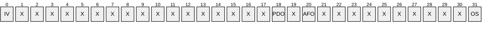
```mermaid
packet-beta
  0-0: "IV"
  1-1: "X"
  2-2: "X"
  3-3: "X"
  4-4: "X"
  5-5: "X"
  6-6: "X"
  7-7: "X"
  8-8: "X"
  9-9: "X"
  10-10: "X"
  11-11: "X"
  12-12: "X"
  13-13: "X"
  14-14: "X"
  15-15: "X"
  16-16: "X"
  17-17: "X"
  18-18: "PDO"
  19-19: "X"
  20-20: "AFO"
  21-21: "X"
  22-22: "X"
  23-23: "X"
  24-24: "X"
  25-25: "X"
  26-26: "X"
  27-27: "X"
  28-28: "X"
  29-29: "X"
  30-30: "X"
  31-31: "OS"
```

The **Flags** value is a combination of zero or more bit flags from the following table, and is used to specify additional behaviors for the LDAP_SERVER_DIRSYNC_OID control.

| Bit Range | Field | Description |
| --- | --- | --- |
| Windows Server 2003 and later: If this flag is present, the client can only view objects and [**attributes**](#gt_attribute) that are otherwise accessible to the client. If this flag is not present, the server checks if the client has access rights to read the changes in the [**NC**](#gt_naming-context-nc). Windows 2000: Not supported. | LDAP_DIRSYNC_OBJECT_SECURITY (OS) 0x00000001 | - |
| The server returns parent objects before [**child objects**](#gt_9b04b599-9dca-48f1-aa9e-08e254d20553). | LDAP_DIRSYNC_ANCESTORS_FIRST_ORDER (AFO) 0x00000800 | - |
| Variable | LDAP_DIRSYNC_PUBLIC_DATA_ONLY (PDO) 0x00002000 | Windows Server 2003 and later: This flag can optionally be passed to the DC, but it has no effect. Windows 2000: Not supported. |
| Windows Server 2003 and later: If this flag is not present, all of the values, up to a server-specified limit, in a multivalued attribute are returned when any value changes. If this flag is present, only the changed values are returned, provided the attribute is a [**forward link value**](#gt_forward-link-value). Windows 2000: Not supported. | LDAP_DIRSYNC_INCREMENTAL_VALUES (IV) 0x80000000 | - |

**MaxBytes** specifies the maximum number of bytes to return in the reply message.

The minimum value for **MaxBytes** is 0x100000. When a lower value is specified, the value is ignored and the maximum number of bytes in the reply message is 0x100000.

The maximum value for **MaxBytes** is determined by the size, in bytes, of a response with the maximum number of objects that can be returned in a single search as specified by the MaxPageSize policy, section [3.1.1.3.4.6](#Section_3.1.1.3.4.6). When a higher value is specified, the value is ignored and the maximum number of bytes in the reply message is the size, in bytes, of a response with the MaxPageSize number of objects.

**Cookie** is an opaque value that was returned by the DC on a previous search request that included the LDAP_SERVER_DIRSYNC_OID control. The contents of **Cookie** are defined by the server and cannot be interpreted by the client. A search request with the LDAP_SERVER_DIRSYNC_OID control attached will return the changes made to objects since the point in time when the previous search request, which returned the value of **Cookie** that is being used in the current search request, took place. If there was no previous LDAP_SERVER_DIRSYNC_OID search request, **Cookie** is NULL, in which case the search will return all objects that satisfy the search request, along with a value of **Cookie** to use for the next LDAP_SERVER_DIRSYNC_OID search request.

If the base of the search is not the root of an NC, and the LDAP_DIRSYNC_OBJECT_SECURITY bit in the **Flags** field is not set, the server will return the error *insufficientAccessRights* / *ERROR_DS_DRA_ACCESS_DENIED*. If the LDAP_DIRSYNC_OBJECT_SECURITY bit in the **Flags** field is set, the server will return the error *unwillingToPerform* / *<unrestricted>*. If the search scope is not subtree scope, the server will treat the search as if subtree scope was specified.

Any valid LDAP search [**filter**](#gt_filter) can be specified.

Any attributes can be requested in the search. Only those objects for which these attributes have been created or modified since the time represented by **Cookie** will be considered for inclusion in the search.

If the list of requested attributes contains an asterisk (*) plus some attribute, then the asterisk is ignored. That is, the list is effectively equal to the list with only the attributes explicitly requested.

The search results MUST always contain the objectGUID and instanceType attributes of each object, even if those attributes were not specified in the search request.

When the server receives a search request with the LDAP_SERVER_DIRSYNC_OID control attached to it, it includes a response control in the search response. The **controlType** field of the returned Control structure is set to the [**OID**](#gt_object-identifier-oid) of the LDAP_SERVER_DIRSYNC_OID control, and the controlValue is the BER encoding of the following ASN.1 structure.

DirSyncResponseValue ::= SEQUENCE {

MoreResults INTEGER

unused INTEGER

CookieServer OCTET STRING

}

The structure of the controlValue in the response control is the same as the structure of the controlValue in the request control, but the fields are interpreted differently. **MoreResults** is nonzero if there are more changes to retrieve, **unused** is not used, and **CookieServer** is the value to be used for **Cookie** in the next LDAP_SERVER_DIRSYNC_OID control sent in a search request to the server to retrieve more changes.

Further details about how this control is processed are described in the pseudocode for the ProcessDirSyncSearchRequest procedure in [MS-DRSR](../MS-DRSR/MS-DRSR.md) section 5.115.3.

LDAP_SERVER_DOMAIN_SCOPE_OID

The LDAP_SERVER_DOMAIN_SCOPE_OID control is used to instruct the [**DC**](#gt_domain-controller-dc) not to generate any [**LDAP**](#gt_lightweight-directory-access-protocol-ldap) continuation references when performing an LDAP operation. The effect of this is to limit any search using it to the single [**NC replica**](#gt_nc-replica) in which the [**object**](#gt_object) that serves as the root of the search is located.

When sending this control to the DC, the controlValue field of the Control structure is set to an OctetString of length zero as described in section [2.1](#Section_2.1). The server MUST ignore any controlValue provided in the request. Sending this control to the DC does not cause the server to include any controls in its response.

LDAP_SERVER_EXTENDED_DN_OID

The LDAP_SERVER_EXTENDED_DN_OID control is used with an [**LDAP**](#gt_lightweight-directory-access-protocol-ldap) search request to cause the [**DC**](#gt_domain-controller-dc) to return extended [**DNs**](#gt_distinguished-name-dn). The extended form of an [**object's**](#gt_object) DN includes a string representation of the object's objectGUID [**attribute**](#gt_attribute); for objects that have an objectSid attribute, the extended form also includes a string representation of that attribute. The DC uses this extended DN for all DNs in the LDAP search response. Attributes with Object(OR-Name) syntax are not affected by this control, because in those cases, the DC always uses the DN form as specified in [[RFC2253]](https://go.microsoft.com/fwlink/?LinkId=90327).

The extended DN format is as follows:

<GUID=**guid_value**>;<SID=**sid_value**>;**dn**

where **guid_value** is the value of the object's objectGUID attribute, **sid_value** is the value of the object's objectSid attribute, and **dn** is the object's [RFC2253] DN. For objects that do not have an objectSid attribute, the format is instead as follows:

<GUID=**guid_value**>;**dn**

When sending this control to a Windows 2000 DC, the controlValue field is omitted. When sending this control to a Windows Server 2003 and later DC, the controlValue field is either omitted or is set to the [**BER**](#gt_basic-encoding-rules-ber) encoding of the following ASN.1 structure:

ExtendedDNRequestValue ::= SEQUENCE {

Flag INTEGER

}

If the controlValue field is omitted, the value of Flag is treated as 0.

If the value of **Flag** is 0, the DC returns the values of the objectGUID and objectSid attributes as a hexadecimal representation of their binary format.

If the value of **Flag** is 1, the DC returns the [**GUID**](#gt_globally-unique-identifier-guid) in dashed-string format ([[RFC4122]](https://go.microsoft.com/fwlink/?LinkId=90460) section 3) and the [**SID**](#gt_security-identifier-sid) in SDDL SID string format ([MS-DTYP](../MS-DTYP/MS-DTYP.md) section 2.4.2.1). The returned SDDL SID string begins with "S-".

If the value of Flag is neither 0 nor 1, then it does not conform with the specification of this control and the server behaves as described in section [3.1.1.3.4.1](#Section_3.1.1.3.4.1).

For example, setting **Flag** to 0 (or omitting the controlValue field) might return the following extended DN:

<GUID=b3d4bfbd3c45ee4298e27b4a698a61b8>;<SID=01050000000000051500000061eb5b8c50ef705befda808bf4010000>;CN=Administrator, CN=Users,DC=Fabrikam,DC=com

While setting **Flag** to 1 would return the same object's extended DN in the following form:

<GUID=bdbfd4b3-453c-42ee-98e2-7b4a698a61b8>;<SID=S-1-5-21-2354834273-1534127952-2340477679-500>;CN=Administrator, CN=Users,DC=Fabrikam,DC=com

Sending this control to the DC does not cause the server to include any controls in its response.

LDAP_SERVER_GET_STATS_OID

The LDAP_SERVER_GET_STATS_OID control is used with an [**LDAP**](#gt_lightweight-directory-access-protocol-ldap) search operation.

When sending this control to a [**DC**](#gt_domain-controller-dc) running Windows 2000, the client omits the controlValue field. When sending this control to a DC running Windows Server 2003 and later, the client either omits the controlValue field or sets the controlValue field to one of the 32-bit unsigned integer values in the following table. The values are not [**BER**](#gt_basic-encoding-rules-ber)-encoded.

| Value name | Value | Description |
| --- | --- | --- |
| SO_NORMAL | 0 | Perform the search as if no LDAP_SERVER_GET_STATS_OID control was included in the search request. |
| SO_STATS | 1 | Perform the search and return data related to the resources consumed performing the search, as well as the actual search results. |
| SO_ONLY_OPTIMIZE | 2 | Return data related to how the search would be performed, but do not actually return the search results. |
| SO_EXTENDED_FMT | 4 | Windows Server 2008 and later: Returns the data in an alternative format documented later in this section. Windows 2000, Windows Server 2003, Windows Server 2003 R2, and ADAM: Not supported. |

Omitting the controlValue field is equivalent to specifying the SO_STATS value.

When the server receives a search request with the LDAP_SERVER_GET_STATS_OID control attached to it, it includes a response control in the search response. The controlType field of the returned Control structure is set to the [**OID**](#gt_object-identifier-oid) of the LDAP_SERVER_GET_STATS_OID control. The controlValue field is included in the returned Control structure.

The response to this control contains information outside the state model. This control instructs the server to return internal data related to how the LDAP search was performed.

For Windows 2000 DCs, the returned controlValue is the BER encoding of the following ASN.1 structure

StatsResponseValueV1 ::= SEQUENCE {

threadCountTag INTEGER

threadCount INTEGER

coreTimeTag INTEGER

coreTime INTEGER

callTimeTag INTEGER

callTime INTEGER

searchSubOperationsTag INTEGER

searchSubOperations INTEGER

}

where **threadCountTag**, **coreTimeTag**, **callTimeTag**, and **searchSubOperationsTag** are equal to 1, 2, 3, and 4, respectively. **threadCount** is the number of threads that were processing LDAP requests on the DC at the time the search operation was performed, **coreTime** is the time, in milliseconds, that the core logic in the DC spent processing the request, **callTime** is the overall time, in milliseconds, that the DC spent processing the request, and **searchSubOperations** is the number of individual operations that the DC performed in processing the request.

If the client does not have the SE_DEBUG_PRIVILEGE, a Windows 2000 DC MUST return the value 0 for the **searchSubOperations** field of this structure.

For Windows Server 2003, Windows Server 2003 R2, and ADAM DCs, the controlValue of the response control is the BER encoding of the following ASN.1 structure.

StatsResponseValueV2 ::= SEQUENCE {

threadCountTag INTEGER

threadCount INTEGER

callTimeTag INTEGER

callTime INTEGER

entriesReturnedTag INTEGER

entriesReturned INTEGER

entriesVisitedTag INTEGER

entriesVisited INTEGER

filterTag INTEGER

filter OCTET STRING

indexTag INTEGER

index OCTET STRING

}

In this structure, **threadCountTag**, **threadCount**, **callTimeTag**, and **callTime** are defined as in the Windows 2000 structure. **entriesReturnedTag**, **entriesVisitedTag**, **filterTag**, and **indexTag** are 5, 6, 7, and 8, respectively. **entriesReturned** is the number of [**objects**](#gt_object) returned in the search result. **entriesVisited** is the number of objects that the DC considered for inclusion in the search result. **filter** is a [**UTF-8**](#gt_utf-8) string that represents the optimized form of the search [**filter**](#gt_filter) that is used by the DC to perform a search. **index** is a string, defined by the system default [**code page**](#gt_code-page), that indicates which database indexes were used by the DC to perform the search.

If the client does not have the SE_DEBUG_PRIVILEGE, a Windows Server 2003, Windows Server 2003 R2, or ADAM DC MUST return the value 0 for the **entriesReturned** and **entriesVisited** fields of this structure. The server MUST return NULL for the **filter** and **index** fields of this structure.

For Windows Server 2008 and later DCs, the controlValue of the response control is the BER encoding of the following ASN.1 structure if the SO_EXTENDED_FMT flag is not specified.

StatsResponseValueV3 ::= SEQUENCE {

threadCountTag INTEGER

threadCount INTEGER

callTimeTag INTEGER

callTime INTEGER

entriesReturnedTag INTEGER

entriesReturned INTEGER

entriesVisitedTag INTEGER

entriesVisited INTEGER

filterTag INTEGER

filter OCTET STRING

indexTag INTEGER

index OCTET STRING

pagesReferencedTag INTEGER

pagesReferenced INTEGER

pagesReadTag INTEGER

pagesRead INTEGER

pagesPrereadTag INTEGER

pagesPreread INTEGER

pagesDirtiedTag INTEGER

pagesDirtied INTEGER

pagesRedirtiedTag INTEGER

pagesRedirtied INTEGER

logRecordCountTag INTEGER

logRecordCount INTEGER

logRecordBytesTag INTEGER

logRecordBytes INTEGER

}

In this structure, fields with the same name as fields in the Windows Server 2003 structure are defined as in the Windows Server 2003 structure. **pagesReferencedTag**, **pagesReadTag**, **pagesPrereadTag**, **pagesDirtiedTag**, **pagesRedirtiedTag**, **logRecordCountTag**, and **logRecordCountBytesTag** are 9, 10, 11, 12, 13, 14, and 15, respectively. **pagesReferenced** is the number of database pages referenced by the DC in processing the search. **pagesRead** is the number of database pages read from disk, and **pagesPreread** is the number of database pages preread from disk by the DC in processing the search. **pagesDirtied** is the number of clean database pages modified by the DC in processing the search, while **pagesRedirtied** is the number of previously modified database pages that were modified by the DC in processing the search. **logRecordCount** and **logRecordBytes** are the number and size in bytes, respectively, of database log records generated by the DC in processing the search.

For Windows Server 2008 and later DCs, if the SO_EXTENDED_FMT flag is specified, an alternative format is used for the controlValue of the response control instead of the format shown previously. Unlike the previous formats in which each statistic is assigned a fixed position within the structure, in the alternative format the ordering of the statistics can change. Rather than relying on position, each statistic has an associated human-readable string that specifies what that statistic is. Additionally, the use of these associated strings alleviates the need to hard-code the positional information into the client-side parser of the response control, permitting the DC to be [**updated**](#gt_update) to return addition statistics without necessitating a corresponding client-side change.

When using the alternative format, the controlValue of the response control is the BER encoding of the following ASN.1 structure.

StatsResponseValueV4 ::= SEQUENCE OF SEQUENCE {

statisticName OCTET STRING

CHOICE {

intStatistic [0] INTEGER

stringStatistic [1] OCTET STRING

}

}

If the human-readable string in an element of the **StatsResponseValueV4** structure is the empty string, then the element contains an undefined value of no significance.

Effectively, this is an array of statistics, in which each statistic has a human-readable name (the **statisticName** field) and a value. If it is an integer-valued statistic, the value is stored in the **intStatistic** field. If it is a string-valued statistic, the value is stored in the **stringStatistic** field.

When the SO_EXTENDED_FMT flag is specified, Windows Server 2008 and later DCs return the same statistics as if the flag was not specified. The only difference is the format used to return the statistics. The wording of the **statisticName** field is implementation-defined. Currently, the wording as it maps to each statistic as specified in the non-SO_EXTENDED_FMT version of the structure is as follows.

threadCount "Thread count"

callTime "Call time (in ms)"

entriesReturned "Entries Returned"

entriesVisited "Entries Visited"

filter "Used Filter"

index "Used Indexes"

pagesReferenced "Pages Referenced"

pagesRead "Pages Read From Disk"

pagesPreread "Pages Pre-read From Disk"

pagesDirtied "Clean Pages Modified"

pagesRedirtied "Dirty Pages Modified"

logRecordCount "Log Records Generated"

logRecordBytes "Log Record Bytes Generated"

For Windows Server 2008 through Windows Server 2012 R2 DCs, a requestor is said to have *debug search stats permitted* when it holds the SE_DEBUG_PRIVILEGE. For Windows Server 2016 and later DCs, a requestor is said to have debug search stats permitted if it holds the SE_DEBUG_PRIVILEGE or if it has the control access right identified by the GUID {b3ab0434-7863-4891-bdbd-9ca79f1c099b} on the queryPolicy object for the DC (section [3.1.1.3.4.6](#Section_3.1.1.3.4.6)).

If the client does not have debug search stats permitted, Windows Server 2008 and later DCs MUST return the value 0 for the **entriesReturned**, **entriesVisited**, **pagesReferenced**, **pagesRead**, **pagesPreread**, **pagesDirtied**, **pagesRedirtied**, **logRecordCount**, and **logRecordBytes** fields, regardless of the format in which the data is returned. The server MUST return NULL for the **filter** and **index** fields, regardless of the format in which the data is returned.

When the SO_EXTENDED_FMT flag is specified and the client has debug search stats permitted, Windows Server 2016 and later DCs additionally return the following statistics: **indicesRequiredToOptimize**, **queryOptimizerState**, **atqDelay**, **cpuTime**, and **searchSignature**.

**indicesRequiredToOptimize** is a space-separated list of attributes for which no indices exist and for which the implementation could have performed a more optimized search if such indices existed. **queryOptimizerState** is a description of the final processing state of the implementation's query pre-processing. This statistic is only returned when the SO_STATS or SO_ONLY_OPTIMIZE flags are specified in addition to the SO_EXTENDED_FMT flag. **atqDelay** is an approximation of the amount of time (in milliseconds) that the request spent on a queue on the DC before the DC began to actively process the request. **cpuTime** is an approximation of the amount of time (in milliseconds) that the DC spent to actively process the request. There is no protocol requirement regarding the accuracy of these approximations. **searchSignature** is an implementation-defined value that encapsulates some of the search parameters. The choice of which parameters to encapsulate and how to encapsulate them is an implementation detail and not normatively defined by the protocol. Informally, the intent of this statistic is to assign the same signature to "similar" searches. The wording of the **statisticName** field as it maps to these additional statistics is as follows.

indicesRequiredToOptimize "Indices required to optimize"

queryOptimizerState "Query optimizer state"

atqDelay "Atq Delay"

cpuTime "CPU Time"

searchSignature "Search Signature"

When the SO_EXTENDED_FMT flag is specified, Windows Server v1803 and later DCs additionally return the following statistics: **callTimeTotal**, **cpuTimeTotal**, **retryCount**, and **correlationId**.

If the client does not have debug search stats permitted, a Windows Server v1803 and later DC MUST return the value 0 for the **callTimeTotal**, **cpuTimeTotal**, and **retryCount** fields, regardless of the format in which the data is returned.

The **retryCount** field is an integer containing the number of times the LDAP request was internally re-attempted while fulfilling the request. **callTimeTotal** is an approximation of the overall time taken (in milliseconds) to fulfill a request including overhead real time. **cpuTimeTotal** is an approximation of the amount of time (in milliseconds) that the DC spent to actively process the request including overhead processing time. **correlationId** contains an identifier for the LDAP request. If a correlation identifier was provided to the DC via the LDAP_SERVER_SET_CORRELATION_ID_OID control, that value is returned. If no such correlation identifier was provided, there is no restriction on what value is returned. The wording of the **statisticName** field as it maps to these additional statistics is as follows.

callTimeTotal "Total call time (in ms)"

cpuTimeTotal "Total CPU time"

retryCount "Number of retries"

correlationId "Correlation ID"

When the SO_EXTENDED_FMT flag is specified, Windows Server v1809 and later DCs and Windows Server 2019 and later DCs additionally return the following statistics:

- **linksAdded** and **linksDeleted**.
If the client does not have debug search stats permitted, or if the request is a search request, the DC MUST return the value 0 for these fields, regardless of the format in which the data is returned.

- For values not equal to 0, DCs additionally return **optimizedLinkSeeks**, **nonOptimizedLinkSeeks**, **selectionFilterOverhead**, and **linkIndexMisses**.
If the client does not have debug search stats permitted, the DC MUST NOT return these fields, regardless of the format in which the data is returned. Otherwise, the above specified values are additionally returned by the **DC**.

The **linksAdded** field is an integer containing the number of object links added while fulfilling the request. The **linksDeleted** field is an integer containing the number of object links deleted while fulfilling the request. **optimizedLinkSeeks** is an implementation-defined value that approximates the relative optimized data-seek expense of retrieving object links while fulfilling the request. **nonOptimizedLinkSeeks** is an implementation-defined value that approximates the relative unoptimized data-seek expense of retrieving object links while fulfilling the request. **selectionFilterOverhead** is an implementation-defined value that approximates the relative data-processing expense of applying a selection filter while fulfilling the request. **linkIndexMisses** is an implementation-defined value that approximates the number of times that indexes could not be used while applying a selection filter when fulfilling the request. The wording of the **statisticName** field as it maps to these additional statistics is as follows.

linksAdded "Links Added"

linksDeleted "Links Deleted"

optimizedLinkSeeks "Optimized Link Seeks"

nonOptimizedLinkSeeks "Non-Optimized Link Seeks"

selectionFilterOverhead "Selection Filter Overhead"

linkIndexMisses "Link Index Misses"

LDAP_SERVER_LAZY_COMMIT_OID

The LDAP_SERVER_LAZY_COMMIT_OID control is used to modify the behavior of any [**LDAP**](#gt_lightweight-directory-access-protocol-ldap) operation. The presence of this control instructs the [**DC**](#gt_domain-controller-dc) that it can sacrifice durability guarantees on [**updates**](#gt_update) to improve performance.

When sending this control to the DC, the controlValue field of the Control structure is omitted. Sending this control to the DC does not cause the server to include any controls in its response.

LDAP_SERVER_PERMISSIVE_MODIFY_OID

The LDAP_SERVER_PERMISSIVE_MODIFY_OID control is used to modify the behavior of an [**LDAP**](#gt_lightweight-directory-access-protocol-ldap) modify operation. An LDAP modify operation normally returns an error if it attempts to add an [**attribute**](#gt_attribute) that already exists on an [**object**](#gt_object) to that object (or, in the case of multivalued attributes, it attempts to add a value that is already present in the attribute). An LDAP modify operation will also normally fail if it attempts to delete an attribute that does not exist on the specified object or that does not contain the value specified in the deletion request. With this control, adding a value to an attribute that already exists and already contains the value to be added will cause the server to return *success* even though no modification was actually performed by the server. Similarly, deletion of an attribute that does not exist or does not contain the specified value will return *success*.

When sending this control to the [**DC**](#gt_domain-controller-dc), the controlValue field of the Control structure is omitted. Sending this control to the DC does not cause the server to include any controls in its response.

LDAP_SERVER_NOTIFICATION_OID

The LDAP_SERVER_NOTIFICATION_OID control is used with an [**LDAP**](#gt_lightweight-directory-access-protocol-ldap) search operation to register the client that is to be notified when changes are made to an [**object**](#gt_object) in the [**directory**](#gt_directory).

Notifications are asynchronous operations. When the [**DC**](#gt_domain-controller-dc) receives a search request with this control attached, it does not immediately send a response to the request. Instead, when an object is modified, if that object falls within the scope of the search request to which the LDAP_SERVER_NOTIFICATION_OID control was attached, the DC sends a SearchEntry response that contains the modified object to the client, using the messageID from the original search request (SearchEntry and messageID are defined in [[RFC2251]](https://go.microsoft.com/fwlink/?LinkId=90325) section 4.1.1). The SearchEntry response will contain those [**attributes**](#gt_attribute) of the object that were requested in the original request. These attributes are not necessarily the attributes that were modified. A client indicates that it no longer requires notifications by sending an LDAP abandon operation, specifying the messageID of the original search request.

LDAP search requests that include this control are subject to the following restrictions:

- The only [**filter**](#gt_filter) permitted in the search request is "(objectclass = *)". The server will return the error *unwillingToPerform* / *<unrestricted>* if this is not the case.
- Base, one-level, and subtree search scopes are permitted. For Windows 2000 DCs, if the base [**DN**](#gt_distinguished-name-dn) specified in a subtree search is not the root of an [**NC**](#gt_naming-context-nc), the server returns the error *unwillingToPerform* / *<unrestricted>*. Windows Server 2003 and later DCs do not have this restriction.
When sending this control to the DC, the **controlValue** field of the Control structure is omitted. Sending this control to the DC does not cause the server to include any controls in its eventual responses.

LDAP_SERVER_RANGE_OPTION_OID

LDAP_SERVER_RANGE_OPTION_OID, unlike the other controls discussed in this section, does not actually designate an [**LDAP**](#gt_lightweight-directory-access-protocol-ldap) extended control. Nonetheless, it is included in this discussion because its [**OID**](#gt_object-identifier-oid) is found in the supportedControl [**attribute**](#gt_attribute) of the [**DC's**](#gt_domain-controller-dc) [**rootDSE**](#gt_root-directory-system-agent-specific-entry-rootdse). The presence of this OID indicates that the DC supports range retrieval of multivalued attributes. Range retrieval is a mechanism that permits attributes that have too many values to be retrieved in a single LDAP search request to be retrieved via multiple LDAP search requests. Range retrieval is documented in section [3.1.1.3.1.3.3](#Section_3.1.1.3.1.3.3).

**Note** Although this OID is not present in the supportedControl attribute of Windows 2000 DCs, such DCs nonetheless support range retrieval.

LDAP_SERVER_SD_FLAGS_OID

The LDAP_SERVER_SD_FLAGS_OID control is used with an LDAP Search request to control the portion of a [**Windows security descriptor**](#gt_windows-security-descriptor) to retrieve. The [**DC**](#gt_domain-controller-dc) returns only the specified portion of the [**security descriptors**](#gt_security-descriptor). It is also used with LDAP Modify requests[2](#pbn2) to control the portion of a Windows security descriptor to modify. The DC modifies only the specified portion of the security descriptor.

When sending this control to the DC, the controlValue field is set to the [**BER**](#gt_basic-encoding-rules-ber) encoding of the following ASN.1 structure.

SDFlagsRequestValue ::= SEQUENCE {

Flags INTEGER

}

The **Flags** value has the following format presented in [**big-endian**](#gt_big-endian) byte order. X denotes unused bits that SHOULD be set to 0 by the client and that MUST be ignored by the server.

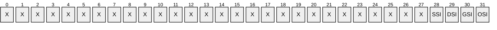
```mermaid
packet-beta
  0-0: "X"
  1-1: "X"
  2-2: "X"
  3-3: "X"
  4-4: "X"
  5-5: "X"
  6-6: "X"
  7-7: "X"
  8-8: "X"
  9-9: "X"
  10-10: "X"
  11-11: "X"
  12-12: "X"
  13-13: "X"
  14-14: "X"
  15-15: "X"
  16-16: "X"
  17-17: "X"
  18-18: "X"
  19-19: "X"
  20-20: "X"
  21-21: "X"
  22-22: "X"
  23-23: "X"
  24-24: "X"
  25-25: "X"
  26-26: "X"
  27-27: "X"
  28-28: "SSI"
  29-29: "DSI"
  30-30: "GSI"
  31-31: "OSI"
```

The **Flags** value is a combination of zero or more bit flags from the following table.

| Bit Range | Field | Description |
| --- | --- | --- |
| Owner identifier of the [**object**](#gt_object). | OWNER_SECURITY_INFORMATION (OSI) 0x1 | - |
| [**Primary group**](#gt_primary-group) identifier. | GROUP_SECURITY_INFORMATION (GSI) 0x2 | - |
| [**Discretionary access control list (DACL)**](#gt_discretionary-access-control-list-dacl) of the object. | DACL_SECURITY_INFORMATION (DSI) 0x4 | - |
| [**System access control list (SACL)**](#gt_system-access-control-list-sacl) of the object. | SACL_SECURITY_INFORMATION (SSI) 0x8 | - |

Specifying **Flags** with no bits set, or not using the LDAP_SERVER_SD_FLAGS_OID control, is equivalent to setting **Flags** to (OWNER_SECURITY_INFORMATION | GROUP_SECURITY_INFORMATION | DACL_SECURITY_INFORMATION | SACL_SECURITY_INFORMATION). Sending this control to the DC does not cause the server to include any controls in its response.

2 Clarified the use of the LDAP_SERVER_SD_FLAGS_OID control with respect to LDAP Modify requests in the operating systems specified by [[MSFT-CVE-2021-42291]](https://go.microsoft.com/fwlink/?linkid=2180155), each with its related MSKB article download installed.

LDAP_SERVER_SEARCH_OPTIONS_OID

The LDAP_SERVER_SEARCH_OPTIONS_OID control is used with an LDAP Search request to control various behaviors.

When sending this control to the [**DC**](#gt_domain-controller-dc), the controlValue field is set to the [**BER**](#gt_basic-encoding-rules-ber) encoding of the following ASN.1 structure.

SearchOptionsRequestValue ::= SEQUENCE {

Flags INTEGER

}

The **Flags** value has the following format presented in [**big-endian**](#gt_big-endian) byte order. X denotes unused bits that SHOULD be set to 0 by the client and that MUST be ignored by the server.

```mermaid
packet-beta
  0-0: "X"
  1-1: "X"
  2-2: "X"
  3-3: "X"
  4-4: "X"
  5-5: "X"
  6-6: "X"
  7-7: "X"
  8-8: "X"
  9-9: "X"
  10-10: "X"
  11-11: "X"
  12-12: "X"
  13-13: "X"
  14-14: "X"
  15-15: "X"
  16-16: "X"
  17-17: "X"
  18-18: "X"
  19-19: "X"
  20-20: "X"
  21-21: "X"
  22-22: "X"
  23-23: "X"
  24-24: "X"
  25-25: "X"
  26-26: "X"
  27-27: "X"
  28-28: "X"
  29-29: "X"
  30-30: "SSFPR"
  31-31: "SSFDS"
```

The **Flags** value is a combination of zero or more bit flags from the following table.

| Bit Range | Field | Description |
| --- | --- | --- |
| Variable | SERVER_SEARCH_FLAG_DOMAIN_SCOPE (SSFDS) 1 | Prevents continuation references from being generated when the search results are returned. This performs the same function as the LDAP_SERVER_DOMAIN_SCOPE_OID control. |
| For [**AD DS**](#gt_active-directory-domain-services-ad-ds), instructs the server to search all [**NC replicas**](#gt_nc-replica) except [**application NC**](#gt_application-nc) [**replicas**](#gt_replica) that are subordinate to the search base, even if the search base is not instantiated on the server. For [**AD LDS**](#gt_active-directory-lightweight-directory-services-ad-lds), the behavior is the same except that it also includes application NC replicas in the search. For AD DS and AD LDS, this will cause the search to be executed over all NC replicas (except for application NCs on AD DS DCs) held on the DC that are subordinate to the search base. This enables search bases such as the empty string, which would cause the server to search all of the NC replicas (except for application NCs on AD DS DCs) that it holds. | SERVER_SEARCH_FLAG_PHANTOM_ROOT (SSFPR) 2 | - |

Sending this control to the DC does not cause the server to include any controls in its response.

LDAP_SERVER_SORT_OID and LDAP_SERVER_RESP_SORT_OID

This request control and its corresponding response control, LDAP_SERVER_RESP_SORT_OID, are documented in [[RFC2891]](https://go.microsoft.com/fwlink/?LinkId=91357).

[**DCs**](#gt_domain-controller-dc) only support sorting on a single [**attribute**](#gt_attribute) at a time. Therefore, the client constructs a SortKeyList that contains only one sequence. DCs running Windows 2000 do not support ordering rules when sorting, so the client omits the orderingRule field of the SortKeyList when sending this control to a DC running Windows 2000; sorting uses the *English: United States* sort order. Starting with Windows Server 2003, DCs support ordering rules for the sort orders specified in the following table; if no ordering rule is specified, the DC uses the *English: United States* sort order. Section [6.5](#Section_1.3) specifies, by reference to [MS-UCODEREF](../MS-UCODEREF/MS-UCODEREF.md), the effect of each sort order. Section [2.2.1](#Section_2.2.1) specifies the mapping between the sort orders that follow and the LCIDs used in section 6.5.

| Ordering rule OID | Sort order |
| --- | --- |
| 1.2.840.113556.1.4.1461 | *Afrikaans* |
| 1.2.840.113556.1.4.1462 | *Albanian* |
| 1.2.840.113556.1.4.1463 | *Arabic: Saudi Arabia* |
| 1.2.840.113556.1.4.1464 | *Arabic: Iraq* |
| 1.2.840.113556.1.4.1465 | *Arabic: Egypt* |
| 1.2.840.113556.1.4.1466 | *Arabic: Libya* |
| 1.2.840.113556.1.4.1467 | *Arabic: Algeria* |
| 1.2.840.113556.1.4.1468 | *Arabic: Morocco* |
| 1.2.840.113556.1.4.1469 | *Arabic: Tunisia* |
| 1.2.840.113556.1.4.1470 | *Arabic: Oman* |
| 1.2.840.113556.1.4.1471 | *Arabic: Yemen* |
| 1.2.840.113556.1.4.1472 | *Arabic: Syria* |
| 1.2.840.113556.1.4.1473 | *Arabic: Jordan* |
| 1.2.840.113556.1.4.1474 | *Arabic: Lebanon* |
| 1.2.840.113556.1.4.1475 | *Arabic: Kuwait* |
| 1.2.840.113556.1.4.1476 | *Arabic: UAE* |
| 1.2.840.113556.1.4.1477 | *Arabic: Bahrain* |
| 1.2.840.113556.1.4.1478 | *Arabic: Qatar* |
| 1.2.840.113556.1.4.1479 | *Armenian* |
| 1.2.840.113556.1.4.1480 | *Assamese* |
| 1.2.840.113556.1.4.1481 | *Azeri: Latin* |
| 1.2.840.113556.1.4.1482 | *Azeri: Cyrillic* |
| 1.2.840.113556.1.4.1483 | *Basque* |
| 1.2.840.113556.1.4.1484 | *Belarussian* |
| 1.2.840.113556.1.4.1485 | *Bengali* |
| 1.2.840.113556.1.4.1486 | *Bulgarian* |
| 1.2.840.113556.1.4.1487 | *Burmese* |
| 1.2.840.113556.1.4.1488 | *Catalan* |
| 1.2.840.113556.1.4.1489 | *Chinese: Taiwan* |
| 1.2.840.113556.1.4.1490 | *Chinese: PRC* |
| 1.2.840.113556.1.4.1491 | *Chinese: Hong Kong SAR* |
| 1.2.840.113556.1.4.1492 | *Chinese: Singapore* |
| 1.2.840.113556.1.4.1493 | *Chinese: Macau SAR* |
| 1.2.840.113556.1.4.1494 | *Croatian* |
| 1.2.840.113556.1.4.1495 | *Czech* |
| 1.2.840.113556.1.4.1496 | *Danish* |
| 1.2.840.113556.1.4.1497 | *Dutch* |
| 1.2.840.113556.1.4.1498 | *Dutch:Belgium* |
| 1.2.840.113556.1.4.1499 | *English: United States* |
| 1.2.840.113556.1.4.1500 | *English: United Kingdom* |
| 1.2.840.113556.1.4.1665 | *English: Australia* |
| 1.2.840.113556.1.4.1666 | *English: Canada* |
| 1.2.840.113556.1.4.1667 | *English: New Zealand* |
| 1.2.840.113556.1.4.1668 | *English: Ireland* |
| 1.2.840.113556.1.4.1505 | *English: South Africa* |
| 1.2.840.113556.1.4.1506 | *English: Jamaica* |
| 1.2.840.113556.1.4.1507 | *English: Caribbean* |
| 1.2.840.113556.1.4.1508 | *English: Belize* |
| 1.2.840.113556.1.4.1509 | *English:Trinidad* |
| 1.2.840.113556.1.4.1510 | *English: Zimbabwe* |
| 1.2.840.113556.1.4.1511 | *English: Philippines* |
| 1.2.840.113556.1.4.1512 | *Estonian* |
| 1.2.840.113556.1.4.1513 | *Faeroese* |
| 1.2.840.113556.1.4.1514 | *Persian* |
| 1.2.840.113556.1.4.1515 | *Finnish* |
| 1.2.840.113556.1.4.1516 | *French: France* |
| 1.2.840.113556.1.4.1517 | *French: Belgium* |
| 1.2.840.113556.1.4.1518 | *French: Canada* |
| 1.2.840.113556.1.4.1519 | *French: Switzerland* |
| 1.2.840.113556.1.4.1520 | *French: Luxembourg* |
| 1.2.840.113556.1.4.1521 | *French: Monaco* |
| 1.2.840.113556.1.4.1522 | *Georgian* |
| 1.2.840.113556.1.4.1523 | *German: Germany* |
| 1.2.840.113556.1.4.1524 | *German: Switzerland* |
| 1.2.840.113556.1.4.1525 | *German: Austria* |
| 1.2.840.113556.1.4.1526 | *German: Luxembourg* |
| 1.2.840.113556.1.4.1527 | *German: Liechtenstein* |
| 1.2.840.113556.1.4.1528 | *Greek* |
| 1.2.840.113556.1.4.1529 | *Gujarati* |
| 1.2.840.113556.1.4.1530 | *Hebrew* |
| 1.2.840.113556.1.4.1531 | *Hindi* |
| 1.2.840.113556.1.4.1532 | *Hungarian* |
| 1.2.840.113556.1.4.1533 | *Icelandic* |
| 1.2.840.113556.1.4.1534 | *Indonesian* |
| 1.2.840.113556.1.4.1535 | *Inukitut* |
| 1.2.840.113556.1.4.1536 | *Italian:Italy* |
| 1.2.840.113556.1.4.1537 | *Italian:Switzerland* |
| 1.2.840.113556.1.4.1538 | *Japanese* |
| 1.2.840.113556.1.4.1539 | *Kannada* |
| 1.2.840.113556.1.4.1540 | *Kashmiri Arabic* |
| 1.2.840.113556.1.4.1541 | *Kashmiri* |
| 1.2.840.113556.1.4.1542 | *Kazakh* |
| 1.2.840.113556.1.4.1543 | *Khmer* |
| 1.2.840.113556.1.4.1544 | *Kirghiz* |
| 1.2.840.113556.1.4.1545 | *Konkani* |
| 1.2.840.113556.1.4.1546 | *Korean* |
| 1.2.840.113556.1.4.1547 | *Korean:Johab* |
| 1.2.840.113556.1.4.1548 | *Latvian* |
| 1.2.840.113556.1.4.1549 | *Lithuanian* |
| 1.2.840.113556.1.4.1550 | *North Macedonian* |
| 1.2.840.113556.1.4.1551 | *Malaysian* |
| 1.2.840.113556.1.4.1552 | *Malay Brunei Darussalam* |
| 1.2.840.113556.1.4.1553 | *Malayalam* |
| 1.2.840.113556.1.4.1554 | *Maltese* |
| 1.2.840.113556.1.4.1555 | *Manipuri* |
| 1.2.840.113556.1.4.1556 | *Marathi* |
| 1.2.840.113556.1.4.1557 | *Nepali:Nepal* |
| 1.2.840.113556.1.4.1558 | *Norwegian:Bokmal* |
| 1.2.840.113556.1.4.1559 | *Norwegian:Nynorsk* |
| 1.2.840.113556.1.4.1560 | *Odia* |
| 1.2.840.113556.1.4.1561 | *Polish* |
| 1.2.840.113556.1.4.1562 | *Portuguese:Brazil* |
| 1.2.840.113556.1.4.1563 | *Portuguese:Portugal* |
| 1.2.840.113556.1.4.1564 | *Punjabi* |
| 1.2.840.113556.1.4.1565 | *Romanian* |
| 1.2.840.113556.1.4.1566 | *Russian* |
| 1.2.840.113556.1.4.1567 | *Sanskrit* |
| 1.2.840.113556.1.4.1568 | *Serbian:Cyrillic* |
| 1.2.840.113556.1.4.1569 | *Serbian:Latin* |
| 1.2.840.113556.1.4.1570 | *Sindhi:India* |
| 1.2.840.113556.1.4.1571 | *Slovak* |
| 1.2.840.113556.1.4.1572 | *Slovenian* |
| 1.2.840.113556.1.4.1573 | *Spanish: SpainTraditional Sort* |
| 1.2.840.113556.1.4.1574 | *Spanish: Mexico* |
| 1.2.840.113556.1.4.1575 | *Spanish: SpainModern Sort* |
| 1.2.840.113556.1.4.1576 | *Spanish: Guatemala* |
| 1.2.840.113556.1.4.1577 | *Spanish: Costa Rica* |
| 1.2.840.113556.1.4.1578 | *Spanish: Panama* |
| 1.2.840.113556.1.4.1579 | *Spanish: Dominican Republic* |
| 1.2.840.113556.1.4.1580 | *Spanish: Venezuela* |
| 1.2.840.113556.1.4.1581 | *Spanish: Colombia* |
| 1.2.840.113556.1.4.1582 | *Spanish: Peru* |
| 1.2.840.113556.1.4.1583 | *Spanish: Argentina* |
| 1.2.840.113556.1.4.1584 | *Spanish: Ecuador* |
| 1.2.840.113556.1.4.1585 | *Spanish: Chile* |
| 1.2.840.113556.1.4.1586 | *Spanish: Uruguay* |
| 1.2.840.113556.1.4.1587 | *Spanish: Paraguay* |
| 1.2.840.113556.1.4.1588 | *Spanish: Bolivia* |
| 1.2.840.113556.1.4.1589 | *Spanish: El Salvador* |
| 1.2.840.113556.1.4.1590 | *Spanish: Honduras* |
| 1.2.840.113556.1.4.1591 | *Spanish: Nicaragua* |
| 1.2.840.113556.1.4.1592 | *Spanish: Puerto Rico* |
| 1.2.840.113556.1.4.1593 | *Swahili: Kenya* |
| 1.2.840.113556.1.4.1594 | *Swedish* |
| 1.2.840.113556.1.4.1595 | *Swedish: Finland* |
| 1.2.840.113556.1.4.1596 | *Tamil* |
| 1.2.840.113556.1.4.1597 | *Tatar: Tatarstan* |
| 1.2.840.113556.1.4.1598 | *Telugu* |
| 1.2.840.113556.1.4.1599 | *Thai* |
| 1.2.840.113556.1.4.1600 | *Turkish* |
| 1.2.840.113556.1.4.1601 | *Ukrainian* |
| 1.2.840.113556.1.4.1602 | *Urdu: Pakistan* |
| 1.2.840.113556.1.4.1603 | *Urdu: India* |
| 1.2.840.113556.1.4.1604 | *Uzbek: Latin* |
| 1.2.840.113556.1.4.1605 | *Uzbek: Cyrillic* |
| 1.2.840.113556.1.4.1606 | *Vietnamese* |
| 1.2.840.113556.1.4.1607 | *Japanese: XJIS* |
| 1.2.840.113556.1.4.1608 | *Japanese:* [**Unicode**](#gt_unicode) |
| 1.2.840.113556.1.4.1609 | *Chinese: Big5* |
| 1.2.840.113556.1.4.1610 | *Chinese: PRCP* |
| 1.2.840.113556.1.4.1611 | *Chinese:* Unicode |
| 1.2.840.113556.1.4.1612 | *Chinese: PRC* |
| 1.2.840.113556.1.4.1613 | *Chinese: BOPOMOFO* |
| 1.2.840.113556.1.4.1614 | *Korean: KSC* |
| 1.2.840.113556.1.4.1615 | *Korean:* Unicode |
| 1.2.840.113556.1.4.1616 | *German Phone Book* |
| 1.2.840.113556.1.4.1617 | *Hungarian: Default* |
| 1.2.840.113556.1.4.1618 | *Hungarian: Technical* |
| 1.2.840.113556.1.4.1619 | *Georgian: Traditional* |
| 1.2.840.113556.1.4.1620 | *Georgian: Modern* |

Windows Server 2008 and later support an additional sort behavior called "phonetic display name sort". This behavior is triggered by specifying "msDS-PhoneticDisplayName;extended" as the attributeType in the SortKeyList ([RFC2891] section 1.1). When this option is present, the DC checks that the [**LDAP**](#gt_lightweight-directory-access-protocol-ldap) request satisfies the following requirements:

- The operation is an LDAP search request.
- The orderingRule field specifies the Japanese sort order (namely, "1.2.840.113556.1.4.1538").
- The LDAP_CONTROL_VLVREQUEST control is attached to the search.
- The search request has been sent to a global catalog port (port 3268 or 3269).
- The scope of the search request is wholeSubtree.
- The base [**object**](#gt_object) of the search request specifies the [**DN**](#gt_distinguished-name-dn) "".
- The [**filter**](#gt_filter) is set to (&(showInAddressBook=X)(displayName=*)), where X is a distinguished name and there exists an object O such that O!objectClass = addressBookContainer and O!distinguishedName = X.
If one or more of these criteria are not satisfied, the server returns the error *unwillingToPerform* / *<unrestricted>*.

If all of these criteria are satisfied, the DC performs a phonetic display name sort. In this sort, the search results are sorted on the msDS-PhoneticDisplayName attribute, using the Japanese sort order, in the normal fashion, except that if an object O does not have a value for the msDS-PhoneticDisplayName attribute but does have a value V for the displayName attribute, the server treats V as the value of O!msDS-PhoneticDisplayName for the purposes of the sort.

For example, consider an unsorted search result set consisting of four objects, as shown in the following table. Note that object #2 does not have a value for msDS-PhoneticDisplayName.

| Object # | msDS-PhoneticDisplayName value | displayName value |
| --- | --- | --- |
| 1 | A | C |
| 2 | - | D |
| 3 | B | E |
| 4 | F | C |

Assuming for the purpose of this example that the letters A...Z sort in the order {A, ..., Z}, the results of performing a phonetic display name sort on the preceding data is the following.

| Object # | msDS-PhoneticDisplayName value | displayName value |
| --- | --- | --- |
| 1 | A | C |
| 3 | B | E |
| 2 | - | D |
| 4 | F | C |

In particular, object #2 was placed before object #4 because the sort treated it as if it had the value "D" for its msDS-PhoneticDisplayName attribute.

LDAP_SERVER_SHOW_DELETED_OID

The LDAP_SERVER_SHOW_DELETED_OID control is used with an [**LDAP**](#gt_lightweight-directory-access-protocol-ldap) operation to specify that [**tombstones**](#gt_tombstone) and [**deleted-objects**](#gt_deleted-object) MUST be visible to the operation. For example, when the control is used with an LDAP search operation, the search results include any tombstones or deleted-objects that match the search [**filter**](#gt_filter).

The following table compares the behavior of the two similar controls LDAP_SERVER_SHOW_DELETED_OID and [LDAP_SERVER_SHOW_RECYCLED_OID (section 3.1.1.3.4.1.26)](#Section_3.1.1.3.4.1.26).

| Extended control name | Deleted-objects | Tombstones | Recycled-objects |
| --- | --- | --- | --- |
| LDAP_SERVER_SHOW_DELETED_OID | Visible | Visible | Not Visible |
| LDAP_SERVER_SHOW_RECYCLED_OID | Visible | Visible | Visible |

When sending this control to the [**DC**](#gt_domain-controller-dc), the controlValue field of the Control structure is omitted. Sending this control to the DC does not cause the server to include any controls in its response.

LDAP_SERVER_TREE_DELETE_OID

The LDAP_SERVER_TREE_DELETE_OID control is used with an [**LDAP**](#gt_lightweight-directory-access-protocol-ldap) delete operation to cause the server to recursively delete the entire subtree of [**objects**](#gt_object) located underneath the object specified in the delete operation. The object specified in the delete operation is also deleted.

The server deletes between 1 and 16,384 objects. If the server does not delete the entire tree in a single LDAP delete request, it MUST NOT delete the root of the tree (the object specified in the delete operation), and MUST return the error code *adminLimitExceeded* / *ERROR_DS_TREE_DELETE_NOT_FINISHED*.

When sending this control to the [**DC**](#gt_domain-controller-dc), the controlValue field of the Control structure is omitted. Sending this control to the DC does not cause the server to include any controls in its response.

LDAP_SERVER_VERIFY_NAME_OID

The LDAP_SERVER_VERIFY_NAME_OID control is used with LDAP Add and Modify requests to identify the [**global catalog server (GC server)**](#gt_global-catalog-server-gc-server) that is used to verify the existence of any [**objects**](#gt_object) pointed to by [**DN**](#gt_distinguished-name-dn) [**attribute**](#gt_attribute) values (as specified in section [3.1.1.1.6](#Section_3.1.1.1.6)). If the [**DC**](#gt_domain-controller-dc) needs to call a GC server while processing the Add or Modify request, it calls the GC server specified in this control. If this control is not used, the DC is free to call any GC server in the [**forest**](#gt_forest).

When sending this control to the DC, the **controlValue** field is set to the [**BER**](#gt_basic-encoding-rules-ber) encoding of the following ASN.1 structure:

VerifyNameRequestValue ::= SEQUENCE {

Flags INTEGER

ServerName OCTET STRING

}

where **Flags** is ignored and **ServerName** is a [**UTF-16**](#gt_utf-16) encoded [**Unicode**](#gt_unicode) string containing the [**FQDN (1)**](#gt_fully-qualified-domain-name-fqdn) of the GC server to contact for verification. Sending this control to the DC does not cause the server to include any controls in its response.

If the LDAP Add or Modify request needs to call a GC server and the server designated by this control in the request is not available or is not a GC server, the Add or Modify request fails with the error *unavailable* / *<unrestricted>*.

LDAP_CONTROL_VLVREQUEST and LDAP_CONTROL_VLVRESPONSE

The LDAP_CONTROL_VLVREQUEST control is used with an [**LDAP**](#gt_lightweight-directory-access-protocol-ldap) search operation to retrieve a subset of the [**objects**](#gt_object) that satisfy the search request. This control permits the client to specify a particular object (the "target object") in a sorted set of search results, and to request that the server return a specified number of objects before and after the target object, in addition to the target object itself. "Before" and "after" the target object are relative to the sort order of the search result set. The server will not return objects whose [**attribute**](#gt_attribute) value, used as the sort key, is absent. This control can only be used if the [LDAP_SERVER_SORT_OID (section 3.1.1.3.4.1.13)](#Section_3.1.1.3.4.1.13) control is also specified.

When sending this control to the [**DC**](#gt_domain-controller-dc), the **controlValue** field is set to the [**BER**](#gt_basic-encoding-rules-ber) encoding of the following ASN.1 structure (maxInt is defined in [[RFC2251]](https://go.microsoft.com/fwlink/?LinkId=90325) section 4.1.1):

VLVRequestValue ::= SEQUENCE {

beforeCount INTEGER (0..maxInt),

afterCount INTEGER (0..maxInt),

CHOICE {

byoffset [0] SEQUENCE {

offset INTEGER (0 .. maxInt),

contentCount INTEGER (0 .. maxInt)

},

greaterThanOrEqual [1] AssertionValue

},

contextID OCTET STRING OPTIONAL

}

where **beforeCount** indicates how many objects before the target object are to be included in the search results, and **afterCount** indicates how many objects after the target object are to be included in the search results.

**byoffset** and **greaterThanOrEqual** provide two mutually exclusive ways of specifying the target object. These will now be discussed in turn.

First, the target object can be specified by its position relative to the first object in the sorted set of objects that satisfy the search request, in which case the **byoffset** choice is used. In this case, **contentCount** contains the client's estimation of the total number of objects that satisfy the search criteria. If the client specifies 0 for **contentCount**, it is as if the client had specified a number identical to the server's estimate of the total number of objects that satisfy the search criteria—the quantity **serverContentCount** below. **offset** is used with **contentCount** to specify the position (relative to the first object in the sorted set of search results) of the object to use as the target object according to the following formula:

**p** = **serverContentCount** * (**offset** / **contentCount**)

where **serverContentCount** is the DC's estimate of the total number of objects that satisfy the search criteria. The object located at position **p** in the sorted list of search results is used as the target object.

A value of **offset** equal to 1 means that the target object is the first object in the search result set, while a value of **offset** equal to **contentCount** means the target object is the last object in the search result set. The **offset** value cannot equal 0 unless **contentCount** also equals 0. If the client specified 0 for **contentCount**, then **p** = **offset** in the preceding formula, so the target object is **offset**-1 objects beyond the first object in the search result set, unless both **offset** and **contentCount** are equal to 0, in which case the previous rule applies.

The second means of specifying the target object is by the **greaterThanOrEqual** choice, instead of the **byoffset** choice. In this case, **greaterThanOrEqual** is an AssertionValue as defined in [RFC2251] section 4.1.7. The target object is the first object in the sorted result set for which the value of the attribute on which it is sorted (that is, the attribute specified by **attributeType** in the LDAP_SERVER_SORT_OID control) is greater than or equal to the value specified by **greaterThanOrEqual**. However, if the sort order is reversed (by specifying that the **reverseOrder** field of the LDAP_SERVER_SORT_OID control is TRUE), then the target object is the first object for which the sort attribute value is less than or equal to the **greaterThanOrEqual** value.

If the **contextID** field is present, it is the opaque value returned by the DC as the **contextIDServer** field of the LDAP_CONTROL_VLVRESPONSE control that was returned with the search response to the previous search over the same "list" as this search. A "list" is a sorted set of search results, defined by a search request value sent to a particular DC over a particular [**LDAP connection**](#gt_ldap-connection). The client omits this field if this is the first search request that included the LDAP_CONTROL_VLVREQUEST control for the "list", or if the client did not retain the **contextIDServer** field of the previous LDAP_CONTROL_VLVRESPONSE for the "list". The presence or absence of the **contextID** field in the request only affects performance. The **contextID** is valid only on the DC that returned it. If an invalid **contextID** is present, then the LDAP_CONTROL_VLVREQUEST control is ignored.

When the server receives a search request with the LDAP_CONTROL_VLVREQUEST control attached to it, it includes a response control in the search response. The **controlType** field of the returned Control structure is set to the [**OID**](#gt_object-identifier-oid) of the LDAP_CONTROL_VLVRESPONSE control, and the controlValue is the BER encoding of the following ASN.1 structure.

VLVResponseValue ::= SEQUENCE {

targetPosition INTEGER (0 .. maxInt),

contentCount INTEGER (0 .. maxInt),

virtualListViewResult ENUMERATED {

success (0),

operationsError (1),

unwillingToPerform (53),

insufficientAccessRights (50),

busy (51),

timeLimitExceeded (3),

adminLimitExceeded (11),

sortControlMissing (60),

offsetRangeError (61),

other (80)

},

contextIDServer OCTET STRING OPTIONAL

}

where **targetPosition** is the position of the target object relative to the beginning of the sorted set of search results, **contentCount** is the server's estimate of the total number of objects that satisfy the search request, **contextIDServer** is the opaque value described in the specification of the **contextID** field earlier in this section, and **virtualListViewResult** is an LDAP error code that indicates the success or failure of the DC in processing the LDAP_CONTROL_VLVREQUEST control. These codes have the same meanings as defined for LDAP in [RFC2251], but they pertain specifically to the processing of the control. Error codes *sortControlMissing* and *offsetRangeError* are not defined in [RFC2251]. In the [**Active Directory**](#gt_active-directory) implementation of virtual list view (VLV), **virtualListViewResult** is set to error code *sortControlMissing* if the LDAP_SERVER_SORT_OID control is not specified in conjunction with the LDAP_CONTROL_VLVREQUEST control. It is set to error code *offsetRangeError* if **contentCount** is not equal to 0 but **offset** is equal to 0.

**Notes:**

- The Active Directory implementation of VLV is based on that described in [[VLVDRAFT]](https://go.microsoft.com/fwlink/?LinkId=94450). Although implementers can consult that document as an informative reference, the preceding description documents the protocol as implemented by Active Directory. No [**claim**](#gt_claim) is made with regard to Active Directory's conformance or nonconformance with the protocol as specified in [VLVDRAFT].
- Active Directory support for VLV is specified in section [3.1.1.3.4.1](#Section_3.1.1.3.4.1) (see LDAP_CONTROL_VLVREQUEST and LDAP_CONTROL_VLVRESPONSE). The following information applies to the Active Directory implementation of VLV through Windows Server 2012 R2 without [[MSKB-3106637]](https://go.microsoft.com/fwlink/?LinkId=823244) installed, or through Windows Server 2012 with [MSKB-3106637] installed:
If an LDAP search has the LDAP_CONTROL_VLVREQUEST attached, a desired target object is specified using the **greaterThanOrEqual** choice, and the attribute specified in the sort control is of the 2.5.5.11 time syntax (section [3.1.1.2.2.2](#Section_3.1.1.2.2.2)), a random object is returned, not an object that satisfies the **greaterThanOrEqual** value.

LDAP_SERVER_ASQ_OID

The LDAP_SERVER_ASQ_OID control is used with an [**LDAP**](#gt_lightweight-directory-access-protocol-ldap) search operation. When this control is used, the search is not performed against the [**object**](#gt_object) specified in the search, or the objects located underneath that object, but rather against the set of objects named by an [**attribute**](#gt_attribute) of Object(DS-DN) syntax that is located on the object specified by the base [**DN**](#gt_distinguished-name-dn) of the search request. The specific attribute to use to scope the search is named in the control. Only searches of base object scope can be used with the LDAP_SERVER_ASQ_OID control.

For example, suppose there is an object o and a multivalued attribute A of Object(DS-DN) syntax such that o.A contains the DNs of objects o1, o2, and o3. An LDAP base-scope search operation that targets object o, with the LDAP_SERVER_ASQ_OID control attached and specifying the A attribute, will cause the server to perform the search not against object o but against objects o1, o2, and o3.

When sending this control to the [**DC**](#gt_domain-controller-dc), the controlValue field is set to the [**BER**](#gt_basic-encoding-rules-ber) encoding of the following ASN.1 structure:

ASQRequestValue ::= SEQUENCE {

sourceAttribute OCTET STRING

}

where **sourceAttribute** is a [**UTF-8**](#gt_utf-8) string that specifies the LDAP display name of the attribute to use to scope the search (for example, attribute A in the previous example).

When the server receives a search request with the LDAP_SERVER_ASQ_OID control attached to it, it includes a response control in the search response. The controlType field of the returned Control structure is set to the [**OID**](#gt_object-identifier-oid) of the LDAP_SERVER_ASQ_OID control, and the controlValue is the BER encoding of the following ASN.1 structure:

ASQResponseValue ::= SEQUENCE {

searchResults ENUMERATED {

success (0),

invalidAttributeSyntax (21),

unwillingToPerform (53),

affectsMultipleDSAs (71)

},

}

where the meaning of **searchResults** is as indicated in the following table.

| searchResult name | searchResult value | Description |
| --- | --- | --- |
| *success* | 0 | Search results are returned for all objects referenced by sourceAttribute. |
| *invalidAttributeSyntax* | 21 | sourceAttribute is not of Object(DS-DN) syntax. |
| *unwillingToPerform* | 53 | The search scope was not set to base object scope. |
| *affectsMultipleDSAs* | 71 | Partial results were returned, but not all the objects were available on the DC. |

The search results consist of each object that is specified by the **sourceAttribute** attribute, and that matches the search [**filter**](#gt_filter) returned as a SearchResultEntry (defined in [[RFC2251]](https://go.microsoft.com/fwlink/?LinkId=90325) section 4.5.2) containing the attributes specified in the attribute list of the search request. If any of the objects specified by **sourceAttribute** are not available on the DC, the search results include all of the objects that are available on the DC, and the **searchResults** return value is set to the *affectsMultipleDSAs* error code to indicate that some data that might be otherwise available is not present in the results.

LDAP_SERVER_QUOTA_CONTROL_OID

This control is used with an [**LDAP**](#gt_lightweight-directory-access-protocol-ldap) search operation to retrieve the quota of a user. When used with an LDAP search operation that queries the [**constructed attributes**](#gt_constructed-attribute) msDS-QuotaEffective and msDS-QuotaUsed on the msDS-QuotaContainer [**object**](#gt_object), the server will return the quota of the user who is specified by the control, rather than the quota of the user whom the connection is authenticated as.

If the caller attempts to retrieve the quota of a user other than the user whom the caller is authenticated as, and the caller does not have the RIGHT_DS_READ_PROPERTY right on the Quotas [**container**](#gt_container) (described in section [6.1.1.4.3](#Section_6.1.1.4.3)), the server returns an empty result set.

If the caller attempts to retrieve the quota of the user whom the caller is authenticated as, and the caller has neither the RIGHT_DS_READ_PROPERTY right on the Quotas container (described in section 6.1.1.4.3) nor the DS-Query-Self-Quota [**control access right**](#gt_control-access-right) on the Quotas container, the server returns an empty result set.

These [**access checks**](#gt_access-check) are also specified in section [3.1.1.4.4](#Section_3.1.1.4.4).

When sending this control to the [**DC**](#gt_domain-controller-dc), the controlValue field is set to the [**BER**](#gt_basic-encoding-rules-ber) encoding of the following ASN.1 structure.

QuotaRequestValue ::= SEQUENCE {

querySID OCTET STRING

}

Where **querySID** is the [**SID**](#gt_security-identifier-sid), in binary form, of the user whose quota is to be retrieved (the binary form of SIDs is documented in [MS-DTYP](../MS-DTYP/MS-DTYP.md) section 2.4.2). Sending this control to the DC does not cause the server to include any controls in its response.

LDAP_SERVER_SHUTDOWN_NOTIFY_OID

This control is used with an LDAP Search request. The Search request has base [**object**](#gt_object) scope. The base [**DN**](#gt_distinguished-name-dn) of the search is the DN of the [**DC's**](#gt_domain-controller-dc) nTDSDSA object, and the search [**filter**](#gt_filter) is "(objectClass=*)". If the application sending the search request is not running on the same computer as the DC, the result is the error *unwillingToPerform* / *<unrestricted>*.

When sending this control to the DC, the controlValue field of the Control structure is omitted. Sending this control to the DC does not cause the server to include any controls in its response.

This control is only supported on the Small Business Server version of the Windows operating system.

Because this control only has an effect for applications running on the same machine as the DC, the effects of this control are not observable on the network. This control causes the DC to notify the client when the DC is shutting down. When the DC receives a search request with this control attached, it does not immediately send a response to the request. Instead, it sends the SearchResultDone response (see [[RFC2251]](https://go.microsoft.com/fwlink/?LinkId=90325) section 4.5.2) to the request when the DC is shutting down.

LDAP_SERVER_FORCE_UPDATE_OID

A [**DC**](#gt_domain-controller-dc) does not perform [**originating updates**](#gt_originating-update) that do not affect the state of the DC. For example, given an LDAP Modify operation that sets the value of an [**attribute**](#gt_attribute) A to a value V, if the value of A is already V prior to the Modify operation, the DC skips the [**update**](#gt_update) and returns success. The [**stamp**](#gt_stamp) associated with A is not changed, and the Modify operation does not cause replication traffic.

When the LDAP_SERVER_FORCE_UPDATE_OID control is attached to an update operation, the DC does not perform the optimization described in the previous paragraph. The update always generates a new stamp for the attribute or [**link value**](#gt_link-value) and always replicates.

When sending this control to a DC, the controlValue field of the Control structure is omitted. Sending this control to a DC does not cause the DC to include any controls in its response.

LDAP_SERVER_RANGE_RETRIEVAL_NOERR_OID

This control is used to modify the behavior of a range retrieval operation (see section [3.1.1.3.1.3.3](#Section_3.1.1.3.1.3.3)). When this control is not specified, if range retrieval is being performed on an [**attribute**](#gt_attribute) whose values are [**forward link values**](#gt_forward-link-value) or [**back link values**](#gt_back-link-value), and the value of **low** is greater than or equal to the number of values in the attribute, the [**DC**](#gt_domain-controller-dc) will return the error *operationsError* / *<unrestricted>*. If this control is specified, no error is returned in this case (and no values are returned). For example, if an [**object**](#gt_object) has a member attribute with 500 values, performing the range retrieval "member;range=500-*" will return *operationsError* / *<unrestricted>* without this control, and *success* with this control.

When sending this control to a DC, the controlValue field of the Control structure is omitted. Sending this control to a DC does not cause the DC to include any controls in its response.

LDAP_SERVER_RODC_DCPROMO_OID

If this control is specified and the caller does not have the DS-Install-Replica [**control access right**](#gt_control-access-right) on the root of the [**default NC**](#gt_default-naming-context-default-nc), the result is the error *insufficientAccessRights* / *ERROR_ACCESS_DENIED*.

If the request is an Add of an [**object of class**](#gt_c2c67596-8d8f-42b9-9c70-1c4f7c952200) user or a subclass of user, the presence of this control has the following effects:

- The [**DC**](#gt_domain-controller-dc) generates a value in the range [1 .. 65535] that is not used as a value of the msDS-SecondaryKrbTgtNumber [**attribute**](#gt_attribute) on an [**object**](#gt_object) in this [**domain**](#gt_domain), and assigns the generated value to the msDS-SecondaryKrbTgtNumber attribute of the created object. If no such value exists, the result is the error *other* / *ERROR_NO_SYSTEM_RESOURCES*.
- The generated value for msDS-SecondaryKrbTgtNumber is appended (in decimal form) to the string "krbtgt", and the resulting string is assigned to the sAMAccountName attribute on the created object.
- The userAccountControl bits ADS_UF_ACCOUNT_DISABLE and ADS_UF_DONT_EXPIRE_PASSWD (section [2.2.16](#Section_2.2.16)) are set on the object's userAccountControl attribute.
- The object's account password is set to a randomly generated value that satisfies all criteria in [MS-SAMR](#Section_5) section 3.1.1.7.2 and is processed as described in [MS-SAMR] section 3.1.1.8.5.
**Note** In Windows Server 2008 and later, the DC servicing the request need not be the [**PDC**](#gt_primary-domain-controller-pdc) [**FSMO role owner**](#gt_fsmo-role-owner).

If the request is an Add of an object of class nTDSDSA, the presence of this control has the following effects:

- The DC creates the nTDSDSA object using the information provided in the Add request. The only special effect of the control is to perform the checking of the DS-Install-Replica control access right (specified previously in this section) to authorize the nTDSDSA object creation. Without this control, an Add that attempts to create an nTDSDSA object will fail because the class is system-only (section [3.1.1.2.4.8](#Section_3.1.1.2.4.8)).
When sending this control to a DC, the **controlValue** field of the Control structure is omitted. Sending this control to a DC does not cause the DC to include any controls in its response.

LDAP_SERVER_DN_INPUT_OID

This control is used to specify the [**DN**](#gt_distinguished-name-dn) of an [**object**](#gt_object) during certain [**LDAP**](#gt_lightweight-directory-access-protocol-ldap) operations.

When used with an LDAP search operation that queries the [**constructed attribute**](#gt_constructed-attribute) msDS-IsUserCachableAtRodc on a computer object that represents an [**RODC**](#gt_read-only-domain-controller-rodc), the server will return the administrative policy regarding whether the [**secret attributes**](#gt_secret-attribute) of the [**security principal**](#gt_security-principal) represented by the DN specified in the control can be cached on the RODC. If the caller does not have the Read-Only-Replication-Secret-Synchronization [**control access right**](#gt_control-access-right) on the root of the [**default NC**](#gt_default-naming-context-default-nc), the error *operationsError* / *ERROR_DS_CANT_RETRIEVE_ATTRS* is returned. This [**access check**](#gt_access-check) is also specified in section [3.1.1.4.4](#Section_3.1.1.4.4).

When sending this control to the [**DC**](#gt_domain-controller-dc), the controlValue field is set to the [**BER**](#gt_basic-encoding-rules-ber) encoding of the following ASN.1 structure.

DNInputRequestValue ::= SEQUENCE {

InputDN OCTET STRING

}

Where **InputDN** is a [**UTF-8**](#gt_utf-8) encoding of the DN of a security principal. The DN is either an RFC 2253–style DN or one of the alternative DN formats described in section [3.1.1.3.1.2.4](#Section_3.1.1.3.1.2.4).

LDAP_SERVER_SHOW_DEACTIVATED_LINK_OID

The LDAP_SERVER_SHOW_DEACTIVATED_LINK_OID control is used with an [**LDAP**](#gt_lightweight-directory-access-protocol-ldap) search operation to specify that [**link attributes**](#gt_link-attribute) that refer to [**deleted-objects**](#gt_deleted-object) are visible to the search operation. If used in conjunction with LDAP_SERVER_SHOW_DELETED_OID or LDAP_SERVER_SHOW_RECYCLED_OID, link attributes that are stored on deleted-objects are also visible to the search operation. This applies to both the search [**filter**](#gt_filter) and the set of [**attributes**](#gt_attribute) returned by the search operation. When this control is not used, linked attribute values referring to deleted-objects and [**link valued**](#gt_link-value) attributes stored on deleted-objects are not visible to search operation filters, and are not returned as requested attributes for the search operation.

| Extended control names | Link values neither stored on nor referring to deleted-objects | Link values not stored on but referring to deleted-objects | Link values stored on deleted-objects but not referring to deleted-objects | Link values stored on and referring to deleted-objects |
| --- | --- | --- | --- | --- |
| LDAP_SERVER_SHOW_DEACTIVATED_LINK_OID | Visible | Visible | Not Visible | Not Visible |
| LDAP_SERVER_SHOW_DEACTIVATED_LINK_OID in conjunction with LDAP_SERVER_SHOW_DELETED_OID or LDAP_SERVER_SHOW_RECYCLED_OID | Visible | Visible | Visible | Visible |

When sending this control to the [**DC**](#gt_domain-controller-dc), the **controlValue** field of the Control structure is omitted. Sending this control to the DC does not cause the server to include any controls in its response.

LDAP_SERVER_SHOW_RECYCLED_OID

The LDAP_SERVER_SHOW_RECYCLED_OID control is used with an [**LDAP**](#gt_lightweight-directory-access-protocol-ldap) operation to specify that [**tombstones**](#gt_tombstone), [**deleted-objects**](#gt_deleted-object), and [**recycled-objects**](#gt_recycled-object) MUST be visible to the operation. For example, when the control is used with an LDAP search operation, the search results include any tombstones, deleted-objects, or recycled-objects that match the search [**filter**](#gt_filter).

The following table compares the behavior of the two similar controls [LDAP_SERVER_SHOW_DELETED_OID (section 3.1.1.3.4.1.14)](#Section_3.1.1.3.4.1.14) and LDAP_SERVER_SHOW_RECYCLED_OID.

| Extended control name | Deleted-objects | Tombstones | Recycled-objects |
| --- | --- | --- | --- |
| LDAP_SERVER_SHOW_DELETED_OID | Visible | Visible | Not Visible |
| LDAP_SERVER_SHOW_RECYCLED_OID | Visible | Visible | Visible |

When sending this control to the [**DC**](#gt_domain-controller-dc), the **controlValue** field of the Control structure is omitted. Sending this control to the DC does not cause the server to include any controls in its response.

LDAP_SERVER_POLICY_HINTS_OID

The LDAP_SERVER_POLICY_HINTS_OID control is used with an [**LDAP**](#gt_lightweight-directory-access-protocol-ldap) operation to enforce the password history length constraint ([MS-SAMR](#Section_5) section 3.1.1.7.1) during password set. The password history policy sets how frequently old passwords can be reused.

When sending this control to the [**DC**](#gt_domain-controller-dc), the **controlValue** field is set to the [**BER**](#gt_basic-encoding-rules-ber) encoding of the following ASN.1 structure.

PolicyHintsRequestValue ::= SEQUENCE {

Flags INTEGER

}

where **Flags** tells the server whether to apply the password history length constraint on password-set operations. If it is 0x1, then that constraint will be enforced. Otherwise, the constraint is not enforced.

LDAP_SERVER_POLICY_HINTS_DEPRECATED_OID

The LDAP_SERVER_POLICY_HINTS_DEPRECATED_OID control has the exact semantics and behaviors as LDAP_SERVER_POLICY_HINTS_OID (section [3.1.1.3.4.1.27](#Section_3.1.1.3.4.1.27)); this control MAY be used by clients when the server does not support LDAP_SERVER_POLICY_HINTS_OID. Clients SHOULD use LDAP_SERVER_POLICY_HINTS_OID when it is supported by the server.

LDAP_SERVER_DIRSYNC_EX_OID

The LDAP_SERVER_DIRSYNC_EX_OID control is used with an [**LDAP**](#gt_lightweight-directory-access-protocol-ldap) search operation in exactly the same way as the LDAP_SERVER_DIRSYNC_OID control, except for differences specified in this section. All ASN.1 structures and the meaning of the fields of those structures are the same.

As with the LDAP_SERVER_DIRSYNC_OID control, any [**attributes**](#gt_attribute) can be requested in the search. Only those [**objects**](#gt_object) for which these attributes have been created or modified since the time represented by **Cookie** will be considered for inclusion in the search. However, where the LDAP_SERVER_DIRSYNC_OID control returns only those attributes that have changed, the LDAP_SERVER_DIRSYNC_EX_OID control also returns unchanged attributes when the attribute name in the request is appended with the string ";dirSyncAlwaysReturn".

LDAP_SERVER_UPDATE_STATS_OID

The LDAP_SERVER_UPDATE_STATS_OID control can be used with any [**LDAP**](#gt_lightweight-directory-access-protocol-ldap) operation. When sending this control to the [**DC**](#gt_domain-controller-dc), the **controlValue** field of the Control structure is omitted.

When the server receives a request with the LDAP_SERVER_UPDATE_STATS_OID control attached to it, the server includes a response control in the response that contains statistics. The **controlType** field of the returned Control structure is set to the [**OID**](#gt_object-identifier-oid) of the LDAP_SERVER_UPDATE_STATS_OID control. The **controlValue** field is included in the returned Control structure.

The returned **controlValue** field is the [**BER**](#gt_basic-encoding-rules-ber) encoding of the following ASN.1 structure:

UpdateStatsResponseValue ::= SEQUENCE OF SEQUENCE {

statID LDAPOID

statValue OCTET STRING

}

where **statID** is an OID that corresponds to a specific statistic name, and **statValue** is a value related to that statistic. Each statistic specifies an encoding for its value.

The following table specifies the statistics that a DC MUST return. A DC MAY return other implementation-defined statistics. No other statistics are returned by DCs in applicable Windows Server releases.

| Statistic name | OID (specified by statID) |
| --- | --- |
| Highest USN Allocated | 1.2.840.113556.1.4.2208 |
| Invocation ID Of Server | 1.2.840.113556.1.4.2209 |

Highest USN Allocated

The **statValue** for this **statID** contains the highest [**USN**](#gt_update-sequence-number-usn) that the [**DC**](#gt_domain-controller-dc) allocated during the [**LDAP**](#gt_lightweight-directory-access-protocol-ldap) operation. USNs allocated by an LDAP operation make up a set of USNs such that no LDAP operation other than the current operation can write the USN into the DC's state. Note that while no other LDAP operation can write these USNs, it is not required that the current operation actually write any or all of these USNs. If the USNs allocated by this LDAP operation make up the empty set, a value of 0 is returned in the **statValue**.

The value in the **statValue** field is a 64-bit integer, in little-endian byte order.

Invocation ID Of Server

The **statValue** for this **statID** contains dc.invocationId (section [3.1.1.1.9](#Section_3.1.1.1.9)). This value is returned in little-endian byte order.

LDAP_SERVER_TREE_DELETE_EX_OID

The LDAP_SERVER_TREE_DELETE_EX_OID control is used with an [**LDAP**](#gt_lightweight-directory-access-protocol-ldap) delete operation to cause the server to recursively delete the entire subtree of [**objects**](#gt_object) located underneath the object specified in the delete operation. The object specified in the delete operation is also deleted.

When sending this control to the [**DC**](#gt_domain-controller-dc), the **controlValue** field is set to the [**BER**](#gt_basic-encoding-rules-ber) encoding of the following ASN.1 structure.

TreeDeleteExRequestValue ::= SEQUENCE {

countOfObjectsToDelete INTEGER

}

where **countOfObjectsToDelete** is a limit on the number of objects that will be deleted while processing this control. If the value of **countOfObjectsToDelete** is less than 2, then the value 2 is used rather than the value specified. If the value of **countOfObjectsToDelete** is greater than 16,384, then the value 16,384 is used.

The server deletes between 1 and **countOfObjectsToDelete** objects, inclusive. If the server does not delete the entire tree in a single LDAP delete request, it MUST NOT delete the root of the tree (the object specified in the delete operation), and MUST return the error code *adminLimitExceeded* / *ERROR_DS_TREE_DELETE_NOT_FINISHED*.

LDAP_SERVER_SEARCH_HINTS_OID

The LDAP_SERVER_SEARCH_HINTS_OID control is used with an [**LDAP**](#gt_lightweight-directory-access-protocol-ldap) search operation. This control supplies hints to the search operation on how to satisfy the search. When sending this control to the [**DC**](#gt_domain-controller-dc), the **controlValue** field is set to the [**BER**](#gt_basic-encoding-rules-ber) encoding of the following ASN.1 structure.

SearchHintsRequestValue ::= SEQUENCE OF SEQUENCE{

hintId LDAPOID

hintValue OCTET STRING

}

where **hintId** is an [**OID**](#gt_object-identifier-oid) that corresponds to a specific hint name, and **hintValue** is a value related to that hint. Each hint specifies an encoding for its value.

The following table specifies the hints that a DC MUST honor. A DC MAY honor other implementation-defined search hints. No other search hints are honored by DCs in applicable Windows Server releases.

| Statistic name | OID (as specified by hintId) |
| --- | --- |
| Require Sort Index | 1.2.840.113556.1.4.2207 |
| Soft Size Limit | 1.2.840.113556.1.4.2210 |

Multiple instances of the LDAP_SERVER_SEARCH_HINTS_OID control can be included with a single LDAP search operation. The hints are applied in the order in which the controls are encoded in the LDAP request; that is, a later hint can override an earlier hint, overriding both **hintValue** and control criticality. This behavior allows the application of different criticality to individual hints.

If the control is critical and an unrecognized search hint is specified, the DC returns the error *unwillingToPerform* / *<unrestricted>*. If the control is not critical, unrecognized hints are ignored.

Require Sort Index

The **hintValue** for this hint is a [**BER**](#gt_basic-encoding-rules-ber) encoding specified by the following ASN.1 structure:

RequireSortIndexHintValue ::= SEQUENCE {

IndexOnly BOOLEAN

}

If the value of **IndexOnly** is FALSE, or if no LDAP_SERVER_SORT_OID control accompanies the LDAP_SERVER_SEARCH_HINTS_OID control, then the hint is ignored.

This hint suggests to the [**DC**](#gt_domain-controller-dc) that it use an index (as specified by the search flags IX and PI in section [2.2.9](#Section_2.2.9)) over the [**attribute**](#gt_attribute) specified in the LDAP_SERVER_SORT_OID control to satisfy the search.

If the sort control is critical and no index is available, the search will fail with the error *DB_ERR_CANT_SORT* / *<unrestricted>*.

If the sort control is not critical and no index is available, the hint is ignored.

Exactly what an index is in relationship to a DC is implementation-specific. Therefore, the determination that an index is not available is not constrained by the protocol, but rather is implementation-specific. This hint is provided only as a facility to make suggestions to a DC that it favor search-operation execution that is based on information specified in the sort control rather than information that is specifically derived from the scope of the search, the [**filter**](#gt_filter), or any other parameters of the search.

Soft Size Limit

The **hintValue** for this hint is a [**BER**](#gt_basic-encoding-rules-ber) encoding specified by the following ASN.1 structure:

SoftSizeLimitHintValue ::= SEQUENCE {

limitValue INTEGER

}

If an LDAP_SERVER_SORT_OID control does not accompany this hint, this hint is ignored.

Given that the value of **LimitValue** is *X*, given an imposed [**LDAP**](#gt_lightweight-directory-access-protocol-ldap) size limit of *Y* (whether specified in the LDAP search operation or imposed by an implementation-specific default value), and given that a sort order is specified in an LDAP_SERVER_SORT_OID control, when these values are all applied to an LDAP search operation, the LDAP search operation conceptually results in a list of [**objects**](#gt_object) to return as a response to the request. Due to the size limit, the cardinality of the list is less than or equal to *Y*. The elements in the list are ordered by the [**attribute**](#gt_attribute) specified in the LDAP_SERVER_SORT_OID control. If the list of objects contains fewer than *X* objects, or exactly *X* objects, then the Soft Size Limit hint has no affect. If the LDAP search operation identifies more than *X* objects, then any objects in the list subsequent to the *X*th object that do not have a value of the sort attribute that is equal to the sort value of the *X*th object (as defined by the equality comparison rules for that attribute) are removed from the list before the response is returned to the client.

If the search operation would otherwise have returned success and if one or more objects are removed from the list according to the earlier algorithm, the search operation will return *sizeLimitExceeded* / *<unrestricted>*.

LDAP_SERVER_EXPECTED_ENTRY_COUNT_OID

The LDAP_SERVER_EXPECTED_ENTRY_COUNT_OID is used with an [**LDAP**](#gt_lightweight-directory-access-protocol-ldap) search operation to potentially modify the return code of the operation.

When sending this control to the [**DC**](#gt_domain-controller-dc), the **controlValue** field is set to the [**BER**](#gt_basic-encoding-rules-ber) encoding of the following ASN.1 structure.

ExpectedEntryCountRequestValue ::= SEQUENCE {

searchEntriesMin INTEGER

searchEntriesMax INTEGER

}

When the search operation would normally return *success* / *<unrestricted>* and the number of **searchEntries** returned by the search is less than **searchEntriesMin** or greater than **searchEntriesMax**, the return code of the search operation is modified to be *constraintViolation* / *<unrestricted>*. Note that this control affects only the return value of the search operation. It does not affect any other part of the returned data from the search operation.

LDAP_SERVER_SET_OWNER_OID

The LDAP_SERVER_SET_OWNER_OID is used with an [**LDAP**](#gt_lightweight-directory-access-protocol-ldap) add operation to specify the owner of the [**object**](#gt_object) to be created. The owner is to be set into the owner portion of the [**security descriptor**](#gt_security-descriptor) stored in the ntSecurityDescriptor [**attribute**](#gt_attribute) of the object to be created.

When sending this control to the [**DC**](#gt_domain-controller-dc), the **controlValue** field is set to the [**BER**](#gt_basic-encoding-rules-ber) encoding of the following ASN.1 structure.

SID octetString

The supplied [**SID**](#gt_security-identifier-sid) value is a valid SDDL [**UTF-8**](#gt_utf-8) string representation of a SID ([MS-DTYP](../MS-DTYP/MS-DTYP.md) section 2.4.2.1).

If an owner is specified both via this control and via a value for the ntSecurityDescriptor attribute, the value specified by this control takes precedence.

LDAP_SERVER_BYPASS_QUOTA_OID

The LDAP_SERVER_BYPASS_QUOTA_OID is used with an [**LDAP**](#gt_lightweight-directory-access-protocol-ldap) add operation to specify that exceeding quota limitations MUST NOT cause the add to fail. When sending this control to the [**DC**](#gt_domain-controller-dc), the **controlValue** field of the **Control** structure is omitted. Sending this control to the DC does not cause the server to include any controls in its response.

LDAP_SERVER_LINK_TTL_OID

The LDAP_SERVER_LINK_TTL_OID control is used with an [**LDAP**](#gt_lightweight-directory-access-protocol-ldap) search request to cause the [**DC**](#gt_domain-controller-dc) to return TTL-DNs for [**link values**](#gt_link-value) with associated expiry times (see section [3.1.1.9.2](#Section_3.1.1.9.2)).

When sending this control to a DC, the **controlValue** field is omitted.

Sending this control to the DC does not cause the server to include any controls in its response.

LDAP_SERVER_SET_CORRELATION_ID_OID

The LDAP_SERVER_SET_CORRELATION_ID_OID control is used with any [**LDAP**](#gt_lightweight-directory-access-protocol-ldap) operation to provide an identifier for the operation that the [**DC**](#gt_domain-controller-dc) can use for implementation-defined troubleshooting. Additionally, the value can be returned to the caller via the LDAP_SERVER_GET_STATS_OID control (section [3.1.1.3.4.1.6](#Section_3.1.1.3.4.1.6)).

When sending this control to a DC, the **controlValue** field MUST contain 16 bytes. If **controlValue** does not contain 16 bytes and the control is critical, the DC returns the error *unavailableCriticalExtension* / *<unrestricted>*.

Sending this control to the DC does not cause the server to include any controls in its response.

LDAP_SERVER_THREAD_TRACE_OVERRIDE_OID

The LDAP_SERVER_THREAD_TRACE_OVERRIDE_OID control is used with any LDAP operation to provide an indication to the [**DC**](#gt_domain-controller-dc) to perform additional implementation-defined troubleshooting.

When sending this control to a DC, the **controlValue** field is omitted.

Sending this control to the DC does not cause the server to include any controls in its response.

###### 3.1.1.3.4.2 LDAP Extended Operations

[**LDAP**](#gt_lightweight-directory-access-protocol-ldap) extended operations are an extensibility mechanism in version 3 of LDAP, as discussed in [[RFC2251]](https://go.microsoft.com/fwlink/?LinkId=90325) section 4.12. The following sections describe the LDAP extended operations that are implemented by [**DCs**](#gt_domain-controller-dc) in Windows Server 2003 and later (including ADAM).

The LDAP extended operations supported by a DC are exposed as [**OIDs**](#gt_object-identifier-oid) in the supportedExtension [**attribute**](#gt_attribute) of the [**rootDSE**](#gt_root-directory-system-agent-specific-entry-rootdse). Each OID is mapped to a human-readable name as shown in the following table.

| Extended operation name | OID |
| --- | --- |
| LDAP_SERVER_FAST_BIND_OID | 1.2.840.113556.1.4.1781 |
| LDAP_SERVER_START_TLS_OID | 1.3.6.1.4.1.1466.20037 |
| LDAP_TTL_REFRESH_OID | 1.3.6.1.4.1.1466.101.119.1 |
| LDAP_SERVER_WHO_AM_I_OID | 1.3.6.1.4.1.4203.1.11.3 |
| LDAP_SERVER_BATCH_REQUEST_OID | 1.2.840.113556.1.4.2212 |

Only Windows Server 2003 and later DCs support extended operations. The following table specifies the set of LDAP extended operations supported in applicable Windows Server releases or ADAM versions that support extended operations.

The table contains information for the following products. See section [3](#Section_3) for more information.

- D --> Windows Server 2003
- DR2 --> Windows Server 2003 R2
- G --> ADAM
- J --> Windows Server 2008
- M --> Windows Server 2008 R2
- R --> Windows Server 2012
- U --> Windows Server 2012 R2
- X --> Windows Server 2016
- A2 --> Windows Server v1709
- D2 --> Windows Server v1803
- G2 --> Windows Server v1809
- J2 --> Windows Server 2019
| Extended operation name | D, DR2 | G, J, M | R, U, X, A2, D2, G2, J2 |
| --- | --- | --- | --- |
| LDAP_SERVER_FAST_BIND_OID | X | X | X |
| LDAP_SERVER_START_TLS_OID | X | X | X |
| LDAP_TTL_REFRESH_OID | X | X | X |
| LDAP_SERVER_WHO_AM_I_OID | - | X | X |
| LDAP_SERVER_BATCH_REQUEST_OID | - | - | X |

Each of these operations is executed by performing an LDAP ExtendedRequest operation, specifying the OID of the extended operation as the requestName field in the ExtendedRequest (see [RFC2251] section 4.12). The server responds to an ExtendedRequest by returning an ExtendedResponse, the fields of which are also documented in section 4.12 of the RFC.

LDAP_SERVER_FAST_BIND_OID

The presence of this [**OID**](#gt_object-identifier-oid) in the supportedExtension [**attribute**](#gt_attribute) indicates that the [**DC**](#gt_domain-controller-dc) provides support for fast bind mode. In fast bind mode, the server validates (authenticates) the credentials of [**LDAP**](#gt_lightweight-directory-access-protocol-ldap) bind requests that are sent on the connection. However, unlike a regular (non–fast bind mode) bind, the DC performs [**authentication**](#gt_authentication) only. The DC does not perform [**authorization**](#gt_authorization) steps, such as computing the [**group**](#gt_group) memberships of the authenticated [**security principal**](#gt_security-principal).

The LDAP_SERVER_FAST_BIND_OID operation puts the [**LDAP connection**](#gt_ldap-connection) on which it was sent into fast bind mode on the DC. The server will reject this operation with the error *unwillingToPerform* / *ERROR_DS_UNWILLING_TO_PERFORM* if a successful bind has already been performed on the connection.

Note that a client can retrieve the supportedExtension attribute from the root DSE without having first performed a bind (since the supportedExtension attribute is anonymously accessible, and LDAPv3 does not require a bind to be performed for anonymous access). A client MUST NOT specify any control other than LDAP_SERVER_EXTENDED_DN_OID when querying the root DSE anonymously. Thus, a client can determine if the server supports fast bind mode without first having to bind to the server.

Only [**simple binds**](#gt_simple-bind) are accepted on a connection in this mode. All other types of bind operations are rejected with the error *unwillingToPerform* / *ERROR_DS_INAPPROPRIATE_AUTH*. The connection is always treated as if no bind had occurred for the purposes of all other LDAP operations; that is, the connection is treated as the anonymous user (in other words, an anonymous bind).

To send this extended operation to the DC, the client sends an LDAP ExtendedRequest with the **requestName** field containing the operation's OID. The **requestValue** field is omitted. The server will return an ExtendedResponse with the **responseName** field containing the operation's OID and the response field omitted.

The following shows a typical sequence of operations in fast bind:

- The client establishes an LDAP connection with the DC.
- (Optional) The client checks the supportedExtension attribute on the root DSE to confirm that the DC supports fast bind mode.
- The client sends the LDAP_SERVER_FAST_BIND_OID extended operation to the DC to put the LDAP connection into fast bind mode.
- The client performs one or more simple binds on the connection.

LDAP_SERVER_START_TLS_OID

This presence of this [**OID**](#gt_object-identifier-oid) in the [supportedExtension](#Section_3.1.1.3.2.33) [**attribute**](#gt_attribute) indicates that the [**DC**](#gt_domain-controller-dc) provides support for the [**LDAP**](#gt_lightweight-directory-access-protocol-ldap) StartStopTLS protocol as described in [[RFC2830]](https://go.microsoft.com/fwlink/?LinkId=91359).

A connection cannot be put into [**TLS**](#gt_transport-layer-security-tls) mode if it is using an integrity validation or encryption mechanism that was negotiated as part of a bind request (for example, a [**SASL**](#gt_sasl)-layer encryption mechanism). Such an attempt will be rejected with the error *operationsError* / *ERROR_SUCCESS*.

LDAP_TTL_REFRESH_OID

The presence of this [**OID**](#gt_object-identifier-oid) in the supportedExtension [**attribute**](#gt_attribute) indicates that the [**DC**](#gt_domain-controller-dc) provides support for [**dynamic objects**](#gt_dynamic-object) as defined in [[RFC2589]](https://go.microsoft.com/fwlink/?LinkId=90370). This extended operation is sent to the DC to refresh a specific dynamic object that has already been created. The extended operation is documented in [RFC2589]. The refresh operation is treated as a modify operation (section [3.1.1.5.3](#Section_3.1.1.5.3)) of the entryTTL attribute (section [3.1.1.4.5.12](#Section_3.1.1.4.5.12)).

If the modify is successful, the responseTtl field ([RFC2589] section 4.2) is populated from the dynamic object's entryTTL [**constructed attribute**](#gt_constructed-attribute) according to section 3.1.1.4.5.12, using the msDS-Entry-Time-To-Die (section [3.1.1.5.3.3](#Section_3.1.1.5.3.3)) and DynamicObjectMinTTL (section [3.1.1.3.4.7](#Section_3.1.1.3.4.7)) attributes, and honoring the dynamic object's requirements, as specified in section [6.1.7](#Section_6.1.7).

LDAP_SERVER_WHO_AM_I_OID

The presence of this [**OID**](#gt_object-identifier-oid) in the supportedExtension [**attribute**](#gt_attribute) indicates that the [**DC**](#gt_domain-controller-dc) provides support for the "Who Am I?" [**LDAP**](#gt_lightweight-directory-access-protocol-ldap) extended operation described in [[RFC4532]](https://go.microsoft.com/fwlink/?LinkId=90480). [**Active Directory**](#gt_active-directory) implements this operation in conformance with that RFC.

If the client is authenticated as a Windows [**security principal**](#gt_security-principal), the authzId returned in the response will contain the string "u:" followed by either (1) the [**NetBIOS domain name**](#gt_netbios-domain-name), followed by a backslash ("\"), followed by the sAMAccountName of the security principal, or (2) the [**SID**](#gt_security-identifier-sid) of the security principal, in SDDL SID string format ([MS-DTYP](../MS-DTYP/MS-DTYP.md) section 2.4.2.1). If the client is authenticated as an [**AD LDS**](#gt_active-directory-lightweight-directory-services-ad-lds) security principal, the returned authzId will contain the string "dn:" followed by the [**DN**](#gt_distinguished-name-dn) of the security principal. If the client has not authenticated, the returned authzId will be the empty string.

Active Directory does not implement Proxied Authentication Control of [[RFC4370]](https://go.microsoft.com/fwlink/?LinkId=90475), so section 4.1 of [RFC4532] is not applicable to Active Directory.

LDAP_SERVER_BATCH_REQUEST_OID

The presence of this [**OID**](#gt_object-identifier-oid) in the [supportedExtension](#Section_3.1.1.3.2.33) [**attribute**](#gt_attribute) indicates that the [**DC**](#gt_domain-controller-dc) provides support for the batched [**LDAP**](#gt_lightweight-directory-access-protocol-ldap) extended operation. In a batched LDAP extended operation, the DC accepts an extended operation that contains a sequence of LDAP messages (that is, LDAP operations) encoded and packed into the operation data and then operates on the individual messages sequentially.

When sending this extended operation to the DC, the data field is set to the [**BER**](#gt_basic-encoding-rules-ber) encoding of the following ASN.1 structure.

BatchRequestRequestValue ::= SEQUENCE of OCTET STRING

Each OCTET STRING contains a BER encoded ([[ITUX690]](https://go.microsoft.com/fwlink/?LinkId=89924)) **LDAPMessage** as defined in [[RFC2251]](https://go.microsoft.com/fwlink/?LinkId=90325).

The DC MUST support the following values of the **protocolOp** field of an LDAP message.

- searchRequest
- modifyRequest
- addRequest
- deleteRequest
The DC MAY support any of the other legal values of the **protocolOp** field of an LDAP message. No applicable Windows Server releases support any of these other values.

The DC MUST accept the following controls (defined in section [3.1.1.3.4.1](#Section_3.1.1.3.4.1)) as part of the encoded **LDAPMessage**:

- LDAP_SERVER_DOMAIN_SCOPE_OID
- LDAP_SERVER_EXTENDED_DN_OID
- LDAP_SERVER_GET_STATS_OID
- LDAP_SERVER_PERMISSIVE_MODIFY_OID
- LDAP_SERVER_SD_FLAGS_OID
- LDAP_SERVER_SEARCH_OPTIONS_OID
- LDAP_SERVER_SHOW_DELETED_OID
- LDAP_SERVER_DN_INPUT_OID
- LDAP_SERVER_SHOW_DEACTIVATED_LINK_OID
- LDAP_SERVER_SHOW_RECYCLED_OID
The DC MAY support other controls. No applicable Windows Server releases support any other controls.

If the DC returns any return code for the batched LDAP extended operation other than *success* / *<unrestricted>*, then the DC returns no data for the batched LDAP extended operation.

If the DC returns any data for the batched LDAP extended operation, the data is set to the BER encoding of the following ASN.1 structure.

BatchRequestResponseValue ::= SEQUENCE of LDAPMessage

If the DC receives an **LDAPMessage** containing unsupported **protocolOp** values or controls, or if the data for the batched LDAP extended operation is not a legal BER encoding as required, the DC MUST return the error *protocolError* / *<unrestricted>*.

If the number of individual messages in the return data exceeds the DC's limit, the overall batched LDAP extended operation returns the error *sizeLimitExceeded* / *<unrestricted>*. This limit is controlled by the MaxBatchReturnMessages LDAP policy (see section [3.1.1.3.4.6](#Section_3.1.1.3.4.6)).

If the amount of time spent processing the batched LDAP extended operation exceeds the DC's limit, the overall batched LDAP extended operation returns the error *timeLimitExceeded* / *ERROR_INVALID_PARAMETER*. This limit is implementation-defined. In Windows Server 2012 and later this limit is controlled by the MaxQueryDuration LDAP policy (see section 3.1.1.3.4.6).

If any operation in a batched LDAP extended operation results in an LDAP return code other than *success* / *<unrestricted>*, then all subsequent operations in that batched LDAP operation are not performed and all prior operations are "rolled back"; that is, no changes that would have been caused by the operations are committed to the DC's state. Note that, other than where explicitly stated, the return codes of these individual operations do not affect the return code of the batched LDAP extended operation.

If an individual operation in the batched LDAP extended operation returns *busy* / *<unrestricted>*, then the batched LDAP extended operation returns the return code generated by that individual operation.

If no other error conditions are present, the DC returns the error code *success* / *<unrestricted>*.

If the DC returns any return code for the batched LDAP extended operation other than *success* / *<unrestricted>*, then all operations in that batched LDAP operation are "rolled back"; that is, no changes caused by the operations are committed to the DC's state.

The returned data for the batched LDAP extended operation is the sequence containing the return messages generated by performing the individual operations encoded in the incoming data. Note especially that if an individual operation fails, causing the whole sequence to be interrupted and "rolled back", the return sequence of messages includes all messages generated up to and including the message returning the individual operation's failure code. In this case, the returned data can show successful modifications to DC state, but since the final message in the incoming sequence of operations was not completed with a successful return code, these messages indicate only that the operations that modify the DC state would have succeeded and been committed if they had been the last operation in the sequence of messages; that is, these messages indicate that the operations up to the operation that failed would have succeeded.

###### 3.1.1.3.4.3 LDAP Capabilities

The following sections specify the capabilities exposed by [**DCs**](#gt_domain-controller-dc) on the supportedCapabilities [**attribute**](#gt_attribute) of the [**rootDSE**](#gt_root-directory-system-agent-specific-entry-rootdse). Capabilities are exposed in that attribute as [**OIDs**](#gt_object-identifier-oid), each of which is mapped to a human-readable name, as shown in the following table.

| Capability name | OID |
| --- | --- |
| LDAP_CAP_ACTIVE_DIRECTORY_OID | 1.2.840.113556.1.4.800 |
| LDAP_CAP_ACTIVE_DIRECTORY_LDAP_INTEG_OID | 1.2.840.113556.1.4.1791 |
| LDAP_CAP_ACTIVE_DIRECTORY_V51_OID | 1.2.840.113556.1.4.1670 |
| LDAP_CAP_ACTIVE_DIRECTORY_ADAM_DIGEST_OID | 1.2.840.113556.1.4.1880 |
| LDAP_CAP_ACTIVE_DIRECTORY_ADAM_OID | 1.2.840.113556.1.4.1851 |
| LDAP_CAP_ACTIVE_DIRECTORY_PARTIAL_SECRETS_OID | 1.2.840.113556.1.4.1920 |
| LDAP_CAP_ACTIVE_DIRECTORY_V60_OID | 1.2.840.113556.1.4.1935 |
| LDAP_CAP_ACTIVE_DIRECTORY_V61_R2_OID | 1.2.840.113556.1.4.2080 |
| LDAP_CAP_ACTIVE_DIRECTORY_W8_OID | 1.2.840.113556.1.4.2237 |

Not all applicable Windows Server releases and ADAM versions support all the [**LDAP**](#gt_lightweight-directory-access-protocol-ldap) capabilities. The following table indicates which capabilities are supported.

The table contains information for the following products. See section [3](#Section_3) for more information.

- A --> Windows 2000
- C --> Windows 2000 Server SP3
- D --> Windows Server 2003
- DR2 --> Windows Server 2003 R2
- H --> ADAM RTW
- I --> ADAM SP1
- K --> Windows Server 2008 AD DS
- L --> Windows Server 2008 AD LDS
- N --> Windows Server 2008 R2 AD DS
- P --> Windows Server 2008 R2 AD LDS
- S --> Windows Server 2012 AD DS
- T --> Windows Server 2012 AD LDS
- V --> Windows Server 2012 R2 AD DS
- W --> Windows Server 2012 R2 AD LDS
- Y --> Windows Server 2016 AD DS
- Z --> Windows Server 2016 AD LDS
- B2 --> Windows Server v1709 AD DS
- C2 --> Windows Server v1709 AD LDS
- E2 --> Windows Server v1803 AD DS
- F2 --> Windows Server v1803 AD LDS
- H2 --> Windows Server v1809 AD DS
- I2 --> Windows Server v1809 AD LDS
- K2 --> Windows Server 2019 AD DS
- L2 --> Windows Server 2019 AD LDS
| Capability name | A | C | D, DR2 | H | I | K | L | N | P | S, V, Y, B2, E2, H2, K2 | T, W, Z, C2, F2, I2, L2 |
| --- | --- | --- | --- | --- | --- | --- | --- | --- | --- | --- | --- |
| LDAP_CAP_ACTIVE_DIRECTORY_OID | X | X | X | - | - | X | - | X | - | X | - |
| LDAP_CAP_ACTIVE_DIRECTORY_LDAP_INTEG_OID | - | X | X | X | X | X | X | X | X | X | X |
| LDAP_CAP_ACTIVE_DIRECTORY_V51_OID | - | - | X | - | - | X | X | X | X | X | X |
| LDAP_CAP_ACTIVE_DIRECTORY_ADAM_DIGEST_OID | - | - | - | - | X* | - | X* | - | X* | - | X* |
| LDAP_CAP_ACTIVE_DIRECTORY_ADAM_OID | - | - | - | X | X | - | X | - | X | - | X |
| LDAP_CAP_ACTIVE_DIRECTORY_PARTIAL_SECRETS_OID | - | - | - | - | - | X* | - | X* | - | X* | - |
| LDAP_CAP_ACTIVE_DIRECTORY_V60_OID | - | - | - | - | - | X | X | X | X | X | X |
| LDAP_CAP_ACTIVE_DIRECTORY_V61_R2_OID | - | - | - | - | - | - | - | X | X | X | X |
| LDAP_CAP_ACTIVE_DIRECTORY_W8_OID | - | - | - | - | - | - | - | - | - | X | X |

* These capabilities are only exposed by the server in certain conditions. For each of these conditional capabilities, the section describing the capability describes the conditions that apply.

LDAP_CAP_ACTIVE_DIRECTORY_OID

The presence of this capability indicates that the [**LDAP**](#gt_lightweight-directory-access-protocol-ldap) server is running [**Active Directory**](#gt_active-directory) and is running as [**AD DS**](#gt_active-directory-domain-services-ad-ds).

LDAP_CAP_ACTIVE_DIRECTORY_LDAP_INTEG_OID

The presence of this capability indicates that the [**LDAP**](#gt_lightweight-directory-access-protocol-ldap) server on the [**DC**](#gt_domain-controller-dc) is capable of signing and sealing on an NTLM authenticated connection, and that the server is capable of performing subsequent binds on a signed or sealed connection.

LDAP_CAP_ACTIVE_DIRECTORY_V51_OID

On an [**Active Directory**](#gt_active-directory) [**DC**](#gt_domain-controller-dc) operating as [**AD DS**](#gt_active-directory-domain-services-ad-ds), the presence of this capability indicates that the [**LDAP**](#gt_lightweight-directory-access-protocol-ldap) server is running at least the Windows Server 2003 version of Active Directory.

On an Active Directory DC operating as [**AD LDS**](#gt_active-directory-lightweight-directory-services-ad-lds), the presence of this capability indicates that the LDAP server is running at least the Windows Server 2008 version of Active Directory.

LDAP_CAP_ACTIVE_DIRECTORY_ADAM_DIGEST_OID

On a [**DC**](#gt_domain-controller-dc) operating as [**AD LDS**](#gt_active-directory-lightweight-directory-services-ad-lds), the presence of this capability indicates that the DC accepts DIGEST-MD5 binds for AD LDS [**security principals**](#gt_security-principal) (section [5.1.1.5](#Section_5.1.1.5)). An AD LDS DC's DIGEST-MD5 bind functionality depends upon the value of the ADAMDisableSSI configurable setting as specified in section [3.1.1.3.4.7](#Section_3.1.1.3.4.7).

LDAP_CAP_ACTIVE_DIRECTORY_ADAM_OID

The presence of this capability indicates that the [**LDAP**](#gt_lightweight-directory-access-protocol-ldap) server is running [**Active Directory**](#gt_active-directory) as [**AD LDS**](#gt_active-directory-lightweight-directory-services-ad-lds).

LDAP_CAP_ACTIVE_DIRECTORY_PARTIAL_SECRETS_OID

On an [**Active Directory**](#gt_active-directory) [**DC**](#gt_domain-controller-dc) operating as [**AD DS**](#gt_active-directory-domain-services-ad-ds), the presence of this capability indicates that the DC is an [**RODC**](#gt_read-only-domain-controller-rodc).

LDAP_CAP_ACTIVE_DIRECTORY_V60_OID

The presence of this capability indicates that the [**LDAP**](#gt_lightweight-directory-access-protocol-ldap) server is running at least the Windows Server 2008 version of [**Active Directory**](#gt_active-directory).

LDAP_CAP_ACTIVE_DIRECTORY_V61_R2_OID

The presence of this capability indicates that the [**LDAP**](#gt_lightweight-directory-access-protocol-ldap) server is running at least the Windows Server 2008 R2 version of [**Active Directory**](#gt_active-directory).

LDAP_CAP_ACTIVE_DIRECTORY_W8_OID

The presence of this capability indicates that the [**LDAP**](#gt_lightweight-directory-access-protocol-ldap) server is running at least the Windows Server 2012 version of [**Active Directory**](#gt_active-directory).

###### 3.1.1.3.4.4 LDAP Matching Rules (extensibleMatch)

The following sections describe the matching rules supported by [**DCs**](#gt_domain-controller-dc) when performing [**LDAP**](#gt_lightweight-directory-access-protocol-ldap) search requests. Unlike, for example, extended controls and extended operations, there is no [**attribute**](#gt_attribute) exposed by the DC that specifies which matching rules it supports. The identifiers for these matching rules are used in an extensibleMatch clause in the [**filter**](#gt_filter) portion of a SearchRequest, as described in [[RFC2251]](https://go.microsoft.com/fwlink/?LinkId=90325) section 4.5.1. Matching rules are identified by an [**OID**](#gt_object-identifier-oid) that corresponds to a human-readable name, as shown in the following table.

| Capability name | OID |
| --- | --- |
| LDAP_MATCHING_RULE_BIT_AND | 1.2.840.113556.1.4.803 |
| LDAP_MATCHING_RULE_BIT_OR | 1.2.840.113556.1.4.804 |
| LDAP_MATCHING_RULE_TRANSITIVE_EVAL | 1.2.840.113556.1.4.1941 |
| LDAP_MATCHING_RULE_DN_WITH_DATA | 1.2.840.113556.1.4.2253 |

Windows 2000, Windows Server 2003, Windows Server 2003 R2, and ADAM support the LDAP_MATCHING_RULE_BIT_AND and LDAP_MATCHING_RULE_BIT_OR matching rules. Windows Server 2008 and later support those two rules and the LDAP_MATCHING_RULE_TRANSITIVE_EVAL rule, in both [**AD DS**](#gt_active-directory-domain-services-ad-ds) and [**AD LDS**](#gt_active-directory-lightweight-directory-services-ad-lds). Windows Server 2012 R2 and later support those three rules and the LDAP_MATCHING_RULE_DN_WITH_DATA rule, in both AD DS and AD LDS.

LDAP_MATCHING_RULE_BIT_AND

This rule is equivalent to a bitwise "AND" operation. When this matching rule is used as a clause in a query [**filter**](#gt_filter), the clause is satisfied only if all the bits set to '1' in the value included in the clause correspond to bits set to '1' in the value stored in the [**directory**](#gt_directory).

LDAP_MATCHING_RULE_BIT_OR

This rule is equivalent to a bitwise "OR" operation. When this matching rule is used as a clause in a query [**filter**](#gt_filter), the clause is satisfied only if at least one of the bits set to '1' in the value included in the clause corresponds to a bit set to '1' in the value stored in the [**directory**](#gt_directory).

LDAP_MATCHING_RULE_TRANSITIVE_EVAL

This rule provides recursive search of a [**link attribute**](#gt_link-attribute). A [**filter**](#gt_filter) F of the form "(A: 1.2.840.113556.1.4.1941:=V)", where A is a link attribute and V is a value, evaluates to TRUE for an [**object**](#gt_object) whose [**DN**](#gt_distinguished-name-dn) is D if the following method EvalTransitiveFilter(A, V, D) returns TRUE, and FALSE if the method returns FALSE. If A is not a link attribute, the filter F evaluates to Undefined.

EvalTransitiveFilter(A: [**attribute**](#gt_attribute), V: value, D: DN)

- If A is of Object(DN-String), Object(DN-Binary), Object(OR-Name), or Object(Access-Point) syntax, let V' equal the **object_DN** portion of V. Otherwise, let V' equal V.
- Return the value of EvalTransitiveFilterHelper(A, V', D, {})
EvalTransitiveFilterHelper(A: attribute, V': value, ToVisit: DN, Visited: SET OF DN)

- If A is of Object(DN-String), Object(DN-Binary), Object(OR-Name), or Object(Access-Point) syntax, let C be the set of the **object_DN** components of the values of ToVisit.A. Otherwise, let C be the set of the values of ToVisit.A. Note that C is a set of DNs.
- If V' is in C, return TRUE.
- Let Visited' equal the Visited set plus {ToVisit}.
- For each DN NextToVisit in C
- If NextToVisit is in Visited, do nothing.
- Let Result = EvalTransitiveFilterHelper(A, V', NextToVisit, Visited')
- If Result is TRUE, return TRUE.
- Return FALSE.

LDAP_MATCHING_RULE_DN_WITH_DATA

This rule provides a way to match on portions of values of syntax Object(DN-String) and Object(DN-Binary).

Let F be a [**filter**](#gt_filter) of the form "(A: 1.2.840.113556.1.4.2253:=V)", where A is a [**link attribute**](#gt_link-attribute) and V is a value of syntax Object(DN-String) (section [3.1.1.2.2.2.1](#Section_3.1.1.2.2.2.1)) or Object(DN-Binary) (section [3.1.1.2.2.2.3](#Section_3.1.1.2.2.2.3)). This filter evaluates to TRUE for an [**object**](#gt_object) whose [**DN**](#gt_distinguished-name-dn) is D if the method defined below, EvalDNWithDataFilter(A,V,D), returns TRUE, and FALSE if the method returns FALSE. If A is not of syntax Object(DN-String) or Object(DN-Binary), the filter F evaluates to Undefined.

EvalDNWithDataFilter(A: [**attribute**](#gt_attribute), V: value, D: DN)

- For either syntax, let O be the DN portion of the value V and B be the string or binary portion of the value V. If the attribute is of syntax Object(DN-String), B is the value of the string considered strictly as the sequence of bytes of the string. Note that O can be the [**rootDSE**](#gt_root-directory-system-agent-specific-entry-rootdse). Note also that B can have 0 length.
- For every V' where V' is a value of attribute A on object D:
- Let O' be the DN portion of value V' and let B' be the string or binary portion of the value V'.
- If O is not equal to O' and O is not equal to the rootDSE, continue processing other values of V'.
- If B is not equal to the initial bytes of B', continue processing other values of V'. Note especially that only byte values are used in this comparison. No special handling of B as a string is performed (for example, no case-insensitivity, locale specific comparisons, etc.).
- Return TRUE.
- If this method does not return TRUE, it returns FALSE.

###### 3.1.1.3.4.5 LDAP SASL Mechanisms

The following sections describe the [**SASL**](#gt_sasl) mechanisms that are implemented by [**DCs**](#gt_domain-controller-dc). SASL is described in [[RFC2222]](https://go.microsoft.com/fwlink/?LinkId=90322), and the usage of SASL and other [**authentication**](#gt_authentication) methods in [**LDAP**](#gt_lightweight-directory-access-protocol-ldap) is described in [[RFC2829]](https://go.microsoft.com/fwlink/?LinkId=90386). The SASL mechanisms supported by a DC are exposed as strings in the supportedSASLMechanisms [**attribute**](#gt_attribute) of the [**rootDSE**](#gt_root-directory-system-agent-specific-entry-rootdse).

Not all applicable Windows Server releases and ADAM versions support all the LDAP SASL mechanisms. The following table indicates where the SASL mechanisms are supported.

| Mechanism name | Windows 2000 | Windows Server 2003 and later | AD LDS |
| --- | --- | --- | --- |
| GSSAPI | X | X | X |
| GSS-SPNEGO | X | X | X |
| EXTERNAL | - | X | X |
| DIGEST-MD5 | - | X | X |

Additional details of LDAP authentication in [**Active Directory**](#gt_active-directory) are in section [5.1](#Section_5).

GSSAPI

The presence of the "GSSAPI" string value in the supportedSASLMechanisms [**attribute**](#gt_attribute) indicates that the [**DC**](#gt_domain-controller-dc) accepts the GSSAPI security mechanism for [**LDAP**](#gt_lightweight-directory-access-protocol-ldap) bind requests. The GSSAPI mechanism for [**SASL**](#gt_sasl) is described in [[RFC2222]](https://go.microsoft.com/fwlink/?LinkId=90322) section 7.2, and GSSAPI is described in more detail in [[RFC2078]](https://go.microsoft.com/fwlink/?LinkId=90312). [**Active Directory**](#gt_active-directory) supports [**Kerberos**](#gt_kerberos) when using GSSAPI; see [MS-KILE](../MS-KILE/MS-KILE.md) and [[RFC1964]](https://go.microsoft.com/fwlink/?LinkId=90304) for details of Kerberos.

GSS-SPNEGO

The presence of the "GSS-SPNEGO" string value in the supportedSASLMechanisms [**attribute**](#gt_attribute) indicates that the [**DC**](#gt_domain-controller-dc) accepts the GSS-SPNEGO security mechanism for [**LDAP**](#gt_lightweight-directory-access-protocol-ldap) bind requests. This mechanism is documented in [[RFC4178]](https://go.microsoft.com/fwlink/?LinkId=90461). [**Active Directory**](#gt_active-directory) supports Kerberos (see [MS-KILE](../MS-KILE/MS-KILE.md)) and NTLM (see [MS-NLMP](#Section_5.1.1)) when using GSS-SPNEGO.

EXTERNAL

The presence of the "EXTERNAL" string value in the **supportedSASLMechanisms** [**attribute**](#gt_attribute) indicates that the [**DC**](#gt_domain-controller-dc) accepts external security mechanisms for [**LDAP**](#gt_lightweight-directory-access-protocol-ldap) bind requests. The EXTERNAL [**SASL**](#gt_sasl) mechanism is described in [[RFC2222]](https://go.microsoft.com/fwlink/?LinkId=90322) section 7.4, and [[RFC2829]](https://go.microsoft.com/fwlink/?LinkId=90386). In the case of DCs, the external [**authentication**](#gt_authentication) information that is used to validate the identity of the client making the bind request comes from the client certificate presented by the client during the [**SSL/TLS handshake**](#gt_ssltls-handshake) that occurs in response to the client sending an LDAP_SERVER_START_TLS_OID extended operation. When the server receives an EXTERNAL SASL bind following a successful LDAP_SERVER_START_TLS_OID extended operation in which a valid certificate was presented by the client, the server causes the connection to be bound as the identity represented by that certificate.

DIGEST-MD5

The presence of the "DIGEST-MD5" string value in the **supportedSASLMechanisms** [**attribute**](#gt_attribute) indicates that the [**DC**](#gt_domain-controller-dc) accepts the [**digest**](#gt_digest) security mechanism for [**LDAP**](#gt_lightweight-directory-access-protocol-ldap) bind requests. The usage of digest [**authentication**](#gt_authentication) with LDAP is documented in [[RFC2829]](https://go.microsoft.com/fwlink/?LinkId=90386) section 6.1, and in [[RFC2831]](https://go.microsoft.com/fwlink/?LinkId=90387).

###### 3.1.1.3.4.6 LDAP Policies

The [**DC's**](#gt_domain-controller-dc) [**LDAP**](#gt_lightweight-directory-access-protocol-ldap) interface supports various policies that can be configured by an administrator. The names of these policies are listed on the supportedLDAPPolicies [**attribute**](#gt_attribute) on the [**rootDSE**](#gt_root-directory-system-agent-specific-entry-rootdse). These policies are listed in the following table. The table also lists which applicable Windows Server releases and ADAM versions support which policies.

The table contains information for the following products. See section [3](#Section_3) for more information.

- A --> Windows 2000
- D --> Windows Server 2003
- DR2 --> Windows Server 2003 R2
- G --> ADAM
- J --> Windows Server 2008
- M --> Windows Server 2008 R2
- R --> Windows Server 2012
- U --> Windows Server 2012 R2
- X --> Windows Server 2016
- A2 --> Windows Server v1709
- D2 --> Windows Server v1803
- G2 --> Windows Server v1809
- J2 --> Windows Server 2019
- O2 --> Windows Server 2022
- J3 --> Windows Server 2025
| Policy name | A | D, DR2 | G, J | M | R | U | A2, D2 | X, G2, J2, O2 | J3 |
| --- | --- | --- | --- | --- | --- | --- | --- | --- | --- |
| MaxActiveQueries | X* | - | - | - | - | - | - | - | - |
| InitRecvTimeout | X | X | X | X | X | X | X | X | X |
| MaxConnections | X | X | X | X | X | X | X | X | X |
| MaxConnIdleTime | X | X | X | X | X | X | X | X | X |
| MaxDatagramRecv | X | X | X | X | X | X | X | X | X |
| MaxNotificationPerConn | X | X | X | X | X | X | X | X | X |
| MaxPoolThreads | X | X | X | X | X | X | X | X | X |
| MaxReceiveBuffer | X | X | X | X | X | X | X | X | X |
| MaxPreAuthReceiveBuffer | - | - | X | X | X | X | - | X | X |
| MaxPageSize | X | X | X | X | X | X | X | X | X |
| MaxQueryDuration | X | X | X | X | X | X | X | X | X |
| MaxResultSetSize | X | X | X | X | X | X | X | X | X |
| MaxTempTableSize | X | X | X | X | X | X | X | X | X |
| MaxValRange | - | X | X | X | X | X | X | X | X |
| MaxResultSetsPerConn | - | - | - | X | X | X | X | X | X |
| MinResultSets | - | - | - | X | X | X | X | X | X |
| MaxBatchReturnMessages | - | - | - | - | X | X | X | X | X |
| MaxPercentDirSyncRequest | - | - | - | - | - | X | X | X | X |
| MaxValRangeTransitive | - | - | - | - | - | X | X | X | X |
| ThreadMemoryLimit | - | - | - | - | - | X | X | X | X |
| SystemMemoryLimitPercent | - | - | - | - | - | X | X | X | X |
| MaxDirSyncDuration | - | - | - | - | - | - | X | X | X |
| SecurityDescriptorWarningSize*** | - | - | - | - | - | - | - | - | X |

* Support for this policy was removed in Windows Server 2003.

** Support for this policy is available after installation of [[MSFT-CVE-2025-27469]](https://go.microsoft.com/fwlink/?linkid=2313302).

*** Support for this policy exists on Windows 11 v22H2 and later.

LDAP policies are specified using the lDAPAdminLimits attribute. The lDAPAdminLimits attribute of a queryPolicy [**object**](#gt_object) is a multivalued string where each string value encodes a name-value pair. In the encoding, the name and value are separated by an "=". For example, the encoding of the name "MaxActiveQueries" with value "0" is "MaxActiveQueries=0". Each name is the name of an LDAP policy, and the value is a value of that policy.

There can be multiple queryPolicy objects in a [**forest**](#gt_forest). A DC determines the queryPolicy object that contains its policies according to the following logic:

- If the queryPolicyObject attribute is present on the DC's nTDSDSA object, the DC uses the queryPolicy object referenced by it.
- Otherwise, if the queryPolicyObject attribute is present on the nTDSSiteSettings object for the [**site**](#gt_site) to which the DC belongs, the DC uses the queryPolicy object referenced by it.
- Otherwise, the DC uses the queryPolicy object whose [**DN**](#gt_distinguished-name-dn) is "CN=Default Query Policy,CN=Query-Policies" relative to the nTDSService object (for example, "CN=Default Query Policy, CN=Query-Policies, CN=Directory Service, CN=Windows NT, CN=Services" relative to the root of the [**config NC**](#gt_configuration-naming-context-config-nc)).
The effect of setting an LDAP policy is outside the state model. The effect of each policy, as well as the default value used if the policy's value is not specified in an lDAPAdminLimits attribute, is shown in the following table.

| Policy name | Default value | Description |
| --- | --- | --- |
| MaxActiveQueries | 20 | The maximum number of concurrent LDAP search operations that are permitted to run at the same time on a DC. When this limit is reached, the DC returns a *busy* / *ERROR_DS_ADMIN_LIMIT_EXCEEDED* error. |
| InitRecvTimeout | 120 | The maximum time, in seconds, that a DC waits for the client to send the first request after the DC receives a new connection. If the client does not send the first request in this amount of time, the server disconnects the client. |
| MaxConnections | 5000 | The maximum number of simultaneous [**LDAP connections**](#gt_ldap-connection) that a DC will accept. If a connection comes in after the DC reaches this limit, the DC will drop another connection. The connection that is selected to drop is not constrained by the protocol and is determined based on the implementation. |
| MaxConnIdleTime | 900 | The maximum time, in seconds, that the client can be idle before the DC closes the connection. If a connection is idle for more than this time, the DC disconnects the client. |
| MaxDatagramRecv | 4096 | The maximum size, in bytes, of a [**UDP**](#gt_user-datagram-protocol-udp) datagram request that a DC will process. Requests that are larger than this value are ignored by the DC. |
| MaxNotificationPerConn | 5 | The maximum number of outstanding notification search requests (using the [LDAP_SERVER_NOTIFICATION_OID](#Section_3.1.1.3.4.1.9) control) that the DC permits on a single connection. When this limit is reached, the server returns an *adminLimitExceeded* / *ERROR_DS_ADMIN_LIMIT_EXCEEDED* error to any new notification searches that are requested on that connection. |
| MaxPoolThreads | 4 | The maximum number of threads per processor that a DC dedicates to listening for network input or output. This value also determines the maximum number of threads per processor that can work on LDAP requests at the same time. |
| MaxReceiveBuffer | 10,485,760 | The maximum size, in bytes, of a request that the server will accept on an authenticated connection. If the server receives a request that is larger than this, it will drop the connection. |
| MaxPreAuthReceiveBuffer | 262,144 | The maximum size, in bytes, of a request that the server will accept on an unauthenticated connection. If the server receives a request that is larger than this, it will drop the connection. |
| MaxPageSize | 1000 | The maximum number of objects that are returned in a single search result, independent of how large each returned object is. To perform a search where the result might exceed this number of objects, the client MUST specify the paged search control. |
| MaxQueryDuration | 120 | The maximum time, in seconds, that a DC will spend on a single search or batched LDAP extended operation (in Windows Server 2012 and later). When this limit is reached, the DC returns a *timeLimitExceeded* / *ERROR_INVALID_PARAMETER* error. |
| MaxResultSetSize | 262,144 | The maximum number of bytes that a DC stores to optimize the individual searches that make up a paged search. The data that is stored is outside the state model and is implementation-specific. |
| MaxTempTableSize | 10,000 | The maximum number of rows that a DC will create in a temporary database table to hold intermediate results during query processing. |
| MaxValRange | 1500 | The maximum number of values that can be retrieved from a multivalued attribute in a single search request. Windows 2000 DCs do not support this policy and instead always use a setting of 1000 values. |
| MaxResultSetsPerConn | 10 | The maximum number of individual paged searches per LDAP connection for which a DC will store optimization data. The data that is stored is outside the state model and is implementation-specific. |
| MinResultSets | 3 | The minimum number of individual paged searches for which a DC will store optimization data. The data that is stored is outside the state model and is implementation-specific. |
| MaxBatchReturnMessages | 1100 | The maximum number of messages that can be returned when processing an LDAP_SERVER_BATCH_REQUEST_OID extended operation (section [3.1.1.3.4.2.5](#Section_3.1.1.3.4.2.5)). |
| MaxPercentDirSyncRequests | 100 | The maximum percentage of LDAP threads that can be performing a search using the LDAP_SERVER_DIRSYNC_OID or LDAP_SERVER_DIRSYNC_EX_OID at one time. |
| MaxValRangeTransitive | 4500 | The maximum number of values that can be retrieved from one of the following multivalued, constructed attributes in a single search request: [3.1.1.4.5.19](#Section_3.1.1.4.5.19) - tokenGroups, tokenGroupsNoGCAcceptable [3.1.1.4.5.42](#Section_3.1.1.4.5.42) - msds-tokenGroupNames, msds-tokenGroupNamesNoGCAcceptable [3.1.1.4.5.43](#Section_3.1.1.4.5.43) - msds-tokenGroupNamesGlobalAndUniversal [3.1.1.4.5.20](#Section_3.1.1.4.5.20) - tokenGroupsGlobalAndUniversal This policy is effective only when the fTreatTokenGroupsAsLDAPTransitiveAttribute dsHeuristic is TRUE (section [6.1.1.2.4.1.2](#Section_6.1.1.2.4.1.2)). **Note**: The ability to use LDAP limits to configure the maximum number of objects retrievable by the msds-TokenGroup* family constructed attributes, is supported in Windows 11 v22H2 and later, and in the operating systems specified in [[MSKB-5011543]](https://go.microsoft.com/fwlink/?linkid=2188923), [[MSKB-5011551]](https://go.microsoft.com/fwlink/?linkid=2188687), [[MSKB-5011558]](https://go.microsoft.com/fwlink/?linkid=2188592), and [[MSKB-5011563]](https://go.microsoft.com/fwlink/?linkid=2188658), each with the corresponding KB package installed. This policy is significant on Windows 10 v1903 operating system and later and Windows Server v1903 and later. It otherwise has no significance. |
| ThreadMemoryLimit | none | This policy affects implementation-specific memory allocation and limits. |
| SystemMemoryLimitPercent | none | This policy affects implementation-specific memory allocation and limits. |
| MaxDirSyncDuration | 60 | The maximum time, in seconds, that a DC will spend on a single search when using the LDAP_SERVER_DIRSYNC_OID or LDAP_SERVER_DIRSYNC_EX_OID controls. When this limit is reached, the DC returns a *timeLimitExceeded* / *ERROR_INVALID_PARAMETER* error. |
| SecurityDescriptorWarningSize | 61,440 | This policy controls when warning events will be logged for originating writes to the **ntSecurityDescriptor** attribute that meet or exceed the configured size value. |

###### 3.1.1.3.4.7 LDAP Configurable Settings

A [**forest**](#gt_forest) supports several administrator-controlled settings that affect [**LDAP**](#gt_lightweight-directory-access-protocol-ldap). The name of each setting is included in the [supportedConfigurableSettings](#Section_3.1.1.3.2.32) [**attribute**](#gt_attribute) on the [**rootDSE**](#gt_root-directory-system-agent-specific-entry-rootdse). These settings are listed in the following table. The table also lists which applicable Windows Server releases and ADAM versions support which settings. The settings are stored on the msDS-Other-Settings attribute of the [**directory service**](#gt_directory-service-ds) [**object**](#gt_object), as specified in section [6.1.1.2.4.1.1](#Section_6.1.1.2.4.1.1). For more information, see [[ADDLG]](https://go.microsoft.com/fwlink/?LinkId=89792).

The table contains information for the following products. See section [3](#Section_3) for more information.

- D --> Windows Server 2003
- E --> Windows Server 2003 with SP1
- DR2 --> Windows Server 2003 R2
- H --> ADAM RTW
- I --> ADAM SP1
- K --> Windows Server 2008 AD DS
- L --> Windows Server 2008 AD LDS
- N --> Windows Server 2008 R2 AD DS
- P --> Windows Server 2008 R2 AD LDS
- S --> Windows Server 2012 AD DS
- T --> Windows Server 2012 AD LDS
- V --> Windows Server 2012 R2 AD DS
- W --> Windows Server 2012 R2 AD LDS
- Y --> Windows Server 2016 AD DS
- Z --> Windows Server 2016 AD LDS
- B2 --> Windows Server v1709 AD DS
- C2 --> Windows Server v1709 AD LDS
- E2 --> Windows Server v1803 AD DS
- F2 --> Windows Server v1803 AD LDS
- H2 --> Windows Server v1809 AD DS
- I2 --> Windows Server v1809 AD LDS
- K2 --> Windows Server 2019 AD DS
- L2 --> Windows Server 2019 AD LDS
- M2 --> Windows Server v1903 AD DS
- N2 --> Windows Server v1903 AD LDS
| Setting name | D | DR2, E | H | I | K, N, S, V, Y, B2, E2, H2, K2 | L, P, T, W, Z, C2, F2, I2, L2 | E2, F2, H2, I2, K2, L2, M2, N2 |
| --- | --- | --- | --- | --- | --- | --- | --- |
| DynamicObjectDefaultTTL | X | X | X | X | X | X | X |
| DynamicObjectMinTTL | X | X | X | X | X | X | X |
| DisableVLVSupport | - | X | - | X | X | X | X |
| ADAMAllowADAMSecurityPrincipalsInConfigPartition | - | - | - | X | - | X | X |
| ADAMDisableLogonAuditing | - | - | X | X | - | X | X |
| ADAMDisablePasswordPolicies | - | - | X | X | - | X | X |
| ADAMDisableSPNRegistration | - | - | - | X | - | X | X |
| ADAMDisableSSI | - | - | - | X | - | X | X |
| ADAMLastLogonTimestampWindow | - | - | X | X | - | X | X |
| MaxReferrals | - | - | X | X | X | X | X |
| ReferralRefreshInterval | - | - | X | X | X | X | X |
| RequireSecureProxyBind | - | - | X | X | - | X | X |
| RequireSecureSimpleBind | - | - | X | X | - | X | X |
| SelfReferralsOnly | - | - | X | X | X | X | X |
| DenyUnauthenticatedBind | - | - | - | - | - | - | X |

The DynamicObjectDefaultTTL is the default entryTTL value for a new [**dynamic object**](#gt_dynamic-object). The value is in seconds and defaults to 86400. The minimum value is 1 and the maximum value is 31557600 (one year).

The DynamicObjectMinTTL is the minimum valid entryTTL value for a new dynamic object. The value is in seconds and defaults to 900. The minimum value is 1 and the maximum value is 31557600 (one year).

When the DisableVLVSupport setting is set to 1, the [**DC**](#gt_domain-controller-dc) excludes the [**OIDs**](#gt_object-identifier-oid) for the LDAP_CONTROL_VLVREQUEST and LDAP_CONTROL_VLVRESPONSE controls from the supportedControl attribute of the rootDSE. Additionally, if the LDAP_CONTROL_VLVREQUEST control is attached to an incoming LDAP request and is not marked as critical, the DC ignores the control. If the control is attached to an incoming LDAP request and is marked critical, the DC fails the request with the error *unavailableCriticalExtension* / *ERROR_INVALID_PARAMETER*. If the DisableVLVSupport setting is not specified, it defaults to 0.

When ADAMAllowADAMSecurityPrincipalsInConfigPartition equals 1, [**security principals**](#gt_security-principal) (that is, objects that have an objectSid attribute) can be created in the Config NC. When equal to 0, attempts to create a security principal in the Config NC are rejected with the error *unwillingToPerform* / *ERROR_DS_CANT_CREATE_IN_NONDOMAIN_NC*. If ADAMAllowADAMSecurityPrincipalsInConfigPartition is not specified, it defaults to 0.

The effect of ADAMDisableLogonAuditing is outside the state model. When ADAMDisableLogonAuditing equals 1, the DC does not generate audit events when an [**AD LDS**](#gt_active-directory-lightweight-directory-services-ad-lds) security principal (section [5.1.1.5](#Section_5.1.1.5)) authenticates to the server. If set to 0, the DC attempts to generate audit events when an AD LDS security principal authenticates to the server; policy on the computer running the DC determines whether audit events are actually generated. If ADAMDisableLogonAuditing is not specified, it defaults to 0.

When ADAMDisablePasswordPolicies does not equal 1 and an LDAP bind is performed or a password is changed on an AD LDS security principal, the DC enforces the current password policy in effect on the AD LDS server as reported by SamrValidatePassword ([MS-SAMR](#Section_5) section 3.1.5.13.7). When ADAMDisablePasswordPolicies is set to 1, the DC does not enforce any such policies. If ADAMDisablePasswordPolicies is not explicitly specified, it defaults to 0.

When ADAMDisableSPNRegistration equals 1, a DC running as AD LDS does not register its [**SPNs (2)**](#gt_service-principal-name-spn) on the servicePrincipalName of the computer object as described in [MS-DRSR](../MS-DRSR/MS-DRSR.md) section 2.2.2. When ADAMDisableSPNRegistration equals 0, a DC running as AD LDS performs SPN (2) registration as described in that document. If ADAMDisableSPNRegistration is not explicitly specified, it defaults to 0.

When ADAMDisableSSI equals 1, a DC running as AD LDS does not support DIGEST-MD5 [**authentication**](#gt_authentication) for AD LDS security principals. If ADAMDisableSSI equals 0, a DC running as AD LDS supports DIGEST-MD5 for AD LDS security principals. ADAMDisableSSI has no effect on a DC running as [**AD DS**](#gt_active-directory-domain-services-ad-ds). If ADAMDisableSSI is not explicitly specified, it defaults to 0.

ADAMLastLogonTimestampWindow specifies how frequently, in days, AD LDS [**updates**](#gt_update) the lastLogonTimestamp attribute when an AD LDS security principal (see section 5.1.1.5) authenticates to the server. For an AD LDS security principal O, if a successful LDAP bind as that security principal is performed at time T, and the difference between O!lastLogonTimestamp and T is greater than ADAMLastLogonTimestampWindow days, then the AD LDS DC sets O!lastLogonTimestamp to T. Otherwise, the AD LDS DC leaves O!lastLogonTimestamp unchanged. If ADAMLastLogonTimestampWindow is not explicitly specified, it defaults to 7.

MaxReferrals specifies the maximum number of LDAP URLs that the DC will include in a referral or continuation reference. The default value is 3.

The effect of ReferralRefreshInterval is outside the state model. A Windows DC maintains an in-memory cache of referral information so that it can return referrals and continuation references without consulting the [**directory**](#gt_directory) state. ReferralRefreshInterval specifies how frequently, in minutes, a DC refreshes the in-memory cache from the directory state. The default value is 5.

When RequireSecureProxyBind is set to 1, AD LDS will reject (with the error *confidentialityRequired* / *<unrestricted>*) an LDAP [**simple bind**](#gt_simple-bind) request that requests authentication as an AD LDS bind proxy (section 5.1.1.5) if that request is not performed on an [**SSL**](#gt_secure-sockets-layer-ssl)/[**TLS**](#gt_transport-layer-security-tls)-encrypted or [**SASL**](#gt_sasl)-protected connection with a cipher strength of at least 128 bits. If RequireSecureProxyBind is set to 0, no such restriction is imposed. If RequireSecureProxyBind is not explicitly specified, it defaults to 1.

When RequireSecureSimpleBind is set to 1, AD LDS will reject (with the error *confidentialityRequired* / *<unrestricted>*) an LDAP simple bind request that requests authentication as an AD LDS security principal (section 5.1.1.5) if that request is not performed on an SSL/TLS-encrypted or SASL-protected connection with a cipher strength of at least 128 bits. If RequireSecureSimpleBind is set to 0, no such restriction is imposed. If RequireSecureSimpleBind is not explicitly specified, it defaults to 0.

If SelfReferralsOnly is set to 1, then the DC will only return referrals and continuation references that refer to itself. It will not return referrals and continuation references to [**NCs**](#gt_naming-context-nc) of which it does not have an [**NC replica**](#gt_nc-replica). Referrals and continuation references to NCs of which it does have an NC replica will name itself as the referred-to server.

When DenyUnauthenticatedBind is set to 1, AD LDS will reject (with the error *unwillingToPerform* / <unrestricted>) an LDAP simple bind request that specifies a zero-length password. If DenyUnauthenticatedBind is set to 0, no such restriction is imposed. If DenyUnauthenticatedBind is not explicitly specified, it defaults to 0.

###### 3.1.1.3.4.8 LDAP IP-Deny List

The IP Deny list specifies a set of IP addresses from which the [**DC**](#gt_domain-controller-dc) will reject incoming [**LDAP connection**](#gt_ldap-connection) requests. The IP Deny list is stored in the lDAPIPDenyList [**attribute**](#gt_attribute) on the queryPolicy [**object**](#gt_object). The DC retrieves the lDAPIPDenyList attribute from the same queryPolicy object that it retrieves the lDAPAdminLimits attribute from in section [3.1.1.3.4.6](#Section_3.1.1.3.4.6)

The lDAPIPDenyList attribute is a multivalued attribute. Each value of the attribute is a string in the following form

**X.X.X.X M.M.M.M**

where **X.X.X.X** is an IP address and **M.M.M.M** is a network mask. A connection from an IP address Y.Y.Y.Y will be rejected if the bitwise AND of Y.Y.Y.Y and **M.M.M.M** equals **X.X.X.X.**

For example, the value "157.59.132.0 255.255.255.0" would cause requests from IP addresses 157.59.132.0 through 157.59.132.255 to be rejected. The value "157.59.132.245 255.255.255.255" would reject only IP address 157.59.132.245.

The IP Deny list is only supported on IPv4 connections. [**Active Directory**](#gt_active-directory) does not support this mechanism on IPv6 connections.

#### 3.1.1.4 Reads

**References**:

- [[RFC2251]](https://go.microsoft.com/fwlink/?LinkId=90325)
- Special Objects and Forest Requirements: section [6.1](#Section_1)
- [MS-DRSR](../MS-DRSR/MS-DRSR.md)
- [[XMLSCHEMA2/2]](https://go.microsoft.com/fwlink/?LinkId=90609)
- Quota Calculation: section [3.1.1.5](#Section_3.1.1.5)
- Range Retrieval of Attribute Values: section [3.1.1.3](#Section_1.3)
- Referrals in LDAPv2 and LDAPv3: section 3.1.1.3
- [MS-ADSC](#Section_3.1.1.2)
- [MS-ADA1](#Section_3.1.1.2)
- [MS-ADA2](#Section_3.1.1.2)
- [MS-ADA3](#Section_3.1.1.2)
- Function GetWellknownObject: section [3.1.1.1](#Section_3.1.1.1)

##### 3.1.1.4.1 Introduction

[**LDAP**](#gt_lightweight-directory-access-protocol-ldap) reads are specified in [[RFC2251]](https://go.microsoft.com/fwlink/?LinkId=90325) section 4.5. Generally and imprecisely, reads are searches starting at some [**object**](#gt_object) in [**Active Directory**](#gt_active-directory) and restricted by the requester to either the object, the object's children, or the tree of objects rooted by object. After applying that restriction, the search is then restricted to the objects and the values for [**attributes**](#gt_attribute) on those objects to which the requester has access. The search is finally restricted to the objects that match the search [**filter**](#gt_filter). The requested attributes and their values for those matching objects are then returned to the requester. The RFC specifies the details for LDAP reads. This section covers [**access checks**](#gt_access-check) for LDAP reads, extended access checks for reading the specified attributes, the attributes used to construct the specified [**constructed attributes**](#gt_constructed-attribute), and the effect of [**defunct**](#gt_defunct) attributes and classes on reads.

This section does not provide details on the classes and attributes mentioned here. For details, see [MS-ADSC](#Section_3.1.1.2), [MS-ADA1](#Section_3.1.1.2), [MS-ADA2](#Section_3.1.1.2), and [MS-ADA3](#Section_3.1.1.2).

##### 3.1.1.4.2 Definitions

The following functions are used to specify the behavior of several of the [**constructed attributes**](#gt_constructed-attribute). They are collected together here because of the dependencies they have on each other.

Let SUPCLASSES (top) be the empty set. For other classes O, let SUPCLASSES(O) be the union of O!subClassOf and SUPCLASSES(O!subClassOf).

Let AUXCLASSES(O) be the union of

O!systemAuxiliaryClass

and O!auxiliaryClass

and AUXCLASSES(O!systemAuxiliaryClass)

and AUXCLASSES(O!auxiliaryClass)

and AUXCLASSES(C) for all C in SUPCLASSES(O)

Let SUBCLASSES(O) be the set of all C such that O is in SUPCLASSES(C).

Let POSSSUP_NOSUBCLASSES(O) be the union of

O!systemPossSuperiors

and O!possSuperiors

and POSSSUP_NOSUBCLASSES(C) for all C in SUPCLASSES(O)

Let POSSSUPERIORS(O) be the union of

POSSSUP_NOSUBCLASSES(O)

and SUBCLASSES(C) for all C in POSSSUP_NOSUBCLASSES(O)

Let CLASSATTS(O) be the union of

O!mustContain

and O!systemMustContain

and O!mayContain

and O!systemMayContain

and CLASSATTS(C) for all C in SUPCLASSES(O)

and CLASSATTS(C) for all C in AUXCLASSES(O)

Let SPC(O) be TRUE when O or any SUPCLASSES(O) is one of builtinDomain, samServer, samDomain, group, or user; and FALSE, otherwise.

##### 3.1.1.4.3 Access Checks

An [**object**](#gt_object) is not visible to a requester if the requester is not granted the necessary rights. But even if an object is visible to a requester, the requester might lack the necessary rights to see individual [**attributes**](#gt_attribute). The values for attributes that are not visible to the requester are treated as "does not exist" in the returned attributes and the [**LDAP**](#gt_lightweight-directory-access-protocol-ldap) [**filter**](#gt_filter). For example, if the requester requests the value for displayName but that attribute is not visible, then the returned value will be the same as it would have been if the attribute displayName did not exist on that Object. Likewise, if displayName were part of the LDAP filter, then, similarly, the filter would behave just as if displayName did not exist on that Object.

Let O be the Object being considered during search.

Let ON be the root object of the [**NC**](#gt_naming-context-nc) containing O.

Let OP be O!parent.

Let OA be the Attribute, or the [**property set**](#gt_property-set) containing the Attribute, that is being considered for O during search.

Generally, the [**security context**](#gt_security-context) of the requester MUST be granted rights RIGHT_DS_LIST_CONTENTS (defined in section [5.1.3.2](#Section_5.1.3.2)) on OP by OP!nTSecurityDescriptor.

Generally, the security context of the requester MUST be granted rights RIGHT_DS_READ_PROPERTY on OA by O!nTSecurityDescriptor. Otherwise, the value is treated as "does not exist" in the returned attributes and the LDAP filter. This behavior changes for special attributes, for attributes with special search flags in their definition, and for some attributes because of dSHeuristics (section [6.1.1.2.4.1.2](#Section_6.1.1.2.4.1.2)), as specified in section [3.1.1.4.4](#Section_3.1.1.4.4).

##### 3.1.1.4.4 Extended Access Checks

Some [**attributes**](#gt_attribute) require different access than that specified in the previous section.

The [**security context**](#gt_security-context) of the requester MUST be granted the indicated rights on OA by O!nTSecurityDescriptor unless otherwise specified. If not granted, then the value is treated as "does not exist" in the returned attributes and the [**LDAP**](#gt_lightweight-directory-access-protocol-ldap) [**filter**](#gt_filter).

| OA | Requires right(s) |
| --- | --- |
| nTSecurityDescriptor | (ACCESS_SYSTEM_SECURITY) and (RIGHT_READ_CONTROL) |
| msDS-QuotaEffective | (RIGHT_DS_READ_PROPERTY on the Quotas [**container**](#gt_container), described in section [6.1.1.4.3](#Section_6.1.1.4.3)) or ((the client is querying the quota for the [**security principal**](#gt_security-principal) it is authenticated as) and (DS-Query-Self-Quota [**control access right**](#gt_control-access-right) on the Quotas container)) |
| msDS-QuotaUsed | (RIGHT_DS_READ_PROPERTY on the Quotas container, described in section 6.1.1.4.3) or ((the client is querying the quota for the security principal it is authenticated as) and (DS-Query-Self-Quota control access right on the Quotas container)) |
| userPassword | When the fUserPwdSupport heuristic in the dSHeuristics attribute (see section [6.1.1.2.4.1.2](#Section_6.1.1.2.4.1.2)) is FALSE, the requester MUST be granted RIGHT_DS_READ_PROPERTY. When fUserPwdSupport is TRUE, access is never granted. |
| pekList | Access is never granted |
| currentValue | Access is never granted |
| dBCSPwd | Access is never granted |
| unicodePwd | Access is never granted |
| ntPwdHistory | Access is never granted |
| priorValue | Access is never granted |
| supplementalCredentials | Access is never granted |
| trustAuthIncoming | Access is never granted |
| trustAuthOutgoing | Access is never granted |
| lmPwdHistory | Access is never granted |
| initialAuthIncoming | Access is never granted |
| initialAuthOutgoing | Access is never granted |
| msDS-ExecuteScriptPassword | Access is never granted |
| Attribute whose attributeSchema has CF (fCONFIDENTIAL, 0x0x00000080) set in searchFlags. | (RIGHT_DS_READ_PROPERTY) and (RIGHT_DS_CONTROL_ACCESS) |
| sDRightsEffective | See section [3.1.1.4.5.4](#Section_3.1.1.4.5.4) |
| allowedChildClassesEffective | See section [3.1.1.4.5.5](#Section_3.1.1.4.5.5) |
| allowedAttributesEffective | See section [3.1.1.4.5.7](#Section_3.1.1.4.5.7) |
| msDS-Approx-Immed-Subordinates | See section [3.1.1.4.5.15](#Section_3.1.1.4.5.15) |
| msDS-QuotaEffective | See section [3.1.1.4.5.22](#Section_3.1.1.4.5.22) |
| msDS-ReplAttributeMetaData msDS-ReplValueMetaData | The security context of the requester MUST be granted the following rights on the replPropertyMetaData attribute: (RIGHT_DS_READ_PROPERTY) or (DS-Replication-Manage-Topology by ON!nTSecurityDescriptor) |
| msDS-NCReplInboundNeighbors | The security context of the requester MUST be granted the following rights on repsFrom: (RIGHT_DS_READ_PROPERTY) or (DS-Replication-Manage-Topology) or (DS-Replication-Monitor-Topology) |
| msDS-NCReplOutboundNeighbors | The security context of the requester MUST be granted the following rights on repsTo: (RIGHT_DS_READ_PROPERTY) or (DS-Replication-Manage-Topology) or (DS-Replication-Monitor-Topology) |
| msDS-NCReplCursors | The security context of the requester MUST be granted the following rights on replUpToDateVector: (RIGHT_DS_READ_PROPERTY) or (DS-Replication-Manage-Topology) or (DS-Replication-Monitor-Topology) |
| msDS-IsUserCachableAtRodc | The security context of the requester MUST be granted the Read-Only-Replication-Secret-Synchronization control access right on the root of the [**default NC**](#gt_default-naming-context-default-nc). |
| [msDS-ManagedPassword](#Section_3.1.1.4.5.39) | The security context of the requester MUST be granted the RIGHT_DS_READ_PROPERTY control access right on the [**security descriptor**](#gt_security-descriptor) in the msDS-GroupMSAMembership attribute. |
| Attribute whose attributeSchema has SE (fPARTITIONSECRET, 0x0x00001000) set in searchFlags. | (RIGHT_DS_READ_PROPERTY) MUST be granted on the [**object**](#gt_object), and the DS-Read-Partition-Secrets control access right MUST be granted on the object that is the root of the [**naming context**](#gt_naming-context-nc) to which the object belongs. |

##### 3.1.1.4.5 Constructed Attributes

Individual [**constructed attributes**](#gt_constructed-attribute), other than [rootDSE Attributes (section 3.1.1.3.2)](#Section_3.1.1.3.2.1), are specified in [MS-ADA1](#Section_3.1.1.2), [MS-ADA2](#Section_3.1.1.2), and [MS-ADA3](#Section_3.1.1.2). But briefly, constructed attributes have the property that they are [**attributes**](#gt_attribute) for which the attribute value is computed by using other attributes, sometimes from other [**objects**](#gt_object). Regardless of this property, constructed attributes are defined to be those attributes that meet one of the following three criteria:

- The attributeSchema object's systemFlags attribute has the ATTR_IS_CONSTRUCTED bit (section [2.2.10](#Section_6.1.1.2.6.25)) set to one.
- The attribute is a rootDSE attribute (section 3.1.1.3.2).
- The attribute is a [**back link attribute**](#gt_back-link-attribute).
The objects and attributes for specified constructed attributes are covered in this section.

Except as otherwise noted, these constructed attributes are applicable to both [**AD DS**](#gt_active-directory-domain-services-ad-ds) and [**AD LDS**](#gt_active-directory-lightweight-directory-services-ad-lds).

###### 3.1.1.4.5.1 subSchemaSubEntry

The value is the [**DN**](#gt_distinguished-name-dn) equal to the schema NC's DN appended to "CN=Aggregate,".

###### 3.1.1.4.5.2 canonicalName

The value is the [**canonical name**](#gt_canonical-name) of the [**object**](#gt_object) (section [3.1.1.1.7](#Section_3.1.1.1.7)).

###### 3.1.1.4.5.3 allowedChildClasses

Let TO be the [**object**](#gt_object) from which the allowedChildClasses [**attribute**](#gt_attribute) is being read.

The value of TO!allowedChildClasses is the set of lDAPDisplayName values read from each Object O where:

- (O.distinguishedName is in the [**schema NC**](#gt_schema-naming-context-schema-nc))
- and (O!objectClass is classSchema)
- and (not O!systemOnly)
- and (not O!objectClassCategory is 2)
- and (not O!objectClassCategory is 3)
- and (there exists C in TO!objectClass such that C is in POSSSUPERIORS(O))

###### 3.1.1.4.5.4 sDRightsEffective

Let TO be the [**object**](#gt_object) from which the sDRightsEffective [**attribute**](#gt_attribute) is being read.

```mermaid
packet-beta
  0-0: "0"
  1-1: "0"
  2-2: "0"
  3-3: "0"
  4-4: "0"
  5-5: "0"
  6-6: "0"
  7-7: "0"
  8-8: "0"
  9-9: "0"
  10-10: "0"
  11-11: "0"
  12-12: "0"
  13-13: "0"
  14-14: "0"
  15-15: "0"
  16-16: "0"
  17-17: "0"
  18-18: "0"
  19-19: "0"
  20-20: "0"
  21-21: "0"
  22-22: "0"
  23-23: "0"
  24-24: "0"
  25-25: "0"
  26-26: "0"
  27-27: "0"
  28-28: "SSI"
  29-29: "DSI"
  30-30: "GSI"
  31-31: "OSI"
```

**Note** Bits are presented in [**big-endian**](#gt_big-endian) byte order.

The value of TO!sDRightsEffective is derived as follows from the bits shown in the preceding table:

- OSI (OWNER_SECURITY_INFORMATION, 0x00000001) and GSI (GROUP_SECURITY_INFORMATION, 0x00000002) are both set if TO!nTSecurityDescriptor grants RIGHT_WRITE_OWNER to the requester.
- DSI (DACL_SECURITY_INFORMATION, 0x00000004) is set if TO!nTSecurityDescriptor grants RIGHT_WRITE_DAC to the requester.
- SSI (SACL_SECURITY_INFORMATION, 0x00000008) is set if TO!nTSecurityDescriptor grants RIGHT_ACCESS_SYSTEM_SECURITY to the requester.

###### 3.1.1.4.5.5 allowedChildClassesEffective

The allowedChildClassesEffective [**attribute**](#gt_attribute) has different behavior on [**AD DS**](#gt_active-directory-domain-services-ad-ds) and [**AD LDS**](#gt_active-directory-lightweight-directory-services-ad-lds).

If the [**DC**](#gt_domain-controller-dc) is running as AD LDS, then let fAllowPrincipals equal TRUE if the value of the ADAMAllowADAMSecurityPrincipalsInConfigPartition configuration setting (section [3.1.1.3.4.7](#Section_3.1.1.3.4.7)) is 1, FALSE otherwise. If the ADAMAllowADAMSecurityPrincipalsInConfigPartition configuration setting is not supported, then let fAllowPrincipals = FALSE.

Let TO be the [**object**](#gt_object) from which the allowedChildClassesEffective attribute is being read.

TO!allowedChildClassesEffective contains each [**object class**](#gt_object-class) O in TO!allowedChildClasses such that:

- (
(TO!nTSecurityDescriptor grants RIGHT_DS_CREATE_CHILD via a simple [**ACE**](#gt_access-control-entry-ace) to the client for instantiating an object beneath TO)

or

(TO.nTSecurityDescriptor grants RIGHT_DS_CREATE_CHILD via an object-specific ACE to the client for instantiating an [**object of class**](#gt_c2c67596-8d8f-42b9-9c70-1c4f7c952200) O beneath TO)

)

- and (fAllowPrincipals or (not TO!distinguishedName in [**config NC**](#gt_configuration-naming-context-config-nc)) or (not SPC(O)))
- and (fAllowPrincipals or (not TO!distinguishedName in [**schema NC**](#gt_schema-naming-context-schema-nc)) or (not SPC(O)))
Simple ACEs and object-specific ACEs are discussed in section [5.1.3](#Section_1.3).

###### 3.1.1.4.5.6 allowedAttributes

Let TO be the [**object**](#gt_object) from which the allowedAttributes [**attribute**](#gt_attribute) is being read.

The value of TO!allowedAttributes is the set of lDAPDisplayName values read from each Object O where:

- (O.dn is in the [**schema NC**](#gt_schema-naming-context-schema-nc))
- and (O!objectClass is attributeSchema)
- and (there exists C in TO!objectClass such that O is in CLASSATTS(C))

###### 3.1.1.4.5.7 allowedAttributesEffective

Let TO be the [**object**](#gt_object) from which the allowedAttributesEffective [**attribute**](#gt_attribute) is being read.

The value of TO!allowedAttributesEffective is the subset of values returned by allowedAttributes for which values (O) conform to the following:

- TO!nTSecurityDescriptor grants RIGHT_DS_WRITE_PROPERTY on O to the requester
- and (O!linkID is even or O!linkID is not present)
- (and (not bit 0x4 is set in O!systemFlags) or O!lDAPDisplayName is entryTTL)

###### 3.1.1.4.5.8 fromEntry

Let TO be the [**object**](#gt_object) from which the fromEntry [**attribute**](#gt_attribute) is being read.

The value of TO!fromEntry is TRUE if TO!instanceType has bit 0x4 set, otherwise FALSE.

###### 3.1.1.4.5.9 createTimeStamp

Let TO be the [**object**](#gt_object) from which the **createTimeStamp** [**attribute**](#gt_attribute) is being read.

The value of TO!createTimeStamp is TO!whenCreated.

###### 3.1.1.4.5.10 modifyTimeStamp

Let TO be the [**object**](#gt_object) from which the **modifyTimeStamp** [**attribute**](#gt_attribute) is being read.

The value of TO!modifyTimeStamp is TO!whenChanged.

###### 3.1.1.4.5.11 primaryGroupToken

Let TO be the [**object**](#gt_object) from which the primaryGroupToken [**attribute**](#gt_attribute) is being read.

The value of TO!primaryGroupToken is the [**RID**](#gt_relative-identifier-rid) from TO!objectSid when there exists C in TO!objectClass such that C is the group class. Otherwise, no value is returned. That is, if TO is a [**group**](#gt_group), then the value of this attribute is the RID from the group's [**SID**](#gt_security-identifier-sid). If TO is not a group, no value is returned when this attribute is read from TO.

###### 3.1.1.4.5.12 entryTTL

Let TO be the [**object**](#gt_object) from which the entryTTL [**attribute**](#gt_attribute) is being read.

The value of TO!entryTTL is the number of seconds in TO!msDS-Entry-Time-To-Die minus the current system time, and is constrained to the range 0..0xFFFFFFFF by returning 0 if the difference is less than 0, and 0xFFFFFFFF if the difference is greater than 0xFFFFFFFF.

###### 3.1.1.4.5.13 msDS-NCReplInboundNeighbors, msDS-NCReplCursors, msDS-ReplAttributeMetaData, msDS-ReplValueMetaData

If the [**object**](#gt_object) from which msDS-NCReplInboundNeighbors or msDS-NCReplCursors is being read is not the root object of an [**NC**](#gt_naming-context-nc), the result of the read is no value.

Otherwise, reading any of these four [**attributes**](#gt_attribute) on an object returns an alternate representation of the structures returned by IDL_DRSGetReplInfo() applied to that object. The result is either a binary data structure or XML (IDL_DRSGetReplInfo and its associated structures are documented in [MS-DRSR](../MS-DRSR/MS-DRSR.md) section 4.1.13). The relationship between these [**constructed attributes**](#gt_constructed-attribute) and the IDL_DRSGetReplInfo data is shown in the following table.

| Constructed attribute | Equivalent DS_REPL_INFO code* | XML structure** | Binary structure*** |
| --- | --- | --- | --- |
| msDS-NCReplInboundNeighbors | DS_REPL_INFO_NEIGHBORS | DS_REPL_NEIGHBORW | DS_REPL_NEIGHBORW_BLOB |
| msDS-NCReplCursors | DS_REPL_INFO_CURSORS_3_FOR_NC | DS_REPL_CURSORS_3W | DS_REPL_CURSOR_BLOB |
| msDS-ReplAttributeMetaData | DS_REPL_INFO_METADATA_2_FOR_OBJ | DS_REPL_ATTR_META_DATA_2 | DS_REPL_ATTR_META_DATA_BLOB |
| msDS-ReplValueMetaData | DS_REPL_INFO_METADATA_2_FOR_ATTR_VALUE | DS_REPL_VALUE_META_DATA_2 | DS_REPL_VALUE_META_DATA_BLOB |

* See [MS-DRSR] section 4.1.13.1.4.

** See [MS-DRSR] section 4.1.13.1.

*** See section [2.2](#Section_2).

The information returned is exactly the same information as is returned by a call to IDL_DRSGetReplInfo when specifying the value in the second column as the value for DRS_MSG_GETREPLINFO_REQ_V1.InfoType or DRS_MSG_GETREPLINFO_REQ_V2.InfoType.

Without any attribute qualifier, the data is returned as XML. The parent element of the XML is the name of the structure contained in the "XML structure" column in the table, and the child element names and order in the XML exactly follow the names of the fields in that structure as well. The meaning of each child element is the same as the meaning of the corresponding field in the structure. Values of integer types are represented as decimal strings. Values of FILETIME type are represented as XML dateTime values in [**UTC**](#gt_coordinated-universal-time-utc), for example, "04-07T18:39:09Z", as specified in [[XMLSCHEMA2/2]](https://go.microsoft.com/fwlink/?LinkId=90609). Values of [**GUID**](#gt_globally-unique-identifier-guid) fields are represented as [**GUIDStrings**](#gt_guidstring).

If the ";binary" attribute qualifier is specified when the attribute is requested, the value of this attribute is returned as binary data; specifically, the structure contained in the "Binary Structure" column. In this representation, fields that would contain strings are represented as integer offsets (relative to the beginning of the binary data) to a null-terminated [**UTF-16**](#gt_utf-16) encoded string embedded in the returned binary data.

###### 3.1.1.4.5.14 msDS-NCReplOutboundNeighbors

The msDS-NCReplOutboundNeighbors [**attribute**](#gt_attribute) is equivalent to msDS-NCReplInboundNeighbors, except that it retrieves representations of each repsTo value for the requested Object (that is, information related to [**replication**](#gt_replication) notifications for event-driven replication), while msDS-NCReplInboundNeighbors retrieves representations of each repsFrom value (that is, information related to inbound replication). Like msDS-NCReplInboundNeighbors, it can return the data in either XML or binary form, depending on the presence of the ";binary" attribute qualifier, and uses the DS_REPL_NEIGHBOR and DS_REPL_NEIGHBORW_BLOB structures for its XML and binary representations, respectively.

###### 3.1.1.4.5.15 msDS-Approx-Immed-Subordinates

Let TO be the [**object**](#gt_object) from which the msDS-Approx-Immed-Subordinates [**attribute**](#gt_attribute) is being read.

The value of TO!msDS-Approx-Immed-Subordinates is the approximate number of direct descendants of this object if TO!nTSecurityDescriptor grants RIGHT_DS_LIST_CONTENTS to the client. This estimate has no guarantee or requirement of accuracy. If the client does not have the RIGHT_DS_LIST_CONTENTS access right, the value 0 is returned as the estimate.

###### 3.1.1.4.5.16 msDS-KeyVersionNumber

The **msDS-KeyVersionNumber** [**attribute**](#gt_attribute) exists on [**AD DS**](#gt_active-directory-domain-services-ad-ds) but not on [**AD LDS**](#gt_active-directory-lightweight-directory-services-ad-lds).

Let TO be the [**object**](#gt_object) from which the msDS-KeyVersionNumber attribute is being read.

If the fKVNOEmuW2k heuristic of the dSHeuristics attribute (see section [6.1.1.2.4.1.2](#Section_6.1.1.2.4.1.2)) is TRUE, TO!msDS-KeyVersionNumber equals 1. Otherwise, TO!msDS-KeyVersionNumber equals the dwVersion field of the [**AttributeStamp**](#gt_attributestamp) associated with TO's unicodePwd attribute. See section [3.1.1.1.9](#Section_3.1.1.1.9) for more information about AttributeStamp and dwVersion.

###### 3.1.1.4.5.17 msDS-User-Account-Control-Computed

The msDS-User-Account-Control-Computed [**attribute**](#gt_attribute) has different behavior on [**AD DS**](#gt_active-directory-domain-services-ad-ds) and [**AD LDS**](#gt_active-directory-lightweight-directory-services-ad-lds).

Let TO be the [**object**](#gt_object) from which the msDS-User-Account-Control-Computed attribute is being read.

For AD DS, the following description applies.

```mermaid
packet-beta
  0-0: "0"
  1-1: "0"
  2-2: "0"
  3-3: "0"
  4-4: "0"
  5-5: "0"
  6-6: "0"
  7-7: "0"
  8-8: "P E"
  9-9: "0"
  10-10: "0"
  11-11: "0"
  12-12: "0"
  13-13: "0"
  14-14: "0"
  15-15: "0"
  16-16: "0"
  17-17: "0"
  18-18: "0"
  19-19: "0"
  20-20: "0"
  21-21: "0"
  22-22: "0"
  23-23: "0"
  24-24: "0"
  25-25: "0"
  26-26: "0"
  27-27: "L O"
  28-28: "0"
  29-29: "0"
  30-30: "0"
  31-31: "0"
```

**Note** Bits are presented in [**big-endian**](#gt_big-endian) byte order.

If the object TO is not in a [**domain NC**](#gt_domain-naming-context-domain-nc), TO!msDS-User-Account-Control-Computed = 0.

If the object TO is in a domain NC, let D be the root of that [**NC**](#gt_naming-context-nc), and let ST be the current time, read from the system clock. Then the value of TO!msDS-User-Account-Control-Computed is the preceding bit pattern, where:

- LO (ADS_UF_LOCKOUT, 0x00000010) is set if:
- (none of bits ADS_UF_WORKSTATION_TRUST_ACCOUNT, ADS_UF_SERVER_TRUST_ACCOUNT, ADS_UF_INTERDOMAIN_TRUST_ACCOUNT are set in TO!userAccountControl)
- and (TO!lockoutTime is nonzero and either (1) Effective-LockoutDuration (regarded as an unsigned quantity) < 0x8000000000000000, or (2) ST + Effective-LockoutDuration (regarded as a signed quantity) ≤ TO!lockoutTime ), where Effective-LockoutDuration is defined in [MS-SAMR](#Section_5) section 3.1.1.5.
- PE (ADS_UF_PASSWORD_EXPIRED, 0x00800000) is set if:
- (none of bits ADS_UF_SMARTCARD_REQUIRED, ADS_UF_DONT_EXPIRE_PASSWD, ADS_UF_WORKSTATION_TRUST_ACCOUNT, ADS_UF_SERVER_TRUST_ACCOUNT, ADS_UF_INTERDOMAIN_TRUST_ACCOUNT are set in TO!userAccountControl)
- and (TO!pwdLastSet = null, or TO!pwdLastSet = 0, or (Effective-MaximumPasswordAge ≠ 0x8000000000000000 and (ST - TO!pwdLastSet) > Effective-MaximumPasswordAge)), where Effective-MaximumPasswordAge is defined in [MS-SAMR] section 3.1.1.5.
For AD LDS, the following description applies.

```mermaid
packet-beta
  0-0: "0"
  1-1: "0"
  2-2: "0"
  3-3: "0"
  4-4: "0"
  5-5: "0"
  6-6: "0"
  7-7: "0"
  8-8: "PE"
  9-9: "0"
  10-10: "0"
  11-11: "0"
  12-12: "0"
  13-13: "0"
  14-14: "0"
  15-15: "DEP"
  16-16: "0"
  17-17: "0"
  18-18: "0"
  19-19: "0"
  20-20: "0"
  21-21: "0"
  22-22: "0"
  23-23: "0"
  24-24: "0"
  25-25: "0"
  26-26: "PNR"
  27-27: "LO"
  28-28: "0"
  29-29: "0"
  30-30: "AD"
  31-31: "0"
```

**Note** Bits are presented in big-endian byte order.

The value of TO!msDS-User-Account-Control-Computed attribute is the preceding bit pattern, where:

- AD (ADS_UF_ACCOUNT_DISABLE, 0x00000002) is set if:
- TO!msDS-UserAccountDisabled is TRUE
- LO (ADS_UF_LOCKOUT, 0x00000010) is set if:
- TO!ms-DS-UserAccountAutoLocked is TRUE
- PNR (ADS_UF_PASSWD_NOTREQD, 0x00000020) is set if:
- TO!ms-DS-UserPasswordNotRequired is TRUE
- DEP (ADS_UF_DONT_EXPIRE_PASSWD, 0x00010000) is set if:
- TO!msDS-UserDontExpirePassword is TRUE
- PE (ADS_UF_PASSWORD_EXPIRED, 0x00800000) is set if:
- TO!msDS-UserPasswordExpired is TRUE

###### 3.1.1.4.5.18 msDS-Auxiliary-Classes

Let TO be the [**object**](#gt_object) from which the msDS-Auxiliary-Classes [**attribute**](#gt_attribute) is being read.

The value of TO!msDS-Auxiliary-Classes is the set of lDAPDisplayName values from each Object O such that (O is in TO!objectClass) and (O is not in SUPCLASSES(Most Specific class of TO)).

###### 3.1.1.4.5.19 tokenGroups, tokenGroupsNoGCAcceptable

The tokenGroups [**attribute**](#gt_attribute) exists on both [**AD DS**](#gt_active-directory-domain-services-ad-ds) and [**AD LDS**](#gt_active-directory-lightweight-directory-services-ad-lds). The tokenGroupsNoGCAcceptable attribute exists on AD DS but not on AD LDS.

These two computed attributes return the set of [**SIDs**](#gt_security-identifier-sid) from a transitive [**group**](#gt_group) membership expansion operation on a given [**object**](#gt_object).

For AD DS, the tokenGroups attribute is not present if no [**GC server**](#gt_global-catalog-server-gc-server) is available to evaluate the transitive reverse memberships. The tokenGroupsNoGCAcceptable attribute can always be retrieved, but if no GC server is available, the set of SIDs might be incomplete.

Let U be the object from which the tokenGroups or tokenGroupsNoGCAcceptable attribute is being read.

- If U!objectSid does not exist, U!tokenGroups and U!tokenGroupsNoGCAcceptable are not present.
- For AD DS in [**mixed mode**](#gt_mixed-mode), let OperationType=RevMembGetGroupsForUser ([MS-DRSR](../MS-DRSR/MS-DRSR.md) section 4.1.8.1.3); otherwise, for AD LDS and AD DS not in mixed mode, let OperationType=RevMembGetAccountGroups.
- Otherwise, U!tokenGroups and U!tokenGroupsNoGCAcceptable are the result of the algorithm in [MS-DRSR] section 4.1.8.3 (IDL_DRSGetMemberships) using DRS_MSG_REVMEMB_REQ_V1.OperationType=OperationType, DRS_MSG_REVMEMB_REQ_V1.ppDsNames=U, and DRS_MSG_REVMEMB_REQ_V1.pLimitingDomain = the [**domain**](#gt_domain) for which the server is a [**DC**](#gt_domain-controller-dc).

###### 3.1.1.4.5.20 tokenGroupsGlobalAndUniversal

The tokenGroupsGlobalAndUniversal [**attribute**](#gt_attribute) exists on [**AD DS**](#gt_active-directory-domain-services-ad-ds) but not on [**AD LDS**](#gt_active-directory-lightweight-directory-services-ad-lds).

This computed attribute returns the set of [**SIDs**](#gt_security-identifier-sid) of global and [**universal groups**](#gt_universal-group) resulting from a transitive [**group**](#gt_group) membership expansion operation on a given [**object**](#gt_object). This attribute is not present if no [**GC server**](#gt_global-catalog-server-gc-server) is available to evaluate the transitive reverse memberships.

Let U be the object from which the tokenGroupsGlobalAndUniversal attribute is being read.

- If U!objectSid does not exist, U!tokenGroupsGlobalAndUniversal is not present.
- Otherwise let S be the set of SIDs returned by invoking the algorithm in [MS-DRSR](../MS-DRSR/MS-DRSR.md) section 4.1.8.3 (IDL_DRSGetMemberships) using DRS_MSG_REVMEMB_REQ_V1.OperationType=RevMembGetAccountGroups, DRS_MSG_REVMEMB_REQ_V1.ppDsNames=U, and DRS_MSG_REVMEMB_REQ_V1.pLimitingDomain = the [**domain**](#gt_domain) for which the server is a [**DC**](#gt_domain-controller-dc).
- Let accumulator set T be the Null set.
- For each SID s in S:
- Let X be the set of SIDs returned by invoking the algorithm in [MS-DRSR] section 4.1.8.3 (IDL_DRSGetMemberships) using DRS_MSG_REVMEMB_REQ_V1.OperationType=RevMembGetUniversalGroups, DRS_MSG_REVMEMB_REQ_V1.ppDsNames=s, and DRS_MSG_REVMEMB_REQ_V1.pLimitingDomain = NULL.
- T = T union X.
- U!tokenGroupsGlobalAndUniversal is the union of T and S.

###### 3.1.1.4.5.21 possibleInferiors

Let TO be the [**object**](#gt_object) from which the possibleInferiors [**attribute**](#gt_attribute) is being read.

Let C be the classSchema object corresponding to TO!governsID.

The value of TO!possibleInferiors is the set of O!governsID for each Object O where

- (O is in the [**schema NC**](#gt_schema-naming-context-schema-nc))
- and (O!objectClass is classSchema)
- and (not O!systemOnly)
- and (not O!objectClassCategory is 2)
- and (not O!objectClassCategory is 3)
- and ((C is contained in POSSSUPERIORS(O))

###### 3.1.1.4.5.22 msDS-QuotaEffective

Let TO be the [**object**](#gt_object) from which the msDS-QuotaEffective [**attribute**](#gt_attribute) is being read.

Let R be the root object of the [**NC**](#gt_naming-context-nc) containing TO.

Let [**SID**](#gt_security-identifier-sid) be the sid specified by the [**LDAP**](#gt_lightweight-directory-access-protocol-ldap) extended control LDAP_SERVER_QUOTA_CONTROL_OID or, if none is specified, the requester's SID.

Let SIDS be the set of SIDs including SID and the set of SIDs returned by tokenGroups.

The value of TO!msDS-QuotaEffective is the maximum of all O!msDS-QuotaAmount for each object O where:

- (TO is the object:
**GetWellknownObject**(n: R, guid: GUID_NTDS_QUOTAS_CONTAINER_W))

- and (O is a child of TO)
- and (the client has access to O as specified in section [3.1.1.4.3](#Section_3.1.1.4.3))
- and (the client has access to O!msDS-QuotaAmount as specified in section 3.1.1.4.3)
- and (the client has access to O!msDS-QuotaTrustee as specified in section 3.1.1.4.3)
- and (there exists S in SIDS such that S is equal to O!msDS-QuotaTrustee)

###### 3.1.1.4.5.23 msDS-QuotaUsed

Let TO be the [**object**](#gt_object) from which the msDS-QuotaUsed [**attribute**](#gt_attribute) is being read.

Let C be the Most Specific Class from TO!objectClass.

Let R be the root object of the [**NC**](#gt_naming-context-nc) containing TO.

Let [**SID**](#gt_security-identifier-sid) be the SID specified by the [**LDAP**](#gt_lightweight-directory-access-protocol-ldap) extended control LDAP_SERVER_QUOTA_CONTROL_OID or, if none is specified, the requester's SID.

The value of TO!msDS-QuotaUsed is:

- (cLive + ((cTombstoned * TO!msDS-TombstoneQuotaFactor)+99)/100)
where:

- cLive is the number of non-[**tombstoned**](#gt_tombstone) objects associated with SID, and cTombstoned is the number of tombstoned objects associated with SID, as detailed in section [3.1.1.5.2.5](#Section_3.1.1.5.2.5), Quota Calculation.
when:

- (TO is the object:
**GetWellknownObject**(n: R, guid: GUID_NTDS_QUOTAS_CONTAINER_W))

###### 3.1.1.4.5.24 msDS-TopQuotaUsage

Let TO be the [**object**](#gt_object) from which the msDS-TopQuotaUsage [**attribute**](#gt_attribute) is being read.

Let R be the root object of the [**NC**](#gt_naming-context-nc) containing TO.

TO!msDS-TopQuotaUsage equals a set of XML-encoded strings sorted by the element quotaUsed when:

- TO is the object:
**GetWellknownObject**(n: R, guid: GUID_NTDS_QUOTAS_CONTAINER_W)

Each string represents the quota information for a [**SID**](#gt_security-identifier-sid) as specified in section [3.1.1.5.2.5](#Section_3.1.1.5.2.5), Quota Calculation. The format of the XML-encoded string is

**<MS_DS_TOP_QUOTA_USAGE>**

**<partitionDN>***DN of the NC containing TO* **</partitionDN>**

**<ownerSID>***SID of quota user* **</ownerSID>**

**<quotaUsed>***rounded up value of quota used (computed)* **</quotaUsed>**

**<tombstoneCount>***value in the TombstoneCount column* **</tombstoneCount>**

**<totalCount>***value in the TotalCount column* **</totalCount>**

**</MS_DS_TOP_QUOTA_USAGE>**

where quotaUsed is computed as specified in msDS-QuotaUsed with cLive set to (totalCount - tombstoneCount).

The number of values returned can be controlled with the ";range" syntax as detailed in Range Retrieval of Attribute Values in section [3.1.1.3.1.3.3](#Section_3.1.1.3.1.3.3). The default range is 10 for this attribute.

###### 3.1.1.4.5.25 ms-DS-UserAccountAutoLocked

The ms-DS-UserAccountAutoLocked [**attribute**](#gt_attribute) exists on [**AD LDS**](#gt_active-directory-lightweight-directory-services-ad-lds) but not on [**AD DS**](#gt_active-directory-domain-services-ad-ds).

Let TO be the [**object**](#gt_object) from which the ms-DS-UserAccountAutoLocked attribute is being read. Let ST be the current time, read from the system clock.

If the machine running AD LDS is joined to a [**domain**](#gt_domain) D, TO!ms-DS-UserAccountAutoLocked is TRUE if both of the following are TRUE:

- The [**LDAP**](#gt_lightweight-directory-access-protocol-ldap) configurable setting ADAMDisablePasswordPolicies ≠ 1.
- TO!lockoutTime ≠ 0 and either (1) D!lockoutDuration (regarded as an unsigned quantity) < 0x8000000000000000, or (2) ST + D!lockoutDuration (regarded as a signed quantity) ≤ TO!lockoutTime.
If the machine running AD LDS is not joined to a domain, TO!ms-DS-UserAccountAutoLocked is TRUE if both of the following are TRUE:

- The LDAP configurable setting ADAMDisablePasswordPolicies ≠ 1.
- TO!lockoutTime ≠ 0 and (current time - TO!lockoutTime) ≤ X, where X is determined by the policy of the machine on which AD LDS is running.

###### 3.1.1.4.5.26 msDS-UserPasswordExpired

The msDS-UserPasswordExpired [**attribute**](#gt_attribute) exists on [**AD LDS**](#gt_active-directory-lightweight-directory-services-ad-lds) but not on [**AD DS**](#gt_active-directory-domain-services-ad-ds).

Let TO be the [**object**](#gt_object) from which the msDS-UserPasswordExpired attribute is being read. Let ST be the current time, read from the system clock.

If the machine running AD LDS is joined to a [**domain**](#gt_domain), let D be the root of the [**domain NC**](#gt_domain-naming-context-domain-nc) of the joined domain. Then TO!msDS-UserPasswordExpired is TRUE if all of the following are TRUE:

- The [**LDAP**](#gt_lightweight-directory-access-protocol-ldap) configurable setting ADAMDisablePasswordPolicies ≠ 1.
- None of bits ADS_UF_SMARTCARD_REQUIRED, ADS_UF_DONT_EXPIRE_PASSWD, ADS_UF_WORKSTATION_TRUST_ACCOUNT, ADS_UF_SERVER_TRUST_ACCOUNT, ADS_UF_INTERDOMAIN_TRUST_ACCOUNT is set in TO!userAccountControl.
- TO!pwdLastSet = null, or TO!pwdLastSet = 0, or (D!maxPwdAge ≠ 0x8000000000000000 and (ST - TO!pwdLastSet) > D!maxPwdAge)).
If the machine running AD LDS is not joined to a domain, then TO!msDS-UserPasswordExpired is TRUE if all of the following are TRUE:

- The LDAP configurable setting ADAMDisablePasswordPolicies ≠ 1.
- None of bits ADS_UF_SMARTCARD_REQUIRED, ADS_UF_DONT_EXPIRE_PASSWD, ADS_UF_WORKSTATION_TRUST_ACCOUNT, ADS_UF_SERVER_TRUST_ACCOUNT, ADS_UF_INTERDOMAIN_TRUST_ACCOUNT is set in TO!userAccountControl.
- TO!pwdLastSet = null, or TO!pwdLastSet = 0, or (ST - TO!pwdLastSet) > X, where X is determined by the policy of the machine on which AD LDS is running.

###### 3.1.1.4.5.27 msDS-PrincipalName

The msDS-PrincipalName [**attribute**](#gt_attribute) has different behavior on [**AD DS**](#gt_active-directory-domain-services-ad-ds) and [**AD LDS**](#gt_active-directory-lightweight-directory-services-ad-lds).

Let TO be the [**object**](#gt_object) from which the msDS-PrincipalName attribute is being read.

For AD DS, the value of TO!msDS-PrincipalName is either (1) the [**NetBIOS domain name**](#gt_netbios-domain-name), followed by a backslash ("\"), followed by TO!sAMAccountName, or (2) the value of TO!objectSid in SDDL [**SID**](#gt_security-identifier-sid) string format ([MS-DTYP](../MS-DTYP/MS-DTYP.md) section 2.4.2.1).

For AD LDS, let OBJSID be the value of TO!objectSid. If OBJSID is the SID of a [**security principal**](#gt_security-principal) of the computer on which [**Active Directory**](#gt_active-directory) is running, then TO!msDS-PrincipalName is the [**NetBIOS**](#gt_netbios) computer name, followed by a backslash ("\"), followed by the name of the security principal. If the computer on which Active Directory is running is a member of a [**domain**](#gt_domain), and OBJSID is a SID for a security principal S in that domain, then TO!msDS-PrincipalName is the NetBIOS domain name, followed by a backslash ("\"), followed by S!sAMAccountName. Otherwise, the value of TO!msDS-PrincipalName is the value of TO!objectSid in SDDL SID string format ([MS-DTYP] section 2.4.2.1).

###### 3.1.1.4.5.28 parentGUID

This [**attribute**](#gt_attribute) is not present on an object that is the root of an [**NC**](#gt_naming-context-nc). For all other [**objects**](#gt_object), let TO be the object from which the parentGUID attribute is being read and let TP be TO!parent. TO!parentGUID is equal to TP!objectGUID.

###### 3.1.1.4.5.29 msDS-SiteName

The msDS-SiteName [**attribute**](#gt_attribute) exists on [**AD DS**](#gt_active-directory-domain-services-ad-ds) but not on [**AD LDS**](#gt_active-directory-lightweight-directory-services-ad-lds).

Let TO be the [**object**](#gt_object) on which msDS-SiteName is being read. If TO is an nTDSDSA object or a server object, then TO!msDS-SiteName is equal to the value of the [**RDN**](#gt_relative-distinguished-name-rdn) of the site object under which TO is located. For example, given a TO that is an nTDSDSA object with the [**DN**](#gt_distinguished-name-dn) "CN=NTDS Settings, CN=TESTDC-01, CN=Servers, CN=Default-First-Site-Name, CN=Sites, CN=Configuration, DC=fabrikam, DC=com", the value of TO!msDS-SiteName is "Default-First-Site-Name".

If TO is a computer object, then let TS be the server object named by TO!serverReferenceBL. TO!msDS-SiteName equals TS!msDS-SiteName.

If TO is neither a computer, server, nor nTDSDSA object, then TO!msDS-SiteName is not present.

###### 3.1.1.4.5.30 msDS-isRODC

The msDS-isRODC [**attribute**](#gt_attribute) exists on [**AD DS**](#gt_active-directory-domain-services-ad-ds) but not on [**AD LDS**](#gt_active-directory-lightweight-directory-services-ad-lds).

This attribute indicates whether a specified [**DC**](#gt_domain-controller-dc) is an [**RODC**](#gt_read-only-domain-controller-rodc). Let TO be the [**object**](#gt_object) on which msDS-isRODC is being read. If TO is not an nTDSDSA, computer, or server object, then TO!msDS-isRODC is not present.

- If TO is an [**nTDSDSA object**](#gt_ntdsdsa-object):
- If TO!objectCategory equals the [**DN**](#gt_distinguished-name-dn) of the classSchema object for the nTDSDSA object class, then TO!msDS-isRODC is FALSE. Otherwise, TO!msDS-isRODC is TRUE.
- If TO is a server object:
- Let TN be the nTDSDSA object whose DN is "CN=NTDS Settings," prepended to the DN of TO. Apply the previous rule for the "TO is an nTDSDSA object" case, substituting TN for TO.
- If TO is a computer object:
- Let TS be the [**server object**](#gt_server-object) named by TO!serverReferenceBL. Apply the previous rule for the "TO is a server object" case, substituting TS for TO.

###### 3.1.1.4.5.31 msDS-isGC

The msDS-isGC [**attribute**](#gt_attribute) exists on [**AD DS**](#gt_active-directory-domain-services-ad-ds) but not on [**AD LDS**](#gt_active-directory-lightweight-directory-services-ad-lds).

This attribute indicates whether a specified [**DC**](#gt_domain-controller-dc) is a [**GC server**](#gt_global-catalog-server-gc-server). Let TO be the [**object**](#gt_object) on which msDS-isGC is being read. If TO is not an nTDSDSA, computer, or server object, then TO.msDS-isGC is not present.

- If TO is an nTDSDSA object:
- TO!msDS-isGC iff TO!options has the NTDSDSA_OPT_IS_GC bit set (section [6.1.1.2.2.1.2.1.1](#Section_6.1.1.2.2.1.2.1.1)).
- If TO is a server object:
- Let TN be the nTDSDSA object whose [**DN**](#gt_distinguished-name-dn) is "CN=NTDS Settings," prepended to the DN of TO. Apply the previous rule for the "TO is an nTDSDSA object" case, substituting TN for TO.
- If TO is a computer object:
- Let TS be the server object named by TO!serverReferenceBL. Apply the previous rule for the "TO is a server object" case, substituting TS for TO.

###### 3.1.1.4.5.32 msDS-isUserCachableAtRodc

The msDS-IsUserCachableAtRodc [**attribute**](#gt_attribute) exists on [**AD DS**](#gt_active-directory-domain-services-ad-ds) but not on [**AD LDS**](#gt_active-directory-lightweight-directory-services-ad-lds).

This attribute indicates whether a specified [**RODC**](#gt_read-only-domain-controller-rodc) is permitted by administrator policy to cache the [**secret attributes**](#gt_secret-attribute) of a specified [**security principal**](#gt_security-principal). The [**DN**](#gt_distinguished-name-dn) of the security principal is specified using the LDAP Control LDAP_SERVER_DN_INPUT_OID. The DN specified is either an RFC 2253–style DN or one of the alternate DN formats specified in section [3.1.1.3.1.2.4](#Section_3.1.1.3.1.2.4).

Let TO be the [**object**](#gt_object) on which msDS-IsUserCachableAtRodc is being read. If TO is not an nTDSDSA, computer, or server object, then TO!msDS-IsUserCachableAtRodc is not present.

- If TO is a computer object:
- If TO!userAccountControl does not have the ADS_UF_PARTIAL_SECRETS_ACCOUNT bit set, TO!msDS-IsUserCachableAtRodc is not present.
- If TO!userAccountControl has the ADS_UF_PARTIAL_SECRETS_ACCOUNT bit set, the value of TO!msDS-IsUserCachableAtRodc is calculated as follows:
- Let D be the DN of the user [**principal**](#gt_principal) specified using LDAP Control LDAP_SERVER_DN_INPUT_OID. If the DN of a security principal is not explicitly specified, D is the DN of the current requester.
- TO!msDS-IsUserCachableAtRodc = GetRevealSecretsPolicyForUser(TO!distinguishedName, D) (procedure GetRevealSecretsPolicyForUser is defined in [MS-DRSR](../MS-DRSR/MS-DRSR.md) section 4.1.10.5.14).
- If TO is a server object:
- Let TC be the computer object named by TO!serverReference. Apply the previous rule for the "TO is a computer object" case, substituting TC for TO.
- If TO is an nTDSDSA object:
- Let TS be the server object that is the parent of TO. Apply the previous rule for the "TO is a server object" case, substituting TS for TO.

###### 3.1.1.4.5.33 msDS-UserPasswordExpiryTimeComputed

The msDS-UserPasswordExpiryTimeComputed [**attribute**](#gt_attribute) exists on [**AD DS**](#gt_active-directory-domain-services-ad-ds) but not on [**AD LDS**](#gt_active-directory-lightweight-directory-services-ad-lds).

This attribute indicates the time when the password of the [**object**](#gt_object) will expire. Let TO be the object on which the attribute msDS-UserPasswordExpiryTimeComputed is read. If TO is not in a [**domain NC**](#gt_domain-naming-context-domain-nc), then TO!msDS-UserPasswordExpiryTimeComputed = null. Otherwise let D be the root of the domain NC containing TO. The [**DC**](#gt_domain-controller-dc) applies the following rules, in the order specified below, to determine the value of TO!msDS-UserPasswordExpiryTimeComputed:

- If any of the ADS_UF_SMARTCARD_REQUIRED, ADS_UF_DONT_EXPIRE_PASSWD, ADS_UF_WORKSTATION_TRUST_ACCOUNT, ADS_UF_SERVER_TRUST_ACCOUNT, ADS_UF_INTERDOMAIN_TRUST_ACCOUNT bits is set in TO!userAccountControl, then TO!msDS-UserPasswordExpiryTimeComputed = 0x7FFFFFFFFFFFFFFF.
- Else, if TO!pwdLastSet = null, or TO!pwdLastSet = 0, then TO!msDS-UserPasswordExpiryTimeComputed = 0.
- Else, if Effective-MaximumPasswordAge = 0x8000000000000000, then TO!msDS-UserPasswordExpiryTimeComputed = 0x7FFFFFFFFFFFFFFF (where Effective-MaximumPasswordAge is defined in [MS-SAMR](#Section_5) section 3.1.1.5).
- Else, TO!msDS-UserPasswordExpiryTimeComputed = TO!pwdLastSet + Effective-MaximumPasswordAge (where Effective-MaximumPasswordAge is defined in [MS-SAMR] section 3.1.1.5).

###### 3.1.1.4.5.34 msDS-RevealedList

The msDS-RevealedList [**attribute**](#gt_attribute) exists on [**AD DS**](#gt_active-directory-domain-services-ad-ds) (starting with Windows Server 2008) but not on [**AD LDS**](#gt_active-directory-lightweight-directory-services-ad-lds).

The msDS-RevealedList attribute exists only on the computer [**object**](#gt_object) of an [**RODC**](#gt_read-only-domain-controller-rodc). The value of msDS-RevealedList is a multivalued DN-String. The string portion of each value is the lDAPDisplayName of a [**secret attribute**](#gt_secret-attribute), and the [**DN**](#gt_distinguished-name-dn) portion of each value names an object. Each value represents the presence of a value for the named attribute on the named object on the RODC; in other words, the value has been "revealed" to the RODC.

The msDS-RevealedList attribute is constructed from the msDS-RevealedUsers attribute as follows.

Let *O* be the object from which the msDS-RevealedList attribute is being read.

Let *RESULT* be a set of DN-String, initially empty.

For each *V* (a DN-Binary) in *O*!msDS-RevealedUsers do the following:

- Let *USER* be the object with DN *V.object_DN*.
- Let *P* (a PROPERTY_META_DATA, see [MS-DRSR](../MS-DRSR/MS-DRSR.md) section 4.1.10.2.23) equal *V.binary_value*.
- Let *SCH* equal SchemaObj(*P.attrType*) ([MS-DRSR] section 5.183).
- Let *RV* be a DN-String with *RV.string_value* equal *SCH*!lDAPDisplayName and *RV.object_DN* equal *V.object_DN*.
- Let *A* be *SCH*!lDAPDisplayName.
- If AttributeStampCompare(*P.propMetadataExt*, AttrStamp(*USER*, *P.attrType*)) = 0, set *RESULT* = *RESULT +* {*RV* }. (See [MS-DRSR] section 4.1.10.3.5 for procedure AttributeStampCompare, and [MS-DRSR] section 5.13 for procedure AttrStamp.)
Return the set *RESULT* (if empty, the msDS-RevealedList attribute is not present).

###### 3.1.1.4.5.35 msDS-RevealedListBL

The msDS-RevealedListBL [**attribute**](#gt_attribute) exists on [**AD DS**](#gt_active-directory-domain-services-ad-ds) (starting with Windows Server 2008) but not on [**AD LDS**](#gt_active-directory-lightweight-directory-services-ad-lds).

This attribute behaves precisely like a [**back link attribute**](#gt_back-link-attribute) for the msDS-RevealedList [**constructed attributes**](#gt_constructed-attribute) described in the previous section.

Therefore, the msDS-RevealedList attribute exists only on a [**user object**](#gt_user-object), one or more of whose [**secret attributes**](#gt_secret-attribute) have been "revealed" to an [**RODC**](#gt_read-only-domain-controller-rodc). The value is the set of RODCs (represented by their [**computer objects**](#gt_computer-object)) to which one or more of the given user object's secret attributes have been revealed.

###### 3.1.1.4.5.36 msDS-ResultantPSO

The msDS-ResultantPSO [**attribute**](#gt_attribute) exists on [**AD DS**](#gt_active-directory-domain-services-ad-ds) on Windows Server 2008 and later. This attribute does not exist on [**AD LDS**](#gt_active-directory-lightweight-directory-services-ad-lds). This attribute specifies the effective password policy applied on this [**object**](#gt_object).

The value of msDS-ResultantPSO is a single value of Object (DS-DN) syntax. This attribute is constructed as follows:

Let *RESULTSET* be a set of DS-DN, initially empty.

Let *U* be the object from which the msDS-ResultantPSO attribute is being read.

- If the [**domain functional level**](#gt_domain-functional-level) is less than DS_BEHAVIOR_WIN2008, then there is no value in this attribute.
- If *U*!objectClass does not contain the value "user", then there is no value in this attribute.
- If the bit for ADS_UF_NORMAL_ACCOUNT (see section [2.2.16](#Section_2.2.16)) is not set in *U*!userAccountControl, then there is no value in this attribute.
- If the [**RID**](#gt_relative-identifier-rid) in *U*!objectSid is equal to DOMAIN_USER_RID_KRBTGT, then there is no value in this attribute.
**Note**: Windows Server 2016 and earlier and Windows Server v1803 and earlier do not enforce this check.

- If the *U*!msDS-SecondaryKrbTgtNumber attribute has a value, then there is no value in this attribute.
- Let RESULTSET be the values of *U*!msDS-PSOApplied that are of [**object class**](#gt_object-class) msDS-PasswordSettings and are under the Password Settings [**container**](#gt_container) (see section [6.1.1.4.11.1](#Section_6.1.1.4.11.1))
- If RESULTSET is empty:
- Let *S* be the set of objects returned by invoking the algorithm in [MS-DRSR](../MS-DRSR/MS-DRSR.md) section 4.1.8.3 (IDL_DRSGetMemberships) using DRS_MSG_REVMEMB_REQ_V1.OperationType=RevMembGetAccountGroups, DRS_MSG_REVMEMB_REQ_V1.ppDsNames=U, and DRS_MSG_REVMEMB_REQ_V1.pLimitingDomain = the [**domain**](#gt_domain) for which the server is a [**DC**](#gt_domain-controller-dc).
- For each *O* (an object) in *S* do the following:
- *RESULTSET* = *RESULTSET* union *O*!msDS-PSOApplied
- Sort objects in set *RESULTSET* according to msDS-PasswordSettingsPrecedence values, breaking ties with objectGUID values, with smaller values coming first.
- Return the first element in the sorted *RESULTSET* (if empty, the msDS-ResultantPSO attribute is not present).

###### 3.1.1.4.5.37 msDS-LocalEffectiveDeletionTime

The msDS-LocalEffectiveDeletionTime [**attribute**](#gt_attribute) exists on [**AD DS**](#gt_active-directory-domain-services-ad-ds) and [**AD LDS**](#gt_active-directory-lightweight-directory-services-ad-lds) on Windows Server 2008 R2 and later.

This attribute contains the value that a [**replica**](#gt_replica) maintains as the time when the [**object**](#gt_object) was transformed into a [**tombstone**](#gt_tombstone) or [**deleted-object**](#gt_deleted-object).

Each [**DC**](#gt_domain-controller-dc) is permitted to modify this value locally for implementation-specific reasons outside the state model. Therefore, this value does not necessarily accurately reflect when the object was actually transformed. However, no replica is permitted to modify this value to be earlier than the actual time that the object was transformed. This value is not replicated. Therefore, for a specific object, each DC can have a different value for this attribute.

When the [**Recycle Bin**](#gt_recycle-bin) [**optional feature**](#gt_optional-feature) is enabled, each replica will transform the deleted-object into a [**recycled-object**](#gt_recycled-object) some time after the difference that exists between the current time and the value of msDS-LocalEffectiveDeletionTime is greater than the value of the [**deleted-object lifetime**](#gt_deleted-object-lifetime).

When the Recycle Bin optional feature is not enabled, the DC makes no use of this value. When this attribute exists on a tombstone, it is not used by the replica.

###### 3.1.1.4.5.38 msDS-LocalEffectiveRecycleTime

The msDS-LocalEffectiveRecycleTime [**attribute**](#gt_attribute) exists on [**AD DS**](#gt_active-directory-domain-services-ad-ds) and [**AD LDS**](#gt_active-directory-lightweight-directory-services-ad-lds) on Windows Server 2008 R2 and later.

This attribute contains the value that a [**replica**](#gt_replica) maintains as the time when the [**object**](#gt_object) was transformed into a [**tombstone**](#gt_tombstone) or [**recycled-object**](#gt_recycled-object).

Each [**DC**](#gt_domain-controller-dc) is permitted to modify this value locally for implementation-specific reasons outside the state model. Therefore, this value does not necessarily accurately reflect when the object was actually transformed. However, no replica is permitted to modify this value to be earlier than the actual time that the object was transformed. This value is not replicated. Therefore, for a specific object, each replica can have a different value for this attribute.

Each replica will remove the tombstone or recycled-object some time after the difference that exists between the current time and the value of msDS-LocalEffectiveRecycleTime is greater than the value of the [**tombstone lifetime**](#gt_tombstone-lifetime).

###### 3.1.1.4.5.39 msDS-ManagedPassword

The msDS-ManagedPassword [**attribute**](#gt_attribute) exists in [**AD DS**](#gt_active-directory-domain-services-ad-ds) on Windows Server 2012 and later. This attribute contains a [**BLOB**](#gt_binary-large-object-blob) with password information for group-managed service accounts.

Let TO be the [**object**](#gt_object) on which msDS-ManagedPassword is being read. If TO is not an msDS-GroupManagedServiceAccount object, then TO!msDS-ManagedPassword is not present. If the [**DC**](#gt_domain-controller-dc) is not writable, then TO!msDS-ManagedPassword cannot be constructed and the request is forwarded to a writable DC by the [**RODC**](#gt_read-only-domain-controller-rodc).

The value of TO!msDS-ManagedPassword is obtained by calling GetgMSAPasswordBlob(TO) (defined later in this section), which uses the functions defined next.

Define function PostProcessPasswordBuffer(*Password*: OCTET STRING), which returns an octet string [ITUX680] as follows:

- Let RESULT be set to *Password*, which is a BLOB.
- Take RESULT and convert each wide (2-byte) NULL character into a wide value of 1 (0x00 0x01) to guarantee that the resulting string is a [**Unicode**](#gt_unicode) string with no intervening NULL characters that would limit its length.
- Set the last wide character in RESULT to NULL to terminate the string.
- Return RESULT.
Define function MaxClockSkew(), which returns the integer 3,000,000,000. This is a quantity of 10^(-7) second units of time; that is, five minutes in 100ns units.

Define function GmsaSD(), which returns the [**security descriptor**](#gt_security-descriptor) corresponding to the policy on all msDS-GroupManagedServiceAccount object keys:

static const BYTE gmsaSecurityDescriptor[] = {/* O:SYD:(A;;FRFW;;;S-1-5-9) */

0x01, 0x00, 0x04, 0x80, 0x30, 0x00, 0x00, 0x00, 0x00, 0x00, 0x00, 0x00, 0x00, 0x00, 0x00,

0x00, 0x14, 0x00, 0x00, 0x00, 0x02, 0x00, 0x1c, 0x00, 0x01, 0x00, 0x00, 0x00, 0x00, 0x00,

0x14, 0x00, 0x9f, 0x01, 0x12, 0x00, 0x01, 0x01, 0x00, 0x00, 0x00, 0x00, 0x00, 0x05, 0x09,

0x00, 0x00, 0x00, 0x01, 0x01, 0x00, 0x00, 0x00, 0x00, 0x00, 0x05, 0x12, 0x00, 0x00, 0x00

};

Define function GenerateGmsaPassword(*Key*: L1 or L2 key ([MS-GKDI](../MS-GKDI/MS-GKDI.md) section 2.2.4), *HashAlg*: null-terminated Unicode string, *AccountSID*: [**SID**](#gt_security-identifier-sid)), which returns a password and a key identifier, KeyID, as follows:

- Use the same processing rules as defined for KDF ([MS-GKDI] section 3.1.4.1.2) where:
- HashAlg (for KDF) contains *HashAlg*.
- KI contains *Key*.
- Label contains the Unicode (wide-character) NULL-terminated string "GMSA PASSWORD" (without the quotes).
- Context contains the binary representation of the *AccountSID* parameter.
- L contains the password length, in bytes, including the terminating NULL.
- Return KeyID and the password to the caller.
Define function MarshalPassword(*Current_Password*: OCTET STRING, *Previous_Password*: OCTET STRING (optional), *QueryPasswordInterval*: FILETIME, *UnchangedPasswordInterval*: FILETIME). This function returns an msDS-ManagedPassword BLOB using the MSDS-MANAGEDPASSWORD_BLOB structure from section [2.2.19](#Section_3.1.1.4.5.39), which is constructed as follows:

- The **Version** field is set to 0x0001.
- The **Reserved** field is set to 0x0000.
- The **Length** field is set to the length, in bytes, of the msDS-ManagedPassword BLOB.
- The **CurrentPasswordOffset** field is set to the offset, in bytes, from the beginning of this structure to the **CurrentPassword** field.
- The **PreviousPasswordOffset** field is set to the offset, in bytes, from the beginning of this structure to the **PreviousPassword** field. If the *Previous_Password* parameter is not included, this field is set to 0x0000.
- The **QueryPasswordIntervalOffset** field is set to the offset, in bytes, from the beginning of this structure to the **QueryPasswordInterval** field.
- The **UnchangedPasswordIntervalOffset** field is set to the offset, in bytes, from the beginning of this structure to the **UnchangedPasswordInterval** field.
- The **CurrentPassword** field is set to *Current_Password*.
- The **PreviousPassword** field is set to *Previous_Password*. If the *Previous_Password* parameter is not included, then this field MUST be absent.
- The **AlignmentPadding** field is constructed with enough bytes of padding to align the **QueryPasswordInterval** field to a 64-bit boundary.
- The **QueryPasswordInterval** field is set to *QueryPasswordInterval*.
- The **UnchangedPasswordInterval** field is set to *UnchangedPasswordInterval*.
Define function GetIntervalId(*TimeStamp*: FILETIME), which returns L0KeyID: INTEGER, L1KeyID: INTEGER, and L2KeyID: INTEGER as follows:

- Let KeyCycleDuration be the integer 360,000,000,000. This is a quantity of 10^(-7) second units of time; that is, 10 hours in 100ns units.
- Let TimeStamp be the number of 100ns intervals since January 1,1601, [**UTC**](#gt_coordinated-universal-time-utc).
- Let L1_KEY_ITERATION be 32.
- Let L2_KEY_ITERATION be 32.
- L0KeyID = (ULONG)(*TimeStamp* / KeyCycleDuration / L2_KEY_ITERATION / L1_KEY_ITERATION)
- L1KeyID = (*TimeStamp* / KeyCycleDuration / L2_KEY_ITERATION) & (L1_KEY_ITERATION - 1)
- L2KeyID = (*TimeStamp* / KeyCycleDuration) & (L2_KEY_ITERATION - 1)
- Return L0KeyID, L1KeyID, and L2KeyID.
Define function GKDIGetKeyStartTime(*KeyID*: GUID), which returns a FILETIME structure as follows:

- Extract the variables L0, L1, and L2 from the Group Key Envelope structure ([MS-GKDI] section 2.2.4) identified by KeyID. The Group Key Envelope fields of relevance are **L0 index**, **L1 index**, and **L2 index**, respectively.
- Let KeyCycleDuration be the integer 360,000,000,000. This is a quantity of 10^(-7) second units of time; that is, 10 hours in 100ns units.
- Let L1_KEY_ITERATION be 32.
- Let L2_KEY_ITERATION be 32.
- Return ((L0 * L1_KEY_ITERATION * L2_KEY_ITERATION) + (L1 * L2_KEY_ITERATION) + L2) * KeyCycleDuration
Define function GetPasswordBasedOnTimeStamp(*TimeStamp*: FILETIME, *AccountSID*: SID), which returns an msDS-ManagedPassword BLOB (section 2.2.19) and KeyID: GUID as follows:

- Call GetIntervalID() with the supplied *TimeStamp* to compute variables L0, L1, and L2.
- Call *GetKey()* ([MS-GKDI] section 3.1.4.1) to compute the output key where:
- *hBinding* contains an [**RPC**](#gt_remote-procedure-call-rpc) binding handle ([[C706]](https://go.microsoft.com/fwlink/?LinkId=89824) and [MS-RPCE](../MS-RPCE/MS-RPCE.md)) to a GKDI server.
- *cbTargetSD* contains the length, in bytes, of the security descriptor supplied in *pbTargetSD*.
- *pbTargetSD* contains a pointer to the security descriptor returned by GmsaSD().
- *pRootKeyID* is set to NULL.
- *L0KeyID* contains L0 returned in step 1.
- *L1KeyID* contains L1 returned in step 1.
- *L2KeyID* contains L2 returned in step 1.
- Compute the [**group**](#gt_group) key using the output key from step 2 and the same processing rules as defined in step 2 of [MS-GKDI] section 3.2.4.3.
- Call GenerateGmsaPassword() to obtain the password BLOB and KeyID where:
- *Key* contains the group key from step 3.
- *HashAlg* contains **Hash algorithm name** from the KDF parameters ([MS-GKDI] section 2.2.1) of the output key from step 2.
- *AccountSID* contains the *AccountSID* parameter passed to this function.
- Call PostProcessPasswordBuffer() with the returned password BLOB to make it into a properly NULL-terminated Unicode string.
- Return the password BLOB and KeyID to the caller.
Define function GetPasswordBasedOnKeyID(*Key-ID*: GUID*, Account-SID*: SID), which returns an msDS-ManagedPassword BLOB (section 2.2.19) as follows:

- Extract the variables L0, L1, and L2 and the root key ID from the Group Key Envelope data structure ([MS-GKDI] section 2.2.4) identified by *Key-ID*. The Group Key Envelope fields of relevance are **L0 index**, **L1 index**, **L2 index**, and **Root key identifier**, respectively.
- Call GetKey() ([MS-GKDI] section 3.1.4.1) to compute the output key where:
- *hBinding* contains an RPC binding handle ([C706] and [MS-RPCE]) to a GKDI server.
- *cbTargetSD* contains the length, in bytes, of the security descriptor supplied in *pbTargetSD*.
- *pbTargetSD* contains a pointer to the security descriptor returned by GmsaSD().
- *pRootKeyID* is set to the root key ID returned in step 1.
- *L0KeyID* contains L0 returned in step 1.
- *L1KeyID* contains L1 returned in step 1.
- *L2KeyID* contains L2 returned in step 1.
- Compute the group key using the output key from step 2 and the same processing rules as defined in step 3 of [MS-GKDI] section 3.2.4.3.
- Call GenerateGmsaPassword() where:
- *Key* contains the group key from step 3.
- *HashAlg* contains **Hash algorithm name** from the KDF parameters ([MS-GKDI] section 2.2.1) of the output key from step 2.
- *AccountSID* contains the *Account-SID* parameter passed to this function.
- Call PostProcessPasswordBuffer() to convert the returned BLOB into a properly NULL-terminated Unicode string.
- Return the password BLOB to the caller.
Define function GetgMSAPasswordBlob(TO: OBJECT), which returns an msDS-ManagedPassword BLOB structure (section 2.2.19) as follows using integer arithmetic where divisions are rounded down without a remainder.

- If the connection is not encrypted, ERROR_DS_CONFIDENTIALITY_REQUIRED is returned.
- If the caller does not have the RIGHT_DS_READ_PROPERTY [**control access right**](#gt_control-access-right) on the security descriptor in the TO!msDS-GroupMSAMembership attribute ([MS-ADA2](#Section_3.1.1.2) section 2.330), the error operationsError / ERROR_DS_CANT_RETRIEVE_ATTRS is returned. This [**access check**](#gt_access-check) is also specified in section [3.1.1.4.4](#Section_3.1.1.4.4).
- Convert the TO!msDS-ManagedPasswordInterval attribute ([MS-ADA2] section 2.381) into the rollover interval as follows:
- Let KeyCycleDuration be the integer value 360,000,000,000. This is a quantity of 10^(-7) second units of time; that is, 10 hours in 100ns units.
- Let KeyCycleDurationInHours be the integer value 10.
- Let GKDIRolloverInterval = (TO!msDS-ManagedPasswordInterval * 24 / KeyCycleDurationInHours) * KeyCycleDuration.
- Let a variable called CurrentKeyExpirationTime be computed as follows:
- If the TO!msDS-ManagedPasswordId attribute ([MS-ADA2] section 2.380) exists, call GKDIGetKeyStartTime() where:
- *KeyID* contains TO!msDS-ManagedPasswordId.
Set CurrentKeyExpirationTime = the time returned by GKDIGetKeyStartTime() + GKDIRolloverInterval.

- Otherwise, set CurrentKeyExpirationTime = the TO!whenCreated attribute ([MS-ADA3](#Section_3.1.1.2) section 2.371).
- If TO!msDS-ManagedPasswordId does not exist or CurrentKeyExpirationTime is less than the current time, then:
- Let StaleCount be zero.
- Let NewKeyStartTime = CurrentKeyExpirationTime.
- Let NewKeyStartTime = NewKeyStartTime + GDKIRolloverInterval and StaleCount = StaleCount +1 until NewKeyStartTime is greater than the current time.
- Call GetPasswordBasedOnTimestamp() where:
- *Timestamp* contains NewKeyStartTime.
- *AccountSID* contains the TO!objectSid attribute ([MS-ADA3] section 2.45).
Let NewKeyID be the returned KeyID. Set TO!msDS-ManagedPasswordId to the value of NewKeyID. Let NewPassword be the returned password.

- Let a variable called OldKeyID be computed as follows:
- If StaleCount is zero AND TO!msDS-ManagedPasswordId exists and is not NULL:
- Call GetPasswordBasedOnKeyID() where:
- *Key-ID* contains TO!msDS-ManagedPasswordId.
- *Account-SID* contains TO!objectSid ([MS-ADA3] section 2.45).
- Let OldPassword be the returned password and set OldKeyID to the value of TO!msDS-ManagedPasswordId.
- Otherwise, if the current time - TO!whenCreated >= GDKIRolloverInterval, the current key cannot be reused as the previous key. Call GetPasswordBasedOnTimeStamp() where:
- *Timestamp* contains NewKeyStartTime – GDKIRolloverInterval.
- *AccountSID* contains TO!objectSid.
Set OldKeyID to the returned KeyID. Let OldPassword be the returned password.

- Otherwise, the account is not old enough to have a previous password and neither the OldKeyID nor the OldPassword will be returned.
- Let variables called QueryPasswordInterval and UnchangedPasswordInterval be computed as follows:
- Let NewKeyExpirationTime = NewKeyStartTime + GKDIRolloverInterval.
- Call MaxClockSkew() and let MaxClockSkew be the returned value.
- If NewKeyExpirationTime - the current time <= MaxClockSkew:
- Let QueryPasswordInterval be NewKeyExpirationTime - the current time.
- Let UnchangedPasswordInterval be 0.
- Otherwise:
- Let QueryPasswordInterval be NewKeyExpirationTime - the current time.
- Let UnchangedPasswordInterval be NewKeyExpirationTime - the current time - MaxClockSkew.
- Call MarshalPassword() where:
- *Current_Password* contains NewPassword.
- *Previous_Password* contains OldPassword.
- *QueryPasswordInterval* contains QueryPasswordInterval.
- *UnchangedPasswordInterval* contains UnchangedPasswordInterval.
Return the resulting msDS-ManagedPassword BLOB.

- If CurrentKeyExpirationTime - the current time <= MaxClockSkew(), create a new key that will be valid in the next epoch:
- Call GetPasswordBasedOnTimeStamp() where:
- *Timestamp* contains CurrentKeyExpirationTime.
- *AccountSID* contains TO!objectSid.
Let NewKeyID be the returned KeyID. Let NewPassword be the returned password.

- Call GetPasswordBasedOnKeyID() where:
- *Key-ID* contains TO!msDS-ManagedPasswordId.
- *Account-SID* contains TO!objectSid.
Let OldPassword be the returned password and do not return OldKeyID.

- Let QueryPasswordInterval = CurrentKeyExpirationTime - the current time.
- Let UnchangedPasswordInterval = CurrentKeyExpirationTime + GKDIRolloverInterval - MaxClockSkew - the current time.
- Call MarshalPassword() where:
- *Current_Password* contains NewPassword.
- *Previous_Password* contains OldPassword.
- *QueryPasswordInterval* contains QueryPasswordInterval.
- *UnchangedPasswordInterval* contains UnchangedPasswordInterval.
Return the resulting msDS-ManagedPassword BLOB.

- Otherwise, create a current key:
- Call GetPasswordBasedOnKeyID() where:
- *Key-ID* contains TO!msDS-ManagedPasswordId.
- *Account-SID* contains TO!objectSid.
Let NewPassword be the returned password.

- If the TO!msDS-ManagedPasswordPreviousId attribute ([MS-ADA2] section 2.382) exists, call GetPasswordBasedOnKeyID() where:
- *Key-ID* contains TO!msDS-ManagedPasswordPreviousId.
- *Account-SID* contains TO!objectSid.
Let OldPassword be the returned password.

- Let QueryPasswordInterval = CurrentKeyExpirationTime - the current time.
- Let UnchangedPasswordInterval = CurrentKeyExpirationTime - MaxClockSkew - the current time.
- Call MarshalPassword() where:
- *Current_Password* contains NewPassword.
- *Previous_Password* contains OldPassword.
- *QueryPasswordInterval* contains QueryPasswordInterval.
- *UnchangedPasswordInterval* contains UnchangedPasswordInterval.
Return the resulting msDS-ManagedPassword BLOB.

###### 3.1.1.4.5.40 msds-memberOfTransitive

The **msds-memberOfTransitive** attribute exists on [**AD DS**](#gt_active-directory-domain-services-ad-ds) and [**AD LDS**](#gt_active-directory-lightweight-directory-services-ad-lds) on Windows Server 2012 R2 and later.

This computed [**attribute**](#gt_attribute) returns the set of [**DNs**](#gt_distinguished-name-dn) from a transitive group membership expansion operation on a given [**object**](#gt_object).

Let TO be the object from which the **msds-memberOfTransitive** attribute is being read.

The value of TO!msds-memberOfTransitive is the set of DNs of each object O, where one of the following is TRUE:

- O is a value of the attribute TO!memberOf
- or O is a value of the attribute (O'!memberOf), where O' is a value of TO!msds-memberOfTransitive.

###### 3.1.1.4.5.41 msds-memberTransitive

The **msds-memberTransitive** attribute exists on [**AD DS**](#gt_active-directory-domain-services-ad-ds) and [**AD LDS**](#gt_active-directory-lightweight-directory-services-ad-lds) on Windows Server 2012 R2 and later.

This computed [**attribute**](#gt_attribute) returns the set of [**DNs**](#gt_distinguished-name-dn) from a transitive group member expansion operation on a given [**object**](#gt_object).

Let TO be the object from which the **msds-memberTransitive** attribute is being read.

The value of TO!msds-memberTransitive is the set of DNs of each object O, where one of the following is TRUE:

- O is a value of the attribute TO!member
- or O is a value of the attribute (O'!member), where O' is a value of TO!msds-memberTransitive.

###### 3.1.1.4.5.42 msds-tokenGroupNames, msds-tokenGroupNamesNoGCAcceptable

The **msds-tokenGroupNames** and **msds-tokenGroupNamesNoGCAcceptable** attributes exist on [**AD DS**](#gt_active-directory-domain-services-ad-ds) but not on [**AD LDS**](#gt_active-directory-lightweight-directory-services-ad-lds), on Windows Server 2016 and later.

The **msds-tokenGroupNames** attribute contains the [**DN**](#gt_distinguished-name-dn) values corresponding to the [**SID**](#gt_security-identifier-sid) values returned by the constructed attribute **tokenGroups** (section [3.1.1.4.5.19](#Section_3.1.1.4.5.19)).

The **msds-tokenGroupNamesNoGCAcceptable** attribute contains the DN values corresponding to the SID values returned by the constructed attribute **tokenGroupsNoGCAcceptable** (section 3.1.1.4.5.19).

###### 3.1.1.4.5.43 msds-tokenGroupNamesGlobalAndUniversal

The **msds-tokenGroupNamesGlobalAndUniversal** attribute exists on [**AD DS**](#gt_active-directory-domain-services-ad-ds) but not on [**AD LDS**](#gt_active-directory-lightweight-directory-services-ad-lds), on Windows Server 2016 and later.

The **msds-tokenGroupNamesGlobalAndUniversal** attribute contains the [**DN**](#gt_distinguished-name-dn) values corresponding to the [**SID**](#gt_security-identifier-sid) values returned by the constructed attribute **tokenGroupsGlobalAndUniversal** (section [3.1.1.4.5.20](#Section_3.1.1.4.5.20)).

###### 3.1.1.4.5.44 structuralObjectClass

The **structuralObjectClass** attribute exists on [**AD DS**](#gt_active-directory-domain-services-ad-ds) and [**AD LDS**](#gt_active-directory-lightweight-directory-services-ad-lds) on Windows Server 2003 and later.

This computed [**attribute**](#gt_attribute) returns the inheritance chain of the structural class of a given [**object**](#gt_object).

Let TO be the object from which the **structuralObjectClass** attribute is being read.

The value of TO!structuralObjectClass is the set of lDAPDisplayName values read from each Object O, where one of the following is TRUE:

- O is the most specific [**structural object class**](#gt_structural-object-class) of TO
- or (O is O'!subClassOf for some O' in TO!structuralObjectClass).
Note that this value is computed from the [**schema**](#gt_schema) based only on the most specific structural object class of an object. It differs from the attribute **objectClass** in that it contains no [**auxiliary classes**](#gt_auxiliary-object-class) (section [3.1.1.3.1.1.5](#Section_3.1.1.3.1.1.5)). Further, if the schema has changed since the object was created, it is possible that the calculated value of **structuralObjectClass** will not match the stored value of **objectClass**.

##### 3.1.1.4.6 Referrals

When the server returns a referral as documented in section [3.1.1.3.1.4](#Section_3.1.1.3.1.4), it MUST determine which server(s) to refer the client to. The set of servers to which the client will be referred is the set of values returned by the following algorithm.

Let N be the **DSNAME** of the base of the [**LDAP**](#gt_lightweight-directory-access-protocol-ldap) search.

Let NSID be the sid portion of N.

Let NGUID be the guid portion of N.

Let NSTR be the dn portion of N.

The value is:

- (the values of O!dnsRoot for the [**object**](#gt_object) O where:
- (NSTR is not present)
- and (NGUID is not present)
- and (NSID is present)
- and ((O!nCName)!objectSid matches the [**domain**](#gt_domain) sid from NSID)
- and (O!parent is the [**Partitions container**](#gt_partitions-container))
- and (O!objectClass's most specific class is crossRef)
- and (O!Enabled is TRUE))
- and (the value for Root-Domain-NC!dnsRoot after prepending "gc._msdcs." and either replacing the first matching ":*" with ":3268" or, if there are no matches of ":*", then by appending ":3268" when:
- (NSTR is not present)
- and (NGUID is present))
- and (the values of O!dnsRoot for the object O where:
- (NSTR is present)
- and (O!nCName is a prefix for NSTR and is the longest prefix among all O satisfying these conditions)
- and (O!parent is the Partitions container)
- and (O!objectClass's [**most specific object class**](#gt_most-specific-object-class) is crossRef)
- and (O!Enabled is TRUE))
- and (the value is Root-Domain-NC!superiorDNSRoot when:
- (NSTR is present)
- and (Root-Domain-NC!superiorDNSRoot is present)
- and (there exists no object O such that
- ((O!nCName is a prefix for NSTR)
- and (O!parent is the Partitions container)
- and (O!objectClass's most specific class is crossRef)
- and (O!Enabled is TRUE)))
- and (the value is the transform of TO.dn into a dotted string by concatenating the value for the first dc component with values for subsequent components separated by "." (for example, CN=bob,DC=One,DC=Two is transformed into One.Two) when:
- ((NSTR is present)
- and (Root-Domain-NC!superiorDNSRoot is not present)
- and (there exists no object O such that
- ((O!nCName is a prefix for NSTR)
- and (O!parent is the Partitions container)
- and (O!objectClass's most specific class is crossRef)
- and (O!Enabled is TRUE)))))

##### 3.1.1.4.7 Continuations

When the server returns a continuation reference as documented in section [3.1.1.3.1.4](#Section_3.1.1.3.1.4), it MUST determine which server(s) to refer the client to. The set of servers to which the client will be referred is the set of values returned by the following algorithm.

Let TO be the base [**object**](#gt_object) of an LDAP Search.

Let [**NC**](#gt_naming-context-nc) be the [**NC replica**](#gt_nc-replica) containing TO.

The values are made up of:

- The values from O!dnsRoot for all objects O where
- (O.dn is listed in NC!subRefs)
- and (O!Enabled is TRUE)
- and (O!objectClass's most specific class is crossRef)
- and
- (((O!nCName is a prefix of TO.dn for all but the first component)
and (the scope of the search is LDAP_SCOPE_ONELEVEL))

or

- ((O!nCName is a prefix of TO.dn)
and (the scope of the search is LDAP_SCOPE_SUBTREE)))

- and the value for Root-Domain-NC!dnsRoot after prepending "gc._msdcs." and either replacing the first matching ":*" with ":3268" or, if there are no matches of ":*", then by appending ":3268" if and only if:
- (TO!objectClass's [**most specific object class**](#gt_most-specific-object-class) is addressBookContainer)
and (the scope of the search is LDAP_SCOPE_ONELEVEL)

##### 3.1.1.4.8 Effects of Defunct Attributes and Classes

If the [**forest functional level**](#gt_forest-functional-level) is less than DS_BEHAVIOR_WIN2003, a search that mentions a [**defunct**](#gt_defunct) class or [**attribute**](#gt_attribute) succeeds just as if the class or attribute were not defunct.

If the forest functional level is DS_BEHAVIOR_WIN2003 or greater:

- Instances of a defunct attribute cannot be read.
- Instances of a defunct class can be read using the [**filter**](#gt_filter) term (objectClass=*).
- When reading any OID-valued attribute that contains identifiers for [**schema objects**](#gt_schema-object), if the attribute identifies a defunct schema object, the read returns an [**OID**](#gt_object-identifier-oid) (the attributeID if an attribute, the governsID if a class) not a name (the lDAPDisplayName of an attribute or class). This behavior applies to the mustContain, systemMustContain, mayContain, systemMayContain, subClassOf, auxiliaryClass, and possSuperiors attributes of schema objects (that is, attributeSchema or classSchema [**objects**](#gt_object) that are located in the [**schema NC**](#gt_schema-naming-context-schema-nc)). This behavior also applies to the objectClass attribute of all other objects.

#### 3.1.1.5 Updates

##### 3.1.1.5.1 General

**References**

- LDAP attributes: fSMORoleOwner, invocationId, objectGUID.
- State model attributes: rdnType.
- LDAP classes: classSchema, crossRef, nTDSDSA, rIDManager.
- Glossary terms: [**config NC**](#gt_configuration-naming-context-config-nc), [**default NC**](#gt_default-naming-context-default-nc), [**dsname**](#gt_dsname), [**NC replica**](#gt_nc-replica), [**replicated attribute**](#gt_replicated-attribute), [**schema NC**](#gt_schema-naming-context-schema-nc).
- Abstract attribute repsTo: see [MS-DRSR](../MS-DRSR/MS-DRSR.md) section 5.173.
- IDL_DRSReplicaSync method: see [MS-DRSR] section 4.1.23.
- DRS_MSG_REPSYNC message: see [MS-DRSR] section 4.1.23.1.1.
- DRS_MSG_REPSYNC_V1 message: see [MS-DRSR] section 4.1.23.1.2.
- Urgent replication specified by SAM: see [MS-SAMR](#Section_5) section 3.1.1.8.
This section specifies operations that are common for all [**originating update**](#gt_originating-update) and [**replicated update**](#gt_replicated-update) operations. An [**update**](#gt_update) could be an Add, Modify, Modify DN, or Delete operation.

###### 3.1.1.5.1.1 Enforce Schema Constraints

The [**originating update**](#gt_originating-update) is validated for [**schema**](#gt_schema) constraints as explained in Restrictions on Schema Extensions in section [3.1.1.2](#Section_1.3). Schema constraints are not enforced for [**replicated updates**](#gt_replicated-update).

During an originating update of the Add and Modify operations, the server validates that the [**object**](#gt_object) being added or modified is consistent with the schema definition of the object of the objectClass values that are assigned to the object (see section 3.1.1.2 for more information):

- The mayContain/mustContain constraints that are applicable based on the selected objectClass values are enforced. The computation of the mayContain/mustContain set takes into consideration the complete [**inheritance**](#gt_inheritance) chain of the structural objectClass and the [**88 object class**](#gt_88-object-class) as well as any [**auxiliary classes**](#gt_auxiliary-object-class) supplied. If any [**attributes**](#gt_attribute) in the mustContain set are not provided, the Add fails with *objectClassViolation* / <unrestricted>. If any attributes provided are not present in either the mayContain or mustContain sets, the Add fails with *objectClassViolation* / <unrestricted>. Exception: In [**AD LDS**](#gt_active-directory-lightweight-directory-services-ad-lds), the objectSid attribute is present on all [**application NC**](#gt_application-nc) roots, even if this violates the schema mayContain/mustContain constraints.
- All attribute values are formed correctly according to the [**attribute syntax**](#gt_attribute-syntax) and satisfy schema constraints, such as single-valuedness, rangeLower/rangeUpper, and so on. See sections [3.1.1.2.3](#Section_3.1.1.2.3.1) through [3.1.1.2.5](#Section_3.1.1.2.5.2) for more information.
- All attribute values MUST be compliant with the rangeUpper and rangeLower constraints of the schema (see section 3.1.1.2.3). If a supplied value violates a rangeUpper or rangeLower constraint, then the Add fails with *constraintViolation* / *<unrestricted>*.
- All attribute values MUST be compliant with the isSingleValued constraint of the schema (see section 3.1.1.2.3). If multiple values are provided for an attribute that is single-valued, then the Add fails with *constraintViolation* / *<unrestricted>*.
- The attributeType of the first label of the object [**DN**](#gt_distinguished-name-dn) matches the rDNAttID of the [**structural object class**](#gt_structural-object-class) or the 88 object class. Otherwise, *namingViolation* / *ERROR_DS_RDN_DOESNT_MATCH_SCHEMA* is returned. For example, it is not allowed to create an organizationalUnit with CN=test [**RDN**](#gt_relative-distinguished-name-rdn); the correct RDN for an organizationalUnit object is OU=test. If there is no class C for which the attributeType is equal to C!rDNAttID, *namingViolation* / *<unrestricted>* is returned.

###### 3.1.1.5.1.2 Naming Constraints

During an [**originating update**](#gt_originating-update) of the Add, Modify, and Modify DN operations, the server validates the following naming constraints. Unless otherwise specified, the server returns the error *namingViolation* / *<unrestricted>* if a naming constraint is not met.

- The [**RDN**](#gt_relative-distinguished-name-rdn) MUST not contain a character with value 0xA.
- The RDN MUST not contain a character with value 0x0; otherwise, the server SHOULD return the error *invalidDNSyntax* / *<unrestricted>*. However, if the [**DC functional level**](#gt_dc-functional-level) is DS_BEHAVIOR_WIN2000, the server will not return an error.
- The [**DN**](#gt_distinguished-name-dn) MUST be compliant with [[RFC2253]](https://go.microsoft.com/fwlink/?LinkId=90327).
- The RDN size MUST be less than 255 characters.
Naming constraints are not enforced for [**replicated updates**](#gt_replicated-update).

###### 3.1.1.5.1.3 Uniqueness Constraints

During an [**originating update**](#gt_originating-update) of the Add, Modify, and Undelete operations on a [**DC**](#gt_domain-controller-dc) with [**functional level**](#gt_dc-functional-level) DS_BEHAVIOR_WIN2012R2 or greater, the server enforces the following constraint for the servicePrincipalName and userPrincipalName [**attributes**](#gt_attribute) if present on the [**object**](#gt_object).

- In [**AD DS**](#gt_active-directory-domain-services-ad-ds), if the DC functional level is DS_BEHAVIOR_WIN2012R2 or greater, then the new attribute value MUST be unique within the entire [**forest**](#gt_forest). If the DC is not a [**GC**](#gt_global-catalog-gc), then the DC MUST issue an [**LDAP**](#gt_lightweight-directory-access-protocol-ldap) search against a GC to determine uniqueness. The following additional considerations for uniqueness checking are relevant:
- userPrincipalName ([**UPN**](#gt_user-principal-name-upn)) uniqueness is not checked if bit 0 of the DoNotVerifyUPNAndOrSPNUniqueness dsHeuristic attribute (section [6.1.1.2.4.1.2](#Section_6.1.1.2.4.1.2)) is set to 1.
- servicePrincipalName ([**SPN (2)**](#gt_service-principal-name-spn)) uniqueness is not checked if bit 1 of the DoNotVerifyUPNAndOrSPNUniqueness dsHeuristic attribute value (section 6.1.1.2.4.1.2) is set to 1.
- servicePrincipalName alias uniqueness is not checked if bit 2 of the DoNotVerifyUPNAndOrSPNUniqueness dsHeuristic attribute value (section 6.1.1.2.4.1.2) is set to 1 or if the current user is not admin or local system.
**Note**: sPNMappings are defined in [MS-ADA3](#Section_3.1.1.2) section 2.276.

The format of an entry is x=a,b,c. In this context, a, b, and c are all aliases of x.

The first part of a servicePrincipalName is the SERVICE, for example SERVICE/foo. When the servicePrincipalName alias uniqueness feature is on the new value SERVICE, the name MUST be unique, including its aliases. For example if CIFS is an alias of HOST, then setting the servicePrincipalName to CIFS/foo will actually check uniqueness for both CIFS/foo and HOST/foo.

**Note**: The uniqueness checking additions for userPrincipalName and servicePrincipalName described earlier are relevant to Windows Server 2012 R2 with [[MSKB-3070083]](https://go.microsoft.com/fwlink/?LinkId=619010) installed and to the operating systems specified in [[MSFT-CVE-2021-42282]](https://go.microsoft.com/fwlink/?linkid=2179823), each with its related MSKB article download installed. These features are also supported in Windows 11 v22H2 and later.

- In [**AD LDS**](#gt_active-directory-lightweight-directory-services-ad-lds), if the DC functional level is DS_BEHAVIOR_WIN2012R2 or greater, then the new attribute value MUST be unique within its own partition.
If another object exists with a duplicate userPrincipalName value, the operation fails with an extended error of *ERROR_DS_UPN_VALUE_NOT_UNIQUE_IN_FOREST*. If another object exists with a duplicate servicePrincipalName value, the operation fails with an extended error of *ERROR_DS_SPN_VALUE_NOT_UNIQUE_IN_FOREST*.

Uniqueness constraints are not enforced for [**replicated updates**](#gt_replicated-update).

###### 3.1.1.5.1.4 Transactional Semantics

The effects of an [**originating update**](#gt_originating-update) are captured in the state model by committing a transaction. When the originating update is initiated by a protocol request, such as an LDAP Modify, the transaction is committed before sending the appropriate protocol response. The transaction has the [**ACID**](#gt_acid) properties [GRAY] and provides at least degree 2 isolation of concurrent read and [**update**](#gt_update) requests [GRAY].

Transactions that are used to implement [**Active Directory**](#gt_active-directory) provide degree 2 isolation of concurrent read and update requests.

Each Search request or Update request is performed as a transaction. When multiple Search requests are used to retrieve a large set of results, each request is its own transaction. An originating update is processed as one or more transactions. In some cases a request will cause transactions to occur after the response has been sent. Section [3.1.1.1.16](#Section_3.1.1.1.16) and the remainder of section [3.1.1.5](#Section_3.1.1.5) specify the transaction boundaries used for all originating updates and describes all cases where processing continues after the response.

###### 3.1.1.5.1.5 Stamp Construction

[**Stamps**](#gt_stamp) for [**replicated attributes**](#gt_replicated-attribute) and [**link values**](#gt_link-value) will be [**updated**](#gt_update) for each [**originating update**](#gt_originating-update) as defined in section [3.1.1.1](../MS-DRSR/MS-DRSR.md). When applying [**replicated updates**](#gt_replicated-update), stamps are constructed as described in [MS-DRSR](../MS-DRSR/MS-DRSR.md) section 4.1.10.6.

###### 3.1.1.5.1.6 Replication Notification

Each [**NC replica**](#gt_nc-replica) on the server has an associated abstract [**attribute**](#gt_attribute) repsTo. When an originating or [**replicated update**](#gt_replicated-update) occurs in the NC replica on the server, the server notifies each destination [**DC**](#gt_domain-controller-dc) that has an [**entry**](#gt_entry) in repsTo. The server notifies the destination DC by calling method IDL_DRSReplicaSync. The destination DC contacts the server and requests it to provide updates—this is event-driven [**replication**](#gt_replication) as described in section [3.1.1.1.14](#Section_3.1.1.1.14).

The server sends replication notifications as follows:

Let *N* be the NC replica where the originating or replicated update has occurred on the server.

For each *i* in [0 .. (*N*!repsTo)*.length*-1] do the following:

- Let *E* be *N*!repsTo[*i*].
- Let *C* be the crossRef [**object**](#gt_object) corresponding to *N*.
- Let *pmsgIn* be a reference to a structure of type DRS_MSG_REPSYNC.
- Set *pmsgIn->V1.pNC* to [**dsname**](#gt_dsname) of *N*.
- Let *O* be the nTDSDSA object of the server.
- Set *pmsgIn->V1.uuidDsaSrc* to *O*!objectGUID.
- Set *pmsgIn->V1.ulOptions* to (DRS_ASYNC_OP | DRS_UPDATE_NOTIFICATION).
- If (*E.replicaFlags* & DRS_WRITE_REP ≠ 0) then set *pmsgIn->V1.ulOptions* to (*pmsgIn->V1.ulOptions* | DRS_WRIT_REP).
- If the originating/replicated update satisfies the condition for urgent replication then set *pmsgIn->V1.ulOptions* to (*pmsgIn->V1.ulOptions* | DRS_SYNC_URGENT).
- Let *H* be the handle obtained by calling IDL_DRSBind against *E.uuidDsa*. If (*E.replicaFlags* & DRS_REF_GCSPN ≠ 0), then, for mutual [**authentication**](#gt_authentication) of the IDL_DRSBind client, use the [**service principal name (2)**](#gt_service-principal-name-spn) associated with *E.uuidDsa* that begins with "GC" ([MS-DRSR](../MS-DRSR/MS-DRSR.md) section 2.2.3.2).
- If (*pmsgIn->V1.ulOptions* & DRS_SYNC_URGENT = 0), then wait for an implementation-specific time *T*. If i = 0 the default time *T* is 15 seconds; if i > 0 the default time *T* is 3 seconds.
- Let *R* be the result of calling IDL_DRSReplicaSync(*H*, *1*, *pmsgIn*).
- Let *Z* be the current time.
- If *E.timeLastAttempt > Z* or *Z.timeLastAttempt - Z >* an implementation-specific duration *U*, [**update**](#gt_update) *N*!repsTo[*i*] as follows:
- Set *E.timeLastAttempt* to *Z*.
- Set *E.ulResultLastAttempt* to *R*.
- If *R = 0*, set *E.timeLastSuccess* to *Z* and set *E.cConsecutiveFailures* to 0.
- If *R* ≠ *0*, increment *E.cConsecutiveFailures* by 1.
- Set *N*!repsTo[*i*] to *E*.
The default duration *U* is one hour.

###### 3.1.1.5.1.7 Urgent Replication

Let *N* be the [**NC replica**](#gt_nc-replica) on the server. There are few originating/[**replicated updates**](#gt_replicated-update) in *N* that need to be replicated immediately to each destination [**DC**](#gt_domain-controller-dc) that has an [**entry**](#gt_entry) in *N*!repsTo. Updates that need to be replicated immediately are listed below:

- Creation of nTDSDSA [**object**](#gt_object).
- Creation of crossRef object.
- Updates to [**schema object**](#gt_schema-object) (attributeSchema or classSchema).
- Deletion of nTDSDSA object.
- Deletion of crossRef object.
- Update to secret object.
- Update to rIDManager object.
- Update to pwdLastSet and userAccountControl [**attributes**](#gt_attribute) as specified in [MS-SAMR](#Section_5) section 3.1.1.8.
- Unless the DC is running as ADAM or [**AD LDS**](#gt_active-directory-lightweight-directory-services-ad-lds), update to lockoutTime attribute as specified in [MS-SAMR] section 3.1.1.8.
The server behavior for urgent [**replication**](#gt_replication) is specified in section [3.1.1.5.1.6](#Section_3.1.1.5.1.6).

###### 3.1.1.5.1.8 Updates Performed Only on FSMOs

Certain [**originating update**](#gt_originating-update) operations in [**Active Directory**](#gt_active-directory) MUST be performed on a single master. For example, all [**schema**](#gt_schema) [**updates**](#gt_update) MUST happen on the schema master [**FSMO**](#gt_flexible-single-master-operation-fsmo) [**DC**](#gt_domain-controller-dc); creation and deletion of crossRef [**objects**](#gt_object) representing [**naming contexts**](#gt_naming-context-nc) MUST happen on the [**domain**](#gt_domain) naming FSMO DC. If the operation is attempted on a DC that does not hold the [**FSMO role**](#gt_fsmo-role), then it issues a referral to the current [**FSMO role owner**](#gt_fsmo-role-owner). The following section describes how such updates are handled. The processing is not performed when applying [**replicated updates**](#gt_replicated-update).

The following types and functions are used in specifying the FSMO-related processing of originating update.

The function IsEffectiveRoleOwner(roleObject:object) verifies that the current DC is the valid owner of the given FSMO role. The FSMO ownership is considered valid if a successful [**replication**](#gt_replication) of the corresponding NC occurred with some replication partner. This function is defined later in this section.

For a given FSMO role, the function RoleUpdateScope(roleObject:Object) returns the set of objects and their [**attributes**](#gt_attribute) that can only be updated on the FSMO role owner DC. For example, for [Schema Master FSMO Role (section 6.1.5.1)](#Section_6.1.5.1), the set contains all objects residing within [**schema NC**](#gt_schema-naming-context-schema-nc), with all of their attributes. The function is defined later in this section.

Define variable *timeLastReboot* equal to the time when the server last rebooted.

Define function IsEffectiveRoleOwner(*roleObject*: object), which returns a Boolean as follows:

- Let *S* be the nTDSDSA object of the server.
- If *S* ≠ *roleObject*!fSMORoleOwner, then return FALSE.
- Let *N* be the NC containing roleObject.
- If there exists at least one [**entry**](#gt_entry) *E* in *N*!repsFrom such that *E.timeLastSuccess* > *timeLastReboot*, then return TRUE.
- Otherwise return FALSE.
Let RoleType be the enumeration (SchemaMasterRole, DomainNamingMasterRole, InfrastructureMasterRole, RidAllocationMasterRole, PdcEmulationMasterRole).

Define function RoleObject(*n*: NC, *roleType*: RoleType), which returns an object as follows:

- If *roleType* = SchemaMasterRole,
- if *n* = Schema NC, return *n*, otherwise return null.
- If *roleType* = DomainNamingMasterRole,
- if *n* = Config NC, return Partition [**container**](#gt_container) of *n*, otherwise return null.
- If roleType = InfrastructureMasterRole,
- if *n* = Default NC ([**AD DS**](#gt_active-directory-domain-services-ad-ds)), return Infrastructure container of *n*, otherwise return null.
- If *roleType* = RidAllocationMasterRole,
- if *n* = Default NC (AD DS), return RID Manager container of *n*, otherwise return null.
- If *roleType* = PdcEmulationMasterRole,
- if *n* = Default NC (AD DS), return *n*, otherwise return null.
- Otherwise return null.
Define function RoleUpdateScope(*roleObject*: object), which returns the set *S* as follows. *S* is a set such that each element is an object and a list of attributes associated with the object.

- Let *n* be the NC containing *roleObject*.
- Let *roleType* be the role corresponding to the *roleObject*; that is, RoleObject(*n*, *roleType*) = *roleObject*.
- If *roleType* = SchemaMasterRole, the union of:
- The set of all objects and all attributes in the *roleObject*'s NC.
- The RoleObject(Config NC, DomainNamingMasterRoll) with the msDS-Behavior-Version attribute.
- If *roleType* = DomainNamingMasterRole, the union of
- *roleObject* and all attributes except msDS-Behavior-Version.
- The objects that are children of *roleObject* and all attributes.
- If *roleType* = InfrastructureMasterRole, the union of
- *roleObject* and all attributes.
- The Updates container u of *roleObject*'s NC and all attributes.
- The objects that are children u and all attributes.
- If *roleType* = RidAllocationMasterRole, the union of
- *roleObject* and all attributes.
- Let *I* = GetWellKnownObject(n, GUID_INFRASTRUCTURE_CONTAINER).
- All children *C* of *I* and all attributes, such that *C*!objectClass contains infrastructureUpdate and *C*!proxiedObjectName is present.
- If *C* is the computer object for the DC requesting the FSMO operation, *C* and all attributes.
- The DC's rIDSet object.
- If *roleType* = PdcEmulationMasterRole,
- *roleObject* and all attributes.
- *n* with attributes wellKnownObjects and msDS-Behavior-Version.
- Otherwise return NULL.
Given those preliminaries, the following processing is performed on each object *O* on which an originating update is being made.

Let *O.A* be the attribute that is being updated.

Let *N* be the *NC* containing *O*.

For each RoleType *T* do the following:

- Let *R* = RoleObject(*N*, *T*)
- If *R* exists, then
- Let *S* = RoleUpdateScope(*R*).
- If *O* is not an element of {*S*} or *O.A* is not an element of {*S*}, then proceed with the originating update operation.
- If *R*!fSMORoleOwner ≠ *distinguished name of the nTDSDSA object of the server*, then let *K* = (*R*!fSMORoleOwner)!parent. Return the error *referral* / *<unrestricted>* to *K*!dNSHostName.
- If IsEffectiveRoleOwner(*R*) = TRUE, proceed with the originating update operation.
- Otherwise, return the error *busy* / *<unrestricted>*.

###### 3.1.1.5.1.9 Allow Updates Only When They Are Enabled

Originating and [**replicated updates**](#gt_replicated-update) are only allowed when dc.fEnableUpdates is TRUE. When dc.fEnableUpdates is FALSE, the server returns the error unavailable / ERROR_DS_SHUTTING_DOWN.

###### 3.1.1.5.1.10 Originating Updates Attempted on an RODC

In addition to the constraints described in section [3.1.1.5.1.9](#Section_3.1.1.5.1.9), an [**RODC**](#gt_read-only-domain-controller-rodc) does not perform [**originating updates**](#gt_originating-update). When an originating update is requested on an RODC, the RODC generates an [**LDAP**](#gt_lightweight-directory-access-protocol-ldap) referral ([[RFC2251]](https://go.microsoft.com/fwlink/?LinkId=90325) sections 3.2 and 4.1.11) to a [**DC**](#gt_domain-controller-dc) holding a [**writable NC replica**](#gt_writable-naming-context-nc-replica), as specified in this section. By following the referral, the client can perform the desired [**update**](#gt_update).

Define *O* as follows:

- If the originating update is an add, let *O* be the parent of the [**object**](#gt_object) to be added.
- If the originating update is a modify, modify [**DN**](#gt_distinguished-name-dn), or delete, let *O* be the object to be updated.
If *O* does not exist, return the error *noSuchObject* / *ERROR_DS_OBJ_NOT_FOUND*. Otherwise, let *N* be the [**NC**](#gt_naming-context-nc) containing *O*. Using techniques described in section [6.3.6](#Section_6.3.6), find a DC *D* that has a writable NC replica for *N*. Generate an LDAP referral to *D* as specified in [RFC2251] section 4.1.11.

###### 3.1.1.5.1.11 Constraints and Processing Specifics Defined Elsewhere

In addition to the constraints and processing specifics defined in the remainder of section [3.1.1.5](../MS-SAMR/MS-SAMR.md), [**update**](#gt_update) operations MUST conform to the constraints and processing details defined in [MS-SAMR](#Section_5) and [MS-DRSR](../MS-DRSR/MS-DRSR.md). The constraints specified in [MS-SAMR] are enforced only for [**originating updates**](#gt_originating-update).

##### 3.1.1.5.2 Add Operation

**References**

LDAP attributes: objectClass, nTSecurityDescriptor, instanceType, distinguishedName, objectGUID, objectSid, entryTTL, msDS-Entry-Time-To-Die, systemFlags, msDS-AllowedToDelegateTo, objectCategory, defaultObjectCategory, defaultHidingValue, showInAdvancedViewOnly, msDS-DefaultQuota, msDS-QuotaTrustee, msDS-TombstoneQuotaFactor, subRefs, nCName, Enabled, uSNLastObjRem, uSNDSALastObjRemoved, whenCreated, uSNCreated, replPropertyMetaData, isDeleted, instanceType, proxiedObjectName, msDS-LockoutObservationWindow, msDS-LockoutDuration, msDS-MaximumPasswordAge, msDS-MinimumPasswordAge, msDS-MinimumPasswordLength, msDS-PasswordHistoryLength.

LDAP classes: dynamicObject, crossRef, trustedDomain, secret, classSchema, attributeSchema, msDS-QuotaControl, foreignSecurityPrincipal.

Constants

- Win32/status error codes: ERROR_DS_OBJ_CLASS_NOT_DEFINED, ERROR_DS_ILLEGAL_MOD_OPERATION, ERROR_DS_OBJECT_CLASS_REQUIRED, ERROR_DS_OBJ_CLASS_NOT_SUBCLASS, ERROR_DS_BAD_INSTANCE_TYPE, ERROR_DS_ADD_REPLICA_INHIBITED, ERROR_DS_CANT_ADD_SYSTEM_ONLY, ERROR_DS_CLASS_MUST_BE_CONCRETE, ERROR_DS_BAD_NAME_SYNTAX, ERROR_DS_ATT_NOT_DEF_IN_SCHEMA, ERROR_DS_NOT_SUPPORTED, ERROR_DS_RDN_DOESNT_MATCH_SCHEMA, STATUS_QUOTA_EXCEEDED, ERROR_DS_REFERRAL, ERROR_DS_CROSS_REF_EXISTS, ERROR_DS_RANGE_CONSTRAINT, ERROR_DS_ROLE_NOT_VERIFIED, ERROR_DS_NO_CROSSREF_FOR_NC, ERROR_DS_SPN_VALUE_NOT_UNIQUE_IN_FOREST, ERROR_DS_UPN_VALUE_NOT_UNIQUE_IN_FOREST
- [**Access mask**](#gt_access-mask) bits, [**control access rights**](#gt_control-access-right): RIGHT_DS_CREATE_CHILD, Add-GUID
- Security [**privileges**](#gt_privilege): SE_ENABLE_DELEGATION_PRIVILEGE
- instanceType flags: IT_NC_HEAD, IT_WRITE, IT_NC_ABOVE
- Generic systemFlags bits: FLAG_CONFIG_ALLOW_RENAME, FLAG_CONFIG_ALLOW_MOVE, FLAG_CONFIG_ALLOW_LIMITED_MOVE
- Schema systemFlags bits: FLAG_ATTR_IS_RDN
- crossRef systemFlags bits: FLAG_CR_NTDS_NC, FLAG_CR_NTDS_DOMAIN, FLAG_CR_NTDS_NOT_GC_REPLICATED
The add operation results in addition of a new [**object**](#gt_object) to the [**directory**](#gt_directory) tree. The requester supplies the following data:

- The [**DN**](#gt_distinguished-name-dn) of the new object.
- The set of [**attributes**](#gt_attribute) defining the new object.

###### 3.1.1.5.2.1 Security Considerations

For regular [**object**](#gt_object) creation, the requester MUST have RIGHT_DS_CREATE_CHILD on the [**parent object**](#gt_parent-object) for the objectClass of the object being added, and MUST also satisfy the constraints specified in section [3.1.1.5.2.2](#Section_3.1.1.5.2.2).4

In the case of Windows Server 2008 R2 and later, in the absence of RIGHT_DS_CREATE_CHILD, [**computer object**](#gt_computer-object) creation requires that the security constraints and state changes specified in step 13 of [MS-SAMR](#Section_5) section 3.1.5.4.4 be followed.

For [**application NC**](#gt_application-nc) creation (see section [3.1.1.5.2.6](#Section_3.1.1.5.2.6)), the requester MUST have sufficient permissions to create the crossRef object in the [**Partitions container**](#gt_partitions-container) on the [**domain**](#gt_domain) naming [**FSMO**](#gt_flexible-single-master-operation-fsmo), or to take over an existing crossRef object (in case of pre-created crossRef). See section 3.1.1.5.2.6 for more details.

If the msDS-AllowedToDelegateTo [**attribute**](#gt_attribute) is specified as a part of the add operation, then the requester MUST possess SE_ENABLE_DELEGATION_PRIVILEGE.

If any attributes being added are marked in the [**schema**](#gt_schema) as partition secrets (see the SE flag in section [2.2.9](#Section_2.2.9)), the requester MUST have the [**control access right**](#gt_control-access-right) DS-Write-Partition-Secrets on the root object of the [**naming context**](#gt_naming-context-nc) to which the modified object belongs.

[**Access checks**](#gt_access-check) are not performed for [**replicated updates**](#gt_replicated-update).

4 Specified additional constraints to apply to regular object creation, as supported by the operating systems specified in [[MSFT-CVE-2021-42291]](https://go.microsoft.com/fwlink/?linkid=2180155), each with its related MSKB article download installed.

Per Attribute Authorization for Add Operation

If AttributeAuthorizationOnLDAPAdd equals 0 or 2, this check succeeds with no further processing.

If AttributeAuthorizationOnLDAPAdd equals 1, processing proceeds as follows:

- If the requester is a member of either Domain Administrators (section [6.1.1.6.5](#Section_6.1.1.6.5)) or Enterprise Administrators (section [6.1.1.6.10](#Section_6.1.1.6.10)), this check succeeds with no further processing.
- If the objectClass being added is neither of type computer or a class derived from type computer, this check succeeds with no further processing, otherwise proceed.5
- Let DefaultSD be a security descriptor created per the algorithm specified in sections [6.1.3](#Section_1.3) and [6.1.3.3](#Section_6.1.3). If the requester submitted an nTSecurityDescriptor attribute as part of the Add request, that attribute MUST be excluded for the purpose of creating DefaultSD.
- Check if the requester is granted explicit WRITE_DAC permission on DefaultSD. Explicit means that WRITE_DAC MUST be granted due to the presence of least one access-allowed ACE in the SD, and not due to the requester being an Owner in the DefaultSD.
- If the requester is granted explicit WRITE_DAC permission on DefaultSD, this check succeeds with no further processing.
- If the requester is not granted explicit WRITE_DAC permission on DefaultSD, and the requester submitted an nTSecurityDescriptor attribute as part of the Add request, and implicit Owner rights are blocked, as specified in section [6.1.3.5](#Section_3.1.1.5.2.1), and the server returns an error.
- Let A be the set of attributes included in the requester’s Add request. Remove from A any attributes that are configured in the schema as either systemMustContain or mustContain attributes for the object class being created.
- Remove from A the unicodePwd or userPassword attributes if present.
- If A is empty, this check succeeds with no further processing.
- If A is non-empty, perform an access check operation against DefaultSD as if the requester was trying to modify the attributes contained in A, using the steps specified in section [3.1.1.5.3.1](#Section_3.1.1.5.3.1). If this access check fails, the server returns an error.
- If processing reaches this point where the server returns no error, the check succeeds.
5 This new process for authorizing attributes for the Add operation is supported by the operating systems specified in [[MSFT-CVE-2021-42291]](https://go.microsoft.com/fwlink/?linkid=2180155), each with its related MSKB article download installed.

###### 3.1.1.5.2.2 Constraints

The following constraints are enforced for [**originating update**](#gt_originating-update) Add operations. If any of these constraints are not satisfied, the server returns an error.

These constraints are not enforced for [**replicated updates**](#gt_replicated-update).

- The [**object**](#gt_object) [**DN**](#gt_distinguished-name-dn) value is a syntactically valid DN (see [**LDAP**](#gt_lightweight-directory-access-protocol-ldap), section [3.1.1.3](#Section_1.3)). If it is not, Add returns *namingViolation* / *ERROR_DS_NAME_UNPARSEABLE*.
- If instanceType [**attribute**](#gt_attribute) value is specified, then the following constraints MUST be satisfied:
- If the [**DC functional level**](#gt_dc-functional-level) is DS_BEHAVIOR_WIN2000, then multiple integer values are permitted. However, if the DC functional level is DS_BEHAVIOR_WIN2003 or greater, then there MUST be exactly one integer value; otherwise Add returns *unwillingToPerform* / *ERROR_DS_BAD_INSTANCE_TYPE*.
- If the instanceType value has IT_NC_HEAD bit set, then IT_WRITE MUST be set. If this is the case, then this operation is considered to be an *NC-Add* operation, and additional constraints and processing specifics apply (see [NC-Add Operation (section 3.1.1.5.2.8)](#Section_3.1.1.5.2.8) for details).
- If IT_NC_HEAD is set, but IT_WRITE is not set, Add returns *unwillingToPerform* / *ERROR_DS_ADD_REPLICA_INHIBITED*.
- If IT_NC_HEAD is not set in the value, and the DC functional level is DS_BEHAVIOR_WIN2003 or greater, then the only allowed values are zero and IT_WRITE; otherwise Add returns *unwillingToPerform* / *ERROR_DS_BAD_INSTANCE_TYPE*.
- If the operation is not *NC-Add*, then the [**parent object**](#gt_parent-object) MUST be in an [**NC**](#gt_naming-context-nc) whose [**full replica**](#gt_full-nc-replica) is hosted at this [**DC**](#gt_domain-controller-dc); otherwise *referral* / *ERROR_DS_REFERRAL* is returned.
- If the operation is not *NC-Add*, then the parent object MUST be present in the [**directory**](#gt_directory). The parent DN is computed from the passed-in DN value by removing the first [**RDN**](#gt_relative-distinguished-name-rdn) label. If the parent object is not found in the directory, then *noSuchObject* / *ERROR_DS_OBJ_NOT_FOUND* is returned.
- At least one objectClass value MUST be specified. Otherwise, Add returns *objectClassViolation* / *ERROR_DS_OBJECT_CLASS_REQUIRED*.
- The objectClass attribute MUST be specified only once in the input attribute list. Otherwise, Add returns *attributeOrValueExists* / *ERROR_DS_ATT_ALREADY_EXISTS* if the DC functional level is DS_BEHAVIOR_WIN2000, and *objectClassViolation* / *ERROR_DS_ILLEGAL_MOD_OPERATION* if the DC functional level is DS_BEHAVIOR_2003 or greater.
- All objectClass values correspond to classes that are defined and [**active**](#gt_active) in the [**schema**](#gt_schema).
- If a [**defunct**](#gt_defunct) class is referenced, then Add returns *objectClassViolation* / *ERROR_DS_OBJ_CLASS_NOT_DEFINED* if the DC functional level is DS_BEHAVIOR_2003 or lower, and *noSuchAttribute* / *ERROR_INVALID_PARAMETER* if the DC functional level is DS_BEHAVIOR_WIN2008 or greater.
- If the objectClass does not exist in the schema, Add returns *noSuchAttribute* / *ERROR_INVALID_PARAMETER*.
- The set of non-auxiliary objectClass values defines a (possibly incomplete) [**inheritance**](#gt_inheritance) chain with a single, most specific structural objectClass or a single [**88 object class**](#gt_88-object-class). If this is not TRUE, Add returns *objectClassViolation* / *ERROR_DS_OBJ_CLASS_NOT_SUBCLASS*.
- If the [**forest functional level**](#gt_forest-functional-level) is DS_BEHAVIOR_WIN2003 or higher, then [**auxiliary classes**](#gt_auxiliary-object-class) can be included while setting the value for the objectClass attribute. If the forest functional level is lower than DS_BEHAVIOR_WIN2003, then including auxiliary classes while setting the value of the objectClass attribute results in *unwillingToPerform* / *ERROR_DS_NOT_SUPPORTED* being returned by the server.
- If the **fschemaUpgradeInProgress** field is FALSE on the *LDAPConnection* instance in dc.ldapConnections ([MS-DRSR](../MS-DRSR/MS-DRSR.md) section 5.116) corresponding to the [**LDAP connection**](#gt_ldap-connection) on which the operation is being performed and the [**structural**](#gt_structural-object-class) objectClass or the 88 object class is not marked as systemOnly, then Add returns *unwillingToPerform* / *ERROR_DS_CANT_ADD_SYSTEM_ONLY*.
- The objectClass’s objectClassCategory is either 0 (88 object class) or 1 (structural object class). If it is not, Add returns *unwillingToPerform* / *ERROR_DS_CLASS_MUST_BE_CONCRETE*.
- The structural objectClass is not a Local Security Authority (LSA)–specific [**object class**](#gt_object-class) (section [3.1.1.5.2.3](#Section_3.1.1.5.2.3)). If it is, Add returns *unwillingToPerform* / *ERROR_DS_CANT_ADD_SYSTEM_ONLY*.
- If the structural objectClass is crossRef, then crossRef requirements (section [3.1.1.5.2.7](#Section_3.1.1.5.2.7)), as well as NC naming requirements (section [3.1.1.5.2.6](#Section_3.1.1.5.2.6)), are enforced.
- It is disallowed to create objects with duplicate RDN values under the same parent [**container**](#gt_container). See section [3.1.1.3.1.2.1](#Section_3.1.1.3.1.2.1) for more information.
- All attribute names/[**OIDs**](#gt_object-identifier-oid) refer to attributes that are defined and active in the schema. If an unknown or defunct attribute is referenced, Add returns *noSuchAttribute* / *ERROR_INVALID_PARAMETER*.
- Object quota requirements are satisfied for the requester in the NC where the object is being added (see section [3.1.1.5.2.5](#Section_3.1.1.5.2.5)).
- The objectClass being created satisfies the possSuperiors schema constraint (section [3.1.1.2](#Section_1.3)) for the objectClass of the parent object. Otherwise, *objectClassViolation* / *ERROR_DS_ILLEGAL_SUPERIOR* is returned if the DC functional level is DS_BEHAVIOR_WIN2000, and *namingViolation* / *ERROR_DS_ILLEGAL_SUPERIOR* is returned if the DC functional level is DS_BEHAVIOR_WIN2003 or greater.
- The set of attributes provided for object creation is consistent with the schema as described in section [3.1.1.5.1.1](#Section_3.1.1.5.1.1).
- If the requester has supplied a value for the [**RDN attribute**](#gt_rdn-attribute), then it matches the first label of the supplied DN value in both attribute type and attribute value, according to the LDAP [**Unicode**](#gt_unicode) string comparison rules in section 3.1.1.3.
- The RDN value satisfies schema constraints (rangeLower/rangeUpper, single-valuedness, syntax, and so on).
- If a [**site object**](#gt_site-object) is being created, then the RDN value is a valid [**DNS name**](#gt_dns-name) label (according to the [**DNS**](#gt_domain-name-system-dns) RFC [[RFC1035]](https://go.microsoft.com/fwlink/?LinkId=90264)). Otherwise, *invalidDNSyntax* / *ERROR_DS_BAD_NAME_SYNTAX* is returned.
- If a subnet object is being created, then the RDN value MUST be a valid subnet object name, according to the algorithm described in section [6.1.1.2.2.2.1](#Section_6.1.1.2.2.2.1). Otherwise, *invalidDNSyntax* / *ERROR_DS_BAD_NAME_SYNTAX* is returned.
- In the following two cases, the requester specifies the objectGUID or the objectSid during Add:
- The requester is allowed to specify the objectGUID if the following five conditions are all satisfied:
- The fSpecifyGUIDOnAdd heuristic is TRUE in the dSHeuristics attribute (see section [6.1.1.2.4.1.2](#Section_6.1.1.2.4.1.2)).
- The requester has the Add-GUID [**control access right**](#gt_control-access-right) (section [5.1.3.2.1](#Section_5.1.3.2.1)) on the NC root of the NC where the object is being added.
- The requester-specified objectGUID is not currently in use in the [**forest**](#gt_forest).
- [**Active Directory**](#gt_active-directory) is operating as [**AD DS**](#gt_active-directory-domain-services-ad-ds).
- The requester-specified objectGUID is not the [**NULL GUID**](#gt_null-guid).
- The requester is required to specify the objectSid when creating a bind proxy object (section [3.1.1.8.2](#Section_3.1.1.8.2)) in an [**AD LDS**](#gt_active-directory-lightweight-directory-services-ad-lds) NC. The objectSid value specified for a bind proxy object MUST be resolvable by the machine running the AD LDS DC to an active Windows user. If the [**SID**](#gt_security-identifier-sid) cannot be resolved to an active Windows user, Add returns *unwillingToPerform* / *ERROR_DS_SECURITY_ILLEGAL_MODIFY*. If the requester-specified objectSid value is present on an [**existing object**](#gt_existing-object) in the same NC, Add returns *unwillingToPerform* / *ERROR_DS_SECURITY_ILLEGAL_MODIFY*.
In all other cases, it is an error (*unwillingToPerform* / *ERROR_DS_SECURITY_ILLEGAL_MODIFY*) for the requester to specify the objectGUID or objectSid during Add; these values are automatically generated (as specified in section [3.1.1.5.2.4](#Section_3.1.1.5.2.4), “Processing Specifics”) by the system as required.

- If the requester has specified an owner using the LDAP_SERVER_SET_OWNER_OID LDAP control and has specified a value for the nTSecurityDescriptor, the owner in the [**security descriptor**](#gt_security-descriptor) is set to the owner supplied by the control. Any other portions of the security descriptor are unchanged. The resultant value is a valid security descriptor value in self-relative format, and it satisfies the security descriptor constraints (see “Security Descriptor Requirements” in section [6.1.3](#Section_1.3)).
- If the requester has specified an owner using the LDAP_SERVER_SET_OWNER_OID LDAP control but has not specified a value for nTSecurityDescriptor, a new value for nTSecurityDescriptor is created: a security descriptor with the owner set to the owner supplied by the control. No other portions of the security descriptor are valid. The resultant value is a valid security descriptor value in self-relative format, and it satisfies the security descriptor constraints (see “Security Descriptor Requirements” in section 6.1.3).
- If the requester has not specified an owner using the LDAP_SERVER_SET_OWNER_OID LDAP control but has specified a value for nTSecurityDescriptor, the value is a valid security descriptor value in self-relative format, and it satisfies the security descriptor constraints (see “Security Descriptor Requirements” in section 6.1.3).
- If the requester has specified a value for the objectCategory attribute, then it points to an existing classSchema object in the [**schema container**](#gt_schema-container).
- If the requester has specified a value for the servicePrincipalName attribute, then it is a syntactically valid [**SPN (2)**](#gt_service-principal-name-spn) value (see section [5.1.1.4](#Section_5.1.1.4), “Mutual Authentication”).
- If the requester has specified values for the servicePrincipalName or userPrincipalName attributes, those values MUST meet the constraints specified in section [3.1.1.5.1.3](#Section_3.1.1.5.1.3).
- If the DC functional level is DS_BEHAVIOR_WIN2003 or greater and the msDS-Entry-Time-To-Die attribute is set, then the objectClass value includes the dynamicObject auxiliary class.
- If the DC functional level is DS_BEHAVIOR_WIN2003 or greater, then it is disallowed for a non-dynamicObject child to be created under a dynamicObject parent (see section [6.1.7](#Section_3.1.1.5.5.2)). If this constraint is violated, then *unwillingToPerform* / *ERROR_DS_UNWILLING_TO_PERFORM* is returned.
- If the DC functional level is DS_BEHAVIOR_WIN2008 or greater, the following constraints are enforced on objects of class msDS-PasswordSettings:
- The msDS-PasswordHistoryLength attribute is less than or equal to 1024.
- The msDS-MinimumPasswordAge attribute is less than or equal to 0.
- The msDS-MaximumPasswordAge attribute is less than or equal to 0.
- The msDS-MaximumPasswordAge attribute is less than the value of the msDS-MinimumPasswordAge attribute on the same object after the Add would have completed.
- The msDS-MinimumPasswordLength attribute is less than or equal to 256.
- The msDS-LockoutDuration attribute is less than or equal to 0.
- The msDS-LockoutObservationWindow attribute is less than or equal to 0.
- The msDS-LockoutDuration attribute is less than or equal to the value of the msDS-LockoutObservationWindow attribute on the same object after the Add would have completed.
Otherwise, unwillingToPerform / ERROR_DS_SECURITY_ILLEGAL_MODIFY is returned.

- An AD LDS [**security principal object**](#gt_security-principal-object) (section [5.1.1.5](#Section_5.1.1.5)) can be created in an [**application NC**](#gt_application-nc). In addition, if the ADAMAllowADAMSecurityPrincipalsInConfigPartition configurable setting (section [3.1.1.3.4.7](#Section_3.1.1.3.4.7)) is supported and equals 1, an AD LDS security principal object can also be created in the [**config NC**](#gt_configuration-naming-context-config-nc). An AD LDS security principal object can never be created in the [**schema NC**](#gt_schema-naming-context-schema-nc).
- In AD LDS, if the LDAP policy ADAMDisablePasswordPolicies does not equal 1, and a password value (either unicodePwd or userPassword) is specified in an Add, the password MUST satisfy the current password policy in effect on the AD LDS server as reported by SamrValidatePassword ([MS-SAMR](#Section_5) section 3.1.5.13.7). If the provided password value does not satisfy the password policy, the Add returns *constraintViolation* / *ERROR_PASSWORD_RESTRICTION*.
- In AD LDS, if the fAllowPasswordOperationsOverNonSecureConnection heuristic of the dSHeuristics attribute (see section 6.1.1.2.4.1.2) is not TRUE, and a password value (either unicodePwd or userPassword) is specified in an Add, the LDAP connection MUST be encrypted with cipher strength of at least 128 bits. If the connection does not pass the test, the Add returns *operationsError* / *ERROR_DS_ILLEGAL_MOD_OPERATION*.
- In AD LDS, if the userPrincipalName value is specified in an Add, then the value MUST be unique within all NCs on this DC. If another object exists with the same userPrincipalName value, the Add returns *attributeOrValueExists* / *ERROR_DS_NAME_NOT_UNIQUE*.
- In AD LDS, the following attributes are disallowed in an Add: badPwdCount, badPasswordTime, lastLogonTimestamp, pwdLastSet. If one of these attributes is specified in an add, the Add returns *constraintViolation* / *ERROR_DS_ATTRIBUTE_OWNED_BY_SAM*.
- In AD DS, the following attributes are disallowed in an Add for objects of class user: badPasswordTime, badPwdCount, dBCSPwd, isCriticalSystemObject, lastLogoff, lastLogon, lastLogonTimestamp, lmPwdHistory, logonCount, memberOf, msDS-User-Account-Control-Computed, ntPwdHistory, objectSid, rid, sAMAccountType, and supplementalCredentials. If one of these attributes is specified in an Add, the Add returns *unwillingToPerform* / *ERROR_DS_ATTRIBUTE_OWNED_BY_SAM*.
- In AD DS, the following attributes are disallowed in an Add for objects of class [**group**](#gt_group): isCriticalSystemObject, memberOf, objectSid, rid, sAMAccountType, and userPassword. If one of these attributes is specified in an Add, the Add returns *unwillingToPerform* / *ERROR_DS_ATTRIBUTE_OWNED_BY_SAM*.
- In AD DS, the following attributes are disallowed in an Add for an object whose class is not a SAM-specific object class (see 3.1.1.5.2.3): isCriticalSystemObject, lmPwdHistory, ntPwdHistory, objectSid, samAccountName, sAMAccountType, supplementalCredentials, and unicodePwd. If one of these attributes is specified in an Add, the Add returns *unwillingToPerform* / *ERROR_DS_ILLEGAL_MOD_OPERATION*.
- Additional constraints are enforced if the object being created is a SAM-specific object (section 3.1.1.5.2.3); [MS-SAMR] section 3.1.1.6 specifies these constraints.
- Additional constraints are enforced if the object being created is a [**schema object**](#gt_schema-object) (section 3.1.1.5.2.3). See section 3.1.1.2, “Active Directory Schema”, for more details.
- In the case of Windows Server 2008 R2 and later, if the object being created is a [**computer object**](#gt_computer-object) and all of the following conditions hold TRUE:
- The requester does not have RIGHT_DS_CREATE_CHILD access on the Container-Object object.
- The **RpcImpersonationAccessToken.Privileges[]** field has the SE_MACHINE_ACCOUNT_NAME [**privilege**](#gt_privilege) (defined in [MS-LSAD](#Section_5) section 3.1.1.2.1).
Then these constraints apply:

- Following is the list of allowed and required attributes that MUST be specified:
- dNSHostName
- servicePrincipalName
- userAccountControl
- unicodePwd*
- objectClass
- sAMAccountName
*If the account is created with UF_ACCOUNTDISABLE set in userAccountControl, unicodePwd is not required.

- Iterate over the list of attributes specified in the request:
- If the attribute is not in the preceding list of required attributes, the Add returns ERROR_DS_MISSING_REQUIRED_ATT.
- If the attribute is userAccountControl and the UF_WORKSTATION_TRUST_ACCOUNT bit is not set or any bit other than UF_WORKSTATION_TRUST_ACCOUNT | UF_ACCOUNTDISABLE is set, Add returns ERROR_DS_SECURITY_ILLEGAL_MODIFY.
- If the attribute is unicodePwd and the value is of zero length and userAccountControl is either not in the list of attributes in the request or is present but the bit UF_ACCOUNTDISABLE is not set, Add returns ERROR_DS_SECURITY_ILLEGAL_MODIFY.
- If the attribute unicodePwd is not found in the request and the UF_ACCOUNTDISABLE bit is not set in userAccountControl, the Add returns ERROR_DS_MISSING_REQUIRED_ATT.
- If the attribute is dNSHostName and its value does not conform to the requirements stated in section [3.1.1.5.3.1.1.2](#Section_3.1.1.5.3.1.1.2), the Add returns ERROR_DS_INVALID_ATTRIBUTE_SYNTAX.
- If the attribute is servicePrincipalName and its value does not conform to the requirements stated in section [3.1.1.5.3.1.1.4](#Section_3.1.1.5.3.1.1.4), the Add operation returns ERROR_DS_INVALID_ATTRIBUTE_SYNTAX.
- If the object being created is a computer object and the requester has RIGHT_DS_CREATE_CHILD access, the following constraints apply:
- If the **userAccountControl** attribute is not specified, then the default bit will be set to UF_WORKSTATION_TRUST_ACCOUNT.
- If the **userAccountControl** attribute is specified and does not contain UF_USER_NORMAL_ACCOUNT, UF_USER_INTERDOMAIN_TRUST_ACCOUNT, UF_WORKSTATION_TRUST_ACCOUNT, or UF_SERVER_TRUST_ACCOUNT, then the default bit will be set to UF_WORKSTATION_TRUST_ACCOUNT.
- If the **userAccountControl** attribute is specified and does not contain UF_WORKSTATION_TRUST_ACCOUNT or UF_SERVER_TRUST_ACCOUNT, the Add operation returns ERROR_DS_SECURITY_ILLEGAL_MODIFY.
**Note**: When a computer object is being created and the requester has RIGHT_DS_CREATE_CHILD access, the constraints that apply are supported by the operating systems specified in [[MSFT-CVE-2021-42278]](https://go.microsoft.com/fwlink/?linkid=2179768), each with its related MSKB article download installed. This feature is also supported in Windows 11 v22H2 and later.

###### 3.1.1.5.2.3 Special Classes and Attributes

This section defines three sets of [**object classes**](#gt_object-class): LSA-specific object classes, SAM-specific object classes, and [**schema object**](#gt_schema-object) classes. These sets are mentioned elsewhere in the specification, because special processing is applied to instances of these classes.

Each set includes both the specific object classes mentioned here and any subclasses of these object classes.

- LSA-specific object classes: secret, trustedDomain ([**originating updates**](#gt_originating-update) only, in [**AD DS**](#gt_active-directory-domain-services-ad-ds) only).
- SAM-specific object classes: group, samDomain, samServer, user (originating updates only, in AD DS only).
- Schema object classes: attributeSchema, classSchema (originating and [**replicated updates**](#gt_replicated-update)).
This section also defines one set of [**attributes**](#gt_attribute): [**foreign principal object (FPO)**](#gt_foreign-principal-object-fpo)-enabled attributes. This set is mentioned elsewhere in the specification, because special processing is applied to instances of these attributes.

- FPO-enabled attributes: member, msDS-MembersForAzRole, msDS-NeverRevealGroup, msDS-NonMembers, msDS-RevealOnDemandGroup, msDS-ServiceAccount.

###### 3.1.1.5.2.4 Processing Specifics

- For [**originating updates**](#gt_originating-update), a new objectGUID value is generated and set on the [**object**](#gt_object). This value MUST NOT be the [**NULL GUID**](#gt_null-guid). For [**replicated updates**](#gt_replicated-update), the received objectGUID is set on the object.
- In [**AD DS**](#gt_active-directory-domain-services-ad-ds), if the object is a [**security principal**](#gt_security-principal) (according to its objectClass values), then for originating updates the objectSid value is generated and set on the object (see [MS-SAMR](#Section_5) sections 3.1.1.6 and 3.1.1.9). For replicated updates, the received objectSid is set on the object.
- In [**AD LDS**](#gt_active-directory-lightweight-directory-services-ad-lds), if the object being added is an [**NC**](#gt_naming-context-nc) root and not the [**schema NC**](#gt_schema-naming-context-schema-nc) root, then it is given an objectSid value, ignoring [**schema**](#gt_schema) constraints. The objectSid value ([MS-DTYP](../MS-DTYP/MS-DTYP.md) section 2.4.2), with one [**SubAuthority**](#gt_subauthority) value, is generated using the following algorithm:
- The IdentifierAuthority value (6 bytes) is generated as follows: the first 2 bytes are zero, the high 4 bits of the third byte are 0001, and the remaining 3.5 bytes (the lower 4 bits of the third byte, and bytes 4, 5 and 6) are randomly generated.
- The first SubAuthority value (DWORD) is randomly generated.
- In AD LDS, if the object being added is an AD LDS [**security principal object**](#gt_security-principal-object) (an object that is not an NC root and contains the objectSid [**attribute**](#gt_attribute)), then the objectSid value is generated using the following algorithm, which produces a [**SID**](#gt_security-identifier-sid) with 5 SubAuthority values:
- The Revision byte is 1.
- The SubAuthorityCount is 5.
- The IdentifierAuthority is set to the same value as the IdentifierAuthority of the SID of the NC root.
- The first SubAuthority is set to the same value as the first SubAuthority of the SID of the NC root.
- A randomly generated [**GUID**](#gt_globally-unique-identifier-guid) value (16 bytes or 4 DWORDs) is taken as second, third, fourth, and fifth SubAuthority values of the new SID value. This GUID value is unrelated to the objectGUID value that is also generated randomly for the object being added. This GUID MUST NOT be the NULL GUID.
- In AD LDS, if a [**group object**](#gt_group-object) is being created (that is, an object containing the value [**group**](#gt_group) in its objectClass), and the groupType attribute is not specified, then the following value is assigned to groupType: GROUP_TYPE_ACCOUNT_GROUP | GROUP_TYPE_SECURITY_ENABLED.
- In AD LDS, if an AD LDS user is being created, and the password value (either unicodePwd or userPassword) was not supplied, then the password value is defaulted to an empty string.
- In AD LDS, if an AD LDS user is being created, and the password value is defaulted and does not satisfy the password policy in effect on the AD LDS server (as reported by SamrValidatePassword, [MS-SAMR] section 3.1.5.13.7), then the user is created in the disabled state; that is, msDS-UserAccountDisabled = TRUE. However, if the Add operation specifies the msDS-UserAccountDisabled attribute with the value of FALSE, the add returns *constraintViolation* / *ERROR_PASSWORD_RESTRICTION*. This processing rule is not effective if the [**LDAP**](#gt_lightweight-directory-access-protocol-ldap) policy ADAMDisablePasswordPolicies is equal to 1.
- In AD LDS, if an AD LDS user is being created, then badPwdCount and badPasswordTime values are set to zero.
- The nTSecurityDescriptor value is computed and set on the object (see section [6.1.3](#Section_1.3) for more details).
- Any values specified for attributes that are marked as constructed in the schema are ignored, with one exception: the entryTTL attribute.
- If the value of the entryTTL attribute is specified in the Add request, it is processed as follows:
- If the value of the entryTTL attribute is less than the DynamicObjectMinTTL LDAP setting, then the entryTTL attribute is set to the value of the DynamicObjectMinTTL setting.
- The current system time, plus the entryTTL attribute interpreted as seconds, is written into the msDS-Entry-Time-To-Die attribute.
- If dynamicObject is present among objectClass values, but neither entryTTL nor msDS-Entry-Time-To-Die were specified in an originating update, then Add proceeds as if the value of the DynamicObjectDefaultTTL LDAP policy had been specified as the value of the entryTTL attribute.
- Any values specified by the requester for the following attributes are ignored: distinguishedName, subRefs, uSNLastObjRem, uSNDSALastObjRemoved, uSNCreated, replPropertyMetaData, isDeleted, proxiedObjectName.
- For an originating update, any value specified for the whenCreated attribute is ignored and its value is set to the current time according to the system clock on this [**DC**](#gt_domain-controller-dc).
- If a value of the systemFlags attribute is specified by the requester, the DC removes any flags not listed below from the systemFlags value before storing it on the new object:
- FLAG_CONFIG_ALLOW_RENAME
- FLAG_CONFIG_ALLOW_MOVE
- FLAG_CONFIG_ALLOW_LIMITED_MOVE
- FLAG_ATTR_IS_RDN (removed unless the object is an attributeSchema object)
- For the following scenarios, the DC sets additional bits in the systemFlags value of the object created:
- [**server objects**](#gt_server-object): FLAG_DISALLOW_MOVE_ON_DELETE, FLAG_CONFIG_ALLOW_RENAME, and FLAG_CONFIG_ALLOW_LIMITED_MOVE.
- serversContainer and nTDSDSA objects: FLAG_DISALLOW_MOVE_ON_DELETE.
- [**site object**](#gt_site-object): FLAG_DISALLOW_MOVE_ON_DELETE and FLAG_CONFIG_ALLOW_RENAME.
- siteLink, siteLinkBridge, and nTDSConnection objects: FLAG_CONFIG_ALLOW_RENAME.
- Any object that is not mentioned above and whose parent is the Subnets Container (section [6.1.1.2.2.2](#Section_6.1.1.2.2.2)): FLAG_CONFIG_ALLOW_RENAME.
- Any object that is not mentioned above and whose parent is the Sites Container (section [6.1.1.2.2](#Section_6.1.1.2.2.2)) except the Subnets Container (section 6.1.1.2.2.2) and the Inter-Site-Transports Container (section [6.1.1.2.2.3](#Section_6.1.1.2.2.3)): FLAG_CONFIG_ALLOW_RENAME.
- If a value for the objectCategory attribute was not specified by the requester, then it is defaulted to the current value of the defaultObjectCategory attribute on the classSchema object corresponding to the [**88 object class**](#gt_88-object-class) or the [**most specific structural object class**](#gt_most-specific-object-class) of the object being added.
- The complete [**inheritance**](#gt_inheritance) chain of [**object classes**](#gt_object-class) (starting from the most specific structural object class or 88 object class as well as from all dynamic [**auxiliary classes**](#gt_auxiliary-object-class) specified by the user) is computed and set. The correct ordering of objectClass values is performed (see section [3.1.1.2.4.3](#Section_3.1.1.2.4.3) for more details).
- The value of instanceType attribute is written. For originating updates of regular objects, it is IT_WRITE. For NC root object specifics, see [NC-Add Operation (section 3.1.1.5.2.8)](#Section_3.1.1.5.2.8). For replicated updates, the instanceType value computed by the IDL_DRSGetNCChanges client is written.
- distinguishedName attribute is written, matching the [**DN**](#gt_distinguished-name-dn) value of the supplied object.
- The [**RDN attribute**](#gt_rdn-attribute) of the correct attribute type is written, as computed from the DN value of the supplied object.
- If the showInAdvancedViewOnly value was not provided by the requester and the defaultHidingValue of the objectClass is TRUE, then the showInAdvancedViewOnly attribute value is set to TRUE.
- If the Add assigns a value to an [**FPO**](#gt_foreign-principal-object-fpo)-enabled attribute (section [3.1.1.5.2.3](#Section_3.1.1.5.2.3)) of the new object, and the DN value in the add request has <SID=stringizedSid> format (section [3.1.1.3.1.2.4](../MS-SAMR/MS-SAMR.md)), then the DC creates a corresponding foreignSecurityPrincipal object in the ForeignSecurityPrincipals [**container**](#gt_container) (section [6.1.1.4.10](#Section_6.1.1.4.10)) and assigns a reference to the new foreignSecurityPrincipal object as the FPO-enabled attribute value. [MS-SAMR] section 3.1.1.8.9 specifies the creation of the foreignSecurityPrincipal object.
- If attributeSchema or classSchema object is created in schema NC, then apply special processing as described in section [3.1.1.2.5](#Section_3.1.1.2.5.2).
- If an infrastructureUpdate object is created, then let O be the object that is created. If (O!dNReferenceUpdate has a value), then for each object P in each [**NC replica**](#gt_nc-replica) on the server, do the following:
- Let S be the set of all attributes of P with [**attribute syntax**](#gt_attribute-syntax) Object(DS-DN), Object(DN-String), Object(DN-Binary), Object(OR-Name), or Object(Access-Point).
- For each attribute A in set S and for each value V of A, do the following:
- If the attribute syntax of A is Object(DS-DN), then let G be P.A.guid_value.
- Otherwise, let G be P.A.V.object_DN.guid_value.
- Let RG be O!dNReferenceUpdate.guid_value.
- Let RD be O!dNReferenceUpdate.dn.
- If (RG = G), then delete V from P.A.
- If (RG = G) and A is not a [**link value**](#gt_link-value) attribute, then add attribute value of O!dNReferenceUpdate to P.A
- If (RG = G) and A is a link value attribute and [**RDN**](#gt_relative-distinguished-name-rdn) of RD is not a delete-mangled RDN (see section [3.1.1.5.5](#Section_3.1.1.5.5.3)), then add value of O!dNReferenceUpdate to P.A.
- If (RG = G) and A is a link value attribute and RDN of RD is a delete-mangled RDN (see section 3.1.1.5.5) and the [**Recycle Bin**](#gt_recycle-bin) [**optional feature**](#gt_optional-feature) is enabled (see section [3.1.1.9.1](#Section_3.1.1.9.1)), then add the value of O!dNReferenceUpdate to P.A. However, this value is to be treated as a linked value to or from a [**deleted-object**](#gt_deleted-object). That is, the value is not generally visible to LDAP clients unless the LDAP_SHOW_DEACTIVATED_LINK_OID control is used.
- If a [**crossRef object**](#gt_crossref-object) is being created, the server MUST return ERROR_DS_ROLE_NOT_VERIFIED if the IsEffectiveRoleOwner(RoleObject(Config NC, DomainNamingMasterRole)) function specified in section [3.1.1.5.1.8](#Section_3.1.1.5.1.8) returns FALSE.

###### 3.1.1.5.2.5 Quota Calculation

Quotas control the number of [**objects**](#gt_object) (including [**tombstones**](#gt_tombstone), [**deleted-objects**](#gt_deleted-object), and [**recycled-objects**](#gt_recycled-object)) that a [**security principal**](#gt_security-principal) can own within an [**NC**](#gt_naming-context-nc). A security principal is considered the "owner" of an object if the OWNER field in the object's nTSecurityDescriptor value equals the [**SID**](#gt_security-identifier-sid) of the security principal. In the event the object owner changes, the quota (USAGE) for the existing and potential new owner is recalculated.

The quota is not enforced in two cases:

- When the requester of an operation is not the same as the potential owner.
- When the requester has specified the LDAP_SERVER_BYPASS_QUOTA_OID control and has been granted the [**control access right**](#gt_control-access-right) DS-Bypass-Quota on the object that is the root of the NC in which the operation is to be performed.
When a quota is enforced, the USAGE value for the requester is computed. When the USAGE value computed for a requester exceeds their MAX-USAGE value (see below), add, undelete (reanimation), delete, and change-of-owner operations are prevented for the requester and the server returns the *adminLimitExceeded* / *STATUS_QUOTA_EXCEEDED* error.

The USAGE value is computed as follows:

USAGE = *owned_existing_objects* + ceil(*tombstone-factor*/100 * *owned_deleted_objects*)

In the preceding formula, *owned_existing_objects* is the total number of [**existing-objects**](#gt_existing-object) that the requester owns. *owned_deleted_objects* is the total number of tombstones, deleted-objects, or recycled-objects (see the Delete operation in section [3.1.1.5.5](#Section_3.1.1.5.5.3)) that the requester owns. *tombstone-factor* is the integer value stored in the msDS-TombstoneQuotaFactor [**attribute**](#gt_attribute) on the Quotas [**container**](#gt_container) in the NC. Ceil() is the "ceiling" mathematical function.

The MAX-USAGE value is computed as follows:

- A set of applicable msDS-QuotaControl objects in the Quotas container is obtained. An msDS-QuotaControl object is applicable for the requester if its msDS-QuotaTrustee attribute contains a SID that is present in the requester's [**authorization**](#gt_authorization) information.
- If the set of applicable msDS-QuotaControl objects is non-empty, then the maximum value of the msDS-QuotaAmount attribute is chosen as the MAX-USAGE value.
- If the set of applicable msDS-QuotaControl objects is empty, then the value of the msDS-DefaultQuota attribute on the Quotas container is chosen as the MAX-USAGE value.

###### 3.1.1.5.2.6 NC Requirements

The following requirements apply to [**DNs**](#gt_distinguished-name-dn) of [**AD DS**](#gt_active-directory-domain-services-ad-ds) [**NCs**](#gt_naming-context-nc) (the set of NCs that are parts of the [**Active Directory**](#gt_active-directory) [**forest**](#gt_forest)) other than the [**config NC**](#gt_configuration-naming-context-config-nc) and [**schema NC**](#gt_schema-naming-context-schema-nc):

- Each [**RDN**](#gt_relative-distinguished-name-rdn) label within the DN has the DC= type.
- Each RDN label within the DN has a value, which is a valid [**DNS name**](#gt_dns-name) label.
The following requirements apply to DNs of all Active Directory NCs:

- The full DN of the NC does not match the DN of another existing [**object**](#gt_object) in an Active Directory NC.
- If the immediate parent of the NC is not an Active Directory NC, then none of the ancestors (grandparent, grand-grandparent, and so on) are an Active Directory NC. In other words, the set of Active Directory NCs is a set of nonintersecting trees, and each tree does not have "holes".
The following requirements apply to the data stored in NC roots:

- IT_NC_HEAD bit is set in the instanceType [**attribute**](#gt_attribute).
- If the NC has an immediate parent (which MUST be an NC root per the preceding rules), then IT_NC_ABOVE bit is be set in its instanceType attribute.
- If the NC has [**child NCs**](#gt_child-naming-context-child-nc), then their DNs are listed in its subRefs attribute.
If any server has a [**replica**](#gt_replica) of the NC and of an NC C, which is a child of the NC, then the NC root of C is the [**subordinate reference object**](#gt_subordinate-reference-object-sub-ref-object) of C. If the server does not have a replica of C, then an object o is present in the server and satisfies the following requirements, and o is the subordinate reference object of C.

- The IT_NC_HEAD bit is set in the instanceType attribute.
- The IT_NC_ABOVE bit is set in the instanceType attribute.
- The IT_UNINSTANT bit is set in the instanceType attribute.
- Object o has the same distinguishedName and objectGUID as the child NC root object.
Object o is not exposed through the [**LDAP**](#gt_lightweight-directory-access-protocol-ldap) protocol. For information about the [**replication**](#gt_replication) of subordinate reference objects, see [MS-DRSR](../MS-DRSR/MS-DRSR.md) sections 4.1.1.2.2, 4.1.20.2, 5.6, and 5.32.

The default structure of data in NCs is covered in Naming Contexts in section [6.1.1.1](#Section_6.1.1.1).

###### 3.1.1.5.2.7 crossRef Requirements

crossRef [**objects**](#gt_object) represent [**NCs**](#gt_naming-context-nc) within the [**Active Directory**](#gt_active-directory) [**forest**](#gt_forest), as well as "external" (foreign) NCs. The relationship between the crossRef and the NC is represented by the nCName [**attribute**](#gt_attribute) on the crossRef. The value of this attribute is the [**DN**](#gt_distinguished-name-dn) of the corresponding NC. Each Active Directory NC has a corresponding crossRef object. A crossRef object can also represent an intention to create a new Active Directory NC with the specified DN.

The following requirements apply to crossRef objects:

- The FLAG_CR_NTDS_NC bit is set in systemFlags if and only if the nCName represents an Active Directory NC.
- The FLAG_CR_NTDS_DOMAIN bit is set in systemFlags if and only if the nCName represents a [**domain**](#gt_domain) Active Directory NC.
- The FLAG_CR_NTDS_NOT_GC_REPLICATED bit is set in systemFlags if and only if the nCName represents an Application Active Directory NC.
- If the FLAG_CR_NTDS_NC bit is set in systemFlags and the Enabled attribute value is FALSE, then the crossRef represents an intention to create an Active Directory NC. Otherwise, it represents an Active Directory NC that is actually present.

###### 3.1.1.5.2.8 NC-Add Operation

For [**originating updates**](#gt_originating-update), the NC-Add operation is distinguished by the presence of instanceType [**attribute**](#gt_attribute) with (IT_NC_HEAD | IT_WRITE) value in the input attribute set. For [**replicated updates**](#gt_replicated-update), the NC-Add operation is distinguished by the presence of instanceType attribute with IT_NC_HEAD value in the input attribute set. The [**DN**](#gt_distinguished-name-dn) of the [**object**](#gt_object) represents the new [**NC**](#gt_naming-context-nc) DN, and the [**DC**](#gt_domain-controller-dc) enforces the constraints on NC naming described previously.

For originating updates, the NC-Add operation is only supported for [**application NCs**](#gt_application-nc). If a new [**domain NC**](#gt_domain-naming-context-domain-nc) needs to be created, then IDL_DRSAddEntry [**RPC**](#gt_remote-procedure-call-rpc) MUST be used to create the crossRef (see [MS-DRSR](../MS-DRSR/MS-DRSR.md) section 4.1.1).

Constraints

Regular Add operation constraints apply to the NC-Add operation (as defined in previous sections), with the exception of constraints pertaining to the [**parent object**](#gt_parent-object) (for example, the possSuperiors [**schema**](#gt_schema) constraint).

There are two distinct NC-Add scenarios that are supported with regard to maintaining crossRef requirements:

- The crossRef corresponding to the new [**NC**](#gt_naming-context-nc) does not exist. In this case, a new crossRef [**object**](#gt_object) is created. If the [**DC**](#gt_domain-controller-dc) is the [**domain**](#gt_domain) naming [**FSMO**](#gt_flexible-single-master-operation-fsmo), then the crossRef is created locally. Otherwise, the crossRef is created on the domain naming FSMO DC using the IDL_DRSAddEntry call with appropriate parameters (see [MS-DRSR](../MS-DRSR/MS-DRSR.md) section 4.1.1 for details).
- The crossRef corresponding to the new NC has been pre-created (that is, it was created previously). The crossRef object is located finding the object where the value of nCName matches the [**DN**](#gt_distinguished-name-dn) of the NC being created. Once located, the following constraints on the crossRef are validated:
- If Enabled is TRUE, the server MUST return ERROR_DS_CROSS_REF_EXISTS.
- If the dnsRoot [**attribute**](#gt_attribute) value does not match the dnsName of the DC processing the NC-Add operation, the server MUST return ERROR_DS_MASTERDSA_REQUIRED.

Security Considerations

Regular Add [**access checks**](#gt_access-check) do not apply to the NC-Add operation, because the [**parent object**](#gt_parent-object) might not even exist in the [**directory**](#gt_directory). Instead, the requester MUST have sufficient permissions to either create a new crossRef or modify the pre-created crossRef [**object**](#gt_object). Regular Add and modify permission checks apply for these operations.

No access check is performed for [**replicated updates**](#gt_replicated-update).

Processing Specifics

The following operations are performed during an NC-Add operation performed as an [**originating update**](#gt_originating-update):

- The matching crossRef [**object**](#gt_object) is obtained (see details in section [3.1.1.5.2.8.1](#Section_3.1.1.5.2.8.1)).
- The [**NC**](#gt_naming-context-nc) root object is created per the Add request. Regular Add processing applies (as defined in sections [3.1.1.5.2.1](#Section_3.1.1.5.2.1) through [3.1.1.5.2.3](#Section_3.1.1.5.2.3)).
- The [**default NC**](#gt_default-naming-context-default-nc) tree structure is generated (see Naming Contexts in section [6.1.1.1](#Section_6.1.1.1)), and the appropriate wellKnownObjects references are written on the NC root.
- The matching crossRef object is [**updated**](#gt_update) as follows: the Enabled [**attribute**](#gt_attribute) is removed, and the dnsRoot is updated to contain the full [**DNS name**](#gt_dns-name) of the NC, as computed from the NC [**DN**](#gt_distinguished-name-dn).
- If the NC being created is child of an NC P, and the server in which the NC is being created has a [**replica**](#gt_replica) of P, then the new NC root will be the [**subordinate reference object**](#gt_subordinate-reference-object-sub-ref-object) to the new NC and MUST be listed in the subRefs attribute of P's NC root. For more information about subordinate reference objects, see section [3.1.1.5.2.6](#Section_3.1.1.5.2.6).
These steps are not performed for [**replicated updates**](#gt_replicated-update).

##### 3.1.1.5.3 Modify Operation

**References**

LDAP attributes: objectClass, nTSecurityDescriptor, instanceType, distinguishedName, objectGUID, objectSid, entryTTL, msDS-Entry-Time-To-Die, systemFlags, objectCategory, msDS-AllowedToDelegateTo, member, sAMAccountName, msDS-AdditionalSamAccountName, dNSHostName, msDS-AdditionalDnsHostName, servicePrincipalName, uSNCreated, subRefs, uSNLastObjRem, uSNDSALastObjRemoved, name, isDeleted, isRecycled, hasMasterNCs, msDS-hasMasterNCs, hasPartialReplicaNCs, msDS-hasFullReplicaNCs, whenCreated, managedBy, msDS-LockoutObservationWindow, msDS-LockoutDuration, msDS-MaximumPasswordAge, msDS-MinimumPasswordAge, msDS-MinimumPasswordLength, msDS-PasswordHistoryLength.

LDAP classes: dynamicObject, crossRef, server, computer, foreignSecurityPrincipal.

Well-known object GUIDs: GUID_USERS_CONTAINER_W, GUID_COMPUTERS_CONTAINER_W.

Constants

- Win32/status error codes: ERROR_DS_REFERRAL, ERROR_DS_WKO_CONTAINER_CANNOT_BE_SPECIAL, ERROR_DS_CONFIDENTIALITY_REQUIRED, ERROR_DS_ILLEGAL_MOD_OPERATION, ERROR_DS_RANGE_CONSTRAINT, ERROR_DS_HIGH_DSA_VERSION, ERROR_DS_SPN_VALUE_NOT_UNIQUE_IN_FOREST, ERROR_DS_UPN_VALUE_NOT_UNIQUE_IN_FOREST.
- [**Access mask**](#gt_access-mask) bits, [**control access rights**](#gt_control-access-right): RIGHT_DS_WRITE_PROPERTY, RIGHT_DS_WRITE_PROPERTY_EXTENDED, Change-Infrastructure-Master, Change-Schema-Master, Change-Rid-Master, Change-[**PDC**](#gt_primary-domain-controller-pdc), Change-Domain-Master, Reanimate-Tombstones.
- Security [**privileges**](#gt_privilege): SE_ENABLE_DELEGATION_PRIVILEGE
- systemFlags bits: FLAG_DISALLOW_DELETE, FLAG_DOMAIN_DISALLOW_RENAME, FLAG_DOMAIN_DISALLOW_MOVE, FLAG_ATTR_IS_RDN.
- [**LDAP**](#gt_lightweight-directory-access-protocol-ldap): LDAP_SERVER_PERMISSIVE_MODIFY_OID
The modify operation results in modification of a single existing [**object**](#gt_object) in the [**directory**](#gt_directory) tree. The requester supplies the following data:

- The [**DN**](#gt_distinguished-name-dn) of the object.
- The set of [**attributes**](#gt_attribute) defining the modifications that are to be performed.

###### 3.1.1.5.3.1 Security Considerations

For [**originating updates**](#gt_originating-update), the following [**access checks**](#gt_access-check) are performed. No access checks are performed for [**replicated updates**](#gt_replicated-update).

The requester needs to have RIGHT_DS_WRITE_PROPERTY access to all [**attributes**](#gt_attribute) being directly affected by the modify operation. Note that some attributes can be modified indirectly as a result of triggers and processing rules. The requester is not required to have write access to those attributes.

If any attributes being directly modified are marked in the [**schema**](#gt_schema) as partition secrets (see the SE flag in section [2.2.9](#Section_2.2.9)), the requester MUST have the [**control access right**](#gt_control-access-right) DS-Write-Partition-Secrets on the root [**object**](#gt_object) of the [**naming context**](#gt_naming-context-nc) to which the modified object belongs.

- Additional access checks might apply if the nTSecurityDescriptor value is being modified. See "Security Descriptor Requirements", section [6.1.3](#Section_1.3), for more details.
If the modify operation represents an Undelete operation, then additional security checks apply (see the Undelete operation in section [3.1.1.5.3.7](#Section_3.1.1.5.3.7)).

If the msDS-AllowedToDelegateTo attribute is modified, then the requester MUST possess SE_ENABLE_DELEGATION_PRIVILEGE.

In [**AD LDS**](#gt_active-directory-lightweight-directory-services-ad-lds), if a password value is being modified as a password change operation, then the requester needs to have the User-Change-Password control access right on the object being modified. A password change operation is defined as removing the old password value and adding the new password value, where the old password value matches the current password on the object.

In AD LDS, if a password value is being modified as a password reset operation, then the requester needs to have the User-Force-Change-Password control access right on the object being modified. A password reset operation is defined as a replace operation on the password attribute.

In AD LDS, if a password unexpire operation is being performed, then the requester needs to have the Unexpire-Password control access right on the object being modified. A password unexpire operation is defined as setting the pwdLastSet attribute to the value -1.

Validated Writes

In some cases, when the requester does not have RIGHT_DS_WRITE_PROPERTY access on an [**attribute**](#gt_attribute), but has RIGHT_DS_WRITE_PROPERTY_EXTENDED access (also called "validated write"), then the write is allowed, subject to additional constraints for the attribute value. The following subsections specify the additional checks that are performed for validated writes of the specified attributes.

See section [5.1.3.2.2](#Section_5.1.3.2.2) for the validated write rights [**GUIDs**](#gt_globally-unique-identifier-guid).

Member

The operation is either add value or remove value, and the value is the [**DN**](#gt_distinguished-name-dn) of the [**user object**](#gt_user-object) representing the requester. In other words, it is allowed that one can add/remove oneself to and from a [**group**](#gt_group).

The requester MUST have the [Self-Membership](#Section_6.1.1.2.7.27) validated write right.

dNSHostName

The [**object**](#gt_object) has class computer or server (or a subclass of computer or server).

In [**AD DS**](#gt_active-directory-domain-services-ad-ds), the value of the dNSHostName [**attribute**](#gt_attribute) being written is in the following format: *computerName.fullDomainDnsName*, where *computerName* is the current sAMAccountName of the object (without the final "$" character), and the *fullDomainDnsName* is the [**DNS name**](#gt_dns-name) of the [**domain NC**](#gt_domain-naming-context-domain-nc) or one of the values of msDS-AllowedDNSSuffixes on the domain NC (if any) where the object that is being modified is located.

The requester MUST have the [Validated-DNS-Host-Name](#Section_6.1.1.2.7.28) validated write right.

msDS-AdditionalDnsHostName

The functional level of the [**DC**](#gt_domain-controller-dc) on which the modification is taking place is at least DS_BEHAVIOR_WIN2012.

The [**object**](#gt_object) has class computer or server (or a subclass of computer or server).

In [**AD DS**](#gt_active-directory-domain-services-ad-ds), the value of the msDS-AdditionalDnsHostName [**attribute**](#gt_attribute) being written is in the following format: *anyDnsLabel.suffix*, where *anyDnsLabel* is a valid [**DNS name**](#gt_dns-name) label, and *suffix* matches one of the values of msDS-AllowedDNSSuffixes on the [**domain NC**](#gt_domain-naming-context-domain-nc) root (if any).

The requester MUST have the [Validated-MS-DS-Additional-DNS-Host-Name](#Section_6.1.1.2.7.74) validated write right.

servicePrincipalName

The [**object**](#gt_object) has class computer (or a subclass of computer).

In [**AD DS**](#gt_active-directory-domain-services-ad-ds), the servicePrincipalName value satisfies the following constraints:

- The [**SPN (2)**](#gt_service-principal-name-spn) is a syntactically correct two-part SPN (2), or it is a syntactically correct three-part SPN (2) and the object is a [**DC's**](#gt_domain-controller-dc) domain controller object (see sections [6.1.1.3.1](#Section_6.1.1.3.1) and [6.1.1.3.2](#Section_6.1.1.3.2)). See section [2.2.21](#Section_2.2.21) for the syntax of an SPN (2).
- The SPN (2) MUST NOT contain an ":instancename" component.
- One of the following constraints:
- The hostname matches one of the following: the dNSHostName of the machine, the sAMAccountName of the machine (without the terminating "$"), one of the msDS-AdditionalDnsHostName, or one of the msDS-AdditionalSamAccountName (without the terminating "$").
- The object has class msDS-ManagedServiceAccount (or a subclass of msDS-ManagedServiceAccount), the [**domain**](#gt_domain) behavior version is at least DS_BEHAVIOR_WIN2008R2, and the hostname matches one of the following: the dNSHostName, the sAMAccountName (without the terminating "$"), one of the msDS-AdditionalDnsHostName, or one of the msDS-AdditionalSamAccountName (without the terminating "$"), of an object that is referenced by the msDS-HostServiceAccountBL [**attribute**](#gt_attribute) on the object.
- The SPN (2) is a two-part SPN (2), and the service name is of the form <guid>._msdcs.<fqdn>, where <guid> is the objectGUID of the domain controller, and <fqdn> matches the msDS-DnsRootAlias of a [**crossRef object**](#gt_crossref-object) representing the [**forest**](#gt_forest).
- The SPN (2) is a three-part SPN (2) and the service name matches one of the following constraints:
- The service class is "GC" and the service name matches one of the following: the dnsRoot, or the msDS-DnsRootAlias of the crossRef object representing the [**forest root domain NC**](#gt_forest-root-domain-nc).
- The service class is "ldap" and the service name matches one of the following: the NetBIOSName, the dnsRoot, or the msDS-DnsRootAlias of a crossRef object representing the [**domain NC**](#gt_domain-naming-context-domain-nc) or one of the [**application NCs**](#gt_application-nc) hosted by the DC.
The requester MUST have the [Validated-SPN](#Section_6.1.1.2.7.29) validated write right.

msDS-Behavior-Version

The functional level of the [**DC**](#gt_domain-controller-dc) on which the modification is taking place is at least DS_BEHAVIOR_WIN2012.

The [**object**](#gt_object) is an nTDSDSA object.

The DC that the object represents is an [**RODC**](#gt_read-only-domain-controller-rodc).

The object's parent is a server object.

The computer object specified by the serverReference [**attribute**](#gt_attribute) of the server object that is the parent of the object being modified represents the requester. In other words, it is allowed that an RODC itself can [**update**](#gt_update) the msDS-Behavior-Version attribute of its nTDSDSA object on a writable DC.

The requester MUST have the [Validated-MS-DS-Behavior-Version](#Section_6.1.1.2.7.75) validated write right.

msDS-KeyCredentialLink

The object has class computer (or a subclass of computer).

The msDS-KeyCredentialLink value satisfies the following constraints:

For adding a value, the following constraints MUST be met

- The Binary portion of this attribute is a well formed **KEYCREDENTIALLINK_BLOB** value. (See section [2.2.20](#Section_2.2.20) and sub-sections.)
- The KeyUsage entry is KEY_USAGE_NGC.
- The KeySource entry is KEY_SOURCE_AD.
- The CustomKeyInformation entry is not present.
- The KeyApproximateLastLogonTimeStamp entry is not present.
- There is no existing value.
- The requestor MUST be SELF.
- For deleting a value:
- No attribute level constraints are required.
The requestor MUST have the [DS-Validated-Write-Computer](#Section_6.1.1.2.7.82) validated write right.

FSMO Changes

If a write to the fSMORoleOwner [**attribute**](#gt_attribute) is performed, and the objectClass of the [**object**](#gt_object) being modified is one of the following classes, then the requester is required to have an additional [**control access right**](#gt_control-access-right) on the object. The following control access rights are checked, depending on the objectClass of the object being modified:

- infrastructureUpdate ([**domain**](#gt_domain) infrastructure master [**FSMO**](#gt_flexible-single-master-operation-fsmo), in [**AD DS**](#gt_active-directory-domain-services-ad-ds) only): Change-Infrastructure-Master
- dMD (schema FSMO): Change-Schema-Master
- rIDManager (domain [**RID**](#gt_relative-identifier-rid) FSMO, in AD DS only): Change-Rid-Master
- domainDNS ([**PDC**](#gt_primary-domain-controller-pdc) emulator FSMO, in AD DS only): Change-PDC
- crossRefContainer (domain naming FSMO): Change-Domain-Master

###### 3.1.1.5.3.2 Constraints

The following constraints are enforced for a modify operation performed as an [**originating update**](#gt_originating-update). These constraints are not enforced for [**replicated updates**](#gt_replicated-update).

- The [**object**](#gt_object) resides in a [**writable NC replica**](#gt_writable-naming-context-nc-replica); otherwise the modify returns *referral* / *ERROR_DS_REFERRAL*.
- In [**AD DS**](#gt_active-directory-domain-services-ad-ds), if the object being modified is in the [**config NC**](#gt_configuration-naming-context-config-nc) or [**schema NC**](#gt_schema-naming-context-schema-nc), and the RM control ([MS-DTYP](../MS-DTYP/MS-DTYP.md) section 2.4.6) of the [**SD**](#gt_security-descriptor) is present and contains the SECURITY_PRIVATE_OBJECT bit (section [6.1.3](#Section_1.3)), the [**DC**](#gt_domain-controller-dc) requires one of the following two conditions to be TRUE:
- The DC is a member of the [**root domain**](#gt_root-domain) in the [**forest**](#gt_forest).
- The DC is a member of the same [**domain**](#gt_domain) to which the current object owner belongs.
If neither condition is TRUE, the modify returns *referral* / *ERROR_DS_REFERRAL*.

- If a [**LostAndFound container**](#gt_lost-and-found-container) is being modified, the modify returns *unwillingToPerform* / *ERROR_DS_ILLEGAL_MOD_OPERATION*.
- If the **fschemaUpgradeInProgress** field is FALSE on the [LDAPConnection](#Section_3.1.1.1.9) instance in dc.ldapConnections ([MS-DRSR](../MS-DRSR/MS-DRSR.md) section 5.116) corresponding to the [**LDAP connection**](#gt_ldap-connection) on which the operation is being performed and the object being modified has class subSchema, then only nTSecurityDescriptor modifications are allowed; otherwise, *unwillingToPerform* / *ERROR_DS_ILLEGAL_MOD_OPERATION* is returned.
- Modifying an object with isDeleted = TRUE is allowed only if one of the following conditions is TRUE:
- The [**Recycle Bin**](#gt_recycle-bin) [**optional feature**](#gt_optional-feature) is not enabled and the operation is an undelete operation. Note that the undelete operation is a special case of the modify operation. See section [3.1.1.9.1](#Section_3.1.1.9.1) for more details on the Recycle Bin optional feature. See section [3.1.1.5.3.7](#Section_3.1.1.5.3.7) for more details on the undelete operation.
- The Recycle Bin optional feature is enabled, the object does not have isRecycled = TRUE, and the operation is an undelete operation. Note that the undelete operation is a special case of the modify operation. See section 3.1.1.9.1 for more details on the Recycle Bin optional feature. See section 3.1.1.5.3.7 for more details on the undelete operation.
- The object being modified is the [**Deleted Objects**](#gt_deleted-object) container (section [6.1.1.4.2](#Section_6.1.1.4.2)).
- The [**DC functional level**](#gt_dc-functional-level) is DS_BEHAVIOR_WIN2008R2 or higher, the modification only affects the nTSecurityDescriptor [**attribute**](#gt_attribute), and the requester has the Reanimate-Tombstones [**control access right**](#gt_control-access-right) on the [**NC**](#gt_naming-context-nc) root of the object's NC.
Any other modifications of these objects fail with *unwillingToPerform* / *ERROR_DS_*ILLEGAL*_MOD_OPERATION*.

- In AD DS, modifications to objects of LSA-specific [**object classes**](#gt_object-class) (section [3.1.1.5.2.3](#Section_3.1.1.5.2.3)) fail with *unwillingToPerform* / *ERROR_DS_ILLEGAL_MOD_OPERATION*.
- It is disallowed to modify [**constructed attributes**](#gt_constructed-attribute), with the exception of the entryTTL attribute. Such modifications fail with *undefinedAttributeType* / *ERROR_DS_ATT_NOT_DEF_IN_SCHEMA* if the DC functional level is DS_BEHAVIOR_WIN2000, and *constraintViolation* / *ERROR_DS_CONSTRUCTED_ATT_MOD* if the DC functional level is DS_BEHAVIOR_WIN2003 or greater.
- [**Updates**](#gt_update) to the name attribute, as well as updates to the object's naming attribute (the attribute named by the rdnType attribute), are disallowed and modification will return *notAllowedOnRDN* / *ERROR_DS_CANT_MOD_SYSTEM_ONLY*. [Modify DN](#Section_3.1.1.5.4) performs these updates.
- A modify of an object whose objectClass is [**defunct**](#gt_defunct) fails with *objectClassViolation* / *ERROR_DS_OBJECT_CLASS_REQUIRED*.
- If the [**forest functional level**](#gt_forest-functional-level) is less than DS_BEHAVIOR_WIN2003, a modify is allowed to remove all values of a defunct attribute. Any other modification that references a defunct attribute fails with *undefinedAttributeType* / *ERROR_DS_ATT_NOT_DEF_IN_SCHEMA*.
- If the forest functional level is greater than or equal to DS_BEHAVIOR_WIN2003, a modify that references a defunct attribute fails with *noSuchAttribute* / *ERROR_INVALID_PARAMETER*.
- If the **fschemaUpgradeInProgress** field is FALSE on the LDAPConnection instance in dc.ldapConnections ([MS-DRSR] section 5.116) corresponding to the LDAP connection on which the operation is being performed, objectCategory modifications on classSchema objects that have FLAG_SCHEMA_BASE_OBJECT present in systemFlags fail with *unwillingToPerform* / *ERROR_DS_ILLEGAL_MOD_OPERATION*.
- If the [**domain functional level**](#gt_domain-functional-level) is less than DS_BEHAVIOR_WIN2003, then modifications of msDS-AdditionalDnsHostName fail with *unwillingToPerform* / *ERROR_DS_NOT_SUPPORTED*.
- If the DC functional level is DS_BEHAVIOR_WIN2003 or greater and the msDS-UpdateScript attribute is being modified:
- IsEffectiveRoleOwner(RoleObject([**default NC**](#gt_default-naming-context-default-nc), RidAllocationMaster)) = TRUE. Otherwise, the server returns error *unwillingToPerform* / *ERROR_DS_ILLEGAL_MOD_OPERATION*.
- The connection is encrypted with at least 128-bit cipher. If the connection is not encrypted with at least 128-bit cipher, then *unwillingToPerform* / *ERROR_DS_CONFIDENTIALITY_REQUIRED* is returned.
The msDS-UpdateScript attribute is for server-to-server [**replication**](#gt_replication) implementation only; the client does not interpret it. This attribute MAY have meaning to applicable Windows Server releases, but the meaning is not significant to Windows clients.

- If the dSHeuristics attribute is being modified, the new value MUST satisfy the following constraints:
- If the length of the value is 10 or more characters, then the tenth character MUST be "1";
- If the length of the value is 20 or more characters, then the twentieth character MUST be "2";
- If the length of the value is 30 or more characters, then the thirtieth character MUST be "3";
- The same for "4" through "9".
When this constraint is violated, the error returned depends on the DC functional level. If the DC functional level is DS_BEHAVIOR_WIN2000, no error is returned. If the DC functional level is DS_BEHAVIOR_WIN2003 or greater, then *constraintViolation* / ERROR_DS_CONSTRAINT_VIOLATION is returned.

- If the DC functional level is DS_BEHAVIOR_WIN2003 or greater and the nTMixedDomain attribute is modified, then the object being modified is the [**domain NC**](#gt_domain-naming-context-domain-nc) root. Modification of nTMixedDomain on any other object fails with *unwillingToPerform* / *ERROR_DS_ILLEGAL_MOD_OPERATION*.
- If the servicePrincipalName attribute is modified, then the values MUST be syntactically valid [**SPN (2)**](#gt_service-principal-name-spn) values (note that additional constraints might apply if the requester did not have WRITE_PROPERTY access to the attribute; see the preceding Validated Writes section [3.1.1.5.3.1.1](#Section_3.1.1.5.3.1.1)). Otherwise, *constraintViolation* / *ERROR_DS_NAME_REFERENCE_INVALID* is returned. See section [5.1.1.4](#Section_5.1.1.4), Mutual Authentication, for SPN (2) syntax.
- If the servicePrincipalName or userPrincipalName attribute is modified, the values MUST meet the constraints specified in section [3.1.1.5.1.3](#Section_3.1.1.5.1.3).
- If the fSMORoleOwner attribute is modified, then the only allowed attribute value is the [**DN**](#gt_distinguished-name-dn) of the [**DSA object**](#gt_ntdsdsa-object) of the current DC; for all other values, *unwillingToPerform* / *ERROR_DS_INVALID_ROLE_OWNER* is returned. In other words, the [**FSMO role**](#gt_fsmo-role) can only be "taken" or transferred to the current DC. It cannot be given away.
- System-only attribute modifications (including the case of adding an [**auxiliary class**](#gt_auxiliary-object-class) with a must-have system-only attribute) are disallowed, as well as modifications of all [**back link attributes**](#gt_back-link-attribute); with the following exceptions:
- If the **fschemaUpgradeInProgress** field is TRUE on the LDAPConnection instance in dc.ldapConnections ([MS-DRSR] section 5.116) corresponding to the LDAP connection on which the operation is being performed.
- If the DC functional level is DS_BEHAVIOR_WIN2003 or greater, then modifications of the objectClass attribute are permitted, subject to additional constraints (section [3.1.1.5.3.5](#Section_3.1.1.5.3.5)).
- If the DC functional level is DS_BEHAVIOR_WIN2003 or greater, then modifications of msDS-Behavior-Version are permitted, subject to additional constraints (section [3.1.1.5.3.4](#Section_3.1.1.5.3.4)).
- Modifications of msDS-AdditionalDnsHostName are permitted.
- Modifications of systemFlags are permitted only in the following case: the modify is on an attributeSchema object in the [**schema container**](#gt_schema-container), and the change is to set (but not reset) the FLAG_ATTR_IS_RDN bit.
- Modifications of wellKnownObjects are permitted, subject to additional constraints. See section [3.1.1.5.3.6](#Section_3.1.1.5.3.6), wellKnownObjects Updates, for more details.
- Modifications of isDeleted and distinguishedName are permitted only when the modify operation is Undelete (section 3.1.1.5.3.7).
- Modifications of mAPIID are permitted, subject to the constraints described in section [3.1.1.2.3](#Section_3.1.1.2.3.1).
Otherwise constraintViolation / ERROR_DS_CANT_MOD_SYSTEM_ONLY is returned.

- The following constraints are enforced if the DC functional level is DS_BEHAVIOR_WIN2003 or greater and the requester is not passing the LDAP_SERVER_PERMISSIVE_MODIFY_OID control:
- Inserting duplicate values into an attribute fails with *attributeOrValueExists* / *ERROR_DS_ATT_VAL_ALREADY_EXISTS*.
- A modification that removes values that are not present from an attribute fails with *noSuchAttribute* / *ERROR_DS_CANT_REM_MISSING_ATT_VAL*.
- Removing an attribute that is not currently present on the object by virtue of the attribute not having any value set on it fails with *noSuchAttribute* / *ERROR_DS_ATT_IS_NOT_ON_OBJ*.
- If the DC functional level is DS_BEHAVIOR_WIN2008 or greater, the following constraints are enforced on objects of class msDS-PasswordSettings:
- The msDS-PasswordHistoryLength attribute is less than or equal to 1024.
- The msDS-MinimumPasswordAge attribute is less than or equal to 0.
- The msDS-MaximumPasswordAge attribute is less than or equal to 0.
- The msDS-MaximumPasswordAge attribute is less than the value of the msDS-MinimumPasswordAge attribute on the same object after the modify would have completed.
- The msDS-MinimumPasswordLength attribute is less than or equal to 256.
- The msDS-LockoutDuration attribute is less than or equal to 0.
- The msDS-LockoutObservationWindow attribute is less than or equal to 0.
- The msDS-LockoutDuration attribute is less than or equal to the value of the msDS-LockoutObservationWindow attribute on the same object after the modify would have completed.
Otherwise, unwillingToPerform / ERROR_DS_SECURITY_ILLEGAL_MODIFY is returned.

- In [**AD LDS**](#gt_active-directory-lightweight-directory-services-ad-lds), if the [**LDAP**](#gt_lightweight-directory-access-protocol-ldap) policy ADAMDisablePasswordPolicies does not equal 1, and a password value (either unicodePwd or userPassword) is specified in a modify, the password MUST satisfy the current password policy in effect on the AD LDS server as reported by SamrValidatePassword ([MS-SAMR](#Section_5) section 3.1.5.13.7). If the provided password value does not satisfy the password policy, the modify returns *constraintViolation* / *ERROR_PASSWORD_RESTRICTION*.
- In AD LDS, if the fAllowPasswordOperationsOverNonSecureConnection heuristic of the dSHeuristics attribute (see section [6.1.1.2.4.1.2](#Section_6.1.1.2.4.1.2)) is not TRUE, and a password value (either unicodePwd or userPassword) is specified in a modify, the LDAP connection MUST be encrypted with cipher strength of at least 128 bits. If the connection does not pass the test, the modify returns *operationsError* / *ERROR_DS_ILLEGAL_MOD_OPERATION*.
- In AD LDS, if the userPrincipalName value is modified, then the new value MUST be unique within all NCs on this DC. If another object exists with the same userPrincipalName value, the modify returns *constraintViolation* / *ERROR_DS_NAME_NOT_UNIQUE*.
- In AD LDS, if the pwdLastSet attribute is modified, then the operation MUST replace the existing value with a new value of 0 or -1. Otherwise, *constraintViolation* / *ERROR_INVALID_PARAMETER* is returned.
- In AD LDS, if the lockoutTime attribute is modified, then the operation MUST replace the existing value with a new value of 0. Otherwise, *constraintViolation* / *ERROR_INVALID_PARAMETER* is returned.
- In AD LDS, if the msDS-UserAccountDisabled attribute is being set to FALSE, then the operation succeeds if one of the following is TRUE:
- The LDAP policy ADAMDisablePasswordPolicies equals 1.
- The ms-DS-UserPasswordNotRequired attribute equals TRUE.
- The current password value on the object satisfies the current password policy, as reported by SamrValidatePassword ([MS-SAMR] section 3.1.5.13.7).
If this check fails, the modify returns constraintViolation / ERROR_PASSWORD_RESTRICTION.

- After the modify operation, the object MUST remain compliant with the [**schema**](#gt_schema) as described in section [3.1.1.5.1.1](#Section_3.1.1.5.1.1).
- If the object being modified is a SAM-specific object (section 3.1.1.5.2.3), then additional constraints apply (specified in [MS-SAMR] section 3.1.1.6).
- If the modify operation affects the nTSecurityDescriptor attribute, then additional constraints apply (see section 6.1.3, "Security Descriptor Requirements", for more details).
- If the modify operation would require delayed link processing (section [3.1.1.1.16](#Section_3.1.1.1.16)), and such processing is already underway for the object being modified due to a previous update, then the modify returns *busy* / *ERROR_DS_DATABASE_ERROR*.
- If the modify operation adds or replaces values of the description attribute on a SAM-specific object (section 3.1.1.5.2.3), and results in more than one value in the attribute, then the modification fails with *attributeOrValueExists* / *ERROR_DS_SINGLE_VALUE_CONSTRAINT*.
- In AD DS, the following attributes are disallowed in a Modify for an [**object of class**](#gt_c2c67596-8d8f-42b9-9c70-1c4f7c952200) user: badPasswordTime, badPwdCount, dBCSPwd, isCriticalSystemObject, lastLogoff, lastLogon, lastLogonTimestamp, lmPwdHistory, logonCount, memberOf, msDS-User-Account-Control-Computed, ntPwdHistory, objectSid, rid, sAMAccountType, and supplementalCredentials. If one of these attributes is specified in a Modify, the Modify returns *unwillingToPerform* / *ERROR_DS_ATTRIBUTE_OWNED_BY_SAM*.
- In AD DS, the following attributes are disallowed in a Modify for an object of class [**group**](#gt_group): isCriticalSystemObject, memberOf, objectSid, rid, sAMAccountType, and userPassword. If one of these attributes is specified in a Modify, the Modify returns *unwillingToPerform* / *ERROR_DS_ATTRIBUTE_OWNED_BY_SAM*.
- In AD DS, the following attributes are disallowed in a Modify for an object whose class is not a SAM-specific object class (see 3.1.1.5.2.3): isCriticalSystemObject, lmPwdHistory, ntPwdHistory, objectSid, samAccountName, sAMAccountType, supplementalCredentials, and unicodePwd. If one of these attributes is specified in a Modify, the Modify returns *unwillingToPerform* / *ERROR_DS_ILLEGAL_MOD_OPERATION*.

###### 3.1.1.5.3.3 Processing Specifics

The following processing rules apply to the modify operation:

- If a value of the entryTTL [**attribute**](#gt_attribute) is specified in the modify request, it is processed as follows:
- If the value of the entryTTL attribute is less than the DynamicObjectMinTTL [**LDAP**](#gt_lightweight-directory-access-protocol-ldap) setting, then the entryTTL attribute is set to the value of the DynamicObjectMinTTL setting.
- The current system time, plus the entryTTL attribute interpreted as seconds, is written into the msDS-Entry-Time-To-Die attribute.
- If the modify assigns a value to an [**FPO**](#gt_foreign-principal-object-fpo)-enabled attribute (section [3.1.1.5.2.3](#Section_3.1.1.5.2.3)) of the existing [**object**](#gt_object), and the [**DN**](#gt_distinguished-name-dn) value in the modify request has <SID=stringizedSid> format (section [3.1.1.3.1.2.4](../MS-SAMR/MS-SAMR.md)), then the [**DC**](#gt_domain-controller-dc) creates a corresponding foreignSecurityPrincipal object in the [Foreign Security Principals Container (section 6.1.1.4.10)](#Section_6.1.1.4.10) and assigns a reference to the new foreignSecurityPrincipal object as the FPO-enabled attribute value. [MS-SAMR](#Section_5) section 3.1.1.8.9 specifies the creation of the foreignSecurityPrincipal object.
- If the msDS-UpdateScript attribute is changed in an [**originating update**](#gt_originating-update) of the [**Partitions container**](#gt_partitions-container), then the msDS-ExecuteScriptPassword value is removed from the Partitions container. The msDS-UpdateScript and msDS-ExecuteScriptPassword attributes are for server-to-server [**replication**](#gt_replication) implementation only; the client does not interpret them. These attributes MAY have meaning to applicable Windows Server releases, but the meaning is not significant to Windows clients.
- If the objectClass value is [**updated**](#gt_update), then additional operations are performed (see [ObjectClass Updates (section 3.1.1.5.3.5)](#Section_3.1.1.5.3.5) for more details).
- In [**AD DS**](#gt_active-directory-domain-services-ad-ds), if the wellKnownObjects value is updated, then additional operations are performed (see [wellKnownObjects Updates (section 3.1.1.5.3.6)](#Section_3.1.1.5.3.6) for more details).
- In [**AD LDS**](#gt_active-directory-lightweight-directory-services-ad-lds), if a password value (unicodePwd or userPassword) is modified on a bind proxy, then the password operation is "forwarded" to Windows as follows:
- The objectSid on the bind proxy object is resolved to a Windows [**user object**](#gt_user-object).
- A DC hosting the Windows user's [**domain**](#gt_domain) is discovered.
- The currently bound user is impersonated.
- For a change password operation, the NetUserChangePassword API is invoked with the new and old password values.
- For a reset password operation, then NetUserSetInfo(level=1003) API is invoked with the new password value.
- The currently bound user is unimpersonated.
If any of the operations above fail, then the modify returns *unwillingToPerform*. This processing rule is not supported by ADAM RTW DCs.

- In AD DS, if the **msDS-AdditionalDnsHostName** attribute is modified, additional operations are performed as follows. These steps assume the value(s) added or deleted are in the form anyDnsLabel.suffix:
- For each **msDS-AdditionalDnsHostName** attribute value that is being added, the server MUST add a value to the **msDS-AdditionalSamAccountName** attribute in the format ‘anyDnsLabel$’.
- Windows Server 2016, Windows Server 2019 and later, and Windows Server v1903 without [[MSKB-4505903]](https://go.microsoft.com/fwlink/?linkid=2141835) installed, will add the ‘*anyDnsLabel*$’ value to the **msDS-AdditionalDnsHostName** attribute.
- For each **msDS-AdditionalDnsHostName** value that is being removed, the server MUST check for a corresponding ‘anyDnsLabel$’ value in the **msDS-AdditionalSamAccountName** attribute, and if found, remove it.
- In AD LDS, if the pwdLastSet attribute is set to -1 (that is, an unexpire-password operation is performed), then the current time is written as the value of the pwdLastSet attribute.
- For originating updates, additional operations might be performed if the object being modified is a SAM-specific object (section 3.1.1.5.2.3); [MS-SAMR] section 3.1.1.8 specifies these additional operations.
- Additional operations might be performed if the object being modified is a [**schema object**](#gt_schema-object) (section 3.1.1.5.2.3); the additional operations are specified in section [3.1.1.2.5](#Section_3.1.1.2.5.2).
- If [**link attribute**](#gt_link-attribute) values that refer to [**deleted-objects**](#gt_deleted-object) are not visible to the update operation (section [3.1.1.3.4.1.25](#Section_3.1.1.3.4.1.25)), and the update operation is a complete removal of a link attribute, all existing values of the attribute are removed, including values that refer to deleted-objects. Note that if the update operation is an explicit list of attributes to be removed rather than a directive to completely remove the attribute, then no values that refer to deleted-objects are removed.
- If link attribute values that refer to deleted-objects are not visible to the update operation (section 3.1.1.3.4.1.25), and the update operation is a complete replacement of a link attribute, all existing values of the attribute including values that refer to deleted-objects are removed before any new values specified by the replacement are added.
- If link attribute values that refer to deleted-objects are not visible to the update operation (section 3.1.1.3.4.1.25), and the update operation is the addition of a value to a single-valued attribute, and all existing values of the attribute refer to deleted-objects, then all existing values of the attribute (including values that refer to deleted-objects) are removed before the new value is added.
- In AD LDS, if an originating update is made to the unicodePwd or userPassword attribute on a bind proxy (section [3.1.1.8.2](#Section_3.1.1.8.2)):
- Let V be the value of the objectSid attribute from the bind proxy.
- If the modify request specified a password reset (section [3.1.1.3.1.5](#Section_3.1.1.3.1.5)), pass the password update operation to the host operating system as a request to update the password of a [**principal**](#gt_principal) whose [**SID**](#gt_security-identifier-sid) is V with the new password supplied in the modify request.
- If the modify request specified a password change (section 3.1.1.3.1.5), pass the password update request operation to the host operating system as a request to update the password of a principal whose SID is V and whose current password is the old password specified in the modify request. That principal's password is to be changed to the new password specified in the modify request.

###### 3.1.1.5.3.4 BehaviorVersion Updates

If the [**DC functional level**](#gt_dc-functional-level) is DS_BEHAVIOR_WIN2003 or greater and less than DS_BEHAVIOR_WIN2008R2, then [**originating updates**](#gt_originating-update) of the msDS-Behavior-Version [**attribute**](#gt_attribute) are permitted, subject to the following additional constraints:

- The [**object**](#gt_object) being modified is the [**NC**](#gt_naming-context-nc) root of the [**domain NC**](#gt_domain-naming-context-domain-nc) ([**domain functional level**](#gt_domain-functional-level)) or the CN=Partitions child of the [**config NC**](#gt_configuration-naming-context-config-nc) ([**forest functional level**](#gt_forest-functional-level)); otherwise, *unwillingToPerform* / *ERROR_DS_ILLEGAL_MOD_OPERATION* is returned.
- The new value is greater than the current value; otherwise, *unwillingToPerform* / *ERROR_DS_ILLEGAL_MOD_OPERATION* is returned.
- The operation is performed on the [**FSMO**](#gt_flexible-single-master-operation-fsmo) ([**PDC**](#gt_primary-domain-controller-pdc) for domain functional level [**updates**](#gt_update), Schema Master FSMO for forest functional level updates); otherwise *referral* / *ERROR_DS_REFERRAL* is returned.
- If the domain functional level is being raised, then the [**domain**](#gt_domain) MUST NOT contain a [**DC**](#gt_domain-controller-dc) whose functional level is lower than the new value. This is determined by searching the config NC for objects with objectCategory nTDSDSA whose msDS-Behavior-Version attribute value is below the new value and whose hasMasterNCs attribute contains the [**DN**](#gt_distinguished-name-dn) of the domain NC root. If the search returns one or more results, then *unwillingToPerform* / *ERROR_DS_LOW_DSA_VERSION* is returned.
- If the forest functional level is being raised, then the [**forest**](#gt_forest) MUST NOT contain a DC whose functional level is lower than the new value. This is determined by searching the config NC for objects with objectCategory nTDSDSA whose msDS-Behavior-Version attribute value is below the new value. If the search returns one or more results, then *unwillingToPerform* / *ERROR_DS_LOW_DSA_VERSION* is returned.
- If the domain functional level is being raised from a value below DS_BEHAVIOR_WIN2003 to a value of DS_BEHAVIOR_WIN2003 or greater, then the domain is not a [**mixed-mode**](#gt_mixed-mode) domain. If the domain is a mixed-mode domain, then *unwillingToPerform* / *ERROR_DS_ILLEGAL_MOD_OPERATION* is returned.
- If the forest functional level is raised from a value below DS_BEHAVIOR_WIN2003 to a value of DS_BEHAVIOR_WIN2003 or greater, then the forest does not contain mixed-mode domains. If the forest does contain mixed-mode domains, then *unwillingToPerform* / *ERROR_DS_NO_BEHAVIOR_VERSION_IN_MIXED_DOMAIN* is returned.
If the DC functional level is DS_BEHAVIOR_WIN2008R2 or greater, then originating updates of the msDS-Behavior-Version attribute are permitted, subject to the following additional constraints:

- The object being modified is the nTDSDSA object of an [**RODC**](#gt_read-only-domain-controller-rodc) (DC functional level of an RODC), or NC root of the domain NC (domain functional level) or the CN=Partitions child of the config NC (forest functional level); otherwise, *unwillingToPerform* / *ERROR_DS_ILLEGAL_MOD_OPERATION* is returned.
- If the DC functional level of an RODC is being modified, the operation is performed on a writable DC that is a member of the same domain the RODC is a member of; otherwise, *unwillingToPerform* / *ERROR_DS_ILLEGAL_MOD_OPERATION* is returned.
- If the DC functional level of an RODC is being modified, the new value is greater than or equal to the domain functional level of the domain the RODC is a member of; otherwise, *unwillingToPerform* / *ERROR_DS_ILLEGAL_MOD_OPERATION* is returned.
- If the domain functional level is being modified, the operation is performed on the PDC FSMO; otherwise *referral* / *ERROR_DS_REFERRAL* is returned.
- If the domain functional level is being modified, the new value is greater than the current value or is greater than the forest functional level; otherwise, *unwillingToPerform* / *ERROR_DS_ILLEGAL_MOD_OPERATION* is returned.
- If the domain functional level is being modified, then the domain MUST NOT contain a DC whose functional level is lower than the new value. This is determined by searching the config NC for objects with objectCategory nTDSDSA or nTDSDSARO, whose msDS-Behavior-Version attribute value is below the new value and whose hasMasterNCs attribute contains the DN of the domain NC root. If the search returns one or more results, then *unwillingToPerform* / *ERROR_DS_LOW_DSA_VERSION* is returned.
- If the domain functional level is being raised from a value below DS_BEHAVIOR_WIN2003 to a value of DS_BEHAVIOR_WIN2003 or greater, then the domain is not a mixed-mode domain. If the domain is a mixed-mode domain, then *unwillingToPerform* / *ERROR_DS_ILLEGAL_MOD_OPERATION* is returned.
- If the forest functional level is being modified, the operation is performed on the Schema Master FSMO; otherwise *referral* / *ERROR_DS_REFERRAL* is returned.
- If the forest functional level is being modified, then the forest MUST NOT contain a DC whose functional level is lower than the new value. This is determined by searching the config NC for objects with objectCategory nTDSDSA or nTDSDSARO and whose msDS-Behavior-Version attribute value is below the new value. If the search returns one or more results, then *unwillingToPerform* / *ERROR_DS_LOW_DSA_VERSION* is returned.
- If the forest functional level is raised from a value below DS_BEHAVIOR_WIN2003 to a value of DS_BEHAVIOR_WIN2003 or greater, then the forest does not contain mixed-mode domains. If the forest does contain mixed-mode domains, then *unwillingToPerform* / *ERROR_DS_NO_BEHAVIOR_VERSION_IN_MIXED_DOMAIN* is returned.
- If the new value is less than or equal to the existing value, the new value is greater than or equal to DS_BEHAVIOR_WIN2008; otherwise, *unwillingToPerform* / *ERROR_DS_HIGH_DSA_VERSION* is returned.
**Note** In applicable Windows Server releases prior to Windows Server 2012, unwillingToPerform / ERROR_DS_ILLEGAL_MOD_OPERATION is returned.

###### 3.1.1.5.3.5 ObjectClass Updates

If the [**DC functional level**](#gt_dc-functional-level) is DS_BEHAVIOR_WIN2003 or greater, then [**originating updates**](#gt_originating-update) of the objectClass [**attribute**](#gt_attribute) are permitted, subject to the following additional constraints:

- If the [**forest functional level**](#gt_forest-functional-level) is less than DS_BEHAVIOR_WIN2003, objectClass [**updates**](#gt_update) can be performed only on [**objects**](#gt_object) in [**application NCs**](#gt_application-nc); otherwise *unwillingToPerform* / *ERROR_DS_NOT_SUPPORTED* is returned.
- The specified objectClass value(s) contains a single [**most specific structural object class**](#gt_most-specific-object-class); otherwise *objectClassViolation* / *ERROR_DS_OBJ_CLASS_NOT_SUBCLASS* is returned. If the set of [**object classes**](#gt_object-class) specified by an update contains "holes" (that is, classes are missing on the [**inheritance**](#gt_inheritance) chain from the most specific structural object class to the distinguished class top), the server fills the "holes" during the update.
- The [**structural object class**](#gt_structural-object-class) is not modified, with two exceptions:
- It is permitted to convert a [**user object**](#gt_user-object) to an inetOrgPerson by the addition of inetOrgPerson to the objectClass attribute.
- It is permitted to convert an inetOrgPerson object to a user by the removal of inetOrgPerson from the objectClass attribute.
Otherwise, the error returned depends on the DC functional level. If the DC functional level is DS_BEHAVIOR_WIN2000, *constraintViolation* / *ERROR_DS_CONSTRAINT_VIOLATION* is returned. If the DC functional level is DS_BEHAVIOR_WIN2003, *unwillingToPerform* / *ERROR_DS_ILLEGAL_MOD_OPERATION* is returned. If the DC functional level is DS_BEHAVIOR_WIN2008 or greater, *objectClassViolation* / *ERROR_DS_ILLEGAL_MOD_OPERATION* is returned.

**Processing specifics**:

- The set of values is updated to include the full inheritance chains of the structural object class as well as all [**auxiliary classes**](#gt_auxiliary-object-class) present in the value.
- The set of values is sorted according to the objectClass requirements (see section [3.1.1.2.4.3](#Section_3.1.1.2.4.3) for more information).
- A new value of nTSecurityDescriptor is computed and written based on the new objectClass values, according to the [**security descriptor**](#gt_security-descriptor) requirements (see section [6.1.3](#Section_1.3)).

###### 3.1.1.5.3.6 wellKnownObjects Updates

In [**AD DS**](#gt_active-directory-domain-services-ad-ds), when a wellKnownObjects value is modified by an [**originating update**](#gt_originating-update), the following additional constraints apply. These constraints are not enforced for [**replicated updates**](#gt_replicated-update).

- The [**update**](#gt_update) is performed on the [**PDC**](#gt_primary-domain-controller-pdc) [**FSMO**](#gt_flexible-single-master-operation-fsmo); otherwise *referral* / *ERROR_DS_REFERRAL* is returned.
- The update is on the [**domain NC**](#gt_domain-naming-context-domain-nc) root [**object**](#gt_object); otherwise, *unwillingToPerform* / *ERROR_DS_UNWILLING_TO_PERFORM* is returned.
- The [**domain functional level**](#gt_domain-functional-level) is at least DS_BEHAVIOR_WIN2003; otherwise *unwillingToPerform* / *ERROR_DS_NOT_SUPPORTED* is returned.
- Only the Users and Computers container wellKnownObjects references can be updated. This corresponds to the GUID_USERS_CONTAINER_W and GUID_COMPUTERS_CONTAINER_W [**well-known object (WKO)**](#gt_well-known-object-wko) [**GUIDs**](#gt_globally-unique-identifier-guid), respectively; otherwise, *unwillingToPerform* / *ERROR_DS_UNWILLING_TO_PERFORM* is returned.
- Only add-value and remove-value [**LDAP**](#gt_lightweight-directory-access-protocol-ldap) verbs are supported; otherwise, *unwillingToPerform* / *ERROR_DS_UNWILLING_TO_PERFORM* is returned.
- If the [**DC functional level**](#gt_dc-functional-level) is DS_BEHAVIOR_WIN2008 or greater, then the object named by the new value MUST satisfy the possSuperiors [**schema**](#gt_schema) constraint for the objectClass corresponding to the WKO reference being updated. For example, if the wellKnownObjects reference corresponding to the GUID_USERS_CONTAINER_W WKO GUID is updated, then it MUST be possible to create user objects as children of the object named by the new value. If this constraint is not satisfied, the server returns *unwillingToPerform* / *ERROR_DS_ILLEGAL_SUPERIOR*.
- The added value does not reside in the [**container**](#gt_container) identified by the [**DN**](#gt_distinguished-name-dn) of "CN=System,<domain NC DN>"; otherwise, *unwillingToPerform* / *ERROR_DS_DISALLOWED_IN_SYSTEM_CONTAINER* is returned.
- The object named by the new value MUST NOT have the following bits set in its systemFlags value: FLAG_DISALLOW_DELETE, FLAG_DOMAIN_DISALLOW_RENAME or FLAG_DOMAIN_DISALLOW_MOVE; otherwise *unwillingToPerform* / *ERROR_DS_WKO_CONTAINER_CANNOT_BE_SPECIAL* MUST be returned.
- The removed value matches the corresponding existing value of the WKO reference. If not, then *unwillingToPerform* / *ERROR_DS_UNWILLING_TO_PERFORM* is returned.
**Processing specifics**:

- The following bits MUST be set in the systemFlags of the new container: FLAG_DISALLOW_DELETE, FLAG_DOMAIN_DISALLOW_RENAME and FLAG_DOMAIN_DISALLOW_MOVE.
- The following bits MUST be reset in the systemFlags of the old container: FLAG_DISALLOW_DELETE, FLAG_DOMAIN_DISALLOW_RENAME and FLAG_DOMAIN_DISALLOW_MOVE.
- isCriticalSystemObject MUST be set to TRUE on the new container.
- isCriticalSystemObject MUST be set to FALSE on the old container.

###### 3.1.1.5.3.7 Undelete Operation

The undelete operation is used to revert the effects of a delete operation; that is, to turn a [**tombstone**](#gt_tombstone) or [**deleted-object**](#gt_deleted-object) into a regular [**object**](#gt_object) (see section [3.1.1.5.5](#Section_3.1.1.5.5.3) for more details). The undelete operation is represented by a regular [**LDAP**](#gt_lightweight-directory-access-protocol-ldap) modify operation, which contains special instructions that are used to distinguish it from a modify operation. These instructions ([**attribute**](#gt_attribute) modifications) are disallowed for regular modify operations.

The undelete operation is identified by the presence of the following attribute LDAPMods (both MUST be present):

- REMOVE isDeleted attribute
- REPLACE distinguishedName attribute with a new value
The undelete operation combines characteristics of both Modify and Modify DN operations. It modifies the object's attributes and moves it in the same transaction.

Undelete Security Considerations

In order to be able to perform the undelete operation as an [**originating update**](#gt_originating-update), the requester MUST have the following permissions. No permissions are required for [**replicated updates**](#gt_replicated-update).

- The Reanimate-Tombstones [**control access right**](#gt_control-access-right) on the [**NC**](#gt_naming-context-nc) root of the NC where the operation is being performed.
- All the permissions required to rename an [**object**](#gt_object) (section [3.1.1.5.4](#Section_3.1.1.5.4)).
- CREATE_CHILD on the new parent [**container**](#gt_container) for the objectClass of the object being undeleted.
**Note** Unlike with the Modify DN operation, the Delete/DeleteChild permission is not required.

Undelete Constraints

For [**originating updates**](#gt_originating-update), the following constraints are enforced for the Undelete operation; otherwise *unwillingToPerform* / *ERROR_DS_ILLEGAL_MOD_OPERATION* is returned (unless specified otherwise). These constraints do not apply to [**replicated updates**](#gt_replicated-update).

- All the modify constraints as they apply to the [**attributes**](#gt_attribute) being modified within the undelete processing (described in previous sections).
- All the Modify DN constraints as they apply to the "move" portion of the undelete operation, with the exception of the "disallowed to move in or out of the System container" constraint.
- If the [**Recycle Bin**](#gt_recycle-bin) [**optional feature**](#gt_optional-feature) is not enabled, the target [**object**](#gt_object) is a [**tombstone**](#gt_tombstone); that is, the isDeleted attribute MUST be TRUE. If the [**DC functional level**](#gt_dc-functional-level) is DS_BEHAVIOR_WIN2008R2 or higher, the error returned is *noSuchAttribute* / *ERROR_DS_ATT_IS_NOT_ON_OBJ*.
- If the Recycle Bin optional feature is enabled, the target object is a [**deleted-object**](#gt_deleted-object); that is, the isDeleted attribute is TRUE and the isRecycled attribute is not present on the object. If the DC functional level is DS_BEHAVIOR_WIN2008R2 or higher, the error returned is *noSuchAttribute* / *ERROR_DS_ATT_IS_NOT_ON_OBJ*.
- The target object is not the Deleted Objects [**container**](#gt_container) in its [**NC**](#gt_naming-context-nc).
- The target object is not the user object of the currently connected user (that is, the user cannot undelete his own object).
- After the modify attribute [**updates**](#gt_update) are applied, the object is checked for full [**schema**](#gt_schema) compliance with regard to both mayContain and mustContain constraints.
- The new object [**DN**](#gt_distinguished-name-dn) is specified in string format (as opposed to <GUID=*stringized-guid*> or <SID=*stringized-sid*> format).
- The new parent container is in the same NC as the target tombstone object (that is, cross-NC undelete is not allowed).
- If the undelete operation would require delayed link processing (section [3.1.1.1.16](#Section_3.1.1.1.16)), and such processing is already underway for the object being undeleted due to a previous update, then the undelete returns *busy* / *ERROR_DS_DATABASE_ERROR*.
- If the target object contains userPrincipalName or servicePrincipalName attribute values, those values MUST meet the uniqueness constraints specified in section [3.1.1.5.1.3](#Section_3.1.1.5.1.3).
- If the [**object class**](#gt_object-class) of the target object is part of the base schema, the **objectCategory** attribute of the target object cannot be specified as part of the undelete operation.

Undelete Processing Specifics

The undelete operation comprises two suboperations: modifying the [**object**](#gt_object) and moving it to a new location. The destination of the move operation is obtained from the [**DN**](#gt_distinguished-name-dn) specified in the request.

- All the Modify operation processing specifics apply.
- All the Modify DN operation processing specifics apply.
- If the user did not specify the value for objectCategory [**attribute**](#gt_attribute), and the target object did not have this value retained at the time of deletion, then the default objectCategory attribute is written, as obtained from the objectClass's defaultObjectCategory value (section [3.1.1.2.4.8](#Section_3.1.1.2.4.8)).
- On [**originating updates**](#gt_originating-update), additional processing might apply if the object being reanimated is a SAM-related object (see [MS-SAMR](#Section_5) section 3.1.1.8).

##### 3.1.1.5.4 Modify DN

**References**

- LDAP control LDAP_SERVER_CROSSDOM_MOVE_TARGET_OID: see section [3.1.1.3](#Section_1.3).
- LDAP Modify DN operation: see [[RFC2251]](https://go.microsoft.com/fwlink/?LinkId=90325) section 4.9.
- Concrete structure DRS_MSG_MOVEREQ: see [MS-DRSR](../MS-DRSR/MS-DRSR.md) section 4.1.15.1.1.
- Concrete structure DRS_MSG_MOVEREQ_V2: see [MS-DRSR] section 4.1.15.1.3.
- Concrete structure DRS_SecBufferDesc: see [MS-DRSR] section 5.44.
- Concrete structure DRS_MSG_MOVEREPLY: see [MS-DRSR] section 4.1.15.1.4.
- Concrete structure DRS_MSG_MOVEREPLY_V2: see [MS-DRSR] section 4.1.15.1.6.
- Concrete method IDL_DRSInterDomainMove: see [MS-DRSR] section 4.1.15.
- Concrete method IDL_DRSBind: see [MS-DRSR] section 4.1.3.
- Function RoleObject: section [3.1.1.5.1](#Section_3.1.1.5.1.9).
- Function GetWellknownObject: section [3.1.1.1.6](#Section_3.1.1.1.6).
- Kerberos delegation: [MS-KILE](../MS-KILE/MS-KILE.md).
- Glossary terms: [**global group**](#gt_global-group), [**config NC**](#gt_configuration-naming-context-config-nc), [**default NC**](#gt_default-naming-context-default-nc), [**dsname**](#gt_dsname), [**NC replica**](#gt_nc-replica), [**prefix table**](#gt_prefix-table), [**primary group**](#gt_primary-group), [**RID**](#gt_relative-identifier-rid), [**schema NC**](#gt_schema-naming-context-schema-nc), [**SID**](#gt_security-identifier-sid), structural class.
- Access control rights RIGHT_DELETE, RIGHT_DS_DELETE_CHILD.
- LDAP attributes: distinguishedName, groupType, instanceType, isCriticalSystemObject, isDeleted, lDAPDisplayName, member, msDS-NonMembers, name, nCName, objectSid, proxiedObjectName, systemFlags, systemOnly, userAccountControl, wellKnownObjects.
- State model attributes: parent, rdnType.
- LDAP classes: classSchema, crossRef, infrastructureUpdate.
Constants

- [**Access mask**](#gt_access-mask) bits: RIGHT_DELETE, RIGHT_DS_DELETE_CHILD: see section [5.1](#Section_5).
- GROUP_TYPE_BUILTIN_LOCAL_GROUP, GROUP_TYPE_ACCOUNT_GROUP, GROUP_TYPE_RESOURCE_GROUP, GROUP_TYPE_SECURITY_ENABLED: see section [2.2.12](#Section_2.2.12).
- ADS_UF_WORKSTATION_TRUST_ACCOUNT, ADS_UF_INTERDOMAIN_TRUST_ACCOUNT: see [MS-DRSR] section 5.206, userAccountControl Bits.
- GUID_INFRASTRUCTURE_CONTAINER_W, GUID_SYSTEMS_CONTAINER_W: see section [6.1.1.4](#Section_6.1.1.6).
The Modify DN [**originating update**](#gt_originating-update) operation modifies the [**DN**](#gt_distinguished-name-dn) of the [**object**](#gt_object).

The requester supplies the following data:

- *OldDN*: DN of the object that is being modified by the Modify DN operation.
- *NewRDN*: [**RDN**](#gt_relative-distinguished-name-rdn) that will form the leftmost component of the new name of the object.
- *NewParentDN*: DN of the object that becomes the immediate superior of the object.
- *DeleteOldRDN*: Boolean value that determines whether the old RDN value is to be retained. True means that the old RDN value MUST NOT be retained.
Let *NewDN* be the DN of the renamed object. The value *NewDN* is *NewParentDN* preceded by *NewRDN*.

**Definitions**

Let *O* be the object such that O!distinguishedName = OldDN.

Let *P* be O!parent.

If *NewParentDN* = NULL then *NP* is O!parent.

Otherwise, let *NP* be an object such that NP!distinguishedName = NewParentDN.

The originating update is a rename operation if O!name ≠ *NewRDN*.

The originating update is a move operation if *P* ≠ *NP*.

###### 3.1.1.5.4.1 Intra Domain Modify DN

For [**originating updates**](#gt_originating-update), if the requester does not specify LDAP_SERVER_CROSSDOM_MOVE_TARGET_OID LDAP control in the Modify DN request, then the server interprets the update as an intradomain Modify DN operation. [**Replicated updates**](#gt_replicated-update) are always interpreted as intradomain Modify DN operations. The request MUST have the LDAP_SERVER_CROSSDOM_MOVE_TARGET_OID control (see section [3.1.1.3.4.1.2](#Section_3.1.1.3.4.1.2)) if the requester intends to perform a cross-domain move operation. Cross-domain move is not supported by [**AD LDS**](#gt_active-directory-lightweight-directory-services-ad-lds).

Security Considerations

For [**originating updates**](#gt_originating-update), the requester MUST have all the following permissions to perform a Modify DN operation. If the security check does not succeed, the server returns the error *insufficientAccessRights* / *ERROR_DS_INSUFF_ACCESS_RIGHTS*.

The [**security context**](#gt_security-context) of the requester MUST be granted rights RIGHT_DS_WRITE_PROPERTY permission on *O*!name to perform move or rename operation.

For a move operation, the requester MUST be granted right RIGHT_DS_CREATE_CHILD on *NP* for the objectClass of the [**object**](#gt_object) being added.

For a move operation, the requester MUST be granted rights RIGHT_DELETE on *O*, or MUST be granted right RIGHT_DS_DELETE_CHILD on *P*.

In [**AD DS**](#gt_active-directory-domain-services-ad-ds), if *O* is within the [**config NC**](#gt_configuration-naming-context-config-nc) or [**schema NC**](#gt_schema-naming-context-schema-nc) and the RM control field of the [**security descriptor**](#gt_security-descriptor) of the object has the SECURITY_PRIVATE_OBJECT bit set, the requester MUST be the owner of the object to perform this operation.

No [**access check**](#gt_access-check) is performed for [**replicated updates**](#gt_replicated-update).

Constraints

For [**originating updates**](#gt_originating-update), the following constraints MUST be satisfied for the Modify DN operation. These constraints are not enforced for [**replicated updates**](#gt_replicated-update).

- *DeleteOldRDN* = TRUE. Otherwise, the server returns the error *unwillingToPerform* / *ERROR_INVALID_PARAMETER*.
- *OldDN* ≠ NULL. Otherwise, the server returns the error *noSuchObject* / *ERROR_DS_OBJ_NOT_FOUND*.
- *NewRDN* ≠ NULL. Otherwise, the server returns the error *protocolError* / *ERROR_INVALID_PARAMETER*.
- All naming constraints on *NewRDN* MUST be satisfied. This is explained in section [3.1.1.3.1.2](#Section_3.1.1.3.1.2).
- *O* is present. Otherwise, the server returns the error *noSuchObject* / *ERROR_DS_OBJ_NOT_FOUND*.
- *NP* is present. Otherwise, the server returns the error *other* / *ERROR_DS_NO_PARENT_OBJECT*.
- Both *O* and *NP* MUST be within the same [**NC Replica**](#gt_nc-replica). Otherwise, the server returns the error *unwillingToPerform* / *ERROR_DS_ILLEGAL_MOD_OPERATION*.
- *NP* is not equal to *O* or a descendant of *O*. If it is, then the server returns *unwillingToPerform* / *ERROR_DS_ILLEGAL_MOD_OPERATION*.
- (*O* is in the System [**container**](#gt_container)) if and only if (*NP* is the System container or an [**object**](#gt_object) inside the System container). Otherwise, the server returns the error *other* / *ERROR_DS_UNWILLING_TO_PERFORM* if the [**DC functional level**](#gt_dc-functional-level) is DS_BEHAVIOR_WIN2000, and the error *other* / *ERROR_DS_DISALLOWED_IN_SYSTEM_CONTAINER* if the DC functional level is DS_BEHAVIOR_WIN2003 or greater.
- *O* is not an LSA-specific object (section [3.1.1.5.2.3](#Section_3.1.1.5.2.3)). Otherwise, the server returns the error *unwillingToPerform* / *ERROR_DS_ILLEGAL_MOD_OPERATION*.
- *O*!isDeleted ≠ TRUE. Otherwise, the server returns the error *unwillingToPerform* / *ERROR_DS_ILLEGAL_MOD_OPERATION*.
- *O* MUST not be [**NC**](#gt_naming-context-nc) root. Otherwise, the server returns the error *unwillingToPerform* / *ERROR_DS_ILLEGAL_MOD_OPERATION* if the DC functional level is DS_BEHAVIOR_WIN2000, and *unwillingToPerform* / *ERROR_DS_MODIFYDN_DISALLOWED_BY_INSTANCE_TYPE* if the DC functional level is DS_BEHAVIOR_WIN2003 or greater.
- If (*O* is in [**config NC**](#gt_configuration-naming-context-config-nc)) and (operation is rename), then (*O*!systemFlags & FLAG_CONFIG_ALLOW_RENAME ≠ 0). Otherwise, the server returns the error *unwillingToPerform* / *ERROR_DS_ILLEGAL_MOD_OPERATION* if the DC functional level is DS_BEHAVIOR_WIN2000, and *unwillingToPerform* / *ERROR_DS_MODIFYDN_DISALLOWED_BY_FLAG* if the DC functional level is DS_BEHAVIOR_WIN2003 or greater.
- If (*O* is in config NC) and (operation is move), then either (*O*!systemFlags & FLAG_CONFIG_ALLOW_MOVE ≠ 0) or ((((*O*!parent)!parent)!parent before and after move is the same) and (*O*!systemFlags & FLAG_CONFIG_ALLOW_LIMITED_MOVE ≠ 0)). Otherwise, the server returns the error *unwillingToPerform* / *ERROR_DS_MODIFYDN_DISALLOWED_BY_FLAG*. The FLAG_CONFIG_ALLOW_LIMITED_MOVE flag is used to move [**server objects**](#gt_server-object) between [**site**](#gt_site) containers.
- If (operation is move) and (*O* is in [**schema NC**](#gt_schema-naming-context-schema-nc)), then the server returns the error *unwillingToPerform* / *ERROR_DS_ILLEGAL_MOD_OPERATION* if the DC functional level is DS_BEHAVIOR_WIN2000, and *unwillingToPerform* / *ERROR_DS_NO_OBJECT_MOVE_IN_SCHEMA_NC* if the DC functional level is DS_BEHAVIOR_WIN2003 or greater.
- If (*O* is a classSchema object) or (*O* is an attributeSchema object), then (*O*!systemFlags & FLAG_SCHEMA_BASE_OBJECT = 0). Otherwise, if the **fschemaUpgradeInProgress** field is FALSE on the [LDAPConnection](#Section_3.1.1.1.9) instance in dc.ldapConnections ([MS-DRSR](../MS-DRSR/MS-DRSR.md) section 5.116) corresponding to the [**LDAP connection**](#gt_ldap-connection) on which the operation is being performed then the server returns the error *unwillingToPerform* / *ERROR_DS_ILLEGAL_BASE_SCHEMA_MOD*.
- If (*O* is in [**domain**](#gt_domain) or schema NCs) and (operation is rename) and ([**attribute**](#gt_attribute) *O*!systemFlags is present), then (*O*!systemFlags & FLAG_DOMAIN_DISALLOW_RENAME = 0). Otherwise, the server returns the error *unwillingToPerform* / *ERROR_DS_MODIFYDN_DISALLOWED_BY_FLAG*.
- If (*O* is in [**domain NC**](#gt_domain-naming-context-domain-nc)) and (operation is move) and (attribute *O*!systemFlags is present), then (*O*!systemFlags & FLAG_DOMAIN_DISALLOW_MOVE = 0). Otherwise, the server returns the error *unwillingToPerform* / *ERROR_DS_ILLEGAL_MOD_OPERATION* if the DC functional level is DS_BEHAVIOR_WIN2000, and *unwillingToPerform* / *ERROR_DS_MODIFYDN_DISALLOWED_BY_FLAG* if the DC functional level is DS_BEHAVIOR_WIN2003 or greater.
- The [**object class**](#gt_object-class) of *O* MUST satisfy the possSuperiors [**schema**](#gt_schema) constraint for the objectClass of *NP*. Schema constraints are explained in Restrictions on schema extensions in section [3.1.1.2](#Section_1.3).
- There exists no object *CC* such that *CC*!parent = *NP*, *CC*!name = *O*!name, and *CC* ≠ *O*. Otherwise, the server returns the error *entryAlreadyExists* / *ERROR_DS_OBJ_STRING_NAME_EXISTS*.
Processing Specifics

- If the operation is move, set *O*!parent to the objectGUID of the new [**parent object**](#gt_parent-object) *NP*.
- Let *A* be the [**attribute**](#gt_attribute) on *O* equal to *O*!rdnType. Set *O*!*A* to *newRDN*.
- Set *O*!name to *newRDN*.

###### 3.1.1.5.4.2 Cross Domain Move

The Modify DN LDAP request MUST have LDAP_SERVER_CROSSDOM_MOVE_TARGET_OID control to indicate that the requester intends to perform a cross-domain move operation. Cross-domain move is not supported by [**AD LDS**](#gt_active-directory-lightweight-directory-services-ad-lds).

The controlValue field of LDAP_SERVER_CROSSDOM_MOVE_TARGET_OID control has the [**DNS**](#gt_domain-name-system-dns) hostname of the target [**DC**](#gt_domain-controller-dc) that MUST be used as a helper to perform cross-domain move. If the DNS hostname is not specified in the controlValue field of the LDAP control, then the server will only perform constraint check as explained in section [3.1.1.3](#Section_1.3).

Security Considerations

The requester MUST have all the following permissions to perform a cross-domain move operation. If the security check does not succeed, the server returns the error *insufficientAccessRights* / *ERROR_DS_INSUFF_ACCESS_RIGHTS*.

For a move operation, the requester MUST be granted right RIGHT_DELETE on *O* or MUST be granted right RIGHT_DS_DELETE_CHILD on *P*.

The requester MUST have performed a Kerberos [**LDAP**](#gt_lightweight-directory-access-protocol-ldap) bind with delegation enabled (see [[RFC4120]](https://go.microsoft.com/fwlink/?LinkId=90458) section 2.8). Delegation MUST be enabled because the server impersonates the requester when it contacts the target [**DC**](#gt_domain-controller-dc) to perform cross-domain move. If Kerberos delegation is not enabled on the [**LDAP connection**](#gt_ldap-connection), the server returns the error *inappropriateAuthentication* / *ERROR_DS_INAPPROPRIATE_AUTH*.

Constraints

The following constraints MUST be satisfied for the Modify DN operation.

- *DeleteOldRDN* = TRUE. Otherwise, the server returns error *unwillingToPerform* / *ERROR_INVALID_PARAMETER*.
- *OldDN* ≠ NULL and *NewParentDN* ≠ NULL. Otherwise, the server returns error *unwillingToPerform* / *ERROR_DS_ILLEGAL_XDOM_MOVE_OPERATION*.
- *NewRDN* ≠ NULL. Otherwise, the server returns error *protocolError* / *ERROR_INVALID_PARAMETER*.
- (*O*!systemFlags & FLAG_DISALLOW_DELETE = 0). Otherwise, the server returns error *unwillingToPerform* / *ERROR_DS_ILLEGAL_MOD_OPERATION* if the [**DC functional level**](#gt_dc-functional-level) is DS_BEHAVIOR_WIN2000, and *unwillingToPerform* / *ERROR_DS_CANT_DELETE* if the DC functional level is DS_BEHAVIOR_WIN2003 or greater.
- IsEffectiveRoleOwner(RoleObject([**default NC**](#gt_default-naming-context-default-nc), RidAllocationMaster)) = TRUE. Otherwise, the server returns error *unwillingToPerform* / *ERROR_DS_INCORRECT_ROLE_OWNER*. This constraint is enforced to avoid conflicting cross-domain move operations.
- Let C be the classSchema [**object**](#gt_object) of the most-specific structural class of O. *C*!systemOnly = FALSE. Otherwise, the server returns error *unwillingToPerform* / *ERROR_DS_CANT_MOD_SYSTEM_ONLY*.
- *C*!lDAPDisplayName MUST not be any of the following. Otherwise, the server returns error *unwillingToPerform* / *ERROR_DS_ILLEGAL_XDOM_MOVE_OPERATION*.
- addressBookContainer
- attributeSchema
- builtinDomain
- certificationAuthority
- classSchema
- configuration
- cRLDistributionPoint
- crossRef
- crossRefContainer
- dMD
- domain
- dSA
- foreignSecurityPrincipal
- infrastructureUpdate
- linkTrackObjectMoveTable
- linkTrackOMTEntry
- linkTrackVolEntry
- linkTrackVolumeTable
- lostAndFound
- nTDSConnection
- nTDSDSA
- nTDSSiteSettings
- rIDManager
- rIDSet
- samDomain
- samDomainBase
- samServer
- site
- siteLink
- siteLinkBridge
- sitesContainer
- subnet
- subnetContainer
- trustedDomain
- (*O*!systemFlags & FLAG_DOMAIN_DISALLOW_MOVE = 0). Otherwise, the server returns error *unwillingToPerform* / *ERROR_DS_ILLEGAL_MOD_OPERATION*.
- (*O*!isCriticalSystemObject ≠ TRUE). Otherwise, the server returns error *unwillingToPerform* / *ERROR_DS_ILLEGAL_MOD_OPERATION*.
- (*O*!userAccountControl & ADS_UF_SERVER_TRUST_ACCOUNT = 0) and (*O*!userAccountControl & ADS_UF_INTERDOMAIN_TRUST_ACCOUNT = 0). Otherwise, the server returns error *unwillingToPerform* / *ERROR_DS_ILLEGAL_XDOM_MOVE_OPERATION*.
- Let *K* be the [**RID**](#gt_relative-identifier-rid) of [**SID**](#gt_security-identifier-sid) *O*!objectSid. (*K* > 1000). Otherwise, the server returns error *unwillingToPerform* / *ERROR_DS_ILLEGAL_XDOM_MOVE_OPERATION*.
- (*O*!instanceType & IT_WRITE ≠ 0). Otherwise, the server returns error *unwillingToPerform* / *ERROR_DS_ILLEGAL_XDOM_MOVE_OPERATION*.
- (*O*!instanceType & IT_NC_HEAD = 0). Otherwise, the server returns error *unwillingToPerform* / *ERROR_DS_ILLEGAL_XDOM_MOVE_OPERATION*.
- (*O*!isDeleted ≠ TRUE). Otherwise, the server returns error *unwillingToPerform* / *ERROR_DS_CANT_MOVE_DELETED_OBJECT*.
- If (*O* is a group object), then (*O*!groupType & GROUP_TYPE_BUILTIN_LOCAL_GROUP = 0). Otherwise, the server returns error *unwillingToPerform* / *ERROR_DS_ILLEGAL_XDOM_MOVE_OPERATION*.
- If (*O* is a group object) and (([**attribute**](#gt_attribute) *O*!member is present) or (attribute *O*!msDS-NonMembers is present)), then (*O*!groupType & GROUP_TYPE_ACCOUNT_GROUP = 0). Otherwise, the server returns error *unwillingToPerform* / *ERROR_DS_CANT_MOVE_ACCOUNT_GROUP*.
- If (O is a group object) and ((attribute O!member is present) or (attribute O!msDS-NonMembers is present)), then (O!groupType & GROUP_TYPE_RESOURCE_GROUP = 0). Otherwise, the server returns error *unwillingToPerform* / *ERROR_DS_CANT_MOVE_RESOURCE_GROUP*.
- If (O is a group object) and ((attribute O!member is present) or (attribute O!msDS-NonMembers is present)), then (O!groupType & GROUP_TYPE_APP_BASIC_GROUP = 0). Otherwise, the server returns error *unwillingToPerform* / *ERROR_DS_CANT_MOVE_APP_BASIC_GROUP*. This constraint is enforced only if the DC functional level is DS_BEHAVIOR_WIN2003 or greater.
- If (O is a group object) and ((attribute O!member is present) or (attribute O!msDS-NonMembers is present)), then (O!groupType = 0). Otherwise, the server returns error *unwillingToPerform* / *ERROR_DS_CANT_MOVE_APP_QUERY_GROUP*. This constraint is enforced only if the DC functional level is DS_BEHAVIOR_WIN2003 or greater.
- If ((*O* is a user object) or (*O* is a group object)) and (*O* is a member of any [**global group**](#gt_global-group)), then (*O* is a member of only one global group and that [**group**](#gt_group) is its [**primary group**](#gt_primary-group)). Otherwise, the server returns error *unwillingToPerform* / *ERROR_DS_CANT_WITH_ACCT_GROUP_MEMBERSHPS*.
- Let *N* be the root of [**NC replica**](#gt_nc-replica) where *OldDN* exists. Let *R* be a crossRef object such that *R*!nCName = *N*. *R* MUST exist and (*R*!systemFlags & FLAG_CR_NTDS_NC ≠ 0) and (*R*!systemFlags & FLAG_CR_NTDS_DOMAIN ≠ 0). Otherwise, the server returns error *noSuchObject* / *ERROR_DS_CANT_FIND_EXPECTED_NC*.
- Let *NN* be the root of NC replica where *NP* exists. Let *NR* be a crossRef object such that *NR*!nCName = *NN*!distinguishedName. *NR* MUST exist and (*NR*!systemFlags & FLAG_CR_NTDS_NC ≠ 0) and (*NR*!systemFlags & FLAG_CR_NTDS_DOMAIN ≠ 0). Otherwise, the server returns error *noSuchObject* / *ERROR_DS_CANT_FIND_EXPECTED_NC*.
- *R* ≠ *NR*. Otherwise, the server returns error *invalidDNSyntax* / *ERROR_DS_SRC_AND_DST_NC_IDENTICAL*.
- Let *WKS* be a set of all attribute values for *N*!wellKnownObjects. There is no attribute value *V* in *WKS* such that *V.object_DN* = *O*!distinguishedName. Otherwise, the server returns error *unwillingToPerform* / *ERROR_DS_ILLEGAL_XDOM_MOVE_OPERATION*.
- *O* has no [**child objects**](#gt_9b04b599-9dca-48f1-aa9e-08e254d20553). Otherwise, the server returns error *notAllowedOnNonLeaf* / *ERROR_DS_CHILDREN_EXIST*.
Processing Specifics

Once the previously described constraint checking is done, the server performs the move operation on the target [**DC**](#gt_domain-controller-dc) as specified below. The server then performs the cleanup operation as specified below. Constraint checking and cleanup operation are performed in two separate local transactions.

The caller specifies the [**DNS**](#gt_domain-name-system-dns) hostname of the target DC in the *controlValue* field of LDAP_SERVER_CROSSDOM_MOVE_TARGET_OID LDAP control.

If the *controlValue* field is empty, then the server performs only constraints checking as mentioned previously. It returns *success* if it passes all the constraints.

**Invoke move operation on target DC**:

Let *S* be the nTDSDSA object of the server.

Let *NN* be the root of [**NC replica**](#gt_nc-replica) where *NP* exists.

Let *pmsgIn* be a reference to a structure of type DRS_MSG_MOVEREQ.

Set *pmsgIn->V2.pSrcDSA* to [**dsname**](#gt_dsname) of *S*.

*pmsgIn->V2.pSrcObject* is a reference to a structure of type ENTINF. Define ENTINF for *O* as described later in this section.

Set *pmsgIn->V2.pDstName* to dsname of *NewDN*.

Set *pmsgIn->V2.pExpectedTargetNC* to dsname of *NN*.

*pmsgIn->V2.pClientCreds* is a reference to DRS_SecBuffer structure. It is set to the GSS Kerberos [**authentication**](#gt_authentication) token (see [[RFC1964]](https://go.microsoft.com/fwlink/?LinkId=90304)) derived from the [**security context**](#gt_security-context) of the caller.

Set *pmsgIn->V2.PrefixTable* to dc.prefixTable, as specified in section [3.1.1.1.9](#Section_3.1.1.1.9).

Set *pmsgIn->V2.ulFlags* to 0.

Let *H* be the bind handle derived by calling IDL_DRSBind method against target DC.

Let *pdwOutVersion* be a reference to *dwOutversion* of type integer.

Let *pmsgOut* be a reference to DRS_MSG_MOVEREPLY structure.

Call IDL_DRSInterDomainMove(*H*, 2, *pmsgIn*, *pdwOutVersion*, *pmsgOut*). If the method returns an error, then the server returns [**LDAP**](#gt_lightweight-directory-access-protocol-ldap) error *unavailable*.

If (*dwOutVersion* ≠ 2), then the server returns LDAP error *operationsError*.

If (*pmsgOut->v2.win32Error* ≠ 0), then the server returns LDAP error *unwillingToPerform*.

**Create proxy object and perform cleanup**

The proxiedObjectName [**attribute**](#gt_attribute) is present on the infrastructureUpdate object that is used to communicate the cross-domain move from the originating NC replica to other [**replicas**](#gt_replica) of the [**NC**](#gt_naming-context-nc). The proxiedObjectName attribute is also present on an object that has been moved across [**domain**](#gt_domain), as specified in [MS-DRSR](../MS-DRSR/MS-DRSR.md) section 4.1.15.3.

The proxiedObjectName attribute has syntax Object(DN-Binary); see section [3.1.1.2.2.2.3](#Section_3.1.1.2.2.2.3) for the specification of this syntax, which contains the fields char_count, binary_value, and object_DN. The binary_value part of a proxiedObjectName value is 16 characters. Bytes 0 to 7 contain the character string "00000001" for a cross-domain move. Bytes 8 to 15 contain the hexadecimal representation of a number called the cross-domain move epoch.

The cross-domain move epoch *E* of the proxiedObjectName attribute on an infrastructureUpdate object is determined as follows:

- If *O*!proxiedObjectName is present, then let *B* be the binary_value of *O*!proxiedObjectName. Let *E* be value given by the least significant 32 bits of *B*.
- Otherwise, let *E* be 0.
Create an attribute value *K* of type Object (DN-Binary). Set *K.char_count* to 16. Let *J* be a string of eight characters that is the hexadecimal representation of value *E*. Set *K.binary_value* to the concatenation of the strings "00000001" and *J*. Set *object_DN* part of K to *NewDN*.

[**Expunge**](#gt_expunge) object *O* from *NC replica*.

Let *I* = GetWellknownObject([**default NC**](#gt_default-naming-context-default-nc), GUID_INFRASTRUCTURE_CONTAINER_W).

Create an infrastructureUpdate object *L* such that *L*!parent = *I* and *L*!name is any name unique among the children of *I* and *L*!proxiedObjectName = *K* and *L*!systemFlags = (FLAG_DOMAIN_DISALLOW_RENAME | FLAG_DISALLOW_MOVE_ON_DELETE | FLAG_DOMAIN_DISALLOW_MOVE).

Delete L and turn it into a *tombstone* object.

**Defining ENTINF structure for object O**

Let *t* be the [**prefix table**](#gt_prefix-table) dc.prefixTable specified in section 3.1.1.1.9.

Let *AttsSet* be the set of all attributes (represented as [ATTRTYP](#Section_3.1.1.2.6)) of object *O*.

Let *Atts* be a sequence of ATTRTYP whose elements are elements of *AttsSet*.

Let *EntInf* be a structure of type ENTINF.

Set *EntInf.pName* to the dsname of *O*.

Set *EntInf.ulFlags* to 0.

Let *AttrBlock* be a structure of type ATTRBLOCK of length *Atts.length*.

Give *AttrBlock.pAttr[i]* a value determined by *Atts[i]* as follows, for all *i* in [0...*Atts.length*) (in any order)

- Let K be the attributeSchema object SchemaObj(*Atts[i]*). SchemaObj is specified in [MS-DRSR] section 5.183.
- Let *syntax* be *K*!attributeSyntax.
- Let *AttrBlock.pAttr[i].AttribTyp* be the value returned by MakeAttid(*t*, *oid*).
- Let *Vals* be the sequence of values *O.Atts[i]*.
- Let *AttrBlock.pAttr[i].AttrVal* be a structure of type ATTRVALBLOCK of length *Vals.length*.
- Set *AttrBlock.pAttr[i].AttrVal.valCount* = *Vals.length*.
- Give *AttrBlock.pAttr[i].AttrVal.pAVal[j]* a value determined by *Vals[j]* as follows, for all *j* in [0..*Vals.length*) (in any order).
- Set *AttrBlock.pAttr[i].AttrVal.pAVal[j]* = ATTRVALFromValue(*Vals[j]*, *syntax*, *t*)

##### 3.1.1.5.5 Delete Operation

**References**

LDAP attributes: distinguishedName, isDeleted, isRecycled, entryTTL, msDS-Entry-Time-To-Die, nTSecurityDescriptor, attributeID, attributeSyntax, dNReferenceUpdate, dNSHostName, flatName, governsID, groupType, instanceType, lDAPDisplayName, legacyExchangeDN, mS-DS-CreatorSID, msDS-LastKnownRDN, mSMQOwnerID, nCName, objectClass, objectGUID, objectSid, oMSyntax, proxiedObjectName, name, replPropertyMetaData, sAMAccountName, securityIdentifier, sIDHistory, subClassOf, systemFlags, trustPartner, trustDirection, trustType, trustAttributes, userAccountControl, uSNChanged, uSNCreated, whenCreated, searchFlags, isCriticalSystemObject, objectCategory, sAMAccountType, isDeleted, lastKnownParent.

State model attributes: rdnType

LDAP classes: dynamicObject, crossRef.

Constants

- Win32/status error codes: ERROR_DS_REFERRAL, ERROR_DS_ILLEGAL_MOD_OPERATION, ERROR_DS_CHILDREN_EXIST, ERROR_DS_TREE_DELETE_NOT_FINISHED
- [**Access mask**](#gt_access-mask) bits, [**control access rights**](#gt_control-access-right): SECURITY_PRIVATE_OBJECT, RIGHT_DELETE, RIGHT_DS_DELETE_CHILD, RIGHT_DS_DELETE_TREE
- systemFlags bits: FLAG_DISALLOW_DELETE, FLAG_DISALLOW_MOVE_ON_DELETE
- Schema bits: fPRESERVEONDELETE
The delete operation results in the transformation of an [**existing-object**](#gt_existing-object) in the [**directory**](#gt_directory) tree into some form of deleted [**object**](#gt_object). There are several modes of transformation, depending on whether the [**Recycle Bin**](#gt_recycle-bin) [**optional feature**](#gt_optional-feature) is enabled or not. In all modes of transformation, the requester supplies the [**DN**](#gt_distinguished-name-dn) of the object to be transformed.

If the Recycle Bin optional feature is not enabled, the delete operation results in the transformation of an existing-object in the directory tree into a [**tombstone**](#gt_tombstone). If the Recycle Bin optional feature is enabled and the requester has specified an existing-object as the object to be transformed, the deletion operation results in transformation of the existing-object in the directory tree into a [**deleted-object**](#gt_deleted-object).

If the Recycle Bin optional feature is enabled and the requester has specified a deleted-object as the object to be transformed, the operation results in transformation of a deleted-object in the directory tree into a [**recycled-object**](#gt_recycled-object). Recycled-objects are created only by the transformation of a deleted-object, never directly from a normal object.

Tombstones, deleted-objects, and recycled-objects (collectively referred to in this section as deleted objects) are special placeholder objects that replicate around, signaling [**replica**](#gt_replica) partners that the original object was deleted. Tombstones, deleted-objects, and recycled-objects are invisible to [**LDAP**](#gt_lightweight-directory-access-protocol-ldap) searches by default, so for an LDAP application, it appears that the object was physically removed from the directory after a delete operation has taken place.

Tombstones are a type of deleted object distinguished from existing-objects by the presence of the isDeleted [**attribute**](#gt_attribute) with the value TRUE. The value of the isRecycled attribute can be TRUE, or the isRecycled attribute can be absent. Tombstones exist only when the Recycle Bin optional feature is not enabled. After a time period at least as large as a [**tombstone lifetime**](#gt_tombstone-lifetime), the tombstone is removed from the directory.

Deleted-objects are a type of deleted object distinguished from existing-objects by the presence of the isDeleted attribute with the value TRUE and the absence of the isRecycled attribute. Deleted-objects exist only when the Recycle Bin optional feature is enabled. After a time period at least as large as a [**deleted-object lifetime**](#gt_deleted-object-lifetime), the deleted-object is transformed into a recycled-object.

Recycled-objects are a type of deleted object distinguished from existing-objects by the presence of the isRecycled attribute with the value TRUE. Recycled-objects exist only when the Recycle Bin optional feature is enabled. After a time period at least as large as a tombstone lifetime, the recycled-object is removed from the directory.

Normally, only leaf objects (objects without descendants in the directory tree) can be deleted. There is also a special tree-delete operation, with which whole trees of objects are removed (see Tree-delete operation in section [3.1.1.5.5.7](#Section_3.1.1.5.5.7)).

In most cases, upon deletion, a tombstone, deleted-object, or recycled-object is moved into the Deleted Objects [**container**](#gt_container) of its [**NC**](#gt_naming-context-nc); for exceptions see section [3.1.1.5.5.6](#Section_3.1.1.5.5.6). The [**RDN**](#gt_relative-distinguished-name-rdn) of the object is changed to a "delete-mangled RDN"-an RDN that is guaranteed to be unique within the Deleted Objects container. If *O* is the object that is deleted, the delete-mangled RDN is the concatenation of *O*!name, the character with value 0x0A, the string "DEL:", and the dashed string representation ([[RFC4122]](https://go.microsoft.com/fwlink/?LinkId=90460) section 3) of *O*!objectGUID. During this concatenation, if required, the O!name part is truncated to ensure that the length of the delete-mangled RDN does not violate the RDN size constraint in section [3.1.1.5.1.2](#Section_3.1.1.5.1.2). The [**RDN attribute**](#gt_rdn-attribute) of this object is also set to this delete-mangled RDN value. The illegal character constraint regarding a character with the value 0xA, as specified in section 3.1.1.5.1.2, is not enforced for this delete-mangled RDN. Also, the rangeUpper constraint for the RDN attribute of this object is not enforced. A "delete-mangled DN" is a DN such that the leaf RDN is a delete-mangled RDN.

An object whose class is [**defunct**](#gt_defunct), or whose class is [**active**](#gt_active) but some of whose attributes are defunct, can still be deleted.

Linked attributes store references to other objects in the [**forest**](#gt_forest) (see referential integrity in section [3.1.1.1.6](#Section_3.1.1.1.6)). They are pairs of attributes for which the system calculates the values of one attribute (the back link) based on the values set on the other attribute (the forward link) throughout the forest. A back-[**link value**](#gt_link-value) on any object instance consists of the DNs of all the objects that have that object's DN set in the corresponding forward link. In addition to storing [**object references**](#gt_object-reference) using linked attributes, objects can also store references to other objects in attributes that have an object reference syntax (see referential integrity in section 3.1.1.1.6). Such attributes are not considered to be linked attributes.

The direction of a linked attribute is determined by the directional flow of a forward link and the object from which this link is viewed. If this object has a [**forward link attribute**](#gt_forward-link-attribute) containing a reference to another object, then its linked attribute is called an outgoing linked attribute. The link, as viewed from the referenced object, is called an incoming link. For example, if Object A has a forward link storing a reference to Object B (this implies that Object B has a backward link storing a reference to Object A), then the linked attribute on Object A is an outgoing linked attribute and accordingly, an incoming linked attribute on Object B.

###### 3.1.1.5.5.1 Resultant Object Requirements

Tombstone Requirements

The following requirements apply to all [**tombstones**](#gt_tombstone) except the Deleted Objects [**container**](#gt_container) (which is considered a tombstone and never an [**existing-object**](#gt_existing-object) if the [**Recycle Bin**](#gt_recycle-bin) [**optional feature**](#gt_optional-feature) is not enabled):

- The isDeleted [**attribute**](#gt_attribute) is set to TRUE on tombstones.
- The tombstone does not have descendant [**objects**](#gt_object).
- The tombstone remains in the database and is available for outbound [**replication**](#gt_replication) for at least the [**tombstone lifetime**](#gt_tombstone-lifetime) time interval (see section [6.1.1](#Section_6.1.1)) after its transformation into a tombstone.
- A tombstone does not retain the attribute values of the original existing-object for any attributes except for the following:
- The attribute that is the [**RDN**](#gt_relative-distinguished-name-rdn), plus the objectGUID and objectSid attributes.
- Attributes marked as being preserved on deletion (see section [2.2.9](#Section_2.2.9)).
- Attributes on the following list:
- attributeID, attributeSyntax, dNReferenceUpdate, dNSHostName, flatName, governsID, groupType, instanceType, lDAPDisplayName, legacyExchangeDN, isDeleted, isRecycled, lastKnownParent, msDS-LastKnownRDN, mS-DS-CreatorSID, mSMQOwnerID, nCName, objectClass, distinguishedName, objectGUID, objectSid, oMSyntax, proxiedObjectName, name, [nTSecurityDescriptor](#Section_6.1.6.7.5), replPropertyMetaData, sAMAccountName, securityIdentifier, sIDHistory, subClassOf, systemFlags, trustPartner, trustDirection, trustType, trustAttributes, userAccountControl, uSNChanged, uSNCreated, whenCreated, [msDS-PortLDAP](#Section_3.1.1.3.2.36)
- A tombstone does not retain the attribute values of the original object for the attributes objectCategory and sAMAccountType or for any linked attributes even if these attributes would otherwise be retained according to the preceding bullet point. In other words, when an object is deleted and transformed into a tombstone, objectCategory values, sAMAccountType values, and any linked attribute values on it are always removed.
- [**NC replicas**](#gt_nc-replica) do not contain objects with linked attribute values referencing tombstones. In other words, when an object is deleted and transformed into a tombstone, any linked attribute values on other objects referencing it are also removed.
- If any NC replicas contain other objects with nonlinked attribute values referencing a tombstone, then those attribute values on those objects are retained. In other words, when an object is deleted and transformed into a tombstone, any nonlinked attribute values on other objects referencing it are not removed.
- Except as described in section [3.1.1.5.5.6](#Section_3.1.1.5.5.6), tombstones exist only in the Deleted Objects container of an [**NC**](#gt_naming-context-nc).
- Except as described in section 3.1.1.5.5.6, tombstones have "delete-mangled RDNs".
- A protected object cannot be deleted and transformed into a tombstone (see [Protected Objects (section 3.1.1.5.5.3)](#Section_3.1.1.5.5.3)).
The following requirements apply to the Deleted Objects container when it is a tombstone:

- The isDeleted attribute is set to TRUE.
- The Deleted Objects container always remains in the database and is available for outbound replication.
- The Deleted Objects container does not have a "delete-mangled RDN".
Note especially that many of the restrictions specified in this section on other tombstones pertaining to attribute values do not apply to the Deleted Objects container.

Deleted-Object Requirements

The following requirements apply to [**deleted-objects**](#gt_deleted-object) except the Deleted Objects [**container**](#gt_container) (which is considered a deleted-object and never an [**existing-object**](#gt_existing-object) or a [**recycled-object**](#gt_recycled-object) if the [**Recycle Bin**](#gt_recycle-bin) [**optional feature**](#gt_optional-feature) is enabled):

- The isDeleted [**attribute**](#gt_attribute) is set to TRUE on deleted-objects.
- The isRecycled attribute is not present.
- The deleted-object retains all of the attributes of the original [**object**](#gt_object) except for the attributes objectCategory and sAMAccountType.
- The deleted-object does not have descendant objects.
- The deleted-object remains in the database and is available for outbound [**replication**](#gt_replication) for at least the [**deleted-object lifetime**](#gt_deleted-object-lifetime) interval (see section [6.1.1](#Section_6.1.1)) after its deletion.
- If a deleted-object has linked attribute values, then those attribute values are retained. For details, see [LDAP_SERVER_SHOW_DEACTIVATED_LINK_OID (section 3.1.1.3.4.1.25)](#Section_3.1.1.3.4.1.25).
- If any [**NC replicas**](#gt_nc-replica) contain other objects with linked attribute values referencing deleted-objects, then those attribute values on those objects are retained. In other words, when an object is deleted and transformed into a deleted-object, any linked attribute values on other objects referencing it are not removed. For details, see LDAP_SERVER_SHOW_DEACTIVATED_LINK_OID (section 3.1.1.3.4.1.25).
- If any NC replicas contain other objects with nonlinked attribute values referencing a deleted-object, then those attribute values on those objects are retained. In other words, when an object is deleted and transformed into a deleted-object, any nonlinked attribute values on other objects referencing it are not removed.
- Except as described in section [3.1.1.5.5.6](#Section_3.1.1.5.5.6), deleted-objects exist only in the Deleted Objects container of an [**NC**](#gt_naming-context-nc).
- Except as described in section 3.1.1.5.5.6, deleted-objects have "delete-mangled RDNs".
- A protected object cannot be deleted and transformed into a deleted-object (see Protected Objects in section [3.1.1.5.5.3](#Section_3.1.1.5.5.3)).
The following requirements apply to the Deleted Objects container when it is a deleted-object:

- The isDeleted attribute is set to TRUE.
- The isRecycled attribute is not present.
- The Deleted Objects container always remains in the database and is available for outbound replication.
- The Deleted Objects container does not have a "delete-mangled RDN".
Note especially that many of the restrictions specified in this section on other deleted-objects pertaining to attribute values do not apply to the Deleted Objects container.

Recycled-Object Requirements

The following requirements apply to [**recycled-objects**](#gt_recycled-object):

- The Deleted Objects [**container**](#gt_container) is never a recycled-object. It cannot be transformed into a recycled-object.
- The isDeleted [**attribute**](#gt_attribute) is set to TRUE on recycled-objects.
- The isRecycled attribute is set to TRUE on recycled-objects.
- The recycled-object does not have descendant [**objects**](#gt_object).
- The recycled-object remains in the database and is available for outbound [**replication**](#gt_replication) for at least the [**tombstone lifetime**](#gt_tombstone-lifetime) time interval (see section [6.1.1](#Section_6.1.1)) after its transformation into a recycled-object.
- A recycled-object does not retain the attribute values of the deleted object for any attributes except for the following:
- The attribute that is the [**RDN**](#gt_relative-distinguished-name-rdn), plus the objectGUID and objectSid attributes
- Attributes marked as being preserved on deletion (see section [2.2.9](#Section_2.2.9))
- Attributes on the following list:
- nTSecurityDescriptor, attributeID, attributeSyntax, dNReferenceUpdate, dNSHostName, flatName, governsID, groupType, instanceType, lDAPDisplayName, legacyExchangeDN, isDeleted, isRecycled, lastKnownParent, msDS-LastKnownRDN, mS-DS-CreatorSID, mSMQOwnerID, nCName, objectClass, distinguishedName, objectGUID, objectSid, oMSyntax, proxiedObjectName, name, replPropertyMetaData, sAMAccountName, securityIdentifier, sIDHistory, subClassOf, systemFlags, trustPartner, trustDirection, trustType, trustAttributes, userAccountControl, uSNChanged, uSNCreated, whenCreated, [msDS-PortLDAP](#Section_3.1.1.3.2.36)
- A recycled-object does not retain the attribute values of the original object for the attributes objectCategory, sAMAccountType, or for any linked attributes even if these attribute would otherwise be retained according to the preceding bullet point. In other words, when a [**deleted-object**](#gt_deleted-object) is transformed into a recycled-object, objectCategory values, sAMAccountType values, and any linked attribute values on it are always removed.
- [**NC replicas**](#gt_nc-replica) do not contain objects with linked attribute values referencing recycled-objects. In other words, when a deleted-object is transformed into a recycled-object, any linked attribute values on other objects referencing it are also removed.
- If any NC replicas contain other objects with nonlinked attribute values referencing a recycled-object, then those attribute values on those objects are retained. In other words, when a deleted-object is transformed into a recycled-object, any non-linked attribute values on other objects referencing it are not removed.
- Except as described in section [3.1.1.5.5.6](#Section_3.1.1.5.5.6), recycled-objects exist only in the Deleted Objects container of an [**NC**](#gt_naming-context-nc).
- Except as described in section 3.1.1.5.5.6, recycled-objects have "delete-mangled RDNs".

###### 3.1.1.5.5.2 dynamicObject Requirements

See section [6.1.7](#Section_3.1.1.5.5.2).

###### 3.1.1.5.5.3 Protected Objects

The following [**objects**](#gt_object) are considered protected and cannot be deleted:

- The [**DC's**](#gt_domain-controller-dc) nTDSDSA object and all of its ancestors.
- The DC's rIDSet object and all of its ancestors. A DC's rIDSet object is the referent of the rIDSetReferences [**attribute**](#gt_attribute) of the DC's Domain Controller object (section [6.1.1.3.1](#Section_6.1.1.3.1)).
- The crossRef objects corresponding to the DC's config, [**schema**](#gt_schema), and [**default domain NCs**](#gt_default-domain-naming-context-default-domain-nc).

###### 3.1.1.5.5.4 Security Considerations

No permissions are required for [**replicated updates**](#gt_replicated-update).

For [**originating updates**](#gt_originating-update), the requester MUST have the following permissions.

To delete a regular [**object**](#gt_object), at least one of the following permissions MUST be granted to the requester:

- RIGHT_DELETE on the object being deleted, or
- RIGHT_DS_DELETE_CHILD on the parent of the object being deleted, when the object is not an [**NC**](#gt_naming-context-nc) root.
For originating updates of transformations of [**deleted-objects**](#gt_deleted-object) to [**recycled-objects**](#gt_recycled-object), all the same security requirements as those listed for a normal deletion MUST be met. In addition, the requester MUST have the permission RIGHT_DS_REANIMATE_TOMBSTONES on the NC root of the NC where the operation is being performed.

###### 3.1.1.5.5.5 Constraints

For [**originating updates**](#gt_originating-update), the following constraints are enforced for the delete operation. These constraints are not enforced for [**replicated updates**](#gt_replicated-update).

- The [**object**](#gt_object) being deleted resides in a [**writable NC replica**](#gt_writable-naming-context-nc-replica); otherwise, the delete returns *referral* / *ERROR_DS_REFERRAL*.
- If the object being deleted is in the [**config NC**](#gt_configuration-naming-context-config-nc) or [**schema NC**](#gt_schema-naming-context-schema-nc), and the RM control ([MS-DTYP](../MS-DTYP/MS-DTYP.md) section 2.4.6) of the [**SD**](#gt_security-descriptor) is present and contains the SECURITY_PRIVATE_OBJECT bit (section [6.1.3](#Section_1.3)), additional requirements on the [**DC**](#gt_domain-controller-dc) performing the operation are enforced (if neither is TRUE, *referral* / *ERROR_DS_REFERRAL* MUST be returned):
- The DC MUST be a member of the [**root domain**](#gt_root-domain) in the [**forest**](#gt_forest), or
- The DC MUST be a member of the same [**domain**](#gt_domain) where the current object owner belongs.
- If the FLAG_DISALLOW_DELETE bit is set in the systemFlags [**attribute**](#gt_attribute), *unwillingToPerform* / *ERROR_DS_CANT_DELETE* is returned.
- Deletions of [**tombstone**](#gt_tombstone) objects fail with *unwillingToPerform* / *ERROR_DS_ILLEGAL_MOD_OPERATION* if the [**DC functional level**](#gt_dc-functional-level) is DS_BEHAVIOR_WIN2008 or lower, and with *unwillingToPerform* / *ERROR_DS_CANT_DELETE* if the DC functional level is DS_BEHAVIOR_WIN2008R2 or higher. However, if the object being deleted is a tombstone of a SAM-specific object (section [3.1.1.5.2.3](#Section_3.1.1.5.2.3)), *noSuchObject* / *ERROR_DS_OBJ_NOT_FOUND* is returned instead.
- If the object being deleted is a [**recycled-object**](#gt_recycled-object), *unwillingToPerform* / *ERROR_DS_CANT_DELETE* is returned.
- If the object being deleted has descendants, the delete operation fails with *notAllowedOnNonleaf* / *ERROR_DS_CHILDREN_EXIST*. This constraint is not effective if the requester is passing the LDAP_SERVER_TREE_DELETE_OID control (see section [3.1.1.5.5.7](#Section_3.1.1.5.5.7)).
- If the **fschemaUpgradeInProgress** field is FALSE on the [LDAPConnection](#Section_3.1.1.1.9) instance in dc.ldapConnections ([MS-DRSR](../MS-DRSR/MS-DRSR.md) section 5.116) corresponding to the [**LDAP connection**](#gt_ldap-connection) on which the operation is being performed and the object being deleted is in the schema NC, *unwillingToPerform* / *ERROR_DS_CANT_DELETE* is returned.
- If the object being deleted is a SAM-specific object (section 3.1.1.5.2.3), additional constraints apply (see [MS-SAMR](#Section_5) section 3.1.5.7).
- If the delete operation would require delayed link processing (section [3.1.1.1.16](#Section_3.1.1.1.16)), and such processing is already underway for the object being deleted due to a previous [**update**](#gt_update), then the delete returns *busy* / *ERROR_DS_DATABASE_ERROR*.
- If the object being deleted is the DC's [**nTDSDSA object**](#gt_ntdsdsa-object) or any of its ancestors, *unwillingToPerform* / *ERROR_DS_CANT_DELETE_DSA_OBJ* is returned.
- If the object being deleted is a [**crossRef object**](#gt_crossref-object) corresponding to the DC's config NC, schema NC, or [**default domain NC**](#gt_default-domain-naming-context-default-domain-nc), the returned error code depends on the following conditions:
- If the crossRef object is a child of the CN=Partitions child of the config NC and the **nCName** attribute of the crossRef object is set to the value *DN1* and there exists another crossRef object with the same parent where the **nCName** attribute of the second crossRef object is set to the value *DN2*, and the object referred to by *DN1* is an ancestor of the object referred to by *DN2*, then *notAllowedOnNonLeaf* / *ERROR_DS_CANT_ON_NON_LEAF* is returned.
- Else if the crossRef object is a child of the CN=Partitions child of the config NC, and the crossRef object's NC is hosted by some domain controller, *unwillingToPerform* / *ERROR_DS_NC_STILL_HAS_DSAS* is returned.
- Otherwise, *unwillingToPerform* / *ERROR_DS_CANT_DEL_MASTER_CROSSREF* is returned.
- If the object being deleted is protected (see section [3.1.1.5.5.3](#Section_3.1.1.5.5.3)) and does not fall into the two categories above, *unwillingToPerform* / *ERROR_DS_CANT_DELETE* is returned.

###### 3.1.1.5.5.6 Processing Specifics

Transformation into a Tombstone

When the delete operation results in the transformation of an [**object**](#gt_object) into a [**tombstone**](#gt_tombstone), the following processing rules apply to the delete operation:

- For [**originating updates**](#gt_originating-update):
- The [**RDN**](#gt_relative-distinguished-name-rdn) for the tombstone is the object's delete-mangled RDN, as specified in Delete Operation in section [3.1.1.5](#Section_3.1.1.5). For [**replicated updates**](#gt_replicated-update), the received RDN for the tombstone is set on the object.
- The lastKnownParent [**attribute**](#gt_attribute) value is set to the [**DN**](#gt_distinguished-name-dn) of the current [**parent object**](#gt_parent-object).
- Additional operations might be performed if the object being modified is a SAM-specific object (section [3.1.1.5.2.3](#Section_3.1.1.5.2.3)); see [MS-SAMR](#Section_5) section 3.1.1.8).
- All attribute values are removed from the object, with the following exceptions:
- nTSecurityDescriptor, attributeID, attributeSyntax, dNReferenceUpdate, dNSHostName, flatName, governsID, groupType, instanceType, lDAPDisplayName, legacyExchangeDN, mS-DS-CreatorSID, mSMQOwnerID, nCName, objectClass, distinguishedName, objectGUID, objectSid, oMSyntax, proxiedObjectName, name, replPropertyMetaData, sAMAccountName, securityIdentifier, sIDHistory, subClassOf, systemFlags, trustPartner, trustDirection, trustType, trustAttributes, userAccountControl, uSNChanged, uSNCreated, whenCreated attribute values are retained.
- In [**AD LDS**](#gt_active-directory-lightweight-directory-services-ad-lds), the msDS-PortLDAP attribute is also retained.
- The attribute that equals the rdnType of the object (for example, cn for a user object) is retained.
- Any attribute that has fPRESERVEONDELETE flag set in its searchFlags is retained, except objectCategory and sAMAccountType, which are always removed, regardless of the value of their searchFlags.
- All outgoing linked attribute values are removed, but not as an originating update. These values are simply removed from the [**directory**](#gt_directory).
- All incoming linked attribute values are removed, but not as an originating update. These values are simply removed from the directory.
- The isDeleted attribute is set to TRUE.
- The object is moved into the Deleted Objects [**container**](#gt_container) in its [**NC**](#gt_naming-context-nc), except in the following scenarios, when it MUST remain in its current place:
- The object is an NC root.
- The object's systemFlags value has FLAG_DISALLOW_MOVE_ON_DELETE bit set.

Transformation into a Deleted-Object

When the delete operation results in the transformation of an [**object**](#gt_object) into a [**deleted-object**](#gt_deleted-object), the following processing rules apply to the delete operation:

- For [**originating updates**](#gt_originating-update):
- The [**RDN**](#gt_relative-distinguished-name-rdn) for the deleted-object is the object's delete-mangled RDN, as specified in Delete Operation in section [3.1.1.5](#Section_3.1.1.5). For [**replicated updates**](#gt_replicated-update), the received RDN for the deleted-object is set on the object.
- The lastKnownParent [**attribute**](#gt_attribute) value is set to the [**DN**](#gt_distinguished-name-dn) of the object's parent at the time of its deletion.
- The msDS-LastKnownRDN attribute value is set to the RDN of the object before the deletion transformation.
- Additional operations might be performed if the object being modified is a SAM-specific object (section [3.1.1.5.2.3](#Section_3.1.1.5.2.3)); see [MS-SAMR](#Section_5) section 3.1.1.8).
- The attributes objectCategory and sAMAccountType are removed.
- The isDeleted attribute is set to TRUE.
- The object is moved into the Deleted Objects [**container**](#gt_container) in its [**NC**](#gt_naming-context-nc), except in the following scenarios, when it MUST remain in its current place:
- The object is an NC root.
- The object's systemFlags value has FLAG_DISALLOW_MOVE_ON_DELETE bit set.

Transformation into a Recycled-Object

When the delete operation results in the transformation of an [**object**](#gt_object) into a [**recycled-object**](#gt_recycled-object), the following processing rules apply to the delete operation:

- For [**originating updates**](#gt_originating-update):
- Additional operations might be performed if the object being modified is a SAM-specific object (section [3.1.1.5.2.3](#Section_3.1.1.5.2.3)); see [MS-SAMR](#Section_5) section 3.1.1.8).
- All [**attribute**](#gt_attribute) values are removed from the object, with the following exceptions:
- nTSecurityDescriptor, attributeID, attributeSyntax, dNReferenceUpdate, dNSHostName, flatName, governsID, groupType, instanceType, lDAPDisplayName, lastKnownParent, ms-DS-lastKnownRDN, legacyExchangeDN, mS-DS-CreatorSID, mSMQOwnerID, nCName, objectClass, distinguishedName, objectGUID, objectSid, oMSyntax, proxiedObjectName, name, replPropertyMetaData, sAMAccountName, securityIdentifier, sIDHistory, subClassOf, systemFlags, trustPartner, trustDirection, trustType, trustAttributes, userAccountControl, uSNChanged, uSNCreated, whenCreated attribute values are retained.
- In [**AD LDS**](#gt_active-directory-lightweight-directory-services-ad-lds), the msDS-PortLDAP attribute is also retained.
- The attribute that equals the rdnType of the object (for example, cn for a user object) is retained.
- Any attribute that has the fPRESERVEONDELETE flag set in its searchFlags is retained, except objectCategory and sAMAccountType, which are always removed, regardless of the value of their searchFlags.
- All outgoing linked attribute values are removed, but not as an originating update. These values are simply removed.
- All incoming linked attribute values are removed, but not as an originating update. These values are simply removed.
- The isDeleted attribute is set to TRUE.
- The isRecycled attribute is set to TRUE.
- The object is moved into the Deleted Objects [**container**](#gt_container) in its [**NC**](#gt_naming-context-nc), except in the following scenarios, when it MUST remain in its current place:
- The object is an NC root.
- The object's systemFlags value has the FLAG_DISALLOW_MOVE_ON_DELETE bit set.

###### 3.1.1.5.5.7 Tree-delete Operation

The tree-delete operation is a special mode of delete operation that simplifies the deletion of trees of [**objects**](#gt_object). The regular delete operation can only delete leaf objects. The tree-delete operation processes a tree of objects one-by-one, deleting objects starting from the leaf objects and continuing up until the root can be deleted. The tree-delete operation is represented by a regular [**LDAP**](#gt_lightweight-directory-access-protocol-ldap) delete operation with the requester passing the LDAP_SERVER_TREE_DELETE_OID control.

A tree-delete operation is never performed as a [**replicated update**](#gt_replicated-update).

Tree-delete Security Considerations

The requester MUST have the RIGHT_DS_DELETE_TREE on the [**object**](#gt_object) being deleted. Note that no additional permissions are required on the descendants of the object.

Tree-delete Constraints

- All regular delete operation constraints apply on each [**object**](#gt_object) being deleted.
- The tree-delete operation cannot be applied to an [**NC**](#gt_naming-context-nc) root.
- Objects with the isCriticalSystemObject [**attribute**](#gt_attribute) equal to TRUE and which are not SAM-specific objects (as defined by section [3.1.1.5.2.3](#Section_3.1.1.5.2.3)) cannot be deleted by the tree-delete operation. This constraint is checked object-by-object, and deletion stops at the first deletion attempt that violates the constraint. If deletion stops, the resultant tree might not be the same as the original tree because some objects might have been deleted prior to the failure.

Tree-delete Processing Specifics

- The tree-delete operation proceeds by removing the tree, starting from the leaf [**objects**](#gt_object) and making its way to the root of the tree. The order of processing is not important, as long as each node is only deleted after all of its descendants have been deleted and moved into a Deleted Objects Container (section [6.1.1.4.2](#Section_6.1.1.4.2)).
- Regular delete processing specifics apply to each object being deleted.
- The tree-delete operation is implemented using multiple transactions.
- It is allowed for the tree-delete operation not to delete the complete subtree. If the server failed to complete the tree-delete operation and the error is recoverable (that is, no user intervention is required), it returns a special error code *adminLimitExceeded* / *ERROR_DS_TREE_DELETE_NOT_FINISHED* to the user. However, it is required that at least one object in the subtree was deleted (that is, some progress was made). The clients continue repeating the tree-delete request until they either receive a *success* (indicating that the tree was successfully removed) or receive an error code other than ERROR_DS_TREE_DELETE_NOT_FINISHED (as specified in section [3.1.1.5.5.5](#Section_3.1.1.5.5.5)).

#### 3.1.1.6 Background Tasks

In [**AD DS**](#gt_active-directory-domain-services-ad-ds), the server runs background tasks periodically to:

- Protect [**security principals**](#gt_security-principal) that have elevated administrative [**privilege**](#gt_privilege).
- Maintain referential integrity (see Referential integrity in section [3.1.1.1](#Section_3.1.1.1)) on [**object references**](#gt_object-reference).
- Maintain [**security descriptor**](#gt_security-descriptor) requirements (see Security Descriptor Requirements in section [6.1.3](#Section_1.3)).
- Query and persist domain information about trusting forests (see section [3.1.1.6.4](#Section_3.1.1.6.4)).
**Note**: Features and tasks related to querying and persisting domain information about trusting forests described in this section are also supported in Windows 11 v22H2 and later operating systems.

These periodic tasks are specified in the following sections.

##### 3.1.1.6.1 AdminSDHolder

**References**

- Special Objects in section [6.1](#Section_1): Windows NT operating system
Glossary terms: [**Active Directory**](#gt_active-directory), [**security principal**](#gt_security-principal), [**privileges**](#gt_privilege), [**PDC**](#gt_primary-domain-controller-pdc), [**FSMO**](#gt_flexible-single-master-operation-fsmo), [**SD**](#gt_security-descriptor), [**transitive membership**](#gt_transitive-membership), [**RID**](#gt_relative-identifier-rid)

LDAP attributes: nTSecurityDescriptor, groupType, objectClass, member, objectSid, dSHeuristics

LDAP classes: container, user, group

Constants

- [**Access mask**](#gt_access-mask) bits, CARs:
- groupType bits: GROUP_TYPE_SECURITY_ENABLED
- Constant RIDs: DOMAIN_ALIAS_RID_ADMINS, DOMAIN_ALIAS_RID_ACCOUNT_OPS, DOMAIN_ALIAS_RID_SYSTEM_OPS, DOMAIN_ALIAS_RID_PRINT_OPS, DOMAIN_ALIAS_RID_BACKUP_OPS, DOMAIN_ALIAS_RID_REPLICATOR, DOMAIN_GROUP_RID_SCHEMA_ADMINS, DOMAIN_GROUP_RID_ADMINS, DOMAIN_GROUP_RID_CONTROLLERS, DOMAIN_USER_RID_KRBTGT, DOMAIN_USER_RID_ADMIN
If a [**security principal object**](#gt_security-principal-object) with elevated administrative privileges in Active Directory has a weak SD, Active Directory is vulnerable to straightforward attack. Therefore, Active Directory protects the SDs of such [**objects**](#gt_object) from [**updates**](#gt_update) that might give them weak SDs.

Each security principal is represented as an object o in Active Directory. For every o there is an [**attribute**](#gt_attribute) o!nTSecurityDescriptor. The value is the SD that defines ownership, permissions, and audited operations for o.

Active Directory protects the SD on certain objects by periodically overwriting any changes. This mechanism loosely establishes an upper bound on the length of time that a protected object can have a weak SD.

###### 3.1.1.6.1.1 Authoritative Security Descriptor

The [**security descriptor**](#gt_security-descriptor) that is written to protected [**objects**](#gt_object) is stored in the nTSecurityDescriptor [**attribute**](#gt_attribute) on the AdminSDHolder object in [**Active Directory**](#gt_active-directory). The AdminSDHolder object is of class container and has a [**DN**](#gt_distinguished-name-dn) of "CN=AdminSDHolder,CN=System,<Domain NC DN>".

###### 3.1.1.6.1.2 Protected Objects

In [**domain**](#gt_domain) d, the set S of all [**security principal objects**](#gt_security-principal-object) o that are protected is defined as follows:

- (o!objectClass = group AND [**attribute**](#gt_attribute) o!groupType & GROUP_TYPE_SECURITY_ENABLED ≠ 0) OR (o!objectClass = user)
- AND (o!objectSid = d!objectSid + [**RID**](#gt_relative-identifier-rid))
- AND either
- o is a member, directly or transitively, of any [**group**](#gt_group) in the set:
- built-in well-known group with RID = DOMAIN_ALIAS_RID_ADMINS
- built-in well-known group with RID = DOMAIN_ALIAS_RID_ACCOUNT_OPS
- built-in well-known group with RID = DOMAIN_ALIAS_RID_SYSTEM_OPS
- built-in well-known group with RID = DOMAIN_ALIAS_RID_PRINT_OPS
- built-in well-known group with RID = DOMAIN_ALIAS_RID_BACKUP_OPS
- built-in well-known group with RID = DOMAIN_ALIAS_RID_REPLICATOR
- [**account domain**](#gt_account-domain) well-known group with RID = DOMAIN_GROUP_RID_ADMINS
- account domain well-known group with RID = DOMAIN_GROUP_RID_SCHEMA_ADMINS
- account domain well-known group with RID = DOMAIN_GROUP_RID_ENTERPRISE_ADMINS
- OR, is one of the following well-known [**security principals**](#gt_security-principal):
- of class user with RID = DOMAIN_USER_RID_ADMIN
- of class user with RID = DOMAIN_USER_RID_KRBTGT
- of class group with RID = DOMAIN_GROUP_RID_CONTROLLERS
- of class group with RID = DOMAIN_GROUP_RID_READONLY_CONTROLLERS

###### 3.1.1.6.1.3 Protection Operation

Every [**object**](#gt_object) in the protected set is examined at least once every 120 minutes, every 60 minutes by default, at [**domain**](#gt_domain) d's [**PDC**](#gt_primary-domain-controller-pdc) [**FSMO role owner**](#gt_fsmo-role-owner). For any object o where o!nTSecurityDescriptor ≠ AdminSDHolder!nTSecurityDescriptor an [**originating update**](#gt_originating-update) is performed replacing o!nTSecurityDescriptor with the value of AdminSDHolder!nTSecurityDescriptor. Other [**replicas**](#gt_replica) of domain d see the effects of this operation after a delay due to [**replication**](#gt_replication).

###### 3.1.1.6.1.4 Configurable State

Let C be the [**object**](#gt_object) in the [**config NC**](#gt_configuration-naming-context-config-nc) identified by the [**DN**](#gt_distinguished-name-dn) of "CN=Windows NT,CN=Services,CN=Configuration,<forest root DN>". C!dSHeuristics (section [6.1.1.2.4.1.2](#Section_6.1.1.2.4.1.2)) is a [**Unicode**](#gt_unicode) string [**attribute**](#gt_attribute), in which the 16th character, **dwAdminSDExMask**, can optionally be set to cause the protection operation to exclude one or more protected objects.

The valid values of **dwAdminSDExMask** are the characters "0"–"9" and "a"–"f". The value is interpreted as a hex digit, of which each bit represents a specific set of [**security principals**](#gt_security-principal) that is to be excluded from the AdminSDHolder protection operation.

The set of [**security principal objects**](#gt_security-principal-object) that are excluded are a member, directly or transitively, of any [**group**](#gt_group) in the set defined by bits set in the list below:

- C!dSHeuristics[15] & 0x1 ≠ 0 then DOMAIN_ALIAS_RID_ACCOUNT_OPS
- C!dSHeuristics[15] & 0x2 ≠ 0 then DOMAIN_ALIAS_RID_SYSTEM_OPS
- C!dSHeuristics[15] & 0x4 ≠ 0 then DOMAIN_ALIAS_RID_PRINT_OPS
- C!dSHeuristics[15] & 0x8 ≠ 0 then DOMAIN_ALIAS_RID_BACKUP_OPS

##### 3.1.1.6.2 Reference Update

**References**

- Variable: [**dsname**](#gt_dsname)
- LDAP attributes: dNReferenceUpdate.
- LDAP classes: infrastructureUpdate.
- Glossary terms: dsname, Infrastructure FSMO master, [**NC replica**](#gt_nc-replica), [**tombstone**](#gt_tombstone), GC.
- IDL_DRSVerifyNames method: see [MS-DRSR](../MS-DRSR/MS-DRSR.md) section 4.1.27.
- Well-known Objects
In [**AD DS**](#gt_active-directory-domain-services-ad-ds), [**attributes**](#gt_attribute) of [**attribute syntax**](#gt_attribute-syntax) Object (DS-DN), Object(DN-String), Object(DN-Binary), Object(Access-Point) and Object(OR-Name) can have attribute values that reference [**objects**](#gt_object) in an [**NC**](#gt_naming-context-nc) for which no NC replica is present on the server. The server does not get a [**replicated update**](#gt_replicated-update) when an object in the NC replica not present on the server is modified or deleted. In such a case, references to such objects will remain to an old dsname on the server. In order to [**update**](#gt_update) these kinds of references, a background task called reference update is run at regular intervals. By default, each reference is examined every two days.

The reference update task is not run on a Global Catalog.

If the [**Recycle Bin**](#gt_recycle-bin) [**optional feature**](#gt_optional-feature) is not enabled and the Infrastructure FSMO master is not a global catalog, then the reference update task is run only on the Infrastructure FSMO master.

If the Recycle Bin optional feature is enabled, every [**DC**](#gt_domain-controller-dc) that is not also a global catalog runs the reference update task.

The reference update task does processing as follows:

For each object *P* in each NC replica on the server do the following:

- Let *S* be the set of all attributes of *P* with attribute syntax Object(DS-DN), Object(DN-String), Object(DN-Binary), Object(OR-Name) and Object(Access-Point).
- For each attribute *A* in set *S* and for each value *V* of *A* do the following:
- If there exists an object with dsname *V* in any NC replica on this DC, then skip this value *V*.
- If attribute syntax of *A* is Object(DS-DN) then let *G* be *P.A.V.guid_value*. Let *D* be *P.A.V.dn*.
- Otherwise, let *G* be *P.A.V.object_DN.guid_value*. Let *D* be *P.A.object_DN.dn*.
- If the Recycle Bin optional feature is not enabled:
- Retrieve the dsname *N* of object with objectGUID *G* from a GC by calling method IDL_DRSVerifyNames. IDL_DRSVerifyNames is explained in [MS-DRSR] section 4.1.27.
- If *N*!name ≠ *D* then create an infrastructureUpdate object *I* in the well-known infrastructure update [**container**](#gt_container) (see section [6.1.1.4](#Section_6.1.1.6)). Set *I*!dNReferenceUpdate to *N*. Delete *I* immediately to turn it to a tombstone.
Creation of an infrastructureUpdate object *K* with attribute dNReferenceUpdate will trigger an update of all references to dsnames corresponding to *K*!dNReferenceUpdate, as explained in section [3.1.1.5.2.4](#Section_3.1.1.5.2.4).

- If the Recycle Bin optional feature is enabled:
- Retrieve the dsname *N* and the value *Vgc* of the isRecycled attribute of object with objectGUID *G* from a GC by calling method IDL_DRSVerifyNames. IDL_DRSVerifyNames is explained in [MS-DRSR] section 4.1.27.
- If *Vgc* is TRUE and attribute *A* is a linked attribute, remove value *V* from attribute *A*. This removal is not replicated to any other DCs.
- If *N*!name ≠ *D* then replace value *V* of attribute *A* with *N*!name. This replacement is not replicated to any other DCs.
- If attribute *A* is a [**link value**](#gt_link-value) and the [**RDN**](#gt_relative-distinguished-name-rdn) of *N*!name is a delete-mangled RDN (see section [3.1.1.5.5](#Section_3.1.1.5.5.3)), the value *V* is to be treated as a linked value to or from a [**deleted-object**](#gt_deleted-object). That is, the value is not generally visible to [**LDAP**](#gt_lightweight-directory-access-protocol-ldap) clients unless the LDAP_SHOW_DEACTIVATED_LINK_OID control is used.
- If attribute *A* is a link value and the RDN of *N*!name is not a delete-mangled RDN (see section 3.1.1.5.5), the value *V* is to be treated as a normal linked value. That is, the value is generally visible to LDAP clients.

##### 3.1.1.6.3 Security Descriptor Propagator Update

**References**

- LDAP attributes: nTSecurityDescriptor
- Glossary terms: [**ACE**](#gt_access-control-entry-ace), [**naming context (NC)**](#gt_naming-context-nc), [**security descriptor (SD)**](#gt_security-descriptor)
In [**Active Directory**](#gt_active-directory), SDs can contain ACEs that are inheritable. Thus, modifying the SD on an [**object**](#gt_object) can imply a change in the SDs of descendant objects (either by adding or by removing such an inheritable ACE). In order to propagate the changes of inheritable ACEs to descendant objects, each [**DC**](#gt_domain-controller-dc) runs a background task called the Security Descriptor Propagator Update task. By default, this task is triggered by the following conditions:

- Any modification (originating or replicated) of the nTSecurityDescriptor [**attribute**](#gt_attribute) of any object, except for those modifications done by the Security Descriptor Propagator Update task. Such an object is said to have caused a propagation event.
- Any modification of the [**DN**](#gt_distinguished-name-dn) of an object that results in the object having a different parent, except for those cases where the new parent is a Deleted Objects [**container**](#gt_container). Such an object is said to have caused a propagation event.
The Security Descriptor Propagator Update task performs the following processing.

For each object *P* that has caused a propagation event, the server does the following:

- Initialize a set *S* with the single element *P*.
- While the set *S* is not empty, do the following:
- Let *T* be an element of set *S*.
- Enforce all SD requirements from section [6.1.3](#Section_1.3) on the SD of the object *T*. This might require that a new SD be written to the nTSecurityDescriptor attribute of object *T*. If this is the case, such a modification is not replicated to any other instances of Active Directory. Note that this modification of nTSecurityDescriptor is not a new propagation event; it is considered to be part of the original event that was triggered by the modification of the nTSecurityDescriptor attribute of object *P*.
- If *T* is not a Deleted Objects container, as described in section [6.1.1.4.2](#Section_6.1.1.4.2), let *U* be the set of all children of *T* that are in the same naming context as *T*. Add all elements of *U* to the set *S*. The set *U* is said to contain qualifying children of object *T*. All objects that are ever elements of set *S* are said to be qualifying descendants of object *P*.
- Remove *T* from set *S*.
The [**replication**](#gt_replication) metadata values (see *AttributeStamp* and *LinkValueStamp* in section [3.1.1.1.9](#Section_3.1.1.1.9)) MUST NOT be modified for any attributes that are [**updated**](#gt_update) during the processing shown in the preceding list.

There is no constraint on the number of transactions that the Security Descriptor Propagator Update task uses during processing. Therefore, there is no requirement that at any given time all of the objects that are qualifying descendants of an object whose SD has an inheritable ACE actually have the inheritable ACE. It is possible that there is a period of time during which an object that SHOULD contain an inheritable ACE from one of its ancestors will not have that inheritable ACE, pending completion of the Security Descriptor Propagator Update task. Likewise, it is possible there is a period of time during which an inheritable ACE that was removed from one of the object's ancestors is still present on the object. Although the protocol places no boundary or requirements on the length of this period of time, it is recommended that implementations minimize the length of this period of time to improve usability of the [**directory**](#gt_directory) for clients.

The server MUST guarantee that all inheritable ACEs are eventually propagated to all qualifying descendants of an object that causes a propagation event.

##### 3.1.1.6.4 PDC Forest Trust Update

###### 3.1.1.6.4.1 Informative Overview

In the operating systems specified by [[MSFT-CVE-2022-21857]](https://go.microsoft.com/fwlink/?linkid=2184901), with the related KB article download installed, the PDC MUST run a periodic task that queries and stores information about all domains in all inbound trusting forests. This information is persisted in ForestTrustScannerInfo records in the msdsForestTrustInfo attribute of the trust object for each respective forest trust.

###### 3.1.1.6.4.2 Logical Processing

The periodic task MUST do the following:

- Let *TOs* be the set of trust objects whose trustDirection attribute has the TRUST_DIRECTION_INBOUND flag set, and whose trustAttributes attribute has the TRUST_ATTRIBUTE_FOREST_TRANSITIVE flag set.
- For each trust object *TO* in *TOs*, the PDC MUST issue an LDAP search against the configuration naming context of the trusting forest, retrieving all crossRef objects that have both the FLAG_CR_NTDS_NC and FLAG_CR_NTDS_DOMAIN flags set in the systemFlags attribute. The search MUST request that the dnsRoot and nETBIOSName attributes be returned. Let *CRs* be the returned set of crossRef objects.
- For each trust object *TO* in *TOs*:
- Let *SRs* be the set of ForestTrustScannerInfo records that are currently persisted in the msdsForestTrustInfo attribute of *TO*.
- For each *CR* in *CRs*, if there is not already a matching ForestTrustScannerInfo record in *SRs*, add a new ForestTrustScannerInfo record *SR* to *SRs*, where:
*SR*!Flags = 0

*SR*!ForestTrustType = ForestTrustScannerInfo

*SR*!DnsName = *CR*!dnsRoot

*SR*!NetbiosName = *CR*!nETBIOSName

*SR*!Sid = NULL

- For each *CR* in *CRs*, if there is a matching ForestTrustScannerInfo record in *SRs*, leave it as is.
- For each existing *SR* in *SRs* that does not have a matching *CR* in *CRs*, remove *SR* from *SRs*.
- If *SRs* has changed from its original state in step 1, write *SRs* back to the msdsForestTrustForestInfo attribute of *TO* as an originating update.

#### 3.1.1.7 NT4 Replication Support

[**AD DS**](#gt_active-directory-domain-services-ad-ds) supports the NT4 [**replication**](#gt_replication) protocol as specified in [MS-NRPC](#Section_3.1.1.3.2.14) section 3.6 by maintaining two variables: *nt4ReplicationState* and *pdcChangeLog*. These variables are referenced by [MS-DRSR](../MS-DRSR/MS-DRSR.md) section 4.1.11.3 in order to specify the IDL_DRSGetNT4ChangeLog method. This section normatively specifies the format of these variables and how they are maintained during state changes in AD DS.

This section also normatively specifies the format of the referent of the pmsgOut.V1.pLog field of the DRS_MSG_NT4_CHGLOG_REPLY_V1 response message of the IDL_DRSGetNT4ChangeLog method [MS-DRSR] section 4.1.11.3.

##### 3.1.1.7.1 Format of nt4ReplicationState and pdcChangeLog

###### 3.1.1.7.1.1 nt4ReplicationState

*nt4ReplicationState* is a tuple containing the following fields:

**SamNT4ReplicationUSN**: this field, a signed 64-bit value, is an [**update sequence number**](#gt_update-sequence-number-usn) for [**updates**](#gt_update) that occur in [**AD DS**](#gt_active-directory-domain-services-ad-ds) that are relevant to the NT4 [**replication**](#gt_replication) protocol. Relevant updates are described in section [3.1.1.7.2.2](#Section_3.1.1.7.2.2).

**SamCreationTime**: this field, a FILETIME, records the timestamp when SamNT4ReplicationUSN is set to one.

**BuiltinNT4ReplicationUSN**: this field, a signed 64-bit value, is an update sequence number for updates that occur in AD DS that are relevant to the NT4 replication protocol. It is different from SamNT4ReplicationUSN in that this value is used only to identify changes to [**objects**](#gt_object) whose objectSid has the [**domain prefix**](#gt_domain-prefix) of the [**built-in domain SID**](#gt_built-in-domain-sid).

**BuiltinCreationTime**: this field, a FILETIME, is used to record the timestamp when BuiltinNT4ReplicationUSN is set to one.

###### 3.1.1.7.1.2 pdcChangeLog

The variable *pdcChangeLog* maintains a sequence of elements, each representing a unique [**update**](#gt_update) to [**Active Directory**](#gt_active-directory) that is exposed through the NT4 [**replication**](#gt_replication) protocol ([MS-NRPC](#Section_3.1.1.3.2.14) section 3.5).

Though *pdcChangeLog* is an internal variable, its contents are sent over the network.

The *pdcChangeLog* variable is a sequence of CHANGELOG_ENTRY elements. These CHANGELOG_ENTRY elements are defined in [MS-NRPC] section 3.5.4.6.4.

##### 3.1.1.7.2 State Changes

This section describes state changes in [**AD DS**](#gt_active-directory-domain-services-ad-ds) that cause the *nt4ReplicationState* and *pdcChangeLog* variables to change values.

###### 3.1.1.7.2.1 Initialization

*nt4ReplicationState* and *pdcChangeLog* are reset on Active Domain [**domain**](#gt_domain) creation (for example, when the first [**DC**](#gt_domain-controller-dc) in an [**AD DS**](#gt_active-directory-domain-services-ad-ds) domain is installed). See section [3.1.1.7.2.4](#Section_3.1.1.7.2.4) for information on resetting the *pdcChangeLog* for the specific values of the variables in this condition.

###### 3.1.1.7.2.2 Directory Updates

Entries are added to the *pdcChangeLog* on select [**directory**](#gt_directory) [**updates**](#gt_update), specified here. The *pdcChangeLog* is maintained as a circular buffer—once an implementation-specific size limit (64K bytes) is exceeded, the least-recently-added entries are removed to make room for new entries.

If the following condition is TRUE during a directory update, then the following action occurs:

- Condition
- The update, create, or delete occurs within the [**domain NC**](#gt_domain-naming-context-domain-nc) (both for an originating and [**replicated update**](#gt_replicated-update)).
- The [**AD DS**](#gt_active-directory-domain-services-ad-ds) [**domain**](#gt_domain) is in [**mixed mode**](#gt_mixed-mode).
- A condition listed in the Trigger Condition Tables (below) matches the update.
- Action
- An [**entry**](#gt_entry) is added to *pdcChangeLog* with the associated fields in the Trigger Condition Tables that satisfied condition (1.3). The remaining fields in the *pdcChangeLog* entry are as follows:
- If the objectSid [**attribute**](#gt_attribute) value of the [**object**](#gt_object) being updated has a [**domain prefix**](#gt_domain-prefix) of the [**built-in domain SID**](#gt_built-in-domain-sid), then DbIndex is 0x1; otherwise, DbIndex is 0x0.
- The SerialNumber field is set as follows:
- If DbIndex is 0x0, SamNT4ReplicationUSN is incremented by one and the resulting value is used for the SerialNumber field.
- If DbIndex is 0x1, BuiltinNT4ReplicationUSN is incremented by one and the resulting value is used for the SerialNumber field.
- The **SID** field is not specified.
**Trigger Condition Tables**: Database triggers for *pdcChangeLog* update.

- **Trigger Condition**: An update occurs to one or more of the attributes specified in Table A on a domain object or [**built-in domain**](#gt_built-in-domain) object.
| pdcChangeLog entry | Column 2 |
| --- | --- |
| **Field** | **Value** |
| RelativeId | 0x0 |
| Flags | CHANGELOG_SID |
| DeltaType | AddOrChangeDomain |

- **Trigger Condition**: A group object creation or update to one or more of the attributes specified in Table B occurs when the groupType attribute is GROUP_TYPE_ACCOUNT_GROUP.
| pdcChangeLog entry | Column 2 |
| --- | --- |
| **Field** | **Value** |
| RelativeId | RelativeId of the objectSid attribute value |
| Flags | CHANGELOG_SID |
| DeltaType | AddOrChangeGroup |
| Name | sAMAccountName attribute value |

- **Trigger Condition**: A group object creation or update to one or more of the attributes specified in Table B occurs when the groupType attribute is GROUP_TYPE_RESOURCE_GROUP.
| pdcChangeLog entry | Column 2 |
| --- | --- |
| **Field** | **Value** |
| RelativeId | RelativeId of the objectSid attribute value |
| Flags | CHANGELOG_SID |
| DeltaType | AddOrChangeAlias |
| Name | sAMAccountName attribute value |

- **Trigger Condition**: A user object creation or update to one of more of the attribute specified in Table C occurs.
| pdcChangeLog entry | Column 2 |
| --- | --- |
| **Field** | **Value** |
| RelativeId | RelativeId of the objectSid attribute value |
| Flags | CHANGELOG_SID |
| DeltaType | AddOrChangeUser |
| Name | sAMAccountName attribute value |

- **Trigger Condition**: A group object deletion whose groupType attribute value is GROUP_TYPE_ACCOUNT_GROUP occurs.
| pdcChangeLog entry | Column 2 |
| --- | --- |
| **Field** | **Value** |
| RelativeId | RelativeId of the objectSid attribute value |
| Flags | 0x8 |
| DbType | DeleteGroup |
| Name | sAMAccountName attribute value |

- **Trigger Condition**: A group object deletion whose groupType attribute value is GROUP_TYPE_RESOURCE_GROUP occurs.
| pdcChangeLog entry | Column 2 |
| --- | --- |
| **Field** | **Value** |
| RelativeId | RelativeId of the objectSid attribute value |
| Flags | CHANGELOG_SID |
| DeltaType | DeleteAlias |
| Name | sAMAccountName attribute value |

- **Trigger Condition**: A user object deletion occurs.
| pdcChangeLog entry | Column 2 |
| --- | --- |
| **Field** | **Value** |
| RelativeId | RelativeId of the objectSid attribute value |
| Flags | CHANGELOG_SID |
| DeltaType | DeleteUser |
| Name | sAMAccountName attribute value |

**Table A: Domain Attributes for NT4 Replication**

| Attributes |
| --- |
| nTSecurityDescriptor |
| oEMInformation |
| minPwdLength |
| pwdHistoryLength |
| pwdProperties |
| maxPwdAge |
| minPwdAge |
| lockoutDuration |
| lockOutObservationWindow |
| lockoutThreshold |

**Table B: Group Attributes for NT4 Replication**

| Attributes |
| --- |
| nTSecurityDescriptor |
| sAMAccountName |
| description |
| member |

**Table C: User Attributes for NT4 Replication**

| Attributes |
| --- |
| sAMAccountName |
| displayName |
| primaryGroupID |
| description |
| comment |
| homeDirectory |
| homeDrive |
| scriptPath |
| profilePath |
| userWorkstations |
| logonHours |
| accountExpires |
| userAccountControl |
| userParameters |
| countryCode |
| codePage |
| pwdLastSet |
| unicodePwd |
| dBCSPwd |
| nTSecurityDescriptor |
| groupType |

###### 3.1.1.7.2.3 Acquiring the PDC Role

When the [**PDC**](#gt_primary-domain-controller-pdc) role is acquired through a [**FSMO role**](#gt_fsmo-role) transfer, one of the following two predicates is TRUE following the transfer:

- The new PDC's *pdcChangeLog* is in the reset state described in section [3.1.1.7.2.4](#Section_3.1.1.7.2.4)
- All of the following are TRUE:
- The new PDC's *pdcChangeLog* has the same ordering of entries for all entries that existed in the *pdcChangeLog* on the old PDC during the PDC role transfer.
- All [**updates**](#gt_update) to the state of [**objects**](#gt_object) in the [**domain**](#gt_domain) [**NC replica**](#gt_nc-replica) of the old PDC are reflected in the state of objects in the domain NC replica of the new PDC when the transfer is complete.
- All updates to the state of objects in domain NC replica on the new PDC that are not present on the old PDC have a corresponding [**entry**](#gt_entry) in the *pdcChangeLog* on the new PDC, as described in section [3.1.1.7.2.2](#Section_3.1.1.7.2.2).
- The SamNT4ReplicationUSN and BuiltNT4ReplicationUSN variables were increased by adding 0x1000000000 during the transfer.
When predicate (2) above is satisfied after a transfer, the transfer does not cause NT4 [**BDCs**](#gt_backup-domain-controller-bdc) to perform a full synchronization (described in [MS-NRPC](#Section_3.1.1.3.2.14) section 3.6). The implementation satisfies predicate (2) above when possible.

Once the PDC role is acquired, the following two entries are added to the *pdcChangeLog*. This notifies NT4 BDCs that the PDC has changed. SamNT4ReplicationUSN and BuiltinNT4ReplicationUSN are updated prior to use in creating these entries.

| Bit Range | Field | Description |
| --- | --- | --- |
| Variable | Entry 1 | RelativeId Flags DbDelta DbIndex SerialNumber 0x0 CHANGELOG_SID AddOrChangeDomain 0x0 SamNT4ReplicationUSN |
| Variable | Entry 2 | RelativeId Flags DbDelta DbIndex SerialNumber 0x0 CHANGELOG_SID AddOrChangeDomain 0x1 BuiltinNT4ReplicationUSN |

###### 3.1.1.7.2.4 Resetting the pdcChangeLog

To reset the *pdcChangeLog*, set the array to have 0 elements, set SamCreationTime and BuiltinCreationTime to the current time and SamNT4ReplicationUSN and BuiltinNT4ReplicationUSN to one.

Resetting the *pdcChangeLog* has the effect of causing NT4 [**BDCs**](#gt_backup-domain-controller-bdc) to perform a full sync.

##### 3.1.1.7.3 Format of the Referent of pmsgOut.V1.pLog

The DRS_MSG_NT4_CHGLOG_REPLY_V1 ([MS-DRSR](../MS-DRSR/MS-DRSR.md) section 4.1.11.1.4) response message to an IDL_DRSGetNT4ChangeLog request ([MS-DRSR] section 4.1.11) contains a BYTE *pLog field. The format of the referent of this field is not specified in [MS-DRSR] section 4.1.11; it is specified here.

The referent of this field is a CHANGE_LOG_ENTRIES structure:

```mermaid
packet-beta
  0-31: "Size"
  32-63: "Version"
  64-95: "SequenceNumber"
  96-127: "Flags"
  128-191: "ChangeLogEntries (variable)"
```

**Size (4 bytes):** The size, in bytes, of the part of the buffer preceding the **ChangeLogEntries** field. Equals 0x00000010.

**Version (4 bytes):** The version of the message. Equals 0x00000001.

**SequenceNumber (4 bytes):** The sequence number for the buffer. Is set to 0x00000001 in a response to an IDL_DRSGetNT4ChangeLog request with pmsgIn.V1.pRestart = NULL. The value of pmsgOut.V1.pRestart in any IDL_DRSGetNT4ChangeLog response encapsulates SequenceNumber. In a response to an IDL_DRSGetNT4ChangeLog request with pmsgIn.V1.pRestart ≠ NULL, SequenceNumber is the value encapsulated in pmsgIn.V1.pRestart, plus one.

**Flags (4 bytes):** Equals 0x00000000. Ignored upon receipt.

**ChangeLogEntries (variable):** A sequence of CHANGELOG_ENTRY structures. Each CHANGELOG_ENTRY is followed by padding bytes with value zero such that the number of bytes in the CHANGELOG_ENTRY plus the padding is congruent to zero mod 8.

The server stores the total number of bytes in the fixed-length and variable-length portions of the CHANGE_LOG_ENTRIES structure in the DWORD cbLog field of the DRS_MSG_NT4_CHGLOG_REPLY_V1 response message. This field allows the client to determine the number of CHANGELOG_ENTRY structures contained in the CHANGE_LOG_ENTRIES structure.

#### 3.1.1.8 AD LDS Special Objects

[**AD LDS**](#gt_active-directory-lightweight-directory-services-ad-lds) [**NCs**](#gt_naming-context-nc) can contain the following special types of [**objects**](#gt_object): AD LDS users and AD LDS bind proxies. Special processing applies to these types of objects.

##### 3.1.1.8.1 AD LDS Users

An [**AD LDS**](#gt_active-directory-lightweight-directory-services-ad-lds) [**user object**](#gt_user-object) is a [**security principal object**](#gt_security-principal-object) in AD LDS that contains a password.

If at least one of the following statements applies to an [**object class**](#gt_object-class) within an AD LDS [**schema**](#gt_schema), then each instance of that object class functions as an AD LDS user:

- The object class contains msDS-BindableObject as a static [**auxiliary class**](#gt_auxiliary-object-class).
- The object class contains a static auxiliary class that is a subclass of msDS-BindableObject.
- The object class is a subclass of another object class that satisfies statement 1 or 2.
An AD LDS user object has these special properties and behavior:

- Its objectSid is assigned during Add as specified in section [3.1.1.5.2.4](#Section_3.1.1.5.2.4).
- It can be a member of group [**objects**](#gt_object) in its AD LDS [**forest**](#gt_forest), subject to the limitations on inter-[**NC**](#gt_naming-context-nc) references specified in section [3.1.1.2.2.3](#Section_3.1.1.2.2.3), Referential Integrity.
- It can be named in an [**LDAP**](#gt_lightweight-directory-access-protocol-ldap) bind; section [5.1.1.5](#Section_5.1.1.5) specifies the supported [**authentication**](#gt_authentication) mechanisms and protocols. If the bind succeeds, it creates a [**security context**](#gt_security-context) for the [**LDAP connection**](#gt_ldap-connection) as specified in section [5.1.3.4](#Section_5.1.3.4).
- Its password can both be assigned an initial value and [**updated**](#gt_update). Special processing is performed on both the initial assignment and on update. Sections [3.1.1.5.2.2](#Section_3.1.1.5.2.2), 3.1.1.5.2.4, [3.1.1.5.3.1](#Section_3.1.1.5.3.1), [3.1.1.5.3.2](#Section_3.1.1.5.3.2), and [3.1.1.5.3.3](#Section_3.1.1.5.3.3) specify this processing.
- Its objectSid can be written into an AD LDS [**security descriptor**](#gt_security-descriptor), subject to restrictions specified in section [6.1.3.3](#Section_6.1.3).

##### 3.1.1.8.2 Bind Proxies

An [**AD LDS**](#gt_active-directory-lightweight-directory-services-ad-lds) bind proxy is an [**object**](#gt_object) that represents a [**security principal**](#gt_security-principal) of the underlying operating system; it is not a security principal itself. A bind proxy object does not contain a password.

If at least one of the following statements applies to an [**object class**](#gt_object-class) within an AD LDS [**schema**](#gt_schema), then each instance of that object class functions as an AD LDS bind proxy:

- The object class contains msDS-BindProxy as a static [**auxiliary class**](#gt_auxiliary-object-class).
- The object class contains a static auxiliary class that is a subclass of msDS-BindProxy.
- The object class is a subclass of another object class that satisfies statement 1 or 2.
An AD LDS bind proxy object has these special properties and behavior:

- Its objectSid is assigned during Add and is the [**SID**](#gt_security-identifier-sid) of some Windows user in a security realm [**trusted**](#gt_trust) by the machine running the AD LDS [**DC**](#gt_domain-controller-dc) that performed the Add. For instance, if an AD LDS DC is running on a machine that is joined to an [**Active Directory**](#gt_active-directory) [**domain**](#gt_domain) D, then the objectSid of a bind proxy created by that DC can be a user within D or within the [**forest**](#gt_forest) that contains D, or within any domain or forest trusted by D or the forest that contains D.
- It can be a member of group objects in its AD LDS forest, subject to the limitations on inter-[**NC**](#gt_naming-context-nc) references specified in section [3.1.1.2.2.3](#Section_3.1.1.2.2.3), Referential Integrity.
- It can be named in an [**LDAP**](#gt_lightweight-directory-access-protocol-ldap) bind; section [5.1.1.5](#Section_5.1.1.5) specifies the supported [**authentication**](#gt_authentication) mechanisms and protocols. If the bind succeeds, it creates a [**security context**](#gt_security-context) for the [**LDAP connection**](#gt_ldap-connection) as specified in section [5.1.3.4](#Section_5.1.3.4).
- It does not contain a password. Special processing is performed on [**update**](#gt_update) to its password [**attribute**](#gt_attribute), as specified in section [3.1.1.5.3.3](#Section_3.1.1.5.3.3), except on ADAM RTW DCs.

#### 3.1.1.9 Optional Features

On Windows Server 2008 R2 and later, [**Active Directory**](#gt_active-directory) supports a set of [**optional features**](#gt_optional-feature). An optional feature is a set of modifications to the Active Directory state model and the Directory Replication Service (DRS) Remote Protocol [MS-DRSR](../MS-DRSR/MS-DRSR.md).

Optional features are enabled in some scope. A scope defines the set of [**DCs**](#gt_domain-controller-dc) participating in the state-model changes that make up the optional feature. Optional features can be forest-wide, domain-wide, or server-wide in scope. A forest-wide optional feature affects the state model of all DCs in the [**forest**](#gt_forest) when the optional feature is enabled. A domain-wide optional feature affects the state model of all DCs in the [**domain**](#gt_domain) in which the optional feature is enabled. A server-wide optional feature affects the state model of the DCs in which the optional feature is enabled. [**AD LDS**](#gt_active-directory-lightweight-directory-services-ad-lds) supports forest-wide and server-wide optional features. In AD LDS, a forest-wide optional feature affects the state model of all AD LDS instances in a configuration set. Domain-wide optional features are not supported in AD LDS.

Scopes are represented by [**objects**](#gt_object) in the [**directory**](#gt_directory) information tree (DIT). The object that represents the forest-wide scope is the Cross-Ref-Container [**container**](#gt_container) (see section [6.1.1.2.1](#Section_6.1.1.2.1.1)). The object that represents a domain-wide scope is the [**NC**](#gt_naming-context-nc) root object of the domain. The object that represents a server-wide scope is the nTDSDSA object.

Optional features are represented by instances of the [**object class**](#gt_object-class) msDS-OptionalFeature. Objects representing optional features are stored in the Optional Features container in the Config NC (see section [6.1.1.2.4.1.3](#Section_6.1.1.2.4.1.3)).

Optional features are disabled in a scope via the disableOptionalFeature [**rootDSE**](#gt_root-directory-system-agent-specific-entry-rootdse) modify operation (see section [3.1.1.3.3.27](#Section_3.1.1.3.3.27)).

Optional features are enabled in a scope via the enableOptionalFeature rootDSE modify operation (see section [3.1.1.3.3.28](#Section_3.1.1.3.3.28)).

The list of optional features enabled for a scope is stored in the msDS-EnabledFeature [**attribute**](#gt_attribute) on the object representing the scope. The value stored is a reference to the specific enabled optional feature.

The list of scopes in which an optional feature is enabled is stored in the msDS-EnabledFeatureBL attribute on the object representing the optional feature. The values stored are references to the objects representing the scopes where the feature is enabled.

If an optional feature is enabled in some scope, then, depending on the feature, it might be automatically enabled in another scope; for example, the [**Recycle Bin**](#gt_recycle-bin) optional feature (section [3.1.1.9.1](#Section_3.1.1.9.1)).

Optional features are uniquely identified by a [**GUID**](#gt_globally-unique-identifier-guid). The GUID is stored in the msDS-OptionalFeatureGUID attribute of the object representing the optional feature.

The following procedure determines whether an optional feature is enabled in a scope by using the msDS-EnabledFeature attribute:

procedure IsOptionalFeatureEnabled (

scope: DSNAME, featureGuid: GUID): boolean

Returns true if scope!msDS-EnabledFeature contains the DN of a

msDS-optionalFeature object o such that o!msDS-optionalFeatureGUID

equals featureGuid.

Returns false otherwise.

Permissible scopes for optional features are specified in the msDS-OptionalFeatureFlags attribute on the object representing the optional feature. If an optional feature is permissible for a forest-wide scope, the attribute contains the bit flag FOREST_OPTIONAL_FEATURE (see section [2.2.17](#Section_2.2.17)). If an optional feature is permissible for a domain-wide scope, the attribute contains the bit flag DOMAIN_OPTIONAL_FEATURE (see section 2.2.17). If an optional feature is permissible for a server-wide scope, the attribute contains the bit flag SERVER_OPTIONAL_FEATURE (see section 2.2.17). More than one flag can be specified, meaning that the optional feature can be enabled in more than one scope. If none of these flags is specified, an optional feature does not have a scope and, therefore, will not be enabled anywhere.

Whether an optional feature can be disabled is specified in the msDS-OptionalFeatureFlags attribute on the object representing the optional feature. If the feature can be disabled, the attribute contains the bit flag DISABLABLE_OPTIONAL_FEATURE. Absence of this flag means that the feature cannot be disabled once it has been enabled.

Optional features might require Active Directory to be at specific functional levels in order to be enabled.

If an optional feature requires a specific [**forest functional level**](#gt_forest-functional-level) before it can be enabled, the forest functional level required is stored in the msDS-RequiredForestBehaviorVersion attribute of the object representing the optional feature.

If an optional feature requires a specific [**domain functional level**](#gt_domain-functional-level) before it can be enabled in a domain-wide scope, the domain functional level required is stored in the msDS-RequiredDomainBehaviorVersion attribute of the object representing the optional feature.

The following table shows the optional features that are available in applicable Windows Server releases.

The table contains information for the following products. See section [3](#Section_3) for more information.

- M --> Windows Server 2008 R2
- R --> Windows Server 2012
- U --> Windows Server 2012 R2
- X --> Windows Server 2016
- A2 --> Windows Server v1709
- D2 --> Windows Server v1803
- G2 --> Windows Server v1809
- J2 --> Windows Server 2019
- J3 --> Windows Server 2025
| Optional feature name | M, R, U | X, A2, D2, G2, J2 | J3 |
| --- | --- | --- | --- |
| Recycle Bin | X | X | X |
| Privileged Access Management | - | X | X |
| Database 32K Feature | - | - | X |

##### 3.1.1.9.1 Recycle Bin Optional Feature

The [**Recycle Bin**](#gt_recycle-bin) [**optional feature**](#gt_optional-feature) is represented by the Recycle Bin Feature Object (see section [6.1.1.2.4.1.3.1](#Section_6.1.1.2.4.1.3.1)).

The Recycle Bin optional feature modifies the DRS Remote Protocol and modifies the way [**Active Directory**](#gt_active-directory) processes [**object**](#gt_object) deletion, object undeletion, and referential integrity. When the Recycle Bin optional feature is enabled, [**deleted-objects**](#gt_deleted-object) maintain virtually all of their state, and therefore can be undeleted without loss of information. When the Recycle Bin optional feature is enabled, [**link valued**](#gt_link-value) [**attributes**](#gt_attribute) are maintained both to and from deleted-objects. This is not possible in the unmodified state model. When the Recycle Bin optional feature is enabled, all [**tombstones**](#gt_tombstone) are transformed to be [**recycled-objects**](#gt_recycled-object), and all the requirements for recycled-objects in section [3.1.1.5.5.1.3](#Section_3.1.1.5.5.1.3) are maintained.

The state model modifications that implement the Recycle Bin optional feature are specified throughout this document, with specific details in sections [3.1.1.1.6](#Section_3.1.1.1.6), [3.1.1.4.5.37](#Section_3.1.1.4.5.37), [3.1.1.4.5.38](#Section_3.1.1.4.5.38), [3.1.1.5.3](#Section_3.1.1.5.3) (especially [3.1.1.5.3.7](#Section_3.1.1.5.3.7)), [3.1.1.5.5](#Section_3.1.1.5.5.3), [3.1.1.6.2](#Section_3.1.1.6.2), and [6.1.5.5](#Section_6.1.1.4.4).

The Recycle Bin optional feature is identified by the feature [**GUID**](#gt_globally-unique-identifier-guid) {766ddcd8-acd0-445e-f3b9-a7f9b6744f2a}.

The Recycle Bin optional feature requires a Forest Functional Level of DS_BEHAVIOR_WIN2008R2 or greater.

The Recycle Bin optional feature is forest-wide in scope; it cannot be enabled in only a domain-wide scope or server-wide scope. When the [**rootDSE**](#gt_root-directory-system-agent-specific-entry-rootdse) modify operation enableOptionalFeature (section [3.1.1.3.3.28](#Section_3.1.1.3.3.28)) is executed on a given [**DC**](#gt_domain-controller-dc) to enable the Recycle Bin optional feature, in addition to being added to the list of forest-wide enabled features, the optional feature is also added to the list of server-wide enabled features (see section [3.1.1.9](#Section_3.1.1.9)).

The Recycle Bin optional feature cannot be disabled once it is enabled.

Any DC with a behavior version of DS_BEHAVIOR_WIN2008R2 or greater MUST be capable of supporting the Recycle Bin optional feature.

##### 3.1.1.9.2 Privileged Access Management Optional Feature

The Privileged Access Management [**optional feature**](#gt_optional-feature) is represented by the Privileged Access Management Feature Object (see section [6.1.1.2.4.1.3.2](#Section_6.1.1.2.4.1.3.2)).

The Privileged Access Management optional feature modifies the way in which [**link values**](#gt_link-value) are maintained in the state model of a [**DC**](#gt_domain-controller-dc) [**replica**](#gt_replica). It allows a link value to have an expiry time associated with it. This expiry time is replicated to all DC replicas. When the expiry time has passed, the link value is no longer returned to [**LDAP**](#gt_lightweight-directory-access-protocol-ldap) clients. After an additional time period at least as large as a [**tombstone lifetime**](#gt_tombstone-lifetime), the link value is removed from the state model of the DC.

The Privileged Access Management optional feature is identified by the feature [**GUID**](#gt_globally-unique-identifier-guid) {ec43e873-cce8-4640-b4ab-07ffe4ab5bcd}.

The Privileged Access Management optional feature requires a Forest Functional Level of DS_BEHAVIOR_WIN2016 or greater.

The Privileged Access Management optional feature is forest-wide in scope; it cannot be enabled in only a domain-wide scope or server-wide scope. When the [**rootDSE**](#gt_root-directory-system-agent-specific-entry-rootdse) modify operation enableOptionalFeature (section [3.1.1.3.3.28](#Section_3.1.1.3.3.28)) is executed on a given DC to enable the Privileged Access Management optional feature, in addition to being added to the list of forest-wide enabled features, the optional feature is also added to the list of server-wide enabled features (see section [3.1.1.9](#Section_3.1.1.9.2)).

The Privileged Access Management optional feature cannot be disabled once it is enabled.

Any DC with a behavior version of DS_BEHAVIOR_WIN2016 or greater MUST be capable of supporting the Privileged Access Management optional feature.

**Note** The Privileged Access Management optional feature also enables shadow-principal expansion, which is defined in the ExpandShadowPrincipal procedure (section [3.1.1.13.5](#Section_3.1.1.13.5)).

##### 3.1.1.9.3 Database 32K Pages Optional Feature

The database 32K pages optional feature is represented by the Database 32K Pages Feature Object (see section [6.1.1.2.4.1.3.3](#Section_6.1.1.2.4.1.3.3)). Applies to Windows 11, version 24H2 and later, and Windows Server 2025 and later.

The database 32K pages optional feature allows a Jet database record to utilize the full 32K on a single Jet database page. This allows for storing more attributes on a single record object.

The database 32K pages optional feature is identified by the feature GUID 52982ac6-1e73-754f-ae24-73ae2775aab8.

The database 32K pages optional feature requires a Forest Functional Level of DS_BEHAVIOR_WIN2025 or greater. The database 32K pages optional feature also requires that all servers are advertising support for 32K pages on their DSA object with the msDS-JetDBPageSize attribute.

The database 32K pages optional feature is forest-wide in scope; it cannot be enabled in only a domain-wide scope or server-wide scope. When the rootDSE modify operation enableOptionalFeature (section [3.1.1.3.3.28](#Section_3.1.1.3.3.28)) is executed on a given DC to enable the database 32K pages optional feature, in addition to being added to the list of forest-wide enabled features, the optional feature is also added to the list of server-wide enabled features (see section [3.1.1.9](#Section_3.1.1.9.2)).

The database 32K pages optional feature cannot be disabled once it is enabled.

Any DC with a behavior version of DS_BEHAVIOR_WIN2025 and an msDS-JetDBPageSize value of 32K MUST be capable of supporting the database 32K pages optional feature.

#### 3.1.1.10 Revisions

Sections [3.1.1.10.1](#Section_3.1.1.10.1), [3.1.1.10.2](#Section_3.1.1.10.2), and [3.1.1.10.3](#Section_3.1.1.10.3) apply only to [**AD DS**](#gt_active-directory-domain-services-ad-ds), not to [**AD LDS**](#gt_active-directory-lightweight-directory-services-ad-lds).

##### 3.1.1.10.1 Forest Revision

The [**forest**](#gt_forest) revision represents the default state of the set of [**objects**](#gt_object) that are stored in the [**directory**](#gt_directory) and required for the forest functionality.

The contents of a forest revision are established when the forest is created. [**Updates**](#gt_update) to the forest revision, if necessary (see below), are performed by an implementation-specific upgrade process.

The version of the forest revision consists of two integer parts that are separated by a period: major.minor. Assuming that a forest revision X has the version a.b, and forest revision Y has the version c.d, X has a higher or equal version compared to Y if a>c, or if a=c and b>=d.

See section [6.1.1.2.8](#Section_6.1.1.2.8) for the way in which the version of the forest revision is stored.

Introducing [**DCs**](#gt_domain-controller-dc) into a forest is possible only if the version of the forest revision is higher than or equal to the minimum version of forest revision that is required for that [**DC functional level**](#gt_dc-functional-level), as shown in the following table.

| DC functional level | Minimum required forest revision |
| --- | --- |
| DS_BEHAVIOR_WIN2000 | 0.0 |
| DS_BEHAVIOR_WIN2003 | 0.9 |
| DS_BEHAVIOR_WIN2008 | 2.10 |
| DS_BEHAVIOR_WIN2008R2 | 5.10 |
| DS_BEHAVIOR_WIN2012 | 11.10 |
| DS_BEHAVIOR_WIN2012R2 | 15.10 |
| DS_BEHAVIOR_WIN2016 | 15.10 |

If the version of the forest revision is lower than the minimum version of forest revision for that DC, the forest revision MUST be upgraded to a newer version by an implementation-specific forest revision upgrade process before the DC can be added. The upgrade process updates the contents and the version of the forest revision.

**Note** The preceding table specifies the minimum required forest revisions for the case of a freshly-installed DC. In the case of a DC that has been upgraded from an older version of Windows, some of the minimum required forest revisions are different, depending on the DC functional level. These differences are shown in the following table.

| DC functional level | Minimum required forest revision |
| --- | --- |
| DS_BEHAVIOR_WIN2008 | 2.9 |
| DS_BEHAVIOR_WIN2008R2 | 5.9 |
| DS_BEHAVIOR_WIN2012 | 11.9 |
| DS_BEHAVIOR_WIN2012R2 | 15.9 |

##### 3.1.1.10.2 RODC Revision

The [**RODC**](#gt_read-only-domain-controller-rodc) revision represents the default state of the set of [**objects**](#gt_object) that are stored in the [**directory**](#gt_directory) and required for RODC functionality.

The contents of the RODC revision are established when the [**forest**](#gt_forest) is created. [**Updates**](#gt_update) to the RODC revision, if necessary (see below), are performed by an implementation-specific upgrade process.

The version of the RODC revision is an integer. See section [6.1.1.2.8](#Section_6.1.1.2.8) for the way in which the version of the RODC revision is stored.

Introducing an RODC into a forest is possible only if the version of the RODC revision is higher than or equal to the minimum version of RODC revision that is required for the [**DC functional level**](#gt_dc-functional-level) of the RODC, as shown in the following table.

| DC functional level of the RODC | Minimum required RODC revision |
| --- | --- |
| DS_BEHAVIOR_WIN2008 | 2 |
| DS_BEHAVIOR_WIN2008R2 | 2 |
| DS_BEHAVIOR_WIN2012 | 2 |
| DS_BEHAVIOR_WIN2012R2 | 2 |
| DS_BEHAVIOR_WIN2016 | 2 |

If the version of the RODC revision is lower than the minimum version of RODC revision for that RODC, the RODC revision MUST be upgraded to a newer version by an RODC revision upgrade process before the RODC can be added. The upgrade process updates the contents and version of the RODC revision.

##### 3.1.1.10.3 Domain Revision

The [**domain**](#gt_domain) revision represents the default state of the set of [**objects**](#gt_object) that are stored in the domain and required for its functionality.

The contents of a domain revision are established when the domain is created. [**Updates**](#gt_update) to the domain revision, if necessary (see below), are performed by an implementation-specific upgrade process.

The version of the domain revision consists of two integer parts that are separated by a period: major.minor. Assuming that a domain revision X has the version a.b, and a domain revision Y has the version c.d, X is said to have a higher or equal version compared to Y if a>c, or if a=c and b>=d.

See section [6.1.1.5.4](#Section_6.1.1.5.4) for the way in which the version of the domain revision is stored.

Introducing [**DCs**](#gt_domain-controller-dc) into a domain is possible only if the version of the domain revision is higher than or equal to the minimum version of domain revision that is required for that [**DC functional level**](#gt_dc-functional-level), as shown in the following table.

| DC functional level | Minimum required domain revision |
| --- | --- |
| DS_BEHAVIOR_WIN2000 | 0.0 |
| DS_BEHAVIOR_WIN2003 | 0.8 |
| DS_BEHAVIOR_WIN2008 | 3.9 |
| DS_BEHAVIOR_WIN2008R2 | 5.9 |
| DS_BEHAVIOR_WIN2012 | 9.9 |
| DS_BEHAVIOR_WIN2012R2 | 10.9 |
| DS_BEHAVIOR_WIN2016 | 15.9 |

If the version of the domain revision is lower than the minimum version of domain revision for that DC, the domain revision MUST be upgraded to a newer version by a domain revision upgrade process before the DC can be added. The upgrade process updates the contents and the version of the domain revision.

**Note** The preceding table specifies the minimum required domain revisions for the case of a freshly-installed DC. In the case of a DC that has been upgraded from an older version of Windows, some of the minimum required domain revisions are different, depending on the DC functional level. These differences are shown in the following table.

| DC functional level | Minimum required domain revision |
| --- | --- |
| DS_BEHAVIOR_WIN2008 | 3.8 |
| DS_BEHAVIOR_WIN2008R2 | 5.8 |
| DS_BEHAVIOR_WIN2012 | 9.8 |
| DS_BEHAVIOR_WIN2012R2 | 10.8 |

#### 3.1.1.11 Claims

##### 3.1.1.11.1 Informative Overview

This section contains an informative overview of [**claims**](#gt_claim) issuance and claims transformation in [**Active Directory**](#gt_active-directory). Refer to [Claims Procedures (section 3.1.1.11.2)](#Section_3.1.1.11.2) for the normative specification of claims issuance and claims transformation.

**Note** Claims issuance and claims transformation in Active Directory were introduced in Windows Server 2012. Constructed claims were introduced in Windows Server 2012 R2.

###### 3.1.1.11.1.1 Claim

A [**claim**](#gt_claim) is an assertion about a user's identity and is represented as the following n-tuple.

{Type, ValueType, m Values of type ValueType}

###### 3.1.1.11.1.2 Claims Dictionary

The Claims Dictionary is a list of [**objects**](#gt_object) of type msDS-ClaimType placed in the "CN=Claim Types, CN=Claims Configuration, CN=Services" [**container**](#gt_container) in the [**config NC**](#gt_configuration-naming-context-config-nc) of [**Active Directory**](#gt_active-directory). The Claims Dictionary is configured by administrators in order to enable [**claims**](#gt_claim) issuance.

###### 3.1.1.11.1.3 Claim Source

[**Claims**](#gt_claim) have two sources of values:

- **AD**: [**Active Directory**](#gt_active-directory) is the default claim source.
- **Certificate**: Certificate sourced claims originate from the strings provided to the GetClaimsForPrincipal procedure (section [3.1.1.11.2.1](#Section_3.1.1.11.2.18)) and are single-valued Boolean claims.
Constructed claims are generated dynamically according to a claim-specific algorithm, but are still considered to have **AD** as their source.

###### 3.1.1.11.1.4 Claims Issuance

[**Active Directory**](#gt_active-directory) generates [**claims**](#gt_claim) for a [**principal**](#gt_principal) using a configuration called the Claims Dictionary. The following is a high-level overview of claims issuance in Active Directory:

- The claim **Type** of the claim is the value of the name [**attribute**](#gt_attribute) of the msDS-ClaimType [**object**](#gt_object).
- The claim **Value** or **Values** are retrieved from the source specified in the msDS-ClaimSourceType attribute of the msDS-ClaimType object (or computed dynamically in the case of constructed claims). At least one value MUST be present for this claim to be issued.
- The claim **ValueType** is generated based on the claim **Values**.
Refer to the GetClaimsForPrincipal claims procedure (section [3.1.1.11.2.1](#Section_3.1.1.11.2.18)) for a normative description of claims issuance.

###### 3.1.1.11.1.5 Claims Transformation Rules

[**Claims**](#gt_claim) transformation rules are stored in the msDS-TransformationRules [**attribute**](#gt_attribute) in the msDS-ClaimsTransformationPolicyType [**object**](#gt_object). Refer to the GetTransformationRulesText claims procedure (section [3.1.1.11.2.13](#Section_3.1.1.11.2.13)) for the processing details that describe how to obtain the transformation rules from the msDS-TransformationRules attribute.

For an msDS-ClaimsTransformationPolicyType object to be valid, it MUST be stored in the "CN=Claims Transformation Policies, CN=Claims Configuration, CN=Services" [**container**](#gt_container) in the [**config NC**](#gt_configuration-naming-context-config-nc) of [**Active Directory**](#gt_active-directory).

An msDS-ClaimsTransformationPolicyType object MUST be associated with a [**TDO**](#gt_trusted-domain-object-tdo) for a given claims-traversal direction in order to apply the claims transformation rules in the msDS-ClaimsTransformationPolicyType object to sets of claims that traverse the TDO in the specified direction.

Claims transformation rules are configured by administrators.

###### 3.1.1.11.1.6 Claims Transformation

[**Claims**](#gt_claim) need to be examined, [**filtered**](#gt_filter), possibly modified, and reissued when traversing [**trusts**](#gt_trust). This process is known as *claims transformation*. Claims transformation is invoked only on certain types of trusts. Refer to [MS-PAC](../MS-PAC/MS-PAC.md) section 4.1.2.2 for details about when claims transformation is invoked.

Claims transformation uses the trust name and the direction of the traversal of the trust to look up the corresponding msDS-ClaimsTransformationPolicyType [**object**](#gt_object) and obtain claims transformation rules from it.

The claims to be transformed and the transformation rules are passed to the Claims Transformation Algorithm [MS-CTA](#Section_3.1.1.11.1.6).

The output of the Claims Transformation Algorithm is further processed using the Claims Dictionary to produce claims that are relevant to the new [**forest**](#gt_forest) in which they are used.

Refer to the TransformClaimsOnTrustTraversal claims procedure (section [3.1.1.11.2.11](#Section_3.1.1.11.2.11)) for a normative description of claims transformation.

##### 3.1.1.11.2 Claims Procedures

This section defines the logical processing for claim-related operations. The procedure definitions use the pseudocode language defined in [MS-DRSR](../MS-DRSR/MS-DRSR.md) section 3.4. This section uses the data structures and types defined in section [2.2.18](../MS-DRSR/MS-DRSR.md).

###### 3.1.1.11.2.1 GetClaimsForPrincipal

procedure GetClaimsForPrincipal(

pADPrincipal : ADDRESS OF DSNAME,

pCertificateStringsArray : set of unicodestring,

pClaimsBlob : ADDRESS OF CLAIMS_BLOB)

This procedure defines the process of generating [**claims**](#gt_claim) for a [**principal**](#gt_principal) in [**Active Directory**](#gt_active-directory) and returning these claims as a [**BLOB**](#gt_binary-large-object-blob) in the wire format.

**pADPrincipal:** The Active Directory principal whose claims need to be generated.

**pCertificateStringsArray:** A set of [**Unicode**](#gt_unicode) strings.

**pClaimsBlob:** The output [CLAIMS_BLOB](#Section_2.2.18.9) structure that is filled with encoded claims.

**Return Values:** This procedure does not return a value.

**Logical Processing:**

principalClass: ObjectClass;

adSourcedClaims: CLAIMS_ARRAY;

certificateSourcedClaims: CLAIMS_ARRAY;

constructedClaims: CLAIMS_ARRAY

adSourcedAndConstructedClaims: CLAIMS_ARRAY

claimsSet : CLAIMS_SET;

principalClass := pADPrincipal^!ObjectClass.ClassId;

adSourcedClaims := null;

certificateSourcedClaims := null;

constructedClaims := null;

claimsSet := null;

GetADSourcedClaims (pADPrincipal, principalClass,

ADDRESS OF adSourcedClaims);

GetCertificateSourcedClaims(

principalClass,

pCertificateStringsArray,

ADDRESS OF certificateSourcedClaims);

GetConstructedClaims (pADPrincipal, ADDRESS OF constructedClaims);

/*

Merge AD-sourced claims and constructed claims into one CLAIMS_ARRAY

*/

adSourcedAndConstructedClaims.usClaimsSourceType := CLAIMS_SOURCE_TYPE_AD;

if (adSourcedClaims.ulClaimsCount > 0)

adSourcedAndConstructedClaims.ClaimsEntry :=

adSourcedClaims.ClaimsEntry

adSourcedAndConstructedClaims.ulClaimsCount :=

adSourcedClaims.ulClaimsCount;

endif

if (constructedClaims.ulClaimsCount > 0)

adSourcedAndConstructedClaims.ClaimsEntry[adSourcedAndConstructedClaims.ulClaimsCount]

:= constructedClaims.ClaimsEntry;

adSourcedAndConstructedClaims.ulClaimsCount :=

adSourcedAndConstructedClaims.ulClaimsCount + constructedClaims.ulClaimsCount;

endif

if (adSourcedAndConstructedClaims.ulClaimsCount > 0)

claimsSet.ulClaimsArrayCount := claimsSet.ulClaimsArrayCount + 1;

claimsSet.ClaimsArrays.add (adSourcedAndConstructedClaims);

endif

if (certificateSourcedClaims.ulClaimsCount > 0)

claimsSet.ulClaimsArrayCount := claimsSet.ulClaimsArrayCount + 1;

claimsSet.ClaimsArrays.add (certificateSourcedClaims);

endif

if (claimsSet.ulClaimsArrayCount = 0)

pClaimsBlob^ := NULL;

return;

endif

EncodeClaimsSet(ADDRESS OF claimsSet, pClaimsblob);

return;

###### 3.1.1.11.2.2 GetADSourcedClaims

procedure GetADSourcedClaims (

pADPrincipal : ADDRESS OF DSNAME,

principalClass : ObjectClass,

pAdSourcedClaims : ADDRESS OF CLAIMS_ARRAY)

This procedure is a helper routine that retrieves [**Active Directory**](#gt_active-directory)-sourced [**claims**](#gt_claim) (section [3.1.1.11.1.3](#Section_3.1.1.11.1.3)) for a given [**principal**](#gt_principal) from Active Directory using the Claims Dictionary (section [3.1.1.11.1.2](#Section_3.1.1.11.1.2)).

**pADPrincipal:** The principal whose Active Directory claims are to be retrieved.

**principalClass:** The [**object class**](#gt_object-class) of the principal.

**pAdSourcedClaims:** The address of a [CLAIMS_ARRAY](#Section_2.2.18.6) structure used for the output Active Directory-sourced claims.

**Return Values:** This procedure does not return a value.

**Logical Processing:**

bIssueClaim : boolean;

claim: CLAIM_ENTRY;

claimConfigContainer : DSName;

bIssueClaim := FALSE;

claim := null;

pAdSourcedClaims^ := null;

claimConfigContainer := DescendantObject( ConfigNC(),

"CN=Claim Types, CN=Claims Configuration, CN=Services");

pAdSourcedClaims^.usClaimsSourceType := CLAIMS_SOURCE_TYPE_AD;

for (x in children claimConfigContainer)

if (x!msDS-ClaimSourceType = "AD" &&

x!msDS-ClaimTypeAppliesToClass in principalClass &&

ValidateClaimDefinition(x))

bIssueClaim := TRUE;

endif

if (bIssueClaim && pADPrincipal^!(x!msDS-ClaimAttributeSource) ≠ null)

claim.Id := x!name;

claim.Type := x!msDS-ClaimValueType;

claim.ValueCount :=

pADPrincipal^!(x!msDS-ClaimAttributeSource).count();

if (x!msDs-ClaimAttributeSource.Syntax = 2.5.5.1)

claim.Values :=

pADPrincipal^!(x!msDS-ClaimAttributeSource)[].DN;

else

claim.Values := pADPrincipal^!(x!msDS-ClaimAttributeSource)[];

endif

pAdSourcedClaims^.ClaimEntries.Add(claim);

pAdSourcedClaims^. ulClaimsCount :=

pAdSourcedClaims^. ulClaimsCount + 1;

endif

claim := null;

bIssueClaim := FALSE;

endfor

return;

###### 3.1.1.11.2.3 GetCertificateSourcedClaims

procedure GetCertificateSourcedClaims (

principalClass : ObjectClass,

pCertificateStringsArray : set of unicodestring,

pCertificateSourcedClaims : ADDRESS of CLAIMS_ARRAY)

This procedure is a helper routine that generates certificate-sourced [**claims**](#gt_claim) (section [3.1.1.11.1.3](#Section_3.1.1.11.1.3)) from given strings for a given [**principal**](#gt_principal) type.

**principalClass:** The [**object class**](#gt_object-class) of the principal for whom the claims are being generated.

**pCertificateStringsArray:** A set of [**Unicode**](#gt_unicode) strings.

**pCertificateSourcedClaims:** The address of a [CLAIMS_ARRAY](#Section_2.2.18.6) structure used for the output certificate-sourced claims.

**Return Values:** This procedure does not return a value.

**Logical Processing:**

bIssueClaim : boolean;

claim : CLAIM_ENTRY;

claimConfigContainer : DSName;

bIssueClaim := FALSE;

claim := null;

pCertificateSourcedClaims^ := null;

claimConfigContainer := DescendantObject( ConfigNC(),

"CN=Claim Types, CN=Claims Configuration, CN=Services");

pCertificateSourcedClaims^.usClaimsSourceType :=

CLAIMS_SOURCE_TYPE_CERTIFICATE;

for (x in children claimConfigContainer)

if (x!msDS-ClaimSourceType = "Certificate" &&

x!msDS-ClaimTypeAppliesToClass in principalClass &&

ValidateClaimDefinition(x))

bIssueClaim := TRUE;

endif

if (bIssueClaim && x!msDS-ClaimSource in pCertificateStringsArray)

claim.Id := x!msDS-ClaimSource;

claim.Type := x!msDS-ClaimValueType;

claim.ValueCount := 1;

claim.Values := TRUE;

pCertificateSourcedClaims^.ClaimEntries.Add(claim);

pCertificateSourcedClaims^.ulClaimsCount :=

pCertificateSourcedClaims^.ulClaimsCount + 1;

endif

claim := null;

bIssueClaim := FALSE;

endfor

return;

###### 3.1.1.11.2.4 GetConstructedClaims

procedure GetConstructedClaims (

pADPrincipal : ADDRESS OF DSNAME,

principalClass : ObjectClass,

pConstructedClaims : ADDRESS OF CLAIMS_ARRAY)

This procedure is a helper routine that computes constructed [**claims**](#gt_claim) (section [3.1.1.11.1.3](#Section_3.1.1.11.1.3)) for a given [**principal**](#gt_principal) from [**Active Directory**](#gt_active-directory) by using the Claims Dictionary (section [3.1.1.11.1.2](#Section_3.1.1.11.1.2)).

**pADPrincipal:** The principal whose Active Directory claims are to be retrieved.

**principalClass:** The [**object class**](#gt_object-class) of the principal.

**pConstructedClaims:** The address of a [CLAIMS_ARRAY (section 2.2.18.6)](#Section_2.2.18.6) structure that is used for the output constructed claims.

**Return Values:** This procedure does not return a value.

**Logical Processing:**

bIssueClaim : boolean;

claim: CLAIM_ENTRY;

claimConfigContainer : DSName;

bIssueClaim := FALSE;

claim := null;

pConstructedClaims^ := null;

claimConfigContainer := DescendantObject( ConfigNC(),

"CN=Claim Types, CN=Claims Configuration, CN=Services");

/*

Constructed claims use the CLAIMS_SOURCE_TYPE_AD source type.

*/

pConstructedClaims^.usClaimsSourceType := CLAIMS_SOURCE_TYPE_AD;

for (each x in children claimConfigContainer)

if (x!msDS-ClaimSourceType = "Constructed" &&

x!msDS-ClaimTypeAppliesToClass in principalClass &&

ValidateClaimDefinition(x))

bIssueClaim := TRUE;

endif

if (bIssueClaim)

/*

Currently only the AuthenticationSilo claim is supported

*/

if (x.Name = "ad://ext/AuthenticationSilo")

claim := GetAuthSiloClaim(pADPrincipal)

if (claim != null)

pConstructedClaims^.ClaimEntries.Add(claim);

pConstructedClaims^.ulClaimsCount :=

pConstructedClaims^.ulClaimsCount + 1;

endif

endif

endif

endfor

return;

###### 3.1.1.11.2.5 EncodeClaimsSet

procedure EncodeClaimsSet (

pClaimsSet : ADDRESS OF CLAIMS_SET,

pClaimsBlob : ADDRESS OF CLAIMS_BLOB)

This procedure is a helper routine that encodes a given [**claims**](#gt_claim) set into a claims [**BLOB**](#gt_binary-large-object-blob).

**pClaimsSet:** The address of the input [CLAIMS_SET](#Section_2.2.18.7) structure that is to be encoded.

**pClaimsBlob:** The address of the output [CLAIMS_BLOB](#Section_2.2.18.9) structure that receives the encoded claims set.

**Return Values:** This procedure does not return a value.

**Logical Processing:**

encodedClaimsSet: BYTE[];

encodedClaimsSetSize: ULONG;

claimsSetMetadata: CLAIMS_SET_METADATA;

encodedClaimsSet := null;

encodedClaimsSetSize := 0;

claimsSetMetadata := null;

pClaimsBlob^ := null;

NdrEncode (pClaimsSet, ADDRESS OF encodedClaimsSet,

ADDRESS OF encodedClaimsSetSize);

FillClaimsSetMetadata(

ADDRESS OF encodedClaimsSet,

ADDRESS OF encodedClaimsSetSize,

ADDRESS OF claimsSetMetadata);

NdrEncode (

claimsSetMetadata,

ADDRESS OF pClaimsBlob^.EncodedBlob,

ADDRESS OF pClaimsBlob^.ulBlobSizeinBytes);

return;

###### 3.1.1.11.2.6 FillClaimsSetMetadata

Procedure FillClaimsSetMetadata (

pByteArray : BYTE ARRAY,

ulBufferSizeinBytes : ULONG,

pClaimsSetMetadata : ADDRESS OF CLAIMS_SET_METADATA)

This procedure is a helper routine that fills a [CLAIMS_SET_METADATA](#Section_2.2.18.8) structure using a given byte buffer after compressing the buffer based on its size.

**pByteArray:** A byte array of size *ulBufferSizeinBytes* that is used to fill in the CLAIMS_SET_METADATA structure.

**ulBufferSizeinBytes:** The size of the byte array.

**pClaimsSetMetadata:** The address of a CLAIMS_SET_METADATA structure, whose data is generated from the *pByteArray* parameter.

**Return Values:** This procedure does not return a value.

**Logical Processing:**

CompressionFormat : CLAIMS_COMPRESSION_FORMAT;

CompressionFormat := COMPRESSION_FORMAT_XPRESS_HUFF;

pClaimsSetMetadata^ := null;

if (ulBufferSizeinBytes = 0)

return;

endif

pClaimsSetMetadata^.ulUncompressedClaimsSetSize := ulBufferSizeinBytes;

if (ulBufferSizeinBytes < 0x100)

pClaimsSetMetadata^.ulClaimsSetSize := ulBufferSizeinBytes;

pClaimsSetMetadata^.ClaimsSet := pByteArray;

return;

endif

pClaimsSetMetadata^.usCompressionFormat := CompressionFormat;

RunCompressionAlgorithm(

TRUE,

CompressionFormat,

pByteArray,

ulBufferSizeinBytes,

ADDRESS OF pClaimsSetMetadata^.ClaimsSet,

ADDRESS OF pClaimsSetMetadata^.ulClaimsSetSize)

return;

###### 3.1.1.11.2.7 RunCompressionAlgorithm

procedure RunCompressionAlgorithm (

compressData : boolean,

compressionFormat : CLAIMS_COMPRESSION_FORMAT,

pInByteArray : BYTE ARRAY,

ulBufferSizeinBytes : ULONG,

pOutByteArray : ADDRESS OF BYTE ARRAY,

pOutByteArraySizeinBytes : ADDRESS OF ULONG)

This is a helper method that implements the compression and decompression algorithms listed in section [2.2.18.4](#Section_2.2.18.4). This method compresses or decompresses the given input data using the algorithm identified by the input *compressionFormat* parameter. If the compression algorithm encounters an error during its operation, the output byte array is cleared.

**compressData:** Specifies the compression direction. If set to TRUE, this method compresses the input data; otherwise, the method decompresses the input data.

**compressionFormat:** Specifies the compression or decompression algorithm.

**pInByteArray:** The input byte array of size *ulBufferSizeinBytes* that is to be compressed or decompressed.

**ulBufferSizeinBytes:** The size of the input byte array.

**pOutByteArray:** The address of the output byte array.

**pOutByteArraySizeinBytes:** The address of a ULONG that will contain the size of the output byte array.

**Return Values:** This procedure does not return a value.

**Logical Processing:**

pOutByteArray^ := null;

pOutByteArraySizeinBytes^ := null;

if (compressionFormat = COMPRESSION_FORMAT_LZNT1)

if compressData

pOutByteArray^ := CompressUsing_LZNT1;

else

pOutByteArray^ := UncompressUsing_LZNT1;

endif

else if (compressionFormat = COMPRESSION_FORMAT_XPRESS)

if compressData

pOutByteArray^ := CompressUsing_XPRESS;

else

pOutByteArray^ := UncompressUsing_XPRESS;

endif

else if (compressionFormat = COMPRESSION_FORMAT_XPRESS_HUFF)

if compressData

pOutByteArray^ := CompressUsing_XPRESS_HUFF;

else

pOutByteArray^ := UncompressUsing_XPRESS_HUFF;

endif

else

pOutByteArray^ := ADDRESS OF pInByteArray;

pOutByteArraySizeinBytes^ := ulBufferSizeinBytes;

endif

return;

###### 3.1.1.11.2.8 NdrEncode

procedure NdrEncode (

pStructX : ADDRESS of struct X,

pSerializedData : BYTE ARRAY,

pDataLengthInBytes : ADDRESS OF ULONG)

This is a per-structure helper function that serializes a structure into an array of bytes using the NDR Type Serialization engine, as specified in [MS-RPCE](../MS-RPCE/MS-RPCE.md) section 2.2.6. This function returns a null output buffer in case of errors.

**pStructX:** The address of a structure of some type (represented by "X") that needs to be serialized.

**pSerializedData:** A byte array of length *pDataLengthInBytes* that contains the output serialized data.

**pDataLengthInBytes:** The address of a ULONG that will contain the size of the output byte array.

**Return Values:** This procedure does not return a value.

###### 3.1.1.11.2.9 NdrDecode

procedure NdrDecode (

pSerializedData : BYTE ARRAY,

dataLengthInBytes : ULONG,

pStructX : ADDRESS of struct X)

This is a per-structure helper function that deserializes a byte array into a structure using the NDR type deserialization engine, as specified in [MS-RPCE](../MS-RPCE/MS-RPCE.md) section 2.2.6. This function returns a null structure as output in case of errors.

**pSerializedData:** A byte array of length **dataLengthInBytes** that contains the input serialized data.

**dataLengthInBytes:** The length of the pSerializedData byte array.

**pStructX:** The address of a structure of some type (represented by "X") that receives the deserialized data.

**Return Values:** This procedure does not return a value.

###### 3.1.1.11.2.10 DecodeClaimsSet

procedure DecodeClaimsSet (

pClaimsBlob : ADDRESS OF CLAIMS_BLOB,

pClaimsSet : ADDRESS OF CLAIMS_SET)

This method decodes the given [CLAIMS_BLOB](#Section_2.2.18.9) structure into a [CLAIMS_SET](#Section_2.2.18.7) structure and performs various validations on it. Upon successful validation, the output CLAIMS_SET structure is filled. In the case of errors, an empty output CLAIMS_SET structure is returned.

**pClaimsBlob:** The address of a CLAIMS_BLOB structure that is to be decoded.

**pClaimsSet:** The address of a CLAIMS_SET structure that receives the decoded output.

**Return Values:** This procedure does not return a value.

**Logical Processing:**

claimsSetMetaData : CLAIMS_SET_METADATA;

pByteArray : BYTE[];

ulBufferSizeinBytes: ULONG;

claimsSetMetaData := null;

pByteArray := null;

ulBufferSizeinBytes := 0;

pClaimsSet^ := null;

if (pClaimsBlob^.ulBlobSizeinBytes = 0)

return;

endif

NdrDecode (

pClaimsBlob^.EncodedBlob,

pClaimsBlob^.ulBlobSizeinBytes,

ADDRESS OF claimsSetMetadata);

if (claimsSetMetadata.ulClaimsSetSize = 0)

return;

endif

RunCompressionAlgorithm(

FALSE,

claimsSetMetadata.usCompressionFormat,

claimsSetMetadata.ClaimsSet,

claimsSetMetadata.ulClaimsSetSize,

ADDRESS OF pByteArray,

ADDRESS OF ulBufferSizeinBytes);

if (ulBufferSizeinBytes = 0 ||

ulBufferSizeinBytes ≠ claimsSetMetadata.ulUncompressedClaimsSetSize)

return;

endif

NdrDecode (pByteArray, ulBufferSizeinBytes, pClaimsSet);

return;

###### 3.1.1.11.2.11 TransformClaimsOnTrustTraversal

procedure TransformClaimsOnTrustTraversal (

pInputClaimsBlob : ADDRESS OF CLAIMS_BLOB,

trustName : unicodestring,

fIncomingDirection : boolean,

pOutputClaimsBlob : ADDRESS OF CLAIMS_BLOB) : ULONG

This procedure defines the logical processing for transforming a set of [**claims**](#gt_claim) on [**trust**](#gt_trust) traversal. This procedure uses the **Claim** data structure defined in [MS-CTA](#Section_3.1.1.11.1.6) section 2.1.2 and invokes the Claims Transformation Algorithm ([MS-CTA] section 2.1) for intermediate processing.

**pInputClaimsBlob:** The address of the [CLAIMS_BLOB](#Section_2.2.18.9) structure that contains the set of claims that are to be transformed.

**trustName:** The name of the trust that is being traversed.

**fIncomingDirection:** The direction of traversal. This parameter MUST be set to TRUE if the claims originated outside the trust boundary and are entering the trust boundary; otherwise, this parameter MUST be set to FALSE.

**pOutputClaimsBlob:** The address of a CLAIMS_BLOB structure that receives the transformed claims output.

**Return Values:** This procedure returns zero upon success or a nonzero result upon failure.

**Logical Processing:**

trustDsName : DSName;

claimsTransformRulesXml : string;

claimsTransformRulesText : string;

status : ULONG;

CTAInputClaims : Claim[];

CTAOutputClaims : Claim[];

outputClaimsUnfiltered : CLAIMS_ARRAY;

systemContainer : DSName;

trustDsName := null;

claimsTransformRulesXml := null;

claimsTransformRulesText := null;

status := 0;

CTAInputClaims := null;

CTAOutputClaims := null;

outputClaimsUnfiltered := null;

systemContainer := DescendantObject( DefaultNC(), "CN=System");

for (x in children systemContainer )

if (x!name = trustName)

trustDsName := x

break;

endif

endfor

if (trustDsName = null)

return ERROR_INVALID_PARAMETER;

endif

status := GetClaimsTransformationRulesXml(trustDsName, fIncomingDirection,

ADDRESS OF claimsTransformRulesXml)

if (status ≠ 0 and

status ≠ ERROR_DS_OBJ_NOT_FOUND)

pOutputClaimsBlob^ := 0;

return 0;

endif

if (status = ERROR_DS_OBJ_NOT_FOUND)

if (fIncomingDirection = FALSE)

pOutputClaimsBlob^ := pInputClaimsBlob^;

else

pOutputClaimsBlob^ := 0;

endif

endif

if (claimsTransformRulesXml ≠ null)

status := GetTransformationRulesText (claimsTransformRulesXml,

ADDRESS OF claimsTransformRulesText);

if (status ≠ 0)

pOutputClaimsBlob^ := 0;

endif

endif

GetCTAClaims (pInputClaimsBlob^, ADDRESS OF CTAInputClaims);

// Invoke the Claims Transformation Algorithm

// specified generally in [MS-CTA] section 2 and more specifically

// in [MS-CTA] section 2.1.3 with the following parameter mappings:

// CTAInputClaims --> InputClaims

// claimsTransformRulesText --> InputTransformationRulesText

// ADDRESS OF CTAOutputClaims --> OutputClaims

// status --> ReturnValue

if (status ≠ 0)

pOutputClaimsBlob^ := 0;

return 0;

endif

CollapseMultiValuedClaims (CTAOutputClaims, ADDRESS OF outputClaimsUnfiltered);

FilterAndPackOutputClaims(outputClaimsUnfiltered,

fIncomingDirection, pOutputClaimsBlob);

return 0;

###### 3.1.1.11.2.12 GetClaimsTransformationRulesXml

procedure GetClaimsTransformationRulesXml (

trustDSName : DSNAME,

fIncomingDirection : boolean,

pClaimsTransformRulesXml : unicodestring) : ULONG

This is a helper procedure that retrieves the transformation rules (section [3.1.1.11.1.5](#Section_3.1.1.11.1.5)) stored in the [**directory**](#gt_directory) for a given [**trust**](#gt_trust) and claims-traversal direction.

**trustDSName:** The DSName of the trust.

**fIncomingDirection:** The direction of traversal. This parameter MUST be set to TRUE if the caller requires transformation rules for [**claims**](#gt_claim) that are entering the trust boundary; otherwise, this parameter MUST be set to FALSE.

**pClaimsTransformRulesXML:** The XML-encapsulated rules-text that is read directly from the directory.

**Return Values:** This procedure returns zero when it successfully returns the claims transformation rules. It returns ERROR_DS_OBJ_NOT_FOUND when no claims transformation rules are configured for the given input. Other errors are returned for all other conditions including invalid input parameters and the condition wherein the claims transformation is incorrectly configured.

**Logical Processing:**

claimsTransformObject : DSNAME;

status : ULONG;

allowedClaimsTransformPolicies : DSName;

pClaimsTransformRulesXml^ := NULL;

claimsTransformObject := NULL;

status := 0;

allowedClaimsTransformPolicies := DescendantObject(ConfigNC(),

"CN=Claims Transformation Policies, CN=Claims Configuration, CN=Services");

if (trustDSName = null)

return ERROR_INVALID_PARAMETER;

endif

if (fIncomingDirection)

claimsTransformObject :=

trustDSName!msDS-IngressClaimsTransformationPolicy;

else

claimsTransformObject :=

trustDSName!msDS-EgressClaimsTransformationPolicy;

endif

if (claimsTransformObject = NULL)

return ERROR_DS_OBJ_NOT_FOUND;

endif

if (claimsTransformObject not in children allowedClaimsTransformPolicies)

return ERROR_INVALID_PARAMETER;

endif

pClaimsTransformRulesXml^ :=

ClaimsTransformObject!msDS-TransformationRules;

return 0;

###### 3.1.1.11.2.13 GetTransformationRulesText

procedure GetTransformationRulesText (

claimsTransformRulesXML : unicodestring,

claimsTransformRulesText : unicodestring) : ULONG

This procedure validates the given string for the expected XML encapsulation of [**claims**](#gt_claim) transformation rules stored in the [**directory**](#gt_directory) and retrieves the plain-text claims transformation rules from the XML. For explanatory purposes, this procedure uses an XPath 1.0 [[XPATH]](https://go.microsoft.com/fwlink/?LinkId=90611) query to extract the plain-text rules from the XML.

**claimsTransformRulesXML:** The XML-encapsulated rules text that was read from the directory.

**claimsTransformRulesText:** The rules text that is extracted from the given input.

**Return Values:** This procedure returns zero upon success along with the claims transformation rules text; otherwise, this procedure returns an error.

**Logical Processing:** (includes citation for [[XMLSCHEMA1]](https://go.microsoft.com/fwlink/?LinkId=90608))

1. Set claimsTransformRulesText to NULL

2. If claimsTransformRulesXML is NULL, return zero.

3. If claimsTransformRulesXML is not well-formed XML (see [XMLSCHEMA1])

return an error.

4. Extract the rules from the first Rules node by executing the following

XPath query over claimsTransformRulesXML:

/ClaimsTransformationPolicy/Rules[@version="1"][1][text()]

5. If the XPATH query in step 4 cannot be executed, return an error.

6. Set claimsTransformRulesText equal to the results of the XPATH query in

step 4 and return success.

###### 3.1.1.11.2.14 GetCTAClaims

procedure GetCTAClaims (

inputClaimsBlob : CLAIMS_BLOB,

outputCTAClaims : set of Claim)

This is a helper procedure that converts a [CLAIMS_BLOB](#Section_2.2.18.9) into a set of Claim structures, which are defined in [MS-CTA](#Section_3.1.1.11.1.6) section 2.1.2.

**inputClaimsBlob:** The input CLAIMS_BLOB structure.

**outputCTAClaims:** The set of output CTA Claim structures.

**Return Values:** This procedure does not return a value.

**Logical Processing:**

inputClaimsSet : CLAIMS_SET;

valueType : string;

inputClaimsSet := null;

outputCTAClaims := null;

DecodeClaimsSet(ADDRESS OF inputClaimsBlob, ADDRESS OF inputClaimsSet);

for each array in inputClaimsSet.ClaimsArrays

for each claim in array.ClaimEntries

if (claim.Type = CLAIM_TYPE_INT64)

valueType := "int64";

else if (claim.Type = CLAIM_TYPE_UINT64)

valueType := "uint64";

else if (claim.Type = CLAIM_TYPE_BOOLEAN)

valueType := "boolean";

else if (claim.Type = CLAIM_TYPE_STRING)

valueType := "string";

endif

for each value in claim.Values

outputCTAClaims.Add(TYPE = claim.Id, VALUE_TYPE = valueType,

VALUE = value);

endfor

endfor

endfor

###### 3.1.1.11.2.15 CollapseMultiValuedClaims

procedure CollapseMultiValuedClaims (

cTAClaims : set of Claim,

pOutputClaims : ADDRESS OF CLAIMS_ARRAY) : ULONG

This is a helper procedure that converts a given set of Claim structures (defined in [MS-CTA](#Section_3.1.1.11.1.6) section 2.1.2) into a [CLAIMS_ARRAY](#Section_2.2.18.6) structure. This procedure also aggregates more than one [**single-valued claim**](#gt_single-valued-claim) of the same type, removes any duplicates from each aggregate, and collapses the remaining single-valued claims in that aggregate into one [**multi-valued claim**](#gt_multi-valued-claim).

**cTAClaims:** The input set of Claim structures.

**pOutputClaims:** The address of the output CLAIMS_ARRAY structure.

**Return Values:** This procedure returns zero upon success or an error otherwise.

**Logical Processing:**

tempClaim : CLAIM_ENTRY;

valueType : USHORT;

tempClaim := null;

valueType := 0;

for each claim1 in cTAClaims

if (claim1.VALUE_TYPE = "int64")

valueType := CLAIM_TYPE_INT64;

else if (claim1.VALUE_TYPE = "uint64")

valueType := CLAIM_TYPE_UINT64;

else if (claim1.VALUE_TYPE = "boolean")

valueType := CLAIM_TYPE_BOOLEAN;

else if (claim1.VALUE_TYPE = "string")

valueType := CLAIM_TYPE_STRING;

endif

tempClaim := (Id = claim1.TYPE, Type = valueType,

ValueCount = count of claim1.VALUE, Values = claim1.VALUE);

for each claim2 in (cTAClaims – claim1)

if (claim1.TYPE = claim2.TYPE and

claim1.VALUE_TYPE = claim2.VALUE_TYPE and

(claim2.VALUE_TYPE NOT in tempClaim.Values))

tempClaim.Values := tempClaim.Values + Claim2.VALUE;

endif

endfor

pOutputClaims^.claims := pOutputClaims^.claims + tempClaim;

endfor

return 0;

###### 3.1.1.11.2.16 FilterAndPackOutputClaims

procedure FilterAndPackOutputClaims (

inputClaims : CLAIMS_ARRAY,

fIncomingDirection : boolean,

pOutputClaimsBlob : ADDRESS OF CLAIMS_BLOB) : ULONG

This is a helper procedure that [**filters**](#gt_filter) and packs the given [CLAIMS_ARRAY](#Section_2.2.18.6) structure using the Claims Dictionary ([3.1.1.11.1.2](#Section_3.1.1.11.1.2)) in the [**forest**](#gt_forest). Filtering is done only for [**claims**](#gt_claim) in the incoming direction as indicated by the *fIncomingDirection* parameter, and involves the removal of any claims whose types are not defined in the dictionary. Packing of claims involves sorting them into CLAIMS_ARRAY structures based on the claims source type as listed in the Claims Dictionary, and packing them into a [CLAIMS_BLOB](#Section_2.2.18.9) structure.

**inputClaims:** The input CLAIMS_ARRAY structure that is to be filtered.

**fIncomingDirection:** The direction of traversal. This parameter MUST be set to TRUE if the claims originated outside the [**trust**](#gt_trust) boundary and are entering the trust boundary; otherwise, this parameter MUST be set to FALSE.

**pOutputClaimsBlob:** The address of a CLAIMS_BLOB structure for the output.

**Return Values:** This procedure returns zero upon success or an error otherwise.

**Logical Processing:**

status : ULONG;

claimConfigContainer : DSName

outputClaimsSet : CLAIMS_SET;

fMatchFound : boolean;

claimType : CLAIMS_SOURCE_TYPE;

status := 0;

claimConfigContainer := DescendantObject( ConfigNC(),

"CN=Claim Types, CN=Claims Configuration, CN=Services");

fMatchFound := FALSE;

claimType := null;

pOutputClaimsBlob^ := null;

outputClaimsSet := null;

if (status ≠ 0)

return status;

endif

outputClaimsSet.ClaimsArrays[0].ClaimsSourceType := CLAIMS_SOURCE_TYPE_AD;

outputClaimsSet.ClaimsArrays[1].ClaimsSourceType :=

CLAIMS_SOURCE_TYPE_CERTIFICATE;

for each claim in inputClaims.ClaimEntries

fMatchFound := FALSE;

for (each claimdef in children claimConfigContainer &&

NOT fMatchFound && ValidateClaimDefinition(claimdef))

if (claimdef!msDS-ClaimSourceType = "Certificate")

claimType := CLAIMS_SOURCE_TYPE_CERTIFICATE;

else if (claimdef!msDS-ClaimSourceType = "AD")

claimType := CLAIMS_SOURCE_TYPE_AD;

else if (claimdef!msDS-ClaimSourceType = "TransformPolicy")

claimType := CLAIMS_SOURCE_TYPE_AD;

endif

if (claimdef!Enabled AND

claim.Id = claimdef!name AND

claim.Type = claimdef!msDS-ClaimValueType)

// Filter and sort claims in the incoming direction

if (fIncomingDirection)

if (claimType = CLAIMS_SOURCE_TYPE_CERTIFICATE)

outputClaimsSet.ClaimsArrays[1].ClaimEntries =

outputClaimsSet.ClaimsArrays[1].ClaimEntries +

claim;

else if (claimType = CLAIMS_SOURCE_TYPE_AD)

outputClaimsSet.ClaimsArrays[0].ClaimEntries =

outputClaimsSet.ClaimsArrays[0].ClaimEntries +

claim;

endif

endif

fMatchFound := TRUE;

endif

endfor

// Sort claims on the outgoing direction

if (!fIncomingDirection)

if (claimType = CLAIMS_SOURCE_TYPE_CERTIFICATE)

outputClaimsSet.ClaimsArrays[1].ClaimEntries =

outputClaimsSet.ClaimsArrays[1].ClaimEntries + claim;

else

outputClaimsSet.ClaimsArrays[0].ClaimEntries =

outputClaimsSet.ClaimsArrays[0].ClaimEntries + claim;

endif

endif

endfor

EncodeClaimsSet(ADDRESS OF outputClaimsSet, pOutputClaimsBlob);

return 0;

###### 3.1.1.11.2.17 ValidateClaimDefinition

procedure ValidateClaimDefinition (

claimDefinition : DSNAME) : Boolean

This is a helper procedure that validates a [**claim**](#gt_claim) definition defined in the [Claims Dictionary (section 3.1.1.11.1.2)](#Section_3.1.1.11.1.2) in the [**forest**](#gt_forest). The validation ensures that the correct [**attribute**](#gt_attribute) values are populated in the claim definition.

**claimDefinition:** The **DSNAME** of the claim definition in the Claims Dictionary that needs to be validated.

**Return Values:** This procedure returns TRUE if the claim definition is valid and FALSE otherwise.

**Logical Processing:**

status : Boolean;

status := FALSE;

if (claimDefinition = null ||

claimDefinition!name = null ||

NOT claimDefinition!Enabled ||

claimDefinition!msDS-ClaimValueType = null)

return status;

endif

if (claimDefinition!msDS-ClaimSourceType = "Certificate" &&

claimDefinition!msDS-ClaimAttributeSource = null &&

claimDefinition!msDS-ClaimSource ≠ null &&

claimDefinition!msDS-ClaimValueType = CLAIM_TYPE_BOOLEAN)

status := TRUE;

else if (claimDefinition!msDS-ClaimSourceType = "AD" &&

claimDefinition!msDS-ClaimAttributeSource ≠ null &&

claimDefinition!msDs-ClaimAttributeSource.Syntax in

{2.5.5.1, 2.5.5.2, 2.2.5.8, 2.5.5.9, 2.5.5.12, 2.5.5.15, 2.5.5.16} &&

claimDefinition!msDS-ClaimValueType ≠ null)

if (claimDefinition!msDs-ClaimAttributeSource.Syntax in

{2.5.5.1, 2.5.5.12, 2.5.5.15} &&

claimDefinition!msDS-ClaimValueType = CLAIM_TYPE_STRING)

status := TRUE;

endif

if (claimDefinition!msDs-ClaimAttributeSource.Syntax = 2.5.5.2 &&

claimDefinition!msDS-ClaimValueType = CLAIM_TYPE_UINT64)

status := TRUE;

endif

if (claimDefinition!msDs-ClaimAttributeSource.Syntax in {2.5.5.9, 2.5.5.16} &&

claimDefinition!msDS-ClaimValueType = CLAIM_TYPE_INT64)

status := TRUE;

endif

if (claimDefinition!msDs-ClaimAttributeSource.Syntax = 2.5.5.8 &&

claimDefinition!msDS-ClaimValueType = CLAIM_TYPE_BOOLEAN)

status := TRUE;

endif

else if (claimDefinition!msDS-ClaimSourceType = "TransformPolicy" &&

claimDefinition!msDS-ClaimAttributeSource = null &&

claimDefinition!msDS-ClaimSource = null)

status := TRUE;

else if (claimDefinition!msDS-ClaimSourceType = "Constructed" &&

claimDefinition!msDS-ClaimAttributeSource = null &&

claimDefinition!msDS-ClaimSource = null)

status := TRUE;

endif

return status;

###### 3.1.1.11.2.18 GetAuthSiloClaim

procedure GetAuthSiloClaim (

pADPrincipal : ADDRESS OF DSNAME) : CLAIM_ENTRY

This is a helper procedure that computes the value of the ad://ext/AuthenticationSilo constructed [**claim**](#gt_claim) type for the specified [**principal**](#gt_principal).

**pADPrincipal:** The [**Active Directory**](#gt_active-directory) principal to return an AuthenticationSilo claim for, if applicable.

**Return Values:** This procedure returns a [CLAIM_ENTRY (section 2.2.18.5)](#Section_2.2.18.5) if the specified principal is a member of an [**authentication**](#gt_authentication) silo; otherwise NULL.

**Logical Processing:**

claim : CLAIM_ENTRY;

parentNC : DSName

siloMember : DSName

memberOfSilo : Boolean;

assignedSilo : DSName

/*

AuthSiloClaim is not issued until the domain

functional level is at DS_BEHAVIOR_WIN2012R2

or higher.

*/

parentNC := GetObjectNC(pADPrincipal)

if (parentNC!msDS-BehaviorVersion < DS_BEHAVIOR_WIN2012R2)

return NULL

endif

/*

Check if user is assigned to an enforced silo.

*/

assignedSilo := pADPrincipal!msDS-AssignedAuthNPolicySilo

if (assignedSilo = NULL ||

assignedSilo!msDS-AuthNPolicySiloEnforced = FALSE)

return NULL

endif

/*

Check if silo is configured with the user as a member.

*/

memberOfSilo := FALSE

foreach (siloMember in assignedSilo!msDS-AuthNPolicySiloMembers)

if (siloMember = pADPrincipal)

memberOfSilo := TRUE

break

endif

endfor

if (memberOfSilo = FALSE)

return NULL

endif

/*

Fill in the claim details and return the claim.

*/

claim.Id := "ad://ext/AuthenticationSilo";

claim.Type := CLAIM_TYPE_STRING

claim.ValueCount := 1

claim.Values := assignedSilo.name

return claim;

#### 3.1.1.12 NC Rename

NC Rename is an operation that runs on a single [**domain controller (DC)**](#gt_domain-controller-dc) and changes the identity and identity-related information of [**NC replicas**](#gt_nc-replica) hosted on the DC. Except where noted, these changes are strictly local to the abstract data of the DC (that is, the changes are not replicated). Because of this fact, NC Rename can result in multiple DCs wherein each DC hosts an NC replica of the same [**NC**](#gt_naming-context-nc), but each DC has different values for the abstract data relating to that NC. If such diverging changes are performed, the protocol places no restriction on the behavior of the DCs that hold the divergent abstract data. No mechanism in the protocol prevents such diverging changes. It is recommended to users of the NC Rename operation that great care be taken to make such possibly diverging changes on every DC that is affected by the operation, thereby avoiding such divergence.

To accomplish an NC Rename, three general classes of change need to be made. First, [**attributes**](#gt_attribute) directly associated with the name of the NC need to be modified. These attributes include such things as the [**NetBIOS**](#gt_netbios) name and the [**fully qualified domain name (FQDN) (1)**](#gt_fully-qualified-domain-name-fqdn) of the NC. Second, [**objects**](#gt_object) and attributes associated with the interdomain [**trusts**](#gt_trust) that a [**domain NC**](#gt_domain-naming-context-domain-nc) is a part of need to be modified. These objects and attributes include such things as [**trusted domain objects (TDOs)**](#gt_trusted-domain-object-tdo) and [**interdomain trust accounts**](#gt_interdomain-trust-account). Third, the [**crossRef objects**](#gt_crossref-object) associated with the NCs need to be modified. Additionally, some changes are made to reflect the fact that the preceding types of changes have been completed.

NC Rename can be used to rename both domain NCs and [**application NCs**](#gt_application-nc). In the case of application NCs, there are no interdomain trusts to [**update**](#gt_update).

##### 3.1.1.12.1 Abstract Data Types

An NC Rename operation is specified by an instance of the NCRenameDescription tuple. This section describes that tuple, including the tuple types that are included directly or indirectly in the NCRenameDescription tuple.

###### 3.1.1.12.1.1 FlatName

type FlatName = A string composed of any alphanumeric characters except the quote character (") and characters ',' and '<'.

Instances of the FlatName type exist as fields of tuples of types [InterdomainTrustAccountDescription (section 3.1.1.12.1.4)](#Section_3.1.1.12.1.4), [TrustedDomainObjectDescription (section 3.1.1.12.1.5)](#Section_3.1.1.12.1.5), [NCDescription (section 3.1.1.12.1.6)](#Section_3.1.1.12.1.6), [DomainDescriptionElements (section 3.1.1.12.1.7)](#Section_3.1.1.12.1.7), and [NewTrustParentElements (section 3.1.1.12.1.9)](#Section_3.1.1.12.1.9).

###### 3.1.1.12.1.2 SPNValue

type SPNValue = A string that does not contain the quote character (").

Instances of the SPNValue type exist as members of the **SPNs** field of the [ServerDescription (section 3.1.1.12.1.3)](#Section_3.1.1.12.1.3) tuple.

###### 3.1.1.12.1.3 ServerDescription

type ServerDescription = [

serverGuid: GUID,

ExistingDN: DN,

SPNs: A set containing 1 or more SPNValue elements

]

An instance of a ServerDescription is a description of a specific [**object of class**](#gt_c2c67596-8d8f-42b9-9c70-1c4f7c952200) computer in the [**directory**](#gt_directory). Instances of ServerDescription exist as members of the **Servers** field of a DomainDescriptionElements tuple (section [3.1.1.12.1.7](#Section_3.1.1.12.1.7)).

**serverGuid:** Holds the value of the objectGUID [**attribute**](#gt_attribute) on the [**object**](#gt_object). The value of this field is unique across all instances of ServerDescription.

**ExistingDN:** Holds the [**DN**](#gt_distinguished-name-dn) of the object. The value of this field is unique across all instances of ServerDescription.

**SPNs:** A set of SPNValue elements (section [3.1.1.12.1.2](#Section_3.1.1.12.1.2)) to be used in pre-process verification. Successful verification requires that values in the **SPNs** field also exist as values of the attribute SPN on the object. For more information, see section [3.1.1.12.1.4](#Section_3.1.1.12.1.4).

###### 3.1.1.12.1.4 InterdomainTrustAccountDescription

type InterdomainTrustAccountDescription = [

Guid: GUID,

ParentDNFromDomainDN: DN,

ExistingFlatName: FlatName

NewFlatName: FlatName

]

An InterdomainTrustAccountDescription is a description of a specific interdomain [**trust**](#gt_trust) account [**object**](#gt_object) (see section [6.1.6.8](#Section_6.1.6.8)) stored in the [**directory**](#gt_directory) and the changes to be performed as part of the NC Rename operation. Instances of InterdomainTrustAccountDescription exist as members of the **InterdomainTrustAccounts** field of the DomainDescription tuple (section [3.1.1.12.1.8](#Section_3.1.1.12.1.8)).

**GUID:** Holds the value of the objectGUID [**attribute**](#gt_attribute) of the object. The value of this field is unique across all instances of InterdomainTrustAccountDescription.

**ParentDNFromDomainDN:** Holds the [**DN**](#gt_distinguished-name-dn) that, when prepended to the **ExistingDN** field of the instance of the DomainDescription tuple that contains this instance of an InterdomainTrustAccountDescription as an element of the **InterdomainTrustAccounts** field (section [3.1.1.12.1.7](#Section_3.1.1.12.1.7)), results in the DN of the object that is the parent of the interdomain trust account object.

**ExistingFlatName:** Holds the value of the sAMAccountName attribute of the object. The value of this field is unique across all instances of InterdomainTrustAccountDescription.

**NewFlatName:** Holds the value to which the sAMAccountName attribute on the object is to be set as part of the NC Rename operation. The value of this field is unique across all instances of InterdomainTrustAccountDescription. This value is a valid SAM account name.

###### 3.1.1.12.1.5 TrustedDomainObjectDescription

type TrustedDomainObjectDescription = [

Guid: GUID,

SID: SecurityIdentifier,

ExistingTrustPartnerDNSName: DNSAddress,

NewTrustPartnerDNSName: DNSAddress,

NewTrustPartnerFlatName: FlatName

]

A TrustedDomainObjectDescription is a description of a specific interdomain [**trust**](#gt_trust) account [**object**](#gt_object) that is stored in the [**directory**](#gt_directory) and the changes to be performed as part of the NC Rename operation. Instances of TrustedDomainObjectDescription exist as members of the **TrustedDomainObjects** field of a DomainDescriptionElements tuple (section [3.1.1.12.1.7](#Section_3.1.1.12.1.7)).

**Guid:** Holds the value of the objectGUID [**attribute**](#gt_attribute) on the object. The value of this field is unique across all instances of TrustedDomainObjectDescription.

**SID:** Holds the value of the objectSid attribute of the object. The value of this field is unique across all instances of TrustedDomainObjectDescription.

**ExistingTrustPartnerDNSName:** Holds the value of the trustPartner attribute on the object. The value of this field is unique across all instances of TrustedDomainObjectDescription.

**NewTrustPartnerDNSName:** Holds the value that the trustPartner attribute of the object is to be set to as part of the NC Rename operation. The value of this field is unique across all instances of TrustedDomainObjectDescription.

**NewTrustPartnerFlatName:** Holds the value that the flatName attribute of the object is to be set to as part of the NC Rename operation. The value of this field is unique across all instances of TrustedDomainObjectDescription. This value is a valid value for the flatName attribute.

###### 3.1.1.12.1.6 NCDescription

type NCDescription = [

Guid: GUID,

ExistingDN: DN,

NewDN: DN,

CrossRefGuid: GUID,

NewDNSName: DNSAddress,

ExistingFlatName: FlatName

]

An NCDescription is a description of a specific [**NC replica**](#gt_nc-replica) and the changes to be performed as part of the NC Rename operation. Instances of NCDescription exist as members of the **AppNCs** field of an NCRenameDescription tuple (section [3.1.1.12.1.11](#Section_3.1.1.12.1.11)), indirectly as the **RootDomain** field of an NCRenameDescription tuple, and indirectly as members of the **TrustTreeRootDomains** and **TrustTreeNonRootDomains** fields of an NCRenameDescription tuple.

Two [**objects**](#gt_object) in the [**directory**](#gt_directory) are referenced by this tuple: the **NCRoot** and the **NCCrossRef**, as defined below.

**Guid:** Holds the value of the objectGUID [**attribute**](#gt_attribute) of the object that is the root of the NC replica. The value of this field is unique across all instances of NCDescription. This object is referred to here as the "**NCRoot** object".

**ExistingDN:** Holds the [**DN**](#gt_distinguished-name-dn) of the **NCRoot** object. The value of this field is unique across all instances of NCDescription.

**NewDN:** Holds the value that the DN of the **NCRoot** object is to be set to as part of the NC Rename operation. The value of this field is unique across all instances of NCDescription.

**CrossRefGuid:** Holds the value of the objectGUID attribute on the [**object of class**](#gt_c2c67596-8d8f-42b9-9c70-1c4f7c952200) crossRef in the [**Partitions container**](#gt_partitions-container) whose nCName attribute holds the value of the **ExistingDN** field. The value of this field is unique across all instances of NCDescription. This object is referred to here as the "**NCCrossRef** object".

**NewDNSName:** Holds the value that the dnsRoot attribute of the **NCCrossRef** object is to be set to as part of the NC Rename operation. The value of this field is unique across all instances of NCDescription.

**ExistingFlatName:** Holds the value that the nETBIOSName attribute of the **NCCrossRef** object is to be set to as part of the NC Rename operation. The value of this field is unique across all instances of NCDescription. This field is a valid [**NetBIOS**](#gt_netbios) name.

###### 3.1.1.12.1.7 DomainDescriptionElements

type DomainDescriptionElements = [

ExistingDNSName: DNSAddress,

NewFlatName: FlatName,

TrustedDomainObjects: a set containing 1 or more

TrustedDomainObjectDescription tuples,

InterdomainTrustAccounts: A set containing 1 or more

InterdomainTrustAccountDescription tuples,

CountTrusts: A 32-bit integer that contains the number of elements in

TrustedDomainObjects,

Servers: a set containing 1 or more ServerDescription tuples

]

A DomainDescriptionElements tuple is a partial description of a specific [**domain NC**](#gt_domain-naming-context-domain-nc) and the changes to be performed as part of the NC Rename operation. Tuples of this type are never encountered. This type exists as a partial definition of the DomainDescription tuple (section [3.1.1.12.1.8](#Section_3.1.1.12.1.8)). Since a DomainDescriptionElements tuple is always part of a DomainDescription tuple, and since a DomainDescription tuple implies an NCDescription tuple, an **NCRoot** and an **NCCrossRef** [**object**](#gt_object) are used in the following description.

**ExistingDNSName:** Holds the value of the dnsRoot [**attribute**](#gt_attribute) of the crossRef object. The value of this field is unique across all instances of DomainDescription.

**NewFlatName:** Holds the value to which the nETBIOSName attribute of the **NCCrossRef** object is to be set. The value of this field is unique across all instances of DomainDescription.

**TrustedDomainObjects:** Holds a set of TrustedDomainObjectDescription tuples (section [3.1.1.12.1.5](#Section_3.1.1.12.1.5)). The value of this field is unique across all instances of DomainDescription. The TrustedDomainObjectDescription tuples are also unique across all instances of TrustedDomainObjectDescription. Each element of this field is a TrustedDomainObjectDescription tuple describing an object that exists in the [**domain**](#gt_domain) [**NC replica**](#gt_nc-replica) described by the DomainDescription tuple. This field contains one TrustedDomainObjectDescription for each [**trusted domain object (TDO)**](#gt_trusted-domain-object-tdo) that is present in the NC replica.

**InterdomainTrustAccounts:** Holds a set of InterdomainTrustAccountDescription tuples (section [3.1.1.12.1.4](#Section_3.1.1.12.1.4)). The value of this field is unique across all instances of DomainDescription. The InterdomainTrustAccountDescription tuples are also unique across all instances of InterdomainTrustAccountDescription. Each element of this field is an InterdomainTrustAccountDescription tuple describing an object that exists in the domain NC replica described by the DomainDescription tuple. This field contains one InterdomainTrustAccountDescription for each interdomain [**trust**](#gt_trust) account object that is present in the NC replica.

**CountTrusts:** Contains the number of elements in the set for the **TrustedDomainObjects** field.

**Servers:** Holds a set of ServerDescription tuples (section [3.1.1.12.1.3](#Section_3.1.1.12.1.3)). The value of this field is unique across all instances of DomainDescription. The ServerDescription tuples are also unique across all instances of ServerDescription. Each element of this field is a ServerDescription tuple describing an object that exists in the domain NC replica described by the DomainDescription tuple. This field contains one ServerDescription for each [**DC**](#gt_domain-controller-dc) that holds a full [**replica**](#gt_replica) of the domain NC.

###### 3.1.1.12.1.8 DomainDescription

A DomainDescription is a tuple containing the union of all elements of an NCDescription tuple (section [3.1.1.12.1.6](#Section_3.1.1.12.1.6)) and a DomainDescriptionElements tuple (section [3.1.1.12.1.7](#Section_3.1.1.12.1.7)). It describes a [**domain NC**](#gt_domain-naming-context-domain-nc) in the [**forest**](#gt_forest) and the changes to be performed as part of the NC Rename operation. Because a DomainDescription is a superset of an NCDescription, wherever a tuple of type NCDescription is specified in a production rule (see [3.1.1.12.2.1](#Section_3.1.1.12.2.1)), a tuple of type DomainDescription can be used. A similar statement can be made for a tuple of type DomainDescriptionElements.

When used as an NCDescription, the elements from DomainDescriptionElements are ignored, and vice versa.

###### 3.1.1.12.1.9 NewTrustParentElements

type NewTrustParentFlatName = [

NewTrustParentFlatName: FlatName

]

A NewTrustParentElements tuple is a partial description of a specific [**domain NC**](#gt_domain-naming-context-domain-nc) that is to have a new [**trust**](#gt_trust) parent as the result of an NC Rename operation, in addition to the changes to be performed as part of the NC Rename operation. Tuples of this type are never encountered. This type exists as a partial definition of the DomainWithNewTrustParentDescription tuple (section [3.1.1.12.1.10](#Section_3.1.1.12.1.10)).

**NewTrustParentFlatName:** Holds the value that the trustParent [**attribute**](#gt_attribute) of the crossRef [**object**](#gt_object) is to be set to as part of the NC Rename operation.

###### 3.1.1.12.1.10 DomainWithNewTrustParentDescription

A DomainWithNewTrustParentDescription is a tuple containing the union of all elements of a DomainDescription tuple (section [3.1.1.12.1.8](#Section_3.1.1.12.1.8)) and a NewTrustParentElements tuple (section [3.1.1.12.1.9](#Section_3.1.1.12.1.9)). It describes a [**domain**](#gt_domain) [**NC replica**](#gt_nc-replica) that is to have a new [**trust**](#gt_trust) parent as a result of an NC Rename operation, in addition to the changes to be performed as part of the NC Rename operation. Because a DomainWithNewTrustParentDescription tuple is a superset of a DomainDescription tuple, wherever a tuple of type DomainDescription is specified in a production rule, a tuple of type DomainWithNewTrustParentDescription can be used. When used as a DomainDescription, the elements from NewTrustParentElements are ignored. Similarly, because a DomainWithNewTrustParentDescription tuple is a superset of an NCDescription tuple (section [3.1.1.12.1.6](#Section_3.1.1.12.1.6)), wherever a tuple of type NCDescription is specified in a production rule, a tuple of type DomainWithNewTrustParentDescription can be used. When used as an NCDescription, the elements from NewTrustParentElements and DomainDescriptionElements (section [3.1.1.12.1.7](#Section_3.1.1.12.1.7)) are ignored.

###### 3.1.1.12.1.11 NCRenameDescription

type NCRenameDescription = [

NewReplicationEpoch: 32-bit integer,

ConfigurationNCGuid: GUID,

AppNCs: A set containing 0 or more NCDescription tuples,

RootDomain: DomainDescription,

TrustTreeRootDomains: A set containing 0 or more

DomainDescription tuples,

TrustTreeNonRootDomains: A set containing 0 or more

DomainWithNewTrustParentDescription tuples,

AllDomains: A set containing references to DomainDescription tuples

and DomainWithNewTrustParentDescription tuples. This set has at least

one element.

DomainsCount: A 32-bit integer that contains the number of elements in

the AllDomains field.

AllNCs: A set containing references to NCDescription tuples,

DomainDescription tuples, and DomainWithNewTrustParentDescription

tuples. This set has at least one element.

]

An NCRenameDescription tuple describes an NC Rename operation. Tuples of this type are provided as input to an NC Rename operation.

**NewReplicationEpoch:** Holds the value to which the msDS-ReplicationEpoch [**attribute**](#gt_attribute) of the NTDS Settings [**object**](#gt_object) (section [6.1.1.2.2.1.2.1.1](#Section_6.1.1.2.2.1.2.1.1)) of the [**DC**](#gt_domain-controller-dc) performing the NC Rename operation is to be set. It is also used in preprocessing verification.

**ConfigurationNCGuid:** Holds the value of the objectGUID attribute of the root object of the [**config NC**](#gt_configuration-naming-context-config-nc).

**AppNCs:** Holds a set of NCDescription tuples (section [3.1.1.12.1.6](#Section_3.1.1.12.1.6)). This field contains one element for each non-[**domain**](#gt_domain) [**NC replica**](#gt_nc-replica) in the [**forest**](#gt_forest). These elements describe the initial state of all such non-domain NC replicas and the changes to be performed as part of the NC Rename operation.

**RootDomain:** Holds a DomainDescription tuple (section [3.1.1.12.1.8](#Section_3.1.1.12.1.8)) describing the [**root domain**](#gt_root-domain) of the forest. This field describes the initial state of the root domain NC replica and the changes to be performed as part of the NC Rename operation.

**TrustTreeRootDomains:** A set of DomainDescription tuples. This field contains one element for each domain NC replica that is to have no values of the trustParent attribute on the **NCCrossRef** object. These elements describe the initial state of all such domain NC replicas and the changes to be performed as part of the NC Rename operation.

**TrustTreeNonRootDomains:** A set of DomainWithNewTrustParentDescription tuples. This field contains one element for each domain NC replica that is to have a new value for the trustParent attribute on the **NCCrossRef** object. These elements describe the initial state of all such domain NC replicas and the changes to be performed as part of the NC Rename operation.

**AllDomains:** Holds a set containing references to the elements in the union of the sets in the **TrustTreeRootDomains** field, the **TrustTreeNonRootDomains** field, and a set containing the value of the **RootDomain** field. This set holds references to both DomainDescription tuples and DomainWithNewTrustParentDescription tuples (section [3.1.1.12.1.10](#Section_3.1.1.12.1.10)). At a minimum, this set contains one reference to a DomainDescription tuple, which is the DomainDescription in the **RootDomain** field. This field contains one reference to an object that describes each [**domain NC**](#gt_domain-naming-context-domain-nc) in the forest.

**Note** This field contains only references to tuples, not instances of the tuple, in order to formally preserve the uniqueness constraints of various tuple fields. Although it contains only references, it can be used in a production rule exactly as if it contained the instances themselves.

**DomainsCount:** Holds the number of elements in the **AllDomains** field.

**AllNCs:** Holds a set containing references to the elements in the union of the sets in the **AppNCs** field, the **TrustTreeRootDomains** field, the **TrustTreeNonRootDomains** field, and a set containing the value of the **RootDomain** field. At a minimum, this set contains a reference to one DomainDescription tuple, which is the DomainDescription in the **RootDomain** field.

**Note** This field contains only references to tuples, not instances of the tuple, in order to formally preserve the uniqueness constraints of various tuple fields. Although it contains only references, it can be used in a production rule exactly as if it contained the instances themselves.

##### 3.1.1.12.2 Encoding/Decoding Rules

This section defines a notation for encoding and decoding a tuple to and from a string. An expression that describes the specific encoding/decoding for an NCRenameDescription tuple (section [3.1.1.12.1.11](#Section_3.1.1.12.1.11)) is defined.

###### 3.1.1.12.2.1 EBNF-M

Extended Backus-Naur Form (EBNF) [[ISO/IEC-14977]](https://go.microsoft.com/fwlink/?LinkId=112362) is a notation used for expressing context-free grammars, describing all possible legal statements that match an expression. The syntax used to describe the encoding and decoding of an NCRenameDescription tuple to and from a string is a modified version of EBNF, hereafter called Extended Backus-Naur Form--Modified (EBNF-M). EBNF-M is defined here and is used to express an instance (or set of equivalent instances) of a legal statement based on an instance of a tuple. The elements defined in the following sections have been added to EBNF to produce EBNF-M.

Tuples as Parameters to Production Rules

An EBNF-M production rule can be defined such that it has access to one or more instances of tuples. The syntax for this is as follows.

productionRule(parameterList) = __expression__

Where productionRule and __expression__ are standard EBNF syntax and parameterList is a comma-delimited list of one or more tuple types. These parameters are accessible to __expression__, which can make use of them as described in the following sections.

Parameter Fields as Terminal Values

In EBNF, an __expression__ is a substitution rule that is made up of a set of operators and either terminal values or non-terminals. In EBNF-M, parameter fields are terminals. When a parameter field is used as a terminal, the meaning is to use the value of the field as a terminal value. The following is an example of this usage.

Given:

type tuple1 = [ field1: string ]

tuple1 Instance1 = [field1= "b"]

productionRule1(tuple1) = "a" , tuple1.field1, "c";

Then:

productionRule1(Instance1) == "abc"

Formatting of Non-String Parameter Fields as Terminal Values

Tuple fields are not limited to strings. In the case where a field is not a string, a specification for how to express the value as a string is necessary. The syntax for this is as follows.

<type> = Text description of how to format the type as a string

The following is an example of this usage.

Given:

type tuple2 = [ field1: integer ]

tuple2 Instance2 = [ field1 = 2]

<integer> = A base 10 integer with no leading zeros

productionRule2(tuple2) = "1" , tuple2.field1, "3";

Then:

productionRule2(Instance2) == "123"

Parameter Fields as Iterators

In EBNF, the standard way to define that a production rule results in one or more repetitions of another production rule is the following.

productionRuleX = productionRuleX | (productionRuleX , productionRuleY)

When describing how an instance of a tuple results in a legal expression, it is often necessary to constrain this basic repetition to invoke a production rule once for every element in a set stored as a field in a tuple. EBNF-M uses "foreach", a specialized non-terminal, to describe this. The syntax for this keyword is the following.

foreach(typeA in typeB.field) productionRule(typeA)

typeB.field MUST be a set of elements of type typeA. This non-terminal is equivalent to the following.

productionRule(typeB.field.elementX),

productionRule(typeB.field.elementY),

...

productionRule(typeB.field.elementZ);

Where the set in typeB.field comprises all typeB.field.element*. No ordering of element* is implied or required. Since the elements of a set are not ordered, this non-terminal results in more than one legal statement when typeB.field contains more than one element.

The following is an example of this usage.

Given:

type tuple3 = [ field1: set of integers ]

tuple3 Instance3 = [field1 = {1, 2}]

<integer> = A base 10 integer with no leading zeros

productionRule3(tuple1) =

foreach(integer in tuple3.field1) productionRule4(string);

productionRule4(integer) = "<", integer, ">";

Then:

productionRule3(Instance3) == "<1><2>"

Or:

productionRule3(Instance3) == "<2><1>"

Reversed Production Rules

EBNF-M production rules can be reversed. That is, given a production rule with a tuple as a parameter and the result of the production rule, the instance of the tuple that produced the result can be recovered. The syntax for this is as follows.

Reversed::productionRule(result) = tuple

The following is an example of this usage.

Given:

type tuple4 = [ field1: stringVal; field2: integer ]

<stringVal> = A string containing no quotation marks.

<integer> = A base 10 integer with no leading zeros

productionRule5(tuple4) =

"The string is \"", tuple4.field1, "\"",

" and the integer is ", tuple4.field2, ".";

Then:

Reversed::productionRule5("The string is \"a\" and the integer is 1) =

[ field1 = "a", field2 = 1 ]

Note that not all production rules can be deterministically reversed. The following is an example of such a production rule.

Given:

type tuple5 = [ field1: string; field2: string ]

productionRule6(tuple5) = tuple5.field1, tuple5.field2;

Then:

Reversed::productionRule("a,b") = Error

The error occurs because any of the following tuples produce the result.

[ field1: "a,b"; field2: "" ]

[ field1: "a,"; field2: "b" ]

[ field1: "a"; field2: ",b" ]

[ field1: ""; field2: "a,b" ]

Note that not all reversible production rules can be reversed in a context-free manner, although they can still be reversed. The following is an example of such a production rule.

Given:

type tuple6 = [ field1: alphabetic caracter;

field2:alphabetic character;

field3:alphabetic character]

field1 of all instances of tuple6 is unique across all instances of tuple6

type tuple7 = [ field4: a set of tuple6 ]

productionRule7(tuple7) =

"[",

foreach(tuple6 in tuple7.field4) productionRule8(tuple6),

"]",

"[",

foreach(tuple6 in tuple7.field4) productionRule9(tuple6),

"]";

productionRule8(tuple6) = "(", tuple6.field1, "," tuple6.field2, ")";

productionRule9(tuple6) = "(", tuple6.field1, "," tuple6.field3, ")";

Then:

Reversed::productionRule("[(a,b)(d,e)][(d,f),(a,c)") =

[ field4: {(field1:a, field2:b, field3:c),(field1:d,field2:e,field3:f)]

Reversal is possible in this case because the use of tuple6.field1 is unique across all instances of tuple6 and is used in both productionRule8 and productionRule9, allowing field1 to be used as a "key" to combine the results from reversing productionRule8 and productionRule9.

###### 3.1.1.12.2.2 CodedNCRenameDescription

This section defines an EBNF-M expression that is used to encode an NCRenameDescription tuple into a string and to decode strings to NCRenameDescription tuples. The given expression is a reversible EBNF-M expression.

Expression

CodedNCRenameDescription(NCRenameDescription):=

ExpressionPrefix,

Tests(NCRenameDescription),

Flatten(NCRenameDescription),

Rebuild(NCRenameDescription),

CrossRefs(NCRenameDescription),

Trusts(NCRenameDescription),

ReplicationEpoch(NCRenameDescription),

ExpressionSuffix;

ExpressionPrefix =

ExpressionPrefixFragment01,

WhiteSpace,

ExpressionPrefixFragment02,

WhiteSpace;

ExpressionPrefixFragment01 =

"<?xml version =\"1.0\"?>";

ExpressionPrefixFragment02 =

"<NTDSAscript opType=\"renamedomain\">"

ExpressionSuffix:=

"</NTDSAscript>";

Common

<GUID> = Expressed in the form of a dashed-string UUID defined in ([RFC4122] section 3).

<SecurityIdentifier> = Expressed in the form of a Security Descriptor

Definition Language (SDDL) SID string. The SID structure and the format

of SDDL SID strings are defined in [MS-DTYP] sections 2.4.2 and 2.5.1.

<DNSAddress> = Expressed in the form defined in [RFC1035] section 2.3.1.

<DN> = Expressed in the form defined in [RFC2253] section 3.

<32-bit integer> = Expressed as a base 10 integer with no leading zeros.

ErrorReportNoEnd =

ErrorMessage,

Space,

ReturnValue,

ErrorReportNoEndFragment01,

WhiteSpace;

ErrorReportNoEndFragment01 =

">";

ErrorReport =

ErrorMessage,

Space,

ReturnValue,

ErrorReportFragment01,

WhiteSpace;

ErrorReportFragment01 =

"/>";

ErrorMessage =

Quote,

Message,

Quote;

Quote =

"\"";

Message =

A string composed strictly of spaces and alphanumerics.

ReturnValue =

ReturnValueFragment01,

Code;

ReturnValueFragment01 =

"returnCode=";

Code =

Quote,

Number,

Quote;

Number =

A 32-bit integer.

Space =

" ";

Comma =

",";

SystemRDN =

",CN=System,";

WhiteSpace =

"" |

WhiteSpaceChar |

(WhiteSpaceChar, WhiteSpace);

WhiteSpaceChar =

A space, a newline, or a tab.

Tests

Tests(NCRenameDescription) =

TestsBegin,

TestConfigurationNC(NCRenameDescription),

TestReplicationEpoch(NCRenameDescription),

TestAppNCs(NCRenameDescription),

TestDomains(NCRenameDescription),

TestPartitionCounts(NCRenameDescription),

TestsEnd;

TestsBegin =

TestsBeginFragment01,

Message,

TestsBeginFragment02,

Message,

TestsBeginFragment03,

WhiteSpace;

TestsBeginFragment01 =

"<action name=\"";

TestsBeginFragment02 =

"\" stage=\"";

TestsBeginFragment03 =

"\">";

TestsEnd =

TestsEndFragment01,

WhiteSpace;

TestsEndFragment01 =

"</action>";

TestConfigurationNC

TestConfigurationNC(NCRenameDescription) =

TestConfigurationNCFragment01,

NCRenameDescription.ConfigurationNCGUID,

TestConfigurationNCFragment02,

ErrorReport;

TestConfigurationNCFragment01 =

"<predicate test=\"instantiated\" instancetype=\"write\" path=\"guid:";

TestConfigurationNCFragment02 =

"\" type=\"base\" ";

TestReplicationEpoch

TestReplicationEpoch(NCRenameDescription) =

TestReplicationEpochFragment01,

ErrorReportNoEnd,

TestReplicationEpochFragment02,

TestReplicationEpochFragment03,

NCRenameDescription.NewReplicationEpoch,

TestReplicationEpochFragment04,

ErrorReport,

TestReplicationEpochFragment05,

WhiteSpace;

TestReplicationEpochFragment01 =

"<predicate test=\"not\" ";

TestReplicationEpochFragment02 =

"<predicate test=\"compare\" path=\"$LocalNTDSSettingsObjectDN$\"";

TestReplicationEpochFragment03 =

" attribute=\"msDS-ReplicationEpoch\" attrval=\"";

TestReplicationEpochFragment04 =

"\" defaultvalue=\"0\" type=\"base\" ";

TestReplicationEpochFragment05 =

"</predicate>";

TestAppNCs

TestAppNCs(NCRenameDescription) =

foreach(NCDescription in NCRenameDescription.AppNCs)

TestAppNCCrossRef(NCDescription);

TestAppNCCrossRef(NCDescription) =

TestAppNCCrossRefExists(NCDescription),

TestAppNCCrossRefNCNameUnchanged(NCDescription);

TestAppNCCrossRefExists(NCDescription) =

TestAppNCCrossRefExistsFragment01,

NCDescription.CrossRefGuid,

TestAppNCCrossRefExistsFragment02,

ErrorReport;

TestAppNCCrossRefExistsFragment01 =

"<predicate test=\"instantiated\" instancetype=\"write\" path=\"guid:";

TestAppNCCrossRefExistsFragment02 =

"\" type=\"base\" ";

TestAppNCCrossRefNCNameUnchanged(NCDescription) =

TestAppNCCrossRefNCNameUnchangedFragment01,

NCDescription.CrossRefGuid,

TestAppNCCrossRefNCNameUnchangedFragment02,

NCDescription.ExistingDN,

TestAppNCCrossRefNCNameUnchangedFragment03,

ErrorReport;

TestAppNCCrossRefNCNameUnchangedFragment01 =

"<predicate test=\"compare\" path=\"guid:";

TestAppNCCrossRefNCNameUnchangedFragment02 =

"\" attribute=\"NcName\" attrval=\"";

TestAppNCCrossRefNCNameUnchangedFragment03 = "\" defaultvalue=\"0\" type=\"base\" ";

TestDomains

TestDomains(NCRenameDescription) =

foreach(DomainDescription in NCRenameDescription.AllDomains)

TestDomainDescription(NCRenameDescription, DomainDescription);

TestDomainDescription(NCRenameDescription, DomainDescription) =

TestCrossRef(NCRenameDescription, DomainDescription),

TestServersInstantiated(DomainDescription),

TestTrustedDomainObjectDescriptions(DomainDescription),

TestTrustCount(DomainDescription),

TestInterdomainTrustAccountDescriptions(DomainDescription),

TestDomainDescriptionFragment01,

WhiteSpace,

TestDomainDescriptionFragment02,

WhiteSpace,

TestDomainDescriptionFragment03,

WhiteSpace,

TestServerDescriptions(DomainDescription);

TestDomainDescriptionFragment01 =

"</action>";

TestDomainDescriptionFragment02 =

"</then>";

TestDomainDescriptionFragment03 =

"</condition>";

TestCrossRef

TestCrossRef(NCRenameDescription, DomainDescription) =

TestCrossRefExists(DomainDescription),

TestCrossRefNCNameUnchanged(DomainDescription),

TestCrossRefNewDNUnused(NCRenameDescription, DomainDescription);

TestCrossRefExists(DomainDescription) =

CrossRefExistsFragment01,

DomainDescription.CrossRefGuid,

CrossRefExistsFragment02,

ErrorReport;

CrossRefExistsFragment01 =

"<predicate test=\"instantiated\" instancetype=\"write\" path=\"guid:";

CrossRefExistsFragment02 =

"\" type=\"base\" ";

TestCrossRefNCNameUnchanged(DomainDescription) =

TestCrossRefNCNameUnchangedFragment01,

DomainDescription.CrossRefGuid,

TestCrossRefNCNameUnchangedFragment02,

DomainDescription.ExistingDN,

TestCrossRefNCNameUnchangedFragment03,

ErrorReport;

TestCrossRefNCNameUnchangedFragment01 =

"<predicate test=\"compare\" path=\"guid:";

TestCrossRefNCNameUnchangedFragment02 =

"\" attribute=\"NcName\" attrval=\"";

TestCrossRefNCNameUnchangedFragment03 =

"\" defaultvalue=\"0\" type=\"base\" ";

TestCrossRefNewDNUnused(NCRenameDescription, DomainDescription) =

TestCrossRefNewDNUnusedFragment01,

ErrorReportNoEnd,

TestCrossRefNewDNUnusedFragment02,

DomainDescription.NewFlatName,

TestCrossRefNewDNUnusedFragment03,

NCRenameDescription.RootDomain.ExistingDN,

TestCrossRefNewDNUnusedFragment04,

ErrorReport,

TestCrossRefNewDNUnusedFragment05,

WhiteSpace;

TestCrossRefNewDNUnusedFragment01 =

"<predicate test=\"not\" ";

TestCrossRefNewDNUnusedFragment02 =

"<predicate test=\"instantiated\" instancetype=\"write\" path=\"CN=";

TestCrossRefNewDNUnusedFragment03 =

",CN=Partitions,CN=Configuration,";

TestCrossRefNewDNUnusedFragment04 =

"\" type=\"base\" ";

TestCrossRefNewDNUnusedFragment05 =

"</predicate>";

TestServersInstantiated

TestServersInstantiated(DomainDescription) =

foreach(ServerDescription in DomainDescription.Servers)

TestServerInstantiated(ServerDescription);

TestServerInstantiated(ServerDescription)

TestServerInstantiatedFragment01,

WhiteSpace,

TestServerInstantiatedFragment02,

WhiteSpace,

TestServerInstantiatedFragment03,

ServerDescription.serverGuid,

TestServerInstantiatedFragment04,

WhiteSpace,

TestServerInstantiatedFragment05,

WhiteSpace,

TestServerInstantiatedFragment06,

WhiteSpace,

TestServerInstantiatedFragment07,

WhiteSpace;

TestServerInstantiatedFragment01 =

"<condition>";

TestServerInstantiatedFragment02 =

"<if>";

TestServerInstantiatedFragment03 =

"<predicate test=\"instantiated\" instancetype=\"write\" path=\"guid:";

TestServerInstantiatedFragment04 =

"\" type=\"base\"/>";

TestServerInstantiatedFragment05 =

"</if>";

TestServerInstantiatedFragment06 =

"<then>";

TestServerInstantiatedFragment07 =

"<action>";

TestTrustCount

TestTrustCount(DomainDescription) =

TestTrustCountFragment01,

DomainDescription.ExistingDN,

TestTrustCountFragment02,

DomainDescription.CountTrusts,

TestTrustCountFragment03,

ErrorReport;

TestTrustCountFragment01 =

"<predicate test=\"cardinality\" type=\"subTree\" path=\"CN=System,";

TestTrustCountFragment02 =

"\" filter=\"COUNT_TRUSTS_FILTER\" cardinality=\"";

TestTrustCountFragment03 =

"\" ";

TestTrustedDomainObjectDescriptions

TestTrustedDomainObjectDescriptions(DomainDescription) =

foreach(TrustedDomainObjectDescription in

DomainDescription.TrustedDomainObjects)

TestTrustedDomainObjectDescription(DomainDescription,

TrustedDomainObjectDescription);

TestTrustedDomainObjectDescription(DomainDescription, TrustedDomainObjectDescription) =

TestTrustedDomainObjectDescriptionFragment01,

TrustedDomainObjectDescription.Guid,

TestTrustedDomainObjectDescriptionFragment02,

ErrorReport,

TestTrustedDomainObjectDescriptionFragment03,

TrustedDomainObjectDescription.Guid,

TestTrustedDomainObjectDescriptionFragment04,

TrustedDomainObjectDescription.SID,

TestTrustedDomainObjectDescriptionFragment05,

ErrorReport,

TestTrustedDomainObjectDescriptionFragment06,

ErrorReportNoEnd,

TestTrustedDomainObjectDescriptionFragment07,

TrustedDomainObjectDescription.NewTrustPartnerDNSName,

SystemRDN,

DomainDescription.ExistingDN,

TestTrustedDomainObjectDescriptionFragment08,

ErrorReport,

TestTrustedDomainObjectDescriptionFragment09,

WhiteSpace;

TestTrustedDomainObjectDescriptionFragment01 =

"<predicate test=\"instantiated\" instancetype=\"write\" path=\"guid:";

TestTrustedDomainObjectDescriptionFragment02 =

"\" type=\"base\" ";

TestTrustedDomainObjectDescriptionFragment03 =

"<predicate test=\"compare\" path=\"guid:";

TestTrustedDomainObjectDescriptionFragment04 =

"\" attribute=\"securityIdentifier\" attrval=\"";

TestTrustedDomainObjectDescriptionFragment05 =

"\" defaultvalue=\"0\" type=\"base\" ";

TestTrustedDomainObjectDescriptionFragment06 =

"<predicate test=\"not\" ";

TestTrustedDomainObjectDescriptionFragment07 =

"<predicate test=\"instantiated\" instancetype=\"write\" path=\"CN=";

TestTrustedDomainObjectDescriptionFragment08 =

"\" type=\"base\" ";

TestTrustedDomainObjectDescriptionFragment09 =

"</predicate>";

TestInterdomainTrustAccountDescriptions

TestInterdomainTrustAccountDescriptions(DomainDescription) =

foreach(InterdomainTrustAccountDescription in

DomainDescription.InterdomainTrustAccounts)

TestInterdomainTrustAccountDescription(DomainDescription,

InterdomainTrustAccountDescription);

TestInterdomainTrustAccountDescription(DomainDescription,

InterdomainTrustAccountDescription) =

TestInterdomainTrustAccountDescriptionFragment01,

InterdomainTrustAccountDescription.Guid,

TestInterdomainTrustAccountDescriptionFragment02,

ErrorReport,

TestInterdomainTrustAccountDescriptionFragment03,

InterdomainTrustAccountDescription.Guid,

TestInterdomainTrustAccountDescriptionFragment04,

InterdomainTrustAccountDescription.ExistingFlatName,

TestInterdomainTrustAccountDescriptionFragment05,

ErrorReport,

TestInterdomainTrustAccountDescriptionFragment06,

ErrorReportNoEnd,

TestInterdomainTrustAccountDescriptionFragment07,

InterdomainTrustAccountDescription.NewFlatName,

Comma,

InterdomainTrustAccountDescription.ParentDNFromDomainDN,

Comma,

DomainDescription.NewDN,

TestInterdomainTrustAccountDescriptionFragment08,

ErrorReport,

TestInterdomainTrustAccountDescriptionFragment09,

WhiteSpace;

TestInterdomainTrustAccountDescriptionFragment01 =

"<predicate test=\"instantiated\" instancetype=\"write\" path=\"guid:";

TestInterdomainTrustAccountDescriptionFragment02 =

"\" type=\"base\" ";

TestInterdomainTrustAccountDescriptionFragment03 =

"<predicate test=\"compare\" path=\"guid:";

TestInterdomainTrustAccountDescriptionFragment04 =

"\" attribute=\"samAccountName\" attrval=\"";

TestInterdomainTrustAccountDescriptionFragment05 =

"\" defaultvalue=\"0\" type=\"base\" ";

TestInterdomainTrustAccountDescriptionFragment06 =

"<predicate test=\"not\" ";

TestInterdomainTrustAccountDescriptionFragment07 =

"<predicate test=\"instantiated\" instancetype=\"write\" path=\"CN=";

TestInterdomainTrustAccountDescriptionFragment08 =

"\" type=\"base\" ";

TestInterdomainTrustAccountDescriptionFragment09 =

"</predicate>";

TestServerDescriptions

TestServerDescriptions(DomainDescription) =

foreach (ServerDescription in DomainDescription.Servers)

TestServerSPNs(ServerDescription)

TestServerSPNs(ServerDescription) =

TestServerSPNsFragment01,

WhiteSpace,

TestServerSPNsFragment02,

WhiteSpace,

TestServerSPNsFragment03,

ServerDescription.serverGuid,

TestServerSPNsFragment04,

WhiteSpace,

TestServerSPNsFragment05,

WhiteSpace,

TestServerSPNsFragment06,

WhiteSpace,

TestServerSPNsFragment07,

WhiteSpace,

TestSPNs(ServerDescription),

TestServerSPNsFragment08,

WhiteSpace,

TestServerSPNsFragment09,

WhiteSpace,

TestServerSPNsFragment10,

WhiteSpace;

TestServerSPNsFragment01 =

"<condition>";

TestServerSPNsFragment02 =

"<if>";

TestServerSPNsFragment03 =

"<predicate test=\"instantiated\" instancetype=\"read\" path=\"guid:";

TestServerSPNsFragment04 =

"\" type=\"base\"/>";

TestServerSPNsFragment05 =

"</if>";

TestServerSPNsFragment06 =

"<then>";

TestServerSPNsFragment07 =

"<action>";

TestServerSPNsFragment08 =

"</action>";

TestServerSPNsFragment09 =

"</then>";

TestServerSPNsFragment10 =

"</condition>";

TestSPNs(ServerDescription) =

foreach(SPNValue in ServerDescription.SPNs)

TestSPN(SPNValue, ServerDescription);

TestSPN(SPNValue, ServerDescription) =

TestSPNFragment01,

ServerDescription.ExistingDN,

TestSPNFragment02,

SPNValue,

TestSPNFragment03,

ErrorReport;

TestSPNFragment01 =

"<predicate test=\"compare\" path=\"";

TestSPNFragment02 =

"\" attribute=\"servicePrincipalName\" attrval=\"";

TestSPNFragment03 =

"\" defaultvalue=\"0\" type=\"base\" ";

TestPartitionCounts

TestPartitionCounts(NCRenameDescription) =

TestPartitionCountsFragment01,

NCRenameDescription.RootDomain.ExistingDN,

TestPartitionCountsFragment02,

NCRenameDescription.DomainsCount,

TestPartitionCountsFragment03,

ErrorReport;

TestPartitionCountsFragment01 =

"<predicate test=\"cardinality\" type=\"subTree\" path=\"CN=Partitons,CN=Configuration,";

TestPartitionCountsFragment02 =

"\" filter=\"COUNT_DOMAINS_FILTER\" cardinality=\"";

TestPartitionCountsFragment03 =

"\" ";

Flatten

Flatten(NCRenameDescription) =

FlattenFragment01,

Message,

FlattenFragment02,

WhiteSpace,

FlattenNCs(NCRenameDescription),

FlattenFragment03,

WhiteSpace;

FlattenFragment01 =

"<action name=\"";

FlattenFragment02 =

"\">";

FlattenFragment03 =

"</action>";

FlattenNCs(NCRenameDescription) =

foreach(NCDescription in NCRenameDescription.AllNCs)

FlattenNC(NCDescription);

FlattenNC(NCDescription) =

FlattenNCFragment01,

NCDescription.ExistingDN,

FlattenNCFragment02,

WhiteSpace,

FlattenNCFragment03,

NCDescription.Guid,

FlattenNCFragment04,

WhiteSpace,

FlattenNCFragment05,

WhiteSpace;

FlattenNCFragment01 =

"<move path=\"dn:";

FlattenNCFragment02 =

"\" metadata=\"0\">";

FlattenNCFragment03 =

"<to path=\"dn:DC=";

FlattenNCFragment04 =

",DC=INVALID\"/>";

FlattenNCFragment05 =

"</move>";

Rebuild

Rebuild(NCRenameDescription) =

RebuildFragment01,

Message,

RebuildFragment02,

WhiteSpace,

RebuildNCs(NCRenameDescription),

RebuildFragment03,

WhiteSpace;

RebuildFragment01 =

"<action name=\"";

RebuildFragment02 =

"\">";

RebuildFragment03 =

"</action>";

RebuildNCs(NCRenameDescription) =

foreach(NCDescription in NCRenameDescription.AllNCs)

RebuildNC(NCDescription);

RebuildNC(NCDescription) =

RebuildNCFragment01,

NCDescription.Guid,

RebuildNCFragment02,

WhiteSpace,

RebuildNCFragment03,

NCDescription.NewDN,

RebuildNCFragment04,

WhiteSpace,

RebuildNCFragment05,

WhiteSpace;

RebuildNCFragment01 =

"<move path=\"dn:DC=";

RebuildNCFragment02 =

",DC=INVALID\" metadata=\"0\">";

RebuildNCFragment03 =

"<to path=\"dn:";

RebuildNCFragment04 =

"\"/>";

RebuildNCFragment05 =

"</move>";

Trusts

Trusts(NCRenameDescription) =

TrustsFragment01,

Message,

TrustsFragment02,

WhiteSpace,

DomainsTrusts(NCRenameDescription),

TrustsFragment03,

WhiteSpace;

TrustsFragment01 =

"<action name=\"";

TrustsFragment02 =

"\">";

TrustsFragment03 =

"</action>";

DomainsTrusts(NCRenameDescription) =

foreach(DomainDescription in NCRenameDescription.AllDomains)

DomainTrust(DomainDescription);

DomainTrust(DomainDescription)

DomainTrustFragment01,

WhiteSpace,

DomainTrustFragment02,

WhiteSpace,

DomainTrustFragment03,

DomainDescription.Guid,

DomainTrustFragment04,

WhiteSpace,

DomainTrustFragment05,

WhiteSpace,

DomainTrustFragment06,

WhiteSpace,

DomainTrustFragment07,

WhiteSpace,

DomainTrustSpecifications(DomainDescription),

DomainTrustAccounts(DomainDescription),

DomainTrustFragment08,

WhiteSpace,

DomainTrustFragment09,

WhiteSpace,

DomainTrustFragment10,

WhiteSpace;

DomainTrustFragment01 =

"<condition>";

DomainTrustFragment02 =

"<if>";

DomainTrustFragment03 =

"<predicate test=\"instantiated\" instancetype=\"write\" path=\"guid:";

DomainTrustFragment04 =

"\" type=\"base\"/>";

DomainTrustFragment05 =

"</if>";

DomainTrustFragment06 =

"<then>";

DomainTrustFragment07 =

"<action>";

DomainTrustFragment08 =

"</action>";

DomainTrustFragment09 =

"</then>";

DomainTrustFragment10 =

"</condition>";

DomainTrustSpecifications

DomainTrustSpecifications(DomainDescription) =

foreach(TrustedDomainObject in DomainDescription.TrustedDomainObjects)

DomainTrustSpecification(DomainDescription, TrustedDomainObject);

DomainTrustSpecification(DomainDescription, TrustedDomainObject) =

DomainTrustSpecificationFragment01,

TrustedDomainObject.ExistingTrustPartnerDNSName,

SystemRDN,

DomainDescription.NewDN,

DomainTrustSpecificationFragment02,

WhiteSpace,

DomainTrustSpecificationFragment03,

TrustedDomainObject.NewTrustPartnerFlatName,

DomainTrustSpecificationFragment04,

WhiteSpace,

DomainTrustSpecificationFragment05,

TrustedDomainObject.NewTrustPartnerDNSName,

DomainTrustSpecificationFragment06,

WhiteSpace,

DomainTrustSpecificationFragment07,

WhiteSpace,

DomainTrustSpecificationFragment08,

TrustedDomainObject.ExistingTrustPartnerDNSName,

SystemRDN,

DomainDescription.NewDN,

DomainTrustSpecificationFragment09,

WhiteSpace

DomainTrustSpecificationFragment10,

TrustedDomainObject.NewTrustPartnerDNSName,

SystemRDN,

DomainDescription.NewDN,

DomainTrustSpecificationFragment11,

WhiteSpace,

DomainTrustSpecificationFragment12,

WhiteSpace;

DomainTrustSpecificationFragment01 =

"<update path=\"dn:CN=";

DomainTrustSpecificationFragment02 =

"\" metadata=\"1\">";

DomainTrustSpecificationFragment03 =

"<flatName op=\"replace\">";

DomainTrustSpecificationFragment04 =

"</flatName>";

DomainTrustSpecificationFragment05 =

"<trustPartner op=\"replace\">";

DomainTrustSpecificationFragment06 =

"</trustPartner>";

DomainTrustSpecificationFragment07 =

"</update>";

DomainTrustSpecificationFragment08 =

"<move path=\"dn:CN=";

DomainTrustSpecificationFragment09 =

"\" metadata=\"1\">";

DomainTrustSpecificationFragment10 =

"<to path=\"dn:CN=";

DomainTrustSpecificationFragment11 =

"\"/>";

DomainTrustSpecificationFragment12 =

"</move>";

DomainTrustAccounts

DomainTrustAccounts(DomainDescription) =

foreach (InterdomainTrustAccountDescription in

DomainDescription.InterdomainTrustAccounts)

InterdomainTrustAccount(DomainDescription,

InterdomainTrustAccountDescription);

InterdomainTrustAccount(DomainDescription,

InterdomainTrustAccountDescription) =

InterdomainTrustAccountFragment01,

InterdomainTrustAccountDescription.ExistingFlatName,

Comma,

InterdomainTrustAccountDescription.ParentDNFromDomainDN,

Comma,

DomainDescription.NewDN,

InterdomainTrustAccountFragment02,

WhiteSpace,

InterdomainTrustAccountFragment03,

InterdomainTrustAccountDescription.NewFlatName,

InterdomainTrustAccountFragment04,

WhiteSpace,

InterdomainTrustAccountFragment05,

WhiteSpace,

InterdomainTrustAccountFragment06,

InterdomainTrustAccountDescription.ExistingFlatName,

Comma,

InterdomainTrustAccountDescription.ParentDNFromDomainDN,

Comma,

DomainDescription.NewDN,

InterdomainTrustAccountFragment07,

WhiteSpace,

InterdomainTrustAccountFragment08,

InterdomainTrustAccountDescription.NewFlatName,

Comma,

InterdomainTrustAccountDescription.ParentDNFromDomainDN,

Comma,

DomainDescription.NewDN,

InterdomainTrustAccountFragment09,

WhiteSpace,

InterdomainTrustAccountFragment10,

WhiteSpace;

InterdomainTrustAccountFragment01 =

"<update path=\"dn:CN=";

InterdomainTrustAccountFragment02 =

"\" metadata=\"1\">";

InterdomainTrustAccountFragment03 =

"<samAccountName op=\"replace\">";

InterdomainTrustAccountFragment04 =

"</samAccountName>";

InterdomainTrustAccountFragment05 =

"</update>";

InterdomainTrustAccountFragment06 =

"<move path=\"dn:CN=";

InterdomainTrustAccountFragment07 =

"\" metadata=\"1\">";

InterdomainTrustAccountFragment08 =

"<to path=\"dn:CN=";

InterdomainTrustAccountFragment09 =

"\"/>";

InterdomainTrustAccountFragment10 =

"</move>";

CrossRefs

CrossRefs(NCRenameDescription) =

CrossRefsFragment01,

Message,

CrossRefsFragment02,

WhiteSpace,

ConfigurationCrossRef(NCRenameDescription),

SchemaCrossRef(NCRenameDescription),

NCRenameDescriptionRootCrossRef(NCRenameDescription),

TrustTreeRootDomainCrossRefs(NCRenameDescription),

TrustTreeNonRootDomainCrossRefs(NCRenameDescription),

AppNCsCrossRefs(NCRenameDescription),

CrossRefsFragment03,

WhiteSpace;

CrossRefsFragment01 =

"<action name=\"";

CrossRefsFragment02 =

"\">";

CrossRefsFragment03 =

"</action>";

ConfigurationCrossRef

ConfigurationCrossRef(NCRenameDescription) =

ConfigurationCrossRefFragment01,

NCRenameDescription.RootDomain.NewDN,

ConfigurationCrossRefFragment02,

WhiteSpace,

ConfigurationCrossRefFragment03,

NCRenameDescription.RootDomain.NewDNSName,

ConfigurationCrossRefFragment04,

WhiteSpace,

ConfigurationCrossRefFragment05,

WhiteSpace;

ConfigurationCrossRefFragment01 =

"<update path=\"dn:CN=Enterprise Configuration,CN=Partitions,CN=Configuration,";

ConfigurationCrossRefFragment02 =

"\" metadata=\"1\">";

ConfigurationCrossRefFragment03 =

"<DnsRoot op=\"replace\">";

ConfigurationCrossRefFragment04 =

"</DnsRoot>";

ConfigurationCrossRefFragment05 =

"</update>";

SchemaCrossRef

SchemaCrossRef(NCRenameDescription) =

SchemaCrossRefFragment01,

NCRenameDescription.RootDomain.NewDN,

SchemaCrossRefFragment02,

WhiteSpace,

SchemaCrossRefFragment03,

NCRenameDescription.RootDomain.NewDNSName,

SchemaCrossRefFragment04,

WhiteSpace,

SchemaCrossRefFragment05,

WhiteSpace;

SchemaCrossRefFragment01 =

"<update path=\"dn:CN=Enterprise Schema,CN=Partitions,CN=Configuration,";

SchemaCrossRefFragment02 =

"\" metadata=\"1\">";

SchemaCrossRefFragment03 =

"<DnsRoot op=\"replace\">";

SchemaCrossRefFragment04 =

"</DnsRoot>";

SchemaCrossRefFragment05 =

"</update>";

AppNCsCrossRefs

AppNCsCrossRefs(NCRenameDescription) =

foreach(NCDescription in NCRenameDescription.AppNCs)

AppNCCrossRef(NCRenameDescription, NCDescription);

AppNCCrossRef(NCRenameDescription, NCDescription) =

AppNCCrossRefFragment01,

NCDescription.ExistingFlatname,

AppNCCrossRefFragment02,

NCRenameDescription.RootDomain.NewDN,

AppNCCrossRefFragment03,

WhiteSpace,

AppNCCrossRefFragment04,

NCDescription.NewDNSName,

AppNCCrossRefFragment05,

WhiteSpace,

AppNCCrossRefFragment06,

WhiteSpace;

AppNCCrossRefFragment01 =

"<update path=\"dn:CN=";

AppNCCrossRefFragment02 =

",CN=Partitions,CN=Configuration,";

AppNCCrossRefFragment03 =

"\" metadata=\"0\">";

AppNCCrossRefFragment04 =

"<DnsRoot op=\"replace\">";

AppNCCrossRefFragment05 =

"</DnsRoot>";

AppNCCrossRefFragment06 =

"</update>";

NCRenameDescriptionRootCrossRef

NCRenameDescriptionRootCrossRef(NCRenameDescription) =

NCRenameDescriptionRootCrossRefFragment01,

NCRenameDescription.RootDomain.ExistingFlatName,

NCRenameDescriptionRootCrossRefFragment02,

NCRenameDescription.RootDomain.NewDN,

NCRenameDescriptionRootCrossRefFragment03,

WhiteSpace,

NCRenameDescriptionRootCrossRefFragment04,

NCRenameDescription.RootDomain.NewDNSName,

NCRenameDescriptionRootCrossRefFragment05,

WhiteSpace,

NCRenameDescriptionRootCrossRefFragment06,

NCRenameDescription.RootDomain.ExistingDNSName,

NCRenameDescriptionRootCrossRefFragment07,

WhiteSpace,

NCRenameDescriptionRootCrossRefFragment08,

NCRenameDescription.RootDomain.NewFlatName,

NCRenameDescriptionRootCrossRefFragment09,

WhiteSpace,

NCRenameDescriptionRootCrossRefFragment10,

WhiteSpace,

NCRenameDescriptionRootCrossRefFragment11,

NCRenameDescription.RootDomain.ExistingFlatName,

NCRenameDescriptionRootCrossRefFragment12,

NCRenameDescription.RootDomain.NewDN,

NCRenameDescriptionRootCrossRefFragment13,

WhiteSpace,

NCRenameDescriptionRootCrossRefFragment14,

NCRenameDescription.RootDomain.NewFlatName,

NCRenameDescriptionRootCrossRefFragment15,

NCRenameDescription.RootDomain.NewDN,

NCRenameDescriptionRootCrossRefFragment16,

WhiteSpace,

NCRenameDescriptionRootCrossRefFragment17,

WhiteSpace;

NCRenameDescriptionRootCrossRefFragment01 =

"<update path=\"dn:CN=";

NCRenameDescriptionRootCrossRefFragment02 =

",CN=Partitions,CN=Configuration,";

NCRenameDescriptionRootCrossRefFragment03 =

"\" metadata=\"0\">";

NCRenameDescriptionRootCrossRefFragment04 =

"<DnsRoot op=\"replace\">";

NCRenameDescriptionRootCrossRefFragment05 =

"</DnsRoot>";

NCRenameDescriptionRootCrossRefFragment06 =

"<msDS-DnsRootAlias op=\"replace\">";

NCRenameDescriptionRootCrossRefFragment07 =

"</msDS-DnsRootAlias>";

NCRenameDescriptionRootCrossRefFragment08 =

"<NetBiosName op=\"replace\">";

NCRenameDescriptionRootCrossRefFragment09 =

"</NetBiosName>";

NCRenameDescriptionRootCrossRefFragment10 =

"</update>";

NCRenameDescriptionRootCrossRefFragment11 =

"<move path=\"dn:CN=";

NCRenameDescriptionRootCrossRefFragment12 =

",CN=Partitions,CN=Configuration,";

NCRenameDescriptionRootCrossRefFragment13 =

"\" metadata=\"0\">";

NCRenameDescriptionRootCrossRefFragment14 =

"<to path=\"dn:CN=";

NCRenameDescriptionRootCrossRefFragment15 =

",CN=Partitions,CN=Configuration,";

NCRenameDescriptionRootCrossRefFragment16 =

"\"/>";

NCRenameDescriptionRootCrossRefFragment17 =

"</move>";

TrustTreeNonRootDomainCrossRefs

TrustTreeNonRootDomainCrossRefs(NCRenameDescription) =

foreach(DomainWithNewTrustParentDescription in

NCRenameDescription.TrustTreeNonRootDomains)

TrustTreeNonRootDomainCrossRef(NCRenameDescription,

DomainWithNewTrustParentDescription);

TrustTreeNonRootDomainCrossRef(NCRenameDescription,

DomainWIthNewTrustParentDescription) =

TrustTreeNonRootDomainCrossRefFragment01,

DomainWithNewTrustParentDescription.ExistingFlatName,

TrustTreeNonRootDomainCrossRefFragment02,

NCRenameDescription.RootDomain.NewDN,

TrustTreeNonRootDomainCrossRefFragment03,

WhiteSpace,

TrustTreeNonRootDomainCrossRefFragment04,

DomainWithNewTrustParentDescription.NewDNSName,

TrustTreeNonRootDomainCrossRefFragment05,

WhiteSpace,

TrustTreeNonRootDomainCrossRefFragment06,

DomainWithNewTrustParentDescription.NewFlatName,

TrustTreeNonRootDomainCrossRefFragment07,

WhiteSpace,

TrustTreeNonRootDomainCrossRefFragment08,

DomainWithNewTrustParentDescription.NewTrustParentFlatName,

TrustTreeNonRootDomainCrossRefFragment09,

NCRenameDescription.RootDomain.NewDN,

TrustTreeNonRootDomainCrossRefFragment10,

WhiteSpace,

TrustTreeNonRootDomainCrossRefFragment11,

WhiteSpace,

TrustTreeNonRootDomainCrossRefFragment12,

DomainWithNewTrustParentDescription.ExistingDNSName,

TrustTreeNonRootDomainCrossRefFragment13,

WhiteSpace,

TrustTreeNonRootDomainCrossRefFragment14,

WhiteSpace,

TrustTreeNonRootDomainCrossRefFragment15,

DomainWithNewTrustParentDescription.ExistingFlatName,

TrustTreeNonRootDomainCrossRefFragment02,

NCRenameDescription.RootDomain.NewDN,

TrustTreeNonRootDomainCrossRefFragment16,

WhiteSpace,

TrustTreeNonRootDomainCrossRefFragment17,

DomainWithNewTrustParentDescription.NewFlatName,

TrustTreeNonRootDomainCrossRefFragment02,

NCRenameDescription.RootDomain.NewDN,

TrustTreeNonRootDomainCrossRefFragment18,

WhiteSpace,

TrustTreeNonRootDomainCrossRefFragment19,

WhiteSpace;

TrustTreeNonRootDomainCrossRefFragment01 =

"<update path=\"dn:CN=";

TrustTreeNonRootDomainCrossRefFragment02 =

",CN=Partitions,CN=Configuration,";

TrustTreeNonRootDomainCrossRefFragment03 =

"\" metadata=\"1\">";

TrustTreeNonRootDomainCrossRefFragment04 =

"<DnsRoot op=\"replace\">";

TrustTreeNonRootDomainCrossRefFragment05 =

"</DnsRoot>";

TrustTreeNonRootDomainCrossRefFragment06 =

"<NetBiosName op=\"replace\">";

TrustTreeNonRootDomainCrossRefFragment07 =

"</NetBiosName>";

TrustTreeNonRootDomainCrossRefFragment08 =

"<TrustParent op=\"replace\">CN=";

TrustTreeNonRootDomainCrossRefFragment09 =

",CN=Partitions,CN=Configuration,";

TrustTreeNonRootDomainCrossRefFragment10 =

"</TrustParent>";

TrustTreeNonRootDomainCrossRefFragment11 =

"<RootTrust op=\"delete\"></RootTrust>";

TrustTreeNonRootDomainCrossRefFragment12 =

"<msDS-DnsRootAlias op=\"replace\">";

TrustTreeNonRootDomainCrossRefFragment13 =

"</msDS-DnsRootAlias>";

TrustTreeNonRootDomainCrossRefFragment14 =

"</update>";

TrustTreeNonRootDomainCrossRefFragment15 =

"<move path=\"dn:CN=";

TrustTreeNonRootDomainCrossRefFragment16 =

"\" metadata=\"0\">";

TrustTreeNonRootDomainCrossRefFragment17 =

"<to path=\"dn:CN=";

TrustTreeNonRootDomainCrossRefFragment18 =

"\"/>";

TrustTreeNonRootDomainCrossRefFragment19 =

"</move>";

TrustTreeRootDomainCrossRefs

TrustTreeRootDomainCrossRefs(NCRenameDescription) =

foreach (TrustTreeRootDomainDescription in

NCRenameDescription.TrustTreeRootDomains)

TrustTreeRootDomainCrossRef(NCRenameDescription,

TrustTreeRootDomainDescription);

TrustTreeRootDomainCrossRef(NCRenameDescription, TrustTreeRootDomainDescription) =

TrustTreeRootDomainCrossRefFragment01,

TrustTreeRootDomainDescription.ExistingFlatName,

TrustTreeRootDomainCrossRefFragment02,

NCRenameDescription.RootDomain.NewDN,

TrustTreeRootDomainCrossRefFragment03,

WhiteSpace,

TrustTreeRootDomainCrossRefFragment04,

TrustTreeRootDomainDescription.NewDNSName,

TrustTreeRootDomainCrossRefFragment05,

WhiteSpace,

TrustTreeRootDomainCrossRefFragment06,

TrustTreeRootDomainDescription.NewFlatName,

TrustTreeRootDomainCrossRefFragment07,

WhiteSpace,

TrustTreeRootDomainCrossRefFragment08,

WhiteSpace,

TrustTreeRootDomainCrossRefFragment09,

NCRenameDescription.RootDomain.NewFlatName,

TrustTreeRootDomainCrossRefFragment10,

NCRenameDescription.RootDomain.NewDN,

TrustTreeRootDomainCrossRefFragment11,

WhiteSpace,

TrustTreeRootDomainCrossRefFragment12,

TrustTreeRootDomainDescription.ExistingDNSName,

TrustTreeRootDomainCrossRefFragment13,

WhiteSpace,

TrustTreeRootDomainCrossRefFragment14,

WhiteSpace,

TrustTreeRootDomainCrossRefFragment15,

TrustTreeRootDomainDescription.ExistingFlatName,

TrustTreeRootDomainCrossRefFragment16,

NCRenameDescription.RootDomain.NewDN,

TrustTreeRootDomainCrossRefFragment17,

WhiteSpace,

TrustTreeRootDomainCrossRefFragment18,

TrustTreeRootDomainDescription.NewFlatName,

TrustTreeRootDomainCrossRefFragment19,

NCRenameDescription.RootDomain.NewDN,

TrustTreeRootDomainCrossRefFragment20,

WhiteSpace,

TrustTreeRootDomainCrossRefFragment21,

WhiteSpace;

TrustTreeRootDomainCrossRefFragment01 =

"<update path=\"dn:CN=";

TrustTreeRootDomainCrossRefFragment02 =

",CN=Partitions,CN=Configuration,";

TrustTreeRootDomainCrossRefFragment03 =

"\" metadata=\"1\">";

TrustTreeRootDomainCrossRefFragment04 =

"<DnsRoot op=\"replace\">";

TrustTreeRootDomainCrossRefFragment05 =

"</DnsRoot>";

TrustTreeRootDomainCrossRefFragment06 =

"<NetBiosName op=\"replace\">";

TrustTreeRootDomainCrossRefFragment07 =

"</NetBiosName>";

TrustTreeRootDomainCrossRefFragment08 =

"<TrustParent op=\"delete\"></TrustParent>";

TrustTreeRootDomainCrossRefFragment09 =

"<RootTrust op=\"replace\">CN=";

TrustTreeRootDomainCrossRefFragment10 =

",CN=Partitions,CN=Configuration,";

TrustTreeRootDomainCrossRefFragment11 =

"</RootTrust>";

TrustTreeRootDomainCrossRefFragment12 =

"<msDS-DnsRootAlias op=\"replace\">";

TrustTreeRootDomainCrossRefFragment13 =

"</msDS-DnsRootAlias>";

TrustTreeRootDomainCrossRefFragment14 =

"</update>";

TrustTreeRootDomainCrossRefFragment15 =

"<move path=\"dn:CN=";

TrustTreeRootDomainCrossRefFragment16 =

",CN=Partitions,CN=Configuration,";

TrustTreeRootDomainCrossRefFragment17 =

"\" metadata=\"0\">";

TrustTreeRootDomainCrossRefFragment18 =

"<to path=\"dn:CN=";

TrustTreeRootDomainCrossRefFragment19 =

",CN=Partitions,CN=Configuration,";

TrustTreeRootDomainCrossRefFragment20 =

"\"/>";

TrustTreeRootDomainCrossRefFragment21 =

"</move>";

ReplicationEpoch

ReplicationEpoch(NCRenameDescription) =

ReplicationEpochFragment01,

Message,

ReplicationEpochFragment02,

WhiteSpace,

ReplicationEpochFragment03,

WhiteSpace,

ReplicationEpochFragment04,

NCRenameDescription.NewReplicationEpoch,

ReplicationEpochFragment05,

WhiteSpace,

ReplicationEpochFragment06,

WhiteSpace,

ReplicationEpochFragment07,

WhiteSpace;

ReplicationEpochFragment01 =

"<action name=\"";

ReplicationEpochFragment02 =

"\">";

ReplicationEpochFragment03 =

"<update path=\"$LocalNTDSSettingsObjectDN$\" metadata=\"0\">";

ReplicationEpochFragment04 =

"<msDS-ReplicationEpoch op=\"replace\">";

ReplicationEpochFragment05 =

"</msDS-ReplicationEpoch>";

ReplicationEpochFragment06 =

"</update>";

ReplicationEpochFragment07 =

"</action>";

##### 3.1.1.12.3 Decode Operation

To process an NC Rename operation, an instance of the NCRenameDescription tuple (section [3.1.1.12.1.11](#Section_3.1.1.12.1.11)) describing the operation is required and is provided by the invoker of the NC Rename operation. The following EBNF-M operation is performed on the value.

Reversed::CodedNCRenameDescription(value) = NR

If the reverse operation returns an error (that is, the reversal does not result in a single instance of an NCRenameDescription (see section [3.1.1.12.2.1.5](#Section_3.1.1.12.2.1.5))), this protocol does not restrict what changes occur in the abstract data of the [**NC**](#gt_naming-context-nc) performing the NC Rename operation, nor what the return value from the operation is. Such changes can be nondeterministic, and no expectation can be made by the user of the NC Rename operation as to what the result of an operation using a malformed value will be. In order to improve the usability of this operation, it is suggested to implementers that an error be returned in this case.

##### 3.1.1.12.4 Verify Conditions

Before an NC Rename operation is performed, the following conditions MUST be TRUE for the abstract data of the [**DC**](#gt_domain-controller-dc) performing the rename and the NCRenameDescription tuple (section [3.1.1.12.1.11](#Section_3.1.1.12.1.11)) describing the operation, hereafter called *NR*.

- NR.ConfigurationNCGuid is the [**GUID**](#gt_globally-unique-identifier-guid) of a writable [**object**](#gt_object) in an [**NC replica**](#gt_nc-replica) hosted on this DC.
- The value of the msDS-ReplicationEpoch [**attribute**](#gt_attribute) on the DC's NTDS Settings object (section [6.1.1.2.2.1.2.1.1](#Section_6.1.1.2.2.1.2.1.1)) does not equal NR.NewReplicationEpoch.
- The number of crossRef objects that refer to [**domain NCs**](#gt_domain-naming-context-domain-nc) in the [**Partitions container**](#gt_partitions-container) (that is, the count of [**domain**](#gt_domain) crossrefs) equals NR.DomainsCount.
- For every NCDescription *AppNC* in NR.AppNCs:
- AppNC.CrossRefGuid is the GUID of a writable object in an NC replica hosted on this DC.
- The [**DN**](#gt_distinguished-name-dn) of the object whose GUID is AppNC.CrossRefGuid equals AppNC.ExistingDN.
- For every DomainDescription *Domain* in the union of NR.AllDomains:
- Domain.CrossRefGuid is the GUID of a writable object in an NC replica hosted on this DC.
- The value of the nCName attribute on the object whose GUID is Domain.CrossRefGuid equals Domain.ExistingDN.
- There does not exist an object in an NC replica hosted on this DC whose DN is "CN=*Domain.NewFlatName*,CN=Partitions,CN=Configuration,*NR.RootDomain.ExistingDN*".
- For every ServerDescription *Server* in Domain.Servers:
- Server.serverGuid is the GUID of a writable object in an NC replica hosted on this DC.
- Every value in Server.SPNs exists as a value of the servicePrincipalName attribute on the object whose DN is Server.ExistingDN.
- For every TrustedDomainObjectDescription *TrustedDomainObject* in Domain.TrustedDomainObjects:
- TrustedDomainObject.Guid refers to a writable object in an NC replica hosted on this DC.
- The value of the securityIdentifier attribute on the object whose GUID is TrustedDomainObject.Guid equals TrustedDomainObject.SID.
- There does not exist an object whose DN is "CN=*TrustedDomainObject.NewTrustPartnerDNSName*".
- For every InterdomainTrustAccountDescription *InterdomainTrustAccount* in Domain.InterdomainTrustAccounts:
- InterdomainTrustAccount.Guid refers to a writable object in an NC replica hosted on this DC.
- The value of the sAMAccountName attribute on the object whose GUID is InterdomainTrustAccount.Guid equals InterdomainTrustAccount.ExistingFlatName.
- There does not exist an object whose DN is "CN=*InterdomainTrustAccount.NewFlatName*,*InterdomainTrustAccount.ParentDNFromDomainDN*,*Domain.NewDN*".
- The number of [**objects of class**](#gt_c2c67596-8d8f-42b9-9c70-1c4f7c952200) trustedDomain that are children of the object whose DN is "CN=System,*Domain.ExistingDN*" equals Domain.CountTrusts.
If an NC Rename operation is attempted when any of these conditions are not met, the NC Rename operation is not performed and the operation returns an error. This protocol does not prescribe what error is to be returned; the value of the error is strictly for implementation debugging purposes, and clients cannot rely on consistent or meaningful return codes.

##### 3.1.1.12.5 Process Changes

To perform the NC Rename operation, the following changes are completed. No ordering of these changes is implied or required. When an [**object**](#gt_object) is referred to by [**DN**](#gt_distinguished-name-dn), the value of the DN is the value before any changes have been completed. Except where indicated, the metadata of changed objects is not [**updated**](#gt_update) to reflect the changes. Where the metadata is not updated, the changes are not replicated.

As in the previous section, *NR* is the NCRenameDescription tuple (section [3.1.1.12.1.11](#Section_3.1.1.12.1.11)) describing the NC Rename operation.

- For the object referred to by the DN "CN=Enterprise Configuration,CN=Partitions,CN=Configuraiton,*NR.RootDomain.ExistingDN*":
- The dnsRoot [**attribute**](#gt_attribute) is set to NR.RootDomain.NewDNSName.
- The metadata of the object is updated to reflect this change.
- For the object referred to by the DN "CN=Enterprise Schema,CN=Partitions,CN=Configuration,*NR.RootDomain.ExistingDN*":
- The dnsRoot attribute is set to NR.RootDomain.NewDNSName.
- The metadata of the object is updated to reflect this change.
- For every NCDescription *AppNC* in NR.AppNCs:
- The DN of the object whose [**GUID**](#gt_globally-unique-identifier-guid) is AppNC.Guid is set to AppNC.NewDN.
- For the object referred to by "CN=*AppNC.ExistingFlatName*,CN=Partitions,CN=Configuraiton,*NR.RootDomain.ExistingDN*":
- The dnsRoot attribute on the object is set to AppNC.NewDNSName.
- For the [**root domain**](#gt_root-domain) described by the DomainDescription tuple in NR.RootDomain:
- The DN of the object referred to by NR.RootDomain.GUID is set to NR.RootDomain.NewDN.
- For the object referred to by "CN=*NR.RootDomain.ExistingFlatName*,CN=Partitions,CN=Configuration,*NR.RootDomain.ExstingDN*":
- The [**RDN**](#gt_relative-distinguished-name-rdn) is set to NR.RootDomain.NewFlatName.
- The dnsRoot attribute is set to NR.RootDomain.NewDNSName.
- The msDS-DnsRootAlias attribute is set to NR.RootDomain.ExistingDNSName.
- The nETBIOSName attribute is set to NR.RootDomain.NewFlatName.
- For every DomainDescription *Domain* in NR.TrustTreeRootDomains:
- The DN of the object referred to by Domain.Guid is set to Domain.NewDN.
- For the object referred to by "CN=*Domain.ExistingFlatName*,CN=Partitions,CN=Configuration,*NR.RootDomain.ExstingDN*":
- The RDN is set to Domain.NewFlatName.
- The dnsRoot attribute is set to Domain.NewDNSName.
- The nETBIOSName attribute is set to Domain.NewFlatName.
- Any values of the trustParent attribute are removed.
- The rootTrust attribute is set to Domain.NewDN.
- The msDS-DnsRootAlias attribute is set to Domain.ExistingDNSName.
- For every DomainWithNewTrustParentDescription *Domain* in NR.TrustTreeNonRootDomains:
- The DN of the object whose GUID is Domain.Guid is set to Domain.NewDN.
- For the object referred to by "CN=*Domain.ExistingFlatName*,CN=Partitions,CN=Configuration,*NR.RootDomain.ExstingDN*":
- The RDN is set to Domain.NewFlatName.
- The dnsRoot attribute is set to Domain.NewDNSName.
- The nETBIOSName attribute is set to Domain.NewFlatName.
- The trustParent attribute is set to Domain.NewTrustParentFlatName.
- Any values of the rootTrust attribute are removed.
- The msDS-DnsRootAlias attribute is set to Domain.ExistingDNSName.
- For every DomainDescription *Domain* in NR.AllDomains, where Domain.Guid refers to a writable object in an [**NC replica**](#gt_nc-replica) hosted on this [**DC**](#gt_domain-controller-dc):
- For every TrustedDomainObjectDescription *TrustedDomainObject* in Domain.TrustedDomainObjects:
- For the object referred to by "CN=*TrustedDomainObject.ExistingTrustPartnerDNSName*,CN=System,*Domain.ExistingDN*":
- The RDN is set to TrustedDomainObject.NewTrustPartnerDNSName.
- The flatName attribute is set to TrustedDomainObject.NewTrustPartnerFlatName.
- The trustPartner attribute is set to TrustedDomainObject.NewTrustPartnerDNSName.
- The metadata of the object is updated to reflect these changes.
- For every InterdomainTrustAccountDescription *InterdomainTrustAccount* in Domain.InterdomainTrustAccounts:
- For the object referred to by "CN=*InterdomainTrustAccount.ExistingFlatName*,*InterdomainTrustAccount.ParentDNFromDomainDN*,*Domain.ExistingDN*"
- The RDN is set to InterdomainTrustAccount.NewFlatName.
- The sAMAccountName attribute is set to InterdomainTrustAccount.NewFlatName.
- The metadata of the object is updated to reflect these changes.
- The msDS-ReplicationEpoch attribute on the DC's NTDS Settings object (section [6.1.1.2.2.1.2.1.1](#Section_6.1.1.2.2.1.2.1.1)) is set to NR.NewReplicationEpoch.
When the changes have been successfully performed, the NC Rename operation returns a value of success. If some part of the NC Rename operation is not or cannot be performed, this protocol does not restrict what changes do occur in the abstract data of the [**NC**](#gt_naming-context-nc) performing the NC Rename operation, nor what the return value from the operation is. Such changes can be nondeterministic, and no expectation can be made by the user of the NC Rename operation as to what the result of a failed NC Rename operation will be. In order to improve the usability of this operation, it is suggested to implementers that, in this failure case, no changes be made and an error be returned.

#### 3.1.1.13 Authentication Information Retrieval

##### 3.1.1.13.1 Informative Overview

This section defines abstract procedures that are used for obtaining information about a user [**principal**](#gt_principal) during an [**authentication**](#gt_authentication) procedure.

**Note** Authentication information retrieval is applicable only to AD DS.

##### 3.1.1.13.2 ExpandMemberships

procedure ExpandMemberships(

InputSids: ARRAY(SID),

OperationType: DWORD,

ExpandedSids: ARRAY(SID),

MaxValidityTimeHint: LARGE_INTEGER) : NTSTATUS

**InputSids:** An array of [**SIDs**](#gt_security-identifier-sid) to be expanded.

**OperationType:** Specifies how the SIDs in *InputSids* are to be expanded. Must be a value from the REVERSE_MEMBERSHIP_OPERATION_TYPE enumeration ([MS-DRSR](../MS-DRSR/MS-DRSR.md) section 4.1.8.1.3).

**ExpandedSids:** Returns the set of expanded SIDs.

**MaxValidityTimeHint:** Returns the smallest expiration timestamp of all memberships returned in *ExpandedSids*, or zero if all memberships are persistent.

**Return Values**: This procedure returns STATUS_SUCCESS ([MS-ERREF](../MS-ERREF/MS-ERREF.md) section 2.3.1) to indicate success; otherwise, an NTSTATUS error code.

**Note** This procedure utilizes the IDL_DRSGetMemberships method ([MS-DRSR] section 4.1.8).

**Logical Processing**:

Status: NTSTATUS;

OutVersion: DWORD;

msgIn: DRS_MSG_REVMEMB_REQ;

msgOut: DRS_MSG_REVMEMB_REPLY;

MaxValidityTimeHint := 0;

/* Initialize input argument for IDL_DRSGetMemberships */

msgIn.dwInVersion := 1;

msgIn.cDSNames := ARRAYSIZE(InputSids);

msgIn.ppDSNames := InputSids;

msgIn.dwFlags := 0;

msgIn.OperationType := OperationType;

msgIn.pLimitingDomain := NULL;

/* Invoke IDL_DRSGetMemberships locally */

Status := IDL_DRSGetMemberships(NULL, 1, &msgIn, &OutVersion, &msgOut);

if Status != STATUS_SUCCESS return Status;

/* Merge the returned SIDs and returned SID-history SIDs */

ExpandedSids := msgOut.ppDSNames + msgOut.ppSidHistory;

if (minimum TTL of all memberships returned in ExpandedSids > 0)

MaxValidityTimeHint := (minimum TTL of all memberships

returned in ExpandedSids);

endif

return STATUS_SUCCESS;

##### 3.1.1.13.3 GetUserLogonInfo

procedure GetUserLogonInfo(

UserPrincipal: DSNAME,

ExpandedSids: ARRAY(SID),

MaxValidityTimeHint: LARGE_INTEGER) : NTSTATUS

**UserPrincipal:** The [**principal**](#gt_principal) whose logon information needs to be retrieved.

**ExpandedSids:** Returns the set of expanded [**SIDs**](#gt_security-identifier-sid).

**MaxValidityTimeHint:** Returns a future timestamp that specifies when the returned results are no longer considered valid; a value of zero signifies that no hint is being returned.

**Return Values**: This procedure returns STATUS_SUCCESS ([MS-ERREF](../MS-ERREF/MS-ERREF.md) section 2.3.1) to indicate success; otherwise, an NTSTATUS error code.

**Logical Processing**:

Status: NTSTATUS;

ShadowPrincipalSids: ARRAY(SID);

MaxShadowPrincipalValidityTimeHint: LARGE_INTEGER;

/* Invoke ExpandMemberships locally */

Status := ExpandMemberships(

UserPrincipal,

RevMembGetUniversalGroups,

ExpandedSids,

MaxValidityTimeHint);

if (STATUS_SUCCESS != Status)

return Status;

endif

/* Invoke ExpandShadowPrincipal locally */

Status := ExpandShadowPrincipal(

ExpandedSids,

ShadowPrincipalSids,

MaxShadowPrincipalValidityTimeHint);

if (MaxShadowPrincipalValidityTimeHint > 0)

MaxValidityTimeHint := min(MaxValidityTimeHint, MaxShadowPrincipalValidityTimeHint);

endif

ExpandedSids := ExpandedSids + ShadowPrincipalSids;

return Status;

##### 3.1.1.13.4 GetResourceDomainInfo

procedure GetResourceDomainInfo(

InputSids: ARRAY(SID),

ResourceSids: ARRAY(SID),

MaxValidityTimeHint: LARGE_INTEGER) : NTSTATUS

**InputSids:** The [**SIDs**](#gt_security-identifier-sid) to be expanded in the resource [**domain**](#gt_domain).

**ResourceSids:** Returns the set of expanded SIDs.

**MaxValidityTimeHint:** Returns a future timestamp that specifies when the returned results are no longer considered valid; a value of zero signifies that no hint is being returned.

**Return Values**: This procedure returns STATUS_SUCCESS ([MS-ERREF](../MS-ERREF/MS-ERREF.md) section 2.3.1) to indicate success; otherwise, an NTSTATUS error code.

**Logical Processing**:

Status: NTSTATUS;

/* Invoke ExpandMemberships locally */

Status := ExpandMemberships(

InputSids,

RevMembGetResourceGroups,

ResourceSids,

MaxValidityTimeHint);

return Status;

##### 3.1.1.13.5 ExpandShadowPrincipal

procedure ExpandShadowPrincipal(

InputSids: ARRAY(SID),

ExpandedSids: ARRAY(SID),

MaxValidityTimeHint: LARGE_INTEGER) : NTSTATUS

**InputSids:** An array of [**SIDs**](#gt_security-identifier-sid) to be expanded.

**ExpandedSids:** Returns the set of expanded SIDs.

**MaxValidityTimeHint:** Returns the smallest expiration timestamp of all memberships returned in *ExpandedSids*, or zero if all memberships are persistent.

**Return Values**: This procedure returns STATUS_SUCCESS ([MS-ERREF](../MS-ERREF/MS-ERREF.md) section 2.3.1) to indicate success; otherwise, an NTSTATUS error code.

**Note** In the following logical processing, the [**GUID**](#gt_globally-unique-identifier-guid) of the Privileged Access Management [**optional feature**](#gt_optional-feature) is defined in section [6.1.1.2.4.1.3.2](#Section_6.1.1.2.4.1.3.2).

**Logical Processing**:

v,u,w : DSName;

ShadowPrincipalContainer : DSName;

nameSet : set of DSName;

pamFeatureGuid: GUID;

MaxValidityTimeHint := 0;

/* Check if the feature is enabled */

pamFeatureGuid := GUID of the Privileged Access Management optional feature;

if (!IsOptionalFeatureEnabled(DSName of Cross-Ref-Container, pamFeatureGuid))

ExpandedSids := {};

MaxValidityTimeHint := 0;

return STATUS_SUCCESS

endif

/* Get the name of the shadow principal container */

ShadowPrincipalContainer := "CN=Shadow Principal Configuration,CN=Services" ShadowPrincipalContainer := ShadowPrincipalContainer + dc.configNC

/* Check if each SID is a member of any shadow principals */

foreach v in InputSids

nameSet := select all w from children ShadowPrincipalContainer where

(w!member := v) and

(w!objectClass := msDS-ShadowPrincipal)

/* For each shadow principal, add its shadow principal SID to the output */

foreach u in nameSet

if (!(u!msDS-ShadowPrincipalSid in ExpandedSids))

ExpandedSids := ExpandedSids + u!msDS-ShadowPrincipalSid

endif

endfor

endfor

if ((minimum TTL of all memberships returned in ExpandedSids) > 0)

MaxValidityTimeHint := (minimum TTL of all memberships

returned in ExpandedSids);

endif

- return STATUS_SUCCESS;

##### 3.1.1.13.6 GetUserLogonInfoByAttribute

- procedure GetUserLogonInfoByAttribute(
- SearchKey: unicodestring,
- Attribute: ATTRTYP,
- ExpandedSids: ARRAY(SID),
- MaxValidityTimeHint: LARGE_INTEGER) : NTSTATUS
**SearchKey:** The principal whose logon information is to be retrieved.

**Attribute:** The attribute to use when searching for the principal.

**ExpandedSids:** Returns the set of expanded SIDs.

**MaxValidityTimeHint:** Returns a future timestamp that specifies when the returned results are no longer considered valid; a value of zero signifies that no hint is being returned.

**Return Values:** This procedure returns STATUS_SUCCESS ([MS-ERREF](../MS-ERREF/MS-ERREF.md) section 2.3.1) to indicate success; otherwise, an NTSTATUS error code.

**Note** This procedure uses the pseudocode language defined in [MS-DRSR](../MS-DRSR/MS-DRSR.md) section 3.4, and other functions defined in [MS-DRSR] section 4.1.4.2.

**Logical Processing:**

- Status: NTSTATUS;
- Names: set of DSName

- /* Look for user account */
- Names := LookupAttr(0, Attribute, SearchKey)
- if Names == null
- return STATUS_NO_SUCH_USER
- endif

- /* Ensure uniqueness */
- if number(Names) != 1
- return STATUS_NO_SUCH_USER
- endif

- Status = GetUserLogonInfo(
- Names[0],
- ExpandedSids,
- MaxValidityTimeHint);

- return Status;

##### 3.1.1.13.7 GetUserLogonInfoByUPNOrAccountName

- procedure GetUserLogonInfoByUPNOrAccountName(
- UPNOrName: unicodestring,
- ExpandedSids: ARRAY(SID),
- MaxValidityTimeHint: LARGE_INTEGER) : NTSTATUS
**UPNOrName:** The principal whose logon information is to be retrieved.

**ExpandedSids:** Returns the set of expanded SIDs.

**MaxValidityTimeHint:** Returns a future timestamp that specifies when the returned results are no longer considered valid; a value of zero signifies that no hint is being returned.

**Return Values:** This procedure returns STATUS_SUCCESS ([MS-ERREF](../MS-ERREF/MS-ERREF.md) section 2.3.1) to indicate success; otherwise, an NTSTATUS error code.

**Note** This procedure uses functions defined in [MS-DRSR](../MS-DRSR/MS-DRSR.md) section 4.1.4.2.

**Logical Processing:**

- Status: NTSTATUS;
- UserName: unicodestring

- /* Search on the userPrincipalName attribute first */
- Status := GetUserLogonInfoByAttribute(
- UPNOrName,
- userPrincipalName,
- ExpandedSids,
- MaxValidityTimeHint);

- if Status == STATUS_SUCCESS
- return Status;
- endif

- /* Search on the sAMAccountName attribute next */
- Status := GetUserLogonInfoByAttribute(
- UPNOrName,
- sAMAccountName,
- ExpandedSids,
- MaxValidityTimeHint);

- if Status == STATUS_SUCCESS
- return Status;
- endif

- /* Parse the input for the user name and search on that */
- UserName := UserNameFromUPN(UPNOrName);
- if UserName != null
- Status := GetUserLogonInfoByAttribute(
- UserName,
- sAMAccountName,
- ExpandedSids,
- MaxValidityTimeHint);
- if Status == STATUS_SUCCESS
- return Status;
- endif
- endif

- return STATUS_NO_SUCH_USER;

# 4 Protocol Examples

**Note** For information about [**domain**](#gt_domain) join see see section [6.4](#Section_1.3). To examine a sample scenario for joining a domain, see [MS-SYS-ARCHIVE](../MS-SYS-ARCHIVE/MS-SYS-ARCHIVE.md) section 6.

The Active Directory Technical Specification (this document) does not specify a protocol, but rather a state model and a set of behaviors to follow such that protocols in the documentation set (for instance, the protocols specified in [MS-DRSR](../MS-DRSR/MS-DRSR.md) and [MS-SAMR](#Section_5)) will expose the expected behavior to Windows clients. While this document includes a discussion of [**LDAP**](#gt_lightweight-directory-access-protocol-ldap), it does so only to specify [**Active Directory's**](#gt_active-directory) conformance with and extensions to that protocol, not to specify the protocol itself.

As a result, no protocol examples are appropriate for this document. This section is left in place to maintain section numbering consistency with the documentation template that is used throughout the protocol documentation set.

# 5 Security

## 5.1 LDAP Security

**References**

LDAP attributes: userPassword, sAMAccountName, userPrincipalName, uPNSuffixes, supported Capabilities, servicePrincipalName, nTSecurityDescriptor, schemaIDGUID, attributeSecurityGUID, dSHeuristics, validAccesses, rightsGuid, appliesTo: [MS-ADA1](#Section_3.1.1.2), [MS-ADA2](#Section_3.1.1.2), [MS-ADA3](#Section_3.1.1.2)

LDAP object class controlAccessRight: [MS-ADSC](#Section_3.1.1.2)

ACCESS_MASK structure and access right bits: [MS-DTYP](../MS-DTYP/MS-DTYP.md) section 2.4.3

ACE structure: [MS-DTYP] section 2.4.4

ACL structure: [MS-DTYP] section 2.4.5

SECURITY_DESCRIPTOR structure: [MS-DTYP] section 2.4.6

### 5.1.1 Authentication

This section discusses the use of the [**LDAP**](#gt_lightweight-directory-access-protocol-ldap) bind mechanism in [**Active Directory**](#gt_active-directory) to perform [**authentication**](#gt_authentication), and the various authentication methods that are supported.

#### 5.1.1.1 Supported Authentication Methods

[[RFC2251]](https://go.microsoft.com/fwlink/?LinkId=90325) section 4.2 defines an AuthenticationChoice structure for a BindRequest that contains two alternatives: simple and [**SASL**](#gt_sasl). [[RFC1777]](https://go.microsoft.com/fwlink/?LinkId=90290) section 4.1 defines an [**authentication**](#gt_authentication) structure for a BindRequest that contains three alternatives: simple, krbv42LDAP, and krbv42DSA. [**Active Directory**](#gt_active-directory) supports only simple and SASL authentication mechanisms. The former is for [**LDAP**](#gt_lightweight-directory-access-protocol-ldap) [**simple binds**](#gt_simple-bind), while the latter is for LDAP SASL binds (as documented in [[RFC2829]](https://go.microsoft.com/fwlink/?LinkId=90386)). In addition, Active Directory supports a third mechanism named "Sicily" that is primarily intended for compatibility with legacy systems. Sicily support adds three choices to the AuthenticationChoice structure, resulting in the following.

AuthenticationChoice ::= CHOICE {

simple [0] OCTET STRING,

sasl [3] SaslCredentials

sicilyPackageDiscovery [9] OCTET STRING

sicilyNegotiate [10] OCTET STRING

sicilyResponse [11] OCTET STRING }

The relationship of the three authentication mechanisms, and the authentication protocols supported by each, is summarized in the following tables.

Authentication Mechanism: Simple

For the simple authentication mechanism, authentication is described entirely by the mechanism; no additional authentication protocols are used.

Authentication Mechanism: SASL

| Authentication protocols | Comments |
| --- | --- |
| GSS-SPNEGO | GSS-SPNEGO, in turn, uses Kerberos or NTLM as the underlying authentication protocol. |
| GSSAPI | GSSAPI, in turn, always uses Kerberos as the underlying authentication protocol. |
| EXTERNAL | - |
| DIGEST-MD5 | - |

Authentication Mechanism: Sicily

| Authentication protocols | Comments |
| --- | --- |
| NTLM | - |

Each of the three authentication mechanisms supported by Active Directory is discussed in more detail in the following sections.

##### 5.1.1.1.1 Simple Authentication

The support of [**simple bind**](#gt_simple-bind) in [**Active Directory**](#gt_active-directory) is consistent with [[RFC2251]](https://go.microsoft.com/fwlink/?LinkId=90325) section 4.2 and [[RFC2829]](https://go.microsoft.com/fwlink/?LinkId=90386). Active Directory does not require, but supports, the use of an [**SSL**](#gt_secure-sockets-layer-ssl)/[**TLS**](#gt_transport-layer-security-tls)-encrypted or otherwise protected connection when performing a simple bind. Also, while section 6.2 of [RFC2829] specifies that an [**object**](#gt_object) possessing a userPassword [**attribute**](#gt_attribute) is a prerequisite to being able to perform a simple bind using that object's credentials, Active Directory does not use the userPassword attribute to store the user's password in most cases, and possession of such an attribute is not a prerequisite to performing a simple bind against an object. The password attributes used in Active Directory are discussed in more detail in "LDAP Password Modify Operations" in section [3.1.1.3.1.5](#Section_3.1.1.3.1.5). The simple bind uses the password policy settings described in the Group Policy: Security Protocol [MS-GPSB](#Section_5) section 2.2.1.2 and is applied using the policy described in [MS-GPSB] section 3.2.5.2.

When performing a simple bind, Active Directory accepts several forms of name in the name field of the BindRequest. Each name form is tried in turn. If the name field of the BindRequest maps to a single object using the attempted name form, the password on that object is checked, and the [**authentication**](#gt_authentication) succeeds or fails (with the error *invalidCredentials* / *<unrestricted>*) depending on the result. If the name field of the BindRequest maps to more than one object, the BindRequest fails with the error *invalidCredentials* / *ERROR_INVALID_PARAMETER*. If the name field of the BindRequest maps to no object, the next object name form is tried; if all forms have been tried, the BindRequest fails with the error *invalidCredentials* / *ERROR_INVALID_PARAMETER*.

For [**AD DS**](#gt_active-directory-domain-services-ad-ds), the name forms are tried in the order they are listed below. For [**AD LDS**](#gt_active-directory-lightweight-directory-services-ad-lds), the name forms are tried in the order below, except that forms marked "Only for AD DS" are not tried, and the User Principal Name (UPN) mapping (the second form below) is tried last.

The name forms are:

- The [**DN**](#gt_distinguished-name-dn) of the object.
- The user principal name (UPN) of the object. The UPN of an object is either:
- A value of the userPrincipalName attribute of the object, or
- Only for AD DS: The value of the sAMAccountName attribute of the object, followed by a "@" sign, followed by either:
- The [**DNS name**](#gt_dns-name) of a [**domain**](#gt_domain) in the same [**forest**](#gt_forest) as the object, or
- A value in the uPNSuffixes attribute of the [**Partitions container**](#gt_partitions-container) in the [**config NC**](#gt_configuration-naming-context-config-nc) [**replica**](#gt_replica).
When a name matches both the userPrincipalName attribute of one object and the UPN generated from the sAMAccountName of another object, the simple bind processing attempts to authenticate as the first object (that is, priority is given to the value of the userPrincipalName attribute) rather than failing the bind due to duplicate objects.

- Only for AD DS: The [**NetBIOS domain name**](#gt_netbios-domain-name), followed by a backslash ("\"), followed by the value of the sAMAccountName attribute of the object.
- The [**canonical name**](#gt_canonical-name) of the object.
- The value of the objectGUID attribute of the object, expressed in dashed-string form ([[RFC4122]](https://go.microsoft.com/fwlink/?LinkId=90460) section 3) and surrounded by curly braces (for example, "{ca2e693f-6280-4589-9376-b3707345d3ad}").
- The value of the displayName attribute of the object.
- Only for AD DS: A value of the servicePrincipalName attribute of the object.
- Only for AD DS: A value V that, when the MapSPN(V, M) algorithm of [MS-DRSR](../MS-DRSR/MS-DRSR.md) section 4.1.4.2.19 is applied to it, corresponds to a value of the servicePrincipalName attribute of the object. M is the value of the sPNMappings attribute of the nTDSService object.
- The value of the objectSid attribute of the object, in SDDL [**SID**](#gt_security-identifier-sid) string form ([MS-DTYP](../MS-DTYP/MS-DTYP.md) section 2.4.2.1).
- Only for AD DS: A value from the sIDHistory attribute of the object, in SDDL SID string form ([MS-DTYP] section 2.4.2.1).
- The canonical name of the object in which the rightmost forward slash (/) is replaced with a newline character (\n).

##### 5.1.1.1.2 SASL Authentication

The support of [**SASL**](#gt_sasl) bind in [**Active Directory**](#gt_active-directory) is consistent with [[RFC2251]](https://go.microsoft.com/fwlink/?LinkId=90325) section 4.2.1 and [[RFC2829]](https://go.microsoft.com/fwlink/?LinkId=90386). The following SASL mechanisms are supported by Active Directory. They are briefly described in "LDAP SASL Mechanisms", section [3.1.1.3.4.5](#Section_3.1.1.3.4.5):

- GSS_SPNEGO [MS-SPNG](../MS-SPNG/MS-SPNG.md)
- GSSAPI [[RFC2078]](https://go.microsoft.com/fwlink/?LinkId=90312)
- EXTERNAL [RFC2829]
- DIGEST-MD5 [[RFC2831]](https://go.microsoft.com/fwlink/?LinkId=90387)
Active Directory supports the optional use of integrity verification or encryption that is negotiated as part of the SASL [**authentication**](#gt_authentication). While Active Directory permits SASL binds to be performed on an [**SSL**](#gt_secure-sockets-layer-ssl)/[**TLS**](#gt_transport-layer-security-tls)-protected connection, it does not permit the use of SASL-layer encryption/integrity verification mechanisms on such a connection. While this restriction is present in Active Directory on Windows 2000 Server operating system and later, versions prior to Windows Server 2008 operating system can fail to reject an [**LDAP**](#gt_lightweight-directory-access-protocol-ldap) bind that is requesting SASL-layer encryption/integrity verification mechanisms when that bind request is sent on a SSL/TLS-protected connection.

Once a SASL-layer encryption/integrity verification mechanism is in use on a connection, the client SHOULD not send an additional bind request on that connection (for example, to change the credentials with which the connection is authenticated), unless the LDAP_CAP_ACTIVE_DIRECTORY_LDAP_INTEG_OID capability is present in the [supportedCapabilities](#Section_3.1.1.3.2.20) [**attribute**](#gt_attribute) of the [**rootDSE**](#gt_root-directory-system-agent-specific-entry-rootdse) for that [**DC**](#gt_domain-controller-dc) (see "LDAP Capabilities" in section [3.1.1.3.4.3](#Section_3.1.1.3.4.3)). If the client sends an additional bind to a DC on which that capability is not present, the DC returns the *unwillingToPerform* / *ERROR_DS_INAPPROPRIATE_AUTH* error.

Regarding [RFC2829] section 9: when using the EXTERNAL SASL mechanism, Active Directory supports the **authzId** field. However, it only supports the dnAuthzId form and not the uAuthzId form. Additionally, it does not permit an [**authorization**](#gt_authorization) identity to be established on the connection that is different from the authentication identity used on the connection. Violation of either of these rules causes the DC to return the *invalidCredentials* / *<unrestricted>* error.

Regarding [RFC2829] section 6.1: when using the DIGEST-MD5 mechanism:

- On Windows 2000 operating system, Windows Server 2003 operating system, Windows Server 2003 R2 operating system, Windows Server 2008, and Windows Server 2008 R2 operating system, Active Directory does not support subsequent authentication, although the credentials field contains the string defined by "response-auth" in [RFC2831] section 2.1.3.
- On Windows Server 2008 R2 operating system with Service Pack 1 (SP1) and Windows Server 2012 operating system and later, Active Directory also does not support subsequent authentication, but will respond to such requests with an initial authentication challenge (see [RFC2831] section 2.1.1).

##### 5.1.1.1.3 Sicily Authentication

Sicily is a combination of a package discovery mechanism and an [**authentication**](#gt_authentication) mechanism. Unlike [**SASL**](#gt_sasl), Sicily includes package discovery in the authentication mechanism itself. The package discovery mechanism permits a client to discover the authentication protocols (also known as packages) that a [**DC**](#gt_domain-controller-dc) supports. The authentication mechanism then permits a client to authenticate using one of those protocols. The authentication mechanism is independent of the package discovery mechanism in that a client can skip the package discovery mechanism entirely and proceed directly to the authentication mechanism (for example, if the client has some out-of-band knowledge of which authentication protocols the server supports).

[**Active Directory**](#gt_active-directory) exposes and supports only the NTLM authentication protocol, as specified in [MS-NLMP](#Section_5.1.1), via Sicily.

The package discovery mechanism is performed by the client sending a BindRequest to the DC in which the name field of the BindRequest is empty and the authentication field contains the sicilyPackageDiscovery choice. The octet string contained in the sicilyPackageDiscovery choice is not used and is empty.

The DC responds to a sicilyPackageDiscovery by returning a SicilyBindResponse. A SicilyBindResponse is similar to an [[RFC2251]](https://go.microsoft.com/fwlink/?LinkId=90325) BindResponse, but some of the fields differ. The SicilyBindResponse is defined as follows.

SicilyBindResponse ::= [APPLICATION 1] SEQUENCE {

resultCode ENUMERATED {

success (0),

protocolError (2),

adminLimitExceeded (11),

inappropriateAuthentication (48),

invalidCredentials (49),

busy (51),

unavailable (52),

unwillingToPerform (53),

other (80) },

serverCreds OCTET STRING,

errorMessage LDAPString }

Note that resultCode is a subset of the enumeration present in LDAPResult. If the sicilyPackageDiscovery request is successful, the DC sets the resultCode to *success* in its SicilyBindResponse, and returns a string in serverCreds consisting of the semicolon-separated names of the authentication protocols it supports via the Sicily authentication mechanism. Active Directory supports NTLM, and returns the string "NTLM" in the package discovery response. The names of the authentication protocols are ordered in the server's preferred order, starting with the most-preferred authentication protocol. If the sicilyPackageDiscovery request is not successful, the DC returns an error in the **resultCode** field of the SicilyBindResponse. If the sicilyPackageDiscovery request fails because the DC does not support any authentication protocols via Sicily, the DC returns the error *inappropriateAuthentication* / *ERROR_DS_INAPPROPRIATE_AUTH*. The **errorMessage** field of the SicilyBindResponse can contain additional implementation-specific details indicating why the request failed.

Once the client has determined which authentication protocol it will use, it uses the Sicily authentication mechanism to authenticate the connection. The Sicily authentication mechanism consists of two requests, both of which take the form of an [**LDAP**](#gt_lightweight-directory-access-protocol-ldap) BindRequest. The first request is the sicilyNegotiate request. If successful, this is followed by the sicilyResponse request.

The authentication begins when the client sends the sicilyNegotiate request to the DC. This constitutes a BindRequest in which the name field is set to "NTLM" and the authentication field contains the sicilyNegotiate choice. The sicilyNegotiate choice contains an octet string consisting of binary data supplied by and dependent on the authentication protocol that is used, and which serves as a representation of the credentials with which the client wishes to authenticate the connection. If successful, the DC responds with a SicilyBindResponse in which the resultCode is set to *success* and the serverCreds contains binary data supplied by the authentication protocol on the server side. The client is expected to pass this binary data, whose content is authentication protocol–specific, to its implementation of the authentication package. If not successful, the DC returns an error in the **resultCode** field of the SicilyBindResponse, indicating that the sicilyNegotiate request was not successful. If the credentials supplied by the client are invalid, the DC returns the *invalidCredentials* / *<unrestricted>* error. If the client requests an authentication protocol that is not supported by the DC, it returns the *inappropriateAuthentication* / *ERROR_DS_INAPPROPRIATE_AUTH* error. The errorMessage field of the SicilyBindResponse can contain additional implementation-specific details indicating why the request failed.

If the sicilyNegotiate request is successful, the client then sends the sicilyResponse request to the DC by sending a BindRequest in which the name field is empty and the authentication field contains the sicilyResponse choice. The octet string in the sicilyResponse choice contains authentication protocol–specific data, generated in response to the data received in the serverCreds field of the SicilyBindResponse. The DC responds to this sicilyResponse request by sending a SicilyBindResponse. The serverCred field is not used in this response, and is empty. If successful, the DC sets the resultCode field to *success*, and the connection is now authenticated as the client-supplied credentials. If the bind fails, the DC sets resultCode to an error and the connection is not authenticated. As in the previous case, the DC uses the error *invalidCredentials* / *<unrestricted>* to indicate that the client presented incorrect credentials, and the error *inappropriateAuthentication* / *ERROR_DS_INAPPROPRIATE_AUTH* to indicate that the client requested an unsupported protocol. The errorMessage field of the SicilyBindResponse can contain additional implementation-specific details indicating why the request failed.

As with SASL, integrity verification or encryption can be negotiated as part of the Sicily authentication. The support for, and means of implementation of, such mechanisms is dependent on the particular authentication protocol used (for example, NTLM). As with SASL, such mechanisms cannot be used on a connection that is protected by [**SSL**](#gt_secure-sockets-layer-ssl)/[**TLS**](#gt_transport-layer-security-tls) mechanisms, and once such a mechanism is in use, the connection cannot be rebound unless the LDAP_CAP_ACTIVE_DIRECTORY_LDAP_INTEG_OID capability is present in the [supportedCapabilities](#Section_3.1.1.3.2.20) [**attribute**](#gt_attribute) of the [**rootDSE**](#gt_root-directory-system-agent-specific-entry-rootdse) of the DC.

#### 5.1.1.2 Using SSL/TLS

[**Active Directory**](#gt_active-directory) permits two means of establishing an [**SSL**](#gt_secure-sockets-layer-ssl)/[**TLS**](#gt_transport-layer-security-tls)-protected connection to a [**DC**](#gt_domain-controller-dc). The first is by connecting to a DC on a protected LDAPS port ([**TCP**](#gt_transmission-control-protocol-tcp) ports 636 and 3269 in [**AD DS**](#gt_active-directory-domain-services-ad-ds), and a configuration-specific port in [**AD LDS**](#gt_active-directory-lightweight-directory-services-ad-lds)). The second is by connecting to a DC on a regular [**LDAP**](#gt_lightweight-directory-access-protocol-ldap) port (TCP ports 389 or 3268 in AD DS, and a configuration-specific port in AD LDS), and later sending an LDAP_SERVER_START_TLS_OID extended operation [[RFC2830]](https://go.microsoft.com/fwlink/?LinkId=91359). In both cases, the DC will request (but not require) the client's certificate as part of the [**SSL/TLS handshake**](#gt_ssltls-handshake) [[RFC2246]](https://go.microsoft.com/fwlink/?LinkId=90324). If the client presents a valid certificate to the DC at that time, it can be used by the DC to authenticate (bind) the connection as the credentials represented by the certificate.

If the client establishes the SSL/TLS-protected connection by means of connecting on a protected LDAPS port, then the connection is considered to be immediately authenticated (bound) as the credentials represented by the client certificate. An EXTERNAL bind is not allowed, and the bind will be rejected with an error. If the client does not present a certificate during the SSL/TLS handshake, the connection is not authenticated and is treated as anonymous. In that case, the DC rejects any attempt to perform an EXTERNAL bind with the error *invalidCredentials* / *<unrestricted>*.

If the client establishes the SSL/TLS-protected connection by means of an LDAP_SERVER_START_TLS_OID operation, the [**authentication**](#gt_authentication) state of the connection remains the same after the operation as it was before the operation. The DC authenticates the connection as the credentials represented by the client's certificate only if an EXTERNAL [**SASL**](#gt_sasl) bind is subsequently performed. This is similar to the "implicit assertion" of [RFC2830] section 5.1.2.1, except that neither the authentication identity nor the [**authorization**](#gt_authorization) identity is established on the connection until the EXTERNAL bind takes place. If the client includes the authzId field in the EXTERNAL bind, in accord with the "explicit assertion" of [RFC2830] section 5.1.2.2, then as described in section [5.1.1.1.2](#Section_5.1.1.1.2) the authzId field contains the [**DN**](#gt_distinguished-name-dn) of the [**object**](#gt_object) that the EXTERNAL bind is authenticating the connection as; in other words, the object associated with the credentials represented by the certificate. Therefore, the implicit assertion and explicit assertion are functionally identical. If the client performs an EXTERNAL bind but does not supply a certificate during the SSL/TLS handshake, the EXTERNAL bind fails with the error *invalidCredentials* / *<unrestricted>*.

Alternatively, the client can perform any other form of LDAP bind that is permissible on an SSL/TLS-protected connection, or the client can perform no bind to continue to use any authentication and authorization identity that was previously established on the connection.

#### 5.1.1.3 Using Fast Bind

[**Active Directory**](#gt_active-directory) supports a mode of operation known as "fast bind" that can be enabled for each [**LDAP connection**](#gt_ldap-connection). Fast bind mode allows a client to use the [**LDAP**](#gt_lightweight-directory-access-protocol-ldap) bind request to simply validate credentials and authenticate the client without the overhead of establishing the [**authorization**](#gt_authorization) information. Fast bind mode is enabled on a connection by sending the LDAP_SERVER_FAST_BIND_OID LDAP extended operation on the connection, documented in "LDAP Extended Operations" in section [3.1.1.3.4.2](#Section_3.1.1.3.4.2).

Once fast bind mode is enabled on a connection, it cannot be disabled on that connection. This mode cannot be enabled on a connection on which a successful bind was previously performed, and the server returns *unwillingToPerform* / *ERROR_DS_INAPPROPRIATE_AUTH* if such an attempt is made.

When fast bind mode is enabled on an LDAP connection, the [**DC**](#gt_domain-controller-dc) accepts bind requests and validates the credentials presented, returning an error code that indicates a success or failure. However, on successful binds, the DC does not perform authorization steps, and the connection is treated as if it was authorized as the anonymous user.

While [[RFC2251]](https://go.microsoft.com/fwlink/?LinkId=90325) section 4.2.1 specifies that a bind request causes all operations currently in progress on a connection to be abandoned, when the connection is in fast bind mode, multiple independent binds (for example, using different credentials) can simultaneously be in progress on the same connection without any of them being abandoned. This permits a client to validate multiple sets of credentials at the same time, while the DC always considers the connection to be authenticated and authorized as the anonymous user.

Only [**simple binds**](#gt_simple-bind) are accepted on a connection in fast bind mode. The client can use [**SSL**](#gt_secure-sockets-layer-ssl)/[**TLS**](#gt_transport-layer-security-tls) protection on a connection in fast bind mode.

#### 5.1.1.4 Mutual Authentication

[MS-DRSR](../MS-DRSR/MS-DRSR.md) sections 2.2.2 and 2.2.4 specify the mutual [**authentication**](#gt_authentication) requirements for client-to-[**DC**](#gt_domain-controller-dc) interactions over the [**RPC**](#gt_remote-procedure-call-rpc) interfaces documented in [MS-DRSR]. The requirements are the same for mutual authentication in an [**LDAP connection**](#gt_ldap-connection).

Therefore, by registering its [**SPNs (2)**](#gt_service-principal-name-spn) for the RPC interfaces documented in [MS-DRSR], a DC also satisfies its SPN (2) registration requirements for [**LDAP**](#gt_lightweight-directory-access-protocol-ldap).

#### 5.1.1.5 Supported Types of Security Principals

For [**AD DS**](#gt_active-directory-domain-services-ad-ds), the concept of "security principal" is straightforward: a [**security principal**](#gt_security-principal) is an [**object**](#gt_object) in the [**directory**](#gt_directory) that possesses an objectSid [**attribute**](#gt_attribute). But for [**AD LDS**](#gt_active-directory-lightweight-directory-services-ad-lds), the notion of security principal is more complex, because AD LDS recognizes three distinct types of security principals, any of which can authenticate via an [**LDAP**](#gt_lightweight-directory-access-protocol-ldap) Bind request:

- AD LDS security principals that are created in an AD LDS [**NC**](#gt_naming-context-nc).
- Principals that are defined by the operating system of the computer on which AD LDS is running.
- Principals that are defined in an [**Active Directory**](#gt_active-directory) [**domain**](#gt_domain) to which the computer on which AD LDS is running is joined, or [**principals**](#gt_principal) that are in domains that are [**trusted**](#gt_trust) by the joined domain.
In addition to these three types of security principals, AD LDS also supports bind proxies, which are not security principals but which can be authenticated via an LDAP Bind request. This section will discuss each of the three types of security principals in turn, and follow that with a discussion of bind proxies. Finally, it will conclude with an explanation of which types of LDAP Binds an AD LDS server MUST support for each type of principal and bind proxy.

The first type of security principal in AD LDS is unchanged from AD DS: an object in the directory that possesses an objectSid attribute. However, while AD DS restricts security principals to the [**domain NC**](#gt_domain-naming-context-domain-nc), AD LDS (which has no domain NCs) permits security principals to be stored in an [**application NC**](#gt_application-nc). Additionally, if the ADAMAllowADAMSecurityPrincipalsInConfigPartition configuration setting is supported and equals 1 (section [3.1.1.3.4.7](#Section_3.1.1.3.4.7)), AD LDS permits security principals to be created in the [**config NC**](#gt_configuration-naming-context-config-nc).

In AD DS, the set of [**security principal object**](#gt_security-principal-object) classes is fixed. In AD LDS, any [**object class**](#gt_object-class) that statically links (section [3.1.1.2.4.6](#Section_3.1.1.2.4.6)) to the msDS-BindableObject [**auxiliary class**](#gt_auxiliary-object-class) is a security principal object class. Dynamically instantiating the msDS-BindableObject auxiliary class does not have the same effect.

The second and third types of principals are similar to each other in that both are means for AD LDS to "pass through" the Authentication to the underlying operating system on which it is running. AD LDS recognizes as a security principal those security principals (users and [**groups**](#gt_group)) that are stored locally on the computer on which AD LDS is running. Additionally, if the computer is a member of a domain, then AD LDS recognizes as security principals any security principals that are in that domain or which are in a domain trusted by that domain. Such security principals can be included in the [**security descriptors**](#gt_security-descriptor) of objects in the AD LDS directory in the same fashion as security principals of the first type. Additionally, such security principals can be included in the membership of group objects in AD LDS, and in the msDS-ServiceAccount attribute of nTDSDSA objects in AD LDS, via the automatic creation of foreignSecurityPrincipal objects (sections [3.1.1.5.2.4](#Section_3.1.1.5.2.4) and [3.1.1.5.3.3](#Section_3.1.1.5.3.3)).

Note that, except for the creation of foreignSecurityPrincipal objects as needed to represent group members or service accounts, the second and third types of principals are not represented as objects in AD LDS. Instead, upon receipt of an LDAP Bind request for such a principal, AD LDS provides the credentials it receives in the Bind request to the host operating system and relies on the host operating system to validate those credentials. The means of passing the received credentials to the host operating system, as well as the method that the host operating system uses to validate those credentials, is implementation-specific.

Bind proxies are objects in AD LDS that contain the msDS-BindProxy auxiliary class. A bind proxy contains an objectSid attribute but is not a security principal. Rather, it is a means of associating an object in AD LDS with a security principal of the underlying operating system (that is, the second or third type of security principal). The objectSid attribute contains the [**SID**](#gt_security-identifier-sid) of a security principal of the second or third type. When an LDAP Bind request is received in which the object identified in the name field of the BindRequest is an msDS-BindProxy object, the server performs the following actions:

- Retrieve the value V of the objectSid attribute from the named object.
- Pass through the Authentication request to the host operating system as a request to authenticate a principal whose SID is V and whose password is as supplied in the LDAP Bind request.
An LDAP Bind request that targets an msDS-BindProxy object O has nearly the same effect as an LDAP Bind request for a security principal S of the second or third type. Instead of directly naming S in the LDAP Bind request, the client names an object O such that O!objectSid equals the SID of S. The [**security context**](#gt_security-context) generated by the two requests is slightly different, as specified in section [5.1.3.4](#Section_5.1.3.4).

In order for an object class to be usable in an LDAP Bind request in AD LDS, that object class MUST either contain the msDS-BindableObject class or the msDS-BindProxy class.

AD LDS servers restrict the [**authentication**](#gt_authentication) mechanisms and protocols that can be used to authenticate different types of security principal and bind proxies. The authentication mechanisms and protocols supported by AD LDS for each type of principal or proxy are specified in the following table.

| Type of principal/proxy | Supported authentication mechanism | Supported authentication protocol |
| --- | --- | --- |
| First type (AD LDS principal) | Simple SASL | - DIGEST-MD5* |
| Second or third type (computer or domain principal) | SASL SASL SASL SASL Sicily | GSSAPI GSS-SPNEGO DIGEST-MD5 EXTERNAL NTLM |
| Bind proxy | Simple | - |

* DIGEST-MD5 authentication for AD LDS security principals is supported only when the ADAMDisableSSI configurable setting (section 3.1.1.3.4.7) is supported and is equal to 0. If the ADAMDisableSSI configurable setting is not supported, then DIGEST-MD5 authentication for AD LDS security principals is not supported.

In particular, note that [**simple bind**](#gt_simple-bind) is not supported for principals of the second or third type, and that DIGEST-MD5 is the only [**SASL**](#gt_sasl) protocol supported for all types of security principals in AD LDS.

#### 5.1.1.6 Authentication Expiration

- If the [**authentication**](#gt_authentication) method used to establish a connection specifies an expiry time, the [**DC**](#gt_domain-controller-dc) MUST associate the expiry time with the connection. The expiry time is then used as follows: A DC MUST disconnect connections having expiry times in a given period of time following the expiry time. Although the protocol places no boundary or other requirement on the length of the given time period, it is recommended that implementations minimize the length of the time period to improve client usability of the directory.
- When a DC receives a new [**LDAP**](#gt_lightweight-directory-access-protocol-ldap) request on an existing connection that has an associated expiry time, where the current time exceeds the expiry time, the DC MUST NOT execute the LDAP request. Instead, the DC MUST disconnect the connection and send a Notice of Disconnection.
The Notice of Disconnection has the following [**ASN.1**](#gt_asn1) definition:

NoticeOfDisconnectionLDAPMessage ::= SEQUENCE {

messageID MessageID,

protocolOp CHOICE {

extendedResp NoticeOfDisconnectionExtendedResponse },

responseName [10] LDAPOID}

NoticeOfDisconnectionExtendedResponse ::= [APPLICATION 24] SEQUENCE {

COMPONENTS OF LDAPResult }

where MessageID is defined in [[RFC2251]](https://go.microsoft.com/fwlink/?LinkId=90325)

Note that the NoticeOfDisconnectionLDAPMessage is used instead of the LDAPMessage specified in [RFC2251].

### 5.1.2 Message Security

#### 5.1.2.1 Using SASL

[**Active Directory**](#gt_active-directory) supports the optional use of an [**LDAP**](#gt_lightweight-directory-access-protocol-ldap) message security layer that provides message integrity and/or confidentiality protection services that are negotiated as part of the [**SASL**](#gt_sasl) [**authentication**](#gt_authentication). Support for such mechanisms and their implementation is dependent on the specific authentication protocol used (for example, Kerberos or Digest), and is documented in the SASL specification for each authentication protocol.

Once a SASL-negotiated security layer is in effect in the LDAP data stream, it remains in effect until either a subsequently negotiated security layer is installed or the underlying transport connection is closed. When in effect, the security layer processes protocol data into buffers of protected data as per [[RFC2222]](https://go.microsoft.com/fwlink/?LinkId=90322).

While Active Directory permits SASL binds to be performed on an [**SSL**](#gt_secure-sockets-layer-ssl)/[**TLS**](#gt_transport-layer-security-tls)-protected connection, it does not permit the use of SASL-layer confidentiality/integrity protection mechanisms on such a connection. Active Directory can also be configured to require that SASL layer integrity protection services be used on a [**LDAP connection**](#gt_ldap-connection) (the way in which the configuration can be done is outside the scope of the state model and is implementation-dependent).

On Windows 2000 Server and later, Active Directory treats a request for SASL-layer integrity protection and SASL-layer confidentiality protection distinctly. Therefore, if a client does not request SASL-layer integrity protection or requests SASL-layer confidentiality protection without requesting integrity protection when sending a bind request to a [**DC**](#gt_domain-controller-dc) which is configured to require SASL-layer integrity protection, the DC will reject such a bind and return the error *strongAuthRequired* / *ERROR_DS_STRONG_AUTH_REQUIRED*. On Windows Server 2008 and later, Active Directory treats a request for SASL-layer confidentiality protection as also requesting SASL-layer integrity protection; therefore, a DC that is configured to require SASL-layer integrity protection will accept a bind from a client that requests SASL-layer confidentiality protection but does not explicitly request SASL-layer integrity protection. A DC configured to require SASL-layer integrity protection will accept a bind request from a client sent on a SSL/TLS-protected connection even if the client does not request SASL-layer integrity because it will accept the SSL/TLS-encryption in lieu of SASL-layer integrity.

#### 5.1.2.2 Using SSL/TLS

[**Active Directory**](#gt_active-directory) supports [**LDAP**](#gt_lightweight-directory-access-protocol-ldap) message security on an [**SSL**](#gt_secure-sockets-layer-ssl)/[**TLS**](#gt_transport-layer-security-tls)-protected connection to a [**DC**](#gt_domain-controller-dc) in accordance with [[RFC2246]](https://go.microsoft.com/fwlink/?LinkId=90324).

As indicated in the previous section, Active Directory does not permit [**SASL**](#gt_sasl)-layer message confidentiality/integrity protection mechanisms to be employed on an SSL/TLS-protected [**LDAP connection**](#gt_ldap-connection).

Active Directory supports channel binding on SSL/TLS-protected LDAP [**connections**](#gt_connection), as specified in [[RFC5929]](https://go.microsoft.com/fwlink/?linkid=2127878), [[RFC5056]](https://go.microsoft.com/fwlink/?linkid=2127877), and [[RFC4121]](https://go.microsoft.com/fwlink/?LinkId=90459). Note that for LDAP connections, a DC MUST support the tls-server-endpoint type binding, as specified in [RFC5929] and [RFC5056].

Active Directory can be configured for channel binding in the following ways:

- To not use channel binding (the default).
- To use channel binding but refuse connections that do not meet channel binding requirements.
- To use channel binding and permit connections that do not meet channel binding requirements.
The mechanism to specify such configurations is implementation-defined.

### 5.1.3 Authorization

Although the [**LDAP**](#gt_lightweight-directory-access-protocol-ldap) security model does not include mechanisms for access control, [**Active Directory**](#gt_active-directory) provides access control in the form of [**access control lists (ACLs)**](#gt_access-control-list-acl) on [**directory**](#gt_directory) [**objects**](#gt_object).

If the fLDAPBlockAnonOps heuristic of the dSHeuristics [**attribute**](#gt_attribute) (see section [6.1.1.2.4.1.2](#Section_6.1.1.2.4.1.2)) is TRUE, anonymous (unauthenticated) users are limited to performing [**rootDSE**](#gt_root-directory-system-agent-specific-entry-rootdse) searches and binds. If fLDAPBlockAnonOps is FALSE, anonymous users can perform any LDAP operation, subject to [**access checks**](#gt_access-check) that use the ACL mechanisms described in this section.

#### 5.1.3.1 Background

The [**security context**](#gt_security-context) of a requester (see security context in the Glossary) requesting access to an [**Active Directory**](#gt_active-directory) [**object**](#gt_object) represents the [**authorization**](#gt_authorization) information that is associated with the requester. A [**DC**](#gt_domain-controller-dc) performs an [**access check**](#gt_access-check) to determine whether the security context, and thus the requester, is authorized for the type of access that has been requested before allowing any further processing to continue. Access control information associated with an object is contained in the [**security descriptor**](#gt_security-descriptor) of the object.

Every object in Active Directory has an nTSecurityDescriptor [**attribute**](#gt_attribute) whose value is the security descriptor that contains access control information for the object.

An access check compares information in the thread's security context with information in the object's security descriptor:

- The security context contains a [**SID**](#gt_security-identifier-sid) that identifies the [**principal**](#gt_principal) associated with the thread, and SIDs that identify the [**groups**](#gt_group) of which the principal is a member.
- The security descriptor contains a [**DACL**](#gt_discretionary-access-control-list-dacl) that specifies the access rights that are allowed or denied to specific principals or groups. It also identifies the owner of the object. The structure of a security descriptor is described in [MS-DTYP](../MS-DTYP/MS-DTYP.md) section 2.4.6.
A DACL in a security descriptor is an ordered list of access control entries ([**ACEs**](#gt_access-control-entry-ace)) that define the protections that apply to an object and its properties. Each ACE identifies a [**security principal**](#gt_security-principal) (that is, a user, group, and so on) and specifies a set of access rights that are allowed, denied, or audited for that security principal. The data structures for an ACE and a DACL are described in [MS-DTYP] sections 2.4.4 and 2.4.5.

There are two types of ACEs: simple and object-specific. A simple ACE applies to an entire object. If a simple ACE gives a particular user read access, the user can read all information associated with the object. An object-specific ACE, on the other hand, can apply to any individual attribute of an object or to a set of attributes. It makes it possible to place independent access controls on each attribute of an Active Directory object.

During an access check, the server steps through the ACEs in the order in which they appear in the object's DACL, looking for ACEs that apply to the principal and group SIDs from the thread's security context. It steps through each ACE until it finds one that either allows or denies access to the principal or one of the principal's groups, or until there are no more ACEs to check. If it comes to the end of the DACL, and the thread's desired access is still not explicitly allowed or denied, the server denies access to the object.

The order in which ACEs are listed in a DACL is important. For example, an object's DACL might contain one ACE that allows access to a group and another ACE that denies access to a principal who is a member of the group. If the access check process encounters the ACE that allows access to the group before the ACE that denies access to the principal, the principal is allowed access to the object. If the ACEs are encountered in the reverse order, then the principal is denied access to the object.

[**AD LDS**](#gt_active-directory-lightweight-directory-services-ad-lds) security principals cannot appear in an [**AD DS**](#gt_active-directory-domain-services-ad-ds) ACE. Section [6.1.3.3](#Section_6.1.3) specifies a restriction on the AD LDS security principals that can be used in an AD LDS ACE.

#### 5.1.3.2 Access Rights

The following diagram specifies access rights that can be assigned to or requested for an [**Active Directory**](#gt_active-directory) [**object**](#gt_object). The [**access mask**](#gt_access-mask) in an [**ACE**](#gt_access-control-entry-ace) contains a combination of these values.

```mermaid
packet-beta
  0-0: "G R"
  1-1: "G W"
  2-2: "G X"
  3-3: "G A"
  4-4: "X"
  5-5: "X"
  6-6: "X"
  7-7: "X"
  8-8: "X"
  9-9: "X"
  10-10: "X"
  11-11: "X"
  12-12: "W O"
  13-13: "W D"
  14-14: "R C"
  15-15: "D E"
  16-16: "X"
  17-17: "X"
  18-18: "X"
  19-19: "X"
  20-20: "X"
  21-21: "X"
  22-22: "X"
  23-23: "C R"
  24-24: "L O"
  25-25: "D T"
  26-26: "W P"
  27-27: "R P"
  28-28: "V W"
  29-29: "L C"
  30-30: "D C"
  31-31: "C C"
```

**Note** The values are presented in [**big-endian**](#gt_big-endian) byte order.

**CC (RIGHT_DS_CREATE_CHILD, 0x00000001)**: The right to create [**child objects**](#gt_9b04b599-9dca-48f1-aa9e-08e254d20553) of the object. The ObjectType member of an ACE can contain a [**GUID**](#gt_globally-unique-identifier-guid) that identifies the objectClass of child object whose creation is controlled. If ObjectType does not contain a GUID, the ACE controls the creation of all child object classes allowed by the [**schema**](#gt_schema).

**DC (RIGHT_DS_DELETE_CHILD, 0x00000002)**: The right to delete child objects of the object. The ObjectType member of an ACE can contain a GUID that identifies the objectClass of the child object whose deletion is controlled. If ObjectType does not contain a GUID, the ACE controls the deletion of all child object classes.

**LC (RIGHT_DS_LIST_CONTENTS, 0x00000004)**: The right to list child objects of this object. For more information about this right, see section [3.1.1.4](#Section_1.3).

**VW (RIGHT_DS_WRITE_PROPERTY_EXTENDED, 0x00000008)**: The right to perform an operation controlled by a validated write access right. The ObjectType member of an ACE can contain a GUID that identifies the validated write. If ObjectType does not contain a GUID, the ACE controls the rights to perform all validated write operations associated with the object. For a list of validated write rights, see section [5.1.3.2.2](#Section_5.1.3.2.2). For specifics of validated write processing, see the Modify operation in section [3.1.1.5.3](#Section_3.1.1.5.3).

**RP (RIGHT_DS_READ_PROPERTY, 0x00000010)**: The right to read properties of the object. The ObjectType member of an ACE can contain a GUID that identifies a [**property set**](#gt_property-set) or an [**attribute**](#gt_attribute). If ObjectType does not contain a GUID, the ACE controls the right to read all attributes of the object.

**WP (RIGHT_DS_WRITE_PROPERTY, 0x00000020)**: The right to write properties of the object. The ObjectType member of an ACE can contain a GUID that identifies a property set or an attribute. If ObjectType does not contain a GUID, the ACE controls the right to write all attributes of the object.

**DT (RIGHT_DS_DELETE_TREE, 0x00000040)**: The right to perform a Delete-Tree operation on this object. See the Delete operation in section [3.1.1.5.5](#Section_3.1.1.5.5.3) for more details.

**LO (RIGHT_DS_LIST_OBJECT, 0x00000080)**: The right to list a particular object. If the user is not granted this right, and the user is not granted the RIGHT_DS_LIST_CONTENTS right on the object's parent, the object is hidden from the user. Note that LIST_OBJECT rights are not enforced by Active Directory by default. In order to enable LIST_OBJECT enforcement, the fDoListObject heuristic of the dSHeuristics attribute (see section [6.1.1.2.4.1.2](#Section_6.1.1.2.4.1.2)) MUST be TRUE.

**CR (RIGHT_DS_CONTROL_ACCESS, 0x00000100)**: The right to perform an operation controlled by a [**control access right**](#gt_control-access-right). The ObjectType member of an ACE can contain a GUID that identifies the control access right. If ObjectType does not contain a GUID, the ACE controls the right to perform all control access right controlled operations associated with the object. For a list of control access rights, see section [5.1.3.2.1](#Section_5.1.3.2.1).

**DE (RIGHT_DELETE, 0x00010000)**: The right to delete the object.

**RC (RIGHT_READ_CONTROL, 0x00020000)**: The right to read data from the [**security descriptor**](#gt_security-descriptor) of the object, not including the data in the [**SACL**](#gt_system-access-control-list-sacl).

**WD (RIGHT_WRITE_DAC, 0x00040000)**: The right to modify the [**DACL**](#gt_discretionary-access-control-list-dacl) in the object security descriptor.

**WO (RIGHT_WRITE_OWNER, 0x00080000)**: The right to modify the owner of an object in the object's security descriptor. A user can only take ownership of an object, but cannot transfer ownership of an object to other users.

**GA (RIGHT_GENERIC_ALL, 0x10000000)**: The right to create or delete child objects, delete a subtree, read and write properties, examine child objects and the object itself, add and remove the object from the [**directory**](#gt_directory), and read or write with an extended right.

**GX (RIGHT_GENERIC_EXECUTE, 0x20000000)**: The right to read permissions on, and list the contents of, a [**container**](#gt_container) object.

**GW (RIGHT_GENERIC_WRITE, 0x40000000)**: The right to read permissions on this object, write all the properties on this object, and perform all validated writes to this object.

**GR (RIGHT_GENERIC_READ, 0x80000000)**: The right to read permissions on this object, read all the properties on this object, list this object name when the parent container is listed, and list the contents of this object if it is a container.

**X**: Ignored. These bits are ignored in Active Directory DACLs.

The four generic rights are presented, along with the specific access rights which they represent. The mapping for access to objects in Active Directory is as follows:

**GR** = (RC | LC | RP | LO)

**GW** = (RC | WP | VW)

**GX** = (RC | LC)

**GA** = (DE | RC | WD | WO | CC | DC | DT | RP | WP | LC | LO | CR | VW)

Note that the preceding "GENERIC" access mask bits are never stored in Active Directory security descriptor values. They can be present in an SD value sent by a user in an add or modify request. When the SD value is stored in the database, the GENERIC access bits are mapped according to the specific access rights that they represent, using the mapping described above. See section [6.1.3](#Section_1.3) and [MS-DTYP](../MS-DTYP/MS-DTYP.md) section 2.4.3 for more information.

##### 5.1.3.2.1 Control Access Rights

In [**Active Directory**](#gt_active-directory), the implementer can control which users have the right to perform a particular operation on an [**object**](#gt_object) or its [**attributes**](#gt_attribute) by using standard access rights. However, there are certain operations that have semantics that are not tied to specific properties, or where it is desirable to control access in a way that is not supported by the standard access rights. For example, the implementer can grant users a "Reanimate tombstones" right so that they are able to perform [**tombstone**](#gt_tombstone) reanimation on any object in a [**naming context**](#gt_naming-context-nc). Active Directory allows the standard access control mechanism to be extended for controlling access to custom actions or operations, using a mechanism called [**control access rights**](#gt_control-access-right).

A control access right is not identified by a specific bit in an [**access mask**](#gt_access-mask) as the standard access rights are. Instead, each control access right is identified by a [**GUID**](#gt_globally-unique-identifier-guid). An [**ACE**](#gt_access-control-entry-ace) that grants or denies a control access right specifies the RIGHT_DS_CONTROL_ACCESS (CR) bit in the **ACCESS_MASK** field and the GUID identifying the particular control access right in the ObjectType field of the ACE. If the **ObjectType** field does not contain a GUID, the ACE is deemed to control the right to perform all operations associated with the objects that are controlled by control access rights. For convenience and easy identification by Active Directory administrative tools facilitating access control, each control access right is represented by an [**object of class**](#gt_c2c67596-8d8f-42b9-9c70-1c4f7c952200) controlAccessRight in the [**Extended-Rights container**](#gt_extended-rights-container). Note that these objects are not integral to evaluating access to an operation and, therefore, their presence is not required for the proper functioning of the access control mechanism. There are a number of predefined control access rights in Active Directory, and that list can be extended by application developers by adding controlAccessRight objects to the Extended-Rights container.

The pertinent attributes on the controlAccessRight object that defines the use of the control access right for the administrative tools are as follows:

- validAccesses: The type of access right bits in the **ACCESS_MASK** field of an ACE with which the control access right can be associated. The only permitted access right for control access rights is RIGHT_DS_CONTROL_ACCESS (CR).
- rightsGuid: The GUID that is used to identify the control access right in an ACE. The GUID value is placed in the **ObjectType** field of the ACE.
- appliesTo: This multivalue attribute has a list of [**object classes**](#gt_object-class) that the control access right applies to. Each object class in the list is represented by the schemaIDGUID attribute of the classSchema object that defines the object class in the Active Directory [**schema**](#gt_schema). The appliesTo values on the controlAccessRight are not enforced by the [**directory**](#gt_directory) server; that is, the controlAccessRight can be included in [**security descriptors**](#gt_security-descriptor) of objects of classes not specified in the appliesTo attribute.
The following table summarizes the predefined control access rights, and the corresponding GUID value identifying each right, that can be specified in an ACE that is supported by applicable Windows Server releases.

The table contains information for the following products. See section [3](#Section_3) for more information.

- A --> Windows 2000
- D --> Windows Server 2003
- DR2 --> Windows Server 2003 R2
- K --> Windows Server 2008 AD DS
- L --> Windows Server 2008 AD LDS
- N --> Windows Server 2008 R2 AD DS
- P --> Windows Server 2008 R2 AD LDS
- S --> Windows Server 2012 AD DS
- T --> Windows Server 2012 AD LDS
- V --> Windows Server 2012 R2 operating system AD DS
- W --> Windows Server 2012 R2 AD LDS
- Y --> Windows Server 2016 operating system AD DS
- Z --> Windows Server 2016 AD LDS
- B2 --> Windows Server v1709 operating system AD DS
- C2 --> Windows Server v1709 AD LDS
- E2 --> Windows Server v1803 operating system AD DS
- F2 --> Windows Server v1803 AD LDS
- H2 --> Windows Server v1809 operating system AD DS
- I2 --> Windows Server v1809 AD LDS
- K2 --> Windows Server 2019 operating system AD DS
- L2 --> Windows Server 2019 AD LDS
| Control access right symbol | Identifying GUID used in ACE | A | D, DR2 | K | L | N | P | S | T | V | W | Y, B2, E2, H2, K2 | Z, C2, F2, I2, L2 |
| --- | --- | --- | --- | --- | --- | --- | --- | --- | --- | --- | --- | --- | --- |
| Abandon-Replication | ee914b82-0a98-11d1-adbb-00c04fd8d5cd | X | - | - | - | - | - | - | - | - | - | - | - |
| Add-GUID | 440820ad-65b4-11d1-a3da-0000f875ae0d | X | X | X | X | X | X | X | X | X | X | X | X |
| Allocate-Rids | 1abd7cf8-0a99-11d1-adbb-00c04fd8d5cd | X | X | X | - | X | - | X | - | X | - | X | - |
| Allowed-To-Authenticate | 68b1d179-0d15-4d4f-ab71-46152e79a7bc | - | X | X | - | X | - | X | - | X | - | X | - |
| Apply-Group-Policy | edacfd8f-ffb3-11d1-b41d-00a0c968f939 | X | X | X | - | X | - | X | - | X | - | X | - |
| Certificate-Enrollment | 0e10c968-78fb-11d2-90d4-00c04f79dc55 | X | X | X | - | X | - | X | - | X | - | X | - |
| Certificate-AutoEnrollment | a05b8cc2-17bc-4802-a710-e7c15ab866a2 | - | - | - | - | - | - | X | - | X | - | X | - |
| Change-Domain-Master | 014bf69c-7b3b-11d1-85f6-08002be74fab | - | X | X | - | X | - | X | - | X | - | X | - |
| Change-Infrastructure-Master | cc17b1fb-33d9-11d2-97d4-00c04fd8d5cd | X | X | X | - | X | - | X | - | X | - | X | - |
| Change-[**PDC**](#gt_primary-domain-controller-pdc) | bae50096-4752-11d1-9052-00c04fc2d4cf | X | X | X | - | X | - | X | - | X | - | X | - |
| Change-Rid-Master | d58d5f36-0a98-11d1-adbb-00c04fd8d5cd | X | X | X | - | X | - | X | - | X | - | X | - |
| Change-Schema-Master | e12b56b6-0a95-11d1-adbb-00c04fd8d5cd | X | X | X | X | X | X | X | X | X | X | X | X |
| Create-Inbound-Forest-Trust | e2a36dc9-ae17-47c3-b58b-be34c55ba633 | - | X | X | - | X | - | X | - | X | - | X | - |
| Do-Garbage-Collection | fec364e0-0a98-11d1-adbb-00c04fd8d5cd | X | X | X | X | X | X | X | X | X | X | X | X |
| Domain-Administer-Server | ab721a52-1e2f-11d0-9819-00aa0040529b | X | X | X | - | X | - | X | - | X | - | X | - |
| DS-Check-Stale-Phantoms | 69ae6200-7f46-11d2-b9ad-00c04f79f805 | X | X | X | - | X | - | X | - | X | - | X | - |
| DS-Execute-Intentions-Script | 2f16c4a5-b98e-432c-952a-cb388ba33f2e | - | X | X | X | X | X | X | X | X | X | X | X |
| DS-Install-Replica | 9923a32a-3607-11d2-b9be-0000f87a36b2 | X | X | X | X | X | X | X | X | X | X | X | X |
| DS-Query-Self-Quota | 4ecc03fe-ffc0-4947-b630-eb672a8a9dbc | - | X | X | X | X | X | X | X | X | X | X | X |
| DS-Replication-Get-Changes | 1131f6aa-9c07-11d1-f79f-00c04fc2dcd2 | X | X | X | X | X | X | X | X | X | X | X | X |
| DS-Replication-Get-Changes-All | 1131f6ad-9c07-11d1-f79f-00c04fc2dcd2 | - | X | X | X | X | X | X | X | X | X | X | X |
| DS-Replication-Get-Changes-In-Filtered-Set | 89e95b76-444d-4c62-991a-0facbeda640c | - | - | X | - | X | - | X | - | X | - | X | - |
| DS-Replication-Manage-Topology | 1131f6ac-9c07-11d1-f79f-00c04fc2dcd2 | X | X | X | X | X | X | X | X | X | X | X | X |
| DS-Replication-Monitor-Topology | f98340fb-7c5b-4cdb-a00b-2ebdfa115a96 | - | X | X | X | X | X | X | X | X | X | X | X |
| DS-Replication-Synchronize | 1131f6ab-9c07-11d1-f79f-00c04fc2dcd2 | X | X | X | X | X | X | X | X | X | X | X | X |
| Enable-Per-User-Reversibly-Encrypted-Password | 05c74c5e-4deb-43b4-bd9f-86664c2a7fd5 | - | X | X | - | X | - | X | - | X | - | X | - |
| Generate-RSoP-Logging | b7b1b3de-ab09-4242-9e30-9980e5d322f7 | - | X | X | - | X | - | X | - | X | - | X | - |
| Generate-RSoP-Planning | b7b1b3dd-ab09-4242-9e30-9980e5d322f7 | - | X | X | - | X | - | X | - | X | - | X | - |
| Manage-Optional-Features | 7c0e2a7c-a419-48e4-a995-10180aad54dd | - | - | - | - | X | X | X | X | X | X | X | X |
| Migrate-SID-History | ba33815a-4f93-4c76-87f3-57574bff8109 | - | X | X | - | X | - | X | - | X | - | X | - |
| msmq-Open-Connector | b4e60130-df3f-11d1-9c86-006008764d0e | X | X | X | - | X | - | X | - | X | - | X | - |
| msmq-Peek | 06bd3201-df3e-11d1-9c86-006008764d0e | X | X | X | - | X | - | X | - | X | - | X | - |
| msmq-Peek-computer-Journal | 4b6e08c3-df3c-11d1-9c86-006008764d0e | X | X | X | - | X | - | X | - | X | - | X | - |
| msmq-Peek-Dead-Letter | 4b6e08c1-df3c-11d1-9c86-006008764d0e | X | X | X | - | X | - | X | - | X | - | X | - |
| msmq-Receive | 06bd3200-df3e-11d1-9c86-006008764d0e | X | X | X | - | X | - | X | - | X | - | X | - |
| msmq-Receive-computer-Journal | 4b6e08c2-df3c-11d1-9c86-006008764d0e | X | X | X | - | X | - | X | - | X | - | X | - |
| msmq-Receive-Dead-Letter | 4b6e08c0-df3c-11d1-9c86-006008764d0e | X | X | X | - | X | - | X | - | X | - | X | - |
| msmq-Receive-journal | 06bd3203-df3e-11d1-9c86-006008764d0e | X | X | X | - | X | - | X | - | X | - | X | - |
| msmq-Send | 06bd3202-df3e-11d1-9c86-006008764d0e | X | X | X | - | X | - | X | - | X | - | X | - |
| Open-Address-Book | a1990816-4298-11d1-ade2-00c04fd8d5cd | X | X | X | - | X | - | X | - | X | - | X | - |
| Read-Only-Replication-Secret-Synchronization | 1131f6ae-9c07-11d1-f79f-00c04fc2dcd2 | - | - | X | - | X | - | X | - | X | - | X | - |
| Reanimate-Tombstones | 45ec5156-db7e-47bb-b53f-dbeb2d03c40f | - | X | X | X | X | X | X | X | X | X | X | X |
| Recalculate-Hierarchy | 0bc1554e-0a99-11d1-adbb-00c04fd8d5cd | X | X | X | - | X | - | X | - | X | - | X | - |
| Recalculate-Security-Inheritance | 62dd28a8-7f46-11d2-b9ad-00c04f79f805 | X | X | X | X | X | X | X | X | X | X | X | X |
| Receive-As | ab721a56-1e2f-11d0-9819-00aa0040529b | X | X | X | - | X | - | X | - | X | - | X | - |
| Refresh-Group-Cache | 9432c620-033c-4db7-8b58-14ef6d0bf477 | - | X | X | - | X | - | X | - | X | - | X | - |
| Reload-SSL-Certificate | 1a60ea8d-58a6-4b20-bcdc-fb71eb8a9ff8 | - | - | X | X | X | X | X | X | X | X | X | X |
| Run-Protect_Admin_Groups-Task | 7726b9d5-a4b4-4288-a6b2-dce952e80a7f | - | - | - | - | X | - | X | - | X | - | X | - |
| SAM-Enumerate-Entire-Domain | 91d67418-0135-4acc-8d79-c08e857cfbec | - | X | X | - | X | - | X | - | X | - | X | - |
| Send-As | ab721a54-1e2f-11d0-9819-00aa0040529b | X | X | X | - | X | - | X | - | X | - | X | - |
| Send-To | ab721a55-1e2f-11d0-9819-00aa0040529b | X | X | X | - | X | - | X | - | X | - | X | - |
| Unexpire-Password | ccc2dc7d-a6ad-4a7a-8846-c04e3cc53501 | - | X | X | X | X | X | X | X | X | X | X | X |
| Update-Password-Not-Required-Bit | 280f369c-67c7-438e-ae98-1d46f3c6f541 | - | X | X | - | X | - | X | - | X | - | X | - |
| Update-Schema-Cache | be2bb760-7f46-11d2-b9ad-00c04f79f805 | X | X | X | X | X | X | X | X | X | X | X | X |
| User-Change-Password | ab721a53-1e2f-11d0-9819-00aa0040529b | X | X | X | X | X | X | X | X | X | X | X | X |
| User-Force-Change-Password | 00299570-246d-11d0-a768-00aa006e0529 | X | X | X | X | X | X | X | X | X | X | X | X |
| DS-Clone-Domain-Controller | 3e0f7e18-2c7a-4c10-ba82-4d926db99a3e | - | - | - | - | - | - | X | - | X | - | X | - |
| DS-Read-Partition-Secrets | 084c93a2-620d-4879-a836-f0ae47de0e89 | - | - | - | - | - | - | - | - | X | X | X | X |
| DS-Write-Partition-Secrets | 94825a8d-b171-4116-8146-1e34d8f54401 | - | - | - | - | - | - | - | - | X | X | X | X |
| DS-Set-Owner | 4125c71f-7fac-4ff0-bcb7-f09a41325286 | - | - | - | - | - | - | - | - | X | X | X | X |
| DS-Bypass-Quota | 88a9933e-e5c8-4f2a-9dd7-2527416b8092 | - | - | - | - | - | - | - | - | X | X | X | X |
| DS-Validated-Write-Computer | 9b026da6-0d3c-465c-8bee-5199d7165cba | - | - | - | - | - | - | - | - | - | - | X | - |

##### 5.1.3.2.2 Validated Writes

In [**Active Directory**](#gt_active-directory), write access to an [**object's**](#gt_object) [**attributes**](#gt_attribute) is controlled by using the RIGHT_DS_WRITE_PROPERTY (WP) access right. However, that would allow any value that is permissible by the attribute [**schema**](#gt_schema) to be written to the attribute with no value checking performed. There are cases where validation of the attribute values being written, beyond that required by the schema, is necessary before writing them to an object in order to maintain integrity constraints. Active Directory extends the standard access control mechanism to allow such additional validation semantics to be incorporated by using a mechanism called "validated write rights". The attributes to which the validated write rights apply, and the specific validations performed, are specified in section [3.1.1.5.3.1](#Section_3.1.1.5.3.1).

A validated write right is not identified by a specific bit in an [**access mask**](#gt_access-mask) as the standard access rights are. Instead, each validated write right is identified by a [**GUID**](#gt_globally-unique-identifier-guid). This GUID is the value of the schemaIDGUID attribute from the attributeSchema object of the attribute where the validated write is defined. An [**ACE**](#gt_access-control-entry-ace) that grants or denies a validated write right specifies the RIGHT_DS_WRITE_PROPERTY_EXTENDED (VW) bit in the **ACCESS_MASK** field and the GUID identifying the particular validated write right in the **ObjectType** field of the ACE. If the **ObjectType** field does not contain a GUID, the ACE is deemed to control the right to perform all validated write operations associated with the object. As with [**control access rights**](#gt_control-access-right), each validated write right is represented by an [**object of class**](#gt_c2c67596-8d8f-42b9-9c70-1c4f7c952200) controlAccessRight in the [**Extended-Rights container**](#gt_extended-rights-container) for convenience and easy identification by Active Directory administrative tools. Note that these objects are not integral to evaluating access to an [**update**](#gt_update) operation and, therefore, their presence is not required for the proper functioning of the access control mechanism. The predefined list of validated write rights in Active Directory cannot be extended by application developers.

The attributes to which the validated write rights apply to, and the specific validations performed, are specified in section [3.1.1.5.3.1.1](#Section_3.1.1.5.3.1.1). The following table summarizes the validated write rights, and the corresponding GUID value identifying each right, that can be specified in an ACE that is supported by applicable Windows Server releases.

The table contains information for the following products. See section [3](#Section_3) for more information.

- A --> Windows 2000
- D --> Windows Server 2003
- DR2 --> Windows Server 2003 R2
- K --> Windows Server 2008 AD DS
- L --> Windows Server 2008 AD LDS
- N --> Windows Server 2008 R2 AD DS
- P --> Windows Server 2008 R2 AD LDS
- S --> Windows Server 2012 AD DS
- T --> Windows Server 2012 AD LDS
- V --> Windows Server 2012 R2 AD DS
- W --> Windows Server 2012 R2 AD LDS
- Y --> Windows Server 2016 AD DS
- Z --> Windows Server 2016 AD LDS
- B2 --> Windows Server v1709 AD DS
- C2 --> Windows Server v1709 AD LDS
- E2 --> Windows Server v1803 AD DS
- F2 --> Windows Server v1803 AD LDS
- H2 --> Windows Server v1809 AD DS
- I2 --> Windows Server v1809 AD LDS
- K2 --> Windows Server 2019 AD DS
- L2 --> Windows Server 2019 AD LDS
| Validated write right symbol | Identifying GUID used in ACE | A, D, DR2 | K, N | L, P | S, V, Y, B2, E2, H2, K2 | T, W, Z, C2, F2, I2, L2 |
| --- | --- | --- | --- | --- | --- | --- |
| Self-Membership | bf9679c0-0de6-11d0-a285-00aa003049e2 (member attribute) | X | X | X | X | X |
| Validated-DNS-Host-Name | 72e39547-7b18-11d1-adef-00c04fd8d5cd (dNSHostName attribute) | X | X | - | X | - |
| Validated-MS-DS-Additional-DNS-Host-Name | 80863791-dbe9-4eb8-837e-7f0ab55d9ac7 (msDS-AdditionalDnsHostName attribute) | - | - | - | X | - |
| Validated-MS-DS-Behavior-Version | d31a8757-2447-4545-8081-3bb610cacbf2(msDS-Behavior-Version attribute) | - | - | - | X | - |
| Validated-SPN | f3a64788-5306-11d1-a9c5-0000f80367c1 (servicePrincipalName attribute) | X | X | - | X | - |

#### 5.1.3.3 Checking Access

Before performing a requested access on an [**object**](#gt_object) in [**Active Directory**](#gt_active-directory), the [**DC**](#gt_domain-controller-dc) performs an [**access check**](#gt_access-check) to confirm that the [**security context**](#gt_security-context) of the requester is authorized for the type of access requested. This determination is made by using the following information:

- The requester's security context
- The requester's desired [**access mask**](#gt_access-mask)
- An appropriate [**security descriptor**](#gt_security-descriptor) (the security descriptor used for the access check is typically the security descriptor of the object itself, but for some types of access the security descriptor of the object's parent and/or other objects in the [**directory**](#gt_directory) might be used).
Note that a special [**principal**](#gt_principal) called "Principal Self," identified by the fixed [**SID**](#gt_security-identifier-sid) value of S-1-5-10, can appear in the **SID** field of an [**ACE**](#gt_access-control-entry-ace) in the security descriptor of an object. This fixed SID value represents the object itself in an ACE on a [**security principal object**](#gt_security-principal-object). For example, when an ACE on a user object grants certain access rights to Principal Self, it essentially grants those access rights to the user represented by that object. During an access check for object O, if O!nTSecurityDescriptor contains any ACEs with the fixed SID for Principal Self the server replaces them with O!objectSid before proceeding with the access check.

For the access check behavior described in the following sections, it is assumed that any security descriptor used as input to that process has already undergone the SID substitution for Principal Self (as described in this section), if necessary.

##### 5.1.3.3.1 Null vs. Empty DACLs

The presence of a NULL [**DACL**](#gt_discretionary-access-control-list-dacl) in the nTSecurityDescriptor [**attribute**](#gt_attribute) of an [**object**](#gt_object) grants full access to the object to any [**principal**](#gt_principal) that requests it; normal [**access checks**](#gt_access-check) are not performed with respect to the object.

An empty DACL, on the other hand, is a properly allocated and initialized DACL containing no [**ACEs**](#gt_access-control-entry-ace). An empty DACL in the nTSecurityDescriptor attribute of an object grants no access to the object. Note that even with an empty DACL, some rights are implied. For example, the current OWNER of an object is implicitly granted RIGHT_READ_CONTROL and RIGHT_WRITE_DAC access. When BlockOwnerImplicitRights is set to 1 (or 0 on Windows 11, version 26H1 operating system) and the requester is a member of neither the Domain Administrators (section [6.1.1.6.5](#Section_6.1.1.6.5)) or Enterprise Administrators (section [6.1.1.6.10](#Section_6.1.1.6.10)) group, the implicit grant of WRITE_DAC MUST be ignored for purposes of the authorization check.7

If the user possesses the SE_TAKE_OWNERSHIP_PRIVILEGE, then RIGHT_WRITE_OWNER access is implied.

7 Under the stated conditions, the implicit WRITE_DAC grant MUST be ignored for purposes of the authorization check on computers running the operating systems specified in [[MSFT-CVE-2021-42291]](https://go.microsoft.com/fwlink/?linkid=2180155), each with its related MSKB article download installed.

##### 5.1.3.3.2 Checking Simple Access

When evaluating standard access rights specified in simple [**ACEs**](#gt_access-control-entry-ace) for an [**Active Directory**](#gt_active-directory) [**object**](#gt_object), the [**security descriptor**](#gt_security-descriptor) of the object is used. Let G and D denote the access rights that are granted and denied, respectively, on the object. Set both to a value of 0 initially.

The following rules are used to determine the [**authorization**](#gt_authorization) for the requester's [**security context**](#gt_security-context):

- If the security descriptor has no [**DACL**](#gt_discretionary-access-control-list-dacl) or its "DACL Present" (DP) bit is not set, then grant the requester all possible access rights on the object.
- If the DACL does not have any ACE, then grant the requester no access rights on the object.
- If the [**SID**](#gt_security-identifier-sid) in the Owner field of the object's security descriptor matches any SID in the requester's security context, then add the bits "Read Control" (RC), "Write DACL" (WD) and "Write Owner" (WO) to G.
- Evaluate the DACL by examining each ACE in sequence, starting with the first ACE. Perform the following sequence of actions for each ACE in the order as shown. Let the ACCESS_MASK field of the ACE have a value M.
- If the "Inherit Only" (IO) flag is set in the ACE, skip the ACE.
- If the SID in the ACE does not match any SID in the requester's security context, skip the ACE.
- If the ACE type is "Access Denied" and the access rights in M are not in G, then add the rights in M to D.
- If the ACE type is "Access Allowed" and the access rights in M are not in D, then add the rights in M to G.
- When the end of the DACL is reached, the access rights in G is the maximum standard access available to the requester on the object. Check the requested [**access mask**](#gt_access-mask) against the access rights granted in G.

##### 5.1.3.3.3 Checking Object-Specific Access

This section describes how [**object**](#gt_object)-specific access rights on [**Active Directory**](#gt_active-directory) objects are evaluated, with the exception of access rights representing [**control access rights**](#gt_control-access-right) and validated write rights. That is the subject of the subsequent sections.

When evaluating object-specific access rights specified in object-specific [**ACEs**](#gt_access-control-entry-ace) for an Active Directory object, the [**security descriptor**](#gt_security-descriptor) of the object (or its parent) is used along with a three-level "object type tree" associated with that object. For an object O that is the subject of an [**access check**](#gt_access-check), the object type tree T(V, E) consists of nodes V={v1, v2, ...}, edges E={e1, e2, ...}, and a GUID-valued label for each node in V indicated by *Guid(v)*, and is constructed as follows:

- Let O be an [**object of class**](#gt_c2c67596-8d8f-42b9-9c70-1c4f7c952200) c, and let A={a1, a2, ...} be the set of [**attributes**](#gt_attribute) that instances of class c can contain. For each attribute ai that is an element of A, if ai.attributeSecurityGUID ≠ NULL, then let pi denote the [**property set**](#gt_property-set) of which ai is a member and let Guid(pi) = ai.attributeSecurityGUID (see Property Set in section [3.1.1.2](#Section_1.3)). Let P be the union of all such sets {pi}.
- Add c to V as the root node of the tree and set Guid(c) to c!schemaIDGUID.
- For every property set pi that is an element of P, add a node pi to V and Guid(pi) is as specified earlier.
- For every attribute ai that is an element of A, add a node ai to V and set Guid(ai) to ai!schemaIDGUID.
- For every property set pi that is an element of P, add an edge (c, pi) to E such that pi is a child of c.
- For every attribute ai that is an element of A, if there exists a property set pi that is an element of P of which ai is a member then add an edge (pi, ai) to E such that ai is a child of pi; otherwise add an edge (c, ai) to E such that ai is a child of c.
**Note** The object type tree used during an access check can include only a subset of the property set (see Property Set in section [3.1.1.2.3.3](#Section_3.1.1.2.3.3)) nodes and a subset of the attribute nodes that the requester is interested in. An object type tree for an object is illustrated by the following figure.

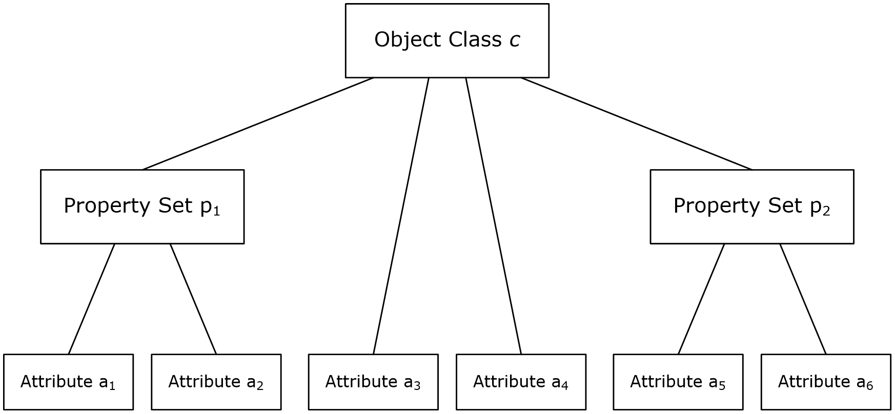

Figure 4: An object type tree

Let r be the root node of the object type tree T. Further, label each node v that is an element of V with two additional labels called Grant(v) and Deny(v) indicating the access rights that are granted and denied, respectively, at that node. Set both labels to a value 0 initially for every node.

The following rules are used to determine the [**authorization**](#gt_authorization) for the requester's [**security context**](#gt_security-context):

- If the security descriptor of object O has no [**DACL**](#gt_discretionary-access-control-list-dacl) or its "DACL Present" (DP) bit is not set, then grant the requester all possible access rights on the object.
- If the DACL does not have any ACE, then grant the requester no access rights on the object.
- Evaluate the DACL by examining each ACE in sequence, starting with the first ACE. Perform the following sequence of actions for each ACE in the order as shown. Let the ACCESS_MASK field of the ACE have a value M.
- If the "Inherit Only" (IO) flag is set in the ACE, skip the ACE.
- If the [**SID**](#gt_security-identifier-sid) in the ACE does not match any SID in the requester's security context, skip the ACE.
- If the ACE type is "Access Allowed" and the access rights in M are not in Deny(r), then add the rights in M to Grant(r) (where r denotes the root node of object type tree T as stated above). For every descendant node u of r, if the rights in M are not in Deny(u), then add the rights in M to Grant(u).
- If the ACE type is "Object Access Allowed" and the ObjectType field in the ACE is not present, then treat the ACE type as "Access Allowed" and perform the action in 3.3.
- If the ACE type is "Object Access Allowed" and the ObjectType field in the ACE contains a [**GUID**](#gt_globally-unique-identifier-guid) value g:
If there exists no node v that is an element of V such that Guid(v) = g, then skip the ACE.

Otherwise, let v that is an element of V be the unique node such that Guid(v) = g. If the rights in M are not in Deny(v), then add the rights in M to Grant(v). For every descendant node u of v, if the rights in M are not in Deny(u), then add the rights in M to Grant(u).

- If v = r, then proceed to the next ACE.
- If Grant(v) = Grant(s) for every sibling s of node v, then add the rights in Grant(v) to Grant(p) where p is the parent of node v. Otherwise, proceed to the next ACE.
- Set v to p, and repeat these three steps.
- If the ACE type is "Access Denied" and the access rights in M are not in Grant(r), then add the rights in M to Deny(r). For every descendant node u below the root node, if the rights in M are not in Grant(u), then add the rights in M to Deny(u).
- If the ACE type is "Object Access Denied" and the ObjectType field in the ACE is not present, then treat the ACE type as "Access Denied" and perform the action in 3.6.
- If the ACE type is "Object Access Denied" and the ObjectType field in the ACE contains a GUID value g:
If there exists no node v that is an element of V such that Guid(v) = g, then skip the ACE.

Otherwise, let v be the unique node in P such that Guid(v) = g if any such node exists. If no such node exists, let v be the unique node in A such that Guid(v) = g. If the rights in M are not in Grant(v), then add the rights in M to Deny(v). For every descendant node u of v, if the rights in M are not in Grant(u), then add the rights in M to Deny(u). For every ancestor node w of v, add the rights in M to Deny(w).

- When the end of the DACL is reached, the access rights in Grant(r) at the root node of tree T is the maximum access available to the requester on the object. For each node u below the root node r, the access rights in Grant(u) is the maximum access available to the requester for that node.
If the requested access is for the entire object, check the requested [**access mask**](#gt_access-mask) against the access rights granted in Grant(r). If the requested access is for specific properties on the object, check the requested access mask against the rights granted in Grant(u) where u is the attribute node in tree T that is the target of the request.

##### 5.1.3.3.4 Checking Control Access Right-Based Access

When evaluating the right to perform an operation that is controlled by a [**control access right**](#gt_control-access-right) identified by the [**GUID**](#gt_globally-unique-identifier-guid) value G, use the following rules to determine the [**authorization**](#gt_authorization) for the requester's [**security context**](#gt_security-context):

- If the [**security descriptor**](#gt_security-descriptor) has no [**DACL**](#gt_discretionary-access-control-list-dacl) or its "DACL Present" (DP) bit is not set, then grant the requester the requested control access right.
- If the DACL does not have any [**ACE**](#gt_access-control-entry-ace), then deny the requester the requested control access right.
- Evaluate the DACL by examining each ACE in sequence, starting with the first ACE. Perform the following sequence of actions for each ACE in the order as shown. Let the ACCESS_MASK field of the ACE have a value M.
- If the "Inherit Only" (IO) flag is set in the ACE, skip the ACE.
- If the [**SID**](#gt_security-identifier-sid) in the ACE does not match any SID in the requester's security context, skip the ACE.
- If the ACE type is "Object Access Allowed", the access right RIGHT_DS_CONTROL_ACCESS (CR) is present in M, and the ObjectType field in the ACE is not present, then grant the requested control access right. Stop any further [**access checks**](#gt_access-check).
- If the ACE type is "Object Access Allowed" the access right RIGHT_DS_CONTROL_ACCESS (CR) is present in M, and the ObjectType field in the ACE contains a GUID value equal to G, then grant the requested control access right. Stop any further access checks.
- If the ACE type is "Object Access Denied", the access right RIGHT_DS_CONTROL_ACCESS (CR) is present in M, and the ObjectType field in the ACE is not present, then deny the requested control access right. Stop any further access checks.
- If the ACE type is "Object Access Denied" the access right RIGHT_DS_CONTROL_ACCESS (CR) is present in M, and the ObjectType field in the ACE contains a GUID value equal to G, then deny the requested control access right. Stop any further access checks.

##### 5.1.3.3.5 Checking Validated Write-Based Access

When evaluating the right to perform an operation controlled by a validated write access right identified by the [**GUID**](#gt_globally-unique-identifier-guid) value G, use the following rules to determine the [**authorization**](#gt_authorization) for the requester's [**security context**](#gt_security-context):

- If the [**security descriptor**](#gt_security-descriptor) has no [**DACL**](#gt_discretionary-access-control-list-dacl) or its "DACL Present" (DP) bit is not set, then grant the requester the requested validated write right.
- If the DACL does not have any [**ACE**](#gt_access-control-entry-ace), then deny the requester the requested validated write right.
- Evaluate the DACL by examining each ACE in sequence, starting with the first ACE. Perform the following sequence of actions for each ACE in the order as shown. Let the ACCESS_MASK field of the ACE have a value M.
- If the "Inherit Only" (IO) flag is set in the ACE, skip the ACE.
- If the [**SID**](#gt_security-identifier-sid) in the ACE does not match any SID in the requester's security context, skip the ACE.
- If the ACE type is "Object Access Allowed", the access right RIGHT_DS_WRITE_PROPERTY_EXTENDED (VW) is present in M, and the ObjectType field in the ACE is not present, then grant the requested validated write right. Stop any further [**access checks**](#gt_access-check).
- If the ACE type is "Object Access Allowed" the access right RIGHT_DS_WRITE_PROPERTY_EXTENDED (VW) is present in M, and the ObjectType field in the ACE contains a GUID value equal to G, then grant the requested validated write right. Stop any further access checks.
- If the ACE type is "Object Access Denied", the access right RIGHT_DS_WRITE_PROPERTY_EXTENDED (VW) is present in M, and the ObjectType field in the ACE is not present, then deny the requested validated write right. Stop any further access checks.
- If the ACE type is "Object Access Denied" the access right RIGHT_DS_WRITE_PROPERTY_EXTENDED (VW) is present in M, and the ObjectType field in the ACE contains a GUID value equal to G, then deny the requested validated write right. Stop any further access checks.

##### 5.1.3.3.6 Checking Object Visibility

An [**object**](#gt_object) in [**Active Directory**](#gt_active-directory) is considered to be "visible" to a requester if the requester can see the name of the object and thus learn of its existence, even if the requester can see no other [**attributes**](#gt_attribute) of the object. The default behavior of Active Directory with respect to making objects visible to a requesting [**principal**](#gt_principal) is as follows:

- If a user is granted the RIGHT_DS_LIST_CONTENTS access right on a [**container**](#gt_container), all [**child objects**](#gt_9b04b599-9dca-48f1-aa9e-08e254d20553) of that container are visible to the user.
- Otherwise (if a user is not granted the RIGHT_DS_LIST_CONTENTS access right on a container), no child object of that container is visible to the user. This allows the contents of entire containers to be hidden.
However, Active Directory can optionally be put into a special mode, called the "List Object" mode. Active Directory is put into the "List Object" mode by setting the third character of dSHeuristics (section [6.1.1.2.4.1.2](#Section_6.1.1.2.4.1.2)) to the value "1". The mode is disabled by setting the same character to the value "0". The default setting is "0".

In "List Object" mode, a requester is allowed to selectively view specific child objects of a container while other child objects remain hidden. In this mode, an object is visible if the user has been granted the RIGHT_DS_LIST_CONTENTS right on the [**parent object**](#gt_parent-object). If, however, the user does not have that right on the parent, then the object is visible if the user is granted the RIGHT_DS_LIST_OBJECT right on both the object and its parent.

In summary, an object is not visible to a requester if:

- The object is not the root object of a [**NC replica**](#gt_nc-replica), and
- The requester lacks RIGHT_DS_LIST_CONTENTS right on the object's parent, and
- "List Object" mode is not set (as described above) or the requester lacks the RIGHT_DS_LIST_OBJECT right on both the object and its parent.

#### 5.1.3.4 AD LDS Security Context Construction

The construction of a Windows [**security context**](#gt_security-context) for an authenticated [**security principal**](#gt_security-principal) in [**AD DS**](#gt_active-directory-domain-services-ad-ds) is specified in [MS-PAC](../MS-PAC/MS-PAC.md) section 4.1.2.2.

After a successful [**authentication**](#gt_authentication) to an [**AD LDS**](#gt_active-directory-lightweight-directory-services-ad-lds) [**DC**](#gt_domain-controller-dc), the DC constructs a security context for the authenticated security principal as follows:

- Create an initial security context.
- If the bind named an AD LDS [**user object**](#gt_user-object), the initial security context contains only the objectSid of that [**object**](#gt_object).
- If the bind named an AD LDS bind proxy, or the [**SID**](#gt_security-identifier-sid) of some Windows account, the initial security context is the context returned by the Windows login.
- Extend the security context with well-known SIDs.
- If the bind named an AD LDS user object or an AD LDS bind proxy object, add the following SIDs to the security context if not already present:
- Authenticated Users (section [6.1.1.2.6.2](#Section_6.1.1.2.6.25)).
- Everyone (section [6.1.1.2.6.10](#Section_6.1.1.2.6.10)).
- Users, for the [**NC**](#gt_naming-context-nc) containing the AD LDS object (section [6.1.1.4.13.3](#Section_6.1.1.4.13.3)).
- Users, for the [**config NC**](#gt_configuration-naming-context-config-nc) of the [**forest**](#gt_forest) containing the AD LDS object (section 6.1.1.4.13.3).
- Extend the security context with AD LDS [**group**](#gt_group) memberships.
- If a SID currently in the security context is a member of an AD LDS group on this DC, and that group is not already present in the context, add the SID of that group to the context. (The group membership is represented as a reference to an object whose objectSid equals the SID: either an AD LDS user, an AD LDS bind proxy, an AD LDS group, or a foreignSecurityPrincipal object.) Repeat until there are no more SIDs to add.

# 6 Additional Information

## 6.1 Special Objects and Forest Requirements

This section specifies some of the [**objects**](#gt_object) that are necessary for the proper functioning of the [**DCs**](#gt_domain-controller-dc) in a [**forest**](#gt_forest) and the requirements that govern the state of these objects. Newer implementations of applicable Windows Server releases might depend on additional objects that are added to the forest via an implementation-specific upgrade process.

### 6.1.1 Special Objects

#### 6.1.1.1 Naming Contexts

**References**

- Special Attributes: Well-known Objects, Other Well-known Objects, Behavior Version
- Forest Requirements
- FSMO Roles
- State Model: NC Naming
- Security: SD Reference Domain
Glossary terms: [**NC**](#gt_naming-context-nc), [**NC replica**](#gt_nc-replica), NC root, [**DC**](#gt_domain-controller-dc), Forest root, [**Domain NC**](#gt_domain-naming-context-domain-nc), [**PDC**](#gt_primary-domain-controller-pdc), [**FSMO**](#gt_flexible-single-master-operation-fsmo)

LDAP attributes: instanceType, subRefs, repsTo, repsFrom, replUpToDateVector, wellKnownObjects, otherWellKnownObjects, name, objectClass, nTSecurityDescriptor, fSMORoleOwner, msDS-Behavior-Version, distinguishedName, systemFlags, nTMixedDomain, domainReplica, msDS-AllowedDNSSuffixes, dNSHostName, msDS-AdditionalDnsHostName, msDS-SDReferenceDomain

LDAP classes: configuration, dMD, domainDNS

Constants

- [**Access mask**](#gt_access-mask) bits, [**control access rights**](#gt_control-access-right): DS-Replication-Get-Changes, DS-Replication-Get-Changes-All, DS-Replication-Get-Changes-In-Filtered-Set
- systemFlags bits: FLAG_DISALLOW_DELETE | FLAG_DOMAIN_DISALLOW_RENAME | FLAG_DOMAIN_DISALLOW_MOVE

##### 6.1.1.1.1 Any NC Root

The following [**attributes**](#gt_attribute) have constant semantics across all types of [**NCs**](#gt_naming-context-nc).

instanceType: The instanceType of an NC root is a bit field, which is presented here in [**big-endian**](#gt_big-endian) byte order.

```mermaid
packet-beta
  0-0: "X"
  1-1: "X"
  2-2: "X"
  3-3: "X"
  4-4: "X"
  5-5: "X"
  6-6: "X"
  7-7: "X"
  8-8: "X"
  9-9: "X"
  10-10: "X"
  11-11: "X"
  12-12: "X"
  13-13: "X"
  14-14: "X"
  15-15: "X"
  16-16: "X"
  17-17: "X"
  18-18: "X"
  19-19: "X"
  20-20: "X"
  21-21: "X"
  22-22: "X"
  23-23: "X"
  24-24: "X"
  25-25: "X"
  26-26: "G"
  27-27: "C"
  28-28: "A"
  29-29: "W"
  30-30: "U"
  31-31: "H"
```

**X:** Unused. SHOULD be zero and MUST be ignored.

**H (IT_NC_HEAD, 0x00000001):** This flag is set (value 1) on all NC roots.

**U (IT_UNINSTANT, 0x00000002):** If this flag is set, the [**NC replica**](#gt_nc-replica) that this root represents does not exist locally. This flag implies that this root is a [**subordinate reference object**](#gt_subordinate-reference-object-sub-ref-object).

**W (IT_WRITE, 0x00000004):** This flag is written locally based upon the desired NC replica type. A regular NC replica will have this flag set, and a [**partial NC replica**](#gt_partial-nc-replica) will not have this flag set. The IT_WRITE flag MUST be propagated identically to every [**object**](#gt_object) in the NC replica.

**A (IT_NC_ABOVE, 0x00000008):** This flag indicates that the [**local DC**](#gt_local-domain-controller-local-dc) holds an instantiated NC replica that is a parent of the NC replica represented by this NC root. This flag also indicates that this NC root is a subordinate reference object.

**C (IT_NC_COMING, 0x00000010):** This flag indicates that the NC replica has not completed its initial [**replication**](#gt_replication) into the local DC, and might not have a full set of objects in the NC represented by this NC root.

**G (IT_NC_GOING, 0x00000020):** This flag indicates that the NC replica is being removed from the local DC, and might not have a full set of objects in the NC represented by this NC root.

Requirements:

- IT_UNINSTANT can only be set with IT_NC_HEAD and IT_NC_ABOVE. The remaining bits are incompatible with IT_UNINSTANT.
- IT_NC_COMING and IT_NC_GOING cannot be set at the same time.
- If IT_NC_GOING is set, then no replication can occur with that NC, either as server or as client.
subRefs: This value references all [**child objects**](#gt_9b04b599-9dca-48f1-aa9e-08e254d20553) in this NC replica of this NC root that are, themselves, NC roots. For example, the [**schema NC**](#gt_schema-naming-context-schema-nc) is always referenced by this value on the Config NC root object.

repsTo: This attribute contains the abstract attribute repsTo that is associated with this [**DC**](#gt_domain-controller-dc) for this NC replica. This attribute is [**nonreplicated**](#gt_nonreplicated-attribute). [MS-DRSR](../MS-DRSR/MS-DRSR.md) section 5.173 specifies this abstract attribute.

repsFrom: This attribute contains the abstract attribute repsFrom that is associated with this DC for this NC replica. This attribute is nonreplicated. [MS-DRSR] section 5.172 specifies this abstract attribute.

replUpToDateVector: This attribute contains the abstract attribute replUpToDateVector that is associated with this DC for this NC replica. This attribute is nonreplicated. [MS-DRSR] section 5.166 specifies this abstract attribute.

##### 6.1.1.1.2 Config NC Root

name: Configuration

parent: For [**AD DS**](#gt_active-directory-domain-services-ad-ds), the forest root [**NC**](#gt_naming-context-nc) root [**object**](#gt_object). For [**AD LDS**](#gt_active-directory-lightweight-directory-services-ad-lds), no parent.

objectClass: configuration

wellKnownObjects: This [**attribute**](#gt_attribute) holds DN-Binary values. See section [6.1.4](#Section_1.3) for details.

instanceType: This value can never contain the following flags:

- IT_NC_COMING
- IT_NC_GOING
- IT_UNINSTANT
nTSecurityDescriptor:

- Let D1 be a [**DC**](#gt_domain-controller-dc) that is instructed to host a writable [**replica**](#gt_replica) of the [**config NC**](#gt_configuration-naming-context-config-nc) (see section [6.1.2.3](#Section_6.1.2.3) for hosting requirements). In order for D1 to replicate the config NC, D1 MUST be granted the following rights on the config NC root:
- DS-Replication-Get-Changes
- DS-Replication-Get-Changes-All
- DS-Replication-Get-Changes-In-Filtered-Set
- Let D2 be a DC that is instructed to host a read-only replica of config NC (see section 6.1.2.3 for hosting requirements) such that the objects in the [**NC replica**](#gt_nc-replica) will not contain attributes in the [**filtered**](#gt_filter) attribute set. In order for D2 to replicate the config NC, D2 MUST be granted the following rights on the config NC root:
- DS-Replication-Get-Changes
msDS-ReplAuthenticationMode: Present and used on AD LDS only. Specifies the [**authentication**](#gt_authentication) that is used for DC-to-DC communication over [**RPC**](#gt_remote-procedure-call-rpc) ([MS-DRSR](../MS-DRSR/MS-DRSR.md)). The msDS-ReplAuthenticationMode values 0, 1, and 2 are valid; if absent, the effect is as if the value was 1. See [MS-DRSR] section 2.2.1 for the effects of these values.

objectSid: Present and used on AD LDS only. This attribute contains the [**SID**](#gt_security-identifier-sid) that is used in generating objectSid values for new AD LDS [**security principals**](#gt_security-principal) residing in the config NC, as specified in section [3.1.1.5.2.4](#Section_3.1.1.5.2.4). This attribute is not returned by [**LDAP**](#gt_lightweight-directory-access-protocol-ldap) queries.

##### 6.1.1.1.3 Schema NC Root

name: Schema

parent: Config NC root

objectClass: dMD

fSMORoleOwner: This value refers to the nTDSDSA [**object**](#gt_object) of the [**DC**](#gt_domain-controller-dc) that owns the Schema Master FSMO. See section [6.1.5](#Section_1.3).

instanceType: This value can never contain the following flags:

- IT_NC_COMING
- IT_NC_GOING
- IT_UNINSTANT
nTSecurityDescriptor: Let D be a DC that is instructed to host the [**schema**](#gt_schema) [**replica**](#gt_replica) [**NC**](#gt_naming-context-nc) (see section [6.1.2.3](#Section_6.1.2.3) for hosting requirements). In order for D to replicate the [**schema NC**](#gt_schema-naming-context-schema-nc), D MUST begranted the following rights on the schema NC root:

- DS-Replication-Get-Changes
- DS-Replication-Get-Changes-All
- DS-Replication-Get-Changes-In-Filtered-Set

##### 6.1.1.1.4 Domain NC Root

distinguishedName: See section [3.1.1.1](#Section_3.1.1.1) for more information about [**domain NC**](#gt_domain-naming-context-domain-nc) naming rules.

objectClass: domainDNS

fSMORoleOwner: This value refers to the nTDSDSA [**object**](#gt_object) of the [**DC**](#gt_domain-controller-dc) that owns the [**PDC**](#gt_primary-domain-controller-pdc) [**FSMO**](#gt_flexible-single-master-operation-fsmo) role. See section [6.1.5](#Section_1.3) for more information about the PDC role.

systemFlags: {FLAG_DISALLOW_DELETE | FLAG_DOMAIN_DISALLOW_RENAME | FLAG_DOMAIN_DISALLOW_MOVE}

wellKnownObjects: This [**attribute**](#gt_attribute) holds DN-Binary values. See section [6.1.4](#Section_1.3) for details.

otherWellKnownObjects: This attribute holds DN-Binary values. See section 6.1.4 for details.

msDS-Behavior-Version: This value defines the functional level of the [**domain**](#gt_domain). See section 6.1.4.

nTMixedDomain: This value defines whether NT BDC [**replication**](#gt_replication) [MS-NRPC](#Section_3.1.1.3.2.14) is available in the domain. See section [6.1.4.1](#Section_6.1.4.1).

domainReplica: See section [3.1.1.5](#Section_3.1.1.5) for more information.

msDS-AllowedDNSSuffixes: List of [**DNS**](#gt_domain-name-system-dns) suffixes that are allowed in the dNSHostName and msDS-AdditionalDnsHostName attributes of computer objects in this domain.

nTSecurityDescriptor:

- Let D1 be a DC that is instructed to host a writable domain [**replica**](#gt_replica) [**NC**](#gt_naming-context-nc) (see section [6.1.2.3](#Section_6.1.2.3) for hosting requirements). In order for D1 to replicate the domain NC, D1 MUST be granted the following rights on the domain NC root:
- DS-Replication-Get-Changes
- DS-Replication-Get-Changes-All
- DS-Replication-Get-Changes-In-Filtered-Set
- Let D2 be a DC that is instructed to host a partial or read-only domain replica NC (see section 6.1.2.3 for hosting requirements) such that objects in the [**NC replica**](#gt_nc-replica) can have attributes in the [**filtered**](#gt_filter) attribute set. In order for D2 to replicate the domain NC, D2 MUST be granted the following right on the domain NC root:
- DS-Replication-Get-Changes
- DS-Replication-Get-Changes-In-Filtered-Set
- Let D3 be a DC that is instructed to host a partial or read-only domain replica NC (see section 6.1.2.3 for hosting requirements) such that objects in the NC replica will not have attributes in the filtered attribute set. In order for D3 to replicate the domain NC, D3 MUST be granted the following right on the domain NC root:
- DS-Replication-Get-Changes
msDS-EnabledFeature: This value references the objects that represent [**optional features**](#gt_optional-feature) that are enabled in the domain. See section [3.1.1.9](#Section_3.1.1.9).

##### 6.1.1.1.5 Application NC Root

distinguishedName: See section [3.1.1.1](#Section_3.1.1.1) for more information about [**domain NC**](#gt_domain-naming-context-domain-nc) naming rules.

objectClass: domainDNS ([**AD DS**](#gt_active-directory-domain-services-ad-ds)); any structural or 88 class except dMD and configuration ([**AD LDS**](#gt_active-directory-lightweight-directory-services-ad-lds))

wellKnownObjects: This [**attribute**](#gt_attribute) holds DN-Binary values. See section [6.1.4](#Section_1.3) for details.

otherWellKnownObjects: This attribute holds DN-Binary values. See section 6.1.4 for details.

nTSecurityDescriptor:

- Let D1 be a [**DC**](#gt_domain-controller-dc) that is instructed to host a writable application [**replica**](#gt_replica) [**NC**](#gt_naming-context-nc) (see section [6.1.2.3](#Section_6.1.2.3) for hosting requirements). In order for D1 to replicate the NC, D1 MUST be granted the following rights on the NC root:
- DS-Replication-Get-Changes
- DS-Replication-Get-Changes-All
- DS-Replication-Get-Changes-In-Filtered-Set
- Let D2 be a DC that is instructed to host a read-only application replica NC (see section 6.1.2.3 for hosting requirements) such that [**objects**](#gt_object) in the [**NC replica**](#gt_nc-replica) will not contain attributes in the [**filtered**](#gt_filter) attribute set. In order for D2 to replicate the NC, D2 MUST be granted the following rights on the NC root:
- DS-Replication-Get-Changes
- Note that this nTSecurityDescriptor MUST be resolved with the [**domain**](#gt_domain) specified on the msDS-SDReferenceDomain attribute on the crossRef object representing this NC; see section [5](#Section_5) for details.
objectSid: Present and used on AD LDS only. This attribute contains the [**SID**](#gt_security-identifier-sid) that is used in generating objectSid values for new AD LDS [**security principals**](#gt_security-principal) residing in this [**application NC**](#gt_application-nc), as specified in section [3.1.1.5.2.4](#Section_3.1.1.5.2.4). This attribute is not returned by [**LDAP**](#gt_lightweight-directory-access-protocol-ldap) queries.

#### 6.1.1.2 Configuration Objects

**References**

- FSMO Roles
- LDAP
- Special Attributes
- Forest Requirements
- Security
- Knowledge Consistency Checker
- Originating Updates
Glossary terms: [**NC**](#gt_naming-context-nc), [**NC replica**](#gt_nc-replica), NC root, [**DC**](#gt_domain-controller-dc), [**Domain NC**](#gt_domain-naming-context-domain-nc), [**FSMO**](#gt_flexible-single-master-operation-fsmo), [**forest functional level**](#gt_forest-functional-level), Application NC, KCC, [**ISTG**](#gt_intersite-topology-generator-istg), Intra-site, Inter-site, Global Catalog, [**Forest**](#gt_forest), [**SMTP**](#gt_simple-mail-transfer-protocol-smtp), [**Site**](#gt_site), [**COM**](#gt_component-object-model-com) (Component Object Model (COM)), [**UUID**](#gt_universally-unique-identifier-uuid), [**MAPI**](#gt_messaging-application-programming-interface-mapi), [**ANR**](#gt_ambiguous-name-resolution-anr), NSPI

LDAP attributes: name, objectClass, fSMORoleOwner, msDS-Behavior-Version, msDS-EnabledFeature, distinguishedName, systemFlags, nTMixedDomain, dnsRoot, nCName, msDS-Replication-Notify-First-DSA-Delay, msDS-Replication-Notify-Subsequent-DSA-Delay, nETBIOSName, msDS-SDReferenceDomain, options, schedule, interSiteTopologyGenerator, interSiteTopologyFailover, interSiteTopologyRenew, serverReference, dNSHostName, mailAddress, invocationId, hasMasterNCs, hasPartialReplicaNCs, msDS-HasInstantiatedNCs, instanceType, msDS-OptionalFeatureGUID, msDS-RequiredForestBehaviorVersion, msDS-OptionalFeatureFlags, msDS-HasDomainNCs, msDS-hasMasterNCs, msDS-ReplicationEpoch, enabledConnection, fromServer, transportType, mS-DS-ReplicatesNCReason, siteObject, transportDLLName, transportAddressAttribute, cost, siteList, replInterval, siteLinkList, adminPropertyPages, shellPropertyPages, adminContextMenu, shellContextMenu, adminMultiselectPropertyPages, treatAsLeaf, creationWizard, createWizardExt, dSHeuristics, objectGUID, msDS-KeyVersionNumber, msDS-DeletedObjectLifetime, tombstoneLifetime, sPNMappings, msDS-Other-Settings, rightsGuid, appliesTo, localizationDisplayId, validAccesses, repsTo

LDAP classes: crossRefContainer, crossRef, sitesContainer, site, nTDSSiteSettings, nTDSConnection, serversContainer, server, nTDSDSA, subnetContainer, subnet, interSiteTransportContainer, interSiteTransport, siteLink, container, displaySpecifier, nTDSService, physicalLocation, controlAccessRight

Constants

- systemFlags bits: FLAG_DISALLOW_DELETE, FLAG_CR_NTDS_NC, FLAG_CR_NTDS_DOMAIN, FLAG_CR_NTDS_NOT_GC_REPLICATED, FLAG_DISALLOW_MOVE_ON_DELETE, FLAG_CONFIG_ALLOW_LIMITED_MOVE, FLAG_CONFIG_ALLOW_RENAME
- Replication bits: DRS_SYNC_FORCED

##### 6.1.1.2.1 Cross-Ref-Container Container

name: Partitions

parent: Config NC root

objectClass: crossRefContainer

fSMORoleOwner: This value references the Domain Naming Master FSMO role owner. See section [6.1.5](#Section_1.3).

systemFlags: {FLAG_DISALLOW_DELETE}

msDS-Behavior-Version: This value defines the [**forest functional level**](#gt_forest-functional-level). See section [6.1.4](#Section_1.3).

msDS-EnabledFeature: This value references the [**objects**](#gt_object) that represent [**optional features**](#gt_optional-feature) that are enabled in the [**forest**](#gt_forest). See section [3.1.1.9](#Section_3.1.1.9.2).

###### 6.1.1.2.1.1 Cross-Ref Objects

The following is the description of the flags and their meaning for crossRef [**objects**](#gt_object) stored in systemFlags. The flags are presented in [**big-endian**](#gt_big-endian) byte order.

```mermaid
packet-beta
  0-0: "X"
  1-1: "X"
  2-2: "X"
  3-3: "X"
  4-4: "X"
  5-5: "X"
  6-6: "X"
  7-7: "X"
  8-8: "X"
  9-9: "X"
  10-10: "X"
  11-11: "X"
  12-12: "X"
  13-13: "X"
  14-14: "X"
  15-15: "X"
  16-16: "X"
  17-17: "X"
  18-18: "X"
  19-19: "X"
  20-20: "X"
  21-21: "X"
  22-22: "X"
  23-23: "X"
  24-24: "X"
  25-25: "X"
  26-26: "X"
  27-27: "X"
  28-28: "X"
  29-29: "GC"
  30-30: "D"
  31-31: "NC"
```

**X:** Unused. Must be zero and ignored.

**NC (FLAG_CR_NTDS_NC, 0x00000001):** [**NC**](#gt_naming-context-nc) exists within the [**forest**](#gt_forest) (not external).

**D (FLAG_CR_NTDS_DOMAIN, 0x00000002):** NC is a [**domain**](#gt_domain).

**GC (FLAG_CR_NTDS_NOT_GC_REPLICATED, 0x00000004):** NC MUST not be replicated to [**GC server**](#gt_global-catalog-server-gc-server)s as a read-only [**replica**](#gt_replica).

The following [**attributes**](#gt_attribute) and attribute values are common to crossRef objects representing all NC types:

parent: crossRefContainer object

objectClass: crossRef

Enabled: If FALSE, this is a "pre-created" crossRef; that is, the crossRef exists, but the corresponding NC root does not yet exist. See section [3.1.1.5.2.8](#Section_3.1.1.5.2.8).

dnsRoot: If Enabled equals FALSE, in [**AD DS**](#gt_active-directory-domain-services-ad-ds) dnsRoot holds the [**DNS name**](#gt_dns-name) of the [**DC**](#gt_domain-controller-dc) that will create the root of this NC. If Enabled equals FALSE, in [**AD LDS**](#gt_active-directory-lightweight-directory-services-ad-lds), dnsRoot holds the DNS name of the DC that will create the root of this NC followed by a colon (":"), followed by the [**LDAP**](#gt_lightweight-directory-access-protocol-ldap) port number used by the DC, followed by another colon (":"), followed by the [**SSL**](#gt_secure-sockets-layer-ssl) port number used by the DC. If Enabled is not FALSE, in AD DS dnsRoot holds the fully qualified DNS name used for LDAP referrals (section [3.1.1.4.6](#Section_3.1.1.4.6)). If Enabled is not FALSE, in AD LDS dnsRoot is absent.

nCName: If Enabled is not FALSE, a reference to the NC root corresponding to this crossRef.

msDS-Replication-Notify-First-DSA-Delay: Indicates the number of seconds that each DC MUST delay after receiving [**updates**](#gt_update) (originating or replicated) to objects in the NC referred to by nCName before the DC notifies another DC of updates received according to the DCs local repsTos. See IDL_DRSReplicaSync in [MS-DRSR](../MS-DRSR/MS-DRSR.md) section 4.1.23.

msDS-Replication-Notify-Subsequent-DSA-Delay: Indicates the number of seconds that each DC MUST delay after notifying the first DC of updates received to objects in the NC referred to by nCName before notifying each additional DC according to the DCs local repsTos. See IDL_DRSReplicaSync in [MS-DRSR] section 4.1.23.

Foreign crossRef Objects

A foreign crossRef [**object**](#gt_object) is used to enable referrals for searches that need to return objects from different [**forests**](#gt_forest) or [**LDAP**](#gt_lightweight-directory-access-protocol-ldap) services. For more information, see section [3.1.1.3](#Section_1.3). The following [**attribute**](#gt_attribute) and attribute values are defined for a foreign crossRef:

systemFlags: 0

Configuration crossRef Object

name: Enterprise Configuration

systemFlags: { FLAG_CR_NTDS_NC }

nCName: The value MUST equal the config NC root.

dnsRoot: In [**AD DS**](#gt_active-directory-domain-services-ad-ds), the value is the [**forest**](#gt_forest) root's fully qualified [**DNS name**](#gt_dns-name). Not present in [**AD LDS**](#gt_active-directory-lightweight-directory-services-ad-lds).

Schema crossRef Object

name: Enterprise Schema

systemFlags: { FLAG_CR_NTDS_NC }

nCName: The value MUST equal the [**schema NC**](#gt_schema-naming-context-schema-nc) root.

dnsRoot: In [**AD DS**](#gt_active-directory-domain-services-ad-ds), the value is the [**forest**](#gt_forest) root's fully qualified [**DNS name**](#gt_dns-name). Not present in [**AD LDS**](#gt_active-directory-lightweight-directory-services-ad-lds).

Domain crossRef Object

The following [**attribute**](#gt_attribute) and attribute values are common to [**domain**](#gt_domain) crossRef [**objects**](#gt_object):

name: The [**NetBIOS**](#gt_netbios) name of the domain.

nCName: The reference MUST be to a [**domain NC**](#gt_domain-naming-context-domain-nc) root.

nETBIOSName: This value is the NetBIOS name of the domain.

trustParent: This attribute is not present on the root domain NC's [**crossRef object**](#gt_crossref-object). For [**child NCs**](#gt_child-naming-context-child-nc), this value references the parent NC’s crossRef object. This attribute is not set for alternate tree-root domains.

rootTrust: This attribute references the forest root domain’s crossRef object in the case of alternate tree-root domains.

nTMixedDomain: This value is read-only on this object. It is kept in sync with the same attribute on the [**NC**](#gt_naming-context-nc) root of the NC referred to by nCName. See section [6.1.4.1](#Section_6.1.4.1).

systemFlags: { FLAG_CR_NTDS_NC | FLAG_CR_NTDS_DOMAIN }

msDS-Behavior-Version: This value is read-only on this object. It is kept in sync with the same attribute on the NC root of the NC referred to by nCName. See section [6.1.4](#Section_1.3).

Application NC crossRef Object

dnsRoot: In [**AD DS**](#gt_active-directory-domain-services-ad-ds), the value for dnsRoot for an [**application NC**](#gt_application-nc) crossRef is derived by syntactically converting the [**DN**](#gt_distinguished-name-dn) portion of the crossRef’s nCName into a fully qualified [**DNS name**](#gt_dns-name) as specified in section [3.1.1.1.5](#Section_3.1.1.1.5). Not present in [**AD LDS**](#gt_active-directory-lightweight-directory-services-ad-lds).

systemFlags: { FLAG_CR_NTDS_NC | FLAG_CR_NTDS_NOT_GC_REPLICATED }

msDS-NC-Replica-Locations: This [**attribute**](#gt_attribute) references the nTDSDSA [**objects**](#gt_object) representing every [**DC**](#gt_domain-controller-dc) instructed to hold a [**writable NC replica**](#gt_writable-naming-context-nc-replica) of this application NC. See Hosting Requirements in section [6.1.2.3](#Section_6.1.2.3).

msDS-SDReferenceDomain: In AD DS, the attribute references an [**NC**](#gt_naming-context-nc) root object for a [**domain**](#gt_domain). All [**security descriptors**](#gt_security-descriptor) in this application NC MUST use the NC represented as the reference domain for resolution. See section [5](#Section_5) for security descriptor reference domain information. Not present in AD LDS.

msDS-NC-RO-Replica-Locations: This attribute references the nTDSDSA object representing every DC instructed to hold a read-only [**NC replica**](#gt_nc-replica) of this application NC. See Hosting Requirements in section 6.1.2.3.

##### 6.1.1.2.2 Sites Container

Each [**forest**](#gt_forest) contains a Sites [**container**](#gt_container) in the Config NC. For each [**site**](#gt_site) in the forest, a site [**object**](#gt_object) exists in the Sites container.

name: Sites

parent: Config NC root object

objectClass: sitesContainer

systemFlags: { FLAG_DISALLOW_DELETE | FLAG_DISALLOW_MOVE_ON_DELETE }

###### 6.1.1.2.2.1 Site Object

A site [**object**](#gt_object) corresponds to a set of one or more IP subnets that have LAN connectivity. Thus, by virtue of their subnet associations, [**DCs**](#gt_domain-controller-dc) that are in the same [**site**](#gt_site) are well connected in terms of speed. Each site object has a child nTDSSiteSettings object and a Servers [**container**](#gt_container).

parent: Sites container

objectClass: site

systemFlags: { FLAG_CONFIG_ALLOW_RENAME | FLAG_DISALLOW_MOVE_ON_DELETE }

**Note** The initial [**AD DS**](#gt_active-directory-domain-services-ad-ds) and [**AD LDS**](#gt_active-directory-lightweight-directory-services-ad-lds) configuration contains one initial [**site object**](#gt_site-object) named Default-First-Site-Name, which has no subnet association.

NTDS Site Settings Object

NTDS [**site settings objects**](#gt_site-settings-object) identify [**site**](#gt_site)-wide settings. There is one nTDSSiteSettings [**object**](#gt_object) per site.

name: NTDS Site Settings

parent: site object

objectClass: nTDSSiteSettings

options: One or more bits from the following diagram. The bits are presented in [**big-endian**](#gt_big-endian) byte order.

```mermaid
packet-beta
  0-0: "X"
  1-1: "X"
  2-2: "X"
  3-3: "X"
  4-4: "X"
  5-5: "X"
  6-6: "X"
  7-7: "X"
  8-8: "X"
  9-9: "X"
  10-10: "X"
  11-11: "X"
  12-12: "X"
  13-13: "X"
  14-14: "X"
  15-15: "X"
  16-16: "X"
  17-17: "X"
  18-18: "X"
  19-19: "X"
  20-20: "X"
  21-21: "RSE"
  22-22: "SHE"
  23-23: "BHD"
  24-24: "W2K"
  25-25: "FWB"
  26-26: "GCE"
  27-27: "ISD"
  28-28: "DSD"
  29-29: "MHD"
  30-30: "TCD"
  31-31: "ATD"
```

**X:** Unused. Must be zero and ignored.

**ATD (NTDSSETTINGS_OPT_IS_AUTO_TOPOLOGY_DISABLED, 0x00000001):** Automatic topology generation is disabled. See section [6.2](#Section_6.2) for more information.

**TCD (NTDSSETTINGS_OPT_IS_TOPL_CLEANUP_DISABLED, 0x00000002):** Automatic topology cleanup is disabled. See section 6.2 for more information.

**MHD (NTDSSETTINGS_OPT_IS_TOPL_MIN_HOPS_DISABLED, 0x00000004):** Automatic minimum hops topology is disabled. See section 6.2 for more information.

**DSD (NTDSSETTINGS_OPT_IS_TOPL_DETECT_STALE_DISABLED, 0x00000008):** Automatic stale server detection is disabled. See section 6.2 for more information.

**ISD (NTDSSETTINGS_OPT_IS_INTER_SITE_AUTO_TOPOLOGY_DISABLED, 0x00000010):** Automatic intersite topology generation is disabled. See section 6.2 for more information.

**GCE (NTDSSETTINGS_OPT_IS_GROUP_CACHING_ENABLED, 0x00000020):** Caching of users' [**group**](#gt_group) memberships is enabled for this site. This caching is an implementation-specific behavior. This flag can be ignored by other implementations but MUST not be used in a conflicting way that would affect the performance of Windows [**DCs**](#gt_domain-controller-dc).

**FWB (NTDSSETTINGS_OPT_FORCE_KCC_WHISTLER_BEHAVIOR, 0x00000040):** Force the KCC to behave in a [**forest functional level**](#gt_forest-functional-level) of DS_BEHAVIOR_WIN2003 or greater. See section 6.2 for more information.

**W2K (NTDSSETTINGS_OPT_FORCE_KCC_W2K_ELECTION, 0x00000080):** Force the KCC to use the Windows 2000 operating system [**intersite topology generator (ISTG)**](#gt_intersite-topology-generator-istg) election algorithm. See section 6.2 for more information.

**BHD (NTDSSETTINGS_OPT_IS_RAND_BH_SELECTION_DISABLED, 0x00000100):** Prevent the KCC from randomly picking a bridgehead when creating a connection. See section 6.2 for more information.

**SHE (NTDSSETTINGS_OPT_IS_SCHEDULE_HASHING_ENABLED, 0x00000200):** Allow the KCC to use hashing when creating a [**replication**](#gt_replication) schedule. See section 6.2 for more information.

**RSE (NTDSSETTINGS_OPT_IS_REDUNDANT_SERVER_TOPOLOGY_ENABLED, 0x00000400):** Create static failover connections. See section 6.2 for more information.

schedule: The default replication schedule (defined as a SCHEDULE structure) that applies to all nTDSConnection objects for intrasite replication within this site. If this [**attribute**](#gt_attribute) does not contain any value, a schedule of once per hour is applied to replication within this site. See section 6.2 for more information.

interSiteTopologyGenerator: A reference to the nTDSDSA object of the DC that is acting as the ISTG for this site. See section 6.2 for more information on the ISTG.

interSiteTopologyFailover: Indicates how much time MUST transpire since the last keep-alive for the ISTG to be considered dead. See section 6.2 for more information.

interSiteTopologyRenew: Indicates how often the intersite topology generator (ISTG) [**updates**](#gt_update) the keep-alive message that is sent to domain controllers contained in the same site. See section 6.2 for more information.

Servers Container

Each [**site**](#gt_site) contains a Servers [**container**](#gt_container) that contains the server [**objects**](#gt_object) for all the [**DCs**](#gt_domain-controller-dc) that are in that site.

parent: site object

objectClass: serversContainer

systemFlags: FLAG_DISALLOW_MOVE_ON_DELETE

Server Object

Each [**DC**](#gt_domain-controller-dc) in a [**domain**](#gt_domain) has a server [**object**](#gt_object) in the [**config NC**](#gt_configuration-naming-context-config-nc). See requirements in section [6.1.2.1](#Section_6.1.2.2). A server object has the following [**attributes**](#gt_attribute):

parent: The parent of this object is a serversContainer object.

objectClass: server

systemFlags: { FLAG_CONFIG_ALLOW_RENAME | FLAG_CONFIG_ALLOW_LIMITED_MOVE | FLAG_DISALLOW_MOVE_ON_DELETE }

serverReference: In [**AD DS**](#gt_active-directory-domain-services-ad-ds), a reference to the domain controller object representing this DC. See requirements in section 6.1.2.1. Not present in [**AD LDS**](#gt_active-directory-lightweight-directory-services-ad-lds).

dNSHostName: Fully qualified [**DNS name**](#gt_dns-name) of the DC.

mailAddress: To enable the DC to perform intersite [**replication**](#gt_replication) via the [**SMTP**](#gt_simple-mail-transfer-protocol-smtp) protocol (see [MS-SRPL](../MS-SRPL/MS-SRPL.md)), this attribute MUST contain the SMTP mail address of the server.

nTDSDSA Object

Each [**DC**](#gt_domain-controller-dc) in a [**forest**](#gt_forest) has an [**nTDSDSA object**](#gt_ntdsdsa-object) in the [**config NC**](#gt_configuration-naming-context-config-nc). See requirements in section [6.1.2.1](#Section_6.1.2.2). An nTDSDSA object has the following [**attributes**](#gt_attribute):

name: NTDS Settings

parent: An [**object**](#gt_object) with objectClass server.

objectClass: nTDSDSA

dMDLocation: The **DSName** of the [**schema NC**](#gt_schema-naming-context-schema-nc) root.

invocationId: The [**invocationId**](#gt_e7869b9a-61fa-46e3-89dd-fb3f57d1ba7a) for this DC (section [3.1.1.1.9](#Section_3.1.1.1.9)).

options: One or more of the following bits presented in [**big-endian**](#gt_big-endian) byte order.

```mermaid
packet-beta
  0-0: "X"
  1-1: "X"
  2-2: "X"
  3-3: "X"
  4-4: "X"
  5-5: "X"
  6-6: "X"
  7-7: "X"
  8-8: "X"
  9-9: "X"
  10-10: "X"
  11-11: "X"
  12-12: "X"
  13-13: "X"
  14-14: "X"
  15-15: "X"
  16-16: "X"
  17-17: "X"
  18-18: "X"
  19-19: "X"
  20-20: "X"
  21-21: "X"
  22-22: "X"
  23-23: "X"
  24-24: "X"
  25-25: "X"
  26-26: "X"
  27-27: "DS"
  28-28: "DNX"
  29-29: "DO"
  30-30: "DI"
  31-31: "GC"
```

**X:** Unused. Must be zero and ignored.

**GC (NTDSDSA_OPT_IS_GC, 0x00000001):** This DC is, or is becoming, a [**GC server**](#gt_global-catalog-server-gc-server).

**DI (NTDSDSA_OPT_DISABLE_INBOUND_REPL, 0x00000002):** This DC does not perform inbound [**replication**](#gt_replication) unless the DRS_SYNC_FORCED flag is passed. See [MS-DRSR](../MS-DRSR/MS-DRSR.md) section 4.1.10.4.1, ReplicateNCRequestMsg, for the effects of this option.

**DO (NTDSDSA_OPT_DISABLE_OUTBOUND_REPL, 0x00000004):** This DC does not perform outbound replication unless the DRS_SYNC_FORCED flag is passed. See [MS-DRSR] section 4.1.10.5.2, GetReplChanges, for the effects of this option.

**DNX (NTDSDSA_OPT_DISABLE_NTDSCONN_XLATE, 0x00000008):** This DC does not translate connection objects into repsFroms. See section [6.2](#Section_6.2) for more information.

**DS (NTDSDSA_OPT_DISABLE_SPN_REGISTRATION, 0x00000010):** This DC does not perform [**SPN (2)**](#gt_service-principal-name-spn) registration. Only interpreted by [**AD LDS**](#gt_active-directory-lightweight-directory-services-ad-lds) DCs. See [MS-DRSR] sections 2.2.3.3 and 2.2.4.3, SPN (2) for a Target DC in AD LDS, for the effects of this option.

systemFlags: {FLAG_DISALLOW_MOVE_ON_DELETE}

msDS-Behavior-Version: Indicates the DC version. See section [6.1.4.2](#Section_6.1.4.2) for more information.

msDS-PortLDAP: In AD LDS, stores the [**LDAP**](#gt_lightweight-directory-access-protocol-ldap) port for this instance. Not present in [**AD DS**](#gt_active-directory-domain-services-ad-ds).

msDS-PortSSL: In AD LDS, stores the [**SSL**](#gt_secure-sockets-layer-ssl) port for this instance. Not present in AD DS.

msDS-ServiceAccount: In AD LDS, stores the foreignSecurityPrincipal object that represents the service account running this DC. Not present in AD DS.

hasMasterNCs: Contains the **DSName** of the [**NC**](#gt_naming-context-nc) root objects representing the schema NC, config NC, and [**domain NC**](#gt_domain-naming-context-domain-nc) for the default [**domain**](#gt_domain) of the DC. This attribute always contains these three values and only these three values. This attribute is not present on the nTDSDSA object of an [**RODC**](#gt_read-only-domain-controller-rodc).

hasPartialReplicaNCs: Contains the **DSName** of the root objects of all domain NCs within the forest for which the DC hosts a [**partial NC replica**](#gt_partial-nc-replica).

msDS-HasInstantiatedNCs: Contains an Object(DN-Binary) value for each [**NC replica**](#gt_nc-replica) that is hosted by this DC. The **DN** field is the [**DN**](#gt_distinguished-name-dn) of the root object of the NC. The Binary field contains the value of the instanceType attribute on the root object of the NC. This is a binary encoding of attribute instanceType with little-endian byte ordering.

Requirement: The **DN** fields of all the values of msDS-HasInstantiatedNCs MUST be equal to the set of DNs contained in the values of msDS-hasMasterNCs and hasPartialReplicaNCs.

msDS-HasDomainNCs: Equals the **DSName** of the NC root object for which the DC is hosting a regular NC replica. This attribute MUST have only one value. This NC root is called the default domain for the DC.

msDS-hasMasterNCs: Contains the **DSNames** of the root objects of all [**writable NC replicas**](#gt_writable-naming-context-nc-replica) hosted by this DC. Not present on the nTDSDSA object of an RODC. On a normal (writable) DC, includes the [**default NC**](#gt_default-naming-context-default-nc), config NC, schema NC, and all [**application NC**](#gt_application-nc) [**replicas**](#gt_replica) hosted by the DC.

msDS-hasFullReplicaNCs: Contains the **DSNames** of the root objects of all [**read-only full NC replicas**](#gt_read-only-full-nc-replica) hosted by this DC. Not present on the nTDSDSA object of a normal (writable) DC. On an RODC, includes the default NC, config NC, schema NC, and all application NC replicas hosted by the DC.

msDS-ReplicationEpoch: [MS-DRSR] section 4.1.3.1 (client behavior of IDL_DRSBind) and [MS-DRSR] section 4.1.10.5 (server behavior of IDL_DRSGetNCChanges) specify the effects of this attribute.

msDS-DefaultNamingContext: In AD LDS, specifies the NC that is to be returned as the default NC by the defaultNamingContext attribute of the root DSE. If this attribute is not set, AD LDS does not have a default NC and the defaultNamingContext attribute of the root DSE is treated by the server as if it does not exist. Not present in AD DS.

objectCategory: This attribute is a mandatory attribute representing the [**schema**](#gt_schema) definition of the nTDSDSA object. If the objectCategory points to the classSchema object for the nTDSDSA class, then this nTDSDSA object is for a normal (writable) DC. If the objectCategory points to the classSchema object for the nTDSDSARO class, then this nTDSDSA object is for an RODC.

msDS-EnabledFeature: This value references the objects that represent [**optional features**](#gt_optional-feature) that are enabled in the DC. See section [3.1.1.9](#Section_3.1.1.9).

Connection Object

An nTDSConnection [**object**](#gt_object) represents a path for [**replication**](#gt_replication) from a source [**DC**](#gt_domain-controller-dc) to a destination DC. This object is a child of the nTDSDSA object of the destination DC. See section [6.2](#Section_6.2) for more information about connection objects.

Each nTDSConnection object has the following [**attributes**](#gt_attribute):

parent: nTDSDSA object

objectClass: nTDSConnection

enabledConnection: Indicates whether the connection can be used for replication.

fromServer: A reference to the nTDSDSA object of the source DC.

schedule: Contains a SCHEDULE structure specifying the time intervals when replication can be performed between the source and the destination DCs. In case of intrasite replication (source and destination DCs are in the same [**site**](#gt_site)), the value of this attribute is derived from the schedule attribute on the nTDSSiteSettings object of the site where the two DCs reside. In case of intersite replication (source and destination DCs are in different sites), the value is derived from the schedule attribute on the siteLink object that links the two sites.

systemFlags: {FLAG_CONFIG_ALLOW_RENAME | FLAG_CONFIG_ALLOW_MOVE}

options: One or more bits from the following diagram. The bits are presented in [**big-endian**](#gt_big-endian) byte order.

```mermaid
packet-beta
  0-0: "X"
  1-1: "X"
  2-2: "X"
  3-3: "X"
  4-4: "X"
  5-5: "X"
  6-6: "X"
  7-7: "X"
  8-8: "X"
  9-9: "X"
  10-10: "X"
  11-11: "X"
  12-12: "X"
  13-13: "X"
  14-14: "X"
  15-15: "X"
  16-16: "X"
  17-17: "X"
  18-18: "X"
  19-19: "X"
  20-20: "X"
  21-21: "X"
  22-22: "X"
  23-23: "X"
  24-24: "X"
  25-25: "X"
  26-26: "UOS"
  27-27: "DIC"
  28-28: "UN"
  29-29: "OND"
  30-30: "TS"
  31-31: "IG"
```

**X:** Unused. Must be zero and ignored.

**IG (NTDSCONN_OPT_IS_GENERATED, 0x00000001):** The nTDSConnection object was generated by the KCC. See section 6.2 for more information.

**TS (NTDSCONN_OPT_TWOWAY_SYNC, 0x00000002):** Indicates that a [**replication cycle**](#gt_replication-cycle) MUST be performed in the opposite direction at the end of a replication cycle that is using this connection.

**OND (NTDSCONN_OPT_OVERRIDE_NOTIFY_DEFAULT, 0x00000004):** Do not use defaults to determine notification.

**UN (NTDSCONN_OPT_USE_NOTIFY, 0x00000008):** The source DC notifies the destination DC regarding changes on the source DC.

**DIC (NTDSCONN_OPT_DISABLE_INTERSITE_COMPRESSION, 0x00000010):** For intersite replication, this indicates that the compression of replication data is disabled.

**UOS (NTDSCONN_OPT_USER_OWNED_SCHEDULE, 0x00000020):** For [**KCC**](#gt_knowledge-consistency-checker-kcc)-generated connections, indicates that the schedule attribute is owned by the user and MUST not be modified by the KCC. See section 6.2 for more information.

transportType: A reference to the interSiteTransport object for the transport used on this connection. For more information about physical transport types, see [MS-SRPL](../MS-SRPL/MS-SRPL.md).

mS-DS-ReplicatesNCReason: For each [**NC**](#gt_naming-context-nc) that is replicated using this connection, this attribute contains an Object(DN-Binary) value, where the [**DN**](#gt_distinguished-name-dn) portion is the DN of the NC, and the binary value is a 32-bit–wide bit field. The binary portion contains extended information about a connection object that could be used by administrators. It consists of one or more bits from the following diagram. The bits are presented in big-endian byte order.

```mermaid
packet-beta
  0-0: "X"
  1-1: "X"
  2-2: "X"
  3-3: "X"
  4-4: "X"
  5-5: "X"
  6-6: "X"
  7-7: "X"
  8-8: "X"
  9-9: "X"
  10-10: "X"
  11-11: "X"
  12-12: "X"
  13-13: "X"
  14-14: "X"
  15-15: "X"
  16-16: "X"
  17-17: "X"
  18-18: "X"
  19-19: "X"
  20-20: "X"
  21-21: "X"
  22-22: "RS"
  23-23: "SIF"
  24-24: "SF"
  25-25: "IS"
  26-26: "ISG"
  27-27: "OC"
  28-28: "SS"
  29-29: "MH"
  30-30: "R"
  31-31: "GC"
```

**X:** Unused. Must be zero and ignored.

**GC** (NTDSCONN_KCC_GC_TOPOLOGY, 0x00000001): Not used.

**R (NTDSCONN_KCC_RING_TOPOLOGY, 0x00000002):** The connection object is created to form a ring topology.

**MH (NTDSCONN_KCC_MINIMIZE_HOPS_TOPOLOGY, 0x00000004):** The connection object is created to minimize hops between replicating nodes.

**SS (NTDSCONN_KCC_STALE_SERVERS_TOPOLOGY, 0x00000008):** If the KCC finds that the destination server is not responding, then it sets this bit.

**OC (NTDSCONN_KCC_OSCILLATING_CONNECTION_TOPOLOGY, 0x00000010):** The KCC sets this bit if deletion of the connection object was prevented.

When the **KCC** considers deleting a connection object, it first checks if it previously deleted connection objects with the same source DC, destination DC, and options for an implementation-specific number of times *T* (default value is 3) over the last implementation-specific time period *t* (the default is 7 days) since the server has started. If it did, it will set the **NTDSCONN_KCC_OSCILLATING_CONNECTION_TOPOLOGY** bit on the connection object and will not delete it. Otherwise, it will delete the connection object.

**ISG (NTDSCONN_KCC_INTERSITE_GC_TOPOLOGY, 0x00000020):** This connection is to enable replication of [**partial NC replica**](#gt_partial-nc-replica) between DCs in different sites.

**IS (NTDSCONN_KCC_INTERSITE_TOPOLOGY, 0x00000040):** This connection is to enable replication of a [**full NC replica**](#gt_full-nc-replica) between DCs in different sites.

**SF (NTDSCONN_KCC_SERVER_FAILOVER_TOPOLOGY, 0x00000080):** This connection is a redundant connection between DCs that is used for failover when other connections between DCs are not functioning.

**SIF (NTDSCONN_KCC_SITE_FAILOVER_TOPOLOGY, 0x00000100):** This connection is a redundant connection between [**bridgehead DCs**](#gt_bridgehead-domain-controller-bridgehead-dc) in different DCs; it is used for failover when other connections between bridgehead DCs connecting two sites are not functioning.

**RS (NTDSCONN_KCC_REDUNDANT_SERVER_TOPOLOGY, 0x00000200):** Redundant connection object connecting bridgeheads in different sites.

The connection object is for server-to-server replication implementation only. Peer DCs MAY assign a meaning to it, but it is not required for interoperation with Windows clients.

See section 6.2 for more information about these options.

RODC NTFRS Connection Object

An [**RODC**](#gt_read-only-domain-controller-rodc) NTFRS connection [**object**](#gt_object) exists for each RODC in the [**forest**](#gt_forest). RODC NTFRS connection objects do not exist for writable [**DCs**](#gt_domain-controller-dc). An RODC NTFRS connection object represents a path for [**File Replication Service (FRS)**](#gt_file-replication-service-frs) [**replication**](#gt_replication) [MS-FRS1](../MS-FRS1/MS-FRS1.md) from a source DC to a destination DC; it is not used for [**directory**](#gt_directory) replication service (DRS) replication [MS-DRSR](../MS-DRSR/MS-DRSR.md). This object is a child of the nTDSDSA object of the destination RODC. See section [6.2](../MS-FRS1/MS-FRS1.md) for more information about connection objects.

Each RODC NTFRS connection object has the following [**attributes**](#gt_attribute):

name: RODC Connection (SYSVOL)

**Note** On Windows Server 2008 operating system and Windows Server 2008 R2 operating system, the name attribute was set to "RODC Connection (FRS)".

parent: nTDSDSA object

objectClass: nTDSConnection

enabledConnection: TRUE

fromServer: A reference to the nTDSDSA object of the source DC.

schedule: Contains a SCHEDULE structure that specifies the time intervals when replication can be performed between the source and the destination DCs. See section [6.2.2.7](#Section_6.2.2.7) for more information about how this value is derived.

systemFlags: {FLAG_CONFIG_ALLOW_RENAME}

options: Both of the bits from the following diagram. The bits are presented in [**big-endian**](#gt_big-endian) byte order.

```mermaid
packet-beta
  0-0: "X"
  1-1: "X"
  2-2: "X"
  3-3: "X"
  4-4: "X"
  5-5: "X"
  6-6: "X"
  7-7: "X"
  8-8: "X"
  9-9: "X"
  10-10: "X"
  11-11: "X"
  12-12: "X"
  13-13: "X"
  14-14: "X"
  15-15: "X"
  16-16: "X"
  17-17: "X"
  18-18: "X"
  19-19: "X"
  20-20: "X"
  21-21: "X"
  22-22: "X"
  23-23: "X"
  24-24: "X"
  25-25: "RT"
  26-26: "X"
  27-27: "X"
  28-28: "X"
  29-29: "X"
  30-30: "X"
  31-31: "IG"
```

**X:** Unused. Must be zero and ignored.

**IG (NTDSCONN_OPT_IS_GENERATED, 0x00000001):** The nTDSConnection object was generated by the system, not by a user or administrator directly.

**RT (NTDSCONN_OPT_RODC_TOPOLOGY, 0x00000040):** The NTDSCONN_OPT_RODC_TOPOLOGY bit in the options attribute indicates whether the connection can be used for DRS replication [MS-DRSR]. When set, the connection MUST be ignored by DRS replication and used only by FRS replication [MS-FRS1]. See section 6.2 and [MS-FRS1] section 3.1.1.8.

###### 6.1.1.2.2.2 Subnets Container

Each [**forest**](#gt_forest) contains a Subnets container in the [**config NC**](#gt_configuration-naming-context-config-nc). A network subnet is a segment of a [**TCP**](#gt_transmission-control-protocol-tcp)/IP network to which a set of logical IP addresses is assigned. For each subnet in the forest, a subnet [**object**](#gt_object) exists in the Subnets container.

name: Subnets

parent: Sites container

objectClass: subnetContainer

systemFlags: FLAG_DISALLOW_DELETE

Subnet Object

Subnet [**objects**](#gt_object) define network subnets in the [**directory**](#gt_directory). Subnets [**group**](#gt_group) computers in a way that identifies their physical proximity on the network. subnet objects are used to map computers to [**sites**](#gt_site).

- name: The name of the subnet object identifies the set of IP addresses that fall in this subnet. An IP address that falls in this subnet is considered to be in the site specified by the siteObject [**attribute**](#gt_attribute) of this object.
A valid subnet name MUST satisfy the following constraints:

Let s be the subnet name.

Let l be the length of the subnet name.

Let BitMask[] = {0x00000000, 0x00000080, 0x000000C0, 0x000000E0, 0x000000F0, 0x000000F8, 0x000000FC, 0x000000FE, 0x000000FF, 0x000080FF, 0x0000C0FF, 0x0000E0FF, 0x0000F0FF, 0x0000F8FF, 0x0000FCFF, 0x0000FEFF, 0x0000FFFF, 0x0080FFFF, 0x00C0FFFF, 0x00E0FFFF, 0x00F0FFFF, 0x00F8FFFF, 0x00FCFFFF, 0x00FEFFFF, 0x00FFFFFF, 0x80FFFFFF, 0xC0FFFFFF, 0xE0FFFFFF, 0xF0FFFFFF, 0xF8FFFFFF, 0xFCFFFFFF, 0xFEFFFFFF, 0xFFFFFFFF };

s is a valid subnet name if:

1. There is only one occurrence of the character "/" in s. Let i be the index of the character "/" in s.

2. The substring s[0, i-1] is either a valid IPv4 address in dotted decimal notation (as specified in [[RFC1166]](https://go.microsoft.com/fwlink/?LinkId=103593)) or a valid IPv6 address in colon-hexadecimal form or compressed form (as specified in [[RFC4291]](https://go.microsoft.com/fwlink/?LinkId=90464)), and MUST meet the following constraints:

- IPv4 addresses MUST not have any leading zeros in any individual component of the address.
- IPv6 addresses MUST be in canonical text representation format (as specified in [[RFC5952]](https://go.microsoft.com/fwlink/?linkid=835928) section 4), except that the addresses are treated as case insensitive.
Examples:

Valid IPv4 subnet names:

- 10.2.1.0/24
- 10.20.1.0/24
Invalid IPv4 subnet names:

- 10.02.0.0/16
Valid IPv6 subnet names:

- A:A:A:A::/64
- a:b::c:d:0:0/64
- 0:0:e0::/48
- A:b:C::/128
- A:B::F:0/128
- 12AB:0:0:CD30::/60
- A:a:e:b:0:d:e:f/128
Invalid IPv6 subnet names:

- A:B:0C:D::/64
- A:B:0:0:0:0:E:F/128
- 12AB::CD30:0:0:0:0/60
- 12AB:0:0:CD30::F:0/60
- A:a:e:b::d:e:f/128
Let b be the binary representation of the address in little-endian format.

3. The substring s[i+1, l-1] does not have any leading zeros and can be converted to an unsigned integer n.

4. When the address is in IPv4 format, 0 < n <= 32. When the address is in IPv6 format, 0 < n <= 128.

5. When the address is in IPv4 format, b & (~BitMask[n]) = 0.

6. When the address is in IPv4 format, b ≠ BitMask[n].

Based on the subnet object name, the range of the IP addresses that the subnet contains can be determined. For example, if the IPv4 subnet object name is 10.121.0.0/22, then according the above definition, b will be 00001010.01111001.00000000.00000000 and n will be 22. This means that the first 22 bits of b will be fixed for the range of the IP addresses the subnet contains. Then the IP address range of the subnet is from 00001010.01111001.00000000.00000000 to 00001010.01111001.00000011.11111111, namely from 10.121.0.0 to 10.121.3.255. Similarly, an IPv6 subnet object name 2001:DA8::/48 represents the IPv6 addresses from 2001:DA8:0:0:0:0:0:0 to 2001:DA8:0:FFFF:FFFF:FFFF:FFFF:FFFF.

- parent: Subnets [**container**](#gt_container)
- objectClass: subnet
- systemFlags: FLAG_CONFIG_ALLOW_RENAME
- siteObject: The **DSName** of the site object for the site that covers this subnet.

###### 6.1.1.2.2.3 Inter-Site Transports Container

The Inter-Site Transports [**container**](#gt_container) provides the means for specifying the transport or wire protocol to be used for [**replication**](#gt_replication) between [**sites**](#gt_site). Intersite replication can use either the [**RPC**](#gt_remote-procedure-call-rpc) protocol over IP (see [MS-DRSR](../MS-DRSR/MS-DRSR.md)), or the [**SMTP**](#gt_simple-mail-transfer-protocol-smtp) protocol (see [MS-SRPL](../MS-SRPL/MS-SRPL.md)).

name: Inter-Site Transports

parent: Sites container

objectClass: interSiteTransportContainer

systemFlags: FLAG_DISALLOW_DELETE

IP Transport Container

The IP Transport [**container**](#gt_container) contains all the siteLink and siteLinkBridge [**objects**](#gt_object) that connect two or more [**sites**](#gt_site) for intersite [**replication**](#gt_replication) using [**RPC**](#gt_remote-procedure-call-rpc) over IP protocol.

parent: Inter-Site Transports container

objectClass: interSiteTransport

transportDLLName: The value of this [**attribute**](#gt_attribute) MUST be the string "ismip.dll".

transportAddressAttribute: Identifies which attribute on the server object of a [**DC**](#gt_domain-controller-dc) is to be used as the network address of the DC for replication using this transport. For the IP transport, the attribute is dNSHostName.

options: A set of the following bit flags presented in [**big-endian**](#gt_big-endian) byte order. For IP transport, the initial value is none present (options value 0x0).

```mermaid
packet-beta
  0-0: "X"
  1-1: "X"
  2-2: "X"
  3-3: "X"
  4-4: "X"
  5-5: "X"
  6-6: "X"
  7-7: "X"
  8-8: "X"
  9-9: "X"
  10-10: "X"
  11-11: "X"
  12-12: "X"
  13-13: "X"
  14-14: "X"
  15-15: "X"
  16-16: "X"
  17-17: "X"
  18-18: "X"
  19-19: "X"
  20-20: "X"
  21-21: "X"
  22-22: "X"
  23-23: "X"
  24-24: "X"
  25-25: "X"
  26-26: "X"
  27-27: "X"
  28-28: "X"
  29-29: "X"
  30-30: "BR"
  31-31: "IS"
```

**X:** Unused. Must be zero and ignored.

**IS (NTDSTRANSPORT_OPT_IGNORE_SCHEDULES, 0x00000001):** If present, values of the schedule attribute for siteLink objects associated with this transport are ignored. In this case, the schedule is assumed to be always "on"; that is, that the transport is always available to send and receive messages.

**BR (NTDSTRANSPORT_OPT_BRIDGES_REQUIRED, 0x00000002):** If present, transitive connectivity between siteLink objects associated with this transport is assumed only if the siteLink objects are in the siteLinkList of the same siteLinkBridge object. If absent, the system behaves as if all siteLink objects associated with this transport were in the siteLinkList of a common siteLinkBridge object associated with this transport.

SMTP Transport Container

In [**AD DS**](#gt_active-directory-domain-services-ad-ds), the [**SMTP**](#gt_simple-mail-transfer-protocol-smtp) Transport [**container**](#gt_container) contains all the siteLink and siteLinkBridge [**objects**](#gt_object) that connect two or more [**sites**](#gt_site) for intersite [**replication**](#gt_replication) using the SMTP protocol. Not present in [**AD LDS**](#gt_active-directory-lightweight-directory-services-ad-lds).

parent: Inter-Site Transports container

objectClass: interSiteTransport

transportDLLName: The value of this [**attribute**](#gt_attribute) MUST be the string "ismsmtp.dll".

transportAddressAttribute: Identifies which attribute on the server object of a [**DC**](#gt_domain-controller-dc) is to be used as the network address of the DC for replication using this transport. For the SMTP transport, the attribute is mailAddress.

options: A set of bit flags as defined for options in section [6.1.1.2.2.3.1](#Section_6.1.1.2.2.3.1). For SMTP transport, the initial value is **NTDSTRANSPORT_OPT_IGNORE_SCHEDULES** present (options value 0x1).

Site Link Object

For a [**DC**](#gt_domain-controller-dc) in one [**site**](#gt_site) to replicate directly with a DC in a different site, a siteLink [**object**](#gt_object) (or a series of siteLink objects) MUST connect the two sites specified. A siteLink object identifies the transport (wire protocol) to be used for [**replication**](#gt_replication) between the sites. If the transport is IP, the siteLink object is a child of the IP Transport [**container**](#gt_container). If the transport is [**SMTP**](#gt_simple-mail-transfer-protocol-smtp), the siteLink object is a child of the SMTP Transport container. Any single siteLink object can encompass two or more sites. If a siteLink object contains two sites, then those two sites are considered to be directly connected. If a siteLink object contains more than two sites, then all of the sites listed in the siteLink are considered to be connected in a mesh of point-to-point links.

parent: Either IP Transport container or SMTP Transport container.

objectClass: siteLink

systemFlags: FLAG_CONFIG_ALLOW_RENAME

cost: An administrator-defined cost value associated with that replication path.

siteList: Contains the **DSName** of the site objects for the sites that are connected using this site link.

replInterval: An interval that determines how frequently replication occurs over this site link during the times when the schedule allows replication.

schedule: Replication schedule of type SCHEDULE that specifies the time intervals when replication is permitted between the two sites.

options: A set of the following bit flags presented in [**big-endian**](#gt_big-endian) byte order.

```mermaid
packet-beta
  0-0: "X"
  1-1: "X"
  2-2: "X"
  3-3: "X"
  4-4: "X"
  5-5: "X"
  6-6: "X"
  7-7: "X"
  8-8: "X"
  9-9: "X"
  10-10: "X"
  11-11: "X"
  12-12: "X"
  13-13: "X"
  14-14: "X"
  15-15: "X"
  16-16: "X"
  17-17: "X"
  18-18: "X"
  19-19: "X"
  20-20: "X"
  21-21: "X"
  22-22: "X"
  23-23: "X"
  24-24: "X"
  25-25: "X"
  26-26: "X"
  27-27: "X"
  28-28: "X"
  29-29: "DC"
  30-30: "TS"
  31-31: "UN"
```

**X:** Unused. Must be zero and ignored.

**UN (NTDSSITELINK_OPT_USE_NOTIFY, 0x00000001):** If present, enables replication notifications (see Updates, section [3.1.1.5](#Section_3.1.1.5)) between DCs in different sites in the siteList.

**TS (NTDSSITELINK_OPT_TWOWAY_SYNC, 0x00000002):** If present, forces a [**replication cycle**](#gt_replication-cycle) in the opposite direction at the end of a replication cycle between DCs in different sites in the siteList.

**DC (NTDSSITELINK_OPT_DISABLE_COMPRESSION, 0x00000004):** If present, disables compression of IDL_DRSGetNCChanges response messages sent between DCs in different sites in the siteList.

Site Link Bridge Object

A siteLinkBridge [**object**](#gt_object) connects two or more siteLink objects that are associated with the same transport. The siteLinkBridge object is a child of the interSiteTransport object for the transport used by the siteLink objects that are being connected.

When **NTDSTRANSPORT_OPT_BRIDGES_REQUIRED** is present in the options of a transport, [**replication**](#gt_replication) only assumes transitive communication between [**sites**](#gt_site) as specified in the siteLinkBridge objects for that transport. See the specification of IDL_QuerySitesByCost ([MS-DRSR](../MS-DRSR/MS-DRSR.md) section 4.1.16.3).

parent: Either an IP transport [**container**](#gt_container) or an [**SMTP**](#gt_simple-mail-transfer-protocol-smtp) transport container.

objectClass: siteLinkBridge

systemFlags: FLAG_CONFIG_ALLOW_RENAME

siteLinkList: Contains the **DSNames** of the siteLink objects for the site links that are being connected by this site link bridge.

##### 6.1.1.2.3 Display Specifiers Container

The Display Specifier [**objects**](#gt_object) are installed in the [**directory**](#gt_directory) for use by the administrative applications of the directory. Each supported locale (that is, language and location) for the administrative application is assigned a number, called a Locale ID (LCID), and each of the children of the Display Specifier [**container**](#gt_container) is named with that number's hexadecimal character representation (for example, 1033 is named "409"). Section [2.2.1](#Section_2.2.1) contains a table associating each locale with an LCID. Some locales do not have Display Specifier objects installed by default.

name: DisplaySpecifiers

parent: Config NC root

objectClass: container

systemFlags: FLAG_DISALLOW_DELETE

###### 6.1.1.2.3.1 Display Specifier Object

name: The name of each Display Specifier is a hexadecimal number in [**Unicode**](#gt_unicode) characters that represents a locale.

parent: Display Specifiers [**container**](#gt_container)

objectClass: displaySpecifier

The children of the Display Specifier [**object**](#gt_object) describe an implementation component of the administrative application. These objects are not interpreted by the [**DC**](#gt_domain-controller-dc).

The [**attributes**](#gt_attribute) of the children of the Display Specifier object are:

parent: Display Specifier object

objectClass: displaySpecifier

adminPropertyPages: Each administrative application component for an [**object of class**](#gt_c2c67596-8d8f-42b9-9c70-1c4f7c952200) displaySpecifier associates a [**Component Object Model (COM)**](#gt_component-object-model-com) object represented by a [**universally unique identifier (UUID)**](#gt_universally-unique-identifier-uuid) called a property page in this attribute. Each value in this multivalued attribute describes a single COM object. The description of a COM object is a string with the following format:

<order-number>,<UUID>,[optional data]

where:

- The order-number determines the desired ordering in the application for each COM object represented in the value.
- The UUID is a string representation of a UUID representing a COM object enclosed in curly braces.
- The optional data is passed to the COM object by the implementation.
shellPropertyPages: This attribute has the same semantics as adminPropertyPages.

adminContextMenu: This attribute can store values, where each value describes either a single COM object representation or a single application representation. For a COM object, this attribute has the same semantics as adminPropertyPage. For an application representation, the description is stored as a string with the following format:

<order-number>,<context menu name>,<program name>

where:

- The order-number determines the desired ordering for each COM object represented in the value.
- The context menu name is the text of the menu item for the administrative application interface.
- The program name is the application that is executed when the application references this adminContextMenu attribute. Either the full path MUST be specified, or the application MUST be in the search path.
shellContextMenu: This attribute has the same semantics as adminContextMenu.

adminMultiselectPropertyPages: This attribute has the same semantics as adminPropertyPages.

treatAsLeaf: This attribute is a Boolean that instructs the administrative application to ignore any [**child objects**](#gt_9b04b599-9dca-48f1-aa9e-08e254d20553) of this object, whether they exist or not.

creationWizard: The creationWizard attribute identifies primary object creation COM objects to replace the existing or native object creation wizard in [**Active Directory**](#gt_active-directory) administrative applications. The COM objects in this value are represented by UUID.

createWizardExt: The createWizardExt attribute identifies secondary object creation COM objects for the administrative applications, if needed. This attribute is multivalued and requires the following format:

<order number>,<UUID>

where

- The order-number determines the desired ordering for each COM object represented in the value.
- The UUID is a string representation of a UUID representing a COM object.
iconPath: The iconPath attribute can be specified in one of two ways:

- "<state>,<icon file name>" or
- "<state>,<module file name>,<resource ID>"
In these examples, the "<state>" is an integer with a value between 0 and 15. The value 0 is defined to be the default or closed state of the icon. The value 1 is defined to be the open state of the icon. The value 2 is the disabled state. All other values are application-defined.

The "<icon file name>" is the path and file name of an icon file that contains the icon image.

The "<module file name>" is the path and file name of a module, such as an EXE or DLL, that contains the icon image in a resource. The "<resource ID>" is an integer that specifies the resource identifier of the icon resource within the module.

##### 6.1.1.2.4 Services

name: Services

parent: Config NC root [**object**](#gt_object)

objectClass: container

systemFlags: { FLAG_DISALLOW_DELETE }

###### 6.1.1.2.4.1 Windows NT

name: Windows NT

parent: Services

objectClass: container

Directory Service

name: Directory Service

parent: Windows NT (section [6.1.1.2.4.1](#Section_6.1.1.2.4.1))

objectClass: nTDSService

tombstoneLifetime: The number of days that a [**tombstone**](#gt_tombstone) or [**recycled-object**](#gt_recycled-object) exists before it is garbage collected. See [3.1.1](#Section_3.1.1) for more information.

deletedObjectLifetime: The number of days that a [**deleted-object**](#gt_deleted-object) exists before it is transformed into a recycled-object. If no value is specified, the value of the tombstoneLifetime [**attribute**](#gt_attribute) is used instead.

sPNMappings: In [**AD DS**](#gt_active-directory-domain-services-ad-ds), a set of [**SPN (2)**](#gt_service-principal-name-spn) mappings, as specified in [MS-DRSR](../MS-DRSR/MS-DRSR.md) section 4.1.4.2.19 (MapSPN). Not present in [**AD LDS**](#gt_active-directory-lightweight-directory-services-ad-lds).

msDS-Other-Settings: A multivalued string where each string value encodes a name-value pair. In the encoding, the name and value are separated by an "=". For example, the encoding of the name "DisableVLVSupport" with value "0" is "DisableVLVSupport=0". Each name is the name of an [**LDAP**](#gt_lightweight-directory-access-protocol-ldap) configurable setting, and the value is the value of that setting. The LDAP configurable settings and their effects are specified in section [3.1.1.3.4.7](#Section_3.1.1.3.4.7).

dSHeuristics: See section [6.1.1.2.4.1.2](#Section_6.1.1.2.4.1.2). By default, this attribute is not set.

dSHeuristics

dSHeuristics is a [**Unicode**](#gt_unicode) string [**attribute**](#gt_attribute). Each character in the string represents a heuristic that is used to determine the behavior of [**Active Directory**](#gt_active-directory). These heuristics are described partly in this section and partly elsewhere in this specification.

The following constraints apply to the dSHeuristics string:

- The order of the characters in the string is fixed; characters can be omitted only by truncating the string.
- By default, the dSHeuristics attribute does not exist and, unless otherwise specified, the default value of each character in the dSHeuristics string is "0".
- When modifying an existing dSHeuristics string, the values of all existing characters that are not of interest to the modification MUST be preserved.
These constraints are illustrated by the following examples.

- If dSHeuristics is not present or has length of zero, then the fSupFirstLastANR heuristic is FALSE.
- If dSHeuristics is only two Unicode characters long, then the fDoListObject heuristic, which would be represented by the third character in the string, is FALSE.
- Consider a scenario where the fSupFirstLastANR, fSupLastFirstANR, and fDoNickRes heuristics are required for certain system behaviors. The dSHeuristics string would consist of at least four characters, **fSupFirstLastANR**, **fSupLastFirstANR**, **fDoListObject**, and **fDoNickRes**, even though the fDoListObject heuristic is not needed. An implementer would set the **fDoListObject** character to the default value of "0" as described earlier.
- Consider a scenario where anonymous [**LDAP**](#gt_lightweight-directory-access-protocol-ldap) operations to Active Directory need to be enabled. In this scenario, the seventh character of the dSHeuristics string, **fLDAPBlockAnonOps**, would be set to character "2". If the dSHeuristics string was already in existence before this operation, no characters in the dSHeuristics string other than the seventh character would be modified. If the dSHeuristics string did not yet exist before this operation, the first through sixth characters would be set to their default values, resulting in a dSHeuristics string of "0000002" in this case.
The following table describes the characters of the dSHeuristics string.

| Character number | Character name | Description |
| --- | --- | --- |
| 1 | fSupFirstLastANR | If this character is "0", then the fSupFirstLastANR heuristic is FALSE; otherwise, the fSupFirstLastANR heuristic is TRUE. Section [3.1.1.3.1.3.4](#Section_3.1.1.3.1.3.4) specifies the effects of this heuristic. |
| 2 | fSupLastFirstANR | If this character is "0", then the fSupLastFirstANR heuristic is FALSE; otherwise, the fSupLastFirstANR heuristic is TRUE. Section 3.1.1.3.1.3.4 specifies the effects of this heuristic. |
| 3 | fDoListObject | If this character is "1", then the fDoListObject heuristic is TRUE; otherwise, the fDoListObject heuristic is FALSE. Section [5.1.3.2](#Section_5.1.3.2) specifies the effects of this heuristic. |
| 4 | fDoNickRes | If this character is "0", then the fDoNickRes heuristic is FALSE; otherwise, the fDoNickRes heuristic is TRUE. The effects of the fDoNickRes heuristic are outside the state model. If the fDoNickRes heuristic is TRUE, an [**ANR**](#gt_ambiguous-name-resolution-anr) request via [**MAPI**](#gt_messaging-application-programming-interface-mapi) attempts an exact match against the MAPI nickname attribute (the attribute with mAPIID equal to 0x3A00) before performing an ANR search (see section 3.1.1.3.1.3.4). |
| 5 | fLDAPUsePermMod | If this character is "0", then the fLDAPUsePermMod heuristic is FALSE; otherwise, the fLDAPUsePermMod heuristic is TRUE. If the fLDAPUsePermMod heuristic is TRUE, then all LDAP Modify operations behave as if the LDAP_SERVER_PERMISSIVE_MODIFY_OID control was passed. Section [3.1.1.3.4.1.8](#Section_3.1.1.3.4.1.8) specifies the effects of the LDAP_SERVER_PERMISSIVE_MODIFY_OID control. |
| 6 | ulHideDSID | The ulHideDSID heuristic equates to the numeric value of this character; that is, character "0" equates to 0, character "1" equates to 1, and so on. The ulHideDSID heuristic controls when DSIDs are returned in the LDAP extended error string when an operation encounters an error. If the heuristic is 0, then DSIDs will be returned at all times. If the heuristic is 1, then DSIDs will be returned as long as the error is not a name error where different DSIDs can reveal the existence of an object that is not visible to the client. If the heuristic is anything but 0 or 1, then DSIDs will not be returned at all. A DSID consists of the string "DSID-", followed by an implementation-specific 32-bit integer expressed in hexadecimal. The integer identifies the execution point at which an error occurred. |
| 7 | fLDAPBlockAnonOps | If this character is "2", then the fLDAPBlockAnonOps heuristic is FALSE; otherwise, the fLDAPBlockAnonOps heuristic is TRUE. If this character is not present in the string, it defaults to "2" when the [**DC functional level**](#gt_dc-functional-level) is less than DS_BEHAVIOR_WIN2003, and to "0" otherwise. Section [5.1.3](#Section_1.3) specifies the effects of this heuristic. |
| 8 | fAllowAnonNSPI | If this character is "0", then the fAllowAnonNSPI heuristic is FALSE; otherwise, the fAllowAnonNSPI heuristic is TRUE. If the fAllowAnonNSPI heuristic is TRUE, allow anonymous calls to the [**name service provider interface (NSPI)**](#gt_name-service-provider-interface-nspi) [**RPC**](#gt_remote-procedure-call-rpc) bind method. Otherwise, only allow authenticated clients. |
| 9 | fUserPwdSupport | If this character is neither "0" nor "2", then the fUserPwdSupport heuristic is TRUE. If this character is "2", then the fUserPwdSupport heuristic is FALSE. If this character is "0", then the fUserPwdSupport heuristic is FALSE for [**AD DS**](#gt_active-directory-domain-services-ad-ds) and TRUE for [**AD LDS**](#gt_active-directory-lightweight-directory-services-ad-lds). Sections [3.1.1.3.1.5.2](#Section_3.1.1.3.1.5.2) and [3.1.1.4.4](#Section_3.1.1.4.4) specify the effects of this heuristic. |
| 10 | tenthChar | When setting dSHeuristics to a value that is 10 or more Unicode characters long, if the value of **tenthChar** is not character "1", the server rejects the [**update**](#gt_update). See section [3.1.1.5.3.2](#Section_3.1.1.5.3.2). |
| 11 | fSpecifyGUIDOnAdd | If this character is "0", then the fSpecifyGUIDOnAdd heuristic is FALSE; otherwise, the fSpecifyGUIDOnAdd heuristic is TRUE. The fSpecifyGUIDOnAdd heuristic applies only to AD DS. AD LDS always treats this heuristic as if the character is "0"; that is, as if the fSpecifyGUIDOnAdd heuristic is FALSE. Section [3.1.1.5.2.2](#Section_3.1.1.5.2.2) specifies the effects of this heuristic. |
| 12 | fDontStandardizeSDs | If this character is "0", then the fDontStandardizeSDs heuristic is FALSE; otherwise, the fDontStandardizeSDs heuristic is TRUE. Section [6.1.3](#Section_1.3) specifies the effects of this heuristic. |
| 13 | fAllowPasswordOperationsOverNonSecureConnection | If this character is "0", then the fAllowPasswordOperationsOverNonSecureConnection heuristic is FALSE; otherwise, the fAllowPasswordOperationsOverNonSecureConnection heuristic is TRUE. The fAllowPasswordOperationsOverNonSecureConnection heuristic applies only to AD LDS. Sections [3.1.1.3.1.5.1](#Section_3.1.1.3.1.5.1), 3.1.1.5.2.2, and 3.1.1.5.3.2 specify the effects of this heuristic. |
| 14 | fDontPropagateOnNoChangeUpdate | If this character is "0", then the fDontPropagateOnNoChangeUpdate heuristic is FALSE; otherwise, the fDontPropagateOnNoChangeUpdate heuristic is TRUE. If the fDontPropagateOnNoChangeUpdate heuristic is TRUE, when the nTSecurityDescriptor attribute of an object is set to a value that is bitwise identical to the current value, no work item is enqueued for the task that updates the [**security descriptors**](#gt_security-descriptor) on the children of a modified object in order to propagate inherited [**ACEs**](#gt_access-control-entry-ace) (section 6.1.3). If the fDontPropagateOnNoChangeUpdate heuristic is FALSE, a work item is always enqueued when the nTSecurityDescriptor attribute is modified. The fDontPropagateOnNoChangeUpdate heuristic applies to Windows Server 2008 and later. Windows 2000 Server operating system through Windows Server 2003 R2 operating system versions of Active Directory behave as if the fDontPropagateOnNoChangeUpdate heuristic is FALSE. |
| 15 | fComputeANRStats | If this character is "0", then the fComputeANRStats heuristic is FALSE; otherwise, the fComputeANRStats heuristic is TRUE. The effects of the fComputeANRStats heuristic are outside the state model. If the fComputeANRStats heuristic is TRUE, ANR searches (section 3.1.1.3.1.3.4) are optimized using cardinality estimates like all other searches. |
| 16 | dwAdminSDExMask | The valid values for this character are from the set "0"–"9" and "a"–"f". The dwAdminSDExMask heuristic equals the character interpreted as a hex digit and converted into a 4-bit value (that is, "1"=0x1, "f"=0xF). Section [3.1.1.6.1](#Section_3.1.1.6.1) specifies the effects of this heuristic. |
| 17 | fKVNOEmuW2K | If this character is "0", then the fKVNOEmuW2K heuristic is FALSE; otherwise, the fKVNOEmuW2K heuristic is TRUE. Section [3.1.1.4.5.16](#Section_3.1.1.4.5.16) specifies the effects of this heuristic. |
| 18 | fLDAPBypassUpperBoundsOnLimits | If this character is "0", then the fLDAPBypassUpperBoundsOnLimits heuristic is FALSE; otherwise, the fLDAPBypassUpperBoundsOnLimits heuristic is TRUE. If the fLDAPBypassUpperBoundsOnLimits heuristic is FALSE, [**DCs**](#gt_domain-controller-dc) impose implementation-dependent limits when interpreting values of the LDAP policies specified in section [3.1.1.3.4.6](#Section_3.1.1.3.4.6). If the configured policy value exceeds the limit, the DC ignores the policy value and instead uses the implementation-dependent limit. This heuristic applies to Windows Server 2008 and later. Windows 2000 Server through Windows Server 2003 R2 versions of Active Directory do not impose any such limits. |
| 19 | fDisableAutoIndexingOnSchemaUpdate | If this character is "0", then the fDisableAutoIndexingOnSchemaUpdate heuristic is FALSE; otherwise, the DisableAutoIndexingOnSchemaUpdate heuristic is TRUE. The effects of the fDisableAutoIndexingOnSchemaUpdate heuristic are outside the state model. If the fDisableAutoIndexingOnSchemaUpdate heuristic is FALSE, DCs can initiate index creation upon detection of index-related changes to the searchFlags attribute (see section [2.2.10](#Section_2.2.10)). If the fDisableAutoIndexingOnSchemaUpdate heuristic is TRUE, it is a hint to DCs that index creation can be delayed upon detection of index-related changes to the searchFlags attribute until either an administrator issues the schemaUpdateNow [**rootDSE**](#gt_root-directory-system-agent-specific-entry-rootdse) modify operation, the DC is rebooted, or an implementation-dependent time period has elapsed. This heuristic applies to Windows Server 2012 operating system and later. Windows 2000 Server through Windows Server 2008 R2 do not implement support for this heuristic. |
| 20 | twentiethChar | When setting dSHeuristics to a value that is 20 or more Unicode characters long, if the value of twentiethChar is not character "2", the server rejects the update. See section 3.1.1.5.3.2. |
| 21 | DoNotVerifyUPNAndOrSPNUniqueness | In AD LDS, if this character is anything other than "0", AD LDS will not check values of userPrincipalName for uniqueness (section 3.1.1.5.2.2). In AD LDS, this heuristic applies to Windows Server 2003 operating system and later. The following applies to AD DS only: This heuristic value is converted to an unsigned integer and the result is interpreted as a bitwise OR. In AD DS, this heuristic applies to Windows Server 2012 R2 operating system with [[MSKB-3070083]](https://go.microsoft.com/fwlink/?LinkId=619010) installed. **Note**: In AD DS, the DoNotVerifyUPNAndOrSPNUniqueness heuristic also applies to the operating systems specified in [[MSFT-CVE-2021-42282]](https://go.microsoft.com/fwlink/?linkid=2179823), each with its related MSKB article download installed Bit 2 is supported with values between "0" and “7”. Otherwise, only Bit 0 and 1 are supported, meaning supported values are between “0” and “3”. The heuristic value is interpreted as follows, with Bit 0 as the lower bit: Bit 0: AD DS will not check values of userPrincipalName ([**UPN**](#gt_user-principal-name-upn)) for uniqueness if this bit is set (section [3.1.1.5.1.3](#Section_3.1.1.5.1.3)). Bit 1: AD DS will not check values of servicePrincipalName (SPN) for uniqueness if this bit is set (section 3.1.1.5.1.3). Bit 2: AD DS will not check values of [**SPN (1)**](#gt_service-principal-name-spn) for alias uniqueness if this bit is set (section 3.1.1.5.1.3). |
| 22-23 | MinimumGetChangesRequestVersion | A hexadecimal value, ranging from "00" to "FF". This value controls the minimum version of the DRS_MSG_GETCHGREQ* structures the DC will send or accept. If the value is not set, the value "00" is used. When the value is "00", no restriction is enforced. See [MS-DRSR](../MS-DRSR/MS-DRSR.md) section 4.1.10.5.1. |
| 24-25 | MinimumGetChangesReplyVersion | A hex value, ranging from "00" to "FF". This value controls the minimum version of the DRS_MSG_GETCHGREPLY* structures the DC will send or accept. If the value is not set, the value "00" is used. When the value is "00", no restriction is enforced. See [MS-DRSR] section 4.1.10.5.20. |
| 26 | fLoadV1AddressBooksOnlySetting | If this character is "0", then the fLoadV1AddressBooksOnlySetting heuristic is FALSE; otherwise, the fLoadV1AddressBooksOnlySetting heuristic is TRUE. If fLoadV1AddressBooksOnly is TRUE, then the hierarchy table used to support the MAPI address book is calculated using V1 attributes only, which means ignoring the V2 attributes "addressBookRoots2" and "templateRoots2". If fLoadV1AddressBooksOnly is FALSE, then those V2 attributes are used. This heuristic applies to Windows 10 v1903 operating system and later and Windows Server v1903 operating system and later. |
| 27 | fTreatTokenGroupsAsLDAPTransitiveAttribute | If this character is "0" (or not set), then the fTreatTokenGroupsAsLDAPTransitiveAttribute heuristic is FALSE; otherwise, the fTreatTokenGroupsAsLDAPTransitiveAttribute heuristic is TRUE. This heuristic applies to Windows 10 v1903 and later and Windows Server v1903 and later. This heuristic also applies only to the number of values returned by the following constructed attributes: [3.1.1.4.5.19](#Section_3.1.1.4.5.19) - tokenGroups, tokenGroupsNoGCAcceptable [3.1.1.4.5.42](#Section_3.1.1.4.5.42) - msds-tokenGroupNames, msds-tokenGroupNamesNoGCAcceptable [3.1.1.4.5.43](#Section_3.1.1.4.5.43) - msds-tokenGroupNamesGlobalAndUniversal [3.1.1.4.5.20](#Section_3.1.1.4.5.20) - tokenGroupsGlobalAndUniversal If fTreatTokenGroupsAsLDAPTransitiveAttribute is false, then the number of values returned is defined by the “MaxValRange” LDAP policy, as defined in section 3.1.1.3.4.6. If fTreatTokenGroupsAsLDAPTransitiveAttribute is TRUE, then the number of values returned is defined by the “MaxValRangeTransitive” LDAP policy, as defined in section 3.1.1.3.4.6. **Note**: The ability to use LDAP limits to configure the maximum number of objects returned by the msds-TokenGroup* family constructed attributes, is supported in Windows 11, version 22H2 operating system and later, and in the operating systems specified in [[MSKB-5011543]](https://go.microsoft.com/fwlink/?linkid=2188923), [[MSKB-5011551]](https://go.microsoft.com/fwlink/?linkid=2188687), [[MSKB-5011558]](https://go.microsoft.com/fwlink/?linkid=2188592), and [[MSKB-5011563]](https://go.microsoft.com/fwlink/?linkid=2188658), each with the corresponding KB package installed. |
| 28 | AttributeAuthorizationOnLDAPAdd | If this character is "0", “1”, “2”, or "3"* the AttributeAuthorizationOnLDAPAdd heuristic is set to the equivalent numeric value (0, 1, 2, or 3). If this character is not set, the AttributeAuthorizationOnLDAPAdd heuristic defaults to 0. If this character has any other value, the AttributeAuthorizationOnLDAPAdd heuristic defaults to 1. See section [3.1.1.5.2.1.1](#Section_3.1.1.5.2.1.1). **Note**: This heuristic is supported by the operating systems specified in [[MSFT-CVE-2021-42291]](https://go.microsoft.com/fwlink/?linkid=2180155), each with the related MSKB article download installed. |
| 29 | BlockOwnerImplicitRights | If this character is "0", “1”, “2”, or "3"* the BlockOwnerImplicitRights heuristic is set to the equivalent numeric value (0, 1, 2, or 3). If this character is not set, the BlockOwnerImplicitRights heuristic defaults to 0. If this character has any other value, the BlockOwnerImplicitRights heuristic defaults to 1. See sections 3.1.1.5.2.1.1 and [3.1.1.5.3.1](#Section_3.1.1.5.3.1). **Note**: This heuristic is supported by the operating systems specified in [MSFT-CVE-2021-42291], each with the related MSKB article download installed. |
| 30 | thirtiethChar | When setting dSHeuristics to a value that is 30 or more Unicode characters long, if the value of thirtiethChar is not character "3", the server rejects the update. See section 3.1.1.5.3.2. |
| 31 | DisableConfidentialAttributeEncryptionRequirements | This heuristic value is converted to an unsigned integer, and the result is interpreted as a bitwise OR. The heuristic value is interpreted as follows, with Bit 0 as the lower bit: Bit 0: Disables encryption requirements for retrieving confidential attributes in LDAP search operations. Bit 1: Disables encryption requirements of confidential attributes included in LDAP modify operations. Bit 2: Disables encryption requirements of confidential attributes included in LDAP add operations. When no bits are set, the default is to require an encrypted connection when confidential attributes are included in LDAP search, modify, or add operations. The encryption requirements are met either by transport-level security or message-level via SASL encryption. See section [7.10](#Section_7.10). |

* 3 is available on Windows 11, version 26H1 operating system and later.

Optional Features Container

A [**container**](#gt_container) to store the [**optional features**](#gt_optional-feature) [**objects**](#gt_object). See section [3.1.1.9](#Section_3.1.1.9.2), Optional Features.

parent: Directory Service

name: Optional Features

objectClass: container

Recycle Bin Feature Object

An msDS-OptionalFeature [**object**](#gt_object) that represents the [**Recycle Bin**](#gt_recycle-bin) [**optional feature**](#gt_optional-feature). See section [3.1.1.9](#Section_3.1.1.9.2) for information on optional features. See section [3.1.1.9.1](#Section_3.1.1.9.1) for the effects of the Recycle Bin optional feature.

parent: Optional Features

name: Recycle Bin Feature

objectClass: msDS-OptionalFeature

msDS-OptionalFeatureFlags: FOREST_OPTIONAL_FEATURE (see section 3.1.1.9)

msDS-OptionalFeatureGUID: 766ddcd8-acd0-445e-f3b9-a7f9b6744f2a

msDS-RequiredForestBehaviorVersion: DS_BEHAVIOR_WIN2008R2

Privileged Access Management Feature Object

An msDS-OptionalFeature [**object**](#gt_object) that represents the Privileged Access Management [**optional feature**](#gt_optional-feature). See section [3.1.1.9](#Section_3.1.1.9.2) for information on optional features. See section [3.1.1.9.2](#Section_3.1.1.9.2) for the effects of the Privileged Access Management optional feature.

parent: Optional Features

name: Privileged Access Management Feature

objectClass: msDS-OptionalFeature

msDS-OptionalFeatureFlags: FOREST_OPTIONAL_FEATURE (see section 3.1.1.9)

msDS-OptionalFeatureGUID: ec43e873-cce8-4640-b4ab-07ffe4ab5bcd

msDS-RequiredForestBehaviorVersion: DS_BEHAVIOR_WIN2016

Database 32K Pages Feature

An msDS-OptionalFeature object that represents the Database 32k Pages optional feature. See section [3.1.1.9](#Section_3.1.1.9.2) for information about optional features. See section [3.1.1.9.3](#Section_3.1.1.9.3) for the effects of the Database 32k Pages optional feature. Applies to Windows 11, version 24H2 operating system and later, and Windows Server 2025 operating system and later.

[parent](#Section_3.1.1.4.5.28): Optional Features

name: Database 32k Pages Feature.

objectClass: msDS-OptionalFeature

msDS-OptionalFeatureFlags: FOREST_OPTIONAL_FEATURE (see section 3.1.1.9)

msDS-OptionalFeatureGUID: 52982ac6-1e73-754f-ae24-73ae2775aab8

msDS-RequiredForestBehaviorVersion: DS_BEHAVIOR_WIN2025

Query-Policies

A [**container**](#gt_container) to store the default queryPolicy [**object**](#gt_object). Can also contain queryPolicy objects created by administrators. See section [3.1.1.3.4.6](#Section_3.1.1.3.4.6) for the effects of queryPolicy objects.

name: Query-Policies

parent: Directory Service

objectClass: container

Default Query Policy

Stores the default [**LDAP**](#gt_lightweight-directory-access-protocol-ldap) query policies. See section [3.1.1.3.4.6](#Section_3.1.1.3.4.6) for the effects of the default queryPolicy [**object**](#gt_object).

name: Default Query Policy

parent: Query-Policies

objectClass: queryPolicy

lDAPAdminLimits: Encoding of the LDAP policies as specified in section 3.1.1.3.4.6.

SCP Publication Service Object

This [**object**](#gt_object) is present only in [**AD LDS**](#gt_active-directory-lightweight-directory-services-ad-lds). It is system-created but can be removed and recreated by the administrator if desired. This object stores forest-wide configuration that is used to control the creation of serviceConnectionPoint objects by an AD LDS [**DC**](#gt_domain-controller-dc) running on a computer joined to an [**AD DS**](#gt_active-directory-domain-services-ad-ds) [**domain**](#gt_domain). Section [6.3.8](#Section_6.3.8) specifies the effects of this object.

name: SCP Publication Service

parent: Directory Service

objectClass: msDS-ServiceConnectionPointPublicationService

Enabled: A Boolean value. If FALSE, no DC in this [**forest**](#gt_forest) will create a serviceConnectionPoint object.

msDS-DisableForInstances: A set of references to nTDSDSA objects in this forest. A DC in this set will not create a serviceConnectionPoint object.

msDS-SCPContainer: If present, is a reference to an AD DS object (a reference to an object outside this AD LDS forest). The parent of any serviceConnectionPoint object created by a DC in this forest is msDS-SCPContainer. If an AD LDS DC in this forest is joined to domain D, then a DC of domain D MUST be capable of generating a referral to a DC containing a writable [**replica**](#gt_replica) of the [**NC**](#gt_naming-context-nc) containing msDS-SCPContainer.

keywords: A set of strings. The keywords [**attribute**](#gt_attribute) of any serviceConnectionPoint object created by a DC in this forest contains all of these strings. There are no semantic constraints imposed on this attribute apart from any syntactic constraints that might be imposed by the [**schema**](#gt_schema).

###### 6.1.1.2.4.2 Claims Configuration

name: Claims Configuration

parent: Services

objectClass: container

Section [3.1.1.11](#Section_3.1.1.11.2.18) specifies additional information on how this container is used.

##### 6.1.1.2.5 Physical Locations

This [**object**](#gt_object) is not present on [**AD LDS**](#gt_active-directory-lightweight-directory-services-ad-lds).

name: Physical Locations

parent: Config NC root object

objectClass: physicalLocation

##### 6.1.1.2.6 WellKnown Security Principals

This [**object**](#gt_object) is not present on [**AD LDS**](#gt_active-directory-lightweight-directory-services-ad-lds).

name: WellKnown Security Principals

parent: Config NC root object

objectClass: container

systemFlags: { FLAG_DISALLOW_DELETE}

###### 6.1.1.2.6.1 Anonymous Logon

name: Anonymous Logon

parent: WellKnown Security Principals

objectSid: S-1-5-7

###### 6.1.1.2.6.2 Authenticated Users

name: Authenticated Users

parent: WellKnown Security Principals

objectSid: S-1-5-11

###### 6.1.1.2.6.3 Batch

name: Batch

parent: WellKnown Security Principals

objectSid: S-1-5-3

###### 6.1.1.2.6.4 Console Logon

name: Console Logon

parent: WellKnown Security Principals

objectSid: S-1-2-1

###### 6.1.1.2.6.5 Creator Group

name: Creator Group

parent: WellKnown Security Principals

objectSid: S-1-3-1

###### 6.1.1.2.6.6 Creator Owner

name: Creator Owner

parent: WellKnown Security Principals

objectSid: S-1-3-0

###### 6.1.1.2.6.7 Dialup

name: Dialup

parent: WellKnown Security Principals

objectSid: S-1-5-1

###### 6.1.1.2.6.8 Digest Authentication

name: Digest Authentication

parent: WellKnown Security Principals

objectSid: S-1-5-64-21

###### 6.1.1.2.6.9 Enterprise Domain Controllers

name: Enterprise Domain Controllers

parent: WellKnown Security Principals

objectSid: S-1-5-9

By default all normal (writable) [**DCs**](#gt_domain-controller-dc) in the [**forest**](#gt_forest) belong to this [**group**](#gt_group).

###### 6.1.1.2.6.10 Everyone

name: Everyone

parent: WellKnown Security Principals

objectSid: S-1-1-0

###### 6.1.1.2.6.11 Interactive

name: Interactive

parent: WellKnown Security Principals

objectSid: S-1-5-4

###### 6.1.1.2.6.12 IUSR

name: IUSR

parent: WellKnown Security Principals

objectSid: S-1-5-17

###### 6.1.1.2.6.13 Local Service

name: Local Service

parent: WellKnown Security Principals

objectSid: S-1-5-19

###### 6.1.1.2.6.14 Network

name: Network

parent: WellKnown Security Principals

objectSid: S-1-5-2

###### 6.1.1.2.6.15 Network Service

name: Network Service

parent: WellKnown Security Principals

objectSid: S-1-5-20

###### 6.1.1.2.6.16 NTLM Authentication

name: NTLM Authentication

parent: WellKnown Security Principals

objectSid: S-1-5-64-10

###### 6.1.1.2.6.17 Other Organization

name: Other Organization

parent: WellKnown Security Principals

objectSid: S-1-5-1000

###### 6.1.1.2.6.18 Owner Rights

name: Owner Rights

parent: WellKnown Security Principals

objectSid: S-1-3-4

###### 6.1.1.2.6.19 Proxy

name: Proxy

parent: WellKnown Security Principals

objectSid: S-1-5-8

###### 6.1.1.2.6.20 Remote Interactive Logon

name: Remote Interactive Logon

parent: WellKnown Security Principals

objectSid: S-1-5-14

###### 6.1.1.2.6.21 Restricted

name: Restricted

parent: WellKnown Security Principals

objectSid: S-1-5-12

###### 6.1.1.2.6.22 SChannel Authentication

name: SChannel Authentication

parent: WellKnown Security Principals

objectSid: S-1-5-64-14

###### 6.1.1.2.6.23 Self

name: Self

parent: WellKnown Security Principals

objectSid: S-1-5-10

###### 6.1.1.2.6.24 Service

name: Service

parent: WellKnown Security Principals

objectSid: S-1-5-6

###### 6.1.1.2.6.25 System

name: System

parent: WellKnown Security Principals

objectSid: S-1-5-18

###### 6.1.1.2.6.26 Terminal Server User

name: Terminal Server User

parent: WellKnown Security Principals

objectSid: S-1-5-13

###### 6.1.1.2.6.27 This Organization

name: This Organization

parent: WellKnown Security Principals

objectSid: S-1-5-15

##### 6.1.1.2.7 Extended Rights

name: Extended Rights

parent: Config NC root [**object**](#gt_object)

objectClass: container

systemFlags: { FLAG_DISALLOW_DELETE }

###### 6.1.1.2.7.1 controlAccessRight objects

All controlAccessRight [**objects**](#gt_object) have:

objectClass: controlAccessRight

rightsGuid: This value is the identifier of the [**control access right**](#gt_control-access-right) used for [**security descriptors**](#gt_security-descriptor) and SDDL.

appliesTo: Each value in this [**attribute**](#gt_attribute) is a [**GUID**](#gt_globally-unique-identifier-guid), with each GUID equaling an attribute schemaIDGUID on a [**schema object**](#gt_schema-object) defining a class in the [**schema NC**](#gt_schema-naming-context-schema-nc). This class defines the objects in which the control access right can be a security descriptor for. The appliesTo values on the controlAccessRight are not enforced by the [**directory**](#gt_directory) server; that is, the controlAccessRight can be included in security descriptors of objects of classes not specified in the appliesTo attribute.

localizationDisplayId: This is implementation-specific information for the administrative application.

validAccesses: This is implementation-specific information for the administrative application.

displayName: This is implementation-specific information for human consumption. Some of the values that are used by the Windows implementation can be found at [[MSDN-CAR]](https://go.microsoft.com/fwlink/?linkid=865865) and [[MSDOCS-SchUpd]](https://go.microsoft.com/fwlink/?linkid=865864).

###### 6.1.1.2.7.2 Change-Rid-Master

This [**object**](#gt_object) is present in [**AD DS**](#gt_active-directory-domain-services-ad-ds) only.

name: Change-Rid-Master

rightsGuid: d58d5f36-0a98-11d1-adbb-00c04fd8d5cd

appliesTo: 6617188d-8f3c-11d0-afda-00c04fd930c9

###### 6.1.1.2.7.3 Do-Garbage-Collection

This [**object**](#gt_object) is present in [**AD DS**](#gt_active-directory-domain-services-ad-ds) and [**AD LDS**](#gt_active-directory-lightweight-directory-services-ad-lds).

name: Do-Garbage-Collection

rightsGuid: fec364e0-0a98-11d1-adbb-00c04fd8d5cd

appliesTo: f0f8ffab-1191-11d0-a060-00aa006c33ed

###### 6.1.1.2.7.4 Recalculate-Hierarchy

This [**object**](#gt_object) is present in [**AD DS**](#gt_active-directory-domain-services-ad-ds) only.

name: Recalculate-Hierarchy

rightsGuid: 0bc1554e-0a99-11d1-adbb-00c04fd8d5cd

appliesTo: f0f8ffab-1191-11d0-a060-00aa006c33ed

###### 6.1.1.2.7.5 Allocate-Rids

This [**object**](#gt_object) is present in [**AD DS**](#gt_active-directory-domain-services-ad-ds) only.

name: Allocate-Rids

rightsGuid: 1abd7cf8-0a99-11d1-adbb-00c04fd8d5cd

appliesTo: f0f8ffab-1191-11d0-a060-00aa006c33ed

###### 6.1.1.2.7.6 Change-PDC

This [**object**](#gt_object) is present in [**AD DS**](#gt_active-directory-domain-services-ad-ds) only.

name: Change-[**PDC**](#gt_primary-domain-controller-pdc)

rightsGuid: bae50096-4752-11d1-9052-00c04fc2d4cf

appliesTo: 19195a5b-6da0-11d0-afd3-00c04fd930c9

###### 6.1.1.2.7.7 Add-GUID

This [**object**](#gt_object) is present in [**AD DS**](#gt_active-directory-domain-services-ad-ds) and [**AD LDS**](#gt_active-directory-lightweight-directory-services-ad-lds).

name: Add-[**GUID**](#gt_globally-unique-identifier-guid)

rightsGuid: 440820ad-65b4-11d1-a3da-0000f875ae0d

appliesTo: 19195a5b-6da0-11d0-afd3-00c04fd930c9

###### 6.1.1.2.7.8 Change-Domain-Master

This [**object**](#gt_object) is present in [**AD DS**](#gt_active-directory-domain-services-ad-ds) only.

name: Change-Domain-Master

rightsGuid: 014bf69c-7b3b-11d1-85f6-08002be74fab

appliesTo: ef9e60e0-56f7-11d1-a9c6-0000f80367c1

###### 6.1.1.2.7.9 Public-Information

This [**object**](#gt_object) is present in [**AD DS**](#gt_active-directory-domain-services-ad-ds) and [**AD LDS**](#gt_active-directory-lightweight-directory-services-ad-lds).

name: Public-Information

rightsGuid: e48d0154-bcf8-11d1-8702-00c04fb96050

appliesTo:

- 4828CC14-1437-45bc-9B07-AD6F015E5F28
- bf967a86-0de6-11d0-a285-00aa003049e2
- bf967aba-0de6-11d0-a285-00aa003049e2
- ce206244-5827-4a86-ba1c-1c0c386c1b64 (for AD DS only)
- 7b8b558a-93a5-4af7-adca-c017e67f1057 (only in AD DS schema version 87 and greater)
- 0feb936f-47b3-49f2-9386-1dedc2c23765 (only in AD DS schema version 91 and greater)

###### 6.1.1.2.7.10 msmq-Receive-Dead-Letter

This [**object**](#gt_object) is present in [**AD DS**](#gt_active-directory-domain-services-ad-ds) only.

name: msmq-Receive-Dead-Letter

rightsGuid: 4b6e08c0-df3c-11d1-9c86-006008764d0e

appliesTo: 9a0dc344-c100-11d1-bbc5-0080c76670c0

###### 6.1.1.2.7.11 msmq-Peek-Dead-Letter

This [**object**](#gt_object) is present in [**AD DS**](#gt_active-directory-domain-services-ad-ds) only.

name: msmq-Peek-Dead-Letter

rightsGuid: 4b6e08c1-df3c-11d1-9c86-006008764d0e

appliesTo: 9a0dc344-c100-11d1-bbc5-0080c76670c0

###### 6.1.1.2.7.12 msmq-Receive-computer-Journal

This [**object**](#gt_object) is present in [**AD DS**](#gt_active-directory-domain-services-ad-ds) only.

name: msmq-Receive-computer-Journal

rightsGuid: 4b6e08c2-df3c-11d1-9c86-006008764d0e

appliesTo: 9a0dc344-c100-11d1-bbc5-0080c76670c0

###### 6.1.1.2.7.13 msmq-Peek-computer-Journal

This [**object**](#gt_object) is present in [**AD DS**](#gt_active-directory-domain-services-ad-ds) only.

name: msmq-Peek-computer-Journal

rightsGuid: 4b6e08c3-df3c-11d1-9c86-006008764d0e

appliesTo: 9a0dc344-c100-11d1-bbc5-0080c76670c0

###### 6.1.1.2.7.14 msmq-Receive

This [**object**](#gt_object) is present in [**AD DS**](#gt_active-directory-domain-services-ad-ds) only.

name: msmq-Receive

rightsGuid: 06bd3200-df3e-11d1-9c86-006008764d0e

appliesTo: 9a0dc343-c100-11d1-bbc5-0080c76670c0

###### 6.1.1.2.7.15 msmq-Peek

This [**object**](#gt_object) is present in [**AD DS**](#gt_active-directory-domain-services-ad-ds) only.

name: msmq-Peek

rightsGuid: 06bd3201-df3e-11d1-9c86-006008764d0e

appliesTo: 9a0dc343-c100-11d1-bbc5-0080c76670c0

###### 6.1.1.2.7.16 msmq-Send

This [**object**](#gt_object) is present in [**AD DS**](#gt_active-directory-domain-services-ad-ds) only.

name: msmq-Send

rightsGuid: 06bd3202-df3e-11d1-9c86-006008764d0e

appliesTo:

- 9a0dc343-c100-11d1-bbc5-0080c76670c0
- 46b27aac-aafa-4ffb-b773-e5bf621ee87b (only in schema version 30 and greater)

###### 6.1.1.2.7.17 msmq-Receive-journal

This [**object**](#gt_object) is present in [**AD DS**](#gt_active-directory-domain-services-ad-ds) only.

name: msmq-Receive-journal

rightsGuid: 06bd3203-df3e-11d1-9c86-006008764d0e

appliesTo: 9a0dc343-c100-11d1-bbc5-0080c76670c0

###### 6.1.1.2.7.18 msmq-Open-Connector

This [**object**](#gt_object) is present in [**AD DS**](#gt_active-directory-domain-services-ad-ds) only.

name: msmq-Open-Connector

rightsGuid: b4e60130-df3f-11d1-9c86-006008764d0e

appliesTo: bf967ab3-0de6-11d0-a285-00aa003049e2

###### 6.1.1.2.7.19 Apply-Group-Policy

This [**object**](#gt_object) is present in [**AD DS**](#gt_active-directory-domain-services-ad-ds) only.

name: Apply-Group-Policy

rightsGuid: edacfd8f-ffb3-11d1-b41d-00a0c968f939

appliesTo: f30e3bc2-9ff0-11d1-b603-0000f80367c1

###### 6.1.1.2.7.20 RAS-Information

This [**object**](#gt_object) is present in [**AD DS**](#gt_active-directory-domain-services-ad-ds) only.

name: RAS-Information

rightsGuid: 037088f8-0ae1-11d2-b422-00a0c968f939

appliesTo:

- 4828CC14-1437-45bc-9B07-AD6F015E5F28
- bf967aba-0de6-11d0-a285-00aa003049e2

###### 6.1.1.2.7.21 DS-Install-Replica

This [**object**](#gt_object) is present in [**AD DS**](#gt_active-directory-domain-services-ad-ds) and [**AD LDS**](#gt_active-directory-lightweight-directory-services-ad-lds).

name: DS-Install-Replica

rightsGuid: 9923a32a-3607-11d2-b9be-0000f87a36b2

appliesTo: 19195a5b-6da0-11d0-afd3-00c04fd930c9

###### 6.1.1.2.7.22 Change-Infrastructure-Master

This [**object**](#gt_object) is present in [**AD DS**](#gt_active-directory-domain-services-ad-ds) only.

name: Change-Infrastructure-Master

rightsGuid: cc17b1fb-33d9-11d2-97d4-00c04fd8d5cd

appliesTo: 2df90d89-009f-11d2-aa4c-00c04fd7d83a

###### 6.1.1.2.7.23 Update-Schema-Cache

This [**object**](#gt_object) is present in [**AD DS**](#gt_active-directory-domain-services-ad-ds) and [**AD LDS**](#gt_active-directory-lightweight-directory-services-ad-lds).

name: Update-Schema-Cache

rightsGuid: be2bb760-7f46-11d2-b9ad-00c04f79f805

appliesTo: bf967a8f-0de6-11d0-a285-00aa003049e2

###### 6.1.1.2.7.24 Recalculate-Security-Inheritance

This [**object**](#gt_object) is present in [**AD DS**](#gt_active-directory-domain-services-ad-ds) and [**AD LDS**](#gt_active-directory-lightweight-directory-services-ad-lds).

name: Recalculate-Security-Inheritance

rightsGuid: 62dd28a8-7f46-11d2-b9ad-00c04f79f805

appliesTo: f0f8ffab-1191-11d0-a060-00aa006c33ed

###### 6.1.1.2.7.25 DS-Check-Stale-Phantoms

This [**object**](#gt_object) is present in [**AD DS**](#gt_active-directory-domain-services-ad-ds) only.

name: DS-Check-Stale-Phantoms

rightsGuid: 69ae6200-7f46-11d2-b9ad-00c04f79f805

appliesTo: f0f8ffab-1191-11d0-a060-00aa006c33ed

###### 6.1.1.2.7.26 Certificate-Enrollment

This [**object**](#gt_object) is present in [**AD DS**](#gt_active-directory-domain-services-ad-ds) only.

name: Certificate-Enrollment

rightsGuid: 0e10c968-78fb-11d2-90d4-00c04f79dc55

appliesTo: e5209ca2-3bba-11d2-90cc-00c04fd91ab1

###### 6.1.1.2.7.27 Self-Membership

This [**object**](#gt_object) is present in [**AD DS**](#gt_active-directory-domain-services-ad-ds) and [**AD LDS**](#gt_active-directory-lightweight-directory-services-ad-lds).

name: Self-Membership

rightsGuid: bf9679c0-0de6-11d0-a285-00aa003049e2

appliesTo: bf967a9c-0de6-11d0-a285-00aa003049e2

###### 6.1.1.2.7.28 Validated-DNS-Host-Name

This [**object**](#gt_object) is present in [**AD DS**](#gt_active-directory-domain-services-ad-ds) only.

name: Validated-DNS-Host-Name

rightsGuid: 72e39547-7b18-11d1-adef-00c04fd8d5cd

appliesTo:

- bf967a86-0de6-11d0-a285-00aa003049e2
- ce206244-5827-4a86-ba1c-1c0c386c1b64 (only in schema version 45 and greater)
- 7b8b558a-93a5-4af7-adca-c017e67f1057 (only in schema version 55 and greater)

###### 6.1.1.2.7.29 Validated-SPN

This [**object**](#gt_object) is present in [**AD DS**](#gt_active-directory-domain-services-ad-ds) only.

name: Validated-SPN

rightsGuid: f3a64788-5306-11d1-a9c5-0000f80367c1

appliesTo:

- bf967a86-0de6-11d0-a285-00aa003049e2
- ce206244-5827-4a86-ba1c-1c0c386c1b64 (only in schema version 45 and greater)
- 7b8b558a-93a5-4af7-adca-c017e67f1057 (only in schema version 87 and greater)
- 0feb936f-47b3-49f2-9386-1dedc2c23765 (only in schema version 91 and greater)

###### 6.1.1.2.7.30 Generate-RSoP-Planning

This [**object**](#gt_object) is present in [**AD DS**](#gt_active-directory-domain-services-ad-ds) only.

name: Generate-RSoP-Planning

rightsGuid: b7b1b3dd-ab09-4242-9e30-9980e5d322f7

appliesTo:

- 19195a5b-6da0-11d0-afd3-00c04fd930c9
- bf967aa5-0de6-11d0-a285-00aa003049e2

###### 6.1.1.2.7.31 Refresh-Group-Cache

This [**object**](#gt_object) is present in [**AD DS**](#gt_active-directory-domain-services-ad-ds) only.

name: Refresh-Group-Cache

rightsGuid: 9432c620-033c-4db7-8b58-14ef6d0bf477

appliesTo: f0f8ffab-1191-11d0-a060-00aa006c33ed

###### 6.1.1.2.7.32 Reload-SSL-Certificate

This [**object**](#gt_object) is present in [**AD DS**](#gt_active-directory-domain-services-ad-ds) and [**AD LDS**](#gt_active-directory-lightweight-directory-services-ad-lds).

name: Reload-SSL-Certificate

rightsGuid: 1a60ea8d-58a6-4b20-bcdc-fb71eb8a9ff8

appliesTo: f0f8ffab-1191-11d0-a060-00aa006c33ed

###### 6.1.1.2.7.33 SAM-Enumerate-Entire-Domain

This [**object**](#gt_object) is present in [**AD DS**](#gt_active-directory-domain-services-ad-ds) only.

name: SAM-Enumerate-Entire-Domain

rightsGuid: 91d67418-0135-4acc-8d79-c08e857cfbec

appliesTo: bf967aad-0de6-11d0-a285-00aa003049e2

###### 6.1.1.2.7.34 Generate-RSoP-Logging

This [**object**](#gt_object) is present in [**AD DS**](#gt_active-directory-domain-services-ad-ds) only.

name: Generate-RSoP-Logging

rightsGuid: b7b1b3de-ab09-4242-9e30-9980e5d322f7

appliesTo:

- 19195a5b-6da0-11d0-afd3-00c04fd930c9
- bf967aa5-0de6-11d0-a285-00aa003049e2

###### 6.1.1.2.7.35 Domain-Other-Parameters

This [**object**](#gt_object) is present in [**AD DS**](#gt_active-directory-domain-services-ad-ds) only.

name: Domain-Other-Parameters

rightsGuid: b8119fd0-04f6-4762-ab7a-4986c76b3f9a

appliesTo: 19195a5b-6da0-11d0-afd3-00c04fd930c9

###### 6.1.1.2.7.36 DNS-Host-Name-Attributes

This [**object**](#gt_object) is present in [**AD DS**](#gt_active-directory-domain-services-ad-ds) only.

name: DNS-Host-Name-Attributes

rightsGuid: 72e39547-7b18-11d1-adef-00c04fd8d5cd

appliesTo:

- bf967a86-0de6-11d0-a285-00aa003049e2
- ce206244-5827-4a86-ba1c-1c0c386c1b64
- 7b8b558a-93a5-4af7-adca-c017e67f1057 (only in schema version 55 and greater)

###### 6.1.1.2.7.37 Create-Inbound-Forest-Trust

This [**object**](#gt_object) is present in [**AD DS**](#gt_active-directory-domain-services-ad-ds) only.

name: Create-Inbound-Forest-Trust

rightsGuid: e2a36dc9-ae17-47c3-b58b-be34c55ba633

appliesTo: 19195a5b-6da0-11d0-afd3-00c04fd930c9

###### 6.1.1.2.7.38 DS-Replication-Get-Changes-All

This [**object**](#gt_object) is present in [**AD DS**](#gt_active-directory-domain-services-ad-ds) and [**AD LDS**](#gt_active-directory-lightweight-directory-services-ad-lds).

name: DS-Replication-Get-Changes-All

rightsGuid: 1131f6ad-9c07-11d1-f79f-00c04fc2dcd2

appliesTo:

- bf967a8f-0de6-11d0-a285-00aa003049e2
- bf967a87-0de6-11d0-a285-00aa003049e2
- 19195a5b-6da0-11d0-afd3-00c04fd930c9

###### 6.1.1.2.7.39 Migrate-SID-History

This [**object**](#gt_object) is present in [**AD DS**](#gt_active-directory-domain-services-ad-ds) only.

name: Migrate-SID-History

rightsGuid: BA33815A-4F93-4c76-87F3-57574BFF8109

appliesTo: 19195a5b-6da0-11d0-afd3-00c04fd930c9

###### 6.1.1.2.7.40 Reanimate-Tombstones

This [**object**](#gt_object) is present in [**AD DS**](#gt_active-directory-domain-services-ad-ds) and [**AD LDS**](#gt_active-directory-lightweight-directory-services-ad-lds).

name: Reanimate-Tombstones

rightsGuid: 45EC5156-DB7E-47bb-B53F-DBEB2D03C40F

appliesTo:

- bf967a8f-0de6-11d0-a285-00aa003049e2
- bf967a87-0de6-11d0-a285-00aa003049e2
- 19195a5b-6da0-11d0-afd3-00c04fd930c9

###### 6.1.1.2.7.41 Allowed-To-Authenticate

This [**object**](#gt_object) is present in [**AD DS**](#gt_active-directory-domain-services-ad-ds) only.

name: Allowed-To-Authenticate

rightsGuid: 68B1D179-0D15-4d4f-AB71-46152E79A7BC

appliesTo:

- 4828cc14-1437-45bc-9b07-ad6f015e5f28
- bf967aba-0de6-11d0-a285-00aa003049e2
- bf967a86-0de6-11d0-a285-00aa003049e2
- ce206244-5827-4a86-ba1c-1c0c386c1b64 (only in schema version 45 and greater)
- 7b8b558a-93a5-4af7-adca-c017e67f1057 (only in schema version 87 and greater)
- 0feb936f-47b3-49f2-9386-1dedc2c23765 (only in schema version 91 and greater)

###### 6.1.1.2.7.42 DS-Execute-Intentions-Script

This [**object**](#gt_object) is present in [**AD DS**](#gt_active-directory-domain-services-ad-ds) and [**AD LDS**](#gt_active-directory-lightweight-directory-services-ad-lds).

name: DS-Execute-Intentions-Script

rightsGuid: 2f16c4a5-b98e-432c-952a-cb388ba33f2e

appliesTo: ef9e60e0-56f7-11d1-a9c6-0000f80367c1

###### 6.1.1.2.7.43 DS-Replication-Monitor-Topology

This [**object**](#gt_object) is present in [**AD DS**](#gt_active-directory-domain-services-ad-ds) and [**AD LDS**](#gt_active-directory-lightweight-directory-services-ad-lds).

name: DS-Replication-Monitor-Topology

rightsGuid: f98340fb-7c5b-4cdb-a00b-2ebdfa115a96

appliesTo:

- bf967a8f-0de6-11d0-a285-00aa003049e2
- bf967a87-0de6-11d0-a285-00aa003049e2
- 19195a5b-6da0-11d0-afd3-00c04fd930c9

###### 6.1.1.2.7.44 Update-Password-Not-Required-Bit

This [**object**](#gt_object) is present in [**AD DS**](#gt_active-directory-domain-services-ad-ds) only.

name: Update-Password-Not-Required-Bit

rightsGuid: 280f369c-67c7-438e-ae98-1d46f3c6f541

appliesTo: 19195a5b-6da0-11d0-afd3-00c04fd930c9

###### 6.1.1.2.7.45 Unexpire-Password

This [**object**](#gt_object) is present in [**AD DS**](#gt_active-directory-domain-services-ad-ds) and [**AD LDS**](#gt_active-directory-lightweight-directory-services-ad-lds).

name: Unexpire-Password

rightsGuid: ccc2dc7d-a6ad-4a7a-8846-c04e3cc53501

appliesTo: 19195a5b-6da0-11d0-afd3-00c04fd930c9

###### 6.1.1.2.7.46 Enable-Per-User-Reversibly-Encrypted-Password

This [**object**](#gt_object) is present in [**AD DS**](#gt_active-directory-domain-services-ad-ds) only.

name: Enable-Per-User-Reversibly-Encrypted-Password

rightsGuid: 05c74c5e-4deb-43b4-bd9f-86664c2a7fd5

appliesTo: 19195a5b-6da0-11d0-afd3-00c04fd930c9

###### 6.1.1.2.7.47 DS-Query-Self-Quota

This [**object**](#gt_object) is present in [**AD DS**](#gt_active-directory-domain-services-ad-ds) and [**AD LDS**](#gt_active-directory-lightweight-directory-services-ad-lds).

name: DS-Query-Self-Quota

rightsGuid: 4ecc03fe-ffc0-4947-b630-eb672a8a9dbc

appliesTo: da83fc4f-076f-4aea-b4dc-8f4dab9b5993

###### 6.1.1.2.7.48 Private-Information

This [**object**](#gt_object) is present in [**AD DS**](#gt_active-directory-domain-services-ad-ds) only.

name: Private-Information

rightsGuid: 91e647de-d96f-4b70-9557-d63ff4f3ccd8

appliesTo:

- bf967aba-0de6-11d0-a285-00aa003049e2
- 4828cc14-1437-45bc-9b07-ad6f015e5f28

###### 6.1.1.2.7.49 MS-TS-GatewayAccess

This [**object**](#gt_object) is present in [**AD DS**](#gt_active-directory-domain-services-ad-ds) only.

name: MS-TS-GatewayAccess

rightsGuid: ffa6f046-ca4b-4feb-b40d-04dfee722543

appliesTo:

- bf967a86-0de6-11d0-a285-00aa003049e2
- ce206244-5827-4a86-ba1c-1c0c386c1b64
- 7b8b558a-93a5-4af7-adca-c017e67f1057 (only in schema version 87 and greater)
- 0feb936f-47b3-49f2-9386-1dedc2c23765 (only in schema version 91 and greater)

###### 6.1.1.2.7.50 Terminal-Server-License-Server

This [**object**](#gt_object) is present in [**AD DS**](#gt_active-directory-domain-services-ad-ds) only.

name: Terminal-Server-License-Server

rightsGuid: 5805bc62-bdc9-4428-a5e2-856a0f4c185e

appliesTo:

- bf967aba-0de6-11d0-a285-00aa003049e2
- 4828cc14-1437-45bc-9b07-ad6f015e5f28

###### 6.1.1.2.7.51 Domain-Administer-Server

This [**object**](#gt_object) is present in [**AD DS**](#gt_active-directory-domain-services-ad-ds) only.

name: Domain-Administer-Server

rightsGuid: ab721a52-1e2f-11d0-9819-00aa0040529b

appliesTo: bf967aad-0de6-11d0-a285-00aa003049e2

###### 6.1.1.2.7.52 User-Change-Password

This [**object**](#gt_object) is present in [**AD DS**](#gt_active-directory-domain-services-ad-ds) and [**AD LDS**](#gt_active-directory-lightweight-directory-services-ad-lds).

name: User-Change-Password

rightsGuid: ab721a53-1e2f-11d0-9819-00aa0040529b

appliesTo:

- bf967a86-0de6-11d0-a285-00aa003049e2
- bf967aba-0de6-11d0-a285-00aa003049e2
- 4828CC14-1437-45bc-9B07-AD6F015E5F28 (only in schema version 30 and greater)
- ce206244-5827-4a86-ba1c-1c0c386c1b64 (only in schema version 45 and greater, for AD DS only)

###### 6.1.1.2.7.53 User-Force-Change-Password

This [**object**](#gt_object) is present in [**AD DS**](#gt_active-directory-domain-services-ad-ds) and [**AD LDS**](#gt_active-directory-lightweight-directory-services-ad-lds).

name: User-Force-Change-Password

rightsGuid: 00299570-246d-11d0-a768-00aa006e0529

appliesTo:

- bf967a86-0de6-11d0-a285-00aa003049e2
- bf967aba-0de6-11d0-a285-00aa003049e2
- 4828CC14-1437-45bc-9B07-AD6F015E5F28 (only in schema version 30 and greater)
- ce206244-5827-4a86-ba1c-1c0c386c1b64 (only in schema version 45 and greater, for AD DS only)

###### 6.1.1.2.7.54 Send-As

This [**object**](#gt_object) is present in [**AD DS**](#gt_active-directory-domain-services-ad-ds) only.

name: Send-As

rightsGuid: ab721a54-1e2f-11d0-9819-00aa0040529b

appliesTo:

- bf967a86-0de6-11d0-a285-00aa003049e2
- bf967aba-0de6-11d0-a285-00aa003049e2
- 4828CC14-1437-45bc-9B07-AD6F015E5F28 (only in schema version 30 and greater)
- ce206244-5827-4a86-ba1c-1c0c386c1b64 (only in schema version 45 and greater)
- 7b8b558a-93a5-4af7-adca-c017e67f1057 (only in schema version 87 and greater)
- 0feb936f-47b3-49f2-9386-1dedc2c23765 (only in schema version 91 and greater)

###### 6.1.1.2.7.55 Receive-As

This [**object**](#gt_object) is present in [**AD DS**](#gt_active-directory-domain-services-ad-ds) only.

name: Receive-As

rightsGuid: ab721a56-1e2f-11d0-9819-00aa0040529b

appliesTo:

- bf967a86-0de6-11d0-a285-00aa003049e2
- bf967aba-0de6-11d0-a285-00aa003049e2
- 4828CC14-1437-45bc-9B07-AD6F015E5F28 (only in schema version 30 and greater)
- ce206244-5827-4a86-ba1c-1c0c386c1b64 (only in schema version 45 and greater)
- 7b8b558a-93a5-4af7-adca-c017e67f1057 (only in schema version 87 and greater)
- 0feb936f-47b3-49f2-9386-1dedc2c23765 (only in schema version 91 and greater)

###### 6.1.1.2.7.56 Send-To

This [**object**](#gt_object) is present in [**AD DS**](#gt_active-directory-domain-services-ad-ds) only.

name: Send-To

rightsGuid: ab721a55-1e2f-11d0-9819-00aa0040529b

appliesTo: bf967a9c-0de6-11d0-a285-00aa003049e2

###### 6.1.1.2.7.57 Domain-Password

This [**object**](#gt_object) is present in [**AD DS**](#gt_active-directory-domain-services-ad-ds) only.

name: Domain-Password

rightsGuid: c7407360-20bf-11d0-a768-00aa006e0529

appliesTo:

- 19195a5b-6da0-11d0-afd3-00c04fd930c9
- 19195a5a-6da0-11d0-afd3-00c04fd930c9

###### 6.1.1.2.7.58 General-Information

This [**object**](#gt_object) is present in [**AD DS**](#gt_active-directory-domain-services-ad-ds) and [**AD LDS**](#gt_active-directory-lightweight-directory-services-ad-lds).

name: General-Information

rightsGuid: 59ba2f42-79a2-11d0-9020-00c04fc2d3cf

appliesTo:

- 4828CC14-1437-45bc-9B07-AD6F015E5F28
- bf967aba-0de6-11d0-a285-00aa003049e2

###### 6.1.1.2.7.59 User-Account-Restrictions

This [**object**](#gt_object) is present in [**AD DS**](#gt_active-directory-domain-services-ad-ds) and [**AD LDS**](#gt_active-directory-lightweight-directory-services-ad-lds).

name: User-Account-Restrictions

rightsGuid: 4c164200-20c0-11d0-a768-00aa006e0529

appliesTo:

- 4828CC14-1437-45bc-9B07-AD6F015E5F28
- bf967a86-0de6-11d0-a285-00aa003049e2
- bf967aba-0de6-11d0-a285-00aa003049e2
- ce206244-5827-4a86-ba1c-1c0c386c1b64 (for AD DS only)
- 7b8b558a-93a5-4af7-adca-c017e67f1057 (only in schema version 54 and greater, for AD DS only)

###### 6.1.1.2.7.60 User-Logon

This [**object**](#gt_object) is present in [**AD DS**](#gt_active-directory-domain-services-ad-ds) and [**AD LDS**](#gt_active-directory-lightweight-directory-services-ad-lds).

name: User-Logon

rightsGuid: 5f202010-79a5-11d0-9020-00c04fc2d4cf

appliesTo:

- 4828CC14-1437-45bc-9B07-AD6F015E5F28
- bf967aba-0de6-11d0-a285-00aa003049e2

###### 6.1.1.2.7.61 Membership

This [**object**](#gt_object) is present in [**AD DS**](#gt_active-directory-domain-services-ad-ds) and [**AD LDS**](#gt_active-directory-lightweight-directory-services-ad-lds).

name: Membership

rightsGuid: bc0ac240-79a9-11d0-9020-00c04fc2d4cf

appliesTo:

- 4828CC14-1437-45bc-9B07-AD6F015E5F28
- bf967aba-0de6-11d0-a285-00aa003049e2

###### 6.1.1.2.7.62 Open-Address-Book

This [**object**](#gt_object) is present in [**AD DS**](#gt_active-directory-domain-services-ad-ds) only.

name: Open-Address-Book

rightsGuid: a1990816-4298-11d1-ade2-00c04fd8d5cd

appliesTo: 3e74f60f-3e73-11d1-a9c0-0000f80367c1

###### 6.1.1.2.7.63 Personal-Information

This [**object**](#gt_object) is present in [**AD DS**](#gt_active-directory-domain-services-ad-ds) and [**AD LDS**](#gt_active-directory-lightweight-directory-services-ad-lds).

name: Personal-Information

rightsGuid: 77B5B886-944A-11d1-AEBD-0000F80367C1

appliesTo:

- 4828CC14-1437-45bc-9B07-AD6F015E5F28
- bf967a86-0de6-11d0-a285-00aa003049e2
- 5cb41ed0-0e4c-11d0-a286-00aa003049e2
- bf967aba-0de6-11d0-a285-00aa003049e2
- ce206244-5827-4a86-ba1c-1c0c386c1b64 (for AD DS only)
- 641e87a4-8326-4771-ba2d-c706df35e35a (only in AD DS schema version 52 and greater)
- 7b8b558a-93a5-4af7-adca-c017e67f1057 (only in AD DS schema version 87 and greater)
- 0feb936f-47b3-49f2-9386-1dedc2c23765 (only in AD DS schema version 91 and greater)

###### 6.1.1.2.7.64 Email-Information

This [**object**](#gt_object) is present in [**AD DS**](#gt_active-directory-domain-services-ad-ds) and [**AD LDS**](#gt_active-directory-lightweight-directory-services-ad-lds).

name: Email-Information

rightsGuid: E45795B2-9455-11d1-AEBD-0000F80367C1

appliesTo:

- 4828CC14-1437-45bc-9B07-AD6F015E5F28
- bf967a9c-0de6-11d0-a285-00aa003049e2
- bf967aba-0de6-11d0-a285-00aa003049e2

###### 6.1.1.2.7.65 Web-Information

This [**object**](#gt_object) is present in [**AD DS**](#gt_active-directory-domain-services-ad-ds) and [**AD LDS**](#gt_active-directory-lightweight-directory-services-ad-lds).

name: Web-Information

rightsGuid: E45795B3-9455-11d1-AEBD-0000F80367C1

appliesTo:

- 4828CC14-1437-45bc-9B07-AD6F015E5F28
- 5cb41ed0-0e4c-11d0-a286-00aa003049e2
- bf967aba-0de6-11d0-a285-00aa003049e2

###### 6.1.1.2.7.66 DS-Replication-Get-Changes

This [**object**](#gt_object) is present in [**AD DS**](#gt_active-directory-domain-services-ad-ds) and [**AD LDS**](#gt_active-directory-lightweight-directory-services-ad-lds).

name: DS-Replication-Get-Changes

rightsGuid: 1131f6aa-9c07-11d1-f79f-00c04fc2dcd2

appliesTo:

- bf967a8f-0de6-11d0-a285-00aa003049e2
- bf967a87-0de6-11d0-a285-00aa003049e2
- 19195a5b-6da0-11d0-afd3-00c04fd930c9

###### 6.1.1.2.7.67 DS-Replication-Synchronize

This [**object**](#gt_object) is present in [**AD DS**](#gt_active-directory-domain-services-ad-ds) and [**AD LDS**](#gt_active-directory-lightweight-directory-services-ad-lds).

name: DS-Replication-Synchronize

rightsGuid: 1131f6ab-9c07-11d1-f79f-00c04fc2dcd2

appliesTo:

- bf967a8f-0de6-11d0-a285-00aa003049e2
- bf967a87-0de6-11d0-a285-00aa003049e2
- 19195a5b-6da0-11d0-afd3-00c04fd930c9

###### 6.1.1.2.7.68 DS-Replication-Manage-Topology

This [**object**](#gt_object) is present in [**AD DS**](#gt_active-directory-domain-services-ad-ds) and [**AD LDS**](#gt_active-directory-lightweight-directory-services-ad-lds).

name: DS-Replication-Manage-Topology

rightsGuid: 1131f6ac-9c07-11d1-f79f-00c04fc2dcd2

appliesTo:

- bf967a8f-0de6-11d0-a285-00aa003049e2
- bf967a87-0de6-11d0-a285-00aa003049e2
- 19195a5b-6da0-11d0-afd3-00c04fd930c9

###### 6.1.1.2.7.69 Change-Schema-Master

This [**object**](#gt_object) is present in [**AD DS**](#gt_active-directory-domain-services-ad-ds) and [**AD LDS**](#gt_active-directory-lightweight-directory-services-ad-lds).

name: Change-Schema-Master

rightsGuid: e12b56b6-0a95-11d1-adbb-00c04fd8d5cd

appliesTo: bf967a8f-0de6-11d0-a285-00aa003049e2

###### 6.1.1.2.7.70 DS-Replication-Get-Changes-In-Filtered-Set

This [**object**](#gt_object) is present in [**AD DS**](#gt_active-directory-domain-services-ad-ds) only.

name: DS-Replication-Get-Changes-In-Filtered-Set

rightsGuid: 89e95b76-444d-4c62-991a-0facbeda640c

appliesTo:

- 19195a5b-6da0-11d0-afd3-00c04fd930c9
- bf967a87-0de6-11d0-a285-00aa003049e2
- bf967a8f-0de6-11d0-a285-00aa003049e2

###### 6.1.1.2.7.71 Run-Protect-Admin-Groups-Task

This [**object**](#gt_object) is present in [**AD DS**](#gt_active-directory-domain-services-ad-ds) only.

name: Run-Protect-Admin-Groups-Task

rightsGuid: 7726b9d5-a4b4-4288-a6b2-dce952e80a7f

appliesTo: 19195a5b-6da0-11d0-afd3-00c04fd930c9

###### 6.1.1.2.7.72 Manage-Optional-Features

This [**object**](#gt_object) is present in [**AD DS**](#gt_active-directory-domain-services-ad-ds) and [**AD LDS**](#gt_active-directory-lightweight-directory-services-ad-lds).

name: Manage-Optional-Features

rightsGuid: 7c0e2a7c-a419-48e4-a995-10180aad54dd

appliesTo: ef9e60e0-56f7-11d1-a9c6-0000f80367c1

###### 6.1.1.2.7.73 Read-Only-Replication-Secret-Synchronization

This [**object**](#gt_object) is present in [**AD DS**](#gt_active-directory-domain-services-ad-ds) only.

name: Read-Only-Replication-Secret-Synchronization

rightsGuid: 1131f6ae-9c07-11d1-f79f-00c04fc2dcd2

appliesTo

- bf967a8f-0de6-11d0-a285-00aa003049e2
- bf967a87-0de6-11d0-a285-00aa003049e2
- 19195a5b-6da0-11d0-afd3-00c04fd930c9

###### 6.1.1.2.7.74 Validated-MS-DS-Additional-DNS-Host-Name

This [**object**](#gt_object) is present in [**AD DS**](#gt_active-directory-domain-services-ad-ds) only.

name: Validated-MS-DS-Additional-DNS-Host-Name

rightsGuid: 80863791-dbe9-4eb8-837e-7f0ab55d9ac7

appliesTo: bf967a86-0de6-11d0-a285-00aa003049e2

###### 6.1.1.2.7.75 Validated-MS-DS-Behavior-Version

This [**object**](#gt_object) is present in [**AD DS**](#gt_active-directory-domain-services-ad-ds) only.

name: Validated-MS-DS-Behavior-Version

rightsGuid: d31a8757-2447-4545-8081-3bb610cacbf2

appliesTo: f0f8ffab-1191-11d0-a060-00aa006c33ed

###### 6.1.1.2.7.76 DS-Clone-Domain-Controller

This [**object**](#gt_object) is present in [**AD DS**](#gt_active-directory-domain-services-ad-ds) only.

name: DS-Clone-Domain-Controller

rightsGuid: 3e0f7e18-2c7a-4c10-ba82-4d926db99a3e

appliesTo: 19195a5b-6da0-11d0-afd3-00c04fd930c9

###### 6.1.1.2.7.77 Certificate-AutoEnrollment

This [**object**](#gt_object) is present in [**AD DS**](#gt_active-directory-domain-services-ad-ds) only.

name: Certificate-AutoEnrollment

rightsGuid: a05b8cc2-17bc-4802-a710-e7c15ab866a2

appliesTo: e5209ca2-3bba-11d2-90cc-00c04fd91ab1

###### 6.1.1.2.7.78 DS-Read-Partition-Secrets

name: DS-Read-Partition-Secrets

rightsGuid: 084c93a2-620d-4879-a836-f0ae47de0e89

appliesTo: 26f11b08-a29d-4869-99bb-ef0b99fd883e

###### 6.1.1.2.7.79 DS-Write-Partition-Secrets

name: DS-Write-Partition-Secrets

rightsGuid: 94825a8d-b171-4116-8146-1e34d8f54401

appliesTo: 26f11b08-a29d-4869-99bb-ef0b99fd883e

###### 6.1.1.2.7.80 DS-Set-Owner

name: DS-Set-Owner

rightsGuid: 4125c71f-7fac-4ff0-bcb7-f09a41325286

appliesTo: 26f11b08-a29d-4869-99bb-ef0b99fd883e

###### 6.1.1.2.7.81 DS-Bypass-Quota

name: DS-Bypass-Quota

rightsGuid: 88a9933e-e5c8-4f2a-9dd7-2527416b8092

appliesTo: 26f11b08-a29d-4869-99bb-ef0b99fd883e

###### 6.1.1.2.7.82 DS-Validated-Write-Computer

This [**object**](#gt_object) is present in [**AD DS**](#gt_active-directory-domain-services-ad-ds) only.

name: DS-Validated-Write-Computer

rightsGuid: 9b026da6-0d3c-465c-8bee-5199d7165cba

appliesTo: bf967a86-0de6-11d0-a285-00aa003049e2

###### 6.1.1.2.7.83 Validated-MS-DS-JetDB-Page-Size

[name](#Section_7cda953117ee4b9aa942c3bb69c21754): Validated-MS-DS-JetDB-Page-Size

[rightsGuid](#Section_09c21b4ed7104ca882f16e0de1fefd37): da823a60-41f0-4c89-942b-2b70a6c003d4

[appliesTo](#Section_1d9de8cb146043b6aa33805aa548ce37): f0f8ffab-1191-11d0-a060-00aa006c33ed

##### 6.1.1.2.8 Forest Updates Container

The Forest Updates [**container**](#gt_container) includes child containers that specify the version of the [**forest**](#gt_forest) revision. Some or all of the following containers exist, depending on the forest revision.

| Container | Minimum forest revision for which the container exists |
| --- | --- |
| Operations | 0.9 |
| Windows2003Update | 0.9 |
| ActiveDirectoryUpdate | 2.9 |

If the version of the [**RODC**](#gt_read-only-domain-controller-rodc) revision is 2 or higher, the Forest Updates container includes the child container ActiveDirectoryRodcUpdate.

The major version of the forest revision is stored on the revision [**attribute**](#gt_attribute) of the ActiveDirectoryUpdate container. If the ActiveDirectoryUpdate container does not exist, the major version is 0. After a forest revision upgrade process, it MUST be equal to the major version of the current revision.

The minor version of the forest revision is stored on the revision attribute of the Windows2003Update container. If the Windows2003Update container does not exist, the minor version is 0. After a forest revision upgrade process, it MUST be equal to the minor version of the current revision.

The version of the RODC revision is stored on the revision attribute of the ActiveDirectoryRodcUpdate container. If the ActiveDirectoryRodcUpdate container does not exist, the version is 0. After an RODC revision upgrade process, it MUST be equal to the version of the current revision.

parent: Config NC root [**object**](#gt_object)

name: ForestUpdates

objectClass: container

###### 6.1.1.2.8.1 Operations Container

The contents of the Operations [**container**](#gt_container) are outside the state model and are implementation-specific.

parent: Forest Updates container

name: Operations

objectClass: container

###### 6.1.1.2.8.2 Windows2003Update Container

This [**container**](#gt_container) stores the minor version of the [**forest**](#gt_forest) revision.

parent: Forest Updates container

name: Windows2003Update

objectClass: container

revision: The minor version of the forest revision.

###### 6.1.1.2.8.3 ActiveDirectoryUpdate Container

This [**container**](#gt_container) stores the major version of the [**forest**](#gt_forest) revision.

parent: Forest Updates container

name: ActiveDirectoryUpdate

objectClass: container

revision: The major version of the forest revision.

###### 6.1.1.2.8.4 ActiveDirectoryRodcUpdate Container

This [**container**](#gt_container) stores the version of the [**RODC**](#gt_read-only-domain-controller-rodc) revision.

parent: Forest Updates container

name: ActiveDirectoryRodcUpdate

objectClass: container

revision: The version of the RODC revision.

#### 6.1.1.3 Critical Domain Objects

**References**

- FSMO Roles
- Forest Requirements
- Security
- Originating Updates
- LDAP
Attribute Syntaxes: DN-Binary

Glossary terms: [**NC**](#gt_naming-context-nc), [**NC replica**](#gt_nc-replica), NC root, [**DC**](#gt_domain-controller-dc), [**Domain NC**](#gt_domain-naming-context-domain-nc), [**FSMO**](#gt_flexible-single-master-operation-fsmo), [**Forest**](#gt_forest), [**UUID**](#gt_universally-unique-identifier-uuid), [**SPN (2)**](#gt_service-principal-name-spn), [**PDC**](#gt_primary-domain-controller-pdc), [**RID**](#gt_relative-identifier-rid)

LDAP attributes: name, objectClass, distinguishedName, systemFlags, primaryGroupID, servicePrincipalName, dNSHostName, msDS-AdditionalDnsHostName, wellKnownObjects, isDeleted, revision

LDAP classes: computer, container, msDS-QuotaContainer, infrastructureUpdate, organizationalUnit, domainPolicy, samServer

WKGuids: GUID_USERS_CONTAINER_W, GUID_COMPUTERS_CONTAINER_W, GUID_SYSTEMS_CONTAINER_W, GUID_DOMAIN_CONTROLLERS_CONTAINER_W, GUID_INFRASTRUCTURE_CONTAINER_W, GUID_DELETED_OBJECTS_CONTAINER_W, GUID_LOSTANDFOUND_CONTAINER_W, GUID_FOREIGNSECURITYPRINCIPALS_CONTAINER_W, GUID_PROGRAM_DATA_CONTAINER_W, GUID_NTDS_QUOTAS_CONTAINER_W

Constants

- systemFlags bits: FLAG_DISALLOW_DELETE, FLAG_DOMAIN_DISALLOW_RENAME, FLAG_DOMAIN_DISALLOW_MOVE
- userAccountControl bits: ADS_UF_SERVER_TRUST_ACCOUNT, ADS_UF_TRUSTED_FOR_DELEGATION
- groupType bits: GROUP_TYPE_RESOURCE_GROUP, GROUP_TYPE_SECURITY_ENABLED, GROUP_TYPE_ACCOUNT_GROUP

##### 6.1.1.3.1 Domain Controller Object

In [**AD DS**](#gt_active-directory-domain-services-ad-ds), each normal (not read-only) [**DC**](#gt_domain-controller-dc) in a [**domain**](#gt_domain) has a domain controller object in its [**default NC**](#gt_default-naming-context-default-nc). The DC's domain controller object is the DC's [**computer object**](#gt_computer-object) (subject to the computer object constraints specified in [MS-SAMR](#Section_5) sections 3.1.1.6 and 3.1.1.8) with additional requirements as described in this section.

An AD DS [**RODC**](#gt_read-only-domain-controller-rodc) has a read-only domain controller [**object**](#gt_object) as specified in section [6.1.1.3.2](#Section_6.1.1.3.2). An [**AD LDS**](#gt_active-directory-lightweight-directory-services-ad-lds) DC does not have a domain controller object.

objectClass: computer

userAccountControl: {ADS_UF_SERVER_TRUST_ACCOUNT | ADS_UF_TRUSTED_FOR_DELEGATION}

primaryGroupID: Contains the value 516.

This [**attribute**](#gt_attribute) is populated by the system during creation of the DC corresponding to the DC object. The [**primary group**](#gt_primary-group) of a DC object is the domain relative well-known Domain Controllers security [**group**](#gt_group). So the primaryGroupID attribute of a DC object equals the [**RID**](#gt_relative-identifier-rid) of the Domain Controllers security group, 516.

servicePrincipalName: This attribute contains all of the [**SPNs (2)**](#gt_service-principal-name-spn) for a normal (not read-only) DC, as specified in [MS-DRSR](../MS-DRSR/MS-DRSR.md) section 2.2.2.

dNSHostName: Fully qualified [**DNS name**](#gt_dns-name) of the DC.

msDS-AdditionalDnsHostName: Additional DNS names by which the DC can be identified.

objectCategory: Contains the [**distinguished name**](#gt_distinguished-name-dn) of the classSchema object for the computer class. This is the value of the defaultObjectCategory attribute of the computer class.

##### 6.1.1.3.2 Read-Only Domain Controller Object

Each [**RODC**](#gt_read-only-domain-controller-rodc) in a [**domain**](#gt_domain) has a read-only [**DC**](#gt_domain-controller-dc) object in its [**default NC**](#gt_default-naming-context-default-nc). The DC's RODC object is the DC's [**computer object**](#gt_computer-object) (subject to the computer object constraints specified in [MS-SAMR](#Section_5) sections 3.1.1.6 and 3.1.1.8) with additional requirements as described in this section. An RODC object cannot be created on Windows 2000 Server through Windows Server 2003 R2 DCs and cannot be created until the Read-Only Domain Controllers Object exists in the domain.

objectClass: computer

userAccountControl: {ADS_UF_PARTIAL_SECRETS_ACCOUNT | ADS_UF_WORKSTATION_TRUST_ACCOUNT}

primaryGroupID: Contains the value 521.

This [**attribute**](#gt_attribute) is populated during creation of the RODC corresponding to the RODC object. The [**primary group**](#gt_primary-group) of an RODC object is the domain relative well-known RODCs security [**group**](#gt_group). So the primaryGroupID attribute of an RODC object equals the [**RID**](#gt_relative-identifier-rid) of the RODCs security group, 521.

servicePrincipalName: This attribute contains all of the [**SPNs (2)**](#gt_service-principal-name-spn) for the RODC, as specified in [MS-DRSR](../MS-DRSR/MS-DRSR.md) section 2.2.2.

dNSHostName: Fully qualified [**DNS name**](#gt_dns-name) of the RODC.

msDS-AdditionalDnsHostName: Additional DNS names by which the RODC can be identified.

msDS-RevealedUsers: Contains information about the user objects whose [**secret attributes**](#gt_secret-attribute) are cached at this RODC. This attribute is maintained by the system; see procedure UpdateRevealedList, [MS-DRSR] section 4.1.10.5.9. A more usable form of this attribute is the [**constructed attribute**](#gt_constructed-attribute) msDS-RevealedList, specified in section [3.1.1.4.5.34](#Section_3.1.1.4.5.34).

msDS-AuthenticatedToAccountlist: Contains a list of [**user objects**](#gt_user-object) that have attempted to authenticate at this RODC. This attribute is a [**back link attribute**](#gt_back-link-attribute) whose corresponding forward link is the msDS-AuthenticatedAtDC attribute. The msDS-AuthenticatedAtDC attribute is maintained by the system; see section [6.1.4.6](#Section_6.1.4.6).

msDS-NeverRevealGroup: This attribute is maintained by an administrator. It contains a set of user and security-enabled group objects. A user in this set, or reachable from this set by traversing any number of member links from a group in this set, will not change state from not being cached to being cached at this RODC. If a user is added to this attribute (directly or indirectly) while one of its secret attributes is already cached, the secret attribute remains cached until the secret attribute changes, at which time the caching stops. For the use of this attribute, see procedure RevealSecretsForUserAllowed, [MS-DRSR] section 4.1.10.5.15.

msDS-RevealOnDemandGroup: This attribute is maintained by an administrator. It contains a set of user and security-enabled group objects. A user in this set, or reachable from this set by traversing any number of member links from a group in this set, and not excluded by membership in msDS-NeverRevealGroup can change state from not being cached to being cached at this RODC. For the use of this attribute see procedure RevealSecretsForUserAllowed, [MS-DRSR] section 4.1.10.5.15.

msDS-KrbTgtLink: This attribute is populated during creation of the RODC object. It contains a reference to the secondary Kerberos [**ticket-granting ticket (TGT)**](#gt_ticket-granting-ticket-tgt) account of the RODC. See [MS-KILE](../MS-KILE/MS-KILE.md) section 3.1.5.10.

managedBy: If the value of this attribute points to a valid [**security principal**](#gt_security-principal), that security principal will be an implicit member of the administrators group of this RODC. This applies to this RODC only.

objectCategory: Contains the [**distinguished name**](#gt_distinguished-name-dn) of the classSchema object for the computer class. This is the value of the defaultObjectCategory attribute of the computer class.

#### 6.1.1.4 Well-Known Objects

Within each [**NC**](#gt_naming-context-nc) (excluding the [**schema NC**](#gt_schema-naming-context-schema-nc)), there are certain well-known system [**objects**](#gt_object) that can be referred to using a well-known [**GUID**](#gt_globally-unique-identifier-guid) (see section [3.1.1.3](#Section_1.3) for more information). Domain and Config NC root objects contain an [**attribute**](#gt_attribute) called wellKnownObjects that lists the [**well-known objects (WKO)**](#gt_well-known-object-wko) within that NC. Each value in this list is an Object(DN-Binary) value where the Binary portion is the well-known GUID in binary form and the [**DN**](#gt_distinguished-name-dn) portion is the DN of the object. The well-known GUID can be used in conjunction with the NC DN to refer to the object (for more information, see section 3.1.1.3). In addition to the **wellKnownObjects** attribute, each NC root object can also contain an attribute called **otherWellKnownObjects** that lists other WKOs. Objects listed in the attribute **otherWellKnownObjects** can be referred to in the same way as those in the attribute **wellKnownObjects**.

The following requirements apply to the wellKnownObjects attribute on the NC root object and the referred-to objects, but do not apply to the **otherWellKnownObjects** attribute:

- For each of the well-known GUIDs listed below for a given NC, the wellKnownObjects attribute on the NC root object MUST contain a value such that the binary portion matches the well-known GUID. There MUST be exactly one such value.
- If rename of the referred-to object is permitted (based on the value of the systemFlags attribute on each object), the DN portion of the value is [**updated**](#gt_update).
- The well-known Users [**container**](#gt_container) and the well-known Computers container in the [**domain NC**](#gt_domain-naming-context-domain-nc) can be redirected, under the following constraints:
- The modification is made on a [**DC**](#gt_domain-controller-dc) that owns the [**PDC**](#gt_primary-domain-controller-pdc) [**FSMO**](#gt_flexible-single-master-operation-fsmo).
- The modification removes the reference to the existing object and adds a new reference in the same operation.
- The new object being referred to is not in the System container of the domain NC.
- The new object being referred to does exist, and if different from the currently referred-to Users or Computers containers, it does not have the following bits in the systemFlags attribute: FLAG_DISALLOW_DELETE | FLAG_DOMAIN_DISALLOW_RENAME | FLAG_DOMAIN_DISALLOW_MOVE
- As part of the redirection, the following flags are added to the new object being referred to and removed from the old object: FLAG_DISALLOW_DELETE | FLAG_DOMAIN_DISALLOW_RENAME | FLAG_DOMAIN_DISALLOW_MOVE
In [**AD DS**](#gt_active-directory-domain-services-ad-ds), the following well-known objects exist within each domain NC.

| RDN | Symbolic name for well-known GUID |
| --- | --- |
| Computers | GUID_COMPUTERS_CONTAINER_W |
| Deleted Objects | GUID_DELETED_OBJECTS_CONTAINER_W |
| Domain Controllers | GUID_DOMAIN_CONTROLLERS_CONTAINER_W |
| ForeignSecurityPrincipals | GUID_FOREIGNSECURITYPRINCIPALS_CONTAINER_W |
| Infrastructure | GUID_INFRASTRUCTURE_CONTAINER_W |
| LostAndFound | GUID_LOSTANDFOUND_CONTAINER_W |
| MicrosoftNote 1 | GUID_MICROSOFT_PROGRAM_DATA_CONTAINER_W |
| NTDS Quotas | GUID_NTDS_QUOTAS_CONTAINER_W |
| Program Data | GUID_PROGRAM_DATA_CONTAINER_W |
| System | GUID_SYSTEMS_CONTAINER_W |
| Users | GUID_USERS_CONTAINER_W |

Note 1 The Microsoft container is a child of the Program Data container.

In AD DS, the following well-known objects exist within each [**application NC**](#gt_application-nc).

| RDN | Symbolic name for well-known GUID |
| --- | --- |
| Deleted Objects | GUID_DELETED_OBJECTS_CONTAINER_W |
| Infrastructure | GUID_INFRASTRUCTURE_CONTAINER_W |
| LostAndFound | GUID_LOSTANDFOUND_CONTAINER_W |
| NTDS Quotas | GUID_NTDS_QUOTAS_CONTAINER_W |

In AD DS, the following well-known objects exist within the [**config NC**](#gt_configuration-naming-context-config-nc).

| RDN | Symbolic name for well-known GUID |
| --- | --- |
| Deleted Objects | GUID_DELETED_OBJECTS_CONTAINER_W |
| LostAndFoundConfig | GUID_LOSTANDFOUND_CONTAINER_W |
| NTDS Quotas | GUID_NTDS_QUOTAS_CONTAINER_W |

In [**AD LDS**](#gt_active-directory-lightweight-directory-services-ad-lds), the following well-known objects exist within each application NC.

| RDN | Symbolic name for well-known GUID |
| --- | --- |
| Deleted Objects | GUID_DELETED_OBJECTS_CONTAINER_W |
| ForeignSecurityPrincipalsNote 2 | GUID_FOREIGNSECURITYPRINCIPALS_CONTAINER_W |
| LostAndFound | GUID_LOSTANDFOUND_CONTAINER_W |
| NTDS Quotas | GUID_NTDS_QUOTAS_CONTAINER_W |
| Roles | GUID_USERS_CONTAINER_W |

Note 2 The ForeignSecurityPrincipals container is created (and the corresponding value created in the wellKnownObjects attribute) when the first foreignSecurityPrincipal object is created in the NC.

In AD LDS, the following well-known objects exist within the config NC.

| RDN | Symbolic name for well-known GUID |
| --- | --- |
| Deleted Objects | GUID_DELETED_OBJECTS_CONTAINER_W |
| ForeignSecurityPrincipals | GUID_FOREIGNSECURITYPRINCIPALS_CONTAINER_W |
| LostAndFoundConfig | GUID_LOSTANDFOUND_CONTAINER_W |
| NTDS Quotas | GUID_NTDS_QUOTAS_CONTAINER_W |
| Roles | GUID_USERS_CONTAINER_W |

The following other well-known object exists within each domain NC.

| RDN | Symbolic name for well-known GUID |
| --- | --- |
| Managed Service Accounts | GUID_MANAGED_SERVICE_ACCOUNTS_CONTAINER_W |

The following table gives the GUID values for each of the symbolic names of the well-known GUIDs.

| Symbolic name for well-known GUID | GUID |
| --- | --- |
| GUID_COMPUTERS_CONTAINER_W | AA312825768811D1ADED00C04FD8D5CD |
| GUID_DELETED_OBJECTS_CONTAINER_W | 18E2EA80684F11D2B9AA00C04F79F805 |
| GUID_DOMAIN_CONTROLLERS_CONTAINER_W | A361B2FFFFD211D1AA4B00C04FD7D83A |
| GUID_FOREIGNSECURITYPRINCIPALS_CONTAINER_W | 22B70C67D56E4EFB91E9300FCA3DC1AA |
| GUID_INFRASTRUCTURE_CONTAINER_W | 2FBAC1870ADE11D297C400C04FD8D5CD |
| GUID_LOSTANDFOUND_CONTAINER_W | AB8153B7768811D1ADED00C04FD8D5CD |
| GUID_MICROSOFT_PROGRAM_DATA_CONTAINER_W | F4BE92A4C777485E878E9421D53087DB |
| GUID_NTDS_QUOTAS_CONTAINER_W | 6227F0AF1FC2410D8E3BB10615BB5B0F |
| GUID_PROGRAM_DATA_CONTAINER_W | 09460C08AE1E4A4EA0F64AEE7DAA1E5A |
| GUID_SYSTEMS_CONTAINER_W | AB1D30F3768811D1ADED00C04FD8D5CD |
| GUID_USERS_CONTAINER_W | A9D1CA15768811D1ADED00C04FD8D5CD |
| GUID_MANAGED_SERVICE_ACCOUNTS_CONTAINER_W | 1EB93889E40C45DF9F0C64D23BBB6237 |

##### 6.1.1.4.1 Lost and Found Container

Each [**domain NC**](#gt_domain-naming-context-domain-nc), [**application NC**](#gt_application-nc), and [**config NC**](#gt_configuration-naming-context-config-nc) contains a [**Lost and Found container**](#gt_lost-and-found-container) for [**objects**](#gt_object) that are orphaned as a result of Add and Delete operations that originated on different [**DCs**](#gt_domain-controller-dc).

objectClass: lostAndFound

systemFlags: On [**domain**](#gt_domain) and application NCs: {FLAG_DISALLOW_DELETE | FLAG_DOMAIN_DISALLOW_RENAME | FLAG_DOMAIN_DISALLOW_MOVE}

On Config NC: {FLAG_DISALLOW_DELETE}

isCriticalSystemObject: TRUE

##### 6.1.1.4.2 Deleted Objects Container

Each [**domain NC**](#gt_domain-naming-context-domain-nc) and [**application NC**](#gt_application-nc), as well as the [**config NC**](#gt_configuration-naming-context-config-nc), contains a Deleted Objects [**container**](#gt_container). Objects within the domain NC that are deleted are stored in this container (unless indicated otherwise by the object's systemFlags).

[**Tombstones**](#gt_tombstone) and [**recycled-objects**](#gt_recycled-object) are stored until at least an amount of time equal to the [**tombstone lifetime**](#gt_tombstone-lifetime) has passed, after which they are permanently removed from storage.

[**Deleted-objects**](#gt_deleted-object) are stored until at least an amount of time equal to the [**deleted-object lifetime**](#gt_deleted-object-lifetime) has passed, after which they are transformed into recycled-objects.

To ensure that this container does not get garbage collected, the [**replication**](#gt_replication) metadata for the isDeleted [**attribute**](#gt_attribute) MUST show that the time at which the isDeleted attribute was set to TRUE is 9999-12-29. Furthermore, the isRecycled attribute MUST have no values. See section [3.1.1.5.5](#Section_3.1.1.5.5.3) for more information about the tombstone lifetime, the deleted-object lifetime, and the Deleted Objects container.

objectClass: container

isDeleted: TRUE

systemFlags: {FLAG_DISALLOW_DELETE | FLAG_DOMAIN_DISALLOW_RENAME | FLAG_DOMAIN_DISALLOW_MOVE}

isCriticalSystemObject: TRUE

##### 6.1.1.4.3 NTDS Quotas Container

Each [**domain NC**](#gt_domain-naming-context-domain-nc), [**application NC**](#gt_application-nc), and the [**config NC**](#gt_configuration-naming-context-config-nc) contain an NTDS Quotas Container that contains quotas restricting the number of [**objects**](#gt_object) that can be created by a specified [**security principal**](#gt_security-principal).

objectClass: msDS-QuotaContainer

systemFlags:{FLAG_DISALLOW_DELETE}

isCriticalSystemObject: TRUE

msDS-DefaultQuota: Specifies the default object creation quota for security principles. By default this [**attribute**](#gt_attribute) is not set. See section [3.1.1.5.2.5](#Section_3.1.1.5.2.5) for details.

##### 6.1.1.4.4 Infrastructure Object

In [**AD DS**](#gt_active-directory-domain-services-ad-ds), each [**domain**](#gt_domain) and [**application NC**](#gt_application-nc) has an infrastructure [**object**](#gt_object) that maintains a reference to the current Infrastructure role owner. This object is not present in [**AD LDS**](#gt_active-directory-lightweight-directory-services-ad-lds).

objectClass: infrastructureUpdate

systemFlags: {FLAG_DISALLOW_DELETE | FLAG_DOMAIN_DISALLOW_RENAME | FLAG_DOMAIN_DISALLOW_MOVE}

fSMORoleOwner: This value refers to the nTDSDSA object of the [**DC**](#gt_domain-controller-dc) that owns the Infrastructure FSMO role.

isCriticalSystemObject: TRUE

##### 6.1.1.4.5 Domain Controllers OU

This is a well-known [**container**](#gt_container) within the [**domain NC**](#gt_domain-naming-context-domain-nc) containing the computer [**objects**](#gt_object) for [**domain controllers**](#gt_domain-controller-dc) within this [**domain**](#gt_domain).

objectClass: organizationalUnit

systemFlags: {FLAG_DISALLOW_DELETE | FLAG_DOMAIN_DISALLOW_RENAME | FLAG_DOMAIN_DISALLOW_MOVE}

isCriticalSystemObject: TRUE

##### 6.1.1.4.6 Users Container

Each [**domain NC**](#gt_domain-naming-context-domain-nc) contains a well-known default Users [**container**](#gt_container).

objectClass: container

systemFlags: {FLAG_DISALLOW_DELETE | FLAG_DOMAIN_DISALLOW_RENAME | FLAG_DOMAIN_DISALLOW_MOVE}

isCriticalSystemObject: TRUE

##### 6.1.1.4.7 Computers Container

Each [**domain NC**](#gt_domain-naming-context-domain-nc) contains a well-known default Computers [**container**](#gt_container).

objectClass: container

systemFlags: {FLAG_DISALLOW_DELETE | FLAG_DOMAIN_DISALLOW_RENAME | FLAG_DOMAIN_DISALLOW_MOVE}

isCriticalSystemObject: TRUE

##### 6.1.1.4.8 Program Data Container

Each [**domain NC**](#gt_domain-naming-context-domain-nc) contains a well-known default Program Data [**container**](#gt_container). This container initially contains a single [**object of class**](#gt_c2c67596-8d8f-42b9-9c70-1c4f7c952200) container named "Microsoft". This protocol does not constrain the applications that store data in these containers, nor the application-specific data that is stored, beyond the normal access control and [**schema**](#gt_schema) validation that is applied to all data access.

name: Program Data

parent: domain NC root

objectClass: container

systemFlags: {}

##### 6.1.1.4.9 Managed Service Accounts Container

In [**AD DS**](#gt_active-directory-domain-services-ad-ds), each [**domain NC**](#gt_domain-naming-context-domain-nc) contains this [**container**](#gt_container). This container is not present in [**AD LDS**](#gt_active-directory-lightweight-directory-services-ad-lds).

name: Managed Service Accounts

parent: domain NC root

objectClass: container

systemFlags: {}

##### 6.1.1.4.10 Foreign Security Principals Container

In [**AD DS**](#gt_active-directory-domain-services-ad-ds), each [**domain NC**](#gt_domain-naming-context-domain-nc) contains a well-known Foreign Security Principals [**container**](#gt_container). This container holds [**objects**](#gt_object) of class foreignSecurityPrincipal. These objects represent [**security principals**](#gt_security-principal) from [**trusted**](#gt_trust) [**domains**](#gt_domain) external to the [**forest**](#gt_forest), and allow foreign security principals to become members of [**groups**](#gt_group) within the domain.

In [**AD LDS**](#gt_active-directory-lightweight-directory-services-ad-lds), the [**config NC**](#gt_configuration-naming-context-config-nc) contains a well-known Foreign Security Principals container. It stores foreign security principals from outside of the AD LDS forest.

In an AD LDS [**application NC**](#gt_application-nc), a Foreign Security Principals container is created (and the corresponding value created in the wellKnownObjects [**attribute**](#gt_attribute)) when the first foreignSecurityPrincipal object is created in the application NC.

The automatic creation of foreignSecurityPrincipal objects is specified in sections [3.1.1.5.2.4](#Section_3.1.1.5.2.4) and [3.1.1.5.3.3](#Section_3.1.1.5.3.3)).

name: ForeignSecurityPrincipals

parent: domain NC root on AD DS; Config NC root on AD LDS.

objectClass: container

systemFlags (on AD DS): {FLAG_DISALLOW_DELETE | FLAG_DOMAIN_DISALLOW_RENAME | FLAG_DOMAIN_DISALLOW_MOVE}

systemFlags (on AD LDS): {FLAG_DISALLOW_DELETE}

isCriticalSystemObject: TRUE

##### 6.1.1.4.11 System Container

name: System

parent: [**Domain NC**](#gt_domain-naming-context-domain-nc) root [**object**](#gt_object)

objectClass: container

systemFlags: {FLAG_DISALLOW_DELETE | FLAG_DOMAIN_DISALLOW_RENAME | FLAG_DOMAIN_DISALLOW_MOVE}

isCriticalSystemObject: TRUE

###### 6.1.1.4.11.1 Password Settings Container

In [**AD DS**](#gt_active-directory-domain-services-ad-ds), each [**domain NC**](#gt_domain-naming-context-domain-nc) contains a well-known Password Settings [**container**](#gt_container). This container is initially empty, but is designed to contain [**objects**](#gt_object) of class msDS-PasswordSettings. These objects represent password settings for a [**group**](#gt_group) of users in the [**domain**](#gt_domain). For more information, see [MS-SAMR](#Section_5) section 3.1.1.5.

name: Password Settings container

parent: System container

objectClass: msDS-PasswordSettings

systemFlags: {FLAG_DISALLOW_DELETE | FLAG_DOMAIN_DISALLOW_RENAME | FLAG_DOMAIN_DISALLOW_MOVE}

##### 6.1.1.4.12 Builtin Container

In [**AD DS**](#gt_active-directory-domain-services-ad-ds), each [**domain NC**](#gt_domain-naming-context-domain-nc) contains this [**container**](#gt_container). Its children are described later in this section. This container is not present in [**AD LDS**](#gt_active-directory-lightweight-directory-services-ad-lds).

name: Builtin

parent: domain NC root

objectClass: builtinDomain

systemFlags: {FLAG_DISALLOW_DELETE | FLAG_DOMAIN_DISALLOW_RENAME | FLAG_DOMAIN_DISALLOW_MOVE}

The children of the Builtin container are well-known [**security principals**](#gt_security-principal) from the [**built-in domain**](#gt_built-in-domain).

Each child of the Builtin container is a [**group**](#gt_group) with the following [**attributes**](#gt_attribute):

parent: Builtin container

objectClass: group

objectSid: The [**domain**](#gt_domain) portion is the [**built-in domain SID**](#gt_built-in-domain-sid) (S-1-5-32). The [**RID**](#gt_relative-identifier-rid) portion is specified per [**object**](#gt_object) in the following subsections. For instance, the Account Operators RID is 548, so the Account Operators objectSid is S-1-5-32-548.

systemFlags: {FLAG_DISALLOW_DELETE | FLAG_DOMAIN_DISALLOW_RENAME | FLAG_DOMAIN_DISALLOW_MOVE}

groupType: {GROUP_TYPE_BUILTIN_LOCAL_GROUP | GROUP_TYPE_RESOURCE_GROUP | GROUP_TYPE_SECURITY_ENABLED}

Unless otherwise noted in the following subsections, the initial membership of each group is empty. After initialization, the administrator controls the membership of each group.

###### 6.1.1.4.12.1 Account Operators Group Object

name: Account Operators

RID: 548

###### 6.1.1.4.12.2 Administrators Group Object

name: Administrators

RID: 544

member: Administrator (section [6.1.1.6.1](#Section_6.1.1.6.16)), Domain Administrators (section [6.1.1.6.5](#Section_6.1.1.6.5)), Enterprise Administrators (section [6.1.1.6.10](#Section_6.1.1.6.10)).

###### 6.1.1.4.12.3 Backup Operators Group Object

name: Backup Operators

RID: 551

###### 6.1.1.4.12.4 Certificate Service DCOM Access Group Object

name: Certificate Service DCOM Access

RID: 574

###### 6.1.1.4.12.5 Cryptographic Operators Group Object

name: Cryptographic Operators

RID: 569

###### 6.1.1.4.12.6 Distributed COM Users Group Object

name: Distributed COM Users

RID: 562

###### 6.1.1.4.12.7 Event Log Readers Group Object

name: Event Log Readers

RID: 573

###### 6.1.1.4.12.8 Guests Group Object

name: Guests

RID: 546

member: Guest (section [6.1.1.6.2](#Section_6.1.1.6.2)), Domain Guests (section [6.1.1.6.8](#Section_6.1.1.6.8))

###### 6.1.1.4.12.9 IIS_IUSRS Group Object

name: IIS_IUSRS

RID: 568

member: NT AUTHORITY\IUSR well-known [**security principal**](#gt_security-principal) (SID S-1-5-17).

###### 6.1.1.4.12.10 Incoming Forest Trust Builders Group Object

name: Incoming Forest Trust Builders

RID: 557

###### 6.1.1.4.12.11 Network Configuration Operators Group Object

name: Network Configuration Operators

RID: 556

###### 6.1.1.4.12.12 Performance Log Users Group Object

name: Performance Log Users

RID: 559

###### 6.1.1.4.12.13 Performance Monitor Users Group Object

name: Performance Monitor Users

RID: 558

###### 6.1.1.4.12.14 Pre-Windows 2000 Compatible Access Group Object

name: Pre-Windows 2000 Compatible Access

RID: 554

member: The initial membership of this [**group**](#gt_group) depends on the version of Windows running on the first [**DC**](#gt_domain-controller-dc) of the [**domain**](#gt_domain) and on the administrator's choice between "Pre-Windows 2000 Compatible Permissions mode" and "Windows 2000-Only Permissions mode". In Windows 2000 Server, in the Pre-Windows 2000 Compatible Permissions mode, Everyone (S-1-1-0) is a member, and in the Windows 2000-Only Permissions mode, the membership is empty. In Windows Server 2003, in the Pre-Windows 2000 Compatible Permissions mode, Everyone (S-1-1-0) and Anonymous (S-1-5-7) are members, and in the Windows 2000-Only Permissions mode, Authenticated Users (S-1-5-11) are members.

###### 6.1.1.4.12.15 Print Operators Group Object

name: Print Operators

RID: 550

###### 6.1.1.4.12.16 Remote Desktop Users Group Object

name: Remote Desktop Users

RID: 555

###### 6.1.1.4.12.17 Replicator Group Object

name: Replicator

RID: 552

###### 6.1.1.4.12.18 Server Operators Group Object

name: Server Operators

RID: 549

###### 6.1.1.4.12.19 Terminal Server License Servers Group Object

name: Terminal Server License Servers

RID: 561

###### 6.1.1.4.12.20 Users Group Object

name: Users

RID: 545

member: Domain Users [**group**](#gt_group) (section [6.1.1.6.9](#Section_6.1.1.6.9)), NT AUTHORITY\Authenticated Users well-known [**security principal**](#gt_security-principal) (SID S-1-5-11), NT AUTHORITY\INTERACTIVE well-known security principal (SID S-1-5-4).

###### 6.1.1.4.12.21 Windows Authorization Access Group Group Object

name: Windows Authorization Access Group

RID: 560

member: NT AUTHORITY\ENTERPRISE DOMAIN CONTROLLERS well-known [**security principal**](#gt_security-principal) (SID S-1-5-9).

##### 6.1.1.4.13 Roles Container

In [**AD LDS**](#gt_active-directory-lightweight-directory-services-ad-lds), each [**application NC**](#gt_application-nc) and the [**config NC**](#gt_configuration-naming-context-config-nc) contain this [**container**](#gt_container). It stores the well-known AD LDS [**groups**](#gt_group) for this [**NC**](#gt_naming-context-nc). This container is not present in [**AD DS**](#gt_active-directory-domain-services-ad-ds), nor are any of its [**child objects**](#gt_9b04b599-9dca-48f1-aa9e-08e254d20553), which are specified later in this section.

name: Roles

parent: Application NC root or Config NC root

objectClass: container

systemFlags: {FLAG_DISALLOW_DELETE}

Each child of the Roles container is a group with the following [**attributes**](#gt_attribute):

parent: Roles Container

objectClass: group

objectSid: A [**SID**](#gt_security-identifier-sid) with two [**SubAuthority**](#gt_subauthority) values, consisting of the objectSid of the NC root followed by the [**RID**](#gt_relative-identifier-rid) that is specified for each child in the following subsections.

groupType: {GROUP_TYPE_ACCOUNT_GROUP | GROUP_TYPE_SECURITY_ENABLED}

member: Unless otherwise noted in the following sections, the initial membership of each group is empty. After initialization the administrator can modify the membership of each group.

###### 6.1.1.4.13.1 Administrators Group Object

name: Administrators

RID: 519 (in the [**config NC**](#gt_configuration-naming-context-config-nc)) or 512 (in an [**application NC**](#gt_application-nc)).

member: At least one foreignSecurityPrincipal is configured into this [**group**](#gt_group) by the administrator when creating a [**forest**](#gt_forest).

###### 6.1.1.4.13.2 Readers Group Object

name: Readers

RID: 514

###### 6.1.1.4.13.3 Users Group Object

This [**group**](#gt_group) is used in constructing an [**AD LDS**](#gt_active-directory-lightweight-directory-services-ad-lds) [**security context**](#gt_security-context) as specified in section [5.1.3.4](#Section_5.1.3.4).

name: Users

RID: 513

###### 6.1.1.4.13.4 Instances Group Object

In [**AD LDS**](#gt_active-directory-lightweight-directory-services-ad-lds), every [**DC's**](#gt_domain-controller-dc) service account belongs to this [**group**](#gt_group). The system attempts to maintain this group, although an administrator can still modify the membership. This group is only present in the Roles [**container**](#gt_container) of the [**config NC**](#gt_configuration-naming-context-config-nc).

name: Instances

RID: 518

member: An AD LDS DC ensures that its service account is a member of this group. If an AD LDS DC's service account is Network Service or Local System, the DC also ensures that its computer [**object**](#gt_object) is a member of this group.

#### 6.1.1.5 Other System Objects

The following sections describe other [**objects**](#gt_object) that are required by [**Active Directory**](#gt_active-directory), in addition to those listed in section [6.1.1.4](#Section_6.1.1.6).

##### 6.1.1.5.1 AdminSDHolder Object

parent: System [**container**](#gt_container)

name: AdminSDHolder

objectClass: container

systemFlags: {FLAG_DISALLOW_DELETE | FLAG_DOMAIN_DISALLOW_RENAME | FLAG_DOMAIN_DISALLOW_MOVE}

isCriticalSystemObject: TRUE

nTSecurityDescriptor: The default value of nTSecurityDescriptor for AdminSDHolder depends on the [**schema**](#gt_schema) version (see section [3.1.1.2](#Section_1.3)). In the following text, the value of the nTSecurityDescriptor is specified using SDDL ([MS-DTYP](../MS-DTYP/MS-DTYP.md) section2.5.1).

Schema version 13:

O:S-1-5-21-1330137634-1750626333-945493308-512G:S-1-5-21-1330137634-1750626333-945493308-512D:PAI(A;;LCRPLORC;;;AU)(A;;CCDCLCSWRPWPLOCRSDRCWDWO;;;BA)(A;;CCDCLCSWRPWPLOCRRCWDWO;;;S-1-5-21-1330137634-1750626333-945493308-519)(A;;CCDCLCSWRPWPLOCRRCWDWO;;;S-1-5-21-1330137634-1750626333-945493308-512)(A;;CCDCLCSWRPWPDTLOCRSDRCWDWO;;;SY)(OA;;RP;037088f8-0ae1-11d2-b422-00a0c968f939;bf967aba-0de6-11d0-a285-00aa003049e2;RU)(OA;;RP;59ba2f42-79a2-11d0-9020-00c04fc2d3cf;bf967aba-0de6-11d0-a285-00aa003049e2;RU)(OA;;RP;bc0ac240-79a9-11d0-9020-00c04fc2d4cf;bf967aba-0de6-11d0-a285-00aa003049e2;RU)(OA;;RP;4c164200-20c0-11d0-a768-00aa006e0529;bf967aba-0de6-11d0-a285-00aa003049e2;RU)(OA;;RP;5f202010-79a5-11d0-9020-00c04fc2d4cf;bf967aba-0de6-11d0-a285-00aa003049e2;RU)(OA;;LCRPLORC;;bf967aba-0de6-11d0-a285-00aa003049e2;RU)(OA;;CR;ab721a53-1e2f-11d0-9819-00aa0040529b;;WD)S:AI(AU;CIIDSAFA;CCDCSWWPDTCRSDWDWO;;;WD)

Schema version 30, Schema version 31:

O:DAG:DAD:PAI(A;;LCRPLORC;;;AU)(A;;CCDCLCSWRPWPLOCRSDRCWDWO;;;BA)(A;;CCDCLCSWRPWPLOCRRCWDWO;;;EA)(A;;CCDCLCSWRPWPLOCRRCWDWO;;;DA)(A;;CCDCLCSWRPWPDTLOCRSDRCWDWO;;;SY)(OA;;RP;037088f8-0ae1-11d2-b422-00a0c968f939;bf967aba-0de6-11d0-a285-00aa003049e2;RU)(OA;;RP;59ba2f42-79a2-11d0-9020-00c04fc2d3cf;bf967aba-0de6-11d0-a285-00aa003049e2;RU)(OA;;RP;bc0ac240-79a9-11d0-9020-00c04fc2d4cf;bf967aba-0de6-11d0-a285-00aa003049e2;RU)(OA;;RP;4c164200-20c0-11d0-a768-00aa006e0529;bf967aba-0de6-11d0-a285-00aa003049e2;RU)(OA;;RP;5f202010-79a5-11d0-9020-00c04fc2d4cf;bf967aba-0de6-11d0-a285-00aa003049e2;RU)(OA;;LCRPLORC;;bf967aba-0de6-11d0-a285-00aa003049e2;RU)(OA;;CR;ab721a53-1e2f-11d0-9819-00aa0040529b;;WD)(OA;;CR;ab721a53-1e2f-11d0-9819-00aa0040529b;;PS)(OA;;RPWP;bf967a7f-0de6-11d0-a285-00aa003049e2;;CA)(OA;;RP;037088f8-0ae1-11d2-b422-00a0c968f939;4828cc14-1437-45bc-9b07-ad6f015e5f28;RU)(OA;;RP;59ba2f42-79a2-11d0-9020-00c04fc2d3cf;4828cc14-1437-45bc-9b07-ad6f015e5f28;RU)(OA;;RP;bc0ac240-79a9-11d0-9020-00c04fc2d4cf;4828cc14-1437-45bc-9b07-ad6f015e5f28;RU)(OA;;RP;4c164200-20c0-11d0-a768-00aa006e0529;4828cc14-1437-45bc-9b07-ad6f015e5f28;RU)(OA;;RP;5f202010-79a5-11d0-9020-00c04fc2d4cf;4828cc14-1437-45bc-9b07-ad6f015e5f28;RU)(OA;;LCRPLORC;;4828cc14-1437-45bc-9b07-ad6f015e5f28;RU)(OA;;RP;46a9b11d-60ae-405a-b7e8-ff8a58d456d2;;S-1-5-32-560)(OA;;RPWP;6db69a1c-9422-11d1-aebd-0000f80367c1;;S-1-5-32-561)S:AI(AU;SA;WPWDWO;;;WD)(OU;CIIOIDSA;WP;f30e3bbe-9ff0-11d1-b603-0000f80367c1;bf967aa5-0de6-11d0-a285-00aa003049e2;WD)(OU;CIIOIDSA;WP;f30e3bbf-9ff0-11d1-b603-0000f80367c1;bf967aa5-0de6-11d0-a285-00aa003049e2;WD)

Schema version 44, Schema version 47:

O:DAG:DAD:PAI(OA;;RP;4c164200-20c0-11d0-a768-00aa006e0529;4828cc14-1437-45bc-9b07-ad6f015e5f28;RU)(OA;;RP;4c164200-20c0-11d0-a768-00aa006e0529;bf967aba-0de6-11d0-a285-00aa003049e2;RU)(OA;;RP;5f202010-79a5-11d0-9020-00c04fc2d4cf;4828cc14-1437-45bc-9b07-ad6f015e5f28;RU)(OA;;RP;5f202010-79a5-11d0-9020-00c04fc2d4cf;bf967aba-0de6-11d0-a285-00aa003049e2;RU)(OA;;RP;bc0ac240-79a9-11d0-9020-00c04fc2d4cf;4828cc14-1437-45bc-9b07-ad6f015e5f28;RU)(OA;;RP;bc0ac240-79a9-11d0-9020-00c04fc2d4cf;bf967aba-0de6-11d0-a285-00aa003049e2;RU)(OA;;RP;59ba2f42-79a2-11d0-9020-00c04fc2d3cf;4828cc14-1437-45bc-9b07-ad6f015e5f28;RU)(OA;;RP;59ba2f42-79a2-11d0-9020-00c04fc2d3cf;bf967aba-0de6-11d0-a285-00aa003049e2;RU)(OA;;RP;037088f8-0ae1-11d2-b422-00a0c968f939;4828cc14-1437-45bc-9b07-ad6f015e5f28;RU)(OA;;RP;037088f8-0ae1-11d2-b422-00a0c968f939;bf967aba-0de6-11d0-a285-00aa003049e2;RU)(OA;;RPWP;bf967a7f-0de6-11d0-a285-00aa003049e2;;CA)(OA;;RP;46a9b11d-60ae-405a-b7e8-ff8a58d456d2;;S-1-5-32-560)(OA;;RPWP;6db69a1c-9422-11d1-aebd-0000f80367c1;;S-1-5-32-561)(OA;;RPWP;5805bc62-bdc9-4428-a5e2-856a0f4c185e;;S-1-5-32-561)(OA;;LCRPLORC;;4828cc14-1437-45bc-9b07-ad6f015e5f28;RU)(OA;;LCRPLORC;;bf967aba-0de6-11d0-a285-00aa003049e2;RU)(OA;;CR;ab721a53-1e2f-11d0-9819-00aa0040529b;;WD)(OA;;CR;ab721a53-1e2f-11d0-9819-00aa0040529b;;PS)(OA;CI;RPWPCR;91e647de-d96f-4b70-9557-d63ff4f3ccd8;;PS)(A;;CCDCLCSWRPWPLOCRRCWDWO;;;DA)(A;;CCDCLCSWRPWPLOCRRCWDWO;;;EA)(A;;CCDCLCSWRPWPLOCRSDRCWDWO;;;BA)(A;;LCRPLORC;;;AU)(A;;CCDCLCSWRPWPDTLOCRSDRCWDWO;;;SY)S:AI(AU;SA;WPWDWO;;;WD)(OU;CIIOIDSA;WP;f30e3bbe-9ff0-11d1-b603-0000f80367c1;bf967aa5-0de6-11d0-a285-00aa003049e2;WD)(OU;CIIOIDSA;WP;f30e3bbf-9ff0-11d1-b603-0000f80367c1;bf967aa5-0de6-11d0-a285-00aa003049e2;WD)

##### 6.1.1.5.2 Default Domain Policy Container

This [**container**](#gt_container) is not necessary for [**Active Directory**](#gt_active-directory) functioning, and this protocol does not define any constraints beyond those listed in this section. This container is used by the [**Group Policy**](#gt_group-policy) System ([MS-GPOD](#Section_1.3) section 1.1.4).

parent: System container

name: Default Domain Policy

objectClass: domainPolicy

isCriticalSystemObject: TRUE

##### 6.1.1.5.3 Sam Server Object

parent: System [**container**](#gt_container)

name: Server

objectClass: samServer

systemFlags: {FLAG_DISALLOW_DELETE | FLAG_DOMAIN_DISALLOW_RENAME | FLAG_DOMAIN_DISALLOW_MOVE}

**Note** [**Domain controllers**](#gt_domain-controller-dc) running Windows Server 2012 do not create the systemFlags [**attribute**](#gt_attribute) on the Sam Server [**object**](#gt_object).

##### 6.1.1.5.4 Domain Updates Container

The Domain Updates [**container**](#gt_container) includes child containers that specify the version of the [**domain**](#gt_domain) revision. Some or all of the following containers exist, depending on the domain revision.

| Container | Minimum domain revision for which the container exists |
| --- | --- |
| Operations | 0.8 |
| Windows2003Update | 0.8 |
| ActiveDirectoryUpdate | 3.9 |

The version of the revision is stored under the Domain Updates child containers.

The major version is stored on the revision [**attribute**](#gt_attribute) of the ActiveDirectoryUpdate container. If the ActiveDirectoryUpdate container does not exist, the major version is 0. After a domain revision upgrade process, the attribute of the ActiveDirectoryUpdate container MUST be equal to the major version of the current revision.

The minor version is stored on the attribute of the Windows2003Update container. If the Windows2003Update container does not exist, the minor version is 0. After a domain revision upgrade process, the attribute of the Windows2003Update container MUST be equal to the minor version of the current revision.

parent: System container

name: DomainUpdates

objectClass: container

###### 6.1.1.5.4.1 Operations Container

The contents of the Operations [**container**](#gt_container) are outside the state model and are implementation-specific.

parent: Domain Updates container

name: Operations

objectClass: container

###### 6.1.1.5.4.2 Windows2003Update Container

This [**container**](#gt_container) stores the minor version of the [**domain**](#gt_domain) revision.

parent: Domain Updates container

name: Windows2003Update

objectClass: container

revision: The minor version of the domain revision.

###### 6.1.1.5.4.3 ActiveDirectoryUpdate Container

This [**container**](#gt_container) stores the major version of the [**domain**](#gt_domain) revision.

parent: Domain Updates container

name: ActiveDirectoryUpdate

objectClass: container

revision: The major version of the domain revision.

#### 6.1.1.6 Well-Known Domain-Relative Security Principals

In each [**domain NC**](#gt_domain-naming-context-domain-nc), there are certain well-known [**security principals**](#gt_security-principal). These well-known security principals are given default [**privileges**](#gt_privilege) in the [**domain**](#gt_domain). For more information, see section [5](../MS-SAMR/MS-SAMR.md) and also see [MS-SAMR](#Section_5) section 3.1.4.2.

Each of these [**objects**](#gt_object) has the following [**attributes**](#gt_attribute):

parent: Users Container (section [6.1.1.4.6](#Section_6.1.1.4.6)).

objectSid: A [**SID**](#gt_security-identifier-sid) consisting of the objectSid of the domain NC root, followed by the [**RID**](#gt_relative-identifier-rid) that is specified for each child in the following subsections.

The objects of class user have the following attribute:

primaryGroupID: This value is a RID, which refers to another well-known domain relative security principal.

##### 6.1.1.6.1 Administrator

name: Administrator

objectClass: user

RID: 500

primaryGroupID: 513 (Domain Users)

##### 6.1.1.6.2 Guest

name: Guest

objectClass: user

RID: 501

primaryGroupID: 514 (Domain Guests)

##### 6.1.1.6.3 Key Distribution Center Service Account

name: krbtgt

objectClass: user

RID: 502

primaryGroupID: 513 (Domain Users)

##### 6.1.1.6.4 Cert Publishers

name: Cert Publishers

objectClass: group

RID: 517

groupType: {GROUP_TYPE_RESOURCE_GROUP | GROUP_TYPE_SECURITY_ENABLED}

##### 6.1.1.6.5 Domain Administrators

name: Domain Admins

objectClass: group

RID: 512

groupType: {GROUP_TYPE_ACCOUNT_GROUP | GROUP_TYPE_SECURITY_ENABLED}

##### 6.1.1.6.6 Domain Computers

name: Domain Computers

objectClass: group

RID: 515

groupType: {GROUP_TYPE_ACCOUNT_GROUP | GROUP_TYPE_SECURITY_ENABLED}

##### 6.1.1.6.7 Domain Controllers

name: Domain Controllers

objectClass: group

RID: 516

groupType: {GROUP_TYPE_ACCOUNT_GROUP | GROUP_TYPE_SECURITY_ENABLED}

##### 6.1.1.6.8 Domain Guests

name: Domain Guests

objectClass: group

RID: 514

groupType: {GROUP_TYPE_ACCOUNT_GROUP | GROUP_TYPE_SECURITY_ENABLED}

##### 6.1.1.6.9 Domain Users

name: Domain Users

objectClass: group

RID: 513

groupType: { GROUP_TYPE_ACCOUNT_GROUP | GROUP_TYPE_SECURITY_ENABLED }

##### 6.1.1.6.10 Enterprise Administrators

This [**group**](#gt_group) exists only in the [**forest**](#gt_forest) [**root domain**](#gt_root-domain).

name: Enterprise Admins

objectClass: group

RID: 519

groupType:

- If the forest root domain is mixed (section [6.1.4.1](#Section_6.1.4.1)):
- {GROUP_TYPE_ACCOUNT_GROUP | GROUP_TYPE_SECURITY_ENABLED}
- If the forest root domain is not mixed:
- {GROUP_TYPE_UNIVERSAL_GROUP | GROUP_TYPE_SECURITY_ENABLED}

##### 6.1.1.6.11 Group Policy Creator Owners

name: Group Policy Creator Owners

objectClass: group

RID: 520

groupType: {GROUP_TYPE_ACCOUNT_GROUP | GROUP_TYPE_SECURITY_ENABLED}

##### 6.1.1.6.12 RAS and IAS Servers

name: RAS and IAS Servers

objectClass: group

RID: 553

groupType: {GROUP_TYPE_RESOURCE_GROUP | GROUP_TYPE_SECURITY_ENABLED}

##### 6.1.1.6.13 Read-Only Domain Controllers

name: Read-Only Domain Controllers

objectClass: group

RID: 521

groupType: {GROUP_TYPE_ACCOUNT_GROUP | GROUP_TYPE_SECURITY_ENABLED}

This [**group**](#gt_group) is created in a [**domain**](#gt_domain) by the [**PDC**](#gt_primary-domain-controller-pdc) the first time a Windows Server 2008 or later [**DC**](#gt_domain-controller-dc) holds the PDC [**FSMO**](#gt_flexible-single-master-operation-fsmo).

##### 6.1.1.6.14 Enterprise Read-Only Domain Controllers

**name**: Enterprise Read-Only Domain Controllers

**objectClass**: group

**RID**: 498

groupType: {GROUP_TYPE_UNIVERSAL_GROUP | GROUP_TYPE_SECURITY_ENABLED}

This [**group**](#gt_group) is created in the [**root domain**](#gt_root-domain) by the root domain [**PDC**](#gt_primary-domain-controller-pdc) the first time a Windows Server 2008 or later [**DC**](#gt_domain-controller-dc) holds the root domain PDC [**FSMO**](#gt_flexible-single-master-operation-fsmo).

##### 6.1.1.6.15 Schema Admins

This [**group**](#gt_group) exists only in the [**forest**](#gt_forest) [**root domain**](#gt_root-domain).

name: Schema Admins

objectClass: group

RID: 518

groupType:

- If the forest root domain is mixed (section [6.1.4.1](#Section_6.1.4.1)):
- { GROUP_TYPE_ACCOUNT_GROUP | GROUP_TYPE_SECURITY_ENABLED }
- If the forest root domain is not mixed:
- { GROUP_TYPE_UNIVERSAL_GROUP | GROUP_TYPE_SECURITY_ENABLED }

##### 6.1.1.6.16 Allowed RODC Password Replication Group

name: Allowed [**RODC**](#gt_read-only-domain-controller-rodc) Password Replication Group

objectClass: group

RID: 571

groupType: { GROUP_TYPE_RESOURCE_GROUP | GROUP_TYPE_SECURITY_ENABLED }

##### 6.1.1.6.17 Denied RODC Password Replication Group

name: Denied [**RODC**](#gt_read-only-domain-controller-rodc) Password Replication Group

objectClass: group

RID: 572

groupType: { GROUP_TYPE_RESOURCE_GROUP | GROUP_TYPE_SECURITY_ENABLED }

### 6.1.2 Forest Requirements

References: nTDSDSA [**object**](#gt_object), server object, [**domain controller**](#gt_domain-controller-dc) object, [**SPN (2)**](#gt_service-principal-name-spn) construction, crossRef object, [**NC**](#gt_naming-context-nc) root object

Glossary terms: DC, NC, [**NC replica**](#gt_nc-replica)

LDAP attributes: serverReference, dNSHostName, servicePrincipalName, nCName, msDS-NC-Replica-Locations, msDS-hasMasterNCs, msDS-HasInstantiatedNCs, hasPartialReplicaNCs

LDAP classes: nTDSDSA, server, crossRef

Constants: NTDSDS_OPT_IS_GC

#### 6.1.2.1 DC Existence

For any [**DC**](#gt_domain-controller-dc) in the [**forest**](#gt_forest), the following [**objects**](#gt_object) MUST exist:

- [**nTDSDSA object**](#gt_ntdsdsa-object): See section [6.1.1](#Section_6.1.1).
- [**server object**](#gt_server-object): See section 6.1.1.
- Domain Controller object (in [**AD DS**](#gt_active-directory-domain-services-ad-ds), not [**AD LDS**](#gt_active-directory-lightweight-directory-services-ad-lds)): See section 6.1.1.
For the purposes of this section, an [**RODC**](#gt_read-only-domain-controller-rodc) object is a Domain Controller object.

Any one of these objects can be said to "represent" the DC.

Relationships:

- The server object is the parent of the nTDSDSA object. On AD DS, the name of the server object is the computer name of the DC; on AD LDS, the name of the server object is the computer name, followed by "$", followed by the instance name of the DC.
- On AD DS, the [**attribute**](#gt_attribute) on the server object MUST reference the domain controller object.
- On AD DS, the dNSHostName attribute of the domain controller object MUST equal the dNSHostName attribute of the server object.
- The dNSHostName attribute of the server object MUST equal the [**DNS**](#gt_domain-name-system-dns) hostname of the computer that is physically the DC.
- On AD DS, every value of the servicePrincipalName attribute of the domain controller object, which has a DNS hostname as the instance name (see section [5.1.1.4](#Section_5.1.1.4), "Mutual Authentication", for [**SPN (2)**](#gt_service-principal-name-spn) construction), MUST have an instance name equal to the dNSHostName of the domain controller object.

#### 6.1.2.2 NC Existence

For any [**NC**](#gt_naming-context-nc) in the [**forest**](#gt_forest), the following [**objects**](#gt_object) MUST exist:

- crossRef: see section [6.1.1](#Section_6.1.1).
- NC root: see section 6.1.1.
Either of these objects can be said to "represent" the NC.

Relationships:

- The nCName [**attribute**](#gt_attribute) of the [**crossRef object**](#gt_crossref-object) MUST reference the NC root object.

#### 6.1.2.3 Hosting Requirements

##### 6.1.2.3.1 DC and Application NC Replica

A [**DC**](#gt_domain-controller-dc) is instructed to host an [**application NC**](#gt_application-nc) [**replica**](#gt_replica) if:

- The [**attribute**](#gt_attribute) msDS-NC-Replica-Locations on the crossRef representing the [**NC**](#gt_naming-context-nc) contains the **DSName** of the nTDSDSA [**object**](#gt_object) representing the DC.
A DC is hosting an application NC replica when the following are TRUE:

- The attribute msDS-hasMasterNCs on the [**nTDSDSA object**](#gt_ntdsdsa-object) representing the DC contains the **DSName** of the NC root representing the NC.
- The attribute msDS-HasInstantiatedNCs on the nTDSDSA object representing the DC contains an Object(DN-Binary) value such that the [**DN**](#gt_distinguished-name-dn) field is the **DSName** of the NC root representing the NC, and the Data field contains the value of the instanceType attribute on the NC root object on the DC.

##### 6.1.2.3.2 DC and Regular Domain NC Replica

A [**DC**](#gt_domain-controller-dc) is instructed to host a regular [**domain**](#gt_domain) [**NC replica**](#gt_nc-replica) if:

- The domain controller [**object**](#gt_object) representing the DC is in the [**domain NC**](#gt_domain-naming-context-domain-nc).
A DC is hosting a regular domain NC replica when the following are TRUE:

- The [**attribute**](#gt_attribute) msDS-hasMasterNCs and attribute hasMasterNCs on the nTDSDSA object representing the DC contain the **DSName** of the [**NC**](#gt_naming-context-nc) root representing the domain NC.
- The attribute msDS-HasInstantiatedNCs on the nTDSDSA object representing the DC contains an Object(DN-Binary) value such that the **DN** field is the **DSName** of the domain NC root representing the domain NC, and the Data field contains the value of the instanceType attribute on the domain NC root object on the DC.
- The attribute msDS-HasDomainNCs on the nTDSDSA object representing the DC references the domain NC root. A DC hosts only one full domain NC replica.

##### 6.1.2.3.3 DC and Schema/Config NC Replicas

Every [**DC**](#gt_domain-controller-dc) is instructed to host the [**schema**](#gt_schema) and [**config NC**](#gt_configuration-naming-context-config-nc) [**replicas**](#gt_replica).

A DC is hosting the schema and config NC replicas when the following are TRUE:

- The [**attribute**](#gt_attribute) msDS-hasMasterNCs and attribute hasMasterNCs on the [**nTDSDSA object**](#gt_ntdsdsa-object) representing the DC contain the **DSName** of both the [**NC**](#gt_naming-context-nc) roots representing the schema and config NCs.
- The attribute msDS-HasInstantiatedNCs on the nTDSDSA object representing the DC contains two Object(DN-Binary) values such that the **DN** fields are the **DSName** of the NC root representing the config and [**schema NCs**](#gt_schema-naming-context-schema-nc), and the binary fields contain the values of the instanceType attribute on the config and schema NC root [**objects**](#gt_object) on the DC.

##### 6.1.2.3.4 DC and Partial Replica NCs Replicas

A [**DC**](#gt_domain-controller-dc) is instructed to host a [**partial NC replica**](#gt_partial-nc-replica) of every [**domain NC**](#gt_domain-naming-context-domain-nc) in the [**forest**](#gt_forest) if:

- The options [**attribute**](#gt_attribute) of the [**nTDSDSA object**](#gt_ntdsdsa-object) representing that DC has the following flag: NTDSDS_OPT_IS_GC.
A DC hosts a partial NC replica of a domain NC when the following are TRUE:

- The attribute hasPartialReplicaNCs on the nTDSDSA object representing the DC contains the **DSName** of the [**NC**](#gt_naming-context-nc) roots representing the domain NC.
- The attribute msDS-HasInstantiatedNCs on the nTDSDSA object representing the DC contains an Object(DN-Binary) value such that the **DN** field is the **DSName** of the NC root representing the NC, and the Data field contains the value of the instanceType attribute on the NC root [**object**](#gt_object) on the DC.

### 6.1.3 Security Descriptor Requirements

Constants

- [**LDAP**](#gt_lightweight-directory-access-protocol-ldap) constants: LDAP_SERVER_SD_FLAGS_OID.
- SD flags: OWNER_SECURITY_INFORMATION, GROUP_SECURITY_INFORMATION, DACL_SECURITY_INFORMATION, SACL_SECURITY_INFORMATION, SECURITY_PRIVATE_OBJECT.
- Security [**access mask**](#gt_access-mask) bits and [**privileges**](#gt_privilege): SE_RESTORE_PRIVILEGE, RIGHT_WRITE_DAC, RIGHT_WRITE_OWNER, ACCESS_SYSTEM_SECURITY, SE_GROUP_OWNER, SE_GROUP_USE_FOR_DENY_ONLY.
- [**Security descriptor**](#gt_security-descriptor) values stored in [**Active Directory**](#gt_active-directory) are in SECURITY_DESCRIPTOR format (see [MS-DTYP](../MS-DTYP/MS-DTYP.md) section 2.4.6). In addition to the defined fields, the **RM Control** (Resource Manager Control) field is used. It is stored in the Sbz1 byte of the SECURITY_DESCRIPTOR structure. The SECURITY_PRIVATE_OBJECT bit (0x01) might be present in the field.
- Error codes: ERROR_INVALID_OWNER.
The following requirements apply to SDs that are maintained by a [**DC**](#gt_domain-controller-dc):

- Each [**object's**](#gt_object) SD retains the set of explicit (noninherited) [**ACEs**](#gt_access-control-entry-ace) stamped in its [**DACL**](#gt_discretionary-access-control-list-dacl) and [**SACL**](#gt_system-access-control-list-sacl) (if present). It also retains the owner and [**group**](#gt_group) [**SID**](#gt_security-identifier-sid) values as well as various SD flags (see SD reference [MS-DTYP] section 2.4.6). The owner SID cannot be NULL, while the group SID can be NULL.
- The SD also includes the set of inheritable ACEs from its [**parent object**](#gt_parent-object). It includes both applicable and nonapplicable inheritable ACEs. The following exceptions apply to the preceding rule:
- The object is the root of an [**NC**](#gt_naming-context-nc). In this case, the SD does not include any inherited ACEs.
- If the [**ACL**](#gt_access-control-list-acl) (either DACL or SACL) has the "protected from inheritance" flag set. In this case, the ACL does not include inheritable ACEs from the parent object's SD.
- The object is deleted. In this case, the set of inheritable ACEs that were obtained from the parent object's SD at the time of object deletion is retained.
- When the [**forest functional level**](#gt_forest-functional-level) is DS_BEHAVIOR_WIN2003 or above and the fDontStandardizeSDs heuristic is FALSE (section [6.1.1.2.4.1.2](#Section_6.1.1.2.4.1.2)), then the ACEs in the ACLs are sorted according to ACE ordering rules (see the following ACE ordering rules section). Otherwise, if the forest functional level is less than DS_BEHAVIOR_WIN2003, the order of explicit ACEs supplied by the client is preserved.
- The ACEs with the **inheritedObjectType** field present are marked as effective or ineffective by setting the INHERIT_ONLY_ACE flag. The INHERIT_ONLY_ACE flag identifies an ineffective ACE, which does not control access to the object to which it is attached. If this flag is not set, the ACE is an effective ACE, which controls access to the object to which it is attached. This flag is set according to SD merge rules (see the CreateSecurityDescriptor algorithm in [MS-DTYP] section 2.5.3.4.1), based on the current value of the object's objectClass [**attribute**](#gt_attribute). Specifically, the following objectClass values are considered when processing inheritable ACEs from the parent's SD: the most specific structural objectClass value, as well as all dynamic [**auxiliary class**](#gt_auxiliary-object-class) values. The static auxiliary classes and non–[**most specific object classes**](#gt_most-specific-object-class) are not considered. For example, in Active Directory [**schema**](#gt_schema), [**computer objects**](#gt_computer-object) have the following objectClass values: top, person, organizationalPerson, user, and computer. In this case, only the computer class has to be considered for [**inheritance**](#gt_inheritance) processing. For inheritance processing, each effective objectClass value is converted to the [**GUID**](#gt_globally-unique-identifier-guid) (as per schema mapping [**object classes**](#gt_object-class) to GUIDs; see [Schema (section 3.1.1.3.1.1)](../MS-DTYP/MS-DTYP.md)) and supplied as an input to the SD merge routine.
- In order to compute the resultant SD value for an object, the CreateSecurityDescriptor algorithm ([MS-DTYP] section 2.5.3.4.1) is invoked with the following input parameters:
- *ParentDescriptor*: If the object is NC root, then NULL; otherwise, the SD value of the parent object.
- *CreatorDescriptor*: The current SD value stamped on the object. When an LDAP add operation is performed and no SD value is supplied, the SD value is first defaulted according to the rules specified in sections [6.1.3.6](#Section_6.1.3.6) and [6.1.3.7](#Section_6.1.3.6).
- *IsContainerObject*: TRUE is always passed.
- *AutoInheritFlags*: DACL_AUTO_INHERIT | SACL_AUTO_INHERIT.
- *Token*: When processing an originating SD write, the security information of the requester is used. Otherwise, SYSTEM security information is used; note that, in the case of auto-propagation into children, the information from the token is never used, because all required SD parts are always present and there is nothing that needs to be defaulted.
- *GenericMapping*: The following mapping table is used for all Active Directory SD operations:
- GENERIC_READ_MAPPING = RIGHT_READ_CONTROL | RIGHT_DS_LIST_CONTENTS | RIGHT_DS_READ_PROPERTY | RIGHT_DS_LIST_OBJECT
- GENERIC_WRITE_MAPPING = RIGHT_READ_CONTROL | RIGHT_DS_WRITE_PROPERTY_EXTENDED | RIGHT_DS_WRITE_PROPERTY
- GENERIC_EXECUTE_MAPPING = RIGHT_READ_CONTROL | RIGHT_DS_LIST_CONTENTS
- GENERIC_ALL_MAPPING = RIGHT_DELETE | RIGHT_READ_CONTROL | RIGHT_WRITE_DAC | RIGHT_WRITE_OWNER | RIGHT_DS_CREATE_CHILD | RIGHT_DS_DELETE_CHILD | RIGHT_DS_DELETE_TREE | RIGHT_DS_READ_PROPERTY | RIGHT_DS_WRITE_PROPERTY | RIGHT_DS_LIST_CONTENTS | RIGHT_DS_LIST_OBJECT | RIGHT_DS_CONTROL_ACCESS | RIGHT_DS_WRITE_PROPERTY_EXTENDED
- Any CREATOR/OWNER ineffective ACE has a matching effective ACE granted to the current owner of the object (as obtained from the SD OWNER field).
- NULL DACLs are disallowed.

#### 6.1.3.1 ACE Ordering Rules

[**ACE**](#gt_access-control-entry-ace) ordering rules apply only to [**ACLs**](#gt_access-control-list-acl) in canonical form (see [MS-DTYP](../MS-DTYP/MS-DTYP.md) section 2.4.5), and only when the [**forest functional level**](#gt_forest-functional-level) is DS_BEHAVIOR_WIN2003 or above. The following rules are applied, in the following order:

- Explicit ACEs come before inherited ACEs.
- Deny ACEs come before Allow ACEs.
- Regular ACEs come before [**object**](#gt_object) ACEs.
- Within each [**group**](#gt_group), the ACEs are ordered lexicographically (that is, based on octet string comparison rules).
Rules 3 and 4 above are enforced only when the forest functional level is DS_BEHAVIOR_WIN2003 or above. Otherwise, the order of ACEs within each group defined by rules 1 and 2 is retained as supplied by the user or [**replication**](#gt_replication) partner.

#### 6.1.3.2 SD Flags Control

When performing an [**LDAP**](#gt_lightweight-directory-access-protocol-ldap) operation (modify or search), the client might supply an SD Flags Control [LDAP_SERVER_SD_FLAGS_OID (section 3.1.1.3.4.1.11)](#Section_3.1.1.3.4.1.11) with the operation. The value of the control is an integer, which is used to identify which [**security descriptor (SD)**](#gt_security-descriptor) parts the client intends to read or modify. When the control is not specified, the default value of 15 (0x0000000F) is used.

The SD parts are identified using the following bit values: OWNER_SECURITY_INFORMATION, GROUP_SECURITY_INFORMATION, DACL_SECURITY_INFORMATION, SACL_SECURITY_INFORMATION, which correspond to OWNER, GROUP, [**DACL**](#gt_discretionary-access-control-list-dacl) and [**SACL**](#gt_system-access-control-list-sacl) SD fields, respectively.

If the LDAP_SERVER_SD_FLAGS_OID control is present in an LDAP search request, the server returns an SD with the parts specified in the control when the SD [**attribute**](#gt_attribute) name is explicitly mentioned in the requested attribute list, or when the requested attribute list is empty, or when all attributes are requested ([[RFC2251]](https://go.microsoft.com/fwlink/?LinkId=90325) section 4.5.1). Without the presence of this control, the server returns an SD only when the SD attribute name is explicitly mentioned in the requested attribute list.

For [**update**](#gt_update) operations, the bits identify which SD parts are affected by the operation. Note that the client might supply values for other (or all) SD fields. However, the server only updates the fields that are identified by the SD control. The remaining fields are ignored. When performing an LDAP add operation, the client can supply an SD flags control with the operation; however, it will be ignored by the server.

#### 6.1.3.3 Processing Specifics

- The clients might send in [**SD**](#gt_security-descriptor) values that include both explicit and inherited [**ACEs**](#gt_access-control-entry-ace) (during add or modify operations). Only the set of explicit ACEs is considered authoritative data. Any inherited ACEs that are included in the SD value are ignored. Instead, the set of inherited ACEs is computed per the rules in the preceding sections and set on the [**object**](#gt_object).
- During an add operation, the [**DC**](#gt_domain-controller-dc) makes sure that the object's security descriptor value is consistent with the parent's SD value (according to the preceding rules), at the moment when the add operation is committed.
- During a move operation, the DC makes sure that the moved object's security descriptor value is consistent with the new parent's SD value (according to the preceding rules), at the moment when the move operation is committed. If the moved object has descendant objects (that is, a tree move was performed), then the SD values of the [**children objects**](#gt_9b04b599-9dca-48f1-aa9e-08e254d20553) are [**updated**](#gt_update) outside of the move transaction (see Modify DN, section [3.1.1.5.4](#Section_3.1.1.5.4)).
- During an SD modify operation, the DC ensures that the updated object's security descriptor value is consistent with the parent's SD value (according to the preceding rules), at the moment when the modify operation is committed. If the updated object has descendant objects, then the SD values of the children objects are updated outside of the modify transaction.
- When processing inbound [**replication**](#gt_replication) containing SD updates, the SD requirements are enforced (in other words, it is not guaranteed that the SD value sent by the replication partner is consistent with the parent's SD value). It is the responsibility of the DC performing the inbound replication to ensure that the set of inherited ACEs present in the SD is consistent in the subtree that is rooted at the affected object (according to the preceding rules). One exception to this rule is when processing inbound replication of a deleted object. In this case, the DC retains the SD value (including both explicit and inherited ACEs) as it is supplied by the replication partner, in cases when it is supplied by the replication partner. If the SD value is not supplied by the replication partner, then the existing SD value is retained.
- When an originating add operation is processed, the client might or might not supply an SD value. If the SD value is not supplied, then the [**DACL**](#gt_discretionary-access-control-list-dacl) and [**SACL**](#gt_system-access-control-list-sacl) on the newly created object are defaulted according to the SD defaulting rules (section [6.1.3.6](#Section_6.1.3.6)). If the SD value is present, then the DACL and SACL are obtained from this value. If the DACL is not present in the supplied value, then the add operation is failed with *unwillingToPerform* / *<unrestricted>* (per the preceding constraint). If the SACL is not present in the supplied value, then a NULL value is written in place of this SACL.
- If the RM control field is present in the supplied SD value, then its value is reset to contain the SECURITY_PRIVATE_OBJECT bit, and nothing else.
- [**AD LDS**](#gt_active-directory-lightweight-directory-services-ad-lds) imposes a restriction on the [**security principals**](#gt_security-principal) that can be used in an AD LDS security descriptor (owner, [**group**](#gt_group), and [**SID**](#gt_security-identifier-sid) values within ACEs). The SID of a security principal within an AD LDS [**application NC**](#gt_application-nc) can appear in a security descriptor within that application NC, but cannot appear in a security descriptor within any other [**NC**](#gt_naming-context-nc) of the same [**forest**](#gt_forest). Other SIDs are not restricted, so for instance a Windows security principal is allowed in any AD LDS security descriptor, as is a security principal from another AD LDS forest, as well as a security principal from the [**config NC**](#gt_configuration-naming-context-config-nc) of the same AD LDS forest.
- Windows Server 2008 R2 and later impose a restriction on modifying the OWNER field. If a modify operation attempts to set the OWNER SID to a value, the operation will fail with a *constraintViolation* / *ERROR_INVALID_OWNER* error unless at least one of the following conditions applies.
Let U be the user performing the modify operation:

- U.SID equals OWNER SID.
- Let G be a group in U.Groups whose SID is being set in the OWNER field. G.Attributes contains SE_GROUP_OWNER but not SE_GROUP_USE_FOR_DENY_ONLY.
- U.Privileges contains SE_RESTORE_PRIVILEGE.
This restriction is processed before the security checks described in section [6.1.3.5](#Section_3.1.1.5.2.1).

#### 6.1.3.4 Blocking Implicit Owner Rights

The Owner of a security descriptor is implicitly granted READ_CONTROL and WRITE_DAC rights by default. For servers running specific operating systems, these implicit rights are blocked when the following are TRUE:

- The BlockOwnerImplicitRights dsHeuristic is set to 1, or to 0 or 1 on Windows 11, version 26H1 (section [6.1.1.2.4.1.2](#Section_6.1.1.2.4.1.2)).
- The requester is a member of neither the Domain Administrators (section [6.1.1.6.5](#Section_6.1.1.6.5)) or the Enterprise Administrators (section [6.1.1.6.10](#Section_6.1.1.6.10)) group.
- The objectClass being added or modified is either of type computer or is derived from type computer.
On Windows 11, version 26H1 and later the following rules are also applied to determine whether these implicit rights will be blocked.

- Let A be the set of ACEs that are being removed from the security descriptor.
- Let B be the set of ACEs that are being added to the security descriptor.
- For each ACE in A, if the ACE being removed is a deny ACE then implicit WRITE_DAC will be denied except in the case where it is the removal of the protect from accidental deletion ACE. All Allow ACEs that are being removed will not block WRITE_DAC rights via owner.
- For each ACE in B, evaluate as follows:
- If the security principal already has RIGHT_DS_WRITE_PROPERTY permissions, implicit WRITE_DAC rights via owner will not be blocked.
- If the security principal does not have RIGHT_DS_WRITE_PROPERTY and is attempting to grant RIGHT_DS_WRITE_PROPERTY via WRITE_DAC permissions via ownership, a modified security descriptor will be created that grants RIGHT_DS_WRITE_PROPERTY and creates a deny ACE for each protected property/attribute. WRITE_DAC via implicit ownership will not be blocked.
- The security principal is adding WRITE_PROPERTY to another security principal for a protected property it has existing access. Otherwise, it will be denied WRITE_DAC via ownership permissions.
- Granting WRITE_DAC rights to another principal is not allowed and will be removed from the resulting security descriptor.
- All non-protected properties are allowed to be granted via owner WRITE_DAC rights.
The protected properties applied to object ACE entries are:

| Protected Property | Description |
| --- | --- |
| altSecurityIdentities | See [MS-ADA1](#Section_3.1.1.2) section 2.61. |
| dnshostname | See [MS-ADLS](#Section_6.1.1.2.4) section 2.63. |
| msDS-AdditionalDnsHostName | See [MS-ADA2](#Section_3.1.1.2) section 2.215. |
| msDS-AdditionalSamAccountName | See [MS-ADA2] section 2.216. |
| msDS-AllowedToDelegateTo | See [MS-ADA2] section 2.219. |
| msDS-AssignedAuthNPolicy | See [MS-ADA2] section 2.224. |
| msDS-AssignedAuthNPolicySilo | See [MS-ADA2] section 2.226. |
| sAMAccountName | See [MS-ADA3](#Section_3.1.1.2) section 2.222. |
| servicePrincipalName | See [MS-ADA3] section 2.253. |
| userPrincipalName | See [MS-ADA3] section 2.349. |

**Note**: For servers running the operating systems specified in [[MSFT-CVE-2021-42291]](https://go.microsoft.com/fwlink/?linkid=2180155), each with the related MSKB article download installed, implicit rights granted by default to the owner of the security descriptor are blocked when the specified conditions are TRUE.

#### 6.1.3.5 Security Considerations

When an Add operation is processed, the client is allowed to specify any SD value, subject to some constraints to the OWNER field, as specified in this section and in section [3.1.1.5.2.1.1](#Section_3.1.1.5.2.1.1).

When a Modify operation is processed, the following security checks are applied to the requester's [**security context**](#gt_security-context). If the requester does not pass the check, then *accessDenied* is returned.

- If the [**DACL**](#gt_discretionary-access-control-list-dacl) value is written (according to [**SD**](#gt_security-descriptor) flags), then one of the following requirements MUST be satisfied:
- Explicit RIGHT_WRITE_DAC is granted to the requester on the [**object**](#gt_object).
- The OWNER [**SID**](#gt_security-identifier-sid) in the SD value is one of the SIDs in the requester's token (either as user SID or [**group**](#gt_group) SID), in which case, implicit Owner rights are not blocked, as specified in section [6.1.3.4](#Section_6.1.3.4).
**Note**: The requirements that MUST be satisfied when a DACL value is written according to SD flags, as described in this section, are supported on operating systems specified in [[MSFT-CVE-2021-42291]](https://go.microsoft.com/fwlink/?linkid=2180155), each with the related MSKB article download installed. These requirements are also supported in Windows 11 v22H2 and later.

- If the OWNER and/or GROUP value is written (according to SD flags), then one of the following requirements MUST be satisfied:
- RIGHT_WRITE_OWNER is granted to the requester on the object.
- The requester possesses the SE_TAKE_OWNERSHIP_PRIVILEGE.
- The [**control access right**](#gt_control-access-right) DS-Set-Owner is granted to the requestor on the object that is the root of the [**naming context**](#gt_naming-context-nc) to which the object holding the SD belongs.
- If the [**SACL**](#gt_system-access-control-list-sacl) value is written (according to SD flags), then the following requirement MUST be satisfied:
- The requester possesses the SE_SECURITY_PRIVILEGE.
- If the object being modified is in the [**config NC**](#gt_configuration-naming-context-config-nc) or [**schema NC**](#gt_schema-naming-context-schema-nc), and the RM control of the SD is present and contains SECURITY_PRIVATE_OBJECT bit, then additional requirements on the [**DC**](#gt_domain-controller-dc) performing the operation MUST be enforced:
- The DC MUST be a member of the [**root domain**](#gt_root-domain) in the [**forest**](#gt_forest), or
- The DC MUST be a member of the same [**domain**](#gt_domain) to which the current object owner belongs.
- When the OWNER value is being written (via SD flags control, either in an add or a modify operation), then the following constraints have to be satisfied. The value of the OWNER field MUST be one of the following SIDs:
- The SID of the user performing the operation.
- The SID of the "default administrators group" (DAG; section [6.1.3.7](#Section_6.1.3.7)), only when the DAG is defined and the user is a member of this group.
- Any SID, when the user possesses the SE_RESTORE_PRIVILEGE.
If the owner SID does not satisfy the preceding rules, then the server fails the operation, returning an *unwillingToPerform* / *ERROR_INVALID_OWNER* error.

- If the owner SID is written on an object in the config NC or schema NC, then additional requirements on the DC performing the operation are enforced:
- The DC MUST be a member of the root domain in the forest, or
- The DC MUST be a member of the same domain to which the current object owner belongs.

#### 6.1.3.6 SD Defaulting Rules

When an add operation is performed and the client does not supply an [**SD**](#gt_security-descriptor) value, then the SD value is defaulted as follows:

- The SD is determined from the defaultSecurityDescriptor value obtained from the classSchema [**object**](#gt_object) corresponding to the most specific structural objectClass of the object being created. The value of defaultSecurityDescriptor is an SDDL string. The string is converted to the binary SD value in the context of [**domain**](#gt_domain) [**SID**](#gt_security-identifier-sid) (used to resolve domain SID references, such as Domain Administrators alias) and [**root domain**](#gt_root-domain) SID (used to resolve [**forest**](#gt_forest) SID references, such as Enterprise Administrators alias). See [MS-DTYP](../MS-DTYP/MS-DTYP.md) section 2.5.1 for more details.
- When the object is created in an [**application NC**](#gt_application-nc), then the value or sdReferenceDomain from the crossRef corresponding to the [**NC**](#gt_naming-context-nc) is used to determine the domain SID used as context in the SDDL conversion process.

#### 6.1.3.7 Owner and Group Defaulting Rules

The OWNER and GROUP fields are defaulted in the following scenarios:

- The [**SD**](#gt_security-descriptor) flags do not include the OWNER bit.
- The SD flags include the OWNER bit, but the OWNER field in the supplied value is NULL.
In the preceding cases, the OWNER field is defaulted as follows:

- If the user performing the operation is a member of the DAG for the [**object**](#gt_object) (when it is defined), the [**SID**](#gt_security-identifier-sid) of this [**group**](#gt_group) is written into the OWNER field of the SD.
- Otherwise, if the requester's [**security context**](#gt_security-context) contains the TokenOwner field, then the SID contained in this field is written into the OWNER field of the SD.
- Otherwise, the requester's user SID is written into the OWNER field of the SD.
If the [**DC functional level**](#gt_dc-functional-level) is DS_BEHAVIOR_WIN2008 or higher, and the DAG was used as the default OWNER field value, then the same SID is written into the GROUP field. In all other cases, the GROUP field is not modified before the SD value is passed to the CreateSecurityDescriptor algorithm as specified in section [6.1.3](#Section_1.3).

#### 6.1.3.8 Default Administrators Group

The "default administrators group" (DAG), which is used for OWNER/GROUP defaulting and also in OWNER write [**access checks**](#gt_access-check), is computed based on two inputs: the contents of the requester's token and the location of the [**object**](#gt_object) whose [**SD**](#gt_security-descriptor) is being written. The following rules are applied (in order):

- When the object belongs to a [**domain NC**](#gt_domain-naming-context-domain-nc):
- If the user is a member of Domain Admins for this [**domain**](#gt_domain), then Domain Admins is designated as the DAG.
- If the user is a member of Enterprise Admins for the [**forest**](#gt_forest), then Enterprise Admins is designated as the DAG.
- Otherwise, the DAG is undefined.
- When the object belongs to the [**config NC**](#gt_configuration-naming-context-config-nc):
- If the user is a member of Enterprise Admins, then Enterprise Admins is designated as the DAG.
- If the user is a member of Domain Admins (for the domain that the current [**DC**](#gt_domain-controller-dc) belongs to), then this Domain Admins [**group**](#gt_group) is designated as the DAG.
- Otherwise, the DAG is undefined.
- When the object belongs to the [**schema NC**](#gt_schema-naming-context-schema-nc):
- If the user is a member of Schema Admins, then Schema Admins is designated as the DAG.
- If the user is a member of Enterprise Admins, then Enterprise Admins is designated as the DAG.
- If the user is a member of Domain Admins (for the domain that the current DC belongs to), then this Domain Admins group is designated as the DAG.
- Otherwise, the DAG is undefined.
- When the object belongs to an [**application NC**](#gt_application-nc):
- If the user is a member of Domain Admins for the domain that is designated as sdReferenceDomain for this application NC, then this Domain Admins group is designated as the DAG.
- If the user is a member of Enterprise Admins, then Enterprise Admins is designated as the DAG.
- Otherwise, the DAG is undefined.

### 6.1.4 Special Attributes

Glossary terms: [**FSMO role**](#gt_fsmo-role), [**PDC**](#gt_primary-domain-controller-pdc) [**FSMO role owner**](#gt_fsmo-role-owner)

LDAP attributes: nTMixedDomain, msDS-Behavior-Version

LDAP classes: nTDSDSA, crossRef

Constants: crossRefContainer

#### 6.1.4.1 ntMixedDomain

The [**attribute**](#gt_attribute) nTMixedDomain is present on each [**domain NC**](#gt_domain-naming-context-domain-nc) root [**object**](#gt_object). The value of this attribute MUST be 0 or 1. The value 1 indicates a [**domain**](#gt_domain) that is in [**mixed mode**](#gt_mixed-mode) and that supports [**replication**](#gt_replication) to Windows NT operating system [**backup domain controllers**](#gt_backup-domain-controller-bdc) ([MS-NRPC](#Section_3.1.1.3.2.14)). The value 0 indicates a domain that does not support such replication.

If the value of the attribute nTMixedDomain is 0, it cannot be changed.

The nTMixedDomain attribute on a crossRef object is read-only and equals the nTMixedDomain attribute on the corresponding domain NC root object.

If there are Windows Server 2008 or later [**DCs**](#gt_domain-controller-dc) in the domain, then nTMixedDomain MUST be 0. This implies that Windows Server 2008 and later DCs cannot be used in a domain that is in mixed mode.

#### 6.1.4.2 msDS-Behavior-Version: DC Functional Level

The msDS-Behavior-Version [**attribute**](#gt_attribute) is written on the nTDSDSA [**object**](#gt_object) representing a [**DC**](#gt_domain-controller-dc). The value is the highest [**domain**](#gt_domain) or [**forest functional level**](#gt_forest-functional-level) that the DC is capable of supporting. A DC supports any domain or forest functional level less than or equal to its msDS-Behavior-Version.

The value of the msDS-Behavior-Version attribute on an nTDSDSA object changes during an operating system upgrade of that DC. The value of the msDS-Behavior-Version attribute never decreases.

The absence of the msDS-Behavior-Version attribute on an nTDSDSA object is equivalent to the msDS-Behavior-Version attribute on that object having the value zero.

The following values are defined.

| Identifier | Applicable domain controller operating system | Value |
| --- | --- | --- |
| DS_BEHAVIOR_WIN2000 * | Windows 2000 Server | 0 |
| DS_BEHAVIOR_WIN2003 | Windows Server 2003, Windows Server 2003 R2 | 2 |
| DS_BEHAVIOR_WIN2008 | Windows Server 2008 | 3 |
| DS_BEHAVIOR_WIN2008R2 | Windows Server 2008 R2 | 4 |
| DS_BEHAVIOR_WIN2012 | Windows Server 2012 | 5 |
| DS_BEHAVIOR_WIN2012R2 | Windows Server 2012 R2 operating system | 6 |
| DS_BEHAVIOR_WIN2016 | Windows Server 2016 operating system Windows Server v1709 operating system Windows Server v1803 operating system Windows Server v1809 operating system Windows Server 2019 operating system | 7 |

* Not available in [**AD LDS**](#gt_active-directory-lightweight-directory-services-ad-lds).

#### 6.1.4.3 msDS-Behavior-Version: Domain NC Functional Level

The msDS-Behavior-Version for [**domains**](#gt_domain) is written on both the [**domain NC**](#gt_domain-naming-context-domain-nc) root [**object**](#gt_object) and the crossRef representing the domain. The [**attribute**](#gt_attribute) on the crossRef is read-only and is kept in sync with the attribute on the domain NC root object. Only the [**PDC**](#gt_primary-domain-controller-pdc) [**FSMO role owner**](#gt_fsmo-role-owner) accepts [**originating updates**](#gt_originating-update) to the attribute on the domain NC root.

Requirements: The functional level of a domain is never larger than any domain [**DC's**](#gt_domain-controller-dc) functional level that hosts or is instructed to host (see section [6.1.2.3](#Section_6.1.2.3)) the domain NC. When the functional level of a domain is DS_BEHAVIOR_WIN2003 or greater, the attribute nTMixedDomain on the domain NC root is 0 (see section [6.1.4.1](#Section_6.1.4.1)).

The absence of the msDS-Behavior-Version attribute on a domain NC root object is equivalent to the msDS-Behavior-Version attribute on that object having the value zero.

The value msDS-Behavior-Version defines the lower limit on the version of the server operating system that can run on domain controllers within the domain. Ensuring this lower limit allows advanced features to be enabled throughout the domain.

The following values are defined.

| Identifier | Domain controller operating systems that are allowed in the domain | Value |
| --- | --- | --- |
| DS_BEHAVIOR_WIN2000 | Windows 2000 Server through Windows Server 2008 | 0 |
| DS_BEHAVIOR_WIN2003_WITH_MIXED_DOMAINS | Windows Server 2003 through Windows Server 2016 | 1 |
| DS_BEHAVIOR_WIN2003 | Windows Server 2003 through Windows Server 2016 | 2 |
| DS_BEHAVIOR_WIN2008 | Windows Server 2008 and later | 3 |
| DS_BEHAVIOR_WIN2008R2 | Windows Server 2008 R2 and later | 4 |
| DS_BEHAVIOR_WIN2012 | Windows Server 2012 and later | 5 |
| DS_BEHAVIOR_WIN2012R2 | Windows Server 2012 R2 and later | 6 |
| DS_BEHAVIOR_WIN2016 | Windows Server 2016 and later | 7 |

#### 6.1.4.4 msDS-Behavior-Version: Forest Functional Level

The msDS-Behavior-Version for the [**forest**](#gt_forest) is written on the crossRefContainer [**object**](#gt_object) (see section [6.1.1.2.1](#Section_6.1.1.2.1.1)). Only the Domain Naming Master FSMO role owner accepts [**updates**](#gt_update) to this [**attribute**](#gt_attribute).

Requirements: The value of msDS-Behavior-Version for the forest is never larger than any functional level of any [**domain NC**](#gt_domain-naming-context-domain-nc) in the forest.

The absence of the msDS-Behavior-Version attribute on a crossRefContainer object is equivalent to the msDS-Behavior-Version attribute on that object having the value zero.

The value msDS-Behavior-Version defines the lower limit on the version of the server operating system that can run on [**domain controllers**](#gt_domain-controller-dc) within the forest. Ensuring this lower limit allows advanced features to be enabled throughout the forest.

The following values are defined.

| Identifier | Domain controller operating systems or products that are allowed in the forest | Value |
| --- | --- | --- |
| DS_BEHAVIOR_WIN2000 * | Windows 2000 Server through Windows Server 2008 | 0 |
| DS_BEHAVIOR_WIN2003_WITH_MIXED_DOMAINS * | Windows Server 2003 through Windows Server 2016 | 1 |
| DS_BEHAVIOR_WIN2003 | Windows Server 2003 Active Directory Application Mode (ADAM) Windows Server 2003 R2 through Windows Server 2016 | 2 |
| DS_BEHAVIOR_WIN2008 | Windows Server 2008 and later | 3 |
| DS_BEHAVIOR_WIN2008R2 | Windows Server 2008 R2 and later | 4 |
| DS_BEHAVIOR_WIN2012 | Windows Server 2012 and later | 5 |
| DS_BEHAVIOR_WIN2012R2 | Windows Server 2012 R2 and later | 6 |
| DS_BEHAVIOR_WIN2016 | Windows Server 2016 and later | 7 |

* Not available in [**AD LDS**](#gt_active-directory-lightweight-directory-services-ad-lds).

#### 6.1.4.5 Replication Schedule Structures

##### 6.1.4.5.1 SCHEDULE_HEADER Structure

```mermaid
packet-beta
  0-31: "Type"
  32-63: "Offset"
```

**Type (4 bytes):** This value MUST be 0.

**Offset (4 bytes):** An offset, in bytes, into the Data field of the SCHEDULE structure. The offset represents the start of the [**replication**](#gt_replication) schedule data.

##### 6.1.4.5.2 SCHEDULE Structure

```mermaid
packet-beta
  0-31: "Size"
  32-63: "Bandwidth"
  64-95: "NumberOfSchedules"
  96-159: "Schedules"
  160-223: "Data (variable)"
```

**Size (4 bytes):** Size of the entire [**replication**](#gt_replication) schedule structure.

**Bandwidth (4 bytes):** Not used; this field is ignored.

**NumberOfSchedules (4 bytes):** Number of elements in Schedules. This value is always 1.

**Schedules (8 bytes):** Array of [SCHEDULE_HEADER](#Section_6.1.4.5.1) structures. There is only one SCHEDULE_HEADER element in the array.

**Data (variable):** This is a sequence of bytes specifying the time slots when replication is permitted between the source and the destination [**DC**](#gt_domain-controller-dc). Each schedule header specifies an offset into the data field. The replication schedule data for that schedule is the next 168 bytes. Each byte represents an hour in the week (24 * 7 = 168). The lower 4 bits of each byte represent 15-minute intervals in the hour. The first bit, that is, the fourth least significant bit in the byte, corresponds to the first 15 minutes in the hour, the second bit corresponds to the next 15 minutes, and so on. If one of these bits is set, it indicates that replication is permitted in that 15-minute time interval within that hour.

The offset field of the SCHEDULE_HEADER structure points to the beginning of the Data field, and the Data field is exactly 168 bytes since there is only one schedule.

##### 6.1.4.5.3 REPS_FROM

Specified in [MS-DRSR](../MS-DRSR/MS-DRSR.md) section 5.170.

##### 6.1.4.5.4 REPS_TO

Specified in [MS-DRSR](../MS-DRSR/MS-DRSR.md) section 5.171.

##### 6.1.4.5.5 MTX_ADDR Structure

Specified in [MS-DRSR](../MS-DRSR/MS-DRSR.md) section 5.132.

##### 6.1.4.5.6 REPLTIMES Structure

Specified in [MS-DRSR](../MS-DRSR/MS-DRSR.md) section 5.165.

##### 6.1.4.5.7 PAS_DATA Structure

Specified in [MS-DRSR](../MS-DRSR/MS-DRSR.md) section 5.149.

#### 6.1.4.6 msDS-AuthenticatedAtDC

This [**attribute**](#gt_attribute) is maintained by the [**DC**](#gt_domain-controller-dc) on user and computer [**objects**](#gt_object). The attribute contains a list of computer objects, corresponding to the [**RODCs**](#gt_read-only-domain-controller-rodc) at which the user or computer has authenticated. This attribute is a [**forward link attribute**](#gt_forward-link-attribute) whose corresponding back link is the msDS-AuthenticatedToAccountlist attribute (see section [6.1.1.3.2](#Section_6.1.1.3.2)). When a writable DC authenticates a user or computer to an RODC, that writable DC adds the [**DN**](#gt_distinguished-name-dn) of the RODC's computer object to the list in the msDS-AuthenticatedAtDC attribute of the user or computer that was authenticated.

This attribute was first maintained by DCs running Windows Server 2008.

### 6.1.5 FSMO Roles

References: SID, RID, RID Allocation, RID Master role in interdomain move, PDC Emulator role, Infrastructure role

Functions: RoleObject, GetRoleScope

Glossary terms: [**FSMO role**](#gt_fsmo-role), [**NC replica**](#gt_nc-replica), [**DC**](#gt_domain-controller-dc), [**SID**](#gt_security-identifier-sid)

LDAP attributes: fSMORoleOwner

LDAP classes: nTDSDSA

A FSMO role is defined as a set of [**objects**](#gt_object) that can be [**updated**](#gt_update) in only one NC replica at any given time. The DC that hosts this NC replica is the owner for that FSMO role.

Each FSMO role is represented by an object in the [**directory**](#gt_directory). The function RoleObject (section [3.1.1.5.1.8](#Section_3.1.1.5.1.8)) specifies the object for a given FSMO role type and [**NC**](#gt_naming-context-nc). This object is an element of the FSMO role and contains the fSMORoleOwner [**attribute**](#gt_attribute), which references the nTDSDSA object of the DC that owns the role. The function GetRoleScope defined in [MS-DRSR](../MS-DRSR/MS-DRSR.md) section 4.1.10.5.16 identifies the set of objects that comprise each FSMO role. These objects MUST be updated only on the DC that currently owns the FSMO role.

#### 6.1.5.1 Schema Master FSMO Role

The Schema Master FSMO role owner is the [**DC**](#gt_domain-controller-dc) responsible for performing [**updates**](#gt_update) to the [**directory**](#gt_directory) [**schema**](#gt_schema). This DC is the only one that can process updates to the directory schema. Once the schema update is complete, it is replicated from the Schema Master FSMO role owner to all other DCs in the directory. There is only one Schema Master FSMO role per [**forest**](#gt_forest).

#### 6.1.5.2 Domain Naming Master FSMO Role

The Domain Naming Master FSMO role owner is the [**DC**](#gt_domain-controller-dc) responsible for making changes to the forest-wide [**domain name**](#gt_domain-name) space of the [**directory**](#gt_directory) in the [**Partitions container**](#gt_partitions-container). This DC is the only one that can add or remove a [**domain**](#gt_domain) or [**application NC**](#gt_application-nc) from the directory. It can also add or remove cross references to domains in external directories. Only the Domain Naming Master FSMO role owner can write to the Partitions container or its children. There is only one Domain Naming Master FSMO role per [**forest**](#gt_forest).

#### 6.1.5.3 RID Master FSMO Role

The RID Master FSMO role owner is the single [**DC**](#gt_domain-controller-dc) responsible for processing [**RID**](#gt_relative-identifier-rid) pool requests from all DCs within a given [**domain**](#gt_domain). It is also responsible for moving an [**object**](#gt_object) from one domain to another during an interdomain object move.

When a DC creates a [**security principal object**](#gt_security-principal-object) such as a user or [**group**](#gt_group), it attaches a unique [**SID**](#gt_security-identifier-sid) to the object. This SID consists of a domain SID (the same for all SIDs created in a domain) and a relative ID (RID) that is unique for each [**security principal**](#gt_security-principal) SID created in a domain.

RIDs are allocated from a RID pool that is controlled by the RID Master FSMO. When a new domain is created, the rIDAvailablePool [**attribute**](#gt_attribute) on the RID Manager object is set to a value of 4611686014132421709. This value defines the minimum and maximum RIDs that will be allocated by the RID Master FSMO within the domain. See [MS-DRSR](../MS-DRSR/MS-DRSR.md) section 4.1.10.5.12 for details on how this attribute is used by the RID Master FSMO. Each DC in the domain is then allocated a pool of RIDs that it is allowed to assign to the security principals it creates.

When a DC's allocated RID pool falls below a threshold, that DC issues a request for additional RIDs to the domain's RID Master FSMO role owner (see [MS-DRSR] section 4.1.10.4.3, PerformExtendedOpRequestMsg with ulExtendedOp = EXOP_FSMO_REQ_RID_ALLOC). The RID Master FSMO role owner responds to the request by retrieving RIDs from the domain's unallocated RID pool and assigns them to the pool of the requesting DC (see [MS-DRSR] section 4.1.10.5.12, ProcessFsmoRoleRequest with ulExtendedOp = EXOP_FSMO_REQ_RID_ALLOC). There is one RID Master FSMO role per domain in a [**directory**](#gt_directory).

See section [3.1.1.5](#Section_3.1.1.5) for more information about the RID Master's role in interdomain object move operations.

#### 6.1.5.4 PDC Emulator FSMO Role

The [**PDC**](#gt_primary-domain-controller-pdc) Emulator FSMO role owner performs the following functions:

- Password changes performed by other [**DCs**](#gt_domain-controller-dc) in the [**domain**](#gt_domain) are replicated preferentially to the PDC emulator.
- If a logon [**authentication**](#gt_authentication) fails at a given DC in a domain due to a bad password, the DC will forward the authentication request to the PDC emulator to validate the request against the most current password. If the PDC reports an invalid password to the DC, the DC will send back a bad password failure message to the user.
- Account lockout is processed on the PDC emulator.
- The PDC emulator [**FSMO**](#gt_flexible-single-master-operation-fsmo) also fulfills the role of the PDC in the NetLogon Remote Protocol methods described in [MS-NRPC](#Section_3.1.1.3.2.14) section 3. Therefore, the PDC emulator FSMO MUST support and perform all PDC specific functionality specified in that section. Every DC, other than the PDC emulator FSMO, MUST NOT perform this functionality.
The PDC emulator periodically queries state about trusting forests and stores it in the msdsForestTrustInfo attribute (see section [3.1.1.6.4](#Section_3.1.1.6.4)).

**Note**: Periodically querying trusting forest state and storing that information is also supported in Windows 11 v22H2 and later.

There is one PDC Emulator FSMO role per domain in a [**directory**](#gt_directory). See [3.1.1.7](#Section_3.1.1.7) for more information about the PDC Emulator FSMO role.

#### 6.1.5.5 Infrastructure FSMO Role

When an [**object**](#gt_object) in one [**domain**](#gt_domain) is referenced by another object in another domain, it represents the reference as a [**dsname**](#gt_dsname). There is one Infrastructure FSMO role per domain and [**application NC**](#gt_application-nc) in a [**directory**](#gt_directory).

If all the [**domain controllers**](#gt_domain-controller-dc) in a domain also host the GC, then all the domain controllers have the current data, and it is not important which domain controller owns the Infrastructure Master (IM) role. See section [3.1.1.5](#Section_3.1.1.5) for more information about the Infrastructure Master.

When the [**Recycle Bin**](#gt_recycle-bin) [**optional feature**](#gt_optional-feature) is not enabled, the Infrastructure FSMO role owner is the DC responsible for updating a cross-domain [**object reference**](#gt_object-reference) in the event that the referenced object is moved, renamed, or deleted. In this case, the Infrastructure Master role MUST be held by a domain controller that is not a [**GC server**](#gt_global-catalog-server-gc-server). If the Infrastructure Master runs on a GC server, it will not [**update**](#gt_update) object information, because it does not contain any references to objects that it does not hold. This is because a GC server holds a partial [**replica**](#gt_replica) of every object in the [**forest**](#gt_forest).

When the Recycle Bin optional feature is enabled, every DC is responsible for updating its cross-domain object references in the event that the referenced object is moved, renamed, or deleted. In this case, there are no tasks associated with the Infrastructure FSMO role, and it is not important which domain controller owns the Infrastructure Master role.

### 6.1.6 Trust Objects

#### 6.1.6.1 Overview (Synopsis)

[**Active Directory**](#gt_active-directory) [**domains**](#gt_domain) rarely exist in isolation. Many Active Directory deployments in customer [**sites**](#gt_site) consist of two or more domains that represent boundaries between different geographical, managerial, organizational, or administrative layouts. For example, when company "A" acquires company "B," it quickly becomes necessary for preexisting domains to start [**trusting**](#gt_trust) each other. Alternately, in some deployments, servers that have a specific role (such as a mail server) can be members of a "resource domain", easing the management burden by combining like roles under one administrative domain.

Enabling communication between disparate domains, especially secure communication involving [**authentication**](#gt_authentication) and [**authorization**](#gt_authorization), requires that some stateful knowledge be shared between the peer domains in order for them to trust one another. Some of this knowledge is sensitive, forming the cryptographic basis of trust mechanisms used in protocols such as Kerberos and [**Netlogon**](#gt_netlogon) [**RPC**](#gt_remote-procedure-call-rpc). Other state is public knowledge, such as the [**NetBIOS**](#gt_netbios) name of a peer domain, or which [**security identifiers**](#gt_security-identifier-sid) are owned by the peer domain. Information like this plays a crucial role when performing name lookups, which are essential for authorization, locating user accounts, or simply displaying information in some type of user interface.

Active Directory stores trust information in [**trusted domain objects (TDOs)**](#gt_trusted-domain-object-tdo) and, depending on the kind of trust established, in associated user accounts ([**interdomain trust accounts**](#gt_interdomain-trust-account)) for the trusted domain. This section of the document details the contents of these [**objects**](#gt_object), focusing on analysis of the properties that are specific to TDOs and interdomain trust accounts, and that are essential for proper interdomain functionality.

#### 6.1.6.2 Relationship to Other Protocols

##### 6.1.6.2.1 TDO Replication over DRS

After they are created, [**TDOs**](#gt_trusted-domain-object-tdo) are replicated along with other [**objects**](#gt_object) over [**replication**](#gt_replication) protocols (as specified in [MS-DRSR](../MS-DRSR/MS-DRSR.md) and [MS-SRPL](../MS-SRPL/MS-SRPL.md)). In this manner, they are no different than any other [**directory**](#gt_directory) service object.

##### 6.1.6.2.2 TDO Roles in Authentication Protocols over Domain Boundaries

For most network [**authentication**](#gt_authentication) protocols, if a client wishes to securely authenticate to a service residing in a foreign [**domain**](#gt_domain), it becomes necessary for the client and service domains to have some form of [**trust**](#gt_trust). Most trust systems in use today rely upon some form of key for trust validation.

[**TDOs**](#gt_trusted-domain-object-tdo) play an important part in the storage and distribution of information used for trust validation between domains. Commonly used Windows network authentication mechanisms such as Kerberos ([[RFC4120]](https://go.microsoft.com/fwlink/?LinkId=90458) section 1.1) retrieve information from TDOs that have been established between the client and service domains. Additionally, services using other protocols such as NTLM, Digest, and [**SSL**](#gt_secure-sockets-layer-ssl) Certificate Mapping use the Generic Pass-through Mechanism over the Netlogon Remote Protocol [MS-NRPC](#Section_3.1.1.3.2.14) to authenticate users from foreign domains. Establishing the Netlogon Secure Channel requires the use of information contained in TDOs. The format and storage locations for this information will be discussed later (section [6.1.6.9.1](#Section_6.1.6.9.1.1)), including information on the usage for relevant authentication protocols.

##### 6.1.6.2.3 TDO Roles in Authorization over Domain Boundaries

In some configurations, [**authorization**](#gt_authorization) data from a [**trusted**](#gt_trust) [**domain**](#gt_domain), such as a [**SID**](#gt_security-identifier-sid) ([MS-DTYP](../MS-DTYP/MS-DTYP.md) section 2.4.2) or a client name in a Kerberos cross-realm [**ticket-granting ticket (TGT)**](#gt_ticket-granting-ticket-tgt) ([[RFC4120]](https://go.microsoft.com/fwlink/?LinkId=90458) section 5.3), MUST be scrutinized to protect against attempts in the foreign domain to [**claim**](#gt_claim) identities from within the local domain. For example, if the foreign [**DC**](#gt_domain-controller-dc) were to become compromised by an attacker, without these protections it would be possible to inject the SID of the local domain administrator into the transferred TGT. This would have the end result of granting the attacker domain administrator rights in the local domain.

To protect against these attacks, [**TDOs**](#gt_trusted-domain-object-tdo) contain name spaces and SID spaces that legitimately belong to the foreign domain. When enabled, [**authentication**](#gt_authentication) protocols will use this information to verify that authorization data that is passed through the protocol is valid for the trust. If a SID or name within the authorization data does not correspond to those claimed within the TDO, the request is rejected. This can cause network logon attempts to fail or alternately cause Kerberos ticket requests to fail, as discussed in [MS-PAC](../MS-PAC/MS-PAC.md) section 4.2.3.

#### 6.1.6.3 Prerequisites/Preconditions

[**TDOs**](#gt_trusted-domain-object-tdo) are only used for storing [**trust**](#gt_trust) information on Windows 2000 and later.

#### 6.1.6.4 Versioning and Capability Negotiation

- Building [**TDOs**](#gt_trusted-domain-object-tdo) that represent [**cross-forest trusts**](#gt_cross-forest-trust) requires that both the [**domain**](#gt_domain) and the [**forest**](#gt_forest) are running in a domain and [**forest functional level**](#gt_forest-functional-level) of DS_BEHAVIOR_WIN2003 or greater.
- An [**uplevel trust**](#gt_uplevel-trust), by definition, is one in which both [**trusting**](#gt_trust) domains are running all Windows 2000 or newer [**DCs**](#gt_domain-controller-dc).
- A [**downlevel trust**](#gt_downlevel-trust) is one in which either of the trusting domains are running Windows NT 4.0 operating system DCs.

#### 6.1.6.5 Vendor-Extensible Fields

It is possible to store provider-specific values in the trustAuthOutgoing and the trustAuthIncoming [**attributes**](#gt_attribute) [MS-ADA3](#Section_3.1.1.2) on a [**TDO**](#gt_trusted-domain-object-tdo). See the sections on TDO keys (section [6.1.6.9.1](#Section_6.1.6.9.1.1)) and trustAuthIncoming (section [6.1.6.7.10](#Section_6.1.6.7.10)) for details on the range of extensible values.

#### 6.1.6.6 Transport

[**TDOs**](#gt_trusted-domain-object-tdo) are replicated along with other DS [**objects**](#gt_object), as described in [MS-DRSR](../MS-DRSR/MS-DRSR.md) and [MS-SRPL](../MS-SRPL/MS-SRPL.md).

#### 6.1.6.7 Essential Attributes of a Trusted Domain Object

[**TDOs**](#gt_trusted-domain-object-tdo) are stored in the System [**container**](#gt_container), with a CN representing the [**fully qualified domain name (FQDN) (2)**](#gt_fully-qualified-domain-name-fqdn) of the [**trusted**](#gt_trust) [**domain**](#gt_domain). For example, if a.example.com trusts b.example.com, an [**object**](#gt_object) would be created in the System container with a CN of b.example.com. The System container can be found by using the function GetWellknownObject([**NC**](#gt_naming-context-nc), [**default NC**](#gt_default-naming-context-default-nc), GUID_SYSTEM_CONTAINER_W). For more information, see section [3.1.1.1](#Section_3.1.1.1).

The contents of TDOs are described by the trustedDomain [**schema object**](#gt_schema-object) [MS-ADSC](#Section_3.1.1.2). The following table details those [**attributes**](#gt_attribute) that are essential to a well-functioning interdomain trust, with links to specific sections detailing their relevance and format when these attributes are present.

| Attribute name | Reference |
| --- | --- |
| flatName | MS-ADA1 |
| isCriticalSystemObject | MS-ADA1 |
| msDS-SupportedEncryptionTypes | MS-ADA2, MS-ADTS section [6.1.6.9.1](#Section_6.1.6.9.1.1) |
| msDS-TrustForestTrustInfo | MS-ADA2, MS-ADTS section [6.1.6.9.3](#Section_6.1.6.9.3) |
| nTSecurityDescriptor | MS-ADA3 |
| objectCategory | MS-ADA3 |
| objectClass | MS-ADA3 |
| securityIdentifier | MS-ADA3 |
| trustAttributes | MS-ADA3 |
| trustAuthIncoming | MS-ADA3, MS-ADTS section 6.1.6.9.1 |
| trustAuthOutgoing | MS-ADA3, MS-ADTS section 6.1.6.9.1 |
| trustDirection | MS-ADA3 |
| trustPartner | MS-ADA3 |
| trustPosixOffset | MS-ADA3, MS-ADTS section [6.1.6.9.4](#Section_6.1.6.9.4) |
| trustType | MS-ADA3 |

##### 6.1.6.7.1 flatName

The flatName [**attribute**](#gt_attribute) contains the [**NetBIOS**](#gt_netbios) name (as specified in [[RFC1088]](https://go.microsoft.com/fwlink/?LinkId=90266)) of the [**trusted**](#gt_trust) [**domain**](#gt_domain) in String(Unicode) syntax.

This attribute is unique on all [**TDOs**](#gt_trusted-domain-object-tdo) within the domain. The system rejects attempts to create a duplicate value.

##### 6.1.6.7.2 isCriticalSystemObject

A mandatory Boolean [**attribute**](#gt_attribute). Always set to TRUE for [**TDOs**](#gt_trusted-domain-object-tdo), which indicates that it MUST be replicated when a new [**replica**](#gt_replica) is installed.

##### 6.1.6.7.3 msDs-supportedEncryptionTypes

Implemented on Windows Server 2008 and later.

Contains bitmapped values as specified in [MS-KILE](../MS-KILE/MS-KILE.md) section 2.2.7 that define the encryption types supported by this [**trust**](#gt_trust) relationship.

##### 6.1.6.7.4 msDS-TrustForestTrustInfo

Implemented on Windows Server 2003 and later.

The contents of this [**attribute**](#gt_attribute) are fully specified in section [6.1.6.9.3](#Section_6.1.6.9.3).

##### 6.1.6.7.5 nTSecurityDescriptor

A mandatory [**object**](#gt_object) [**attribute**](#gt_attribute) that contains the [**security descriptor**](#gt_security-descriptor) that is tied to the [**Active Directory**](#gt_active-directory) object. The security descriptor mandates access controls to the object. [**TDOs**](#gt_trusted-domain-object-tdo) are sensitive objects and have tight access controls placed upon them. Stored as the type String(NT-Sec-Desc) in SDDL ([MS-DTYP](../MS-DTYP/MS-DTYP.md) section 2.5.1), the default security descriptor for TDOs is as follows.

Platforms Default Security Descriptor in SDDL Format

--------- ------------------------------------------

W2000 D:(A;;RPWPCRCCDCLCLORCWOWDSDDTSW;;;DA)(A;;RPWPCRCCDCLCLOR

CWOWDSDDTSW;;;SY)(A;;RPLCLORC;;;AU)

W2003 D:(A;;RPWPCRCCDCLCLORCWOWDSDDTSW;;;DA)(A;;RPWPCRCCDCLCLOR

W2003R2 CWOWDSDDTSW;;;SY)(A;;RPLCLORC;;;AU)(OA;;WP;736e4812-af31-

W2008 11d2-b7df-00805f48caeb;bf967ab8-0de6-11d0-a285-00aa003049

W2008R2 e2;CO)(A;;SD;;;CO)

##### 6.1.6.7.6 objectCategory

A mandatory [**attribute**](#gt_attribute) representing the [**schema**](#gt_schema) definition for [**TDOs**](#gt_trusted-domain-object-tdo). The value is a reference to the classSchema [**object**](#gt_object) for the trustedDomain class.

##### 6.1.6.7.7 objectClass

A mandatory multivalued [**attribute**](#gt_attribute) representing the classes that the target [**object**](#gt_object) is derived from. For a [**TDO**](#gt_trusted-domain-object-tdo), this value contains [top, leaf, trustedDomain ].

##### 6.1.6.7.8 securityIdentifier

The securityIdentifier [**attribute**](#gt_attribute) contains a String(Octet) representation of the [**SID**](#gt_security-identifier-sid) belonging to the [**trusted**](#gt_trust) [**domain**](#gt_domain). This value contains the domain relative SID ([MS-DTYP](../MS-DTYP/MS-DTYP.md) section 2.4.2) of identities issued by the trusted domain. For example, for "example.com", a trusted domain, the value might be S-1-5-2223345-6677. The domain administrator for example.com would have a SID of S-1-5-2223345-6677-512.

This attribute is unique on all [**TDOs**](#gt_trusted-domain-object-tdo) within the domain. The system rejects attempts to create a duplicate value.

##### 6.1.6.7.9 trustAttributes

The trustAttributes [**attribute**](#gt_attribute) contains the value of a [**trust**](#gt_trust) relationship. This value corresponds to the **TrustAttributes** field detailed in the **LSAPR_TRUSTED_DOMAIN_INFORMATION_EX** structure ([MS-LSAD](#Section_5) section 2.2.7.9). The flags in the following diagram are presented in [**big-endian**](#gt_big-endian) byte order.

```mermaid
packet-beta
  0-0: "R"
  1-1: "R"
  2-2: "R"
  3-3: "R"
  4-4: "R"
  5-5: "R"
  6-6: "R"
  7-7: "R"
  8-8: "O"
  9-9: "O"
  10-10: "R"
  11-11: "R"
  12-12: "R"
  13-13: "R"
  14-14: "R"
  15-15: "R"
  16-16: "R"
  17-17: "R"
  18-18: "R"
  19-19: "TDAV"
  20-20: "R"
  21-21: "TAPT"
  22-22: "TANC"
  23-23: "R"
  24-24: "TARC"
  25-25: "TATE"
  26-26: "TAWF"
  27-27: "TACO"
  28-28: "TAFT"
  29-29: "TAQD"
  30-30: "TAUO"
  31-31: "TANT"
```

These flags have the following meaning.

| Name and value | Description and restrictions/special notes |
| --- | --- |
| TANT (TRUST_ATTRIBUTE_NON_TRANSITIVE) 0x00000001 | If this bit is set, then the trust cannot be used transitively. For example, if [**domain**](#gt_domain) A trusts domain B, which in turn trusts domain C, and the A<-->B trust has this attribute set, then a client in domain A cannot authenticate to a server in domain C over the A<-->B<-->C trust linkage. |
| TAUO (TRUST_ATTRIBUTE_UPLEVEL_ONLY) 0x00000002 | If this bit is set in the attribute, then only Windows 2000 and newer clients can use the trust link. [**Netlogon**](#gt_netlogon) does not consume [**trust objects**](#gt_trust-object) that have this flag set. |
| TAQD (TRUST_ATTRIBUTE_QUARANTINED_DOMAIN) 0x00000004 | If this bit is set, the trusted domain is quarantined and is subject to the rules of [**SID**](#gt_security-identifier-sid) Filtering as described in [MS-PAC](../MS-PAC/MS-PAC.md) section 4.1.2.2. |
| TAFT (TRUST_ATTRIBUTE_FOREST_TRANSITIVE) 0x00000008 | If this bit is set, the trust link is a [**cross-forest trust**](#gt_cross-forest-trust) [MS-KILE](../MS-KILE/MS-KILE.md) between the root domains of two [**forests**](#gt_forest), both of which are running in a [**forest functional level**](#gt_forest-functional-level) of DS_BEHAVIOR_WIN2003 or greater. Only evaluated on Windows Server 2003 and later. Can only be set if forest and trusted forest are running in a forest functional level of DS_BEHAVIOR_WIN2003 or greater. |
| TACO (TRUST_ATTRIBUTE_CROSS_ORGANIZATION) 0x00000010 | If this bit is set, then the trust is to a domain or forest that is not part of the [**organization**](#gt_organization). The behavior controlled by this bit is explained in [MS-KILE] section 3.3.5.7.5 and [MS-APDS](#Section_5.1.1) section 3.1.5. Only evaluated on Windows Server 2003 and later. Can only be set if forest and trusted forest are running in a forest functional level of DS_BEHAVIOR_WIN2003 or greater. |
| TAWF (TRUST_ATTRIBUTE_WITHIN_FOREST) 0x00000020 | If this bit is set, then the trusted domain is within the same forest. Only evaluated on Windows Server 2003 and later. |
| TATE (TRUST_ATTRIBUTE_TREAT_AS_EXTERNAL) 0x00000040 | If this bit is set, then a cross-forest trust to a domain is to be treated as an external trust for the purposes of SID Filtering. Cross-forest trusts are more stringently [**filtered**](#gt_filter) than external trusts. This attribute relaxes those cross-forest trusts to be equivalent to external trusts. For more information on how each trust type is filtered, see [MS-PAC] section 4.1.2.2. Only evaluated on Windows Server 2003 and later. Only evaluated if SID Filtering is used. Only evaluated on cross-forest trusts having TRUST_ATTRIBUTE_FOREST_TRANSITIVE. Can only be set if forest and trusted forest are running in a forest functional level of DS_BEHAVIOR_WIN2003 or greater. |
| TARC (TRUST_ATTRIBUTE_USES_RC4_ENCRYPTION) 0x00000080 | This bit is set on trusts with the trustType set to TRUST_TYPE_MIT, which are capable of using RC4 keys. Historically, MIT Kerberos distributions supported only DES and 3DES keys ([[RFC4120]](https://go.microsoft.com/fwlink/?LinkId=90458), [[RFC3961]](https://go.microsoft.com/fwlink/?LinkId=90450)). MIT 1.4.1 adopted the RC4HMAC encryption type common to Windows 2000 [MS-KILE], so trusted domains deploying later versions of the MIT distribution required this bit. For more information, see "Keys and Trusts", section [6.1.6.9.1](#Section_6.1.6.9.1.1). Only evaluated on TRUST_TYPE_MIT |
| TRUST_ATTRIBUTE_TRUST_USES_AES_KEYS 0x00000100 | Indicates that the encryption of Kerberos Ticket-Granting Tickets (TGTs) that are passed across the trust should be done using the AES encryption standard. First supported in Windows Vista operating system and Windows Server 2008. |
| TANC (TRUST_ATTRIBUTE_CROSS_ORGANIZATION_NO_TGT_DELEGATION) 0x00000200 | If this bit is set, tickets granted under this trust MUST NOT be trusted for delegation. The behavior controlled by this bit is as specified in [MS-KILE] section 3.3.5.7.5. Initially supported on Windows Server 2008 and later. After [[MSKB-4490425]](https://go.microsoft.com/fwlink/?linkid=2102428) is installed, this bit is superseded by the TRUST_ATTRIBUTE_CROSS_ORGANIZATION_ENABLE_TGT_DELEGATION bit. |
| TAEC (TRUST_ATTRIBUTE_CROSS_ORGANIZATION_ENABLE_TGT_DELEGATION) 0x00000800 | If this bit is set, tickets granted under this trust MUST be trusted for delegation. The behavior controlled by this bit is as specified in [MS-KILE] section 3.3.5.7.5. Only supported on Windows Server 2008 and later after [MSKB-4490425] updates are installed. |
| TAPT (TRUST_ATTRIBUTE_PIM_TRUST) 0x00000400 | If this bit and the TATE bit are set, then a cross-forest trust to a domain is to be treated as Privileged Identity Management trust for the purposes of SID Filtering. For more information on how each trust type is filtered, see [MS-PAC] section 4.1.2.2. Evaluated on Windows Server 2012 R2 only with [[MSKB-3155495]](https://go.microsoft.com/fwlink/?LinkId=808755) installed. Also evaluated on Windows Server 2016 and later. Evaluated only if SID Filtering is used. Evaluated only on cross-forest trusts having TRUST_ATTRIBUTE_FOREST_TRANSITIVE. |
| TDAV (TRUST_ATTRIBUTE_DISABLE_AUTH_TARGET_VALIDATION) 0x00001000 | The domain name validation during NTLM pass-through authentication is disabled. This flag can be set and queried on trust objects, but otherwise MUST be ignored. |
| R 0x00002000 - 0x00200000 0x01000000 - 0x80000000 | Reserved |
| O 0x00400000 - 0x00800000 | Previously used trust bits, and are obsolete. |

##### 6.1.6.7.10 trustAuthIncoming

This is a String(Octet) [**attribute**](#gt_attribute). This value is used to compute keys used in [**inbound trust**](#gt_inbound-trust) validation. For more information on the contents of this attribute, see "Keys and Trusts", section [6.1.6.9.1](#Section_6.1.6.9.1.1).

This is a [**secret attribute**](#gt_secret-attribute) ([MS-DRSR](../MS-DRSR/MS-DRSR.md) section 4.1.10.3.11, IsSecretAttribute), and is not readable outside of the context of the LSA on a [**DC**](#gt_domain-controller-dc).

##### 6.1.6.7.11 trustAuthOutgoing

This is a String(Octet) [**attribute**](#gt_attribute). This value is used to compute keys used in [**outbound trust**](#gt_outbound-trust) validation. For more information on the contents of this attribute, see "Keys and Trusts", section [6.1.6.9.1](#Section_6.1.6.9.1.1).

This is a [**secret attribute**](#gt_secret-attribute) ([MS-DRSR](../MS-DRSR/MS-DRSR.md) section 4.1.10.3.11, IsSecretAttribute), and is not readable outside of the context of the LSA on a [**DC**](#gt_domain-controller-dc).

##### 6.1.6.7.12 trustDirection

The trustDirection [**attribute**](#gt_attribute) dictates in which direction the [**trust**](#gt_trust) flows. It is stored as an integer value. There are four valid values, corresponding to the **TrustDirection** field in the LSAPR_TRUSTED_DOMAIN_INFORMATION_EX structure ([MS-LSAD](#Section_5) section 2.2.7.9). The flags in the following diagram are presented in [**big-endian**](#gt_big-endian) byte order.

```mermaid
packet-beta
  0-0: "X"
  1-1: "X"
  2-2: "X"
  3-3: "X"
  4-4: "X"
  5-5: "X"
  6-6: "X"
  7-7: "X"
  8-8: "X"
  9-9: "X"
  10-10: "X"
  11-11: "X"
  12-12: "X"
  13-13: "X"
  14-14: "X"
  15-15: "X"
  16-16: "X"
  17-17: "X"
  18-18: "X"
  19-19: "X"
  20-20: "X"
  21-21: "X"
  22-22: "X"
  23-23: "X"
  24-24: "X"
  25-25: "X"
  26-26: "X"
  27-27: "X"
  28-28: "X"
  29-29: "X"
  30-30: "TDO"
  31-31: "TDI"
```

**TRUST_DIRECTION_DISABLED, 0x00000000:** Absence of any flags. The trust relationship exists but has been disabled.

**TDI (TRUST_DIRECTION_INBOUND, 0x00000001):** The trusted [**domain**](#gt_domain) trusts the primary domain to perform operations such as name lookups and [**authentication**](#gt_authentication). If this flag is set, then the trustAuthIncoming attribute is present on this [**object**](#gt_object).

**TDO (TRUST_DIRECTION_OUTBOUND, 0x00000002):** The primary domain trusts the trusted domain to perform operations such as name lookups and authentication. If this flag is set, then the trustAuthOutgoing attribute is present on this object.

**TRUST_DIRECTION_BIDIRECTIONAL, 0x00000003:** OR'ing of the preceding flags and behaviors representing that both domains trust one another for operations such as name lookups and authentication.

##### 6.1.6.7.13 trustPartner

This String(Unicode) [**attribute**](#gt_attribute) contains the [**FQDN (2)**](#gt_fully-qualified-domain-name-fqdn) of the [**trusted**](#gt_trust) [**domain**](#gt_domain). This is a mandatory attribute.

As with the securityIdentifier attribute, this attribute is unique on all [**TDOs**](#gt_trusted-domain-object-tdo) within the domain. The system rejects attempts to create a duplicate value.

##### 6.1.6.7.14 trustPosixOffset

This integer value contains the Portable Operating System Interface (POSIX) offset for the [**trusted**](#gt_trust) [**domain**](#gt_domain). This value is added to the [**RID**](#gt_relative-identifier-rid) of a [**SID**](#gt_security-identifier-sid) to give the POSIX user ID or group ID (as specified in [[IEEE1003.1]](https://go.microsoft.com/fwlink/?LinkId=89897) sections 3.188 and 3.425) for that user in the trusted domain. The calculation of this value is documented in section [6.1.6.9.4](#Section_6.1.6.9.4).

##### 6.1.6.7.15 trustType

The trustType [**attribute**](#gt_attribute) is an integer value that dictates what type of [**trust**](#gt_trust) has been designated for the trusted [**domain**](#gt_domain). Following are the valid values, corresponding to the **TrustType** field in LSAPR_TRUSTED_DOMAIN_INFORMATION_EX, as specified in [MS-LSAD](#Section_5) section 2.2.7.9. The trustType contains one of the following values:

**TTD (TRUST_TYPE_DOWNLEVEL, 0x00000001):** The trusted domain is a Windows domain not running [**Active Directory**](#gt_active-directory).

**TTU (TRUST_TYPE_UPLEVEL, 0x00000002):** The trusted domain is a Windows domain running Active Directory.

**TTM (TRUST_TYPE_MIT, 0x00000003):** The trusted domain is running a non-Windows, RFC4120-compliant Kerberos distribution. This type of trust is distinguished in that (1) a [**SID**](#gt_security-identifier-sid) is not required for the [**TDO**](#gt_trusted-domain-object-tdo), and (2) the default key types include the DES-CBC and DES-CRC encryption types (see [[RFC4120]](https://go.microsoft.com/fwlink/?LinkId=90458) section 8.1).

**TTDCE (TRUST_TYPE_DCE, 0x00000004):** Historical reference; this value is not used in Windows.

**TTAAD (TRUST_TYPE_AAD, 0x00000005)**: The trusted domain is in Azure Active Directory.

**Note**: This **trustType** is supported by the operating systems specified in [[MSKB-5025305]](https://go.microsoft.com/fwlink/?linkid=2231310), [[MSKB-5025298]](https://go.microsoft.com/fwlink/?linkid=2231311), [[MSKB-5025297]](https://go.microsoft.com/fwlink/?linkid=2230783), [[MSKB-5026362]](https://go.microsoft.com/fwlink/?linkid=2233745), and [[MSKB-5026370]](https://go.microsoft.com/fwlink/?linkid=2233744)**,** each with its related MSKB article download installed.

#### 6.1.6.8 Essential Attributes of Interdomain Trust Accounts

[**TDOs**](#gt_trusted-domain-object-tdo) contain all the information regarding [**trusts**](#gt_trust). Trusts that have the trustDirection [**attribute**](#gt_attribute) equal to TRUST_DIRECTION_INBOUND or TRUST_DIRECTION_BIDIRECTIONAL, however, also have associated user accounts called [**interdomain trust accounts**](#gt_interdomain-trust-account) within the default [**container**](#gt_container) for users defined in section [6.1.1.4.6](#Section_6.1.1.4.6). The TDO O1 and the interdomain trust account [**object**](#gt_object) O2 for the same trust are associated through the partner [**domain's**](#gt_domain) [**NetBIOS**](#gt_netbios) name, used to form the following values: the flatName attribute of O1 and the sAMAccountName attribute of O2. Given the partner domain's NetBIOS <NetBIOS Name>, O1!flatName=<NetBIOS Name> and O2!samAccountName=<NetBIOS Name>$.

The following table lists the attributes that MUST be set in an interdomain trust account.

| Attribute name | Reference |
| --- | --- |
| cn (RDN) | [MS-ADA1](#Section_3.1.1.2) |
| objectClass | [MS-ADA3](#Section_3.1.1.2) |
| sAMAccountName | [MS-ADA3] |
| sAMAccountType | [MS-ADA3] |
| userAccountControl | [MS-ADA3] |

##### 6.1.6.8.1 cn (RDN)

The [**RDN**](#gt_relative-distinguished-name-rdn) of an [**interdomain trust account**](#gt_interdomain-trust-account), the cn [**attribute**](#gt_attribute), contains the [**NetBIOS**](#gt_netbios) name of the [**trusted**](#gt_trust) [**domain**](#gt_domain) account appended with the character '$', in String(Unicode) syntax.

##### 6.1.6.8.2 objectClass

An [**attribute**](#gt_attribute) that represents the classes that the target [**object**](#gt_object) is derived from. For a user account, this value contains the sequence [top, person, organizationalPerson, user].

##### 6.1.6.8.3 sAMAccountName

The sAMAccountName [**attribute**](#gt_attribute) contains the [**NetBIOS**](#gt_netbios) name of the [**trusted**](#gt_trust) [**domain**](#gt_domain) account appended with the character '$', in String(Unicode) syntax.

##### 6.1.6.8.4 sAMAccountType

In a [**domain**](#gt_domain) [**trust**](#gt_trust) account, the sAMAccountType [**attribute**](#gt_attribute) MUST have the value SAM_TRUST_ACCOUNT (0x30000002), in the Enumeration syntax.

##### 6.1.6.8.5 userAccountControl

In a [**domain**](#gt_domain) [**trust**](#gt_trust) account, the userAccountControl [**attribute**](#gt_attribute) MUST have the flag ADS_UF_INTERDOMAIN_TRUST_ACCOUNT (0x00000800) set.

#### 6.1.6.9 Details

##### 6.1.6.9.1 trustAuthInfo Attributes

[**Domain**](#gt_domain) peers share a password in order to validate protocol messages flowing between the [**trusted**](#gt_trust) domains. The password is only good in one direction of the trust. Each direction is stored in its own [**attribute**](#gt_attribute): the trustAuthIncoming and trustAuthOutgoing attributes. These are both [**secret attributes**](#gt_secret-attribute) ([MS-DRSR](../MS-DRSR/MS-DRSR.md) section 4.1.10.3.11, IsSecretAttribute), and are not readable outside of the context of the LSA on a [**DC**](#gt_domain-controller-dc).

Both trustAuthIncoming and trustAuthOutgoing are stored as a String(Octet). The storage of this information in a [**TDO**](#gt_trusted-domain-object-tdo) is described in the following diagram.

```mermaid
packet-beta
  0-31: "Count of auth infos"
  32-63: "Byte offset to AuthenticationInformation"
  64-95: "Byte offset to PreviousAuthenticationInformation"
  96-159: "AuthenticationInformation (variable)"
  160-223: "PreviousAuthenticationInformation (variable)"
```

**Count of auth infos (4 bytes):** A ULONG count of the pairs of LSAPR_AUTH_INFORMATION structures. Each current Authentication Information structure is accompanied by a previous Authentication Information structure (even if it is marked as invalid), and the count of the pairs of elements is stored in this field.

**Byte offset to AuthenticationInformation (4 bytes):** The BYTE offset from the base of the structure to the array of LSAPR_AUTH_INFORMATION structures representing the current [**authentication**](#gt_authentication) information.

**Byte offset to PreviousAuthenticationInformation (4 bytes):** The BYTE offset from the base of the structure to the array of LSAPR_AUTH_INFORMATION structures representing the previous authentication information.

**AuthenticationInformation (variable):** Array of LSAPR_AUTH_INFORMATION [1...Count].

Following the byte offset to PreviousAuthenticationInformation is an array of [LSAPR_AUTH_INFORMATION](#Section_6.1.6.9.1.1) structures representing the current authentication information.

**PreviousAuthenticationInformation (variable):** Array of LSAPR_AUTH_INFORMATION [1...Count].

Following the current authentication information is an array of LSAPR_AUTH_INFORMATION structures representing the previous authentication information. If authentication information has not been previously stored, then the previous Authentication Information structure is an exact copy of the current Authentication Information structure.

###### 6.1.6.9.1.1 LSAPR_AUTH_INFORMATION

The format of the LSAPR_AUTH_INFORMATION structure is as follows.

```mermaid
packet-beta
  0-63: "LastUpdateTime"
  64-95: "AuthType"
  96-127: "AuthInfoLength"
  128-191: "AuthInfo (variable)"
  192-255: "Padding (variable)"
```

**LastUpdateTime (8 bytes):** This LARGE_INTEGER value represents the last time that the [**authentication**](#gt_authentication) information was set, in FILETIME format, as specified in [MS-DTYP](../MS-DTYP/MS-DTYP.md) section 2.3.

**AuthType (4 bytes):** This ULONG value dictates the type of **AuthInfo** that is being stored. There are four values that are recognized by Windows.

| Possible Values | Meaning |
| --- | --- |
| TRUST_AUTH_TYPE_NONE 0 | **AuthInfo** byte field is invalid/not relevant. |
| TRUST_AUTH_TYPE_NT4OWF 1 | **AuthInfo** byte field contains an RC4 Key [[RFC4757]](https://go.microsoft.com/fwlink/?LinkId=90488). |
| TRUST_AUTH_TYPE_CLEAR 2 | **AuthInfo** byte field contains a cleartext password, encoded as a [**Unicode**](#gt_unicode) string. |
| TRUST_AUTH_TYPE_VERSION 3 | **AuthInfo** byte field contains a version number, used by [**Netlogon**](#gt_netlogon) for versioning interdomain [**trust secrets**](#gt_trust-secret). |

**AuthInfoLength (4 bytes):** A ULONG count of bytes in **AuthInfo**.

**AuthInfo (variable):** A BYTE field containing authentication data. Its size is [1...**AuthInfoLength**].

**Padding (variable):** Some number of bytes used to align the end of the LSAPR_AUTH_INFORMATION structure to a ULONG boundary. This padding is not included in the **AuthInfoLength** and consists of zeros.

###### 6.1.6.9.1.2 Kerberos Usages of trustAuthInfo Attributes

The Microsoft implementation of Kerberos ([[RFC4120]](https://go.microsoft.com/fwlink/?LinkId=90458), [MS-KILE](../MS-KILE/MS-KILE.md)) uses [**TDOs**](#gt_trusted-domain-object-tdo) to retrieve cross-[**domain**](#gt_domain) passwords when building cross-realm [**ticket-granting ticket (TGT)**](#gt_ticket-granting-ticket-tgt). The KDC supports the following AuthTypes:

- TRUST_AUTH_TYPE_CLEAR
This flag indicates that the information stored in the [**attribute**](#gt_attribute) is a [**Unicode**](#gt_unicode) plaintext password. If this AuthType is present, Kerberos can then use this password to derive additional key types needed to encrypt and decrypt cross-realm TGTs:

- DES-CBC ([RFC4120] section 8.1)
- DES-CRC [RFC4120]
- RC4HMAC [[RFC4757]](https://go.microsoft.com/fwlink/?LinkId=90488)
Other derivations of the plaintext password are possible using the string-to-key functionality defined in [[RFC3961]](https://go.microsoft.com/fwlink/?LinkId=90450). It is important to note that if the trustType is set to TRUST_TYPE_MIT, then RC4HMAC keys will not be derived for the [**trust**](#gt_trust) unless the corresponding TDO's trustAttribute includes the TRUST_ATTRIBUTE_USES_RC4_ENCRYPTION bit flag.

In Windows Server 2008 and later, if KERB_ENCTYPE_RC4_HMAC_MD5 (4) is set in the msDs-supportedEncryptionTypes attribute, then the MIT realm supports RC4.

- TRUST_AUTH_TYPE_NT4OWF
This flag indicates that the key is stored as a raw RC4HMAC key [RFC4757]. Because the key was precomputed with this AuthType, it is not possible to derive alternate key types for the TDO.

Kerberos' usage of the TDO keys is somewhat counterintuitive. Consider the following scenario involving two trusting [**Active Directory**](#gt_active-directory) domains, where a user in a primary domain wishes to authenticate to a service in the trusted domain using Kerberos. The primary domain issues a referral TGT to the trusted domain containing the service.

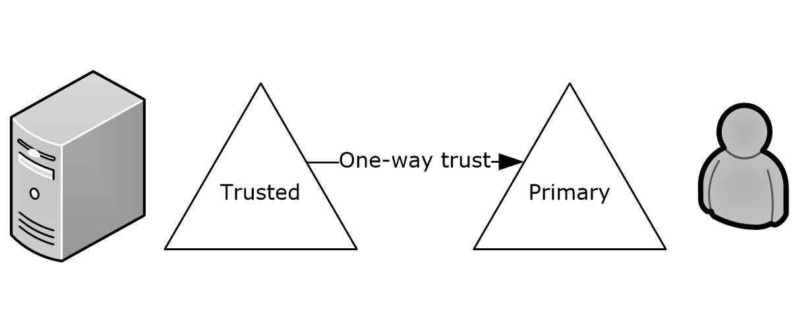

Figure 5: Kerberos protocol usage of keys

There is a one-way trust in place. The referral TGT issued by the primary domain is encrypted based on the key in trustAuthIncoming, not trustAuthOutgoing. This is non-intuitive but fits the definition of an [**inbound trust**](#gt_inbound-trust). This direction of trust allows Kerberos to build a TGT for the trusted domain in the primary domain, fulfilling the definition of an inbound trust.

##### 6.1.6.9.2 Netlogon Usages of Trust Objects

[**Netlogon**](#gt_netlogon) uses information stored in the [**TDO**](#gt_trusted-domain-object-tdo) and the [**interdomain trust account**](#gt_interdomain-trust-account) to establish the secure channel. The way in which the secure channel is established is described in [MS-NRPC](#Section_3.1.1.3.2.14) sections 3.1.1 and 3.1.4.3.

##### 6.1.6.9.3 msDS-TrustForestTrustInfo Attribute

Information about [**trust**](#gt_trust) relationships with other [**forests**](#gt_forest) is stored in [**objects**](#gt_object) of class trustedDomain in the [**domain NC**](#gt_domain-naming-context-domain-nc) [**replica**](#gt_replica) of the forest [**root domain**](#gt_root-domain). Specifically, the msDS-TrustForestTrustInfo [**attribute**](#gt_attribute) on such objects contains information about the trusted forest or realm. The structure of the information contained in this attribute is represented in the following manner.

```mermaid
packet-beta
  0-31: "Version"
  32-63: "RecordCount"
  64-127: "Records (variable)"
```

**Version (4 bytes):** Version of the data structure. The only supported version of the data structure is 1.

**RecordCount (4 bytes):** Number of records present in the data structure.

**Records (variable):** Variable-length records each containing a specific type of data about the forest trust relationship.

**IMPORTANT NOTE:** Records are not aligned to 32-bit boundaries. Each record starts at the next byte after the previous record ends.

Each record is represented as described in section [6.1.6.9.3.1](#Section_6.1.6.9.3.1).

**Note** All fields have little-endian byte ordering.

###### 6.1.6.9.3.1 Record

Each Record is represented in the following manner.

```mermaid
packet-beta
  0-31: "RecordLen"
  32-63: "Flags"
  64-127: "Timestamp"
  128-135: "RecordType"
  136-223: "ForestTrustData (variable)"
```

**RecordLen (4 bytes):** Length, in bytes, of the entire record, not including **RecordLen**.

**Flags (4 bytes):** Individual bit flags that control how the [**forest**](#gt_forest) [**trust**](#gt_trust) information in this record can be used.

If RecordType = 0 or 1, the **Flags** field, represented here in [**big-endian**](#gt_big-endian) byte order, can have one or more of the following bits.

```mermaid
packet-beta
  0-0: "X"
  1-1: "X"
  2-2: "X"
  3-3: "X"
  4-4: "X"
  5-5: "X"
  6-6: "X"
  7-7: "X"
  8-8: "X"
  9-9: "X"
  10-10: "X"
  11-11: "X"
  12-12: "X"
  13-13: "X"
  14-14: "X"
  15-15: "X"
  16-16: "X"
  17-17: "X"
  18-18: "X"
  19-19: "X"
  20-20: "X"
  21-21: "X"
  22-22: "X"
  23-23: "X"
  24-24: "X"
  25-25: "X"
  26-26: "X"
  27-27: "X"
  28-28: "X"
  29-29: "TDC"
  30-30: "TDA"
  31-31: "TDN"
```

**X:** Unused. Must be zero and ignored.

**TDN (LSA_TLN_DISABLED_NEW, 0x00000001):** [**Entry**](#gt_entry) is not yet enabled.

**TDA (LSA_TLN_DISABLED_ADMIN, 0x00000002):** Entry is disabled by administrator.

**TDC (LSA_TLN_DISABLED_CONFLICT, 0x00000004):** Entry is disabled due to a conflict with another trusted [**domain**](#gt_domain).

If RecordType = 2, the **Flags** field, represented here in big-endian byte order, can have one or more of the following bits.

```mermaid
packet-beta
  0-0: "X"
  1-1: "X"
  2-2: "X"
  3-3: "X"
  4-4: "X"
  5-5: "X"
  6-6: "X"
  7-7: "X"
  8-8: "X"
  9-9: "X"
  10-10: "X"
  11-11: "X"
  12-12: "X"
  13-13: "X"
  14-14: "X"
  15-15: "X"
  16-16: "X"
  17-17: "X"
  18-18: "X"
  19-19: "X"
  20-20: "X"
  21-21: "X"
  22-22: "X"
  23-23: "X"
  24-24: "X"
  25-25: "X"
  26-26: "X"
  27-27: "X"
  28-28: "N D C"
  29-29: "N D A"
  30-30: "S D C"
  31-31: "S D A"
```

**SDA (LSA_SID_DISABLED_ADMIN, 0x00000001):** Entry is disabled for [**SID**](#gt_security-identifier-sid), [**NetBIOS**](#gt_netbios), and [**DNS name**](#gt_dns-name)–based matches by the administrator.

**SDC (LSA_SID_DISABLED_CONFLICT, 0x00000002):** Entry is disabled for SID, NetBIOS, and DNS name–based matches due to a SID or DNS name–based conflict with another trusted domain.

**NDA (LSA_NB_DISABLED_ADMIN, 0x00000004):** Entry is disabled for NetBIOS name–based matches by the administrator.

**NDC (LSA_NB_DISABLED_CONFLICT, 0x00000008):** Entry is disabled for NetBIOS name–based matches due to a [**NetBIOS domain name**](#gt_netbios-domain-name) conflict with another trusted domain.

For RecordType = 2, NETBIOS_DISABLED_MASK is defined as a mask on the lower 4 bits of the Flags field.

For all record types, LSA_FTRECORD_DISABLED_REASONS is defined as a mask on the lower 16 bits of the Flags field. Unused bits covered by the mask are reserved for future use.

**Timestamp (8 bytes):** 64-bit timestamp value indicating when this entry was created, in system time (see the FILETIME structure in [MS-DTYP](../MS-DTYP/MS-DTYP.md) section 2.3.3).

**RecordType (1 byte):** 8-bit value specifying the type of record contained in this specific entry. The structure of the content in the next field depends on this value. The current version of the protocol defines the behavior of the next field **ForestTrustData** if the value of **RecordType** is one of the five values below.

| Name | Value |
| --- | --- |
| ForestTrustTopLevelName | 0 |
| ForestTrustTopLevelNameEx | 1 |
| ForestTrustDomainInfo | 2 |
| ForestTrustBinaryInfo | 3 |
| ForestTrustScannerInfo | 4 |

**Note:** The **ForestTrustBinaryInfo** and **ForestTrustScannerInfo** record types are also supported in Windows 11 v22H2 and later.

**ForestTrustData (variable):** Variable-length type-specific record, depending on the RecordType value, containing a specific type of data about the forest trust relationship.

**IMPORTANT NOTE:** The type-specific ForestTrustData record is not necessarily aligned to a 32-bit boundary. Each record starts at the byte following the RecordType field.

There are three different type-specific records. Depending on the value of the RecordType field, the structure of the type-specific record differs as follows:

- If RecordType = ForestTrustTopLevelName or RecordType = ForestTrustTopLevelNameEx, then the type-specific record is represented in the following manner.
```mermaid
packet-beta
  0-31: "NameLen"
  32-95: "Name (variable)"
```

**NameLen:** Length, in bytes, of the following **Name** field.

**Name (variable):** The [**top level name (TLN)**](#gt_top-level-name-tln) of the trusted forest, in [**UTF-8**](#gt_utf-8) format.

- If RecordType = ForestTrustDomainInfo, then the type-specific record is represented in the following manner. Note that the record contains the following structures one after another. It is important to note here that none of the data shown is necessarily aligned to 32-bit boundaries.
```mermaid
packet-beta
  0-31: "SidLen"
  32-95: "Sid (variable)"
  96-127: "DnsNameLen"
  128-191: "DnsName (variable)"
  192-223: "NetbiosNameLen"
  224-287: "NetbiosName (variable)"
```

**SidLen:** Length, in bytes, of the following **Sid** field.

**Sid:** The SID of a domain in the trusted forest, specified as a SID structure, which is defined in [MS-DTYP] section 2.4.2.

**DnsNameLen:** Length, in bytes, of the following **DnsName** field.

**DnsName:** The DNS name of a domain in the trusted forest, in UTF-8 format.

**NetbiosNameLen:** Length, in bytes, of the following NetbiosName field.

**NetbiosName:** The NetBIOS name of a domain in the trusted forest, in UTF-8 format.

- If RecordType = ForestTrustScannerInfo, then the type-specific record is represented in the following manner. Note that the record contains the following structures one after another. It is important to note here that none of the data shown is necessarily aligned to 32-bit boundaries.
```mermaid
packet-beta
  0-31: "BinaryDataLen"
  32-39: "SubRecordType"
  40-71: "SidLen"
  72-127: "Sid (variable)"
  128-159: "DnsNameLen"
  160-223: "DnsName (variable)"
  224-255: "NetbiosNameLen"
  256-319: "NetbiosName (variable)"
```

**BinaryDataLen:** Length, in bytes, of all remaining fields.

**SubRecordType:** MUST be ForestTrustScannerInfo.

**SidLen:** Length, in bytes, of the following **Sid** field. It is valid for this field to be zero which means that the **Sid** field is interpreted as empty.

**Sid:** The SID of a domain in the trusted forest, specified as a SID structure, which is defined in [MS-DTYP] section 2.4.2.

**DnsNameLen:** Length, in bytes, of the following **DnsName** field.

**DnsName:** The DNS name of a domain in the trusted forest, in UTF-8 format.

**NetbiosNameLen:** Length, in bytes, of the following NetbiosName field.

**NetbiosName:** The NetBIOS name of a domain in the trusted forest, in UTF-8 format.

- If RecordType is ForestTrustBinaryInfo or is not one of the other preceding values, the current version of the protocol does not define the behavior for the record data. The type-specific record is represented in the following manner.
```mermaid
packet-beta
  0-31: "BinaryDataLen"
  32-39: "SubRecordType"
  40-95: "BinaryData (variable)"
```

**BinaryDataLen:** Length, in bytes, of the following **BinaryData** field.

**SubRecordType:** An 8-bit value specifying the type of record contained in this specific entry.

**BinaryData:** The record data. If the **BinarydataLen** field has a value other than 0, this field MUST NOT be NULL.

###### 6.1.6.9.3.2 Building Well-Formed msDS-TrustForestTrustInfo Messages

The msDS-TrustForestTrustInfo [**attribute**](#gt_attribute) contains a String(Octet) with the data structures specified in the preceding sections. This attribute contains information about the namespaces that are served by a given [**trusted**](#gt_trust) [**forest**](#gt_forest). For example, if forest a.com contains the [**domains**](#gt_domain) a.com, b.a.com, and c.a.com, then the msDS-TrustForestTrustInfo for a.com would contain the [**FQDN (2)**](#gt_fully-qualified-domain-name-fqdn) and [**NetBIOS**](#gt_netbios) names for each domain, as well as the [**SID**](#gt_security-identifier-sid) space served by each domain. This section details the rules that well-formed msDS-TrustForestTrustInfo messages MUST follow.

The msDS-TrustForestTrustInfo attribute is written on the [**PDC**](#gt_primary-domain-controller-pdc) for the trusting and trusted domains. Both the trusted and trusting forest have [**forest functional level**](#gt_forest-functional-level) DS_BEHAVIOR_WIN2003 or greater.

Some concepts are necessary to understand the algorithm that is used when validating this attribute.

**Namespaces**

Namespaces are meant to represent those NetBIOS, FQDN (2), or SID values that a trusted forest or domain [**claims**](#gt_claim).

[**Top Level Names (TLNs)**](#gt_top-level-name-tln)

TLNs are an important concept when detecting and resolving conflicts in namespaces between different [**TDOs**](#gt_trusted-domain-object-tdo), and for determining which forest owns a given namespace. A TLN really corresponds to a forest namespace, and in order to be enabled, the TLN MUST be unique among all TDOs. For example, the TLN for the forest example.com is example.com. Note that it is possible that the forest example.com could have another domain corresponding to an entirely different TLN (for example, mailservers.com), in which case two TLNs would need to be registered for the example.com forest. TLNs for a TDO are stored in records identified by the ForestTrustTopLevelName Record Type.

TLNs that MUST be excluded from a namespace are identified by the ForestTrustTopLevelNameEx RecordType. Exclusion becomes necessary if the namespaces of two forests collide (for example, the forests corp.mycompany.com and the forest hr.corp.mycompany.com). These exclusions are set administratively to ensure proper functioning of the domain.

**Superior/Subordinate Namespaces**

When evaluating all forest trusts, TLNs are expressed as FQDNs (2). Parsing the FQDN (2) allows the concept of superior and subordinate namespaces. For example, for the namespace sample.example.com, the superior namespace (and the TLN) is example.com. Similarly, the sample.example.com namespace is subordinate to the example.com namespace. This allows the routing mechanism to understand that the name sample.example.com is associated with the example.com namespace expressed in the TLN, as it is a subordinate.

**Enabled Records vs. Disabled Records**

During validation of the Records stored in the msDS-ForestTrustForestInfo, it is possible to have TLN or namespace conflicts. In these circumstances, the conflicting record is disabled. Namespace conflicts are determined using the Record Flags specified in the msDS-ForestTrustInfo data format definitions.

- ForestTrustTopLevelName RecordType (0)
If the TDN / TDA / TDC Flags are present, then the name that is present in the TLN and its subordinate namespaces (as well as all domains whose FQDNs (2) are equal to or subordinate to the TLN) is not used for routing names or SIDs.

- ForestTrustTopLevelNameEx RecordType (1)
If the TDN / TDA / TDC Flags are present, then the name that is present in the exclusion TLN is not used for exclusion purposes, and conflicts will be unresolved. All domains whose FQDNs (2) are equal to or subordinate to the exclusion TLN are not used for routing names or SIDs.

- ForestTrustDomainInfo RecordType (2)
If the NDC or NDA Flags are set, then the NetBIOS name is excluded from routing for the NetBIOS name.

If the SDA or SDC Flags are set, then the entire domain and all domains whose FQDN (2) names are subordinate to the FQDN (2) name of that domain are excluded from name routing by SID, FQDN (2), or NetBIOS names. The entire subtree of the forest that is rooted at the affected domain is effectively not computed in the trust [**domain name**](#gt_domain-name) mappings.

**msDS-TrustForestTrustInfo Validation**

When the TDO information for a domain is added or changed, or if the [**DC**](#gt_domain-controller-dc) possessing the PDC [**FSMO role**](#gt_fsmo-role) in the [**root domain**](#gt_root-domain) of the forest is freshly started, every TDO with msDS-ForestTrustInfo attributes is validated against all other TDOs. The results of that validation are then rewritten to the DS and replicated to the other DCs in the domain. DCs that do not own the PDC FSMO role treat the attribute as READONLY and internally consistent.

Validation of the matrix of trusted domains and trusted forest information stored in msDS-ForestTrustInfo includes a mechanism to prevent name collisions. Manipulations of this attribute ensure that each namespace is only assigned to a single TDO. If any of the following rules are violated, the colliding RecordFlag is marked as disabled.

The rules for determining whether namespaces collide for ForestTrustDomainInfo Records are as follows:

- Each SID corresponding to a domain in a trusted forest is unique among all TDOs and among all of the SIDs listed within the ForestTrustData Records. If not, the Record MUST have the SDC bit in the Record Flags.
- Each SID for each domain in a trusted forest does not equal any SIDs within the domains of the local forest. If not, the Record MUST have the SDC bit in the Record Flags.
- Each FQDN (2) corresponding to a domain in a trusted forest is unique among all TDOs and among all of the FQDNs (2) and TLNs listed within the ForestTrustData Records. If not, the Record MUST have the SDC bit in the Record Flags.
- Each FQDN (2) for each domain in the trusted forest does not correspond to any FQDNs (2) within the domains from the local forest. If not, the Record MUST have the SDC bit in the Record Flags.
- Each [**NetBIOS domain name**](#gt_netbios-domain-name) corresponding to a domain in a trusted forest is unique among all TDOs and among all of the NetBIOS domains listed within the Forest Trust Data records. If not, the Record MUST have the NDC bit in the Record Flags. For conflict resolution, the TDO with the alphabetically longest name is disabled.
- Each NetBIOS name for each domain in the trusted forest does not equal any NetBIOS domain name within the domains of the local forest. If not, the Record MUST have the NDC bit in the Record Flags. Local forest NetBIOS names always take precedence over those of trusted forests.
The rules for determining whether namespaces collide for ForestTrustTopLevelName Records are as follows:

- Each TLN corresponding to a domain in a trusted forest is unique among all TDOs, and among all of the FQDNs (2) and TLNs listed within the Forest Trust Data records. If not, the conflicting Record has the TDC bit in the Record Flags. For the sake of consistency, since the two TLNs are equal, the first TLN Record that is read is authoritative, and subsequent conflicting Records are disabled.
- Each TLN for each domain in the trusted forest does not correspond to any FQDNs (2) within the domains from the local forest. If not, the Record has the TDC bit in the Record Flags.
ForestTrustTopLevelNameEx Records, by definition, cannot conflict.

Additionally, additions to msDS-TrustForestTrustInfo pass namespace consistency checks before the attribute is set. Any failures in the consistency checks cause the attempt to modify the msDS-TrustForestTrustInfo to fail. The following rules dictate the requirements that each trusted forest MUST match:

- At least one ForestTrustTopLevelName TLN Record is specified for each msDS-TrustForestTrustInfo. It is possible for a forest to have more than one TLN if it contains additional TLNs.
- All domains listed in the ForestTrustDomainInfo for a TDO are subordinate to the TLNs for that TDO.
- All domains listed in the ForestTrustDomainInfo are not subordinate or superior to other TLNs unless an exclusion record for that TLN or domain is registered.
If all of the preceding tests pass, then the [**entry**](#gt_entry) is written in binary format to the msDS-ForestTrustInfo, replicated, and honored by all DCs in the forest.

##### 6.1.6.9.4 Computation of trustPosixOffset

When a new [**TDO**](#gt_trusted-domain-object-tdo) is created, a POSIX offset is computed and assigned to the new TDO's trustPosixOffset [**attribute**](#gt_attribute). This is done by retrieving the values of the trustPosixOffset attribute of all of the existing outgoing Windows [**trusts**](#gt_trust) (both TRUST_TYPE_UPLEVEL and TRUST_TYPE_DOWNLEVEL). These values are then sorted. Finally, the range of numbers is searched starting from 1, looking for the next unused valid POSIX offset. The selection process excludes the following values, which are reserved for well-known identities.

| Value | Description |
| --- | --- |
| 0x0800 | Reserved for [**built-in domain**](#gt_built-in-domain) |
| 0x4000 | Reserved for [**account domain**](#gt_account-domain) |
| 0xC000 | Reserved for primary [**domain**](#gt_domain) |

The selection process only happens on the [**DC**](#gt_domain-controller-dc) that possesses the [**PDC**](#gt_primary-domain-controller-pdc) [**FSMO role**](#gt_fsmo-role). If the trust creation happens on another DC the trustPosixOffset value is set to 0 and is computed using the logic above when the TDO replicates to the PDC [**FSMO role owner**](#gt_fsmo-role-owner). This keeps TDOs from having matching POSIX offsets, which could result in collisions of UIDS and GIDS.

##### 6.1.6.9.5 Mapping Logon SIDs to POSIX Identifiers

Logon [**SIDs**](#gt_security-identifier-sid) are assigned by the Windows logon process for each logon session and have the form S-1-5-5-X-Y, where X and Y are treated as a single LARGE_INTEGER that is incremented for each logon session. POSIX offsets, as described in section [6.1.6.7.14](#Section_6.1.6.7.14), are not used during the logon SID to POSIX identifier mapping process. These SIDs are mapped to the constant POSIX ID 0xFFF.

##### 6.1.6.9.6 Timers

###### 6.1.6.9.6.1 Trust Secret Cycling

The keys used to validate [**trusts**](#gt_trust) periodically expire (typically every 30 days). This is performed by the [**Netlogon**](#gt_netlogon) service, which performs this operation when establishing the Secure Channel. Resetting the secure channel secret is discussed in [MS-NRPC](#Section_3.1.1.3.2.14) section 3.5.4.4.6.

###### 6.1.6.9.6.2 PDC Forest Trust Scanning

The PDC emulator FSMO role DC will periodically query and store information about trusting forests. See section [3.1.1.6.4](#Section_3.1.1.6.4).

##### 6.1.6.9.7 Initialization

Despite being replicated normally between peer [**DCs**](#gt_domain-controller-dc) in a [**domain**](#gt_domain), the process of creating or manipulating [**TDOs**](#gt_trusted-domain-object-tdo) is specifically restricted to the LSA Policy APIs, as detailed in [MS-LSAD](#Section_5) section 3.1.1.5. Unlike other [**objects**](#gt_object) in the DS, TDOs cannot be created or modified by client machines over the LDAPv3 transport. TDOs can be deleted by client machines over the LDAPv3 transport.

The following [**trust**](#gt_trust) manipulation [**remote procedure calls**](#gt_remote-procedure-call-rpc) specifically target TDOs and are responsible for creating the special properties detailed in section [6.1.6.7](../MS-LSAD/MS-LSAD.md). All are documented in [MS-LSAD] section 3.1.4.

- LsarCreateTrustedDomainEx()
- LsarDeleteTrustedDomain()
- LsarSetTrustedDomainInfoByName()
- LsarSetTrustedDomainInformation()
The preceding APIs enforce the following restrictions.

Each TDO corresponds to exactly one trusted domain. The [**FQDN (2)**](#gt_fully-qualified-domain-name-fqdn), [**SID**](#gt_security-identifier-sid), and [**NetBIOS**](#gt_netbios) name set on the TDO all reference the same domain.

The server verifies that the trust is pointing either to a domain within the [**forest**](#gt_forest) or a domain outside the forest. The check is performed by verifying whether any other domain within the forest has the SID, [**DNS name**](#gt_dns-name), or NetBIOS name matching the information being set. One of two options is legal:

- SID, DNS name, and NetBIOS name all match the same domain within the forest.
- No SID, DNS name, or NetBIOS name matches any domain within the forest.
Any other alternative (some information pointing inside the forest and some outside, or information pointing at different domains within the forest) is illegal and causes the server to fail the request.

An attempt by the requester to set the TRUST_ATTRIBUTE_FOREST_TRANSITIVE bit in the trust [**attributes**](#gt_attribute) of the trusted domain object can only succeed if the domain is in a [**forest functional level**](#gt_forest-functional-level) of DS_BEHAVIOR_WIN2003 or greater and the server is a domain controller in the [**root domain**](#gt_root-domain) of the forest. Failing this, the server rejects the request and does not create the TDO.

An attempt by the requester to set the TRUST_ATTRIBUTE_CROSS_ORGANIZATION bit in the trust attributes of the trusted domain object can only succeed if the domain is in a forest functional level of DS_BEHAVIOR_WIN2003 or greater. Failing this, the server rejects the request and does not create the TDO.

Neither TRUST_ATTRIBUTE_FOREST_TRANSITIVE nor TRUST_ATTRIBUTE_CROSS_ORGANIZATION bits are compatible with the TRUST_ATTRIBUTE_WITHIN_FOREST bit. The server rejects invalid combinations of trust attributes and does not create the TDO.

[**Uplevel**](#gt_uplevel-trust) or [**downlevel trusts**](#gt_downlevel-trust) that have TRUST_DIRECTION_OUTBOUND as one of the direction bits cannot have a SID of NULL. Attempts to set this combination of parameters cause the server to fail the request.

If the TRUST_ATTRIBUTE_FOREST_TRANSITIVE bit is cleared from a TDO's trustAttributes attribute, all of the forest trust information on that TDO is removed from the TDO's msDS-TrustForestTrustInfo attribute.

#### 6.1.6.10 Security Considerations for Implementers

Mechanisms of [**trust**](#gt_trust) depend on secure initialization. [MS-LSAD](#Section_5) describes the secure trust creation system that is used by [**Active Directory**](#gt_active-directory). In this system, all creation and manipulation of [**TDOs**](#gt_trusted-domain-object-tdo) takes place over a secure session transport, where the client has been authenticated, and sensitive trust information is not sent in the clear. Keys used for [**trust secrets**](#gt_trust-secret) are sufficiently strong to disallow brute force attacks on the cryptographic material used in cross-domain protocols.

### 6.1.7 DynamicObject Requirements

[**Dynamic objects**](#gt_dynamic-object) are [**objects**](#gt_object) that are automatically deleted after a period of time. They are distinguished by the presence of the dynamicObject [**auxiliary class**](#gt_auxiliary-object-class) among their objectClass values. The intended time of deletion is specified by the msDS-Entry-Time-To-Die [**attribute**](#gt_attribute).

The following requirements apply to dynamic objects:

- All of the dynamic object's descendants are dynamic objects.
- A dynamic object MUST be garbage collected when all of the following conditions are TRUE:
- The current time value is greater than or equal to its msDS-Entry-Time-To-Die attribute value.
- It has no descendants.
- If a dynamic object has descendent objects and the msDS-Entry-Time-To-Die of the dynamic object is earlier than msDS-Entry-Time-To-Die of its descendant, then the [**DC**](#gt_domain-controller-dc) MUST [**update**](#gt_update) the msDS-Entry-Time-To-Die of the object to be greater than the maximum msDS-Entry-Time-To-Die of its descendants. This update MUST occur before the current time reaches its original msDS-Entry-Time-To-Die value.
- [**NC replicas**](#gt_nc-replica) do not contain objects with linked attribute values referencing deleted dynamic objects. In other words, when a dynamic object is deleted, any linked attribute values on other objects referencing it are removed.
- If any NC replicas contain other objects with nonlinked attribute values referencing deleted dynamic objects, those attribute values on those objects are retained. In other words, when a dynamic object is deleted, any nonlinked attribute values on other objects referencing it are not removed.
- The value of the entryTTL [**constructed attribute**](#gt_constructed-attribute) is specified in section [3.1.1.4.5.12](#Section_3.1.1.4.5.12).

## 6.2 Knowledge Consistency Checker

A server running [**Active Directory**](#gt_active-directory) is part of a distributed system that performs [**replication**](#gt_replication). The [**Knowledge Consistency Checker (KCC)**](#gt_knowledge-consistency-checker-kcc) is a component that reduces the administrative burden of maintaining a functioning replication topology. Additional background is provided in section [3.1.1.1.13](#Section_3.1.1.1.13).

### 6.2.1 References

- DRS options bits: [MS-DRSR](../MS-DRSR/MS-DRSR.md) section 5.41.
- instanceType bits: [MS-DRSR] section 5.91.
- repsFrom abstract attribute: [MS-DRSR] section 5.172.
- repsTo abstract attribute: [MS-DRSR] section 5.173.
- replUpToDateVector abstract attribute: [MS-DRSR] section 5.166.
- kCCFailedConnections and kCCFailedLinks variables: [MS-DRSR] sections 5.111 and 5.112.
- IDL_DRSGetNCChanges method: [MS-DRSR] section 4.1.10.
- IDL_DRSReplicaAdd method: [MS-DRSR] section 4.1.19.
- IDL_DRSReplicaDel method: [MS-DRSR] section 4.1.20.
- IDL_DRSReplicaModify method: [MS-DRSR] section 4.1.22.
- IDL_DRSExecuteKCC method: [MS-DRSR] section 4.1.6.
- DWORD, [**GUID**](#gt_globally-unique-identifier-guid) types: [MS-DTYP](../MS-DTYP/MS-DTYP.md) sections 2.2 and 2.3.4.
- AmIRODC method: [MS-DRSR] section 5.7.

### 6.2.2 Overview

The [**KCC**](#gt_knowledge-consistency-checker-kcc) automates management of the [**NC replica graph**](#gt_nc-replica-graph) for each [**NC**](#gt_naming-context-nc) in the [**forest**](#gt_forest). In doing so, it maintains the following requirements:

- There exists a path from each writable [**replica**](#gt_replica) to every other [**NC replica**](#gt_nc-replica) (writable, read-only full, or read-only partial) of the same NC.
- No path from a writable replica to another writable replica passes through a read-only replica.
- For each [**domain NC**](#gt_domain-naming-context-domain-nc), the path from a writable replica to another writable replica utilizes only the [**RPC transport**](#gt_rpc-transport) (never [**SMTP**](#gt_simple-mail-transfer-protocol-smtp) [MS-SRPL](../MS-SRPL/MS-SRPL.md)).
- For each domain NC, the path from a writable replica to a read-only full replica utilizes only the RPC transport (never SMTP [MS-SRPL]).
- [**Replication latency**](#gt_replication-latency) is short between NC replicas on [**DCs**](#gt_domain-controller-dc) in the same [**site**](#gt_site), at the expense of additional [**replication**](#gt_replication) traffic within the site.
- Replication traffic between sites is low, at the expense of additional replication latency between sites.
- A state in which one or more DCs are offline or unreachable (temporarily or indefinitely) does not cause the replication latency across the remaining DCs to grow without bound.
- Edges between DCs in different sites constitute a least cost spanning tree for an administrator-defined cost metric.
The KCC performs this work in a sequence of tasks called a "run". These runs execute periodically and on receipt of an IDL_DRSExecuteKCC request. The first periodic run of the Windows KCC begins 5 minutes after system startup. Subsequent runs execute such that the interval between the end of one run and the beginning of the next run is 15 minutes.

These tasks utilize the following inputs:

- Config NC [**objects**](#gt_object): crossRef, interSiteTransport, nTDSDSA, nTDSConnection, site, nTDSSiteSettings, siteLink, siteLinkBridge
- Abstract [**attributes**](#gt_attribute) of NC replicas: repsFrom, repsTo
- Variables of DCs: kCCFailedConnections, kCCFailedLinks
- Current date/time
And produce or [**update**](#gt_update) the following:

- Config NC objects: nTDSConnection
- Abstract attributes of NC replicas: repsFrom, repsTo
- Variables of DCs: kCCFailedConnections, kCCFailedLinks
The KCC individual tasks are detailed in the remainder of this section, and are executed in the sequence in which they appear in this document. In summary, these tasks are:

- Refresh kCCFailedLinks and kCCFailedConnections.
- Create intra-site connections.
- Create inter-site connections.
- Remove unnecessary connections.
- Translate connections.
- Remove unnecessary kCCFailedLinks and kCCFailedConnections.
To simplify the task descriptions, the following concepts are used:

- An NC replica that "is present" on a DC. Given NC replica *r* of NC *n* and a DC with nTDSDSA object *o*, *r* "is present" on the DC if both of the following conditions is TRUE:
- *o*!hasMasterNCs contains *n* or *o*!msDS-hasFullReplicaNCs contains *n* or *o*!hasPartialReplicaNCs contains *n*.
- One of the following two conditions is TRUE:
- *o*!msDS-HasInstantiatedNCs contains no value *v* where the [**dsname**](#gt_dsname) portion of *v* = *n*. (In this case *n* is in the process of being instantiated.)
- *o*!msDS-HasInstantiatedNCs contains a value *v*, where the dsname part of *v* = *n*, and the binary part of *v* (DWORD in [**big-endian**](#gt_big-endian) byte order) is an integer such that the IT_NC_GOING bit is clear. (In this case *n* is instantiated, and is not in the process of being uninstantiated.)
- An NC replica that "SHOULD be present" on a DC. Given NC replica *r* of NC *n* and a DC with nTDSDSA object *o*, *r* "SHOULD be present" on the DC if *r* is one of the following:
- A writable replica of the [**config NC**](#gt_configuration-naming-context-config-nc), the [**schema NC**](#gt_schema-naming-context-schema-nc), or the DC's [**default NC**](#gt_default-naming-context-default-nc) on a writable DC.
- A full read-only replica of the config NC, the schema NC, or the DC's default NC on an [**RODC**](#gt_read-only-domain-controller-rodc).
- A writable replica of an [**application NC**](#gt_application-nc) for which there exists a crossRef object *cr* such that *cr*!nCName = *n* and *cr*!msDS-NC-Replica-Locations contains a reference to *o*.
- A full read-only replica of an application NC for which there exists a crossRef object *cr* such that *cr*!nCName = *n* and *cr.ms-DS-NC-RO-Replica-Locations* contains a reference to *o*.
- If the DC is a [**GC server**](#gt_global-catalog-server-gc-server) (that is, if bit NTDSDSA_OPT_IS_GC is set in *o*!options), a partial replica of a domain NC *n* such that *n* ≠ the DC's default NC, and there exists a crossRef object *cr* such that *cr*!nCName = *n*.
- An nTDSConnection object "implies" a tuple in the repsFrom abstract attribute of an NC replica (and a corresponding edge in an NC replica graph). An nTDSConnection object *cn* implies a tuple in *r*!repsFrom for NC replica *r* of NC *n* on the DC with nTDSDSA object *t*, if each of the following is TRUE:
- *cn* is a child of *t*.
- *cn*!fromServer references an nTDSDSA object *s*.
- An NC replica of *n* "is present" on *s*.
- *r* "SHOULD be present" on *t*.
- The NC replica on *s* is a full replica or *r* is a partial replica.
- *n* is not a domain NC, or *r* is a partial replica, or *cn*!transportType has no value, or *cn*!transportType has an [**RDN**](#gt_relative-distinguished-name-rdn) of CN=IP.

#### 6.2.2.1 Refresh kCCFailedLinks and kCCFailedConnections

This task refreshes and reconciles the contents of the *kCCFailedLinks* and *kCCFailedConnections* variables.

The [**KCC**](#gt_knowledge-consistency-checker-kcc) [**updates**](#gt_update) *kCCFailedLinks* by inspecting the repsFrom abstract [**attribute**](#gt_attribute) associated with each [**NC replica**](#gt_nc-replica) on the [**local DC**](#gt_local-domain-controller-local-dc). It first resets the *FailureCount* of each tuple in *kCCFailedLinks* to 0. Then, for each NC replica *r*, for each tuple *rf* in *r*!repsFrom, if *rf.consecutiveFailures* > 0:

- If a tuple *f* exists in *kCCFailedLinks* such that *f.UUIDDsa* = *rf.uuidDsa* and *f.FailureCount* ≠ 0:
- Set *f.FailureCount* to MAX(*f.FailureCount*, *rf.consecutiveFailures*)
- Set *f.TimeFirstFailure* to MIN(*f.TimeFirstFailure*, *rf.timeLastSuccess*)
- Set *f.LastResult* to *rf.resultLastAttempt*
- If a tuple *f* exists in *kCCFailedLinks* such that *f.UUIDDsa* = *rf.uuidDsa* and *f.FailureCount* = 0:
- Set *f.FailureCount* to *rf.consecutiveFailures*
- Set *f.TimeFirstFailure* to *rf.timeLastSuccess*
- Set *f.LastResult* to *rf.resultLastAttempt*
- If no tuple *f* exists in *kCCFailedLinks* such that *f.UUIDDsa* = *rf.uuidDsa*, add tuple *g* to *kCCFailedLinks* such that:
- *g.UUIDDsa* = *rf.uuidDsa*
- *g.FailureCount* = *rf.consecutiveFailures*
- *g.TimeFirstFailure = rf.timeLastSuccess*
- *g.LastResult = rf.resultLastAttempt*
For each tuple *k* in *kCCFailedConnections*, the KCC attempts to connect to that [**DC**](#gt_domain-controller-dc) by calling the IDL_DRSBind method. If the method call is successful, the KCC removes *k* from *kCCFailedConnections*. Otherwise, it increments *k.FailureCount* by 1.

#### 6.2.2.2 Intrasite Connection Creation

This task computes an [**NC replica graph**](#gt_nc-replica-graph) for each [**NC replica**](#gt_nc-replica) that "SHOULD be present" on the [**local DC**](#gt_local-domain-controller-local-dc). Then for each edge of the graph directed to an NC replica on the local DC, the [**KCC**](#gt_knowledge-consistency-checker-kcc) reconciles its portion of the NC replica graph by creating an nTDSConnection [**object**](#gt_object) to "imply" that edge if one does not already exist.

If the [**site**](#gt_site) of the local DC has a [**site settings object**](#gt_site-settings-object) *o* and the NTDSSETTINGS_OPT_IS_AUTO_TOPOLOGY_DISABLED bit is set in *o*!options, the KCC skips this task.

For each [**NC**](#gt_naming-context-nc) *x* for which an NC replica "SHOULD be present" on the local DC, the KCC constructs an NC replica graph as follows:

- Let *R* be a sequence containing each writable [**replica**](#gt_replica) *f* of *x* such that *f* "is present" on a [**DC**](#gt_domain-controller-dc) *s* satisfying the following criteria:
- *s* is a writable DC other than the local DC.
- *s* is in the same site as the local DC.
- If *x* is a read-only full replica and *x* is a [**domain NC**](#gt_domain-naming-context-domain-nc), then the DC's functional level is at least DS_BEHAVIOR_WIN2008.
- Bit NTDSSETTINGS_OPT_IS_TOPL_DETECT_STALE_DISABLED is set in the options [**attribute**](#gt_attribute) of the site settings object for the local DC's site, or no tuple *z* exists in the *kCCFailedLinks* or *kCCFailedConnections* variables such that *z.UUIDDsa* is the objectGUID of the nTDSDSA object for *s*, *z.FailureCount* > 0, and the current time - *z.TimeFirstFailure* > 2 hours.
- If a partial (not full) replica of *x* "SHOULD be present" on the local DC, append to *R* each partial replica *p* of *x* such that *p* "is present" on a DC *s* satisfying the same criteria defined above for full replica DCs.
- Append to *R* the NC replica that "SHOULD be present" on the local DC.
- Sort *R* in order of the value of the objectGUID attribute of the corresponding DC's nTDSDSA object. Let *r*i be the *i*'th NC replica in *R*, where 0 ≤ *i* < |*R*|.
- Add a node for each *r*i to the NC replica graph.
- Add an edge from *r*i to *r*i+1 for each 0 ≤ *i* < |*R*|-1 if *r*i is a full replica or *r*i+1 is a partial replica.
- Add an edge from *r*i+1 to *r*i for each 0 ≤ *i* < |*R*|-1 if *r*i+1 is a full replica or *r*i is a partial replica.
- Add an edge from *r*|R|-1 to *r*0 if *r*|R|-1 is a full replica or *r*0 is a partial replica.
- Add an edge from *r*0 to *r*|R|-1 if *r*0 is a full replica or *r*|R|-1 is a partial replica.
The KCC can create additional edges, but does not create more than 50 edges directed to a single DC. To optimize [**replication latency**](#gt_replication-latency) in sites with many NC replicas, the Windows KCC determines that each ri SHOULD have n+2 total edges directed to it such that n is the smallest non-negative integer satisfying |R| ≤ 2n2 + 6n + 7. For each existing nTDSConnection object implying an edge from rj of R to ri such that j ≠ i, an edge from rj to ri is not already in the graph, and the total edges directed to ri is less than n+2, the KCC adds that edge to the graph. The KCC then adds new edges directed to ri to bring the total edges to n+2, where the NC replica rk of R from which the edge is directed is chosen at random such that k ≠ i and an edge from rk to ri is not already in the graph.

For each edge directed to the NC replica that "SHOULD be present" on the local DC, the KCC determines whether an object *c* exists such that:

- *c* is a child of the local DC's nTDSDSA object.
- *c*!objectCategory = nTDSConnection
- Given the NC replica *r*i from which the edge is directed, *c*!fromServer is the [**dsname**](#gt_dsname) of the nTDSDSA object of the DC on which *r*i "is present".
- *c*!options does not contain NTDSCONN_OPT_RODC_TOPOLOGY
If no such object *c* exists, the KCC adds an object *c* to the local DC's NC replica of the [**config NC**](#gt_configuration-naming-context-config-nc) such that it satisfies the above criteria and has the following additional attributes:

- *c*!objectClass contains nTDSConnection
- *c*!enabledConnection = TRUE
- *c*!options = NTDSCONN_OPT_IS_GENERATED
- *c*!systemFlags = FLAG_CONFIG_ALLOW_RENAME + FLAG_CONFIG_ALLOW_MOVE
- *c*!schedule = *z* : SCHEDULE, such that:
- *z.Size* = 188
- *z.Bandwidth* = 0
- *z.NumberOfSchedules* = 1
- *z.Schedules[0].Type* = 0
- *z.Schedules[0].Offset* = 20
- Byte offset 20 from *z* begins a stream of 168 bytes with value 0x01.
If the DC is a [**GC server**](#gt_global-catalog-server-gc-server), the KCC constructs an additional NC replica graph (and creates nTDSConnection objects) for the config NC as above, except that only NC replicas that "are present" on GC servers are added to *R*.

The DC repeats the NC replica graph computation and nTDSConnection creation for each of the NC replica graphs above, this time assuming that no DC has failed. It does so by re-executing the steps as if the bit NTDSSETTINGS_OPT_IS_TOPL_DETECT_STALE_DISABLED were set in the options attribute of the site settings object for the local DC's site.

The net result of each DC executing this distributed algorithm is the following set of overlapping rings:

- For each NC, a ring containing each full replica in the site.
- For each NC, a ring containing each NC replica (full or partial) in the site.
- A ring containing each GC server in the site.
- For each NC, a ring containing each full replica in the site that has not failed.
- For each NC, a ring containing each NC replica (full or partial) in the site that has not failed.
- A ring containing each GC server in the site that has not failed.

#### 6.2.2.3 Intersite Connection Creation

This task computes an [**NC replica graph**](#gt_nc-replica-graph) for each [**NC replica**](#gt_nc-replica) that "SHOULD be present" on the [**local DC**](#gt_local-domain-controller-local-dc) or "is present" on any [**DC**](#gt_domain-controller-dc) in the same [**site**](#gt_site) as the local DC. For each edge directed to an NC replica on such a DC from an NC replica on a DC in another site, the [**KCC**](#gt_knowledge-consistency-checker-kcc) reconciles its portion of the NC replica graph by creating an nTDSConnection [**object**](#gt_object) to "imply" that edge if one does not already exist.

If the site of the local DC has a [**site settings object**](#gt_site-settings-object) *o* and the NTDSSETTINGS_OPT_IS_INTER_SITE_AUTO_TOPOLOGY_DISABLED bit is set in *o*!options, the KCC skips this task.

Like intrasite connection, intersite connection creation utilizes distributed algorithms—algorithms that rely upon each DC in the [**forest**](#gt_forest) implementing the same algorithm and arriving at the same conclusions given the same inputs. However, the algorithms used for intersite connection creation are significantly more complex. Sufficient analysis of a given variation of this algorithm might yield that DCs implementing the variation are compatible with Windows DCs, but no such different-yet-compatible algorithm is known. To illustrate this point, consider the following simple example:

Assume a forest F that contains three DCs of the same [**domain**](#gt_domain) in three distinct sites—DC1 in Site1, DC2 in Site2, and DC3 in Site3—where siteLink objects exist specifying that each site is connected to the other two sites with the same cost. DC1 and DC2 execute one implementation of the KCC, and DC3 executes a different implementation.

DC1 and DC2 determine that the three sites SHOULD be connected by a minimum cost spanning tree rooted at site3: both DC1 and DC2 replicate [**updates**](#gt_update) from DC3, assuming that DC3 replicates updates from DC1 and DC2.

DC3, because it is running a different implementation, determines that the three sites SHOULD be connected by a minimum cost spanning tree rooted at site1: DC3 replicates updates from DC1, assuming that DC2 replicates updates from DC1 and DC1 replicates updates from DC2 and DC3.

The minimum cost spanning trees chosen by all the DCs are equally valid. However, the fact that they did not arrive at the same conclusions results in a violation of the first requirement described in section [6.2.1](#Section_6.2.1):

- DC1 replicates updates from DC3.
- DC3 replicates updates from DC1.
- DC2 replicates updates from DC3 (and therefore transitively receives updates from DC1).
- Neither DC1 nor DC2 replicates updates from DC2.
Slight variations in algorithms might result in similar failures that appear only when given specific, complex combinations of inputs. For this reason, these algorithms are described to a high level of detail, and implementers MUST carefully analyze any deviations from them.

##### 6.2.2.3.1 ISTG Selection

First, the [**KCC**](#gt_knowledge-consistency-checker-kcc) on a writable [**DC**](#gt_domain-controller-dc) determines whether it acts as an [**ISTG**](#gt_intersite-topology-generator-istg) for its [**site**](#gt_site).

- Let *s* be the [**object**](#gt_object) such that *s*!lDAPDisplayName = nTDSDSA and classSchema in *s*!objectClass.
- Let *D* be the sequence of objects *o* in the site of the [**local DC**](#gt_local-domain-controller-local-dc) such that *o*!objectCategory = *s*. *D* is sorted in ascending order by objectGUID.
- Let *o* be the [**site settings object**](#gt_site-settings-object) for the site of the local DC, or NULL if no such *o* exists.
- Let *f* be the duration *o*!interSiteTopologyFailover seconds, or 2 hours if *o*!interSiteTopologyFailover is 0 or has no value.
- If *o* ≠ NULL and *o*!interSiteTopologyGenerator is not the nTDSDSA object for the local DC and *o*!interSiteTopologyGenerator is an element *d*j of sequence *D*:
- Let *c* be the cursor in the *pUpToDateVector* variable associated with the [**NC replica**](#gt_nc-replica) of the [**config NC**](#gt_configuration-naming-context-config-nc) such that *c.uuidDsa = d*j!invocationId. If no such *c* exists *(No evidence of replication from current ITSG):*
- Let *i* = *j*.
- Let *t* = 0.
- Else if the current time < *c.timeLastSyncSuccess - f* (*Evidence of time sync problem on current ISTG*):
- Let *i* = 0.
- Let *t* = 0.
- Else (*Evidence of replication from current ITSG)*:
- Let *i* = *j*.
- Let *t* = *c.timeLastSyncSuccess*.
- Otherwise (*Nominate local DC as ISTG*):
- Let *i* be the integer such that *d*i is the nTDSDSA object for the local DC.
- Let *t* = the current time.
- (*Compute a function that maintains the current ISTG if it is alive, cycles through other candidates if not*.) Let *k* be the integer (*i* + ((current time - *t*) / *o*!interSiteTopologyFailover)) MOD |*D*|.
The local writable DC acts as an ISTG for its site if and only if *d*k is the [**nTDSDSA object**](#gt_ntdsdsa-object) for the local DC. If the local DC does not act as an ISTG, the KCC skips the remainder of this task.

If the local DC does act as an ISTG and *o* exists but *o*!interSiteTopologyGenerator is not the [**dsname**](#gt_dsname) of the local DC's nTDSDSA object, the KCC performs an [**originating update**](#gt_originating-update) to set *o*!interSiteTopologyGenerator to this value.

The KCC on an [**RODC**](#gt_read-only-domain-controller-rodc) always acts as an ISTG for itself.

##### 6.2.2.3.2 Merge of kCCFailedLinks and kCCFailedLinks from Bridgeheads

The [**KCC**](#gt_knowledge-consistency-checker-kcc) on a writable [**DC**](#gt_domain-controller-dc) attempts to merge the link and connection failure information from [**bridgehead DCs**](#gt_bridgehead-domain-controller-bridgehead-dc) in its own [**site**](#gt_site) to help it identify failed bridgehead DCs.

For each nTDSDSA [**object**](#gt_object) *bh* with objectCategory nTDSDSA other than the [**local DC**](#gt_local-domain-controller-local-dc) but in the local DC's site, if *bh* has a child nTDSConnection object *cn* such that *cn*!fromServer is a reference to an nTDSDSA object in a site other than the local DC's site, and *cn*! options does not contain NTDSCONN_OPT_RODC_TOPOLOGY, the KCC adds the tuples from *bh*'s *kCCFailedConnections* and *kCCFailedLinks* to the tuples in those same variables on the local DC. It does so by calling in the sequence IDL_DRSBind, IDL_DRSGetReplInfo for DS_REPL_INFO_KCC_DSA_CONNECT_FAILURES, IDL_DRSGetReplInfo for DS_REPL_INFO_KCC_DSA_LINK_FAILURES, and IDL_DRSUnbind.

If any of these calls fails, the KCC adds a tuple for *bh*!objectGUID to *kCCFailedConnections*.

For each DS_REPL_KCC_DSA_FAILUREW *d* it receives, the KCC [**updates**](#gt_update) its corresponding variable *v* (*kCCFailedLinks* for DS_REPL_INFO_KCC_DSA_LINK_FAILURES, *kCCFailedConnections* for DS_REPL_INFO_KCC_DSA_CONNECT_FAILURES) as follows:

- If a tuple *f* exists in *v* such that *f.UUIDDsa = d.uuidDsaObjGuid* and *f.FailureCount* ≠ 0:
- Set *f.FailureCount* to MAX(*f.FailureCount, d.cNumFailures*)
- Set *f.TimeFirstFailure* to MIN(*f.TimeFirstFailure, d.ftimeFirstFailure*)
- Set *f.LastResult* to *d.dwLastResult*
- If a tuple *f* exists in *v* such that *f.UUIDDsa = d.uuidDsaObjGuid* and *f.FailureCount* = 0:
- Set *f.FailureCount* to *d.cNumFailures*
- Set *f.TimeFirstFailure* to *d.ftimeFirstFailure*
- Set *f.LastResult* to *d.dwLastResult*
- If no tuple *f* exists in *v* such that *f.UUIDDsa = d.uuidDsaObjGuid*, add tuple *g* to *v* such that
- *g.UUIDDsa = d.uuidDsaObjGuid*
- *g.FailureCount = d.cNumFailures*
- *g.TimeFirstFailure = d.ftimeFirstFailure*
- *g.LastResult = d.dwLastResult*

##### 6.2.2.3.3 Site Graph Concepts

For each [**NC**](#gt_naming-context-nc) with an [**NC replica**](#gt_nc-replica) that "SHOULD be present" on the [**local DC**](#gt_local-domain-controller-local-dc) or "is present" on any [**DC**](#gt_domain-controller-dc) in the same [**site**](#gt_site) as the local DC, the [**KCC**](#gt_knowledge-consistency-checker-kcc) constructs a site graph—a precursor to an [**NC replica graph**](#gt_nc-replica-graph). The site connectivity for a site graph is defined by [**objects**](#gt_object) of class interSiteTransport, siteLink, and siteLinkBridge in the [**config NC**](#gt_configuration-naming-context-config-nc). The semantics of these objects are described in section [6.1](#Section_1).

The pseudocode in the next section maps these objects and the various constraints on these objects as follows.

| KCC concept | Site graph concept |
| --- | --- |
| site | VERTEX |
| siteLink | MULTIEDGE |
| siteLinkBridge | MULTIEDGESET |
| interSiteTransport | MULTIEDGE.Type |
| A siteLink object can connect more than two sites. | All vertices in a MULTIEDGE are treated as a fully connected subgraph. |
| siteLink object [**attributes**](#gt_attribute): cost, schedule, options, and replInterval. | MULTIEDGE properties in its ReplInfo field: Cost, Schedule, Options, and Interval. As paths are formed, this information is aggregated. |
| siteLink objects of different interSiteTransports objects co-exist in the same graph and compete based on cost. | MULTIEDGEs with differing Types co-exist in the graph and in the spanning tree. |
| Only the siteLink objects referenced by a siteLinkBridge can be combined together to form aggregated paths, with the vertices in common acting as routers. | MULTIEDGEs in a MULTIEDGESET are considered transitive. |
| NTDSTRANSPORT_OPT_BRIDGES_REQUIRED bit in the options attribute of an interSiteTransport object. | If clear, a MULTIEDGESET is inferred that includes all MULTIEDGEs with the corresponding Type. |
| NTDSTRANSPORT_OPT_IGNORE_SCHEDULES bit in the options attribute of an interSiteTransport object | If set, all MULTIEDGEs with the corresponding Type have a Schedule that is NULL. |
| For a given NC, a site can contain one or more writable [**replicas**](#gt_replica) and zero or more partial read-only replicas, zero writable replicas but one or more partial read-only replicas, or zero writable replicas and zero partial read-only replicas. | VERTEX.Color VERTEX.Color is RED, BLACK, or WHITE, respectively. |
| A full replica cannot replicate from a partial replica. | No edge exists from a black vertex to a red vertex. |
| For each NC other than the config NC and the [**schema NC**](#gt_schema-naming-context-schema-nc), the path from a writable replica to another full replica utilizes only the [**RPC**](#gt_remote-procedure-call-rpc) transport. | VERTEX.AcceptRedRed VERTEX.AcceptBlack If both vertices for a given edge are red, the edge's type MUST be in the AcceptRedRed set of both vertices. If one or both vertices for a given edge are black, the edge's type MUST be in the AcceptBlack set of both vertices. |
| A site without a [**bridgehead DC**](#gt_bridgehead-domain-controller-bridgehead-dc) for a particular transport cannot replicate [**updates**](#gt_update) over that transport to or from DCs in other sites. | The vertex for such a site does not contain the corresponding type in its AcceptRedRed or AcceptBlack properties. |

##### 6.2.2.3.4 Connection Creation

The methods described in this section calculate a spanning tree for each [**NC replica graph**](#gt_nc-replica-graph) and create corresponding nTDSConnection [**objects**](#gt_object) that "imply" the corresponding spanning tree edges.

This pseudocode utilizes a type SEQUENCE<X>, which is a sequence of values of a given type X. Values of type X can be appended to and removed from the sequence. If *s* is a value of type SEQUENCE<X>, *s*[*i*] is the *i*'th value in *s*, such that 0 ≤ *i* < |*s*|.

It also references the types DWORD and [**GUID**](#gt_globally-unique-identifier-guid) from [MS-DTYP](../MS-DTYP/MS-DTYP.md) sections 2.2 and 2.3.4.

###### 6.2.2.3.4.1 Types

The following new types are used to represent and to evaluate [**site**](#gt_site) graphs:

/***** REPL_INFO *****/

/* Replication parameters of a graph edge. */

struct REPLINFO {

DWORD Cost; /* Cost of network traffic between

* vertices; lower is preferred. */

DWORD Interval; /* Interval between replication attempts.

*/

DWORD Options; /* siteLink object options bits. */

SCHEDULE Schedule; /* Schedule during which communication is

possible; NULL means "always". */

}

/***** COLOR *****/

/* Color of a vertex. */

enum COLOR {

RED, /* Site contains one or more full replicas. */

BLACK, /* Site contains no full replicas but one or more

* partial replicas. */

WHITE /* Site contains no replicas. */

}

/***** VERTEX *****/

/* A vertex in the site graph. */

struct VERTEX {

GUID ID; /* objectGUID of corresponding site

* object. */

SEQUENCE<GUID> EdgeIDs; /* Edges currently being evaluated

* for this vertex. */

COLOR Color; /* Color of the vertex. */

SEQUENCE<GUID> AcceptRedRed; /* Edge types accepted when both

* vertices are RED. */

SEQUENCE<GUID> AcceptBlack; /* Edge types accepted when one or

* both vertices are BLACK. */

REPLINFO ReplInfo; /* Replication parameters. */

int DistToRed; /* Distance in the spanning tree

* from this vertex to the nearest

* red vertex. */

/* Dijkstra data */

GUID RootID; /* The ID of the closest RED or

* BLACK vertex. */

bool Demoted; /* TRUE if vertex should be treated

* as if Color is WHITE. */

/* Kruskal data */

GUID ComponentID; /* The id of the graph component

* this vertex is in. */

int ComponentIndex; /* The index of the graph

component. */

}

/***** MULTIEDGE *****/

/* Fully connected subgraph of vertices. */

struct MULTIEDGE {

GUID ID; /* objectGUID of corresponding siteLink

* object. */

SEQUENCE<GUID> VertexIDs; /* IDs of connected vertices. */

GUID Type; /* Type (interSiteTransport

* objectGUID). */

REPLINFO ReplInfo; /* Replication parameters. */

bool Directed; /* TRUE if uni-directional, FALSE if

* bi-directional */

}

/***** MULTIEDGESET *****/

/* Set of transitively connected MULTIEDGEs. All edges within the set

* have the same Type. */

struct MULTIEDGESET {

GUID ID; /* objectGUID of corresponding

* siteLinkBridge object. */

SEQUENCE<GUID> EdgeIDs; /* IDs of connected edges. */

}

/***** GRAPH *****/

/* A site graph. */

struct GRAPH {

SEQUENCE<VERTEX> Vertices; /* All vertices, sorted by

* ascending ID (site

* objectGUID). */

SEQUENCE<MULTIEDGE> Edges; /* All edges. */

SEQUENCE<MULTIEDGESET> EdgeSets; /* All edge sets. */

}

/***** INTERNALEDGE *****/

/* Path found in the graph between two non-WHITE vertices. */

struct INTERNALEDGE {

GUID V1ID, V2ID; /* The endpoints of the path. */

bool RedRed; /* TRUE if and only both endpoints are red. */

REPLINFO ReplInfo; /* Combined replication info for the path. */

GUID Type; /* All path edges must have same type. */

}

###### 6.2.2.3.4.2 Main Entry Point

The CreateIntersiteConnections method is the beginning of the control flow. This method invokes the remainder of the methods, directly or indirectly.

/***** CreateIntersiteConnections *****/

/* Computes an NC replica graph for each NC replica that "should be

* present" on the local DC or "is present" on any DC in the same site

* as the local DC. For each edge directed to an NC replica on such a

* DC from an NC replica on a DC in another site, the KCC creates an

* nTDSConnection object to imply that edge if one does not already

* exist.

*

* OUT: keepConnections - A sequence of objectGUID values of

* nTDSConnection objects for edges that are directed to the

* local DC's site in one or more NC replica graphs.

* RETURNS: TRUE if spanning trees were created for all NC replica

* graphs, otherwise FALSE.

*/

CreateIntersiteConnections(OUT SEQUENCE<GUID> keepConnections) : bool

{

LET allConnected be TRUE

SET keepConnections to an empty sequence of GUID

LET crossRefList be the set containing each object o of class

crossRef such that o is a child of the CN=Partitions child of the

config NC

FOR each crossRef object cr in crossRefList

IF cr!enabled has a value and is false, or if FLAG_CR_NTDS_NC

is clear in cr!systemFlags, skip cr.

LET g be the GRAPH return of SetupGraph()

/* Create nTDSConnection objects, routing replication traffic

* around "failed" DCs. */

LET foundFailedDC be a Boolean variable

LET c be the Boolean return of CreateConnections(g, cr, TRUE,

keepConnections, foundFailedDC)

IF !c

SET allConnected to FALSE

IF foundFailedDC

/* One or more failed DCs preclude use of the ideal NC

* replica graph. Add connections for the ideal graph.

*/

CALL CreateConnections(graph, cr, FALSE,

keepConnections, foundFailedDCs)

ENDIF

ENDIF

ENDFOR

RETURN allConnected

}

###### 6.2.2.3.4.3 Site Graph Construction

The following methods construct the initial [**site**](#gt_site) graph, comprising the vertices, multi-edges, and multi-edge sets corresponding to the site, siteLink, and siteLinkBridge [**objects**](#gt_object) (respectively) in the [**config NC**](#gt_configuration-naming-context-config-nc).

/***** SetupGraph *****/

/* Set up a GRAPH, populated with a VERTEX for each site object, a

* MULTIEDGE for each siteLink object, and a MUTLIEDGESET for each

* siteLinkBridge object (or implied siteLinkBridge).

*

* RETURNS: A new graph. */

SetupGraph() : GRAPH

{

LET vertexIDs be the sequence containing the objectGUID of each

site object child of the CN=Sites child of the config NC

LET g be the GRAPH return of CreateGraph(vertexIDs)

LET localSite be the site object for the site of the local DC

FOR each interSiteTransport object t that is a child of the

CN=Inter-Site Transports child of the CN=Sites child of the config

NC

LET L be the set containing each siteLink object that is a

child of t

FOR each l in L

APPEND CreateEdge(t!objectGUID, l) to g.Edges

ENDFOR

IF NTDSTRANSPORT_OPT_BRIDGES_REQUIRED bit is clear in

t!options and NTDSSETTINGS_OPT_W2K3_BRIDGES_REQUIRED bit is

clear in localSite!options

APPEND CreateAutoEdgeSet(g, t!objectGUID, L) to g.EdgeSets

ELSE

FOR each siteLinkBridge object b that is a child of t

APPEND CreateEdgeSet(g, t!objectGUID, b) to g.EdgeSets

ENDFOR

ENDIF

ENDFOR

RETURN g

}

/***** CreateGraph *****/

/* Create a GRAPH instance.

* IN: vertexIDs - Set containing the ID of each vertex to add to the

* graph.

* RETURNS: A new graph containing vertices with the specified IDs.

*/

CreateGraph(IN SEQUENCE<GUID> vertexIDs) : GRAPH

{

LET g be a new GRAPH

SORT vertexIDs in ascending order of objectGUID

FOR each id in vertexIDs

LET v be a new VERTEX

SET v.ID to id

APPEND v to g.Vertices

ENDFOR

RETURN g

}

/***** CreateEdge *****/

/* Create a MULTIEDGE instance.

* IN: type - Type of edge to add.

* IN: link - Corresponding siteLink object.

* RETURNS: A new MULTIEDGE instance.

*/

CreateEdge(IN GUID type, IN siteLink link) : MULTIEDGE

{

LET e be a new MULTIEDGE

SET e.ID to link!objectGUID

SET e.VertexIDs to be the set containing the objectGUID value of

each site referenced by link!siteList

SET e.ReplInfo.Cost to link!cost;

SET e.ReplInfo.Options to link!options

SET e.ReplInfo.Interval to link!replInterval

IF link!schedule has a value

SET e.ReplInfo.Schedule to link!schedule

ELSE

SET e.ReplInfo.Schedule to NULL

EndIF

SET e.Type to type

SET e.Directed to FALSE

RETURN e

}

/***** CreateAutoEdgeSet *****/

/* Create a MULTIEDGESET instance containing edges for all siteLink

* objects.

* INOUT: g - Site graph.

* IN: type - Type of edges being connected.

* IN: L - All siteLink objects.

* RETURNS: A new MULTIEDGESET instance.

*/

CreateAutoEdgeSet(INOUT GRAPH g, IN GUID type,

IN SET OF siteLink L) : MULTIEDGESET

{

LET s be a new MULTIEDGESET

SET s.ID to NULL GUID

FOR each l in L

LET e be the edge in g.Edges such that e.ID = l!objectGUID

IF e.Type = type

APPEND l!objectGUID to s.EdgeIDs

ENDIF

ENDFOR

RETURN s

}

/***** CreateEdgeSet *****/

/* Create a MULTIEDGESET instance.

* INOUT: g - Site graph.

* IN: type - Type of edges being connected.

* IN: b - Corresponding siteLinkBridge object.

* RETURNS: A new MULTIEDGESET instance.

*/

CreateEdgeSet(INOUT GRAPH g, IN GUID type, IN siteLinkBridge b)

: MULTIEDGESET

{

LET s be a new MULTIEDGESET

SET e.ID to b!objectGUID

FOR each DSNAME l in b!siteLinkList

LET e be the edge in g.Edges such that e.ID = l!objectGUID

IF e.Type = type

APPEND l!objectGUID to s.EdgeIDs

ENDIF

ENDFOR

RETURN s

}

/***** ColorVertices *****/

/* Color each vertex to indicate which kinds of NC replicas it

* contains.

* INOUT: g - Site graph.

* IN: cr - crossRef for NC.

* IN: detectFailedDCs - TRUE to detect failed DCs and route

* replication traffic around them, FALSE to assume no DC

* has failed.

* RETURNS: TRUE if one or more failed DCs were detected,

* otherwise FALSE.

*/

ColorVertices(INOUT GRAPH g, IN crossRef cr,

IN bool detectFailedDCs) : bool

{

LET foundFailedDCs be FALSE

FOR each v in g.Vertices

LET s be the site object with objectGUID v.ID

IF s contains one or more DCs with full replicas of the NC

cr!nCName

SET v.Color to COLOR.RED

ELSEIF s contains one or more partial replicas of the NC

SET v.Color to COLOR.BLACK

ELSE

SET v.Color to COLOR.WHITE

ENDIF

ENDFOR

LET localSiteVertex be the vertex in graph.Vertices such that

localSiteVertex.ID = objectGUID of the local DC's site object

FOR each v in g.Vertices

FOR each interSiteTransport object t that is a child of the

CN=Inter-Site Transports child of the CN=Sites child of the

config NC

IF localSiteVertex.Color = COLOR.RED and t!name ≠ "IP"

and FLAG_CR_NTDS_DOMAIN bit is set in cr!systemFlags

Skip t

ENDIF

IF no edge e exists in g.Edges such that e.VertexIDs

contains v.ID

Skip t

ENDIF

LET partialReplicaOkay be TRUE if and only if

localSiteVertex.Color = COLOR.BLACK

LET bh be the result of GetBridgeheadDC(

localSiteVertex.ID, cr, t, partialReplicaOkay,

detectFailedDCs)

IF bh = null

/* No bridgehead DC is currently available. */

SET foundFailedDCs to TRUE

Skip t

ENDIF

APPEND t!objectGUID to v.AcceptRedRed

APPEND t!objectGUID to v.AcceptBlack

ENDFOR

ENDFOR

RETURN foundFailedDCs

}

###### 6.2.2.3.4.4 Spanning Tree Computation

The following methods process the [**site**](#gt_site) graph and compute the minimum-cost spanning tree.

/***** GetSpanningTreeEdges *****/

/* Calculate the spanning tree and return the edges that include the

* vertex for the local site.

* INOUT: g - Site graph.

* OUT: componentCount - Set to the number of graph components

* calculated by Kruskal's algorithm. If 1, all sites are

* connected by a spanning tree. Otherwise, one or more sites

* could not be connected in a spanning tree.

* RETURNS: Edges that include the vertex for the local site.

*/

GetSpanningTreeEdges(INOUT GRAPH g, OUT int componentCount)

: SET<MULTIEDGE>

{

/* Phase I: Run Dijkstra's algorithm and build up a list of

* internal edges, which are really just shortest-paths

* connecting colored vertices.

*/

LET internalEdges be an empty sequence of INTERNALEDGE

FOR each s in g.EdgeSets

LET edgeType be NULL GUID

FOR each v in g.Vertices

REMOVE all items from v.EdgeIDs

ENDFOR

FOR each edge e in g.Edges such that s.EdgeIDs contains e.ID

SET edgeType to e.Type

FOR each vertex v in g.Vertices such that e.VertexIDs

contains v.ID

APPEND e to v.Edges

ENDFOR

ENDFOR

/* Run Dijkstra's algorithm with just the red vertices as

* the roots */

CALL Dijkstra(g, edgeType, FALSE)

/* Process the minimum-spanning forest built by Dijkstra,

* and add any inter-tree edges to our list of internal

* edges */

CALL ProcessEdgeSet(g, s, internalEdges)

/* Run Dijkstra's algorithm with red and black vertices as

* the root vertices */

CALL Dijkstra(g, edgeType, TRUE)

/* Process the minimum-spanning forest built by Dijkstra,

* and add any inter-tree edges to our list of internal

* edges */

CALL ProcessEdgeSet(g, s, internalEdges)

ENDFOR

/* Process the implicit empty edge set */

CALL SetupVertices(g)

CALL ProcessEdgeSet(g, NULL, internalEdges)

/* Phase II: Run Kruskal's Algorithm on the internal edges. */

LET outputEdges be the result of Kruskal(g, internalEdges)

/* Phase III: Post-process the output:

* - Traverse tree structure to find one-way black-black edges

* - Determine the component structure */

FOR each v in g.Vertices

IF v.Color = COLOR.RED

SET v.DistToRed to 0

ELSEIF there exists a path from v to a COLOR.RED vertex

SET v.DistToRed to the length of the shortest such path

ELSE

SET v.DistToRed to MAX DWORD

ENDIF

ENDFOR

SET componentCount to CountComponents(g)

LET stEdgeList be CopyOutputEdges(g, outputEdges)

RETURN stEdgeList

}

/***** GetBridgeheadDC *****/

/* Get a bridghead DC.

* IN: siteObjectGUID - objectGUID of the site object representing

* the site for which a bridgehead DC is desired.

* IN: cr - crossRef for NC to replicate.

* IN: t - interSiteTransport object for replication traffic.

* IN: partialReplicaOkay - TRUE if a DC containing a partial

* replica or a full replica will suffice, FALSE if only

* a full replica will suffice.

* IN: detectFailedDCs - TRUE to detect failed DCs and route

* replication traffic around them, FALSE to assume no DC

* has failed.

* RETURNS: nTDSDSA object for the selected bridgehead DC, or NULL if

* none is available.

*/

GetBridgeheadDC(IN GUID siteObjectGUID, IN crossRef cr,

IN interSiteTransport t, IN bool partialReplicaOkay,

IN bool detectFailedDCs) : nTDSDSA

{

LET bhs be the result of GetAllBridgeheadDCs(siteObjectGUID, cr,

t, partialReplicaOkay, detectFailedDCs)

IF bhs is empty

RETURN NULL

ELSE

RETURN bhs[0]

ENDIF

}

/***** GetAllBridgeheadDCs *****/

/* Get all bridghead DCs satisfying the given criteria.

* IN: siteObjectGUID - objectGUID of the site object representing

* the site for which bridgehead DCs are desired.

* IN: cr - crossRef for NC to replicate.

* IN: t - interSiteTransport object for replication traffic.

* IN: partialReplicaOkay - TRUE if a DC containing a partial

* replica or a full replica will suffice, FALSE if only

* a full replica will suffice.

* IN: detectFailedDCs - TRUE to detect failed DCs and route

* replication traffic around them, FALSE to assume no DC

* has failed.

* RETURNS: nTDSDSA objects for available bridgehead DCs.

*/

GetAllBridgeheadDCs(IN GUID siteObjectGUID, IN crossRef cr,

IN interSiteTransport t, IN bool partialReplicaOkay,

IN bool detectFailedDCs) : SEQUENCE OF nTDSDSA

{

LET bhs be an empty sequence of nTDSDSA objects

LET s be the site object such that s!objectGUID = siteObjectGUID

LET k be an object such that

s!lDAPDisplayName = nTDSDSA and classSchema in s!objectClass

LET allDCsInSite be the sequence of objects o that are

descendants of s such that o!objectCategory = k

FOR each dc in allDCsInSite

IF t!bridgeheadServerListBL has one or more values and

t!bridgeheadServerListBL does not contain a reference to the

parent object of dc

Skip dc

ENDIF

IF dc is in the same site as the local DC

IF a replica of cr!nCName is not in the set of NC replicas

that "should be present" on dc or a partial replica of the

NC "should be present" but partialReplicaOkay = FALSE

Skip dc

ENDIF

ELSE

IF an NC replica of cr!nCName is not in the set of NC

replicas that "are present" on dc or a partial replica of

the NC "is present" but partialReplicaOkay = FALSE

Skip dc

ENDIF

ENDIF

IF AmIRODC() and cr!nCName corresponds to default NC then

Let dsaobj be the nTDSDSA object of the dc

IF dsaobj.msDS-Behavior-Version < DS_BEHAVIOR_WIN2008

Skip dc

ENDIF

ENDIF

IF t!name ≠ "IP" and the parent object of dc has no value for

the attribute specified by t!transportAddressAttribute

Skip dc

ENDIF

IF BridgeheadDCFailed(dc!objectGUID, detectFailedDCs) = TRUE

Skip dc

ENDIF

APPEND dc to bhs

ENDFOR

IF bit NTDSSETTINGS_OPT_IS_RAND_BH_SELECTION_DISABLED is set in

s!options

SORT bhs such that all GC servers precede DCs that are not GC

servers, and otherwise by ascending objectGUID

ELSE

SORT bhs in a random order

ENDIF

RETURN bhs

}

/***** BridgeheadDCFailed *****/

/* Determine whether a given DC is known to be in a failed state.

* IN: objectGUID - objectGUID of the DC's nTDSDSA object.

* IN: detectFailedDCs - TRUE if and only if failed DC detection is

* enabled.

* RETURNS: TRUE if and only if the DC should be considered to be in a

* failed state.

*/

BridgeheadDCFailed(IN GUID objectGUID, IN bool detectFailedDCs) : bool

{

IF detectFailedDCs is FALSE

RETURN FALSE

ENDIF

IF bit NTDSSETTINGS_OPT_IS_TOPL_DETECT_STALE_DISABLED is set in

the options attribute of the site settings object for the local

DC's site

RETURN FALSE

ENDIF

IF a tuple z exists in the kCCFailedLinks or

kCCFailedConnections variables such that

z.UUIDDsa = objectGUID, z.FailureCount > 1, and

the current time - z.TimeFirstFailure > 2 hours

RETURN TRUE

ENDIF

RETURN FALSE

}

/***** SetupVertices *****/

/* Setup the fields of the vertices that are relevant to Phase I

* (Dijkstra's Algorithm). For each vertex, set up its cost,

* root vertex, and component. This defines the shortest-path

* forest structures.

* INOUT: graph - Site graph.

*/

SetupVertices(INOUT GRAPH g)

{

FOR each v in g.Vertices

IF v.Color = COLOR.WHITE

SET v.ReplInfo.Cost to MAX DWORD

SET v.RootID to NULL GUID

SET v.ComponentID to NULL GUID

ELSE

SET v.ReplInfo.Cost to 0

SET v.RootID to v.ID

SET v.ComponentID to v.ID

ENDIF

SET v.ReplInfo.Interval to 0

SET v.ReplInfo.Options to 0xFFFFFFFF

SET v.ReplInfo.Schedule to NULL

SET v.HeapLocation to STHEAP_NOT_IN_HEAP

SET v.Demoted to FALSE

ENDFOR

}

/***** Dijkstra *****/

/* Run Dijkstra's algorithm with the red (and possibly black) vertices

* as the root vertices, and build up a shortest-path forest.

* INOUT: g - Site graph.

* IN: edgeType - Type of the edges in the current edge set.

* IN: fIncludeBlack - If this is true, black vertices are also used

* as roots.

*/

Dijkstra(INOUT GRAPH g, IN GUID edgeType, IN bool fIncludeBlack)

{

LET vs be the result of SetupDijkstra(g, edgeType, fIncludeBlack)

WHILE vs is not empty

LET c be the least ReplInfo.Cost of any vertex in vs

LET u be the vertex in vs with the least ID of all

vertices with ReplInfo.Cost = c

REMOVE u from vs

FOR each e in g.Edges such that u.EdgeIDs contains e.ID

FOR each vertexId in e.VertexIDs

LET v be the vertex in g.Vertices such that v.ID =

vertexId

CALL TryNewPath(g, vs, u, e, v)

ENDFOR

ENDFOR

ENDWHILE

}

/***** SetupDijkstra *****/

/* Build the initial sequence for use with Dijkstra's algorithm. It

* will contain the red and black vertices as root vertices, unless

* these vertices accept no edges of the current edgeType, or unless

* black vertices are not being including.

* INOUT: g - Site graph.

* IN: edgeType - Type of the edges in the current edge set.

* IN: fIncludeBlack - If this is true, black vertices are also used

* as roots.

* RETURNS: Sequence of vertices.

*/

SetupDijkstra(INOUT GRAPH g, IN GUID edgeType, IN bool fIncludeBlack)

: SEQUENCE<VERTEX>

{

CALL SetupVertices(g)

LET vs be an empty sequence of VERTEX

FOR each v in g.Vertices

IF v.Color = COLOR.WHITE

Skip v

ENDIF

IF (v.Color = COLOR.BLACK and fIncludeBlack = FALSE) or

v.AcceptBlack does not contain edgeType or v.AcceptRedRed

does not contain edgeType

/* If black vertices are not being allowing, or if this

* vertex accepts neither red-red nor black edges, then

* 'demote' it to a WHITE vertex for the purposes of Phase

* I. Note that the 'Color' member of the vertex structure

* is not changed. */

SET v.ReplInfo.Cost to MAX DWORD

SET v.RootID to NULL GUID

SET v.Demoted to TRUE

ELSE

APPEND v to vs

ENDIF

ENDFOR

RETURN vs

}

/***** TryNewPath *****/

/* Helper function for Dijkstra's algorithm. A new path has been found

* from a root vertex to vertex v. This path is (u->root, ..., u, v).

* Edge e is the edge connecting u and v. If this new path is better

* (in this case cheaper, or has a longer schedule), update v to use

* the new path.

* INOUT: g - Site graph.

* INOUT: vs - Vertices being evaluated.

* IN: u - Vertex connected by e to v.

* IN: e - Edge between u and v.

* INOUT: v - Vertex connected by e to u.

*/

TryNewPath(INOUT GRAPH g, INOUT SEQUENCE<VERTEX> vs, IN VERTEX u,

IN MULTIEDGE e, INOUT VERTEX v)

{

LET newRI be an empty REPLINFO

LET fIntersect be the result of CombineReplInfo(g, u.ReplInfo,

Edge.ReplInfo, OUT newRI)

IF newRI.Cost > v->ReplInfo.Cost

RETURN

ENDIF

IF newRI.Cost < v.ReplInfo.Cost and fIntersect = FALSE

RETURN

ENDIF

LET newDuration be the total duration newRI.Schedule shows as

available

LET oldDuration be the total duration v.ReplInfo.Schedule shows as

available

IF newRI.cost < v.ReplInfo.Cost or newDuration > oldDuration

/* The new path to v is either cheaper or has a longer

* schedule. Update v with its new root vertex, cost, and

* replication info. */

SET v.RootID to u.RootID

SET v.ComponentID to u.ComponentID

SET v.ReplInfo to newRI

APPEND v to vs

ENDIF

}

/***** CombineReplInfo *****/

/* Merge schedules, replication intervals, options and costs.

* INOUT: g - Site graph.

* IN: a - Replication info to combine with b.

* IN: b - Replication info to combine with a.

* OUT: c - Combination of a and b.

* RETURNS: TRUE if schedules intersect, FALSE if they don't.

*/

CombineReplInfo(INOUT GRAPH g, IN REPLINFO a, IN REPLINFO b,

OUT REPLINFO c) : bool

{

LET s be the schedule that is the intersection of a.Schedule and

b.Schedule, such that a given time is available in c if and only

if that time is available in both a.Schedule and b.Schedule

IF s has no available time

RETURN FALSE

ENDIF

IF a.Cost + b.Cost overflows

SET c.Cost to MAX DWORD

ELSE

SET c.Cost to a.Cost + b.Cost

ENDIF

SET C.Interval to maximum of a.Interval and b.Interval

SET C.Options to a.Options BITWISE-AND b.Options

SET C.Schedule = s

RETURN TRUE

}

/***** ProcessEdgeSet *****/

/* After running Dijkstra's algorithm to determine the shortest-path

* forest, examine all edges in this edge set. Find all inter-tree

* edges, from which to build the list of 'internal edges', which

* will later be passed on to Kruskal's algorithm.

* INOUT: g - Site graph.

* IN: s - Edge set, or NULL for the implicit edge set with no edges.

* INOUT: internalEdges - Sequence to which to add new internal edges.

*/

ProcessEdgeSet(INOUT GRAPH g, IN MULTIEDGESET s,

INOUT SEQUENCE<INTERNALEDGE> internalEdges)

{

IF s = NULL

FOR each e in g.Edges

FOR each v in g.Vertices such that e.VertexIDs contains

v.ID

CALL CheckDemoteOneVertex(v, e.Type)

ENDFOR

CALL ProcessEdge(g, e, internalEdges)

FOR each v in g.Vertices such that e.VertexIDs contains

v.ID

CALL UndemoteOneVertex(v)

ENDFOR

ENDFOR

ELSE

FOR each e in g.Edges such s.EdgeIDs contains e.ID

CALL ProcessEdge(g, e, internalEdges)

ENDFOR

ENDIF

}

/***** CheckDemoteOneVertex *****/

/* Demote one vertex if necessary

* INOUT: v - Vertex to check and possibly demote.

* IN: edgeType - Type of edge being processed.

*/

CheckDemoteOneVertex(INOUT VERTEX v, IN GUID edgeType)

{

IF v.Color = COLOR.WHITE

RETURN

ENDIF

IF v.AcceptBlack does not contain edgeType and v.AcceptRedRed does

not contain edgeType

/* If this vertex accepts neither red-red nor black edges,

* then 'demote' it to a WHITE vertex for the purposes of

* Phase I. Note that the 'Color' member of the vertex

* structure is not changed. */

SET v.ReplInfo.Cost to MAX DWORD

SET v.RootID to NULL GUID

SET v.Demoted to TRUE

ENDIF

}

/**** UndemoteOneVertex ******/

/* Clear the demoted state of a vertex

* INOUT: v - Vertex to 'undemote'.

*/

UndemoteOneVertex(INOUT VERTEX v)

{

IF v.Color = COLOR.WHITE

RETURN

ENDIF

SET v.ReplInfo.Cost to 0

SET v.RootID to v.ID

SET v.Demoted to FALSE

}

/***** ProcessEdge *****/

/* After running Dijkstra's algorithm, this function examines a

* multi-edge and adds internal edges between every tree connected by

* this edge.

* INOUT: g - Site graph.

* IN: e - Multi-edge to examine.

* INOUT: internalEdges - Sequence to which to add any new internal

* edges.

*/

ProcessEdge(INOUT GRAPH g, IN MULTIEDGE e,

INOUT SEQUENCE<INTERNALEDGE> internalEdges)

{

/* Find the best vertex to be the 'root' of this multi-edge. */

LET vs be a sequence containing each vertex v such that

e.VertexIDs contains v.ID

SORT vs such that RED vertices precede BLACK vertices, a vertex

with lower ReplInfo.Cost precedes a vertex with higher

ReplInfo.Cost if both vertices have the same Color, and a vertex

with a lower ID precedes a vertex with higher ID if both vertices

have the same Color and ReplInfo.Cost

LET bestV be vs[0]

/* Add to internalEdges an edge from every colored vertex to

bestV.*/

FOR each vertex v in g.Vertices such that e.VertexIDs contains v

IF v.ComponentID ≠ NULL GUID and v.RootID ≠ NULL GUID

Skip v

ENDIF

/* Only add this edge if it is a valid inter-tree edge.

* (The two vertices must be reachable from the root vertices,

* and in different components.) */

IF bestV.ComponentID ≠ NULL GUID and bestV.RootID ≠ NULL GUID

and v.ComponentID ≠ NULL GUID and bestV.RootID ≠ NULL GUID

and bestV.ComponentID ≠ v.ComponentID

CALL AddIntEdge(g, internalEdges, e, bestV, v)

ENDIF

ENDFOR

}

/***** AddIntEdge *****/

/* Add an edge to the list of edges that will be processed with

* Kruskal's.

* The endpoints are in fact the roots of the vertices to pass in, so

* the endpoints are always colored vertices.

* INOUT: g - Site graph.

* INOUT: internalEdges - Sequence to which to add the new internal

* edge.

* IN: e - Existing edge being examined.

* IN: v1 - Vertex to connect with new internal edge.

* IN: v2 - Vertex to connect with new internal edge.

*/

AddIntEdge(INOUT GRAPH g, INOUT SEQUENCE<INTERNALEDGE> internalEdges,

IN MULTIEDGE e, IN VERTEX v1, IN VERTEX v2)

{

/* The edge that is passed on to Kruskal's algorithm actually goes

* between the roots of the two shortest-path trees. */

LET root1 be the vertex in g.Vertices such that root1.ID =

v1.RootID

LET root2 be the vertex in g.Vertices such that root2.ID =

v2.RootID

/* Check if both endpoints will allow this type of edge */

IF root1.Color = COLOR.RED and root2.Color = COLOR.RED

LET redRed be TRUE

ELSE

LET redRed be FALSE

ENDIF

IF redRed = TRUE

IF root1.AcceptRedRed does not contain e.Type or

root2.AcceptRedRed does not contain e.Type

RETURN

ENDIF

ELSE

IF root1.AcceptBlack does not contain e.Type or

root2.AcceptBlack does not contain e.Type

RETURN

ENDIF

ENDIF

/* Combine the schedules of the path from root1 to v1, root2 to

* v2, and edge e */

LET ri be an empty REPLINFO

LET ri2 be an empty REPLINFO

IF CombineReplInfo(g, v1.ReplInfo, v2.ReplInfo, OUT ri) = FALSE

or CombineReplInfo(g, ri, e.ReplInfo, OUT ri2) = FALSE

RETURN

ENDIF

/* Set up the internal simple edge from root1 to root2 */

LET newIntEdge be an empty INTERNALEDGE

SET newIntEdge.V1ID to root1.ID

SET newIntEdge.V2ID to root2.ID

SET newIntEdge.RedRed to redRed

SET newIntEdge.ReplInfo to ri2

SET newIntEdge.Type to e.Type

/* Sort newIntEdge's vertices by ID */

IF newIntEdge.V1ID > newIntEdge.V2ID

Swap newIntEdge.V1ID and newIntEdge.V2ID

ENDIF

IF internalEdges does not contain an INTERNALEDGE that is

identical to newIntEdge

APPEND newIntEdge to internalEdges

ENDIF

}

/***** Kruskal *****/

/* Run Kruskal's minimum-cost spanning tree algorithm on the internal

* edges (that represent shortest paths in the original graph between

* colored vertices).

* INOUT: g - Site graph.

* INOUT: internalEdges - Edges between trees.

* RETURNS: Spanning tree edges for the vertex representing the local

* DC's site.

*/

Kruskal(INOUT GRAPH g, INOUT SEQUENCE<INTERNALEDGE> internalEdges)

: SEQUENCE<MULTIEDGE>

{

FOR each v in g.Vertices

REMOVE all items from v.EdgeIDs

ENDFOR

SORT internalEdges by (descending RedRed, ascending ReplInfo.Cost,

descending available time in ReplInfo.Schedule, ascending V1ID,

ascending V2ID, ascending Type)

LET numExpectedTreeEdges be the count of vertices v in g.Vertices

such that v.Color = COLOR.RED or v.Color = COLOR.WHITE

LET cSTEdges be 0

LET outputEdges be an empty sequence of MULTIEDGE

WHILE internalEdges is not empty and cSTEdges <

numExpectedTreeEdges

LET e be internalEdges[0]

/* Cycles in the spanning tree must be prevented. If edge e

* is to be added, its endpoints must be in different

* components. */

LET comp1 be the return of GetComponentID(g, e.V1ID)

LET comp2 be the return of GetComponentID(g, e.V2ID)

IF comp1 ≠ comp2

/* Add spanning tree edge. */

INCREMENT cSTEdges by 1

CALL AddOutEdge(g, outputEdges, e)

/* Combine the two connected components. */

LET v be the vertex in g.Vertices such that v.ID = comp1

SET v.ComponentID to comp2

ENDIF

REMOVE e from internalEdges

ENDWHILE

RETURN outputEdges

}

/***** GetComponentID *****/

/* Returns the id of the component containing vertex v by traversing

* the up-tree implied by the component pointers.

* INOUT: g - Site graph.

* INOUT: v - Vertex for which the component ID is desired.

* RETURNS: The component ID of v.

*/

GetComponentID(INOUT GRAPH g, INOUT VERTEX v) : GUID

{

/* Find root of the up-tree created by component pointers */

LET u be v

WHILE u.ComponentID ≠ u.ID

LET id be u.ComponentID

SET u to the vertex in g.Vertices such that u.ID = id

ENDWHILE

LET root be u.ID

/* Compress the path to the root */

SET u to v

WHILE u.ComponentID ≠ u.ID

LET id be u.ComponentID

LET w be the vertex in g.Vertices such that w.ID = id

SET u.ComponentID to root

SET u to w

ENDWHILE

RETURN root

}

/***** AddOutEdge *****/

/* A new edge, e, has been found for the spanning tree edge. Add this

* edge to the list of output edges.

* INOUT: g - Site graph.

* INOUT: outputEdges - Sequence to which to add the output edge.

* IN: e - Edge to add.

*/

AddOutEdge(INOUT GRAPH g, INOUT SEQUENCE<MULTIEDGE> outputEdges,

IN INTERNALEDGE e)

{

LET v1 be the vertex in g.Vertices such that v1.ID = e.V1ID

LET v2 be the vertex in g.Vertices such that v2.ID = e.V2ID

/* Create an output multi edge */

LET ee be an empty MULTIEDGE

SET ee.Directed to FALSE

APPEND v1.ID to ee.VertexIDs

APPEND v2.ID to ee.VertexIDs

SET ee.Type to e.Type

SET ee.ReplInfo to e.ReplInfo

APPEND ee to outputEdges

/* Also add this new spanning-tree edge to the edge lists of

* its endpoints. */

APPEND ee to v1.EdgeIDs

APPEND ee to v2.EdgeIDs

}

/***** CountComponents *****/

/* Count the number of components. A component is considered to be a

* bunch of colored vertices that are connected by the spanning tree.

* Vertices whose component id is the same as their vertex id are the

* root of a connected component.

*

* When a root of a component has been found, record its 'component

* index'. The component indices are a contiguous sequence of numbers

* that uniquely identify a component.

*

* INOUT: g - Site graph.

* RETURNS: Number of components.

*/

CountComponents(INOUT GRAPH g) : int

{

LET numComponents be 0

FOR each v in g.Vertices

IF v.Color = COLOR.WHITE

Skip v

ENDIF

LET compId be the result of GetComponentID(g, v)

IF compId = v.ID

/* It's a component root */

SET v.ComponentIndex to numComponents

Increment numComponents by 1

ENDIF

ENDFOR

RETURN numComponents

}

/***** CopyOutputEdges *****/

/* Copy all spanning tree edges from outputEdges that contain the

* vertex for DCs in the local DC's site.

* INOUT: g - Site graph.

* IN: outputEdges - All spanning tree edges.

* RETURNS: Spanning tree edges for DCs in the local DC's site.

*/

CopyOutputEdges(INOUT GRAPH g, IN SEQUENCE<MULTIEDGE> outputEdges)

: SEQUENCE<MULTIEDGE>

{

LET s be an empty sequence of MULTIEDGE

LET vid be the objectGUID of site object for the local DC's site

FOR each e in outputEdges

LET v be the vertex in g.Vertices such that v.ID =

e.VertexIDs[0]

LET w be the vertex in g.Vertices such that w.ID =

e.VertexIDs[1]

IF v.ID = vid or w.ID = vid

/* Check if this edge meets the criteria of a 'directed

* edge'. */

IF (v.Color = COLOR.BLACK or w.Color = COLOR.BLACK) and

v.DistToRed ≠ MAX DWORD

SET e.Directed to TRUE

/* Swap the vertices so that e->vertexNames[0] is

* closer to a red vertex than e->vertexNames[1]. */

IF w.DistToRed < v.DistToRed

Swap e.VertexIDs[0] and e.VertexIDs[1]

ENDIF

ENDIF

APPEND e to s

ENDIF

ENDFOR

RETURN s

}

###### 6.2.2.3.4.5 nTDSConnection Creation

The following methods create nTDSConnection [**objects**](#gt_object) to "imply" the minimum-cost spanning tree edges for which no nTDSConnection objects yet exist.

/***** CreateConnections *****/

/* Construct an NC replica graph for the NC identified by the given

* crossRef, then create any additional nTDSConnection objects

* required.

*

* INOUT: g - Site graph.

* IN: cr - crossRef object for NC.

* IN: detectFailedDCs - TRUE to detect failed DCs and route

* replication traffic around them, FALSE to assume no DC

* has failed.

* INOUT: keepConnections - Sequence to which to add any connections

* deemed to be "in use".

* OUT: foundFailedDCs - Set to TRUE if one or more failed DCs

* were detected, otherwise set to FALSE.

* RETURNS: TRUE if the resulting NC replica graph connects

* all sites that need to be connected.

*/

CreateConnections(INOUT GRAPH g, IN crossRef cr,

IN bool detectFailedDCs, INOUT SEQUENCE<GUID> keepConnections,

OUT bool foundFailedDCs) : bool

{

LET connected be a bool, initialized to true

SET foundFailedDCs to the return of ColorVertices(g, cr,

detectFailedDCs)

LET localSiteVertex be the vertex in g.Vertices such that

localSiteVertex.ID is the objectGUID of the local DC's site object

IF localSiteVertex.Color = COLOR.WHITE

/* No NC replicas for this NC in the site of the local DC,

* so no nTDSConnection objects need be created. */

return TRUE

ENDIF

LET componentCount be an integer

LET edges be the sequence of MULTIEDGE returned by

LET stEdgeList be the result of GetSpanningTreeEdges(graph,

OUT componentCount)

IF componentCount > 1

/* Not all sites could be connected by the spanning tree. */

SET connected to false

ENDIF

LET partialReplicaOkay be TRUE if and only if

localSiteVertex.Color = COLOR.BLACK

FOR each edge e in stEdgeList

/* Ignore directed edges not directed to our site. */

IF e.Directed and e.VertexIDs[1] ≠ localSiteVertex.ID

Skip e

ENDIF

IF e.VertexIDs[0] = localSiteVertex.ID

LET otherSiteVertex be the vertex in g.Vertices such that

otherSiteVertex.ID = e.VertexIDs[1]

ELSE

LET otherSiteVertex be the vertex in g.Vertices such that

otherSiteVertex.ID = e.VertexIDs[0]

ENDIF

LET t be the interSiteTransport object with objectGUID e.Type

LET rbh be the result of GetBridgeheadDC(otherSiteVertex.ID,

cr, t, partialReplicaOkay, detectFailedDCs)

/* RODC acts as an BH for itself */

IF AmIRODC() then

LET lbh be the nTDSDSA object of the local DC

ELSE

LET lbh be the result of GetBridgeheadDC(localSiteVertex.ID,

cr, t, partialReplicaOkay, detectFailedDCs)

ENDIF

LET sched be a new SCHEDULE such that the first available time

is that of e.ReplInfo.Schedule and each subsequent available

time is e.ReplInfo.Interval minutes after the previous

available time

CALL CreateConnection(cr, rbh, t, lbh, e.ReplInfo, sched,

detectFailedDCs, partialReplicaOkay, keepConnections)

ENDFOR

RETURN connected

}

/***** CreateConnection *****/

/* Create an nTDSConnection object with the given parameters if one

* does not already exist.

* IN: cr - crossRef object for the NC to replicate.

* IN: rbh - nTDSDSA object for DC to act as the IDL_DRSGetNCChanges

* server (which is in a site other than the local DC's site).

* IN: t - interSiteTransport object for the transport to use for

* replication traffic.

* IN: lbh - nTDSDSA object for DC to act as the IDL_DRSGetNCChanges

* client (which is in the local DC's site).

* IN: ri - Replication parameters (aggregated siteLink options, etc.)

* IN: sch - Schedule specifying the times at which to begin

* replicating.

* IN: detectFailedDCs - TRUE to detect failed DCs and route

* replication traffic around them, FALSE to assume no DC

* has failed.

* IN: partialReplicaOkay - TRUE if bridgehead DCs containing partial

* replicas of the NC are acceptable.

* INOUT: keepConnections - Sequence to which to add any connections

* deemed to be "in use".

*/

CreateConnection(IN crossRef cr, IN nTDSDSA rbh,

IN interSiteTransport t, IN nTDSDSA lbh, IN REPLINFO ri,

IN SCHEDULE sch, IN bool detectFailedDCs, IN bool partialReplicaOkay,

INOUT SEQUENCE<GUID> keepConnections)

{

LET rsiteGuid be the objectGUID of the site object ancestor of rbh

LET lsiteGuid be the objectGUID of the site object ancestor of lbh

LET rbhsAll be the result of GetAllBridgeheadDCs(rsiteGuid, cr,

t, partialReplicaOkay, FALSE)

LET lbhsAll be the result of GetAllBridgeheadDCs(lsiteGuid, cr,

t, partialReplicaOkay, FALSE)

FOR each nTDSConnection object cn such that the parent of cn is

a DC in lbhsAll and cn!fromServer references a DC in rbhsAll

IF bit NTDSCONN_OPT_IS_GENERATED is set in cn!options and

NTDSCONN_OPT_RODC_TOPOLOGY is clear in cn!options and

cn!transportType references t

IF bit NTDSCONN_OPT_USER_OWNED_SCHEDULE is clear in

cn!options and cn!schedule ≠ sch

Perform an originating update to set cn!schedule to sch

ENDIF

IF bits NTDSCONN_OPT_OVERRIDE_NOTIFY_DEFAULT and

NTDSCONN_OPT_USE_NOTIFY are set in cn

IF bit NTDSSITELINK_OPT_USE_NOTIFY is clear in

ri.Options

Perform an originating update to clear bits

NTDSCONN_OPT_OVERRIDE_NOTIFY_DEFAULT and

NTDSCONN_OPT_USE_NOTIFY in cn!options

ENDIF

ELSE

IF bit NTDSSITELINK_OPT_USE_NOTIFY is set in

ri.Options

Perform an originating update to set bits

NTDSCONN_OPT_OVERRIDE_NOTIFY_DEFAULT and

NTDSCONN_OPT_USE_NOTIFY in cn!options

ENDIF

ENDIF

IF bit NTDSCONN_OPT_TWOWAY_SYNC is set in cn!options

IF bit NTDSSITELINK_OPT_TWOWAY_SYNC is clear in

ri.Options

Perform an originating update to clear bit

NTDSCONN_OPT_TWOWAY_SYNC in cn!options

ENDIF

ELSE

IF bit NTDSSITELINK_OPT_TWOWAY_SYNC is set in

ri.Options

Perform an originating update to set bit

NTDSCONN_OPT_TWOWAY_SYNC in cn!options

ENDIF

ENDIF

IF bit NTDSCONN_OPT_DISABLE_INTERSITE_COMPRESSION is set

in cn!options

IF bit NTDSSITELINK_OPT_DISABLE_COMPRESSION is clear

in ri.Options

Perform an originating update to clear bit

NTDSCONN_OPT_DISABLE_INTERSITE_COMPRESSION in

cn!options

ENDIF

ELSE

IF bit NTDSSITELINK_OPT_DISABLE_COMPRESSION is set in

ri.Options

Perform an originating update to set bit

NTDSCONN_OPT_DISABLE_INTERSITE_COMPRESSION in

cn!options

ENDIF

ENDIF

ENDIF

ENDFOR

LET cValidConnections be 0

FOR each nTDSConnection object cn such that cn!parent is

a DC in lbhsAll and cn!fromServer references a DC in rbhsAll

IF (bit NTDSCONN_OPT_IS_GENERATED is clear in cn!options or

cn!transportType references t) and

NTDSCONN_OPT_RODC_TOPOLOGY is clear in cn!options

LET rguid be the objectGUID of the nTDSDSA object

referenced by cn!fromServer

LET lguid be (cn!parent)!objectGUID

IF BridgeheadDCFailed(rguid, detectFailedDCs) = FALSE and

BridgeheadDCFailed(lguid, detectFailedDCs) = FALSE

Increment cValidConnections by 1

ENDIF

IF keepConnections does not contain cn!objectGUID

APPEND cn!objectGUID to keepConnections

ENDIF

ENDIF

ENDFOR

IF cValidConnections = 0

LET opt be NTDSCONN_OPT_IS_GENERATED

IF bit NTDSSITELINK_OPT_USE_NOTIFY is set in ri.Options

SET bits NTDSCONN_OPT_OVERRIDE_NOTIFY_DEFAULT and

NTDSCONN_OPT_USE_NOTIFY in opt

ENDIF

IF bit NTDSSITELINK_OPT_TWOWAY_SYNC is set in ri.Options

SET bit NTDSCONN_OPT_TWOWAY_SYNC opt

ENDIF

IF bit NTDSSITELINK_OPT_DISABLE_COMPRESSION is set in

ri.Options

SET bit NTDSCONN_OPT_DISABLE_INTERSITE_COMPRESSION in opt

ENDIF

Perform an originating update to create a new nTDSConnection

object cn that is a child of lbh, cn!enabledConnection = TRUE,

cn!options = opt, cn!transportType is a reference to t,

cn!fromServer is a reference to rbh, and cn!schedule = sch

APPEND cn!objectGUID to keepConnections

ENDIF

}

#### 6.2.2.4 Removing Unnecessary Connections

This task deletes nTDSConnection [**objects**](#gt_object) that are not needed to imply edges in any [**NC replica graph**](#gt_nc-replica-graph).

Given an nTDSConnection object *cn*, if the [**DC**](#gt_domain-controller-dc) with the nTDSDSA object *dc* that is the [**parent object**](#gt_parent-object) of *cn* and the DC with the nTDSDA object referenced by *cn*!fromServer are in the same [**site**](#gt_site), the [**KCC**](#gt_knowledge-consistency-checker-kcc) on *dc* deletes *cn* if all of the following are TRUE:

- Bit NTDSCONN_OPT_IS_GENERATED is set in *cn*!options.
- No [**site settings object**](#gt_site-settings-object) *s* exists for the [**local DC's**](#gt_local-domain-controller-local-dc) site, or bit NTDSSETTINGS_OPT_IS_TOPL_CLEANUP_DISABLED is clear in *s*!options.
- Another nTDSConnection object *cn2* exists such that *cn* and *cn2* have the same parent object, *cn*!fromServer = *cn2*!fromServer, and either
- *cn*!whenCreated < *cn2*!whenCreated
- *cn*!whenCreated = *cn2*!whenCreated and *cn*!objectGUID < *cn2*!objectGUID
- Bit NTDSCONN_OPT_RODC_TOPOLOGY is clear in *cn*!options
Given an nTDSConnection object *cn*, if the DC with the nTDSDSA object *dc* that is the parent object of *cn* and the DC with the nTDSDSA object referenced by *cn*!fromServer are in different sites, a KCC acting as an [**ISTG**](#gt_intersite-topology-generator-istg) in *dc*'s site deletes *cn* if all of the following are TRUE:

- Bit NTDSCONN_OPT_IS_GENERATED is set in *cn*!options.
- *cn*!fromServer references an nTDSDSA object for a DC in a site other than the local DC's site.
- The *keepConnections* sequence returned by CreateIntersiteConnections() does not contain *cn*!objectGUID, or *cn* is "superseded by" (see below) another nTDSConnection *cn2* and *keepConnections* contains *cn2*!objectGUID.
- The return value of CreateIntersiteConnections() was TRUE.
- Bit NTDSCONN_OPT_RODC_TOPOLOGY is clear in *cn*!options
An nTDSConnection *cn* is said to be "superseded by" another nTDSConnection *cn2* if both of the following are TRUE:

- If *cn* implies a tuple in *r*!repsFrom, *cn2* also implies a tuple in *r*!repsFrom.
- If *s* is (*cn*!fromServer)!objectGUID and *t* is (*cn*!parent)!objectGUID, BridgeheadDCFailed(*s*, TRUE) = FALSE and BridgeheadDCFailed(*t*, TRUE) = FALSE.

#### 6.2.2.5 Connection Translation

This task adjusts values of repsFrom abstract [**attributes**](#gt_attribute) of [**NC replicas**](#gt_nc-replica) on the [**local DC**](#gt_local-domain-controller-local-dc) to match those "implied" by nTDSConnection [**objects**](#gt_object).

If the NTDSDSA_OPT_DISABLE_NTDSCONN_XLATE bit is set in the value of the options attribute of the local DC's nTDSDSA object, the [**KCC**](#gt_knowledge-consistency-checker-kcc) skips this task.

First, the KCC inspects *n*!repsFrom for each NC replica *n* that "is present" or "SHOULD be present" on the local DC. If *n* is not an NC replica that "SHOULD be present" on the local DC, the KCC calls IDL_DRSReplicaDel to remove all tuples from *n*!repsFrom and to remove *n*.

Otherwise, for each tuple *t* in *n*!repsFrom, let *s* be the nTDSDSA object such that *s*!objectGUID = *t.uuidDsa*. Let *cn* be the nTDSConnection object such that *cn* is a child of the local DC's nTDSDSA object and *cn*!fromServer = *s* and *cn*!options does not contain NTDSCONN_OPT_RODC_TOPOLOGY, or NULL if no such *cn* exists. The KCC calls IDL_DRSReplicaDel to remove *t* from *n*!repsFrom if any of the following is TRUE:

- *cn* = NULL.
- No NC replica of the [**NC**](#gt_naming-context-nc) "is present" on *s*.
- A writable [**replica**](#gt_replica) of the NC "SHOULD be present" on the local DC, but a partial replica "is present" on *s*.
If the KCC did not remove *t* from *n*!repsFrom, it [**updates**](#gt_update) *t* if necessary to satisfy the following requirements. Such updates are typically required when the IDL_DRSGetNCChanges server has moved from one [**site**](#gt_site) to another—for example, to enable compression when the server is moved from the client's site to another site.

- *t.schedule* = *cn*!schedule
- Bit DRS_PER_SYNC is set in *t.replicaFlags* if and only if *cn*!schedule has a value *v* that specifies scheduled [**replication**](#gt_replication) is to be performed at least once per week.
- Bit DRS_INIT_SYNC is set in *t.replicaFlags* if and only if *s* and the local DC's nTDSDSA object are in the same site or *s* is the [**FSMO role owner**](#gt_fsmo-role-owner) of one or more [**FSMO roles**](#gt_fsmo-role) in the NC replica.
- If bit NTDSCONN_OPT_OVERRIDE_NOTIFY_DEFAULT is set in *cn*!options, bit DRS_NEVER_NOTIFY is set in *t.replicaFlags* if and only if bit NTDSCONN_OPT_USE_NOTIFY is clear in *cn*!options. Otherwise, bit DRS_NEVER_NOTIFY is set in *t.replicaFlags* if and only if *s* and the local DC's nTDSDSA object are in different sites.
- Bit DRS_USE_COMPRESSION is set in *t.replicaFlags* if and only if *s* and the local DC's nTDSDSA object are not in the same site and the NTDSCONN_OPT_DISABLE_INTERSITE_COMPRESSION bit is clear in *cn*!options.
- Bit DRS_TWOWAY_SYNC is set in *t.replicaFlags* if and only if bit NTDSCONN_OPT_TWOWAY_SYNC is set in *cn*!options.
- Bits DRS_DISABLE_AUTO_SYNC and DRS_DISABLE_PERIODIC_SYNC are set in *t.replicaFlags* if and only if *cn*!enabledConnection = FALSE.
- If s and the local DC's nTDSDSA object are in the same site, *cn*!transportType has no value, or the [**RDN**](#gt_relative-distinguished-name-rdn) of *cn*!transportType is CN=IP:
- Bit DRS_MAIL_REP in *t.replicaFlags* is clear.
- *t.uuidTransport* = [**NULL GUID**](#gt_null-guid).
- *t.uuidDsa* = s!objectGUID
- Otherwise:
- Bit DRS_MAIL_REP in *t.replicaFlags* is set.
- If *x* is the object with [**dsname**](#gt_dsname) *cn*!transportType, *t.uuidTransport* = *x*!objectGUID.
- Let *a* be the attribute identified by *x*!transportAddressAttribute. If *a* is the dNSHostName attribute, *t.uuidDsa* = s!objectGUID. Otherwise, *t.uuidDsa* = (*s*!parent)!objectGUID.
Finally, the KCC calls IDL_DRSReplicaAdd to add a tuple *u* to *n*!repsFrom for each IDL_DRSGetNCChanges server "implied" by the nTDSConnection object children of the local DC's nTDSDSA object if such a *u* does not already exist. For each such nTDSConnection *cn*, a tuple *u* is implied if all of the following are TRUE:

- *cn*!enabledConnection = TRUE.
- *cn*!options does not contain NTDSCONN_OPT_RODC_TOPOLOGY.
- *cn*!fromServer references an nTDSDSA object.
- An NC replica of the NC "is present" on the [**DC**](#gt_domain-controller-dc) to which the nTDSDSA object referenced by *cn*!fromServer corresponds.
- An NC replica of the NC "SHOULD be present" on the local DC.
- The NC replica on the DC referenced by *cn*!fromServer is a writable replica or the NC replica that "SHOULD be present" on the local DC is a partial replica.
- The NC is not a [**domain NC**](#gt_domain-naming-context-domain-nc), the NC replica that "SHOULD be present" on the local DC is a partial replica, *cn*!transportType has no value, or *cn*!transportType has an RDN of CN=IP.
If tuple *u* is implied, its fields satisfy each of the criteria defined above for tuple *t* when *t* is updated using IDL_DRSReplicaModify, plus the following additional criteria:

- *u.uuidDsa* = the objectGUID of the nTDSDSA object referenced by *cn*!fromServer.
- *u.uuidInvocId*, *u.usnVec*, *u.consecutiveFailure, u.timeLastSuccess, u.timeLastAttempt*, and *u.resultLastAttempt* are 0.
If an attempt to contact another DC is made and it fails, the KCC adds a tuple for that DC to the local DC's *kCCFailedConnections* variable.

#### 6.2.2.6 Remove Unneeded kCCFailedLinks and kCCFailedConnections Tuples

This task removes tuples from *kCCFailedLinks* and *kCCFailedConnections* that are not as inputs to future runs.

For each tuple *f* in *kCCFailedLinks*, if *f.FailureCount* = 0 the [**KCC**](#gt_knowledge-consistency-checker-kcc) removes *f*.

For each tuple *k* in *kCCFailedConnections*, if no attempt was made in this run to contact the corresponding [**DC**](#gt_domain-controller-dc) (the DC with nTDSDSA [**object**](#gt_object) *o* such that *o*!objectGUID = *k.UUIDDsa*) or an attempt was made and it was successful, the KCC removes *k*.

#### 6.2.2.7 Updating the RODC NTFRS Connection Object

This task runs only when the [**local DC**](#gt_local-domain-controller-local-dc) is an [**RODC**](#gt_read-only-domain-controller-rodc). It [**updates**](#gt_update) the RODC NTFRS connection [**object**](#gt_object).

Given an nTDSConnection object *cn1*, such that *cn1*!options contains NTDSCONN_OPT_RODC_TOPOLOGY, and another nTDSConnection object *cn2*, such that *cn2*!options does not contain NTDSCONN_OPT_RODC_TOPOLOGY, modify *cn1* to ensure that the following is TRUE:

- *cn1*!fromServer = *cn2*!fromServer
- *cn1*!schedule = *cn2*!schedule
If no such *cn2* can be found, *cn1* is not modified. If no such *cn1* can be found, nothing is modified by this task.

## 6.3 Publishing and Locating a Domain Controller

[**Active Directory**](#gt_active-directory) is a distributed service, which means that when a client needs Active Directory services, it can receive those services from any of a number of equivalent [**DCs**](#gt_domain-controller-dc). Clients cannot be expected to know in advance the names of all possible suitable DCs. This implies a need for a protocol by which clients can dynamically discover which DCs are configured, operational, and reachable such that they could supply the needed services, and to choose among those DCs.

Locating a DC works differently for [**AD DS**](#gt_active-directory-domain-services-ad-ds) than for [**AD LDS**](#gt_active-directory-lightweight-directory-services-ad-lds).

- **AD DS**
The process of locating AD DS DCs is performed in two separate ways, one based on [**NetBIOS**](#gt_netbios) and [**mailslots**](#gt_mailslot), the other based on [**DNS**](#gt_domain-name-system-dns) and [**LDAP**](#gt_lightweight-directory-access-protocol-ldap). While the network representations of the two ways are radically different, they are functionally very similar. It is worthwhile to explain the conceptual similarities and motivations before starting a detailed discussion of the differing implementation details.

The NetBIOS version is required for compatibility with older clients (such as Windows NT 4.0) that are not aware of Active Directory. Being based on NetBIOS, however, it is dependent either on network [**broadcasts**](#gt_broadcast) or on the deployment of a [**NetBIOS Name Service (NBNS)**](#gt_netbios-name-service-nbns) infrastructure; broadcasts cannot be used in a wide area network where they are typically blocked. The DNS-based version makes no use of broadcasts and includes extra support for determining network locality.

Both versions of the protocol work in two phases. In the first phase, DCs publish data about themselves (in DNS, or in NBNS, or by local configuration of the responder to NetBIOS broadcasts, depending on which version of publication is being used). In the second phase, clients look up this static data to determine a set of possible DCs and then send small messages to some or all of the set, examining the responses in order to determine liveness, reachability, and suitability. Given their conceptual similarity to an Internet Control Message Protocol (ICMP) ping message, these small messages are referred to as "LDAP ping" and "mailslot ping".

Sections [6.3.1](#Section_6.3.1) through [6.3.7](#Section_2.2.18.4) specify the precise details about the data that servers publish about themselves. These sections also specify the precise details about the two "ping" protocols.

- **AD LDS**
An AD LDS DC does not publish data about itself in name services as in the case of an AD DS DC. An AD LDS DC that is joined to an AD DS [**domain**](#gt_domain) SHOULD publish itself by creating an [**object**](#gt_object) in AD DS; a client MAY then query AD DS and select an AD LDS DC based on the query results. The information that an AD LDS DC publishes about itself is described in section [6.3.8](#Section_6.3.8). An AD LDS DC that is not joined to an AD DS domain does not publish itself at all; a client MUST possess an AD LDS server's IP address or host name and port number. This protocol does not provide a means for a client to obtain this information.

### 6.3.1 Structures and Constants

#### 6.3.1.1 NETLOGON_NT_VERSION Options Bits

The following are the NETLOGON_NT_VERSION options bits:

```mermaid
packet-beta
  0-0: "VGC"
  1-1: "VL"
  2-2: "VIP"
  3-3: "VPDC"
  4-4: "X"
  5-5: "X"
  6-6: "X"
  7-7: "VNT4"
  8-8: "X"
  9-9: "X"
  10-10: "X"
  11-11: "X"
  12-12: "X"
  13-13: "X"
  14-14: "X"
  15-15: "X"
  16-16: "X"
  17-17: "X"
  18-18: "X"
  19-19: "X"
  20-20: "X"
  21-21: "X"
  22-22: "X"
  23-23: "X"
  24-24: "X"
  25-25: "X"
  26-26: "X"
  27-27: "VCS"
  28-28: "V5EP"
  29-29: "V5EX"
  30-30: "V5"
  31-31: "V1"
```

**Note** The bits are presented in [**big-endian**](#gt_big-endian) byte order.

**V1 (NETLOGON_NT_VERSION_1, 0x00000001):** Unless overridden by **V5**, **V5EX**, or **V5EP**, this bit instructs the server to respond to [**LDAP ping**](#gt_ldap-ping) (section [6.3.3](#Section_1.3)) and [**mailslot ping**](#gt_mailslot-ping) (section [6.3.5](#Section_6.3.5)) using either the NETLOGON_SAM_LOGON_RESPONSE_NT40 structure or the NETLOGON_PRIMARY_RESPONSE structure for the [**PDC**](#gt_primary-domain-controller-pdc).

**V5 (NETLOGON_NT_VERSION_5, 0x00000002):** Unless overridden by **V5EX** or **V5EP**, this bit instructs the server to respond to LDAP ping and mailslot ping using the NETLOGON_SAM_LOGON_RESPONSE structure.

**V5EX (NETLOGON_NT_VERSION_5EX, 0x00000004):** Unless overridden by **V5EP**, this bit instructs the server to respond to LDAP ping and mailslot ping using the NETLOGON_SAM_LOGON_RESPONSE_EX structure.

**V5EP (NETLOGON_NT_VERSION_5EX_WITH_IP, 0x00000008):** Instructs the server to respond to mailslot ping using the NETLOGON_SAM_LOGON_RESPONSE_EX structure and also to return the IP address of the server in the response.

**VCS (NETLOGON_NT_VERSION_WITH_CLOSEST_SITE, 0x00000010):** Indicates that the client is querying for the closest [**site**](#gt_site) information. This flag is interpreted by [**DCs**](#gt_domain-controller-dc) with [**DC functional level**](#gt_dc-functional-level) greater than or equal to DS_BEHAVIOR_WIN2008.

**VNT4 (NETLOGON_NT_VERSION_AVOID_NT4EMUL, 0x01000000):** Forces the server to respond to an LDAP ping and to honor all the NetLOGON_NT_VERSION options that the client specifies in the LDAP ping or mailslot ping. The client specifies NETLOGON_NT_VERSION_AVOID_NT4EMUL to force the server to respond to an LDAP ping even if the server is configured to ignore LDAP ping requests, and to honor all the NETLOGON_NT_VERSION options specified by the client in a mailslot ping, even if the server is configured to assume NETLOGON_NT_VERSION_1 in mailslot ping requests.

**VPDC (NETLOGON_NT_VERSION_PDC, 0x10000000):** Indicates that the client is querying for a PDC.

**VIP (NETLOGON_NT_VERSION_IP, 0x20000000):** Obsolete, ignored.

**VL (NETLOGON_NT_VERSION_LOCAL, 0x40000000):** Indicates that the client is the local machine.

**VGC (NETLOGON_NT_VERSION_GC, 0x80000000):** Indicates that the client is querying for a GC.

**X:** Reserved for future expansion. The client MUST set it to 0, and the server MUST ignore it.

#### 6.3.1.2 DS_FLAG Options Bits

The following are the DS_FLAG options bits:

```mermaid
packet-beta
  0-0: "FF"
  1-1: "FDM"
  2-2: "FDNS"
  3-3: "X"
  4-4: "X"
  5-5: "X"
  6-6: "X"
  7-7: "X"
  8-8: "X"
  9-9: "X"
  10-10: "X"
  11-11: "X"
  12-12: "X"
  13-13: "X"
  14-14: "X"
  15-15: "X"
  16-16: "FW9"
  17-17: "FW8"
  18-18: "FWS"
  19-19: "FFS"
  20-20: "FSS"
  21-21: "FN"
  22-22: "FGT"
  23-23: "FW"
  24-24: "FC"
  25-25: "FT"
  26-26: "FK"
  27-27: "FD"
  28-28: "FL"
  29-29: "FG"
  30-30: "X"
  31-31: "FP"
```

**Note** The bits are presented in [**big-endian**](#gt_big-endian) byte order.

**FP (DS_PDC_FLAG, 0x00000001):** The server holds the [**PDC**](#gt_primary-domain-controller-pdc) [**FSMO role**](#gt_fsmo-role) (*PdcEmulationMasterRole*). [FSMO roles](#Section_3.1.1.1.11) are defined in section 3.1.1.1.11. Certain [**updates**](#gt_update) can be performed only on the holder of the PDC FSMO role (see [Updates Performed Only on FSMOs (section 3.1.1.5.1.8)](#Section_3.1.1.5.1.8)).

**FG (DS_GC_FLAG, 0x00000004):** The server is a [**GC server**](#gt_global-catalog-server-gc-server) and will accept and process messages directed to it on the [**global catalog**](#gt_global-catalog-gc) ports (see section [3.1.1.3.1.10](#Section_3.1.1.3.1.10)).

**FL (DS_LDAP_FLAG, 0x00000008):** The server is an [**LDAP**](#gt_lightweight-directory-access-protocol-ldap) server.

**FD (DS_DS_FLAG, 0x00000010):** The server is a [**DC**](#gt_domain-controller-dc).

**FK (DS_KDC_FLAG, 0x00000020):** The server is running the Kerberos Key Distribution Center service.

**FT (DS_TIMESERV_FLAG, 0x00000040):** The Win32 Time Service, as specified in [MS-W32T](../MS-W32T/MS-W32T.md), is present on the server.

**FC (DS_CLOSEST_FLAG, 0x00000080):** The server is in the same [**site**](#gt_site) as the client. This is a hint to the client that it is well-connected to the server in terms of speed.

**FW (DS_WRITABLE_FLAG, 0x00000100):** Indicates that the server is not an [**RODC**](#gt_read-only-domain-controller-rodc). As described in section [3.1.1.1.9](#Section_3.1.1.1.9), all [**NC replicas**](#gt_nc-replica) hosted on an RODC do not accept [**originating updates**](#gt_originating-update).

**FGT (DS_GOOD_TIMESERV_FLAG, 0x00000200):** The server is a reliable time server.

**FN (DS_NDNC_FLAG, 0x00000400):** The NC is an [**application NC**](#gt_application-nc).

**FSS (DS_SELECT_SECRET_DOMAIN_6_FLAG, 0x00000800):** The server is an RODC.

**FFS (DS_FULL_SECRET_DOMAIN_6_FLAG, 0x00001000):** The server is a writable DC, not running Windows 2000 Server through Windows Server 2003 R2.

**FWS (DS_WS_FLAG, 0x00002000):** The Active Directory Web Service, as specified in [MS-ADDM](#Section_6.1.1.2.4), is present on the server.

**FW8 (DS_DS_8_FLAG, 0x00004000):** The server is not running Windows 2000 through Windows Server 2008 R2.

**FW9 (DS_DS_9_FLAG, 0x00008000):** The server is not running Windows 2000 through Windows Server 2012.

**FDNS (DS_DNS_CONTROLLER_FLAG, 0x20000000):** The server has a [**DNS name**](#gt_dns-name).

**FDM (DS_DNS_DOMAIN_FLAG, 0x40000000):** The [**NC**](#gt_naming-context-nc) is a [**default NC**](#gt_default-naming-context-default-nc).

**FF (DS_DNS_FOREST_FLAG, 0x80000000):** The NC is the [**forest**](#gt_forest) root.

**X:** Reserved for future expansion. The server MUST return zero, and the client MUST ignore.

#### 6.3.1.3 Operation Code

Operation code set in the request and response of an [**LDAP ping**](#gt_ldap-ping) (section [6.3.3](#Section_1.3)) or a [**mailslot ping**](#gt_mailslot-ping) (section [6.3.5](#Section_6.3.5)).

| Symbolic name | Value (Associated packet format) |
| --- | --- |
| LOGON_PRIMARY_QUERY | 7 (section [6.3.1.4](#Section_6.3.1.4)) |
| LOGON_PRIMARY_RESPONSE | 12 (section [6.3.1.5](#Section_6.3.1.5)) |
| LOGON_SAM_LOGON_REQUEST | 18 (section [6.3.1.6](#Section_6.3.1.6)) |
| LOGON_SAM_LOGON_RESPONSE | 19 (section [6.3.1.8](#Section_6.3.1.8)) |
| LOGON_SAM_PAUSE_RESPONSE | 20 (section 6.3.1.8) |
| LOGON_SAM_USER_UNKNOWN | 21 (section 6.3.1.8) |
| LOGON_SAM_LOGON_RESPONSE_EX | 23 (section [6.3.1.9](#Section_6.3.1.8)) |
| LOGON_SAM_PAUSE_RESPONSE_EX | 24 (section 6.3.1.8) |
| LOGON_SAM_USER_UNKNOWN_EX | 25 (section 6.3.1.8) |

#### 6.3.1.4 NETLOGON_LOGON_QUERY

The format of a [**mailslot ping**](#gt_mailslot-ping) as documented in section [6.3.5](#Section_6.3.5). This can be used if a [**PDC**](#gt_primary-domain-controller-pdc) is required.

```mermaid
packet-beta
  0-15: "Opcode"
  16-63: "ComputerName (variable)"
  64-127: "MailslotName (variable)"
  128-191: "UnicodeComputerName (variable)"
  192-223: "NtVersion"
  224-239: "LmNtToken"
  240-255: "Lm20Token"
```

**Opcode (2 bytes):** Operation code (see section [6.3.1.3](#Section_6.3.1.3)). Set to LOGON_PRIMARY_QUERY.

**ComputerName (variable):** Null-terminated ASCII value of the [**NetBIOS**](#gt_netbios) name of the client. This field SHOULD contain at least one character: the null terminator.

**MailslotName (variable):** Null-terminated ASCII value of the name of the [**mailslot**](#gt_mailslot) on which the client listens. This field is always aligned to an even byte boundary, with padding (bytes of value 0) to the next even byte boundary as necessary.

**UnicodeComputerName (variable):** Null-terminated [**Unicode**](#gt_unicode) value of the NetBIOS name of the client. This field SHOULD contain at least one character: the null terminator. Each Unicode value is encoded as 2 bytes.

**NtVersion (4 bytes):** NETLOGON_NT_VERSION options (see [6.3.1.1](#Section_6.3.1.1)).

**LmNtToken (2 bytes):** This MUST be set to 0xFFFF.

**Lm20Token (2 bytes):** This MUST be set to 0xFFFF.

**Note** All multibyte quantities are represented in little-endian byte order.

#### 6.3.1.5 NETLOGON_PRIMARY_RESPONSE

The NETLOGON_PRIMARY_RESPONSE structure is the [**PDC**](#gt_primary-domain-controller-pdc) server's response to a [**mailslot ping**](#gt_mailslot-ping) (section [6.3.5](#Section_6.3.5)).

```mermaid
packet-beta
  0-15: "Opcode"
  16-63: "PrimaryDCName (variable)"
  64-127: "UnicodePrimaryDCName (variable)"
  128-191: "UnicodeDomainName (variable)"
  192-223: "NtVersion"
  224-239: "LmNtToken"
  240-255: "Lm20Token"
```

**Opcode (2 bytes):** Operation code (see section [6.3.1.3](#Section_6.3.1.3)). Set to LOGON_PRIMARY_RESPONSE.

**PrimaryDCName (variable):** Null-terminated ASCII value of the [**NetBIOS**](#gt_netbios) name of the server. This field SHOULD contain at least one character: the null terminator.

**UnicodePrimaryDCName (variable):** Null-terminated [**Unicode**](#gt_unicode) value of the NetBIOS name of the server. This field SHOULD contain at least one character: the null terminator. Each Unicode value is encoded as 2 bytes. This field is always aligned to an even byte boundary, with padding (bytes of value 0) to the next even byte boundary as necessary.

**UnicodeDomainName (variable):** Null-terminated Unicode value of the NetBIOS name of the [**NC**](#gt_naming-context-nc). This field MUST contain at least one character: the null terminator. Each Unicode value is encoded as 2 bytes.

**NtVersion (4 bytes):** NETLOGON_NT_VERSION Options (see section [6.3.1.1](#Section_6.3.1.1)).

**LmNtToken (2 bytes):** This MUST be set to 0xFFFF.

**Lm20Token (2 bytes):** This MUST be set to 0xFFFF.

**Note** All multibyte quantities are represented in little-endian byte order.

#### 6.3.1.6 NETLOGON_SAM_LOGON_REQUEST

The format of a [**mailslot ping**](#gt_mailslot-ping) as documented in section [6.3.5](#Section_6.3.5).

```mermaid
packet-beta
  0-15: "Opcode"
  16-31: "RequestCount"
  32-95: "UnicodeComputerName (variable)"
  96-159: "UnicodeUserName (variable)"
  160-223: "MailslotName (variable)"
  224-255: "AllowableAccountControlBits"
  256-287: "DomainSidSize"
  288-351: "DomainSid (variable)"
  352-383: "NtVersion"
  384-399: "LmNtToken"
  400-415: "Lm20Token"
```

**Opcode (2 bytes):** Operation code (see section [6.3.1.3](#Section_6.3.1.3)). Set to LOGON_SAM_LOGON_REQUEST.

**RequestCount (2 bytes):** A USHORT that contains the number of times the user has repeated this request.

**UnicodeComputerName (variable):** Null-terminated [**Unicode**](#gt_unicode) value of the NETBIOS name of the client. This field MUST contain at least one character: the null terminator. Each Unicode value is encoded as 2 bytes.

**UnicodeUserName (variable):** Null-terminated Unicode value of the account name of the user being queried. This field MUST contain at least one character: the null terminator. Each Unicode value is encoded as 2 bytes.

**MailslotName (variable):** Null-terminated ASCII value of the name of the [**mailslot**](#gt_mailslot) the client listens on.

**AllowableAccountControlBits (4 bytes):** Represents the userAccountControl [**attribute**](#gt_attribute) of an account.

**DomainSidSize (4 bytes):** A DWORD that contains the size of the DomainSid field.

**DomainSid (variable):** The [**SID**](#gt_security-identifier-sid) of the [**domain**](#gt_domain), specified as a SID structure, which is defined in [MS-DTYP](../MS-DTYP/MS-DTYP.md) section 2.4.2. Its length is defined in the **DomainSidSize** field. This field is padded as necessary so that it is aligned on a DWORD boundary.

**NtVersion (4 bytes):** NETLOGON_NT_VERSION Options (see [6.3.1.1](#Section_6.3.1.1)).

**LmNtToken (2 bytes):** This MUST be set to 0xFFFF.

**Lm20Token (2 bytes):** This MUST be set to 0xFFFF.

**Note** Except as noted earlier in this section, there is no padding for alignment. Therefore, except as otherwise specified, all fields after **MailslotName** can occur on odd byte boundaries.

All multibyte quantities are represented in little-endian byte order.

#### 6.3.1.7 NETLOGON_SAM_LOGON_RESPONSE_NT40

The NETLOGON_SAM_LOGON_RESPONSE_NT40 structure is the server's response to an [**LDAP ping**](#gt_ldap-ping) (section [6.3.3](#Section_1.3)) or a [**mailslot ping**](#gt_mailslot-ping) (section [6.3.5](#Section_6.3.5)).

```mermaid
packet-beta
  0-15: "Opcode"
  16-63: "UnicodeLogonServer (variable)"
  64-127: "UnicodeUserName (variable)"
  128-191: "UnicodeDomainName (variable)"
  192-223: "NtVersion"
  224-239: "LmNtToken"
  240-255: "Lm20Token"
```

**Opcode (2 bytes):** Operation code (see section [6.3.1.3](#Section_6.3.1.3)).

**UnicodeLogonServer (variable):** Null-terminated [**Unicode**](#gt_unicode) value of the [**NetBIOS**](#gt_netbios) name of the server. This field MUST contain at least one character: the null terminator. Each Unicode value is encoded as 2 bytes.

**UnicodeUserName (variable):** Null-terminated Unicode value of the name of the user copied directly from the client's request. This field MUST contain at least one character: the null terminator. Each Unicode value is encoded as 2 bytes.

**UnicodeDomainName (variable):** Null-terminated Unicode value of the NetBIOS name of the [**NC**](#gt_naming-context-nc). This field MUST contain at least one character: the null terminator. Each Unicode value is encoded as 2 bytes.

**NtVersion (4 bytes):** Set to NETLOGON_NT_VERSION_1.

**LmNtToken (2 bytes):** This MUST be set to 0xFFFF.

**Lm20Token (2 bytes):** This MUST be set to 0xFFFF.

**Note** All multibyte quantities are represented in little-endian byte order.

#### 6.3.1.8 NETLOGON_SAM_LOGON_RESPONSE

The NETLOGON_SAM_LOGON_RESPONSE structure is the first extended version of the server's response to an [**LDAP ping**](#gt_ldap-ping) (section [6.3.3](#Section_1.3)) or a [**mailslot ping**](#gt_mailslot-ping) (section [6.3.5](#Section_6.3.5)).

```mermaid
packet-beta
  0-15: "Opcode"
  16-63: "UnicodeLogonServer (variable)"
  64-127: "UnicodeUserName (variable)"
  128-191: "UnicodeDomainName (variable)"
  192-287: "DomainGuid (16 bytes)"
  288-383: "NullGuid (16 bytes)"
  384-447: "DnsForestName (variable)"
  448-511: "DnsDomainName (variable)"
  512-575: "DnsHostName (variable)"
  576-607: "DcIpAddress"
  608-639: "Flags"
  640-671: "NtVersion"
  672-687: "LmNtToken"
  688-703: "Lm20Token"
```

**Opcode (2 bytes):** Operation code (see section [6.3.1.3](#Section_6.3.1.3)).

**UnicodeLogonServer (variable):** Null-terminated [**Unicode**](#gt_unicode) value of the [**NetBIOS**](#gt_netbios) name of the server. This field always contains at least one character: the null terminator. Each Unicode value is encoded as 2 bytes.

**UnicodeUserName (variable):** Null-terminated Unicode value of the name of the user copied directly from the client's request. This field always contains at least one character: the null terminator. Each Unicode value is encoded as 2 bytes.

**UnicodeDomainName (variable):** Null-terminated Unicode value of the NetBIOS name of the [**NC**](#gt_naming-context-nc). This field always contains at least one character: the null terminator. Each Unicode value is encoded as 2 bytes.

**DomainGuid (16 bytes):** The value of the NC's **GUID** [**attribute**](#gt_attribute) specified as a [**GUID**](#gt_globally-unique-identifier-guid) structure, which is defined in [MS-DTYP](../MS-DTYP/MS-DTYP.md) section 2.3.4.

**NullGuid (16 bytes):** A [**NULL GUID**](#gt_null-guid). The GUID structure is defined in [MS-DTYP] section 2.3.4. Always set zero values for all fields in the GUID structure.

**DnsForestName (variable):** [**UTF-8**](#gt_utf-8) encoded value of the [**DNS**](#gt_domain-name-system-dns) [**forest**](#gt_forest) name, compressed as specified in [[RFC1035]](https://go.microsoft.com/fwlink/?LinkId=90264) section 4.1.4. To get the decompressed string, see section [6.3.7](#Section_2.2.18.4).

**DnsDomainName (variable):** UTF-8 encoded value of the DNS NC name, compressed as specified in [RFC1035] section 4.1.4. To get the decompressed string, see section 6.3.7.

**DnsHostName (variable):** UTF-8 encoded value of the DNS server name, compressed as specified in [RFC1035] section 4.1.4. To get the decompressed string, see section 6.3.7.

**DcIpAddress (4 bytes):** The [**domain controller**](#gt_domain-controller-dc) IP address, as specified in [[RFC791]](https://go.microsoft.com/fwlink/?LinkId=392659).

**Flags (4 bytes):** DS_FLAG Options (see section [6.3.1.2](#Section_6.3.1.2)).

**NtVersion (4 bytes):** Set to NETLOGON_NT_VERSION_1 | NETLOGON_NT_VERSION_5.

**LmNtToken (2 bytes):** This MUST be set to 0xFFFF.

**Lm20Token (2 bytes):** This MUST be set to 0xFFFF.

**Note** All multibyte quantities are represented in little-endian byte order.

#### 6.3.1.9 NETLOGON_SAM_LOGON_RESPONSE_EX

The NETLOGON_SAM_LOGON_RESPONSE_EX structure is the second extended version of the server's response to an [**LDAP ping**](#gt_ldap-ping) (section [6.3.3](#Section_1.3)) or a [**mailslot ping**](#gt_mailslot-ping) (section [6.3.5](#Section_6.3.5)).

```mermaid
packet-beta
  0-15: "Opcode"
  16-31: "Sbz"
  32-63: "Flags"
  64-159: "DomainGuid (16 bytes)"
  160-223: "DnsForestName (variable)"
  224-287: "DnsDomainName (variable)"
  288-351: "DnsHostName (variable)"
  352-415: "NetbiosDomainName (variable)"
  416-479: "NetbiosComputerName (variable)"
  480-543: "UserName (variable)"
  544-607: "DcSiteName (variable)"
  608-671: "ClientSiteName (variable)"
  672-679: "DcSockAddrSize"
  680-775: "DcSockAddr (16 bytes)"
  776-831: "NextClosestSiteName (variable)"
  832-863: "NtVersion"
  864-879: "LmNtToken"
  880-895: "Lm20Token"
```

**Opcode (2 bytes):** Operation code (see section [6.3.1.3](#Section_6.3.1.3)).

**Sbz (2 bytes):** This MUST be set to 0.

**Flags (4 bytes):** DS_FLAG Options (see section [6.3.1.2](#Section_6.3.1.2)).

**DomainGuid (16 bytes):** The value of the [**NC's**](#gt_naming-context-nc) [**GUID**](#gt_globally-unique-identifier-guid) [**attribute**](#gt_attribute) specified as a GUID structure, which is defined in [MS-DTYP](../MS-DTYP/MS-DTYP.md) section 2.3.4.

**DnsForestName (variable):** [**UTF-8**](#gt_utf-8) encoded value of the [**DNS name**](#gt_dns-name) of the [**forest**](#gt_forest), compressed as specified in [[RFC1035]](https://go.microsoft.com/fwlink/?LinkId=90264) section 4.1.4. To get the decompressed string, see section [6.3.7](#Section_2.2.18.4).

**DnsDomainName (variable):** UTF-8 encoded value of the DNS name of the NC, compressed as specified in [RFC1035] section 4.1.4. To get the decompressed string, see section 6.3.7.

**DnsHostName (variable):** UTF-8 encoded value of the DNS name of the server, compressed as specified in [RFC1035] section 4.1.4. To get the decompressed string, see section 6.3.7.

**NetbiosDomainName (variable):** UTF-8 encoded value of the [**NetBIOS**](#gt_netbios) name of the NC, compressed as specified in [RFC1035] section 4.1.4. To get the decompressed string, see section 6.3.7.

**NetbiosComputerName (variable):** UTF-8 encoded value of the NetBIOS name of the server, compressed as specified in [RFC1035] section 4.1.4. To get the decompressed string, see section 6.3.7.

**UserName (variable):** UTF-8 encoded value of the user specified in the client's request, compressed as specified in [RFC1035] section 4.1.4. To get the decompressed string, see section 6.3.7.

**DcSiteName (variable):** UTF-8 encoded value of the [**site**](#gt_site) name of the server, compressed as specified in [RFC1035] section 4.1.4. To get the decompressed string, see section 6.3.7.

**ClientSiteName (variable):** UTF-8 encoded value of the site name of the client, compressed as specified in [RFC1035] section 4.1.4. To get the decompressed string, see section 6.3.7.

**DcSockAddrSize (1 byte):** A CHAR that contains the size of the server's IP address. This field is included only if the client specifies NETLOGON_NT_VERSION_5EX_WITH_IP in the request.

**DcSockAddr (16 bytes):** The [**domain controller**](#gt_domain-controller-dc) IPv4 address, structured as shown in the following diagram. This field is included only if the client specifies NETLOGON_NT_VERSION_5EX_WITH_IP in the request.

```mermaid
packet-beta
  0-15: "sin_family"
  16-31: "sin_port"
  32-63: "sin_addr"
  64-127: "sin_zero"
```

**sin_family (2 bytes):** The socket family, represented in little-endian byte order. The value SHOULD always be AF_INET (that is, 2).

**sin_port (2 bytes):** The socket port, represented in little-endian byte order. The value SHOULD always be zero.

**sin_addr (4 bytes):** The socket address, represented in [**big-endian**](#gt_big-endian) byte order. The value is an IPv4 address. If the domain controller does not have an IPv4 address, this value SHOULD be 127.0.0.1.

**sin_zero (8 bytes):** Reserved. MUST be set to zero when sending and ignored on receipt.

**NextClosestSiteName (variable):** This field is included only if the client specifies NETLOGON_NT_VERSION_WITH_CLOSEST_SITE in the request, and if the responding DC has [**DC functional level**](#gt_dc-functional-level) DS_BEHAVIOR_WIN2008 or greater. When included, NextClosestSiteName contains the name of the site that is closest by cost to ClientSiteName without being equal to it. The site name is UTF-8 encoded, compressed as specified in [RFC1035] section 4.1.4. To get the decompressed string, see section 6.3.7.

**NtVersion (4 bytes):** NETLOGON_NT_VERSION_1 | NETLOGON_NT_VERSION_5EX.

**LmNtToken (2 bytes):** This MUST be set to 0xFFFF.

**Lm20Token (2 bytes):** This MUST be set to 0xFFFF.

**Note** All multibyte quantities are represented in little-endian byte order.

#### 6.3.1.10 DNSRegistrationSettings

DNSRegistrationSettings is an abstract type containing the following fields.

**PerformDynamicRegistration:** A Boolean that indicates whether the [**DC**](#gt_domain-controller-dc) registers [**DNS**](#gt_domain-name-system-dns) records on a periodic basis, as specified by [[RFC2136]](https://go.microsoft.com/fwlink/?LinkId=107017). Default value of this flag is TRUE. If set to FALSE, the DC does not itself register any DNS records.

**AvoidDNSRecordsList:** This is a list of zero or more of the following mnemonics. Presence of a specific mnemonic on the list is an instruction to the DC to skip the registration of the associated DNS record as part of dynamic DNS registration. By default this list is empty.

| Mnemonic | DNS Record Type | Associated DNS Record |
| --- | --- | --- |
| LdapIpAddress | A | <DnsDomainName> |
| Ldap | SRV | _ldap._tcp.<DnsDomainName> |
| LdapAtSite | SRV | _ldap._tcp.<SiteName>._sites.<DnsDomainName> |
| Pdc | SRV | _ldap._tcp.pdc._msdcs.<DnsDomainName> |
| Gc | SRV | _ldap._tcp.gc._msdcs.<DnsForestName> |
| GcAtSite | SRV | _ldap._tcp.<SiteName>._sites.gc._msdcs.<DnsForestName> |
| DcByGuid | SRV | _ldap._tcp.<DomainGuid>.domains._msdcs.<DnsForestName> |
| GcIpAddress | A | _gc._msdcs.<DnsForestName> |
| DsaCname | CNAME | <DsaGuid>._msdcs.<DnsForestName> |
| Kdc | SRV | _kerberos._tcp.dc._msdcs.<DnsDomainName> |
| KdcAtSite | SRV | _kerberos._tcp.dc._msdcs.<SiteName>._sites.<DnsDomainName> |
| Dc | SRV | _ldap._tcp.dc._msdcs.<DnsDomainName> |
| DcAtSite | SRV | _ldap._tcp.<SiteName>._sites.dc._msdcs.<DnsDomainName> |
| Rfc1510Kdc | SRV | _kerberos._tcp.<DnsDomainName> |
| Rfc1510KdcAtSite | SRV | _kerberos._tcp.<SiteName>._sites.<DnsDomainName> |
| GenericGc | SRV | _gc._tcp.<DnsForestName> |
| GenericGcAtSite | SRV | _gc._tcp.<SiteName>._sites.<DnsForestName> |
| Rfc1510UdpKdc | SRV | _kerberos._udp.<DnsDomainName> |
| Rfc1510Kpwd | SRV | _kpasswd._tcp.<DnsDomainName> |
| Rfc1510UdpKpwd | SRV | _kpasswd._udp.<DnsDomainName> |

where

<DnsDomainName> = [**FQDN (2)**](#gt_fully-qualified-domain-name-fqdn) of the [**default NC**](#gt_default-naming-context-default-nc) of the DC

<DnsForestName> = FQDN (2) of the [**forest root domain NC**](#gt_forest-root-domain-nc)

<SiteName> = [**Site**](#gt_site) for which the record is being registered

<DsaGuid> = [**DSA GUID**](#gt_dsa-guid)

<DomainGuid> = objectGuid of the root [**object**](#gt_object) of the default NC

**DynamicRegistrationRefreshInterval:** The time interval in minutes after which the DC re-registers DNS records if dc.dnsRegistrationSettings.PerformDynamicRegistration is TRUE. The default value is 60.

**SRVRecordWeight:** Specifies the value of the **Weight** field for all DNS [**SRV records**](#gt_srv-record) ([[RFC2782]](https://go.microsoft.com/fwlink/?LinkId=90381)) that are registered by the DC. The default value is 100.

**SRVRecordPriority:** Specifies the value of the **Priority** field for all DNS SRV records ([RFC2782]) that are registered by the DC. The default value is 0.

**DNSRecordTTL:** Specifies the value of the **TTL** field for all DNS records ([RFC2782]) that are registered by the DC. The default value is 600 seconds.

**PerformAutoSiteCoverage:** A Boolean that indicates whether the DC registers records for any additional sites that do not have any DCs in them. Implementations can choose any algorithm to determine which DCs cover the sites that don't already have coverage. The choice of algorithm does not affect client interoperability.The default value of this flag is TRUE.

**SitesForDCRecordsList:** A list of site names. This list instructs the DC to register the DNS records that are registered for the default NC (see section [6.3.2.3](#Section_6.3.2.3)) for all the listed sites. By default this list is empty.

**SitesForGCRecordsList:** A list of site names. This list instructs the DC to register the DNS records that are registered for the [**GC server**](#gt_global-catalog-server-gc-server) (see section 6.3.2.3) for all the listed sites. By default this list is empty.

**SitesForNDNCRecordsList:** A list of site names. This list instructs the DC to register the DNS records that are registered for an [**application NC**](#gt_application-nc) (see section 6.3.2.3) for all the listed sites. By default this list is empty.

Each of the above fields can be configured by an implementation-dependent mechanism. On applicable Windows Server releases, these can also be configured at the following registry key path:

HKEY_LOCAL_MACHINE\SOFTWARE\Policies\Microsoft\Netlogon\Parameters

If a value is present under this key, it takes precedence over any value set by an implementation-dependent configuration mechanism. The following table describes the name of the registry key value for each field, the registry type and the range for each setting:

| Bit Range | Field | Description |
| --- | --- | --- |
| Variable | PerformDynamicRegistration | UseDynamicDns REG_DWORD Enabled = 1, Disabled = 0 |
| Variable | AvoidDNSRecordsList | DnsAvoidRegisterRecords REG_SZ List of space delimited mnemonics mentioned in the table of mnemonics above. |
| Variable | DynamicRegistrationRefreshInterval | DnsRefreshInterval REG_DWORD MinValue = 0, MaxValue = 4294967200 |
| Variable | SRVRecordWeight | LdapSrvWeight REG_DWORD MinValue = 0, MaxValue = 65535 |
| Variable | SRVRecordPriority | LdapSrvPriority REG_DWORD MinValue = 0, MaxValue = 65535 |
| Variable | DNSRecordTTL | DnsTtl REG_DWORD MinValue = 0, MaxValue = 2147483647 |
| Variable | PerformAutoSiteCoverage | AutoSiteCoverage REG_DWORD Enabled = 1, Disabled = 0 |
| Variable | SitesForDCRecordsList | SiteCoverage REG_SZ List of space delimited site names. |
| Variable | SitesForGCRecordsList | GcSiteCoverage REG_SZ List of space delimited site names. |
| Variable | SitesForNDNCRecordsList | NdncSiteCoverage REG_SZ List of space delimited site names. |

### 6.3.2 DNS Record Registrations

If dc.dnsRegistrationSettings.PerformDynamicRegistration is TRUE, a [**DC**](#gt_domain-controller-dc) performs dynamic registration of [**DNS**](#gt_domain-name-system-dns) records (as specified by [[RFC2136]](https://go.microsoft.com/fwlink/?LinkId=107017)) at a periodic interval (see section [6.3.2.1.1](#Section_6.3.2.1.1)). Additionally, a DC performs the DNS record registration on demand when requested by the Netlogon Remote Protocol as described in [MS-NRPC](#Section_3.1.1.3.2.14) section 3.5.4.9.1.

#### 6.3.2.1 Timers

##### 6.3.2.1.1 Register DNS Records Timer

This timer controls how often a [**DC**](#gt_domain-controller-dc) registers [**DNS**](#gt_domain-name-system-dns) records if configured to do so on a periodic basis. If dc.dnsRegistrationSettings.PerformDynamicRegistration is TRUE, this timer is configured to signal an event every dc.dnsRegistrationSettings.DynamicRegistrationRefreshInterval minutes. At each timer event, the DC registers the DNS records described in [SRV Records (section 6.3.2.3)](#Section_6.3.2.3) and [Non-SRV Records (section 6.3.2.4)](#Section_6.3.2.3), unless explicitly excluded via dc.dnsRegistrationSettings.AvoidDNSRecordsList.

#### 6.3.2.2 Non-Timer Events

There is one non-timer event, [Force Register DNS Records](#Section_6.3.2.2.1), in the [**Active Directory**](#gt_active-directory) system (beyond those non-timer events specified in the underlying protocol documents).

##### 6.3.2.2.1 Force Register DNS Records Non-Timer Event

This event can be triggered by another system to cause the [**DC**](#gt_domain-controller-dc) to register [**DNS**](#gt_domain-name-system-dns) records.

When this event occurs, the DC registers the DNS records described in SRV Records (section [6.3.2.3](#Section_6.3.2.3)) and Non-SRV Records (section [6.3.2.4](#Section_6.3.2.3)), unless explicitly excluded via dc.dnsRegistrationSettings.AvoidDNSRecordsList.

#### 6.3.2.3 SRV Records

The SRV [**DNS**](#gt_domain-name-system-dns) Resource Record for specifying the location of services is specified in [[RFC2782]](https://go.microsoft.com/fwlink/?LinkId=90381). An [**SRV record**](#gt_srv-record) maps the name of a service to the [**DNS name**](#gt_dns-name) of a server that offers that service.

The creation of DNS Resource Records is specified in [[RFC2136]](https://go.microsoft.com/fwlink/?LinkId=107017).

The name of an SRV Resource Record is in the following form:

- Service.Proto.Name TTL Class SRV Priority Weight Port Target
A client queries for these records by sending a DNS SRV query [RFC2782] to a DNS server.

**Non-RODC server**

If the [**DC**](#gt_domain-controller-dc) is a non-[**RODC**](#gt_read-only-domain-controller-rodc) with [**default NC**](#gt_default-naming-context-default-nc) X (and [**NC**](#gt_naming-context-nc) X's [**GUID**](#gt_globally-unique-identifier-guid) is G) in [**forest**](#gt_forest) Z, then it registers SRV records with Service.Proto.Name equal to the following.

_ldap._tcp.X

_ldap._tcp.dc._msdcs.X

_ldap._tcp.G. domains._msdcs.Z

_kerberos._tcp.X

_kerberos._udp.X

_kerberos._tcp.dc._msdcs.X

_kpasswd._tcp.X

_kpasswd._udp.X

In addition, the DC registers site-specific records for the following [**sites**](#gt_site):

- The site that the DC is in (see sections [6.1.1.2.2.1](#Section_6.1.1.2.2.1) and [6.1.1.2.2.1.2](#Section_6.1.1.2.2.1.2)).
- The sites listed in dc.dnsRegistrationSettings.SitesForDCRecordsList.
- If dc.dnsRegistrationSettings.PerformAutoSiteCoverage is TRUE, the additional sites that SHOULD be covered by this DC as determined by the implementation's chosen algorithm.
For each site Yi in the above list of sites, the DC registers SRV records with Service.Proto.Name equal to the following.

_ldap._tcp.Yi._sites.X

_ldap._tcp.Yi._sites.dc._msdcs.X

_kerberos._tcp.Yi._sites.X

_kerberos._tcp.Yi._sites.dc._msdcs.X

**RODC Server**

If the DC is an RODC with default NC X (and NC X's GUID is G) in site Y and in forest Z, then it registers SRV records with Service.Proto.Name equal to the following.

_ldap._tcp.Y._sites.X

_ldap._tcp.Y._sites.dc._msdcs.X

_kerberos._tcp.Y._sites.X

_kerberos._tcp.Y._sites.dc._msdcs.X

**Non-RODC GC server**

If the DC is also a non-RODC [**GC server**](#gt_global-catalog-server-gc-server), then it registers SRV records with Service.Proto.Name equal to the following.

_ldap._tcp.gc._msdcs.Z

_gc._tcp.Z

In addition, the DC registers site specific records for the following sites:

- The site that the DC is in (see sections 6.1.1.2.2.1 and 6.1.1.2.2.1.2).
- The sites listed in dc.dnsRegistrationSettings.SitesForGCRecordsList.
- If dc.dnsRegistrationSettings.PerformAutoSiteCoverage is TRUE, the additional sites that SHOULD be covered by this domain controller as determined by the implementation's chosen algorithm.
For each site Yi in the above list of sites, the DC registers SRV records with Service.Proto.Name equal to the following:

_ldap._tcp.Yi._sites.gc._msdcs.Z

_gc._tcp.Yi._sites.Z

**RODC GC server**

If the DC is also an RODC GC server, then it registers SRV records with Service.Proto.Name equal to the following.

_ldap._tcp.Y._sites.gc._msdcs.Z

_gc._tcp.Y._sites.Z

**PDC**

If the DC is also holds the [**PDC**](#gt_primary-domain-controller-pdc) Emulator [**FSMO role**](#gt_fsmo-role) for its default NC, then it registers SRV records with Service.Proto.Name equal to the following.

_ldap._tcp.pdc._msdcs.X

**Application NC host**

If the DC also hosts [**application NCs**](#gt_application-nc), then for each application NC Ai, it registers SRV records with Service.Proto.Name equal to the following.

_ldap._tcp.Ai

In addition, the DC also registers site-specific records for the following sites:

- The site that the DC is in (see sections 6.1.1.2.2.1 and 6.1.1.2.2.1.2).
- The sites listed in dc.dnsRegistrationSettings.SitesForNDNCRecordsList.
- If dc.dnsRegistrationSettings.PerformAutoSiteCoverage is TRUE, the additional sites that SHOULD be covered by this domain controller as determined by the implementation's chosen algorithm.
For each application NC Ai and each site Yi in the above list of sites, the DC registers SRV records with Service.Proto.Name equal to the following:

_ldap._tcp.Yi._sites.Ai

Example: If a DC with default NC:

X = na.fabrikam.com

is in site:

Y = site1

and forest:

Z = fabrikam.com

and NC X's GUID is:

G = 52f6c43b-99ec-4040-a2b0-e9ebf2ec02b8

then its record of type _ldap._tcp.Y._sites.dc._msdcs.X has:

Service.Proto.Name =

_ldap._tcp.site1._sites.dc._msdcs.na.fabrikam.com

and its record of type _ldap._tcp.G.domains._msdcs.Z has:

Service.Proto.Name =

_ldap._tcp.52f6c43b-99ec-4040-a2b0-e9ebf2ec02b8.domains._msdcs.fabrikam.com

The following table describes the other fields of each SRV record registered by a server.

| Bit Range | Field | Description |
| --- | --- | --- |
| Variable | TTL | Set to dc.dnsRegistrationSettings.DNSRecordTTL. |
| Variable | Class | Set to IN. |
| Variable | SRV | Set to SRV. |
| Variable | Priority | Set to dc.dnsRegistrationSettings.SRVRecordPriority. |
| Variable | Weight | Set to dc.dnsRegistrationSettings.SRVRecordWeight. |
| Set to 389 for [**LDAP**](#gt_lightweight-directory-access-protocol-ldap) service. Set to 3268 for GC service. Set to 88 for Kerberos KDC service. Set to 464 for Kerberos Password Change service. | Port | - |
| Variable | Target | Set to the fully qualified DNS name of the server. |

#### 6.3.2.4 Non-SRV Records

In addition to [**SRV records**](#gt_srv-record), a [**DC**](#gt_domain-controller-dc) also registers CNAME [[RFC1034]](https://go.microsoft.com/fwlink/?LinkId=90263) and type A [RFC1034] [**DNS**](#gt_domain-name-system-dns) records.

A CNAME record acts as an alias for a DNS hostname and has the following form:

- Name TTL class type RDATA
A client queries for these records by sending a DNS A, CNAME, or * query [RFC1034] to a DNS server.

If a server is a DC in [**forest**](#gt_forest) Z, and its [**DSA GUID**](#gt_dsa-guid) is G, then the server registers a CNAME record with Name field set to G._msdcs.Z. This name is called the DC's [**GUID-based DNS name**](#gt_guid-based-dns-name).

Example: If a DC is in forest:

Z = fabrikam.com

and its DSA GUID is:

G = 52f6c43b-99ec-4040-a2b0-e9ebf2ec02b8

then it registers a CNAME record with:

Name =

52f6c43b-99ec-4040-a2b0-e9ebf2ec02b8._msdcs.fabrikam.com

The following table describes the other fields of each CNAME record registered by a server.

| Bit Range | Field | Description |
| --- | --- | --- |
| Variable | TTL | Set to dc.dnsRegistrationSettings.DNSRecordTTL. |
| Variable | Class | Set to IN. |
| Variable | Type | Set to CNAME. |
| Set to the fully qualified [**DNS name**](#gt_dns-name) of the server. | RDATA | - |

A type A record associates an IP address with a name and takes the form:

- Name TTL class type RDATA
A client queries for these records by sending a DNS A or * query [RFC1034] to a DNS server.

If a server is a DC with [**default NC**](#gt_default-naming-context-default-nc) X in forest Z, then it publishes a type A record with **Name** field X. If the DC is a [**GC server**](#gt_global-catalog-server-gc-server), it also publishes a type A record with **Name** field gc._msdcs.Z.

Example: If a DC has default NC:

X = na.fabrikam.com

and is in forest:

Z = fabrikam.com

then it registers a type A record with:

Name = na.fabrikam.com

If the DC is a GC server, it registers a type A record with:

Name = gc._msdcs.fabrikam.com

The following table describes the other fields of each type A record registered by a server.

| Bit Range | Field | Description |
| --- | --- | --- |
| Variable | TTL | Set to dc.dnsRegistrationSettings.DNSRecordTTL. |
| Variable | Class | Set to IN. |
| Variable | Type | Set to A. |
| Variable | RDATA | Set to the IP address of the server used for DC functions. |

### 6.3.3 LDAP Ping

This topic describes the usage of [**LDAP**](#gt_lightweight-directory-access-protocol-ldap) to verify the aliveness of the [**domain controller**](#gt_domain-controller-dc) and also check whether the domain controller matches a specific set of requirements. This operation is commonly referred to as [**LDAP ping**](#gt_ldap-ping).

An LDAP [**rootDSE**](#gt_root-directory-system-agent-specific-entry-rootdse) search (section [3.1.1.3.2](#Section_3.1.1.3.2.1)) that retrieves the rootDSE [**attribute**](#gt_attribute) [netlogon (section 3.1.1.3.2.14)](#Section_3.1.1.3.2.14) triggers the following processing on the server: Syntactic validation of the [**filter**](#gt_filter) as specified in section [6.3.3.1](#Section_6.3.3.1) and construction of a DC response to the search request as specified in sections [6.3.3.2](#Section_6.3.3.2) and [6.3.3.3](#Section_6.3.3.3).

The LDAP search filter included in the SearchRequest is a one-level AND of equalityMatch tests of the following elements:

**DnsDomain:** The [**DNS name**](#gt_dns-name) of an [**NC**](#gt_naming-context-nc) ([**default NC**](#gt_default-naming-context-default-nc) or [**application NC**](#gt_application-nc)).

**Host:** The [**NetBIOS**](#gt_netbios) name of the client.

**DnsHostName:** The [**fully qualified domain name (FQDN) (1)**](#gt_fully-qualified-domain-name-fqdn) of the client.

**Note** The DnsHostName element is not sent by Windows clients from Windows 2000 through Windows 7 operating system and Windows Server 2008 R2.

**User:** The sAMAccountName of an account in the [**domain**](#gt_domain) specified by DnsDomain, DomainSid, or DomainGuid.

**AAC:** Represents the userAccountControl attribute of an account.

**DomainSid:** The [**SID**](#gt_security-identifier-sid) of a domain.

**DomainGuid:** The [**GUID**](#gt_globally-unique-identifier-guid) of a domain.

**NtVer:** NETLOGON_NT_VERSION Options (see section [6.3.1.1](#Section_6.3.1.1)).

Example:

(&(DnsDomain=abcde.corp.microsoft.com)(Host=abcdefgh-dev)(User=abcdefgh-dev$)(AAC=\80\00\00\00)(DomainGuid=\3b\b0\21\ca\d3\6d\d1\11\8a\7d\b8\df\b1\56\87\1f)(NtVer=\06\00\00\00))

Network payload:

A0 84 00 00 00 A8 A3 84 00 00 00 25 04 09 44 ?...¨£?...%..D

6E 73 44 6F 6D 61 69 66 04 18 61 62 63 64 65 nsDomain..abcde

2E 63 6F 72 70 2E 6D 69 63 72 6F 73 6F 66 74 .corp.microsoft

2E 63 6F 6D A3 84 00 00 00 14 04 04 48 6F 73 .com£?......Hos

74 04 0C 61 62 63 64 65 66 67 68 2D 64 65 76 t..abcdefgh-dev

A3 84 00 00 00 15 04 04 55 73 65 72 04 0D 61 £?......User..a

62 63 64 65 66 67 68 2D 64 65 76 24 A3 84 00 bcdefgh-dev$£?.

00 00 0B 04 03 41 41 43 04 04 80 00 00 00 A3 .....AAC..?...£?

84 00 00 00 1E 04 0A 44 6F 6D 61 69 6E 47 75 ......DomainGu

69 64 04 10 3B B0 21 CA D3 6D D1 11 8A 7D B8 id..;°!ÊÓmÑ.?}¸

DF B1 56 87 1F A3 84 00 00 00 0D 04 05 4E 74 ß±V?.£?......Nt

56 65 72 04 04 06 00 00 00 30 84 00 00 00 0A Ver......0?....

04 08 6E 65 74 6C 6F 67 6F 6E ..netlogon

#### 6.3.3.1 Syntactic Validation of the Filter

If any of the elements is specified more than once, then the [**filter**](#gt_filter) is invalid.

If the value of the string passed with [DomainGuid](#Section_1.3) has a different size than the size of [**GUID**](#gt_globally-unique-identifier-guid) ([MS-DTYP](../MS-DTYP/MS-DTYP.md) section 2.3.4), then the filter is invalid.

If the numeric value of the string passed with AAC is longer than the largest unsigned integer that can be represented in a DWORD or has an unsupported bit set, then the filter is invalid.

If the numeric value of the string passed with NtVer is longer than the largest unsigned integer that can be represented in a DWORD or has an unsupported bit set, then the filter is invalid.

The response of the [**DC**](#gt_domain-controller-dc) for the invalid filter case is documented in section [6.3.3.3](#Section_6.3.3.3).

The DC MUST ignore any unrecognized filter elements.

#### 6.3.3.2 Domain Controller Response to an LDAP Ping

Let reqGuidNC be set as follows:

- If the [**filter**](#gt_filter) does not include the (DomainGuid=domainGuid) clause, reqGuidNC is set to NULL.
- If the filter includes the (DomainGuid=domainGuid) clause:
- If domainGuid is not a valid [**GUID**](#gt_globally-unique-identifier-guid), the response of the [**DC**](#gt_domain-controller-dc) is documented in section [6.3.3.3](#Section_6.3.3.3).
- If there is no [**NC**](#gt_naming-context-nc) hosted by the server whose GUID is domainGuid, the response of the DC is documented in section 6.3.3.3.
- Otherwise, reqGuidNC is set to the NC hosted by the server whose GUID is domainGuid.
Let reqDnsNC be set as follows:

- If the filter does not include the (DnsDomain=dnsDomain) clause:
- If reqGuidNC is NULL, reqDnsNC is set to the [**default NC**](#gt_default-naming-context-default-nc) hosted by the server.
- If reqGuidNC is not NULL, reqDnsNC is set to NULL.
- If the filter includes the (DnsDomain=dnsDomain) clause:
- If dnsDomain is empty, the response of the DC is documented in section 6.3.3.3.
- If there is no NC hosted by the server whose [**DNS name**](#gt_dns-name) is dnsDomain, the response of the DC is documented in section 6.3.3.3.
- Otherwise, reqDnsNC is set to the NC hosted by the server whose DNS name is dnsDomain.
Let reqNCUsed be set as follows:

- If reqGuidNC is NULL, then reqNCUsed is set to reqDnsNC.
- If reqDnsNC is NULL, then reqNCUsed is set to reqGuidNC.
- If neither reqGuidNC nor reqDnsNC are NULL, then reqNCUsed is set to either reqGuidNC or reqDnsNC. The protocol does not specify which value is used, nor that a DC is consistent in which value is used.
Let reqSidNC be set as follows:

- If the filter does not include the (DomainSid=domainSid) clause, reqSidNC is set to NULL.
- If the filter includes the (DomainSid=domainSid) clause:
- If domainSid is not a valid sid, the response of the DC is documented in section 6.3.3.3.
- If there is no NC hosted by the server whose Sid is domainSid, the response of the DC is documented in section 6.3.3.3.
- If domainSid is not equal to the [**SID**](#gt_security-identifier-sid) of NC reqNCUsed, the response of the DC is documented in section 6.3.3.3.
- Otherwise, reqSidNC is set to the NC hosted by the server whose SID is domainSid.
Let u be set as follows:

- If the filter does not include the (User=user) clause, then u is set to NULL.
- If filter includes the (User=user) clause, then u is set to the supplied value.
Let x be as follows:

- Let y be an [**object**](#gt_object) in NC reqNCUsed where y!sAMAccountName = u.
- If there is no such object y, then x is set to NULL.
- If there is an object y, x is set as:
- Let aac be set as follows:
- If the filter does not include the (AAC=aac) clause, then aac is set to 0.
- If filter includes the (AAC = aac) clause, then aac is set to the supplied value.
- Let uac be set to y!userAccountControl.
- If uac has the USER_ACCOUNT_DISABLED ([MS-SAMR](#Section_5) section 2.2.1.12) bit set, then let x be equal to NULL.
- If (aac & uac & USER_TEMP_DUPLICATE_ACCOUNT | USER_NORMAL_ACCOUNT | USER_INTERDOMAIN_TRUST_ACCOUNT | USER_WORKSTATION_TRUST_ACCOUNT | USER_SERVER_TRUST_ACCOUNT [MS-SAMR] section 2.2.1.12) is zero, then let x be equal to NULL. The effect of doing this is so that the server only checks USER_TEMP_DUPLICATE_ACCOUNT | USER_NORMAL_ACCOUNT | USER_INTERDOMAIN_TRUST_ACCOUNT | USER_WORKSTATION_TRUST_ACCOUNT | USER_SERVER_TRUST_ACCOUNT bits.
- Otherwise, set x to y.
Let s be set as follows:

- If there is only one [**site object**](#gt_site-object) in the [Sites Container (section 6.1.1.2.2)](#Section_6.1.1.2.2.2), set s to the name of that [**site**](#gt_site).
- If there are multiple site objects in the Sites Container, let sno be a subnet object in the [Subnets Container (section 6.1.1.2.2.2)](#Section_6.1.1.2.2.2) where sno!name represents the range of IP addresses, which includes the client's IP address (see section [6.1.1.2.2.2.1](#Section_6.1.1.2.2.2.1)).
- If there is no such object sno, then s is set to NULL.
- If there is an object sno, s is set as follows:
- If sno!siteObject has a value, let so be the site object referred to by this [**attribute**](#gt_attribute) value (see section 6.1.1.2.2.2.1). Set s to so!name.
- If sno!siteObject does not contain a value, set s to NULL.
**Note** In Windows, the server computes the client's IP address from the client's socket address. If the NtVer filter element has the NETLOGON_NT_VERSION_5EX or NETLOGON_NT_VERSION_5EX_WITH_IP bit set, and if the client's site cannot be computed from the client's socket address, then the server computes the client's IP address by using either the [**FQDN (2)**](#gt_fully-qualified-domain-name-fqdn) of the client, which is found in the DnsHostName filter element (if present), or the [**NetBIOS**](#gt_netbios) name of the client, which is found in the Host filter element (section [6.3.3](#Section_1.3)). The server then uses the IP address to determine the site.

Let v be the NtVer requested by the client in the search filter.

- If the server is configured to respond to ping requests in the form of a NETLOGON_SAM_LOGON_RESPONSE_NT40 structure, and v does not have the NETLOGON_NT_VERSION_AVOID_NT4EMUL bit set (section [6.3.1.1](#Section_6.3.1.1)), the server uses the NETLOGON_SAM_LOGON_RESPONSE_NT40 structure to send the response.
- Else, if v has the NETLOGON_NT_VERSION_5EX or NETLOGON_NT_VERSION_5EX_WITH_IP bit set, the server uses the NETLOGON_SAM_LOGON_RESPONSE_EX structure to send the response.
- Else, if v has the NETLOGON_NT_VERSION_5 bit set, the server uses the NETLOGON_SAM_LOGON_RESPONSE structure to send the response.
- For all other cases, the server uses the NETLOGON_SAM_LOGON_RESPONSE_NT40 structure to send the response.
Let t be set as follows:

- When the [**Netlogon**](#gt_netlogon) service is in a paused state, if v does not have the NETLOGON_NT_VERSION_PDC bit set or the server is not a [**PDC**](#gt_primary-domain-controller-pdc), let t be 1.
- If the value of [**rootDSE**](#gt_root-directory-system-agent-specific-entry-rootdse) attribute isSynchronized (see section [3.1.1.3](#Section_1.3)) is FALSE, let t be 1.
- When the Netlogon RPC server is not initialized, if v does not have the NETLOGON_NT_VERSION_LOCAL bit set, let t be 1.
- If the [**FRS**](#gt_file-replication-service-frs) service is in a paused state, let t be 1.
- Otherwise, let t be 0.
After the preceding processing has occurred, if the server has not responded to an invalid filter (as documented in section 6.3.3.3), the server returns an LDAP SearchResultEntry to the client with the following form:

- The ObjectName of the SearchResultEntry is NULL and the attribute list contains one attribute. This attribute is named "Netlogon" and its value is a little-endian octet string packed in NETLOGON_SAM_LOGON_RESPONSE_EX, NETLOGON_SAM_LOGON_RESPONSE, or NETLOGON_SAM_LOGON_RESPONSE_NT40, depending on value v.
- If the server uses NETLOGON_SAM_LOGON_RESPONSE_EX to pack the value, it does the following:
**OperationCode**: Set to LOGON_SAM_PAUSE_RESPONSE_EX if t is equal to 1. Set to LOGON_SAM_USER_UNKNOWN_EX if u is not NULL, but x is NULL. Set to LOGON_SAM_LOGON_RESPONSE_EX in other cases.

**Flags**:

Bit values are taken from DS_FLAGS in section [6.3.1.2](#Section_6.3.1.2).

- If the server holds the PDC [**FSMO role**](#gt_fsmo-role) (see section [3.1.1.1.11](#Section_3.1.1.1.11)), the DS_PDC_FLAG bit is set.
- If the server is a [**global catalog server**](#gt_global-catalog-server-gc-server), the DS_GC_FLAG bit is set. This bit is set if and only if the isGlobalCatalogReady attribute on the rootDSE is TRUE (see section [3.1.1.3.2.10](#Section_3.1.1.3.2.10)).
- If the server is a KDC, the DS_KDC_FLAG bit is set.
- If the server is running the Win32 Time Service, as specified in [MS-W32T](../MS-W32T/MS-W32T.md) and indicated by bit field A in the ServiceBits flag in the NetLogon Remote Protocol ([MS-NRPC](#Section_3.1.1.3.2.14) section 3.5.1), the DS_TIMESERV_FLAG bit is set.
- If the server is in the same site as the client, the DS_CLOSEST_FLAG bit is set.
- If the server is not an [**RODC**](#gt_read-only-domain-controller-rodc), the DS_WRITABLE_FLAG bit is set. [MS-DRSR](../MS-DRSR/MS-DRSR.md) section 5.7, AmIRODC, explains how to determine if a DC is an RODC.
- If the server is configured to be a reliable time source (the way in which the configuration can be done is outside the scope of the state model and is implementation-dependent) as indicated by bit field B in the ServiceBits flag in the NetLogon Remote Protocol ([MS-NRPC] section 3.5.1), the DS_GOOD_TIMESERV_FLAG bit is set.
- If the DnsDomain value specified in the search filter is an [**application NC**](#gt_application-nc), the DS_NDNC_FLAG bit is set.
- If the server is an RODC, the DS_SELECT_SECRET_DOMAIN_6_FLAG bit is set.
- If the server is a writable DC and not running Windows 2000 Server, Windows Server 2003, or Windows Server 2003 R2, the DS_FULL_SECRET_DOMAIN_6_FLAG bit is set.
- If the server is running the Active Directory Web Service, as specified in [MS-ADDM](#Section_6.1.1.2.4) and indicated by the bit field C in the ServiceBits flag in the Netlogon Remote Protocol ([MS-NRPC] section 3.5.1), the DS_WS_FLAG bit is set.
- If the server is running Windows Server 2012 or later, the DS_DS_8_FLAG bit is set.
- If the server is running Windows Server 2012 R2 or later, the DS_DS_9_FLAG bit is set.
- Always set the DS_LDAP_FLAG and DS_DS_FLAG bits.
- All the other bits of DS_FLAG are set to 0.
**DomainGuid**: Set to the GUID of NC reqNCUsed.

**DnsForestName**: Set to the DNS name of the [**forest**](#gt_forest).

**DnsDomainName**: Set to the DNS name of the NC reqNCUsed.

**DnsHostName**: Set to the DNS name of the server.

**NetbiosDomainName**: Set to the NetBIOS name of the NC reqNCUsed.

**NetbiosComputerName**: Set to the NetBIOS name of the server.

**UserName**: Set to u.

**DcSiteName**: Set to the site name of the server.

**ClientSiteName**: Set to the site s.

**DcSockAddrSize**: Set to the size of the server's IP address.

**SockAddr**: Set to the IP address of the server.

**NextClosestSiteName**: If v has NETLOGON_NT_VERSION_WITH_CLOSEST_SITE and the DC has [**DC functional level**](#gt_dc-functional-level) DS_BEHAVIOR_WIN2008 or greater, use IDL_DRSQuerySitesByCost ([MS-DRSR] section 4.1.16) to find the site C that is closest to ClientSiteName but not equal to ClientSiteName, and set this field to C. Otherwise omit this field.

**NtVersion**: If the NextClosestSiteName field is set, set this field to {NETLOGON_NT_VERSION_1, NETLOGON_NT_VERSION_WITH_CLOSEST_SITE, NETLOGON_NT_VERSION_5EX}; otherwise set this field to {NETLOGON_NT_VERSION_1, NETLOGON_NT_VERSION_5EX}.

**LmNtToken**: Always set to 0xFFFF.

**Lm20Token**: Always set to 0xFFFF.

- If the server uses NETLOGON_SAM_LOGON_RESPONSE to pack the value, it does the following:
**OperationCode**: Set to LOGON_SAM_PAUSE_RESPONSE if t is equal to 1. Set to LOGON_SAM_USER_UNKNOWN if u is not NULL, but x is NULL. Set to LOGON_SAM_LOGON_RESPONSE in other cases.

**UnicodeLogonServer**: Set to the NetBIOS name of the server.

**UnicodeUserName**: Set to u.

**UnicodeDomainName**: Set to the NetBIOS name of the [**domain**](#gt_domain).

**DomainGuid**: Set to the GUID of the domain.

**SiteGuid**: Always set to [**NULL GUID**](#gt_null-guid).

**DnsForestName**: Set to the DNS name of the forest.

**DnsDomainName**: Set to the DNS name of the domain.

**DnsHostName**: Set to the DNS name of the server.

**DcIpAddress**: Set to the IP address of the server.

**Flags**: If the server is a PDC, bit DS_PDC_FLAG is set; bit DS_DS_FLAG is always set; all the other bits of DS_FLAG are set to 0.

**NtVersion**: Set to NETLOGON_NT_VERSION_1 | NETLOGON_NT_VERSION_5.

**LmNtToken**: Always set to 0xFFFF.

**Lm20Token**: Always set to 0xFFFF.

- If the server uses NETLOGON_SAM_LOGON_RESPONSE_NT40 to pack the value, it does the following:
**OperationCode**: If t is 1, set to LOGON_SAM_PAUSE_RESPONSE. Else, if u is not NULL, but x is NULL, set to LOGON_SAM_USER_UNKNOWN. If none of the preceding conditions are met, set to LOGON_SAM_LOGON_RESPONSE.

**UnicodeLogonServer**: Set to the NetBIOS name of the server.

**UnicodeUserName**: Set to u.

**UnicodeDomainName**: Set to the NetBIOS name of the domain.

**NtVersion**: Set to NETLOGON_NT_VERSION_1.

**LmNtToken**: Always set to 0xFFFF.

**Lm20Token**: Always set to 0xFFFF.

LdapResult of SearchResultDone [**entry**](#gt_entry) is set to 0 (*success*).

#### 6.3.3.3 Response to Invalid Filter

If the [**filter**](#gt_filter) is not syntactically valid for any of the cases specified in the preceding sections, the server returns an LDAP SearchResultEntry with the following form:

The ObjectName of the SearchResultEntry is NULL. [**Attribute**](#gt_attribute) of SearchResultEntry is NULL. And LdapResult of SearchResultDone [**entry**](#gt_entry) is set to 0 (*success*).

### 6.3.4 NetBIOS Broadcast and NBNS Background

If a server is in a [**domain**](#gt_domain) whose [**NetBIOS**](#gt_netbios) name is d, it registers <d>[1C] records, and <d>[1B] records if it is a [**PDC**](#gt_primary-domain-controller-pdc), to the NBNS(WINS) server. A client can retrieve those records by either [**broadcasting**](#gt_7f275cc2-a1c5-47d7-83ae-9a84178f2481) or querying against NBNS(WINS) directly.

For more information, see [[RFC1001]](https://go.microsoft.com/fwlink/?LinkId=90260) and [[RFC1002]](https://go.microsoft.com/fwlink/?LinkId=90261).

### 6.3.5 Mailslot Ping

This section describes the usage of [**mailslot**](#gt_mailslot) messages to verify the aliveness of the [**DC**](#gt_domain-controller-dc) and also to check whether that DC matches a specific set of requirements. This operation is commonly referred to as a [**mailslot ping**](#gt_mailslot-ping).

The server creates a mailslot (as specified in [MS-MAIL](../MS-MAIL/MS-MAIL.md) section 3.2.4.1) with the name \\mailslot\net\netlogon and listens to this mailslot [MS-MAIL] section 3.2.4.2. If the opcode of the mailslot message (hereafter in this section referred to simply as "message") is set to LOGON_PRIMARY_QUERY, it interprets the message as a [NETLOGON_LOGON_QUERY](#Section_6.3.1.4) structure; otherwise, it interprets the message as a [NETLOGON_SAM_LOGON_REQUEST](#Section_6.3.1.6).

The server then completes the following processing:

If the opcode is set to LOGON_PRIMARY_QUERY and the server is not the [**PDC**](#gt_primary-domain-controller-pdc), the DC ignores the message without sending a response back to the client. If the opcode is set to LOGON_SAM_LOGON_REQUEST and NtVer is not NETLOGON_NT_VERSION_5, the DC ignores the message without sending a response back to the client. The server determines whether or not it is the PDC by calling the IsEffectiveRoleOwner(roleObject(Default NC, PdcEmulationMasterRole)) function. If the function returns TRUE, the server is the PDC, otherwise it is not. See section [3.1.1.5.1.8](#Section_3.1.1.5.1.8) for more information.

If **DomainSidSize** is not zero, it checks whether the [**default NC**](#gt_default-naming-context-default-nc) has the same [**SID**](#gt_security-identifier-sid); if it does not, the server ignores the message without sending a response back to the client.

If **UnicodeUserName** is specified, it is processed in the same way as the User value in section [6.3.3.2](#Section_6.3.1.5).

Let v be the NtVer requested by the client.

- If dc.nt4EmulatorEnabled is TRUE, and v does not have the NETLOGON_NT_VERSION_AVOID_NT4EMUL bit set, the server uses the NETLOGON_SAM_LOGON_RESPONSE_NT40 structure to send the response.
- Else, if v has the NETLOGON_NT_VERSION_5EX or NETLOGON_NT_VERSION_5EX_WITH_IP bit set, the server uses the NETLOGON_SAM_LOGON_RESPONSE_EX structure to send the response.
- Else, if v has the NETLOGON_NT_VERSION_5 bit set, the server uses the NETLOGON_SAM_LOGON_RESPONSE structure to send the response.
- Else, if v has the NETLOGON_NT_VERSION_PDC bit set, the server uses the [NETLOGON_PRIMARY_RESPONSE](#Section_6.3.1.5) structure to send the response.
- For all other cases, the server uses the [NETLOGON_SAM_LOGON_RESPONSE_NT40](#Section_6.3.1.7) structure to send the response.
Let t be 0.

- When the [**Netlogon**](#gt_netlogon) service is in a paused state, if v does not have the NETLOGON_NT_VERSION_PDC bit set or server is not a PDC, let t be 1.
- If the value of [**rootDSE**](#gt_root-directory-system-agent-specific-entry-rootdse) [**attributes**](#gt_attribute) isSynchronized (see section [3.1.1.3](#Section_1.3)) is FALSE, let t be 1.
- When the Netlogon RPC server is not initialized, if v does not have the NETLOGON_NT_VERSION_LOCAL bit set, let t be 1.
- If the [**FRS**](#gt_file-replication-service-frs) is in a paused state, let t be 1.
Then, the server sends a response back to the mailslot named in the client's request. The response message is packed in the [NETLOGON_SAM_LOGON_RESPONSE](#Section_6.3.1.8) structure, the NETLOGON_PRIMARY_RESPONSE structure, or the NETLOGON_SAM_LOGON_RESPONSE_NT40 structure, depending on the value of v.

- If the server uses NETLOGON_SAM_LOGON_RESPONSE to pack the value, it does the following:
**OperationCode**: Set to LOGON_SAM_PAUSE_RESPONSE if t is equal to 1. Set to LOGON_SAM_USER_UNKNOWN if UnicodeUserName is not NULL, but x is NULL. Set to LOGON_SAM_LOGON_RESPONSE in other cases.

**UnicodeLogonServer**: Set to the [**NetBIOS**](#gt_netbios) name of the server.

**UnicodeUserName**: Set to UnicodeUserName filed in the request NETLOGON_SAM_LOGON_REQUEST message.

**UnicodeDomainName:** Set to the NetBIOS name of the [**domain**](#gt_domain).

**DomainGuid:** Set to the [**GUID**](#gt_globally-unique-identifier-guid) of the domain.

**SiteGuid**: Always set to [**NULL GUID**](#gt_null-guid).

**DnsForestName**: Set to the [**DNS name**](#gt_dns-name) of the [**forest**](#gt_forest).

**DnsDomainName**: Set to the DNS name of the domain.

**DnsHostName**: Set to the DNS name of the server.

**DcIpAddress**: Set to the IP address of the server.

**Flags**: If the server is a PDC, bit DS_PDC_FLAG is set; bit DS_DS_FLAG is always set; all the other bits of DS_FLAG are set to 0.

**NtVersion**: Set to NETLOGON_NT_VERSION_1 | NETLOGON_NT_VERSION_5.

**LmNtToken**: Always set to 0xFFFF.

**Lm20Token**: Always set to 0xFFFF.

- If the server uses NETLOGON_SAM_LOGON_RESPONSE_NT40 to pack the value, it does the following:
**OperationCode**: If t is 1, set to LOGON_SAM_PAUSE_RESPONSE. Else, if UnicodeUserName is not NULL, but x is NULL, set to LOGON_SAM_USER_UNKNOWN. If none of the preceding conditions are met, set to LOGON_SAM_LOGON_RESPONSE.

**UnicodeLogonServer**: Set to the NetBIOS name of the server.

**UnicodeUserName**: Set to UnicodeUserName filed in the request NETLOGON_SAM_LOGON_REQUEST message.

**UnicodeDomainName**: Set to the NetBIOS name of the domain.

**NtVersion**: Set to NETLOGON_NT_VERSION_1.

**LmNtToken**: Always set to 0xFFFF.

**Lm20Token**: Always set to 0xFFFF.

- If the server uses NETLOGON_PRIMARY_RESPONSE to pack the value, it does the following:
**OperationCode**: If t is 1, set to LOGON_SAM_PAUSE_RESPONSE. Else, if UnicodeUserName is not NULL, but x is NULL, set to LOGON_SAM_USER_UNKNOWN. If none of the preceding conditions are met, set to LOGON_PRIMARY_RESPONSE.

**PrimaryDCName**: Set to the ASCII value of the NetBIOS name of the server.

**UnicodePrimaryDCName**: Set to the [**Unicode**](#gt_unicode) value of the NetBIOS name of the server.

**UnicodeDomainName**: Set to the NetBIOS name of the domain.

**NtVersion**: Set to NETLOGON_NT_VERSION_1.

**LmNtToken**: Always set to 0xFFFF.

**Lm20Token**: Always set to 0xFFFF.

- If the server uses NETLOGON_SAM_LOGON_RESPONSE_EX to pack the value, it does the following:
**OperationCode**: Set to LOGON_SAM_PAUSE_RESPONSE if t is equal to 1. Set to LOGON_SAM_USER_UNKNOWN if UnicodeUserName is not NULL, but x is NULL. Set to LOGON_SAM_LOGON_RESPONSE_EX in other cases.

**Sbz**: Always set to 0x0.

**Flags**: Set to the value produced for the **Flags** value in section 6.3.3.2.

**DomainGuid**: Set to the GUID of the domain.

**DnsForestName**: Set to the DNS name of the forest.

**DnsDomainName:** Set to the DNS name of the domain.

**NetbiosDomainName:** Set to the NetBIOS name of the domain.

**NetbiosComputerName:** Set to the NetBIOS name of the server.

**UserName**: Set to **UnicodeUserName** field in the request NETLOGON_SAM_LOGON_REQUEST message.

**DcSiteName**: Set to the [**site**](#gt_site) name of the server.

**ClientSiteName**: Set to the site name of the client as produced by the algorithm in section 6.3.3.2.

**DcSockAddrSize**: If v has the NETLOGON_NT_VERSION_5EX_WITH_IP bit set, set to the size of the server's IP address.

**DcSockAddr**: If v has the NETLOGON_NT_VERSION_5EX_WITH_IP bit set, set to the IP address of the server.

**NextClosestSiteName**: If v has NETLOGON_NT_VERSION_WITH_CLOSEST_SITE and the DC has [**DC functional level**](#gt_dc-functional-level) DS_BEHAVIOR_WIN2008 or greater, use IDL_DRSQuerySitesByCost ([MS-DRSR](../MS-DRSR/MS-DRSR.md) section 4.1.16) to find the site C that is closest to **ClientSiteName** but not equal to **ClientSiteName**, and set this field to C. Otherwise omit this field.

**NtVersion**: If the **NextClosestSiteName** field is set and the **DcSockAddr** field is not set, set this field to {NETLOGON_NT_VERSION_1, NETLOGON_NT_VERSION_WITH_CLOSEST_SITE, NETLOGON_NT_VERSION_5EX}; if the **NextClosestSiteName** field is not set and the **DcSockAddr** field is set, set this field to {NETLOGON_NT_VERSION_1, NETLOGON_NT_VERSION_5EX, NETLOGON_NT_VERSION_5EX_WITH_IP}; if the **NextClosestSiteName** field is set and the **DcSockAddr** field is set, set this field to {NETLOGON_NT_VERSION_1, NETLOGON_NT_VERSION_WITH_CLOSEST_SITE, NETLOGON_NT_VERSION_5EX, NETLOGON_NT_VERSION_5EX_WITH_IP};otherwise set this field to {NETLOGON_NT_VERSION_1, NETLOGON_NT_VERSION_5EX}.

**LmNtToken**: Always set to 0xFFFF.

**Lm20Token**: Always set to 0xFFFF.

### 6.3.6 Locating a Domain Controller

There are two ways to locate a [**domain controller**](#gt_domain-controller-dc): [**DNS**](#gt_domain-name-system-dns)-based discovery and [**NetBIOS**](#gt_netbios)-based discovery.

#### 6.3.6.1 DNS-Based Discovery

For [**DNS**](#gt_domain-name-system-dns)-based discovery, the client machine can issue the following DNS queries:

- To locate an [**LDAP**](#gt_lightweight-directory-access-protocol-ldap) server hosting [**NC**](#gt_naming-context-nc) N, the client machine issues a DNS query for the [**SRV record**](#gt_srv-record) _ldap._tcp.N, constructed from the NC name (N).
- To locate an LDAP server hosting NC N in [**site**](#gt_site) Y, the client machine issues a DNS query for the SRV record _ldap._tcp.Y._sites.N, constructed from the NC name (N) and the site name (Y).
- To locate [**domain controller (DC)**](#gt_domain-controller-dc) hosting NC N, the client machine issues a DNS query for the SRV record _ldap._tcp.dc._msdcs.N, constructed from the NC name (N).
- To locate a DC hosting NC N in site Y, the client machine issues a DNS query for the SRV record _ldap._tcp.Y._sites.dc._msdcs.N, constructed from the NC name (N) and the site name (Y).
- To locate a DC hosting [**default NC**](#gt_default-naming-context-default-nc) X whose [**GUID**](#gt_globally-unique-identifier-guid) is G in [**forest**](#gt_forest) Z, the client machine issues a DNS query for the SRV record _ldap._tcp.G.domains._msdcs.Z, constructed from the default NC's GUID (G) and the forest name (Z).
- To locate a DC that is hosting default NC X and that is also a [**PDC**](#gt_primary-domain-controller-pdc), the client machine issues a DNS query for the SRV record _ldap._tcp.pdc._msdcs.X, constructed from the NC name (X).
- To locate a DC in forest Z that is a [**GC server**](#gt_global-catalog-server-gc-server), the client machine issues a DNS query for the SRV record _gc._tcp.Z, constructed from the forest name (Z).
- To locate DC in forest Z, site Y that is a GC server, the client machine issues a DNS query for the SRV record _gc._tcp.Y._sites.Z, constructed from the forest name (Z) and the site name (Y).
- To locate a server that is running the Kerberos Key Distribution Center service over [**TCP**](#gt_transmission-control-protocol-tcp) for default NC X, the client machine issues a DNS query for the SRV record _kerberos._tcp.X, constructed from the default NC name (X).
- To locate a server that is running the Kerberos Key Distribution Center service over [**UDP**](#gt_user-datagram-protocol-udp) for default NC X, the client machine issues a DNS query for the SRV record _kerberos._udp.X, constructed from the default NC name (X).
- To locate a server in site Y that is running the Kerberos Key Distribution Center service over TCP for default NC X, the client machine issues a DNS query for the SRV record _kerberos._tcp.Y._sites.X, constructed from the default NC name (X) and the site name (Y).
- To locate a DC that is running the Kerberos Key Distribution Center service over TCP and that also hosts default NC X, the client machine issues a DNS query for the SRV record _kerberos.tcp.dc._msdcs.X, constructed from the default NC name (X).
- To locate a DC in site Y that is running the Kerberos Key Distribution Center service over TCP and that also hosts default NC X, the client machine issues a DNS query for the SRV record _kerberos.tcp.Y._sites.dc._msdcs.X, constructed from the default NC name (X) and the site name (Y).
- To locate a server that is running the Kerberos Password Change service over TCP for default NC X, the client machine issues a DNS query for the SRV record _kpasswd._tcp.X, constructed from the default NC name (X).
- To locate a server that is running the Kerberos Password Change service over UDP for default NC X, the client machine issues a DNS query for the SRV record _kpasswd._udp.X, constructed from the default NC name (X).
The DNS query returns a list of SRV records that match this query. The target field of the SRV record contains the [**FQDN (2)**](#gt_fully-qualified-domain-name-fqdn) of the server.

Upon receiving the DNS query results, the client machine retrieves the IP addresses corresponding to each server (via DNS A/AAAA queries) and sends an [**LDAP ping**](#gt_ldap-ping) to the retrieved addresses in weighted random order [[RFC2782]](https://go.microsoft.com/fwlink/?LinkId=90381). If a server has multiple IP addresses, the client pings all of them before pinging the next server in the weighted random order. The client attempts the intended protocol request to the first server address that responds to the ping.

#### 6.3.6.2 NetBIOS-Based Discovery

To locate a [**domain controller**](#gt_domain-controller-dc) using [**NetBIOS**](#gt_netbios)-based discovery, the client either queries a Windows Internet Name Service (WINS) server or performs [**broadcasting**](#gt_7f275cc2-a1c5-47d7-83ae-9a84178f2481). To find a domain controller in [**domain**](#gt_domain) fabrikam, the client either sends a NetBIOS name query for <fabrikam>[1C] to the WINS server or broadcasts for <fabrikam>[1C] record. And if the client wants to find a [**primary domain controller**](#gt_primary-domain-controller-pdc), it issues a name query for <fabrikam>[1B] to the WINS server or broadcasts for <fabrikam>[1B] record.

Upon receiving the list of matching records from WINS or broadcasting, the client either contacts servers (attempts the intended protocol request) or sends a [**mailslot ping**](#gt_mailslot-ping) (section [6.3.5](#Section_6.3.5)) to servers first, and then attempts the intended protocol request to a server that responded to the ping.

### 6.3.7 Name Compression and Decompression

The server can choose any compression algorithm, as long as the compressed stream can be decompressed using the following name decompression algorithm. When the server compresses the names for the [**LDAP ping**](#gt_ldap-ping) response, if compression fails, the response of the server is documented in "Response to Invalid filter" (section [6.3.3.3](#Section_6.3.3.3)). When the server compresses the names for the [**mailslot ping**](#gt_mailslot-ping) response, if compression fails, the server does not send any response back to the client.

**Name Decompression Algorithm**

--

-- On Entry: InputBuffer - a buffer of compressed data, treated as

-- bytes

-- InputBufferSize - The number of bytes in the InputBuffer

-- StringCount - number of strings needed to be

-- decompressed from InputBuffer

-- Current – Index into the buffer that contains the first

-- byte of the compressed strings

--

-- On Exit: OutputBuffers - an array of decompressed strings

-- Success - Set to TRUE if decompression succeeds, set to

-- FALSE if decompression fails.

-- Current – Index of the byte in the message succeeding the last

-- byte of the compressed string block

SET deCompressedCount = 0

SET localCurrent = 0

FOR i = 1 to StringCount

SET dnsNameLen = 0

SET firstLabel = 0

allocate a buffer s[InputBufferSize]

WHILE Current < InputBufferSize

SET labelSize = InputBuffer[Current]

IF labelSize == '\0' THEN

s[dnsNameLen] = '\0'

OutputBuffers[deCompressedCount] = s

deCompressedCount++

Current++

BREAK

ELSE IF (labelSize & 0xC0) != 0 THEN

Current++

localCurrent = Current + 1

labelSize = InputBuffer[Current]

IF labelSize > InputBufferSize THEN

Success = FALSE

RETURN

END IF

Current = labelSize

CONTINUE

ELSE

IF (labelSize + Current) >= InputBufferSize THEN

Success = FALSE

RETURN

END IF

IF firstLabel == 0 THEN

firstLabel = 1

ELSE

s[dnsNameLen] = '.'

dnsNameLen++

ENDIF

Append

substring InputBuffer[Current + 1, Current + labelSize]

to s

dnsNameLen += labelSize

IF localCurrent != 0 THEN

Current = localCurrent

localCurrent = 0

ELSE

Current = Current + 1 + labelSize

END IF

END IF

END WHILE

If i <> deCompressedCount THEN

Success = FALSE

RETURN

ENDIF

END FOR

Success = TRUE

RETURN

### 6.3.8 AD LDS DC Publication

If an [**AD LDS**](#gt_active-directory-lightweight-directory-services-ad-lds) [**DC**](#gt_domain-controller-dc) is running on a computer joined to an [**AD DS**](#gt_active-directory-domain-services-ad-ds) [**domain**](#gt_domain), the AD LDS DC SHOULD (if certain conditions are met, as described later in this section) create a serviceConnectionPoint [**object**](#gt_object) in the AD DS [**forest**](#gt_forest) of the domain to which it is joined. Clients MAY use this serviceConnectionPoint object to locate this AD LDS DC.

Let O be the msDS-ServiceConnectionPointPublicationService object in the AD LDS forest whose [**DN**](#gt_distinguished-name-dn) is "CN=SCP Publication Service" relative to the nTDSService object in the [**config NC**](#gt_configuration-naming-context-config-nc) (the DN of the nTDSService object is "CN=Directory Service, CN=Windows NT, CN=Services" relative to the root of the config NC).

An AD LDS DC SHOULD create (or [**update**](#gt_update), if the object already exists) a serviceConnectionPoint object unless one of the following conditions is TRUE:

- O (the msDS-ServiceConnectionPointPublicationService object defined previously) exists and O!Enabled = FALSE.
- O exists and O!msDS-DisableForInstances contains the DN of the nTDSDSA object of the [**replica**](#gt_replica).
If the [**LDAP**](#gt_lightweight-directory-access-protocol-ldap) add or modify operation to create or update the serviceConnectionPoint object fails for any reason, including lack of permission to create or update the serviceConnectionPoint object, the AD LDS DC SHOULD retry periodically until the operation succeeds.

The created (or updated) serviceConnectionPoint object S satisfies the following:

- If O exists and O!msDS-SCPContainer is non-null, then the DN of S is "CN={**dsaGuid**}" relative to O!msDS-SCPContainer, where **dsaGuid** is the DC's [**DSA GUID**](#gt_dsa-guid). Otherwise, the DN of S is "CN={**dsaGuid**}" relative to the [**computer object**](#gt_computer-object) of the machine running AD LDS.
- S!serviceDNSNameType = "A"
- S!serviceClassName = "LDAP"
- S!serviceDNSName is the [**DNS name**](#gt_dns-name) of the computer on which the AD LDS DC is running.
- S!serviceBindingInformation contains two values, "ldap://**dnsName**:**ldapPort**" and "ldaps://**dnsName**:**ldapsPort**", where **dnsName** is the DNS name of the computer on which the AD LDS DC is running, **ldapPort** is the port on which the AD LDS DC is listening for LDAP requests, and **ldapsPort** is the port on which the AD LDS DC is listening for [**SSL**](#gt_secure-sockets-layer-ssl)/[**TLS**](#gt_transport-layer-security-tls)-protected LDAPS requests.
- S!keywords contains the following values:
- The DSA GUID.
- For each value of the supportedCapabilities [**attribute**](#gt_attribute) of the [**rootDSE**](#gt_root-directory-system-agent-specific-entry-rootdse), a string containing that value.
- The string "site:**siteName**" where **siteName** is the name of the [**site**](#gt_site) in which the AD LDS DC is located.
- The string "instance:**instanceName**" where **instanceName** is a name configured for this AD LDS DC, unique among all AD LDS DCs on the machine running the DC.
- If this AD LDS DC has the Schema Master FSMO role, the string "fsmo:schema".
- If the AD LDS DC has the Domain Naming FSMO role, the string "fsmo:naming".
- For each [**NC**](#gt_naming-context-nc)-replica on the AD LDS DC, excluding the NC-replica of the [**schema NC**](#gt_schema-naming-context-schema-nc):
- The string "partition:**ncName**" where **ncName** is the DN of the NC.
- The NC [**GUID**](#gt_globally-unique-identifier-guid) (that is, the value of the objectGUID attribute for the root of the NC).
- If O exists, the values (if any) present on O!keywords. (See section [6.1.1.2.4.1.5](#Section_6.1.1.2.4.1.5).)
For example, suppose an AD LDS replica is running on a computer whose DNS name is "adlds-01.fabrikam.com", has a DSA GUID of {d07c66ed-b55e-4472-b09c-1ae35980}, possesses both [**FSMO roles**](#gt_fsmo-role), and has a single [**application NC**](#gt_application-nc) whose name is "CN=FirstAppNC" and whose GUID is {32079ab-9e49-4c4e-ad36-0f2b8a63f12b}. Further assume that it is listening on ports 50000 and 50001 for LDAP and LDAPS traffic, respectively, is located in a site named "Default-First-Site-Name", has an instance name of "TestInstance", and there are no keywords on O!keywords. The resulting serviceConnectionPoint object could be as follows (depending on the DN and GUID of the config NC).

S!serviceDnsNameType = "A"

S!serviceClassName = "LDAP"

S!serviceDNSName = "adlds-01.fabrikam.com"

S!serviceBindingInformation = {

"ldap://adlds-01.fabrikam.com:50000",

"ldaps://adlds-01.fabrikam.com:50001"

}

S!keywords = {

"d07c66ed-b55e-4472-b09c-1ae35980",

"1.2.840.113556.1.4.1851",

"1.2.840.113556.1.4.1791",

"site:Default-First-Site-Name",

"instance:TestInstance",

"fsmo:schema",

"fsmo:naming",

"partition:CN=FirstAppNC",

"32079ab-9e49-4c4e-ad36-0f2b8a63f12b",

"partition:CN=Configuration,CN={FD783EE9-0216-4B83-8A2A-

60E45AECCB81}",

"23b65d43-a701-44b9-9e04-a6555df722eb"

}

## 6.4 Domain Join

A machine is said to be "joined to a domain" if certain state exists on the machine and in the [**domain NC**](#gt_domain-naming-context-domain-nc). The necessary state is specified in the remainder of this section. The state enables the machine and the [**domain**](#gt_domain) to mutually authenticate using various protocols (for example, [MS-NRPC](#Section_3.1.1.3.2.14)).

### 6.4.1 State of a Machine Joined to a Domain

The following variables are part of the state of any machine joined to a [**domain**](#gt_domain):

- *domain-secret*: An even-numbered sequence of bytes, with no embedded zero values, containing the secret shared between the machine and the domain. There are no minimum or maximum length constraints imposed on *domain-secret*; implementations MUST NOT assume any such limitations.
- *machine-account-name*: The sAMAccountName of the machine's computer [**object**](#gt_object) within the domain.
- *domain-name*: A tuple containing:
- netbios: The [**NetBIOS**](#gt_netbios) name of the domain
- dns: The fully qualified [**DNS name**](#gt_dns-name) of the domain
If the domain has a DNS name, domain-name.dns contains it. If the domain has a NetBIOS name, domain-name.netbios contains it. The value of at least one of these variables is not NULL.

- *domain-locator*: Implementation-specific state sufficient to locate a [**domain controller**](#gt_domain-controller-dc) of the domain. If the implementation is capable of locating a domain controller given domain-name, then domain-locator can be NULL.
- *supported-encryption-types*: A set of encryption algorithms that can be used by the Key Distribution Center (KDC) to generate tickets for the machine account. This value can be NULL if the machine supports default encryption types used by a given implementation of the KDC.
The specific choices made in implementing a machine joined to a domain (for example, for representing these variables and for generating names) are outside the state model. For Windows, machine-account-name equals the machine name (result of GetComputerName) with "$" appended, and domain-locator is NULL.

### 6.4.2 State in an Active Directory Domain

A machine *m* that is a member of an [**Active Directory**](#gt_active-directory) [**domain**](#gt_domain) *d* has a corresponding [**object**](#gt_object) *o* in *d*'s [**domain NC**](#gt_domain-naming-context-domain-nc). The object o is called the *machine account* of the joined machine *m*. The objectClass [**attribute**](#gt_attribute) of *o* contains the class computer. In addition to objectClass, the following attributes of *o* are significant to the membership of *m* in *d*:

- userAccountControl
- sAMAccountName
- unicodePwd
- dNSHostName
- servicePrincipalName
- [msDs-supportedEncryptionTypes](#Section_6.1.6.7.3)
The syntax and other details of these attributes are documented in [MS-ADA1](#Section_3.1.1.2), [MS-ADA2](#Section_3.1.1.2), and [MS-ADA3](#Section_3.1.1.2).

The following predicates are satisfied by the joined machine *m*'s state and the state of object *o*:

- the domain *d*'s [**NetBIOS**](#gt_netbios) name equals *m.domain-name.netbios*
- the domain *d*'s fully qualified [**DNS name**](#gt_dns-name) equals *m.domain-name.dns*
- *o*!userAccountControl & ADS_UF_WORKSTATION_TRUST_ACCOUNT ≠ 0
- *o*!sAMAccountName equals *m.machine-account-name*
- *o*!unicodePwd equals *m.domain-secret*
- *o*!msDs-supportedEncryptionTypes equals m.supported-encryption-types, in the format specified in [MS-KILE](../MS-KILE/MS-KILE.md) section 2.2.7. Note that the msDs-supportedEncryptionTypes attribute is not supported on all products. In such cases, m.supported-encryption-types is set to NULL.
Section [6.1.1.2.1.1.4](#Section_6.1.1.2.1.1.4) specifies the representation of a domain's NetBIOS name. A domain's fully qualified DNS name is derived from the [**DN**](#gt_distinguished-name-dn) of its root object, as specified in section [3.1.1.1.5](#Section_3.1.1.1.5).

The specific choices made in implementing a machine joined to a domain (for example, for maintaining these variables) are outside the state model. Windows might periodically update m.domain-secret on the client machine and o.domain-secret in the Windows Active Directory. This behavior is not required for a functional domain join.

### 6.4.3 Relationship to Protocols

A joined machine's domain-secret can be used by the [**Netlogon**](#gt_netlogon), NTLM, and Kerberos [**authentication**](#gt_authentication) protocols as a parameter for machine authentication to the [**domain**](#gt_domain). A joined machine's supported-encryption-types can be used by the Netlogon and Kerberos authentication protocol as a parameter for machine authentication to the domain. Further Netlogon, NTLM, and Kerberos authentication protocol documentation can be found in [MS-NRPC](#Section_3.1.1.3.2.14), [MS-NLMP](#Section_5.1.1), and [MS-KILE](../MS-KILE/MS-KILE.md), respectively.

## 6.5 Unicode String Comparison

This section specifies how the [**Unicode**](#gt_unicode) sort methods specified in [MS-UCODEREF](../MS-UCODEREF/MS-UCODEREF.md) are utilized to perform comparisons of Unicode strings.

### 6.5.1 String Comparison by Using Sort Keys

To compare strings, the implementer needs to get a "sort key" for each string. A binary comparison of the sort keys can then be used to arrange the strings in any desired order.

This section utilizes the GetWindowsSortKey and CompareSortKeys procedures, which are specified in [MS-UCODEREF](../MS-UCODEREF/MS-UCODEREF.md).

The flags that need to be passed to GetWindowsSortKey depend on the comparison being performed. This is specified in the following table.

| Comparison being performed | Flags (from [MS-UCODEREF]) |
| --- | --- |
| UnicodeString Comparison Rule (section [3.1.1.2.2.4.13](#Section_3.1.1.2.2.4.13)) LDAP_SERVER_SORT_OID sorting (section [3.1.1.3.4.1.13](#Section_3.1.1.3.4.1.13)), except for phonetic display name sort | NORM_IGNORECASE \| NORM_IGNOREKANATYPE \| NORM_IGNORENONSPACE \| NORM_IGNOREWIDTH |
| Phonetic display name sort (section 3.1.1.3.4.1.13) | NORM_IGNORECASE \| NORM_IGNORENONSPACE |

In order to compare two strings, StringA and StringB, the following procedure is used. The value of flags is as specified in the table above. The value of LCID is the locale identifier (section [2.2.1](#Section_2.2.1)) for the locale being used to compare the strings. To determine what value to pass for LCID, see sections 3.1.1.2.2.4.13 and 3.1.1.3.4.1.13. Note that when performing phonetic display name sort, LCID MUST be set equal to "1.2.840.113556.1.4.1538" (the Japanese sort order).

set SortKeyA to call GetWindowsSortKey(StringA, LCID, flags)

set SortKeyB to call GetWindowsSortKey(StringB, LCID, flags)

set Result to call CompareSortKeys(SortKeyA, SortKeyB)

if Result is "SortKeyA is equal to SortKeyB"

StringA is considered equal to StringB

else if Result is "SortKeyA is less than SortKeyB"

StringA is sorted prior to StringB

else

assert Result must be "SortKeyA is greater than SortKeyB"

StringA is sorted after StringB

endif

Any sorting mechanism can be used to arrange these strings by comparing their sort keys.

## 6.6 Claims.idl

For ease of implementation, the full IDL for the data types used for [**claims**](#gt_claim) is provided as follows, where "ms-dtyp.idl" is the IDL found in [MS-DTYP](../MS-DTYP/MS-DTYP.md) Appendix A.

import "ms-dtyp.idl";

[ uuid (BBA9CB76-EB0C-462C-AA1B-5D8C34415701),

version(1.0),

pointer_default(unique)

]

interface Claims

{

typedef [string] wchar_t *CLAIM_ID;

typedef [string] wchar_t **PCLAIM_ID;

typedef enum _CLAIM_TYPE

{

CLAIM_TYPE_INT64 = 1,

CLAIM_TYPE_UINT64 = 2,

CLAIM_TYPE_STRING = 3,

CLAIM_TYPE_BOOLEAN = 6

} CLAIM_TYPE, *PCLAIM_TYPE;

typedef enum _CLAIMS_SOURCE_TYPE

{

CLAIMS_SOURCE_TYPE_AD = 1,

CLAIMS_SOURCE_TYPE_CERTIFICATE

} CLAIMS_SOURCE_TYPE;

typedef enum _CLAIMS_COMPRESSION_FORMAT

{

COMPRESSION_FORMAT_NONE = 0,

COMPRESSION_FORMAT_LZNT1 = 2,

COMPRESSION_FORMAT_XPRESS = 3,

COMPRESSION_FORMAT_XPRESS_HUFF = 4

} CLAIMS_COMPRESSION_FORMAT;

typedef struct _CLAIM_ENTRY

{

CLAIM_ID Id;

CLAIM_TYPE Type;

[switch_is(Type), switch_type(CLAIM_TYPE)]

union

{

[case(CLAIM_TYPE_INT64)]

struct

{

[range(1, 10*1024*1024)] ULONG ValueCount;

[size_is(ValueCount)] LONG64* Int64Values;

};

[case(CLAIM_TYPE_UINT64)]

struct

{

[range(1, 10*1024*1024)] ULONG ValueCount;

[size_is(ValueCount)] ULONG64* Uint64Values;

};

[case(CLAIM_TYPE_STRING)]

struct

{

[range(1, 10*1024*1024)] ULONG ValueCount;

[size_is(ValueCount), string] LPWSTR* StringValues;

};

[case(CLAIM_TYPE_BOOLEAN)]

struct

{

[range(1, 10*1024*1024)] ULONG ValueCount;

[size_is(ValueCount)] ULONG64* BooleanValues;

};

[default]

;

} Values;

} CLAIM_ENTRY,

*PCLAIM_ENTRY;

typedef struct _CLAIMS_ARRAY

{

CLAIMS_SOURCE_TYPE usClaimsSourceType;

ULONG ulClaimsCount;

[size_is(ulClaimsCount)] PCLAIM_ENTRY ClaimEntries;

} CLAIMS_ARRAY, *PCLAIMS_ARRAY;

typedef struct _CLAIMS_SET

{

ULONG ulClaimsArrayCount;

[size_is(ulClaimsArrayCount)] PCLAIMS_ARRAY ClaimsArrays;

USHORT usReservedType;

ULONG ulReservedFieldSize;

[size_is(ulReservedFieldSize)] BYTE *ReservedField;

} CLAIMS_SET, *PCLAIMS_SET;

typedef struct _CLAIMS_SET_METADATA

{

ULONG ulClaimsSetSize;

[size_is(ulClaimsSetSize)] BYTE *ClaimsSet;

CLAIMS_COMPRESSION_FORMAT usCompressionFormat;

ULONG ulUncompressedClaimsSetSize;

USHORT usReservedType;

ULONG ulReservedFieldSize;

[size_is(ulReservedFieldSize)] BYTE *ReservedField;

} CLAIMS_SET_METADATA, *PCLAIMS_SET_METADATA;

}

# 7 Communication Details for Active Directory Connections

The protocols used by [**Active Directory**](#gt_active-directory) connections can operate on more than one transport. However, not all transports are considered equivalent. In these cases, the client is either encouraged or required to choose a specific transport when performing an operation using the protocol. This section documents these constraints. For information on the transports used by Active Directory connections, see section [7.8](#Section_7.8).

Windows uses [**LDAP**](#gt_lightweight-directory-access-protocol-ldap) as defined in [[RFC1777]](https://go.microsoft.com/fwlink/?LinkId=90290) for LDAP version 2, and [[RFC3377]](https://go.microsoft.com/fwlink/?LinkID=91337) and [[RFC2251]](https://go.microsoft.com/fwlink/?LinkId=90325) for LDAP version 3. Clients authenticated to an Active Directory server using the GSS-SPNEGO [**SASL**](#gt_sasl) [**authentication**](#gt_authentication) mechanism (section [5.1.1.1.2](#Section_5.1.1.1.2), SASL Authentication) observe LDAP version 3 compliant semantics, with the extensions and deviations documented in section [3.1.1.3.1](#Section_3.1.1.3.1.4), LDAP Conformance. Unauthenticated clients and clients authenticated under a different authentication mechanism observe LDAP behavior compliant with the requested LDAP version. Windows clients authenticate to the Active Directory server using the GSS-SPNEGO SASL authentication mechanism.

While the Active Directory system supports both [**TCP**](#gt_transmission-control-protocol-tcp) and [**UDP**](#gt_user-datagram-protocol-udp) transports for LDAP versions 2 and 3, TCP is the preferred transport. LDAP over the UDP transport does not have a mechanism by which clients can authenticate to the [**directory service**](#gt_directory-service-ds) and so clients can only perform two specific anonymous operations. These anonymous operations are [**rootDSE**](#gt_root-directory-system-agent-specific-entry-rootdse) search and LDAP abandon. The UDP transport is primarily intended for use by [**LDAP ping**](#gt_ldap-ping) requests used for the [**AD DS**](#gt_active-directory-domain-services-ad-ds) [**domain controller**](#gt_domain-controller-dc) location mechanism described in section [6.3](#Section_1.3), Publishing and Locating a Domain Controller. LDAP over TCP is described in sections [7.1](#Section_7.1) through [7.6](#Section_7.6), while LDAP over UDP is described in section [7.7](#Section_7.7).

## 7.1 Connection Resolution of LDAP Clients

[**Lightweight Directory Access Protocol (LDAP)**](#gt_lightweight-directory-access-protocol-ldap) client establishes an [**LDAP connection**](#gt_ldap-connection) to the [**directory**](#gt_directory) server based on the given server information. The server information can be NULL (indicates that the joined [**domain name**](#gt_domain-name) SHOULD be used), domain name ([**DNS**](#gt_domain-name-system-dns)/[**NetBIOS**](#gt_netbios)), server host name, or server IP address. Below is the connection resolution logic for the given server information:

- NULL (indicates that the joined domain name SHOULD be used)
- LDAP client uses the [**DC**](#gt_domain-controller-dc) Location algorithm, as described in section [7.6.2.2](#Section_7.6.2.2) (Connecting to a Directory Server), to locate a server for the joined domain name.
- Domain name (DNS/NetBIOS)
- LDAP client uses the DC Location algorithm, as described in section 7.6.2.2 (Connecting to a Directory Server), to locate a server for the given domain name.
- Server host name
- LDAP client uses the given server host name to establish an LDAP connection.
- Server IP address
- LDAP client uses the given server IP address to establish an LDAP connection.

## 7.2 ADConnection Overview

Windows uses [**LDAP**](#gt_lightweight-directory-access-protocol-ldap) over [**TCP**](#gt_transmission-control-protocol-tcp) as defined in [[RFC1777]](https://go.microsoft.com/fwlink/?LinkId=90290) for LDAP version 2, and [[RFC3377]](https://go.microsoft.com/fwlink/?LinkID=91337) and [[RFC2251]](https://go.microsoft.com/fwlink/?LinkId=90325) for LDAP version 3. The following sections describe only the additional behaviors of the Microsoft LDAP client which are not specified by these RFCs.

For LDAP over TCP, an ADConnection manages the TCP connections that are used for communication between the client and [**Active Directory**](#gt_active-directory) servers. The typical sequence of use of an ADConnection is:

- Initialize an ADConnection, which creates the ADConnection but does not yet connect to the Active Directory server.
- Set options on the ADConnection as outlined in section [7.6.1.2](#Section_7.6.1.2).
- Establish the ADConnection to an Active Directory server, which establishes the TCP connection with the server ([RFC2251] section 5.2.1, Transmission Control Protocol (TCP)).
- Perform an LDAP bind ([RFC2251] section 4.2, Bind Operation) on the ADConnection, which authenticates the client to the Active Directory service.
- Perform one or more LDAP operations such as search ([RFC2251] section 4.5, Search Operation), modify ([RFC2251] section 4.6, Modify Operation), or delete ([RFC2251] section 4.8, Delete Operation) on the ADConnection. An LDAP operation will consist of an LDAP request and the resulting LDAP response(s).
- Perform an LDAP unbind ([RFC2251] section 4.3, Unbind Operation) on the ADConnection.
This sequence is shown in the following Client Activity diagram.

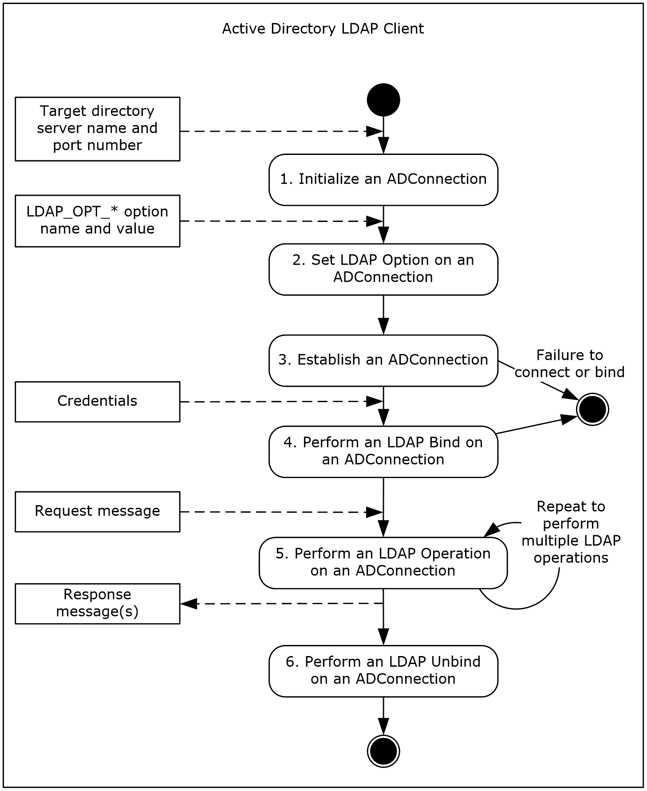

Figure 6: Client activity diagram

An ADConnection allows a client to use the connectivity to an Active Directory server for multiple LDAP operations, thereby reducing both client- and server-side processing costs and reducing the serialized time delays of TCP connection establishment and LDAP bind [**authentications**](#gt_authentication). The ADConnection abstraction allows a client application to perform an LDAP operation with an Active Directory server, and automatically follow any LDAP referrals ([RFC2251] section 4.1.11, Referral) and continuation references ([RFC2251] section 4.5.3, Continuation References in the Search Result). In the case of referrals and continuation references, the client establishes an additional TCP connection to the [**directory**](#gt_directory) server specified in each referral (or continuation reference) and sends a request as directed by that referral or reference.

The ADConnection can also attempt to maintain connectivity to the directory service in the event a directory server becomes unresponsive or unreachable by attempting to reconnect to the directory service and resending pending requests.

## 7.3 ADConnection Abstract Data Model

This section describes a conceptual model of a possible data [**organization**](#gt_organization) that an implementation maintains. The described organization is provided to facilitate the explanation of how the client behaves. This document does not mandate that implementations adhere to this model as long as their external behavior is consistent with that described in this document.

The data model defines a set of structures that a client operates on, and also an element which lists all [**active**](#gt_active) ADConnection [**objects**](#gt_object). The primary structure is **ADConnection**, with two supporting structures **LDAPRequest** and **ConnectionInfo**. These structures and others are described below.

**ComputerRole**: An abstract variable of type **DSROLE_MACHINE_ROLE** ([MS-DSSP](#Section_6.1.1.2.4) section 2.2.2) that indicates the current [**domain**](#gt_domain) membership role of the machine on which the [**LDAP**](#gt_lightweight-directory-access-protocol-ldap) client is executing, as described in [MS-DSSP] section 3.2.1, Abstract Data Model.

**ADCList**: A list of **ADConnection** objects. It is initialized to the empty list.

**ADConnection**: A structure that tracks a connection to an [**Active Directory**](#gt_active-directory) server. Sub-elements with names of the form LDAP_OPT_<rest of name> are ADM elements that can be set by the [Setting an LDAP Option on an ADConnection (section 7.6.1.2)](#Section_7.6.1.2) task. It has the following elements:

**LDAP_OPT_REFERRAL_HOP_LIMIT:** An unsigned integer indicating the limit on the number of referrals or continuation references that the client will follow for a single LDAP request. The default value is 32. A value of zero indicates no limit.

**LDAP_OPT_REFERRALS:** An enumeration indicating whether the client is to automatically follow referrals and continuation references. Valid values are:

- ON: The default value. The client automatically follows both referrals and continuation references.
- OFF: The client does not follow either referrals or continuation references automatically.
- LDAP_CHASE_CONTINUATION_REFERENCES: The client follows only continuation references automatically.
- LDAP_CHASE_REFERRALS: The client follows only referrals automatically.
**LDAP_OPT_TIMELIMIT:** An unsigned integer indicating the maximum time in seconds the client will wait for a response to an LDAP request. A value of 0 indicates a limit of 120 seconds for LDAP bind requests and no time limit for all other requests. The default value is 0. This ADM element can be overridden if a value for the time limit is specified in the parameters of the Performing and LDAP Operation on an ADConnection (section [7.6.1.6](#Section_7.6.1.6)) task.

**LDAP_OPT_SIZELIMIT:** An unsigned integer indicating the maximum number of results the client will request the [**directory**](#gt_directory) server to send for a given search request. The valid range is from 0 to 2^32 -1. A value of 0 indicates that there is no limit. The default value is 0. This ADM element can be overridden if a value for the size limit is specified in the parameters of the Performing and LDAP Operation on an ADConnection (section 7.6.1.6) task.

**LDAP_OPT_AREC_EXCLUSIVE:** A Boolean flag indicating whether the client is to skip the [**DC**](#gt_domain-controller-dc) Location processing (described in section [7.6.2.2](#Section_7.6.2.2)) during host resolution. A value of TRUE indicates that DC Location will be skipped. The default value is FALSE.

**LDAP_OPT_DNSDOMAIN_NAME:** A null-terminated string used in constructing a [**service principal name (SPN) (2)**](#gt_service-principal-name-spn) when performing an LDAP bind.

**LDAP_OPT_GETDSNAME_FLAGS:** An unsigned integer indicating the flags to be passed when invoking DsrGetDcNameEx2 to perform DC location. For more information, see [MS-NRPC](#Section_3.1.1.3.2.14) section 3.5.4.3.1, DsrGetDcNameEx2 (Opnum 34). By default, the value is 0.

**LDAP_OPT_AUTO_RECONNECT:** A Boolean flag indicating whether the client will attempt to automatically reconnect to a server when an existing connection is lost. The default value is TRUE.

**LDAP_OPT_PING_KEEP_ALIVE:** An unsigned integer indicating the maximum time in seconds the client will allow a connection to be idle (that is, receiving no responses) while waiting on outstanding requests on the connection before sending the directory server a sequence of PING requests. The valid range is 5 seconds to 2^32-1 seconds. The default value is 120 seconds.

**LDAP_OPT_PING_WAIT_TIME:** An unsigned integer indicating the time in milliseconds (ms) the client will wait for a response to a PING request. The valid range is 10 ms to 60000 ms. The default value is 2000 ms.

**LDAP_OPT_PING_LIMIT:** An unsigned integer indicating the maximum number of consecutive PINGs the client will send without getting an ICMP echo response ([[RFC792]](https://go.microsoft.com/fwlink/?LinkId=90492)) before triggering the Processing Network Errors (section [7.6.3.1](#Section_7.6.3.1)) event. Valid range is 0 to 2^32-1. A value of 0 indicates that the client never PINGs the server for an idle connection. The default value is 4.

**LDAP_OPT_ENCRYPT:** A Boolean flag indicating whether [**SASL**](#gt_sasl) layer encryption (section [5.1.2.1](#Section_5.1.2.1), Using SASL) is enabled on the connection. If a non-default value is desired, this MUST be set prior to performing an LDAP bind on the connection. The default value is FALSE.

**LDAP_OPT_SIGN:** A Boolean flag indicating whether SASL layer signing (section 5.1.2.1, Using SASL) is enabled on the connection. If a non-default value is desired, this MUST be set prior to performing an LDAP bind on the connection. The default value is TRUE.

**LDAP_OPT_TCP_KEEPALIVE:** A Boolean flag indicating whether [**TCP**](#gt_transmission-control-protocol-tcp) Keep-alives ([[RFC1122]](https://go.microsoft.com/fwlink/?LinkId=112180) section 4.2.3.6, TCP Keep-Alives) are enabled on **primaryConnection**. The default value is FALSE.

**LDAP_OPT_AUTH_INFO:** An instance of an **AuthInfo** structure representing the bind method and credentials to use when authenticating to the directory server. By default, the **bindMethod** is SASL using the GSS-SPNEGO mechanism, and the name and password are those of the identity of the protocol or system using the LDAP client. When attempting to use the server in fast bind mode, the **bindMethod** is set to [**simple bind**](#gt_simple-bind) prior to performing an LDAP bind on the connection. Subsequently, only simple binds can be performed to the server as long as the connection is in fast bind mode. See section [5.1.1.1](#Section_5.1.1.1), (Supported Authentication Methods) for a list of supported bind methods.

**LDAP_OPT_PROTOCOL_VERSION:** An unsigned integer indicating which version of the LDAP protocol the connection uses. Valid values are 2 and 3. The default value is 2. If a non-default value is desired, this MUST be set prior to performing an LDAP bind on the connection.

**primaryConnection:** A **ConnectionInfo** structure representing the TCP connection for the target directory server. The target directory server is the directory server specified as a parameter to the Initializing an ADConnection (section [7.6.1.1](#Section_7.6.1.1)) task.

**referralConnections:** A list of **ConnectionInfo** structures representing the TCP connections to directory servers used for following referrals or continuation references. It is initialized to an empty list.

**LDAPRequest**: A structure that tracks an LDAP request ([[RFC1777]](https://go.microsoft.com/fwlink/?LinkId=90290) section 2, Protocol Model, for LDAP version 2 and [[RFC2251]](https://go.microsoft.com/fwlink/?LinkId=90325) section 3.1, Protocol Model, for LDAP version 3). It has the following elements:

**requestMessage:** An LDAPMessage (as defined in [RFC1777] section 4, Elements of Protocol, for LDAP version 2 and [RFC2251] section 4.1.1, Message Envelope, for LDAP version 3) representing a request that the client sends to the server.

**resultMessages:** A sequence of LDAPMessage (as defined in [RFC1777] section 4, Elements of Protocol, for LDAP version 2 and [RFC2251] section 4.1.1, Message Envelope, for LDAP version 3) representing the results that the client receives in response to **requestMessage**.

**numReferrals:** An unsigned integer indicating the number of consecutive referrals or continuation references the client has received when processing a given LDAP response ([RFC1777] section 2, Message Envelope, for LDAP version 2 and [RFC2251] section 4.1.11, Referral, for LDAP version 3). It is initialized to zero.

**requestTimer:** A timer with second granularity used to track how long the client has waited for a response to **requestMessage**.

**numResends:** An unsigned integer indicating the number of times this request has been resent by the Autoreconnecting to a Directory Server (section [7.6.2.7](#Section_7.6.2.7)) task. It is initialized to 0.

**ConnectionInfo**: A structure that tracks a TCP connection to a directory server. It has the following elements:

**networkConnection:** An abstract element representing a TCP connection ([[RFC793]](https://go.microsoft.com/fwlink/?LinkId=150872) section 1.5, Operation) to the directory server. It is initialized to NULL.

**portNumber:** An unsigned integer indicating the TCP port number ([RFC793] section 1.5, Operation) to use when connecting to the directory server.

**targetName:** A null-terminated string used to locate a directory server. It can be NULL, indicating that the directory server for the joined domain SHOULD be located, a [**domain name**](#gt_domain-name) ([**DNS**](#gt_domain-name-system-dns)/[**NetBIOS**](#gt_netbios)), a host name, or an IP address.

**bindHasHappened:** A Boolean flag indicating whether an LDAP bind has been successfully performed on this connection. The default value is FALSE.

**pingRetries:** An unsigned integer indicating the number of consecutive ICMP echo requests or "pings" ([RFC792]) the client has sent to the directory server but for which it has not received a response. It is initialized to 0.

**pingKeepaliveTimer:** A timer with second granularity used to track how long it has been since the client last received a response to any request on this connection.

**pendingRequestList:** A list of **LDAPRequest** elements representing all outstanding requests on this connection. It is initialized to NULL.

**AuthInfo**: A structure that is used to authenticate to the directory server. It has the following elements:

**bindMethod:** The bind method that will be used to authenticate to the directory server. See section 5.1.1.1 (Supported Authentication Methods) for a list of supported bind methods.

**name:** A string containing the user name of the credentials that will be used to authenticate to the directory server. When this string is set to NULL or is not set, use the identity of the protocol or system that is using the LDAP client.

**password:** A string containing the password of the credentials that will be used to authenticate to the directory server. When this string is set to NULL or is not set, use the identity of the protocol or system that is using the LDAP client.

## 7.4 Handling Network Errors

The [**LDAP**](#gt_lightweight-directory-access-protocol-ldap) client relies extensively on the underlying [**TCP**](#gt_transmission-control-protocol-tcp)/IP implementation to detect network errors that indicate that the remote [**Active Directory**](#gt_active-directory) server is either unreachable or is unavailable for network operations. These errors depend on the local implementation of TCP/IP but include errors such as network media is unavailable, host is unreachable, port is unreachable, route is unavailable, and TCP keep alive failed. For the purposes of this specification, an error encountered on a network read or write will appear as a signaled event, invoking the handler covered in [Processing Network Errors (section 7.6.3.1)](#Section_7.6.3.1).

## 7.5 ICMP Pings

If a client has pending requests on a connection to an [**Active Directory**](#gt_active-directory) server but has not received any responses to any of those requests for a period of time specified by **ADConnection.LDAP_OPT_PING_KEEP_ALIVE**, as tracked by the **pingKeepAliveTimer** on the **ConnectionInfo** structure that holds the [**TCP**](#gt_transmission-control-protocol-tcp) connection to that server, the client pings the [**directory**](#gt_directory) server by sending an ICMP echo message as described in [[RFC792]](https://go.microsoft.com/fwlink/?LinkId=90492) and waiting up to **ADConnection.LDAP_OPT_PING_WAIT_TIME** milliseconds for any echo reply from the corresponding server. If no such reply is received, the client repeats the process of pinging the server up to **ADConnection.LDAP_OPT_PING_LIMIT** times. If the client receives no response after sending the maximum number of pings, or receives an error from the underlying network implementation during this process, it triggers the [Processing Network Errors (section 7.6.3.1)](#Section_7.6.3.1) event.

## 7.6 Tasks and Events

The following sections describe tasks and events involved in the management of **ADConnections**. These sections list parameters and results for each task. These represent data passed to an instance of the task at the time it is invoked or triggered or the result returned by the task. This information is intended to facilitate the reader's conceptual understanding of the specification. While a task's processing rules might depend upon associations established by the structure of its parameters, such association can be achieved in other ways. Implementations can depart from this abstraction so long as their external behavior remains consistent with that described in this document.

The interrelationship between these tasks and events is illustrated in the following Task Relationship diagram.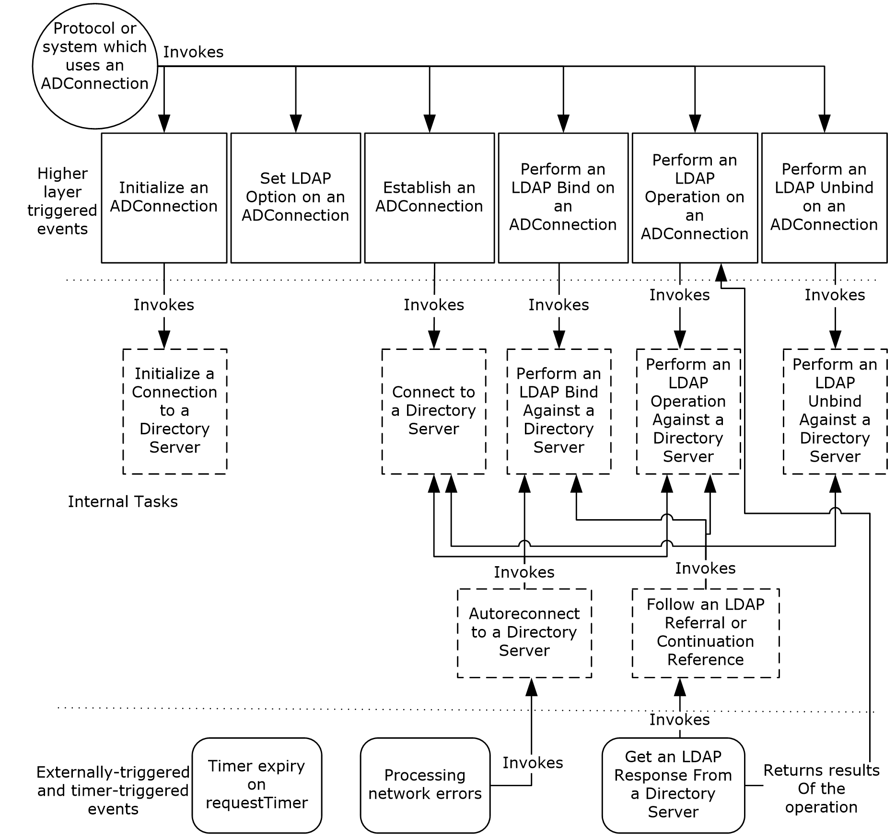

Figure 7: Task relationship diagram

### 7.6.1 Tasks

#### 7.6.1.1 Initializing an ADConnection

This task initializes an instance of the **ADConnection** element and returns it to the caller.

The parameters for this task are as follows:

| Name | Type | Description | Optional |
| --- | --- | --- | --- |
| TaskInputTargetName | String(Unicode) | A string used to locate a [**domain controller**](#gt_domain-controller-dc). It can be NULL (which indicates that the joined [**domain name**](#gt_domain-name) SHOULD be used), a domain name ([**DNS**](#gt_domain-name-system-dns)/[**NetBIOS**](#gt_netbios)), a server host name, or a server IP address. | No |
| TaskInputPortNumber | Unsigned integer | The destination [**TCP**](#gt_transmission-control-protocol-tcp) port number ([[RFC793]](https://go.microsoft.com/fwlink/?LinkId=150872) section 1.5, Operation) to use when connecting to the [**directory**](#gt_directory) server specified by *TaskInputTargetName*. | No |

The task returns the following results to the caller:

| Name | Type | Description |
| --- | --- | --- |
| TaskReturnADConnection | ADCONNECTION_HANDLE | An ADCONNECTION_HANDLE ([MS-DTYP](../MS-DTYP/MS-DTYP.md) section 2.2.2) that refers to an instance of the **ADConnection** ADM element. |

The task performs the following actions:

- Create an instance of the **ADConnection** ADM structure and initialize the values in the ADM to their default values. This instance is added to the list **ADCList**.
- Invoke the [Initializing a Connection to a Directory Server (section 7.6.2.1)](#Section_7.6.2.1) task, passing the *TaskInputTargetName* and *TaskInputPortNumber* parameters provided by the caller of this task. The returned *TaskReturnConnectionInfo* is assigned to **ADConnection.primaryConnection**.
- Using *TaskReturnADConnection*, return an **ADCONNECTION_HANDLE** ([MS-DTYP] section 2.2.2) that refers to the **ADConnection** instance to the caller.

#### 7.6.1.2 Setting an LDAP Option on an ADConnection

This task sets one of the LDAP_OPT_<optionName> ADM elements on an **ADConnection**.

The parameters for this task are as follows:

| Name | Type | Description | Optional |
| --- | --- | --- | --- |
| TaskInputADConnection | ADCONNECTION_HANDLE | An ADCONNECTION_HANDLE ([MS-DTYP](../MS-DTYP/MS-DTYP.md) section 2.2.2) that refers to an initialized **ADConnection** on which to set an option. | No |
| TaskInputOptionName | String(Unicode) | The name of the LDAP_OPT ADM element to set. | No |
| TaskInputOptionValue | MUST match the type of the ADM element specified by *TaskInputOptionName*. | The value to assign to the specified ADM element. | No |

This task does not return any results.

The task performs the following actions:

- Let adConnection be the **ADConnection** instance in **ADCList** referred to by *TaskInputADConnection*.
- Set the ADM element from adConnection with name *TaskInputOptionName* to the value *TaskInputOptionValue*.

#### 7.6.1.3 Establishing an ADConnection

This task establishes a [**TCP**](#gt_transmission-control-protocol-tcp) connection to an [**Active Directory**](#gt_active-directory) server specified by the elements of an input **ADConnection** instance.

The parameters for this task are as follows:

| Name | Type | Description | Optional |
| --- | --- | --- | --- |
| TaskInputADConnection | ADCONNECTION_HANDLE | An ADCONNECTION_HANDLE ([MS-DTYP](../MS-DTYP/MS-DTYP.md) section 2.2.2) that refers to an initialized **ADConnection** for which a TCP connection to the [**directory**](#gt_directory) server will be established. | No |

The task returns the following results to the caller:

| Name | Type | Description |
| --- | --- | --- |
| TaskReturnStatus | Boolean | Returns TRUE if a TCP connection was successfully established and FALSE otherwise. |

The task performs the following actions:

- Let adConnection be the **ADConnection** instance in **ADCList** referred to by *TaskInputADConnection*.
- Invoke the [Connecting to a Directory Server (section 7.6.2.2)](#Section_7.6.2.2) task, passing adConnection.primaryConnection as the *TaskInputConnectionInfo* parameter. The return value of the invocation is returned to the caller as *TaskReturnStatus*.

#### 7.6.1.4 Performing an LDAP Bind on an ADConnection

This task authenticates the client to an [**Active Directory**](#gt_active-directory) server specified by the elements of an input **ADConnection** instance.

The parameters for this task are as follows:

| Name | Type | Description | Optional |
| --- | --- | --- | --- |
| TaskInputADConnection | ADCONNECTION_HANDLE | An ADCONNECTION_HANDLE ([MS-DTYP](../MS-DTYP/MS-DTYP.md) section 2.2.2) that refers to an initialized **ADConnection** on which to perform an [**LDAP**](#gt_lightweight-directory-access-protocol-ldap) bind. | No |

The task returns the following results to the caller:

| Name | Type | Description |
| --- | --- | --- |
| TaskReturnStatus | Unsigned integer | The LDAP resultCode ([[RFC2251]](https://go.microsoft.com/fwlink/?LinkId=90325) section 4.1.10, Result Message) returned from the [**directory**](#gt_directory) server in response to the bind request or an error indicating that the directory server could not be contacted. |

The task performs the following actions:

- Let adConnection be the **ADConnection** instance in **ADCList** referred to by *TaskInputADConnection*.
- Invoke the [Performing an LDAP Bind Against a Directory Server (section 7.6.2.3)](#Section_7.6.2.3) task with the following parameters: *TaskInputConnectionInfo* is set to adConnection.primaryConnection. This task returns the resulting *TaskReturnStatus*.

#### 7.6.1.5 Performing an LDAP Unbind on an ADConnection

This task closes an **ADConnection's primaryConnection** and any **referralConnections**.

The parameters for this task are as follows:

| Name | Type | Description | Optional |
| --- | --- | --- | --- |
| TaskInputADConnection | ADCONNECTION_HANDLE | An ADCONNECTION_HANDLE ([MS-DTYP](../MS-DTYP/MS-DTYP.md) section 2.2.2) that refers to an initialized **ADConnection** that the client will close. | No |

This task does not return any results.

The task performs the following actions:

- Let adConnection be the **ADConnection** instance in **ADCList** referred to by *TaskInputADConnection*.
- Invoke the [Performing an LDAP Unbind Against a Directory Server (section 7.6.2.4)](#Section_7.6.2.4) task with the following parameters: *TaskInputConnectionInfo* is set to adConnection.primaryConnection.
- For each connectionInfo in adConnection.referralConnections:
- Invoke the Performing an LDAP Unbind Against a Directory Server (section 7.6.2.4) task with the following parameters: *TaskInputConnectionInfo* is set to connectionInfo.
- Set adConnection.primaryConnection to NULL.
- Set adConnection.referralConnections to NULL.
- Remove adConnection from **ADCList**.

#### 7.6.1.6 Performing an LDAP Operation on an ADConnection

This task sends an [**LDAP**](#gt_lightweight-directory-access-protocol-ldap) request to an [**Active Directory**](#gt_active-directory) server.

The parameters for this task are as follows:

| Name | Type | Description | Optional |
| --- | --- | --- | --- |
| TaskInputADConnection | ADCONNECTION_HANDLE | An ADCONNECTION_HANDLE ([MS-DTYP](../MS-DTYP/MS-DTYP.md) section 2.2.2) that refers to an initialized **ADConnection** on which the LDAP request will be sent. | No |
| TaskInputRequestMessage | LDAPMessage | The request to send to the [**directory**](#gt_directory) server. | No |
| TaskOutputResultMessages | List of LDAPMessage | The response from the directory server. | No |

The task returns the following results to the caller:

| Name | Type | Description |
| --- | --- | --- |
| TaskReturnStatus | Unsigned integer | The LDAP resultCode ([[RFC2251]](https://go.microsoft.com/fwlink/?LinkId=90325) section 4.1.10, Result Message) returned from the directory server in response to the request or an error indicating that the directory server could not be contacted or a timeout has occurred. |

The task performs the following actions:

- Let adConnection be the **ADConnection** instance in **ADCList** referred to by *TaskInputADConnection*.
- Let ldapRequest be a freshly constructed instance of the **LDAPRequest** ADM structure type defined in section [7.3](#Section_7.3), ADConnection Abstract Data Model, initialized with default values as specified in that section.
- ldapRequest.requestMessage is set to *TaskInputRequestMessage*, an input parameter to the current task that indicates the request to be sent to the directory server.
- The current task invokes the task, [Performing an LDAP Operation Against a Directory Server (section 7.6.2.5)](#Section_7.6.2.5), with the following parameters: *TaskInputConnectionInfo* is set to adConnection.primaryConnection and *TaskInputRequestMessage* is set to ldapRequest.
- The current task waits for responses to arrive on ldapRequest.resultMessages. When the responses for the request have been received (see [Getting an LDAP Response from a Directory Server (section 7.6.3.2)](#Section_7.6.3.2)), *TaskOutputResultMessages* is set to ldapRequest.resultMessages. If no error is encountered, the LDAP resultCode of the last message in *TaskOutputResultMessages* is returned to the caller. Otherwise the error is returned.

### 7.6.2 Internal Tasks

The tasks described in the following sections are supporting tasks for the management of **ADConnections** and are internal to this document; they are invoked only by the other tasks and events described in subsections under section [7.6](#Section_7.6).

#### 7.6.2.1 Initializing a Connection to a Directory Server

This task initializes an instance of the **ConnectionInfo** element.

The parameters for this task are as follows:

| Name | Type | Description | Optional |
| --- | --- | --- | --- |
| TaskInputTargetName | String(Unicode) | A string used to locate a [**domain controller**](#gt_domain-controller-dc). It can be NULL (which indicates that the joined [**domain name**](#gt_domain-name) SHOULD be used), the domain name ([**DNS**](#gt_domain-name-system-dns)/[**NetBIOS**](#gt_netbios)), the server host name, or the server IP address. | No |
| TaskInputPortNumber | Unsigned integer | The destination [**TCP**](#gt_transmission-control-protocol-tcp) port number ([[RFC793]](https://go.microsoft.com/fwlink/?LinkId=150872) section 1.5, Operation) to use when connecting to the [**directory**](#gt_directory) server specified by *TaskInputTargetName*. | No |

The task returns the following results to the caller:

| Name | Type | Description |
| --- | --- | --- |
| TaskReturnConnectionInfo | **ConnectionInfo** | An instance of the **ConnectionInfo** ADM element. |

The task performs the following actions:

- An instance of the **ConnectionInfo** ADM element is created and the values in the ADM are initialized to their default values. The default value of **ConnectionInfo.networkConnection** causes a new TCP connection to be used that is not associated with an existing **ADConnection**.
- **ConnectionInfo.targetName** is set to the input parameter *TaskInputTargetName*.
- **ConnectionInfo.portNumber** is set to the input parameter *TaskInputPortNumber*.
- The **ConnectionInfo** instance is returned to the caller as *TaskReturnConnectionInfo*.

#### 7.6.2.2 Connecting to a Directory Server

This task establishes a [**TCP**](#gt_transmission-control-protocol-tcp) connection to an [**Active Directory**](#gt_active-directory) server specified by the elements of an input **ConnectionInfo** instance.

The parameters for this task are as follows:

| Name | Type | Description | Optional |
| --- | --- | --- | --- |
| TaskInputConnectionInfo | **ConnectionInfo** | An initialized **ConnectionInfo** on which to perform an [**LDAP**](#gt_lightweight-directory-access-protocol-ldap) bind. | No |

The task returns the following results to the caller:

| Name | Type | Description |
| --- | --- | --- |
| TaskReturnStatus | Boolean | This task returns TRUE if a TCP connection was successfully established, FALSE otherwise. |

The task performs the following actions:

- Let connectionSuccessful be a Boolean initialized to FALSE.
- Let dcAddress be a Unicode string initialized to NULL.
- Let containingADConnection be the **ADConnection** instance contained in **ADCList** for which containingADConnection.primaryConnection is set to *TaskInputConnectionInfo* or for which the containingADConnection.referralConnections list contains *TaskInputConnectionInfo*. Note that these conditions are mutually exclusive and there is exactly one **ADConnection** which satisfies these conditions.
- If *TaskInputConnectionInfo.targetName* is NULL:
- If **ComputerRole** is DSRole_RoleBackupDomainController or DsRole_RolePrimaryDomainController, then set dcAddress to "localhost" and go to step 8; otherwise go to step 7.
- If *TaskInputConnectionInfo.targetName* is an IP address, then go to step 9.
- If containingADConnection.LDAP_OPT_AREC_EXCLUSIVE is set to TRUE, then go to step 8, skipping the [**DC**](#gt_domain-controller-dc) location process described in step 7.
- Assume that *TaskInputConnectionInfo.targetName* represents a [**domain name**](#gt_domain-name) and attempt to locate a domain controller in the specified [**domain**](#gt_domain):
- Let domainControllerInfo be an instance of the **DOMAIN_CONTROLLER_INFOW** structure ([MS-NRPC](#Section_3.1.1.3.2.14) section 2.2.1.2.1, DOMAIN_CONTROLLER_INFOW).
- Let addedFlags be an unsigned integer. If *TaskInputConnectionInfo.portNumber* is 3268 or 3269, addedFlags is set to the bitwise OR of the D, M, and R flags defined for the *Flags* parameter in [MS-NRPC] section 3.5.4.3.1, DsrGetDcNameEx2. Otherwise addedFlags is set to the bitwise OR of the M and R flags.
- The **DsrGetDcName** method ([MS-NRPC] section 3.5.4.3.3, DsrGetDcName) is invoked with the following parameters:
- *ComputerName* is NULL.
- *DomainName* is *TaskInputConnectionInfo.targetName*.
- *DomainGuid* is NULL.
- *SiteGuid* is NULL.
- *Flags* is the bitwise OR of containingADConnection.LDAP_OPT_GETDSNAME_FLAGS and addedFlags.
- *DomainControllerInfo* is a pointer to the domainControllerInfo structure.
- If the invocation of **DsrGetDcName** listed in step 3 returned 0 (Success), then:
- *TaskInputConnectionInfo.targetName* specified a domain name and domainControllerInfo.DomainControllerAddress now identifies a domain controller in the specified domain; if domainControllerInfo.DomainControllerAddress is an IP address, set dcAddress to domainControllerInfo.DomainControllerAddress with the "\\" prefix omitted.
- If the invocation of **DsrGetDcName** listed in step 3 returned a non-zero value and *TaskInputConnectionInfo.targetName* is NULL, then this task returns FALSE.
- If dcAddress is NULL, then assume that *TaskInputConnectionInfo.targetName* is a host name, and set dcAddress to *TaskInputConnectionInfo.targetName*.
- A TCP connection is established to the server whose host name or IP address is specified by dcAddress, with destination port set to *TaskInputConnectionInfo.portNumber*. If dcAddress is a host name, gethostbyname (see the note shown below) is invoked and each of the returned IP addresses is tried in parallel until a connection returns successfully or all IP addresses returned by gethostbyname have been exhausted. If a TCP connection is successfully established, the client sets *TaskInputConnectionInfo.networkConnection* to the TCP connection and connectionSuccessful is set to TRUE.
**Note** gethostbyname is a well-known, standards-based API call that is a POSIX-compliant method to retrieve information about hosts. For one example of an implementation of this API, see [[MSDN-gethostbyname]](https://go.microsoft.com/fwlink/?LinkId=394350).

- If connectionSuccessful is TRUE:
- If containingADConnection.LDAP_OPT_TCP_KEEPALIVE is TRUE, the client enables TCP Keep-alives ([[RFC1122]](https://go.microsoft.com/fwlink/?LinkId=112180) section 4.2.3.6, TCP Keep-Alives) on the TCP connection represented by *TaskInputConnectionInfo.networkConnection*.
- This task returns TRUE.
- If connectionSuccessful is FALSE, this task returns FALSE.
In addition to the above, if the LDAP client is unable to establish a TCP connection to an IP address obtained from DC Location (step 7), it will retry DC Location once, this time including the "A" flag in the *Flags* parameter passed to **DsrGetDcName** (in addition to whichever flags were passed in during the first DC Location attempt). It will then try establishing a TCP connection to the IP address obtained. If this fails, the task will return FALSE.

#### 7.6.2.3 Performing an LDAP Bind Against a Directory Server

This task authenticates the client to an [**Active Directory**](#gt_active-directory) server.

The parameters for this task are as follows:

| Name | Type | Description | Optional |
| --- | --- | --- | --- |
| TaskInputConnectionInfo | **ConnectionInfo** | An initialized **ConnectionInfo** on which an [**LDAP**](#gt_lightweight-directory-access-protocol-ldap) bind is to be performed. The **ConnectionInfo** could have been used already to connect or bind to a [**directory**](#gt_directory) server. | No |

The task returns the following results to the caller:

| Name | Type | Description |
| --- | --- | --- |
| TaskReturnStatus | Unsigned integer | The LDAP resultCode ([[RFC2251]](https://go.microsoft.com/fwlink/?LinkId=90325) section 4.1.10, Result Message) returned from the directory server in response to the bind request or an error indicating that the directory server failed to respond to the request due to network errors or timer expiration. |

The task performs the following actions:

- Let bindRequestMessage be an LDAPMessage with protocolOp of type BindRequest as described in [RFC2251] section 4.2, Bind Operation.
- Let containingADConnection be the **ADConnection** instance contained in **ADCList** for which containingADConnection.primaryConnection is set to *TaskInputConnectionInfo* or for which the containingADConnection.referralConnections list contains *TaskInputConnectionInfo*.
- If *TaskInputConnectionInfo.networkConnection* is NULL, the task [Connecting to a Directory Server (section 7.6.2.2)](#Section_7.6.2.2) is invoked with the following parameters: *TaskInputConnectionInfo* is set to the *TaskInputConnectionInfo* that was passed into this task. If the *TaskReturnStatus* returned by the invocation of Connecting to a Directory Server is FALSE, this task returns the error code 81 indicating the directory server could not be contacted.
- Construct bindRequestMessage from containingADConnection.LDAP_OPT_AUTH_INFO, according to section [5.1.1](#Section_1.3), Authentication.
- If the bind method specified by containingADConnection.LDAP_OPT_AUTH_INFO is [**SASL**](#gt_sasl):
- Set containingADConnection.LDAP_OPT_PROTOCOL_VERSION to 3.
- If containingADConnection.LDAP_OPT_SIGN is TRUE, set bindRequestMessage to request SASL-layer integrity. See section [5.1.2.1](#Section_5.1.2.1), Using SASL.
- If containingADConnection.LDAP_OPT_ENCRYPT is TRUE, set bindRequestMessage to request SASL-layer confidentiality. See section 5.1.2.1, Using SASL.
- If containingADConnection.LDAP_OPT_DNSDOMAIN_NAME is not NULL, then the client uses containingADConnection.LDAP_OPT_DNSDOMAIN_NAME as the 3rd part of the 3-part [**Service Principal Name (SPN) (2)**](#gt_service-principal-name-spn) supplied to the security packages that authenticate the client with the Active Directory server ([RFC2251] and section 5.1.1, Authentication).
- The Bind LDAP processing will invoke security packages to authenticate the client with the Active Directory server ([RFC2251] and section 5.1.1, Authentication). Those security packages will take the security identity of the current thread of execution as the identity.
- Let ldapRequest be a freshly constructed instance of the **LDAPRequest** ADM structure with the values in the ADM initialized to their default values.
- ldapRequest.requestMessage is set to bindRequestMessage.
- The client invokes the [Performing an LDAP Operation Against a Directory Server (section 7.6.2.5)](#Section_7.6.2.5) task with the following parameters: *TaskIputRequestMessage* is set to ldapRequest and *TaskInputConnectionInfo* is set to the *TaskInputConnectionInfo* that was passed to this task.
- The task waits for responses to arrive on ldapRequest.resultMessages. When the responses for the request have been received (see task: [Getting an LDAP Response from a Directory Server (section 7.6.3.2)](#Section_7.6.3.2)), if the responses indicate success, *TaskInputConnectionInfo.bindHasHappened* is set to TRUE. This task returns the LDAP resultCode from the last response.

#### 7.6.2.4 Performing an LDAP Unbind Against a Directory Server

This task closes an **ADConnection's primaryConnection** and any **referralConnections**.

The parameters for this task are as follows:

| Name | Type | Description | Optional |
| --- | --- | --- | --- |
| TaskInputConnectionInfo | **ConnectionInfo** | An initialized **ConnectionInfo** that the client will close. | No |

This task does not return any results.

The task performs the following actions:

- Let unbindRequest be an LDAPMessage for an unbind request. See [[RFC2251]](https://go.microsoft.com/fwlink/?LinkId=90325) section 4.3, Unbind Operation.
- Let ldapRequest be a freshly constructed instance of the **LDAPRequest** ADM structure with the values in the ADM initialized to their default values.
- ldapRequest.requestMessage is set to unbindRequest.
- Invoke the [Performing an LDAP Operation Against a Directory Server (section 7.6.2.5)](#Section_7.6.2.5) task with the following parameters: *TaskInputConnectionInfo* is set to the *TaskInputConnectionInfo* that was passed to this task and *TaskInputRequestMessage* is set to ldapRequest.
- The client closes the [**TCP**](#gt_transmission-control-protocol-tcp) connection *TaskInputConnectionInfo.networkConnection*.

#### 7.6.2.5 Performing an LDAP Operation Against a Directory Server

This task sends an [**LDAP**](#gt_lightweight-directory-access-protocol-ldap) request to an [**Active Directory**](#gt_active-directory) server.

The parameters for this task are as follows:

| Name | Type | Description | Optional |
| --- | --- | --- | --- |
| TaskInputConnectionInfo | **ConnectionInfo** | An initialized **ConnectionInfo** on which to send the LDAP request. | No |
| TaskInputRequestMessage | **LDAPRequest** | The request to send to the [**directory**](#gt_directory) server, including any **ExtendedRequest** as documented in section [3.1.1.3.4.2](#Section_3.1.1.3.4.2), LDAP Extended Operations. | No |

The task returns the following results to the caller:

| Name | Type | Description |
| --- | --- | --- |
| TaskReturnStatus | Boolean | This task returns TRUE if the client successfully sends the request to the directory server. Otherwise, it returns FALSE. |

The task performs the following actions:

- Let ldapRequest be the **LDAPRequest** instance received in *TaskInputRequestMessage*.
- Let containingADConnection be the **ADConnection** instance contained in **ADCList** for which containingADConnection.primaryConnection is set to *TaskInputConnectionInfo* or for which the containingADConnection.referralConnections list contains *TaskInputConnectionInfo*.
- Let operationTimeout be an unsigned integer initialized to the value of containingADConnection.LDAP_OPT_TIMELIMIT.
- If operationTimeout is 0 and *TaskInputRequestMessage.requestMessage.protocolOp* is of type BindRequest, set operationTimeout to 120.
- If *TaskInputRequestMessage.requestMessage.protocolOp* is of type SearchRequest:
- If *TaskInputRequestMessage.requestMessage.protocolOp.sizeLimit* was not specified, then it is set to containingADConnection.LDAP_OPT_SIZELIMIT.
- If *TaskInputRequestMessage.requestMessage.protocolOp.timeLimit* was not specified, then it is set to operationTimeout.
- ldapRequest.requestMessage.messageID is set, as described in [[RFC2251]](https://go.microsoft.com/fwlink/?LinkId=90325) section 4.1.1.1, Message ID.
- The client sends ldapRequest to the directory server through the [**TCP**](#gt_transmission-control-protocol-tcp) connection represented by *TaskInputConnectionInfo.networkConnection*.
If the send is successful:

- ldapRequest.requestTimer is set to operationTimeout and begins counting down.
- ldapRequest is appended to *TaskInputConnectionInfo.pendingRequestList*, if not already present.
- This task returns TRUE.
If the send is not successful, this task returns FALSE.

#### 7.6.2.6 Following an LDAP Referral or Continuation Reference

This task follows an [**LDAP**](#gt_lightweight-directory-access-protocol-ldap) referral or continuation reference ([[RFC2251]](https://go.microsoft.com/fwlink/?LinkId=90325) sections 4.1.11, Referral, and 4.5.3, Continuation References in the Search Result, and section [3.1.1.3.1.4](#Section_3.1.1.3.1.4), Referrals in LDAPv2 and LDAPv3).

The parameters for this task are as follows:

| Name | Type | Description | Optional |
| --- | --- | --- | --- |
| TaskInputLdapRequest | **LDAPRequest** | The request that originally generated this referral or continuation reference. | No |
| TaskInputReferralUrl | LDAP URL | An LDAP URL (see [[RFC2255]](https://go.microsoft.com/fwlink/?LinkId=90329)) that was returned by the server. | No |

The task returns the following results to the caller:

| Name | Type | Description |
| --- | --- | --- |
| TaskReturnStatus | Boolean | This task returns TRUE if the client successfully sends the referral request to the [**directory**](#gt_directory) server. Otherwise, it returns FALSE. |

The task performs the following actions:

- Let containingConnectionInfo be the **ConnectionInfo** instance for which containingConnectionInfo.pendingRequestList contains *TaskInputLdapRequest*.
- Let containingADConnection be the **ADConnection** instance contained in **ADCList** for which containingADConnection.primaryConnection is set to containingConnectionInfo or for which the containingADConnection.referralConnections list contains containingConnectionInfo.
- If *TaskInputLdapRequest.numReferrals* is greater than or equal to containingADConnection.LDAP_OPT_REFERRAL_HOP_LIMIT, return FALSE.
- Let newServer be a string initialized to the host portion of the hostport element of *TaskInputReferralUrl*, or NULL if there is no host portion. See [RFC2255].
- Let newPort be an unsigned integer initialized to the port portion of the hostport element of *TaskInputReferralUrl*, or 389 if there is no port portion. See [RFC2255].
- Let newConnectionInfo be the result of invoking the [Initializing a Connection to a Directory Server (section 7.6.2.1)](#Section_7.6.2.1) task with the following parameters: *TaskInputTargetName* is set to newServer and *TaskInputPortNumber* is set to newPort.
- Append newConnectionInfo to containingADConnection.referralConnections.
- Invoke the [Connecting to a Directory Server (section 7.6.2.2)](#Section_7.6.2.2) task with the following parameter: *TaskInputConnectionInfo* is set to newConnectionInfo. If the invocation returns FALSE, remove newConnectionInfo from containingADConnection.referralConnections and this task returns FALSE.
- If containingConnectionInfo.bindHasHappened is TRUE:
- Invoke the [Performing an LDAP Bind Against a Directory Server (section 7.6.2.3)](#Section_7.6.2.3) task with the following parameter: *TaskInputConnectionInfo* is set to newConnectionInfo. If this invocation returns FALSE, newConnectionInfo is removed from containingADConnection.referralConnections and this task returns FALSE.
- The fields of *TaskInputLdapRequest.requestMessage* are modified, for example setting the dn or [**filter**](#gt_filter), based on *TaskInputReferralUrl* according to the rules in [RFC2255] section 5, URL Processing, and [RFC2251] sections 4.1.1, Message Envelope, and 4.5.3, Continuation References in the Search Result.
- Invoke the [Performing an LDAP Operation Against a Directory Server (section 7.6.2.5)](#Section_7.6.2.5) task with the following parameters: *TaskInputConnectionInfo* is set to newConnectionInfo and *TaskInputRequestMessage* is set to the *TaskInputLdapRequest* parameter of this task.
- Invoke the [Performing an LDAP Unbind Against a Directory Server (section 7.6.2.4)](#Section_7.6.2.4) task with the following parameter: *TaskInputConnectionInfo* is set to newConnectionInfo.
- Remove newConnectionInfo from containingADConnection.referralConnections.
- If the invocation of Performing an LDAP Operation Against a Directory Server (section 7.6.2.5) task in step 11 returned TRUE, then *TaskInputLdapRequest.numReferrals* is incremented and this task returns TRUE. Otherwise this task returns FALSE.

#### 7.6.2.7 Autoreconnecting to a Directory Server

This task reconnects to a [**directory**](#gt_directory) server when network errors are encountered on a connection.

The parameters for this task are as follows:

| Name | Type | Description | Optional |
| --- | --- | --- | --- |
| TaskInputConnectionInfo | **ConnectionInfo** | An initialized **ConnectionInfo** on which an autoreconnect is to be performed. | No |

The task returns the following results to the caller:

| Name | Type | Description |
| --- | --- | --- |
| TaskReturnStatus | Boolean | This task returns TRUE if the client successfully reconnects to a directory server. Otherwise, it returns FALSE. |

The task performs the following actions:

- Let wasBound be a Boolean set equal to the value of *TaskInputConnectionInfo.bindHasHappened*.
- Set *TaskInputConnectionInfo.bindHasHappened* to FALSE.
- Invoke the [Connecting to a Directory Server (section 7.6.2.2)](#Section_7.6.2.2) task with the following parameters: *TaskInputConnectionInfo* is set to the passed-in *TaskInputConnectionInfo*. If this invocation returns FALSE, then return FALSE from this task.
- If wasBound is TRUE, then invoke the [Performing an LDAP Bind Against a Directory Server (section 7.6.2.3)](#Section_7.6.2.3) task with the following parameters: *TaskInputConnectionInfo* is set to the passed-in *TaskInputConnectionInfo*. If this invocation returns an error, then return FALSE from this task.
- For each **LDAPRequest** lrq in *TaskInputConnectionInfo.pendingRequestList* for which lrq.resultMessages is empty:
- Increment lrq.numResends by 1.
- If lrq.numResends is greater than 20 or if lrq.requestMessage is a SearchRequest ([[RFC2251]](https://go.microsoft.com/fwlink/?LinkId=90325) section 4.5.1, Search Request) containing the LDAP_SERVER_NOTIFICATION_OID control (section [3.1.1.3.4.1.9](#Section_3.1.1.3.4.1.9), LDAP_SERVER_NOTIFICATION_OID), then construct an LDAPMessage, lm, containing an LDAPResult, lr, representing a response for lrq.requestMessage, indicating that the directory server was unreachable:
- Set lm.messageID to lrq.requestMessage.messageID.
- Set lr.resultCode to a local implementation-specific error code indicating that the directory server was unreachable, using an error code value reserved for APIs as specified in [RFC2251] section 4.1.10, Result Message.
**Note** The Microsoft implementation of LDAP client sets the resultCode of LDAPResult to LDAP_SERVER_DOWN (0x51) when the directory server is unreachable ([MS-ERREF](../MS-ERREF/MS-ERREF.md) section 2.4, LDAP error to Win32 mapping).

- Set lr.errorMessage and lr.matchedDN to a zero-length string.
- Insert the LDAPMessage lm into lrq.resultMessages.
- Otherwise:
- Invoke the [Performing an LDAP Operation Against a Directory Server (section 7.6.2.5)](#Section_7.6.2.5) task with the following parameters: *TaskInputConnectionInfo* is the passed-in *TaskInputConnectionInfo*, and *TaskInputRequestMessage* is lrq.
- If the above invocation returns FALSE, then construct an LDAPMessage, lm, containing an LDAPResult, lr, representing a response for lrq.requestMessage, indicating that the directory server was unreachable:
- Set lm.messageID to lrq.requestMessage.messageID.
- Set lr.resultCode to a local implementation-specific error code indicating that the directory server was unreachable, using an error code value reserved for APIs as specified in [RFC2251] section 4.1.10, Result Message.
**Note** The Microsoft implementation of LDAP client sets the resultCode of LDAPResult to LDAP_SERVER_DOWN (0x51) when the directory server is unreachable ([MS-ERREF] section 2.4, LDAP error to Win32 mapping).

- Set lr.errorMessage and lr.matchedDN to a zero-length string.
- Insert the LDAPMessage lm into lrq.resultMessages.
- Return TRUE.

### 7.6.3 External Triggered Events

#### 7.6.3.1 Processing Network Errors

This event is triggered, as described in sections [7.4](#Section_7.4) and [7.5](#Section_7.5), when a network read or write returns an error code indicating an underlying network failure such as media disconnection, host unreachable, route unavailable, or the [**TCP**](#gt_transmission-control-protocol-tcp) keepalive failed, or when there is no response to too many consecutive ICMP echo requests.

The parameters for this task are as follows:

| Name | Type | Description | Optional |
| --- | --- | --- | --- |
| TaskInputConnectionInfo | **ConnectionInfo** | The **ConnectionInfo** on which the error occurred. | No |

This task does not return any results.

The task performs the following actions:

- Let containingADConnection be the **ADConnection** instance contained in **ADCList** for which containingADConnection.primaryConnection is set to *TaskInputConnectionInfo* or for which the containingADConnection.referralConnections list contains *TaskInputConnectionInfo*.
- Close the TCP connection represented by *TaskInputConnectionInfo.networkConnection*.
- If containingADConnection.LDAP_OPT_AUTO_RECONNECT is FALSE, then for each **LDAPRequest** lrq in *TaskInputConnectionInfo.pendingRequestList* that is awaiting a response:
- Construct an LDAPMessage, lm, containing an LDAPResult, lr, representing a response for lrq.requestMessage, indicating that the [**directory**](#gt_directory) server was unreachable:
- Set lm.messageID to lrq.requestMessage.messageID.
- Set lr.resultCode to a local implementation-specific error code indicating that the directory server was unreachable, using an error code value reserved for APIs as specified in [[RFC2251]](https://go.microsoft.com/fwlink/?LinkId=90325) section 4.1.10, Result Message.
**Note** The Microsoft implementation of LDAP client sets the resultCode of LDAPResult to LDAP_SERVER_DOWN (0x51) when the directory server is unreachable ([MS-ERREF](../MS-ERREF/MS-ERREF.md) section 2.4, LDAP error to Win32 mapping).

- Set lr.errorMessage and lr.matchedDN to a zero-length string.
- Insert the LDAPMessage lm into lrq.resultMessages.
- If containingADConnection.LDAP_OPT_AUTO_RECONNECT is TRUE, then invoke the [Autoreconnecting to a Directory Server (section 7.6.2.7)](#Section_7.6.2.7) task on *TaskInputConnectionInfo*.

#### 7.6.3.2 Getting an LDAP Response from a Directory Server

This event occurs when the client receives an LDAPMessage from a [**directory**](#gt_directory) server.

The parameters for this task are as follows:

| Name | Type | Description | Optional |
| --- | --- | --- | --- |
| TaskInputLdapResultMessage | LDAPMessage | The LDAPMessage received from the directory server. | No |

This task does not return any results.

The task performs the following actions:

- Let originalRequest be the **LDAPRequest** instance for which originalRequest.requestMessage.messageID is equal to *TaskInputLdapResultMessage.messageID*. If there is no such match because of a timeout (see section [7.6.4.1](#Section_7.6.4.1)), the task ends.
- Let containingConnectionInfo be the **ConnectionInfo** instance for which containingConnectionInfo.pendingRequestList contains originalRequest.
- Let containingADConnection be the **ADConnection** instance contained in **ADCList** for which containingADConnection.primaryConnection is set to containingConnectionInfo or for which the containingADConnection.referralConnections list contains containingConnectionInfo. Because there is a unique networkConnection, and therefore a [**TCP**](#gt_transmission-control-protocol-tcp) connection, associated with each **ADConnection**, there will be only one **ADConnection** that matches the criteria in this step.
- If *TaskInputLdapResultMessage.protocolOp* is an LDAPResult and *TaskInputLdapResultMessage.protocolOp.resultCode* is referral ([[RFC2251]](https://go.microsoft.com/fwlink/?LinkId=90325) section 4.1.10 in the case of LDAP v3) or is the value 9 (section [3.1.1.3.1.4](#Section_3.1.1.3.1.4), Referrals in LDAPv2 and LDAPv3, in the case of LDAP v2) and **containingADConnection.LDAP_OPT_REFERRALS** is "ON" or "LDAP_CHASE_REFERRALS":
- Let urlList be a list of [**LDAP**](#gt_lightweight-directory-access-protocol-ldap) URLs ([[RFC2255]](https://go.microsoft.com/fwlink/?LinkId=90329)) contained in *TaskInputLdapResultMessage.protocolOp.referral* ([RFC2251] section 4.1.10, Result Message, in the case of LDAP v3) or in *TaskInputLdapResultMessage.protocolOp.errorMessage* (section 3.1.1.3.1.4, Referrals in LDAPv2 and LDAPv3, in the case of LDAP v2).
- For each ldapUrl in urlList:
- Invoke the task [Following an LDAP Referral or Continuation Reference (section 7.6.2.6)](#Section_7.6.2.6) with the following parameters: *TaskInputLdapRequest* is set to originalRequest and *TaskInputReferralUrl* is set to ldapUrl. If this invocation returns TRUE, this task returns.
- If *TaskInputLdapResultMessage.protocolOp* is a SearchResultReference and **containingADConnection.LDAP_OPT_REFERRALS** is "ON" or "LDAP_CHASE_CONTINUATION_REFERENCES":
- Let urlList be a list of LDAP URLs ([RFC2255]) contained in *TaskInputLdapResultMessage.protocolOp*.
- For each ldapUrl in urlList:
- Invoke the task Following an LDAP Referral or Continuation Reference (section 7.6.2.6) with the following parameters: *TaskInputLdapRequest* is set to originalRequest and *TaskInputReferralUrl* is set to ldapUrl. If this invocation returns TRUE, this task returns.
- Append *TaskInputLdapResultMessage* to **originalRequest.resultMessages**.
- At this point there is either an LDAPResult or the next search response. If *TaskInputLdapResultMessage.protocolOp* is an LDAPResult, then originalRequest is removed from **containingConnectionInfo.pendingRequestList** and any tasks waiting on results for originalRequest proceed. Otherwise these tasks continue to wait for additional responses.

### 7.6.4 Timer Triggered Events

#### 7.6.4.1 Timer Expiry on RequestTimer

This event occurs whenever the **requestTimer** on an instance of an **LDAPRequest** expires.

The parameters for this task are as follows:

| Name | Type | Description | Optional |
| --- | --- | --- | --- |
| TaskInputLdapRequest | **LDAPRequest** | The **LDAPRequest** instance on which the **requestTimer** has expired. | No |

This task does not return any results.

The task performs the following actions:

- For each containingADConnection in **ADCList**:
- If *TaskInputLdapRequest* is present in containingADConnection.primaryConnection.pendingRequestList, remove *TaskInputLdapRequest* from containingADConnection.primaryConnection.pendingRequestList.
- For each containingConnectionInfo in containingADConnection.referralConnections:
- If *TaskInputLdapRequest* is present in containingConnectionInfo.pendingRequestList, remove *TaskInputLdapRequest* from containingConnectionInfo.pendingRequestList.
- Construct an LDAPMessage, lm, containing an LDAPResult, lr, representing a response for *TaskInputLdapRequest.requestMessage*, indicating that the request has timed out:
- Set lm.messageID to *TaskInputLdapRequest.requestMessage.messageID*.
- Set lr.resultCode to a local implementation-specific error code indicating a timeout has occurred, using an error code value reserved for APIs as specified in [[RFC2251]](https://go.microsoft.com/fwlink/?LinkId=90325) section 4.1.10, Result Message.
**Note** The Microsoft implementation of [**LDAP**](#gt_lightweight-directory-access-protocol-ldap) client sets the resultCode of LDAPResult to LDAP_TIMEOUT (0x55) on timer expiration ([MS-ERREF](../MS-ERREF/MS-ERREF.md) section 2.4, LDAP error to Win32 mapping).

- Set lr.errorMessage and lr.matchedDN to a zero-length string.
- Insert the LDAPMessage lm into *TaskInputLdapRequest.resultMessages*.
Any tasks waiting on results for *TaskInputLdapRequest* receive the LDAPMessage lm in *TaskInputLdapRequest.resultMessages*, indicating that the request has timed out.

## 7.7 LDAP Over UDP

Windows uses [**LDAP**](#gt_lightweight-directory-access-protocol-ldap) over [**UDP**](#gt_user-datagram-protocol-udp) as defined in [[RFC1798]](https://go.microsoft.com/fwlink/?LinkId=90292) for LDAP versions 2 and 3. The following sections describe only the additional behaviors of the Microsoft LDAP client that are not specified by [RFC1798].

### 7.7.1 ADUDPHandle Overview

For [**LDAP**](#gt_lightweight-directory-access-protocol-ldap) over [**UDP**](#gt_user-datagram-protocol-udp), an **ADUDPHandle** represents the parameters used for communication between the client and [**Active Directory**](#gt_active-directory) servers. The typical sequence of use of an **ADUDPHandle** is:

- Initialize an **ADUDPHandle**, which allocates an **ADUDPHandle**. This step does not perform any network operations.
- Perform one LDAP operation, which is either a [**rootDSE**](#gt_root-directory-system-agent-specific-entry-rootdse) search or an LDAP abandon operation, on the **ADUDPHandle**. An LDAP operation will consist of an LDAP request and the resulting LDAP response.
The only tasks that use the **ADUDPHandle** type are those described in section [7.7.3.1](#Section_7.7.3.1), Initializing an ADUDPHandle, and section [7.7.3.2](#Section_7.7.3.2), Performing an LDAP Operation on an ADUDPHandle.

### 7.7.2 ADUDPHandle Abstract Data Model

This section describes a conceptual model of a possible data [**organization**](#gt_organization) that an implementation maintains. The described organization is provided to facilitate the explanation of how the client behaves. This document does not mandate that implementations adhere to this model as long as their external behavior is consistent with that described in this document.

The data model defines a primary structure **ADUDPHandle** that the client operates on.

**ComputerRole**: An abstract variable of type **DSROLE_MACHINE_ROLE** ([MS-DSSP](#Section_6.1.1.2.4) section 2.2.2) that indicates the current [**domain**](#gt_domain) membership role of the machine on which the [**LDAP**](#gt_lightweight-directory-access-protocol-ldap) client is executing, as described in [MS-DSSP] section 3.2.1, Abstract Data Model.

**ADUDPHandle**: A structure that holds the information necessary to communicate with an [**Active Directory**](#gt_active-directory) server over the [**UDP**](#gt_user-datagram-protocol-udp) protocol.

- **protocolVersion**: An unsigned integer indicating which version of the LDAP protocol the connection uses. Valid values are 2 and 3. The default value is 3.
- **portNumber**: An unsigned integer indicating the UDP destination port number to use (see [[RFC768]](https://go.microsoft.com/fwlink/?LinkId=90490)).
- **targetName**: A null-terminated string used to locate a [**directory**](#gt_directory) server. It can be NULL, indicating that the directory server for the joined domain SHOULD be located, a [**domain name**](#gt_domain-name) ([**DNS**](#gt_domain-name-system-dns)/[**NetBIOS**](#gt_netbios)), a host name, or an IP address.

### 7.7.3 Tasks

#### 7.7.3.1 Initializing an ADUDPHandle

This task initializes an instance of **ADUDPHandle** and returns it to the caller.

The parameters for this task are as follows:

| Name | Type | Description | Optional |
| --- | --- | --- | --- |
| *TaskInputTargetName* | String(Unicode) | A string used to locate a [**domain controller**](#gt_domain-controller-dc). It can be NULL (which indicates that the joined [**domain name**](#gt_domain-name) SHOULD be used), a domain name ([**DNS**](#gt_domain-name-system-dns)/[**NetBIOS**](#gt_netbios)), a server host name, or a server IP address. | No |
| *TaskInputPortNumber* | Unsigned integer | The destination [**UDP**](#gt_user-datagram-protocol-udp) port number ([[RFC768]](https://go.microsoft.com/fwlink/?LinkId=90490)) to use when connecting to the [**directory**](#gt_directory) server specified by *TaskInputTargetName*. | No |
| *TaskInputProtocolVersion* | Unsigned integer | Version of the [**LDAP**](#gt_lightweight-directory-access-protocol-ldap) protocol used. Valid values are 2 and 3. The default value is 3. | Yes |

The task returns the following results to the caller:

| Name | Type | Description |
| --- | --- | --- |
| *TaskReturnADUDPHandle* | LDAP_UDP_HANDLE ([MS-DTYP](../MS-DTYP/MS-DTYP.md) section 2.2.24) | A void pointer that refers to an instance of the **ADUDPHandle**. |

The task performs the following actions:

- Create an instance adUDPHandle of the **ADUDPHandle** ADM structure and initialize the values in the ADM to their default values.
- Set the adUDPHandle.portNumber field to *TaskInputPortNumber*, the **adUDPHandle.protocolVersion** field to *TaskInputProtocolVersion*, and the **adUDPHandle.targetName** to *TaskInputTargetName*.
- Return an LDAP_UDP_HANDLE referring to the **ADUDPHandle** instance to the caller as *TaskReturnADUDPHandle*.

#### 7.7.3.2 Performing an LDAP Operation on an ADUDPHandle

This task sends an [**LDAP**](#gt_lightweight-directory-access-protocol-ldap) request to an [**Active Directory**](#gt_active-directory) server and returns the response returned by the server.

The parameters for this task are as follows:

| Name | Type | Description | Optional |
| --- | --- | --- | --- |
| *TaskInputADUDPHandle* | LDAP_UDP_HANDLE ([MS-DTYP](../MS-DTYP/MS-DTYP.md) section 2.2.24) | Refers to an initialized **ADUDPHandle** used to send the LDAP request. | No |
| *TaskInputRequestMessage* | LDAPMessage | The request to send to the [**directory**](#gt_directory) server. | No |
| *TaskOutputResultMessages* | LDAPMessage list | A sequence of LDAPMessage (as defined in [[RFC1777]](https://go.microsoft.com/fwlink/?LinkId=90290) section 4 for LDAP version 2 and [[RFC2251]](https://go.microsoft.com/fwlink/?LinkId=90325) section 4.1.1 for LDAP version 3) representing the results that the client receives in response to *TaskInputRequestMessage*. | No |
| *TaskInputRequestTimeout* | Unsigned integer | Time in milliseconds the client waits to receive the response from the server. Value 0 indicates that there is no time limit. | No |

The task returns the following results to the caller:

| Name | Type | Description |
| --- | --- | --- |
| *TaskReturnStatus* | Unsigned integer | The LDAP resultCode ([RFC2251] section 4.1.10) returned from the directory server in response to the request, or an error indicating that the directory server could not be contacted or that a timeout has occurred. |

The task performs the following actions:

- Let adUDPHandle be the **ADUDPHandle** instance referred to by *TaskInputADUDPHandle*.
- Let dcAddress be a [**Unicode**](#gt_unicode) string initialized to NULL.
- If *TaskInputADUDPHandle.targetName* is NULL:
- If **ComputerRole** is DSRole_RoleBackupDomainController or DsRole_RolePrimaryDomainController, then set dcAddress to "localhost" and go to step 6; otherwise go to step 5.
- If *TaskInputADUDPHandle.targetName* is an IP address, then go to step 6.
- Assume *TaskInputADUDPHandle.targetName* represents a [**domain name**](#gt_domain-name) and attempt to locate a [**domain controller**](#gt_domain-controller-dc) in the specified [**domain**](#gt_domain).
- Let domainControllerInfo be an instance of the **DOMAIN_CONTROLLER_INFOW** structure ([MS-NRPC](#Section_3.1.1.3.2.14) section 2.2.1.2.1, DOMAIN_CONTROLLER_INFOW).
- Let addedFlags be an unsigned integer. It is set to the bitwise OR of the M and R flags defined for the *Flags* parameter in [MS-NRPC] section 3.5.4.3.1, DsrGetDcNameEx2.
- The **DsrGetDcName** method ([MS-NRPC] section 3.5.4.3.3, DsrGetDcName) is invoked with the following parameters:
- *ComputerName* is NULL.
- *DomainName* is *TaskInputADUDPHandle.targetName*.
- *DomainGuid* is NULL.
- *SiteGuid* is NULL.
- *Flags* is set to addedFlags.
- *DomainControllerInfo* is a pointer to the **domainControllerInfo** structure.
- If the invocation of the **DsrGetDcName** method listed in step 3 returned 0 (Success), then:
- *TaskInputADUDPHandle.targetName* specified a domain name and domainControllerInfo.DomainControllerAddress now identifies a domain controller in the specified domain; if domainControllerInfo.DomainControllerAddress is an IP address, set dcAddress to domainControllerInfo.DomainControllerAddress with the "\\" prefix omitted and go to step 6.
- If the invocation of **DsrGetDcName** listed in step 3 returned a nonzero value and *TaskInputADUDPHandle.targetName* is NULL, then this task returns a local implementation-specific error code indicating that the directory server was unreachable, using an error code value reserved for APIs as specified in [RFC2251] section 4.1.10, Result Message.
**Note** The Microsoft implementation of LDAP client sets the resultCode of LDAPResult to LDAP_SERVER_DOWN (0x51) when the directory server is unreachable ([MS-ERREF](../MS-ERREF/MS-ERREF.md) section 2.4, LDAP error to Win32 mapping).

- If dcAddress is NULL, then assume that *TaskInputADUDPHandle.targetName* is a host name, and set dcAddress to *TaskInputADUDPHandle.targetName*.
- Let ldapRequest be set to *TaskInputRequestMessage*.
- ldapRequest.messageID is set as described in [RFC2251] section 4.1.1.1.
- Let ipAddress be a Unicode string initialized to NULL. If dcAddress is a host name, gethostbyname (see the note shown below) is invoked and ipAddress is set to the first address returned. Otherwise, assume that dcAddress is an IP address and set ipAddress to dcAddress.
**Note** gethostbyname is a well-known, standards-based API call that is a POSIX-compliant method to retrieve information about hosts. For one example of an implementation of this API, see [[MSDN-gethostbyname]](https://go.microsoft.com/fwlink/?LinkId=394350).

- Let networkUDPHandle be an abstract element representing the [**UDP**](#gt_user-datagram-protocol-udp) handle used to perform UDP operations (see [[RFC768]](https://go.microsoft.com/fwlink/?LinkId=90490) sections "User Interface" and "IP interface"). The networkUDPHandle is created using ipAddress and the *TaskInputADUDPHandle.portNumber* parameter.
- The client sends ldapRequest to the directory server indicated by ipAddress using networkUDPHandle.
- The client creates a timer for the duration specified by *TaskInputRequestTimeout* and begins counting down.
- The client then waits for either the UDP response to arrive or the timer to expire.
- If the timer expires and no response has been received from the directory server:
- Let ldapResponse be a freshly constructed LDAPMessage containing an LDAPResult ldapResult.
- Set ldapResponse.messageID to ldapRequest.messageID.
- Set ldapResult.resultCode to a local implementation-specific error code indicating a timeout has occurred, using an error code value reserved for APIs as specified in [RFC2251] section 4.1.10, Result Message.
**Note** The Microsoft implementation of LDAP client sets the resultCode of LDAPResult to LDAP_TIMEOUT (0x55) on timer expiration ([MS-ERREF] section 2.4, LDAP error to Win32 mapping).

- Insert the ldapResponse into *TaskOutputResultMessages*.
- Otherwise, the timer is canceled, and for each LDAPMessage lm in the response received from the directory server:
- If lm.messageID equals *TaskInputRequestMessage.messageID*, append lm to the *TaskOutputResultMessages*.
- Return the resultCode of the last message in *TaskOutputResultMessages*.

## 7.8 Transport Requirements

For information on transport of [**LDAP**](#gt_lightweight-directory-access-protocol-ldap), see section [2.1](#Section_2.1). For information on how messages are protected when sent over these transports, see section [7.10](#Section_7.10).

## 7.9 Security Elements

[**Directory objects**](#gt_directory-object) are protected by [**security descriptors**](#gt_security-descriptor) that contain [**access control lists**](#gt_access-control-list-acl) that grant or deny permissions to [**security principals**](#gt_security-principal) (either directly or through [**group**](#gt_group) membership) to read, [**update**](#gt_update), or otherwise manipulate the [**object**](#gt_object), as described in section [5.1.3](#Section_1.3), Authorization. In the [**Active Directory**](#gt_active-directory) system, [**LDAP**](#gt_lightweight-directory-access-protocol-ldap) performs [**access checks**](#gt_access-check) as described in that section.

When performing an access check, the identity of the requestor, represented as a [**SID**](#gt_security-identifier-sid), is compared to the permissions required to perform a given operation and the permissions granted to that identity. In the Active Directory system, LDAP specifies a means by which a requestor can prove (authenticate) its identity to the [**directory service**](#gt_directory-service-ds) so that the identity can be used in subsequent access check decisions. LDAP also provides mechanisms to digitally-sign requests and responses to prevent them from tampering while being transferred over the network, and to encrypt the traffic to prevent eavesdropping. See section [7.10](#Section_7.10).

## 7.10 Communications Security

The [**Active Directory**](#gt_active-directory) system relies on messages passed across the network between the client and the [**directory service**](#gt_directory-service-ds). The system does not require this network to be fully [**trusted**](#gt_trust) and allows for the possibility that a hostile party might be able to intercept such messages while they are in transit. In the Active Directory system, [**LDAP**](#gt_lightweight-directory-access-protocol-ldap) is designed to protect against two key attacks from such an attacker:

- Eavesdropping on the messages to learn information to which the attacker is not intended to have access.
- Altering the request or response messages to cause the directory service or client, respectively, to take action based on information supplied by the attacker.
To protect against these attacks, the system uses transport- and message-level security features to protect traffic between the clients and the directory service. Transport-level security protects the entire transport, effectively creating a protected "tunnel" between the client and directory service through which the messages are sent, protecting the confidentially and integrity of the messages sent over the tunnel. Message-level security encrypts and/or digitally signs each individual message to provide confidentially and integrity of the message, respectively.

The following table summarizes the security mechanisms used for LDAP and includes references to the relevant details.

Transport- and Message-Level Security Features

| Protocol | Mechanisms | Reference |
| --- | --- | --- |
| LDAP | Transport-level Protection is provided by signing and encryption over a [**Secure Sockets Layer**](#gt_secure-sockets-layer-ssl)/[**Transport Layer Security (TLS)**](#gt_transport-layer-security-tls) (SSL/TLS)-protected connection. | Section [5.1.2.2](#Section_5.1.2.2), Using SSL/TLS, of this document |
| - | Message-level Protection is provided by signing and/or encryption using [**SASL**](#gt_sasl). | Section [5.1.2.1](#Section_5.1.2.1), Using SASL, of this document |

In addition to these mechanisms for protecting desirable traffic between the client and the server, LDAP also has mechanisms for rejecting undesirable traffic, that is, traffic that has been judged as potentially harmful to the directory service. The following table lists a summary of the mechanisms used for LDAP and a reference to further information. Note that these mechanisms are in addition to any [**access checks**](#gt_access-check) (section [7.9](#Section_3.1.1.12.1.7)) that are performed by the protocol.

Additional Security Mechanisms

| Protocol | Mechanisms | Reference |
| --- | --- | --- |
| LDAP | LDAP Policies: establish limits on the size of the operations that a client can request. | Section [3.1.1.3.4.6](#Section_3.1.1.3.4.6), LDAP Policies, of this document |
| - | LDAP IP Deny List: provides a configurable list of IPv4 addresses from which the directory service will ignore requests. | Section [3.1.1.3.4.8](#Section_3.1.1.3.4.8), LDAP IP-Deny List, of this document |

# 8 Change Tracking

This section identifies changes that were made to this document since the last release. Changes are classified as Major, Minor, or None.

The revision class **Major** means that the technical content in the document was significantly revised. Major changes affect protocol interoperability or implementation. Examples of major changes are:

- A document revision that incorporates changes to interoperability requirements.
- A document revision that captures changes to protocol functionality.
The revision class **Minor** means that the meaning of the technical content was clarified. Minor changes do not affect protocol interoperability or implementation. Examples of minor changes are updates to clarify ambiguity at the sentence, paragraph, or table level.

The revision class **None** means that no new technical changes were introduced. Minor editorial and formatting changes may have been made, but the relevant technical content is identical to the last released version.

The changes made to this document are listed in the following table. For more information, please contact [dochelp@microsoft.com](mailto:dochelp@microsoft.com).

| Section | Description | Revision class |
| --- | --- | --- |
| [3](#Section_3) Details | 30594 : Added Windows Server 2025 to table. | Major |
| [3.1.1.3.2](#Section_3.1.1.3.2.1) rootDSE Attributes | 30594 : Added Windows Server 2025 to table. | Major |
| [3.1.1.3.3](#Section_3.1.1.3.3.34) rootDSE Modify Operations | 30594 : Added Windows Server 2025 to table. | Major |
| [3.1.1.9](#Section_3.1.1.9.2) Optional Features | 30594 : Completed table entries for Windows Server 2025. | Major |
| [5.1.3.3.1](#Section_5.1.3.3.1) Null vs. Empty DACLs | 30569 : Added additional BlockOwnerImplicitRights value used by Windows 11, version 26H1. | Major |
| [6.1.1.2.1.1.4](#Section_6.1.1.2.1.1.4) Domain crossRef Object | 30564 : Clarified that trustParent is only filled in when there is a parent-child trust. Added a description of rootTrust. | Major |
| [6.1.1.2.4.1.2](#Section_6.1.1.2.4.1.2) dSHeuristics | 30569 : Added values used by Windows 11, version 26H1. | Major |
| [6.1.3.4](#Section_6.1.3.4) Blocking Implicit Owner Rights | 30569 : Added values and rules used by Windows 11, version 26H1. | Major |
| [6.1.6.7.9](#Section_6.1.6.7.9) trustAttributes | 30565 : Removed 0x00000100 and 0x00000800 from the list of reserved values. They are no longer reserved. Added TRUST_ATTRIBUTE_TRUST_USES_AES_KEYS to the list of trust attributes. | Major |

## Revision History

| Date | Version | Revision Class | Comments |
| --- | --- | --- | --- |
| 2/22/2007 | 0.01 | New | Version 0.01 release |
| 6/1/2007 | 1.0 | Major | Included non-native content. |
| 7/3/2007 | 1.0.1 | Editorial | Changed language and formatting in the technical content. |
| 7/20/2007 | 1.0.2 | Editorial | Changed language and formatting in the technical content. |
| 8/10/2007 | 1.0.3 | Editorial | Changed language and formatting in the technical content. |
| 9/28/2007 | 2.0 | Major | Adjusted bitfield diagrams for byte ordering; added bitflags. |
| 10/23/2007 | 2.1 | Minor | Clarified the meaning of the technical content. |
| 11/30/2007 | 2.2 | Minor | Clarified the meaning of the technical content. |
| 1/25/2008 | 3.0 | Major | Updated and revised the technical content. |
| 3/14/2008 | 3.1 | Minor | Deleted hexadecimal representations of little-endian bit flags. |
| 5/16/2008 | 4.0 | Major | Updated and revised the technical content. |
| 6/20/2008 | 5.0 | Major | Updated and revised the technical content. |
| 7/25/2008 | 6.0 | Major | Updated and revised the technical content. |
| 8/29/2008 | 7.0 | Major | Updated and revised the technical content. |
| 10/24/2008 | 8.0 | Major | Updated and revised the technical content. |
| 12/5/2008 | 9.0 | Major | Updated and revised the technical content. |
| 1/16/2009 | 10.0 | Major | Updated and revised the technical content. |
| 2/27/2009 | 11.0 | Major | Updated and revised the technical content. |
| 4/10/2009 | 12.0 | Major | Updated and revised the technical content. |
| 5/22/2009 | 13.0 | Major | Updated and revised the technical content. |
| 7/2/2009 | 14.0 | Major | Updated and revised the technical content. |
| 8/14/2009 | 15.0 | Major | Updated and revised the technical content. |
| 9/25/2009 | 16.0 | Major | Updated and revised the technical content. |
| 11/6/2009 | 17.0 | Major | Updated and revised the technical content. |
| 12/18/2009 | 18.0 | Major | Updated and revised the technical content. |
| 1/29/2010 | 19.0 | Major | Updated and revised the technical content. |
| 3/12/2010 | 20.0 | Major | Updated and revised the technical content. |
| 4/23/2010 | 21.0 | Major | Updated and revised the technical content. |
| 6/4/2010 | 22.0 | Major | Updated and revised the technical content. |
| 7/16/2010 | 23.0 | Major | Updated and revised the technical content. |
| 8/27/2010 | 24.0 | Major | Updated and revised the technical content. |
| 10/8/2010 | 25.0 | Major | Updated and revised the technical content. |
| 11/19/2010 | 26.0 | Major | Updated and revised the technical content. |
| 1/7/2011 | 27.0 | Major | Updated and revised the technical content. |
| 2/11/2011 | 28.0 | Major | Updated and revised the technical content. |
| 3/25/2011 | 29.0 | Major | Updated and revised the technical content. |
| 5/6/2011 | 30.0 | Major | Updated and revised the technical content. |
| 6/17/2011 | 30.1 | Minor | Clarified the meaning of the technical content. |
| 9/23/2011 | 31.0 | Major | Updated and revised the technical content. |
| 12/16/2011 | 32.0 | Major | Updated and revised the technical content. |
| 3/30/2012 | 33.0 | Major | Updated and revised the technical content. |
| 7/12/2012 | 34.0 | Major | Updated and revised the technical content. |
| 10/25/2012 | 35.0 | Major | Updated and revised the technical content. |
| 1/31/2013 | 36.0 | Major | Updated and revised the technical content. |
| 8/8/2013 | 37.0 | Major | Updated and revised the technical content. |
| 11/14/2013 | 38.0 | Major | Updated and revised the technical content. |
| 2/13/2014 | 39.0 | Major | Updated and revised the technical content. |
| 5/15/2014 | 40.0 | Major | Updated and revised the technical content. |
| 6/30/2015 | 41.0 | Major | Significantly changed the technical content. |
| 10/16/2015 | 42.0 | Major | Significantly changed the technical content. |
| 7/14/2016 | 43.0 | Major | Significantly changed the technical content. |
| 3/16/2017 | 44.0 | Major | Significantly changed the technical content. |
| 6/1/2017 | 45.0 | Major | Significantly changed the technical content. |
| 9/15/2017 | 46.0 | Major | Significantly changed the technical content. |
| 12/1/2017 | 47.0 | Major | Significantly changed the technical content. |
| 3/16/2018 | 48.0 | Major | Significantly changed the technical content. |
| 9/12/2018 | 49.0 | Major | Significantly changed the technical content. |
| 3/13/2019 | 50.0 | Major | Significantly changed the technical content. |
| 3/4/2020 | 51.0 | Major | Significantly changed the technical content. |
| 8/26/2020 | 52.0 | Major | Significantly changed the technical content. |
| 4/7/2021 | 53.0 | Major | Significantly changed the technical content. |
| 6/25/2021 | 54.0 | Major | Significantly changed the technical content. |
| 4/29/2022 | 55.0 | Major | Significantly changed the technical content. |
| 1/20/2023 | 56.0 | Major | Significantly changed the technical content. |
| 9/20/2023 | 57.0 | Major | Significantly changed the technical content. |
| 1/29/2024 | 58.0 | Major | Significantly changed the technical content. |
| 4/23/2024 | 59.0 | Major | Significantly changed the technical content. |
| 6/10/2024 | 60.0 | Major | Significantly changed the technical content. |
| 4/8/2025 | 61.0 | Major | Significantly changed the technical content. |
| 5/19/2025 | 62.0 | Major | Significantly changed the technical content. |
| 9/9/2025 | 63.0 | Major | Significantly changed the technical content. |
| 11/12/2025 | 64.0 | Major | Significantly changed the technical content. |
