# [MS-AUTHSOD]: Authentication Services Protocols Overview

Table of Contents

1 Introduction

- [1 Introduction](#Section_1)
  - [1.1 Conceptual Overview](#Section_1.1)
    - [1.1.1 Authentication Concepts](#Section_1.1.1)
      - [1.1.1.1 Security Principal](#Section_1.1.1.1)
      - [1.1.1.2 Accounts](#Section_1.1.1.2)
      - [1.1.1.3 Domain Membership](#Section_1.1.1.3)
      - [1.1.1.4 Groups](#Section_1.1.1.4)
        - [1.1.1.4.1 Group Scope](#Section_1.1.1.4.1)
        - [1.1.1.4.2 Nested Groups](#Section_1.1.1.4.2)
      - [1.1.1.5 Account Domains](#Section_1.1.1.5)
        - [1.1.1.5.1 Local Domains and Account Database](#Section_1.1.1.5.1)
        - [1.1.1.5.2 Network Domains and Domain Controllers](#Section_1.1.1.5.2)
        - [1.1.1.5.3 Effect on Accounts](#Section_1.1.1.5.3)
    - [1.1.2 Pre-GSS Authentication](#Section_1.1.2)
    - [1.1.3 GSS-Style Authentication](#Section_1.1.3)
  - [1.2 Glossary](#Section_1.2)
  - [1.3 References](#Section_1.3)

2 Functional Architecture

- [2 Functional Architecture](#Section_2)
  - [2.1 Overview](#Section_2.1)
    - [2.1.1 Interactive Logon Authentication](#Section_2.1.1)
      - [2.1.1.1 Abstract Components](#Section_2.1.1.1)
      - [2.1.1.2 Protocol Interactions](#Section_2.1.1.2)
    - [2.1.2 Network Logon Authentication](#Section_2.1.2)
      - [2.1.2.1 Abstract Components](#Section_2.1.2.1)
      - [2.1.2.2 Protocol Interactions](#Section_2.1.2.2)
      - [2.1.2.3 Enterprise Environment](#Section_2.1.2.3)
        - [2.1.2.3.1 File Access Services](#Section_2.1.2.3.1)
        - [2.1.2.3.2 Remote Desktop and Web Services](#Section_2.1.2.3.2)
      - [2.1.2.4 Intranet Web Environment](#Section_2.1.2.4)
        - [2.1.2.4.1 HTTP Access Authentication](#Section_2.1.2.4.1)
      - [2.1.2.5 Mixed Web Environment](#Section_2.1.2.5)
    - [2.1.3 Relevant Standards](#Section_2.1.3)
    - [2.1.4 Relationship Between Standards and Microsoft Extensions](#Section_2.1.4)
      - [2.1.4.1 Kerberos Protocols](#Section_2.1.4.1)
      - [2.1.4.2 Digest Protocols](#Section_2.1.4.2)
      - [2.1.4.3 SSL/TLS Protocols](#Section_2.1.4.3)
  - [2.2 Protocol Summary](#Section_2.2)
    - [2.2.1 Enterprise Environment](#Section_2.2.1)
    - [2.2.2 Intranet Web Environment](#Section_2.2.2)
    - [2.2.3 Internet Web Environment](#Section_2.2.3)
  - [2.3 Environment](#Section_2.3)
    - [2.3.1 Dependencies on This System](#Section_2.3.1)
    - [2.3.2 Dependencies on Other Systems/Components](#Section_2.3.2)
  - [2.4 Assumptions and Preconditions](#Section_2.4)
  - [2.5 Use Cases](#Section_2.5)
    - [2.5.1 Summary of Supporting Actors and System Interests](#Section_2.5.1)
    - [2.5.2 Actors](#Section_2.5.2)
    - [2.5.3 Interactive Logon](#Section_2.5.3)
      - [2.5.3.1 Single Domain](#Section_2.5.3.1)
        - [2.5.3.1.1 Interactive Domain Logon: Service Ticket for Client Computer](#Section_2.5.3.1.1)
      - [2.5.3.2 Multiple Domains](#Section_2.5.3.2)
        - [2.5.3.2.1 Interactive Domain Logon: Service Ticket for Client Computer](#Section_2.5.3.2.1)
    - [2.5.4 Network Logon](#Section_2.5.4)
      - [2.5.4.1 Single Domain](#Section_2.5.4.1)
        - [2.5.4.1.1 Client Authentication](#Section_2.5.4.1.1)
        - [2.5.4.1.2 Server Authentication](#Section_2.5.4.1.2)
        - [2.5.4.1.3 Mutual Authentication](#Section_2.5.4.1.3)
        - [2.5.4.1.4 Delegation of Authentication](#Section_2.5.4.1.4)
          - [2.5.4.1.4.1 Delegate by Using a Kerberos Forwarded TGT Mechanism](#Section_2.5.4.1.4.1)
          - [2.5.4.1.4.2 Delegate by Using S4U2proxy Mechanism](#Section_2.5.4.1.4.2)
        - [2.5.4.1.5 Credential Delegation](#Section_2.5.4.1.5)
      - [2.5.4.2 Multiple Domains](#Section_2.5.4.2)
        - [2.5.4.2.1 Client Authentication](#Section_2.5.4.2.1)
      - [2.5.4.3 Cross-Forest Environment](#Section_2.5.4.3)
        - [2.5.4.3.1 Client Authentication](#Section_2.5.4.3.1)
    - [2.5.5 Auxiliary](#Section_2.5.5)
      - [2.5.5.1 Authenticate Client Identity to a Kerberos Authentication Server](#Section_2.5.5.1)
        - [2.5.5.1.1 Authenticate Client Identity by Using a User Name and Password](#Section_2.5.5.1.1)
        - [2.5.5.1.2 Authenticate Client Identity by Using an X.509 Certificate](#Section_2.5.5.1.2)
      - [2.5.5.2 Negotiate Authentication Protocol](#Section_2.5.5.2)
      - [2.5.5.3 S4U2self Mechanism: Get a Service Ticket for a Front-End Server](#Section_2.5.5.3)
    - [2.5.6 Security Services](#Section_2.5.6)
      - [2.5.6.1 Data Origin Authentication (Signing)](#Section_2.5.6.1)
      - [2.5.6.2 Data Confidentiality (Sealing)](#Section_2.5.6.2)
  - [2.6 Versioning, Capability Negotiation, and Extensibility](#Section_2.6)
  - [2.7 Error Handling](#Section_2.7)
  - [2.8 Coherency Requirements](#Section_2.8)
  - [2.9 Security](#Section_2.9)
  - [2.10 Additional Considerations](#Section_2.10)

3 Examples

- [3 Examples](#Section_3)
  - [3.1 Example 1: GSS Authentication Protocol Process - Stock Quote Server](#Section_3.1)
  - [3.2 Example 2: Interactive Domain Logon - Service Ticket for Client Computer](#Section_3.2)
    - [3.2.1 Interactive Domain Logon by Using Passwords](#Section_3.2.1)
    - [3.2.2 Interactive Domain Logon by Using an X.509 Certificate](#Section_3.2.2)
  - [3.3 Example 3: Connecting to an SMB2 Share](#Section_3.3)

For the legal notice and IP terms, see [LEGAL.md](../LEGAL.md).
Last updated: 10/26/2021.
See [Revision History](#revision-history) for full version history.

[3.3.1 Using Kerberos Protocol Extensions [MS-KILE] 84](#_Toc85501226)

[3.3.2 Using the NTLM Protocol [MS-NLMP] 87](#_Toc85501227)

[4 Microsoft Implementations](#Section_4)
[4.1 Product Behavior](#Section_4.1)
[5 Change Tracking](#Section_5)

# 1 Introduction

## 1.1 Conceptual Overview

Both the client and server versions of Windows implement standard authentication protocols as part of an extensible architecture that consists of security support provider (SSP) security packages. These protocols include [**Kerberos**](#gt_kerberos), [**Transport Layer Security (TLS)**](#gt_transport-layer-security-tls), and Simple and Protected Generic Security Service Application Program Interface ([**GSS**](#gt_generic-security-services-gss)-API) Negotiation Mechanism ([**SPNEGO**](#gt_simple-and-protected-gss-api-negotiation-mechanism-spnego)), and their extensions, as specified in [MS-KILE](../MS-KILE/MS-KILE.md), [MS-TLSP](#Section_2.9), [MS-SPNG](../MS-SPNG/MS-SPNG.md), and [MS-NEGOEX](#Section_2.9) respectively.

These protocols enable the authentication of users, computers, and services. The authentication process, in turn, enables authorized users and services to access resources securely.

Windows networking has its roots in the LAN Manager (LM) network product. LM was designed for a time when [**client authentication**](#gt_client-authentication) was sufficient for most requirements, and when the algorithms common at the time exceeded computational capacity. For example, exhaustively searching [**Data Encryption Standard (DES)**](#gt_data-encryption-standard-des) keys was unthinkable by any but the most dedicated government resources. LM authentication used a straightforward [**challenge/response authentication**](#gt_challengeresponse-authentication) and was sufficient for many customers for many years.

When Microsoft adopted the Kerberos protocol for Windows and moved away from [**NT LAN Manager (NTLM) Protocol**](#gt_nt-lan-manager-ntlm), the decision required a substantial change for a number of protocols. This process is still going on today. Rather than repeat the process when circumstances required a new or additional security protocol, Microsoft chose to insert a protocol, in this case, SPNEGO, to allow security protocol selection and extension.

### 1.1.1 Authentication Concepts

Authentication is the process of verifying the identity of an entity. Several types of identities exist in Windows, and they are managed in several ways. For example, identity can refer to the set of users on a single computer or to the identities that are available in a [**domain**](#gt_domain).

#### 1.1.1.1 Security Principal

The [**security principal**](#gt_security-principal) is an entity with an identity that can be authenticated. A security principal is a common concept in security; it is an actor in a security system and can often initiate action. Typically, a security principal is associated with a human user of the computer system, but it can also be an autonomous program within the system, such as a logging daemon, a system backup program, or a network application. In Windows a security principal typically is a user, but also can be a computer, a service, or a security group that represents a set of users. When authenticating a user, the goal is to verify that the user is not an imposter. When authenticating an entity, such as a computer or a network service, the goal is to verify that the entity is genuine.

Security principals receive permissions to access resources such as files and folders. User rights, such as [**interactive logons**](#gt_interactive-logon), are granted or denied to accounts directly or through membership in a group. The accumulation of these permissions and rights defines what security principals can and cannot do when working on the network.

An identity is associated with a key. If a client proves knowledge of the key to a server, the server treats that associated identity as the identity of the client. A security principal is often referred to as an account. The identity that Windows uses for an account is called a [**security identifier (SID)**](#gt_security-identifier-sid).

#### 1.1.1.2 Accounts

On a computer that is running Windows, an *account* represents a [**security principal**](#gt_security-principal). The security principal (or account) has at least a name and an identifier.

The name is a simple textual name for the account and can be a personal name, such as Rene Valdes, SYSTEM, or RedmondDc1$. However, the name is merely an attribute of the account and can change over time. A common scenario for a name change is when the person to whom the account refers changes his or her name.

Also, the name is treated as case-insensitive. That is, Rene Valdes, RENE VALDEZ, rene valdes, and reNe ValdEZ are treated as equivalent in Windows. Microsoft views case-sensitivity as an unnecessary burden on the administrator that can lead to mistakes.

The identifier, although also an attribute of the account, needs to satisfy other requirements as well. Of particular importance are the uniqueness and persistence of the identifier and the ability to identify the issuer of the identifier.

The persistence of the identifier provides the administrator the capability to assign a resource to that account and the capacity to accept future changes to the account.

For example, an administrator might assign a user who is named Rene Valdes access to a certain document at some point in time. If Rene Valdes leaves the company and a different Rene Valdes is hired, the new Rene Valdes is not to have access to the resources of the original Rene Valdes. Conversely, if Rene Valdes changes his name to Rene Q. Valdes, he is not to lose access to the resources that was previously granted to him.

The ability to identify the issuer of an identifier is important because it can determine whether a party is willing to accept the identifier. For example, in the physical world, a cashier generally accepts a driver's license as proof of identity, but the cashier refuses to accept a gymnasium membership card. In Windows, the issuer of an account is encoded with the identity so that any recipient can make a similar decision.

Windows has two basic accounts: user accounts and computer accounts. (The built-in administrator account is enabled by default, except in the Windows 7 operating system):

**User account:** Identifies users who belong to a [**domain**](#gt_domain). User accounts store the names of users, information that is required to verify their identity, and other user information.

**Computer account:** Identifies computers that belong to a domain. A computer account is commonly referred to as a "machine account". Every Windows computer that joins a domain has a computer account. Computer accounts provide a means for authenticating and auditing computer access to the network and to domain resources. Each computer account is unique.

For more information about user and computer accounts, see [**Active Directory**](#gt_active-directory) naming [[MSFT-ADN]](https://go.microsoft.com/fwlink/?LinkId=266208).

Windows supports two distinct methods for machine logon. An [**interactive logon**](#gt_interactive-logon) is the process in which the account information and [**credentials**](#gt_credential) that the user enters interactively are authenticated by a [**domain controller (DC)**](#gt_domain-controller-dc), whereas a [**network logon**](#gt_network-logon) is the process of making an authenticated connection to a server across the network.

Authentication methods range from a simple logon, which identifies users based on information that only the user knows, like a password, to more powerful security mechanisms that use something that the user has, like tokens, [**public key**](#gt_public-key) certificates, and biometrics. In a business environment, users might access multiple applications on many types of servers within a single location or across multiple locations. For these reasons, authentication methods need to support heterogeneous environments.

For network logon, the authenticating entities are called the client and the server. They are separate processes or programs that run on one or more computers. When the client/server computing paradigm was initially designed and adopted, the clients and servers usually communicated over secure self-contained networks. As more and more applications had to communicate over open nonsecure interconnected networks such as the Internet, the chances that message data could be intercepted, altered, or suppressed increased significantly. Therefore, authentication protocols also typically support the exchange of [**session keys**](#gt_session-key) that are used to protect the messages.

The client, the server, or both can be authenticated. [**Client authentication**](#gt_client-authentication) occurs when the client proves its identity to the server; [**server authentication**](#gt_server-authentication) occurs when the server proves its identity to the client.

An example of server authentication is the use of the Secure Sockets Layer (SSL) on the Internet, which assures the identity of the server to the client. An example of client authentication might be the authentication of a client in a protected network environment where all valuable resources reside on a single server, and the server is concerned only about the identity of the client. On modern networks, however, proving the identity of both the client and the server is critical. The client needs to be assured of the identity of the server to avoid divulging important information to a rogue server. The server has to be assured of the identity of the client to avoid granting the client inappropriate access. This process is referred to as [**mutual authentication**](#gt_mutual-authentication).

Ultimately, authentication is performed by using cryptographic operations of some form, such as encryption or signatures. There are two main types of encryption: [**symmetric encryption**](#gt_symmetric-encryption) and [**asymmetric encryption**](#gt_asymmetric-encryption). Symmetric encryption uses the same key to encrypt and decrypt a message. Asymmetric encryption uses one key to encrypt and uses a different key to decrypt; these keys are linked by mathematical requirements. Symmetric signatures can be implemented through [**keyed hashes**](#gt_keyed-hash); [**asymmetric signatures**](#gt_asymmetric-signature) can be implemented through [**encrypted hashes**](#gt_26916784-b1c1-4307-a8e3-88aac2d87843). See [[SCHNEIER]](https://go.microsoft.com/fwlink/?LinkId=817338) for more details.

Multitier client/server applications present a special situation for the [**Kerberos**](#gt_kerberos) protocol. In this kind of application, a client might connect to a front-end server that connects to a second server on the back end. In this scenario, the front-end server sometimes authenticates itself to the back-end server by getting a [**service ticket**](#gt_service-ticket) for the back-end server by using the invoking client's identity. Ideally, this service ticket limits the front-end server's access on the second server to what the client is authorized to do, rather than to what the front-end server is authorized to do.

The Kerberos protocol deals with this situation through a mechanism called [**delegation of authentication**](#gt_delegation-of-authentication). Essentially, the client delegates authentication to a server by communicating to the [**Key Distribution Center (KDC)**](#gt_key-distribution-center-kdc) that the server is authorized to represent the client.

Similar to Kerberos delegation, the Credential Security Support Provider (CredSSP) Protocol [MS-CSSP](#Section_2.9) enables applications to securely delegate a user's credentials from the client to the target server. However, it does so by using a completely different mechanism with different usability and security characteristics. Unlike Kerberos delegation, the CredSSP Protocol requires prompting for user credentials when a policy specifies their delegation. This difference means that the user has some control over whether the delegation occurs and, more importantly, which credentials are used. With Kerberos delegation, only the user's Active Directory credentials can be delegated.

The CredSSP Protocol is used only in scenarios where other delegation schemes such as Kerberos delegation cannot be used; for example, in non-domain scenarios.

In one such scenario, the Microsoft Terminal Server uses the CredSSP Protocol to securely delegate the user's password or [**smart card**](#gt_smart-card) PIN from the client to the server to log on a network user and establish a Terminal Services session.

#### 1.1.1.3 Domain Membership

[**Domain**](#gt_domain) membership is the state of trusting a third party, the [**domain controller**](#gt_domain-controller-dc), for identity and authentication information. Any computer can be part of a domain. Windows computers are easily configured to be part of a domain and to trust the domain controller for many tasks. Also, certain configuration changes are made, such as accepting the domain as the authoritative source of time.

Joining a domain can be summarized as (1) establishing an account on the domain that represents the computer joining the domain, and (2) setting the password (or key) for the account on both the domain and the computer. In Windows, this process is encapsulated in a domain join function called NetJoinDomain. Several tools, including WinBind, exist for non-Windows systems to join a Windows domain.

In Windows, the [**Netlogon**](#gt_netlogon) component manages the relationship with the domain controller. Netlogon maintains the keys that are necessary for ongoing authentication of the member system to the domain controller. It also creates a secure channel to the Netlogon instance on the domain controller. This channel that Netlogon creates for authentication is not specific to any protocol and is available only to components that are involved in authentication.

Various authentication protocol implementations use this channel to redirect an authentication request to their instance on the domain controller or to augment their activities with their instance on the domain controller.

When the Netlogon service that runs on a [**client computer**](#gt_client-computer) connects to the Netlogon service on a domain controller to authenticate a user, the Netlogon services [**challenge**](#gt_challenge) each other to determine whether they both have a valid computer account. This allows a secure communication channel to be established for logon purposes.

#### 1.1.1.4 Groups

A group is a collection of user accounts, computer accounts, and other groups, all of which are called group members. A group has a name and an identifier. Group membership can either be specified in [**Active Directory**](#gt_active-directory) or be local to a particular computer.

Except on Windows NT operating system and Windows 2000 Server operating system, all applicable Windows Server releases have several built-in security groups that are preconfigured with the appropriate rights and permissions to perform specific tasks. Starting with Windows 2000 operating system, Windows provides two types of groups:

**Security groups:** These groups contain members and can be granted permissions to control access to network resources. Security groups can contain users, other groups, and even computers.

**Distribution groups:** These groups are used for nonsecurity functions, such as grouping users together to send email messages. Unlike security groups, these groups cannot be used to control access to network resources.

##### 1.1.1.4.1 Group Scope

The scope of a group can be local or global depending on the portion of the network in which the group is granted rights and permissions. Starting with Windows 2000, Windows provides four levels of scope for security groups:

**Universal groups:** These groups can contain members for any [**domain**](#gt_domain) and can be granted permissions to resources in any domain in a specific [**Active Directory**](#gt_active-directory) [**forest**](#gt_forest). An Active Directory forest is a collection of one or more Active Directory domains that share a common logical structure, directory schema, and network configuration, as well as automatic two-way transitive trust relationships. Each forest is a single instance of the directory and defines a security boundary. For more information, see How Domains and Forests Work [[MSFT-DomainForest]](https://go.microsoft.com/fwlink/?LinkId=266209). Universal groups can contain user accounts, global groups, and universal groups from any domain in the current forest. An administrator can create a universal group only when the domain is in native mode and not in mixed mode.

**Domain global groups:** These groups contain members only from their own domain but can be granted permissions to resources in any trusting domain. In Windows NT, global groups are created on DCs and exist in the domain directory database.

**Domain local groups:** These groups can contain members from any trusted domain, but are granted permissions only to resources in their own domain. A domain administrator can create a domain local group for each resource that exists within a domain, such as file shares or printers, and then add the appropriate global groups from each domain to this domain local group. The domain administrator then assigns the appropriate permissions for the resources to the domain local group.

**Local groups:** A local group can exist only within the local security database of the computer where it is created. A local group can contain user accounts that are local to the computer and user accounts and global groups from their own domain. This allows the member system to manage its resources in the manner most relevant to it and not be completely dependent on the decisions of the domain administrator. A local group can be granted permissions to resources only on the computer where the local group was created. The Local Users and Groups Microsoft Management Console (MMC) is used to create local groups on a computer.

A local group that is created with Windows NT Workstation operating system can be granted permissions only to resources on the computer where it was created. A local group that is created with a Windows NT Server operating system [**DC**](#gt_domain-controller-dc) can be granted permissions only to resources on the DCs of its own domain. Network administrators of enterprise-level Windows NT networks can use a resource-access strategy called AGLP to plan and implement local groups in their network. AGLP organizes accounts by placing them in global groups, which are then placed in local groups that have appropriate permissions and rights assigned to them.

Beginning with Windows 2000 Server, the scope of a group can be changed. For example, global groups that are not members of other global groups can be converted to universal groups. Domain local groups that do not contain other domain local groups can be converted to universal groups.

##### 1.1.1.4.2 Nested Groups

Windows supports the concept of nested groups, or the addition of groups to other groups. The use of nested groups can help reduce the number of permissions that are required to be individually assigned to users or groups.

The extent to which an organization uses nesting depends on which mode the [**domain controller**](#gt_domain-controller-dc) was configured in the operating system. Domain controllers can be configured in two modes: mixed mode or native mode. For more information, see [MS-ADTS](../MS-ADTS/MS-ADTS.md) section 6.1.4.1.

**Mixed mode:** A domain controller that is configured to support a mixed environment, meaning that the environment can contain DCs running on Windows NT 4.0 operating system as well as DCs running on Windows 2000, Windows Server 2003 operating system, and Windows Server 2003 R2 operating system.

**Native mode:** A domain controller that is not configured to support an environment that contains DCs running on Windows NT 4.0. When the domain is in native mode, domain local groups can also contain [**domain**](#gt_domain) local groups from their own domain and universal groups from any trusted domain.

Unlike Windows NT local groups, a domain local group can be granted permissions to resources on all servers (both the domain controllers and member servers) in its domain. When the domain is in mixed mode, domain local groups can contain user accounts and global groups from any trusted domain or [**forest**](#gt_forest).

In mixed mode, only one type of nesting is available; global groups can be members of domain local groups. Universal groups do not exist in mixed mode. In native mode, multiple levels of nesting are available. The nesting rules for group membership are summarized in the following table.

| Group scope | Contains | Can be a member of |
| --- | --- | --- |
| Domain local group | User accounts and universal and global groups from any trusted domain. Domain local groups from the same domain. | Domain local groups in the same domain. |
| Global group | User accounts and global groups from the same domain. | Universal and domain local groups in any domain. Global groups in the same domain. |
| Universal group | User accounts and universal and global groups from any domain. | Universal or domain local groups in any domain. |

#### 1.1.1.5 Account Domains

Accounts are always created relative to an issuing authority, which is responsible for allocating and assigning the [**SID**](#gt_security-identifier-sid). In Windows, the issuing authority is referred to as a [**domain**](#gt_domain). A domain is either a local domain or extends across a network.

Domains store information about their accounts in an account database.

Windows uses [**Active Directory**](#gt_active-directory) as the account database in domain-based environments, whereas environments that are not domain-based use the [**security account manager (SAM) built-in database**](#gt_security-account-manager-sam-built-in-database) as the account database.

##### 1.1.1.5.1 Local Domains and Account Database

Every computer that runs Windows has its own local [**domain**](#gt_domain); that is, it has an account database for accounts that are specific to that computer. Conceptually, this is an account database like any other with accounts, groups, [**SIDs**](#gt_security-identifier-sid), and so on. These are referred to as local accounts, local groups, and so on. Because computers typically do not trust each other for account information, these identities stay local to the computer on which they were created.

The Security Account Manager (SAM) Remote Protocol (Client-to-Server) [MS-SAMR](#Section_2.9) exposes this account database, for both the local domain and domains across a network. This protocol specifies the behavior for the local domain and domains across a network by defining a common data model, [**Active Directory**](#gt_active-directory), as specified in [MS-ADTS](../MS-ADTS/MS-ADTS.md).

In a [**domain controller**](#gt_domain-controller-dc) configuration, the data manipulated by the server of this protocol is stored in Active Directory and is replicated by the replication protocol specified in [MS-DRSR](../MS-DRSR/MS-DRSR.md), made available through the [**LDAP**](#gt_lightweight-directory-access-protocol-ldap) interface specified in [MS-ADTS] section 3.1.1.3, and replicated by the NETLOGON replication interface specified in [MS-NRPC](../MS-NRPC/MS-NRPC.md). The data manipulated by the server of this protocol is used as a [**security principal**](#gt_security-principal) database for authentication protocols such as NTLM [MS-NLMP](../MS-NLMP/MS-NLMP.md) and Kerberos [MS-KILE](../MS-KILE/MS-KILE.md).

The abstract data model for the SAM Remote Protocol (Client-to-Server) that exposes the account database is specified in [MS-SAMR] sections 3.1 and 3.2.

##### 1.1.1.5.2 Network Domains and Domain Controllers

In a network [**domain**](#gt_domain), all applicable Windows Server releases can be configured to be [**domain controllers**](#gt_domain-controller-dc). A domain controller is a server that has made its account database available to other machines in a controlled manner.

Because the account database is typically distributed across multiple domain controllers, there can be a mix of different versions of the individual servers. [**Active Directory**](#gt_active-directory) defines a functional level, which serves as a version level for the entire directory. For more information about functional levels, see [[MSFT-ADDSFL]](https://go.microsoft.com/fwlink/?LinkId=264226).

A domain has built-in groups that are defined by Microsoft and created in the domain during installation. For example, built-in groups include the Domain Users, Domain Computers, and Domain Admins groups. By default, the Domain Users group includes all users who are defined in the domain.

A domain controller accepts authentication requests on behalf of the machines that have chosen to trust it and for accounts in its domain.

A domain controller can have peers within the domain, which are other servers that also have been configured to host this account database. Any server that participates in the domain as a domain controller might or might not allow changes; the configuration is a choice of the administrator.

When a change is allowed, the servers replicate the change so that all domain controllers have the same information.

##### 1.1.1.5.3 Effect on Accounts

Windows [**domains**](#gt_domain) affect the way that accounts and groups work. Some of this is by convention, and some is by design.

- By convention, when a Windows operating system is added to a domain, the domain administrators group is made a member of the local administrators group.
- By design, groups have different scopes when domains are involved. Groups are defined as either globally known (and therefore usable by other domains) or known only within the domain in which they are defined.

### 1.1.2 Pre-GSS Authentication

For the initial generation of client-server computing, applications and authentication protocols were tightly coupled. Authentication was hardwired into each application or into each security module, and both were closely tied to the operating system and the communications transport layer.

This application-specific design increased development and maintenance costs and impeded interoperability between applications that were running on the same or different communications networks.

### 1.1.3 GSS-Style Authentication

In the 1990s, a new paradigm decoupled application protocols from authentication protocols. This approach, which became the Generic Security Service Application Programming Interface (GSS-API), simplified the interactions between the application protocols and authentication protocols. The [**Generic Security Services (GSS)**](#gt_generic-security-services-gss) style or GSS model underlies most currently implemented authentication protocols that interact directly with application protocols. In the GSS style or model, the authentication protocol produces opaque messages that are known as [**security tokens**](#gt_security-token). The application protocol is responsible for security token exchange between sender and receiver but does not parse or interpret the security tokens.

Client-side requests and server responses usually drive GSS authentication.

The Authentication Services protocols provide authentication services to client and server applications. As illustrated in the following diagram, client and server applications interact with the [**Authentication Client**](#gt_authentication-client) and [**Authentication Server**](#gt_authentication-server) components of Authentication Services. Additionally, the client and server applications communicate directly with their counterparts.

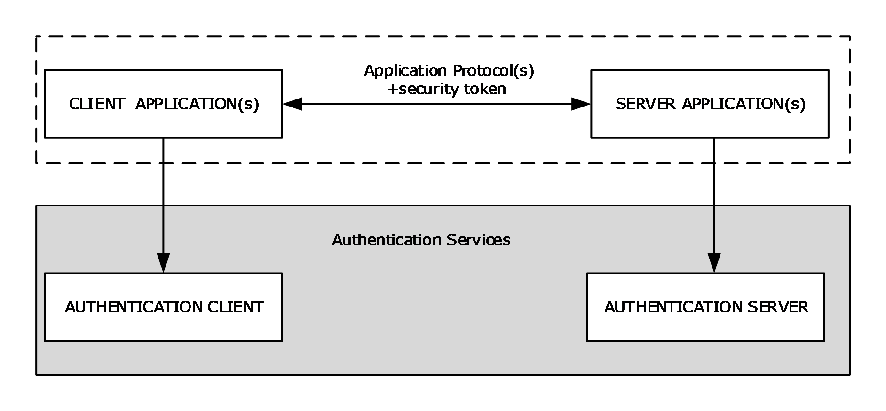

Figure 1: GSS-style authentication model

As shown in the preceding diagram, the client application contacts the local Authentication Client through a generic interface that abstracts the underlying authentication protocols for creating a security token. The Authentication Client creates a security token with the help of the underlying authentication protocols and returns it to the calling application. Next, the client application embeds the security token within application messages of the application protocol and transmits them as an authentication request to the server side of the application. On receipt of the authentication messages, the server application extracts the security token and supplies it to the Authentication Server. The Authentication Server processes the security token with the help of the underlying authentication protocols and generates a response or determines that authentication is complete. If another security token is generated, the server-side application sends it back to the client, where the process continues.

This exchange of security tokens continues until one or both sides determine that authentication is complete. If authentication fails, the application should drop the connection and indicate the error. If it succeeds, the application can then be assured of the identity of the participants, as far as the underlying authentication protocol can accomplish.

When authentication is complete, session-specific security services are available. The application can then invoke the authentication protocol to sign or encrypt the messages that are sent as part of the application protocol. These operations are performed in much the same way, where the application can indicate which portion of the message is to be encrypted, and then include a per-message security token. By signing and/or encrypting the messages, the application obtains privacy, resists message tampering, and detects dropped, suppressed, or replayed messages.

In Windows, the [**Security Support Provider Interface (SSPI)**](#gt_security-support-provider-interface-sspi) is the implementation of the GSS-style authentication model. SSPI is a Windows-specific API implementation that provides the means for connected network applications to call one of several [**security support providers (SSPs)**](#gt_security-support-provider-ssp) to establish authenticated connections and to exchange data securely over those connections. SSP is the implementation of an authentication protocol as a dynamic link library (DLL). SSPI is the Windows equivalent of GSS-API, and the two sets of APIs are on-the-wire compatible; hence, in this document, the terms GSS-API and SSPI are used interchangeably.

For more information about the SSPI, see [[SSPI]](https://go.microsoft.com/fwlink/?LinkId=90536).

## 1.2 Glossary

This document uses the following terms:

**Active Directory**: The Windows implementation of a general-purpose directory service, which uses [**LDAP**](#gt_lightweight-directory-access-protocol-ldap) as its primary access protocol. [**Active Directory**](#gt_active-directory) stores information about a variety of objects in the network such as user accounts, computer accounts, groups, and all related credential information used by [**Kerberos**](#gt_kerberos) [MS-KILE](../MS-KILE/MS-KILE.md). [**Active Directory**](#gt_active-directory) is either deployed as Active Directory Domain Services (AD DS) or Active Directory Lightweight Directory Services (AD LDS), which are both described in [MS-ADOD](#Section_2.1): Active Directory Protocols Overview.

**asymmetric encryption**: An encryption method that uses one key to encrypt and uses a different key to decrypt; these keys are linked by mathematical requirements.

**asymmetric signature**: A digital signature that is derived from a cryptographic operation by using an asymmetric algorithm and a [**private key**](#gt_private-key). An [**asymmetric signature**](#gt_asymmetric-signature) is processed with two different keys; one key is used to create the signature, and the other key is used to verify the signature. These keys are linked by mathematical requirements.

**Authentication Authority (AA)**: A system that acts as a trusted third-party system, such as a [**Key Distribution Center (KDC)**](#gt_key-distribution-center-kdc).

**Authentication Client**: The total set of authentication protocol [**security support providers (SSPs)**](#gt_security-support-provider-ssp) that are typically available on a Windows client release.

**authentication server**: The entity that verifies that a person or thing is who or what it claims to be (typically using a cryptographic protocol) and issues a ticket or token attesting to the validity of the claim.

**Authentication Service (AS)**: A service that issues ticket granting tickets (TGTs), which are used for authenticating principals within the [**realm**](#gt_realm) or [**domain**](#gt_domain) served by the [**Authentication Service**](#gt_authentication-service-as).

**authenticator**: When used in reference to [**Kerberos**](#gt_kerberos), see [**Kerberos authenticator**](#gt_kerberos-authenticator).

**authorization**: The secure computation of roles and accesses granted to an identity.

**authorization data**: An extensible field within a [**Kerberos**](#gt_kerberos) [**ticket**](#gt_ticket), used to pass authorization data about the principal on whose behalf the [**ticket**](#gt_ticket) was issued to the application service.

**challenge**: A piece of data used to authenticate a user. Typically a challenge takes the form of a [**nonce**](#gt_nonce).

**challenge/response authentication**: A common authentication technique in which a principal is prompted (the challenge) to provide some private information (the response) to facilitate authentication.

**claim**: An assertion about a security principal expressed as the n-tuple {Identifier, ValueType, m Value(s) of type ValueType} where m is greater than or equal to 1. A claim with only one Value in the n-tuple is called a single-valued claim; a claim with more than one Value is called a multi-valued claim.

**client authentication**: A mode of authentication in which only the client in the transaction proves its identity.

**client computer**: The client machine in the [**domain**](#gt_domain) or network topology of clients, servers, and [**domain controllers**](#gt_domain-controller-dc). Alternatively, a computer that is not a domain controller server; the computer may or may not be joined to a domain.

**Common Internet File System (CIFS)**: The "NT LM 0.12" / [**NT LAN Manager**](#gt_nt-lan-manager-ntlm) dialect of the [**Server Message Block (SMB)**](#gt_server-message-block-smb) Protocol, as implemented in Windows NT. The CIFS name originated in the 1990's as part of an attempt to create an Internet standard for [**SMB**](#gt_server-message-block-smb), based upon the then-current Windows NT implementation.

**Compound identity TGS-REQ**: A [**FAST**](#gt_flexible-authentication-secure-tunneling-fast) TGS-REQ that uses explicit [**FAST**](#gt_flexible-authentication-secure-tunneling-fast) armoring using the computer's [**ticket-granting ticket (TGT)**](#gt_ticket-granting-ticket-tgt).

**credential**: Previously established, authentication data that is used by a security principal to establish its own identity. When used in reference to the Netlogon Protocol, it is the data that is stored in the NETLOGON_CREDENTIAL structure.

**Data Encryption Standard (DES)**: A specification for encryption of computer data that uses a 56-bit key developed by IBM and adopted by the U.S. government as a standard in 1976. For more information see [[FIPS46-3]](https://go.microsoft.com/fwlink/?LinkId=89872).

**delegation of authentication**: The [**Kerberos**](#gt_kerberos) mechanism whereby the client application delegates its authentication to a front-end server by informing the [**Key Distribution Center (KDC)**](#gt_key-distribution-center-kdc) that the front-end server is authorized to act on behalf of the identity of the user who is running the client application to access protected resources that are located on a back-end server.

**Digest authentication**: A protocol that uses a challenge-response mechanism for authentication in which clients are able to verify their identities without sending an in-the-clear password to the server. For more information, see [[RFC2617]](https://go.microsoft.com/fwlink/?LinkId=90373) and [[RFC2831]](https://go.microsoft.com/fwlink/?LinkId=90387).

**Distributed File System (DFS)**: A file system that logically groups physical shared folders located on different servers by transparently connecting them to one or more hierarchical namespaces. [**DFS**](#gt_distributed-file-system-dfs) also provides fault-tolerance and load-sharing capabilities.

**domain**: A set of users and computers sharing a common namespace and management infrastructure. At least one computer member of the set must act as a [**domain controller (DC)**](#gt_domain-controller-dc) and host a member list that identifies all members of the domain, as well as optionally hosting the [**Active Directory**](#gt_active-directory) service. The domain controller provides authentication of members, creating a unit of trust for its members. Each domain has an identifier that is shared among its members. For more information, see [MS-AUTHSOD](#Section_953d700a57cb4cf7b0c3a64f34581cc9) section 1.1.1.5 and [MS-ADTS](../MS-ADTS/MS-ADTS.md).

**domain account**: A stored set of attributes representing a principal used to authenticate a user or machine to an [**Active Directory**](#gt_active-directory) domain.

**domain controller (DC)**: The service, running on a server, that implements [**Active Directory**](#gt_active-directory), or the server hosting this service. The service hosts the data store for objects and interoperates with other [**DCs**](#gt_domain-controller-dc) to ensure that a local change to an object replicates correctly across all [**DCs**](#gt_domain-controller-dc). When [**Active Directory**](#gt_active-directory) is operating as Active Directory Domain Services (AD DS), the [**DC**](#gt_domain-controller-dc) contains full NC replicas of the configuration naming context (config NC), schema naming context (schema NC), and one of the domain NCs in its [**forest**](#gt_forest). If the AD DS [**DC**](#gt_domain-controller-dc) is a [**global catalog server (GC server)**](#gt_global-catalog-server-gc-server), it contains partial NC replicas of the remaining domain NCs in its [**forest**](#gt_forest). For more information, see [MS-AUTHSOD] section 1.1.1.5.2 and [MS-ADTS]. When [**Active Directory**](#gt_active-directory) is operating as Active Directory Lightweight Directory Services (AD LDS), several AD LDS [**DCs**](#gt_domain-controller-dc) can run on one server. When [**Active Directory**](#gt_active-directory) is operating as AD DS, only one AD DS [**DC**](#gt_domain-controller-dc) can run on one server. However, several AD LDS [**DCs**](#gt_domain-controller-dc) can coexist with one AD DS [**DC**](#gt_domain-controller-dc) on one server. The AD LDS [**DC**](#gt_domain-controller-dc) contains full NC replicas of the config NC and the schema NC in its [**forest**](#gt_forest). The domain controller is the server side of Authentication Protocol Domain Support [MS-APDS](../MS-APDS/MS-APDS.md).

**Domain Name System (DNS)**: A hierarchical, distributed database that contains mappings of domain names to various types of data, such as IP addresses. DNS enables the location of computers and services by user-friendly names, and it also enables the discovery of other information stored in the database.

**domain user**: A user with an account in the domain's user account database.

**encrypted hash**: A cryptographic hash that is computed over both an asymmetric key and data.

**FAST AS-REQ**: A [**Kerberos**](#gt_kerberos) AS-REQ ([[RFC4120]](https://go.microsoft.com/fwlink/?LinkId=90458) section 3.1) message that is armored with a computer's [**ticket-granting ticket (TGT)**](#gt_ticket-granting-ticket-tgt).

**FAST TGS-REP**: A [**Kerberos**](#gt_kerberos) TGS-REP ([RFC4120] section 3.3) message that is armored with a user's [**TGT**](#gt_ticket-granting-ticket-tgt).

**FAST TGS-REQ**: A [**Kerberos**](#gt_kerberos) TGS-REQ ([RFC4120] section 3.3) message that is armored with a user's [**TGT**](#gt_ticket-granting-ticket-tgt).

**Flexible Authentication Secure Tunneling (FAST)**: FAST provides a protected channel between the client and the [**Key Distribution Center (KDC)**](#gt_key-distribution-center-kdc).

**forest**: One or more [**domains**](#gt_domain) that share a common schema and trust each other transitively. An organization can have multiple [**forests**](#gt_forest). A [**forest**](#gt_forest) establishes the security and administrative boundary for all the objects that reside within the [**domains**](#gt_domain) that belong to the [**forest**](#gt_forest). In contrast, a [**domain**](#gt_domain) establishes the administrative boundary for managing objects, such as users, groups, and computers. In addition, each [**domain**](#gt_domain) has individual security policies and trust relationships with other [**domains**](#gt_domain).

**Generic Security Services (GSS)**: An Internet standard, as described in [[RFC2743]](https://go.microsoft.com/fwlink/?LinkId=90378), for providing security services to applications. It consists of an application programming interface (GSS-API) set, as well as standards that describe the structure of the security data.

**global catalog server (GC server)**: A [**domain controller (DC)**](#gt_domain-controller-dc) that contains a naming context (NC) replica (one full, the rest partial) for each domain naming context in the [**forest**](#gt_forest).

**Group Policy**: A mechanism that allows the implementer to specify managed configurations for users and computers in an [**Active Directory**](#gt_active-directory) service environment.

**Hypertext Transfer Protocol Secure (HTTPS)**: An extension of HTTP that securely encrypts and decrypts web page requests. In some older protocols, "Hypertext Transfer Protocol over Secure Sockets Layer" is still used (Secure Sockets Layer has been deprecated). For more information, see [[SSL3]](https://go.microsoft.com/fwlink/?LinkId=90534) and [[RFC5246]](https://go.microsoft.com/fwlink/?LinkId=129803).

**identity store**: The set of users on a single computer or the identities that are available in a [**domain**](#gt_domain).

**interactive logon**: A software method in which the account information and credentials input by the user interactively are authenticated by a server or [**domain controller (DC)**](#gt_domain-controller-dc).

**Kerberos**: An authentication system that enables two parties to exchange private information across an otherwise open network by assigning a unique key (called a [**ticket**](#gt_ticket)) to each user that logs on to the network and then embedding these tickets into messages sent by the users. For more information, see [MS-KILE].

**Kerberos authenticator**: A record sent with a [**ticket**](#gt_ticket) to a server to certify the client's knowledge of the [**session key**](#gt_session-key) in the [**ticket**](#gt_ticket); to help the server detect replay attacks by proving that the authenticator is recently constructed; and to help the two parties select additional [**session keys**](#gt_session-key) for a particular connection authenticated by [**Kerberos**](#gt_kerberos). The use of authenticators, including how authenticators are validated, is specified in [RFC4120] section 5.5.1. For more information, see [KAUFMAN].

**Key Distribution Center (KDC)**: The [**Kerberos**](#gt_kerberos) service that implements the authentication and [**ticket**](#gt_ticket) granting services specified in the [**Kerberos**](#gt_kerberos) protocol. The service runs on computers selected by the administrator of the [**realm**](#gt_realm) or domain; it is not present on every machine on the network. It must have access to an account database for the [**realm**](#gt_realm) that it serves. [**KDCs**](#gt_key-distribution-center-kdc) are integrated into the [**domain controller**](#gt_domain-controller-dc) role. It is a network service that supplies [**tickets**](#gt_ticket) to clients for use in authenticating to services.

**keyed hash**: A cryptographic hash computed over both a symmetric key and data, as specified in [RFC2617]. For more information, see [[RFC2104]](https://go.microsoft.com/fwlink/?LinkId=90314).

**LDAP directory**: The database that stores information about [**LDAP**](#gt_lightweight-directory-access-protocol-ldap) objects ([[RFC2251]](https://go.microsoft.com/fwlink/?LinkId=90325)), such as users, groups, computers, and printers.

**Lightweight Directory Access Protocol (LDAP)**: The primary access protocol for [**Active Directory**](#gt_active-directory). Lightweight Directory Access Protocol (LDAP) is an industry-standard protocol, established by the Internet Engineering Task Force (IETF), which allows users to query and update information in a directory service (DS), as described in [MS-ADTS]. The Lightweight Directory Access Protocol can be either version 2 [[RFC1777]](https://go.microsoft.com/fwlink/?LinkId=90290) or version 3 [[RFC3377]](https://go.microsoft.com/fwlink/?LinkID=91337).

**Local Security Authority (LSA)**: A protected subsystem that authenticates and logs users onto the local system. [**LSA**](#gt_local-security-authority-lsa) also maintains information about all aspects of local security on a system, collectively known as the local security policy of the system.

**mutual authentication**: A mode in which each party verifies the identity of the other party, as described in [[RFC3748]](https://go.microsoft.com/fwlink/?LinkId=90444) section 7.2.1.

**Netlogon**: The Netlogon Remote Protocol, as specified in [MS-NRPC](../MS-NRPC/MS-NRPC.md).

**network logon**: A software method in which the account information and credentials previously supplied by the user as part of an interactive logon are used again to log the user onto another network resource.

**nonce**: A number that is used only once. This is typically implemented as a random number large enough that the probability of number reuse is extremely small. A nonce is used in authentication protocols to prevent replay attacks. For more information, see [RFC2617].

**NT LAN Manager (NTLM)**: An authentication protocol that is based on a challenge-response sequence for authentication.

**NT LAN Manager (NTLM) Authentication Protocol**: A protocol using a challenge-response mechanism for authentication in which clients are able to verify their identities without sending a password to the server. It consists of three messages, commonly referred to as Type 1 (negotiation), Type 2 (challenge) and Type 3 (authentication).

**NTP**: Network Time Protocol (NTP), as specified in [MS-SNTP](../MS-SNTP/MS-SNTP.md).

**NTP server**: The server role of the Network Time Protocol (NTP).

**object identifier (OID)**: In the Lightweight Directory Access Protocol (LDAP), a sequence of numbers in a format described by [[RFC1778]](https://go.microsoft.com/fwlink/?LinkId=90291). In many LDAP directory implementations, an OID is the standard internal representation of an attribute. In the directory model used in this specification, the more familiar ldapDisplayName represents an attribute.

**pre-authentication**: In Kerberos, a state in which a [**key distribution center (KDC)**](#gt_key-distribution-center-kdc) demands that the requestor in the Authentication Service (AS) exchange demonstrate knowledge of the key associated with the account. If the requestor cannot demonstrate this knowledge, the [**KDC**](#gt_key-distribution-center-kdc) will not issue a [**ticket-granting ticket (TGT)**](#gt_ticket-granting-ticket-tgt) ([RFC4120] sections 5.2.7 and 7.5.2).

**private key**: One of a pair of keys used in public-key cryptography. The private key is kept secret and is used to decrypt data that has been encrypted with the corresponding public key. For an introduction to this concept, see [[CRYPTO]](https://go.microsoft.com/fwlink/?LinkId=89841) section 1.8 and [[IEEE1363]](https://go.microsoft.com/fwlink/?LinkId=89899) section 3.1.

**privilege attribute certificate (PAC)**: A Microsoft-specific authorization data present in the authorization data field of a ticket. The [**PAC**](#gt_privilege-attribute-certificate-pac) contains several logical components, including group membership data for authorization, alternate credentials for non-Kerberos authentication protocols, and policy control information for supporting interactive logon.

**proxy**: An intermediary program that acts as both a server and a client for the purpose of making requests on behalf of other clients (see [[RFC2616]](https://go.microsoft.com/fwlink/?LinkId=90372) section 1.3).

**public key**: One of a pair of keys used in public-key cryptography. The public key is distributed freely and published as part of a digital certificate. For an introduction to this concept, see [CRYPTO] section 1.8 and [IEEE1363] section 3.1.

**public key infrastructure (PKI)**: The laws, policies, standards, and software that regulate or manipulate certificates and public and private keys. In practice, it is a system of digital certificates, certificate authorities (CAs), and other registration authorities that verify and authenticate the validity of each party involved in an electronic transaction. For more information, see [[X509]](https://go.microsoft.com/fwlink/?LinkId=90590) section 6.

**realm**: A collection of key distribution centers (KDCs) with a common set of principals, as described in [RFC4120] section 1.2.

**Remote Desktop Protocol (RDP)**: A multi-channel protocol that allows a user to connect to a computer running Microsoft Terminal Services (TS). RDP enables the exchange of client and server settings and also enables negotiation of common settings to use for the duration of the connection, so that input, graphics, and other data can be exchanged and processed between client and server.

**secret key**: A symmetric encryption key shared by two entities, such as between a user and the [**domain controller (DC)**](#gt_domain-controller-dc), with a long lifetime. A password is a common example of a secret key. When used in a context that implies [**Kerberos**](#gt_kerberos) only, a principal's secret key.

**Secure Sockets Layer (SSL)**: A security protocol that supports confidentiality and integrity of messages in client and server applications that communicate over open networks. SSL supports server and, optionally, client authentication using [**X.509**](#gt_x509) certificates [X509] and [[RFC5280]](https://go.microsoft.com/fwlink/?LinkId=131034). SSL is superseded by [**Transport Layer Security (TLS)**](#gt_transport-layer-security-tls). TLS version 1.0 is based on SSL version 3.0 [SSL3].

**Security Account Manager (SAM)**: A centrally managed service, such as Active Directory Domain Services (AD DS), that enables a server to establish a trust relationship with other authorized servers. The SAM also maintains information about domains and [**security principals**](#gt_security-principal), and provides client-to-server information by using several available standards for access control lists (ACLs).

**security account manager (SAM) built-in database**: The part of the user account database that contains account information (such as account names and passwords) for accounts and groups that are pre-created at the database installation.

**security context**: An abstract data structure that contains authorization information for a particular [**security principal**](#gt_security-principal) in the form of a Token/Authorization Context (see [MS-DTYP](../MS-DTYP/MS-DTYP.md) section 2.5.2). A server uses the authorization information in a [**security context**](#gt_security-context) to check access to requested resources. A [**security context**](#gt_security-context) also contains a key identifier that associates mutually established cryptographic keys, along with other information needed to perform secure communication with another security principal.

**security identifier (SID)**: An identifier for [**security principals**](#gt_security-principal) that is used to identify an account or a group. Conceptually, the [**SID**](#gt_security-identifier-sid) is composed of an account authority portion (typically a [**domain**](#gt_domain)) and a smaller integer representing an identity relative to the account authority, termed the relative identifier (RID). The [**SID**](#gt_security-identifier-sid) format is specified in [MS-DTYP] section 2.4.2; a string representation of [**SIDs**](#gt_security-identifier-sid) is specified in [MS-DTYP] section 2.4.2 and [MS-AZOD](../MS-AZOD/MS-AZOD.md) section 1.1.1.2.

**security principal**: An identity that can be used to regulate access to resources. A security principal can be a user, a computer, or a group that represents a set of users.

**security support provider (SSP)**: A dynamic-link library (DLL) that implements the [**Security Support Provider Interface (SSPI)**](#gt_security-support-provider-interface-sspi) by making one or more security packages available to applications. Each security package provides mappings between an application's [**SSPI**](#gt_security-support-provider-interface-sspi) function calls and an actual security model's functions. Security packages support security protocols such as [**Kerberos**](#gt_kerberos) authentication and [**NTLM**](#gt_nt-lan-manager-ntlm).

**Security Support Provider Interface (SSPI)**: An API that allows connected applications to call one of several security providers to establish authenticated connections and to exchange data securely over those connections. It is equivalent to Generic Security Services (GSS)-API, and the two are on-the-wire compatible.

**security token**: An opaque message or data packet produced by a [**Generic Security Services (GSS)**](#gt_generic-security-services-gss)-style authentication package and carried by the application protocol. The application has no visibility into the contents of the token.

**server authentication**: A mode of authentication in which only the server in the transaction proves its identity.

**server computer**: The server role in the network topology of client/server/domain controller.

**Server Message Block (SMB)**: A protocol that is used to request file and print services from server systems over a network. The SMB protocol extends the CIFS protocol with additional security, file, and disk management support. For more information, see [[CIFS]](https://go.microsoft.com/fwlink/?linkid=2109334) and [MS-SMB](../MS-SMB/MS-SMB.md).

**service principal name (SPN)**: The name a client uses to identify a service for mutual authentication. (For more information, see [[RFC1964]](https://go.microsoft.com/fwlink/?LinkId=90304) section 2.1.1.) An [**SPN**](#gt_service-principal-name-spn) consists of either two parts or three parts, each separated by a forward slash ('/'). The first part is the service class, the second part is the host name, and the third part (if present) is the service name. For example, "ldap/dc-01.fabrikam.com/fabrikam.com" is a three-part [**SPN**](#gt_service-principal-name-spn) where "ldap" is the service class name, "dc-01.fabrikam.com" is the host name, and "fabrikam.com" is the service name. See [[SPNNAMES]](https://go.microsoft.com/fwlink/?LinkId=90532) for more information about [**SPN**](#gt_service-principal-name-spn) format and composing a unique [**SPN**](#gt_service-principal-name-spn).

**service ticket**: A [**ticket**](#gt_ticket) for any service other than the [**ticket-granting service (TGS)**](#gt_ticket-granting-service-tgs). A [**service ticket**](#gt_service-ticket) serves only to classify a [**ticket**](#gt_ticket) as not a [**ticket-granting ticket (TGT)**](#gt_ticket-granting-ticket-tgt) or cross-realm TGT, as specified in [RFC4120].

**session key**: A relatively short-lived symmetric key (a cryptographic key negotiated by the client and the server based on a shared secret). A [**session key's**](#gt_session-key) lifespan is bounded by the session to which it is associated. A [**session key**](#gt_session-key) has to be strong enough to withstand cryptanalysis for the lifespan of the session.

**Simple and Protected GSS-API Negotiation Mechanism (SPNEGO)**: An authentication mechanism that allows [**Generic Security Services (GSS)**](#gt_generic-security-services-gss) peers to determine whether their credentials support a common set of GSS-API security mechanisms, to negotiate different options within a given security mechanism or different options from several security mechanisms, to select a service, and to establish a [**security context**](#gt_security-context) among themselves using that service. [**SPNEGO**](#gt_simple-and-protected-gss-api-negotiation-mechanism-spnego) is specified in [[RFC4178]](https://go.microsoft.com/fwlink/?LinkId=90461).

**smart card**: A portable device that is shaped like a business card and is embedded with a memory chip and either a microprocessor or some non-programmable logic. [**Smart cards**](#gt_smart-card) are often used as authentication tokens and for secure key storage. [**Smart cards**](#gt_smart-card) used for secure key storage have the ability to perform cryptographic operations with the stored key without allowing the key itself to be read or otherwise extracted from the card.

**SMB dialect**: There are several different versions and subversions of the [**Server Message Block (SMB)**](#gt_server-message-block-smb) protocol. A particular version of the [**SMB**](#gt_server-message-block-smb) protocol is referred to as an [**SMB dialect**](#gt_smb-dialect). Different [**SMB dialects**](#gt_smb-dialect) can include both new [**SMB**](#gt_server-message-block-smb) messages as well as changes to the fields and semantics of existing [**SMB**](#gt_server-message-block-smb) messages used in other [**SMB dialects**](#gt_smb-dialect). When an [**SMB**](#gt_server-message-block-smb) client connects to an [**SMB**](#gt_server-message-block-smb) server, the client and server negotiate the [**SMB dialect**](#gt_smb-dialect) to be used.

**symmetric encryption**: An encryption method that uses the same cryptographic key to encrypt and decrypt a given message.

**ticket**: A record generated by the [**key distribution center (KDC)**](#gt_key-distribution-center-kdc) that helps a client authenticate to a service. It contains the client's identity, a unique cryptographic key for use with this ticket (the [**session key**](#gt_session-key)), a time stamp, and other information, all sealed using the service's [**secret key**](#gt_secret-key). It only serves to authenticate a client when presented along with a valid authenticator.

**ticket-granting service (TGS)**: A service that issues [**tickets**](#gt_ticket) for admission to other services in its own domain or for admission to the ticket-granting service in another domain.

**ticket-granting ticket (TGT)**: A special type of [**ticket**](#gt_ticket) that can be used to obtain other [**tickets**](#gt_ticket). The TGT is obtained after the initial authentication in the Authentication Service (AS) exchange; thereafter, users do not need to present their credentials, but can use the TGT to obtain subsequent tickets.

**Transport Layer Security (TLS)**: A security protocol that supports confidentiality and integrity of messages in client and server applications communicating over open networks. TLS supports server and, optionally, client authentication by using X.509 certificates (as specified in [X509]). TLS is standardized in the IETF TLS working group.

**user principal name (UPN)**: A user account name (sometimes referred to as the user logon name) and a domain name that identifies the domain in which the user account is located. This is the standard usage for logging on to a Windows domain. The format is: someone@example.com (in the form of an email address). In [**Active Directory**](#gt_active-directory), the userPrincipalName attribute of the account object, as described in [MS-ADTS].

**X.509**: An ITU-T standard for public key infrastructure subsequently adapted by the IETF, as specified in [[RFC3280]](https://go.microsoft.com/fwlink/?LinkId=90414).

## 1.3 References

[IETFDRAFT-NEGOEX-02] Short, M., Zhu, L., Damour, K., and McPherson, D., "The Extended GSS-API Negotiation Mechanism (NEGOEX)", draft-zhu-negoex-02, September 2010, [https://tools.ietf.org/html/draft-zhu-negoex-02](https://go.microsoft.com/fwlink/?LinkId=132205)

[IETFDRAFT-NEGOEX-04] Short, M., Zhu, L., Damour, K, and McPherson, D, "SPNEGO Extended Negotiation (NEGOEX) Security Mechanism", draft-zhu-negoex-04, January 2011, [https://tools.ietf.org/id/draft-zhu-negoex-04.txt](https://go.microsoft.com/fwlink/?linkid=2112888)

[MS-ADOD] Microsoft Corporation, "[Active Directory Protocols Overview](#Section_2.1)".

[MS-ADTS] Microsoft Corporation, "[Active Directory Technical Specification](../MS-ADTS/MS-ADTS.md)".

[MS-APDS] Microsoft Corporation, "[Authentication Protocol Domain Support](../MS-APDS/MS-APDS.md)".

[MS-CERSOD] Microsoft Corporation, "[Certificate Services Protocols Overview](#Section_2.1)".

[MS-CIFS] Microsoft Corporation, "[Common Internet File System (CIFS) Protocol](../MS-CIFS/MS-CIFS.md)".

[MS-CSSP] Microsoft Corporation, "[Credential Security Support Provider (CredSSP) Protocol](#Section_2.9)".

[MS-DPSP] Microsoft Corporation, "[Digest Protocol Extensions](../MS-DPSP/MS-DPSP.md)".

[MS-DRSR] Microsoft Corporation, "[Directory Replication Service (DRS) Remote Protocol](../MS-DRSR/MS-DRSR.md)".

[MS-FASOD] Microsoft Corporation, "[File Access Services Protocols Overview](#Section_2.1.2.3.1)".

[MS-GPOD] Microsoft Corporation, "[Group Policy Protocols Overview](#Section_2.1)".

[MS-KILE] Microsoft Corporation, "[Kerberos Protocol Extensions](../MS-KILE/MS-KILE.md)".

[MS-KKDCP] Microsoft Corporation, "[Kerberos Key Distribution Center (KDC) Proxy Protocol](../MS-KKDCP/MS-KKDCP.md)".

[MS-NEGOEX] Microsoft Corporation, "[SPNEGO Extended Negotiation (NEGOEX) Security Mechanism](#Section_2.9)".

[MS-NLMP] Microsoft Corporation, "[NT LAN Manager (NTLM) Authentication Protocol](../MS-NLMP/MS-NLMP.md)".

[MS-NNTP] Microsoft Corporation, "[NT LAN Manager (NTLM) Authentication: Network News Transfer Protocol (NNTP) Extension](../MS-NNTP/MS-NNTP.md)".

[MS-NRPC] Microsoft Corporation, "[Netlogon Remote Protocol](../MS-NRPC/MS-NRPC.md)".

[MS-PAC] Microsoft Corporation, "[Privilege Attribute Certificate Data Structure](../MS-PAC/MS-PAC.md)".

[MS-PKCA] Microsoft Corporation, "[Public Key Cryptography for Initial Authentication (PKINIT) in Kerberos Protocol](../MS-PKCA/MS-PKCA.md)".

[MS-POP3] Microsoft Corporation, "[NT LAN Manager (NTLM) Authentication: Post Office Protocol - Version 3 (POP3) Extension](../MS-POP3/MS-POP3.md)".

[MS-RCMP] Microsoft Corporation, "[Remote Certificate Mapping Protocol](../MS-RCMP/MS-RCMP.md)".

[MS-RDPBCGR] Microsoft Corporation, "[Remote Desktop Protocol: Basic Connectivity and Graphics Remoting](../MS-RDPBCGR/MS-RDPBCGR.md)".

[MS-RDSOD] Microsoft Corporation, "[Remote Desktop Services Protocols Overview](#Section_2.1)".

[MS-RPCE] Microsoft Corporation, "[Remote Procedure Call Protocol Extensions](../MS-RPCE/MS-RPCE.md)".

[MS-SAMR] Microsoft Corporation, "[Security Account Manager (SAM) Remote Protocol (Client-to-Server)](#Section_2.9)".

[MS-SFU] Microsoft Corporation, "[Kerberos Protocol Extensions: Service for User and Constrained Delegation Protocol](../MS-SFU/MS-SFU.md)".

[MS-SMB2] Microsoft Corporation, "[Server Message Block (SMB) Protocol Versions 2 and 3](../MS-SMB2/MS-SMB2.md)".

[MS-SMB] Microsoft Corporation, "[Server Message Block (SMB) Protocol](../MS-SMB/MS-SMB.md)".

[MS-SNTP] Microsoft Corporation, "[Network Time Protocol (NTP) Authentication Extensions](../MS-SNTP/MS-SNTP.md)".

[MS-SPNG] Microsoft Corporation, "[Simple and Protected GSS-API Negotiation Mechanism (SPNEGO) Extension](../MS-SPNG/MS-SPNG.md)".

[MS-TLSP] Microsoft Corporation, "[Transport Layer Security (TLS) Profile](#Section_2.9)".

[MS-WSMV] Microsoft Corporation, "[Web Services Management Protocol Extensions for Windows Vista](../MS-WSMV/MS-WSMV.md)".

[MSFT-ADDSFL] Microsoft Corporation, "Understanding Active Directory Domain Services (AD DS) Functional Levels", [http://technet.microsoft.com/en-us/library/understanding-active-directory-functional-levels(WS.10).aspx](https://go.microsoft.com/fwlink/?LinkId=264226)

[MSFT-ADN] Microsoft Corporation, "Active Directory naming", [http://technet.microsoft.com/en-us/library/cc739093(WS.10).aspx](https://go.microsoft.com/fwlink/?LinkId=266208)

[MSFT-DomainForest] Microsoft Corporation, "How Domains and Forests Work", [http://technet.microsoft.com/en-us/library/cc783351(WS.10).aspx](https://go.microsoft.com/fwlink/?LinkId=266209)

[PKU2U-DRAFT] Zhu, L., Altman, J., and Williams, N., "Public Key Cryptography Based User-to-User Authentication (PKU2U)", November 2008, [http://tools.ietf.org/id/draft-zhu-pku2u-09.txt](https://go.microsoft.com/fwlink/?LinkId=208275)

[Referrals] Raeburn, K., Zhu, L., and Jaganathan, K., "Generating KDC Referrals to Locate Kerberos Realms", February 2008, [http://tools.ietf.org/html/draft-ietf-krb-wg-kerberos-referrals-10](https://go.microsoft.com/fwlink/?LinkId=90258)

[RFC2246] Dierks, T., and Allen, C., "The TLS Protocol Version 1.0", RFC 2246, January 1999, [https://datatracker.ietf.org/doc/rfc2246/](https://go.microsoft.com/fwlink/?LinkId=90324)

[RFC2616] Fielding, R., Gettys, J., Mogul, J., et al., "Hypertext Transfer Protocol -- HTTP/1.1", RFC 2616, June 1999, [http://www.rfc-editor.org/rfc/rfc2616.txt](https://go.microsoft.com/fwlink/?LinkId=90372)

[RFC2617] Franks, J., Hallam-Baker, P., Hostetler, J., et al., "HTTP Authentication: Basic and Digest Access Authentication", RFC 2617, June 1999, [http://www.rfc-editor.org/rfc/rfc2617.txt](https://go.microsoft.com/fwlink/?LinkId=90373)

[RFC2743] Linn, J., "Generic Security Service Application Program Interface Version 2, Update 1", RFC 2743, January 2000, [http://www.rfc-editor.org/rfc/rfc2743.txt](https://go.microsoft.com/fwlink/?LinkId=90378)

[RFC2831] Leach, P. and Newman, C., "Using Digest Authentication as a SASL Mechanism", RFC 2831, May 2000, [http://www.ietf.org/rfc/rfc2831.txt](https://go.microsoft.com/fwlink/?LinkId=90387)

[RFC3244] Swift, M., Trostle, J., and Brezak, J., "Microsoft Windows 2000 Kerberos Change Password and Set Password Protocols", RFC 3244, February 2002, [http://www.ietf.org/rfc/rfc3244.txt](https://go.microsoft.com/fwlink/?LinkId=90409)

[RFC3961] Raeburn, K., "Encryption and Checksum Specifications for Kerberos 5", RFC 3961, February 2005, [http://www.ietf.org/rfc/rfc3961.txt](https://go.microsoft.com/fwlink/?LinkId=90450)

[RFC4120] Neuman, C., Yu, T., Hartman, S., and Raeburn, K., "The Kerberos Network Authentication Service (V5)", RFC 4120, July 2005, [https://www.rfc-editor.org/rfc/rfc4120.txt](https://go.microsoft.com/fwlink/?LinkId=90458)

[RFC4178] Zhu, L., Leach, P., Jaganathan, K., and Ingersoll, W., "The Simple and Protected Generic Security Service Application Program Interface (GSS-API) Negotiation Mechanism", RFC 4178, October 2005, [https://www.rfc-editor.org/rfc/rfc4178.txt](https://go.microsoft.com/fwlink/?LinkId=90461)

[RFC4556] Zhu, L., and Tung, B., "Public Key Cryptography for Initial Authentication in Kerberos", RFC 4556, June 2006, [http://www.ietf.org/rfc/rfc4556.txt](https://go.microsoft.com/fwlink/?LinkId=90482)

[RFC5246] Dierks, T., and Rescorla, E., "The Transport Layer Security (TLS) Protocol Version 1.2", RFC 5246, August 2008, [https://datatracker.ietf.org/doc/rfc5246/](https://go.microsoft.com/fwlink/?LinkId=129803)

[RFC5349] Zhu, L., Jaganathan, K., and Lauter, K., "Elliptic Curve Cryptography (ECC) Support for Public Key Cryptography for Initial Authentication in Kerberos (PKINIT)", RFC 5349, September 2008, [http://www.ietf.org/rfc/rfc5349.txt](https://go.microsoft.com/fwlink/?LinkId=129652)

[RFC6113] Hartman, S., and Zhu, L., "A Generalized Framework for Kerberos Pre-Authentication", RFC 6113, April 2011, [http://www.ietf.org/rfc/rfc6113.txt](https://go.microsoft.com/fwlink/?LinkId=226316)

[RFC8446] Rescorla, E., "The Transport Layer Security (TLS) Protocol Version 1.3", RFC 8446, DOI 10.17487 August 2018, [https://www.rfc-editor.org/info/rfc8446](https://go.microsoft.com/fwlink/?linkid=2147431)

[SCHNEIER] Schneier, B., "Applied Cryptography, Second Edition", John Wiley and Sons, 1996, ISBN: 0471117099, [http://www.wiley.com/WileyCDA/WileyTitle/productCd-0471117099.html](https://go.microsoft.com/fwlink/?LinkId=817338)

[SSPI] Microsoft Corporation, "SSPI", [https://docs.microsoft.com/en-us/windows/desktop/SecAuthN/sspi](https://go.microsoft.com/fwlink/?LinkId=90536)

# 2 Functional Architecture

The Authentication Services protocols provide authentication services through the following methods:

- [**Interactive logon**](#gt_interactive-logon) authentication
- [**Network logon**](#gt_network-logon) authentication (also called noninteractive authentication)
The following sections provide an overview of interactive logon authentication and network logon authentication, the protocols involved, and the relationships of these protocols with the relevant standard protocols.

## 2.1 Overview

The following diagram illustrates the high-level interactions between the internal components of Authentication Services and other external systems, including the [**public key infrastructure (PKI)**](#gt_public-key-infrastructure-pki), **Authorization**, and the **account database**.

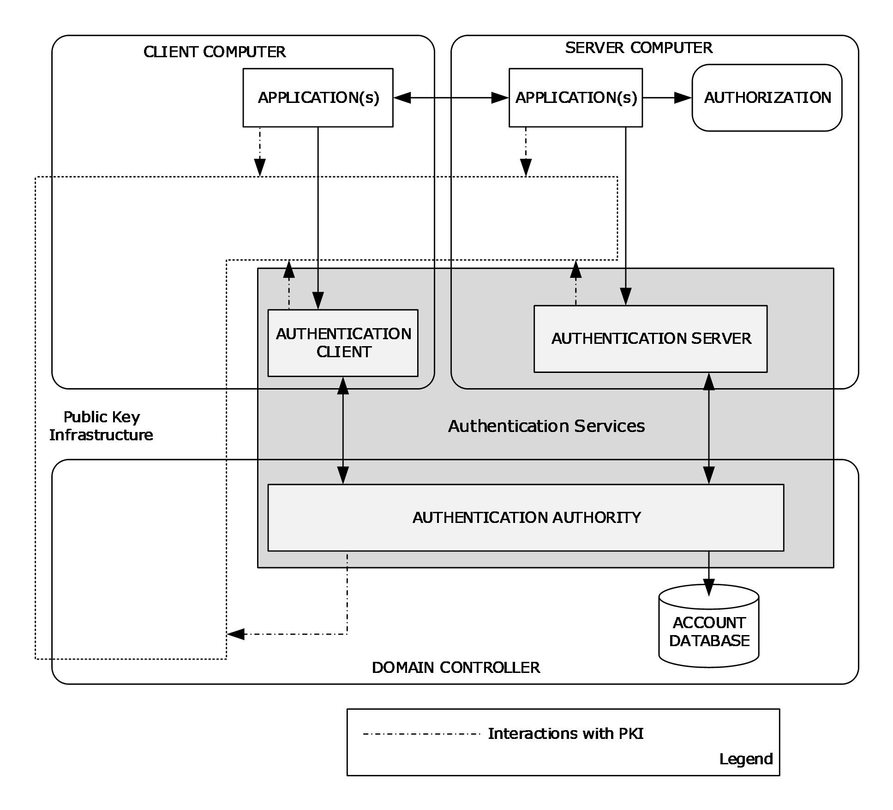

Figure 2: Authentication Services interactions with internal and external components

**Applications**

Applications can be interactive applications, such as Winlogon, or distributed client and server applications, such as a web browser, web server, or a file client or a file server, or any other type of client and server application.

**Account database**

An account database maintains the [**security principals**](#gt_security-principal) and necessary information for authentication and other purposes. In Windows, an [**Active Directory**](#gt_active-directory) database maintains the [**domain**](#gt_domain) security principals, whereas the [**security account manager (SAM) built-in database**](#gt_security-account-manager-sam-built-in-database) maintains local security principals. In Windows NT 4.0 operating system, both [**domain controllers (DCs)**](#gt_domain-controller-dc) and workstations store security principal accounts in a SAM database, which uses the Windows registry for underlying persistent storage. Starting with Windows 2000 operating system, the domain security principals are stored in Active Directory instead of the registry.

The account database is the portion of the directory that maintains the accounts for the principals of the domain. In Windows NT 4.0 domains, the account database includes all the information in the Windows NT 4.0 domain. In Active Directory domains, the account database contains a subset of the entire [**LDAP**](#gt_lightweight-directory-access-protocol-ldap)-accessible directory that an Active Directory domain hosts.

As a final step to the authentication process, the account database verifies identities.

**Public key infrastructure (PKI)**

Windows PKI provides a framework of services, technology, protocols, and standards that enable the deployment and management of a strong information security system that is based on [**public key**](#gt_public-key) technology. Authentication Services interact with Windows PKI to encrypt and decrypt messages, to sign and verify messages, and to verify the identities of the client and server by using digital certificates. As shown in the preceding diagram, distributed client and server applications interact with Windows PKI for certificate enrollment, renewal, and certificate signature validation.

The [**SSL**](#gt_secure-sockets-layer-ssl)/[**TLS**](#gt_transport-layer-security-tls) [MS-TLSP](#Section_2.9), PKINIT [MS-PKCA](../MS-PKCA/MS-PKCA.md), and Kerberos Network Authentication Service [MS-SFU](../MS-SFU/MS-SFU.md) protocols assume that Windows PKI functions are available as described in [MS-CERSOD](#Section_2.1).

Windows PKI relies on Microsoft CryptoAPI version 2 for secure cryptographic operations and [**private key**](#gt_private-key) management.

**Authorization**

After an identity is authenticated, the next step is to use the identity to authorize access to a resource. Authorization provides an interface for applications to make authorization decisions.

### 2.1.1 Interactive Logon Authentication

The [**interactive logons**](#gt_interactive-logon) authentication section with its subsections describe the process and the methods by which authentication protocols work in conjunction to prove the user's identity. Interactive logon authentication is used to grant user access to both local and [**domain**](#gt_domain) resources. Using a computer that is running Windows in a network environment requires access to system services. Each client that requests access to a system service is authenticated by that service. Authentication requires the service to have proof of the user's [**credentials**](#gt_credential). The interactive logon task begins when a user enters credentials to log on by using the Windows user interface. The credentials consist of a user name and password for logon with a local account, and the user's user name, password, and domain for logon with a [**domain account**](#gt_domain-account). A [**smart card**](#gt_smart-card) containing a user's [**public key**](#gt_public-key) information can also be used after the user obtains and unlocks it with a personal identification number (PIN).

Users can perform an interactive logon by using a local user account for local logon or a domain account for domain logon. The interactive logon process confirms the user's identification by using the security account database on the user's local computer or by using the domain's directory service. This mandatory logon process cannot be turned off for users in a domain.

A user can interactively logon to a computer in one of two ways:

- Locally, when the user has direct physical access to the computer.
- Remotely, through Terminal Services, in which case the logon is further qualified as remote interactive. Microsoft Terminal Server uses the CredSSP Protocol [MS-CSSP](#Section_2.9) to securely delegate the user's password or smart card PIN from the client to the server to remotely log on the user and to establish a Terminal Services session.
After an interactive logon, Windows runs applications on the user's behalf, and the user interacts with those applications to access protected resources either locally or on remote computers.

**Local logon**

Logon to a local account grants a user access to Windows resources on the local computer and requires that the user has a user account in the account database maintained by the [**Security Account Manager (SAM)**](#gt_security-account-manager-sam) on the local computer. The SAM protects and manages user and group information in the form of security accounts that are stored in the local computer registry. The computer can have network access, but it is not required. Local user account and group membership information is used to manage access to local resources.

**Domain logon**

A domain logon is a process that proves the identity of the user to the [**domain controller**](#gt_domain-controller-dc), implies eventual user access to local and domain resources, and requires that the user has a user account in an account database, such as [**Active Directory**](#gt_active-directory). The computer needs to have an account in the Active Directory domain and be physically connected to the network. Users need the privileges required to log on to a local computer or a domain. [**Domain user**](#gt_domain-user) account information and group membership information is used to manage access to domain and local resources.

**Smart card domain logon**

Logging on to a domain with a smart card provides a strong form of authentication, because smart cards use keys that are stronger than a human can easily remember, and because two factors are required: the PIN and the card.

For interactive domain logon, the validation process relies on authenticating domain user credentials against the domain's directory service.

#### 2.1.1.1 Abstract Components

The following block diagram illustrates abstract components that are involved in the interactive [**domain**](#gt_domain) logon authentication process. The abstract components on the domain-joined [**client computer**](#gt_client-computer) are the [**Local Security Authority (LSA)**](#gt_local-security-authority-lsa), the client implementation of the authentication protocols, and the components on the [**Authentication Authority (AA)**](#gt_authentication-authority-aa): for example, a [**domain controller**](#gt_domain-controller-dc) consists of a server implementation of authentication protocols, a [**PKI**](#gt_public-key-infrastructure-pki), and an account database. The Windows user logon interface calls the LSA method to securely transfer the user [**credentials**](#gt_credential) to the Authentication Authority through a specified authentication protocol. The Authentication Authority verifies the user credentials against the account database.

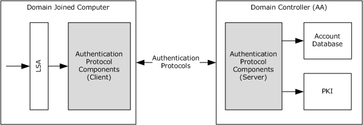

Figure 3: Abstract view of interactive domain logon authentication

#### 2.1.1.2 Protocol Interactions

The following diagram illustrates the internal system architecture of the interactive [**domain**](#gt_domain) logon authentication task. The authentication protocols that are involved in the interactive domain logon authentication process are:

Domain Logon (Username and Password):

- Kerberos Protocol Extensions [MS-KILE](../MS-KILE/MS-KILE.md) [[RFC4120]](https://go.microsoft.com/fwlink/?LinkId=90458)
- Authentication Protocol Domain Support [MS-APDS](../MS-APDS/MS-APDS.md) - NTLM pass-through
[**Smart card**](#gt_smart-card) Domain Logon ([**X.509**](#gt_x509) Certificate):

- Public Key Cryptography for Initial Authentication [MS-PKCA](../MS-PKCA/MS-PKCA.md) [[RFC4556]](https://go.microsoft.com/fwlink/?LinkId=90482)
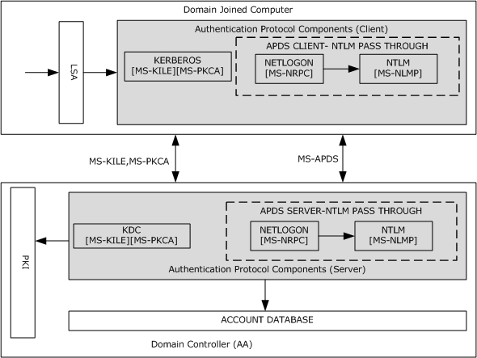

Figure 4: Protocol interactions for interactive domain logon authentication

If the user [**credentials**](#gt_credential) consist of a user name and password pair, the domain logon authentication process first tries the Kerberos Authentication Protocol ([MS-KILE]). If [**Kerberos**](#gt_kerberos) fails, the authentication process falls back to the NTLM pass-through mechanism ([MS-APDS]). For smart card logons in which the credentials contain X.509 certificates, the domain logon process uses the Public Key Cryptography for Initial Authentication (PKINIT) in the Kerberos Protocol ([MS-PKCA]).

A Kerberos client attempts to prove the user identity by sending Kerberos protocol messages to request a [**ticket-granting ticket (TGT)**](#gt_ticket-granting-ticket-tgt) and a [**service ticket**](#gt_service-ticket) from the [**Key Distribution Center (KDC)**](#gt_key-distribution-center-kdc). The KDC verifies the user identity against the account database and returns the TGT to the Kerberos client. In subsequent messages, the Kerberos client requests the service ticket for a domain-joined computer from the KDC. The KDC attempts to validate the TGT. If the validation succeeds, the KDC returns the service ticket to the Kerberos client.

Next, the Kerberos client submits the service ticket to verify the user logon information. If the Kerberos authentication fails, the APDS client on the domain-joined computer calls the NTLM pass-through mechanism to prove the user identity and to get the user logon information. The APDS server validates the user credentials against the account database; if the validation succeeds, the APDS server returns the user logon information.

In the smart card logon scenario, the Kerberos client requests the TGT and service ticket from the KDC by proving the user's identity in the form of an X.509 certificate, as described in [MS-PKCA]. The KDC verifies the user identity against the account database by using [**PKI**](#gt_public-key-infrastructure-pki) services and returns a TGT and a service ticket. The Kerberos client submits the service ticket to the Kerberos server to validate the service ticket and the user logon information. If the validation of user logon information succeeds, interactive domain logon is permitted; otherwise, logon attempts fail.

### 2.1.2 Network Logon Authentication

The [**network logon**](#gt_network-logon) authentication section with its subsections describe the process and the methods by which authentication protocols work in conjunction to prove the user's identity. Network logon authentication is used only after [**interactive logon**](#gt_interactive-logon) authentication has taken place. Network logon does not rely on user interface components, such as a dialog box, to collect data. Instead, previously established [**credentials**](#gt_credential) or another method to collect credentials is used. This process confirms the user's identity to any network service that the user attempts to access. This process is typically invisible to the user, unless the user is required to provide alternate credentials.

#### 2.1.2.1 Abstract Components

The following block diagram illustrates abstract components that are involved in the [**network logon**](#gt_network-logon) process. Network logon authentication is performed when an application uses underlying authentication protocol packages through the [**GSS**](#gt_generic-security-services-gss)-API layer to establish a secure network connection. Network logon authentication is the mechanism at work when a user connects to multiple machines on a network. For example, if an application needs to open a secure folder on a remote machine and the application user is already logged on to a [**domain user**](#gt_domain-user) account, the application does not require the user to supply logon data again. Instead, the application requests network logon authentication by using the GSS-API layer to pass the previously established security information to underlying [**security support providers (SSPs)**](#gt_security-support-provider-ssp).

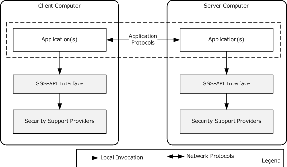

Figure 5: Network logon authentication architecture

The preceding diagram shows the network logon authentication architecture that distributed client and server applications in a [**domain**](#gt_domain) environment use. The communication between the client and server applications can occur over application communication protocols that are LAN-oriented ([MS-SMB](../MS-SMB/MS-SMB.md), [MS-SMB2](../MS-SMB2/MS-SMB2.md), [MS-CIFS](../MS-CIFS/MS-CIFS.md), and [MS-RPCE](../MS-RPCE/MS-RPCE.md)) or Internet-oriented (HTTP, [MS-POP3](../MS-POP3/MS-POP3.md), [MS-NNTP](../MS-NNTP/MS-NNTP.md), and [**Lightweight Directory Access Protocol (LDAP)**](#gt_lightweight-directory-access-protocol-ldap)).

The GSS-API is an application programming interface standard [[RFC2743]](https://go.microsoft.com/fwlink/?LinkId=90378) that insulates application communication protocols and authentication protocols.

**GSS-API main functionality**

The primary purpose of GSS-API is to abstract the commonalities of different authentication protocols and to hide their implementation details.

A related purpose is to disentangle application communication protocols from authentication protocols. An authentication protocol should be available to any application communication protocol. Its implementation should not contain any application protocol-specific information.

To facilitate application protocol interactions with authentication protocols, GSS-API uses the abstractions of [**credentials**](#gt_credential) and [**security contexts**](#gt_security-context). Credentials authenticate a [**security principal**](#gt_security-principal), such as a user name, password, or certificate. In a GSS-API client and server scenario, each party provides some type of credential. GSS-API uses these credentials to perform the authentication. A security context is a collection of authenticated information about a security principal for an instance of a session.

Throughout the GSS-API authentication process, the client and server exchange partial context information in the form of [**security tokens**](#gt_security-token). In this process, the GSS-API client and server each initially obtains credentials and then calls the GSS-API to create security tokens to send to its counterpart. Likewise, when a GSS-API client or server receives a security token from the other, it uses the GSS-API to process and incorporate the security token, which contains authentication protocol-specific data, into the security context for the authenticated relationship.

In GSS-API authentication, the client and server send and receive security tokens until authentication succeeds or fails. After successful GSS-API authentication, the client and server each has a security context that establishes an authenticated relationship with the other. These security contexts do not contain the credentials that are used to create them, however, they can contain information from the authentication process that is useful to the application for securing communications, such as an encryption key. They can also contain information for maintaining the authenticated connection, such as a [**Kerberos**](#gt_kerberos) ticket or certificate or other information that is useful in authorizing the client's request, such as security [**claims**](#gt_claim) about the client. The security support provider (SSP) that performs the authentication determines the contents of the context.

The following diagram illustrates GSS-API authentication between client and server application protocols.

Figure 6: GSS-API authentication process

#### 2.1.2.2 Protocol Interactions

The following diagram illustrates the protocol interactions of the [**network logon**](#gt_network-logon) authentication.

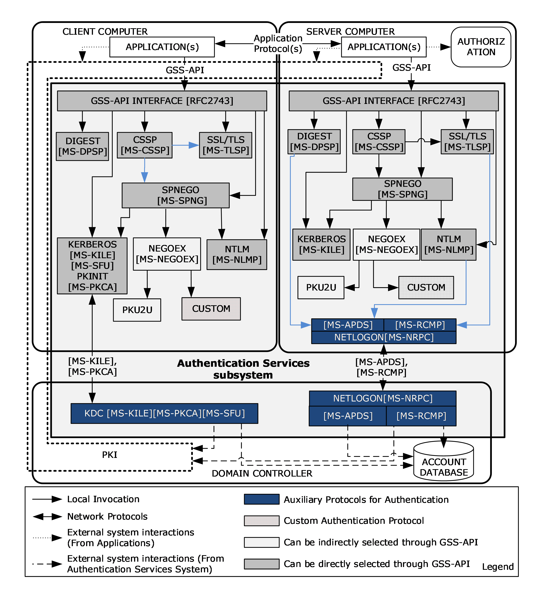

Figure 7: Protocol interactions for network logon authentication

As the preceding diagram shows, Authentication Services includes the following authentication and auxiliary protocols.

Authentication protocols:

- Digest Protocol Extensions [MS-DPSP](../MS-DPSP/MS-DPSP.md)
- Credential Security Support Provider (CredSSP) Protocol [MS-CSSP](#Section_2.9)
- NT LAN Manager (NTLM) Authentication Protocol [MS-NLMP](../MS-NLMP/MS-NLMP.md)
- Secure Sockets Layer (SSL)/Transport Layer Security (TLS) Protocols (SSL/TLS) [MS-TLSP](#Section_2.9)
- Kerberos Protocol Extensions [MS-KILE](../MS-KILE/MS-KILE.md) [MS-SFU](../MS-SFU/MS-SFU.md) [MS-PKCA](../MS-PKCA/MS-PKCA.md)
- Simple and Protected Generic Security Service Application Program Interface ([**GSS**](#gt_generic-security-services-gss)-API) Negotiation Mechanism (SPNEGO) Protocol Extensions [MS-SPNG](../MS-SPNG/MS-SPNG.md)
- The Extended GSS-API Negotiation Mechanism (NEGOEX) [[IETFDRAFT-NEGOEX-02]](https://go.microsoft.com/fwlink/?LinkId=132205)
- SPNEGO Extended Negotiation (NEGOEX) Security Mechanism (NEGOEX-04) [MS-NEGOEX](#Section_2.9)
- Public Key Cryptography Based User-to-User Authentication - (PKU2U) [[PKU2U-DRAFT]](https://go.microsoft.com/fwlink/?LinkId=208275)
- Kerberos Proxy Key Distribution Protocol [MS-KKDCP](../MS-KKDCP/MS-KKDCP.md)
Auxiliary Protocols:

- Authentication Protocol Domain Support [MS-APDS](../MS-APDS/MS-APDS.md)
- Remote Certificate Mapping Protocol [MS-RCMP](../MS-RCMP/MS-RCMP.md)
- Netlogon Remote Protocol [MS-NRPC](../MS-NRPC/MS-NRPC.md)
Custom Authentication Protocols:

Authentication Services provides an extensible network logon authentication architecture, which allows implementers to add custom authentication protocol [**security support providers (SSPs)**](#gt_security-support-provider-ssp) to the system architecture.

**Authentication protocol selection**

Both the client and server application protocols can select any authentication protocol from the list of supported authentication protocols through the GSS-API interface, either directly or indirectly.

The client and server application protocols can directly select any of the following authentication protocols through the GSS-API interface: Digest [MS-DPSP], NTLM [MS-NLMP], CSSP [MS-CSSP], Kerberos [MS-KILE], and SPNEGO [MS-SPNG].

Application protocols can select indirectly any of the following authentication protocols: NTLM [MS-NLMP], Kerberos [MS-KILE], NEGOEX [MS-NEGOEX], PKU2U, and CUSTOM.

The difference between direct and indirect selection is the use of the SPNEGO protocol. Application protocols use the SPNEGO protocol when they attempt to select an authentication protocol indirectly; alternatively, application protocols can select the authentication protocol directly without using SPNEGO. Because support for these authentication protocols varies across Windows releases and application environments, the client and server application protocols have to select a mutually supported authentication protocol either directly or indirectly. For example, for a client and server to use the [**Kerberos**](#gt_kerberos) authentication protocol, each have to support it.

An authentication protocol is selected in one of three ways:

- Assertion
- Application-Level Negotiation
- Negotiate
Application-Level Negotiation uses the application-specific method or configuration to select the mutually agreed-on authentication protocol between client and server application protocols, whereas the other two options use Authentication Services.

**Assertion**

As a precondition for using Assertion to specify a mutually agreed-on authentication protocol when calling GSS-API, both the client and the server directly specify a single authentication protocol from the supported authentication protocols.

When the application or server uses only one authentication protocol for the exchange, it specifies (asserts) the protocol to use when replying to a client request to access a service. If the client does not support that protocol, the communication fails. This method of selection is called Assertion.

**Application-Level Negotiation**

When a client and a server support multiple authentication protocols, before authentication can take place, applications exchange application-specific messages to select a commonly supported authentication protocol. For example, if a client supports Kerberos and Digest and the server supports NTLM and Digest, the common protocol that they both support is Digest, so the client and the server can negotiate to use the Digest protocol. Similarly, the HTTP protocol uses the **WWW-Authenticate** and **Authorization** headers in its negotiation.

**Negotiate**

The Negotiate option allows the client and server applications that are engaged in the authentication process to select a mutually agreed-upon authentication protocol from a set of possible authentication protocols by using the SPNEGO protocol [MS-SPNG].

When the authentication process begins with the option to negotiate for an authentication protocol, the server or client can initiate the negotiation.

The server-initiated SPNEGO exchange takes place as follows:

- The client requests access to a service in an application-protocol-specific way.
- The server replies with a list of authentication protocols that it supports with its preferred authentication protocol as its first choice in the application protocol message. For example, the server might list Kerberos [MS-KILE], NEGOEX [MS-NEGOEX], and NTLM [MS-NLMP], and select Kerberos as its preferred protocol.
- The client examines the contents of the reply and checks to determine whether it supports any of the specified protocols.
- If the client supports the preferred authentication protocol, authentication proceeds.
- If the client does not support the preferred authentication protocol but does support one of the other protocols that the server lists, the client informs the server as to which authentication protocol it supports, and the authentication process continues.
- If the client does not support any of the listed protocols, the authentication exchange fails.
The client-initiated SPNEGO takes place as follows:

- The client sends a list of authentication protocols and also a preferred authentication protocol to the server.
- The server examines the contents of the request message and checks to determine whether it supports any of the specified authentication protocols.
- If the server supports the preferred authentication protocol, authentication proceeds.
- If the server does not support the preferred authentication protocol but does support one of the other protocols that the client lists, the server informs the client as to which authentication protocol it supports, and the authentication process continues.
- If the server does not support any of the listed protocols, the authentication exchange fails.
As shown in the preceding diagram, through the negotiation option, the client and server applications can select NTLM, Kerberos, PKU2U, or a custom authentication protocol as the mutually agreed-on authentication protocol. To select either the PKU2U or the custom authentication protocol, the application uses the NEGOEX protocol, which extends the SPNEGO protocol and enables the application protocol to choose a mutually agreed-on authentication protocol that is based on policy information.

For example, if the server specifies Kerberos and NTLM and returns Kerberos as its preferred authentication protocol, one client can immediately authenticate by using Kerberos, but another client could negotiate to complete the authentication exchange by using NTLM.

**Auxiliary protocols**

If the client and server agree on any of the following authentication protocols: Digest [MS-DPSP], NTLM [MS-NLMP], or SSL/TLS [MS-TLSP], an auxiliary protocol carries the [**credentials**](#gt_credential) information from the server to the [**Authentication Authority (AA)**](#gt_authentication-authority-aa), for example, a Windows [**DC**](#gt_domain-controller-dc). This mechanism is called a pass-through mechanism.

When the client and server agree on either the Digest or the NTLM protocol, the Authentication Protocol Domain Support [MS-APDS] performs the pass-through. Otherwise, if the client and server agree on SSL/TLS, Remote Certificate Mapping Protocol [MS-RCMP] is used for pass-through.

#### 2.1.2.3 Enterprise Environment

The protocols commonly used in enterprise environments for authentication and secure transport of application data are listed in section [2.2.1](#Section_2.2.1). The following section describes how distributed applications use the Authentication Services protocols in the enterprise environment, with the file access services as an example.

##### 2.1.2.3.1 File Access Services

The File Access Services section describes the steps that the file access services protocols ([MS-FASOD](#Section_2.1.2.3.1)) undertake to support authentication.

The core protocols of the file access services are:

- [**Common Internet File System (CIFS)**](#gt_common-internet-file-system-cifs) Protocol [MS-CIFS](../MS-CIFS/MS-CIFS.md)
- [**Server Message Block (SMB)**](#gt_server-message-block-smb) Protocol [MS-SMB](../MS-SMB/MS-SMB.md)
- Server Message Block (SMB) Protocol Versions 2 and 3 [MS-SMB2](../MS-SMB2/MS-SMB2.md)
To enforce access controls over files and resources on a file server the server acquires the validated identity of the requestor, as illustrated in the following diagram. The file access services protocols depend on Authentication Services to support several authentication protocols and depend on the ability to negotiate the authentication protocol between the client and server.

In addition to the authentication support that CIFS provides, SMB provides new authentication methods that include [**Kerberos**](#gt_kerberos). The SMB Negotiate and SMB Session Setup commands have been enhanced to carry opaque [**security tokens**](#gt_security-token) to support mechanisms that are compatible with the [**Generic Security Services (GSS)**](#gt_generic-security-services-gss) [[RFC2743]](https://go.microsoft.com/fwlink/?LinkId=90378).

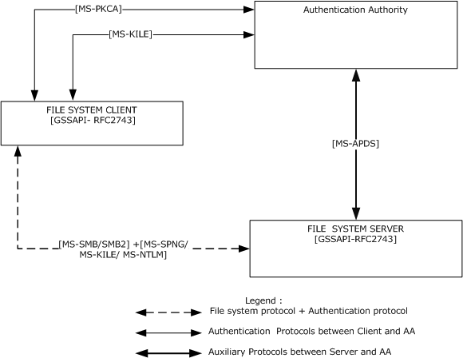

Figure 8: Authentication protocol standards in the enterprise environment

The preceding diagram shows that network traffic conforms to the file access services protocols that are used between the file system client and the file system server. The file access services protocols that are used between file access client and server carry authentication protocol messages as opaque payloads in their protocol messages.

SMB and SMB2 rely on the Simple and Protected Generic Security Service Application Programming Interface Negotiation Mechanism (SPNEGO) ([[RFC4178]](https://go.microsoft.com/fwlink/?LinkId=90461), [MS-SPNG](../MS-SPNG/MS-SPNG.md), and [MS-NEGOEX](#Section_2.9)) for authentication, which in turn relies on Kerberos [MS-KILE](../MS-KILE/MS-KILE.md) and on the NTLM [MS-NLMP](../MS-NLMP/MS-NLMP.md) [**challenge/response authentication**](#gt_challengeresponse-authentication) protocol. If the agreed-on authentication protocol between client and server is NTLM [MS-NLMP], the file server authenticates the user [**credentials**](#gt_credential) provided by the file access services client using the APDS protocol [MS-APDS](../MS-APDS/MS-APDS.md) to the [**DC**](#gt_domain-controller-dc) that contains the user account information. Otherwise, if the authentication protocol is Kerberos [MS-KILE], the file server authenticates the user identity by validating the [**service ticket**](#gt_service-ticket) to the SMB service submitted by the file system client.

##### 2.1.2.3.2 Remote Desktop and Web Services

In Windows, the [**Remote Desktop Protocol (RDP)**](#gt_remote-desktop-protocol-rdp) [MS-RDPBCGR](../MS-RDPBCGR/MS-RDPBCGR.md) and the Web Services Management Protocol [MS-WSMV](../MS-WSMV/MS-WSMV.md) use the CredSSP Protocol to delegate the user's [**credentials**](#gt_credential) from the client to the target server.

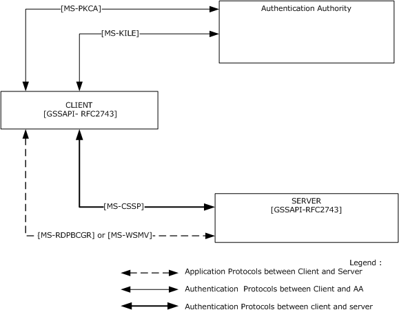

Figure 9: Credential delegation through the CredSSP Protocol

The preceding diagram shows that RDP and the Web Services Management Protocol trigger the CredSSP Protocol to delegate the user's credentials. For more details about how and when these protocols trigger the CredSSP Protocol, refer to [MS-RDPBCGR] or [MS-WSMV].

As described in [MS-CSSP](#Section_2.9), the CredSSP Protocol first establishes a Transport Layer Security (TLS)-encrypted channel between the client and the target server by using the SSL/TLS Protocol [MS-TLSP](#Section_2.9). The CredSSP Protocol uses TLS as an encrypted pipe; it does not rely on the client or [**server authentication**](#gt_server-authentication) services that are available in TLS. The CredSSP Protocol then uses the SPNEGO Protocol [MS-SPNG](../MS-SPNG/MS-SPNG.md) and [MS-NEGOEX](#Section_2.9) to negotiate the NTLM or [**Kerberos**](#gt_kerberos) authentication protocol that performs [**mutual authentication**](#gt_mutual-authentication) and provides confidentiality services, which are used to securely bind to the TLS channel and encrypt the credentials for the target server. In environments where the Kerberos protocol is not supported, the NTLM protocol is selected to establish trust between the [**client computer**](#gt_client-computer) and the [**server computer**](#gt_server-computer). Otherwise, the Kerberos authentication protocol is selected because the Kerberos protocol ensures server authentication.

The Kerberos [**Key Distribution Center (KDC)**](#gt_key-distribution-center-kdc) Proxy Protocol [MS-KKDCP](../MS-KKDCP/MS-KKDCP.md) is used to allow Kerberos clients to use KDC proxy servers to communicate to KDCs for Kerberos Network Authentication Service (V5) protocol [[RFC4120]](https://go.microsoft.com/fwlink/?LinkId=90458) and Kerberos change password protocol exchanges [[RFC3244]](https://go.microsoft.com/fwlink/?LinkId=90409). RDP and IPsec are examples of KDC proxy usage.

When a Kerberos client does not have connectivity to the KDC, but the client could use Kerberos to authenticate to an application server, Kerberos normally fails. With a Kerberos proxy client on the client host and a KDC proxy server with connectivity to the KDC, Kerberos authentication can be used to authenticate to the application server. The Kerberos proxy client sends standard Kerberos Authentication Service, ticket-granting service (TGS), and change password requests in [**HTTPS**](#gt_hypertext-transfer-protocol-secure-https) messages to the KDC proxy server. The KDC proxy server locates the KDC, sends these messages to the located KDC, and returns the received replies via HTTPS to the client.

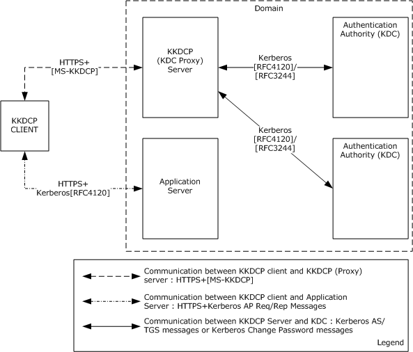

Figure 10: KKDCP deployment environment

#### 2.1.2.4 Intranet Web Environment

The protocols that are commonly used in intranet web environments for authentication and secure transportation of application data are listed in section [2.2.2](#Section_2.2.2). The following section describes how distributed applications use the Authentication Services protocols in the intranet web environment.

##### 2.1.2.4.1 HTTP Access Authentication

HTTP Access Authentication is described in this section as an HTTP 1.1 [[RFC2616]](https://go.microsoft.com/fwlink/?LinkId=90372) authentication, whereas Basic and Digest Access Authentication is addressed in [[RFC2617]](https://go.microsoft.com/fwlink/?LinkId=90373). HTTP is used internationally for Internet web servicing. The general topology of the HTTP protocol is that of a client/server role. The HTTP client makes requests that are sent to the HTTP server. The HTTP server can enforce authentication requirements on the HTTP requests. If a request lacks valid authentication material in the HTTP header, the HTTP server generates a Challenge message (token), which is sent to the HTTP client. The HTTP client can then form a ChallengeResponse token based on user [**credentials**](#gt_credential) that are applied to the authentication protocol. The initial Request along with the ChallengeResponse token is sent again to the HTTP server. The HTTP server can then validate the ChallengeResponse token in processing the request. This task focuses on the HTTP server side of the authentication exchange.

HTTP authentication [RFC2617] contains specification details on two forms of authentication: Basic and Digest authentication. The HTTP authentication framework is extensible to other authentication mechanisms. This capability provides opportunities to extend the types of authentication that are available for use in HTTP requests.

Authentication is also possible by way of forms-based authentication. Here the user credentials (user name and password) are entered by the user in an HTTP format and are transmitted in clear text to the HTTP server, typically by using a secure [**HTTPS**](#gt_hypertext-transfer-protocol-secure-https) connection. The HTTP server can then validate the user credentials. This type of authentication is not part of the HTTP authentication protocol [RFC2617] and is not covered in additional detail.

Following are the steps that the web server undertakes for HTTP Web Access Authentication. Enforcing access controls over files and resources on an HTTP server requires the server to recognize the validated identity of the requestor, the files, and the resources to be configured for access control to enforce authentication and [**authorization**](#gt_authorization). The following diagram illustrates the network traffic that conforms to the web-based protocols that are used between the web browser and the web server.

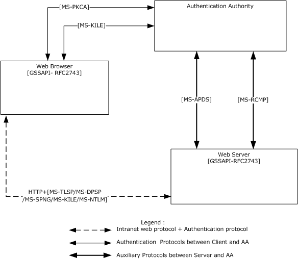

Figure 11: Authentication protocol standards in an intranet web environment

When a browser uses NTLM [MS-NLMP](../MS-NLMP/MS-NLMP.md) or Digest Protocol Extensions [MS-DPSP](../MS-DPSP/MS-DPSP.md), if the user's account information is not available locally, the web server authenticates the user credentials provided by the web browser by using the APDS protocol to the [**DC**](#gt_domain-controller-dc) that contains the user's account information.

When a web browser uses the SSL/TLS [MS-TLSP](#Section_2.9) protocols to provide an [**X.509**](#gt_x509) certificate, if the user's account information is not available locally, the web server uses the Remote Certificate Mapping Protocol [MS-RCMP](../MS-RCMP/MS-RCMP.md) to authenticate the certificate with the DC that contains the user's account.

When a web browser uses Kerberos [MS-KILE](../MS-KILE/MS-KILE.md) for web authentication, a [**service ticket**](#gt_service-ticket) to the web service is obtained from the DC.

#### 2.1.2.5 Mixed Web Environment

As listed in section [2.2.3](#Section_2.2.3), the authentication protocols that are primarily used in web environments for authentication and secure transportation of application data are Digest Protocol Extensions [MS-DPSP](../MS-DPSP/MS-DPSP.md), Transport Layer Security (TLS) Profile [MS-TLSP](#Section_2.9), and HTTP Authentication: Basic and Digest Access Authentication [[RFC2617]](https://go.microsoft.com/fwlink/?LinkId=90373).

The following diagram illustrates authentication protocol interactions in a mixed web environment, which is the combination of Internet and enterprise environments.

If users have [**domain accounts**](#gt_domain-account) but have to connect to a web server from outside the [**domain**](#gt_domain) or from an untrusted domain (for example, over the Internet), clients cannot use the SPNEGO [MS-SPNG](../MS-SPNG/MS-SPNG.md) and [MS-NEGOEX](#Section_2.9) or [**Kerberos**](#gt_kerberos) [MS-KILE](../MS-KILE/MS-KILE.md) protocols. Instead, clients can use custom authentication protocols, an HTTP authentication mechanism, or the SSL/TLS protocol [MS-TLSP] and then can transition to Kerberos protocol extensions.

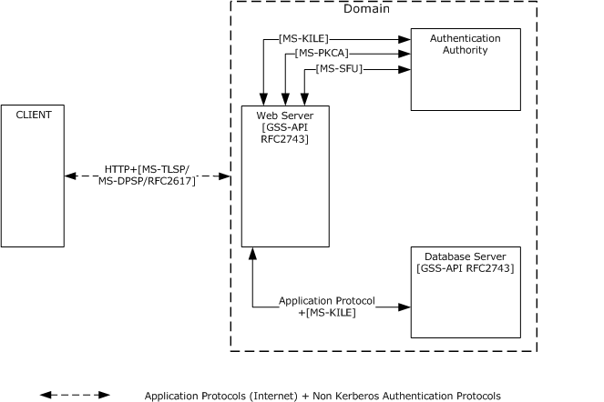

Figure 12: Authentication protocol standards in a mixed web environment

### 2.1.3 Relevant Standards

The Authentication Services protocols use and extend the following standards:

- The Kerberos Network Authentication Service (V5) [[RFC4120]](https://go.microsoft.com/fwlink/?LinkId=90458) provides an overview and specification of Version 5 of the [**Kerberos**](#gt_kerberos) protocol.
- Microsoft Windows 2000 Kerberos Change Password and Set Password Protocols [[RFC3244]](https://go.microsoft.com/fwlink/?LinkId=90409).
- A Generalized Framework for Kerberos Pre-Authentication [[RFC6113]](https://go.microsoft.com/fwlink/?LinkId=226316): This document specifies a framework for Kerberos [**pre-authentication**](#gt_pre-authentication) mechanisms and defines the common set of functions that pre-authentication mechanisms perform and how these functions affect the state of the request and reply.
- HTTP Authentication: Basic and Digest Access Authentication ([[RFC2617]](https://go.microsoft.com/fwlink/?LinkId=90373) and [[RFC2831]](https://go.microsoft.com/fwlink/?LinkId=90387)): These documents specify the HTTP authentication framework, the original Basic authentication scheme, and a scheme based on cryptographic hashes, referred to as Digest Access Authentication.
- Public Key Cryptography for Initial Authentication in Kerberos (PKINIT) [[RFC4556]](https://go.microsoft.com/fwlink/?LinkId=90482). This document describes protocol extensions to the Kerberos protocol. These extensions provide a method for integrating [**public key**](#gt_public-key) cryptography into the initial authentication exchange, by using asymmetric key signatures and/or encryption algorithms in pre-authentication data fields.
- The Simple and Protected Generic Security Service Application Programming Interface ([**GSS**](#gt_generic-security-services-gss)-API) Negotiation Mechanism [[RFC4178]](https://go.microsoft.com/fwlink/?LinkId=90461) specifies a pseudo security mechanism that enables GSS-API peers to determine in-band whether they support a common set of one or more GSS-API security mechanisms.
- The Generic Security Service Application Program Interface (GSS-API), Version 2 [[RFC2743]](https://go.microsoft.com/fwlink/?LinkId=90378) provides security services to callers in a generic fashion supportable with a range of underlying mechanisms and technologies that allow source-level portability of applications to different environments.
- The Transport Layer Security (TLS) Protocol Version 1.2 [[RFC5246]](https://go.microsoft.com/fwlink/?LinkId=129803) provides communications security over the Internet. This protocol allows client/server applications to communicate in a way that is designed to prevent eavesdropping, tampering, or message forgery. TLS Version 1.3 removed legacy algorithms, all handshake messages after the Server Hello are now encrypted, added Elliptic curve algorithms in the base spec, among other changes. See [[RFC8446]](https://go.microsoft.com/fwlink/?linkid=2147431) for the details.

### 2.1.4 Relationship Between Standards and Microsoft Extensions

The diagrams in the following subsections illustrate the relationship between protocol standards and Microsoft protocol extensions. As indicated in each diagram legend, an arrow is used only when the protocol standard or Microsoft protocol specification is extended or clarified by other protocol standards or Microsoft specifications. If there are no connections between a protocol standard and a Microsoft protocol extension, this means that Microsoft implementations do not extend the standard but use the standard as-is.

#### 2.1.4.1 Kerberos Protocols

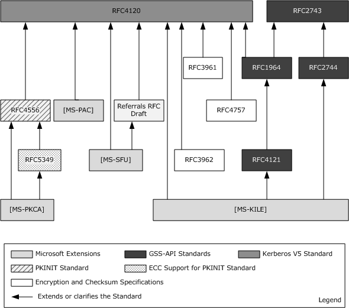

Figure 13: Relationships between Kerberos protocol and Microsoft extensions

The Kerberos Protocol Extensions [MS-KILE](../MS-KILE/MS-KILE.md):

- Specifies Microsoft extensions to [[RFC4120]](https://go.microsoft.com/fwlink/?LinkId=90458) and [[RFC3961]](https://go.microsoft.com/fwlink/?LinkId=90450) and clarifies behavior that is implementation specific.
- Extends the [**GSS**](#gt_generic-security-services-gss)-API RFCs with two new APIs.
- Extends [RFC4120] with:
- New [**pre-authentication**](#gt_pre-authentication) data using the RFC's extensibility point.
- New elements using the RFC's optional [**authorization**](#gt_authorization) data elements.
- New KRB-ERROR clock skew data.
- Support for the use of [**Active Directory**](#gt_active-directory) as the [**Kerberos**](#gt_kerberos) account database.
- Processing rules for Windows authorization data [MS-PAC](../MS-PAC/MS-PAC.md).
Public Key Cryptography for Initial Authentication [MS-PKCA](../MS-PKCA/MS-PKCA.md) specifies Microsoft extensions to [[RFC4556]](https://go.microsoft.com/fwlink/?LinkId=90482) and [[RFC5349]](https://go.microsoft.com/fwlink/?LinkId=129652), and normatively documents behavior from an earlier draft of [RFC4556].

Kerberos Protocol Extensions: Service for User and Constrained Delegation Protocol Specification [MS-SFU](../MS-SFU/MS-SFU.md) extends [RFC4120] with support for:

- Service-for-User-to-Self.
- Service-for-User-to-Proxy.
- Tracking services that have been delegated, by adding new structures in the [**PAC**](#gt_privilege-attribute-certificate-pac).
The Privilege Attribute Certificate Data Structure [MS-PAC] extends [RFC4120] by providing a mechanism to convey authorization information by encapsulating this information within an **AuthorizationData** structure ([RFC4120] section 5.2.6).

#### 2.1.4.2 Digest Protocols

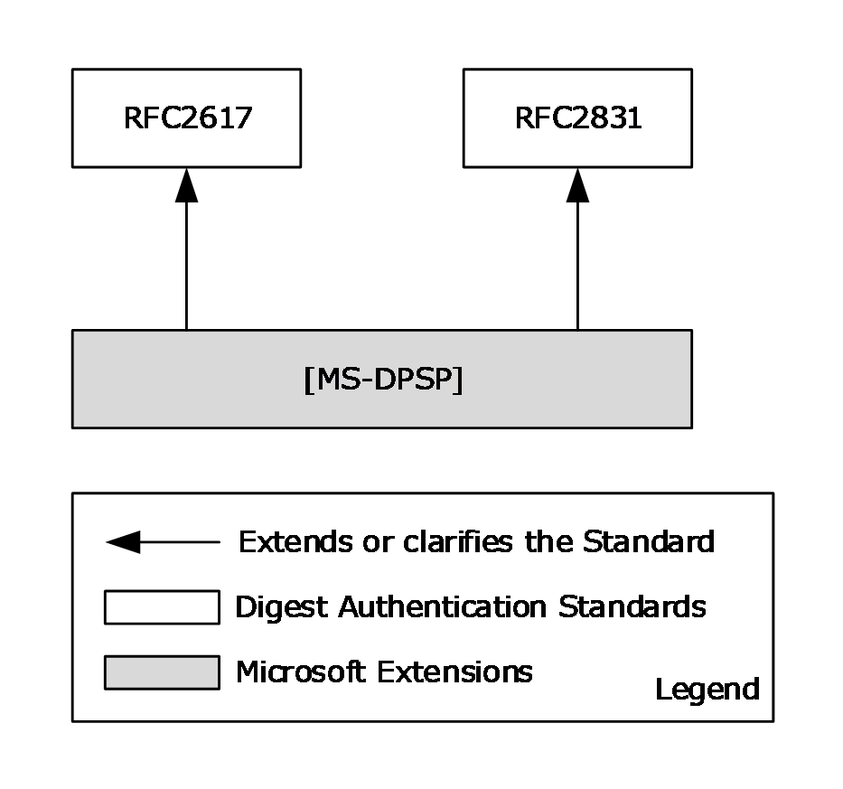

Figure 14: Relationships between Digest Authentication protocol standards and Microsoft extensions

Digest Protocol Extensions [MS-DPSP](../MS-DPSP/MS-DPSP.md) specify:

- The variations from the Digest Authentication standard specified in [[RFC2617]](https://go.microsoft.com/fwlink/?LinkId=90373) and [[RFC2831]](https://go.microsoft.com/fwlink/?LinkId=90387).
- How Windows implements optional fields and behaviors, and how Windows supports older clients and servers that do not conform to [RFC2617] and [RFC2831].

#### 2.1.4.3 SSL/TLS Protocols

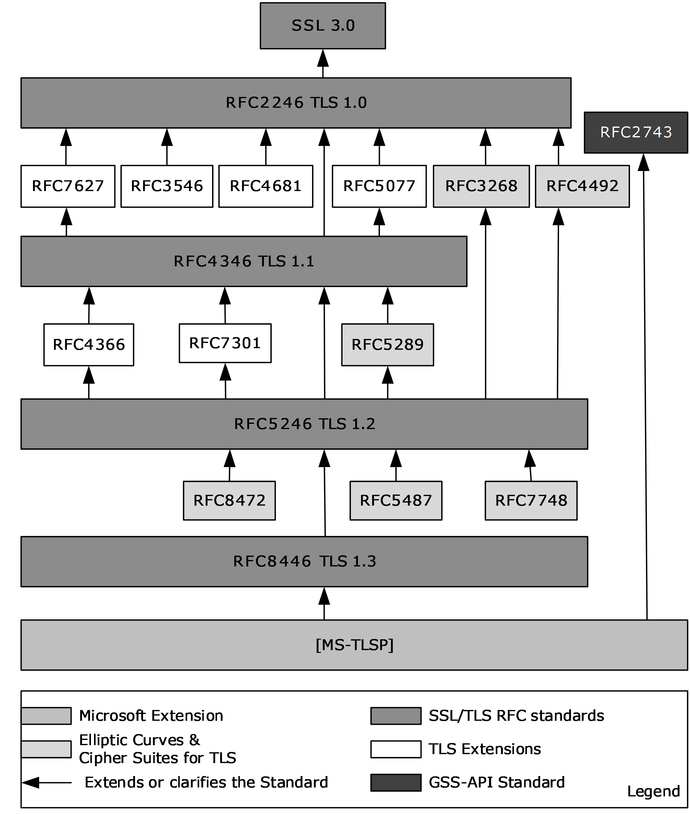

Figure 15: Relationships between SSL/TLS protocol standards and Microsoft extensions

- Transport Layer Security (TLS) Profile [MS-TLSP](#Section_2.9): Specifies the differences between the requirements of the referenced RFC documents and the Microsoft implementation.

## 2.2 Protocol Summary

The tables in the following sections group the Authentication Services protocols according to their roles into three distinct environments: the [Enterprise Environment (section 2.2.1)](#Section_2.2.1), the [Intranet Web Environment (section 2.2.2)](#Section_2.2.2), and the [Internet Web Environment (section 2.2.3)](#Section_2.2.3).

### 2.2.1 Enterprise Environment

| Protocol name | Description | Protocol document short name |
| --- | --- | --- |
| [**NT LAN Manager (NTLM)**](#gt_nt-lan-manager-ntlm) Authentication Protocol | This protocol is used by application protocols to authenticate remote users and, optionally, to provide session security when the application requests it. This protocol also provides the group membership information in conjunction with Authentication Protocol Domain Support, as described in [MS-APDS](../MS-APDS/MS-APDS.md). | [MS-NLMP](../MS-NLMP/MS-NLMP.md) |
| Kerberos Protocol Extensions | Specifies extensions to the Kerberos Network Authentication Service (V5) protocol [[RFC4120]](https://go.microsoft.com/fwlink/?LinkId=90458). These extensions provide additional capability for [**authorization**](#gt_authorization) information, including group memberships, [**interactive logon**](#gt_interactive-logon) information, and integrity levels, as well as constrained delegation and encryption that [**Kerberos**](#gt_kerberos) principals support. | [MS-KILE](../MS-KILE/MS-KILE.md) |
| Public Key Cryptography for Initial Authentication (PKINIT) in Kerberos Protocol | Specifies Microsoft extensions to the Public Key Cryptography for Initial Authentication in Kerberos (PKINIT) protocol. These extensions describe how the Windows implementations of PKINIT differ from what is specified in [[RFC4556]](https://go.microsoft.com/fwlink/?LinkId=90482) and [[RFC5349]](https://go.microsoft.com/fwlink/?LinkId=129652). | [MS-PKCA](../MS-PKCA/MS-PKCA.md) |
| Authentication Protocol Domain Support | Specifies the communication between a server and a [**domain controller**](#gt_domain-controller-dc) that uses [**Netlogon**](#gt_netlogon) interfaces ([MS-NRPC](../MS-NRPC/MS-NRPC.md) section 3.2) to complete an authentication sequence for certain authentication protocols and provides group membership information. | [MS-APDS] |
| Simple and Protected GSS-API Negotiation Mechanism ([**SPNEGO**](#gt_simple-and-protected-gss-api-negotiation-mechanism-spnego)) Extension | Extends [[RFC4178]](https://go.microsoft.com/fwlink/?LinkId=90461), which specifies a negotiation mechanism for the Generic Security Service Application Programming Interface (GSS-API) [[RFC2743]](https://go.microsoft.com/fwlink/?LinkId=90378). Extension is based on version 2 of NEGOEX [[IETFDRAFT-NEGOEX-02]](https://go.microsoft.com/fwlink/?LinkId=132205). | [MS-SPNG](../MS-SPNG/MS-SPNG.md) |
| SPNEGO Extended Negotiation (NEGOEX) Security Mechanism | Extends [RFC4178], enhances the capabilities of SPNEGO by providing a security mechanism that can be negotiated by the SPNEGO protocol. Extension is based on version 4 of NEGOEX [[IETFDRAFT-NEGOEX-04]](https://go.microsoft.com/fwlink/?linkid=2112888). | [MS-NEGOEX](#Section_2.9) |
| Kerberos Protocol Extensions: Service for User and Constrained Delegation Protocol | These two extensions to Kerberos enable an application service to obtain a Kerberos [**service ticket**](#gt_service-ticket) on behalf of a user, but each provides a different way to obtain a ticket on behalf of a user. | [MS-SFU](../MS-SFU/MS-SFU.md) |
| Credential Security Support Provider (CredSSP) Protocol | Enables an application to securely delegate a user's [**credentials**](#gt_credential) from a client to a target server. | [MS-CSSP](#Section_2.9) |
| Netlogon Remote Protocol | Used for user and machine authentication on [**domain**](#gt_domain)-based networks. | [MS-NRPC] |

### 2.2.2 Intranet Web Environment

| Protocol name | Description | Document short name |
| --- | --- | --- |
| Digest Protocol Extensions | Extends the Digest Authentication standard [[RFC2617]](https://go.microsoft.com/fwlink/?LinkId=90373) and [[RFC2831]](https://go.microsoft.com/fwlink/?LinkId=90387). | [MS-DPSP](../MS-DPSP/MS-DPSP.md) |
| Remote Certificate Mapping Protocol | Used by servers that authenticate users by using [**X.509**](#gt_x509) certificates. This protocol allows the server to use a directory, database, or other technology to map the user's X.509 certificate to a [**security principal**](#gt_security-principal). This protocol returns the [**authorization**](#gt_authorization) information that is associated with the security principal in the form of a [**privilege attribute certificate (PAC)**](#gt_privilege-attribute-certificate-pac), as specified in [MS-PAC](../MS-PAC/MS-PAC.md), that represents the user's identity and group memberships. | [MS-RCMP](../MS-RCMP/MS-RCMP.md) |
| [**Transport Layer Security (TLS)**](#gt_transport-layer-security-tls) Profile | Specifies the differences between Microsoft implementation and the SSL/TLS standards. | [MS-TLSP](#Section_2.9) |
| NT LAN Manager (NTLM) Authentication Protocol | See section [2.2.1](#Section_2.2.1). | [MS-NLMP](../MS-NLMP/MS-NLMP.md) |
| Kerberos Protocol Extensions | See section 2.2.1. | [MS-KILE](../MS-KILE/MS-KILE.md) |
| Public Key Cryptography for Initial Authentication (PKINIT) in Kerberos Protocol | Specifies the Microsoft extensions to the Public Key Cryptography for Initial Authentication in Kerberos (PKINIT) protocol and enables the use of [**public key**](#gt_public-key) cryptography in the initial authentication exchange (that is, in the Authentication Service (AS) exchange) of the [**Kerberos**](#gt_kerberos) protocol [MS-KILE]. | [MS-PKCA](../MS-PKCA/MS-PKCA.md) |
| Authentication Protocol Domain Support | See section 2.2.1. | [MS-APDS](../MS-APDS/MS-APDS.md) |
| Simple and Protected Generic Security Service Application Programming Interface Negotiation Mechanism ([**SPNEGO**](#gt_simple-and-protected-gss-api-negotiation-mechanism-spnego) ) Protocol Extensions | See section 2.2.1. | [MS-SPNG](../MS-SPNG/MS-SPNG.md) |
| SPNEGO Extended Negotiation (NEGOEX) Security Mechanism | See section 2.2.1. | [MS-NEGOEX](#Section_2.9) |

### 2.2.3 Internet Web Environment

| Protocol name | Description | Short name |
| --- | --- | --- |
| Digest Protocol Extensions | See section [2.2.2](#Section_2.2.2). | [MS-DPSP](../MS-DPSP/MS-DPSP.md) |
| [**Transport Layer Security (TLS)**](#gt_transport-layer-security-tls) Profile | See section 2.2.2. | [MS-TLSP](#Section_2.9) |
| [**Kerberos**](#gt_kerberos) [**Key Distribution Center (KDC)**](#gt_key-distribution-center-kdc) Proxy Protocol | This protocol lets Kerberos clients use KDC [**proxy**](#gt_proxy) servers to communicate to KDCs for the Kerberos [**Authentication Service (AS)**](#gt_authentication-service-as), [**ticket-granting service (TGS)**](#gt_ticket-granting-service-tgs), and change password exchanges. | [MS-KKDCP](../MS-KKDCP/MS-KKDCP.md) |

## 2.3 Environment

The following subsections identify the context in which Authentication Services exist. This includes the systems that use the interfaces provided by these protocols, other systems that depend on this system, and, as appropriate, the methods that the system components use to communicate.

### 2.3.1 Dependencies on This System

Because Authentication Services authenticate users, computers, and security services in a [**domain**](#gt_domain) environment, any system or protocol that operates within a domain or has a mode of operation within a domain is influenced by this system. However, the following groups of related protocols depend more closely on the Authentication Services protocols:

**Active Directory** [MS-ADOD](#Section_2.1): Describes how the directory is structured and how [**LDAP**](#gt_lightweight-directory-access-protocol-ldap) operations are carried out on the directory store. To authenticate the identities of clients that attempt to operate on the directory store, Active Directory uses the **Authentication Services** protocols to authenticate so that [**authorization**](#gt_authorization) decisions can be made, such as whether a client has permission to perform a particular operation against a directory object.

**Certificate Services** [MS-CERSOD](#Section_2.1): Describes how the certificate authority leverages the **Authentication Services** protocols to manage certificate distribution and enrollment and makes authorization decisions that are based on information that is associated with the accounts in the domain.

**File Access Services** [MS-FASOD](#Section_2.1.2.3.1): Describes its dependance on the **Authentication Services** protocols to authenticate an identity before it is determined whether the requested identity has the required access rights on a file object, such as permission to read from a file or write to a file.

**Group Policy Protocols** [MS-GPOD](#Section_2.1): Describes how a domain client can retrieve [**group policy**](#gt_group-policy) information from a [**domain controller**](#gt_domain-controller-dc), which is based on the group memberships of the [**domain accounts**](#gt_domain-account) and on the domain account locations in the [**LDAP directory**](#gt_ldap-directory) structure. Group Policy protocols depend on the **Authentication Services** protocols to secure communications between the Group Policy client and the Group Policy server.

**Remote Desktop Services Protocols** [MS-RDSOD](#Section_2.1): Describes the functionality to securely connect remote clients and servers, to channel communication between components of remote clients and servers, and to manage servers. [**RDP**](#gt_remote-desktop-protocol-rdp) protocols depend on the services of the **Authentication Services** protocols to authenticate identities and to help ensure secure communications.

### 2.3.2 Dependencies on Other Systems/Components

The Authentication Services protocols depend on the following systems:

- Active Directory [MS-ADOD](#Section_2.1)
- Public Key Infrastructure (PKI) [MS-CERSOD](#Section_2.1)
The Authentication Services protocols depend on Active Directory for identity information.

The Authentication Services protocols depend on the certificate authority (CA)/[**PKI**](#gt_public-key-infrastructure-pki) infrastructure for certificate validation, signature validation, and asymmetric cryptography security services. Microsoft clients use the Crypto API 2.0 library for these features.

## 2.4 Assumptions and Preconditions

The following assumptions and preconditions apply to this document.

- Information regarding network topology and/or addresses for the external server systems is configured or discoverable.
- At least one of the following external server systems has been set up and configured:
- [**Active Directory**](#gt_active-directory)
- [**DNS**](#gt_domain-name-system-dns) Directory
- [**LDAP directory**](#gt_ldap-directory)
- [**NTP server**](#gt_ntp-server)
- A [**domain controller**](#gt_domain-controller-dc) has been set up and configured to support the [**domain**](#gt_domain) infrastructure.
- The user account for the authenticating client has been created and provisioned on the domain controller.
- The client and server machines have been joined to the domain.
- Higher-layer protocols and service implementations are configured and running on the authenticating client and server systems, such as:
- [**Distributed File System (DFS)**](#gt_distributed-file-system-dfs)
- Group Policy [MS-GPOD](#Section_2.1)
- [**Network Time Protocol (NTP)**](#gt_b7983e55-135a-4006-beb9-ebed39432cbb)

## 2.5 Use Cases

The following sections describe a set of use cases that span the functionality of Authentication Services.

| Use case group | Use case(s) |
| --- | --- |
| [Interactive Logon (section 2.5.3)](#Section_2.5.3) | [Interactive Domain Logon: Service Ticket for Client Computer (section 2.5.3.1.1)](#Section_2.5.3.1.1) |
| [Network Logon (section 2.5.4)](#Section_2.5.4) | [Client Authentication (section 2.5.4.1.1)](#Section_2.5.4.1.1), [Server Authentication (section 2.5.4.1.2)](#Section_2.5.4.1.2), [Mutual Authentication (section 2.5.4.1.3)](#Section_2.5.4.1.3), [Delegation of Authentication (section 2.5.4.1.4)](#Section_2.5.4.1.4), and [Credential Delegation (section 2.5.4.1.5)](#Section_2.5.4.1.5). |
| [Auxiliary (section 2.5.5)](#Section_2.5.5) | [Authenticate a User or Computer Identity to a Kerberos Authentication Server (section 2.5.5.1)](#Section_2.1), [Negotiate Authentication Protocol (section 2.5.5.2)](#Section_2.1), and [S4U2self Mechanism: Get a Service Ticket for a Front-end Server (section 2.5.5.3)](#Section_2.5.5.3). These use cases support the other use cases that are listed in this table and in the following tables. |
| [Security Services (section 2.5.6)](#Section_2.5.6) | [Data Origin Authentication (Signing) (section 2.5.6.1)](#Section_2.5.6) [Data Confidentiality (Sealing) (section 2.5.6.2)](#Section_2.5.6.2) |

The use cases listed in the following table apply to a multi-[**domain**](#gt_domain) environment in a single [**forest**](#gt_forest).

| Use case group | Use case(s) |
| --- | --- |
| Interactive Logon (section 2.5.3) | [Interactive Domain Logon: Service Ticket for Client Computer (section 2.5.3.2.1)](#Section_2.5.3.2.1) |
| Network Logon (section 2.5.4) | [Client Authentication (section 2.5.4.2.1)](#Section_2.5.4.2.1) |

The use cases listed in the following table apply to a cross-forest environment.

| Use case group | Use case(s) |
| --- | --- |
| Network Logon (section 2.5.4) | [Client Authentication (section 2.5.4.3.1)](#Section_2.5.4.3.1) |

### 2.5.1 Summary of Supporting Actors and System Interests

The use cases of the Authentication Services protocols have the following supporting actors:

- Account database: To authenticate client and server application identities, the Authentication Services protocols depend on the account database (account DB) as an [**identity store**](#gt_identity-store). Windows uses an account database implemented by means of Active Directory Services, as described in [MS-ADOD](#Section_2.1). The account DB is on the same machine as the [**Authentication Authority (AA)**](#gt_authentication-authority-aa), so no network traffic occurs.
- [**Public key infrastructure (PKI)**](#gt_public-key-infrastructure-pki): To authenticate the identities of client and server applications that use certificate-based authentication mechanisms, the Authentication Services protocols use Windows PKI to verify digital certificates and use the symmetric and asymmetric cryptography services of Windows PKI to provide security services, such as encryption and signing algorithms to the client and server applications. Windows implements PKI by means of Certificate Services [MS-CERSOD](#Section_2.1).

### 2.5.2 Actors

The actors that participate in the **Authentication Services** protocols use cases are:

- **Client applications**: Used to access and manipulate protected network resources. Client applications use the authentication and security services of the Authentication Services protocols to communicate with and to send requests to the server applications.
- **Server applications**: Provide services to the client applications. Server applications use the authentication and security services of the Authentication Services protocols to communicate with and to send responses to the client applications.
- **LSA**: The [**Local Security Authority (LSA)**](#gt_local-security-authority-lsa) initiates the [**interactive logon**](#gt_interactive-logon) use case by submitting user [**credentials**](#gt_credential).
- **Front-end server**: A front-end server contacts Authentication Services to get the authentication token for the back-end server on behalf of the client's identity.
- **Back-end server**: The back-end server depends on Authentication Services to validate the authentication token submitted by the server on behalf of the client's identity.
- **Authentication Client**: The client application(s) and the LSA interact with Authentication Services by playing the roles of the "Authentication Client" actor.

### 2.5.3 Interactive Logon

#### 2.5.3.1 Single Domain

The following subsection describes interactive [**domain**](#gt_domain) logon in a single domain environment use case.

##### 2.5.3.1.1 Interactive Domain Logon: Service Ticket for Client Computer

The [**LSA**](#gt_local-security-authority-lsa) initiates this use case with the goal of proving the identity of a user to the [**Authentication Authority (AA)**](#gt_authentication-authority-aa) and of getting a [**service ticket**](#gt_service-ticket) that contains user logon information from the AA for the [**client computer**](#gt_client-computer). The user provides the [**credential**](#gt_credential) material information, which includes the identification and proof of that identification.

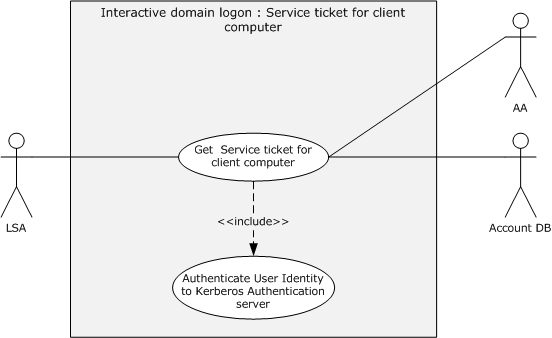

Figure 16: Interactive domain logon - service ticket for client computer use case

**Goal:** To get the service ticket for a client computer.

**Context of Use:** Applies when the user interactively logs on to the [**domain**](#gt_domain).

**Direct Actor:** The LSA.

**Primary Actor:** The user.

**Supporting Actors:** The AA and the account database (DB).

**Preconditions:**

- The client computer is joined to a domain.
- The identity of the user is configured in the account database.
- The client computer and the AA can communicate with each other.
**Minimal Guarantee:** The LSA sends an error message to the user when the submitted credentials do not match the ones that are stored in the account database or when the interactive domain logon process fails.

**Success Guarantee:** The LSA receives a service ticket for the client computer.

**Trigger:** The user attempts to log on interactively to the client computer.

**Main Success Scenario:**

- The identity of the user is proven to the AA as described in section [2.5.5.1](#Section_2.1).
- The LSA requests a service ticket for the client computer by including a [**Kerberos authenticator**](#gt_kerberos-authenticator) and the [**TGT**](#gt_ticket-granting-ticket-tgt) that was received in the preceding step in a [**Kerberos**](#gt_kerberos) request and sending the request to the AA.
- The AA validates the request and returns a service ticket for the client computer.
**Alternative Scenario:** This scenario occurs when [**Flexible Authentication Secure Tunneling (FAST)**](#gt_flexible-authentication-secure-tunneling-fast) mode is supported and configured on both the [**Authentication Client**](#gt_authentication-client) and the AA and when the preceding preconditions are met.

- The identity of the client computer is proven to the AA as described in the Main Scenario in sections [2.5.5.1.1](#Section_2.5.5.1.1) or [2.5.5.1.2](#Section_2.5.5.1.2), and a TGT for the computer is obtained.
- The identity of the user is proven to the AA as described in the Alternative Scenario in section 2.5.5.1.1.
- The LSA requests the AA to issue a service ticket for the client computer by sending a [**FAST TGS-REQ**](#gt_fast-tgs-req) message that includes the Kerberos authenticator and the TGT that was received in the preceding step.
- Same as step 3 of the Main Success Scenario.
**Postconditions:** The LSA has received a service ticket for the client computer, which contains user logon information.

**Extensions:** None.

**Alternative Scenario:** The following scenario occurs when Kerberos authentication fails.

- The LSA submits a [**Netlogon**](#gt_netlogon) message to prove the identity of the user to the AA. The message includes the identity of the user and a one-way hash of the password ([MS-NRPC](../MS-NRPC/MS-NRPC.md) section 2.2.1.4.3).
- The AA verifies the user identity and password hash against the account DB and returns the user logon information.

#### 2.5.3.2 Multiple Domains

The following subsection describes a use case that pertains to interactive [**domain**](#gt_domain) logon in a cross-domain environment. For example, a user account is provisioned in one domain (domain1), a [**client computer**](#gt_client-computer) is joined to another domain (domain2), and both domains are in the same [**forest**](#gt_forest). A user attempts to log on interactively to a machine that is joined to domain2. In this use case, AA1 denotes the [**Authentication Authority (AA)**](#gt_authentication-authority-aa) of domain1, AA2 denotes the AA of domain2, and Account DB #1 and Account DB #2 denote the account databases for domain1 and domain2, respectively. For a similar example, see section [2.5.4.2](#Section_2.5.4.2) and use case diagram section [2.5.4.2.1](#Section_2.5.4.2.1).

##### 2.5.3.2.1 Interactive Domain Logon: Service Ticket for Client Computer

The [**LSA**](#gt_local-security-authority-lsa) initiates this use case with the goal of proving the identity of a user to the [**Authentication Authority (AA)**](#gt_authentication-authority-aa) and of getting a [**service ticket**](#gt_service-ticket) that contains user logon information from the AA for the [**client computer**](#gt_client-computer). The user provides the [**credential**](#gt_credential) material information, which includes the identification and proof of that identification.

**Goal:** To get the service ticket for a client computer.

**Context of Use:** Applies when the user and computer accounts are in different [**domains**](#gt_domain) and when the user interactively logs on to the domain.

**Direct Actor:** The LSA.

**Primary Actor:** The user.

**Supporting Actors:** AA1, AA2, Account DB #1, and Account DB #2. See similar diagram section [2.5.4.2.1](#Section_2.5.4.2.1).

**Preconditions:**

- The client computer is joined to domain2.
- The identity of the user is configured in Account DB #1.
- Both domains exist in the same [**forest**](#gt_forest).
**Minimal Guarantee:** The LSA sends an error message to the user when the submitted credentials do not match the ones stored in the account databases or when the interactive domain logon process fails.

**Success Guarantee:** The LSA receives a service ticket for the client computer.

**Trigger:** The user attempts to log on interactively to the client computer.

**Main Success Scenario:**

- The identity of the user is proven to AA1 as described in section [2.5.5.1](#Section_2.1).
- The LSA requests a service ticket for the client computer by including a [**Kerberos authenticator**](#gt_kerberos-authenticator) and the [**TGT**](#gt_ticket-granting-ticket-tgt) that was received in the preceding step in a [**Kerberos**](#gt_kerberos) request and by sending it to AA1.
- AA1 cannot issue the service ticket for the client computer because it is joined to domain2 and only AA2 can do so; therefore, AA1 replies with a referral ticket for domain2, as described in [[Referrals]](https://go.microsoft.com/fwlink/?LinkId=90258).
- On receiving the referral ticket, the LSA locates AA2 and sends a TGS request that includes the referral ticket.
- AA2 decrypts the referral ticket by using the inter-domain key that is shared between AA1 and AA2, detects that the referral ticket contains a request for a service ticket for the client computer, generates the service ticket, and returns it to the client computer.
**Postcondition:** The LSA has received a service ticket for the client computer, which contains user logon information.

**Extensions:** None.

### 2.5.4 Network Logon

#### 2.5.4.1 Single Domain

The following sub-sections describe use cases for single domain authentication of client by server, of server by client, of server and client by mutual authentication, as well as delegation of authentication.

##### 2.5.4.1.1 Client Authentication

This use case describes how a server application authenticates the user identity of the client application before it allows access to its protected resource or services.

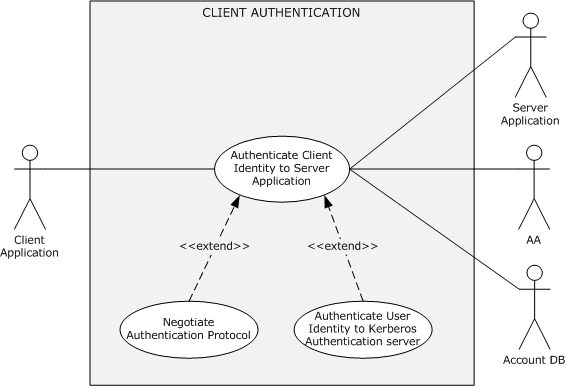

Figure 17: Client authentication use case

**Goal:** To verify the identity of the client application.

**Context of Use:** The user has to access a service on a network that requires verification of client identities.

**Direct Actor:** The client application.

**Primary Actor:** The user.

**Supporting Actors:** The [**AA**](#gt_authentication-authority-aa), the server application, and the account DB.

**Preconditions:**

- The user that started the client application is logged on to the [**client computer**](#gt_client-computer).
- The identities of the client application and the server application are configured in the account DB.
- The client application, server application, and [**DC**](#gt_domain-controller-dc) can communicate with each other.
**Minimal Guarantee:** When [**client authentication**](#gt_client-authentication) fails, the client application receives an error message that indicates the reason for the failure.

**Success Guarantee:** The server application has verified the identity of the client application.

**Trigger:** The user has to access a protected resource or a service on the server computer.

**Main Success Scenario:** Negotiation leads to the use of [**Kerberos**](#gt_kerberos).

- The client and server application negotiate as described in section [2.5.5.2](#Section_2.1) and agree on Kerberos as the authentication protocol.
- The identity of the client application is proven to the **AA** as described in section [2.5.5.1](#Section_2.1).
- The client application sends the target server application's identity and the [**TGT**](#gt_ticket-granting-ticket-tgt) material that was obtained in step 2 to the **AA** to request a [**service ticket**](#gt_service-ticket) for the service application.
- The **AA** locates the identity of the server application in its account DB and returns a service ticket and a [**session key**](#gt_session-key) to the client application.
- The client application builds the [**authenticator**](#gt_authenticator) by using a session key and sends the service ticket plus the authenticator to the target application.
- The server application verifies the authenticity of the client application identity and extracts the group information from the service ticket.
**Alternative Scenario:** Negotiation leads to the use of Kerberos, and [**FAST**](#gt_flexible-authentication-secure-tunneling-fast) mode is supported and configured on both the [**Authentication Client**](#gt_authentication-client) and the **AA**.

- Same as step 1 of the Main Success Scenario.
- The identity of the client computer is proven to the **AA** as described in the Main Scenario in section [2.5.5.1.1](#Section_2.5.5.1.1) or section [2.5.5.1.2](#Section_2.5.5.1.2), and a TGT for the computer is obtained.
- The identity of the user is proven to the **AA** as described in the Alternative Scenario in section 2.5.5.1.1.
- The client application constructs the [**FAST TGS-REQ**](#gt_fast-tgs-req) message with the target server application's identity and the TGT material that was obtained in step 2 and then sends it to the **AA** to request a service ticket for the target server application.
- The **AA** locates the identity of the server application in its account DB and returns a service ticket and a session key to the client application in a [**FAST TGS-REP**](#gt_fast-tgs-rep) message.
- The client application builds the authenticator by using a session key and sends an **AP-REQ** ([[RFC4120]](https://go.microsoft.com/fwlink/?LinkId=90458) section 5.5.1) message that contains the service ticket plus the authenticator to the target application.
- The server application verifies the authenticity of the client application identity and extracts the group information and [**claims**](#gt_claim) from the service ticket.
**Alternative Scenario:** Negotiation leads to the use of Kerberos, and Compound Identity is supported and configured on the Authentication Client, the **AA**, and the Application Server.

- Same as step 1 of the Main Success Scenario.
- The identity of the client application is proven to the **AA** as described in the Alternative Scenario in section 2.5.5.1.1.
- The client application constructs a [**compound identity TGS-REQ**](#gt_compound-identity-tgs-req) and sends it to the **AA** to request a service ticket for the server application.
- The **AA** receives a compound identity TGS-REQ for a server application that supports compound identity, verifies the request, and then adds the computer's [**authorization data**](#gt_authorization-data) to the [**privilege attribute certificate (PAC)**](#gt_privilege-attribute-certificate-pac) in the service ticket. The **AA** returns a service ticket and a session key to the client application.
- The client application builds the authenticator by using a session key and sends the service ticket plus the authenticator in an **AP-REQ** message to the target application.
- The server application verifies the authenticity of the client application identity and extracts the group information, user claims, and device claims from the service ticket.
**Alternative Scenario:** Negotiation leads to the use of NTLM

- The client and server application negotiate authentication protocols, as described in section 2.5.5.2, and agree on NTLM as the authentication protocol.
- The client application requests the server to establish an authenticated session by using its identity.
- The server sends back a [**challenge**](#gt_challenge) message that contains a [**nonce**](#gt_nonce).
- The client application builds a response message by using the challenge and the key that is derived from the user's password and sends the response message to the server.
- The server application verifies the client identity by sending the response message that is received in the preceding step to the **AA**.
- The **AA** validates the submitted response message by interacting locally with the account DB.
- The **AA** responds to the server with the group and other information.
- The server application returns a success response to the client application.
**Postconditions:** The identity of the client application is proven to the server application. Both the client and the server application have a shared session key for further secure communication.

The following alternative scenarios apply when the client and the server application are configured with the Digest or SSL/TLS authentication protocols and are not configured with the Negotiate authentication protocol.

**Alternative Scenario:** Digest Protocol Extensions

- The client application sends an application-protocol-specific request to access a protected resource of the server application.
- The server application validates the request and returns a digest challenge message to the client. This message includes the randomly generated nonce and the [**domain**](#gt_domain) name of the server.
- The client obtains the user name (for example, User123) and a password for the user and constructs a response to the server's challenge. In the digest response, the client proves that it has acquired the user's password by performing a [**keyed hash**](#gt_keyed-hash) over the user name, nonce, and other fields (the password is fed into the hash).
- The server application sends the response and the nonce that was received in step 3 to the **AA** for validation.
- The **AA** validates the request message by interacting locally with the account DB and responds to the server application with the group membership information.
- The server application sends the response messages that were received in step 5 to the client application.
**Extensions:** None.

##### 2.5.4.1.2 Server Authentication

This use case describes how a client application authenticates the identity of the server application before it establishes a secure session to the server application.

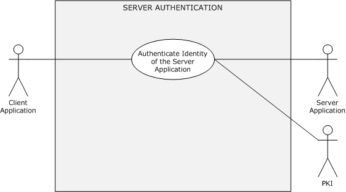

Figure 18: Server authentication use case

**Goal:** To verify the identity of the server application.

**Context of Use:** The client application has to establish a secure session with the server application by verifying the identity of the server application.

**Direct Actor:** The client application.

**Primary Actor:** The user.

**Supporting Actors:** The [**AA**](#gt_authentication-authority-aa), the server application, and the [**PKI**](#gt_public-key-infrastructure-pki).

**Preconditions:**

- The server application has a valid certificate from a trusted certificate authority.
- The client application, server application, and the AA can communicate with each other.
**Minimal Guarantee:** When the [**server authentication**](#gt_server-authentication) fails, the server application receives an error message that indicates the reason for the failure.

**Success Guarantee:** The server application has proven its identity to the client application.

**Trigger:** The user has to securely access resources on the [**server computer**](#gt_server-computer).

**Main Success Scenario:** Using the SSL/TLS Protocol

- The client application asks the server application to establish a secure session.
- The server application submits an [**X.509**](#gt_x509) certificate to the client application.
- By using PKI services, the client application verifies the validity, the issuing authority, and the [**public key**](#gt_public-key) of the certificate and confirms that the [**domain**](#gt_domain) name of the certificate matches the domain name of the server. The client application generates a premaster secret, encrypts it with the public key from the server's X.509 certificate, and sends it to the server.
- The server application decrypts the premaster key with the [**private key**](#gt_private-key) of the certificate, constructs a key and signs all the previous messages with it, and sends the signature to the client.
- The client checks the signature. If it passes the check, then the identity of the server application is authenticated.
**Postconditions:** The identity of the server application is proven to the client application. Both the client and the server application can proceed with secure communications.

**Extensions:** None.

##### 2.5.4.1.3 Mutual Authentication

This use case describes how a client application and a server application authenticate each other before they establish secure communication.

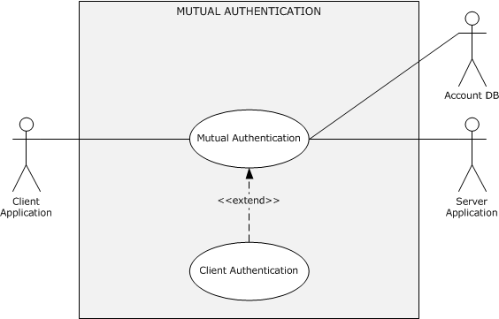

Figure 19: Mutual authentication use case

**Goal:** To authenticate the identities of the client and server application to each other.

**Context of Use:** The client and the server application have to establish a secure session.

**Direct Actor:** The client application.

**Primary Actor:** The user.

**Supporting Actors:** The [**AA**](#gt_authentication-authority-aa), the server application, and the account DB.

**Preconditions:**

- The identities of the client application and the server application are configured in the account DB.
- The client application, the server application, and the AA can communicate with each other.
- The user that started the client application is logged on to the [**client computer**](#gt_client-computer).
**Minimal Guarantees:** If [**client authentication**](#gt_client-authentication) fails, the client application receives an error message that indicates the reason for the failure. If [**server authentication**](#gt_server-authentication) fails, the server application receives an error message that indicates the reason for the failure.

**Success Guarantee:** The identities of the client and the server application are authenticated to each other.

**Trigger:** The user has to securely access the protected resources or services of the server application.

**Main Success Scenario:** Negotiation leads to [**Kerberos**](#gt_kerberos)

- The identity of the client application is authenticated to the server application as described in the main or alternative scenarios of section [2.5.4.1.1](#Section_2.5.4.1.1), and the client application requests the server application to prove its identity to the client application.
- The server application returns the [**authenticator**](#gt_authenticator). It includes the client's time stamp ([[RFC4120]](https://go.microsoft.com/fwlink/?LinkId=90458) section 3.2.4), which is encrypted with an agreed-on [**session key**](#gt_session-key).
- The client application verifies the server application identity by decrypting the authenticator with the session key. If the verification succeeds, the server application is authenticated.
**Alternative Scenario:** [**Mutual authentication**](#gt_mutual-authentication) by using SSL/TLS

- The client application asks the server application to establish a secure session.
- The server application sends an [**X.509**](#gt_x509) certificate and a [**nonce**](#gt_nonce) to the client application.
- By using [**PKI**](#gt_public-key-infrastructure-pki) services, the client application verifies the validity, the issuing authority, and the [**public key**](#gt_public-key) of the certificate and confirms that the [**DNS**](#gt_domain-name-system-dns) name in the certificate matches the DNS name of the server. The client application signs the server's nonce with the user's [**private key**](#gt_private-key), generates a premaster secret, encrypts it with the public key of the server's X.509 certificate, and sends both the signed nonce and the encrypted premaster secret to the server, along with its X.509 certificate.
- By using PKI services, the server application verifies the validity, the issuing authority, and the public key of the certificate and confirms the signature on its nonce. If the signature verification succeeds, then the identity of the user is authenticated. The server application then decrypts the premaster key with the private key that is associated with its certificate, constructs a symmetric session key from the premaster secret and signs all of the previous messages with it, and sends the signature to the client.
- The client checks the signature. If the signature verification succeeds, then the identity of the server application is authenticated.
**Postcondition:** Both the client and the server application have a shared session key with which to establish a secure session.

**Extensions:** None.

##### 2.5.4.1.4 Delegation of Authentication

[**Delegation of authentication**](#gt_delegation-of-authentication) is accomplished in one of four ways. In the first, the client gets a [**service ticket**](#gt_service-ticket) for the back-end server and gives it to the front-end server. Tickets obtained in this way—by using the client as a proxy—are called proxy tickets. The difficulty with using proxy tickets is that the client is provided with the name of the back-end server, and the client cannot determine whether to allow the delegation. Windows clients do not use the proxy tickets mechanism.

The second method of delegation overcomes the difficulty with using proxy tickets. It allows the client to give the front-end server a [**TGT**](#gt_ticket-granting-ticket-tgt) that the front-end server can use to request service tickets for the back-end server as they are required. Service tickets that are obtained in this way—with [**credentials**](#gt_credential) forwarded by a client—are called forwarded tickets. The [**Kerberos**](#gt_kerberos) policy that an administrator sets for the [**domain**](#gt_domain) determines whether the [**KDC**](#gt_key-distribution-center-kdc) allows clients to obtain proxy tickets or TGTs that can be forwarded.

In the other two methods, the front-end server does not require the user to forward either the TGT or the proxy tickets to access the services of the back-end server. In other words, a user does not have to have either a TGT or proxy service tickets. This initial condition means that the user is not required to use the Kerberos protocol to authenticate.

The following use cases describe how the client delegates authentication to a front-end server by informing the KDC that the front-end server is authorized to represent the client to access the back-end server resources.

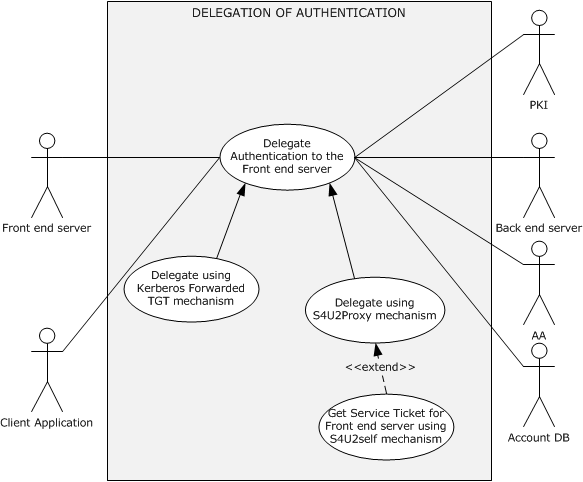

Figure 20: Delegation of authentication use case

**Goal:** To delegate authentication of the client identity to the front-end server to access the resources or services of the back-end server on behalf of the client's identity.

**Context of Use:** The front-end server has to access resources or services on the back-end server on behalf of the identity of the client application to fulfill the client application request.

**Direct Actor:** The client application or the front-end server depending on the chosen delegation mechanism.

**Primary Actor:** The user that is running the client application.

**Supporting Actors:** The [**AA**](#gt_authentication-authority-aa), the back-end server, the [**PKI**](#gt_public-key-infrastructure-pki), and the account DB.

**Preconditions:**

- The user that started the client application is authenticated.
- The identities of the front-end server and the back-end server are configured in the account DB.
- The client application, front-end server, back-end server, and AA can communicate with each other.
- The client application has obtained the forwarded TGT and service ticket for the front-end server ([MS-SFU](../MS-SFU/MS-SFU.md) section 1.3.3).
**Minimal Guarantee:** The front-end server receives an error message from the AA that indicates the reason for the failure.

**Success Guarantee:** The front-end server can prove the identity of the user that is running the client application to the back-end server.

**Trigger:** The front-end server has to access a protected resource or a service on the back-end server on behalf of the identity of the client application.

**Postcondition:** The front-end server has successfully proven the identity of the user that is running the client application to the back-end server.

###### 2.5.4.1.4.1 Delegate by Using a Kerberos Forwarded TGT Mechanism

**Goal:** To delegate authentication of the client identity to the front-end server to access the resources or services of the back-end server by using a Kerberos-forwarded [**TGT**](#gt_ticket-granting-ticket-tgt) ([[RFC4120]](https://go.microsoft.com/fwlink/?LinkId=90458) section 2.8).

**Context of Use:** The front-end server has to access resources or services on the back-end server on behalf of the identity of the client application to serve the client application request.

**Direct Actor:** The client application.

**Primary Actor:** The user that is running the client application.

**Supporting Actors:** The [**AA**](#gt_authentication-authority-aa), the back-end server, and the account DB.

**Preconditions:**

- The user that started the client application is authenticated to the AA, and the client application has obtained a forwarded TGT and a [**service ticket**](#gt_service-ticket) for the front-end server, as described in [MS-SFU](../MS-SFU/MS-SFU.md) section 1.3.3.
- The identities of the user, the front-end server, and the back-end server are configured in the account DB.
- The client application, the front-end server, the back-end server, and the AA can communicate with each other.
**Minimal Guarantee:** When the front-end server fails to prove the identity of the user that is running the client application, the front-end server receives an error message that indicates the reason for the failure.

**Success Guarantee:** The front-end server can prove the identity of the user that is running the client application to the back-end server application.

**Trigger:** The front-end server application has to access a protected resource or a service on the back-end server on behalf of the identity of the user that is running the client application.

**Main Success Scenario:**

- The client application makes the request to the front-end server by presenting a service ticket and a forwarded TGT.
- To fulfill the client application request, the front-end server has to access the back-end server to perform some action on behalf of the identity of the user that is running the client application. The front-end server application asks the AA for a service ticket for the back-end server in the name of the client's identity by presenting the forwarded TGT that was received in step 1.
- The AA validates the forwarded TGT contained in the request and returns a service ticket for the back-end server application.
- The front-end server submits the service ticket from step 3 to the back-end server to prove the identity of the user that is running the client application.
- The back-end server verifies the identity and responds to the front-end server.
- The front-end server responds to the client application.
**Postcondition:** The front-end server can successfully prove the identity of the user that is running the client application to the back-end server application.

**Extensions:** None.

###### 2.5.4.1.4.2 Delegate by Using S4U2proxy Mechanism

**Goal:** The front-end server has to prove the identity of the user that is running the client application to the back-end server by using the S4U2proxy mechanism ([MS-SFU](../MS-SFU/MS-SFU.md) section 1.3.2).

**Context of Use:** The front-end server has to access resources or services on the back-end server to fulfill the client application request.

**Direct Actor:** The client application.

**Primary Actor:** The user that is running the client application.

**Supporting Actors:** The [**AA**](#gt_authentication-authority-aa), the back-end server, and the account DB.

**Preconditions:**

- The identities of the front-end server and the back-end server are configured in the account DB.
- The front-end server is authenticated to the AA (the [**KDC**](#gt_key-distribution-center-kdc)) and has a valid [**TGT**](#gt_ticket-granting-ticket-tgt).
- The client application and the AA can communicate with each other, and the client application has obtained a [**service ticket**](#gt_service-ticket) for the front-end server ([[RFC4120]](https://go.microsoft.com/fwlink/?LinkId=90458) section 3.2), or the client application has proven its identity to the front-end server by some means other than the [**Kerberos**](#gt_kerberos) protocol.
- The front-end server's configuration authorizes it to delegate to the back-end server.
- The front-end server application, the back-end server application, and the AA can communicate with each other.
- The front-end server and the back-end server are in same [**domain**](#gt_domain) or [**realm**](#gt_realm).
**Minimal Guarantee:** The front-end server receives an error message when it fails to prove the identity of the user that is running the client application.

**Success Guarantee:** The front-end server can prove the identity of the user that is running the client application to the back-end server.

**Trigger:** The front-end server has to access a protected resource or a service on the back-end server on behalf of the identity of the user that is running the client application.

**Main Success Scenario:** The client application has obtained a service ticket for the front-end server.

- The client application makes a request to the front-end server that requires eventual access to resources on the back-end server. The client application includes a service ticket for the front-end server in the request.
- The front-end server requests the AA for the service ticket of the back-end server on behalf of the identity of the user that is running the client application. The user is identified by the client name and the client realm in the service ticket for the front-end server.
- The KDC validates the request and issues a service ticket for the back-end server.
- The front-end server application uses the service ticket to send a request to the back-end server application. The back-end server treats this request as coming from the user and proceeds as if the user had connected directly and had been authenticated by the AA.
- The back-end server application responds to the request.
**Postcondition:** The front-end server can successfully prove the identity of the user who is running the client application to the back-end server.

**Extensions:** The client application has proven its identity to the front-end server by using a non-Kerberos protocol.

When the client application cannot include the service ticket because, for instance, it is outside the domain and cannot use the Kerberos protocol, this use case is extended between steps 1 and 2 by the [S4U2self Mechanism: Get a Service Ticket for a Front-end Server (section 2.5.5.3)](#Section_2.5.5.3) use case.

##### 2.5.4.1.5 Credential Delegation

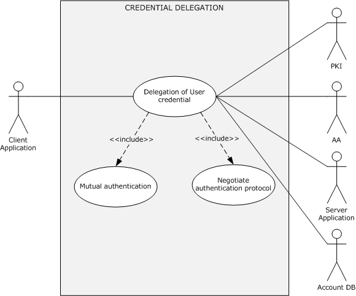

Figure 21: Credential delegation use case

**Goal:** To securely delegate the user's [**credentials**](#gt_credential) from a client application to the target server application.

**Context of Use:** To serve the client application request by using the client's credentials, the target server requires access to a service or resource on a network. However, either the target server cannot be accessed with [**Kerberos**](#gt_kerberos) delegation, or the number of legitimate possible [**authorization**](#gt_authorization) configurations makes configuration inconvenient.

**Direct Actor:** The client application.

**Primary Actor:** The user.

**Supporting Actors:** The [**AA**](#gt_authentication-authority-aa), the server application, the [**PKI**](#gt_public-key-infrastructure-pki), and the account DB.

**Preconditions:**

- The user that started the client application is logged on to the [**client computer**](#gt_client-computer).
- The identities of the client application and the server application are configured in the account DB.
- The policies that are required to enable CredSSP authentication are configured on both the client and the server.
- The server is configured with an [**X.509**](#gt_x509) certificate to establish a [**TLS**](#gt_transport-layer-security-tls) session.
- The client application, server application, and [**DC**](#gt_domain-controller-dc) can communicate with each other.
**Minimal Guarantee:** When credential delegation fails, the client application or the user is notified with an error message that indicates the reason for the failure.

**Success Guarantee:** The user credentials are successfully delegated to the target server.

**Trigger:** A client application, such as a Remote Desktop client or a Web services client, triggers the CredSSP Protocol [MS-CSSP](#Section_2.9) as the preferred authentication protocol for delegating the user's credentials.

**Main Success Scenario:** Negotiation Leads to Kerberos

- The client and server applications establish an encrypted channel by using the TLS protocol, as described in [[RFC2246]](https://go.microsoft.com/fwlink/?LinkId=90324).
- The client and server applications negotiate over the TLS-encrypted channel that was established in step 1, as described in section [2.5.5.2](#Section_2.1), and agree on Kerberos as the authentication protocol.
- By using the Kerberos protocol, as described in section [2.5.4.1.3](#Section_2.5.4.1.3), the client and server mutually authenticate each other and establish an encryption key.
- The client application sends the user's password or [**smart card**](#gt_smart-card) PIN to the target server. This transaction is protected by using the Kerberos encryption key that was established in the preceding step.
**Alternate Scenario:** Negotiation Leads to NTLM

- Same as step 1 in the Main Success Scenario.
- The client and server applications negotiate over the TLS-encrypted channel that was established in step 1, as described in section 2.5.5.2, and agree on NTLM as the authentication protocol.
- By using the NTLM protocol, the identity of the client application is proven to the target server, as described in section [2.5.4.1.1](#Section_2.5.4.1.1), and an encryption key is established.
- The client application sends the user's password or smart card PIN to the target server. This transaction is protected by using the NTLM encryption key that was established in the preceding step.
**Postcondition:** The client application can successfully delegate the user's credentials to the target server.

**Extensions:** None.

#### 2.5.4.2 Multiple Domains

The following subsection describes a use case that pertains to a network [**domain**](#gt_domain) logon in a multiple domain environment. For the following use case, it is assumed that a user account is provisioned in one domain (domain1), that a resource is located in another domain (domain2), and that both domains are in the same [**forest**](#gt_forest). For these use cases, AA1 denotes the [**Authentication Authority (AA)**](#gt_authentication-authority-aa) of domain1, AA2 denotes the AA of domain2, and Account DB #1 and Account DB #2 denote the account databases for domain1 and domain2, respectively.

##### 2.5.4.2.1 Client Authentication

This use case describes how a server application authenticates the user identity of the client application before it grants access to its protected resources or services.

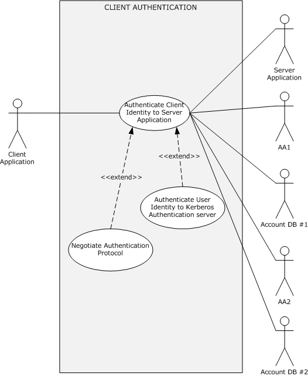

Figure 22: Client authentication use case

**Goal:** To verify the identity of the client application.

**Context of Use:** The user has to access a service on a network that requires verification of client identities.

**Direct Actor:** The client application.

**Primary Actor:** The user.

**Supporting Actors:** AA1, AA2, the server application, Account DB #1, and Account DB #2.

**Preconditions:**

- The user that started the client application is logged on to the [**client computer**](#gt_client-computer).
- The identity of the client application is configured in Account DB #1, and the identity of the server application is configured in Account DB #2.
- The client application, server application, AA1, and AA2 can communicate with each other.
**Minimal Guarantee:** When [**client authentication**](#gt_client-authentication) fails, the client application receives an error message that indicates the reason for the failure.

**Success Guarantee:** The server application has verified the identity of the client application.

**Trigger:** The user has to access a protected resource or a service on the [**server computer**](#gt_server-computer) that resides in domain2.

**Main Success Scenario:** Negotiation leads to the use of [**Kerberos**](#gt_kerberos).

- The client and server application negotiate, as described in section [2.5.5.2](#Section_2.1), and agree on Kerberos as the authentication protocol.
- The identity of the client application is proven to AA1, as described in section [2.5.5.1](#Section_2.1).
- The client application sends the target server application's identity and the [**TGT**](#gt_ticket-granting-ticket-tgt) material that was obtained in step 2 to AA1 to request a [**service ticket**](#gt_service-ticket) for the server application.
- AA1 cannot issue the service ticket for the identity of the server application because the server identity is not defined in Account DB #1; therefore, AA1 replies with a referral ticket to AA2, as described in [[Referrals]](https://go.microsoft.com/fwlink/?LinkId=90258).
- When the client application receives the referral ticket, the client application locates AA2 and sends the TGS request with the received referral ticket.
- AA2 decrypts the referral ticket by using the inter-domain key that is shared between AA1 and AA2, detects that the referral ticket contains a request for a service ticket for the server application, generates the service ticket, and returns it to the client.
**Postconditions:** The identity of the client application is proven to the server application. Both the client and the server applications have a shared [**session key**](#gt_session-key) for further secure communication.

**Extensions:** None.

#### 2.5.4.3 Cross-Forest Environment

The following subsection describes a use case that pertains to network [**domain**](#gt_domain) logon in a cross-forest environment. For the following use case, it is assumed that a user account and a machine account are provisioned in one domain (domain1) in one [**forest**](#gt_forest) (forest1) and that a resource is located in another domain (domain2) in another forest (forest2). This use case uses the following notation.

**FAA1:** The [**Authentication Authority (AA)**](#gt_authentication-authority-aa) of forest1.

**AA1:** The AA of domain1 in forest1.

**DB #1:** The account database of domain1 in forest1.

**FAA2:** The AA of forest2.

**AA2:** The AA of domain2 in forest2.

**DB #2:** The account database of domain2 in forest2.

**GC:** The [**global catalog server (GC server)**](#gt_global-catalog-server-gc-server).

**DNS:** The [**Domain Name System (DNS)**](#gt_domain-name-system-dns).

##### 2.5.4.3.1 Client Authentication

This use case describes how a client application authenticates itself in a cross-[**forest**](#gt_forest) environment.

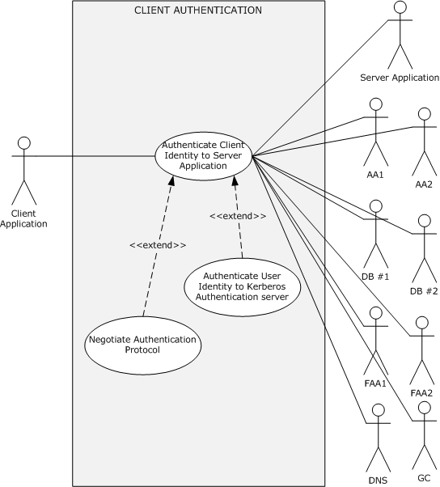

Figure 23: Client authentication in a cross-forest environment

**Goal:** To verify the identity of the client application.

**Context of Use:** The user has to access a service or resource on a different forest that requires verification of client identities.

**Direct Actor:** The client application.

**Primary Actor:** The user.

**Supporting Actors:** FAA1, AA1, DB #1, FAA2, AA2, DB #2, GC, and [**DNS**](#gt_domain-name-system-dns).

**Preconditions:**

- The user that started the client application is logged on to the [**client computer**](#gt_client-computer), which is in forest1.
- The identities of the client application and the client computer are configured in DB #1, and the identity of the server application is configured in DB #2.
- Bidirectional forest trust is established between forest1 and forest2.
**Minimal Guarantee:** When [**client authentication**](#gt_client-authentication) fails, the client application receives an error message that indicates the reason for the failure.

**Success Guarantee:** The server application has verified the identity of the client application.

**Trigger:** The user has to access a protected resource or a service on the [**server computer**](#gt_server-computer) that resides in domain2 in forest2.

**Main Success Scenario:** Negotiation leads to the use of [**Kerberos**](#gt_kerberos).

- The client and server applications negotiate as described in section [2.5.5.2](#Section_2.1) and agree on Kerberos as the authentication protocol.
- The identity of the client application is proven to AA1, as described in the Main Success Scenario in section [2.5.5.1](#Section_2.1).
- The client application sends the target server application's identity and the [**TGT**](#gt_ticket-granting-ticket-tgt) material that was obtained in step 2 to AA1 to request a [**service ticket**](#gt_service-ticket) for the server application.
- AA1 cannot find an entry for the server application identity in DB #1 and requests the [**GC server**](#gt_global-catalog-server-gc-server) to verify the server application identity. The GC server replies that the service is located in forest2; therefore, AA1 sends the referral ticket to the root authority of forest1 (FAA1).
- On receiving the referral ticket, the client application locates FAA1 and sends the TGS request with the received referral ticket.
- FAA1 double-checks with the local GC as to whether the identity of the server application is in forest1. After FAA1 confirms that the identity does not exist in forest1, FAA1 sends the referral ticket to the root authority of forest2 (FAA2).
- FAA2 double-checks with the local GC as to whether the identity of the server application is in forest2. After FAA2 confirms that the identity of the server application exists in domain2, FAA2 sends the referral ticket to domain2 (AA2) in forest2.
- AA2 validates the client’s identity through the referral TGT, filters out all [**SIDs**](#gt_security-identifier-sid) that are not local to the client’s identity home forest, and sends the response with the service ticket of the requested server application to the client application.
**Postconditions:** The identity of the client application is proven to the server application. Both the client and the server application have a shared [**session key**](#gt_session-key) for further secure communication.

**Extensions:** None.

### 2.5.5 Auxiliary

#### 2.5.5.1 Authenticate Client Identity to a Kerberos Authentication Server

The following diagram illustrates protocol interactions to authenticate a client user or computer identity to a [**Kerberos**](#gt_kerberos) authentication server described in the following subsections. The Kerberos client that plays the role of the [**Authentication Client**](#gt_authentication-client) initiates this use case with the goal of authenticating user/computer identity to the [**Authentication Authority (AA)**](#gt_authentication-authority-aa): the [**KDC**](#gt_key-distribution-center-kdc), specifically the Kerberos [**Authentication Server (AS)**](#gt_authentication-server).

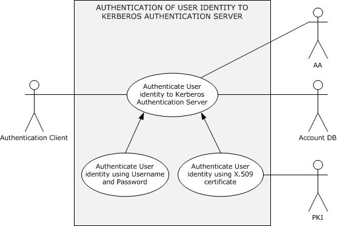

Figure 24: Authentication of a client user identity to a Kerberos Authentication Server

##### 2.5.5.1.1 Authenticate Client Identity by Using a User Name and Password

The following describes authentication of a client user or computer by using a user name and password.

**Goal:** To authenticate the identity of a user or computer to the [**AA**](#gt_authentication-authority-aa) by providing a user name or computer name and a password.

**Context of Use:** Applies when the user interactively logs on to the [**domain**](#gt_domain) or when the user tries to access a protected resource on the network.

**Direct Actor:** The [**Authentication Client**](#gt_authentication-client).

**Primary Actor:** The [**LSA**](#gt_local-security-authority-lsa) or the client application.

**Supporting Actors:** The AA, the account DB, and the [**PKI**](#gt_public-key-infrastructure-pki).

**Preconditions:**

- The identities of the user and the [**client computer**](#gt_client-computer) are configured in the account database.
- The client computer and the AA can communicate with each other.
- The LSA has obtained the [**credential**](#gt_credential) information for the user or computer identity and has submitted the credential information to the Authentication Client. In the case of user identity authentication, the LSA has obtained the credential information from the user (for example, by using a logon UI).
**Minimal Guarantees:** If the identity of the user or computer cannot be proven to the AA by using the underlying authentication protocol, authentication fails. The client application or the user receives an error message that indicates the reason for the failure.

**Success Guarantees:** The client computer has a [**TGT**](#gt_ticket-granting-ticket-tgt) for the user or computer account, which is used to authenticate to servers. The user or computer identity is successfully proven to the client computer, and the client computer has group information and other information about the user.

**Main Success Scenario:** Using the Kerberos Protocol

- To prove the identity of the user or computer, the Authentication Client submits to the AA credential information including a user name or computer account name, a timestamp that is encrypted with a key derived from the user's or computer's password, and a domain name.
- The AA verifies the credential information against the account DB. When verification succeeds, the AA returns to the Authentication Client a TGT and a [**session key**](#gt_session-key)encrypted with a key that is derived from the user's or computer's password.
**Alternative Scenario:** This scenario occurs when [**FAST**](#gt_flexible-authentication-secure-tunneling-fast) mode is supported and configured on both the Authentication Client and when the AA and the Authentication Client have obtained the TGT for the computer account, as described in the Main Success Scenario.

- To prove the user identity, the Authentication Client submits to the AA a [**FAST AS-REQ**](#gt_fast-as-req) message that contains user credential information. The information includes a user name, a timestamp that is encrypted with a key derived from the user's password, and a domain name.
- The AA verifies the user credential information against the account database. When verification succeeds, the AA returns a FAST AS-REP message to the Authentication Client. FAST AS-REP is a [**Kerberos**](#gt_kerberos) AS-REP message (**[RFC4120]** section 3.1) that contains a TGT and a session key encrypted with a key derived from the user's password.
**Postconditions:** The user or computer identity is proven to the AA, and the Authentication Client receives a TGT and a session key for further authentication processing.

##### 2.5.5.1.2 Authenticate Client Identity by Using an X.509 Certificate

The following describes authentication of a client user or computer by using an [**X.509**](#gt_x509) certificate in the Main Success Scenario, otherwise the section is the same as section [2.5.5.1.1](#Section_2.5.5.1.1).

**Goal:** To authenticate the identity of a user or computer to the [**AA**](#gt_authentication-authority-aa) by using an X.509 certificate.

**Context of Use:** Applies when the user interactively logs on to the [**domain**](#gt_domain) or when the user tries to access a protected resource on the network.

**Direct Actor:** The [**Authentication Client**](#gt_authentication-client).

**Primary Actor:** The [**LSA**](#gt_local-security-authority-lsa) or the client application.

**Supporting Actors:** The AA, the account DB, and the [**PKI**](#gt_public-key-infrastructure-pki).

**Preconditions:**

- The identities of the user and the [**client computer**](#gt_client-computer) are configured in the account database.
- The client computer and the AA can communicate with each other.
- The LSA has obtained the [**credential**](#gt_credential) information for the user or computer identity and has submitted the credential information to the Authentication Client. In the case of user identity authentication, the LSA has obtained the credential information from the user (for example, by using a logon UI).
**Minimal Guarantees:** If the identity of the user or computer cannot be proven to the AA by using the underlying authentication protocol, authentication fails. The client application or the user receives an error message that indicates the reason for the failure.

**Success Guarantee:** The client computer has a [**TGT**](#gt_ticket-granting-ticket-tgt) for the user or computer account, which is used to authenticate to servers. The user or computer identity is successfully proven to the client computer, and the client computer has group information and other information about the user.

**Main Success Scenario:**

- To prove the identity of the user or computer by using PKI services, the Authentication Client submits to the AA user or computer credential information that consists of the user name or computer account name, the domain name, the user's or computer's X.509 certificate, and a timestamp that is signed by using the certificate.
- The AA validates the certificate chain, verifies the signature on the timestamp by using PKI services, and then looks up the account in the account DB. When verification succeeds, the AA returns to the Authentication Client a TGT and a [**session key**](#gt_session-key) encrypted with the [**public key**](#gt_public-key) of the user's certificate.
**Postconditions:** The user or computer identity is proven to the AA, and the Authentication Client receives a TGT and a session key for further authentication processing

#### 2.5.5.2 Negotiate Authentication Protocol

The Negotiate Authentication Protcol use case describes how a client and a server application can negotiate to select an agreed-on common authentication protocol.

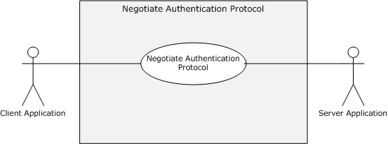

Figure 25: Negotiate authentication protocol

**Goal:** To select an authentication protocol that both the [**client computer**](#gt_client-computer) and [**server computer**](#gt_server-computer) system support.

**Context of Use:** A client application has to access a service on a network that requires verification of client identities, and the client and server applications are coded to use SPNEGO to negotiate a common authentication protocol.

**Direct Actor:** The client application or the server application, depending on how negotiation starts.

**Primary Actor:** The user.

**Supporting Actors:** The [**Authentication Authority (AA)**](#gt_authentication-authority-aa), the account DB, and the [**PKI**](#gt_public-key-infrastructure-pki).

**Preconditions:**

- The user that started the client application is logged on to the client computer.
- The client application, server application, and AA can communicate with each other.
- The client and server application are configured to negotiate an authentication protocol.
**Minimal Guarantees:** Negotiation fails in some scenarios when a non-Windows system participates and there is no common protocol, or when the client or server application receives another reason for failure.

**Success Guarantee:** Both the client and the server agree on a common authentication protocol.

**Trigger:** The client application has to access a protected resource or a service on the server computer and: a) The client starts the negotiation phase before a request; or b) The server starts the negotiation phase in reaction to a request; or c) The server rejects access, and the client initiates the negotiation phase. The trigger depends on the implementation of the application protocol.

**Main Success Scenario:** The server starts the negotiation phase in reaction to a request.

- The server application sends the preferred authentication protocol and a list of available authentication protocols in priority order to the client application.
- The client application sends the preferred authentication protocol and a list of available authentication protocols in priority order to the server application.
- The server application agrees on a common protocol and returns the state of negotiation to the client application.
**Postcondition:** Both the client and server application have agreed on a common authentication protocol for further authentication process.

**Extensions:** None.

#### 2.5.5.3 S4U2self Mechanism: Get a Service Ticket for a Front-End Server

This use case describes how a front-end server obtains a [**service ticket**](#gt_service-ticket) to itself on behalf of the identity of a client application by using the S4U2self mechanism ([MS-SFU](../MS-SFU/MS-SFU.md) section 1.3.1) when the identity of the client application is proven to the front-end server by some means other than [**Kerberos**](#gt_kerberos).

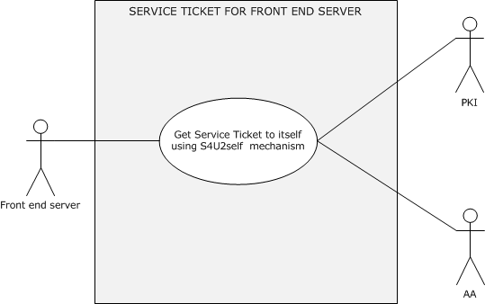

Figure 26: The front-end server obtains service ticket to itself by using the S4U2self mechanism

**Goal:** To get a service ticket for a service application on the front-end server.

**Context of Use:** The user is authenticated to the service application by using a non-Kerberos protocol, and the front-end service application is required to get a service ticket to itself to serve the client application request. For example, the front-end service application requires group information to perform [**authorization**](#gt_authorization) checks, or it requires a service ticket to use in S4U2Proxy (to contact a back-end service).

**Direct Actor:** The front-end server.

**Primary Actor:** The service application that is running on the front-end server.

**Supporting Actors:** The [**AA**](#gt_authentication-authority-aa), the account DB, and the [**PKI**](#gt_public-key-infrastructure-pki).

**Preconditions:**

- The front-end server has obtained the identity of the user that is running the client application: either the user's certificate or the user name and user's [**domain**](#gt_domain) name.
- The identity service application is configured in the account DB.
- The service application is authenticated to the AA (the [**KDC**](#gt_key-distribution-center-kdc)) and has a valid [**TGT**](#gt_ticket-granting-ticket-tgt).
- The front-end server and the AA can communicate with each other.
- The client application and the front-end server can communicate with each other.
**Minimal Guarantees:** The front-end server application fails to get a service ticket to itself on behalf of the identity of the client application. The front-end server application receives an error message that indicates the reason for the failure.

**Success Guarantee:** The front-end server application gets a service ticket, which contains group information, to itself on behalf of the identity of the client application.

**Trigger:** When the client application attempts to access protected resources or services on the front-end server by proving its identity through the use of a non-Kerberos protocol, the front-end server has to get a service ticket to itself on behalf of the identity of the client application to serve the client's request.

**Main Success Scenario:**

- The front-end server makes a request to the AA (the KDC) for a service ticket to itself on behalf of the identity of the client application by using the S4U2self extension. The front-end server presents the identity of the client application in either of the following forms:
- A user name and a user's domain name.
Or

- The user's certificate.
- The KDC validates the request and returns a service ticket to the front-end server on behalf of the client's identity.
**Postcondition:** The front-end server application can successfully get a service ticket to itself on behalf of the identity of the client application.

**Extensions:** None.

### 2.5.6 Security Services

#### 2.5.6.1 Data Origin Authentication (Signing)

The Data Origin Authentication (signing) use case describes how a client application builds signed application data, how a server application verifies the signature of the signed application data, and vice versa.

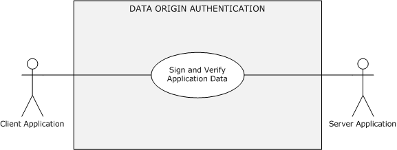

Figure 27: Data origin authentication (signing)

**Goal:** To exchange application protocol messages between a client application and a server application and to guarantee that unauthorized actors cannot modify them. The receiver processes messages in the same order as they were sent.

**Context of Use:** The client and server application have to exchange signed application data with each other.

**Direct Actor:** The client or the server application, depending on the initiator of the use case.

**Primary Actor:** The client application or the server application.

**Supporting Actors:** The server application or the client application.

**Preconditions:**

- The client and server application can communicate with each other.
- The identity of the client application is proven to the server application, or the identity of the server application is proven to the client application, or the identities of the client application and the server application are proven to each other.
- The [**Authentication Client**](#gt_authentication-client) and the [**Authentication Server**](#gt_authentication-server) have agreed on a signature algorithm method and a [**secret key**](#gt_secret-key).
**Minimal Guarantee:** When the verification of the signed application data fails, the client or server application receives an error message that indicates the reason for the failure.

**Success Guarantees:** Application protocol messages are exchanged between a client application and a server application, and unauthorized actors cannot modify the messages.

**Trigger:** The client application and the server application have to exchange signed application data with each other to prevent message tampering in transit.

**Main Success Scenario:**

- The client application requests the Authentication Client to compute the signature for the application data, and the Authentication Client creates a signature of the application data by using an agreed-on secret key and algorithm. The client application attaches the signature to the application data and sends both to the server application.
- The server application requests the Authentication Server to verify the signature, and the Authentication Server verifies the signature of the application data by using an agreed-on secret key and algorithm. If the verification succeeds, the server application interprets the application data.
- The server application requests the Authentication Server to create the signature, and the Authentication Server creates a signature of the application data by using an agreed-on secret key and algorithm. The server application attaches the signature to the application data and sends both to the client application.
- The client application requests the Authentication Client to verify the signature, and the Authentication Client verifies the signature of the application data by using an agreed-on secret key and algorithm. If the verification succeeds, the client application interprets the application data.
**Postconditions:** The client application and the server application can exchange the signed application data with each other, and both the client application and the server application interpret the application data based on their implementations.

#### 2.5.6.2 Data Confidentiality (Sealing)

The Data Confidentiality (sealing) use case describes how client and server applications securely exchange their application data with each other.

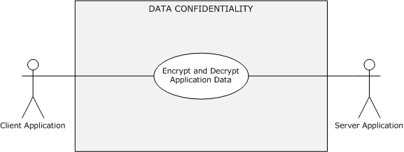

Figure 28: Data confidentiality (sealing) use case

**Goal:** To exchange application data securely so that no unauthorized actor can learn or alter its contents (confidentiality and data origin guarantee). The receiver processes messages in the same order as they were sent.

**Context of Use:** The client and the server application have to securely exchange application data with each other.

**Direct Actor:** The client application or the server application, depending on the initiator of the use case.

**Primary Actor:** The client application, the server application, or the user.

**Supporting Actors:** The server application or the client application.

**Preconditions:**

- The first two preconditions of section [2.5.6.1](#Section_2.5.6).
- The [**authentication client**](#gt_authentication-client) and the [**authentication server**](#gt_authentication-server) have agreed on an encryption algorithm method and a [**secret key**](#gt_secret-key).
**Minimal Guarantees:** When the secure exchange of the application data fails, the client or server application receives an error message that indicates the reason for the failure.

**Success Guarantee:** The client and server applications can securely exchange the application data with each other.

**Trigger:** The user has to access a protected resource or a service on the [**server computer**](#gt_server-computer) and to present sensitive information to the server.

**Main Success Scenario:**

- The client application requests the authentication client to build an encrypted message. The authentication client builds the encrypted application data by using the agreed-on encryption method and a secret key and returns the encrypted message to the client application. The client application sends the encrypted application data to the server application.
- The server application requests the authentication server to decrypt the received application data from the client application by using an agreed-on decryption method and a secret key. If the decryption succeeds, the authentication server returns the application message to the server application, which interprets the application data and responds with success to the client application.
- The server application requests the authentication server to build an encrypted message. The authentication server builds the encrypted application data by using an agreed-on encryption method and a secret key and returns the encrypted message to the server application. The server application sends the encrypted application data to the client application.
- The client application requests the authentication client to decrypt the received application data from the server application by using an agreed-on decryption method and a secret key. If the decryption succeeds, the authentication client returns a decrypted application message to the client application. The client application interprets the application data and responds with success to the server application.
**Post-conditions:** The client and the server application can exchange the application data securely, and both the client and the server application interpret the application data in an implementation-specific way.

## 2.6 Versioning, Capability Negotiation, and Extensibility

No capability negotiation is associated with Authentication Services. Any deviations from a specific version's implementation of these protocol specifications are documented in the respective protocol document. Capability negotiations between client and server implementations of these protocols are specified in the System Versioning and Capability Negotiation sections in their respective technical documents. For more details, see sections 1.7 of the member protocol specifications that are listed in section [2.2](#Section_2.1).

## 2.7 Error Handling

Authentication Services do not handle errors at the system level for cross-protocol error states. The member protocol specifications describe the errors that the protocols return and what they mean. The implementer determines how to handle the errors, based on the protocol descriptions.

## 2.8 Coherency Requirements

None.

## 2.9 Security

Implementers have to be aware that Kerberos Protocol Extensions [MS-KILE](../MS-KILE/MS-KILE.md) and [**public key**](#gt_public-key)-based authentication ([MS-PKCA](../MS-PKCA/MS-PKCA.md) and [MS-TLSP](#Section_2.9)) offer stronger security guarantees in terms of initial authentication and in subsequent confidentiality and integrity of client-server traffic and server-server traffic. [**Digest authentication**](#gt_digest-authentication) or NTLM authentication can be used in environments in which these stronger mechanisms are not available.

Because the security of [**Kerberos**](#gt_kerberos) authentication is in part based upon the time stamps of the [**tickets**](#gt_ticket), it is critical to have accurately set clocks on the machines in the Kerberos environment. As stated in the Kerberos documents, a short lifetime for tickets is used to prevent attackers from performing successful brute force attacks or replay attacks. If the clocks of the machines in a Kerberos environment drift, the network becomes vulnerable to such attacks. Because clock synchronization is vital to Kerberos protocol security, if clocks are not synchronized within a reasonable time window, Kerberos will report fatal errors and refuse to function.

In Windows, the Network Time Protocol (NTP) Authentication Extensions [MS-SNTP](../MS-SNTP/MS-SNTP.md) is used to achieve authenticated time synchronization between Kerberos clients and the [**KDC**](#gt_key-distribution-center-kdc). [**Client authentication**](#gt_client-authentication) attempts from a machine with an inaccurate clock will be rejected by the KDC because of the time difference with the KDC's clock; therefore, it is important to achieve time synchronization.

## 2.10 Additional Considerations

There are no additional considerations.

# 3 Examples

## 3.1 Example 1: GSS Authentication Protocol Process - Stock Quote Server

This example describes the [**GSS**](#gt_generic-security-services-gss) authentication protocol process. It builds on the use cases for [Client Authentication (section 2.5.4.1.1)](#Section_2.5.4.1.1), [Server Authentication (section 2.5.4.1.2)](#Section_2.5.4.1.2), [Mutual Authentication (section 2.5.4.1.3)](#Section_2.5.4.1.3), [Security Services: Data Origin Authentication (Signing) (section 2.5.6.1)](#Section_2.5.6), [Security Services: Data Confidentiality (Sealing) (section 2.5.6.2)](#Section_2.5.6.2), and their dependent use cases.

Every application protocol uses its own mechanism to transport the GSS-API security tokens from an Application Client to an Application Server. The following example explains the interactions of the [**Authentication Client**](#gt_authentication-client), the [**Authentication Server**](#gt_authentication-server), and the [**Authentication Authority (AA)**](#gt_authentication-authority-aa) through GSS-APIs [[RFC2743]](https://go.microsoft.com/fwlink/?LinkId=90378).

This example is particularly useful for application architects and developers to design and implement application protocols that interoperate with Authentication Services.

To illustrate the use of authentication, this example uses the simple Stock Quote Service block protocol that specifies the retrieval and update of stock quotes from the Stock Quote Server.

The following table defines Stock Quote Request and Response messages without authentication data support.

| Bit Range | Field | Description |
| --- | --- | --- |
| Variable | **Length** | The length of the message |
| Variable | **Message Type** | The message type (3 is an error message; 1 is a reply; 0 is a request) |
| Variable | **Request Type** | The requested action (0 is a query; 1 is an update) |
| Variable | **Stock Symbol** | The stock symbol |
| Variable | **Stock Price** | The stock price (optional) |
| Variable | **Error code** | The error code (0 is success; nonzero is failure) |

**Table 1: Stock Quote Service messages without authentication data support**

To get the latest stock quote price, the Stock Quote Client sends a request message, as defined in Table 1, to the Stock Quote Server and receives a response message with a stock quote price. The Stock Quote Server is not required to authenticate the client to respond with a stock quote price, because anyone can query this server, but the client requires the server authentication, confidentiality, and signing services so that the client can verify that the quote is valid and was obtained from an authentic server and that the messages were not tampered with. These services help to keep these interactions private.

The Stock Quote Server restricts stock price updates to authenticated users. To update a stock quote price, the server requires client authentication; therefore, the client authenticates to the server. To retrieve a stock quote price, the client requires server authentication; therefore, the server authenticates to the client. Both the client and the server require the assurance that the messages were not tampered with and that the message exchanges were secret; this assurance requires signing and confidentiality services.

Because the application protocol is GSS API-conformant, it is required to support transport of the authentication token.

The existing Stock Quote request and response messages are extended to hold authentication tokens and protected application data messages.

The following table defines Stock Quote Request and Response messages with authentication data support.

| Bit Range | Field | Description |
| --- | --- | --- |
| Variable | **Message Type** | The message type (3 is an error message; 1 is a reply; 0 is a request). |
| Variable | **Data Blob Type** | The **Data Blob** field type (1 is an authentication token; 2 is application protocol data; 3 is an error message). |
| Variable | **Length** | The length of the **Data Blob** field. |
| Variable | **Data Blob** | The data BLOB. The contents of this field are based on the **Data Blob Type** field. If the **Data Blob Type** field is 1, then this field contains the binary BLOB of the authentication token. If the **Data Blob Type** field is 2, then this field contains the **Request Type** (0 is query; 1 is update), **Stock Symbol**, and **Stock Price** field values. If the **Data Blob Type** field is 3 and the **Message Type** field is 3, then this message contains an error code. |

**Table 2: Stock Quote Service messages with authentication data support**

To update or retrieve the stock quote, a client and server exchange one or more request and response messages with an authentication token in the **Data Blob** field depending on the underlying authentication protocol. When authentication finishes, the client or server sends the **Data Blob** field with application data that contains stock quote details. If the initial request message does not have an authentication token, the server returns an error code, because authentication is required.

**Prerequisites**

This example assumes the following prerequisites in addition to the preconditions of the covered use cases:

- A TCP connection is established between the Stock Quote Client and the Stock Quote Server.
- The Stock Quote Client and the Stock Quote Server have acquired the credential handles with the GSS-API **GSS_Acquire_Cred** function ([RFC2743] section 2.1.1) by specifying the security package.
**Initial System State**

- The **AA** has not authenticated the client identity or the server identity.
**Final System State**

- The **AA** has authenticated both the client and the server identities.
**Sequence of Events**

The following steps show the basics of authentication with GSS.

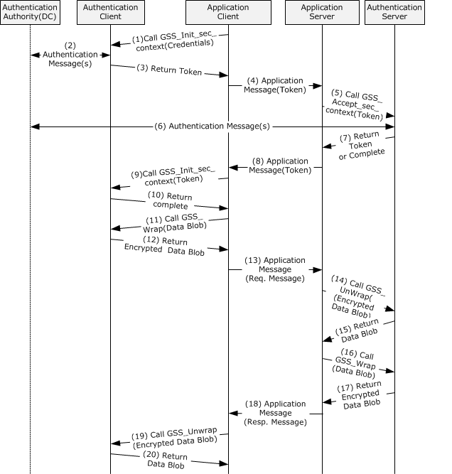

Figure 29: GSS authentication process with underlying authentication protocol messages

Step 1: The Stock Quote Client calls the Authentication Client's GSS-API **GSS_Init_sec_context** function ([RFC2743] section 2.2.1) to obtain the security token with the acquired credential handle and null input token by specifying that it requires [**mutual authentication**](#gt_mutual-authentication), confidentiality, and signing.

Step 2: If the Authentication Client requires information from the Authentication Authority (AA) (that is, the DC) before returning the token, the Authentication Client generates authentication messages and sends the messages to the AA. The AA validates the messages. If the messages are valid, the AA generates an authentication message and sends the reply to the Authentication Client. If the Authentication Client requires more information from the AA before returning the GSS-API token, step 2 is repeated until all the required information is obtained.

Step 3: The Authentication Client generates a new GSS-API token and if more messages are expected, returns GSS_S_CONTINUE_NEEDED. Otherwise, if this is the final message, returns GSS_S_COMPLETE, and the security token to the Stock Quote Client.

Step 4: The Stock Quote Client embeds the security token in its application message and sends the message to the Stock Quote Server by using its own application-protocol-specific method. In this example, the Stock Quote Client embeds the security token in the **Data Blob** field, sets the **Data Blob Type** field value to 1, sets the **Message Type** to 0, and sets the other required fields in the stock quote service message, as described in Table 2.

Step 5: The Stock Quote Server calls the Authentication Server's GSS-API **GSS_Accept_sec_context** function ([RFC2743] section 2.2.2) with the acquired credential handle and security token from the client by specifying the Confidentiality and Integrity flags.

Step 6: If required by the authentication protocol, the Authentication Server generates an authentication message and sends the message to the AA. The AA validates the message. If the message is valid, the AA generates an authentication message and sends the reply to the Authentication Server.

If the Authentication Server requires more information from the AA before it returns the GSS-API token, step 6 is repeated until all the required information is obtained.

Step 7: The Authentication Server validates the token. If the token is valid, the Authentication Server generates a new token if required and

- If more messages are expected, returns GSS_S_CONTINUE_NEEDED,
or

- If this is the final message, returns GSS_S_COMPLETE,
and the security token to the Stock Quote Server.

Step 8: If the Authentication Server returns a token, the Stock Quote Server embeds the security token in its application message and sends the message to the Stock Quote Client by using its own application-protocol-specific transport. In this example, the Stock Quote Server embeds the security token in the **Data Blob** field, sets the **Data Blob Type** field value to 1, sets the **Message Type** field to 1, and sets other required fields in the stock quote service message, as described in Table 2.

Step 9: If the Authentication Client had previously returned GSS_S_CONTINUE_NEEDED, the Stock Quote Client calls the **GSS_Init_sec_context** function ([RFC2743] section 2.2.1) with the token from the server.

Step 10: The Authentication Client validates the token. If the token is valid, the Authentication Client generates a new token if required and

- If more messages are expected, returns GSS_S_CONTINUE_NEEDED,
or

- If this is the final message, returns GSS_S_COMPLETE,
and the security token to the Stock Quote Client.

If GSS_S_CONTINUE_NEEDED, go to Step 5.

Step 11: The Stock Quote Client generates a **Data Blob** field that contains the updated stock quote data and calls the Authentication Client's GSS-API **GSS_Wrap** function ([RFC2743] section 2.3.3) to generate a privacy and integrity-protected copy of the application **Data Blob** field.

Step 12: The Authentication Client returns a privacy and integrity-protected copy of the application **Data Blob** field.

Step 13: The Stock Quote Client builds the request message with the protected **Data Blob** field and other required fields and sends the message to the Stock Quote Server by using its own application-protocol-specific transport.

Step 14: The Stock Quote Server calls the Authentication Server's GSS-API **GSS_Unwrap** function ([RFC2743] section 2.3.4) to verify the integrity of the protected **Data Blob** field and also to get the plain **Data Blob** field contents.

Step 15: The Authentication Server verifies the integrity of the message and returns the plain **Data Blob** field contents to the Stock Quote Server. The Stock Quote Server interprets and updates the stock information with the contents of the application **Data Blob** field.

Step 16: The Stock Quote Server calls the **GSS_Wrap** function ([RFC2743] section 2.3.3) with the **Data Blob** to get the protected **Data Blob** field.

Step 17: The Authentication Server returns a protected **Data Blob**.

Step 18: The Stock Quote Server builds the response message with the protected **Data Blob** field and also sets other required fields, as described in Table 2. The message is sent to the Stock Quote Client.

Step 19: The Stock Quote Client calls the **GSS_Unwrap** function ([RFC2743] section 2.3.4) to verify the integrity of the message and also to get the plain **Data Blob** field contents.

Step 20: The Authentication Client returns the plain **Data Blob** field contents.

The Stock Quote Client interprets the response and ends the session. When finished, both the Stock Quote Client and the Stock Quote Server release the credential handles by calling the GSS-API **GSS_Release_cred** function ([RFC2743] section 2.1.2).

## 3.2 Example 2: Interactive Domain Logon - Service Ticket for Client Computer

The examples in the following subsections describe interactive domain logons to obtain service tickets. They build on the use case for [Interactive Domain Logon: Service Ticket for Client Computer (section 2.5.3.1.1)](#Section_2.5.3.1.1) by using a user name and password or an X.509 certificate.

Interactive [**domain**](#gt_domain) logon can be performed several ways: through the [**Netlogon**](#gt_netlogon) RPC interface [MS-NRPC](../MS-NRPC/MS-NRPC.md) with password-based authentication, through Kerberos [MS-KILE](../MS-KILE/MS-KILE.md) [[RFC4120]](https://go.microsoft.com/fwlink/?LinkId=90458) with passwords, or through Kerberos PKINIT [MS-PKCA](../MS-PKCA/MS-PKCA.md) [[RFC4556]](https://go.microsoft.com/fwlink/?LinkId=90482) by using an [**X.509**](#gt_x509) certificate. The examples in the following subsections show the password-based and the X.509 certificate-based [**Kerberos**](#gt_kerberos) exchanges.

### 3.2.1 Interactive Domain Logon by Using Passwords

This example describes interactive logon by using a password to obtain a service ticket. It covers the use cases [Authenticate User or Computer Identity Using Username and Password (section 2.5.5.1.1)](#Section_2.5.5.1.1) and [Interactive Domain Logon: Service Ticket for Client Computer (section 2.5.3.1.1)](#Section_2.5.3.1.1).

**Prerequisites**

- The [**Authentication Authority (AA)**](#gt_authentication-authority-aa) is available.
- The user account is provisioned in the account database.
**Initial System State**

- The user has not been authenticated to the AA.
- The [**Authentication Client**](#gt_authentication-client) does not have a [**service ticket**](#gt_service-ticket) for the [**client computer**](#gt_client-computer).
**Final System State**

- The AA has interactively authenticated the user, and the Authentication Client has obtained a service ticket for the client computer.
**Sequence of Events**

Figure 30: Interactive domain logon that uses passwords

**Authentication of User Identity to Authentication Authority by Using Kerberos** (see section 2.5.5.1.1)

Step 1: The logon attempt is made through the [**Kerberos**](#gt_kerberos) protocol. The Authentication Client (the Kerberos client) sends a **KRB_AS_REQ** message ([[RFC4120]](https://go.microsoft.com/fwlink/?LinkId=90458) section 3.1) to the Authentication Authority (the [**Key Distribution Center (KDC)**](#gt_key-distribution-center-kdc)). This message includes the user principal name and a list of supported encryption types in preferred priority order. This message does not include the [**pre-authentication**](#gt_pre-authentication) data because its function is to discover the supported encryption types.

Step 2: The KDC checks the user principal name in its account database. Because the request message does not contain the pre-authentication data, the KDC responds with an error ([RFC4120] section 3.1.3) and also with a list supported encryption types in its priority order.

Step 3: The Authentication Client sends a **KRB_AS_REQ** message for a [**ticket-granting ticket (TGT)**](#gt_ticket-granting-ticket-tgt) with PA-ENC-TIMESTAMP as pre-authentication data to the KDC. The client builds the pre-authentication data by encrypting its timestamp with a [**secret key**](#gt_secret-key) derived from the user's password by using one of the commonly supported encryption methods.

Step 4: In response to receiving the **KRB_AS_REQ** message for a TGT, the KDC authenticates the user by checking the pre-authentication data and ensuring that the [**credentials**](#gt_credential) that are used in the **KRB_AS_REQ** are the same as those of the user's credentials ([RFC4120] section 3.1) in the account database. The KDC builds the TGT with a [**privilege attribute certificate (PAC)**](#gt_privilege-attribute-certificate-pac) ([MS-KILE](../MS-KILE/MS-KILE.md) section 3.3.5.6.4) that contains group membership information in the **authorization_data** field of the TGT, generates a **KRB_AS_REP** message from the TGT and the [**session key**](#gt_session-key), and sends the **KRB_AS_REP** message back to the client.

**Service Ticket for Client Computer** (see section 2.5.3.1.1)

Step 5: The client sends a **KRB_TGS_REQ** message ([RFC4120] section 3.3) based on the TGT from step 4 to obtain a service ticket for the target computer. The client presents the TGT, the [**authenticator**](#gt_authenticator), and the [**service principal name (SPN)**](#gt_service-principal-name-spn) as host/hostname.domain, where *hostname* is the actual name of the client computer, and *domain* is the [**domain**](#gt_domain) or [**realm**](#gt_realm) of the client computer.

Step 6: The KDC validates the TGT and the authenticator. If these are valid, the KDC returns a service ticket for a client computer in a **KRB_TGS_REP** message with user logon information.

The client validates the **KRB_TGS_REP** message ([MS-KILE] section 3.3.4). If **KRB_TGS_REP** is valid, then the Kerberos runtime interprets the service ticket within the local client computer.

### 3.2.2 Interactive Domain Logon by Using an X.509 Certificate

This example describes interactive domain logon by using an X.509 certificate to obtain a service ticket. It covers the use cases Authenticate User or Computer Identity Using an [**X.509**](#gt_x509) Certificate (section [2.5.5.1.2)](#Section_2.5.5.1.2) and [Interactive Domain Logon: Service Ticket for Client Computer (section 2.5.3.1.1)](#Section_2.5.3.1.1).

**Prerequisites**

- The [**Authentication Authority (AA)**](#gt_authentication-authority-aa) is available.
- The [**Authentication Client**](#gt_authentication-client) has access to the X.509 certificate and [**private key**](#gt_private-key) of the requested user account.
**Initial System State**

- The user has not been authenticated to the AA.
- The Authentication Client does not have a [**service ticket**](#gt_service-ticket) for the client computer.
**Final System State**

- The AA has interactively authenticated the user, and the Authentication Client has obtained a service ticket for the client computer.
**Sequence of Events**

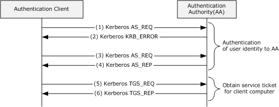

Figure 31: Interactive domain logon by using an X.509 certificate

**Authentication of User Identity to Authentication Authority** (see section 2.5.5.1.2)

Step 1: Same as step 1 in section [3.2.1](#Section_3.2.1).

Step 2: Same as step 2 in section 3.2.1.

Step 3: The Authentication Client sends a **KRB_AS_REQ** message for a [**ticket-granting ticket (TGT)**](#gt_ticket-granting-ticket-tgt) with PA-PK-AS-REQ as [**pre-authentication**](#gt_pre-authentication) data to the [**KDC**](#gt_key-distribution-center-kdc). The client builds the pre-authentication data as described in [[RFC4556]](https://go.microsoft.com/fwlink/?LinkId=90482) section 3.2.1.

Step 4: The KDC validates the **KRB_AS_REQ** message ([[RFC4120]](https://go.microsoft.com/fwlink/?LinkId=90458) section 3.1.2), which includes verifying the user's signature and validating the certificate ([RFC4556] section 3.2.2). If the **KRB_AS_REQ** message is valid, the KDC builds the TGT with a [**PAC**](#gt_privilege-attribute-certificate-pac) ([MS-KILE](../MS-KILE/MS-KILE.md) section 3.3.5.6.4) that contains group membership information in the **authorization_data** field of the TGT, generates a **KRB_AS_REP** message ([RFC4556] section 3.2.3) from the TGT and the session key, and sends the reply to the client.

**Service Ticket for Client Computer** (see section 2.5.3.1.1)

Step 5: Same as step 5 in section 3.2.1.

Step 6: Same as step 6 in section 3.2.1.

The client validates the **KRB_TGS_REP** message ([MS-KILE] section 3.3.4). If the **KRB_TGS_REP** message is valid, the service ticket is interpreted by the [**Kerberos**](#gt_kerberos) runtime within the local client computer.

## 3.3 Example 3: Connecting to an SMB2 Share

The examples in the following subsections describe connecting to an SMB2 share by using Kerberos protocol [MS-KILE](../MS-KILE/MS-KILE.md) or NTLM protocol [MS-NLMP](../MS-NLMP/MS-NLMP.md). They build on the use cases for [Network Logon: Mutual Authentication (section 2.5.4.1.3)](#Section_2.5.4.1.3), [Network Logon: Client Authentication (section 2.5.4.1.1)](#Section_2.5.4.1.1), [Security Services: Data Origin Authentication (Signing) (section 2.5.6.1)](#Section_2.5.6), and their dependent use cases.

### Using Kerberos Protocol Extensions [MS-KILE]

This example describes using [**Kerberos**](#gt_kerberos) protocol extensions [MS-KILE](../MS-KILE/MS-KILE.md) to obtain [**client authentication**](#gt_client-authentication) to connect to an [**SMB2**](#gt_server-message-block-smb) share.

**Prerequisites**

- A file share has been created on an SMB2 server, and the user that initiates the SMB2 client application has been configured for access permissions on the share.
**Initial System State**

- The user that is running the SMB2 client application has not been authenticated to the [**Authentication Authority (AA)**](#gt_authentication-authority-aa).
**Final System State**

- The user that is running the SMB2 client application has been authenticated to the AA.
**Sequence of Events**

![Connecting to an SMB2 share with [MS-KILE] as the authentication protocol](media/image32.png)

Figure 32: Connecting to an SMB2 share with [MS-KILE] as the authentication protocol

**Negotiating an Authentication Protocol** (see section [2.5.5.2](#Section_2.1))

The SMB2 client and the SMB2 server negotiate the authentication protocol by using the SPNEGO protocol [MS-SPNG](../MS-SPNG/MS-SPNG.md) and [MS-NEGOEX](#Section_2.9).

Step 1: When the user tries to access the network share on the SMB2 server, the SMB2 client sends the **SMB2 NEGOTIATE Request** message ([MS-SMB2](../MS-SMB2/MS-SMB2.md) section 2.2.3) to the SMB2 server to negotiate SMB2 capabilities, such as [**SMB dialects**](#gt_smb-dialect) between the SMB2 client and server.

Step 2: The SMB2 server builds an **SMB2 NEGOTIATE Response** message ([MS-SMB2] section 2.2.4) with its preferred dialect and the **securityBlob** field with the [**GSS**](#gt_generic-security-services-gss) token by calling the [**Authentication Server**](#gt_authentication-server) through the GSS-API **GSS_Accept_sec_context** function [[RFC2743]](https://go.microsoft.com/fwlink/?LinkId=90378). The GSS token contains a **NegTokenInit2** message ([MS-SPNG] section 2.2.1), which includes the preferred authentication protocol mechanism as the NegoEx [**object identifier (OID)**](#gt_object-identifier-oid) and a list of the supported authentication mechanisms as NegoEx ([MS-NEGOEX]), krb5, erroneous Kerberos, usertouser, and NTLM OIDs ([MS-SPNG] section 1.9.1).

The SMB2 client calls the [**Authentication Client**](#gt_authentication-client) through the GSS-API **GSS_Init_sec_context** function ([RFC2743] section 2.2.1) to verify the received GSS token and to get the token to prove the SMB2 client's identity to the SMB2 server. The Authentication Client first tries by using the Kerberos protocol to prove the client's identity and to build the [**security token**](#gt_security-token).

**Authenticating an SMB2 Client Identity to a Kerberos Authentication Server** (see section [2.5.5.1.1](#Section_2.5.5.1.1))

The Authentication Client proves the identity of the SMB2 client to the Authentication Authority by using the Kerberos [MS-KILE] protocol to get the [**service ticket**](#gt_service-ticket) for the SMB2 server.

Step 3: The Authentication Client (Kerberos client) sends a **KRB_AS_REQ** message ([[RFC4120]](https://go.microsoft.com/fwlink/?LinkId=90458) section 3.1) to the Authentication Authority ([**Key Distribution Center (KDC)**](#gt_key-distribution-center-kdc)). This message includes the [**user principal name**](#gt_user-principal-name-upn) and a list of supported encryption types in priority order to encrypt the [**pre-authentication**](#gt_pre-authentication) data but does not include the pre-authentication data because its function is to discover the supported encryption types.

Step 4: The KDC checks the user principal name in its account database and the pre-authentication data. If the request message does not contain the pre-authentication data, the KDC responds with an error ([RFC4120] section 3.1.3) and with a list of supported encryption types in its priority order.

Step 5: The Authentication Client sends a **KRB_AS_REQ** message for a [**ticket-granting ticket (TGT)**](#gt_ticket-granting-ticket-tgt) with PA-ENC-TIMESTAMP as pre-authentication data to the KDC. The client builds the pre-authentication data by encrypting its timestamp with a [**secret key**](#gt_secret-key) derived from the user's password by using an agreed-on encryption method. The client presents its principal name and pre-authentication data in a **KRB_AS_REQ** message.

Step 6: In response to receiving the **KRB_AS_REQ** for a TGT, the KDC authenticates the user by checking that the pre-authentication data [**credentials**](#gt_credential) that are used in the **KRB_AS_REQ** are the same as those of the user's credentials ([RFC4120] section 3.1) in the account database. The KDC builds the TGT with a [**PAC**](#gt_privilege-attribute-certificate-pac) ([MS-KILE] section 3.3.5.6.4) that contains group membership information in the **authorization_data** field of the TGT, generates a **KRB_AS_REP** message ([[RFC4556]](https://go.microsoft.com/fwlink/?LinkId=90482) section 3.2.2) from the TGT and the session key, and sends the **KRB_AS_REP** message back to the client.

**Authenticating an SMB2 Client Identity to an SMB2 Server** (see section [2.5.4.1.1](#Section_2.5.4.1.1))

Step 7: The Authentication Client sends a **KRB_TGS_REQ** based on the TGT obtained in step 6 to obtain a service ticket for the SMB2 server. The **KRB_TGS_REQ** message includes the TGT, the [**authenticator**](#gt_authenticator), and the [**Service Principal Name (SPN)**](#gt_service-principal-name-spn) as cifs/servername.domain, where *servername* is the actual name of the SMB2 server computer, and *domain* is the [**domain**](#gt_domain) or [**realm**](#gt_realm) of the client computer.

Step 8: The KDC validates the TGT and the authenticator. If these are valid, the KDC returns a service ticket for an SMB2 server and a [**session key**](#gt_session-key) for communication between the SMB2 client and the SMB2 server in a **KRB_TGS_REP** message.

Step 9: The Authentication Client builds a **KRB_AP_REQ** message ([RFC4120] section 3.2) with a TGT and the authenticator that is created by encrypting the user name, IP address, and a timestamp with the session key received in step 8. This entire **KRB_AP_REQ** message, with a MutualRequired flag to indicate that the [**server authentication**](#gt_server-authentication) is required, is embedded as a **KerberosToken** in a **NegTokenInit** message ([[RFC4178]](https://go.microsoft.com/fwlink/?LinkId=90461) section 4.2.1), along with a preferred authentication mechanism, such as krb5, and a list of supported authentication mechanisms, such as krb5, erroneous Kerberos, NegoEx, and NTLM OIDs. This entire **NegTokenInit** message is enveloped in a GSS-API SPNEGO token and returned to the SMB2 client.

To get a new authenticated session, the SMB2 client sends the SMB2 server an **SMB2 SESSION_SETUP Request** message ([MS-SMB2] section 2.2.5) with its **SecurityMode** field set to SMB2_NEGOTIATE_SIGNING_ENABLED. The request message contains a **securityBlob** field that contains the GSS SPNEGO token that was constructed previously, as well as other capabilities and a security mode.

The SMB2 server calls the Authentication Server on the local machine to verify the client's identity by validating the GSS-API SPNEGO token. The Authentication Server validates the SPNEGO Token contents by calling the **GSS_Accept_sec_context** function ([RFC2743] section 2.2.2) with the received token. If the validation succeeds, the client identity is proved to the SMB2 server, and the Authentication Server returns the security token to the SMB2 server.

**Proving SMB2 server identity to the SMB2 client application** (see section [2.5.4.1.2](#Section_2.5.4.1.2))

Step 10: The SMB2 server generates a signature as described in [MS-SMB2] section 3.1.4.1 and sends the SMB2 client an **SMB2 SESSION_SETUP Response** message ([MS-SMB2] section 2.2.6). The response contains the signature and the previously received GSS security token, which contains a **negTokenResp** ([RFC4178] section 4.2.2), which has a **KRB_AP_REP** message ([RFC4120] section 3.2.4) as its KerberosToken.

The SMB2 client calls the Authentication Client's GSS-API **GSS_Init_sec_context** function ([RFC2743] section 2.2.1) to verify the GSS token to prove the identity of the SMB2 server and verifies the signature as described in [MS-SMB2] section 3.1.5.1. The Authentication Client verifies the signature and the GSS token as described in [MS-SPNG] and [MS-NEGOEX] and then validates the **KRB_AP_REP** message. If the validation succeeds, the identity of the server is proven to the SMB2 client.

### Using the NTLM Protocol [MS-NLMP]

This example describes using [**NTLM Protocol**](#gt_nt-lan-manager-ntlm) [MS-NLMP](../MS-NLMP/MS-NLMP.md) to obtain [**client authentication**](#gt_client-authentication) to connect to an [**Server Message Block (SMB2)**](#gt_server-message-block-smb) share. When [**Kerberos**](#gt_kerberos) authentication fails or is not configured, the [**Authentication Client**](#gt_authentication-client) tries the NTLM protocol as the next preferred authentication protocol to prove the identity of the SMB2 client to the SMB2 server. This example describes the interactions between the SMB2 client and the SMB2 server when Kerberos is not configured or is unavailable.

**Prerequisites**

- A file share has been created on an SMB2 server, and the user that initiates the SMB2 client application has been configured for access permissions on the share.
**Initial System State**

- The user that is running the SMB2 client application has not been authenticated to the [**Authentication Authority (AA)**](#gt_authentication-authority-aa).
**Final System State**

- The user that is running the SMB2 client application has been authenticated to the AA.
**Sequence of Events**

![Connecting to an SMB2 share with [MS-NLMP] as the authentication protocol](media/image33.png)

Figure 33: Connecting to an SMB2 share with [MS-NLMP] as the authentication protocol

The SMB2 client and the SMB2 server negotiate the authentication protocol by using the SPNEGO protocol [MS-SPNG](../MS-SPNG/MS-SPNG.md) and [MS-NEGOEX](#Section_2.9).

Step 1: When the user tries to access the network share on the SMB2 server, the SMB2 client sends the **SMB2 NEGOTIATE Request** ([MS-SMB2](../MS-SMB2/MS-SMB2.md) section 2.2.3) message to the SMB2 server to negotiate SMB2 capabilities, such as [**SMB dialects**](#gt_smb-dialect) between the SMB2 client and server

Step 2: The SMB2 server builds an **SMB2 NEGOTIATE Response** ([MS-SMB2] section 2.2.4) message with a preferred dialect and a **securityBlob** field with the [**GSS**](#gt_generic-security-services-gss) token by calling the [**Authentication Server**](#gt_authentication-server) through the GSS-API **GSS_Accept_sec_context** function, as described in [[RFC2743]](https://go.microsoft.com/fwlink/?LinkId=90378). The GSS token contains a **NegTokenInit2** ([MS-SPNG] section 2.2.1) message, which includes the preferred authentication protocol mechanism as NegoEx [**OID**](#gt_object-identifier-oid) and a list of supported authentication mechanisms such as NegoEx ([MS-NEGOEX]), krb5, erroneous Kerberos, usertouser, and NLMP OIDs, as specified in [MS-SPNG] section 1.9.1.

Step 3: The SMB2 client calls the GSS-API **GSS_Init_sec_context** function ([RFC2743] section 2.2.1) of the Authentication Client to verify the received token and to obtain the new GSS SPNEGO Token. Next, the Authentication Client builds the GSS token with NTLM as its preferred authentication mechanism and a **NEGOTIATE_MESSAGE** ([MS-NLMP] section 2.2.1.1) and hands off to the SMB2 client. The SMB2 client creates an **SMB2 SESSION_SETUP Request** ([MS-SMB2] section 2.2.5) with **securityBlob** field values as the GSS token and sends it to the SMB2 server.

Step 4: The SMB2 server asks the Authentication Server to validate the GSS token that was received in the preceding step by calling the GSS-API **GSS_Accept_sec_context** function ([RFC2743] section 2.2.2). The Authentication Server validates the [**security token**](#gt_security-token) and returns the status code that indicates that a subsequent round trip is required. It also builds the GSS SPNEGO token with a **CHALLENGE_MESSAGE** ([MS-NLMP] section 2.2.1.2), which is returned to the SMB2 server. The SMB2 server creates an **SMB2 SESSION_SETUP Response** ([MS-SMB2] section 2.2.6) with the security field value as the GSS token and sends the response to the SMB2 client.

Step 5: The SMB2 client calls the GSS-API **GSS_Init_sec_context** function ([RFC2743] section 2.2.1) of the Authentication Client to validate the security token that was received in step 4 and to build the subsequent security token. The Authentication Client builds the GSS-API SPNEGO token with an **AUTHENTICATE_MESSAGE** ([MS-NLMP] section 2.2.1.3). The SMB2 client creates the **SMB2 SESSION_SETUP Request** with the GSS token and sends it to the SMB2 server.

Step 6: The SMB2 server calls the GSS-API **GSS_Accept_sec_context** function ([RFC2743] section 2.2.2) of the Authentication Server to validate the received token and builds security tokens if required for further communication. To validate the security token, the Authentication Server contacts the Authentication Authority by sending a **NETWORK_NETLOGON_INFO** message as described in [MS-APDS](../MS-APDS/MS-APDS.md) section 2.2.1.

Step 7: The Authentication Authority validates the request message and returns either the **NETLOGON_VALIDATION_SAM_INFO2** or the **NETLOGON_VALIDATION_SAM_INFO4** message with group membership information to the Authentication Server, depending on the processing rules described in [MS-APDS] section 3.1.5.2.

Step 8: The Authentication Server returns the status indicating that authentication is complete to the SMB2 server. The SMB2 server builds the **SMB2 SESSION_SETUP Response** message and sends it to the SMB2 client.

# 4 Microsoft Implementations

The information in this overview is applicable to the following versions of Windows:

- Windows NT operating system
- Windows 2000 operating system
- Windows XP operating system
- Windows Server 2003 operating system
- Windows Server 2003 R2 operating system
- Windows Vista operating system
- Windows Server 2008 operating system
- Windows 7 operating system
- Windows Server 2008 R2 operating system
- Windows 8 operating system
- Windows Server 2012 operating system
- Windows 8.1 operating system
- Windows Server 2012 R2 operating system
- Windows 10 operating system
- Windows Server 2016 operating system
- Windows Server operating system
- Windows 10 v1809 operating system
- Windows Server 2019 operating system
- Windows Server 2022 operating system
- Windows 11 operating system

## 4.1 Product Behavior

# 5 Change Tracking

This section identifies changes that were made to this document since the last release. Changes are classified as Major, Minor, or None.

The revision class **Major** means that the technical content in the document was significantly revised. Major changes affect protocol interoperability or implementation. Examples of major changes are:

- A document revision that incorporates changes to interoperability requirements.
- A document revision that captures changes to protocol functionality.
The revision class **Minor** means that the meaning of the technical content was clarified. Minor changes do not affect protocol interoperability or implementation. Examples of minor changes are updates to clarify ambiguity at the sentence, paragraph, or table level.

The revision class **None** means that no new technical changes were introduced. Minor editorial and formatting changes may have been made, but the relevant technical content is identical to the last released version.

The changes made to this document are listed in the following table. For more information, please contact [dochelp@microsoft.com](mailto:dochelp@microsoft.com).

| Section | Description | Revision class |
| --- | --- | --- |
| [1.3](#Section_1.3) References | 11217 : Updated [MS-NEGOEX] reference title from SPEGNO to SPNEGO. | Minor |
| [2.1.2.2](#Section_2.1.2.2) Protocol Interactions | 11217 : Updated [MS-NEGOEX] title from SPEGNO to SPNEGO. | Minor |
| 2.1.2.2 Protocol Interactions | Updated SSL/TLS name. | None |
| [2.1.3](#Section_2.1.3) Relevant Standards | Added TLS Version 1.3 with reference to [RFC8446]. | Major |
| [2.1.4.3](#Section_2.1.4.3) SSL/TLS Protocols | Updated diagram with RFCs for TLS 1.3, TLS extensions, elliptic curves, and cipher suites. | Major |
| [2.2.1](#Section_2.2.1) Enterprise Environment | 11217 : Updated [MS-NEGOEX] title from SPEGNO to SPNEGO. | Minor |
| [2.2.2](#Section_2.2.2) Intranet Web Environment | 11217 : Updated [MS-NEGOEX] title from SPEGNO to SPNEGO. | Minor |
| [4](#Section_4) Microsoft Implementations | Added Windows 11 to the list of applicable products. | Major |

## Revision History

| Date | Version | Revision Class | Comments |
| --- | --- | --- | --- |
| 2/11/2011 | 1.0 | New | Released new document. |
| 3/25/2011 | 2.0 | Major | Updated and revised the technical content. |
| 5/6/2011 | 2.0 | None | No changes to the meaning, language, or formatting of the technical content. |
| 6/17/2011 | 2.1 | Minor | Clarified the meaning of the technical content. |
| 9/23/2011 | 3.0 | Major | Updated and revised the technical content. |
| 12/16/2011 | 3.0 | None | No changes to the meaning, language, or formatting of the technical content. |
| 3/30/2012 | 4.0 | Major | Updated and revised the technical content. |
| 7/12/2012 | 4.0 | None | No changes to the meaning, language, or formatting of the technical content. |
| 10/25/2012 | 5.0 | Major | Updated and revised the technical content. |
| 1/31/2013 | 5.1 | Minor | Clarified the meaning of the technical content. |
| 8/8/2013 | 6.0 | Major | Updated and revised the technical content. |
| 11/14/2013 | 6.0 | None | No changes to the meaning, language, or formatting of the technical content. |
| 2/13/2014 | 6.0 | None | No changes to the meaning, language, or formatting of the technical content. |
| 5/15/2014 | 6.0 | None | No changes to the meaning, language, or formatting of the technical content. |
| 6/30/2015 | 7.0 | Major | Significantly changed the technical content. |
| 9/24/2015 | 7.1 | Minor | Clarified the meaning of the technical content. |
| 10/16/2015 | 7.1 | None | No changes to the meaning, language, or formatting of the technical content. |
| 9/26/2016 | 7.2 | Minor | Clarified the meaning of the technical content. |
| 6/1/2017 | 7.2 | None | No changes to the meaning, language, or formatting of the technical content. |
| 12/15/2017 | 8.0 | Major | Significantly changed the technical content. |
| 11/5/2018 | 9.0 | Major | Significantly changed the technical content. |
| 6/3/2021 | 10.0 | Major | Significantly changed the technical content. |
| 10/26/2021 | 11.0 | Major | Significantly changed the technical content. |
