# [MS-AZOD]: Authorization Protocols Overview

Table of Contents

1 Introduction

- [1 Introduction](#Section_1)
  - [1.1 Conceptual Overview](#Section_1.1)
    - [1.1.1 DAC Model](#Section_1.1.1)
      - [1.1.1.1 Authorization Information (PAC)](#Section_1.1.1.1)
      - [1.1.1.2 Security Identifiers (SIDs)](#Section_1.1.1.2)
      - [1.1.1.3 Security Descriptor](#Section_1.1.1.3)
      - [1.1.1.4 Resource Managers](#Section_1.1.1.4)
      - [1.1.1.5 Access Rights](#Section_1.1.1.5)
      - [1.1.1.6 User Rights](#Section_1.1.1.6)
      - [1.1.1.7 Access Token](#Section_1.1.1.7)
      - [1.1.1.8 Impersonation](#Section_1.1.1.8)
      - [1.1.1.9 Inheritance](#Section_1.1.1.9)
      - [1.1.1.10 Windows Integrity Mechanism](#Section_1.1.1.10)
      - [1.1.1.11 Claim-Based Access Control (CBAC) Model](#Section_1.1.1.11)
    - [1.1.2 AzMan RBAC Model](#Section_1.1.2)
      - [1.1.2.1 Roles, Tasks, and Operations](#Section_1.1.2.1)
      - [1.1.2.2 Application-Scoped Groups](#Section_1.1.2.2)
      - [1.1.2.3 Authorization Store](#Section_1.1.2.3)
    - [1.1.3 COM+ Roles Access Control Model](#Section_1.1.3)
  - [1.2 Glossary](#Section_1.2)
  - [1.3 References](#Section_1.3)

2 Functional Architecture

- [2 Functional Architecture](#Section_2)
  - [2.1 Overview](#Section_2.1)
    - [2.1.1 System Capabilities](#Section_2.1.1)
    - [2.1.2 Applicability](#Section_2.1.2)
    - [2.1.3 Authorization Process](#Section_2.1.3)
    - [2.1.4 DAC Model](#Section_2.1.4)
      - [2.1.4.1 Protocol Communications](#Section_2.1.4.1)
        - [2.1.4.1.1 Kerberos Protocol Extensions](#Section_2.1.4.1.1)
        - [2.1.4.1.2 NT LAN Manager (NTLM) Authentication Protocol](#Section_2.1.4.1.2)
        - [2.1.4.1.3 Digest Protocol Extensions](#Section_2.1.4.1.3)
        - [2.1.4.1.4 SSL/TLS Protocol](#Section_2.1.4.1.4)
      - [2.1.4.2 Internal Components](#Section_2.1.4.2)
      - [2.1.4.3 CBAC Model](#Section_2.1.4.3)
        - [2.1.4.3.1 Down-Level Scenarios](#Section_2.1.4.3.1)
        - [2.1.4.3.2 Claims Transformation](#Section_2.1.4.3.2)
    - [2.1.5 Verify Authorization](#Section_2.1.5)
    - [2.1.6 COM+ Roles Access Control Model](#Section_2.1.6)
    - [2.1.7 Relevant Standards](#Section_2.1.7)
  - [2.2 Protocol Summary](#Section_2.2)
  - [2.3 Environment](#Section_2.3)
    - [2.3.1 Dependencies on This System](#Section_2.3.1)
    - [2.3.2 Dependencies on Other Systems/Components](#Section_2.3.2)
  - [2.4 Assumptions and Preconditions](#Section_2.4)
  - [2.5 Use Cases](#Section_2.5)
    - [2.5.1 DAC Model](#Section_2.5.1)
      - [2.5.1.1 File Server](#Section_2.5.1.1)
        - [2.5.1.1.1 Actors](#Section_2.5.1.1.1)
        - [2.5.1.1.2 Check Simple Access](#Section_2.5.1.1.2)
        - [2.5.1.1.3 Check ACL Inheritance Access](#Section_2.5.1.1.3)
        - [2.5.1.1.4 Check Conditional ACEs-Based Access](#Section_2.5.1.1.4)
        - [2.5.1.1.5 Check Claims-Based Access](#Section_2.5.1.1.5)
      - [2.5.1.2 Active Directory](#Section_2.5.1.2)
        - [2.5.1.2.1 Actors](#Section_2.5.1.2.1)
        - [2.5.1.2.2 Check Simple Access](#Section_2.5.1.2.2)
        - [2.5.1.2.3 Check Object-Specific Access](#Section_2.5.1.2.3)
        - [2.5.1.2.4 Control Access Right-Based Access](#Section_2.5.1.2.4)
        - [2.5.1.2.5 Control Validated Write-Based Access](#Section_2.5.1.2.5)
        - [2.5.1.2.6 Check Object Visibility](#Section_2.5.1.2.6)
      - [2.5.1.3 Auxiliary](#Section_2.5.1.3)
        - [2.5.1.3.1 Get Access Token](#Section_2.5.1.3.1)
    - [2.5.2 AzMan RBAC Model](#Section_2.5.2)
      - [2.5.2.1 AzMan RBAC Model](#Section_2.5.2.1)
  - [2.6 Versioning, Capability Negotiation, and Extensibility](#Section_2.6)
  - [2.7 Error Handling](#Section_2.7)
  - [2.8 Coherency Requirements](#Section_2.8)
  - [2.9 Security](#Section_2.9)
  - [2.10 Additional Considerations](#Section_2.10)

3 Examples

- [3 Examples](#Section_3)
  - [3.1 Reading from a File on Remote CBAC Aware SMB2 Share](#Section_3.1)

For the legal notice and IP terms, see [LEGAL.md](../LEGAL.md).
Last updated: 6/14/2022.
See [Revision History](#revision-history) for full version history.

[3.1.1 Kerberos Protocol Extensions [MS-KILE] 51](#_Toc105455339)

[3.1.1.1 Service Ticket with the User and Device Claims](#Section_3.1.1.1)
[3.1.1.2 Service Ticket Without the User Claims](#Section_3.1.1.2)
[3.1.2 NT LAN Manager Authentication Protocol [MS-NLMP] 55](#_Toc105455342)

[4 Microsoft Implementations](#Section_4)
[4.1 Product Behavior](#Section_4.1)
[5 Change Tracking](#Section_5)

# 1 Introduction

## 1.1 Conceptual Overview

Authorization is the process of controlling access to resources. Once authentication has been accomplished, the next task is to decide whether a particular request is authorized. Management of network systems often models broad authorization decisions through roles, groups, and [**claims**](#gt_claim); for example, all engineers who have access to a specific printer, all sales personnel who have access to a certain web server, or confidential information where access is granted only to certain authorized user groups or users based on the claims configured. Making authorization information consistently available to a number of services allows for simpler management.

The authorization system always deals with two entities, the security principal (subject) and the resource (object) or business operation/task, as shown in the following diagram. When a [**security principal**](#gt_security-principal) requests access to a resource or needs to perform a business operation/task that requires access, the authorization system checks all accesses that are requested by the security principal.

The following diagram shows a generic authorization model.

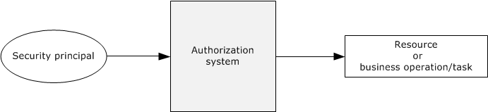

Figure 1: Generic authorization model

To perform the tasks that they are designed for, applications carry out operations and access system resources on behalf of the application's user while protecting these operations and resources from unauthorized access. Administrators can control whether a process can access securable objects or perform various system administration tasks.

Windows was originally designed to meet the requirements of the C2 level of the Trusted Computer System Evaluation Criteria (TCSEC). The TCSEC program has since been supplanted by profiles that were written under the Common Criteria for Information Technology Security Evaluation specified in [CCITSE3.1-3], such as the Controlled Access Protection Profile (CAPP).

The C2 requirements (and later the CAPP requirements) for authorization are centered upon discretionary access control. For discretionary access control, the owner of a particular resource (or a delegate of the owner) determines the level of access others need, which is in contrast to mandatory access control schemes in which another party maintains control over the resource regardless of the expectations of the owner.

This control was initially provided through the Discretionary Access Control (DAC) Model, which is an object-centric model using [**access control lists (ACLs)**](#gt_access-control-list-acl). Each system object has an associated list of trustees (user account and group account) with specific sets of access rights for that object. This model lends itself well to securing access to well-defined, persistent resources, such as [**Active Directory**](#gt_active-directory), files, and the registry.

Windows Server 2003 operating system introduced a complementary authorization interface, called Authorization Manager (AzMan), which enables the [**role-based access control (RBAC)**](#gt_role-based-access-control-rbac) authorization model. Authorization Manager provides a natural framework for business process applications that require representing the organizational model within the application security framework.

In the DAC model, a resource manager (RM) manages its own set of objects, which are protected by a [**security descriptor**](#gt_security-descriptor). Whenever a client requests access to a resource protected by an RM, the RM makes a call to the authorization system to verify the authorization of the client's identity. In turn, the authorization system looks at the client security token, the requested access to the object, and the security descriptor on the object. The authorization system responds to the RM with "yes" or "no," enabling the RM to determine whether the client can access the object.

In contrast to object-centric management, AzMan Role-Based Access Control (RBAC) provides a framework for developers to develop applications that are oriented around the notion of the role. Rather than managing access control on objects in the application, AzMan RBAC facilitates application development by providing a central object—a role—that a user is assigned to perform a particular job function within an application. A role directly implies authorization permissions on some defined set of resources.

Through the abstractions of the operation and task, AzMan RBAC permissions are typically granted through higher-level abstractions corresponding to high-level tasks defined by the application developer. Operations represent a single unit of application code, whereas tasks can be composed of multiple operations (and other tasks). Consider, for example, a web-based application that enables users to report project status, to publish status for viewing, and to view status. The COM development framework also has the notion of an application-specific role, which is very similar to the one used in the context of the AzMan RBAC model. The key difference with the AzMan RBAC is that the COM+ roles access control model can only be used in COM/COM+ applications, whereas the AzMan RBAC model can be integrated into any application type.

This section provides an overview of the following concepts, which are required to understand this document.

### 1.1.1 DAC Model

#### 1.1.1.1 Authorization Information (PAC)

For a server implementation of an authentication protocol, the result of the authentication produces a variety of data. Some of the data is related to the authentication protocol, such as keys for encrypted communication, and is covered in the relevant authentication protocol specification. Additionally, after the identity of the client is determined, additional data that corresponds to authorization of the client to the server is derived. This authorization information is frequently referred to as a Privilege Attribute Certificate (PAC), and it contains group memberships and [**claims**](#gt_claim), or group memberships from the domain controller. Each authentication protocol uses its own specific data structure to carry the authorization information. This table lists the mapping of the authentication protocol with authorization structures.

| Authentication protocol | Authorization data structure | Reference technical documents |
| --- | --- | --- |
| Kerberos Protocol Extensions | Privilege attribute certificate | [MS-PAC](../MS-PAC/MS-PAC.md) |
| Public Key Cryptography for Initial Authentication (PKINIT) in Kerberos Protocol | Privilege attribute certificate | [MS-PAC] |
| NT LAN Manager (NTLM) Authentication Protocol | NETLOGON_VALIDATION_SAM_INFO | [MS-APDS](../MS-APDS/MS-APDS.md) [MS-NRPC](../MS-NRPC/MS-NRPC.md) |
| Digest Protocol Extensions | Privilege attribute certificate | [MS-PAC] [MS-DPSP](#Section_2.1.4.1.3) [MS-APDS] |
| Secure Sockets Layer (SSL)/ Transport Layer Security (TLS) protocols | Privilege attribute certificate | [MS-PAC] [MS-RCMP](../MS-RCMP/MS-RCMP.md) |

#### 1.1.1.2 Security Identifiers (SIDs)

The security identifier (SID), as specified in [MS-DTYP](../MS-DTYP/MS-DTYP.md) section 2.4.2, is an account identifier. It is variable in length and encapsulates the hierarchical notion of issuer and identifier. It consists of a 6-byte identifier authority field that is followed by one to fourteen 32-bit subauthority values and ends in a single 32-bit [**relative identifier (RID)**](#gt_relative-identifier-rid). The following diagram shows an example of a two-subauthority [**SID**](#gt_security-identifier-sid).

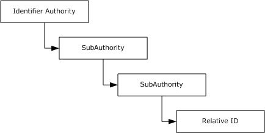

Figure 2: Windows SID with subauthorities

The original definition of a SID called out each level of the hierarchy. Each layer included a new subauthority, and an enterprise could lay out arbitrarily complicated hierarchies of issuing authorities. Each layer could, in turn, create additional authorities beneath it. In reality, this system created a lot of overhead for setup and deployment and made the management model group even more complicated. The notion of arbitrary depth identities did not survive the early stages of Windows development; however, the structure was too deeply ingrained to be removed.

In practice, two SID patterns developed. For built-in, predefined identities, the hierarchy was compressed to a depth of two or three subauthorities. For real identities of other principals, the identifier authority was set to five, and the set of subauthorities was set to four.

Whenever a new issuing authority under Windows is created, (for example, a new machine deployed or a domain is created), it is assigned a SID with an arbitrary value of 5 as the identifier authority. A fixed value of 21 is used as a unique value to root this set of subauthorities, and a 96-bit random number is created and parceled out to the three subauthorities with each subauthority that receives a 32-bit chunk. When the new issuing authority for which this SID was created is a domain, this SID is known as a "domain SID".

Windows allocates RIDs starting at 1,000; RIDs that have a value of less than 1,000 are considered reserved and are used for special accounts. For example, all Windows accounts with a RID of 500 are considered built-in administrator accounts in their respective issuing authorities.

Thus, a SID that is associated with an account appears as shown in the following figure.

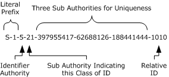

Figure 3: SID with account association

For most uses, the SID can be treated as a single long identifier for an account. By the time a specific SID is associated with a resource or logged in a file, it is effectively just a single entity. For some cases, however, it can conceptually be treated as two values: a value that indicates the issuing authority and an identifier that is relative to that authority. Sending a series of SIDs, all from the same issuer, is one example: the list can easily be compressed to be the issuer portion and the list of IDs that is relative to that issuer.

It is the responsibility of the issuing authority to preserve the uniqueness of the SIDs, which implies that the issuer does not issue the same RID more than one time. A simple approach to meeting this requirement is to allocate RIDs sequentially. More complicated schemes are certainly possible. For example, Active Directory uses a multimaster approach that allocates RIDs in blocks. It is possible for an issuing authority to run out of RIDs; therefore, the issuing authority is required to handle this situation correctly. Typically, the authority is retired.

Windows supports the concept of groups with much the same mechanisms as individual accounts. Each group has a name, just as the accounts have names. Each group also has an associated SID.

User accounts and groups share the same SID and namespaces. Users and groups cannot have the same name on a Windows-based system nor can the SID for a group and a user be the same.

For access control, Windows makes no distinction between a SID that is assigned to a group or one assigned to an account. Changing the name of a user, computer, or domain does not change the underlying SID for an account. Administrators cannot modify the SID for an account, and there is generally no need to know the SID that is assigned to a particular account. SIDs are primarily intended to be used internally by the operating system to ensure that accounts are uniquely identified in the system.

#### 1.1.1.3 Security Descriptor

The [**security descriptor**](#gt_security-descriptor) is the basis for specifying the security that is associated with an object. Every object that has a security descriptor linked to it is called a securable object. Securable objects can be shared between different users, and every user can have different authorization settings. Examples of securable objects are a file, a folder, a file system share, a printer, a registry key, and an [**Active Directory**](#gt_active-directory) object. The following diagram shows the abstract representation of the security descriptor data structure.

The security descriptor is a collection of four main elements, as shown in the following diagram: the owner, the group, the discretionary access control list (DACL), and the system access control list (SACL).

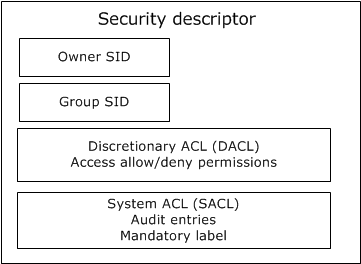

Figure 4: Abstract representation of security descriptor

The **Owner** is a [**SID**](#gt_security-identifier-sid) that specifies the owner of the resource. The **Group** SID specifies the group associated with the resource. The Group SID field is not evaluated by Windows components; it exists for Portable Operating System Interface for UNIX (POSIX) compatibility. The **DACL** field specifies the [**discretionary access control list**](#gt_discretionary-access-control-list-dacl), and the **SACL** field specifies the [**system access control list**](#gt_system-access-control-list-sacl).

When associated with a resource, the security descriptor is intended to be opaque. The resource manager (RM) is never required to examine the contents of the security descriptor. However, the security descriptor fields can be used by the RM for other purposes. For example, in a billing scenario, the file system can implement a storage quota system by using the owner field in the security descriptor to determine the resources consumed by a specific user. Security descriptor algorithms are defined in [MS-DTYP](../MS-DTYP/MS-DTYP.md) section 2.5.3.

Discretionary access control lists (DACLs, but often shortened to ACLs) form the primary means by which authorization is determined. An [**ACL**](#gt_access-control-list-acl) is conceptually a list of <*account, access-rights*> pairs, although they are significantly richer than that.

Each pair in the ACL is termed an [**access control entry (ACE)**](#gt_access-control-entry-ace). Each ACE has additional modifiers that are primarily for use during inheritance. There are also several different kinds of ACEs for representing both access to a single object (such as a file) and access to an object with multiple properties (such as an object in Active Directory).

The ACE contains the SID of the account to which the ACE pertains. The SID can be for a user or for a group.

Windows supports both positive ACEs, which grant or allow access rights to a particular account, and negative ACEs, which deny access rights to a particular account. This allows a resource owner to specify, for example, *grant read access to group Y, except for user Z.*

DACLs can be configured at the discretion of any account that possesses the appropriate permissions to modify the configuration, including Take Ownership, Change Permissions, or Full Control permissions. For a description of the SECURITY_DESCRIPTOR structure, see [MS-DTYP] section 2.4.6.

When access is requested to an Active Directory object, the Local Security Authority (LSA) compares the access token of the account that is requesting access to the object to the DACL. The security protocols check the object's DACL, searching for ACEs that apply to the user and group SIDs that are referenced in the user's access token. The security protocols then step through the DACL until they find any ACEs that allow or deny access to the user or to one of the user's groups. The protocols do this by first examining ACEs that have been explicitly assigned to the object and then examining the ACEs that have been inherited by the object. Inherited ACEs are placed in the order in which they are inherited. ACEs inherited from the child object's parent come first, then ACEs inherited from the grandparent, and so on up the tree of objects. The following diagram shows the evaluation process for an access token and a DACL when a request is evaluated.

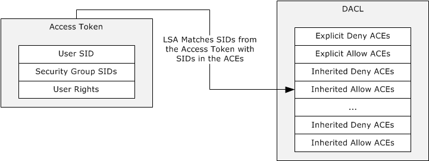

Figure 5: Evaluation process for access tokens against a DACL

The access check algorithm processes ACEs in the order in which they are present within the DACL to determine the appropriate access. A matching allow ACE will grant access for any access mask bits present in the ACE, while a matching deny ACE will deny access for any access mask bits in the ACE not already granted by an allow ACE (preventing those bits from being granted by a later allow ACE). As soon as access is granted by any one or more allow ACEs, processing will stop and access will be granted. If a specific desired access bit is denied by a deny ACE (and has not been already granted by an allow ACE) then processing will stop and access will be denied. Thus the recommendation is to always place deny ACEs at the beginning of the ACL followed by allow ACEs, if the deny ACEs should take precedence over the allow ACEs. If none of the user SIDs or group SIDs in the access token match the DACL, the user is denied access implicitly.

In Windows, a security principal's level of access to files and folders is determined by NTFS file system and share permissions. These permissions are discretionary: that is, anyone with ownership of a file or folder, Change permissions, or Full Control permissions can assign access control at their discretion. When Windows is first installed, Windows assigns default permission structures to operating system files and folders, but a user might be required to alter these permissions to meet specific security requirements.

When a user attempts to access a file or folder on an NTFS file system partition, the user's access token is compared with the DACL of the file or folder. If no ACEs correspond to a SID in the user's access token, the user is implicitly denied access to the resource. If ACEs correspond to the user's access token, the ACEs are applied in the following order:

- Explicit deny
- Explicit allow
- Inherited deny
- Inherited allow
ACEs that apply to the user are cumulative, which means that the user receives the sum of the ACEs that apply to his or her user account and to the groups of which the user is a member. For example, if an ACL contains two allow ACEs that apply to the user, one for read access and the other for write access, the user receives read/write access.

A system access control list (SACL) enables administrators to log attempts to access a secured object. Like a DACL, a SACL is a list of ACEs. Each ACE specifies the types of access attempts made by a specified account, which cause the system to generate a record in the security event log. An ACE in an SACL can generate audit records when an access attempt fails, when it succeeds, or both. For more details about the security descriptor, see [MS-DTYP] section 2.4.6.

The security descriptor of a file system object is stored in the NTFS file system, whereas the security descriptor of an Active Directory object is stored in the object's **nTSecurityDescriptor** attribute (see [MS-ADA3](#Section_2.5.1.2) section 2.37). For more details, see [MS-DTYP] section 2.5.3.4.

The SECURITY_DESCRIPTOR structure ([MS-DTYP] section 2.4.6) is a compact binary representation of the security associated with an object in a directory, or on a file system, or in other stores. However, it is not convenient for use in tools that operate primarily on text strings. Therefore, a text-based form of the security descriptor is available for situations when a security descriptor is carried by a text method. This format is the Security Descriptor Description Language (SDDL). For more information about this format, see [MS-DTYP] section 2.5.1.

#### 1.1.1.4 Resource Managers

In the DAC model, a [**resource manager (RM)**](#gt_resource-manager-rm) is the code or component that implements one or more securable object types. Many RMs--including the file system, registry, [**Active Directory**](#gt_active-directory), and operating system constructs, such as processes--exist in a Windows-based system. The NTFS file system is a resource manager that implements files and directories; the Windows registry is a resource manager that implements keys. Even though these RMs control very different objects, they share a common method for controlling access.

Windows also distinguishes between ordinary objects in the RM and containers that are exposed by the RM. In the file system, files are objects and directories are containers. This distinction is important during the creation of new objects.

To participate in the authorization scheme, the resource manager is required to maintain a [**security descriptor**](#gt_security-descriptor) with each object that is protected. The resource manager merely needs to be able to retrieve the security descriptor for an object when authorization validation is required and is not required to understand the contents.

#### 1.1.1.5 Access Rights

The access mask or rights communicate to the authorization system what the process (which is acting on a user's identity) is requesting to do with a resource, for example, read a file or write to a file. For more details, see [MS-DTYP](../MS-DTYP/MS-DTYP.md) section 2.4.3.

Different resource managers and resource types have different access rights. Files have read and write access, but processes have entirely different rights, such as terminate the process. However, all resource managers use the same formats for encoding access rights in the access control entries ([**ACEs**](#gt_access-control-entry-ace)). This is done by allowing the resource managers to define their own specific access rights.

Windows accomplishes this by partitioning the access rights space. Access rights can be encoded into a single, 32-bit value in the ACE. The most significant 16 bits are considered standard access rights and are common across all resource managers. These rights include delete access, generic-read access, and other similar rights. These rights are either expected of all resource managers (such as delete) or are used in a way that enable programs to work with multiple resource managers in a similar manner.

The least significant 16 bits are termed object-specific and are meaningful only to the resource manager that defines them. Thus the file system might define that bit 1 indicates the capability to read the file and that bit 2 indicates the capability to write the file, whereas the registry might define bit 1 to enumerate subkeys and bit 2 to read a key's value.

Additionally, DAC supports defining access rights using GUIDs, and in this way arbitrary number of access rights can be defined. Active Directory uses this model as described in [MS-ADTS](#Section_2.5.1.2) section 5.1.3.2.1 and section 5.1.3.2.2.

The following table lists the mapping of resource managers with the corresponding access rights data structure.

| Resource manager type | Access rights reference |
| --- | --- |
| Active Directory objects | [MS-ADTS] section 5.1.3.2 |
| NTFS objects | [MS-SMB2](../MS-SMB2/MS-SMB2.md) section 2.2.13.1 [MS-SMB](../MS-SMB/MS-SMB.md) section 2.2.1.4 |
| Registry objects | [MS-RRP](../MS-RRP/MS-RRP.md) section 2.2.3 |
| Printer objects | [MS-RPRN](../MS-RPRN/MS-RPRN.md) section 2.3.1 [MS-PAN](../MS-PAN/MS-PAN.md) section 3.1.1.4.1 |

#### 1.1.1.6 User Rights

User rights determine the authority to perform an operation that affects an entire computer rather than a particular object. User rights are assigned by administrators to individual users or groups as part of the security settings for the computer. Although user rights can be managed centrally through Group Policy, they are applied locally. Users can, and usually do, have different user rights on different computers.

User rights can be split into two categories: logon rights and user privileges. Logon rights control who can log on to a computer system and how to log on. User privileges are used to control access to system resources and system-related operations, such as changing the system time or the ability to shut down the system.

User rights grant specific privileges and logon rights to users and groups in a computing environment.

For a list of privileges that are supported in Windows versions, see [MS-LSAD](#Section_2.9) section 3.1.1.2.1, and for logon rights, see [MS-LSAD] section 3.1.1.2.2.

#### 1.1.1.7 Access Token

Authorization contexts are built from the authorization information that is obtained during or after the authentication process, from server-local information, or a combination of the two, depending on implementation choices.

The authorization context is also referred to as the access token, which is a collection of the groups and claims associated with the client principal and potentially the device (such as a computer) from which the client is connecting, as well as additional optional policy information. The authorization context plays a central role in determining access through the evaluation of a security descriptor. Note that the token is never passed directly across the network; tokens are local information, and the actual representation is implementation-specific. This token is represented as an abstract data structure as shown in the following diagram.

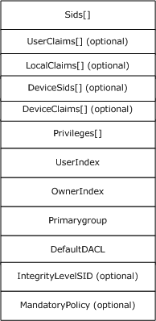

Figure 6: Access token abstract representation

For descriptions of access token structure fields, see [MS-DTYP](../MS-DTYP/MS-DTYP.md) section 2.5.2, and for more information about tokens in Windows, see [[MSDN-ACCTOKENS]](https://go.microsoft.com/fwlink/?LinkId=89949).

#### 1.1.1.8 Impersonation

In distributed systems, it is typical for a server to accomplish tasks on behalf of a client. The functionality of a server performing a task using the security context of a client to access the server's local resources is called impersonation.

A primary use of impersonation is to perform access checks against the client identity. Using the client identity for access checks can cause access to be either restricted or expanded, depending on what the client has permission to do. For example, a file server might have files that contain confidential information and each of these files is protected by an [**ACL**](#gt_access-control-list-acl). To help prevent a client from obtaining unauthorized access to information in these files, the server can impersonate the client before accessing the files.

See [MS-DTYP](../MS-DTYP/MS-DTYP.md) section 2.7 for Impersonation Abstract Interfaces. Additional references for information on Windows impersonation include the following:

- Delegation and Impersonation: [[MSFT-DAI]](https://go.microsoft.com/fwlink/?LinkId=264224)
- Client Impersonation (RPC): [[MSFT-RPCCI]](https://go.microsoft.com/fwlink/?LinkId=264225)
- Client Impersonation (API functions): [[MSDN-CI]](https://go.microsoft.com/fwlink/?LinkId=89969)

#### 1.1.1.9 Inheritance

The DAC model supports a concept of inheritance by which new objects can inherit one or more [**ACEs**](#gt_access-control-entry-ace) from their parent container. In practice, this allows an administrator to establish default security on, for example, a directory, and all new files that are created in that directory receive a preset [**ACL**](#gt_access-control-list-acl). Although the owner of the file can still override that ACL and establish its own ACL, if nothing is done (through the premise of DAC), the default is what the administrator has established.

One attribute that can be applied to ACEs is the **Object-Inherit** flag. This flag indicates that when a new object is created, this ACE is carried forward to the security descriptor of the new object. A **Container-Inherit** flag indicates that new containers created under this container will receive this ACE. For the file system, this allows different default ACLs for directories as opposed to files. An **Inherit-Only** flag indicates that when a child object is created, this ACE is carried forward to the security of the child object if either an **Object-Inherit** or a **Container-Inherit** flag is present on the parent container object. This Inherit-Only ACE does not control access to the object to which it is attached. For more details, see [MS-DTYP](../MS-DTYP/MS-DTYP.md) section 2.4.4.1.

#### 1.1.1.10 Windows Integrity Mechanism

Beginning with Windows Vista operating system, the Windows integrity mechanism extends the security architecture by defining a new [**access control entry (ACE)**](#gt_access-control-entry-ace) type to represent an [**integrity level**](#gt_integrity-level) in an object's [**security descriptor**](#gt_security-descriptor) (see [MS-DTYP](../MS-DTYP/MS-DTYP.md) section 2.4.6). Windows restricts access rights depending on whether the subject's integrity level is equal to, higher than, or lower than the object's integrity level. The integrity level of an object is stored as a mandatory label ACE that distinguishes it from the discretionary ACEs governing access to the object.

The ACE represents the object integrity level. An integrity level is also assigned to the access token when the access token is initialized. The integrity level in the access token represents a subject integrity level. The integrity level in the access token is compared to the integrity level in the security descriptor when the authorization system performs an access check. For an example of the MandatoryIntegrityCheck algorithm pseudocode, see [MS-DTYP] section 2.5.3.3. The security subsystem implements the integrity level as a mandatory label to distinguish it from the discretionary access (under user control) that [**DACLs**](#gt_discretionary-access-control-list-dacl) provide. For more information about Windows integrity mechanism design, see [[MSDN-WIMD]](https://go.microsoft.com/fwlink/?LinkId=115259).

#### 1.1.1.11 Claim-Based Access Control (CBAC) Model

Conditional [**ACEs**](#gt_access-control-entry-ace) or expressions were introduced to the authorization system to enable its access control decisions to be not only based on the identity of the trustees, but also based on whether trustees met the particular conditions. A user access request can be granted or denied by comparing the [**ACLs**](#gt_access-control-list-acl) on the [**security descriptor**](#gt_security-descriptor) with the attributes, called [**claims**](#gt_claim), of the user access token. For more details on the conditional ACEs, see [MS-DTYP](../MS-DTYP/MS-DTYP.md) section 2.4.4.17.

A claim is an attribute that makes an assertion about an entity with which it is associated. Claims are broadly classified in three categories based on entity: user claims, device claims, and resource properties or claims.

User claim: A claim that is associated with an authenticated user account. Examples of user claims are employer of the user, type of the employment, role in organization, and organizational division of the user.

Device claim: A claim that is associated with an authenticated computer account. Along with the claims, it can be included in the user token of the user who is trying to access the resource. Examples of device claims are the IT management status of the computer and the department in which the computer is designated to operate.

Resource property: A property that is associated with the resource on the system. Examples of resource properties are classification of the resource such as High-Business-Impact, Confidential, and Personally-Identifiable-Information.

CBAC is an access control paradigm that uses the claims to make access-control decisions to resources. In Windows, CBAC is built on the conditional ACEs feature, not only to use the user claims, but also to use the resource claims, which are referred to as resource properties, in order to make access control decisions. If the resource also has a resource claim "Division" that is equal to Sales, the policy condition can be stated using the SDDL syntax.

"O:BAG:BAD:(XA; ;FX;;;S-1-1-0;(@User. Division==@Resource. Division))"

Using this approach, the "Division" claim of the resource can be separately defined and changed without having to update the conditional expression on the resource.

### 1.1.2 AzMan RBAC Model

#### 1.1.2.1 Roles, Tasks, and Operations

In contrast to the DAC model, which is oriented around objects, the AzMan RBAC model attempts to orient the common administrative experience around user roles. Rather than assigning permissions to objects, an AzMan RBAC framework enables applications to present administrators with a management experience more aligned with the organizational structure of a company. AzMan RBAC provides a central object—a role—that a user is assigned to perform a particular job or application function. Ideally, an RBAC application is designed such that the administrator requires less knowledge of the object storage structure. This approach can be used if the RBAC application provides a simplifying abstraction into resource collections referred to as scopes. A role implies authorization permissions on some scope of resources, as shown in the following diagram.

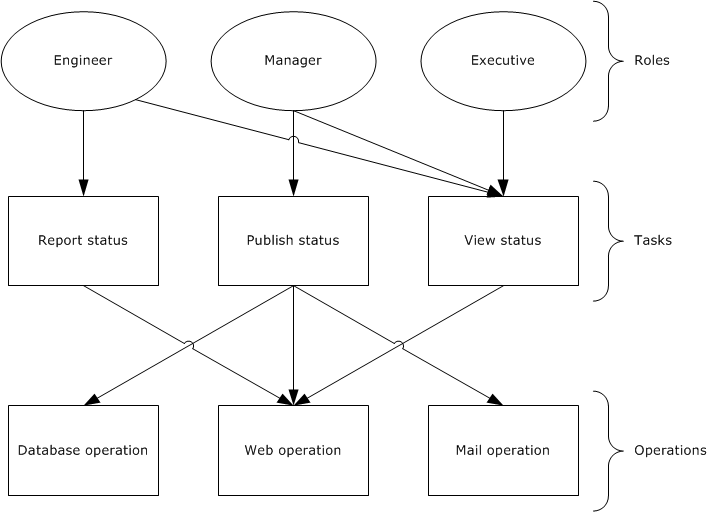

Figure 7: AzMan RBAC permissions access workflow

In the AzMan RBAC model, the role is the interface that an administrator uses to manage permissions and assignments. For example, a company can create a role called "Engineer" that is defined in terms of the permissions that engineers require for their jobs. Each engineer is assigned to the "Engineer" role and instantly has all required permissions for that job. Similarly, engineers who leave the position of engineer are removed from the "Engineer" role and no longer have engineer access. Whereas [**ACLs**](#gt_access-control-list-acl) work well for well-defined, persistent resources, the role-based model lends itself well to protecting workflow or groups of multiple distinct operations (for example, "read from database" and "send email") to be performed by the application. The preceding diagram illustrates the "Engineer" role with permission to report and view status, the "Manager" role with permission to publish and view status, and the "Executive" role with permission to view status.

In Windows, the Authorization Manager framework provides an interface for developing RBAC applications.

#### 1.1.2.2 Application-Scoped Groups

Authorization Manager role-based access control (AzMan RBAC) also allows users to be collected into groups. AzMan RBAC groups are similar to groups in the [**Active Directory**](#gt_active-directory) service, but they are maintained for a specific set of applications, a single application, or a scope within an application.

Authorization Manager introduces three types of application-scoped groups:

- **Application Basic Group:** Similar to Windows security groups, the application basic group contains a list of members. Unlike Windows security groups, it also has an additional list for nonmembers. The nonmembers list allows for exceptions so that a large group can be used but a smaller group or particular user can be excluded.
- **Lightweight Directory Access Protocol Query Group:** A group defined by an LDAP query (see [[RFC4511]](https://go.microsoft.com/fwlink/?LinkId=157505)) against the attributes of a given Active Directory user account. At the time of access, the LDAP query is run to determine if the user is a member of that group. This allows for flexible group membership that remains up-to-date with the user's Active Directory account object. For example, a Managers group could contain an LDAP query that includes all users who have direct reports.
- **BizRule-Based Group:** This group allows membership to a group to be based on the AzMan BizRule script evaluation.

#### 1.1.2.3 Authorization Store

The object-based authorization framework maintains access rights in [**DACLs**](#gt_discretionary-access-control-list-dacl) on the objects. In the role-based model, however, security information is maintained in a separate location from objects, in a policy store.

In Windows, the Authorization Manager allows authorization policy to be stored in either [**Active Directory**](#gt_active-directory), or in files in .xml format, or on an SQL server. Because administrators on the system that contains the authorization policy store have a high degree of access to the store, the authorization policy store is located on a trusted system.

When using the Active Directory store, Authorization Manager creates Active Directory objects for the store itself and child objects for each application group, application, operation, task, role, and scope. The scope object can contain tasks, roles, and groups created in that scope.

Authorization Manager also allows the authorization policy to be stored in .xml format on a file stored on an NTFS file system (protected by an [**ACL**](#gt_access-control-list-acl)). The XML store can be kept on the same computer as an Authorization Manager server or it can be stored remotely.

### 1.1.3 COM+ Roles Access Control Model

For details on the COM+ roles access control model, see [[MSDN-COM+Security]](https://go.microsoft.com/fwlink/?LinkId=252167).

## 1.2 Glossary

This document uses the following terms:

**access control entry (ACE)**: An entry in an [**access control list (ACL)**](#gt_access-control-list-acl) that contains a set of user rights and a [**security identifier (SID)**](#gt_security-identifier-sid) that identifies a principal for whom the rights are allowed, denied, or audited.

**access control list (ACL)**: A list of [**access control entries (ACEs)**](#gt_access-control-entry-ace) that collectively describe the security rules for authorizing access to some resource; for example, an object or set of objects.

**Active Directory**: The Windows implementation of a general-purpose directory service, which uses LDAP as its primary access protocol. [**Active Directory**](#gt_active-directory) stores information about a variety of objects in the network such as user accounts, computer accounts, groups, and all related credential information used by Kerberos [MS-KILE](#Section_2.1.4.1.1). [**Active Directory**](#gt_active-directory) is either deployed as Active Directory Domain Services (AD DS) or Active Directory Lightweight Directory Services (AD LDS), which are both described in [MS-ADOD](#Section_2.1): Active Directory Protocols Overview.

**Active Directory client**: The application that is running on the client computer. The user who is the primary actor uses this application to access objects or attributes of the [**Active Directory**](#gt_active-directory). The [**Active Directory client**](#gt_active-directory-client) application uses the [**Active Directory**](#gt_active-directory) protocols, as described in [MS-ADOD].

**Active Directory server**: The service or process that is running on the server computer under the security context of the identity of the [**Active Directory client**](#gt_active-directory-client).

**application client**: The application that is running on the client computer. The user who is the primary actor uses this application to perform required business operations and business tasks.

**central access policy (CAP)**: An authorization policy that is specified by a GPO component and applied to policy targets to facilitate centralized access control of resources.

**central access rule (CAR)**: An object that is stored in the Central Access Policy Rules List of a central access policy (CAP) object. Each CAR contains an authorization policy that specifies the resources, users, and access conditions to which the rule applies.

**claim**: An assertion about a security principal expressed as the n-tuple {Identifier, ValueType, m Value(s) of type ValueType} where m is greater than or equal to 1. A claim with only one Value in the n-tuple is called a single-valued claim; a claim with more than one Value is called a multi-valued claim.

**discretionary access control list (DACL)**: An [**access control list (ACL)**](#gt_access-control-list-acl) that is controlled by the owner of an object and that specifies the access particular users or groups can have to the object.

**domain controller (DC)**: The service, running on a server, that implements [**Active Directory**](#gt_active-directory), or the server hosting this service. The service hosts the data store for objects and interoperates with other [**DCs**](#gt_domain-controller-dc) to ensure that a local change to an object replicates correctly across all [**DCs**](#gt_domain-controller-dc). When [**Active Directory**](#gt_active-directory) is operating as Active Directory Domain Services (AD DS), the [**DC**](#gt_domain-controller-dc) contains full NC replicas of the configuration naming context (config NC), schema naming context (schema NC), and one of the domain NCs in its [**forest**](#gt_forest). If the AD DS [**DC**](#gt_domain-controller-dc) is a global catalog server (GC server), it contains partial NC replicas of the remaining domain NCs in its [**forest**](#gt_forest). For more information, see [MS-AUTHSOD](#Section_2.1) section 1.1.1.5.2 and [MS-ADTS](#Section_2.5.1.2). When [**Active Directory**](#gt_active-directory) is operating as Active Directory Lightweight Directory Services (AD LDS), several AD LDS [**DCs**](#gt_domain-controller-dc) can run on one server. When [**Active Directory**](#gt_active-directory) is operating as AD DS, only one AD DS [**DC**](#gt_domain-controller-dc) can run on one server. However, several AD LDS [**DCs**](#gt_domain-controller-dc) can coexist with one AD DS [**DC**](#gt_domain-controller-dc) on one server. The AD LDS [**DC**](#gt_domain-controller-dc) contains full NC replicas of the config NC and the schema NC in its [**forest**](#gt_forest). The domain controller is the server side of Authentication Protocol Domain Support [MS-APDS](../MS-APDS/MS-APDS.md).

**file server**: The service or process on a server computer that implements the server-side file access protocol components to enable remote file sharing for the file clients.

**forest**: One or more domains that share a common schema and trust each other transitively. An organization can have multiple [**forests**](#gt_forest). A [**forest**](#gt_forest) establishes the security and administrative boundary for all the objects that reside within the domains that belong to the [**forest**](#gt_forest). In contrast, a domain establishes the administrative boundary for managing objects, such as users, groups, and computers. In addition, each domain has individual security policies and trust relationships with other domains.

**globally unique identifier (GUID)**: A term used interchangeably with universally unique identifier (UUID) in Microsoft protocol technical documents (TDs). Interchanging the usage of these terms does not imply or require a specific algorithm or mechanism to generate the value. Specifically, the use of this term does not imply or require that the algorithms described in [[RFC4122]](https://go.microsoft.com/fwlink/?LinkId=90460) or [[C706]](https://go.microsoft.com/fwlink/?LinkId=89824) must be used for generating the [**GUID**](#gt_globally-unique-identifier-guid). See also universally unique identifier (UUID).

**integrity level**: The attributed trustworthiness of an entity or object.

**Key Distribution Center (KDC)**: The Kerberos service that implements the authentication and ticket granting services specified in the Kerberos protocol. The service runs on computers selected by the administrator of the realm or domain; it is not present on every machine on the network. It must have access to an account database for the realm that it serves. [**KDCs**](#gt_key-distribution-center-kdc) are integrated into the [**domain controller**](#gt_domain-controller-dc) role. It is a network service that supplies tickets to clients for use in authenticating to services.

**Local Security Authority (LSA) database**: A Microsoft-specific terminology for the part of the user account database containing account privilege information (such as specific account rights) and domain security policy information.

**relative identifier (RID)**: The last item in the series of SubAuthority values in a [**security identifier (SID)**](#gt_security-identifier-sid) [[SIDD]](https://go.microsoft.com/fwlink/?LinkId=90516). It distinguishes one account or group from all other accounts and groups in the domain. No two accounts or groups in any domain share the same RID.

**resource manager (RM)**: The participant that is responsible for coordinating the state of a resource with the outcome of atomic transactions. For a specified transaction, a resource manager enlists with exactly one transaction manager to vote on that transaction outcome and to obtain the final outcome. A resource manager is either durable or volatile, depending on its resource.

**role-based access control (RBAC)**: The Authorization Manager-based access control paradigm that controls the access to the resources or business process based on role permissions.

**security descriptor**: A data structure containing the security information associated with a securable object. A [**security descriptor**](#gt_security-descriptor) identifies an object's owner by its [**security identifier (SID)**](#gt_security-identifier-sid). If access control is configured for the object, its [**security descriptor**](#gt_security-descriptor) contains a [**discretionary access control list (DACL)**](#gt_discretionary-access-control-list-dacl) with [**SIDs**](#gt_security-identifier-sid) for the [**security principals**](#gt_security-principal) who are allowed or denied access. Applications use this structure to set and query an object's security status. The [**security descriptor**](#gt_security-descriptor) is used to guard access to an object as well as to control which type of auditing takes place when the object is accessed. The [**security descriptor**](#gt_security-descriptor) format is specified in [MS-DTYP](../MS-DTYP/MS-DTYP.md) section 2.4.6; a string representation of [**security descriptors**](#gt_security-descriptor), called SDDL, is specified in [MS-DTYP] section 2.5.1.

**security identifier (SID)**: An identifier for [**security principals**](#gt_security-principal) that is used to identify an account or a group. Conceptually, the [**SID**](#gt_security-identifier-sid) is composed of an account authority portion (typically a domain) and a smaller integer representing an identity relative to the account authority, termed the [**relative identifier (RID)**](#gt_relative-identifier-rid). The [**SID**](#gt_security-identifier-sid) format is specified in [MS-DTYP] section 2.4.2; a string representation of [**SIDs**](#gt_security-identifier-sid) is specified in [MS-DTYP] section 2.4.2 and [MS-AZOD](#Section_5a0a0a3ec7a742e1b5f2cc8d8bd9739e) section 1.1.1.2.

**security principal**: An identity that can be used to regulate access to resources. A security principal can be a user, a computer, or a group that represents a set of users.

**system access control list (SACL)**: An [**access control list (ACL)**](#gt_access-control-list-acl) that controls the generation of audit messages for attempts to access a securable object. The ability to get or set an object's [**SACL**](#gt_system-access-control-list-sacl) is controlled by a privilege typically held only by system administrators.

**ticket-granting ticket (TGT)**: A special type of ticket that can be used to obtain other tickets. The TGT is obtained after the initial authentication in the Authentication Service (AS) exchange; thereafter, users do not need to present their credentials, but can use the TGT to obtain subsequent tickets.

## 1.3 References

[MS-ADA3] Microsoft Corporation, "[Active Directory Schema Attributes N-Z](#Section_2.5.1.2)".

[MS-ADOD] Microsoft Corporation, "[Active Directory Protocols Overview](#Section_2.1)".

[MS-ADSC] Microsoft Corporation, "[Active Directory Schema Classes](#Section_2.5.1.2)".

[MS-ADTS] Microsoft Corporation, "[Active Directory Technical Specification](#Section_2.5.1.2)".

[MS-APDS] Microsoft Corporation, "[Authentication Protocol Domain Support](../MS-APDS/MS-APDS.md)".

[MS-AUTHSOD] Microsoft Corporation, "[Authentication Services Protocols Overview](#Section_2.1)".

[MS-AZMP] Microsoft Corporation, "[Authorization Manager (AzMan) Policy File Format](../MS-AZMP/MS-AZMP.md)".

[MS-CAPR] Microsoft Corporation, "[Central Access Policy Identifier (ID) Retrieval Protocol](../MS-CAPR/MS-CAPR.md)".

[MS-CIFS] Microsoft Corporation, "[Common Internet File System (CIFS) Protocol](../MS-CIFS/MS-CIFS.md)".

[MS-COMA] Microsoft Corporation, "[Component Object Model Plus (COM+) Remote Administration Protocol](../MS-COMA/MS-COMA.md)".

[MS-CTA] Microsoft Corporation, "[Claims Transformation Algorithm](#Section_2.1.4.3.2)".

[MS-DPSP] Microsoft Corporation, "[Digest Protocol Extensions](#Section_2.1.4.1.3)".

[MS-DTYP] Microsoft Corporation, "[Windows Data Types](../MS-DTYP/MS-DTYP.md)".

[MS-FASOD] Microsoft Corporation, "[File Access Services Protocols Overview](#Section_2.1)".

[MS-FCIADS] Microsoft Corporation, "[File Classification Infrastructure Alternate Data Stream (ADS) File Format](../MS-FCIADS/MS-FCIADS.md)".

[MS-FSA] Microsoft Corporation, "[File System Algorithms](../MS-FSA/MS-FSA.md)".

[MS-FSMOD] Microsoft Corporation, "[File Services Management Protocols Overview](#Section_2.1)".

[MS-FSRM] Microsoft Corporation, "[File Server Resource Manager Protocol](#Section_2.5.1.1)".

[MS-GPCAP] Microsoft Corporation, "[Group Policy: Central Access Policies Protocol Extension](../MS-GPCAP/MS-GPCAP.md)".

[MS-KILE] Microsoft Corporation, "[Kerberos Protocol Extensions](#Section_2.1.4.1.1)".

[MS-LSAD] Microsoft Corporation, "[Local Security Authority (Domain Policy) Remote Protocol](#Section_2.9)".

[MS-NEGOEX] Microsoft Corporation, "[SPNEGO Extended Negotiation (NEGOEX) Security Mechanism](#Section_2.9)".

[MS-NLMP] Microsoft Corporation, "[NT LAN Manager (NTLM) Authentication Protocol](#Section_2.1.4.1.2)".

[MS-NRPC] Microsoft Corporation, "[Netlogon Remote Protocol](../MS-NRPC/MS-NRPC.md)".

[MS-PAC] Microsoft Corporation, "[Privilege Attribute Certificate Data Structure](../MS-PAC/MS-PAC.md)".

[MS-PAN] Microsoft Corporation, "[Print System Asynchronous Notification Protocol](../MS-PAN/MS-PAN.md)".

[MS-PKCA] Microsoft Corporation, "[Public Key Cryptography for Initial Authentication (PKINIT) in Kerberos Protocol](../MS-PKCA/MS-PKCA.md)".

[MS-PRSOD] Microsoft Corporation, "[Print Services Protocols Overview](#Section_2.1)".

[MS-RAA] Microsoft Corporation, "[Remote Authorization API Protocol](../MS-RAA/MS-RAA.md)".

[MS-RCMP] Microsoft Corporation, "[Remote Certificate Mapping Protocol](../MS-RCMP/MS-RCMP.md)".

[MS-RDSOD] Microsoft Corporation, "[Remote Desktop Services Protocols Overview](#Section_2.1)".

[MS-RPRN] Microsoft Corporation, "[Print System Remote Protocol](../MS-RPRN/MS-RPRN.md)".

[MS-RRP] Microsoft Corporation, "[Windows Remote Registry Protocol](../MS-RRP/MS-RRP.md)".

[MS-SFU] Microsoft Corporation, "[Kerberos Protocol Extensions: Service for User and Constrained Delegation Protocol](#Section_2.1.4.1.1)".

[MS-SMB2] Microsoft Corporation, "[Server Message Block (SMB) Protocol Versions 2 and 3](../MS-SMB2/MS-SMB2.md)".

[MS-SMB] Microsoft Corporation, "[Server Message Block (SMB) Protocol](../MS-SMB/MS-SMB.md)".

[MS-SPNG] Microsoft Corporation, "[Simple and Protected GSS-API Negotiation Mechanism (SPNEGO) Extension](../MS-SPNG/MS-SPNG.md)".

[MS-TDS] Microsoft Corporation, "[Tabular Data Stream Protocol](../MS-TDS/MS-TDS.md)".

[MS-TLSP] Microsoft Corporation, "[Transport Layer Security (TLS) Profile](#Section_2.9)".

[MSDN-ACCTOKENS] Microsoft Corporation, "Access Tokens", [http://msdn.microsoft.com/en-us/library/aa374909.aspx](https://go.microsoft.com/fwlink/?LinkId=89949)

[MSDN-AuthMgr] Microsoft Corporation, "Developing Applications Using Windows Authorization Manager", [http://msdn.microsoft.com/en-us/library/aa480244.aspx](https://go.microsoft.com/fwlink/?LinkId=252390)

[MSDN-CI] Microsoft Corporation, "Client Impersonation", [http://msdn.microsoft.com/en-us/library/aa376391.aspx](https://go.microsoft.com/fwlink/?LinkId=89969)

[MSDN-COM+Security] Microsoft Corporation, "COM+ Security", [http://msdn.microsoft.com/en-us/library/windows/desktop/ms681314(v=vs.85).aspx](https://go.microsoft.com/fwlink/?LinkId=252167)

[MSDN-WIMD] Microsoft Corporation, "Windows Integrity Mechanism Design", [http://msdn.microsoft.com/en-us/library/bb625963.aspx](https://go.microsoft.com/fwlink/?LinkId=115259)

[MSFT-DAI] Microsoft Corporation, "Delegation and Impersonation", [http://msdn.microsoft.com/en-us/library/windows/desktop/ms680054(v=vs.85).aspx](https://go.microsoft.com/fwlink/?LinkId=264224)

[MSFT-RPCCI] Microsoft Corporation, "Client Impersonation", [http://msdn.microsoft.com/en-us/library/windows/desktop/aa373582(v=vs.85).aspx](https://go.microsoft.com/fwlink/?LinkId=264225)

[RFC4511] Sermersheim, J., "Lightweight Directory Access Protocol (LDAP): The Protocol", RFC 4511, June 2006, [http://www.rfc-editor.org/rfc/rfc4511.txt](https://go.microsoft.com/fwlink/?LinkId=157505)

# 2 Functional Architecture

## 2.1 Overview

This section provides overviews of the following authorization models: The DAC and CBAC models, the AzMan RBAC model, and the COM+ roles access control model.

### 2.1.1 System Capabilities

The Authorization protocols enable the applications to make access control decisions. In Windows, the authorization system has the capability to support the following authorization models:

- DAC and CBAC models
- AzMan RBAC model
- COM+ roles access control model
The following table illustrates the features of the DAC model that are implemented in Windows resource managers.

| Authorization feature | Active Directory objects | NTFS file system objects | Registry objects | Printer objects |
| --- | --- | --- | --- | --- |
| Inheritance (see [MS-DTYP](../MS-DTYP/MS-DTYP.md) section 2.5.3.4) | Yes | Yes | Yes | Yes |
| Object-specific access (see [MS-ADTS](#Section_2.5.1.2) section 5.1.3.3.3) | Yes | No | No | No |
| Control access rights (see [MS-ADTS] section 5.1.3.2.1) | Yes | No | No | No |
| Validated write rights (see [MS-ADTS] section 5.1.3.2.2) | Yes | No | No | No |
| Object visibility | Yes | No | No | No |
| Conditional expression ACEs | No | Yes | No | No |
| Claims (CBAC) | No | Yes | No | No |

### 2.1.2 Applicability

The DAC model is suited for well-defined persistent resources such as [**Active Directory**](#gt_active-directory), files, and the registry. CBAC is an extension to the DAC model, applicable to file resources on a file server.

The Authorization Manager-based RBAC model provides a natural framework for business process applications that require representing the organizational model within the application security framework. In Windows, remote desktop gateway applications use this model.

The COM+ roles authorization model is applicable to applications that are developed using COM and COM+ development frameworks.

### 2.1.3 Authorization Process

Windows determines access so that the results are always predictable and consistent. The authorization process is as follows:

To determine access, the calling [**RM**](#gt_resource-manager-rm) supplies the security descriptor (which contains the [**ACL**](#gt_access-control-list-acl)) with the identity of the user and all of the groups of which the user is a member, as well as the access requested by the user. The following code example illustrates the authorization process.

Security Descriptor: Owner: U1, DACL: <<U2, Read>, <G1, Read>,

<G2, Write>>

Identity: <U1, G2>

Access Request: Write

In this example, the security descriptor has an ACL that grants U2 read access, G1 read access, and G2 write access. The identity of the user making the request is U1, and the user is also a member of the group G2. The request is for write access.

When processing this request, Windows iterates through the entries in the ACL, testing against the identity. If the identity in the [**ACE**](#gt_access-control-entry-ace) matches one of the identities of the user, the ACE is examined further. In this example, the first two ACEs do not match any identity, and so they are skipped. The third ACE applies (G2 matches), and then the granted access rights are compared against the access request. They match, and the user is therefore granted access.

As noted earlier, multiple access rights are encoded together, and therefore the access request could be for both read access and write access. In the preceding example, access would be denied because G2 was granted only write access.

The following code example shows that the requested rights do not all have to be granted by a single ACE.

Security Descriptor: Owner:U1, DACL:<<U2,Read>,<G1,Read>,<G2,Write>>

Identity:<U1,G1,G2>

Access Request: Read,Write

The process is as follows:

The first ACE does not match, and so it is skipped. The second ACE now does match and is therefore examined further. The granted access is removed from the access request, in this case, read. Because there are still values left in the access request, processing continues. The third ACE on G2 matches and grants write access. The granted write access is removed from the access request, and now there are no remaining access requests. The access is granted, and processing stops.

### 2.1.4 DAC Model

#### 2.1.4.1 Protocol Communications

##### 2.1.4.1.1 Kerberos Protocol Extensions

The following diagram shows the protocol interactions when using Kerberos Protocol Extensions (KILE) (see [MS-KILE](#Section_2.1.4.1.1)) or Public Key Cryptography for Initial Authentication (PKCA) (see [MS-PKCA](../MS-PKCA/MS-PKCA.md)) as the authentication protocol.

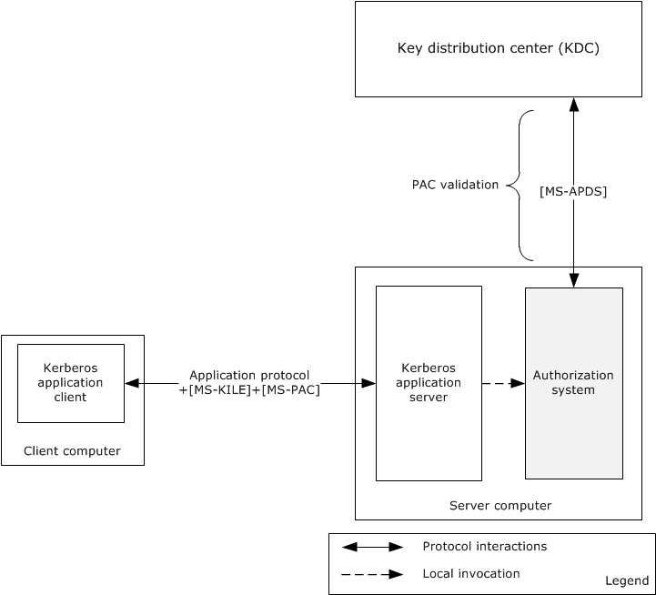

Figure 8: Protocol interactions when the authentication protocol is KILE or PKCA

The identity of the Kerberos application client has been authenticated using either the KILE or PKCA protocol and has obtained the service ticket for the Kerberos application server, as described in [MS-AUTHSOD](#Section_2.1) section 2.1.2.3. The Kerberos application client submits the service ticket along with the user's authorization information, as described in [MS-PAC](../MS-PAC/MS-PAC.md), in a *KRB_AP_REQ* message to the Kerberos application server using an application-specific protocol.

The Kerberos application server validates the received *KRB_AP_REQ* message to verify the identity of the requesting user, and if the verification succeeds, then the Kerberos application server validates the Server Signature ([MS-PAC] section 2.8.1) in the Privilege Access Certificate (PAC), as described in [MS-PAC]. If tampering with the PAC could result in inappropriate elevation of privileges, then in addition to validating the server signature, the [**Key Distribution Center (KDC)**](#gt_key-distribution-center-kdc) signature will be validated. If PAC validation is required (see [MS-APDS](../MS-APDS/MS-APDS.md) for the requirements of PAC validation), then the authorization system forwards the PAC signature in the *KRB_AP_REQ* message to the [**domain controller**](#gt_domain-controller-dc) for verification in a *KERB_VERIFY_PAC* message as described in [MS-APDS] section 3.2, or else it directly proceeds to construct the access token. The authorization system constructs the access token with the group membership information from PAC, local security groups from the security accounts manager (SAM) database, and privileges and logon rights from the [**Local Security Authority (LSA) database**](#gt_local-security-authority-lsa-database).

The application server impersonates the user using this access token and invokes the access check function in the authorization system (through the resource manager) by passing the access token, access mask, and security descriptor of the requested object. The authorization system executes the access check algorithm, as described in [MS-DTYP](../MS-DTYP/MS-DTYP.md) section 2.5.3.2, to verify whether the requested identity has sufficient access permissions to access the object.

##### 2.1.4.1.2 NT LAN Manager (NTLM) Authentication Protocol

The identity of the application client has been authenticated using the NT LAN Manager Authentication Protocol Specification (NTLM) and Authentication Protocol Domain Support Specification (APDS) protocols, as described in [MS-AUTHSOD](#Section_2.1) section 2.1.2.3. After the authentication process succeeds, the domain controller returns a **NETLOGON_VALIDATION_SAM_INFO*** structure. The authorization system builds the access token with the group membership information from the **NETLOGON_VALIDATION_SAM_INFO*** structure, local security groups from the SAM database, privileges, and logon rights from the [**LSA policy database**](#gt_local-security-authority-lsa-database).

The application server impersonates the identity access token, and invokes the access check function in the authorization system by passing the access token, access mask, and security descriptor of the requested object. The authorization system executes the access check algorithm, as described in [MS-DTYP](../MS-DTYP/MS-DTYP.md) section 2.5.3.2, to verify whether the requested identity has sufficient access permissions to access the object.

##### 2.1.4.1.3 Digest Protocol Extensions

The identity of the application client has been authenticated using the [MS-DPSP](#Section_2.1.4.1.3) and [MS-APDS](../MS-APDS/MS-APDS.md) protocols, as described in [MS-AUTHSOD](#Section_2.1) section 2.1.2.4. After authentication, the [**domain controller**](#gt_domain-controller-dc) creates and sends back the *DIGEST_VALIDATION_RESP* message ([MS-APDS]section 2.2.3.2) with authorization information in the Privilege Access Certificate (PAC) for the user's account.

The next step of the application server is to verify the access permissions of the user. The application server contacts the authorization system to get the access token by submitting the user's authorization information received from the DC. The authorization system builds the access token with the user's authorization information, local security groups from the security accounts manager (SAM) database, and privileges and logon rights from the [**Local Security Authority (LSA) database**](#gt_local-security-authority-lsa-database), and returns the access token to the application server.

The application server impersonates the user with the user's access token, and invokes the access check function in the authorization system through the object’s resource manager by passing the access token, access mask, and security descriptor of the requested object. The authorization system executes the access check algorithm, as described in [MS-DTYP](../MS-DTYP/MS-DTYP.md) section 2.5.3.2, to verify whether the requested identity has sufficient access permissions to access the requesting object.

##### 2.1.4.1.4 SSL/TLS Protocol

The identity of the application client has been authenticated using the SSL/TLS (see [MS-TLSP](#Section_2.9)) and RCMP (see [MS-RCMP](../MS-RCMP/MS-RCMP.md)) protocols, as described in [MS-AUTHSOD](#Section_2.1) section 2.1.2.4.

On a successful authentication, the [**domain controller**](#gt_domain-controller-dc) generates the *SSL_CERT_LOGON_RESP* message, which includes the user's PAC, as specified in [MS-PAC](../MS-PAC/MS-PAC.md), and sends the message back via the Netlogon Remote Protocol ([MS-NRPC](../MS-NRPC/MS-NRPC.md)). On receipt of this message, the server generates an access token.

The application server impersonates the user using this access token, and invokes the access check function in the authorization system (through the resource manager) by passing the access token, access mask, and security descriptor of the requested object. The authorization system executes the access check algorithm as described in [MS-DTYP](../MS-DTYP/MS-DTYP.md) section 2.5.3.2 to verify whether the requested identity has sufficient access permissions to access the object.

#### 2.1.4.2 Internal Components

The following diagram shows the internal components of the DAC system.

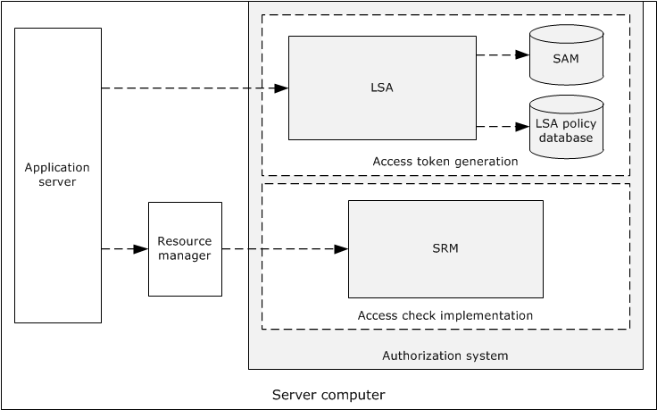

Figure 9: Internal components of the DAC system

The **Local Security Authority (LSA)** is the security subsystem in Windows. This component is responsible for creating the access token with the user authorization information (PAC), privileges from the [**LSA policy database**](#gt_local-security-authority-lsa-database), and local security groups from the security account manager (SAM) database.

The **Security Reference Monitor (SRM)** is the component of Windows that implements the authorization system. It is the only security component of Windows that is running in the highly privileged operating system kernel mode. It implements the access check algorithm, and it checks access to resources by comparing the access control entries (ACEs) in the [**security descriptor**](#gt_security-descriptor) with the group membership information in the user's access token.

#### 2.1.4.3 CBAC Model

The following diagram shows the components of the claim-based access control (CBAC) architecture.

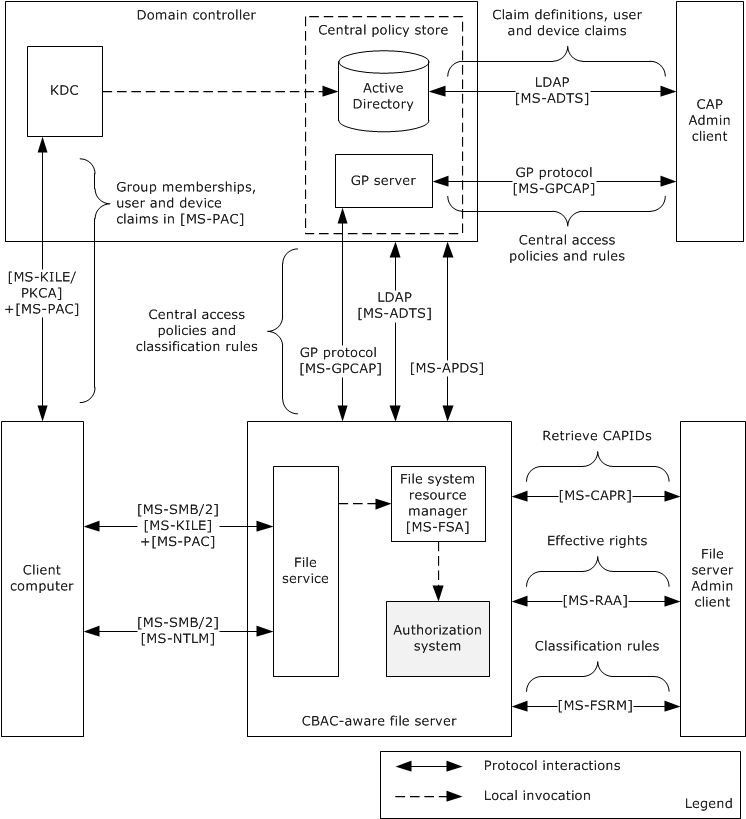

Figure 10: CBAC architecture

The CBAC architecture consists of the following components:

**Central access policy (CAP) Admin client**

- Facilitates the administrator to configure the [**claim**](#gt_claim) definitions, by indicating the claim names and types of the values, and assignment of the claims to the users and devices on the [**Active Directory**](#gt_active-directory) store using the Lightweight Directory Access Protocol (LDAP) ([MS-ADTS](#Section_2.5.1.2)).
- Also facilitates the administrator to configure the [**central access rules (CARs)**](#gt_central-access-rule-car) and [**central access policies (CAPs)**](#gt_289c6ed6-fdfb-4795-9735-fc9fe20af2c6) on the Group Policy server using the Group Policy: Central Access Policies Protocol Extension ([MS-GPCAP](../MS-GPCAP/MS-GPCAP.md)).
**Central policy store**

- Active Directory stores the claim definitions, user and device claims, central access rules, and central access policies.
- The Group Policy server pushes access rules and policies to the specified file servers via Group Policy Central Access Policies Protocol Extension. For more information, see [MS-GPCAP].
**Client computer**

- The identities of the Server Message Block (SMB) clients on the client computer can get authenticated by using either the NTLM protocol ([MS-NLMP](#Section_2.1.4.1.2) and [MS-APDS](../MS-APDS/MS-APDS.md)) or the Kerberos Protocol Extensions ([MS-KILE](#Section_2.1.4.1.1) or [MS-PKCA](../MS-PKCA/MS-PKCA.md)), as described in [MS-AUTHSOD](#Section_2.1). The Kerberos authentication protocol results in authorization information with the claims, whereas NTLM protocol results in authorization information without the claims.
- The SMB clients request access to a file share on a remote file server by sending authorization information which is created by successful authentication.
**File server Admin client**

- Facilitates the administrator to configure the classification rules using the File Server Resource Manager (FSRM) Protocol interfaces (see [MS-FSRM](#Section_2.5.1.1)) and retrieval of central access policies IDs using the Central Access Policy Identifier (ID) Retrieval Protocol (see [MS-CAPR](../MS-CAPR/MS-CAPR.md)) on the remote file server.
- The file server administrator simulates the effective rights of the users on file shares using the Remote Authorization API Protocol interfaces [MS-RAA](../MS-RAA/MS-RAA.md).
**File server**

- Claim definitions are pulled from Active Directory using the LDAP protocol queries [MS-ADTS].
- The File Classification Infrastructure (FCI) and File server resource manager (FSRM) infrastructures facilitate the transfer of the resource properties and central access policies into an object's security descriptor.
- On file access requests, the file system or object store (see [MS-FSA](../MS-FSA/MS-FSA.md)) calls the authorization system to determine access to files.
- The authorization system verifies access to the files, as described in [MS-DTYP](../MS-DTYP/MS-DTYP.md) section 2.5.3.2.

##### 2.1.4.3.1 Down-Level Scenarios

The following diagram shows the protocol communications for the CBAC down-level scenario, where the user tries to access the CBAC-aware shared-file resources on the file server using a file access client (CIFS or SMB or SMB2, as described in [MS-CIFS](../MS-CIFS/MS-CIFS.md). [MS-SMB](../MS-SMB/MS-SMB.md), and [MS-SMB2](../MS-SMB2/MS-SMB2.md)) on the down-level client computer that is running a pre-Windows 8 operating system version. The identity of the file access client has been authenticated by the Authentication Services system using either KILE or PKCA and has obtained the service ticket for the remote file server with the authorization information ([MS-PAC](../MS-PAC/MS-PAC.md)) of the requesting identity, as described in [MS-AUTHSOD](#Section_2.1).

Because the authorization information [MS-PAC] that was received by the file service does not have the user claims in it, the file service on the server computer has to obtain the service ticket to itself on behalf of the user using the Service for User to Self (S4U2self) extension described in [MS-SFU](#Section_2.1.4.1.1). By obtaining the service ticket to itself on behalf of the user, the service receives the user access token from the [**LSA policy database**](#gt_local-security-authority-lsa-database) by submitting authorization information (see [MS-PAC]) from the obtained service ticket, as described in section [2.1.4.2](../MS-PAC/MS-PAC.md), which consists of group memberships and user claims. The access token contains the authorization information received from Kerberos S4U2Self, privileges granted to the client from the LSA policy database, and local security groups assigned to the user in the SAM account database (see section 2.1.4.2). The file service impersonates the user using this user's access token and attempts to access the file on behalf of the user. The file system or object store [MS-FSA](../MS-FSA/MS-FSA.md) invokes the access check function to verify the user access rights. The authorization system checks the requested access rights using the user's access token and the object's security descriptor, as described in [MS-DTYP](../MS-DTYP/MS-DTYP.md) section 2.5.3.2.

The following diagram shows the protocol interactions when Kerberos is the authentication protocol.

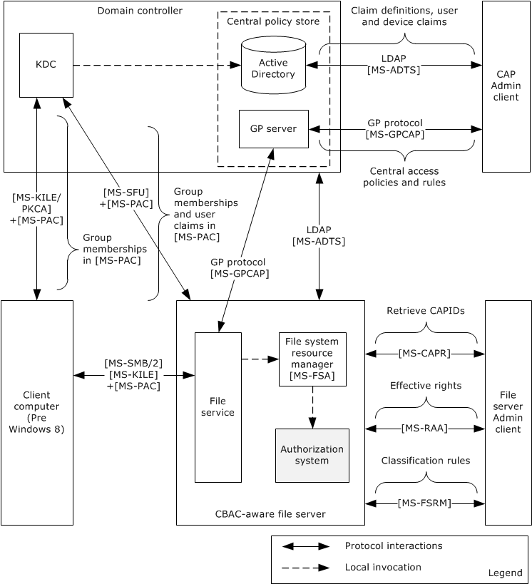

Figure 11: Protocol communications when Kerberos is the authentication protocol

The following diagram shows the protocol communications for a down-level scenario, where the user tries to access the shared file resources on a Windows 8 file server using a file access client (SMB or SMB2) on the down-level client computer that is running a pre-Windows 8 version. The identity of the file access client has been authenticated by the Authentication Services system using the NTLM protocol, as described in [MS-AUTHSOD].

The process of getting the user's authorization information with the user's claims, constructing the user's access token, and verifying the access rights is the same as for Kerberos, as described earlier in this section.

The following diagram shows the protocol interactions when NTLM is the authentication protocol.

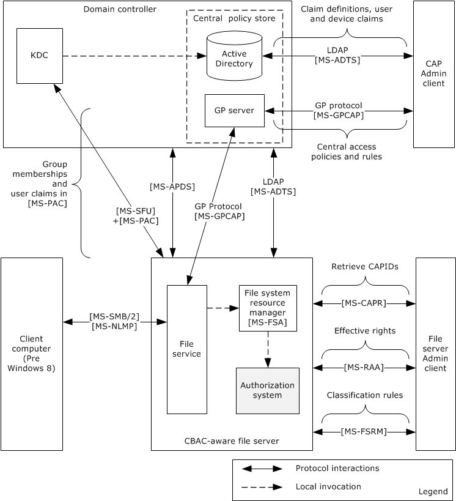

Figure 12: Protocol communications when NTLM is the authentication protocol

##### 2.1.4.3.2 Claims Transformation

[**Claim**](#gt_claim) type definitions are specific to a particular [**forest**](#gt_forest). In cross-forest authentication scenarios, claims need to be examined, filtered, possibly modified, and reissued when traversing from one forest to another. This process is known as claims transformation.

Claims transformation is similar to [**SID**](#gt_security-identifier-sid) filtering described in [MS-PAC](../MS-PAC/MS-PAC.md) section 4.1.2, but more powerful. Claims transformation is based on a transformation rules grammar that administrators can use to express their intent at a fine-grained, per-claim level. The set of rules applied to incoming claims can be customized on a per-trust basis, which allows for further administrator control.

The claims transformation consists of the following high-level steps:

- A PAC from a cross-realm [**ticket-granting ticket (TGT)**](#gt_ticket-granting-ticket-tgt) needs to be decoded and filtered. When decoding a cross-realm TGT, the **crealm** fields inside the TGT are compared to the expected name of the realm for the inter-realm trust. If the names do not match the TGT, they are rejected, subject to other mitigating constraints. For more information, see [MS-PAC] sections 4.1.2.2 and 4.1.2.3.
- After the filtering, the next step is to obtain the claims transformation rules. This can be accomplished by using the trust name and the direction of the traversal of the trust to look up the corresponding msDS-ClaimsTransformationPolicyType object, as described in [MS-ADSC](#Section_2.5.1.2), and to obtain the claims transformation rules from it. For more information, see [MS-ADTS](#Section_2.5.1.2) sections 3.1.1.11.1.5 and 3.1.1.11.2.11.
- After obtaining the transformation rules, the claims to be transformed along with the transformation rules are then passed to the claims transformation algorithm, as described in [MS-CTA](#Section_2.1.4.3.2). The output of the claims transformation algorithm is further processed using the Claims Dictionary to produce claims that are relevant to the new forest in which they are used.

### 2.1.5 Verify Authorization

The following diagram shows the Authorization Manager architecture and its processes for verifying authorization.

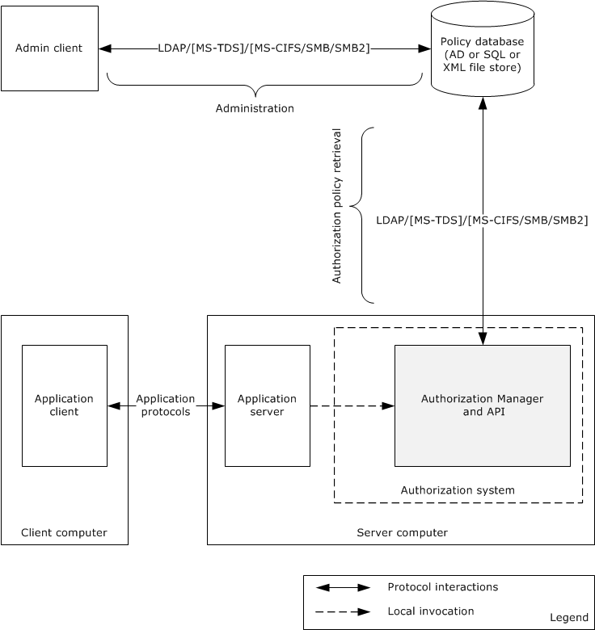

Figure 13: Authorization Manager architecture

The Authorization Manager centralized access policy database can be kept either on an [**Active Directory server**](#gt_active-directory-server), a file server, or a SQL server. The Authorization Manager (AzMan) Policy File Format [MS-AZMP](../MS-AZMP/MS-AZMP.md) contains the XML schema definitions of Authorization Manager access control policies.

The following table shows the mapping of the policy server with the corresponding protocol(s) used.

| Policy server | Protocols used |
| --- | --- |
| Active Directory | Lightweight Directory Access Protocol (v3) [MS-ADTS](#Section_2.5.1.2) |
| File server | File access protocols [MS-CIFS](../MS-CIFS/MS-CIFS.md), [MS-SMB](../MS-SMB/MS-SMB.md), and [MS-SMB2](../MS-SMB2/MS-SMB2.md) |
| SQL Server | Tabular Data Stream Protocol [MS-TDS](../MS-TDS/MS-TDS.md) |

For more details on Authorization Manager, see [[MSDN-AuthMgr]](https://go.microsoft.com/fwlink/?LinkId=252390).

### 2.1.6 COM+ Roles Access Control Model

The COM+ access control model implements the same set of authentication and authorization protocols as are implemented in the core DAC model.

### 2.1.7 Relevant Standards

None.

## 2.2 Protocol Summary

The following table provides a comprehensive list of the authorization member protocols and data structures.

| Protocol name | Description | Short name | Applicability |
| --- | --- | --- | --- |
| Privilege Attribute Certificate Data structure | The privilege attribute certificate (PAC) structure is used by the authentication protocols to carry authorization information. The authorization information consists of group memberships and claims. The PAC also contains additional credential information, profile, policy information, and additional security data. | [MS-PAC](../MS-PAC/MS-PAC.md) | DAC, CBAC, and COM+ roles access control |
| Remote Authorization API Protocol | The Remote Authorization API Protocol enables applications to remotely create, query, and manipulate authorization context for a given security principal on a target server for the purpose of administrative queries. The protocol initiates creation of a security context, transfers the group and claims information, and accesses requests and result data sent between client and server. | [MS-RAA](../MS-RAA/MS-RAA.md) | DAC and CBAC |
| Authorization Manager (AzMan) Policy File Format | The Authorization Manager (AzMan) Policy File Format contains the XML schema definitions of Authorization Manager access control policies. | [MS-AZMP](../MS-AZMP/MS-AZMP.md) | AzMan RBAC |
| Group Policy Central Access Policies Protocol Extension | The Group Policy: Central Access Policies Extension is a Group Policy file format that communicates the Central Access Policies (CAPs) defined centrally and configured for specific computer accounts. CAPs are transferred to the file servers through Group Policy. | [MS-GPCAP](../MS-GPCAP/MS-GPCAP.md) | CBAC |
| Central Access Policy Identifier (ID) Retrieval Protocol | This protocol enables the applications to query a remote file server for a list of Central Access Policies (CAPs) that have been configured for a remote file server. Specifically, the protocol is used to transfer the CAP IDs. | [MS-CAPR](../MS-CAPR/MS-CAPR.md) | CBAC |
| Claims Transformation Algorithm | This document specifies a grammar for describing a transformation rule language and an algorithm for transforming input claims into output claims using a defined set of rules. Transformation of a set of claims is typically used at authentication trust traversal boundaries to transform claims from sending authority into a form acceptable to the receiving authority . | [MS-CTA](#Section_2.1.4.3.2) | CBAC |
| Windows Data Types | This document contains the Windows data types and algorithms associated with authorization. | [MS-DTYP](../MS-DTYP/MS-DTYP.md) | DAC, CBAC,and COM+ roles |
| Lightweight Directory Access Protocol (LDAP) | In CBAC: This protocol enables the applications to configure the claim definitions and the user and devices claims on the Active Directory server. In RBAC: This protocol enables the retrieval of authorization policies from the Active Directory Policy Server. In DAC: [MS-ADTS] section 5.1.3 specifies the authorization rules. | [MS-ADTS](#Section_2.5.1.2) | DAC, CBAC, and AzMan RBAC |
| Component Object Model Plus (COM+) Remote Administration Protocol | With regards to authorization, this protocol enables the administration interface for the role-based security configuration for the COM+ applications. | [MS-COMA](../MS-COMA/MS-COMA.md) | COM+ roles access control |
| Tabular Data Stream Protocol | With regards to authorization, this protocol enables the retrieval of the authorization policies from the SQL Server policy store. | [MS-TDS](../MS-TDS/MS-TDS.md) | AzMan RBAC |

## 2.3 Environment

### 2.3.1 Dependencies on This System

Windows components and subsystems that require making authorization decisions depend on the authorization system. As a result, the authorization system influences a large number of systems and protocols.

The most prominent examples of protocols and systems that have a dependency on the authorization models are as follows:

**DAC model**

- Active Directory, as described in [MS-ADOD](#Section_2.1)
- File system, as described in [MS-FASOD](#Section_2.1) and [MS-FSMOD](#Section_2.1)
- Registry services, as described in [MS-RRP](../MS-RRP/MS-RRP.md)
- Printing Services, as described in [MS-PRSOD](#Section_2.1)
**CBAC model**

- File Access Services, as described in [MS-FASOD]
**AzMan RBAC model**

- Remote Desktop Services, as described in [MS-RDSOD](#Section_2.1)
**COM+ roles access control model**

In Windows, except for components of the COM+ platform, there are no components/subsystems that depend on this model. However, any enterprise application that uses the services of the COM+ platform can depend on this model.

### 2.3.2 Dependencies on Other Systems/Components

The authorization system depends on the following components and protocols:

- The DAC model depends on the following components on the server computer:
- Local Security Authority (LSA) database for the user privileges and policies
- SAM database for the local user groups
- In addition to the components of the DAC model mentioned previously, the CBAC model depends on the following components:
- The client implementation of the Group Policy: Central Access Policies Protocol [MS-GPCAP](../MS-GPCAP/MS-GPCAP.md) to retrieve the central access policies (CAPs) and file classification rules
- Lightweight Directory Access Protocol (LDAP) client components to retrieve the claim definitions
- The server implementation of the Central Access Policy Identifier (ID) Retrieval Protocol [MS-CAPR](../MS-CAPR/MS-CAPR.md) to provide the Admin interface, which enables the administrator to enforces the policies on file resources
- The AzMan RBAC model depends on the following components:
- LDAP
- File access (CIFS)
- SQL Server protocol components to retrieve the policies from the Group Policy server, depending on the type of policy server
- In addition to the dependencies mentioned under DAC model, the COM+ role access control model depends on the following components:
- Components that are related to the implementation of the Component Object Model Plus (COM+) Remote Administration Protocol [MS-COMA](../MS-COMA/MS-COMA.md)

## 2.4 Assumptions and Preconditions

The following assumptions and preconditions apply to this document:

- Information regarding network topology and/or addresses for the external server systems is configured or discoverable.
- One or more of the following external server systems has been set up and configured:
- Active Directory
- DNS directory
- LDAP directory
- Group Policy server
- A DC has been set up and configured to support the domain infrastructure.
- The client and server machines have been joined to the domain.
- The identity of the user has been authenticated, and the server application has associated the user's authorization information.
- Higher-layer protocols and service implementations are configured and running on the server systems, such as:
- Distributed File System (DFS)
- Group Policy
- Network Time Protocol (NTP)
- LDAP

## 2.5 Use Cases

The following table lists the use cases that span the functionality of the authorization protocols. The use cases were grouped based on authorization models.

| Use case group | Use cases |
| --- | --- |
| DAC model: File server | [Check Simple Access](#Section_2.5.1.2.2) (section 2.5.1.1.2) [Check ACL Inheritance Access](#Section_2.5.1.1.3) (section 2.5.1.1.3) [Check Conditional ACEs-Based Access](#Section_2.5.1.1.4) (section 2.5.1.1.4) [Check Claims-Based Access](#Section_2.5.1.1.5) (section 2.5.1.1.5) |
| DAC model: Active Directory | [Check Simple Access](#Section_2.5.1.2.2) (section 2.5.1.2.2) [Check Object-Specific Access](#Section_2.5.1.2.3) (section 2.5.1.2.3) [Control Access Right-Based Access](#Section_2.5.1.2.4) (section 2.5.1.2.4) [Control Validated Write-Based Access](#Section_2.5.1.2.5) (section 2.5.1.2.5) [Check Object Visibility](#Section_2.5.1.2.6) (section 2.5.1.2.6) |
| AzMan RBAC model | [Verify Authorization](#Section_2.1.5) (section 2.5.2.1) |

### 2.5.1 DAC Model

#### 2.5.1.1 File Server

The following use case diagram shows the DAC authorization system on the [**file server**](#gt_file-server).

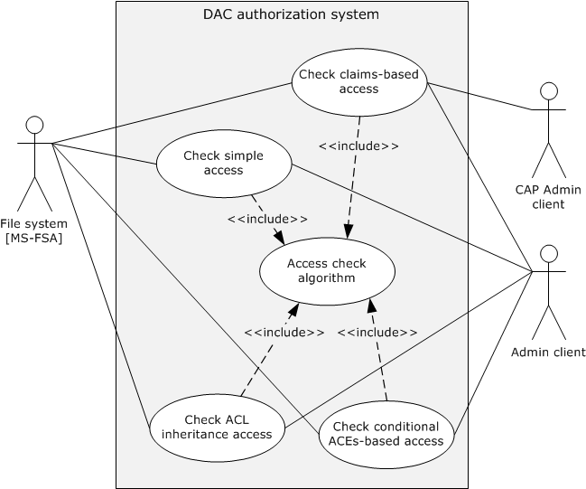

Figure 14: File server authorization use cases

##### 2.5.1.1.1 Actors

The actors that participate in the file server DAC model use cases are:

**File system or object store:** The file system implements the file system objects such as files and directories.

**Admin client:** The Admin client is the authorization tool that helps the administrator to configure the access permissions on the file system objects such as files and directories.

**CAP Admin client:** The CAP Admin client is the administration tool that enables the administrator to configure the claim definitions, the user, and device claims in Active Directory and the central access policies and classification rules on the Group Policy server.

##### 2.5.1.1.2 Check Simple Access

**Goal**

Verify the access rights of the user to access a file on a remote file share.

**Context of Use**

The user of the file client needs to access an existing file on a remote file share, and the file server needs to verify the access rights of the user before providing access to a file. Therefore, the file server interacts with the authorization system through the file system resource manager to verify the requested access rights using this use case.

**Actors**

Except for the CAP Admin client actor, all the actors are as described in section [2.5.1.1.1](#Section_2.5.1.1.1).

**Stakeholders**

The primary interest of a user is to access the file on the remote file server.

**Preconditions**

- The user of the file client has been authenticated by the Authentication Services subsystem. For more information, see [MS-AUTHSOD](#Section_2.1).
- The administrator using the Admin client has configured the required explicit access permissions for the requesting user to access the file on a remote file share but has not included inherited permissions from the object's parent.
- The file server obtains the access token for the requesting user, as described in section [2.5.1.3](../MS-FSA/MS-FSA.md), and the file server makes a request to the file system by passing the user's access token (which is also called security context), access rights, and other information, as described in [MS-FSA](../MS-FSA/MS-FSA.md) section 2.1.5.1.
**Main success scenario**

- Trigger: The user tries to access an existing file on a remote file share using the file client application.
- The file system processes the request per the processing rules, as specified in [MS-FSA] sections 2.1.5.1 and 2.1.5.1.2.1. These processing rules call the access check algorithm, as specified in [MS-DTYP](../MS-DTYP/MS-DTYP.md) section 2.5.3.2, to verify the access rights of the user.
- If verification succeeds, then the access check algorithm returns success to the file system resource manager, indicating user access is granted.
**Postcondition**

The user of the file client is granted access to a file on remote file share.

##### 2.5.1.1.3 Check ACL Inheritance Access

**Goal**

Verify the access rights of the user to access a file on a remote file share and that the file has inheritable permissions from its parent object.

**Context of Use**

The user of the file client needs to access an existing file on a remote file share, and the file server needs to verify the access rights of the user before providing the access to a file that has both explicit access permissions and inheritable permissions from a parent object. Therefore, the file server interacts with the authorization system via the file system resource manager to verify the access rights of the user using this case.

**Actors**

Except for the CAP Admin client actor, all the actors are as described in section [2.5.1.1.1](#Section_2.5.1.1.1).

**Stakeholders**

The primary interest of a user is to access the file on the remote file server.

**Preconditions**

- The user of the file client has been authenticated by the Authentication Services subsystem [MS-AUTHSOD](#Section_2.1).
- The administrator using the Admin client has configured explicit and inherited access permissions for the requesting user to open the file on a remote file share.
- The file server obtains the access token for the requesting user, as described in section [2.5.1.3](../MS-FSA/MS-FSA.md), and the file server makes a request to the file system resource manager by passing the obtained user access token (which is also called security context), access rights, and other information, as described in [MS-FSA](../MS-FSA/MS-FSA.md) section 2.1.5.1.
**Main success scenario**

- Trigger: The user tries to access an existing file on a remote file share using the file client application.
- The file system processes the request per the processing rules, as specified in [MS-FSA] sections 2.1.5.1 and 2.1.5.1.2.1. These processing rules call the access check algorithm specified in [MS-DTYP](../MS-DTYP/MS-DTYP.md) section 2.5.3.2 to verify the user's access rights against the access permissions on the object's security descriptor.
- If verification succeeds, the access check algorithm returns success to the file system resource manager, indicating user access is granted.
**Postcondition**

The user of the file client is granted access to a file on the remote file share.

##### 2.5.1.1.4 Check Conditional ACEs-Based Access

**Goal**

Verify the access rights of the user to open an existing file on a remote file share that has conditional ACEs configured on it.

**Context of Use**

The user of the file client needs to access a file on a remote file share, and the file server needs to verify the access rights of the user before providing the access to a file. Therefore, the file server interacts with the authorization system through the file system resource manager to verify the requested access rights using this case.

**Actors**

Except for the CAP Admin client actor, all the actors are as described in section [2.5.1.1.1](#Section_2.5.1.1.1).

**Stakeholders**

The primary interest of a user is to access the file on the remote file server.

**Preconditions**

- The user of the file client has been authenticated by the Authentication Services subsystem [MS-AUTHSOD](#Section_2.1).
- The administrator using the Admin client has configured explicit, inherited, and conditional access permissions for the requesting user to open the file on a remote file share.
- The file server obtains the access token for the requesting user as described in section [2.5.1.3](../MS-FSA/MS-FSA.md), and the file server makes a request to the file system resource manager by passing the obtained user access token (which is also called security context), access rights, and other information, as described in [MS-FSA](../MS-FSA/MS-FSA.md) section 2.1.5.1.
**Main success scenario**

- Trigger: The user tries to access an existing file on a remote file share using the file client application.
- The file system processes the request as per the processing rules, as specified in [MS-FSA] sections 2.1.5.1 and 2.1.5.1.2.1. These processing rules call the access check algorithm, as specified in [MS-DTYP](../MS-DTYP/MS-DTYP.md) section 2.5.3.2, to verify the user's access rights against the configured access permissions on the object's security descriptor.
- If verification succeeds, the access check algorithm returns success to the file system resource manager, indicating user access is granted.
**Post condition**

The user of the file client is granted access to a file on a remote file share.

##### 2.5.1.1.5 Check Claims-Based Access

**Goal**

Verify the access rights of the user to access a file on a remote CBAC-aware file share.

**Context of Use**

The user of the file client needs to access an existing file on a remote file share, and the file server needs to verify the access rights of the user before providing the access to a file. Therefore, the file server interacts with the authorization system through the file system resource manager to verify the requested access rights using this case.

**Actors**

See section [2.5.1.1.1](#Section_2.5.1.1.1).

**Stakeholders**

The primary interest of a user is to access the file on the remote file server.

**Preconditions**

- The identity of the user and client computer (compound identity) has been authenticated by the Authentication Services subsystem, as described in [MS-KILE](#Section_2.1.4.1.1) and [MS-AUTHSOD](#Section_2.1).
- The Active Directory administrator configured the claim definitions, user, and device claims on Active Directory using the CAP Admin client tool.
- The Group Policy administrator configured required central access policies and classification rules for the file servers.
- The central access policies and classification rules applied to the resources of the file server.
- If the file server is in a different forest than the user, claims in the PAC are transformed, as described in section [2.1.4.3.2](#Section_2.1.4.3.2).
- Using this PAC, the file server obtains the access token (with user and device claims) for the requesting user, as described in section [2.5.1.3](../MS-FSA/MS-FSA.md), and the file server makes a request to the file system resource manager by passing the obtained user access token (which is also called security context), access rights, and other information, as specified in [MS-FSA](../MS-FSA/MS-FSA.md) section 2.1.5.1.
**Main success scenario**

- Trigger: The user tries to open an existing file on a remote file share using the file client application.
- The file system processes the request per the processing rules, as specified in [MS-FSA] sections 2.1.5.1 and 2.1.5.1.2.1. These processing rules call the access check algorithm, as specified in [MS-DTYP](../MS-DTYP/MS-DTYP.md) section 2.5.3.2, to verify the user's access rights against the configured access control permissions and central access policies in the object's security descriptor.
- If verification succeeds, the access check algorithm returns success to the file system resource manager, indicating user access is granted.
**Postcondition**

The user of the file client is granted access to open a file on a remote file share.

#### 2.5.1.2 Active Directory

The following use case diagram shows the components of Active Directory authorization through the Active Directory resource manager.

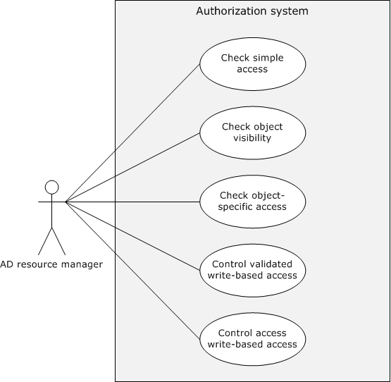

Figure 15: Active Directory authorization use cases

##### 2.5.1.2.1 Actors

The actors that participate in the [**Active Directory**](#gt_active-directory) DAC model use cases are:

**Active Directory resource manager:** The Active Directory resource manager [MS-ADTS](#Section_2.5.1.2) is code or a component that implements the Active Directory objects.

**Admin client:** The Admin client is the authorization tool that helps the administrator to configure the access permissions for the entire Active Directory object or individual attributes of an object or the set of attributes of an object.

##### 2.5.1.2.2 Check Simple Access

**Goal**

Verify the access rights of the user to access the [**Active Directory**](#gt_active-directory) object on the [**Active Directory server**](#gt_active-directory-server).

**Context of Use**

The user of the [**Active Directory client**](#gt_active-directory-client) needs to access the Active Directory object on the Active Directory server, and the Active Directory server needs to verify the access rights of the user before providing the access to the user. Therefore, the Active Directory server interacts with the authorization system through the Active Directory resource manager to verify the requested access rights using this use case.

**Actors**

The actors are the same as described in section [2.5.1.2.1](#Section_2.5.1.2.1).

**Stakeholders**

The primary interest of the user of the Active Directory client is to read all information associated with the object.

**Preconditions**

- The identity of the user has been authenticated by the Authentication Services subsystem [MS-AUTHSOD](#Section_2.1).
- The administrator has configured the required access permissions for the user on the Active Directory object using the Admin tool.
- The Active Directory server obtained the access token for the requesting user, as described in section [2.5.1.3](#Section_2.5.1.3), and it already sent a request to the Active Directory resource manager by passing the user's access token (which is also called security context), access rights, and other information.
- The object's [**security descriptor**](#gt_security-descriptor) has already undergone the [**SID**](#gt_security-identifier-sid) substitution for Principal Self ([MS-ADTS](#Section_2.5.1.2) section 5.1.3.3).
**Main success scenario**

- Trigger: The user of the Active Directory client makes a request to the Active Directory server to read all the information associated with an Active Directory object.
- The Active Directory resource manager verifies the access rights of the user against permissions on an object's security descriptor, as described in [MS-ADTS] section 5.1.3.3.2.
- If the verification succeeds, then the Active Directory resource manager returns success to the Active Directory server, indicating that the user has been granted access to the requested Active Directory object.
**Postcondition**

The Active Directory server enables access to the user to read all the information associated with the requested Active Directory object.

##### 2.5.1.2.3 Check Object-Specific Access

**Goal**

Verify the object-specific access requested by a user.

**Context of Use**

The user of the [**Active Directory client**](#gt_active-directory-client) needs to access an attribute or set of attributes on an [**Active Directory**](#gt_active-directory) object, and the [**Active Directory server**](#gt_active-directory-server) needs to verify the user's access rights before granting access. Therefore, the AD server interacts with the authorization system through the Active Directory resource manager to verify the requested access rights using this use case.

**Actors**

The actors are the same as described in section [2.5.1.2.1](#Section_2.5.1.2.1).

**Stakeholders**

The primary interest of the user is to read an individual attribute of an object or a set of attributes.

**Preconditions**

- The identity of the user has been authenticated by the Authentication Services subsystem [MS-AUTHSOD](#Section_2.1).
- The administrator has configured the required attribute level access permissions for the user on the Active Directory object using the Admin tool.
- The Active Directory server obtained the access token for the requesting user, as described in section [2.5.1.3](#Section_2.5.1.3), and the server has already sent a request to the Active Directory resource manager by passing the user's access token, (which is also called security context), access rights, and other information.
- The object's [**security descriptor**](#gt_security-descriptor) has already undergone the [**SID**](#gt_security-identifier-sid) substitution for Principal Self (see [MS-ADTS](#Section_2.5.1.2) section 5.1.3.3).
**Main success scenario**

- Trigger: The user of an Active Directory client makes a request to the Active Directory server to read one attribute or set of attributes associated with an Active Directory object.
- The Active Directory resource manager verifies the access rights of the user against the permissions on the object's security descriptor, as described in [MS-ADTS] section 5.1.3.3.3.
- If the verification succeeds, then the Active Directory resource manager returns success to the Active Directory server, that the user has been granted access to the requested Active Directory object.
**Post condition**

The Active Directory server enables access to the user to read all the information associated with the requested Active Directory object.

##### 2.5.1.2.4 Control Access Right-Based Access

**Goal**

Verify the control access derived from right-based access that is requested by the user of the [**Active Directory client**](#gt_active-directory-client).

**Context of Use**

The user of the Active Directory client is required to perform certain operations that have semantics that are not tied to specific properties, or where it is desirable to control access in a way that is not supported by the standard access rights. For more information, see [MS-ADTS](#Section_2.5.1.2) section 5.1.3.2.1. The [**Active Directory server**](#gt_active-directory-server) needs to verify the user's access rights before granting access to perform the requested operation. Therefore, the Active Directory server interacts with the authorization system via the [**Active Directory**](#gt_active-directory) resource manager to verify the requested user access rights via this use case.

**Actors**

The actors are the same as described in section [2.5.1.2.1](#Section_2.5.1.2.1).

**Stakeholders**

The primary interest of a user is to perform certain operations that have semantics that are not tied to specific properties ([MS-ADTS] section 5.1.3.2.1).

**Preconditions**

- The identity of the user has been authenticated by the Authentication Services subsystem [MS-AUTHSOD](#Section_2.1).
- The administrator has configured the required attribute level access permissions for the user on the Active Directory object using the Admin tool.
- The Active Directory server obtained the access token for the requesting user, as described in section [2.5.1.3](../MS-ADTS/MS-ADTS.md), and the server has already sent a request to the Active Directory resource manager by passing the user's access token (which is also called security context), the control-access-right [**GUID**](#gt_globally-unique-identifier-guid) ([MS-ADTS] section 5.1.3.2.1), and other information.
- The object's [**security descriptor**](#gt_security-descriptor) has already undergone the [**SID**](#gt_security-identifier-sid) substitution for Principal Self ([MS-ADTS] section 5.1.3.3).
**Main success scenario**

- Trigger: The user of an Active Directory client makes a request to the Active Directory server to perform the operations listed in [MS-ADTS] section 5.1.3.2.1, or extended operations that are provided by the application developer.
- The Active Directory resource manager verifies the access rights of the user against permissions on the object's security descriptor, as described in [MS-ADTS] section 5.1.3.3.4.
- If the verification succeeds, the Active Directory resource manager returns success to the Active Directory server, indicating that the user has been granted access to the requested Active Directory object.
**Postcondition**

The Active Directory server enables the user to perform the requested operation.

##### 2.5.1.2.5 Control Validated Write-Based Access

**Goal**

Verify the write access requested by the user of the [**Active Directory client**](#gt_active-directory-client) to modify attributes of an [**Active Directory**](#gt_active-directory) object.

**Context of Use**

The user requesting attributes has configured the validated write access permissions on an Active Directory object. Therefore, the [**Active Directory server**](#gt_active-directory-server) is required to validate the values of the attributes being written. For more information, see [MS-ADTS](#Section_2.5.1.2) section 5.1.3.2.2.

**Actors**

The actors are the same as described in section [2.5.1.2.1](#Section_2.5.1.2.1).

**Stakeholders**

The primary interest of the user of the Active Directory client is to write the values onto the attributes.

**Preconditions**

- The identity of the user has been authenticated by the Authentication Services subsystem [MS-AUTHSOD](#Section_2.1).
- The Administrator has configured the required attribute level access permissions for the user on the Active Directory object using the Admin tool.
- The Active Directory server obtained the access token for the requesting user, as described in section [2.5.1.3](../MS-ADTS/MS-ADTS.md), and it already sent a request to the Active Directory resource manager by passing the user's access token (which is also called security context), the validated rights [**GUID**](#gt_globally-unique-identifier-guid) ([MS-ADTS] section 5.1.3.2.2), and other information.
- The object's [**security descriptor**](#gt_security-descriptor) has already undergone the [**SID**](#gt_security-identifier-sid) substitution for Principal Self ([MS-ADTS] section 5.1.3.3).
**Main success scenario**

- Trigger: The user makes a request to the Active Directory server using the Active Directory client to get write access to an object's attributes that are controlled by validate rights.
- The Active Directory resource manager verifies the access rights of the user against the permissions on the object's security descriptor, as described in [MS-ADTS] section 5.1.3.3.5.
- If the verification succeeds, then the Active Directory resource manager returns success to the Active Directory server, indicating that the user has been granted access to the requested Active Directory object.
**Postcondition**

The Active Directory server enables the user to perform a requested write operation.

##### 2.5.1.2.6 Check Object Visibility

**Goal**

Verify the access requested by the user of the [**Active Directory client**](#gt_active-directory-client) to enumerate the [**Active Directory**](#gt_active-directory) objects and their attributes.

**Context of Use**

The user of the Active Directory client needs to enumerate the Active Directory objects and their associated attributes. The [**Active Directory server**](#gt_active-directory-server) needs to verify the user's access rights before granting the access to the Active Directory client. Therefore, the Active Directory server interacts with the authorization system through the Active Directory resource manager to verify the requested access rights using this use case.

**Actors**

The actors are the same as described in section [2.5.1.2.1](#Section_2.5.1.2.1).

**Stakeholders**

The primary interest of the user is to enumerate all of the Active Directory objects and their attributes.

**Preconditions**

- The identity of the user has been authenticated by the Authentication Services subsystem [MS-AUTHSOD](#Section_2.1).
- The administrator has configured the required attribute level access permissions for the user on the Active Directory object using the Admin tool.
- The Active Directory server obtained the access token for the requesting user, as described in section [2.5.1.3](#Section_2.5.1.3), and it already sent a request to the Active Directory resource manager by passing the user's access token (which is also called security context), access rights, and other information.
- The object's [**security descriptor**](#gt_security-descriptor) has already undergone the [**SID**](#gt_security-identifier-sid) substitution for Principal Self ([MS-ADTS](#Section_2.5.1.2) section 5.1.3.3).
**Main success scenario**

- Trigger: The user makes a request to the Active Directory server using the Active Directory client to enumerate all the Active Directory objects and attributes to which the user has access.
- The Active Directory resource manager verifies the access rights of the user against permissions on the object's security descriptor, as described in [MS-ADTS] section 5.1.3.3.6.
- If the verification succeeds, then the Active Directory resource manager returns success to the Active Directory server, indicating that the user has been granted access to the requested Active Directory object.
**Postcondition**

The Active Directory server makes Active Directory objects and attributes visible to whichever user has access to them.

#### 2.5.1.3 Auxiliary

The following use case diagram shows the components in the DAC authorization system to get an access token.

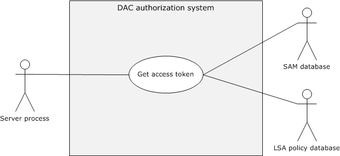

Figure 16: Get Access Token use case

##### 2.5.1.3.1 Get Access Token

**Goal**

Get the access token for the identity of the requestor.

**Context of Use**

The identity of the [**application client**](#gt_application-client) associated with a specific user needs to access resources on the application server, and the application server needs to access a token to call access-check-related authorization use cases.

**Actors**

**Application server:** The application server is the service or process running on the server computer under the security context of the identity of the application server.

**LSA policy database:** A database that contains local system security policy settings such as user rights and other security-related rights.

**SAM database:** A database that contains local users and security groups.

**Stakeholders**

The primary interest of the identity of the application client is to access resources on the application server.

**Preconditions**

- The identity of the application client has been authenticated by the Authentication Services subsystem (see [MS-AUTHSOD](#Section_2.1)).
- The application server has the authorization information from the (PAC) of the requested application client's identity.
- User rights are configured in the LSA policy database, and local groups are configured in the SAM database.
**Main success scenario**

- Trigger: The prerequisite for the application server to get the access token for the authorization process.
- The application server submits the requested identity authorization information to the authorization system.
- The authorization system builds the access token from the user rights in the LSA policy database and from the local security groups from the SAM database, and returns to the application server.
**Postcondition**

The application server process gets the access token for the requested identity and proceeds to the next steps of the authorization process.

### 2.5.2 AzMan RBAC Model

The following use case diagram shows the components in the RBAC authorization system to verify authorization.

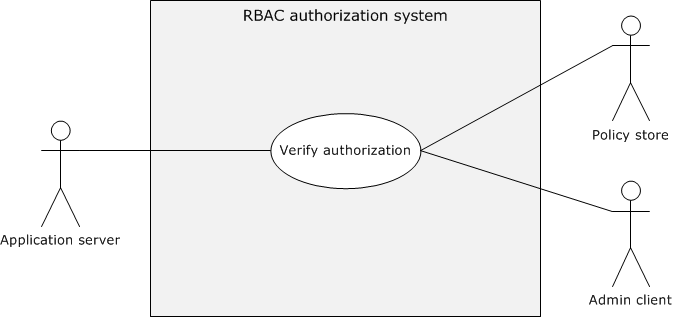

Figure 17: Verify AzMan RBAC authorization use case

#### 2.5.2.1 AzMan RBAC Model

**Goal**

Verify the authorization rights for the user to perform the intended business operation/task.

**Context of Use**

The user of the application client needs to perform certain business operation/tasks using the application server, and the application server verifies the authorization of the requesting user before the application server grants access to the requested business operation.

**Actors**

**Application server:** The application server is the service running on the server computer.

**Admin client:** The Admin client is the administrator management snap-in tool that facilitates the administrator to configure authorization policies for the applications.

**Policy store:** The policy store can be located on either an [**Active Directory**](#gt_active-directory) server, a SQL Server, or a file server; the policy store maintains the authorization policies for the applications.

**Stakeholders**

The primary interest of the user of the application client is to perform intended business operations/tasks with the help of the application server.

**Preconditions**

- The identity of the user has been authenticated, and the application server has the identity information.
- Any required authorization policies have been created on the policy server for the application.
- The application server is configured with the required information to access the configured authorization policies.
- Required policies are configured on the policy server for the user to perform intended business operations/tasks.
**Main success scenario**

- Trigger: The user of the application client is required to perform certain protected tasks with the help of the application server.
- The application server connects the authorization policy store with the configured details such as the connection string and gets the instance of the application policy.
- The application server constructs the client's access token (also called security context) with the identity information of the user who is using Authorization Manager APIs.
- The application server calls the access check Authorization Manager API to verify the authorization for the requested business operation/ task.
**Postcondition**

The application server enables the user to perform requested business operation/tasks.

**Extensions**

None.

## 2.6 Versioning, Capability Negotiation, and Extensibility

No capability negotiation is associated with this authorization system. Any deviations from a specific version's implementation of these protocol specifications are documented in the respective protocol document. Capability negotiations between client and server implementations of these protocols are specified in the System Versioning and Capability Negotiation sections in their respective technical documents (TDs). For more details, see sections 1.7 of the member protocol technical documents listed in section [2.2](#Section_2.2) of this document.

## 2.7 Error Handling

The authorization system does not handle errors at the system level for cross-protocol error states. The individual protocol documents describe the errors that the protocols return and what they mean for the system. How to handle the errors, based on the protocol descriptions, is determined by the implementer.

## 2.8 Coherency Requirements

This system has no special coherency requirements.

## 2.9 Security

None.

## 2.10 Additional Considerations

None.

# 3 Examples

## 3.1 Reading from a File on Remote CBAC Aware SMB2 Share

This scenario demonstrates the use cases described in sections [2.5.1.1.5](#Section_2.5.1.1.5) and [2.5.1.3.1](#Section_2.5.1.3.1). The client and server can negotiate each other by using the Simple and Protected Generic Security Service Application Program Interface Negotiation Mechanism (SPNEGO): Microsoft Extension (as described in [MS-SPNG](../MS-SPNG/MS-SPNG.md) and [MS-NEGOEX](#Section_2.9)) to select the agreed authentication protocol, as described in [MS-AUTHSOD](#Section_2.1) and [MS-SPNG].

Based on the agreed authentication protocol, this scenario has the following variants:

- Kerberos Protocol Extensions, as specified in [MS-KILE](#Section_2.1.4.1.1) and [MS-PKCA](../MS-PKCA/MS-PKCA.md)
- NT LAN Manager Authentication Protocol, as specified in [MS-NLMP](#Section_2.1.4.1.2)
If the agreed authentication protocol is Kerberos, this scenario in turn has the following subvariants:

- Client has obtained a service ticket for file service from the Key Distribution Center ([**KDC**](#gt_key-distribution-center-kdc)) with user and device [**claims**](#gt_claim).
- Client has obtained a service ticket for file service from the KDC without the user claims.
The following are the common prerequisites of this scenario.

**Common Prerequisites**

- The client computer and server computer are joined to the same [**Active Directory**](#gt_active-directory) domain.
- The file server and file resource manager roles have been configured on the server computer.
- The required user accounts and associated group memberships have been configured on an account database. For more information, see [MS-ADOD](#Section_2.1).
- Created claim types, resource file properties, and [**central access rules (CARs)**](#gt_central-access-rule-car) are configured on the domain controller and then added to the [**central access policies (CAPs)**](#gt_289c6ed6-fdfb-4795-9735-fc9fe20af2c6) using the Active Directory Administrative Center.
- The intended central access policies (CAPs) have been targeted to the file server computer using the Group Policy Management Console, and the CAPs to the required file shares have been enabled.
- The required association of claims for the user and computer accounts have been set.
- Classification rules have been pushed onto the file server through the Lightweight Directory Access Protocol (LDAP) File Classification Infrastructure structures, as specified in [MS-FCIADS](../MS-FCIADS/MS-FCIADS.md).
- File share(s) have been created on the server computer and the appropriate shared permissions configured.
- The value of the ClaimsCompIdFASTSupport ADM variable on the KDC has been configured to enable claims, compound identity, and Flexible Authentication Secure Tunneling (FAST), as specified in [MS-KILE] section 3.3.1.
### Kerberos Protocol Extensions [MS-KILE]

#### 3.1.1.1 Service Ticket with the User and Device Claims

**Prerequisites**

The following are the additional prerequisites that are required for this variant, in addition to the common prerequisites described in section [3.1](#Section_3.1):

- Enable Kerberos Flexible Authentication Secure Tunneling (FAST) on the client computer, as described in [MS-KILE](#Section_2.1.4.1.1) section 3.2.1.
- Set the FAST-supported, Compound-identity-supported, and Claims-supported bit flags on the **msDS-SupportedEncryptionTypes** attribute of the **krbtgt** account. For details about the **msDS-SupportedEncryptionTypes** attribute, see [MS-KILE] section 2.2.7.
- Set the Compound-identity-supported bit flags on the **msDS-SupportedEncryptionTypes** attribute of the file server computer account. For details about the **msDS-SupportedEncryptionTypes** attribute, see [MS-KILE] section 2.2.7.
**Initial System State**

- The identity of the client computer account has been authenticated by the Authentication Services subsystem, as described in [MS-AUTHSOD](#Section_2.1) section 2.5.5.1, and the client computer has the [**TGT**](#gt_ticket-granting-ticket-tgt) for the computer account.
- The identity of the user has been authenticated by [**KDC**](#gt_key-distribution-center-kdc) and the [**file server**](#gt_file-server), the identity of the file server has been authenticated by the client computer, as described in [MS-AUTHSOD] section 3.3.1, and the client computer has submitted the service ticket with the PAC containing group memberships, user, and device [**claims**](#gt_claim) to access the intended file share.
- The file server has obtained the PAC with the group memberships, user, and device claims from the client, and the SMB2 client (on the client computer) has obtained the sessionId as described in the Connecting to an SMB2 Share example in [MS-AUTHSOD] section 3.3.1.
- The user who is running the SMB2 client application has not been authorized to the read the remote file.
- The file server has obtained the user's access token (security context) as described in section [2.5.1.3.1](#Section_2.5.1.3.1).
**Final System State**

- The user who is running the SMB2 client application has been authorized to read the contents of the remote file.
**Sequence of Events**

The following sequence diagram shows the process of reading from a file on a remote CBAC-aware SMB2 share that is configured with user and device claims.

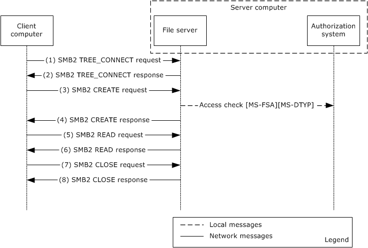

Figure 18: Reading from a file on a remote CBAC-aware SMB2 share configured with user and device claims

- The client sends an SMB2 TREE_CONNECT request, (see [MS-SMB2](../MS-SMB2/MS-SMB2.md) section 2.2.9) , with the sessionId for the session, and a tree connect request containing the Unicode share name "\\smb2server\ShareName".
- The server computer validates the request and verifies the access permissions on the requesting share, as described in [MS-SMB2] section 3.3.5.7. If the verification succeeds, it responds with an SMB2 TREE_CONNECT response, as described in [MS-SMB2]section 2.2.10.
- The client sends and SMB2 CREATE request (see [MS-SMB2] section 2.2.13) for the file "testfile.txt" with the appropriate access mask value (required bits for the read file operation) as described in [MS-SMB2] section 2.2.13.1.
- The server processes the request, as described [MS-SMB2] section 3.3.5.9, and makes the call to the underlying file system [MS-FSA](../MS-FSA/MS-FSA.md) to verify the requesting user access rights by passing the user's access token, access rights, and other information. The file system processes the request, as described in [MS-FSA] section 2.1.5.1, and calls the access function of the authorization system to validate requesting access rights of the user. The authorization system runs the access check algorithm, as described in [MS-DTYP](../MS-DTYP/MS-DTYP.md) section 2.5.3.2, to verify the requesting access rights of the user. If the verification succeeds, the authorization system returns SUCCESS, indicating that the user has been granted permission to read the requesting file.
The file server constructs an SMB2 CREATE response (see [MS-SMB2] section 2.2.14) and responds to the client.

- The client sends an SMB2 READ request ([MS-SMB2] section 2.2.19) to read data from the file.
- The server validates the request ([MS-SMB2] section 3.3.5.12). If the validation is successful, it responds with an SMB2 READ response ([MS-SMB2] section 2.2.20) with the data read from the file. For more information, see [MS-SMB2] section 2.2.20.
- The client sends an SMB2 CLOSE request ([MS-SMB2] section 2.2.15) to close the file.
- The server sends an SMB2 CLOSE response([MS-SMB2] section 2.2.16) indicating that the close operation was successful.

#### 3.1.1.2 Service Ticket Without the User Claims

This example is applicable when the client computer uses a Windows operating system before Windows 8 operating system and uses Kerberos as authentication protocol.

**Prerequisites**

The following are the additional prerequisites that are required for this variant, in addition to the common prerequisites described in section [3.1](#Section_3.1):

- The [**file server**](#gt_file-server) service has been authenticated by the [**KDC**](#gt_key-distribution-center-kdc) and has a [**TGT**](#gt_ticket-granting-ticket-tgt) for the service account.
**Initial System State**

- The identity of the client computer account has been authenticated by the Authentication Services subsystem, as described in [MS-AUTHSOD](#Section_2.1) section 2.5.5.1.
- The identity of the user has been authenticated by the KDC and the file server, and the identity of the file server has been authenticated by the client computer, as described in [MS-AUTHSOD] section 3.3.1.
- The file server has obtained the PAC with the group memberships, but not user [**claims**](#gt_claim) from the client, and the SMB2 client (on the client computer) has obtained the **sessionId** as described in the Connecting to an SMB2 Share example in [MS-AUTHSOD] section 3.3.1.
- The user who is running the SMB2 client application has not been authorized to the read the remote file.
- The file server has obtained the user's access token (security context), as described in section [2.5.1.3.1](#Section_2.5.1.3.1).
**Final System State**

- The user who is running the SMB2 client application has been authorized to read the contents of the remote file.
**Sequence of Events**

The following sequence diagram shows the process of reading from a file on a remote CBAC-aware SMB2 share configured with only user claims.

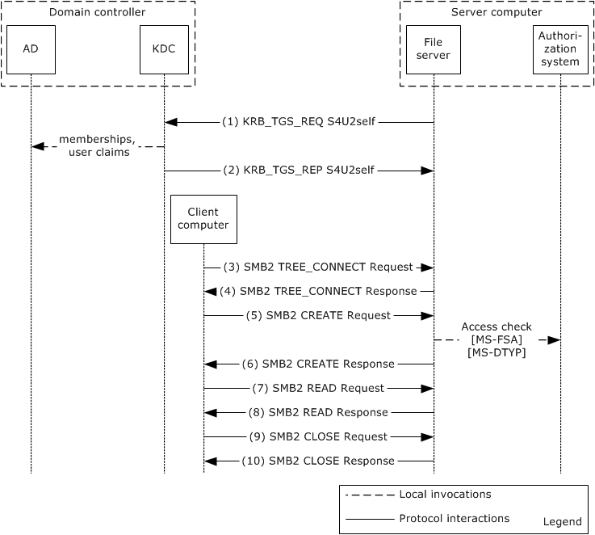

Figure 19: Reading from a file on a remote CBAC-aware SMB2 share configured with only user claims

- The file server service uses the Service for User to Self (S4U2self) extension to retrieve a user claim for itself on behalf of the user. The service fills out the **PA_FOR_USER** structure ([MS-SFU](#Section_2.1.4.1.1) section 2.2.1) data structure and sends the KRB_TGS_REQ message, as described in [MS-SFU] section 3.1.5.1.1, to the KDC.
- The KDC processes the request, and retrieves the claims and group membership associated with the user from the account database , as specified in [MS-SFU] section 3.2.5.1.2 and [MS-KILE](#Section_2.1.4.1.1) section 3.3.5.6.4.6. For more information, see [MS-ADOD](#Section_2.1). The KDC returns the service ticket for the user in the KRB_TGS_REP message. The privilege attribute certificate (PAC) that is returned in the service ticket contains the group membership information and user claims, as specified in [MS-PAC](../MS-PAC/MS-PAC.md) section 3.
3-10. The steps are the same as steps 1-8 in "Service Ticket with the User and Device Claims" variant as described in section [3.1.1.1](#Section_3.1.1.1).

### NT LAN Manager Authentication Protocol [MS-NLMP]

**Prerequisites**

The prerequisites are the same as described in the common prerequisites in section [3.1](#Section_3.1).

**Initial System State**

- The identity of the user has been authenticated by the domain controller, as described in [MS-AUTHSOD](#Section_2.1) section 3.3.2.
- The user who is running the SMB2 client application has not been authorized to read the remote file.
- The [**file server**](#gt_file-server) has obtained the user's access token (security context) as described in section [2.5.1.3.1](#Section_2.5.1.3.1).
**Final System State**

- The user who is running the SMB2 client application has been authorized to read the contents of the remote file.
**Sequence of Events**

The sequence of events is the same as in the Service Ticket Without the User Claims example in section [3.1.1.2](#Section_3.1.1.2).

# 4 Microsoft Implementations

The information in this overview is applicable to the following versions of Windows:

- Windows 2000 operating system
- Windows XP operating system
- Windows Server 2003 operating system
- Windows Vista operating system
- Windows Server 2008 operating system
- Windows 7 operating system
- Windows Server 2008 R2 operating system
- Windows 8 operating system
- Windows Server 2012 operating system
- Windows 8.1 operating system
- Windows Server 2012 R2 operating system
- Windows 10 operating system
- Windows Server 2016 operating system
- Windows Server operating system
- Windows Server 2019 operating system
- Windows Server 2022 operating system
- Windows 11 operating system
Exceptions, if any, are noted in the following section.

## 4.1 Product Behavior

None.

# 5 Change Tracking

No table of changes is available. The document is either new or has had no changes since its last release.

## Revision History

| Date | Version | Revision Class | Comments |
| --- | --- | --- | --- |
| 10/25/2012 | 1.0 | New | Released new document. |
| 1/31/2013 | 1.0 | None | No changes to the meaning, language, or formatting of the technical content. |
| 8/8/2013 | 1.1 | Minor | Clarified the meaning of the technical content. |
| 11/14/2013 | 1.1 | None | No changes to the meaning, language, or formatting of the technical content. |
| 2/13/2014 | 1.1 | None | No changes to the meaning, language, or formatting of the technical content. |
| 5/15/2014 | 1.1 | None | No changes to the meaning, language, or formatting of the technical content. |
| 6/30/2015 | 2.0 | Major | Significantly changed the technical content. |
| 9/24/2015 | 2.1 | Minor | Clarified the meaning of the technical content. |
| 10/16/2015 | 2.1 | None | No changes to the meaning, language, or formatting of the technical content. |
| 9/26/2016 | 2.1 | None | No changes to the meaning, language, or formatting of the technical content. |
| 6/1/2017 | 2.1 | None | No changes to the meaning, language, or formatting of the technical content. |
| 12/15/2017 | 3.0 | Major | Significantly changed the technical content. |
| 11/5/2018 | 4.0 | Major | Significantly changed the technical content. |
| 6/3/2021 | 5.0 | Major | Significantly changed the technical content. |
| 10/26/2021 | 6.0 | Major | Significantly changed the technical content. |
| 6/14/2022 | 6.0 | None | No changes to the meaning, language, or formatting of the technical content. |
