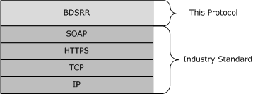

# [MS-BDSRR]: Business Document Scanning: Scan Repository Capabilities and Status Retrieval Protocol

Table of Contents

1 Introduction

- [1 Introduction](#Section_1)
  - [1.1 Glossary](#Section_1.1)
  - [1.2 References](#Section_1.2)
    - [1.2.1 Normative References](#Section_1.2.1)
    - [1.2.2 Informative References](#Section_1.2.2)
  - [1.3 Overview](#Section_1.3)
  - [1.4 Relationship to Other Protocols](#Section_1.4)
  - [1.5 Prerequisites/Preconditions](#Section_1.5)
  - [1.6 Applicability Statement](#Section_1.6)
  - [1.7 Versioning and Capability Negotiation](#Section_1.7)
  - [1.8 Vendor-Extensible Fields](#Section_1.8)
  - [1.9 Standards Assignments](#Section_1.9)

2 Messages

- [2 Messages](#Section_2)
  - [2.1 Transport](#Section_2.1)
  - [2.2 Common Message Syntax](#Section_2.2)
    - [2.2.1 Namespaces](#Section_2.2.1)
    - [2.2.2 Messages](#Section_2.2.2)
      - [2.2.2.1 Error Codes](#Section_2.2.2.1)
    - [2.2.3 Elements](#Section_2.2.3)
      - [2.2.3.1 dsc:Dialect](#Section_2.2.3.1)
        - [2.2.3.1.1 dsc:Dialect, Child of dsc:FilterStatusType](#Section_2.2.3.1.1)
        - [2.2.3.1.2 dsc:Dialect, Child of dsc:FilterType](#Section_2.2.3.1.2)
      - [2.2.3.2 dsc:Document](#Section_2.2.3.2)
      - [2.2.3.3 dsc:Documents](#Section_2.2.3.3)
      - [2.2.3.4 dsc:DocumentDescription](#Section_2.2.3.4)
      - [2.2.3.5 dsc:DocumentId](#Section_2.2.3.5)
      - [2.2.3.6 dsc:Filter](#Section_2.2.3.6)
      - [2.2.3.7 dsc:FilterCompletedStatuses](#Section_2.2.3.7)
      - [2.2.3.8 dsc:FilterConfig](#Section_2.2.3.8)
      - [2.2.3.9 dsc:Filters](#Section_2.2.3.9)
      - [2.2.3.10 dsc:FilterState](#Section_2.2.3.10)
      - [2.2.3.11 dsc:FilterStateReason](#Section_2.2.3.11)
      - [2.2.3.12 dsc:FilterStateReasons](#Section_2.2.3.12)
      - [2.2.3.13 dsc:FilterStatus](#Section_2.2.3.13)
      - [2.2.3.14 dsc:FilterStatuses](#Section_2.2.3.14)
      - [2.2.3.15 dsc:Format](#Section_2.2.3.15)
      - [2.2.3.16 dsc:ImagesReceived](#Section_2.2.3.16)
      - [2.2.3.17 dsc:JobCompletedState](#Section_2.2.3.17)
      - [2.2.3.18 dsc:JobCompletedStateReasons](#Section_2.2.3.18)
      - [2.2.3.19 dsc:JobCompletedTime](#Section_2.2.3.19)
      - [2.2.3.20 dsc:JobCreatedTime](#Section_2.2.3.20)
      - [2.2.3.21 dsc:JobDescription](#Section_2.2.3.21)
      - [2.2.3.22 dsc:JobOriginatingUserName](#Section_2.2.3.22)
      - [2.2.3.23 dsc:JobState](#Section_2.2.3.23)
      - [2.2.3.24 dsc:JobStateReason](#Section_2.2.3.24)
      - [2.2.3.25 dsc:JobStateReasons](#Section_2.2.3.25)
      - [2.2.3.26 dsc:JobStatus](#Section_2.2.3.26)
      - [2.2.3.27 dsc:JobSummary](#Section_2.2.3.27)
      - [2.2.3.28 dsc:JobToken](#Section_2.2.3.28)
      - [2.2.3.29 dsc:PSP_DisplayName](#Section_2.2.3.29)
      - [2.2.3.30 dsc:PSP_Identifier](#Section_2.2.3.30)
      - [2.2.3.31 dsc:RepositoryConfiguration](#Section_2.2.3.31)
      - [2.2.3.32 dsc:RepositoryState](#Section_2.2.3.32)
      - [2.2.3.33 dsc:RepositoryStateReason](#Section_2.2.3.33)
      - [2.2.3.34 dsc:RepositoryStateReasons](#Section_2.2.3.34)
      - [2.2.3.35 dsc:RepositoryStatus](#Section_2.2.3.35)
      - [2.2.3.36 psp:ContinueOnError](#Section_2.2.3.36)
      - [2.2.3.37 psp:Dialect](#Section_2.2.3.37)
      - [2.2.3.38 psp:DocumentRootName](#Section_2.2.3.38)
      - [2.2.3.39 psp:Filter](#Section_2.2.3.39)
      - [2.2.3.40 psp:FiltersToProcess](#Section_2.2.3.40)
      - [2.2.3.41 psp:Instructions](#Section_2.2.3.41)
      - [2.2.3.42 psp:PostScanInstructions](#Section_2.2.3.42)
      - [2.2.3.43 psp:PostScanProcess](#Section_2.2.3.43)
      - [2.2.3.44 psp:ScanRepository](#Section_2.2.3.44)
      - [2.2.3.45 psp:ScanTicket](#Section_2.2.3.45)
      - [2.2.3.46 wscn:AutoExposure](#Section_2.2.3.46)
      - [2.2.3.47 wscn:Brightness](#Section_2.2.3.47)
      - [2.2.3.48 wscn:ColorProcessing](#Section_2.2.3.48)
      - [2.2.3.49 wscn:CompressionQualityFactor](#Section_2.2.3.49)
      - [2.2.3.50 wscn:ContentType](#Section_2.2.3.50)
      - [2.2.3.51 wscn:Contrast](#Section_2.2.3.51)
      - [2.2.3.52 wscn:DocumentParameters](#Section_2.2.3.52)
      - [2.2.3.53 wscn:DocumentSizeAutoDetect](#Section_2.2.3.53)
      - [2.2.3.54 wscn:Exposure](#Section_2.2.3.54)
      - [2.2.3.55 wscn:ExposureSettings](#Section_2.2.3.55)
      - [2.2.3.56 wscn:FilmScanMode](#Section_2.2.3.56)
      - [2.2.3.57 wscn:Format](#Section_2.2.3.57)
      - [2.2.3.58 wscn:Height](#Section_2.2.3.58)
        - [2.2.3.58.1 wscn:Height, Child of wscn:DimensionsType](#Section_2.2.3.58.1)
        - [2.2.3.58.2 wscn:Height, Child of wscn:ResolutionPairExtType](#Section_2.2.3.58.2)
      - [2.2.3.59 wscn:ImagesToTransfer](#Section_2.2.3.59)
      - [2.2.3.60 wscn:InputMediaSize](#Section_2.2.3.60)
      - [2.2.3.61 wscn:InputSize](#Section_2.2.3.61)
      - [2.2.3.62 wscn:InputSource](#Section_2.2.3.62)
      - [2.2.3.63 wscn:JobDescription](#Section_2.2.3.63)
      - [2.2.3.64 wscn:JobInformation](#Section_2.2.3.64)
      - [2.2.3.65 wscn:JobName](#Section_2.2.3.65)
      - [2.2.3.66 wscn:JobOriginatingUserName](#Section_2.2.3.66)
      - [2.2.3.67 wscn:MediaBack](#Section_2.2.3.67)
      - [2.2.3.68 wscn:MediaFront](#Section_2.2.3.68)
      - [2.2.3.69 wscn:MediaSides](#Section_2.2.3.69)
      - [2.2.3.70 wscn:Resolution](#Section_2.2.3.70)
      - [2.2.3.71 wscn:Rotation](#Section_2.2.3.71)
      - [2.2.3.72 wscn:Scaling](#Section_2.2.3.72)
      - [2.2.3.73 wscn:ScalingHeight](#Section_2.2.3.73)
      - [2.2.3.74 wscn:ScalingWidth](#Section_2.2.3.74)
      - [2.2.3.75 wscn:ScanRegion](#Section_2.2.3.75)
      - [2.2.3.76 wscn:ScanRegionHeight](#Section_2.2.3.76)
      - [2.2.3.77 wscn:ScanRegionWidth](#Section_2.2.3.77)
      - [2.2.3.78 wscn:ScanRegionXOffset](#Section_2.2.3.78)
      - [2.2.3.79 wscn:ScanRegionYOffset](#Section_2.2.3.79)
      - [2.2.3.80 wscn:Sharpness](#Section_2.2.3.80)
      - [2.2.3.81 wscn:Width](#Section_2.2.3.81)
        - [2.2.3.81.1 wscn:Width, Child of wscn:DimensionsType](#Section_2.2.3.81.1)
        - [2.2.3.81.2 wscn:Width, Child of wscn:ResolutionPairExtType](#Section_2.2.3.81.2)
      - [2.2.3.82 emlf:EmailAddress](#Section_2.2.3.82)
      - [2.2.3.83 emlf:EmailConfig](#Section_2.2.3.83)
      - [2.2.3.84 emlf:SendToAddresses](#Section_2.2.3.84)
      - [2.2.3.85 emlf:SendToScanUser](#Section_2.2.3.85)
      - [2.2.3.86 fsf:FileShareConfig](#Section_2.2.3.86)
      - [2.2.3.87 fsf:FileShares](#Section_2.2.3.87)
      - [2.2.3.88 fsf:ShareUNC](#Section_2.2.3.88)
      - [2.2.3.89 spf:SaveToMySite](#Section_2.2.3.89)
      - [2.2.3.90 spf:SaveToSharePointSites](#Section_2.2.3.90)
      - [2.2.3.91 spf:SaveToSharePointSiteURL](#Section_2.2.3.91)
      - [2.2.3.92 spf:SharePointConfig](#Section_2.2.3.92)
      - [2.2.3.93 spx:AllowDeviceFileNameChange](#Section_2.2.3.93)
      - [2.2.3.94 spx:AllowDeviceFilePathChange](#Section_2.2.3.94)
    - [2.2.4 Complex Types](#Section_2.2.4)
      - [2.2.4.1 dsc:DateTimeExtType](#Section_2.2.4.1)
      - [2.2.4.2 dsc:DocumentDescriptionType](#Section_2.2.4.2)
      - [2.2.4.3 dsc:DocumentFormatExtType](#Section_2.2.4.3)
      - [2.2.4.4 dsc:DocumentType](#Section_2.2.4.4)
      - [2.2.4.5 dsc:DocumentsType](#Section_2.2.4.5)
      - [2.2.4.6 dsc:FilterConfigType](#Section_2.2.4.6)
      - [2.2.4.7 dsc:FilterStateReasonsType](#Section_2.2.4.7)
      - [2.2.4.8 dsc:FilterStateReasonType](#Section_2.2.4.8)
      - [2.2.4.9 dsc:FilterStateType](#Section_2.2.4.9)
      - [2.2.4.10 dsc:FilterStatusesType](#Section_2.2.4.10)
      - [2.2.4.11 dsc:FilterStatusType](#Section_2.2.4.11)
      - [2.2.4.12 dsc:FiltersType](#Section_2.2.4.12)
      - [2.2.4.13 dsc:FilterType](#Section_2.2.4.13)
      - [2.2.4.14 dsc:IntOneExtType](#Section_2.2.4.14)
      - [2.2.4.15 dsc:IntZeroExtType](#Section_2.2.4.15)
      - [2.2.4.16 dsc:ListOfSummarysType](#Section_2.2.4.16)
      - [2.2.4.17 dsc:JobDescriptionType](#Section_2.2.4.17)
      - [2.2.4.18 dsc:JobStateReasonsType](#Section_2.2.4.18)
      - [2.2.4.19 dsc:JobStateReasonType](#Section_2.2.4.19)
      - [2.2.4.20 dsc:JobStateType](#Section_2.2.4.20)
      - [2.2.4.21 dsc:JobStatusType](#Section_2.2.4.21)
      - [2.2.4.22 dsc:JobSummaryType](#Section_2.2.4.22)
      - [2.2.4.23 dsc:RepositoryConfigurationType](#Section_2.2.4.23)
      - [2.2.4.24 dsc:RepositoryStateType](#Section_2.2.4.24)
      - [2.2.4.25 dsc:RepositoryStateReasonsType](#Section_2.2.4.25)
      - [2.2.4.26 dsc:RepositoryStateReasonType](#Section_2.2.4.26)
      - [2.2.4.27 dsc:RepositoryStatusType](#Section_2.2.4.27)
      - [2.2.4.28 dsc:String255ExtType](#Section_2.2.4.28)
      - [2.2.4.29 psp:anyURIExtType](#Section_2.2.4.29)
      - [2.2.4.30 psp:BoolExtType](#Section_2.2.4.30)
      - [2.2.4.31 psp:FilterInstructionType](#Section_2.2.4.31)
      - [2.2.4.32 psp:FilterToProcessListType](#Section_2.2.4.32)
      - [2.2.4.33 psp:FilterToProcessType](#Section_2.2.4.33)
      - [2.2.4.34 psp:PostScanInstructionsType](#Section_2.2.4.34)
      - [2.2.4.35 psp:PostScanProcessType](#Section_2.2.4.35)
      - [2.2.4.36 psp:String255ExtType](#Section_2.2.4.36)
      - [2.2.4.37 wscn:Adjustment1000Type](#Section_2.2.4.37)
      - [2.2.4.38 wscn:Adjustment100Type](#Section_2.2.4.38)
      - [2.2.4.39 wscn:BoolExtType](#Section_2.2.4.39)
      - [2.2.4.40 wscn:ColorConfigType](#Section_2.2.4.40)
      - [2.2.4.41 wscn:ColorJobType](#Section_2.2.4.41)
      - [2.2.4.42 wscn:CompressionQualityFactorExtType](#Section_2.2.4.42)
      - [2.2.4.43 wscn:CompressionQualityFactorType](#Section_2.2.4.43)
      - [2.2.4.44 wscn:ContentTypeExtType](#Section_2.2.4.44)
      - [2.2.4.45 wscn:ContentTypeTicketType](#Section_2.2.4.45)
      - [2.2.4.46 wscn:DimensionExtType](#Section_2.2.4.46)
      - [2.2.4.47 wscn:DimensionsType](#Section_2.2.4.47)
      - [2.2.4.48 wscn:DocumentFormatExtType](#Section_2.2.4.48)
      - [2.2.4.49 wscn:DocumentFormatType](#Section_2.2.4.49)
      - [2.2.4.50 wscn:DocumentInputSizeType](#Section_2.2.4.50)
      - [2.2.4.51 wscn:DocumentInputSourceExtType](#Section_2.2.4.51)
      - [2.2.4.52 wscn:DocumentInputSourceType](#Section_2.2.4.52)
      - [2.2.4.53 wscn:DocumentParametersType](#Section_2.2.4.53)
      - [2.2.4.54 wscn:ExposureSettingsType](#Section_2.2.4.54)
      - [2.2.4.55 wscn:FilmScanModeExtType](#Section_2.2.4.55)
      - [2.2.4.56 wscn:FilmScanModeType](#Section_2.2.4.56)
      - [2.2.4.57 wscn:ImagesToTransferType](#Section_2.2.4.57)
      - [2.2.4.58 wscn:IntOneExtType](#Section_2.2.4.58)
      - [2.2.4.59 wscn:IntZeroExtType](#Section_2.2.4.59)
      - [2.2.4.60 wscn:JobDescriptionType](#Section_2.2.4.60)
      - [2.2.4.61 wscn:MediaSidesType](#Section_2.2.4.61)
      - [2.2.4.62 wscn:MediaSideType](#Section_2.2.4.62)
      - [2.2.4.63 wscn:OffsetExtType](#Section_2.2.4.63)
      - [2.2.4.64 wscn:ResolutionPairExtType](#Section_2.2.4.64)
      - [2.2.4.65 wscn:RotationExtType](#Section_2.2.4.65)
      - [2.2.4.66 wscn:RotationType](#Section_2.2.4.66)
      - [2.2.4.67 wscn:ScalingRangeType](#Section_2.2.4.67)
      - [2.2.4.68 wscn:ScalingType](#Section_2.2.4.68)
      - [2.2.4.69 wscn:ScanExposureType](#Section_2.2.4.69)
      - [2.2.4.70 wscn:ScanRegionType](#Section_2.2.4.70)
      - [2.2.4.71 wscn:ScanTicketType](#Section_2.2.4.71)
      - [2.2.4.72 wscn:String255ExtType](#Section_2.2.4.72)
      - [2.2.4.73 emlf:BoolExtType](#Section_2.2.4.73)
      - [2.2.4.74 emlf:EmailConfigType](#Section_2.2.4.74)
      - [2.2.4.75 emlf:SendToAddressesType](#Section_2.2.4.75)
      - [2.2.4.76 emlf:String255ExtType](#Section_2.2.4.76)
      - [2.2.4.77 fsf:FileShareConfigType](#Section_2.2.4.77)
      - [2.2.4.78 fsf:FileShareType](#Section_2.2.4.78)
      - [2.2.4.79 fsf:String255ExtType](#Section_2.2.4.79)
      - [2.2.4.80 spf:BoolExtType](#Section_2.2.4.80)
      - [2.2.4.81 spf:SharePointConfigType](#Section_2.2.4.81)
      - [2.2.4.82 spf:SharePointSitesType](#Section_2.2.4.82)
      - [2.2.4.83 spf:String2048ExtType](#Section_2.2.4.83)
    - [2.2.5 Simple Types](#Section_2.2.5)
      - [2.2.5.1 dsc:DocumentFormatBaseType](#Section_2.2.5.1)
      - [2.2.5.2 dsc:DocumentFormatWKVType](#Section_2.2.5.2)
      - [2.2.5.3 dsc:FilterStateBaseType](#Section_2.2.5.3)
      - [2.2.5.4 dsc:FilterStateReasonBaseType](#Section_2.2.5.4)
      - [2.2.5.5 dsc:FilterStateReasonWKVType](#Section_2.2.5.5)
      - [2.2.5.6 dsc:FilterStateWKVType](#Section_2.2.5.6)
      - [2.2.5.7 dsc:IntOneBaseType](#Section_2.2.5.7)
      - [2.2.5.8 dsc:IntZeroBaseType](#Section_2.2.5.8)
      - [2.2.5.9 dsc:JobStateBaseType](#Section_2.2.5.9)
      - [2.2.5.10 dsc:JobStateReasonBaseType](#Section_2.2.5.10)
      - [2.2.5.11 dsc:JobStateReasonWKVType](#Section_2.2.5.11)
      - [2.2.5.12 dsc:JobStateWKVType](#Section_2.2.5.12)
      - [2.2.5.13 dsc:KeywordNsExtensionPatternType](#Section_2.2.5.13)
      - [2.2.5.14 dsc:MimeExtensionPatternType](#Section_2.2.5.14)
      - [2.2.5.15 dsc:RepositoryStateBaseType](#Section_2.2.5.15)
      - [2.2.5.16 dsc:RepositoryStateReasonBaseType](#Section_2.2.5.16)
      - [2.2.5.17 dsc:RepositoryStateReasonWKVType](#Section_2.2.5.17)
      - [2.2.5.18 dsc:RepositoryStateWKVType](#Section_2.2.5.18)
      - [2.2.5.19 dsc:String255BaseType](#Section_2.2.5.19)
      - [2.2.5.20 psp:String255BaseType](#Section_2.2.5.20)
      - [2.2.5.21 wscn:Adjustment1000BaseType](#Section_2.2.5.21)
      - [2.2.5.22 wscn:Adjustment100BaseType](#Section_2.2.5.22)
      - [2.2.5.23 wscn:ColorConfigBaseType](#Section_2.2.5.23)
      - [2.2.5.24 wscn:ColorWKVType](#Section_2.2.5.24)
      - [2.2.5.25 wscn:CompressionQualityFactorBaseType](#Section_2.2.5.25)
      - [2.2.5.26 wscn:ContentTypeBaseType](#Section_2.2.5.26)
      - [2.2.5.27 wscn:ContentTypeWKVType](#Section_2.2.5.27)
      - [2.2.5.28 wscn:DocumentFormatBaseType](#Section_2.2.5.28)
      - [2.2.5.29 wscn:DocumentFormatWKVType](#Section_2.2.5.29)
      - [2.2.5.30 wscn:DocumentInputSourceBaseType](#Section_2.2.5.30)
      - [2.2.5.31 wscn:DocumentInputSourceWKVType](#Section_2.2.5.31)
      - [2.2.5.32 wscn:FilmScanModeBaseType](#Section_2.2.5.32)
      - [2.2.5.33 wscn:FilmScanModeWKVType](#Section_2.2.5.33)
      - [2.2.5.34 wscn:IntOneBaseType](#Section_2.2.5.34)
      - [2.2.5.35 wscn:IntZeroBaseType](#Section_2.2.5.35)
      - [2.2.5.36 wscn:KeywordNsExtensionPatternType](#Section_2.2.5.36)
      - [2.2.5.37 wscn:MimeExtensionPatternType](#Section_2.2.5.37)
      - [2.2.5.38 wscn:RotationBaseType](#Section_2.2.5.38)
      - [2.2.5.39 wscn:RotationWKVType](#Section_2.2.5.39)
      - [2.2.5.40 wscn:ScalingRangeBaseType](#Section_2.2.5.40)
      - [2.2.5.41 wscn:String255BaseType](#Section_2.2.5.41)
      - [2.2.5.42 emlf:String255BaseType](#Section_2.2.5.42)
      - [2.2.5.43 fsf:String255BaseType](#Section_2.2.5.43)
      - [2.2.5.44 spf:String2048BaseType](#Section_2.2.5.44)
    - [2.2.6 Attributes](#Section_2.2.6)
      - [2.2.6.1 dsc:Name](#Section_2.2.6.1)
      - [2.2.6.2 dsc:Valid](#Section_2.2.6.2)
      - [2.2.6.3 wscn:MustHonor](#Section_2.2.6.3)
    - [2.2.7 Groups](#Section_2.2.7)
    - [2.2.8 Attribute Groups](#Section_2.2.8)

3 Protocol Details

- [3 Protocol Details](#Section_3)
  - [3.1 Common Details](#Section_3.1)
    - [3.1.1 Abstract Data Model](#Section_3.1.1)
    - [3.1.2 Timers](#Section_3.1.2)
    - [3.1.3 Initialization](#Section_3.1.3)
    - [3.1.4 Message Processing Events and Sequencing Rules](#Section_3.1.4)
      - [3.1.4.1 Common SOAP Faults](#Section_3.1.4.1)
        - [3.1.4.1.1 wsa:ActionNotSupported](#Section_3.1.4.1.1)
        - [3.1.4.1.2 dsc:InvalidArgs](#Section_3.1.4.1.2)
        - [3.1.4.1.3 dsc:OperationFailed](#Section_3.1.4.1.3)
        - [3.1.4.1.4 dsc:ServerErrorTemporaryError](#Section_3.1.4.1.4)
        - [3.1.4.1.5 dsc:ServerErrorInternalError](#Section_3.1.4.1.5)
        - [3.1.4.1.6 dsc:ClientErrorJobTokenNotFound](#Section_3.1.4.1.6)
  - [3.2 RepositoryConfigurationServiceType Server Details](#Section_3.2)
    - [3.2.1 Abstract Data Model](#Section_3.2.1)
    - [3.2.2 Timers](#Section_3.2.2)
    - [3.2.3 Initialization](#Section_3.2.3)
    - [3.2.4 Message Processing Events and Sequencing Rules](#Section_3.2.4)
      - [3.2.4.1 GetRepositoryElements](#Section_3.2.4.1)
        - [3.2.4.1.1 Messages](#Section_3.2.4.1.1)
          - [3.2.4.1.1.1 GetRepositoryElementsRequestMsg](#Section_3.2.4.1.1.1)
          - [3.2.4.1.1.2 GetRepositoryElementsResponseMsg](#Section_3.2.4.1.1.2)
        - [3.2.4.1.2 Elements](#Section_3.2.4.1.2)
          - [3.2.4.1.2.1 dsc:ElementData](#Section_3.2.4.1.2.1)
          - [3.2.4.1.2.2 dsc:GetRepositoryElementsRequest](#Section_3.2.4.1.2.2)
          - [3.2.4.1.2.3 dsc:GetRepositoryElementsResponse](#Section_3.2.4.1.2.3)
          - [3.2.4.1.2.4 dsc:Name](#Section_3.2.4.1.2.4)
          - [3.2.4.1.2.5 dsc:RepositoryElements](#Section_3.2.4.1.2.5)
          - [3.2.4.1.2.6 dsc:RequestedElements](#Section_3.2.4.1.2.6)
        - [3.2.4.1.3 Complex Types](#Section_3.2.4.1.3)
          - [3.2.4.1.3.1 dsc:GetRepositoryElementsRequestType](#Section_3.2.4.1.3.1)
          - [3.2.4.1.3.2 dsc:GetRepositoryElementsResponseType](#Section_3.2.4.1.3.2)
          - [3.2.4.1.3.3 dsc:RepositoryElementDataType](#Section_3.2.4.1.3.3)
          - [3.2.4.1.3.4 dsc:RepositoryElementsType](#Section_3.2.4.1.3.4)
          - [3.2.4.1.3.5 dsc:RequestedRepositoryElementsType](#Section_3.2.4.1.3.5)
      - [3.2.4.2 CancelPostScanJob](#Section_3.2.4.2)
        - [3.2.4.2.1 Messages](#Section_3.2.4.2.1)
          - [3.2.4.2.1.1 CancelPostScanJobRequestMsg](#Section_3.2.4.2.1.1)
          - [3.2.4.2.1.2 CancelPostScanJobResponseMsg](#Section_3.2.4.2.1.2)
        - [3.2.4.2.2 Elements](#Section_3.2.4.2.2)
          - [3.2.4.2.2.1 CancelPostScanJobRequest](#Section_3.2.4.2.2.1)
          - [3.2.4.2.2.2 CancelPostScanJobResponse](#Section_3.2.4.2.2.2)
        - [3.2.4.2.3 Complex Types](#Section_3.2.4.2.3)
          - [3.2.4.2.3.1 CancelPostScanJobRequestType](#Section_3.2.4.2.3.1)
          - [3.2.4.2.3.2 CancelPostScanJobResponseType](#Section_3.2.4.2.3.2)
      - [3.2.4.3 GetPostScanJobElements](#Section_3.2.4.3)
        - [3.2.4.3.1 Messages](#Section_3.2.4.3.1)
          - [3.2.4.3.1.1 GetPostScanJobElementsRequestMsg](#Section_3.2.4.3.1.1)
          - [3.2.4.3.1.2 GetPostScanJobElementsResponseMsg](#Section_3.2.4.3.1.2)
        - [3.2.4.3.2 Elements](#Section_3.2.4.3.2)
          - [3.2.4.3.2.1 dsc:ElementData](#Section_3.2.4.3.2.1)
          - [3.2.4.3.2.2 dsc:GetPostScanJobElementsRequest](#Section_3.2.4.3.2.2)
          - [3.2.4.3.2.3 dsc:GetPostScanJobElementsResponse](#Section_3.2.4.3.2.3)
          - [3.2.4.3.2.4 dsc:Name](#Section_3.2.4.3.2.4)
          - [3.2.4.3.2.5 dsc:JobElements](#Section_3.2.4.3.2.5)
          - [3.2.4.3.2.6 dsc:RequestedElements](#Section_3.2.4.3.2.6)
        - [3.2.4.3.3 Complex Types](#Section_3.2.4.3.3)
          - [3.2.4.3.3.1 dsc:GetPostScanJobElementsRequestType](#Section_3.2.4.3.3.1)
          - [3.2.4.3.3.2 dsc:GetPostScanJobElementsResponseType](#Section_3.2.4.3.3.2)
          - [3.2.4.3.3.3 dsc:JobElementDataType](#Section_3.2.4.3.3.3)
          - [3.2.4.3.3.4 dsc:JobElementsType](#Section_3.2.4.3.3.4)
          - [3.2.4.3.3.5 dsc:RequestedJobElementsType](#Section_3.2.4.3.3.5)
      - [3.2.4.4 GetActiveJobs](#Section_3.2.4.4)
        - [3.2.4.4.1 Messages](#Section_3.2.4.4.1)
          - [3.2.4.4.1.1 GetActiveJobsRequestMsg](#Section_3.2.4.4.1.1)
          - [3.2.4.4.1.2 GetActiveJobsResponseMsg](#Section_3.2.4.4.1.2)
        - [3.2.4.4.2 Elements](#Section_3.2.4.4.2)
          - [3.2.4.4.2.1 dsc:ActiveJobs](#Section_3.2.4.4.2.1)
          - [3.2.4.4.2.2 dsc:GetActiveJobsRequest](#Section_3.2.4.4.2.2)
          - [3.2.4.4.2.3 dsc:GetActiveJobsResponse](#Section_3.2.4.4.2.3)
        - [3.2.4.4.3 Complex Types](#Section_3.2.4.4.3)
          - [3.2.4.4.3.1 dsc:GetActiveJobsRequestType](#Section_3.2.4.4.3.1)
          - [3.2.4.4.3.2 dsc:GetActiveJobsResponseType](#Section_3.2.4.4.3.2)
      - [3.2.4.5 GetJobHistory](#Section_3.2.4.5)
        - [3.2.4.5.1 Messages](#Section_3.2.4.5.1)
          - [3.2.4.5.1.1 GetJobHistoryRequestMsg](#Section_3.2.4.5.1.1)
          - [3.2.4.5.1.2 GetJobHistoryResponseMsg](#Section_3.2.4.5.1.2)
        - [3.2.4.5.2 Elements](#Section_3.2.4.5.2)
          - [3.2.4.5.2.1 dsc:JobHistory](#Section_3.2.4.5.2.1)
          - [3.2.4.5.2.2 dsc:GetJobHistoryRequest](#Section_3.2.4.5.2.2)
          - [3.2.4.5.2.3 dsc:GetJobHistoryResponse](#Section_3.2.4.5.2.3)
        - [3.2.4.5.3 Complex Types](#Section_3.2.4.5.3)
          - [3.2.4.5.3.1 dsc:GetJobHistoryRequestType](#Section_3.2.4.5.3.1)
          - [3.2.4.5.3.2 dsc:GetJobHistoryResponseType](#Section_3.2.4.5.3.2)
      - [3.2.4.6 RepositoryElementsChangeEvent](#Section_3.2.4.6)
        - [3.2.4.6.1 Messages](#Section_3.2.4.6.1)
          - [3.2.4.6.1.1 RepositoryElementsChangeEventMsg](#Section_3.2.4.6.1.1)
        - [3.2.4.6.2 Elements](#Section_3.2.4.6.2)
          - [3.2.4.6.2.1 dsc:ElementChanges](#Section_3.2.4.6.2.1)
          - [3.2.4.6.2.2 dsc:RepositoryElementsChangeEvent](#Section_3.2.4.6.2.2)
        - [3.2.4.6.3 Complex Types](#Section_3.2.4.6.3)
          - [3.2.4.6.3.1 dsc:ElementChangesType](#Section_3.2.4.6.3.1)
          - [3.2.4.6.3.2 dsc:RepositoryElementsChangeEventType](#Section_3.2.4.6.3.2)
      - [3.2.4.7 RepositoryStatusSummaryEvent](#Section_3.2.4.7)
        - [3.2.4.7.1 Messages](#Section_3.2.4.7.1)
          - [3.2.4.7.1.1 dsc:RepositoryStatusSummaryEventMsg](#Section_3.2.4.7.1.1)
        - [3.2.4.7.2 Elements](#Section_3.2.4.7.2)
          - [3.2.4.7.2.1 dsc:RepositoryStatusSummaryEvent](#Section_3.2.4.7.2.1)
          - [3.2.4.7.2.2 dsc:StatusSummary](#Section_3.2.4.7.2.2)
        - [3.2.4.7.3 Complex Types](#Section_3.2.4.7.3)
          - [3.2.4.7.3.1 dsc:RepositoryStatusSummaryEventType](#Section_3.2.4.7.3.1)
          - [3.2.4.7.3.2 dsc:StatusSummaryType](#Section_3.2.4.7.3.2)
      - [3.2.4.8 PostScanJobStatusEvent](#Section_3.2.4.8)
        - [3.2.4.8.1 Messages](#Section_3.2.4.8.1)
          - [3.2.4.8.1.1 dsc:PostScanJobStatusEventMsg](#Section_3.2.4.8.1.1)
        - [3.2.4.8.2 Elements](#Section_3.2.4.8.2)
          - [3.2.4.8.2.1 dsc:PostScanJobStatusEvent](#Section_3.2.4.8.2.1)
        - [3.2.4.8.3 Complex Types](#Section_3.2.4.8.3)
          - [3.2.4.8.3.1 dsc:PostScanJobStatusEventType](#Section_3.2.4.8.3.1)
      - [3.2.4.9 PostScanJobEndStateEvent](#Section_3.2.4.9)
        - [3.2.4.9.1 Messages](#Section_3.2.4.9.1)
          - [3.2.4.9.1.1 dsc:PostScanJobEndStateEventMsg](#Section_3.2.4.9.1.1)
        - [3.2.4.9.2 Elements](#Section_3.2.4.9.2)
          - [3.2.4.9.2.1 dsc:PostScanJobEndState](#Section_3.2.4.9.2.1)
          - [3.2.4.9.2.2 dsc:PostScanJobEndStateEvent](#Section_3.2.4.9.2.2)
        - [3.2.4.9.3 Complex Types](#Section_3.2.4.9.3)
          - [3.2.4.9.3.1 dsc:PostScanJobEndStateType](#Section_3.2.4.9.3.1)
          - [3.2.4.9.3.2 dsc:PostScanJobEndStateEventType](#Section_3.2.4.9.3.2)
    - [3.2.5 Timer Events](#Section_3.2.5)
    - [3.2.6 Other Local Events](#Section_3.2.6)
  - [3.3 RepositoryConfigurationServiceType Client Details](#Section_3.3)

4 Protocol Examples

- [4 Protocol Examples](#Section_4)
  - [4.1 WSDL Message Examples](#Section_4.1)
  - [4.2 SOAP Fault Example](#Section_4.2)

5 Security

- [5 Security](#Section_5)
  - [5.1 Security Considerations for Implementers](#Section_5.1)
  - [5.2 Index of Security Parameters](#Section_5.2)

6 Appendix A: Full WSDL

- [6 Appendix A: Full WSDL](#Section_6)
  - [6.1 RepositoryConfigurationServiceType WSDL](#Section_6.1)
  - [6.2 Full XSD](#Section_6.2)
    - [6.2.1 dsc](#Section_6.2.1)
    - [6.2.2 psp](#Section_6.2.2)
    - [6.2.3 wscn](#Section_6.2.3)
    - [6.2.4 emlf](#Section_6.2.4)
    - [6.2.5 fsf](#Section_6.2.5)
    - [6.2.6 spf](#Section_6.2.6)
    - [6.2.7 spx](#Section_6.2.7)

7 Appendix B: Product Behavior

- [7 Appendix B: Product Behavior](#Section_7)

8 Change Tracking

- [8 Change Tracking](#Section_8)

For the legal notice and IP terms, see [LEGAL.md](../LEGAL.md).
Last updated: 9/12/2018.
See [Revision History](#revision-history) for full version history.

# 1 Introduction

This is a specification of the Business Document Scanning: Scan Repository Capabilities and Status Retrieval (BDSRR) Protocol. This protocol is used to query a server for the capabilities and status of the [**scan repository**](#gt_scan-repository).

Sections 1.5, 1.8, 1.9, 2, and 3 of this specification are normative. All other sections and examples in this specification are informative.

## 1.1 Glossary

This document uses the following terms:

**filter**: A processing object in the [**scan repository**](#gt_scan-repository) identified by [**scan documents**](#gt_scan-document) that is a unique [**URI**](#gt_uniform-resource-identifier-uri). This object will perform a specific operation in a [**PostScan job**](#gt_postscan-job). The operations performed by each filter are governed by the filter dialect [**URI**](#gt_uniform-resource-identifier-uri) and [**filter-specific instructions**](#gt_filter-specific-instructions).

**filter-specific instructions**: A set of data elements that tell a specific filter how to process the [**scan document(s)**](#gt_scan-document) that are part of a [**PostScan job**](#gt_postscan-job). The definition of these data elements is specific to each filter.

**globally unique identifier (GUID)**: A term used interchangeably with universally unique identifier (UUID) in Microsoft protocol technical documents (TDs). Interchanging the usage of these terms does not imply or require a specific algorithm or mechanism to generate the value. Specifically, the use of this term does not imply or require that the algorithms described in [[RFC4122]](https://go.microsoft.com/fwlink/?LinkId=90460) or [[C706]](https://go.microsoft.com/fwlink/?LinkId=89824) must be used for generating the [**GUID**](#gt_globally-unique-identifier-guid). See also universally unique identifier (UUID).

**PostScan job**: A unit of work within the [**scan repository**](#gt_scan-repository).

**PostScan process**: The entity that contains a [**scan ticket**](#gt_scan-ticket) used by a [**scan device**](#gt_scan-device) and the PostScan instructions used by a [**scan repository**](#gt_scan-repository) server when processing image data sent by a [**scan device**](#gt_scan-device).

**scan device**: A scanner, copier, or multifunction peripheral that supports the Devices Profile for Web Services [[DPWS]](https://go.microsoft.com/fwlink/?LinkId=127841).

**scan document**: A single image file created by a [**scan device**](#gt_scan-device) and transferred to the [**scan repository**](#gt_scan-repository) server during the processing of a [**PostScan job**](#gt_postscan-job).

**scan repository**: A service that supports processing [**PostScan jobs**](#gt_postscan-job) based on data and instructions in a [**PostScan process**](#gt_postscan-process).

**scan ticket**: An element that communicates the appropriate settings that are to be used by a [**scan device**](#gt_scan-device) when creating a [**scan document**](#gt_scan-document).

**SOAP action**: The HTTP request header field used to indicate the intent of the SOAP request, using a [**URI**](#gt_uniform-resource-identifier-uri) value. See [[SOAP1.1]](https://go.microsoft.com/fwlink/?LinkId=90520) section 6.1.1 for more information.

**SOAP body**: A container for the payload data being delivered by a [**SOAP message**](#gt_soap-message) to its recipient. See [[SOAP1.2-1/2007]](https://go.microsoft.com/fwlink/?LinkId=94664) section 5.3 for more information.

**SOAP fault**: A container for error and status information within a [**SOAP message**](#gt_soap-message). See [SOAP1.2-1/2007] section 5.4 for more information.

**SOAP message**: An [**XML**](#gt_xml) document consisting of a mandatory SOAP envelope, an optional SOAP header, and a mandatory [**SOAP body**](#gt_soap-body). See [SOAP1.2-1/2007] section 5 for more information.

**Uniform Resource Identifier (URI)**: A string that identifies a resource. The URI is an addressing mechanism defined in Internet Engineering Task Force (IETF) Uniform Resource Identifier (URI): Generic Syntax [[RFC3986]](https://go.microsoft.com/fwlink/?LinkId=90453).

**Web Services Description Language (WSDL)**: An XML format for describing network services as a set of endpoints that operate on messages that contain either document-oriented or procedure-oriented information. The operations and messages are described abstractly and are bound to a concrete network protocol and message format in order to define an endpoint. Related concrete endpoints are combined into abstract endpoints, which describe a network service. WSDL is extensible, which allows the description of endpoints and their messages regardless of the message formats or network protocols that are used.

**WSDL Event**: A one-way [**WSDL operation**](#gt_wsdl-operation) from the server to the client.

**WSDL message**: An abstract, typed definition of the data that is communicated during a [**WSDL operation**](#gt_wsdl-operation) [[WSDL]](https://go.microsoft.com/fwlink/?LinkId=90577). Also, an element that describes the data being exchanged between web service providers and clients.

**WSDL operation**: A single action or function of a web service. The execution of a WSDL operation typically requires the exchange of messages between the service requestor and the service provider.

**XML**: The Extensible Markup Language, as described in [[XML1.0]](https://go.microsoft.com/fwlink/?LinkId=90599).

**XML namespace**: A collection of names that is used to identify elements, types, and attributes in XML documents identified in a URI reference [RFC3986]. A combination of XML namespace and local name allows XML documents to use elements, types, and attributes that have the same names but come from different sources. For more information, see [[XMLNS-2ED]](https://go.microsoft.com/fwlink/?LinkId=90602).

**XML schema**: A description of a type of XML document that is typically expressed in terms of constraints on the structure and content of documents of that type, in addition to the basic syntax constraints that are imposed by [**XML**](#gt_xml) itself. An XML schema provides a view of a document type at a relatively high level of abstraction.

**MAY, SHOULD, MUST, SHOULD NOT, MUST NOT:** These terms (in all caps) are used as defined in [[RFC2119]](https://go.microsoft.com/fwlink/?LinkId=90317). All statements of optional behavior use either MAY, SHOULD, or SHOULD NOT.

## 1.2 References

Links to a document in the Microsoft Open Specifications library point to the correct section in the most recently published version of the referenced document. However, because individual documents in the library are not updated at the same time, the section numbers in the documents may not match. You can confirm the correct section numbering by checking the [Errata](https://go.microsoft.com/fwlink/?linkid=850906).

### 1.2.1 Normative References

We conduct frequent surveys of the normative references to assure their continued availability. If you have any issue with finding a normative reference, please contact [dochelp@microsoft.com](mailto:dochelp@microsoft.com). We will assist you in finding the relevant information.

[DPWS] Chans, S., Conti, D., Schlimmer, J., et al., "Devices Profile for Web Services", February 2006, [http://specs.xmlsoap.org/ws/2006/02/devprof/devicesprofile.pdf](https://go.microsoft.com/fwlink/?LinkId=127841)

[IANAPORT] IANA, "Service Name and Transport Protocol Port Number Registry", [http://www.iana.org/assignments/service-names-port-numbers/service-names-port-numbers.xhtml](https://go.microsoft.com/fwlink/?LinkId=89888)

[RFC2119] Bradner, S., "Key words for use in RFCs to Indicate Requirement Levels", BCP 14, RFC 2119, March 1997, [http://www.rfc-editor.org/rfc/rfc2119.txt](https://go.microsoft.com/fwlink/?LinkId=90317)

[RFC2396] Berners-Lee, T., Fielding, R., and Masinter, L., "Uniform Resource Identifiers (URI): Generic Syntax", RFC 2396, August 1998, [http://www.rfc-editor.org/rfc/rfc2396.txt](https://go.microsoft.com/fwlink/?LinkId=90339)

[RFC2616] Fielding, R., Gettys, J., Mogul, J., et al., "Hypertext Transfer Protocol -- HTTP/1.1", RFC 2616, June 1999, [http://www.rfc-editor.org/rfc/rfc2616.txt](https://go.microsoft.com/fwlink/?LinkId=90372)

[RFC2818] Rescorla, E., "HTTP Over TLS", RFC 2818, May 2000, [http://www.rfc-editor.org/rfc/rfc2818.txt](https://go.microsoft.com/fwlink/?LinkId=90383)

[SOAP1.2-1/2003] Gudgin, M., Hadley, M., Mendelsohn, N., et al., "SOAP Version 1.2 Part 1: Messaging Framework", W3C Recommendation, June 2003, [http://www.w3.org/TR/2003/REC-soap12-part1-20030624](https://go.microsoft.com/fwlink/?LinkId=90521)

[SOAP1.2-2/2003] Gudgin, M., Hadley, M., Mendelsohn, N., et al., "SOAP Version 1.2 Part 2: Adjuncts", W3C Recommendation, June 2003, [http://www.w3.org/TR/2003/REC-soap12-part2-20030624](https://go.microsoft.com/fwlink/?LinkId=90522)

[WSAddressing] Box, D., et al., "Web Services Addressing (WS-Addressing)", August 2004, [http://www.w3.org/Submission/ws-addressing/](https://go.microsoft.com/fwlink/?LinkId=90575)

[WSDL] Christensen, E., Curbera, F., Meredith, G., and Weerawarana, S., "Web Services Description Language (WSDL) 1.1", W3C Note, March 2001, [http://www.w3.org/TR/2001/NOTE-wsdl-20010315](https://go.microsoft.com/fwlink/?LinkId=90577)

[WSEVENTING] Box, D., Cabrera, L.F., Critchley, C., et al., "Web Services Eventing (WS-Eventing)", March 2006, [http://www.w3.org/Submission/WS-Eventing](https://go.microsoft.com/fwlink/?LinkId=128792)

[WSPOLICY] Bajaj, S., Box, D., Chappell, D., et al., "Web Services Policy Framework (WS-Policy) and Web Services Policy Attachment (WS-PolicyAttachment)", March 2006, [http://schemas.xmlsoap.org/ws/2004/09/policy](https://go.microsoft.com/fwlink/?LinkId=131794)

[WSS1] Nadalin, A., Kaler, C., Hallam-Baker, P., et al., "Web Services Security: SOAP Message Security 1.0 (WS-Security 2004)", March 2004, [http://docs.oasis-open.org/wss/2004/01/oasis-200401-wss-soap-message-security-1.0.pdf](https://go.microsoft.com/fwlink/?LinkId=131547)

[XMLNS] Bray, T., Hollander, D., Layman, A., et al., Eds., "Namespaces in XML 1.0 (Third Edition)", W3C Recommendation, December 2009, [http://www.w3.org/TR/2009/REC-xml-names-20091208/](https://go.microsoft.com/fwlink/?LinkId=191840)

[XMLSCHEMA1] Thompson, H., Beech, D., Maloney, M., and Mendelsohn, N., Eds., "XML Schema Part 1: Structures", W3C Recommendation, May 2001, [http://www.w3.org/TR/2001/REC-xmlschema-1-20010502/](https://go.microsoft.com/fwlink/?LinkId=90608)

[XMLSCHEMA2] Biron, P.V., Ed. and Malhotra, A., Ed., "XML Schema Part 2: Datatypes", W3C Recommendation, May 2001, [http://www.w3.org/TR/2001/REC-xmlschema-2-20010502/](https://go.microsoft.com/fwlink/?LinkId=90610)

### 1.2.2 Informative References

[MS-ADLS] Microsoft Corporation, "[Active Directory Lightweight Directory Services Schema](../MS-ADLS/MS-ADLS.md)".

[MS-ADSC] Microsoft Corporation, "[Active Directory Schema Classes](../MS-ADSC/MS-ADSC.md)".

[MSDN-EMLF] Microsoft Corporation, "Email Filter Instructions Schema", [https://docs.microsoft.com/en-us/windows-hardware/drivers/image/email-filter-instructions-schema](https://go.microsoft.com/fwlink/?LinkId=211821)

[MSDN-FSF] Microsoft Corporation, "Fileshare Filter Instructions Schema", [https://docs.microsoft.com/en-us/windows-hardware/drivers/image/fileshare-filter-instructions-schema](https://go.microsoft.com/fwlink/?LinkId=211822)

[MSDN-SPF] Microsoft Corporation, "SharePoint Filter Instructions Schema", [https://docs.microsoft.com/en-us/windows-hardware/drivers/image/sharepoint-filter-instructions-schema](https://go.microsoft.com/fwlink/?LinkId=211824)

[MSDN-SPS] Microsoft Corporation, "Scan Process Schema", [https://docs.microsoft.com/en-us/windows-hardware/drivers/image/scan-process-schema](https://go.microsoft.com/fwlink/?LinkId=156878)

[MSDN-WSDSP] Microsoft Corporation, "Distributed Scan Processing Web Service Protocol Summary", [http://msdn.microsoft.com/en-us/library/ff540624.aspx](https://go.microsoft.com/fwlink/?LinkId=146572)

[MSDN-WSSCAN] Microsoft Corporation, "Scan Service (WS-Scan) Schema", [https://docs.microsoft.com/en-us/windows-hardware/drivers/image/scan-service--ws-scan--schema](https://go.microsoft.com/fwlink/?LinkId=154581)

[WS-Discovery] Beatty, J., Kakivaya, G., Kemp D., et al., "Web Services Dynamic Discovery (WS-Discovery)", April 2005, [http://specs.xmlsoap.org/ws/2005/04/discovery/ws-discovery.pdf](https://go.microsoft.com/fwlink/?LinkId=90576)

## 1.3 Overview

The Business Document Scanning: Scan Repository Capabilities and Status Retrieval (BDSRR) Protocol is modeled as a client, a [**scan repository**](#gt_scan-repository) server, and the conversations between those elements that support document scanning, processing, and storage in a business or enterprise setting. The BDSRR protocol is a means by which a client application can determine the current status and configuration of a scan repository server. The protocol contains operations and events that describe which [**filters**](#gt_filter) are supported by a scan repository and the state of the repository, in addition to information about active and completed [**PostScan jobs**](#gt_postscan-job).

## 1.4 Relationship to Other Protocols

The BDSRR protocol uses the [**SOAP messages**](#gt_soap-message) protocol for formatting requests and responses as specified in [[SOAP1.2-1/2003]](https://go.microsoft.com/fwlink/?LinkId=90521) and [[SOAP1.2-2/2003]](https://go.microsoft.com/fwlink/?LinkId=90522). The BDSRR protocol transmits these messages using the HTTPS protocol as specified in [[RFC2818]](https://go.microsoft.com/fwlink/?LinkId=90383).

The following diagram shows the underlying messaging and [transport](#Section_2.1) stack that the protocol uses:

Figure 1: The BDSRR messaging and transport stack

[[RFC2396]](https://go.microsoft.com/fwlink/?LinkId=90339) is used to define a [**Uniform Resource Identifier (URI)**](#gt_uniform-resource-identifier-uri), which is used as the basis for the [dsc:Dialect](#Section_2.2.3.1) elements.

## 1.5 Prerequisites/Preconditions

It is assumed that a client of this protocol has obtained the name of a [**scan repository**](#gt_scan-repository) that supports this protocol before it is invoked. The [**PostScan process**](#gt_postscan-process) is typically defined by a user or administration from a client and is stored in a directory service. There are various ways a client can accomplish this. For information, see [MS-ADLS](../MS-ADLS/MS-ADLS.md), [MS-ADSC](../MS-ADSC/MS-ADSC.md), and [[WS-Discovery]](https://go.microsoft.com/fwlink/?LinkId=90576).

This protocol assumes that authentication has been performed by the underlying protocols.

## 1.6 Applicability Statement

The Business Document Scanning: Scan Repository Capabilities and Status Retrieval (BDSRR) Protocol is applicable only for operations between a system functioning as a client and a system functioning as a [**scan repository**](#gt_scan-repository) server. This protocol is intended to scale from office use, in which a scan repository is shared between a small group of users, to enterprise use, in which multiple scan repositories are employed in a distributed environment.

## 1.7 Versioning and Capability Negotiation

The BDSRR protocol has no versioning mechanism or means of negotiating capabilities.

## 1.8 Vendor-Extensible Fields

The BDSRR protocol contains a number of vendor-extensible fields. These fields use an extension mechanism based on [**XML**](#gt_xml) type xs:NMTOKEN. Each of these elements can be extended by using either of a pair of XML pattern definitions. The definitions, which allow keywords from additional namespaces, are defined as follows.

<xs:simpleType name="KeywordNsExtensionPatternType">

<xs:restriction base="xs:NMTOKEN">

<xs:pattern value="\w+:[\w_\-\.]+"/>

</xs:restriction>

</xs:simpleType>

<xs:simpleType name="MimeExtensionPatternType">

<xs:restriction base="xs:NMTOKEN">

<xs:pattern value="\w+[\w:/;_\-\\\+\.]*"/>

</xs:restriction>

</xs:simpleType>

The following table lists all the elements that support these extension patterns.<1>

| Simple Type | Reference |
| --- | --- |
| dsc:DocumentFormatBaseType | Section [2.2.5.1](#Section_2.2.5.1) |
| dsc:FilterStateBaseType | Section [2.2.5.3](#Section_2.2.5.3) |
| dsc:FilterStateReasonBaseType | Section [2.2.5.4](#Section_2.2.5.4) |
| dsc:JobStateBaseType | Section [2.2.5.9](#Section_2.2.5.9) |
| dsc:JobStateReasonBaseType | Section [2.2.5.10](#Section_2.2.5.10) |
| dsc:RepositoryStateBaseType | Section [2.2.5.15](#Section_2.2.5.15) |
| dsc:RepositoryStateReasonBaseType | Section [2.2.5.16](#Section_2.2.5.16) |
| wscn:ColorConfigBaseType | Section [2.2.5.23](#Section_2.2.5.23) |
| wscn:ContentTypeBaseType | Section [2.2.5.26](#Section_2.2.5.26) |
| wscn:DocumentFormatBaseType | Section [2.2.5.28](#Section_2.2.5.28) |
| wscn:DocumentInputSourceBaseType | Section [2.2.5.30](#Section_2.2.5.30) |
| wscn:FilmScanModeBaseType | Section [2.2.5.32](#Section_2.2.5.32) |
| wscn:RotationBaseType | Section [2.2.5.38](#Section_2.2.5.38) |

## 1.9 Standards Assignments

| Parameter | Value | Reference |
| --- | --- | --- |
| UDP Port | 5362 | [[IANAPORT]](https://go.microsoft.com/fwlink/?LinkId=89888) |
| TCP Port | 5362 | [IANAPORT] |

# 2 Messages

## 2.1 Transport

The BDSRR protocol can be used over any transport protocol that supports transmitting messages specified in [[SOAP1.2-1/2003]](https://go.microsoft.com/fwlink/?LinkId=90521) and [[SOAP1.2-2/2003]](https://go.microsoft.com/fwlink/?LinkId=90522).

## 2.2 Common Message Syntax

This section contains common definitions used by the BDSRR protocol. The syntax of the definitions uses [**XML schema**](#gt_xml-schema) (as specified in [[XMLSCHEMA1]](https://go.microsoft.com/fwlink/?LinkId=90608) and [[XMLSCHEMA2]](https://go.microsoft.com/fwlink/?LinkId=90610)) and [**Web Services Description Language (WSDL)**](#gt_web-services-description-language-wsdl) as defined in [[WSDL]](https://go.microsoft.com/fwlink/?LinkId=90577).

### 2.2.1 Namespaces

This specification defines and references various [**XML namespaces**](#gt_xml-namespace) using the mechanisms specified in [[XMLNS]](https://go.microsoft.com/fwlink/?LinkId=191840). Although the BDSRR protocol associates a specific XML namespace prefix for each XML namespace that is used, the choice of any particular XML namespace prefix is implementation-specific and not significant for interoperability.

| Prefix | Namespace URI | Reference |
| --- | --- | --- |
| wsdl | http://schemas.xmlsoap.org/wsdl/ | [[WSDL]](https://go.microsoft.com/fwlink/?LinkId=90577) |
| wsoap12 | http://schemas.xmlsoap.org/wsdl/soap12/ | [[SOAP1.2-1/2003]](https://go.microsoft.com/fwlink/?LinkId=90521) |
| http | http://schemas.xmlsoap.org/wsdl/http/ | [[RFC2616]](https://go.microsoft.com/fwlink/?LinkId=90372) |
| xs | http://www.w3.org/2001/XMLSchema | [[XMLSCHEMA1]](https://go.microsoft.com/fwlink/?LinkId=90608), [[XMLSCHEMA2]](https://go.microsoft.com/fwlink/?LinkId=90610) |
| wsdp | http://schemas.xmlsoap.org/ws/2006/02/devprof | [[DPWS]](https://go.microsoft.com/fwlink/?LinkId=127841) |
| wsp | http://schemas.xmlsoap.org/ws/2004/09/policy | [[WSPOLICY]](https://go.microsoft.com/fwlink/?LinkId=131794) |
| wsd | http://schemas.xmlsoap.org/ws/2005/04/discovery | [[WS-Discovery]](https://go.microsoft.com/fwlink/?LinkId=90576) |
| wse | http://schemas.xmlsoap.org/ws/2004/08/eventing | [[WSEVENTING]](https://go.microsoft.com/fwlink/?LinkId=128792) |
| wsa | http://schemas.xmlsoap.org/ws/2004/08/addressing | [[WSAddressing]](https://go.microsoft.com/fwlink/?LinkId=90575) |
| wsu | http://docs.oasis-open.org/wss/2004/01/oasis-200401-wss-wssecurity-utility-1.0.xsd | [[WSS1]](https://go.microsoft.com/fwlink/?LinkId=131547) |
| psp | http://schemas.microsoft.com/windows/2008/02/imaging/postscan/psp | [[MSDN-SPS]](https://go.microsoft.com/fwlink/?LinkId=156878) |
| wscn | http://schemas.microsoft.com/windows/2006/08/wdp/scan | [[MSDN-WSSCAN]](https://go.microsoft.com/fwlink/?LinkId=154581) |
| dsc | http://schemas.microsoft.com/windows/2008/12/wdp/distributedscan/configuration | Section [6.2.1](#Section_6.2.1) |
| emlf | http://schemas.microsoft.com/windows/2007/10/imaging/postscan/filter/email | [[MSDN-EMLF]](https://go.microsoft.com/fwlink/?LinkId=211821) |
| fsf | http://schemas.microsoft.com/windows/2007/10/imaging/postscan/filter/fileshare | [[MSDN-FSF]](https://go.microsoft.com/fwlink/?LinkId=211822) |
| spf | http://schemas.microsoft.com/windows/2007/10/imaging/postscan/filter/sharepoint | [[MSDN-SPF]](https://go.microsoft.com/fwlink/?LinkId=211824) |
| spx | http://schemas.microsoft.com/windows/2010/09/imaging/postscan/scanprocess/extensions<2> | - |

### 2.2.2 Messages

#### 2.2.2.1 Error Codes

Error codes are returned in the soap:Fault element. A vendor MAY create a subset of or extend these error codes by supporting private error subcodes. All fault messages defined in this specification MUST be sent according to the rules specified in [[WSAddressing]](https://go.microsoft.com/fwlink/?LinkId=90575) section 4. The messages are sent to the [fault endpoint], if present and valid. Otherwise, they are sent to the [reply endpoint], if present. If neither are present, faults can be sent to the [source endpoint].

Endpoints compliant with this specification MUST include required message information headers on all fault messages. Fault messages are correlated as replies using the [relationship] property as defined in WS-Addressing. The following [action] property designates fault messages.

http://schemas.xmlsoap.org/ws/2004/08/addressing/fault

Properties are bound to a [[SOAP1.2-1/2003]](https://go.microsoft.com/fwlink/?LinkId=90521) fault as follows.

<S:Envelope>

<S:Header>

<wsa:Action>http://schemas.xmlsoap.org/ws/2004/08/addressing/fault</wsa:Action>

<!-- Headers excluded for clarity -->

</S:Header>

<S:Body>

<S:Fault>

<S:Code>

<S:Value>

[Code]

</S:Value>

<S:Subcode>

<S:Value>

[Subcode]

</S:Value>

</S:Subcode>

</S:Code>

<S:Reason>

<S:Text xml:lang="en">

[Reason]

</S:Text>

</S:Reason>

<S:Detail>

[Detail]

</S:Detail>

</S:Fault>

</S:Body>

</S:Envelope>

The definitions of faults use the following properties.

| [Code] | Fault code |
| --- | --- |
| [Subcode] | The fault subcode. |
| [Reason] | The English language reason element. |
| [Detail] | The detail element. If absent, no detail element is defined for the fault. |

### 2.2.3 Elements

The following table summarizes the set of common [**XML schema**](#gt_xml-schema) element definitions that are defined by the BDSRR protocol. XML schema element definitions that are specific to a particular operation are described with the operation.

| Element | Description |
| --- | --- |
| [dsc:Dialect](#Section_2.2.3.1) | A [**uniform resource identifier (URI)**](#gt_uniform-resource-identifier-uri) that represents the current [**filter**](#gt_filter). |
| [dsc:Document](#Section_2.2.3.2) | An element that represents an individual [**scan document**](#gt_scan-document) with a [**PostScan job**](#gt_postscan-job). |
| [dsc:Documents](#Section_2.2.3.3) | An element that contains zero or more dsc:Document elements that represent all of the documents associated with a PostScan job. |
| [dsc:DocumentDescription](#Section_2.2.3.4) | An element that describes the description information of a particular scan document. |
| [dsc:DocumentId](#Section_2.2.3.5) | The Id of a scan document within a collection of scan documents that are part of a PostScan job. |
| [dsc:Filter](#Section_2.2.3.6) | An element that represents a single filter supported by the [**scan repository**](#gt_scan-repository). |
| [dsc:FilterCompletedStatuses](#Section_2.2.3.7) | An element that contains the final processing status of all filters in the completed PostScan job. |
| [dsc:FilterConfig](#Section_2.2.3.6) | The unique configuration [**XML**](#gt_xml) for the filter dialect. |
| [dsc:Filters](#Section_2.2.3.9) | An element that contains a list of the supported filters for this scan repository. |
| [dsc:FilterState](#Section_2.2.3.9) | An element that represents the current processing state of a filter in the current PostScan job. |
| [dsc:FilterStateReason](#Section_2.2.3.11) | An element that represents additional detailed information regarding the current processing state of a filter in the current PostScan job. |
| [dsc:FilterStateReasons](#Section_2.2.3.9) | A collection of all of the additional detailed information regarding the current processing state of a filter in the current PostScan job. |
| [dsc:FilterStatus](#Section_2.2.3.13) | An element that contains the current filter dialect and processing state. |
| [dsc:FilterStatuses](#Section_2.2.3.9) | A collection of all of the statuses for all filters in the current PostScan job. |
| [dsc:Format](#Section_2.2.3.15) | An element that contains the image file format of the scan document. |
| [dsc:ImagesReceived](#Section_2.2.3.16) | An element that contains the total number of scan documents in the current PostScan job. |
| [dsc:JobCompletedState](#Section_2.2.3.17) | An element that contains the final state of the PostScan job. |
| [dsc:JobCompletedStateReasons](#Section_2.2.3.18) | A collection of all of the additional detailed information regarding the final processing state of a PostScan job. |
| [dsc:JobCompletedTime](#Section_2.2.3.19) | An element that contains the amount of time that it took the PostScan job to complete processing. |
| [dsc:JobCreatedTime](#Section_2.2.3.20) | An element that contains the amount of time that it took to create the PostScan job. |
| [dsc:JobDescription](#Section_2.2.3.21) | An element that contains descriptive information about the PostScan job. |
| [dsc:JobOriginatingUserName](#Section_2.2.3.22) | An element that contains the username that initiated the PostScan job. |
| [dsc:JobState](#Section_2.2.3.23) | An element that contains the current processing state of a PostScan job. |
| [dsc:JobStateReason](#Section_2.2.5.10) | An element that represents additional detailed information regarding the current processing state of the current PostScan job. |
| [dsc:JobStateReasons](#Section_2.2.3.24) | A collection of all of the additional detailed information regarding the current processing state of the current PostScan job. |
| [dsc:JobStatus](#Section_2.2.3.26) | An element that contains all of the information about the status of a PostScan job. |
| [dsc:JobSummary](#Section_2.2.3.27) | An element that contains a subset of status and descriptive information about a PostScan job. |
| [dsc:JobToken](#Section_2.2.3.28) | An element that contains a unique identifier for a PostScan job. The identifier is only guaranteed to be unique within the current scan repository. |
| [dsc:PSP_DisplayName](#Section_2.2.3.29) | An element that contains the description of the [**PostScan process**](#gt_postscan-process) that provided the image acquisition settings and instructions of this PostScan job. |
| [dsc:PSP_Identifier](#Section_2.2.3.30) | An element that contains the unique identifier of the PostScan process that provided the image acquisition settings and instructions of this PostScan job. |
| [dsc:RepositoryConfiguration](#Section_2.2.3.31) | An element that contains the current configuration of the scan repository. This includes a collection of the supported filters. |
| [dsc:RepositoryState](#Section_2.2.3.32) | An element that contains the current state of the scan repository. |
| [dsc:RepositoryStateReason](#Section_2.2.3.33) | An element that represents additional detailed information regarding the current state of the scan repository. |
| [dsc:RepositoryStateReasons](#Section_2.2.3.34) | A collection of all of the additional detailed information regarding the current state of the scan repository. |
| [dsc:RepositoryStatus](#Section_2.2.3.35) | An element that contains all of the information about the status of the scan repository. |
| [psp:ContinueOnError](#Section_2.2.3.36) | An element that indicates whether to continue running a PostScan job after the job encounters an error. |
| [psp:Dialect](#Section_2.2.3.37) | A URI that represents a filter to be invoked while processing a PostScan job. |
| [psp:DocumentRootName](#Section_2.2.3.38) | An element that contains a root document name for a PostScan job to use as the basis for the file names that the job generates for the scan documents that it processes. |
| [psp:Filter](#Section_2.2.3.39) | An element that contains the identification and instructions for a filter that will process image data in a PostScan job. |
| [psp:FiltersToProcess](#Section_2.2.3.40) | A collection of all of the filters that will process image data in a PostScan job. |
| [psp:Instructions](#Section_2.2.3.41) | An element that contains [**filter-specific instructions**](#gt_filter-specific-instructions) for configuring a filter in a PostScan job. |
| [psp:PostScanInstructions](#Section_2.2.3.42) | An element that contains the instructions for processing the scan documents in a PostScan job. |
| [psp:PostScanProcess](#Section_2.2.3.43) | An element that contains all of the information that defines a PostScan Process. |
| [psp:ScanRepository](#Section_2.2.3.44) | An element that contains the fully qualified domain name of the scan repository that the [**scan device**](#gt_scan-device) uses to process any PostScan jobs created from this PostScan Process. |
| [psp:ScanTicket](#Section_2.2.3.45) | An element that contains all the settings that the scan device will use during the image acquisition phase of a scan job. |
| [wscn:AutoExposure](#Section_2.2.3.46) | An element that indicates whether the scan service automatically employs image processing techniques to reduce the background of the document to a white image. |
| [wscn:Brightness](#Section_2.2.3.47) | An element that indicates the relative amount to enhance or reduce the brightness of the scanned image. |
| [wscn:ColorProcessing](#Section_2.2.3.48) | An element that contains the information needed to determine how color is handled for the scan document(s). |
| [wscn:CompressionQualityFactor](#Section_2.2.3.49) | An element that contains an integer value used by lossy compression types to determine the amount of acceptable image loss. |
| [wscn:ContentType](#Section_2.2.3.50) | An element that specifies the main characteristics of the original document. |
| [wscn:Contrast](#Section_2.2.3.51) | An element that indicates the relative amount to enhance or reduce the contrast of the scanned image. |
| [wscn:DocumentParameters](#Section_2.2.3.52) | An element that contains all of the image acquisition settings the scan device uses when creating the scan documents in the current PostScan job. |
| [wscn:DocumentSizeAutoDetect](#Section_2.2.3.53) | An element that indicates that the scan device try to determine the size of the original scan media. |
| [wscn:Exposure](#Section_2.2.3.54) | An element that contains the settings that indicate whether the scan device automatically employs image processing techniques to reduce the background of the document to a white image or adjust the image processing by the values supplied. |
| [wscn:ExposureSettings](#Section_2.2.3.55) | An element that contains individual adjustment values that the scan device applies to the image data after acquisition. |
| [wscn:FilmScanMode](#Section_2.2.3.56) | An element that indicates the exposure type of the film to be scanned. |
| [wscn:Format](#Section_2.2.3.57) | An element that specifies the image file format in which the scan document(s) is created. |
| [wscn:Height](#Section_2.2.3.58) | An element that specifies the size of the original media in the slow scan direction on the scan device or the resolution to capture the image in the slow scan direction on the scan device. |
| [wscn:ImagesToTransfer](#Section_2.2.3.59) | An element that specifies the number of images the scan device can scan for the current job. |
| [wscn:InputMediaSize](#Section_2.2.3.60) | An element that contains the actual size of the original media to be scanned for the current job. |
| [wscn:InputSize](#Section_2.2.3.61) | An element that describes the scannable media size and how to detect it. |
| [wscn:InputSource](#Section_2.2.3.62) | An element that specifies the physical source of the original media to be scanned into a scan document(s). |
| [wscn:JobDescription](#Section_2.2.3.63) | An element that contains the descriptive information about the image acquisition portion of a PostScan job. |
| [wscn:JobInformation](#Section_2.2.3.64) | An element that contains the intended use of the image acquisition portion of the PostScan job. |
| [wscn:JobName](#Section_2.2.3.65) | An element that specifies the user-friendly name of the image acquisition portion of the PostScan job. |
| [wscn:JobOriginatingUserName](#Section_2.2.3.66) | An element that specifies the name of the user who submitted the job. |
| [wscn:MediaBack](#Section_2.2.3.67) | An element that contains all of the parameters specific to scanning the Back side of the physical media. |
| [wscn:MediaFront](#Section_2.2.3.68) | An element that contains all of the parameters specific to scanning the Front side of the physical media. |
| [wscn:MediaSides](#Section_2.2.3.69) | An element that contains the elements unique to each physical side of the media that makes up the scan document. |
| [wscn:Resolution](#Section_2.2.3.70) | An element that contains the data that defines the resolution at which to capture the image. |
| [wscn:Rotation](#Section_2.2.3.71) | An element that specifies the amount to rotate each image of a scanned document. |
| [wscn:Scaling](#Section_2.2.3.72) | An element that contains the scaling factors for both the slow and fast scan directions of the scanned image. |
| [wscn:ScalingHeight](#Section_2.2.3.73) | An element that specifies the scaling factor to apply in the slow scan direction on the scan device. |
| [wscn:ScalingWidth](#Section_2.2.3.74) | An element that specifies the scaling factor to apply in the fast scan direction on the scan device. |
| [wscn:ScanRegion](#Section_2.2.3.75) | An element that specifies the area within the input document boundaries to scan. |
| [wscn:ScanRegionHeight](#Section_2.2.3.76) | An element that specifies the size of the scan area in the slow scan direction for this scan document. |
| [wscn:ScanRegionWidth](#Section_2.2.3.77) | An element that specifies the size of the scan area in the fast scan direction for this scan document. |
| [wscn:ScanRegionXOffset](#Section_2.2.3.78) | An element that specifies the distance from the fast scan lead edge to begin the scanning for this document. |
| [wscn:ScanRegionYOffset](#Section_2.2.3.79) | An element that specifies the distance from the slow scan lead edge to begin the scanning for this document. |
| [wscn:Sharpness](#Section_2.2.3.80) | An element that specifies the relative amount to enhance or reduce the sharpness of the scanned image. |
| [wscn:Width](#Section_2.2.3.81) | An element that specifies the size of the original media in the fast scan direction on the scan device or the resolution to capture the image in the fast scan direction on the scan device. |
| [emlf:EmailAddress](#Section_2.2.3.82) | An element that contains a single email address to add to the list of destination email addresses for the scanned images of a PostScan job. |
| [emlf:EmailConfig](#Section_2.2.3.83) | An element that contains the instructions to the email processing filter for a PostScan job. |
| [emlf:SendToAddresses](#Section_2.2.3.84) | An element that contains the set of destination email addresses that the email processing filter will use to send the scanned images of a PostScan job. |
| [emlf:SendToScanUser](#Section_2.2.3.85) | An element that contains a Boolean value that indicates whether the scanned images are be sent through an email to the user who initiates the PostScan job. |
| [fsf:FileShareConfig](#Section_2.2.3.86) | An element that contains the instructions to the file share processing filter for a PostScan job. |
| [fsf:FileShares](#Section_2.2.3.87) | An element that contains the set of network file locations the file share processing filter will use to save the scanned images for a PostScan job. |
| [fsf:ShareUNC](#Section_2.2.3.88) | An element that contains a single network file location that the file share processing filter will use to save the scanned images of a PostScan job. |
| [spf:SaveToMySite](#Section_2.2.3.89) | An element that contains a Boolean value that indicates whether the scanned images are to be saved to the MySite SharePoint document library of the user who initiates the PostScan job. |
| [spf:SaveToSharePointSites](#Section_2.2.3.90) | An element that contains the set of SharePoint document libraries that the SharePoint processing filter will use to save the scanned images for a PostScan job. |
| [spf:SaveToSharePointSiteURL](#Section_2.2.3.91) | An element that contains a single SharePoint document library that the SharePoint processing filter will use to save the scanned images for a PostScan job. |
| [spf:SharePointConfig](#Section_2.2.3.92) | An element that contains the instructions to the SharePoint processing filter for a PostScan job. |
| [spx:AllowDeviceFileNameChange](#Section_2.2.3.93) | An element that contains a Boolean value that indicates whether the root document name of the current PostScan Process can be modified at the scan device.<3> |
| [spx:AllowDeviceFilePathChange](#Section_2.2.3.94) | An element that contains a Boolean value that indicates whether the network file location used by the FileShare filter in the current PostScan Process can be modified at the scan device.<4> |

#### 2.2.3.1 dsc:Dialect

The dsc:Dialect element is used to specify the name of a [**filter**](#gt_filter) to be processed in a [**PostScan job**](#gt_postscan-job) or the name of a filter supported by the [**scan repository**](#gt_scan-repository).

<xs:element name="Dialect" type="xs:QName" />

##### 2.2.3.1.1 dsc:Dialect, Child of dsc:FilterStatusType

The dsc:Dialect element, as defined in [dsc:FilterStatusType](#Section_2.2.4.11), specifies the name of a [**filter**](#gt_filter) that will be used while processing the [**PostScan job**](#gt_postscan-job).

<xs:element name="Dialect" type="psp:anyURIExtType"/>

##### 2.2.3.1.2 dsc:Dialect, Child of dsc:FilterType

The dsc:Dialect element, as defined in [dsc:FilterType](#Section_2.2.4.13), specifies the name of a specific [**filter**](#gt_filter) supported by the [**scan repository**](#gt_scan-repository).

<xs:element name="Dialect" type="xs:QName" />

#### 2.2.3.2 dsc:Document

The dsc:Document element is used to represent an individual document in a [**PostScan job**](#gt_postscan-job). The dsc:Document element contains descriptive information about the [**scan document**](#gt_scan-document).

<xs:element name="Document" type="dsc:DocumentType"

minOccurs="0" maxOccurs="unbounded"/>

#### 2.2.3.3 dsc:Documents

The dsc:Documents element contains all of the current [dsc:Document](#Section_2.2.3.2) elements in a [**PostScan job**](#gt_postscan-job).

<xs:element name="Documents" type="dsc:DocumentsType"/>

#### 2.2.3.4 dsc:DocumentDescription

The dsc:DocumentDescription element contains the [dsc:DocumentId](#Section_2.2.3.5) and [dsc:Format](#Section_2.2.3.15) of a [**PostScan job**](#gt_postscan-job).

<xs:element name="DocumentDescription"

type="dsc:DocumentDescriptionType"/>

#### 2.2.3.5 dsc:DocumentId

The dsc:DocumentId element is used to store the numerical identifier of a [**scan document**](#gt_scan-document) in a [**PostScan job**](#gt_postscan-job). This Id will be unique within the confines of each PostScan job.

<xs:element name="DocumentId" type="dsc:IntOneExtType"/>

#### 2.2.3.6 dsc:Filter

The dsc:Filter element is used to describe a single [**filter**](#gt_filter) supported by the [**scan repository**](#gt_scan-repository).

<xs:element name="Filter" type="dsc:FilterType" maxOccurs="unbounded"/>

#### 2.2.3.7 dsc:FilterCompletedStatuses

The dsc:FilterCompletedStatuses element contains a collection of the final processing status of all [**filters**](#gt_filter) in the completed [**PostScan job**](#gt_postscan-job).

<xs:element name="FilterCompletedStatuses" type="dsc:FilterStatusesType"/>

#### 2.2.3.8 dsc:FilterConfig

The dsc:FilterConfig element contains the unique configuration [**XML**](#gt_xml) for the current [**filter**](#gt_filter) dialect.

<xs:element name="FilterConfig" type="dsc:FilterConfigType"/>

#### 2.2.3.9 dsc:Filters

The dsc:Filters element is used to return the list of [**filters**](#gt_filter) supported by the [**scan repository**](#gt_scan-repository).

<xs:element name="Filters" type="dsc:FiltersType" minOccurs="0"/>

#### 2.2.3.10 dsc:FilterState

The dsc:FilterState element is used to indicate the current processing state of a [**filter**](#gt_filter) in a [**PostScan job**](#gt_postscan-job).

<xs:element name="FilterState" type="dsc:FilterStateType"/>

#### 2.2.3.11 dsc:FilterStateReason

The dsc:FilterStateReason element indicates a single piece of detailed information regarding the current processing state of a [**filter**](#gt_filter) in a [**PostScan job**](#gt_postscan-job).

<xs:element name="FilterStateReason" type="dsc:FilterStateReasonType"

maxOccurs="unbounded"/>

#### 2.2.3.12 dsc:FilterStateReasons

The dsc:FilterStateReasons element contains a collection of [dsc:FilterStateReason](#Section_2.2.3.11) elements.

<xs:element name="FilterStateReasons" type="dsc:FilterStateReasonsType"

minOccurs="0"/>

#### 2.2.3.13 dsc:FilterStatus

The dsc:FilterStatus element contains the dialect and processing status of a [**filter**](#gt_filter).

<xs:element name="FilterStatus" type="dsc:FilterStatusType"

maxOccurs="unbounded"/>

#### 2.2.3.14 dsc:FilterStatuses

The dsc:FilterStatuses element contains a collection of [dsc:FilterStatus](#Section_2.2.3.13) elements.

<xs:element name="FilterStatuses" type="dsc:FilterStatusesType"/>

#### 2.2.3.15 dsc:Format

The dsc:Format element contains the image file format of the current [**scan document**](#gt_scan-document).

<xs:element name="Format" type="dsc:DocumentFormatExtType"/>

#### 2.2.3.16 dsc:ImagesReceived

The dsc:ImagesReceived element contains the number of [**scan documents**](#gt_scan-document) received for a [**PostScan job**](#gt_postscan-job).

<xs:element name="ImagesReceived" type="dsc:IntZeroExtType"/>

#### 2.2.3.17 dsc:JobCompletedState

The dsc:JobCompletedState element contains the final state of the [**PostScan job**](#gt_postscan-job).

<xs:element name="JobCompletedState" type="dsc:JobStateType"/>

#### 2.2.3.18 dsc:JobCompletedStateReasons

The dsc:JobCompletedStateReasons element contains a collection of [JobStateReason](#Section_2.2.5.10) elements that represent the final detailed state information for the [**PostScan job**](#gt_postscan-job).

<xs:element name="JobCompletedStateReasons" type="dsc:JobStateReasonsType"/>

#### 2.2.3.19 dsc:JobCompletedTime

The dsc:JobCompletedTime element contains the amount of time for the [**PostScan job**](#gt_postscan-job) to complete processing.

<xs:element name="JobCompletedTime" type="dsc:DateTimeExtType" minOccurs="0"/>

#### 2.2.3.20 dsc:JobCreatedTime

The dsc:JobCreatedTime element contains the amount of time to create the [**PostScan job**](#gt_postscan-job).

<xs:element name="JobCreatedTime" type="dsc:DateTimeExtType"

minOccurs="0"/>

#### 2.2.3.21 dsc:JobDescription

The dsc:JobDescription element contains information about the user and [**PostScan process**](#gt_postscan-process) that is used to submit and create the [**PostScan job**](#gt_postscan-job).

<xs:element name="JobDescription" type="dsc:JobDescriptionType"/>

#### 2.2.3.22 dsc:JobOriginatingUserName

The dsc:JobOriginatingUserName element contains the username that initiated the [**PostScan job**](#gt_postscan-job).

<xs:element name="JobOriginatingUserName" type="dsc:String255ExtType"/>

#### 2.2.3.23 dsc:JobState

The dsc:JobState element contains the current processing state of a [**PostScan job**](#gt_postscan-job).

<xs:element name="JobState" type="dsc:JobStateType"/>

#### 2.2.3.24 dsc:JobStateReason

The dsc:JobStateReason element contains a single piece of additional detailed information regarding the current processing state of the current [**PostScan job**](#gt_postscan-job).

<xs:element name="JobStateReason" type="dsc:JobStateReasonType"

maxOccurs="unbounded"/>

#### 2.2.3.25 dsc:JobStateReasons

The dsc:JobStateReasons element contains a collection of [dsc:JobStateReason](#Section_2.2.5.10) elements.

<xs:element name="JobStateReasons" type="dsc:JobStateReasonsType"

minOccurs="0"/>

#### 2.2.3.26 dsc:JobStatus

The dsc:JobStatus element contains all of the information about the status of a [**PostScan job**](#gt_postscan-job).

<xs:element name="JobStatus" type="dsc:JobStatusType"/>

#### 2.2.3.27 dsc:JobSummary

The dsc:JobSummary element contains a subset of status and descriptive information about a [**PostScan job**](#gt_postscan-job).

<xs:element name="JobSummary" type="dsc:JobSummaryType" minOccurs="0"

maxOccurs="unbounded"/>

#### 2.2.3.28 dsc:JobToken

The dsc:JobToken element contains a unique identifier for a [**PostScan job**](#gt_postscan-job). The identifier is only guaranteed to be unique within the current [**scan repository**](#gt_scan-repository). Clients have to view this element as opaque and not modify it in any way.<5>

<xs:element name="JobToken" type="dsc:String255ExtType"/>

#### 2.2.3.29 dsc:PSP_DisplayName

The dsc:PSP_DisplayName element contains the description of the [**PostScan process**](#gt_postscan-process) that provided the image acquisition settings and instructions of this [**PostScan job**](#gt_postscan-job).

<xs:element name="PSP_DisplayName" type="dsc:String255ExtType"/>

#### 2.2.3.30 dsc:PSP_Identifier

The dsc:PSP_Identifier element contains the unique identifier of the [**PostScan process**](#gt_postscan-process) that provided the image acquisition settings and instructions of this [**PostScan job**](#gt_postscan-job).

<xs:element name="PSP_Identifier" type="dsc:String255ExtType"/>

#### 2.2.3.31 dsc:RepositoryConfiguration

The dsc:RepositoryConfiguration element contains the current configuration of the [**scan repository**](#gt_scan-repository). This includes a collection of the supported [**filters**](#gt_filter).

<xs:element name="RepositoryConfiguration"

type="dsc:RepositoryConfigurationType"/>

#### 2.2.3.32 dsc:RepositoryState

The dsc:RepositoryState element contains the current state of the [**scan repository**](#gt_scan-repository).

<xs:element name="RepositoryState" type="dsc:RepositoryStateType"/>

#### 2.2.3.33 dsc:RepositoryStateReason

The dsc:RepositoryStateReason element contains a single piece of additional detailed information regarding the current state of the [**scan repository**](#gt_scan-repository).

<xs:element name="RepositoryStateReason"

type="dsc:RepositoryStateReasonType" maxOccurs="unbounded"/>

#### 2.2.3.34 dsc:RepositoryStateReasons

The dsc:RepositoryStateReasons element contains a collection of [dsc:RepositoryStateReason](#Section_2.2.3.33) elements.

<xs:element name="RepositoryStateReasons"

type="dsc:RepositoryStateReasonsType" minOccurs="0"/>

#### 2.2.3.35 dsc:RepositoryStatus

The dsc:RepositoryStatus element contains all of the information about the status of the [**scan repository**](#gt_scan-repository).

<xs:element name="RepositoryStatus" type="dsc:RepositoryStatusType"/>

#### 2.2.3.36 psp:ContinueOnError

The psp:ContinueOnError element indicates whether to continue running a [**PostScan job**](#gt_postscan-job) after the job encounters an error.

<xs:element name="ContinueOnError" type="psp:BoolExtType" minOccurs="0"/>

#### 2.2.3.37 psp:Dialect

The psp:Dialect element is used to specify the name of a [**filter**](#gt_filter) to be invoked while processing a [**PostScan job**](#gt_postscan-job).

<xs:element name="Dialect" type="psp:anyURIExtType"/>

#### 2.2.3.38 psp:DocumentRootName

The psp:DocumentRootName element contains a root document name for a [**PostScan job**](#gt_postscan-job) to use as the basis for the file names that the job generates for the [**scan documents**](#gt_scan-document) (image files) that it processes.

<xs:element name="DocumentRootName" type="psp:String255ExtType"/>

#### 2.2.3.39 psp:Filter

The psp:Filter element contains the identification and instructions for a [**filter**](#gt_filter) that will process image data in a [**PostScan job**](#gt_postscan-job).

<xs:element name="Filter" type="psp:FilterToProcessType" maxOccurs="unbounded"/>

#### 2.2.3.40 psp:FiltersToProcess

The psp:FiltersToProcess element contains a collection of [psp:Filter](#Section_2.2.3.39) elements.

<xs:element name="FiltersToProcess" type="psp:FilterToProcessListType"/>

#### 2.2.3.41 psp:Instructions

The psp:Instructions element contains [**filter-specific instructions**](#gt_filter-specific-instructions) for configuring a [**filter**](#gt_filter) in a [**PostScan job**](#gt_postscan-job). The contents of the psp:Instructions element are specific to the schema definition of the filter identified by the accompanying [psp:Dialect](#Section_2.2.3.37) element.

<xs:element name="Instructions" type="psp:FilterInstructionType"/>

#### 2.2.3.42 psp:PostScanInstructions

The psp:PostScanInstructions element contains instructions for processing the [**scan documents**](#gt_scan-document) in a [**PostScan job**](#gt_postscan-job).

<xs:element name="PostScanInstructions" type="psp:PostScanInstructionsType"/>

#### 2.2.3.43 psp:PostScanProcess

The psp:PostScanProcess element contains all of the information that defines a PostScan Process.

<xs:element name="PostScanProcess" type="psp:PostScanProcessType"/>

#### 2.2.3.44 psp:ScanRepository

The psp:ScanRepository element contains the fully qualified domain name of the [**scan repository**](#gt_scan-repository) that the [**scan device**](#gt_scan-device) uses to process any [**PostScan jobs**](#gt_postscan-job) created from this PostScan Process.

<xs:element name="ScanRepository" type="psp:String255ExtType"/>

#### 2.2.3.45 psp:ScanTicket

The psp:ScanTicket element contains all the settings that the [**scan device**](#gt_scan-device) will use during the image acquisition phase of a [**PostScan job**](#gt_postscan-job).

<xs:element name="ScanTicket" type="wscn:ScanTicketType"/>

#### 2.2.3.46 wscn:AutoExposure

The wscn:AutoExposure element indicates whether the scan service automatically employs image processing techniques to reduce the background of the document to a white image.

<xs:element name="AutoExposure" type="wscn:BoolExtType"/>

#### 2.2.3.47 wscn:Brightness

The wscn:Brightness element indicates the relative amount to enhance or reduce the brightness of the scanned image.

<xs:element name="Brightness" type="wscn:Adjustment1000Type" minOccurs="0"/>

#### 2.2.3.48 wscn:ColorProcessing

The wscn:ColorProcessing element contains the information needed to determine how color is to be handled for the [**scan document(s)**](#gt_scan-document).

<xs:element name="ColorProcessing" type="wscn:ColorJobType" minOccurs="0"/>

#### 2.2.3.49 wscn:CompressionQualityFactor

The wscn:CompressionQualityFactor element contains an integer value used by lossy compression types to determine the amount of acceptable image loss.

<xs:element name="CompressionQualityFactor" type="wscn:CompressionQualityFactorType"

minOccurs="0"/>

#### 2.2.3.50 wscn:ContentType

The wscn:ContentType element specifies the main characteristics of the original document.

<xs:element name="ContentType" type="wscn:ContentTypeTicketType" minOccurs="0"/>

#### 2.2.3.51 wscn:Contrast

The wscn:Contrast element indicates the relative amount to enhance or reduce the contrast of the scanned image.

<xs:element name="Contrast" type="wscn:Adjustment1000Type" minOccurs="0"/>

#### 2.2.3.52 wscn:DocumentParameters

The wscn:DocumentParameters element contains all of the image acquisition settings the [**scan device**](#gt_scan-device) uses when creating the [**scan documents**](#gt_scan-document) in the current [**PostScan job**](#gt_postscan-job).

<xs:element name="DocumentParameters" type="wscn:DocumentParametersType"/>

#### 2.2.3.53 wscn:DocumentSizeAutoDetect

The wscn:DocumentSizeAutoDetect element indicates the [**scan device**](#gt_scan-device) try its best to determine the size of the original scan media.

<xs:element name="DocumentSizeAutoDetect" type="wscn:BoolExtType"/>

#### 2.2.3.54 wscn:Exposure

The wscn:Exposure element contains settings that indicate whether the [**scan device**](#gt_scan-device) automatically employs image processing techniques to reduce the background of the document to a white image or adjust the image processing by the values supplied.

<xs:element name="Exposure" type="wscn:ScanExposureType" minOccurs="0"/>

#### 2.2.3.55 wscn:ExposureSettings

The wscn:ExposureSettings element contains individual adjustment values that the [**scan device**](#gt_scan-device) applys to the image data after acquisition.

<xs:element name="ExposureSettings" type="wscn:ExposureSettingsType"/>

#### 2.2.3.56 wscn:FilmScanMode

The wscn:FilmScanMode element indicates the exposure type of the film to be scanned.

<xs:element name="FilmScanMode" type="wscn:FilmScanModeType" minOccurs="0"/>

#### 2.2.3.57 wscn:Format

The wscn:Format element contains the image file format in which the [**scan document(s)**](#gt_scan-document) is to be created.

<xs:element name="Format" type="wscn:DocumentFormatType" minOccurs="0"/>

#### 2.2.3.58 wscn:Height

The wscn:Height element is used to specify the size of the original media in the slow scan direction on the [**scan device**](#gt_scan-device) or the resolution to capture the image in the slow scan direction on the scan device.

<xs:element name="Height" type="wscn:IntOneExtType"/>

##### 2.2.3.58.1 wscn:Height, Child of wscn:DimensionsType

The [wscn:Height](#Section_2.2.3.58) element, as defined in [wscn:DimensionsType](#Section_2.2.4.47), specifies the size of the original media in the slow scan direction on the [**scan device**](#gt_scan-device).

<xs:element name="Height" type="wscn:IntOneExtType"/>

##### 2.2.3.58.2 wscn:Height, Child of wscn:ResolutionPairExtType

The [wscn:Height](#Section_2.2.3.58) element, as defined in [wscn:ResolutionPairExtType](#Section_2.2.4.64), specifies the resolution to capture the image in the slow scan direction on the [**scan device**](#gt_scan-device).

<xs:element name="Height" type="wscn:IntOneExtType" minOccurs="0"/>

#### 2.2.3.59 wscn:ImagesToTransfer

The wscn:ImagesToTransfer element specifies the number of images the [**scan device**](#gt_scan-device) can scan for the current job.

<xs:element name="ImagesToTransfer" type="wscn:ImagesToTransferType" minOccurs="0"/>

#### 2.2.3.60 wscn:InputMediaSize

The wscn:InputMediaSize element contains the actual size of the original media to be scanned for the current job.

<xs:element name="InputMediaSize" type="wscn:DimensionsType"/>

#### 2.2.3.61 wscn:InputSize

The wscn:InputSize element describes the scan able media size and how to detect it.

<xs:element name="InputSize" type="wscn:DocumentInputSizeType" minOccurs="0"/>

#### 2.2.3.62 wscn:InputSource

The wscn:InputSource element specifies the physical source of the original media to be scanned into a [**scan document(s)**](#gt_scan-document).

<xs:element name="InputSource" type="wscn:DocumentInputSourceType" minOccurs="0"/>

#### 2.2.3.63 wscn:JobDescription

The wscn:JobDescription element contains the descriptive information about the image acquisition portion of the [**PostScan job**](#gt_postscan-job).

<xs:element name="JobDescription" type="wscn:JobDescriptionType"/>

#### 2.2.3.64 wscn:JobInformation

The wscn:JobInformation element contains the intended use of the image acquisition portion of the [**PostScan job**](#gt_postscan-job).

<xs:element name="JobInformation" type="wscn:String255ExtType" minOccurs="0"/>

#### 2.2.3.65 wscn:JobName

The wscn:JobName element specifies the user-friendly name of the image acquisition portion of the [**PostScan job**](#gt_postscan-job).

<xs:element name="JobName" type="wscn:String255ExtType"/>

#### 2.2.3.66 wscn:JobOriginatingUserName

The wscn:JobOriginatingUserName element specifies the name of the user who submitted the job.

<xs:element name="JobOriginatingUserName" type="wscn:String255ExtType"/>

#### 2.2.3.67 wscn:MediaBack

The wscn:MediaBack element contains all of the parameters specific to scanning the Back side of the physical media. These parameters are valid only when the scanner supports duplex scanning and the current scan job specifies ADFDuplex as the input source.

<xs:element name="MediaBack" type="wscn:MediaSideType" minOccurs="0"/>

#### 2.2.3.68 wscn:MediaFront

The wscn:MediaFront element contains all of the parameters specific to scanning the Front side of the physical media.

<xs:element name="MediaFront" type="wscn:MediaSideType"/>

#### 2.2.3.69 wscn:MediaSides

The wscn:MediaSides element contains the elements unique to each physical side of the media that makes up the [**scan document**](#gt_scan-document). These include the scan region, color processing, and resolution elements.

<xs:element name="MediaSides" type="wscn:MediaSidesType" minOccurs="0"/>

#### 2.2.3.70 wscn:Resolution

The wscn:Resolution element contains the data that defines the resolution at which to capture the image.

<xs:element name="Resolution" type="wscn:ResolutionPairExtType" minOccurs="0"/>

#### 2.2.3.71 wscn:Rotation

The wscn:Rotation element specifies the amount to rotate each image of a scanned document.

<xs:element name="Rotation" type="wscn:RotationType" minOccurs="0"/>

#### 2.2.3.72 wscn:Scaling

The wscn:Scaling element contains the scaling factors for both the slow and fast scan directions of the scanned image.

<xs:element name="Scaling" type="wscn:ScalingType" minOccurs="0"/>

#### 2.2.3.73 wscn:ScalingHeight

The wscn:ScalingHeight element specifies the scaling factor to apply in the slow scan direction on the [**scan device**](#gt_scan-device).

<xs:element name="ScalingHeight" type="wscn:ScalingRangeType"/>

#### 2.2.3.74 wscn:ScalingWidth

The wscn:ScalingWidth element specifies the scaling factor to apply in the fast scan direction on the [**scan device**](#gt_scan-device).

<xs:element name="ScalingWidth" type="wscn:ScalingRangeType"/>

#### 2.2.3.75 wscn:ScanRegion

The wscn:ScanRegion element specifies the area within the input document boundaries to scan. All ScanRegion values are in 0.001-inch increments.

<xs:element name="ScanRegion" type="wscn:ScanRegionType" minOccurs="0"/>

#### 2.2.3.76 wscn:ScanRegionHeight

The wscn:ScanRegionHeight element specifies the size of the scan area in the slow scan direction for this [**scan document**](#gt_scan-document).

<xs:element name="ScanRegionHeight" type="wscn:DimensionExtType"/>

#### 2.2.3.77 wscn:ScanRegionWidth

The wscn:ScanRegionWidth element specifies the size of the scan area in the fast scan direction for this [**scan document**](#gt_scan-document).

<xs:element name="ScanRegionWidth" type="wscn:DimensionExtType"/>

#### 2.2.3.78 wscn:ScanRegionXOffset

The wscn:ScanRegionXOffset element specifies the distance from the fast scan lead edge to begin the scanning for this document.

<xs:element name="ScanRegionXOffset" type="wscn:OffsetExtType" minOccurs="0"/>

#### 2.2.3.79 wscn:ScanRegionYOffset

The wscn:ScanRegionYOffset element specifies the distance from the slow scan lead edge to begin the scanning for this document.

<xs:element name="ScanRegionYOffset" type="wscn:OffsetExtType" minOccurs="0"/>

#### 2.2.3.80 wscn:Sharpness

The wscn:Sharpness element specifies the relative amount to enhance or reduce the sharpness of the scanned image.

<xs:element name="Sharpness" type="wscn:Adjustment100Type" minOccurs="0"/>

#### 2.2.3.81 wscn:Width

The wscn:Width element is used to specify the size of the original media in the fast scan direction on the [**scan device**](#gt_scan-device) or the resolution to capture the image in the fast scan direction on the scan device.

<xs:element name="Width" type="wscn:IntOneExtType"/>

##### 2.2.3.81.1 wscn:Width, Child of wscn:DimensionsType

The [wscn:Width](#Section_2.2.3.81) element, as defined in [wscn:DimensionsType](#Section_2.2.4.47), specifies the size of the original media in the fast scan direction on the [**scan device**](#gt_scan-device).

<xs:element name="Width" type="wscn:IntOneExtType"/>

##### 2.2.3.81.2 wscn:Width, Child of wscn:ResolutionPairExtType

The [wscn:Width](#Section_2.2.3.81) element, as defined in [wscn:ResolutionPairExtType](#Section_2.2.4.64), specifies the resolution to capture the image in the fast scan direction on the [**scan device**](#gt_scan-device).

<xs:element name="Width" type="wscn:IntOneExtType"/>

#### 2.2.3.82 emlf:EmailAddress

The emlf:EmailAddress element contains a single email address to add to the list of destination email addresses for the scanned images of a [**PostScan job**](#gt_postscan-job).

<xs:element name="EmailAddress" type="emlf:String255ExtType" maxOccurs="unbounded" />

#### 2.2.3.83 emlf:EmailConfig

The emlf:EmailConfig element contains the instructions to the email processing [**filter**](#gt_filter) for a [**PostScan job**](#gt_postscan-job).

<xs:element name="EmailConfig" type="emlf:EmailConfigType" />

#### 2.2.3.84 emlf:SendToAddresses

The emlf:SendToAddresses element contains the set of destination email addresses that the email processing [**filter**](#gt_filter) will use to send the scanned images of a [**PostScan job**](#gt_postscan-job).

<xs:element name="SendToAddresses" type="emlf:SendToAddressesType" minOccurs="0" />

#### 2.2.3.85 emlf:SendToScanUser

The emlf:SendToScanUser element contains a Boolean value that indicates whether the scanned images to be sent through an email to the user who initiates the [**PostScan job**](#gt_postscan-job).

<xs:element name="SendToScanUser" type="emlf:BoolExtType" minOccurs="0" />

#### 2.2.3.86 fsf:FileShareConfig

The fsf:FileShareConfig element contains the instructions to the file share processing [**filter**](#gt_filter) for a [**PostScan job**](#gt_postscan-job).

<xs:element name="FileShareConfig" type="fsf:FileShareConfigType" />

#### 2.2.3.87 fsf:FileShares

The fsf:FileShares element contains the set of network file locations that the file share processing [**filter**](#gt_filter) will use to save the scanned images for a [**PostScan job**](#gt_postscan-job).

<xs:element name="FileShares" type="fsf:FileShareType" minOccurs="0"/>

#### 2.2.3.88 fsf:ShareUNC

The fsf:ShareUNC element contains a single network file location that the file share processing [**filter**](#gt_filter) will use to save the scanned images of a [**PostScan job**](#gt_postscan-job).

<xs:element name="ShareUNC" type="fsf:String255ExtType" maxOccurs="unbounded"/>

#### 2.2.3.89 spf:SaveToMySite

The spf:SaveToMySite element contains a Boolean value that indicates whether the scanned images are to be saved to the MySite SharePoint document library of the user who initiates the [**PostScan job**](#gt_postscan-job).

<xs:element name="SaveToMySite" type="spf:BoolExtType" minOccurs="0" />

#### 2.2.3.90 spf:SaveToSharePointSites

The spf:SaveToSharePointSites element contains the set of SharePoint document libraries that the SharePoint processing [**filter**](#gt_filter) will use to save the scanned images for a [**PostScan job**](#gt_postscan-job).

<xs:element name="SaveToSharePointSites" type="spf:SharePointSitesType"/>

#### 2.2.3.91 spf:SaveToSharePointSiteURL

The spf:SaveToSharePointSiteURL element contains a single SharePoint document library that the SharePoint processing [**filter**](#gt_filter) will use to save the scanned images for a [**PostScan job**](#gt_postscan-job).

<xs:element name="SaveToSharePointSiteURL" type="spf:String2048ExtType" maxOccurs="unbounded"/>

#### 2.2.3.92 spf:SharePointConfig

The spf:SharePointConfig element contains the instructions to the SharePoint processing [**filter**](#gt_filter) for a [**PostScan job**](#gt_postscan-job).

<xs:element name="SharePointConfig" type="spf:SharePointConfigType" />

#### 2.2.3.93 spx:AllowDeviceFileNameChange

The spx:AllowDeviceFileNameChange <6> element contains a Boolean value that indicates whether the root document name of the current PostScan Process can be modified at the scan device. A value of "true" indicates to the Scan Server that it has to allow a PostScan Process if the value of [psp:DocumentRootName](#Section_2.2.3.38) from the device does not match the value read from the directory service.

<xs:element name="AllowDeviceFileNameChange" type="xs:boolean" default="false"/>

#### 2.2.3.94 spx:AllowDeviceFilePathChange

The spx:AllowDeviceFilePathChange <7> element contains a Boolean value that indicates whether network file location used by the FileShare filter in the current PostScan Process can be modified at the scan device. A value of "true" indicates to the Scan Server that it has to allow a PostScan Process if the value of [fsf:ShareUNC](#Section_2.2.3.88) from the device does not match the value read from the directory service.

<xs:element name="AllowDeviceFilePathChange" type="xs:boolean" default="false"/>

### 2.2.4 Complex Types

The following table summarizes the set of common [**XML schema**](#gt_xml-schema) complex type definitions that are defined by this specification. XML schema complex type definitions that are specific to a particular operation are described with the operation.

| Complex Type | Description |
| --- | --- |
| [dsc:DateTimeExtType](#Section_2.2.4.1) | An extensible type that allows extended attributes on an xs:dataTime type (as specified in [[XMLSCHEMA1]](https://go.microsoft.com/fwlink/?LinkId=90608) and [[XMLSCHEMA2]](https://go.microsoft.com/fwlink/?LinkId=90610)). |
| [dsc:DocumentDescriptionType](#Section_2.2.4.2) | A type that defines the descriptive information for a [**scan document**](#gt_scan-document) within a [**PostScan job**](#gt_postscan-job). |
| [dsc:DocumentFormatExtType](#Section_2.2.4.3) | An extensible type that allows extended attributes on an [dsc:DocumentFormatBaseType](#Section_2.2.5.1) type. |
| [dsc:DocumentType](#Section_2.2.4.4) | A type that defines all the information for a scan document within a PostScan job. |
| [dsc:DocumentsType](#Section_2.2.4.5) | A type that defines a collection of zero or more dsc:DocumentType elements. |
| [dsc:FilterConfigType](#Section_2.2.4.6) | A complex type that allows [**filters**](#gt_filter) to specify any [valid](#Section_2.2.6.2) [**XML**](#gt_xml) as configuration information. |
| [dsc:FilterStateReasonsType](#Section_2.2.4.7) | A type that defines a collection of one or more [dsc:FilterStateReasonType](#Section_2.2.4.8) elements. |
| dsc:FilterStateReasonType | An extensible type that allows extended attributes on an [dsc:FilterStateReasonBaseType](#Section_2.2.5.4) type. |
| [dsc:FilterStateType](#Section_2.2.4.9) | An extensible type that allows extended attributes on an [dsc:FilterStateBaseType](#Section_2.2.5.3) type. |
| [dsc:FilterStatusesType](#Section_2.2.4.10) | A type that defines a collection of one or more [dsc:FilterStatusType](#Section_2.2.4.11) elements. |
| dsc:FilterStatusType | A complex type that includes the dialect and processing state information for a single filter within a PostScan job. |
| [dsc:FiltersType](#Section_2.2.4.12) | A type that defines a collection of one or more [dsc:FilterType](#Section_2.2.4.13) elements. |
| dsc:FilterType | A complex type that includes the dialect and configuration for a single filter within the [**scan repository**](#gt_scan-repository). |
| [dsc:IntOneExtType](#Section_2.2.4.14) | An extensible type that allows extended attributes on an [dsc:IntOneBaseType](#Section_2.2.5.7) type. |
| [dsc:IntZeroExtType](#Section_2.2.4.15) | An extensible type that allows extended attributes on an [dsc:IntZeroBaseType](#Section_2.2.5.8) type. |
| [dsc:ListOfSummarysType](#Section_2.2.4.16) | A type that defines a collection of zero or more [dsc:JobSummaryType](#Section_2.2.4.22) elements. |
| [dsc:JobDescriptionType](#Section_2.2.4.17) | A type that defines the descriptive information about a PostScan job. |
| [dsc:JobStateReasonsType](#Section_2.2.4.18) | A type that defines a collection of one or more [dsc:JobStateReasonType](#Section_2.2.4.19) elements. |
| dsc:JobStateReasonType | An extensible type that allows extended attributes on an [dsc:JobStateReasonBaseType](#Section_2.2.5.10) type. |
| [dsc:JobStateType](#Section_2.2.4.20) | An extensible type that allows extended attributes on an [dsc:JobStateBaseType](#Section_2.2.5.9) type. |
| [dsc:JobStatusType](#Section_2.2.4.21) | A complex type that contains all of the processing state information for a PostScan job. |
| dsc:JobSummaryType | A complex type that defines a subset of status and descriptive information about a PostScan job. |
| [dsc:RepositoryConfigurationType](#Section_2.2.4.23) | A type that defines the elements that make up the configuration of the scan repository. |
| [dsc:RepositoryStateType](#Section_2.2.4.24) | An extensible type that allows extended attributes on an [dsc:RepositoryStateBaseType](#Section_2.2.5.15) type. |
| [dsc:RepositoryStateReasonsType](#Section_2.2.4.25) | A type that defines a collection of one or more [dsc:RepositoryStateReasonType](#Section_2.2.4.26) elements. |
| dsc:RepositoryStateReasonType | An extensible type that allows extended attributes on an [dsc:RepositoryStateReasonBaseType](#Section_2.2.5.16) type. |
| [dsc:RepositoryStatusType](#Section_2.2.4.27) | A complex type that contains all of the state information for the scan repository. |
| [dsc:String255ExtType](#Section_2.2.4.28) | An extensible type that allows extended attributes on an [dsc:String255BaseType](#Section_2.2.5.19) type. |
| [psp:anyURIExtType](#Section_2.2.4.29) | An extensible type that allows extended attributes on an xs:anyURI type (as specified in [XMLSCHEMA1] and [XMLSCHEMA2]). |
| [psp:BoolExtType](#Section_2.2.4.30) | An extensible type that allows extended attributes on an xs:boolean type (as specified in [XMLSCHEMA1] and [XMLSCHEMA2]). |
| [psp:FilterInstructionType](#Section_2.2.4.31) | A complex type that contains [**filter-specific instructions**](#gt_filter-specific-instructions) for configuring a filter in a PostScan job. |
| [psp:FilterToProcessListType](#Section_2.2.4.32) | A complex type that contains a collection of one or more [psp:FilterToProcessType](#Section_2.2.4.33) elements. |
| psp:FilterToProcessType | A complex type that includes the dialect and instructions for a single filter that will process image data in a PostScan job. |
| [psp:PostScanInstructionsType](#Section_2.2.4.34) | A complex type that defines all of the processing instructions to be followed by the scan repository for a PostScan job. |
| [psp:PostScanProcessType](#Section_2.2.4.35) | A complex type that contains all of the information that defines a PostScan Process. |
| [psp:String255ExtType](#Section_2.2.4.36) | An extensible type that allows extended attributes on a [psp:String255BaseType](#Section_2.2.5.20) type. |
| [wscn:Adjustment1000Type](#Section_2.2.4.37) | An extensible type that allows extended attributes on a [wscn:Adjustment1000BaseType](#Section_2.2.5.21) type. |
| [wscn:Adjustment100Type](#Section_2.2.4.38) | An extensible type that allows extended attributes on a [wscn:Adjustment100BaseType](#Section_2.2.5.22) type. |
| [wscn:BoolExtType](#Section_2.2.4.39) | An extensible type that allows extended attributes on an xs:boolean type (as specified in [XMLSCHEMA1] and [XMLSCHEMA2]). |
| [wscn:ColorConfigType](#Section_2.2.4.40) | An extensible type that allows extended attributes on a [wscn:ColorConfigBaseType](#Section_2.2.5.23) type. |
| [wscn:ColorJobType](#Section_2.2.4.41) | A complex type that adds the **wscn:MustHonor** attribute to a wscn:ColorConfigType type. |
| [wscn:CompressionQualityFactorExtType](#Section_2.2.4.42) | An extensible type that allows extended attributes on a [wscn:CompressionQualityFactorBaseType](#Section_2.2.5.25) type. |
| [wscn:CompressionQualityFactorType](#Section_2.2.4.43) | A complex type that adds the **wscn:MustHonor** attribute to a wscn:CompressionQualityFactorExtType type. |
| [wscn:ContentTypeExtType](#Section_2.2.4.44) | An extensible type that allows extended attributes on a [wscn:ContentTypeBaseType](#Section_2.2.5.26) type. |
| [wscn:ContentTypeTicketType](#Section_2.2.4.45) | A complex type that adds the **wscn:MustHonor** attribute to a wscn:ContentTypeExtType type. |
| [wscn:DimensionExtType](#Section_2.2.4.46) | An extensible type that allows extended attributes on a [wscn:IntOneExtType](#Section_2.2.4.58) type. |
| [wscn:DimensionsType](#Section_2.2.4.47) | A complex type that contains elements that describe the size of the input media for the current scan document. |
| [wscn:DocumentFormatExtType](#Section_2.2.4.48) | An extensible type that allows extended attributes on a [wscn:DocumentFormatBaseType](#Section_2.2.5.28) type. |
| [wscn:DocumentFormatType](#Section_2.2.4.49) | A complex type that adds the **wscn:MustHonor** attribute to a wscn:DocumentFormatExtType type. |
| [wscn:DocumentInputSizeType](#Section_2.2.4.50) | A complex type that contains the scannable media size and how to detect it. |
| [wscn:DocumentInputSourceExtType](#Section_2.2.4.51) | An extensible type that allows extended attributes on a [wscn:DocumentInputSourceBaseType](#Section_2.2.5.30) type. |
| [wscn:DocumentInputSourceType](#Section_2.2.4.52) | A complex type that adds the **wscn:MustHonor** attribute to a wscn:DocumentInputSourceExtType type. |
| [wscn:DocumentParametersType](#Section_2.2.4.53) | A complex type that contains all of the image acquisition settings that the [**scan device**](#gt_scan-device) uses when creating the scan documents in the current PostScan job. |
| [wscn:ExposureSettingsType](#Section_2.2.4.54) | A complex type that contains settings that control image processing techniques to reduce the background of the scan document to a white image. |
| [wscn:FilmScanModeExtType](#Section_2.2.4.55) | An extensible type that allows extended attributes on a [wscn:FilmScanModeBaseType](#Section_2.2.5.32) type. |
| [wscn:FilmScanModeType](#Section_2.2.4.56) | A complex type that adds the **wscn:MustHonor** attribute to a wscn:FilmScanModeExtType type. |
| [wscn:ImagesToTransferType](#Section_2.2.4.57) | A complex type that adds the **wscn:MustHonor** attribute to a [wscn:IntZeroExtType](#Section_2.2.4.59) type. |
| wscn:IntOneExtType | An extensible type that allows extended attributes on an [wscn:IntOneBaseType](#Section_2.2.5.34) type. |
| wscn:IntZeroExtType | An extensible type that allows extended attributes on a [wscn:IntZeroBaseType](#Section_2.2.5.35) type. |
| [wscn:JobDescriptionType](#Section_2.2.4.60) | A complex type that defines the descriptive information about a scan document. |
| [wscn:MediaSidesType](#Section_2.2.4.61) | A complex type that contains a [wscn:MediaSideType](#Section_2.2.4.62) for each side of the physical media that makes up the scan document. |
| wscn:MediaSideType | A complex type that defines the elements unique to each physical side of the media that makes up the scan document. |
| [wscn:OffsetExtType](#Section_2.2.4.63) | A complex type that adds the **wscn:MustHonor** attribute to a wscn:IntZeroExtType type. |
| [wscn:ResolutionPairExtType](#Section_2.2.4.64) | A complex type that contains a single Width *x* Height pair that describes the desired capture resolution. |
| [wscn:RotationExtType](#Section_2.2.4.65) | An extensible type that allows extended attributes on a [wscn:RotationBaseType](#Section_2.2.5.38) type. |
| [wscn:RotationType](#Section_2.2.4.66) | A complex type that adds the **wscn:MustHonor** attribute to a wscn:RotationExtType type. |
| [wscn:ScalingRangeType](#Section_2.2.4.67) | An extensible type that allows extended attributes on a [wscn:ScalingRangeBaseType](#Section_2.2.5.40) type. |
| [wscn:ScalingType](#Section_2.2.4.68) | A complex type that contains the scaling factor for both the slow and fast scan directions. |
| [wscn:ScanExposureType](#Section_2.2.4.69) | A complex type that specifies whether the scan device automatically employs image processing techniques to reduce the background of the document to a white image or adjust the image processing by the values supplied. |
| [wscn:ScanRegionType](#Section_2.2.4.70) | A complex type that contains the area within the input document boundaries to scan. |
| [wscn:ScanTicketType](#Section_2.2.4.71) | A complex type that contains all the information that pertains to the description and image acquisition parameters of the PostScan job. |
| [wscn:String255ExtType](#Section_2.2.4.72) | An extensible type that allows extended attributes on a [wscn:String255BaseType](#Section_2.2.5.41) type. |
| [emlf:BoolExtType](#Section_2.2.4.73) | An extensible type that allows extended attributes on an xs:boolean type (as specified in [XMLSCHEMA1] and [XMLSCHEMA2]). |
| [emlf:EmailConfigType](#Section_2.2.4.74) | A complex type that contains the instructions to the email processing filter for the current PostScan job. |
| [emlf:SendToAddressesType](#Section_2.2.4.75) | A complex type that contains a collection of zero or more [emlf:String255ExtType](#Section_2.2.4.76) elements and an xs:boolean attribute that comprise the set of destination email addresses. |
| emlf:String255ExtType | An extensible type that allows extended attributes on an [emlf:String255BaseType](#Section_2.2.5.42) type. |
| [fsf:FileShareConfig](#Section_2.2.3.86) | A complex type that contains the instructions to the fileshare processing filter for the current PostScan job. |
| [fsf:FileShareType](#Section_2.2.4.78) | A complex type that contains a collection of zero or more [fsf:String255ExtType](#Section_2.2.4.79) elements that comprise the set of destination network file locations. |
| fsf:String255ExtType | An extensible type that allows extended attributes on an [fsf:String255BaseType](#Section_2.2.5.43) type. |
| [spf:BoolExtType](#Section_2.2.4.80) | An extensible type that allows extended attributes on an xs:boolean type (as specified in [XMLSCHEMA1] and [XMLSCHEMA2]). |
| [spf:SharePointConfigType](#Section_2.2.4.81) | A complex type that contains the instructions to the SharePoint processing filter for the current PostScan job. |
| [spf:SharePointSitesType](#Section_2.2.4.82) | A complex type that contains a collection of zero or more [spf:String2048ExtType](#Section_2.2.4.83) elements that comprise the set of SharePoint document libraries. |
| spf:String2048ExtType | An extensible type that allows extended attributes on a [spf:String2048BaseType](#Section_2.2.5.44) type. |

#### 2.2.4.1 dsc:DateTimeExtType

The dsc:DateTimeExtType type allows extended attributes on an xs:dataTime type (as specified in [[XMLSCHEMA1]](https://go.microsoft.com/fwlink/?LinkId=90608) and [[XMLSCHEMA2]](https://go.microsoft.com/fwlink/?LinkId=90610)). The server SHOULD use the current local time when setting time values.

<xs:complexType name="DateTimeExtType">

<xs:simpleContent>

<xs:extension base="xs:dateTime">

<xs:anyAttribute namespace="##other" processContents="lax"/>

</xs:extension>

</xs:simpleContent>

</xs:complexType>

#### 2.2.4.2 dsc:DocumentDescriptionType

The dsc:DocumentDescriptionType type defines the descriptive information for a [**scan document**](#gt_scan-document) within a [**PostScan job**](#gt_postscan-job).

<xs:complexType name="DocumentDescriptionType">

<xs:sequence>

<xs:element name="DocumentId" type="dsc:IntOneExtType"/>

<xs:element name="Format" type="dsc:DocumentFormatExtType" />

<xs:any namespace="##other" minOccurs="0" maxOccurs="unbounded"/>

</xs:sequence>

<xs:anyAttribute namespace="##other" processContents="lax"/>

</xs:complexType>

#### 2.2.4.3 dsc:DocumentFormatExtType

The dsc:DocumentFormatExtType type allows extended attributes on an [dsc:DocumentFormatBaseType](#Section_2.2.5.1) type.

<xs:complexType name="DocumentFormatExtType">

<xs:simpleContent>

<xs:extension base="dsc:DocumentFormatBaseType">

<xs:anyAttribute namespace="##other" processContents="lax"/>

</xs:extension>

</xs:simpleContent>

</xs:complexType>

#### 2.2.4.4 dsc:DocumentType

The dsc:DocumentType type defines all of the information for a [**scan document**](#gt_scan-document) within a [**PostScan job**](#gt_postscan-job).

<xs:complexType name="DocumentType">

<xs:sequence>

<xs:element name="DocumentDescription" type="dsc:DocumentDescriptionType"/>

<xs:any namespace="##other" minOccurs="0" maxOccurs="unbounded"/>

</xs:sequence>

<xs:anyAttribute namespace="##other" processContents="lax"/>

</xs:complexType>

#### 2.2.4.5 dsc:DocumentsType

The dsc:DocumentsType type defines a collection of zero or more [dsc:DocumentType](#Section_2.2.4.4) elements.

<xs:complexType name="DocumentsType">

<xs:sequence>

<xs:element name="Document" type="dsc:DocumentType" minOccurs="0"

maxOccurs="unbounded" />

<xs:any namespace="##other" minOccurs="0" maxOccurs="unbounded"/>

</xs:sequence>

<xs:anyAttribute namespace="##other" processContents="lax"/>

</xs:complexType>

#### 2.2.4.6 dsc:FilterConfigType

The dsc:FilterConfigType type allows [**filters**](#gt_filter) to specify any [valid](#Section_2.2.6.2) [**XML**](#gt_xml) as configuration information.

<xs:complexType name="FilterConfigType">

<xs:sequence>

<xs:any namespace="##other" minOccurs="0" maxOccurs="unbounded"/>

</xs:sequence>

</xs:complexType>

#### 2.2.4.7 dsc:FilterStateReasonsType

The dsc:FilterStateReasonsType type defines a collection of one or more [dsc:FilterStateReasonType](#Section_2.2.4.8) elements.

<xs:complexType name="FilterStateReasonsType">

<xs:sequence>

<xs:element name="FilterStateReason" type="dsc:FilterStateReasonType"

maxOccurs="unbounded">

</xs:element>

</xs:sequence>

<xs:anyAttribute namespace="##other" processContents="lax"/>

</xs:complexType>

#### 2.2.4.8 dsc:FilterStateReasonType

The dsc:FilterStateReasonType type allows extended attributes on an [dsc:FilterStateReasonBaseType](#Section_2.2.5.4) type.

<xs:complexType name="FilterStateReasonType">

<xs:simpleContent>

<xs:extension base="dsc:FilterStateReasonBaseType">

<xs:anyAttribute namespace="##other" processContents="lax"/>

</xs:extension>

</xs:simpleContent>

</xs:complexType>

#### 2.2.4.9 dsc:FilterStateType

The dsc:FilterStateType type allows extended attributes on an [dsc:FilterStateBaseType](#Section_2.2.5.3) type.

<xs:complexType name="FilterStateType">

<xs:simpleContent>

<xs:extension base="dsc:FilterStateBaseType">

<xs:anyAttribute namespace="##other" processContents="lax"/>

</xs:extension>

</xs:simpleContent>

</xs:complexType>

#### 2.2.4.10 dsc:FilterStatusesType

The dsc:FilterStatusesType type defines a collection of one or more [dsc:FilterStatusType](#Section_2.2.4.11) elements.

<xs:complexType name="FilterStatusesType">

<xs:sequence>

<xs:element name="FilterStatus" type="dsc:FilterStatusType"

maxOccurs="unbounded"/>

</xs:sequence>

<xs:anyAttribute namespace="##other" processContents="lax"/>

</xs:complexType>

#### 2.2.4.11 dsc:FilterStatusType

The dsc:FilterStatusType type includes the dialect and processing state information for a single filter within a [**PostScan job**](#gt_postscan-job).

<xs:complexType name="FilterStatusType">

<xs:sequence>

<xs:element name="Dialect" type="psp:anyURIExtType"/>

<xs:element name="FilterState" type="dsc:FilterStateType"/>

<xs:element name="FilterStateReasons" type="dsc:FilterStateReasonsType"

minOccurs="0"/>

</xs:sequence>

<xs:anyAttribute namespace="##other" processContents="lax"/>

</xs:complexType>

#### 2.2.4.12 dsc:FiltersType

The dsc:FiltersType type defines a collection of one or more [dsc:FilterType](#Section_2.2.4.13) elements.

<xs:complexType name="FiltersType">

<xs:sequence>

<xs:element name="Filter" type="dsc:FilterType" maxOccurs="unbounded"/>

</xs:sequence>

<xs:anyAttribute namespace="##other" processContents="lax"/>

</xs:complexType>

#### 2.2.4.13 dsc:FilterType

The dsc:FilterType includes the dialect and configuration for a single filter within the [**scan repository**](#gt_scan-repository).

<xs:complexType name="FilterType">

<xs:sequence>

<xs:element name="Dialect" type="xs:QName"/>

<xs:element name="FilterConfig" type="dsc:FilterConfigType"/>

<xs:any namespace="##other" minOccurs="0" maxOccurs="unbounded"/>

</xs:sequence>

</xs:complexType>

#### 2.2.4.14 dsc:IntOneExtType

The dsc:IntOneExtType type allows extended attributes on an [dsc:IntOneBaseType](#Section_2.2.5.7) type.

<xs:complexType name="IntOneExtType">

<xs:simpleContent>

<xs:extension base="dsc:IntOneBaseType">

<xs:anyAttribute namespace="##other" processContents="lax"/>

</xs:extension>

</xs:simpleContent>

</xs:complexType>

#### 2.2.4.15 dsc:IntZeroExtType

The dsc:IntZeroExtType type allows extended attributes on an [dsc:IntZeroBaseType](#Section_2.2.5.8) type.

<xs:complexType name="IntZeroExtType">

<xs:simpleContent>

<xs:extension base="dsc:IntZeroBaseType">

<xs:anyAttribute namespace="##other" processContents="lax"/>

</xs:extension>

</xs:simpleContent>

</xs:complexType>

#### 2.2.4.16 dsc:ListOfSummarysType

The dsc:ListOfSummarysType type defines a collection of zero or more [dsc:JobSummaryType](#Section_2.2.4.22) elements.

<xs:complexType name="ListOfSummarysType">

<xs:sequence>

<xs:element name="JobSummary" type="dsc:JobSummaryType" minOccurs="0"

maxOccurs="unbounded"/>

</xs:sequence>

<xs:anyAttribute namespace="##other" processContents="lax"/>

</xs:complexType>

#### 2.2.4.17 dsc:JobDescriptionType

The dsc:JobDescriptionType type defines the descriptive information about a [**PostScan job**](#gt_postscan-job).

<xs:complexType name="JobDescriptionType">

<xs:sequence>

<xs:element name="PSP_Identifier" type="dsc:String255ExtType"/>

<xs:element name="PSP_DisplayName" type="dsc:String255ExtType"/>

<xs:element name="JobOriginatingUserName" type="dsc:String255ExtType"/>

<xs:any namespace="##other" minOccurs="0" maxOccurs="unbounded"/>

</xs:sequence>

<xs:anyAttribute namespace="##other" processContents="lax"/>

</xs:complexType>

#### 2.2.4.18 dsc:JobStateReasonsType

The dsc:JobStateReasonsType type defines a collection of one or more [dsc:JobStateReasonType](#Section_2.2.4.19) elements.

<xs:complexType name="JobStateReasonsType">

<xs:sequence>

<xs:element name="JobStateReason" type="dsc:JobStateReasonType"

maxOccurs="unbounded">

</xs:element>

</xs:sequence>

<xs:anyAttribute namespace="##other" processContents="lax"/>

</xs:complexType>

#### 2.2.4.19 dsc:JobStateReasonType

The dsc:JobStateReasonType type allows extended attributes on an [dsc:JobStateReasonBaseType](#Section_2.2.5.10) type.

<xs:complexType name="JobStateReasonType">

<xs:simpleContent>

<xs:extension base="dsc:JobStateReasonBaseType">

<xs:anyAttribute namespace="##other" processContents="lax"/>

</xs:extension>

</xs:simpleContent>

</xs:complexType>

#### 2.2.4.20 dsc:JobStateType

The dsc:JobStateType type allows extended attributes on an [dsc:JobStateBaseType](#Section_2.2.5.9) type.

<xs:complexType name="JobStateType">

<xs:simpleContent>

<xs:extension base="dsc:JobStateBaseType">

<xs:anyAttribute namespace="##other" processContents="lax"/>

</xs:extension>

</xs:simpleContent>

</xs:complexType>

#### 2.2.4.21 dsc:JobStatusType

The dsc:JobStatusType type contains all of the processing state information for a [**PostScan job**](#gt_postscan-job).

<xs:complexType name="JobStatusType">

<xs:sequence>

<xs:element name="JobToken" type="dsc:String255ExtType"/>

<xs:element name="JobState" type="dsc:JobStateType"/>

<xs:element name="JobStateReasons" type="dsc:JobStateReasonsType"

minOccurs="0"/>

<xs:element name="FilterStatuses" type="dsc:FilterStatusesType"/>

<xs:element name="ImagesReceived" type="dsc:IntZeroExtType"/>

<xs:element name="JobCreatedTime" type="dsc:DateTimeExtType"

minOccurs="0"/>

<xs:element name="JobCompletedTime" type="dsc:DateTimeExtType"

minOccurs="0"/>

<xs:any namespace="##other" minOccurs="0" maxOccurs="unbounded"/>

</xs:sequence>

<xs:anyAttribute namespace="##other" processContents="lax"/>

</xs:complexType>

#### 2.2.4.22 dsc:JobSummaryType

The dsc:JobSummaryType type defines a subset of status and descriptive information about a [**PostScan job**](#gt_postscan-job).

<xs:complexType name="JobSummaryType">

<xs:sequence>

<xs:element name="JobToken" type="dsc:String255ExtType"/>

<xs:element name="PSP_Identifier" type="dsc:String255ExtType"/>

<xs:element name="PSP_DisplayName" type="dsc:String255ExtType"/>

<xs:element name="JobOriginatingUserName" type="dsc:String255ExtType"/>

<xs:element name="JobState" type="dsc:JobStateType"/>

<xs:element name="JobStateReasons" type="dsc:JobStateReasonsType"

minOccurs="0"/>

<xs:element name="FilterStatuses" type="dsc:FilterStatusesType"/>

<xs:element name="ImagesReceived" type="dsc:IntZeroExtType"/>

<xs:any namespace="##other" minOccurs="0" maxOccurs="unbounded"/>

</xs:sequence>

<xs:anyAttribute namespace="##other" processContents="lax"/>

</xs:complexType>

#### 2.2.4.23 dsc:RepositoryConfigurationType

The dsc:RepositoryConfigurationType type defines the elements that make up the configuration of the [**scan repository**](#gt_scan-repository).

<xs:complexType name="RepositoryConfigurationType">

<xs:sequence>

<xs:element name="Filters" type="dsc:FiltersType" minOccurs="0"/>

<xs:any namespace="##other" minOccurs="0" maxOccurs="unbounded"/>

</xs:sequence>

<xs:anyAttribute namespace="##other" processContents="lax"/>

</xs:complexType>

#### 2.2.4.24 dsc:RepositoryStateType

The dsc:RepositoryStateType type allows extended attributes on an [dsc:RepositoryStateBaseType](#Section_2.2.5.15) type.

<xs:complexType name="RepositoryStateType">

<xs:simpleContent>

<xs:extension base="dsc:RepositoryStateBaseType">

<xs:anyAttribute namespace="##other" processContents="lax"/>

</xs:extension>

</xs:simpleContent>

</xs:complexType>

#### 2.2.4.25 dsc:RepositoryStateReasonsType

The dsc:RepositoryStateReasonsType type defines a collection of one or more [dsc:RepositoryStateReasonType](#Section_2.2.4.26) elements.

<xs:complexType name="RepositoryStateReasonsType">

<xs:sequence>

<xs:element name="RepositoryStateReason"

type="dsc:RepositoryStateReasonType"

maxOccurs="unbounded"/>

</xs:sequence>

<xs:anyAttribute namespace="##other" processContents="lax"/>

</xs:complexType>

#### 2.2.4.26 dsc:RepositoryStateReasonType

The dsc:RepositoryStateReasonType type allows extended attributes on an [dsc:RepositoryStateReasonBaseType](#Section_2.2.5.16) type.

<xs:complexType name="RepositoryStateReasonType">

<xs:simpleContent>

<xs:extension base="dsc:RepositoryStateReasonBaseType">

<xs:anyAttribute namespace="##other" processContents="lax"/>

</xs:extension>

</xs:simpleContent>

</xs:complexType>

#### 2.2.4.27 dsc:RepositoryStatusType

The dsc:RepositoryStatusType type contains all of the state information for the [**scan repository**](#gt_scan-repository).

<xs:complexType name="RepositoryStatusType">

<xs:sequence>

<xs:element name="RepositoryState" type="dsc:RepositoryStateType"/>

<xs:element name="RepositoryStateReasons"

type="dsc:RepositoryStateReasonsType" minOccurs="0"/>

<xs:any namespace="##other" minOccurs="0" maxOccurs="unbounded"/>

</xs:sequence>

<xs:anyAttribute namespace="##other" processContents="lax"/>

</xs:complexType>

#### 2.2.4.28 dsc:String255ExtType

The dsc:String255ExtType type allows extended attributes on an [dsc:String255BaseType](#Section_2.2.5.19) type and restricts the length to 255 characters.

<xs:complexType name="String255ExtType">

<xs:simpleContent>

<xs:extension base="dsc:String255BaseType">

<xs:anyAttribute namespace="##other" processContents="lax"/>

</xs:extension>

</xs:simpleContent>

</xs:complexType>

#### 2.2.4.29 psp:anyURIExtType

The psp:anyURIExtType type allows extended attributes on an xs:anyURI type (as specified in [[XMLSCHEMA1]](https://go.microsoft.com/fwlink/?LinkId=90608) and [[XMLSCHEMA2]](https://go.microsoft.com/fwlink/?LinkId=90610)).

<xs:complexType name="anyURIExtType">

<xs:simpleContent>

<xs:extension base="xs:anyURI">

<xs:anyAttribute namespace="##other" processContents="lax"/>

</xs:extension>

</xs:simpleContent>

</xs:complexType>

#### 2.2.4.30 psp:BoolExtType

The psp:BoolExtType type allows extended attributes on an xs:boolean type (as specified in [[XMLSCHEMA1]](https://go.microsoft.com/fwlink/?LinkId=90608) and [[XMLSCHEMA2]](https://go.microsoft.com/fwlink/?LinkId=90610)).

<xs:complexType name="BoolExtType">

<xs:simpleContent>

<xs:extension base="xs:boolean">

<xs:anyAttribute namespace="##other" processContents="lax"/>

</xs:extension>

</xs:simpleContent>

</xs:complexType>

#### 2.2.4.31 psp:FilterInstructionType

The psp:FilterInstructionType type defines [**filter-specific instructions**](#gt_filter-specific-instructions) for configuring a [**filter**](#gt_filter) in a [**PostScan job**](#gt_postscan-job).

<xs:complexType name="FilterInstructionType">

<xs:sequence>

<xs:any namespace="##other" minOccurs="0" maxOccurs="unbounded"/>

</xs:sequence>

</xs:complexType>

#### 2.2.4.32 psp:FilterToProcessListType

The psp:FilterToProcessListType type contains a collection of one or more [psp:FilterToProcessType](#Section_2.2.4.33) elements.

<xs:complexType name="FilterToProcessListType">

<xs:sequence>

<xs:element name="Filter" type="psp:FilterToProcessType"

maxOccurs="unbounded"/>

<xs:any namespace="##other" minOccurs="0" maxOccurs="unbounded"/>

</xs:sequence>

<xs:anyAttribute namespace="##other" processContents="lax"/>

</xs:complexType>

**psp:Filter:** The dialect and instructions for a single [**filter**](#gt_filter) that will process image data in a [**PostScan job**](#gt_postscan-job).

#### 2.2.4.33 psp:FilterToProcessType

The psp:FilterToProcessType type includes the dialect and instructions for a single [**filter**](#gt_filter) that will process image data in a [**PostScan job**](#gt_postscan-job).

<xs:complexType name="FilterToProcessType">

<xs:sequence>

<xs:element name="Dialect" type="psp:anyURIExtType"/>

<xs:element name="Instructions" type="psp:FilterInstructionType"/>

<xs:any namespace="##other" minOccurs="0" maxOccurs="unbounded"/>

</xs:sequence>

<xs:anyAttribute namespace="##other" processContents="lax"/>

</xs:complexType>

**psp:Dialect:** The [**URI**](#gt_uniform-resource-identifier-uri) that identifies the definition of a filter in a PostScan job.

**psp:Instructions:** The [**filter-specific instructions**](#gt_filter-specific-instructions) for configuring a filter in a PostScan job.

#### 2.2.4.34 psp:PostScanInstructionsType

The psp:PostScanInstructionsType type defines all of the processing instructions to be followed by the [**scan repository**](#gt_scan-repository) for a [**PostScan job**](#gt_postscan-job).

<xs:complexType name="PostScanInstructionsType">

<xs:sequence>

<xs:element name="ContinueOnError" type="psp:BoolExtType" minOccurs="0"/>

<xs:element name="DocumentRootName" type="psp:String255ExtType"/>

<xs:element name="FiltersToProcess" type="psp:FilterToProcessListType"/>

<xs:any namespace="##other" minOccurs="0" maxOccurs="unbounded"/>

</xs:sequence>

<xs:anyAttribute namespace="##other" processContents="lax"/>

</xs:complexType>

**psp:ContinueOnError:** A Boolean value that indicates whether to continue running a PostScan job after the job encounters an error.

**psp:DocumentRootName:** The root document name for a PostScan job to use as the basis for the file names that the job generates for the [**scan document(s)**](#gt_scan-document) that it processes.

**psp:FiltersToProcess:** The filter(s) that will be used to process the image files in a PostScan job.

#### 2.2.4.35 psp:PostScanProcessType

The psp:PostScanProcessType type contains all of the information that defines a PostScan Process.

<xs:complexType name="PostScanProcessType">

<xs:sequence>

<xs:element name="ScanRepository" type="psp:String255ExtType"/>

<xs:element name="ScanTicket" type="wscn:ScanTicketType"/>

<xs:element name="PostScanInstructions" type="psp:PostScanInstructionsType"/>

<xs:any namespace="##other" minOccurs="0" maxOccurs="unbounded"/>

</xs:sequence>

<xs:anyAttribute namespace="##other" processContents="lax"/>

</xs:complexType>

**psp:ScanRepository:** The fully qualified domain name of the [**scan repository**](#gt_scan-repository) that the [**scan device**](#gt_scan-device) uses to process any [**PostScan jobs**](#gt_postscan-job) created from this PostScan Process.

**psp:ScanTicket:** The settings that the scan device will use during the image acquisition phase of a PostScan job.

**psp:PostScanInstructions:** The instructions for processing the image files in a PostScan job.

#### 2.2.4.36 psp:String255ExtType

The psp:String255ExtType type allows extended attributes on a [psp:String255BaseType](#Section_2.2.5.20) type.

<xs:complexType name="String255ExtType">

<xs:simpleContent>

<xs:extension base="psp:String255BaseType">

<xs:anyAttribute namespace="##other" processContents="lax"/>

</xs:extension>

</xs:simpleContent>

</xs:complexType>

#### 2.2.4.37 wscn:Adjustment1000Type

The wscn:Adjustment1000Type type allows extended attributes on a [wscn:Adjustment1000BaseType](#Section_2.2.5.21) type.

<xs:complexType name="Adjustment1000Type">

<xs:simpleContent>

<xs:extension base="wscn:Adjustment1000BaseType">

<xs:anyAttribute namespace="##other" processContents="lax"/>

</xs:extension>

</xs:simpleContent>

</xs:complexType>

#### 2.2.4.38 wscn:Adjustment100Type

The wscn:Adjustment100Type type allows extended attributes on a [wscn:Adjustment100BaseType](#Section_2.2.5.22) type.

<xs:complexType name="Adjustment100Type">

<xs:simpleContent>

<xs:extension base="wscn:Adjustment100BaseType">

<xs:anyAttribute namespace="##other" processContents="lax"/>

</xs:extension>

</xs:simpleContent>

</xs:complexType>

#### 2.2.4.39 wscn:BoolExtType

The wscn:BoolExtType type allows extended attributes on an xs:boolean type (as specified in [[XMLSCHEMA1]](https://go.microsoft.com/fwlink/?LinkId=90608) and [[XMLSCHEMA2]](https://go.microsoft.com/fwlink/?LinkId=90610)).

<xs:complexType name="BoolExtType">

<xs:simpleContent>

<xs:extension base="xs:boolean">

<xs:anyAttribute namespace="##other" processContents="lax"/>

</xs:extension>

</xs:simpleContent>

</xs:complexType>

#### 2.2.4.40 wscn:ColorConfigType

The wscn:ColorConfigType type allows extended attributes on a [wscn:ColorConfigBaseType](#Section_2.2.5.23) type.

<xs:complexType name="ColorConfigType">

<xs:simpleContent>

<xs:extension base="wscn:ColorConfigBaseType">

<xs:anyAttribute namespace="##other" processContents="lax"/>

</xs:extension>

</xs:simpleContent>

</xs:complexType>

#### 2.2.4.41 wscn:ColorJobType

The wscn:ColorJobType type adds the **wscn:MustHonor** attribute to a [wscn:ColorConfigType](#Section_2.2.4.40) type.

<xs:complexType name="ColorJobType">

<xs:simpleContent>

<xs:extension base="wscn:ColorConfigType">

<xs:attribute ref="wscn:MustHonor"/>

</xs:extension>

</xs:simpleContent>

</xs:complexType>

#### 2.2.4.42 wscn:CompressionQualityFactorExtType

The wscn:CompressionQualityFactorExtType type allows extended attributes on a [wscn:CompressionQualityFactorBaseType](#Section_2.2.5.25) type.

<xs:complexType name="CompressionQualityFactorExtType">

<xs:simpleContent>

<xs:extension base="wscn:CompressionQualityFactorBaseType">

<xs:anyAttribute namespace="##other" processContents="lax"/>

</xs:extension>

</xs:simpleContent>

</xs:complexType>

#### 2.2.4.43 wscn:CompressionQualityFactorType

The wscn:CompressionQualityFactorType type adds the **wscn:MustHonor** attribute to a [wscn:CompressionQualityFactorExtType](#Section_2.2.4.42) type.

<xs:complexType name="CompressionQualityFactorType">

<xs:simpleContent>

<xs:extension base="wscn:CompressionQualityFactorExtType">

<xs:attribute ref="wscn:MustHonor"/>

</xs:extension>

</xs:simpleContent>

</xs:complexType>

#### 2.2.4.44 wscn:ContentTypeExtType

The wscn:ContentTypeExtType type allows extended attributes on a [wscn:ContentTypeBaseType](#Section_2.2.5.26) type.

<xs:complexType name="ContentTypeExtType">

<xs:simpleContent>

<xs:extension base="wscn:ContentTypeBaseType">

<xs:anyAttribute namespace="##other" processContents="lax"/>

</xs:extension>

</xs:simpleContent>

</xs:complexType>

#### 2.2.4.45 wscn:ContentTypeTicketType

The wscn:ContentTypeTicketType type adds the **wscn:MustHonor** attribute to a [wscn:ContentTypeExtType](#Section_2.2.4.44) type.

<xs:complexType name="ContentTypeTicketType">

<xs:simpleContent>

<xs:extension base="wscn:ContentTypeExtType">

<xs:attribute ref="wscn:MustHonor"/>

</xs:extension>

</xs:simpleContent>

</xs:complexType>

#### 2.2.4.46 wscn:DimensionExtType

The wscn:DimensionExtType type adds the **wscn:MustHonor** attribute to a [wscn:IntOneExtType](#Section_2.2.4.58) type.

<xs:complexType name="DimensionExtType">

<xs:simpleContent>

<xs:extension base="wscn:IntOneExtType">

<xs:attribute ref="wscn:MustHonor"/>

</xs:extension>

</xs:simpleContent>

</xs:complexType>

#### 2.2.4.47 wscn:DimensionsType

The wscn:DimensionsType type contains elements that describe the size of the input media for the current [**scan document**](#gt_scan-document).

<xs:complexType name="DimensionsType">

<xs:sequence>

<xs:element name="Width" type="wscn:IntOneExtType"/>

<xs:element name="Height" type="wscn:IntOneExtType"/>

</xs:sequence>

<xs:anyAttribute namespace="##other" processContents="lax"/>

</xs:complexType>

**wscn:Width:** The size of the original media in the fast scan direction on the [**scan device**](#gt_scan-device).

**wscn:Height:** The size of the original media in the slow scan direction on the scan device.

#### 2.2.4.48 wscn:DocumentFormatExtType

The wscn:DocumentFormatExtType type allows extended attributes on a [wscn:DocumentFormatBaseType](#Section_2.2.5.28) type.

<xs:complexType name="DocumentFormatExtType">

<xs:simpleContent>

<xs:extension base="wscn:DocumentFormatBaseType">

<xs:anyAttribute namespace="##other" processContents="lax"/>

</xs:extension>

</xs:simpleContent>

</xs:complexType>

#### 2.2.4.49 wscn:DocumentFormatType

The wscn:DocumentFormatType type adds the **wscn:MustHonor** attribute to a [wscn:DocumentFormatExtType](#Section_2.2.4.48) type.

<xs:complexType name="DocumentFormatType">

<xs:simpleContent>

<xs:extension base="wscn:DocumentFormatExtType">

<xs:attribute ref="wscn:MustHonor"/>

</xs:extension>

</xs:simpleContent>

</xs:complexType>

#### 2.2.4.50 wscn:DocumentInputSizeType

The wscn:DocumentInputSizeType type describes the scannable media size and how to detect it.

<xs:complexType name="DocumentInputSizeType">

<xs:choice>

<xs:element name="DocumentSizeAutoDetect" type="wscn:BoolExtType"/>

<xs:element name="InputMediaSize" type="wscn:DimensionsType"/>

</xs:choice>

<xs:attribute ref="wscn:MustHonor"/>

<xs:anyAttribute namespace="##other" processContents="lax"/>

</xs:complexType>

**wscn:DocumentSizeAutoDetect:** A Boolean value that indicates the [**scan device**](#gt_scan-device) will do its best to determine the size of the original scan media.

**wscn:InputMediaSize:** The actual size of the original media to be scanned for the current job.

#### 2.2.4.51 wscn:DocumentInputSourceExtType

The wscn:DocumentInputSourceExtType type allows extended attributes on a [wscn:DocumentInputSourceBaseType](#Section_2.2.5.30) type.

<xs:complexType name="DocumentInputSourceExtType">

<xs:simpleContent>

<xs:extension base="wscn:DocumentInputSourceBaseType">

<xs:anyAttribute namespace="##other" processContents="lax"/>

</xs:extension>

</xs:simpleContent>

</xs:complexType>

#### 2.2.4.52 wscn:DocumentInputSourceType

The wscn:DocumentInputSourceType type adds the **wscn:MustHonor** attribute to a [wscn:DocumentInputSourceExtType](#Section_2.2.4.51) type.

<xs:complexType name="DocumentInputSourceType">

<xs:simpleContent>

<xs:extension base="wscn:DocumentInputSourceExtType">

<xs:attribute ref="wscn:MustHonor"/>

</xs:extension>

</xs:simpleContent>

</xs:complexType>

#### 2.2.4.53 wscn:DocumentParametersType

The wscn:DocumentParametersType type contains all of the image acquisition settings the [**scan device**](#gt_scan-device) uses when creating the [**scan documents**](#gt_scan-document) in the current [**PostScan job**](#gt_postscan-job).

<xs:complexType name="DocumentParametersType">

<xs:sequence>

<xs:element name="Format" type="wscn:DocumentFormatType" minOccurs="0"/>

<xs:element name="CompressionQualityFactor"

type="wscn:CompressionQualityFactorType" minOccurs="0"/>

<xs:element name="ImagesToTransfer" type="wscn:ImagesToTransferType"

minOccurs="0"/>

<xs:element name="InputSource" type="wscn:DocumentInputSourceType"

minOccurs="0"/>

<xs:element name="FilmScanMode" type="wscn:FilmScanModeType" minOccurs="0"/>

<xs:element name="ContentType" type="wscn:ContentTypeTicketType" minOccurs="0"/>

<xs:element name="InputSize" type="wscn:DocumentInputSizeType" minOccurs="0"/>

<xs:element name="Exposure" type="wscn:ScanExposureType" minOccurs="0"/>

<xs:element name="Scaling" type="wscn:ScalingType" minOccurs="0"/>

<xs:element name="Rotation" type="wscn:RotationType" minOccurs="0"/>

<xs:element name="MediaSides" type="wscn:MediaSidesType" minOccurs="0"/>

<xs:any namespace="##other" minOccurs="0" maxOccurs="unbounded"/>

</xs:sequence>

<xs:anyAttribute namespace="##other" processContents="lax"/>

</xs:complexType>

**wscn:Format:** The image file format in which the scan document(s) to be created.

**wscn:CompressionQualityFactor:** An integer value used by lossy compression types to determine the amount of acceptable image loss.

**wscn:ImagesToTransfer:** The number of images the scan device is to scan for the current job.

**wscn:InputSource:** The physical source of the original media to be scanned into a scan document(s).

**wscn:FilmScanMode:** The exposure type of the film to be scanned. This element is valid only if the [wscn:InputSource](#Section_2.2.3.62) element is set to a value of *Film*.

**wscn:ContentType:** The main characteristics of the original document.

**wscn:InputSize:** Describes the scannable media size and how to detect it.

**wscn:Exposure:** Describes whether the scan device automatically employs image processing techniques to reduce the background of the document to a white image or adjust the image processing by the values supplied.

**Wscn:Scaling:** The scaling factors for both the slow and fast scan directions of the scanned image.

**Wscn:Rotation:** The amount to rotate each image of a scanned document.

**Wscn:MediaSides:** The parameters that are unique to each physical side of the media to be scanned. Many duplex-capable scanners allow setting different scan regions, color processing, and resolutions for each physical side of the media to be scanned.

#### 2.2.4.54 wscn:ExposureSettingsType

The wscn:ExposureSettingsType type contains settings that control image processing techniques to reduce the background of the [**scan document**](#gt_scan-document) to a white image.

<xs:complexType name="ExposureSettingsType">

<xs:sequence>

<xs:element name="Contrast" type="wscn:Adjustment1000Type" minOccurs="0"/>

<xs:element name="Brightness" type="wscn:Adjustment1000Type" minOccurs="0"/>

<xs:element name="Sharpness" type="wscn:Adjustment100Type" minOccurs="0"/>

<xs:any namespace="##other" minOccurs="0" maxOccurs="unbounded"/>

</xs:sequence>

<xs:anyAttribute namespace="##other" processContents="lax"/>

</xs:complexType>

**wscn:Contrast:** Indicates the relative amount to enhance or reduce the contrast of the scanned image.

**wscn:Brightness:** Indicates the relative amount to enhance or reduce the brightness of the scanned image.

**wscn:Sharpness:** Indicates the relative amount to enhance or reduce the sharpness of the scanned image.

#### 2.2.4.55 wscn:FilmScanModeExtType

The wscn:FilmScanModeExtType type allows extended attributes on a [wscn:FilmScanModeBaseType](#Section_2.2.5.32) type.

<xs:complexType name="FilmScanModeExtType">

<xs:simpleContent>

<xs:extension base="wscn:FilmScanModeBaseType">

<xs:anyAttribute namespace="##other" processContents="lax"/>

</xs:extension>

</xs:simpleContent>

</xs:complexType>

#### 2.2.4.56 wscn:FilmScanModeType

The wscn:FilmScanModeType type adds the **wscn:MustHonor** attribute to a [wscn:FilmScanModeExtType](#Section_2.2.4.55) type.

<xs:complexType name="FilmScanModeType">

<xs:simpleContent>

<xs:extension base="wscn:FilmScanModeExtType">

<xs:attribute ref="wscn:MustHonor"/>

</xs:extension>

</xs:simpleContent>

</xs:complexType>

#### 2.2.4.57 wscn:ImagesToTransferType

The wscn:ImagesToTransferType type adds the **wscn:MustHonor** attribute to a [wscn:IntZeroExtType](#Section_2.2.4.59) type.

<xs:complexType name="ImagesToTransferType">

<xs:simpleContent>

<xs:extension base="wscn:IntZeroExtType">

<xs:attribute ref="wscn:MustHonor"/>

</xs:extension>

</xs:simpleContent>

</xs:complexType>

#### 2.2.4.58 wscn:IntOneExtType

The wscn:IntOneExtType type allows extended attributes on a [wscn:IntOneBaseType](#Section_2.2.5.34) type.

<xs:complexType name="IntOneExtType">

<xs:simpleContent>

<xs:extension base="wscn:IntOneBaseType">

<xs:anyAttribute namespace="##other" processContents="lax"/>

</xs:extension>

</xs:simpleContent>

</xs:complexType>

#### 2.2.4.59 wscn:IntZeroExtType

The wscn:IntZeroExtType type allows extended attributes on a [wscn:IntZeroBaseType](#Section_2.2.5.35) type.

<xs:complexType name="IntZeroExtType">

<xs:simpleContent>

<xs:extension base="wscn:IntZeroBaseType">

<xs:anyAttribute namespace="##other" processContents="lax"/>

</xs:extension>

</xs:simpleContent>

</xs:complexType>

#### 2.2.4.60 wscn:JobDescriptionType

The wscn:JobDescriptionType type defines the descriptive information about a [**PostScan job**](#gt_postscan-job).

<xs:complexType name="JobDescriptionType">

<xs:sequence>

<xs:element name="JobName" type="wscn:String255ExtType"/>

<xs:element name="JobOriginatingUserName" type="wscn:String255ExtType"/>

<xs:element name="JobInformation" type="wscn:String255ExtType" minOccurs="0"/>

<xs:any namespace="##other" minOccurs="0" maxOccurs="unbounded"/>

</xs:sequence>

<xs:anyAttribute namespace="##other" processContents="lax"/>

</xs:complexType>

**wscn:JobName:** The user-friendly name of the job.

**wscn:JobOriginatingUserName:** The name of the user who submitted the job.

**wscn:JobInformation:** Describes the intended use of the job.

#### 2.2.4.61 wscn:MediaSidesType

The wscn:MediaSidesType type contains a [wscn:MediaSideType](#Section_2.2.4.62) for each side of the physical media that makes up the [**scan document**](#gt_scan-document). Many duplex-capable [**scan devices**](#gt_scan-device) allow setting different scan regions, color processing, and resolutions for each physical side of the media to be scanned.

<xs:complexType name="MediaSidesType">

<xs:sequence>

<xs:element name="MediaFront" type="wscn:MediaSideType"/>

<xs:element name="MediaBack" type="wscn:MediaSideType" minOccurs="0"/>

</xs:sequence>

<xs:anyAttribute namespace="##other" processContents="lax"/>

</xs:complexType>

**wscn:MediaFront:** All of the parameters specific to scanning the Front side of the physical media.

**wscn:MediaBack:** All of the parameters specific to scanning the Back side of the physical media. These parameters are valid only when the scanner supports duplex scanning and the current scan job specifies *ADFDuplex* as the input source.

#### 2.2.4.62 wscn:MediaSideType

The wscn:MediaSideType type defines the elements unique to each physical side of the media that makes up the [**scan document**](#gt_scan-document). These include the scan region, color processing, and resolution elements.

<xs:complexType name="MediaSideType">

<xs:sequence>

<xs:element name="ScanRegion" type="wscn:ScanRegionType" minOccurs="0"/>

<xs:element name="ColorProcessing" type="wscn:ColorJobType" minOccurs="0"/>

<xs:element name="Resolution" type="wscn:ResolutionPairExtType" minOccurs="0"/>

<xs:any namespace="##other" minOccurs="0" maxOccurs="unbounded"/>

</xs:sequence>

<xs:anyAttribute namespace="##other" processContents="lax"/>

</xs:complexType>

**wscn:ScanRegion:** The area within the input document boundaries to scan.

**Wscn:ColorProcessing:** The information needed to determine how color is to be handled for the scanned image.

**wscn:Resolution:** The resolution at which to capture the image.

#### 2.2.4.63 wscn:OffsetExtType

The wscn:OffsetExtType type adds the **wscn:MustHonor** attribute to a [wscn:IntZeroExtType](#Section_2.2.4.59) type.

<xs:complexType name="OffsetExtType">

<xs:simpleContent>

<xs:extension base="wscn:IntZeroExtType">

<xs:attribute ref="wscn:MustHonor"/>

</xs:extension>

</xs:simpleContent>

</xs:complexType>

#### 2.2.4.64 wscn:ResolutionPairExtType

The wscn:ResolutionPairExtType type defines a single Width *x* Height pair that describes the desired capture resolution.

<xs:complexType name="ResolutionPairExtType">

<xs:sequence>

<xs:element name="Width" type="wscn:IntOneExtType"/>

<xs:element name="Height" type="wscn:IntOneExtType" minOccurs="0"/>

</xs:sequence>

<xs:attribute ref="wscn:MustHonor"/>

<xs:anyAttribute namespace="##other" processContents="lax"/>

</xs:complexType>

**wscn:Width:** The resolution to capture the image in the fast scan direction on the [**scan device**](#gt_scan-device).

**wscn:Height:** The resolution to capture the image in the slow scan direction on the scan device.

#### 2.2.4.65 wscn:RotationExtType

The wscn:RotationExtType type allows extended attributes on a [wscn:RotationBaseType](#Section_2.2.5.38) type.

<xs:complexType name="RotationExtType">

<xs:simpleContent>

<xs:extension base="wscn:RotationBaseType">

<xs:anyAttribute namespace="##other" processContents="lax"/>

</xs:extension>

</xs:simpleContent>

</xs:complexType>

#### 2.2.4.66 wscn:RotationType

The wscn:RotationType type adds the **wscn:MustHonor** attribute to a [wscn:RotationExtType](#Section_2.2.4.65) type.

<xs:complexType name="RotationType">

<xs:simpleContent>

<xs:extension base="wscn:RotationExtType">

<xs:attribute ref="wscn:MustHonor"/>

</xs:extension>

</xs:simpleContent>

</xs:complexType>

#### 2.2.4.67 wscn:ScalingRangeType

The wscn:ScalingRangeType type allows extended attributes on a [wscn:ScalingRangeBaseType](#Section_2.2.5.40) type.

<xs:complexType name="ScalingRangeType">

<xs:simpleContent>

<xs:extension base="wscn:ScalingRangeBaseType">

<xs:anyAttribute namespace="##other" processContents="lax"/>

</xs:extension>

</xs:simpleContent>

</xs:complexType>

#### 2.2.4.68 wscn:ScalingType

The wscn:ScalingType type defines the scaling factors for both the slow and fast scan directions.

<xs:complexType name="ScalingType">

<xs:sequence>

<xs:element name="ScalingWidth" type="wscn:ScalingRangeType"/>

<xs:element name="ScalingHeight" type="wscn:ScalingRangeType"/>

</xs:sequence>

<xs:attribute ref="wscn:MustHonor"/>

<xs:anyAttribute namespace="##other" processContents="lax"/>

</xs:complexType>

**wscn:ScalingWidth:** The scaling factor to apply in the fast scan direction on the [**scan device**](#gt_scan-device).

**wscn:ScalingHeight:** The scaling factor to apply in the slow scan direction on the scan device.

#### 2.2.4.69 wscn:ScanExposureType

The wscn:ScanExposureType type defines whether the [**scan device**](#gt_scan-device) automatically employs image processing techniques to reduce the background of the document to a white image or adjust the image processing by the values supplied. This section is defined as a choice entry, which means only one of the subelements is valid at any given time. A [**scan ticket**](#gt_scan-ticket) can specify either auto-exposure adjustments or image processing adjustment values.

<xs:complexType name="ScanExposureType">

<xs:choice>

<xs:element name="AutoExposure" type="wscn:BoolExtType"/>

<xs:element name="ExposureSettings" type="wscn:ExposureSettingsType"/>

</xs:choice>

<xs:attribute ref="wscn:MustHonor"/>

<xs:anyAttribute namespace="##other" processContents="lax"/>

</xs:complexType>

**wscn:AutoExposure:** A Boolean value that indicates whether the scan service automatically employs image processing techniques to reduce the background of the document to a white image.

**wscn:ExposureSettings:** The individual adjustment values that the scan device applies to the image data after acquisition.

#### 2.2.4.70 wscn:ScanRegionType

The wscn:ScanRegionType type specifies the area within the input document boundaries to scan. All *ScanRegion* values are in 0.001-inch increments.

<xs:complexType name="ScanRegionType">

<xs:sequence>

<xs:element name="ScanRegionXOffset" type="wscn:OffsetExtType" minOccurs="0"/>

<xs:element name="ScanRegionYOffset" type="wscn:OffsetExtType" minOccurs="0"/>

<xs:element name="ScanRegionWidth" type="wscn:DimensionExtType"/>

<xs:element name="ScanRegionHeight" type="wscn:DimensionExtType"/>

</xs:sequence>

<xs:anyAttribute namespace="##other" processContents="lax"/>

</xs:complexType>

**wscn:ScanRegionXOffset:** The distance from the fast scan lead edge to begin the scanning for this document.

**wscn:ScanRegionYOffset:** The distance from the slow scan lead edge to begin the scanning for this document.

**wscn:ScanRegionWidth:** The distance from the fast scan lead edge plus the *ScanRegionXOffset* to end the scanning for this document.

**wscn:ScanRegionHeight:** The distance from the slow scan lead edge plus the *ScanRegionYOffset* to end the scanning for this document.

#### 2.2.4.71 wscn:ScanTicketType

The wscn:ScanTicketType type defines all the information that pertains to the description and image acquisition parameters of the [**PostScan job**](#gt_postscan-job).

<xs:complexType name="ScanTicketType">

<xs:sequence>

<xs:element name="JobDescription" type="wscn:JobDescriptionType"/>

<xs:element name="DocumentParameters" type="wscn:DocumentParametersType"

minOccurs="0"/>

<xs:any namespace="##other" minOccurs="0" maxOccurs="unbounded"/>

</xs:sequence>

<xs:anyAttribute namespace="##other" processContents="lax"/>

</xs:complexType>

**wscn:JobDescription:** The description information for the PostScan job.

**wscn:DocumentParameters:** The image acquisition parameters of the PostScan job.

#### 2.2.4.72 wscn:String255ExtType

The wscn:String255ExtType type allows extended attributes on a [wscn:String255BaseType](#Section_2.2.5.41) type and restricts the length to 255 characters.

<xs:complexType name="String255ExtType">

<xs:simpleContent>

<xs:extension base="wscn:String255BaseType">

<xs:anyAttribute namespace="##other" processContents="lax"/>

</xs:extension>

</xs:simpleContent>

</xs:complexType>

#### 2.2.4.73 emlf:BoolExtType

The emlf:BoolExtType type allows extended attributes on an xs:boolean type (as specified in [[XMLSCHEMA1]](https://go.microsoft.com/fwlink/?LinkId=90608) and [[XMLSCHEMA2]](https://go.microsoft.com/fwlink/?LinkId=90610)).

<xs:complexType name="BoolExtType">

<xs:simpleContent>

<xs:extension base="xs:boolean">

<xs:anyAttribute namespace="##other" processContents="lax"/>

</xs:extension>

</xs:simpleContent>

</xs:complexType>

#### 2.2.4.74 emlf:EmailConfigType

The emlf:EmailConfigType type defines the instructions to the email processing filter for the current [**PostScan job**](#gt_postscan-job).

<xs:complexType name="EmailConfigType">

<xs:sequence>

<xs:element name="SendToScanUser" type="emlf:BoolExtType" minOccurs="0" />

<xs:element name="SendToAddresses" type="emlf:SendToAddressesType"

minOccurs="0" />

<xs:any namespace="##other" minOccurs="0" maxOccurs="unbounded"/>

</xs:sequence>

<xs:anyAttribute namespace="##other" processContents="lax"/>

</xs:complexType>

**emlf:SendToScanUser:** A Boolean value that indicates whether the scanned images are to be sent through an email to the user who initiated the PostScan job.

**emlf:SendToAddresses:** The set of destination email addresses that the email processing filter will use to send the scanned images for the current PostScan job.

#### 2.2.4.75 emlf:SendToAddressesType

The emlf:SendToAddressesType type defines a collection of zero or more [emlf:String255ExtType](#Section_2.2.4.76) elements and an xs:boolean attribute that comprise the set of destination email addresses.

<xs:complexType name="SendToAddressesType">

<xs:sequence>

<xs:element name="EmailAddress" type="emlf:String255ExtType"

maxOccurs="unbounded" />

<xs:any namespace="##other" minOccurs="0" maxOccurs="unbounded"/>

</xs:sequence>

<xs:attribute ref="emlf:CanAddAddresses"/>

<xs:anyAttribute namespace="##other" processContents="lax"/>

</xs:complexType>

**emlf:EmailAddress:** A single email address to add to the list of destination email addresses for the scanned images in the [**PostScan job**](#gt_postscan-job).

**emlf:CanAddAddresses:** A Boolean attribute that indicates whether the [**scan device**](#gt_scan-device) is allowed to add [emlf:EmailAddress](#Section_2.2.3.82) elements to the [emlf:SendToAddresses](#Section_2.2.3.84) element.

#### 2.2.4.76 emlf:String255ExtType

The emlf:String255ExtType type allows extended attributes on an [emlf:String255BaseType](#Section_2.2.5.42) type and restricts the length to 255 characters.

<xs:complexType name="String255ExtType">

<xs:simpleContent>

<xs:extension base="emlf:String255BaseType">

<xs:anyAttribute namespace="##other" processContents="lax"/>

</xs:extension>

</xs:simpleContent>

</xs:complexType>

#### 2.2.4.77 fsf:FileShareConfigType

The fsf:FileShareConfigType type defines the instructions to the file share processing [**filter**](#gt_filter) for the current [**PostScan job**](#gt_postscan-job).

<xs:complexType name="FileShareConfigType">

<xs:sequence>

<xs:element name="FileShares" type="fsf:FileShareType" minOccurs="0"/>

<xs:any namespace="##other" minOccurs="0" maxOccurs="unbounded"/>

</xs:sequence>

<xs:anyAttribute namespace="##other" processContents="lax"/>

</xs:complexType>

**fsf:FileShares:** The set of network file locations the file share processing filter will use to save the scanned images for the current PostScan job.

#### 2.2.4.78 fsf:FileShareType

The fsf:FileShareType type defines a collection of zero or more [fsf:String255ExtType](#Section_2.2.4.79) elements that comprise the set of destination network file locations.

<xs:complexType name="FileShareType">

<xs:sequence>

<xs:element name="ShareUNC" type="fsf:String255ExtType" maxOccurs="unbounded"/>

<xs:any namespace="##other" minOccurs="0" maxOccurs="unbounded"/>

</xs:sequence>

<xs:anyAttribute namespace="##other" processContents="lax"/>

</xs:complexType>

**fsf:ShareUNC:** A single network file location that the file share processing filter will use to save the scanned images for the current [**PostScan job**](#gt_postscan-job).

#### 2.2.4.79 fsf:String255ExtType

The fsf:String255ExtType type allows extended attributes on an [fsf:String255BaseType](#Section_2.2.5.43) type and restricts the length to 255 characters.

<xs:complexType name="String255ExtType">

<xs:simpleContent>

<xs:extension base="fsf:String255BaseType">

<xs:anyAttribute namespace="##other" processContents="lax"/>

</xs:extension>

</xs:simpleContent>

</xs:complexType>

#### 2.2.4.80 spf:BoolExtType

The spf:BoolExtType type allows extended attributes on an xs:boolean type (as specified in [[XMLSCHEMA1]](https://go.microsoft.com/fwlink/?LinkId=90608) and [[XMLSCHEMA2]](https://go.microsoft.com/fwlink/?LinkId=90610)).

<xs:complexType name="BoolExtType">

<xs:simpleContent>

<xs:extension base="xs:boolean">

<xs:anyAttribute namespace="##other" processContents="lax"/>

</xs:extension>

</xs:simpleContent>

</xs:complexType>

#### 2.2.4.81 spf:SharePointConfigType

The spf:SharePointConfigType type defines the instructions to the SharePoint processing filter for the current [**PostScan job**](#gt_postscan-job).

<xs:complexType name="SharePointConfigType">

<xs:sequence>

<xs:element name="SaveToMySite" type="spf:BoolExtType" minOccurs="0" />

<xs:element name="SaveToSharePointSites" type="spf:SharePointSitesType"

minOccurs="0" />

<xs:any namespace="##other" minOccurs="0" maxOccurs="unbounded"/>

</xs:sequence>

<xs:anyAttribute namespace="##other" processContents="lax"/>

</xs:complexType>

**spf:SaveToMySite:** A Boolean value that indicates whether the scanned images are to be saved to the MySite SharePoint document library of the user who initiated the PostScan job.

**spf:SaveToSharePointSites:** The set of SharePoint document libraries the SharePoint processing filter will use to save the scanned images for the current PostScan job.

#### 2.2.4.82 spf:SharePointSitesType

The spf:SharePointSitesType type defines a collection of zero or more [spf:String2048ExtType](#Section_2.2.4.83) elements that comprise the set of SharePoint document libraries.

<xs:complexType name="SharePointSitesType">

<xs:sequence>

<xs:element name="SaveToSharePointSiteURL" type="spf:String2048ExtType"

maxOccurs="unbounded"/>

<xs:any namespace="##other" minOccurs="0" maxOccurs="unbounded"/>

</xs:sequence>

<xs:anyAttribute namespace="##other" processContents="lax"/>

</xs:complexType>

**spf:SaveToSharePointSiteURL:** A single SharePoint document library that the SharePoint processing filter will use to save the scanned images for the current [**PostScan job**](#gt_postscan-job).

#### 2.2.4.83 spf:String2048ExtType

The [spf:String255ExtType](#Section_2.2.4.36) type allows extended attributes on an [spf:String2048BaseType](#Section_2.2.5.44) type and restricts the length to 2048 characters.

<xs:complexType name="String2048ExtType">

<xs:simpleContent>

<xs:extension base="spf:String2048BaseType">

<xs:anyAttribute namespace="##other" processContents="lax"/>

</xs:extension>

</xs:simpleContent>

</xs:complexType>

### 2.2.5 Simple Types

The following table summarizes the set of common [**XML schema**](#gt_xml-schema) simple type definitions that are defined by this specification. XML schema simple type definitions that are specific to a particular operation are described with the operation.

| Simple Type | Description |
| --- | --- |
| [dsc:DocumentFormatBaseType](#Section_2.2.5.1) | A simple type that defines a union of types [dsc:DocumentFormatWKVType](#Section_2.2.5.2) and [dsc:MimeExtensionPatternType](#Section_2.2.5.14). |
| dsc:DocumentFormatWKVType | A simple type that defines an enumerated list of built-in type xs:NMTOKEN (as specified in [[XMLSCHEMA1]](https://go.microsoft.com/fwlink/?LinkId=90608) and [[XMLSCHEMA2]](https://go.microsoft.com/fwlink/?LinkId=90610)) that represent the predefined (or well-known) values of a [**scan documents**](#gt_scan-document) format. |
| [dsc:FilterStateBaseType](#Section_2.2.5.3) | A simple type that defines a union of types [dsc:FilterStateWKVType](#Section_2.2.5.6) and [dsc:KeywordNsExtensionPatternType](#Section_2.2.5.13). |
| [dsc:FilterStateReasonBaseType](#Section_2.2.5.4) | A simple type that defines a union of types [dsc:FilterStateReasonWKVType](#Section_2.2.5.5) and dsc:KeywordNsExtensionPatternType. |
| dsc:FilterStateReasonWKVType | A simple type that defines an enumerated list of built-in type xs:NMTOKEN (as specified in [XMLSCHEMA1] and [XMLSCHEMA2]) that represent the predefined (or well-known) values of detailed information regarding the processing state of a filter. |
| dsc:FilterStateWKVType | A simple type that defines an enumerated list of built-in type xs:NMTOKEN (as specified in [XMLSCHEMA1] and [XMLSCHEMA2]) that represent the predefined (or well-known) values of the processing state of a filter. |
| [dsc:IntOneBaseType](#Section_2.2.5.7) | A simple type that restricts the built-in type xs:int (as specified in [XMLSCHEMA1] and [XMLSCHEMA2]) to a minimum value of one. |
| [dsc:IntZeroBaseType](#Section_2.2.5.8) | A simple type that restricts the built-in type xs:int (as specified in [XMLSCHEMA1] and [XMLSCHEMA2]) to a minimum value of zero. |
| [dsc:JobStateBaseType](#Section_2.2.5.9) | A simple type that defines a union of types [dsc:JobStateWKVType](#Section_2.2.5.12) and dsc:KeywordNsExtensionPatternType. |
| [dsc:JobStateReasonBaseType](#Section_2.2.5.10) | A simple type that defines a union of types [dsc:JobStateReasonWKVType](#Section_2.2.5.11) and dsc:KeywordNsExtensionPatternType. |
| dsc:JobStateReasonWKVType | A simple type that defines an enumerated list of built-in type xs:NMTOKEN (as specified in [XMLSCHEMA1] and [XMLSCHEMA2]) that represent the predefined (or well-known) values of detailed information regarding the processing state of a [**PostScan job**](#gt_postscan-job). |
| dsc:JobStateWKVType | A simple type that defines an enumerated list of built-in type xs:NMTOKEN (as specified in [XMLSCHEMA1] and [XMLSCHEMA2]) that represent the predefined (or well-known) values of the processing state of a PostScan job. |
| dsc:KeywordNsExtensionPatternType | A simple type that restricts built-in type xs:NMTOKEN (as specified in [XMLSCHEMA1] and [XMLSCHEMA2]) with a pattern based on a regular expression that allows extensible keywords. |
| dsc:MimeExtensionPatternType | A simple type that restricts built-in type xs:NMTOKEN (as specified in [XMLSCHEMA1] and [XMLSCHEMA2]) with a pattern based on a regular expression that allows extensible mime application types. |
| [dsc:RepositoryStateBaseType](#Section_2.2.5.15) | A simple type that defines a union of types [dsc:RepositoryStateWKVType](#Section_2.2.5.18) and dsc:KeywordNsExtensionPatternType. |
| [dsc:RepositoryStateReasonBaseType](#Section_2.2.5.16) | A simple type that defines a union of types [dsc:RepositoryStateReasonWKVType](#Section_2.2.5.17) and dsc:KeywordNsExtensionPatternType. |
| dsc:RepositoryStateReasonWKVType | A simple type that defines an enumerated list of built-in type xs:NMTOKEN (as specified in [XMLSCHEMA1] and [XMLSCHEMA2]) that represent the predefined (or well-known) values of detailed information regarding the state of the [**scan repository**](#gt_scan-repository). |
| dsc:RepositoryStateWKVType | A simple type that defines an enumerated list of built-in type xs:NMTOKEN (as specified in [XMLSCHEMA1] and [XMLSCHEMA2]) that represent the predefined (or well known) values of the scan repository. |
| [dsc:String255BaseType](#Section_2.2.5.19) | A simple type that restricts the built-in type xs:string (as specified in [XMLSCHEMA1] and [XMLSCHEMA2]) to a maximum length of 255 characters and preserves white space. |
| [psp:String255BaseType](#Section_2.2.5.20) | A simple type that restricts the built-in type xs:string (as specified in [XMLSCHEMA1] and [XMLSCHEMA2]) to a maximum length of 255 characters and preserves white space. |
| [wscn:Adjustment1000BaseType](#Section_2.2.5.21) | A simple type that restricts the built-in type xs:int (as specified in [XMLSCHEMA1] and [XMLSCHEMA2]) to a minimum value of -1000 and a maximum value of 1000. |
| [wscn:Adjustment100BaseType](#Section_2.2.5.22) | A simple type that restricts the built-in type xs:int (as specified in [XMLSCHEMA1] and [XMLSCHEMA2]) to a minimum value of -100 and a maximum value of 100. |
| [wscn:ColorConfigBaseType](#Section_2.2.5.23) | A simple type that defines a union of types [wscn:ColorWKVType](#Section_2.2.5.24) and [wscn:KeywordNsExtensionPatternType](#Section_2.2.5.36). |
| wscn:ColorWKVType | A simple type that defines an enumerated list of built-in type xs:NMTOKEN (as specified in [XMLSCHEMA1] and [XMLSCHEMA2]) that represent the predefined (or well-known) values of color processing mode supported by the [**scan device**](#gt_scan-device). |
| [wscn:CompressionQualityFactorBaseType](#Section_2.2.5.25) | A simple type that restricts the built-in type xs:int (as specified in [XMLSCHEMA1] and [XMLSCHEMA2]) to a minimum value of zero and a maximum value of 100. |
| [wscn:ContentTypeBaseType](#Section_2.2.5.26) | A simple type that defines a union of types [wscn:ContentTypeWKVType](#Section_2.2.5.27) and wscn:KeywordNsExtensionPatternType. |
| wscn:ContentTypeWKVType | A simple type that defines an enumerated list of built-in type xs:NMTOKEN (as specified in [XMLSCHEMA1] and [XMLSCHEMA2]) that represent the predefined (or well-known) values of document content types for the scan document. |
| [wscn:DocumentFormatBaseType](#Section_2.2.5.28) | A simple type that defines a union of types [wscn:DocumentFormatWKVType](#Section_2.2.5.29) and [wscn:MimeExtensionPatternType](#Section_2.2.5.37). |
| wscn:DocumentFormatWKVType | A simple type that defines an enumerated list of built-in type xs:NMTOKEN (as specified in [XMLSCHEMA1] and [XMLSCHEMA2]) that represent the predefined (or well-known) values of a scan documents format. |
| [wscn:DocumentInputSourceBaseType](#Section_2.2.5.30) | A simple type that defines a union of types [wscn:DocumentInputSourceWKVType](#Section_2.2.5.31) and wscn:KeywordNsExtensionPatternType. |
| wscn:DocumentInputSourceWKVType | A simple type that defines an enumerated list of built-in type xs:NMTOKEN (as specified in [XMLSCHEMA1] and [XMLSCHEMA2]) that represent the predefined (or well-known) values of input sources on the scan device. |
| [wscn:FilmScanModeBaseType](#Section_2.2.5.32) | A simple type that defines a union of types [wscn:FilmScanModeWKVType](#Section_2.2.5.33) and wscn:KeywordNsExtensionPatternType. |
| wscn:FilmScanModeWKVType | A simple type that defines an enumerated list of built-in type xs:NMTOKEN (as specified in [XMLSCHEMA1] and [XMLSCHEMA2]) that represent the predefined (or well-known) values of the exposure type of the film to be scanned. |
| [wscn:IntOneBaseType](#Section_2.2.5.34) | A simple type that restricts the built-in type xs:int (as specified in [XMLSCHEMA1] and [XMLSCHEMA2]) to a minimum value of one. |
| [wscn:IntZeroBaseType](#Section_2.2.5.35) | A simple type that restricts the built-in type xs:int (as specified in [XMLSCHEMA1] and [XMLSCHEMA2]) to a minimum value of zero. |
| wscn:KeywordNsExtensionPatternType | A simple type that restricts built-in type xs:NMTOKEN (as specified in [XMLSCHEMA1] and [XMLSCHEMA2]) with a pattern based on a regular expression that allows extensible keywords. |
| wscn:MimeExtensionPatternType | A simple type that restricts built-in type xs:NMTOKEN (as specified in [XMLSCHEMA1] and [XMLSCHEMA2]) with a pattern based on a regular expression that allows extensible mime application types. |
| [wscn:RotationBaseType](#Section_2.2.5.38) | A simple type that defines a union of types [wscn:RotationWKVType](#Section_2.2.5.39) and wscn:KeywordNsExtensionPatternType. |
| wscn:RotationWKVType | A simple type that defines an enumerated list of built-in type xs:NMTOKEN (as specified in [XMLSCHEMA1] and [XMLSCHEMA2]) that represent the predefined (or well-known) values of rotation for each image of a scanned document. |
| [wscn:ScalingRangeBaseType](#Section_2.2.5.40) | A simple type that restricts the built-in type xs:int (as specified in [XMLSCHEMA1] and [XMLSCHEMA2]) to a minimum value of one and a maximum value of 1000. |
| [wscn:String255BaseType](#Section_2.2.5.41) | A simple type that restricts the built-in type xs:string (as specified in [XMLSCHEMA1] and [XMLSCHEMA2]) to a maximum length of 255 characters and preserves white space. |
| [emlf:String255BaseType](#Section_2.2.5.42) | A simple type that restricts the built-in type xs:string (as specified in [XMLSCHEMA1] and [XMLSCHEMA2]) to a maximum length of 255 characters and preserves white space. |
| [fsf:String255BaseType](#Section_2.2.5.43) | A simple type that restricts the built-in type xs:string (as specified in [XMLSCHEMA1] and [XMLSCHEMA2]) to a maximum length of 255 characters and preserves white space. |
| [spf:String2048BaseType](#Section_2.2.5.44) | A simple type that restricts the built-in type xs:string (as specified in [XMLSCHEMA1] and [XMLSCHEMA2]) to a maximum length of 2048 characters and preserves white space. |

#### 2.2.5.1 dsc:DocumentFormatBaseType

The dsc:DocumentFormatBaseType type defines a union of types [dsc:DocumentFormatWKVType](#Section_2.2.5.2) and [dsc:MimeExtensionPatternType](#Section_2.2.5.14).

<xs:simpleType name="DocumentFormatBaseType">

<xs:union memberTypes="dsc:DocumentFormatWKVType

dsc:MimeExtensionPatternType"/>

</xs:simpleType>

#### 2.2.5.2 dsc:DocumentFormatWKVType

The dsc:DocumentFormatWKVType type defines an enumerated list of built-in type xs:NMTOKEN (as specified in [[XMLSCHEMA1]](https://go.microsoft.com/fwlink/?LinkId=90608) and [[XMLSCHEMA2]](https://go.microsoft.com/fwlink/?LinkId=90610)) that represent the predefined (or well-known) values of a [**scan documents**](#gt_scan-document) format.

<xs:simpleType name="DocumentFormatWKVType">

<xs:restriction base="xs:NMTOKEN">

<xs:maxLength value="255"/>

<xs:enumeration value="dib"/>

<xs:enumeration value="exif"/>

<xs:enumeration value="jbig"/>

<xs:enumeration value="jfif"/>

<xs:enumeration value="jpeg2k"/>

<xs:enumeration value="pdf-a"/>

<xs:enumeration value="png"/>

<xs:enumeration value="tiff-single-uncompressed"/>

<xs:enumeration value="tiff-single-g4"/>

<xs:enumeration value="tiff-single-g3mh"/>

<xs:enumeration value="tiff-single-jpeg-tn2"/>

<xs:enumeration value="tiff-multi-uncompressed"/>

<xs:enumeration value="tiff-multi-g4"/>

<xs:enumeration value="tiff-multi-g3mh"/>

<xs:enumeration value="tiff-multi-jpeg-tn2"/>

<xs:enumeration value="xps"/>

</xs:restriction>

</xs:simpleType>

| Value | Description |
| --- | --- |
| dib | Windows Device Independent Bitmap |
| exif | Exchangeable Image File Format Version 2.x |
| jbig | ISO/IEC 11544:1993 Standard - Coded representation of picture and audio information -- Progressive bi-level image compression |
| jpeg2k | JPEG 2000 standards based file format and compression |
| pdf-a | PDF/A format: Standard based on ISO/CD 19005-1 |
| png | Portable Networks Graphics (PNG) format. This format only supports PNG compression type |
| tiff-single-uncompressed | Single-page TIFF file with no compression type |
| tiff-single-g4 | Single-page TIFF file with g4 compression type |
| tiff-single-g3mh | Single-page TIFF file with g3mh compression type |
| tiff-multi-uncompressed | Multiple-page TIFF file with no compression type |
| tiff-multi-g4 | Multiple-page TIFF file with g4 compression type |
| tiff-multi-g3mh | Multiple page TIFF file with g3mh compression type |
| xps | XML Paper Specification |

#### 2.2.5.3 dsc:FilterStateBaseType

The dsc:FilterStateBaseType type defines a union of types [dsc:FilterStateWKVType](#Section_2.2.5.6) and [dsc:KeywordNsExtensionPatternType](#Section_2.2.5.13).

<xs:simpleType name="FilterStateBaseType">

<xs:union memberTypes="dsc:FilterStateWKVType

dsc:KeywordNsExtensionPatternType"/>

</xs:simpleType>

#### 2.2.5.4 dsc:FilterStateReasonBaseType

The dsc:FilterStateReasonBaseType type defines a union of types [dsc:FilterStateReasonWKVType](#Section_2.2.5.5) and [dsc:KeywordNsExtensionPatternType](#Section_2.2.5.13).

<xs:simpleType name="FilterStateReasonBaseType">

<xs:union memberTypes="dsc:FilterStateReasonWKVType

dsc:KeywordNsExtensionPatternType"/>

</xs:simpleType>

#### 2.2.5.5 dsc:FilterStateReasonWKVType

The dsc:FilterStateReasonWKVType type defines an enumerated list of built-in type xs:NMTOKEN (as specified in [[XMLSCHEMA1]](https://go.microsoft.com/fwlink/?LinkId=90608) and [[XMLSCHEMA2]](https://go.microsoft.com/fwlink/?LinkId=90610)) that represent the predefined (or well-known) values of detailed information regarding the processing state of a [**filter**](#gt_filter).

<xs:simpleType name="FilterStateReasonWKVType">

<xs:restriction base="xs:NMTOKEN">

<xs:maxLength value="255"/>

<xs:enumeration value="InvalidArgs"/>

<xs:enumeration value="OutOfDiskSpace"/>

<xs:enumeration value="ServerOutOfMemory"/>

<xs:enumeration value="UnknownError"/>

<xs:enumeration value="FileShareAccessDenied"/>

<xs:enumeration value="FileShareOutOfDiskSpace"/>

<xs:enumeration value="SharePointAccessDenied"/>

<xs:enumeration value="SharePointOutOfDiskSpace"/>

<xs:enumeration value="InvalidSMTPServer"/>

<xs:enumeration value="UnableToSendEmail"/>

</xs:restriction>

</xs:simpleType>

| Value | Description |
| --- | --- |
| InvalidArgs | The filter does not understand something in the psp:Instructions elements |
| OutOfDiskSpace | The filter encountered an "Out of Disk Space" error while processing the [**scan document(s)**](#gt_scan-document) |
| ServerOutOfMemory | The filter ran out of memory while processing the scan document(s) |
| UnknownError | The filter encountered an unknown problem while processing the scan document(s) |
| FileShareAccessDenied | The FileShare filter encountered an "Access Denied" error while processing the scan document(s) |
| FileShareOutOfDiskSpace | The FileShare filter encountered an "Out of Disk Space" error while processing the scan document(s) |
| SharePointAccessDenied | The SharePoint filter encountered an "Access Denied" error while processing the scan document(s) |
| SharePointOutOfDiskSpace | The SharePoint filter encountered an "Out of Disk Space" error while processing the scan document(s) |
| InvalidSMTPServer | The email filter could not connect to the specified Simple Mail Transfer Protocol (SMTP) server while processing the scan document(s) |
| UnableToSendEmail | The email filter encountered an SMTP mail failure while processing the scan document(s) |

#### 2.2.5.6 dsc:FilterStateWKVType

The dsc:FilterStateWKVType type defines an enumerated list of built-in type xs:NMTOKEN (as specified in [[XMLSCHEMA1]](https://go.microsoft.com/fwlink/?LinkId=90608) and [[XMLSCHEMA2]](https://go.microsoft.com/fwlink/?LinkId=90610)) that represent the predefined (or well-known) values of the processing state of a [**filter**](#gt_filter).

<xs:simpleType name="FilterStateWKVType">

<xs:restriction base="xs:NMTOKEN">

<xs:maxLength value="255"/>

<xs:enumeration value="Pending"/>

<xs:enumeration value="Processing"/>

<xs:enumeration value="Canceled"/>

<xs:enumeration value="CompletedSuccessfully"/>

<xs:enumeration value="CompletedWithErrors"/>

<xs:enumeration value="CompletedWithWarnings"/>

</xs:restriction>

</xs:simpleType>

| Value | Description |
| --- | --- |
| Pending | The [**PostScan job**](#gt_postscan-job) has been initialized and the filter is waiting to be processed |
| Processing | The filter is processing the [**scan documents**](#gt_scan-document) |
| Canceled | The filter was canceled as part of the PostScan job, either by a client using the [CancelPostScanJob](#Section_3.2.4.2) operation or by means outside the scope of this protocol |
| CompletedSuccessfully | The filter finished processing without any warnings or errors |
| CompletedWithErrors | The filter finished processing with at least one filter error |
| CompletedWithWarnings | The filter finished processing with at least one warning. The filter was expected to successfully process the scan documents. |

#### 2.2.5.7 dsc:IntOneBaseType

The dsc:IntOneBaseType type restricts the built-in type xs:int (as specified in [[XMLSCHEMA1]](https://go.microsoft.com/fwlink/?LinkId=90608) and [[XMLSCHEMA2]](https://go.microsoft.com/fwlink/?LinkId=90610)) to a minimum value of one.

<xs:simpleType name="IntOneBaseType">

<xs:restriction base="xs:int">

<xs:minInclusive value="1"/>

</xs:restriction>

</xs:simpleType>

#### 2.2.5.8 dsc:IntZeroBaseType

The dsc:IntZeroBaseType type restricts the built-in type xs:int (as specified in [[XMLSCHEMA1]](https://go.microsoft.com/fwlink/?LinkId=90608) and [[XMLSCHEMA2]](https://go.microsoft.com/fwlink/?LinkId=90610)) to a minimum value of zero.

<xs:simpleType name="IntZeroBaseType">

<xs:restriction base="xs:int">

<xs:minInclusive value="0"/>

</xs:restriction>

</xs:simpleType>

#### 2.2.5.9 dsc:JobStateBaseType

The dsc:JobStateBaseType type defines a union of types [dsc:JobStateWKVType](#Section_2.2.5.12) and [dsc:KeywordNsExtensionPatternType](#Section_2.2.5.13).

<xs:simpleType name="JobStateBaseType">

<xs:union memberTypes="dsc:JobStateWKVType

dsc:KeywordNsExtensionPatternType"/>

</xs:simpleType>

#### 2.2.5.10 dsc:JobStateReasonBaseType

The dsc:JobStateReasonBaseType type defines a union of types [dsc:JobStateReasonWKVType](#Section_2.2.5.11) and [dsc:KeywordNsExtensionPatternType](#Section_2.2.5.13).

<xs:simpleType name="JobStateReasonBaseType">

<xs:union memberTypes=

"dsc:JobStateReasonWKVType dsc:KeywordNsExtensionPatternType"/>

</xs:simpleType>

#### 2.2.5.11 dsc:JobStateReasonWKVType

The dsc:JobStateReasonWKVType type defines an enumerated list of built-in type xs:NMTOKEN (as specified in [[XMLSCHEMA1]](https://go.microsoft.com/fwlink/?LinkId=90608) and [[XMLSCHEMA2]](https://go.microsoft.com/fwlink/?LinkId=90610)) that represent the predefined (or well-known) values of detailed information regarding the processing state of a [**PostScan job**](#gt_postscan-job).<8>

<xs:simpleType name="JobStateReasonWKVType">

<xs:restriction base="xs:NMTOKEN">

<xs:maxLength value="255"/>

<xs:enumeration value="None"/>

<xs:enumeration value="PostScanJobTimedOut"/>

<xs:enumeration value="NoValidPostScanInstructionsFound"/>

<xs:enumeration value="CreatePostScanJobFailed"/>

<xs:enumeration value="SendImageFailed"/>

<xs:enumeration value="PostScanJobCanceled"/>

<xs:enumeration value="PostScanJobProcessingFailed"/>

<xs:enumeration value="PostScanJobCompletedSuccessfully"/>

<xs:enumeration value="PostScanJobCompletedWithErrors"/>

<xs:enumeration value="PostScanJobCompletedWithWarnings"/>

</xs:restriction>

</xs:simpleType>

| Value | Description |
| --- | --- |
| None | No additional information is available concerning the current PostScan job state. |
| PostScanJobTimedOut | The PostScan job completed after no **EndPostScanJob** operation followed the **CreatePostScanJob** or **SendImage** operations within the 10-minute time limit. The **CreatePostScanJob** operation is part of the Distributed Scan Processing Web Service. It is used by a [**scan device**](#gt_scan-device) to start a PostScan job on a [**scan repository**](#gt_scan-repository). Each **CreatePostScanJob** operation is composed of a **CreatePostScanJobRequest** element from the scan device to the scan repository and a **CreatePostScanJobResponse** element from the scan repository back to the scan device. See [[MSDN-WSDSP]](https://go.microsoft.com/fwlink/?LinkId=146572) for more details on these elements. The **EndPostScanJob** operation is part of the Distributed Scan Processing Web Service. It is used by a scan device to notify a scan repository that all the [**scan documents**](#gt_scan-document) for a previously created PostScan job have been transferred. Each **EndPostScanJob** operation is composed of a **EndPostScanJobRequest** element from the scan device to the scan repository and a **EndPostScanJobResponse** element from the scan repository back to the scan device. See [MSDN-WSDSP] for more details on these elements. |
| NoValidPostScanInstructionsFound | The scan repository does not recognize any of the [**filter**](#gt_filter) dialects in the PostScan job instructions. |
| CreatePostScanJobFailed | The PostScan job was aborted when the **CreatePostScanJob** operation failed. |
| SendImageFailed | The PostScan job was aborted when a **SendImage** operation failed. The **SendImage** operation is part of the Distributed Scan Processing Web Service. It is used by a scan device to send one or more scan documents to a scan repository. Each **SendImage** operation is composed of a **SendImageRequest** element from the scan device to the scan repository and a **SendImageResponse** element from the scan repository back to the scan device. See [MSDN-WSDSP] for more details on these elements. |
| PostScanJobCanceled | The PostScan job was canceled. |
| PostScanJobProcessingFailed | The PostScan job failed processing with an unrecoverable error. |
| PostScanJobCompletedSuccessfully | The PostScan job finished processing without any warnings or errors. |
| PostScanJobCompletedWithErrors | The PostScan job finished processing with at least one filter error. |
| PostScanJobCompletedWithWarnings | The PostScan job finished processing with at least one warning. The PostScan job scan documents are expected to be successfully processed. |

#### 2.2.5.12 dsc:JobStateWKVType

The dsc:JobStateWKVType type defines an enumerated list of built-in type xs:NMTOKEN (as specified in [[XMLSCHEMA1]](https://go.microsoft.com/fwlink/?LinkId=90608) and [[XMLSCHEMA2]](https://go.microsoft.com/fwlink/?LinkId=90610)) that represent the predefined (or well-known) values of the processing state of a [**PostScan job**](#gt_postscan-job).<9>

<xs:simpleType name="JobStateWKVType">

<xs:restriction base="xs:NMTOKEN">

<xs:maxLength value="255"/>

<xs:enumeration value="Aborted"/>

<xs:enumeration value="Canceled"/>

<xs:enumeration value="Completed"/>

<xs:enumeration value="Creating"/>

<xs:enumeration value="Pending"/>

<xs:enumeration value="Pending-Held"/>

<xs:enumeration value="Processing"/>

<xs:enumeration value="Started"/>

<xs:enumeration value="Terminating"/>

</xs:restriction>

</xs:simpleType>

| Value | Description |
| --- | --- |
| Aborted | The PostScan job was aborted by the [**scan repository**](#gt_scan-repository) |
| Canceled | The PostScan job was canceled either by a client using the [CancelPostScanJob](#Section_3.2.4.2) operation or by means outside the scope of this protocol |
| Completed | The PostScan job is finished processing and all of the [**scan documents**](#gt_scan-document) have been processed by the appropriate [**filters**](#gt_filter) |
| Creating | The PostScan job is being initialized |
| Pending | The PostScan job has been initialized and is waiting to be processed |
| Pending-Held | The PostScan job is waiting to be processed but is unavailable for scheduling. This state can only be reached by methods outside the scope of this protocol |
| Processing | The PostScan job scan documents are being processed by the appropriate filter(s) |
| Started | The scan repository has begun processing the PostScan job. This is a transient state and will usually be seen only within a [PostScanJobStatusEvent](#Section_3.2.4.8) |
| Terminating | The PostScan job was canceled either by a client using the CancelPostScanJob operation or aborted by means outside the scope of this protocol |

#### 2.2.5.13 dsc:KeywordNsExtensionPatternType

The dsc:KeywordNsExtensionPatternType type restricts built-in type xs:NMTOKEN (as specified in [[XMLSCHEMA1]](https://go.microsoft.com/fwlink/?LinkId=90608) and [[XMLSCHEMA2]](https://go.microsoft.com/fwlink/?LinkId=90610)) with a pattern based on a regular expression that allows extensible keywords.

<xs:simpleType name="KeywordNsExtensionPatternType">

<xs:restriction base="xs:NMTOKEN">

<xs:pattern value="\w+:[\w_\-\.]+"/>

</xs:restriction>

</xs:simpleType>

#### 2.2.5.14 dsc:MimeExtensionPatternType

The dsc:MimeExtensionPatternType type restricts built-in type xs:NMTOKEN (as specified in [[XMLSCHEMA1]](https://go.microsoft.com/fwlink/?LinkId=90608) and [[XMLSCHEMA2]](https://go.microsoft.com/fwlink/?LinkId=90610)) with a pattern based on a regular expression that allows extensible keywords.

<xs:simpleType name="MimeExtensionPatternType">

<xs:restriction base="xs:NMTOKEN">

<xs:pattern value="\w+[\w:/;_\-\\\+\.]*"/>

</xs:restriction>

</xs:simpleType>

#### 2.2.5.15 dsc:RepositoryStateBaseType

The dsc:RepositoryStateBaseType type defines a union of types [dsc:RepositoryStateWKVType](#Section_2.2.5.18) and [dsc:KeywordNsExtensionPatternType](#Section_2.2.5.13).

<xs:simpleType name="RepositoryStateBaseType">

<xs:union memberTypes="dsc:RepositoryStateWKVType

dsc:KeywordNsExtensionPatternType"/>

</xs:simpleType>

#### 2.2.5.16 dsc:RepositoryStateReasonBaseType

The dsc:RepositoryStateReasonBaseType type defines a union of types [dsc:RepositoryStateReasonWKVType](#Section_2.2.5.17) and [dsc:KeywordNsExtensionPatternType](#Section_2.2.5.13).

<xs:simpleType name="RepositoryStateReasonBaseType">

<xs:union memberTypes="dsc:RepositoryStateReasonWKVType

dsc:KeywordNsExtensionPatternType"/>

</xs:simpleType>

#### 2.2.5.17 dsc:RepositoryStateReasonWKVType

The dsc:RepositoryStateReasonWKVType type defines an enumerated list of built-in type xs:NMTOKEN (as specified in [[XMLSCHEMA1]](https://go.microsoft.com/fwlink/?LinkId=90608) and [[XMLSCHEMA2]](https://go.microsoft.com/fwlink/?LinkId=90610)) that represent the predefined (or well-known) values of detailed information regarding the state of the [**scan repository**](#gt_scan-repository).

<xs:simpleType name="RepositoryStateReasonWKVType">

<xs:restriction base="xs:NMTOKEN">

<xs:enumeration value="None"/>

</xs:restriction>

</xs:simpleType>

| Value | Description |
| --- | --- |
| None | No additional information is available concerning the current scan repository state |

#### 2.2.5.18 dsc:RepositoryStateWKVType

The dsc:RepositoryStateWKVType type defines an enumerated list of built-in type xs:NMTOKEN (as specified in [[XMLSCHEMA1]](https://go.microsoft.com/fwlink/?LinkId=90608) and [[XMLSCHEMA2]](https://go.microsoft.com/fwlink/?LinkId=90610)) that represent the predefined (or well-known) values of state of the [**scan repository**](#gt_scan-repository).<10>

<xs:simpleType name="RepositoryStateWKVType">

<xs:restriction base="xs:NMTOKEN">

<xs:maxLength value="255"/>

<xs:enumeration value="Idle"/>

<xs:enumeration value="Processing"/>

<xs:enumeration value="Stopped"/>

</xs:restriction>

</xs:simpleType>

| Value | Description |
| --- | --- |
| Idle | The scan repository server is available and can start processing a new job |
| Processing | The scan repository server is currently processing jobs |
| Stopped | No [**PostScan jobs**](#gt_postscan-job) can be processed and intervention is needed |

#### 2.2.5.19 dsc:String255BaseType

The dsc:String255BaseType type restricts the built-in type xs:string (as specified in [[XMLSCHEMA1]](https://go.microsoft.com/fwlink/?LinkId=90608) and [[XMLSCHEMA2]](https://go.microsoft.com/fwlink/?LinkId=90610)) to a maximum length of 255 characters and preserves white space.

<xs:simpleType name="String255BaseType">

<xs:restriction base="xs:string">

<xs:maxLength value="255"/>

<xs:whiteSpace value="preserve"/>

</xs:restriction>

</xs:simpleType>

#### 2.2.5.20 psp:String255BaseType

The psp:String255BaseType type restricts the built-in type xs:string (as specified in [[XMLSCHEMA1]](https://go.microsoft.com/fwlink/?LinkId=90608) and [[XMLSCHEMA2]](https://go.microsoft.com/fwlink/?LinkId=90610)) to a maximum length of 255 characters and preserves white space.

<xs:simpleType name="String255BaseType">

<xs:restriction base="xs:string">

<xs:maxLength value="255"/>

<xs:whiteSpace value="preserve"/>

</xs:restriction>

</xs:simpleType>

#### 2.2.5.21 wscn:Adjustment1000BaseType

The wscn:Adjustment1000BaseType type restricts the built-in type xs:int (as specified in [[XMLSCHEMA1]](https://go.microsoft.com/fwlink/?LinkId=90608) and [[XMLSCHEMA2]](https://go.microsoft.com/fwlink/?LinkId=90610)) to a minimum value of -1000 and a maximum value of 1000.

<xs:simpleType name="Adjustment1000BaseType">

<xs:restriction base="xs:int">

<xs:minInclusive value="-1000"/>

<xs:maxInclusive value="1000"/>

</xs:restriction>

</xs:simpleType>

#### 2.2.5.22 wscn:Adjustment100BaseType

The wscn:Adjustment100BaseType type restricts the built-in type xs:int (as specified in [[XMLSCHEMA1]](https://go.microsoft.com/fwlink/?LinkId=90608) and [[XMLSCHEMA2]](https://go.microsoft.com/fwlink/?LinkId=90610)) to a minimum value of -100 and a maximum value of 100.

<xs:simpleType name="Adjustment100BaseType">

<xs:restriction base="xs:int">

<xs:minInclusive value="-100"/>

<xs:maxInclusive value="100"/>

</xs:restriction>

</xs:simpleType>

#### 2.2.5.23 wscn:ColorConfigBaseType

The wscn:ColorConfigBaseType type defines a union of types [wscn:ColorWKVType](#Section_2.2.5.24) and [wscn:KeywordNsExtensionPatternType](#Section_2.2.5.36).

<xs:simpleType name="ColorConfigBaseType">

<xs:union memberTypes="wscn:ColorWKVType wscn:KeywordNsExtensionPatternType"/>

</xs:simpleType>

#### 2.2.5.24 wscn:ColorWKVType

The wscn:ColorWKVType type defines an enumerated list of built-in type xs:NMTOKEN (as specified in [[XMLSCHEMA1]](https://go.microsoft.com/fwlink/?LinkId=90608) and [[XMLSCHEMA2]](https://go.microsoft.com/fwlink/?LinkId=90610)) that represent the predefined (or well-known) values of color processing mode supported by the [**scan device**](#gt_scan-device). Each keyword describes the data type/encoding, bit depth, and bits per channel. The table below illustrates how the keywords map to the color processing properties.

| Bit Range | Field | Description |
| --- | --- | --- |
| Variable | BlackandWhite1 | 1 1 |
| Variable | Grayscale4 | 4 {4} |
| Variable | Grayscale8 | 8 {8} |
| Variable | Grayscale16 | 16 {16} |
| Variable | RGB24 | 24 {8,8,8} |
| Variable | RGB48 | 48 {16,16,16} |
| Variable | RGBa32 | 32 {8,8,8,8} |
| Variable | RGBa64 | 64 {16,16,16,16} |

<xs:simpleType name="ColorWKVType">

<xs:restriction base="xs:NMTOKEN">

<xs:enumeration value="BlackAndWhite1"/>

<xs:enumeration value="Grayscale4"/>

<xs:enumeration value="Grayscale8"/>

<xs:enumeration value="Grayscale16"/>

<xs:enumeration value="RGB24"/>

<xs:enumeration value="RGB48"/>

<xs:enumeration value="RGBa32"/>

<xs:enumeration value="RGBa64"/>

</xs:restriction>

</xs:simpleType>

| Value | Description |
| --- | --- |
| BlackAndWhite1 | Black and White images, 1 bit per pixel and a single channel |
| Grayscale4 | Grayscale images, 4 bits per pixel and a single channel |
| Grayscale8 | Grayscale images, 8 bits per pixel and a single channel |
| Grayscale16 | Grayscale images, 16 bits per pixel and a single channel |
| RGB24 | RBG encoded color images, 24 bits per pixel divided between 3 channels of 8 bits each |
| RGB48 | RBG encoded color images, 48 bits per pixel divided between 3 channels of 16 bits each |
| RGBa32 | RBG encoded color images with an alpha channel, 32 bits per pixel divided between 4 channels of 8 bits each |
| RGBa64 | RBG encoded color images with an alpha channel, 64 bits per pixel divided between 4 channels of 16 bits each |

#### 2.2.5.25 wscn:CompressionQualityFactorBaseType

The wscn:CompressionQualityFactorBaseType type restricts the built-in type xs:int (as specified in [[XMLSCHEMA1]](https://go.microsoft.com/fwlink/?LinkId=90608) and [[XMLSCHEMA2]](https://go.microsoft.com/fwlink/?LinkId=90610)) to a minimum value of zero and a maximum value of 100.

<xs:simpleType name="CompressionQualityFactorBaseType">

<xs:restriction base="xs:int">

<xs:minInclusive value="0"/>

<xs:maxInclusive value="100"/>

</xs:restriction>

</xs:simpleType>

#### 2.2.5.26 wscn:ContentTypeBaseType

The wscn:ContentTypeBaseType type defines a union of types [wscn:ContentTypeWKVType](#Section_2.2.5.27) and [wscn:KeywordNsExtensionPatternType](#Section_2.2.5.36).

<xs:simpleType name="ContentTypeBaseType">

<xs:union memberTypes="wscn:ContentTypeWKVType wscn:KeywordNsExtensionPatternType"/>

</xs:simpleType>

#### 2.2.5.27 wscn:ContentTypeWKVType

The wscn:ContentTypeWKVType type defines an enumerated list of built-in type xs:NMTOKEN (as specified in [[XMLSCHEMA1]](https://go.microsoft.com/fwlink/?LinkId=90608) and [[XMLSCHEMA2]](https://go.microsoft.com/fwlink/?LinkId=90610)) that represent the predefined (or well-known) values of document content types for the [**scan document**](#gt_scan-document).

<xs:simpleType name="ContentTypeWKVType">

<xs:restriction base="xs:NMTOKEN">

<xs:maxLength value="255"/>

<xs:enumeration value="Auto"/>

<xs:enumeration value="Text"/>

<xs:enumeration value="Photo"/>

<xs:enumeration value="Halftone"/>

<xs:enumeration value="Mixed"/>

</xs:restriction>

</xs:simpleType>

| Value | Description |
| --- | --- |
| Auto | The device will automatically detect the scan document type. |
| Text | The scan document is mainly composed of distinct text that contrasts strongly with the background. |
| Photo | The scan document is mainly composed of photographic images, where shades change gradually and edges are not distinct. |
| Halftone | The scan document is mainly composed of halftoned images. |
| Mixed | A multipage scan document with characteristics of more than one specific content type. |

#### 2.2.5.28 wscn:DocumentFormatBaseType

The wscn:DocumentFormatBaseType type defines a union of types [wscn:DocumentFormatWKVType](#Section_2.2.5.29) and [wscn:MimeExtensionPatternType](#Section_2.2.5.37).

<xs:simpleType name="DocumentFormatBaseType">

<xs:union memberTypes="wscn:DocumentFormatWKVType wscn:MimeExtensionPatternType"/>

</xs:simpleType>

#### 2.2.5.29 wscn:DocumentFormatWKVType

The wscn:DocumentFormatWKVType type defines an enumerated list of built-in type xs:NMTOKEN (as specified in [[XMLSCHEMA1]](https://go.microsoft.com/fwlink/?LinkId=90608) and [[XMLSCHEMA2]](https://go.microsoft.com/fwlink/?LinkId=90610)) that represent the predefined (or well-known) values of a [**scan documents**](#gt_scan-document) format.

<xs:simpleType name="DocumentFormatWKVType">

<xs:restriction base="xs:NMTOKEN">

<xs:maxLength value="255"/>

<xs:enumeration value="dib"/>

<xs:enumeration value="exif"/>

<xs:enumeration value="jbig"/>

<xs:enumeration value="jfif"/>

<xs:enumeration value="jpeg2k"/>

<xs:enumeration value="pdf-a"/>

<xs:enumeration value="png"/>

<xs:enumeration value="tiff-single-uncompressed"/>

<xs:enumeration value="tiff-single-g4"/>

<xs:enumeration value="tiff-single-g3mh"/>

<xs:enumeration value="tiff-single-jpeg-tn2"/>

<xs:enumeration value="tiff-multi-uncompressed"/>

<xs:enumeration value="tiff-multi-g4"/>

<xs:enumeration value="tiff-multi-g3mh"/>

<xs:enumeration value="tiff-multi-jpeg-tn2"/>

<xs:enumeration value="xps"/>

</xs:restriction>

</xs:simpleType>

| Value | Description |
| --- | --- |
| Dib | Windows Device Independent Bitmap |
| Exif | Exchangeable Image File Format Version 2.x |
| Jbig | ISO/IEC 11544:1993 Standard - Coded representation of picture and audio information -- Progressive bi-level image compression |
| jpeg2k | JPEG 2000 standards based file format and compression |
| pdf-a | PDF/A format: Standard based on ISO/CD 19005-1 |
| Png | Portable Networks Graphics (PNG) format. This format supports only PNG compression type |
| tiff-single-uncompressed | Single-page TIFF file with no compression type |
| tiff-single-g4 | Single-page TIFF file with g4 compression type |
| tiff-single-g3mh | Single-page TIFF file with g3mh compression type |
| tiff-multi-uncompressed | Multiple-page TIFF file with no compression type |
| tiff-multi-g4 | Multiple-page TIFF file with g4 compression type |
| tiff-multi-g3mh | Multiple page TIFF file with g3mh compression type |
| Xps | [**XML**](#gt_xml) Paper Specification |

#### 2.2.5.30 wscn:DocumentInputSourceBaseType

The wscn:DocumentInputSourceBaseType type defines a union of types [wscn:DocumentInputSourceWKVType](#Section_2.2.5.31) and [wscn:KeywordNsExtensionPatternType](#Section_2.2.5.36).

<xs:simpleType name="DocumentInputSourceBaseType">

<xs:union memberTypes="wscn:DocumentInputSourceWKVType

wscn:KeywordNsExtensionPatternType"/>

</xs:simpleType>

#### 2.2.5.31 wscn:DocumentInputSourceWKVType

The wscn:DocumentInputSourceWKVType type defines an enumerated list of built-in type xs:NMTOKEN (as specified in [[XMLSCHEMA1]](https://go.microsoft.com/fwlink/?LinkId=90608) and [[XMLSCHEMA2]](https://go.microsoft.com/fwlink/?LinkId=90610)) that represent the predefined (or well-known) values of input sources on the [**scan device**](#gt_scan-device).

<xs:simpleType name="DocumentInputSourceWKVType">

<xs:restriction base="xs:NMTOKEN">

<xs:maxLength value="255"/>

<xs:enumeration value="ADF"/>

<xs:enumeration value="ADFDuplex"/>

<xs:enumeration value="Film"/>

<xs:enumeration value="Platen"/>

</xs:restriction>

</xs:simpleType>

| Value | Description |
| --- | --- |
| ADF | Document being scanned is being delivered by a document feeding device scanning only the front side |
| ADFDuplex | Document being scanned is being delivered by a document feeding device scanning both sides |
| Film | Document is to be scanned using the Film scanning option |
| Platen | Document is to be scanned from the platen |

#### 2.2.5.32 wscn:FilmScanModeBaseType

The wscn:FilmScanModeBaseType type defines a union of types [wscn:FilmScanModeWKVType](#Section_2.2.5.33) and [wscn:KeywordNsExtensionPatternType](#Section_2.2.5.36).

<xs:simpleType name="FilmScanModeBaseType">

<xs:union memberTypes="wscn:FilmScanModeWKVType wscn:KeywordNsExtensionPatternType"/>

</xs:simpleType>

#### 2.2.5.33 wscn:FilmScanModeWKVType

The wscn:FilmScanModeWKVType type defines an enumerated list of built-in type xs:NMTOKEN (as specified in [[XMLSCHEMA1]](https://go.microsoft.com/fwlink/?LinkId=90608) and [[XMLSCHEMA2]](https://go.microsoft.com/fwlink/?LinkId=90610)) that represent the predefined (or well-known) values of the exposure type of the film to be scanned.

<xs:simpleType name="FilmScanModeWKVType">

<xs:restriction base="xs:NMTOKEN">

<xs:maxLength value="255"/>

<xs:enumeration value="NotApplicable"/>

<xs:enumeration value="ColorSlideFilm"/>

<xs:enumeration value="ColorNegativeFilm"/>

<xs:enumeration value="BlackandWhiteNegativeFilm"/>

</xs:restriction>

</xs:simpleType>

| Value | Description |
| --- | --- |
| NotApplicable | The default scan input source is not the *Film* option, thus the *FilmScanMode* is not an applicable value for the *ScanTicket* |
| ColorSlideFilm | Film images are in the normal color space captured |
| ColorNegativeFilm | Film images are negatives of the normal color space captured |
| BlackandWhiteNegativeFilm | Film images are black and white negatives of the images captured |

#### 2.2.5.34 wscn:IntOneBaseType

The wscn:IntOneBaseType type restricts the built-in type xs:int (as specified in [[XMLSCHEMA1]](https://go.microsoft.com/fwlink/?LinkId=90608) and [[XMLSCHEMA2]](https://go.microsoft.com/fwlink/?LinkId=90610)) to a minimum value of one.

<xs:simpleType name="IntOneBaseType">

<xs:restriction base="xs:int">

<xs:minInclusive value="1"/>

</xs:restriction>

</xs:simpleType>

#### 2.2.5.35 wscn:IntZeroBaseType

The wscn:IntZeroBaseType type restricts the built-in type xs:int (as specified in [[XMLSCHEMA1]](https://go.microsoft.com/fwlink/?LinkId=90608) and [[XMLSCHEMA2]](https://go.microsoft.com/fwlink/?LinkId=90610)) to a minimum value of zero.

<xs:simpleType name="IntZeroBaseType">

<xs:restriction base="xs:int">

<xs:minInclusive value="0"/>

</xs:restriction>

</xs:simpleType>

#### 2.2.5.36 wscn:KeywordNsExtensionPatternType

The wscn:KeywordNsExtensionPatternType type restricts built-in type xs:NMTOKEN (as specified in [[XMLSCHEMA1]](https://go.microsoft.com/fwlink/?LinkId=90608) and [[XMLSCHEMA2]](https://go.microsoft.com/fwlink/?LinkId=90610)) with a pattern based on a regular expression that allows extensible keywords.

<xs:simpleType name="KeywordNsExtensionPatternType">

<xs:restriction base="xs:NMTOKEN">

<xs:pattern value="\w+:[\w_\-\.]+"/>

</xs:restriction>

</xs:simpleType>

#### 2.2.5.37 wscn:MimeExtensionPatternType

The wscn:MimeExtensionPatternType type restricts built-in type xs:NMTOKEN (as specified in [[XMLSCHEMA1]](https://go.microsoft.com/fwlink/?LinkId=90608) and [[XMLSCHEMA2]](https://go.microsoft.com/fwlink/?LinkId=90610)) with a pattern based on a regular expression that allows extensible keywords.

<xs:simpleType name="MimeExtensionPatternType">

<xs:restriction base="xs:NMTOKEN">

<xs:pattern value="\w+[\w:/;_\-\\\+\.]*"/>

</xs:restriction>

</xs:simpleType>

#### 2.2.5.38 wscn:RotationBaseType

The wscn:RotationBaseType type defines a union of types [wscn:RotationWKVType](#Section_2.2.5.39) and [wscn:KeywordNsExtensionPatternType](#Section_2.2.5.36).

<xs:simpleType name="RotationBaseType">

<xs:union memberTypes="wscn:RotationWKVType wscn:KeywordNsExtensionPatternType"/>

</xs:simpleType>

#### 2.2.5.39 wscn:RotationWKVType

The wscn:RotationWKVType type defines an enumerated list of built-in type xs:NMTOKEN (as specified in [[XMLSCHEMA1]](https://go.microsoft.com/fwlink/?LinkId=90608) and [[XMLSCHEMA2]](https://go.microsoft.com/fwlink/?LinkId=90610)) that represent the predefined (or well-known) values of rotation for each image of a scanned document. All values are applied to the scan data after acquisition and will be applied in the clockwise direction.

<xs:simpleType name="RotationWKVType">

<xs:restriction base="xs:NMTOKEN">

<xs:enumeration value="0"/>

<xs:enumeration value="90"/>

<xs:enumeration value="180"/>

<xs:enumeration value="270"/>

</xs:restriction>

</xs:simpleType>

| Value | Description |
| --- | --- |
| 0 | Do not rotate scanned images. |
| 90 | Rotate scanned images 90 degrees clockwise. |
| 180 | Rotate scanned images 180 degrees clockwise. |
| 270 | Rotate scanned images 270 degrees clockwise. |

#### 2.2.5.40 wscn:ScalingRangeBaseType

The wscn:ScalingRangeBaseType type restricts the built-in type xs:int (as specified in [[XMLSCHEMA1]](https://go.microsoft.com/fwlink/?LinkId=90608) and [[XMLSCHEMA2]](https://go.microsoft.com/fwlink/?LinkId=90610)) to a minimum value of one and a maximum value of 1000.

<xs:simpleType name="ScalingRangeBaseType">

<xs:restriction base="xs:int">

<xs:minInclusive value="1"/>

<xs:maxInclusive value="1000"/>

</xs:restriction>

</xs:simpleType>

#### 2.2.5.41 wscn:String255BaseType

The wscn:String255BaseType type restricts the built-in type xs:string (as specified in [[XMLSCHEMA1]](https://go.microsoft.com/fwlink/?LinkId=90608) and [[XMLSCHEMA2]](https://go.microsoft.com/fwlink/?LinkId=90610)) to a maximum length of 255 characters and preserves white space.

<xs:simpleType name="String255BaseType">

<xs:restriction base="xs:string">

<xs:maxLength value="255"/>

<xs:whiteSpace value="preserve"/>

</xs:restriction>

</xs:simpleType>

#### 2.2.5.42 emlf:String255BaseType

The emlf:String255BaseType type restricts the built-in type xs:string (as specified in [[XMLSCHEMA1]](https://go.microsoft.com/fwlink/?LinkId=90608) and [[XMLSCHEMA2]](https://go.microsoft.com/fwlink/?LinkId=90610)) to a maximum length of 255 characters and preserves white space.

<xs:simpleType name="String255BaseType">

<xs:restriction base="xs:string">

<xs:maxLength value="255"/>

<xs:whiteSpace value="preserve"/>

</xs:restriction>

</xs:simpleType>

#### 2.2.5.43 fsf:String255BaseType

The fsf:String255BaseType type restricts the built-in type xs:string (as specified in [[XMLSCHEMA1]](https://go.microsoft.com/fwlink/?LinkId=90608) and [[XMLSCHEMA2]](https://go.microsoft.com/fwlink/?LinkId=90610)) to a maximum length of 255 characters and preserves white space.

<xs:simpleType name="String255BaseType">

<xs:restriction base="xs:string">

<xs:maxLength value="255"/>

<xs:whiteSpace value="preserve"/>

</xs:restriction>

</xs:simpleType>

#### 2.2.5.44 spf:String2048BaseType

The spf:String2048BaseType type restricts the built-in type xs:string (as specified in [[XMLSCHEMA1]](https://go.microsoft.com/fwlink/?LinkId=90608) and [[XMLSCHEMA2]](https://go.microsoft.com/fwlink/?LinkId=90610)) to a maximum length of 2048 characters and preserves white space.

<xs:simpleType name="String2048BaseType">

<xs:restriction base="xs:string">

<xs:maxLength value="2048"/>

<xs:whiteSpace value="preserve"/>

</xs:restriction>

</xs:simpleType>

### 2.2.6 Attributes

An attribute is considered a common attribute if it is used (directly or indirectly) by more than one [**WSDL message**](#gt_wsdl-message).

The following table summarizes the set of common [**XML schema**](#gt_xml-schema) attribute definitions defined by this specification. XML schema attributes that are specific to a particular operation are described with the operation.

| Attribute | Description |
| --- | --- |
| **dsc:Name** | An attribute that contains the qualified name for either a Repository element or a [**PostScan job**](#gt_postscan-job) element. This name is used in the [GetRepositoryElements](#Section_3.2.4.1) response or the [GetPostScanJobElements](#Section_3.2.4.3) response to identify the data element in the current [dsc:ElementData](#Section_3.2.4.1.2.1) element, as specified in sections [3.2.4.1.2.1](#Section_3.2.4.1.2.1) and 3.2.4.3.2.1. |
| **dsc:Valid** | A Boolean attribute that indicates whether the **Name** attribute in the current dsc:ElementData element, as specified in sections 3.2.4.1.2.1 and 3.2.4.3.2.1, is a recognized qualified name for this [**scan repository**](#gt_scan-repository). |
| **wscn:MustHonor** | A Boolean attribute that indicates whether the current [wscn:ScanTicketType](#Section_2.2.4.71) elements must be successfully processed by the [**scan device**](#gt_scan-device) for image acquisition to take place on the current [**scan document(s)**](#gt_scan-document). |

#### 2.2.6.1 dsc:Name

The **dsc:Name** attribute contains the qualified name for either a Repository element or a [**PostScan job**](#gt_postscan-job) element. This name is used in the [GetRepositoryElements](#Section_3.2.4.1) response or the [GetPostScanJobElements](#Section_3.2.4.3) response to identify the data element in the current [dsc:ElementData](#Section_3.2.4.1.2.1) element as specified in sections [3.2.4.1.2.1](#Section_3.2.4.1.2.1) and 3.2.4.3.2.1.

<xs:attribute name="Name" type="xs:QName"/>

#### 2.2.6.2 dsc:Valid

The **dsc:Valid** attribute indicates if the **dsc:Name** attribute in the current [dsc:ElementData](#Section_3.2.4.1.2.1) element, as specified in sections [3.2.4.1.2.1](#Section_3.2.4.1.2.1) and 3.2.4.3.2.1, is a recognized qualified name for this [**scan repository**](#gt_scan-repository).

<xs:attribute name="Valid" type="xs:boolean"/>

#### 2.2.6.3 wscn:MustHonor

The **wscn:MustHonor** attribute indicates whether the current [wscn:ScanTicketType](#Section_2.2.4.71) elements must be successfully processed by the [**scan device**](#gt_scan-device) for image acquisition to take place on the current [**scan document(s)**](#gt_scan-document). A value of "true" indicates that the scan device must be able to correctly process the requested document parameter or the scan job is to be rejected.

<xs:attribute name="MustHonor" type="xs:boolean" default="false"/>

### 2.2.7 Groups

None.

### 2.2.8 Attribute Groups

None.

# 3 Protocol Details

The protocol client side of this protocol is simply a pass-through. That is, no additional [timers](#Section_3.1.2) or other state is required on the client side of this protocol. Calls that are made by the higher-layer protocol or application are passed directly to the [transport](#Section_2.1) layer and the results returned by the transport layer are passed directly back to the higher-layer protocol or application.

Except where specified, the protocol client SHOULD interpret HTTP status codes returned by the protocol server, as specified in [[RFC2616]](https://go.microsoft.com/fwlink/?LinkId=90372) section 10, Status Code Definitions.

This protocol allows protocol servers to notify the protocol client of application-level faults using [**SOAP faults**](#gt_soap-fault). Except where specified, these SOAP faults are not significant for interoperability and the protocol client can interpret them in an implementation-specific manner.

This protocol allows protocol servers to perform implementation-specific authorization checks and notify the protocol client of authorization faults either using HTTP status codes or using SOAP faults as specified in this section.

## 3.1 Common Details

### 3.1.1 Abstract Data Model

None.

### 3.1.2 Timers

None.

### 3.1.3 Initialization

None.

### 3.1.4 Message Processing Events and Sequencing Rules

#### 3.1.4.1 Common SOAP Faults

The following sections list error codes common to one or more operations.

##### 3.1.4.1.1 wsa:ActionNotSupported

The wsa:ActionNotSupported fault is sent when a client requests an operation that is not supported by the current service.

| [Code] | soap:Sender |
| --- | --- |
| [Subcode] | wsa:ActionNotSupported |
| [Reason] | The [action] cannot be processed at the receiver |
| [Detail] | The invalid operation name |

##### 3.1.4.1.2 dsc:InvalidArgs

The dsc:InvalidArgs fault is sent when a client sends an invalid argument as part of an operation. The invalid argument could be any of the following: not enough in args, too many in args, no arg by that name, one or more in args are of the wrong data type.

| [Code] | soap:Sender |
| --- | --- |
| [Subcode] | dsc:InvalidArgs |
| [Reason] | At least one input argument is invalid |
| [Detail] | The invalid argument |

##### 3.1.4.1.3 dsc:OperationFailed

The dsc:OperationFailed fault can be returned if the current state of the scan repository service prevents invoking the operation. This could be due to a change in server configuration or the scan repository service being disabled.

| [Code] | soap:Receiver |
| --- | --- |
| [Subcode] | dsc:OperationFailed |
| [Reason] | Scan repository service cannot perform the requested operation |
| [Detail] | None |

##### 3.1.4.1.4 dsc:ServerErrorTemporaryError

The dsc:ServerErrorTemporaryError fault is sent when the server experiences a temporary error that occurs while the scan repository processes the operation. The client MAY try the unmodified request again at some later point in time with an expectation that the temporary internal error condition could have been cleared. If there is a more specific error defined that applies to a temporary error, such as disk full, that code SHOULD<11> be used.

| [Code] | soap:Receiver |
| --- | --- |
| [Subcode] | dsc:ServerErrorTemporaryError |
| [Reason] | The service had an unexpected error |
| [Detail] | None |

##### 3.1.4.1.5 dsc:ServerErrorInternalError

The dsc:ServerErrorInternalError fault is sent when the [**scan repository**](#gt_scan-repository) encounters an unexpected condition that prevented it from fulfilling the request. This error differs from [dsc:ServerErrorTemporaryError](#Section_3.1.4.1.4) in that it implies a more permanent type of internal error and resending the operation will return the same fault.

| [Code] | soap:Receiver |
| --- | --- |
| [Subcode] | dsc:ServerErrorInternalError |
| [Reason] | The service had an unexpected error |
| [Detail] | None |

##### 3.1.4.1.6 dsc:ClientErrorJobTokenNotFound

The dsc:ClientErrorJobTokenNotFound fault is sent when the [**scan repository**](#gt_scan-repository) cannot find a [**PostScan job**](#gt_postscan-job) matching the [dsc:JobToken](#Section_2.2.3.28) argument for either a [CancelPostScanJob](#Section_3.2.4.2) operation or a [dsc:GetPostScanJobElements](#Section_3.2.4.3) operation.

| [Code] | soap:Sender |
| --- | --- |
| [Subcode] | dsc:ClientErrorJobTokenNotFound |
| [Reason] | A PostScan job identified by the specified dsc:JobToken argument could not be found. |
| [Detail] | JobToken: Specified in JobToken.<12> |

## 3.2 RepositoryConfigurationServiceType Server Details

### 3.2.1 Abstract Data Model

This section describes a conceptual model of possible data organization that an implementation maintains to participate in this protocol. The described organization is provided to facilitate the explanation of how the protocol behaves. This document does not mandate that implementations adhere to this model as long as their external behavior is consistent with that described in this document.

This protocol depends on an abstract data model that maintains information about the [**scan repository**](#gt_scan-repository), [**PostScan jobs**](#gt_postscan-job), and related objects. These objects represent processing [**filters**](#gt_filter) and PostScan jobs within the scan repository, and they are used in this protocol to communicate the capabilities and status of the Repository and the processing status of any PostScan jobs.

A scan repository MUST behave as if it hosted the following objects in the hierarchy specified below:

**Repository Configuration:** The object that contains the List of Filters supported by the scan repository.

**List of Filters:** A filter is a processing object in the scan repository. The definition of a filter consists of a dialect and filter Configuration. Each filter can be accessed by a PostScan job to perform actions upon the [**scan documents**](#gt_scan-document) of the job.

**Repository Status:** The object that contains the state of the scan repository and a list of state reasons.

**List of PostScan jobs:** A PostScan job is the basic unit of work within the scan repository. Each PostScan job will contain one or more scan documents and invoke filters to perform actions on these scan documents. Each PostScan job object MUST maintain the following data elements:

- A **Job Status** object
- A list of **Filter Status** objects
- A **Job Description**
- A list of scan documents
**Job Status:** The object that contains information about the status of a PostScan job. Each **Job Status** object MUST maintain the following data elements:

- A token that uniquely identifies the PostScan job.
- The state of the PostScan job.
- A list of state reasons that give detailed information about the state of the PostScan job.
**Filter Status:** The object that contains information about the status of a single filter instance within a PostScan job. Each **Filter Status** object MUST maintain the following data elements:

- The dialect of the filter. This dialect will match one of the filters contained in the **Repository Configuration**.
- The state of the filter.
- A list of state reasons that give detailed information about the state of the filter.
**Job Description:** The object that contains descriptive information about a PostScan job. Each **Job Description** object MUST maintain the following data elements:

- An **Identifier** that uniquely identifies the **PostScan Process** associated with the PostScan job.
- The name of the **PostScan Process** associated with the PostScan job.
- The name of the user who submitted the PostScan job.
**Scan Document:** The object that contains information about a single scanned image that is part of a PostScan job. The scan document object MUST maintain the following data elements:

- A Id that is unique within the context of a PostScan job.
- The description of the scan document.
- The image file format of the scan document.
**PostScan Process:** The object that contains all the configuration and processing instructions required to scan documents at a scan device and then process the scanned documents at the scan repository. The data that make up a **PostScan Process** include a unique identifier, image acquisition settings, the name of a scan repository, and [**filter-specific instructions**](#gt_filter-specific-instructions) that specify how to process the scanned documents at the scan repository. The user selects a **PostScan Process** at the scan device. The [**scan device**](#gt_scan-device) uses the information from the selected **PostScan Process** to scan the documents, find the scan repository, and tell the scan repository how to process the scanned images transferred as part of the PostScan job.

**Filter Instructions:** A set of data elements that a filter uses to determine how to process the scan documents of the scan job. The data elements are unique to each filter definition. This filter is identified by a dialect which will match one of the filters in the **Repository Configuration**.

The distributed scan environment typically consists of a management client, a directory service, a scan device, and a scan repository service. The management client is used by the administrator to create **PostScan Process** objects and query the scan repository service for configuration and status information. The directory service is where the **PostScan Process** objects are stored for accessing by the scan device and the scan repository service. The scan device will find **PostScan Process** objects for a user and based on one of these create a PostScan job in the scan repository. The data within a **PostScan Process** is used to determine how to scan the documents at the scan device, which scan repository service to work with, and then how to process the scanned documents once they are sent to the scan repository server.

### 3.2.2 Timers

None.

### 3.2.3 Initialization

The server MUST listen on the well-known User Datagram Protocol (UDP) and TCP ports for this protocol as defined in section [1.9](#Section_1.9).

### 3.2.4 Message Processing Events and Sequencing Rules

This section contains definitions used by this protocol. The syntax of the definitions uses [**XML schema**](#gt_xml-schema) as defined in [[XMLSCHEMA1]](https://go.microsoft.com/fwlink/?LinkId=90608) and [[XMLSCHEMA2]](https://go.microsoft.com/fwlink/?LinkId=90610), and Web Services Description Language as defined in [[WSDL]](https://go.microsoft.com/fwlink/?LinkId=90577).

Unless otherwise specified, operations of this protocol MUST return an [dsc:InvalidArgs](#Section_3.1.4.1.2) [**SOAP fault**](#gt_soap-fault) upon receiving incorrectly-formed arguments.

| Operation | Description |
| --- | --- |
| [CancelPostScanJob](#Section_3.2.4.2) | This operation deletes a currently processing (active) [**PostScan job**](#gt_postscan-job) from the [**scan repository**](#gt_scan-repository). |
| [GetActiveJobs](#Section_3.2.4.4) | This operation returns a list of all currently processing (active) PostScan jobs from the scan repository. |
| [GetJobHistory](#Section_3.2.4.5) | This operation returns a list of all completed PostScan jobs from the scan repository. |
| [GetPostScanJobElements](#Section_3.2.4.3) | This operation returns data elements of a PostScan job from the scan repository. |
| [GetRepositoryElements](#Section_3.2.4.1) | This operation returns data elements from the scan repository. |
| [PostScanJobEndStateEvent](#Section_3.2.4.9) | An event generated by the scan repository upon PostScan job completion. |
| [PostScanJobStatusEvent](#Section_3.2.4.8) | An event generated by the scan repository upon change of status of a PostScan job. |
| [RepositoryElementsChangeEvent](#Section_3.2.4.6) | An event generated by the scan repository upon change of one or more elements in the repository configuration. |
| [RepositoryStatusSummaryEvent](#Section_3.2.4.7) | An event generated by the scan repository upon change of the repository status. |

#### 3.2.4.1 GetRepositoryElements

The GetRepositoryElements operation is used to query the [**scan repository**](#gt_scan-repository) for its configuration and/or status.

<wsdl:operation name="GetRepositoryElements">

<wsdl:input message="dsc:GetRepositoryElementsRequestMsg"

wsa:Action="http://schemas.microsoft.com/windows/2008/12/wdp/distributedscan/

configuration/GetRepositoryElements"/>

<wsdl:output message="dsc:GetRepositoryElementsResponseMsg"

wsa:Action="http://schemas.microsoft.com/windows/2008/12/wdp/distributedscan/

configuration/GetRepositoryElementsResponse"/>

</wsdl:operation>

Upon receiving a [dsc:GetRepositoryElementsRequestMsg](#Section_3.2.4.1.1.1), the server MUST respond with an [dsc:GetRepositoryElementsResponseMsg](#Section_3.2.4.7.2) or a [**SOAP fault**](#gt_soap-fault) as follows:

- If the server cannot validate the arguments of the dsc:GetRepositoryElementsRequestMsg, the server MUST return a [dsc:InvalidArgs](#Section_3.1.4.1.2) SOAP fault.
- If the server encounters an unexpected error from which it can recover while processing the dsc:GetRepositoryElementsRequestMsg, the server MUST return a [dsc:ServerErrorTemporaryError](#Section_3.1.4.1.4) SOAP fault.
- If the server encounters an unexpected error from which it cannot recover while processing the dsc:GetRepositoryElementsRequestMsg, the server MUST return a [dsc:ServerErrorInternalError](#Section_3.1.4.1.5) SOAP fault depending on the severity of the unexpected error.
- If the server can successfully process the dsc:GetRepositoryElementsRequestMsg, the server MUST return a dsc:GetRepositoryElementsResponseMsg with the following requirements:
- The dsc:GetRepositoryElementsResponseMsg MUST have one [dsc:RepositoryElements](#Section_3.2.4.1.2.5) child, which MUST contain as many [dsc:ElementData](#Section_3.2.4.1.2.1) children as there were [dsc:Name](#Section_3.2.4.1.2.4) children in the request message. The dsc:ElementData children MUST be in the same order as the dsc:Name children in the request message.
- Each dsc:ElementData child corresponding to an dsc:Name child of the request's [dsc:RequestedElements](#Section_3.2.4.3.2.6) MUST have the following characteristics:
- The attributes of the dsc:ElementData child MUST be set as follows:
- The **Name** attribute MUST be set to the same value as the value of the corresponding dsc:Name element of the request.
- If the requested element exists on the server, the **Valid** attribute MUST be set to "true", otherwise, if the requested element is not known by the server, the **Valid** attribute MUST be set to "false".<13>
- Vendor-defined attributes MAY be added.
- The contents of the element MUST be set as follows:
- If the element is a configuration element, an [dsc:RepositoryConfiguration](#Section_2.2.3.31) child element MUST be added.
- If the element is a status element, an [dsc:RepositoryStatus](#Section_2.2.3.35) element MUST be added.
- Vendor-defined child elements MAY be added.

##### 3.2.4.1.1 Messages

The following [**WSDL message**](#gt_wsdl-message) definitions are specific to this operation.

###### 3.2.4.1.1.1 GetRepositoryElementsRequestMsg

The GetRepositoryElementsRequestMsg message is a request [**WSDL message**](#gt_wsdl-message) for a [GetRepositoryElements](#Section_3.2.4.1) [**WSDL operation**](#gt_wsdl-operation).

<wsdl:message name="GetRepositoryElementsRequestMsg">

<wsdl:part name="body"

element="dsc:GetRepositoryElementsRequest"/>

</wsdl:message>

The [**SOAP action**](#gt_soap-action) value is as follows.

http://schemas.microsoft.com/windows/2008/12/wdp/distributedscan/

configuration/GetRepositoryElements

The [**SOAP body**](#gt_soap-body) contains an [dsc:GetRepositoryElementsRequest](#Section_3.2.4.1.2.2) element.

###### 3.2.4.1.1.2 GetRepositoryElementsResponseMsg

The GetRepositoryElementsResponseMsg message is a response [**WSDL message**](#gt_wsdl-message) for a [GetRepositoryElements](#Section_3.2.4.1) [**WSDL operation**](#gt_wsdl-operation).

<wsdl:message name="GetRepositoryElementsResponseMsg">

<wsdl:part name="body" element="dsc:GetRepositoryElementsResponse"/>

</wsdl:message>

The [**SOAP action**](#gt_soap-action) value is as follows.

http://schemas.microsoft.com/windows/2008/12/wdp/distributedscan/

configuration/GetRepositoryElementsResponse

The [**SOAP body**](#gt_soap-body) contains an [dsc:GetRepositoryElementsResponse](#Section_3.2.4.1.2.3) element.

##### 3.2.4.1.2 Elements

The following [**XML schema**](#gt_xml-schema) element definitions are specific to this operation.

| Element | Description |
| --- | --- |
| [dsc:ElementData](#Section_3.2.4.1.2.1) | An element that contains response data for a [GetRepositoryElements](#Section_3.2.4.1) response. |
| [dsc:GetRepositoryElementsRequest](#Section_3.2.4.1.2.2) | An element that contains the input data for a GetRepositoryElements [**WSDL operation**](#gt_wsdl-operation). |
| [dsc:GetRepositoryElementsResponse](#Section_3.2.4.1.2.3) | An element that contains the output data for a GetRepositoryElements WSDL operation. |
| [dsc:Name](#Section_3.2.4.1.2.4) | An element that contains the qualified name for a Repository element. This name is used in the GetRepositoryElements response to specify the data that the client is requesting. |
| [dsc:RepositoryElements](#Section_3.2.4.1.2.5) | A collection of [dsc:ElementData](#Section_3.2.4.1.2.1) elements in a GetRepositoryElements response. |
| [dsc:RequestedElements](#Section_3.2.4.3.2.6) | A collection of dsc:Name elements that represent what information is to be returned in a GetRepositoryElements. |

###### 3.2.4.1.2.1 dsc:ElementData

The [dsc:ElementData](#Section_3.2.4.1.2.1) element returns requested data in a [GetRepositoryElements](#Section_3.2.4.1) response.

<xs:element name="ElementData" type="dsc:RepositoryElementDataType"

maxOccurs="unbounded"/>

###### 3.2.4.1.2.2 dsc:GetRepositoryElementsRequest

The dsc:GetRepositoryElementsRequest element contains input data for a [GetRepositoryElements](#Section_3.2.4.1) [**WSDL operation**](#gt_wsdl-operation).

<xs:element name="GetRepositoryElementsRequest"

type="dsc:GetRepositoryElementsRequestType"/>

The dsc:GetRepositoryElementsRequest is an element of type [dsc:GetRepositoryElementsRequestType](#Section_3.2.4.1.3.1).

###### 3.2.4.1.2.3 dsc:GetRepositoryElementsResponse

The dsc:GetRepositoryElementsResponse element contains output data for an [dsc:GetRepositoryElements](#Section_3.2.4.1) [**WSDL operation**](#gt_wsdl-operation).

<xs:element name="GetRepositoryElementsResponse"

type="dsc:GetRepositoryElementsResponseType"/>

dsc:GetRepositoryElementsResponse is an element of type [dsc:GetRepositoryElementsResponseType](#Section_3.2.4.1.3.2).

###### 3.2.4.1.2.4 dsc:Name

The dsc:Name element contains the qualified name for a Repository element. This name is used in the [dsc:GetRepositoryElements](#Section_3.2.4.1) request to specify the data the client is requesting.

<xs:element name="Name" type="xs:QName" maxOccurs="unbounded"/>

###### 3.2.4.1.2.5 dsc:RepositoryElements

The dsc:RepositoryElements is a collection of [dsc:ElementData](#Section_3.2.4.1.2.1) elements in a [GetRepositoryElements](#Section_3.2.4.1) response.

<xs:element name="RepositoryElements"

type="dsc:RepositoryElementsType"/>

dsc:RepositoryElements is an element of type [dsc:RepositoryElementsType](#Section_3.2.4.1.3.4).

###### 3.2.4.1.2.6 dsc:RequestedElements

The dsc:RequestedElements element contains a collection of [dsc:Name](#Section_3.2.4.1.2.4) elements that represent what information is to be returned for an [dsc:GetRepositoryElements](#Section_3.2.4.1) request.

<xs:element name="RequestedElements"

type="dsc:RequestedRepositoryElementsType"/>

dsc:RequestedElements is an element of type [dsc:RequestedRepositoryElementsType](#Section_3.2.4.1.3.5).

##### 3.2.4.1.3 Complex Types

The following [**XML schema**](#gt_xml-schema) complex type definitions are specific to this operation.

| Complex Type | Description |
| --- | --- |
| [dsc:GetRepositoryElementsRequestType](#Section_3.2.4.1.3.1) | A complex type that contains the request data for an [dsc:GetRepositoryElements](#Section_3.2.4.1) [**WSDL operation**](#gt_wsdl-operation) |
| [dsc:GetRepositoryElementsResponseType](#Section_3.2.4.1.3.2) | A complex type that contains the response data for an dsc:GetRepositoryElements WSDL operation |
| [dsc:RepositoryElementDataType](#Section_3.2.4.1.3.3) | A type that contains all the [**scan repository**](#gt_scan-repository) elements that can be requested with an dsc:GetRepositoryElements request and attributes that represent an element's qualified name and whether the element name requested is recognized |
| [dsc:RequestedRepositoryElementsType](#Section_3.2.4.1.3.5) | A complex type that contains all the scan repositories and defines a collection of one or more elements that can be requested with an dsc:GetRepositoryElements request as well as attributes that represent an element's qualified name and whether the element name requested is recognized |
| [dsc:RepositoryElementsType](#Section_3.2.4.1.3.4) | A type that defines a collection of one or more dsc:RepositoryElementDataType elements |
| dsc:RequestedRepositoryElementsType | A complex type that defines a collection of one or more elements of type xs:QName (as specified in [[XMLSCHEMA1]](https://go.microsoft.com/fwlink/?LinkId=90608) and [[XMLSCHEMA2]](https://go.microsoft.com/fwlink/?LinkId=90610)) that represent what information is to be returned in an dsc:GetRepositoryElements request |

###### 3.2.4.1.3.1 dsc:GetRepositoryElementsRequestType

The dsc:GetRepositoryElementsRequestType type contains the request data for an [dsc:GetRepositoryElements](#Section_3.2.4.1) [**WSDL operation**](#gt_wsdl-operation).

<xs:complexType name="GetRepositoryElementsRequestType">

<xs:sequence>

<xs:element name="RequestedElements" type="dsc:RequestedRepositoryElementsType"/>

</xs:sequence>

</xs:complexType>

**dsc:RequestedElements:** The repository data element(s) the client requests to be returned.

###### 3.2.4.1.3.2 dsc:GetRepositoryElementsResponseType

The dsc:GetRepositoryElementsResponseType type contains the response data for an [dsc:GetRepositoryElements](#Section_3.2.4.1) [**WSDL operation**](#gt_wsdl-operation).

<xs:complexType name="GetRepositoryElementsResponseType">

<xs:sequence>

<xs:element name="RepositoryElements" type="dsc:RepositoryElementsType"/>

</xs:sequence>

</xs:complexType>

**dsc:RepositoryElements:** The repository data element(s) returned in response to the request. Each data element MUST contain:

- The name of the element.
- The **Valid** attribute indicating whether the element name was recognized by the [**scan repository**](#gt_scan-repository):
- If the element name is recognized by the scan repository, attribute equals "true".
- If the element name is not recognized by the scan repository, attribute equals "false".
- The requested element's data.

###### 3.2.4.1.3.3 dsc:RepositoryElementDataType

The dsc:RepositoryElementDataType type contains all the [**scan repository**](#gt_scan-repository) elements that can be requested with an [dsc:GetRepositoryElements](#Section_3.2.4.1) request and attributes that represent an element's qualified name and whether the element name requested is recognized.

<xs:complexType name="RepositoryElementDataType">

<xs:choice>

<xs:element name="RepositoryConfiguration"

type="dsc:RepositoryConfigurationType"/>

<xs:element name="RepositoryStatus"

type="dsc:RepositoryStatusType"/>

<xs:any namespace="##other" minOccurs="0" maxOccurs="unbounded"/>

</xs:choice>

<xs:attribute ref="dsc:Name" use="required"/>

<xs:attribute ref="dsc:Valid" use="required"/>

<xs:anyAttribute namespace="##other" processContents="lax"/>

</xs:complexType>

###### 3.2.4.1.3.4 dsc:RepositoryElementsType

The dsc:RepositoryElementsType type defines a collection of one or more [dsc:RepositoryElementDataType](#Section_3.2.4.1.3.3) elements.

<xs:complexType name="RepositoryElementsType">

<xs:sequence>

<xs:element name="ElementData"

type="dsc:RepositoryElementDataType" maxOccurs="unbounded">

</xs:element>

</xs:sequence>

<xs:anyAttribute namespace="##other" processContents="lax"/>

</xs:complexType>

###### 3.2.4.1.3.5 dsc:RequestedRepositoryElementsType

The dsc:RequestedRepositoryElementsType type defines a collection of one or more elements of type xs:QName (as specified in [[XMLSCHEMA1]](https://go.microsoft.com/fwlink/?LinkId=90608) and [[XMLSCHEMA2]](https://go.microsoft.com/fwlink/?LinkId=90610)) that represent what information is to returned in an [dsc:GetRepositoryElements](#Section_3.2.4.1) request.

<xs:complexType name="RequestedRepositoryElementsType">

<xs:sequence>

<xs:element name="Name" type="xs:QName" maxOccurs="unbounded"/>

</xs:sequence>

<xs:anyAttribute namespace="##other" processContents="lax"/>

</xs:complexType>

**Predefined Values:**

[dsc:RepositoryConfiguration](#Section_2.2.3.31) - Get all the configuration information for the [**scan repository**](#gt_scan-repository)

[dsc:RepositoryStatus](#Section_2.2.3.35) - Get all the status information for the scan repository

#### 3.2.4.2 CancelPostScanJob

The CancelPostScanJob operation is used to cancel a [**PostScan job**](#gt_postscan-job) that is being processed.

<wsdl:operation name="CancelPostScanJob">

<wsdl:input message="dsc:CancelPostScanJobRequestMsg"

wsa:Action="http://schemas.microsoft.com/windows/2008/12/wdp/distributedscan/

configuration/CancelPostScanJob"/>

<wsdl:output message="dsc:CancelPostScanJobResponseMsg"

wsa:Action="http://schemas.microsoft.com/windows/2008/12/wdp/distributedscan/

configuration/CancelPostScanJobResponse"/>

</wsdl:operation>

Upon receiving a [dsc:CancelPostScanJobRequestMsg](#Section_3.2.4.2), the server MUST respond with an [dsc:CancelPostScanJobResponseMsg](#Section_3.2.4.2.1.2) or a [**SOAP fault**](#gt_soap-fault), as follows:

- If the server cannot validate the arguments of the dsc:CancelPostScanJobRequestMsg, the server MUST return a [dsc:InvalidArgs](#Section_3.1.4.1.2) SOAP fault.<14>
- If the server encounters an unexpected error from which it can recover while processing the dsc:CancelPostScanJobRequestMsg, the server MUST return a [dsc:ServerErrorTemporaryError](#Section_3.1.4.1.4) SOAP fault.
- If the server encounters an unexpected error from which it cannot recover while processing the dsc:CancelPostScanJobRequestMsg, the server MUST return a [dsc:ServerErrorInternalError](#Section_3.1.4.1.5) SOAP fault depending on the severity of the unexpected error.
- If the server does not have a currently processing PostScan job that matches the [dsc:JobToken](#Section_2.2.3.28) element of the [CancelPostScanJobRequest](#Section_3.2.4.2.2.1) element, the server MUST return an [dsc:ClientErrorJobTokenNotFound](#Section_3.1.4.1.6) fault.
- If the server does have a currently processing PostScan job that matches the dsc:JobToken element of the dsc:CancelPostScanJobRequest element, the server MUST take following steps:
- Attempt to stop any [**filters**](#gt_filter) currently processing [**scan documents**](#gt_scan-document).
- Cancel any filters that have not begun processing.
- Set the value of [dsc:JobState](#Section_2.2.3.23) to "Canceled" and the value of [dsc:JobStateReason](#Section_2.2.5.10) to "PostScanJobCanceled".
- Respond with an [dsc:CancelPostScanJobResponse](#Section_3.2.4.2.2.2).
The CancelPostScanJob is a best-effort operation. The [**scan repository**](#gt_scan-repository) will accept or reject the operation, then the client can determine the outcome by checking the information returned in the [dsc:PostScanJobEndStateEvent](#Section_3.2.4.9.2.2) or by using [GetPostScanJobElements](#Section_3.2.4.3) after the job has completed processing.

##### 3.2.4.2.1 Messages

The following [**WSDL message**](#gt_wsdl-message) definitions are specific to this operation.

###### 3.2.4.2.1.1 CancelPostScanJobRequestMsg

The CancelPostScanJobRequestMsg is a request [**WSDL message**](#gt_wsdl-message) for a [CancelPostScanJob](#Section_3.2.4.2) [**WSDL operation**](#gt_wsdl-operation).

<wsdl:message name="CancelPostScanJobRequestMsg">

<wsdl:part name="body" element="dsc:CancelPostScanJobRequest"/>

</wsdl:message>

The [**SOAP action**](#gt_soap-action) value is:

http://schemas.microsoft.com/windows/2008/12/wdp/distributedscan/configuration/

CancelPostScanJob

The [**SOAP body**](#gt_soap-body) contains an [CancelPostScanJobRequest](#Section_3.2.4.2.2.1) element.

###### 3.2.4.2.1.2 CancelPostScanJobResponseMsg

The [CancelPostScanJobResponse](#Section_3.2.4.2.2.2) is a response [**WSDL message**](#gt_wsdl-message) for a [CancelPostScanJob](#Section_3.2.4.2) [**WSDL operation**](#gt_wsdl-operation).

<wsdl:message name="CancelPostScanJobResponseMsg">

<wsdl:part name="body" element="dsc:CancelPostScanJobResponse"/>

</wsdl:message>

The [**SOAP action**](#gt_soap-action) value is:

http://schemas.microsoft.com/windows/2008/12/wdp/distributedscan/

configuration/CancelPostScanJobResponse

The [**SOAP body**](#gt_soap-body) contains an CancelPostScanJobResponse element.

##### 3.2.4.2.2 Elements

The following [**XML schema**](#gt_xml-schema) element definitions are specific to this operation.

###### 3.2.4.2.2.1 CancelPostScanJobRequest

The CancelPostScanJobRequest element contains input data for a [CancelPostScanJob](#Section_3.2.4.2) [**WSDL operation**](#gt_wsdl-operation).

<xs:element name="CancelPostScanJobRequest"

type="dsc:CancelPostScanJobRequestType"/>

CancelPostScanJobRequest is an element of type [CancelPostScanJobRequestType](#Section_3.2.4.2.3.1).

###### 3.2.4.2.2.2 CancelPostScanJobResponse

The CancelPostScanJobResponse element contains output data for a [CancelPostScanJob](#Section_3.2.4.2) [**WSDL operation**](#gt_wsdl-operation).

<xs:element name="CancelPostScanJobResponse"

type="dsc:CancelPostScanJobResponseType"/>

CancelPostScanJobResponse is an element of type [CancelPostScanJobResponseType](#Section_3.2.4.2.3.2).

##### 3.2.4.2.3 Complex Types

The following [**XML schema**](#gt_xml-schema) complex type definitions are specific to this operation.

###### 3.2.4.2.3.1 CancelPostScanJobRequestType

The CancelPostScanJobRequestType type contains the request data for a [CancelPostScanJob](#Section_3.2.4.2) [**WSDL operation**](#gt_wsdl-operation).

<xs:complexType name="CancelPostScanJobRequestType">

<xs:sequence>

<xs:element name="JobToken" type="dsc:String255ExtType"/>

</xs:sequence>

</xs:complexType>

**dsc:JobToken:** The unique identifier of the [**PostScan job**](#gt_postscan-job) to be canceled.

###### 3.2.4.2.3.2 CancelPostScanJobResponseType

The CancelPostScanJobResponseType type contains the response data for a [CancelPostScanJob](#Section_3.2.4.2) [**WSDL operation**](#gt_wsdl-operation).

<xs:complexType name="CancelPostScanJobResponseType">

<xs:sequence>

<xs:any namespace="##other" minOccurs="0" maxOccurs="unbounded"/>

</xs:sequence>

</xs:complexType>

#### 3.2.4.3 GetPostScanJobElements

The GetPostScanJobElements operation is used to query the [**scan repository**](#gt_scan-repository) for information pertaining to a single [**PostScan job**](#gt_postscan-job).

<wsdl:operation name="GetPostScanJobElements">

<wsdl:input message="dsc:GetPostScanJobElementsRequestMsg"

wsa:Action="http://schemas.microsoft.com/windows/2008/12/wdp/

distributedscan/configuration/GetPostScanJobElements"/>

<wsdl:output message="dsc:GetPostScanJobElementsResponseMsg"

wsa:Action="http://schemas.microsoft.com/windows/2008/12/wdp/

distributedscan/configuration/GetPostScanJobElementsResponse"/>

</wsdl:operation>

Upon receiving a [dsc:GetPostScanJobElementsRequestMsg](#Section_3.2.4.7.2) message, the server MUST respond with an [dsc:GetPostScanJobElementsResponseMsg](#Section_3.2.4.7.2) message or a [**SOAP fault**](#gt_soap-fault), as follows:

- If the server cannot validate the arguments of the dsc:GetPostScanJobElementsRequestMsg, the server MUST return a [dsc:InvalidArgs](#Section_3.1.4.1.2) SOAP fault.<15>
- If the server encounters an unexpected error from which it can recover while processing the dsc:GetPostScanJobElementsRequestMsg, the server MUST return a [dsc:ServerErrorTemporaryError](#Section_3.1.4.1.4) SOAP fault.
- If the server encounters an unexpected error from which it cannot recover while processing the dsc:GetPostScanJobElementsRequestMsg, the server MUST return a [dsc:ServerErrorInternalError](#Section_3.1.4.1.5) SOAP fault depending on the severity of the unexpected error.
- If the server does not have a PostScan job whose unique identifier matches the value specified in the [dsc:JobToken](#Section_2.2.3.28) element of the [dsc:GetPostScanJobElementsRequest](#Section_3.2.4.3.2.2) element, the server MUST return an [dsc:ClientErrorJobTokenNotFound](#Section_3.1.4.1.6) fault.
- If the server does have a PostScan job that matches the dsc:JobToken element of the dsc:GetPostScanJobElementsRequest element, the server MUST respond with an dsc:GetPostScanJobElementsResponseMsg message.
- The dsc:GetPostScanJobElementsResponseMsg element MUST have one [dsc:JobElements](#Section_3.2.4.3.2.5) child, which MUST contain as many [dsc:ElementData](#Section_3.2.4.1.2.1) children as there were [dsc:Name](#Section_3.2.4.1.2.4) children in the request message, and the dsc:ElementData children MUST be in the same order as the dsc:Name children in the request message.
- Each dsc:ElementData child corresponding to an dsc:Name child of the request's [dsc:RequestedElements](#Section_3.2.4.3.2.6) element MUST have the following characteristics:
- The attributes of the dsc:ElementData child MUST be set as follows:
- The **Name** attribute MUST be set to the same value as the value of the corresponding dsc:Name element of the request.
- If the requested element is known by the server, the **Valid** attribute MUST be set to "true"; otherwise, if the requested element is not known by the server, the **Valid** attribute MUST be set to "false".<16>
- Vendor-defined attributes MAY be added.
- The contents of the element MUST be set as follows:
- If the element is a status element, an [dsc:JobStatus](#Section_2.2.3.26) child element MUST be added.
- If the element is a description element, an [dsc:JobDescription](#Section_2.2.3.21) element MUST be added.
- If the element is a documents element, an [dsc:Documents](#Section_2.2.3.3) element MUST be added.
- Vendor-defined child elements MAY be added.

##### 3.2.4.3.1 Messages

The following [**WSDL message**](#gt_wsdl-message) definitions are specific to this operation.

###### 3.2.4.3.1.1 GetPostScanJobElementsRequestMsg

The GetPostScanJobElementsRequestMsg message is the request [**WSDL message**](#gt_wsdl-message) for a [GetPostScanJobElements](#Section_3.2.4.3) [**WSDL operation**](#gt_wsdl-operation).

<wsdl:message name="GetPostScanJobElementsRequestMsg">

<wsdl:part name="body" element="dsc:GetPostScanJobElementsRequest"/>

</wsdl:message>

The [**SOAP action**](#gt_soap-action) value is as follows.

http://schemas.microsoft.com/windows/2008/12/wdp/distributedscan/

configuration/GetPostScanJobElements

The [**SOAP body**](#gt_soap-body) contains an [dsc:GetPostScanJobElementsRequest](#Section_3.2.4.3.2.2) element.

###### 3.2.4.3.1.2 GetPostScanJobElementsResponseMsg

The GetPostScanJobElementsResponseMsg message is the response [**WSDL message**](#gt_wsdl-message) for a [GetPostScanJobElements](#Section_3.2.4.3) [**WSDL operation**](#gt_wsdl-operation).

<wsdl:message name="GetPostScanJobElementsResponseMsg">

<wsdl:part name="body" element="dsc:GetPostScanJobElementsResponse"/>

</wsdl:message>

The [**SOAP action**](#gt_soap-action) value is as follows.

http://schemas.microsoft.com/windows/2008/12/wdp/distributedscan/

configuration/GetPostScanJobElementsResponse

The [**SOAP body**](#gt_soap-body) contains an [dsc:GetPostScanJobElementsResponse](#Section_3.2.4.3.2.3) element.

##### 3.2.4.3.2 Elements

The following [**XML schema**](#gt_xml-schema) element definitions are specific to this operation.

| Element | Description |
| --- | --- |
| [dsc:ElementData](#Section_3.2.4.1.2.1) | An element that contains response data for a [GetPostScanJobElements](#Section_3.2.4.3) request. |
| [dsc:GetPostScanJobElementsRequest](#Section_3.2.4.3.2.2) | An element that contains the input data for a GetPostScanJobElements [**WSDL operation**](#gt_wsdl-operation). |
| [dsc:GetPostScanJobElementsResponse](#Section_3.2.4.3.2.3) | An element that contains the output data for a GetPostScanJobElements WSDL operation. |
| [dsc:Name](#Section_3.2.4.1.2.4) | An element that contains the qualified name for a [**PostScan job**](#gt_postscan-job) element. This name is used in the GetPostScanJobElements request to specify the data the client is requesting. |
| [dsc:JobElements](#Section_3.2.4.3.2.5) | A collection of [dsc:ElementData](#Section_3.2.4.1.2.1) elements in an dsc:GetPostScanJobElements response. |
| [dsc:RequestedElements](#Section_3.2.4.3.2.6) | A collection of [dsc:Name](#Section_3.2.4.1.2.4) elements that represent what information is to be returned in an dsc:GetPostScanJobElements response. |

###### 3.2.4.3.2.1 dsc:ElementData

The dsc:ElementData element is used for returning requested data in a [dsc:GetPostScanJobElements](#Section_3.2.4.3) response.

dsc:ElementData definition within dsc:GetPostScanJobElements response message is as follows.

<xs:element name="ElementData" type="dsc:JobElementDataType"

maxOccurs="unbounded"/>

###### 3.2.4.3.2.2 dsc:GetPostScanJobElementsRequest

The dsc:GetPostScanJobElementsRequest element contains input data for an [dsc:GetPostScanJobElements](#Section_3.2.4.3) [**WSDL operation**](#gt_wsdl-operation).

<xs:element name="GetPostScanJobElementsRequest"

type="dsc:GetPostScanJobElementsRequestType"/>

dsc:GetPostScanJobElementsRequest is an element of type [dsc:GetPostScanJobElementsRequestType](#Section_3.2.4.3.3.1).

###### 3.2.4.3.2.3 dsc:GetPostScanJobElementsResponse

The dsc:GetPostScanJobElementsResponse element contains output data for an [dsc:GetPostScanJobElements](#Section_3.2.4.3) [**WSDL operation**](#gt_wsdl-operation).

<xs:element name="GetPostScanJobElementsResponse"

type="dsc:GetPostScanJobElementsResponseType"/>

dsc:GetPostScanJobElementsResponse is an element of type [dsc:GetPostScanJobElementsResponseType](#Section_3.2.4.3.3.2).

###### 3.2.4.3.2.4 dsc:Name

The dsc:Name element contains the qualified name for a [**PostScan job**](#gt_postscan-job) element. This name is used in the [dsc:GetPostScanJobElements](#Section_3.2.4.3) request to specify the data the client is requesting.

<xs:element name="Name" type="xs:QName" maxOccurs="unbounded"/>

###### 3.2.4.3.2.5 dsc:JobElements

The dsc:JobElements element contains job information elements requested by an [dsc:GetPostScanJobElements](#Section_3.2.4.3) request.

<xs:element name="JobElements" type="dsc:JobElementsType"/>

###### 3.2.4.3.2.6 dsc:RequestedElements

The dsc:RequestedElements element contains a collection of [dsc:Name](#Section_3.2.4.1.2.4) elements that represent what information is to be returned for an [dsc:GetPostScanJobElements](#Section_3.2.4.3) request.

<xs:element name="RequestedElements" type="dsc:RequestedJobElementsType"/>

dsc:RequestedElements is an element of type [dsc:RequestedJobElementsType](#Section_3.2.4.3.3.5).

##### 3.2.4.3.3 Complex Types

The following [**XML schema**](#gt_xml-schema) complex type definitions are specific to this operation.

| Complex Type | Description |
| --- | --- |
| [dsc:GetPostScanJobElementsRequestType](#Section_3.2.4.3.3.1) | A complex type that contains the request data for an [dsc:GetPostScanJobElements](#Section_3.2.4.3) [**WSDL operation**](#gt_wsdl-operation) |
| [dsc:GetPostScanJobElementsResponseType](#Section_3.2.4.3.3.2) | A complex type that contains the response data for an dsc:GetPostScanJobElements WSDL operation |
| [dsc:JobElementDataType](#Section_3.2.4.3.3.3) | A type that contains all the [**PostScan job**](#gt_postscan-job) elements that can be requested with a GetPostScanJobElements request and attributes that represent an elements qualified name and if the element name requested is recognized |
| [dsc:JobElementsType](#Section_3.2.4.3.3.4) | A type that defines a collection of one or more dsc:JobElementDataType elements |
| [dsc:RequestedJobElementsType](#Section_3.2.4.3.3.5) | A complex type that defines a collection of one or more elements of type xs:QName (as specified in [[XMLSCHEMA1]](https://go.microsoft.com/fwlink/?LinkId=90608) and [[XMLSCHEMA2]](https://go.microsoft.com/fwlink/?LinkId=90610)) that represent what information is to be returned in an dsc:GetPostScanJobElements request |

###### 3.2.4.3.3.1 dsc:GetPostScanJobElementsRequestType

The dsc:GetPostScanJobElementsRequestType type contains the request data for an [dsc:GetPostScanJobElements](#Section_3.2.4.3) [**WSDL operation**](#gt_wsdl-operation).

<xs:complexType name="GetPostScanJobElementsRequestType">

<xs:sequence>

<xs:element name="JobToken" type="dsc:String255ExtType"/>

<xs:element name="RequestedElements"

type="dsc:RequestedJobElementsType"/>

</xs:sequence>

</xs:complexType>

**dsc:JobToken:** The unique identifier of the [**PostScan job**](#gt_postscan-job) for which the data is requested.

**dsc:RequestedElements:** The PostScan job data element(s) the client requests to be returned.

###### 3.2.4.3.3.2 dsc:GetPostScanJobElementsResponseType

The dsc:GetPostScanJobElementsResponseType type contains the response data for an [dsc:GetPostScanJobElements](#Section_3.2.4.3) [**WSDL operation**](#gt_wsdl-operation).

<xs:complexType name="GetPostScanJobElementsResponseType">

<xs:sequence>

<xs:element name="JobElements" type="dsc:JobElementsType"/>

</xs:sequence>

</xs:complexType>

**dsc:JobElements:** The [**PostScan job**](#gt_postscan-job) data element(s) returned in response to the request. Each data element MUST contain:

- The name of the element.
- The **Valid** attribute indicating whether the element name was recognized by the [**scan repository**](#gt_scan-repository):
- If the element name is recognized by the scan repository, attribute equals "true".
- If the element name is not recognized by the scan repository, attribute equals "false".
- The requested element's data.

###### 3.2.4.3.3.3 dsc:JobElementDataType

The dsc:JobElementDataType type contains all the [**PostScan job**](#gt_postscan-job) elements that can be requested with an [dsc:GetPostScanJobElements](#Section_3.2.4.3) request and attributes that represent an element's qualified name and whether the element name requested is recognized.

<xs:complexType name="JobElementDataType">

<xs:choice>

<xs:element name="JobStatus" type="dsc:JobStatusType"/>

<xs:element name="JobDescription" type="dsc:JobDescriptionType"/>

<xs:element name="Documents" type="dsc:DocumentsType"/>

<xs:any namespace="##other" minOccurs="0" maxOccurs="unbounded"/>

</xs:choice>

<xs:attribute ref="dsc:Name" use="required"/>

<xs:attribute ref="dsc:Valid" use="required"/>

<xs:anyAttribute namespace="##other" processContents="lax"/>

</xs:complexType>

###### 3.2.4.3.3.4 dsc:JobElementsType

The dsc:JobElementsType type defines a collection of one or more [dsc:JobElementDataType](#Section_3.2.4.3.3.3) elements.

<xs:complexType name="JobElementsType">

<xs:sequence>

<xs:element name="ElementData" type="dsc:JobElementDataType"

maxOccurs="unbounded">

</xs:element>

</xs:sequence>

<xs:anyAttribute namespace="##other" processContents="lax"/>

</xs:complexType>

###### 3.2.4.3.3.5 dsc:RequestedJobElementsType

The dsc:RequestedJobElementsType type defines a collection of one or more elements of type xs:QName (as specified in [[XMLSCHEMA1]](https://go.microsoft.com/fwlink/?LinkId=90608) and [[XMLSCHEMA2]](https://go.microsoft.com/fwlink/?LinkId=90610)) that represent what information is to returned in an [dsc:GetPostScanJobElements](#Section_3.2.4.3) request.

<xs:complexType name="RequestedJobElementsType">

<xs:sequence>

<xs:element name="Name" type="xs:QName" maxOccurs="unbounded"/>

</xs:sequence>

<xs:anyAttribute namespace="##other" processContents="lax"/>

</xs:complexType>

Predefined Values:

[dsc:JobStatus](#Section_2.2.3.26) - Get all the status information for the requested [**PostScan job**](#gt_postscan-job).

[dsc:JobDescription](#Section_2.2.3.21) - Get all the descriptive information for the requested PostScan job.

[dsc:Documents](#Section_2.2.3.3) - Get the descriptive information for all [**scan documents**](#gt_scan-document) in the requested PostScan job.

#### 3.2.4.4 GetActiveJobs

The GetActiveJobs operation is used to query the [**scan repository**](#gt_scan-repository) for information about all currently processing [**PostScan jobs**](#gt_postscan-job).

<wsdl:operation name="GetActiveJobs">

<wsdl:input message="dsc:GetActiveJobsRequestMsg"

wsa:Action="http://schemas.microsoft.com/windows/2008/12/wdp/

distributedscan/configuration/GetActiveJobs"/>

<wsdl:output message="dsc:GetActiveJobsResponseMsg"

wsa:Action="http://schemas.microsoft.com/windows/2008/12/wdp/

distributedscan/configuration/GetActiveJobsResponse"/>

</wsdl:operation>

Upon receiving an [dsc:GetActiveJobsRequestMsg](#Section_3.2.4.4.1.1) message, the server MUST respond with an [dsc:GetActiveJobsResponseMsg](#Section_3.2.4.4.2.3) message or a [**SOAP fault**](#gt_soap-fault), as follows:

- If the server encounters an unexpected error from which it can recover while processing the dsc:GetActiveJobsRequestMsg, the server MUST return a [dsc:ServerErrorTemporaryError](#Section_3.1.4.1.4) SOAP fault.
- If the server encounters an unexpected error from which it cannot recover while processing the dsc:GetActiveJobsRequestMsg, the server MUST return a [dsc:ServerErrorInternalError](#Section_3.1.4.1.5) SOAP fault depending on the severity of the unexpected error.
- If the server can successfully process the dsc:GetActiveJobsRequestMsg, the server MUST return a dsc:GetActiveJobsResponseMsg with the following requirements:
- The dsc:GetActiveJobsResponseMsg MUST have one [dsc:ActiveJobs](#Section_3.2.4.4.2.1) child that MUST contain as many [dsc:JobSummary](#Section_2.2.3.27) children as there are PostScan jobs processing when the scan repository processes the dsc:GetActiveJobsRequestMsg.
- Each child corresponding to a processing PostScan job MUST have the following characteristics:
- The contents of the element MUST be set as follows:
- All the data elements of the dsc:JobSummary element MUST contain the corresponding data from the PostScan job.
- Vendor-defined child elements MAY be added.

##### 3.2.4.4.1 Messages

The following [**WSDL message**](#gt_wsdl-message) definitions are specific to this operation.

###### 3.2.4.4.1.1 GetActiveJobsRequestMsg

The GetActiveJobsRequestMsg message is a request [**WSDL message**](#gt_wsdl-message) for a [GetActiveJobs](#Section_3.2.4.4) [**WSDL operation**](#gt_wsdl-operation).

<wsdl:message name="GetActiveJobsRequestMsg">

<wsdl:part name="body" element="dsc:GetActiveJobsRequest"/>

</wsdl:message>

The [**SOAP action**](#gt_soap-action) value is as follows.

http://schemas.microsoft.com/windows/2008/12/wdp/distributedscan/

configuration/GetActiveJobs

The [**SOAP body**](#gt_soap-body) contains an [dsc:GetActiveJobsRequest](#Section_3.2.4.4.2.2) element.

###### 3.2.4.4.1.2 GetActiveJobsResponseMsg

The GetActiveJobsResponseMsg message is the response [**WSDL message**](#gt_wsdl-message) for a [GetActiveJobs](#Section_3.2.4.4) [**WSDL operation**](#gt_wsdl-operation).

<wsdl:message name="GetActiveJobsResponseMsg">

<wsdl:part name="body" element="dsc:GetActiveJobsResponse"/>

</wsdl:message>

The [**SOAP action**](#gt_soap-action) value is as follows.

http://schemas.microsoft.com/windows/2008/12/wdp/distributedscan/

configuration/GetActiveJobsResponse

The [**SOAP body**](#gt_soap-body) contains an [dsc:GetActiveJobsResponse](#Section_3.2.4.4.2.3) element.

##### 3.2.4.4.2 Elements

The following [**XML schema**](#gt_xml-schema) element definitions are specific to this operation.

| Element | Description |
| --- | --- |
| [dsc:ActiveJobs](#Section_3.2.4.4.2.1) | A collection of zero or more [dsc:JobSummary](#Section_2.2.3.27) elements that represent all currently active [**PostScan jobs**](#gt_postscan-job) in the server |
| [dsc:GetActiveJobsRequest](#Section_3.2.4.4.2.2) | An element that contains the input data for a [GetActiveJobs](#Section_3.2.4.4) [**WSDL operation**](#gt_wsdl-operation) |
| [dsc:GetActiveJobsResponse](#Section_3.2.4.4.2.3) | An element that contains the output data for a GetActiveJobs WSDL operation |

###### 3.2.4.4.2.1 dsc:ActiveJobs

The dsc:ActiveJobs element is used to return the summary data for all active [**PostScan jobs**](#gt_postscan-job).

<xs:element name="ActiveJobs" type="dsc:ListOfSummarysType"/>

###### 3.2.4.4.2.2 dsc:GetActiveJobsRequest

The dsc:GetActiveJobsRequest element contains input data for a [GetActiveJobs](#Section_3.2.4.4) [**WSDL operation**](#gt_wsdl-operation).

<xs:element name="GetActiveJobsRequest"

type="dsc:GetActiveJobsRequestType"/>

dsc:GetActiveJobsRequest is an element of type [dsc:GetActiveJobsRequestType](#Section_3.2.4.4.3.1).

###### 3.2.4.4.2.3 dsc:GetActiveJobsResponse

The dsc:GetActiveJobsResponse element contains output data for a [GetActiveJobs](#Section_3.2.4.4) [**WSDL operation**](#gt_wsdl-operation).

<xs:element name="GetActiveJobsResponse"

type="dsc:GetActiveJobsResponseType"/>

dsc:GetActiveJobsResponse is an element of type [dsc:GetActiveJobsResponseType](#Section_3.2.4.4.3.2).

##### 3.2.4.4.3 Complex Types

The following [**XML schema**](#gt_xml-schema) complex type definitions are specific to this operation.

###### 3.2.4.4.3.1 dsc:GetActiveJobsRequestType

The dsc:GetActiveJobsRequestType type contains the request data for a [GetActiveJobs](#Section_3.2.4.4) [**WSDL operation**](#gt_wsdl-operation).

<xs:complexType name="GetActiveJobsRequestType">

<xs:sequence>

<xs:any namespace="##other" minOccurs="0" maxOccurs="unbounded"/>

</xs:sequence>

</xs:complexType>

###### 3.2.4.4.3.2 dsc:GetActiveJobsResponseType

The dsc:GetActiveJobsResponseType type contains the response data for a [GetActiveJobs](#Section_3.2.4.4) [**WSDL operation**](#gt_wsdl-operation).

<xs:complexType name="GetActiveJobsResponseType">

<xs:sequence>

<xs:element name="ActiveJobs" type="dsc:ListOfSummarysType"/>

</xs:sequence>

</xs:complexType>

**dsc:ActiveJobs:** A collection of [dsc:JobSummaryType](#Section_2.2.4.22) elements that represent the [**PostScan jobs**](#gt_postscan-job) active in the [**scan repository**](#gt_scan-repository) when the GetActiveJobs operation was processed.

#### 3.2.4.5 GetJobHistory

The GetJobHistory operation is used to query the [**scan repository**](#gt_scan-repository) for information about completed [**PostScan jobs**](#gt_postscan-job).

<wsdl:operation name="GetJobHistory">

<wsdl:input message="dsc:GetJobHistoryRequestMsg"

wsa:Action="http://schemas.microsoft.com/windows/2008/12/wdp/

distributedscan/configuration/GetJobHistory"/>

<wsdl:output message="dsc:GetJobHistoryResponseMsg"

wsa:Action="http://schemas.microsoft.com/windows/2008/12/wdp/

distributedscan/configuration/GetJobHistoryResponse"/>

</wsdl:operation>

Upon receiving a [dsc:GetJobHistoryRequestMsg](#Section_3.2.4.5.2.2), the server MUST respond with an [dsc:GetJobHistoryResponseMsg](#Section_3.2.4.5.2.3) or a [**SOAP fault**](#gt_soap-fault), as follows:

- If the server encounters an unexpected error from which it can recover while processing the dsc:GetJobHistoryRequestMsg, the server MUST return a [dsc:ServerErrorTemporaryError](#Section_3.1.4.1.4) SOAP fault.
- If the server encounters an unexpected error from which it cannot recover while processing the dsc:GetJobHistoryRequestMsg, the server MUST return a [dsc:ServerErrorInternalError](#Section_3.1.4.1.5) SOAP fault depending on the severity of the unexpected error.
- If the server can successfully process the dsc:GetJobHistoryRequestMsg, the server MUST return a dsc:GetJobHistoryResponseMsg with the following requirements:
- The GetJobHistoryResponseMsg MUST have one [dsc:JobHistory](#Section_3.2.4.5.2.1) child that MUST contain as many [dsc:JobSummary](#Section_2.2.3.27) children as there are completed PostScan jobs saved by the scan repository that received the GetJobHistoryRequestMsg. The number of PostScan jobs saved is server dependent.
- Each child corresponding to a completed PostScan job MUST have the following characteristics:
- The contents of the element MUST be set as follows:
- All the data elements of the dsc:JobSummary element MUST contain the corresponding data from the PostScan job.
- Vendor-defined child elements MAY be added.

##### 3.2.4.5.1 Messages

The following [**WSDL message**](#gt_wsdl-message) definitions are specific to this operation.

###### 3.2.4.5.1.1 GetJobHistoryRequestMsg

The GetJobHistoryRequestMsg message is a request [**WSDL message**](#gt_wsdl-message) for a [GetJobHistory](#Section_3.2.4.5) [**WSDL operation**](#gt_wsdl-operation).

<wsdl:message name="GetJobHistoryRequestMsg">

<wsdl:part name="body" element="dsc:GetJobHistoryRequest"/>

</wsdl:message>

The [**SOAP action**](#gt_soap-action) value is:

http://schemas.microsoft.com/windows/2008/12/wdp/distributedscan/configuration/GetJobHistory

The [**SOAP body**](#gt_soap-body) contains an [dsc:GetJobHistoryRequest](#Section_3.2.4.5.2.2) element.

###### 3.2.4.5.1.2 GetJobHistoryResponseMsg

The GetJobHistoryResponseMsg message is a response [**WSDL message**](#gt_wsdl-message) for a [GetJobHistory](#Section_3.2.4.5) [**WSDL operation**](#gt_wsdl-operation).

<wsdl:message name="GetJobHistoryResponseMsg">

<wsdl:part name="body" element="dsc:GetJobHistoryResponse"/>

</wsdl:message>

The [**SOAP action**](#gt_soap-action) value is:

http://schemas.microsoft.com/windows/2008/12/wdp/distributedscan/

configuration/GetJobHistoryResponse

The [**SOAP body**](#gt_soap-body) contains an [dsc:GetJobHistoryResponse](#Section_3.2.4.5.2.3) element.

##### 3.2.4.5.2 Elements

The following [**XML schema**](#gt_xml-schema) element definitions are specific to this operation.

| Element | Description |
| --- | --- |
| [dsc:JobHistory](#Section_3.2.4.5.2.1) | A collection of [dsc:JobSummary](#Section_2.2.3.27) elements that contain the summary information for completed [**PostScan jobs**](#gt_postscan-job) processed by the [**scan repository**](#gt_scan-repository). This list does not necessarily contain all the jobs processed, just a subset of the most recent. This number kept is implementation dependent. |
| [dsc:GetJobHistoryRequest](#Section_3.2.4.5.2.2) | An element that contains the input data for an [dsc:GetJobHistory](#Section_3.2.4.5) [**WSDL operation**](#gt_wsdl-operation). |
| [dsc:GetJobHistoryResponse](#Section_3.2.4.5.2.3) | An element that contains the output data for an dsc:GetJobHistory WSDL operation. |

###### 3.2.4.5.2.1 dsc:JobHistory

The dsc:JobHistory element is a collection of [dsc:JobSummary](#Section_2.2.3.27) elements that contain the summary information for completed [**PostScan jobs**](#gt_postscan-job) processed by the [**scan repository**](#gt_scan-repository). This list does not necessarily contain all the jobs processed, just a subset of the most recent. This number kept is implementation dependent.

<xs:element name="JobHistory" type="dsc:ListOfSummarysType"/>

dsc:JobHistory is an element of type [dsc:ListOfSummarysType](#Section_2.2.4.16).

###### 3.2.4.5.2.2 dsc:GetJobHistoryRequest

The dsc:GetJobHistoryRequest element contains input data for an [dsc:GetJobHistory](#Section_3.2.4.5) [**WSDL operation**](#gt_wsdl-operation).

<xs:element name="GetJobHistoryRequest"

type="dsc:GetJobHistoryRequestType"/>

dsc:GetJobHistoryRequest is an element of type [dsc:GetJobHistoryRequestType](#Section_3.2.4.5.3.1).

###### 3.2.4.5.2.3 dsc:GetJobHistoryResponse

The dsc:GetJobHistoryResponse element contains output data for an [dsc:GetJobHistory](#Section_3.2.4.5) [**WSDL operation**](#gt_wsdl-operation).

<xs:element name="GetJobHistoryResponse"

type="dsc:GetJobHistoryResponseType"/>

dsc:GetJobHistoryResponse is an element of type [dsc:GetJobHistoryResponseType](#Section_3.2.4.5.3.2).

##### 3.2.4.5.3 Complex Types

The following [**XML schema**](#gt_xml-schema) complex type definitions are specific to this operation.

###### 3.2.4.5.3.1 dsc:GetJobHistoryRequestType

The dsc:GetJobHistoryRequestType type contains the request data for an [dsc:GetJobHistory](#Section_3.2.4.5) [**WSDL operation**](#gt_wsdl-operation).

<xs:complexType name="GetJobHistoryRequestType">

<xs:sequence>

<xs:any namespace="##other" minOccurs="0" maxOccurs="unbounded"/>

</xs:sequence>

</xs:complexType>

###### 3.2.4.5.3.2 dsc:GetJobHistoryResponseType

The dsc:GetJobHistoryResponseType type contains the response data for an [dsc:GetJobHistory](#Section_3.2.4.5) [**WSDL operation**](#gt_wsdl-operation).

<xs:complexType name="GetJobHistoryResponseType">

<xs:sequence>

<xs:element name="JobHistory" type="dsc:ListOfSummarysType"/>

</xs:sequence>

</xs:complexType>

dsc:GetJobHistory: A collection of [dsc:JobSummaryType](#Section_2.2.4.22) elements that represent the [**PostScan jobs**](#gt_postscan-job) that have previously completed in the [**scan repository**](#gt_scan-repository) when the dsc:GetJobHistory operation was received. The depth of this list is server dependent.

#### 3.2.4.6 RepositoryElementsChangeEvent

The RepositoryElementsChangeEvent event is sent by the [**scan repository**](#gt_scan-repository) any time an element or elements in the repository configuration changes.<17>

<wsdl:operation name="RepositoryElementsChangeEvent">

<wsdl:output message="dsc:RepositoryElementsChangeEventMsg"

wsa:Action="http://schemas.microsoft.com/windows/2008/12/wdp/

distributedscan/configuration/RepositoryElementsChangeEvent"/>

</wsdl:operation>

Upon detecting a change in the scan repository configuration, the server MUST send a [RepositoryElementsChangeEventMsg](#Section_3.2.4.6.1.1) message to all subscribed clients, as follows:

- RepositoryElementsChangeEventMsg MUST have one [dsc:ElementChanges](#Section_3.2.4.6.2.1) child that contains either an [dsc:RepositoryConfiguration](#Section_2.2.3.31) element or vendor-defined elements.
- The contents of the element(s) MUST be set as follows:
- If the data change was detected in the scan repository configuration, an dsc:RepositoryConfiguration child element MUST be added.
- If another data change was detected, vendor-defined child elements MAY be added.

##### 3.2.4.6.1 Messages

The following [**WSDL message**](#gt_wsdl-message) definitions are specific to this operation.

###### 3.2.4.6.1.1 RepositoryElementsChangeEventMsg

The RepositoryElementsChangeEventMsg message is an event [**WSDL message**](#gt_wsdl-message) for a [RepositoryElementsChangeEvent](#Section_3.2.4.6) [**WSDL Event**](#gt_wsdl-event).

<wsdl:message name="RepositoryElementsChangeEventMsg">

<wsdl:part name="body" element="dsc:RepositoryElementsChangeEvent"/>

</wsdl:message>

The [**SOAP action**](#gt_soap-action) value is as follows.

http://schemas.microsoft.com/windows/2008/12/wdp/distributedscan/

configuration/RepositoryElementsChangeEvent

The [**SOAP body**](#gt_soap-body) contains a RepositoryElementsChangeEvent element.

##### 3.2.4.6.2 Elements

The following [**XML schema**](#gt_xml-schema) element definitions are specific to this operation.

| Element | Description |
| --- | --- |
| [dsc:ElementChanges](#Section_3.2.4.6.2.1) | An element in the [RepositoryElementsChangeEvent](#Section_3.2.4.6) message that contains all of the current changes in the [**scan repository**](#gt_scan-repository) configuration. |
| RepositoryElementsChangeEvent | An element that contains the event data for an RepositoryElementsChangeEvent [**WSDL operation**](#gt_wsdl-operation). |

###### 3.2.4.6.2.1 dsc:ElementChanges

The dsc:ElementChanges element is used to send changes in the [**scan repository**](#gt_scan-repository) configuration.

<xs:element name="ElementChanges" type="dsc:ElementChangesType"/>

###### 3.2.4.6.2.2 dsc:RepositoryElementsChangeEvent

The dsc:RepositoryElementsChangeEvent element contains event data for a [RepositoryElementsChangeEvent](#Section_3.2.4.6) [**WSDL operation**](#gt_wsdl-operation).

<xs:element name="RepositoryElementsChangeEvent"

type="dsc:RepositoryElementsChangeEventType"/>

RepositoryElementsChangeEvent is an element of type [dsc:RepositoryElementsChangeEventType](#Section_3.2.4.6.3.2).

##### 3.2.4.6.3 Complex Types

The following [**XML schema**](#gt_xml-schema) complex type definitions are specific to this operation.

| Complex Type | Description |
| --- | --- |
| [dsc:ElementChangesType](#Section_3.2.4.6.3.1) | A type that defines the elements of the [**scan repository**](#gt_scan-repository) that could change and produce a [RepositoryElementsChangeEvent](#Section_3.2.4.6). |
| [dsc:RepositoryElementsChangeEventType](#Section_3.2.4.6.3.2) | A complex type that defines the event data for an [dsc:RepositoryElementsChangeEvent](#Section_3.2.4.6.2.2) [**WSDL operation**](#gt_wsdl-operation). |

###### 3.2.4.6.3.1 dsc:ElementChangesType

The dsc:ElementChangesType type defines the elements of the [**scan repository**](#gt_scan-repository) that could change and produce an [RepositoryElementsChangeEvent](#Section_3.2.4.6) element.

<xs:complexType name="ElementChangesType">

<xs:sequence>

<xs:element name="RepositoryConfiguration"

type="dsc:RepositoryConfigurationType" minOccurs="0"/>

<xs:any namespace="##other" minOccurs="0"

maxOccurs="unbounded"/>

</xs:sequence>

</xs:complexType>

###### 3.2.4.6.3.2 dsc:RepositoryElementsChangeEventType

The dsc:RepositoryElementsChangeEventType type defines the event data for an [dsc:RepositoryElementsChangeEvent](#Section_3.2.4.6.2.2) [**WSDL operation**](#gt_wsdl-operation).

<xs:complexType name="RepositoryElementsChangeEventType">

<xs:sequence>

<xs:element name="ElementChanges"

type="dsc:ElementChangesType"/>

<xs:any namespace="##other" minOccurs="0"

maxOccurs="unbounded"/>

</xs:sequence>

</xs:complexType>

**dsc:ElementChanges:** An element that contains any Repository elements in which a data change triggered the event.

#### 3.2.4.7 RepositoryStatusSummaryEvent

The [dsc:RepositoryStatusSummaryEvent](#Section_3.2.4.7.2.1) event is sent by the [**scan repository**](#gt_scan-repository) any time the repository status changes.

<wsdl:operation name="RepositoryStatusSummaryEvent">

<wsdl:output message="dsc:RepositoryStatusSummaryEventMsg"

wsa:Action="http://schemas.microsoft.com/windows/2008/12/wdp/

distributedscan/configuration/RepositoryStatusSummaryEvent"/>

</wsdl:operation>

Upon detecting a change in the scan repository status, the server MUST send an [dsc:RepositoryStatusSummaryEventMsg](#Section_3.2.4.7.1.1) message to all subscribed clients, as follows:

- The dsc:RepositoryStatusSummaryEventMsg MUST have one [dsc:StatusSummary](#Section_3.2.4.7.2.2) child.
- The contents of the element MUST be set as follows:
- An [dsc:RepositoryState](#Section_2.2.3.32) element MUST be added.
- If one or more state reasons are available, an [dsc:RepositoryStateReasons](#Section_2.2.3.34) element MUST be added.
- Vendor-defined child elements MAY be added.

##### 3.2.4.7.1 Messages

The following [**WSDL message**](#gt_wsdl-message) definitions are specific to this operation.

###### 3.2.4.7.1.1 dsc:RepositoryStatusSummaryEventMsg

The dsc:RepositoryStatusSummaryEventMsg message is an event [**WSDL message**](#gt_wsdl-message) for an [dsc:RepositoryStatusSummaryEvent](#Section_3.2.4.7.2.1) [**WSDL Event**](#gt_wsdl-event).

<wsdl:message name="RepositoryStatusSummaryEventMsg">

<wsdl:part name="body" element="dsc:RepositoryStatusSummaryEvent"/>

</wsdl:message>

The [**SOAP action**](#gt_soap-action) value is as follows.

http://schemas.microsoft.com/windows/2008/12/wdp/distributedscan/

configuration/RepositoryStatusSummaryEvent

The [**SOAP body**](#gt_soap-body) contains an dsc:RepositoryStatusSummaryEvent element.

##### 3.2.4.7.2 Elements

The following [**XML schema**](#gt_xml-schema) element definitions are specific to this operation.

| Element | Description |
| --- | --- |
| [dsc:RepositoryStatusSummaryEvent](#Section_3.2.4.7.2.1) | An element that contains the event data for an dsc:RepositoryStatusSummaryEvent [**WSDL operation**](#gt_wsdl-operation). |
| [dsc:StatusSummary](#Section_3.2.4.7.2.2) | An element of the dsc:RepositoryStatusSummaryEvent that contains the status of the [**scan repository**](#gt_scan-repository) at the time the event was triggered. |

###### 3.2.4.7.2.1 dsc:RepositoryStatusSummaryEvent

The dsc:RepositoryStatusSummaryEvent element contains event data for an dsc:RepositoryStatusSummaryEvent [**WSDL operation**](#gt_wsdl-operation).

<xs:element name="RepositoryStatusSummaryEvent"

type="dsc:RepositoryStatusSummaryEventType"/>

[RepositoryStatusSummaryEvent](#Section_3.2.4.7) is an element of type dsc:RepositoryStatusSummaryEvent.

###### 3.2.4.7.2.2 dsc:StatusSummary

The dsc:StatusSummary element contains the status of the [**scan repository**](#gt_scan-repository) at the time the [dsc:RepositoryStatusSummaryEventType](#Section_3.2.4.7.3.1) was triggered.

<xs:element name="StatusSummary" type="dsc:StatusSummaryType"/>

##### 3.2.4.7.3 Complex Types

The following [**XML schema**](#gt_xml-schema) complex type definitions are specific to this operation.

| Complex Type | Description |
| --- | --- |
| [dsc:RepositoryStatusSummaryEventType](#Section_3.2.4.7.3.1) | A complex type that defines the event data for an dsc:RepositoryStatusSummaryEventType [**WSDL operation**](#gt_wsdl-operation) |
| [dsc:StatusSummaryType](#Section_3.2.4.7.3.2) | A type that defines the state elements of the [**scan repository**](#gt_scan-repository) that could change and produce an dsc:RepositoryStatusSummaryEventType |

###### 3.2.4.7.3.1 dsc:RepositoryStatusSummaryEventType

The dsc:RepositoryStatusSummaryEventType type defines the event data for an dsc:RepositoryStatusSummaryEventType [**WSDL operation**](#gt_wsdl-operation).

<xs:complexType name="RepositoryStatusSummaryEventType">

<xs:sequence>

<xs:element name="StatusSummary" type="dsc:StatusSummaryType"/>

<xs:any namespace="##other" minOccurs="0" maxOccurs="unbounded"/>

</xs:sequence>

</xs:complexType>

**dsc:StatusSummary:** An element that contains the current [**scan repository**](#gt_scan-repository) state and state reasons.

###### 3.2.4.7.3.2 dsc:StatusSummaryType

The dsc:StatusSummaryType type defines the state elements of the [**scan repository**](#gt_scan-repository) that could change and produce an [dsc:RepositoryStatusSummaryEventType](#Section_3.2.4.7.3.1).

<xs:complexType name="StatusSummaryType">

<xs:sequence>

<xs:element name="RepositoryState" type="dsc:RepositoryStateType"/>

<xs:element name="RepositoryStateReasons"

type="dsc:RepositoryStateReasonsType" minOccurs="0"/>

<xs:any namespace="##other" minOccurs="0" maxOccurs="unbounded"/>

</xs:sequence>

</xs:complexType>

#### 3.2.4.8 PostScanJobStatusEvent

The PostScanJobStatusEvent event is sent by the [**scan repository**](#gt_scan-repository) any time the status of a [**PostScan job**](#gt_postscan-job) changes.

<wsdl:operation name="PostScanJobStatusEvent">

<wsdl:output message="dsc:PostScanJobStatusEventMsg"

wsa:Action="http://schemas.microsoft.com/windows/2008/12/wdp/

distributedscan/configuration/PostScanJobStatusEvent"/>

</wsdl:operation>

Upon detecting a change in the status of a PostScan job, the server MUST send an [dsc:PostScanJobStatusEventMsg](#Section_3.2.4.8.1.1) message to all subscribed clients, as follows:

- The dsc:PostScanJobStatusEventMsg MUST have one [dsc:JobStatus](#Section_2.2.3.26) child.
- The contents of the element MUST be set as follows:
- The current values of all PostScan job status related elements MUST be added.
- Vendor-defined child elements MAY be added.

##### 3.2.4.8.1 Messages

The following [**WSDL message**](#gt_wsdl-message) definitions are specific to this operation.

###### 3.2.4.8.1.1 dsc:PostScanJobStatusEventMsg

The dsc:PostScanJobStatusEventMsg message is an event [**WSDL message**](#gt_wsdl-message) for a PostScanJobStatusEventMsg [**WSDL Event**](#gt_wsdl-event).

<wsdl:message name="PostScanJobStatusEventMsg">

<wsdl:part name="body" element="dsc:PostScanJobStatusEvent"/>

</wsdl:message>

The [**SOAP action**](#gt_soap-action) value is as follows.

http://schemas.microsoft.com/windows/2008/12/wdp/distributedscan/

configuration/PostScanJobStatusEvent

The [**SOAP body**](#gt_soap-body) contains an [dsc:PostScanJobStatusEvent](#Section_3.2.4.8.2.1) element.

##### 3.2.4.8.2 Elements

The following [**XML schema**](#gt_xml-schema) element definitions are specific to this operation.

###### 3.2.4.8.2.1 dsc:PostScanJobStatusEvent

The dsc:PostScanJobStatusEvent element contains event data for an dsc:PostScanJobStatusEvent [**WSDL operation**](#gt_wsdl-operation).

<xs:element name="PostScanJobStatusEvent"

type="dsc:PostScanJobStatusEventType"/>

The dsc:PostScanJobStatusEvent element is of type [dsc:PostScanJobStatusEventType](#Section_3.2.4.8.3.1).

##### 3.2.4.8.3 Complex Types

The following [**XML schema**](#gt_xml-schema) complex type definitions are specific to this operation.

###### 3.2.4.8.3.1 dsc:PostScanJobStatusEventType

The dsc:PostScanJobStatusEventType type defines the event data for an [dsc:PostScanJobStatusEvent](#Section_3.2.4.8.2.1) [**WSDL operation**](#gt_wsdl-operation).

<xs:complexType name="PostScanJobStatusEventType">

<xs:sequence>

<xs:element name="JobStatus" type="dsc:JobStatusType"/>

<xs:any namespace="##other" minOccurs="0" maxOccurs="unbounded"/>

</xs:sequence>

</xs:complexType>

**dsc:JobStatus:** An element that contains the current values of all [**PostScan job**](#gt_postscan-job) status related elements.

#### 3.2.4.9 PostScanJobEndStateEvent

The PostScanJobEndStateEvent event is sent by the [**scan repository**](#gt_scan-repository) every time a [**PostScan job**](#gt_postscan-job) completes.

<wsdl:operation name="PostScanJobEndStateEvent">

<wsdl:output message="dsc:PostScanJobEndStateEventMsg"

wsa:Action="http://schemas.microsoft.com/windows/2008/12/wdp/

distributedscan/configuration/PostScanJobEndStateEvent"/>

</wsdl:operation>

Upon detecting the completion of a PostScan job, the server MUST send an [dsc:PostScanJobEndStateEventMsg](#Section_3.2.4.9.1.1) message to all subscribed clients, as follows:

- The dsc:PostScanJobEndStateEventMsg MUST have the following child elements:
- [dsc:JobToken](#Section_2.2.3.28)
- [dsc:PSP_Identifier](#Section_2.2.3.30)
- [dsc:PSP_DisplayName](#Section_2.2.3.29)
- [dsc:JobOriginatingUserName](#Section_2.2.3.22)
- [dsc:JobCompletedState](#Section_2.2.3.17)
- [dsc:JobCompletedStateReasons](#Section_2.2.3.18)
- [dsc:FilterCompletedStatuses](#Section_2.2.3.7)
- [dsc:ImagesReceived](#Section_2.2.3.16)
- [dsc:JobCompletedTime](#Section_2.2.3.19)
- The contents of the elements MUST be set as follows:
- The final values of all the elements MUST be added.
- Vendor-defined child elements MAY be added.

##### 3.2.4.9.1 Messages

The following [**WSDL message**](#gt_wsdl-message) definitions are specific to this operation.

###### 3.2.4.9.1.1 dsc:PostScanJobEndStateEventMsg

The dsc:PostScanJobEndStateEventMsg message is an event [**WSDL message**](#gt_wsdl-message) for a [PostScanJobEndStateEvent](#Section_3.2.4.9) [**WSDL Event**](#gt_wsdl-event).

<wsdl:message name="PostScanJobEndStateEventMsg">

<wsdl:part name="body" element="dsc:PostScanJobEndStateEvent"/>

</wsdl:message>

The [**SOAP action**](#gt_soap-action) value is as follows.

http://schemas.microsoft.com/windows/2008/12/wdp/distributedscan/

configuration/PostScanJobEndStateEvent

The [**SOAP body**](#gt_soap-body) contains an [dsc:PostScanJobEndStateEvent](#Section_3.2.4.9.2.2) element.

##### 3.2.4.9.2 Elements

The following [**XML schema**](#gt_xml-schema) element definitions are specific to this operation.

| Element | Description |
| --- | --- |
| [dsc:PostScanJobEndState](#Section_3.2.4.9.2.1) | An element that contains descriptive and final status information for a [**PostScan job**](#gt_postscan-job) |
| [dsc:PostScanJobEndStateEvent](#Section_3.2.4.9.2.2) | An element that defines the event data for an dsc:PostScanJobEndStateEvent [**WSDL operation**](#gt_wsdl-operation) |

###### 3.2.4.9.2.1 dsc:PostScanJobEndState

The dsc:PostScanJobEndState element contains descriptive and final status information for a [**PostScan job**](#gt_postscan-job). This element is only sent within an [dsc:PostScanJobEndStateEvent](#Section_3.2.4.9.2.2) element.

<xs:element name="PostScanJobEndState"

type="dsc:PostScanJobEndStateType"/>

###### 3.2.4.9.2.2 dsc:PostScanJobEndStateEvent

The dsc:PostScanJobEndStateEvent element contains event data for an dsc:PostScanJobEndStateEvent [**WSDL operation**](#gt_wsdl-operation).

<xs:element name="PostScanJobEndStateEvent"

type="dsc:PostScanJobEndStateEventType"/>

dsc:PostScanJobEndStateEvent is an element of type [dsc:PostScanJobEndStateEventType](#Section_3.2.4.9.3.2).

##### 3.2.4.9.3 Complex Types

The following [**XML schema**](#gt_xml-schema) complex type definitions are specific to this operation.

| Complex Type | Description |
| --- | --- |
| [dsc:PostScanJobEndStateType](#Section_3.2.4.9.3.1) | A complex type that defines descriptive and final status information for a [**PostScan job**](#gt_postscan-job) |
| [dsc:PostScanJobEndStateEventType](#Section_3.2.4.9.3.2) | A complex type that defines the event data for an [dsc:PostScanJobEndStateEvent](#Section_3.2.4.9.2.2) [**WSDL operation**](#gt_wsdl-operation) |

###### 3.2.4.9.3.1 dsc:PostScanJobEndStateType

The dsc:PostScanJobEndStateType complex type defines descriptive and final status information for a [**PostScan job**](#gt_postscan-job).

<xs:complexType name="PostScanJobEndStateType">

<xs:sequence>

<xs:element name="JobToken" type="dsc:String255ExtType"/>

<xs:element name="PSP_Identifier" type="dsc:String255ExtType"/>

<xs:element name="PSP_DisplayName" type="dsc:String255ExtType"/>

<xs:element name="JobOriginatingUserName" type="dsc:String255ExtType"/>

<xs:element name="JobCompletedState" type="dsc:JobStateType"/>

<xs:element name="JobCompletedStateReasons" type="dsc:JobStateReasonsType"/>

<xs:element name="FilterCompletedStatuses" type="dsc:FilterStatusesType"/>

<xs:element name="ImagesReceived" type="dsc:IntZeroExtType"/>

<xs:element name="JobCompletedTime" type="dsc:DateTimeExtType" minOccurs="0"/>

<xs:any namespace="##other" minOccurs="0" maxOccurs="unbounded"/>

</xs:sequence>

</xs:complexType>

###### 3.2.4.9.3.2 dsc:PostScanJobEndStateEventType

The dsc:PostScanJobEndStateEventType complex type defines the event data for an [dsc:PostScanJobEndStateEvent](#Section_3.2.4.9.2.2) [**WSDL operation**](#gt_wsdl-operation).

<xs:complexType name="PostScanJobEndStateEventType">

<xs:sequence>

<xs:element name="PostScanJobEndState" type="dsc:PostScanJobEndStateType"/>

<xs:any namespace="##other" minOccurs="0" maxOccurs="unbounded"/>

</xs:sequence>

</xs:complexType>

**dsc:PostScanJobEndState:** An element that contains the final values of many [**PostScan job**](#gt_postscan-job) elements.

### 3.2.5 Timer Events

None.

### 3.2.6 Other Local Events

None.

## 3.3 RepositoryConfigurationServiceType Client Details

The client side of this protocol is simply a pass-through. That is, no additional [timers](#Section_3.1.2) or other state is required on the client side of this protocol. Calls made by the higher-layer protocol or application are passed directly to the [transport](#Section_2.1), and the results returned by the transport are passed directly back to the higher-layer protocol or application.

# 4 Protocol Examples

## 4.1 WSDL Message Examples

A protocol client constructs the following [**WSDL message**](#gt_wsdl-message) to query the [**scan repository**](#gt_scan-repository) server for its configuration.

<?xml version="1.0" encoding="utf-8"?>

<S:Envelope xmlns:S="http://www.w3.org/2003/05/soap-envelope"

xmlns:WSA="http://schemas.xmlsoap.org/ws/2004/08/addressing"

xmlns:DSC="http://schemas.microsoft.com/windows/2008/

12/wdp/distributedscan/configuration">

<S:Header>

<WSA:MessageID>

urn:uuid:5e00a5c1-29e7-4361-a42e-1f00013e973c

</WSA:MessageID>

<WSA:Action>

http://schemas.microsoft.com/windows/2008/

12/wdp/distributedscan/configuration/GetRepositoryElements

</WSA:Action>

<WSA:To>

https://EDGUILLE64.enterprisescan1.nttest.microsoft.com:

5362/ScanServer/553852db-6d5a-4eee-a34f-5b499c1a2944

</WSA:To>

<WSA:ReplyTo>

<WSA:Address>

http://schemas.xmlsoap.org/ws/2004/08/addressing/

role/anonymous

</WSA:Address>

</WSA:ReplyTo>

</S:Header>

<S:Body>

<DSC:GetRepositoryElementsRequest>

<DSC:RequestedElements>

<DSC:Name>

DSC:RepositoryConfiguration

</DSC:Name>

</DSC:RequestedElements>

</DSC:GetRepositoryElementsRequest>

</S:Body>

</S:Envelope>

The protocol server would then respond with the following.

<?xml version="1.0" encoding="utf-8"?>

<soap:Envelope xmlns:soap=http://www.w3.org/2003/05/soap-envelope

xmlns:wsa=http://schemas.xmlsoap.org/ws/2004/08/addressing

xmlns:con=http://schemas.microsoft.com/windows/2008/

12/wdp/distributedscan/configuration

xmlns:dsc=http://schemas.microsoft.com/windows/2008/

12/wdp/distributedscan/configuration

xmlns:ftr="http://schemas.microsoft.com/windows/2007/

10/imaging/postscan/filter">

<soap:Header>

<wsa:To>

http://schemas.xmlsoap.org/ws/2004/

08/addressing/role/anonymous

</wsa:To>

<wsa:Action>

http://schemas.microsoft.com/windows/2008/12/wdp/

distributedscan/configuration/GetRepositoryElementsResponse

</wsa:Action>

<wsa:MessageID>

urn:uuid:4dbfd46d-e02a-4e03-8ad0-ab82c6bbbe77

</wsa:MessageID>

<wsa:RelatesTo>

urn:uuid:5e00a5c1-29e7-4361-a42e-1f00013e973c

</wsa:RelatesTo>

</soap:Header>

<soap:Body>

<con:GetRepositoryElementsResponse>

<con:RepositoryElements>

<con:ElementData

con:Name="dsc:RepositoryConfiguration"

con:Valid="true">

<con:RepositoryConfiguration>

<con:Filters>

<con:Filter>

<con:Dialect>

ftr:fileshare

</con:Dialect>

<con:FilterConfig/>

</con:Filter>

<con:Filter>

<con:Dialect>

ftr:sharepoint

</con:Dialect>

<con:FilterConfig/>

</con:Filter>

<con:Filter>

<con:Dialect>

ftr:email

</con:Dialect>

<con:FilterConfig/>

</con:Filter>

</con:Filters>

</con:RepositoryConfiguration>

</con:ElementData>

</con:RepositoryElements>

</con:GetRepositoryElementsResponse>

</soap:Body>

</soap:Envelope>

A protocol client constructs the following WSDL message to query the scan repository server for a list of the currently processing [**PostScan jobs**](#gt_postscan-job).

<?xml version="1.0" encoding="utf-8"?>

<S:Envelope xmlns:S=http://www.w3.org/2003/05/soap-envelope

xmlns:WSA=http://schemas.xmlsoap.org/ws/2004/08/addressing

xmlns:DSC="http://schemas.microsoft.com/windows/2008/12/wdp/

distributedscan/configuration">

<S:Header>

<WSA:MessageID>

urn:uuid:0eb870ee-f703-492a-8347-ba73a54e132d

</WSA:MessageID>

<WSA:Action>

http://schemas.microsoft.com/windows/2008/12/wdp/distributedscan/

configuration/GetActiveJobs

</WSA:Action>

<WSA:To>

https://EDGUILLE64.enterprisescan1.nttest.microsoft.com:5362

/ScanServer/553852db-6d5a-4eee-a34f-5b499c1a2944

</WSA:To>

<WSA:ReplyTo>

<WSA:Address>

http://schemas.xmlsoap.org/ws/2004/08/addressing/

role/anonymous

</WSA:Address>

</WSA:ReplyTo>

</S:Header>

<S:Body>

<DSC:GetActiveJobsRequest />

</S:Body>

</S:Envelope>

If no PostScan jobs are processing, the protocol server would then respond with the following.

<?xml version="1.0" encoding="utf-8"?>

<S:Envelope xmlns:S=http://www.w3.org/2003/05/soap-envelope

xmlns:WSA=http://schemas.xmlsoap.org/ws/2004/08/addressing

xmlns:DSC="http://schemas.microsoft.com/windows/2008/12/wdp/

distributedscan/configuration">

<S:Header>

<WSA:MessageID>

urn:uuid:0eb870ee-f703-492a-8347-ba73a54e132d

</WSA:MessageID>

<WSA:Action>

http://schemas.microsoft.com/windows/2008/12/wdp/

distributedscan/configuration/GetActiveJobsResponse

</WSA:Action>

<WSA:To>

https://EDGUILLE64.enterprisescan1.nttest.microsoft.com

:5362/ScanServer/553852db-6d5a-4eee-a34f-5b499c1a2944

</WSA:To>

<WSA:ReplyTo>

<WSA:Address>

http://schemas.xmlsoap.org/ws/2004/08/addressing/

role/anonymous

</WSA:Address>

</WSA:ReplyTo>

</S:Header>

<S:Body>

<DSC:GetActiveJobsResponse />

</S:Body>

</S:Envelope>

A protocol client constructs the following WSDL message to query the scan repository server for a list of the recently completed PostScan jobs.

<?xml version="1.0" encoding="utf-8"?>

<S:Envelope xmlns:S=http://www.w3.org/2003/05/soap-envelope

xmlns:WSA=http://schemas.xmlsoap.org/ws/2004/08/addressing

xmlns:DSC="http://schemas.microsoft.com/windows/2008/12/wdp/

distributedscan/configuration">

<S:Header>

<WSA:MessageID>

urn:uuid:0eb870ee-f703-492a-8347-ba73a54e132d

</WSA:MessageID>

<WSA:Action>

http://schemas.microsoft.com/windows/2008/12/wdp/

distributedscan/configuration/GetJobHistory

</WSA:Action>

<WSA:To>

https://EDGUILLE64.enterprisescan1.nttest.microsoft.com

:5362/ScanServer/553852db-6d5a-4eee-a34f-5b499c1a2944

</WSA:To>

<WSA:ReplyTo>

<WSA:Address>

http://schemas.xmlsoap.org/ws/2004/08/addressing/

role/anonymous

</WSA:Address>

</WSA:ReplyTo>

</S:Header>

<S:Body>

<DSC:GetJobsHistoryRequest/>

</S:Body>

</S:Envelope>

The protocol server would then respond with the following:

<?xml version="1.0" encoding="utf-8"?>

<soap:Envelope xmlns:soap=http://www.w3.org/2003/05/soap-envelope

xmlns:wsa=http://schemas.xmlsoap.org/ws/2004/08/addressing

xmlns:con="http://schemas.microsoft.com/windows/2008/12/wdp/

distributedscan/configuration">

<soap:Header>

<wsa:To>

http://schemas.xmlsoap.org/ws/2004/08/addressing/role/

anonymous

</wsa:To>

<wsa:Action>

http://schemas.microsoft.com/windows/2008/12/wdp/

distributedscan/configuration/GetJobHistoryResponse

</wsa:Action>

<wsa:MessageID>

urn:uuid:6ecae59e-93e1-42e4-affb-c63137b16992

</wsa:MessageID>

<wsa:RelatesTo>

urn:uuid:3e26cab3-3759-45dc-a530-b6ea91e29e90

</wsa:RelatesTo>

</soap:Header>

<soap:Body>

<con:GetJobHistoryResponse>

<con:JobHistory>

<con:JobSummary>

<con:JobToken>

6a8d7c92-0db3-4978-8aad-180530f8de53

</con:JobToken>

<con:PSP_Identifier>

B6EB9213-C1BE-4BBF-880E-FF8F18A53469

</con:PSP_Identifier>

<con:PSP_DisplayName>

EdTestAll

</con:PSP_DisplayName>

<con:JobOriginatingUserName>

prtlab@ENTERPRISESCAN1

</con:JobOriginatingUserName>

<con:JobState>

Aborted

</con:JobState>

<con:JobStateReasons>

<con:JobStateReason>

NoValidPostScanInstructionsFound

</con:JobStateReason>

</con:JobStateReasons>

<con:FilterStatuses>

<con:FilterStatus>

<con:Dialect>

http://schemas.microsoft.com/

windows/2007/10/imaging/

postscan/filter/email

</con:Dialect>

<con:FilterState>

Canceled

</con:FilterState>

</con:FilterStatus>

</con:FilterStatuses>

<con:ImagesReceived>

0

</con:ImagesReceived>

</con:JobSummary>

<con:JobSummary>

<con:JobToken>

58e4590c-01e4-4933-a247-dc497b1d6c58

</con:JobToken>

<con:PSP_Identifier>

B6EB9213-C1BE-4BBF-880E-FF8F18A53469

</con:PSP_Identifier>

<con:PSP_DisplayName>

EdTestAll

</con:PSP_DisplayName>

<con:JobOriginatingUserName>

prtlab@ENTERPRISESCAN1

</con:JobOriginatingUserName>

<con:JobState>

Completed

</con:JobState>

<con:JobStateReasons>

<con:JobStateReason>

PostScanJobCompletedSuccessfully

</con:JobStateReason>

</con:JobStateReasons>

<con:FilterStatuses>

<con:FilterStatus>

<con:Dialect>

http://schemas.microsoft.com/

windows/2007/10/imaging/

postscan/filter/sharepoint

</con:Dialect>

<con:FilterState>

CompletedSuccessfully

</con:FilterState>

</con:FilterStatus>

</con:FilterStatuses>

<con:ImagesReceived>

0

</con:ImagesReceived>

</con:JobSummary>

</con:JobHistory>

</con:GetJobHistoryResponse>

</soap:Body>

</soap:Envelope>

## 4.2 SOAP Fault Example

<soap:Envelope xmlns:soap="http://www.w3.org/2003/05/soap-envelope"

xmlns:xml="http://www.w3.org/XML/1998/namespace"

xmlns:wsa="http://schemas.xmlsoap.org/ws/2004/08/addressing"

xmlns:dsc="http://schemas.microsoft.com/windows/2008/12/wdp/

distributedscan/configuration">

<soap:Header>

<wsa:Action>http://schemas.xmlsoap.org/ws/2004/08/addressing/fault</wsa:Action>

<!-- Headers excluded for brevity -->

</soap:Header>

<soap:Body>

<soap:Fault>

<soap:Code>

<soap:Value>soap:Receiver</soap:Value>

<soap:Subcode>

<soap:Value>dsc:ClientErrorJobTokenNotFound</soap:Value>

</soap:Subcode>

</soap:Code>

<soap:Reason>

<soap:Text xml:lang="en">A PostScan job identified by the

specified dsc:JobToken argument could not be found.</soap:Text>

</soap:Reason>

</soap:Fault>

</soap:Body></soap:Envelope>

# 5 Security

## 5.1 Security Considerations for Implementers

None.

## 5.2 Index of Security Parameters

None.

# 6 Appendix A: Full WSDL

## 6.1 RepositoryConfigurationServiceType WSDL

For ease of implementation, the full WSDL is provided below.

<definitions xmlns="http://schemas.xmlsoap.org/wsdl/"

xmlns:wsdl="http://schemas.xmlsoap.org/wsdl"

xmlns:wsoap12="http://schemas.xmlsoap.org/wsdl/soap12/"

xmlns:http="http://schemas.xmlsoap.org/wsdl/http/"

xmlns:xs="http://www.w3.org/2001/XMLSchema"

xmlns:wsdp="http://schemas.xmlsoap.org/ws/2006/02/devprof"

xmlns:wsp="http://schemas.xmlsoap.org/ws/2004/09/policy"

xmlns:wsd="http://schemas.xmlsoap.org/ws/2005/04/discovery"

xmlns:wse="http://schemas.xmlsoap.org/ws/2004/08/eventing"

xmlns:wsa="http://schemas.xmlsoap.org/ws/2004/08/addressing"

xmlns:dsc="http://schemas.microsoft.com/windows/2008/12/wdp/distributedscan/configuration"

xmlns:wsu="http://docs.oasis-open.org/wss/2004/01/oasis-200401-wss-wssecurity-utility-1.0.xsd"

targetNamespace="http://schemas.microsoft.com/windows/2008/12/wdp/distributedscan/configuration"

name="WSDRepositoryConfigurationService">

<xs:annotation>

<xs:documentation>

WSD Repository Configuration Service Web Service

Description (WSDL) file

Copyright 2007 Microsoft Corporation. All rights reserved

</xs:documentation>

</xs:annotation>

<wsp:Policy wsu:Id="ServicePolicy">

<wsdp:Profile/>

</wsp:Policy>

<types>

<xs:schema targetNamespace="http://schemas.microsoft.com/windows/2008/12/wdp/distributedscan/configuration">

<xs:include schemaLocation="WDPRepositoryConfig.xsd"/>

</xs:schema>

</types>

<wsdl:message name="GetRepositoryElementsRequestMsg">

<wsdl:part name="body"

element="dsc:GetRepositoryElementsRequest"/>

</wsdl:message>

<wsdl:message name="GetRepositoryElementsResponseMsg">

<wsdl:part name="body"

element="dsc:GetRepositoryElementsResponse"/>

</wsdl:message>

<wsdl:message name="CancelPostScanJobRequestMsg">

<wsdl:part name="body"

element="dsc:CancelPostScanJobRequest"/>

</wsdl:message>

<wsdl:message name="CancelPostScanJobResponseMsg">

<wsdl:part name="body"

element="dsc:CancelPostScanJobResponse"/>

</wsdl:message>

<wsdl:message name="GetPostScanJobElementsRequestMsg">

<wsdl:part name="body"

element="dsc:GetPostScanJobElementsRequest"/>

</wsdl:message>

<wsdl:message name="GetPostScanJobElementsResponseMsg">

<wsdl:part name="body"

element="dsc:GetPostScanJobElementsResponse"/>

</wsdl:message>

<wsdl:message name="GetActiveJobsRequestMsg">

<wsdl:part name="body"

element="dsc:GetActiveJobsRequest"/>

</wsdl:message>

<wsdl:message name="GetActiveJobsResponseMsg">

<wsdl:part name="body"

element="dsc:GetActiveJobsResponse"/>

</wsdl:message>

<wsdl:message name="GetJobHistoryRequestMsg">

<wsdl:part name="body"

element="dsc:GetJobHistoryRequest"/>

</wsdl:message>

<wsdl:message name="GetJobHistoryResponseMsg">

<wsdl:part name="body" element="dsc:GetJobHistoryResponse"/>

</wsdl:message>

<wsdl:message name="RepositoryElementsChangeEventMsg">

<wsdl:part name="body"

element="dsc:RepositoryElementsChangeEvent"/>

</wsdl:message>

<wsdl:message name="RepositoryStatusSummaryEventMsg">

<wsdl:part name="body"

element="dsc:RepositoryStatusSummaryEvent"/>

</wsdl:message>

<wsdl:message name="PostScanJobStatusEventMsg">

<wsdl:part name="body"

element="dsc:PostScanJobStatusEvent"/>

</wsdl:message>

<wsdl:message name="PostScanJobEndStateEventMsg">

<wsdl:part name="body"

element="dsc:PostScanJobEndStateEvent"/>

</wsdl:message>

<portType name="RepositoryConfigurationServiceType"

wse:EventSource="true">

<wsdl:operation name="GetRepositoryElements">

<wsdl:input message="dsc:GetRepositoryElementsRequestMsg" wsa:Action="http://schemas.microsoft.com/windows/2008/12/wdp/distributedscan/configuration/GetRepositoryElements"/>

<wsdl:output

message="dsc:GetRepositoryElementsResponseMsg" wsa:Action="http://schemas.microsoft.com/windows/2008/12/wdp/distributedscan/configuration/GetRepositoryElementsResponse"/>

</wsdl:operation>

<wsdl:operation name="CancelPostScanJob">

<wsdl:input message="dsc:CancelPostScanJobRequestMsg" wsa:Action="http://schemas.microsoft.com/windows/2008/12/wdp/distributedscan/configuration/CancelPostScanJob"/>

<wsdl:output message="dsc:CancelPostScanJobResponseMsg" wsa:Action="http://schemas.microsoft.com/windows/2008/12/wdp/distributedscan/configuration/CancelPostScanJobResponse"/>

</wsdl:operation>

<wsdl:operation name="GetPostScanJobElements">

<wsdl:input message="dsc:GetPostScanJobElementsRequestMsg" wsa:Action="http://schemas.microsoft.com/windows/2008/12/wdp/distributedscan/configuration/GetPostScanJobElements"/>

- <wsdl:output message="dsc:GetPostScanJobElementsResponseMsg" wsa:Action="http://schemas.microsoft.com/windows/2008/12/wdp/distributedscan/configuration/GetPostScanJobElementsResponse"/>
</wsdl:operation>

<wsdl:operation name="GetActiveJobs">

<wsdl:input message="dsc:GetActiveJobsRequestMsg"

wsa:Action="http://schemas.microsoft.com/windows/2008/12/wdp/distributedscan/configuration/GetActiveJobs"/>

<wsdl:output message="dsc:GetActiveJobsResponseMsg" wsa:Action="http://schemas.microsoft.com/windows/2008/12/wdp/distributedscan/configuration/GetActiveJobsResponse"/>

</wsdl:operation>

<wsdl:operation name="GetJobHistory">

<wsdl:input message="dsc:GetJobHistoryRequestMsg" wsa:Action="http://schemas.microsoft.com/windows/2008/12/wdp/distributedscan/configuration/GetJobHistory"/>

<wsdl:output message="dsc:GetJobHistoryResponseMsg" wsa:Action="http://schemas.microsoft.com/windows/2008/12/wdp/distributedscan/configuration/GetJobHistoryResponse"/>

</wsdl:operation>

<wsdl:operation name="RepositoryElementsChangeEvent">

<wsdl:output

message="dsc:RepositoryElementsChangeEventMsg" wsa:Action="http://schemas.microsoft.com/windows/2008/12/wdp/distributedscan/configuration/RepositoryElementsChangeEvent"/>

</wsdl:operation>

<wsdl:operation name="RepositoryStatusSummaryEvent">

<wsdl:output

message="dsc:RepositoryStatusSummaryEventMsg" wsa:Action="http://schemas.microsoft.com/windows/2008/12/wdp/distributedscan/configuration/RepositoryStatusSummaryEvent"/>

</wsdl:operation>

<wsdl:operation name="PostScanJobStatusEvent">

<wsdl:output message="dsc:PostScanJobStatusEventMsg" wsa:Action="http://schemas.microsoft.com/windows/2008/12/wdp/distributedscan/configuration/PostScanJobStatusEvent"/>

</wsdl:operation>

<wsdl:operation name="PostScanJobEndStateEvent">

<wsdl:output message="dsc:PostScanJobEndStateEventMsg" wsa:Action="http://schemas.microsoft.com/windows/2008/12/wdp/distributedscan/configuration/PostScanJobEndStateEvent"/>

</wsdl:operation>

</portType>

<binding name="RepositoryConfigurationServiceBinding"

type="dsc:RepositoryConfigurationServiceType">

<wsoap12:binding style="document"

transport="http://schemas.xmlsoap.org/soap/http"/>

<wsp:PolicyReference URI="#ServicePolicy"/>

<wsdl:operation name="GetRepositoryElements">

<wsoap12:operation soapAction="http://schemas.microsoft.com/windows/2008/12/wdp/distributedscan/configuration/GetRepositoryElements" soapActionRequired="true"/>

<wsdl:input>

<wsoap12:body use="literal"/>

</wsdl:input>

<wsdl:output>

<wsoap12:body use="literal"/>

</wsdl:output>

</wsdl:operation>

<wsdl:operation name="CancelPostScanJob">

<wsoap12:operation soapAction="http://schemas.microsoft.com/windows/2008/12/wdp/distributedscan/configuration/CancelPostScanJob" soapActionRequired="true"/>

<wsdl:input>

<wsoap12:body use="literal"/>

</wsdl:input>

<wsdl:output>

<wsoap12:body use="literal"/>

</wsdl:output>

</wsdl:operation>

<wsdl:operation name="GetPostScanJobElements">

<wsoap12:operation soapAction="http://schemas.microsoft.com/windows/2008/12/wdp/distributedscan/configuration/GetPostScanJobElements" soapActionRequired="true"/>

<wsdl:input>

<wsoap12:body use="literal"/>

</wsdl:input>

<wsdl:output>

<wsoap12:body use="literal"/>

</wsdl:output>

</wsdl:operation>

<wsdl:operation name="GetActiveJobs">

<wsoap12:operation soapAction="http://schemas.microsoft.com/windows/2008/12/wdp/distributedscan/configuration/GetActiveJobs" soapActionRequired="true"/>

<wsdl:input>

<wsoap12:body use="literal"/>

</wsdl:input>

<wsdl:output>

<wsoap12:body use="literal"/>

</wsdl:output>

</wsdl:operation>

<wsdl:operation name="GetJobHistory">

<wsoap12:operation soapAction="http://schemas.microsoft.com/windows/2008/12/wdp/distributedscan/configuration/GetJobHistory"

soapActionRequired="true"/>

<wsdl:input>

<wsoap12:body use="literal"/>

</wsdl:input>

<wsdl:output>

<wsoap12:body use="literal"/>

</wsdl:output>

</wsdl:operation>

<wsdl:operation name="RepositoryElementsChangeEvent">

<wsoap12:operation soapAction="http://schemas.microsoft.com/windows/2008/12/wdp/distributedscan/configuration/RepositoryElementsChangeEvent"

soapActionRequired="true"/>

<wsdl:output>

<wsoap12:body use="literal"/>

</wsdl:output>

</wsdl:operation>

<wsdl:operation name="RepositoryStatusSummaryEvent">

<wsoap12:operation soapAction="http://schemas.microsoft.com/windows/2008/12/wdp/distributedscan/configuration/RepositoryStatusSummaryEvent"

soapActionRequired="true"/>

<wsdl:output>

<wsoap12:body use="literal"/>

</wsdl:output>

</wsdl:operation>

<wsdl:operation name="PostScanJobStatusEvent">

- <wsoap12:operation soapAction="http://schemas.microsoft.com/windows/2008/12/wdp/distributedscan/configuration/PostScanJobStatusEvent" soapActionRequired="true"/>
<wsdl:output>

<wsoap12:body use="literal"/>

</wsdl:output>

</wsdl:operation>

<wsdl:operation name="PostScanJobEndStateEvent">

<wsoap12:operation soapAction="http://schemas.microsoft.com/windows/2008/12/wdp/distributedscan/configuration/PostScanJobEndStateEvent" soapActionRequired="true"/>

<wsdl:output>

<wsoap12:body use="literal"/>

</wsdl:output>

</wsdl:operation>

</binding>

<service name="RepositoryConfigurationService">

<port name="RepositoryConfigurationPort"

binding="dsc:RepositoryConfigurationServiceBinding">

<wsoap12:address location="http://localhost/

RepositoryConfigurationService/"/>

</port>

</service>

</definitions>

## 6.2 Full XSD

### 6.2.1 dsc

<?xml version="1.0" encoding="UTF-8"?>

<xs:schema xmlns:dsc="http://schemas.microsoft.com/windows/2008/12/wdp/distributedscan/configuration"

xmlns:psp="http://schemas.microsoft.com/windows/2008/02/imaging/postscan/psp"

xmlns:xs="http://www.w3.org/2001/XMLSchema"

targetNamespace="http://schemas.microsoft.com/windows/2008/12/wdp/distributedscan/configuration" elementFormDefault="qualified">

<xs:annotation>

<xs:documentation>

Distributed Scan Management -

Scan Repository Configuration Web Service schema

Copyright 2007 Microsoft Corp. All rights reserved

</xs:documentation>

</xs:annotation>

<xs:import namespace="http://schemas.microsoft.com/windows/2008/02/imaging/postscan/psp"

schemaLocation="PostScan.xsd"/>

<xs:annotation>

<xs:documentation>Extensions to basic element types to allow

IHV extensibility</xs:documentation>

</xs:annotation>

<xs:complexType name="String255ExtType">

<xs:simpleContent>

<xs:extension base="dsc:String255BaseType">

<xs:anyAttribute namespace="##other"

processContents="lax"/>

</xs:extension>

</xs:simpleContent>

</xs:complexType>

<xs:simpleType name="String255BaseType">

<xs:restriction base="xs:string">

<xs:maxLength value="255"/>

<xs:whiteSpace value="preserve"/>

</xs:restriction>

</xs:simpleType>

<xs:complexType name="IntOneExtType">

<xs:simpleContent>

<xs:extension base="dsc:IntOneBaseType">

<xs:anyAttribute namespace="##other"

processContents="lax"/>

</xs:extension>

</xs:simpleContent>

</xs:complexType>

<xs:simpleType name="IntOneBaseType">

<xs:restriction base="xs:int">

<xs:minInclusive value="1"/>

</xs:restriction>

</xs:simpleType>

<xs:complexType name="IntZeroExtType">

<xs:simpleContent>

<xs:extension base="dsc:IntZeroBaseType">

<xs:anyAttribute namespace="##other"

processContents="lax"/>

</xs:extension>

</xs:simpleContent>

</xs:complexType>

<xs:simpleType name="IntZeroBaseType">

<xs:restriction base="xs:int">

<xs:minInclusive value="0"/>

</xs:restriction>

</xs:simpleType>

<xs:complexType name="DateTimeExtType">

<xs:simpleContent>

<xs:extension base="xs:dateTime">

<xs:anyAttribute namespace="##other"

processContents="lax"/>

</xs:extension>

</xs:simpleContent>

</xs:complexType>

<!-- Keyword extension federated by namespaces -->

<xs:simpleType name="KeywordNsExtensionPatternType">

<xs:restriction base="xs:NMTOKEN">

<xs:pattern value="\w+:[\w_\-\.]+"/>

</xs:restriction>

</xs:simpleType>

<xs:annotation>

<xs:documentation>

Define the available SOAP Fault Subcodes

</xs:documentation>

</xs:annotation>

<xs:simpleType name="FaultSubcodeValuesType">

<xs:restriction base="xs:QName">

<xs:enumeration value="dsc:InvalidArgs" />

<xs:enumeration value="dsc:OperationFailed" />

<xs:enumeration value="dsc:ClientErrorCurrentUserNotScanAdmin" />

<xs:enumeration value="dsc:ClientErrorJobTokenNotFound" />

<xs:enumeration value="dsc:ServerErrorInternalError" />

<xs:enumeration value="dsc:ServerErrorTemporaryError" />

<xs:enumeration value="dsc:ServerErrorPostScanJobCanceled" />

</xs:restriction>

</xs:simpleType>

<xs:annotation>

<xs:documentation>

Define the XML Elements that represent the Filters

available on the Repository.

</xs:documentation>

</xs:annotation>

<xs:complexType name="FiltersType">

<xs:sequence>

<xs:element name="Filter" type="dsc:FilterType"

maxOccurs="unbounded"/>

</xs:sequence>

<xs:anyAttribute namespace="##other" processContents="lax"/>

</xs:complexType>

<xs:complexType name="FilterType">

<xs:sequence>

<xs:element name="Dialect" type="xs:QName"/>

<xs:element name="FilterConfig"

type="dsc:FilterConfigType"/>

<xs:any namespace="##other" minOccurs="0"

maxOccurs="unbounded"/>

</xs:sequence>

</xs:complexType>

<xs:complexType name="FilterConfigType">

<xs:sequence>

<xs:any namespace="##other" minOccurs="0"

maxOccurs="unbounded"/>

</xs:sequence>

</xs:complexType>

<xs:annotation>

<xs:documentation>

Define the XML Elements that represent the current

Configuration of the Repository.

</xs:documentation>

</xs:annotation>

<xs:complexType name="RepositoryConfigurationType">

<xs:sequence>

<xs:element name="Filters" type="dsc:FiltersType"

minOccurs="0"/>

<xs:any namespace="##other" minOccurs="0"

maxOccurs="unbounded"/>

</xs:sequence>

<xs:anyAttribute namespace="##other" processContents="lax"/>

</xs:complexType>

<xs:annotation>

<xs:documentation>

Define the XML Elements that represent the current basic

State of the Repository.

</xs:documentation>

</xs:annotation>

<xs:complexType name="RepositoryStateType">

<xs:simpleContent>

<xs:extension base="dsc:RepositoryStateBaseType">

<xs:anyAttribute namespace="##other"

processContents="lax"/>

</xs:extension>

</xs:simpleContent>

</xs:complexType>

<xs:simpleType name="RepositoryStateBaseType">

<xs:union memberTypes="dsc:RepositoryStateWKVType

dsc:KeywordNsExtensionPatternType"/>

</xs:simpleType>

<xs:simpleType name="RepositoryStateWKVType">

<xs:restriction base="xs:NMTOKEN">

<xs:maxLength value="255"/>

<xs:enumeration value="Idle"/>

<xs:enumeration value="Processing"/>

<xs:enumeration value="Stopped"/>

</xs:restriction>

</xs:simpleType>

<xs:annotation>

<xs:documentation>

Define the XML Elements that represent the detailed

reasons for the State of the Repository.

</xs:documentation>

</xs:annotation>

<xs:complexType name="RepositoryStateReasonsType">

<xs:sequence>

<xs:element name="RepositoryStateReason"

type="dsc:RepositoryStateReasonType"

maxOccurs="unbounded"/>

</xs:sequence>

<xs:anyAttribute namespace="##other"

processContents="lax"/>

</xs:complexType>

<xs:complexType name="RepositoryStateReasonType">

<xs:simpleContent>

<xs:extension base="dsc:RepositoryStateReasonBaseType">

<xs:anyAttribute namespace="##other"

processContents="lax"/>

</xs:extension>

</xs:simpleContent>

</xs:complexType>

<xs:simpleType name="RepositoryStateReasonBaseType">

<xs:union memberTypes="dsc:RepositoryStateReasonWKVType

dsc:KeywordNsExtensionPatternType"/>

</xs:simpleType>

<xs:simpleType name="RepositoryStateReasonWKVType">

<xs:restriction base="xs:NMTOKEN">

<xs:enumeration value="None"/>

</xs:restriction>

</xs:simpleType>

<xs:annotation>

<xs:documentation>

Define the XML Elements that represent the current Status

of the Repository.

</xs:documentation>

</xs:annotation>

<xs:complexType name="RepositoryStatusType">

<xs:sequence>

<xs:element name="RepositoryState"

type="dsc:RepositoryStateType"/>

<xs:element name="RepositoryStateReasons"

type="dsc:RepositoryStateReasonsType"

minOccurs="0"/>

<xs:any namespace="##other" minOccurs="0"

maxOccurs="unbounded"/>

</xs:sequence>

<xs:anyAttribute namespace="##other" processContents="lax"/>

</xs:complexType>

<xs:annotation>

<xs:documentation>

Define the XML Elements that will be used to request info

from the Repository.

</xs:documentation>

</xs:annotation>

<xs:complexType name="RequestedRepositoryElementsType">

<xs:sequence>

<xs:element name="Name" type="xs:QName"

maxOccurs="unbounded"/>

</xs:sequence>

<xs:anyAttribute namespace="##other" processContents="lax"/>

</xs:complexType>

<xs:annotation>

<xs:documentation>

Define the XML Elements that will contain the Repository

information requested by a client.

</xs:documentation>

</xs:annotation>

<xs:complexType name="RepositoryElementDataType">

<xs:choice>

<xs:element name="RepositoryConfiguration"

type="dsc:RepositoryConfigurationType"/>

<xs:element name="RepositoryStatus"

type="dsc:RepositoryStatusType"/>

<xs:any namespace="##other" minOccurs="0"

maxOccurs="unbounded"/>

</xs:choice>

<xs:attribute name="Name" type="xs:QName" use="required"

form="qualified"/>

<xs:attribute name="Valid" type="xs:boolean" use="required"

form="qualified"/>

<xs:anyAttribute namespace="##other" processContents="lax"/>

</xs:complexType>

<xs:complexType name="RepositoryElementsType">

<xs:sequence>

<xs:element name="ElementData"

type="dsc:RepositoryElementDataType"

maxOccurs="unbounded">

<xs:annotation>

<xs:documentation>

Attribute: Name Attribute: Valid</xs:documentation>

</xs:annotation>

</xs:element>

</xs:sequence>

<xs:anyAttribute namespace="##other" processContents="lax"/>

</xs:complexType>

<xs:annotation>

<xs:documentation>Job Status Element

definition</xs:documentation>

</xs:annotation>

<xs:complexType name="JobStatusType">

<xs:sequence>

<xs:element name="JobToken" type="dsc:String255ExtType"/>

<xs:element name="JobState" type="dsc:JobStateType"/>

<xs:element name="JobStateReasons"

type="dsc:JobStateReasonsType" minOccurs="0"/>

<xs:element name="FilterStatuses"

type="dsc:FilterStatusesType"/>

<xs:element name="ImagesReceived"

type="dsc:IntZeroExtType"/>

<xs:element name="JobCreatedTime"

type="dsc:DateTimeExtType" minOccurs="0"/>

<xs:element name="JobCompletedTime"

type="dsc:DateTimeExtType" minOccurs="0"/>

<xs:any namespace="##other" minOccurs="0"

maxOccurs="unbounded"/>

</xs:sequence>

<xs:anyAttribute namespace="##other" processContents="lax"/>

</xs:complexType>

<xs:annotation>

<xs:documentation>

Job Status specific semantic elements

</xs:documentation>

</xs:annotation>

<xs:complexType name="JobStateType">

<xs:simpleContent>

<xs:extension base="dsc:JobStateBaseType">

<xs:anyAttribute namespace="##other"

processContents="lax"/>

</xs:extension>

</xs:simpleContent>

</xs:complexType>

<xs:simpleType name="JobStateBaseType">

<xs:union memberTypes="dsc:JobStateWKVType

dsc:KeywordNsExtensionPatternType"/>

</xs:simpleType>

<xs:complexType name="JobStateReasonsType">

<xs:sequence>

<xs:element name="JobStateReason"

type="dsc:JobStateReasonType" maxOccurs="unbounded">

</xs:element>

</xs:sequence>

<xs:anyAttribute namespace="##other" processContents="lax"/>

</xs:complexType>

<xs:complexType name="JobStateReasonType">

<xs:simpleContent>

<xs:extension base="dsc:JobStateReasonBaseType">

<xs:anyAttribute namespace="##other"

processContents="lax"/>

</xs:extension>

</xs:simpleContent>

</xs:complexType>

<xs:simpleType name="JobStateReasonBaseType">

<xs:union memberTypes="dsc:JobStateReasonWKVType

dsc:KeywordNsExtensionPatternType"/>

</xs:simpleType>

<xs:simpleType name="JobStateWKVType">

<xs:restriction base="xs:NMTOKEN">

<xs:maxLength value="255"/>

<xs:enumeration value="Aborted"/>

<xs:enumeration value="Canceled"/>

<xs:enumeration value="Completed"/>

<xs:enumeration value="Creating"/>

<xs:enumeration value="Pending"/>

<xs:enumeration value="Pending-Held"/>

<xs:enumeration value="Processing"/>

<xs:enumeration value="Started"/>

<xs:enumeration value="Terminating"/>

</xs:restriction>

</xs:simpleType>

<xs:simpleType name="JobStateReasonWKVType">

<xs:restriction base="xs:NMTOKEN">

<xs:maxLength value="255"/>

<xs:enumeration value="None"/>

<xs:enumeration value="PostScanJobTimedOut"/>

<xs:enumeration value="NoValidPostScanInstructionsFound"/>

<xs:enumeration value="CreatePostScanJobFailed"/>

<xs:enumeration value="SendImangeFailed"/>

<xs:enumeration value="PostScanJobCanceled"/>

<xs:enumeration value="PostScanJobProcessingFailed"/>

<xs:enumeration value="PostScanJobCompletedSuccessfully"/>

<xs:enumeration value="PostScanJobCompletedWithErrors"/>

<xs:enumeration value="PostScanJobCompletedWithWarnings"/>

</xs:restriction>

</xs:simpleType>

<xs:annotation>

<xs:documentation>

Job Description Element definition

</xs:documentation>

</xs:annotation>

<xs:complexType name="JobDescriptionType">

<xs:sequence>

<xs:element name="PSP_Identifier"

type="dsc:String255ExtType"/>

<xs:element name="PSP_DisplayName"

type="dsc:String255ExtType"/>

<xs:element name="JobOriginatingUserName"

type="dsc:String255ExtType"/>

<xs:any namespace="##other" minOccurs="0"

maxOccurs="unbounded"/>

</xs:sequence>

<xs:anyAttribute namespace="##other" processContents="lax"/>

</xs:complexType>

<xs:complexType name="FilterStatusesType">

<xs:sequence>

<xs:element name="FilterStatus"

type="dsc:FilterStatusType" maxOccurs="unbounded"/>

</xs:sequence>

<xs:anyAttribute namespace="##other" processContents="lax"/>

</xs:complexType>

<xs:complexType name="FilterStatusType">

<xs:sequence>

<xs:element name="Dialect"

type="psp:anyURIExtType"/>

<xs:element name="FilterState"

type="dsc:FilterStateType"/>

<xs:element name="FilterStateReasons"

type="dsc:FilterStateReasonsType" minOccurs="0"/>

</xs:sequence>

<xs:anyAttribute namespace="##other" processContents="lax"/>

</xs:complexType>

<xs:complexType name="FilterStateType">

<xs:simpleContent>

<xs:extension base="dsc:FilterStateBaseType">

<xs:anyAttribute namespace="##other"

processContents="lax"/>

</xs:extension>

</xs:simpleContent>

</xs:complexType>

<xs:simpleType name="FilterStateBaseType">

<xs:union memberTypes="dsc:FilterStateWKVType

dsc:KeywordNsExtensionPatternType"/>

</xs:simpleType>

<xs:simpleType name="FilterStateWKVType">

<xs:restriction base="xs:NMTOKEN">

<xs:maxLength value="255"/>

<xs:enumeration value="Pending"/>

<xs:enumeration value="Processing"/>

<xs:enumeration value="Canceled"/>

<xs:enumeration value="CompletedSuccessfully"/>

<xs:enumeration value="CompletedWithErrors"/>

<xs:enumeration value="CompletedWithWarnings"/>

</xs:restriction>

</xs:simpleType>

<xs:complexType name="FilterStateReasonsType">

<xs:sequence>

<xs:element name="FilterStateReason"

type="dsc:FilterStateReasonType"

maxOccurs="unbounded">

</xs:element>

</xs:sequence>

<xs:anyAttribute namespace="##other" processContents="lax"/>

</xs:complexType>

<xs:complexType name="FilterStateReasonType">

<xs:simpleContent>

<xs:extension base="dsc:FilterStateReasonBaseType">

<xs:anyAttribute namespace="##other"

processContents="lax"/>

</xs:extension>

</xs:simpleContent>

</xs:complexType>

<xs:simpleType name="FilterStateReasonBaseType">

<xs:union memberTypes="dsc:FilterStateReasonWKVType

dsc:KeywordNsExtensionPatternType"/>

</xs:simpleType>

<xs:simpleType name="FilterStateReasonWKVType">

<xs:restriction base="xs:NMTOKEN">

<xs:maxLength value="255"/>

<xs:enumeration value="InvalidArgs"/>

<xs:enumeration value="OutOfDiskSpace"/>

<xs:enumeration value="ServerOutOfMemory"/>

<xs:enumeration value="UnknownError"/>

<xs:enumeration value="FileShareAccessDenied"/>

<xs:enumeration value="FileShareOutOfDiskSpace"/>

<xs:enumeration value="SharePointAccessDenied"/>

<xs:enumeration value="SharePointOutOfDiskSpace"/>

<xs:enumeration value="InvalidSMTPServer"/>

<xs:enumeration value="UnableToSendEmail"/>

</xs:restriction>

</xs:simpleType>

<xs:complexType name="JobSummaryType">

<xs:sequence>

<xs:element name="JobToken"

type="dsc:String255ExtType"/>

<xs:element name="PSP_Identifier"

type="dsc:String255ExtType"/>

<xs:element name="PSP_DisplayName"

type="dsc:String255ExtType"/>

<xs:element name="JobOriginatingUserName"

type="dsc:String255ExtType"/>

<xs:element name="JobState"

type="dsc:JobStateType"/>

<xs:element name="JobStateReasons"

type="dsc:JobStateReasonsType" minOccurs="0"/>

<xs:element name="FilterStatuses"

type="dsc:FilterStatusesType"/>

<xs:element name="ImagesReceived"

type="dsc:IntZeroExtType"/>

<xs:any namespace="##other" minOccurs="0"

maxOccurs="unbounded"/>

</xs:sequence>

<xs:anyAttribute namespace="##other" processContents="lax"/>

</xs:complexType>

<xs:complexType name="ListOfSummarysType">

<xs:sequence>

<xs:element name="JobSummary" type="dsc:JobSummaryType"

minOccurs="0" maxOccurs="unbounded"/>

</xs:sequence>

<xs:anyAttribute namespace="##other" processContents="lax"/>

</xs:complexType>

<xs:annotation>

<xs:documentation>

Documents Element definition

</xs:documentation>

</xs:annotation>

<xs:complexType name="DocumentsType">

<xs:sequence>

<xs:element name="Document" type="dsc:DocumentType"

minOccurs="0" maxOccurs="unbounded"/>

<xs:any namespace="##other" minOccurs="0"

maxOccurs="unbounded"/>

</xs:sequence>

<xs:anyAttribute namespace="##other" processContents="lax"/>

</xs:complexType>

<xs:annotation>

<xs:documentation>

Document Element definition

</xs:documentation>

</xs:annotation>

<xs:complexType name="DocumentType">

<xs:sequence>

<xs:element name="DocumentDescription"

type="dsc:DocumentDescriptionType"/>

<xs:any namespace="##other" minOccurs="0"

maxOccurs="unbounded"/>

</xs:sequence>

<xs:anyAttribute namespace="##other" processContents="lax"/>

</xs:complexType>

<xs:annotation>

<xs:documentation>

Document Description Element Definition

</xs:documentation>

</xs:annotation>

<xs:complexType name="DocumentDescriptionType">

<xs:sequence>

<xs:element name="DocumentId" type="dsc:IntOneExtType"/>

<xs:element name="Format"

type="dsc:DocumentFormatExtType"/>

<xs:any namespace="##other" minOccurs="0"

maxOccurs="unbounded"/>

</xs:sequence>

<xs:anyAttribute namespace="##other" processContents="lax"/>

</xs:complexType>

<xs:complexType name="DocumentFormatExtType">

<xs:simpleContent>

<xs:extension base="dsc:DocumentFormatBaseType">

<xs:anyAttribute namespace="##other"

processContents="lax"/>

</xs:extension>

</xs:simpleContent>

</xs:complexType>

<xs:simpleType name="DocumentFormatBaseType">

<xs:union memberTypes="dsc:DocumentFormatWKVType

dsc:MimeExtensionPatternType"/>

</xs:simpleType>

<xs:simpleType name="DocumentFormatWKVType">

<xs:restriction base="xs:NMTOKEN">

<xs:maxLength value="255"/>

<xs:enumeration value="dib"/>

<xs:enumeration value="exif"/>

<xs:enumeration value="jbig"/>

<xs:enumeration value="jfif"/>

<xs:enumeration value="jpeg2k"/>

<xs:enumeration value="pdf-a"/>

<xs:enumeration value="png"/>

<xs:enumeration value="tiff-single-uncompressed"/>

<xs:enumeration value="tiff-single-g4"/>

<xs:enumeration value="tiff-single-g3mh"/>

<xs:enumeration value="tiff-single-jpeg-tn2"/>

<xs:enumeration value="tiff-multi-uncompressed"/>

<xs:enumeration value="tiff-multi-g4"/>

<xs:enumeration value="tiff-multi-g3mh"/>

<xs:enumeration value="tiff-multi-jpeg-tn2"/>

<xs:enumeration value="xps"/>

</xs:restriction>

</xs:simpleType>

<xs:simpleType name="MimeExtensionPatternType">

<xs:restriction base="xs:NMTOKEN">

<xs:pattern value="\w+[\w:/;_\-\\\+\.]*"/>

</xs:restriction>

</xs:simpleType>

<xs:complexType name="RequestedJobElementsType">

<xs:sequence>

<xs:element name="Name" type="xs:QName"

maxOccurs="unbounded"/>

</xs:sequence>

<xs:anyAttribute namespace="##other" processContents="lax"/>

</xs:complexType>

<xs:complexType name="JobElementDataType">

<xs:choice>

<xs:element name="JobStatus" type="dsc:JobStatusType"/>

<xs:element name="JobDescription"

type="dsc:JobDescriptionType"/>

<xs:element name="Documents" type="dsc:DocumentsType"/>

<xs:any namespace="##other" minOccurs="0"

maxOccurs="unbounded"/>

</xs:choice>

<xs:attribute name="Name" type="xs:QName" use="required"

form="qualified"/>

<xs:attribute name="Valid" type="xs:boolean" use="required"

form="qualified"/>

<xs:anyAttribute namespace="##other" processContents="lax"/>

</xs:complexType>

<xs:complexType name="JobElementsType">

<xs:sequence>

<xs:element name="ElementData"

type="dsc:JobElementDataType" maxOccurs="unbounded">

<xs:annotation>

<xs:documentation>

Attribute: Name Attribute: Valid</xs:documentation>

</xs:annotation>

</xs:element>

</xs:sequence>

<xs:anyAttribute namespace="##other" processContents="lax"/>

</xs:complexType>

<xs:annotation>

<xs:documentation>

Define the XML Elements that will be the messages used in

the GetRepositoryElements operation.

</xs:documentation>

</xs:annotation>

<xs:complexType name="GetRepositoryElementsRequestType">

<xs:sequence>

<xs:element name="RequestedElements"

type="dsc:RequestedRepositoryElementsType"/>

</xs:sequence>

</xs:complexType>

<xs:element name="GetRepositoryElementsRequest"

type="dsc:GetRepositoryElementsRequestType"/>

<xs:complexType name="GetRepositoryElementsResponseType">

<xs:sequence>

<xs:element name="RepositoryElements"

type="dsc:RepositoryElementsType"/>

</xs:sequence>

</xs:complexType>

<xs:element name="GetRepositoryElementsResponse"

type="dsc:GetRepositoryElementsResponseType"/>

<xs:annotation>

<xs:documentation>

Define the XML Elements that will be the messages used in

the CancelPostScanJob operation.

</xs:documentation>

</xs:annotation>

<xs:complexType name="CancelPostScanJobRequestType">

<xs:sequence>

<xs:element name="JobToken" type="dsc:String255ExtType"/>

</xs:sequence>

</xs:complexType>

<xs:element name="CancelPostScanJobRequest"

type="dsc:CancelPostScanJobRequestType"/>

<xs:complexType name="CancelPostScanJobResponseType">

<xs:sequence>

<xs:any namespace="##other" minOccurs="0"

maxOccurs="unbounded"/>

</xs:sequence>

</xs:complexType>

<xs:element name="CancelPostScanJobResponse"

type="dsc:CancelPostScanJobResponseType"/>

<xs:annotation>

<xs:documentation>

Define the XML Elements that will be the messages used in

the GetJobElements operation.

</xs:documentation>

</xs:annotation>

<xs:complexType name="GetPostScanJobElementsRequestType">

<xs:sequence>

<xs:element name="JobToken" type="dsc:String255ExtType"/>

<xs:element name="RequestedElements"

type="dsc:RequestedJobElementsType"/>

</xs:sequence>

</xs:complexType>

<xs:element name="GetPostScanJobElementsRequest"

type="dsc:GetPostScanJobElementsRequestType"/>

<xs:complexType name="GetPostScanJobElementsResponseType">

<xs:sequence>

<xs:element name="JobElements"

type="dsc:JobElementsType"/>

</xs:sequence>

</xs:complexType>

<xs:element name="GetPostScanJobElementsResponse"

type="dsc:GetPostScanJobElementsResponseType"/>

<xs:annotation>

<xs:documentation>

Define the XML Elements that will be the messages used in

the GetActiveJobs operation.

</xs:documentation>

</xs:annotation>

<xs:complexType name="GetActiveJobsRequestType">

<xs:sequence>

<xs:any namespace="##other" minOccurs="0"

maxOccurs="unbounded"/>

</xs:sequence>

</xs:complexType>

<xs:element name="GetActiveJobsRequest"

type="dsc:GetActiveJobsRequestType"/>

<xs:complexType name="GetActiveJobsResponseType">

<xs:sequence>

<xs:element name="ActiveJobs"

type="dsc:ListOfSummarysType"/>

</xs:sequence>

</xs:complexType>

<xs:element name="GetActiveJobsResponse"

type="dsc:GetActiveJobsResponseType"/>

<xs:annotation>

<xs:documentation>

Define the XML Elements that will be the messages used in

the GetJobHistory operation.

</xs:documentation>

</xs:annotation>

<xs:complexType name="GetJobHistoryRequestType">

<xs:sequence>

<xs:any namespace="##other" minOccurs="0"

maxOccurs="unbounded"/>

</xs:sequence>

</xs:complexType>

<xs:element name="GetJobHistoryRequest"

type="dsc:GetJobHistoryRequestType"/>

<xs:complexType name="GetJobHistoryResponseType">

<xs:sequence>

<xs:element name="JobHistory"

type="dsc:ListOfSummarysType"/>

</xs:sequence>

</xs:complexType>

<xs:element name="GetJobHistoryResponse"

type="dsc:GetJobHistoryResponseType"/>

<xs:annotation>

<xs:documentation>

Define the XML Elements that make up the

RepositoryElementsChange Event.

</xs:documentation>

</xs:annotation>

<xs:complexType name="ElementChangesType">

<xs:sequence>

<xs:element name="RepositoryConfiguration"

type="dsc:RepositoryConfigurationType"

minOccurs="0"/>

<xs:any namespace="##other" minOccurs="0"

maxOccurs="unbounded"/>

</xs:sequence>

</xs:complexType>

<xs:complexType name="RepositoryElementsChangeEventType">

<xs:sequence>

<xs:element name="ElementChanges"

type="dsc:ElementChangesType"/>

<xs:any namespace="##other" minOccurs="0"

maxOccurs="unbounded"/>

</xs:sequence>

</xs:complexType>

<xs:element name="RepositoryElementsChangeEvent"

type="dsc:RepositoryElementsChangeEventType"/>

<xs:annotation>

<xs:documentation>

Define the XML Elements that make up the

RepositoryStatusSummary Event.

</xs:documentation>

</xs:annotation>

<xs:complexType name="StatusSummaryType">

<xs:sequence>

<xs:element name="RepositoryState"

type="dsc:RepositoryStateType"/>

<xs:element name="RepositoryStateReasons"

type="dsc:RepositoryStateReasonsType" minOccurs="0"/>

<xs:any namespace="##other" minOccurs="0"

maxOccurs="unbounded"/>

</xs:sequence>

</xs:complexType>

<xs:complexType name="RepositoryStatusSummaryEventType">

<xs:sequence>

<xs:element name="StatusSummary"

type="dsc:StatusSummaryType"/>

<xs:any namespace="##other" minOccurs="0"

maxOccurs="unbounded"/>

</xs:sequence>

</xs:complexType>

<xs:element name="RepositoryStatusSummaryEvent"

type="dsc:RepositoryStatusSummaryEventType"/>

<xs:annotation>

<xs:documentation>

Define the XML Elements that make up the

PostScanJobStatus Event.

</xs:documentation>

</xs:annotation>

<xs:complexType name="PostScanJobStatusEventType">

<xs:sequence>

<xs:element name="JobStatus" type="dsc:JobStatusType"/>

<xs:any namespace="##other" minOccurs="0"

maxOccurs="unbounded"/>

</xs:sequence>

</xs:complexType>

<xs:element name="PostScanJobStatusEvent"

type="dsc:PostScanJobStatusEventType"/>

<xs:annotation>

<xs:documentation>

Define the XML Elements that make up the

PostScanJobEndState Event.

</xs:documentation>

</xs:annotation>

<xs:complexType name="PostScanJobEndStateType">

<xs:sequence>

<xs:element name="JobToken"

type="dsc:String255ExtType"/>

<xs:element name="PSP_Identifier"

type="dsc:String255ExtType"/>

<xs:element name="PSP_DisplayName"

type="dsc:String255ExtType"/>

<xs:element name="JobOriginatingUserName"

type="dsc:String255ExtType"/>

<xs:element name="JobCompletedState"

type="dsc:JobStateType"/>

<xs:element name="JobCompletedStateReasons"

type="dsc:JobStateReasonsType"/>

<xs:element name="FilterCompletedStatuses"

type="dsc:FilterStatusesType"/>

<xs:element name="ImagesReceived"

type="dsc:IntZeroExtType"/>

<xs:element name="JobCompletedTime"

type="dsc:DateTimeExtType" minOccurs="0"/>

<xs:any namespace="##other" minOccurs="0"

maxOccurs="unbounded"/>

</xs:sequence>

</xs:complexType>

<xs:complexType name="PostScanJobEndStateEventType">

<xs:sequence>

<xs:element name="PostScanJobEndState"

type="dsc:PostScanJobEndStateType"/>

<xs:any namespace="##other" minOccurs="0"

maxOccurs="unbounded"/>

</xs:sequence>

</xs:complexType>

<xs:element name="PostScanJobEndStateEvent"

type="dsc:PostScanJobEndStateEventType"/>

</xs:schema>

### 6.2.2 psp

<?xml version="1.0" encoding="UTF-8"?>

<xs:schema xmlns:psp="http://schemas.microsoft.com/windows/2008/02/imaging/postscan/psp"

xmlns:xs="http://www.w3.org/2001/XMLSchema"

xmlns:wscn="http://schemas.microsoft.com/windows/2006/08/wdp/scan"

targetNamespace="http://schemas.microsoft.com/windows/2008/02/imaging/postscan/psp"

elementFormDefault="qualified">

<xs:annotation>

<xs:documentation>

Distributed Scan Management -

Post Scan Process schema

Copyright 2007 Microsoft Corp. All rights reserved

</xs:documentation>

</xs:annotation>

<xs:import namespace="http://schemas.microsoft.com/windows/2006/08/wdp/scan" schemaLocation="WDPScan.xsd"/>

<xs:annotation>

<xs:documentation>

Define the XML Elements that represent the PostScan

Process basic defnintion

</xs:documentation>

</xs:annotation>

<xs:element name="PostScanProcess"

type="psp:PostScanProcessType"/>

<xs:complexType name="PostScanProcessType">

<xs:sequence>

<xs:element name="ScanRepository"

type="psp:String255ExtType"/>

<xs:element name="ScanTicket" type="wscn:ScanTicketType"/>

<xs:element name="PostScanInstructions"

type="psp:PostScanInstructionsType"/>

<xs:any namespace="##other" minOccurs="0"

maxOccurs="unbounded"/>

</xs:sequence>

<xs:anyAttribute namespace="##other" processContents="lax"/>

</xs:complexType>

<xs:complexType name="PostScanInstructionsType">

<xs:sequence>

<xs:element name="ContinueOnError"

type="psp:BoolExtType" minOccurs="0"/>

<xs:element name="DocumentRootName"

type="psp:String255ExtType"/>

<xs:element name="FiltersToProcess"

type="psp:FilterToProcessListType"/>

<xs:any namespace="##other" minOccurs="0"

maxOccurs="unbounded"/>

</xs:sequence>

<xs:anyAttribute namespace="##other" processContents="lax"/>

</xs:complexType>

<xs:complexType name="FilterToProcessListType">

<xs:sequence>

<xs:element name="Filter"

type="psp:FilterToProcessType" maxOccurs="unbounded"/>

<xs:any namespace="##other" minOccurs="0"

maxOccurs="unbounded"/>

</xs:sequence>

<xs:anyAttribute namespace="##other" processContents="lax"/>

</xs:complexType>

<xs:complexType name="FilterToProcessType">

<xs:sequence>

<xs:element name="Dialect" type="psp:anyURIExtType"/>

<xs:element name="Instructions"

type="psp:FilterInstructionType"/>

<xs:any namespace="##other" minOccurs="0"

maxOccurs="unbounded"/>

</xs:sequence>

<xs:anyAttribute namespace="##other" processContents="lax"/>

</xs:complexType>

<xs:complexType name="FilterInstructionType">

<xs:sequence>

<xs:any namespace="##other" minOccurs="0"

maxOccurs="unbounded"/>

</xs:sequence>

</xs:complexType>

<xs:annotation>

<xs:documentation>Extensions to basic element types to allow

IHV extensibility</xs:documentation>

</xs:annotation>

<xs:complexType name="BoolExtType">

<xs:simpleContent>

<xs:extension base="xs:boolean">

<xs:anyAttribute namespace="##other"

processContents="lax"/>

</xs:extension>

</xs:simpleContent>

</xs:complexType>

<xs:complexType name="anyURIExtType">

<xs:simpleContent>

<xs:extension base="xs:anyURI">

<xs:anyAttribute namespace="##other"

processContents="lax"/>

</xs:extension>

</xs:simpleContent>

</xs:complexType>

<xs:complexType name="String255ExtType">

<xs:simpleContent>

<xs:extension base="psp:String255BaseType">

<xs:anyAttribute namespace="##other"

processContents="lax"/>

</xs:extension>

</xs:simpleContent>

</xs:complexType>

<xs:simpleType name="String255BaseType">

<xs:restriction base="xs:string">

<xs:maxLength value="255"/>

<xs:whiteSpace value="preserve"/>

</xs:restriction>

</xs:simpleType>

</xs:schema>

### 6.2.3 wscn

<?xml version="1.0" encoding="UTF-8"?>

<xs:schema targetNamespace="http://schemas.microsoft.com/windows/2006/08/wdp/scan"

xmlns:wscn="http://schemas.microsoft.com/windows/2006/08/wdp/scan"

xmlns:xs="http://www.w3.org/2001/XMLSchema"

elementFormDefault="qualified">

<xs:annotation>

<xs:documentation>Scan Ticket Element definition</xs:documentation>

</xs:annotation>

<xs:complexType name="ScanTicketType">

<xs:sequence>

<xs:element name="JobDescription" type="wscn:JobDescriptionType"/>

<xs:element name="DocumentParameters" type="wscn:DocumentParametersType"

minOccurs="0"/>

<xs:any namespace="##other" minOccurs="0" maxOccurs="unbounded"/>

</xs:sequence>

<xs:anyAttribute namespace="##other" processContents="lax"/>

</xs:complexType>

<xs:annotation>

<xs:documentation>Job Description Element definition</xs:documentation>

</xs:annotation>

<xs:complexType name="JobDescriptionType">

<xs:sequence>

<xs:element name="JobName" type="wscn:String255ExtType"/>

<xs:element name="JobOriginatingUserName" type="wscn:String255ExtType"/>

<xs:element name="JobInformation" type="wscn:String255ExtType" minOccurs="0"/>

<xs:any namespace="##other" minOccurs="0" maxOccurs="unbounded"/>

</xs:sequence>

<xs:anyAttribute namespace="##other" processContents="lax"/>

</xs:complexType>

<xs:annotation>

<xs:documentation>Document Parameters Element Definition</xs:documentation>

</xs:annotation>

<xs:complexType name="DocumentParametersType">

<xs:sequence>

<xs:element name="Format" type="wscn:DocumentFormatType" minOccurs="0"/>

<xs:element name="CompressionQualityFactor"

type="wscn:CompressionQualityFactorType" minOccurs="0"/>

<xs:element name="ImagesToTransfer" type="wscn:ImagesToTransferType"

minOccurs="0"/>

<xs:element name="InputSource" type="wscn:DocumentInputSourceType"

minOccurs="0"/>

<xs:element name="FilmScanMode" type="wscn:FilmScanModeType" minOccurs="0"/>

<xs:element name="ContentType" type="wscn:ContentTypeTicketType" minOccurs="0"/>

<xs:element name="InputSize" type="wscn:DocumentInputSizeType" minOccurs="0"/>

<xs:element name="Exposure" type="wscn:ScanExposureType" minOccurs="0"/>

<xs:element name="Scaling" type="wscn:ScalingType" minOccurs="0"/>

<xs:element name="Rotation" type="wscn:RotationType" minOccurs="0"/>

<xs:element name="MediaSides" type="wscn:MediaSidesType" minOccurs="0"/>

<xs:any namespace="##other" minOccurs="0" maxOccurs="unbounded"/>

</xs:sequence>

<xs:anyAttribute namespace="##other" processContents="lax"/>

</xs:complexType>

<xs:annotation>

<xs:documentation>Document Parameters specific semantic elements</xs:documentation>

</xs:annotation>

<xs:complexType name="DocumentFormatType">

<xs:simpleContent>

<xs:extension base="wscn:DocumentFormatExtType">

<xs:attribute ref="wscn:MustHonor"/>

</xs:extension>

</xs:simpleContent>

</xs:complexType>

<xs:complexType name="DocumentFormatExtType">

<xs:simpleContent>

<xs:extension base="wscn:DocumentFormatBaseType">

<xs:anyAttribute namespace="##other" processContents="lax"/>

</xs:extension>

</xs:simpleContent>

</xs:complexType>

<xs:simpleType name="DocumentFormatBaseType">

<xs:union memberTypes="wscn:DocumentFormatWKVType wscn:MimeExtensionPatternType"/>

</xs:simpleType>

<xs:simpleType name="DocumentFormatWKVType">

<xs:restriction base="xs:NMTOKEN">

<xs:maxLength value="255"/>

<xs:enumeration value="dib"/>

<xs:enumeration value="exif"/>

<xs:enumeration value="jbig"/>

<xs:enumeration value="jfif"/>

<xs:enumeration value="jpeg2k"/>

<xs:enumeration value="pdf-a"/>

<xs:enumeration value="png"/>

<xs:enumeration value="tiff-single-uncompressed"/>

<xs:enumeration value="tiff-single-g4"/>

<xs:enumeration value="tiff-single-g3mh"/>

<xs:enumeration value="tiff-single-jpeg-tn2"/>

<xs:enumeration value="tiff-multi-uncompressed"/>

<xs:enumeration value="tiff-multi-g4"/>

<xs:enumeration value="tiff-multi-g3mh"/>

<xs:enumeration value="tiff-multi-jpeg-tn2"/>

<xs:enumeration value="xps"/>

</xs:restriction>

</xs:simpleType>

<xs:complexType name="CompressionQualityFactorType">

<xs:simpleContent>

<xs:extension base="wscn:CompressionQualityFactorExtType">

<xs:attribute ref="wscn:MustHonor"/>

</xs:extension>

</xs:simpleContent>

</xs:complexType>

<xs:complexType name="CompressionQualityFactorExtType">

<xs:simpleContent>

<xs:extension base="wscn:CompressionQualityFactorBaseType">

<xs:anyAttribute namespace="##other" processContents="lax"/>

</xs:extension>

</xs:simpleContent>

</xs:complexType>

<xs:simpleType name="CompressionQualityFactorBaseType">

<xs:restriction base="xs:int">

<xs:minInclusive value="0"/>

<xs:maxInclusive value="100"/>

</xs:restriction>

</xs:simpleType>

<xs:complexType name="ImagesToTransferType">

<xs:simpleContent>

<xs:extension base="wscn:IntZeroExtType">

<xs:attribute ref="wscn:MustHonor"/>

</xs:extension>

</xs:simpleContent>

</xs:complexType>

<xs:complexType name="DocumentInputSourceType">

<xs:simpleContent>

<xs:extension base="wscn:DocumentInputSourceExtType">

<xs:attribute ref="wscn:MustHonor"/>

</xs:extension>

</xs:simpleContent>

</xs:complexType>

<xs:complexType name="DocumentInputSourceExtType">

<xs:simpleContent>

<xs:extension base="wscn:DocumentInputSourceBaseType">

<xs:anyAttribute namespace="##other" processContents="lax"/>

</xs:extension>

</xs:simpleContent>

</xs:complexType>

<xs:simpleType name="DocumentInputSourceBaseType">

<xs:union memberTypes="wscn:DocumentInputSourceWKVType

wscn:KeywordNsExtensionPatternType"/>

</xs:simpleType>

<xs:simpleType name="DocumentInputSourceWKVType">

<xs:restriction base="xs:NMTOKEN">

<xs:maxLength value="255"/>

<xs:enumeration value="ADF"/>

<xs:enumeration value="ADFDuplex"/>

<xs:enumeration value="Film"/>

<xs:enumeration value="Platen"/>

</xs:restriction>

</xs:simpleType>

<xs:complexType name="FilmScanModeType">

<xs:simpleContent>

<xs:extension base="wscn:FilmScanModeExtType">

<xs:attribute ref="wscn:MustHonor"/>

</xs:extension>

</xs:simpleContent>

</xs:complexType>

<xs:complexType name="FilmScanModeExtType">

<xs:simpleContent>

<xs:extension base="wscn:FilmScanModeBaseType">

<xs:anyAttribute namespace="##other" processContents="lax"/>

</xs:extension>

</xs:simpleContent>

</xs:complexType>

<xs:simpleType name="FilmScanModeBaseType">

<xs:union memberTypes="wscn:FilmScanModeWKVType wscn:KeywordNsExtensionPatternType"/>

</xs:simpleType>

<xs:simpleType name="FilmScanModeWKVType">

<xs:restriction base="xs:NMTOKEN">

<xs:maxLength value="255"/>

<xs:enumeration value="NotApplicable"/>

<xs:enumeration value="ColorSlideFilm"/>

<xs:enumeration value="ColorNegativeFilm"/>

<xs:enumeration value="BlackandWhiteNegativeFilm"/>

</xs:restriction>

</xs:simpleType>

<xs:complexType name="ContentTypeTicketType">

<xs:simpleContent>

<xs:extension base="wscn:ContentTypeExtType">

<xs:attribute ref="wscn:MustHonor"/>

</xs:extension>

</xs:simpleContent>

</xs:complexType>

<xs:complexType name="ContentTypeExtType">

<xs:simpleContent>

<xs:extension base="wscn:ContentTypeBaseType">

<xs:anyAttribute namespace="##other" processContents="lax"/>

</xs:extension>

</xs:simpleContent>

</xs:complexType>

<xs:simpleType name="ContentTypeBaseType">

<xs:union memberTypes="wscn:ContentTypeWKVType wscn:KeywordNsExtensionPatternType"/>

</xs:simpleType>

<xs:simpleType name="ContentTypeWKVType">

<xs:restriction base="xs:NMTOKEN">

<xs:maxLength value="255"/>

<xs:enumeration value="Auto"/>

<xs:enumeration value="Text"/>

<xs:enumeration value="Photo"/>

<xs:enumeration value="Halftone"/>

<xs:enumeration value="Mixed"/>

</xs:restriction>

</xs:simpleType>

<xs:complexType name="DocumentInputSizeType">

<xs:choice>

<xs:element name="DocumentSizeAutoDetect" type="wscn:BoolExtType"/>

<xs:element name="InputMediaSize" type="wscn:DimensionsType"/>

</xs:choice>

<xs:attribute ref="wscn:MustHonor"/>

<xs:anyAttribute namespace="##other" processContents="lax"/>

</xs:complexType>

<xs:complexType name="DimensionsType">

<xs:sequence>

<xs:element name="Width" type="wscn:IntOneExtType"/>

<xs:element name="Height" type="wscn:IntOneExtType"/>

</xs:sequence>

<xs:anyAttribute namespace="##other" processContents="lax"/>

</xs:complexType>

<xs:complexType name="ScanExposureType">

<xs:choice>

<xs:element name="AutoExposure" type="wscn:BoolExtType"/>

<xs:element name="ExposureSettings" type="wscn:ExposureSettingsType"/>

</xs:choice>

<xs:attribute ref="wscn:MustHonor"/>

<xs:anyAttribute namespace="##other" processContents="lax"/>

</xs:complexType>

<xs:complexType name="ExposureSettingsType">

<xs:sequence>

<xs:element name="Contrast" type="wscn:Adjustment1000Type" minOccurs="0"/>

<xs:element name="Brightness" type="wscn:Adjustment1000Type" minOccurs="0"/>

<xs:element name="Sharpness" type="wscn:Adjustment100Type" minOccurs="0"/>

<xs:any namespace="##other" minOccurs="0" maxOccurs="unbounded"/>

</xs:sequence>

<xs:anyAttribute namespace="##other" processContents="lax"/>

</xs:complexType>

<xs:complexType name="Adjustment1000Type">

<xs:simpleContent>

<xs:extension base="wscn:Adjustment1000BaseType">

<xs:anyAttribute namespace="##other" processContents="lax"/>

</xs:extension>

</xs:simpleContent>

</xs:complexType>

<xs:simpleType name="Adjustment1000BaseType">

<xs:restriction base="xs:int">

<xs:minInclusive value="-1000"/>

<xs:maxInclusive value="1000"/>

</xs:restriction>

</xs:simpleType>

<xs:complexType name="Adjustment100Type">

<xs:simpleContent>

<xs:extension base="wscn:Adjustment100BaseType">

<xs:anyAttribute namespace="##other" processContents="lax"/>

</xs:extension>

</xs:simpleContent>

</xs:complexType>

<xs:simpleType name="Adjustment100BaseType">

<xs:restriction base="xs:int">

<xs:minInclusive value="-100"/>

<xs:maxInclusive value="100"/>

</xs:restriction>

</xs:simpleType>

<xs:complexType name="ScalingType">

<xs:sequence>

<xs:element name="ScalingWidth" type="wscn:ScalingRangeType"/>

<xs:element name="ScalingHeight" type="wscn:ScalingRangeType"/>

</xs:sequence>

<xs:attribute ref="wscn:MustHonor"/>

<xs:anyAttribute namespace="##other" processContents="lax"/>

</xs:complexType>

<xs:complexType name="ScalingRangeType">

<xs:simpleContent>

<xs:extension base="wscn:ScalingRangeBaseType">

<xs:anyAttribute namespace="##other" processContents="lax"/>

</xs:extension>

</xs:simpleContent>

</xs:complexType>

<xs:simpleType name="ScalingRangeBaseType">

<xs:restriction base="xs:int">

<xs:minInclusive value="1"/>

<xs:maxInclusive value="1000"/>

</xs:restriction>

</xs:simpleType>

<xs:complexType name="RotationType">

<xs:simpleContent>

<xs:extension base="wscn:RotationExtType">

<xs:attribute ref="wscn:MustHonor"/>

</xs:extension>

</xs:simpleContent>

</xs:complexType>

<xs:complexType name="RotationExtType">

<xs:simpleContent>

<xs:extension base="wscn:RotationBaseType">

<xs:anyAttribute namespace="##other" processContents="lax"/>

</xs:extension>

</xs:simpleContent>

</xs:complexType>

<xs:simpleType name="RotationBaseType">

<xs:union memberTypes="wscn:RotationWKVType wscn:KeywordNsExtensionPatternType"/>

</xs:simpleType>

<xs:simpleType name="RotationWKVType">

<xs:restriction base="xs:NMTOKEN">

<xs:enumeration value="0"/>

<xs:enumeration value="90"/>

<xs:enumeration value="180"/>

<xs:enumeration value="270"/>

</xs:restriction>

</xs:simpleType>

<xs:complexType name="MediaSidesType">

<xs:sequence>

<xs:element name="MediaFront" type="wscn:MediaSideType"/>

<xs:element name="MediaBack" type="wscn:MediaSideType" minOccurs="0"/>

</xs:sequence>

<xs:anyAttribute namespace="##other" processContents="lax"/>

</xs:complexType>

<xs:complexType name="MediaSideType">

<xs:sequence>

<xs:element name="ScanRegion" type="wscn:ScanRegionType" minOccurs="0"/>

<xs:element name="ColorProcessing" type="wscn:ColorJobType" minOccurs="0"/>

<xs:element name="Resolution" type="wscn:ResolutionPairExtType" minOccurs="0"/>

<xs:any namespace="##other" minOccurs="0" maxOccurs="unbounded"/>

</xs:sequence>

<xs:anyAttribute namespace="##other" processContents="lax"/>

</xs:complexType>

<xs:complexType name="ScanRegionType">

<xs:sequence>

<xs:element name="ScanRegionXOffset" type="wscn:OffsetExtType" minOccurs="0"/>

<xs:element name="ScanRegionYOffset" type="wscn:OffsetExtType" minOccurs="0"/>

<xs:element name="ScanRegionWidth" type="wscn:DimensionExtType"/>

<xs:element name="ScanRegionHeight" type="wscn:DimensionExtType"/>

</xs:sequence>

<xs:anyAttribute namespace="##other" processContents="lax"/>

</xs:complexType>

<xs:complexType name="OffsetExtType">

<xs:simpleContent>

<xs:extension base="wscn:IntZeroExtType">

<xs:attribute ref="wscn:MustHonor"/>

</xs:extension>

</xs:simpleContent>

</xs:complexType>

<xs:complexType name="DimensionExtType">

<xs:simpleContent>

<xs:extension base="wscn:IntOneExtType">

<xs:attribute ref="wscn:MustHonor"/>

</xs:extension>

</xs:simpleContent>

</xs:complexType>

<xs:complexType name="ColorJobType">

<xs:simpleContent>

<xs:extension base="wscn:ColorConfigType">

<xs:attribute ref="wscn:MustHonor"/>

</xs:extension>

</xs:simpleContent>

</xs:complexType>

<xs:complexType name="ColorConfigType">

<xs:simpleContent>

<xs:extension base="wscn:ColorConfigBaseType">

<xs:anyAttribute namespace="##other" processContents="lax"/>

</xs:extension>

</xs:simpleContent>

</xs:complexType>

<xs:simpleType name="ColorConfigBaseType">

<xs:union memberTypes="wscn:ColorWKVType wscn:KeywordNsExtensionPatternType"/>

</xs:simpleType>

<xs:simpleType name="ColorWKVType">

<xs:restriction base="xs:NMTOKEN">

<xs:enumeration value="BlackAndWhite1"/>

<xs:enumeration value="Grayscale4"/>

<xs:enumeration value="Grayscale8"/>

<xs:enumeration value="Grayscale16"/>

<xs:enumeration value="RGB24"/>

<xs:enumeration value="RGB48"/>

<xs:enumeration value="RGBa32"/>

<xs:enumeration value="RGBa64"/>

</xs:restriction>

</xs:simpleType>

<xs:complexType name="ResolutionPairExtType">

<xs:sequence>

<xs:element name="Width" type="wscn:IntOneExtType"/>

<xs:element name="Height" type="wscn:IntOneExtType" minOccurs="0"/>

</xs:sequence>

<xs:attribute ref="wscn:MustHonor"/>

<xs:anyAttribute namespace="##other" processContents="lax"/>

</xs:complexType>

<!-- Keyword extension federated by namespaces -->

<xs:simpleType name="KeywordNsExtensionPatternType">

<xs:restriction base="xs:NMTOKEN">

<xs:pattern value="\w+:[\w_\-\.]+" />

</xs:restriction>

</xs:simpleType>

<!-- Media type Keyword extension federated by MIME type names -->

<xs:simpleType name="MimeExtensionPatternType">

<xs:restriction base="xs:NMTOKEN">

<xs:pattern value="\w+[\w:/;_\-\\\+\.]*" />

</xs:restriction>

</xs:simpleType>

<xs:annotation>

<xs:documentation>Common attributes and Types used by semantic elements</xs:documentation>

</xs:annotation>

<xs:attribute name="MustHonor" type="xs:boolean" default="false"/>

<xs:annotation>

<xs:documentation>Basic element types used in more than one sub-schema</xs:documentation>

</xs:annotation>

<xs:complexType name="BoolExtType">

<xs:simpleContent>

<xs:extension base="xs:boolean">

<xs:anyAttribute namespace="##other" processContents="lax"/>

</xs:extension>

</xs:simpleContent>

</xs:complexType>

<xs:complexType name="IntZeroExtType">

<xs:simpleContent>

<xs:extension base="wscn:IntZeroBaseType">

<xs:anyAttribute namespace="##other" processContents="lax"/>

</xs:extension>

</xs:simpleContent>

</xs:complexType>

<xs:simpleType name="IntZeroBaseType">

<xs:restriction base="xs:int">

<xs:minInclusive value="0"/>

</xs:restriction>

</xs:simpleType>

<xs:complexType name="IntOneExtType">

<xs:simpleContent>

<xs:extension base="wscn:IntOneBaseType">

<xs:anyAttribute namespace="##other" processContents="lax"/>

</xs:extension>

</xs:simpleContent>

</xs:complexType>

<xs:simpleType name="IntOneBaseType">

<xs:restriction base="xs:int">

<xs:minInclusive value="1"/>

</xs:restriction>

</xs:simpleType>

<xs:complexType name="String255ExtType">

<xs:simpleContent>

<xs:extension base="wscn:String255BaseType">

<xs:anyAttribute namespace="##other" processContents="lax"/>

</xs:extension>

</xs:simpleContent>

</xs:complexType>

<xs:simpleType name="String255BaseType">

<xs:restriction base="xs:string">

<xs:maxLength value="255"/>

<xs:whiteSpace value="preserve"/>

</xs:restriction>

</xs:simpleType>

</xs:schema>

### 6.2.4 emlf

<?xml version="1.0" encoding="UTF-8"?>

<xs:schema xmlns:emlf="http://schemas.microsoft.com/windows/2007/10/imaging/postscan/filter/email"

xmlns:xs="http://www.w3.org/2001/XMLSchema" targetNamespace="http://schemas.microsoft.com/windows/2007/10/imaging/postscan/filter/email"

elementFormDefault="qualified">

<xs:annotation>

<xs:documentation>

Distributed Scan Management - Email filter Instructions schema

Copyright 2007 Microsoft Corp. All rights reserved

</xs:documentation>

</xs:annotation>

<xs:annotation>

<xs:documentation>

Define the XML Elements that represent the Filter configuration for

the SMTP Email filter.

</xs:documentation>

</xs:annotation>

<xs:attribute name="CanAddAddresses" type="xs:boolean" default="false" />

<xs:element name="EmailConfig" type="emlf:EmailConfigType" />

<xs:complexType name="EmailConfigType">

<xs:sequence>

<xs:element name="SendToScanUser" type="emlf:BoolExtType" minOccurs="0" />

<xs:element name="SendToAddresses" type="emlf:SendToAddressesType"

minOccurs="0" />

<xs:any namespace="##other" minOccurs="0" maxOccurs="unbounded"/>

</xs:sequence>

<xs:anyAttribute namespace="##other" processContents="lax"/>

</xs:complexType>

<xs:complexType name="SendToAddressesType">

<xs:sequence>

<xs:element name="EmailAddress" type="emlf:String255ExtType"

maxOccurs="unbounded" />

<xs:any namespace="##other" minOccurs="0" maxOccurs="unbounded"/>

</xs:sequence>

<xs:attribute ref="emlf:CanAddAddresses"/>

<xs:anyAttribute namespace="##other" processContents="lax"/>

</xs:complexType>

<xs:annotation>

<xs:documentation>

Extensions to basic element types to allow IHV extensibility

</xs:documentation>

</xs:annotation>

<xs:complexType name="BoolExtType">

<xs:simpleContent>

<xs:extension base="xs:boolean">

<xs:anyAttribute namespace="##other" processContents="lax"/>

</xs:extension>

</xs:simpleContent>

</xs:complexType>

<xs:complexType name="String255ExtType">

<xs:simpleContent>

<xs:extension base="emlf:String255BaseType">

<xs:anyAttribute namespace="##other" processContents="lax"/>

</xs:extension>

</xs:simpleContent>

</xs:complexType>

<xs:simpleType name="String255BaseType">

<xs:restriction base="xs:string">

<xs:maxLength value="255"/>

<xs:whiteSpace value="preserve"/>

</xs:restriction>

</xs:simpleType>

</xs:schema>

### 6.2.5 fsf

<?xml version="1.0" encoding="UTF-8"?>

<xs:schema xmlns:fsf="http://schemas.microsoft.com/windows/2007/10/imaging/postscan/filter/fileshare"

xmlns:xs="http://www.w3.org/2001/XMLSchema" targetNamespace="http://schemas.microsoft.com/windows/2007/10/imaging/postscan/filter/fileshare" elementFormDefault="qualified">

<xs:annotation>

<xs:documentation>

Distributed Scan Management - File Share filter Instructions schema

Copyright 2007 Microsoft Corp. All rights reserved

</xs:documentation>

</xs:annotation>

<xs:annotation>

<xs:documentation>

Define the XML Elements that represent the Filter configuration for File Shares.

</xs:documentation>

</xs:annotation>

<xs:element name="FileShareConfig" type="fsf:FileShareConfigType" />

<xs:complexType name="FileShareConfigType">

<xs:sequence>

<xs:element name="FileShares" type="fsf:FileShareType" minOccurs="0"/>

<xs:any namespace="##other" minOccurs="0" maxOccurs="unbounded"/>

</xs:sequence>

<xs:anyAttribute namespace="##other" processContents="lax"/>

</xs:complexType>

<xs:complexType name="FileShareType">

<xs:sequence>

<xs:element name="ShareUNC" type="fsf:String255ExtType" maxOccurs="unbounded"/>

<xs:any namespace="##other" minOccurs="0" maxOccurs="unbounded"/>

</xs:sequence>

<xs:anyAttribute namespace="##other" processContents="lax"/>

</xs:complexType>

<xs:annotation>

<xs:documentation>

Extensions to basic element types to allow IHV extensibility

</xs:documentation>

</xs:annotation>

<xs:complexType name="String255ExtType">

<xs:simpleContent>

<xs:extension base="fsf:String255BaseType">

<xs:anyAttribute namespace="##other" processContents="lax"/>

</xs:extension>

</xs:simpleContent>

</xs:complexType>

<xs:simpleType name="String255BaseType">

<xs:restriction base="xs:string">

<xs:maxLength value="255"/>

<xs:whiteSpace value="preserve"/>

</xs:restriction>

</xs:simpleType>

</xs:schema>

### 6.2.6 spf

<?xml version="1.0" encoding="UTF-8"?>

<xs:schema xmlns:spf="http://schemas.microsoft.com/windows/2007/10/imaging/postscan/filter/sharepoint"

- xmlns:xs="http://www.w3.org/2001/XMLSchema" targetNamespace="http://schemas.microsoft.com/windows/2007/10/imaging/postscan/filter/sharepoint" elementFormDefault="qualified">
<xs:annotation>

<xs:documentation>

Distributed Scan Management - SharePoint filter Instructions schema

Copyright 2007 Microsoft Corp. All rights reserved

</xs:documentation>

</xs:annotation>

<xs:annotation>

<xs:documentation>

Define the XML Elements that represent the Filter configuration

for SharePoint integration.

</xs:documentation>

</xs:annotation>

<xs:element name="SharePointConfig" type="spf:SharePointConfigType" />

<xs:complexType name="SharePointConfigType">

<xs:sequence>

<xs:element name="SaveToMySite" type="spf:BoolExtType" minOccurs="0" />

<xs:element name="SaveToSharePointSites" type="spf:SharePointSitesType"

minOccurs="0" />

<xs:any namespace="##other" minOccurs="0" maxOccurs="unbounded"/>

</xs:sequence>

<xs:anyAttribute namespace="##other" processContents="lax"/>

</xs:complexType>

<xs:complexType name="SharePointSitesType">

<xs:sequence>

<xs:element name="SaveToSharePointSiteURL" type="spf:String2048ExtType"

maxOccurs="unbounded"/>

<xs:any namespace="##other" minOccurs="0" maxOccurs="unbounded"/>

</xs:sequence>

<xs:anyAttribute namespace="##other" processContents="lax"/>

</xs:complexType>

<xs:annotation>

<xs:documentation>

Extensions to basic element types to allow IHV extensibility

</xs:documentation>

</xs:annotation>

<xs:complexType name="BoolExtType">

<xs:simpleContent>

<xs:extension base="xs:boolean">

<xs:anyAttribute namespace="##other" processContents="lax"/>

</xs:extension>

</xs:simpleContent>

</xs:complexType>

<xs:complexType name="String2048ExtType">

<xs:simpleContent>

<xs:extension base="spf:String2048BaseType">

<xs:anyAttribute namespace="##other" processContents="lax"/>

</xs:extension>

</xs:simpleContent>

</xs:complexType>

<xs:simpleType name="String2048BaseType">

<xs:restriction base="xs:string">

<xs:maxLength value="2048"/>

<xs:whiteSpace value="preserve"/>

</xs:restriction>

</xs:simpleType>

</xs:schema>

### 6.2.7 spx

<18>

<?xml version="1.0" encoding="UTF-8"?>

<xs:schema xmlns:spx="http://schemas.microsoft.com/windows/2010/09/imaging/postscan/scanprocess/extensions"

xmlns:xs="http://www.w3.org/2001/XMLSchema" targetNamespace="http://schemas.microsoft.com/windows/2010/09/imaging/postscan/scanprocess/extensions" elementFormDefault="qualified">

<xs:annotation>

<xs:documentation>

Distributed Scan Management - Scan Process Instructions extension schema

Copyright 2010 Microsoft Corp. All rights reserved

</xs:documentation>

</xs:annotation>

<xs:annotation>

<xs:documentation>

New Extended element type to allow the user to change

the file name at the device

</xs:documentation>

</xs:annotation>

<xs:element name="AllowDeviceFileNameChange" type="xs:boolean" default="false"/>

<xs:annotation>

<xs:documentation>

New Extended element type to allow the user to change

the target fileshare path at the device

</xs:documentation>

</xs:annotation>

<xs:element name="AllowDeviceFilePathChange" type="xs:boolean" default="false"/>

</xs:schema>

# 7 Appendix B: Product Behavior

The information in this specification is applicable to the following Microsoft products or supplemental software. References to product versions include updates to those products.

- Windows 7 operating system
- Windows Server 2008 R2 operating system
- Windows 8 operating system
- Windows Server 2012 operating system
- Windows 8.1 operating system
- Windows Server 2012 R2 operating system
- Windows 10 v1507 operating system through Windows 10 v1803 operating system
- Windows Server 2016 operating system
- Windows Server v1709 operating system through Windows Server v1803 operating system
Exceptions, if any, are noted in this section. If an update version, service pack or Knowledge Base (KB) number appears with a product name, the behavior changed in that update. The new behavior also applies to subsequent updates unless otherwise specified. If a product edition appears with the product version, behavior is different in that product edition.

Unless otherwise specified, any statement of optional behavior in this specification that is prescribed using the terms "SHOULD" or "SHOULD NOT" implies product behavior in accordance with the SHOULD or SHOULD NOT prescription. Unless otherwise specified, the term "MAY" implies that the product does not follow the prescription.

<1> Section 1.8: Windows does not extend any of these types.

<2> Section 2.2.1: Not supported in Windows 7, Windows Server 2008 R2 operating system, Windows 8, and Windows 8.1.

<3> Section 2.2.3: Not supported in Windows 7, Windows Server 2008 R2, Windows 8, and Windows 8.1.

<4> Section 2.2.3: Not supported in Windows 7, Windows Server 2008 R2, Windows 8, and Windows 8.1.

<5> Section 2.2.3.28: Windows Server 2008 R2 Scan Server, Windows Server 2012 Scan Server, Windows Server 2012 R2 Scan Server, and Windows Server 2016 Scan Server, and Windows Server operating system Scan Server use [**GUIDs**](#gt_globally-unique-identifier-guid) for the JobToken.

<6> Section 2.2.3.93: Not supported in Windows 7, Windows Server 2008 R2, Windows 8, Windows 8.1, and Windows 10 operating system.

<7> Section 2.2.3.94: Not supported in Windows 7, Windows Server 2008 R2, Windows 8, Windows 8.1, and Windows 10.

<8> Section 2.2.5.11: Windows Server 2008 R2 Scan Server does not return a value of "PostScanJobCompletedWithWarnings".

<9> Section 2.2.5.12: Windows Server 2008 R2 Scan Server, Windows Server 2012 Scan Server, Windows Server 2012 R2 Scan Server, Windows Server 2016 Scan Server, and Windows Server operating system Scan Server do not return the value of "Terminating".

<10> Section 2.2.5.18: Windows Server 2008 R2 Scan Server, Windows Server 2012 Scan Server, Windows Server 2012 R2 Scan Server, Windows Server 2016 Scan Server, and Windows Server operating system Scan Server do not return the value of "Stopped".

<11> Section 3.1.4.1.4: Windows Server 2008 R2 Scan Server, Windows Server 2012 Scan Server, Windows Server 2012 R2 Scan Server, Windows Server 2016 Scan Server, and Windows Server operating system Scan Server do not return the standard error [dsc:ServerErrorTemporaryError](#Section_3.1.4.1.4).

<12> Section 3.1.4.1.6: Windows Server 2008 R2 Scan Server, Windows Server 2012 Scan Server, Windows Server 2012 R2 Scan Server, Windows Server 2016 Scan Server, and Windows Server operating system Scan Server return the [dsc:JobToken](#Section_2.2.3.28) value in the detail element of the [dsc:ClientErrorJobTokenNotFound](#Section_3.1.4.1.6) [**SOAP fault**](#gt_soap-fault).

<13> Section 3.2.4.1: Windows Server 2008 R2 Scan Server ignores the [dsc:GetRepositoryElementsRequestMsg](#Section_3.2.4.1.1.1) if it does not recognize the element requested in the [dsc:Name](#Section_3.2.4.1.2.4) element. Windows Server 2008 R2 Scan Server issues a [dsc:InvalidArgs](#Section_3.1.4.1.2) SOAP fault to the dsc:GetRepositoryElementsRequestMsg if the element requested in the dsc:Name element is part of the current namespace but not [dsc:RepositoryConfiguration](#Section_2.2.3.31) or [dsc:RepositoryStatus](#Section_2.2.3.35).

<14> Section 3.2.4.2: Windows Server 2008 R2 Scan Server issues a wsa:EndpointUnavailable SOAP fault to the [dsc:CancelPostScanJobRequestMsg](#Section_3.2.4.2) if the dsc:JobToken element is not a correctly formatted GUID.

<15> Section 3.2.4.3: Windows Server 2008 R2 Scan Server issues a wsa:EndpointUnavailable SOAP fault to the [dsc:GetPostScanJobElementsRequestMsg](#Section_3.2.4.7.2) if the dsc:JobToken element is not a correctly formatted GUID.

<16> Section 3.2.4.3: Windows Server 2008 R2 Scan Server ignores the dsc:GetPostScanJobElementsRequestMsg if it does not recognize the element requested in the [dsc:Name](#Section_3.2.4.1.2.4) element.

<17> Section 3.2.4.6: Windows Server 2008 R2, Windows Server 2012 Scan Server, Windows Server 2012 R2, Windows Server 2016, and Windows Server operating system do not generate the [RepositoryElementsChangeEvent](#Section_3.2.4.6) event.

<18> Section 6.2.7: Not supported in Windows 7, Windows Server 2008 R2, Windows 8, Windows 8.1, and Windows 10.

# 8 Change Tracking

This section identifies changes that were made to this document since the last release. Changes are classified as Major, Minor, or None.

The revision class **Major** means that the technical content in the document was significantly revised. Major changes affect protocol interoperability or implementation. Examples of major changes are:

- A document revision that incorporates changes to interoperability requirements.
- A document revision that captures changes to protocol functionality.
The revision class **Minor** means that the meaning of the technical content was clarified. Minor changes do not affect protocol interoperability or implementation. Examples of minor changes are updates to clarify ambiguity at the sentence, paragraph, or table level.

The revision class **None** means that no new technical changes were introduced. Minor editorial and formatting changes may have been made, but the relevant technical content is identical to the last released version.

The changes made to this document are listed in the following table. For more information, please contact [dochelp@microsoft.com](mailto:dochelp@microsoft.com).

| Section | Description | Revision class |
| --- | --- | --- |
| [7](#Section_7) Appendix B: Product Behavior | Updated the applicability list for Windows 10 and Windows Server operating system. | Major |

## Revision History

| Date | Version | Revision Class | Comments |
| --- | --- | --- | --- |
| 12/5/2008 | 0.1 | Major | Initial Availability |
| 1/16/2009 | 0.1.1 | Editorial | Changed language and formatting in the technical content. |
| 2/27/2009 | 0.2 | Minor | Clarified the meaning of the technical content. |
| 4/10/2009 | 1.0 | Major | Updated and revised the technical content. |
| 5/22/2009 | 2.0 | Major | Updated and revised the technical content. |
| 7/2/2009 | 3.0 | Major | Updated and revised the technical content. |
| 8/14/2009 | 3.1 | Minor | Clarified the meaning of the technical content. |
| 9/25/2009 | 4.0 | Major | Updated and revised the technical content. |
| 11/6/2009 | 5.0 | Major | Updated and revised the technical content. |
| 12/18/2009 | 5.0.1 | Editorial | Changed language and formatting in the technical content. |
| 1/29/2010 | 5.1 | Minor | Clarified the meaning of the technical content. |
| 3/12/2010 | 6.0 | Major | Updated and revised the technical content. |
| 4/23/2010 | 6.0.1 | Editorial | Changed language and formatting in the technical content. |
| 6/4/2010 | 6.0.2 | Editorial | Changed language and formatting in the technical content. |
| 7/16/2010 | 6.0.2 | None | No changes to the meaning, language, or formatting of the technical content. |
| 8/27/2010 | 6.0.2 | None | No changes to the meaning, language, or formatting of the technical content. |
| 10/8/2010 | 6.0.2 | None | No changes to the meaning, language, or formatting of the technical content. |
| 11/19/2010 | 6.0.2 | None | No changes to the meaning, language, or formatting of the technical content. |
| 1/7/2011 | 6.0.2 | None | No changes to the meaning, language, or formatting of the technical content. |
| 2/11/2011 | 6.0.2 | None | No changes to the meaning, language, or formatting of the technical content. |
| 3/25/2011 | 7.0 | Major | Updated and revised the technical content. |
| 5/6/2011 | 7.0 | None | No changes to the meaning, language, or formatting of the technical content. |
| 6/17/2011 | 7.1 | Minor | Clarified the meaning of the technical content. |
| 9/23/2011 | 7.2 | Minor | Clarified the meaning of the technical content. |
| 12/16/2011 | 8.0 | Major | Updated and revised the technical content. |
| 3/30/2012 | 8.0 | None | No changes to the meaning, language, or formatting of the technical content. |
| 7/12/2012 | 8.0 | None | No changes to the meaning, language, or formatting of the technical content. |
| 10/25/2012 | 8.0 | None | No changes to the meaning, language, or formatting of the technical content. |
| 1/31/2013 | 8.0 | None | No changes to the meaning, language, or formatting of the technical content. |
| 8/8/2013 | 9.0 | Major | Updated and revised the technical content. |
| 11/14/2013 | 9.0 | None | No changes to the meaning, language, or formatting of the technical content. |
| 2/13/2014 | 9.0 | None | No changes to the meaning, language, or formatting of the technical content. |
| 5/15/2014 | 9.0 | None | No changes to the meaning, language, or formatting of the technical content. |
| 6/30/2015 | 10.0 | Major | Significantly changed the technical content. |
| 10/16/2015 | 10.0 | None | No changes to the meaning, language, or formatting of the technical content. |
| 7/14/2016 | 10.0 | None | No changes to the meaning, language, or formatting of the technical content. |
| 6/1/2017 | 10.0 | None | No changes to the meaning, language, or formatting of the technical content. |
| 9/15/2017 | 11.0 | Major | Significantly changed the technical content. |
| 9/12/2018 | 12.0 | Major | Significantly changed the technical content. |
