# [MS-BKRP]: BackupKey Remote Protocol

Table of Contents

1 Introduction

- [1 Introduction](#Section_1)
  - [1.1 Glossary](#Section_1.1)
  - [1.2 References](#Section_1.2)
    - [1.2.1 Normative References](#Section_1.2.1)
    - [1.2.2 Informative References](#Section_1.2.2)
  - [1.3 Overview](#Section_1.3)
    - [1.3.1 Call Flows](#Section_1.3.1)
      - [1.3.1.1 ServerWrap Subprotocol](#Section_1.3.1.1)
      - [1.3.1.2 ClientWrap Subprotocol](#Section_1.3.1.2)
  - [1.4 Relationship to Other Protocols](#Section_1.4)
  - [1.5 Prerequisites/Preconditions](#Section_1.5)
  - [1.6 Applicability Statement](#Section_1.6)
  - [1.7 Versioning and Capability Negotiation](#Section_1.7)
  - [1.8 Vendor-Extensible Fields](#Section_1.8)
  - [1.9 Standards Assignments](#Section_1.9)

2 Messages

- [2 Messages](#Section_2)
  - [2.1 Transport](#Section_2.1)
  - [2.2 Common Data Types](#Section_2.2)
    - [2.2.1 Server Public Key for ClientWrap Subprotocol](#Section_2.2.1)
    - [2.2.2 Client-Side-Wrapped Secret](#Section_2.2.2)
      - [2.2.2.1 EncryptedSecret structure Version 2](#Section_2.2.2.1)
      - [2.2.2.2 EncryptedSecret Structure Version 3](#Section_2.2.2.2)
      - [2.2.2.3 AccessCheck Structure Version 2](#Section_2.2.2.3)
      - [2.2.2.4 AccessCheck Structure Version 3](#Section_2.2.2.4)
    - [2.2.3 Unwrapped Secret (ClientWrap Subprotocol Only)](#Section_2.2.3)
    - [2.2.4 Secret Wrapped with Symmetric Key](#Section_2.2.4)
      - [2.2.4.1 Rc4EncryptedPayload Structure](#Section_2.2.4.1)
    - [2.2.5 ClientWrap RSA Key Pair](#Section_2.2.5)
    - [2.2.6 Unwrapped Secret](#Section_2.2.6)
      - [2.2.6.1 Recovered Secret Structure](#Section_2.2.6.1)
    - [2.2.7 ServerWrap Key](#Section_2.2.7)

3 Protocol Details

- [3 Protocol Details](#Section_3)
  - [3.1 BackupKey Remote Server Details](#Section_3.1)
    - [3.1.1 Abstract Data Model](#Section_3.1.1)
      - [3.1.1.1 ServerWrap Subprotocol](#Section_3.1.1.1)
      - [3.1.1.2 ClientWrap Subprotocol](#Section_3.1.1.2)
    - [3.1.2 Timers](#Section_3.1.2)
    - [3.1.3 Initialization](#Section_3.1.3)
    - [3.1.4 Message Processing Events and Sequencing Rules](#Section_3.1.4)
      - [3.1.4.1 BackuprKey(Opnum 0)](#Section_3.1.4.1)
        - [3.1.4.1.1 BACKUPKEY_BACKUP_GUID](#Section_3.1.4.1.1)
        - [3.1.4.1.2 BACKUPKEY_RESTORE_GUID_WIN2K](#Section_3.1.4.1.2)
          - [3.1.4.1.2.1 Processing a Valid ServerWrap Wrapped Secret](#Section_3.1.4.1.2.1)
          - [3.1.4.1.2.2 Processing a ClientWrap Wrapped Secret](#Section_3.1.4.1.2.2)
        - [3.1.4.1.3 BACKUPKEY_RETRIEVE_BACKUP_KEY_GUID](#Section_3.1.4.1.3)
        - [3.1.4.1.4 BACKUPKEY_RESTORE_GUID](#Section_3.1.4.1.4)
    - [3.1.5 Timer Events](#Section_3.1.5)
    - [3.1.6 Other Local Events](#Section_3.1.6)
  - [3.2 BackupKey Remote Client Details](#Section_3.2)
    - [3.2.1 Abstract Data Model](#Section_3.2.1)
    - [3.2.2 Timers](#Section_3.2.2)
    - [3.2.3 Initialization](#Section_3.2.3)
    - [3.2.4 Message Processing Events and Sequencing Rules](#Section_3.2.4)
      - [3.2.4.1 Performing Client-Side Wrapping of Secrets](#Section_3.2.4.1)
    - [3.2.5 Timer Events](#Section_3.2.5)
    - [3.2.6 Other Local Events](#Section_3.2.6)

4 Protocol Examples

- [4 Protocol Examples](#Section_4)

5 Security

- [5 Security](#Section_5)
  - [5.1 Security Considerations for Implementers](#Section_5.1)
  - [5.2 Index of Security Parameters](#Section_5.2)

6 Appendix A: Full IDL

- [6 Appendix A: Full IDL](#Section_6)

7 Appendix B: Product Behavior

- [7 Appendix B: Product Behavior](#Section_7)

8 Change Tracking

- [8 Change Tracking](#Section_8)

For the legal notice and IP terms, see [LEGAL.md](../LEGAL.md).
Last updated: 4/23/2024.
See [Revision History](#revision-history) for full version history.

# 1 Introduction

The BackupKey Remote Protocol is used by clients to encrypt and decrypt sensitive data (such as cryptographic keys) with the help of a server. Data encrypted using this protocol can be decrypted only by the server, and the client can safely write such encrypted data to storage that is not specially protected. In Windows, this protocol is used to provide [**encryption**](#gt_encryption) of user secrets through the [**Data Protection Application Program Interface (DPAPI)**](#gt_data-protection-application-program-interface-dpapi) in an [**Active Directory Domain**](#gt_active-directory-domain).

Familiarity with cryptography and [**Public Key Infrastructure (PKI)**](#gt_public-key-infrastructure-pki) concepts (such as asymmetric and [**symmetric**](#gt_5d5fbe33-fb23-4288-bf7d-d8bd4593631c) cryptography, digital [**certificate**](#gt_certificate) concepts, and cryptographic key exchange) is required for a complete understanding of this specification. For more information about cryptography and PKI concepts, see [[CRYPTO]](https://go.microsoft.com/fwlink/?LinkId=89841).

Sections 1.5, 1.8, 1.9, 2, and 3 of this specification are normative. All other sections and examples in this specification are informative.

## 1.1 Glossary

This document uses the following terms:

**Active Directory**: The Windows implementation of a general-purpose directory service, which uses LDAP as its primary access protocol. [**Active Directory**](#gt_active-directory) stores information about a variety of objects in the network such as user accounts, computer accounts, groups, and all related credential information used by [**Kerberos**](#gt_kerberos) [MS-KILE](../MS-KILE/MS-KILE.md). [**Active Directory**](#gt_active-directory) is either deployed as Active Directory Domain Services (AD DS) or Active Directory Lightweight Directory Services (AD LDS), which are both described in [MS-ADOD](../MS-ADOD/MS-ADOD.md): Active Directory Protocols Overview.

**Active Directory domain**: A domain hosted on [**Active Directory**](#gt_active-directory). For more information, see [MS-ADTS](../MS-ADTS/MS-ADTS.md).

**Advanced Encryption Standard (AES)**: A block cipher that supersedes the [**Data Encryption Standard (DES)**](#gt_data-encryption-standard-des). AES can be used to protect electronic data. The AES algorithm can be used to encrypt (encipher) and decrypt (decipher) information. [**Encryption**](#gt_encryption) converts data to an unintelligible form called ciphertext; decrypting the ciphertext converts the data back into its original form, called plaintext. AES is used in symmetric-key cryptography, meaning that the same key is used for the [**encryption**](#gt_encryption) and decryption operations. It is also a block cipher, meaning that it operates on fixed-size blocks of plaintext and ciphertext, and requires the size of the plaintext as well as the ciphertext to be an exact multiple of this block size. AES is also known as the Rijndael symmetric encryption algorithm [[FIPS197]](https://go.microsoft.com/fwlink/?LinkId=89870).

**authentication level**: A numeric value indicating the level of authentication or message protection that [**remote procedure call (RPC)**](#gt_remote-procedure-call-rpc) will apply to a specific message exchange. For more information, see [[C706]](https://go.microsoft.com/fwlink/?LinkId=89824) section 13.1.2.1 and [MS-RPCE](../MS-RPCE/MS-RPCE.md).

**binary large object (BLOB)**: A collection of binary data stored as a single entity in a database.

**certificate**: A certificate is a collection of attributes and extensions that can be stored persistently. The set of attributes in a certificate can vary depending on the intended usage of the certificate. A certificate securely binds a public key to the entity that holds the corresponding private key. A certificate is commonly used for authentication and secure exchange of information on open networks, such as the Internet, extranets, and intranets. Certificates are digitally signed by the issuing certification authority (CA) and can be issued for a user, a computer, or a service. The most widely accepted format for certificates is defined by the ITU-T X.509 version 3 international standards. For more information about attributes and extensions, see [[RFC3280]](https://go.microsoft.com/fwlink/?LinkId=90414) and [[X509]](https://go.microsoft.com/fwlink/?LinkId=90590) sections 7 and 8.

**ClientWrap subprotocol**: The subset of the BackupKey Remote Protocol that is used by a client that is capable of performing local [**wrapping**](#gt_wrapping) of secrets, as specified in sections 3.1.4.1.3 and 3.1.4.1.4.

**Data Encryption Standard (DES)**: A specification for [**encryption**](#gt_encryption) of computer data that uses a 56-bit key developed by IBM and adopted by the U.S. government as a standard in 1976. For more information see [[FIPS46-3]](https://go.microsoft.com/fwlink/?LinkId=89872).

**Data Protection Application Program Interface (DPAPI)**: An application programming interface (API) for creating protected data [**BLOBs**](#gt_binary-large-object-blob). For more information, see [[MSDN-DPAPI]](https://go.microsoft.com/fwlink/?LinkId=89993).

**domain controller (DC)**: (1) The service, running on a server, that implements [**Active Directory**](#gt_active-directory), or the server hosting this service. The service hosts the data store for objects and interoperates with other [**DCs**](#gt_domain-controller-dc) to ensure that a local change to an object replicates correctly across all [**DCs**](#gt_domain-controller-dc). When [**Active Directory**](#gt_active-directory) is operating as Active Directory Domain Services (AD DS), the [**DC**](#gt_domain-controller-dc) contains full NC replicas of the configuration naming context (config NC), schema naming context (schema NC), and one of the domain NCs in its forest. If the AD DS [**DC**](#gt_domain-controller-dc) is a global catalog server (GC server), it contains partial NC replicas of the remaining domain NCs in its forest. For more information, see [MS-AUTHSOD](../MS-AUTHSOD/MS-AUTHSOD.md) section 1.1.1.5.2 and [MS-ADTS]. When [**Active Directory**](#gt_active-directory) is operating as Active Directory Lightweight Directory Services (AD LDS), several AD LDS [**DCs**](#gt_domain-controller-dc) can run on one server. When [**Active Directory**](#gt_active-directory) is operating as AD DS, only one AD DS [**DC**](#gt_domain-controller-dc) can run on one server. However, several AD LDS [**DCs**](#gt_domain-controller-dc) can coexist with one AD DS [**DC**](#gt_domain-controller-dc) on one server. The AD LDS [**DC**](#gt_domain-controller-dc) contains full NC replicas of the config NC and the schema NC in its forest. The domain controller is the server side of Authentication Protocol Domain Support [MS-APDS](../MS-APDS/MS-APDS.md).

(2) A server that controls all access in a security domain.

**encryption**: In cryptography, the process of obscuring information to make it unreadable without special knowledge.

**endpoint**: A network-specific address of a remote procedure call (RPC) server process for remote procedure calls. The actual name and type of the endpoint depends on the [**RPC**](#gt_remote-procedure-call-rpc) protocol sequence that is being used. For example, for RPC over TCP (RPC Protocol Sequence ncacn_ip_tcp), an endpoint might be TCP port 1025. For RPC over Server Message Block (RPC Protocol Sequence ncacn_np), an endpoint might be the name of a named pipe. For more information, see [C706].

**Generic Security Services (GSS)**: An Internet standard, as described in [[RFC2743]](https://go.microsoft.com/fwlink/?LinkId=90378), for providing security services to applications. It consists of an application programming interface (GSS-API) set, as well as standards that describe the structure of the security data.

**globally unique identifier (GUID)**: A term used interchangeably with [**universally unique identifier (UUID)**](#gt_universally-unique-identifier-uuid) in Microsoft protocol technical documents (TDs). Interchanging the usage of these terms does not imply or require a specific algorithm or mechanism to generate the value. Specifically, the use of this term does not imply or require that the algorithms described in [[RFC4122]](https://go.microsoft.com/fwlink/?LinkId=90460) or [C706] must be used for generating the [**GUID**](#gt_globally-unique-identifier-guid). See also [**universally unique identifier (UUID)**](#gt_universally-unique-identifier-uuid).

**GUIDString**: A [**GUID**](#gt_globally-unique-identifier-guid) in the form of an ASCII or Unicode string, consisting of one group of 8 hexadecimal digits, followed by three groups of 4 hexadecimal digits each, followed by one group of 12 hexadecimal digits. It is the standard representation of a GUID, as described in [RFC4122] section 3. For example, "6B29FC40-CA47-1067-B31D-00DD010662DA". Unlike a curly braced GUID string, a GUIDString is not enclosed in braces.

**Hash-based Message Authentication Code (HMAC)**: A mechanism for message authentication using cryptographic hash functions. HMAC can be used with any iterative cryptographic hash function (for example, MD5 and [**SHA-1**](#gt_sha-1)) in combination with a secret shared key. The cryptographic strength of HMAC depends on the properties of the underlying hash function.

**Interface Definition Language (IDL)**: The International Standards Organization (ISO) standard language for specifying the interface for remote procedure calls. For more information, see [C706] section 4.

**Kerberos**: An authentication system that enables two parties to exchange private information across an otherwise open network by assigning a unique key (called a ticket) to each user that logs on to the network and then embedding these tickets into messages sent by the users. For more information, see [MS-KILE].

**little-endian**: Multiple-byte values that are byte-ordered with the least significant byte stored in the memory location with the lowest address.

**Network Data Representation (NDR)**: A specification that defines a mapping from [**Interface Definition Language (IDL)**](#gt_interface-definition-language-idl) data types onto octet streams. [**NDR**](#gt_network-data-representation-ndr) also refers to the runtime environment that implements the mapping facilities (for example, data provided to [**NDR**](#gt_network-data-representation-ndr)). For more information, see [MS-RPCE] and [C706] section 14.

**private key**: One of a pair of keys used in public-key cryptography. The private key is kept secret and is used to decrypt data that has been encrypted with the corresponding public key. For an introduction to this concept, see [[CRYPTO]](https://go.microsoft.com/fwlink/?LinkId=89841) section 1.8 and [[IEEE1363]](https://go.microsoft.com/fwlink/?LinkId=89899) section 3.1.

**public key**: One of a pair of keys used in public-key cryptography. The public key is distributed freely and published as part of a digital certificate. For an introduction to this concept, see [CRYPTO] section 1.8 and [IEEE1363] section 3.1.

**public key infrastructure (PKI)**: The laws, policies, standards, and software that regulate or manipulate certificates and public and private keys. In practice, it is a system of digital certificates, certificate authorities (CAs), and other registration authorities that verify and authenticate the validity of each party involved in an electronic transaction. For more information, see [X509] section 6.

**public-private key pair**: The association of a public key and its corresponding private key when used in cryptography. Also referred to simply as a "key pair". For an introduction to public-private key pairs, see [IEEE1363] section 3.

**RC4**: A variable key-length symmetric encryption algorithm. For more information, see [[SCHNEIER]](https://go.microsoft.com/fwlink/?LinkId=817338) section 17.1.

**remote procedure call (RPC)**: A communication protocol used primarily between client and server. The term has three definitions that are often used interchangeably: a runtime environment providing for communication facilities between computers (the RPC runtime); a set of request-and-response message exchanges between computers (the RPC exchange); and the single message from an RPC exchange (the RPC message). For more information, see [C706].

**Rivest-Shamir-Adleman (RSA)**: A system for public key cryptography. [**RSA**](#gt_rivest-shamir-adleman-rsa) is specified in [[RFC8017]](https://go.microsoft.com/fwlink/?linkid=2164409).

**RPC protocol sequence**: A character string that represents a valid combination of a [**remote procedure call (RPC)**](#gt_remote-procedure-call-rpc) protocol, a network layer protocol, and a transport layer protocol, as described in [C706] and [MS-RPCE].

**RPC transfer syntax**: A method for encoding messages defined in an Interface Definition Language (IDL) file. Remote procedure call (RPC) can support different encoding methods or transfer syntaxes. For more information, see [C706].

**RPC transport**: The underlying network services used by the remote procedure call (RPC) runtime for communications between network nodes. For more information, see [C706] section 2.

**security identifier (SID)**: An identifier for security principals that is used to identify an account or a group. Conceptually, the [**SID**](#gt_security-identifier-sid) is composed of an account authority portion (typically a domain) and a smaller integer representing an identity relative to the account authority, termed the relative identifier (RID). The [**SID**](#gt_security-identifier-sid) format is specified in [MS-DTYP](../MS-DTYP/MS-DTYP.md) section 2.4.2; a string representation of [**SIDs**](#gt_security-identifier-sid) is specified in [MS-DTYP] section 2.4.2 and [MS-AZOD](../MS-AZOD/MS-AZOD.md) section 1.1.1.2.

**security provider**: A pluggable security module that is specified by the protocol layer above the [**remote procedure call (RPC)**](#gt_remote-procedure-call-rpc) layer, and will cause the [**RPC**](#gt_remote-procedure-call-rpc) layer to use this module to secure messages in a communication session with the server. The security provider is sometimes referred to as an authentication service. For more information, see [C706] and [MS-RPCE].

**Server Message Block (SMB)**: A protocol that is used to request file and print services from server systems over a network. The SMB protocol extends the CIFS protocol with additional security, file, and disk management support. For more information, see [[CIFS]](https://go.microsoft.com/fwlink/?linkid=2109334) and [MS-SMB](../MS-SMB/MS-SMB.md).

**ServerWrap subprotocol**: The subset of the BackupKey Remote Protocol that is used by a client that does not perform local [**wrapping**](#gt_wrapping) of secrets, as specified in sections 3.1.4.1.1 and 3.1.4.1.2.

**SHA-1**: An algorithm that generates a 160-bit hash value from an arbitrary amount of input data, as described in [[RFC3174]](https://go.microsoft.com/fwlink/?LinkId=90408). SHA-1 is used with the Digital Signature Algorithm (DSA) in the Digital Signature Standard (DSS), in addition to other algorithms and standards.

**SHA-1 hash**: A hashing algorithm as specified in [[FIPS180-2]](https://go.microsoft.com/fwlink/?LinkId=89868) that was developed by the National Institute of Standards and Technology (NIST) and the National Security Agency (NSA).

**Simple and Protected GSS-API Negotiation Mechanism (SPNEGO)**: An authentication mechanism that allows [**Generic Security Services (GSS)**](#gt_generic-security-services-gss) peers to determine whether their credentials support a common set of GSS-API security mechanisms, to negotiate different options within a given security mechanism or different options from several security mechanisms, to select a service, and to establish a security context among themselves using that service. [**SPNEGO**](#gt_simple-and-protected-gss-api-negotiation-mechanism-spnego) is specified in [[RFC4178]](https://go.microsoft.com/fwlink/?LinkId=90461).

**symmetric encryption**: An [**encryption**](#gt_encryption) method that uses the same cryptographic key to encrypt and decrypt a given message.

**symmetric key**: A secret key used with a cryptographic symmetric algorithm. The key needs to be known to all communicating parties. For an introduction to this concept, see [CRYPTO] section 1.5.

**Triple Data Encryption Standard**: A block cipher that is formed from the [**Data Encryption Standard (DES)**](#gt_data-encryption-standard-des) cipher by using it three times.

**universally unique identifier (UUID)**: A 128-bit value. UUIDs can be used for multiple purposes, from tagging objects with an extremely short lifetime, to reliably identifying very persistent objects in cross-process communication such as client and server interfaces, manager entry-point vectors, and [**RPC**](#gt_remote-procedure-call-rpc) objects. UUIDs are highly likely to be unique. UUIDs are also known as [**globally unique identifiers (GUIDs)**](#gt_globally-unique-identifier-guid) and these terms are used interchangeably in the Microsoft protocol technical documents (TDs). Interchanging the usage of these terms does not imply or require a specific algorithm or mechanism to generate the UUID. Specifically, the use of this term does not imply or require that the algorithms described in [RFC4122] or [C706] must be used for generating the UUID.

**unwrapping**: Relating to a secret wrapped by this protocol: the decryption of a previously wrapped opaque [**BLOB**](#gt_binary-large-object-blob) to produce the original secret.

**well-known endpoint**: A preassigned, network-specific, stable address for a particular client/server instance. For more information, see [C706].

**wrapping**: Relating to a secret wrapped by this protocol: encrypting a secret to produce an opaque [**BLOB**](#gt_binary-large-object-blob) that can then be stored in normal, unprotected media. Wrapped secrets are often backed up to storage that is not specially protected.

**MAY, SHOULD, MUST, SHOULD NOT, MUST NOT:** These terms (in all caps) are used as defined in [[RFC2119]](https://go.microsoft.com/fwlink/?LinkId=90317). All statements of optional behavior use either MAY, SHOULD, or SHOULD NOT.

## 1.2 References

Links to a document in the Microsoft Open Specifications library point to the correct section in the most recently published version of the referenced document. However, because individual documents in the library are not updated at the same time, the section numbers in the documents may not match. You can confirm the correct section numbering by checking the [Errata](https://go.microsoft.com/fwlink/?linkid=850906).

### 1.2.1 Normative References

We conduct frequent surveys of the normative references to assure their continued availability. If you have any issue with finding a normative reference, please contact [dochelp@microsoft.com](mailto:dochelp@microsoft.com). We will assist you in finding the relevant information.

[C706] The Open Group, "DCE 1.1: Remote Procedure Call", C706, August 1997, [https://publications.opengroup.org/c706](https://go.microsoft.com/fwlink/?LinkId=89824)

**Note** Registration is required to download the document.

[FIPS180-2] National Institute of Standards and Technology, "Secure Hash Standard", FIPS PUB 180-2, August 2002, [http://csrc.nist.gov/publications/fips/fips180-2/fips180-2.pdf](https://go.microsoft.com/fwlink/?LinkId=89868)

[FIPS197] FIPS PUBS, "Advanced Encryption Standard (AES)", FIPS PUB 197, November 2001, [https://nvlpubs.nist.gov/nistpubs/FIPS/NIST.FIPS.197.pdf](https://go.microsoft.com/fwlink/?LinkId=89870)

[MS-DTYP] Microsoft Corporation, "[Windows Data Types](../MS-DTYP/MS-DTYP.md)".

[MS-ERREF] Microsoft Corporation, "[Windows Error Codes](../MS-ERREF/MS-ERREF.md)".

[MS-KILE] Microsoft Corporation, "[Kerberos Protocol Extensions](../MS-KILE/MS-KILE.md)".

[MS-LSAD] Microsoft Corporation, "[Local Security Authority (Domain Policy) Remote Protocol](#Section_5)".

[MS-NLMP] Microsoft Corporation, "[NT LAN Manager (NTLM) Authentication Protocol](../MS-NLMP/MS-NLMP.md)".

[MS-RPCE] Microsoft Corporation, "[Remote Procedure Call Protocol Extensions](../MS-RPCE/MS-RPCE.md)".

[MS-SMB2] Microsoft Corporation, "[Server Message Block (SMB) Protocol Versions 2 and 3](../MS-SMB2/MS-SMB2.md)".

[MS-SMB] Microsoft Corporation, "[Server Message Block (SMB) Protocol](../MS-SMB/MS-SMB.md)".

[MS-SPNG] Microsoft Corporation, "[Simple and Protected GSS-API Negotiation Mechanism (SPNEGO) Extension](../MS-SPNG/MS-SPNG.md)".

[RFC2104] Krawczyk, H., Bellare, M., and Canetti, R., "HMAC: Keyed-Hashing for Message Authentication", RFC 2104, February 1997, [https://www.rfc-editor.org/info/rfc2104](https://go.microsoft.com/fwlink/?LinkId=90314)

[RFC2119] Bradner, S., "Key words for use in RFCs to Indicate Requirement Levels", BCP 14, RFC 2119, March 1997, [https://www.rfc-editor.org/info/rfc2119](https://go.microsoft.com/fwlink/?LinkId=90317)

[RFC2743] Linn, J., "Generic Security Service Application Program Interface Version 2, Update 1", RFC 2743, January 2000, [https://www.rfc-editor.org/info/rfc2743](https://go.microsoft.com/fwlink/?LinkId=90378)

[RFC4120] Neuman, C., Yu, T., Hartman, S., and Raeburn, K., "The Kerberos Network Authentication Service (V5)", RFC 4120, July 2005, [https://www.rfc-editor.org/rfc/rfc4120](https://go.microsoft.com/fwlink/?LinkId=90458)

[RFC4178] Zhu, L., Leach, P., Jaganathan, K., and Ingersoll, W., "The Simple and Protected Generic Security Service Application Program Interface (GSS-API) Negotiation Mechanism", RFC 4178, October 2005, [https://www.rfc-editor.org/info/rfc4178](https://go.microsoft.com/fwlink/?LinkId=90461)

[RFC5280] Cooper, D., Santesson, S., Farrell, S., et al., "Internet X.509 Public Key Infrastructure Certificate and Certificate Revocation List (CRL) Profile", RFC 5280, May 2008, [https://www.rfc-editor.org/info/rfc5280](https://go.microsoft.com/fwlink/?LinkId=131034)

[RFC8017] Moriarty, K., Ed., Kaliski, B., Jonsson, J., and Rusch, A., "PKCS #1: RSA Cryptography Specifications Version 2.2", November 2016, [https://www.rfc-editor.org/info/rfc8017](https://go.microsoft.com/fwlink/?linkid=2164409)

[SCHNEIER] Schneier, B., "Applied Cryptography, Second Edition", John Wiley and Sons, 1996, ISBN: 0471117099, [http://www.wiley.com/WileyCDA/WileyTitle/productCd-0471117099.html](https://go.microsoft.com/fwlink/?LinkId=817338)

[SP800-67] National Institute of Standards and Technology., "Special Publication 800-67, Revision 1, Recommendation for the Triple Data Encryption Algorithm (TDEA) Block Cipher", January 2012, [https://csrc.nist.gov/publications/detail/sp/800-67/rev-1/archive/2012-01-23](https://go.microsoft.com/fwlink/?LinkId=131225)

[X509] ITU-T, "Information Technology - Open Systems Interconnection - The Directory: Public-Key and Attribute Certificate Frameworks", Recommendation X.509, August 2005, [http://www.itu.int/rec/T-REC-X.509/en](https://go.microsoft.com/fwlink/?LinkId=90590)

[X690] ITU-T, "Information Technology - ASN.1 Encoding Rules: Specification of Basic Encoding Rules (BER), Canonical Encoding Rules (CER) and Distinguished Encoding Rules (DER)", Recommendation X.690, July 2002, [http://www.itu.int/rec/T-REC-X.690/en](https://go.microsoft.com/fwlink/?LinkId=90593)

[X9.31] IHS, "Digital Signatures Using Reversible Public Key Cryptography for the Financial Services Industry (rDSA)", January 1998, [https://global.ihs.com/search_res.cfm?&rid=Z06&mid=Standards&input_doc_number=X9%2E31&input_doc_title](https://go.microsoft.com/fwlink/?LinkId=182937)

**Note** There is a charge to download the specification.

### 1.2.2 Informative References

[CRYPTO] Menezes, A., Vanstone, S., and Oorschot, P., "Handbook of Applied Cryptography", 1997, [https://cacr.uwaterloo.ca/hac/](https://go.microsoft.com/fwlink/?LinkId=89841)

[FIPS140] FIPS PUBS, "Security Requirements for Cryptographic Modules", FIPS PUB 140-2, May 2001, [https://csrc.nist.gov/csrc/media/publications/fips/140/2/final/documents/fips1402.pdf](https://go.microsoft.com/fwlink/?LinkId=89866)

[HOWARD] Howard, M., "Writing Secure Code", Microsoft Press, 2002, ISBN: 0735617228.

[MS-ADTS] Microsoft Corporation, "[Active Directory Technical Specification](../MS-ADTS/MS-ADTS.md)".

[MS-WPO] Microsoft Corporation, "[Windows Protocols Overview](#Section_1.3)".

[MSDN-DPAPI] Microsoft Corporation, "Windows Data Protection", October 2001, [https://learn.microsoft.com/en-us/previous-versions/ms995355(v%3Dmsdn.10)](https://go.microsoft.com/fwlink/?LinkId=89993)

[MSFT-CVE-2022-21925] Microsoft Corporation, "Windows BackupKey Remote Protocol Security Feature Bypass Vulnerability", CVE-2022-21925, January 11, 2022, [https://msrc.microsoft.com/update-guide/vulnerability/CVE-2022-21925](https://go.microsoft.com/fwlink/?linkid=2184936)

[MSFT-CVE-2023-36004] Microsoft Corporation, "Windows DPAPI (Data Protection Application Programming Interface) Spoofing Vulnerability", CVE-2023-36004, December 12, 2023, [https://msrc.microsoft.com/update-guide/vulnerability/CVE-2023-36004](https://go.microsoft.com/fwlink/?linkid=2255316)

## 1.3 Overview

The BackupKey Remote Protocol provides a method of protecting a secret value so that the value can be stored in a potentially insecure location, while still being recoverable by an authorized user. The protocol does this by encrypting the secret with the assistance of a server, in a process known as [**wrapping**](#gt_wrapping). When an authorized user wants to access the secret, the user authenticates to the server and submits the wrapped data to the server. The server then extracts the original secret in a process known as [**unwrapping**](#gt_unwrapping), and returns it to the user.

As the name indicates, this protocol was designed specifically to wrap and unwrap cryptographic keys. Within the Windows implementation, this protocol is used by the [**Data Protection Application Program Interface (DPAPI)**](#gt_data-protection-application-program-interface-dpapi) on a client in an [**Active Directory domain**](#gt_active-directory-domain) and a [**Domain Controller (DC)**](#gt_domain-controller-dc) in the same domain to wrap cryptographic keys. However, all of this protocol's variants will wrap arbitrary secrets. Nothing in the protocol requires the secrets to be cryptographic keys or to have any particular structure, other than a limitation that is imposed on the length of the secret in certain cases. This limitation is specified in section [2.2.2.2](#Section_2.2.2.2).

The BackupKey Remote Protocol consists of two subprotocols, each of which enables the client to perform a wrapping operation and a corresponding unwrapping operation. In the [**ServerWrap subprotocol**](#gt_serverwrap-subprotocol), both the wrapping and unwrapping operations are performed through a protocol exchange with a server supporting this subprotocol. On the other hand, the server side of the [**ClientWrap subprotocol**](#gt_clientwrap-subprotocol) consists of a key retrieval method and an unwrapping method. Thus, a client can perform the unwrapping operation of the ClientWrap subprotocol only through a protocol exchange with a server that supports this subprotocol. However, a client can perform the wrapping operation of the ClientWrap subprotocol purely locally using [**public key**](#gt_public-key) cryptography, provided that it has in the past retrieved a key from a server that supports this subprotocol.

A BackupKey Remote Protocol client or server can implement either or both of these subprotocols, and in each case it can implement the entire subprotocol or only the unwrapping operation. However, a client or server has to always support unwrapping any secrets whose wrapping it performed or enabled. Thus, a server that supports ServerWrap wrapping has to also support ServerWrap unwrapping, and a server that supports ClientWrap key retrieval has to also support ClientWrap unwrapping. Similarly, a client that supports the wrapping operation of either subprotocol has to also support the corresponding unwrapping operation.

It is important to note that a BackupKey Remote Protocol server does not actually perform remote backup of secrets. Instead, the server wraps each secret and returns it to the client. The client is responsible for storing the secret until it is needed again, at which point the client can request the server to unwrap the secret.

The BackupKey Remote Protocol uses [**remote procedure call (RPC)**](#gt_remote-procedure-call-rpc) [[C706]](https://go.microsoft.com/fwlink/?LinkId=89824) with the [**security provider**](#gt_security-provider) extensions for user impersonation and connection [**encryption**](#gt_encryption) and authentication specified in [MS-RPCE](../MS-RPCE/MS-RPCE.md). Named pipes over the [**Server Message Block (SMB)**](#gt_server-message-block-smb) Protocol are used as transport. [**SPNEGO**](#gt_simple-and-protected-gss-api-negotiation-mechanism-spnego) [[RFC4178]](https://go.microsoft.com/fwlink/?LinkId=90461) [MS-SPNG](../MS-SPNG/MS-SPNG.md) is used to negotiate an authentication mechanism between client and server.

### 1.3.1 Call Flows

This section presents an overview of the message flows in a typical usage of the BackupKey Remote Protocol. It is divided into two subsections, one for the subprotocol with server-side [**wrapping**](#gt_wrapping) (referred to as the [**ServerWrap subprotocol**](#gt_serverwrap-subprotocol)) and the other for the subprotocol with client-side wrapping (referred to as the [**ClientWrap subprotocol**](#gt_clientwrap-subprotocol)).

The BackupKey Remote Protocol consists of a single [**RPC**](#gt_remote-procedure-call-rpc) method. This method takes a parameter that specifies the operation requested. This parameter has four possible values, as specified in section [3.1.4.1](#Section_3.1.4.1). These values are used to identify the messages in the call flows that follow.

Although the BackupKey Remote Protocol could be used between a client and any server to provide secret wrapping and [**unwrapping**](#gt_unwrapping) services, the specific use of this protocol is between a client and a [**Domain Controller (DC)**](#gt_domain-controller-dc). Specifically, every writable DC in an [**Active Directory domain**](#gt_active-directory-domain) is a BackupKey Remote Protocol server for clients within that domain, and no other machines support BackupKey Remote Protocol server functionality. All the writable DCs in a domain are treated as equivalent. All server keys are stored as LSA global secret objects (specified in [MS-LSAD](#Section_5) section 3.1.1.4). These global secret objects are replicated across all the DCs in a domain as specified in [MS-LSAD].

When it needs to perform a protocol operation, the client implementation locates a writable DC that is hosting the calling user's domain-naming context. This is done using the client's implementation of the DC Locator functionality, specified in [MS-ADTS](../MS-ADTS/MS-ADTS.md) section 6.3.6, with the DNS domain name of the calling user's primary domain as the basis. The client then establishes an RPC connection and security context, as specified in section [3.2.4](#Section_1.3), and proceeds to issue its request. For brevity, all the call flows in this section omit these initial steps, as well as the steps required to create and replicate LSA global secrets among DCs.

#### 1.3.1.1 ServerWrap Subprotocol

In this subprotocol, the client submits a secret to the server for [**wrapping**](#gt_wrapping) as specified in section [3.1.4.1.1](#Section_3.1.4.1.1). This is shown in figure 1.

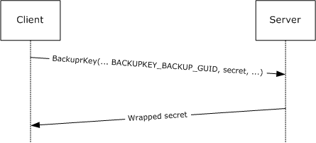

Figure 1: Server-side secret wrapping

The client then stores the wrapped secret. At a later time, when the client needs access to the secret, the client makes a request to the server as specified in section [3.1.4.1.2](#Section_3.1.4.1.2.1). This is shown in figure 2. The server performs access checks to ensure that the client is authorized to receive the secret, and if the checks are successful, the server returns the unwrapped secret. This process, including the access checking performed, is specified in section 3.1.4.1.2.

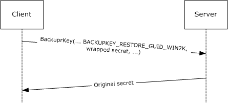

Figure 2: Recovering a server-side wrapped secret

#### 1.3.1.2 ClientWrap Subprotocol

In this subprotocol, the client first retrieves the server's [**public key**](#gt_public-key) as specified in section [3.1.4.1.3](#Section_3.1.4.1.3). This is shown in figure 3.

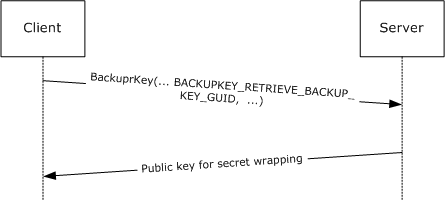

Figure 3: Retrieving the server's public key for client-side secret wrapping

The client can then use this public key to wrap any number of secrets, as specified in section [3.2.4.1](#Section_3.2.4.1). At a later time, when the client needs to access one of these secrets, the client submits the wrapped secret to the server as specified in section [3.1.4.1.4](#Section_3.1.4.1.4). This is shown in figure 4. The server then performs access checks to ensure that the client is authorized to receive the secret, and if the checks succeed, it returns the unwrapped secret. This process, including the access checking performed, is specified in section 3.1.4.1.4.

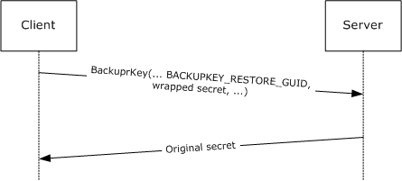

Figure 4: Recovering a client-side wrapped secret

## 1.4 Relationship to Other Protocols

The BackupKey Remote Protocol is built on the Microsoft [**Remote Procedure Call (RPC)**](#gt_remote-procedure-call-rpc) interface (as specified in [[C706]](https://go.microsoft.com/fwlink/?LinkId=89824) and [MS-RPCE](../MS-RPCE/MS-RPCE.md)). It uses the [**Server Message Block (SMB)**](#gt_server-message-block-smb) Protocol [MS-SMB](../MS-SMB/MS-SMB.md) [MS-SMB2](../MS-SMB2/MS-SMB2.md) as its [**RPC transport**](#gt_rpc-transport). Specifically, it uses named pipes over SMB ([**RPC Protocol Sequence**](#gt_rpc-protocol-sequence) **ncacn_np**) as its transport mechanism. Either version 1 or version 2 of SMB can be used. The client has to connect to the server over SMB and negotiate a version of SMB before it can access the named pipe that is the RPC [**endpoint**](#gt_endpoint) on the server.

The BackupKey Remote Protocol uses [**SPNEGO**](#gt_simple-and-protected-gss-api-negotiation-mechanism-spnego) [MS-SPNG](../MS-SPNG/MS-SPNG.md) [[RFC4178]](https://go.microsoft.com/fwlink/?LinkId=90461) to negotiate an authentication mechanism. It uses the [**authentication level**](#gt_authentication-level) and impersonation level security extensions specified in [MS-RPCE] sections 2.2.1.1.8 and 2.2.1.1.9 to pass the client's security context to the server and to prevent exposure of secrets to network eavesdroppers.

As specified in section [1.5](#Section_1.5), the BackupKey Remote protocol server has to run on a [**Domain Controller (DC)**](#gt_domain-controller-dc) in an [**Active Directory domain**](#gt_active-directory-domain). Clients use the DC Locator functionality specified in [MS-ADTS](../MS-ADTS/MS-ADTS.md) section 6.3.6 to locate a Domain Controller. The Local Security Authority (Domain Policy) Remote Protocol (as specified in [MS-LSAD](#Section_5) section 3.1.1.4) is used by the server to replicate [**wrapping**](#gt_wrapping) keys between all DCs in a domain.

## 1.5 Prerequisites/Preconditions

The BackupKey Remote Protocol is an [**RPC**](#gt_remote-procedure-call-rpc) interface and, as a result, has the prerequisites specified in [MS-RPCE](../MS-RPCE/MS-RPCE.md) as common to RPC interfaces.

The BackupKey Remote Protocol is used between clients and servers. The BackupKey Remote protocol server must run on a [**Domain Controller**](#gt_domain-controller-dc) in an [**Active Directory domain**](#gt_active-directory-domain). The client of the Backup Key RPC interface must possess credentials that are valid for authentication in the server's domain.

In order to use the BackupKey Remote Protocol, the client must first establish an [**SMB**](#gt_server-message-block-smb) session [MS-SMB](../MS-SMB/MS-SMB.md) [MS-SMB2](../MS-SMB2/MS-SMB2.md) to the [**well-known endpoint**](#gt_well-known-endpoint) on the server. The client and server must possess appropriate credentials to set up such a session and to establish a mutually authenticated RPC connection over the session.

The BackupKey Remote Protocol requires the use of secure RPC. Both client and server must support mutual authentication through the [**SPNEGO**](#gt_simple-and-protected-gss-api-negotiation-mechanism-spnego) Protocol and must support security packages that implement support for impersonation as well as packet privacy and integrity.

The server must maintain a database of all the cryptographic keys used for secret [**wrapping**](#gt_wrapping), so that it can perform the corresponding [**unwrapping**](#gt_unwrapping) operation when required. The contents of this database must be protected from disclosure, except to authorized administrators of the server. The server must either be configured with the required keys manually at startup or have a method for generating them when required. The server must also have a method of generating cryptographically strong random numbers for use as nonces in this protocol.

## 1.6 Applicability Statement

This protocol is applicable when secure storage of secrets is desired but no secure media is available and there exists a common authentication infrastructure.

## 1.7 Versioning and Capability Negotiation

This document covers versioning issues in the following areas:

- **Supported Transports**: This protocol uses the [**Server Message Block (SMB)**](#gt_server-message-block-smb) Protocol for transport, as specified in section [2.1](#Section_2.1). Either version 1 or version 2 of the SMB protocol can be used; the version is negotiated as specified in [MS-SMB2](../MS-SMB2/MS-SMB2.md) section 1.7.
- **Protocol Versions**: The only version of this protocol is 1.0.
- **Security and Authentication Methods**: Microsoft [**RPC**](#gt_remote-procedure-call-rpc) [MS-RPCE](../MS-RPCE/MS-RPCE.md), using [**Generic Security Services (GSS)**](#gt_generic-security-services-gss) [[RFC2743]](https://go.microsoft.com/fwlink/?LinkId=90378), is used to negotiate the authentication mechanism with the protocol, as specified in [MS-SPNG](../MS-SPNG/MS-SPNG.md) and [[RFC4178]](https://go.microsoft.com/fwlink/?LinkId=90461).
- **Capability Negotiation**: A client or server implementation of this protocol can support one or both of the subprotocols specified here. When a client wishes to [**wrap**](#gt_wrapping) a secret, it can perform some negotiation to discover which subprotocols are supported by the server. This negotiation is specified in section [3.2.4.1](#Section_3.2.4.1).

## 1.8 Vendor-Extensible Fields

No vendor-extensible fields are used by this protocol.

This protocol uses Win32 error codes. These values are taken from the Windows error number space defined in [MS-ERREF](../MS-ERREF/MS-ERREF.md) section 2.2. Vendors SHOULD reuse those values with their indicated meaning. Choosing any other value runs the risk of a collision in the future.

## 1.9 Standards Assignments

| Parameter | Value | Reference |
| --- | --- | --- |
| [**RPC**](#gt_remote-procedure-call-rpc) [**Well-Known Endpoints**](#gt_well-known-endpoint) | \\pipe\protected_storage, \\pipe\ntsvcs | Section [2.1](#Section_2.1) |
| RPC Interface [**UUID**](#gt_universally-unique-identifier-uuid) | {3dde7c30-165d-11d1-ab8f-00805f14db40} | Section 2.1 |

# 2 Messages

## 2.1 Transport

The client and server MUST communicate over [**RPC**](#gt_remote-procedure-call-rpc) using named pipes over the [**Server Message Block (SMB)**](#gt_server-message-block-smb) Protocol. The SMB version, capabilities, and authentication used for this connection are negotiated between the client and server when the connection is established, as specified in [MS-SMB](../MS-SMB/MS-SMB.md) and [MS-SMB2](../MS-SMB2/MS-SMB2.md).

The server MUST listen for requests on at least one of the [**well-known endpoints**](#gt_well-known-endpoint), \\pipe\protected_storage and \\pipe\ntsvcs. Server implementations SHOULD listen on the \\pipe\protected_storage [**endpoint**](#gt_endpoint)<1>, and MAY listen on \\pipe\ntsvcs<2>. All features of this protocol that are supported by a given server MUST be supported on all of the endpoints on which that server listens.

The client SHOULD attempt to connect to the \\pipe\protected_storage endpoint first, and if this fails, it SHOULD connect to the \\pipe\ntsvcs endpoint instead.<3>

The server interface MUST be identified by [**universal unique identifier (UUID)**](#gt_universally-unique-identifier-uuid) [3dde7c30-165d-11d1-ab8f-00805f14db40], version 1.0.

The server MUST use the RPC security extensions specified in [MS-RPCE](../MS-RPCE/MS-RPCE.md), in the manner specified in sections [3.1.3](../MS-RPCE/MS-RPCE.md) and [**3.1.4**](#Section_3.2.4). It MUST support the use of [**SPNEGO**](#gt_simple-and-protected-gss-api-negotiation-mechanism-spnego) [MS-SPNG](../MS-SPNG/MS-SPNG.md) [[RFC4178]](https://go.microsoft.com/fwlink/?LinkId=90461) to negotiate [**security providers**](#gt_security-provider), and it MUST register one or more security packages that can be negotiated using this protocol.<4>

## 2.2 Common Data Types

This protocol MUST instruct the [**RPC**](#gt_remote-procedure-call-rpc) runtime to perform a strict [**Network Data Representation (NDR)**](#gt_network-data-representation-ndr) data consistency check at target level 6.0 as specified in [MS-RPCE](../MS-RPCE/MS-RPCE.md) section 3.1.1.5.3.3.

This protocol MUST indicate to the RPC runtime that it is to support both the NDR and NDR64 [**transfer syntaxes**](#gt_01216ea7-ac8a-4cc8-9d19-b901bc424c09) and provide a negotiation mechanism for determining which RPC transfer syntax will be used, as specified in [MS-RPCE] section 3.3.1.5.6.

In addition to RPC base types and definitions specified in [[C706]](https://go.microsoft.com/fwlink/?LinkId=89824) and [MS-RPCE], additional data types are defined below.

### 2.2.1 Server Public Key for ClientWrap Subprotocol

This section specifies the format in which the BackupKey Remote Protocol server returns its [**public key**](#gt_public-key) to a client for client-side secret [**wrapping**](#gt_wrapping), as specified in section [3.1.4.1.3](#Section_3.1.4.1.3).

The server's public key MUST be encapsulated in a DER-encoded X.509 public key [**certificate**](#gt_certificate). For details on the X.509 certificate format, see [[X509]](https://go.microsoft.com/fwlink/?LinkId=90590) section 2 and [[RFC5280]](https://go.microsoft.com/fwlink/?LinkId=131034). DER encoding is specified in [[X690]](https://go.microsoft.com/fwlink/?LinkId=90593). The fields of the certificate MUST be populated as follows:

- The **subjectPublicKeyInfo** field MUST contain the key wrapping the server's 2,048-bit [**RSA**](#gt_rivest-shamir-adleman-rsa) public key ([[RFC8017]](https://go.microsoft.com/fwlink/?linkid=2164409)). As specified in [RFC8017], the AlgorithmIdentifier OID associated with this value MUST be set to rsaEncryption (1.2.840.113549.1.1.1).
- The **subjectUniqueID** field MUST be set to a [**GUID**](#gt_globally-unique-identifier-guid) that the server can use to uniquely identify this public key. This GUID MUST be encoded as a 16-byte binary array ([MS-DTYP](../MS-DTYP/MS-DTYP.md) section 2.3.4.2).
- The other fields of the certificate SHOULD be populated as follows:
- The **Common Name** field of the **Subject name** field SHOULD contain the name of the DNS domain assigned to the server.
- The **version** field SHOULD be set to the numeric value 2 to denote an X.509 version 3 certificate as specified in [RFC5280].
- The **serialNumber** field SHOULD be identical to the **subjectUniqueID** field.
- The **notBefore** field SHOULD be set to the date and time (as determined by the server) at which the RSA [**key pair**](#gt_3f211a0b-87e1-4884-856b-89c69c4a5d34) was generated.
- The **notAfter** field SHOULD be set to exactly 365 days after the date and time in the **notBefore** field.
- The **issuerUniqueID** field SHOULD be identical to the **subjectUniqueID** field.
- The certificate SHOULD be self-signed.

### 2.2.2 Client-Side-Wrapped Secret

The Client-Side-Wrapped_Secret structure MUST be used by the client to represent a secret wrapped using the server's [**public key**](#gt_public-key), as specified in section [3.2.4.1](#Section_3.2.4.1).

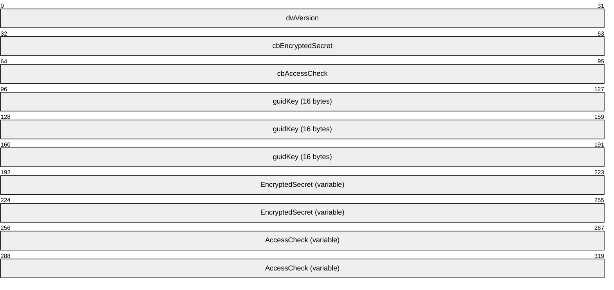

**dwVersion (4 bytes):** A 32-bit unsigned integer. This field MUST be encoded using [**little-endian**](#gt_little-endian) format. The value of this field MUST be set to one of the values in the following table.

| Value | Meaning |
| --- | --- |
| 0x00000002 | The **EncryptedSecret** and **AccessCheck** fields MUST be formatted using the version 2 formats specified in section [2.2.2.1](#Section_2.2.2.1) and section [2.2.2.3](#Section_2.2.2.3) respectively. |
| 0x00000003 | The **EncryptedSecret** and **AccessCheck** fields MUST be formatted using the version 3 formats specified in section [2.2.2.2](#Section_2.2.2.2) and section [2.2.2.4](#Section_2.2.2.4) respectively. |

**cbEncryptedSecret (4 bytes):** A 32-bit unsigned integer. It MUST be the length of the **EncryptedSecret** field, in bytes. This field is encoded using little-endian format.

**cbAccessCheck (4 bytes):** A 32-bit unsigned integer. It MUST be the length of the **AccessCheck** field, in bytes. This field is encoded using little-endian format.

**guidKey (16 bytes):** A 16-byte GUID ([MS-DTYP](../MS-DTYP/MS-DTYP.md) section 2.3.4.2) that is used by the server to uniquely identify this public key.

**EncryptedSecret (variable):** This field contains an encrypted version of the secret. Its length MUST be equal to **cbEncryptedSecret** bytes. It MUST be populated in accordance with the processing rules specified in section 3.2.4.1.

**AccessCheck (variable):** This field contains information used by the server to determine which clients are permitted to unwrap the secret. Its length MUST be equal to **cbAccessCheck** bytes. It MUST be populated in accordance with the processing rules specified in section 3.2.4.1.

#### 2.2.2.1 EncryptedSecret structure Version 2

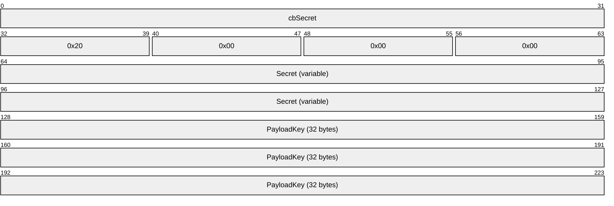

**cbSecret (4 bytes):** A 32-bit unsigned integer. It MUST be the length of the **Secret** field, in bytes. This field MUST be encoded using [**little-endian**](#gt_little-endian) format.

**Secret (variable):** This MUST contain the **cbSecret**-byte value that is being wrapped.

**PayloadKey (32 bytes):** This MUST contain the payload [**encryption**](#gt_encryption) key, consisting of three [**Data Encryption Standard (DES)**](#gt_data-encryption-standard-des) keys and an initialization vector (IV). These quantities, which are concatenated to form this field, are each 8 bytes long.

#### 2.2.2.2 EncryptedSecret Structure Version 3

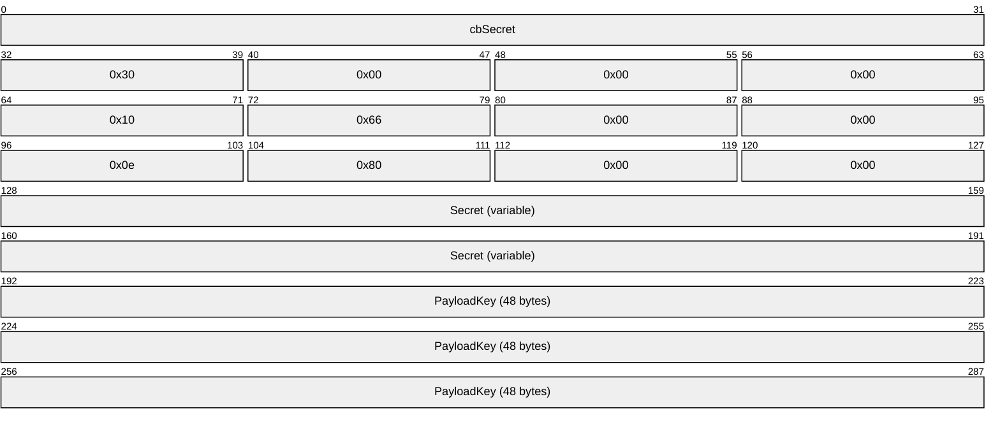

**cbSecret (4 bytes):** A 32-bit unsigned integer. It MUST be the length of the **Secret** field, in bytes. This field MUST be encoded using [**little-endian**](#gt_little-endian) format. Its value MUST be at least 51 bytes less than the length in bytes of the [**RSA**](#gt_rivest-shamir-adleman-rsa) modulus of the [**public key**](#gt_public-key) used for [**wrapping**](#gt_wrapping).

**Secret (variable):** This MUST contain the **cbSecret**-byte value that is being wrapped.

**PayloadKey (48 bytes):** This MUST contain the payload [**encryption**](#gt_encryption) key, consisting of a 256-bit [**Advanced Encryption Standard (AES)**](#gt_advanced-encryption-standard-aes) key and a 128-bit IV. These quantities are concatenated to form this field.

#### 2.2.2.3 AccessCheck Structure Version 2

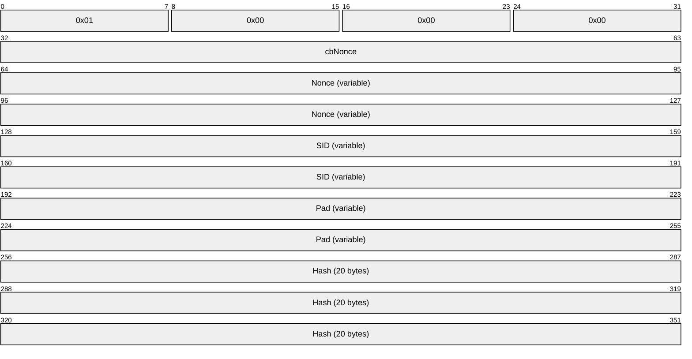

**cbNonce (4 bytes):** A 32-bit unsigned integer. It MUST be the length of **Nonce**, in bytes. This field is encoded using [**little-endian**](#gt_little-endian) format.

**Nonce (variable):** This MUST contain an arbitrary value chosen by the client, as specified in section [3.2.4.1](#Section_3.2.4.1).

**SID (variable):** This MUST be a variable-length [**SID**](#gt_security-identifier-sid), marshaled in an RPC_SID structure ([MS-DTYP](../MS-DTYP/MS-DTYP.md) section 2.4.2.3).

**Pad (variable):** This field MUST be 0 to 7 bytes long, such that the length of the AccessCheck structure is a multiple of 8 bytes.

**Hash (20 bytes):** This MUST be the [**SHA-1 hash**](#gt_sha-1-hash) [[FIPS180-2]](https://go.microsoft.com/fwlink/?LinkId=89868) computed over all the preceding fields in the AccessCheck structure.

#### 2.2.2.4 AccessCheck Structure Version 3

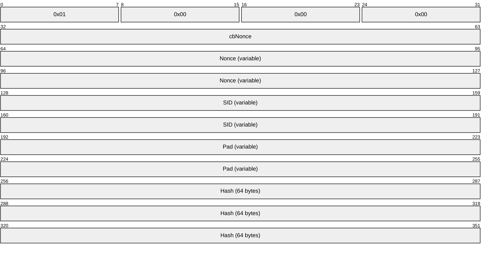

**cbNonce (4 bytes):** A 32-bit unsigned integer. It MUST be the length of **Nonce**, in bytes. This field is encoded using [**little-endian**](#gt_little-endian) format.

**Nonce (variable):** This MUST contain an arbitrary binary value, as specified in section [3.2.4.1](#Section_3.2.4.1).

**SID (variable):** This MUST be a variable-length [**SID**](#gt_security-identifier-sid), marshaled in an RPC_SID structure ([MS-DTYP](../MS-DTYP/MS-DTYP.md) section 2.4.2.3).

**Pad (variable):** This field MUST be 0 to 15 bytes long, such that the length of the AccessCheck structure is a multiple of 16 bytes.

**Hash (64 bytes):** This MUST be the SHA-512 hash [[FIPS180-2]](https://go.microsoft.com/fwlink/?LinkId=89868) computed over all the preceding fields in the AccessCheck structure.

### 2.2.3 Unwrapped Secret (ClientWrap Subprotocol Only)

When returning an unwrapped secret to a client using the [**ClientWrap subprotocol**](#gt_clientwrap-subprotocol) (section [3.1.1.2](#Section_3.1.1.2)), the server MUST embed the secret in the following structure.

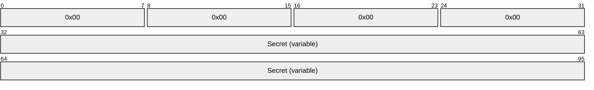

**Secret (variable):** The unwrapped secret. This field MUST be a copy of the **Secret** value originally placed in the [EncryptedSecret](#Section_2.2.2.2) (section 2.2.2.2) field during the [**wrapping**](#gt_wrapping) operation.

### 2.2.4 Secret Wrapped with Symmetric Key

The following structure MUST be used by servers to wrap a secret using the [**ServerWrap subprotocol**](#gt_serverwrap-subprotocol), as specified in section [3.1.1.1](#Section_1.3.1.1).

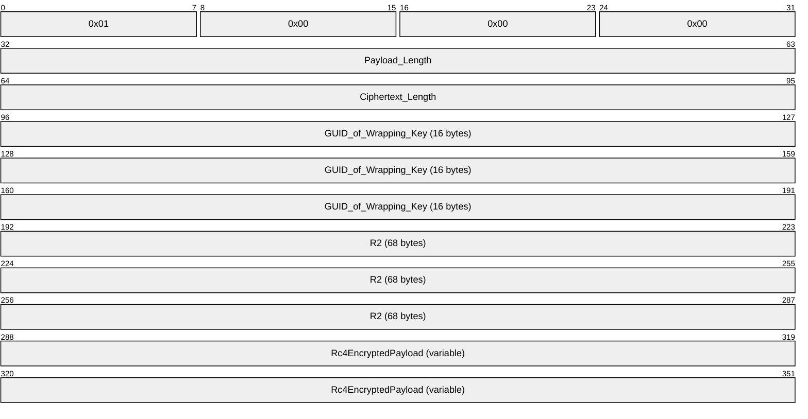

**Payload_Length (4 bytes):** A 32-bit unsigned integer. It MUST be the size, in bytes, of the **Secret** field within the [Rc4EncryptedPayload](#Section_2.2.4.1) structure. This field MUST be encoded using [**little-endian**](#gt_little-endian) format.

**Ciphertext_Length (4 bytes):** A 32-bit unsigned integer. It MUST be the size, in bytes, of the **Rc4EncryptedPayload** field. This field MUST be encoded using little-endian format.

**GUID_of_Wrapping_Key (16 bytes):** This MUST be the 16-byte [**GUID**](#gt_globally-unique-identifier-guid) ([MS-DTYP](../MS-DTYP/MS-DTYP.md) section 2.3.4.2) of the [**wrapping**](#gt_wrapping) key used by the server for this operation.

**R2 (68 bytes):** This MUST be a 68-byte random number. It SHOULD be generated independently for each wrapping operation.

**Rc4EncryptedPayload (variable):** This field MUST be an Rc4EncryptedPayload structure that is formatted as specified in section 2.2.4.1.

#### 2.2.4.1 Rc4EncryptedPayload Structure

The Rc4EncryptedPayload structure MUST consist of the following structure, encrypted as specified in section [3.1.4.1.1](#Section_3.1.4.1.1).

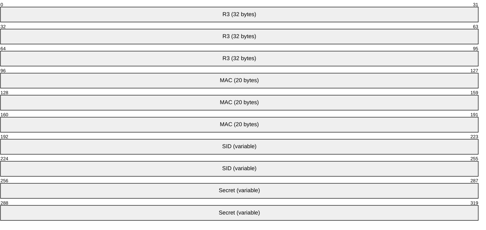

**R3 (32 bytes):** This MUST be a random number 32 bytes in length.

**MAC (20 bytes):** This MUST be a 20-byte [**SHA-1**](#gt_sha-1) [**Hash-based Message Authentication Code (HMAC)**](#gt_hash-based-message-authentication-code-hmac) [[RFC2104]](https://go.microsoft.com/fwlink/?LinkId=90314) of the **SID** and **Secret** fields, computed as specified in section 3.1.4.1.1.

**SID (variable):** This MUST be a variable-length [**SID**](#gt_security-identifier-sid), marshaled in an **RPC_SID** structure ([MS-DTYP](../MS-DTYP/MS-DTYP.md) section 2.4.2.3).

**Secret (variable):** This field MUST contain the secret to be wrapped.

### 2.2.5 ClientWrap RSA Key Pair

The following structure MUST be used to represent a 2,048-bit ClientWrap [**RSA**](#gt_rivest-shamir-adleman-rsa) [**key pair**](#gt_3f211a0b-87e1-4884-856b-89c69c4a5d34) [[RFC8017]](https://go.microsoft.com/fwlink/?linkid=2164409) that is stored and replicated between servers using the LSA (Domain Policy) Remote Protocol as specified in sections [3.1.4.1.1](#Section_3.1.4.1.1) and [3.1.4.1.3](#Section_3.1.4.1.3).

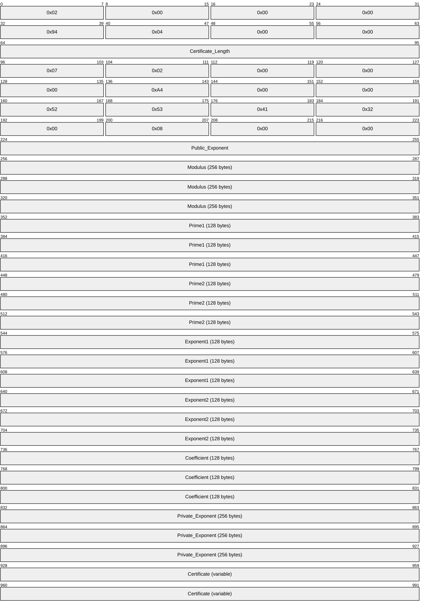

**Certificate_Length (4 bytes):** This MUST be a 32-bit unsigned number in [**little-endian**](#gt_little-endian) format, equal to the length of the **Certificate** field, in bytes.

**Public_Exponent (4 bytes):** This MUST be a 32-bit unsigned number in little-endian format. It MUST be the public exponent of the key pair, referred to as **e** in [RFC8017].

**Modulus (256 bytes):** This MUST be the RSA modulus, referred to as **n** in [RFC8017]. It MUST be equal to **Prime1 * Prime2**. It MUST be encoded in little-endian format.

**Prime1 (128 bytes):** This MUST be the first prime factor of the RSA modulus, referred to as **p** in [RFC8017]. It MUST be encoded in little-endian format.

**Prime2 (128 bytes):** This MUST be the second prime factor of the RSA modulus, referred to as **q** in [RFC8017]. It MUST be encoded in little-endian format.

**Exponent1 (128 bytes):** This MUST be the Chinese Remainder Theorem exponent of **Prime1**, referred to as **dP** in [RFC8017]. It MUST be encoded in little-endian format.

**Exponent2 (128 bytes):** This MUST be the Chinese Remainder Theorem exponent of **Prime2**, referred to as **dQ** in [RFC8017]. It MUST be encoded in little-endian format.

**Coefficient (128 bytes):** This MUST be the Chinese Remainder Coefficient of **Prime1** and **Prime2**, referred to as **qInv** in [RFC8017]. It MUST be encoded in little-endian format.

**Private_Exponent (256 bytes):** This MUST be the RSA private exponent, referred to as **d** in [RFC8017]. It MUST be encoded in little-endian format.

**Certificate (variable):** This field MUST contain the [**certificate**](#gt_certificate) for the key pair's [**public key**](#gt_public-key), formatted as specified in section [2.2.1](#Section_3.1.1.2).

### 2.2.6 Unwrapped Secret

The UnwrappedSecret structure consists of the ClientWrap secret unwrapped through the [**ServerWrap subprotocol**](#gt_serverwrap-subprotocol).

The UnwrappedSecret structure is used by the server to return the unwrapped secret to the client in some special cases, as specified in section [3.1.4.1.2](#Section_3.1.4.1.2.1).

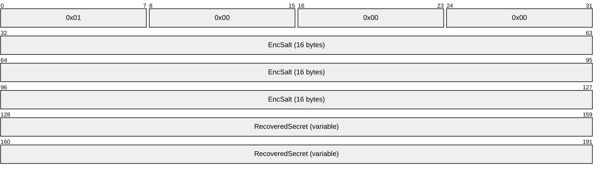

**EncSalt (16 bytes):** This MUST be a random number 16 bytes in length.

**RecoveredSecret (variable):** This field MUST contain the secret recovered by the [**unwrapping**](#gt_unwrapping) operation, formatted as specified in section [2.2.6.1](#Section_2.2.6.1).

#### 2.2.6.1 Recovered Secret Structure

The RecoveredSecret structure MUST be formatted as follows. It MUST be encrypted with the [**RC4**](#gt_rc4) algorithm as specified in section [3.1.4.1.2](#Section_3.1.4.1.2.1). For more information about RC4, see [[SCHNEIER]](https://go.microsoft.com/fwlink/?LinkId=817338) section 17.1.

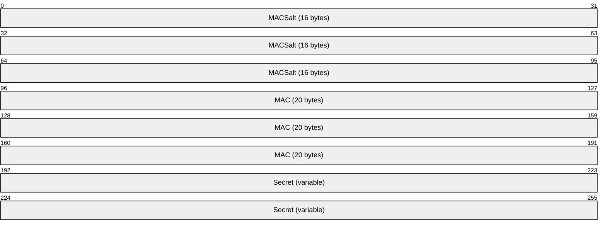

**MACSalt (16 bytes):** This MUST be a random number 16 bytes in length.

**MAC (20 bytes):** This MUST contain the [**SHA1**](#gt_sha-1-hash) [**HMAC**](#gt_hash-based-message-authentication-code-hmac) of the **Secret** field, computed as specified in section 3.1.4.1.2.

**Secret (variable):** This field MUST contain the secret recovered by the [**unwrapping**](#gt_unwrapping) operation.

### 2.2.7 ServerWrap Key

The following structure MUST be used for persisted ServerWrap keys that are stored and replicated between servers using the ServerWrap protocol as specified in sections [3.1.4.1.1](#Section_3.1.4.1.1) and [3.1.4.1.2](#Section_3.1.4.1.2.1).

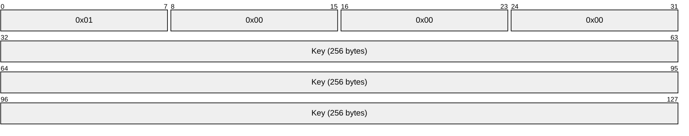

**Key (256 bytes):** The ServerWrap key.

# 3 Protocol Details

## 3.1 BackupKey Remote Server Details

A server implementation of the BackupKey Remote Protocol MUST fully support at least one of its two subprotocols, as specified in section [**3.1.4.1**](#Section_3.1.4.1). Server implementations SHOULD fully support both subprotocols. If a server supports the [**wrapping**](#gt_wrapping) operation of a subprotocol, it MUST also support the [**unwrapping**](#gt_unwrapping) operation of that subprotocol. A server MAY support the unwrapping operation of a subprotocol even if it does not support the wrapping operation.<5>

### 3.1.1 Abstract Data Model

This section describes a conceptual model of possible data organization that an implementation maintains to participate in this protocol. The described organization is provided to facilitate the explanation of how the protocol behaves. This document does not mandate that implementations adhere to this model as long as their external behavior is consistent with that described in this document.

Each of the two subprotocols has its own abstract data model, as specified in the following subsections.

#### 3.1.1.1 ServerWrap Subprotocol

**ServerWrap keys**: The server maintains a (possibly empty) set of [**symmetric keys**](#gt_symmetric-key), each identified by a unique identifier. The set of ServerWrap keys is held in persisted storage and survives system restarts. The server is assumed to have a method of looking up keys from this set based on identifier. This state is shared with the Local Security Authority (Domain Policy) Remote Protocol server (see [MS-LSAD](#Section_5)) on the same machine, as explained in sections [3.1.4.1.1](#Section_3.1.4.1.1) and [3.1.4.1.2](#Section_3.1.4.1.2.1).

**Current ServerWrap key identifier**: At any point in time, exactly one [**key pair**](#gt_3f211a0b-87e1-4884-856b-89c69c4a5d34) from the set of ServerWrap keys is designated as the current ServerWrap key, and its identifier is stored as the current ServerWrap key pair identifier. If the set of ServerWrap keys is empty, this identifier is empty as well. This identifier is held in persisted storage and survives system restarts.

#### 3.1.1.2 ClientWrap Subprotocol

**ClientWrap key pairs:** The server maintains a possibly empty set of [**RSA**](#gt_rivest-shamir-adleman-rsa) [**key pairs**](#gt_3f211a0b-87e1-4884-856b-89c69c4a5d34), each identified by a unique identifier. The [**public key**](#gt_public-key) of each pair is used for client-side secret [**wrapping**](#gt_wrapping), while the [**private key**](#gt_private-key) is used for the unwrap operation. The set of ClientWrap key pairs is held in persisted storage and survives system restarts. The server is assumed to have a method of looking up key pairs from this set based on the identifier. This state is shared with the LSA (Domain Policy) Remote Protocol server on the same machine, as explained in section [3.1.4.1.3](#Section_3.1.4.1.3) and [3.1.4.1.4](#Section_3.1.4.1.4).

**Current ClientWrap key pair identifier:** At any point in time, exactly one key pair from the set of **ClientWrap key pairs** is designated as the current ClientWrap key pair, and its identifier is stored as the current ClientWrap key pair identifier. If the set of ClientWrap key pairs is empty, then this identifier is empty as well. This identifier is held in persisted storage and survives system restarts.

### 3.1.2 Timers

None.

### 3.1.3 Initialization

The server MUST register with [**RPC**](#gt_remote-procedure-call-rpc) over [**SMB**](#gt_server-message-block-smb) named pipes ([**protocol sequence**](#gt_rpc-protocol-sequence) ncacn_np, as specified in [MS-RPCE](../MS-RPCE/MS-RPCE.md)) transport using at least one of the [**well-known endpoints**](#gt_well-known-endpoint) specified in section [1.9](#Section_1.9). Server implementations SHOULD support the \\pipe\protected_storage [**endpoint**](#gt_endpoint)<6>, and MAY support the \\pipe\ntsvcs endpoint.<7>

The server MUST indicate to the RPC runtime that it is to negotiate security contexts using the [**SPNEGO**](#gt_simple-and-protected-gss-api-negotiation-mechanism-spnego) Protocol. The server SHOULD request the RPC runtime to reject any unauthenticated connections.<8>

This protocol MUST indicate to the RPC runtime that it is to perform a strict [**NDR**](#gt_network-data-representation-ndr) data consistency check at target level 6.0, as specified in [MS-RPCE] section 3.1.1.5.3.3.

This protocol MUST indicate to the RPC runtime that it is to reject a NULL unique or full pointer with nonzero conformant value, as specified in [MS-RPCE] section 3.1.1.5.3.3.1.2.

This protocol MUST indicate to the RPC runtime via the *strict_context_handle* attribute that it is to reject use of context handles created by a method of a different RPC interface than this one, as specified in [MS-RPCE] section 3.1.1.5.3.2.2.2.

The server MUST initialize its current ClientWrap [**key pair**](#gt_3f211a0b-87e1-4884-856b-89c69c4a5d34) identifier and its set of ClientWrap key pairs from persisted storage.

### 3.1.4 Message Processing Events and Sequencing Rules

The **BackupKey** interface consists of the following method:

Methods in [**RPC**](#gt_remote-procedure-call-rpc) Opnum Order

| Method | Description |
| --- | --- |
| [**BackuprKey**](#Section_3.1.4.1) | This is the only method defined by this protocol. Opnum: 0 |

#### 3.1.4.1 BackuprKey(Opnum 0)

This section specifies the **BackuprKey** method.

NET_API_STATUS BackuprKey(

[in] handle_t h,

[in] GUID* pguidActionAgent,

[in, size_is(cbDataIn)] byte* pDataIn,

[in] DWORD cbDataIn,

[out, size_is(,*pcbDataOut)] byte** ppDataOut,

[out] DWORD* pcbDataOut,

[in] DWORD dwParam

);

**h:** This is an [**RPC**](#gt_remote-procedure-call-rpc) binding handle parameter as specified in [[C706]](https://go.microsoft.com/fwlink/?LinkId=89824) and [MS-RPCE](../MS-RPCE/MS-RPCE.md) section 2.

**pguidActionAgent:** A [**GUID**](#gt_globally-unique-identifier-guid) RPC structure, as specified in [MS-DTYP](../MS-DTYP/MS-DTYP.md) section 2.3.4. This MUST be set to one of the following values. The *BACKUPKEY_BACKUP_GUID* and *BACKUPKEY_RESTORE_GUID_WIN2K* values indicate the [**ServerWrap subprotocol**](#gt_serverwrap-subprotocol), while the *BACKUPKEY_RETRIEVE_BACKUP_KEY_GUID* and *BACKUPKEY_RESTORE_GUID* values indicate the [**ClientWrap subprotocol**](#gt_clientwrap-subprotocol). A server MUST support at least one of these subprotocols completely, and all server implementations SHOULD support all four values. In addition, if a server supports the [**wrapping**](#gt_wrapping) operation of either subprotocol, it MUST also support the corresponding unwrap operation. Thus, if a server supports *BACKUPKEY_BACKUP_GUID*, then it MUST also support *BACKUPKEY_RESTORE_GUID_WIN2K*. Similarly, if a server supports *BACKUPKEY_RETRIEVE_BACKUP_KEY_GUID*, it MUST also support *BACKUPKEY_RESTORE_GUID*.<9>

| Value | Meaning |
| --- | --- |
| BACKUPKEY_BACKUP_GUID 7F752B10-178E-11D1-AB8F-00805F14DB40 | Requests server-side wrapping. On input, *pDataIn* MUST point to a [**BLOB**](#gt_binary-large-object-blob) containing the secret to be wrapped. The server MUST treat pDataIn as opaque binary data. On output, *ppDataOut* MUST contain the wrapped secret in the format specified in section [2.2.4](#Section_2.2.4). For details, see section [3.1.4.1.1](#Section_3.1.4.1.1). |
| BACKUPKEY_RESTORE_GUID_WIN2K 7FE94D50-178E-11D1-AB8F-00805F14DB40 | Requests [**unwrapping**](#gt_unwrapping) of a server-side-wrapped secret. On input, *pDataIn* MUST point to a BLOB containing the wrapped key, in the format specified in section 2.2.4. On output, *ppDataOut* MUST contain a pointer to the unwrapped secret, as supplied by the client to the *BACKUPKEY_BACKUP_GUID* call. For details, see section [3.1.4.1.2](#Section_3.1.4.1.2.1). |
| BACKUPKEY_RETRIEVE_BACKUP_KEY_GUID 018FF48A-EABA-40C6-8F6D-72370240E967 | Requests the [**public key**](#gt_public-key) part of the server's ClientWrap [**key pair**](#gt_3f211a0b-87e1-4884-856b-89c69c4a5d34). The server MUST ignore the *pDataIn* and *cbDataIn* parameters. On output, *ppDataOut* MUST contain a pointer to the server's public key in the format specified in section [2.2.1](#Section_3.1.1.2). For details, see section [3.1.4.1.3](#Section_3.1.4.1.3). |
| BACKUPKEY_RESTORE_GUID 47270C64-2FC7-499B-AC5B-0E37CDCE899A | Request unwrapping of a secret that was client-side-wrapped with the server's public key. On input, *pDataIn* MUST point to a client-side wrapped key, formatted as specified in section [2.2.2](#Section_2.2.2). On output, *ppDataOut* MUST contain a pointer to the unwrapped secret, formatted as specified in section [2.2.3](#Section_2.2.3). For details, see section [3.1.4.1.4](#Section_3.1.4.1.4). |

**pDataIn:** This is the input data supplied by the client. Its format depends on *pguidActionAgent* as specified in this section.

**cbDataIn:** This MUST be an unsigned 32-bit integer, encoded in [**little-endian**](#gt_little-endian) format. It MUST be equal to the length, in bytes, of the data supplied in *pDataIn*.

**ppDataOut:** This is the output data returned to the client. Its format depends on *pguidActionAgent* as specified in this section.

**pcbDataOut:** This MUST be an unsigned 32-bit integer, encoded in little-endian format. It MUST be equal to the length, in bytes, of the data returned in *pDataOut*.

**dwParam:** This parameter is unused. It MUST be ignored by the server.

**Return Values:** The server MUST return 0 if it successfully processes the message received from the client, and a nonzero value otherwise.

**Exceptions Thrown:** No exceptions are thrown beyond those thrown by the underlying RPC protocol [MS-RPCE].

Upon receiving a BackuprKey message, the server MUST check the *pguidActionAgent* parameter. If the server does not support the value specified for this parameter, the server MUST return ERROR_INVALID_PARAMETER (0x57). Otherwise, the server MUST continue processing as specified in the appropriate subsection below.

##### 3.1.4.1.1 BACKUPKEY_BACKUP_GUID

The server MUST proceed as follows:

- Retrieve the current ServerWrap key identifier, which is a 16-byte [**GUID**](#gt_globally-unique-identifier-guid) stored as the value of the LSA (Domain Policy) Remote Protocol secret object named G$BCKUPKEY_P, using the method specified in [MS-LSAD](#Section_5) section 3.1.4.6.6. Let keyGuid denote this identifier. Let keyGuidString denote the [**GUIDString**](#gt_guidstring) ([MS-DTYP](../MS-DTYP/MS-DTYP.md) section 2.3.4.3) representation of keyGuid. Retrieve the value of the LSA (Domain Policy) Remote Protocol secret object named G$BCKUPKEY_keyGuidString, using the method specified in [MS-LSAD] section 3.1.4.6.6. This value is the current ServerWrap key, formatted as specified in section [2.2.7](../MS-LSAD/MS-LSAD.md). If this process succeeds, go to step 3. If no current ServerWrap key identifier exists, or the corresponding ServerWrap key cannot be located, or the ServerWrap key is not in the correct format, then create a new ServerWrap key as specified in step 2.
- Create a new ServerWrap key as follows:
- Generate 256 random bytes using a cryptographically strong random number generator, and format the result as a ServerWrap key object, specified in section 2.2.7.
- Using a cryptographically strong random number generator, generate a 16-byte GUID value. Let this value be denoted newGuid, and let its GUIDString representation ([MS-DTYP] section 2.3.4.3) be denoted newGuidString.
- Create a new LSA (Domain Policy) Remote Protocol secret object named G$BCKUPKEY_newGuidString, and set its value to the result of the first procedure in step 2, as specified in [MS-LSAD] section 3.1.4.6.5. This secret object will be stored in the domain's [**Active Directory**](#gt_active-directory) database by the LSA (Domain Policy) protocol server as specified in the first table of [MS-LSAD] section 3.1.1.4. As a consequence, this secret object will be replicated to all other [**DCs**](#gt_domain-controller-dc) in the domain by Active Directory server-to-server replication mechanisms.
- Create a new LSA (Domain Policy) Remote Protocol secret object named G$BCKUPKEY_P, and set its value to the 16-byte binary representation of newGuid, as specified in [MS-LSAD] section 3.1.4.6.5. If an LSA (Domain Policy) Remote Protocol secret object named G$BCKUPKEY_P already exists, replace its value with newGuid. This secret object will be stored in the domain's Active Directory database by the LSA (Domain Policy) protocol server as specified in the first table of [MS-LSAD] section 3.1.1.4. As a consequence, this secret object will be replicated to all other DCs in the domain by Active Directory server-to-server replication mechanisms.
- At this stage, we have the value of the current ServerWrap key. Let SrvKey denote the full length of the key, which is 256 bytes.
- Retrieve the [**SID**](#gt_security-identifier-sid) of the calling user.
- Using a cryptographically strong random number generator, generate 68 bytes of random data. We will refer to this value as R2.
- Using a cryptographically strong random number generator, generate 32 bytes of random data. We will refer to this value as R3.
- Compute the [**SHA-1**](#gt_sha-1) [**HMAC**](#gt_hash-based-message-authentication-code-hmac) [[RFC2104]](https://go.microsoft.com/fwlink/?LinkId=90314) of R2 using SrvKey (from step 3) as the HMAC key. We will refer to the resulting 20-byte value as SymKey.
- Compute the SHA-1 HMAC [RFC2104] of R3 using SrvKey (from step 3) as the HMAC key. We will refer to the resulting 20-byte value as MacKey.
- Create an Rc4EncryptedPayload structure as specified in section [2.2.4.1](#Section_2.2.4.1). Place the result of step 6 in the R3 field, the result of step 4 in the **SID** field, and the secret to be wrapped (supplied in the *pDataIn* parameter) in the **Secret** field. Compute the SHA-1 HMAC [RFC2104] of the **SID** and **Secret** fields using MacKey (computed in step 8) as the HMAC key, and place the result in the MAC field.
- Encrypt the result of step 9 using the [**RC4**](#gt_rc4) [**encryption**](#gt_encryption) algorithm ([[SCHNEIER]](https://go.microsoft.com/fwlink/?LinkId=817338) section 17.1) with SymKey (computed in step 7) as the key.
- Create a wrapped secret structure as specified in section [2.2.4](#Section_2.2.4). Set the first 4 bytes of this structure to fixed values as specified in section 2.2.4; set the **Payload_Length** field to the length of the secret, in bytes (supplied in the **cbDataIn** parameter); set the **GUID_of_Wrapping_key** field to the current ServerWrap key identifier; and set **R2** to the result of step 5. Place the result of step 10 in the **Rc4EncryptedPayload** field and its length, in bytes, in the **Ciphertext_Length** field.
- Return success (that is, zero) to the client, with the result of step 11 in the *ppDataOut* parameter and its length, in bytes, in the *pcbDataOut* parameter.

##### 3.1.4.1.2 BACKUPKEY_RESTORE_GUID_WIN2K

The server MUST first check the first four bytes of the wrapped secret passed in the *pDataIn* parameter, to see if they match the fixed values specified in section [2.2.4](#Section_2.2.4). If they match, the server MUST proceed as specified in section [3.1.4.1.2.1](#Section_3.1.4.1.2.1). If not, and the first four bytes of the wrapped secret correspond to a valid dwVersion value specified in section [2.2.2](#Section_2.2.2), then the server SHOULD<10> proceed as specified in section [3.1.4.1.2.2](#Section_3.1.4.1.2.2). In all other cases, the server MUST stop processing and return a non-zero error code.

###### 3.1.4.1.2.1 Processing a Valid ServerWrap Wrapped Secret

In this case, the wrapped secret (supplied in the *pDataIn* parameter) is assumed to be formatted as specified in section [2.2.4](#Section_2.2.4). The server MUST proceed as follows. If, at any point in processing, the value of *pDataIn* is found not to conform to the format specified in section 2.2.4, the server MUST stop processing and return a non-zero error code.

- Let keyGuid denote the value in the [**GUID**](#gt_globally-unique-identifier-guid) of Wrapping Key field in the wrapped secret, and let keyGuidString denote the [**GUIDString**](#gt_guidstring) ([MS-DTYP](../MS-DTYP/MS-DTYP.md) section 2.3.4.3) representation of keyGuid. Retrieve the value of the LSA (Domain Policy) Remote Protocol secret object named G$BCKUPKEY_keyGuidString, using the method specified in [MS-LSAD](#Section_5) section 3.1.4.6.6. This is the ServerWrap key that was used to wrap this secret. If this LSA (Domain Policy) Remote Protocol secret object is not found, or if its value is not in the format specified in section [2.2.7](../MS-DTYP/MS-DTYP.md), stop processing and return a non-zero error code to the client. The error code SHOULD be equal to ERROR_FILE_NOT_FOUND (0x2). Otherwise, let SrvKey denote the full length of the key, which is 256 bytes.
- Compute the [**SHA-1**](#gt_sha-1) [**HMAC**](#gt_hash-based-message-authentication-code-hmac) [[RFC2104]](https://go.microsoft.com/fwlink/?LinkId=90314) of the **R2** field in the wrapped secret using SrvKey (computed in step 1) as the HMAC key. Use the result as a key to decrypt the contents of the **Rc4EncryptedPayload** field in the wrapped secret, using the [**RC4**](#gt_rc4) algorithm (for more information about RC4, see [[SCHNEIER]](https://go.microsoft.com/fwlink/?LinkId=817338) section 17.1). The result will be an Rc4EncryptedPayload structure as specified in section [2.2.4.1](#Section_2.2.4.1). Let this be denoted as secretPayload.
- Extract the **R3** field of secretPayload (computed in step 2) and compute its SHA-1 HMAC [RFC2104] using SrvKey (computed in step 1) as the HMAC key. Use the result as the HMAC key to compute the SHA-1 HMAC [RFC2104] of the **SID** and **Secret** fields in secretPayload.
- Compare the result of step 3 to the MAC field of secretPayload. If the two are not identical, stop processing and return a non-zero error code. The error code SHOULD be equal to ERROR_INVALID_ACCESS (0xC).
- Obtain the [**SID**](#gt_security-identifier-sid) of the calling user, and compare it against the **SID** field of secretPayload. If the two are not identical, stop processing and return a non-zero error code. The error code SHOULD be equal to ERROR_INVALID_ACCESS (0xC).
- Return success (that is, zero) to the client, with the **Secret** field of secretPayload in the *ppDataOut* parameter, and its length in bytes in the *pcbDataOut* parameter.

###### 3.1.4.1.2.2 Processing a ClientWrap Wrapped Secret

If the server chooses to process a ClientWrap wrapped secret that was passed by the client to the BACKUPKEY_RESTORE_GUID_WIN2K interface, it MUST proceed as follows:

- Process the wrapped secret (supplied in the *pDataIn* parameter) as specified in section [3.1.4.1.4](#Section_3.1.4.1.4). If an error is encountered, stop processing and return a non-zero error code. Otherwise, proceed to step 2.
- Compute the [**SHA-1 hash**](#gt_sha-1-hash) [[FIPS180-2]](https://go.microsoft.com/fwlink/?LinkId=89868) of the **Nonce** field in the AccessCheck structure (section [2.2.2.4](#Section_2.2.2.4)). Let EnvKey denote this hash value.
- Using a cryptographically strong random number generator, generate a 16-byte random value. Call this value EncSalt.
- Using a cryptographically strong random number generator, generate a 16-byte random value. Call this value MACSalt.
- Compute the SHA1 [**HMAC**](#gt_hash-based-message-authentication-code-hmac) ([[RFC2104]](https://go.microsoft.com/fwlink/?LinkId=90314) section 2) of EncSalt (computed in step 3) with EnvKey as the HMAC key. Denote this value EncKey.
- Compute the SHA1 HMAC ([RFC2104] section 2) of MACSalt (computed in step 4) with EnvKey as the HMAC key. Denote this value MACKey.
- Compute the SHA1 HMAC ([RFC2104] section 2) of the unwrapped secret (obtained in step 1) with MACKey as the HMAC key.
- Create a Recovered Secret structure as specified in section [2.2.6.1](#Section_2.2.6.1). Place the result of step 4 in the MACSalt field, the result of step 7 in the MAC field, and the result of step 1 in the Secret field.
- Encrypt the result of step 8 with the [**RC4**](#gt_rc4) algorithm using EncKey (computed in step 5) as the [**encryption**](#gt_encryption) key. For more information on RC4, see [[SCHNEIER]](https://go.microsoft.com/fwlink/?LinkId=817338) section 17.1.
- Create an Unwrapped Secret structure as specified in section [2.2.6](#Section_2.2.6). Set the first four bytes to fixed values as specified in section 2.2.6. Place the result of step 3 in the EncSalt field and the result of step 9 in the RecoveredSecret field.
- Return success (that is, zero) to the client, with the result of step 10 in the *ppDataOut* parameter and its length in bytes in the *pcbDataOut* parameter.

##### 3.1.4.1.3 BACKUPKEY_RETRIEVE_BACKUP_KEY_GUID

The server MUST ignore the *cbDataIn* and *pDataIn* parameters. It MUST process the request as follows:

- Retrieve the current **ClientWrap key pair identifier**, which is a 16-byte [**GUID**](#gt_globally-unique-identifier-guid) stored as the value of the LSA (Domain Policy) Remote Protocol secret object named G$BCKUPKEY_PREFERRED, using the method specified in [MS-LSAD](#Section_5) section 3.1.4.6.6. Let keyGuid denote this identifier. Let keyGuidString denote the [**GUIDString**](#gt_guidstring) ([MS-DTYP](../MS-DTYP/MS-DTYP.md) section 2.3.4.3) representation of keyGuid. If no such LSA (Domain Policy) Remote Protocol secret object is found, then go to step 3.
- Retrieve the value of the LSA (Domain Policy) Remote Protocol secret object named G$BCKUPKEY_keyGuidString, using the method specified in [MS-LSAD] section 3.1.4.6.6. This value is the current **ClientWrap key pair**, formatted as specified in section [2.2.5](../MS-LSAD/MS-LSAD.md). If successful, go to step 4. If this LSA (Domain Policy) Remote Protocol secret object cannot be located, or its value is not in the correct format, then continue to step 3.
- Create a new ClientWrap key as follows:
- Generate a 2,048-bit [**RSA**](#gt_rivest-shamir-adleman-rsa) [**key pair**](#gt_3f211a0b-87e1-4884-856b-89c69c4a5d34). The structure of an RSA key pair is specified in [[RFC8017]](https://go.microsoft.com/fwlink/?linkid=2164409), and methods for generating it are specified in [[X9.31]](https://go.microsoft.com/fwlink/?LinkId=182937) section 4.1.
- Using a cryptographically strong random number generator, generate a random 16-byte GUID. Let this value be denoted newGuid, and let its GUIDString representation ([MS-DTYP] section 2.3.4.3) be denoted newGuidString.
- Create a new LSA (Domain Policy) Remote Protocol secret object named G$BCKUPKEY_newGuidString and set its value to the result of the first procedure in step 3, using the method specified in [MS-LSAD] section 3.1.4.6.5. This secret object will be stored in the domain's [**Active Directory**](#gt_active-directory) database by the LSA (Domain Policy) protocol server as specified in the first table of [MS-LSAD] section 3.1.1.4. As a consequence, this secret object will be replicated to all other [**DCs**](#gt_domain-controller-dc) in the domain by Active Directory server-to-server replication mechanisms.
- Create a new LSA (Domain Policy) Remote Protocol secret object named G$BCKUPKEY_PREFERRED and set its value to the 16-byte binary representation of newGuid, using the method specified in [MS-LSAD] section 3.1.4.6.5. If an LSA (Domain Policy) Remote Protocol secret object named G$BCKUPKEY_PREFERRED already exists, replace its value with newGuid. This secret object will be stored in the domain's Active Directory database by the LSA (Domain Policy) protocol server as specified in the first table of [MS-LSAD] section 3.1.1.4. As a consequence, this secret object will be replicated to all other DCs in the domain by Active Directory server-to-server replication mechanisms.
- Steps 2 and 3 will have yielded the current **ClientWrap key pair** in the format specified in section 2.2.5. Place the value of the **Certificate** field in the *ppDataOut* parameter and the value of the **Certificate_Length** field in the *pcbDataOut* parameter. Return success (that is, zero) to the client.

##### 3.1.4.1.4 BACKUPKEY_RESTORE_GUID

The server MUST proceed as follows:

- Check whether the first four bytes of the wrapped secret (supplied in the *pDataIn* parameter) constitute an acceptable value of the **dwVersion** field, as specified in section [2.2.2](#Section_2.2.2). If so, go to step 2. If not, the server SHOULD check if the first four bytes of the wrapped secret match the fixed values specified in section [2.2.4](#Section_2.2.4) and, if so, it SHOULD<11> proceed as specified in section [3.1.4.1.2.1](#Section_3.1.4.1.2.1). Otherwise, the server MUST return a non-zero error code. The error code returned SHOULD be equal to ERROR_INVALID_PARAMETER (0x57). The server MUST<12> support at least one of the **dwVersion** values specified in section 2.2.2.
- Interpret the wrapped secret (supplied in the *pDataIn* parameter) as a Client-Side-Wrapped Secret (section 2.2.2), extract the value in the **guidKey** field. Let keyGuid denote this value, and let keyGuidString denote the [**GUIDString**](#gt_guidstring) ([MS-DTYP](../MS-DTYP/MS-DTYP.md) section 2.3.4.3) representation of keyGuid. Retrieve the value of the LSA (Domain Policy) Remote Protocol secret object named G$BCKUPKEY_keyGuidString, using the method specified in [MS-LSAD](#Section_5) section 3.1.4.6.6. This is the ClientWrap [**key pair**](#gt_3f211a0b-87e1-4884-856b-89c69c4a5d34) that was used to wrap this secret. If this LSA (Domain Policy) Remote Protocol secret object is not found, or if its value is not in the format specified in section [2.2.5](../MS-DTYP/MS-DTYP.md), stop processing and return a non-zero error code to the client. The error code SHOULD<13> be equal to ERROR_FILE_NOT_FOUND (0x2). Otherwise, use the **Modulus** and **Private_Exponent** fields of the ClientWrap key pair to construct an [**RSA**](#gt_rivest-shamir-adleman-rsa) [**private key**](#gt_private-key), as specified in [[RFC8017]](https://go.microsoft.com/fwlink/?linkid=2164409). Let PrivKey denote this private key.
- Interpret the wrapped secret (supplied in the *pDataIn* parameter) as a Client-Side-Wrapped Secret (section 2.2.2), extract the value in the **EncryptedSecret** field. Reverse the order of bytes in this value and decrypt the result with PrivKey (computed in step 2) using the RSA algorithm with PKCS1 v1.5 padding (as specified in [RFC8017]). Let EncSecret denote the result of this decryption. If decryption fails, the server MUST return a non-zero error code. The error code returned SHOULD be equal to ERROR_INVALID_DATA (0xD).
- Using EncSecret and the value of **dwVersion** obtained in step 1, proceed as follows:
- If **dwVersion** is equal to 0x00000002, verify that EncSecret is formatted as specified in section [2.2.2.1](#Section_2.2.2.1). If so, let SecretValue denote the value of the **Secret** field and EncKey denote the value of the **PayloadKey** field. If not, the server MUST return an appropriate nonzero error code. The error code returned SHOULD be equal to ERROR_INVALID_DATA (0xD).
- If **dwVersion** is equal to 0x00000003, verify that EncSecret is formatted as specified in section [2.2.2.2](#Section_2.2.2.2). If so, let SecretValue denote the value of the **Secret** field and EncKey denote the value of the **PayloadKey** field. If not, the server MUST return an appropriate nonzero error code. The error code returned SHOULD be equal to ERROR_INVALID_DATA (0xD).
- Interpret the wrapped secret (supplied in the *pDataIn* parameter) as a Client-Side-Wrapped Secret (section 2.2.2), extract the value in the **AccessCheck** field. Using this value and the value of **dwVersion** obtained in step 1, proceed as follows:
- If **dwVersion** is equal to 0x00000002, decrypt the **AccessCheck** value using the [**3DES**](#gt_f1896d9a-34c2-44a6-917a-759ac77f4cf1) algorithm (as specified in [[SP800-67]](https://go.microsoft.com/fwlink/?LinkId=131225) section 3) with the first 24 bytes of EncKey as the key and the last 8 bytes of EncKey as the initialization vector (IV), and proceed to step 6.
- If **dwVersion** is equal to 0x00000003, decrypt the **AccessCheck** value using the [**AES**](#gt_advanced-encryption-standard-aes) algorithm (as specified in [[FIPS197]](https://go.microsoft.com/fwlink/?LinkId=89870)) with the first 32 bytes of EncKey as the key and the last 16 bytes of EncKey as the initialization vector (IV), and proceed to step 7.
- Process the result of the first procedure in step 5, as follows:
- Verify that the result of the first procedure in step 5 is in the format specified in section [2.2.2.3](#Section_2.2.2.3). If not, the server MUST return an appropriate error code. The error code returned SHOULD be equal to ERROR_INVALID_DATA (0xD).
- Compute the [**SHA-1 hash**](#gt_sha-1-hash) [[FIPS180-2]](https://go.microsoft.com/fwlink/?LinkId=89868) of the part of the structure preceding the **Hash** field, and compare the result against the value in the **Hash** field. If the values do not match, the server MUST return an appropriate nonzero error code. The error code returned SHOULD be equal to ERROR_INVALID_DATA (0xD).
- Extract the value in the **SID** field. Let this be called SecretSID. Proceed to step 8.
- Process the result of the second procedure in step 5, as follows:
- Verify that the result of the second procedure in step 5 is in the format specified in section [2.2.2.4](#Section_2.2.2.4). If not, the server MUST return an appropriate error code. The error code returned SHOULD be equal to ERROR_INVALID_DATA (0xD).
- Compute the SHA-512 hash [FIPS180-2] of the part of the structure preceding the **Hash** field, and compare the result against the value in the **Hash** field. If the values do not match, the server MUST return an appropriate nonzero error code. The error code returned SHOULD be equal to ERROR_INVALID_DATA (0xD).
- Extract the value in the **SID** field. Let this be called SecretSID. Proceed to step 8.
- Verify that the caller has access to this secret by comparing the SecretSID against the identity of the caller retrieved from the authenticated [**RPC**](#gt_remote-procedure-call-rpc) connection. If this check fails, the server MUST return an appropriate error code. The error code returned SHOULD be equal to ERROR_INVALID_ACCESS (0xC).
- Using the *ppDataOut* and *pcbDataOut* parameters successfully, return the SecretValue (computed in step 4) to the caller in the format specified by section [2.2.3](#Section_2.2.3).

### 3.1.5 Timer Events

None.

### 3.1.6 Other Local Events

The set of ServerWrap keys and the current ServerWrap key identifier, as well as the set of ClientWrap [**key pairs**](#gt_3f211a0b-87e1-4884-856b-89c69c4a5d34) and the current ClientWrap key identifier, MUST be updated as the corresponding LSA (Domain Policy) Remote Protocol secret objects (specified in section 3.1.4 and its subsections) are updated by the replication mechanisms specified in [MS-LSAD](#Section_5) section 3.1.1.4.

## 3.2 BackupKey Remote Client Details

A client implementation of the BackupKey Remote Protocol MUST support at least one of its two subprotocols, as specified in section [3.2.4.1](#Section_3.2.4.1).

### 3.2.1 Abstract Data Model

This section describes a conceptual model of possible data organization that an implementation maintains to participate in this protocol. The described organization is provided to facilitate the explanation of how the protocol behaves. This document does not mandate that implementations adhere to this model as long as their external behavior is consistent with that described in this document.

**Client secrets:** These are the client secrets that must be stored securely on potentially untrusted media. Client secrets need not have any particular format, and their structure is opaque to this protocol.

**Wrapped secrets:** These are the wrapped versions of the above client secrets. Wrapped secrets have been transformed, through either client-side [**wrapping**](#gt_wrapping) or server-side wrapping, into a form that can be securely stored on potentially untrusted media. The client is responsible for the storage of all wrapped secrets.

**ClientWrap public keys (ClientWrap subprotocol only):** These are the [**public keys**](#gt_public-key) from the server's ClientWrap [**key pair**](#gt_3f211a0b-87e1-4884-856b-89c69c4a5d34) (as specified in section [3.1.1](#Section_1.3)). They are used by the client to wrap secrets, as specified in section [3.2.4.1](#Section_3.2.4.1). Clients can choose to cache these keys locally, or to retrieve them afresh from the server for each ClientWrap wrapping operation. Each ClientWrap key is associated with an [**Active Directory domain**](#gt_active-directory-domain). A client that executes this protocol against servers in multiple domains will have one ClientWrap public key for each such domain.

### 3.2.2 Timers

None.

### 3.2.3 Initialization

None.

### 3.2.4 Message Processing Events and Sequencing Rules

The BackupKey Remote Protocol client receives requests from a higher layer, requesting a protocol operation to be executed against a specified [**Active Directory domain**](#gt_active-directory-domain) and supplying user credentials valid for authentication in that domain. Requests for client-side [**wrapping**](#gt_wrapping) of secrets MUST be processed as specified in section [3.2.4.1](#Section_3.2.4.1). All other requests MUST be passed directly to a server.

For all operations, if the client needs to connect to a server, it MUST first locate the server by using the DC Locator protocol (as specified in [MS-ADTS](../MS-ADTS/MS-ADTS.md) section 6.3.6) to locate a writable [**Domain Controller**](#gt_domain-controller-dc) in that domain. It MUST then connect to the server using the supplied user credentials, as follows. First, the client SHOULD<14> attempt to connect to the \\pipe\protected_storage [**endpoint**](#gt_endpoint) on the server. If connecting to the \\pipe\protected_storage endpoint is not attempted or if it fails, the client MUST attempt to connect to the \\pipe\ntsvcs endpoint on the same server.

The client MUST configure each [**RPC**](#gt_remote-procedure-call-rpc) connection to the server as follows:

- The client MUST indicate to the RPC runtime that it is to perform a strict [**NDR**](#gt_network-data-representation-ndr) data consistency check at target level 6.0, as specified in [MS-RPCE](../MS-RPCE/MS-RPCE.md) section 3.1.1.5.3.3.
- The client MUST indicate to the RPC runtime that it is to reject a NULL unique or full pointer with nonzero conformant value, as specified in [MS-RPCE] section 3.1.1.5.3.3.1.2.
- The client MUST instruct the RPC runtime to negotiate a security context using the [**SPNEGO**](#gt_simple-and-protected-gss-api-negotiation-mechanism-spnego) Protocol [MS-RPCE] section 2.2.1.1.7.
- The client MUST also instruct the RPC runtime to negotiate the use of the packet privacy [**authentication level**](#gt_authentication-level), which provides both message confidentiality and integrity ([MS-RPCE] section 2.2.1.1.8).<15>
- The client MUST instruct the RPC runtime to use the RPC_C_IMPL_LEVEL_IMPERSONATE impersonation level specified in [MS-RPCE] section 2.2.1.1.9.
- Finally, the client SHOULD request the RPC runtime to perform mutual authentication<16> with the server.<17>
A client MUST support at least one of these ClientWrap and [**ServerWrap subprotocols**](#gt_serverwrap-subprotocol) completely. In addition, if a client supports the wrapping operation of either subprotocol, it MUST also support calling the corresponding unwrap operation. Thus, if a client supports *BACKUPKEY_BACKUP_GUID*, it MUST also support *BACKUPKEY_RESTORE_GUID_WIN2K*. Similarly, if a client supports *BACKUPKEY_RETRIEVE_BACKUP_KEY_GUID*, it MUST also support *BACKUPKEY_RESTORE_GUID*. Client implementations SHOULD support both subprotocols completely.<18>

The client SHOULD set the *dwParam* parameter of the [**BackuprKey**](#Section_3.1.4.1) method to zero in all invocations.

The client MUST treat all server errors (that is, nonzero return codes from the server) identically. When a protocol method fails, the client MUST attempt to locate another server and repeat the same operation. If no other server can be located, or if the second server also returns an error, the client MUST return an error to the caller.

#### 3.2.4.1 Performing Client-Side Wrapping of Secrets

When requested by a higher layer to perform client-side [**wrapping**](#gt_wrapping) of a client secret against a given [**Active Directory domain**](#gt_active-directory-domain), a BackupKey Remote Protocol client that supports the [**ClientWrap subprotocol**](#gt_clientwrap-subprotocol) MUST proceed as follows.

If the client does not possess a cached copy of a ClientWrap [**public key**](#gt_public-key) of the specified domain, the client MUST locate a BackupKey server for that domain by using the DC Locator functionality as specified in [MS-ADTS](../MS-ADTS/MS-ADTS.md) section 6.3.6 to locate a writable [**domain controller**](#gt_domain-controller-dc) in that domain. It must then send a BackuprKey message to this server with the *pguidActionAgent* parameter set to *BACKUPKEY_RETRIEVE_BACKUP_KEY_GUID*. The *pDataIn* parameter SHOULD be set to NULL, and the *cbDataIn* parameter SHOULD be set to zero.

If the *BACKUPKEY_RETRIEVE_BACKUP_KEY_GUID* request fails, the client MAY attempt to perform server-side wrapping by sending a *BACKUPKEY_BACKUP_GUID* instead.<19>

If the *BACKUPKEY_RETRIEVE_BACKUP_KEY_GUID* request is successful, the client MUST validate that the data returned from the server is formatted as specified in section [2.2.1](#Section_3.1.1.2). Specifically, it MUST verify that it is able to parse out the fields listed in section 2.2.1 from the [**certificate**](#gt_certificate). If this validation fails, the client MUST discard the received data and return an error to the caller. For details on the X.509 certificate format, see [[X509]](https://go.microsoft.com/fwlink/?LinkId=90590) section 2 and [[RFC5280]](https://go.microsoft.com/fwlink/?LinkId=131034). DER encoding is specified in [[X690]](https://go.microsoft.com/fwlink/?LinkId=90593).

Having obtained the server's ClientWrap public key, the client MUST construct a wrapped secret as specified in section [2.2.2](#Section_2.2.2) by using the following procedure, and store the secret as desired.

- Select whether to use the version 2 wrapping format or the version 3 wrapping format (specified as dwVersion in section 2.2.2). Clients MUST use version 2 unless explicitly configured to use version 3.<20> If version 2 is chosen and the length of the [**RSA**](#gt_rivest-shamir-adleman-rsa) modulus of the server's ClientWrap public key does not exceed the length of the client secret by at least 51 bytes, stop processing and return an error to the caller. If version 3 is chosen and the length of the RSA modulus of the server's ClientWrap public key does not exceed the length of the client secret by at least 75 bytes, stop processing and return an error to the caller.
- Retrieve the [**SID**](#gt_security-identifier-sid) of the calling user.
- Using a cryptographically strong random number generator, generate a nonce for use in this wrapping operation. The nonce MUST be at least 32 bytes long.
- Construct a version 2 or version 3 [AccessCheck](#Section_2.2.2.4) structure (specified in section [2.2.2.3](#Section_2.2.2.3) and section 2.2.2.4 respectively) based on the choice of wrapping format in step 1. Choose the length of the **Pad** field in the AccessCheck structure such that the length of the AccessCheck structure is an integral multiple of 8 bytes. Place the result of step 2 in the **SID** field, and populate the **cbNonce** and **Nonce** fields based on the results of step 3. Fill the **Pad** field with random data, and then compute and populate the **Hash** field.
- Depending on the choice of wrapping format in step 1, generate an [**encryption**](#gt_encryption) key (denoted EncKey) and initialization vector (denoted EncIV) as follows:
- If the version 2 wrapping format was chosen, generate a [**3DES**](#gt_f1896d9a-34c2-44a6-917a-759ac77f4cf1) [[SP800-67]](https://go.microsoft.com/fwlink/?LinkId=131225) key for EncKey and a cryptographically random 8-byte value for EncIV.
- If the version 3 wrapping format was chosen, generate a 256-bit [**AES**](#gt_advanced-encryption-standard-aes) [[FIPS197]](https://go.microsoft.com/fwlink/?LinkId=89870) key for EncKey and a cryptographically random 16-byte value for EncIV.
- Based on the choice of wrapping format in step 1, encrypt the AccessCheck structure constructed in step 4 as follows:
- If the version 2 wrapping format was chosen, encrypt the AccessCheck structure using the 3DES algorithm as specified in [SP800-67], with EncKey as the key and EncIV as the initialization vector.
- If the version 3 wrapping format was chosen, encrypt the AccessCheck structure using the AES algorithm as specified in [FIPS197], with EncKey as the key and EncIV as the initialization vector.
- Construct a version 2 or version 3 [EncryptedSecret](#Section_2.2.2.2) structure (specified in section [2.2.2.1](#Section_2.2.2.1) and section 2.2.2.2 respectively) based on the choice of wrapping format in step 1. Copy the client secret to **Secret**, and copy its length to **cbSecret**. Concatenate EncKey and EncIV (generated in step 5) and place the result in the **PayloadKey** field.
- Encrypt the EncryptedSecret structure created in step 7, using the server's ClientWrap public key and using the RSA algorithm PKCS1 v1.5 padding as specified in [[RFC8017]](https://go.microsoft.com/fwlink/?linkid=2164409), and then reverse the byte order of the result.
- Construct the client-side wrapped secret as specified in section 2.2.2. Populate the **dwVersion** field based on the result of step 1, the **cbEncryptedSecret** and **EncryptedSecret** fields based on the result of step 8, and the **cbAccessCheck** and **AccessCheck** fields based on the result of step 7.
- Retrieve the [**GUID**](#gt_globally-unique-identifier-guid) of the server public key from the **SubjectUniqueID** field of the server's ClientWrap public key certificate, as specified in section 2.2.1, and place it in the **guidKey** field of the wrapped secret constructed in step 10.

### 3.2.5 Timer Events

None.

### 3.2.6 Other Local Events

None.

# 4 Protocol Examples

To illustrate the working of the BackupKey Remote Protocol, this section sketches the process used in Windows for protecting user secrets with the [**Data Protection Application Program Interface (DPAPI)**](#gt_data-protection-application-program-interface-dpapi). This example uses the [**ClientWrap subprotocol**](#gt_clientwrap-subprotocol).

The complete working of DPAPI is beyond the scope of this protocol, and more information about it is available in [[MSDN-DPAPI]](https://go.microsoft.com/fwlink/?LinkId=89993). As described in the "Key Relationships" section of [MSDN-DPAPI] and Figure 4 therein, when DPAPI is executing on behalf of an [**Active Directory domain**](#gt_active-directory-domain) user, it creates a Backup Master Key by encrypting its Master Key to a Domain Controller Key. This step is performed using the BackupKey protocol. This example illustrates DPAPI's use of this protocol in a larger context.

Consider, for example, a Windows user who logs on to a new domain-joined computer running the Windows Vista operating system for the first time and creates a new [**RSA**](#gt_rivest-shamir-adleman-rsa) [**key pair**](#gt_3f211a0b-87e1-4884-856b-89c69c4a5d34) for signing his email. This causes the DPAPI function **CryptProtectData** to be invoked to protect the [**private key**](#gt_private-key). This, in turn, causes DPAPI to generate a new Master Key and to attempt to create a Backup Master Key as described in [MSDN-DPAPI]. DPAPI then invokes the BackupKey client, passing the Master Key as the secret and requesting a ClientWrap [**wrapping**](#gt_wrapping) operation against the user's domain using the user's credentials. The BackupKey protocol client performs this operation as specified in section [3.2.4.1](#Section_3.2.4.1) and returns the result, which DPAPI stores locally.

When the user subsequently attempts to sign his email, the signing application causes the DPAPI function **CryptUnprotectData** to be invoked. Ordinarily, as described in [MSDN-DPAPI], this operation will not require the Backup Master Key, and therefore the BackupKey Remote Protocol will not be invoked.

Now assume that at some later date, the user forgets his password and has to ask the domain administrator to reset it for him. Now when he tries to sign his email, the signing application causes the DPAPI function **CryptUnprotectData** to be invoked once again. This time, DPAPI will not be able to decrypt the Encrypted Master Key ([MSDN-DPAPI] Figure 4). Therefore, DPAPI will retrieve the Backup Master Key from local storage and request the BackupKey protocol client to perform a ClientWrap [**unwrapping**](#gt_unwrapping) operation against the user's domain using the user's credentials. The BackupKey protocol client will execute this operation as specified in section [3.2.4](#Section_1.3) and return the result (that is, the DPAPI Master Key) to DPAPI. To execute this unwrapping operation, the client will invoke the **BackuprKey** method on a server with the *pguidActionAgent* parameter set to BACKUPKEY_RESTORE_GUID, and the server will process this request as specified in section [3.1.4.1.4](#Section_3.1.4.1.4). When the unwrapping operation completes successfully, DPAPI will be able to complete the **CryptUnprotectData** operation as described in [MSDN-DPAPI], and the signing application will be able to sign the user's email.

# 5 Security

## 5.1 Security Considerations for Implementers

The BackupKey server holds cryptographic keys and other material that can be used to recover all the secrets wrapped by clients of that server. These keys are therefore highly sensitive and have to be protected from both loss and disclosure. The threat model for these [**wrapping**](#gt_wrapping) keys should assume that the value of a wrapping key is the sum of the values of all secrets wrapped by it. This value varies with each deployment and has to be computed at that time. From that value, the motivation of the attacker can be deduced, and then the level of protection necessary to thwart those attacks can be estimated. For high-value assets, additional measures such as the use of a Hardware Security Module (HSM) might be warranted to protect these keys.

For guarding against key loss, the wrapping keys should themselves be backed up, mirrored, or split via threshold cryptography. The choice of mechanism is up to the implementer.

From the client's perspective, secrets wrapped by a server (or server's [**public key**](#gt_public-key)) are safe only as long as the server is trusted. This protocol must not be used to protect secrets from parties who have or can gain privileged access to the [**BackupKey**](#Section_3.1.4.1.4) server.

Any cryptographic key has to be kept secret. Any function of a secret (such as a key schedule) has to also be kept secret if the knowledge of such a function would increase an attacker's ability to discover the cryptographic key. Implementations have to be careful not to write keys or secrets directly to disk, and they should attempt to minimize the time that these are exposed in memory. Secrets and keys must not be sent in the clear over unsecured network paths.

Generation of cryptographic keys, Initial Values, nonces, and padding for PKCS#1 [**encryption**](#gt_encryption) requires randomness so that the generated quantity cannot be guessed by an attacker. A cryptographically strong random number generator is essential to the security of any cryptographic implementation. Implementers have to ensure that **BackupKey** clients and servers are running on platforms with strong random-number generators.

Guidance on building strong cryptographic subsystems is available in [[FIPS140]](https://go.microsoft.com/fwlink/?LinkId=89866). An overview of the Windows security architecture is available in [MS-WPO](#Section_1.3) section 9.

Any implementation of a protocol exposes code to inputs from attackers. Such code has to be developed according to secure coding and development practices to avoid buffer overflows, denial-of-service attacks, escalation of privilege, and disclosure of information. For more information about these concepts, secure development best practices, and common errors, see [HOWARD].

The **BackupKey** server wraps secrets for many different users and is trusted to disclose those secrets only to authorized users. Therefore, strong authentication is particularly important. The server has to authenticate the requester of each [**unwrapping**](#gt_unwrapping) and server-side wrapping operation and verify that the requester is authorized to have access to the secret being unwrapped.

Finally, both client and server have to ensure that they are communicating over a secure channel. If protocol traffic is passing over a channel that can be eavesdropped, then both client and server have to ensure that suitable security measures are in place, including the use of [**RPC**](#gt_remote-procedure-call-rpc) encryption using the packet privacy [**authentication level**](#gt_authentication-level).

## 5.2 Index of Security Parameters

| Security parameter | Section |
| --- | --- |
| Use of [**RPC**](#gt_remote-procedure-call-rpc) security | [2.1](#Section_2.1), [3.1.3](#Section_3.1.3), [3.2.4](#Section_1.3) |
| [**3DES**](#gt_f1896d9a-34c2-44a6-917a-759ac77f4cf1) [**encryption**](#gt_encryption) and key | [2.2.2](#Section_2.2.2), [2.2.2.3](#Section_2.2.2.3), [3.1.4.1.4](#Section_3.1.4.1.4), [3.2.4.1](#Section_3.2.4.1) |
| [**RC4**](#gt_rc4) key | [3.1.4.1.1](#Section_3.1.4.1.1), [3.1.4.1.2](#Section_3.1.4.1.2.1), [7](#Section_7) |
| [**RSA**](#gt_rivest-shamir-adleman-rsa) [**key pair**](#gt_3f211a0b-87e1-4884-856b-89c69c4a5d34) | [2.2.1](#Section_3.1.1.2), [2.2.5](#Section_2.2.5), [3.1.1.2](#Section_3.1.1.2), [3.1.4.1.3](#Section_3.1.4.1.3), 3.1.4.1.4, 3.2.4.1, 7 |
| Authentication | 2.1, [1.7](#Section_1.7) |
| [**SHA1**](#gt_sha-1-hash) and [**HMAC**](#gt_hash-based-message-authentication-code-hmac)-SHA1 | 2.2.2, 2.2.2.3, [2.2.4.1](#Section_2.2.4.1), 3.1.4.1.4, 3.2.4.1, 7 |
| SHA-512 | [2.2.2.4](#Section_2.2.2.4), 3.2.4.1 |
| AES Encryption and Key | 2.2.2.4, 3.1.4.1.4, 3.2.4.1 |

# 6 Appendix A: Full IDL

For ease of implementation, the full [**Interface Definition Language (IDL)**](#gt_interface-definition-language-idl) is provided below, where "ms-dtyp.idl" is the IDL specified in [MS-DTYP](../MS-DTYP/MS-DTYP.md) Appendix A. The syntax uses the IDL syntax extensions defined in [MS-RPCE](../MS-RPCE/MS-RPCE.md) sections 2.2.4 and 3.1.1.5.1. For example, as noted in [MS-RPCE] section 2.2.4.8, a pointer_default declaration is not required and `pointer_default(unique)` is assumed.

import "ms-dtyp.idl";

[

uuid(3dde7c30-165d-11d1-ab8f-00805f14db40),

version(1.0),

pointer_default(unique)

]

interface BackupKey

{

NET_API_STATUS

BackuprKey(

[in] handle_t h,

[in] GUID* pguidActionAgent,

[in, size_is(cbDataIn)] byte* pDataIn,

[in] DWORD cbDataIn,

[out, size_is(,*pcbDataOut)] byte** ppDataOut,

[out] DWORD* pcbDataOut,

[in] DWORD dwParam

);

}

# 7 Appendix B: Product Behavior

The information in this specification is applicable to the following Microsoft products or supplemental software. References to product versions include updates to those products.

The terms "earlier" and "later", when used with a product version, refer to either all preceding versions or all subsequent versions, respectively. The term "through" refers to the inclusive range of versions. Applicable Microsoft products are listed chronologically in this section.

The following tables show the relationships between Microsoft product versions or supplemental software and the roles they perform.

| Windows Client Releases | Server Role | Client Role |
| --- | --- | --- |
| Windows 2000 Professional operating system | No | Yes |
| Windows XP operating system | No | Yes |
| Windows Vista operating system | No | Yes |
| Windows 7 operating system | No | Yes |
| Windows 8 operating system | No | Yes |
| Windows 8.1 operating system | No | Yes |
| Windows 10 operating system | No | Yes |
| Windows 11 operating system | No | Yes |

| Windows Server Releases | Server Role | Client Role |
| --- | --- | --- |
| Windows 2000 Server operating system | Yes | Yes |
| Windows Server 2003 operating system | Yes | Yes |
| Windows Server 2008 operating system | Yes | Yes |
| Windows Server 2008 R2 operating system | Yes | Yes |
| Windows Server 2012 operating system | Yes | Yes |
| Windows Server 2012 R2 operating system | Yes | Yes |
| Windows Server 2016 operating system | Yes | Yes |
| Windows Server operating system | Yes | Yes |
| Windows Server 2019 operating system | Yes | Yes |
| Windows Server 2022 operating system | Yes | Yes |
| Windows Server 2025 operating system | Yes | Yes |

Exceptions, if any, are noted in this section. If an update version, service pack or Knowledge Base (KB) number appears with a product name, the behavior changed in that update. The new behavior also applies to subsequent updates unless otherwise specified. If a product edition appears with the product version, behavior is different in that product edition.

Unless otherwise specified, any statement of optional behavior in this specification that is prescribed using the terms "SHOULD" or "SHOULD NOT" implies product behavior in accordance with the SHOULD or SHOULD NOT prescription. Unless otherwise specified, the term "MAY" implies that the product does not follow the prescription.

<1> Section 2.1: Windows 2000 Server does not listen on the \\pipe\protected_storage [**endpoint**](#gt_endpoint).

<2> Section 2.1: Windows 2000 Server and Windows Server 2003 listen on the \\pipe\ntsvcs endpoint. Windows Server 2008 and later do not listen on this endpoint by default, but will do so if the second-least-significant bit of the DWORD registry value HKLM\System\CurrentControlSet\Control\ProxyType is set to 1, and the DWORD registry value HKLM\System\CurrentControlSet\Control\DisableRemoteScmEndpoints is absent or set to zero.

<3> Section 2.1: Windows 2000 operating system clients only attempt to connect to the \\pipe\ntsvcs endpoint.

<4> Section 2.1: Applicable Windows Server releases register the [**Kerberos**](#gt_kerberos) [MS-KILE](../MS-KILE/MS-KILE.md) [[RFC4120]](https://go.microsoft.com/fwlink/?LinkId=90458) and NTLM [MS-NLMP](../MS-NLMP/MS-NLMP.md) security packages for negotiation with [**SPNEGO**](#gt_simple-and-protected-gss-api-negotiation-mechanism-spnego).

<5> Section 3.1: Windows 2000 (including all service packs) does not support retrieval of the server [**public key**](#gt_public-key) using BACKUPKEY_RETRIEVE_BACKUP_KEY_GUID. However, Windows 2000 operating system Service Pack 3 (SP3) and later Windows 2000 service packs support [**unwrapping**](#gt_unwrapping) of client-side-wrapped secrets through *BACKUPKEY_RESTORE_GUID*. Microsoft Windows 2000 operating system Service Pack 2 (SP2) and earlier Windows 2000 versions do not support this operation.

<6> Section 3.1.3: Windows 2000 Server does not support the \\pipe\protected_storage endpoint.

<7> Section 3.1.3: Windows 2000 Server and Windows Server 2003 support the \\pipe\ntsvcs endpoint. Windows Server 2008 and later do not support it by default, but will do so if the second-least-significant bit of the DWORD registry value HKLM\System\CurrentControlSet\Control\ProxyType is set to "1", and the DWORD registry value HKLM\System\CurrentControlSet\Control\DisableRemoteScmEndpoints is absent or set to zero.

<8> Section 3.1.3: Windows 2000, Windows XP, and Windows Server 2003 implementations do not instruct the [**RPC**](#gt_remote-procedure-call-rpc) runtime to reject unauthenticated connections.

<9> Section 3.1.4.1: Windows 2000 does not support *BACKUPKEY_RETRIEVE_BACKUP_KEY_GUID*. However, Windows 2000 SP3 and later Windows 2000 service packs do support *BACKUPKEY_RESTORE_GUID*.

If the Domain Functional Level of the Windows domain is set to Windows 2000 Native, Windows Server 2003 and later will return an error when called with [BACKUPKEY_RETRIEVE_BACKUP_KEY_GUID](#Section_3.1.4.1.3) unless the DWORD registry value HKLM\SOFTWARE\Microsoft\Cryptography\Protect\Provider\df9d8cd0-1501-11d1-8c7a-00c04fc297eb\DistributeBackupKey is set to 0x00000001.

<10> Section 3.1.4.1.2: Windows Server 2003 and later detect whether the wrapped secret is in the client-wrapped format and, if it is, continue processing as in section [3.1.4.1.4](#Section_3.1.4.1.4).

<11> Section 3.1.4.1.4: Windows 2000, Windows 2000 operating system Service Pack 1 (SP1), and Windows 2000 operating system Service Pack 2 (SP2) do not perform this check and return an error if the wrapped secret is not in the server-wrapped format.

<12> Section 3.1.4.1.4: Windows Server 2008 and earlier support only *dwVersion* = 0x00000002. Windows Server 2008 R2 and later support both *dwVersion* = 0x00000002 and *dwVersion* = 0x00000003.

<13> Section 3.1.4.1.4: Windows Server 2008 and later return ERROR_INVALID_DATA (0x0000000D). Windows Server 2003 returns ERROR_IO_PENDING (0x000003e5).

<14> Section 3.2.4: Windows 2000 clients only attempt to connect to the \\pipe\ntsvcs endpoint.

<15> Section 3.2.4: In client versions Windows 7 operating system with Service Pack 1 (SP1) through Windows 11, version 23H2 operating system, and server versions Windows Server 2008 R2 operating system through Windows Server 2022, 23H2 operating system without [[MSFT-CVE-2023-36004]](https://go.microsoft.com/fwlink/?linkid=2255316), there is no error if the authentication level is lower than RPC_C_AUTHN_LEVEL_PKT_PRIVACY. Later and updated versions require the higher authentication level and return an error.

<16> Section 3.2.4: Windows 2000 clients do not request the use of mutual authentication.

<17> Section 3.2.4: Windows clients do not perform mutual authentication when the security context negotiated through the SPNEGO Protocol results in the use of NTLM authentication.

<18> Section 3.2.4: Windows 2000 does not support client-side [**wrapping**](#gt_wrapping).

<19> Section 3.2.4.1: The process of falling back to server-side wrapping using the *BACKUPKEY_BACKUP_GUID* when retrieval of the server's public key fails using the *BACKUPKEY_RETRIEVE_BACKUP_KEY_GUID* is no longer available by default for the operating systems specified in [[MSFT-CVE-2022-21925]](https://go.microsoft.com/fwlink/?linkid=2184936). However, the fall back to server-side wrapping can be enabled by adding a registry key designed for this purpose.

In addition, as noted earlier, Windows clients always retry failing operations once. The resulting process is as follows: The client first tries the *BACKUPKEY_RETRIEVE_BACKUP_KEY_GUID* operation, and if it fails, the client performs [**DC (2)**](#gt_domain-controller-dc) rediscovery and retries the same operation. If the retry fails, the client tries a *BACKUPKEY_BACKUP_GUID* operation. If this fails, the client performs DC rediscovery again and retries the *BACKUPKEY_BACKUP_GUID* operation. If this also fails, an error is returned to the caller.

<20> Section 3.2.4.1: Windows Vista and earlier and Windows Server 2008 and earlier always use version 2. Windows 7 and later and Windows Server 2008 R2 and later use version 2 by default but can be configured to use version 3 by setting the DWORD registry value "HKLM\Software\Microsoft\Cryptography\Protect\Providers\df9d8cd0-1501-11d1-8c7a-00c04fc297eb\Recovery Version" to 3.

# 8 Change Tracking

This section identifies changes that were made to this document since the last release. Changes are classified as Major, Minor, or None.

The revision class **Major** means that the technical content in the document was significantly revised. Major changes affect protocol interoperability or implementation. Examples of major changes are:

- A document revision that incorporates changes to interoperability requirements.
- A document revision that captures changes to protocol functionality.
The revision class **Minor** means that the meaning of the technical content was clarified. Minor changes do not affect protocol interoperability or implementation. Examples of minor changes are updates to clarify ambiguity at the sentence, paragraph, or table level.

The revision class **None** means that no new technical changes were introduced. Minor editorial and formatting changes may have been made, but the relevant technical content is identical to the last released version.

The changes made to this document are listed in the following table. For more information, please contact [dochelp@microsoft.com](mailto:dochelp@microsoft.com).

| Section | Description | Revision class |
| --- | --- | --- |
| [7](#Section_7) Appendix B: Product Behavior | Updated product applicability list. | Major |

## Revision History

| Date | Version | Revision Class | Comments |
| --- | --- | --- | --- |
| 3/2/2007 | 1.0 | Major | Updated and revised the technical content. |
| 4/3/2007 | 1.1 | Minor | Clarified the meaning of the technical content. |
| 5/11/2007 | 2.0 | Major | Updated and revised the technical content. |
| 6/1/2007 | 2.1 | Minor | Clarified the meaning of the technical content. |
| 7/3/2007 | 3.0 | Major | Changed to unified format; minor updates to technical content |
| 8/10/2007 | 4.0 | Major | Updated and revised the technical content. |
| 9/28/2007 | 5.0 | Major | Updated and revised the technical content. |
| 10/23/2007 | 5.1 | Minor | Clarified the meaning of the technical content. |
| 1/25/2008 | 5.1.1 | Editorial | Changed language and formatting in the technical content. |
| 3/14/2008 | 6.0 | Major | Major update to technical content. |
| 6/20/2008 | 7.0 | Major | Updated and revised the technical content. |
| 7/25/2008 | 7.0.1 | Editorial | Changed language and formatting in the technical content. |
| 8/29/2008 | 7.0.2 | Editorial | Changed language and formatting in the technical content. |
| 10/24/2008 | 8.0 | Major | Updated and revised the technical content. |
| 12/5/2008 | 9.0 | Major | Updated and revised the technical content. |
| 1/16/2009 | 10.0 | Major | Updated and revised the technical content. |
| 2/27/2009 | 10.0.1 | Editorial | Changed language and formatting in the technical content. |
| 4/10/2009 | 11.0 | Major | Updated and revised the technical content. |
| 5/22/2009 | 11.0.1 | Editorial | Changed language and formatting in the technical content. |
| 7/2/2009 | 11.0.2 | Editorial | Changed language and formatting in the technical content. |
| 8/14/2009 | 11.0.3 | Editorial | Changed language and formatting in the technical content. |
| 9/25/2009 | 11.1 | Minor | Clarified the meaning of the technical content. |
| 11/6/2009 | 11.1.1 | Editorial | Changed language and formatting in the technical content. |
| 12/18/2009 | 11.2 | Minor | Clarified the meaning of the technical content. |
| 1/29/2010 | 11.2.1 | Editorial | Changed language and formatting in the technical content. |
| 3/12/2010 | 12.0 | Major | Updated and revised the technical content. |
| 4/23/2010 | 12.0.1 | Editorial | Changed language and formatting in the technical content. |
| 6/4/2010 | 13.0 | Major | Updated and revised the technical content. |
| 7/16/2010 | 13.1 | Minor | Clarified the meaning of the technical content. |
| 8/27/2010 | 14.0 | Major | Updated and revised the technical content. |
| 10/8/2010 | 14.0 | None | No changes to the meaning, language, or formatting of the technical content. |
| 11/19/2010 | 15.0 | Major | Updated and revised the technical content. |
| 1/7/2011 | 15.0 | None | No changes to the meaning, language, or formatting of the technical content. |
| 2/11/2011 | 16.0 | Major | Updated and revised the technical content. |
| 3/25/2011 | 17.0 | Major | Updated and revised the technical content. |
| 5/6/2011 | 17.0 | None | No changes to the meaning, language, or formatting of the technical content. |
| 6/17/2011 | 17.1 | Minor | Clarified the meaning of the technical content. |
| 9/23/2011 | 17.1 | None | No changes to the meaning, language, or formatting of the technical content. |
| 12/16/2011 | 18.0 | Major | Updated and revised the technical content. |
| 3/30/2012 | 18.0 | None | No changes to the meaning, language, or formatting of the technical content. |
| 7/12/2012 | 18.0 | None | No changes to the meaning, language, or formatting of the technical content. |
| 10/25/2012 | 18.0 | None | No changes to the meaning, language, or formatting of the technical content. |
| 1/31/2013 | 18.0 | None | No changes to the meaning, language, or formatting of the technical content. |
| 8/8/2013 | 19.0 | Major | Updated and revised the technical content. |
| 11/14/2013 | 19.0 | None | No changes to the meaning, language, or formatting of the technical content. |
| 2/13/2014 | 19.0 | None | No changes to the meaning, language, or formatting of the technical content. |
| 5/15/2014 | 19.0 | None | No changes to the meaning, language, or formatting of the technical content. |
| 6/30/2015 | 20.0 | Major | Significantly changed the technical content. |
| 10/16/2015 | 20.0 | None | No changes to the meaning, language, or formatting of the technical content. |
| 7/14/2016 | 20.1 | Minor | Clarified the meaning of the technical content. |
| 6/1/2017 | 20.1 | None | No changes to the meaning, language, or formatting of the technical content. |
| 9/15/2017 | 21.0 | Major | Significantly changed the technical content. |
| 9/12/2018 | 22.0 | Major | Significantly changed the technical content. |
| 4/7/2021 | 23.0 | Major | Significantly changed the technical content. |
| 6/25/2021 | 24.0 | Major | Significantly changed the technical content. |
| 4/29/2022 | 25.0 | Major | Significantly changed the technical content. |
| 9/20/2023 | 25.0 | None | No changes to the meaning, language, or formatting of the technical content. |
| 12/12/2023 | 26.0 | Major | Significantly changed the technical content. |
| 4/23/2024 | 27.0 | Major | Significantly changed the technical content. |
