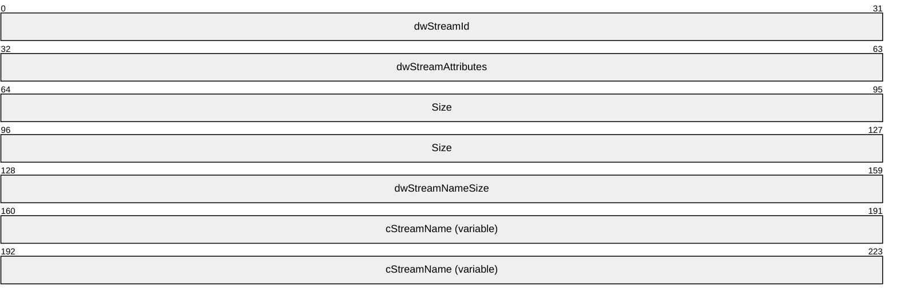
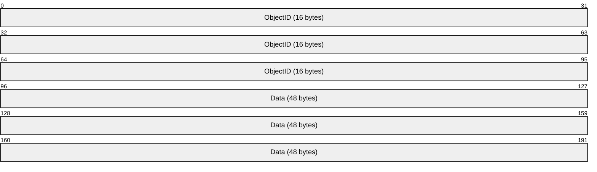
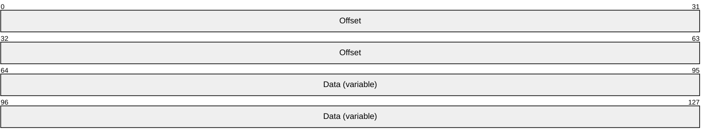
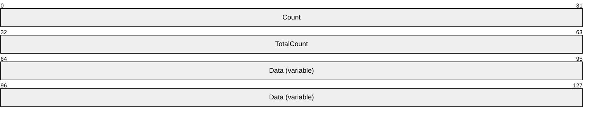
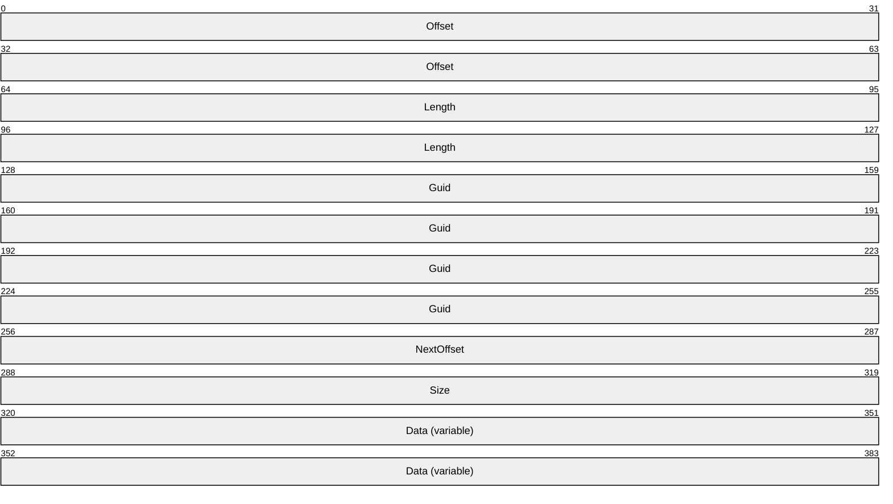
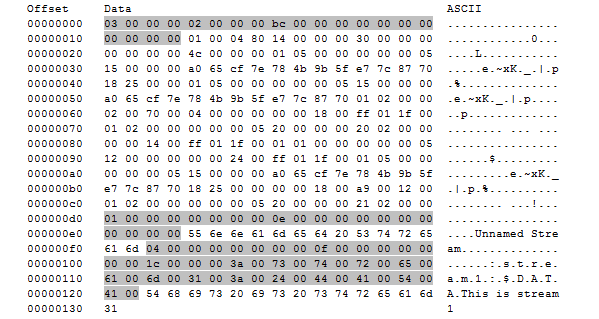

# [MS-BKUP]: Microsoft NT Backup File Structure

Table of Contents

1 Introduction

- [1 Introduction](#Section_1)
  - [1.1 Glossary](#Section_1.1)
  - [1.2 References](#Section_1.2)
    - [1.2.1 Normative References](#Section_1.2.1)
    - [1.2.2 Informative References](#Section_1.2.2)
  - [1.3 Overview](#Section_1.3)
  - [1.4 Relationship to Protocols and Other Structures](#Section_1.4)
  - [1.5 Applicability Statement](#Section_1.5)
  - [1.6 Versioning and Localization](#Section_1.6)
  - [1.7 Vendor-Extensible Fields](#Section_1.7)

2 Structures

- [2 Structures](#Section_2)
  - [2.1 NT Backup File](#Section_2.1)
  - [2.2 WIN32_STREAM_ID](#Section_2.2)
  - [2.3 Alternate Data Backup Stream Structure](#Section_2.3)
  - [2.4 Data Backup Stream Structure](#Section_2.4)
  - [2.5 Extended Attribute Data Backup Stream Structure](#Section_2.5)
  - [2.6 Link Backup Stream Structure](#Section_2.6)
  - [2.7 Object ID Backup Stream Structure](#Section_2.7)
  - [2.8 Reparse Backup Stream Structure](#Section_2.8)
  - [2.9 Security Stream Structure](#Section_2.9)
  - [2.10 Sparse Block Stream Structure](#Section_2.10)
  - [2.11 TXFS Stream Structure](#Section_2.11)
  - [2.12 FileSystem Ghosted Extents Functionality](#Section_2.12)
    - [2.12.1 Ghosted Extents Stream Structure](#Section_2.12.1)
  - [2.13 Structure Usage](#Section_2.13)
    - [2.13.1 Creating an NT Backup File](#Section_2.13.1)
    - [2.13.2 Reconstituting a File from an NT Backup File](#Section_2.13.2)

3 Structure Examples

- [3 Structure Examples](#Section_3)

4 Security Considerations

- [4 Security Considerations](#Section_4)
  - [4.1 Security Considerations for Implementers](#Section_4.1)
  - [4.2 Index of Security Parameters](#Section_4.2)

5 Appendix A: Product Behavior

- [5 Appendix A: Product Behavior](#Section_5)

6 Change Tracking

- [6 Change Tracking](#Section_6)

For the legal notice and IP terms, see [LEGAL.md](../LEGAL.md).
Last updated: 4/23/2024.
See [Revision History](#revision-history) for full version history.

# 1 Introduction

This specification describes the network format of the Windows [**NT backup file**](#gt_nt-backup-file) format and its constituent structures that can be used in other protocols.

Sections 1.7 and 2 of this specification are normative. All other sections and examples in this specification are informative.

## 1.1 Glossary

This document uses the following terms:

**access control list (ACL)**: A list of access control entries (ACEs) that collectively describe the security rules for authorizing access to some resource; for example, an object or set of objects.

**alternate stream**: See [**named stream**](#gt_named-stream).

**ASCII**: The American Standard Code for Information Interchange (ASCII) is an 8-bit character-encoding scheme based on the English alphabet. ASCII codes represent text in computers, communications equipment, and other devices that work with text. ASCII refers to a single 8-bit ASCII character or an array of 8-bit ASCII characters with the high bit of each character set to zero.

**backup stream**: The components of a Windows NT operating system backup file. It is important not to confuse a [**backup stream**](#gt_backup-stream) with a [**named stream**](#gt_named-stream). [**Backup streams**](#gt_backup-stream) are bytes within the main stream of a Windows NT backup file, while a [**named stream**](#gt_named-stream) is part of a file that is not a Windows NT backup file that requires a separate open call to access.

**FAT file system**: A file system used to organize and manage files. The file allocation table (FAT) is a data structure that the operating system creates when a volume is formatted by using FAT or [**FAT32**](#gt_fat32-file-system) file systems. The operating system stores information about each file in the FAT so that it can retrieve the file later.

**FAT32 file system**: A derivative of the file allocation table (FAT) file system. [**FAT32**](#gt_fat32-file-system) supports smaller cluster sizes and larger volumes than FAT, which results in more efficient space allocation on [**FAT32**](#gt_fat32-file-system) volumes. [**FAT32**](#gt_fat32-file-system) uses 32-bit addressing.

**file stream**: See [**main stream**](#gt_main-stream) and [**named stream**](#gt_named-stream).

**main stream**: The place within a file where data is stored or the data stored therein. A [**main stream**](#gt_main-stream) has no name. The [**main stream**](#gt_main-stream) is what is ordinarily thought of as the contents of a file.

**named stream**: A place within a file in addition to the main stream where data is stored, or the data stored therein. File systems support a mode in which it is possible to open either the main stream of a file and/or to open a [**named stream**](#gt_named-stream). [**Named streams**](#gt_named-stream) have different data than the main stream (and than each other) and can be read and written independently. Not all file systems support [**named streams**](#gt_named-stream). See also [**main stream**](#gt_main-stream).

**NT backup file**: A file that contains the representation of another file. It is made up of zero or more backup streams.

**NT file system (NTFS)**: A proprietary Microsoft file system. For more information, see [[MSFT-NTFS]](https://go.microsoft.com/fwlink/?LinkId=90200).

**Object ID**: See ObjectID.

**reparse point**: An attribute that can be added to a file to store a collection of user-defined data that is opaque to [**NTFS**](#gt_nt-file-system-ntfs) or ReFS. If a file that has a reparse point is opened, the open will normally fail with STATUS_REPARSE, so that the relevant file system filter driver can detect the open of a file associated with (owned by) this reparse point. At that point, each installed filter driver can check to see if it is the owner of the reparse point, and, if so, perform any special processing required for a file with that reparse point. The format of this data is understood by the application that stores the data and the file system filter that interprets the data and processes the file. For example, an encryption filter that is marked as the owner of a file's reparse point could look up the encryption key for that file. A file can have (at most) 1 reparse point associated with it. For more information, see [MS-FSCC](../MS-FSCC/MS-FSCC.md).

**security descriptor**: A data structure containing the security information associated with a securable object. A [**security descriptor**](#gt_security-descriptor) identifies an object's owner by its security identifier (SID). If access control is configured for the object, its [**security descriptor**](#gt_security-descriptor) contains a discretionary access control list (DACL) with SIDs for the security principals who are allowed or denied access. Applications use this structure to set and query an object's security status. The [**security descriptor**](#gt_security-descriptor) is used to guard access to an object as well as to control which type of auditing takes place when the object is accessed. The [**security descriptor**](#gt_security-descriptor) format is specified in [MS-DTYP](../MS-DTYP/MS-DTYP.md) section 2.4.6; a string representation of [**security descriptors**](#gt_security-descriptor), called SDDL, is specified in [MS-DTYP] section 2.5.1.

**serialize**: The process of taking an in-memory data structure, flat or otherwise, and turning it into a flat stream of bytes. See also marshal.

**sparse file**: A file containing large sections of data composed only of zeros. This file is marked as a sparse file in the file system, which saves disk space by only allocating as many ranges on disk as are required to completely reconstruct the non-zero data. When an attempt is made to read in the nonallocated portions of the file (also known as holes), the file system automatically returns zeros to the caller.

**staging file**: The backup of the changed file or folder. It encapsulates the data and attributes associated with a replicated file or folder. By creating the staging file, File Replication Service (FRS) ensures that file data can be supplied to partners regardless of any activity that might prevent access to the original file. The staging files can be compressed to save disk space and network bandwidth during replication.

**unnamed stream**: See [**main stream**](#gt_main-stream).

**MAY, SHOULD, MUST, SHOULD NOT, MUST NOT:** These terms (in all caps) are used as defined in [[RFC2119]](https://go.microsoft.com/fwlink/?LinkId=90317). All statements of optional behavior use either MAY, SHOULD, or SHOULD NOT.

## 1.2 References

Links to a document in the Microsoft Open Specifications library point to the correct section in the most recently published version of the referenced document. However, because individual documents in the library are not updated at the same time, the section numbers in the documents may not match. You can confirm the correct section numbering by checking the [Errata](https://go.microsoft.com/fwlink/?linkid=850906).

### 1.2.1 Normative References

We conduct frequent surveys of the normative references to assure their continued availability. If you have any issue with finding a normative reference, please contact [dochelp@microsoft.com](mailto:dochelp@microsoft.com). We will assist you in finding the relevant information.

[MS-DTYP] Microsoft Corporation, "[Windows Data Types](../MS-DTYP/MS-DTYP.md)".

[MS-FRS1] Microsoft Corporation, "[File Replication Service Protocol](../MS-FRS1/MS-FRS1.md)".

[MS-FRS2] Microsoft Corporation, "[Distributed File System Replication Protocol](../MS-FRS2/MS-FRS2.md)".

[MS-FSCC] Microsoft Corporation, "[File System Control Codes](../MS-FSCC/MS-FSCC.md)".

[RFC2119] Bradner, S., "Key words for use in RFCs to Indicate Requirement Levels", BCP 14, RFC 2119, March 1997, [https://www.rfc-editor.org/info/rfc2119](https://go.microsoft.com/fwlink/?LinkId=90317)

### 1.2.2 Informative References

[FFS] McKusick, M. K., Joy, W. N., Leffler, S. J., et al., "A Fast File System for UNIX", Computer Systems 2(3):181-197, 1984.

[MS-DLTCS] Microsoft Corporation, "[Distributed Link Tracking Central Store Protocol](../MS-DLTCS/MS-DLTCS.md)".

[MS-DLTW] Microsoft Corporation, "[Distributed Link Tracking: Workstation Protocol](../MS-DLTW/MS-DLTW.md)".

[MSFT-NTFS] Microsoft Corporation, "NTFS Technical Reference", March 2003, [http://technet2.microsoft.com/WindowsServer/en/Library/81cc8a8a-bd32-4786-a849-03245d68d8e41033.mspx](https://go.microsoft.com/fwlink/?LinkId=90200)

## 1.3 Overview

This document specifies the structure of [**NT backup files**](#gt_nt-backup-file) as they are used in over-the-wire protocols. This file format is not a protocol; however, it is used to describe the format of data that is sent across the wire as payloads of other protocols, in particular, the File Replication Service Protocol (as specified in [MS-FRS1](../MS-FRS1/MS-FRS1.md)) and the SD Microsoft Distributed File System Replication Protocol, as specified in [MS-FRS2](../MS-FRS2/MS-FRS2.md). As such, the format is specified in this document as a reference that other protocols can use to ensure consistency and accuracy. Contained in this specification are the following:

- An overview about the structure of an NT backup file.
- The definition of the [WIN32_STREAM_ID (section 2.2)](#Section_2.2) backup stream header.
- The definition of a [**backup stream**](#gt_backup-stream) that can be found within an NT backup file.
While a simple model of a file is a stream of bytes, files have become more complicated over the years. They can contain large regions of zero data, more than one stream of bytes, and special attributes such as [**reparse points**](#gt_reparse-point), as well as having [**access control lists (ACLs)**](#gt_access-control-list-acl) attached to them. In some instances, such as making a backup copy of a file or transmitting a file over a network, it is helpful to [**serialize**](#gt_serialize) the file—that is, to efficiently express a file's full complexity as a simple stream of bytes. The NT Backup format is a particular format for this serialization.

As an example, consider [**sparse files**](#gt_sparse-file). Many modern file systems, including NT File System, [**NTFS**](#gt_nt-file-system-ntfs), (as specified in [[MSFT-NTFS]](https://go.microsoft.com/fwlink/?LinkId=90200)) and many implementations based on Berkeley Fast File System support sparse files (for more information about Berkeley Fast File System, see [FFS]). In these file systems, unwritten portions of files have zero data, but they do not necessarily result in the allocation of disk space or the writing of zeros to the disk. When serializing these files, it is more efficient not to store the zero ranges in the serialize representation. Furthermore, in the case of NTFS, whether a range is allocated or unallocated is observable by the application via the FSCTL_QUERY_ALLOCATED_RANGES file system control (as specified in [MS-FSCC](../MS-FSCC/MS-FSCC.md)), so replacing unallocated ranges with simple zeros alters the semantics of the file. The NT Backup format enables such a file to be transmitted over a network or a representation of it to be stored on a file system or backup medium that lacks the richness of the original file system.

As another example, consider [**named streams**](#gt_named-stream). NTFS supports a feature wherein a file can have a number of streams with associated names, in addition to the default (unnamed) [**main stream**](#gt_main-stream). For example, the main stream of a file named a.txt might contain the bytes [**unnamed stream**](#gt_unnamed-stream), while named stream stream1, opened as a.txt:stream1, would contain "This is stream1." The NT Backup format enables serialization of any number of streams.

The content of an NT Backup serialize file is a set of backup streams. (The different uses of the word "stream" are specified in section 2.2.) Each backup stream represents one aspect of the original file, such as its ACL, a contiguous allocated section of a [**file stream**](#gt_file-stream), a reparse point, and so on.

## 1.4 Relationship to Protocols and Other Structures

The File Replication Service Protocol (as specified in [MS-FRS1](../MS-FRS1/MS-FRS1.md)) and the Distributed File System Replication Protocol (as specified in [MS-FRS2](../MS-FRS2/MS-FRS2.md)) rely on the structures and definitions in this document to create and interpret the contents of a [**staging file**](#gt_staging-file) that are sent and received across the network during file replication.

## 1.5 Applicability Statement

The structures and classes that this document defines are useful for any lower-level protocol, such as the File Replication Service Protocol (as specified in [MS-FRS1](../MS-FRS1/MS-FRS1.md)), that [**serializes**](#gt_serialize) and exchanges native Windows file formats, but does not require that those file formats be remapped into a protocol-specific representation.

## 1.6 Versioning and Localization

None.

## 1.7 Vendor-Extensible Fields

None.

# 2 Structures

The following sections specify the Microsoft NT Backup File Structure.

Unless otherwise specified, all numeric fields that this document specifies are little-endian.

Note that the word "stream" is used in two different contexts. It can indicate:

- A part of the [**NT backup file**](#gt_nt-backup-file) format.
- A place in a file where data is stored (or the actual data therein is stored, depending on the context).
To avoid confusion between these two usages, this document uses [**backup stream**](#gt_backup-stream) to indicate the portion of the NT backup file; [**file stream**](#gt_file-stream), [**main stream**](#gt_main-stream), [**named stream**](#gt_named-stream), [**unnamed stream**](#gt_unnamed-stream), and [**alternate stream**](#gt_alternate-stream) indicate the parts of a file in the file system.

The Windows NT backup file format and its constituent structures reference commonly used data types as defined in [MS-DTYP](../MS-DTYP/MS-DTYP.md).

## 2.1 NT Backup File

An [**NT backup file**](#gt_nt-backup-file) is made up of zero or more [**backup streams**](#gt_backup-stream) that appear one right after the other. A backup stream is a logically related collection of data that is related to one file. For example, the file's contents are a backup stream; its security information is a backup stream, and so on. Each backup stream in an NT backup file consists of a [WIN32_STREAM_ID (section](#Section_2.2)[2.2)](#Section_2.2) header, followed by the file-specific data for that backup stream.

An implementation that creates a backup stream for an NT backup file for use over-the-wire MUST use only the **dwStreamId** values that are specified in section 2.2 when creating a backup stream. An implementation reading an NT backup file, and then creating a file based on it, MUST fail if its **dwStreamId** value is not one of those specified in section 2.2.

If an unrecognized or unused **dwStreamId** value or an otherwise malformed NT backup file is encountered, an implementation MAY process the remainder of the NT backup file. An implementation MAY delete the portion of the file it has created upon finding a malformed NT backup file.<1>

## 2.2 WIN32_STREAM_ID

The WIN32_STREAM_ID structure is a header that precedes each [**backup stream**](#gt_backup-stream) in the [**NT backup file**](#gt_nt-backup-file). This header identifies the type of backup stream, its size, and other attributes. The structure is as follows.

**dwStreamId (4 bytes):** A 32-bit, unsigned integer that indicates the type of data in this backup stream. The value of this field MUST be one of the following.

| Value | Meaning |
| --- | --- |
| ALTERNATE_DATA 0x00000004 | Alternative data streams. |
| DATA 0x00000001 | Standard data. |
| EA_DATA 0x00000002 | Extended attribute data. |
| LINK 0x00000005 | Hard link information. |
| OBJECT_ID 0x00000007 | Object identifiers. |
| REPARSE_DATA 0x00000008 | Reparse points. |
| SECURITY_DATA 0x00000003 | Security descriptor data. |
| SPARSE_BLOCK 0x00000009 | Data in a sparse file. |
| TXFS_DATA 0x0000000A | Transactional file system. |
| GHOSTED_FILE_EXTENTS 0x0000000B | Ghosted Extents. |

**dwStreamAttributes (4 bytes):** A 32-bit, unsigned long integer that indicates properties of the backup stream. The value of this field MUST be the bitwise OR of zero or more of the following. Other bits are unused and MUST be 0 and ignored on receipt.

| Value | Meaning |
| --- | --- |
| STREAM_NORMAL_ATTRIBUTE 0x00000000 | This backup stream has no special attributes. |
| STREAM_CONTAINS_SECURITY 0x00000002 | The backup stream contains security information. This attribute applies only to backup stream of type SECURITY_DATA. |
| STREAM_SPARSE_ATTRIBUTE 0x00000008 | The backup stream is part of a sparse [**file stream**](#gt_file-stream). This attribute applies only to backup stream of type DATA, ALTERNATE_DATA, and SPARSE_BLOCK. |
| STREAM_CONTAINS_GHOSTED_FILE_EXTENTS 0x00000010 | The backup stream contains ghosted extents. This attribute applies only to backup stream of type DATA. |

**Size (8 bytes):** A 64-bit, unsigned integer that specifies the length of the data portion of the backup stream; this length MUST NOT include the length of the header. The next backup stream within the NT backup file, if any, MUST start at **Size** + **dwStreamNameSize** bytes beyond the end of this WIN32_STREAM_ID structure. Note that the alternate stream name, whose size is **dwStreamNameSize** bytes, is part of the header for the purposes of calculating the position of the next WIN32_STREAM_ID structure.

**dwStreamNameSize (4 bytes):** A 32-bit, unsigned integer that specifies the length of the alternate stream name, in bytes. The value of this field MUST be 0 for all **dwStreamId** values other than ALTERNATE_DATA. For StreamID ALTERNATE_DATA, the value of this field MUST be in the range 0–65536, and it MUST be an integral multiple of two.

**cStreamName (variable):** A Unicode string that specifies the name of the alternate stream. This string MUST NOT be null-terminated.

**Size** bytes of data MUST follow the header. The meaning of the data depends on the **dwStreamId** value and is specified in the following sections.

## 2.3 Alternate Data Backup Stream Structure

Some file systems support files that have [**named streams**](#gt_named-stream). The ALTERNATE_DATA **dwStreamId** field value MUST be used when recording these streams. Aside from the requirement that ALTERNATE_DATA MUST have a nonzero length name in the **cStreamName** field of the [WIN32_STREAM_ID (section 2.2)](#Section_2.2) structure, an ALTERNATE_DATA stream is identical to a [DATA (section 2.4)](#Section_2.4) stream. An underlying file system might constrain the naming of alternate streams. If the implementation does not support named streams or does not support the **cStreamName** that is specified in the ALTERNATE_DATA structure, the implementation MAY ignore the stream or MAY choose some other way to store the data.<2>

## 2.4 Data Backup Stream Structure

The data portion of a data [**backup stream**](#gt_backup-stream) structure is the data within the [**main stream**](#gt_main-stream) of the file. When creating a backup file, the bytes of the main stream MUST be copied without modification to the data portion of a data backup stream.

## 2.5 Extended Attribute Data Backup Stream Structure

An implementation SHOULD NOT create an extended attribute data [**backup stream**](#gt_backup-stream) in an NT Backup format file and MUST ignore an extended attribute data backup stream, if received.<3>

## 2.6 Link Backup Stream Structure

An implementation SHOULD NOT create a LINK [**backup stream**](#gt_backup-stream) and MUST ignore one if encountered.

## 2.7 Object ID Backup Stream Structure

The Object ID Backup Stream contains a unique identifier for a file. The structure of the data portion of this [**backup stream**](#gt_backup-stream) is as follows:

**ObjectID (16 bytes):** A 16-byte GUID, as specified in [MS-DTYP](../MS-DTYP/MS-DTYP.md) section 2.3.4.2, assigned by the server on which the file is stored, that uniquely identifies the file or directory within the volume in which it is stored.

**Data (48 bytes):** This field contains 48 bytes of implementation-defined metadata associated with the file.<4>

## 2.8 Reparse Backup Stream Structure

A reparse [**backup stream**](#gt_backup-stream) contains information about a [**reparse point**](#gt_reparse-point) in the file system. The data portion of a reparse point backup stream is the contents of the reparse point, which MUST be a REPARSE_DATA_BUFFER or REPARSE_GUID_DATA_BUFFER structure, as specified in [MS-FSCC](../MS-FSCC/MS-FSCC.md) sections 2.1.2.2 and [2.1.2.3](../MS-FSCC/MS-FSCC.md), respectively.

## 2.9 Security Stream Structure

The data portion of a SECURITY_DATA [**backup stream**](#gt_backup-stream) MUST contain a SECURITY_DESCRIPTOR. For more information, see [MS-DTYP](../MS-DTYP/MS-DTYP.md) section 2.4.6.

## 2.10 Sparse Block Stream Structure

A [**sparse file**](#gt_sparse-file) (or a sparse [**named stream**](#gt_named-stream)) is represented both by a [DATA](#Section_2.4) [**backup stream**](#gt_backup-stream) (or an [ALTERNATE_DATA](#Section_2.3) backup stream in the case of a named stream) followed by one or more SPARSE_BLOCK backup streams.

A SPARSE_BLOCK backup stream represents a portion of a sparse file that contains data; unallocated portions of a file are indicated by the absence of a SPARSE_BLOCK stream that describes that part of the file. The structure of the data portion of this backup stream is as follows:

**Offset (8 bytes):** An unsigned, 64-bit integer that specifies the offset within the [**file stream**](#gt_file-stream) (not in the backup stream) of the data contained in this sparse block.

**Data (variable):** The data for this allocated region of the file stream. This field MUST be of length (Size - 8), where **Size** is the value of the [WIN32_STREAM_ID](#Section_2.2) header's **Size** field that is associated with this backup stream.

An implementation SHOULD use file system sparse file support, if available, to represent the reconstituted file. Failure to do so could waste large amounts of disk space.<5>

## 2.11 TXFS Stream Structure

A TXFS [**backup stream**](#gt_backup-stream) has no meaning on a system other than the system on which it was created. An implementation MUST NOT send a TXFS stream and MUST ignore a TXFS stream, if received.

## 2.12 FileSystem Ghosted Extents Functionality

Hierarchical Storage Management (HSM) solutions on top of a filesystem remove cold data and move it to the next storage tier. This movement creates sparse holes in file system data, and HSM solutions have to maintain mappings between those sparse holes and location of the data in the new tier. An implementation of the Ghosted extents feature helps this process by maintaining some token in the sparse holes, on behalf of the HSM solution. This obviates the need for the HSM solution to maintain its own mappings. When a file with such tokens, hereby referred to as ghosted extents, is backed up, the backup process should store the tokens and their locations in the backup stream state. On restore those tokens should be reinserted in the data stream in exactly the same locations to recreate the original file state. The method to query the tokens, serialize the tokens, and restore the tokens is file system implementation specific.

### 2.12.1 Ghosted Extents Stream Structure

A ghosted extent stream structure represents ghosted extents in the DATA backup stream. Ghosted extents are a kind of sparse extents, which store a GUID representing the owner of the extent and some variable-sized metadata. The structure of the data portion of this backup stream for a specific implementation is as follows:

**Count (4 bytes)**: The number of extents in the Data portion.

**TotalCount (4 bytes):** The total number of ghosted extents in the stream.

**Data (Variable):** The data portion of the above structure contains a variable number of extents. The number of extents is given by Count. The structure of each Extent is described below:

**Offset (8 bytes):** The logical byte offset in the DATA backup stream where the ghosted extent starts.

**Length (8 bytes):** The logical length of the ghosted extent.

**GUID (16 bytes):** The GUID identifier of the owner for the ghosted extent.

**NextOffset (4 bytes):** Offset to the next Extent structure.

**Size (4 bytes):** Size of the metadata of the ghosted extent.

**Data (variable):** Metadata of the ghosted extent.

## 2.13 Structure Usage

This specification describes only the format of individual structures.

This section specifies the process of creating an [**NT backup file**](#gt_nt-backup-file) and of reconstituting an ordinary file from an NT backup file.

### 2.13.1 Creating an NT Backup File

This section specifies a process for creating an [**NT backup file**](#gt_nt-backup-file) corresponding to a given file F.

The contents of the NT backup file MUST be a number of [**backup streams**](#gt_backup-stream), with their formats specified as in section [2.2](#Section_2.2), with no padding or other bytes between them. Each backup stream MUST consist of a WIN32_STREAM_ID followed by the appropriate backup stream data.

The order of the backup streams within an NT backup file is arbitrary, except that [SPARSE_BLOCK](#Section_6be866e66d1f41838b78b10c2941228a) backup streams MUST follow the [DATA](#Section_2.4) or [ALTERNATE_DATA](#Section_2.3) backup streams for the [**file stream**](#gt_file-stream) that contains the data in the SPARSE_BLOCK backup stream.<6>

The code creating the NT backup file SHOULD generate at most one backup stream of each of the following types: DATA, OBJECT_ID, REPARSE_DATA, and SECURITY_DATA.

If the file system supports it, the code creating the NT backup file SHOULD generate a SECURITY_DATA backup stream that contains the [**security descriptor**](#gt_security-descriptor) for F.

If the file system supports it and F has an [**object ID**](#gt_object-id), the code creating the NT backup file SHOULD generate an [Object ID Backup Stream](#Section_2.7) containing it.

If the file system supports it and F has a [**reparse point**](#gt_reparse-point), then the code creating the NT backup file SHOULD generate a REPARSE_DATA backup stream containing it.

If the [**main stream**](#gt_main-stream) of F is not empty, the code that creates the NT backup file MUST generate a DATA backup stream for it. The DATA backup stream SHOULD have STREAM_SPARSE_ATTRIBUTE set if, and only if, the main stream of F is sparse. If the main stream of F is sparse, the DATA backup stream SHOULD have a **Size** of 0. If the main stream of F is not sparse, the DATA backup stream MUST contain the contents of the main stream of F.

If the main stream of F is sparse, it has any nonzero data in it, and that data is not stored in the DATA stream, the code that creates the NT backup file MUST generate one or more SPARSE_BLOCK backup streams. The set of SPARSE_BLOCKs together with the DATA backup stream MUST contain all of the nonzero data of the file. The SPARSE_BLOCKs for the DATA backup stream MUST follow the DATA backup stream and MUST NOT follow any ALTERNATE_DATA backup streams.

If F has any [**named streams**](#gt_named-stream), the code that creates the NT backup file MUST generate one ALTERNATE_DATA backup stream for each named stream in F. The ALTERNATE_DATA stream MUST have its **cStreamName** equal to that of the corresponding named stream of F. If the named stream is sparse, it MUST be treated identically to a sparse [**unnamed stream**](#gt_unnamed-stream), except that the appropriate SPARSE_BLOCKs MUST follow the ALTERNATE_DATA backup stream for this named stream and MUST precede the next ALTERNATE_DATA backup stream (if any) in the NT backup file.

If F has any ghosted extents, the NT backup file MUST generate one GHOSTED_EXTENT backup stream structure. During restore the GHOSTED_EXTENT backup stream structure is presented to the filesystem to recreate the file ghosted extent state.

### 2.13.2 Reconstituting a File from an NT Backup File

An implementation creating a file F given an [**NT backup file**](#gt_nt-backup-file) MUST process all of the [**backup streams**](#gt_backup-stream) contained within the NT backup file.

For [OBJECT_ID](#Section_2.7), [REPARSE_DATA](#Section_2.8), and [SECURITY_DATA](#Section_2.6) backup streams, it SHOULD create the corresponding [**object ID**](#gt_object-id), [**reparse point**](#gt_reparse-point), or [**security descriptor**](#gt_security-descriptor) on F, if the file system in which F resides supports those features. If there is more than one backup stream of any of these particular types (or of type [DATA](#Section_2.4)), the implementation creating F can either:

- Select any one of the backup streams of that type, or <7>
- Fail without reconstituting that stream due to the presence of more than one backup stream of that type
If the NT backup file contains a DATA backup stream, the code that creates F MUST put the data from the DATA backup stream into the [**main stream**](#gt_main-stream) of F. If any [SPARSE_BLOCK](#Section_6be866e66d1f41838b78b10c2941228a) backup streams occur in the NT backup file after the DATA backup stream and before any [ALTERNATE_DATA](#Section_2.3) backup stream, the code that creates F MUST put the data that is contained in the SPARSE_BLOCK at the specified place in F's main stream. If there are SPARSE_BLOCKs and the file system storing F has support for [**sparse files**](#gt_sparse-file), it SHOULD use the sparse file support to avoid allocating disk space for the portions of the main stream that are not described by the DATA or SPARSE_BLOCK backup stream.

If the NT backup file contains one or more ALTERNATE_DATA backup streams and the file system holding F supports ALTERNATE_DATA streams, the code that creates F SHOULD generate the appropriate [**named stream**](#gt_named-stream), using as the name the contents of the **cStreamName** field in the [WIN32_STREAM_ID](#Section_2.2) header. Processing of ALTERNATE_DATA streams MUST otherwise be identical to that of DATA streams, including the rules for SPARSE_BLOCKs.

# 3 Structure Examples

This section presents an example of serializing an input file that has two streams. The [**unnamed stream**](#gt_unnamed-stream) contains "unnamed stream" in [**ASCII**](#gt_ascii), and the alternate stream "stream1" contains "This is stream 1". This section does not show a sparse region because the [**NTFS**](#gt_nt-file-system-ntfs) file system requires sparse regions to be integral multiples of 64-KB bytes aligned on 64-KB byte boundaries, which would result in too large of an example.

This section displays dumps of file contents. These are formatted with 16 bytes per line, each byte shown in hexadecimal without the leading "0x" prefix. Each line starts with the offset, in hexadecimal from the beginning of the file of the first byte in the line. The end of each line is the bytes in the line displayed in ASCII, with unprintable characters replaced with a period (.).

The raw contents of a.txt is as follows:

Offset Data ASCII

00000000 55 6e 6e 61 6d 65 64 20 53 74 72 65 61 6d Unnamed Stream

The contents of a.txt:stream1 is:

Offset Data ASCII

00000000 54 68 69 73 20 69 73 20 73 74 72 65 61 6d 31 This is stream1

The [**serialized**](#gt_serialize) representation of a.txt is:

The [WIN32_STREAM_IDs](#Section_2.2) at the beginning of each [**backup stream**](#gt_backup-stream) are indicated by a gray background. There are three backup streams in this case: first, a [SECURITY_DATA](#Section_2.6) stream that contains the [**security descriptor**](#gt_security-descriptor) for this file; second, the [DATA](#Section_2.4) stream that contains the contents of the [**main stream**](#gt_main-stream); and third, an [ALTERNATE_DATA](#Section_2.3) stream that contains the contents of stream1. The NTFS file system reports alternate stream names as ":streamName:$DATA." This is an implementation detail of the NTFS file system and does imply that other file systems necessarily follow this stream naming convention.

# 4 Security Considerations

## 4.1 Security Considerations for Implementers

Allowing the use of all possible NT Backup [**file stream**](#gt_file-stream) types when this serialization format is used by a file transfer protocol could unexpectedly grant access to a wider range of functionality than the protocol author intended, such as creation of [**reparse points**](#gt_reparse-point) and assignment of [**security descriptors**](#gt_security-descriptor). Protocols that use these structures in a generic format can protect themselves appropriately by blocking stream types that their implementers do not want to support or stream types that they do not recognize. The latter is significant if the underlying file systems on the sending or receiving sides might be upgraded to support new functionality that was not there when the protocol was initially implemented.

Implementers of the NT Backup format have to carefully design their protocols so that attackers can not modify the contents of the [**backup streams**](#gt_backup-stream), because such modifications can lead to arbitrary changes in the restored file, including—but not limited to—changes in the contents, access control lists, or reparse information of the file.

It is also important to protect the NT Backup [**serialized**](#gt_serialize) files themselves from unauthorized modification, for the same reasons.

## 4.2 Index of Security Parameters

None.

# 5 Appendix A: Product Behavior

The information in this specification is applicable to the following Microsoft products or supplemental software. References to product versions include updates to those products.

- Windows 2000 operating system
- Windows Server 2003 operating system
- Windows Server 2008 operating system
- Windows 7 operating system
- Windows Server 2008 R2 operating system
- Windows 8 operating system
- Windows Server 2012 operating system
- Windows 8.1 operating system
- Windows Server 2012 R2 operating system
- Windows 10 operating system
- Windows Server 2016 operating system
- Windows Server operating system
- Windows Server 2019 operating system
- Windows Server 2022 operating system
- Windows 11 operating system
- Windows Server 2025 operating system
Exceptions, if any, are noted in this section. If an update version, service pack or Knowledge Base (KB) number appears with a product name, the behavior changed in that update. The new behavior also applies to subsequent updates unless otherwise specified. If a product edition appears with the product version, behavior is different in that product edition.

Unless otherwise specified, any statement of optional behavior in this specification that is prescribed using the terms "SHOULD" or "SHOULD NOT" implies product behavior in accordance with the SHOULD or SHOULD NOT prescription. Unless otherwise specified, the term "MAY" implies that the product does not follow the prescription.

<1> Section 2.1: Windows stops processing an [**NT backup file**](#gt_nt-backup-file) when it detects a malformation, but it does not delete any partially restored file information.

<2> Section 2.3: The [**NTFS**](#gt_nt-file-system-ntfs) file system supports [**named streams**](#gt_named-stream). All other Microsoft file systems such as the [**FAT file system**](#gt_fat-file-system) and the [**FAT32 file system**](#gt_fat32-file-system) do not support named streams. The NTFS file system requires that the name of each [ALTERNATE_DATA](#Section_2.3) stream in an NT backup file begin with the colon character (:). NTFS appends ":$DATA" to the name of any alternate stream that does not already end that way, so it handles a.txt:AlternateStream and a.txt:AlternateStream:$DATA identically. When restoring an NT Backup format file onto the FAT file system, Windows ignores named streams.

<3> Section 2.5: The extended attribute stream exists only in files created by Windows versions Windows NT 3.1 operating system, Windows NT 3.5 operating system and Windows NT 3.51 operating system.

<4> Section 2.7: This field contains Distributed Link Tracking information for the file, if any, if the file is stored in an NTFS file system. The first 16 bytes contain the file's birth volume ID, which is the volume on which the object resided when the [**object ID**](#gt_object-id) was created, or 0 if the volume had no object identifier at that time. The next 16 bytes contain the object ID at the time the object was created, which is required to be unique within the volume on which it was created. The next 16 bytes contain the domain ID, which is set to 0. The FILE_OBJECTID_BUFFER structure is specified in [MS-FSCC](../MS-FSCC/MS-FSCC.md) section 2.1.3. For more information about the Distributed Link Tracking Service, see [MS-DLTCS](../MS-DLTCS/MS-DLTCS.md) and [MS-DLTW](../MS-DLTW/MS-DLTW.md).

<5> Section 2.10: Windows uses [**sparse file**](#gt_sparse-file) support when writing to the NTFS file system but not to others, such as the FAT file system and the FAT32 file system.

<6> Section 2.13.1: When creating an NT backup file for use with the File Replication Service Protocol, as specified in [MS-FRS1](../MS-FRS1/MS-FRS1.md), Windows requires that the first [**backup stream**](#gt_backup-stream) in the NT backup file be of type BACKUP_SECURITY_DATA.

<7> Section 2.13.2: Windows always selects the last instance of the blocks in question for installation into F.

# 6 Change Tracking

This section identifies changes that were made to this document since the last release. Changes are classified as Major, Minor, or None.

The revision class **Major** means that the technical content in the document was significantly revised. Major changes affect protocol interoperability or implementation. Examples of major changes are:

- A document revision that incorporates changes to interoperability requirements.
- A document revision that captures changes to protocol functionality.
The revision class **Minor** means that the meaning of the technical content was clarified. Minor changes do not affect protocol interoperability or implementation. Examples of minor changes are updates to clarify ambiguity at the sentence, paragraph, or table level.

The revision class **None** means that no new technical changes were introduced. Minor editorial and formatting changes may have been made, but the relevant technical content is identical to the last released version.

The changes made to this document are listed in the following table. For more information, please contact [dochelp@microsoft.com](mailto:dochelp@microsoft.com).

| Section | Description | Revision class |
| --- | --- | --- |
| [5](#Section_5) Appendix A: Product Behavior | Added Windows Server 2025 to the list of applicable products. | Major |

## Revision History

| Date | Version | Revision Class | Comments |
| --- | --- | --- | --- |
| 3/2/2007 | 1.0 | Major | Updated and revised the technical content. |
| 4/3/2007 | 1.1 | Minor | Clarified the meaning of the technical content. |
| 5/11/2007 | 1.2 | Minor | Clarifications; Minor edits |
| 6/1/2007 | 1.3 | Minor | Clarified the meaning of the technical content. |
| 7/3/2007 | 1.3.1 | Editorial | Changed language and formatting in the technical content. |
| 8/10/2007 | 1.3.2 | Editorial | Changed language and formatting in the technical content. |
| 9/28/2007 | 1.3.3 | Editorial | Changed language and formatting in the technical content. |
| 10/23/2007 | 1.3.4 | Editorial | Changed language and formatting in the technical content. |
| 1/25/2008 | 1.3.5 | Editorial | Changed language and formatting in the technical content. |
| 3/14/2008 | 1.3.6 | Editorial | Changed language and formatting in the technical content. |
| 6/20/2008 | 2.0 | Major | Updated and revised the technical content. |
| 7/25/2008 | 2.0.1 | Editorial | Changed language and formatting in the technical content. |
| 8/29/2008 | 2.0.2 | Editorial | Changed language and formatting in the technical content. |
| 10/24/2008 | 2.0.3 | Editorial | Changed language and formatting in the technical content. |
| 12/5/2008 | 3.0 | Major | Updated and revised the technical content. |
| 1/16/2009 | 3.0.1 | Editorial | Changed language and formatting in the technical content. |
| 2/27/2009 | 3.0.2 | Editorial | Changed language and formatting in the technical content. |
| 4/10/2009 | 3.0.3 | Editorial | Changed language and formatting in the technical content. |
| 5/22/2009 | 4.0 | Major | Updated and revised the technical content. |
| 7/2/2009 | 4.0.1 | Editorial | Changed language and formatting in the technical content. |
| 8/14/2009 | 4.0.2 | Editorial | Changed language and formatting in the technical content. |
| 9/25/2009 | 4.1 | Minor | Clarified the meaning of the technical content. |
| 11/6/2009 | 4.1.1 | Editorial | Changed language and formatting in the technical content. |
| 12/18/2009 | 5.0 | Major | Updated and revised the technical content. |
| 1/29/2010 | 5.0.1 | Editorial | Changed language and formatting in the technical content. |
| 3/12/2010 | 5.0.2 | Editorial | Changed language and formatting in the technical content. |
| 4/23/2010 | 5.0.3 | Editorial | Changed language and formatting in the technical content. |
| 6/4/2010 | 5.0.4 | Editorial | Changed language and formatting in the technical content. |
| 7/16/2010 | 5.1 | Minor | Clarified the meaning of the technical content. |
| 8/27/2010 | 5.1 | None | No changes to the meaning, language, or formatting of the technical content. |
| 10/8/2010 | 5.1 | None | No changes to the meaning, language, or formatting of the technical content. |
| 11/19/2010 | 5.1 | None | No changes to the meaning, language, or formatting of the technical content. |
| 1/7/2011 | 5.1 | None | No changes to the meaning, language, or formatting of the technical content. |
| 2/11/2011 | 5.1 | None | No changes to the meaning, language, or formatting of the technical content. |
| 3/25/2011 | 5.1 | None | No changes to the meaning, language, or formatting of the technical content. |
| 5/6/2011 | 5.1 | None | No changes to the meaning, language, or formatting of the technical content. |
| 6/17/2011 | 5.2 | Minor | Clarified the meaning of the technical content. |
| 9/23/2011 | 5.2 | None | No changes to the meaning, language, or formatting of the technical content. |
| 12/16/2011 | 5.2 | None | No changes to the meaning, language, or formatting of the technical content. |
| 3/30/2012 | 5.2 | None | No changes to the meaning, language, or formatting of the technical content. |
| 7/12/2012 | 5.2 | None | No changes to the meaning, language, or formatting of the technical content. |
| 10/25/2012 | 5.2 | None | No changes to the meaning, language, or formatting of the technical content. |
| 1/31/2013 | 5.2 | None | No changes to the meaning, language, or formatting of the technical content. |
| 8/8/2013 | 6.0 | Major | Updated and revised the technical content. |
| 11/14/2013 | 6.0 | None | No changes to the meaning, language, or formatting of the technical content. |
| 2/13/2014 | 6.0 | None | No changes to the meaning, language, or formatting of the technical content. |
| 5/15/2014 | 6.0 | None | No changes to the meaning, language, or formatting of the technical content. |
| 6/30/2015 | 7.0 | Major | Significantly changed the technical content. |
| 10/16/2015 | 7.0 | None | No changes to the meaning, language, or formatting of the technical content. |
| 7/14/2016 | 7.0 | None | No changes to the meaning, language, or formatting of the technical content. |
| 6/1/2017 | 7.0 | None | No changes to the meaning, language, or formatting of the technical content. |
| 9/15/2017 | 8.0 | Major | Significantly changed the technical content. |
| 9/12/2018 | 9.0 | Major | Significantly changed the technical content. |
| 4/7/2021 | 10.0 | Major | Significantly changed the technical content. |
| 6/25/2021 | 11.0 | Major | Significantly changed the technical content. |
| 4/23/2024 | 12.0 | Major | Significantly changed the technical content. |
