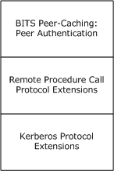
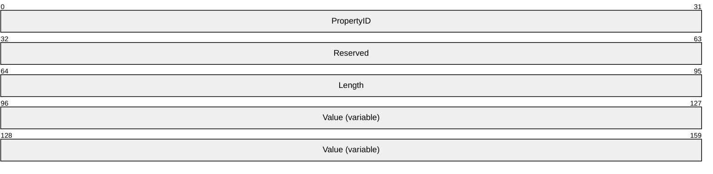
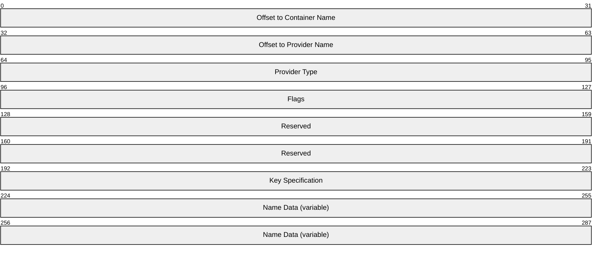
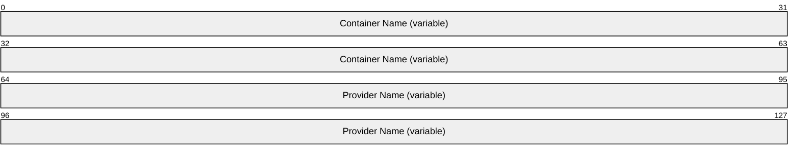

# [MS-BPAU]: Background Intelligent Transfer Service (BITS) Peer-Caching: Peer Authentication Protocol

Table of Contents

1 Introduction

- [1 Introduction](#Section_1)
  - [1.1 Glossary](#Section_1.1)
  - [1.2 References](#Section_1.2)
    - [1.2.1 Normative References](#Section_1.2.1)
    - [1.2.2 Informative References](#Section_1.2.2)
  - [1.3 Overview](#Section_1.3)
  - [1.4 Relationship to Other Protocols](#Section_1.4)
  - [1.5 Prerequisites/Preconditions](#Section_1.5)
  - [1.6 Applicability Statement](#Section_1.6)
  - [1.7 Versioning and Capability Negotiation](#Section_1.7)
  - [1.8 Vendor-Extensible Fields](#Section_1.8)
  - [1.9 Standards Assignments](#Section_1.9)

2 Messages

- [2 Messages](#Section_2)
  - [2.1 Transport](#Section_2.1)
  - [2.2 Common Data Types](#Section_2.2)
    - [2.2.1 KEY_LENGTH](#Section_2.2.1)
    - [2.2.2 CERTIFICATE_BLOB](#Section_2.2.2)
      - [2.2.2.1 Certificate Properties](#Section_2.2.2.1)
        - [2.2.2.1.1 KEY_PROV_INFO](#Section_2.2.2.1.1)
      - [2.2.2.2 Certificate Encoding](#Section_2.2.2.2)

3 Protocol Details

- [3 Protocol Details](#Section_3)
  - [3.1 BitsPeerAuth Server Details](#Section_3.1)
    - [3.1.1 Abstract Data Model](#Section_3.1.1)
      - [3.1.1.1 Local Certificate (Public)](#Section_3.1.1.1)
      - [3.1.1.2 Table of Peer Certificates](#Section_3.1.1.2)
    - [3.1.2 Timers](#Section_3.1.2)
    - [3.1.3 Initialization](#Section_3.1.3)
    - [3.1.4 Message Processing Events and Sequencing Rules](#Section_3.1.4)
      - [3.1.4.1 ExchangePublicKeys (Opnum 0)](#Section_3.1.4.1)
    - [3.1.5 Timer Events](#Section_3.1.5)
    - [3.1.6 Other Local Events](#Section_3.1.6)
      - [3.1.6.1 Verifying authentication status](#Section_3.1.6.1)
  - [3.2 BitsPeerAuth Client Details](#Section_3.2)
    - [3.2.1 Abstract Data Model](#Section_3.2.1)
      - [3.2.1.1 Local Certificate (Public)](#Section_3.2.1.1)
      - [3.2.1.2 Table of Peer Certificates](#Section_3.2.1.2)
    - [3.2.2 Timers](#Section_3.2.2)
    - [3.2.3 Initialization](#Section_3.2.3)
    - [3.2.4 Message Processing Events and Sequencing Rules](#Section_3.2.4)
      - [3.2.4.1 ExchangePublicKeys (Opnum 0)](#Section_3.2.4.1)
    - [3.2.5 Timer Events](#Section_3.2.5)
    - [3.2.6 Other Local Events](#Section_3.2.6)
      - [3.2.6.1 Verifying authentication status](#Section_3.2.6.1)

4 Protocol Examples

- [4 Protocol Examples](#Section_4)
  - [4.1 Typical Success Scenario](#Section_4.1)
  - [4.2 Typical Encoded Certificate from Windows Vista](#Section_4.2)

5 Security

- [5 Security](#Section_5)
  - [5.1 Security Considerations for Implementers](#Section_5.1)
  - [5.2 Index of Security Parameters](#Section_5.2)

6 Appendix A: Full IDL

- [6 Appendix A: Full IDL](#Section_6)

7 Appendix B: Product Behavior

- [7 Appendix B: Product Behavior](#Section_7)

8 Change Tracking

- [8 Change Tracking](#Section_8)

For the legal notice and IP terms, see [LEGAL.md](../LEGAL.md).
Last updated: 6/1/2017.
See [Revision History](#revision-history) for full version history.

# 1 Introduction

The Background Intelligent Transfer Service (BITS) Peer-Caching: Peer Authentication Protocol provides authentication for computers in a [**domain**](#gt_domain) in support of the BITS Peer-Caching: Content Retrieval Protocol, as specified in [MS-BPCR](../MS-BPCR/MS-BPCR.md). Peer authentication exchanges [**X.509**](#gt_x509) [**Certificate Authority**](#gt_certification-authority-ca) between computers and associates each [**certificate**](#gt_certificate) with a [**Kerberos principal**](#gt_kerberos-principal) in the domain.

Sections 1.5, 1.8, 1.9, 2, and 3 of this specification are normative. All other sections and examples in this specification are informative.

## 1.1 Glossary

This document uses the following terms:

**64-bit Network Data Representation (NDR64)**: A specific instance of a [**remote procedure call (RPC) transfer syntax**](#gt_rpc-transfer-syntax). For more information about [**RPC transfer syntax**](#gt_rpc-transfer-syntax), see [[C706]](https://go.microsoft.com/fwlink/?LinkId=89824) section 14.

**Active Directory**: A general-purpose network directory service. [**Active Directory**](#gt_active-directory) also refers to the Windows implementation of a directory service. [**Active Directory**](#gt_active-directory) stores information about a variety of objects in the network. Importantly, user accounts, computer accounts, groups, and all related credential information used by the Windows implementation of Kerberos are stored in [**Active Directory**](#gt_active-directory). [**Active Directory**](#gt_active-directory) is either deployed as Active Directory Domain Services (AD DS) or Active Directory Lightweight Directory Services (AD LDS). [MS-ADTS](../MS-ADTS/MS-ADTS.md) describes both forms. For more information, see [MS-AUTHSOD](../MS-AUTHSOD/MS-AUTHSOD.md) section 1.1.1.5.2, Lightweight Directory Access Protocol (LDAP) versions 2 and 3, Kerberos, and DNS.

**Active Directory domain**: A [**domain**](#gt_domain) hosted on [**Active Directory**](#gt_active-directory). For more information, see [MS-ADTS].

**certificate**: A certificate is a collection of attributes and extensions that can be stored persistently. The set of attributes in a certificate can vary depending on the intended usage of the certificate. A certificate securely binds a public key to the entity that holds the corresponding private key. A certificate is commonly used for authentication and secure exchange of information on open networks, such as the Internet, extranets, and intranets. Certificates are digitally signed by the issuing [**certification authority (CA)**](#gt_certification-authority-ca) and can be issued for a user, a computer, or a service. The most widely accepted format for certificates is defined by the ITU-T X.509 version 3 international standards. For more information about attributes and extensions, see [[RFC3280]](https://go.microsoft.com/fwlink/?LinkId=90414) and [[X509]](https://go.microsoft.com/fwlink/?LinkId=90590) sections 7 and 8.

**certification authority (CA)**: A third party that issues public key [**certificates**](#gt_certificate). Certificates serve to bind public keys to a user identity. Each user and certification authority (CA) can decide whether to trust another user or CA for a specific purpose, and whether this trust should be transitive. For more information, see [RFC3280].

**domain**: A set of users and computers sharing a common namespace and management infrastructure. At least one computer member of the set must act as a domain controller (DC) and host a member list that identifies all members of the domain, as well as optionally hosting the [**Active Directory**](#gt_active-directory) service. The domain controller provides authentication of members, creating a unit of trust for its members. Each domain has an identifier that is shared among its members. For more information, see [MS-AUTHSOD] section 1.1.1.5 and [MS-ADTS].

**domain account**: A stored set of attributes representing a principal used to authenticate a user or machine to an [**Active Directory**](#gt_active-directory) domain.

**dynamic endpoint**: A network-specific server address that is requested and assigned at run time. For more information, see [C706].

**fully qualified domain name (FQDN)**: In [**Active Directory**](#gt_active-directory), a fully qualified domain name (FQDN) that identifies a [**domain**](#gt_domain).

**Interface Definition Language (IDL)**: The International Standards Organization (ISO) standard language for specifying the interface for remote procedure calls. For more information, see [C706] section 4.

**Kerberos principal**: A unique individual account known to the Key Distribution Center (KDC). Often a user, but it can be a service offering a resource on the network.

**Network Data Representation (NDR)**: A specification that defines a mapping from [**Interface Definition Language (IDL)**](#gt_interface-definition-language-idl) data types onto octet streams. [**NDR**](#gt_network-data-representation-ndr) also refers to the runtime environment that implements the mapping facilities (for example, data provided to [**NDR**](#gt_network-data-representation-ndr)). For more information, see [MS-RPCE](../MS-RPCE/MS-RPCE.md) and [C706] section 14.

**opnum**: An operation number or numeric identifier that is used to identify a specific [**remote procedure call (RPC)**](#gt_remote-procedure-call-rpc) method or a method in an interface. For more information, see [C706] section 12.5.2.12 or [MS-RPCE].

**remote procedure call (RPC)**: A context-dependent term commonly overloaded with three meanings. Note that much of the industry literature concerning RPC technologies uses this term interchangeably for any of the three meanings. Following are the three definitions: (*) The runtime environment providing remote procedure call facilities. The preferred usage for this meaning is "RPC runtime". (*) The pattern of request and response message exchange between two parties (typically, a client and a server). The preferred usage for this meaning is "RPC exchange". (*) A single message from an exchange as defined in the previous definition. The preferred usage for this term is "RPC message". For more information about RPC, see [C706].

**RPC protocol sequence**: A character string that represents a valid combination of a [**remote procedure call (RPC)**](#gt_remote-procedure-call-rpc) protocol, a network layer protocol, and a transport layer protocol, as described in [C706] and [MS-RPCE].

**RPC transfer syntax**: A method for encoding messages defined in an Interface Definition Language (IDL) file. Remote procedure call (RPC) can support different encoding methods or transfer syntaxes. For more information, see [C706].

**security identifier (SID)**: An identifier for security principals that is used to identify an account or a group. Conceptually, the [**SID**](#gt_security-identifier-sid) is composed of an account authority portion (typically a [**domain**](#gt_domain)) and a smaller integer representing an identity relative to the account authority, termed the relative identifier (RID). The [**SID**](#gt_security-identifier-sid) format is specified in [MS-DTYP](../MS-DTYP/MS-DTYP.md) section 2.4.2; a string representation of [**SIDs**](#gt_security-identifier-sid) is specified in [MS-DTYP] section 2.4.2 and [MS-AZOD](../MS-AZOD/MS-AZOD.md) section 1.1.1.2.

**security provider**: A pluggable security module that is specified by the protocol layer above the [**remote procedure call (RPC)**](#gt_remote-procedure-call-rpc) layer, and will cause the [**RPC**](#gt_remote-procedure-call-rpc) layer to use this module to secure messages in a communication session with the server. The security provider is sometimes referred to as an authentication service. For more information, see [C706] and [MS-RPCE].

**self-signed certificate**: A [**certificate**](#gt_certificate) that is signed by its creator and verified using the public key contained in it. Such certificates are also termed root certificates.

**Unicode string**: A Unicode 8-bit string is an ordered sequence of 8-bit units, a Unicode 16-bit string is an ordered sequence of 16-bit code units, and a Unicode 32-bit string is an ordered sequence of 32-bit code units. In some cases, it could be acceptable not to terminate with a terminating null character. Unless otherwise specified, all [**Unicode strings**](#gt_unicode-string) follow the UTF-16LE encoding scheme with no Byte Order Mark (BOM).

**universally unique identifier (UUID)**: A 128-bit value. UUIDs can be used for multiple purposes, from tagging objects with an extremely short lifetime, to reliably identifying very persistent objects in cross-process communication such as client and server interfaces, manager entry-point vectors, and [**RPC**](#gt_remote-procedure-call-rpc) objects. UUIDs are highly likely to be unique. UUIDs are also known as globally unique identifiers (GUIDs) and these terms are used interchangeably in the Microsoft protocol technical documents (TDs). Interchanging the usage of these terms does not imply or require a specific algorithm or mechanism to generate the UUID. Specifically, the use of this term does not imply or require that the algorithms described in [[RFC4122]](https://go.microsoft.com/fwlink/?LinkId=90460) or [C706] must be used for generating the UUID.

**X.509**: An ITU-T standard for public key infrastructure subsequently adapted by the IETF, as specified in [RFC3280].

**MAY, SHOULD, MUST, SHOULD NOT, MUST NOT:** These terms (in all caps) are used as defined in [[RFC2119]](https://go.microsoft.com/fwlink/?LinkId=90317). All statements of optional behavior use either MAY, SHOULD, or SHOULD NOT.

## 1.2 References

Links to a document in the Microsoft Open Specifications library point to the correct section in the most recently published version of the referenced document. However, because individual documents in the library are not updated at the same time, the section numbers in the documents may not match. You can confirm the correct section numbering by checking the [Errata](http://msdn.microsoft.com/en-us/library/dn781092.aspx).

### 1.2.1 Normative References

We conduct frequent surveys of the normative references to assure their continued availability. If you have any issue with finding a normative reference, please contact [dochelp@microsoft.com](mailto:dochelp@microsoft.com). We will assist you in finding the relevant information.

[C706] The Open Group, "DCE 1.1: Remote Procedure Call", C706, August 1997, [https://www2.opengroup.org/ogsys/catalog/c706](https://go.microsoft.com/fwlink/?LinkId=89824)

[MS-DTYP] Microsoft Corporation, "[Windows Data Types](../MS-DTYP/MS-DTYP.md)".

[MS-ERREF] Microsoft Corporation, "[Windows Error Codes](../MS-ERREF/MS-ERREF.md)".

[MS-KILE] Microsoft Corporation, "[Kerberos Protocol Extensions](../MS-KILE/MS-KILE.md)".

[MS-RPCE] Microsoft Corporation, "[Remote Procedure Call Protocol Extensions](../MS-RPCE/MS-RPCE.md)".

[RFC2119] Bradner, S., "Key words for use in RFCs to Indicate Requirement Levels", BCP 14, RFC 2119, March 1997, [http://www.rfc-editor.org/rfc/rfc2119.txt](https://go.microsoft.com/fwlink/?LinkId=90317)

[RFC3280] Housley, R., Polk, W., Ford, W., and Solo, D., "Internet X.509 Public Key Infrastructure Certificate and Certificate Revocation List (CRL) Profile", RFC 3280, April 2002, [http://www.ietf.org/rfc/rfc3280.txt](https://go.microsoft.com/fwlink/?LinkId=90414)

### 1.2.2 Informative References

[MS-BPCR] Microsoft Corporation, "[Background Intelligent Transfer Service (BITS) Peer-Caching: Content Retrieval Protocol](../MS-BPCR/MS-BPCR.md)".

[MS-BPDP] Microsoft Corporation, "[Background Intelligent Transfer Service (BITS) Peer-Caching: Peer Discovery Protocol](../MS-BPDP/MS-BPDP.md)".

[MSDN-BITS] Microsoft Corporation, "Background Intelligent Transfer Service", [http://msdn.microsoft.com/en-us/library/bb968799(VS.85).aspx](https://go.microsoft.com/fwlink/?LinkId=89959)

[MSFT-ADN] Microsoft Corporation, "Active Directory naming", [http://technet.microsoft.com/en-us/library/cc739093(WS.10).aspx](https://go.microsoft.com/fwlink/?LinkId=266208)

## 1.3 Overview

The BITS Peer-Caching: Peer Authentication Protocol allows hosts in an [**Active Directory domain**](#gt_active-directory-domain) to exchange self-signed [**X.509**](#gt_x509) [**certificates**](#gt_certificate) with enough information to associate those certificates securely with a [**domain account**](#gt_domain-account).

Peer authentication is intended for use by hosts that implement the BITS Peer-Caching: Content Retrieval Protocol, as specified in [MS-BPCR](../MS-BPCR/MS-BPCR.md).

Peer authentication uses the Kerberos security system for authentication, allowing each host to do the following:

- Verify that the peer is allowed to participate in content retrieval.
- Associate the received certificate with the peer's Kerberos identity in a trustworthy way.
This protocol is used as part of a distributed peer-to-peer cache of URL content for use by the Background Intelligent Transfer Service (BITS) component. (For more information on BITS, see [[MSDN-BITS]](https://go.microsoft.com/fwlink/?LinkId=89959).) Peer authentication ensures that peer clients and servers are members of the same [**domain**](#gt_domain), or in domains with bidirectional trust.

## 1.4 Relationship to Other Protocols

A host that implements the client or server role of Peer authentication typically implements the same role in the BITS Peer-Caching: Content Retrieval Protocol, as specified in [MS-BPCR](../MS-BPCR/MS-BPCR.md), and the BITS Peer-Caching: Peer Discovery Protocol, as specified in [MS-BPDP](../MS-BPDP/MS-BPDP.md).

Peer authentication depends upon connection-oriented [**RPC**](#gt_remote-procedure-call-rpc), as specified in [MS-RPCE](../MS-RPCE/MS-RPCE.md) section 3.3, and relies on the message authentication and security features of the Kerberos Protocol as specified in [MS-KILE](../MS-KILE/MS-KILE.md).

Figure 1: Relationship to other protocols

## 1.5 Prerequisites/Preconditions

The client and server must reside in [**domains**](#gt_domain) with bidirectional trust in order for Kerberos authentication to succeed.

The [**RPC**](#gt_remote-procedure-call-rpc) implementation must support the Kerberos [**security provider**](#gt_security-provider).

Both client and server must be provisioned with [**X.509**](#gt_x509) [**certificates**](#gt_certificate); the subject field of each certificate must be a [**SID**](#gt_security-identifier-sid) matching the Kerberos identity of its owner.

The RPC server must be fully initialized before the protocol can start.

## 1.6 Applicability Statement

This protocol is intended for use by hosts that are members of a [**domain**](#gt_domain) and use [**self-signed certificates**](#gt_self-signed-certificate) for authentication during content retrieval. In an environment where certificates are issued from a trusted [**certificate authority**](#gt_certification-authority-ca), the content retrieval client and server ought to be able to authenticate peers without using the BITS Peer-Caching: Peer Authentication Protocol.

## 1.7 Versioning and Capability Negotiation

This document covers versioning issues in the following areas:

**Supported Transports**: This protocol uses [**RPC**](#gt_remote-procedure-call-rpc) over TCP as its only supported transport (as specified in section [2.1](#Section_2.1)).

**Protocol Version**: This protocol interface has a single version number of 1.0. An RPC client determines whether a method is supported by attempting to invoke the method; if the method is not supported, the RPC server returns an "[**opnum**](#gt_opnum) out of range" error, as specified in [[C706]](https://go.microsoft.com/fwlink/?LinkId=89824) and [MS-RPCE](../MS-RPCE/MS-RPCE.md) section 1.7.<1>

**Security and Authentication Methods**: Authentication and security are provided as specified in [MS-RPCE]. This protocol supports only the Kerberos authentication method.

## 1.8 Vendor-Extensible Fields

This protocol uses HRESULT values as defined in [MS-ERREF](../MS-ERREF/MS-ERREF.md). Vendors can define their own HRESULT values, provided they set the C bit (0x20000000) for each vendor-defined value, indicating the value is a customer code.

## 1.9 Standards Assignments

| Parameter | Value | Reference |
| --- | --- | --- |
| [**RPC**](#gt_remote-procedure-call-rpc) interface UUID | e3d0d746-d2af-40fd-8a7a-0d7078bb7092 | As specified in section [3.1](#Section_3.1). |

# 2 Messages

## 2.1 Transport

This protocol requires the following [**RPC protocol sequence**](#gt_rpc-protocol-sequence): [**RPC**](#gt_remote-procedure-call-rpc) over TCP (ncacn_ip_tcp), as specified in [MS-RPCE](../MS-RPCE/MS-RPCE.md) section 2.1.1.1.

This protocol requires RPC [**dynamic endpoints**](#gt_dynamic-endpoint), as specified in [[C706]](https://go.microsoft.com/fwlink/?LinkId=89824) Part 4.

This protocol uses security information as described in [MS-RPCE]. The server MUST register the Kerberos [**security provider**](#gt_security-provider).

## 2.2 Common Data Types

This protocol MUST indicate to the [**RPC**](#gt_remote-procedure-call-rpc) runtime that it is to support both the [**NDR**](#gt_network-data-representation-ndr) and [**NDR64**](#gt_64-bit-network-data-representation-ndr64) [**transfer syntaxes**](#gt_rpc-transfer-syntax) and provide a negotiation mechanism for determining which transfer syntax will be used, as specified in [MS-RPCE](../MS-RPCE/MS-RPCE.md) section 3 .

In addition to RPC base types and definitions specified in [[C706]](https://go.microsoft.com/fwlink/?LinkId=89824) and [MS-DTYP](../MS-DTYP/MS-DTYP.md), additional data types are specified in the following sections.

### 2.2.1 KEY_LENGTH

The type **KEY_LENGTH** represents the length of a marshaled [**certificate**](#gt_certificate). The size is limited to a maximum of 64 KB.

This type is declared as follows:

typedef [range(0, 65536)] DWORD KEY_LENGTH;

### 2.2.2 CERTIFICATE_BLOB

At the [**IDL**](#gt_interface-definition-language-idl) level, [**certificates**](#gt_certificate) are exchanged as opaque arrays of bytes. The format of a marshaled certificate is described in the following sections.

The certificate MUST consist of zero or more certificate properties, followed by the certificate itself. The format of certificate properties is specified in section [2.2.2.1](#Section_2.2.2.1). The format of the encoded certificate is specified in section [2.2.2.2](#Section_2.2.2.2).

#### 2.2.2.1 Certificate Properties

Each property in the [**certificate**](#gt_certificate) blob MUST be formatted as follows.

**PropertyID (4 bytes):** This field MUST identify the property whose value is contained in the **Value** field. It MUST be an unsigned 32-bit integer in little-endian format. This field MUST be set to one of the following values. All the values MUST be in little-endian format.

| Value | Meaning |
| --- | --- |
| KEY_PROV_INFO 2 | This property is used to provide additional information regarding the certificate. Its format is specified in section [2.2.2.1.1](#Section_2.2.2.1.1). |
| SHA1_HASH 3 | A 20-byte array representing the SHA-1 hash of the certificate. |
| MD5_HASH 4 | A 16-byte array representing the MD5 hash of the certificate. |
| KEY_SPEC 6 | An unsigned 32-bit integer. This is a flag which specifies the allowed use of the private key. The value MUST be 1, which specifies the key can be used for encryption. |
| ENHKEY_USAGE 9 | The value of the Extended Key Usage extension on the certificate, in ASN.1 DER encoding. For details on the Extended Key Usage Extension, see [[RFC3280]](https://go.microsoft.com/fwlink/?LinkId=90414) section 4.2.1.13. |
| FRIENDLY_NAME 11 | A null-terminated [**Unicode string**](#gt_unicode-string) in UTF-16 encoding, representing the display name for the certificate. |
| DESCRIPTION 13 | A null-terminated Unicode string in UTF-16 encoding, representing a brief description of the certificate. |
| SIGNATURE_HASH 15 | A 20-byte array containing the SHA-1 hash of the certificate signature. |
| KEY_IDENTIFIER 20 | A 20-byte array containing the SHA-1 hash of the certificate subject public key. |
| AUTO_ENROLL 21 | A null-terminated Unicode string in UTF-16 encoding, containing the name or object identifier used for auto-enrollment. This is present when the certificate was obtained through auto-enrollment. |
| PUBKEY_ALG_PARA 22 | The algorithm identifier for the public key contained in the certificate, in DER encoding. For details, see [RFC3280] section 4.1. |
| ISSUER_PUBLIC_KEY_MD5_HASH 24 | A 16-byte array containing the MD5 hash of the public key associated with the private key used to sign the certificate. |
| SUBJECT_PUBLIC_KEY_MD5_HASH 25 | A 16-byte array containing the MD5 hash of the public key contained in the certificate. |
| DATE_STAMP 27 | A date stamp, in the form of an unsigned 64-bit integer, representing the number of 100-nanosecond intervals since January 1, 1601. |
| ISSUER_SERIAL_NUMBER_MD5_HASH 28 | A 16-byte array containing the MD5 hash of the [**CA**](#gt_certification-authority-ca) signing certificate serial number. |
| SUBJECT_NAME_MD5_HASH 29 | A 16-byte array containing the MD5 hash of the subject name in the certificate. |

**Reserved (4 bytes):** This is a 32-bit unsigned integer in little-endian format that must be set to 0x00000001.

**Length (4 bytes):** This field MUST contain the length of the **Value** field in bytes. It MUST be an unsigned 32-bit number in little-endian format.

**Value (variable):** This field MUST contain the value of the specified property, in the format specified for the property associated with the table of possible values for **PropertyID**.

##### 2.2.2.1.1 KEY_PROV_INFO

The value for the KEY_PROV_INFO property (if this property is present) MUST be in the following format:

**Offset to Container Name (4 bytes):** This MUST be set to the offset, in bytes, of the **Container Name** subfield of the **Name Data** field from the beginning of this structure. It MUST be an unsigned 32-bit integer in little-endian format.

**Offset to Provider Name (4 bytes):** This MUST be set to the offset, in bytes, of the **Provider Name** subfield of the **Name Data** field from the beginning of this structure. It MUST be an unsigned 32-bit integer in little-endian format.

**Provider Type (4 bytes):** This field indicates the class of cryptographic algorithm associated with the public key in the [**certificate**](#gt_certificate). It MUST be set to the unsigned 32-bit number 0x00000001 (in little-endian format), to signify an RSA public key. For more information, see [[RFC3280]](https://go.microsoft.com/fwlink/?LinkId=90414).

**Flags (4 bytes):** This field SHOULD be set to 0, and its value MUST be ignored by the client.

**Reserved (8 bytes):** This field is 2 rows total in the preceding diagram and MUST be set to 0.

**Key Specification (4 bytes):** This field indicates the cryptographic capabilities associated with the public key in the certificate. It MUST be set to the unsigned 32-bit number 0x00000001 (in little-endian format), to signify that the key is usable for both signature and encryption operations.

**Name Data (variable):** This field MUST contain the following items, in any order, at the locations indicated by the respective preceding Offset fields. These items MUST be completely contained inside this field and MUST NOT overlap each other. There MUST be no unused areas within this field that span more than eight contiguous bytes. All unused bytes within this field SHOULD be set to 0. Unused bytes MUST be ignored by the implementation.

**Container Name (variable):** This MUST be a null-terminated [**Unicode string**](#gt_unicode-string) in UTF-16 encoding, representing a specific key container in the cryptographic service provider (CSP) referred to by the provider name.

**Provider Name (variable):** This MUST be a null-terminated Unicode string in UTF-16 encoding, representing the CSP associated with the public key contained in the certificate.

#### 2.2.2.2 Certificate Encoding

The encoded [**certificate**](#gt_certificate) MUST be formatted as follows.

**Reserved (8 bytes):** This is a 64-bit unsigned integer in little-endian format that MUST be set to 0x0000000100000020.

**Length (4 bytes):** This MUST contain the length of the **Value** field in bytes. It MUST be an unsigned 32-bit number in little-endian format.

**Value (variable):** This MUST contain the ASN.1 DER encoding of the [**X.509**](#gt_x509) certificate of the sender. The certificate MUST contain a public key for use with the RSA encryption algorithm, as specified in [[RFC3280]](https://go.microsoft.com/fwlink/?LinkId=90414) section 4.

# 3 Protocol Details

This interface defines a single method, [ExchangePublicKeys](#Section_3.1.4.1), whose purpose is to declare that the client and the server have each been configured with a specific [**X.509**](#gt_x509) [**certificate**](#gt_certificate) used for authentication in the BITS Peer-Caching: Content Retrieval Protocol, as specified in [MS-BPCR](../MS-BPCR/MS-BPCR.md).

The client calls this method when it needs to initiate a content retrieval session with the server, but it believes that either the client's or server's certificate is not in the corresponding peer's table of allowable certificates. For example, a previous content retrieval call might have failed with an error indicating a certificate problem, or the client might have observed that the server's last known certificate is no longer valid, or the client might be contacting the server for the first time.

The recipient of each certificate is expected to validate the certificate and then add it to the table of peer certificates allowed by the BITS Peer-Caching: Content Retrieval Protocol.

## 3.1 BitsPeerAuth Server Details

This interface is identified by [**UUID**](#gt_universally-unique-identifier-uuid) "e3d0d746-d2af-40fd-8a7a-0d7078bb7092".

### 3.1.1 Abstract Data Model

This section describes a conceptual model of possible data organization that an implementation maintains to participate in this protocol. The described organization is provided to facilitate the explanation of how the protocol behaves. This document does not mandate that implementations adhere to this model as long as their external behavior is consistent with that described in this document.

#### 3.1.1.1 Local Certificate (Public)

Local Certificate (Public): The server has access to a single [**X.509**](#gt_x509) [**certificate**](#gt_certificate) that identifies it to peers during content retrieval. For more information on content retrieval, see [MS-BPCR](../MS-BPCR/MS-BPCR.md) sections 2 and 3.

**Note** The abstract interface notation (Public) indicates that this Abstract Data Model element can be directly accessed from outside this protocol.

#### 3.1.1.2 Table of Peer Certificates

The server maintains a table of [**X.509**](#gt_x509) [**certificates**](#gt_certificate) corresponding to peers that are allowed to communicate with it via content retrieval. Each certificate is associated with a particular [**Kerberos principal**](#gt_kerberos-principal).

### 3.1.2 Timers

No timers are required beyond those specified in [MS-RPCE](../MS-RPCE/MS-RPCE.md) section 3.3.2.2.

### 3.1.3 Initialization

At initialization time, the server MUST register the [**RPC**](#gt_remote-procedure-call-rpc) interface and begin listening on a [**dynamic endpoint**](#gt_dynamic-endpoint), as specified in [[C706]](https://go.microsoft.com/fwlink/?LinkId=89824) part 6.2.2. The server MUST also initialize an empty table of peer [**certificates**](#gt_certificate).

### 3.1.4 Message Processing Events and Sequencing Rules

This protocol MUST indicate to the [**RPC**](#gt_remote-procedure-call-rpc) runtime that it is to perform a strict [**NDR**](#gt_network-data-representation-ndr) data consistency check at target level 6.0, as specified in [MS-RPCE](../MS-RPCE/MS-RPCE.md) section 3.

This protocol MUST indicate to the RPC runtime that it is to reject a NULL unique or full pointer with a nonzero conformant value, as specified in [MS-RPCE] section 3.

Methods in RPC Opnum Order

| Method | Description |
| --- | --- |
| [ExchangePublicKeys](#Section_3.1.4.1) | Exchanges [**certificates**](#gt_certificate) used for content retrieval. Opnum: 0 |

#### 3.1.4.1 ExchangePublicKeys (Opnum 0)

HRESULT ExchangePublicKeys(

[in] handle_t Binding,

[in] KEY_LENGTH ClientKeyLength,

[in, unique, size_is(ClientKeyLength)]

byte* ClientKey,

[out, ref] KEY_LENGTH* pServerKeyLength,

[out, ref, size_is(, *pServerKeyLength)]

byte** pServerKey

);

**Binding:** An [**RPC**](#gt_remote-procedure-call-rpc) binding handle parameter as described in [[C706]](https://go.microsoft.com/fwlink/?LinkId=89824) section 2.3.1, Binding Handles.

**ClientKeyLength:** Length of the client's local [**certificate**](#gt_certificate), or zero if *ClientKey* is NULL.

**ClientKey:** The client's local certificate, encoded as a [CERTIFICATE_BLOB (section 2.2.2)](#Section_2.2.2). If NULL, the client is choosing not to send a certificate.

**pServerKeyLength:** On output, the length of the server's local certificate. Set to zero if the return value is nonzero, or if *pServerKey* is NULL.

**pServerKey:** On output, the server's local certificate, encoded as a CERTIFICATE_BLOB (section 2.2.2). If NULL, the server is choosing not to return a certificate. Set to NULL if the return value is nonzero. Ignored on the client if the method returns an error or throws an exception.

**Return Values:** An HRESULT indicating return status. See [MS-ERREF](../MS-ERREF/MS-ERREF.md) for details of the HRESULT type.

**ERROR_SUCCESS** (0x00000000)

**Exceptions Thrown**: No exceptions are thrown beyond those thrown by the underlying RPC protocol [MS-RPCE](../MS-RPCE/MS-RPCE.md).

The server MUST first check whether the client's identity, as reported by Kerberos to the RPC layer, is an account in a [**domain**](#gt_domain) that is trusted by the server, returning 0x80070005 if it is not. See [MS-RPCE] section 3.3.3.4.3 for details of acquiring the client identity. The server MAY apply other implementation-specific criteria to the account.<2>

If *ClientKeyLength* is nonzero, the server MUST decode the client certificate. If an error occurs during decoding, the server MUST return a nonzero error. The subject of the client certificate MUST be a [**SID**](#gt_security-identifier-sid) string, as defined in [MS-DTYP](../MS-DTYP/MS-DTYP.md) section 2.4.2.1, representing the client's Kerberos identity; otherwise, the server MUST return 0x80070005. If the SID string represents the client's Kerberos identity, the server MUST add the certificate to its table of peer certificates. The server MAY impose implementation-specific limits on the size of the table.<3> If the client certificate is not added because of such a limit, the server MUST return 0x80040006. If the table already contains a certificate corresponding to this client, the server MAY choose whether to replace or augment the prior certificate.<4> The server MUST return zero in either case.

If *ClientKeyLength* is zero, then the server MUST NOT decode the client certificate.

The server MUST encode its own certificate as a CERTIFICATE_BLOB, returning the encoded buffer in *pServerKey*.

If an error occurs during encoding, the server MUST return a nonzero value. Otherwise, the server MUST return zero.

The client and server SHOULD NOT include a [KEY_PROV_INFO](#Section_2.2.2.1.1) property in the CERTIFICATE_BLOB, because it refers to local resources on the sender. Recipients SHOULD ignore the KEY_PROV_INFO property.<5>

### 3.1.5 Timer Events

None.

### 3.1.6 Other Local Events

No local events are defined, beyond those specified in [MS-RPCE](../MS-RPCE/MS-RPCE.md).

#### 3.1.6.1 Verifying authentication status

A higher-layer protocol can check whether a given [**X.509**](#gt_x509) certificate is present in the table of peer certificates. Given a X.509 certificate, if the table contains an entry mapping the certificate to a [**Kerberos principal**](#gt_kerberos-principal), the server MUST return TRUE. Otherwise the server MUST return FALSE.

## 3.2 BitsPeerAuth Client Details

The topics in this section specify the details of the client-side behavior of this protocol.

### 3.2.1 Abstract Data Model

This section describes a conceptual model of possible data organization that an implementation maintains to participate in this protocol. The described organization is provided to facilitate the explanation of how the protocol behaves. This document does not mandate that implementations adhere to this model as long as their external behavior is consistent with that described in this document.

#### 3.2.1.1 Local Certificate (Public)

The client has access to a single [**X.509**](#gt_x509) [**certificate**](#gt_certificate) that identifies it to peers during content retrieval. For more information on content retrieval, see [MS-BPCR](../MS-BPCR/MS-BPCR.md) sections 2 and 3.

**Note** The abstract interface notation (Public) indicates that the Abstract Data Model element is referenced from outside this protocol

#### 3.2.1.2 Table of Peer Certificates

The client maintains a table of [**X.509**](#gt_x509) [**certificates**](#gt_certificate) corresponding to peers that are allowed to communicate with it via content retrieval. Each certificate is associated with a particular [**Kerberos principal**](#gt_kerberos-principal).

### 3.2.2 Timers

This protocol uses non-default behavior for the [**RPC**](#gt_remote-procedure-call-rpc) Call Timeout timer defined in [MS-RPCE](../MS-RPCE/MS-RPCE.md) section 3.3.2.2.2. The client SHOULD use a timeout of 15,000 milliseconds for the single method of this interface.

### 3.2.3 Initialization

The client MUST direct [**RPC**](#gt_remote-procedure-call-rpc) to use the Kerberos [**security provider**](#gt_security-provider) and require mutual authentication, as specified in [MS-KILE](../MS-KILE/MS-KILE.md) section 3.3.1. The server principal name MUST be the [**domain account**](#gt_domain-account) of the server computer. For example, if the server's [**fully qualified domain name (FQDN)**](#gt_fully-qualified-domain-name-fqdn) is "sample.corp.contoso.com", then the corresponding server principal name would be "sample$@corp.contoso.com". See [[MSFT-ADN]](https://go.microsoft.com/fwlink/?LinkId=266208) for more information. The client MUST also initialize an empty table of peer [**certificates**](#gt_certificate).

### 3.2.4 Message Processing Events and Sequencing Rules

See [Message Processing Events and Sequencing Rules (section 3.1.4)](#Section_3.1.4) under server details for basic message processing requirements.

Methods in RPC Opnum Order

| Method | Description |
| --- | --- |
| [ExchangePublicKeys](#Section_3.1.4.1) | Exchanges [**certificates**](#gt_certificate) that are used for content retrieval. OpNum: 0. |

#### 3.2.4.1 ExchangePublicKeys (Opnum 0)

For the **ExchangePublicKeys** method signature and parameter details, see section [3.1.4.1](#Section_3.1.4.1) under server details. Processing instructions that are unique to the client are covered in this topic.

The client MUST send its local [**certificate**](#gt_certificate) and it MUST encode the certificate as a [CERTIFICATE_BLOB (section 2.2.2)](#Section_2.2.2) and send it in a *ClientKey* parameter.

If the method returns an error or throws an exception, the client MUST ignore the *pServerKey* and *pServerKeyLength* parameters, abort further processing of the method, and return the error to the higher-layer protocol.

If *pServerKeyLength* is zero, the client MUST ignore the value of *pServerKey* and report an error to the higher-layer protocol.

If *pServerKeyLength* is nonzero, the client MUST decode the server certificate. If an error occurs during decoding, the client MUST abort further processing and return the error to the higher-layer protocol.

The subject of the received certificate MUST be a [**SID**](#gt_security-identifier-sid) that represents the Kerberos identity of the server; if it is not, the client MUST return an error to the higher-layer protocol. If the SID string represents the Kerberos identity of the server, the client MUST add the certificate to its table of peer certificates. The client MAY impose implementation-specific limits on the size of the table.<6> If the server certificate is not added because of such a limit, the client MUST return an error to the higher-layer protocol. If the table already contains a certificate that corresponds to this server, the client MAY choose whether to replace or augment the prior certificate.<7> In either case, the client MUST indicate success to the higher-layer protocol.

### 3.2.5 Timer Events

None.

### 3.2.6 Other Local Events

#### 3.2.6.1 Verifying authentication status

A higher-layer protocol can check whether a given [**X.509**](#gt_x509) certificate is present in the table of peer certificates. Given a X.509 certificate, if the table contains an entry mapping the certificate to a [**Kerberos principal**](#gt_kerberos-principal), the server MUST return TRUE. Otherwise the server MUST return FALSE.

# 4 Protocol Examples

## 4.1 Typical Success Scenario

A common scenario is that the client's table of peer [**certificates**](#gt_certificate) contains a certificate for the server, but the server's table no longer contains the client's certificate. If the client attempts a discovery request via content retrieval, the following exchange of messages occurs. (For more information about content retrieval messages, see [MS-BPCR](../MS-BPCR/MS-BPCR.md).)

Assume the client computer has a [**fully qualified domain name (FQDN)**](#gt_fully-qualified-domain-name-fqdn) of "client.corp.contoso.com", and its account in [**Active Directory**](#gt_active-directory) has a [**SID**](#gt_security-identifier-sid) of S-1-5-21-10-10-10-44. The server computer has a fully qualified domain name (FQDN) of "server.corp.contoso.com", and its [**domain account**](#gt_domain-account) has a SID of S-1-5-21-10-10-10-33.

The client's content retrieval layer first opens a TLS connection to the server's content retrieval port, defined in [MS-BPCR] section 1.9. Client and server exchange certificates during TLS connection setup. The client's certificate contains the same string in its subject and issuer fields: "S-1-5-21-10-10-10-44". Similarly, the server's certificate contains "S-1-5-21-10-10-10-33".

The server's content retrieval layer examines the client certificate, discovers it is not in the table of peer certificates, and returns a status of "CertificateNotFound" as defined in [MS-BPCR] section 2.2.1.3.

The client's peer authentication layer creates an [**RPC**](#gt_remote-procedure-call-rpc) binding handle to the server, specifying the Kerberos [**security provider**](#gt_security-provider) and enabling mutual authentication. The expected server principal name is "server$.corp.contoso.com".

The client calls the [ExchangePublicKeys](#Section_3.1.4.1) method in the BitsPeerAuth RPC interface, passing its certificate in *ClientKey*. The client's Kerberos layer verifies that the server process is executing with the correct identity.

The server's [ExchangePublicKeys](#Section_3.1.4.1) routine decodes the client certificate. The server's Kerberos layer identifies the RPC client as "S-1-5-21-10-10-10-44"; the server compares the certificate subject to this SID and finds that they match. The server checks the size of its table of peer certificates; the table has only a few entries and so the server adds the certificate to the table without discarding any other rows. The server then encodes its own certificate and returns it in *pServerKey*.

The client decodes the server certificate. It compares the certificate subject ("S-1-5-21-10-10-10-33") to the SID of the server's Kerberos identity, and finds that they match. The client checks the size of its table of peer certificates; the table has only a few entries and so the client adds the certificate to the table without discarding any other rows.

The client retries the content retrieval request; it succeeds this time because the server finds the client certificate in its table of peer certificates.

## 4.2 Typical Encoded Certificate from Windows Vista

A sample of an encoded [**certificate**](#gt_certificate) from the computer "jroberts21.ntdev.corp.microsoft.com" is shown below.

The first property starts at offset 0 and is of type 0x19 (SUBJECT_PUBLIC_KEY_MD5_HASH).

The second property starts at offset 0x1c and is of type 0x0f (SIGNATURE_HASH).

The third property starts at offset 0x3c and is of type 0x03 (SHA1_HASH).

The fourth property starts at offset 0x5c and is of type 0x09 (ENHKEY_USAGE).

The DER-encoded extension data is as follows:

0060 30 14 06 08 2b 06 01 05 0...+...

0070 05 07 03 01 06 08 2b 06 01 05 05 07 03 02 ......+.......

This is decoded as follows:

30 = Sequence (section 8.9 of [X690])

14 = length

06 = object ID (section 8.4 of [X680])

08 = length

2b = { 1.3 } (from section 8.19.4 of [X690])

06 01 05 05 07 03 01 = id-kp-serverAuth

(section 4.2.1.13 of [RFC3280])

06 = object ID (section 8.4 of [X680])

08 = length

2b = { 1.3 } (from section 8.19.4 of [X690])

06 01 05 05 07 03 02= id-kp-clientAuth

(section 4.2.1.13 of [RFC3280])

The fifth property starts at offset 0x7e and is of type 0x04 (MD5_HASH).

The sixth property starts at offset 0x9a and is of type 0x14 (KEY_IDENTIFIER).

The certificate starts at offset 0xba, with the DER-encoded data starting at offset 0xc6. Note that the subject and issuer fields near offsets 0x101 and 0x15c each contain the [**SID**](#gt_security-identifier-sid) of the computer's [**domain account**](#gt_domain-account). For better readability, the certificate also contains a Subject Alternative Name extension at offset 0x232, with the actual name beginning at 0x23e.

0000 19 00 00 00 01 00 00 00 10 00 00 00 f4 62 72 22 .............br"

0010 0a 13 e2 78 ad eb b9 99 e5 39 21 58 0f 00 00 00 ...x.....9!X....

0020 01 00 00 00 14 00 00 00 12 9e b2 86 50 ec 9a 98 ............P...

0030 61 8f ef 5c 5c 8b c8 75 22 01 9f 9c 03 00 00 00 a..\\..u".......

0040 01 00 00 00 14 00 00 00 98 93 c1 90 82 5a 4a 76 .............ZJv

0050 a7 d8 2b 6a 22 23 44 1b 4e 09 10 64 09 00 00 00 ..+j"#D.N..d....

0060 01 00 00 00 16 00 00 00 30 14 06 08 2b 06 01 05 ........0...+...

0070 05 07 03 01 06 08 2b 06 01 05 05 07 03 02 04 00 ......+.........

0080 00 00 01 00 00 00 10 00 00 00 a9 06 e7 80 06 e4 ................

0090 ef d8 44 7e f7 5f 9d f7 05 41 14 00 00 00 01 00 ..D~._...A......

00a0 00 00 14 00 00 00 f5 4b 62 5d b1 dd a7 6f 73 f1 .......Kb]...os.

00b0 51 7d 8a 14 70 84 ca f6 8f cf 20 00 00 00 01 00 Q}..p..... .....

00c0 00 00 2d 02 00 00 30 82 02 29 30 82 01 92 a0 03 ..-...0..)0.....

00d0 02 01 02 02 10 03 88 1c 65 49 2a cd ac 4b d7 de ........eI*..K..

00e0 2c bf ec 8b c1 30 0d 06 09 2a 86 48 86 f7 0d 01 ,....0...*.H....

00f0 01 05 05 00 30 39 31 37 30 35 06 03 55 04 03 13 ....091705..U...

0100 2e 53 2d 31 2d 35 2d 32 31 2d 33 39 37 39 35 35 .S-1-5-21-397955

0110 34 31 37 2d 36 32 36 38 38 31 31 32 36 2d 31 38 417-626881126-18

0120 38 34 34 31 34 34 34 2d 33 33 39 34 37 31 37 30 8441444-33947170

0130 1e 17 0d 30 37 30 32 30 32 32 31 35 36 31 36 5a ...070202215616Z

0140 17 0d 30 37 30 32 31 36 32 31 35 36 31 36 5a 30 ..070216215616Z0

0150 39 31 37 30 35 06 03 55 04 03 13 2e 53 2d 31 2d 91705..U....S-1-

0160 35 2d 32 31 2d 33 39 37 39 35 35 34 31 37 2d 36 5-21-397955417-6

0170 32 36 38 38 31 31 32 36 2d 31 38 38 34 34 31 34 26881126-1884414

0180 34 34 2d 33 33 39 34 37 31 37 30 81 9f 30 0d 06 44-33947170..0..

0190 09 2a 86 48 86 f7 0d 01 01 01 05 00 03 81 8d 00 .*.H............

01a0 30 81 89 02 81 81 00 a8 f1 b4 a8 bc 81 03 ca 6f 0..............o

01b0 3f 54 41 9e f6 b1 bc 83 de 3c a5 d0 fc 28 c2 83 ?TA......<...(..

01c0 71 41 a9 76 12 a5 ee 5a 05 ce 24 77 71 a9 49 4d qA.v...Z..$wq.IM

01d0 0d 2a 7d 8e a7 7c 69 04 9e 4a ca 7a 89 1b b5 22 .*}..|i..J.z..."

01e0 c7 de d6 eb 45 21 b6 3d cb 0b 75 a3 59 b9 b2 82 ....E!.=..u.Y...

01f0 4b 77 d8 c8 f2 b3 ff 46 48 03 d0 d1 30 eb 4d 5c Kw.....FH...0.M\

0200 20 fc 9f 8e bb d8 8b cf b4 e8 7a 4a 18 11 e0 23 .........zJ...#

0210 f9 69 e0 42 67 ea d9 27 da 35 cc 31 18 a8 08 3d .i.Bg..'.5.1...=

0220 dc 15 02 d5 38 81 0d 02 03 01 00 01 a3 32 30 30 ....8........200

0230 30 2e 06 03 55 1d 11 04 27 30 25 82 23 6a 72 6f 0...U...'0%.#jro

0240 62 65 72 74 73 32 31 2e 6e 74 64 65 76 2e 63 6f berts21.ntdev.co

0250 72 70 2e 6d 69 63 72 6f 73 6f 66 74 2e 63 6f 6d rp.microsoft.com

0260 30 0d 06 09 2a 86 48 86 f7 0d 01 01 05 05 00 03 0...*.H.........

0270 81 81 00 84 99 ac c0 5a 8d bc 4e 2d 67 bb 23 b4 .......Z..N-g.#.

0280 61 d7 54 4b a6 fe 44 93 c7 e6 91 8e 38 f0 c3 eb a.TK..D.....8...

0290 18 1c c4 cf 99 96 8f 39 63 82 61 48 e1 a2 c5 5b .......9c.aH...[

02a0 5e f6 ba 00 0a 52 71 d9 63 47 e6 1b 79 7c ab 2a ^....Rq.cG..y|.*

02b0 3d bf 75 09 48 8a fa 73 2c 46 3b b1 93 6e e3 ce =.u.H..s,F;..n..

02c0 6b 35 9d c6 be 19 0f 93 ec 53 3b cf ec 80 b0 50 k5.......S;....P

02d0 65 b2 45 9c ba 15 7e 09 64 46 49 74 7a fb 8c 68 e.E...~.dFItz..h

02e0 86 ff 91 39 35 aa cf 7b 0e 4c ea e8 f7 78 ae 4a ...95..{.L...x.J

02f0 71 36 fb q6.

# 5 Security

## 5.1 Security Considerations for Implementers

No additional security considerations are known.

## 5.2 Index of Security Parameters

| Security parameter | Section |
| --- | --- |
| Kerberos [**security provider**](#gt_security-provider) required | As specified in section [1.5](#Section_1.5). |
| Security parameters in encoded [**certificate**](#gt_certificate) properties | As specified in section [2.2.2.1](#Section_2.2.2.1). |
| Mutual authentication required | As specified in section [3.2.3](#Section_3.1.3). |

# 6 Appendix A: Full IDL

For ease of implementation, the full [**IDL**](#gt_interface-definition-language-idl) is provided, where "ms-rpce.idl" is the IDL found in [MS-DTYP](../MS-DTYP/MS-DTYP.md) Appendix A.

import "ms-dtyp.idl";

[

uuid(e3d0d746-d2af-40fd-8a7a-0d7078bb7092), version(1.0),

pointer_default(unique)]

interface BitsPeerAuth

{

typedef [range(0, 65536)] DWORD KEY_LENGTH;

HRESULT ExchangePublicKeys(

[in] handle_t Binding,

[in] KEY_LENGTH ClientKeyLength,

[in, unique, size_is(ClientKeyLength)] byte * ClientKey,

[out, ref] KEY_LENGTH * pServerKeyLength,

[out, ref, size_is( , *pServerKeyLength)] byte ** pServerKey

);

};

# 7 Appendix B: Product Behavior

The information in this specification is applicable to the following Microsoft products or supplemental software. References to product versions include released service packs.

- Windows Vista operating system
- Windows Server 2008 operating system
Exceptions, if any, are noted below. If a service pack or Quick Fix Engineering (QFE) number appears with the product version, behavior changed in that service pack or QFE. The new behavior also applies to subsequent service packs of the product unless otherwise specified. If a product edition appears with the product version, behavior is different in that product edition.

Unless otherwise specified, any statement of optional behavior in this specification that is prescribed using the terms "SHOULD" or "SHOULD NOT" implies product behavior in accordance with the SHOULD or SHOULD NOT prescription. Unless otherwise specified, the term "MAY" implies that the product does not follow the prescription.

<1> Section 1.7: Windows [**RPC**](#gt_remote-procedure-call-rpc) protocol returns RPC_S_PROCNUM_OUT_OF_RANGE to notify the client that an RPC method is out of range, as specified in [MS-RPCE](../MS-RPCE/MS-RPCE.md).

<2> Section 3.1.4.1: Windows verifies that the identity, reported from Kerberos to RPC, is a computer account, not a user account.

<3> Section 3.1.4.1: Windows limits the table to 100 entries. If the table already contains a [**certificate**](#gt_certificate) for the client [**SID**](#gt_security-identifier-sid), that certificate is deleted and the new one is inserted into the table. Otherwise, the server sorts the certificates according to the time they were inserted into the table and chooses the oldest. If more than one minute has elapsed since its insertion, the server deletes that row of the table and inserts the new certificate. Otherwise, the server returns 0x80040006.

<4> Section 3.1.4.1: Windows replaces the prior certificate.

<5> Section 3.1.4.1: When sending a [CERTIFICATE_BLOB](#Section_2.2.2), the Windows client and server remove the [KEY_PROV_INFO](#Section_2.2.2.1.1)_property from the certificate. When receiving a CERTIFICATE_BLOB, the Windows client and server store the property with the other certificate attributes.

<6> Section 3.2.4.1: Windows limits the table to 100 entries. If the table already contains a certificate for the server SID, that certificate is deleted and the new one is inserted into the table. Otherwise, the client sorts the certificates according to the times when they were inserted into the table and chooses the oldest. If more than one minute has elapsed since certificate insertion, the client deletes that row of the table and inserts the new certificate. Otherwise, the server certificate is discarded and an error is reported to the higher-layer protocol.

<7> Section 3.2.4.1: Windows replaces the prior certificate.

# 8 Change Tracking

No table of changes is available. The document is either new or has had no changes since its last release.

## Revision History

| Date | Version | Revision Class | Comments |
| --- | --- | --- | --- |
| 2/22/2007 | 0.01 | New | Version 0.01 release |
| 6/1/2007 | 1.0 | Major | Updated and revised the technical content. |
| 7/3/2007 | 1.0.1 | Editorial | Changed language and formatting in the technical content. |
| 7/20/2007 | 1.1 | Minor | Made minor corrections to IDL. |
| 8/10/2007 | 1.1.1 | Editorial | Changed language and formatting in the technical content. |
| 9/28/2007 | 1.2 | Minor | Clarified the meaning of the technical content. |
| 10/23/2007 | 1.2.1 | Editorial | Changed language and formatting in the technical content. |
| 11/30/2007 | 1.2.2 | Editorial | Changed language and formatting in the technical content. |
| 1/25/2008 | 1.2.3 | Editorial | Changed language and formatting in the technical content. |
| 3/14/2008 | 1.3 | Minor | Clarified the meaning of the technical content. |
| 5/16/2008 | 1.3.1 | Editorial | Changed language and formatting in the technical content. |
| 6/20/2008 | 1.4 | Minor | Clarified the meaning of the technical content. |
| 7/25/2008 | 1.4.1 | Editorial | Changed language and formatting in the technical content. |
| 8/29/2008 | 1.4.2 | Editorial | Changed language and formatting in the technical content. |
| 10/24/2008 | 1.4.3 | Editorial | Changed language and formatting in the technical content. |
| 12/5/2008 | 1.4.4 | Editorial | Changed language and formatting in the technical content. |
| 1/16/2009 | 1.5 | Minor | Clarified the meaning of the technical content. |
| 2/27/2009 | 1.5.1 | Editorial | Changed language and formatting in the technical content. |
| 4/10/2009 | 1.5.2 | Editorial | Changed language and formatting in the technical content. |
| 5/22/2009 | 1.5.3 | Editorial | Changed language and formatting in the technical content. |
| 7/2/2009 | 1.5.4 | Editorial | Changed language and formatting in the technical content. |
| 8/14/2009 | 1.6 | Minor | Clarified the meaning of the technical content. |
| 9/25/2009 | 1.7 | Minor | Clarified the meaning of the technical content. |
| 11/6/2009 | 2.0 | Major | Updated and revised the technical content. |
| 12/18/2009 | 2.0.1 | Editorial | Changed language and formatting in the technical content. |
| 1/29/2010 | 2.1 | Minor | Clarified the meaning of the technical content. |
| 3/12/2010 | 2.2 | Minor | Clarified the meaning of the technical content. |
| 4/23/2010 | 2.2.1 | Editorial | Changed language and formatting in the technical content. |
| 6/4/2010 | 3.0 | Major | Updated and revised the technical content. |
| 7/16/2010 | 4.0 | Major | Updated and revised the technical content. |
| 8/27/2010 | 4.0 | None | No changes to the meaning, language, or formatting of the technical content. |
| 10/8/2010 | 4.0 | None | No changes to the meaning, language, or formatting of the technical content. |
| 11/19/2010 | 4.0 | None | No changes to the meaning, language, or formatting of the technical content. |
| 1/7/2011 | 4.0 | None | No changes to the meaning, language, or formatting of the technical content. |
| 2/11/2011 | 4.0 | None | No changes to the meaning, language, or formatting of the technical content. |
| 3/25/2011 | 4.0 | None | No changes to the meaning, language, or formatting of the technical content. |
| 5/6/2011 | 4.0 | None | No changes to the meaning, language, or formatting of the technical content. |
| 6/17/2011 | 4.1 | Minor | Clarified the meaning of the technical content. |
| 9/23/2011 | 4.1 | None | No changes to the meaning, language, or formatting of the technical content. |
| 12/16/2011 | 4.1 | None | No changes to the meaning, language, or formatting of the technical content. |
| 3/30/2012 | 4.1 | None | No changes to the meaning, language, or formatting of the technical content. |
| 7/12/2012 | 4.1 | None | No changes to the meaning, language, or formatting of the technical content. |
| 10/25/2012 | 4.1 | None | No changes to the meaning, language, or formatting of the technical content. |
| 1/31/2013 | 4.2 | Minor | Clarified the meaning of the technical content. |
| 8/8/2013 | 4.2 | None | No changes to the meaning, language, or formatting of the technical content. |
| 11/14/2013 | 4.2 | None | No changes to the meaning, language, or formatting of the technical content. |
| 2/13/2014 | 4.2 | None | No changes to the meaning, language, or formatting of the technical content. |
| 5/15/2014 | 4.2 | None | No changes to the meaning, language, or formatting of the technical content. |
| 6/30/2015 | 4.2 | None | No changes to the meaning, language, or formatting of the technical content. |
| 10/16/2015 | 4.2 | None | No changes to the meaning, language, or formatting of the technical content. |
| 7/14/2016 | 4.2 | None | No changes to the meaning, language, or formatting of the technical content. |
| 6/1/2017 | 4.2 | None | No changes to the meaning, language, or formatting of the technical content. |
