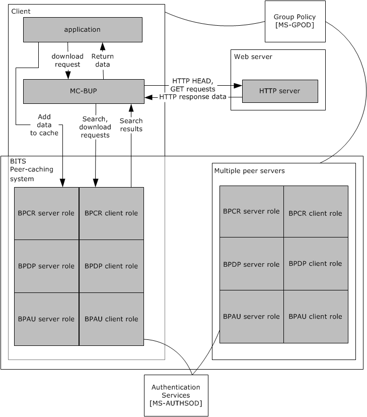
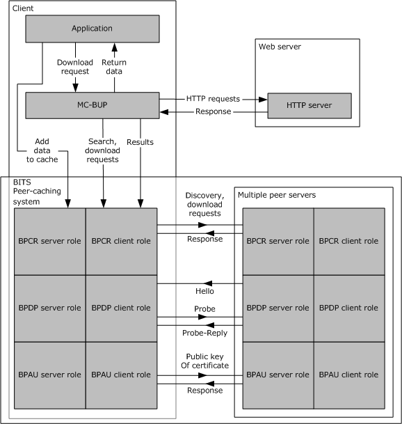
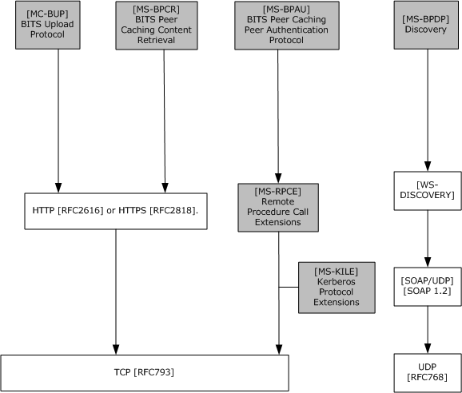
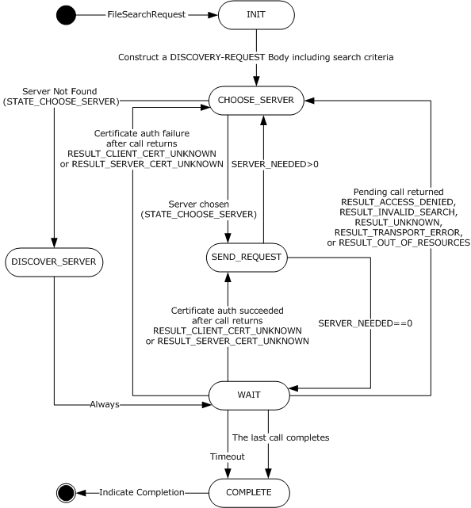
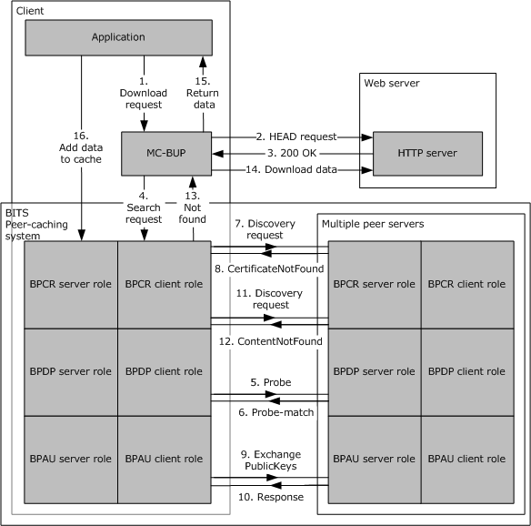
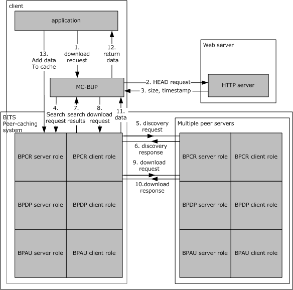

# [MS-BPCR]: Background Intelligent Transfer Service (BITS) Peer-Caching: Content Retrieval Protocol

Table of Contents

1 Introduction

- [1 Introduction](#Section_1)
  - [1.1 Glossary](#Section_1.1)
  - [1.2 References](#Section_1.2)
    - [1.2.1 Normative References](#Section_1.2.1)
    - [1.2.2 Informative References](#Section_1.2.2)
  - [1.3 Overview](#Section_1.3)
    - [1.3.1 Peer-to-Peer Framework Details](#Section_1.3.1)
  - [1.4 Relationship to Other Protocols](#Section_1.4)
  - [1.5 Prerequisites/Preconditions](#Section_1.5)
  - [1.6 Applicability Statement](#Section_1.6)
  - [1.7 Versioning and Capability Negotiation](#Section_1.7)
  - [1.8 Vendor-Extensible Fields](#Section_1.8)
  - [1.9 Standards Assignments](#Section_1.9)

2 Messages

- [2 Messages](#Section_2)
  - [2.1 Transport](#Section_2.1)
  - [2.2 Message Syntax](#Section_2.2)
    - [2.2.1 Common Data Types](#Section_2.2.1)
      - [2.2.1.1 guid](#Section_2.2.1.1)
      - [2.2.1.2 url](#Section_2.2.1.2)
      - [2.2.1.3 searchStatus](#Section_2.2.1.3)
      - [2.2.1.4 fileRange](#Section_2.2.1.4)
      - [2.2.1.5 cacheRecord](#Section_2.2.1.5)
      - [2.2.1.6 searchRequest](#Section_2.2.1.6)
      - [2.2.1.7 searchResponse](#Section_2.2.1.7)
    - [2.2.2 DISCOVERY-REQUEST](#Section_2.2.2)
      - [2.2.2.1 Standard HTTP Header Fields](#Section_2.2.2.1)
      - [2.2.2.2 HTTP Header Fields](#Section_2.2.2.2)
      - [2.2.2.3 Message Body](#Section_2.2.2.3)
    - [2.2.3 DISCOVERY-RESPONSE](#Section_2.2.3)
      - [2.2.3.1 Standard HTTP Header Fields](#Section_2.2.3.1)
      - [2.2.3.2 Body Data](#Section_2.2.3.2)
    - [2.2.4 DOWNLOAD-REQUEST](#Section_2.2.4)
    - [2.2.5 DOWNLOAD-RESPONSE](#Section_2.2.5)
    - [2.2.6 HEAD-REQUEST](#Section_2.2.6)
    - [2.2.7 HEAD-RESPONSE](#Section_2.2.7)

3 Protocol Details

- [3 Protocol Details](#Section_3)
  - [3.1 Client Details](#Section_3.1)
    - [3.1.1 Abstract Data Model](#Section_3.1.1)
      - [3.1.1.1 Table of Servers](#Section_3.1.1.1)
      - [3.1.1.2 FileDiscoveryAttempt](#Section_3.1.1.2)
      - [3.1.1.3 FileSearchRequest](#Section_3.1.1.3)
      - [3.1.1.4 Download Request](#Section_3.1.1.4)
    - [3.1.2 Timers](#Section_3.1.2)
      - [3.1.2.1 FileSearchRequest Timeout](#Section_3.1.2.1)
      - [3.1.2.2 File Discovery Attempt Request Timeout](#Section_3.1.2.2)
      - [3.1.2.3 Download Request Timeout](#Section_3.1.2.3)
    - [3.1.3 Initialization](#Section_3.1.3)
    - [3.1.4 Higher-Layer Triggered Events](#Section_3.1.4)
      - [3.1.4.1 New FileSearchRequest](#Section_3.1.4.1)
      - [3.1.4.2 Cancel a FileSearchRequest in Progress](#Section_3.1.4.2)
      - [3.1.4.3 New Download Request](#Section_3.1.4.3)
      - [3.1.4.4 Remove Server from PEER SERVER TABLE](#Section_3.1.4.4)
    - [3.1.5 Message Processing Events and Sequencing Rules](#Section_3.1.5)
      - [3.1.5.1 FileDiscoveryAttempt Response](#Section_3.1.5.1)
      - [3.1.5.2 Download Response](#Section_3.1.5.2)
    - [3.1.6 Timer Events](#Section_3.1.6)
      - [3.1.6.1 FileDiscoveryAttempt Response Timeout](#Section_3.1.6.1)
      - [3.1.6.2 Download Response Timeout](#Section_3.1.6.2)
      - [3.1.6.3 FileSearchRequest Timeout](#Section_3.1.6.3)
    - [3.1.7 Other Local Events](#Section_3.1.7)
      - [3.1.7.1 FileDiscoveryAttempt Events](#Section_3.1.7.1)
        - [3.1.7.1.1 Problem with Server Certificate During a FileDiscoveryAttempt](#Section_3.1.7.1.1)
        - [3.1.7.1.2 Connection Failure During a FileDiscoveryAttempt](#Section_3.1.7.1.2)
      - [3.1.7.2 Download Events](#Section_3.1.7.2)
        - [3.1.7.2.1 Problem with Server Certificate During a Download](#Section_3.1.7.2.1)
        - [3.1.7.2.2 Connection Failure During Download](#Section_3.1.7.2.2)
      - [3.1.7.3 FileSearchRequest Events](#Section_3.1.7.3)
        - [3.1.7.3.1 A Pending FileDiscoveryAttempt Completes](#Section_3.1.7.3.1)
        - [3.1.7.3.2 RESULT_FOUND](#Section_3.1.7.3.2)
        - [3.1.7.3.3 RESULT_NOT_FOUND](#Section_3.1.7.3.3)
        - [3.1.7.3.4 RESULT_CLIENT_CERT_UNKNOWN](#Section_3.1.7.3.4)
        - [3.1.7.3.5 RESULT_ACCESS_DENIED or RESULT_INVALID_SEARCH or RESULT_UNKNOWN](#Section_3.1.7.3.5)
        - [3.1.7.3.6 RESULT_SERVER_CERT_UNKNOWN](#Section_3.1.7.3.6)
        - [3.1.7.3.7 RESULT_TRANSPORT_ERROR or RESULT_OUT_OF_RESOURCES](#Section_3.1.7.3.7)
        - [3.1.7.3.8 Notification of New Server or Address](#Section_3.1.7.3.8)
        - [3.1.7.3.9 Protocol Shutdown](#Section_3.1.7.3.9)
      - [3.1.7.4 FileSearchRequest State Transitions](#Section_3.1.7.4)
        - [3.1.7.4.1 STATE_INIT](#Section_3.1.7.4.1)
        - [3.1.7.4.2 STATE_CHOOSE_SERVER](#Section_3.1.7.4.2)
        - [3.1.7.4.3 STATE_SEND_REQUEST](#Section_3.1.7.4.3)
        - [3.1.7.4.4 STATE_WAIT](#Section_3.1.7.4.4)
        - [3.1.7.4.5 STATE_DISCOVER_SERVERS](#Section_3.1.7.4.5)
        - [3.1.7.4.6 STATE_COMPLETE](#Section_3.1.7.4.6)
  - [3.2 Server Details](#Section_3.2)
    - [3.2.1 Abstract Data Model](#Section_3.2.1)
      - [3.2.1.1 Table of Content Records](#Section_3.2.1.1)
      - [3.2.1.2 Maximum Cache Size](#Section_3.2.1.2)
      - [3.2.1.3 Maximum Record Age](#Section_3.2.1.3)
    - [3.2.2 Timers](#Section_3.2.2)
      - [3.2.2.1 Record Expiration](#Section_3.2.2.1)
    - [3.2.3 Initialization](#Section_3.2.3)
    - [3.2.4 Higher-Layer Triggered Events](#Section_3.2.4)
      - [3.2.4.1 Cache Data](#Section_3.2.4.1)
      - [3.2.4.2 Protocol Shutdown](#Section_3.2.4.2)
    - [3.2.5 Message Processing Events and Sequencing Rules](#Section_3.2.5)
      - [3.2.5.1 General Rules for HTTP-Level Error Responses](#Section_3.2.5.1)
      - [3.2.5.2 Message Validation](#Section_3.2.5.2)
      - [3.2.5.3 DISCOVERY-REQUEST](#Section_3.2.5.3)
      - [3.2.5.4 DOWNLOAD-REQUEST](#Section_3.2.5.4)
      - [3.2.5.5 HEAD-REQUEST](#Section_3.2.5.5)
    - [3.2.6 Timer Events](#Section_3.2.6)
      - [3.2.6.1 Record Expiration](#Section_3.2.6.1)
    - [3.2.7 Other Local Events](#Section_3.2.7)

4 Protocol Example

- [4 Protocol Example](#Section_4)
  - [4.1 Successful FileSearchRequest with Two Servers](#Section_4.1)
  - [4.2 BITS and Peer-caching Interactions: Initial Download](#Section_4.2)
  - [4.3 BITS and Peer-caching Interactions: Second Download](#Section_4.3)

5 Security

- [5 Security](#Section_5)
  - [5.1 Security Considerations for Implementers](#Section_5.1)
  - [5.2 Index of Security Parameters](#Section_5.2)

6 Appendix A: XML Schema

- [6 Appendix A: XML Schema](#Section_6)

7 Appendix B: Product Behavior

- [7 Appendix B: Product Behavior](#Section_7)

8 Change Tracking

- [8 Change Tracking](#Section_8)

For the legal notice and IP terms, see [LEGAL.md](../LEGAL.md).
Last updated: 6/1/2017.
See [Revision History](#revision-history) for full version history.

# 1 Introduction

This document is a specification for the Background Intelligent Transfer Service (BITS) Peer-Caching: Content Retrieval Protocol. This is one protocol in a family of protocols that implement a distributed URL cache that is known as BITS peer-caching. Other protocols in the family are used to discover potential [**peers**](#gt_peer) and to authenticate them. A client uses the BITS Peer-Caching: Content Retrieval Protocol to search an existing set of peers for content and to download from those peers.

Sections 1.5, 1.8, 1.9, 2, and 3 of this specification are normative. All other sections and examples in this specification are informative.

## 1.1 Glossary

This document uses the following terms:

**domain**: A set of users and computers sharing a common namespace and management infrastructure. At least one computer member of the set must act as a domain controller (DC) and host a member list that identifies all members of the domain, as well as optionally hosting the Active Directory service. The domain controller provides authentication of members, creating a unit of trust for its members. Each domain has an identifier that is shared among its members. For more information, see [MS-AUTHSOD](../MS-AUTHSOD/MS-AUTHSOD.md) section 1.1.1.5 and [MS-ADTS](../MS-ADTS/MS-ADTS.md).

**extended key usage (EKU)**: An X.509 certificate extension that indicates one or more purposes for which the certificate can be used.

**fully qualified domain name (FQDN)**: An unambiguous domain name that gives an absolute location in the Domain Name System's (DNS) hierarchy tree, as defined in [[RFC1035]](https://go.microsoft.com/fwlink/?LinkId=90264) section 3.1 and [[RFC2181]](https://go.microsoft.com/fwlink/?LinkId=127732) section 11.

**globally unique identifier (GUID)**: A term used interchangeably with universally unique identifier (UUID) in Microsoft protocol technical documents (TDs). Interchanging the usage of these terms does not imply or require a specific algorithm or mechanism to generate the value. Specifically, the use of this term does not imply or require that the algorithms described in [[RFC4122]](https://go.microsoft.com/fwlink/?LinkId=90460) or [[C706]](https://go.microsoft.com/fwlink/?LinkId=89824) must be used for generating the [**GUID**](#gt_globally-unique-identifier-guid). See also universally unique identifier (UUID).

**GUIDString**: A [**GUID**](#gt_globally-unique-identifier-guid) in the form of an ASCII or [**Unicode**](#gt_unicode) string, consisting of one group of 8 hexadecimal digits, followed by three groups of 4 hexadecimal digits each, followed by one group of 12 hexadecimal digits. It is the standard representation of a GUID, as described in [RFC4122] section 3. For example, "6B29FC40-CA47-1067-B31D-00DD010662DA". Unlike a curly braced GUID string, a GUIDString is not enclosed in braces.

**peer**: A single device or node in a [**peer-to-peer**](#gt_peer-to-peer) networking system.

**peer-to-peer**: A server-less networking technology that allows several participating network devices to share resources and communicate directly with each other.

**security identifier (SID)**: An identifier for security principals that is used to identify an account or a group. Conceptually, the [**SID**](#gt_security-identifier-sid) is composed of an account authority portion (typically a [**domain**](#gt_domain)) and a smaller integer representing an identity relative to the account authority, termed the relative identifier (RID). The [**SID**](#gt_security-identifier-sid) format is specified in [MS-DTYP](../MS-DTYP/MS-DTYP.md) section 2.4.2; a string representation of [**SIDs**](#gt_security-identifier-sid) is specified in [MS-DTYP] section 2.4.2 and [MS-AZOD](../MS-AZOD/MS-AZOD.md) section 1.1.1.2.

**Unicode**: A character encoding standard developed by the Unicode Consortium that represents almost all of the written languages of the world. The [**Unicode**](#gt_unicode) standard [[UNICODE5.0.0/2007]](https://go.microsoft.com/fwlink/?LinkId=154659) provides three forms (UTF-8, UTF-16, and UTF-32) and seven schemes (UTF-8, UTF-16, UTF-16 BE, UTF-16 LE, UTF-32, UTF-32 LE, and UTF-32 BE).

**MAY, SHOULD, MUST, SHOULD NOT, MUST NOT:** These terms (in all caps) are used as defined in [[RFC2119]](https://go.microsoft.com/fwlink/?LinkId=90317). All statements of optional behavior use either MAY, SHOULD, or SHOULD NOT.

## 1.2 References

Links to a document in the Microsoft Open Specifications library point to the correct section in the most recently published version of the referenced document. However, because individual documents in the library are not updated at the same time, the section numbers in the documents may not match. You can confirm the correct section numbering by checking the [Errata](http://msdn.microsoft.com/en-us/library/dn781092.aspx).

### 1.2.1 Normative References

We conduct frequent surveys of the normative references to assure their continued availability. If you have any issue with finding a normative reference, please contact [dochelp@microsoft.com](mailto:dochelp@microsoft.com). We will assist you in finding the relevant information.

[IANAPORT] IANA, "Service Name and Transport Protocol Port Number Registry", [http://www.iana.org/assignments/service-names-port-numbers/service-names-port-numbers.xhtml](https://go.microsoft.com/fwlink/?LinkId=89888)

[MS-BPAU] Microsoft Corporation, "[Background Intelligent Transfer Service (BITS) Peer-Caching: Peer Authentication Protocol](../MS-BPAU/MS-BPAU.md)".

[MS-DTYP] Microsoft Corporation, "[Windows Data Types](../MS-DTYP/MS-DTYP.md)".

[MS-ERREF] Microsoft Corporation, "[Windows Error Codes](../MS-ERREF/MS-ERREF.md)".

[MS-FSCC] Microsoft Corporation, "[File System Control Codes](../MS-FSCC/MS-FSCC.md)".

[RFC2119] Bradner, S., "Key words for use in RFCs to Indicate Requirement Levels", BCP 14, RFC 2119, March 1997, [http://www.rfc-editor.org/rfc/rfc2119.txt](https://go.microsoft.com/fwlink/?LinkId=90317)

[RFC2246] Dierks, T., and Allen, C., "The TLS Protocol Version 1.0", RFC 2246, January 1999, [http://www.rfc-editor.org/rfc/rfc2246.txt](https://go.microsoft.com/fwlink/?LinkId=90324)

[RFC2616] Fielding, R., Gettys, J., Mogul, J., et al., "Hypertext Transfer Protocol -- HTTP/1.1", RFC 2616, June 1999, [http://www.rfc-editor.org/rfc/rfc2616.txt](https://go.microsoft.com/fwlink/?LinkId=90372)

[RFC3280] Housley, R., Polk, W., Ford, W., and Solo, D., "Internet X.509 Public Key Infrastructure Certificate and Certificate Revocation List (CRL) Profile", RFC 3280, April 2002, [http://www.ietf.org/rfc/rfc3280.txt](https://go.microsoft.com/fwlink/?LinkId=90414)

[RFC5234] Crocker, D., Ed., and Overell, P., "Augmented BNF for Syntax Specifications: ABNF", STD 68, RFC 5234, January 2008, [http://www.rfc-editor.org/rfc/rfc5234.txt](https://go.microsoft.com/fwlink/?LinkId=123096)

[XML] World Wide Web Consortium, "Extensible Markup Language (XML) 1.0 (Fourth Edition)", W3C Recommendation 16 August 2006, edited in place 29 September 2006, [http://www.w3.org/TR/2006/REC-xml-20060816/](https://go.microsoft.com/fwlink/?LinkId=90598)

### 1.2.2 Informative References

[MC-BUP] Microsoft Corporation, "[Background Intelligent Transfer Service (BITS) Upload Protocol](../MC-BUP/MC-BUP.md)".

[MS-BPCR] Microsoft Corporation, "[Background Intelligent Transfer Service (BITS) Peer-Caching: Content Retrieval Protocol](#Section_03a03c3e2b2543aab2f28298eff03492)".

[MS-BPDP] Microsoft Corporation, "[Background Intelligent Transfer Service (BITS) Peer-Caching: Peer Discovery Protocol](../MS-BPDP/MS-BPDP.md)".

[MS-CCROD] Microsoft Corporation, "[Content Caching and Retrieval Protocols Overview](../MS-CCROD/MS-CCROD.md)".

[MSDN-BITS] Microsoft Corporation, "Background Intelligent Transfer Service", [http://msdn.microsoft.com/en-us/library/bb968799(VS.85).aspx](https://go.microsoft.com/fwlink/?LinkId=89959)

[WS-Discovery] Beatty, J., Kakivaya, G., Kemp D., et al., "Web Services Dynamic Discovery (WS-Discovery)", April 2005, [http://specs.xmlsoap.org/ws/2005/04/discovery/ws-discovery.pdf](https://go.microsoft.com/fwlink/?LinkId=90576)

## 1.3 Overview

The Background Intelligent Transfer Service (BITS) Peer-Caching: Content Retrieval Protocol defines methods for a network client both to query multiple servers for data associated with a given URL and to download that data.

In Windows, the BITS component uses the BITS Peer-Caching: Content Retrieval Protocol to implement a distributed [**peer-to-peer**](#gt_peer-to-peer) cache of data items based on associated HTTP and HTTPS URLs as well as UNC paths<1>.

### 1.3.1 Peer-to-Peer Framework Details

BITS discovers [**peer**](#gt_peer) servers by using the Background Intelligent Transfer Service (BITS) Peer-Caching: Peer Discovery Protocol specified in [MS-BPDP](../MS-BPDP/MS-BPDP.md)) and authenticates them by using the Background Intelligent Transfer Service (BITS) Peer-Caching: Peer Authentication Protocol specified in [MS-BPAU](../MS-BPAU/MS-BPAU.md)).<2> For more information on BITS, see [[MSDN-BITS]](https://go.microsoft.com/fwlink/?LinkId=89959).

The BITS Peer-Caching: Content Retrieval Protocol does not address issues of cache management, such as policies for adding and removing content or the method of storing and indexing the content. These issues are internal to the server implementation.

The following figure shows a black-box diagram of the BITS peer-to-peer framework.

Figure 1: Black-box diagram of BITS peer-to-peer framework

To start, the client initializes the BITS Peer-Caching: Peer Discovery Protocol client role to listen for hosts that support the server role of BITS Peer-Caching: Content Retrieval Protocol (for more information, see [MS-BPDP] section 3.2.3).

When a BITS Peer-Caching: Peer Discovery Protocol server is initialized, it announces its presence to clients as described in [MS-BPDP]. Thus, over time, clients gather a list of nearby peer servers.

Because the BITS Peer-Caching: Content Retrieval Protocol implements a cache, the client does not search for data or download it until requested by a higher-layer protocol. A typical usage pattern is as follows:

- External to the BITS Peer-Caching: Content Retrieval Protocol, a client application identifies the need to download a particular URL, with a known timestamp and length.
- The application initiates a BITS Peer-Caching: Content Retrieval Protocol search to determine whether any peer servers contain the necessary URL data. The BITS Peer-Caching: Content Retrieval Protocol client chooses a set of peer servers and queries them for the URL data. BITS Peer-Caching: Content Retrieval Protocol clients and servers use the BITS Peer-Caching: Peer Authentication Protocol to verify that the peer is a member of the same Active Directory domain, as described in [MS-BPAU].
- Based on the success or failure of the search, the application downloads the URL data, using BITS Peer-Caching: Content Retrieval Protocol if possible or HTTP(S) from the origin server if not.
- If the client host also implements the server role of BITS Peer-Caching: Content Retrieval Protocol, then the application tells the BITS Peer-Caching: Content Retrieval Protocol server role to add the URL data to its cache, thus making it available to other peers.
For more detailed sequence diagrams, see section [4.2](#Section_4.2) and section [4.3](#Section_4.3).

## 1.4 Relationship to Other Protocols

The Background Intelligent Transfer Service (BITS) Peer-Caching: Content Retrieval Protocol is a client/server protocol that uses HTTP over TLS 1.0 as its transport. A host that implements the client side or server side of this protocol typically also implements the Background Intelligent Transfer Service (BITS) Peer-Caching: Peer Discovery Protocol [MS-BPDP](../MS-BPDP/MS-BPDP.md) and the Background Intelligent Transfer Service (BITS) Peer-Caching: Peer Authentication Protocol [MS-BPAU](../MS-BPAU/MS-BPAU.md) to automate the location and authentication of servers.

The consumer of this protocol can be either a top-level application or another client/server protocol.

The following is a white-box diagram of protocols in the BITS peer-caching framework.

Figure 2: White-box diagram of protocols in BITS peer-caching framework

The following gives more detail on the role of protocols participating in the BITS framework:

The Background Intelligent Transfer Service (BITS) Upload Protocol [MC-BUP](../MC-BUP/MC-BUP.md) is used to transfer large payloads from a client to a server or from a server to a client over networks with frequent disconnections, and to send notifications from the server to a server application about the availability of uploaded payloads. This protocol is layered on top of HTTP 1.1, uses several standard HTTP headers, and defines some new headers. The primary role of this protocol in the BITS Framework is for large payload transfer.

The Background Intelligent Transfer Service (BITS) Peer-Caching: Content Retrieval Protocol [MS-BPCR](#Section_03a03c3e2b2543aab2f28298eff03492) is one protocol in a family of protocols that implement a distributed URL cache that is known as BITS peer-caching. A client uses the BITS) Peer-Caching: Content Retrieval Protocol to search an existing set of [**peers**](#gt_peer) for content and to download from those peers. The primary role of this protocol in the BITS Framework is content retrieval.

The Background Intelligent Transfer Service (BITS) Peer-Caching: Peer Discovery Protocol [MS-BPDP] is used to locate hosts in a [**domain**](#gt_domain) that supports the URL-caching protocol implemented by BITS. The protocol is implemented by using Web Services Dynamic Discovery (WS-Discovery), as specified in [[WS-Discovery]](https://go.microsoft.com/fwlink/?LinkId=90576). The primary role of this protocol in the BITS Framework is host discovery.

The p Background Intelligent Transfer Service (BITS) Peer-Caching: Peer Authentication Protocol [MS-BPAU] provides authentication for computers in a domain. The primary role of this protocol is peer authentication.

Figure 3: Protocol relationship for BITS

## 1.5 Prerequisites/Preconditions

Computers in both the client and server roles must be provisioned with certificates accessible to the HTTPS protocol, as specified in [[RFC2246]](https://go.microsoft.com/fwlink/?LinkId=90324) sections 7.4.2 and 7.4.3.

## 1.6 Applicability Statement

Because the BITS Peer-Caching: Content Retrieval Protocol uses unicast communication to poll multiple servers for content, it is best suited for situations in which the client is connected to the servers by a high-speed network.

The BITS Peer-Caching: Content Retrieval Protocol is more complex than the standard HTTP proxy behavior specified in [[RFC2616]](https://go.microsoft.com/fwlink/?LinkId=90372) section 8.1.3, but the protocol does not require the server to download data on the client's behalf. The BITS Peer-Caching: Content Retrieval Protocol is best suited to a [**peer-to-peer**](#gt_peer-to-peer) environment in which the client can choose among several servers based on connection speed, authentication decisions, and other factors. Refer to section [3.1.7.4.2](#Section_3.1.7.4.2) for details on the algorithm used to select servers.

## 1.7 Versioning and Capability Negotiation

The BITS Peer-Caching: Content Retrieval Protocol does not define an explicit system for version negotiation. The presence of individual capabilities is implicitly signaled in each message by the presence or absence of optional fields. For details of each message, see section [2.2](#Section_2.2).

## 1.8 Vendor-Extensible Fields

The BITS Peer-Caching: Content Retrieval Protocol uses HRESULTs, as specified in [MS-ERREF](../MS-ERREF/MS-ERREF.md), primarily in [DISCOVERY-REQUEST (section 3.2.5.3)](#Section_3.2.5.3). Vendors are free to choose their own values as long as the C bit (0x20000000) is set, indicating it is a customer code.

## 1.9 Standards Assignments

The following table shows the standard assignments that apply to this protocol.

| Parameter | Value | Reference |
| --- | --- | --- |
| TCP port for HTTPS listener | 2178 | As specified in [[IANAPORT]](https://go.microsoft.com/fwlink/?LinkId=89888). |

# 2 Messages

## 2.1 Transport

Messages MUST be transported over HTTPS by using port 2178.

The client and server MUST each provide a certificate to the TLS protocol for use during connection establishment. For details on how the TLS protocol uses the certificates, see [[RFC2246]](https://go.microsoft.com/fwlink/?LinkId=90324) section 7.3. The certificates used MUST be within their validity interval when the connection is initiated.

A client or server MAY impose additional requirements on the certificate for authentication purposes.<3>

## 2.2 Message Syntax

Messages follow HTTP/1.1 syntax. The required HTTP headers and the format of the HTTP message body for each message are specified in the following sections. The message body contains the content within an HTTP message, as defined in [[RFC2616]](https://go.microsoft.com/fwlink/?LinkId=90372) section 4.3.

An implementation MAY include additional HTTP headers in each message, following the rules specified in [RFC2616] section 2.2, and MUST treat recognized headers according to their standard meaning specified in [RFC2616] section 4.2.

A future version of the BITS Peer-Caching: Content Retrieval Protocol will define new HTTP header fields (as defined in [RFC2616] section 4.2) and XML elements. The recipient of a message MUST ignore header fields and XML elements it does not understand.

### 2.2.1 Common Data Types

The [DISCOVERY-REQUEST](#Section_2.2.2) message and the [DISCOVERY-RESPONSE](#Section_2.2.3) message rely on XML (as specified in [[XML]](https://go.microsoft.com/fwlink/?LinkId=90598)). The following table shows the standard XML namespaces used within the BITS Peer-Caching: Content Retrieval Protocol and the alias (prefix) used in the remaining sections of this protocol specification.

| Alias (prefix) | XML namespace |
| --- | --- |
| s | http://www.w3.org/2001/XMLSchema |

The following table shows the Microsoft-defined XML namespace used within the BITS Peer-Caching: Content Retrieval Protocol and the alias (prefix) used in the remaining sections of this protocol specification.

| Alias (prefix) | XML namespace |
| --- | --- |
| cd | http://schemas.microsoft.com/windows/2007/01/BITS/ContentDiscovery |

The following sections list the elements defined in this namespace.

#### 2.2.1.1 guid

A [**globally unique identifier (GUID)**](#gt_globally-unique-identifier-guid) of an object or entity within the protocol. The [**GUIDString**](#gt_guidstring) element is defined by the following XML.

<s:simpleType name="guid">

<s:restriction base="s:string">

<s:pattern value="[0-9a-fA-F]{8}-[0-9a-fA-F]{4}-

[0-9a-fA-F]{4}-[0-9a-fA-F]{4}-[0-9a-fA-F]{12}" />

</s:restriction>

</s:simpleType>

#### 2.2.1.2 url

A URL string. URLs within the BITS Peer-Caching: Content Retrieval Protocol are limited to a maximum of 2,200 characters, as shown in the following XML for the url element.

<simpleType name="url">

<restriction base="string">

<maxLength value="2200" />

</restriction>

</simpleType>

#### 2.2.1.3 searchStatus

The status code for a search request is shown next.

<simpleType name="searchStatus">

<restriction base="string">

<enumeration value="Success"/>

<enumeration value="CertificateNotFound"/>

<enumeration value="ContentNotFound"/>

<enumeration value="AccessDenied"/>

<enumeration value="OutOfResources"/>

<enumeration value="InvalidSearch"/>

<enumeration value="Unknown"/>

</restriction>

</simpleType>

The following table describes the meaning of the enum values for the searchStatus element.

| Value | Meaning |
| --- | --- |
| Success | The server found one or more content records matching the search criteria. |
| ContentNotFound | The server holds no content records matching the search criteria. |
| OutOfResources | The search request could not be processed due to a transient error. |
| InvalidSearch | The server did not understand the given search criteria, or the given criteria are not allowed. |
| CertificateNotFound | The client's certificate is syntactically correct but not known to the server. The client SHOULD retry the request after authenticating using the authentication protocol BITS Peer-Caching: Peer Authentication Protocol (for more information, see [MS-BPAU](../MS-BPAU/MS-BPAU.md).) |
| AccessDenied | The client is forbidden from downloading from this server. |
| Unknown | An uncategorized error occurred. |

#### 2.2.1.4 fileRange

The following code example describes a contiguous range of data within a URL.

<complexType name="fileRange">

<sequence>

<element name="Offset" type="unsignedLong"/>

<element name="Length" type="unsignedLong"/>

</sequence>

</complexType>

**Offset:** Location of the beginning of the range, in bytes, relative to the start of the URL data.

**Length:** Length of the range, in bytes.

#### 2.2.1.5 cacheRecord

The following XML defines a record description.

<complexType name="cacheRecord">

<sequence>

<element name="Id" type="cd:guid"/>

<element name="CreationTime" type="dateTime"/>

<element name="ModificationTime" type="dateTime"/>

<element name="LastAccessTime" type="dateTime"/>

<element name="OriginUrl" type="cd:url"/>

<element name="LocalUrl" type="cd:url"/>

<element name="FileModificationTime" type="dateTime"/>

<element name="FileSize" type="unsignedLong"/>

<element name="FileEtag" type="string" minOccurs="0" />

<element name="ContentRange" type="cd:fileRange"

maxOccurs="unbounded"/>

<any minOccurs="0" maxOccurs="unbounded"

processContents="lax" namespace="##other"/>

</sequence>

</complexType>

**Id:** The unique ID of the record.

**OriginUrl:** The URL being cached by the record.

**CreationTime:** The UTC time of creation of the record.

**LastAccessTime:** The UTC time of last access to the record.

**ModificationTime:** The UTC time of last modification to the record.

**LocalUrl:** The URI of the data in the record relative to the host name and port of the server. The format (specified in [[RFC2616]](https://go.microsoft.com/fwlink/?LinkId=90372) section 3.2.2) is as follows.

Local_url = abs_path ["?" query]

**FileModificationTime:** The UTC modification time of the URL.

**FileSize:** The length, in bytes, of the URL content.

**FileEtag:** The HTTP entity tag of the URL, as specified in [RFC2616] section 3.11.<4>

**ContentRange:** One such element is returned, in order, for each range of bytes that is present in the content record. For example, if the record contained 100 bytes at offset 2,000 followed by 100 bytes at offset 3,000, the returned XML would include the following <ContentRange> data:

<ContentRange>

<Offset>2000</Offset>

<Length>100</Length>

</ContentRange>

<ContentRange>

<Offset>3000</Offset>

<Length>100</Length>

</ContentRange>

A content record encompassing the entire URL is represented as a single range with offset zero and length equal to the **FileSize** element.

#### 2.2.1.6 searchRequest

A query to a single server for a single URL:

<complexType name="searchRequest">

<sequence>

<element name="OriginUrl" type="cd:url"/>

<element name="FileModificationTime" type="dateTime" />

<element name="FileSize" type="unsignedLong" minOccurs="0"/>

<element name="FileEtag" type="string" minOccurs="0" />

<element name="MaxRecords" type="positiveInteger"

minOccurs="0" default="1" />

<any minOccurs="0" maxOccurs="unbounded" processContents="lax"

namespace="##other"/>

</sequence>

</complexType>

**OriginUrl:** The URL for which the client is searching. The maximum length is 2,200 characters.

**FileModificationTime:** The UTC time stamp of the URL.

**FileSize:** The size, in bytes, of the URL.

**FileEtag:** The entity tag for the URL.

**MaxRecords:** The maximum number of records that can be included in the searchResponse element in the reply.<5> The server's response MUST abide by the limit, and the client SHOULD ignore response records beyond the limit.<6> If this element is omitted, there is no explicit limit on the number of records returned.

#### 2.2.1.7 searchResponse

The result of a search request:

<complexType name="searchResponse">

<sequence>

<element name="Status" type="cd:searchStatus" />

<element name="CacheRecord" type="cd:cacheRecord"

minOccurs="0" maxOccurs="unbounded"/>

<any minOccurs="0" maxOccurs="unbounded"

processContents="lax" namespace="##other"/>

</sequence>

</complexType>

### 2.2.2 DISCOVERY-REQUEST

The client sends a DISCOVERY-REQUEST to a server to inquire whether the server has cached a particular URL. The message is encoded as an HTTP POST request to the following URL:

/BITS-peer-caching

The request includes a number of fields in the HTTP message header. Some of them are standard fields (as specified in [[RFC2616]](https://go.microsoft.com/fwlink/?LinkId=90372) section 4.5) that are required to take on specific values, while others are new fields defined by the BITS Peer-Caching: Content Retrieval Protocol. The fields MUST follow the rules defined in [RFC2616] section 4.2.

#### 2.2.2.1 Standard HTTP Header Fields

**Content-Length**: The size, in bytes, of the HTTP message body (as defined in [[RFC2616]](https://go.microsoft.com/fwlink/?LinkId=90372) section 4.3.). This field MUST be present.

#### 2.2.2.2 HTTP Header Fields

X-ETW-ACTIVITY-ID: A GUID-encoded activity correlation ID. An activity ID is a [**GUID**](#gt_globally-unique-identifier-guid) that uniquely identifies the discovery request. The client MAY include this header as an aid to logging, enabling correlation between a client activity and the server activity.<7>

#### 2.2.2.3 Message Body

The HTTP message body (as defined in [[RFC2616]](https://go.microsoft.com/fwlink/?LinkId=90372) section 4.3) MUST be a [**Unicode**](#gt_unicode) XML 1.0 document that uses http://schemas.microsoft.com/windows/2007/01/BITS/ContentDiscovery as its default XML namespace. The document MUST use the UTF-8 or UTF-16 encoding; either byte ordering is allowed. The document MUST contain a "searchRequest" element. The recipient MAY choose to ignore element attributes.<8> The message body MUST NOT include additional data before or after the XML document. The XML document MAY contain trailing whitespace as part of the encoded content, as specified in [[XML]](https://go.microsoft.com/fwlink/?LinkId=90598) section 2.1.

A server MUST support a maximum body size of at least 16 KB.

### 2.2.3 DISCOVERY-RESPONSE

The DISCOVERY-RESPONSE message is the response to a [DISCOVERY-REQUEST](#Section_2.2.2) message. It contains the results of the search—either an error or a set of matching content records.

The HTTP status code MUST be 200. The following sections specify additional requirements.

#### 2.2.3.1 Standard HTTP Header Fields

**Content-Length**: MUST be the size, in bytes, of the HTTP message body. This field MUST be present.

#### 2.2.3.2 Body Data

The HTTP message body MUST be a [**Unicode**](#gt_unicode) XML 1.0 document that uses http://schemas.microsoft.com/windows/2007/01/BITS/ContentDiscovery as its default XML namespace. The document MUST use the UTF-8 or UTF-16 encoding; either byte ordering is allowed. The document MUST contain a "searchResults" element. The recipient MAY choose to ignore element attributes.<9> The message body MUST NOT include additional data before or after the XML document. The XML document MAY contain trailing whitespace as part of the encoded content, as specified in [[XML]](https://go.microsoft.com/fwlink/?LinkId=90598) section 2.1.

To allow for a large number of returned file ranges, a client SHOULD support a maximum response size of at least 1,024 KB. The XML MAY include comment tags to aid in readability.<10>

If the value of the "Status" child element is "Success", one or more CacheRecord elements MUST be present.

### 2.2.4 DOWNLOAD-REQUEST

To download data from a server, the client sends a DOWNLOAD-REQUEST, which is encoded as an HTTP GET request, as specified in [[RFC2616]](https://go.microsoft.com/fwlink/?LinkId=90372) section 9.3. The request specifies the record ID and the requested range(s) within the record.

The URL MUST be specified as follows:

"/BITS-peer-caching/%7B" record-ID "%7D"

where record-ID is the [**GUID**](#gt_globally-unique-identifier-guid) ID of the record being requested, as returned in the **/SearchResults/CacheRecord/Id** element of a [DISCOVERY-RESPONSE](#Section_2.2.3).

A client MAY request a fraction of the record data by including a *Content-Range* header, as specified in [RFC2616] section 14.16.<11> If so, the requested ranges apply to the data in the record, not to the original URL data. For example, if a record contains bytes 100 to 199 of the URL, "Content-Range: 0-1 / 100" refers to bytes 100 and 101 of the original URL.

### 2.2.5 DOWNLOAD-RESPONSE

A DOWNLOAD-RESPONSE message is a standard HTTP/1.1 response packet. The HTTP status code MUST be either 200 or 206.

The response MUST include the *Content-Length* header. The format of the field is specified in [[RFC2616]](https://go.microsoft.com/fwlink/?LinkId=90372) section 14.13.

The reply MAY include the *BITS_BASIC_INFO* header to provide finer-grained file time stamps.<12> It provides the content record's fields FileCreationTime, FileLastAccessTime, FileModificationTime, and FileAttributes in the following format:

BITS_BASIC_INFO = "0x" FileCreationTime ",0x" FileLastAccessTime ",0x"

FileModificationTime ",0x" ChangeTime ",0xv" FileAttributes

All elements are required. *FileCreationTime*, *FileLastAccessTime*, *FileModificationTime*, and *ChangeTime* are each a hexadecimal 64-bit integer representing time in FILETIME format as specified in [MS-DTYP](../MS-DTYP/MS-DTYP.md), section 2.3.3. *FileAttributes* is a hexadecimal 32-bit integer representing a set of attribute flags supported by the FAT file system as specified in [MS-FSCC](../MS-FSCC/MS-FSCC.md) section 2.6. Only FILE_ATTRIBUTE_ARCHIVE, FILE_ATTRIBUTE_HIDDEN, FILE_ATTRIBUTE_READONLY, and FILE_ATTRIBUTE_SYSTEM are allowed to be set; other flags MUST be set to zero and MUST be ignored by the recipient.

### 2.2.6 HEAD-REQUEST

A client MAY request the attributes of a record without downloading data, by sending a HEAD-REQUEST.<13> The request is encoded as a HEAD request; otherwise, the format is the same as a [DOWNLOAD-REQUEST (section 2.2.4)](#Section_2.2.4).

### 2.2.7 HEAD-RESPONSE

Following standard procedure for HEAD requests in HTTP, the reply to a [HEAD-REQUEST](#Section_2.2.6) is a reply that is identical to the reply for the equivalent [DOWNLOAD-REQUEST](#Section_2.2.4), except that a reply with status 200 or 206 excludes any body data.

# 3 Protocol Details

## 3.1 Client Details

### 3.1.1 Abstract Data Model

This section describes a conceptual model of possible data organization that an implementation maintains to participate in this protocol. The described organization is provided to facilitate the explanation of how the protocol behaves. This document does not mandate that implementations adhere to this model as long as their external behavior is consistent with what is described in this document.

#### 3.1.1.1 Table of Servers

The client maintains a table of servers. Each row of the table contains the following data:

**FQDN:** Server [**fully qualified domain name (FQDN)**](#gt_fully-qualified-domain-name-fqdn).

**Authenticated:** A Boolean variable indicating whether the server has been authenticated by using the BITS Peer-Caching: Peer Authentication Protocol [MS-BPAU](../MS-BPAU/MS-BPAU.md).

#### 3.1.1.2 FileDiscoveryAttempt

A FileDiscoveryAttempt abstract data model (ADM) element object represents a single attempt to send a [DISCOVERY-REQUEST](#Section_2.2.2) message to a server.

A FileDiscoveryAttempt ADM element contains the following data elements:

- A pointer to a row in the table of potential servers.
- The XML request data sent to the server.
- An abstract completion result, which can be one of the following values.
| Status | Description |
| --- | --- |
| [RESULT_FOUND](#Section_3.1.7.3.2) | The server found one or more content records that match the search criteria. |
| [RESULT_NOT_FOUND](#Section_3.1.7.3.3) | The server found no content records that match the search criteria. |
| [RESULT_ACCESS_DENIED](#Section_3.1.7.3.5) | The client is not authorized to access the server. |
| [RESULT_CLIENT_CERT_UNKNOWN](#Section_3.1.7.3.4) | The client needs to be authenticated to the server. |
| [RESULT_SERVER_CERT_UNKNOWN](#Section_3.1.7.3.6) | The server needs to be authenticated to the client. |
| [RESULT_OUT_OF_RESOURCES](#Section_3.1.7.3.7) | The server is too busy to process the request. |
| RESULT_TRANSPORT_ERROR | A lower-layer transport encountered an error. |
| RESULT_INVALID_SEARCH | The syntax of the request was not acceptable to the server. |
| RESULT_UNKNOWN | A protocol error occurred. |

#### 3.1.1.3 FileSearchRequest

**FileSearchRequest** is a data element that encapsulates a particular search request from the higher-level protocol. A **FileSearchRequest** element can be represented by a state machine with the following states.

| State | Description |
| --- | --- |
| [STATE_INIT](#Section_3.1.7.4.1) | The initial state for the machine. |
| [STATE_CHOOSE_SERVER](#Section_3.1.7.4.2) | The **FileSearchRequest** element needs to choose a server so that it can send a request. |
| [STATE_SEND_REQUEST](#Section_3.1.7.4.3) | The **FileSearchRequest** element needs to send a request to a server. |
| [STATE_WAIT](#Section_3.1.7.4.4) | The **FileSearchRequest** element is waiting for responses to its requests. |
| [STATE_DISCOVER_SERVERS](#Section_3.1.7.4.5) | The **FileSearchRequest** element needs to locate more servers, if possible. |
| [STATE_COMPLETE](#Section_3.1.7.4.6) | The **FileDiscoveryAttempt** element has completed successfully. |

The **FileSearchRequest** element contains the following data elements:

- The URL search criteria passed by the higher-level protocol.
- **PENDING-CALLS-TABLE**: A collection of pending calls.
- **SERVERS-NEEDED**: The number of servers remaining to be chosen.
- **F_DISCOVERED**: A flag that is true if the **FileSearchRequest** element previously searched for more servers.
- **F_WAITING_FOR_DISCOVERY**: A flag that is true if the **FileSearchRequest** element is waiting for more servers to be discovered.
- **NEW_SERVER**: A server from the **Table of Servers** element.
- **AUTH_NEEDED**: The number of authenticated servers remaining to be chosen.
The client defines a constant IDEAL-SERVER-COUNT as a target for the number of servers to contact. IDEAL-SERVER-COUNT SHOULD be set to 10.

The following figure illustrates the possible state transitions.

Figure 4: Possible state transitions

**Note** The conceptual data can be implemented by using a variety of techniques. Any data structure that stores the conceptual data can be used in the implementation.

#### 3.1.1.4 Download Request

A **Download Request** abstract data model (ADM) element represents a request from a higher-layer protocol for some or all of the data contained in a particular content record. The **Download Request** element object contains the following state elements:

**HOST-ADDRESS**: Host name or IP address of the server.

**RECORD-ID**: [**GUID**](#gt_globally-unique-identifier-guid) of the content record being downloaded.

**RANGES**: One or more byte ranges of the data in the content record.

**RESULT**: An abstract completion result with the same range of values as the [FileDiscoveryAttempt](#Section_3.1.1.2) result.

### 3.1.2 Timers

#### 3.1.2.1 FileSearchRequest Timeout

This timer limits the amount of time taken by any one **FileSearchRequest** element, regardless of the state transitions involved. The default value is 60 seconds; the legal range is any positive value.

#### 3.1.2.2 File Discovery Attempt Request Timeout

This timer limits the amount of time that a [FileDiscoveryAttempt](#Section_3.1.1.2) waits for the response from the server. The default value is 15 seconds. An implementation MAY use a different value to accelerate detection of offline servers.

#### 3.1.2.3 Download Request Timeout

This timer limits the amount of time that a Download request waits for the response from the server. The default SHOULD be at least 30 seconds.<14>

### 3.1.3 Initialization

When the client is initialized, it instantiates the client role of the BITS Peer-Caching: Peer Discovery Protocol, as described in [MS-BPDP](../MS-BPDP/MS-BPDP.md) section 3.2.3. The client initializes the table of servers as described in [MS-BPDP] section 3.2.6.6. The value Authenticated for all rows in the table of servers (as specified in section [3.1.1.1](#Section_3.1.1.1)) is initially set to false.

### 3.1.4 Higher-Layer Triggered Events

#### 3.1.4.1 New FileSearchRequest

The higher layer passes the URL search criteria.

The client instantiates a **FileSearchRequest** element object ([3.1.1.3](#Section_3.1.1.3)) with the associated URL data.

#### 3.1.4.2 Cancel a FileSearchRequest in Progress

To cancel a **FileSearchRequest** element in progress, cancel each [FileDiscoveryAttempt](#Section_3.1.1.2) in the **PENDING-CALLS-TABLE** element.

#### 3.1.4.3 New Download Request

To download cached data from a server, the higher-layer protocol passes the server, the content record, and (optionally) one or more byte ranges to download. A new [Download](#Section_2.2.4) object is created.

#### 3.1.4.4 Remove Server from PEER SERVER TABLE

To remove a [**peer**](#gt_peer) server from the PEER SERVER TABLE, the higher-layer protocol passes the host name of the server to be removed to the client. The client then removes the server name from the PEER SERVER TABLE, excluding that server from further searches.

### 3.1.5 Message Processing Events and Sequencing Rules

In the TLS negotiation, the client provides the "Local Certificate" exposed by [MS-BPAU](../MS-BPAU/MS-BPAU.md) section 3.2.1.1. Whenever the client establishes a TLS session in order to send a message, it MUST verify that the server certificate has the following characteristics:

- It was provided by the server.
- It is within its period of validity.
- It contains the "id-kp-serverAuth" [**extended key usage (EKU)**](#gt_extended-key-usage-eku) specified in [[RFC3280]](https://go.microsoft.com/fwlink/?LinkId=90414) section 4.2.1.13.
- The issuer and subject names are in the form of a [**security identifier (SID)**](#gt_security-identifier-sid), as defined in [MS-DTYP](../MS-DTYP/MS-DTYP.md) section 2.4.2.1, representing a machine account in the recipient host's Active Directory domain.
If any verification test fails, the client MUST terminate the TLS session as detailed in [[RFC2246]](https://go.microsoft.com/fwlink/?LinkId=90324) section 7.3 and react as to a connection failure.

#### 3.1.5.1 FileDiscoveryAttempt Response

As mentioned in [DISCOVERY-RESPONSE (section 2.2.3)](#Section_2.2.3), a reply is considered a DISCOVERY-RESPONSE only if the HTTP status is set to 200. Any other HTTP status causes the **FileDiscoveryAttempt** element to be completed immediately. If the HTTP status is 503, the **FileDiscoveryAttempt** element result is [RESULT_OUT_OF_RESOURCES](#Section_3.1.7.3.7); otherwise, the **FileDiscoveryAttempt** element result is RESULT_TRANSPORT_ERROR.

When the HTTP status indicates success, the client parses the response's body. An error in body syntax sets the **FileDiscoveryAttempt** element result to [RESULT_UNKNOWN](#Section_3.1.7.3.5).

The client then examines the /SearchResults/Status element of the body, and sets the **FileDiscoveryAttempt** element result according to the following table.

| Element text | Result |
| --- | --- |
| "Success" | [RESULT_FOUND](#Section_3.1.7.3.2) |
| "ContentNotFound" | [RESULT_NOT_FOUND](#Section_3.1.7.3.3) |
| "AccessDenied" | RESULT_ACCESS_DENIED |
| "CertificateNotFound" | [RESULT_CLIENT_CERT_UNKNOWN](#Section_3.1.7.3.4) |
| "OutOfResources" | RESULT_OUT_OF_RESOURCES |
| "InvalidSearch" | RESULT_INVALID_SEARCH |
| "Unknown" | RESULT_UNKNOWN |

#### 3.1.5.2 Download Response

The response to a [DOWNLOAD-REQUEST](#Section_2.2.4) message is an HTTP reply. If the HTTP status is not 200, the download fails with [RESULT_TRANSPORT_ERROR](#Section_3.1.7.3.7), and the error is reported to the higher-layer protocol.

If the HTTP status is 200, the client validates the syntax of the response message. If it is not valid, the download fails with RESULT_TRANSPORT_ERROR, and the error is reported to the higher-layer protocol.

If the message is valid, the download succeeds with [RESULT_FOUND](#Section_3.1.7.3.2). The result is reported to the higher-layer protocol along with the data from the content record and the values from the BITS_BASIC_INFO header, if present.

### 3.1.6 Timer Events

#### 3.1.6.1 FileDiscoveryAttempt Response Timeout

Complete the [FileDiscoveryAttempt](#Section_3.1.1.2) element with RESULT_TIMEOUT.

#### 3.1.6.2 Download Response Timeout

Complete the download with RESULT_TIMEOUT.

#### 3.1.6.3 FileSearchRequest Timeout

Cancel each **FileDiscoveryAttempt** element in the **PENDING-CALLS-TABLE** element.

### 3.1.7 Other Local Events

#### 3.1.7.1 FileDiscoveryAttempt Events

##### 3.1.7.1.1 Problem with Server Certificate During a FileDiscoveryAttempt

During HTTPS connection setup, the [FileDiscoveryAttempt](#Section_3.1.1.2) element judges the server's certificate by querying the BITS Peer-Caching: Peer Authentication section for the presence of the server's certificate in the table of peer certificates as defined in [MS-BPAU](../MS-BPAU/MS-BPAU.md) section 3.2.6.1. If the certificate is not present in the table of peer certificates, the client MUST attempt to authenticate the server by an exchange of certificates via the BITS Peer-Caching: Peer Authentication Protocol; if this occurs, the client completes the FileDiscoveryAttempt element with the result [RESULT_SERVER_CERT_UNKNOWN](#Section_3.1.7.3.6).<15> Otherwise, the client completes the FileDiscoveryAttempt element with the result [RESULT_TRANSPORT_ERROR](#Section_3.1.7.3.7).

##### 3.1.7.1.2 Connection Failure During a FileDiscoveryAttempt

The [FileDiscoveryAttempt](#Section_3.1.1.2) element result is set to [RESULT_TRANSPORT_ERROR](#Section_3.1.7.3.7), and the FileDiscoveryAttempt element is completed.

#### 3.1.7.2 Download Events

##### 3.1.7.2.1 Problem with Server Certificate During a Download

During HTTPS connection setup, the client tries to find the server's certificate by querying the table of peer certificates, as described in BITS Peer-Caching: Peer Authentication section 3.2.6.1.<16> If the certificate is present in the table of peer certificates, the client proceeds with the request, otherwise, the client MUST attempt to authenticate the server by an exchange of certificates via the BITS Peer-Caching: Peer Authentication Protocol. If the client successfully exchanges certificates with the server, then the client completes the [Download request](#Section_2.2.4) with the result [RESULT_SERVER_CERT_UNKNOWN](#Section_3.1.7.3.6). Otherwise, the client completes the Download request with the result [RESULT_TRANSPORT_ERROR](#Section_3.1.7.3.7).

##### 3.1.7.2.2 Connection Failure During Download

The [Download](#Section_2.2.4) result is set to [RESULT_TRANSPORT_ERROR](#Section_3.1.7.3.7), and the Download is completed.

#### 3.1.7.3 FileSearchRequest Events

##### 3.1.7.3.1 A Pending FileDiscoveryAttempt Completes

Remove the call from the **PENDING_CALLS_TABLE** element.

Based on the response, the client MAY change the status of the server in the server table.<17>

Take additional action based on the [FileDiscoveryAttempt](#Section_3.1.1.2) element response status (see the following sections).

##### 3.1.7.3.2 RESULT_FOUND

Report the received records to the higher-layer protocol. If the PENDING_CALLS_TABLE is empty, set state to [STATE_COMPLETE](#Section_3.1.7.4.6); otherwise, set state to [STATE_WAIT](#Section_3.1.7.4.4).

##### 3.1.7.3.3 RESULT_NOT_FOUND

If the PENDING_CALLS_TABLE is empty, set state to [STATE_COMPLETE](#Section_3.1.7.4.6); otherwise, set state to [STATE_WAIT](#Section_3.1.7.4.4).

##### 3.1.7.3.4 RESULT_CLIENT_CERT_UNKNOWN

Authenticate the client certificate to the server by calling the method ExchangePublicKeys (section 3.2.4.1), as specified in [MS-BPAU](../MS-BPAU/MS-BPAU.md). <18> For more details on certificate authentication, see [Message Validation (section 3.2.5.2)](#Section_3.2.5.2). If successful, set to true the **Authenticated** element status in the relevant row of the **Table of Servers** element (section [3.1.1.1](#Section_3.1.1.1)), create a new **FileDiscoveryAttempt** element, set the **NEW_SERVER** element to the **FileDiscoveryAttempt** element, and set state to [STATE_SEND_REQUEST](#Section_3.1.7.4.3).

Otherwise, remove the server from the server table, increment **SERVERS_NEEDED** element, and set state to [STATE_CHOOSE_SERVER](#Section_3.1.7.4.2).

##### 3.1.7.3.5 RESULT_ACCESS_DENIED or RESULT_INVALID_SEARCH or RESULT_UNKNOWN

Remove the server from the server table, increment SERVERS_NEEDED, and set state to [STATE_CHOOSE_SERVER](#Section_3.1.7.4.2).

##### 3.1.7.3.6 RESULT_SERVER_CERT_UNKNOWN

Authenticate the server certificate to the client by calling the method ExchangePublicKeys (section 3.1.4.1), as specified in [MS-BPAU](../MS-BPAU/MS-BPAU.md).<19> For more details on certificate authentication, see [Message Validation (section 3.2.5.2)](#Section_3.2.5.2). If successful, set to true the server’s **Authenticated** element status in the **Table of Servers** element (section [3.1.1.1](#Section_3.1.1.1)), create a new **FileDiscoveryAttempt** element, set the **NEW_SERVER** element to the server, and set state to [STATE_SEND_REQUEST](#Section_3.1.7.4.3).

Otherwise, remove the server from the server table, increment the **SERVERS_NEEDED** element, and set state to [STATE_CHOOSE_SERVER](#Section_3.1.7.4.2).

##### 3.1.7.3.7 RESULT_TRANSPORT_ERROR or RESULT_OUT_OF_RESOURCES

Increment SERVERS_NEEDED, and set state to [STATE_CHOOSE_SERVER](#Section_3.1.7.4.2).

##### 3.1.7.3.8 Notification of New Server or Address

Each **FileSearchRequest** element checks its **F_WAITING_FOR_DISCOVERY** element flag and ignores the notification if this flag is false.

If this flag is not false, the **FileSearchRequest** element will initiate a new **FileDiscoveryAttempt** element to the server (using the newly discovered address, if applicable) and insert it into the **FileSearchRequest** element's **PENDING-CALLS-TABLE** element. The search decrements **SERVERS_NEEDED** element; if it is now zero, the **F_WAITING_FOR_DISCOVERY** element flag is cleared.

##### 3.1.7.3.9 Protocol Shutdown

Each pending [Search](#Section_3.1.1.3) object is canceled. The client shuts down the client role of the BITS Peer-Caching: Peer Discovery Protocol, as described in [MS-BPDP](../MS-BPDP/MS-BPDP.md) section 3.2.6.8.

#### 3.1.7.4 FileSearchRequest State Transitions

The following sections describe the actions that the **FileSearchRequest** element object ([3.1.1.3](#Section_3.1.1.3)) MUST take at entry to each state.

##### 3.1.7.4.1 STATE_INIT

Construct a [DISCOVERY-REQUEST](#Section_2.2.2) body from the supplied URL search criteria. Set F_DISCOVERED to false, and set F_WAITING_FOR_DISCOVERY to false. Set SERVERS-NEEDED to IDEAL-SERVER-COUNT. Set AUTH_NEEDED as follows: If a minimum of 30 percent of servers in the PEER-SERVER-TABLE are authenticated, set AUTH_NEEDED=10; otherwise, set AUTH_NEEDED=5.

Set state to [STATE_CHOOSE_SERVER](#Section_3.1.7.4.2).

##### 3.1.7.4.2 STATE_CHOOSE_SERVER

If F_DISCOVERED is false:

If (SERVERS-NEEDED > 0), choose another server (not chosen previously by this **FileSearchRequest**) from the **Table of Servers** element by using the following criteria.

- If (AUTH_NEEDED > 0), set NEW_PEER to a random server (not chosen yet by this **FileSearchRequest**) with authenticated == true. If found, decrement AUTH_NEEDED and return the server; otherwise, set AUTH_NEEDED to zero and go to step 2.
- Choose a random server (not chosen yet by this **FileSearchRequest**) with authenticated == false. If found, return the server.
If one was found, set NEW-SERVER to the server, decrement SERVERS-NEEDED, and set the state to [STATE_SEND_REQUEST](#Section_3.1.7.4.3); otherwise, set the state to [STATE_DISCOVER_SERVERS](#Section_3.1.7.4.5).

If F_DISCOVERED is true:

(SERVERS-NEEDED will be > 0.)

Set NEW_SERVER to a **FileSearchRequest** element (not chosen yet by this search) from the table. Decrement SERVERS-NEEDED, and set state to STATE_SEND_REQUEST.

##### 3.1.7.4.3 STATE_SEND_REQUEST

Create a [FileDiscoveryAttempt](#Section_3.1.1.2) element to **NEW_SERVER** element, add it to the **PENDING_CALLS_TABLE** element, and send the [DISCOVERY-REQUEST](#Section_2.2.2) message to the **NEW_SERVER** element. If (**SERVERS-NEEDED** > 0), set state to [STATE_CHOOSE_SERVER](#Section_3.1.7.4.2); otherwise, set **F_WAITING_FOR_DISCOVERY** element to false, and set state to [STATE_WAIT](#Section_3.1.7.4.4).

##### 3.1.7.4.4 STATE_WAIT

Block, waiting for search timeout or a **FileDiscoveryAttempt** element to complete.

##### 3.1.7.4.5 STATE_DISCOVER_SERVERS

If F_DISCOVERED is false, trigger a peer-discovery request as described in [MS-BPDP](../MS-BPDP/MS-BPDP.md) section 3.2.6.4. Set F_DISCOVERED to true. If additional servers are discovered, notification will occur asynchronously, as specified in section [3.1.7.3.8](#Section_3.1.7.3.8).

Set state to [STATE_WAIT](#Section_3.1.7.4.4).

##### 3.1.7.4.6 STATE_COMPLETE

This is the terminal state. Indicate completion to the higher-layer protocol.

## 3.2 Server Details

### 3.2.1 Abstract Data Model

This section describes a conceptual model of possible data organization that an implementation maintains to participate in this protocol. The described organization is provided to facilitate the explanation of how the protocol behaves. This document does not mandate that implementations adhere to this model, as long as their external behavior is consistent with what is described in this document.

#### 3.2.1.1 Table of Content Records

The server reads from a persistent table of the URL data that can be updated by the system. Each row of the table contains the following fields:

- ID: [**GUID**](#gt_globally-unique-identifier-guid) content record ID.
- OriginURL: Origin URL.
- FileCreationTime: UTC time of the creation of the content.
- FileModificationTime: UTC time of the *Last-Modified* time stamp of the URL.
- FileAttributes: Hexadecimal 32-bit integer representing a set of attribute flags supported by the FAT file system.
- FileLastAccessTime: UTC time of the last data access.
- FileSize: Size, in bytes, of the URL.
- ContentRange: An ordered set of URL ranges cached in the record. If the record contains the entire URL content, a single range of byte 0 through (size, in bytes) -1 is stored.
- DataBuffer: A buffer for the URL content for the ranges listed in ContentRange.
**Note** The preceding conceptual data can be implemented by using a variety of techniques. Any data structure that stores the preceding conceptual data can be used in this implementation.

#### 3.2.1.2 Maximum Cache Size

This is a size, in bytes, that represents the maximum amount of data that can be cached. The value is passed by the higher-layer protocol.

#### 3.2.1.3 Maximum Record Age

This is the maximum amount of time a record can be part of the table of content records. The value is passed by the higher-layer protocol.

### 3.2.2 Timers

#### 3.2.2.1 Record Expiration

This timer represents the amount of time before the next cache record expires. The timer has no default value, as the interval is calculated when the timer is started.

### 3.2.3 Initialization

The BITS Peer-Caching: Content Retrieval Protocol is initialized when a server is ready to begin accepting client requests. The server begins listening for HTTPS connections on TCP port 2178 and instructs the HTTPS layer to require clients to provide a certificate. The server instantiates the server role of the BITS Peer-Caching: Peer Discovery Protocol as described in [MS-BPDP](../MS-BPDP/MS-BPDP.md) section 3.1.3. The server role connects to the local system-maintained persistent table of records; if such table does not exist, the server role requests the local system to create an empty table.

The server sets maximum cache size and maximum record age to the values passed by the higher-layer protocol.

The record expiration timer interval value is set when the oldest record from the table of content records exceeds the maximum record age. The record expiration timer is then started.

### 3.2.4 Higher-Layer Triggered Events

#### 3.2.4.1 Cache Data

Higher-layer protocols use this event to add new data in the table of content records. It passes values of all the fields in the table of content records section [3.2.1.1](#Section_3.2.1.1).

If the total cache size is exceeding the maximum cache size section [3.2.1.2](#Section_3.2.1.2), the server removes the oldest record from the table until the cache size is less than maximum cache size, section 3.2.1.2.

If the record expiration timer is not started, then its interval value is set when the oldest record from the table of content records exceeds the maximum record age. The timer is then started.

#### 3.2.4.2 Protocol Shutdown

When the BITS Peer-Caching: Content Retrieval Protocol is halted, the server shuts down the server role of the BITS Peer-Caching: Peer Discovery Protocol as described in [MS-BPDP](../MS-BPDP/MS-BPDP.md) section 3.1.6.1. The server stops processing new incoming messages and stops listening on the TCP port. The server will process all messages that are already received. The server shutdown MAY also result in the return of a failure response.

### 3.2.5 Message Processing Events and Sequencing Rules

#### 3.2.5.1 General Rules for HTTP-Level Error Responses

This section describes several circumstances in which the server's response to an incoming message is a response at the HTTP level rather than a message from section [2.2](#Section_2.2). In all such cases, the response MUST conform to the format specified in [[RFC2616]](https://go.microsoft.com/fwlink/?LinkId=90372) section 6. The HTTP message body of these messages SHOULD be empty.<20>

#### 3.2.5.2 Message Validation

The server MUST request that the client provide a certificate as detailed in [[RFC2246]](https://go.microsoft.com/fwlink/?LinkId=90324) section 7.3. In this TLS negotiation, the server provides the "Local Certificate" exposed by [MS-BPAU](../MS-BPAU/MS-BPAU.md) section 3.1.1.1. The server MUST verify that the client certificate has the following characteristics:

- It was provided by the client.
- It is within its period of validity.
- It contains the id-kp-clientAuth extended key usage (EKU), specified in [[RFC3280]](https://go.microsoft.com/fwlink/?LinkId=90414) section 4.2.1.13.
- The issuer and subject names are in the form of a security identifier (SID) representing a machine account in the recipient host's Active Directory domain.
If any verification test fails, the server MUST reject the request as detailed in [RFC2246] section 7.3.

The server MUST validate the following aspects of a received message before determining the message type:

- The HTTP version MUST be 1.1.
- The HTTP verb must be one of the values in the first column of the table that follows.
If the HTTP version check fails, the server MUST reply with an HTTP error response, as specified in section [3.2.5.1](#Section_3.2.5.1), using an HTTP status code of 505.

| HTTP verb | Message type |
| --- | --- |
| POST | [DISCOVERY-REQUEST](#Section_2.2.2) |
| GET | [DOWNLOAD-REQUEST](#Section_3.2.5.4) |
| HEAD | [HEAD-REQUEST](#Section_3.2.5.5) |

Once the initial validation has succeeded, the server uses the HTTP verb to determine the message type, and processes the message as appropriate. For specific actions for each message type, see the following sections.

The server MAY impose limits on the number of messages processed simultaneously.<21> If an incoming message surpasses the server limits, the server SHOULD reply with an HTTP error response, as specified in section [2.2](#Section_2.2), using an HTTP status code of 503.

#### 3.2.5.3 DISCOVERY-REQUEST

The server MUST query BITS Peer-Caching: Peer Authentication for the presence of certificate as specified in BITS Peer-Caching: Peer Authentication section 3.1.6.1. If BITS Peer-Caching: Peer Authentication reports that client's certificate is not present in the table of peer certificates, the server MUST return a [DISCOVERY-RESPONSE](#Section_2.2.3) with the value of the SearchResults/Status element set to "CertificateNotFound".

If the URL of the message is not "/BITS-peer-caching", the server MUST reply with an HTTP error response, as specified in section [3.2.5.1](#Section_3.2.5.1), using an HTTP status code of 404.

The server validates the message in the following ways:

- The request MUST contain a Content-Length header. If it does not, the server MUST reply with an HTTP error response, as specified in section 3.2.5.1, using an HTTP status code of 411.
- The value of the Content-Length header MUST be greater than zero and even. If it is not, the server MUST reply with an HTTP error response, as specified in section 3.2.5.1, using an HTTP status code of 400.
The server SHOULD impose a limit on the size of the HTTP headers and the XML body.<22> The limit on the XML body MUST be at least 16 kilobytes.

The server then checks the XML body for syntactic correctness. A parsing error causes the server to return a DISCOVERY-RESPONSE containing only the <SearchResults> and <SearchResults>/<Status> elements, with the <Status> element describing the error category. For the allowable values of <Status>, see section [2.2.1.3](#Section_2.2.1.3).

After the message is validated, the server searches the table of content records for records that match all the provided criteria. Such records are placed in an unordered list; the list is truncated (if necessary) to conform to the provided <MaxRecords> value.

If the list is empty, the server sends a DISCOVERY-RESPONSE message with the <SearchResults>/<Status> element set to "ContentNotFound". Otherwise, the server sends a DISCOVERY-RESPONSE message with the <SearchResults>/<Status> element set to "Success"; the message contains one <SearchResults>/<CacheRecord> element for each record in the truncated list.<23>

#### 3.2.5.4 DOWNLOAD-REQUEST

The server MUST query BITS Peer-Caching: Peer Authentication for the status of the certificate as specified in BITS Peer-Caching: Peer Authentication section 3.1.6.1. If BITS Peer-Caching: Peer Authentication reports that the client’s certificate is not present in the table of peer certificates, the server MUST return an HTTP error response, as specified in section [3.2.5.1](#Section_3.2.5.1), using an HTTP status code of 400.

The URL of the message MUST be of the following form.

"/BITS-peer-caching/{" record-ID "}"

If it is not, the server MUST reply with an HTTP error response, as specified in section 3.2.5.1, using an HTTP status code of 404.

If the message contains a *Content-Length* header with a value greater than zero, the server MUST reply with an HTTP error response, as specified in section 3.2.5.1, using an HTTP status code of 400.

If the record-ID of the request fails to match any row in the table of content records, then the server MUST respond with an HTTP error response, as specified in section 3.2.5.1, using an HTTP status code of 404. Otherwise, the server MUST send a DOWNLOAD-RESPONSE message, and the HTTP status code MUST be either 200 or 206.

If the request contains a *Content-Range* header for a single range covering all ranges in the ordered list of ranges in the table of content records, the server MAY return either status 200 or 206.<24> Otherwise, the server MUST return status 206 when the request contains a *Content-Range* header and status 200 when the request does not contain a *Content-Range* header. The following also applies to the request:

- The response byte ranges MUST be taken from the matching ranges of DataBuffer in the content record.
- The response Last-Modified header MUST be set to FileModificationTime. For details, see [[RFC2616]](https://go.microsoft.com/fwlink/?LinkId=90372) section 14.29.
- If the request contains multiple byte-range requests, the response MUST return the byte ranges in the same order as in the GET request; the response MUST NOT merge or reorder ranges.
- For the record found, the content record's FileCreationTime, FileLastAccessTime, FileModificationTime, and FileAttributes are copied from the ADM record fields of the same name into the same named elements of the Download response.

#### 3.2.5.5 HEAD-REQUEST

The server MUST respond with the HTTP headers that would be generated for the corresponding GET request, but with no message body. This follows the recommendations for HEAD requests, as specified in [[RFC2616]](https://go.microsoft.com/fwlink/?LinkId=90372) section 9.4.

### 3.2.6 Timer Events

#### 3.2.6.1 Record Expiration

The server removes all records from the table of content records with an age that exceeds the maximum record age section [3.2.1.3](#Section_3.2.1.3).

The timer interval value is then set when the oldest record from the table of content records will exceed the maximum record age. The timer is then started.

### 3.2.7 Other Local Events

None.

# 4 Protocol Example

## 4.1 Successful FileSearchRequest with Two Servers

This section describes a successful **FileSearchRequest** with two servers, to illustrate the function of the BITS Peer-Caching: Content Retrieval Protocol.

This example shows a client searching for the URL "http://au.download.windowsupdate.com/msdownload/update/v3-19990518/cabpool/mpas-fe_424732ca30169e03f76401cec04764f02cc6bc3f.exe" in an environment with two servers, "jroberts19" and "jroberts17".

The client first searches for the URL of interest. It opens a connection to each server. The [DISCOVERY-REQUEST](#Section_2.2.2) to "jroberts19" contains the following HTTP header fields and message body:

0000 50 4f 53 54 20 2f 42 49-54 53 2d 70 65 65 72 2d POST /BITS-peer-

0010 63 61 63 68 69 6e 67 20-48 54 54 50 2f 31 2e 31 caching HTTP/1.1

0020 0d 0a 41 63 63 65 70 74-3a 20 2a 2f 2a 0d 0a 58 ..Accept: */*..X

0030 2d 45 54 57 2d 41 43 54-49 56 49 54 59 2d 49 44 -ETW-ACTIVITY-ID

0040 3a 20 7b 41 35 43 34 31-34 43 36 2d 39 34 41 43 : {A5C414C6-94AC

0050 2d 34 33 31 39 2d 38 45-38 44 2d 34 43 33 30 30 -4319-8E8D-4C300

0060 39 31 35 43 44 39 42 7d-0d 0a 55 73 65 72 2d 41 915CD9B}..User-A

0070 67 65 6e 74 3a 20 42 49-54 53 0d 0a 48 6f 73 74 gent: BITS..Host

0080 3a 20 6a 72 6f 62 65 72-74 73 31 39 2e 6e 74 64 : jroberts19.ntd

0090 65 76 2e 63 6f 72 70 2e-6d 69 63 72 6f 73 6f 66 ev.corp.microsof

00A0 74 2e 63 6f 6d 3a 32 31-37 38 0d 0a 43 6f 6e 74 t.com:2178..Cont

00B0 65 6e 74 2d 4c 65 6e 67-74 68 3a 20 36 39 30 0d ent-Length: 690.

00C0 0a 43 6f 6e 6e 65 63 74-69 6f 6e 3a 20 4b 65 65 .Connection: Kee

00D0 70 2d 41 6c 69 76 65 0d-0a 0d 0a 3c 00 3f 00 78 p-Alive....<.?.x

00E0 00 6d 00 6c 00 20 00 76-00 65 00 72 00 73 00 69 .m.l. .v.e.r.s.i

00F0 00 6f 00 6e 00 3d 00 22-00 31 00 2e 00 30 00 22 .o.n.=.".1...0."

0100 00 20 00 65 00 6e 00 63-00 6f 00 64 00 69 00 6e . .e.n.c.o.d.i.n

0110 00 67 00 3d 00 22 00 75-00 74 00 66 00 2d 00 31 .g.=.".u.t.f.-.1

0120 00 36 00 22 00 3f 00 3e-00 0d 00 0a 00 3c 00 53 .6.".?.>.....<.S

0130 00 65 00 61 00 72 00 63-00 68 00 52 00 65 00 71 .e.a.r.c.h.R.e.q

0140 00 75 00 65 00 73 00 74-00 3e 00 0d 00 0a 00 20 .u.e.s.t.>.....

0150 00 20 00 20 00 20 00 3c-00 4f 00 72 00 69 00 67 . . . .<.O.r.i.g

0160 00 69 00 6e 00 55 00 72-00 6c 00 3e 00 22 00 68 .i.n.U.r.l.>.".h

0170 00 74 00 74 00 70 00 3a-00 2f 00 2f 00 61 00 75 .t.t.p.:././.a.u

0180 00 2e 00 64 00 6f 00 77-00 6e 00 6c 00 6f 00 61 ...d.o.w.n.l.o.a

0190 00 64 00 2e 00 77 00 69-00 6e 00 64 00 6f 00 77 .d...w.i.n.d.o.w

01A0 00 73 00 75 00 70 00 64-00 61 00 74 00 65 00 2e .s.u.p.d.a.t.e..

01B0 00 63 00 6f 00 6d 00 2f-00 6d 00 73 00 64 00 6f .c.o.m./.m.s.d.o

01C0 00 77 00 6e 00 6c 00 6f-00 61 00 64 00 2f 00 75 .w.n.l.o.a.d./.u

01D0 00 70 00 64 00 61 00 74-00 65 00 2f 00 76 00 33 .p.d.a.t.e./.v.3

01E0 00 2d 00 31 00 39 00 39-00 39 00 30 00 35 00 31 .-.1.9.9.9.0.5.1

01F0 00 38 00 2f 00 63 00 61-00 62 00 70 00 6f 00 6f .8./.c.a.b.p.o.o

0200 00 6c 00 2f 00 6d 00 70-00 61 00 73 00 2d 00 66 .l./.m.p.a.s.-.f

0210 00 65 00 5f 00 34 00 32-00 34 00 37 00 33 00 32 .e._.4.2.4.7.3.2

0220 00 63 00 61 00 33 00 30-00 31 00 36 00 39 00 65 .c.a.3.0.1.6.9.e

0230 00 30 00 33 00 66 00 37-00 36 00 34 00 30 00 31 .0.3.f.7.6.4.0.1

0240 00 63 00 65 00 63 00 30-00 34 00 37 00 36 00 34 .c.e.c.0.4.7.6.4

0250 00 66 00 30 00 32 00 63-00 63 00 36 00 62 00 63 .f.0.2.c.c.6.b.c

0260 00 33 00 66 00 2e 00 65-00 78 00 65 00 22 00 3c .3.f...e.x.e.".<

0270 00 2f 00 4f 00 72 00 69-00 67 00 69 00 6e 00 55 ./.O.r.i.g.i.n.U

0280 00 72 00 6c 00 3e 00 0d-00 0a 00 20 00 20 00 20 .r.l.>..... . .

0290 00 20 00 3c 00 46 00 69-00 6c 00 65 00 4d 00 6f . .<.F.i.l.e.M.o

02A0 00 64 00 69 00 66 00 69-00 63 00 61 00 74 00 69 .d.i.f.i.c.a.t.i

02B0 00 6f 00 6e 00 54 00 69-00 6d 00 65 00 3e 00 22 .o.n.T.i.m.e.>."

02C0 00 32 00 30 00 30 00 36-00 2d 00 31 00 31 00 2d .2.0.0.6.-.1.1.-

02D0 00 30 00 37 00 54 00 31-00 38 00 3a 00 32 00 31 .0.7.T.1.8.:.2.1

02E0 00 3a 00 34 00 31 00 2e-00 30 00 30 00 30 00 5a .:.4.1...0.0.0.Z

02F0 00 22 00 3c 00 2f 00 46-00 69 00 6c 00 65 00 4d .".<./.F.i.l.e.M

0300 00 6f 00 64 00 69 00 66-00 69 00 63 00 61 00 74 .o.d.i.f.i.c.a.t

0310 00 69 00 6f 00 6e 00 54-00 69 00 6d 00 65 00 3e .i.o.n.T.i.m.e.>

0320 00 0d 00 0a 00 20 00 20-00 20 00 20 00 3c 00 4d ..... . . . .<.M

0330 00 61 00 78 00 52 00 65-00 63 00 6f 00 72 00 64 .a.x.R.e.c.o.r.d

0340 00 73 00 3e 00 22 00 35-00 22 00 3c 00 2f 00 4d .s.>.".5.".<./.M

0350 00 61 00 78 00 52 00 65-00 63 00 6f 00 72 00 64 .a.x.R.e.c.o.r.d

0360 00 73 00 3e 00 0d 00 0a-00 3c 00 2f 00 53 00 65 .s.>.....<./.S.e

0370 00 61 00 72 00 63 00 68-00 52 00 65 00 71 00 75 .a.r.c.h.R.e.q.u

0380 00 65 00 73 00 74 00 3e-00 0d 00 0a 00 .e.s.t.>.....

The request sent to "jroberts17" is similar:

0000 50 4f 53 54 20 2f 42 49-54 53 2d 70 65 65 72 2d POST /BITS-peer-

0010 63 61 63 68 69 6e 67 20-48 54 54 50 2f 31 2e 31 caching HTTP/1.1

0020 0d 0a 41 63 63 65 70 74-3a 20 2a 2f 2a 0d 0a 58 ..Accept: */*..X

0030 2d 45 54 57 2d 41 43 54-49 56 49 54 59 2d 49 44 -ETW-ACTIVITY-ID

0040 3a 20 7b 34 34 30 30 33-45 42 36 2d 43 30 36 35 : {44003EB6-C065

0050 2d 34 39 35 31 2d 41 45-31 38 2d 44 41 31 41 38 -4951-AE18-DA1A8

0060 42 36 43 31 35 32 44 7d-0d 0a 55 73 65 72 2d 41 B6C152D}..User-A

0070 67 65 6e 74 3a 20 42 49-54 53 0d 0a 48 6f 73 74 gent: BITS..Host

0080 3a 20 6a 72 6f 62 65 72-74 73 31 37 2e 6e 74 64 : jroberts17.ntd

0090 65 76 2e 63 6f 72 70 2e-6d 69 63 72 6f 73 6f 66 ev.corp.microsof

00A0 74 2e 63 6f 6d 3a 32 31-37 38 0d 0a 43 6f 6e 74 t.com:2178..Cont

00B0 65 6e 74 2d 4c 65 6e 67-74 68 3a 20 36 39 30 0d ent-Length: 690.

00C0 0a 43 6f 6e 6e 65 63 74-69 6f 6e 3a 20 4b 65 65 .Connection: Kee

00D0 70 2d 41 6c 69 76 65 0d-0a 0d 0a 3c 00 3f 00 78 p-Alive....<.?.x

00E0 00 6d 00 6c 00 20 00 76-00 65 00 72 00 73 00 69 .m.l. .v.e.r.s.i

00F0 00 6f 00 6e 00 3d 00 22-00 31 00 2e 00 30 00 22 .o.n.=.".1...0."

0100 00 20 00 65 00 6e 00 63-00 6f 00 64 00 69 00 6e . .e.n.c.o.d.i.n

0110 00 67 00 3d 00 22 00 75-00 74 00 66 00 2d 00 31 .g.=.".u.t.f.-.1

0120 00 36 00 22 00 3f 00 3e-00 0d 00 0a 00 3c 00 53 .6.".?.>.....<.S

0130 00 65 00 61 00 72 00 63-00 68 00 52 00 65 00 71 .e.a.r.c.h.R.e.q

0140 00 75 00 65 00 73 00 74-00 3e 00 0d 00 0a 00 20 .u.e.s.t.>.....

0150 00 20 00 20 00 20 00 3c-00 4f 00 72 00 69 00 67 . . . .<.O.r.i.g

0160 00 69 00 6e 00 55 00 72-00 6c 00 3e 00 22 00 68 .i.n.U.r.l.>.".h

0170 00 74 00 74 00 70 00 3a-00 2f 00 2f 00 61 00 75 .t.t.p.:././.a.u

0180 00 2e 00 64 00 6f 00 77-00 6e 00 6c 00 6f 00 61 ...d.o.w.n.l.o.a

0190 00 64 00 2e 00 77 00 69-00 6e 00 64 00 6f 00 77 .d...w.i.n.d.o.w

01A0 00 73 00 75 00 70 00 64-00 61 00 74 00 65 00 2e .s.u.p.d.a.t.e..

01B0 00 63 00 6f 00 6d 00 2f-00 6d 00 73 00 64 00 6f .c.o.m./.m.s.d.o

01C0 00 77 00 6e 00 6c 00 6f-00 61 00 64 00 2f 00 75 .w.n.l.o.a.d./.u

01D0 00 70 00 64 00 61 00 74-00 65 00 2f 00 76 00 33 .p.d.a.t.e./.v.3

01E0 00 2d 00 31 00 39 00 39-00 39 00 30 00 35 00 31 .-.1.9.9.9.0.5.1

01F0 00 38 00 2f 00 63 00 61-00 62 00 70 00 6f 00 6f .8./.c.a.b.p.o.o

0200 00 6c 00 2f 00 6d 00 70-00 61 00 73 00 2d 00 66 .l./.m.p.a.s.-.f

0210 00 65 00 5f 00 34 00 32-00 34 00 37 00 33 00 32 .e._.4.2.4.7.3.2

0220 00 63 00 61 00 33 00 30-00 31 00 36 00 39 00 65 .c.a.3.0.1.6.9.e

0230 00 30 00 33 00 66 00 37-00 36 00 34 00 30 00 31 .0.3.f.7.6.4.0.1

0240 00 63 00 65 00 63 00 30-00 34 00 37 00 36 00 34 .c.e.c.0.4.7.6.4

0250 00 66 00 30 00 32 00 63-00 63 00 36 00 62 00 63 .f.0.2.c.c.6.b.c

0260 00 33 00 66 00 2e 00 65-00 78 00 65 00 22 00 3c .3.f...e.x.e.".<

0270 00 2f 00 4f 00 72 00 69-00 67 00 69 00 6e 00 55 ./.O.r.i.g.i.n.U

0280 00 72 00 6c 00 3e 00 0d-00 0a 00 20 00 20 00 20 .r.l.>..... . .

0290 00 20 00 3c 00 46 00 69-00 6c 00 65 00 4d 00 6f . .<.F.i.l.e.M.o

02A0 00 64 00 69 00 66 00 69-00 63 00 61 00 74 00 69 .d.i.f.i.c.a.t.i

02B0 00 6f 00 6e 00 54 00 69-00 6d 00 65 00 3e 00 22 .o.n.T.i.m.e.>."

02C0 00 32 00 30 00 30 00 36-00 2d 00 31 00 31 00 2d .2.0.0.6.-.1.1.-

02D0 00 30 00 37 00 54 00 31-00 38 00 3a 00 32 00 31 .0.7.T.1.8.:.2.1

02E0 00 3a 00 34 00 31 00 2e-00 30 00 30 00 30 00 5a .:.4.1...0.0.0.Z

02F0 00 22 00 3c 00 2f 00 46-00 69 00 6c 00 65 00 4d .".<./.F.i.l.e.M

0300 00 6f 00 64 00 69 00 66-00 69 00 63 00 61 00 74 .o.d.i.f.i.c.a.t

0310 00 69 00 6f 00 6e 00 54-00 69 00 6d 00 65 00 3e .i.o.n.T.i.m.e.>

0320 00 0d 00 0a 00 20 00 20-00 20 00 20 00 3c 00 4d ..... . . . .<.M

0330 00 61 00 78 00 52 00 65-00 63 00 6f 00 72 00 64 .a.x.R.e.c.o.r.d

0340 00 73 00 3e 00 22 00 35-00 22 00 3c 00 2f 00 4d .s.>.".5.".<./.M

0350 00 61 00 78 00 52 00 65-00 63 00 6f 00 72 00 64 .a.x.R.e.c.o.r.d

0360 00 73 00 3e 00 0d 00 0a-00 3c 00 2f 00 53 00 65 .s.>.....<./.S.e

0370 00 61 00 72 00 63 00 68-00 52 00 65 00 71 00 75 .a.r.c.h.R.e.q.u

0380 00 65 00 73 00 74 00 3e-00 0d 00 0a 00 .e.s.t.>.....

Server "jroberts19" holds cached data, and responds with an affirmative [DISCOVERY-RESPONSE](#Section_2.2.3):

0000 48 54 54 50 2f 31 2e 31-20 32 30 30 20 0d 0a 43 HTTP/1.1 200 ..C

0010 6f 6e 74 65 6e 74 2d 4c-65 6e 67 74 68 3a 20 32 ontent-Length: 2

0020 30 35 30 0d 0a 43 6f 6e-74 65 6e 74 2d 54 79 70 050..Content-Typ

0030 65 3a 20 61 70 70 6c 69-63 61 74 69 6f 6e 2f 6f e: application/o

0040 63 74 65 74 2d 73 74 72-65 61 6d 0d 0a 53 65 72 ctet-stream..Ser

0050 76 65 72 3a 20 4d 69 63-72 6f 73 6f 66 74 2d 48 ver: Microsoft-H

0060 54 54 50 41 50 49 2f 32-2e 30 0d 0a 44 61 74 65 TTPAPI/2.0..Date

0070 3a 20 54 68 75 2c 20 30-39 20 4e 6f 76 20 32 30 : Thu, 09 Nov 20

0080 30 36 20 32 30 3a 35 35-3a 33 37 20 47 4d 54 0d 06 20:55:37 GMT.

0090 0a 0d 0a 3c 00 3f 00 78-00 6d 00 6c 00 20 00 76 ...<.?.x.m.l. .v

00A0 00 65 00 72 00 73 00 69-00 6f 00 6e 00 3d 00 22 .e.r.s.i.o.n.=."

00B0 00 31 00 2e 00 30 00 22-00 20 00 65 00 6e 00 63 .1...0.". .e.n.c

00C0 00 6f 00 64 00 69 00 6e-00 67 00 3d 00 22 00 75 .o.d.i.n.g.=.".u

00D0 00 74 00 66 00 2d 00 31-00 36 00 22 00 3f 00 3e .t.f.-.1.6.".?.>

00E0 00 0d 00 0a 00 3c 00 53-00 65 00 61 00 72 00 63 .....<.S.e.a.r.c

00F0 00 68 00 52 00 65 00 73-00 75 00 6c 00 74 00 73 .h.R.e.s.u.l.t.s

0100 00 3e 00 0d 00 0a 00 20-00 20 00 20 00 20 00 3c .>..... . . . .<

0110 00 53 00 74 00 61 00 74-00 75 00 73 00 3e 00 22 .S.t.a.t.u.s.>."

0120 00 53 00 75 00 63 00 63-00 65 00 73 00 73 00 22 .S.u.c.c.e.s.s."

0130 00 3c 00 2f 00 53 00 74-00 61 00 74 00 75 00 73 .<./.S.t.a.t.u.s

0140 00 3e 00 0d 00 0a 00 20-00 20 00 20 00 20 00 3c .>..... . . . .<

0150 00 43 00 61 00 63 00 68-00 65 00 52 00 65 00 63 .C.a.c.h.e.R.e.c

0160 00 6f 00 72 00 64 00 3e-00 0d 00 0a 00 20 00 20 .o.r.d.>..... .

0170 00 20 00 20 00 20 00 20-00 20 00 20 00 3c 00 49 . . . . . . .<.I

0180 00 64 00 3e 00 22 00 7b-00 36 00 45 00 31 00 42 .d.>.".{.6.E.1.B

0190 00 30 00 39 00 45 00 46-00 2d 00 39 00 35 00 34 .0.9.E.F.-.9.5.4

01A0 00 46 00 2d 00 34 00 45-00 43 00 32 00 2d 00 42 .F.-.4.E.C.2.-.B

01B0 00 43 00 44 00 42 00 2d-00 30 00 41 00 30 00 46 .C.D.B.-.0.A.0.F

01C0 00 31 00 41 00 34 00 43-00 39 00 31 00 43 00 34 .1.A.4.C.9.1.C.4

01D0 00 7d 00 22 00 3c 00 2f-00 49 00 64 00 3e 00 0d .}.".<./.I.d.>..

01E0 00 0a 00 20 00 20 00 20-00 20 00 20 00 20 00 20 ... . . . . . .

01F0 00 20 00 3c 00 43 00 72-00 65 00 61 00 74 00 69 . .<.C.r.e.a.t.i

0200 00 6f 00 6e 00 54 00 69-00 6d 00 65 00 3e 00 22 .o.n.T.i.m.e.>."

0210 00 32 00 30 00 30 00 36-00 2d 00 31 00 31 00 2d .2.0.0.6.-.1.1.-

0220 00 30 00 39 00 54 00 32-00 30 00 3a 00 35 00 34 .0.9.T.2.0.:.5.4

0230 00 3a 00 34 00 37 00 2e-00 34 00 33 00 37 00 5a .:.4.7...4.3.7.Z

0240 00 22 00 3c 00 2f 00 43-00 72 00 65 00 61 00 74 .".<./.C.r.e.a.t

0250 00 69 00 6f 00 6e 00 54-00 69 00 6d 00 65 00 3e .i.o.n.T.i.m.e.>

0260 00 0d 00 0a 00 20 00 20-00 20 00 20 00 20 00 20 ..... . . . . .

0270 00 20 00 20 00 3c 00 4d-00 6f 00 64 00 69 00 66 . . .<.M.o.d.i.f

0280 00 69 00 63 00 61 00 74-00 69 00 6f 00 6e 00 54 .i.c.a.t.i.o.n.T

0290 00 69 00 6d 00 65 00 3e-00 22 00 32 00 30 00 30 .i.m.e.>.".2.0.0

02A0 00 36 00 2d 00 31 00 31-00 2d 00 30 00 39 00 54 .6.-.1.1.-.0.9.T

02B0 00 32 00 30 00 3a 00 35-00 34 00 3a 00 35 00 38 .2.0.:.5.4.:.5.8

02C0 00 2e 00 36 00 30 00 37-00 5a 00 22 00 3c 00 2f ...6.0.7.Z.".<./

02D0 00 4d 00 6f 00 64 00 69-00 66 00 69 00 63 00 61 .M.o.d.i.f.i.c.a

02E0 00 74 00 69 00 6f 00 6e-00 54 00 69 00 6d 00 65 .t.i.o.n.T.i.m.e

02F0 00 3e 00 0d 00 0a 00 20-00 20 00 20 00 20 00 20 .>..... . . . .

0300 00 20 00 20 00 20 00 3c-00 4c 00 61 00 73 00 74 . . . .<.L.a.s.t

0310 00 41 00 63 00 63 00 65-00 73 00 73 00 54 00 69 .A.c.c.e.s.s.T.i

0320 00 6d 00 65 00 3e 00 22-00 32 00 30 00 30 00 36 .m.e.>.".2.0.0.6

0330 00 2d 00 31 00 31 00 2d-00 30 00 39 00 54 00 32 .-.1.1.-.0.9.T.2

0340 00 30 00 3a 00 35 00 34-00 3a 00 35 00 38 00 2e .0.:.5.4.:.5.8..

0350 00 36 00 30 00 37 00 5a-00 22 00 3c 00 2f 00 4c .6.0.7.Z.".<./.L

0360 00 61 00 73 00 74 00 41-00 63 00 63 00 65 00 73 .a.s.t.A.c.c.e.s

0370 00 73 00 54 00 69 00 6d-00 65 00 3e 00 0d 00 0a .s.T.i.m.e.>....

0380 00 20 00 20 00 20 00 20-00 20 00 20 00 20 00 20 . . . . . . . .

0390 00 3c 00 4f 00 72 00 69-00 67 00 69 00 6e 00 55 .<.O.r.i.g.i.n.U

03A0 00 72 00 6c 00 3e 00 22-00 68 00 74 00 74 00 70 .r.l.>.".h.t.t.p

03B0 00 3a 00 2f 00 2f 00 61-00 75 00 2e 00 64 00 6f .:././.a.u...d.o

03C0 00 77 00 6e 00 6c 00 6f-00 61 00 64 00 2e 00 77 .w.n.l.o.a.d...w

03D0 00 69 00 6e 00 64 00 6f-00 77 00 73 00 75 00 70 .i.n.d.o.w.s.u.p

03E0 00 64 00 61 00 74 00 65-00 2e 00 63 00 6f 00 6d .d.a.t.e...c.o.m

03F0 00 2f 00 6d 00 73 00 64-00 6f 00 77 00 6e 00 6c ./.m.s.d.o.w.n.l

0400 00 6f 00 61 00 64 00 2f-00 75 00 70 00 64 00 61 .o.a.d./.u.p.d.a

0410 00 74 00 65 00 2f 00 76-00 33 00 2d 00 31 00 39 .t.e./.v.3.-.1.9

0420 00 39 00 39 00 30 00 35-00 31 00 38 00 2f 00 63 .9.9.0.5.1.8./.c

0430 00 61 00 62 00 70 00 6f-00 6f 00 6c 00 2f 00 6d .a.b.p.o.o.l./.m

0440 00 70 00 61 00 73 00 2d-00 66 00 65 00 5f 00 34 .p.a.s.-.f.e._.4

0450 00 32 00 34 00 37 00 33-00 32 00 63 00 61 00 33 .2.4.7.3.2.c.a.3

0460 00 30 00 31 00 36 00 39-00 65 00 30 00 33 00 66 .0.1.6.9.e.0.3.f

0470 00 37 00 36 00 34 00 30-00 31 00 63 00 65 00 63 .7.6.4.0.1.c.e.c

0480 00 30 00 34 00 37 00 36-00 34 00 66 00 30 00 32 .0.4.7.6.4.f.0.2

0490 00 63 00 63 00 36 00 62-00 63 00 33 00 66 00 2e .c.c.6.b.c.3.f..

04A0 00 65 00 78 00 65 00 22-00 3c 00 2f 00 4f 00 72 .e.x.e.".<./.O.r

04B0 00 69 00 67 00 69 00 6e-00 55 00 72 00 6c 00 3e .i.g.i.n.U.r.l.>

04C0 00 0d 00 0a 00 20 00 20-00 20 00 20 00 20 00 20 ..... . . . . .

04D0 00 20 00 20 00 3c 00 4c-00 6f 00 63 00 61 00 6c . . .<.L.o.c.a.l

04E0 00 55 00 72 00 6c 00 3e-00 22 00 42 00 49 00 54 .U.r.l.>.".B.I.T

04F0 00 53 00 2d 00 70 00 65-00 65 00 72 00 2d 00 63 .S.-.p.e.e.r.-.c

0500 00 61 00 63 00 68 00 69-00 6e 00 67 00 2f 00 7b .a.c.h.i.n.g./.{

0510 00 36 00 45 00 31 00 42-00 30 00 39 00 45 00 46 .6.E.1.B.0.9.E.F

0520 00 2d 00 39 00 35 00 34-00 46 00 2d 00 34 00 45 .-.9.5.4.F.-.4.E

0530 00 43 00 32 00 2d 00 42-00 43 00 44 00 42 00 2d .C.2.-.B.C.D.B.-

0540 00 30 00 41 00 30 00 46-00 31 00 41 00 34 00 43 .0.A.0.F.1.A.4.C

0550 00 39 00 31 00 43 00 34-00 7d 00 22 00 3c 00 2f .9.1.C.4.}.".<./

0560 00 4c 00 6f 00 63 00 61-00 6c 00 55 00 72 00 6c .L.o.c.a.l.U.r.l

0570 00 3e 00 0d 00 0a 00 20-00 20 00 20 00 20 00 20 .>..... . . . .

0580 00 20 00 20 00 20 00 3c-00 46 00 69 00 6c 00 65 . . . .<.F.i.l.e

0590 00 4d 00 6f 00 64 00 69-00 66 00 69 00 63 00 61 .M.o.d.i.f.i.c.a

05A0 00 74 00 69 00 6f 00 6e-00 54 00 69 00 6d 00 65 .t.i.o.n.T.i.m.e

05B0 00 3e 00 22 00 32 00 30-00 30 00 36 00 2d 00 31 .>.".2.0.0.6.-.1

05C0 00 31 00 2d 00 30 00 37-00 54 00 31 00 38 00 3a .1.-.0.7.T.1.8.:

05D0 00 32 00 31 00 3a 00 34-00 31 00 2e 00 30 00 30 .2.1.:.4.1...0.0

05E0 00 30 00 5a 00 22 00 3c-00 2f 00 46 00 69 00 6c .0.Z.".<./.F.i.l

05F0 00 65 00 4d 00 6f 00 64-00 69 00 66 00 69 00 63 .e.M.o.d.i.f.i.c

0600 00 61 00 74 00 69 00 6f-00 6e 00 54 00 69 00 6d .a.t.i.o.n.T.i.m

0610 00 65 00 3e 00 0d 00 0a-00 20 00 20 00 20 00 20 .e.>..... . . .

0620 00 20 00 20 00 20 00 20-00 3c 00 46 00 69 00 6c . . . . .<.F.i.l

0630 00 65 00 53 00 69 00 7a-00 65 00 3e 00 22 00 33 .e.S.i.z.e.>.".3

0640 00 33 00 37 00 33 00 33-00 38 00 34 00 22 00 3c .3.7.3.3.8.4.".<

0650 00 2f 00 46 00 69 00 6c-00 65 00 53 00 69 00 7a ./.F.i.l.e.S.i.z

0660 00 65 00 3e 00 0d 00 0a-00 20 00 20 00 20 00 20 .e.>..... . . .

0670 00 20 00 20 00 20 00 20-00 3c 00 43 00 6f 00 6e . . . . .<.C.o.n

0680 00 74 00 65 00 6e 00 74-00 52 00 61 00 6e 00 67 .t.e.n.t.R.a.n.g

0690 00 65 00 3e 00 0d 00 0a-00 20 00 20 00 20 00 20 .e.>..... . . .

06A0 00 20 00 20 00 20 00 20-00 20 00 20 00 20 00 20 . . . . . . . .

06B0 00 3c 00 4f 00 66 00 66-00 73 00 65 00 74 00 3e .<.O.f.f.s.e.t.>

06C0 00 22 00 31 00 30 00 30-00 22 00 3c 00 2f 00 4f .".1.0.0.".<./.O

06D0 00 66 00 66 00 73 00 65-00 74 00 3e 00 0d 00 0a .f.f.s.e.t.>....

06E0 00 20 00 20 00 20 00 20-00 20 00 20 00 20 00 20 . . . . . . . .

06F0 00 20 00 20 00 20 00 20-00 3c 00 4c 00 65 00 6e . . . . .<.L.e.n

0700 00 67 00 74 00 68 00 3e-00 22 00 31 00 36 00 22 .g.t.h.>.".1.6."

0710 00 3c 00 2f 00 4c 00 65-00 6e 00 67 00 74 00 68 .<./.L.e.n.g.t.h

0720 00 3e 00 0d 00 0a 00 20-00 20 00 20 00 20 00 20 .>..... . . . .

0730 00 20 00 20 00 20 00 3c-00 2f 00 43 00 6f 00 6e . . . .<./.C.o.n

0740 00 74 00 65 00 6e 00 74-00 52 00 61 00 6e 00 67 .t.e.n.t.R.a.n.g

0750 00 65 00 3e 00 0d 00 0a-00 20 00 20 00 20 00 20 .e.>..... . . .

0760 00 20 00 20 00 20 00 20-00 3c 00 43 00 6f 00 6e . . . . .<.C.o.n

0770 00 74 00 65 00 6e 00 74-00 52 00 61 00 6e 00 67 .t.e.n.t.R.a.n.g

0780 00 65 00 3e 00 0d 00 0a-00 20 00 20 00 20 00 20 .e.>..... . . .

0790 00 20 00 20 00 20 00 20-00 20 00 20 00 20 00 20 . . . . . . . .

07A0 00 3c 00 4f 00 66 00 66-00 73 00 65 00 74 00 3e .<.O.f.f.s.e.t.>

07B0 00 22 00 32 00 30 00 30-00 22 00 3c 00 2f 00 4f .".2.0.0.".<./.O

07C0 00 66 00 66 00 73 00 65-00 74 00 3e 00 0d 00 0a .f.f.s.e.t.>....

07D0 00 20 00 20 00 20 00 20-00 20 00 20 00 20 00 20 . . . . . . . .

07E0 00 20 00 20 00 20 00 20-00 3c 00 4c 00 65 00 6e . . . . .<.L.e.n

07F0 00 67 00 74 00 68 00 3e-00 22 00 34 00 38 00 22 .g.t.h.>.".4.8."

0800 00 3c 00 2f 00 4c 00 65-00 6e 00 67 00 74 00 68 .<./.L.e.n.g.t.h

0810 00 3e 00 0d 00 0a 00 20-00 20 00 20 00 20 00 20 .>..... . . . .

0820 00 20 00 20 00 20 00 3c-00 2f 00 43 00 6f 00 6e . . . .<./.C.o.n

0830 00 74 00 65 00 6e 00 74-00 52 00 61 00 6e 00 67 .t.e.n.t.R.a.n.g

0840 00 65 00 3e 00 0d 00 0a-00 20 00 20 00 20 00 20 .e.>..... . . .

0850 00 3c 00 2f 00 43 00 61-00 63 00 68 00 65 00 52 .<./.C.a.c.h.e.R

0860 00 65 00 63 00 6f 00 72-00 64 00 3e 00 0d 00 0a .e.c.o.r.d.>....

0870 00 3c 00 2f 00 53 00 65-00 61 00 72 00 63 00 68 .<./.S.e.a.r.c.h

0880 00 52 00 65 00 73 00 75-00 6c 00 74 00 73 00 3e .R.e.s.u.l.t.s.>

0890 00 0d 00 0a 00 .....

Server "jroberts17" does not hold cached data, and responds negatively:

0000 48 54 54 50 2f 31 2e 31-20 32 30 30 20 0d 0a 43 HTTP/1.1 200 ..C

0010 6f 6e 74 65 6e 74 2d 4c-65 6e 67 74 68 3a 20 32 ontent-Length: 2

0020 33 32 0d 0a 43 6f 6e 74-65 6e 74 2d 54 79 70 65 32..Content-Type

0030 3a 20 61 70 70 6c 69 63-61 74 69 6f 6e 2f 6f 63 : application/oc

0040 74 65 74 2d 73 74 72 65-61 6d 0d 0a 53 65 72 76 tet-stream..Serv

0050 65 72 3a 20 4d 69 63 72-6f 73 6f 66 74 2d 48 54 er: Microsoft-HT

0060 54 50 41 50 49 2f 32 2e-30 0d 0a 44 61 74 65 3a TPAPI/2.0..Date:

0070 20 54 68 75 2c 20 30 39-20 4e 6f 76 20 32 30 30 Thu, 09 Nov 200

0080 36 20 30 32 3a 30 30 3a-33 33 20 47 4d 54 0d 0a 6 02:00:33 GMT..

0090 0d 0a 3c 00 3f 00 78 00-6d 00 6c 00 20 00 76 00 ..<.?.x.m.l. .v.

00A0 65 00 72 00 73 00 69 00-6f 00 6e 00 3d 00 22 00 e.r.s.i.o.n.=.".

00B0 31 00 2e 00 30 00 22 00-20 00 65 00 6e 00 63 00 1...0.". .e.n.c.

00C0 6f 00 64 00 69 00 6e 00-67 00 3d 00 22 00 75 00 o.d.i.n.g.=.".u.

00D0 74 00 66 00 2d 00 31 00-36 00 22 00 3f 00 3e 00 t.f.-.1.6.".?.>.

00E0 0d 00 0a 00 3c 00 53 00-65 00 61 00 72 00 63 00 ....<.S.e.a.r.c.

00F0 68 00 52 00 65 00 73 00-75 00 6c 00 74 00 73 00 h.R.e.s.u.l.t.s.

0100 3e 00 0d 00 0a 00 20 00-20 00 20 00 20 00 3c 00 >..... . . . .<.

0110 53 00 74 00 61 00 74 00-75 00 73 00 3e 00 22 00 S.t.a.t.u.s.>.".

0120 43 00 6f 00 6e 00 74 00-65 00 6e 00 74 00 4e 00 C.o.n.t.e.n.t.N.

0130 6f 00 74 00 46 00 6f 00-75 00 6e 00 64 00 22 00 o.t.F.o.u.n.d.".

0140 3c 00 2f 00 53 00 74 00-61 00 74 00 75 00 73 00 <./.S.t.a.t.u.s.

0150 3e 00 0d 00 0a 00 3c 00-2f 00 53 00 65 00 61 00 >.....<./.S.e.a.

0160 72 00 63 00 68 00 52 00-65 00 73 00 75 00 6c 00 r.c.h.R.e.s.u.l.

0170 74 00 73 00 3e 00 0d 00-0a 00 t.s.>.....

The client requests cached data from "jroberts19" by using a [DOWNLOAD-REQUEST](#Section_2.2.4):

0000 47 45 54 20 2f 42 49 54-53 2d 70 65 65 72 2d 63 GET /BITS-peer-c

0010 61 63 68 69 6e 67 2f 25-37 42 36 45 31 42 30 39 aching/%7B6E1B09

0020 45 46 2d 39 35 34 46 2d-34 45 43 32 2d 42 43 44 EF-954F-4EC2-BCD

0030 42 2d 30 41 30 46 31 41-34 43 39 31 43 34 25 37 B-0A0F1A4C91C4%7

0040 44 20 48 54 54 50 2f 31-2e 31 0d 0a 41 63 63 65 D HTTP/1.1..Acce

0050 70 74 3a 20 2a 2f 2a 0d-0a 41 63 63 65 70 74 2d pt: */*..Accept-

0060 45 6e 63 6f 64 69 6e 67-3a 20 69 64 65 6e 74 69 Encoding: identi

0070 74 79 0d 0a 52 61 6e 67-65 3a 20 62 79 74 65 73 ty..Range: bytes

0080 3d 30 2d 31 35 0d 0a 49-66 2d 55 6e 6d 6f 64 69 =0-15..If-Unmodi

0090 66 69 65 64 2d 53 69 6e-63 65 3a 20 54 75 65 2c fied-Since: Tue,

00A0 20 30 37 20 4e 6f 76 20-32 30 30 36 20 31 38 3a 07 Nov 2006 18:

00B0 32 31 3a 34 31 20 47 4d-54 0d 0a 55 73 65 72 2d 21:41 GMT..User-

00C0 41 67 65 6e 74 3a 20 4d-69 63 72 6f 73 6f 66 74 Agent: Microsoft

00D0 20 42 49 54 53 2f 37 2e-30 0d 0a 48 6f 73 74 3a BITS/7.0..Host:

00E0 20 6a 72 6f 62 65 72 74-73 31 39 2e 6e 74 64 65 jroberts19.ntd

00F0 76 2e 63 6f 72 70 2e 6d-69 63 72 6f 73 6f 66 74 ev.corp.microsof

0100 2e 63 6f 6d 3a 32 31 37-38 0d 0a 43 6f 6e 6e 65 t.com:2178..Conne

0110 63 74 69 6f 6e 3a 20 4b-65 65 70 2d 41 6c 69 76 ction: Keep-Aliv

0120 65 0d 0a 0d 0a e....

The server replies with a [DOWNLOAD-RESPONSE](#Section_2.2.5):

0000 48 54 54 50 2f 31 2e 31-20 32 30 36 20 0d 0a 43 HTTP/1.1 206 ..C

0010 6f 6e 74 65 6e 74 2d 4c-65 6e 67 74 68 3a 20 31 ontent-Length: 1

0020 36 0d 0a 43 6f 6e 74 65-6e 74 2d 54 79 70 65 3a 6..Content-Type:

0030 20 61 70 70 6c 69 63 61-74 69 6f 6e 2f 6f 63 74 application/oct

0040 65 74 2d 73 74 72 65 61-6d 0d 0a 43 6f 6e 74 65 et-stream..Conte

0050 6e 74 2d 52 61 6e 67 65-3a 20 62 79 74 65 73 20 nt-Range: bytes

0060 30 2d 31 35 2f 36 34 0d-0a 53 65 72 76 65 72 3a 0-15/64..Server:

0070 20 4d 69 63 72 6f 73 6f-66 74 2d 48 54 54 50 41 Microsoft-HTTPA

0080 50 49 2f 32 2e 30 0d 0a-42 49 54 53 5f 42 41 53 PI/2.0..BITS_BAS

0090 49 43 5f 49 4e 46 4f 3a-20 30 78 31 43 37 30 32 IC_INFO: 0x1C702

00A0 39 39 39 32 33 42 45 38-38 30 2c 30 78 31 43 37 99923BE880,0x1C7

00B0 30 32 39 39 39 32 33 42-45 38 38 30 2c 30 78 31 0299923BE880,0x1

00C0 43 37 30 32 39 39 39 32-33 42 45 38 38 30 2c 30 C70299923BE880,0

00D0 78 31 43 37 30 32 39 39-39 32 33 42 45 38 38 30 x1C70299923BE880

00E0 2c 30 78 32 30 0d 0a 44-61 74 65 3a 20 54 68 75 ,0x20..Date: Thu

00F0 2c 20 30 39 20 4e 6f 76-20 32 30 30 36 20 32 30 , 09 Nov 2006 20

0100 3a 35 35 3a 33 39 20 47-4d 54 0d 0a 0d 0a 20 72 :55:39 GMT.... r

0110 75 6e 20 69 6e 20 44 4f-53 20 6d 6f 64 65 un in DOS mode

## 4.2 BITS and Peer-caching Interactions: Initial Download

The following sequence diagram illustrates a scenario where an application uses the BITS Upload Protocol and BITS Peer-caching protocols to download content. In this scenario:

- The client’s peer list is initially empty.
- Only a single peer server is online in the subnet; it is a member of the same Windows domain as the client.
- The available peer is not caching the desired content.

Figure 5: Sequence diagram for initial download example

- The application requests the BITS Upload Protocol to download the URL. The BITS Upload Protocol client enters STATE_INIT.
- The BITS Upload Protocol client proceeds to STATE_SIZE and sends a [HEAD-REQUEST](#Section_2.2.6) to the origin server.
- Server replies with [HEAD-RESPONSE](#Section_2.2.7) containing the timestamp and length of the URL.
- The BITS Upload Protocol client proceeds to SEARCH and issues a [searchRequest](#Section_2.2.1.6) to BPCR.
- BPCR Client creates a new **FileSearchRequest** element object in INIT state. The **FileSearchRequest** element proceeds to CHOOSE_SERVER.
Because the [**peer**](#gt_peer) list is empty and **F_DISCOVERED** element is initially false, the **FileSearchRequest** element proceeds to DISCOVER_SERVERS state. The client triggers a peer-discovery request as described in [MS-BPDP](../MS-BPDP/MS-BPDP.md) section 3.2.6.4, and sets **F_DISCOVERED** element to true. The BPDP client sends a WS-Discovery Probe request.

- The BPDP server receives the Probe message. Because the server is in the same domain, it replies with a Probe-Match message.
- BPCR Client adds the server to its **Table of Servers** element, creates a new **FileDiscoveryAttempt** element entry, and sends a [DISCOVERY-REQUEST](#Section_2.2.2) message.
- BPCR Server does not recognize the client certificate, so it responds with CertificateNotFound, which maps to [RESULT_CLIENT_CERT_UNKNOWN](#Section_3.1.7.3.4). The **FileDiscoveryAttempt** element is deleted.
- BPCR client calls the ExchangePublicKeys method, sending its local public key.
- BPCR server verifies that the client’s Kerberos identity matches the certificate information, then replies with its public key.
- BPCR Client verifies that the server’s Kerberos identity matches its certificate information, then sets the "Authenticated" field of the server to true. It creates a new **FileDiscoveryAttempt** element record and sends the DISCOVERY-REQUEST to the server.
- BPCR Server recognizes the client’s certificate but does not have the request content. It replies with a [DISCOVERY-RESPONSE](#Section_2.2.3) message with status ContentNotFound.
- BPCR client removes the **FileDiscoveryAttempt** element, and the **FileSearchRequest** element enters WAIT state. After the **FileSearchRequest** element times out, the BPCR client reports to BUP that the **FileSearchRequest** element has terminated.
- The BITS Upload Protocol Client creates a row in Table of Contents with RECORD_ID equal NULL, as described in [MC-BUP](../MC-BUP/MC-BUP.md) section 3.6.5.2.3. BITS Upload Protocol Client switches to DOWNLOAD state and downloads from the origin server until the URL is completely downloaded.
- The BITS Upload Protocol Client signals the application that the download is complete.
- Application adds the content to the BPCR server cache.

## 4.3 BITS and Peer-caching Interactions: Second Download

The following sequence diagram illustrates a download of a different URL from the same client as in the example in section [4.1](#Section_4.1), occurring less than 10 minutes after the sequence of that example. Thus, in this scenario:

- Only a single peer server is online in the subnet; it is a member of the same Windows domain as the client.
- The peer server and the client have recently exchanged public keys.
- The Discovery Suppression Timer of the BPDP client role of the client computer is started.

Figure 6: Sequence diagram for a subsequent URL download

- The BITS Upload Protocol client proceeds to STATE_SIZE, and sends a HEAD request to the origin server.
- Server replies with HEAD response containing the timestamp and length of the URL.
- The BITS Upload Protocol client proceeds to SEARCH, and issues a search request to BPCR.
- BPCR client creates a new **FileSearchRequest** element in INIT state. The **FileSearchRequest** element proceeds to CHOOSE_SERVER.
- The client chooses the single known [**peer**](#gt_peer) server, proceeds to state SEND_REQUEST, and sends the discovery-request message to the peer server. The **FileSearchRequest** element proceeds to state CHOOSE_SERVER. Because the list of peer servers is exhausted, it proceeds to DISCOVER_SERVERS then to state WAIT. Because the BPDP client’s Discovery Suppression timer is still active, the **FileSearchRequest** element completes immediately without finding any new peer servers.
- The peer server sends a discovery-response message with status "Success" and the details of the content record.
- The client **FileDiscoveryAttempt** element completes with result RESULT_FOUND (see section [3.1.5.1)](#Section_3.1.5.1) and section [3.1.7.3.1](#Section_3.1.7.3.1)). The content record is returned to the BITS Upload Protocol. The **FileDiscoveryAttempt** element is removed from the **PENDING_CALLS_TABLE** element, and the search is complete. The BITS Upload Protocol client state is updated to DOWNLOAD, as described in [MC-BUP](../MC-BUP/MC-BUP.md) section 3.6.7.1.
- BITS Upload Protocol client proceeds to state DOWNLOAD. Because the content was found via BPCR, the client downloads the content using one or more BPCR download requests.
- For each download request, the BPCR client sends a Download-Request message.
- The server replies with a Download-Response message.
- The downloaded data is delivered to the BITS Upload Protocol client.
- After the content is fully downloaded, the BITS Upload Protocol client sends the content to the application.
- The application adds the content to the BPCR server cache.

# 5 Security

## 5.1 Security Considerations for Implementers

None.

## 5.2 Index of Security Parameters

None.

# 6 Appendix A: XML Schema

The XSD for XML namespace http://schemas.microsoft.com/windows/2007/01/BITS/ContentDiscovery is reproduced as follows:

[XML]

<?xml version="1.0"?>

<schema

targetNamespace="http://schemas.microsoft.com/windows/2007/01/BITS/ContentDiscovery"

xmlns="http://www.w3.org/2001/XMLSchema"

xmlns:cd="http://schemas.microsoft.com/windows/2007/01/BITS/ContentDiscovery"

elementFormDefault="qualified">

<!-- request types -->

<simpleType name="guid">

<restriction base="string">

<pattern value="[0-9a-fA-F]{8}-[0-9a-fA-F]{4}-[0-9a-fA-F]{4}-[0-9a-fA-F]{4}-[0-

9a-fA-F]{12}" />

</restriction>

</simpleType>

<simpleType name="url">

<restriction base="string">

<maxLength value="2200" />

</restriction>

</simpleType>

<!-- request format -->

<complexType name="searchRequest">

<sequence>

<element name="OriginUrl" type="cd:url"/>

<element name="FileModificationTime" type="dateTime" />

<element name="FileSize" type="unsignedLong" minOccurs="0"/>

<element name="FileEtag" type="string" minOccurs="0" />

<element name="MaxRecords" type="positiveInteger" minOccurs="0" default="1" />

<any minOccurs="0" maxOccurs="unbounded" processContents="lax"

namespace="##other"/>

</sequence>

</complexType>

<!-- response types -->

<simpleType name="searchStatus">

<restriction base="string">

<enumeration value="Success"/>

<enumeration value="CertificateNotFound"/>

<enumeration value="ContentNotFound"/>

<enumeration value="AccessDenied"/>

<enumeration value="OutOfResources"/>

<enumeration value="InvalidSearch"/>

</restriction>

</simpleType>

<complexType name="fileRange">

<sequence>

<element name="Offset" type="unsignedLong"/>

<element name="Length" type="unsignedLong"/>

</sequence>

</complexType>

<complexType name="cacheRecord">

<sequence>

<element name="Id" type="cd:guid"/>

<element name="CreationTime" type="dateTime"/>

<element name="ModificationTime" type="dateTime"/>

<element name="LastAccessTime" type="dateTime"/>

<element name="OriginUrl" type="cd:url"/>

<element name="LocalUrl" type="cd:url"/>

<element name="FileModificationTime" type="dateTime"/>

<element name="FileSize" type="unsignedLong"/>

<element name="FileEtag" type="string" minOccurs="0" />

<element name="ContentRange" type="cd:fileRange" maxOccurs="unbounded"/>

<any minOccurs="0" maxOccurs="unbounded" processContents="lax"

namespace="##other"/>

</sequence>

</complexType>

<!-- response format -->

<complexType name="searchResponse">

<sequence>

<element name="Status" type="cd:searchStatus" />

<element name="CacheRecord" type="cd:cacheRecord" minOccurs="0"

maxOccurs="unbounded"/>

<any minOccurs="0" maxOccurs="unbounded" processContents="lax"

namespace="##other"/>

</sequence>

</complexType>

<element name="SearchRequest" type="cd:searchRequest"/>

<element name="SearchResults" type="cd:searchResponse"/>

</schema>

# 7 Appendix B: Product Behavior

The information in this specification is applicable to the following Microsoft products or supplemental software. References to product versions include released service packs.

- Windows Vista operating system
- Windows Server 2008 operating system
- Windows 7 operating system
Exceptions, if any, are noted below. If a service pack or Quick Fix Engineering (QFE) number appears with the product version, behavior changed in that service pack or QFE. The new behavior also applies to subsequent service packs of the product unless otherwise specified. If a product edition appears with the product version, behavior is different in that product edition.

Unless otherwise specified, any statement of optional behavior in this specification that is prescribed using the terms "SHOULD" or "SHOULD NOT" implies product behavior in accordance with the SHOULD or SHOULD NOT prescription. Unless otherwise specified, the term "MAY" implies that the product does not follow the prescription.

<1> Section 1.3: The MS-BPCR protocol is supported only in BITS version 3.0. BITS version 4.0 replaces the BITS Peercaching protocols with the Branch Cache protocol family. See [MS-CCROD](../MS-CCROD/MS-CCROD.md) for details of BITS integration with Branch Cache protocols.

<2> Section 1.3.1: In Windows 7, the BITS 3.0 peer caching model is deprecated. If BITS 4.0 is installed, the BITS 3.0 peer caching model is unavailable. If BITS 4.0 is installed, peer caching now uses Windows BranchCache as described in [MS-CCROD].

<3> Section 2.1: Windows verifies that the received certificate is self-signed and is present in the "BITS\Peers" substore of the CERT_SYSTEM_STORE_SERVICES certificate store.

<4> Section 2.2.1.5: The Windows peer server never includes this element. The Windows [**peer**](#gt_peer) client ignores this element.

<5> Section 2.2.1.6: The Windows client always sends a value of 5.

<6> Section 2.2.1.6: Windows ignores records beyond MaxRecords.

<7> Section 2.2.2.2: Windows sends this header in all requests. The [**GUID**](#gt_globally-unique-identifier-guid) is unique among all [DISCOVERY-REQUESTs](#Section_2.2.2) sent by a particular client.

<8> Section 2.2.2.3: Windows ignores attributes in XML elements.

<9> Section 2.2.3.2: Windows ignores attributes in XML elements.

<10> Section 2.2.3.2: Windows includes one comment in both success and failure responses; the comment contains the HRESULT of the internal operation in the following format:

4*SP "<!-- Error 0x" HR " -->" CRLF

<11> Section 2.2.4: The BITS component of Windows Vista uses HTTP ranges to resume an interrupted download, and it also uses ranges for rate control when a "background" download is requested.

<12> Section 2.2.5: Windows always provides this header.

<13> Section 2.2.6: The Windows client sends HEAD requests in some circumstances. Specifically, it sends a HEAD prior to downloading when the priority of the client's BITS job is not bg_job_priority_foreground, and it omits the HEAD when the priority is bg_job_priority_foreground. For an overview of BITS in Windows, see [[MSDN-BITS]](https://go.microsoft.com/fwlink/?LinkId=89959).

<14> Section 3.1.2.3: Windows uses a value of five minutes.

<15> Section 3.1.7.1.1: Windows attempts to authenticate the server by an exchange of certificates via the BITS Peer-Caching: Peer Authentication Protocol (for more details, see [MS-BPAU](../MS-BPAU/MS-BPAU.md)).

<16> Section 3.1.7.2.1: Windows verifies that the received certificate is self-signed and is present in the "BITS\Peers" substore of the CERT_SYSTEM_STORE_SERVICES certificate store.

<17> Section 3.1.7.3.1: Windows removes peers from the table after transport errors.

<18> Section 3.1.7.3.4: Windows attempts to authenticate the client by an exchange of certificates via the BITS Peer-Caching: Peer Authentication Protocol (for more details, see [MS-BPAU]).

<19> Section 3.1.7.3.6: Windows attempts to authenticate the server by an exchange of certificates via the BITS Peer-Caching: Peer Authentication Protocol (for more details, see [MS-BPAU]).

<20> Section 3.2.5.1: Windows responses contain an empty entity body except in a small number of cases. A response with HTTP status 411 contains HTML declaring that a request is required to contain a content length or be in chunked format. A response triggered by failure in validation of the client's certificate contains an entity body in [**Unicode**](#gt_unicode) with the following ABNF structure (as defined in [[RFC5234]](https://go.microsoft.com/fwlink/?LinkId=123096)):

quot = %d34

HR = 8*HEXDIG

Body = "<?xml version=" quot "1.0" quot " encoding=" quot "utf-16" quot "?>" CRLF

"<SearchResults>" CRLF

4*SP "<!-- Error 0x" HR " -->" CRLF

4*SP "<Status>" quot RESULT quot "</Status>" CRLF

"</SearchResults>" CRLF

The value of the HR rule in the ABNF represents the internal HRESULT value generated by the server operation that failed. The generated RESULT values are listed in the following table.

| HRESULT value | Corresponding RESULT string |
| --- | --- |
| 0x80040005 | "CertificateNotFound" |
| 0x8007000E | "OutOfResources" |
| Any other value | "AccessDenied" |

<21> Section 3.2.5.2: Windows allows only three messages to be processed simultaneously.

<22> Section 3.2.5.3: Windows limits the size of the HTTP header fields to 16 kilobytes, and limits the XML body to 1 megabyte.

<23> Section 3.2.5.3: Windows includes an embedded XML comment specifying an HRESULT status, unless the <Status> element is "Success" or "ContentNotFound". If an error occurs during parsing of the client request, the HRESULT value of the error appears here. The HRESULT is not consumed by the Windows client; it was included only for debugging purposes. The ABNF form of a failure reply, including the comment, is the same as in note <28>.

The value of the <Status> element depends on the parsing error as well, and is specified by the following table.

| HRESULT value | Corresponding string in <Status> element |
| --- | --- |
| 0x80070005 | "AccessDenied" |
| 0x8007000E | "OutOfResources" |
| 0x80070057 or 0x80004001 | "InvalidSearch" |
| Any other value | "Unknown" |

<24> Section 3.2.5.4: Windows returns status 206 when the request contains a *Content-Range* header, even when the range covers the entire record.

# 8 Change Tracking

No table of changes is available. The document is either new or has had no changes since its last release.

## Revision History

| Date | Version | Revision Class | Comments |
| --- | --- | --- | --- |
| 2/22/2007 | 0.01 | New | Version 0.01 release |
| 6/1/2007 | 1.0 | Major | Updated and revised the technical content. |
| 7/3/2007 | 1.0.1 | Editorial | Changed language and formatting in the technical content. |
| 7/20/2007 | 1.0.2 | Editorial | Changed language and formatting in the technical content. |
| 8/10/2007 | 1.0.3 | Editorial | Changed language and formatting in the technical content. |
| 9/28/2007 | 1.1 | Minor | Clarified the meaning of the technical content. |
| 10/23/2007 | 1.1.1 | Editorial | Changed language and formatting in the technical content. |
| 11/30/2007 | 1.1.2 | Editorial | Changed language and formatting in the technical content. |
| 1/25/2008 | 1.1.3 | Editorial | Changed language and formatting in the technical content. |
| 3/14/2008 | 1.2 | Minor | Clarified the meaning of the technical content. |
| 5/16/2008 | 1.2.1 | Editorial | Changed language and formatting in the technical content. |
| 6/20/2008 | 1.3 | Minor | Clarified the meaning of the technical content. |
| 7/25/2008 | 1.3.1 | Editorial | Changed language and formatting in the technical content. |
| 8/29/2008 | 1.3.2 | Editorial | Changed language and formatting in the technical content. |
| 10/24/2008 | 1.3.3 | Editorial | Changed language and formatting in the technical content. |
| 12/5/2008 | 1.3.4 | Editorial | Changed language and formatting in the technical content. |
| 1/16/2009 | 1.3.5 | Editorial | Changed language and formatting in the technical content. |
| 2/27/2009 | 1.3.6 | Editorial | Changed language and formatting in the technical content. |
| 4/10/2009 | 1.3.7 | Editorial | Changed language and formatting in the technical content. |
| 5/22/2009 | 1.3.8 | Editorial | Changed language and formatting in the technical content. |
| 7/2/2009 | 1.3.9 | Editorial | Changed language and formatting in the technical content. |
| 8/14/2009 | 1.4 | Minor | Clarified the meaning of the technical content. |
| 9/25/2009 | 1.5 | Minor | Clarified the meaning of the technical content. |
| 11/6/2009 | 2.0 | Major | Updated and revised the technical content. |
| 12/18/2009 | 3.0 | Major | Updated and revised the technical content. |
| 1/29/2010 | 3.1 | Minor | Clarified the meaning of the technical content. |
| 3/12/2010 | 4.0 | Major | Updated and revised the technical content. |
| 4/23/2010 | 5.0 | Major | Updated and revised the technical content. |
| 6/4/2010 | 6.0 | Major | Updated and revised the technical content. |
| 7/16/2010 | 7.0 | Major | Updated and revised the technical content. |
| 8/27/2010 | 8.0 | Major | Updated and revised the technical content. |
| 10/8/2010 | 8.0 | None | No changes to the meaning, language, or formatting of the technical content. |
| 11/19/2010 | 8.0 | None | No changes to the meaning, language, or formatting of the technical content. |
| 1/7/2011 | 8.0 | None | No changes to the meaning, language, or formatting of the technical content. |
| 2/11/2011 | 8.0 | None | No changes to the meaning, language, or formatting of the technical content. |
| 3/25/2011 | 8.0 | None | No changes to the meaning, language, or formatting of the technical content. |
| 5/6/2011 | 8.0 | None | No changes to the meaning, language, or formatting of the technical content. |
| 6/17/2011 | 8.1 | Minor | Clarified the meaning of the technical content. |
| 9/23/2011 | 9.0 | Major | Updated and revised the technical content. |
| 12/16/2011 | 9.0 | None | No changes to the meaning, language, or formatting of the technical content. |
| 3/30/2012 | 9.0 | None | No changes to the meaning, language, or formatting of the technical content. |
| 7/12/2012 | 9.0 | None | No changes to the meaning, language, or formatting of the technical content. |
| 10/25/2012 | 10.0 | Major | Updated and revised the technical content. |
| 1/31/2013 | 10.0 | None | No changes to the meaning, language, or formatting of the technical content. |
| 8/8/2013 | 10.0 | None | No changes to the meaning, language, or formatting of the technical content. |
| 11/14/2013 | 10.0 | None | No changes to the meaning, language, or formatting of the technical content. |
| 2/13/2014 | 10.0 | None | No changes to the meaning, language, or formatting of the technical content. |
| 5/15/2014 | 10.0 | None | No changes to the meaning, language, or formatting of the technical content. |
| 6/30/2015 | 10.0 | None | No changes to the meaning, language, or formatting of the technical content. |
| 10/16/2015 | 10.0 | None | No changes to the meaning, language, or formatting of the technical content. |
| 7/14/2016 | 10.0 | None | No changes to the meaning, language, or formatting of the technical content. |
| 6/1/2017 | 10.0 | None | No changes to the meaning, language, or formatting of the technical content. |
