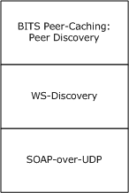

# [MS-BPDP]: Background Intelligent Transfer Service (BITS) Peer-Caching: Peer Discovery Protocol

Table of Contents

1 Introduction

- [1 Introduction](#Section_1)
  - [1.1 Glossary](#Section_1.1)
  - [1.2 References](#Section_1.2)
    - [1.2.1 Normative References](#Section_1.2.1)
    - [1.2.2 Informative References](#Section_1.2.2)
  - [1.3 Overview](#Section_1.3)
  - [1.4 Relationship to Other Protocols](#Section_1.4)
  - [1.5 Prerequisites/Preconditions](#Section_1.5)
  - [1.6 Applicability Statement](#Section_1.6)
  - [1.7 Versioning and Capability Negotiation](#Section_1.7)
  - [1.8 Vendor-Extensible Fields](#Section_1.8)
  - [1.9 Standards Assignments](#Section_1.9)

2 Messages

- [2 Messages](#Section_2)
  - [2.1 Transport](#Section_2.1)
  - [2.2 Common Message Syntax](#Section_2.2)
    - [2.2.1 Namespaces](#Section_2.2.1)
    - [2.2.2 Messages](#Section_2.2.2)
    - [2.2.3 Elements](#Section_2.2.3)
    - [2.2.4 Complex Types](#Section_2.2.4)
    - [2.2.5 Simple Types](#Section_2.2.5)
    - [2.2.6 Attributes](#Section_2.2.6)
    - [2.2.7 Groups](#Section_2.2.7)
    - [2.2.8 Attribute Groups](#Section_2.2.8)

3 Protocol Details

- [3 Protocol Details](#Section_3)
  - [3.1 Server Details](#Section_3.1)
    - [3.1.1 Abstract Data Model](#Section_3.1.1)
      - [3.1.1.1 Protocol Metadata](#Section_3.1.1.1)
      - [3.1.1.2 Table of Connected Subnets](#Section_3.1.1.2)
    - [3.1.2 Timers](#Section_3.1.2)
    - [3.1.3 Initialization](#Section_3.1.3)
    - [3.1.4 Message Processing Events and Sequencing Rules](#Section_3.1.4)
      - [3.1.4.1 Hello](#Section_3.1.4.1)
        - [3.1.4.1.1 Messages](#Section_3.1.4.1.1)
      - [3.1.4.2 Bye](#Section_3.1.4.2)
        - [3.1.4.2.1 Messages](#Section_3.1.4.2.1)
      - [3.1.4.3 Probe](#Section_3.1.4.3)
        - [3.1.4.3.1 Messages](#Section_3.1.4.3.1)
      - [3.1.4.4 ProbeMatch](#Section_3.1.4.4)
        - [3.1.4.4.1 Messages](#Section_3.1.4.4.1)
      - [3.1.4.5 Resolve](#Section_3.1.4.5)
        - [3.1.4.5.1 Messages](#Section_3.1.4.5.1)
      - [3.1.4.6 ResolveMatch](#Section_3.1.4.6)
        - [3.1.4.6.1 Messages](#Section_3.1.4.6.1)
    - [3.1.5 Timer Events](#Section_3.1.5)
    - [3.1.6 Other Local Events](#Section_3.1.6)
      - [3.1.6.1 Shutdown](#Section_3.1.6.1)
      - [3.1.6.2 Add a Local IP Address](#Section_3.1.6.2)
      - [3.1.6.3 Remove an IP Address](#Section_3.1.6.3)
  - [3.2 Client Details](#Section_3.2)
    - [3.2.1 Abstract Data Model](#Section_3.2.1)
      - [3.2.1.1 Table of Subnets](#Section_3.2.1.1)
      - [3.2.1.2 Table of Servers](#Section_3.2.1.2)
      - [3.2.1.3 Tables of Server Addresses](#Section_3.2.1.3)
      - [3.2.1.4 Scope List](#Section_3.2.1.4)
    - [3.2.2 Timers](#Section_3.2.2)
      - [3.2.2.1 Discovery Timer](#Section_3.2.2.1)
      - [3.2.2.2 Discovery Suppression Timer](#Section_3.2.2.2)
      - [3.2.2.3 Address Scavenger Timer](#Section_3.2.2.3)
    - [3.2.3 Initialization](#Section_3.2.3)
    - [3.2.4 Message Processing Events and Sequencing Rules](#Section_3.2.4)
      - [3.2.4.1 Hello](#Section_3.2.4.1)
      - [3.2.4.2 Bye](#Section_3.2.4.2)
      - [3.2.4.3 Probe](#Section_3.2.4.3)
      - [3.2.4.4 ProbeMatch](#Section_3.2.4.4)
    - [3.2.5 Timer Events](#Section_3.2.5)
      - [3.2.5.1 Discovery Time-Out](#Section_3.2.5.1)
      - [3.2.5.2 Discovery Suppression Time-Out](#Section_3.2.5.2)
      - [3.2.5.3 Address Scavenger Time-Out](#Section_3.2.5.3)
    - [3.2.6 Other Local Events](#Section_3.2.6)
      - [3.2.6.1 Attach to a Subnet](#Section_3.2.6.1)
      - [3.2.6.2 Detach from a Subnet](#Section_3.2.6.2)
      - [3.2.6.3 Clear the Table of Servers](#Section_3.2.6.3)
      - [3.2.6.4 Discovery Request](#Section_3.2.6.4)
      - [3.2.6.5 Cancel Discovery Request](#Section_3.2.6.5)
      - [3.2.6.6 Enumerate Server Addresses](#Section_3.2.6.6)
      - [3.2.6.7 Update Server Address Time Stamp](#Section_3.2.6.7)
      - [3.2.6.8 Shut Down](#Section_3.2.6.8)

4 Protocol Examples

- [4 Protocol Examples](#Section_4)
  - [4.1 Hello Message at Server Startup and Bye Message at Shutdown](#Section_4.1)
  - [4.2 Client Probe with Probe-Match Replies](#Section_4.2)

5 Security

- [5 Security](#Section_5)
  - [5.1 Security Considerations for Implementers](#Section_5.1)
    - [5.1.1 Potential for High Unicast Traffic](#Section_5.1.1)
    - [5.1.2 Lack of Message Authentication](#Section_5.1.2)
  - [5.2 Index of Security Parameters](#Section_5.2)

6 Appendix A: Full WSDL

- [6 Appendix A: Full WSDL](#Section_6)

7 Appendix B: Product Behavior

- [7 Appendix B: Product Behavior](#Section_7)

8 Change Tracking

- [8 Change Tracking](#Section_8)

For the legal notice and IP terms, see [LEGAL.md](../LEGAL.md).
Last updated: 6/1/2017.
See [Revision History](#revision-history) for full version history.

# 1 Introduction

This document describes the Background Intelligent Transfer Service (BITS) Peer-Caching: Peer Discovery Protocol. This protocol is used to locate hosts in a [**domain**](#gt_domain) that supports the URL-caching protocol implemented by BITS. The protocol is implemented by using the Web Services Dynamic Discovery (WS-Discovery) Protocol, as specified in [[WS-Discovery]](https://go.microsoft.com/fwlink/?LinkId=90576).

Sections 1.5, 1.8, 1.9, 2, and 3 of this specification are normative. All other sections and examples in this specification are informative.

## 1.1 Glossary

This document uses the following terms:

**Active Directory**: A general-purpose network directory service. [**Active Directory**](#gt_active-directory) also refers to the Windows implementation of a directory service. [**Active Directory**](#gt_active-directory) stores information about a variety of objects in the network. Importantly, user accounts, computer accounts, groups, and all related credential information used by the Windows implementation of Kerberos are stored in [**Active Directory**](#gt_active-directory). [**Active Directory**](#gt_active-directory) is either deployed as Active Directory Domain Services (AD DS) or Active Directory Lightweight Directory Services (AD LDS). [MS-ADTS](../MS-ADTS/MS-ADTS.md) describes both forms. For more information, see [MS-AUTHSOD](../MS-AUTHSOD/MS-AUTHSOD.md) section 1.1.1.5.2, Lightweight Directory Access Protocol (LDAP) versions 2 and 3, Kerberos, and DNS.

**Coordinated Universal Time (UTC)**: A high-precision atomic time standard that approximately tracks Universal Time (UT). It is the basis for legal, civil time all over the Earth. Time zones around the world are expressed as positive and negative offsets from UTC. In this role, it is also referred to as Zulu time (Z) and Greenwich Mean Time (GMT). In these specifications, all references to UTC refer to the time at UTC-0 (or GMT).

**domain**: A set of users and computers sharing a common namespace and management infrastructure. At least one computer member of the set must act as a domain controller (DC) and host a member list that identifies all members of the domain, as well as optionally hosting the [**Active Directory**](#gt_active-directory) service. The domain controller provides authentication of members, creating a unit of trust for its members. Each domain has an identifier that is shared among its members. For more information, see [MS-AUTHSOD] section 1.1.1.5 and [MS-ADTS].

**fully qualified domain name (FQDN)**: An unambiguous domain name that gives an absolute location in the Domain Name System's (DNS) hierarchy tree, as defined in [[RFC1035]](https://go.microsoft.com/fwlink/?LinkId=90264) section 3.1 and [[RFC2181]](https://go.microsoft.com/fwlink/?LinkId=127732) section 11.

**globally unique identifier (GUID)**: A term used interchangeably with [**universally unique identifier (UUID)**](#gt_universally-unique-identifier-uuid) in Microsoft protocol technical documents (TDs). Interchanging the usage of these terms does not imply or require a specific algorithm or mechanism to generate the value. Specifically, the use of this term does not imply or require that the algorithms described in [[RFC4122]](https://go.microsoft.com/fwlink/?LinkId=90460) or [[C706]](https://go.microsoft.com/fwlink/?LinkId=89824) must be used for generating the [**GUID**](#gt_globally-unique-identifier-guid). See also [**universally unique identifier (UUID)**](#gt_universally-unique-identifier-uuid).

**Internet Protocol version 4 (IPv4)**: An Internet protocol that has 32-bit source and destination addresses. IPv4 is the predecessor of IPv6.

**Internet Protocol version 6 (IPv6)**: A revised version of the Internet Protocol (IP) designed to address growth on the Internet. Improvements include a 128-bit IP address size, expanded routing capabilities, and support for authentication and privacy.

**SOAP fault**: A container for error and status information within a SOAP message. See [[SOAP1.2-1/2007]](https://go.microsoft.com/fwlink/?LinkId=94664) section 5.4 for more information.

**Uniform Resource Identifier (URI)**: A string that identifies a resource. The URI is an addressing mechanism defined in Internet Engineering Task Force (IETF) Uniform Resource Identifier (URI): Generic Syntax [[RFC3986]](https://go.microsoft.com/fwlink/?LinkId=90453).

**universally unique identifier (UUID)**: A 128-bit value. UUIDs can be used for multiple purposes, from tagging objects with an extremely short lifetime, to reliably identifying very persistent objects in cross-process communication such as client and server interfaces, manager entry-point vectors, and RPC objects. UUIDs are highly likely to be unique. UUIDs are also known as [**globally unique identifiers (GUIDs)**](#gt_globally-unique-identifier-guid) and these terms are used interchangeably in the Microsoft protocol technical documents (TDs). Interchanging the usage of these terms does not imply or require a specific algorithm or mechanism to generate the UUID. Specifically, the use of this term does not imply or require that the algorithms described in [RFC4122] or [C706] must be used for generating the UUID.

**UTC (Coordinated Universal Time)**: A high-precision atomic time standard that approximately tracks Universal Time (UT). It is the basis for legal, civil time all over the Earth. Time zones around the world are expressed as positive and negative offsets from UTC. In this role, it is also referred to as Zulu time (Z) and Greenwich Mean Time (GMT). In these specifications, all references to UTC refer to the time at UTC–0 (or GMT).

**Web Services Description Language (WSDL)**: An XML format for describing network services as a set of endpoints that operate on messages that contain either document-oriented or procedure-oriented information. The operations and messages are described abstractly and are bound to a concrete network protocol and message format in order to define an endpoint. Related concrete endpoints are combined into abstract endpoints, which describe a network service. WSDL is extensible, which allows the description of endpoints and their messages regardless of the message formats or network protocols that are used.

**MAY, SHOULD, MUST, SHOULD NOT, MUST NOT:** These terms (in all caps) are used as defined in [[RFC2119]](https://go.microsoft.com/fwlink/?LinkId=90317). All statements of optional behavior use either MAY, SHOULD, or SHOULD NOT.

## 1.2 References

Links to a document in the Microsoft Open Specifications library point to the correct section in the most recently published version of the referenced document. However, because individual documents in the library are not updated at the same time, the section numbers in the documents may not match. You can confirm the correct section numbering by checking the [Errata](http://msdn.microsoft.com/en-us/library/dn781092.aspx).

### 1.2.1 Normative References

We conduct frequent surveys of the normative references to assure their continued availability. If you have any issue with finding a normative reference, please contact [dochelp@microsoft.com](mailto:dochelp@microsoft.com). We will assist you in finding the relevant information.

[MS-DTYP] Microsoft Corporation, "[Windows Data Types](../MS-DTYP/MS-DTYP.md)".

[RFC1035] Mockapetris, P., "Domain Names - Implementation and Specification", STD 13, RFC 1035, November 1987, [http://www.ietf.org/rfc/rfc1035.txt](https://go.microsoft.com/fwlink/?LinkId=90264)

[RFC2119] Bradner, S., "Key words for use in RFCs to Indicate Requirement Levels", BCP 14, RFC 2119, March 1997, [http://www.rfc-editor.org/rfc/rfc2119.txt](https://go.microsoft.com/fwlink/?LinkId=90317)

[RFC3513] Hinden, R. and Deering, S., "Internet Protocol Version 6 (IPv6) Addressing Architecture", RFC 3513, April 2003, [http://www.ietf.org/rfc/rfc3513.txt](https://go.microsoft.com/fwlink/?LinkId=90427)

[SOAP-UDP] Combs, H., Justice, J., Kakivaya, G., et al., "SOAP-over-UDP", September 2004, [http://specs.xmlsoap.org/ws/2004/09/soap-over-udp/soap-over-udp.pdf](https://go.microsoft.com/fwlink/?LinkId=90523)

[SOAP1.2-2/2003] Gudgin, M., Hadley, M., Mendelsohn, N., et al., "SOAP Version 1.2 Part 2: Adjuncts", W3C Recommendation, June 2003, [http://www.w3.org/TR/2003/REC-soap12-part2-20030624](https://go.microsoft.com/fwlink/?LinkId=90522)

[WS-Discovery] Beatty, J., Kakivaya, G., Kemp D., et al., "Web Services Dynamic Discovery (WS-Discovery)", April 2005, [http://specs.xmlsoap.org/ws/2005/04/discovery/ws-discovery.pdf](https://go.microsoft.com/fwlink/?LinkId=90576)

[WSAddressing] Box, D., et al., "Web Services Addressing (WS-Addressing)", August 2004, [http://www.w3.org/Submission/ws-addressing/](https://go.microsoft.com/fwlink/?LinkId=90575)

[WSDL] Christensen, E., Curbera, F., Meredith, G., and Weerawarana, S., "Web Services Description Language (WSDL) 1.1", W3C Note, March 2001, [http://www.w3.org/TR/2001/NOTE-wsdl-20010315](https://go.microsoft.com/fwlink/?LinkId=90577)

[XMLNS] Bray, T., Hollander, D., Layman, A., et al., Eds., "Namespaces in XML 1.0 (Third Edition)", W3C Recommendation, December 2009, [http://www.w3.org/TR/2009/REC-xml-names-20091208/](https://go.microsoft.com/fwlink/?LinkId=191840)

[XMLSCHEMA1] Thompson, H., Beech, D., Maloney, M., and Mendelsohn, N., Eds., "XML Schema Part 1: Structures", W3C Recommendation, May 2001, [http://www.w3.org/TR/2001/REC-xmlschema-1-20010502/](https://go.microsoft.com/fwlink/?LinkId=90608)

[XMLSCHEMA2] Biron, P.V., Ed. and Malhotra, A., Ed., "XML Schema Part 2: Datatypes", W3C Recommendation, May 2001, [http://www.w3.org/TR/2001/REC-xmlschema-2-20010502/](https://go.microsoft.com/fwlink/?LinkId=90610)

### 1.2.2 Informative References

[MS-BPAU] Microsoft Corporation, "[Background Intelligent Transfer Service (BITS) Peer-Caching: Peer Authentication Protocol](../MS-BPAU/MS-BPAU.md)".

[MS-BPCR] Microsoft Corporation, "[Background Intelligent Transfer Service (BITS) Peer-Caching: Content Retrieval Protocol](../MS-BPCR/MS-BPCR.md)".

[MSDN-BITS] Microsoft Corporation, "Background Intelligent Transfer Service", [http://msdn.microsoft.com/en-us/library/bb968799(VS.85).aspx](https://go.microsoft.com/fwlink/?LinkId=89959)

## 1.3 Overview

The BITS Peer-Caching: Peer Discovery Protocol is used to locate networked hosts or devices that are implementing the server role of the BITS Peer-Caching: Content Retrieval Protocol. The BITS Peer-Caching: Peer Discovery Protocol provides a way for peer servers to announce their presence to connected subnets and a way for peer clients to locate servers in connected subnets.

The BITS Peer-Caching: Peer Discovery Protocol is a specialization of Web Services Dynamic Discovery (WS-Discovery), as specified in [[WS-Discovery]](https://go.microsoft.com/fwlink/?LinkId=90576), and follows its model for announcing and locating resources. The protocol defines a client role and a server role. A server announces its presence to connected IP subnets via a multicasted [Hello](#Section_3.2.4.1) message to UDP port 3702. A client discovers servers passively by listening for Hello messages. A client can also solicit for servers by multicasting a [Probe](#Section_3.2.4.3) message to the same UDP port; servers with matching characteristics reply to the client with unicast [Probe-Match](#Section_4.2) messages.

Windows uses the BITS Peer-Caching: Peer Discovery Protocol to implement a distributed peer-to-peer cache of URL content for use by the Background Intelligent Transfer Service (BITS) component. For more information about BITS, see [[MSDN-BITS]](https://go.microsoft.com/fwlink/?LinkId=89959).

## 1.4 Relationship to Other Protocols

The BITS Peer-Caching: Peer Discovery Protocol does not authenticate computers to each other; Windows uses the Background Intelligent Transfer Service (BITS) Peer-Caching: Peer Authentication Protocol Specification for mutual authentication of potential peers. For more information, see [MS-BPAU](../MS-BPAU/MS-BPAU.md).

WS-Discovery, and therefore the BITS Peer-Caching: Peer Discovery Protocol, uses SOAP-over-UDP as its network transport. For more information, see [[SOAP-UDP]](https://go.microsoft.com/fwlink/?LinkId=90523).

A host implementing the client or server role of the BITS Peer-Caching: Peer Discovery Protocol typically also implements the same role of the BITS Peer-Caching: Content Retrieval Protocol, as a higher level protocol.

Figure 1: Relationship to other protocols

## 1.5 Prerequisites/Preconditions

This protocol defines no prerequisites.

## 1.6 Applicability Statement

The primary purpose of the BITS Peer-Caching: Peer Discovery Protocol is to locate peer servers for use by the BITS Peer-Caching: Content Retrieval Protocol, as specified in [MS-BPCR](../MS-BPCR/MS-BPCR.md). The BITS Peer-Caching: Peer Discovery Protocol is intended for use by hosts that are members of an Active Directory [**domain**](#gt_domain).

## 1.7 Versioning and Capability Negotiation

This document covers versioning issues in the following areas:

- **Protocol Versions**: A server advertises the versions of the protocol it supports via [Hello](#Section_3.2.4.1) and [Probe-Match](#Section_4.2) messages.
A client does not advertise the protocol versions it supports.

This specification defines version 1 of the BITS Peer-Caching: Peer Discovery Protocol. The format of each message in version 1 is defined in section [2](#Section_2) and [3](#Section_3). Because this is the initial release of the protocol, no additional versions are defined at time of publication.

- **Capability Negotiation**: The BITS Peer-Caching: Peer Discovery Protocol implicitly allows negotiation of additional capabilities by the presence or absence of additional XML elements in each message. Version 1 does not define any capabilities.

## 1.8 Vendor-Extensible Fields

No vendor-extensible fields are defined.

## 1.9 Standards Assignments

None.

# 2 Messages

## 2.1 Transport

The BITS Peer-Caching: Peer Discovery Protocol is a specialization of the WS-Discovery Protocol. The Web Services Dynamic Discovery (WS-Discovery) Protocol, including dependent transports, is as specified in [[WS-Discovery]](https://go.microsoft.com/fwlink/?LinkId=90576).

## 2.2 Common Message Syntax

This section contains common definitions used by this protocol. The syntax of the definitions uses XML Schema as defined in [[XMLSCHEMA1]](https://go.microsoft.com/fwlink/?LinkId=90608) and [[XMLSCHEMA2]](https://go.microsoft.com/fwlink/?LinkId=90610), and [**Web Services Description Language (WSDL)**](#gt_web-services-description-language-wsdl) as defined in [[WSDL]](https://go.microsoft.com/fwlink/?LinkId=90577).

The BITS Peer-Caching: Peer Discovery Protocol follows the message syntax of [[WS-Discovery]](https://go.microsoft.com/fwlink/?LinkId=90576). Messages MUST use SOAP version 1.2, as specified in [[SOAP1.2-2/2003]](https://go.microsoft.com/fwlink/?LinkId=90522). This protocol does not require the generation or processing of [**SOAP faults**](#gt_soap-fault). No additional SOAP faults are defined.

### 2.2.1 Namespaces

This specification defines and references various XML namespaces using the mechanisms specified in [[XMLNS]](https://go.microsoft.com/fwlink/?LinkId=191840). Although this specification associates a specific XML namespace prefix for each XML namespace that is used, the choice of any particular XML namespace prefix is implementation-specific and not significant for interoperability.

The following XML namespaces are used in this document:

| Prefix | XML namespace | Specification |
| --- | --- | --- |
| msbits | http://schemas.microsoft.com/windows/2005/05/BITS/cache | This specification |
| a | http://schemas.xmlsoap.org/ws/2004/08/addressing | [[WSAddressing]](https://go.microsoft.com/fwlink/?LinkId=90575) |
| d | http://schemas.xmlsoap.org/ws/2005/04/discovery | [[WS-Discovery]](https://go.microsoft.com/fwlink/?LinkId=90576) |

### 2.2.2 Messages

This specification does not define any common [**WSDL**](#gt_web-services-description-language-wsdl) messages.

### 2.2.3 Elements

The BITS Peer-Caching: Peer Discovery Protocol defines the http://schemas.microsoft.com/windows/2005/05/BITS/cache namespace as follows:

- The **msbits:Fqdn** element MUST contain the fully qualified DNS domain name of a host, with format as described in [[RFC1035]](https://go.microsoft.com/fwlink/?LinkId=90264) section 2.3.1 and a total length of 255 characters or less.
- The **msbits:version** element MUST contain a list of versions of the BITS Peer-Caching: Peer Discovery Protocol that are supported by the sender. Versions MUST be unsigned 32-bit integers in a list delimited by white space. If version 1 is an element of the list, it MUST be the first element. This specification defines version 1, as no other versions are defined at the time of publication.
- The type **msbits:PeerServer** represents an instance of the server role.
[[WS-Discovery]](https://go.microsoft.com/fwlink/?LinkId=90576) section 2.6 refers to the **a:EndpointReference** element, as specified in [[WSAddressing]](https://go.microsoft.com/fwlink/?LinkId=90575) section 2. Within messages sent by the BITS Peer-Caching: Peer Discovery Protocol, the specification of the **a:EndpointReference** element is constrained in the following ways:

- The **a:Address** child element follows the recommendation of "uuid:" followed by a [**GUID**](#gt_globally-unique-identifier-guid). This MUST be the instance GUID of the server referred to in section [3.1.1.1](#Section_3.1.1.1).
- A transport address in the **d:XAddrs** element MUST have one of the following formats:
IPV4-str= "https://" ipv4-address

IPV6-str= "https://[" ipv6-address "]"

Where:

- The [**Ipv4**](#gt_internet-protocol-version-4-ipv4)-address MUST be a dotted IPv4 address.
- The [**Ipv6**](#gt_internet-protocol-version-6-ipv6)-address MUST have one of the formats specified in [[RFC3513]](https://go.microsoft.com/fwlink/?LinkId=90427) section 2.2.

### 2.2.4 Complex Types

This specification does not define any common XML Schema complex type definitions.

### 2.2.5 Simple Types

This specification does not define any common XML Schema simple type definitions.

### 2.2.6 Attributes

This specification does not define any common XML Schema attribute definitions.

### 2.2.7 Groups

This specification does not define any common XML Schema group definitions.

### 2.2.8 Attribute Groups

This specification does not define any common XML Schema attribute group definitions.

# 3 Protocol Details

## 3.1 Server Details

### 3.1.1 Abstract Data Model

This section describes a conceptual model of possible data organization that an implementation maintains to participate in this protocol. The described organization is provided to facilitate the explanation of how the protocol behaves. This document does not mandate that implementations adhere to this model as long as their external behavior is consistent with that described in this document.

The server behaves as a WS-Discovery Target Service, as specified in [[WS-Discovery]](https://go.microsoft.com/fwlink/?LinkId=90576).

#### 3.1.1.1 Protocol Metadata

The server maintains several pieces of metadata about itself:

- Its [**FQDN**](#gt_fully-qualified-domain-name-fqdn).
- Its active WS-Discovery scopes.
- An unsigned 32-bit integer representing the WS-Discovery metadata version.
- A [**GUID**](#gt_globally-unique-identifier-guid) ([MS-DTYP](../MS-DTYP/MS-DTYP.md) section 2.3.4) that is the instance GUID for WS-Discovery.

#### 3.1.1.2 Table of Connected Subnets

The server maintains a table of all subnets for which it currently has an active IP address. Each row of the table represents a single subnet and includes the following data:

- A list of server IP addresses in the subnet.
- The subnet ID.
- The subnet mask (for [**IPv4**](#gt_internet-protocol-version-4-ipv4)) or prefix (for [**IPv6**](#gt_internet-protocol-version-6-ipv6)).
**Note** The abstract data model can be implemented in a variety of ways. This protocol does not prescribe or advocate any specific implementation technique.

### 3.1.2 Timers

No protocol-specific timers are required by the server.

### 3.1.3 Initialization

The first time the protocol is initialized, the server MUST create a unique instance [**GUID**](#gt_globally-unique-identifier-guid) and SHOULD set its metadata version to zero. In subsequent initializations, the server SHOULD test whether its set of IP addresses has changed since the previous invocation by using the metadata version from the previous invocation if the set is unchanged or incrementing the metadata version if the set is different.<1> If the server does not test whether its set of IP addresses has changed, the server MUST create a new unique instance GUID.

The server MUST identify its WS-Discovery scopes by implementation-dependent means.<2>

The server MUST begin listening for messages. Transport information is specified in [[WS-Discovery]](https://go.microsoft.com/fwlink/?LinkId=90576) section 2.4.

### 3.1.4 Message Processing Events and Sequencing Rules

The following table summarizes the list of [**WSDL**](#gt_web-services-description-language-wsdl) operations defined by this specification:

| Operation | Description |
| --- | --- |
| Hello | Used to announce a service that is joining a network. |
| Bye | Used to announce a service that is leaving a network. |
| Probe | Used to find a service on the network, based on service type. |
| ProbeMatch | Used to respond to a Probe message to indicate that the service matches the requested type. |
| Resolve | Used to locate a particular target service and retrieve network transport information. |
| ResolveMatch | Used to return the network transport information for a target service requested using a Resolve message. |

The server MUST verify that each received message matches the schema, as specified in [[WS-Discovery]](https://go.microsoft.com/fwlink/?LinkId=90576) Appendix III, and discard malformed messages. Further parsing depends on the message type.

All other messages are discarded without further processing.

#### 3.1.4.1 Hello

A server of the BITS Peer-Caching: Peer Discovery Protocol uses the Hello message to announce its presence.

The format of the Hello message is as specified in [[WS-Discovery]](https://go.microsoft.com/fwlink/?LinkId=90576) section 4.1. The following additional constraints are placed on the **/s:Envelope/s:Body/d:Hello** element:

- The **a:EndpointReference** child element MUST conform to section [2.2.3](#Section_2.2.3) of this document. It MUST contain exactly one msbits:Fqdn child element and exactly one msbits:version child element. These elements carry metadata about the server, even though they are child elements of the a:EndpointReference child element, and SHOULD NOT be copied into subsequent messages addressed to the Endpoint Reference in question.
- A single **d:Types** child element MUST be present and include the type "msbits:PeerServer".
- A single d:Scopes child element MUST be present and contain at least one scope.<3>
- A single d:XAddrs child element MUST be present. The [**URI**](#gt_uniform-resource-identifier-uri) list MUST contain at least one IP address in each of the subnets to which the message is sent.<4> The format of address URIs is specified in section 2.2.3.

##### 3.1.4.1.1 Messages

The following table summarizes the set of [**WSDL**](#gt_web-services-description-language-wsdl) message definitions that are specific to this operation.

| Message | Description |
| --- | --- |
| HelloMsg | Used to announce that a service is joining a network. |

#### 3.1.4.2 Bye

A server of the BITS Peer-Caching: Peer Discovery Protocol uses the Bye message to indicate that it is disconnecting from a network.

The format of the Bye message is specified in [[WS-Discovery]](https://go.microsoft.com/fwlink/?LinkId=90576) section 4.2.

The BITS Peer-Caching: Peer Discovery Protocol places no new requirements on the Bye message.

##### 3.1.4.2.1 Messages

The following table summarizes the set of [**WSDL**](#gt_web-services-description-language-wsdl) message definitions that are specific to this operation.

| Message | Description |
| --- | --- |
| ByeMsg | Used to announce that a service is leaving a network. |

#### 3.1.4.3 Probe

The server adheres to the requirements, as specified in [[WS-Discovery]](https://go.microsoft.com/fwlink/?LinkId=90576) section 5. In addition, the BITS Peer-Caching: Peer Discovery Protocol adds the following requirements:

- When the server receives a Probe message, it MUST verify that the message satisfies the requirements specified in sections [2.2.3](#Section_2.2.3) and [3.2.4.3](#Section_3.2.4.3). If not, the message MUST be discarded.
- When a matching Probe message is received, the server MUST reply with a [Probe-Match](#Section_4.2) message, following the rules specified in [WS-Discovery] section 5.3 and in section 3.1.4.4 of this document.
- When a Probe-Match message is sent to a particular subnet, the **/s:Envelope/s:Body/d:Probe-Match/d:XAddrs** element MUST contain the server addresses in that subnet from the table of connected subnets. The message SHOULD NOT contain addresses in other subnets.<5> For the URI encoding of server addresses, see section 2.2.3.
The server MAY limit the number and rate of Probe messages processed.

##### 3.1.4.3.1 Messages

The following table summarizes the set of [**WSDL**](#gt_web-services-description-language-wsdl) message definitions that are specific to this operation.

| Message | Description |
| --- | --- |
| ProbeMsg | Used to find a service on the network based on service type. |

#### 3.1.4.4 ProbeMatch

A server of the BITS Peer-Caching: Peer Discovery Protocol sends a Probe-Match message after it receives a Probe message that matches the server's WS-Discovery type and scope.

The format of the Probe-Match message is as specified in [[WS-Discovery]](https://go.microsoft.com/fwlink/?LinkId=90576) section 5.3. The following additional constraints are placed on the **/s:Envelope/s:Body/d:Probe-Match** element:

- The **a:EndpointReference** child element MUST conform to section [2.2.3](#Section_2.2.3) of this document. It MUST contain exactly one msbits:Fqdn child element and exactly one msbits:version child element. These elements carry metadata about the server, even though they are child elements of the a:EndpointReference child element, and SHOULD NOT be copied into subsequent messages addressed to the Endpoint Reference in question.
- A single **d:Types** child element MUST be present and include the type "msbits:PeerServer".
- A single **d:Scopes** child element MUST be present and contain at least one scope conforming to section 2.2.3 of this document. <6>
- A single **d:XAddrs** child element MUST be present and its URI list MUST contain at least one address in the subnet to which the message is sent.<7>

##### 3.1.4.4.1 Messages

The following table summarizes the set of [**WSDL**](#gt_web-services-description-language-wsdl) message definitions that are specific to this operation.

| Message | Description |
| --- | --- |
| ProbeMatchMsg | Used for responding to a Probe message to indicate that the service matches the requested type. |

#### 3.1.4.5 Resolve

A server is required to respond to a Resolve message that matches its Endpoint Reference, as specified in [[WS-Discovery]](https://go.microsoft.com/fwlink/?LinkId=90576) section 6.1. The BITS Peer-Caching: Peer Discovery Protocol relaxes that requirement.

When the server receives a Resolve message, it MAY ignore the message.<8> If the server chooses to process Resolve messages, it MUST follow the rules specified in [WS-Discovery] section 6.2.

In WS-Discovery, the Resolve/Resolve-Match message exchange is used when a client knows the Endpoint Reference of a server but not its XAddrs, and it requires the XAddrs. All [Hello](#Section_3.2.4.1) and [Probe-Match](#Section_4.2) messages sent by the BITS Peer-Caching: Peer Discovery Protocol server role carry the server's XAddrs in addition to the Endpoint Reference, so the additional message exchange is not necessary.

##### 3.1.4.5.1 Messages

The following table summarizes the set of [**WSDL**](#gt_web-services-description-language-wsdl) message definitions that are specific to this operation.

| Message | Description |
| --- | --- |
| ResolveMsg | Used to locate a particular target service and retrieve network transport information. |

#### 3.1.4.6 ResolveMatch

The BITS Peer-Caching: Peer Discovery Protocol does not use WS-Discovery's Resolve and Resolve-Match messages and makes no changes to the definitions as specified in [[WS-Discovery]](https://go.microsoft.com/fwlink/?LinkId=90576) sections 6.1 and 6.2. They SHOULD NOT be sent by an implementation of this protocol and also SHOULD be ignored or treated as not matching if received.<9>

##### 3.1.4.6.1 Messages

The following table summarizes the set of [**WSDL**](#gt_web-services-description-language-wsdl) message definitions that are specific to this operation.

| Message | Description |
| --- | --- |
| ResolveMatchMsg | Used to return the network transport information for a target service requested by a Resolve message. |

### 3.1.5 Timer Events

Timers are defined in [[WS-Discovery]](https://go.microsoft.com/fwlink/?LinkId=90576) sections 2.4, 3, and 7.

BITS Peer-Caching: Peer Discovery Protocol defines no additional requirements.

### 3.1.6 Other Local Events

#### 3.1.6.1 Shutdown

The server MUST ignore further incoming messages.

The server MAY send a [Bye](#Section_3.1.4.2) message as specified in [[WS-Discovery]](https://go.microsoft.com/fwlink/?LinkId=90576) sections 3 and 4.2.<10>

The server SHOULD close the network ports specified in [WS-Discovery] section 2.4.<11>

#### 3.1.6.2 Add a Local IP Address

When a local IP address is added, the server checks whether it is a loopback address or a temporary [**IPv6**](#gt_internet-protocol-version-6-ipv6) address. If it is either address, the notification MUST be ignored.

Administrative policy might require that the address not be included in the server's table of subnets. If so, then the notification is ignored.

Otherwise, the server MUST compare the subnet ID and subnet mask to those in each row in the table of connected subnets. If a matching row is not found, the server MUST create one.

The server MUST then add the local address to the list of server addresses in the row for its subnet.

The server SHOULD then increment its metadata version.<12>

Then the server SHOULD send a [Hello](#Section_3.2.4.1) message to announce the new address, as specified in [[WS-Discovery]](https://go.microsoft.com/fwlink/?LinkId=90576) section 4.1.<13>

When a Hello message is sent, the server MUST send the message to the subnet whose address list changed, implying that the **/s:Envelope/s:Body/d:Hello/d:XAddrs** element MUST contain the server addresses in that subnet from the table of connected subnets. The server SHOULD send the message only to that subnet, in which case it SHOULD NOT contain addresses in other subnets.<14>

If the server sends the message to multiple subnets, the **/s:Envelope/s:Body/d:Hello/d:XAddrs** element MUST contain the server addresses in each of those subnets.

#### 3.1.6.3 Remove an IP Address

When an IP address is to be deleted, the server MUST check whether the address is a member of the address list in any row of the table of connected subnets. If not, the notification is ignored.

Otherwise, the server MUST remove the address from the list for that row. The server SHOULD then increment its metadata version.<15>

If the list contains other addresses, the server SHOULD send a [Hello](#Section_3.2.4.1) message to update the address list, as specified in [[WS-Discovery]](https://go.microsoft.com/fwlink/?LinkId=90576) section 4.1.<16> If the list contains no other addresses, then the server MUST delete the row from the table. The server MAY send a [Bye](#Section_3.1.4.2) message to the subnet of the deleted address, using the current instance [**GUID**](#gt_globally-unique-identifier-guid) for the **/s:Body/d:Bye/a:EndpointReference/a:Address** child element, as specified in [WS-Discovery] section 4.2.

When a Hello message is sent, the server MUST send the message to the subnet whose address list changed, implying that the **/s:Envelope/s:Body/d:Hello/d:XAddrs** element MUST contain the server addresses in that subnet from the table of connected subnets. The server SHOULD send the message only to that subnet, in which case it SHOULD NOT contain addresses in other subnets.<17>

If the server sends the Hello message to multiple connected subnets, the **/s:Envelope/s:Body/d:Hello/d:XAddrs** element MUST contain the server addresses in each of those subnets.

## 3.2 Client Details

### 3.2.1 Abstract Data Model

This section describes a conceptual model of possible data organization that an implementation maintains to participate in this protocol. The described organization is provided to facilitate the explanation of how the protocol behaves. This document does not mandate that implementations adhere to this model as long as their external behavior is consistent with that described in this document.

The client behaves as a WS-Discovery client, as indicated throughout [[WS-Discovery]](https://go.microsoft.com/fwlink/?LinkId=90576).

#### 3.2.1.1 Table of Subnets

The client maintains a table of all IP subnets for which it currently holds the following:

- A local IP address.
- A table of server addresses.
Each row of the table represents a single subnet and includes the following data:

- A flag M_ATTACHED that is true if the client is currently attached to this subnet.
- A pointer to a table of server addresses.
- For each [**IPv4**](#gt_internet-protocol-version-4-ipv4) subnet, the client saves its subnet ID, subnet mask, and DNS domain suffix (or an empty string if not available).
- For each [**IPv6**](#gt_internet-protocol-version-6-ipv6) subnet, the client saves its subnet ID and subnet mask.

#### 3.2.1.2 Table of Servers

The client maintains a table of all servers that are present or cached. Each row of the table represents a single server and includes:

- Its [**fully qualified domain name (FQDN)**](#gt_fully-qualified-domain-name-fqdn).
- The version of the BITS Peer-Caching: Peer Discovery Protocol that it supports, as specified in section [2.2.3](#Section_2.2.3).
- A Boolean that is true if the server has been authenticated by implementation-dependent means.<18>
- (OPTIONAL) A unique [**GUID**](#gt_globally-unique-identifier-guid) representing the server instance. This data is used only if the client processes [Bye](#Section_3.1.4.2) messages.<19>

#### 3.2.1.3 Tables of Server Addresses

For each subnet, the client maintains a table of servers and their local addresses. Each row of the table represents a single server address and includes:

- Its [**FQDN**](#gt_fully-qualified-domain-name-fqdn).
- Its last known address in this subnet.
- The [**UTC (Coordinated Universal Time)**](#gt_utc-coordinated-universal-time) of the last time this address was refreshed.
The [**UTC**](#gt_coordinated-universal-time-utc) time of the address is updated whenever a [Hello](#Section_3.2.4.1) or [Probe-Match](#Section_4.2) from the server is processed successfully and contains this address. A higher-layer protocol SHOULD also update the time when the server is successfully contacted through content retrieval (BITS Peer-Caching: Content Retrieval Protocol).

#### 3.2.1.4 Scope List

The client maintains a list of active WS-Discovery scopes defined by implementation-dependent means.<20>

### 3.2.2 Timers

#### 3.2.2.1 Discovery Timer

A higher-layer protocol can signal the BITS Peer-Caching: Peer Discovery Protocol to discover more servers. Each such request is called a **discovery**. Each discovery has a finite lifetime after which the higher-layer protocol is notified that the discovery has completed. Each discovery contains a discovery timer to track the lifetime of the discovery. The default value is 30 seconds.

An implementation MAY modify the default to any positive number of seconds, but it SHOULD not set it to a value lower than the completion time of the SOAP-over-UDP transmission algorithm. WS-Discovery's use of SOAP-over-UDP is as specified in [[WS-Discovery]](https://go.microsoft.com/fwlink/?LinkId=90576) section 2.4. For more information about SOAP-over-UDP, see [[SOAP-UDP]](https://go.microsoft.com/fwlink/?LinkId=90523).

#### 3.2.2.2 Discovery Suppression Timer

The protocol imposes a waiting period after sending a [Probe](#Section_3.2.4.3) message to avoid an inundation of network traffic from repeated discoveries. During this waiting period, new discovery requests from a higher-layer protocol complete immediately, without triggering a Probe message. The default value for this timer is 10 minutes; it can be any nonnegative value.

#### 3.2.2.3 Address Scavenger Timer

To reduce accumulation of obsolete server and address entries, each address contains a scavenger timer. The default timer interval is seven days and MAY be any positive value.

### 3.2.3 Initialization

The client MUST identify its WS-Discovery scope(s) through defining a single scope by prepending the string "https://" to the FQDN of the host.

The client MUST begin listening for messages. Transport information is as specified in [[WS-Discovery]](https://go.microsoft.com/fwlink/?LinkId=90576) section 2.4.

The client MUST enumerate the subnets to which it is attached and send itself an "attach to subnet" notification for each (see section [3.2.6.1](#Section_3.2.6.1) for details).

### 3.2.4 Message Processing Events and Sequencing Rules

The client MUST verify that each received message matches the schema as specified in [[WS-Discovery]](https://go.microsoft.com/fwlink/?LinkId=90576), Appendix III, while discarding malformed messages. Further parsing depends on the message type.

The following subsections define message formatting and processing requirements for a subset of the operations defined in section [3.1.4](#Section_3.2.4).

Other messages not listed in the following subsections MUST be ignored.

#### 3.2.4.1 Hello

The client adheres to the requirements as specified in [[WS-Discovery]](https://go.microsoft.com/fwlink/?LinkId=90576) section 4.1. In addition, BITS Peer-Caching: Peer Discovery Protocol adds the following requirements:

- The client MUST verify that the message satisfies the requirements in section [2.2.3](#Section_2.2.3) and section [3.1.4.1](#Section_3.2.4.1), discarding the message if not.
- The client MUST verify that the message's **/s:Envelope/s:Body/d:Hello/d:Types** element includes the type **msbits:PeerServer**, discarding the message if not.
- The client MAY verify other administratively defined criteria, discarding the message if they are not satisfied.<21>
- The client SHOULD add the server data to its tables as follows:
- *Find or create the server row*. From the **/s:Body/d:Hello/a:EndpointReference** element, set M_INSTANCE to the value of the **a:Address** child element, M_VERSION to the value of the **msbits:version** child element, and M_FQDN to the value of the **msbits:Fqdn** child element. Then, for each row in the table of servers, perform a case-insensitive comparison of the row's [**FQDN**](#gt_fully-qualified-domain-name-fqdn) with M_FQDN. If a row matches, update the row's protocol version with M_VERSION and skip to step 2; otherwise, create a new row using M_FQDN, M_VERSION, and M_INSTANCE.
- *Integrate server addresses*. For each address [**URI**](#gt_uniform-resource-identifier-uri) in the /**s:Body/d:Hello/d:XAddrs** element, convert into an [**IPv4**](#gt_internet-protocol-version-4-ipv4) or an [**IPv6**](#gt_internet-protocol-version-6-ipv6) address as appropriate, then check whether the address matches an existing row in the table of subnets. If no row matches, the address MUST be discarded. Otherwise, search in the associated table of server addresses for a row matching M_FQDN. If no row matches, create a new row by using the address from the message. Set the timestamp of the row to the current [**UTC**](#gt_coordinated-universal-time-utc) time; set the address of the row to the current message address.

#### 3.2.4.2 Bye

The client adheres to the requirements as specified in [[WS-Discovery]](https://go.microsoft.com/fwlink/?LinkId=90576) section 4.2. In addition, (BITS) Peer-Caching: Peer Discovery Protocol adds the following requirements.

When a client receives a Bye message, it MAY discard the message.<22>

Otherwise, it MUST verify that the **/s:Body/d:Bye/a:EndpointReference/a:Address** element contains a valid instance [**GUID**](#gt_globally-unique-identifier-guid); if not, the message MUST be discarded. The client MUST search the table of servers for a row whose instance GUID matches the GUID in the element. If a matching row is found, the client MUST delete the associated table of server addresses and the matching row.

#### 3.2.4.3 Probe

A client of the BITS Peer-Caching: Peer Discovery Protocol uses the Probe message to solicit potential servers.

The format of the Probe message is as specified in [[WS-Discovery]](https://go.microsoft.com/fwlink/?LinkId=90576) section 5.2. The following additional constraints are placed on the **/s:Envelope/s:Body/d:Probe** element:

- A single **d:Types** child element MUST be present and include the type "msbits:PeerServer".
- A single **d:Scopes** child element MUST be present and contain at least one scope.<23>
A client or server MUST support the "http://schemas.xmlsoap.org/ws/2005/04/discovery/rfc2396" matching rule and MAY support other rules.

#### 3.2.4.4 ProbeMatch

The client adheres to the requirements as specified in [[WS-Discovery]](https://go.microsoft.com/fwlink/?LinkId=90576) section 5. In addition, BITS Peer-Caching: Peer Discovery Protocol adds the following requirements:

- The client MUST verify that the message satisfies the requirements in section [2.2.3](#Section_2.2.3) and section [3.1.4.4](#Section_4.2); if not, the message MUST be discarded.
- The client MUST verify that the message's **/s:Envelope/s:Body/d:Probe-Match/d:Types** element includes the type **msbits:PeerServer**, discarding the message if not.
- The client MUST verify that at least one of its scopes matches a scope in the message by using the rules as specified in [WS-Discovery] section 5.1, discarding the message if not.
- The client SHOULD add the server data to the table of servers as described in section [3.2.4.1](#Section_3.2.4.1), with references to the **/s:Envelope/s:Body/d:Hello** element replaced by **/s:Envelope/s:Body/d:Probe-Match.**
- The client MAY enforce limits on the number or rate of Probe-Match messages processed.

### 3.2.5 Timer Events

#### 3.2.5.1 Discovery Time-Out

When a discovery's timer expires, the higher-layer protocol MUST be notified that the discovery has completed; then, the discovery MUST be deleted.

#### 3.2.5.2 Discovery Suppression Time-Out

When the discovery suppression timer expires, nothing happens. However, the next discovery will trigger a [Probe](#Section_3.2.4.3) message because the client will see that the timer is expired.

#### 3.2.5.3 Address Scavenger Time-Out

When a server's address scavenger timer expires, the address SHOULD be deleted from its table of server addresses. If its table is for a detached subnet and no other addresses remain, the table SHOULD be deleted. If no other addresses of that server remain in any subnet's table of addresses, the server SHOULD be deleted from the table of servers.

### 3.2.6 Other Local Events

#### 3.2.6.1 Attach to a Subnet

When the client host attaches to an IP subnet, the client MUST check whether any existing row in the table of subnets matches the new subnet. If no row matches, the client MUST:

- Create a new row containing the data for the new subnet.
- Associate a new empty table of server addresses with the row.
- Set the row's M_ATTACHED flag to true.

#### 3.2.6.2 Detach from a Subnet

When the client host detaches from an IP subnet, the client MUST find the row with matching subnet information in the table of subnets. Then the client MUST:

- Set the row's ATTACHED flag to false.
- Check if the associated table of server addresses is empty. If so, the client MUST delete the associated table and the current row.

#### 3.2.6.3 Clear the Table of Servers

A higher-layer protocol MAY signal the BITS Peer-Caching: Peer Discovery Protocol to remove all servers from the table of servers.

When this occurs, the client MUST clear the table of servers. The client first checks the M_ATTACHED flag in each row in the table of subnets. For rows where M_ATTACHED is false, the client MUST delete the associated table of server addresses and then delete the row. For the remaining rows, the client MUST clear the associated table of server addresses.

The client MUST mark the Discovery Suppression timer as not-pending, so that the next discovery request will not be suppressed.

#### 3.2.6.4 Discovery Request

A higher-layer protocol MAY signal the protocol to discover more servers.

When this occurs, the client MUST check the Discovery Suppression timer. If it is still pending, then a discovery has completed recently and the client MUST immediately notify the higher layer that the discovery has terminated.

Otherwise, the client MUST send a [Probe](#Section_3.2.4.3) message.

#### 3.2.6.5 Cancel Discovery Request

When a discovery request is canceled, the client MUST cancel the discovery's timer and immediately notify the higher layer that the discovery has terminated.

#### 3.2.6.6 Enumerate Server Addresses

A higher-layer protocol MAY ask for a list of all online servers. When this occurs, the client MUST create a list of servers as follows:

- The client creates an empty list of servers. It then enumerates the table of addresses for each subnet with M_ATTACHED == true. For each address, the client adds the server to the list if it is not already there, then it appends the address to the server entry.
The result is a list of all servers currently sharing at least one subnet with the client, together with the relevant server addresses. This list is returned to the higher-layer protocol.

#### 3.2.6.7 Update Server Address Time Stamp

A higher-layer protocol MAY signal the client to update the time stamp of a particular server address. When this occurs, the client SHOULD set the time stamp of the address to the current [**UTC**](#gt_coordinated-universal-time-utc) time and restart the address's scavenger timer.

#### 3.2.6.8 Shut Down

When the protocol is shut down, the client:

- MUST stop listening for new messages from the transport. Queued messages MAY be processed.
- SHOULD close the network ports as specified in [[WS-Discovery]](https://go.microsoft.com/fwlink/?LinkId=90576) section 2.4.<24>
- MUST cancel all active discovery requests, notifying the higher-layer protocol for each one.
- SHOULD save all tables in section [3.2.1](#Section_3.1.1) for use in the next instantiation.

# 4 Protocol Examples

## 4.1 Hello Message at Server Startup and Bye Message at Shutdown

A host named \\myclient is a member of the [**Active Directory**](#gt_active-directory) [**domain**](#gt_domain) MyDomain. The host is connected to a single network, holding both an [**IPv4**](#gt_internet-protocol-version-4-ipv4) address and an [**IPv6**](#gt_internet-protocol-version-6-ipv6) address. When the BITS Peer-Caching: Peer Discovery Protocol server is started, the host sends the following message:

(1) <?xml version="1.0" encoding="utf-8"?>

(2) <soap:Envelope

(3) xmlns:soap="http://www.w3.org/2003/05/soap-envelope"

(4) xmlns:wsa="http://schemas.xmlsoap.org/ws/2004/08/addressing"

(5) xmlns:wsd="http://schemas.xmlsoap.org/ws/2005/04/discovery"

(6) xmlns:msbits="http://schemas.microsoft.com/windows/2005/05/BITS/cache">

(7) <soap:Header>

(8) <wsa:To>

(9) urn:schemas-xmlsoap-org:ws:2005:04:discovery

(10) </wsa:To>

(11) <wsa:Action>

(12) http://schemas.xmlsoap.org/ws/2005/04/discovery/Hello

(13) </wsa:Action>

(14) <wsa:MessageID>

(15) urn:uuid:16d1ca53-23c0-4e27-accf-2bf71377f49e

(16) </wsa:MessageID>

(17) <wsd:AppSequence

(18) InstanceId="1169067015" MessageNumber="2">

(19) </wsd:AppSequence>

(20) </soap:Header>

(21) <soap:Body>

(22) <wsd:Hello>

(23) <wsa:EndpointReference>

(24) <wsa:Address>

(25) uuid:A99558EB-C1D8-49D3-9476-8B9A6571800B

(26) </wsa:Address>

(27) <msbits:Fqdn>

(28) myclient.mydomain.com

(29) </msbits:Fqdn>

(30) <msbits:version>

(31) 1

(32) </msbits:version>

(33) </wsa:EndpointReference>

(34) <wsd:Types>

(35) msbits:PeerServer

(36) </wsd:Types>

(37) <wsd:Scopes>

(38) http://mydomain.com

(39) </wsd:Scopes>

(40) <wsd:XAddrs>

(41) https://[2001:4898:2c:2:1db1:40d8:28fb:79d0]

(42) https://192.68.1.1

(43) </wsd:XAddrs>

(44) <wsd:MetadataVersion>

(45) 1

(46) </wsd:MetadataVersion>

(47) </wsd:Hello>

(48) </soap:Body>

(49) </soap:Envelope>

The packet is sent four times: twice to the IPv4 address 239.255.255.250 port 3702, and twice to the IPv6 address FF02::C port 3702. This follows the algorithm in [[SOAP-UDP]](https://go.microsoft.com/fwlink/?LinkId=90523) Appendix I.

When the BITS Peer-Caching: Peer Discovery Protocol server is shut down, the following [Bye](#Section_3.1.4.2) message is sent. Like the [Hello](#Section_3.2.4.1) message, it is sent twice to each multicast address.

(1) <?xml version="1.0" encoding="utf-8"?>

(2) <soap:Envelope

(3) xmlns:soap="http://www.w3.org/2003/05/soap-envelope"

(4) xmlns:wsa="http://schemas.xmlsoap.org/ws/2004/08/addressing"

(5) xmlns:wsd="http://schemas.xmlsoap.org/ws/2005/04/discovery">

(6) <soap:Header>

(7) <wsa:To>

(8) urn:schemas-xmlsoap-org:ws:2005:04:discovery

(9) </wsa:To>

(10) <wsa:Action>

(11) http://schemas.xmlsoap.org/ws/2005/04/discovery/Bye

(12) </wsa:Action>

(13) <wsa:MessageID>

(14) urn:uuid:e1c429f4-661d-4f98-a6d3-ce712efa28b7

(15) </wsa:MessageID>

(16) <wsd:AppSequence

(17) InstanceId="1169067015"

(18) MessageNumber="3">

(19) </wsd:AppSequence>

(20) </soap:Header>

(21) <soap:Body>

(22) <wsd:Bye>

(23) <wsa:EndpointReference>

(24) <wsa:Address>

(25) uuid:A99558EB-C1D8-49D3-9476-8B9A6571800B

(26) </wsa:Address>

(27) </wsa:EndpointReference>

(28) </wsd:Bye>

(29) </soap:Body>

(30) </soap:Envelope>

## 4.2 Client Probe with Probe-Match Replies

A host named \\client1 is a member of the [**Active Directory**](#gt_active-directory) domain MyDomain. The host is connected to a single network, holding both an [**IPv4**](#gt_internet-protocol-version-4-ipv4) address and an [**IPv6**](#gt_internet-protocol-version-6-ipv6) address.

When the BITS Peer-Caching: Peer Discovery Protocol client initiates a discovery, the host sends the following message. Line 21 indicates that the search is for Peer Discovery servers, and line 25 indicates the scope to match (here, an Active Directory domain).

(1) <?xml version="1.0" encoding="utf-8"?>

(2) <soap:Envelope

(3) xmlns:soap="http://www.w3.org/2003/05/soap-envelope"

(4) xmlns:wsa="http://schemas.xmlsoap.org/ws/2004/08/addressing"

(5) xmlns:wsd="http://schemas.xmlsoap.org/ws/2005/04/discovery"

(6) xmlns:msbits="http://schemas.microsoft.com/windows/2005/05/BITS/cache">

(7) <soap:Header>

(8) <wsa:To>

(9) urn:schemas-xmlsoap-org:ws:2005:04:discovery

(10) </wsa:To>

(11) <wsa:Action>

(12) http://schemas.xmlsoap.org/ws/2005/04/discovery/Probe

(13) </wsa:Action>

(14) <wsa:MessageID>

(15) urn:uuid:7895122d-f9d6-4cb9-b819-872f24c271b9

(16) </wsa:MessageID>

(17) </soap:Header>

(18) <soap:Body>

(19) <wsd:Probe>

(20) <wsd:Types>

(21) msbits:PeerServer

(22) </wsd:Types>

(23) <wsd:Scopes

(24) MatchBy="http://schemas.xmlsoap.org/ws/2005/04/discovery/rfc2396">

(25) http://mydomain.com

(26) </wsd:Scopes>

(27) </wsd:Probe>

(28) </soap:Body>

(29) </soap:Envelope>

The message is sent four times: twice to the IPv4 address 239.255.255.250 port 3702, and twice to the IPv6 address FF02::C port 3702. This follows the algorithm in Appendix I of [[SOAP-UDP]](https://go.microsoft.com/fwlink/?LinkId=90523).

Two Peer Discovery servers in the same Active Directory domain and one in a different domain receive the [Probe](#Section_3.2.4.3).

The host \\peer1 is a member of the MyDomain domain; after 150 milliseconds it replies with the following message:

(1) <?xml version="1.0" encoding="utf-8"?>

(2) <soap:Envelope

(3) xmlns:soap="http://www.w3.org/2003/05/soap-envelope"

(4) xmlns:wsa="http://schemas.xmlsoap.org/ws/2004/08/addressing"

(5) xmlns:wsd="http://schemas.xmlsoap.org/ws/2005/04/discovery"

(6) xmlns:msbits="http://schemas.microsoft.com/windows/2005/05/BITS/cache">

(7) <soap:Header>

(8) <wsa:To>

(9) http://schemas.xmlsoap.org/ws/2004/08/addressing/role/anonymous

(10) </wsa:To>

(11) <wsa:Action>

(12) http://schemas.xmlsoap.org/ws/2005/04/discovery/ProbeMatches

(13) </wsa:Action>

(14) <wsa:MessageID>

(15) urn:uuid:769dfff7-e778-4506-a764-0cbb26cb0f60

(16) </wsa:MessageID>

(17) <wsa:RelatesTo>

(18) urn:uuid:7895122d-f9d6-4cb9-b819-872f24c271b9

(19) </wsa:RelatesTo>

(20) <wsd:AppSequence

(21) InstanceId="1168888181"

(22) MessageNumber="434">

(23) </wsd:AppSequence>

(24) </soap:Header>

(25) <soap:Body>

(26) <wsd:ProbeMatches>

(27) <wsd:ProbeMatch>

(28) <wsa:EndpointReference>

(29) <wsa:Address>

(30) uuid:FDEFC35B-3B18-4E1C-B970-09F811D00304

(31) </wsa:Address>

(32) <msbits:Fqdn>

(33) peer1.mydomain.com

(34) </msbits:Fqdn>

(35) <msbits:version>

(36) 1

(37) </msbits:version>

(38) </wsa:EndpointReference>

(39) <wsd:Types>

(40) msbits:PeerServer

(41) </wsd:Types>

(42) <wsd:Scopes>

(43) http://mydomain.com

(44) </wsd:Scopes>

(45) <wsd:XAddrs>

(46) https://[2001:4898:2c:2:dc2c:a67c:68ed:4c0b]

(47) https://192.168.1.20

(48) </wsd:XAddrs>

(49) <wsd:MetadataVersion>

(50) 1

(51) </wsd:MetadataVersion>

(52) </wsd:ProbeMatch>

(53) </wsd:ProbeMatches>

(54) </soap:Body>

(55) </soap:Envelope>

The [**UUID**](#gt_universally-unique-identifier-uuid) in line 18 matches the one in line 15 of the Probe. Line 33 reflects the host's [**FQDN**](#gt_fully-qualified-domain-name-fqdn), line 43 reflects the host's Active Directory domain, and lines 46-47 contain the host's IP addresses.

The host \\peer2 is a member of the MyDomain domain; after 800 milliseconds it replies with the following message:

(1) <?xml version="1.0" encoding="utf-8"?>

(2) <soap:Envelope

(3) xmlns:soap="http://www.w3.org/2003/05/soap-envelope"

(4) xmlns:wsa="http://schemas.xmlsoap.org/ws/2004/08/addressing"

(5) xmlns:wsd="http://schemas.xmlsoap.org/ws/2005/04/discovery"

(6) xmlns:msbits="http://schemas.microsoft.com/windows/2005/05/BITS/cache">

(7) <soap:Header>

(8) <wsa:To>

(9) http://schemas.xmlsoap.org/ws/2004/08/addressing/role/anonymous

(10) </wsa:To>

(11) <wsa:Action>

(12) http://schemas.xmlsoap.org/ws/2005/04/discovery/ProbeMatches

(13) </wsa:Action>

(14) <wsa:MessageID>

(15) urn:uuid:a7eb1f92-cc38-434a-a619-bcb0f6a85de4

(16) </wsa:MessageID>

(17) <wsa:RelatesTo>

(18) urn:uuid:7895122d-f9d6-4cb9-b819-872f24c271b9

(19) </wsa:RelatesTo>

(20) <wsd:AppSequence

(21) InstanceId="1168539790"

(22) MessageNumber="666">

(23) </wsd:AppSequence>

(24) </soap:Header>

(25) <soap:Body>

(26) <wsd:ProbeMatches>

(27) <wsd:ProbeMatch>

(28) <wsa:EndpointReference>

(29) <wsa:Address>

(30) uuid:80991AC9-6A0F-440D-9ACB-45D48F1A2D7F

(31) </wsa:Address>

(32) <msbits:Fqdn>

(33) peer2.mydomain.com

(34) </msbits:Fqdn>

(35) <msbits:version>

(36) 1

(37) </msbits:version>

(38) </wsa:EndpointReference>

(39) <wsd:Types>

(40) msbits:PeerServer

(41) </wsd:Types>

(42) <wsd:Scopes>

(43) http://mydomain.com

(44) </wsd:Scopes>

(45) <wsd:XAddrs>

(46) https://[2001:4898:2c:2:2cc8:dae1:1bfb:4aea]

(47) https://192.168.1.21

(48) </wsd:XAddrs>

(49) <wsd:MetadataVersion>

(50) 1

(51) </wsd:MetadataVersion>

(52) </wsd:ProbeMatch>

(53) </wsd:ProbeMatches>

(54) </soap:Body>

(55) </soap:Envelope>

The host \\products is a member of a different Active Directory domain. Line 25 of the Probe message fails to match the host's own WS-Discovery scope, and so the Probe is discarded without response.

# 5 Security

## 5.1 Security Considerations for Implementers

### 5.1.1 Potential for High Unicast Traffic

WS-Discovery does not provide a way to control the number or pace of replies to a [Probe](#Section_3.2.4.3) message. In a very large network, a client can be overwhelmed by many server replies.

### 5.1.2 Lack of Message Authentication

This protocol does not provide any authentication for messages. It is possible for a malicious host to send incorrect [Hello](#Section_3.2.4.1), [Bye](#Section_3.1.4.2), and [Probe-Match](#Section_4.2) messages in order to confuse a client. A client needs to consider all information gained from this protocol as insecure until corroborated by other means.

## 5.2 Index of Security Parameters

This protocol does not define any security parameters.

# 6 Appendix A: Full WSDL

For the full [**WSDL**](#gt_web-services-description-language-wsdl) description for this specification, see WSDL for WS-Discovery in [[WS-Discovery]](https://go.microsoft.com/fwlink/?LinkId=90576).

# 7 Appendix B: Product Behavior

The information in this specification is applicable to the following Microsoft products or supplemental software. References to product versions include released service packs.

- Windows Vista operating system
- Windows Server 2008 operating system
Exceptions, if any, are noted below. If a service pack or Quick Fix Engineering (QFE) number appears with the product version, behavior changed in that service pack or QFE. The new behavior also applies to subsequent service packs of the product unless otherwise specified. If a product edition appears with the product version, behavior is different in that product edition.

Unless otherwise specified, any statement of optional behavior in this specification that is prescribed using the terms "SHOULD" or "SHOULD NOT" implies product behavior in accordance with the SHOULD or SHOULD NOT prescription. Unless otherwise specified, the term "MAY" implies that the product does not follow the prescription.

<1> Section 3.1.3: In server role, Windows resets the metadata version to one each time the protocol is initialized.

<2> Section 3.1.3: In server role, Windows defines a single scope by prepending the string "https://" to the [**FQDN**](#gt_fully-qualified-domain-name-fqdn) of the host.

<3> Section 3.1.4.1: In server role, Windows always sends a single scope, defined by prepending the string "https://" to the FQDN of the host.

<4> Section 3.1.4.1: In server role, Windows includes one **XAddr** for each active non-loopback [**IPv4**](#gt_internet-protocol-version-4-ipv4) address and each globally aggregatable [**IPv6**](#gt_internet-protocol-version-6-ipv6) address.

<5> Section 3.1.4.3: In server role, Windows sends a URI list containing all server addresses from the table of connected subnets.

<6> Section 3.1.4.4: In server role, Windows always sends a single scope, defined by prepending the string "https://" to the FQDN of the host.

<7> Section 3.1.4.4: In server role, Windows includes one **XAddr** for each active non-loopback IPv4 address and each globally aggregatable IPv6 address.

<8> Section 3.1.4.5: In server role, Windows ignores [Resolve](#Section_3.1.4.5) messages.

<9> Section 3.1.4.6: In server role, Windows does not send these messages, and ignores them if received.

<10> Section 3.1.6.1: In server role, Windows sends a [Bye](#Section_3.1.4.2) message.

<11> Section 3.1.6.1: In server role, Windows closes the ports if and only if no other WS-Discovery–based protocols are active on the host.

<12> Section 3.1.6.2: In server role, Windows does not increment its metadata version when the address list changes.

<13> Section 3.1.6.2: In server role, Windows does not send the [Hello](#Section_3.2.4.1) message.

<14> Section 3.1.6.2: In server role, Windows sends a [**URI**](#gt_uniform-resource-identifier-uri) list containing all server addresses from the table of connected subnets.

<15> Section 3.1.6.3: In server role, Windows does not increment its metadata version when the address list changes.

<16> Section 3.1.6.3: Windows Vista and Windows Server 2008 do not send a Hello message.

<17> Section 3.1.6.3: In server role, Windows sends a URI list containing all server addresses from the table of connected subnets.

<18> Section 3.2.1.2: In client role, Windows authenticates servers by using the BITS Peer-Caching: Peer Authentication Protocol, as specified in [MS-BPAU](../MS-BPAU/MS-BPAU.md).

<19> Section 3.2.1.2: In client role, Windows always discards Bye messages.

<20> Section 3.2.1.4: In client role, Windows defines a single scope by prepending the string "https://" to the FQDN of the host.

<21> Section 3.2.4.1: In client role, Windows verifies that the **/s:Body/d:Hello/a:EndpointReference/msbits:Fqdn** element matches the Active Directory [**domain**](#gt_domain) to which the client belongs. Windows supports the protocol only on hosts that are members of an Active Directory domain.

<22> Section 3.2.4.2: In client role, Windows always discards [Bye](#Section_3.1.4.2) messages.

<23> Section 3.2.4.3: In client role, Windows always sends a single scope, defined by prepending the string "https://" to the FQDN of the host.

<24> Section 3.2.6.8: In client role, Windows closes the ports if and only if no other WS-Discovery–based protocols are active on the host.

# 8 Change Tracking

No table of changes is available. The document is either new or has had no changes since its last release.

## Revision History

| Date | Version | Revision Class | Comments |
| --- | --- | --- | --- |
| 2/22/2007 | 0.1 | New | Version 0.1 release |
| 6/1/2007 | 1.0 | Major | Updated and revised the technical content. |
| 7/3/2007 | 1.0.1 | Editorial | Changed language and formatting in the technical content. |
| 7/20/2007 | 1.0.2 | Editorial | Changed language and formatting in the technical content. |
| 8/10/2007 | 1.0.3 | Editorial | Changed language and formatting in the technical content. |
| 9/28/2007 | 1.0.4 | Editorial | Changed language and formatting in the technical content. |
| 10/23/2007 | 1.0.5 | Editorial | Changed language and formatting in the technical content. |
| 11/30/2007 | 1.0.6 | Editorial | Changed language and formatting in the technical content. |
| 1/25/2008 | 1.0.7 | Editorial | Changed language and formatting in the technical content. |
| 3/14/2008 | 1.1 | Minor | Clarified the meaning of the technical content. |
| 5/16/2008 | 1.1.1 | Editorial | Changed language and formatting in the technical content. |
| 6/20/2008 | 1.2 | Minor | Clarified the meaning of the technical content. |
| 7/25/2008 | 1.2.1 | Editorial | Changed language and formatting in the technical content. |
| 8/29/2008 | 1.2.2 | Editorial | Changed language and formatting in the technical content. |
| 10/24/2008 | 1.2.3 | Editorial | Changed language and formatting in the technical content. |
| 12/5/2008 | 1.2.4 | Editorial | Changed language and formatting in the technical content. |
| 1/16/2009 | 1.2.5 | Editorial | Changed language and formatting in the technical content. |
| 2/27/2009 | 1.2.6 | Editorial | Changed language and formatting in the technical content. |
| 4/10/2009 | 1.2.7 | Editorial | Changed language and formatting in the technical content. |
| 5/22/2009 | 1.2.8 | Editorial | Changed language and formatting in the technical content. |
| 7/2/2009 | 1.2.9 | Editorial | Changed language and formatting in the technical content. |
| 8/14/2009 | 1.2.10 | Editorial | Changed language and formatting in the technical content. |
| 9/25/2009 | 1.3 | Minor | Clarified the meaning of the technical content. |
| 11/6/2009 | 1.4 | Minor | Clarified the meaning of the technical content. |
| 12/18/2009 | 1.4.1 | Editorial | Changed language and formatting in the technical content. |
| 1/29/2010 | 2.0 | Major | Updated and revised the technical content. |
| 3/12/2010 | 2.0.1 | Editorial | Changed language and formatting in the technical content. |
| 4/23/2010 | 2.0.2 | Editorial | Changed language and formatting in the technical content. |
| 6/4/2010 | 3.0 | Major | Updated and revised the technical content. |
| 7/16/2010 | 3.0 | None | No changes to the meaning, language, or formatting of the technical content. |
| 8/27/2010 | 3.0 | None | No changes to the meaning, language, or formatting of the technical content. |
| 10/8/2010 | 3.0 | None | No changes to the meaning, language, or formatting of the technical content. |
| 11/19/2010 | 3.0 | None | No changes to the meaning, language, or formatting of the technical content. |
| 1/7/2011 | 3.0 | None | No changes to the meaning, language, or formatting of the technical content. |
| 2/11/2011 | 3.0 | None | No changes to the meaning, language, or formatting of the technical content. |
| 3/25/2011 | 3.0 | None | No changes to the meaning, language, or formatting of the technical content. |
| 5/6/2011 | 3.0 | None | No changes to the meaning, language, or formatting of the technical content. |
| 6/17/2011 | 3.1 | Minor | Clarified the meaning of the technical content. |
| 9/23/2011 | 3.2 | Minor | Clarified the meaning of the technical content. |
| 12/16/2011 | 3.2 | None | No changes to the meaning, language, or formatting of the technical content. |
| 3/30/2012 | 3.2 | None | No changes to the meaning, language, or formatting of the technical content. |
| 7/12/2012 | 3.2 | None | No changes to the meaning, language, or formatting of the technical content. |
| 10/25/2012 | 3.2 | None | No changes to the meaning, language, or formatting of the technical content. |
| 1/31/2013 | 3.2 | None | No changes to the meaning, language, or formatting of the technical content. |
| 8/8/2013 | 3.2 | None | No changes to the meaning, language, or formatting of the technical content. |
| 11/14/2013 | 3.2 | None | No changes to the meaning, language, or formatting of the technical content. |
| 2/13/2014 | 3.2 | None | No changes to the meaning, language, or formatting of the technical content. |
| 5/15/2014 | 3.2 | None | No changes to the meaning, language, or formatting of the technical content. |
| 6/30/2015 | 3.2 | None | No changes to the meaning, language, or formatting of the technical content. |
| 10/16/2015 | 3.2 | None | No changes to the meaning, language, or formatting of the technical content. |
| 7/14/2016 | 3.2 | None | No changes to the meaning, language, or formatting of the technical content. |
| 6/1/2017 | 3.2 | None | No changes to the meaning, language, or formatting of the technical content. |
