# [MS-BRWS]: Common Internet File System (CIFS) Browser Protocol

Table of Contents

1 Introduction

- [1 Introduction](#Section_1)
  - [1.1 Glossary](#Section_1.1)
  - [1.2 References](#Section_1.2)
    - [1.2.1 Normative References](#Section_1.2.1)
    - [1.2.2 Informative References](#Section_1.2.2)
  - [1.3 Overview](#Section_1.3)
  - [1.4 Relationship to Other Protocols](#Section_1.4)
  - [1.5 Prerequisites/Preconditions](#Section_1.5)
  - [1.6 Applicability Statement](#Section_1.6)
  - [1.7 Versioning and Capability Negotiation](#Section_1.7)
  - [1.8 Vendor-Extensible Fields](#Section_1.8)
  - [1.9 Standards Assignments](#Section_1.9)

2 Messages

- [2 Messages](#Section_2)
  - [2.1 Transport](#Section_2.1)
    - [2.1.1 NetBIOS Name Notation](#Section_2.1.1)
      - [2.1.1.1 NetBIOS Suffix Definitions](#Section_2.1.1.1)
      - [2.1.1.2 Unique Names](#Section_2.1.1.2)
      - [2.1.1.3 Group Names](#Section_2.1.1.3)
  - [2.2 Message Syntax](#Section_2.2)
    - [2.2.1 HostAnnouncement Browser Frame](#Section_2.2.1)
    - [2.2.2 AnnouncementRequest Browser Frame](#Section_2.2.2)
    - [2.2.3 RequestElection Browser Frame](#Section_2.2.3)
    - [2.2.4 GetBackupListRequest Browser Frame](#Section_2.2.4)
    - [2.2.5 GetBackupListResponse Browser Frame](#Section_2.2.5)
    - [2.2.6 BecomeBackup Browser Frame](#Section_2.2.6)
    - [2.2.7 DomainAnnouncement Browser Frame](#Section_2.2.7)
    - [2.2.8 MasterAnnouncement Browser Frame](#Section_2.2.8)
    - [2.2.9 ResetStateRequest Browser Frame](#Section_2.2.9)
    - [2.2.10 LocalMasterAnnouncement Browser Frame](#Section_2.2.10)

3 Protocol Details

- [3 Protocol Details](#Section_3)
  - [3.1 Client Details](#Section_3.1)
    - [3.1.1 Abstract Data Model](#Section_3.1.1)
    - [3.1.2 Timers](#Section_3.1.2)
    - [3.1.3 Initialization](#Section_3.1.3)
    - [3.1.4 Higher-Layer Triggered Events](#Section_3.1.4)
      - [3.1.4.1 Application Requests the Enumeration of Servers in a Machine Group](#Section_3.1.4.1)
    - [3.1.5 Message Processing Events and Sequencing Rules](#Section_3.1.5)
      - [3.1.5.1 Retrieving a List of Backup Browser Servers](#Section_3.1.5.1)
        - [3.1.5.1.1 Sending a GetBackupListRequest Frame](#Section_3.1.5.1.1)
        - [3.1.5.1.2 Receiving a GetBackupListResponse Frame](#Section_3.1.5.1.2)
      - [3.1.5.2 Receiving a NetServerEnum2 Response](#Section_3.1.5.2)
      - [3.1.5.3 Sending a RequestElection Frame](#Section_3.1.5.3)
    - [3.1.6 Timer Events](#Section_3.1.6)
    - [3.1.7 Other Local Events](#Section_3.1.7)
  - [3.2 Nonbrowser Server Details](#Section_3.2)
    - [3.2.1 Abstract Data Model](#Section_3.2.1)
    - [3.2.2 Timers](#Section_3.2.2)
    - [3.2.3 Initialization](#Section_3.2.3)
    - [3.2.4 Higher-Layer Triggered Events](#Section_3.2.4)
      - [3.2.4.1 Server Application Requests Updating Server Configuration](#Section_3.2.4.1)
    - [3.2.5 Message Processing Events and Sequencing Rules](#Section_3.2.5)
      - [3.2.5.1 Receiving an AnnouncementRequest Frame](#Section_3.2.5.1)
      - [3.2.5.2 Sending a HostAnnouncement Frame](#Section_3.2.5.2)
    - [3.2.6 Timer Events](#Section_3.2.6)
    - [3.2.7 Other Local Events](#Section_3.2.7)
  - [3.3 Browser Server Details](#Section_3.3)
    - [3.3.1 Abstract Data Model](#Section_3.3.1)
    - [3.3.2 Timers](#Section_3.3.2)
    - [3.3.3 Initialization](#Section_3.3.3)
    - [3.3.4 Higher-Layer Triggered Events](#Section_3.3.4)
      - [3.3.4.1 PromotedToPrimaryDomainController](#Section_3.3.4.1)
      - [3.3.4.2 LocalRequestForServerList](#Section_3.3.4.2)
      - [3.3.4.3 ShutdownBrowserServer](#Section_3.3.4.3)
    - [3.3.5 Message Processing Events and Sequencing Rules](#Section_3.3.5)
      - [3.3.5.1 Receiving a BecomeBackup Frame](#Section_3.3.5.1)
      - [3.3.5.2 Receiving a LocalMasterAnnouncement Frame](#Section_3.3.5.2)
      - [3.3.5.3 Receiving a HostAnnouncement Frame](#Section_3.3.5.3)
      - [3.3.5.4 Receiving a DomainAnnouncement Frame](#Section_3.3.5.4)
      - [3.3.5.5 Receiving a GetBackupListRequest Frame](#Section_3.3.5.5)
      - [3.3.5.6 Receiving a NetServerEnum2 or NetServerEnum3 Request](#Section_3.3.5.6)
      - [3.3.5.7 Sending BecomeBackup Frames](#Section_3.3.5.7)
      - [3.3.5.8 Receiving a RequestElection Frame](#Section_3.3.5.8)
      - [3.3.5.9 Sending a GetBackupListResponse Frame](#Section_3.3.5.9)
      - [3.3.5.10 Sending ResetState Frames](#Section_3.3.5.10)
      - [3.3.5.11 Sending a RequestElection Frame](#Section_3.3.5.11)
    - [3.3.6 Timer Events](#Section_3.3.6)
    - [3.3.7 Other Local Events](#Section_3.3.7)
  - [3.4 Domain Master Browser Details](#Section_3.4)
    - [3.4.1 Abstract Data Model](#Section_3.4.1)
    - [3.4.2 Timers](#Section_3.4.2)
    - [3.4.3 Initialization](#Section_3.4.3)
    - [3.4.4 Higher-Layer Triggered Events](#Section_3.4.4)
      - [3.4.4.1 DemotedToBackupDomainController](#Section_3.4.4.1)
    - [3.4.5 Message Processing Events and Sequencing Rule](#Section_3.4.5)
      - [3.4.5.1 Receiving a MasterAnnouncement Frame](#Section_3.4.5.1)
    - [3.4.6 Timer Events](#Section_3.4.6)
    - [3.4.7 Other Local Events](#Section_3.4.7)

4 Protocol Examples

- [4 Protocol Examples](#Section_4)
  - [4.1 Mailslot Frame Example](#Section_4.1)
  - [4.2 A Browser Server Wins the First Election Round and the Election](#Section_4.2)
  - [4.3 A Browser Server Wins the First Round but Loses the Election](#Section_4.3)

5 Security

- [5 Security](#Section_5)
  - [5.1 Security Considerations for Implementers](#Section_5.1)
  - [5.2 Index of Security Parameters](#Section_5.2)

6 Appendix A: Product Behavior

- [6 Appendix A: Product Behavior](#Section_6)

7 Change Tracking

- [7 Change Tracking](#Section_7)

For the legal notice and IP terms, see [LEGAL.md](../LEGAL.md).
Last updated: 9/16/2024.
See [Revision History](#revision-history) for full version history.

# 1 Introduction

This document is a specification of the Common Internet File System (CIFS) Browser Protocol (version 1.10).

The CIFS Browser Protocol defines the messages that are sent and received by a server that acts as a clearinghouse for services available on the network, servers that are making services such as printing or file sharing available on the network, and clients requesting the details of a particular service.

Sections 1.5, 1.8, 1.9, 2, and 3 of this specification are normative. All other sections and examples in this specification are informative.

## 1.1 Glossary

This document uses the following terms:

**Active Directory**: The Windows implementation of a general-purpose directory service, which uses LDAP as its primary access protocol. Active Directory stores information about a variety of objects in the network such as user accounts, computer accounts, groups, and all related credential information used by Kerberos [MS-KILE](../MS-KILE/MS-KILE.md). Active Directory is either deployed as Active Directory Domain Services (AD DS) or Active Directory Lightweight Directory Services (AD LDS), which are both described in [MS-ADOD](#Section_1.3): Active Directory Protocols Overview.

**ASCII**: The American Standard Code for Information Interchange (ASCII) is an 8-bit character-encoding scheme based on the English alphabet. ASCII codes represent text in computers, communications equipment, and other devices that work with text. ASCII refers to a single 8-bit ASCII character or an array of 8-bit ASCII characters with the high bit of each character set to zero.

**backup browser server**: A [**browser server**](#gt_browser-server) that was selected by the [**local master browser server**](#gt_local-master-browser-server) on that subnet to be available to share the processing load that is required to serve [**browser clients**](#gt_browser-client). [**Backup browser servers**](#gt_backup-browser-server) keep copies of the information that is maintained by the [**local master browser server**](#gt_local-master-browser-server) by periodically querying that server.

**backup domain controller (BDC)**: A [**domain controller (DC)**](#gt_domain-controller-dc) that receives a copy of the [**domain**](#gt_domain) directory database from the [**primary domain controller (PDC)**](#gt_primary-domain-controller-pdc). This copy is synchronized periodically and automatically with the [**primary domain controller (PDC)**](#gt_primary-domain-controller-pdc). BDCs also authenticate user logons and can be promoted to function as the [**PDC**](#gt_primary-domain-controller-pdc). There is only one [**PDC**](#gt_primary-domain-controller-pdc) or [**PDC**](#gt_primary-domain-controller-pdc) emulator in a [**domain**](#gt_domain), and the rest are [**backup domain controllers**](#gt_backup-domain-controller-bdc).

**browser**: See [**browser server**](#gt_browser-server).

**browser client**: A computer on the network that queries or sends information to a [**browser server**](#gt_browser-server). There are three types of [**browser clients**](#gt_browser-client): workstations, nonbrowser servers, and [**browser servers**](#gt_browser-server). In the context of browsing, nonbrowser servers supply information about themselves to [**browser servers**](#gt_browser-server), and workstations query [**browser servers**](#gt_browser-server) for information. [**Browser servers**](#gt_browser-server) can behave as nonbrowser servers and as workstations.

**browser server**: An entity that maintains or could be elected to maintain information about other servers and [**domains**](#gt_domain).

**domain**: A set of users and computers sharing a common namespace and management infrastructure. At least one computer member of the set has to act as a [**domain controller (DC)**](#gt_domain-controller-dc) and host a member list that identifies all members of the domain, as well as optionally hosting the [**Active Directory**](#gt_active-directory) service. The domain controller provides authentication of members, creating a unit of trust for its members. Each domain has an identifier that is shared among its members. For more information, see [MS-AUTHSOD](../MS-AUTHSOD/MS-AUTHSOD.md) section 1.1.1.5 and [MS-ADTS](../MS-ADTS/MS-ADTS.md).

**domain controller (DC)**: The service, running on a server, that implements [**Active Directory**](#gt_active-directory), or the server hosting this service. The service hosts the data store for objects and interoperates with other [**DCs**](#gt_domain-controller-dc) to ensure that a local change to an object replicates correctly across all [**DCs**](#gt_domain-controller-dc). When [**Active Directory**](#gt_active-directory) is operating as Active Directory Domain Services (AD DS), the [**DC**](#gt_domain-controller-dc) contains full NC replicas of the configuration naming context (config NC), schema naming context (schema NC), and one of the domain NCs in its forest. If the AD DS [**DC**](#gt_domain-controller-dc) is a global catalog server (GC server), it contains partial NC replicas of the remaining domain NCs in its forest. For more information, see [MS-AUTHSOD] section 1.1.1.5.2 and [MS-ADTS]. When [**Active Directory**](#gt_active-directory) is operating as Active Directory Lightweight Directory Services (AD LDS), several AD LDS [**DCs**](#gt_domain-controller-dc) can run on one server. When [**Active Directory**](#gt_active-directory) is operating as AD DS, only one AD DS [**DC**](#gt_domain-controller-dc) can run on one server. However, several AD LDS [**DCs**](#gt_domain-controller-dc) can coexist with one AD DS [**DC**](#gt_domain-controller-dc) on one server. The AD LDS [**DC**](#gt_domain-controller-dc) contains full NC replicas of the config NC and the schema NC in its forest. The domain controller is the server side of Authentication Protocol Domain Support [MS-APDS](../MS-APDS/MS-APDS.md).

**domain master browser**: A server responsible for combining information for an entire domain, across all subnets.

**domain master browser server**: A [**master browser server**](#gt_master-browser-server) that is responsible for combining information for an entire domain, across all subnets. A [**domain master browser server**](#gt_domain-master-browser-server) is responsible for keeping multiple subnets in synchronization by periodically querying [**local master browser servers**](#gt_local-master-browser-server) for information concerning user accounts, security, and available resources such as printers.

**election criteria**: The collective information in a [**browser**](#gt_browser) RequestElection packet that is used to determine the winner of an election.

**frame**: A CIFS Browser Protocol message.

**group name**: A 16-byte, formatted NetBIOS computer name, which can have multiple IP addresses assigned to it; that is, multiple NetBIOS nodes (processor locations) can use this name to register for services, as specified in [[RFC1001]](https://go.microsoft.com/fwlink/?LinkId=90260) and [[RFC1002]](https://go.microsoft.com/fwlink/?LinkId=90261).

**little-endian**: Multiple-byte values that are byte-ordered with the least significant byte stored in the memory location with the lowest address.

**local master browser**: The browser on a given subnet that was elected to maintain the master copy of information related to a given domain. That is, different domains have different local master browsers on the same subnet.

**local master browser server**: A server that is elected [**master browser server**](#gt_master-browser-server) on a particular subnet across a domain.

**machine group**: A generic reference to a [**domain**](#gt_domain) or a workgroup, of which a specified machine is a member. A computer implementing the CIFS Browser Protocol has to be a member of either a workgroup or a domain.

**mailslot**: A mechanism for one-way interprocess communications (IPC). For more information, see [[MSLOT]](https://go.microsoft.com/fwlink/?LinkId=90218) and [MS-MAIL](../MS-MAIL/MS-MAIL.md).

**master browser server**: A server that is responsible for maintaining a master list of available resources on a subnet and for making the list available to [**backup browser servers**](#gt_backup-browser-server). Each subnet requires a [**master browser server**](#gt_master-browser-server). The [**master browser server**](#gt_master-browser-server) for a particular domain is called the [**domain master browser server**](#gt_domain-master-browser-server).

**NetBIOS name**: A 16-byte address that is used to identify a NetBIOS resource on the network. For more information, see [RFC1001] and [RFC1002].

**NetBIOS suffix**: The 16th byte of a 16-byte [**NetBIOS name**](#gt_netbios-name) that is constructed using the optional naming convention defined in [MS-NBTE](../MS-NBTE/MS-NBTE.md) section 1.8.

**nonbrowser server**: A server that wants to be enumerated to clients of the CIFS Browser Protocol that does not otherwise implement elements of the CIFS Browser Protocol.

**potential browser server**: A [**browser server**](#gt_browser-server) that is capable of being a [**backup browser server**](#gt_backup-browser-server) or a [**master browser server**](#gt_master-browser-server) but is not currently fulfilling either role.

**preferred master browser server**: A machine that functions as a typical [**backup browser server**](#gt_backup-browser-server) except that it forces a [**browser**](#gt_browser) election when it is started. Preferred master browser servers are given an advantage in elections. By configuring one or more machines as preferred master browser servers, a network administrator can actually choose particular machines for this role.

**primary domain controller (PDC)**: A [**domain controller (DC)**](#gt_domain-controller-dc) designated to track changes made to the accounts of all computers on a [**domain**](#gt_domain). It is the only computer to receive these changes directly, and is specialized so as to ensure consistency and to eliminate the potential for conflicting entries in the [**Active Directory**](#gt_active-directory) database. A [**domain**](#gt_domain) has only one [**PDC**](#gt_primary-domain-controller-pdc).

**subnet**: A logical division of a network. Subnets provide a multilevel hierarchical routing structure for the Internet. On TCP/IP networks, subnets are defined as all devices whose IP addresses have the same prefix. Subnets are useful for both security and performance reasons. In general, broadcast messages are scoped to within a single subnet. For more information about subnets, see [[RFC1812]](https://go.microsoft.com/fwlink/?LinkId=90293).

**unique name**: A 16-byte, formatted NetBIOS computer name that can have only one IP address assigned to it; that is, only a single NetBIOS node (or processing location) can use this name to register for services, as specified in [RFC1001] and [RFC1002].

**Windows Internet Name Service (WINS)**: A name service for the NetBIOS protocol, particularly designed to ease transition to a TCP/IP based network. An implementation of an NBNS server.

**workgroup**: A collection of computers that share a name. In the absence of a [**domain**](#gt_domain), a workgroup allows a convenient means for [**browser clients**](#gt_browser-client) to limit the scope of a search.

**MAY, SHOULD, MUST, SHOULD NOT, MUST NOT:** These terms (in all caps) are used as defined in [[RFC2119]](https://go.microsoft.com/fwlink/?LinkId=90317). All statements of optional behavior use either MAY, SHOULD, or SHOULD NOT.

## 1.2 References

Links to a document in the Microsoft Open Specifications library point to the correct section in the most recently published version of the referenced document. However, because individual documents in the library are not updated at the same time, the section numbers in the documents may not match. You can confirm the correct section numbering by checking the [Errata](https://go.microsoft.com/fwlink/?linkid=850906).

### 1.2.1 Normative References

We conduct frequent surveys of the normative references to assure their continued availability. If you have any issue with finding a normative reference, please contact [dochelp@microsoft.com](mailto:dochelp@microsoft.com). We will assist you in finding the relevant information.

[MS-BRWSA] Microsoft Corporation, "[Common Internet File System (CIFS) Browser Auxiliary Protocol](../MS-BRWSA/MS-BRWSA.md)".

[MS-ERREF] Microsoft Corporation, "[Windows Error Codes](../MS-ERREF/MS-ERREF.md)".

[MS-LSAD] Microsoft Corporation, "[Local Security Authority (Domain Policy) Remote Protocol](#Section_5)".

[MS-MAIL] Microsoft Corporation, "[Remote Mailslot Protocol](../MS-MAIL/MS-MAIL.md)".

[MS-NBTE] Microsoft Corporation, "[NetBIOS over TCP (NBT) Extensions](../MS-NBTE/MS-NBTE.md)".

[MS-RAP] Microsoft Corporation, "[Remote Administration Protocol](../MS-RAP/MS-RAP.md)".

[MS-SAMR] Microsoft Corporation, "[Security Account Manager (SAM) Remote Protocol (Client-to-Server)](#Section_5)".

[MS-SMB] Microsoft Corporation, "[Server Message Block (SMB) Protocol](../MS-SMB/MS-SMB.md)".

[MS-SRVS] Microsoft Corporation, "[Server Service Remote Protocol](../MS-SRVS/MS-SRVS.md)".

[MS-WKST] Microsoft Corporation, "[Workstation Service Remote Protocol](../MS-WKST/MS-WKST.md)".

[RFC1001] Network Working Group, "Protocol Standard for a NetBIOS Service on a TCP/UDP Transport: Concepts and Methods", RFC 1001, March 1987, [https://www.rfc-editor.org/info/rfc1001](https://go.microsoft.com/fwlink/?LinkId=90260)

[RFC1002] Network Working Group, "Protocol Standard for a NetBIOS Service on a TCP/UDP Transport: Detailed Specifications", STD 19, RFC 1002, March 1987, [https://www.rfc-editor.org/info/rfc1002](https://go.microsoft.com/fwlink/?LinkId=90261)

[RFC2119] Bradner, S., "Key words for use in RFCs to Indicate Requirement Levels", BCP 14, RFC 2119, March 1997, [https://www.rfc-editor.org/info/rfc2119](https://go.microsoft.com/fwlink/?LinkId=90317)

### 1.2.2 Informative References

[MS-ADOD] Microsoft Corporation, "[Active Directory Protocols Overview](#Section_1.3)".

[MS-ADTS] Microsoft Corporation, "[Active Directory Technical Specification](../MS-ADTS/MS-ADTS.md)".

## 1.3 Overview

The Common Internet File System (CIFS) Browser Protocol makes the following possible:

- A server (or a set of servers) to act as a clearinghouse (or [**browser server**](#gt_browser-server)) for information about the services available in the network.
- A set of servers ([**nonbrowser servers**](#gt_nonbrowser-server)) that are making services available to access the clearinghouse and advertise the services they offer.
- A set of clients ([**browser clients**](#gt_browser-client)) to access the information clearinghouse and seek details of a particular service.
For example, the CIFS Browser Protocol can be used by an application to identify all file or print servers on a local subnet. The NetServerEnum2 command, as specified in [MS-RAP](../MS-RAP/MS-RAP.md) section 2.5.5.2 allows browser clients to browse services offered by the server.<1>

The main objective of the CIFS Browser Protocol is as follows:

- Share the processing load of enumerating the services available in the network across different servers.
In the context of the CIFS Browser Protocol, browsing is a process for discovering servers that offer particular services. To provide those services, browser servers can assume different roles in their lifetimes and can dynamically switch between these roles.

Clients of browser servers are of three types:

- Workstations, which query browser servers for the information they contain.
- Nonbrowser servers, which supply browser servers with information by registering with them.
- Browser servers, which can behave as clients and query other browser servers.
The CIFS Browser Protocol manages groups of computers. This document refers to such a group of computers as a [**machine group**](#gt_machine-group). Machine groups provide a convenient means for clients to restrict the scope of a search when they query browser servers.

A machine group can be either a [**workgroup**](#gt_workgroup) or a [**domain**](#gt_domain). In a workgroup configuration, browsing is limited to the scope of a single [**subnet**](#gt_subnet). If computers are arranged in a Windows NT operating system security domain, the CIFS Browser Protocol allows for browsing across multiple subnets. This functionality is enabled by a special browser servers role that is known as the [**domain master browser server**](#gt_domain-master-browser-server).<2> This role is usually the responsibility of the [**primary domain controller (PDC)**](#gt_primary-domain-controller-pdc), which manages user access and security in the domain.

One browser server for each machine group on a subnet is selected as the [**local master browser server**](#gt_local-master-browser-server) for that machine group. The selection occurs by an election process, as specified in sections [2.2.3](#Section_3.3.5.11) and [3.3.6](#Section_3.1.6). Servers that are in the local master browser server machine group on the subnet register with it, as does the local master browser server for other machine groups on the subnet. The local master browser server uses these registrations to maintain authoritative information about its machine group on its subnet. If there are servers in the domain that are located on other subnets on the network, the local master browser server for the domain can obtain information about them from the domain master browser server of the domain.

A [**backup browser server**](#gt_backup-browser-server) on a subnet is a browser server that was selected by the local master browser server on that subnet to be available to share the processing load that is required to serve browser clients, as specified in section [3.1](#Section_3.1). backup browser servers keep copies of the information that is maintained by the local master browser server by periodically querying that server.<3>

Multiple backup browser servers can exist on a subnet; the number of backup browser servers is typically configured to enable enough backup browser servers to handle the expected query load. Clients can find backup browser servers by querying the local master browser server. Clients on a subnet query backup browser servers on the subnet, not the local master browser server; also, they are expected to spread their queries evenly across backup browser servers to balance the load.

When a domain spans multiple subnets, the domain master browser server is responsible for keeping them synchronized. The domain master browser server periodically queries all the local master browser servers within the domain for lists that contain all the servers within their subnets. The domain master browser server merges all the replies into a single master list, which allows it to act as a collection point for inter-subnet browsing information. The local master browser servers periodically query the domain master browser server to retrieve the network-wide information it maintains.

When a domain spans only a single subnet, there is no distinct local master browser server; this role is instead handled by the domain master browser server. Similarly, the domain master browser server is always the local master browser server for its domain on its own subnet.

When a browser client suspects that the local master browser server for its machine group has failed, the client initiates an election process in which the browser servers participate. This election process is specified in sections 2.2.3 and 3.3.6. When this election process occurs, some browser servers can change roles.

## 1.4 Relationship to Other Protocols

The CIFS Browser Protocol depends on the following protocols:

- Remote Mailslot Protocol, as specified in [MS-MAIL](../MS-MAIL/MS-MAIL.md).
- The CIFS Browser Protocol uses NetBIOS names (as specified in [[RFC1001]](https://go.microsoft.com/fwlink/?LinkId=90260) section 17 and [MS-NBTE](../MS-NBTE/MS-NBTE.md)) in conjunction with the Remote Mailslot Protocol to deliver datagrams between CIFS Browser Protocol end points.
- Remote Administration Protocol (RAP), as specified in [MS-RAP](../MS-RAP/MS-RAP.md).
- Common Internet File System (CIFS) Browser Auxiliary Protocol, as specified in [MS-BRWSA](../MS-BRWSA/MS-BRWSA.md).
- CIFS Transaction Server Messenger Block (SMB) data structure, as specified in [MS-SMB](../MS-SMB/MS-SMB.md).
- Workstation Service Remote Protocol (WKST), as specified in [MS-WKST](../MS-WKST/MS-WKST.md).
In certain situations, the CIFS Browser Protocol can invoke selected interfaces of other related protocols as follows:

- Security Account Manager (SAM) Remote Protocol Specification [MS-SAMR](#Section_5) to query the current [**domain**](#gt_domain) role for the machine on which it is running.
- Active Directory Protocols Overview [MS-ADOD](#Section_1.3) to locate the primary domain controller for a machine group.
The CIFS Browser Protocol clearinghouse and advertisements can be affected when:

- Local Security Authority (Domain Policy) Remote Protocol [MS-LSAD](#Section_5) causes the [**NetBIOS name**](#gt_netbios-name) of the domain or workgroup the client is a member of to change.
These limited relationships are not depicted in the diagram, for clarity.

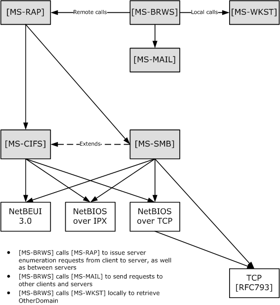

Figure 1: Relationship to other protocols

The diagram shows the following:

- [MS-BRWS] client uses [MS-RAP] to request an enumeration of servers or domains from an [MS-BRWS] server.
- [MS-BRWS] optionally calls [MS-BRWSA] to request OtherDomain configuration from the domain master browser.
- [MS-BRWS] calls [MS-MAIL] to send requests to other clients and servers.
- [MS-BRWS] calls [MS-WKST] locally to retrieve OtherDomain.

## 1.5 Prerequisites/Preconditions

The CIFS Browser Protocol has the following preconditions:

- A Remote Mailslot Protocol implementation must be available on all CIFS Browser Protocol end points.
- All [**PDCs**](#gt_primary-domain-controller-pdc) must implement the CIFS Browser Protocol, except on networks that are based exclusively on [**Active Directory**](#gt_active-directory) that do not use the CIFS Browser Protocol, as specified in section [1.6](#Section_1.6). If the PDC for a [**domain**](#gt_domain) does not implement the CIFS Browser Protocol, [**browser clients**](#gt_browser-client) are not able to retrieve information about servers on [**subnets**](#gt_subnet) other than their own.
- A Remote Administration Protocol [MS-RAP](../MS-RAP/MS-RAP.md) implementation must be available on all CIFS Browser Protocol end points.

## 1.6 Applicability Statement

The CIFS Browser Protocol is used when automatic discovery of services offered within a network is expected, NetBIOS is available, and the network is not based exclusively on [**Active Directory**](#gt_active-directory). If all of the services offered on a network are specified within Active Directory, and all of the clients are capable of interrogating Active Directory for these services, there is no need for servers on that network to support the browser protocol. However, if all of the services available within a network are not specified in Active Directory, servers are required to support the CIFS Browser Protocol in order to discover the services that are offered in a network.

Fine-grained search criteria (that is, by location or by another attribute of a resource) are not supported by the CIFS Browser Protocol, so it is not scalable to servers that provide similar services. It is also not extensible to new service types beyond those specified herein, so the protocol is not suitable for discovering such services. Also, the browser protocol includes no security mechanism and thus is not suitable to networking environments requiring secure discovery. In addition, all of the text elements implemented in the CIFS Browser Protocol are implemented as ASCII text and thus are not suited to internationalization.

Finally, the information in the list of servers that can be returned by this protocol needs to fit in 64 kilobytes of data. This limits the number of systems that can be in a server list in a single machine group.

## 1.7 Versioning and Capability Negotiation

The CIFS Browser Protocol provides for a version field, as specified in section [2.2.3](#Section_3.3.5.11). It also specifies a biased election mechanism to nominate some servers as [**local master browser servers**](#gt_local-master-browser-server). This election mechanism, specified in section [3.3.6](#Section_3.1.6), is biased in favor of servers implementing newer versions of the CIFS Browser Protocol.

## 1.8 Vendor-Extensible Fields

Some [**frames**](#gt_frame) define **OSVersionMajor** and **OSVersionMinor** fields. These fields are returned to clients of the CIFS Browser Protocol. As such, implementations can use any values they want.<4>

This protocol uses Win32 error codes. These values are taken from the Windows error number space as specified in [MS-ERREF](../MS-ERREF/MS-ERREF.md). Vendors SHOULD reuse those values with their indicated meaning. Choosing any other value runs the risk of a collision in the future.<5>

## 1.9 Standards Assignments

The CIFS Browser Protocol uses the parameter assignments as shown in the following table.

| Parameter | Value | Reference |
| --- | --- | --- |
| Mailslot name | \MAILSLOT\LANMAN | As specified in [MS-MAIL](../MS-MAIL/MS-MAIL.md). |
| Mailslot name | \MAILSLOT\BROWSE | As specified in [MS-MAIL]. |
| NetBIOS name | [0x01][0x02]_MSBROWSE_[0x02][0x01] | As specified in [MS-RAP](../MS-RAP/MS-RAP.md). |

For more information about NetBIOS naming conventions and control characters, see section [2.1.1](#Section_2.1.1).

# 2 Messages

This document contains the following information on CIFS Browser Protocol messages:

- Section [2.1.1](#Section_2.1.1) specifies the recipients of CIFS Browser Protocol messages.
- Sections [2.2.1](#Section_2.2.1) through [2.2.10](#Section_2.2.10) specify the syntax of each CIFS Browser Protocol message.
- Section [3.3.5](#Section_3.4.5) specifies the details of CIFS Browser Protocol message processing, including events and sequencing rules.

## 2.1 Transport

The CIFS Browser Protocol MUST use the Remote Mailslot Protocol transfer service, as specified in [MS-MAIL](../MS-MAIL/MS-MAIL.md). The CIFS Browser Protocol uses [**Mailslot**](#gt_mailslot) messages to accomplish inter-machine communication. This communication can be one-to-one (using unique NetBIOS names) or one-to-many (using group NetBIOS names). Two specific Mailslot names, \MAILSLOT\LANMAN and \MAILSLOT\BROWSE, are used by the CIFS Browser Protocol. The [**browser client**](#gt_browser-client) or [**browser server**](#gt_browser-server) MUST create these mailslots as specified in [MS-MAIL] section 3.2.4.1 and provide the mailslot name as the input parameter. A browser server MUST accept [**browser**](#gt_browser) requests on either of these mailslots. A browser client and server MAY select either mailslot for sending messages. Each browser message specifies the destination mailslot name it uses, as specified in section [2.2](../MS-MAIL/MS-MAIL.md).<6>

The CIFS Browser Protocol MUST use the Remote Administration Protocol [MS-RAP](../MS-RAP/MS-RAP.md) to transport the request/response command NetServerEnum2, as specified in [MS-RAP] section 2.5.5.2.

### 2.1.1 NetBIOS Name Notation

The CIFS Browser Protocol encapsulates its messages in the Remote Mailslot Protocol, as specified in [MS-MAIL](../MS-MAIL/MS-MAIL.md). The Remote Mailslot Protocol requires a NetBIOS name for identification when specifying the origin of a mailslot message or the destination for a mailslot message. Additionally, CIFS Browser Protocol fields that require a NetBIOS name MUST be formatted as specified in [[RFC1001]](https://go.microsoft.com/fwlink/?LinkId=90260) section 14. This section describes additional requirements when using NetBIOS names.

Before a NetBIOS name can be used, it MUST be registered with a name service as specified in [RFC1001] section 5.2.

As discussed in [MS-NBTE](../MS-NBTE/MS-NBTE.md) section 1.8, the CIFS Browser Protocol uses [**NetBIOS suffix**](#gt_netbios-suffix). Thus a NetBIOS name is effectively divided into two components: a Name, which MUST be a maximum of 15 bytes (and MUST be padded with spaces [0x20] if shorter than 15 bytes) and a NetBIOS suffix in the 16th byte. For example, the notation EXAMPLE[0x19] indicates a NetBIOS name that consists of the following hexadecimal bytes.

0x45, 0x58, 0x41, 0x4D, 0x50, 0x4C, 0x45, 0x20,

0x20, 0x20, 0x20, 0x20, 0x20, 0x20, 0x20, 0x19

This specification also defines a unique NetBIOS name for the CIFS Browser Protocol, referred to as [01][02]__MSBROWSE__[02][01]. It consists of the following hexadecimal bytes.

0x01, 0x02, 0x5F, 0x5F, 0x4D, 0x53, 0x42, 0x52,

0x4F, 0x57, 0x53, 0x45, 0x5F, 0x5F, 0x02, 0x01

**Note** There are two underscore (0x5F) characters before and after the word MSBROWSE. The name defines all 16 bytes of the NetBIOS name, thus effectively using a NetBIOS suffix of 0x01.

Names that are placeholders and that need to be substituted with actual values are placed inside angle brackets (< >). Therefore, the string <domain> becomes REDMOND if the [**domain**](#gt_domain) under consideration is named REDMOND. Details of the various NetBIOS names that are used for browsing are specified in the following sections.

#### 2.1.1.1 NetBIOS Suffix Definitions

[**NetBIOS suffix**](#gt_netbios-suffix) bytes for computer and [**NetBIOS name**](#gt_netbios-name) of the domains are listed in the following table. Only the names related to the browser protocol are listed.

| Name | NetBIOS suffix | Name type | Usage |
| --- | --- | --- | --- |
| <computer> | 0x00 | Unique | Default name registered by a client computer. The Workstation Service, if enabled, registers this default name. |
| <machine group> | 0x00 | Group | Browser clients and servers in <machine group>. |
| [01][02]__MSBROWSE__[02][01] | 0x01 | Group | Master browser. Note that the Name is a full 16 bytes, implicitly defining the NetBIOS suffix as 0x01. |
| <domain> | 0x1B | Unique | Domain master browser |
| <machine group> | 0x1D | Unique | Master browser |
| <machine group> | 0x1E | Group | Browser service elections |
| <computer> | 0x20 | Unique | Default name registered by a server computer. The Server Service, if enabled, registers this default name. |

#### 2.1.1.2 Unique Names

| Name | Comment |
| --- | --- |
| <computer>[0x00] | This name is used by all browser clients to receive second-class mailslot ([MS-MAIL](../MS-MAIL/MS-MAIL.md) section 3.2) messages. A system MUST register this NetBIOS name to receive browser mailslot messages intended for browser clients. The only [**browser**](#gt_browser) requests that use this name are [GetBackupListResponse (section 2.2.5)](#Section_3.1.5.1.2), [MasterAnnouncement (section 2.2.8)](#Section_2.2.8), and [LocalMasterAnnouncement (section 2.2.10)](../MS-MAIL/MS-MAIL.md) frames. NetBIOS name registration is as specified in [[RFC1001]](https://go.microsoft.com/fwlink/?LinkId=90260) section 5.2. Historical note: The [**NetBIOS suffix**](#gt_netbios-suffix) 0x00 was chosen because all computers implementing the CIFS Workstation service were (and still are) required to have that name registered with the NetBIOS name server; therefore, the name was guaranteed to be present on all computers. |
| <computer>[0x20] | See entry for <computer>[0x00] Historical note: The NetBIOS suffix 0x20 was chosen because all computers implementing the CIFS Server service were (and still are) required to have that name registered with the NetBIOS name server; therefore, the name was guaranteed to be present on all computers. This is significant, because certain implementations of NetBIOS severely limited the number of NetBIOS names that could be registered on any given computer, and using an already existing name meant that an additional name could be registered. |
| <machine group>[0x1D] | This name is used to identify a [**local master browser server**](#gt_local-master-browser-server) for <machine group> on a [**subnet**](#gt_subnet). A local master browser server MUST register this name as a NetBIOS [**unique name**](#gt_unique-name) (as opposed to a [**group name**](#gt_group-name)). The only requests that use this name are [GetBackupListRequest (section 2.2.4)](#Section_3.3.5.5), [AnnouncementRequest (section 2.2.2)](#Section_3.2.5.1), and [HostAnnouncement (section 2.2.1)](#Section_2.2.1) requests.<7> |
| <domain>[0x1B] | This name MUST be added by the [**PDC**](#gt_primary-domain-controller-pdc) as a unique name. All other servers MUST refrain from adding this name. This name is used to identify the [**domain master browser server**](#gt_domain-master-browser-server) for <domain>. A PDC responds to the GetBackupListRequest (section 2.2.4) request on this name.<8> |

#### 2.1.1.3 Group Names

| Name | Comment |
| --- | --- |
| [0x01][0x02]__MSBROWSE__[0x02][0x01] | All [**local master browser servers**](#gt_local-master-browser-server) MUST add this name as a [**group name**](#gt_group-name). This name is used by local master browser servers to periodically announce themselves to local master browser servers for other domains on the [**subnet**](#gt_subnet). The only message that uses this name is [DomainAnnouncement (section 2.2.7)](#Section_2.2.7). |
| <machine group>[0x00] | [**browser clients**](#gt_browser-client) and servers in <machine group> MUST register this name to process one-to-many mailslot messages. The only CIFS Browser Protocol message that uses this name is [AnnouncementRequest (section 2.2.2)](#Section_3.2.5.1). |
| <machine group>[0x1E] | All [**browser servers**](#gt_browser-server) and potential browser servers within <machine group> MUST register this name to receive domain-wide broadcasts on a subnet. The only requests that use this name are [RequestElection (section 2.2.3)](#Section_3.3.5.11), [BecomeBackup (section 2.2.6)](#Section_3.3.5.7), and [LocalMasterAnnouncement (section 2.2.9)](#Section_2.2.10) frames. |

## 2.2 Message Syntax

[**Browser**](#gt_browser-server) messages are transported via the Mailslot Protocol, as specified in section [2.1](#Section_2.1). The [**browser**](#gt_browser) message MUST be contained in the data section of the [**Mailslot**](#gt_mailslot) message.

Browser messages can be categorized according to the server's role. Each of these lists is complete for the specified, individual role. A machine that assumes multiple roles will use the messages for each of those roles, as described here:

- Messages used by [**nonbrowser servers**](#gt_nonbrowser-server) are the following:
- [HostAnnouncement](#Section_2.2.1) (sent)
- [AnnouncementRequest](#Section_3.2.5.1) (received)
- Messages used by [**browser clients**](#gt_browser-client) are the following:
- [GetBackupListRequest](#Section_3.3.5.5) (sent)
- [GetBackupListResponse](#Section_3.1.5.1.2) (received)
- [RequestElection](#Section_3.3.5.11) (sent)
- Messages used by all browser servers (with subcategories of [**potential browser server**](#gt_potential-browser-server), [**backup browser servers**](#gt_backup-browser-server), [**local master browser servers**](#gt_local-master-browser-server), and [**domain master browser servers**](#gt_domain-master-browser-server)) are the following:
- RequestElection (sent, received)
- AnnouncementRequest (sent)
- [ResetStateRequest](#Section_2.2.9) (received)
Messages used by potential browser servers are the following:

- All messages used by all browser servers
- [BecomeBackup](#Section_3.3.5.7) (received)
Messages used by backup browser servers are the following:

- All messages used by all browser servers
- [LocalMasterAnnouncement](#Section_2.2.10) (received)
Messages used by local master browser servers are the following:

- All messages used by all browser servers
- HostAnnouncement (received)
- [DomainAnnouncement](#Section_2.2.7) (sent, received)
- BecomeBackup (sent)
- GetBackupListRequest (received)
- GetBackupListResponse (sent)
- LocalMasterAnnouncement (sent)
- [MasterAnnouncement](#Section_2.2.8) (sent)
- ResetStateRequest (sent, received)
Messages used by domain master browser servers are the following:

- All messages used by local master browser servers except MasterAnnouncement (sent)
- MasterAnnouncement (received)
More information about how the various browser server messages are used is specified in section [3](#Section_1.3).

All multibyte fields specified in messages in this section are transmitted in [**little-endian**](#gt_little-endian) byte order, unless noted otherwise.

*Browser message opcodes*

A browser message operation code (opcode) consists of an 8-bit numeric value. The opcode MUST be one of the values listed in the following table.

| Value | Meaning |
| --- | --- |
| HostAnnouncement 0x01 | For more information, see section 2.2.1. |
| AnnouncementRequest 0x02 | For more information, see section 2.2.2. |
| RequestElection 0x08 | For more information, see section 2.2.3. |
| GetBackupListRequest 0x09 | For more information, see section 2.2.4. |
| GetBackupListResponse 0x0A | For more information, see section 2.2.5. |
| BecomeBackup 0x0B | For more information, see section 2.2.6. |
| DomainAnnouncement 0x0C | For more information, see section 2.2.7. |
| MasterAnnouncement 0x0D | For more information, see section 2.2.8. |
| ResetStateRequest 0x0E | For more information, see section 2.2.9. |
| LocalMasterAnnouncement 0x0F | For more information, see section [2.2.10](#Section_2.2.10). |

### 2.2.1 HostAnnouncement Browser Frame

A server (including [**nonbrowser servers**](#gt_nonbrowser-server)) sends a HostAnnouncement browser frame to advertise its presence and to specify the types of resources and services it supports. It MUST be a response to an [AnnouncementRequest](#Section_3.2.5.1) [**browser**](#gt_browser) [**frame**](#gt_frame), as specified in section 2.2.2, or to the expiration of the HostAnnouncement timer, as specified in section [3.2.2](#Section_3.1.2).

A server MUST issue a HostAnnouncement in response to a received AnnouncementRequest browser frame (as defined in section 2.2.2) or as a response to the expiration of the announcement timer, as specified in section [3.2.6](#Section_3.1.6). Failure to do so results in this server's resources being absent in the resource enumeration to browser clients.

A server SHOULD send a HostAnnouncement to the [**local master browser**](#gt_local-master-browser) using the NetBIOS unique name <machine group>[0x1D] and mailslot \MAILSLOT\LANMAN.<9>

The format of the HostAnnouncement frame MUST be as follows.

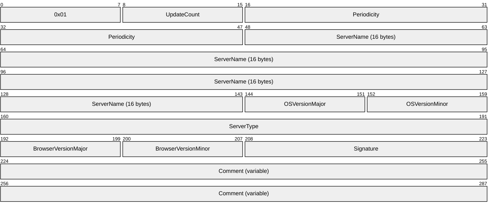

**0x01 (1 byte):** The 8-bit operation code (opcode) that identifies this structure as a HostAnnouncement frame. This opcode MUST have a value of 0x01.

**UpdateCount (1 byte):** An unsigned 8-bit integer that MUST be sent as 0x00 and MUST be ignored on receipt.

**Periodicity (4 bytes):** An unsigned 32-bit integer that MUST be the announcement frequency of the server in milliseconds. It MUST be set to the NewHostAnnouncement timer value of the server in milliseconds, as specified in section 3.2.6.<10>

**ServerName (16 bytes):** MUST be a null-terminated ASCII server name with a length of 16 bytes, including the null terminator. If the name is fewer than 16 bytes in length including the terminator, then the remainder of the 16 bytes must be ignored.

**OSVersionMajor (1 byte):** An unsigned 8-bit integer that MUST indicate the major version number of the operating system that the server is running. This is entirely informational and does not have any significance for the browsing protocol.<11>

**OSVersionMinor (1 byte):** An unsigned 8-bit integer that MUST indicate the minor version number of the operating system that the server is running. This is entirely informational and does not have any significance for the browsing protocol.<12>

**ServerType (4 bytes):** An unsigned 32-bit integer that MUST be the type of the server, as specified in [MS-RAP](../MS-RAP/MS-RAP.md) section 2.5.5.2.1.

**BrowserVersionMajor (1 byte):** A signed 8-bit integer that MUST indicate the major version number of the CIFS Browser Protocol that the server is running. Announcing servers MUST set this to 0x0F. This is entirely informational and does not have any significance for the browsing protocol. This field MUST NOT be validated in any way on receive.

**BrowserVersionMinor (1 byte):** An unsigned 8-bit integer MUST indicate the minor version number of the CIFS Browser Protocol that the server is running. Announcing servers MUST set this to 0x01. This is entirely informational and does not have any significance for the browsing protocol. This field MUST NOT be validated in any way on receive.

**Signature (2 bytes):** An unsigned 16-bit integer that MUST be set to 0xAA55.

**Comment (variable):** A null-terminated ASCII string that MUST be less than or equal to 43 bytes in length including the null terminator. This is a purely informational comment associated with the server and has no effect on the operation of the CIFS Browser Protocol.<13>

### 2.2.2 AnnouncementRequest Browser Frame

The AnnouncementRequest frame MUST be sent from the NetBIOS computer name <computer>[0x00] to the NetBIOS [**group name**](#gt_group-name) <machine group>[0x00], to force all machines in the [**workgroup**](#gt_workgroup) or domain to announce, or it MUST be sent from the NetBIOS computer name <computer>[0x00] to the NetBIOS group name <machine group>[0x1D], to force the current master [**browser**](#gt_browser) in the machine group to announce itself to the client. It is sent by a [**local master browser server**](#gt_local-master-browser-server) to <machine group>[0x00] at startup to discover the members of <machine group>, as specified in section [3.3.6](#Section_3.1.6). Its expected response is a set of [HostAnnouncement](#Section_2.2.1) frames, as specified in section 2.2.1.

The frame MUST be sent to mailslot \MAILSLOT\BROWSE.

The format of the AnnouncementRequest frame MUST be as follows.

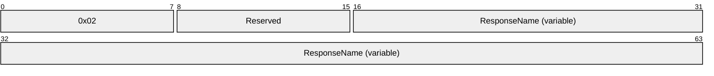

**0x02 (1 byte):** The 8-bit operation code (opcode) that identifies this structure as an AnnouncementRequest frame. This opcode MUST have a value of 0x02.

**Reserved (1 byte):** This value MUST be 0x00.

**ResponseName (variable):** A variable-length field that MUST be the name of the sender, up to 16 bytes in length including the null terminator. The receiving computer MUST ignore this name. (Note that the name is not needed to generate a HostAnnouncement response because that message is sent as specified in section 2.2.1.)

### 2.2.3 RequestElection Browser Frame

The RequestElection frame MUST be broadcast by using the NetBIOS [**group name**](#gt_group-name) <machine group>[0x1E] and mailslot \MAILSLOT\BROWSE. For more information about [**browser**](#gt_browser) elections, see sections [3.1.6](#Section_3.1.6), [4.2](#Section_4.2), [4.3](#Section_4.3), and [3.3.5.8](#Section_3.3.5.8).

The format of the RequestElection frame MUST be as follows.

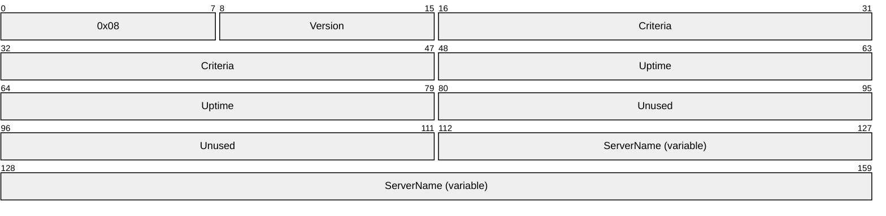

**0x08 (1 byte):** The 8-bit opcode that identifies this structure as a RequestElection frame. This opcode MUST have a value of 0x08.

**Version (1 byte):** An 8-bit integer that specifies the version of this election packet and MUST be transmitted with a value of 0x01.

**Criteria (4 bytes):** An unsigned 32-bit integer that MUST specify the [**election criteria**](#gt_election-criteria) of the sender. If sent by a browser client, the **Criteria** field SHOULD be set to 0. If sent by a browser server, it MUST be produced by applying a bitwise OR operation on a combination of the appropriate operating system value, the browser version value, and the role value as defined below. The election process is specified in section 3.3.5.8.

**Operating System**: This value represents an operating system-specific value. It MUST be set to either 0x10000000 or 0x20000000, based on the server implementation. Servers that set it to 0x20000000 will be more likely to win an election as described in section 3.3.5.8. As such, a server that is less likely to remain active on the [**subnet**](#gt_subnet) SHOULD set this value to 0x10000000 to prevent unnecessary elections.<14>

**Browser Version**: This value MUST be set to 0x00010F00.

**Role**: This value is the bitwise OR of zero or more of the flags defined in the following table.

| Value | Meaning |
| --- | --- |
| 0x00000080 | A browser server running on a machine that is also the [**Primary domain controller (PDC)**](#gt_primary-domain-controller-pdc). |
| 0x00000008 | [**Preferred master browser server**](#gt_preferred-master-browser-server) |
| 0x00000004 | A [**master browser server**](#gt_master-browser-server) that is currently running |
| 0x00000002 | A browser server running on a machine that is also a [**domain controller (DC)**](#gt_domain-controller-dc) |
| 0x00000001 | A [**backup browser server**](#gt_backup-browser-server) that is currently running |
| 0x00000020 | A computer using NetBIOS Name Service (or [**Windows Internet Name Service**](#gt_windows-internet-name-service-wins)) for NetBIOS |

**Uptime (4 bytes):** An unsigned 32-bit integer that MUST be the number of seconds since the browser service was started on the server.

**Unused (4 bytes):** An unsigned 32-bit integer that MUST be sent as 0x00000000 and ignored on receipt.

**ServerName (variable):** MUST be a null-terminated ASCII server name and MUST be less than or equal to 16 bytes in length, including the null terminator.

### 2.2.4 GetBackupListRequest Browser Frame

The GetBackupListRequest frame is sent by a [**browser client**](#gt_browser-client) to the [**local master browser server**](#gt_local-master-browser-server) for a [**machine group**](#gt_machine-group) to retrieve the identities of [**backup browser servers**](#gt_backup-browser-server). Its response is a [GetBackupListResponse](#Section_3.1.5.1.2) frame, as specified in section 2.2.5. For more information about the use of the GetBackupListRequest frame, see section [3.1.5.1](#Section_3.1.5.1).

To get the list of backup browser servers for <machine group> from the local master browser server for that domain, the GetBackupListRequest browser frame MUST be sent to the [**master browser server**](#gt_master-browser-server) with the NetBIOS [**unique name**](#gt_unique-name) <machine group>[0x1D] and mailslot \MAILSLOT\BROWSE.

To get the list of backup browser servers for <domain> from the [**domain master browser server**](#gt_domain-master-browser-server) for that domain, the GetBackupListRequest browser frame MUST be sent to the domain master browser server with the NetBIOS unique name <domain>[0x1B] and mailslot \MAILSLOT\BROWSE.

The format of the GetBackupListRequest frame, which is 6 bytes in length, MUST be as follows.

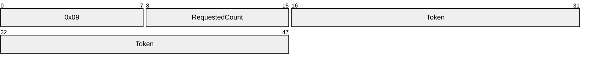

**0x09 (1 byte):** The 8-bit opcode that identifies this structure as a GetBackupListRequest frame. This opcode MUST have a value of 0x09.

**RequestedCount (1 byte):** An 8-bit integer that specifies the number of backup servers that the client is requesting.<15>

**Token (4 bytes):** MUST be a 32-bit value. This field has significance only to the client issuing the browser frame. The local master browser server MUST return this token unmodified in the corresponding GetBackupListResponse response message. The client MUST use this to distinguish replies to multiple outstanding GetBackupListRequests.<16>

### 2.2.5 GetBackupListResponse Browser Frame

The GetBackupListResponse frame MUST be sent by a [**master browser server**](#gt_master-browser-server) to the computer system that sends a [GetBackupListRequest](#Section_3.3.5.5) frame. It is a response to a GetBackupListRequest browser frame.

This frame MUST be sent to the NetBIOS [**unique name**](#gt_unique-name) <computer>[0x00] and mailslot \MAILSLOT\BROWSE, where <computer> is the name of the originator of the GetBackupListRequest frame.

The format of the GetBackupListResponse frame MUST be as follows.

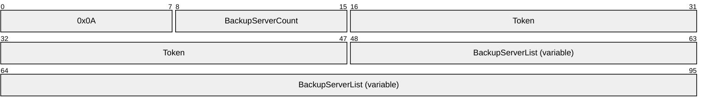

**0x0A (1 byte):** The 8-bit opcode that identifies this structure as a GetBackupListResponse frame. This opcode MUST have a value of 0x0A.

**BackupServerCount (1 byte):** An unsigned 8-bit integer that MUST be the number of backup servers in the **BackupServerList** field.

**Token (4 bytes):** An unsigned 32-bit value that MUST be the token value received in GetBackupListRequest. The server MUST return the same value here.

**BackupServerList (variable):** MUST be a series of null-terminated ASCII strings, each up to 16 bytes in length including the null terminator, where each string MUST denote a server name acting as a [**backup browser server**](#gt_backup-browser-server). The number of such strings present MUST be specified in BackupServerCount.

### 2.2.6 BecomeBackup Browser Frame

When a [**local master browser server**](#gt_local-master-browser-server) for a machine group wants to promote a [**potential browser server**](#gt_potential-browser-server) to [**backup browser server**](#gt_backup-browser-server), it MUST send a BecomeBackup frame by using the NetBIOS [**group name**](#gt_group-name) <machine group>[0x1E] and mailslot \MAILSLOT\BROWSE.

The definition of the BecomeBackup frame MUST be as follows.

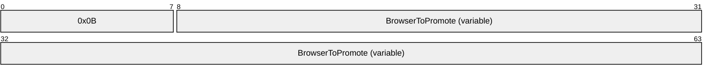

**0x0B (1 byte):** The 8-bit opcode that identifies this structure as a BecomeBackup frame. This opcode MUST have a value of 0x0B.

**BrowserToPromote (variable):** MUST be a null-terminated ASCII string that is less than or equal to 16 bytes in length, including the null terminator, which MUST be the name of the [**browser server**](#gt_browser-server) to be promoted to backup.

### 2.2.7 DomainAnnouncement Browser Frame

[**Local master browser servers**](#gt_local-master-browser-server) announce the machine group they serve to any other local master browser servers on their [**subnet**](#gt_subnet) by broadcasting a DomainAnnouncement frame using the NetBIOS [**group name**](#gt_group-name) [0x01][0x02]__MSBROWSE__[0x02][0x01] and mailslot \MAILSLOT\BROWSE.

The format of the DomainAnnouncement frame MUST be as listed in the following table.

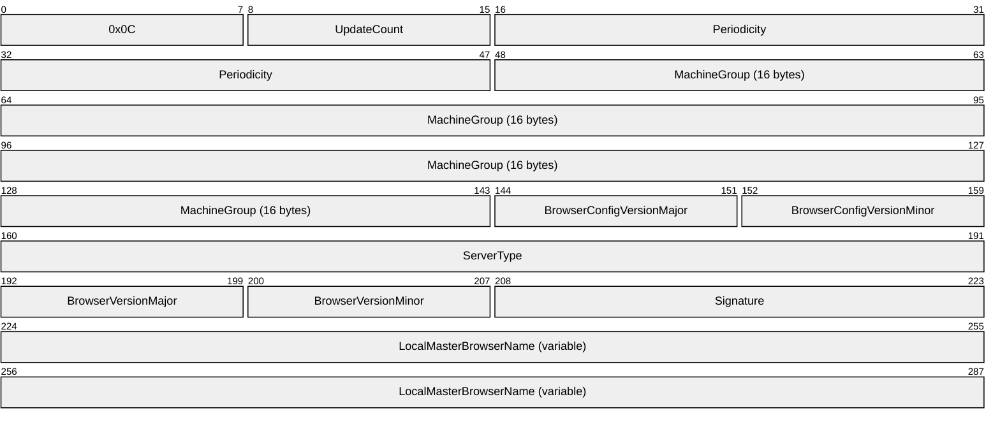

**0x0C (1 byte):** The 8-bit opcode that identifies this structure as a DomainAnnouncement frame. This opcode MUST have a value of 0x0C.

**UpdateCount (1 byte):** An unsigned 8-bit integer that MUST be sent as 0x00 and MUST be ignored on receipt.

**Periodicity (4 bytes):** An unsigned 32-bit integer that MUST be the announcement frequency, in milliseconds, of the machine group, as specified in section [3.3.2](#Section_3.1.2).

**MachineGroup (16 bytes):** MUST be a null-terminated ASCII workgroup or [**NetBIOS name**](#gt_netbios-name) of the domain with a length of 16 bytes, including the null terminator. If the name is fewer than 16 bytes in length, including the terminator, the remainder of the 16 bytes must be ignored.

**BrowserConfigVersionMajor (1 byte):** An unsigned 8-bit integer that SHOULD be set to the major version of the browser protocol that the server is running. This value is provided for informational purposes only and is irrelevant to the browsing protocol.<17>

**BrowserConfigVersionMinor (1 byte):** An unsigned 8-bit integer that SHOULD indicate the minor version of the browser protocol that the server is running. This value is provided for informational purposes only and is irrelevant to the browsing protocol.<18>

**ServerType (4 bytes):** An unsigned 32-bit integer that MUST be the type of the server. The server type bits MUST be set as specified in [MS-RAP](../MS-RAP/MS-RAP.md) section 2.5.5.2.1.

**BrowserVersionMajor (1 byte):** An unsigned 8-bit integer that SHOULD have the value 0x0F.<19>

**BrowserVersionMinor (1 byte):** An unsigned 8-bit integer that SHOULD have the value 0x01.<20>

**Signature (2 bytes):** An unsigned 16-bit integer that SHOULD have the value 0xAA55.<21>

**LocalMasterBrowserName (variable):** A null-terminated ASCII string that MUST contain the name of the sender, up to 16 bytes in length including the null terminator.

### 2.2.8 MasterAnnouncement Browser Frame

The MasterAnnouncement frame MUST be sent by a local master [**browser**](#gt_browser) to the domain master browser when the MasterAnnouncement timer expires, as specified in section [3.3.6](#Section_3.1.6). The MasterAnnouncement frame MUST be sent to the NetBIOS [**unique name**](#gt_unique-name) <PDCName>[0x00] and mailslot \MAILSLOT\BROWSE where <PDCName> is the computer name of the domain master browser.

The format of the MasterAnnouncement frame MUST be as follows.

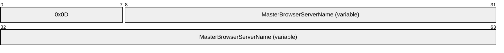

**0x0D (1 byte):** The 8-bit opcode that identifies this structure as a MasterAnnouncement frame. This opcode MUST have a value of 0x0D.

**MasterBrowserServerName (variable):** A null-terminated ASCII string that MUST contain the name of the local master browser and MUST be less than or equal to 16 bytes in length, including the null terminator.

### 2.2.9 ResetStateRequest Browser Frame

The ResetStateRequest frame instructs a browser server to change its operational state.

The local master browser SHOULD send a RESET_STATE_CLEAR_ALL request to any backup browser that is determined to be running an earlier version of the browser protocol when the HostAnnouncement Timer count-down reaches 0x00.

The format of the ResetStateRequest frame MUST be as listed in the following table.

**0x0E (1 byte):** The 8-bit opcode that identifies this structure as a ResetStateRequest frame. This opcode MUST have a value of 0x0E.

**Type (1 byte):** An unsigned 8-bit integer that MUST be set to one of the following possible values.

| Value | Meaning |
| --- | --- |
| RESET_STATE_STOP_MASTER 0x01 | Instructs master browser server to change its role to browser server. |
| RESET_STATE_CLEAR_ALL 0x02 | Instructs browser server to stop all browser server activities. It is disqualified from acting as a browser server. |
| RESET_STATE_STOP 0x04 | Instructs browser server to stop the browser service. <22> |

### 2.2.10 LocalMasterAnnouncement Browser Frame

A local master [**browser**](#gt_browser) for a machine group MUST announce itself with the periodicity listed in section [3.3.2](#Section_3.1.2) to all the other [**browser servers**](#gt_browser-server) in its machine group that are on its [**subnet**](#gt_subnet), using the [LocalMasterAnnouncement](#Section_2.2.10) frame. The LocalMasterAnnouncement frame MUST be broadcast by using the NetBIOS [**group name**](#gt_group-name) <machine group>[0x1E] and mailslot \MAILSLOT\BROWSE.

The format of the LocalMasterAnnouncement frame MUST be as listed in the following table.

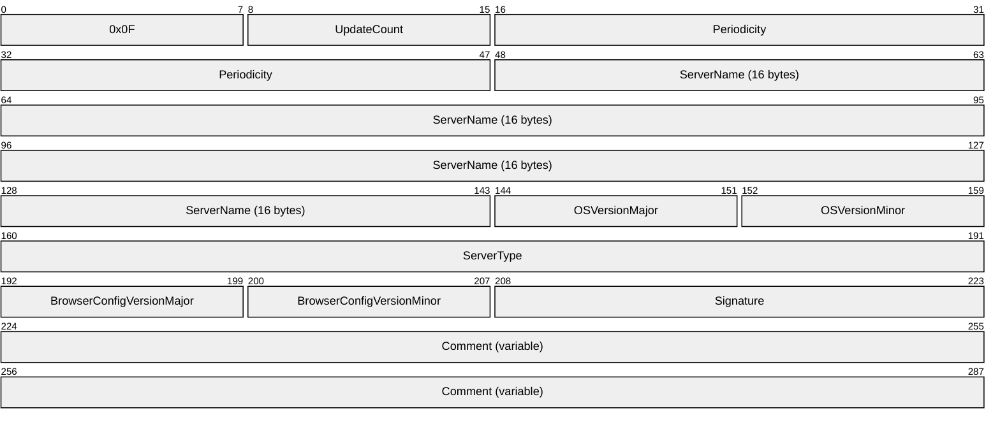

**0x0F (1 byte):** The 8-bit opcode that identifies this structure as a LocalMasterAnnouncement frame. This opcode MUST have a value of 0x0F.

**UpdateCount (1 byte):** An unsigned 8-bit integer that MUST be set to 0x00 and MUST be ignored upon receipt.

**Periodicity (4 bytes):** An unsigned 32-bit integer that MUST be the announcement frequency of the [**local master browser server**](#gt_local-master-browser-server) in milliseconds. It MUST be set to the NewLocalMasterAnnouncement timer value of the server in milliseconds. For more information, see section 3.3.2.

**ServerName (16 bytes):** MUST be a null-terminated ASCII server name with a length of 16 bytes, including the null terminator. If the name is fewer than 16 bytes in length including the terminator, then the remainder of the 16 bytes must be ignored.

**OSVersionMajor (1 byte):** MUST be an unsigned 8-bit integer that indicates the major version of the operating system that the server is running. This value is provided for informational purposes only and is irrelevant to the browsing protocol.<23>

**OSVersionMinor (1 byte):** MUST be an unsigned 8-bit integer that indicates the minor version of the operating system the server is running. This value is provided for informational purposes only and is irrelevant to the browsing protocol.<24>

**ServerType (4 bytes):** An unsigned 32-bit integer that MUST be the type of the local master browser server. The type bits are as specified in [MS-RAP](../MS-RAP/MS-RAP.md) section 2.5.5.2.1.

**BrowserConfigVersionMajor (1 byte):** An unsigned 8-bit integer that SHOULD be set to the major version of the browser protocol that the server is running. This value is legacy and is irrelevant to the browsing protocol.<25>

**BrowserConfigVersionMinor (1 byte):** An unsigned 8-bit integer that SHOULD be set to the minor version of the browser protocol that the server is running. This value is legacy and is irrelevant to the browsing protocol.<26>

**Signature (2 bytes):** An unsigned 16-bit integer that MUST have the value 0xAA55.

**Comment (variable):** A null-terminated ASCII string that MUST be less than or equal to 43 bytes in length, including the null terminator. This is a purely informational comment associated with the server and has no effect on the operation of the CIFS Browser Protocol.

# 3 Protocol Details

The hosts that are used in the browsing process can be separated into four distinct groups:

- Workstations
- [**Nonbrowser servers**](#gt_nonbrowser-server)
- [**Browser servers**](#gt_browser-server)
- [**Domain master browser servers**](#gt_domain-master-browser-server)

## 3.1 Client Details

### 3.1.1 Abstract Data Model

This section describes a hypothetical model of [**browser client**](#gt_browser-client) data organization that can be implemented to support the CIFS Browser Protocol. The purpose of this description is to help explain how this aspect of the protocol works. This specification does not prescribe that implementations adhere to this model as long as their external behavior is consistent with what is described throughout this document.

**BackupBrowserServerTable**: The **BackupBrowserServerTable** is a cache of [**backup browser servers**](#gt_backup-browser-server) for a given [**machine group**](#gt_machine-group). Each entry in the table contains a [**NetBIOS name**](#gt_netbios-name) of a machine group along with a list of the NetBIOS name of one or more backup browser servers for that machine group.

**MachineGroupNameInProgress**: The NetBIOS name of a machine group for which the client is currently requesting a list of backup [**browsers**](#gt_browser).

**TokenValue**: A 32-bit value used for [GetBackupList](#Section_3.1.5.1.2) requests.

**BrowserClientUpTime**: Records the time when the browser service was initially started.

### 3.1.2 Timers

The client uses the following timer:

**GetBackupListRequest timer:** This timer is used to govern the retransmission of [GetBackupListRequest](#Section_3.3.5.5) frames. Its initial duration MUST be 1 second.

### 3.1.3 Initialization

At startup, to find a [**backup browser server**](#gt_backup-browser-server), the client MUST do the following:

- **MachineGroupNameInProgress** is set to an empty string.
- **TokenValue** is set to 0.
- Initialize **BackupBrowserServerTable** to an empty table.
- Initialize the [GetBackupListRequest](#Section_3.3.5.5) timer and send a GetBackupListRequest frame for **MachineGroupNameInProgress**, as specified in section [3.1.5.1.1](#Section_3.1.5.1.2).
If the local master [**browser**](#gt_browser) for a machine group fails to respond to the GetBackupListRequest after an implementation-defined number of retries, as specified in section [3.1.6](#Section_3.1.6), the client MUST force an election by [Sending a RequestElection Frame](#Section_3.3.5.11), as specified in section 3.1.5.3.

The GetBackupListRequest and [GetBackupListResponse](#Section_3.1.5.1.2) sequences are specified in sections 3.1.5.1.1 and [3.1.5.1.2](#Section_3.1.5.1.2), respectively. If this sequence does not produce a backup browser server, as specified in section 3.1.6, the initialization MUST fail.<27>

**BrowserClientUpTime** is set to the time when the browser service was initially started.

### 3.1.4 Higher-Layer Triggered Events

#### 3.1.4.1 Application Requests the Enumeration of Servers in a Machine Group

The application MUST provide:

- MachineGroup - The NetBIOS name of the machine group.
- MaxSize - The maximum number of bytes of data to return.
- TypeFilter - Uses the "ServerType" flag field (a 32-bit bitmask) to filter servers by type, in response to the NetServerEnum2 request, as specified in [MS-RAP](../MS-RAP/MS-RAP.md) section 2.5.5.2.1, "RAP NetServerEnum2Request".
If the client has no entry in the **BackupBrowserServerTable** for the machine group, it MUST attempt to obtain a list of [**backup browser servers**](#gt_backup-browser-server) for MachineGroup, as specified in section [3.1.5.1](#Section_3.1.5.1).

If no GetBackupListResponse is received and the maximum number of retries has been sent as, specified in section [3.1.6](#Section_3.1.6), for the GetBackupListRequest timer, the client MUST return ERROR_NO_BROWSER_SERVERS_FOUND to the calling application.

If the client is able to populate a list of backup browser servers for MachineGroup in the **BackupBrowserServerTable**, it MUST then select a backup server at random from the entry in the **BackupBrowserServerTable** for the machine group requested, and send it a NetServerEnum2 request (as specified in [MS-RAP] section 2.5.5.2) with the following parameters.

| Bit Range | Field | Description |
| --- | --- | --- |
| Variable | InfoLevel | 1 |
| Variable | ReceiveBufferSize | MaxSize |
| Variable | ServerType | TypeFilter |
| Variable | Domain | MachineGroup |

The objective is to enable multiple backup browser servers to effectively handle high browsing loads. If the request fails, the client MUST return the error received in the response to the higher layer. If the request succeeds, the client MUST return the resulting RapOutParams in the NetServerEnum2Response (as specified in [MS-RAP] section 2.5.5.2.2) to the caller.

### 3.1.5 Message Processing Events and Sequencing Rules

A [**browser client**](#gt_browser-client) MUST ignore all CIFS Browser Protocol messages except [GetBackupListResponse](#Section_3.1.5.1.2).

#### 3.1.5.1 Retrieving a List of Backup Browser Servers

When a [**browser client**](#gt_browser-client) needs to determine the set of [**backup browser servers**](#gt_backup-browser-server) for a particular machine group, the browser client MUST send a [GetBackupListRequest](#Section_3.3.5.5) [**frame**](#gt_frame) and check whether it receives a [GetBackupListResponse](#Section_3.1.5.1.2) frame.

##### 3.1.5.1.1 Sending a GetBackupListRequest Frame

The caller MUST provide the [**NetBIOS name**](#gt_netbios-name) of the machine group.

The [**browser client**](#gt_browser-client) MUST set **MachineGroupNameInProgress** to the machine group provided.

The browser client MUST send a [GetBackupListRequest](#Section_3.3.5.5) frame, as specified in section 2.2.4. When generating the GetBackupListRequest, the client MUST initialize **TokenValue**. How the client selects the token is implementation-defined. The token exists solely to allow the client to differentiate between [GetBackupListResponse](#Section_3.1.5.1.2) calls.<28> The client MUST then set the **Token** field of the GetBackupListRequest to **TokenValue**.

The browser client MUST send the frame to the server by issuing a [**mailslot**](#gt_mailslot) write as specified in [MS-MAIL](../MS-MAIL/MS-MAIL.md) section 3.1.4.1, with the following parameters.

| Parameter name | Value |
| --- | --- |
| NetBIOS name of the remote server | <machine group>[0x1D] |
| Mailslot name | \MAILSLOT\BROWSE |
| Data | GetBackupListRequest as specified in 2.2.4. |

The client SHOULD ignore the error even if the send fails. After the [**browser**](#gt_browser) request has been sent, the client MUST start the GetBackupListRequest timer.

##### 3.1.5.1.2 Receiving a GetBackupListResponse Frame

After the [**local master browser server**](#gt_local-master-browser-server) responds with a list of [**backup browser servers**](#gt_backup-browser-server), the client SHOULD choose an implementation-defined number of servers from within the response by using an implementation-dependent algorithm, and then insert a new entry into **BackupBrowserServerTable** for the [**NetBIOS name**](#gt_netbios-name) **MachineGroupNameInProgress** with the list of backup browser servers selected.<29>

When a [GetBackupListResponse](#Section_3.1.5.1.2) frame is received, the corresponding timer MUST be stopped. Because a client can only have a single [GetBackupListRequest](#Section_3.3.5.5) pending, it needs only one timer.

#### 3.1.5.2 Receiving a NetServerEnum2 Response

When the client receives a response to a NetServerEnum2 request that was sent to a server as specified in section [3.1.4.1](#Section_3.1.4.1), the client MUST continue processing as follows:

- If the response indicates an error, the error MUST be returned to the application that requested the enumeration of servers.
- If the response indicates success, the list of servers or domains received in the response MUST be returned to the calling application.

#### 3.1.5.3 Sending a RequestElection Frame

To force an election, the client MUST send a *RequestElection* frame as specified in section [2.2.3](#Section_3.3.5.11). The RequestElection Browser Frame MUST be sent by issuing a mailslot write as specified in [MS-MAIL](../MS-MAIL/MS-MAIL.md) section 3.1.4.1 with the following parameters:

| Parameter name | Value |
| --- | --- |
| NetBIOS name of the remote server | <Machine Group Name>[0x1E] |
| Mailslot name | \MAILSLOT\BROWSE |
| Data | RequestElection as specified in section 2.2.3. |

The server SHOULD ignore the error even if the send fails.

### 3.1.6 Timer Events

When a [GetBackupListRequest](#Section_3.3.5.5) timer expires without receiving a [GetBackupListResponse](#Section_3.1.5.1.2), the GetBackupListRequest frame MAY be retransmitted. The delay MUST be at least twice the expected service time, which MUST be 1 second.<30> Before resending, the client MAY modify **TokenValue**.<31> If TokenValue is modified, the client MUST set the **Token** field of the GetBackupListRequest to the new value of **TokenValue**, and resend the GetBackupListRequest.

If the local master [**browser**](#gt_browser) for a machine group fails to respond to the GetBackupListRequest after an implementation-defined number of retries, the client MUST set the **Uptime** value with the time difference, in seconds, between the current time and **BrowserClientUpTime**, and the client MUST force an election by [Sending a RequestElection Frame](#Section_3.3.5.11), as specified in section 3.1.5.3. If the client is unable to retrieve a list of [**browser servers**](#gt_browser-server) from the local master browser server, it MAY attempt to retrieve a list of [**backup browser servers**](#gt_backup-browser-server) by sending a GetBackupListRequest frame directly to the domain master browser for that [**domain**](#gt_domain) by using the [**unique name**](#gt_unique-name) <domain>[0x1B] that is registered by the domain master browser. The value of the retry count MUST be 3.

### 3.1.7 Other Local Events

None.

## 3.2 Nonbrowser Server Details

### 3.2.1 Abstract Data Model

This section describes a hypothetical model of [**nonbrowser server**](#gt_nonbrowser-server) data organization that can be implemented to support the CIFS Browser Protocol. The purpose of this description is to help explain how this aspect of the protocol works. This specification does not prescribe that implementations adhere to this model, as long as their external behavior is consistent with the behavior described throughout this document.

A nonbrowser server MUST implement the abstract data model for a server, as specified in [MS-RAP](../MS-RAP/MS-RAP.md).

In addition to that information, the nonbrowser server MUST implement the following:

**Server.HostAnnouncementCount:** The number of times the HostAnnouncement timer (as specified in section [3.2.2](#Section_3.1.2)) has expired.

**Server.Comment:** A null-terminated [**ASCII**](#gt_ascii) string that MUST be less than or equal to 43 bytes in length including the null terminator.

### 3.2.2 Timers

[**Nonbrowser servers**](#gt_nonbrowser-server) use the following timers:

**HostAnnouncement timer:** Used to periodically advertise itself to the local master [**browser**](#gt_browser) for its machine group. For more information about the HostAnnouncement timer, see section [3.2.6](#Section_3.1.6).

**AnnouncementRequest response timer:** Used to delay responding to an AnnouncementRequest. For more information, see section [3.2.5.1](#Section_3.2.5.1).

### 3.2.3 Initialization

When a [**nonbrowser server**](#gt_nonbrowser-server) starts up, it MUST start the HostAnnouncementTimer, as specified in section [3.2.2](#Section_3.1.2). Whenever the HostAnnouncementTimer fires, the nonbrowser server MUST issue a HostAnnouncement [**frame**](#gt_frame).

A nonbrowser server MUST register the NetBIOS name <machine group>[0x00] corresponding to the domain or [**workgroup**](#gt_workgroup) within which the nonbrowser server resides. This makes it possible to receive AnnouncementRequest browser frames.

All other [**browser**](#gt_browser) messages sent to the nonbrowser server with different NetBIOS names MUST be ignored.

The name <ServerName>[0x00] MUST be registered with NetBIOS by the server offering the service.

### 3.2.4 Higher-Layer Triggered Events

#### 3.2.4.1 Server Application Requests Updating Server Configuration

The calling application provides the **SERVER_INFO_103** structure ([MS-SRVS](../MS-SRVS/MS-SRVS.md) section 2.2.4.43) as input parameter to update the server configuration. The following values MUST be set by the server:

- **Server.Comment** MUST be set to sv103_comment.

### 3.2.5 Message Processing Events and Sequencing Rules

A [**nonbrowser server**](#gt_nonbrowser-server) MUST ignore all CIFS Browser Protocol messages except the [AnnouncementRequest](#Section_3.2.5.1) browser frame.

#### 3.2.5.1 Receiving an AnnouncementRequest Frame

On receiving an [AnnouncementRequest](#Section_3.2.5.1) frame, a [**nonbrowser server**](#gt_nonbrowser-server) MUST generate a random number in the range of [0, 30] seconds. It MUST then set its AnnouncementRequest response timer to that value.

#### 3.2.5.2 Sending a HostAnnouncement Frame

To advertise its presence on the network, the server MUST send a HostAnnouncement frame (as specified in section [2.2.1](#Section_2.2.1)). The server MUST query the current services as specified in [MS-SRVS](../MS-SRVS/MS-SRVS.md) section 3.1.6.11, and set the **ServerType** field of the HostAnnouncement frame to the value returned, which specifies the type of resources or services that it is advertising. The server MUST set the **Comment** field of the HostAnnouncement frame to **Server.Comment**. This request MUST be sent by issuing a mailslot write as specified in [MS-MAIL](../MS-MAIL/MS-MAIL.md) section 3.1.4.1 with the following parameters.

| Parameter name | Value |
| --- | --- |
| NetBIOS name of the remote server | <Machine Group Name>[0x1D] |
| Mailslot name | \MAILSLOT\BROWSE |
| Data | HostAnnouncement as specified in section 2.2.1 |

The server SHOULD continue processing as described below even if the send fails.

### 3.2.6 Timer Events

When either the [HostAnnouncement](#Section_2.2.1) or [AnnouncementRequest](#Section_3.2.5.1) response timer expires, a [**nonbrowser server**](#gt_nonbrowser-server) MUST send a HostAnnouncement frame, as specified in section [3.2.5.2](#Section_3.2.5.2).

When the HostAnnouncement timer fires, it SHOULD reset the HostAnnouncement timer based on the following table (as specified in section [3.2.1](#Section_3.2)).<32>

| Server.HostAnnouncementCount value | New HostAnnouncement timer value |
| --- | --- |
| 0, 1 | 1 minute |
| 2 | 2 minutes |
| 3 | 4 minutes |
| 4 | 8 minutes |
| > 4 | 12 minutes |

### 3.2.7 Other Local Events

A [**nonbrowser server**](#gt_nonbrowser-server) MUST send a [HostAnnouncement](#Section_2.2.1) frame (as specified in section [3.2.5.2](#Section_3.2.5.2)) that specifies a server type of zero, just prior to shutting down, to allow it to be quickly removed from the list of available servers.

## 3.3 Browser Server Details

A [**browser server**](#gt_browser-server) MUST follow all the rules for a [**nonbrowser server**](#gt_nonbrowser-server), in addition to the rules specified in this section. A browser server MUST follow the state machine shown in the following figure.<33>

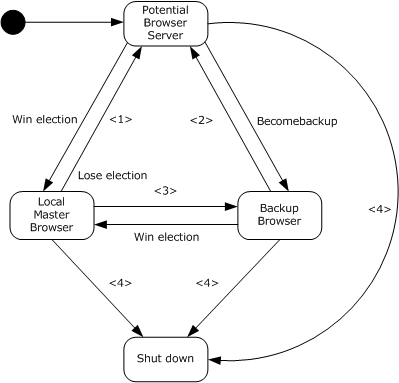

Figure 2: Browser server state machine

- This transition occurs when a local master browser that is not a domain controller (IsDomainController=False) loses an election or when a local master browser receives a ResetState request with type set to RESET_STATE_CLEAR_ALL or RESET_STATE_STOP_MASTER.
- This transition occurs when a backup browser receives a ResetState request with type set to RESET_STATE_CLEAR_ALL.
- This transition occurs when a local master browser that is a domain controller (IsDomainController=TRUE) or that is configured to behave as a domain controller (AlwaysActAsdomainController = TRUE) loses an election.
- This transition occurs when any browser role is terminated.
For each state, an additional flag MUST be set, as shown in the following table.

| State | ServerType flag set |
| --- | --- |
| Backup [**browser**](#gt_browser) | SV_TYPE_BACKUP_BROWSER, as specified in [MS-SRVS](../MS-SRVS/MS-SRVS.md) section 2.2.2.7 (BB) |
| Local master browser | SV_TYPE_MASTER_BROWSER, as specified in [MS-SRVS] section 2.2.2.7 (MB) |
| Potential Browser | SV_TYPE_POTENTIAL_BROWSER, as specified in [MS-SRVS] section 2.2.2.7 (PB) |

If the [**primary domain controller**](#gt_primary-domain-controller-pdc) assumes the Local master browser role, it MUST act as a [**domain master browser server**](#gt_domain-master-browser-server) for its [**subnet**](#gt_subnet), as specified in section [3.4](#Section_1.3).

When a [**local master browser server**](#gt_local-master-browser-server) starts, its Servers List can be empty; therefore, it MAY force all browser servers to announce themselves. The local master browser server does this by broadcasting an [AnnouncementRequest (section 2.2.2)](#Section_3.2.5.1) browser [**frame**](#gt_frame).<34>

The AnnouncementRequest frame MUST be broadcast by using the NetBIOS [**group name**](#gt_group-name) <machine group>[0x00]. The frame MUST be sent to the mailslot \MAILSLOT\BROWSE.

For more details regarding ServerType flag values, see [MS-SRVS] section 2.2.3.7.

### 3.3.1 Abstract Data Model

This section describes a sample model of [**browser server**](#gt_browser-server) data organization that can be implemented to support this protocol. The purpose of this description is simply to help explain how this aspect of the protocol works. This specification does not prescribe that implementations adhere to this model as long as their external behavior is consistent with what is described throughout this document.

**AlwaysActAsDomainController:** A Boolean that specifies if the machine on which the browser server is running has to behave as a domain controller for Browser protocol interactions regardless of whether the server truly is a domain controller. This element SHOULD be set locally by a principal with administrative privileges, and is not shared with other protocols.<35>

**Backup Browser List:** A list of the machines that the local master [**browser**](#gt_browser) has designated as backup browser servers.

**BrowserServerUpTime:** Records the time when the Browser service was initially started.

**Current Role:** The current state in the browser server state machine shown in the preceding figure.

**Machine Group Name**: The [**NetBIOS name**](#gt_netbios-name) of the machine group the client is a member of.

**DomainAnnouncement Timer Count:** A count of the number of times that the DomainAnnouncement timer has expired. It MUST be reset to 0 after a browser wins an election.

**LocalMasterAnnouncement Timer Count:** A count of the number of times that the LocalMasterAnnouncement timer has expired. It SHOULD be reset to 0 after a browser wins an election.<36>

**MasterAnnouncement Timer Count:** A count of the number of times that the MasterAnnouncement timer has expired. It MUST be reset to 0 after a browser wins an election.

**Machine Groups List:** An ordered list of machine groups; each entry MUST contain a [**domain**](#gt_domain) or [**workgroup**](#gt_workgroup) name, the name of the Local Master browser for that machine group (as received in the DomainAnnouncement frame specified in section [2.2.7](#Section_2.2.7)) and a Machine Group Expiration Timer for each machine group. The ordering of the list is implementation defined, but the order MUST be stable, and the list MUST NOT contain entries with duplicate names. The Machine Groups List MUST be ordered to implement the semantics of the NetServerEnum3 request (which specifies a resume point). For details of NetServerEnum2 and NetServerEnum3 as they are used here, see section [3.3.5.6](#Section_3.3.5.6).<37>

**Election Transmission Count:** A count of the number of RequestElection frames sent by the browser server during an election. The election transmission count MUST be reset on each election.

**IsDomainController:** A Boolean that specifies if the machine on which the browser server is running is a [**domain controller**](#gt_domain-controller-dc).

**IsPrimaryDomainController:** A Boolean that specifies if the machine on which the browser server is running is the [**primary domain controller**](#gt_primary-domain-controller-pdc) (TRUE) or a [**backup domain controller**](#gt_backup-domain-controller-bdc) (FALSE).<38>

**Servers List:** An ordered list of servers and HostAnnouncementCount values (as specified in section [3.2.1](#Section_3.2)), as provided in [HostAnnouncement](#Section_2.2.1) frames. The ordering of the list is implementation defined, but the order MUST be stable and the list MUST NOT contain entries with duplicate names. The Servers List element MUST be ordered to implement the semantics of the NetServerEnum3 request (section 3.3.5.6), which specifies a resume point.<39>

**OtherDomains:** Specifies a list of NetBIOS names of domains browsed by the computer. Each name MUST be at most 15 characters in length, and MUST NOT contain trailing spaces or a [**NetBIOS suffix**](#gt_netbios-suffix) as defined in section [2.1.1](#Section_2.1.1). The **OtherDomains** element is shared with the Workstation Service Remote Protocol Specification [MS-WKST](../MS-WKST/MS-WKST.md), modified through the WkstaAddOtherDomains event (section 3.2.6.2). This element is also shared with the Common Internet File System (CIFS) Browser Auxiliary Protocol [MS-BRWSA](../MS-BRWSA/MS-BRWSA.md) to query the **OtherDomains** information from a domain controller.

Be aware that the preceding model can be implemented using a variety of techniques. An implementation can implement such data in any way.

### 3.3.2 Timers

**DomainAnnouncement Timer:** Used by a local master [**browser**](#gt_browser) to periodically announce itself to [**local master browser servers**](#gt_local-master-browser-server) of other machine groups on the [**subnet**](#gt_subnet) by sending a DomainAnnouncement frame, as specified in section [2.2.7](#Section_2.2.7). For more information about the DomainAnnouncement timer, see section [3.3.6](#Section_3.1.6).<40>

**DomainControllerRoleMonitor Timer:** The DomainControllerRoleMonitor timer is used to periodically check for changes to the configuration of the machine on which the [**browser server**](#gt_browser-server) is running. The timer monitors for situations where the machine is promoted (from a backup domain controller to a primary domain controller), or is demoted (from a primary domain controller to a backup domain controller). An implementation that supports a notification mechanism for domain controller role changes, can instead process these changes on notification.<41>

**Machine Group Expiration Timer:** For each entry in the machine groups list that is created or updated by DomainAnnouncement frames, the local [**master browser server**](#gt_master-browser-server) keeps a Machine Group Expiration Timer. This timer MUST be initialized to the **Periodicity** field value found in the DomainAnnouncement.

**Election Delay Timer:** The browser server keeps an election delay timer for use in elections. The value is specified in section [3.3.5.8](#Section_3.3.5.8).

**FindMaster Timer:** Used when a browser server must find a local master browser for the machine group of the browser server. This timer value MUST be 1500 milliseconds (msec).

**LocalMasterAnnouncement Timer:** Used to periodically advertise the local master browser to all the machines in the machine group on the local subnet by sending a [LocalMasterAnnouncement (section 2.2.9)](#Section_2.2.10) frame. For more information about the LocalMasterAnnouncement timer, see section 3.3.6.<42>

**MasterAnnouncement Timer:** Used to periodically advertise the local master browser to the domain master browser by sending a [MasterAnnouncementBrowser (section 2.2.8)](#Section_2.2.8) frame. For more information about the MasterAnnouncementBrowser timer, see section 3.3.6 . If the local master browser is not a member of a domain, this timer MUST be ignored. The default value for this timer MUST be 12 minutes.<43>

**NetServerEnum2 Timer:** Used to periodically allow the [**backup browser server**](#gt_backup-browser-server) to refresh its list of servers from the local master browser server or local master browser servers to refresh their Servers List elements from the [**domain master browser server**](#gt_domain-master-browser-server). The NetServerEnum2 timer SHOULD control the accuracy of the information in the browser server lists. If the NetServerEnum2 timer duration is low, the information in the Servers List element SHOULD be more accurate, but the load on the local master browser server (or domain master browser server) MAY be higher. If the NetServerEnum2 timer duration is high, the information in the Servers List element SHOULD be less accurate, but the load on the local master browser server (or domain master browser server) MAY be higher. The default value for this timer is 12 minutes.<44>

**Server Expiration Timer:** For each server entry in the Servers List element that is created or updated by [HostAnnouncements (section 3.3.5.3)](#Section_3.2.5.2)), the local master browser server keeps a Server Expiration Timer. This timer MUST be initialized to the **Periodicity** field value found in the HostAnnouncement.

### 3.3.3 Initialization

The [**browser server**](#gt_browser-server) MUST register NetBIOS names <Machine Group Name>[0x00] and <Machine Group Name>[0x1E]. Information on how to register NetBIOS names is as specified in [[RFC1001]](https://go.microsoft.com/fwlink/?LinkId=90260).

**Current Role** MUST be initialized to [**potential browser server**](#gt_potential-browser-server).

**BrowserServerUpTime** is set to the time when the Browser service was initially started.

**Backup Browser List** MUST be initialized to an empty list.

**Machine Group Name**: MUST be set to the [**NetBIOS name**](#gt_netbios-name) of the domain or workgroup the client is a member of.

**Machine Groups List** MUST be initialized to an empty list.

**DomainAnnouncement Timer Count** MUST be set to 0.

**LocalMasterAnnouncement Timer Count** MUST be set to 0.

**MasterAnnouncement Timer Count** MUST be set to 0.

The server MUST enable advertising of the browser service by invoking [MS-SRVS](../MS-SRVS/MS-SRVS.md) section 3.1.6.9, passing SV_TYPE_POTENTIAL_BROWSER as the input parameter.

The browser server MUST query the current domain role for the machine on which it is running by calling SamrQueryInformationDomain as specified in [MS-SAMR](#Section_5) section 3.1.5.5.2.

The browser server first performs a **SamrConnect** using its own name as the server name and an access mask of SAM_SERVER_CONNECT. The out parameter *ServerHandle* is used to perform a **SamrQueryInformationDomain** using the DomainServerRoleInformation value (as specified in [MS-SAMR] section 2.2.3.16). The returned buffer contains a **DOMAIN_SERVER_ROLE_INFORMATION** structure (see [MS-SAMR] section 2.2.3.1 for a detailed explanation of the fields).

If the call succeeds, the **IsDomainController** and **IsPrimaryDomainController** SHOULD be initialized based on the **DomainServerRole** value in the returned **SAMPR_DOMAIN_GENERAL_INFORMATION** structure as specified in the following table.<45>

For DomainServerRole:

| Enumeration DOMAIN_SERVER_ROLE value | unsigned long value |
| --- | --- |
| DomainServerRoleBackup **IsDomainController** set to TRUE **IsPrimaryDomainController** set to FALSE | 2 |
| DomainServerRolePrimary **IsPrimaryDomainController** set to TRUE **IsDomainController** set to TRUE | 3 |

If **IsDomainController** is TRUE, the server MUST set the **DomainControllerRoleMonitor Timer** to 1 second.

If **IsPrimaryDomainController** is TRUE, the server MUST force an election by sending a [RequestElection](#Section_3.3.5.11) (section 2.2.3) frame. It MUST set the preferred master bit in the Criteria in all RequestElection frames it sends.

If **IsPrimaryDomainController** is FALSE, the server MUST send a [HostAnnouncement](#Section_2.2.1) frame as specified in [3.2.5.2](#Section_3.2.5.2), and if a [BecomeBackup](#Section_3.3.5.7) frame is received, it MUST become a backup server.<46>

The server MUST disable advertising of the service by invoking [MS-SRVS] section 3.1.6.10, passing SV_TYPE_DOMAIN_CTRL and SV_TYPE_DOMAIN_BAKCTRL as input parameters.

If **IsPrimaryDomainController** is TRUE, the server MUST enable advertising of the PDC service as specified in [MS-SRVS] section 3.1.6.9, passing SV_TYPE_DOMAIN_CTRL as the input parameter.

If **IsDomainController** is TRUE but **IsPrimaryDomainController** is FALSE, the server MUST enable advertising as a domain controller as specified in [MS-SRVS] section 3.1.6.9, passing SV_TYPE_DOMAIN_BAKCTRL as the input parameter.

If both **IsDomainController** and **IsPrimaryDomainController** are FALSE, the server SHOULD<47> enable advertising of the NT service as specified in [MS-SRVS] section 3.1.6.9, passing SV_TYPE_SERVER_NT as the input parameter.

### 3.3.4 Higher-Layer Triggered Events

#### 3.3.4.1 PromotedToPrimaryDomainController

If a [**browser server**](#gt_browser-server) gets promoted to [**primary domain controller (PDC)**](#gt_primary-domain-controller-pdc), it MUST force an election by [Sending a RequestElection Frame](#Section_3.3.5.11) as specified in section 3.3.5.11.

The server SHOULD continue processing as described below even if the send fails.

The server MUST assume the duties of a [**domain master browser**](#gt_domain-master-browser), as specified in section [3.4](#Section_1.3).

#### 3.3.4.2 LocalRequestForServerList

If the machine is a [**backup browser server**](#gt_backup-browser-server) or a [**master browser server**](#gt_master-browser-server), it MUST return Servers List to the calling application. Otherwise the request MUST be failed with ERROR_REQ_NOT_ACCEP.

#### 3.3.4.3 ShutdownBrowserServer

If a local administrator requests that the [**browser server**](#gt_browser-server) shuts down, the browser server MUST take the shutdown action as specified in section [3.3.7](#Section_3.2.7).

### 3.3.5 Message Processing Events and Sequencing Rules

After receiving a CIFS Browser Protocol frame, the opcode MUST first be inspected to determine the message type. If the opcode is not defined in this specification, the frame MUST be silently ignored. If the opcode is recognized, the [**browser server**](#gt_browser-server) MUST then determine if the message is correctly formatted as specified in section [2.2](#Section_2.2). Because messages are transmitted as datagrams, malformed messages MUST be silently ignored.<48>

A browser server MUST ignore the [GetBackupListResponse](#Section_3.1.5.1.2) frame. Correctly formed frames MUST then be processed as specified in the following subsections.

#### 3.3.5.1 Receiving a BecomeBackup Frame

The [**local master browser server**](#gt_local-master-browser-server) MUST send a BecomeBackup frame to a [**potential browser server**](#gt_potential-browser-server) when it determines that the number of current [**backup browser servers**](#gt_backup-browser-server) for the machine group on the local master browser server's [**subnet**](#gt_subnet) does not meet the criteria as specified in section [3.3.5.7](#Section_3.3.5.7).

A [**browser server**](#gt_browser-server) that receives a BecomeBackup frame MUST attempt to become a backup [**browser**](#gt_browser).

If the browser server is incapable of becoming a backup (for example, because it is overloaded), the browser server MUST shut down as specified in section [3.3.7](#Section_3.2.7).

If the browser server does not recognize the name of the local master browser for its machine group, it MUST start the FindMaster timer and send an [AnnouncementRequest](#Section_3.2.5.1) frame request by issuing a mailslot write as specified in [MS-MAIL](../MS-MAIL/MS-MAIL.md) section 3.1.4.1, passing in the following parameters.

| Parameter name | Value |
| --- | --- |
| NetBIOS name of the remote server | <Machine Group Name>[0x1D] |
| Mailslot name | \MAILSLOT\BROWSE |
| Data | AnnouncementRequest as specified in section 2.2.2. |

The server SHOULD continue processing as described below even if the send fails.

If the FindMaster timer expires before the server receives a [LocalMasterAnnouncement](#Section_2.2.10) frame, the browser server MUST issue another AnnouncementRequest frame request to <Machine Group Name>[0x1D] and reset the FindMaster timer. If the server issues an implementation-defined number of FindMaster frame requests without receiving a LocalMasterAnnouncement frame response, then the server MUST send a [RequestElection](#Section_3.3.5.11) frame as specified in section [3.3.5.11](#Section_3.3.5.11).

The server SHOULD continue processing as described below even if the send fails.

For more information on the election process, see section [3.3.5.8](#Section_3.3.5.8).<49>

The browser server MUST set Current Role to backup browser server. The browser server MUST enable advertising of the backup browser service as specified in [MS-SRVS](../MS-SRVS/MS-SRVS.md) section 3.1.6.9, passing SV_TYPE_BACKUP_BROWSER as the input parameter. If the browser server does not have a server list, it MUST attempt to retrieve a list of servers from the master browser for the machine group. If successful, the new backup browser MUST immediately send a [HostAnnouncement Frame](#Section_2.2.1) as specified in section [3.2.5.2](#Section_3.2.5.2), with the **Flags** field in the announcement reflecting the new state of the browser.<50>

The server SHOULD continue processing as described below even if the send fails.

Note that after the master browser receives the HostAnnouncement frame, it MUST hand out this browser server name in GetBackupListResponse frames, and clients will contact this browser server as if it were a backup browser server.

A [**nonbrowser server**](#gt_nonbrowser-server) that receives a BecomeBackup frame MUST ignore the frame, as specified in section [3.2.5](#Section_3.2). Similarly, a browser server whose Current Role is equal to backup browser server receives a BecomeBackup frame MUST ignore the frame.

#### 3.3.5.2 Receiving a LocalMasterAnnouncement Frame

A [**browser server**](#gt_browser-server) can discover the [**master browser server**](#gt_master-browser-server) for a machine group by issuing an [AnnouncementRequest (section 2.2.2)](#Section_3.2.5.1) frame to the name <Machine Group Name>[0x1D].

A [LocalMasterAnnouncement](#Section_2.2.10) frame MUST be processed as follows:

- If the browser server whose Current Role is equal to [**backup browser server**](#gt_backup-browser-server), it MUST update the name of the local master [**browser**](#gt_browser) that sent it in the Machine Groups list, adding a new entry if one does not exist.
- If the Local master browser server with **IsPrimaryDomainController** set to TRUE receives a LocalMasterAnnouncement frame with the SV_TYPE_MASTER_BROWSER (MB) flag set, it MUST continue to be in the same state and send a [RequestElection](#Section_3.3.5.11) frame as specified in section [3.3.5.11](#Section_3.3.5.11).
The server SHOULD continue processing as described below even in the send fails.

- If the Local master browser with **IsPrimaryDomainController** set to FALSE receives a LocalMasterAnnouncement frame with the SV_TYPE_MASTER_BROWSER (MB) flag set from a domain controller, it MUST unregister the NetBIOS unique name <machine group>[0x1D] so that the announcing browser server can successfully register it, set Current Role to [**potential browser server**](#gt_potential-browser-server), and it MUST empty all elements in the Backup Browser List. The browser server MUST disable advertising of the master browser service as specified in [MS-SRVS](../MS-SRVS/MS-SRVS.md) section 3.1.6.10, passing SV_TYPE_MASTER_BROWSER as the input parameter.
- For any other browser server state, if it receives a LocalMasterAnnouncement frame with the SV_TYPE_MASTER_BROWSER (MB) flag set, ignore the frame and continue to be in the same state.

#### 3.3.5.3 Receiving a HostAnnouncement Frame

[**Nonbrowser servers**](#gt_nonbrowser-server) and [**browser servers**](#gt_browser-server) periodically (see section [3.2.6](#Section_3.1.6)) send [HostAnnouncement](#Section_2.2.1) frames to inform the local master [**browser**](#gt_browser) for the machine group about the status of the server.

Browser servers receiving the HostAnnouncement frame that are not the local master browser MUST ignore the [**frame**](#gt_frame).

If the Local master browser server with **IsPrimaryDomainController** set to TRUE receives a HostAnnouncement frame with the SV_TYPE_MASTER_BROWSER (MB) flag set, it MUST continue to be in the same state and send a [RequestElection (section 2.2.3)](#Section_3.3.5.11) as specified in section [3.3.5.11](#Section_3.3.5.11).

The server SHOULD continue processing as described below even if the send fails.

If the Local master browser with IsPrimaryDomainController set to FALSE receives a HostAnnouncement frame with the SV_TYPE_MASTER_BROWSER (MB) flag set from a domain controller, then the browser server MUST do the following:

- It MUST set Current Role to Potential browser server, and it MUST disable advertising of the master browser service as specified in [MS-SRVS](../MS-SRVS/MS-SRVS.md) section 3.1.6.10, passing SV_TYPE_MASTER_BROWSER as the input parameter.
- It MUST unregister the NetBIOS unique name <Machine Group Name>[0x1D] so that the announcing browser server can successfully register it.
- It MUST empty all elements in the Backup Browser List.
For any other browser server state, if it receives a HostAnnouncement frame with the SV_TYPE_MASTER_BROWSER (MB) flag set, ignore the frame and continue to be in the same state.

The local master browser that receives this request MUST update the Servers List as follows:

- If an entry exists in the Servers List for the ServerName specified in the received HostAnnouncement, the [**local master browser server**](#gt_local-master-browser-server) MUST reset the ServerExpirationTimer for this entry and MUST increment the HostAnnouncementCount.
- If an entry does not exist in the Servers List for the ServerName specified in the received HostAnnouncement, the local master browser server MUST insert a new entry into the list for the Name received with HostAnnouncementCount equal to 1, and MUST create a ServerExpirationTimer for this entry.
If the ServerType in the HostAnnouncement indicates it is a [**backup browser server**](#gt_backup-browser-server) and the server is not currently present in the Backup Browser List, the machine MUST be added to the Backup Browser List.

Upon receipt of a HostAnnouncement, if the number of backup browser servers is not sufficient for the machine group, the local master browser SHOULD send out [BecomeBackup (section 2.2.6)](#Section_3.3.5.7) packets according to the behavior as specified in section [3.3.5.7](#Section_3.3.5.7). The server MUST send the BecomeBackup packet by issuing a mailslot write as specified in [MS-MAIL](../MS-MAIL/MS-MAIL.md) section 3.1.4.1 with the following parameters.

| Parameter name | Value |
| --- | --- |
| NetBIOS name of the remote server | <server to be promoted to backup>[0x00] |
| Mailslot name | \MAILSLOT\BROWSE |
| Data | BecomeBackup as specified in section 2.2.6 |

The server SHOULD ignore the error even if the send fails.

#### 3.3.5.4 Receiving a DomainAnnouncement Frame

[**Local master browser servers**](#gt_local-master-browser-server) periodically send DomainAnnouncement frames to inform the local master [**browsers**](#gt_browser) for other machine groups on the [**subnet**](#gt_subnet) about the status of the machine group. (For more details on the timers related to this process, see section [3.3.6](#Section_3.1.6).)

[**Browser servers**](#gt_browser-server) receiving the DomainAnnouncement frame that are not the local master browser MUST ignore the frame.

The local master browsers receiving the request MUST update the machine groups list with the information included in the DomainAnnouncement as follows:

- If an entry for the received MachineGroup exists in **Machine Groups List**, the server MUST set the name of the local master browser for that entry to the LocalMasterBrowserName in the DomainAnnouncement request, and MUST reset the Machine Group Expiration Timer for this entry to (value received in the Periodicity field of the DomainAnnouncement request) x 3.
- If an entry does not exist, the server MUST create a new entry and insert it into the list. The machine group in the entry MUST be set to MachineGroup in the received DomainAnnouncement request, the local master browser for that entry MUST be set to the LocalMasterBrowserName of the request, and the Machine Group Expiration Timer MUST be set with (the Periodicity value received in the request) x 3.
The local master browser MUST reset the **Machine Groups List** Machine Group Expiration Timer.

#### 3.3.5.5 Receiving a GetBackupListRequest Frame

A [**browser server**](#gt_browser-server) whose Current Role is not equal to local master browser MUST ignore this request.

The local master [**browser**](#gt_browser) MUST reply with a [GetBackupListResponse Browser Frame](#Section_3.1.5.1.2) that contains a list of [**backup browser servers**](#gt_backup-browser-server) for the machine group, as specified in section [3.3.5.9](#Section_3.3.5.9). The server MUST send the GetBackupListResponse Browser Frame by issuing a mailslot write, as specified in [MS-MAIL](../MS-MAIL/MS-MAIL.md) section 3.1.4.1, with the following parameters:

| Parameter name | Value |
| --- | --- |
| NetBIOS name of the remote server | <client that issued the request>[0x00] |
| Mailslot name | \MAILSLOT\BROWSE |
| Data | GetBackupListResponse Browser Frame as specified in section 2.2.5. |

#### 3.3.5.6 Receiving a NetServerEnum2 or NetServerEnum3 Request

[**Browser clients**](#gt_browser-client) issue NetServerEnum2 or NetServerEnum3 Remote Administration Protocol requests, as specified in [MS-RAP](../MS-RAP/MS-RAP.md), to retrieve the list of servers or machine groups.

[**Browser servers**](#gt_browser-server) receiving the NetServerEnum2 or NetServerEnum3 request whose **Current Role** is equal to [**Potential Browser Server**](#gt_potential-browser-server) MUST respond with Win32ErrorCode set to ERROR_REQ_NOT_ACCEP (as specified in [MS-ERREF](../MS-ERREF/MS-ERREF.md)).

If the incoming NetServerEnum2 or NetServerEnum3 request specifies the SV_TYPE_LOCAL_LIST_ONLY flag in the *ServerType* parameter (as specified in [MS-RAP] section 2.5.5.2.1), the browser server MUST restrict the list of servers and machine groups returned to the client to the servers and machine groups on the same [**subnet**](#gt_subnet) as the browser server.

If the *ServerType* parameter of the incoming NetServerEnum2 or NetServerEnum3 request specifies the SV_TYPE_DOMAIN_ENUM flag, and any other field in the **ServerType** field is set, the browser server MUST respond with the Win32ErrorCode set to ERROR_INVALID_FUNCTION (as specified in [MS-ERREF] section 2.2).

If the incoming NetServerEnum2 or NetServerEnum3 request specifies the SV_TYPE_DOMAIN_ENUM flag in the *ServerType* parameter (as specified in [MS-RAP] section 2.5.5.2.1), the browser server MUST return the server's list of machine groups to the client.

If the incoming NetServerEnum2 or NetServerEnum3 request specifies the *ServerType* as 0xFFFFFFFF, the browser server MUST return the complete list of servers to the client.

If the incoming NetServerEnum2 or NetServerEnum3 request specifies the *ServerType* as any value other than the preceding, the server MUST return only those servers with a **ServerType** field that contains one of the values in the request *ServerType* parameter.

If the browser server is processing a NetServerEnum3 request, it MUST return entries starting from its list of servers or machine groups beginning with the server whose name matches the *FirstServerToReturn* parameter of the RAP NetServerEnum3Request packet, as specified in [MS-RAP].

If the request is for a list of servers in a [**domain**](#gt_domain) that is different from the machine group that it serves, the local master browser SHOULD issue a NetServerEnum2 (or NetServerEnum3) request to the [**domain master browser server**](#gt_domain-master-browser-server) for the specified domain (which it can find in its list of machine groups and their domain master browser servers). If the domain master browser server returns a NetServerEnum response, that response MUST then be returned to the requester. If the local master browser fails to locate the domain master browser server for the specified domain, or if the request to the domain master browser server fails, the local master browser MUST respond with the Win32ErrorCode set to NERR_DevNotRedirected (0x0000083B).

If the incoming NetServerEnum2 or NetServerEnum3 request specifies the Domain as NULL, servers from the primary domain, logon domain, and other domain are enumerated and returned.

If the incoming NetServerEnum2 or NetServerEnum3 request specifies the Domain is not one of the primary domain, logon domain, and other domain, the error code will be mapped to either NERR_Success (with an empty list) for non-NT clients, or remain ERROR_NO_BROWSER_SERVERS_FOUND for NT clients.

#### 3.3.5.7 Sending BecomeBackup Frames

A [**browser server**](#gt_browser-server) whose Current Role is equal to local master browser MUST choose the number of browser servers whose Current Role is equal to [**backup browser server**](#gt_backup-browser-server). The number of backup browser servers is a trade-off between:

- Minimizing network traffic.
- Ensuring robustness by having multiple backup browser servers.
- Ensuring that when a [**local master browser server**](#gt_local-master-browser-server) fails, there are multiple backup browser servers, which can become local master browser servers.<51>
If the local master browser server determines that one or more backup browser servers SHOULD be added to its **Backup Browser List**<52>, it MUST send [BecomeBackup (section 2.2.6)](#Section_3.3.5.7) frames to enough servers to get up to the recommended level of backup servers. Each server to which it sends a BecomeBackup frame MUST be in the local master browser's **Servers List** and MUST NOT be in the **Backup Browser List**. The server MUST send the BecomeBackup frame by issuing a mailslot write as specified in [MS-MAIL](../MS-MAIL/MS-MAIL.md) section 3.1.4.1 with the following parameters:

| Parameter name | Value |
| --- | --- |
| NetBIOS name of the remote server | < server to be promoted to backup >[0x00] |
| Mailslot name | \MAILSLOT\BROWSE |
| Data | BecomeBackup as specified in section 2.2.6. |

The server SHOULD continue processing as described below even if the send fails.

The action to add one or more backup browser servers is triggered by the **Server Expiration Timer** as specified in [Timer Events (section 3.3.6)](#Section_3.1.6).

#### 3.3.5.8 Receiving a RequestElection Frame

The [RequestElection](#Section_3.3.5.11) frame (as specified in section 2.2.3) MUST be sent whenever a [**browser client**](#gt_browser-client) or server is unable to retrieve information that is maintained by the [**local master browser server**](#gt_local-master-browser-server). It also MUST be issued when a local master browser server receives a frame that indicates that another machine on the machine group also believes it is a local master browser server.

When a [**browser server**](#gt_browser-server) receives a RequestElection frame, it MUST calculate its [**election criteria**](#gt_election-criteria) and update the **Uptime** value with the time difference, in seconds, between the current time and the **BrowserServerUpTime**, as specified in section 2.2.3.

The browser server MUST then compare its election criteria value with the election criteria value of the RequestElection frame as an unsigned 32-bit integer. If the browser server's election criteria is greater than the RequestElection frame, the browser server has "won" the election. If the browser server's election criteria is less than the RequestElection frame, the browser server has "lost" the election.

If the browser server's election criteria value is equal to the election criteria of the request frame, then the browser server MUST compare its **Uptime** field with the **Uptime** field of the RequestElection frame. If the browser server's Uptime value is greater than the **Uptime** value of the RequestElection frame, the browser server has "won" the election. If the browser server's **Uptime** value is less than the **Uptime** value of the RequestElection frame, the browser server has "lost" the election.

If the browser server's election criteria and **Uptime** are equal to the election criteria and **Uptime** of the Election Request, the browser server MUST compare its name with the name in the RequestElection frame. If the browser server's name is alphabetically less than the name in the RequestElection frame, the browser server has "won" the election. If the browser server's name is alphabetically greater than the name in the RequestElection frame, the browser server has "lost" the election.

If the browser server has "won" the election, the browser server MUST set **Current Role** to local master browser server. The browser server MUST disable advertising of the backup browser service as specified in [MS-SRVS](../MS-SRVS/MS-SRVS.md) section 3.1.6.10, passing SV_TYPE_BACKUP_BROWSER as the input parameter, and MUST enable advertising of the master browser service as specified in [MS-SRVS] section 3.1.6.9, passing SV_TYPE_MASTER_BROWSER as the input parameter. The server SHOULD set the **LocalMasterAnnouncement Timer Count** to 0.<53>

The browser server MUST do the following:

- Set its **Election Transmission Count** to 0.
- Set its **DomainAnnouncement Timer Count** to 0.
- Set its **MasterAnnouncement Timer Count** to 0.
- Set its **Election delay timer** as shown in the following table.
| Browser role | Election delay timer |
| --- | --- |
| Local master [**browser**](#gt_browser) | 100 ms |
| Backup browser | A pseudo-random number chosen from the range 200 ms to 600 ms |
| Potential browser | A pseudo-random number chosen from the range 800 ms to 3000 ms |

In a domain environment, the [**master browser server**](#gt_master-browser-server) SHOULD query the [**primary domain controller**](#gt_primary-domain-controller-pdc) as described in [MS-ADOD](#Section_1.3) section 2.7.7.3.1. If the primary domain controller is successfully discovered, the master browser server SHOULD issue an I_BrowserrQueryOtherDomains request as specified in [MS-BRWSA](../MS-BRWSA/MS-BRWSA.md) section 3.1.4.1 to the primary domain controller, and append each domain name received in the response to OtherDomains as described in [MS-WKST](../MS-WKST/MS-WKST.md) section 3.2.6.2 WkstaAddOtherDomains Event. If the number of domain names in the response is greater than 0, the server SHOULD register the [**NetBIOS name**](#gt_netbios-name) <other domain name>[0x00] for each domain name in the response, and accept requests on that name as described in section [3.3.3](#Section_3.2.3). If either the primary domain controller cannot be discovered, or the call to the primary domain controller fails, the server MUST take no action with regards to OtherDomains and the election algorithm continues to execute.

If the master browser server is running on a machine with **IsPrimaryDomainController** set to TRUE, it MUST act as a [**domain master browser server**](#gt_domain-master-browser-server) for its [**subnet**](#gt_subnet), as specified in section [3.4](#Section_1.3).

This election algorithm continues to execute as specified in section [3.3.6](#Section_3.1.6).

If the browser server has "lost" the election, the browser MUST stop its election delay timer and set Current Role to [**potential browser server**](#gt_potential-browser-server); if it was previously the local master browser server, it MUST do the following:

- It MUST disable advertising the service as specified in [MS-SRVS] section 3.1.6.10, passing SV_TYPE_MASTER_BROWSER as the input parameter.
It MUST unregister the NetBIOS [**unique name**](#gt_unique-name) <machine group>[0x1D] so that the winning browser server can successfully register it.

- If **IsDomainController** is set to TRUE or **AlwaysActAsDomainController** is set to TRUE, the browser server MUST take on the backup browser role and MUST set Current Role to [**backup browser server**](#gt_backup-browser-server).
- If **IsDomainController** is set to FALSE and **AlwaysActAsDomainController** is set to FALSE, the browser server MUST take on the potential browser server role, and MUST set Current Role to potential browser server.
- It MUST empty all elements in the Backup Browser List.

#### 3.3.5.9 Sending a GetBackupListResponse Frame

The **BackupServerCount** field in the GetBackupListResponse frame MUST be set to the number of entries in the **Backup Browser List**, by calculating every time a request is made. The BackupServerList in the frame MUST be filled with the sequence of null-terminated server names from the **Backup Browser List**.

The frame MUST be sent by issuing a mailslot write as specified in [MS-MAIL](../MS-MAIL/MS-MAIL.md) section 3.1.4.1 with the following parameters:

| Parameter name | Value |
| --- | --- |
| NetBIOS name of the remote server | < computer that issued GetBackupListRequest >[0x00] |
| Mailslot name | \MAILSLOT\BROWSE |
| Data | [GetBackupListResponse](#Section_3.1.5.1.2) as specified in 2.2.5. |

The server SHOULD ignore the error even if the send fails.

#### 3.3.5.10 Sending ResetState Frames

If the local [**master browser server**](#gt_master-browser-server) receives a HostAnnouncement from a server with the SV_TYPE_BACKUP_BROWSER and SV_TYPE_POTENTIAL_BROWSER flags set and that is running a version less than 0x010f, the local master browser server SHOULD send a ResetStateRequest message with RESET_STATE_CLEAR_ALL set to that server.<54> For more details regarding ServerType flag values, see [MS-SRVS](../MS-SRVS/MS-SRVS.md) section 2.2.2.7.

If the local master browser server discovers that there are too many backup browsers<55> the local master browser server SHOULD send a ResetStateRequest message with RESET_STATE_CLEAR_ALL set to a plurality of backup browsers to bring the number to the expected level.

When a backup [**browser**](#gt_browser) receives the ResetStateRequest message with RESET_STATE_CLEAR_ALL set, it MUST transition from being a backup browser to simply a [**browser server**](#gt_browser-server) and set Current Role to [**potential browser server**](#gt_potential-browser-server). The server MUST disable advertising of the backup and master browser service as specified in [MS-SRVS] section 3.1.6.10, passing SV_TYPE_BACKUP_BROWSER and SV_TYPE_MASTER_BROWSER as the input parameters. When a server that is a master browser receives either a RESET_STATE_CLEAR_ALL or a RESET_STATE_STOP_MASTER ResetStateRequest message, it transitions to simply a browser server (that is, no longer a master or backup browser). When a server that is a master browser receives RESET_STATE_STOP ResetStateRequest, the message stops the browser services.<56>

#### 3.3.5.11 Sending a RequestElection Frame

To force an election or participate in an election, the server MUST send a [RequestElection Browser Frame](#Section_3.3.5.11) as specified in section 2.2.3 by issuing a mailslot write as specified in [MS-MAIL](../MS-MAIL/MS-MAIL.md) section 3.1.4.1 with the following parameters.

| Parameter name | Value |
| --- | --- |
| NetBIOS name of the remote server | <Machine Group Name>[0x1E] |
| Mailslot name | \MAILSLOT\BROWSE |
| Data | RequestElection as specified in section 2.2.3. |

The server SHOULD ignore the error even if the send fails.

### 3.3.6 Timer Events

**DomainAnnouncement timer:** When the DomainAnnouncement timer expires and the machine is a [**local master browser server**](#gt_local-master-browser-server), it MUST send a [DomainAnnouncement (section 2.2.7)](#Section_2.2.7) by issuing a mailslot write as specified in [MS-MAIL](../MS-MAIL/MS-MAIL.md) section 3.1.4.1 with the parameters shown in the following table.

| Parameter Name | Value |
| --- | --- |
| NetBIOS name of the remote server | [0x01][0x02]__MSBROWSE__[0x02][0x01] |
| Mailslot name | \MAILSLOT\BROWSE |
| Data | DomainAnnouncement as specified in section 2.2.7. |

The server SHOULD continue processing as described below even in the send fails.

Next, the server MUST increment DomainAnnouncement Timer Count by 1, and MUST set the timer values (in minutes) according to the following table.

| DomainAnnouncement timer count value | New DomainAnnouncement timer value |
| --- | --- |
| 1 | 1 minute |
| 2 | 1 minute |
| 3 | 5 minutes |
| 4 | 5 minutes |
| 5 | 10 minutes |
| 6 | 10 minutes |
| > 6 | 15 minutes |

**Election Delay Timer:** When this timer expires, the [**browser server**](#gt_browser-server) MUST send a RequestElection frame, as specified in section [3.3.5.11](#Section_3.3.5.11), and increment the election transmission count.

The server SHOULD continue processing as described below even if the send fails.

If this counter is less than 4 and the browser server has "won" the election for the first time, or if the browser server lost the election last time and "won" this time, then the browser server MUST reset the election delay timer, as shown in the following table. Otherwise, the election delay timer has to be set to 1000 msec.

| Browser role | Election delay timer |
| --- | --- |
| Local master [**browser**](#gt_browser) | 100 msec |
| Backup browser | A pseudo-random number chosen from the range 200 msec to 600 msec |
| Potential browser | A pseudo-random number chosen from the range 800 msec to 3000 msec |

If the election transmission count is greater than 30, the browser server MUST consider the election as lost. If the browser server whose Current Role is equal to [**local master browser**](#gt_local-master-browser), the browser server MUST take the actions for losing an election, as specified in section [3.3.5.8](#Section_3.3.5.8).

When this counter reaches 4, the browser server MUST consider itself to have won the election and MUST perform the following actions:

- The browser server must locate the [**domain master browser server**](#gt_domain-master-browser-server), which is also the [**primary domain controller (PDC)**](#gt_primary-domain-controller-pdc). This is done by locating the PDC as specified in [MS-ADTS](../MS-ADTS/MS-ADTS.md) section 6.3.6.2. If the PDC is successfully identified, the browser server MUST send a Master Announcement frame (as specified in section 2.2.8) to the domain master browser server and start the Master Announcement timer. If the PDC cannot be located, no Master Announcement is sent.
- A newly elected local master browser server that has an empty Servers List element MUST send an AnnouncementRequest frame, as specified in section [2.2.2](#Section_3.2.5.1) sent by issuing a mailslot write as specified in [MS-MAIL] section 3.1.4.1 with the parameters shown in the following table.
| Parameter Name | Value |
| --- | --- |
| NetBIOS name of the remote server | <Machine Group Name>[0x1E] |
| Mailslot name | \MAILSLOT\BROWSE |
| Data | RequestElection as specified in section 2.2.2 |

The server SHOULD continue processing as described below even in the send fails.

- A local master browser server MUST register the NetBIOS [**unique name**](#gt_unique-name) <machine group>[0x1D]. If the [**NetBIOS name**](#gt_netbios-name) registration fails, the browser server MUST initiate a new election by sending a new ElectionRequest frame. For more information, see section [2.2.3](#Section_3.3.5.11).
- If the Servers List element is not empty, the local master browser server MUST initialize the Backup Browser List by enumerating the servers in the Servers List element for servers with the backup browser (BB) flag set (as specified in [MS-RAP](../MS-RAP/MS-RAP.md) section 2.5.5.2.1). If there are not sufficient backup browsers to meet the criteria, as specified in section [3.3.5.7](#Section_3.3.5.7), the [**master browser server**](#gt_master-browser-server) MUST send BecomeBackup frames to the potential browsers, as specified in section 3.3.5.7.
**LocalMasterAnnouncement Timer:** When the LocalMasterAnnouncement timer expires, and the machine is a local master browser server, it MUST announce itself to all browser servers for its machine group on its [**subnet**](#gt_subnet) by sending a LocalMasterAnnouncement frame, as specified in section [2.2.9](#Section_2.2.10). The LocalMasterAnnouncement frame MUST be sent by issuing a mailslot write as specified in [MS-MAIL] section 3.1.4.1 with the parameters shown in the following table.

| Parameter Name | Value |
| --- | --- |
| NetBIOS name of the remote server | <Machine Group Name>[0x1E] |
| Mailslot name | \MAILSLOT\BROWSE |
| Data | RequestElection as specified in section [2.2.10](#Section_2.2.10) |

The server SHOULD continue processing as described below even if the send fails.

Next, the server MUST increment LocalMasterAnnouncement Timer Count by 1, and SHOULD set the timer values (in minutes) according to the following table.<57>

| LocalMasterAnnouncement timer count value | New LocalMasterAnnouncement timer value |
| --- | --- |
| 1 | 2 minutes |
| 2 | 2 minutes |
| 3 | 4 minutes |
| 4 | 8 minutes |
| > 4 | 12 minutes |

**Machine Group Expiration Timer:** When the Machine Group Expiration Timer for a machine group in the **Machine Groups List** element expires, the machine group MUST be removed from the **Machine Groups List** element.

**MasterAnnouncement Timer:** When the MasterAnnouncement timer expires and the machine is a local master browser server, it MUST send a [MasterAnnouncement](#Section_2.2.8), as specified in section 2.2.8. The MasterAnnouncement frame MUST be sent by issuing a mailslot write as specified in [MS-MAIL] section 3.1.4.1, with the following parameters.

| Parameter Name | Value |
| --- | --- |
| NetBIOS name of the remote server | <PDCName>[0x00] |
| Mailslot name | \MAILSLOT\BROWSE |
| Data | MasterAnnouncement as specified in section 2.2.8. |

The server SHOULD continue processing as described below even if the send fails.

It MUST reset the MasterAnnouncement timer.

**NetServerEnum2 Timer:** When the NetServerEnum2 timer expires, and the machine is a [**backup browser server**](#gt_backup-browser-server), the machine MUST send a NetServerEnum2 request to the local master browser server on its subnet for its machine group, to get a list of servers in that machine group, as well as a list of machine groups. It MUST then reset the NetServerEnum2 timer.

If the NetServerEnum2 request fails twice in succession, the backup browser server MUST send a RequestElection frame (as specified in section 3.3.5.11). For more information on the election process, see section 3.3.5.8.

If the machine is instead a local master browser server and is a member of the domain, it MUST ask the domain master browser server for a domain-wide list of servers by issuing a NetServerEnum2 request with a ServerType parameter of 0xFFFFFFFF to retrieve the list of servers (as specified in section [3.3.5.6](#Section_3.3.5.6)). This request retrieves the complete list of servers within the domain. The local master browser server then MUST issue the same request with the DL flag specified to retrieve the Master List of Machine Groups. It MUST merge the results with its own list of servers and Master List of Machine Groups. The criteria for merging results are implementation dependent.<58>

**Server Expiration Timer:** When the Server Expiration Timer for a server in the Servers List element expires, the server MUST be removed from the Servers List element, if the local master browser has not received a HostAnnouncement request from that server for more than three times the periodicity specified by the server in the most-recently received HostAnnouncement frame. The server MUST NOT be removed from the Servers List element before the periodicity field in the last HostAnnouncement frame received from the server has elapsed.

If the server being removed from the Servers List element is a member of the Backup Browser List, the local master browser server MUST remove the server from the Backup Browser List. It MUST also reevaluate its Backup Browser List according to the algorithm (as specified in section 3.3.5.7) and it issues BecomeBackup messages to selected servers, ensuring that there are sufficient backup browser servers based on the number of computers in the machine group.

**FindMaster Timer:** When this timer expires, the browser server MUST signal its expiration to the BecomeBackup processing routine that initialized the timer as specified in section [3.3.5.1](#Section_3.3.5.1).

**DomainControllerRoleMonitor Timer:** When this timer expires, the browser server MUST query the current domain role for the machine on which it is running by calling SamrQueryInformationDomain as specified in [MS-SAMR](#Section_5) section 3.1.5.5.2.

The browser server first performs a **SamrConnect** using its own name as the server name and an access mask of SAM_SERVER_CONNECT. The out parameter *ServerHandle* is used to perform a **SamrQueryInformationDomain** using the DomainServerRoleInformation value (as specified in [MS-SAMR] section 2.2.3.16). The returned buffer contains a **DOMAIN_SERVER_ROLE_INFORMATION** structure (see [MS-SAMR] section 2.2.3.1 for a detailed explanation of the fields).

If this call fails, the browser server SHOULD set the DomainControllerRoleMonitor Timer to 1 second.<59>

If the call succeeds, the **IsDomainController** and **IsPrimaryDomainController** SHOULD be initialized based on the **DomainServerRole** value in the returned **SAMPR_DOMAIN_GENERAL_INFORMATION** structure as specified in the following table.<60>

For DomainServerRole:

| Enumeration DOMAIN_SERVER_ROLE value | unsigned long value |
| --- | --- |
| DomainServerRoleBackup | 2 |
| DomainServerRolePrimary | 3 |

If the call succeeds, the browser server MUST perform the following:

- If IsPrimaryDomainController is FALSE and the DomainServerRolePrimary is equal to 3, the browser server MUST set **IsPrimaryDomainController** to TRUE and follow the actions specified in the [PromotedToPrimaryDomainController](#Section_3.3.4.1) section 3.3.4.1.
- If IsPrimaryDomainController is TRUE and DomainServerRolePrimary is not equal to 3, the browser server MUST set **IsPrimaryDomainController** to FALSE and follow the actions specified in the [DemotedToBackupDomainController](#Section_3.4.4.1) section 3.4.4.1.
Then the browser server SHOULD set the DomainControllerRoleMonitor Timer to 1 second.<61>

The server MUST disable advertising of the domain-related services as specified in [MS-SRVS](../MS-SRVS/MS-SRVS.md) section 3.1.6.10, passing SV_TYPE_DOMAIN_CTRL and SV_TYPE_DOMAIN_BAKCTRL as input parameters.

If **IsPrimaryDomainController** is TRUE, the server MUST enable advertising of the PDC service as specified in [MS-SRVS] section 3.1.6.9, passing SV_TYPE_DOMAIN_CTRL as the input parameter.

If **IsDomainController** is TRUE but **IsPrimaryDomainController** is FALSE, the server MUST enable advertising of the domain controller as specified in [MS-SRVS] section 3.1.6.9, passing SV_TYPE_DOMAIN_BAKCTRL as the input parameter.

### 3.3.7 Other Local Events

If the [**browser server**](#gt_browser-server) is shutting down, but the system will continue operating as a [**nonbrowser server**](#gt_nonbrowser-server), the browser server MUST send a [HostAnnouncement](#Section_2.2.1) frame as specified in section [3.2.5.2](#Section_3.2.5.2), with the SV_TYPE_POTENTIAL_BROWSER_SERVER, SV_TYPE_BACKUP_BROWSER, and SV_TYPE_MASTER_BROWSER bits in the **ServerType** field set to 0. The browser server MUST disable advertising of the services as specified in [MS-SRVS](../MS-SRVS/MS-SRVS.md) section 3.1.6.10, passing SV_TYPE_POTENTIAL_BROWSER, SV_TYPE_BACKUP_BROWSER, and SV_TYPE_MASTER_BROWSER as input parameters.

If the browser server is shutting down, and the system will not continue to operate as a nonbrowser server, the browser server MUST send a HostAnnouncement as specified in section [3.2.7](#Section_3.2).

The server SHOULD continue processing as described later in this section even if the send fails.

If the browser server is also a [**local master browser server**](#gt_local-master-browser-server), it MUST send a [RequestElection](#Section_3.3.5.11) frame with both **version** and **criterion** fields set to 0.<62> The server MUST send the RequestElection frame as specified in section [3.3.5.11](#Section_3.3.5.11).

## 3.4 Domain Master Browser Details

A [**domain master browser server**](#gt_domain-master-browser-server) for a domain MUST act as a [**local master browser server**](#gt_local-master-browser-server) for its [**subnet**](#gt_subnet). Therefore, it acts exactly like a local master browser server (section [3.3](#Section_1.3)) except where indicated differently in this section.

Historical note: By convention, the [**PDC**](#gt_primary-domain-controller-pdc) of a domain SHOULD also be the domain master browser server for two reasons:

- Some [**browser servers**](#gt_browser-server) make use of the fact that the PDC and domain master browser server are on the same machine. In this way, they locate the name of the PDC. For more information, see section [3.3.5.8](#Section_3.3.5.8). After the name of the machine is known, the client can form the NetBIOS name <name of the machine>[0x1D] to construct a NetBIOS name that can be registered only by the domain master browser server.
- The domain master browser registers the <domain>[0x1B] records to the [**WINS**](#gt_windows-internet-name-service-wins) server if the [**browser**](#gt_browser) protocol is implemented in a domain with WINS. For more information, see [MS-ADTS](../MS-ADTS/MS-ADTS.md) section 6.3.4. The Windows Internet Name Service (WINS) server ensures that the network transport address of the machine that registered the <domain>[0x1B] address is always the first address returned when the <domain>[0x1C] address is queried.<63>

### 3.4.1 Abstract Data Model

This section describes a hypothetical model of [**domain master browser server**](#gt_domain-master-browser-server) data organization that could be implemented to support this protocol. The purpose of this description is simply to help explain how this aspect of the protocol works. This specification does not prescribe that implementations adhere to this model as long as their external behavior is consistent with what is described throughout this document.

**Local Master Browser Servers List:** A list of the [**local master browser servers**](#gt_local-master-browser-server) for the domain master browser server's domain on each [**subnet**](#gt_subnet). The local master browser servers list MUST NOT contain duplicate server names.

**Master List of Servers:** Identical to the Servers List element described in section [3.3.1](#Section_3.1.5.1), except that it contains a list merged from all subnets in the domain.

**Master List of Machine Groups:** Identical to the Machine Groups List element described in section 3.3.1, except that it contains a list merged from all subnets in the domain.

### 3.4.2 Timers

A [**domain master browser server**](#gt_domain-master-browser-server) has the following timers, in addition to those as specified in section [3.3.2](#Section_3.1.2):

**Local Master Browser Server Expiration Timer:** For each [**local master browser server**](#gt_local-master-browser-server) in the domain master browser servers list, the domain master browser server keeps an expiration timer. The default value for this timer SHOULD be 36 minutes.

### 3.4.3 Initialization

A [**domain master browser server**](#gt_domain-master-browser-server) MUST register the NetBIOS [**unique name**](#gt_unique-name) <domain>[0x1D], as well as the NetBIOS [**group names**](#gt_group-name) <domain>[0x00] and <domain>[0x1E]. If a server is implemented in a domain with [**WINS**](#gt_windows-internet-name-service-wins), the domain master browser server MUST also register the NetBIOS unique name <domain> [0x1B], as well as the NetBIOS group name <domain> [0x1C] as described in [MS-ADTS](../MS-ADTS/MS-ADTS.md) section 6.3.4.

The server MUST enable advertising of the domain master browser service as specified in [MS-SRVS](../MS-SRVS/MS-SRVS.md) section 3.1.6.9, passing SV_TYPE_DOMAIN_MASTER as the input parameter.

Master List of Machine Groups MUST be initialized to an empty list.

Local Master Browser Servers List MUST be initialized to an empty list.

Master List of Servers MUST be initialized to an empty list.

### 3.4.4 Higher-Layer Triggered Events

#### 3.4.4.1 DemotedToBackupDomainController

If a [**domain master browser server**](#gt_domain-master-browser-server) is demoted from a [**primary domain controller (PDC)**](#gt_primary-domain-controller-pdc) to a [**backup domain controller (BDC)**](#gt_backup-domain-controller-bdc), it performs the following actions:

- The server MUST unregister the NetBIOS unique name <domain>[0x1D].
- The server MUST disable advertising of the domain master service as specified in [MS-SRVS](../MS-SRVS/MS-SRVS.md) section 3.1.6.10, passing SV_TYPE_DOMAIN_MASTER as the input parameter.
- The server MUST unregister the NetBIOS unique name <domain>[0x1B] as part of the demotion of a PDC, as specified in [MS-ADTS](../MS-ADTS/MS-ADTS.md) section 6.3.4 (NetBIOS Broadcast and NBNS Background).
- The server MUST cancel the Local [**Master Browser Server**](#gt_master-browser-server) Expiration Timer.
- The server MUST initialize the Master List of Servers to an empty list.
- The server MUST initialize the Master List of Machine Groups to an empty list.
- The server MUST initialize the Local Master Browser Servers List to an empty list.
Upon completion of these actions, the server is no longer a domain master browser server. The server MUST then force an election by sending a RequestElection frame as specified in section [3.3.5.11](#Section_3.3.5.11).

### 3.4.5 Message Processing Events and Sequencing Rule

#### 3.4.5.1 Receiving a MasterAnnouncement Frame

When a [MasterAnnouncement](#Section_2.2.8) [**frame**](#gt_frame) is received, the [**domain master browser server**](#gt_domain-master-browser-server) MUST update its [**local master browser servers**](#gt_local-master-browser-server) list to add or update the entry for the sender of the frame. The expiration timer of this [**local master browser**](#gt_local-master-browser) MUST be reset. The server MUST issue a NetServerEnum2 request to the local master browser server that announced itself, requesting *ServerType* of SV_TYPE_LOCAL_LIST_ONLY to enumerate the servers maintained by that master browser, and add or update the entries received by the master list of servers. The server MUST then issue a NetServerEnum2 request to the local master browser server that announced itself requesting *ServerType* of SV_TYPE_DOMAIN_ENUM | SV_TYPE_LOCAL_LIST_ONLY to enumerate the domains maintained by that master browser, and add or update the entries received in the Master List of Machine Groups.

### 3.4.6 Timer Events

**Local Master Browser Server Expiration Timer:** When the [**local master browser server**](#gt_local-master-browser-server) expiration timer expires, the [**domain master browser server**](#gt_domain-master-browser-server) MUST remove the local master browser server that expired from the local master browser servers list.

### 3.4.7 Other Local Events

If a [**domain master browser server**](#gt_domain-master-browser-server) ceases to be a domain master browser (for example, on shutdown, or if its role is locally changed by an administrator), it MUST unregister the NetBIOS [**unique name**](#gt_unique-name) <domain>[0x1D], as well as the NetBIOS [**group names**](#gt_group-name) <domain>[0x00] and <domain>[0x1E]. If the protocol is implemented in a domain with [**WINS**](#gt_windows-internet-name-service-wins), it MUST unregister the NetBIOS unique name <domain>[0x1B] and the NetBIOS group name <domain>[0x1C] as specified in [[RFC1001]](https://go.microsoft.com/fwlink/?LinkId=90260) section 15.4 (Name Release Transaction) and [[RFC1002]](https://go.microsoft.com/fwlink/?LinkId=90261) section 4.2.9 (Name Release Request and Demand). The server MUST disable advertising of the domain master service as specified in [MS-SRVS](../MS-SRVS/MS-SRVS.md) section 3.1.6.10, passing SV_TYPE_DOMAIN_MASTER as the input parameter.

# 4 Protocol Examples

## 4.1 Mailslot Frame Example

The following is an example of a generic [**browser**](#gt_browser) SMB ([MS-SMB](../MS-SMB/MS-SMB.md)) that shows how a browser message is encapsulated in a TRANSACT SMB request. Note that the PID, TID, MID, UID, and flags are all 0 in [**mailslot**](#gt_mailslot) requests.

SMB: C transact, FileName = \MAILSLOT\BROWSE

SMB: SMB Status = No Error

SMB: ErrorClass = No Error

SMB: Error = No Error

SMB: Header: TID = 0x0000 PID = 0x0000 UID = 0x0000 MID = 0x0000

SMB: Flags = 0 (0x0)

SMB: Flags2 = 0 (0x0)

SMB: TreeID = 0 (0x0)

SMB: ProcessID = 0 (0x0)

SMB: UserID = 0 (0x0)

SMB: MultiplexID = 0 (0x0)

SMB: Command = C transact

SMB: WordCount = 17 (0x11)

SMB: TotalParameterCount = 0 (0x0)

SMB: TotalDataCount = 33 (0x21)

SMB: MaxParameterCount = 0 (0x0)

SMB: MaxDataCount = 0 (0x0)

SMB: MaxSetupCount = 0 (0x0)

SMB: Flags = Do NOT disconnect TID

SMB: Disconnect = ...............0 (Do NOT disconnect TID)

SMB: Reserved = 000000000000000. (Reserved)

SMB: Timeout = 1000 milli sec(s)

SMB: ParameterCount = 0 (0x0)

SMB: ParameterOffset = 0 (0x0)

SMB: DataCount = 33 (0x21)

SMB: DataOffset = 86 (0x56)

SMB: SetupCount = 3 (0x3)

SMB: MailSlotsSetupWords

SMB: MailSlotOpcode = Write Mail Slot

SMB: TransactionPriority = 0 (0x0)

SMB: MailSlotClass = Unreliable & Broadcast

SMB: ByteCount = 50 (0x32)

SMB: MailSlotsBuffer:

SMB: FileName = \MAILSLOT\BROWSE

BROWSER: Local Master Announcement

BROWSER: Command = Local Master Announcement, 15(0x0F)

BROWSER: UpdateCount = 0 (0x0)

BROWSER: Periodicity = 720000 (12 minutes)

BROWSER: ServerName = GERMANSHA

BROWSER: OSVersionMajor = 5 (0x5)

BROWSER: OSVersionMinor = 1 (0x1)

BROWSER: ServerType = 0x00051003

BROWSER: BrowserVersionMajor = 15 (0xF)

BROWSER: BrowserVersionMinor = 1 (0x1)

BROWSER: Signature = 43605 (0xAA55)

## 4.2 A Browser Server Wins the First Election Round and the Election

The figure that follows depicts the following election process:

- A [**browser server**](#gt_browser-server) receives a [RequestElection](#Section_3.3.5.11) frame and determines that it is winning the election, as compared to the sender of the RequestElection (section 2.2.3) frame.
- The potential [**master browser server**](#gt_master-browser-server) sends out a RequestElection frame that contains its own election **version** and **criteria** values.
The browser server waits for 200 msec, 400 msec, or 800 msec, based on its role in the [**machine group**](#gt_machine-group) (as specified in section [3.3.5.8](#Section_3.3.5.8)), and then repeats the RequestElection frame.

- Because the browser server does not receive any RequestElection frames, it repeats the process another three times.
- Finally, the browser server declares itself a winner.
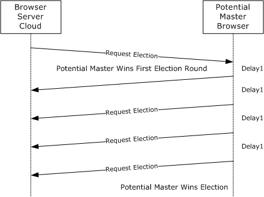

Figure 3: A browser server wins the first election round and the election

## 4.3 A Browser Server Wins the First Round but Loses the Election

The figure that follows depicts the following election process:

- A [**potential browser server**](#gt_potential-browser-server) (on the right) receives a [RequestElection](#Section_3.3.5.11) frame and decides it is winning the election, as compared to the sender of the RequestElection frame (for more information, see section 2.2.3).
- The potential browser server sends out a RequestElection frame that contains its own election version and criterion values.
- Meanwhile, a [**browser server**](#gt_browser-server) from the [**browser**](#gt_browser) cloud (on the left) has also received the first RequestElection frame, and decides that it is a winner.
- That browser server sends a RequestElection frame that specifies its own election version and criterion values.
- The potential browser server receives this new RequestElection frame and decides that it has lost the election, when it compares itself to the other browser server.
- The potential browser server on the left sends a total of four RequestElection frames and receives no responses. It declares itself a winner.
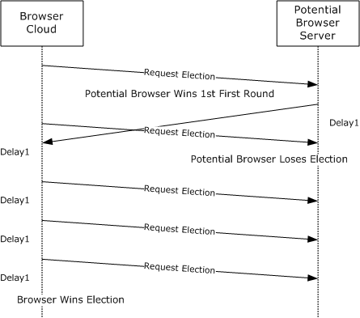

Figure 4: A browser server wins the first round but loses the Election

# 5 Security

## 5.1 Security Considerations for Implementers

In general, the [**browser**](#gt_browser) service operates without any security. It is possible for applications to spoof elections. Additionally, malfunctioning [**local master browser servers**](#gt_local-master-browser-server) can mount an effective denial-of-service (DOS) attack against the entire browser infrastructure (for example, if a [**browser server**](#gt_browser-server) refuses to release the <machine group>[0x1D] name after losing an election).

The browser service uses null sessions to establish a connection to the IPC$ share of the server. Null sessions are simply SMB connections [MS-SMB](../MS-SMB/MS-SMB.md) that use no password, no domain, and no user ID to establish the connection. This implies that the connection is highly insecure.

## 5.2 Index of Security Parameters

None.

# 6 Appendix A: Product Behavior

The information in this specification is applicable to the following Microsoft products or supplemental software. References to product versions include updates to those products.

The terms "earlier" and "later", when used with a product version, refer to either all preceding versions or all subsequent versions, respectively. The term "through" refers to the inclusive range of versions. Applicable Microsoft products are listed chronologically in this section.

- Windows NT operating system
- Windows 98 operating system
- Windows Millennium Edition operating system
- Windows 2000 operating system
- Windows XP operating system
- Windows Server 2003 operating system
- Windows Vista operating system
- Windows Server 2008 operating system
- Windows 7 operating system
- Windows Server 2008 R2 operating system
- Windows 8 operating system
- Windows Server 2012 operating system
- Windows 8.1 operating system
- Windows Server 2012 R2 operating system
- Windows 10 operating system
- Windows Server 2016 operating system
- Windows Server 2019 operating system
- Windows Server 2022 operating system
- Windows 11 operating system
- Windows Server 2025 operating system
Exceptions, if any, are noted in this section. If an update version, service pack or Knowledge Base (KB) number appears with a product name, the behavior changed in that update. The new behavior also applies to subsequent updates unless otherwise specified. If a product edition appears with the product version, behavior is different in that product edition.

Unless otherwise specified, any statement of optional behavior in this specification that is prescribed using the terms "SHOULD" or "SHOULD NOT" implies product behavior in accordance with the SHOULD or SHOULD NOT prescription. Unless otherwise specified, the term "MAY" implies that the product does not follow the prescription.

<1> Section 1.3: The CIFS Browser Protocol is ineffectual on Windows-based servers where only IPv6 is enabled.

<2> Section 1.3: The following statement is valid throughout the document. Windows 98, Windows 2000 Professional operating system, Windows XP, and Windows Vista are not capable of being domain master browsers; Windows Server 2008 operating system and later have the browser off by default, which can be turned on through the "Services" UI (User Interface) in "Computer Management".

<3> Section 1.3: There needs to always be at least one backup server in a network for a network with two machines one is promoted to be a backup browser.

<4> Section 1.8: The following table shows the unsigned 8-bit major and minor operating system version numbers that are used by Windows clients and servers.

| Operating system | Major version | Minor version |
| --- | --- | --- |
| Windows 98 | 0x04 | 0x0A |
| Windows Millennium Edition | 0x04 | 0x5A |
| Windows NT 4.0 operating system | 0x04 | 0x00 |
| Windows 2000 | 0x05 | 0x00 |
| Windows XP | 0x05 | 0x01 |
| Windows Server 2003 | 0x05 | 0x02 |
| Windows Server 2003 R2 operating system | 0x05 | 0x02 |
| Windows Vista | 0x06 | 0x00 |
| Windows Server 2008 | 0x06 | 0x00 |
| Windows 7 | 0x06 | 0x01 |
| Windows Server 2008 R2 operating system | 0x06 | 0x01 |
| Windows 8 | 0x06 | 0x02 |
| Windows Server 2012 | 0x06 | 0x02 |
| Windows 8.1 | 0x06 | 0x03 |
| Windows Server 2012 R2 | 0x06 | 0x03 |
| Windows 10 and later | 0x0A | 0x00 |
| Windows Server 2016 and later | 0x0A | 0x00 |

<5> Section 1.8: Windows only uses these values as specified in [MS-ERREF](../MS-ERREF/MS-ERREF.md).

<6> Section 2.1: Windows clients always use \MAILSLOT\BROWSE for [**mailslot**](#gt_mailslot) requests.

<7> Section 2.1.1.2: Windows–based servers attempt to register the machine group name three times; if all attempts fail, it can be concluded that another server is already the [**master browser server**](#gt_master-browser-server) for this [**domain**](#gt_domain). Name registration is as specified in [[RFC1001]](https://go.microsoft.com/fwlink/?LinkId=90260) section 5.2.

<8> Section 2.1.1.2: **WINS** keeps up to 25 IP addresses for the <domain>[0x1C] [**group name**](#gt_group-name). The [**PDC**](#gt_primary-domain-controller-pdc) is the only machine that registers the <domain>[0x1B] name with WINS. WINS ensures that the IP address corresponding to the computer that registered <domain>[0x1B] is always placed first in this list of up to 25 IP addresses that registered <domain>[0x1C].

<9> Section 2.2.1: Windows-based servers send announcements to \MAILSLOT\LANMAN, but listen for announcements on both \MAILSLOT\LANMAN and \MAILSLOT\BROWSE as specified in section [2.1](#Section_2.1).

<10> Section 2.2.1: The Windows announcement frequency is as specified in section [3.2.6](#Section_3.1.6).

<11> Section 2.2.1: For more information, see section [1.8](#Section_1.8) for Windows operating system values.

<12> Section 2.2.1: For more information, see section 1.8 for Windows operating system values.

<13> Section 2.2.1: The comment field in Windows is a single byte containing the value 0x00.

<14> Section 2.2.3: The following table shows the operating system values.

| Value | Meaning |
| --- | --- |
| 0x10000000 | Windows-based clients. |
| 0x20000000 | Windows-based servers which act as PDCs. |

<15> Section 2.2.4: The default value on Windows is 0x04.

<16> Section 2.2.4: The value chosen by the Windows client for token is 0x00000001.

<17> Section 2.2.7: Windows clients and servers set BrowserConfigVersionMajor to 0x03.

<18> Section 2.2.7: Windows clients and servers set BrowserConfigVersionMinor to 0x0A.

<19> Section 2.2.7: Windows-based servers leave this field uninitialized, so the value is undefined.

<20> Section 2.2.7: Windows-based servers leave this field uninitialized, so the value is undefined.

<21> Section 2.2.7: Windows-based servers leave this field uninitialized, so the value is undefined.

<22> Section 2.2.9: Windows based clients and server’s ignore the command when this bit is set.

<23> Section 2.2.10: For more information on Windows operating system values, see section 1.8.

<24> Section 2.2.10: For more information about Windows operating system values, see section 1.8.

<25> Section 2.2.10: Windows clients and servers set BrowserConfigVersionMajor to 0x01.

<26> Section 2.2.10: Windows clients and servers set BrowserConfigVersionMinor to 0x0F.

<27> Section 3.1.3: For Windows machines, the requests to enumerate machines on the network would also fail if the initialization has failed.

<28> Section 3.1.5.1.1: The [**browser client**](#gt_browser-client) uses an initial token value of 0, and it increments this value every time it makes a [GetBackupListRequest](#Section_3.3.5.5).

<29> Section 3.1.5.1.2: The browser client selects up to three of the [**backup browser servers**](#gt_backup-browser-server) and uses a pseudo-random number generator to determine which one of the servers to use from that list.

<30> Section 3.1.6: Upon expiration of the timer, a Windows–based client retransmits the GetBackupListRequest twice more and, if both transmissions result in no [GetBackupListResponse](#Section_3.1.5.1.2) frames being received, a Windows–based client sends a [RequestElection](#Section_3.3.5.11) frame (section 2.2.3) with the version and criteria values set to 0. For more information about the election process, see section [3.3.5.8](#Section_3.3.5.8).

<31> Section 3.1.6: Windows increments **TokenValue**.

<32> Section 3.2.6: Windows 98, Windows 2000, Windows XP, and Windows Server 2003 use the following time-out values (as specified in 3.2.6).

| Server.HostAnnouncementCount value | New HostAnnouncement timer value |
| --- | --- |
| 0, 1 | 4 minutes |
| 2 | 8 minutes |
| > 2 | 12 minutes |

<33> Section 3.3: There needs to always be at least one backup server in a network for a network with two machines one is promoted to be a backup browser.

<34> Section 3.3: The new [**local master browser server**](#gt_local-master-browser-server) sends the announcement request only if its Servers List is empty. If the local master browser server was previously a backup [**browser**](#gt_browser), it does not send the announcement request.

<35> Section 3.3.1: Windows-based servers retrieve this value by reading the MaintainServerList registry setting. The default value is FALSE, but if MaintainServerList is set to "true", **AlwaysActAsDomainController** is set to TRUE.

<36> Section 3.3.1: A Windows-based server that is elected to a master browser does not reset the **LocalMasterAnnouncement Timer Count**.

<37> Section 3.3.1: The contents of the Machine Groups List element are ordered alphabetically.

<38> Section 3.3.1: Windows NT Server operating system sets **IsPrimaryDomainController** to TRUE if the IsDomainMaster registry key is set.

<39> Section 3.3.1: In Windows, the contents of the Servers List element are ordered alphabetically.

<40> Section 3.3.2: The local master browser will use the time-out values as specified in the DomainAnnouncement table in section [3.3.6](#Section_3.1.6).

<41> Section 3.3.2: Windows-based servers use an internal notification API instead of a timer.

<42> Section 3.3.2: The local master browser uses the default time-out values as specified in the [LocalMasterAnnouncement](#Section_2.2.10) table in section 3.3.6.

<43> Section 3.3.2: The local master browser will use the default time-out of 12 minutes.

<44> Section 3.3.2: Windows implementations use the default value of 12 minutes for this timer.

<45> Section 3.3.3: Windows-based servers will set **IsDomainController** to TRUE if the MaintainServerList registry key is set to "Yes".

<46> Section 3.3.3: In browser initialization, if the server is executing a scheduled announcement and determining whether to become a backup browser or master browser, SV_TYPE_POTENTIAL_BROWSER, SV_TYPE_MASTER_BROWSER, SV_TYPE_BACKUP_BROWSER flags are not set.

<47> Section 3.3.3: Windows 2000 Server operating system operating system and later register as SV_TYPE_SERVER_NT. Windows XP operating system and later do not register this flag.

<48> Section 3.3.5: Malformed messages are written to the Windows event log.

<49> Section 3.3.5.1: If the FindMaster timer expires three times (4.5 seconds), the [**browser server**](#gt_browser-server) sends a RequestElection (section 2.2.3) frame.

<50> Section 3.3.5.1: Windows XP, Windows XP Professional operating system, Windows XP 64-Bit Edition operating system, Windows Server 2003, Windows XP Professional x64 Edition operating system, Windows Vista, and Windows Server 2008 acting as the Local Master Browser for a network with fewer than 11 machines on it will return only the local master browser in response to a Get BackupList response. Windows XP Home Edition operating system and Windows Vista will return only the local master browser if fewer than 6 machines are on the network.

<51> Section 3.3.5.7: A Windows local master browser attempts to maintain a number of backup browser servers that it nominates as follows.

| Number of servers | Number of backup browser servers |
| --- | --- |
| 1 | 0 |
| 2-31 | 1 |
| 32-63 | 2 |
| > 63 | 3 |

<52> Section 3.3.5.7: Windows-based servers attempt to maintain the desired number of backup browser servers as 1 backup browser for every 32 servers in **Servers List**.

<53> Section 3.3.5.8: A Windows-based server that is elected to a master browser does not reset the **LocalMasterAnnouncement Timer Count**.

<54> Section 3.3.5.10: For machines running Windows, the ResetState message might not be seen for 17 minutes, because promotion or demotion of backup servers and version checking occurs during the ServerExpiration timer. The timer is delayed for the first 15 minutes after becoming a master where no demotion or promotion is done.

<55> Section 3.3.5.10: Windows-based servers attempt to maintain the desired number of backup browser servers as 1 backup browser for every 32 servers in the **Servers List**.

<56> Section 3.3.5.10: When Windows-based clients and servers ignore the command, this bit is set.

<57> Section 3.3.6: Windows Server 2003 uses the time-out value of 12 minutes. Windows 98, Windows Millennium Edition, and Windows 2000 use the following time-out values.

| LocalMasterAnnouncement timer count value | New LocalMasterAnnouncement timer value |
| --- | --- |
| 1 | 4 minutes |
| 2 | 8 minutes |
| > 2 | 12 minutes |

Windows 7 operating system and later and Windows Server 2008 R2 operating system and later use the following time-out values.

| LocalMasterAnnouncement timer count value | New LocalMasterAnnouncement timer value |
| --- | --- |
| 1 | 2 minutes |
| 2 | 4 minutes |
| 3 | 8 minutes |
| 4 | 12 minutes |
| > 4 | 12 minutes |

<58> Section 3.3.6: Servers lists and machine groups lists are merged alphabetically.

<59> Section 3.3.6: Windows-based servers use an internal notification API instead of a timer.

<60> Section 3.3.6: Windows-based servers will set **IsDomainController** to TRUE if the MaintainServerList registry key is set to "Yes".

<61> Section 3.3.6: Windows-based servers use an internal notification API instead of a timer.

<62> Section 3.3.7: Windows-based servers might not send the [HostAnnouncement](#Section_2.2.1) or RequestElection on shutdown as the shutdown process disconnects the network before the browser sends HostAnnouncement or RequestElection frame.

<63> Section 3.4: WINS maintains a set of up to 25 addresses for the <domain>[0x1C] group address.

# 7 Change Tracking

No table of changes is available. The document is either new or has had no changes since its last release.

## Revision History

| Date | Version | Revision Class | Comments |
| --- | --- | --- | --- |
| 4/3/2007 | 1.0 | New | Version 1.0 release |
| 7/3/2007 | 2.0 | Major | MLonghorn+90 |
| 7/20/2007 | 2.0.1 | Editorial | Changed language and formatting in the technical content. |
| 8/10/2007 | 3.0 | Major | Updated and revised the technical content. |
| 9/28/2007 | 4.0 | Major | Updated and revised the technical content. |
| 10/23/2007 | 4.0.1 | Editorial | Changed language and formatting in the technical content. |
| 11/30/2007 | 4.1 | Minor | Revised links. |
| 1/25/2008 | 4.1.1 | Editorial | Changed language and formatting in the technical content. |
| 3/14/2008 | 4.2 | Minor | Clarified the meaning of the technical content. |
| 5/16/2008 | 5.0 | Major | Updated and revised the technical content. |
| 6/20/2008 | 6.0 | Major | Updated and revised the technical content. |
| 7/25/2008 | 6.1 | Minor | Clarified the meaning of the technical content. |
| 8/29/2008 | 6.2 | Minor | Clarified the meaning of the technical content. |
| 10/24/2008 | 7.0 | Major | Updated and revised the technical content. |
| 12/5/2008 | 8.0 | Major | Updated and revised the technical content. |
| 1/16/2009 | 9.0 | Major | Updated and revised the technical content. |
| 2/27/2009 | 10.0 | Major | Updated and revised the technical content. |
| 4/10/2009 | 11.0 | Major | Updated and revised the technical content. |
| 5/22/2009 | 11.1 | Minor | Clarified the meaning of the technical content. |
| 7/2/2009 | 11.1.1 | Editorial | Changed language and formatting in the technical content. |
| 8/14/2009 | 11.2 | Minor | Clarified the meaning of the technical content. |
| 9/25/2009 | 12.0 | Major | Updated and revised the technical content. |
| 11/6/2009 | 13.0 | Major | Updated and revised the technical content. |
| 12/18/2009 | 14.0 | Major | Updated and revised the technical content. |
| 1/29/2010 | 15.0 | Major | Updated and revised the technical content. |
| 3/12/2010 | 15.1 | Minor | Clarified the meaning of the technical content. |
| 4/23/2010 | 15.2 | Minor | Clarified the meaning of the technical content. |
| 6/4/2010 | 15.2.1 | Editorial | Changed language and formatting in the technical content. |
| 7/16/2010 | 15.2.1 | None | No changes to the meaning, language, or formatting of the technical content. |
| 8/27/2010 | 15.2.1 | None | No changes to the meaning, language, or formatting of the technical content. |
| 10/8/2010 | 16.0 | Major | Updated and revised the technical content. |
| 11/19/2010 | 17.0 | Major | Updated and revised the technical content. |
| 1/7/2011 | 17.0 | None | No changes to the meaning, language, or formatting of the technical content. |
| 2/11/2011 | 17.0 | None | No changes to the meaning, language, or formatting of the technical content. |
| 3/25/2011 | 17.0 | None | No changes to the meaning, language, or formatting of the technical content. |
| 5/6/2011 | 17.0 | None | No changes to the meaning, language, or formatting of the technical content. |
| 6/17/2011 | 17.1 | Minor | Clarified the meaning of the technical content. |
| 9/23/2011 | 17.1 | None | No changes to the meaning, language, or formatting of the technical content. |
| 12/16/2011 | 18.0 | Major | Updated and revised the technical content. |
| 3/30/2012 | 18.0 | None | No changes to the meaning, language, or formatting of the technical content. |
| 7/12/2012 | 19.0 | Major | Updated and revised the technical content. |
| 10/25/2012 | 20.0 | Major | Updated and revised the technical content. |
| 1/31/2013 | 20.0 | None | No changes to the meaning, language, or formatting of the technical content. |
| 8/8/2013 | 21.0 | Major | Updated and revised the technical content. |
| 11/14/2013 | 21.0 | None | No changes to the meaning, language, or formatting of the technical content. |
| 2/13/2014 | 21.0 | None | No changes to the meaning, language, or formatting of the technical content. |
| 5/15/2014 | 21.0 | None | No changes to the meaning, language, or formatting of the technical content. |
| 6/30/2015 | 22.0 | Major | Significantly changed the technical content. |
| 10/16/2015 | 22.0 | None | No changes to the meaning, language, or formatting of the technical content. |
| 7/14/2016 | 22.0 | None | No changes to the meaning, language, or formatting of the technical content. |
| 6/1/2017 | 22.0 | None | No changes to the meaning, language, or formatting of the technical content. |
| 9/15/2017 | 23.0 | Major | Significantly changed the technical content. |
| 9/12/2018 | 24.0 | Major | Significantly changed the technical content. |
| 4/7/2021 | 25.0 | Major | Significantly changed the technical content. |
| 6/25/2021 | 26.0 | Major | Significantly changed the technical content. |
| 4/23/2024 | 27.0 | Major | Significantly changed the technical content. |
| 9/16/2024 | 27.0 | None | No changes to the meaning, language, or formatting of the technical content. |
