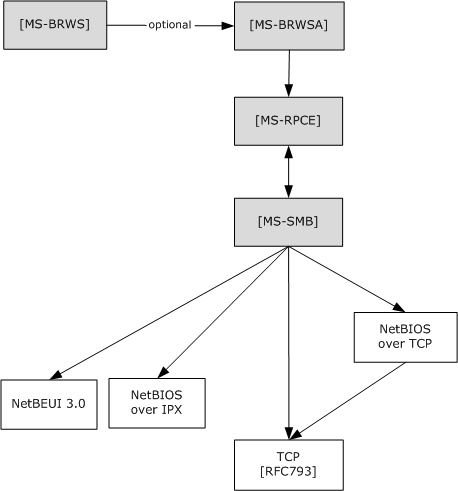
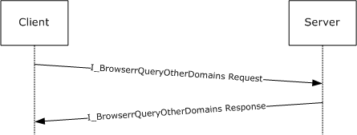

# [MS-BRWSA]: Common Internet File System (CIFS) Browser Auxiliary Protocol

Table of Contents

1 Introduction

- [1 Introduction](#Section_1)
  - [1.1 Glossary](#Section_1.1)
  - [1.2 References](#Section_1.2)
    - [1.2.1 Normative References](#Section_1.2.1)
    - [1.2.2 Informative References](#Section_1.2.2)
  - [1.3 Overview](#Section_1.3)
  - [1.4 Relationship to Other Protocols](#Section_1.4)
  - [1.5 Prerequisites/Preconditions](#Section_1.5)
  - [1.6 Applicability Statement](#Section_1.6)
  - [1.7 Versioning and Capability Negotiation](#Section_1.7)
  - [1.8 Vendor-Extensible Fields](#Section_1.8)
  - [1.9 Standards Assignments](#Section_1.9)

2 Messages

- [2 Messages](#Section_2)
  - [2.1 Transport](#Section_2.1)
  - [2.2 Common Data Types](#Section_2.2)
    - [2.2.1 Simple Data Types](#Section_2.2.1)
      - [2.2.1.1 BROWSER_IDENTIFY_HANDLE](#Section_2.2.1.1)
    - [2.2.2 Constants](#Section_2.2.2)
      - [2.2.2.1 Platform IDs](#Section_2.2.2.1)
    - [2.2.3 Structures](#Section_2.2.3)
      - [2.2.3.1 SERVER_INFO_100_CONTAINER](#Section_2.2.3.1)
      - [2.2.3.2 SERVER_ENUM_STRUCT](#Section_2.2.3.2)

3 Protocol Details

- [3 Protocol Details](#Section_3)
  - [3.1 Server Details](#Section_3.1)
    - [3.1.1 Abstract Data Model](#Section_3.1.1)
      - [3.1.1.1 OtherDomains Name Abstract Data Model](#Section_3.1.1.1)
    - [3.1.2 Timers](#Section_3.1.2)
    - [3.1.3 Initialization](#Section_3.1.3)
    - [3.1.4 Message Processing Events and Sequencing Rules](#Section_3.1.4)
      - [3.1.4.1 Browser](#Section_3.1.4.1)
        - [3.1.4.1.1 I_BrowserrQueryOtherDomains (Opnum 2)](#Section_3.1.4.1.1)
    - [3.1.5 Timer Events](#Section_3.1.5)
    - [3.1.6 Other Local Events](#Section_3.1.6)
  - [3.2 Client Details](#Section_3.2)
    - [3.2.1 Abstract Data Model](#Section_3.2.1)
    - [3.2.2 Timers](#Section_3.2.2)
    - [3.2.3 Initialization](#Section_3.2.3)
    - [3.2.4 Message Processing Events and Sequencing Rules](#Section_3.2.4)
    - [3.2.5 Timer Events](#Section_3.2.5)
    - [3.2.6 Other Local Events](#Section_3.2.6)

4 Protocol Examples

- [4 Protocol Examples](#Section_4)

5 Security

- [5 Security](#Section_5)
  - [5.1 Security Considerations for Implementers](#Section_5.1)
  - [5.2 Index of Security Parameters](#Section_5.2)

6 Appendix A: Full IDL

- [6 Appendix A: Full IDL](#Section_6)

7 Appendix B: Product Behavior

- [7 Appendix B: Product Behavior](#Section_7)

8 Change Tracking

- [8 Change Tracking](#Section_8)

For the legal notice and IP terms, see [LEGAL.md](../LEGAL.md).
Last updated: 4/23/2024.
See [Revision History](#revision-history) for full version history.

# 1 Introduction

This document specifies the Common Internet File System (CIFS) Browser Auxiliary Protocol Specification. This protocol is used by the [**master browser server**](#gt_master-browser-server) and [**domain master browser server**](#gt_domain-master-browser-server) as defined in [MS-BRWS](../MS-BRWS/MS-BRWS.md). The master browser server uses this protocol to query configuration information for the domains from the domain master browser server. The protocol operation is stateless.

Sections 1.5, 1.8, 1.9, 2, and 3 of this specification are normative. All other sections and examples in this specification are informative.

## 1.1 Glossary

This document uses the following terms:

**browser**: See [**browser server**](#gt_browser-server).

**browser server**: An entity that maintains or could be elected to maintain information about other servers and [**domains**](#gt_domain).

**client**: A computer on which the remote procedure call (RPC) client is executing.

**domain**: A set of users and computers sharing a common namespace and management infrastructure. At least one computer member of the set has to act as a [**domain controller (DC)**](#gt_domain-controller-dc) and host a member list that identifies all members of the domain, as well as optionally hosting the Active Directory service. The domain controller provides authentication of members, creating a unit of trust for its members. Each domain has an identifier that is shared among its members. For more information, see [MS-AUTHSOD](../MS-AUTHSOD/MS-AUTHSOD.md) section 1.1.1.5 and [MS-ADTS](../MS-ADTS/MS-ADTS.md).

**domain controller (DC)**: The service, running on a server, that implements Active Directory, or the server hosting this service. The service hosts the data store for objects and interoperates with other [**DCs**](#gt_domain-controller-dc) to ensure that a local change to an object replicates correctly across all [**DCs**](#gt_domain-controller-dc). When Active Directory is operating as Active Directory Domain Services (AD DS), the [**DC**](#gt_domain-controller-dc) contains full NC replicas of the configuration naming context (config NC), schema naming context (schema NC), and one of the domain NCs in its forest. If the AD DS [**DC**](#gt_domain-controller-dc) is a global catalog server (GC server), it contains partial NC replicas of the remaining domain NCs in its forest. For more information, see [MS-AUTHSOD] section 1.1.1.5.2 and [MS-ADTS]. When Active Directory is operating as Active Directory Lightweight Directory Services (AD LDS), several AD LDS [**DCs**](#gt_domain-controller-dc) can run on one server. When Active Directory is operating as AD DS, only one AD DS [**DC**](#gt_domain-controller-dc) can run on one server. However, several AD LDS [**DCs**](#gt_domain-controller-dc) can coexist with one AD DS [**DC**](#gt_domain-controller-dc) on one server. The AD LDS [**DC**](#gt_domain-controller-dc) contains full NC replicas of the config NC and the schema NC in its forest. The domain controller is the server side of Authentication Protocol Domain Support [MS-APDS](../MS-APDS/MS-APDS.md).

**domain master browser server**: A [**master browser server**](#gt_master-browser-server) that is responsible for combining information for an entire domain, across all subnets. A [**domain master browser server**](#gt_domain-master-browser-server) is responsible for keeping multiple subnets in synchronization by periodically querying local master browser servers for information concerning user accounts, security, and available resources such as printers.

**Interface Definition Language (IDL)**: The International Standards Organization (ISO) standard language for specifying the interface for remote procedure calls. For more information, see [[C706]](https://go.microsoft.com/fwlink/?LinkId=89824) section 4.

**master browser server**: A server that is responsible for maintaining a master list of available resources on a subnet and for making the list available to backup browser servers. Each subnet requires a [**master browser server**](#gt_master-browser-server). The [**master browser server**](#gt_master-browser-server) for a particular domain is called the [**domain master browser server**](#gt_domain-master-browser-server).

**named pipe**: A named, one-way, or duplex pipe for communication between a pipe server and one or more pipe clients.

**opnum**: An operation number or numeric identifier that is used to identify a specific remote procedure call (RPC) method or a method in an interface. For more information, see [C706] section 12.5.2.12 or [MS-RPCE](../MS-RPCE/MS-RPCE.md).

**primary domain controller (PDC)**: A [**domain controller (DC)**](#gt_domain-controller-dc) designated to track changes made to the accounts of all computers on a [**domain**](#gt_domain). It is the only computer to receive these changes directly, and is specialized so as to ensure consistency and to eliminate the potential for conflicting entries in the Active Directory database. A [**domain**](#gt_domain) has only one [**PDC**](#gt_primary-domain-controller-pdc).

**server**: A computer on which the remote procedure call (RPC) server is executing.

**Unicode**: A character encoding standard developed by the Unicode Consortium that represents almost all of the written languages of the world. The [**Unicode**](#gt_unicode) standard [[UNICODE5.0.0/2007]](https://go.microsoft.com/fwlink/?LinkId=154659) provides three forms (UTF-8, UTF-16, and UTF-32) and seven schemes (UTF-8, UTF-16, UTF-16 BE, UTF-16 LE, UTF-32, UTF-32 LE, and UTF-32 BE).

**universally unique identifier (UUID)**: A 128-bit value. UUIDs can be used for multiple purposes, from tagging objects with an extremely short lifetime, to reliably identifying very persistent objects in cross-process communication such as client and server interfaces, manager entry-point vectors, and RPC objects. UUIDs are highly likely to be unique. UUIDs are also known as globally unique identifiers (GUIDs) and these terms are used interchangeably in the Microsoft protocol technical documents (TDs). Interchanging the usage of these terms does not imply or require a specific algorithm or mechanism to generate the UUID. Specifically, the use of this term does not imply or require that the algorithms described in [[RFC4122]](https://go.microsoft.com/fwlink/?LinkId=90460) or [C706] must be used for generating the UUID.

**MAY, SHOULD, MUST, SHOULD NOT, MUST NOT:** These terms (in all caps) are used as defined in [[RFC2119]](https://go.microsoft.com/fwlink/?LinkId=90317). All statements of optional behavior use either MAY, SHOULD, or SHOULD NOT.

## 1.2 References

Links to a document in the Microsoft Open Specifications library point to the correct section in the most recently published version of the referenced document. However, because individual documents in the library are not updated at the same time, the section numbers in the documents may not match. You can confirm the correct section numbering by checking the [Errata](https://go.microsoft.com/fwlink/?linkid=850906).

### 1.2.1 Normative References

We conduct frequent surveys of the normative references to assure their continued availability. If you have any issue with finding a normative reference, please contact [dochelp@microsoft.com](mailto:dochelp@microsoft.com). We will assist you in finding the relevant information.

[C706] The Open Group, "DCE 1.1: Remote Procedure Call", C706, August 1997, [https://publications.opengroup.org/c706](https://go.microsoft.com/fwlink/?LinkId=89824)

**Note** Registration is required to download the document.

[MS-DTYP] Microsoft Corporation, "[Windows Data Types](../MS-DTYP/MS-DTYP.md)".

[MS-RPCE] Microsoft Corporation, "[Remote Procedure Call Protocol Extensions](../MS-RPCE/MS-RPCE.md)".

[MS-SMB] Microsoft Corporation, "[Server Message Block (SMB) Protocol](../MS-SMB/MS-SMB.md)".

[RFC1001] Network Working Group, "Protocol Standard for a NetBIOS Service on a TCP/UDP Transport: Concepts and Methods", RFC 1001, March 1987, [https://www.rfc-editor.org/info/rfc1001](https://go.microsoft.com/fwlink/?LinkId=90260)

[RFC1002] Network Working Group, "Protocol Standard for a NetBIOS Service on a TCP/UDP Transport: Detailed Specifications", STD 19, RFC 1002, March 1987, [https://www.rfc-editor.org/info/rfc1002](https://go.microsoft.com/fwlink/?LinkId=90261)

[RFC2119] Bradner, S., "Key words for use in RFCs to Indicate Requirement Levels", BCP 14, RFC 2119, March 1997, [https://www.rfc-editor.org/info/rfc2119](https://go.microsoft.com/fwlink/?LinkId=90317)

### 1.2.2 Informative References

[MS-BRWS] Microsoft Corporation, "[Common Internet File System (CIFS) Browser Protocol](../MS-BRWS/MS-BRWS.md)".

[MS-WKST] Microsoft Corporation, "[Workstation Service Remote Protocol](../MS-WKST/MS-WKST.md)".

[PIPE] Microsoft Corporation, "Named Pipes", [http://msdn.microsoft.com/en-us/library/aa365590.aspx](https://go.microsoft.com/fwlink/?LinkId=90247)

## 1.3 Overview

The main objective of the CIFS Browser Auxiliary Protocol is to provide a method for the [**master browser server**](#gt_master-browser-server) of a subnet to query specific additional information from the [**domain master browser server**](#gt_domain-master-browser-server) for a given [**domain**](#gt_domain). Selection of the master browser server and domain master [**browser server**](#gt_browser-server) and the roles that these [**servers**](#gt_server) play are as specified in [MS-BRWS](../MS-BRWS/MS-BRWS.md).

## 1.4 Relationship to Other Protocols

This protocol depends on RPC, as specified in [MS-RPCE](../MS-RPCE/MS-RPCE.md), for its transport. This protocol uses RPC over [**named pipes**](#gt_named-pipe), as specified in [MS-RPCE] section 2.1.1.2. Named pipes use the Server Message Block (SMB) Protocol, as specified in [MS-SMB](../MS-SMB/MS-SMB.md).

An implementation of [MS-BRWS](../MS-BRWS/MS-BRWS.md) can use this protocol to retrieve information from the domain master browser.

Figure 1: Relationship to other protocols

- [MS-BRWS] calls (optional) [MS-BRWSA] to request OtherDomains information from a [**domain controller (DC)**](#gt_domain-controller-dc).
- [MS-BRWSA] calls [MS-RPCE] as RPC/named pipes as transport.
- [MS-RPCE] calls [MS-SMB] named pipes as a transport that uses SMB.

## 1.5 Prerequisites/Preconditions

The [**master browser server**](#gt_master-browser-server) has previously identified the endpoint address of the [**domain master browser server**](#gt_domain-master-browser-server).

## 1.6 Applicability Statement

This protocol is used to retrieve the list of domains that the [**domain master browser server**](#gt_domain-master-browser-server) has been configured to support.

## 1.7 Versioning and Capability Negotiation

None.

## 1.8 Vendor-Extensible Fields

None.

## 1.9 Standards Assignments

| Parameter | Value | Reference |
| --- | --- | --- |
| RPC Interface UUID | 6BFFD098-A112-3610-9833-012892020162 | See section [2.1](#Section_2.1) |
| Pipe Name | "\pipe\browser" | See section 2.1 |

# 2 Messages

## 2.1 Transport

The RPC methods that the CIFS Browser Auxiliary Protocol uses are available on one endpoint:

- "\pipe\browser" [**named pipe**](#gt_named-pipe) (RPC protseqs ncacn_np), as specified in [MS-RPCE](../MS-RPCE/MS-RPCE.md) section 2.1.1.2.
The CIFS Browser Auxiliary Protocol endpoint is available only over named pipes. For more information about named pipes, see [[PIPE]](https://go.microsoft.com/fwlink/?LinkId=90247).

This protocol MUST use the [**universally unique identifier (UUID)**](#gt_universally-unique-identifier-uuid) as specified in section [1.9](#Section_1.9). The RPC version number is 0.0.

This protocol allows any user to establish a connection to the RPC [**server**](#gt_server). The protocol uses the underlying RPC protocol to retrieve the identity of the caller that made the method call, as described in section 3.3.3.4.3 of [MS-RPCE]. The server SHOULD use this identity to perform method specific access checks as described in section [3.1.4](#Section_3.1.4).

## 2.2 Common Data Types

In addition to RPC base types and definitions specified in [[C706]](https://go.microsoft.com/fwlink/?LinkId=89824) and [MS-RPCE](../MS-RPCE/MS-RPCE.md), additional data types are defined below.

The following are the types that are defined in this specification.

### 2.2.1 Simple Data Types

#### 2.2.1.1 BROWSER_IDENTIFY_HANDLE

The BROWSER_IDENTIFY_HANDLE structure is a null-terminated [**Unicode**](#gt_unicode) string that identifies the remote computer on which to execute the method.

This type is declared as follows:

typedef [handle] LPWSTR BROWSER_IDENTIFY_HANDLE;

The [**client**](#gt_client) MUST set the impersonation level for the RPC connection that refers to this handle to "IDENTIFICATION". "IDENTIFICATION" implies an impersonation level of SECURITY_IDENTIFICATION. For more information on impersonation levels, see the **ImpersonationLevel** field in [MS-SMB](../MS-SMB/MS-SMB.md) section 2.2.4.9.1.

### 2.2.2 Constants

#### 2.2.2.1 Platform IDs

The following values specify the information level to use for platform-specific information on the server.

| Name | Value (decimal) |
| --- | --- |
| PLATFORM_ID_DOS | 300 |
| PLATFORM_ID_OS2 | 400 |
| PLATFORM_ID_NT | 500 |
| PLATFORM_ID_OSF | 600 |
| PLATFORM_ID_VMS | 700 |

### 2.2.3 Structures

#### 2.2.3.1 SERVER_INFO_100_CONTAINER

The SERVER_INFO_100_CONTAINER structure contains a count of the entries returned by the method and a pointer to a buffer.

typedef struct _SERVER_INFO_100_CONTAINER {

DWORD EntriesRead;

[size_is(EntriesRead)] LPSERVER_INFO_100 Buffer;

} SERVER_INFO_100_CONTAINER,

*PSERVER_INFO_100_CONTAINER,

*LPSERVER_INFO_100_CONTAINER;

**EntriesRead:** The number of entries returned by the method call. This value MUST be zero if no domains are configured in the [**primary domain controller**](#gt_primary-domain-controller-pdc) or [**domain controller**](#gt_domain-controller-dc). The client SHOULD set the EntriesRead field to 0, and the Buffer field to NULL, and the server MUST ignore these fields.

**Buffer:** A pointer to an array of SERVER_INFO_100 data structures (as specified in [MS-DTYP](../MS-DTYP/MS-DTYP.md) section 2.3.11). If EntriesRead is zero, this field is undefined and MUST NOT be considered a valid pointer.

#### 2.2.3.2 SERVER_ENUM_STRUCT

The SERVER_ENUM_STRUCT structure defines the layout for a structure with a value to indicate the information level submitted to the method and a pointer to a data structure that contains an array of data structures returned by the method. This structure is used by I_BrowserrQueryOtherDomains.

typedef struct _SERVER_ENUM_STRUCT {

DWORD Level;

[switch_is(Level)] union _SERVER_ENUM_UNION {

[case(100)]

LPSERVER_INFO_100_CONTAINER Level100;

[default]

;

} ServerInfo;

} SERVER_ENUM_STRUCT,

*PSERVER_ENUM_STRUCT,

*LPSERVER_ENUM_STRUCT;

**Level:** The information level of the data. This member MUST be 100.

**ServerInfo:** A structure that contains an array of data structures. The **Level** member determines the data type of the members of this array.

**Level100:** A pointer to a [SERVER_INFO_100_CONTAINER](#Section_2.2.3.1) structure that contains the number of entries returned by the method and a pointer to an array of SERVER_INFO_100 structures (as specified in [MS-DTYP](../MS-DTYP/MS-DTYP.md) section 2.3.11).

# 3 Protocol Details

## 3.1 Server Details

### 3.1.1 Abstract Data Model

#### 3.1.1.1 OtherDomains Name Abstract Data Model

**OtherDomains:** Specifies a list of NetBIOS names of [**domains**](#gt_domain), as specified in [[RFC1001]](https://go.microsoft.com/fwlink/?LinkId=90260) and [[RFC1002]](https://go.microsoft.com/fwlink/?LinkId=90261), browsed by the computer. Each name MUST be at most 15 characters in length, and MUST NOT contain trailing spaces or a NetBIOS suffix as defined in [MS-BRWS](../MS-BRWS/MS-BRWS.md) section 2.1.1. The names in the **OtherDomains** list MUST be separated by spaces.

This element is shared with the Workstation Service Remote Protocol Specification [MS-WKST](../MS-WKST/MS-WKST.md), queried through the WkstaQueryOtherDomains event (section 3.2.6.1).

The OtherDomains element is also shared with the Common Internet File System (CIFS) Browser Protocol [MS-BRWS] to update the **OtherDomains** information from a [**domain controller**](#gt_domain-controller-dc).

### 3.1.2 Timers

None.

### 3.1.3 Initialization

Section [2.1](#Section_2.1) specifies the parameters necessary to initialize the RPC protocol.

### 3.1.4 Message Processing Events and Sequencing Rules

The *ServerName* parameter MUST be ignored by the [**server**](#gt_server) when processing any message.<1>

#### 3.1.4.1 Browser

The browser interface lists the methods associated with the [**browser**](#gt_browser) service, which creates and maintains a view of resources available on a network. The server does not maintain [**client**](#gt_client) state information. The protocol operation is stateless. The version for this interface is 0.0.

The [**UUID**](#gt_universally-unique-identifier-uuid) for this interface is: "6BFFD098-A112-3610-9833-012892020162".

Methods in RPC Opnum Order

| Method | Description |
| --- | --- |
| Opnum0NotUsedOnWire | Reserved for local use. Opnum: 0 |
| Opnum1NotUsedOnWire | Reserved for local use. Opnum: 1 |
| [I_BrowserrQueryOtherDomains](#Section_3.1.4.1.1) | Returns a list of other domains configured for this computer. Opnum: 2 |
| Opnum3NotUsedOnWire | Reserved for local use. Opnum: 3 |
| Opnum4NotUsedOnWire | Reserved for local use. Opnum: 4 |
| Opnum5NotUsedOnWire | Reserved for local use. Opnum: 5 |
| Opnum6NotUsedOnWire | Reserved for local use. Opnum: 6 |
| Opnum7NotUsedOnWire | Reserved for local use. Opnum: 7 |
| Opnum8NotUsedOnWire | Reserved for local use. Opnum: 8 |
| Opnum9NotUsedOnWire | Reserved for local use. Opnum: 9 |
| Opnum10NotUsedOnWire | Reserved for local use. Opnum: 10 |
| Opnum11NotUsedOnWire | Reserved for local use. Opnum: 11 |

In the preceding table, the phrase "Reserved for local use" means that the client MUST NOT send the [**opnum**](#gt_opnum) and that the server behavior is undefined<2> because it does not affect interoperability.

##### 3.1.4.1.1 I_BrowserrQueryOtherDomains (Opnum 2)

The I_BrowserrQueryOtherDomains method is received by the server in an RPC_REQUEST packet. The [**client**](#gt_client) SHOULD NOT send this RPC request to a server that is not a [**primary domain controller (PDC)**](#gt_primary-domain-controller-pdc) acting as the [**domain master browser server**](#gt_domain-master-browser-server).

If this server is not a primary domain controller it MAY fail the request.<3>

If the server is a primary domain controller, the server MUST update **OtherDomains** as specified in [MS-WKST](../MS-WKST/MS-WKST.md) section 3.2.6.1, WkstaQueryOtherDomains Event. The server MUST construct a SERVER_ENUM structure as specified in [2.2.3.2](#Section_2.2.3.2), containing a SERVER_INFO_100 structure as specified in [MS-DTYP](../MS-DTYP/MS-DTYP.md) section 2.3.11 for each name in **OtherDomains**, and return this to the caller.

NET_API_STATUS I_BrowserrQueryOtherDomains(

[in, string, unique] BROWSER_IDENTIFY_HANDLE ServerName,

[in, out] LPSERVER_ENUM_STRUCT InfoStruct,

[out] LPDWORD TotalEntries

);

**ServerName:** An optional [BROWSER_IDENTIFY_HANDLE](#Section_2.2.1.1) structure that specifies the name of the server to execute the method. This value is ignored upon receipt.

**InfoStruct:** A pointer to a SERVER_ENUM_STRUCT structure that contains the **Level** member and a pointer to a SERVER_INFO_x structure, where <x> MUST be 100. The **Level** member MUST be set to 100. If the **Level** member is set to any other value, the method MUST return ERROR_INVALID_LEVEL.<4>

**TotalEntries:** The number of entries returned by the method call. This parameter MUST match the **EntriesRead** member of the [SERVER_INFO_100_CONTAINER](#Section_2.2.3.1) structure.

**Return Values:** The method returns NERR_Success on success; otherwise, it returns a nonzero error code, as specified in either Win32 Error Codes. The most common error codes are listed in the following table.<5>

| Return value/code | Description |
| --- | --- |
| 0x00000000 NERR_Success | The operation completed successfully. |
| 0x00000005 ERROR_ACCESS_DENIED | Access is denied. |
| 0x00000008 ERROR_NOT_ENOUGH_MEMORY | This value MUST be returned when the server could not allocate enough memory to complete this operation. |
| 0x00000057 ERROR_INVALID_PARAMETER | This value MUST be returned when a parameter is incorrect. For example, this value is returned when the *InfoStruct* parameter is NULL or the **Level100** member in the structure pointed to by the *InfoStruct* parameter is NULL. |
| 0x0000007C ERROR_INVALID_LEVEL | This value MUST be returned when the **Level** member is not 100. |
| 0x000000EA ERROR_MORE_DATA | The error ERROR_MORE_DATA indicates that not all available entries were returned. Some more entries exist which were not returned in the response. |

### 3.1.5 Timer Events

None.

### 3.1.6 Other Local Events

None.

## 3.2 Client Details

### 3.2.1 Abstract Data Model

None.

### 3.2.2 Timers

None.

### 3.2.3 Initialization

The [**client**](#gt_client) MUST create an RPC connection to the remote computer by using details as specified in section [2.1](#Section_2.1).

### 3.2.4 Message Processing Events and Sequencing Rules

None.

### 3.2.5 Timer Events

None.

### 3.2.6 Other Local Events

None.

# 4 Protocol Examples

The method provided by this protocol is a simple request-response. The [**server**](#gt_server) receives the request, executes the method, and returns a completion. The [**client**](#gt_client) simply returns the completion status to the calling application. This is a stateless protocol; each method call is independent of any previous method calls.

For example, the client calls the [I_BrowserrQueryOtherDomains](#Section_3.1.4.1.1) method; on receiving this method, the server executes the call locally and returns the appropriate information and NERR_Success.

Figure 2: Simple request-response model

# 5 Security

## 5.1 Security Considerations for Implementers

As described in section [2.1](#Section_2.1), this protocol allows any user to connect to the [**server**](#gt_server). Therefore, any security bug in the server implementation could be exploitable. It is recommended that the server implementation enforce security on each method.

## 5.2 Index of Security Parameters

None.

# 6 Appendix A: Full IDL

For ease of implementation, the full [**IDL**](#gt_interface-definition-language-idl) is provided below, where "ms-dtyp.idl" refers to the IDL found in [MS-DTYP](../MS-DTYP/MS-DTYP.md) Appendix A.

The syntax uses the IDL syntax extensions defined in [MS-RPCE](../MS-RPCE/MS-RPCE.md) sections 2.2.4 and 2.2.4. For example, as noted in [MS-RPCE] section 2.2.4.9, a pointer_default declaration is not required and pointer_default(unique) is assumed.

[

uuid(6BFFD098-A112-3610-9833-012892020162),

version(0.0),

ms_union,

pointer_default(unique)

]

interface browser

{

import "ms-dtyp.idl";

typedef WCHAR* LPWSTR;

typedef [handle] LPWSTR BROWSER_IDENTIFY_HANDLE;

typedef struct _SERVER_INFO_100_CONTAINER {

DWORD EntriesRead;

[size_is(EntriesRead)] LPSERVER_INFO_100 Buffer;

} SERVER_INFO_100_CONTAINER,

*PSERVER_INFO_100_CONTAINER,

*LPSERVER_INFO_100_CONTAINER;

typedef struct _SERVER_ENUM_STRUCT {

DWORD Level;

[switch_is(Level)] union _SERVER_ENUM_UNION {

[case(100)]

LPSERVER_INFO_100_CONTAINER Level100;

[default]

;

} ServerInfo;

} SERVER_ENUM_STRUCT,

*PSERVER_ENUM_STRUCT,

*LPSERVER_ENUM_STRUCT;

NET_API_STATUS Opnum0NotUsedOnWire(void);

NET_API_STATUS Opnum1NotUsedOnWire(void);

NET_API_STATUS

I_BrowserrQueryOtherDomains(

[in,string,unique] BROWSER_IDENTIFY_HANDLE ServerName,

[in,out] LPSERVER_ENUM_STRUCT InfoStruct,

[out] LPDWORD TotalEntries

);

NET_API_STATUS Opnum3NotUsedOnWire(void);

NET_API_STATUS Opnum4NotUsedOnWire(void);

NET_API_STATUS Opnum5NotUsedOnWire(void);

NET_API_STATUS Opnum6NotUsedOnWire(void);

NET_API_STATUS Opnum7NotUsedOnWire(void);

NET_API_STATUS Opnum8NotUsedOnWire(void);

NET_API_STATUS Opnum9NotUsedOnWire(void);

NET_API_STATUS Opnum10NotUsedOnWire(void);

NET_API_STATUS Opnum11NotUsedOnWire(void);

}

# 7 Appendix B: Product Behavior

The information in this specification is applicable to the following Microsoft products or supplemental software. References to product versions include updates to those products.

- Windows 2000 operating system
- Windows XP operating system
- Windows Server 2003 operating system
- Windows Vista operating system
- Windows Server 2008 operating system
- Windows 7 operating system
- Windows Server 2008 R2 operating system
- Windows 8 operating system
- Windows Server 2012 operating system
- Windows 8.1 operating system
- Windows Server 2012 R2 operating system
- Windows 10 operating system
- Windows Server 2016 operating system
- Windows Server operating system
- Windows Server 2019 operating system
- Windows Server 2022 operating system
- Windows 11 operating system
- Windows Server 2025 operating system
Exceptions, if any, are noted in this section. If an update version, service pack or Knowledge Base (KB) number appears with a product name, the behavior changed in that update. The new behavior also applies to subsequent updates unless otherwise specified. If a product edition appears with the product version, behavior is different in that product edition.

Unless otherwise specified, any statement of optional behavior in this specification that is prescribed using the terms "SHOULD" or "SHOULD NOT" implies product behavior in accordance with the SHOULD or SHOULD NOT prescription. Unless otherwise specified, the term "MAY" implies that the product does not follow the prescription.

<1> Section 3.1.4: Windows implementation uses the RPC protocol to retrieve the identity of the caller as described in section 3.3.3.4.3 of [MS-RPCE](../MS-RPCE/MS-RPCE.md). The server uses the underlying Windows security subsystem to determine the permissions for the caller. If the caller does not have the required permissions to execute a specific method, the method call fails with ERROR_ACCESS_DENIED (0x00000005).

<2> Section 3.1.4.1: **Opnums** reserved for local use apply to Windows as follows:

| opnum | Description |
| --- | --- |
| 0,5,6,10,11 | Only used locally by Windows, never remotely. |
| 1,3,4,9 | Just returns ERROR_NOT_SUPPORTED. It is never used. |
| 7,8 | Just returns NERR_Success. It is never used. |

<3> Section 3.1.4.1.1: Windows-based servers accept the [**I_BrowserrQueryOtherDomains (section 3.1.4.1.1)**](#Section_3.1.4.1.1) request and return the names of domains configured for browsing even if they are not the [**primary domain controller**](#gt_primary-domain-controller-pdc).

<4> Section 3.1.4.1.1: Use PLATFORM_ID_OS2 for Windows-based clients and servers.

<5> Section 3.1.4.1.1: If the caller is not an authenticated user, then the method call fails with ERROR_ACCESS_DENIED (0x00000005).

# 8 Change Tracking

This section identifies changes that were made to this document since the last release. Changes are classified as Major, Minor, or None.

The revision class **Major** means that the technical content in the document was significantly revised. Major changes affect protocol interoperability or implementation. Examples of major changes are:

- A document revision that incorporates changes to interoperability requirements.
- A document revision that captures changes to protocol functionality.
The revision class **Minor** means that the meaning of the technical content was clarified. Minor changes do not affect protocol interoperability or implementation. Examples of minor changes are updates to clarify ambiguity at the sentence, paragraph, or table level.

The revision class **None** means that no new technical changes were introduced. Minor editorial and formatting changes may have been made, but the relevant technical content is identical to the last released version.

The changes made to this document are listed in the following table. For more information, please contact [dochelp@microsoft.com](mailto:dochelp@microsoft.com).

| Section | Description | Revision class |
| --- | --- | --- |
| [7](#Section_7) Appendix B: Product Behavior | Added Windows Server 2025 to the list of applicable products. | Major |

## Revision History

| Date | Version | Revision Class | Comments |
| --- | --- | --- | --- |
| 9/28/2007 | 0.1 | Major | MCPP Milestone M5+90 Initial Availability |
| 10/23/2007 | 1.0 | Major | Updated and revised the technical content. |
| 11/30/2007 | 1.0.1 | Editorial | Changed language and formatting in the technical content. |
| 1/25/2008 | 1.0.2 | Editorial | Changed language and formatting in the technical content. |
| 3/14/2008 | 1.0.3 | Editorial | Changed language and formatting in the technical content. |
| 5/16/2008 | 1.0.4 | Editorial | Changed language and formatting in the technical content. |
| 6/20/2008 | 2.0 | Major | Updated and revised the technical content. |
| 7/25/2008 | 2.1 | Minor | Clarified the meaning of the technical content. |
| 8/29/2008 | 2.1.1 | Editorial | Changed language and formatting in the technical content. |
| 10/24/2008 | 2.1.2 | Editorial | Changed language and formatting in the technical content. |
| 12/5/2008 | 3.0 | Major | Updated and revised the technical content. |
| 1/16/2009 | 3.0.1 | Editorial | Changed language and formatting in the technical content. |
| 2/27/2009 | 3.0.2 | Editorial | Changed language and formatting in the technical content. |
| 4/10/2009 | 4.0 | Major | Updated and revised the technical content. |
| 5/22/2009 | 4.1 | Minor | Clarified the meaning of the technical content. |
| 7/2/2009 | 4.1.1 | Editorial | Changed language and formatting in the technical content. |
| 8/14/2009 | 4.2 | Minor | Clarified the meaning of the technical content. |
| 9/25/2009 | 4.3 | Minor | Clarified the meaning of the technical content. |
| 11/6/2009 | 4.4 | Minor | Clarified the meaning of the technical content. |
| 12/18/2009 | 5.0 | Major | Updated and revised the technical content. |
| 1/29/2010 | 5.1 | Minor | Clarified the meaning of the technical content. |
| 3/12/2010 | 5.2 | Minor | Clarified the meaning of the technical content. |
| 4/23/2010 | 5.2.1 | Editorial | Changed language and formatting in the technical content. |
| 6/4/2010 | 5.3 | Minor | Clarified the meaning of the technical content. |
| 7/16/2010 | 5.3 | None | No changes to the meaning, language, or formatting of the technical content. |
| 8/27/2010 | 5.3 | None | No changes to the meaning, language, or formatting of the technical content. |
| 10/8/2010 | 5.3 | None | No changes to the meaning, language, or formatting of the technical content. |
| 11/19/2010 | 6.0 | Major | Updated and revised the technical content. |
| 1/7/2011 | 6.0 | None | No changes to the meaning, language, or formatting of the technical content. |
| 2/11/2011 | 6.0 | None | No changes to the meaning, language, or formatting of the technical content. |
| 3/25/2011 | 7.0 | Major | Updated and revised the technical content. |
| 5/6/2011 | 7.0 | None | No changes to the meaning, language, or formatting of the technical content. |
| 6/17/2011 | 7.1 | Minor | Clarified the meaning of the technical content. |
| 9/23/2011 | 7.1 | None | No changes to the meaning, language, or formatting of the technical content. |
| 12/16/2011 | 8.0 | Major | Updated and revised the technical content. |
| 3/30/2012 | 8.0 | None | No changes to the meaning, language, or formatting of the technical content. |
| 7/12/2012 | 8.0 | None | No changes to the meaning, language, or formatting of the technical content. |
| 10/25/2012 | 8.0 | None | No changes to the meaning, language, or formatting of the technical content. |
| 1/31/2013 | 8.0 | None | No changes to the meaning, language, or formatting of the technical content. |
| 8/8/2013 | 9.0 | Major | Updated and revised the technical content. |
| 11/14/2013 | 9.0 | None | No changes to the meaning, language, or formatting of the technical content. |
| 2/13/2014 | 9.0 | None | No changes to the meaning, language, or formatting of the technical content. |
| 5/15/2014 | 9.0 | None | No changes to the meaning, language, or formatting of the technical content. |
| 6/30/2015 | 10.0 | Major | Significantly changed the technical content. |
| 10/16/2015 | 10.0 | None | No changes to the meaning, language, or formatting of the technical content. |
| 7/14/2016 | 10.0 | None | No changes to the meaning, language, or formatting of the technical content. |
| 6/1/2017 | 10.0 | None | No changes to the meaning, language, or formatting of the technical content. |
| 9/15/2017 | 11.0 | Major | Significantly changed the technical content. |
| 9/12/2018 | 12.0 | Major | Significantly changed the technical content. |
| 4/7/2021 | 13.0 | Major | Significantly changed the technical content. |
| 6/25/2021 | 14.0 | Major | Significantly changed the technical content. |
| 4/23/2024 | 15.0 | Major | Significantly changed the technical content. |
