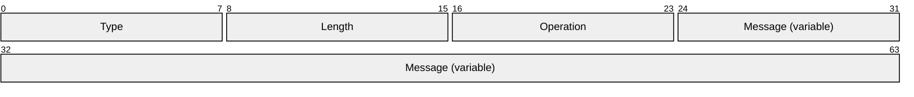
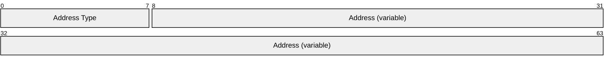
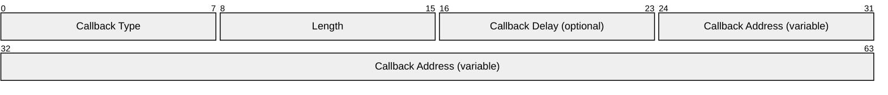
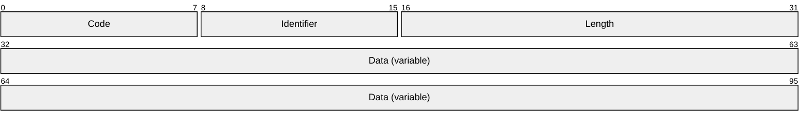
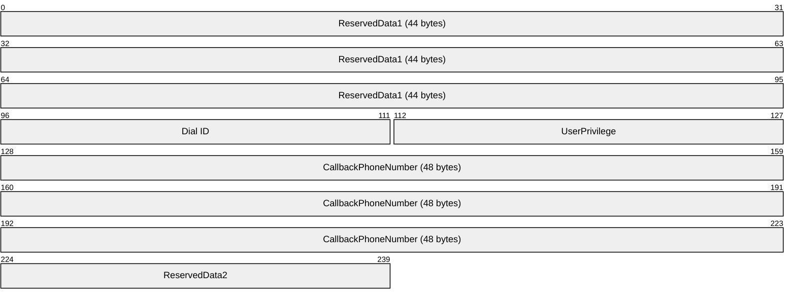

# [MS-CBCP]: Callback Control Protocol

Table of Contents

1 Introduction

- [1 Introduction](#Section_1)
  - [1.1 Glossary](#Section_1.1)
  - [1.2 References](#Section_1.2)
    - [1.2.1 Normative References](#Section_1.2.1)
    - [1.2.2 Informative References](#Section_1.2.2)
  - [1.3 Protocol Overview (Synopsis)](#Section_1.3)
  - [1.4 Relationship to Other Protocols](#Section_1.4)
  - [1.5 Prerequisites/Preconditions](#Section_1.5)
  - [1.6 Applicability Statement](#Section_1.6)
  - [1.7 Versioning and Capability Negotiation](#Section_1.7)
  - [1.8 Vendor-Extensible Fields](#Section_1.8)
  - [1.9 Standards Assignments](#Section_1.9)

2 Messages

- [2 Messages](#Section_2)
  - [2.1 Transport](#Section_2.1)
  - [2.2 Message Syntax](#Section_2.2)
    - [2.2.1 LCP Configuration Option: Callback Option](#Section_2.2.1)
    - [2.2.2 Callback Address](#Section_2.2.2)
    - [2.2.3 Callback Configuration Option](#Section_2.2.3)
    - [2.2.4 CBCP Messages](#Section_2.2.4)
      - [2.2.4.1 Callback Request Message](#Section_2.2.4.1)
      - [2.2.4.2 Callback Response Message](#Section_2.2.4.2)
      - [2.2.4.3 Callback Acknowledgment Message](#Section_2.2.4.3)
  - [2.3 Directory Service Schema Elements](#Section_2.3)
    - [2.3.1 userParameters](#Section_2.3.1)

3 Protocol Details

- [3 Protocol Details](#Section_3)
  - [3.1 Caller Details](#Section_3.1)
    - [3.1.1 Abstract Data Model](#Section_3.1.1)
      - [3.1.1.1 State Machine](#Section_3.1.1.1)
    - [3.1.2 Timers](#Section_3.1.2)
    - [3.1.3 Initialization](#Section_3.1.3)
    - [3.1.4 Higher-Layer Triggered Events](#Section_3.1.4)
    - [3.1.5 Processing Events and Sequencing Rules](#Section_3.1.5)
      - [3.1.5.1 General Packet Validation](#Section_3.1.5.1)
      - [3.1.5.2 Packet Processing](#Section_3.1.5.2)
      - [3.1.5.3 Receiving a Callback Request Message](#Section_3.1.5.3)
      - [3.1.5.4 Receiving a Callback Acknowledgment Message](#Section_3.1.5.4)
    - [3.1.6 Timer Events](#Section_3.1.6)
    - [3.1.7 Other Local Events](#Section_3.1.7)
      - [3.1.7.1 CBCP Packet Receive Event](#Section_3.1.7.1)
      - [3.1.7.2 CBCP Packet Send Event](#Section_3.1.7.2)
      - [3.1.7.3 CBCP Done](#Section_3.1.7.3)
      - [3.1.7.4 PPP Termination](#Section_3.1.7.4)
  - [3.2 Answerer Details](#Section_3.2)
    - [3.2.1 Abstract Data Model](#Section_3.2.1)
      - [3.2.1.1 State Machine](#Section_3.2.1.1)
    - [3.2.2 Timers](#Section_3.2.2)
    - [3.2.3 Initialization](#Section_3.2.3)
    - [3.2.4 Higher-Layer Triggered Events](#Section_3.2.4)
    - [3.2.5 Processing Events and Sequencing Rules](#Section_3.2.5)
      - [3.2.5.1 General Packet Validation](#Section_3.2.5.1)
      - [3.2.5.2 Packet Processing](#Section_3.2.5.2)
      - [3.2.5.3 Receiving a Callback Response Message](#Section_3.2.5.3)
        - [3.2.5.3.1 Preparing a Callback Request Message for Retransmission](#Section_3.2.5.3.1)
    - [3.2.6 Timer Events](#Section_3.2.6)
    - [3.2.7 Other Local Events](#Section_3.2.7)
      - [3.2.7.1 CBCP Packet Receive Event](#Section_3.2.7.1)
      - [3.2.7.2 CBCP Packet Send Event](#Section_3.2.7.2)
      - [3.2.7.3 CBCP Done](#Section_3.2.7.3)
      - [3.2.7.4 PPP Termination](#Section_3.2.7.4)

4 Protocol Examples

- [4 Protocol Examples](#Section_4)
  - [4.1 LCP Negotiation of Callback Option for CBCP](#Section_4.1)
  - [4.2 CBCP Negotiation](#Section_4.2)

5 Security

- [5 Security](#Section_5)
  - [5.1 Security Considerations for Implementers](#Section_5.1)
  - [5.2 Index of Security Parameters](#Section_5.2)

6 Appendix A: Product Behavior

- [6 Appendix A: Product Behavior](#Section_6)

7 Change Tracking

- [7 Change Tracking](#Section_7)

For the legal notice and IP terms, see [LEGAL.md](../LEGAL.md).
Last updated: 4/23/2024.
See [Revision History](#revision-history) for full version history.

# 1 Introduction

The Point-to-Point Protocol (PPP), as specified in [[RFC1661]](https://go.microsoft.com/fwlink/?LinkId=90283), provides a standard method for transporting multi-protocol datagram over point-to-point links. The point-to-point links mentioned here refer to the medium between two points (or parties) that can communicate using the medium. The medium could be dial-up media like Public Switched Telephone Network (PSTN) and Integrated Services Digital Network (ISDN).

The Callback Control Protocol (CBCP) defines an interoperable method for negotiating dial-up callbacks over point-to-point links in a secure and flexible manner. The callback negotiation in dial-up links is specifically useful for saving on toll charges.

Sections 1.5, 1.8, 1.9, 2, and 3 of this specification are normative. All other sections and examples in this specification are informative.

## 1.1 Glossary

This document uses the following terms:

**answerer**: The responder to a call. The network access service (NAS) is typically the [**answerer**](#gt_answerer). The [**network access client (NAC)**](#gt_network-access-client-nac) and the [**NAS**](#gt_network-access-server-nas) might choose to negotiate and use [**callback**](#gt_callback), in which case the [**answerer**](#gt_answerer) role is reversed for the [**callback**](#gt_callback) itself, with the [**NAC**](#gt_network-access-client-nac) being the [**answerer**](#gt_answerer).

**callback**: A concept in which the originator of a call is called back by the responder. In dial-up communication (like ISDN/PSTN), the originator of the dial-up hangs up after indicating the interest to be called back. The responder then calls up the originator to establish the communication.

**callback number**: The number that is used to perform the [**callback**](#gt_callback) operation by the [**answerer**](#gt_answerer).

**callback type**: Specifies a type of [**callback**](#gt_callback). It can be 1.) no [**callback**](#gt_callback), 2.) [**callback**](#gt_callback) to a user-specifiable number, or 3.) [**callback**](#gt_callback) to a predefined number chosen by the [**answerer**](#gt_answerer) (based on some policy).

**caller**: The originator of a call. The [**network access client (NAC)**](#gt_network-access-client-nac) is typically the [**caller**](#gt_caller). The [**NAC**](#gt_network-access-client-nac) and [**NAS**](#gt_network-access-server-nas) might choose to negotiate and use [**callback**](#gt_callback), in which case the [**caller**](#gt_caller) role is reversed for the [**callback**](#gt_callback) itself, with the [**NAS**](#gt_network-access-server-nas) being the [**caller**](#gt_caller).

**directory service (DS)**: A service that stores and organizes information about a computer network's users and network shares, and that allows network administrators to manage users' access to the shares. See also Active Directory.

**network access client (NAC)**: An endpoint that establishes a call session to a [**NAS**](#gt_network-access-server-nas) in order to perform network access.

**network access server (NAS)**: A computer server that provides an access service for a user who is trying to access a network. A [**NAS**](#gt_network-access-server-nas) operates as a client of RADIUS. The RADIUS client is responsible for passing user information to designated RADIUS servers and then acting on the response returned by the RADIUS server. Examples of a NAS include: a VPN server, Wireless Access Point, 802.1x-enabled switch, or Network Access Protection (NAP) server.

**Unicode character**: Unless otherwise specified, a 16-bit UTF-16 code unit.

**MAY, SHOULD, MUST, SHOULD NOT, MUST NOT:** These terms (in all caps) are used as defined in [[RFC2119]](https://go.microsoft.com/fwlink/?LinkId=90317). All statements of optional behavior use either MAY, SHOULD, or SHOULD NOT.

## 1.2 References

Links to a document in the Microsoft Open Specifications library point to the correct section in the most recently published version of the referenced document. However, because individual documents in the library are not updated at the same time, the section numbers in the documents may not match. You can confirm the correct section numbering by checking the [Errata](https://go.microsoft.com/fwlink/?linkid=850906).

### 1.2.1 Normative References

We conduct frequent surveys of the normative references to assure their continued availability. If you have any issue with finding a normative reference, please contact [dochelp@microsoft.com](mailto:dochelp@microsoft.com). We will assist you in finding the relevant information.

[IANAPPPNUM] IANA, "Point-to-Point (PPP) Protocol Field Assignments", August 2009, [http://www.iana.org/assignments/ppp-numbers](https://go.microsoft.com/fwlink/?LinkId=187321)

[MS-ADA3] Microsoft Corporation, "[Active Directory Schema Attributes N-Z](../MS-ADA3/MS-ADA3.md)".

[MS-DTYP] Microsoft Corporation, "[Windows Data Types](../MS-DTYP/MS-DTYP.md)".

[RFC1570] Simpson, W., Ed., "PPP LCP Extensions", RFC 1570, January 1994, [https://www.rfc-editor.org/info/rfc1570](https://go.microsoft.com/fwlink/?LinkId=95580)

[RFC1661] Simpson, W., Ed., "The Point-to-Point Protocol (PPP)", STD 51, RFC 1661, July 1994, [https://www.rfc-editor.org/info/rfc1661](https://go.microsoft.com/fwlink/?LinkId=90283)

[RFC2119] Bradner, S., "Key words for use in RFCs to Indicate Requirement Levels", BCP 14, RFC 2119, March 1997, [https://www.rfc-editor.org/info/rfc2119](https://go.microsoft.com/fwlink/?LinkId=90317)

### 1.2.2 Informative References

[RFC1332] McGregor, G., "The PPP Internet Protocol Control Protocol (IPCP)", RFC 1332, May 1992, [http://www.ietf.org/rfc/rfc1332.txt](https://go.microsoft.com/fwlink/?LinkId=186033)

[RFC2284] Blunk, L. and Vollbrecht, J., "PPP Extensible Authentication Protocol (EAP)", RFC 2284, March 1998, [https://www.rfc-editor.org/info/rfc2284](https://go.microsoft.com/fwlink/?LinkId=90332)

[RFC2472] Haskin, D., and Allen, E., "IP Version 6 over PPP", RFC 2472, December 1998, [http://tools.ietf.org/html/rfc2472.txt](https://go.microsoft.com/fwlink/?LinkId=186035)

[RFC2759] Zorn, G., "Microsoft PPP CHAP Extensions, Version 2", RFC 2759, January 2000, [https://www.rfc-editor.org/info/rfc2759](https://go.microsoft.com/fwlink/?LinkId=90379)

## 1.3 Protocol Overview (Synopsis)

The Callback Control Protocol (CBCP) enables dial-up peers to negotiate [**callback**](#gt_callback) settings such as [**callback type**](#gt_callback-type), [**callback number**](#gt_callback-number), and delay before callback.

The PPP enables two endpoints of a point-to-point link to negotiate link characteristics, authentication, and the network configuration. It typically involves a [**network access client (NAC)**](#gt_network-access-client-nac) connecting to a [**network access server (NAS)**](#gt_network-access-server-nas) in order to access the NAS and the network beyond the NAS. For dial-up links, since the NAC will be dialing to the NAS, the NAC will take the role of the [**caller**](#gt_caller) and the NAS will be the [**answerer**](#gt_answerer).

The NAC establishes the dial-up connectivity to the NAS. Over the link established, the PPP is used to transfer data of various protocols. The typical PPP negotiation comprises the Link Establishment Phase, occurring first, during which the Link Control Protocol (LCP), as specified in [[RFC1570]](https://go.microsoft.com/fwlink/?LinkId=95580), establishes the data-link specific parameters for the session. After this, the authentication phase occurs, through which the authentication of the peer involved in the PPP session takes place using any of the PPP-based authentication protocols (like EAP as specified in [[RFC2284]](https://go.microsoft.com/fwlink/?LinkId=90332), MS-CHAPv2 as specified in [[RFC2759]](https://go.microsoft.com/fwlink/?LinkId=90379), and so on). The Network Layer protocol phase commences after the authentication phase, which negotiates the network layer protocol configurations through the Network Control Protocol (NCP), as specified in [RFC1570] -- for example, IPv4 configuration is negotiated through IP Configuration Protocol (IPCP) (see [[RFC1332]](https://go.microsoft.com/fwlink/?LinkId=186033)) and IPv6 configuration is negotiated through IPv6 Configuration Protocol (IPv6CP) (see [[RFC2472]](https://go.microsoft.com/fwlink/?LinkId=186035)).

The CBCP enables the negotiation of callback settings. Based on the negotiated callback settings, the NAS can even play the role of the caller and the NAC can play the role of the answerer. The primary advantage of this setup is that the NAS is responsible for the toll charges involved with the connectivity.

[RFC1570] defines the [Callback configuration option](#Section_2.2.3) (0x0D) LCP extension, which allows the callback information to be exchanged. This callback configuration negotiation occurs before the authentication phase is complete. The answerer has to agree or disagree to do the callback before authenticating the caller. This has security implications and also might not be feasible since the callback information is typically policy-based.

The alternate callback method is through negotiating the use of CBCP. The callback settings are negotiated after the authentication phase is complete (by which time the policy decision based on user authentication would be available). This also enables interoperability since the NAC and NAS have to agree to use the CBCP beforehand, and the answerer (NAS) drives the negotiation of the supported callback settings.

The CBCP comprises three message exchanges. The answerer initiates the negotiation with a [Callback Request message](#Section_2.2.4.1) with the possible callback options. The caller responds back with the [Callback Response message](#Section_2.2.4.2) having the preferred option, along with additional configuration information (like the callback number or delay before callback). The answerer confirms the settings through the [Callback Acknowledgment message](#Section_2.2.4.3). The reception of the Callback Acknowledgment message indicates that the answerer has accepted the callback settings. The CBCP protocol negotiation is complete at this point.

Subsequently, the caller terminates the PPP session if it has negotiated to be called back. The answerer waits for a specific period of time (requested by the caller as a part of the CBCP) and initiates the dial-up connection callback to the caller. The PPP negotiation happens between the peers as usual between the NAC and the NAS, but without the CBCP being negotiated as a part of the LCP phase (as the callback has already been done).

If 'No callback' has been negotiated as part of CBCP, the NAC and NAS will proceed to the NCP phase to negotiate the network settings.

Figure 1: Callback message exchanges

## 1.4 Relationship to Other Protocols

The CBCP runs after the authentication phase of the PPP. The CBCP message is designated through the protocol field identifier of 0xC029 in the PPP frame, as specified in [[IANAPPPNUM]](https://go.microsoft.com/fwlink/?LinkId=187321). The CBCP will be run as a part of the PPP negotiation only when the [**callback**](#gt_callback) configuration option (option 0x0D) is negotiated in the LCP phase, with the operation value of 0x06 as specified in [IANAPPPNUM].

Figure 2: Protocol stack diagram

As specified in the preceding figure, the PPP is responsible for enabling the transportation of a multi-protocol datagram over the data link layer that provides point-to-point connectivity. Each of the PPP-based protocols like LCP, CBCP, and IPCP have a designated protocol identifier, as specified in PPP Data Link Layer Protocol Numbers [IANAPPPNUM]. Based on the protocol identifier, the PPP will be able to associate the messages to the appropriate protocol.

PPP initializes the CBCP based on the LCP Callback option negotiation result. After the CBCP is done with the negotiation and has the result, the result is used by PPP to determine the course of the PPP session; that is, either to continue to the NCP phase or to terminate the session and prepare for callback.

## 1.5 Prerequisites/Preconditions

The following are the preconditions that have to be met in order for the CBCP to be initialized and used:

- A dial-up link has to be established between the [**caller**](#gt_caller) and the [**answerer**](#gt_answerer).
- The caller and answerer have agreed to negotiate [**callback**](#gt_callback) settings using the CBCP. This has to be done through the negotiation of **Callback Option** (0x0D) of the LCP Protocol Extension as defined in [[RFC1570]](https://go.microsoft.com/fwlink/?LinkId=95580), with the specific operation value of 0x06.

## 1.6 Applicability Statement

The use of CBCP enables dynamic negotiation of [**callback**](#gt_callback) settings. The typical usage of callback is when the [**NAS**](#gt_network-access-server-nas) that is acting as an [**answerer**](#gt_answerer) for PPP dial-up sessions has to callback the [**NAC**](#gt_network-access-client-nac) on a specified number to save on toll charges. The CBCP is used when there is a need to securely negotiate callback settings past the authentication phase.

## 1.7 Versioning and Capability Negotiation

This document covers versioning issues in the following areas:

- **Protocol Versions:** There are no versioning capabilities associated with the CBCP.
- **Capability Negotiation:** The capability of PPP to support this protocol is determined through the LCP negotiation of [**callback**](#gt_callback) configuration option (0x0D). If PPP is capable of supporting this protocol, it will support the usage of operation 0x06 in the callback configuration option negotiated during LCP phase. See section [3.1.3](#Section_3.1.3) for more details about this step.

## 1.8 Vendor-Extensible Fields

None.

## 1.9 Standards Assignments

| Parameter | Value | Reference |
| --- | --- | --- |
| PPP Protocol Identifier | 0xC029 | [[IANAPPPNUM]](https://go.microsoft.com/fwlink/?LinkId=187321) |
| LCP Callback Configuration Option - Callback Operation | 0x06 | [IANAPPPNUM] |

# 2 Messages

## 2.1 Transport

PPP is responsible for framing and transporting the message over the point-to-point link. The CBCP messages are transported using the PPP encapsulation as specified in [[RFC1661]](https://go.microsoft.com/fwlink/?LinkId=90283) section 2. The **Protocol Field** of the PPP encapsulation MUST be set to 0xC029 to specify the CBCP message.

## 2.2 Message Syntax

In addition to the data types in the following sections, this protocol references commonly used data types as defined in [MS-DTYP](../MS-DTYP/MS-DTYP.md).

### 2.2.1 LCP Configuration Option: Callback Option

The [**Callback**](#gt_callback) configuration option used in the LCP is specified in [[RFC1570]](https://go.microsoft.com/fwlink/?LinkId=95580) section 2.3. The operation field 0x06 is defined for negotiating this protocol. The following is the format of the option.

**Type (1 byte):** This MUST be 0x0D.

**Length (1 byte):** This MUST specify the length of the option, including the **Type**, **Length**, **Operation**, and **Message** fields. Hence this MUST be at least 0x03 bytes.

**Operation (1 byte):** This MUST be 0x06.

**Message (variable):** This field SHOULD NOT be present. If present, the contents of this field MUST be ignored.

### 2.2.2 Callback Address

The following is the message syntax for the **Callback Address** field used as a part of the [Callback Configuration Options (section 2.2.3)](#Section_2.2.3).

**Address Type (1 byte):** This field specifies the address type. A value of 0x01 specifies the address to be a PSTN/ISDN number. This MUST be set to 0x01, because this is the only supported address type.

**Address (variable):** This MUST be set to a null-terminated ASCII string representing the PSTN or ISDN number. When only the Address Type field is relevant in the message, this MUST be set to an empty null-terminated ASCII string.

### 2.2.3 Callback Configuration Option

The following message syntax specifies the format for the **Callback** configuration options.

**Callback Type (1 byte):** This MUST be set according to the values mentioned in the table.

| Callback configuration option | Callback type | Description |
| --- | --- | --- |
| No callback | 0x01 | The [**caller**](#gt_caller) requests not to be called back. |
| Callback to a user-specified number | 0x02 | The caller requests to be called at the specified address. |
| Callback to a pre-specified number | 0x03 | The caller will be called at a pre-specified address. This specifies only the [**callback type**](#gt_callback-type). The actual address to be used for callback is specific to the administrative configuration and is outside the scope of this protocol. |

**Length (1 byte):** This MUST specify the length of the Callback Configuration option including the **Callback Type**, **Length**, and the data portion associated with the [**callback**](#gt_callback) configuration specified in this section.

**Callback Delay (1 byte):** This specifies the amount of time, in seconds, the [**answerer**](#gt_answerer) MUST wait before calling the caller back.

**Callback Address (variable):** This MUST specify the [Callback Address](#Section_2.2.2) for the Callback Configuration option, as specified in section 2.2.2.

### 2.2.4 CBCP Messages

There are three types of messages associated with the CBCP -[Callback Request (section 2.2.4.1)](#Section_2.2.4.1), [Callback Response (section 2.2.4.2)](#Section_2.2.4.2), and [Callback Acknowledgment (section 2.2.4.3)](#Section_2.2.4.3). The general format of the CBCP message is specified as follows.

**Code (1 byte):** This MUST be set to the message type as specified in the following table of values.

| Message type | Code |
| --- | --- |
| Callback Request | 0x01 |
| Callback Response | 0x02 |
| Callback Acknowledgment | 0x03 |

**Identifier (1 byte):** This MUST specify an opaque value that assists in matching the Callback Request message with the corresponding Callback Response and Callback Acknowledgment messages.

**Length (2 bytes):** This MUST specify the length of the message, including the **Code**, **Identifier**, **Length**, and **Data** fields.

**Data (variable):** This MUST specify 0 or more octets of the data specific to the message.

#### 2.2.4.1 Callback Request Message

The **Callback Request** message is sent by an [**answerer**](#gt_answerer) to a [**caller**](#gt_caller). This contains a list of configuration options available to the caller.

The message format is specified as follows.

**Code (1 byte):** This MUST be 0x01.

**Identifier (1 byte):** This MUST specify a value that assists in matching the Callback Request message with the corresponding [Callback Response message](#Section_2.2.4.2) and [Callback Acknowledgment message](#Section_2.2.4.3). For each new Callback Request message sent by the answerer, the Identifier MUST be different. This SHOULD be set to 1 in the initial **Callback Request** message and incremented for each subsequent retransmitted Callback Request message.

**Length (2 bytes):** This MUST specify the length of the message, including the **Code**, **Identifier**, **Length**, and **Data** fields.

**Data (variable):** This contains the list of configuration options available to the caller (section [2.2.3](#Section_2.2.3)).

There MUST be at least one Callback Configuration Option specified in the **Callback Request message**. If multiple [**callback type**](#gt_callback-type)s are supported for the specific caller, all possible types (specified in the following table) SHOULD be specified as individual Callback Configuration Option (section 2.2.3).

| Callback configuration option | Settings |
| --- | --- |
| No Callback | The **Callback Delay** and **Callback Address** fields MUST not be present. |
| Callback to a user-specified number | The **Callback Delay** field SHOULD be set to 0. The **Address Type** field of the [Callback Address](#Section_2.2.2) MUST be set to 0x01, and the **Address** field MUST be set to an empty null-terminated ASCII string. |
| Callback to a pre-specified or an administrator-specified number | The **Callback Delay** field SHOULD be set to 0. The **Callback Address** field MUST not be present. |

#### 2.2.4.2 Callback Response Message

The **Callback Response** message is sent by a [**caller**](#gt_caller) to an [**answerer**](#gt_answerer). This message contains a configuration option selected by the caller.

The message format is specified as follows.

**Code (1 byte):** This MUST be 0x02.

**Identifier (1 byte):** This MUST specify a value that assists in matching the [Callback Request message](#Section_2.2.4.1) to the corresponding **Callback Response** message and [Callback Acknowledgment message](#Section_2.2.4.3). This value MUST be the same as the Identifier received in the **Callback Request** message to denote that the response being sent is a response to the specific **Callback Request** message.

**Length (2 bytes):** This MUST specify the length of the message, including the **Code**, **Identifier**, **Length**, and **Data** fields.

**Data (variable):** This contains the configuration option selected by the caller (section [2.2.3](#Section_2.2.3)).

The Callback Configuration Options MUST be sent with the following settings.

| Callback configuration option | Settings |
| --- | --- |
| No Callback | The **Callback Delay** and **Callback Address** fields MUST not be present. |
| Callback to a user-specified number | The **Callback Delay** field SHOULD be modified to specify the delay the caller requires before the [**callback**](#gt_callback) is received. The **Address Type** field of the [Callback Address](#Section_2.2.2) MUST be set to 0x01, and the **Address** field MUST be set to a ASCII null-terminated PSTN or ISDN address. |
| Callback to a pre-specified or an administrator-specified number | **Callback Delay** field SHOULD be modified to specify the delay the caller requires before the callback is received. The **Callback Address** field MUST not be present. |

#### 2.2.4.3 Callback Acknowledgment Message

The **Callback Acknowledgment** message is sent by an [**answerer**](#gt_answerer) to a [**caller**](#gt_caller). This contains the configuration option selected by the caller and completes the acknowledgment of the [Callback Configuration option](#Section_2.2.3).

The message format is specified as follows

**Code (1 byte):** This MUST be 0x03.

**Identifier (1 byte):** This MUST specify a value that assists in matching the [Callback Request message](#Section_2.2.4.1) to the corresponding [Callback Response message](#Section_2.2.4.2) and **Callback Acknowledgment** message. This MUST be set to the Identifier of the Callback Response message that is being acknowledged.

**Length (2 bytes):** This MUST specify the length of the message, including the **Code**, **Identifier**, **Length**, and **Data** fields.

**Data (variable):** This contains the configuration option selected by the caller (section 2.2.3).

The Callback Configuration Option specified MUST be the Callback Configuration Option received from the caller in the Callback Response message and MUST be specified as defined in section 2.2.4.2.

## 2.3 Directory Service Schema Elements

The Callback Control Protocol accesses the following [**directory service**](#gt_directory-service-ds) attributes in the user class.For the syntactic specifications of the following attribute, refer to Active Directory Schema Attributes N-Z, specified in [MS-ADA3](../MS-ADA3/MS-ADA3.md).

| Directory service attributes | Description |
| --- | --- |
| userParameters | This attribute contains a binary BLOB composed of the callback configuration options for the users. For the binary BLOB structure, please see [userParameters (section 2.3.1)](#Section_2.3.1). |

### 2.3.1 userParameters

The **userParameters** attribute is used to retrieve the callback configuration options for the user in the following format.

**ReservedData1 (44 bytes):** A 44-byte array of reserved data.<1>

**Dial ID (2 bytes):** A 2-byte [**Unicode character**](#gt_unicode-character). This field is used by the Callback Control Protocol to assert the validity of the **User Privilege** and **CallbackPhoneNumber** fields. The Callback Control Protocol compares the data contained in this field with Unicode character "d". If this field contains the aforementioned character, then the information inside the **User Privilege** and **CallbackPhoneNumber** fields is considered valid. If it contains a different value, then all information inside the **User Privilege** and **CallbackPhoneNumber** fields is considered invalid.

**UserPrivilege (2 bytes):** A 2-byte unsigned integer consisting of one or more of the following flags.

| Value | Meaning |
| --- | --- |
| NoCallback 0x01 | The answerer will not call back the user to establish a connection. |
| AdminSetCallback 0x02 | When the user calls, the answer hangs up and calls a preset callback phone number stored in the **CallbackPhoneNumber** field. |
| CallerSetCallback 0x04 | When the user calls, the answerer provides the option of specifying a callback phone number. The user can also choose to connect immediately without a callback. The **CallbackPhoneNumber** field MAY contain a default number that the caller can override. |
| DialinPrivilege 0x08 | The user has permission to dial in to the Routing and Remote Access Services (RRAS) server. |

**CallbackPhoneNumber (48 bytes):** This field is valid only if the **AdminSetCallback** or **CallerSetCallback** flag is set in the **User Privilege** field. This MUST specify a phone number that is configured for the user on which the answerer can call back.

**ReservedData2 (2 bytes):** Reserved data.<2>

# 3 Protocol Details

## 3.1 Caller Details

### 3.1.1 Abstract Data Model

This section describes a conceptual model of possible data organization that an implementation maintains to participate in this protocol. The described organization is provided to facilitate the explanation of how the protocol behaves. This document does not mandate that implementations adhere to this model as long as their external behavior is consistent with that described in this document.

**Current State:** An enumeration value that represents the current state of the CBCP state machine for the [**caller**](#gt_caller) as specified in section [3.1.1.1](#Section_3.1.1.1). This variable will be initialized to CBCP_STATE_WAIT_FOR_REQUEST. The following are the acceptable values for this variable:

- CBCP_STATE_WAIT_FOR_REQUEST
- CBCP_STATE_WAIT_FOR_ACK
**Expected Identifier:** An integer variable of size 1 byte. This represents the request identifier that will be expected from the [**answerer**](#gt_answerer). It will be initially set to 0 and updated subsequently with the identifier received in each [Callback Request message](#Section_2.2.4.1) received from the answerer. The [Callback Response message](#Section_2.2.4.2) will be sent with this identifier value. This value also denotes the identifier that will be expected in the [Callback Acknowledgment message](#Section_2.2.4.3). For a successful CBCP negotiation message exchange, the identifier in the **Callback Request** message, **Callback Response** message, and **Callback Acknowledgment** message MUST be the same.

**Caller-specified Phone Number**: A null-terminated ASCII representation of the phone number that the caller specifies is the number on which the answerer can [**callback**](#gt_callback) if "Callback to a user-specifiable number" is negotiated to be the callback option. This will be initialized to the caller's phone number, which will be sent as a part of the **Callback Addresses** field in the [Callback Configuration Option](#Section_2.2.3) of type "Callback to a user-specifiable number".

**Caller-specified Callback Delay**: An unsigned integer value of 1-byte length with valid values of 0 to 255. This value specifies the time, in seconds, the answerer has to wait after the PPP session is disconnected before the answerer ([**NAS**](#gt_network-access-server-nas)) can callback the caller ([**NAC**](#gt_network-access-client-nac)). The caller will send this value to the answerer as a part of the callback configuration option in the **Callback Response** message. This is a user-configurable value that is sent over the protocol for the answerer to use.

**Retry Count**: An integer value that represents the number of times the caller SHOULD attempt to retransmit the **Callback Response** message if it has not received a successful **Callback Acknowledgment** message. This is a user-configurable value <3>.

**Result Callback Type**: A 1-byte integer value that represents the [**callback type**](#gt_callback-type) chosen by the caller through a **Callback Response** message and acknowledged by the answerer. This value will be valid at the end of a successful CBCP completion (which is after the event [CBCP Done](#Section_3.1.7.3) (section [3.1.7.3](#Section_3.1.7.3)) is signaled to PPP with Success status). The PPP will use this value at the end of the CBCP protocol negotiation to decide whether to proceed with Network Layer Protocol Phase or to terminate the PPP session and await the callback. This variable can have values 1, 2, or 3 -- the descriptions for each are given as follows.

| Callback type | Description |
| --- | --- |
| 1 | No Callback. |
| 2 | Callback to a user-specifiable number. |
| 3 | Callback to a pre-specified or administrator-specified number. |

#### 3.1.1.1 State Machine

The following figure shows the state machine for a CBCP [**caller**](#gt_caller).

Figure 3: Callback state diagram--caller states

The caller state machine has the following states as represented by the **Current State** variable.

| State name | Description |
| --- | --- |
| CBCP_STATE_WAIT_FOR_REQUEST | This will be the initial state when the Caller state machine is initialized. In this state, the caller will wait for the [Callback Request message](#Section_2.2.4.1) to be received from the [**answerer**](#gt_answerer). When the **Callback Request** message is received, the caller will select the appropriate [**callback**](#gt_callback) option and send the [Callback Response message](#Section_2.2.4.2) and proceed to CBCP_STATE_WAIT_FOR_ACK state. The **Current State** will be set to CBCP_STATE_WAIT_FOR_ACK. |
| CBCP_STATE_WAIT_FOR_ACK | The caller has sent the **Callback Response** message as a response to the **Callback Request** message. This is the state in which the caller will wait for the [Callback Acknowledgment message](#Section_2.2.4.3) to be received from the answerer. Reception of the **Callback Acknowledgment** message signifies the completion of the CBCP phase and that the callback settings are negotiated. The CBCP will indicate the successful completion of the CBCP phase using the [CBCP Done](#Section_3.1.7.3) event (section [3.1.7.3](#Section_3.1.7.3)) with a success status. |

The preceding description covers the state transitions for a successful CBCP negotiation. Failure transitions are covered in the state machine diagram earlier in this section and are also covered in section [3.1.5](#Section_3.1.5).

### 3.1.2 Timers

**Retransmission Timer**: This timer is initialized or reset whenever a [Callback Response message](#Section_2.2.4.2) is sent to the [**answerer**](#gt_answerer). This is a periodic timer with the default value of a 2-second interval; that is, unless the timer is stopped, it will expire periodically as specified by the timer interval. This timer value SHOULD be chosen appropriately, taking the link speed into consideration as well <4>. This timer has to be stopped when the [Callback Acknowledgment message](#Section_2.2.4.3) is received by the [**caller**](#gt_caller).

### 3.1.3 Initialization

The [**caller**](#gt_caller) MUST initialize the CBCP protocol if either the caller or the [**answerer**](#gt_answerer) has successfully negotiated for operation 0x06 of the LCP configuration option 0x0D during the LCP protocol negotiation. The negotiation of LCP options is defined in [[RFC1661]](https://go.microsoft.com/fwlink/?LinkId=90283). The LCP Callback configuration option 0xOD is defined as LCP Extension in [[RFC1570]](https://go.microsoft.com/fwlink/?LinkId=95580) section 2.3. The operation 0x06 as defined in [[IANAPPPNUM]](https://go.microsoft.com/fwlink/?LinkId=187321) MUST be used to specify the usage of CBCP to negotiate [**callback**](#gt_callback) settings. The message syntax of the LCP Callback configuration option with the operation 0x06 is defined in section [2.2.1](#Section_2.2.1).

The CBCP MUST be initialized only after the Authentication Phase is complete. The **Current State** of the state machine will be set to CBCP_STATE_WAIT_FOR_REQUEST. The **Caller-specified Phone Number** will be initialized with the valid phone number the caller wants to receive the callback on. If this is not set, the caller MUST NOT use "Callback to a user-specifiable number" as the **Callback type** from the supported callback options provided by the answerer. The **Caller-specifiedCallback Delay** will be initialized to a valid delay that the caller wants to report to the answerer as a part of the [Callback Response message](#Section_2.2.4.2).

### 3.1.4 Higher-Layer Triggered Events

None.

### 3.1.5 Processing Events and Sequencing Rules

#### 3.1.5.1 General Packet Validation

The CBCP messages MUST comprise the basic fields; namely, **Code**, **Identifier**, and **Length**. If the message received is less than 4 bytes in size, which means that not all of these fields are present, the message MUST be dropped silently and ignored. If the Code of the CBCP message received is neither 1 nor 3 (specifying a [Callback Request](#Section_2.2.4.1) or a [Callback Acknowledgment message](#Section_2.2.4.3)), the message MUST be dropped silently and ignored.

When messages are dropped silently and ignored, state MUST NOT change.

#### 3.1.5.2 Packet Processing

The CBCP messages received MUST be at least 4 bytes in length, as specified in section [3.1.5.1](#Section_3.1.5.1). The first byte of the CBCP message that specifies the Code MUST be used to designate the message type.

#### 3.1.5.3 Receiving a Callback Request Message

If the **Current State** is CBCP_STATE_WAIT_FOR_REQUEST, the following message processing

is done:

- The **Callback Request** message MUST be in the specified format (section [2.2.4.1](#Section_2.2.4.1)) with the **Callback Configuration** options as specified (section [2.2.3](#Section_2.2.3)). Otherwise, the message MUST be dropped silently without a change in the **Current State**.
- The Identifier received is stored in the **Expected Identifier** variable.
- The [**caller**](#gt_caller) MUST select one **Callback Configuration** option <5> out of the options received and respond with a Callback Response message (section [2.2.4.2](#Section_2.2.4.2)), specifying the [**callback**](#gt_callback) option selected (section 2.2.3). The Callback Response message MUST be constructed as follows:
- If the **Callback Type** selected is 1, the **Callback Address** MUST NOT be set for the **Callback Configuration** option. If the **Callback Type** selected is 2, the **Callback Address** MUST be specified in the **Callback Configuration** option with the value of **Caller-specified Phone Number**. Similarly, the **Callback delay** field in the **Callback Configuration** option MUST be set with the value of **Caller-specified Callback Delay**. If the **Callback Type** selected is 3, the **Callback Configuration** option MUST specify the **Callback Delay** using the value of **Caller-specified Callback Delay**, and the **Callback Address** MUST NOT be specified.
- The **Identifier** field of the **Callback Response** message MUST be set with the value of **Expected Identifier**.
- The **Length** field MUST be computed as specified in section [2.2.4](#Section_2.2.4).
- The caller MUST update the **Result Callback Type** with the chosen Callback Type.
- The **CBCP Packet Send Event** (section [3.1.7.2](#Section_3.1.7.2)) MUST be used for transmission of the **Callback Response** message. After successful transmission of the message, the caller MUST change state to CBCP_STATE_WAIT_FOR_ACK and decrement the **Retry Count**.
- The caller MUST start a retransmission timer (section [3.1.2](#Section_3.1.2)).
Otherwise, if the **Current State** is CBCP_STATE_WAIT_FOR_ACK, the following message processing is done:

- The Callback Request message MAY be received in this state if the [**answerer**](#gt_answerer) did not receive a **Callback Response** message, or received an invalid **Callback Response** message.
- The **Callback Request** message MUST be in the specified format (section 2.2.4.1) with the **Callback Configuration** options as specified (section 2.2.3). Also, the **Callback Configuration** options received as a part of the **Callback Request** message MUST be the same as the options received when the **Current State** was CBCP_WAIT_FOR_REQUEST. Otherwise, the message MUST be dropped silently without a change in the **Current State**.
- The **Identifier** received must be stored in the **Expected Identifier** variable.
- The **Callback Response** message that was sent when the **Current State** was CBCP_STATE_WAIT_FOR_REQUEST MUST be sent back again but with the updated **Expected Identifier**.
- The [CBCP Packet Send Event](#Section_3.1.7.2) MUST be used for transmission of the **Callback Response** message. After successful transmission of the message, the caller MUST remain in the **Current State.**
- The caller MUST restart a retransmission timer (section [3.2.2](#Section_3.2.2)) and decrement the **Retry Count**.

#### 3.1.5.4 Receiving a Callback Acknowledgment Message

If the **Current State** is set to any state other than CBCP_STATE_WAIT_FOR_ACK:

- Ignore the message.
If the **Current State** is CBCP_STATE_WAIT_FOR_ACK, the following message processing is done:

- The [Callback Acknowledgment message](#Section_2.2.4.3) MUST be in the specified format (section 2.2.4.3) and MUST contain the **Callback Configuration** option selected by the [**caller**](#gt_caller) in the **Callback Response** message. If the message is invalid, the [CBCP Packet Send Event](#Section_3.1.7.2) MUST be used for retransmission of the **Callback Response** message with the identifier value **Expected Identifier**, the retransmission timer is started, and there is no change in the **Current State**.
- If the **Callback Acknowledgment** message is valid, the caller MUST set the [CBCP Done](#Section_3.1.7.3) (section [3.1.7.3](#Section_3.1.7.3)) event notifying with the successful result negotiation.

### 3.1.6 Timer Events

**Retransmission Timer:** When this timer expires, it denotes a time period wherein CBCP has sent the [Callback Response message](#Section_2.2.4.2) but hasn't received the acknowledgment. The following are the tasks to be performed when this timer expires:

- The **Current State** MUST be checked to see if it is CBCP_STATE_WAIT_FOR_ACK.
- If that is the case, the **Retry Count** SHOULD be checked to see if it is greater than 0.
- If the **Retry Count** is 0,
- Stop the **Retransmission Timer**.
- The PPP MUST be notified of the [CBCP Done](#Section_3.1.7.3) event with a failure status. The failure status indicates to PPP that the [**callback**](#gt_callback) negotiation was unsuccessful. The PPP MUST then disconnect the PPP session.
- If the **Retry Count** is greater than 0, the **Retry Count** MUST be decremented and the **Callback Response** message with the **Expected Identifier** as the Identifier value MUST be sent using the [CBCP Packet Send Event](#Section_3.1.7.2).

### 3.1.7 Other Local Events

Since the CBCP is a PPP-based protocol and occurs in the context of the PPP negotiation, there are a number of interactions that happen with the PPP, such as initialization, termination, or message processing (including transmitting and receiving messages). Based on this, the following are the various local events that can occur. Some are initiated by the CBCP and the others are received by CBCP from the PPP.

#### 3.1.7.1 CBCP Packet Receive Event

The **CBCP Packet Receive Event** is an event that the PPP indicates to the CBCP. Since PPP provides the method for transporting multi-protocol datagram over point-to-point links, the PPP will be responsible for receiving and delivering the CBCP messages. If the message received by the PPP layer has the PPP protocol identifier to be 0xC029, the PPP will notify the CBCP messages through this event. When a CBCP message is received, the processing rules to be applied are specified in section [3.1.5](#Section_3.1.5).

#### 3.1.7.2 CBCP Packet Send Event

**CBCP Packet Send Event** is an event that the CBCP indicates to the PPP. Since PPP provides the method for transporting a multi-protocol datagram over point-to-point links, the CBCP will rely on the PPP to be able to send out the frame. The CBCP will use this event to indicate the CBCP message to PPP to be transmitted over the point-to-point link.

#### 3.1.7.3 CBCP Done

**CBCP Done** event is an event that the CBCP indicates to the PPP. This event denotes the completion of the CBCP to the PPP along with the completion status. The CBCP might have been successfully completed, or the CBCP might be timing out because it has not received a [Callback Acknowledgment message](#Section_2.2.4.3) from the [**answerer**](#gt_answerer). In either case, the success or failure of the CBCP MUST be denoted using this event. When the CBCP state machine has successfully negotiated the [**callback**](#gt_callback) settings, the **Result Callback Type** will be indicated to the PPP. Based on this, the PPP will either choose to terminate the session as a callback will be received or continue to the NCP phase if the "No Callback" was the **Result Callback Type** indicated.

When the CBCP has timed out because it has not received the **Callback Acknowledgment** message from the answerer, it indicates the same to the PPP and the PPP terminates the session.

#### 3.1.7.4 PPP Termination

The **PPP Termination** event is indicated from the PPP to the CBCP. This event is used to denote the PPP termination. The PPP is being terminated because either a [**Callback**](#gt_callback) will be received or the Termination Request ([[RFC1661]](https://go.microsoft.com/fwlink/?LinkId=90283) section 3.7) was received or the overall PPP negotiation has not completed within a user- or administrator-configured time (for the PPP), or because some other external event such as link termination or link failure occurred. The CBCP will stop any active timers and clear up its state for the session. No active processing of received messages will occur beyond this event.

## 3.2 Answerer Details

### 3.2.1 Abstract Data Model

This section describes a conceptual model of possible data organization that an implementation maintains to participate in this protocol. The described organization is provided to facilitate the explanation of how the protocol behaves. This document does not mandate that implementations adhere to this model as long as their external behavior is consistent with that described in this document.

**Current State**: An enumeration value that represents the current state of the CBCP protocol state machine for the [**answerer**](#gt_answerer) as specified in section [3.2.1.1](#Section_3.2.1.1). This variable will be initialized to CBCP_STATE_WAIT_FOR_RESPONSE after sending the [Callback Request message](#Section_2.2.4.1) when the state machine is initialized (section [3.2.3](#Section_3.2.3)). The following are the acceptable values for this variable:

- CBCP_STATE_WAIT_FOR_RESPONSE
- CBCP_STATE_DONE
**Next Identifier**: An integer variable of size 1 byte. This represents the identifier to be sent as a part of the CBCP messages. This variable will be initialized to 1 for the first **Callback Request** message and will be subsequently incremented with each **Callback Request** message retransmission.

**Acceptable Callback Types**: An array of acceptable [**callback types**](#gt_callback-type) that the [**caller**](#gt_caller) can choose from. This is initialized as a part of the CBCP initialization phase and is mostly determined based on the [**callback**](#gt_callback) policy applicable to the user. The acceptable callback types are given below.

| Callback type | Description |
| --- | --- |
| 1 | No Callback. |
| 2 | Callback to a user-specifiable number. |
| 3 | Callback to a pre-specified or administrator-specified number. |

**Result Callback Type**: This variable specifies the Callback type accepted by the caller through the [Callback Response message](#Section_2.2.4.2) and acknowledged by the answerer through the [Callback Acknowledgment message](#Section_2.2.4.3). This will be set only when the CBCP negotiation is complete and the **CBCP Done** event is notified with success result to PPP. This will take one of the values specified as acceptable callback types defined under **Acceptable Callback Types**.

**Result Phone Number**: This variable specifies the phone number as a null-terminated ASCII string, specified by the caller through the **Callback Response** message if the answerer had provided the "Callback to a user-specifiable number" as a callback type possible and the caller had chosen the same. After the answerer acknowledges the callback type through the **Callback Acknowledgment** message, this option will be set. This is valid only when the Callback type 2 is chosen by the caller. If the callback option specified is "Callback to a pre-specified or administrator-specified number" the number to be used will be based on the policy or administrator configuration and is implementation-specific.

**Result Callback Delay**: An integer field of size 1-byte. This specifies the callback delay specified by the caller as a part of the **Callback Response** message in the callback type options. This specifies the time, in seconds, the answerer waits before the callback can be initiated to the caller. This value is valid only when the Callback type 2 or 3 is chosen by the caller.

#### 3.2.1.1 State Machine

The following figure shows the state machine for a CBCP [**answerer**](#gt_answerer).

Figure 4: Callback state diagram--answerer states

The answerer state machine has the following states as represented by the **Current State** variable.

| State name | Description |
| --- | --- |
| CBCP_STATE_WAIT_FOR_RESPONSE | In this state, the answerer will wait for the [Callback Response message](#Section_2.2.4.2) to be received from the [**caller**](#gt_caller). After this message is received, the answerer will proceed to CBCP_STATE_DONE after sending the [Callback Acknowledgment message](#Section_2.2.4.3). |
| CBCP_STATE_DONE | The answerer will be in this state if it has sent out the **Callback Acknowledgment** message for the **Callback Response** message received from the caller. The answerer will continue to process the **Callback Response** messages from the caller until the time that the PPP session is terminated. This is to ensure that the answerer is processing the messages sufficiently so that the **Callback Acknowledgment** message reaches the caller. |

The preceding description covers the state transitions for a successful CBCP negotiation. Failure transitions are covered in the state machine diagram earlier in this section and are also covered in section [3.2.5](#Section_3.2.5).

### 3.2.2 Timers

**Retransmission Timer**: This timer is initialized or reset whenever a [Callback Request message](#Section_2.2.4.1) is sent to the [**caller**](#gt_caller). This is a periodic timer with the default value of a 2-second interval; that is, unless the timer is stopped, it will expire periodically as specified by the timer interval. This timer value SHOULD be chosen appropriately, taking the link speed into consideration as well <6>. This timer has to be stopped when the [Callback Response message](#Section_2.2.4.2) is received by the [**answerer**](#gt_answerer).

### 3.2.3 Initialization

The [**answerer**](#gt_answerer) MUST initialize the CBCP if either the [**caller**](#gt_caller) or the answerer has successfully negotiated for operation 0x06 of LCP configuration option 0x0D during the LCP negotiation. The negotiation of LCP options is defined in [[RFC1661]](https://go.microsoft.com/fwlink/?LinkId=90283). LCP Callback configuration option 0xOD is defined as LCP Extension in [[RFC1570]](https://go.microsoft.com/fwlink/?LinkId=95580) section 2.3. The operation 0x06 as defined in [[IANAPPPNUM]](https://go.microsoft.com/fwlink/?LinkId=187321) MUST be used to specify the usage of CBCP to negotiate [**callback**](#gt_callback) settings. The message syntax of the [LCP Callback configuration option](#Section_2.2.1) with the operation 0x06 is defined in section 2.2.1.

The CBCP MUST be initialized only after the Authentication Phase is complete. The **Next Identifier** will be initialized to 1. The **Acceptable Callback Types** will be initialized with the list of [**callback types**](#gt_callback-type) that are allowed for the caller to choose from using the **UserPrivilege** field of the [userParameters (section 2.3.1)](#Section_2.3.1) structure.

The **Result Phone Number** will be initialized using the **CallbackPhoneNumber** field of the userParameters (section 2.3.1) structure

The answerer MUST send a [Callback Request message](#Section_2.2.4.1) as specified below as a part of the initialization and the Current State MUST be set to CBCP_STATE_WAIT_FOR_RESPONSE:

- The Callback Request message MUST be sent as specified in section 2.2.4.1. The [Callback Configuration option](#Section_2.2.3) list for selection by the caller MUST contain the Callback Types in the **Acceptable Callback Types** array.
- The **Identifier** field is set to **Next Identifier** value (which is initialized to 1).
- The **Length** field MUST be calculated as specified in section 2.2.3.
- The [CBCP Packet Send Event (section 3.2.7.2)](#Section_3.2.7.2) MUST be used for transmission of the Callback Request message. After successful transmission of the Callback Request message, the answerer MUST change **Current State** to CBCP_STATE_WAIT_FOR_RESPONSE.
- The retransmission timer (section [3.2.2](#Section_3.2.2)) MUST be restarted.

### 3.2.4 Higher-Layer Triggered Events

None.

### 3.2.5 Processing Events and Sequencing Rules

#### 3.2.5.1 General Packet Validation

The CBCP messages MUST comprise the basic fields; namely, **Code**, **Identifier**, and **Length**. If the message received is less than 4 bytes in size, which means that not all of these fields are present, the message MUST be dropped silently and ignored. If the Code of the CBCP message received is not 2 (specifying the [Callback Response message](#Section_2.2.4.2)), the message MUST be dropped silently and ignored.

When messages are dropped silently and ignored, state MUST NOT change.

#### 3.2.5.2 Packet Processing

The CBCP messages received MUST be at least 4 bytes in length as specified in section [3.2.5.1](#Section_3.2.5.1). The first byte of the CBCP message that specifies the Code MUST be used to designate the message type.

#### 3.2.5.3 Receiving a Callback Response Message

If the **Current State** is CBCP_STATE_WAIT_FOR_RESPONSE, the message processing is done as follows:

- The [Callback Response message](#Section_2.2.4.2) MUST be in the specified format (section 2.2.4.2) with the [Callback Configuration options](#Section_2.2.3) as specified (section 2.2.3). Otherwise the [Callback Request message](#Section_2.2.4.1) MUST be retransmitted (section [3.2.5.3.1](#Section_3.2.5.3.1)). There MUST be no change in the **Current State**.
- The Identifier received in the Callback Response message MUST match the identifier value stored in the **Next Identifier** field. Otherwise the message MUST be dropped silently, and there MUST be no change in the **Current State**.
- The Callback Configuration option received in the Callback Response message MUST match a **Callback Type** in the **Acceptable Callback Type** array. If the match fails, the Callback Request message MUST be retransmitted (section 3.2.5.3.1). There MUST be no change in the **Current State**.
- If the match is successful, the Callback Type received is stored is **Result Callback Type**, the **Callback delay** is stored in **Result Callback Delay**; if the **Callback Type** is 0x02 then store the [**callback**](#gt_callback) address received in **Result Phone Number**. The [**answerer**](#gt_answerer) MUST send a [Callback Acknowledgment message](#Section_2.2.4.3) with the following fields:
- The **Identifier**, **Callback delay**, and **Callback address** fields MUST be set to the same values received in the Callback Response message.
- The **Length** field MUST be calculated as specified in section 2.2.3.
- The **CBCP Packet Send Event** MUST be used for transmission of the Callback Acknowledgment message. After successful transmission of the Callback Acknowledgment message, the answerer MUST change the **Current State** to CBCP_STATE_DONE. The [CBCP Done (section 3.2.7.3)](#Section_3.2.7.3) event will be used to inform the PPP about the successful completion of the CBCP phase.
If the **Current State** is CBCP_STATE_DONE, the message processing is done as follows:

- The Callback Response message MUST be in the specified format (section 2.2.4.2) with the Callback Configuration options as specified (section 2.2.3). Otherwise the Callback Request message MUST be retransmitted (section 3.2.5.3.1), and the **Current State** MUST be changed to CBCP_STATE_WAIT_FOR_RESPONSE.
- The Identifier received in the Callback Response message MUST match the identifier value stored in the **Next Identifier** variable. Otherwise, the message MUST be dropped silently without a change in the **Current State**.
- The Callback Configuration option received in the Callback Response message MUST match a [**callback type**](#gt_callback-type) in the **Acceptable Callback Type** array. If the match fails, the Callback Request message MUST be retransmitted (section 3.2.5.3.1), and the **Current State** MUST be changed to CBCP_STATE_WAIT_FOR_RESPONSE.
- If the match is successful, the Callback Acknowledgment message that was sent when the **Current State** was CBCP_STATE_WAIT_FOR_RESPONSE MUST be sent again.
- The [CBCP Packet Send Event](#Section_3.1.7.2) MUST be used for transmission of the Callback Acknowledgment message. After successful transmission of the Callback Acknowledgment message there MUST be no change in the **Current State**.

##### 3.2.5.3.1 Preparing a Callback Request Message for Retransmission

The [Callback Request message](#Section_2.2.4.1) MUST be retransmitted as specified:

- The Callback Request message MUST be constructed as specified in section 2.2.4.1. The [Callback Configuration option](#Section_2.2.3) list for selection by the [**caller**](#gt_caller) MUST contain the *Callback Types* in the **Acceptable Callback Types** array.
- The **Next Identifier** field MUST be incremented by 1. The **Identifier** field is set to the **Next Identifier** value.
- The **Length** field MUST be calculated as specified in section 2.2.3.
- The [CBCP Packet Send Event](#Section_3.1.7.2) MUST be used for transmission of the Callback Request message.
- After successful transmission of the Callback Request message, the retransmission timer MUST be restarted.

### 3.2.6 Timer Events

**Retransmission Timer**: When this timer expires, it denotes a time period in which CBCP has sent the [Callback Request message](#Section_2.2.4.1) but has not received the [Callback Response message](#Section_2.2.4.2). The following are the tasks to be performed when this timer expires:

- If the **Current State** is CBCP_STATE_WAIT_FOR_RESPONSE:
- Increment the **Next Identifier** value by 1.
- Retransmit the Callback Request message that was sent earlier, but with the value of **Identifier** field set to Next Identifier.
- The answerer MAY choose to fail the PPP session after waiting for an administrator-configured period of time or retransmissions. The PPP session failure can be triggered by using the CBCP Done event with a failure status.

### 3.2.7 Other Local Events

Because the CBCP occurs in the context of the PPP negotiation, there are a number of interactions that happen with the PPP, such as initialization, termination, or message process (including transmitting and receiving messages). Based on this, the following are the various local events that can occur. Some events are initiated by the CBCP and the others are received by CBCP from the PPP.

#### 3.2.7.1 CBCP Packet Receive Event

This is an event that the PPP indicates to the CBCP. Since PPP provides the method for transporting a multi-protocol datagram over point-to-point links, the PPP is responsible for receiving and delivering the CBCP messages. If the message received by the PPP has the Protocol Field to be 0xC029, the PPP will provide the messages to the CBCP through this event. When a CBCP message is received, the processing rules to be applied are specified in section [3.2.5](#Section_3.2.5).

#### 3.2.7.2 CBCP Packet Send Event

This is an event that the CBCP indicates to the PPP. The CBCP relies on the PPP to be able to send out the frame. The CBCP uses this event to indicate the CBCP message to the PPP to be transmitted over the point-to-point link.

#### 3.2.7.3 CBCP Done

This is an event that the CBCP indicates to the PPP. This event denotes the completion of the CBCP to the PPP along with the completion status. The CBCP might have been successfully completed, or the CBCP might be timing out because it has not received a [Callback Response message](#Section_2.2.4.2) from the [**caller**](#gt_caller). In either case, the success or failure of the CBCP MUST be denoted using this event.

When the CBCP state machine has successfully negotiated the [**callback**](#gt_callback) settings, the **Result Callback Type**, **Result Phone Number**, and **Result Callback Delay** are indicated to the PPP. Based on the Result Callback Type, the PPP can either choose to proceed to the NCP phase (if "No Callback" was the **Result callback Type** indicated) or await the reception of a Terminate Request message of LCP before proceeding for the callback operation.

If the Callback negotiation did not complete successfully, the PPP MAY choose to terminate the session.

#### 3.2.7.4 PPP Termination

This is an event that is indicated from the PPP to the CBCP. This event is used to denote the PPP termination. The PPP is being terminated because either a Termination Request ([[RFC1661]](https://go.microsoft.com/fwlink/?LinkId=90283) section 3.7) was received or the overall PPP negotiation did not complete within an administrator-configured time, or because some other external event such as link termination or link failure occurred. The CBCP will stop any active timers and clear up its state for the session. No active processing of received messages will occur beyond this event.

# 4 Protocol Examples

## 4.1 LCP Negotiation of Callback Option for CBCP

The following describes the message exchange that happens between the [**caller**](#gt_caller) and the answerer when the caller is requesting the use of CBCP for negotiating callback settings and the answerer accepting the same. For better understanding, the frame bytes, including the PPP encapsulation header, are specified below.

The caller specifies an LCP Configure-Request message as specified in [[RFC1661]](https://go.microsoft.com/fwlink/?LinkId=90283) with the LCP Callback Option. The following describes a sample Configure-Request LCP message that is sent by the caller. The LCP option of relevance here is the Callback option. The others are mentioned here only as an example from a packet capture.

C0 21 01 00 00 17 02 06 FF FF FF FF 05 06 11 33

51 5B 07 02 08 02 0D 03 06

PPP Protocol Field: C0 21 (LCP)

Code: 01 (Configure-Request)

Identifier: 00

Length: 00 17

Option: Async-Control-Character-Map

Option Type: 02 (Async-Control-Character-Map)

Length: 06

AsyncControlCharacterMap: FF FF FF FF

Option: Magic-Number

Option Type: 05 (Magic-Number)

Length: 06

Magic Number: 11 33 51 5B

Option: Protocol-Field-Compression

Option Type: 07 (Protocol-Field-Compression)

Length: 02

Option: Address-and-Control-Field-Compression

Option Type: 08 (Address-and-Control-Field-Compression)

Length: 02

Option: Callback

Option Type: 0D (Callback)

Length: 03

Operation: 06

The following specifies a sample response from the answerer for the above-mentioned Configure-Request from the caller.

C0 21 02 00 00 17 02 06 FF FF FF FF 05 06 11 33

51 5B 07 02 08 02 0D 03 06

PPP Protocol Field: C0 21 (LCP)

Code: 02 (Configure-Ack)

Identifier: 00

Length: 00 17

Option: Async-Control-Character-Map

Option Type: 02 (Async-Control-Character-Map)

Length: 06

AsyncControlCharacterMap: FF FF FF FF

Option: Magic-Number

Option Type: 05 (Magic-Number)

Length: 06

Magic Number: 11 33 51 5B

Option: Protocol-Field-Compression

Option Type: 07 (Protocol-Field-Compression)

Length: 02

Option: Address-and-Control-Field-Compression

Option Type: 08 (Address-and-Control-Field-Compression)

Length: 02

Option: Callback

Option Type: 0D (Callback)

Length: 03

Operation: 06

## 4.2 CBCP Negotiation

When the [**caller**](#gt_caller) receives this Configure-Ack message from the [**answerer**](#gt_answerer), it knows that CBCP will be negotiated at the end of the authentication phase. Similarly, since the answerer was capable of negotiating callback using CBCP, it acknowledged the caller's request and therefore will initiate CBCP at the end of the authentication phase.

The following is the [Callback Request message](#Section_2.2.4.1) sent by the answerer to the caller with support for "No Callback" as well as "User-specifiable Callback" options. This message will be sent at the end of the authentication phase.

C0 29 01 01 00 0B 01 02 02 05 00 01 00

PPP Protocol Field: C0 29 (CBCP)

Code: 01 (Callback Request)

Identifier: 01

Length: 00 0B

Callback Option:

Callback Type: 01 (No Callback)

Length: 02

Callback Option:

Callback Type: 02 (Callback to a caller-specifiable number)

Length: 05

Callback Delay: 00

Address Type: 01 (Address Type for ISDN/PSTN)

ASCIIZAddress: 00

The following is the [Callback Response message](#Section_2.2.4.2) sent by the caller to the answerer specifying its callback option. Note that the Identifier matches the request. The example sets the Callback Delay to be 12 seconds and the phone number to be 2009042.

C0 29 02 01 00 10 02 0C 0C 01 32 30 30 39 30 34

32 00

PPP Protocol Field: C0 29 (CBCP)

Code: 02 (Callback Response)

Identifier: 01

Length: 00 10

Callback Option:

Callback Type: 02 (Callback to a caller-specifiable number)

Length: 0C

Callback Delay: 0C

Address Type: 01 (Address Type for ISDN/PSTN)

ASCIIZAddress: 32 30 30 39 30 34 32 00 (2009042 – ASCII representation of the number)

The following is the [Callback Acknowledgment message](#Section_2.2.4.3) sent by the answerer to the caller to acknowledge the callback settings.

C0 29 03 01 00 10 02 0C 0C 01 32 30 30 39 30 34

32 00

PPP Protocol Field: C0 29 (CBCP)

Code: 03 (Callback Acknowledgement)

Identifier: 01

Length: 00 10

Callback Option:

Callback Type: 02 (Callback to a caller-specifiable number)

Length: 0C

Callback Delay: 0C

Address Type: 01 (Address Type for ISDN/PSTN)

ASCIIZAddress: 32 30 30 39 30 34 32 00 (2009042 – ASCII representation of the number)

# 5 Security

## 5.1 Security Considerations for Implementers

None.

## 5.2 Index of Security Parameters

None*.*

# 6 Appendix A: Product Behavior

The information in this specification is applicable to the following Microsoft products or supplemental software. References to product versions include updates to those products.

- Windows 2000 operating system
- Windows XP operating system
- Windows Server 2003 operating system
- Windows Vista operating system
- Windows Server 2008 operating system
- Windows 7 operating system
- Windows Server 2008 R2 operating system
- Windows 8 operating system
- Windows Server 2012 operating system
- Windows 8.1 operating system
- Windows Server 2012 R2 operating system
- Windows 10 operating system
- Windows Server 2016 operating system
- Windows Server operating system
- Windows Server 2019 operating system
- Windows Server 2022 operating system
- Windows 11 operating system
- Windows Server 2025 operating system
Exceptions, if any, are noted in this section. If an update version, service pack or Knowledge Base (KB) number appears with a product name, the behavior changed in that update. The new behavior also applies to subsequent updates unless otherwise specified. If a product edition appears with the product version, behavior is different in that product edition.

Unless otherwise specified, any statement of optional behavior in this specification that is prescribed using the terms "SHOULD" or "SHOULD NOT" implies product behavior in accordance with the SHOULD or SHOULD NOT prescription. Unless otherwise specified, the term "MAY" implies that the product does not follow the prescription.

<1> Section 2.3.1: The **ReservedData1** field is not used by the Callback Control Protocol.

<2> Section 2.3.1: The **ReservedData2** field is not used by the Callback Control Protocol.

<3> Section 3.1.1: Windows uses a **Retry count** value of 10; that is, after 10 retransmissions, the subsequent retransmission timer expiry will cause the CBCP phase to be completed with a failure.

<4> Section 3.1.2: Windows selects the timer value based on the speed of the underlying link. The following table specifies the link speed and the retransmission timer value used.

| Link speed (bps) <= | Retransmission timer (seconds) |
| --- | --- |
| 1200 | 7 |
| 2400 | 5 |
| 9600 | 3 |
| Others | 2 |

<5> Section 3.1.5.3: Windows selects the [**callback type**](#gt_callback-type) in the order user-specifiable, pre-specified, or administrator-specifiable, and finally no [**callback**](#gt_callback) based on the options provided by the [**answerer**](#gt_answerer).

<6> Section 3.2.2: Windows selects the timer value based on the speed of the underlying link. The following table specifies the link speed and the retransmission timer value used.

| Link speed (bps) <= | Retransmission timer (seconds) |
| --- | --- |
| 1200 | 7 |
| 2400 | 5 |
| 9600 | 3 |
| Others | 2 |

# 7 Change Tracking

This section identifies changes that were made to this document since the last release. Changes are classified as Major, Minor, or None.

The revision class **Major** means that the technical content in the document was significantly revised. Major changes affect protocol interoperability or implementation. Examples of major changes are:

- A document revision that incorporates changes to interoperability requirements.
- A document revision that captures changes to protocol functionality.
The revision class **Minor** means that the meaning of the technical content was clarified. Minor changes do not affect protocol interoperability or implementation. Examples of minor changes are updates to clarify ambiguity at the sentence, paragraph, or table level.

The revision class **None** means that no new technical changes were introduced. Minor editorial and formatting changes may have been made, but the relevant technical content is identical to the last released version.

The changes made to this document are listed in the following table. For more information, please contact [dochelp@microsoft.com](mailto:dochelp@microsoft.com).

| Section | Description | Revision class |
| --- | --- | --- |
| [6](#Section_6) Appendix A: Product Behavior | Added Windows Server 2025 to the list of applicable products. | Major |

## Revision History

| Date | Version | Revision Class | Comments |
| --- | --- | --- | --- |
| 4/23/2010 | 0.1 | Major | First Release. |
| 6/4/2010 | 0.1.1 | Editorial | Changed language and formatting in the technical content. |
| 7/16/2010 | 1.0 | Major | Updated and revised the technical content. |
| 8/27/2010 | 1.1 | Minor | Clarified the meaning of the technical content. |
| 10/8/2010 | 1.1 | None | No changes to the meaning, language, or formatting of the technical content. |
| 11/19/2010 | 1.1 | None | No changes to the meaning, language, or formatting of the technical content. |
| 1/7/2011 | 1.1 | None | No changes to the meaning, language, or formatting of the technical content. |
| 2/11/2011 | 2.0 | Major | Updated and revised the technical content. |
| 3/25/2011 | 2.0 | None | No changes to the meaning, language, or formatting of the technical content. |
| 5/6/2011 | 2.0 | None | No changes to the meaning, language, or formatting of the technical content. |
| 6/17/2011 | 2.1 | Minor | Clarified the meaning of the technical content. |
| 9/23/2011 | 2.1 | None | No changes to the meaning, language, or formatting of the technical content. |
| 12/16/2011 | 3.0 | Major | Updated and revised the technical content. |
| 3/30/2012 | 3.0 | None | No changes to the meaning, language, or formatting of the technical content. |
| 7/12/2012 | 3.0 | None | No changes to the meaning, language, or formatting of the technical content. |
| 10/25/2012 | 3.0 | None | No changes to the meaning, language, or formatting of the technical content. |
| 1/31/2013 | 3.0 | None | No changes to the meaning, language, or formatting of the technical content. |
| 8/8/2013 | 4.0 | Major | Updated and revised the technical content. |
| 11/14/2013 | 4.0 | None | No changes to the meaning, language, or formatting of the technical content. |
| 2/13/2014 | 4.0 | None | No changes to the meaning, language, or formatting of the technical content. |
| 5/15/2014 | 4.0 | None | No changes to the meaning, language, or formatting of the technical content. |
| 6/30/2015 | 5.0 | Major | Significantly changed the technical content. |
| 10/16/2015 | 5.0 | None | No changes to the meaning, language, or formatting of the technical content. |
| 7/14/2016 | 5.0 | None | No changes to the meaning, language, or formatting of the technical content. |
| 6/1/2017 | 5.0 | None | No changes to the meaning, language, or formatting of the technical content. |
| 9/15/2017 | 6.0 | Major | Significantly changed the technical content. |
| 9/12/2018 | 7.0 | Major | Significantly changed the technical content. |
| 4/7/2021 | 8.0 | Major | Significantly changed the technical content. |
| 6/25/2021 | 9.0 | Major | Significantly changed the technical content. |
| 4/23/2024 | 10.0 | Major | Significantly changed the technical content. |
