# [MS-CCROD]: Content Caching and Retrieval Protocols Overview

Table of Contents

1 Introduction

- [1 Introduction](#Section_1)
  - [1.1 Conceptual Overview](#Section_1.1)
    - [1.1.1 Content Identifiers](#Section_1.1.1)
    - [1.1.2 Client-Role Peer](#Section_1.1.2)
  - [1.2 Glossary](#Section_1.2)
  - [1.3 References](#Section_1.3)

2 Functional Architecture

- [2 Functional Architecture](#Section_2)
  - [2.1 Overview](#Section_2.1)
    - [2.1.1 System Capabilities](#Section_2.1.1)
      - [2.1.1.1 HTTP Metadata Retrieval](#Section_2.1.1.1)
      - [2.1.1.2 BITS Integration](#Section_2.1.1.2)
      - [2.1.1.3 SMB 2.1 or 3.x Metadata Retrieval](#Section_2.1.1.3)
      - [2.1.1.4 PCCRD and WS-Discovery](#Section_2.1.1.4)
    - [2.1.2 Protocol Relationships](#Section_2.1.2)
    - [2.1.3 Applicability](#Section_2.1.3)
    - [2.1.4 Relevant Standards](#Section_2.1.4)
  - [2.2 Protocol Summary](#Section_2.2)
  - [2.3 Environment](#Section_2.3)
    - [2.3.1 Dependencies on This System](#Section_2.3.1)
    - [2.3.2 Dependencies on Other Systems/Components](#Section_2.3.2)
    - [2.3.3 System Influences](#Section_2.3.3)
  - [2.4 Assumptions and Preconditions](#Section_2.4)
  - [2.5 Use Cases](#Section_2.5)
    - [2.5.1 Actors](#Section_2.5.1)
    - [2.5.2 Supporting Actors and System Interests Summary](#Section_2.5.2)
    - [2.5.3 Use Case Diagrams](#Section_2.5.3)
    - [2.5.4 Summary Use Case Descriptions](#Section_2.5.4)
      - [2.5.4.1 Configuring Content Caching and Retrieval Components](#Section_2.5.4.1)
        - [2.5.4.1.1 Configuring SMB 2.1 or 3.x Content Server Caching](#Section_2.5.4.1.1)
          - [2.5.4.1.1.1 Main Success Scenario](#Section_2.5.4.1.1.1)
        - [2.5.4.1.2 Configuring HTTP Content Server Caching](#Section_2.5.4.1.2)
          - [2.5.4.1.2.1 Main Success Scenario](#Section_2.5.4.1.2.1)
        - [2.5.4.1.3 Configuring Content Client Caching Mode](#Section_2.5.4.1.3)
          - [2.5.4.1.3.1 Main Success Scenario](#Section_2.5.4.1.3.1)
        - [2.5.4.1.4 Configuring a Hosted Cache Server](#Section_2.5.4.1.4)
          - [2.5.4.1.4.1 Main Success Scenario](#Section_2.5.4.1.4.1)
      - [2.5.4.2 Initial Reading and Caching of a File from a Content Server](#Section_2.5.4.2)
        - [2.5.4.2.1 Main Success Scenario](#Section_2.5.4.2.1)
      - [2.5.4.3 Metadata Retrieval](#Section_2.5.4.3)
        - [2.5.4.3.1 Using SMB 2.1 or 3.x Metadata Retrieval](#Section_2.5.4.3.1)
          - [2.5.4.3.1.1 Main Success Scenario](#Section_2.5.4.3.1.1)
          - [2.5.4.3.1.2 System Assumptions and Preconditions](#Section_2.5.4.3.1.2)
        - [2.5.4.3.2 HTTP Metadata Retrieval](#Section_2.5.4.3.2)
          - [2.5.4.3.2.1 Main Success Scenario](#Section_2.5.4.3.2.1)
          - [2.5.4.3.2.2 System Assumptions and Preconditions](#Section_2.5.4.3.2.2)
        - [2.5.4.3.3 BITS--HTTP Metadata Retrieval](#Section_2.5.4.3.3)
          - [2.5.4.3.3.1 Main Success Scenario](#Section_2.5.4.3.3.1)
          - [2.5.4.3.3.2 System Assumptions and Preconditions](#Section_2.5.4.3.3.2)
      - [2.5.4.4 Content Discovery and Retrieval](#Section_2.5.4.4)
        - [2.5.4.4.1 Content Discovery and Retrieval with Hosted Cache (Cached Data Unavailable)](#Section_2.5.4.4.1)
          - [2.5.4.4.1.1 Actors](#Section_2.5.4.4.1.1)
          - [2.5.4.4.1.2 Main Success Scenario](#Section_2.5.4.4.1.2)
          - [2.5.4.4.1.3 System Assumptions and Preconditions](#Section_2.5.4.4.1.3)
        - [2.5.4.4.2 Content Discovery and Retrieval with Hosted Cache (Cached Data Available)](#Section_2.5.4.4.2)
          - [2.5.4.4.2.1 Actors](#Section_2.5.4.4.2.1)
          - [2.5.4.4.2.2 Main Success Scenario](#Section_2.5.4.4.2.2)
          - [2.5.4.4.2.3 System Assumptions and Preconditions](#Section_2.5.4.4.2.3)
        - [2.5.4.4.3 Content Discovery and Retrieval with Distributed Cache (Cached Data Unavailable)](#Section_2.5.4.4.3)
          - [2.5.4.4.3.1 Actors](#Section_2.5.4.4.3.1)
          - [2.5.4.4.3.2 Main Success Scenario](#Section_2.5.4.4.3.2)
          - [2.5.4.4.3.3 System Assumptions and Preconditions](#Section_2.5.4.4.3.3)
        - [2.5.4.4.4 Content Discovery and Retrieval with Distributed Cache (Cached Data Available)](#Section_2.5.4.4.4)
          - [2.5.4.4.4.1 Actors](#Section_2.5.4.4.4.1)
          - [2.5.4.4.4.2 Main Success Scenario](#Section_2.5.4.4.4.2)
          - [2.5.4.4.4.3 System Assumptions and Preconditions](#Section_2.5.4.4.4.3)
  - [2.6 Versioning, Capability Negotiation, and Extensibility](#Section_2.6)
  - [2.7 Error Handling](#Section_2.7)
    - [2.7.1 Connection Disconnected](#Section_2.7.1)
    - [2.7.2 Internal Failures](#Section_2.7.2)
    - [2.7.3 System Configuration Corruption or Unavailability](#Section_2.7.3)
  - [2.8 Coherency Requirements](#Section_2.8)
    - [2.8.1 Timers](#Section_2.8.1)
      - [2.8.1.1 Member Protocol Timer Summary](#Section_2.8.1.1)
      - [2.8.1.2 Client Framework](#Section_2.8.1.2)
        - [2.8.1.2.1 Hosted Cache Mode](#Section_2.8.1.2.1)
        - [2.8.1.2.2 Distributed Cache Mode](#Section_2.8.1.2.2)
    - [2.8.2 Non-Timer Events](#Section_2.8.2)
      - [2.8.2.1 Member Protocol Non-Timer Events Summary](#Section_2.8.2.1)
      - [2.8.2.2 Client Framework - Hosted Cache Mode, Higher-Layer Triggered Events](#Section_2.8.2.2)
        - [2.8.2.2.1 Content Retrieval Request](#Section_2.8.2.2.1)
        - [2.8.2.2.2 Segment Retrieval Session Initiation](#Section_2.8.2.2.2)
      - [2.8.2.3 Client Framework - Distributed Cache Mode, Higher-Layer Triggered Events](#Section_2.8.2.3)
        - [2.8.2.3.1 Content Retrieval Request](#Section_2.8.2.3.1)
        - [2.8.2.3.2 Segment Retrieval Session Initiation](#Section_2.8.2.3.2)
      - [2.8.2.4 Client Framework - Hosted Cache Mode, Other Local Events](#Section_2.8.2.4)
        - [2.8.2.4.1 Download Schedule Session](#Section_2.8.2.4.1)
        - [2.8.2.4.2 Retrieval Protocol GetBlockList Succeeds](#Section_2.8.2.4.2)
        - [2.8.2.4.3 Retrieval Protocol GetBlocks Succeeds](#Section_2.8.2.4.3)
        - [2.8.2.4.4 Retrieval Protocol Failure (GetBlockList or GetBlocks)](#Section_2.8.2.4.4)
      - [2.8.2.5 Client Framework - Distributed Cache Mode, Other Local Events](#Section_2.8.2.5)
        - [2.8.2.5.1 Server Peer Discovered by the Discovery Protocol](#Section_2.8.2.5.1)
        - [2.8.2.5.2 Discovery Protocol Failure - No Server Found](#Section_2.8.2.5.2)
        - [2.8.2.5.3 Download Schedule Session](#Section_2.8.2.5.3)
        - [2.8.2.5.4 Retrieval Protocol GetBlockList Succeeds](#Section_2.8.2.5.4)
        - [2.8.2.5.5 Retrieval Protocol GetBlocks Succeeds](#Section_2.8.2.5.5)
        - [2.8.2.5.6 Retrieval Protocol Failure (GetBlockList or GetBlocks)](#Section_2.8.2.5.6)
    - [2.8.3 Initialization and Reinitialization Procedures](#Section_2.8.3)
      - [2.8.3.1 Client Framework](#Section_2.8.3.1)
        - [2.8.3.1.1 Hosted Cache Mode](#Section_2.8.3.1.1)
        - [2.8.3.1.2 Distributed Cache Mode](#Section_2.8.3.1.2)
      - [2.8.3.2 Server Framework](#Section_2.8.3.2)
        - [2.8.3.2.1 Hosted Cache Mode](#Section_2.8.3.2.1)
        - [2.8.3.2.2 Distributed Cache Mode](#Section_2.8.3.2.2)
  - [2.9 Security](#Section_2.9)
    - [2.9.1 Client-Side Content Security](#Section_2.9.1)
    - [2.9.2 Server-Side Content Security](#Section_2.9.2)
    - [2.9.3 Use of Cryptography](#Section_2.9.3)
  - [2.10 Additional Considerations](#Section_2.10)

3 Examples

- [3 Examples](#Section_3)
  - [3.1 Example 1: Reading a File Using SMB 2.1or 3.x as Metadata Channel in Distributed Cache Mode (Cached Content Available)](#Section_3.1)
  - [3.2 Example 2: Reading a File Using HTTP as the Metadata Channel in Hosted Cache Mode](#Section_3.2)

4 Microsoft Implementations

- [4 Microsoft Implementations](#Section_4)
  - [4.1 Product Behavior](#Section_4.1)

5 Change Tracking

- [5 Change Tracking](#Section_5)

For the legal notice and IP terms, see [LEGAL.md](../LEGAL.md).
Last updated: 4/23/2024.
See [Revision History](#revision-history) for full version history.

# 1 Introduction

The Content Caching and Retrieval protocols support content retrieval scenarios such as accessing content from a file or web server. For file access scenarios, this document can be used in conjunction with the File Access Services Protocols Overview [MS-FASOD](#Section_2.1). The File Access Services Protocols Overview describes the protocols that are required for network File Access Services interoperation with Windows systems. This document describes the additional protocols, data structures, and mechanisms, such as security, that are required to enable a system of Content Caching and Retrieval to interoperate with Windows systems. The system is designed to support scenarios in which local storage of all possible content at all locations in a distributed network is not practicable, such as in corporate branch offices. If the Content Caching and Retrieval of data is unavailable or fails, normal file access continues without caching by using the SMB 2.1 or 3.x, HTTP, or HTTPS protocols.

Content within the system is divided into segments and blocks, where a block is a subdivision of a segment. Segments and blocks are stored and retrieved by the system, rather than files.

Content caching and retrieval requires at least three computers:

- One computer to act as a content server (normally located on a wide area network (WAN) link)
- One to act as a client that is requesting content
- A third (normally a computer on the same local area network (LAN) as the requesting client) to hold in cache some or all the content that the client computer is requesting

## 1.1 Conceptual Overview

### 1.1.1 Content Identifiers

For the purposes of the Content Caching and Retrieval protocols, [**content**](#gt_content) is divided into one or more [**segments**](#gt_segment). Segments are the unit of discovery, as described in [MS-PCCRC](../MS-PCCRC/MS-PCCRC.md) section 2.1.

### 1.1.2 Client-Role Peer

This section describes how the Content Caching and Retrieval protocols that are running on multiple [**peers**](#gt_peer) use the Discovery Protocol [MS-PCCRD](../MS-PCCRD/MS-PCCRD.md) and the Retrieval Protocol [MS-PCCRR](../MS-PCCRR/MS-PCCRR.md). The use of these protocols enables the [**client-role peer**](#gt_client-role-peer) to retrieve [**content blocks**](#gt_content-block) of a target [**segment**](#gt_segment) from one or more [**server-role peers**](#gt_server-role-peer). Requests come from higher-layer applications on the client-role peer to retrieve the whole or parts of a [**content**](#gt_content) item, which can span multiple segments. For each target segment, the client-role peer uses the Discovery Protocol to find a server-role peer, or it directly contacts a [**hosted cache**](#gt_hosted-cache) server that has the whole or parts of the target segment. The client-role peer then initiates Retrieval Protocol exchanges to each server-role peer to query the [**block**](#gt_block) ranges that are held by each server-role peer and downloads the blocks.

The Discovery Protocol and the Retrieval Protocol both operate on or within a single segment. The operations that are described in this section allow a client-role peer to find and retrieve blocks (parts or all) of a single target segment. This process is referred to as a [**segment retrieval session**](#gt_segment-retrieval-session). If the content spans multiple segments, then multiple segment retrieval sessions are required to retrieve all of the content's segments and reassemble them into the complete content item.

## 1.2 Glossary

This document uses the following terms:

**block**: A subdivision of a segment. Each segment is divided into blocks of equal size (64 kilobytes (KB)) except for the last block in the last segment, which can be smaller if the content size is not a multiple of the standard segment sizes. In version 2.0 Content Information, segments are not divided into blocks.

**BranchCache**: A Windows Content Caching and Retrieval feature that enables [**content**](#gt_content) from file and web servers on a wide area network (WAN) to be cached on computers at a local branch office. This feature is available in two modes: [**hosted cache**](#gt_hosted-cache) and [**distributed cache**](#gt_distributed-cache).

**client-role peer**: A [**peer**](#gt_peer) that is looking for [**content**](#gt_content), either from the server or from other [**peers**](#gt_peer) or [**hosted caches**](#gt_hosted-cache).

**content**: Cached data that is identified by segment and downloaded in blocks.

**content block**: A [**block**](#gt_block) of data in the [**content**](#gt_content) that can be retrieved from clients.

**content server**: The original server that a [**peer**](#gt_peer) contacts to obtain either the hashes of the [**content**](#gt_content) or the actual [**content**](#gt_content) when it is not available from the [**peers**](#gt_peer).

**distributed cache**: A cache that is composed of [**blocks**](#gt_block) of data that are hosted on multiple [**peers**](#gt_peer) and act in cooperation.

**download schedule session**: The session invoked by a client instance of the Peer Content Caching and Retrieval Framework within a [**segment retrieval session**](#gt_segment-retrieval-session) that schedules [**block**](#gt_block) downloads with available [**servers**](#gt_server).

**File Access Protocol**: A protocol that enables remote access to a portion of a local Object Store and that supports file system semantics. In this document, this term refers to the SMB 2.1 or 3.x dialect family access protocols and HTTP/HTTPS protocols.

**file handle**: A general term that is used to refer to the SMB2_FILEID packet ([MS-SMB2](../MS-SMB2/MS-SMB2.md) section 2.2.14.1). It represents an open file on the server that is often referred to as File ID or file id. A [**file handle**](#gt_file-handle) is returned from an SMB2 Open or SMB2 Create operation and is unique within an SMB2 connection.

**fully qualified domain name (FQDN)**: An unambiguous domain name that gives an absolute location in the Domain Name System's (DNS) hierarchy tree, as defined in [[RFC1035]](https://go.microsoft.com/fwlink/?LinkId=90264) section 3.1 and [[RFC2181]](https://go.microsoft.com/fwlink/?LinkId=127732) section 11.

**handle**: Any token that can be used to identify and access an object such as a device, file, or a window.

**hash**: A hash, such as SHA-1, on the content or content block.

**hash list**: A list of [**hashes**](#gt_hash) that include the [**block**](#gt_block) [**hashes**](#gt_hash) and the [**content**](#gt_content) [**hash**](#gt_hash).

**Hash-based Message Authentication Code (HMAC)**: A mechanism for message authentication using cryptographic hash functions. HMAC can be used with any iterative cryptographic hash function (for example, MD5 and SHA-1) in combination with a secret shared key. The cryptographic strength of HMAC depends on the properties of the underlying hash function.

**HoHoDk**: A hash that represents the content-specific label or public identifier that is used to discover [**content**](#gt_content) from other [**peers**](#gt_peer) or from the [**hosted cache**](#gt_hosted-cache). This identifier is disclosed freely in broadcast messages. Knowledge of this identifier does not prove authorization to access the actual [**content**](#gt_content).

**hosted cache**: A centralized cache comprised of [**blocks**](#gt_block) added by [**peers**](#gt_peer).

**Hypertext Transfer Protocol Secure (HTTPS)**: An extension of HTTP that securely encrypts and decrypts web page requests. In some older protocols, "Hypertext Transfer Protocol over Secure Sockets Layer" is still used (Secure Sockets Layer has been deprecated). For more information, see [[SSL3]](https://go.microsoft.com/fwlink/?LinkId=90534) and [[RFC5246]](https://go.microsoft.com/fwlink/?LinkId=129803).

**metadata**: A generic term for a [**hash**](#gt_hash) or [**hash list**](#gt_hash-list).

**peer**: An instance of the Retrieval Protocol for the Peer Content Caching and Retrieval Framework running on a host. A peer can be both a client and a server in the Retrieval Protocol operations.

**PeerDist Content Encoding**: A way of presenting an HTTP entity-body (defined in [[RFC2616]](https://go.microsoft.com/fwlink/?LinkId=90372)) through its metadata, in the form of a Content Information Data Structure, as defined in [MS-PCCRC](../MS-PCCRC/MS-PCCRC.md) section 2.3, which is derived from the content using algorithms described in [MS-PCCRC] sections 2.1 and 2.2.

**Secure Sockets Layer (SSL)**: A security protocol that supports confidentiality and integrity of messages in client and server applications that communicate over open networks. SSL supports server and, optionally, client authentication using X.509 certificates [[X509]](https://go.microsoft.com/fwlink/?LinkId=90590) and [[RFC5280]](https://go.microsoft.com/fwlink/?LinkId=131034). SSL is superseded by [**Transport Layer Security (TLS)**](#gt_transport-layer-security-tls). TLS version 1.0 is based on SSL version 3.0 [SSL3].

**segment**: A unit of content for discovery purposes. A segment is identified on the network by its public identifier, also known as segment ID or HoHoDk. A segment does not belong to any particular content; it can be shared by many content items if all those content items have an identical segment-sized portion at some offset.

**segment hash of data (HoD)**: In version 1.0 Content Information, the hash of the content block hashes of every block in the segment, regardless of how many of those blocks intersect the content range. The length of the hash depends on the value of dwHashAlgo at the start of the content information as follows: If the value of dwHashAlgo was 0x800C = SHA-256, the hash length is 32. If the value of dwHashAlgo was 0x800D = SHA-384, the hash length is 48. If the value of dwHashAlgo was 0x800E = SHA-512, the hash length is 64. In version 2.0 Content Information, segments are not divided into blocks, and the HoD is the hash of the content segment.

**segment retrieval session**: A session that defines a set of operations on a client-role peer that use the Discovery Protocol (in distributed mode) and the Retrieval Protocol to discover and retrieve ranges of blocks (partial or complete) of a segment.

**server**: For the Peer Content Caching and Retrieval Framework, a server is a server-role peer; that is, a peer that listens for incoming block-range requests from client-role peers and responds to the requests.

**Server Message Block (SMB)**: A protocol that is used to request file and print services from server systems over a network. The SMB protocol extends the CIFS protocol with additional security, file, and disk management support. For more information, see [[CIFS]](https://go.microsoft.com/fwlink/?linkid=2109334) and [MS-SMB](../MS-SMB/MS-SMB.md).

**server-role peer**: A [**peer**](#gt_peer) that listens for incoming [**block**](#gt_block)-range requests from client-role peers and responds to the requests.

**simple download**: A GetBlocks request/response that is carried out without an associated GetBlockList request/response.

**Transport Layer Security (TLS)**: A security protocol that supports confidentiality and integrity of messages in client and server applications communicating over open networks. TLS supports server and, optionally, client authentication by using X.509 certificates (as specified in [X509]). TLS is standardized in the IETF TLS working group.

**tree connect**: A connection by a specific session on an SMB 2 Protocol client to a specific share on an SMB 2 Protocol server over an SMB 2 Protocol connection. There could be multiple tree connects over a single SMB 2 Protocol connection. The TreeId field in the SMB2 packet header distinguishes the various tree connects.

## 1.3 References

[FIPS180-2] National Institute of Standards and Technology, "Secure Hash Standard", FIPS PUB 180-2, August 2002, [http://csrc.nist.gov/publications/fips/fips180-2/fips180-2.pdf](https://go.microsoft.com/fwlink/?LinkId=89868)

[FIPS197] FIPS PUBS, "Advanced Encryption Standard (AES)", FIPS PUB 197, November 2001, [https://nvlpubs.nist.gov/nistpubs/FIPS/NIST.FIPS.197.pdf](https://go.microsoft.com/fwlink/?LinkId=89870)

[MC-BUP] Microsoft Corporation, "[Background Intelligent Transfer Service (BITS) Upload Protocol](../MC-BUP/MC-BUP.md)".

[MS-AUTHSOD] Microsoft Corporation, "[Authentication Services Protocols Overview](#Section_2.1)".

[MS-BPCR] Microsoft Corporation, "[Background Intelligent Transfer Service (BITS) Peer-Caching: Content Retrieval Protocol](../MS-BPCR/MS-BPCR.md)".

[MS-BPDP] Microsoft Corporation, "[Background Intelligent Transfer Service (BITS) Peer-Caching: Peer Discovery Protocol](../MS-BPDP/MS-BPDP.md)".

[MS-FASOD] Microsoft Corporation, "[File Access Services Protocols Overview](#Section_2.1)".

[MS-FSA] Microsoft Corporation, "[File System Algorithms](../MS-FSA/MS-FSA.md)".

[MS-FSCC] Microsoft Corporation, "[File System Control Codes](../MS-FSCC/MS-FSCC.md)".

[MS-KILE] Microsoft Corporation, "[Kerberos Protocol Extensions](../MS-KILE/MS-KILE.md)".

[MS-NEGOEX] Microsoft Corporation, "[SPNEGO Extended Negotiation (NEGOEX) Security Mechanism](#Section_2.9)".

[MS-PCCRC] Microsoft Corporation, "[Peer Content Caching and Retrieval: Content Identification](../MS-PCCRC/MS-PCCRC.md)".

[MS-PCCRD] Microsoft Corporation, "[Peer Content Caching and Retrieval: Discovery Protocol](../MS-PCCRD/MS-PCCRD.md)".

[MS-PCCRR] Microsoft Corporation, "[Peer Content Caching and Retrieval: Retrieval Protocol](../MS-PCCRR/MS-PCCRR.md)".

[MS-PCCRTP] Microsoft Corporation, "[Peer Content Caching and Retrieval: Hypertext Transfer Protocol (HTTP) Extensions](../MS-PCCRTP/MS-PCCRTP.md)".

[MS-PCHC] Microsoft Corporation, "[Peer Content Caching and Retrieval: Hosted Cache Protocol](../MS-PCHC/MS-PCHC.md)".

[MS-SMB2] Microsoft Corporation, "[Server Message Block (SMB) Protocol Versions 2 and 3](../MS-SMB2/MS-SMB2.md)".

[MS-SPNG] Microsoft Corporation, "[Simple and Protected GSS-API Negotiation Mechanism (SPNEGO) Extension](../MS-SPNG/MS-SPNG.md)".

[MS-TLSP] Microsoft Corporation, "[Transport Layer Security (TLS) Profile](#Section_2.9)".

[MSDN-BITS] Microsoft Corporation, "Background Intelligent Transfer Service", [http://msdn.microsoft.com/en-us/library/bb968799(VS.85).aspx](https://go.microsoft.com/fwlink/?LinkId=89959)

[MSDOCS-WinINet] Microsoft Corporation, "Windows Internet", [https://learn.microsoft.com/en-us/windows/desktop/WinInet/wininet-reference](https://go.microsoft.com/fwlink/?LinkId=324863)

[RFC1001] Network Working Group, "Protocol Standard for a NetBIOS Service on a TCP/UDP Transport: Concepts and Methods", RFC 1001, March 1987, [https://www.rfc-editor.org/info/rfc1001](https://go.microsoft.com/fwlink/?LinkId=90260)

[RFC1002] Network Working Group, "Protocol Standard for a NetBIOS Service on a TCP/UDP Transport: Detailed Specifications", STD 19, RFC 1002, March 1987, [https://www.rfc-editor.org/info/rfc1002](https://go.microsoft.com/fwlink/?LinkId=90261)

[RFC2104] Krawczyk, H., Bellare, M., and Canetti, R., "HMAC: Keyed-Hashing for Message Authentication", RFC 2104, February 1997, [https://www.rfc-editor.org/info/rfc2104](https://go.microsoft.com/fwlink/?LinkId=90314)

[RFC2616] Fielding, R., Gettys, J., Mogul, J., et al., "Hypertext Transfer Protocol -- HTTP/1.1", RFC 2616, June 1999, [https://www.rfc-editor.org/info/rfc2616](https://go.microsoft.com/fwlink/?LinkId=90372)

[RFC2743] Linn, J., "Generic Security Service Application Program Interface Version 2, Update 1", RFC 2743, January 2000, [https://www.rfc-editor.org/info/rfc2743](https://go.microsoft.com/fwlink/?LinkId=90378)

[RFC2818] Rescorla, E., "HTTP Over TLS", RFC 2818, May 2000, [https://www.rfc-editor.org/info/rfc2818](https://go.microsoft.com/fwlink/?LinkId=90383)

[RFC4559] Jaganathan, K., Zhu, L., and Brezak, J., "SPNEGO-based Kerberos and NTLM HTTP Authentication in Microsoft Windows", RFC 4559, June 2006, [https://www.rfc-editor.org/info/rfc4559](https://go.microsoft.com/fwlink/?LinkId=90483)

[RFC5246] Dierks, T., and Rescorla, E., "The Transport Layer Security (TLS) Protocol Version 1.2", RFC 5246, August 2008, [https://www.rfc-editor.org/info/rfc5246](https://go.microsoft.com/fwlink/?LinkId=129803)

[RFC5280] Cooper, D., Santesson, S., Farrell, S., et al., "Internet X.509 Public Key Infrastructure Certificate and Certificate Revocation List (CRL) Profile", RFC 5280, May 2008, [https://www.rfc-editor.org/info/rfc5280](https://go.microsoft.com/fwlink/?LinkId=131034)

[RFC768] Postel, J., "User Datagram Protocol", STD 6, RFC 768, August 1980, [https://www.rfc-editor.org/info/rfc768](https://go.microsoft.com/fwlink/?LinkId=90490)

[RFC793] Postel, J., Ed., "Transmission Control Protocol: DARPA Internet Program Protocol Specification", RFC 793, September 1981, [https://www.rfc-editor.org/info/rfc793](https://go.microsoft.com/fwlink/?LinkId=150872)

[WS-Discovery] Beatty, J., Kakivaya, G., Kemp D., et al., "Web Services Dynamic Discovery (WS-Discovery)", April 2005, [http://specs.xmlsoap.org/ws/2005/04/discovery/ws-discovery.pdf](https://go.microsoft.com/fwlink/?LinkId=90576)

# 2 Functional Architecture

This section describes the basic structure of the system and the interrelationships among its parts, consumers, and dependencies.

## 2.1 Overview

The Content Caching and Retrieval protocols enable the retrieval of [**content**](#gt_content) from networked computers. These protocols support content discovery, transport, data structures that are used for content, and the encryption process for securing content. Within the system, caching has two distinct modes of operation. One mode, in which the cached content is on a single predetermined computer, is known in this document as a [**hosted cache**](#gt_hosted-cache). This mode follows a client/server model.<1> The other mode, in which the cached content is distributed among a number of computers, is known in this document as [**distributed cache**](#gt_distributed-cache). This mode follows a peer-to-peer caching model.<2>

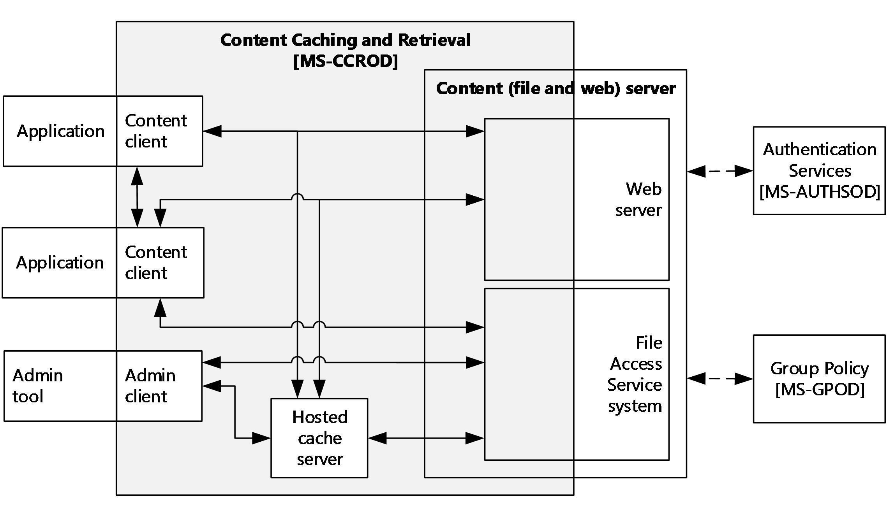

Figure 1: Relationships of Content Caching and Retrieval protocols with external components

The main external components that interact with the Content Caching and Retrieval protocols are as follows:

**Admin tool**: A tool that the administrator uses to configure the Content Caching and Retrieval options.

**Content client**: An application that consumes content.

**Content (File and Web) server**: A service that publishes content.

**Authentication Services** *(optional)*: An external service that provides any required authentication processes.

**Group Policy** *(optional)*: An external service that dictates and enforces any policy restrictions.

The member protocols that make up the system are described in section [2.2](#Section_2.2).

### 2.1.1 System Capabilities

The overall functionality of the Content Caching and Retrieval protocols includes the following:

- HTTP Metadata Retrieval (section [2.1.1.1](#Section_2.1.1.1))
- Background Intelligent Transfer Service (BITS) Integration (section [2.1.1.2](#Section_2.1.1.2))
- [**Server Message Block (SMB)**](#gt_server-message-block-smb) 2.1 or 2.2 Metadata Retrieval Integration (section [2.1.1.3](#Section_2.1.1.3))
- Peer Content Caching and Retrieval Discovery Protocol (PCCRD) and Web Services Dynamic Discovery (WS-Discovery (section [2.1.1.4](#Section_2.1.1.4)))

#### 2.1.1.1 HTTP Metadata Retrieval

The sequence of messages for an HTTP request for Content Caching and Retrieval is shown in the following figure and consists of the following steps:

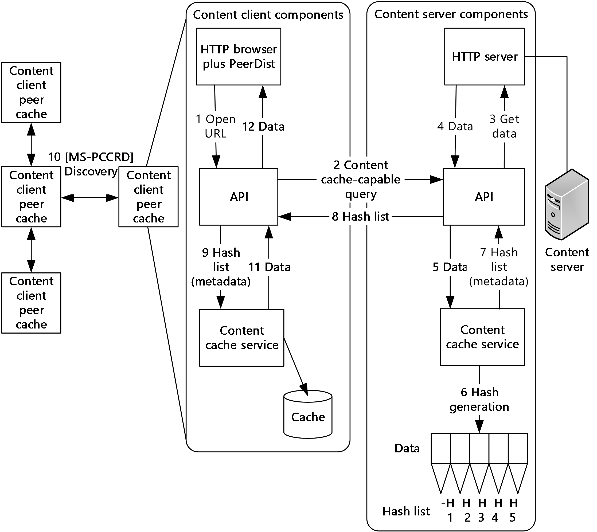

Figure 2: HTTP metadata retrieval

- The client application opens a URL.
- The client side adds a [**PeerDist**](#gt_aa8b8ff4-165d-4e62-80b5-0ba0a8c8c49f) header to an outgoing HTTP request.
- The HTTP server side performs any required access checks, and then, if valid, requests the data. If [**hashes**](#gt_hash) are available, they are returned to the client.
- If hashes are not available, a normal HTTP response is returned immediately to the client.
- If the requested data and hashes are available, the data is placed in the [**distributed cache**](#gt_distributed-cache).
- Metadata in the form of [**hash lists**](#gt_hash-list) is generated that make the [**metadata**](#gt_metadata) available for any subsequent requests on the same data.
- Any subsequent request for the same data that is identified by the URL results in metadata being returned.
- Metadata is returned to the content client by using the Peer Content Caching and Retrieval: Hypertext Transfer Protocol (HTTP) Extensions, as described in [MS-PCCRTP](../MS-PCCRTP/MS-PCCRTP.md).
- The hash list is passed to the [**BranchCache**](#gt_branchcache) Service to look up the data.
- For unsuccessful cache lookups (missing [**block**](#gt_block)), a range request, including the byte range, is broadcast by using the Peer Content Caching and Retrieval Discovery Protocol, as described in [MS-PCCRD](../MS-PCCRD/MS-PCCRD.md). If data is found in a [**peer**](#gt_peer) client, the data is retrieved by using the Peer Content Caching and Retrieval: Retrieval Protocol [MS-PCCRR](../MS-PCCRR/MS-PCCRR.md).
- If data is retrieved, it is added to the cache, and the hash list is made available for discovery. If the client does not receive the associated data (that is, the original [**content**](#gt_content) is unavailable), a suitable (HTTP) error is returned to the application.
- If the data is retrieved, it is returned to the requesting content client.

#### 2.1.1.2 BITS Integration

In the context of Content Caching and Retrieval, Background Intelligent Transfer Service (BITS) is a client of the HTTP service. The figure in this section shows the [**hosted cache**](#gt_hosted-cache) configuration, but the [**distributed cache**](#gt_distributed-cache) configuration is equally valid and would be the same as the figure in section "HTTP Metadata Retrieval" that shows HTTP [**metadata**](#gt_metadata) retrieval integration, except that here the web browser is replaced by a BITS client.

The sequence of messages for a BITS request with Content Caching and Retrieval are in fact HTTP requests. The main difference is that the BITS client makes extensive use of HTTP range requests (see [[RFC2616]](https://go.microsoft.com/fwlink/?LinkId=90372) section 3.12) because BITS is mainly used for file transfer and can be subject to interruption, pause, and continuation actions. The higher-layer protocol provides BITS with the desired ranges of the server URL. BITS then issues single-range or multi-range HTTP requests that represent a subset of the requested ranges.

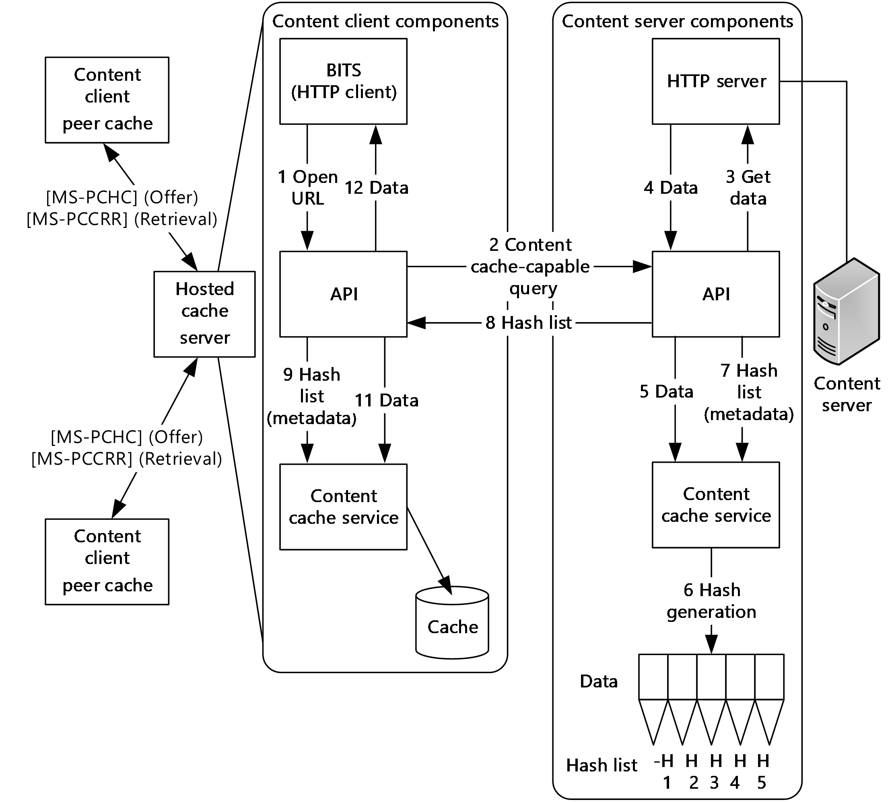

Figure 3: BITS integration

The following sequence shows the steps for a hosted cache configuration:

- The client application opens a URL.
- BITS, on the client side, adds a [**PeerDist**](#gt_aa8b8ff4-165d-4e62-80b5-0ba0a8c8c49f) header to the outgoing HTTP requests.
- The web server performs any required access checks. If [**hashes**](#gt_hash) are available, they are returned to the client.
- If hashes are not available, a response is returned immediately to the client.
- If the requested data and the hashes are available, the data is placed in the distributed cache.
- Metadata, in the form of [**hash lists**](#gt_hash-list), is generated, making the metadata available for any subsequent requests on the same data.
- Any subsequent request for the same data that is identified by the URL returns metadata.
- Metadata (hash list) is returned to the content client by using the Peer Content Caching and Retrieval Hypertext Transfer Protocol (HTTP) Extensions, as described in [MS-PCCRTP](../MS-PCCRTP/MS-PCCRTP.md).
- BITS receives a response that consists of a hash list. The hash list is passed to the [**BranchCache**](#gt_branchcache) Service to look up the data.
- For unsuccessful local cache lookups (missing [**block**](#gt_block)), a direct request for the data from the hosted cache is made using the Peer Content Caching and Retrieval: Retrieval Protocol, as described in [MS-PCCRR](../MS-PCCRR/MS-PCCRR.md).
- If BITS does not receive the associated data because the original [**content**](#gt_content) is unavailable, it returns a suitable (HTTP) error to the application. If the original data is available, it is obtained from the [**content server**](#gt_content-server).
- The requested data is returned to the requesting content client.
**Note** Before the introduction of the Content Caching and Retrieval protocols, BITS clients used the Background Intelligent Transfer Service (BITS) Peer-Caching: Peer Discovery Protocol, as described in [MS-BPDP](../MS-BPDP/MS-BPDP.md), for discovery and the Background Intelligent Transfer Service (BITS) Peer-Caching: Content Retrieval Protocol, as described in [MS-BPCR](../MS-BPCR/MS-BPCR.md), for retrieval.<3> The Background Intelligent Transfer Service (BITS) Peer-Caching: Peer Discovery and Background Intelligent Transfer Service (BITS) Peer-Caching: Content Retrieval protocols cannot coexist with the Content Caching and Retrieval protocols.

#### 2.1.1.3 SMB 2.1 or 3.x Metadata Retrieval

A Server Message Block (SMB) 2.1 or 3.x request for Content Caching and Retrieval starts with the client application opening a remote file. During this stage, an SMB 2.1 or 3.x [**Tree Connect**](#gt_tree-connect) allows the [**content**](#gt_content) client to determine whether the remote share supports [**hash lists**](#gt_hash-list). If the file is unavailable (cannot be retrieved from the local cache) and the share supports hash lists, the local cache service requests the hash list.

After the local cache service supplies the hash list to the content cache service to retrieve the data, the data, if available, is returned to the local cache service. For unsuccessful local cache lookups (missing blocks), a request is broadcast by using the Peer Content Caching and Retrieval Discovery Protocol [MS-PCCRD](../MS-PCCRD/MS-PCCRD.md). If data is found in a peer client, the data is retrieved by using the Peer Content Caching and Retrieval: Retrieval Protocol [MS-PCCRR](../MS-PCCRR/MS-PCCRR.md). The data is placed in the content cache and delivered to the local cache service driver, which places the data in the local cache. Then, the data is returned to the client application.

The sequence of messages for an SMB 2.1 or 3.x request with Content Caching and Retrieval is shown in the following figure and is as follows:

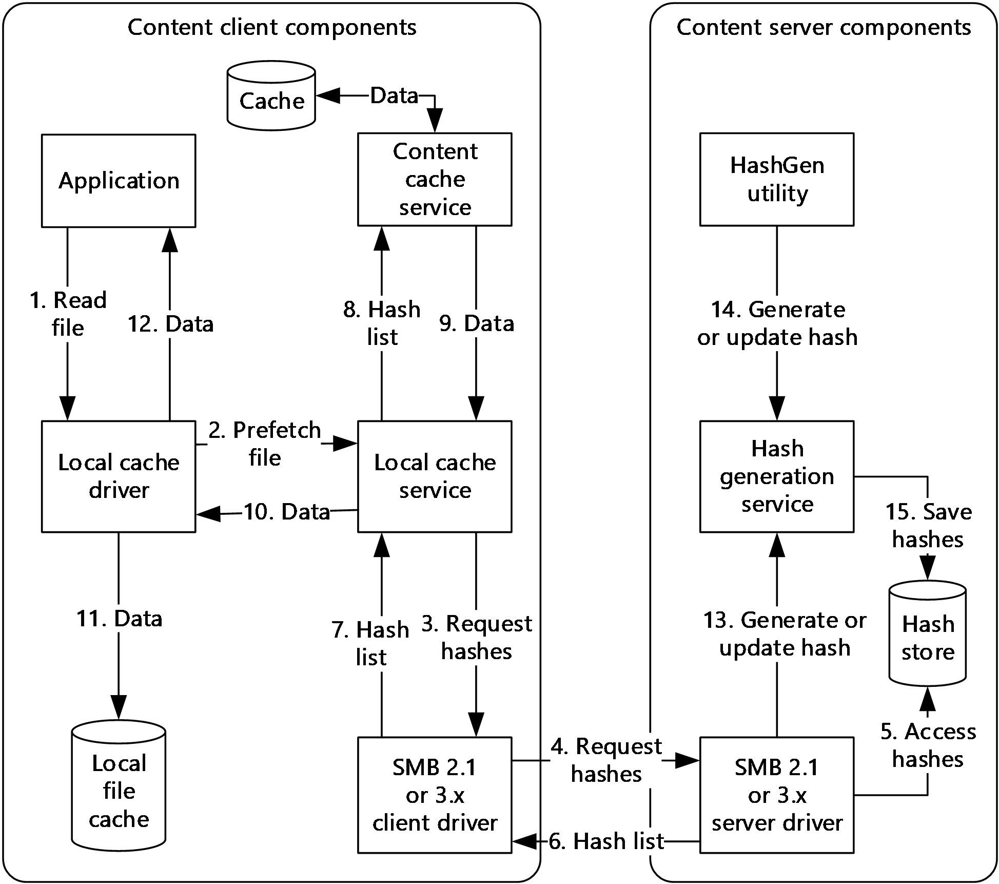

Figure 4: SMB 2.1 or 3.x metadata retrieval

- The client application opens a remote file. During this stage, an SMB 2.1 or 3.x Tree Connect allows the content client to determine whether the remote share supports hash lists.
- An attempt is first made to retrieve the file from the local cache.
- If the file is unavailable and the share supports hash lists, the local cache service requests the hash list.
- The SMB 2.1 or 3.x client requests hashes.
- The SMB 2.1 or 3.x server driver accesses the hash lists.
- The SMB 2.1 or 3.x server driver returns the hash list to the SMB 2.1 or 3.x client.
- The SMB 2.1 or 3.x client driver returns the hash list to the local cache service.
- The local cache service supplies the hash list to the content cache service to retrieve the data.
- The data, if available, is returned to the local cache service. For unsuccessful local cache lookups (missing blocks), a request is broadcast by using the Peer Content Caching and Retrieval Discovery Protocol [MS-PCCRD]. If data is found in a [**peer**](#gt_peer) client, the data is retrieved by using the Peer Content Caching and Retrieval: Retrieval Protocol [MS-PCCRR].
- The data is placed in the content cache and delivered to the local cache service driver.
- The data is placed in the local cache.
- The data is returned to the client application.
- If no hash list was available and the data was directly returned from the [**content server**](#gt_content-server), then the hash list generation is initiated on the content server.
- The hash list can be independently created by running the HashGen utility on the content server.
- The generated hash list is stored to make it available for future client requests.

#### 2.1.1.4 PCCRD and WS-Discovery

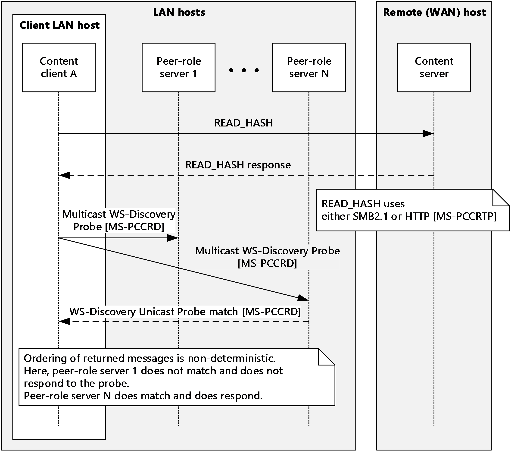

Figure 5: PCCRD and WS-Discovery

The figure in this section shows the ordering of messages when the service is operating in [**distributed cache**](#gt_distributed-cache) mode. The initial request (READ_HASH) for the [**content**](#gt_content) takes place in either SMB 2.1, SMB 3.x, or HTTP. The response with the [**hashes**](#gt_hash) is returned in the same protocol that makes the request. After the content hashes have been received by the content client, the content client can determine whether any of the content exists within the local area network (LAN) where it resides. The content client does this by checking any local machine cache. Then, if the data is not available locally, it performs a Multicast WSD/MS-PCCRD Probe message with the hashes of the content.

Any server-role peers on the LAN that receive the Multicast Probe message and have the matching content via the Peer Content Caching and Retrieval Discovery Protocol ([MS-PCCRD](../MS-PCCRD/MS-PCCRD.md)) respond with a Unicast Probe-Match message.

After the content client receives a match for content, it initiates one or more Peer Content Caching and Retrieval: Retrieval Protocol sessions, as described in [MS-PCCRR](../MS-PCCRR/MS-PCCRR.md), (not shown in the figure) to retrieve the content from the [**server-role peer**](#gt_server-role-peer).

### 2.1.2 Protocol Relationships

The following figure shows the protocol layering relationships for the Content Caching and Retrieval member protocols. The default relationship, which is indicated by a solid arrow, is "is transported by". The "includes" notation means that a protocol document includes a second document by reference (for example, [MS-SMB2](../MS-SMB2/MS-SMB2.md) includes [MS-FSCC](../MS-FSCC/MS-FSCC.md)). Member protocols are shown in shaded boxes.

Content Caching and Retrieval can be initiated both by SMB2 and HTTP. A Background Intelligent Transfer Service (BITS) client can use the system and acts as an HTTP client.

A [**content**](#gt_content) client can use either HTTP or [**HTTPS**](#gt_hypertext-transfer-protocol-secure-https) for communication with a [**hosted cache**](#gt_hosted-cache) server specifically while it offers content.<4> The content is then retrieved by using the Peer Content Caching and Retrieval: Retrieval Protocol, as described in [MS-PCCRR](../MS-PCCRR/MS-PCCRR.md).

A content client uses the Peer Content Caching and Retrieval Discovery Protocol, as described in [MS-PCCRD](../MS-PCCRD/MS-PCCRD.md) (an implementation of [[WS-Discovery]](https://go.microsoft.com/fwlink/?LinkId=90576)), to locate [**peer**](#gt_peer) computers with cached content.

The majority of traffic in the system is performed by the Peer Content Caching and Retrieval: Retrieval Protocol, as described in [MS-PCCRR]. This protocol is used to transfer actual content regardless of the protocol that retrieved the content [**metadata**](#gt_metadata).

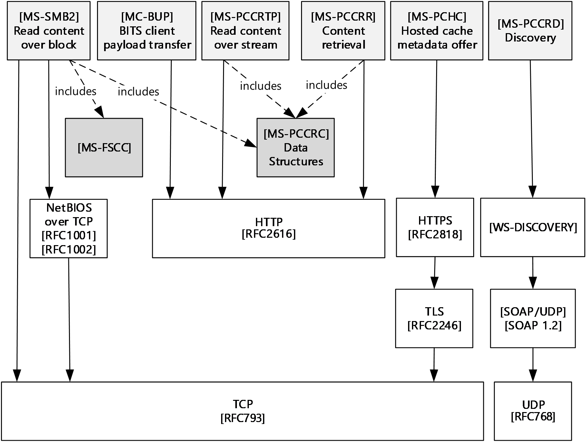

Figure 6: Protocol relationships for Content Caching and Retrieval

### 2.1.3 Applicability

Content Caching and Retrieval is supplementary to File Access Services; it is a form of wide area network (WAN) link acceleration. The goal is to increase network utilization. The major principle employed by Content Caching and Retrieval is the reduction of traffic across a WAN. Content caching enables content from file and web servers on one end of a WAN to be cached on computers at the other end of the WAN.

### 2.1.4 Relevant Standards

**Advanced Encryption Standard** as specified in [[FIPS197]](https://go.microsoft.com/fwlink/?LinkId=89870).

**Hypertext Transfer Protocol - HTTP/1.1** as specified in [[RFC2616]](https://go.microsoft.com/fwlink/?LinkId=90372).

**Hypertext Transfer Protocol - HTTP/1.1 over TLS** as specified in [[RFC2818]](https://go.microsoft.com/fwlink/?LinkId=90383).

**Protocol Standard for a NetBIOS Service on a TCP/UDP Transport** (NetBIOS over TCP) as specified in [[RFC1001]](https://go.microsoft.com/fwlink/?LinkId=90260) and [[RFC1002]](https://go.microsoft.com/fwlink/?LinkId=90261).

**Secure Hash Standard** as specified in [[FIPS180-2]](https://go.microsoft.com/fwlink/?LinkId=89868).

**Transmission Control Protocol (TCP)** as specified in [[RFC793]](https://go.microsoft.com/fwlink/?LinkId=150872).

**User Datagram Protocol (UDP)** as specified in [[RFC768]](https://go.microsoft.com/fwlink/?LinkId=90490).

**Web Services Dynamic Discovery** as specified in [[WS-Discovery]](https://go.microsoft.com/fwlink/?LinkId=90576).

**SPNEGO-based Kerberos and NTLM HTTP Authentication in Windows** as specified in [[RFC4559]](https://go.microsoft.com/fwlink/?LinkId=90483). For more information on SPNEGO see [MS-SPNG](../MS-SPNG/MS-SPNG.md) and [MS-NEGOEX](#Section_2.9).

## 2.2 Protocol Summary

The following table provides a comprehensive list of the member protocols for Content Caching and Retrieval.

| Protocol name | Description | Short name |
| --- | --- | --- |
| **Peer Content Caching and Retrieval: Content Identification** | Specifies a binary data structure that is used in the Content Caching and Retrieval. The primary role in Content Caching and Retrieval is content identification. | [MS-PCCRC](../MS-PCCRC/MS-PCCRC.md) |
| **Peer Content Caching and Retrieval Discovery Protocol** | Specifies a multicast to discover and locate services that are based on the Web Services Dynamic Discovery (WS-Discovery) protocol [[WS-Discovery]](https://go.microsoft.com/fwlink/?LinkId=90576). There are two modes of operations in WS-Discovery: client-initiated probes and service-initiated announcements; both are sent through IP multicast to a predefined group. The primary role in Content Caching and Retrieval is content discovery. | [MS-PCCRD](../MS-PCCRD/MS-PCCRD.md) |
| **Peer Content Caching and Retrieval: Retrieval Protocol** | Specifies the messages that are required to query peer-role servers or a [**hosted cache**](#gt_hosted-cache) server for the availability of certain [**content**](#gt_content) and to retrieve the content. The primary role in Content Caching and Retrieval is content retrieval. | [MS-PCCRR](../MS-PCCRR/MS-PCCRR.md) |
| **Peer Content Caching and Retrieval: Hosted Cache Protocol** | Specifies an HTTP/[**HTTPS**](#gt_hypertext-transfer-protocol-secure-https)-based mechanism for clients to notify a hosted cache server about the availability of content and for a hosted cache server to indicate interest in the content.<5> The primary role in Content Caching and Retrieval is content notification. | [MS-PCHC](../MS-PCHC/MS-PCHC.md) |
| **Peer Content Caching and Retrieval: HTTP Extensions** | Specifies a content encoding known as [**PeerDist**](#gt_aa8b8ff4-165d-4e62-80b5-0ba0a8c8c49f) that is used by an HTTP/1.1 client and an HTTP/1.1 server to communicate content to each other. The primary role in Content Caching and Retrieval is [**metadata**](#gt_metadata) ([**hash**](#gt_hash)) retrieval. | [MS-PCCRTP](../MS-PCCRTP/MS-PCCRTP.md) |
| **Server Message Block (SMB) Version 2.1 Protocol** | Specifies a metadata retrieval mechanism. Version 2.1 of this protocol has enhancements to detect content caching-enabled shares and retrieval of metadata that is related to content caching. The primary role in Content Caching and Retrieval is metadata (hash) retrieval. | [MS-SMB2](../MS-SMB2/MS-SMB2.md) |

The following table provides a comprehensive list of the member protocols of Content Caching and Retrieval. The member protocols are grouped according to their primary purpose.

| Protocol name | Group description | Short name |
| --- | --- | --- |
| - | **Metadata (Hash) Retrieval** | - |
| **Server Message Block (SMB) Version 2.1 Protocol** | SMB 2.1 and HTTP are the current protocols that are enabled for metadata retrieval. | [MS-SMB2] |
| **Peer Content Caching and Retrieval: HTTP Extensions** | Specifies a content encoding known as PeerDist that is used by an HTTP/1.1 client and an HTTP/1.1 server to communicate content to each other. The primary role in Content Caching and Retrieval is metadata (hash) retrieval. | [MS-PCCRTP] |
| - | **File Retrieval** | - |
| **Server Message Block (SMB) Version 2.1 Protocol** | SMB2 version 2.1 and HTTP (as described in [MS-PCCRTP] specifies content encoding over HTTP) are the two protocols used for file retrieval that are content caching aware. | [MS-SMB2] |
| **Peer Content Caching and Retrieval: HTTP Extensions** | Specifies a content encoding known as PeerDist that is used by an HTTP/1.1 client and an HTTP/1.1 server to communicate content to each other. The primary role in Content Caching and Retrieval is metadata (hash) retrieval. | [MS-PCCRTP] |
| - | **Content Identification** | - |
| **Peer Content Caching and Retrieval: Content Identification** | A binary data structure that is used for content identification. | [MS-PCCRC] |
| - | **Content Discovery** | - |
| **Peer Content Caching and Retrieval Discovery Protocol** | Based on the Web Services Dynamic Discovery (WS-Discovery) protocol [WS-Discovery]. There are two modes of operations in WS-Discovery: client-initiated probes and service-initiated announcements; both are sent through IP multicast to a predefined group. | [MS-PCCRD] |
| - | **Content Retrieval** | - |
| **Peer Content Caching and Retrieval: Retrieval Protocol** | Content in the form of blocks is transferred by using HTTP, with the message format, as described in [MS-PCCRR]. | [MS-PCCRR] |
| - | **Authentication** | - |
| **Transport Layer Security (TLS)** | Hosted server authentication uses HTTP/HTTPS for secure transport of hosted content, as described in [MS-PCHC].<6> [MS-TLSP](#Section_2.9) describes the Windows implementation of TLS. | [MS-TLSP] |
| **RFC 4559** | Client authentication, as described in [[RFC4559]](https://go.microsoft.com/fwlink/?LinkId=90483). When a hosted cache server is used, SPNEGO HTTP client authentication can be enabled. For more information on SPNEGO see [MS-SPNG](../MS-SPNG/MS-SPNG.md) and [MS-NEGOEX](#Section_2.9). | [RFC4559] |

## 2.3 Environment

The following sections identify the context in which the system exists. This includes the systems that use the interfaces provided by this system of protocols, other systems that depend on this system, and, as appropriate, how components of the system communicate.

### 2.3.1 Dependencies on This System

There are no systems that depend on the Content Caching and Retrieval protocols.

### 2.3.2 Dependencies on Other Systems/Components

**Network Infrastructure**: This system requires access to network services that support:

- TCP/IP (IPv4 or IPv6).
- UDP/IP (IPv4 or IPv6).
- Domain Name System (DNS) name resolution.
| Cache mode | Protocol | Activity | Port |
| --- | --- | --- | --- |
| Distributed and Hosted | HTTP | Content retrieval (uses HTTP) | TCP Port 80 |
| Hosted | HTTPS | Content offering ([**HTTPS**](#gt_hypertext-transfer-protocol-secure-https)) | TCP Port 443 |
| Distributed | WS-Discovery | Peer discovery (uses Web Service Dynamic Discovery (WSD)) | UDP Port 3702 |

**Object Store**: Both SMB2 and HTTP File Services require access to a hierarchical Object Store for persistence of files and namespace. The Object Store is typically built on file systems that are available in the host operating system, but the Object Store might also have to include functionality in addition to the functionality that the file system provides. A File Service might have to implement additional logic to convert between the semantics of a particular [**File Access Protocol**](#gt_file-access-protocol) and the semantics of the available Object Store. Some semantics that are implemented in Windows file systems are directly visible when they use the SMB Access Protocols. Such wire-visible behaviors are described in [MS-FSA](../MS-FSA/MS-FSA.md).

**Case Sensitivity**: The Object Store supports case-insensitive operations for the SMB File Service and supports case-sensitive operations for the HTTP File Service.

**Accounts**: If computers that host file clients and File Services are not joined to a domain, then user accounts are configured across computers by some external mechanism.

**Hosted cache**: If a hosted cache is to be used, the location of the hosted cache (Domain Name System (DNS) name or IP address) and the hosted cache Listen and Connections Ports are configured on the client computers.

### 2.3.3 System Influences

The Content Caching and Retrieval protocols can be influenced by the external systems and components that are shown in the following table.

| External entity | Content Caching and Retrieval protocols depend on an external entity for | Consequences if absent |
| --- | --- | --- |
| Authentication Services system | Authenticating client and server principals. | Centralized identity management does not work if the Domain Interaction System is not available. |
| Group Policy system | Configuration of individual capabilities within the Content Caching and Retrieval protocols. | Cannot centrally configure some functionality of the system. |
| Domain interaction system | Content Caching and Retrieval to operate either in a domain or in a workgroup. Domain services are required for hosted cache client authentication. | Hosted cache client authentication cannot function. |
| File Access system | File Access Services to which Content Caching and Retrieval is an adjunct. | No file access and therefore no Content Caching and Retrieval. |
| Web server | HTTP Content Caching that depends on the availability of content that is delivered via HTTP. | No HTTP content caching can be performed. |
| Certification Authority system | Hosted cache mode requires an X.509 certificate to authenticate. Either security protocol [**Secure Sockets Layer (SSL)**](#gt_secure-sockets-layer-ssl) or [**Transport Layer Security (TLS)**](#gt_transport-layer-security-tls) may be used. TLS supersedes SSL and should be used in new development with a X509v3 certificate. See the following specifications [[RFC2818]](https://go.microsoft.com/fwlink/?LinkId=90383), [[RFC5246]](https://go.microsoft.com/fwlink/?LinkId=129803), [[RFC5280]](https://go.microsoft.com/fwlink/?LinkId=131034). | Hosted cache communication will fail. |

Specific-system influences are as follows:

Group Policy enables a client to interact with the Content Cache Service, which is turned off by default. This enables a computer to act as both a [**client-role peer**](#gt_client-role-peer) and client-role server, thereby publishing and retrieving content and [**metadata**](#gt_metadata) that are obtained from a [**content server**](#gt_content-server).

The Background Intelligent Transfer Service (BITS) Upload Protocol, as described in [MC-BUP](../MC-BUP/MC-BUP.md), specifies an HTTP 1.1-based upload protocol. This protocol is used to transfer large payloads from a client to a server or a server to a client over networks with frequent disconnections and to send notifications about the availability of uploaded payloads. This protocol is a client of the Content Caching and Retrieval protocols.

## 2.4 Assumptions and Preconditions

The following assumptions and preconditions have to be satisfied for the Content Caching and Retrieval protocols to operate successfully:

**System availability**:

- The File Access Services system is installed on all the computers that are involved in [**content**](#gt_content) caching.
- A [**PeerDist**](#gt_aa8b8ff4-165d-4e62-80b5-0ba0a8c8c49f)-capable (see [MS-PCCRTP](../MS-PCCRTP/MS-PCCRTP.md)) web server is installed and configured on the [**content server**](#gt_content-server) for HTTP caching.
- A PeerDist-capable (see [MS-PCCRTP]) web browser or Background Intelligent Transfer Service (BITS) client is installed on client computers for HTTP caching.
- The Content Caching and Retrieval components ([**BranchCache**](#gt_branchcache)) are installed on the computers involved.
**Authentication Services**: Authentication Services, as described in [MS-AUTHSOD](#Section_2.1), are available to all file clients and File Services.

**Network configuration**: For system components that are running on different computers to communicate, the network services and infrastructure are functional and correctly configured.

**Domain configuration**: In a domain configuration, file clients and File Services have access to directory services that are provided by the domain.

**Domain functionality**: Domain functionality is not a requirement of the Content Caching and Retrieval protocols.

## 2.5 Use Cases

### 2.5.1 Actors

The actors that participate in the Content Caching and Retrieval protocols are:

**User**: The user is the principal that requires file access to read files on another computer. The user is referred to by using the qualifiers "SMB2.1", "HTTP", or "BITS" when it is necessary to distinguish user instances. The user is external to the File Services and Content Caching and Retrieval protocols and interacts through the application. The Content Caching and Retrieval protocols only apply to the reading of existing files.

**Administrator**: The administrator is the person who administers the [**content server**](#gt_content-server) and [**hosted cache**](#gt_hosted-cache) server. The administrator is interested in organizing [**content**](#gt_content), setting access rights, and enabling content caching. The administrator is external to the Content Caching and Retrieval protocols and interacts with them through the Administrator Tool.

**Administrator Tool**: The Administrator Tool is a program that offers management functionality to the administrator by means of the Admin Client. Typical administrator tools are command-line tools and graphical shells, management utilities, and graphical management programs. The Administrator Tool is external to the Content Caching and Retrieval protocols and makes use of the Admin Client to accomplish its work.

**Application**: The application is a program that consumes file-reading services by means of the content client. Applications (where caching applies) have to open, read, and close files. The application is external to the File Services and Content Caching and Retrieval protocols. The application interacts with them through the content client.

**Content client**: The content client implements client-side protocol components and consumes the File Services that are offered by the content server. The content client can be referred to by using the qualifier "SMB2.1", "HTTP", or "BITS" when it is necessary to distinguish client instances. The content client is internal to the Content Caching and Retrieval protocols. A content client can additionally act as a [**distributed cache**](#gt_distributed-cache) peer.

**Content server**: The content server's interest is to provide and maintain a secure and consistent File Access Service, as described in [MS-FASOD](#Section_2.1), and to provide content [**metadata**](#gt_metadata) as part of Content Caching and Retrieval.

**Hosted cache server**: The hosted cache server's interest is to cache content and to receive metadata about the availability of content [**segments**](#gt_segment) and [**blocks**](#gt_block), and then, as required, to download the segments and blocks from clients that have the relevant data. Later, when another client requests the content through a secure mechanism, the content can be retrieved from the hosted cache rather than from a content server.

**Distributed cache peer**: A distributed cache peer's interest is to cache and distribute data and respond to queries about the availability of data segments and blocks. Then, when a client requests the content through a secure mechanism, the content can be obtained from the distributed cache rather than from a content server.

**Object Store**: The File Access Services and therefore Content Caching and Retrieval are dependent on an external Object Store for storing files and directories.<7>

Wire-visible behavior of File Access Services protocols is not specified by the protocols themselves and depends on Object Store behavior.

### 2.5.2 Supporting Actors and System Interests Summary

**File Access Services [MS-FASOD]**: The purpose of File Access Services is to allow a set of actors (people or processes) to access and share files that are located on a file server by using a network between computers in a secure and managed environment. The files can be distributed among a number of computers in a workgroup or domain or be centralized in one or more file server computers. File Access Services can optionally use Content Caching and Retrieval to cache content.

**Group Policy [MS-GPOD]**: Group Policy enables an administrator to maintain standard operating environments in domains for specific groups of users and computers. As software changes and policies change over time, Group Policy can be used to update an already deployed standard operating environment. Computers that are participating in Content Caching and Retrieval within a domain can be expected to participate in and be influenced by the Group Policy.

**Certificate Services [MS-CERSOD]**: The Certificate Services components enable an administrator to request a certificate.

**Background Intelligent Transfer Service (BITS) Upload Protocol**, as described in [MC-BUP](../MC-BUP/MC-BUP.md), specifies an HTTP 1.1-based upload protocol. This protocol is used to transfer large payloads from a client to a server or from a server to a client over networks with frequent disconnections and to send notifications about the availability of uploaded payloads. "BITS" is a PeerDist-enabled HTTP client and can therefore act as a client of the Content Caching and Retrieval System.

### 2.5.3 Use Case Diagrams

The following table groups use cases that span the functionality of the Content Caching and Retrieval protocols. For detailed descriptions for these use cases, see section [2.5.4](#Section_2.5.4).

| Use case group | Use cases |
| --- | --- |
| Configuring Content Caching and Retrieval Components | Configuring SMB 2.1 or 3.x Content Server Caching Configuring HTTP Content Server Caching Configuring Content Client Caching Mode Configuring a [**Hosted Cache**](#gt_hosted-cache) Server |
| Metadata Retrieval | Using SMB 2.1 or 3.x Metadata Retrieval HTTP Metadata Retrieval BITS-HTTP Metadata Retrieval |
| Content Discovery and Retrieval | Content Discovery and Retrieval with Hosted Cache (Cached Data Unavailable) Content Discovery and Retrieval with Hosted Cache (Cached Data Available) Content Discovery and Retrieval with [**Distributed Cache**](#gt_distributed-cache) (Cached Data Unavailable) Content Discovery and Retrieval with Distributed Cache (Cached Data Available) |

The following use case diagrams show the separate groups of use cases that are described in this section.

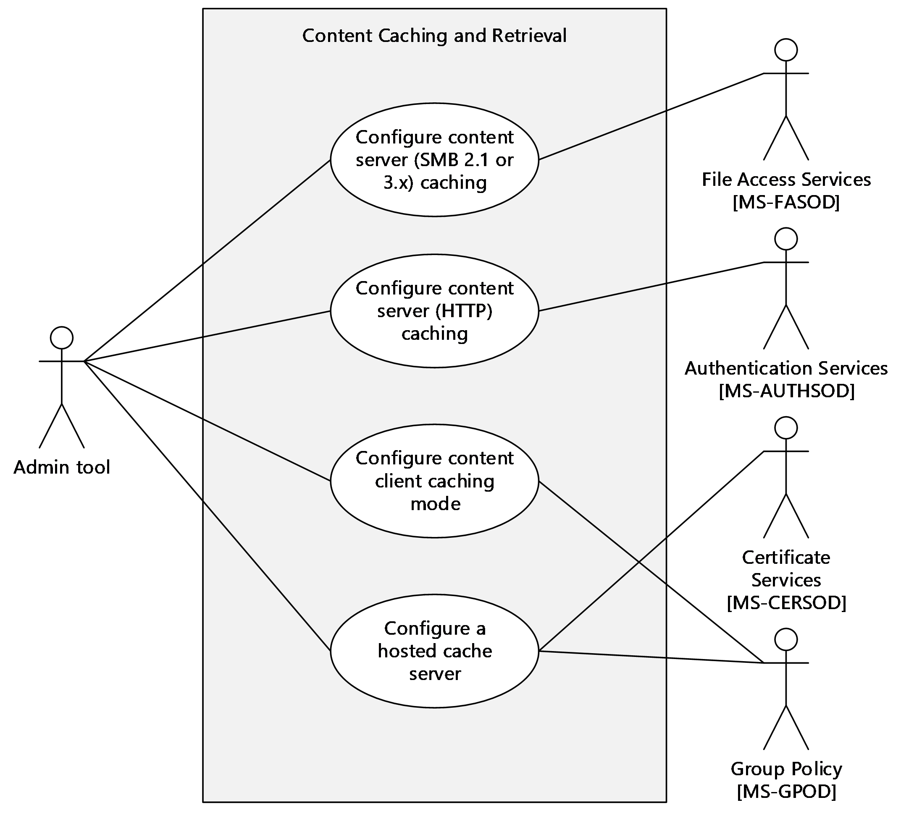

Figure 7: Use cases included in the Configuring Content Caching and Retrieval Components summary use case

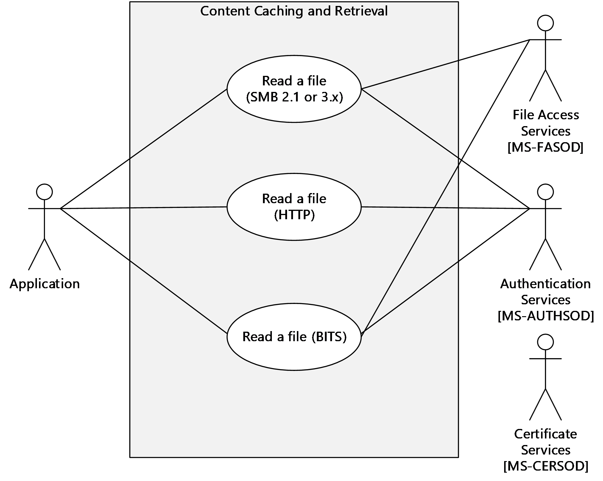

Figure 8: Use cases included in the Reading Content summary use case

### 2.5.4 Summary Use Case Descriptions

Note that the configuration tools on Windows operating systems are local only and therefore do not use protocols.

#### 2.5.4.1 Configuring Content Caching and Retrieval Components

This section summarizes use cases for configuring caching on content servers, content clients, and hosted cache servers.

##### 2.5.4.1.1 Configuring SMB 2.1 or 3.x Content Server Caching

**Goal**: To enable Content Caching and Retrieval on a content server share directory.

**Context of Use**: The administrator is configuring a content server and is either adding or modifying a shared directory.

**Direct Actor**: The direct actor is the Administrator Tool. The Administrator Tool's interest is to correctly interpret, execute, and display the results of the commands issued by the administrator.

**Primary Actor**: The primary actor is the administrator. The administrator's interest is expressed in administrative privileges and the responsibility for using File Access Services and Content Caching and Retrieval to provide File Services.

**Supporting Actors**: The supporting actors for this use case are as follows:

- Administrator client: Maintains a consistent access mechanism to the SMB 2.1 File Service and Content Caching and Retrieval configuration.
- SMB File Service: Provides and maintains a secure and consistent File Service by enforcing directory quotas and file screens.
- Object Store: Stores files and directories.
**Preconditions**: The administrator has identified a content server and a shared directory on its Object Store and has to enable Content Caching and Retrieval on that shared directory.

**Minimal Guarantees**: Content Caching and Retrieval is not enabled.

**Success Guarantee**: Content Caching and Retrieval is enabled on the shared directory that is identified on the content server.

**Trigger**: The Administrator Tool receives a request from the administrator to configure Content Caching and Retrieval.

###### 2.5.4.1.1.1 Main Success Scenario

- The Administrator Tool (Share and Storage Management Console) creates or modifies an SMB 2.1 or 3.x share with the specified SMB 2.1 or 3.x share name and directory on the content server.
- The Administrator Tool enables Content Caching and Retrieval on the SMB 2.1 or 3.x share.

##### 2.5.4.1.2 Configuring HTTP Content Server Caching

**Goal**: To enable Content Caching and Retrieval on a content server-hosted website.

**Context of Use**: The Administrator is configuring an HTTP server and is either adding a website or modifying an existing site.

**Direct Actor**: The direct actor is the Administrator Tool (Netsh). The Administrator Tool's interest is to correctly interpret, execute, and display the results of the commands that are issued by the administrator.

**Primary Actor**: The primary actor is the administrator. The administrator's interest is expressed in administrative privileges and the responsibility for using the website.

**Supporting Actors**: The supporting actors for this use case are as follows:

- Admin client: Maintains a consistent access mechanism to the HTTP server and Content Caching and Retrieval configuration.
- HTTP server: Provides and maintains a secure and consistent File Service.
- Object Store: Stores files and directories.
**Preconditions**: The administrator has identified a content server that hosts a website on its Object Store and has to enable Content Caching and Retrieval on that site.

**Minimal Guarantees**: Content Caching and Retrieval is not enabled.

**Success Guarantee**: Content Caching and Retrieval is enabled on the website that is identified on the content server.

**Trigger**: The Administrator Tool receives a request from the administrator to configure a website.

###### 2.5.4.1.2.1 Main Success Scenario

- The Administrator Tool creates or modifies a website that is hosted on the content server.

##### 2.5.4.1.3 Configuring Content Client Caching Mode

**Goal**: To configure the [**content**](#gt_content) caching mode on a client peer.

**Context of Use**: The administrator is configuring a content client to use either [**hosted cache**](#gt_hosted-cache) or [**distributed cache**](#gt_distributed-cache), which are mutually exclusive roles and specified by the ADM element **Server Role**.

**Direct Actor**: The direct actor is the Administrator Tool (Netsh). The Administrator Tool's interest is to correctly interpret, execute, and display the results of the commands that are issued by the administrator.

**Primary Actor**: The primary actor is the administrator. The administrator's interest is expressed in administrative privileges and the responsibility for the content client using Content Caching and Retrieval.

**Supporting Actors**: The supporting actor for this use case is as follows:

- Admin client: Maintains a consistent access mechanism to the content client and the Content Caching and Retrieval configuration of the client.
**Preconditions**: The administrator has identified a client peer (content client) and has to configure the caching mode. The client peer is Content Caching and Retrieval-capable.

**Minimal Guarantees**: No action is taken that affects systems on the client peer.

**Success Guarantee**: The caching mode is set to DISTRIBUTED or HOSTED CLIENT.

**Trigger**: The Administrator Tool receives a request from the administrator to configure the caching mode.

###### 2.5.4.1.3.1 Main Success Scenario

- The Administrator Tool establishes a connection to the Content Caching and Retrieval configuration.
- The Administrator Tool changes context to Caching and Retrieval.
- The Administrator Tool sets the Server Role to HOSTEDCLIENT or DISTRIBUTED.
- The firewall allows HOSTEDCLIENT or DISTRIBUTED mode protocols.

##### 2.5.4.1.4 Configuring a Hosted Cache Server

**Goal**: To configure the content-caching mode on a server.

**Context of Use**: The administrator is configuring a hosted cache server.

**Direct Actor**: The direct actor is the Administrator Tool. The Administrator Tool's interest is to correctly interpret, execute, and display the results of the commands that are issued by the administrator.

**Primary Actor**: The primary actor is the administrator. The administrator's interest is expressed in administrative privileges and the responsibility for the hosted cache server using the Content Caching and Retrieval protocols.

**Supporting Actors**: The supporting actor for this use case is as follows:

- Admin client: Maintains a consistent access mechanism to the hosted cache server and the Content Caching and Retrieval configuration.
**Preconditions**: The administrator has identified a server and has to configure it as a hosted cache server. The identified server is Content Caching and Retrieval-capable. The server has a [**fully qualified domain name (FQDN)**](#gt_fully-qualified-domain-name-fqdn) and, if client authentication is to be used, is a member of a domain.

**Minimal Guarantees**: No action is taken that affects systems on the server.

**Success Guarantee**: The Server Role is set to HOSTEDSERVER, and the Client Authentication is set to DOMAIN or NONE.

**Trigger**: The Administrator Tool receives a request from the administrator to configure the hosted cache server.

###### 2.5.4.1.4.1 Main Success Scenario

- The Administrator Tool establishes a connection with the Content Caching and Retrieval configuration of the server.
- The Administrator Tool changes context to Caching and Retrieval.
- The Administrator Tool sets the Server Role to HOSTEDSERVER, and the Client Authentication is set to DOMAIN or NONE.
- The firewall allows HOSTEDSERVER protocols.

#### 2.5.4.2 Initial Reading and Caching of a File from a Content Server

**Goal**: To read content from a content server with Caching and Retrieval in effect.

**Context of Use**: A number of users are attempting to read content that resides on a slow link. When some or all of the content is transferred to the LAN, Content Caching and Retrieval operates to improve the performance of the File Access Service for subsequent users.

**Direct Actor**: The direct actor is the application. The application's interest is to consume file-reading services by means of the content client and to correctly execute and display the results of commands that are issued by a user.

**Primary Actor**: The primary actor is the user. The user's interest is to access content on a content server by using File Access Services and Content Caching and Retrieval to provide File Services.

**Supporting Actors**: The supporting actors for this use case are as follows:

- Content client: Maintains a consistent access mechanism to the SMB 2.1 or 3.x File Service and Content Caching and Retrieval.
- SMB 2.1 or 3.x file server: Provides and maintains a secure and consistent File Service by enforcing directory quotas and file screens. Provides metadata for content to requesting content clients by using the SMB 2.1 or 3.x protocol as a transport.
- HTTP server: Provides and maintains a secure and consistent file streaming service. Provides metadata for content to requesting content clients by using HTTP ([**PeerDist**](#gt_aa8b8ff4-165d-4e62-80b5-0ba0a8c8c49f)) as a transport.
- Object Store: Stores files and directories.
**Minimal Guarantees**: No action is taken that affects other directories or shares on the content server.

**Success Guarantee**: The application obtains a [**handle**](#gt_handle) to the requested file.

**Trigger**: The application receives a request from the user to read a file.

##### 2.5.4.2.1 Main Success Scenario

- The application establishes a communication channel to the content server.
- The content server authorizes the user.
- The content server provides metadata to the content client in the format that is specified in [MS-PCCRC](../MS-PCCRC/MS-PCCRC.md).
- The client searches for content on a content server in the branch office.
- The content server returns the data that is requested by the client (either block SMB 2.1, 3.x, or stream HTTP) to the application.
- The client caches the data so that it can be made available to peers.

#### 2.5.4.3 Metadata Retrieval

##### 2.5.4.3.1 Using SMB 2.1 or 3.x Metadata Retrieval

**Goal**: Use SMB 2.1 or 3.x for metadata retrieval.

**Context of use**: The user has located a file on a content server on a wide area network (WAN) link and wants to read that file.

**Minimal Guarantees**: No action is taken that affects other files that are exposed on the content server as a result of this operation. Files Access Services operate with no content caching.

**Success Guarantee**: The user obtains the metadata that are required to open the communication channel to retrieve the file.

**Trigger**: The application receives a request from the user to read a file.

###### 2.5.4.3.1.1 Main Success Scenario

- The user requests the application to read a file.
- The application uses the content client to open a [**file handle**](#gt_file-handle) to the required existing file on the content server using the mechanisms of SMB 2.1 or 3.x dialect family. This operation completes successfully.
- The application directs the content client to read data from the file that is represented by the file handle. As part of that operation, the content client requests content information (metadata--block hashes, segment hashes, and [**segment hash of data (HoD)**](#gt_segment-hash-of-data-hod) and private segment keys (Kp) for the data), as specified in [MS-SMB2](../MS-SMB2/MS-SMB2.md).
- The content server sends content identifiers on the same channel to the content client, in this case, SMB version 2.1, as specified in [MS-SMB2].
- The content client computes [**segment identifiers (HoHoDk)**](#gt_5cb5fb6e-1fa5-4b2e-939d-aa1295f3fbc9) for the data as specified in [MS-PCCRC](../MS-PCCRC/MS-PCCRC.md).

###### 2.5.4.3.1.2 System Assumptions and Preconditions

The following preconditions have to be satisfied for successful operation:

**Preconditions**: The client computers are configured to use Content Caching and Retrieval. A shared folder with the required file has been created on the content server with content caching support enabled. The user has located the URL of the file on the content server.

**Note** The specific URLs (that is, \\server\share\file and \\192.168.0.3\share\file) are considered different for local caching, but not for Content Caching and Retrieval.

**System availability**: Appropriate content caching components are installed and enabled on all the computers involved.

**Domain configuration**: In a domain configuration, clients and servers have access to directory services that are provided by the domain.

**Note** Domain configuration is not a requirement but can be used.

**Authentication services**: Authentication services, as described in [MS-AUTHSOD](#Section_2.1), are available to all clients and servers.

**Network configuration**: For system components that are running on different computers to communicate, the network services and infrastructure are functional and configured.

##### 2.5.4.3.2 HTTP Metadata Retrieval

**Goal**: Obtain metadata from a content server website with content caching support enabled by using HTTP.

**Context of Use**: The user has located a file on a content server (a web server on a wide area network (WAN) link) and wants to read the file.

**Minimal Guarantees**: No action is taken that affects other files that are exposed on the content server as a result of this operation. HTTP access operates with no content caching.

**Success Guarantee**: The user obtains the metadata that is required to open the communication channel to retrieve the file.

**Trigger**: The application receives a request from the user to read a file.

###### 2.5.4.3.2.1 Main Success Scenario

- The user requests the application to read a file.
- The application establishes an HTTP connection to the content server.
- The content server authenticates the user, if required, through the mechanisms of Authentication Services Protocols, as described in [MS-AUTHSOD](#Section_2.1).
- The application performs an HTTP GET request, as described in [[RFC2616]](https://go.microsoft.com/fwlink/?LinkId=90372), with PeerDist encoding as described in [MS-PCCRTP](../MS-PCCRTP/MS-PCCRTP.md).
- The content server checks the authorization of the user to perform the action, if required, as described in [MS-AUTHSOD].
- The content server retrieves metadata (block hashes, segment hashes, and a private segment key) for the data as described in [MS-PCCRC](../MS-PCCRC/MS-PCCRC.md).
- The content server sends metadata on the same application channel to the content client, in this case HTTP, as described in [MS-PCCRTP].
- The content client computes a segment discovery key as described in [MS-PCCRC].

###### 2.5.4.3.2.2 System Assumptions and Preconditions

The following preconditions have to be satisfied for successful operation:

**Preconditions**: The content client and content server computers are configured to use content caching. The client is configured with the network address of the content server. A website with a file has been created on the content server with caching support enabled. The user has located the URL of the file on the content server.

**System availability**: Content (BranchCache) caching is installed and enabled on all the computers involved.

**Domain configuration**: In a domain configuration, client and servers have access to directory services that are provided by the domain.

**Note** Domain configuration is not a requirement.

**Authentication services**: Authentication services, as described in [MS-AUTHSOD](#Section_2.1), are available to all clients and servers.

**Network configuration**: For system components that are running on different computers to communicate, the network services and infrastructure are functional and configured.

##### 2.5.4.3.3 BITS--HTTP Metadata Retrieval

**Goal**: Retrieve metadata from a content server website with content caching support enabled by using the Background Intelligent Transfer Service (BITS).

**Context of Use**: The user has located a file on a content server (a web server on a wide area network (WAN) link) and wants to read that file. The file is located on a website with caching support enabled. The file is not initially on the LAN and has to be retrieved across a WAN link.

**Minimal Guarantees**: No action is taken that affects other files that are exposed on the content server as a result of this operation. HTTP access operates with no content caching.

**Success Guarantee**: The user opens the channel to access the file.

**Trigger**: An application performs a read operation on content that is located on a WAN link.

###### 2.5.4.3.3.1 Main Success Scenario

- The user requests the application to read a file.
- The application establishes an HTTP connection to the content server.
- The content server authenticates the user, if required, through the mechanisms of Authentication Services Protocols as described in[MS-AUTHSOD](#Section_2.1).
- The application performs an HTTP GET request, as described in [[RFC2616]](https://go.microsoft.com/fwlink/?LinkId=90372), with added custom headers that are described in [MS-PCCRTP](../MS-PCCRTP/MS-PCCRTP.md) extensions.
- The content server checks the authorization of the user to perform the action [MS-AUTHSOD], if required.
- The content server retrieves metadata (block hashes, segment hashes, and a private segment key) for the data as described in [MS-PCCRC](../MS-PCCRC/MS-PCCRC.md).
- The content server sends metadata on the same application channel to the content client as described in [MS-PCCRTP].
- The content client computes a segment discovery key as described in [MS-PCCRC].

###### 2.5.4.3.3.2 System Assumptions and Preconditions

The following preconditions have to be satisfied for Background Intelligent Transfer Service (BITS) metadata retrieval to operate successfully:

**Preconditions**: The content client and content server computers are configured to use content caching. The client is configured with the network address of the content server. A website with a file has been created on the content server with caching support enabled.

**System availability**: Content (BranchCache) caching is installed and enabled on all the computers involved.

**Domain configuration**: In a domain configuration, clients and servers have access to directory services that are provided by the domain.

**Note** Domain configuration is not a requirement.

**Authentication services**: Authentication services, as described in [MS-AUTHSOD](#Section_2.1), are available to all clients and servers.

**Network configuration**: For system components that are running on different computers to communicate, the network services and infrastructure are functional and correctly configured.

#### 2.5.4.4 Content Discovery and Retrieval

##### 2.5.4.4.1 Content Discovery and Retrieval with Hosted Cache (Cached Data Unavailable)

**Goal**: Read a file from a content server with content caching support enabled and in hosted cache mode.

**Context of Use**: The user has located a file on a content server on a wide area network (WAN) link and wants to read that file. The file is located on a shared folder with content caching support enabled. The file is not initially on the LAN and has to be retrieved from the remote end of a WAN.

**Minimal Guarantees**: No action is taken that affects other files that are exposed on the content server as a result of this operation. Files Access Services operate with no content caching.

**Success Guarantee**: The user reads the file.

**Trigger**: An application performs a read operation on content that is located on a WAN link.

###### 2.5.4.4.1.1 Actors

The actors and their associated interests are as follows:

**User**: The user's interest is to use the application to access files on a content server.

**Application**: The application is to consume file reading services by means of the content client.

**Content client**: The content client's interest is to use client-side protocol components and consume the File Services that are offered by the content server and to offer received [**content**](#gt_content) to the [**hosted cache**](#gt_hosted-cache) server.

**Content server**: The content server's interest in this use case is to provide and maintain a secure and consistent File Service, as described in [MS-FASOD](#Section_2.1), and to provide content [**metadata**](#gt_metadata).

**Hosted cache server**: The hosted cache server's interest is to provide two mechanisms: one to query for the availability of certain content and the other to retrieve content from a content client.

###### 2.5.4.4.1.2 Main Success Scenario

- The user requests the application to read a file.
- The application obtains content identifiers by using one of the access mechanisms as described in section [2.5.4.3](#Section_2.5.4.3).
- The content client computes [**segment identifiers (HoHoDk)**](#gt_5cb5fb6e-1fa5-4b2e-939d-aa1295f3fbc9) for the data.
- The content client queries the [**hosted cache**](#gt_hosted-cache) server for the availability of [**blocks**](#gt_block) from the target [**segments**](#gt_segment) by using the Peer Content Caching and Retrieval: Retrieval Protocol as described in [MS-PCCRR](../MS-PCCRR/MS-PCCRR.md).
- The hosted cache server indicates that it does not have the required blocks as described in [MS-PCCRR].
- The content client retrieves the [**content**](#gt_content) from the content server by using the mechanism as described in [MS-FASOD](#Section_2.1).
- The retrieved data is placed in the local cache of the content client computer.
- The content client retrieves the data from the local cache and returns it to the application.
- The application delivers the file contents to the user.
- The content client offers the [**metadata**](#gt_metadata) content to the hosted cache server as described in [MS-PCHC](../MS-PCHC/MS-PCHC.md).
- The hosted cache server optionally authenticates the content client.
- The retrieved data is placed in the [**distributed cache**](#gt_distributed-cache) of the content client computer.
- The hosted cache server requests from the content client any required segments and blocks as described in [MS-PCCRR].
- The content client sends the requested segments and blocks to the hosted cache server as described in [MS-PCCRR].

###### 2.5.4.4.1.3 System Assumptions and Preconditions

The following preconditions have to be satisfied for [**hosted cache**](#gt_hosted-cache) mode to operate successfully:

**Preconditions**: The client computers are configured to use Content Caching and Retrieval. A shared folder with the required file has been created on the content server with content caching support enabled. The user has located the URL of the file on the content server. The client computers are configured with the location of the hosted cache server.

**Note** The specific URLs (that is, \\server\share\file and \\192.168.0.3\share\file) are considered different for local caching, but not for Content Caching and Retrieval.

**System Availability**: Appropriate content caching components are installed and enabled on all the computers involved.

**Domain Configuration**: In a domain configuration, clients and servers have access to directory services that are provided by the domain.

**Note** Domain configuration is not a requirement but can be used.

**Authentication services**: Authentication services, as described in [MS-AUTHSOD](#Section_2.1), are available to all clients and servers.

**Network configuration**: For system components that are running on different computers to communicate, the network services and infrastructure are functional and correctly configured.

##### 2.5.4.4.2 Content Discovery and Retrieval with Hosted Cache (Cached Data Available)

**Goal**: Read a file from a content server with content caching support enabled and in the hosted cache mode.

**Context of Use**: The user has located a file on a content server on a wide area network (WAN) link and wants to read that file. The file is located on a shared folder with content caching support enabled. The file has previously been retrieved across the WAN link and is cached on the LAN.

**Minimal Guarantees**: No action is taken that affects other files that are exposed on the content server as a result of this operation. Files Access Services operate with no content caching.

**Success Guarantee**: The user reads the file.

**Trigger**: An application performs a read operation on content that is located on a WAN link.

###### 2.5.4.4.2.1 Actors

The actors and their associated interests are as follows:

**User**: The user's interest is to use the application to access files on a content server.

**Application**: The application's interest is to consume file reading services by means of the content client.

**Content client**: The content client's interest is to use client-side protocol components and consume the file services that are offered by the content server and to offer received content to the hosted cache server.

**Content server**: The content server's interest in this use case is to provide and maintain a secure and consistent File Service, as described in [MS-FASOD](#Section_2.1), and to provide content [**metadata**](#gt_metadata).

**Hosted cache server**: The hosted cache server's interest is to provide two mechanisms: one for to query for the availability of certain content and the other to retrieve content from a content client.

###### 2.5.4.4.2.2 Main Success Scenario

- The user requests the application to read a file.
- The application obtains content identifiers by using one of the access mechanisms as described in section [2.5.4.3](#Section_2.5.4.3).
- The content client computes [**segment identifiers (HoHoDk)**](#gt_5cb5fb6e-1fa5-4b2e-939d-aa1295f3fbc9) for the data as described in [MS-PCCRC](../MS-PCCRC/MS-PCCRC.md) section2.2.
- The content client queries the [**hosted cache**](#gt_hosted-cache) server for the availability of blocks from the target segments by using the Peer Content Caching and Retrieval: Content Identification Protocol, as described in [MS-PCCRC].
- The hosted cache server returns the requested data by using the Peer Content Caching and Retrieval: Retrieval Protocol, as described in [MS-PCCRR](../MS-PCCRR/MS-PCCRR.md).
- The retrieved data is placed in the [**distributed cache**](#gt_distributed-cache) of the content client computer.
- The retrieved data is placed in the local cache of the content client computer.
- The content client retrieves the data from the local cache and supplies that data to the application.
- The application delivers the file contents to the user.

###### 2.5.4.4.2.3 System Assumptions and Preconditions

The following preconditions have to be satisfied for [**hosted cache**](#gt_hosted-cache) mode to operate successfully:

**Preconditions**: The client computers are configured to use Content Caching and Retrieval. A shared folder with the required file has been created on the content server with content caching support enabled. The user has located the URL of the file on the content server. A prior client within the local network has retrieved the data, which enables some or all of the content to be stored in a [**distributed cache**](#gt_distributed-cache) peer.

Note that the specific URLs (that is, \\server\share\file and \\192.168.0.3\share\file) are considered different for the local file cache, but not for Content Caching and Retrieval.

**System availability**: Appropriate content caching components are installed and enabled on all the computers involved.

**Domain configuration**: In a domain configuration, clients and servers have access to directory services that are provided by the domain.

**Note** Domain configuration is not a requirement but can be used.

**Authentication services**: Appropriate authentication services, as described in [MS-AUTHSOD](#Section_2.1), are available to all clients and servers. Domain membership is not a requirement for clients and servers.

**Network configuration**: For system components that are running on different computers to communicate, the network services and infrastructure are functional and correctly configured.

##### 2.5.4.4.3 Content Discovery and Retrieval with Distributed Cache (Cached Data Unavailable)

**Goal**: To read a file from a content server with content caching support enabled when the caching mode is distributed.

**Context of Use**: The user has located a file on a content server on a wide area network (WAN) link and wants to read that file. The file is located on a shared folder with content caching support enabled. The file is not initially on the LAN and has to be retrieved from the remote end of a WAN.

**Minimal Guarantees**: No action is taken that affects other files that are exposed on the content server as a result of this operation.

**Success Guarantee**: The user reads the file.

**Trigger**: A user action occurs in the application.

###### 2.5.4.4.3.1 Actors

The actors and their associated interests are as follows:

**User**: The user's interest is to use the application to access files on a content server.

**Application**: The application's interest is to consume file reading services via the content client.

**Content Client**: The content client's interest is to use client-side protocol components and consume the File Services that are offered by the content server.

**Content Server**: The content server's interest in this use case is to provide and maintain a secure and consistent File Service, as described in [MS-FASOD](#Section_2.1), and to provide content metadata.

**Distributed Cache Peers**: A distributed cache peer's interest is to provide two mechanisms: one to respond to broadcasts for cached content and the other to deliver the cached content.

###### 2.5.4.4.3.2 Main Success Scenario

- The user requests the application to read a file.
- The application obtains content identifiers by using one of the mechanisms in section [2.5.4.3](#Section_2.5.4.3).
- The client broadcasts a probe message, as described in [MS-PCCRD](../MS-PCCRD/MS-PCCRD.md), to discover if any [**distributed cache**](#gt_distributed-cache) [**peers**](#gt_peer) have the required content.
- No distributed cache peer responds with an indication of content.
**Note** Successful discovery would be via the Peer Content Caching and Retrieval Discovery Protocol, as described in [MS-PCCRD].

- The content client retrieves the data from the content server.
- The retrieved data is placed in the local cache of the content client computer.
- The content client retrieves the data from the local cache and supplies that data to the application.
- The application delivers the file contents to the user.
- The retrieved data is placed in the distributed cache of the content client computer.

###### 2.5.4.4.3.3 System Assumptions and Preconditions

The following preconditions have to be satisfied for [**distributed cache**](#gt_distributed-cache) mode to operate successfully:

**Preconditions**: The client computers are configured to use Content Caching and Retrieval. A shared folder with the requested file has been created on the content server with content caching support enabled. The user has located the URL of the file on the content server.

**Note** The specific URLs (that is, \\server\share\file and \\192.168.0.3\share\file) are considered different for local caching, but not for Content Caching and Retrieval.

**System availability**: Appropriate content caching components are installed and enabled on all the computers involved.

**Domain configuration**: In a domain configuration, clients and servers have access to directory services that are provided by the domain.

**Note** Domain configuration is not a requirement but can be used.

**Authentication services**: Authentication services, as described in [MS-AUTHSOD](#Section_2.1), are available to all clients and servers.

**Network configuration**: For system components that are running on different computers to communicate, the network services and infrastructure are functional and correctly configured.

##### 2.5.4.4.4 Content Discovery and Retrieval with Distributed Cache (Cached Data Available)

**Goal**: Read a file from a content server with content caching support enabled and in distributed cache mode.

**Context of Use**: The user has located a file on a content server on a wide area network (WAN) link and wants to read the file. The file is located on a shared folder with content caching support enabled. The file has previously been retrieved across the WAN link and is cached on the LAN.

**Minimal Guarantees**: No action is taken that affects other files that are exposed on the content server as a result of this operation.

**Success Guarantee**: The user reads the file.

**Trigger**: A user action occurs in the application.

###### 2.5.4.4.4.1 Actors

The actors and their associated interests are as follows:

**User**: The user's interest is to use the application to read files on a content server.

**Application**: The application's interest is to consume file reading services via the content client.

**Content client**: The content client's interest is to use client-side protocol components and to consume the file services that are offered by the content server.

**Content server**: The content server's interest is to provide and maintain a secure and consistent File Service, as described in [MS-FASOD](#Section_2.1), and to provide content metadata by using the SMB 2.1 or 3.x protocol as transport [MS-SMB2](../MS-SMB2/MS-SMB2.md).

**Distributed cache peers**: A distributed cache peer's interest is to respond to broadcasts for cached content and to deliver the cached content.

###### 2.5.4.4.4.2 Main Success Scenario

- The user requests the application to read a file.
- The application obtains content identifiers by using one of the mechanisms as described in section [2.5.4.3](#Section_2.5.4.3).
- The content client broadcasts a Probe message as described in [MS-PCCRD](../MS-PCCRD/MS-PCCRD.md).
- A distributed cache peer with the required content responds with a Probe Match message as described in [MS-PCCRD].
- The content client requests the content from the distributed cache peer as described in [MS-PCCRR](../MS-PCCRR/MS-PCCRR.md).
- The content client receives the data and decrypts the data as described in [MS-PCCRR].
- The content client validates the block data against the block hash as described in [MS-PCCRC](../MS-PCCRC/MS-PCCRC.md).
- The retrieved data is placed in the distributed cache of the content client computer.
- The retrieved data is placed in the local cache of the content client computer.
- The content client retrieves the data from the local cache and supplies that data to the application.
- The application delivers the file contents to the user.

###### 2.5.4.4.4.3 System Assumptions and Preconditions

The following preconditions have to be satisfied for distributed cache mode to operate successfully:

**Preconditions**: The client computers are configured to use Content Caching and Retrieval. A shared folder with the requested file has been created on the content server with content caching support enabled. The user has located the URL of the file on the content server.

**Note** The specific URLs (that is, \\server\share\file and \\192.168.0.3\share\file) are considered different for local caching, but not for Content Caching and Retrieval.

A prior client on the LAN has retrieved the data, which enables some or all of the content to be stored in a distributed cache peer.

**System availability**: Appropriate content caching components are installed and enabled on all the computers involved.

**Domain configuration**: In a domain configuration, clients and servers have access to directory services that are provided by the domain.

**Note** Domain configuration is not a requirement but can be used.

**Authentication services**: Authentication services, as described in [MS-AUTHSOD](#Section_2.1), are available to all clients and servers.

**Network configuration**: For system components that are running on different computers to communicate, the network services and infrastructure are functional and correctly configured.

## 2.6 Versioning, Capability Negotiation, and Extensibility

Versions 1.0 and 2.0 of the Content Information Data Structure, as described in [MS-PCCRC](../MS-PCCRC/MS-PCCRC.md) section 2<8> are supported by the Peer Content Caching and Retrieval: Content Identification, as described in [MS-PCCRC], the Peer Content Caching and Retrieval Discovery Protocol, as described in [MS-PCCRD](../MS-PCCRD/MS-PCCRD.md), the Peer Content Caching and Retrieval: Retrieval Protocol, as described in [MS-PCCRR](../MS-PCCRR/MS-PCCRR.md), the Peer Content Caching and Retrieval: HTTP Extensions, as described in [MS-PCCRTP](../MS-PCCRTP/MS-PCCRTP.md), and the Peer Content Caching and Retrieval: Hosted Cache Protocol, as described in [MS-PCHC](../MS-PCHC/MS-PCHC.md).

Capability Negotiation: If the client sends messages that are defined in version 2.0 and the server supports only version 1.0, then the server ignores the minor version and replies by using version 1.0.

The following protocols have version-specific capability: The Background Intelligent Transfer Service (BITS) Upload Protocol, as described in [MC-BUP](../MC-BUP/MC-BUP.md), the Peer Content Caching and Retrieval: HTTP Extensions, as described in [MS-PCCRTP], and the Peer Content Caching and Retrieval: Retrieval Protocol, as described in [MS-PCCRR].<9>

## 2.7 Error Handling

This section describes common failure scenarios and specifies the system behavior in such conditions.

### 2.7.1 Connection Disconnected

A common failure scenario is an unexpected connection breakdown between the system and external entities. A disconnection can be caused when the network is not available or when one of the communicating participants becomes unavailable. In the case where the network is not available, both participants remain active and expect the other party to continue the communication pattern specified by the protocol being executed at the time of the failure. Similarly, in the case where one of the participants is not available, the active participant expects the communication to proceed as specified by the protocol being executed.

Generally, a protocol detects a connection breakdown failure through either of the following methods:

- By using a timer object that generates an event if the corresponding participant has not responded within a reasonable time span.
- By being notified by the underlying protocol that the connection is disconnected.
When a connection disconnected event is detected, it causes the protocol to tear down all related communications and update any necessary data structures to maintain the system state.

Details about how each protocol detects a connection disconnected event, and how it behaves under this scenario, are provided in the specifications of the member protocols, as listed in section [2.2](#Section_2.2).

A content client that fails to find content on a hosted cache server is not considered a common failure, but rather a normal operation. The first time any content client attempts to retrieve data from a hosted cache server, it fails to find the content, and the client simply requests the full content from the content server.

### 2.7.2 Internal Failures

The Content Caching and Retrieval protocols depend on the File Access Services, which are not defended against internal state failures other than as described in [MS-FASOD](#Section_2.1) and the specifications of its member protocols.

### 2.7.3 System Configuration Corruption or Unavailability

Content Caching and Retrieval relies on the availability and consistency of its configuration data. Configuration consists of the data that determines the behavior of the system under specific conditions or for a specific functionality. In the event that Content Caching and Retrieval fails in some manner and the File Access Services are still functioning, the system operates without content caching.

During content retrieval, malformed messages that are received by the content client and messages of unknown type are quietly discarded. For more information, see [MS-PCCRR](../MS-PCCRR/MS-PCCRR.md) section 3.1.5.5.

## 2.8 Coherency Requirements

### 2.8.1 Timers

This section explains the timers that are significant to the state of the entire system. The system is dealt with in terms of a client framework that describes the peer-role and server-role peers. It also includes a summary of the timers for each member protocol.

#### 2.8.1.1 Member Protocol Timer Summary

| Member protocol | Timer summary |
| --- | --- |
| Peer Content Caching and Retrieval: HTTP Extensions [MS-PCCRTP](../MS-PCCRTP/MS-PCCRTP.md) | None. |
| Peer Content Caching and Retrieval: Discovery Protocol [MS-PCCRD](../MS-PCCRD/MS-PCCRD.md) | Two timers are associated with the Discovery Protocol operations: back off and request. See [MS-PCCRD] section 3.1.2. |
| Peer Content Caching and Retrieval: Hosted Cache Protocol [MS-PCHC](../MS-PCHC/MS-PCHC.md) | None. |
| Peer Content Caching and Retrieval: Retrieval Protocol [MS-PCCRR](../MS-PCCRR/MS-PCCRR.md) | Associated with the **Request Timer** and **Upload Timer**. See [MS-PCCRR] section 3.2. |

#### 2.8.1.2 Client Framework

##### 2.8.1.2.1 Hosted Cache Mode

The client sets the **Upload Timer** as described in [MS-PCCRR](../MS-PCCRR/MS-PCCRR.md) section 3.2.

When the **Upload Timer** expires, the client aborts the [**segment retrieval session**](#gt_segment-retrieval-session).

##### 2.8.1.2.2 Distributed Cache Mode

The following timers are associated with the client framework operations:

- **Upload Timer**:
Set by the higher-layer applications in the client at the beginning of each [**segment retrieval session**](#gt_segment-retrieval-session). The segment retrieval session aborts when the **Upload Timer** expires.<10>

- **Server List Timer**:
A separate instance of this timer is started for each empty **Server Information List** that is created and for each previously populated **Server Information List** that becomes empty.

It is disabled if the **Server Information List** becomes populated.

An empty **Server Information List** is removed when its **Server List Timer** expires. The default timeout value is set to 15 seconds.<11>

When the **Server List Timer** for a **Server Information List** of a [**segment**](#gt_segment) expires, the list is deleted.

- **Server Entry Timer**:
The timer for each server entry in a **Server Information List**.

It is started after an entry is added to the **Server Information List**. An entry is removed from the list after its timer expires. The default timeout value is set to 15 seconds.<12>

When the **Server Entry Timer** for an entry in a [**segment ID's**](#gt_5cb5fb6e-1fa5-4b2e-939d-aa1295f3fbc9) **Server Information List** expires, the entry is deleted from the cache.

### 2.8.2 Non-Timer Events

This section explains the non-timer events that are significant to the state of the entire system. The system is dealt with in terms of a client framework that describes the peer-role and server-role peers. It also includes a summary of the non-timer events for each member protocol.

#### 2.8.2.1 Member Protocol Non-Timer Events Summary

| Member protocol | Non-timer event summary |
| --- | --- |
| Peer Content Caching and Retrieval: Retrieval Protocol [MS-PCCRTP](../MS-PCCRTP/MS-PCCRTP.md) | None. |
| Peer Content Caching and Retrieval: Discovery Protocol [MS-PCCRD](../MS-PCCRD/MS-PCCRD.md) | Receive Probe, Receive Probe-Match (see [MS-PCCRD] section 3.1.5). |
| Peer Content Caching and Retrieval: Hosted Cache Protocol [MS-PCHC](../MS-PCHC/MS-PCHC.md) | None. |
| Peer Content Caching and Retrieval: Retrieval Protocol [MS-PCCRR](../MS-PCCRR/MS-PCCRR.md) | GetBlockList Initiation (see [MS-PCCRR] section 3.1.4.2). GetBlocks Initiation (see [MS-PCCRR] section 3.1.4.3). |

#### 2.8.2.2 Client Framework - Hosted Cache Mode, Higher-Layer Triggered Events

##### 2.8.2.2.1 Content Retrieval Request

When the client instance of the framework receives a Content Retrieval request from a higher-layer application, it adds the list of [**segments**](#gt_segment) and the corresponding [**block**](#gt_block) ranges for each segment to its content cache. The framework then initiates a [**segment retrieval session**](#gt_segment-retrieval-session) for each segment in the requested content.

##### 2.8.2.2.2 Segment Retrieval Session Initiation

A client in hosted cache mode, either a peer that downloads content from a [**hosted cache**](#gt_hosted-cache) or vice versa, performs the following actions when a [**segment retrieval session**](#gt_segment-retrieval-session) is initiated:

- The client starts the **Download Timer** for that segment retrieval session.
- Adds the server to the **Server Information List** of the [**segment ID**](#gt_5cb5fb6e-1fa5-4b2e-939d-aa1295f3fbc9) and sets the corresponding server status as "free".
- If the requested [**block**](#gt_block) ranges in the [**segment**](#gt_segment) consist of three or fewer consecutive blocks, the client:
- Starts a download schedule session if the **Download Initiated Flag** has not been set.
- Otherwise, initiates a Retrieval Protocol GetBlockList request (**MSG_GETBLKLIST**) to the server.

#### 2.8.2.3 Client Framework - Distributed Cache Mode, Higher-Layer Triggered Events

##### 2.8.2.3.1 Content Retrieval Request

When the client instance of the framework receives a Content Retrieval request from a higher-layer application, it receives a list of [**segments**](#gt_segment) and [**block**](#gt_block) ranges for each segment. The framework concurrently initiates a [**segment retrieval session**](#gt_segment-retrieval-session) for each segment in the requested content.

##### 2.8.2.3.2 Segment Retrieval Session Initiation

The client performs the following actions in the order that is specified when a [**segment retrieval session**](#gt_segment-retrieval-session) is initiated for a [**segment ID**](#gt_5cb5fb6e-1fa5-4b2e-939d-aa1295f3fbc9):

- Starts a **Download Timer** for that segment retrieval session.
- Checks the status of the **Server Information List** of the segment ID:
- If the **Server Information List** for the segment ID exists and is empty, then the client aborts the segment retrieval session.
- If the **Server Information List** for the segment ID exists and is not empty, then the client:
- Clears the available [**block**](#gt_block) ranges for every server in the list and sets each server status as "free".
- If the requested block ranges of the [**segment**](#gt_segment) consist of three or fewer consecutive blocks, the client sets the **Download Initiated Flag** and starts a [**download schedule session**](#gt_download-schedule-session).
- Otherwise, the client initiates a Retrieval Protocol GetBlockList request to each server in the list.
- Otherwise, when the **Server Information List** does not exist, the client:
- Creates a **Server Information List** for this segment ID.
- Starts the **Server List Timer** for the list.
- If the maximum number of **Server Information Lists** has been reached, the client deletes the least recently used **Server Information List**.
- If the **Discovery Frequency Counter** is greater than or equal to the threshold, the client aborts the segment retrieval session. Otherwise, the client starts an instance of the Discovery Protocol, as described in [MS-PCCRD](../MS-PCCRD/MS-PCCRD.md), and passes it the segment ID.

#### 2.8.2.4 Client Framework - Hosted Cache Mode, Other Local Events

##### 2.8.2.4.1 Download Schedule Session

When a download schedule session is started, the client proceeds according to the following rules:

- If all requested [**blocks**](#gt_block) are marked as "downloaded", then the client returns all blocks in the requested block ranges and exits the [**segment retrieval session**](#gt_segment-retrieval-session).
- If none of the requested blocks are marked as "idle" in the [**segment**](#gt_segment), the client clears the **Download Initiated Flag** and exits the download schedule session.
- The rules for when the server status is marked as "free" in the **Server Information List** of the [**segment ID**](#gt_5cb5fb6e-1fa5-4b2e-939d-aa1295f3fbc9) are as follows:
- If the available block ranges of the server are empty:
- If the requested block ranges in the segment consist of three or less consecutive blocks, then the client:
- Locates the first block that is marked as "idle" and changes it to "downloading".
- Changes the server status to "busy" and initiates a Retrieval Protocol GetBlocks request to the server for that block.
- Clears the **Download Initiated Flag** and exits the download schedule session.
- If the server has a set of available block ranges of the segment, then the client:
- Locates the first block in the host cache's available block ranges that is marked as "idle", changes the **Block Download Status** of that block to "downloading", changes the server status to "busy", and initiates a Retrieval Protocol GetBlocks request to the server for that block. Then the client clears the **Download Initiated Flag** and exits the download schedule session.
- In the case of no free server: If the server is marked as "complete", the client aborts the segment retrieval session and notifies the framework of missing blocks.
- Otherwise, if the server is busy, the client clears the **Download Initiated Flag** and exits the download schedule session.

##### 2.8.2.4.2 Retrieval Protocol GetBlockList Succeeds

When a Retrieval Protocol GetBlockList exchange returns valid [**block**](#gt_block) ranges of the requested [**segment**](#gt_segment), the client performs the following actions:

- Records the block ranges into the corresponding server entry in the **Server Information List** of the [**segment ID**](#gt_5cb5fb6e-1fa5-4b2e-939d-aa1295f3fbc9), and sets the server status as "free".
- If the **Download Initiated Flag** is not set, sets the flag and starts the [Download Schedule Session](#Section_2.8.2.4.1).

##### 2.8.2.4.3 Retrieval Protocol GetBlocks Succeeds

When a Retrieval Protocol GetBlocks exchange returns a valid [**block**](#gt_block) of the requested segment block ranges, the client performs the following actions:

- Stores the block in the content cache and marks the block status as "downloaded".
- If all blocks in the available block ranges of the server are all completed, marks the server status as "complete". Otherwise, marks the server status as "free" in the **Server Information List**.
- If the **Download Initiated Flag** is not set, sets the flag and starts the download schedule session.

##### 2.8.2.4.4 Retrieval Protocol Failure (GetBlockList or GetBlocks)

When a Retrieval Protocol GetBlockList request (see [MS-PCCRR](../MS-PCCRR/MS-PCCRR.md) section 2.2.4.2) fails, the client performs the following actions:

- Removes the server from the **Server Information List** of the [**segment ID**](#gt_5cb5fb6e-1fa5-4b2e-939d-aa1295f3fbc9).
- If the **Download Initiated Flag** is not set, sets the flag and starts a download schedule session.
When a Retrieval Protocol GetBlocks request (see [MS-PCCRR] section 2.2.4.3) fails, the client performs the following actions:

- Sets the status of the requested [**block**](#gt_block) to “idle”.
- Removes the server from the **Server Information List** of the segment ID.
- If the **Download Initiated Flag** is not set, sets the flag and starts a [Download Schedule Session](#Section_2.8.2.4.1).

#### 2.8.2.5 Client Framework - Distributed Cache Mode, Other Local Events

##### 2.8.2.5.1 Server Peer Discovered by the Discovery Protocol

When a discovered peer is passed to the client by the Discovery Protocol, the client performs the following actions:

- If the **Server Information List** of the [**segment ID**](#gt_5cb5fb6e-1fa5-4b2e-939d-aa1295f3fbc9) contains the maximum number of server entries, the client deletes the least recently used server.<13>
- The client adds the newly discovered server to the **Server Information List** of the segment ID and sets the corresponding server status as "free".
- If the requested [**block**](#gt_block) ranges in the [**segment**](#gt_segment) consist of three or fewer consecutive blocks,<14> the client starts a [Download Schedule Session](#Section_2.8.2.4.1) with the newly discovered server if the **Download Initiated Flag** has not been set.
- If the requested ranges consist of disjoint blocks or more than three consecutive blocks, the client initiates a Retrieval Protocol GetBlockList request (see [MS-PCCRR](../MS-PCCRR/MS-PCCRR.md) section 2.2.4.2) to the newly discovered server.

##### 2.8.2.5.2 Discovery Protocol Failure - No Server Found

If the Discovery Protocol instance returns without a server being found, the client aborts the [**segment retrieval session**](#gt_segment-retrieval-session).

##### 2.8.2.5.3 Download Schedule Session

When a download schedule session is started, the client proceeds according to the following rules:

- If all requested blocks are marked as "downloaded", then the client returns all blocks in the requested [**block**](#gt_block) ranges and exits the [**segment retrieval session**](#gt_segment-retrieval-session).
- If none of the requested blocks are marked as "idle" in the [**segment**](#gt_segment), the client clears the **Download Initiated Flag** and exits the download schedule session.
- The rules for server entries that are marked as "free" in the **Server Information List** for the [**segment ID**](#gt_5cb5fb6e-1fa5-4b2e-939d-aa1295f3fbc9) are as follows:
- If the list of available block ranges for the server in the **Server Information List** is empty, then:
- If the requested block ranges in the segment consist of three or less consecutive blocks, then the client:
- Locates the first block that is marked as "idle" and changes it to "downloading".
- Changes the server status to "busy" and initiates a Retrieval Protocol GetBlocks request (see [MS-PCCRR](../MS-PCCRR/MS-PCCRR.md) section 2.2.4.3) to the server for that block.
- Otherwise, the client skips to the next free server.
- If there is a list of available block ranges for the server in the **Server Information List** for the segment, then the client:
- Locates the first block in the server's available block ranges that is marked as "idle", changes the **Block Download Status** of that block to "downloading", changes the server status to "busy", and initiates a Retrieval Protocol GetBlocks request to the server for that block.
- Skips to the next free server.
- In the case of no free server: If all the servers are marked as "complete", the client aborts the segment retrieval session and notifies the client framework of missing blocks.
- Otherwise, in the case of some servers that are still busy: The client clears the **Download Initiated Flag** and exits the download schedule session.

##### 2.8.2.5.4 Retrieval Protocol GetBlockList Succeeds

When a Retrieval Protocol GetBlockList exchange, (see [MS-PCCRR](../MS-PCCRR/MS-PCCRR.md) section 2.2.4.2), returns valid [**block**](#gt_block) ranges of the requested [**segment**](#gt_segment), the client:

- Records the block ranges in the corresponding server entry in the **Server Information List** of the [**segment ID**](#gt_5cb5fb6e-1fa5-4b2e-939d-aa1295f3fbc9) and sets the server status as "free".
- If the **Download Initiated Flag** is not set, sets the flag and starts the download schedule session.

##### 2.8.2.5.5 Retrieval Protocol GetBlocks Succeeds

When a Retrieval Protocol GetBlocks exchange, as described in [MS-PCCRR](../MS-PCCRR/MS-PCCRR.md) section 2.2.4.3, returns a valid [**block**](#gt_block) of the requested [**segment**](#gt_segment) block ranges, the client:

- Stores the block in the content cache and marks the block status as "downloaded".
- If all blocks in the available block ranges of the server are completed, marks the server status as "complete". Otherwise, marks the server status as "free" in the **Server Information List**.
- If the **Download Initiated Flag** is not set, sets the flag and starts the [Download Schedule Session](#Section_2.8.2.4.1).

##### 2.8.2.5.6 Retrieval Protocol Failure (GetBlockList or GetBlocks)

The cause of a Retrieval Protocol failure could be that the exchange is aborted (see [MS-PCCRR](../MS-PCCRR/MS-PCCRR.md) section 3.1.5), or that the **Request Timer** for the Retrieval Protocol expires.<15> This section describes the client action when each type of request-GetBlockList (**MSG_GETBLKLIST**) ([MS-PCCRR] section 2.2.4.2) , or GetBlocks (**MSG_GETBLKS**), ([MS-PCCRR] section 2.2.4.3) fails.

When a Retrieval Protocol GetBlockList request fails, the client:

- Removes the server from the **Server Information List** of the [**segment ID**](#gt_5cb5fb6e-1fa5-4b2e-939d-aa1295f3fbc9) if the number of failures exceeds the maximum number allowed.<16>
- If the **Download Initiated Flag** is not set, sets the flag and starts a [Download Schedule Session](#Section_2.8.2.4.1).
When a Retrieval Protocol GetBlocks request fails, the client:

- Sets the status of the requested block to "idle".
- Removes the server from the **Server Information List** of the segment ID.
- If the **Download Initiated Flag** is not set, sets the flag and starts a download schedule session.

### 2.8.3 Initialization and Reinitialization Procedures

The HTTP client is initialized as described in [MS-PCCRTP](../MS-PCCRTP/MS-PCCRTP.md) section 3.1.4.

Probe and Probe-Match messages are initialized as described in [MS-PCCRD](../MS-PCCRD/MS-PCCRD.md) section 3.1.3.

#### 2.8.3.1 Client Framework

##### 2.8.3.1.1 Hosted Cache Mode

A [**hosted cache**](#gt_hosted-cache) client is configured with the server's address.

##### 2.8.3.1.2 Distributed Cache Mode

No specific initialization required.

#### 2.8.3.2 Server Framework

##### 2.8.3.2.1 Hosted Cache Mode

The [**hosted cache**](#gt_hosted-cache) server is initialized as described in [MS-PCHC](../MS-PCHC/MS-PCHC.md) section 3.1.3. In addition, the server's cache can optionally be preloaded in one of the following ways:

- Using [MS-PCCRR](../MS-PCCRR/MS-PCCRR.md), retrieve the required blocks whose [**hashes**](#gt_hash) are identified from an existing hosted cache server and insert them into the cache of the new hosted cache server.
- Using [MS-PCCRTP](../MS-PCCRTP/MS-PCCRTP.md) or [MS-SMB2](../MS-SMB2/MS-SMB2.md), retrieve the hashes and blocks of required resources from a content server and insert them into the cache of the new hosted cache server.
In either method, the retrieval can be performed from a machine other than the hosted cache server and transported to the hosted cache server by using an implementation-specific intermediary format.

Preloading is never necessary because clients automatically retrieve missing content and offer it to the server as described in [2.5.4.4.1](#Section_2.5.4.4.1.3). However, preloading a server can result in a more immediate performance gain when client requests can be planned for.

##### 2.8.3.2.2 Distributed Cache Mode

The peer role server side is initialized as described in [MS-PCCRR](../MS-PCCRR/MS-PCCRR.md) section 2.1.1.

## 2.9 Security

This section documents system-wide security issues that are not otherwise described in the Technical Documents (TDs) for the member protocols. It does not duplicate what is already in the member protocol TDs unless there is some unique aspect that applies to the system as a whole.

The following figure shows how the content is encrypted by the system. For more details, see [MS-PCCRC](../MS-PCCRC/MS-PCCRC.md) section 2.2

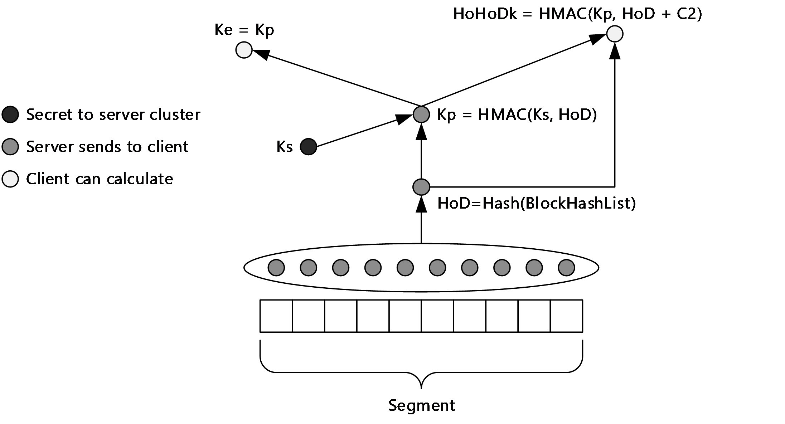

Figure 9: Content security

The following typical sequence of events describes the security of data during transportation and at rest (in the client cache or hosted cache):

- A content client requests data from a [**content server**](#gt_content-server), and by requesting [**metadata**](#gt_metadata), for which there are different mechanisms for SMB 2.1, 3.x, and HTTP, indicates that it supports content caching.
- The content server authenticates and authorizes the client in exactly the same way it would if caching were not being used. That is, authentication and authorization of a client to access data are independent of content caching.
- The content server recognizes that the content client can use content caching and checks to make sure that the stored metadata is up-to-date with the content.
- The content server then sends the metadata on the same channel that data normally would have been sent. If a secure SSL/TLS connection has been established between the client and the server, then the [**hashes**](#gt_hash) are sent back over this encrypted connection.
- The content client that is requesting content obtains the metadata and uses it to discover local availability.
- The content client establishes a connection with the caching computer (a hosted cache server when hosted cache mode is used, or a peer caching computer when [**distributed cache**](#gt_distributed-cache) mode is used) and requests the [**blocks**](#gt_block) that it requires.
- The caching computer encrypts the blocks with an encryption key that is derived from the content metadata that uses AES 128 by default and sends it to the content client. For more details about the encryption process for AES 128, see [[FIPS197]](https://go.microsoft.com/fwlink/?LinkId=89870).
- The content client decrypts the data by using the same encryption key as the caching computer. The content client and the caching computer compute the same encryption key because they derive it from the same content metadata, which is sent by the content server.
- After the content client decrypts the data, it validates the data. To validate, the content client computes the block hashes on the blocks received, and then compares them to the block hashes received in the content metadata from the server. If the hashes do not match, the content client discards the data.
The data in the cache is accessible. The data is stored unencrypted in the distributed cache and the hosted cache, which is similar to other caches and data on the system.

### 2.9.1 Client-Side Content Security

In the figure that shows content security in the preceding section, Ke represents an encryption key that is derived from the segment secret (Kp). A sending [**peer**](#gt_peer) encrypts data with Ke, but Ke is never disclosed between peers. The receiving client has to already have obtained enough information to compute the value of Ke from a [**content server**](#gt_content-server) to decrypt the peer-supplied data. Ke = Kp.

### 2.9.2 Server-Side Content Security

The [**hash**](#gt_hash) algorithm that is used is the SHA-256 hash as described in [[FIPS180-2]](https://go.microsoft.com/fwlink/?LinkId=89868). For more details, see [MS-PCCRC](../MS-PCCRC/MS-PCCRC.md) section 2.2. The [**HMAC**](#gt_hash-based-message-authentication-code-hmac) function is described in [[RFC2104]](https://go.microsoft.com/fwlink/?LinkId=90314).

### 2.9.3 Use of Cryptography

Cryptographic algorithms that are used in the Content Caching and Retrieval protocols are AES-128 and SHA256 ([[FIPS197]](https://go.microsoft.com/fwlink/?LinkId=89870) and [[FIPS180-2]](https://go.microsoft.com/fwlink/?LinkId=89868)).

## 2.10 Additional Considerations

The Content Caching and Retrieval protocols support the SMB 2.1, 3.x, and HTTP 1.1 protocols. Applications do not have to directly communicate with the system, although they can do so if necessary.<17> However, applications that access SMB 2.1, 3.x, and HTTP interfaces in both the Windows 7 operating system and the Windows Server 2008 R2 operating system transparently benefit from Content Caching and Retrieval when it is enabled.

During content retrieval, if the content is made up of multiple [**segments**](#gt_segment), the content client must manage that retrieval and concatenate [**blocks**](#gt_block) into segments to reconstruct the original content. The unit of retrieval is the block.

# 3 Examples

The following examples describe two different methods of metadata retrieval and file retrieval, along with the cases of content that are available and unavailable.

## 3.1 Example 1: Reading a File Using SMB 2.1or 3.x as Metadata Channel in Distributed Cache Mode (Cached Content Available)

This example includes the following use cases: Configuring SMB 2.1 or 3.x Content Server Caching (section [2.5.4.1.1](#Section_2.5.4.1.1.1)), Configuring Content Client Caching Mode (section [2.5.4.1.3](#Section_2.5.4.1.3.1)), Using SMB 2.1 or 3.x Metadata Retrieval (section [2.5.4.3.1](#Section_2.5.4.3.1.2)), and Content Discovery and Retrieval (section [2.5.4.4.4](#Section_2.5.4.4.4)).

The SMB 2.1 or 3.x protocol plays two distinct roles. The first role is to act as a member of the File Access system by providing the usual file-sharing resources between machines. The second role is to act as a transport for metadata from a content server to a content client, which enables the content client to participate in Content Caching and Retrieval.

The initial stages of the read operation from an SMB 2.1 or 3.x protocol operation perspective are the same, regardless of the caching mode (hosted cache, distributed cache, or none). After hashes have been identified as available (SMB 2.1 or 3.x is required for this), the retrieval mechanism varies depending on the mode of caching in effect. The caching mode is configurable, either manually or through the use of Group Policy. The following description contains an SMB 2.1 or 3.x stage and then a specific stage for distributed cache mode.

In the basic scenario, two peers, a content client (Peer1) and a peer role server (Peer2) within a LAN obtain content by reading, in turn, a file from a content server that is reached over a network link with a latency value greater than the value of the ADM element Network Latency. When the first peer (peer role server) reads the file, no cached content is available within the LAN, and therefore the file has to be retrieved by using an SMB 2.1 or 3.x read operation, as described in [MS-FASOD] and [MS-SMB2](../MS-SMB2/MS-SMB2.md). The Content Caching and Retrieval protocols do not change the requirements for authentication and access.

After at least 32 MB (1 MB equals one whole segment) of content has been retrieved for the first time and is available on the LAN, the content can potentially be cached and made available to other peers on the LAN.

**Initial System State and Prerequisites**

- Content Caching and Retrieval is enabled on the content server as described in the Configuring SMB 2.1 or 3.x Content Server Caching (section 2.5.4.1.1) use case.
- The mode of the content caching as distributed cache is configured on the content client (Peer1) and peer role server (Peer2) as described in the Configuring Content Client Caching Mode (section 2.5.4.1.3) use case.
- The requested content is not available on the local cache of the content client (Peer1).
- The cached content is available on the peer role server (Peer2) for the requested content of the content client (Peer1).
**Message Sequence**

This example begins with the normal sequence of events that would occur when a file is read by using the SMB 2.1 or 3.x protocol. For the specification for the SMB 2.1 or 3.x protocol, see [MS-SMB2], and for a description of that protocol's interaction with other protocols, see [MS-FASOD]. For details about opening a file by using SMB 2.1 or 3.x, see [MS-FASOD] and [MS-SMB2].

The initial sequence of a file read is an open operation that is followed by a **SESSION_SETUP** and **TREE_CONNECT**. An SMB 2.1 or 3.x **TREE_CONNECT** operation is required to access any share on an SMB 2.1 or 3.x server. The activities up to this point are independent of Content Caching and Retrieval; therefore, they are not described in this example.

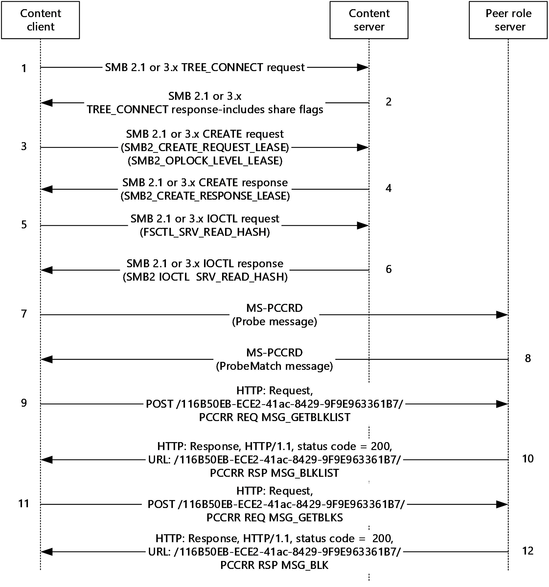

Figure 10: SMB 2.1 or 3.x read file stages and distributed mode discovery and retrieval

- The content client (Peer1) sends an SMB 2.1 or 3.x **TREE_CONNECT** request to access the requested share on the content server.
- The content server responds with an SMB 2.1 or 3.x **TREE_CONNECT** response with the **ShareFlags** field set to SHI1005_FLAGS_ENABLE_HASH 0x00002000, as described in [MS-SMB2] section 2.2.10. This **ShareFlags** field value indicates that the share supports hash generation for content cache retrieval of data, that caching is enabled on the server share, and that the server can respond to requests for metadata if to the service being installed and configured. The flag informs the content client that it can make requests for metadata but does not guarantee that the metadata will be available.
- The content client attempts to obtain a lease that allows it to cache the content of read and write operations (see [MS-SMB2] section 3.2.4.3.8). The lease is requested as part of the **CREATE** operation by sending an **SMB2_CREATE_REQUEST_LEASE** request with a **RequestedOplockLevel** field value of SMB2_OPLOCK_LEVEL_LEASE.
- The server replies with a SMB 2.1 or 3.x **CREATE** response with a **LeaseState** field that has the requested SMB2_CREATE_RESPONSE_LEASE value, and a lease is obtained as part of the SMB 2.1 or 3.x **CREATE** request.
- The SMB 2.1 or 3.x content client performs a **SRV_READ_HASH** request (see [MS-SMB2] section 2.2.31.2) on the file with the **CtlCode** field set to FSCTL_SRV_READ_HASH to obtain the hash (metadata) for the target file.
- The content server sends an **SMB2 IOCTL** response with a **SRV_READ_HASH** response. If the hash is out-of-date, an error is returned to the client; if no hash exists for the specified file, an error is returned to the client.<18> A server can choose to update the hash for either of these situations. This example covers the case where no error is returned.
- After successfully obtaining a file hash, the client calculates the [**segment identifiers (HoHoDk)**](#gt_5cb5fb6e-1fa5-4b2e-939d-aa1295f3fbc9) (see [MS-PCCRC](../MS-PCCRC/MS-PCCRC.md) section 2.2) for the required content. The content client performs a multicast broadcast **Probe** message (see [MS-PCCRD](../MS-PCCRD/MS-PCCRD.md) section 2.2.1) for the required content. The broadcast is targeted at any peers that listen on the local subnet.
- Peers that have the required content respond with a unicast **ProbeMatch** message, as described in [MS-PCCRD] section 2.2.2.2. In this example, because the peer role server (Peer2) has the required content, it responds with **ProbeMatch** message. The **ProbeMatch** message includes segment identifiers and the address of the peer that holds the content. The content client (Peer1) verifies that the response was sent by a peer on the local subnet and checks the HoHoDk segment identifiers to verify that at least one is associated with a **Probe** message on the **Outstanding Probe List**, as described in [MS-PCCRD].
- If the content client (Peer1) performs a [**simple download**](#gt_simple-download), it proceeds directly to step 11. Otherwise, it retrieves data by initiating the transport with the peer by sending an HTTP POST request to the root path of {/116B50EB-ECE2-41ac-8429-9F9E963361B7/} of the peer with the data, as described in [MS-PCCRR](../MS-PCCRR/MS-PCCRR.md). The initial HTTP POST request carries a REQUEST-MESSAGE (**MSG_GETBLKLIST**), as described in [MS-PCCRR] section 2.2.4.2, that is carried as an entity body of the HTTP POST request. This is a request for a download of a block list.
- The peer responds with an HTTP status code of 200 (OK) for the URL /116B50EB-ECE2-41ac-8429-9F9E963361B7/ as described in [MS-PCCRR]). The response carries a RESPONSE-MESSAGE (**MSG_BLKLIST**), as described in [MS-PCCRR] section 2.2.5.2, that indicates the blocks that are currently available for download from the peer.
- The content client then sends a number of REQUEST-MESSAGE (**MSG_GETBLKS**) as described in [MS-PCCRR] section 2.2.4.3, to the peer role server (Peer2) to retrieve all the required data, as described in [MS-PCCRR].
- The peer role server (Peer2) responds with RESPONSE-MESSAGE(**MSG_BLK**) as described in [MS-PCCRR] section 2.2.5.3. Steps 11 and 12 are repeated until all the required blocks within the identified segment have been retrieved. If multiple segments are required, multiple segment-retrieval sessions can be initiated (steps 9-12) with one or more peer role servers.
**Final System State**

- The content client (Peer1) has acquired the required content.
- The local cache of the content client (Peer1) has been updated with the required content.

## 3.2 Example 2: Reading a File Using HTTP as the Metadata Channel in Hosted Cache Mode

This example includes the following use cases: Configure HTTP Content Server Caching (section [2.5.4.1.2](#Section_2.5.4.1.2)), Configure a Hosted Cache Server (section [2.5.4.1.4](#Section_2.5.4.1.4)), Configure Content Client Caching Mode (section [2.5.4.1.3](#Section_2.5.4.1.3.1)), HTTP Metadata Retrieval (section [2.5.4.3.2](#Section_2.5.4.3.2.2)), Content Discovery and Retrieval (cached data unavailable) (section [2.5.4.4.1](#Section_2.5.4.4.1.3)), and Content Discovery and Retrieval with Hosted Cache (Cached Data Available) (section [2.5.4.4.2](#Section_2.5.4.4.2)).

In this example, the HTTP protocol plays two distinct roles. The first role is to act in the usual manner as a file retrieval protocol. The second role is through the use of PeerDist, as described in [MS-PCCRTP](../MS-PCCRTP/MS-PCCRTP.md), to act as a transport for metadata from a content server to a content client, which allows the content client to participate in the initial stages of Content Caching and Retrieval.

The message sequence steps for this example are organized into the following sections:

**Peer1:**

A. Metadata retrieval over HTTP.

B. Content discovery in hosted cache mode (content unavailable).

C. Return trip to the content server for content download.

D. Content client offers the content to the hosted cache server.

E. Hosted cache server downloads the content from the content client.

**Peer2:**

F. Metadata retrieval over HTTP.

G. Content discovery and download from the hosted cache server (content available).

As shown in the preceding list, Peer1 is the content client for messages of sections A, B, C, D, and E, whereas Peer2 is the content client for messages of sections F and G.

**Initial System State and Prerequisites**

- The Content Caching and Retrieval is enabled on the content server as described in the Configure HTTP Content Server caching (section 2.5.4.1.2) use case.
- The hosted cache server is configured with the required X.509 certificate to enable the server authentication with secure SSL/TLS.
- The mode of content caching as "hosted cache" is configured on the server as described in the Configuring a Hosted Cache Server (section 2.5.4.1.4) use case.
- The content to be requested is not available on the hosted cache server but is available on the content server.
- The hosted cache server is configured to require client authentication.
- The mode of content caching as "hosted client" is configured on the content clients (for example, Peer1 and Peer 2), as described in the Configure Content Client Caching Mode (section 2.5.4.1.3) use case.
- The content clients (for example, Peer1 and Peer2) are configured with the [**FQDN**](#gt_fully-qualified-domain-name-fqdn) of the hosted cache server.
- On both content clients (Peer1 and Peer2), the use of Internet Explorer initiates the content transfer.
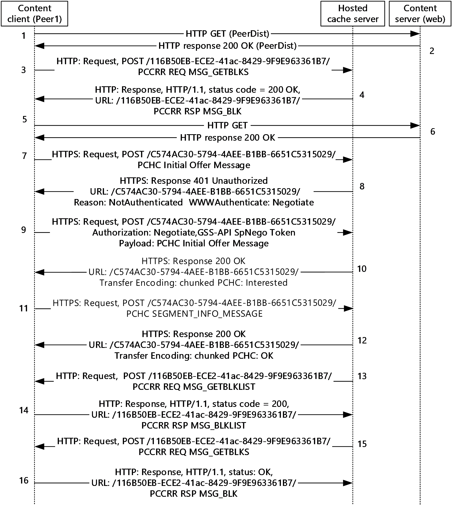

Figure 11: Content retrieval and offering (Peer1)

**A. HTTP metadata retrieval**

- The content client (Peer1) sends an HTTP GET request to the content server. The content client indicates in the HTTP request header that it is PeerDist-enabled by listing PeerDist as an accepted encoding. It also declares the version of PeerDist encoding, for example, X-P2P-PeerDist: Version=1.0, as described in [MS-PCCRTP] section 3.1.4.
- In the HTTP 200 (OK) response, the content server indicates that the content is encoded by using the PeerDist content encoding. It also includes the content length and indicates the length of the metadata. The metadata is constructed as described in [MS-PCCRTP] section 3.2.5.1.
**B. Content discovery in hosted cache mode (content unavailable)**

- The content client (Peer1) initiates the transport with the hosted cache server by sending an HTTP POST request to the root path of {/116B50EB-ECE2-41ac-8429-9F9E963361B7/} of the server. That request also carries a REQUEST-MESSAGE (**MSG_GETBLKS**) message, as described in [MS-PCCRR](../MS-PCCRR/MS-PCCRR.md) section 2.2.4.3, that is carried as an entity body of the HTTP POST request to the hosted cache server and requests content of block index Zero within the target segment that the content client is querying.
- The hosted cache server responds with an HTTP status code of 200 (OK) for the URL /116B50EB-ECE2-41ac-8429-9F9E963361B7/ and RESPONSE-MESSAGE (**MSG_BLK**), as described in [MS-PCCRR] section 2.2.5.3, which indicates that content is not available for download from the hosted cache server.
**C. Return trip to the content server for content download**

The content client (Peer1) downloads the requested content from the content server by using HTTP protocol.

- The content client (Peer1) sends an HTTP GET request to the content server to download the content.
- The content server responds with an HTTP status code of 200 (OK) and also the requested content.
**D. Content client offers the content to the hosted cache server**

The initial SSL handshake is not discussed; only the traffic that is pertinent to Content Caching and Retrieval is shown. The URL on which the hosted cache server listens is normally https://:<port number>/C574AC30-5794-4AEE-B1BB-6651C5315029/. The port number is configurable but would normally be 443 for [**HTTPS**](#gt_hypertext-transfer-protocol-secure-https). If the hosted cache server is configured to something other than port 443, content clients also have to be configured to use that port.

- The content client (Peer1) sends a request message as the payload of an HTTP POST request to the hosted cache server. The message is a PCHC initial offer of content to the hosted cache; see message 7 (as described in [MS-PCHC](../MS-PCHC/MS-PCHC.md) section 2.2.1.3) in the figure in this section.
- The hosted cache server responds with an HTTP 401 (Unauthorized) message. The HTTP response is as follows.
Http: Response, HTTP/1.1, Status: Unauthorized, URL: /C574AC30-5794-4AEE-B1BB-6651C5315029/, Using Negotiate

Date: Authentication

ProtocolVersion: HTTP/1.1

StatusCode: 401, Unauthorized

Reason: NotAuthenticated

+ ContentType: text/html

Server: Microsoft-HTTPAPI/2.0

- WWWAuthenticate: Negotiate

The content client (Peer1) and hosted cache server use the mechanisms as described in [[RFC4559]](https://go.microsoft.com/fwlink/?LinkId=90483), which are based on GSS-API [[RFC2743]](https://go.microsoft.com/fwlink/?LinkId=90378). The exact number of packets that are exchanged during client authentication depends on the authentication mechanism<19> and whether the authentication is successful. In any case, if authentication fails for any reason, the content client (Peer1) cannot offer content to the hosted cache server. In this example, a successful case of client authentication with Kerberos [MS-KILE](../MS-KILE/MS-KILE.md) as the authentication mechanism is covered.

- The content client (Peer1), on receipt of the HTTP 401 (Unauthorized) response, is expected to repeat the previous POST message that passes an HTTP Authorization header line. In this example, the content client passes the GSS-API SPNEGO token that contains the Kerberos token as the optimistic token in the Authorization header. For information on SPNEGO see [MS-SPNG](../MS-SPNG/MS-SPNG.md) and [MS-NEGOEX](#Section_2.9).
- The hosted cache server verifies the Authorization header, which is received in the previous step, and authenticates the content client (Peer1). After authentication, message processing proceeds as the PCHC initial offer of content is made to the hosted cache server, which then responds with a response code of 1 (see [MS-PCHC] section 2.2.2.2) that indicates that it will accept block hashes.
- The content client responds by sending a **SEGMENT_INFO_MESSAGE** message as described in [MS-PCHC] section 2.2.1.4. This message contains the [**segment hash of data (HoD)**](#gt_segment-hash-of-data-hod) for the previously offered segment and the range of block hashes in the segment.
- After the hosted cache server obtains the **SEGMENT_INFO_MESSAGE** message, it responds with an HTTP 200 (OK) response.
**E. Hosted cache server downloads the content from content client**

- The hosted cache server initiates the transport with the content client (Peer1) by sending an HTTP POST request to the root path of {/116B50EB-ECE2-41ac-8429-9F9E963361B7/} of the server. That request also carries a REQUEST-MESSAGE (**MSG_GETBLKLIST**), as described in [MS-PCCRR] section 2.2.4.2, that is carried as an entity body of the HTTP POST request to the content client requesting the block IDs of the blocks within the target segment that the hosted cache server is querying.
- The content client (Peer1) responds with an HTTP status code of 200 (OK) for the URL /116B50EB-ECE2-41ac-8429-9F9E963361B7/ and a RESPONSE-MESSAGE (**MSG_BLKLIST**), as described in [MS-PCCRR] section 2.2.5.2, that indicates the blocks that are currently available for download from the content client (Peer1).
- The hosted cache server sends a REQUEST-MESSAGE (**MSG_GETBLKS**), as described in [MS-PCCRR] section 2.2.4.3, to the content client (Peer1).
- The content client (Peer1) responds with RESPONSE-MESSAGE (**MSG_BLK**) as described in [MS-PCCRR] section 2.2.5.3.
Steps 13 and 14 followed by 15 and 16 are repeated until the required content is transferred.

**Peer2**:

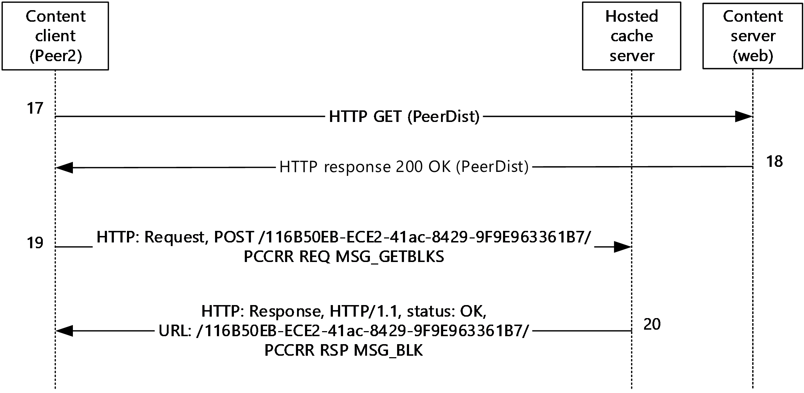

Figure 12: Content Retrieval (Peer2)

**F. Metadata retrieval over HTTP**

- The content client (Peer2) sends an HTTP GET request to the content server. The content client indicates in the HTTP request header that it is PeerDist-enabled by listing PeerDist as an accepted encoding, as described in [MS-PCCRTP] section 3.1.4.
- In the HTTP 200 (OK) response, the content server indicates that the content is encoded by using the PeerDist content encoding. It also includes the content length and indicates the length of the metadata. The metadata is constructed as described in [MS-PCCRTP] section 3.2.5.1.
**G. Content discovery and download from hosted cache mode (content available)**

- The content client (Peer2) initiates the transport with the hosted cache server by sending an HTTP POST request to the root path of {/116B50EB-ECE2-41ac-8429-9F9E963361B7/} of the server. That request also carries a REQUEST-MESSAGE (**MSG_GETBLKS**), as described in [MS-PCCRR] section 2.2.4.3, that is carried as an entity body of the HTTP POST request to the hosted cache server requesting content for a specific block (starting from index 0) within the target segment that the content client is querying.
- The hosted cache server responds with an HTTP status code of 200 (OK) for the URL /116B50EB-ECE2-41ac-8429-9F9E963361B7/ and a RESPONSE-MESSAGE (**MSG_BLK**) as described in [MS-PCCRR] section 2.2.5.3, with the content of the requested block index.
Steps 19 and 20 are repeated until the required content is transferred.

**Final System State**

- Content clients (for example, Peer1 and Peer2) retrieved the requested content.
- The cached content is available on the hosted cache server.

# 4 Microsoft Implementations

The information in this specification is applicable to the following Microsoft products:

- Windows Vista operating system
- Windows Server 2008 operating system
- Windows 7 operating system
- Windows Server 2008 R2 operating system
- Windows 8 operating system
- Windows Server 2012 operating system
- Windows 8.1 operating system
- Windows Server 2012 R2 operating system
- Windows 10 operating system
- Windows Server 2016 operating system
- Windows Server operating system
- Windows Server 2019 operating system
- Windows Server 2022 operating system
- Windows 11 operating system
- Windows Server 2025 operating system
Exceptions, if any, are noted in the following section.

## 4.1 Product Behavior

<1> Section 2.1: Windows Server 2008 R2 is the first server to support the server feature [**BranchCache**](#gt_branchcache) retrieval - Hosted Cache Mode. The Hyper-V Core and Home Server SKUs are not branch cache-capable. All other Windows Server 2008 R2 SKUs can act as branch cache clients and/or content servers.

<2> Section 2.1: Windows Server 2008 R2 and Windows 7 support the client feature BranchCache retrieval - Hosted Cache Mode and Distributed Mode. BranchCache retrieval is available with Windows 7 Enterprise and Windows 7 Ultimate.

<3> Section 2.1.1.2: In Windows Vista and Windows Server 2008, support for the client-side elements of Content Caching and Retrieval is available only with the optional installation of the Background Intelligent Transfer Service (BITS) (see [MC-BUP](../MC-BUP/MC-BUP.md)) via the Windows Management Framework (WMF). Support for the server-side elements of this protocol is not available for Windows Server 2008. When the Windows Management Framework is installed, the BITS service use of [MS-BPDP](../MS-BPDP/MS-BPDP.md) is replaced by [MS-PCCRD](../MS-PCCRD/MS-PCCRD.md) for discovery, and [MS-BPCR](../MS-BPCR/MS-BPCR.md) is replaced by [MS-PCCRR](../MS-PCCRR/MS-PCCRR.md) for content retrieval. For more information, see [[MSDN-BITS]](https://go.microsoft.com/fwlink/?LinkId=89959).

<4> Section 2.1.2: The use of HTTP for this content offering is not supported in Windows Vista, Windows Server 2008, Windows 7, and Windows Server 2008 R2.

<5> Section 2.2: HTTP is not supported in Windows Vista, Windows Server 2008, Windows 7, and Windows Server 2008 R2.

<6> Section 2.2: HTTP is not supported in Windows Vista, Windows Server 2008, Windows 7, and Windows Server 2008 R2.

<7> Section 2.5.1: In Windows, the Object Store is provided by a local file system, usually NTFS.

<8> Section 2.6: Version 2.0 is not supported in Windows Vista, Windows Server 2008, Windows 7, and Windows Server 2008 R2.

<9> Section 2.6: SMB Version 2.1 offers functionality that is relevant to the Peer for Content Caching and Retrieval. Content Caching was first introduced in the Windows 7 platform and can be made available on Windows Vista and Windows Server 2008 systems by the addition of a Windows Management Framework. This makes Peer Content Caching and Retrieval available only to BITS clients.

<10> Section 2.8.1.2.2: In Windows, the time-out value is set by the higher-layer applications. The recommended value is 5 seconds for each segment retrieval session. The range of permitted timeout values is from 0 to 4,294,967,294 milliseconds.

<11> Section 2.8.1.2.2: Windows uses a 15-second lifetime for an entry in the discovery cache with no associated address.

<12> Section 2.8.1.2.2: Windows uses 1 minute as the lifetime for each address that is added to a discovery cache entry.

<13> Section 2.8.2.5.1: Windows uses 16 as the default maximum number of peers that are used per download. The number is configurable from 1 to 16,384, inclusive.

<14> Section 2.8.2.5.1: Windows carries out a [**simple download**](#gt_simple-download) each time a download involves less than four consecutive blocks in a single block range, which implies that the blocks are also adjacent (consecutive) in the segment.

<15> Section 2.8.2.5.6: Windows uses a 2-second timeout for each request message. The timeout is configurable between 1 millisecond and 1 minute.

<16> Section 2.8.2.5.6: Windows client-role peer allows a serving-role peer to time out up to a configurable three times, before excluding the peer from the current download. This value is configurable from 1 to 100, inclusive.

<17> Section 2.10: In Windows 7 and Windows Server 2008 R2, there are two ways for an application to use branch cache retrieval: directly by calling the branch cache platform APIs, or indirectly by calling WinINET/WinHTTP or SMBv2 APIs, which are instrumented to use branch cache, but are transparent to the applications. For more information on WinINET/WinHTTP see [[MSDOCS-WinINet]](https://go.microsoft.com/fwlink/?LinkId=324863).

<18> Section 3.1: Windows 7 clients offer MS KRB 5, KRB5 SNMPV2, and NTLMSSP if they are configured with the fully qualified domain name (FQDN) of the hosted cache server. If a NetBIOS address or IP address is given for the hosted cache server, then only NTLMSSP is offered.

<19> Section 3.2: Windows 7 clients offer MS KRB 5, KRB5 SNMPV2, and NTLMSSP if they are configured with the fully qualified domain name (FQDN) of the hosted cache server. If a NetBIOS address or IP address is given for the hosted cache server, then only NTLMSSP is offered.

# 5 Change Tracking

This section identifies changes that were made to this document since the last release. Changes are classified as Major, Minor, or None.

The revision class **Major** means that the technical content in the document was significantly revised. Major changes affect protocol interoperability or implementation. Examples of major changes are:

- A document revision that incorporates changes to interoperability requirements.
- A document revision that captures changes to protocol functionality.
The revision class **Minor** means that the meaning of the technical content was clarified. Minor changes do not affect protocol interoperability or implementation. Examples of minor changes are updates to clarify ambiguity at the sentence, paragraph, or table level.

The revision class **None** means that no new technical changes were introduced. Minor editorial and formatting changes may have been made, but the relevant technical content is identical to the last released version.

The changes made to this document are listed in the following table. For more information, please contact [dochelp@microsoft.com](mailto:dochelp@microsoft.com).

| Section | Description | Revision class |
| --- | --- | --- |
| [4](#Section_4) Microsoft Implementations | Added Windows Server 2025 to the list of applicable products. | Major |

## Revision History

| Date | Version | Revision Class | Comments |
| --- | --- | --- | --- |
| 9/23/2011 | 1.0 | New | Released new document. |
| 12/16/2011 | 1.0 | None | No changes to the meaning, language, or formatting of the technical content. |
| 3/30/2012 | 2.0 | Major | Updated and revised the technical content. |
| 7/12/2012 | 2.0 | None | No changes to the meaning, language, or formatting of the technical content. |
| 10/25/2012 | 2.1 | Minor | Clarified the meaning of the technical content. |
| 1/31/2013 | 2.1 | None | No changes to the meaning, language, or formatting of the technical content. |
| 8/8/2013 | 3.0 | Major | Updated and revised the technical content. |
| 11/14/2013 | 3.0 | None | No changes to the meaning, language, or formatting of the technical content. |
| 2/13/2014 | 3.0 | None | No changes to the meaning, language, or formatting of the technical content. |
| 5/15/2014 | 3.0 | None | No changes to the meaning, language, or formatting of the technical content. |
| 6/30/2015 | 4.0 | Major | Significantly changed the technical content. |
| 10/16/2015 | 4.0 | None | No changes to the meaning, language, or formatting of the technical content. |
| 9/26/2016 | 4.0 | None | No changes to the meaning, language, or formatting of the technical content. |
| 6/1/2017 | 4.0 | None | No changes to the meaning, language, or formatting of the technical content. |
| 12/15/2017 | 5.0 | Major | Significantly changed the technical content. |
| 6/29/2018 | 5.0 | None | No changes to the meaning, language, or formatting of the technical content. |
| 11/5/2018 | 6.0 | Major | Significantly changed the technical content. |
| 6/3/2021 | 7.0 | Major | Significantly changed the technical content. |
| 10/26/2021 | 8.0 | Major | Significantly changed the technical content. |
| 4/23/2024 | 9.0 | Major | Significantly changed the technical content. |
