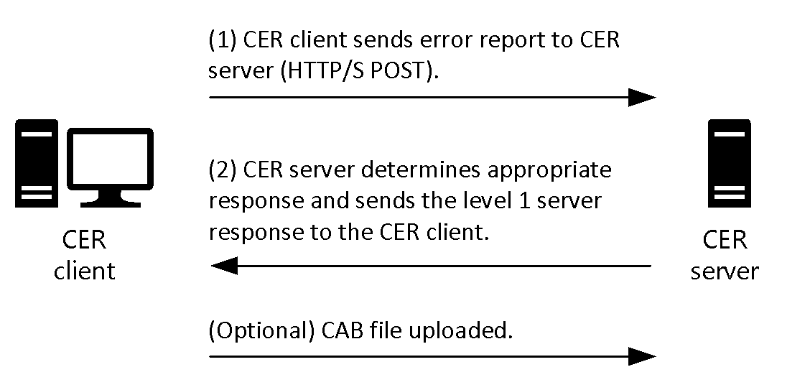
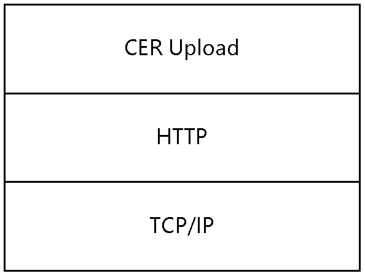
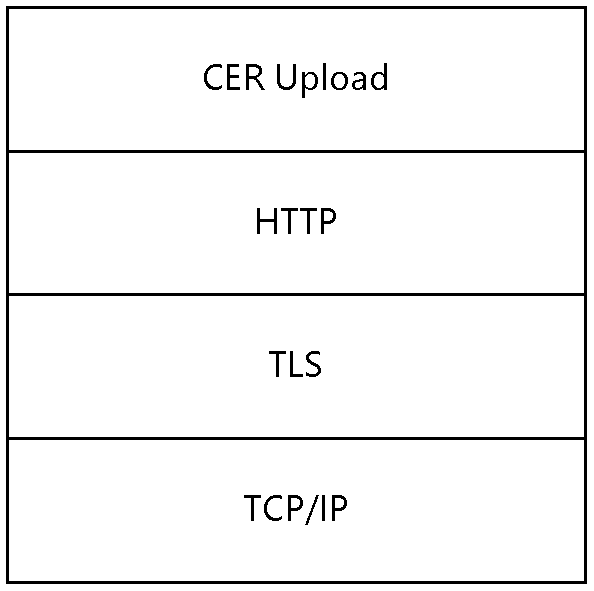

# [MS-CER2]: Corporate Error Reporting V.2 Protocol

Table of Contents

1 Introduction

- [1 Introduction](#Section_1)
  - [1.1 Glossary](#Section_1.1)
  - [1.2 References](#Section_1.2)
    - [1.2.1 Normative References](#Section_1.2.1)
    - [1.2.2 Informative References](#Section_1.2.2)
  - [1.3 Overview](#Section_1.3)
  - [1.4 Relationship to Other Protocols](#Section_1.4)
  - [1.5 Prerequisites/Preconditions](#Section_1.5)
  - [1.6 Applicability Statement](#Section_1.6)
  - [1.7 Versioning and Capability Negotiation](#Section_1.7)
  - [1.8 Vendor-Extensible Fields](#Section_1.8)
  - [1.9 Standards Assignments](#Section_1.9)

2 Messages

- [2 Messages](#Section_2)
  - [2.1 Transport](#Section_2.1)
  - [2.2 Message Syntax](#Section_2.2)
    - [2.2.1 Error Report Level 1 Data](#Section_2.2.1)
      - [2.2.1.1 Namespaces](#Section_2.2.1.1)
      - [2.2.1.2 Simple Types](#Section_2.2.1.2)
        - [2.2.1.2.1 maxpathstring](#Section_2.2.1.2.1)
        - [2.2.1.2.2 osstring](#Section_2.2.1.2.2)
        - [2.2.1.2.3 lcidvalue](#Section_2.2.1.2.3)
        - [2.2.1.2.4 reporttypevalues](#Section_2.2.1.2.4)
        - [2.2.1.2.5 filetypevalues](#Section_2.2.1.2.5)
        - [2.2.1.2.6 string32](#Section_2.2.1.2.6)
        - [2.2.1.2.7 parameterid](#Section_2.2.1.2.7)
      - [2.2.1.3 Element Types](#Section_2.2.1.3)
        - [2.2.1.3.1 WERREPORT](#Section_2.2.1.3.1)
        - [2.2.1.3.2 USERINFO](#Section_2.2.1.3.2)
        - [2.2.1.3.3 MACHINEINFO](#Section_2.2.1.3.3)
        - [2.2.1.3.4 APPLICATIONINFO](#Section_2.2.1.3.4)
        - [2.2.1.3.5 EVENTINFO](#Section_2.2.1.3.5)
        - [2.2.1.3.6 SIGNATURE](#Section_2.2.1.3.6)
          - [2.2.1.3.6.1 PARAMETER](#Section_2.2.1.3.6.1)
          - [2.2.1.3.6.2 SECONDARYPARAMETER](#Section_2.2.1.3.6.2)
        - [2.2.1.3.7 FILES](#Section_2.2.1.3.7)
          - [2.2.1.3.7.1 FILE](#Section_2.2.1.3.7.1)
    - [2.2.2 Level 1 Server Response](#Section_2.2.2)
    - [2.2.3 Error Report Level 2 Data](#Section_2.2.3)

3 Protocol Details

- [3 Protocol Details](#Section_3)
  - [3.1 Client Details](#Section_3.1)
    - [3.1.1 Abstract Data Model](#Section_3.1.1)
    - [3.1.2 Timers](#Section_3.1.2)
    - [3.1.3 Initialization](#Section_3.1.3)
    - [3.1.4 Higher-Layer Triggered Events](#Section_3.1.4)
    - [3.1.5 Message Processing Events and Sequencing Rules](#Section_3.1.5)
    - [3.1.6 Timer Events](#Section_3.1.6)
    - [3.1.7 Other Local Events](#Section_3.1.7)
  - [3.2 Server Details](#Section_3.2)
    - [3.2.1 Abstract Data Model](#Section_3.2.1)
    - [3.2.2 Timers](#Section_3.2.2)
    - [3.2.3 Initialization](#Section_3.2.3)
    - [3.2.4 Higher-Layer Triggered Events](#Section_3.2.4)
    - [3.2.5 Message Processing Events and Sequencing Rules](#Section_3.2.5)
    - [3.2.6 Timer Events](#Section_3.2.6)
    - [3.2.7 Other Local Events](#Section_3.2.7)

4 Protocol Examples

- [4 Protocol Examples](#Section_4)
  - [4.1 Application Fault Example with Request for Error Report Level 2 Data (Level 2 of the Protocol Is Executed)](#Section_4.1)
  - [4.2 Application Fault Example without Request for Error Report Level 2 Data (Level 2 of the Protocol Is Not Executed)](#Section_4.2)
  - [4.3 Kernel Fault Example with Request for Error Report Level 2 Data (Level 2 of the Protocol Is Executed)](#Section_4.3)
  - [4.4 Generic Error Reporting Example with Request for Error Report Level 2 Data (Level 2 of the Protocol Is Executed)](#Section_4.4)

5 Security

- [5 Security](#Section_5)
  - [5.1 Security Considerations for Implementers](#Section_5.1)
  - [5.2 Index of Security Parameters](#Section_5.2)

6 Appendix A: Product Behavior

- [6 Appendix A: Product Behavior](#Section_6)

7 Change Tracking

- [7 Change Tracking](#Section_7)

For the legal notice and IP terms, see [LEGAL.md](../LEGAL.md).
Last updated: 4/23/2024.
See [Revision History](#revision-history) for full version history.

# 1 Introduction

The Corporate Error Reporting V.2 Protocol is designed to enable enterprise computing sites to manage all error reporting information within the organization. Through the use of this protocol, problem reports that are generated on a set of client machines can be directed to a local or remote server. This protocol is layered on top of the HTTP protocol.

Sections 1.5, 1.8, 1.9, 2, and 3 of this specification are normative. All other sections and examples in this specification are informative.

## 1.1 Glossary

This document uses the following terms:

**American National Standards Institute (ANSI) character set**: A character set defined by a code page approved by the American National Standards Institute (ANSI). The term "ANSI" as used to signify Windows code pages is a historical reference and a misnomer that persists in the Windows community. The source of this misnomer stems from the fact that the Windows code page 1252 was originally based on an ANSI draft, which became International Organization for Standardization (ISO) Standard 8859-1 [[ISO/IEC-8859-1]](https://go.microsoft.com/fwlink/?LinkId=90689). In Windows, the ANSI character set can be any of the following code pages: 1252, 1250, 1251, 1253, 1254, 1255, 1256, 1257, 1258, 874, 932, 936, 949, or 950. For example, "ANSI application" is usually a reference to a non-Unicode or code-page-based application. Therefore, "ANSI character set" is often misused to refer to one of the character sets defined by a Windows code page that can be used as an active system code page; for example, character sets defined by code page 1252 or character sets defined by code page 950. Windows is now based on Unicode, so the use of ANSI character sets is strongly discouraged unless they are used to interoperate with legacy applications or legacy data.

**Augmented Backus-Naur Form (ABNF)**: A modified version of Backus-Naur Form (BNF), commonly used by Internet specifications. ABNF notation balances compactness and simplicity with reasonable representational power. ABNF differs from standard BNF in its definitions and uses of naming rules, repetition, alternatives, order-independence, and value ranges. For more information, see [[RFC5234]](https://go.microsoft.com/fwlink/?LinkId=123096).

**bucket**: A positive integer value that represents a mapping for a specific error signature.

**BucketTableID**: A positive integer value that is used to further disambiguate particular [**error signatures**](#gt_error-signature), assigned by a hosted error reporting service.

**CER client**: A client configured to use the Corporate Error Reporting Version 1.0 Protocol or Corporate Error Reporting V2 Protocol.

**CER server**: A designated server application that acts as a recipient for the [**error report level 1 data**](#gt_error-report-level-1-data) and [**error report level 2 data**](#gt_error-report-level-2-data) that is created by the Corporate Error Reporting V.2 Protocol.

**Coordinated Universal Time (UTC)**: A high-precision atomic time standard that approximately tracks Universal Time (UT). It is the basis for legal, civil time all over the Earth. Time zones around the world are expressed as positive and negative offsets from UTC. In this role, it is also referred to as Zulu time (Z) and Greenwich Mean Time (GMT). In these specifications, all references to UTC refer to the time at UTC-0 (or GMT).

**destination server**: The host name (as specified in [[RFC1738]](https://go.microsoft.com/fwlink/?LinkId=90287) section 5) in the destination URL. This is the host where the [**CER server**](#gt_cer-server) is running.

**destination server port**: The port number where the upload happens.

**error report level 1 data**: The data that is transmitted to the [**CER server**](#gt_cer-server) that contains basic information about the problem.

**error report level 2 data**: The information that is contained in a set of files that describe a problem event that has occurred on the system. The report is typically compressed into a single file for transmission.

**error signature**: An ordered collection of strings that represents an individual error or class of errors.

**language code identifier (LCID)**: A 32-bit number that identifies the user interface human language dialect or variation that is supported by an application or a client computer.

**level 1 destination URL**: The location to which the [**error report level 1 data**](#gt_error-report-level-1-data) is uploaded. For more information about URLs, see [RFC1738].

**level 1 server response**: The response data from the [**CER server**](#gt_cer-server) after processing [**error report level 1 data**](#gt_error-report-level-1-data).

**level 2 destination URL**: The location to which [**error report level 2 data**](#gt_error-report-level-2-data) is uploaded. For more information about URLs, see [RFC1738].

**level 2 destination url-path**: The url-path excluding the host and port for the [**level 2 destination URL**](#gt_level-2-destination-url).

**OEM**: Original Equipment Manufacturer

**proxy**: A network node that accepts network traffic originating from one network agent and transmits it to another network agent.

**MAY, SHOULD, MUST, SHOULD NOT, MUST NOT:** These terms (in all caps) are used as defined in [[RFC2119]](https://go.microsoft.com/fwlink/?LinkId=90317). All statements of optional behavior use either MAY, SHOULD, or SHOULD NOT.

## 1.2 References

Links to a document in the Microsoft Open Specifications library point to the correct section in the most recently published version of the referenced document. However, because individual documents in the library are not updated at the same time, the section numbers in the documents may not match. You can confirm the correct section numbering by checking the [Errata](https://go.microsoft.com/fwlink/?linkid=850906).

### 1.2.1 Normative References

We conduct frequent surveys of the normative references to assure their continued availability. If you have any issue with finding a normative reference, please contact [dochelp@microsoft.com](mailto:dochelp@microsoft.com). We will assist you in finding the relevant information.

[MS-LCID] Microsoft Corporation, "[Windows Language Code Identifier (LCID) Reference](../MS-LCID/MS-LCID.md)".

[MS-NTHT] Microsoft Corporation, "[NTLM Over HTTP Protocol](../MS-NTHT/MS-NTHT.md)".

[RFC1510] Kohl, J., and Neuman, C., "The Kerberos Network Authentication Service (V5)", RFC 1510, September 1993, [https://www.rfc-editor.org/info/rfc1510](https://go.microsoft.com/fwlink/?LinkId=90279)

[RFC2119] Bradner, S., "Key words for use in RFCs to Indicate Requirement Levels", BCP 14, RFC 2119, March 1997, [https://www.rfc-editor.org/info/rfc2119](https://go.microsoft.com/fwlink/?LinkId=90317)

[RFC2616] Fielding, R., Gettys, J., Mogul, J., et al., "Hypertext Transfer Protocol -- HTTP/1.1", RFC 2616, June 1999, [https://www.rfc-editor.org/info/rfc2616](https://go.microsoft.com/fwlink/?LinkId=90372)

[RFC2818] Rescorla, E., "HTTP Over TLS", RFC 2818, May 2000, [https://www.rfc-editor.org/info/rfc2818](https://go.microsoft.com/fwlink/?LinkId=90383)

[RFC3986] Berners-Lee, T., Fielding, R., and Masinter, L., "Uniform Resource Identifier (URI): Generic Syntax", STD 66, RFC 3986, January 2005, [https://www.rfc-editor.org/info/rfc3986](https://go.microsoft.com/fwlink/?LinkId=90453)

[RFC4559] Jaganathan, K., Zhu, L., and Brezak, J., "SPNEGO-based Kerberos and NTLM HTTP Authentication in Microsoft Windows", RFC 4559, June 2006, [https://www.rfc-editor.org/info/rfc4559](https://go.microsoft.com/fwlink/?LinkId=90483)

[XMLNS] Bray, T., Hollander, D., Layman, A., et al., Eds., "Namespaces in XML 1.0 (Third Edition)", W3C Recommendation, December 2009, [https://www.w3.org/TR/2009/REC-xml-names-20091208/](https://go.microsoft.com/fwlink/?LinkId=191840)

[XMLSCHEMA1] Thompson, H., Beech, D., Maloney, M., and Mendelsohn, N., Eds., "XML Schema Part 1: Structures", W3C Recommendation, May 2001, [https://www.w3.org/TR/2001/REC-xmlschema-1-20010502/](https://go.microsoft.com/fwlink/?LinkId=90608)

[XMLSCHEMA2] Biron, P.V., Ed. and Malhotra, A., Ed., "XML Schema Part 2: Datatypes", W3C Recommendation, May 2001, [https://www.w3.org/TR/2001/REC-xmlschema-2-20010502/](https://go.microsoft.com/fwlink/?LinkId=90610)

### 1.2.2 Informative References

[MSDN-CAB] Microsoft Corporation, "Microsoft Cabinet Format", March 1997, [http://msdn.microsoft.com/en-us/library/bb417343.aspx](https://go.microsoft.com/fwlink/?LinkId=226293)

[MSDN-WER] Microsoft Corporation, "Windows Error Reporting", [http://msdn.microsoft.com/en-us/library/bb513641(VS.85).aspx](https://go.microsoft.com/fwlink/?LinkId=113072)

## 1.3 Overview

The Corporate Error Reporting V.2 Protocol provides an enterprise computing site with the ability to transfer error reports from a set of client machines to a [**CER server**](#gt_cer-server), and to get a response from the CER server for the error report.

An error event, such as an application or kernel fault, causes the client system to collect information for an error report. This protocol does not create the original contents of the error report.

The Corporate Error Reporting V.2 Protocol works in two levels or stages: level 1 and level 2. Level 1 of the protocol is always executed. In level 1, the client creates [**error report level 1 data**](#gt_error-report-level-1-data) and uploads it to the CER server by creating a [**level 1 destination URL**](#gt_level-1-destination-url) using HTTP POST. The CER server then parses the [**level 1 server response**](#gt_level-1-server-response), and based on the results of that process, can initiate level 2 of the protocol. In level 2 of the protocol, the client creates a cab file [[MSDN-CAB]](https://go.microsoft.com/fwlink/?LinkId=226293) and uploads it to the CER server by creating a [**level 2 destination URL**](#gt_level-2-destination-url) using HTTP PUT.

Figure 1: CER client and server interaction

## 1.4 Relationship to Other Protocols

This protocol is built on top of the HTTP 1.1 protocol [[RFC2616]](https://go.microsoft.com/fwlink/?LinkId=90372) and has direct dependency on it. Depending on the authentication mechanism needed to perform the upload to a URL, this protocol can have dependencies on authentication protocols.<1>

Figure 2: Protocol dependency over HTTP

Figure 3: Protocol dependency over HTTP and TLS

## 1.5 Prerequisites/Preconditions

The following prerequisites or preconditions apply to this protocol:

- The client system is able to create error reports.
- An implementation-specific file compression algorithm is required to organize the error reporting information into one file.
- The client is configured with the [**destination server**](#gt_destination-server) name.
- The client has network connectivity and is able to contact the destination server via HTTP.
- The [**CER server**](#gt_cer-server) application is running on the destination server, is properly configured, and can respond to the requests that come from the client.
- If the upload is performed over an HTTPS connection, certificates might need to be pre-deployed on the server, client, or both.
- If network authentication is used, the necessary underlying authentication mechanisms are present and enabled on the server, client, or both.

## 1.6 Applicability Statement

This protocol is not designed to be used by any other protocols. It is appropriate for small, medium, or large organizations that want to manage and review all error reporting information within the organization.

## 1.7 Versioning and Capability Negotiation

- Supported Transports: This protocol is implemented on top of HTTP 1.1 [[RFC2616]](https://go.microsoft.com/fwlink/?LinkId=90372).
- Security and Authentication Methods: This protocol relies on HTTPS [[RFC2818]](https://go.microsoft.com/fwlink/?LinkId=90383), NTLM [MS-NTHT](../MS-NTHT/MS-NTHT.md), and Kerberos [[RFC4559]](https://go.microsoft.com/fwlink/?LinkId=90483) network authentication.

## 1.8 Vendor-Extensible Fields

None.

## 1.9 Standards Assignments

None.

# 2 Messages

## 2.1 Transport

This protocol MUST use HTTP 1.1. The client or server can impose additional requirements on authentication and security as part of the transfer. When additional requirements are imposed, authentication information MUST be exchanged between the clients and server as required by HTTP and the relevant authentication and security protocols. The transport can require [**proxy**](#gt_proxy) resolution.

## 2.2 Message Syntax

### 2.2.1 Error Report Level 1 Data

This message is a Unicode XML document. The contents MUST be formatted by using the XML schema that is specified in the following sections. This message is sent from the [**CER client**](#gt_cer-client) to the [**CER server**](#gt_cer-server).

#### 2.2.1.1 Namespaces

This specification defines and references an XML namespace using the mechanisms specified in [[XMLNS]](https://go.microsoft.com/fwlink/?LinkId=191840). The namespace used throughout this specification is as follows:

| Prefix | Namespace URI | Reference |
| --- | --- | --- |
| xs | http://www.w3.org/2001/XMLSchema | [[XMLSCHEMA1]](https://go.microsoft.com/fwlink/?LinkId=90608) [[XMLSCHEMA2]](https://go.microsoft.com/fwlink/?LinkId=90610) |

#### 2.2.1.2 Simple Types

The following table summarizes the XML schema and set of simple type definitions that are defined by this specification.

| Simple type | Description |
| --- | --- |
| [maxpathstring](#Section_2.2.1.2.1) | A format for a filepath name. |
| [osstring](#Section_2.2.1.2.2) | A format for an operating system version string. |
| [lcidvalue](../MS-LCID/MS-LCID.md) | A format for a [**Language Code Identifier (LCID)**](#gt_language-code-identifier-lcid) value [MS-LCID](../MS-LCID/MS-LCID.md). |
| [reporttypevalues](#Section_2.2.1.2.4) | A type of error report. |
| [filetypevalues](#Section_2.2.1.2.5) | A type of file that is added to the report. |
| [string32](#Section_2.2.1.2.6) | A string of 32 or fewer characters. |
| [parameterid](#Section_2.2.1.2.7) | An integer in the range of 0–9. |

##### 2.2.1.2.1 maxpathstring

The maxpathstring simple type specifies the path to a file.

<xs:simpleType name="maxpathstring">

<xs:restriction base="xs:string">

<xs:pattern value=".{0,256}"/>

</xs:restriction>

</xs:simpleType>

##### 2.2.1.2.2 osstring

The osstring simple type specifies a format for an operating system version string.

<xs:simpleType name="osstring">

<xs:restriction base="xs:string">

<xs:pattern value="[0-9]\.[0-9]\.[0-9]{4}\.[0-9]\.[0-9]{8}\.[0-9]

\.[0-9]"/>

</xs:restriction>

</xs:simpleType>

##### 2.2.1.2.3 lcidvalue

The lcidvalue simple type specifies the format for the [**LCID**](#gt_language-code-identifier-lcid) value [MS-LCID](../MS-LCID/MS-LCID.md).

<xs:simpleType name="lcidvalue">

<xs:restriction base="xs:positiveInteger">

<xs:pattern value="[0-9]{4}"/>

</xs:restriction>

</xs:simpleType>

##### 2.2.1.2.4 reporttypevalues

The reporttypevalues simple type specifies a type of Windows Error Reporting (WER) report [[MSDN-WER]](https://go.microsoft.com/fwlink/?LinkId=113072).

<xs:simpleType name="reporttypevalues">

<xs:restriction base="xs:integer">

<xs:pattern value="[0-4]"/>

</xs:restriction>

</xs:simpleType>

##### 2.2.1.2.5 filetypevalues

The filetypevalues simple type specifies a type of WER file that is added to the report [[MSDN-WER]](https://go.microsoft.com/fwlink/?LinkId=113072).

<xs:simpleType name="filetypevalues">

<xs:restriction base="xs:integer">

<xs:pattern value="[1-5]"/>

</xs:restriction>

</xs:simpleType>

##### 2.2.1.2.6 string32

The string32 simple type specifies the format for a string that has 32 or fewer characters.

<xs:simpleType name="string32">

<xs:restriction base="xs:string">

<xs:pattern value="{0,32}"/>

</xs:restriction>

</xs:simpleType>

##### 2.2.1.2.7 parameterid

The parameterid simple type specifies the index of the parameter that is sent in the [**error report level 1 data**](#gt_error-report-level-1-data).

<xs:simpleType name="parameterid">

<xs:restriction base="xs:integer">

<xs:pattern value="[0-9]"/>

</xs:restriction>

</xs:simpleType>

#### 2.2.1.3 Element Types

The following table summarizes the set of XML schema element definitions defined by this specification.

| Complex Type | Description |
| --- | --- |
| [WERREPORT](#Section_2.2.1.3.1) | This indicates that the report is uploaded as [**error report level 1 data**](#gt_error-report-level-1-data). This contains the following elements: [USERINFO](#Section_2.2.1.3.2) [MACHINEINFO](#Section_2.2.1.3.3) [APPLICATIONINFO](#Section_2.2.1.3.4) [EVENTINFO](#Section_2.2.1.3.5) [SIGNATURE](#Section_2.2.1.3.6) [FILES](#Section_2.2.1.3.7) |
| USERINFO | Information about the user for whom the error report is sent. |
| MACHINEINFO | Information about the client machine from which the report is sent. |
| APPLICATIONINFO | Information about the application or system that generated the error or encountered the problem, for which the error report is being created. |
| EVENTINFO | Information about the event for which the report is created. |
| SIGNATURE | Parameters that define the error for which the report is created. This contains the following two elements: [PARAMETER](#Section_2.2.1.3.6.1) [SECONDARYPARAMETER](#Section_2.2.1.3.6.2) |
| FILES | Files that are added as part of the report. This contains 0 or more [FILE](#Section_2.2.1.3.7.1) elements. **Note** The [**CER server**](#gt_cer-server) can ask for additional files in addition to the ones already added. |

##### 2.2.1.3.1 WERREPORT

This element specifies an allowable format for a block of information that represents a report that is uploaded to the [**CER server**](#gt_cer-server) as an [**error report level 1 data**](#gt_error-report-level-1-data) message. It consists of the following complex types:

- [USERINFO](#Section_2.2.1.3.2)
- [MACHINEINFO](#Section_2.2.1.3.3)
- [APPLICATIONINFO](#Section_2.2.1.3.4)
- [EVENTINFO](#Section_2.2.1.3.5)
- [SIGNATURE](#Section_2.2.1.3.6)
- [FILES](#Section_2.2.1.3.7)

##### 2.2.1.3.2 USERINFO

This element specifies an allowable format for a block of information about the user that encountered the error, for whom the report is uploaded. This block includes the name of the user for whom the error report is sent.

<xs:element name="USERINFO">

<xs:complexType>

<xs:attribute name="username" type="xs:string" use="required" />

</xs:complexType>

</xs:element>

##### 2.2.1.3.3 MACHINEINFO

This element specifies an allowable format for a block of information about the machine that encountered the error for which the report is uploaded. This block includes the following information about the machine from which the report is sent: the machine name, the OS version, the [**LCID**](#gt_language-code-identifier-lcid) value [MS-LCID](../MS-LCID/MS-LCID.md), and the name of the [**OEM**](#gt_oem) (if available).

<xs:complexType>

<xs:attribute name="machinename" type="maxpathstring" use="required" />

<xs:attribute name="os" type="osstring" use="required" />

<xs:attribute name="lcid" type="lcidvalue" use="required" />

<xs:attribute name="oem" type="string32" use="optional" />

<xs:complexType>

##### 2.2.1.3.4 APPLICATIONINFO

This element specifies an allowable format for a block of information about the application that encountered the error for which the report is uploaded. This block includes the following information about the application for which the report is sent: the name of the application or system that encountered the error, the path of the application, and the name of the company that owns that application.

<xs:element name="APPLICATIONINFO" minOccurs="0" maxOccurs="1">

<xs:complexType>

<xs:attribute name="appname" type="maxpathstring" use="required" />

<xs:attribute name="apppath" type="maxpathstring" use="required" />

<xs:attribute name="appcompany" type="maxpathstring" use="optional" />

</xs:complexType>

</xs:element>

##### 2.2.1.3.5 EVENTINFO

This element specifies an allowable format for a block of information about the event for which the report is uploaded. This block includes the following information about the event for which the report is sent: the type of report, the type of event, the display name of the event, the event description, and the time that the event occurred. The time is in [**UTC**](#gt_coordinated-universal-time-utc) format.

<xs:element name="EVENTINFO">

<xs:complexType>

<xs:attribute name="reporttype" type="reporttypevalues"

use="required" />

<xs:attribute name="eventtype" type="xs:string" use="required" />

<xs:attribute name="friendlyeventname" type="xs:string"

use="optional" />

<xs:attribute name="eventdescription" type="xs:string"

use="optional" />

<xs:attribute name="eventtime" type="xs:unsignedLong"

use="required" />

</xs:complexType>

</xs:element>

##### 2.2.1.3.6 SIGNATURE

This element specifies an allowable format for a block of information about the signature for the report that is uploaded. It has two elements: [PARAMETER](#Section_2.2.1.3.6.1), which can occur 0 to 10 times, and [SECONDARYPARAMETER](#Section_2.2.1.3.6.2), which can occur 0 to an unbounded number of times.

###### 2.2.1.3.6.1 PARAMETER

This element specifies an allowable format for a block of information about a parameter for the report that is uploaded. It consists of the parameter's name, value, and identification index.

<xs:element minOccurs="0" maxOccurs="10" name="PARAMETER">

<xs:complexType>

<xs:attribute name="id" type="parameterid" use="required" />

<xs:attribute name="name" type="xs:string" use="optional" />

<xs:attribute name="value" type="xs:string" use="required" />

</xs:complexType>

</xs:element>

###### 2.2.1.3.6.2 SECONDARYPARAMETER

This element specifies an allowable format for a block of information about a secondary parameter for the report that is uploaded. It consists of the name and value of the secondary parameter.

<xs:element minOccurs="0" maxOccurs="unbounded" name="SECONDARYPARAMETER">

<xs:complexType>

<xs:attribute name="name" type="xs:string" use="required" />

<xs:attribute name="value" type="xs:string" use="required" />

</xs:complexType>

</xs:element>

##### 2.2.1.3.7 FILES

The FILES element specifies an allowable format for a block of information about the files that are added as part of the report that is uploaded. The FILES element has one element, FILE, which can occur between 0 and an unbounded number of times.

###### 2.2.1.3.7.1 FILE

The FILE element consists of the file's name and type.

<xs:element minOccurs="0" maxOccurs="unbounded" name="FILE">

<xs:complexType>

<xs:attribute name="filename" type="maxpathstring" use="required" />

<xs:attribute name="filetype" type="filetypevalues " use="required" />

</xs:complexType>

</xs:element>

### 2.2.2 Level 1 Server Response

This message is an [**ANSI**](#gt_100cd8a6-5cb1-4895-9de6-e4a3c224a583) text response ([ISO/IEC-8859-1], code page 1252) that is sent from the [**CER server**](#gt_cer-server) to the [**CER client**](#gt_cer-client).

It MUST conform to the following [**ABNF**](#gt_augmented-backus-naur-form-abnf) syntax:

StatusRule = [Response] [BucketID] [BucketTableID]

[iData] [MemoryDump] [RegKeyValues] [fDoc]

[WQLKeyValues] [GetFileKeyValues]

[GetFileVersionKeyValues] [DumpFile] [RegTreeValues]

Response = "Response=" d82.101.115.112.111.110.115.101.61

[ResponseValue] CRLF ; the encoded characters spell

case-sensitive "Response="

ResponseValue = "1" / Url

BucketID = "Bucket="%d66.117.99.107.101.116.61 (%x31-39) 1*DIGIT CRLF

; the encoded characters spell case-sensitive "Bucket="

iData = %d105.68.97.116.97.61 "iData=" ZeroOneValue CRLF

; the encoded characters spell case-sensitive "iData="

MemoryDump = %d77.101.109.111.114.121.68.117.109.112.61"MemoryDump="

ZeroOneValue CRLF ; the encoded characters spell

case-sensitive "MemoryDump="

RegKeyValues = %d82.101.103.75.101.121.61"RegKey=" RegKeyList CRLF

; the encoded characters spell case-sensitive "RegKey="

RegKeyList = (RegKey / RegKey ";" RegKeyList)

RegKey = 1*CHAR ;

fDoc = "fDoc=" ZeroOneValue CRLF

WQLKeyValues = %d87.81.76.61"WQL=" WQLList CRLF ; the encoded

characters spell case-sensitive "WQL="

WQLList = (WQL / WQL ";" WQLList)

WQL = 1*CHAR ;

GetFileKeyValues = %d71.101.116.70.105.108.101.61"GetFile=" GetFileList CRLF

; the encoded characters spell case-sensitive "GetFile="

GetFileList = (GetFile / GetFile ";" GetFileList)

GetFile = Path

GetFileVersionKeyValues = "GetFileVersion=" GetFileList CRLF

Path = 1*CHAR

BucketTableID = "BucketTable="%d66.117.99.107.101.116.84.97.98.108.101.61

(%31-39)1*DIGIT CRLF ; the encoded characters spell

case-sensitive "BucketTable="

RegTreeValues = %d82.101.103.84.114.101.101.61"RegTree=" RegKeyList CRLF

; the encoded characters spell case-sensitive "RegTree="

Url = URI ;

DumpFile = 1*CHAR 1*CHAR %d68.117.109.112.70.105.108.101.61 Path

; the encoded characters spell case-sensitive "DumpFile="

ZeroOneValue = "1"/"0"

The ordering of the elements for **StatusRule** is not specific; the elements can be in any order.

**Response**: This parameter instructs the CER client to display a response prompt pointing to the URL specified by this parameter.

**BucketID**: This parameter is a [**Bucket**](#gt_bucket); that is, it is a positive decimal integer.

**BucketTableID**: A positive decimal integer. If present, [**BucketTableID**](#gt_buckettableid) is used to categorize BucketID values into different categories.

**iData**: The value "1" instructs the CER client that an error report MUST be generated for this [**error signature**](#gt_error-signature).

**MemoryDump**: The value "1" instructs the CER client to add sections of the memory address space of the affected process to the error report.

**RegKeyValues**: This parameter lists any number of semicolon-delimited values to collect and include in the error report.

**fDoc**: A value of "1" instructs the CER client that the contents of any currently open documents in the software that generated the error report are to be added to the error report.

**WQLKeyValues**: A string value that instructs the CER client to collect the Windows Management Instrumentation (WMI) objects (as specified in *[LAVY-MEGGITT]*) that are specified by this parameter, and include them in this error report.

**WQL**: This is the WMI query syntax that is specified in *[LAVY-MEGGITT]*.

**GetFile**: This parameter lists any number of semicolon-delimited file names to collect and include in the error report. It MUST be in a file path notation supported by the client systems that are expected to encounter the type of error this file corresponds to. The notation MUST support environment variables.

**GetFileVersion**: This parameter lists any number of semicolon-delimited file names to collect version information from and include in the error report. It MUST be in a file path notation supported by the client systems that are expected to encounter the type of error this file corresponds to. The notation MUST support environment variables.

**RegTreeValues**: This parameter lists any number of semicolon-delimited values to enumerate and recourse through, and to include in the error report.

**Url**: This is specified in [[RFC3986]](https://go.microsoft.com/fwlink/?LinkId=90453).

**DumpFile**: This parameter is used as the [**level 2 destination url-path**](#gt_level-2-destination-url-path) for uploading CAB data to the CER server.

### 2.2.3 Error Report Level 2 Data

Level 2 of the protocol is initiated if there are files added to the report that have to be uploaded, and if the server requests additional files. In [**error report level 2 data**](#gt_error-report-level-2-data) of the protocol, the client will create a cab file [[MSDN-CAB]](https://go.microsoft.com/fwlink/?LinkId=226293) and upload it to the CER server by creating a [**level 2 destination URL**](#gt_level-2-destination-url) by using HTTP PUT.

# 3 Protocol Details

## 3.1 Client Details

### 3.1.1 Abstract Data Model

This section describes a conceptual model of possible data organization that an implementation maintains to participate in this protocol. The described organization is provided to facilitate the explanation of how the protocol behaves. This document does not mandate that implementations adhere to this model, as long as their external behavior is consistent with that described in the document.

- **Destination Server**
- **Destination Server Port**
- **UseHTTPS:** Indicates that uploads MUST happen over HTTPS.
- **UseAuthentication:** Indicates that uploads MUST use network authentication.

### 3.1.2 Timers

None.

### 3.1.3 Initialization

- The [**CER client**](#gt_cer-client) MUST check for the existence of a [**destination server**](#gt_destination-server). If a destination server is not set or if it is not valid, the CER client MUST stop processing.
- The CER client MUST also check whether the [**destination server port**](#gt_destination-server-port) is set; if it is set, then the CER client MUST use the destination server port for any communication with the [**CER server**](#gt_cer-server). If the destination server port is not set, it defaults to port 1273.

### 3.1.4 Higher-Layer Triggered Events

None.

### 3.1.5 Message Processing Events and Sequencing Rules

- When the [**CER server**](#gt_cer-server) receives an [**error report level 1 data**](#gt_error-report-level-1-data) message, it MUST respond with a [**level 1 server response**](#gt_level-1-server-response) reply.
- When the [**CER client**](#gt_cer-client) receives a level 1 server response and if the response message requests additional data (that is, iData is set to 1), and if there is additional data to upload, the following must take place:
- CER client MUST collect as much of the requested data as possible; for example, if a file is requested in the **GetFile** section of level 1 server response that is not present on the system, then the file cannot be included but the error report MUST still be made. The method of data collection is implementation-specific.<2>
**Note** There is no requirement that two clients use the same method or format of error information.

- The CER client MUST compress the complete report information into a single file by using any implementation-specific file compression.<3>
**Note** There is no requirement that two clients use the same file compression scheme.

### 3.1.6 Timer Events

None.

### 3.1.7 Other Local Events

None.

## 3.2 Server Details

### 3.2.1 Abstract Data Model

This section describes a conceptual model of possible data organization that an implementation maintains to participate in this protocol. The described organization is provided to facilitate the explanation of how the protocol behaves. This document does not mandate that implementations adhere to this model, as long as their external behavior is consistent with that described in this document.

- Server Listening Port
- **UseHTTPS:** Indicates that uploads MUST happen over HTTPS.
- **UseAuthentication:** Indicates that uploads MUST use network authentication.
- FileShare URL

### 3.2.2 Timers

None.

### 3.2.3 Initialization

The [**CER server**](#gt_cer-server) MUST listen on the specified **Server Listening Port** according to the specified protocol setting of either HTTP or HTTPS.

### 3.2.4 Higher-Layer Triggered Events

None.

### 3.2.5 Message Processing Events and Sequencing Rules

When the [**CER server**](#gt_cer-server) receives an [**error report level 1 data**](#gt_error-report-level-1-data) message, it MUST respond with a Level 1 Server Response reply. The CER server authenticates the client, if required. The CER server can add the appropriate URL to the Level 1 Server Response as specified in [[RFC3986]](https://go.microsoft.com/fwlink/?LinkId=90453).

- When the CER server receives an error report level 1 data message, the CER server MUST copy the information contained in the error report level 1 data to the CER fileshare.

### 3.2.6 Timer Events

None.

### 3.2.7 Other Local Events

None.

# 4 Protocol Examples

The following sections describe examples for communication between the client and [**CER server**](#gt_cer-server). These examples describe problems that might occur on a client that is configured to use the Corporate Error Reporting Version 2.0 Protocol.

## 4.1 Application Fault Example with Request for Error Report Level 2 Data (Level 2 of the Protocol Is Executed)

- An application fault occurs while the user is running test tool Gpfme.exe.
- The system creates an error report.
- The [**CER client**](#gt_cer-client) checks whether a [**destination server**](#gt_destination-server) has been configured. The following value is set: testserver.corp.xyz.com.
- The CER client creates the [**error report level 1 data**](#gt_error-report-level-1-data) in Unicode.
<?xml version="1.0" encoding="UTF-16"?>

<WERREPORT xmlns:xsi="http://www.w3.org/2001/XMLSchema-instance">

<MACHINEINFO machinename="client-machine.corp.cliendomain.com" os="6.1.6561.2.0.0.256.1" lcid="1033"/>

<USERINFO username="Username"/>

<APPLICATIONINFO appname="WER GPF Test Utility" apppath="E:\tools\GPFMe.exe" appcompany="Test Corporation"/>

<EVENTINFO reporttype="2" eventtime="128496925196486378" eventtype="APPCRASH" friendlyeventname="Stopped working"/>

<SIGNATURE>

<PARAMETER id="0" name="Application Name" value="GPFMe.exe"/>

<PARAMETER id="1" name="Application Version" value="6.0.4082.0"/>

<PARAMETER id="2" name="Application Timestamp" value="40ce670d"/>

<PARAMETER id="3" name="Fault Module Name" value="GPFMe.exe"/>

<PARAMETER id="4" name="Fault Module Version" value="6.0.4082.0"/>

<PARAMETER id="5" name="Fault Module Timestamp" value="40ce670d"/>

<PARAMETER id="6" name="Exception Code" value="c0000005"/>

<PARAMETER id="7" name="Exception Offset" value="000031de"/>

</SIGNATURE>

<FILES>

<FILE filetype="5" filename="Version.txt"/>

</FILES>

</WERREPORT>

- The CER client constructs the [**level 1 destination URL**](#gt_level-1-destination-url) with the host as testserver.corp.xyz.com and the URL path as "/stage2.htm", and does an HTTP POST of the error report level 1 data.
- The server returns an HTTP code of 200 with the following ANSI text in the body:
Response=http://oca.microsoft.com/resredir.aspx?SID=32

Bucket = 500

BucketTable = 5

iData=1

WQL=SELECT Family FROM Win32_Processor

DumpFile=\PersistedCabs\Generic\APPCRASH\GPFMe.exe\6.0.4082.0\40ce670d\GPFMe.exe\6.0.4082.0\40ce670d\c0000005\000031de\8747c307-c461-42ba-abf5-7fd98d8bb0ec.cab

- The CER client creates a cab file with the error reporting data.
- The CER client constructs the [**level 2 destination URL**](#gt_level-2-destination-url) with the host as testserver.corp.xyz.com and the URL path as \PersistedCabs\Generic\APPCRASH\GPFMe.exe\6.0.4082.0\40ce670d\GPFMe.exe\6.0.4082.0\40ce670d\c0000005\000031de\8747c307-c461-42ba-abf5-7fd98d8bb0ec.cab, and uploads the cab data by using an HTTP PUT.
- The [**CER server**](#gt_cer-server) returns an HTTP code of 200.

## 4.2 Application Fault Example without Request for Error Report Level 2 Data (Level 2 of the Protocol Is Not Executed)

- An application fault occurs while the user is running test tool Gpfme.exe.
- The system creates an error report.
- The [**CER client**](#gt_cer-client) checks whether a [**destination server**](#gt_destination-server) has been configured. The following value is set: testserver.corp.xyz.com.
- The CER client creates the [**error report level 1 data**](#gt_error-report-level-1-data) in Unicode.
<?xml version="1.0" encoding="UTF-16"?>

<WERREPORT xmlns:xsi="http://www.w3.org/2001/XMLSchema-instance">

<MACHINEINFO machinename="client-machine.corp.cliendomain.com" os="6.1.6561.2.0.0.256.1" lcid="1033"/>

<USERINFO username="Username"/>

<APPLICATIONINFO appname="WER GPF Test Utility" apppath="E:\tools\GPFMe.exe" appcompany="Test Corporation"/>

<EVENTINFO reporttype="2" eventtime="128496925196486378" eventtype="APPCRASH" friendlyeventname="Stopped working"/>

<SIGNATURE>

<PARAMETER id="0" name="Application Name" value="GPFMe.exe"/>

<PARAMETER id="1" name="Application Version" value="6.0.4082.0"/>

<PARAMETER id="2" name="Application Timestamp" value="40ce670d"/>

<PARAMETER id="3" name="Fault Module Name" value="GPFMe.exe"/>

<PARAMETER id="4" name="Fault Module Version" value="6.0.4082.0"/>

<PARAMETER id="5" name="Fault Module Timestamp" value="40ce670d"/>

<PARAMETER id="6" name="Exception Code" value="c0000005"/>

<PARAMETER id="7" name="Exception Offset" value="000031de"/>

</SIGNATURE>

<FILES>

<FILE filetype="5" filename="Version.txt"/>

</FILES>

</WERREPORT>

- The CER client constructs the [**level 1 destination URL**](#gt_level-1-destination-url) with the host as testserver.corp.xyz.com and the URL path as "/stage2.htm", and does an HTTP POST of the error report level 1 data.
- The server returns an HTTP code of 200 with the following ANSI text in the body:
Response =

Bucket = 500

BucketTable = 5

## 4.3 Kernel Fault Example with Request for Error Report Level 2 Data (Level 2 of the Protocol Is Executed)

- A kernel-mode fault occurs.
- The system creates an error report.
- The [**CER client**](#gt_cer-client) checks whether a [**destination server**](#gt_destination-server) has been configured. The following value is set: testserver.corp.xyz.com.
- The CER client creates the [**error report level 1 data**](#gt_error-report-level-1-data) in Unicode.
<?xml version="1.0" encoding="UTF-16"?>

<WERREPORT xmlns:xsi="http://www.w3.org/2001/XMLSchema-instance">

<MACHINEINFO machinename="client-machine.corp.cliendomain.com" os="6.1.6561.2.0.0.256.1" lcid="1033"/>

<USERINFO username="Username"/>

<APPLICATIONINFO appname="Windows" apppath="C:\Windows\System32\WerFault.exe" appcompany="Test Corporation"/>

<EVENTINFO reporttype="4" eventtime="128496996179046077" eventtype="BlueScreen" friendlyeventname="Shut down unexpectedly"/>

<SIGNATURE>

<SECONDARYPARAMETER name="BCCode" value="f4"/>

<SECONDARYPARAMETER name="BCP1" value="00000003"/>

<SECONDARYPARAMETER name="BCP2" value="8C387020"/>

<SECONDARYPARAMETER name="BCP3" value="8C387184"/>

<SECONDARYPARAMETER name="BCP4" value="81BD1A30"/>

<SECONDARYPARAMETER name="OS Version" value="6_1_6561"/>

<SECONDARYPARAMETER name="Service Pack" value="0_0"/>

<SECONDARYPARAMETER name="Product" value="256_1"/>

</SIGNATURE>

<FILES>

<FILE filetype="2" filename="Mini031108-01.dmp"/>

<FILE filetype="5" filename="sysdata.xml"/>

<FILE filetype="5" filename="Version.txt"/>

</FILES>

</WERREPORT>

- The CER client constructs the [**level 1 destination URL**](#gt_level-1-destination-url) with the host as testserver.corp.xyz.com and the URL path as "/stage2.htm", and does an HTTP POST of the error report level 1 data.
- The server returns an HTTP code of 200 with the following ANSI text in the body:
Bucket = 501

BucketTable = 5

iData=1

WQL=SELECT Family FROM Win32_Processor

DumpFile=\PersistedCabs\Blue\c2428d43-b50a-4622-9d55-cce4602834b3.cab

- The CER client creates a cab file with the error reporting data.
- The CER client constructs the [**level 2 destination URL**](#gt_level-2-destination-url) with the host as testserver.corp.xyz.com and the URL path as \PersistedCabs\Blue\c2428d43-b50a-4622-9d55-cce4602834b3.cab, and uploads the cab data by using an HTTP PUT.
- The [**CER server**](#gt_cer-server) returns an HTTP code of 200.

## 4.4 Generic Error Reporting Example with Request for Error Report Level 2 Data (Level 2 of the Protocol Is Executed)

- An error, for example, an installation failure, occurs.
- The system creates an error report.
- The [**CER client**](#gt_cer-client) checks whether a [**destination server**](#gt_destination-server) has been configured. The following value is set: testserver.corp.xyz.com.
- The CER client creates the [**error report level 1 data**](#gt_error-report-level-1-data) in Unicode.
<?xml version="1.0" encoding="UTF-16"?>

<WERREPORT xmlns:xsi="http://www.w3.org/2001/XMLSchema-instance">

<MACHINEINFO machinename="client-machine.corp.cliendomain.com" os="6.1.6561.2.0.0.256.1" lcid="1033"/>

<USERINFO username="Username"/>

<APPLICATIONINFO appname="Test" apppath="E:\tools\wersample.exe" appcompany="Test Corporation"/>

<EVENTINFO reporttype="1" eventtime="128497001160460289" eventtype="MikeTest" friendlyeventname="MikeTest"/>

<SIGNATURE>

<PARAMETER id="0" name="Problem Signature 01" value="1000"/>

<PARAMETER id="1" name="Problem Signature 02" value="2000"/>

<PARAMETER id="2" name="Problem Signature 03" value="3000"/>

</SIGNATURE>

</WERREPORT>

- The CER client constructs the [**level 1 destination URL**](#gt_level-1-destination-url) with the host as testserver.corp.xyz.com and the URL path as "/stage2.htm", and does an HTTP POST of the error report level 1 data.
- The server returns an HTTP code of 200 with the following ANSI text in the body:
Bucket = 502

BucketTable = 5

iData=1

WQL=SELECT Family FROM Win32_Processor

DumpFile=\PersistedCabs\Generic\MikeTest\1000\2000\3000\41ed848b-30fe-4db5-92e9-7745d2ceb2b8

- The CER client creates a cab file with the error reporting data.
- The CER client constructs the [**level 2 destination URL**](#gt_level-2-destination-url) with the host as testserver.corp.xyz.com and the URL path as DumpFile=\PersistedCabs\Generic\MikeTest\1000\2000\3000\41ed848b-30fe-4db5-92e9-7745d2ceb2b8, and uploads the cab data by using an HTTP PUT.
- The [**CER server**](#gt_cer-server) returns an HTTP code of 200.

# 5 Security

## 5.1 Security Considerations for Implementers

None.

## 5.2 Index of Security Parameters

| Security parameter | Section |
| --- | --- |
| TLS | [1.4](#Section_1.4) |
| HTTPS, Kerberos, and NTLM | [1.7](#Section_1.7) |

# 6 Appendix A: Product Behavior

The information in this specification is applicable to the following Microsoft products or supplemental software. References to product versions include updates to those products.

- Windows Vista operating system
- Windows Server 2008 operating system
- Windows 7 operating system
- Windows Server 2008 R2 operating system
- Windows 8 operating system
- Windows Server 2012 operating system
- Windows 8.1 operating system
- Windows Server 2012 R2 operating system
- Windows 10 operating system
- Windows Server 2016 operating system
- Windows Server operating system
- Windows Server 2019 operating system
- Windows Server 2022 operating system
- Windows 11 operating system
- Windows Server 2025 operating system
Exceptions, if any, are noted in this section. If an update version, service pack or Knowledge Base (KB) number appears with a product name, the behavior changed in that update. The new behavior also applies to subsequent updates unless otherwise specified. If a product edition appears with the product version, behavior is different in that product edition.

Unless otherwise specified, any statement of optional behavior in this specification that is prescribed using the terms "SHOULD" or "SHOULD NOT" implies product behavior in accordance with the SHOULD or SHOULD NOT prescription. Unless otherwise specified, the term "MAY" implies that the product does not follow the prescription.

<1> Section 1.4: In Windows, the client has the support to handle NTLM and Kerberos [MS-NTHT](../MS-NTHT/MS-NTHT.md) [[RFC1510]](https://go.microsoft.com/fwlink/?LinkId=90279) [[RFC4559]](https://go.microsoft.com/fwlink/?LinkId=90483) auth challenges returned by the server. In addition, the client has support for secure HTTP uploads [[RFC2818]](https://go.microsoft.com/fwlink/?LinkId=90383). Current implementations of Windows communicate over HTTPS, if authentication is enabled.

<2> Section 3.1.5: Windows uses a new file for each piece of information collected (for example, .reg for a registry key or .mdmp for a minidump).

<3> Section 3.1.5: Windows uses .CAB files for this compression; for more information, see [[MSDN-CAB]](https://go.microsoft.com/fwlink/?LinkId=226293).

# 7 Change Tracking

This section identifies changes that were made to this document since the last release. Changes are classified as Major, Minor, or None.

The revision class **Major** means that the technical content in the document was significantly revised. Major changes affect protocol interoperability or implementation. Examples of major changes are:

- A document revision that incorporates changes to interoperability requirements.
- A document revision that captures changes to protocol functionality.
The revision class **Minor** means that the meaning of the technical content was clarified. Minor changes do not affect protocol interoperability or implementation. Examples of minor changes are updates to clarify ambiguity at the sentence, paragraph, or table level.

The revision class **None** means that no new technical changes were introduced. Minor editorial and formatting changes may have been made, but the relevant technical content is identical to the last released version.

The changes made to this document are listed in the following table. For more information, please contact [dochelp@microsoft.com](mailto:dochelp@microsoft.com).

| Section | Description | Revision class |
| --- | --- | --- |
| [6](#Section_6) Appendix A: Product Behavior | Added Windows Server 2025 to the list of applicable products. | Major |

## Revision History

| Date | Version | Revision Class | Comments |
| --- | --- | --- | --- |
| 4/8/2008 | 0.01 | New | Version 0.01 release |
| 6/20/2008 | 1.0 | Major | Updated and revised the technical content. |
| 7/25/2008 | 1.0.1 | Editorial | Changed language and formatting in the technical content. |
| 8/29/2008 | 1.0.2 | Editorial | Changed language and formatting in the technical content. |
| 10/24/2008 | 1.0.3 | Editorial | Changed language and formatting in the technical content. |
| 12/5/2008 | 1.1 | Minor | Clarified the meaning of the technical content. |
| 1/16/2009 | 1.1.1 | Editorial | Changed language and formatting in the technical content. |
| 2/27/2009 | 1.1.2 | Editorial | Changed language and formatting in the technical content. |
| 4/10/2009 | 1.1.3 | Editorial | Changed language and formatting in the technical content. |
| 5/22/2009 | 1.1.4 | Editorial | Changed language and formatting in the technical content. |
| 7/2/2009 | 1.2 | Minor | Clarified the meaning of the technical content. |
| 8/14/2009 | 1.2.1 | Editorial | Changed language and formatting in the technical content. |
| 9/25/2009 | 1.2.2 | Editorial | Changed language and formatting in the technical content. |
| 11/6/2009 | 1.2.3 | Editorial | Changed language and formatting in the technical content. |
| 12/18/2009 | 1.2.4 | Editorial | Changed language and formatting in the technical content. |
| 1/29/2010 | 1.2.5 | Editorial | Changed language and formatting in the technical content. |
| 3/12/2010 | 1.2.6 | Editorial | Changed language and formatting in the technical content. |
| 4/23/2010 | 1.3 | Minor | Clarified the meaning of the technical content. |
| 6/4/2010 | 1.3.1 | Editorial | Changed language and formatting in the technical content. |
| 7/16/2010 | 1.3.1 | None | No changes to the meaning, language, or formatting of the technical content. |
| 8/27/2010 | 2.0 | Major | Updated and revised the technical content. |
| 10/8/2010 | 2.0 | None | No changes to the meaning, language, or formatting of the technical content. |
| 11/19/2010 | 2.0 | None | No changes to the meaning, language, or formatting of the technical content. |
| 1/7/2011 | 2.0 | None | No changes to the meaning, language, or formatting of the technical content. |
| 2/11/2011 | 2.0 | None | No changes to the meaning, language, or formatting of the technical content. |
| 3/25/2011 | 2.0 | None | No changes to the meaning, language, or formatting of the technical content. |
| 5/6/2011 | 2.0 | None | No changes to the meaning, language, or formatting of the technical content. |
| 6/17/2011 | 2.1 | Minor | Clarified the meaning of the technical content. |
| 9/23/2011 | 2.1 | None | No changes to the meaning, language, or formatting of the technical content. |
| 12/16/2011 | 3.0 | Major | Updated and revised the technical content. |
| 3/30/2012 | 3.0 | None | No changes to the meaning, language, or formatting of the technical content. |
| 7/12/2012 | 3.1 | Minor | Clarified the meaning of the technical content. |
| 10/25/2012 | 3.1 | None | No changes to the meaning, language, or formatting of the technical content. |
| 1/31/2013 | 4.0 | Major | Updated and revised the technical content. |
| 8/8/2013 | 5.0 | Major | Updated and revised the technical content. |
| 11/14/2013 | 5.0 | None | No changes to the meaning, language, or formatting of the technical content. |
| 2/13/2014 | 5.0 | None | No changes to the meaning, language, or formatting of the technical content. |
| 5/15/2014 | 5.0 | None | No changes to the meaning, language, or formatting of the technical content. |
| 6/30/2015 | 6.0 | Major | Significantly changed the technical content. |
| 10/16/2015 | 6.0 | None | No changes to the meaning, language, or formatting of the technical content. |
| 7/14/2016 | 6.0 | None | No changes to the meaning, language, or formatting of the technical content. |
| 6/1/2017 | 6.0 | None | No changes to the meaning, language, or formatting of the technical content. |
| 9/15/2017 | 7.0 | Major | Significantly changed the technical content. |
| 9/12/2018 | 8.0 | Major | Significantly changed the technical content. |
| 4/7/2021 | 9.0 | Major | Significantly changed the technical content. |
| 6/25/2021 | 10.0 | Major | Significantly changed the technical content. |
| 4/23/2024 | 11.0 | Major | Significantly changed the technical content. |
