# [MS-CERSOD]: Certificate Services Protocols Overview

Table of Contents

1 Introduction

- [1 Introduction](#Section_1)
  - [1.1 Conceptual Overview](#Section_1.1)
    - [1.1.1 Public Key Cryptography](#Section_1.1.1)
    - [1.1.2 Certificates](#Section_1.1.2)
    - [1.1.3 Certificate Authority](#Section_1.1.3)
    - [1.1.4 Certificate Revocation Lists](#Section_1.1.4)
    - [1.1.5 Basic Certificate Enrollment](#Section_1.1.5)
    - [1.1.6 Certificate Transparency](#Section_1.1.6)
    - [1.1.7 Key Attestation](#Section_1.1.7)
  - [1.2 Glossary](#Section_1.2)
  - [1.3 References](#Section_1.3)

2 Functional Architecture

- [2 Functional Architecture](#Section_2)
  - [2.1 Overview](#Section_2.1)
    - [2.1.1 Purpose](#Section_2.1.1)
    - [2.1.2 Components](#Section_2.1.2)
      - [2.1.2.1 Certificate Authority](#Section_2.1.2.1)
        - [2.1.2.1.1 Certificate Authority Interfaces](#Section_2.1.2.1.1)
        - [2.1.2.1.2 Certificate Authority (CA) Modes](#Section_2.1.2.1.2)
      - [2.1.2.2 Enrollment Client](#Section_2.1.2.2)
        - [2.1.2.2.1 Certificate Enrollment Methods](#Section_2.1.2.2.1)
        - [2.1.2.2.2 Autoenrollment in a Domain Environment](#Section_2.1.2.2.2)
    - [2.1.3 Applicability](#Section_2.1.3)
    - [2.1.4 Relevant Standards](#Section_2.1.4)
  - [2.2 Protocol Summary](#Section_2.2)
  - [2.3 Environment](#Section_2.3)
    - [2.3.1 Dependencies on This System](#Section_2.3.1)
    - [2.3.2 Dependencies on Other Systems/Components](#Section_2.3.2)
  - [2.4 Assumptions and Preconditions](#Section_2.4)
  - [2.5 Use Cases](#Section_2.5)
    - [2.5.1 Actors](#Section_2.5.1)
    - [2.5.2 Use Case Summary](#Section_2.5.2)
    - [2.5.3 Use Case Descriptions](#Section_2.5.3)
      - [2.5.3.1 Enroll for a Certificate](#Section_2.5.3.1)
      - [2.5.3.2 CA Administration](#Section_2.5.3.2)
        - [2.5.3.2.1 Edit CA Configuration Settings - CA Administrator](#Section_2.5.3.2.1)
        - [2.5.3.2.2 Recover an Archived Certificate and Key](#Section_2.5.3.2.2)
        - [2.5.3.2.3 Revoke a Certificate](#Section_2.5.3.2.3)
  - [2.6 Versioning, Capability Negotiation, and Extensibility](#Section_2.6)
    - [2.6.1 Interface Versions](#Section_2.6.1)
    - [2.6.2 Client and Server Modes](#Section_2.6.2)
    - [2.6.3 Certificate Template Versions](#Section_2.6.3)
  - [2.7 Error Handling](#Section_2.7)
  - [2.8 Coherency Requirements](#Section_2.8)
  - [2.9 Security](#Section_2.9)
    - [2.9.1 Internal Security](#Section_2.9.1)
      - [2.9.1.1 CA Signing Key](#Section_2.9.1.1)
      - [2.9.1.2 CA Data](#Section_2.9.1.2)
      - [2.9.1.3 Certificate Templates](#Section_2.9.1.3)
      - [2.9.1.4 Certificates for Special Roles](#Section_2.9.1.4)
      - [2.9.1.5 Caller Authentication](#Section_2.9.1.5)
    - [2.9.2 External Security](#Section_2.9.2)
      - [2.9.2.1 Private Key Archival](#Section_2.9.2.1)
      - [2.9.2.2 CA Exchange Certificate](#Section_2.9.2.2)
      - [2.9.2.3 Archived Key Storage](#Section_2.9.2.3)
      - [2.9.2.4 Key Recovery Agent Certificates](#Section_2.9.2.4)
      - [2.9.2.5 Transport Security](#Section_2.9.2.5)
      - [2.9.2.6 Privacy](#Section_2.9.2.6)
  - [2.10 Additional Considerations](#Section_2.10)

3 Examples

- [3 Examples](#Section_3)
  - [3.1 Example 1: Enrollment from a Standalone CA (Basic Enrollment)](#Section_3.1)
  - [3.2 Example 2: Enrollment from a Standalone CA (Basic Enrollment) with Certificate Transparency Enabled](#Section_3.2)
  - [3.3 Example 3: Enrollment from an Enterprise CA (Template-based Enrollment)](#Section_3.3)
  - [3.4 Example 4: Enrollment in the Domain Environment with the XCEP/WSTEP Protocols](#Section_3.4)
  - [3.5 Example 5: Enrollment with CA Administrator Approval](#Section_3.5)
  - [3.6 Example 6: Enroll on Behalf of Request and Renewal](#Section_3.6)
  - [3.7 Example 7: Private Key Archival and Recovery](#Section_3.7)
  - [3.8 Example 8: Certificate Revocation](#Section_3.8)
  - [3.9 Example 9: Certificate Denied by the Policy Algorithm](#Section_3.9)
  - [3.10 Example 10: Certificate Denied Due to Out-of-Sync Certificate Templates](#Section_3.10)

4 Microsoft Implementations

- [4 Microsoft Implementations](#Section_4)
  - [4.1 Product Behavior](#Section_4.1)

5 Change Tracking

- [5 Change Tracking](#Section_5)

For the legal notice and IP terms, see [LEGAL.md](../LEGAL.md).
Last updated: 10/26/2021.
See [Revision History](#revision-history) for full version history.

# 1 Introduction

Certificate Services protocols provide a set of customizable services for issuing and managing [**certificates**](#gt_certificate) used in software security systems that are employing [**public key**](#gt_public-key) technologies.

Certificates are used to bind the identity of a person, device, or service to a corresponding private key.

Certificate Services protocols enable the following functionalities:

- Issuing certificates to requestors: Verifying the information in a certificate request, verifying the identity of the certificate requestor, and issuing certificates.
- Managing certificate lifetime and certificate renewal.
- Revoking certificates and verifying [**revocation**](#gt_revocation) status.

## 1.1 Conceptual Overview

A [**public key infrastructure (PKI)**](#gt_public-key-infrastructure-pki) supports [**public key**](#gt_public-key) cryptography within and between organizations. A PKI consists of [**digital certificates**](#gt_digital-certificate), [**key pairs**](#gt_public-private-key-pair), a [**certificate authority (CA)**](#gt_certification-authority-ca), and other registration authorities.

### 1.1.1 Public Key Cryptography

[**Public key**](#gt_public-key) cryptography allows one [**entity**](#gt_entity) to prove its identity to another and exchange encrypted information without having to exchange private [**encryption**](#gt_encryption) keys. In this form of cryptography, an entity has a [**key pair**](#gt_public-private-key-pair) consisting of a [**private key**](#gt_private-key) and a public key. The public key is freely exchanged with other parties. The public key can be used to encrypt information to be sent to the owner of the key pair, and the key-pair owner can use the private key to decrypt the information. The owner of the key pair can also use the private key to digitally sign documents. Anyone else can use the public key to verify that the signature is authentic.

### 1.1.2 Certificates

A [**certificate**](#gt_certificate) is a digital statement that is issues by a [**certificate authority (CA)**](#gt_certification-authority-ca) that vouches for the identity of the certificate holder; a certificate binds a [**public key**](#gt_public-key) and a collection of [**attributes**](#gt_attribute) to the certificate holder. The certificate can be freely shared with other entities.

Certificates are electronic representations of users, computers, network devices, or services that a CA issues. The certificates are associated with a public and private [**key pair**](#gt_public-private-key-pair).

### 1.1.3 Certificate Authority

A [**certificate authority (CA)**](#gt_certification-authority-ca) is an [**entity**](#gt_entity) that issues [**digital certificates**](#gt_digital-certificate). A CA verifies the identity of a [**certificate**](#gt_certificate) requestor before a certificate can be issued. After validating the identity of a requestor, the CA issues the requested type of certificate. A CA also manages certificate [**revocation**](#gt_revocation).

A CA issues certificates and confirms to other entities that the certificate is valid. People, computers, and applications, that are collectively described as end entities within this document, can all be issued certificates from the CA.

An entity requests a new certificate or a renewal of an existing certificate from the CA. Policy normally defines whether a CA automatically issues the certificate or queues the request for a CA administrator to review manually. The CA typically requires authentication before processing the request. The CA can support different policies for each kind of certificate. For example, it might automatically issue certificates to be used for signing and encrypting email messages but only allow smart card authentication certificates to be issued by [**CA administrators**](#gt_ca-administrator) who have visually verified the user's identity.

Policy-controlling certificate [**issuance**](#gt_71f399e7-7026-46bb-b7c2-8fd4872b900f) can be restricted in two ways; the administrator decides to control certificate issuance either manually or automatically. Under the manual policy algorithm, the administrator typically approves or denies each request in the queue. When [**certificate templates**](#gt_certificate-template) are used, the requestor is granted a certificate if the requestor has Enroll permissions on the corresponding template. The template can also specify additional constraints around the issuance of certificates.

While certificates are not required for normal client or server functionality in an out-of-the-box installation, there are a variety of systems or components that might use or rely on digital certificates for their operation, depending upon their configuration. In situations where other systems or components use certificates, there is no requirement that these certificates be provided through the implementation of the system that is specified in this document. In some cases, there might be other systems or components that attempt to interact directly with this system, if available, to obtain certificates.

### 1.1.4 Certificate Revocation Lists

End entities normally evaluate [**certificates**](#gt_certificate) for validity when they make [**trust**](#gt_trust) decisions and no longer trust the certificate if it is presented after the expiration date. To invalidate a previously issued certificate, before its expiration, an administrator can revoke it. This might be required, for example, when an employee leaves the organization or when the [**private key**](#gt_private-key) has been compromised. The [**CA**](#gt_certification-authority-ca) maintains a list of revoked certificates that it makes available publicly at a location that is specified in all of the certificates it issues. This list is known as the [**certificate revocation list (CRL)**](#gt_certificate-revocation-list-crl). Entities that are required to verify the validity of a certificate can download the CRL and determine if the certificate is in it.

### 1.1.5 Basic Certificate Enrollment

The [**certificate enrollment**](#gt_certificate-enrollment) is the process by which an [**end entity**](#gt_end-entity) obtains the [**certificate**](#gt_certificate) from the certificate issuer. The following diagram shows the basic certificate enrollment process.

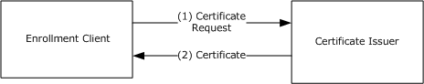

Figure 1: Basic certificate enrollment

The individual steps are described as follows:

- The enrollment client generates a certificate request. The certificate request contains the [**public key**](#gt_public-key) of the [**key pair**](#gt_public-private-key-pair), along with any other information required by the [**certificate template**](#gt_certificate-template) or configured by the user. The certificate request is signed by the [**private key**](#gt_private-key) of the key pair and is sent by the enrollment client to the certificate issuer.
- The certificate issuer validates the certificate request and, if the request is valid, issues the requested certificate to the user; otherwise, it denies the request, or causes the request to be pending until a certificate manager manually approves or denies it.

### 1.1.6 Certificate Transparency

Certificate Transparency processing enabled on a [**certificate authority (CA)**](#gt_certification-authority-ca) server allows digital [**certificates**](#gt_certificate) to be issued by the server to clients while also allowing a compliant operator to monitor and audit a publicly available [**certificate transparency**](#gt_certificate-transparency) log, to which the certificates are also sent. Issued certificates can be added to this type of log either before or after the certificates are issued to clients, the former requiring the use of precertificates. Certificate transparency logs can be queried by a compliant application for proof of certificate existence.

The Certificate Transparency feature is introduced in the Windows Server v1809 operating system<1>. Any digital certificate that is issued by a certificate authority (CA) running Windows Server v1809 or later can be submitted to a certificate transparency log as a precertificate, as defined in [[RFC6962]](https://go.microsoft.com/fwlink/?linkid=867272).

The diagram that follows shows the sequence in which basic certificate enrollment occurs when Certificate Transparency processing is enabled on a CA server.

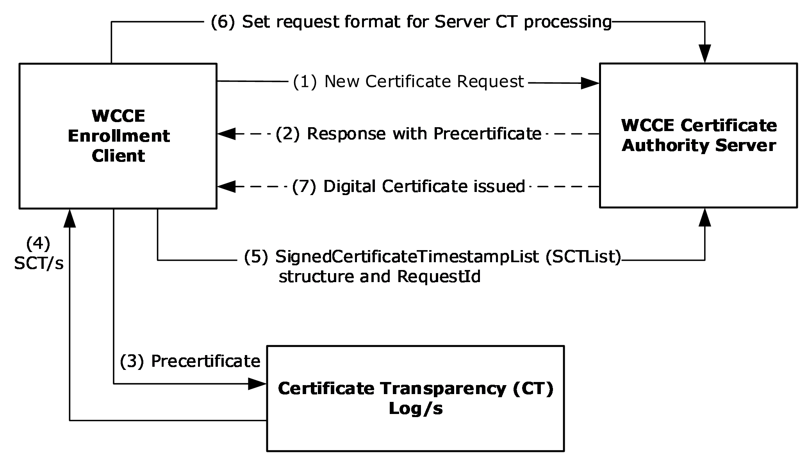

Figure 2: Basic enrollment with Certificate Transparency enabled

The individual steps are described as follows:

- The WCCE client submits a new certificate request, via the **ICertRequestD2::Request2** method ([MS-WCCE](../MS-WCCE/MS-WCCE.md) section 3.2.1.4.3.1), to the certificate authority (CA) server to indicate that certificate transparency processing is required.
- The CA server response to the WCCE client certificate request contains a Certificate Transparency precertificate.
- The WCCE client submits the precertificate to one or more certificate transparency logs ([RFC6962]).
- One or more certificate transparency logs respond by sending a Signed Certificate Timestamp (SCT) to the WCCE client ([RFC6962]).
The WCCE client generates a SignedCertificateTimestampList (SCTList) structure from the received SCT/s.

- The WCCE client calls the **ICertRequestD2::Request2** method again, but in this case with the SCTList structure and the *RequestId* attribute included; the request is then sent to the CA server.
- The WCCE client configures the *dwFlags* parameter of a new **ICertRequestD2::Request2** message (to set the request format for Certificate Transparency processing) and submits it to the CA server.
- The CA server issues a digital certificate to the WCCE client.

### 1.1.7 Key Attestation

Many modern computers have built-in hardware to help secure data. This is typically the Trusted Computing Group's [**trusted platform module (TPM)**](#gt_trusted-platform-module-tpm) [[TCG-Architect]](https://go.microsoft.com/fwlink/?LinkId=301944). A TPM can be used to create cryptographic [**public-private key pairs**](#gt_public-private-key-pair) in such a way that the [**private key**](#gt_private-key) can never be revealed or used outside it; that is, the key is non-migratable. This constraint can be used to guarantee that a certain cryptographic operation occurred in the TPM of a particular computer.

On a server that supports key [**attestation**](#gt_attestation) (see [MS-WCCE](../MS-WCCE/MS-WCCE.md) section 1.3.2.2), it is possible to prove that the key that is bound to a certificate request comes from a TPM and is non-migratable, and that all cryptographic operations using the private portion of the key occur inside the same TPM.

For details about [**key attestation**](#gt_key-attestation) see [MS-CSRA](../MS-CSRA/MS-CSRA.md) section 3.1.1.1.2, [MS-CRTD](#Section_2.9.1.3) section 2.27, and [MS-WCCE] sections 1.3.2.2, 2.2.2.5, 3.1.1.4.3.4, and 3.2.2.6.2.1.2.5 (among others).

## 1.2 Glossary

This document uses the following terms:

**Active Directory**: The Windows implementation of a general-purpose directory service, which uses [**LDAP**](#gt_lightweight-directory-access-protocol-ldap) as its primary access protocol. [**Active Directory**](#gt_active-directory) stores information about a variety of objects in the network such as user accounts, computer accounts, groups, and all related credential information used by Kerberos [MS-KILE](../MS-KILE/MS-KILE.md). [**Active Directory**](#gt_active-directory) is either deployed as Active Directory Domain Services (AD DS) or Active Directory Lightweight Directory Services (AD LDS), which are both described in [MS-ADOD](#Section_2.1): Active Directory Protocols Overview.

**administrator**: A user who has complete and unrestricted access to the computer or domain.

**attestation**: A process of establishing some property of a computer platform or of a [**trusted platform module (TPM)**](#gt_trusted-platform-module-tpm) key, in part through TPM cryptographic operations.

**attribute**: A characteristic of some object or entity, typically encoded as a name/value pair.

**CA administrator**: A human operator who is responsible for managing the [**CA system**](#gt_ca-system).

**CA exit algorithm**: An optional addition to the [**CA**](#gt_certification-authority-ca) (WCCE server role) functionality. The algorithm is invoked whenever a certificate is issued. The algorithm can perform customer-defined, post-processing functionality such as publishing the certificate to a predefined path or sending an email message about the issued certificate to an administrator.

**CA policy algorithm**: An algorithm that determines whether to issue a certificate for a specified certificate request and defines how that certificate is constructed.

**CA system**: The system that implements the protocols and data structures specified in [MS-WCCE](../MS-WCCE/MS-WCCE.md), [MS-CSRA](../MS-CSRA/MS-CSRA.md), [MS-CRTD](#Section_2.9.1.3), and [MS-ICPR](../MS-ICPR/MS-ICPR.md).

**CEP**: The [**certificate enrollment policy**](#gt_certificate-enrollment-policy) as defined in [MS-XCEP](../MS-XCEP/MS-XCEP.md).

**certificate**: A certificate is a collection of [**attributes**](#gt_attribute) and extensions that can be stored persistently. The set of attributes in a certificate can vary depending on the intended usage of the certificate. A certificate securely binds a public key to the entity that holds the corresponding private key. A certificate is commonly used for authentication and secure exchange of information on open networks, such as the Internet, extranets, and intranets. Certificates are digitally signed by the issuing [**certification authority (CA)**](#gt_certification-authority-ca) and can be issued for a user, a computer, or a service. The most widely accepted format for certificates is defined by the ITU-T X.509 version 3 international standards. For more information about attributes and extensions, see [[RFC3280]](https://go.microsoft.com/fwlink/?LinkId=90414) and [[X509]](https://go.microsoft.com/fwlink/?LinkId=90590) sections 7 and 8.

**certificate enrollment**: The process of acquiring a [**digital certificate**](#gt_digital-certificate) from a [**certificate authority (CA)**](#gt_certification-authority-ca), which typically requires an end entity to first makes itself known to the CA (either directly, or through a registration authority). This certificate and its associated [**private key**](#gt_private-key) establish a trusted identity for an [**entity**](#gt_entity) that is using the [**public key**](#gt_public-key)–based services and applications. Also referred to as simply "enrollment".

**certificate enrollment policy**: The collection of [**certificate templates**](#gt_certificate-template) and [**certificate**](#gt_certificate) issuers available to the requestor for X.509 [**certificate enrollment**](#gt_certificate-enrollment).

**certificate issuance**: The granting of a [**digital certificate**](#gt_digital-certificate) to an [**end entity**](#gt_end-entity) by a [**certificate authority (CA)**](#gt_certification-authority-ca) as part of the certification process. Sometimes referred to as simply "issuance".

**certificate revocation list (CRL)**: A list of [**certificates**](#gt_certificate) that have been revoked by the [**certification authority (CA)**](#gt_certification-authority-ca) that issued them (that have not yet expired of their own accord). The list must be cryptographically signed by the [**CA**](#gt_certification-authority-ca) that issues it. Typically, the certificates are identified by serial number. In addition to the serial number for the revoked certificates, the CRL contains the revocation reason for each certificate and the time the certificate was revoked. As described in [RFC3280], two types of CRLs commonly exist in the industry. Base CRLs keep a complete list of revoked certificates, while delta CRLs maintain only those certificates that have been revoked since the last issuance of a base CRL. For more information, see [X509] section 7.3, [[MSFT-CRL]](https://go.microsoft.com/fwlink/?LinkId=90181), and [RFC3280] section 5.

**certificate template**: A list of attributes that define a blueprint for creating an X.509 [**certificate**](#gt_certificate). It is often referred to in non-Microsoft documentation as a "certificate profile". A [**certificate template**](#gt_certificate-template) is used to define the content and purpose of a [**digital certificate**](#gt_digital-certificate), including issuance requirements (certificate policies), implemented X.509 extensions such as application policies, key usage, or extended key usage as specified in [X509], and enrollment permissions. Enrollment permissions define the rules by which a [**certification authority (CA)**](#gt_certification-authority-ca) will issue or deny certificate requests. In Windows environments, [**certificate templates**](#gt_certificate-template) are stored as objects in the [**Active Directory**](#gt_active-directory) and used by Microsoft enterprise [**CAs**](#gt_certification-authority-ca).

**certificate transparency**: A feature that allows a digital [**certificate**](#gt_certificate) to be issued by a [**CA**](#gt_certification-authority-ca) in response to a client request, while also enabling a compliant operator to monitor and audit a publicly available certificate transparency log to which the certificates are also sent.

**certification authority (CA)**: A third party that issues [**public key**](#gt_public-key) [**certificates**](#gt_certificate). Certificates serve to bind public keys to a user identity. Each user and certification authority (CA) can decide whether to trust another user or CA for a specific purpose, and whether this trust should be transitive. For more information, see [RFC3280].

**Cryptographic Message Syntax (CMS)**: A public standard that defines how to digitally sign, digest, authenticate, or encrypt arbitrary message content, as specified in [[RFC3852]](https://go.microsoft.com/fwlink/?LinkId=90445).

**digital certificate**: See the "digital certificate definition standard," as described in [X509].

**Distributed Component Object Model (DCOM)**: The Microsoft Component Object Model (COM) specification that defines how components communicate over networks, as specified in [MS-DCOM](../MS-DCOM/MS-DCOM.md).

**domain controller (DC)**: The service, running on a server, that implements [**Active Directory**](#gt_active-directory), or the server hosting this service. The service hosts the data store for objects and interoperates with other [**DCs**](#gt_domain-controller-dc) to ensure that a local change to an object replicates correctly across all [**DCs**](#gt_domain-controller-dc). When [**Active Directory**](#gt_active-directory) is operating as Active Directory Domain Services (AD DS), the [**DC**](#gt_domain-controller-dc) contains full NC replicas of the configuration naming context (config NC), schema naming context (schema NC), and one of the domain NCs in its forest. If the AD DS [**DC**](#gt_domain-controller-dc) is a global catalog server (GC server), it contains partial NC replicas of the remaining domain NCs in its forest. For more information, see [MS-AUTHSOD](../MS-AUTHSOD/MS-AUTHSOD.md) section 1.1.1.5.2 and [MS-ADTS](../MS-ADTS/MS-ADTS.md). When [**Active Directory**](#gt_active-directory) is operating as Active Directory Lightweight Directory Services (AD LDS), several AD LDS [**DCs**](#gt_domain-controller-dc) can run on one server. When [**Active Directory**](#gt_active-directory) is operating as AD DS, only one AD DS [**DC**](#gt_domain-controller-dc) can run on one server. However, several AD LDS [**DCs**](#gt_domain-controller-dc) can coexist with one AD DS [**DC**](#gt_domain-controller-dc) on one server. The AD LDS [**DC**](#gt_domain-controller-dc) contains full NC replicas of the config NC and the schema NC in its forest. The domain controller is the server side of Authentication Protocol Domain Support [MS-APDS](../MS-APDS/MS-APDS.md).

**encryption**: In cryptography, the process of obscuring information to make it unreadable without special knowledge.

**end entity**: The keyholder (person or computer) to whose key or name a particular [**certificate**](#gt_certificate) refers.

**enhanced key usage (EKU)**: An extension that is a collection of object identifiers (OIDs) that indicate the applications that use the [**key**](#gt_key).

**Enroll On Behalf Of (EOBO)**: A proxy enrollment process in which one user, typically an administrator, enrolls for a [**certificate**](#gt_certificate) for a second user by using the administrator credentials.

**enterprise certificate authority (enterprise CA)**: A [**certificate authority (CA)**](#gt_certification-authority-ca) that is a member of a domain and that uses the domain's [**Active Directory**](#gt_active-directory) service to store policy, authentication, and other information related to the operation of the [**CA**](#gt_certification-authority-ca). Specifically, the enterprise CA is a server implementation of the Windows Client Certificate Enrollment Protocol that uses the certificate template data structure (see [MS-CRTD]) in its [**CA policy algorithm**](#gt_ca-policy-algorithm) implementation.

**entity**: A unit that is part of the system such as a component or an element.

**exchange certificate**: A [**certificate**](#gt_certificate) that can be used for [**encryption**](#gt_encryption) purposes. This [**certificate**](#gt_certificate) can be used by clients to encrypt their private keys as part of their [**certificate**](#gt_certificate) request. In Windows environments, an enterprise [**certificate authority (CA)**](#gt_certification-authority-ca) creates an [**exchange certificate**](#gt_exchange-certificate) periodically (by default, weekly), and returns the [**exchange certificate**](#gt_exchange-certificate) upon request of a client. For more information, see [[MSFT-ARCHIVE]](https://go.microsoft.com/fwlink/?LinkId=90177).

**Group Policy**: A mechanism that allows the implementer to specify managed configurations for users and computers in an [**Active Directory**](#gt_active-directory) service environment.

**interface**: A group of related function prototypes in a specific order, analogous to a C++ virtual interface. Multiple objects, of different object class, may implement the same interface. A derived interface may be created by adding methods after the end of an existing interface. In the Distributed Component Object Model (DCOM), all interfaces initially derive from IUnknown.

**key**: In cryptography, a generic term used to refer to cryptographic data that is used to initialize a cryptographic algorithm. [**Keys**](#gt_key) are also sometimes referred to as keying material.

**key archival**: The process by which the entity requesting the [**certificate**](#gt_certificate) also submits the [**private key**](#gt_private-key) during the process. The [**private key**](#gt_private-key) is encrypted such that only a [**key recovery agent**](#gt_key-recovery-agent-kra) can obtain it, preventing accidental disclosure, but preserving a copy in case the entity is unable or unwilling to decrypt data.

**key attestation**: See [**attestation**](#gt_attestation).

**key exchange**: A synonym for key establishment. The procedure that results in shared secret keying material among different parties. Key agreement and key transport are two forms of [**key exchange**](#gt_key-exchange). For more information, see [[CRYPTO]](https://go.microsoft.com/fwlink/?LinkId=89841) section 1.11, [[SP800-56A]](https://go.microsoft.com/fwlink/?LinkId=90525) section 3.1, and [[IEEE1363]](https://go.microsoft.com/fwlink/?LinkId=89899) section 3.

**key length**: A value specified by a cryptographic module that indicates the length of the [**public-private key pair**](#gt_public-private-key-pair) and symmetric keys that are used within the module. The [**key length**](#gt_key-length) values are expressed in bits. For more information about cryptographic [**key lengths**](#gt_key-length), see [SP800-56A] section 3.1.

**key recovery agent (KRA)**: A user, machine, or registration authority that has enrolled and obtained a key recovery certificate. A [**KRA**](#gt_key-recovery-agent-kra) is any entity that possesses a [**KRA**](#gt_key-recovery-agent-kra) [**private key**](#gt_private-key) and [**certificate**](#gt_certificate). For more information on [**KRAs**](#gt_key-recovery-agent-kra) and the archival process, see [MSFT-ARCHIVE].

**keyholder**: The entity that holds a [**private key**](#gt_private-key) and is therefore capable of signing and decrypting. The [**keyholder**](#gt_keyholder) of a [**public key**](#gt_public-key) is defined as the [**keyholder**](#gt_keyholder) of the corresponding [**private key**](#gt_private-key).

**Lightweight Directory Access Protocol (LDAP)**: The primary access protocol for [**Active Directory**](#gt_active-directory). Lightweight Directory Access Protocol (LDAP) is an industry-standard protocol, established by the Internet Engineering Task Force (IETF), which allows users to query and update information in a directory service (DS), as described in [MS-ADTS]. The Lightweight Directory Access Protocol can be either version 2 [[RFC1777]](https://go.microsoft.com/fwlink/?LinkId=90290) or version 3 [[RFC3377]](https://go.microsoft.com/fwlink/?LinkID=91337).

**PKI administrator**: PKI administrators are responsible for implementing the company's policy by defining CEPs and setting up servers that provide certificates to clients.

**policy server endpoint**: A collection of information about a policy server, such as the protocol that it supports, its Uniform Resource Identifier (URI), and authentication to be used when accessing the server.

**private key**: One of a pair of keys used in public-key cryptography. The private key is kept secret and is used to decrypt data that has been encrypted with the corresponding public key. For an introduction to this concept, see [CRYPTO] section 1.8 and [IEEE1363] section 3.1.

**public key**: One of a pair of keys used in public-key cryptography. The public key is distributed freely and published as part of a [**digital certificate**](#gt_digital-certificate). For an introduction to this concept, see [CRYPTO] section 1.8 and [IEEE1363] section 3.1.

**public key infrastructure (PKI)**: The laws, policies, standards, and software that regulate or manipulate certificates and public and private keys. In practice, it is a system of [**digital certificates**](#gt_digital-certificate), [**certificate authorities (CAs)**](#gt_certification-authority-ca), and other registration authorities that verify and authenticate the validity of each party involved in an electronic transaction. For more information, see [X509] section 6.

**public-private key pair**: The association of a public key and its corresponding private key when used in cryptography. Also referred to simply as a "key pair". For an introduction to public-private key pairs, see [IEEE1363] section 3.

**registration authority (RA)**: The authority in a [**PKI**](#gt_public-key-infrastructure-pki) that verifies user requests for a digital certificate and indicates to the [**certificate authority (CA)**](#gt_certification-authority-ca) that it is acceptable to issue a [**certificate**](#gt_certificate).

**remote procedure call (RPC)**: A communication protocol used primarily between client and server. The term has three definitions that are often used interchangeably: a runtime environment providing for communication facilities between computers (the RPC runtime); a set of request-and-response message exchanges between computers (the RPC exchange); and the single message from an RPC exchange (the RPC message). For more information, see [[C706]](https://go.microsoft.com/fwlink/?LinkId=89824).

**revocation**: The process of invalidating a certificate. For more details, see [RFC3280] section 3.3.

**root CA**: A type of [**certificate authority (CA)**](#gt_certification-authority-ca) that is directly trusted by an end entity, including a relying party; that is, securely acquiring the value of a root CA public key requires some out-of-band steps. This term is not meant to imply that a root CA is necessarily at the top of any hierarchy, simply that the CA in question is trusted directly (as specified in [[RFC2510]](https://go.microsoft.com/fwlink/?LinkId=90362)). A root CA is implemented in software and in Windows, is the topmost CA in a CA hierarchy, and is the trust point for all certificates that are issued by the CAs in the CA hierarchy. If a user, computer, or service trusts a root CA, it implicitly trusts all certificates that are issued by all other CAs in the CA hierarchy. For more information, see [RFC3280].

**standalone CA**: A [**certification authority (CA)**](#gt_certification-authority-ca) that is not a member of a domain. For more information, see [[MSFT-PKI]](https://go.microsoft.com/fwlink/?LinkId=90202).

**trust**: To accept another authority's statements for the purposes of authentication and authorization, especially in the case of a relationship between two domains. If domain A trusts domain B, domain A accepts domain B's authentication and authorization statements for principals represented by security principal objects in domain B; for example, the list of groups to which a particular user belongs. As a noun, a [**trust**](#gt_trust) is the relationship between two domains described in the previous sentence.

**trusted platform module (TPM)**: A component of a trusted computing platform. The TPM stores keys, passwords, and digital certificates. See [[TCG-Architect]](https://go.microsoft.com/fwlink/?LinkId=301944) for more information.

**WSTEP**: WS-Trust Enrollment Extensions

**XCEP**: X.509 Certificate Enrollment Policy Protocol Specification

## 1.3 References

[MS-ADOD] Microsoft Corporation, "[Active Directory Protocols Overview](#Section_2.1)".

[MS-ADTS] Microsoft Corporation, "[Active Directory Technical Specification](../MS-ADTS/MS-ADTS.md)".

[MS-CRTD] Microsoft Corporation, "[Certificate Templates Structure](#Section_2.9.1.3)".

[MS-CSRA] Microsoft Corporation, "[Certificate Services Remote Administration Protocol](../MS-CSRA/MS-CSRA.md)".

[MS-DRSR] Microsoft Corporation, "[Directory Replication Service (DRS) Remote Protocol](../MS-DRSR/MS-DRSR.md)".

[MS-GPOD] Microsoft Corporation, "[Group Policy Protocols Overview](#Section_2.1)".

[MS-GPREG] Microsoft Corporation, "[Group Policy: Registry Extension Encoding](../MS-GPREG/MS-GPREG.md)".

[MS-ICPR] Microsoft Corporation, "[ICertPassage Remote Protocol](../MS-ICPR/MS-ICPR.md)".

[MS-WCCE] Microsoft Corporation, "[Windows Client Certificate Enrollment Protocol](../MS-WCCE/MS-WCCE.md)".

[MS-WSTEP] Microsoft Corporation, "[WS-Trust X.509v3 Token Enrollment Extensions](../MS-WSTEP/MS-WSTEP.md)".

[MS-XCEP] Microsoft Corporation, "[X.509 Certificate Enrollment Policy Protocol](../MS-XCEP/MS-XCEP.md)".

[MSFT-ARCHIVE] Microsoft Corporation, "Key Archival and Management in Windows Server 2003", December 2004, [http://technet.microsoft.com/en-us/library/cc755395(v=ws.10).aspx](https://go.microsoft.com/fwlink/?LinkId=90177)

[RFC5280] Cooper, D., Santesson, S., Farrell, S., et al., "Internet X.509 Public Key Infrastructure Certificate and Certificate Revocation List (CRL) Profile", RFC 5280, May 2008, [http://www.ietf.org/rfc/rfc5280.txt](https://go.microsoft.com/fwlink/?LinkId=131034)

[RFC6962] Laurie, B., Langley, A., and Kasper, E., "Certificate Transparency", [https://www.rfc-editor.org/info/rfc6962](https://go.microsoft.com/fwlink/?linkid=867272)

[TCG-Architect] Trusted Computing Group, "TCG Specification Architecture Overview", Specification Revision 1.4, August 2007, [http://www.trustedcomputinggroup.org/wp-content/uploads/TCG_1_4_Architecture_Overview.pdf](https://go.microsoft.com/fwlink/?LinkId=301944)

# 2 Functional Architecture

## 2.1 Overview

The following abstract components provide the main functionality for [**certificate**](#gt_certificate) services. The Certificate Services protocols enable communication among these components, as shown in the diagram at the end of this section.

**Certificate authority (CA) server**: The [**CA**](#gt_certification-authority-ca) server can operate in one of two modes, as a stand-alone CA or as an [**enterprise certificate authority (enterprise CA)**](#gt_enterprise-certificate-authority-enterprise-ca).

The following are additional requirements when the CA operates in enterprise CA mode:

- The CA server is a member of the domain.
- The CA server uses [**Active Directory**](#gt_active-directory) service to store the policy, authentication, and other related information that is required.
- Optionally, the CA server depends on the [**Group Policy**](#gt_group-policy) service as the configuration store for the [**policy server endpoints**](#gt_policy-server-endpoint).
**Certificate transparency:** An enrollment client can initiate [**certificate transparency**](#gt_certificate-transparency) processing on a certificate authority (CA) server. Certificate transparency is a scheme in which digital certificates issued by a CA server are also published to one or more public certificate transparency logs to be available for public monitoring. Certificates can be added to a certificate transparency log either before or after digital certificates are issued to clients, the former requiring the use of precertificates.

**Enrollment clients**: Clients can enroll the certificates by using one of two methods: Direct enrollment and [**WSTEP**](#gt_wstep) enrollment. The enrollment clients can be different types, see section [2.1.2](#Section_2.1.2).

**Policy server**: Enrollment clients contact the policy server to obtain the policy information that consists of the types of certificates that it can enroll for, which enrollment servers to contact to enroll for them, and what type of authentication to use for each service. The policy server can be an [**XCEP**](#gt_xcep) server or a [**domain controller**](#gt_domain-controller-dc). The Direct enrollment clients always use the domain controller as the policy server. WSTEP enrollment clients use the XCEP server as policy server.

The clients have to first be configured with information about which policy server(s) to contact and how to authenticate to them. This information can be configured through either Group Policy or local configuration.

**XCEP server**: Hosts the enrollment policy web services and allows the enrollment clients to retrieve the [**certificate enrollment**](#gt_certificate-enrollment) policies ([**CEP**](#gt_cep)) by using the XCEP protocol.

**WSTEP server**: Hosts the enrollments' Web services and allows the enrollment clients to enroll the certificates by using the WSTEP protocol.

**CA admin clients**: The clients from which administrators perform remote CA administration.

**Domain controller**: Enrollment clients and CA servers in enterprise mode primarily depend on the Active Directory and optionally on Group Policy server as described earlier in this section.

The following diagram shows the functionality of the Certificate Services protocols in enterprise mode. The classification and purpose of the member protocols are described in section [2.2](#Section_3.4).

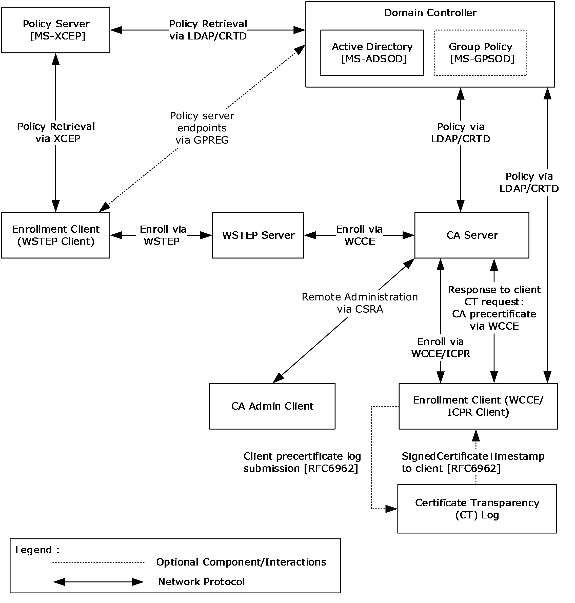

Figure 3: Certificate Services protocols functional architecture in enterprise mode

### 2.1.1 Purpose

The purpose of the Certificate Services protocols is to issue and manage [**certificates**](#gt_certificate). The Certificate Services protocols include the protocols that are used for submitting certificate requests to the [**CA**](#gt_certification-authority-ca), for CA server-side processing of these requests, and for remote administration of the CA. The certificates themselves do not generally contain sensitive information and are often publicly available. The certificates can be used for different purposes and are typically stored in a variety of methods and locations. Certificates have a certain lifetime and eventually face expiration. Certificate autoenrollment automates [**certificate enrollment**](#gt_certificate-enrollment) and renewal for computer certificates.

### 2.1.2 Components

The Certificate Services system has two main components:

- Certificate authority
- Enrollment client
The following sections provide an overview of these components.

#### 2.1.2.1 Certificate Authority

The [**certificate**](#gt_certificate) authority is the core component of the Certificate Services System. The [**CA**](#gt_certification-authority-ca) implements the Windows Client Certificate Enrollment Protocol (WCCE), the ICertPassage Remote Protocol (ICPR), and the Certificate Services Remote Administration Protocol (CSRA) to enable [**certificate enrollment**](#gt_certificate-enrollment) and CA administration. It also makes use of policy and exit algorithms to facilitate the more complex enrollment processes.

This section describes the [**interfaces**](#gt_interface) and modes of the CA.

##### 2.1.2.1.1 Certificate Authority Interfaces

The following diagram shows the components that interact with the [**certificate**](#gt_certificate) authority.

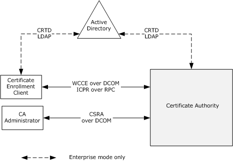

Figure 4: Certificate authority interfaces

End users use their computers to obtain new certificates, to renew existing certificates, and to obtain information about the [**CA**](#gt_certification-authority-ca). Administrators use their client computers to connect to external [**interfaces**](#gt_interface) to manage the CA remotely.

##### 2.1.2.1.2 Certificate Authority (CA) Modes

The [**CA**](#gt_certification-authority-ca) consists of two distinct groups. One group of components is responsible for the [**certificate enrollment**](#gt_certificate-enrollment) and the other for [**CA system**](#gt_ca-system) administration. The two groups communicate through shared data and the interaction between them is defined in [MS-WCCE](../MS-WCCE/MS-WCCE.md) and [MS-CSRA](../MS-CSRA/MS-CSRA.md).

The following diagrams show the protocols and their interaction with shared data.

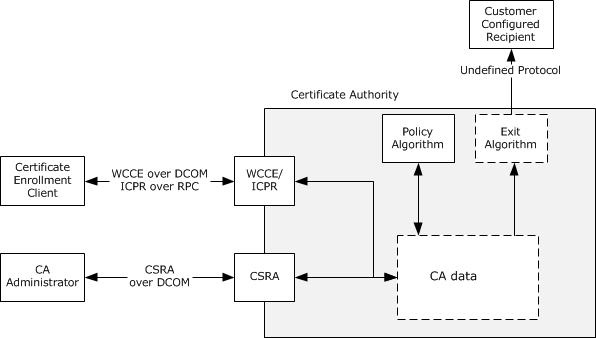

Figure 5: Certificate authority (CA) in stand-alone mode

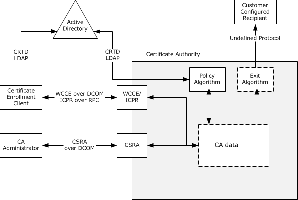

Figure 6: Certificate authority (CA) in enterprise mode

**CA policy algorithm**

The [**CA policy algorithm**](#gt_ca-policy-algorithm) is a required component of the system. Requests for new and renewed [**certificates**](#gt_certificate) are subject to the policy algorithm. It determines whether a certificate request is to be fulfilled, denied, or set to pending administrator approval. For example, a system implementing the [**enterprise CA**](#gt_enterprise-certificate-authority-enterprise-ca) functionality that is specified in [MS-WCCE] section 3.2.2 verifies that the requestor has Enroll permission on the requested [**certificate template**](#gt_certificate-template). The policy algorithm and rules for its implementation are defined in [MS-WCCE] sections 3.2.1.4.2.1.4.5 and 3.2.2.6.2.1.4.

**CA exit algorithm**

The [**CA exit algorithm**](#gt_ca-exit-algorithm) is an optional internal component responsible for request post-processing, which can include communicating via another protocol. For example, the CA could send email notifications to the [**end entity**](#gt_end-entity) and system administrator when a new certificate is generated. The exit algorithm and rules for its implementation are defined in [MS-WCCE] section 3.2.1.4.2.1.4.9.

**CA data storage**

The method that is used for data storage is independent of the protocols and [**interfaces**](#gt_interface) that are described in this document. The implementer can use a general-purpose database, files stored in the operating system's native file system, or whatever is preferred. The data that has to be stored is described in [MS-WCCE] section 3 and [MS-CSRA] section 3.

#### 2.1.2.2 Enrollment Client

There are a variety of enrollment client types, and their behavior in the handling of the [**certificate**](#gt_certificate) requests and the resulting issued certificate can differ.

The common enrollment client types include:

- Autoenrollment
- User enrollment tools
- Registration authority applications
- Direct enrollment applications
- Certificate transparency
**Autoenrollment**

Autoenrollment is normally performed without user input. In some cases, user input during the enrollment process might be required, such as in the case of smart card usage and PIN input. However, the enrollment process itself is not triggered by the user. Issued certificates are received from the [**CA**](#gt_certification-authority-ca) and are then stored within a local certificate store on the client system.

**User enrollment tools**

User enrollment tools typically work in a similar fashion but are user-initiated and can involve further user input during the enrollment process.

**Registration authority applications**

[**Registration authority (RA)**](#gt_registration-authority-ra) applications are typically used in situations where a higher level of assurance is required for the [**certificate enrollment**](#gt_certificate-enrollment) process. Often, their use involves an enrollment agent. Most RA applications are used to process or submit certificate requests for other users and therefore do not keep or install issued certificates for their own use. Instead, the issued certificates are transferred to the [**end entity**](#gt_end-entity) in some fashion.

**Direct enrollment applications**

Direct enrollment applications are those that might be written by third parties to interact directly with the CA for certificate enrollment. How these applications handle the certificates after they have been issued is completely dependent upon the design and development of the application.

In all cases, the involvement of the [**CA system**](#gt_ca-system) ends with the CA providing the issued certificate to the enrollment client. How the client handles the certificate after that point is independent of the CA.

**Certificate Transparency**

The enrollment client has the option to initiate [**certificate transparency**](#gt_certificate-transparency) processing on the certificate authority (CA) server, as described in sections [1.1.6](#Section_1.1.6) and [3.2](#Section_3.2).

##### 2.1.2.2.1 Certificate Enrollment Methods

There are two methods for [**certificate enrollment**](#gt_certificate-enrollment): [**DCOM**](#gt_distributed-component-object-model-dcom)-based certificate enrollment (Direct enrollment) and Web services-based certificate enrollment (WSTEP enrollment).

**DCOM-based certificate enrollment**

DCOM-based certificate enrollment uses WCCE for [**certificate**](#gt_certificate) requests. When a [**CA**](#gt_certification-authority-ca) is operating in [**enterprise CA**](#gt_enterprise-certificate-authority-enterprise-ca) mode, it uses the [**LDAP**](#gt_lightweight-directory-access-protocol-ldap) profile specified in [MS-ADTS](../MS-ADTS/MS-ADTS.md) section 3.1.1.3 to obtain a [**CEP**](#gt_cep) from a [**domain controller (DC)**](#gt_domain-controller-dc). The CEP is expressed via [**certificate templates**](#gt_certificate-template) that are data structures specified in [MS-CRTD](#Section_2.9.1.3) and Certificate Authority (CA) information.

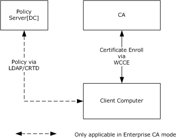

Figure 7: DCOM-based certificate enrollment

A client computer starts by discovering a policy server. In case of DCOM-based enrollment, the policy server is always a domain controller, discovered as specified in [MS-ADTS] section 6.3.

**Web services-based certificate enrollment**

Web services-based certificate enrollment, as shown in the following diagram, uses the WSTEP protocol for certificate requests. It uses XCEP to retrieve the CEP.

For the use of XCEP/WSTEP, the Web service address has to be configured out-of-band, for example, manually or by [**Group Policy**](#gt_group-policy).

Certificate enrollment clients can use Group Policy, specifically the GPREG protocol, to obtain [**policy server endpoints**](#gt_policy-server-endpoint) that were configured by the administrator in the enterprise environment. Clients can also use a local configuration store that contains policy server endpoints specific to a particular client. The following diagram shows the certificate enrollment process.

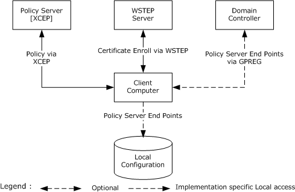

Figure 8: Web services-based certificate enrollment

Based on an organization's security policies, it is possible for the client to use both methods to enroll for certificates. The following diagram shows an example of one such possible deployment.

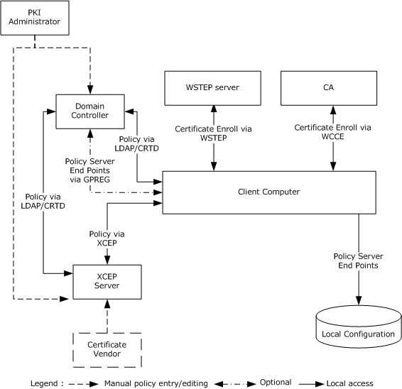

Figure 9: Deployment of certificate enrollment

In this case, the client computer is a member of a domain where a [**PKI administrator**](#gt_pki-administrator) has configured a CEP by defining some templates and installing an enterprise CA, XCEP server, and WSTEP server. The client computer discovers available CEP servers through Group Policy. Also, the administrator of the client computer itself has to obtain a certificate for this computer from a third party so that the computer can be configured with the policy server endpoint of the third-party server. The client computer can now request certificates based on both policies.

Considering that any client can be configured to work with multiple CEPs that have multiple policy server endpoints, can define multiple certificate templates, and are used by multiple issuers, it is clear that enrolling for certificates manually can be a difficult task. The job of autoenrollment is to traverse all of the CEPs and enroll them for certificates as required.

##### 2.1.2.2.2 Autoenrollment in a Domain Environment

This section describes the components of the autoenrollment client that is joined to a domain and how external entities influence the behavior of the autoenrollment process.

The following diagram shows that the autoenrollment process accesses two local data stores, [**certificate**](#gt_certificate)/[**key**](#gt_key) storage and local configuration, and communicates with the XCEP server, WSTEP server, [**CA**](#gt_certification-authority-ca) server, and [**domain controller**](#gt_domain-controller-dc). The autoenrollment process examines local certificate storage and renews an already issued certificate or enrolls for new certificates as required, based on a predefined policy that is encoded in the form of [**CEPs**](#gt_cep).

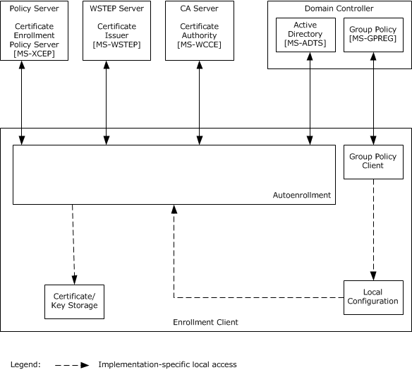

Figure 10: The autoenrollment process executing on a computer that is joined to a domain

**Certificate storage**: This [**entity**](#gt_entity) provides some implementation-specific persisted local certificate storage that can be logically organized into groups of certificates.

**Key storage**: This entity provides some implementation-specific persisted local [**private key**](#gt_private-key) storage where it could store private keys associated with the certificates it is requesting.

**Local configuration**: This entity provides the configuration options and [**policy server endpoint**](#gt_policy-server-endpoint) information.

In the case of [**DCOM**](#gt_distributed-component-object-model-dcom)-based [**certificate enrollment**](#gt_certificate-enrollment), the autoenrollment process gets the [**certificate templates**](#gt_certificate-template) and CA information from the domain controller, whereas in the case of the Web services certificate enrollment, the [**Group Policy**](#gt_group-policy) client on the enrollment client computer gets the policy server endpoints information from the domain controller through the Group Policy: Registry Extension Encoding [MS-GPREG](../MS-GPREG/MS-GPREG.md) and updates the local configuration; then the autoenrollment process gets the policy server endpoint URL information in an implementation-specific way and connects to the XCEP server to download the CEP. Depending on the available CEP and certificates that are currently present on the system local certificate/key storage, autoenrollment submits requests and persists newly enrolled or renewed certificates in the local certificate storage. In the case of DCOM-based certificate enrollment, autoenrollment submits requests to the CA, whereas in the case of Web services certificate enrollment, it submits the requests to the WSTEP server.

The local certificate/key storage can be read or modified by other systems in an implementation-specific way, but the autoenrollment process makes no assumptions about how or even if this happens. Local configuration is modified by the computer administrator through the use of an administration tool, such as a Group Policy client.

### 2.1.3 Applicability

The Certificate Services protocols are applicable to an environment in which clients benefit from the capability to interact with the [**CA**](#gt_certification-authority-ca) to enroll or manage X.509 certificates. In particular, the autoenrollment client is applicable in environments where the workload of provisioning [**certificates**](#gt_certificate) is large enough to warrant automation.

### 2.1.4 Relevant Standards

Relevant standards are the Internet X.509 Public Key Infrastructure Certificate and Certificate Revocation List (CRL) Profile, as specified in [[RFC5280]](https://go.microsoft.com/fwlink/?LinkId=131034). This specification is one part of a family of standards for the X.509 [**public key infrastructure (PKI)**](#gt_public-key-infrastructure-pki) for the Internet. This specification profiles the format and semantics of [**certificates**](#gt_certificate) and [**certificate revocation lists (CRLs)**](#gt_certificate-revocation-list-crl) for the Internet PKI.

## 2.2 Protocol Summary

The following table provides a comprehensive list of the Certificate Services protocols.

| Protocol name | Description | Short name |
| --- | --- | --- |
| Windows Client Certificate Enrollment Protocol | This protocol is based on [**DCOM**](#gt_distributed-component-object-model-dcom). It is responsible for [**certificate enrollment**](#gt_certificate-enrollment), and it enables clients to request various services from a [**CA**](#gt_certification-authority-ca), such as certificate enrollment and property retrieval. | [MS-WCCE](../MS-WCCE/MS-WCCE.md) |
| Certificate Services Remote Administration Protocol | This protocol is responsible for CA administration, and it enables administrative tools to configure the state and policy of a CA on a server. | [MS-CSRA](../MS-CSRA/MS-CSRA.md) |
| ICertPassage Remote Protocol | This protocol is a subset of the Windows Client Certificate Enrollment (WCCE) Protocol used for certificate enrollment over [**RPC**](#gt_remote-procedure-call-rpc) by clients that do not support DCOM. | [MS-ICPR](../MS-ICPR/MS-ICPR.md) |
| Certificate Templates Structure | [**Certificate templates**](#gt_certificate-template) are stored in [**Active Directory**](#gt_active-directory) and are used when the CA operates as an [**enterprise CA**](#gt_enterprise-certificate-authority-enterprise-ca). They contain details about requesting and issuing [**certificates**](#gt_certificate). Policy algorithms on the CA use certificate templates to determine how to respond to certificate requests. [MS-CRTD](#Section_2.9.1.3) defines [**attributes**](#gt_attribute) that are accessed by using the [**Lightweight Directory Access Protocol (LDAP)**](#gt_lightweight-directory-access-protocol-ldap). | [MS-CRTD] |
| X.509 Certificate Enrollment Policy Protocol | This protocol is based on SOAP. It enables clients to retrieve enrollment policies. | [MS-XCEP](../MS-XCEP/MS-XCEP.md) |
| WS-Trust Enrollment Extensions | This protocol is based on SOAP. It provides Web services-based certificate enrollment, renewal and pending certificate retrieval. The WS-Trust profile enables X.509 certificate enrollment. | [MS-WSTEP](../MS-WSTEP/MS-WSTEP.md) |

The Certificate Services protocols are grouped according to their primary purpose.

**Certificate enrollment protocols**:

Protocols in the following table enable certificate enrollment.

| Protocol name | Description | Short name |
| --- | --- | --- |
| Windows Client Certificate Enrollment Protocol | This protocol is based on DCOM. It is responsible for certificate enrollment, and it enables clients to request various services from a CA, such as certificate enrollment and property retrieval. | [MS-WCCE] |
| ICertPassage Remote Protocol | This protocol is a subset of the WCCE Protocol used for certificate enrollment over RPC by clients that do not support DCOM. | [MS-ICPR] |
| WS-Trust Enrollment Extensions | This protocol is based on SOAP. It provides Web services-based certificate enrollment, renewal, and pending certificate retrieval. The WS-Trust profile enables X.509 certificate enrollment. | [MS-WSTEP] |

**Certificate Services Administration Protocols**:

Protocols in the following table enable remote administration of the certificate services.

| Protocol name | Description | Short name |
| --- | --- | --- |
| Certificate Services Remote Administration Protocol | This protocol is responsible for CA administration, and it enables administrative tools to configure the state and policy of a CA on a server. | [MS-CSRA] |

**Certificate Enrollment Policy (CEP) Protocols**:

Protocols in the following table enable [**certificate enrollment policy**](#gt_certificate-enrollment-policy).

| Protocol name | Description | Short name |
| --- | --- | --- |
| X.509 Certificate Enrollment Policy Protocol | This protocol is based on SOAP. It enables the client to retrieve enrollment policies. | [MS-XCEP] |
| Certificate Templates Structure | Certificate templates are stored in Active Directory and are used when the CA operates as an enterprise CA. They contain details about requesting and issuing certificates. Policy algorithms on the CA use certificate templates to determine how to respond to certificate requests. [MS-CRTD] defines attributes that are accessed by using the Lightweight Directory Access Protocol (LDAP). | [MS-CRTD] |

## 2.3 Environment

The following sections identify the context in which the system exists. This includes the systems that use the [**interfaces**](#gt_interface) provided by this system of protocols, other systems that depend on this system, and, as appropriate, how components of the system communicate.

### 2.3.1 Dependencies on This System

None.

### 2.3.2 Dependencies on Other Systems/Components

This system depends on the following systems and components in the [**enterprise CA**](#gt_enterprise-certificate-authority-enterprise-ca) mode:

- The [**Active Directory**](#gt_active-directory) for the storage and retrieval of [**certificate templates**](#gt_certificate-template) [MS-ADOD](#Section_2.1).
- The [**Group Policy**](#gt_group-policy) server for the [**policy server endpoints**](#gt_policy-server-endpoint) information through the Group Policy: Registry Extension Encoding (GPREG) protocol [MS-GPOD](#Section_2.1).

## 2.4 Assumptions and Preconditions

The Certificate Services protocols have the following assumptions, regardless of the mode:

- The transport protocols, [**RPC**](#gt_remote-procedure-call-rpc), [**DCOM**](#gt_distributed-component-object-model-dcom) and SOAP, are available if the [**CA**](#gt_certification-authority-ca) is to be accessed over a network.
- The authentication protocols NTLM and SSL/TLS are available for authentication.
These additional assumptions apply when running in [**enterprise CA**](#gt_enterprise-certificate-authority-enterprise-ca) mode:

- [**Active Directory**](#gt_active-directory) is available for the storage and retrieval of [**certificate templates**](#gt_certificate-template).
- The Kerberos authentication protocol is available for the authentication and message security.

## 2.5 Use Cases

### 2.5.1 Actors

The actors that participate in [**certificate**](#gt_certificate) services are:

**End entity**: An [**end entity**](#gt_end-entity) is a [**keyholder**](#gt_keyholder), either a person or a computer, to whose [**key**](#gt_key) or name a particular certificate refers.

**Enrollment agent**: An [**entity**](#gt_entity) that submits requests on behalf of another end entity. An enrollment agent is typically authorized by the [**CA**](#gt_certification-authority-ca) to enroll for certificates that end entities themselves might not be able to. The policy enforcement for those certified end entities is thus assumed to be done by the enrollment agent.

**CA administrator**: A person who is responsible for management of the [**CA system**](#gt_ca-system), such as system configuration, and managing pending requests for certificates.

### 2.5.2 Use Case Summary

There are two main use cases for the [**CA system**](#gt_ca-system):

- Enroll for a Certificate
- Administer the [**CA**](#gt_certification-authority-ca)
The Enroll for a Certificate use case is the most important use case for this system. In its simplest form, it allows a caller, either an [**end entity**](#gt_end-entity) or an enrollment agent, to request a [**certificate**](#gt_certificate) from a CA. See the examples in sections [3.1](#Section_3.2) and [3.3](#Section_3.3). Upon successful completion of the use case, the end entity receives a certificate signed by the CA.

Common variations of the [**certificate enrollment**](#gt_certificate-enrollment) use case are as follows:

- Certificate renewal is when an end entity already has a valid certificate and uses the [**private key**](#gt_private-key) that is associated with that certificate to sign a renewal request for a new certificate of the same type.
- Enrollment on behalf of another user introduces an enrollment agent who acts as a cosigner for the certificate request to provide a higher level of control in the enrollment process.
- Autoenrollment reduces the burden on the server administrator by automatically enrolling and renewing certificates.
- Certificate enrollment with CA administrator approval interrupts the automatic flow of the certificate enrollment to allow the administrator to modify the request itself, modify the resulting certificate, or approve or deny the request.
The Administer the CA use cases include generic functions such as editing the CA configuration, as well as more specific functions such as revoking certificates or recovering escrowed private keys from a CA.

The primary CA administration use cases are:

- Edit CA configuration settings
- Revoke a certificate
- Recover an archived certificate and key

### 2.5.3 Use Case Descriptions

#### 2.5.3.1 Enroll for a Certificate

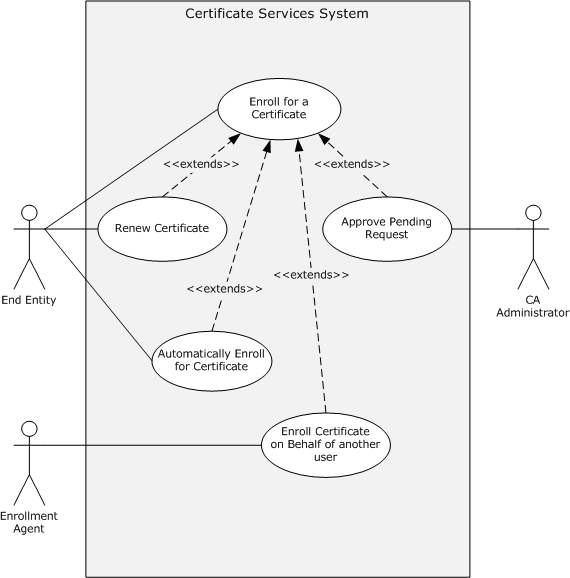

Figure 11: Enroll for a certificate

This use case allows a caller, either an [**end entity**](#gt_end-entity), enrollment agent, or autoenrollment client, to request a [**certificate**](#gt_certificate) from a [**CA**](#gt_certification-authority-ca). Upon successful completion of the use case, the end entity receives a certificate signed by the CA.

**Goal**: To enroll for a certificate so that the end entity is issued a certificate.

**Context of Use**: An end entity can use a certificate for any number of different reasons and scenarios. When a certificate is required, a caller generates a certificate request and submits a certificate request to the CA, as specified in [MS-WCCE](../MS-WCCE/MS-WCCE.md). The [**certificate enrollment**](#gt_certificate-enrollment) can either be a new enrollment or a renewal. In the renewal case, an existing certificate is used to sign a request for a new certificate of the same type before it is submitted to the CA. Depending upon the scenario, the caller might be an enrollment agent or autoenrollment client, rather than the end entity. In the [**Enroll On Behalf Of (EOBO)**](#gt_enroll-on-behalf-of-eobo) use case, a certificate request is signed by an Enrollment Agent before being submitted to the CA. Autoenrollment use case automatically handles certificate enrollment and the re-enrollment of expired certificates, which relieves the administrator from this task.

**Direct Actor**: The direct actor of this use case is the end entity.

**Primary Actors**: The primary actors of this use case are the same as the direct actor, with the possible inclusion of an enrollment agent.

**Supporting Actors**: The [**CA administrator**](#gt_ca-administrator) could be a supporting actor in this use case.

**Stakeholders and Interests**:

- The primary interest of the end entity is to submit certificate requests and receive certificates.
- The primary interest of the enrollment agent is to submit certificate request to the CA and receive certificates on behalf of the end entity.
- The primary interest of the CA administrator is approving pending certificate requests so that the CA can issue them.
- The primary interest of the autoenrollment client is to submit the end entity's certificate requests to the CA and to receive certificates automatically.
**Preconditions**: The end entity, and possibly the enrollment agent and CA administrator, require access to the CA.

**Minimal Guarantee**: The minimal guarantee is that end entity gets the error message that provides the reason why the certificate request was not issued.

**Success Guarantee**: The [**CA system**](#gt_ca-system) guarantees that it can issue certificates when permitted by its policy algorithm.

**Trigger**: The certificate enrollment process is triggered when the CA receives a certificate request.

**Main Success Scenario**:

- When the trigger occurs, the CA decides whether the certificate can be issued based on its policy.
- The CA constructs a certificate based on the certificate request and its policy.
- The CA signs the certificate and returns it to the client.
**Extensions:** Depending upon the configuration of the system, a CA administrator might be involved in the certificate enrollment decision process. When the certificate request is held in a pending state by the CA, it requires CA administrator approval before [**issuance**](#gt_71f399e7-7026-46bb-b7c2-8fd4872b900f), as specified in [MS-CSRA](../MS-CSRA/MS-CSRA.md). In the case of a request requiring administrator approval, the CA holds the request in a pending state until a CA administrator approves the request. After it is approved, the certificate is issued.

**Post-conditions**: The end entity received the required certificate from CA.

#### 2.5.3.2 CA Administration

The [**CA**](#gt_certification-authority-ca) Administration use cases include generic functions such as editing the CA configuration, as well as more specific functions such as revoking [**certificates**](#gt_certificate) or recovering escrowed [**private keys**](#gt_private-key) from a CA. There are three primary CA Administration use cases:

- Edit CA Configuration Settings
- Recover an Archived Certificate and Key
- Revoke a Certificate
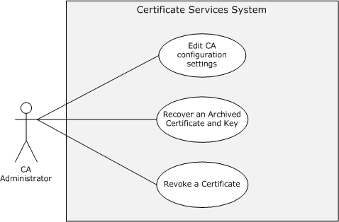

Figure 12: CA Administration use cases

##### 2.5.3.2.1 Edit CA Configuration Settings - CA Administrator

**Goal**: To edit configuration settings on the [**CA**](#gt_certification-authority-ca). The goal of this use case is for the [**CA administrator**](#gt_ca-administrator) to be able to define and edit various configuration settings on the CA that affect behavior and policy around the [**issuance**](#gt_71f399e7-7026-46bb-b7c2-8fd4872b900f) of [**certificates**](#gt_certificate).

**Context of Use**: When a CA server is put into service, there is a variety of configuration settings that are required to be defined by the CA administrator for the CA operation to be in line with the requirements of the enterprise or organization that has deployed it. To define and edit these configuration settings and CA properties, the CA administrator often is required to be able to administer the CA remotely and can do so by using the [**interfaces**](#gt_interface) defined in [MS-CSRA](../MS-CSRA/MS-CSRA.md).

**Direct Actor**: The direct actor is the CA administrator.

**Primary Actor**: The primary actor is the same as the direct actor.

**Supporting Actors**: None.

**Stakeholders and Interests**:

- The primary interest of the CA administrator is to ensure the CA is configured and is working properly.
- The primary interest of the [**end entity**](#gt_end-entity) is the assurance that the CA is configured correctly so that it can issue certificates as expected.
**Preconditions**: The CA administrator requires access to the CA.

**Minimal Guarantee**: The minimal guarantee is that the CA administrator receives an error message that provides the reason that the edit of the CA configuration failed.

**Success Guarantee**:

- The [**CA system**](#gt_ca-system) guarantees that configuration settings made by the CA administrator will be maintained.
- The CA system guarantees that end entities can obtain certificates when requested in accordance with defined policy and configuration settings.
**Trigger**: The CA administrator triggers all CA administration operations.

**Main Success Scenario**:

- When the trigger occurs, the CA responds to connection attempts from the CA administrator.
- The CA administrator then defines or edits configuration settings or CA properties as required.
**Extensions:** None.

**Post-conditions:** The configuration settings or CA properties are updated on the CA as required.

##### 2.5.3.2.2 Recover an Archived Certificate and Key

**Goal**: To recover a [**certificate**](#gt_certificate) and its [**private key**](#gt_private-key) that have been archived within the [**CA**](#gt_certification-authority-ca) database. See the example in section [3.7](#Section_3.7).

**Context of Use**: [**Key archival**](#gt_key-archival) and recovery is typically used in [**encryption**](#gt_encryption) scenarios. When an encryption certificate, its private key, or both are unavailable for decryption, the ability to recover them will provide the ability to decrypt data that was encrypted by using the certificate and its [**public key**](#gt_public-key).

Key archival behavior is defined by a flag that is set within the [**certificate template**](#gt_certificate-template), as specified in [MS-CRTD](#Section_2.9.1.3) section 2.27. When an [**enterprise CA**](#gt_enterprise-certificate-authority-enterprise-ca) issues a certificate that is based on a template with the key archival flag, the issued certificate and its corresponding private key are archived within the CA database, as defined in [MS-WCCE](../MS-WCCE/MS-WCCE.md) section 1.3.2.1.

**Direct Actor**: The direct actor is the [**CA administrator**](#gt_ca-administrator).

**Primary Actor**: The primary actor is the same as the direct actor.

**Supporting Actors**: None.

**Stakeholders and Interests**:

- The primary interest of the CA administrator is to ensure access to the CA and archived [**key**](#gt_key) material.
- The primary interest of the [**end entity**](#gt_end-entity) is the ability to decrypt previously encrypted data by using the retrieved private key.
**Preconditions:**

- The CA has been configured with one or more [**key recovery agent (KRA)**](#gt_key-recovery-agent-kra) certificates.
- An archived certificate has been issued by the CA and the archived material exists within the CA's database.
- The CA administrator has access to any required KRA certificates and their private keys.
**Minimal Guarantee**: The minimal guarantee is that the end entity receives the error message that explains why the recovery of an archived certificate and key failed.

**Success Guarantee**:

- The [**CA system**](#gt_ca-system) guarantees that archived certificates and private keys can be retrieved from the CA database.
- The CA system guarantees that archived material that is retrieved from the CA database can be decrypted by using the associated KRA certificates and private keys.
**Trigger**: The CA administrator triggers the recovery operation.

**Main Success Scenario**:

- When the trigger occurs, archived certificate and key information is retrieved from the CA database by the requesting client.
- After being retrieved, this information is then decrypted by using the associated KRA certificates and private keys.
- The recovered certificate and private key are then available to be restored to the end entity for use.
**Extensions:** None.

**Post-conditions:** The end entity recovered the archived certificate and its private key.

##### 2.5.3.2.3 Revoke a Certificate

**Goal**: To revoke a previously issued [**certificate**](#gt_certificate) and to publish a list of revoked certificates.

**Context of Use**: In the event that a previously issued certificate has to be invalidated for any number of different reasons, such as a compromise, the [**CA administrator**](#gt_ca-administrator) can revoke the certificate and include this certificate within a CRL that can be referenced by any [**entity**](#gt_entity) consuming the certificate and attempting to validate it.

**Direct Actor**: The direct actor is the CA administrator.

**Primary Actor**: The primary actor is the same as the direct actor.

**Supporting Actors**: There are no supporting actors in this use case.

**Stakeholders and Interests**:

- The primary interest of the CA administrator is to ensure that the certificate is revoked and a new CRL is published.
- The primary interest of the [**end entity**](#gt_end-entity) is the assurance that the revoked certificate referencing them are no longer valid.
Other applications and system administrators might rely upon or use the end entity's certificate for a variety of purposes, for assurance that certificates are valid for their intended purpose.

**Preconditions:**

- The [**CA**](#gt_certification-authority-ca) has previously issued a certificate.
- The CA administrator can provide the serial number of the certificate that is to be revoked.
**Minimal Guarantee**: The minimal guarantee is that the CA administrator receives an error message that explains why the [**revocation**](#gt_revocation) of the certificate failed.

**Success Guarantee**: The [**CA system**](#gt_ca-system) guarantees that a certificate is revoked and added to a CRL.

**Trigger**: The CA administrator requests a certificate revocation.

**Main Success Scenario**:

- When the trigger occurs, the CA revokes the certificate.
- The CA administrator then invokes the CA to create and publish the CRL, so the revoked status can be discovered by interested parties.
**Extensions:** None.

**Post-conditions:** Upon successful completion of the use case, the certificate is revoked and a new CRL is published with the latest information about the status of the certificate.

## 2.6 Versioning, Capability Negotiation, and Extensibility

There is no capability negotiation that is associated with this system. Any deviations from a specific version's implementation of these protocol specifications are documented in the respective protocol document. Capability negotiations between client and server implementations of these protocols are specified in the System Versioning and Capability Negotiation sections in their respective technical documents (TDs).

Three aspects of the system have multiple versions.

### 2.6.1 Interface Versions

There are multiple versions of the [**interfaces**](#gt_interface) specified in [MS-WCCE](../MS-WCCE/MS-WCCE.md) and [MS-CSRA](../MS-CSRA/MS-CSRA.md). The versioning rules for those interfaces are defined in section 1.7 of [MS-WCCE] and [MS-CSRA].

### 2.6.2 Client and Server Modes

The [**CA**](#gt_certification-authority-ca) can operate in one of two modes: as a stand-alone CA or as an [**enterprise CA**](#gt_enterprise-certificate-authority-enterprise-ca). The stand-alone CA is specified in [MS-WCCE](../MS-WCCE/MS-WCCE.md) section 3.2.1 and the enterprise CA in [MS-WCCE] section 3.2.2. On client computers, these two modes correspond to the basic enrollment mode, as specified in [MS-WCCE] section 3.1.1, and the enrollment that is based on [**certificate templates**](#gt_certificate-template) mode, as specified in [MS-WCCE] section 3.1.2.

### 2.6.3 Certificate Template Versions

[**Certificate templates**](#gt_certificate-template) have four different versions, as specified in [MS-CRTD](#Section_2.9.1.3) section 2.16. The processing rules for the client and server for each version of the certificate templates are specified in [MS-WCCE](../MS-WCCE/MS-WCCE.md) sections 3.1.2 and 3.2.2.

## 2.7 Error Handling

The system does not define any errors beyond those described in the specifications of the member protocols, as listed in section [2.2](#Section_3.4).

Section [3](#Section_2.1) of the member protocol specifications describes the errors relevant to each protocol.

## 2.8 Coherency Requirements

There are several areas where coherency is important for the [**CA system**](#gt_ca-system):

- Access to the same type of information: When multiple clients attempt to perform operations that affect the same tables of the abstract data model (ADM), for example, submitting a new request that gets recorded in the Request table, the implementation provides the record-level coherency for that table.
- Access to the same information: When multiple clients, possibly clients of different protocols, access that same data of the ADM, the implementation provides the data-level coherency for that table.
Autoenrollment should have a timer that allows it to periodically execute to keep the local [**certificate**](#gt_certificate) storage current. It is recommended that autoenrollment executes at least twice a day.<2>

## 2.9 Security

This section describes system-wide security issues that are not otherwise described in the Technical Documents (TDs) for the Member Protocols. It does not duplicate what is already in the Member Protocol TDs unless there is some unique aspect that applies to the system as a whole.

Security is paramount for a [**CA**](#gt_certification-authority-ca) because it stores sensitive data and issues [**certificates**](#gt_certificate) that are used for processes that can involve the organization's most important data. Therefore, it is critical that the system implementation be robust and resistant to attack. The security considerations include protection of the CA's signing and [**key exchange**](#gt_key-exchange) keys, protection of the requestor's data and [**private key**](#gt_private-key) that is being archived, and enforcement of certificate [**issuance**](#gt_71f399e7-7026-46bb-b7c2-8fd4872b900f) policies that have been configured. These considerations call for the implementation of suitable protection for the storage of the CA's data, suitable protection of [**key**](#gt_key) recovery procedures, and the use of [**certificate templates**](#gt_certificate-template) for policy enforcement.

The CA serves as the foundation for authentication, authorization, [**encryption**](#gt_encryption), and digital signatures. In other words, it is the cornerstone for many of an organization's information security capabilities. A good implementation of this system includes robust protection of data that is stored locally and transmitted to remote clients. [MS-CSRA](../MS-CSRA/MS-CSRA.md) section 5 and [MS-WCCE](../MS-WCCE/MS-WCCE.md) section 5 discuss security issues specific to the individual protocols.

### 2.9.1 Internal Security

There are several internal areas of the CA that have notable security considerations. This section discusses these in greater detail.

#### 2.9.1.1 CA Signing Key

The [**CA**](#gt_certification-authority-ca) uses its signing [**key**](#gt_key) to sign all [**certificates**](#gt_certificate) that it issues and all the [**CRLs**](#gt_certificate-revocation-list-crl) that it publishes. This key is bound to the CA signing certificate. Therefore, there are several important properties to consider:

**Strength of the key**

Acceptable algorithms and [**key lengths**](#gt_key-length) are to be specified by enterprise security policy.

**Lifetime of the key**

The CA signing keys are long-lived keys that exceed the lifetime of the certificates that they sign because, when that key expires, all certificates signed with that key are no longer considered valid by others.

**Key storage**

If the CA signing key is compromised, certificates that were signed with that key can no longer be [**trusted**](#gt_trust), because an attacker could issue certificates that appear to originate from that CA.

**CA signing certificate revocation**

Organizations have to have a documented process to handle the compromise of CA signing keys. For example, if the CA is subordinate to another CA, then it would make sense to revoke the compromised certificate on the parent CA and publish a new CRL. An even more severe situation occurs when the signing key of a [**root CA**](#gt_root-ca) is compromised. In this situation, the only way to stop it from being trusted is to reconfigure all of the client computers to no longer trust it.

#### 2.9.1.2 CA Data

Attackers could interfere with [**CA**](#gt_certification-authority-ca) operations or tamper with [**certificate**](#gt_certificate) [**revocation**](#gt_revocation) information if they were able to access the CA. Therefore, it is a good idea to implement strong controls to protect this data and ensure that only authorized administrators are able to manage it.

Much of the data stored in the database is provided by the caller requesting a certificate. This caller could actually be an attacker. Therefore, it is recommended that each incoming request be validated before it is processed by the system. That is, a CA might inspect each incoming request to ensure that each field within the request is formatted correctly and that it does not exceed a reasonable size [HOWARD].

#### 2.9.1.3 Certificate Templates

[MS-WCCE](../MS-WCCE/MS-WCCE.md) section 5.1.11 describes data consistency considerations for the [**certificate templates**](#gt_certificate-template). Additionally, it is reasonable to restrict write access to a certificate template to the administrators. Certificate templates define a policy by which [**certificates**](#gt_certificate) are issued. Therefore, an attacker who can modify certificate templates could potentially obtain certificates that would otherwise have been unobtainable.

#### 2.9.1.4 Certificates for Special Roles

Although not required by the protocol, it is a best practice to restrict the use of [**certificates**](#gt_certificate) that are issued for [**KRAs**](#gt_key-recovery-agent-kra) and enrollment agents by requiring explicit [**CA administrator**](#gt_ca-administrator) approval. These certificates have special purposes in some of the scenarios for this system, as described in the Examples (section [3](#Section_2.1)).

#### 2.9.1.5 Caller Authentication

As specified in [MS-CSRA](../MS-CSRA/MS-CSRA.md) section 1.4 and in [MS-WCCE](../MS-WCCE/MS-WCCE.md) section 2.1, the [**CA**](#gt_certification-authority-ca) depends on a component that implements the server role of [**DCOM**](#gt_distributed-component-object-model-dcom) authentication to identify the caller of the DCOM [**interfaces**](#gt_interface) that it implements.

### 2.9.2 External Security

There are several external areas of the [**CA**](#gt_certification-authority-ca) that have notable security considerations. These external areas are discussed in this section.

#### 2.9.2.1 Private Key Archival

There are several considerations for [**key archival**](#gt_key-archival). These considerations include transporting the [**private key**](#gt_private-key) from the client to the [**CA**](#gt_certification-authority-ca), storing the private key on the server, and recovering lost keys. Note that, while message formats and specific processing rules are described in [MS-CSRA](../MS-CSRA/MS-CSRA.md) and [MS-WCCE](../MS-WCCE/MS-WCCE.md), only security considerations are discussed here. [MS-WCCE] section 5.1.10 also addresses security considerations for the key archival.

#### 2.9.2.2 CA Exchange Certificate

The [**public key**](#gt_public-key) in the [**CA**](#gt_certification-authority-ca) [**exchange certificate**](#gt_exchange-certificate) can be used to encrypt end entities' [**private keys**](#gt_private-key) when requests for new [**certificates**](#gt_certificate) are sent to the CA (see [MS-WCCE](../MS-WCCE/MS-WCCE.md) section 3.1.1.4.3.6). The concerns for [**key length**](#gt_key-length) that were presented for the CA signing [**key**](#gt_key) also apply to this key. However, the lifetime of this private key might be shorter than the lifetime of the CA signing key. Also, this private key is not required to extend the validity of the certificates that the CA issues.

If this key is compromised, all of the certificates and private keys that were processed by using the key can no longer be [**trusted**](#gt_trust) because an attacker who possesses the private key could intercept and decrypt the end entity's private key.

Key storage considerations are the same as for the CA signing key. These certificates can be revoked and not used by the CA if they are compromised.

Storage and transmission of the Exchange public key is important because an attacker might generate its own [**key pair**](#gt_public-private-key-pair) and if it could substitute its public key for a CA's Exchange public key, the client might be induced to encrypt a private key by using that key for which the attacker has the private key.

#### 2.9.2.3 Archived Key Storage

Neither the protocols nor the [**CA**](#gt_certification-authority-ca) mandates any particular protection mechanism for the [**private keys**](#gt_private-key) archived by a CA. When choosing an algorithm and [**key**](#gt_key) sizes for the key protection, it is recommended that an implementer consider the lifetime of the key that is being protected and document its strength to set expectations for the clients of the system. For more information about the [**key archival**](#gt_key-archival) and recovery process on the Windows platform, see [[MSFT-ARCHIVE]](https://go.microsoft.com/fwlink/?LinkId=90177).

#### 2.9.2.4 Key Recovery Agent Certificates

[**Key recovery agent (KRA)**](#gt_key-recovery-agent-kra) [**certificates**](#gt_certificate) and the [**private keys**](#gt_private-key) associated with them can be used to protect and recover end entities' private keys. The [**CA**](#gt_certification-authority-ca) does not have to possess the KRA's private key to archive keys, so the storage responsibility for KRA keys rests solely on the KRAs themselves. However, the [**CA administrator**](#gt_ca-administrator) who defines policies about what types of KRA certificates are issued and configured on the CA can ensure that they are appropriate for this purpose.

The KRA [**public key**](#gt_public-key) has to be protected from tampering and especially replacement, because an attacker that could substitute its own public key for the KRA public key would potentially have access to all private keys that are encrypted under the KRA public key.

#### 2.9.2.5 Transport Security

The [**CA**](#gt_certification-authority-ca) uses the [**DCOM**](#gt_distributed-component-object-model-dcom) and [**RPC**](#gt_remote-procedure-call-rpc) protocols for transport. Both DCOM and RPC provide authentication, data integrity, and [**encryption**](#gt_encryption) capabilities. Although those modes are not required by the CA protocols themselves, it is strongly recommended to both authenticate and encrypt at the DCOM and RPC layers.

#### 2.9.2.6 Privacy

The [**CA**](#gt_certification-authority-ca) stores data that was submitted by the client when the [**certificate**](#gt_certificate) was requested. Some of these data can be considered private by law in many jurisdictions, so it is important to provide access protection to the CA database for compliance.

## 2.10 Additional Considerations

None.

# 3 Examples

This section provides the following examples to describe the use of the Certificate Services protocols:

- Enrollment from a Standalone CA (Basic Enrollment)
- Enrollment from a Standalone CA (Basic Enrollment with Certificate Transparency)
- Enrollment from an [**Enterprise CA**](#gt_enterprise-certificate-authority-enterprise-ca) (Template-based Enrollment)
- Enrollment in the Domain Environment with XCEP/WSTEP Protocols
- Enrollment with [**CA Administrator**](#gt_ca-administrator) Approval
- Enroll on Behalf of Request and Renewal
- Private Key Archival and Recovery
- Certificate Revocation
- Certificate Denied by Policy Algorithm
- Certificate Denied Due to Out-of-Sync Certificate Templates

## 3.1 Example 1: Enrollment from a Standalone CA (Basic Enrollment)

This example demonstrates the Enroll for a [**certificate**](#gt_certificate) use case described in section [2.5.3.1](#Section_2.1).

The goal of this example is to enroll for a certificate. The simplest case of [**certificate enrollment**](#gt_certificate-enrollment) is basic enrollment. In this example, the caller creates a PKCS#10 request by populating its fields as the caller chooses. The caller then uses an implementation that has a WCCE client component to submit the request to the WCCE server (the [**CA**](#gt_certification-authority-ca)).

Basic enrollment consists of a single message exchange between the client and the server where a client sends a certificate request to a server, which then issues the requested certificate.

**Initial System State and Prerequisites**

The example that is described in this section applies under the following conditions:

- The client implements the basic enrollment mode (in [MS-WCCE](../MS-WCCE/MS-WCCE.md) section 3.1.1).
- The server implements the [**standalone CA**](#gt_standalone-ca) mode (in [MS-WCCE] section 3.2.1) and the standalone CA role that is configured on the server to issue the certificates.
**Sequence**

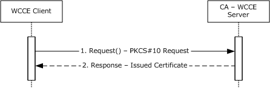

Figure 13: Basic enrollment

The message flow represented in the preceding figure is as follows:

- The [**end entity**](#gt_end-entity), by using a WCCE client component, creates a PKCS#10 request and submits it to the CA, as specified in [MS-WCCE] section 3.1.1.4.3.1.1.
- The CA responds by issuing a certificate, as specified in [MS-WCCE] section 3.2.1.4.2.1.4.1.1.
**Final System state**

- The end entity has the issued certificate from CA.
- The CA-WCCE server stores the request fields in the Request table, as specified in [MS-WCCE] sections 3.2.1.4.2.1.4.4 and 3.2.1.4.2.1.4.5, along with the status of the certificate request and the end entity details.

## 3.2 Example 2: Enrollment from a Standalone CA (Basic Enrollment) with Certificate Transparency Enabled

This example further demonstrates the “Enroll for a Certificate” use case, as described in section [2.5.3.1](#Section_2.1).

This example builds on the previous example in section [3.1](#Section_3.2), by introducing an enrollment scenario that uses the Certificate Transparency feature described in [MS-WCCE](../MS-WCCE/MS-WCCE.md) section 1.3.2.3 and in section [1.1.6](../MS-WCCE/MS-WCCE.md) of this document.

**Initial System State and Prerequisites**

The example that is described in this section applies under the following conditions:

- The WCCE client implements the basic enrollment mode (see [MS-WCCE] section 3.1.1.1).
- The [**certificate authority (CA)**](#gt_certification-authority-ca) server implements the [**standalone CA**](#gt_standalone-ca) mode (see [MS-WCCE] section 3.1.2.1) and the standalone CA role that is configured on the server, to issue the certificates.
**Sequence**

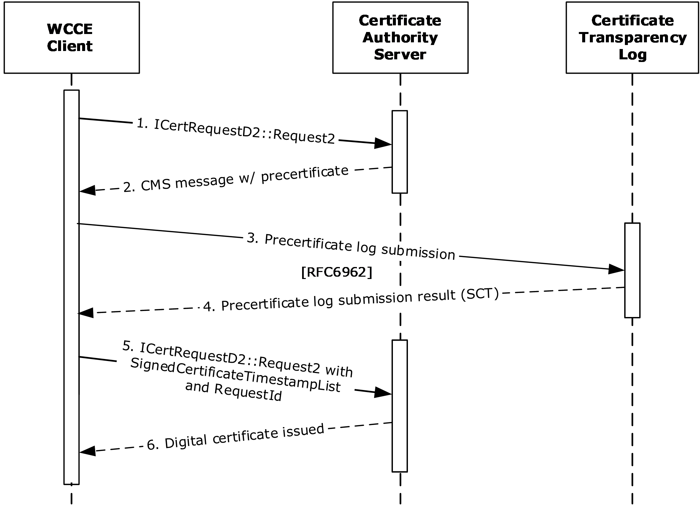

Figure 14: Basic enrollment with Certificate Transparency enabled

The message flow represented in the preceding figure is as follows:

- The WCCE client sends an **ICertRequestD2::Request2** message to the certificate authority (CA) server with the 0x0400000 bit of the *dwFlags* parameter set to indicate that additional server processing is required for [**certificate transparency**](#gt_certificate-transparency), as described in [MS-WCCE] section 3.2.1.4.3.1.1.
- The CA server returns a CMS message containing a precertificate, as described in [MS-WCCE] section 3.2.1.4.2.1.4.8.2.
- The WCCE client sends the precertificate to the certificate transparency log, as described in [MS-WCCE] section 3.1.1.4.3.5.2 and [[RFC6962]](https://go.microsoft.com/fwlink/?linkid=867272) section 3.
- The certificate transparency log returns the resulting Signed Certificate Timestamp (SCT) to the client, acknowledging the initial precertificate log submission, as described in [RFC6962] section 3.
The WCCE client builds a SignedCertificateTimestampList structure from the SCT sent by the certificate transparency log.

- The WCCE client issues an **ICertRequestD2::Request2** message to the CA server containing the following:
- A SignedCertificateTimestampList (SCTList) structure encoded within the *pctbRequest* parameter of the **ICertRequestD2::Request2** method, as described in [MS-WCCE] section 3.1.1.4.3.5.2.
- A *RequestId* attribute ([MS-WCCE] section 2.2.2.7.10) constructed from the **Returned_Request_ID** ADM element and added to the *pwszAttributes* parameter of the **ICertRequestD2::Request2** method.
- The CA server issues a digital certificate to the WCCE client.
**Final System state**

- The end entity has the issued certificate from the CA server.
- The CA server stores the request fields in the Request table, as specified in [MS-WCCE] sections 3.2.1.4.2.1.4.4 and 3.2.1.4.2.1.4.4, along with the status of the certificate request and the end entity details.
- The certificate transparency log has an accessible copy of the issued precertificate.

## 3.3 Example 3: Enrollment from an Enterprise CA (Template-based Enrollment)

This example demonstrates the Enroll for a [**certificate**](#gt_certificate) use case described in section [2.5.3.1](#Section_2.1).

This example builds on the example in section [3.1](#Section_3.2) by introducing an [**enterprise CA**](#gt_enterprise-certificate-authority-enterprise-ca). An enterprise CA uses [**certificate templates**](#gt_certificate-template) for all [**certificate enrollments**](#gt_certificate-enrollment). Certificate templates, as defined in [MS-CRTD](#Section_2.9.1.3), contain data for requesting and issuing certificates. Policy algorithms use certificate templates to determine how to respond to certificate requests. In this example, the caller creates a certificate request PKCS#10, as specified in [MS-WCCE](../MS-WCCE/MS-WCCE.md) section 3.1.1.4.3.1.1, that is based on the certificate template. The enterprise CA then uses the template information to decide whether to issue the certificate, and if it does, how to construct the certificate.

**Initial System State and Prerequisites**

This example of certificate enrollment is based on the following assumptions:

- The [**end entity**](#gt_end-entity) operates in the client mode specified in [MS-WCCE] section 3.1.2 and the server implements the enterprise CA mode as specified in [MS-WCCE] section 3.2.2.
- The enterprise CA role is configured on the server to issue the certificates.
- The certificate templates are stored in [**Active Directory**](#gt_active-directory) as specified by [MS-CRTD].
**Sequence**

The sequence of the steps for this example is organized into the following sections:

A. Query for available certificate templates from the Active Directory server.

B. Request for a certificate.

**A. Query for available certificate templates from the Active Directory server**

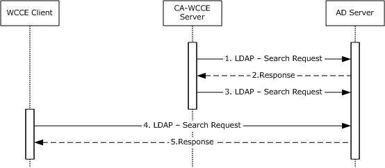

Figure 15: Query for available certificate templates from the Active Directory server

- Upon startup, the [**CA**](#gt_certification-authority-ca)-WCCE server requests the Active Directory server for certificate template data via an [**LDAP**](#gt_lightweight-directory-access-protocol-ldap) search request as described in [MS-WCCE] section 3.2.2.1.
- The Active Directory server processes the request and responds with certificate template data in the format that is specified in [MS-WCCE] section 3.2.2.1.1.
- The CA-WCCE server registers itself to receive change notifications, as specified in [MS-ADTS](../MS-ADTS/MS-ADTS.md) section 3.1.1.3.4.1.9, when an [**attribute**](#gt_attribute) of a certificate template is being modified in order to stay up-to-date with any changes and to avoid having to retrieve the templates for each request.
- The WCCE client requests for the certificate templates from the Active Directory server via an LDAP search request as described in [MS-WCCE] section 3.2.2.1.
The Active Directory server responds with certificate templates in the format that is specified in [MS-WCCE] section 3.2.2.1.

**B. Request for a certificate**

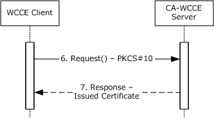

Figure 16: Request for a certificate

- The end entity, by using the WCCE client component, creates a PKCS#10 request based on one of the certificate templates and submits it to the CA by calling the Request method specified in [MS-WCCE] section 3.1.2.4.2.
- The CA checks the policy that is defined in the certificate template and concludes that it is appropriate to issue the certificate (see [MS-WCCE] section 3.2.2.6.2.1.4). The CA constructs a new certificate, as defined by the certificate template (see [MS-WCCE] section 3.2.2.6.2.1.4), and sends a new certificate to the client.
**Final System State**

- The end entity has the issued certificate from the CA.
- The CA-WCCE Server stores the request fields in the Request table as specified in [MS-WCCE] sections 3.2.1.4.2.1.4.4 and 3.2.1.4.2.1.4.5 with the status of the certificate request and also the end entity details.

## 3.4 Example 4: Enrollment in the Domain Environment with the XCEP/WSTEP Protocols

This example describes the Enroll for a [**certificate**](#gt_certificate) use case described in section [2.5.3.1](#Section_2.1).

**Initial System State and Prerequisites**

This example is based on the following assumptions:

- The client computer, XCEP server, WSTEP server, and [**CA**](#gt_certification-authority-ca) server exist in the same domain.
- The client computer is configured with the policy server's endpoint information in its local configuration and the local configuration has the [**policy server endpoints**](#gt_policy-server-endpoint) information to locate the XCEP server.
- The WSTEP server operates in the client mode specified in [MS-WCCE](../MS-WCCE/MS-WCCE.md) section 3.1.2 and the CA server implements the [**enterprise CA**](#gt_enterprise-certificate-authority-enterprise-ca) mode specified in [MS-WCCE] section 3.2.2.
- The enterprise CA role is properly configured on the CA server to issue the certificates.
**Sequence**

The process and specific message flow in this example are as follows:

A. Query for [**certificate enrollment policies**](#gt_certificate-enrollment-policy).

B. Request for a certificate.

**A. Query for certificate enrollment policies**

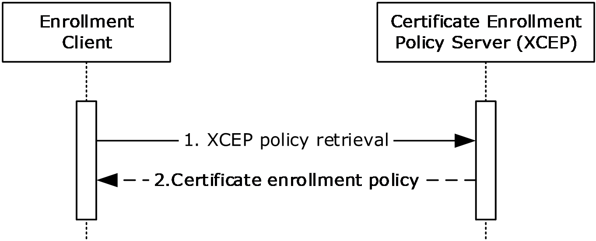

Figure 17: Query for certificate enrollment policies

- The enrollment client sends a GetPolicies request message ([MS-XCEP](../MS-XCEP/MS-XCEP.md) section 3.1.4.1) to an XCEP server to retrieve the certificate enrollment policy information.
- The XCEP server responds with the certificate enrollment policy information.
**B. Request for a certificate**

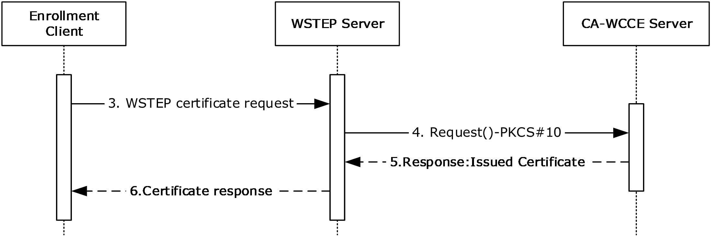

Figure 18: Request for a certificate

- Based on the [**CEP**](#gt_cep) that is received from the XCEP server, the enrollment client, by using the WSTEP client component, creates a **RequestSecurityToken** request, as described in [MS-WSTEP](../MS-WSTEP/MS-WSTEP.md), and submits the request to the WSTEP server.
- The WSTEP server, by using a WCCE client component, creates a PKCS #10 request and submits it to the CA as specified in [MS-WCCE] section 3.1.1.4.3.1.1.
- The CA-WCCE server responds by issuing a certificate as specified in [MS-WCCE] section 3.2.1.4.2.1.4.1.1.
- The WSTEP server responds with a newly issued certificate to its requested enrollment client.
**Final System State**

- The client computer has the issued certificate from the CA.
- The CA-WCCE Server stores the request fields in the Request table as specified in [MS-WCCE] sections 3.2.1.4.2.1.4.4 and 3.2.1.4.2.1.4.5, along with the status of the certificate request and the [**end entity**](#gt_end-entity) details.

## 3.5 Example 5: Enrollment with CA Administrator Approval

This example demonstrates the Enroll for a Certificate and Approve Pending Request use cases described in section [2.5.3.1](#Section_2.1).

This example builds on the example in section [3.3](#Section_3.3) by introducing a [**CA administrator**](#gt_ca-administrator) who modifies and approves the [**certificate**](#gt_certificate) request before the certificate is issued. One possible context for this scenario is where the certificate that is being requested requires a higher level of scrutiny before it can be issued or requires input from someone other than the requestor.

**Initial System State and Prerequisites**

This example of [**certificate enrollment**](#gt_certificate-enrollment) is based on the following additional assumption, in addition to the ones that are described in the example in section 3.3:

- A [**certificate template**](#gt_certificate-template) has been defined in [**Active Directory**](#gt_active-directory) that has the **msPKI-Enrollment-FlagCT_FLAG_PEND_ALL_REQUESTS** bit set (see [MS-WCCE](../MS-WCCE/MS-WCCE.md) section 3.2.2.6.2.1.4.5.6).
**Sequence**

The sequence of the steps for this example is organized into the following sections:

A. Query for available certificate templates from the Active Directory server

B. Request for a certificate

C. Approve the pending certificate request

D. Get the issued certificate

**A. Query for available certificate templates from the Active Directory server**

Figure 19: Query for available certificate templates

- Upon startup, the [**CA**](#gt_certification-authority-ca)-WCCE server requests the certificate template data from the Active Directory server via an [**LDAP**](#gt_lightweight-directory-access-protocol-ldap) search request as described in [MS-WCCE] section 3.2.2.1.
- The Active Directory server processes the request and responds with the certificate template data in the format that is specified in [MS-WCCE] section 3.2.2.1.1.
- The CA-WCCE server registers itself with the Active Directory server to receive change notifications, as specified in [MS-ADTS](../MS-ADTS/MS-ADTS.md) section 3.1.1.3.4.1.9, when an [**attribute**](#gt_attribute) of a certificate template is being modified to stay up-to-date with any changes and to avoid retrieving the templates for each request.
- The WCCE client requests the certificate templates from the Active Directory server via an LDAP search request as described in [MS-WCCE] section 3.2.2.1.
- The Active Directory server responds with certificate templates in the format that is specified in [MS-WCCE] section 3.2.2.1.
**B. Request for a certificate**

Figure 20: Request for a certificate

- The [**end entity**](#gt_end-entity), by using the WCCE client, creates a PKCS#10 request based on one of the certificate templates and submits it to the CA by calling the Request method specified in [MS-WCCE] section 3.1.2.4.2.
- The CA checks the certificate template and because the msPKI-Enrollment-Flag has the CT_FLAG_PEND_ALL_REQUESTS bit set (see [MS-WCCE] section 3.2.2.6.2.1.4.5.6), it records this request in its database and informs the client that the request's status is set to pending (see [MS-WCCE] section 3.2.1.4.2.1).
**C. Approve the pending certificate request**

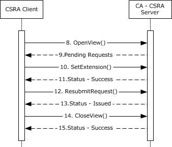

Figure 21: Approve the pending certificate request

- The CA administrator, by using an implementation that has a CSRA client component, queries the CA database to obtain information about pending requests by calling the OpenView method, as specified in [MS-CSRA](../MS-CSRA/MS-CSRA.md) section 3.1.4.1.12.
- The CA-CSRA server responds with the list of the pending requests.
- The CA administrator sends the **SetExtension** method to add the certificate extension on the pending request which has to be approved from the list returned in step 9.
- The CA-CSRA server adds the requested certificate extensions, as specified in [MS-CSRA] section 3.1.4.1.1 and returns a success response message.
- The CA administrator sends the **ResubmitRequest** method to approve the request.
- The CA-CSRA server processes the request, as specified [MS-CSRA] section 3.1.4.1.3 and returns the disposition as an issued certificate.
- The CA administrator requests the CA to close the CA database view by calling the **CloseView** method.
- The CA-CSRA processes the **CloseView** method, as specified in [MS-CSRA] section 3.1.4.1.14 and returns a success response message.
**D. Get the issued certificate**

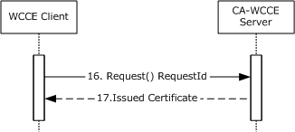

Figure 22: Request for the issued certificate

- After the certificate has been approved by the CA administrator, the caller of the certificate, by using the WCCE client, requests the issued certificate from the CA by calling the Request method, as specified in [MS-WCCE] section 3.1.1.4.3.7.
- The CA processes the request and returns the issued certificate to the WCCE client.
**Final System State**

- The end entity has the issued certificate request from the CA.
- The CA-WCCE server store the request fields in the Request table, as specified in [MS-WCCE] sections 3.2.1.4.2.1.4.4 and 3.2.1.4.2.1.4.5, along with the status of the certificate request and the end entity details.
- The CA-CSRA server has updated the extension table.

## 3.6 Example 6: Enroll on Behalf of Request and Renewal

This example demonstrates the Enroll for a [**certificate**](#gt_certificate), Enroll Certificate on Behalf of User and Renew Certificate use cases described in section [2.5.3.1](#Section_2.1).

This example builds on the example in section [3.3](#Section_3.3) by introducing a cosigner for the certificate request. In this example, the enrollment agent creates and signs the initial certificate request. The enrollment agent then submits the signed request to the [**CA**](#gt_certification-authority-ca). The CA returns the issued certificate to the enrollment agent, who then provides the issued certificate to the [**end entity**](#gt_end-entity) via an out-of-band process.

Later, when a certificate needs to be renewed, the end entity creates a renewal request and signs it with the [**key**](#gt_key) that is associated with its current certificate. The [**certificate template**](#gt_certificate-template) is configured to allow renewals when the request is signed by the end entity's existing valid certificate that is based on the same template. The end entity submits the renewal request to the CA. If the certificate that is used for the signature is still valid, the CA automatically renews the certificate and returns the issued certificate to the client.

Smart card certificates are typically provisioned in the following manner: The smart card users might visit an enrollment agent in person so that their identity can be verified. The enrollment agent can then submit the certificate request on their behalf. The end entity, however, is allowed to renew their certificate without again requiring the involvement of the enrollment agent. By signing the renewal request with its existing valid certificate, it is providing evidence that the identity has already been verified.

**Initial System State and Prerequisites**

This example has the following additional assumptions, in addition to ones that are described in the example in section 3.3:

- A certificate template has been defined in [**Active Directory**](#gt_active-directory) that has the msPKI-RA-Application-Policies [**attribute**](#gt_attribute) set with [**enhanced key usage (EKU)**](#gt_enhanced-key-usage-eku); for example, 1.3.6.1.4.1.311.20.2.1, Certificate Request Agent. The certificate template also has the 0x00000040 (CT_FLAG_PREVIOUS_APPROVAL_VALIDATE_REENROLLMENT) bit set on the **msPKI-Enrollment-Flag** field.
- The enrollment agent has a certificate containing an EKU with the same object identifier (OID) as defined in the previous template's **msPKI-RA-Application-Policies** attribute.
**Sequence**

The sequence of the steps for this example is organized into the following sections:

A. Query for available certificate templates from the Active Directory server

B. Request for a certificate on behalf of another user

C. Query for available templates and renew the certificate on behalf of another user

**A. Query for available certificate templates from the Active Directory server**

Figure 23: Query for available certificate templates

- Upon startup, the CA-WCCE server requests the certificate template data from the Active Directory server via an [**LDAP**](#gt_lightweight-directory-access-protocol-ldap) search request, as described in [MS-WCCE](../MS-WCCE/MS-WCCE.md) section 3.2.2.1.
- The Active Directory server processes the request and responds with certificate template data in the format that is specified in [MS-WCCE] section 3.2.2.1.1.
- The CA-WCCE server registers itself to receive change notifications, as specified in [MS-ADTS](../MS-ADTS/MS-ADTS.md) section 3.1.1.3.4.1.9, when an attribute of a certificate template is being modified in order to stay up-to-date with any changes and to avoid retrieving the templates for each request.
- The enrollment agent, by using a WCCE client component, requests the certificate templates from the Active Directory server via an LDAP search.
- Active Directory processes the request and returns the certificate templates.
**B. Request for certificate on behalf of another user**

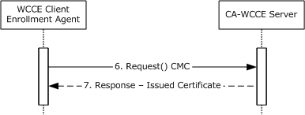

Figure 24: Request for certificate on behalf of another user

- The enrollment agent generates a [**Cryptographic Message Syntax (CMS)**](#gt_cryptographic-message-syntax-cms) structure with an embedded CMC request on behalf of another user, as specified in [MS-WCCE] section 3.1.1.4.3.3, and submits it to the CA by calling the Request method, as specified in [MS-WCCE] section 3.1.2.4.2.
- The CA determines that the certificate template that corresponds to the request requires the enrollment agent's signature. It validates the signature and verifies that the certificate that is associated with the signature has the required EKUs, as specified in [MS-WCCE] section 3.2.2.6.2.1.2.1.2. When validation is completed, the CA issues the certificate and sends it to the enrollment agent.
**Note**

The enrollment agent then transfers the new certificate to the end entity via an out-of-band process. The process for this communication is not defined within this document.

**C. Query for certificate templates and renew the certificate**

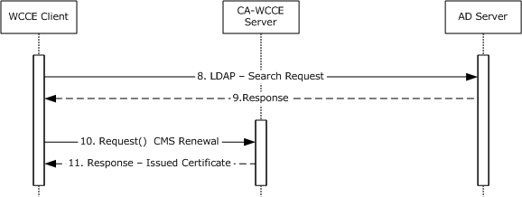

Figure 25: Query for certificate templates and renew the certificate

- When it is time to renew the certificate, the end entity uses a WCCE client component to retrieve the certificate templates from the Active Directory server via an LDAP search request.
- The Active Directory server validates the request and returns the certificate templates.
- The client creates a CMS renewal request and sends it to the CA, as specified in [MS-WCCE] section 3.1.1.4.3.2.
- When the CA receives the request, it checks the certificate template for the msPKI-Enrollment-Flag and confirms that the 0x00000040 (CT_FLAG_PREVIOUS_APPROVAL_VALIDATE_REENROLLMENT) bit is set, which allows the use of the previous certificate to sign the request, as specified in [MS-WCCE] section 3.2.2.6.2.1.2.3. The CA issues the renewed certificate and sends it to the end entity.
**Final System State**

The end entity has the renewed certificate.

- The CA-WCCE Server stores the request fields in the Request table, as specified in [MS-WCCE] sections 3.2.1.4.2.1.4.4 and 3.2.1.4.2.1.4.5, along with certificate status and the requested end entity details.

## 3.7 Example 7: Private Key Archival and Recovery

This example is the combination of two separate use cases. The first is the Enroll for a Certificate - End Entity use case, section [2.5.3.1](#Section_2.1), and the second is the Recover Archived Certificate and Key - [**CA administrator**](#gt_ca-administrator) use case, section [2.5.3.2](#Section_2.1). This example builds on the example in section [3.3](#Section_3.3) by introducing [**private key**](#gt_private-key) archival and recovery. A CA administrator configures the [**CA**](#gt_certification-authority-ca) to be able to archive private keys. An [**end entity**](#gt_end-entity) enrolls for an [**encryption**](#gt_encryption) [**certificate**](#gt_certificate), based upon a template that has been configured for archival. Later, a CA administrator recovers the archived certificate and a private key from the CA database.

**Initial System State and Prerequisites**

This example of Key Archival and Recovery is based on the following additional assumption in addition to ones that are described in the example in section 3.3:

- The [**certificate template**](#gt_certificate-template) has been configured in [**Active Directory**](#gt_active-directory) with the msPKI-Private-Key-Flag [**attribute**](#gt_attribute) with the 0x00000001 (CT_FLAG_REQUIRE_PRIVATE_KEY_ARCHIVAL) bit as specified in [MS-CRTD](#Section_2.9.1.3).
- A CA administrator is acting as a KRA and has obtained a KRA encryption certificate.
**Sequence**

The process and specific message flow in this example are as follows:

A. Query for available certificate templates from Active Directory server

B. Configure CA to use KRA certificate

C. Archive private key

D. Recover private key

**A. Query for available certificate templates from the Active Directory server**

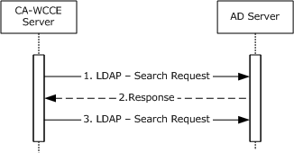

Figure 26: Query for certificate templates from the Active Directory server

- Upon startup, the CA-WCCE server requests certificate template data from the Active Directory server via an [**LDAP**](#gt_lightweight-directory-access-protocol-ldap) search request, as described in [MS-WCCE](../MS-WCCE/MS-WCCE.md) section 3.2.2.1.
- The Active Directory server processes the request and responds with certificate template data in the format that is specified in [MS-WCCE] section 3.2.2.1.1.
- The CA-WCCE server registers itself to receive change notifications, as specified in [MS-ADTS](../MS-ADTS/MS-ADTS.md) section 3.1.1.3.4.1.9, when an attribute of a certificate template is being modified in order to stay up-to-date with any changes and to avoid having to retrieve the templates for each request.
**B. Configure the CA to use a KRA certificate**

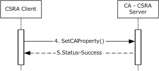

Figure 27: Configure the CA to use a KRA certificate

- The CA administrator configures the CA by using the CSRA client to use the KRA certificates when archiving private keys. This is accomplished by calling the **SetCAProperty** method and setting the 0x0000001a (CR_PROP_KRACERT) and 0x00000018 (CR_PROP_KRACERTUSEDCOUNT) properties, as specified in [MS-CSRA](../MS-CSRA/MS-CSRA.md) section 3.1.4.2.3.
- The CA-CSRA server processes the request according to the processing rules specified in [MS-CSRA] section 3.1.4.2.3 and returns the success response message.
**C. Archive the private key**

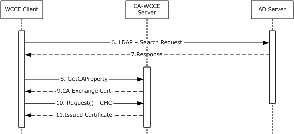

Figure 28: Query for certificate templates and archive the private key

- The end entity, by using a WCCE client component, requests the certificate templates from the Active Directory server via an LDAP search request.
- The Active Directory server returns the certificate templates in an LDAP search response.
- Because the template specified by the caller has the 0x00000001 (CT_FLAG_REQUIRE_PRIVATE_KEY_ARCHIVAL) bit set on the msPKI-Private-Key-Flag attribute, the client calls the GetCAProperty method to retrieve the CA [**exchange certificate**](#gt_exchange-certificate).
- The CA returns the exchange certificate, and this exchange certificate is required to construct a certificate request with the private key archival information, as specified in [MS-WCCE] section 3.1.1.4.3.6.
- The client constructs a CMS request that includes the CMC request and sends it to the CA, as specified in [MS-WCCE] section 3.1.1.4.3.6.
- When the CA receives the request, it issues a new certificate and archives the private key by using the KRA certificate that the administrator configured in step 3, as specified in [MS-WCCE] section 1.3.2.1.
**D. Recover the archived private key**

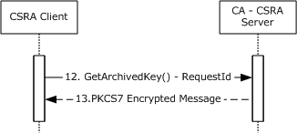

Figure 29: Recover the archived private key

- Later, when the CA administrator has to recover the archived private key by using a CSRA client component, he calls the **GetArchivedKey** method to retrieve it, as specified in [MS-CSRA] section 3.1.4.2.9.
- The CA-CSRA server processes the request and it returns the archived private key to the CSRA client.
**Final System State**

- The private key of the requested certificate is archived on the CA.
- The CSRA administrator has the private key of the archived certificate.

## 3.8 Example 8: Certificate Revocation

The goal of this example is as detailed in the Revoke a Certificate - [**CA administrator**](#gt_ca-administrator) use case. This example builds on the example in section [3.3](#Section_3.3) by adding the process of revoking a previously issued [**certificate**](#gt_certificate). A CA administrator is able to revoke certificates for different reasons, such as [**private key**](#gt_private-key) compromise or cessation of operation.

**Initial System State and Prerequisites**

This example of certificate [**revocation**](#gt_revocation) is based on the following additional assumption as well as the ones that are described in the example in section 3.3:

- The Config_CA_CDP_Publish_To_Base and Config_CA_CDP_Publish_To_delta elements of the CA's ADM (see [MS-WCCE](../MS-WCCE/MS-WCCE.md) section 3.2.1.1.4) are configured with valid paths.
**Sequence**

The process and specific message flow in this example are as follows:

A. Query for available [**certificate templates**](#gt_certificate-template) from the [**Active Directory**](#gt_active-directory) server

B. Request for a certificate

C. Revoke the certificate

**A. Query for available certificate templates from the Active Directory server**

Figure 30: Query for available certificate templates from the Active Directory server

- Upon startup, the [**CA**](#gt_certification-authority-ca)-WCCE server requests the certificate template data from the Active Directory server via an [**LDAP**](#gt_lightweight-directory-access-protocol-ldap) search request, as described in [MS-WCCE] section 3.2.2.1.
- The Active Directory server processes the request and responds with certificate template data in the format that is specified in [MS-WCCE] section 3.2.2.1.1.
- The CA-WCCE server registers itself with the Active Directory server to receive change notifications, as specified in [MS-ADTS](../MS-ADTS/MS-ADTS.md) section 3.1.1.3.4.1.9, when an [**attribute**](#gt_attribute) of a certificate template is being modified in order to stay up-to-date with any changes and to avoid retrieving the templates for each request.
- The [**end entity**](#gt_end-entity), by using a WCCE client, requests the certificate templates from the Active Directory server via an LDAP search request, as described in [MS-WCCE] section 3.2.2.1.
- The Active Directory server responds with the certificate templates in the format that is specified in [MS-WCCE] section 3.2.2.1.
**B. Request for certificate**

Figure 31: Request for certificate

- The end entity, by using the WCCE client, creates a PKCS#10 request that is based on one of the certificate templates and submits it to the CA by calling the Request method specified in [MS-WCCE] section 3.1.2.4.2.
- The CA checks the policy defined in the certificate template and concludes that it is appropriate to issue the certificate (see [MS-WCCE] section 3.2.2.6.2.1.4). The CA constructs a new certificate, as defined by the certificate template (see [MS-WCCE] section 3.2.2.6.2.1.4) and sends a new certificate to the client.
**C. Revoke the certificate**

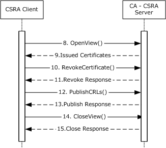

Figure 32: Revoke the certificate

- Later, the issued certificate might have to be revoked. The CA administrator, by using a Certificate Services Remote Administration (CSRA) client component, queries the CA database to obtain the serial number of the certificate to be revoked by calling the **OpenView** method, as specified in [MS-CSRA](../MS-CSRA/MS-CSRA.md) section 3.1.4.1.12.
- The CA returns the serial numbers of the certificates to the CSRA client.
- The CA administrator revokes the certificate by calling the RevokeCertificate method with the serial number of the intended certificate, as specified in [MS-CSRA] section 3.1.4.1.8.
- The CA revokes the requested certificate and returns a success response message to the CSRA client.
- The CA administrator instructs the CA to publish the CRL by calling the **PublishCRLs** method, as specified in [MS-CSRA] section 3.1.4.2.1.
- The CA publishes the CRLs on the configured publishing path.
- The CA administrator closes the CA database view by calling the **CloseView** method, as specified in [MS-CSRA] section 3.1.4.1.14.
- The CA validates the request and closes the database view.
**Final System State**

- The CA-WCCE server stores the request fields in the Request table, as specified in [MS-WCCE] sections 3.2.1.4.2.1.4.4 and 3.2.1.4.2.1.4.5, along with the status of the certificate request and the end entity details.
- The CA-CSRA server has updated the CRL table.

## 3.9 Example 9: Certificate Denied by the Policy Algorithm

This example represents a failure scenario for the Enroll for a Certificate - End Entity use case described in section [2.5.3.1](#Section_2.1).

This example builds on the example in section [3.3](#Section_3.3).

**Initial System State and Prerequisites**

This example is based on the following additional assumption, in addition to ones that are described in the example in section 3.3:

- The caller does not have permission to enroll.
**Sequence**

The process and specific message flow in this example are as follows:

A. Query for available [**certificate templates**](#gt_certificate-template) from the [**Active Directory**](#gt_active-directory) server

B. Request for a [**certificate**](#gt_certificate)

**A. Query for certificate templates from the Active Directory server**

Figure 33: Query for available certificate templates from Active Directory server

- Upon startup, the [**CA**](#gt_certification-authority-ca)-WCCE server requests certificate template data from the Active Directory server via an [**LDAP**](#gt_lightweight-directory-access-protocol-ldap) search request, as described in [MS-WCCE](../MS-WCCE/MS-WCCE.md) section 3.2.2.1.
- The Active Directory server processes the request and responds with certificate template data in the format that is specified in [MS-WCCE] section 3.2.2.1.1.
- The CA-WCCE server registers itself with the Active Directory server to receive change notifications, as specified in [MS-ADTS](../MS-ADTS/MS-ADTS.md) section 3.1.1.3.4.1.9, when an [**attribute**](#gt_attribute) of a certificate template is being modified in order to stay up-to-date with any changes and to avoid retrieving the templates for each request.
- The [**end entity**](#gt_end-entity), by using the WCCE client, requests the certificate templates from the Active Directory server via an LDAP search request, as described in [MS-WCCE] section 3.2.2.1.
- The Active Directory server responds with certificate templates in the format that is specified in [MS-WCCE] section 3.2.2.1.
**B. Request for a certificate**

Figure 34: Request for a certificate

- The end entity, by using the WCCE client component, creates a PKCS#10 request that is based on one of the certificate templates and submits it to the CA by calling the Request method specified in [MS-WCCE] section 3.1.2.4.2.
- When the CA receives the request, the policy algorithm is checked to determine whether it is to be issued. The CA examines ntSecurityDescriptor of the certificate template that corresponds to the request to determine if the caller has the permissions that are required to enroll for that template, as specified in [MS-WCCE] section 3.2.2.6.2.1.4.3 and [MS-CRTD](#Section_2.9.1.3) section 2.5. In this example, the caller does not have permission, so the error 0x80094012L (CERTSRV_E_TEMPLATE_DENIED) is returned.
**Final System State**

- The CA-WCCE Server stores the request fields in the Request table, as specified in [MS-WCCE] sections 3.2.1.4.2.1.4.4 and 3.2.1.4.2.1.4.5, with the status of the certificate (1) request and also the end entity details.

## 3.10 Example 10: Certificate Denied Due to Out-of-Sync Certificate Templates

This example represents another failure scenario for the Enroll for a Certificate - End Entity use case described in section [2.5.3.1](#Section_2.1). This example builds on the example in section [3.3](#Section_3.3) and describes a situation where two [**Active Directory**](#gt_active-directory) servers are out-of-sync, resulting in a version mismatch between the [**certificate templates**](#gt_certificate-template) that are used by client and server. Due to this mismatch, the server rejects the request. Later, after the directory is synchronized, the client submits another request that results in the [**certificate**](#gt_certificate) being issued.

**Initial System state and Prerequisites**

This example is based on the following additional assumptions, in addition to ones that are described in the example in section 3.3:

- There is more than one Active Directory server on this network that replicates periodically.
- Active Directory replication occurs, as discussed in [MS-DRSR](../MS-DRSR/MS-DRSR.md).
- A [**CA administrator**](#gt_ca-administrator) has the appropriate security permissions to make modifications to certificate templates that are stored within Active Directory. Modifications made to Active Directory are performed as specified within [MS-ADTS](../MS-ADTS/MS-ADTS.md).
**Sequence**

The process and specific message flow in this example are as follows:

A. Query for available certificate templates from Active Directory server

B. Modify certificate templates with new policies

C. Request for a certificate

D. DRSR Directory replication

E. Request for a certificate

**A. Query for certificate templates from the Active Directoryserver**

Figure 35: Query for certificate templates from the Active Directory server

- Upon startup, the [**CA**](#gt_certification-authority-ca)-WCCE server requests the Active Directory server for certificate template data via an [**LDAP**](#gt_lightweight-directory-access-protocol-ldap) search request, as described in [MS-WCCE](../MS-WCCE/MS-WCCE.md) section 3.2.2.1.
- The Active Directory server processes the request and responds with certificate template data in the format that is specified in [MS-WCCE] section 3.2.2.1.1.
- The CA-WCCE server registers itself to receive change notifications, as specified in [MS-ADTS] section 3.1.1.3.4.1.9, when an [**attribute**](#gt_attribute) of a certificate template is being modified in order to stay up-to-date with any changes and to avoid having to retrieve the templates for each request.
**B. Modify certificate templates with new policies**

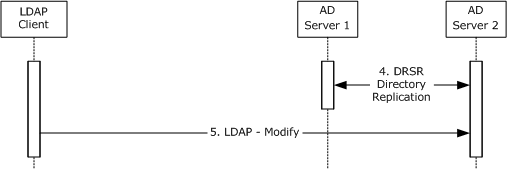

Figure 36: Modify certificate templates after Directory replication

- Later, the two Active Directory servers replicate their information between each other, as specified in [MS-DRSR].
- After the replication, a CA administrator, by using an LDAP client, modifies some of the certificate templates with new policies on Active Directory Server 2. Modifications to Active Directory are performed as detailed in [MS-ADTS].
**C. Request for a certificate**

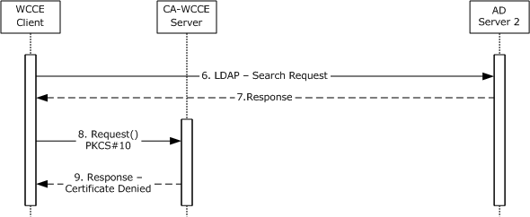

Figure 37: Request for a certificate

- The WCCE client requests the certificate templates from the Active Directory server via an LDAP search request, as described in [MS-WCCE] section 3.2.2.1.
- The Active Directory server responds with certificate templates in the format that is specified in [MS-WCCE] section 3.2.2.1.
- The client creates a PKCS#10 request that is based on one of the certificate templates and submits it to the CA by calling the Request method specified in [MS-WCCE] section 3.1.2.4.2.
- As described in [MS-WCCE] section 3.2.2.6.2.1.4.2, the CA's policy algorithm verifies the certificate template version. The changes made on Active Directory Server 2 have not yet replicated to Active Directory Server 1. Because the CA has not been notified of the change to the template and the CA's certificate template instance is of an older version, the CA rejects a request and replies with error **CERTSRV_E_BAD_TEMPLATE_VERSION**.
**D. DRSR Directory Replication**

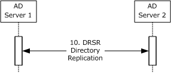

Figure 38: DRSR Directory Replication

- Later, the two Active Directory servers replicate their information between each other, as specified in [MS-DRSR].
**E. Request for a certificate**

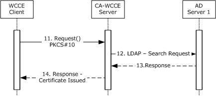

Figure 39: Request for a certificate

- Later, the client attempts again the request for the same certificate in the same way as step 8.
- This time, the CA has registered the change in Active Directory because it has registered for asynchronous notifications in step 2.
- The CA retrieves the updated certificate template data from the Active Directory Server 1, as specified in [MS-WCCE] section 3.2.2.1.1.
- The CA checks the policy defined by the certificate and issues the certificate. The CA constructs the new certificate, as defined by the certificate template (see [MS-WCCE] section 3.2.2.6.2.1.4), and returns the new certificate to the client.
**Final System state**

- The WCCE server stores the request fields in the Request table, as specified in [MS-WCCE] sections 3.2.1.4.2.1.4.4 and 3.2.1.4.2.1.4.5.

# 4 Microsoft Implementations

The information in this overview is applicable to the following versions of Windows:

The terms "earlier" and "later", when used with a product version, refer to either all preceding versions or all subsequent versions, respectively. The term "through" refers to the inclusive range of versions. Applicable Microsoft products are listed chronologically in this section.

**Windows Client Releases**

- Windows 2000 Professional operating system
- Windows XP operating system
- Windows Vista operating system
- Windows 7 operating system
- Windows 8 operating system
- Windows 8.1 operating system
- Windows 10 operating system
- Windows 11 operating system
**Windows Server Releases**

- Windows 2000 Server operating system
- Windows Server 2003 operating system
- Windows Server 2003 R2 operating system
- Windows Server 2008 operating system
- Windows Server 2008 R2 operating system
- Windows Server 2012 operating system
- Windows Server 2012 R2 operating system
- Windows Server 2016 operating system
- Windows Server operating system
- Windows Server v1809 operating system
- Windows Server 2019 operating system
- Windows Server 2022 operating system
Exceptions, if any, are noted in the following section.

## 4.1 Product Behavior

<1> Section 1.1.6: Windows Server v1809 and later support Certificate Transparency processing.

<2> Section 2.8: Windows XP and earlier and Windows Server 2003 R2 and earlier do not execute the autoenrollment task based on this timer.

# 5 Change Tracking

This section identifies changes that were made to this document since the last release. Changes are classified as Major, Minor, or None.

The revision class **Major** means that the technical content in the document was significantly revised. Major changes affect protocol interoperability or implementation. Examples of major changes are:

- A document revision that incorporates changes to interoperability requirements.
- A document revision that captures changes to protocol functionality.
The revision class **Minor** means that the meaning of the technical content was clarified. Minor changes do not affect protocol interoperability or implementation. Examples of minor changes are updates to clarify ambiguity at the sentence, paragraph, or table level.

The revision class **None** means that no new technical changes were introduced. Minor editorial and formatting changes may have been made, but the relevant technical content is identical to the last released version.

The changes made to this document are listed in the following table. For more information, please contact [dochelp@microsoft.com](mailto:dochelp@microsoft.com).

| Section | Description | Revision class |
| --- | --- | --- |
| [4](#Section_4) Microsoft Implementations | Added Windows 11 operating system to the Windows client product applicability list. | Major |

## Revision History

| Date | Version | Revision Class | Comments |
| --- | --- | --- | --- |
| 6/17/2011 | 1.0 | New | Released new document. |
| 9/23/2011 | 2.0 | Major | Updated and revised the technical content. |
| 12/16/2011 | 2.0 | None | No changes to the meaning, language, or formatting of the technical content. |
| 3/30/2012 | 3.0 | Major | Updated and revised the technical content. |
| 7/12/2012 | 3.0 | None | No changes to the meaning, language, or formatting of the technical content. |
| 10/25/2012 | 3.0 | None | No changes to the meaning, language, or formatting of the technical content. |
| 1/31/2013 | 3.0 | None | No changes to the meaning, language, or formatting of the technical content. |
| 8/8/2013 | 4.0 | Major | Updated and revised the technical content. |
| 11/14/2013 | 4.0 | None | No changes to the meaning, language, or formatting of the technical content. |
| 2/13/2014 | 4.0 | None | No changes to the meaning, language, or formatting of the technical content. |
| 5/15/2014 | 4.0 | None | No changes to the meaning, language, or formatting of the technical content. |
| 6/30/2015 | 5.0 | Major | Significantly changed the technical content. |
| 10/16/2015 | 5.0 | None | No changes to the meaning, language, or formatting of the technical content. |
| 9/26/2016 | 6.0 | Major | Significantly changed the technical content. |
| 6/1/2017 | 6.0 | None | No changes to the meaning, language, or formatting of the technical content. |
| 12/15/2017 | 7.0 | Major | Significantly changed the technical content. |
| 6/29/2018 | 8.0 | Major | Significantly changed the technical content. |
| 11/5/2018 | 9.0 | Major | Significantly changed the technical content. |
| 6/3/2021 | 10.0 | Major | Significantly changed the technical content. |
| 10/26/2021 | 11.0 | Major | Significantly changed the technical content. |
