# [MS-CFB]: Compound File Binary File Format

Table of Contents

1 Introduction

- [1 Introduction](#Section_1)
  - [1.1 Glossary](#Section_1.1)
  - [1.2 References](#Section_1.2)
    - [1.2.1 Normative References](#Section_1.2.1)
    - [1.2.2 Informative References](#Section_1.2.2)
  - [1.3 Overview](#Section_1.3)
  - [1.4 Relationship to Protocols and Other Structures](#Section_1.4)
  - [1.5 Applicability Statement](#Section_1.5)
  - [1.6 Versioning and Localization](#Section_1.6)
  - [1.7 Vendor-Extensible Fields](#Section_1.7)

2 Structures

- [2 Structures](#Section_2)
  - [2.1 Compound File Sector Numbers and Types](#Section_2.1)
  - [2.2 Compound File Header](#Section_2.2)
  - [2.3 Compound File FAT Sectors](#Section_2.3)
  - [2.4 Compound File Mini FAT Sectors](#Section_2.4)
  - [2.5 Compound File DIFAT Sectors](#Section_2.5)
  - [2.6 Compound File Directory Sectors](#Section_2.6)
    - [2.6.1 Compound File Directory Entry](#Section_2.6.1)
    - [2.6.2 Root Directory Entry](#Section_2.6.2)
    - [2.6.3 Other Directory Entries](#Section_2.6.3)
    - [2.6.4 Red-Black Tree](#Section_2.6.4)
  - [2.7 Compound File User-Defined Data Sectors](#Section_2.7)
  - [2.8 Compound File Range Lock Sector](#Section_2.8)
  - [2.9 Compound File Size Limits](#Section_2.9)

3 Structure Examples

- [3 Structure Examples](#Section_3)
  - [3.1 The Header](#Section_3.1)
  - [3.2 Sector #0: FAT Sector](#Section_3.2)
  - [3.3 Sector #1: Directory Sector](#Section_3.3)
    - [3.3.1 Stream ID 0: Root Directory Entry](#Section_3.3.1)
    - [3.3.2 Stream ID 1: Storage 1](#Section_3.3.2)
    - [3.3.3 Stream ID 2: Stream 1](#Section_3.3.3)
    - [3.3.4 Stream ID 3: Unused, Free](#Section_3.3.4)
  - [3.4 Sector #2: MiniFAT Sector](#Section_3.4)
  - [3.5 Sector #3: Mini Stream Sector](#Section_3.5)

4 Security Considerations

- [4 Security Considerations](#Section_4)
  - [4.1 Validation and Corruption](#Section_4.1)
  - [4.2 File Security](#Section_4.2)
  - [4.3 Unallocated Ranges](#Section_4.3)

5 Appendix A: Product Behavior

- [5 Appendix A: Product Behavior](#Section_5)

6 Change Tracking

- [6 Change Tracking](#Section_6)

For the legal notice and IP terms, see [LEGAL.md](../LEGAL.md).
Last updated: 4/23/2024.
See [Revision History](#revision-history) for full version history.

# 1 Introduction

This document specifies a new structure that is called the Microsoft Compound File Binary (CFB) file format, also known as the Object Linking and Embedding (OLE) or Component Object Model (COM) structured storage compound file implementation binary file format. This structure name can be shortened to [**compound file**](#gt_compound-file).

Traditional [**file systems**](#gt_file-system) encounter challenges when they attempt to store efficiently multiple kinds of [**objects**](#gt_object) in one document. A compound file provides a solution by implementing a simplified file system within a [**file**](#gt_file). Structured storage defines how to treat a single file as a hierarchical collection of two types of objects--[**storage objects**](#gt_storage-object) and [**stream objects**](#gt_stream-object)--that behave as [**directories**](#gt_directory) and files, respectively. This scheme is called structured storage. The purpose of structured storage is to reduce the performance penalties and overhead that is associated with storing separate objects in a flat file. The standard Windows COM implementation of OLE structured storage is called compound files. For more information about structured storage, see [[MSDN-SS]](https://go.microsoft.com/fwlink/?LinkId=90136).

Structured storage solves performance problems by eliminating the need to totally rewrite a file whenever a new object is added or an existing object increases in size. The new data is written to the next available free location in the file, and the storage object updates an internal structure that maintains the locations of its storage objects and stream objects. At the same time, structured storage enables end users to interact and manage a compound file as if it were a single file rather than a nested hierarchy of separate objects. For example, a compound file can be copied, backed up, and emailed like a normal single file.

The following figure shows a simplified file system that has multiple directories and files nested in a hierarchy. Similarly, a compound file is a single file that contains a nested hierarchy of [**storage**](#gt_storage) and stream objects, with storage objects analogous to directories, and stream objects analogous to files.

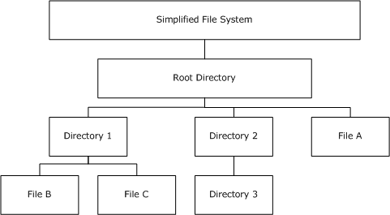

Figure 1: Simplified file system hierarchy with multiple nested directories and files

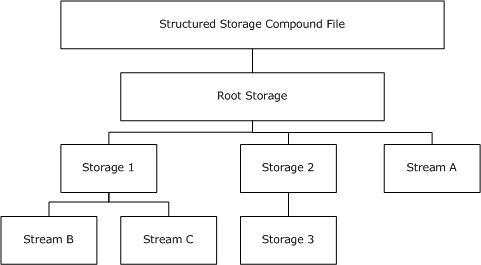

Figure 2: Structured storage compound file hierarchy that contains nested storage objects and stream objects

Sections 1.7 and 2 of this specification are normative. All other sections and examples in this specification are informative.

## 1.1 Glossary

This document uses the following terms:

**access control list (ACL)**: A list of access control entries (ACEs) that collectively describe the security rules for authorizing access to some resource; for example, an object or set of objects.

**application**: A participant that is responsible for beginning, propagating, and completing an atomic transaction. An application communicates with a transaction manager in order to begin and complete transactions. An application communicates with a transaction manager in order to marshal transactions to and from other applications. An application also communicates in application-specific ways with a resource manager in order to submit requests for work on resources.

**child object, children**: An [**object**](#gt_object) that is not the root of its tree. The children of an [**object**](#gt_object) o are the set of all [**objects**](#gt_object) whose parent is o. See section 1 of [MS-ADTS] and section 1 of [MS-DRSR].

**class identifier (CLSID)**: A [**GUID**](#gt_globally-unique-identifier-guid) that identifies a software component; for instance, a DCOM object class or a COM class.

**compound file**: A structure for storing a file system, similar to a simplified FAT file system inside a single file, by dividing the single file into sectors.

**Coordinated Universal Time (UTC)**: A high-precision atomic time standard that approximately tracks Universal Time (UT). It is the basis for legal, civil time all over the Earth. Time zones around the world are expressed as positive and negative offsets from UTC. In this role, it is also referred to as Zulu time (Z) and Greenwich Mean Time (GMT). In these specifications, all references to UTC refer to the time at UTC-0 (or GMT).

**creation time**: The time, in [**UTC**](#gt_coordinated-universal-time-utc), when a [**storage object**](#gt_storage-object) was created.

**directory**: The database that stores information about objects such as users, groups, computers, printers, and the directory service that makes this information available to users and applications.

**directory entry**: A structure that contains a [**storage object's**](#gt_storage-object) or [**stream object's**](#gt_stream-object) FileInformation.

**directory stream**: An array of [**directory entries**](#gt_directory-entry) that are grouped into [**sectors**](#gt_sector).

**double-indirect file allocation table (DIFAT)**: A structure that is used to locate [**FAT**](#gt_file-allocation-table-fat) [**sectors**](#gt_sector) in a [**compound file**](#gt_compound-file).

**file**: An entity of data in the [**file system**](#gt_file-system) that a user can access and manage. A [**file**](#gt_file) must have a unique name in its directory. It consists of one or more streams of bytes that hold a set of related data, plus a set of attributes (also called properties) that describe the [**file**](#gt_file) or the data within the [**file**](#gt_file). The creation time of a [**file**](#gt_file) is an example of a file attribute.

**file allocation table (FAT)**: A data structure that the operating system creates when a volume is formatted by using [**FAT**](#gt_file-allocation-table-fat) or FAT32 [**file systems**](#gt_file-system). The operating system stores information about each [**file**](#gt_file) in the [**FAT**](#gt_file-allocation-table-fat) so that it can retrieve the [**file**](#gt_file) later.

**file system**: A system that enables applications to store and retrieve [**files**](#gt_file) on storage devices. Files are placed in a hierarchical structure. The file system specifies naming conventions for files and the format for specifying the path to a file in the tree structure. Each file system consists of one or more drivers and DLLs that define the data formats and features of the file system. File systems can exist on the following storage devices: diskettes, hard disks, jukeboxes, removable optical disks, and tape backup units.

**globally unique identifier (GUID)**: A term used interchangeably with universally unique identifier (UUID) in Microsoft protocol technical documents (TDs). Interchanging the usage of these terms does not imply or require a specific algorithm or mechanism to generate the value. Specifically, the use of this term does not imply or require that the algorithms described in [[RFC4122]](https://go.microsoft.com/fwlink/?LinkId=90460) or [[C706]](https://go.microsoft.com/fwlink/?LinkId=89824) must be used for generating the [**GUID**](#gt_globally-unique-identifier-guid). See also universally unique identifier (UUID).

**header**: The structure at the beginning of a [**compound file**](#gt_compound-file).

**little-endian**: Multiple-byte values that are byte-ordered with the least significant byte stored in the memory location with the lowest address.

**mini FAT**: A [**file allocation table (FAT)**](#gt_file-allocation-table-fat) structure for the [**mini stream**](#gt_mini-stream) that is used to allocate space in a small [**sector size**](#gt_sector-size).

**mini stream**: A structure that contains all [**user-defined data**](#gt_user-defined-data) for [**stream objects**](#gt_stream-object) less than a predefined size limit.

**modification time**: The time, in [**UTC**](#gt_coordinated-universal-time-utc), when a [**storage object**](#gt_storage-object) was last modified.

**object**: A set of attributes, each with its associated values. Two attributes of an object have special significance: an identifying attribute and a parent-identifying attribute. An identifying attribute is a designated single-valued attribute that appears on every object; the value of this attribute identifies the object. For the set of objects in a replica, the values of the identifying attribute are distinct. A parent-identifying attribute is a designated single-valued attribute that appears on every object; the value of this attribute identifies the object's parent. That is, this attribute contains the value of the parent's identifying attribute, or a reserved value identifying no object. For the set of objects in a replica, the values of this parent-identifying attribute define a tree with objects as vertices and child-parent references as directed edges with the child as an edge's tail and the parent as an edge's head. Note that an object is a value, not a variable; a replica is a variable. The process of adding, modifying, or deleting an object in a replica replaces the entire value of the replica with a new value. As the word replica suggests, it is often the case that two replicas contain "the same objects". In this usage, objects in two replicas are considered the same if they have the same value of the identifying attribute and if there is a process in place (replication) to converge the values of the remaining attributes. When the members of a set of replicas are considered to be the same, it is common to say "an object" as shorthand referring to the set of corresponding objects in the replicas.

**object class**: In COM, a category of objects identified by a [**CLSID**](#gt_class-identifier-clsid), members of which can be obtained through activation of the [**CLSID**](#gt_class-identifier-clsid).

**parent object**: An object is either the root of a tree of objects or has a parent. If two objects have the same parent, they must have different values in their relative distinguished names (RDNs). See also, [**object**](#gt_object) in section 1 of [MS-ADTS] and section 1 of [MS-DRSR].

**root storage object**: A storage object in a compound file that must be accessed before any other storage objects and stream objects are referenced. It is the uppermost [**parent object**](#gt_parent-object) in the storage object and stream object hierarchy.

**sector**: The smallest addressable unit of a disk.

**sector chain**: A linked list of [**sectors**](#gt_sector), where each [**sector**](#gt_sector) can be located in a different location inside a [**compound file**](#gt_compound-file).

**sector number**: A nonnegative integer identifying a particular [**sector**](#gt_sector) that is located in a [**compound file**](#gt_compound-file).

**sector size**: The size, in bytes, of a [**sector**](#gt_sector) in a [**compound file**](#gt_compound-file), typically 512 bytes.

**storage**: A storage object, as defined in [MS-CFB](#Section_53989ce47b054f8d829bd08d6148375b).

**storage object**: An [**object**](#gt_object) in a [**compound file**](#gt_compound-file) that is analogous to a [**file system**](#gt_file-system) [**directory**](#gt_directory). The [**parent object**](#gt_parent-object) of a [**storage object**](#gt_storage-object) must be another [**storage object**](#gt_storage-object) or the [**root storage object**](#gt_root-storage-object).

**stream**: An element of a compound file, as described in [MS-CFB]. A stream contains a sequence of bytes that can be read from or written to by an application, and they can exist only in storages.

**stream object**: An [**object**](#gt_object) in a [**compound file**](#gt_compound-file) that is analogous to a [**file system**](#gt_file-system) [**file**](#gt_file). The [**parent object**](#gt_parent-object) of a [**stream object**](#gt_stream-object) must be a [**storage object**](#gt_storage-object) or the [**root storage object**](#gt_root-storage-object).

**Stream object**: A Server object that is used to read and write large string and binary properties.

**unallocated free sector**: An empty [**sector**](#gt_sector) that can be allocated to hold data.

**Unicode**: A character encoding standard developed by the Unicode Consortium that represents almost all of the written languages of the world. The [**Unicode**](#gt_unicode) standard [[UNICODE5.0.0/2007]](https://go.microsoft.com/fwlink/?LinkId=154659) provides three forms (UTF-8, UTF-16, and UTF-32) and seven schemes (UTF-8, UTF-16, UTF-16 BE, UTF-16 LE, UTF-32, UTF-32 LE, and UTF-32 BE).

**user-defined data**: The main stream portion of a [**stream object**](#gt_stream-object).

**UTF-16**: A standard for encoding Unicode characters, defined in the Unicode standard, in which the most commonly used characters are defined as double-byte characters. Unless specified otherwise, this term refers to the UTF-16 encoding form specified in [UNICODE5.0.0/2007] section 3.9.

**MAY, SHOULD, MUST, SHOULD NOT, MUST NOT:** These terms (in all caps) are used as defined in [[RFC2119]](https://go.microsoft.com/fwlink/?LinkId=90317). All statements of optional behavior use either MAY, SHOULD, or SHOULD NOT.

## 1.2 References

Links to a document in the Microsoft Open Specifications library point to the correct section in the most recently published version of the referenced document. However, because individual documents in the library are not updated at the same time, the section numbers in the documents may not match. You can confirm the correct section numbering by checking the [Errata](https://go.microsoft.com/fwlink/?linkid=850906).

### 1.2.1 Normative References

We conduct frequent surveys of the normative references to assure their continued availability. If you have any issue with finding a normative reference, please contact [dochelp@microsoft.com](mailto:dochelp@microsoft.com). We will assist you in finding the relevant information.

[MS-DTYP] Microsoft Corporation, "[Windows Data Types](../MS-DTYP/MS-DTYP.md)".

[RFC2119] Bradner, S., "Key words for use in RFCs to Indicate Requirement Levels", BCP 14, RFC 2119, March 1997, [https://www.rfc-editor.org/info/rfc2119](https://go.microsoft.com/fwlink/?LinkId=90317)

[UNICODE3.0.1] The Unicode Consortium, "Unicode Default Case Conversion Algorithm 3.0.1", August 2001, [http://www.unicode.org/Public/3.1-Update1/CaseFolding-4.txt](https://go.microsoft.com/fwlink/?LinkId=119562)

[UNICODE5.0.0] The Unicode Consortium, "Unicode Default Case Conversion Algorithm 5.0.0", March 2006, [http://www.unicode.org/Public/5.0.0/ucd/CaseFolding.txt](https://go.microsoft.com/fwlink/?LinkId=119564)

### 1.2.2 Informative References

[MS-OLEDS] Microsoft Corporation, "[Object Linking and Embedding (OLE) Data Structures](../MS-OLEDS/MS-OLEDS.md)".

[MS-OLEPS] Microsoft Corporation, "[Object Linking and Embedding (OLE) Property Set Data Structures](../MS-OLEPS/MS-OLEPS.md)".

[MSDN-SS] Microsoft Corporation, "Structured Storage", [http://msdn.microsoft.com/en-us/library/aa380369.aspx](https://go.microsoft.com/fwlink/?LinkId=90136)

[MSDN-STGMC] Microsoft Corporation, "STGM Constants", [http://msdn.microsoft.com/en-us/library/aa380337.aspx](https://go.microsoft.com/fwlink/?LinkId=90140)

## 1.3 Overview

A [**compound file**](#gt_compound-file) is a structure that is used to store a hierarchy of [**storage objects**](#gt_storage-object) and [**stream objects**](#gt_stream-object) into a single file or memory buffer.

A storage object is analogous to a [**file system**](#gt_file-system) [**directory**](#gt_directory). Just as a directory can contain other directories and files, a storage object can contain other storage objects and stream objects. Also like a directory, a storage object tracks the locations and sizes of the child storage object and stream objects that are nested beneath it.

A stream object is analogous to the traditional notion of a file. Like a file, a [**stream**](#gt_stream) contains [**user-defined data**](#gt_user-defined-data) that is stored as a consecutive sequence of bytes.

The hierarchy is defined by a [**parent object**](#gt_parent-object)/[**child object**](#gt_9b04b599-9dca-48f1-aa9e-08e254d20553) relationship. [**Stream objects**](#gt_stream-object) cannot contain child objects. Storage objects can contain stream objects and/or other storage objects, each of which has a name that uniquely identifies it among the child objects of its parent storage object.

The [**root storage object**](#gt_root-storage-object) has no parent object. The root storage object also has no name. Because names are used to identify child objects, a name for the root storage object is unnecessary and the file format does not provide a representation for it.

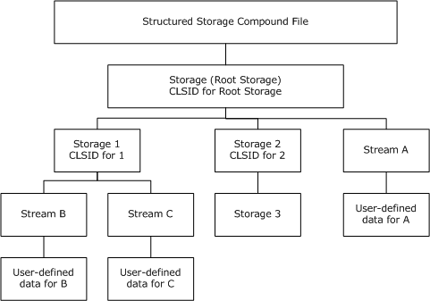

Figure 3: Example of a structured storage compound file

A compound file consists of the root storage object with optional child storage objects and stream objects in a nested hierarchy. Stream objects can contain user-defined data that is stored as an array of bytes. Storage objects can contain an [**object class**](#gt_object-class) [**GUID**](#gt_globally-unique-identifier-guid) that is called a class identifier ([**CLSID**](#gt_class-identifier-clsid)), which can identify an [**application**](#gt_application) that can read/write stream objects under that storage object.

The benefits of compound files include the following:

- Because the compound file implementation provides a file system-like abstraction within a file, independent of the details of the underlying file system, compound files can be accessed by different applications on different platform operating systems. The compound file can be a generic container file format that holds data for multiple applications.
- Because the separate objects in a compound file are saved in a standard format, any browser utility that is reading the standard format can list the storage objects and stream objects in the compound file, even though data within a particular [**object**](#gt_object) can be in a proprietary format.
- Standardized data structures exist for writing certain types of stream objects--for example, summary information property sets (for more information about property sets, see [MS-OLEPS](../MS-OLEPS/MS-OLEPS.md)). Applications can read these stream objects by using parsers for these data structures, even when the rest of the stream objects cannot be understood.
The compound file implementation constructs a level of indirection by supporting a file system within a file. A single flat file requires a large contiguous sequence of bytes on the disk. By contrast, compound files define how to treat a single file as a structured collection of storage objects and stream objects that act as file system directories and files, respectively.

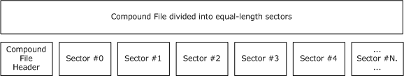

Figure 4: Example of a compound file showing equal-length sector divisions

A compound file is divided into equal-length [**sectors**](#gt_sector). The first sector contains the [compound file header](#Section_2.2). Subsequent sectors are identified by a 32-bit nonnegative integer number, called the sector number.

A group of sectors can form a [**sector chain**](#gt_sector-chain), which is a linked list of sectors forming a logical byte array, even though the sectors can be in non-consecutive locations in the compound file. For example, the following figure shows two sector chains. A sector chain starts at sector #0, continues to sector #2, and ends at sector #4. Another sector chain starts at sector #1 and ends at sector #3.

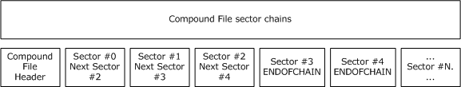

Figure 5: Example of a compound file sector chain

A sector can be unallocated or free, in which case it is not part of a sector chain. A [**sector number**](#gt_sector-number) is used for the following purposes:

- A sector number is used to identify the file offset of that sector in a compound file.
- In a sector chain, a sector number is used to identify the next sector in the chain.
- Special sector numbers are used to represent chain termination and free sectors.

## 1.4 Relationship to Protocols and Other Structures

[MS-DTYP](../MS-DTYP/MS-DTYP.md), "Windows Data Types", Revision 3.0, September 2007, MS-DTYP-v1.02.doc

The compound file internal structures use the following Windows data types:

- FILETIME for [**storage**](#gt_storage) timestamps
- GUID for [**storage objects**](#gt_storage-object) [**object class**](#gt_object-class) ID
- ULONGLONG for [**stream**](#gt_stream) sizes
- DWORD for [**sector numbers**](#gt_sector-number) and various size fields
- USHORT for [**header**](#gt_header) and directory fields
- BYTE for header and directory fields
- WCHAR for storage and stream names
[MS-OLEPS](../MS-OLEPS/MS-OLEPS.md) Microsoft OLE Property Set Data Structures

OLE property sets are a standard set of stream formats that are typically implemented as compound file [**stream objects**](#gt_stream-object). Most [**applications**](#gt_application) that save their data in compound files also write out summary information property set data in the OLE property sets stream formats.

[MS-OLEDS](../MS-OLEDS/MS-OLEDS.md) Microsoft OLE Data Structures

OLE linking and embedding streams and storages are used to contain data that is used by outside applications that implement the OLE interfaces and APIs.

[[UNICODE3.0.1]](https://go.microsoft.com/fwlink/?LinkId=119562) The Unicode Consortium, "Unicode Default Case Conversion Algorithm", Version 3.0.1, August 2001, http://www.unicode.org/Public/3.1-Update1/CaseFolding-4.txt

[[UNICODE5.0.0]](https://go.microsoft.com/fwlink/?LinkId=119564) The Unicode Consortium, "Unicode Default Case Conversion Algorithm", Version 5.0.0, March 2006, http://www.unicode.org/Public/5.0.0/ucd/CaseFolding.txt

The [**Unicode**](#gt_unicode) Default Case Conversion Algorithm, simple case conversion variant, is used to compare storage object and stream object names.

## 1.5 Applicability Statement

This protocol structure is recommended for persisting objects in a random access file system or random access memory system.

This protocol is not recommended for real-time streaming, progressive rendering, or open-ended data protocols where the size of streams is unknown when the compound file is transmitted. The known size of all structures within a compound file needs to be specified when the compound file is transmitted or retrieved.

## 1.6 Versioning and Localization

This document covers versioning issues in the following areas:

- **Structure Versions:** There are two versions of the compound file structure, version 3 and version 4. These versions are defined in section [2.2](#Section_2.2). In a version 4 compound file, all features of version 3 need to be implemented.
Implementations need to return an error when encountering a higher version than supported. For example, if only a version 3 compound file is supported, the implementation needs to return an error if a version 4 compound file is being opened.

- **Localization:** There is no localization-dependent structure content in the compound file structure. In the implementation, all [**Unicode**](#gt_unicode) character comparisons need to be locale-invariant and all timestamps need to be stored in the Coordinated Universal Time ([**UTC**](#gt_coordinated-universal-time-utc)) time zone.

## 1.7 Vendor-Extensible Fields

A compound file does not contain any vendor-extensible fields. However, a compound file does contain ways to store [**user-defined data**](#gt_user-defined-data) in [**storage objects**](#gt_storage-object) and [**stream objects**](#gt_stream-object). The vendor can store vendor-specific data in user-defined data.

# 2 Structures

This document references commonly used data types as defined in [MS-DTYP](../MS-DTYP/MS-DTYP.md).

Unless otherwise qualified, instances of **GUID** in this section refer to [MS-DTYP] section 2.3.4.

Figure 6: Sectors of a compound file with FAT array at sector #0

The main structure that is used to manage [**sector**](#gt_sector) allocation and [**sector chains**](#gt_sector-chain) is the [**file allocation table (FAT)**](#gt_file-allocation-table-fat). The FAT contains an array of 32-bit [**sector numbers**](#gt_sector-number), where the index represents a sector number, and its value represents the next sector in the chain or a special value.

- FAT[0] contains sector #0's next sector in the chain.
- FAT[1] contains sector #1's next sector in the chain.
- ...
- FAT[N] contains sector #N's next sector in the chain.
This allows a compound file to contain many sector chains in a single file. Many compound file structures, including [**user-defined data**](#gt_user-defined-data), are implemented as sector chains that are represented in the FAT.

Even the FAT array itself is represented as a sector chain. The sector chain holds both internal and user-defined data streams. Because the FAT array is stored in a sector chain, the double-indirect file allocation table ([**DIFAT**](#gt_double-indirect-file-allocation-table-difat)) array is used to find the [FAT sector](#Section_3.2) locations. Each DIFAT array entry contains a 32-bit sector number.

- DIFAT[0] contains FAT sector #0's location.
- DIFAT[1] contains FAT sector #1's location.
- ...
- DIFAT[N] contains FAT sector #N's location.
Because space for streams is always allocated in [**sector-sized**](#gt_sector-size) blocks, storing objects that are much smaller than the normal sector size (either 512 bytes or 4,096 bytes) can cause considerable waste. As a solution to this problem, the concept of the [**mini FAT**](#gt_mini-fat) is introduced.

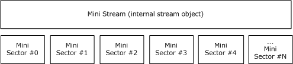

Figure 7: Mini sectors of a mini stream

The mini FAT is structurally equivalent to the FAT, but it is used in a different way. The sector size for objects that are represented in mini FAT is 64 bytes, instead of the 512 bytes or 4,096 bytes for normal sectors. The space for these objects comes from a special [**stream**](#gt_stream) that is called the [**mini stream**](#gt_mini-stream). The mini stream is an internal [**stream object**](#gt_stream-object) that is divided into equal-length mini sectors. Each mini FAT array entry contains a 32-bit sector number for the mini stream, not the file.

- MiniFAT[0] contains mini stream sector #0's next sector in the chain.
- MiniFAT[1] contains mini stream sector #1's next sector in the chain.
- ...
- MiniFAT[N] contains mini stream sector #N's next sector in the chain.
[**Stream objects**](#gt_stream-object) that have a user-defined data length less than a cutoff (4,096 bytes) are allocated with the mini FAT from the mini stream. Larger stream objects are allocated with the FAT from [**unallocated free sectors**](#gt_unallocated-free-sector) in the file.

The names of all [**storage objects**](#gt_storage-object) and stream objects, along with other [**object**](#gt_object) metadata like stream size and [**storage**](#gt_storage) [**CLSIDs**](#gt_class-identifier-clsid), are found in the [**directory entry**](#gt_directory-entry) array. The space for the directory entry array is allocated with the FAT like other sector chains.

- DirectoryEntry[0] contains information about the [**root storage object**](#gt_root-storage-object).
- DirectoryEntry[1] contains information about a storage object, stream object, or unallocated object.
- ...
- DirectoryEntry[N] contains information about a storage object, stream object, or unallocated object.
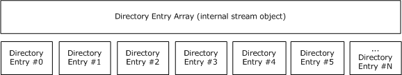

Figure 8: Entries of a directory entry array

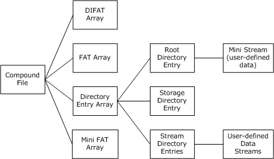

Figure 9: Summary of compound file internal streams and connections to user-defined data streams

This diagram summarizes the compound file main internal streams and how they are linked to user-defined data streams. The DIFAT, FAT, mini FAT, directory entry arrays, and mini stream are internal streams, whereas the user-defined data streams link directly to their stream objects.

In a compound file, all integer fields, including [**Unicode**](#gt_unicode) characters that are encoded in [**UTF-16**](#gt_utf-16), MUST be stored in [**little-endian**](#gt_little-endian) byte order. The only exception is in user-defined data streams, where the compound file structure does not impose any restrictions.

## 2.1 Compound File Sector Numbers and Types

Each [**sector**](#gt_sector), except for the header, is identified by a nonnegative, 32-bit [**sector number**](#gt_sector-number). The following sector numbers above 0xFFFFFFFA are reserved and MUST NOT be used to identify the location of a sector in a compound file.

| Sector name | Integer value | Description |
| --- | --- | --- |
| REGSECT | 0x00000000 - 0xFFFFFFF9 | Regular sector number. |
| MAXREGSECT | 0xFFFFFFFA | Maximum regular sector number. |
| Not applicable | 0xFFFFFFFB | Reserved for future use. |
| DIFSECT | 0xFFFFFFFC | Specifies a [DIFAT sector](#Section_2.5) in the [**FAT**](#gt_file-allocation-table-fat). |
| FATSECT | 0xFFFFFFFD | Specifies a [FAT sector](#Section_3.2) in the FAT. |
| ENDOFCHAIN | 0xFFFFFFFE | End of a linked chain of sectors. |
| FREESECT | 0xFFFFFFFF | Specifies an unallocated sector in the FAT, [**Mini FAT**](#gt_mini-fat), or [**DIFAT**](#gt_double-indirect-file-allocation-table-difat). |

The following list contains the types of sectors that are allowed in a compound file. Their structures are described in sections [2.2](#Section_2.2) through [2.8](#Section_2.8).

| Bit Range | Field | Description |
| --- | --- | --- |
| Variable | Header | Not applicable A single sector with fields that are needed to read the other structures of the compound file. This sector must be at file offset 0. |
| Variable | FAT | 4 bytes Main allocator of space within the compound file. |
| Variable | DIFAT | 4 bytes Used to locate FAT sectors in the compound file. |
| Allocator for [**mini stream**](#gt_mini-stream) [**user-defined data**](#gt_user-defined-data). | Mini FAT | 4 bytes |
| Contains [**storage object**](#gt_storage-object) and [**stream object**](#gt_stream-object) metadata. | Directory | 128 bytes |
| Variable | User-defined Data | Not applicable User-defined data for stream objects. |
| Variable | Range Lock | Not applicable A single sector that is used to manage concurrent access to the compound file. This sector must cover file offset 0x7FFFFFFF. |
| Variable | Unallocated Free | Not applicable Empty space in the compound file. |

Compound file sectors can contain unallocated free space, user-defined data for stream objects, directory sectors containing [**directory entries**](#gt_directory-entry), FAT sectors containing the FAT entries, DIFAT sectors containing the DIFAT entries, and [mini FAT sectors](#Section_2.4) containing the mini FAT entries. Compound file sectors can be located at any sector-sized offset in the file, with the exception of the header and range lock sector.

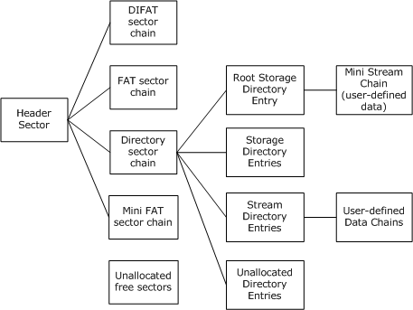

Figure 10: Example of the hierarchy of compound file sectors

All the sector types are eventually linked back to the header sector, except for the range lock sector and [**unallocated free sectors**](#gt_unallocated-free-sector). Unallocated free sectors are marked in the FAT as FREESECT (0xFFFFFFFF). Unallocated free sectors can be in the middle of the file, and they can be created by extending the file size and allocating additional FAT sectors to cover the increased length. The range lock sector is identified by a fixed file offset (0x7FFFFFFF) in the compound file.

In a compound file, all [**sector chains**](#gt_sector-chain) MUST contain valid sector numbers, less than or equal to MAXREGSECT (0xFFFFFFFA). In a sector chain, the last sector's next pointer MUST be ENDOFCHAIN (0xFFFFFFFE). All sectors in a sector chain MUST NOT be part of any other sector chain in the same file. A sector chain MUST NOT link to a sector appearing earlier in the same chain, which would result in a cycle. Finally, the actual sector count MUST match the size that is specified for a sector chain.

## 2.2 Compound File Header

The **Compound File Header** structure MUST be at the beginning of the file (offset 0).

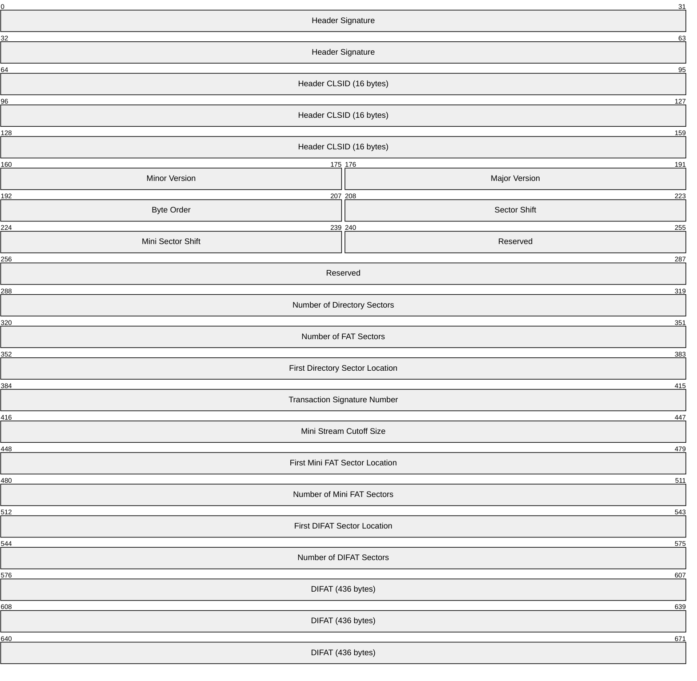

**Header Signature (8 bytes):** Identification signature for the compound file structure, and MUST be set to the value 0xD0, 0xCF, 0x11, 0xE0, 0xA1, 0xB1, 0x1A, 0xE1.

**Header CLSID (16 bytes):** Reserved and unused class ID that MUST be set to all zeroes (CLSID_NULL).

**Minor Version (2 bytes):** Version number for nonbreaking changes. This field SHOULD be set to 0x003E if the major version field is either 0x0003 or 0x0004.

| Value | Meaning |
| --- | --- |
| 0x003E | If major version field is either 0x0003 or 0x0004. |

**Major Version (2 bytes):** Version number for breaking changes. This field MUST be set to either 0x0003 (version 3) or 0x0004 (version 4).

| Name | Value |
| --- | --- |
| version 3 | 0x0003 |
| version 4 | 0x0004 |

**Byte Order (2 bytes):** This field MUST be set to 0xFFFE. This field is a byte order mark for all integer fields, specifying [**little-endian**](#gt_little-endian) byte order.

**Sector Shift (2 bytes):** This field MUST be set to 0x0009, or 0x000c, depending on the Major Version field. This field specifies the [**sector size**](#gt_sector-size) of the compound file as a power of 2.

- If Major Version is 3, the Sector Shift MUST be 0x0009, specifying a sector size of 512 bytes.
- If Major Version is 4, the Sector Shift MUST be 0x000C, specifying a sector size of 4096 bytes.
| Value | Meaning |
| --- | --- |
| Major Version 3 0x0009 | If Major Version is 3, the Sector Shift MUST be 0x0009, specifying a sector size of 512 bytes. |
| Major Version 4 0x000C | If Major Version is 4, the Sector Shift MUST be 0x000C, specifying a sector size of 4,096 bytes. |

**Mini Sector Shift (2 bytes):** This field MUST be set to 0x0006. This field specifies the sector size of the Mini Stream as a power of 2. The sector size of the Mini Stream MUST be 64 bytes.

**Reserved (6 bytes):** This field MUST be set to all zeroes.

**Number of Directory Sectors (4 bytes):** This integer field contains the count of the number of directory sectors in the compound file.

- If Major Version is 3, the Number of Directory Sectors MUST be zero. This field is not supported for version 3 compound files.
| Value | Meaning |
| --- | --- |
| 0x00000000 | If Major Version is 3, the Number of Directory Sectors MUST be zero. |

**Number of FAT Sectors (4 bytes):** This integer field contains the count of the number of [FAT sectors](#Section_3.2) in the compound file.

**First Directory Sector Location (4 bytes):** This integer field contains the starting sector number for the [**directory stream**](#gt_directory-stream).

**Transaction Signature Number (4 bytes):** This integer field MAY contain a sequence number that is incremented every time the compound file is saved by an implementation that supports file transactions. This is the field that MUST be set to all zeroes if file transactions are not implemented.<1>

**Mini Stream Cutoff Size (4 bytes):** This integer field MUST be set to 0x00001000. This field specifies the maximum size of a user-defined data [**stream**](#gt_stream) that is allocated from the [**mini FAT**](#gt_mini-fat) and mini stream, and that cutoff is 4,096 bytes. Any user-defined data stream that is greater than or equal to this cutoff size must be allocated as normal sectors from the [**FAT**](#gt_file-allocation-table-fat).

**First Mini FAT Sector Location (4 bytes):** This integer field contains the starting sector number for the mini FAT.

**Number of Mini FAT Sectors (4 bytes):** This integer field contains the count of the number of [mini FAT sectors](#Section_2.4) in the compound file.

**First DIFAT Sector Location (4 bytes):** This integer field contains the starting sector number for the [**DIFAT**](#gt_double-indirect-file-allocation-table-difat).

**Number of DIFAT Sectors (4 bytes):** This integer field contains the count of the number of [DIFAT sectors](#Section_2.5) in the compound file.

**DIFAT (436 bytes):** This array of 32-bit integer fields contains the first 109 FAT sector locations of the compound file.

- For version 4 compound files, the header size (512 bytes) is less than the sector size (4,096 bytes), so the remaining part of the header (3,584 bytes) MUST be filled with all zeroes.
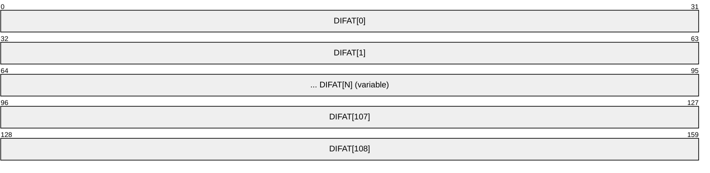

## 2.3 Compound File FAT Sectors

The [**FAT**](#gt_file-allocation-table-fat) is the main allocator for space within a compound file. Every [**sector**](#gt_sector) in the file is represented within the FAT in some fashion, including those sectors that are unallocated (free). The FAT is a [**sector chain**](#gt_sector-chain) that is made up of one or more FAT sectors.

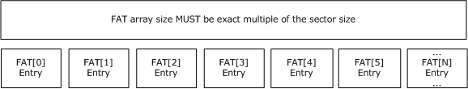

Figure 11: Sectors of a FAT array

The FAT is an array of [**sector numbers**](#gt_sector-number) that represent the allocation of space within the file, grouped into FAT sectors. Each stream is represented in the FAT by a sector chain, in much the same fashion as a FAT file system.

The set of FAT sectors can be considered together as a single array. Each entry in that array contains the sector number of the next sector in the chain, and this sector number can be used as an index into the FAT array to continue along the chain.

Special values are reserved for chain terminators (ENDOFCHAIN = 0xFFFFFFFE), free sectors (FREESECT = 0xFFFFFFFF), and sectors that contain [**storage**](#gt_storage) for FAT sectors (FATSECT = 0xFFFFFFFD) or [DIFAT Sectors](#Section_2.5) (DIFSECT = 0xFFFFFFC), which are not chained in the same way as the others.

The locations of FAT sectors are read from the [**DIFAT**](#gt_double-indirect-file-allocation-table-difat). The FAT is represented in itself, but not by a chain. A special reserved sector number (FATSECT = 0xFFFFFFFD) is used to mark sectors that are allocated to the FAT.

A sector number can be converted into a byte offset into the file by using the following formula: (sector number + 1) x **Sector Size**. This implies that sector #0 of the file begins at byte offset **Sector Size**, not at 0.

The detailed FAT sector structure is specified below.

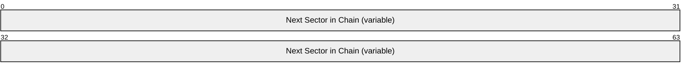

**Next Sector in Chain (variable):** This field specifies the next sector number in a chain of sectors.

- If Header **Major Version** is 3, there MUST be 128 fields specified to fill a 512-byte sector.
- If Header **Major Version** is 4, there MUST be 1,024 fields specified to fill a 4,096-byte sector.
The last FAT sector can have more entries that span past the actual size of the compound file. In this case, the entries that cover past end-of-file MUST be marked with FREESECT (0xFFFFFFFF). The size of a compound file is determined by the index of the last non-free FAT array entry. If the last FAT sector contains an entry FAT[N] != FREESECT (0xFFFFFFFF), the file size MUST be at least (N + 1) x (**Sector Size**) bytes in length.

| Value | Meaning |
| --- | --- |
| DIFSECT 0xFFFFFFC | DIFAT Sectors (DIFSECT = 0xFFFFFFC), which are not chained in the same way as the others. |
| FATSECT 0xFFFFFFFD | Sectors that contain storage for FAT sectors (FATSECT = 0xFFFFFFFD). |
| ENDOFCHAIN 0xFFFFFFFE | Chain terminators (ENDOFCHAIN = 0xFFFFFFFE). |
| FREESECT 0xFFFFFFFF | Free sectors (FREESECT = 0xFFFFFFFF). |

## 2.4 Compound File Mini FAT Sectors

The [**mini FAT**](#gt_mini-fat) is used to allocate space in the [**mini stream**](#gt_mini-stream). The mini stream is divided into smaller, equal-length [**sectors**](#gt_sector), and the [**sector size**](#gt_sector-size) that is used for the mini stream is specified from the [Compound File Header](#Section_2.2) (64 bytes).

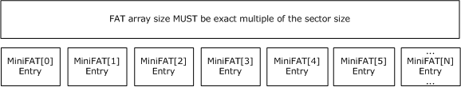

Figure 12: Sectors of a mini FAT array

The locations for mini FAT sectors are stored in a standard chain in the [**FAT**](#gt_file-allocation-table-fat), with the beginning of the chain stored in the header (location of the first mini FAT starting sector).

A mini FAT sector number can be converted into a byte offset into the mini stream by using the following formula: [**sector number**](#gt_sector-number) x 64 bytes. This formula is different from the formula that is used to convert a sector number into a byte offset in the file, because no header is stored in the mini stream.

The mini stream is chained within the FAT in exactly the same fashion as any normal stream. The mini stream's starting sector is referenced in the first [**directory entry**](#gt_directory-entry) (root storage stream ID 0).

If all of the user streams in the file are greater than the cutoff of 4,096 bytes, the mini FAT and mini stream are not required. In this case, the location of the header's first mini FAT starting sector can be set to ENDOFCHAIN, and the location of the root directory entry's starting sector can be set to ENDOFCHAIN.

The detailed mini FAT sector structure is specified below.

**Next Sector in Chain (variable):** This field specifies the next sector number in a chain of sectors.

- If header Major Version is 3, there MUST be 128 fields specified to fill a 512-byte sector.
- If Header Major Version is 4, there MUST be 1,024 fields specified to fill a 4,096-byte sector.
| Value | Meaning |
| --- | --- |
| ENDOFCHAIN 0xFFFFFFFE | Chain terminators (ENDOFCHAIN = 0xFFFFFFFE). |

## 2.5 Compound File DIFAT Sectors

The [**DIFAT**](#gt_double-indirect-file-allocation-table-difat) array is used to represent [**storage**](#gt_storage) of the [FAT sectors](#Section_3.2). The DIFAT is represented by an array of 32-bit [**sector numbers**](#gt_sector-number). The DIFAT array is stored both in the header and in DIFAT sectors. In the header, the DIFAT array occupies 109 entries, and in each DIFAT sector, the DIFAT array occupies the entire [**sector**](#gt_sector) minus 4 bytes. (The last field is for chaining the DIFAT sector chain.)

Figure 13: Sectors of a DIFAT array

The DIFAT sectors are linked together by the last field in each DIFAT sector. As an optimization, the first 109 FAT sectors are represented within the header itself. No DIFAT sectors are needed in a compound file that is smaller than 6.875 megabytes (MB) for a 512-byte sector compound file (6.875 MB = (1 header sector + 109 FAT sectors x 128 non-empty entries) × 512 bytes per sector).

The DIFAT represents the FAT sectors in a different manner than the [**FAT**](#gt_file-allocation-table-fat) represents a [**sector chain**](#gt_sector-chain). A particular index, *n*, into the DIFAT array will contain the sector number of the (*n*+1)th FAT sector. For instance, index #3 in the DIFAT contains the sector number for the fourth FAT sector, because the DIFAT array starts with index #0.

The storage for DIFAT sectors is reserved with the FAT, but it is not chained there. Space for DIFAT sectors is marked by a special sector number, DIFSECT (0xFFFFFFFC).

The location of the first DIFAT sector is stored in the header.

A special value of ENDOFCHAIN (0xFFFFFFFE) is stored in the "Next DIFAT Sector Location" field of the last DIFAT sector, or in the header when no DIFAT sectors are needed.

The detailed DIFAT sector structure is specified below.

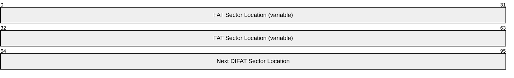

**FAT Sector Location (variable):** This field specifies the FAT sector number in a DIFAT.

- If Header Major Version is 3, there MUST be 127 fields specified to fill a 512-byte sector minus the "Next DIFAT Sector Location" field.
- If Header Major Version is 4, there MUST be 1,023 fields specified to fill a 4,096-byte sector minus the "Next DIFAT Sector Location" field.
**Next DIFAT Sector Location (4 bytes):** This field specifies the next sector number in the DIFAT chain of sectors. The first DIFAT sector is specified in the Header. The last DIFAT sector MUST set this field to ENDOFCHAIN (0xFFFFFFFE).

| Name | Value |
| --- | --- |
| ENDOFCHAIN | 0xFFFFFFFE |

## 2.6 Compound File Directory Sectors

The [**directory entry**](#gt_directory-entry) array is a structure that is used to contain information about the stream and [**storage objects**](#gt_storage-object) in a [**compound file**](#gt_compound-file), and to maintain a tree-style containment structure. The directory entry array is allocated as a standard chain of directory sectors within the [**FAT**](#gt_file-allocation-table-fat). Each directory entry is identified by a nonnegative number that is called the stream ID. The first sector of the directory sector chain MUST contain the root [**storage**](#gt_storage) directory entry as the first directory entry at stream ID 0.

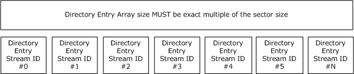

Figure 14: Sectors of a directory entry array

### 2.6.1 Compound File Directory Entry

The [**directory entry**](#gt_directory-entry) array is an array of directory entries that are grouped into a [directory sector](#Section_3.3). Each [**storage object**](#gt_storage-object) or [**stream object**](#gt_stream-object) within a [**compound file**](#gt_compound-file) is represented by a single directory entry. The space for the directory sectors that are holding the array is allocated from the [**FAT**](#gt_file-allocation-table-fat).

The valid values for a stream ID, which are used in the **Child ID**, **Right Sibling ID**, and **Left Sibling ID** fields, are 0 through MAXREGSID (0xFFFFFFFA). The special value NOSTREAM (0xFFFFFFFF) is used as a terminator.

| Stream ID name | Integer value | Description |
| --- | --- | --- |
| REGSID | 0x00000000 through 0xFFFFFFF9 | Regular stream ID to identify the directory entry. |
| MAXREGSID | 0xFFFFFFFA | Maximum regular stream ID. |
| NOSTREAM | 0xFFFFFFFF | Terminator or empty pointer. |

The directory entry size is fixed at 128 bytes. The name in the directory entry is limited to 32 [**Unicode**](#gt_unicode) [**UTF-16**](#gt_utf-16) code points, including the required Unicode terminating null character.

Directory entries are grouped into blocks to form directory sectors. There are four directory entries in a 512-byte directory sector (version 3 compound file), and there are 32 directory entries in a 4,096-byte directory sector (version 4 compound file). The number of directory entries can exceed the number of storage objects and stream objects due to unallocated directory entries.

The detailed Directory Entry structure is specified below.

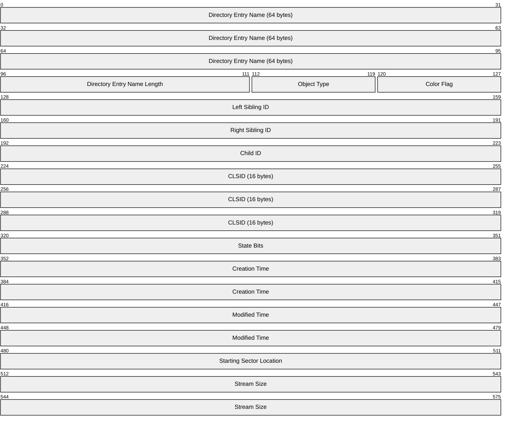

**Directory Entry Name (64 bytes):** This field MUST contain a Unicode string for the [**storage**](#gt_storage) or stream name encoded in UTF-16. The name MUST be terminated with a UTF-16 terminating null character. Thus, storage and stream names are limited to 32 UTF-16 code points, including the terminating null character. When locating an [**object**](#gt_object) in the compound file except for the root storage, the directory entry name is compared by using a special case-insensitive uppercase mapping, described in [Red-Black Tree](#Section_2.6.4). The following characters are illegal and MUST NOT be part of the name: '/', '\', ':', '!'.

**Directory Entry Name Length (2 bytes):** This field MUST match the length of the Directory Entry Name Unicode string in bytes. The length MUST be a multiple of 2 and include the terminating null character in the count. This length MUST NOT exceed 64, the maximum size of the Directory Entry Name field.

**Object Type (1 byte):** This field MUST be 0x00, 0x01, 0x02, or 0x05, depending on the actual type of object. All other values are not valid.

| Name | Value |
| --- | --- |
| Unknown or unallocated | 0x00 |
| Storage Object | 0x01 |
| Stream Object | 0x02 |
| Root Storage Object | 0x05 |

**Color Flag (1 byte):** This field MUST be 0x00 (red) or 0x01 (black). All other values are not valid.

| Name | Value |
| --- | --- |
| red | 0x00 |
| black | 0x01 |

**Left Sibling ID (4 bytes):** This field contains the stream ID of the left sibling. If there is no left sibling, the field MUST be set to NOSTREAM (0xFFFFFFFF).

| Value | Meaning |
| --- | --- |
| REGSID 0x00000000 — 0xFFFFFFF9 | Regular stream ID to identify the directory entry. |
| MAXREGSID 0xFFFFFFFA | Maximum regular stream ID. |
| NOSTREAM 0xFFFFFFFF | If there is no left sibling. |

**Right Sibling ID (4 bytes):** This field contains the stream ID of the right sibling. If there is no right sibling, the field MUST be set to NOSTREAM (0xFFFFFFFF).

| Value | Meaning |
| --- | --- |
| REGSID 0x00000000 — 0xFFFFFFF9 | Regular stream ID to identify the directory entry. |
| MAXREGSID 0xFFFFFFFA | Maximum regular stream ID. |
| NOSTREAM 0xFFFFFFFF | If there is no right sibling. |

**Child ID (4 bytes):** This field contains the stream ID of a [**child object**](#gt_9b04b599-9dca-48f1-aa9e-08e254d20553). If there is no child object, including all entries for stream objects, the field MUST be set to NOSTREAM (0xFFFFFFFF).

| Value | Meaning |
| --- | --- |
| REGSID 0x00000000 — 0xFFFFFFF9 | Regular stream ID to identify the directory entry. |
| MAXREGSID 0xFFFFFFFA | Maximum regular stream ID. |
| NOSTREAM 0xFFFFFFFF | If there is no child object. |

**CLSID (16 bytes):** This field contains an object class [**GUID**](#gt_globally-unique-identifier-guid), if this entry is for a storage object or root storage object. For a stream object, this field MUST be set to all zeroes. A value containing all zeroes in a storage or root storage directory entry is valid, and indicates that no object class is associated with the storage. If an implementation of the file format enables applications to create storage objects without explicitly setting an object class GUID, it MUST write all zeroes by default. If this value is not all zeroes, the [**object class**](#gt_object-class) GUID can be used as a parameter to start [**applications**](#gt_application).

| Value | Meaning |
| --- | --- |
| 0x00000000000000000000000000000000 | No object class is associated with the storage. |

**State Bits (4 bytes):** This field contains the user-defined flags if this entry is for a storage object or [**root storage object**](#gt_root-storage-object). For a stream object, this field SHOULD be set to all zeroes because many implementations provide no way for applications to retrieve state bits from a stream object. If an implementation of the file format enables applications to create storage objects without explicitly setting state bits, it MUST write all zeroes by default.

| Value | Meaning |
| --- | --- |
| 0x00000000 | Default value when no state bits are explicitly set on the object. |

**Creation Time (8 bytes):** This field contains the [**creation time**](#gt_creation-time) for a storage object, or all zeroes to indicate that the creation time of the storage object was not recorded. The Windows FILETIME structure is used to represent this field in [**UTC**](#gt_coordinated-universal-time-utc). For a stream object, this field MUST be all zeroes. For a root storage object, this field MUST be all zeroes, and the creation time is retrieved or set on the compound file itself.

| Value | Meaning |
| --- | --- |
| 0x0000000000000000 | No creation time was recorded for the object. |

**Modified Time (8 bytes):** This field contains the [**modification time**](#gt_modification-time) for a storage object, or all zeroes to indicate that the modified time of the storage object was not recorded. The Windows FILETIME structure is used to represent this field in UTC. For a stream object, this field MUST be all zeroes. For a root storage object, this field MAY<2> be set to all zeroes, and the modified time is retrieved or set on the compound file itself.

| Value | Meaning |
| --- | --- |
| 0x0000000000000000 | No modified time was recorded for the object. |

**Starting Sector Location (4 bytes):** This field contains the first [**sector**](#gt_sector) location if this is a stream object. For a root storage object, this field MUST contain the first sector of the [**mini stream**](#gt_mini-stream), if the mini stream exists. For a storage object, this field MUST be set to all zeroes.

**Stream Size (8 bytes):** This 64-bit integer field contains the size of the [**user-defined data**](#gt_user-defined-data) if this is a stream object. For a root storage object, this field contains the size of the mini stream. For a storage object, this field MUST be set to all zeroes.

- For a version 3 compound file 512-byte [**sector size**](#gt_sector-size), the value of this field MUST be less than or equal to 0x80000000. (Equivalently, this requirement can be stated: the size of a stream or of the mini stream in a version 3 compound file MUST be less than or equal to 2 gigabytes (GB).) Note that as a consequence of this requirement, the most significant 32 bits of this field MUST be zero in a version 3 compound file. However, implementers should be aware that some older implementations did not initialize the most significant 32 bits of this field, and these bits might therefore be nonzero in files that are otherwise valid version 3 compound files. Although this document does not normatively specify parser behavior, it is recommended that parsers ignore the most significant 32 bits of this field in version 3 compound files, treating it as if its value were zero, unless there is a specific reason to do otherwise (for example, a parser whose purpose is to verify the correctness of a compound file).

### 2.6.2 Root Directory Entry

The first entry in the first [**sector**](#gt_sector) of the [**directory**](#gt_directory) chain (also referred to as the first element of the directory array, or stream ID #0) is known as the root [**directory entry**](#gt_directory-entry), and it is reserved for two purposes. First, it provides a root parent for all objects that are stationed at the root of the compound file. Second, its function is overloaded to store the size and starting sector for the [**mini stream**](#gt_mini-stream).

The root directory entry behaves as both a stream and a [**storage object**](#gt_storage-object). The root directory entry's Name field MUST contain the null-terminated string "**Root Entry**" in [**Unicode**](#gt_unicode) [**UTF-16**](#gt_utf-16).

The [**object class**](#gt_object-class) [**GUID**](#gt_globally-unique-identifier-guid) ([**CLSID**](#gt_class-identifier-clsid)) that is stored in the root directory entry can be used for COM activation of the document's [**application**](#gt_application).

The time stamps for the root storage are not maintained in the root directory entry. Rather, the root storage's creation and [**modification time**](#gt_modification-time) stamps are normally stored on the file itself in the [**file system**](#gt_file-system).

The **Creation Time** field in the root storage directory entry MUST be all zeroes. The **Modified Time** field in the root storage directory entry MAY be all zeroes.

### 2.6.3 Other Directory Entries

[**Directory entries**](#gt_directory-entry) other than the root storage directory entry are marked as either [**stream objects**](#gt_stream-object), [**storage objects**](#gt_storage-object), or unallocated objects.

The [**CLSID**](#gt_class-identifier-clsid), state bits, [**creation time**](#gt_creation-time), modified time, and Child ID values are meaningful in directory entries for storage objects but not for [**Stream objects**](#gt_stream-object).

The Starting Sector Location and Stream Size values are meaningful in directory entries for stream objects but not for storage objects.

To determine the file location of actual stream data from a stream directory entry, it is necessary to determine whether the stream exists as normal sectors allocated in the [**FAT**](#gt_file-allocation-table-fat) or as mini sectors (from the [**mini stream**](#gt_mini-stream)) allocated in the [**mini FAT**](#gt_mini-fat). Streams whose size is less than the **Mini Stream Cutoff Size** value (typically 4,096 bytes) for the file exist in the mini stream. The Starting Sector Location is used as an index into the mini FAT (which starts at mini FAT Starting Location) to track the chain of [**sectors**](#gt_sector) through the mini stream. Streams whose size is greater than or equal to the **Mini Stream Cutoff Size** value for the file exist as standard streams. Their Starting Sector Location value is used as an index into the standard FAT, which describes the chain of full sectors containing their data.

For 512-byte sectors, the **Stream Size** upper 32-bits field MUST be set to zero when the [**compound file**](#gt_compound-file) is written. However, the high DWORD of this field was not initialized in older implementations, so current implementations MUST accept uninitialized high DWORD for the **Stream Size** field. For version 4 compound files that support a 4,096-byte [**sector size**](#gt_sector-size), the **Stream Size** must be a full 64-bit integer stream size.

Free (unused) directory entries are marked with Object Type 0x0 (unknown or unallocated). The entire directory entry must consist of all zeroes except for the child, right sibling, and left sibling pointers, which must be initialized to NOSTREAM (0xFFFFFFFF).

### 2.6.4 Red-Black Tree

Each set of sibling objects in one level of the containment hierarchy (all [**child objects**](#gt_9b04b599-9dca-48f1-aa9e-08e254d20553) under a [**storage object**](#gt_storage-object)) is represented as a red-black tree. The [**parent object**](#gt_parent-object) of this set of siblings will have a pointer to the top of this tree.

A red-black tree is a special type of binary search tree where each node has a color attribute of red or black. It allows efficient searching in the list of child objects under a storage object. The constraints on a red-black tree allow the binary tree to be roughly balanced, so that insertion, deletion, and searching operations are efficient.

To be valid, the red-black tree MUST maintain the following constraints:

- The [**root storage object**](#gt_root-storage-object) MUST always be black. Because the root [**directory**](#gt_directory) does not have siblings, its color is irrelevant and can therefore be either red or black.
- Two consecutive nodes MUST NOT both be red.
- The left sibling MUST always be less than the right sibling. This sorting relationship is defined as follows:
- A node that has a shorter name is less than a node that has a longer name. (Compare the length of the names from the **Directory Entry Name Length** field.)
- For nodes that have the same name length from **Directory Entry Name Length**, iterate through each [**UTF-16**](#gt_utf-16) code point, one at a time, from the beginning of the [**Unicode**](#gt_unicode) string.
- For each UTF-16 code point, convert to uppercase by using the Unicode Default Case Conversion Algorithm, simple case conversion variant (simple case foldings), with the following notes.<3>Compare each uppercased UTF-16 code point binary value.
- Unicode surrogate characters are never uppercased, because they are represented by two UTF-16 code points, while the sorting relationship uppercases a single UTF-16 code point at a time.
- Lowercase characters that are defined in a newer, later version of the Unicode standard can be uppercased by an implementation that conforms to that later Unicode standard.
The simplest implementation of the preceding invariants would be to mark every node as black, in which case the tree is simply a binary tree. However, keeping the red-black tree balanced will typically result in better read performance.

All sibling objects within a storage object (all immediate child objects in one level of the hierarchy) MUST have unique names in the **Directory Entry Name** field, where uniqueness is determined by the sorting relationship.

## 2.7 Compound File User-Defined Data Sectors

Stream [**sectors**](#gt_sector) are simply collections of arbitrary bytes. They are the building blocks of [**user-defined data**](#gt_user-defined-data) streams, and no restrictions are imposed on their contents. User-defined data sectors are represented as chains in the [**FAT**](#gt_file-allocation-table-fat) or [**mini FAT**](#gt_mini-fat), and each chain MUST have a single [**directory entry**](#gt_directory-entry) associated with it to hold its [**stream object**](#gt_stream-object) metadata, such as its name and size.

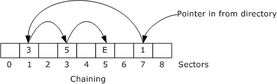

Figure 15: Example of a user-defined data sector chain

In the preceding example with sector #0 through sector #8 shown, a user-defined data [**sector chain**](#gt_sector-chain) starts at sector #7, continues to sector #1, continues to sector #3, and ends with sector #5. The next sector location for sector #5 points to ENDOFCHAIN (0xFFFFFFFE).

To hold all of the user-defined data, the length of the user-defined data sector chain MUST be greater than or equal to the **stream size** that is specified in the stream object's directory entry. The unused portion of the last sector of a stream object's user-defined data SHOULD be filled with zeroes to avoid leaking unintended information.

## 2.8 Compound File Range Lock Sector

The range lock [**sector**](#gt_sector) is the sector that covers file offsets 0x7FFFFF00-0x7FFFFFFF in the file, which are just before 2 GB. These offsets are reserved for byte-range locking to support concurrency, transactions, and other compound file features. The range lock sector MUST be allocated in the [**FAT**](#gt_file-allocation-table-fat) and marked with ENDOFCHAIN (0xFFFFFFFE), when the compound file grows beyond 2 GB. Because 512-byte compound files are limited to 2 GB in size for compatibility reasons, these files do not need a range lock sector allocated. If the compound file is greater than 2 GB and then shrinks to below 2 GB, the range lock sector SHOULD be marked as FREESECT (0xFFFFFFFF) in the FAT.

The range lock sector MUST NOT contain any [**user-defined data**](#gt_user-defined-data). The [**header**](#gt_header), FAT, [**DIFAT**](#gt_double-indirect-file-allocation-table-difat), [**mini FAT**](#gt_mini-fat), and [**directory**](#gt_directory) chains MUST NOT point to the range lock sector location.

## 2.9 Compound File Size Limits

The minimum size of a compound file is one [**header**](#gt_header), one [FAT sector](#Section_3.2), and one [directory sector](#Section_3.3), which is three [**sectors**](#gt_sector) total. Therefore, a compound file MUST be at least three sectors in length.

A 512-byte sector compound file MUST be no greater than 2 GB in size for compatibility reasons. This means that every stream, including the [**directory entry**](#gt_directory-entry) array and [**mini stream**](#gt_mini-stream), inside a 512-byte sector compound file MUST be less than 2 GB in size.

4,096-byte sector compound files can have 64-bit file and [**user-defined data**](#gt_user-defined-data) stream **sizes**, up to slightly less than 16 terabytes (4,096 bytes/sector x MAXREGSECT (0xFFFFFFFA) sectors).

The maximum number of directory entries ([**storage objects**](#gt_storage-object) and [**stream objects**](#gt_stream-object)) is MAXREGSID (0xFFFFFFFA), roughly 4 billion. This corresponds to a maximum directory sector chain length of slightly less than 512 GB for a 4,096-byte sector compound file. (See section [2.6.1](#Section_2.6.1) for details about directory-entry size and directory-sector composition.)

The maximum number of directory entries (storage objects, stream objects, and unallocated [**objects**](#gt_object)) in a 512-byte sector compound file is limited by the 2-GB file size, resulting in 0x00FFFFFF (slightly less than 16 million) directory entries.

The maximum size of the mini stream is MAXREGSECT (0xFFFFFFFA) x 64 bytes, which is slightly less than 256 GB. The maximum size of the mini stream in a 512-byte sector compound file is limited by the 2-GB file size.

# 3 Structure Examples

This section contains a hexadecimal dump of a structured storage compound file to clarify the binary file format. This compound file consists of the [header sector](#Section_2.2) plus five [**sectors**](#gt_sector) that are numbered as sector #0 through sector #4. The following example is a version 3 compound file that has a sector size of 512 bytes.

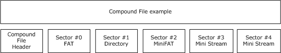

Figure 16: Example of a compound file

## 3.1 The Header

| Bit Range | Field | Description |
| --- | --- | --- |
| Variable | 0x0000 | Header Signature 0xE11AB1A1E011CFD0 |
| Variable | 0x0008 | Header CLSID 0x00000000000000000000000000000000 (null) |
| Variable | 0x0018 | Minor Version 0x003E |
| Variable | 0x001A | Major Version 0x0003 |
| Byte Order | 0x001C | 0xFFFE |
| Variable | 0x001E | Sector Size 0x0009 (512 bytes per [**sector**](#gt_sector)) |
| 0x0006 (64 bytes per [**Mini Stream**](#gt_mini-stream) sector) | 0x0020 | Mini Stream Sector Size |
| Variable | 0x0022 | Reserved 0x0000 0x00000000 |
| Variable | 0x0028 | Number of directory Sector 0x00000000 (not used for version 3) |
| Variable | 0x002C | Number of FAT sectors 0x00000001 (1 [FAT sector](#Section_3.2)) |
| Variable | 0x0030 | Directory Starting Sector Location 0x00000001 (sector #1 for Directory) |
| Variable | 0x0034 | Transaction Signature 0x00000000 (not used) |
| Variable | 0x0038 | Mini Stream Size Cutoff 0x00001000 (4,096 bytes) |
| 0x00000002 (sector #2 for [**Mini FAT**](#gt_mini-fat)) | 0x003C | Mini FAT Starting Sector Location |
| Variable | 0x0040 | Number of Mini FAT sectors 0x00000001 (1 [Mini FAT sector](#Section_2.4)) |
| Variable | 0x0044 | DIFAT Start Sector Location 0xFFFFFFFE (ENDOFCHAIN) |
| 0x00000000 (no [**DIFAT**](#gt_double-indirect-file-allocation-table-difat), less than 7 MB) | 0x0048 | Number of DIFAT Sectors |
| 0x00000000 (sector #0 for [**FAT**](#gt_file-allocation-table-fat)) | 0x004C | DIFAT[0] |
| Variable | 0x0050 | DIFAT[1] through DIFAT[108] 0xFFFFFFFF (FREESECT) (free FAT sectors) |

000000: D0CF 11E0 A1B1 1AE1 0000 0000 0000 0000 ................

000010: 0000 0000 0000 0000 3E00 0300 FEFF 0900 ........;.......

000020: 0600 0000 0000 0000 0000 0000 0100 0000 ................

000030: 0100 0000 0000 0000 0010 0000 0200 0000 ................

000040: 0100 0000 FEFF FFFF 0000 0000 0000 0000 ................

000050: FFFF FFFF FFFF FFFF FFFF FFFF FFFF FFFF ................

000060: FFFF FFFF FFFF FFFF FFFF FFFF FFFF FFFF ................

000070: FFFF FFFF FFFF FFFF FFFF FFFF FFFF FFFF ................

000080: FFFF FFFF FFFF FFFF FFFF FFFF FFFF FFFF ................

000090: FFFF FFFF FFFF FFFF FFFF FFFF FFFF FFFF ................

0000A0: FFFF FFFF FFFF FFFF FFFF FFFF FFFF FFFF ................

0000B0: FFFF FFFF FFFF FFFF FFFF FFFF FFFF FFFF ................

0000C0: FFFF FFFF FFFF FFFF FFFF FFFF FFFF FFFF ................

0000D0: FFFF FFFF FFFF FFFF FFFF FFFF FFFF FFFF ................

0000E0: FFFF FFFF FFFF FFFF FFFF FFFF FFFF FFFF ................

0000F0: FFFF FFFF FFFF FFFF FFFF FFFF FFFF FFFF ................

000100: FFFF FFFF FFFF FFFF FFFF FFFF FFFF FFFF ................

000110: FFFF FFFF FFFF FFFF FFFF FFFF FFFF FFFF ................

000120: FFFF FFFF FFFF FFFF FFFF FFFF FFFF FFFF ................

000130: FFFF FFFF FFFF FFFF FFFF FFFF FFFF FFFF ................

000140: FFFF FFFF FFFF FFFF FFFF FFFF FFFF FFFF ................

000150: FFFF FFFF FFFF FFFF FFFF FFFF FFFF FFFF ................

000160: FFFF FFFF FFFF FFFF FFFF FFFF FFFF FFFF ................

000170: FFFF FFFF FFFF FFFF FFFF FFFF FFFF FFFF ................

000180: FFFF FFFF FFFF FFFF FFFF FFFF FFFF FFFF ................

000190: FFFF FFFF FFFF FFFF FFFF FFFF FFFF FFFF ................

0001A0: FFFF FFFF FFFF FFFF FFFF FFFF FFFF FFFF ................

0001B0: FFFF FFFF FFFF FFFF FFFF FFFF FFFF FFFF ................

0001C0: FFFF FFFF FFFF FFFF FFFF FFFF FFFF FFFF ................

0001D0: FFFF FFFF FFFF FFFF FFFF FFFF FFFF FFFF ................

0001E0: FFFF FFFF FFFF FFFF FFFF FFFF FFFF FFFF ................

0001F0: FFFF FFFF FFFF FFFF FFFF FFFF FFFF FFFF ................

## 3.2 Sector #0: FAT Sector

This [**sector**](#gt_sector) is the first and only [FAT sector](#Section_3.2) in the file, with five non-empty entries.

FAT[Sector #0]: 0xFFFFFFFD = FATSECT: marks this sector as a FAT sector.

FAT[Sector #1]: 0xFFFFFFFE = ENDOFCHAIN: marks the end of the [**directory**](#gt_directory) chain.

FAT[Sector #2]: 0xFFFFFFFE = ENDOFCHAIN: marks the end of the [mini FAT](#Section_2.4) chain.

FAT[Sector #3]: 0x00000004 = pointer to the next sector in the "Stream 1" data.

FAT[Sector #4]: 0xFFFFFFFE = ENDOFCHAIN: marks the end of the "Stream 1" stream data.

FAT[Sector #5 through #127] 0xFFFFFFFF = FREESECT: empty [**unallocated free sectors**](#gt_unallocated-free-sector).

| Bit Range | Field | Description |
| --- | --- | --- |
| Variable | 0x0200 | Next Sector in Chain 0xFFFFFFFD (FAT sector) |
| Variable | 0x0204 | Next Sector in Chain 0xFFFFFFFE (end of chain) |
| Variable | 0x0208 | Next Sector in Chain 0xFFFFFFFE (end of chain) |
| Variable | 0x020C | Next Sector in Chain 0x00000004 |
| Variable | 0x0210 | Next Sector in Chain 0xFFFFFFFE (end of chain) |
| Variable | 0x0214 | Next Sector in Chain 0xFFFFFFFF (empty) |

000200: FDFF FFFF FEFF FFFF FEFF FFFF 0400 0000 ................

000210: FEFF FFFF FFFF FFFF FFFF FFFF FFFF FFFF ................

000220: FFFF FFFF FFFF FFFF FFFF FFFF FFFF FFFF ................

000230: FFFF FFFF FFFF FFFF FFFF FFFF FFFF FFFF ................

000240: FFFF FFFF FFFF FFFF FFFF FFFF FFFF FFFF ................

000250: FFFF FFFF FFFF FFFF FFFF FFFF FFFF FFFF ................

000260: FFFF FFFF FFFF FFFF FFFF FFFF FFFF FFFF ................

000270: FFFF FFFF FFFF FFFF FFFF FFFF FFFF FFFF ................

000280: FFFF FFFF FFFF FFFF FFFF FFFF FFFF FFFF ................

000290: FFFF FFFF FFFF FFFF FFFF FFFF FFFF FFFF ................

0002A0: FFFF FFFF FFFF FFFF FFFF FFFF FFFF FFFF ................

0002B0: FFFF FFFF FFFF FFFF FFFF FFFF FFFF FFFF ................

0002C0: FFFF FFFF FFFF FFFF FFFF FFFF FFFF FFFF ................

0002D0: FFFF FFFF FFFF FFFF FFFF FFFF FFFF FFFF ................

0002E0: FFFF FFFF FFFF FFFF FFFF FFFF FFFF FFFF ................

0002F0: FFFF FFFF FFFF FFFF FFFF FFFF FFFF FFFF ................

000300: FFFF FFFF FFFF FFFF FFFF FFFF FFFF FFFF ................

000310: FFFF FFFF FFFF FFFF FFFF FFFF FFFF FFFF ................

000320: FFFF FFFF FFFF FFFF FFFF FFFF FFFF FFFF ................

000330: FFFF FFFF FFFF FFFF FFFF FFFF FFFF FFFF ................

000340: FFFF FFFF FFFF FFFF FFFF FFFF FFFF FFFF ................

000350: FFFF FFFF FFFF FFFF FFFF FFFF FFFF FFFF ................

000360: FFFF FFFF FFFF FFFF FFFF FFFF FFFF FFFF ................

000370: FFFF FFFF FFFF FFFF FFFF FFFF FFFF FFFF ................

000260: FFFF FFFF FFFF FFFF FFFF FFFF FFFF FFFF ................

000380: FFFF FFFF FFFF FFFF FFFF FFFF FFFF FFFF ................

000390: FFFF FFFF FFFF FFFF FFFF FFFF FFFF FFFF ................

0003A0: FFFF FFFF FFFF FFFF FFFF FFFF FFFF FFFF ................

0003B0: FFFF FFFF FFFF FFFF FFFF FFFF FFFF FFFF ................

0003C0: FFFF FFFF FFFF FFFF FFFF FFFF FFFF FFFF ................

0003D0: FFFF FFFF FFFF FFFF FFFF FFFF FFFF FFFF ................

0003E0: FFFF FFFF FFFF FFFF FFFF FFFF FFFF FFFF ................

0003F0: FFFF FFFF FFFF FFFF FFFF FFFF FFFF FFFF ................

## 3.3 Sector #1: Directory Sector

This is the first and only [directory sector](#Section_3.3) in the file. This directory sector consists of four directory entries.

Stream ID 0: Root Storage Name = "Root Entry" (section [2.6.2](#Section_2.6.2))

Stream ID 1: Storage Name = "Storage 1" (section [2.6.3](#Section_2.6.3))

Stream ID 2: Stream Name = "Stream 1" (section 2.6.3)

Stream ID 3: Unused

### 3.3.1 Stream ID 0: Root Directory Entry

| Bit Range | Field | Description |
| --- | --- | --- |
| Variable | 0x0400 | Directory Entry Name "Root Entry" (section [2.6.2](#Section_2.6.2)) |
| Variable | 0x0440 | Directory Entry Name Length 0x16 (22 bytes) |
| Variable | 0x0442 | Object Type 0x05 (root storage) |
| Variable | 0x0443 | Color Flag 0x01 (black) |
| Variable | 0x0444 | Left Sibling ID 0xFFFFFFFF (none) |
| Variable | 0x0448 | Right Sibling ID 0xFFFFFFFF (none) |
| Variable | 0x044C | Child ID 0x00000001 (Stream ID 1: "Storage 1" (section [2.6.3](#Section_2.6.3))) |
| Variable | 0x0450 | CLSID 0x11CEC15456616700 0xAA005385 0x5BF9A100 |
| Variable | 0x0460 | State Bits 0x00000000 |
| Variable | 0x0464 | Creation Time 0x0000000000000000 |
| 0x01BAB44B13921E80 (11/16/1995 5:43:45 PM) | 0x046C | Modified Time |
| 0x00000003 ([**sector**](#gt_sector) #3 for [**mini Stream**](#gt_mini-stream)) | 0x0474 | Starting Sector Location |
| Variable | 0x0478 | Stream Size 0x0000000000000240 (576 bytes) |

000400: 5200 6F00 6F00 7400 2000 4500 6E00 7400 R.o.o.t. .E.n.t.

000410: 7200 7900 0000 0000 0000 0000 0000 0000 r.y.............

000420: 0000 0000 0000 0000 0000 0000 0000 0000 ................

000430: 0000 0000 0000 0000 0000 0000 0000 0000 ................

000440: 1600 0501 FFFF FFFF FFFF FFFF 0100 0000 ................

000450: 0067 6156 54C1 CE11 8553 00AA 00A1 F95B .gaVT....S.....[

000460: 0000 0000 0000 0000 0000 0000 801E 9213 ................

000470: 4BB4 BA01 0300 0000 4002 0000 0000 0000 K.......@.......

### 3.3.2 Stream ID 1: Storage 1

| Bit Range | Field | Description |
| --- | --- | --- |
| Variable | 0x0480 | Directory Entry Name "Storage 1" |
| Variable | 0x04C0 | Directory Entry Name Length 0x14 (20 bytes) |
| Variable | 0x04C2 | Object Type 0x01 (storage) |
| Variable | 0x04C3 | Color Flag 0x01 (black) |
| Variable | 0x04C4 | Left Sibling ID 0xFFFFFFFF (none) |
| Variable | 0x04C8 | Right Sibling ID 0xFFFFFFFF (none) |
| Variable | 0x04CC | Child ID 0x00000002 (Stream ID 2: "Stream 1" ) |
| Variable | 0x04D0 | CLSID 0x5BF9A100AA00538511CEC15456616100 |
| Variable | 0x04E0 | State Bits 0x00000000 |
| 0x01BAB44B12F98800 (11/16/1995 5:43:44 PM) | 0x04E4 | Creation Time |
| 0x01BAB44B13921E80 (11/16/1995 5:43:45 PM) | 0x04EC | Modified Time |
| Variable | 0x04F4 | Starting Sector Location 0x00000000 |
| Variable | 0x04F8 | Stream Size 0x0000000000000000 (0 bytes) |

000480: 5300 7400 6F00 7200 6100 6700 6500 2000 S.t.o.r.a.g.e. .

000490: 3100 0000 0000 0000 0000 0000 0000 0000 1...............

0004A0: 0000 0000 0000 0000 0000 0000 0000 0000 ................

0004B0: 0000 0000 0000 0000 0000 0000 0000 0000 ................

0004C0: 1400 0101 FFFF FFFF FFFF FFFF 0200 0000 ................

0004D0: 0061 6156 54C1 CE11 8553 00AA 00A1 F95B .aaVT....S.....[

0004E0: 0000 0000 0088 F912 4BB4 BA01 801E 9213 ........K.......

0004F0: 4BB4 BA01 0000 0000 0000 0000 0000 0000 K...............

### 3.3.3 Stream ID 2: Stream 1

| Bit Range | Field | Description |
| --- | --- | --- |
| Variable | 0x0500 | Directory Entry Name "Stream 1" |
| Variable | 0x0540 | Directory Entry Name Length 0x12 (18 bytes) |
| Variable | 0x0542 | Object Type 0x02 (stream) |
| Variable | 0x0543 | Color Flag 0x01 (black) |
| Variable | 0x0544 | Left Sibling ID 0xFFFFFFFF (none) |
| Variable | 0x0548 | Right Sibling ID 0xFFFFFFFF (none) |
| Variable | 0x054C | Child ID 0xFFFFFFFF (none) |
| Variable | 0x0550 | CLSID 0x00000000000000000000000000000000 (null) |
| Variable | 0x0560 | State Bits 0x00000000 |
| Variable | 0x0564 | Creation Time 0x0000000000000000 |
| Variable | 0x056C | Modified Time 0x0000000000000000 |
| 0x00000000 ([**sector**](#gt_sector) #0 in [**mini FAT**](#gt_mini-fat)) | 0x0574 | Starting Sector Location |
| Variable | 0x0578 | Stream Size 0x0000000000000220 (544 bytes) |

000500: 5300 7400 7200 6500 6100 6D00 2000 3100 S.t.r.e.a.m. .1.

000510: 0000 0000 0000 0000 0000 0000 0000 0000 ................

000520: 0000 0000 0000 0000 0000 0000 0000 0000 ................

000530: 0000 0000 0000 0000 0000 0000 0000 0000 ................

000540: 1200 0201 FFFF FFFF FFFF FFFF FFFF FFFF ................

000550: 0000 0000 0000 0000 0000 0000 0000 0000 ................

000560: 0000 0000 0000 0000 0000 0000 0000 0000 ................

000570: 0000 0000 0000 0000 2002 0000 0000 0000 ........ .......

### 3.3.4 Stream ID 3: Unused, Free

| Bit Range | Field | Description |
| --- | --- | --- |
| Variable | 0x0580 | Directory Entry Name "" |
| Variable | 0x05C0 | Directory Entry Name Length 0x00 (0 bytes) |
| Variable | 0x05C2 | Object Type 0x00 (invalid) |
| Variable | 0x05C3 | Color Flag 0x00 (red) |
| Variable | 0x05C4 | Left Sibling ID 0xFFFFFFFF (none) |
| Variable | 0x05C8 | Right Sibling ID 0xFFFFFFFF (none) |
| Variable | 0x05CC | Child ID 0xFFFFFFFF (none) |
| Variable | 0x05D0 | CLSID 0x00000000000000000000000000000000 (null) |
| Variable | 0x05E0 | State Bits 0x00000000 |
| Variable | 0x05E4 | Creation Time 0x0000000000000000 |
| Variable | 0x05EC | Modified Time 0x0000000000000000 |
| Variable | 0x05F4 | Starting Sector Location 0x00000000 |
| Variable | 0x05F8 | Stream Size 0x0000000000000000 (0 bytes) |

All fields are zeroes except for the child, right sibling, and left sibling pointers, which are set to NOSTREAM.

000580: 0000 0000 0000 0000 0000 0000 0000 0000 ................

000590: 0000 0000 0000 0000 0000 0000 0000 0000 ................

0005A0: 0000 0000 0000 0000 0000 0000 0000 0000 ................

0005B0: 0000 0000 0000 0000 0000 0000 0000 0000 ................

0005C0: 0000 0000 FFFF FFFF FFFF FFFF FFFF FFFF ................

0005D0: 0000 0000 0000 0000 0000 0000 0000 0000 ................

0005E0: 0000 0000 0000 0000 0000 0000 0000 0000 ................

0005F0: 0000 0000 0000 0000 0000 0000 0000 0000 ................

## 3.4 Sector #2: MiniFAT Sector

The [mini FAT sector](#Section_2.4) is identical to a [FAT sector](#Section_3.2) in structure, but instead of describing allocations for the file, the [**mini FAT**](#gt_mini-fat) describes allocations for the [**mini stream**](#gt_mini-stream). The following is a chain of eight contiguous [**sectors**](#gt_sector).

MiniFAT[Sector #0]: 0x00000001: This sector points to the second sector of "Stream 1".

MiniFAT[Sector #1]: 0x00000002: This sector point to the third sector of "Stream 1".

MiniFAT[Sector #2]: 0x00000003: This sector points to the fourth sector of "Stream 1".

MiniFAT[Sector #3]: 0x00000004 : This sector points to the fifth sector of "Stream 1".

MiniFAT[Sector #4]: 0x00000005 : This sector points to the sixth sector of "Stream 1".

MiniFAT[Sector #5]: 0x00000006 : This sector points to the seventh sector of "Stream 1".

MiniFAT[Sector #6]: 0x00000007 : This sector points to the eighth sector of "Stream 1".

MiniFAT[Sector #7]: 0x00000008 : This sector points to the ninth sector of "Stream 1".

MiniFAT[Sector #8]: 0xFFFFFFFE = ENDOFCHAIN: marks the end of the "Stream 1" [**user-defined data**](#gt_user-defined-data).

MiniFAT[Sector #9 through #127] 0xFFFFFFFF = FREESECT: empty [**unallocated free sectors**](#gt_unallocated-free-sector).

| Bit Range | Field | Description |
| --- | --- | --- |
| Variable | 0x0600 | Next Sector in Chain 0x00000001 |
| Variable | 0x0604 | Next Sector in Chain 0x00000002 |
| Variable | 0x0608 | Next Sector in Chain 0x00000003 |
| Variable | 0x060C | Next Sector in Chain 0x00000004 |
| Variable | 0x0610 | Next Sector in Chain 0x00000005 |
| Variable | 0x0614 | Next Sector in Chain 0x00000006 |
| Variable | 0x0618 | Next Sector in Chain 0x00000007 |
| Variable | 0x061C | Next Sector in Chain 0x00000008 |
| Variable | 0x0620 | Next Sector in Chain 0xFFFFFFFE (end of chain) |
| Variable | 0x0624 | Next Sector in Chain 0xFFFFFFFF (free) |

000600: 0100 0000 0200 0000 0300 0000 0400 0000 ................

000610: 0500 0000 0600 0000 0700 0000 0800 0000 ................

000620: FEFF FFFF FFFF FFFF FFFF FFFF FFFF FFFF ................

000630: FFFF FFFF FFFF FFFF FFFF FFFF FFFF FFFF ................

000640: FFFF FFFF FFFF FFFF FFFF FFFF FFFF FFFF ................

000650: FFFF FFFF FFFF FFFF FFFF FFFF FFFF FFFF ................

000660: FFFF FFFF FFFF FFFF FFFF FFFF FFFF FFFF ................

000670: FFFF FFFF FFFF FFFF FFFF FFFF FFFF FFFF ................

000680: FFFF FFFF FFFF FFFF FFFF FFFF FFFF FFFF ................

000690: FFFF FFFF FFFF FFFF FFFF FFFF FFFF FFFF ................

0006A0: FFFF FFFF FFFF FFFF FFFF FFFF FFFF FFFF ................

0006B0: FFFF FFFF FFFF FFFF FFFF FFFF FFFF FFFF ................

0006C0: FFFF FFFF FFFF FFFF FFFF FFFF FFFF FFFF ................

0006D0: FFFF FFFF FFFF FFFF FFFF FFFF FFFF FFFF ................

0006E0: FFFF FFFF FFFF FFFF FFFF FFFF FFFF FFFF ................

0006F0: FFFF FFFF FFFF FFFF FFFF FFFF FFFF FFFF ................

000700: FFFF FFFF FFFF FFFF FFFF FFFF FFFF FFFF ................

000710: FFFF FFFF FFFF FFFF FFFF FFFF FFFF FFFF ................

000720: FFFF FFFF FFFF FFFF FFFF FFFF FFFF FFFF ................

000730: FFFF FFFF FFFF FFFF FFFF FFFF FFFF FFFF ................

000740: FFFF FFFF FFFF FFFF FFFF FFFF FFFF FFFF ................

000750: FFFF FFFF FFFF FFFF FFFF FFFF FFFF FFFF ................

000760: FFFF FFFF FFFF FFFF FFFF FFFF FFFF FFFF ................

000770: FFFF FFFF FFFF FFFF FFFF FFFF FFFF FFFF ................

000780: FFFF FFFF FFFF FFFF FFFF FFFF FFFF FFFF ................

000790: FFFF FFFF FFFF FFFF FFFF FFFF FFFF FFFF ................

0007A0: FFFF FFFF FFFF FFFF FFFF FFFF FFFF FFFF ................

0007B0: FFFF FFFF FFFF FFFF FFFF FFFF FFFF FFFF ................

0007C0: FFFF FFFF FFFF FFFF FFFF FFFF FFFF FFFF ................

0007D0: FFFF FFFF FFFF FFFF FFFF FFFF FFFF FFFF ................

0007E0: FFFF FFFF FFFF FFFF FFFF FFFF FFFF FFFF ................

0007F0: FFFF FFFF FFFF FFFF FFFF FFFF FFFF FFFF ................

## 3.5 Sector #3: Mini Stream Sector

The [**mini stream**](#gt_mini-stream) contains data for all streams whose length is less than the header's [Mini Stream Cutoff Size](#Section_2.2) (4,096 bytes). In this example, the mini stream contains the [**user-defined data**](#gt_user-defined-data) for Stream 1. The unused portion of the [**sector**](#gt_sector) is zeroed out.

000800: 4461 7461 2066 6F72 2073 7472 6561 6D20 Data for stream

000810: 3144 6174 6120 666F 7220 7374 7265 616D 1Data for stream

000820: 2031 4461 7461 2066 6F72 2073 7472 6561 1Data for strea

...

000A00: 7461 2066 6F72 2073 7472 6561 6D20 3144 ta for stream 1D

000A10: 6174 6120 666F 7220 7374 7265 616D 2031 ata for stream 1

Although the user-defined data ends at file offset 0x000A1F, the [mini stream sector](#Section_2.4) is filled to the end with known data, such as all zeroes, to prevent random disk or memory contents from contaminating the file on-disk.

000A20: 0000 0000 0000 0000 0000 0000 0000 0000 ................

000A30: 0000 0000 0000 0000 0000 0000 0000 0000 ................

000A40: 0000 0000 0000 0000 0000 0000 0000 0000 ................

000A50: 0000 0000 0000 0000 0000 0000 0000 0000 ................

000A60: 0000 0000 0000 0000 0000 0000 0000 0000 ................

000A70: 0000 0000 0000 0000 0000 0000 0000 0000 ................

000A80: 0000 0000 0000 0000 0000 0000 0000 0000 ................

000A90: 0000 0000 0000 0000 0000 0000 0000 0000 ................

000AA0: 0000 0000 0000 0000 0000 0000 0000 0000 ................

000AB0: 0000 0000 0000 0000 0000 0000 0000 0000 ................

000AC0: 0000 0000 0000 0000 0000 0000 0000 0000 ................

000AD0: 0000 0000 0000 0000 0000 0000 0000 0000 ................

000AE0: 0000 0000 0000 0000 0000 0000 0000 0000 ................

000AF0: 0000 0000 0000 0000 0000 0000 0000 0000 ................

000B00: 0000 0000 0000 0000 0000 0000 0000 0000 ................

000B10: 0000 0000 0000 0000 0000 0000 0000 0000 ................

000B20: 0000 0000 0000 0000 0000 0000 0000 0000 ................

000B30: 0000 0000 0000 0000 0000 0000 0000 0000 ................

000B40: 0000 0000 0000 0000 0000 0000 0000 0000 ................

000B50: 0000 0000 0000 0000 0000 0000 0000 0000 ................

000B60: 0000 0000 0000 0000 0000 0000 0000 0000 ................

000B70: 0000 0000 0000 0000 0000 0000 0000 0000 ................

000B80: 0000 0000 0000 0000 0000 0000 0000 0000 ................

000B90: 0000 0000 0000 0000 0000 0000 0000 0000 ................

000BA0: 0000 0000 0000 0000 0000 0000 0000 0000 ................

000BB0: 0000 0000 0000 0000 0000 0000 0000 0000 ................

000BC0: 0000 0000 0000 0000 0000 0000 0000 0000 ................

000BD0: 0000 0000 0000 0000 0000 0000 0000 0000 ................

000BE0: 0000 0000 0000 0000 0000 0000 0000 0000 ................

000BF0: 0000 0000 0000 0000 0000 0000 0000 0000 ................

# 4 Security Considerations

## 4.1 Validation and Corruption

It is recommended that implementers be aware of the technical challenges of validating the CFB format and the potential security implications of insufficient validation.

Due to the representation of [**sector chains**](#gt_sector-chain), verifying the correctness of the [**FAT**](#gt_file-allocation-table-fat) [**sectors**](#gt_sector) of a compound file (section [2.3](#Section_2.3)) requires reads from the underlying storage medium (for example, disk) with total read size linear in the total file size, as well as temporary storage (for example, RAM) linear in the total file size. Similarly, verifying the correctness of the [**directory**](#gt_directory) sectors of a compound file (section [2.6](#Section_2.6)) requires read size and temporary storage linear in the total number of directory entries, that is, in the total number of [**stream objects**](#gt_stream-object) and [**storage objects**](#gt_storage-object) in the file. The flexibility of sector allocation that is permitted by the format can increase the performance costs of validation in practice because FAT sectors, directory sectors, and so forth are often noncontiguous.

If a parser has performance requirements, such as efficient access to small portions of a large file, it might not be possible to both satisfy the performance requirements and completely validate compound files. Parser implementers might instead choose to validate only the portions of the file that are requested by an application.

Although details will vary between implementations, typical security concerns resulting from poorly designed or insufficient validation include:

- References to sector numbers whose starting offset is past the end of the file, incorrect marking of free sectors in the FAT, mismatches between stream sizes in the directory and the length of the corresponding sector chains, and multiple sector chains referencing the same sectors can potentially break the assumptions of sector allocation algorithms.
- The representations of sector chains in FAT sectors and of parent/child and sibling relationships in directory sectors make it possible for a corrupted file to represent cyclical references. Cyclical references in the FAT or directory can cause naïve parsing algorithms to get stuck in an infinite loop.
- Corruption of the red-black tree (section [2.6.4](#Section_2.6.4)) representing the [**child objects**](#gt_9b04b599-9dca-48f1-aa9e-08e254d20553) of a storage object can break the assumptions of [**directory entry**](#gt_directory-entry) allocation algorithms. Such corruption might include improper sorting of child object names, invalid red/black marking, multiple child object trees referencing the same directory entry, and the aforementioned cyclical references.

## 4.2 File Security

Because a compound file is stored as a single file in the [**file system**](#gt_file-system), normal file-system security mechanisms can be used to help secure the compound file. This includes read/write permissions, [**access control list (ACL)**](#gt_access-control-list-acl), and encryption (NTFS EFS or BitLocker) where appropriate.

## 4.3 Unallocated Ranges

Usually, a compound file includes ranges of bytes that are not allocated for either CFB structures or user-defined data. For instance, each stream whose length is not an exact multiple of the [**sector size**](#gt_sector-size) requires a trailing portion of the last [**sector**](#gt_sector) in the stream's [**sector chain**](#gt_sector-chain) to be unused. Implementations that fail to initialize these byte ranges to zero (as recommended in section [2.7](#Section_2.7)) might unintentionally leak user data.

# 5 Appendix A: Product Behavior

The information in this specification is applicable to the following Microsoft products or supplemental software. References to product versions include updates to those products.

The terms "earlier" and "later", when used with a product version, refer to either all preceding versions or all subsequent versions, respectively. The term "through" refers to the inclusive range of versions. Applicable Microsoft products are listed chronologically in this section.

**Windows Client**

- Windows NT 4.0 operating system
- Windows 98 operating system
- Windows 2000 Professional operating system
- Windows Millennium Edition operating system
- Windows XP operating system
- Windows Vista operating system
- Windows 7 operating system
- Windows 8 operating system
- Windows 8.1 operating system
- Windows 10 operating system
- Windows 11 operating system
**Windows Server**

- Windows 2000 Server operating system
- Windows Server 2003 operating system
- Windows Server 2008 operating system
- Windows Server 2008 R2 operating system
- Windows Server 2012 operating system
- Windows Server 2012 R2 operating system
- Windows Server 2016 operating system
- Windows Server operating system
- Windows Server 2019 operating system
- Windows Server 2022 operating system
- Windows Server 2025 operating system
Exceptions, if any, are noted in this section. If an update version, service pack or Knowledge Base (KB) number appears with a product name, the behavior changed in that update. The new behavior also applies to subsequent updates unless otherwise specified. If a product edition appears with the product version, behavior is different in that product edition.

Unless otherwise specified, any statement of optional behavior in this specification that is prescribed using the terms "SHOULD" or "SHOULD NOT" implies product behavior in accordance with the SHOULD or SHOULD NOT prescription. Unless otherwise specified, the term "MAY" implies that the product does not follow the prescription.

<1> Section 2.2: For all Windows versions except Windows 98 and Windows Millennium Edition, the Header Transaction Signature Number can be nonzero if a [**compound file**](#gt_compound-file) is opened and saved with the **STGM_TRANSACTED** flag used in one of the following APIs: **StgOpenStorage**, **StgCreateDocfile**, **StgOpenStorageEx**, **StgCreateStorageEx**. For more information about this flag and the APIs, see [[MSDN-STGMC]](https://go.microsoft.com/fwlink/?LinkId=90140).

<2> Section 2.6.1: When Windows sets the modified time of a root storage, it sets the modified time of the file in the file system (as described in section [2.6.2](#Section_2.6.2)) and also sets the modified time in the root storage directory entry. When Windows retrieves the modified time of a root storage, it gets the modified time of the file in the file system but ignores the modified time in the root storage directory entry.

<3> Section 2.6.4: For Windows XP and Windows Server 2003, the compound file implementation conforms to the [**Unicode**](#gt_unicode) 3.0.1 Default Case Conversion Algorithm, simple case folding [[UNICODE3.0.1]](https://go.microsoft.com/fwlink/?LinkId=119562), with the following exceptions.

| Added or subtracted from Unicode 3.0.1 | Lowercase UTF-16 code point | Uppercase UTF-16 code point | Uppercase Unicode name |
| --- | --- | --- | --- |
| Subtracted | 0x280 | 0x01A6 | LATIN LETTER YR |
| Subtracted | 0x0195 | 0x01F6 | LATIN CAPITAL LETTER HWAIR |
| Subtracted | 0x01BF | 0x01F7 | LATIN CAPITAL LETTER WYNN |
| Subtracted | 0x01F9 | 0x01F8 | LATIN CAPITAL LETTER N WITH GRAVE |
| Subtracted | 0x0219 | 0x0218 | LATIN CAPITAL LETTER S WITH COMMA BELOW |
| Subtracted | 0x021B | 0x021A | LATIN CAPITAL LETTER T WITH COMMA BELOW |
| Subtracted | 0x021D | 0x021C | LATIN CAPITAL LETTER YOGH |
| Subtracted | 0x021F | 0x021E | LATIN CAPITAL LETTER H WITH CARON |
| Subtracted | 0x0223 | 0x0222 | LATIN CAPITAL LETTER OU |
| Subtracted | 0x0225 | 0x0224 | LATIN CAPITAL LETTER Z WITH HOOK |
| Subtracted | 0x0227 | 0x0226 | LATIN CAPITAL LETTER A WITH DOT ABOVE |
| Subtracted | 0x0229 | 0x0228 | LATIN CAPITAL LETTER E WITH CEDILLA |
| Subtracted | 0x022B | 0x022A | LATIN CAPITAL LETTER O WITH DIAERESIS AND MACRON |
| Subtracted | 0x022D | 0x022C | LATIN CAPITAL LETTER O WITH TILDE AND MACRON |
| Subtracted | 0x022F | 0x022E | LATIN CAPITAL LETTER O WITH DOT ABOVE |
| Subtracted | 0x0231 | 0x0230 | LATIN CAPITAL LETTER O WITH DOT ABOVE AND MACRON |
| Subtracted | 0x0233 | 0x0232 | LATIN CAPITAL LETTER Y WITH MACRON |
| Subtracted | 0x03DB | 0x03DA | GREEK LETTER SIGMA |
| Subtracted | 0x03DD | 0x03DC | GREEK LETTER DIGAMMA |
| Subtracted | 0x03DF | 0x03DE | GREEK LETTER KOPPA |
| Subtracted | 0x03E1 | 0x03E0 | GREEK LETTER SAMPI |
| Subtracted | 0x0450 | 0x0400 | CYRILLIC CAPITAL LETTER IE WITH GRAVE |
| Subtracted | 0x045D | 0x040D | CYRILLIC CAPITAL LETTER I WITH GRAVE |
| Subtracted | 0x048D | 0x048C | CYRILLIC CAPITAL LETTER SEMISOFT SIGN |
| Subtracted | 0x048F | 0x048E | CYRILLIC CAPITAL LETTER ER WITH TICK |
| Subtracted | 0x04ED | 0x04EC | CYRILLIC CAPITAL LETTER E WITH DIAERESIS |
| Added | 0x03C2 | 0x03A3 | GREEK CAPITAL LETTER SIGMA |
| Subtracted | 0x03C2 | 0x03C2 | GREEK SMALL LETTER FINAL SIGMA |

For Windows Vista and later and for Windows Server 2008 and later, the compound file implementation conforms to the Unicode 5.0 Default Case Conversion Algorithm, simple case folding [[UNICODE5.0.0]](https://go.microsoft.com/fwlink/?LinkId=119564), with the following exceptions.

| Added or subtracted from Unicode 5.0 | Lowercase UTF-16 code point | Uppercase UTF-16 code point | Uppercase Unicode name |
| --- | --- | --- | --- |
| Added | 0x023A | 02C65 | LATIN SMALL LETTER A WITH STROKE |
| Subtracted | 0x023A | 0x023A | LATIN CAPITAL LETTER A WITH STROKE |
| Added | 0x2C65 | 0x2C65 | LATIN SMALL LETTER A WITH STROKE |
| Subtracted | 0x2C65 | 0x023A | LATIN CAPITAL LETTER A WITH STROKE |
| Added | 0x023E | 0x2C66 | LATIN SMALL LETTER T WITH DIAGONAL STROKE |
| Subtracted | 0x023E | 0x023E | LATIN CAPITAL LETTER T WITH DIAGONAL STROKE |
| Added | 0x2C66 | 0x2C66 | LATIN SMALL LETTER T WITH DIAGONAL STROKE |
| Subtracted | 0x2C66 | 0x023E | LATIN CAPITAL LETTER T WITH DIAGONAL STROKE |
| Added | 0x03C2 | 0x03A3 | GREEK CAPITAL LETTER SIGMA |
| Subtracted | 0x03C2 | 0x03C2 | GREEK SMALL LETTER FINAL SIGMA |
| Added | 0x03C3 | 0x03A3 | GREEK CAPITAL LETTER SIGMA |
| Subtracted | 0x03C3 | 0x03C2 | GREEK SMALL LETTER FINAL SIGMA |
| Added | 0x1FC3 | 0x1FC3 | GREEK SMALL LETTER ETA WITH PROSGEGRAMMENI |
| Subtracted | 0x1FC3 | 0x1FCC | GREEK CAPITAL LETTER ETA WITH PROSGEGRAMMENI |
| Added | 0x1FCC | 0x1FC3 | GREEK SMALL LETTER ETA WITH PROSGEGRAMMENI |
| Subtracted | 0x1FCC | 0x1FCC | GREEK CAPITAL LETTER ETA WITH PROSGEGRAMMENI |
| Ignored | any code point > 0xFFFF | same value (itself) | - |

# 6 Change Tracking

This section identifies changes that were made to this document since the last release. Changes are classified as Major, Minor, or None.

The revision class **Major** means that the technical content in the document was significantly revised. Major changes affect protocol interoperability or implementation. Examples of major changes are:

- A document revision that incorporates changes to interoperability requirements.
- A document revision that captures changes to protocol functionality.
The revision class **Minor** means that the meaning of the technical content was clarified. Minor changes do not affect protocol interoperability or implementation. Examples of minor changes are updates to clarify ambiguity at the sentence, paragraph, or table level.

The revision class **None** means that no new technical changes were introduced. Minor editorial and formatting changes may have been made, but the relevant technical content is identical to the last released version.

The changes made to this document are listed in the following table. For more information, please contact [dochelp@microsoft.com](mailto:dochelp@microsoft.com).

| Section | Description | Revision class |
| --- | --- | --- |
| [5](#Section_5) Appendix A: Product Behavior | Added Windows Server 2025 to the list of applicable products. | Major |

## Revision History

| Date | Version | Revision Class | Comments |
| --- | --- | --- | --- |
| 7/16/2010 | 1.0 | New | First Release. |
| 8/27/2010 | 1.0 | None | No changes to the meaning, language, or formatting of the technical content. |
| 10/8/2010 | 2.0 | Major | Updated and revised the technical content. |
| 11/19/2010 | 2.0 | None | No changes to the meaning, language, or formatting of the technical content. |
| 1/7/2011 | 2.0 | None | No changes to the meaning, language, or formatting of the technical content. |
| 2/11/2011 | 2.0 | None | No changes to the meaning, language, or formatting of the technical content. |
| 3/25/2011 | 2.0 | None | No changes to the meaning, language, or formatting of the technical content. |
| 5/6/2011 | 2.0 | None | No changes to the meaning, language, or formatting of the technical content. |
| 6/17/2011 | 2.1 | Minor | Clarified the meaning of the technical content. |
| 9/23/2011 | 2.1 | None | No changes to the meaning, language, or formatting of the technical content. |
| 12/16/2011 | 2.1 | None | No changes to the meaning, language, or formatting of the technical content. |
| 3/30/2012 | 2.1 | None | No changes to the meaning, language, or formatting of the technical content. |
| 7/12/2012 | 2.1 | None | No changes to the meaning, language, or formatting of the technical content. |
| 10/25/2012 | 2.1 | None | No changes to the meaning, language, or formatting of the technical content. |
| 1/31/2013 | 2.1 | None | No changes to the meaning, language, or formatting of the technical content. |
| 8/8/2013 | 3.0 | Major | Updated and revised the technical content. |
| 11/14/2013 | 4.0 | Major | Updated and revised the technical content. |
| 2/13/2014 | 4.0 | None | No changes to the meaning, language, or formatting of the technical content. |
| 5/15/2014 | 4.0 | None | No changes to the meaning, language, or formatting of the technical content. |
| 6/30/2015 | 5.0 | Major | Significantly changed the technical content. |
| 10/16/2015 | 5.0 | None | No changes to the meaning, language, or formatting of the technical content. |
| 7/14/2016 | 5.0 | None | No changes to the meaning, language, or formatting of the technical content. |
| 6/1/2017 | 6.0 | Major | Significantly changed the technical content. |
| 9/15/2017 | 7.0 | Major | Significantly changed the technical content. |
| 12/1/2017 | 7.0 | None | No changes to the meaning, language, or formatting of the technical content. |
| 3/16/2018 | 8.0 | Major | Significantly changed the technical content. |
| 9/12/2018 | 9.0 | Major | Significantly changed the technical content. |
| 4/7/2021 | 10.0 | Major | Significantly changed the technical content. |
| 6/25/2021 | 11.0 | Major | Significantly changed the technical content. |
| 4/23/2024 | 12.0 | Major | Significantly changed the technical content. |
