# [MS-CHAP]: Extensible Authentication Protocol Method for Microsoft Challenge Handshake Authentication Protocol (CHAP)

Table of Contents

1 Introduction

- [1 Introduction](#Section_1)
  - [1.1 Glossary](#Section_1.1)
  - [1.2 References](#Section_1.2)
    - [1.2.1 Normative References](#Section_1.2.1)
    - [1.2.2 Informative References](#Section_1.2.2)
  - [1.3 Overview](#Section_1.3)
  - [1.4 Relationship to Other Protocols](#Section_1.4)
  - [1.5 Prerequisites/Preconditions](#Section_1.5)
  - [1.6 Applicability Statement](#Section_1.6)
  - [1.7 Versioning and Capability Negotiation](#Section_1.7)
  - [1.8 Vendor-Extensible Fields](#Section_1.8)
  - [1.9 Standards Assignments](#Section_1.9)

2 Messages

- [2 Messages](#Section_2)
  - [2.1 Transport](#Section_2.1)
  - [2.2 Message Syntax](#Section_2.2)

3 Protocol Details

- [3 Protocol Details](#Section_3)
  - [3.1 Common Details](#Section_3.1)
    - [3.1.1 Abstract Data Model](#Section_3.1.1)
    - [3.1.2 Timers](#Section_3.1.2)
    - [3.1.3 Initialization](#Section_3.1.3)
    - [3.1.4 Higher-Layer Triggered Events](#Section_3.1.4)
    - [3.1.5 Message Processing Events and Sequencing Rules](#Section_3.1.5)
      - [3.1.5.1 Master Session Key (MSK) Derivation](#Section_3.1.5.1)
      - [3.1.5.2 username](#Section_3.1.5.2)
    - [3.1.6 Timer Events](#Section_3.1.6)
    - [3.1.7 Other Local Events](#Section_3.1.7)
  - [3.2 Peer Details](#Section_3.2)
    - [3.2.1 Abstract Data Model](#Section_3.2.1)
    - [3.2.2 Timers](#Section_3.2.2)
    - [3.2.3 Initialization](#Section_3.2.3)
    - [3.2.4 Higher-Layer Triggered Events](#Section_3.2.4)
    - [3.2.5 Message Processing Events and Sequencing Rules](#Section_3.2.5)
      - [3.2.5.1 General Packet Validation](#Section_3.2.5.1)
      - [3.2.5.2 Received Challenge-Request Packet](#Section_3.2.5.2)
      - [3.2.5.3 Received Success-Request Packet](#Section_3.2.5.3)
      - [3.2.5.4 Received Failure-Request Packet](#Section_3.2.5.4)
      - [3.2.5.5 Received EAP Success Packet](#Section_3.2.5.5)
      - [3.2.5.6 Received EAP Failure Packet](#Section_3.2.5.6)
    - [3.2.6 Timer Events](#Section_3.2.6)
    - [3.2.7 Other Local Events](#Section_3.2.7)
  - [3.3 EAP Server Details](#Section_3.3)
    - [3.3.1 Abstract Data Model](#Section_3.3.1)
    - [3.3.2 Timers](#Section_3.3.2)
    - [3.3.3 Initialization](#Section_3.3.3)
    - [3.3.4 Higher-Layer Triggered Events](#Section_3.3.4)
    - [3.3.5 Message Processing Events and Sequencing Rules](#Section_3.3.5)
      - [3.3.5.1 General Packet Validation](#Section_3.3.5.1)
      - [3.3.5.2 Received Challenge-Response Packet](#Section_3.3.5.2)
      - [3.3.5.3 Received Success-Response Packet](#Section_3.3.5.3)
      - [3.3.5.4 Received Change-Password-Response Packet](#Section_3.3.5.4)
      - [3.3.5.5 Received Failure-Response Packet](#Section_3.3.5.5)
    - [3.3.6 Timer Events](#Section_3.3.6)
    - [3.3.7 Other Local Events](#Section_3.3.7)

4 Protocol Examples

- [4 Protocol Examples](#Section_4)
  - [4.1 Successful Mutual Authentication](#Section_4.1)
  - [4.2 Failure Scenario with Retry](#Section_4.2)
  - [4.3 Failure Scenario with No Retry](#Section_4.3)
  - [4.4 Failure Scenario with No Retry Followed by a Failure-Response](#Section_4.4)
  - [4.5 Success Scenario with Change-Password-Response](#Section_4.5)
  - [4.6 Success Scenario on Retry After Challenge-Response Is Recomputed](#Section_4.6)
  - [4.7 Authentication Failure at the Peer](#Section_4.7)

5 Security

- [5 Security](#Section_5)
  - [5.1 Security Considerations for Implementers](#Section_5.1)
  - [5.2 Index of Security Parameters](#Section_5.2)

6 Appendix A: Product Behavior

- [6 Appendix A: Product Behavior](#Section_6)

7 Change Tracking

- [7 Change Tracking](#Section_7)

For the legal notice and IP terms, see [LEGAL.md](../LEGAL.md).
Last updated: 4/23/2024.
See [Revision History](#revision-history) for full version history.

# 1 Introduction

The Extensible Authentication Protocol Method for Microsoft Challenge Handshake Authentication Protocol (CHAP) uses the Microsoft Challenge Handshake Authentication Protocol version 2 (MSCHAPv2) [[RFC2759]](https://go.microsoft.com/fwlink/?LinkId=90379), as an [**authentication**](#gt_authentication) method within the [**Extensible Authentication Protocol (EAP)**](#gt_extensible-authentication-protocol-eap) framework [[RFC3748]](https://go.microsoft.com/fwlink/?LinkId=90444).

Sections 1.5, 1.8, 1.9, 2, and 3 of this specification are normative. All other sections and examples in this specification are informative.

## 1.1 Glossary

This document uses the following terms:

**authentication**: The ability of one entity to determine the identity of another entity.

**authentication server**: The entity that verifies that a person or thing is who or what it claims to be (typically using a cryptographic protocol) and issues a ticket or token attesting to the validity of the claim.

**authenticator**: The entity requesting the [**authentication**](#gt_authentication) of a peer.

**code page**: An ordered set of characters of a specific script in which a numerical index (code-point value) is associated with each character. Code pages are a means of providing support for character sets and keyboard layouts used in different countries. Devices such as the display and keyboard can be configured to use a specific code page and to switch from one code page (such as the United States) to another (such as Portugal) at the user's request.

**dictionary attack**: A technique for defeating an authentication mechanism by systematically searching through a large number of possibilities to deduce shared secrets.

**EAP**: See [**Extensible Authentication Protocol (EAP)**](#gt_extensible-authentication-protocol-eap).

**EAP method**: An [**authentication**](#gt_authentication) mechanism that integrates with the [**Extensible Authentication Protocol (EAP)**](#gt_extensible-authentication-protocol-eap); for example, EAP-TLS, Protected EAP v0 (PEAPv0), EAP-MSCHAPv2, and so on.

**EAP peer**: A network access client that is requesting access to a network using EAP as the authentication method

**EAP server**: The backend [**authentication server**](#gt_authentication-server); typically a RADIUS (as specified in [[RFC2865]](https://go.microsoft.com/fwlink/?LinkId=90392)) server.

**EAP-CHAP**: The Extensible Authentication Protocol for the Microsoft Challenge Handshake Authentication Protocol.

**encryption**: In cryptography, the process of obscuring information to make it unreadable without special knowledge.

**Extensible Authentication Protocol (EAP)**: A framework for [**authentication**](#gt_authentication) that is used to provide a pluggable model for adding [**authentication**](#gt_authentication) protocols for use in network access [**authentication**](#gt_authentication), as specified in [[RFC3748]](https://go.microsoft.com/fwlink/?LinkId=90444).

**Group Policy**: A mechanism that allows the implementer to specify managed configurations for users and computers in an Active Directory service environment.

**master session key**: A temporary cryptographic key that is used to derive other cryptographic keys to be used to encrypt and decrypt parts of a session-based protocol.

**mutual authentication**: A mode in which each party verifies the identity of the other party, as described in [RFC3748] section 7.2.1.

**peer**: The entity being authenticated by the authenticator.

**session**: A collection of multimedia senders and receivers and the data streams that flow between them. A multimedia conference is an example of a multimedia session.

**user**: The real person who has a member account. The user is [**authenticated**](#gt_authentication) by being asked to prove knowledge of the secret password associated with the user name.

**MAY, SHOULD, MUST, SHOULD NOT, MUST NOT:** These terms (in all caps) are used as defined in [[RFC2119]](https://go.microsoft.com/fwlink/?LinkId=90317). All statements of optional behavior use either MAY, SHOULD, or SHOULD NOT.

## 1.2 References

Links to a document in the Microsoft Open Specifications library point to the correct section in the most recently published version of the referenced document. However, because individual documents in the library are not updated at the same time, the section numbers in the documents may not match. You can confirm the correct section numbering by checking the [Errata](https://go.microsoft.com/fwlink/?linkid=850906).

### 1.2.1 Normative References

We conduct frequent surveys of the normative references to assure their continued availability. If you have any issue with finding a normative reference, please contact [dochelp@microsoft.com](mailto:dochelp@microsoft.com). We will assist you in finding the relevant information.

[IANA-EAP] IANA, "Extensible Authentication Protocol (EAP) Registry", October 2006, [http://www.iana.org/assignments/eap-numbers](https://go.microsoft.com/fwlink/?LinkId=89882)

[MS-UCODEREF] Microsoft Corporation, "[Windows Protocols Unicode Reference](../MS-UCODEREF/MS-UCODEREF.md)".

[RFC2119] Bradner, S., "Key words for use in RFCs to Indicate Requirement Levels", BCP 14, RFC 2119, March 1997, [https://www.rfc-editor.org/info/rfc2119](https://go.microsoft.com/fwlink/?LinkId=90317)

[RFC2548] Zorn, G., "Microsoft Vendor-Specific RADIUS Attributes", RFC 2548, March 1999, [https://www.rfc-editor.org/info/rfc2548](https://go.microsoft.com/fwlink/?LinkId=90366)

[RFC2716] Aboba, B. and Simon, D., "PPP EAP TLS Authentication Protocol", RFC 2716, October 1999, [https://www.rfc-editor.org/info/rfc2716](https://go.microsoft.com/fwlink/?LinkId=90374)

[RFC2759] Zorn, G., "Microsoft PPP CHAP Extensions, Version 2", RFC 2759, January 2000, [https://www.rfc-editor.org/info/rfc2759](https://go.microsoft.com/fwlink/?LinkId=90379)

[RFC3079] Zorn, G., "Deriving Keys for Use with Microsoft Point-to-Point Encryption (MPPE)", RFC 3079, March 2001, [https://www.rfc-editor.org/info/rfc3079](https://go.microsoft.com/fwlink/?LinkId=90405)

[RFC3748] Aboba, B., Blunk, L., Vollbrecht, J., Carlson, J., and Levkowetz, H., "Extensible Authentication Protocol (EAP)", RFC 3748, June 2004, [https://www.rfc-editor.org/info/rfc3748](https://go.microsoft.com/fwlink/?LinkId=90444)

[UNICODE5.0.0/2007] The Unicode Consortium, "Unicode 5.0.0", 2007, [http://www.unicode.org/versions/Unicode5.0.0/](https://go.microsoft.com/fwlink/?LinkId=154659)

### 1.2.2 Informative References

[IEEE802.1X] Institute of Electrical and Electronics Engineers, "IEEE Standard for Local and Metropolitan Area Networks - Port-Based Network Access Control", IEEE Std 802.1X-2004, [https://ieeexplore.ieee.org/document/1438730](https://go.microsoft.com/fwlink/?LinkId=89910)

**Note** Subscripton login or purchase to download the PDF

[MS-GPWL] Microsoft Corporation, "[Group Policy: Wireless/Wired Protocol Extension](../MS-GPWL/MS-GPWL.md)".

[MS-PEAP] Microsoft Corporation, "[Protected Extensible Authentication Protocol (PEAP)](../MS-PEAP/MS-PEAP.md)".

[RFC1661] Simpson, W., Ed., "The Point-to-Point Protocol (PPP)", STD 51, RFC 1661, July 1994, [https://www.rfc-editor.org/info/rfc1661](https://go.microsoft.com/fwlink/?LinkId=90283)

[RFC2865] Rigney, C., Willens, S., Rubens, A., and Simpson, W., "Remote Authentication Dial In User Service (RADIUS)", RFC 2865, June 2000, [https://www.rfc-editor.org/info/rfc2865](https://go.microsoft.com/fwlink/?LinkId=90392)

[RFC2869] Rigney, C., Willats, W., and Calhoun, P., "RADIUS Extensions", RFC 2869, June 2000, [http://www.ietf.org/rfc/rfc2869.txt](https://go.microsoft.com/fwlink/?LinkId=90396)

## 1.3 Overview

When users or devices are attached to a network, network administrators often require them to be authenticated and authorized before they access the network. For example, a wireless network administrator might allow only known users to connect to the network. Similarly, a virtual private network (VPN) operator might require that only known and authorized users have remote network access.

The [**Extensible Authentication Protocol (EAP)**](#gt_extensible-authentication-protocol-eap) enables extensible [**authentication**](#gt_authentication) for network access. [**EAP methods**](#gt_eap-method) operate within the [**EAP**](#gt_extensible-authentication-protocol-eap) framework to support a variety of authentication techniques. For example, an administrator who requires digital certificate-based authentication might deploy the EAP-TLS method. For more information, see [[RFC2716]](https://go.microsoft.com/fwlink/?LinkId=90374).

Strong credentials such as digital certificates offer many security benefits. However, in many environments these credentials can be prohibitively expensive to send to clients. In such environments, an administrator might use a simple password-based EAP method where the client and server have shared authentication.

The Extensible Authentication Protocol Method for Microsoft Challenge Handshake Authentication Protocol (CHAP) is an EAP method that is designed to meet this need. It does so by having the client and server use MSCHAPv2 to mutually authenticate each other.

To understand the Extensible Authentication Protocol Method for Microsoft CHAP, it is necessary to understand both EAP and MSCHAPv2, as specified in [[RFC3748]](https://go.microsoft.com/fwlink/?LinkId=90444) sections 3 and 4, and [[RFC2759]](https://go.microsoft.com/fwlink/?LinkId=90379) section 1, respectively.

The flow for successful authentication with Extensible Authentication Protocol Method for Microsoft CHAP is as follows:

- An EAP [**session**](#gt_session) is established between a client ([**EAP peer**](#gt_eap-peer)) and an [**EAP server**](#gt_eap-server).
- The EAP server and EAP peer negotiate the EAP method to use. The Extensible Authentication Protocol Method for Microsoft CHAP is selected.
- The EAP peer and EAP server continue to exchange EAP messages with MSCHAPv2 packets encapsulated in the payload.
- After the MSCHAPv2 packets successfully authenticate the client and the server to each other, the EAP authentication finishes.
The Extensible Authentication Protocol Method for Microsoft CHAP is exposed to the same security threats as MSCHAPv2 and needs to be protected inside a secure tunnel, such as the one specified in [MS-PEAP](../MS-PEAP/MS-PEAP.md).

The Extensible Authentication Protocol Method for Microsoft CHAP is typically deployed in an environment such as the one that is shown in the following diagram. The EAP peer mutually authenticates with an EAP server through a network access server, for example, a Point-to-Point Protocol (PPP) dial-up server, wireless access point, or VPN gateway.

The Extensible Authentication Protocol Method for Microsoft CHAP messages are carried from the EAP peer to the network access server (NAS) over lower-layer protocols, such as PPP or 802.1X (Port-Based Network Access Control, which is an IEEE standard for local and metropolitan area networks) [[IEEE802.1X]](https://go.microsoft.com/fwlink/?LinkId=89910).

The Extensible Authentication Protocol Method for Microsoft CHAP messages are then carried from the network access server to the EAP server over a higher-level protocol, such as Remote Authentication Dial-In User Service (RADIUS). For more information about RADIUS, see [[RFC2865]](https://go.microsoft.com/fwlink/?LinkId=90392) and [[RFC2869]](https://go.microsoft.com/fwlink/?LinkId=90396).

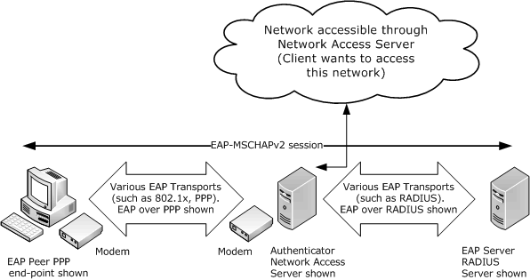

Figure 1: Typical deployment of Extensible Authentication Protocol Method for Microsoft CHAP

## 1.4 Relationship to Other Protocols

The Extensible Authentication Protocol Method for Microsoft CHAP is an [**EAP method**](#gt_eap-method) that encapsulates MSCHAPv2 messages to provide password-based [**authentications**](#gt_authentication) in the [**EAP**](#gt_extensible-authentication-protocol-eap) framework.

The Extensible Authentication Protocol Method for Microsoft CHAP, like EAP, can run over any EAP transport that is specified in [[RFC3748]](https://go.microsoft.com/fwlink/?LinkId=90444). For more information, refer to the Point-to-Point Protocol (PPP) [[RFC1661]](https://go.microsoft.com/fwlink/?LinkId=90283), PEAP [MS-PEAP](../MS-PEAP/MS-PEAP.md), or RADIUS [[RFC2865]](https://go.microsoft.com/fwlink/?LinkId=90392).

The Extensible Authentication Protocol Method for Microsoft CHAP is separate from another protocol, specified in [[IANA-EAP]](https://go.microsoft.com/fwlink/?LinkId=89882), which has the EAP method type of 0x1D (decimal 29) and the same type description as this protocol. The protocol with EAP method type 0x1D (decimal 29) is unused.

The diagram in section [2.1](#Section_2.1) illustrates the relationship between EAP [RFC3748], the Extensible Authentication Protocol Method for Microsoft CHAP, and MSCHAPv2 [[RFC2759]](https://go.microsoft.com/fwlink/?LinkId=90379).

The protocol has a configuration setting called **fUseWinLogonCreds**, as specified in section [3.1.1](../MS-GPWL/MS-GPWL.md). The [**EAP peer**](#gt_eap-peer) that initializes this protocol is responsible for configuring this setting as well. The peer itself might be configured through the [**group policy**](#gt_group-policy). For example, the Group Policy: Wireless/Wired Protocol Extension [MS-GPWL](../MS-GPWL/MS-GPWL.md) specifies the group policy protocol to configure and deploy wireless local area network (WLAN). This configuration also carries the EAP method configuration as a part of it. The peer can use this configuration to initialize the MS-CHAP method.

## 1.5 Prerequisites/Preconditions

The Extensible Authentication Protocol Method for Microsoft CHAP has no specific prerequisites or preconditions; however, both [**EAP**](#gt_extensible-authentication-protocol-eap) and MSCHAPv2 have their own prerequisites, as specified in [[RFC3748]](https://go.microsoft.com/fwlink/?LinkId=90444) and [[RFC2759]](https://go.microsoft.com/fwlink/?LinkId=90379), respectively.

For example, MSCHAPv2 depends on the out-of-band establishment of a shared secret between a [**peer**](#gt_peer) and its [**authentication server**](#gt_authentication-server). EAP depends on the out-of-band configuration of which methods are supported by a peer and its [**EAP server**](#gt_eap-server).

## 1.6 Applicability Statement

The Extensible Authentication Protocol Method for Microsoft CHAP is used when an [**EAP**](#gt_extensible-authentication-protocol-eap) [**session**](#gt_session) is already set up and MSCHAPv2 is negotiated between a [**peer**](#gt_peer) and its [**EAP server**](#gt_eap-server), as specified in [[RFC3748]](https://go.microsoft.com/fwlink/?LinkId=90444) and [[RFC2759]](https://go.microsoft.com/fwlink/?LinkId=90379), respectively.

The Extensible Authentication Protocol Method for Microsoft CHAP is susceptible to [**dictionary attacks**](#gt_dictionary-attack) and any other vulnerabilities of MSCHAPv2. By itself, it is only appropriate for use in environments where it is safe from eavesdroppers. In other cases (for example, in wireless networks), it is recommended that EAP with the MSCHAPv2 [**authentication**](#gt_authentication) method is run with [**encryption**](#gt_encryption) to provide additional protection.

The client and server implementations of this protocol will interoperate if the username is made up of standard ASCII characters. If the username is made up of extended ASCII characters, the [**code page**](#gt_code-page)s of the client and server have to be the same for the client and server to interoperate.

For more information, see [MS-PEAP](../MS-PEAP/MS-PEAP.md) or [[RFC2716]](https://go.microsoft.com/fwlink/?LinkId=90374).

The Extensible Authentication Protocol Method for Microsoft CHAP security claims are specified in section [5](#Section_5).

The client and server implementations of this protocol have to use the same system active **ANSI code page** as specified in [MS-UCODEREF](../MS-UCODEREF/MS-UCODEREF.md) section 2.2.1 for them to interoperate successfully.

## 1.7 Versioning and Capability Negotiation

None.

## 1.8 Vendor-Extensible Fields

None.

## 1.9 Standards Assignments

| Parameter | Value | Reference |
| --- | --- | --- |
| EAP Type ID "MS-EAP-Authentication" | 0x1A (decimal 26) | [[IANA-EAP]](https://go.microsoft.com/fwlink/?LinkId=89882) |

# 2 Messages

## 2.1 Transport

When MSCHAPv2 is used as an [**EAP**](#gt_extensible-authentication-protocol-eap) [**authentication**](#gt_authentication) method, protocols that carry EAP ultimately provide the transport of the encapsulated MSCHAPv2 messages, for example, the Point-to-Point Protocol (PPP) [[RFC1661]](https://go.microsoft.com/fwlink/?LinkId=90283), 802.1X [[IEEE802.1X]](https://go.microsoft.com/fwlink/?LinkId=89910), and RADIUS [[RFC2865]](https://go.microsoft.com/fwlink/?LinkId=90392).

In the following diagram, the shaded regions represent the Extensible Authentication Protocol Method for Microsoft CHAP.

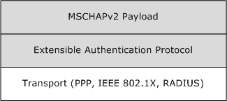

Figure 2: Transport representation for the Extensible Authentication Protocol Method for Microsoft CHAP

## 2.2 Message Syntax

All message fields are transmitted from left to right, unless otherwise indicated.

The general format of EAP-MSCHAPv2 request and response messages is to embed MSCHAPv2 [[RFC2759]](https://go.microsoft.com/fwlink/?LinkId=90379) packets in the Type-Data (or the payload) part of an [**EAP**](#gt_extensible-authentication-protocol-eap) [[RFC3748]](https://go.microsoft.com/fwlink/?LinkId=90444) message. In two response messages, only the MSCHAPv2 Success/Failure Code value is encapsulated instead of the whole MSCHAPv2 packet.

The following table specifies the encapsulation of MSCHAPv2 in EAP request messages, which are received by the [**peer**](#gt_peer). The format of EAP request messages are specified in [RFC3748] section 4.1, with the **Type** field set to 0x1A and an OpCode of 01 for request. <1>

| EAP-MSCHAPv2 message | Encapsulation |
| --- | --- |
| Challenge-Request | MSCHAPv2 Challenge Packet |
| Success-Request | MSCHAPv2 Success Packet |
| Failure-Request | MSCHAPv2 Failure Packet |

The MSCHAPv2 Failure packet, encapsulated in a Failure-Request packet, SHOULD have the **E** field (error code) set to ERROR_PASSWD_EXPIRED(648) or ERROR_AUTHENTICATION_FAILURE(691). The **R** bit can be set to zero or one as specified in section [3.3.5.2](#Section_3.3.5.2). The **C** field is the challenge value and the **V** field SHOULD always be set to 3 (as specified in [RFC2759]). The M=<msg> field is currently not used. The processing rules for the Failure-Request packet are as specified in sections [3.2.5.4](#Section_3.2.5.4) and 3.3.5.2.

The following table specifies the encapsulation of MSCHAPv2 in EAP response messages, which are received by the [**EAP server**](#gt_eap-server). The format of EAP response messages is specified in [RFC3748] section 4.1, with the **Type** field set to 0x1A and an OpCode of 02 for response.

| EAP-MSCHAPv2 message | Encapsulation |
| --- | --- |
| Challenge-Response | MSCHAPv2 Response Packet |
| Success-Response | MSCHAPv2 Success Code value only |
| Failure-Response | MSCHAPv2 Failure Code value only |
| Change-Password-Response | MSCHAPv2 Change-Password Packet |

# 3 Protocol Details

The following sections specify details of the Extensible Authentication Protocol Method for Microsoft CHAP, including abstract data models and message processing rules.

The protocol details that follow are presented in three sections:

- [Common details for both peer and EAP servers (section 3.1)](#Section_3.1)
- [Peer-specific details (section 3.2)](#Section_3.2)
- [EAP server-specific details (section 3.3)](#Section_3.3)

## 3.1 Common Details

The details in this section are common to both [**peers**](#gt_peer) and [**EAP server**](#gt_eap-server).

### 3.1.1 Abstract Data Model

This section describes a conceptual model that an implementation can maintain to participate in this protocol. The described organization is provided to facilitate the explanation of how the protocol behaves. This specification does not mandate that an implementation adhere to this model as long as the external behavior of the implementation is consistent with the behavior that is described in this document.

The [**EAP-CHAP**](#gt_eap-chap) [**peer**](#gt_peer) and server participating in this protocol must maintain the following variables.

**PeerChallenge:** A 16-octet random number generated by peer and used in the generation of NT Response ([[RFC2759]](https://go.microsoft.com/fwlink/?LinkId=90379) section 4), [Master Session Key (section 3.1.5.1)](#Section_3.1.5.1), and AuthenticatorResponse ([RFC2759] section 5).

**AuthenticatorChallenge:** A 16-octet random number generated by EAP Server and used in the generation of NT Response ([RFC2759] section 4), Master Session Key (section 3.1.5.1), and AuthenticatorResponse ([RFC2759] section 5).

**Username:** A 0-256 octet string formed by using the system active **ANSI code page** as specified in [MS-UCODEREF](../MS-UCODEREF/MS-UCODEREF.md) section 2.2.1, and used in the generation of NT Response ([RFC2759] section 4), Master Session Key (section 3.1.5.1), and AuthenticatorResponse ([RFC2759] section 5).

**Password:** A 0-256 Unicode string (generated using Normalization Form C [[UNICODE5.0.0/2007]](https://go.microsoft.com/fwlink/?LinkId=154659)), used in the generation of NT Response ([RFC2759] section 4), Master Session Key (section 3.1.5.1), and AuthenticatorResponse ([RFC2759] section 5). The **Password** could belong to a [**user**](#gt_user) or a machine, and is obtained in an implementation-specific mechanism.

**fUseWinLogonCreds:** A Boolean flag (configured through LogonCreds flag as specified in [MS-GPWL](../MS-GPWL/MS-GPWL.md) section 2.2.3.1.3) indicating whether **Username** and **Password** are obtained from the currently logged on user context.

### 3.1.2 Timers

[**EAP-CHAP**](#gt_eap-chap) relies on [**EAP**](#gt_extensible-authentication-protocol-eap) timers, as specified in [[RFC3748]](https://go.microsoft.com/fwlink/?LinkId=90444) section 4.3.

### 3.1.3 Initialization

See sections [3.2.3](#Section_3.2.3) and [3.3.3](#Section_3.3.3).

### 3.1.4 Higher-Layer Triggered Events

None.

### 3.1.5 Message Processing Events and Sequencing Rules

The Extensible Authentication Protocol Method for Microsoft CHAP uses the common message processing events and sequencing rules specified for [**EAP**](#gt_extensible-authentication-protocol-eap) in [[RFC3748]](https://go.microsoft.com/fwlink/?LinkId=90444). These include:

- The optional EAP-Identity message exchange prior to [**authentication**](#gt_authentication), which is used when an [**authenticator**](#gt_authenticator) does not know the identity of a [**peer**](#gt_peer) (as specified in [RFC3748] section 3.1).
- EAP Request/Response processing.
- EAP Success/Failure, which indicates the termination of the authentication phase.
An implementation MUST follow the semantics for all EAP messages, as specified in [RFC3748].

If a peer or an [**EAP server**](#gt_eap-server) receives an invalid Extensible Authentication Protocol Method for Microsoft CHAP message, the authentication phase MUST terminate. In this instance, invalid means "not conforming to this specification".

[**EAP method**](#gt_eap-method) execution at an entity involves processing the embedded MSCHAPv2 packet (if any) from the received Extensible Authentication Protocol Method for Microsoft CHAP message. Any processing of an embedded MSCHAPv2 message MUST be done as specified in [[RFC2759]](https://go.microsoft.com/fwlink/?LinkId=90379). Any resulting MSCHAPv2 message is embedded into a new EAP message and returned to the remote entity. The following list provides more detail.

- If the MSCHAPv2 processing generates a new MSCHAPv2 packet, it MUST be enclosed as a Type-Data of an EAP message with Type-Code set to 0x1A and sent to the other end. The rules for selecting the appropriate EAP code value for the MSCHAPv2 code value are specified in section [2](#Section_2).
- If the MSCHAPv2 processing results in an error, the peer and EAP server processing differ from each other. Message processing events are specified in sections [3.2.5](#Section_3.2.5) and [3.3.5](#Section_3.3.5).
- If the MSCHAPv2 processing results in either an error or a new MSCHAPv2 packet (as happens when a peer receiving a Success-Request message that has an embedded MSCHAPv2 Success packet is validated successfully), the applicable message processing events are as specified in section 3.2.5.

#### 3.1.5.1 Master Session Key (MSK) Derivation

Upon successful authentication, Extensible Authentication Protocol Method for Microsoft CHAP derives two 16-byte keys, MasterSendKey and MasterReceiveKey (as specified in [[RFC3079]](https://go.microsoft.com/fwlink/?LinkId=90405), section 3.3).

MS-MPPE key attributes, defined in [[RFC2548]](https://go.microsoft.com/fwlink/?LinkId=90366) section 2.4.2 and 2.4.3, are defined as follows on an Authenticator:

MS-MPPE-Recv-Key = MasterReceiveKey

MS-MPPE-Send-Key = MasterSendKey

MS-MPPE keys attributes on a Peer are as populated as follows.

MS-MPPE-Recv-Key = MasterSendKey

MS-MPPE-Send-Key = MasterReceiveKey

The [**Master Session Key**](#gt_master-session-key) [[RFC3748]](https://go.microsoft.com/fwlink/?LinkId=90444) is derived from the two keys as follows:

MSK = MasterReceiveKey + MasterSendKey + 32 bytes zeroes (padding)

#### 3.1.5.2 username

The **username** field is used in different routines, as specified in [[RFC2759]](https://go.microsoft.com/fwlink/?LinkId=90379). It is formed using the system's ANSI code page.

[RFC2759] implementations MUST treat username as an opaque stream of bytes and MUST NOT convert it into ASCII format.

### 3.1.6 Timer Events

[**EAP-CHAP**](#gt_eap-chap) relies on the timer events in [**EAP**](#gt_extensible-authentication-protocol-eap), as specified in [[RFC3748]](https://go.microsoft.com/fwlink/?LinkId=90444) section 4.3.

### 3.1.7 Other Local Events

None.

## 3.2 Peer Details

The details in this section are [**peer-specific**](#gt_peer).

### 3.2.1 Abstract Data Model

This section describes a model of possible data organization that a peer-side implementation maintains to participate in this protocol. The described organization is provided to facilitate the explanation of how the protocol behaves. This specification does not mandate that an implementation adhere to this model as long as the external behavior of the implementation is consistent with what is described in this specification.

The [**peer**](#gt_peer) maintains the current state of the [**authentication**](#gt_authentication) in an integer variable called **currentState**. The **currentState** variable is initialized to EAP_CHAP_BEGIN when the client starts the [**EAP-CHAP**](#gt_eap-chap) authentication, and remains valid until the authentication is completed. At any point in time, the **currentState** variable can have one of the following values, each one representing the current state of the client machine.

- EAP_CHAP_BEGIN
- EAP_CHAP_CHALLENGE_RESPONSE_SENT
- EAP_CHAP_SUCCESS_RESPONSE_SENT
- EAP_CHAP_FAILURE_RESPONSE_SENT
- EAP_CHAP_SUCCESS
- EAP_CHAP_FAILED
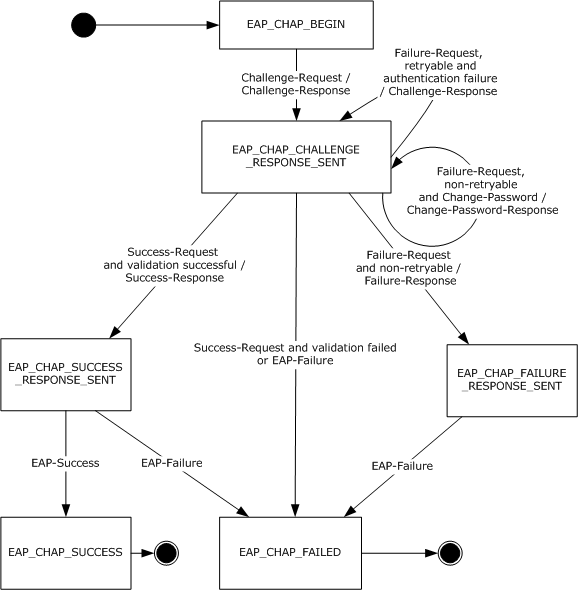

Figure 3: EAP-CHAP Peer State Machine

### 3.2.2 Timers

See section [3.1.2](#Section_3.1.2).

### 3.2.3 Initialization

The Extensible Authentication Protocol Method for Microsoft CHAP is initialized on the [**peer**](#gt_peer) when it is invoked by [**EAP**](#gt_extensible-authentication-protocol-eap) as an [**authentication**](#gt_authentication) method. This initialization occurs when an Extensible Authentication Protocol Method for Microsoft CHAP Challenge-Request message is received from the [**EAP server**](#gt_eap-server).<2> The **currentState** variable is initialized to EAP_CHAP_BEGIN.

### 3.2.4 Higher-Layer Triggered Events

As specified in [[RFC3748]](https://go.microsoft.com/fwlink/?LinkId=90444) sections 3.2 and 3.3, [**EAP**](#gt_extensible-authentication-protocol-eap) gets used directly on top of data link layers such as [IEEE802.1X] or Point-to-Point Protocol. The data link layer initializes EAP for use as the authentication mechanism, which ultimately results in an [**EAP server**](#gt_eap-server) or Authenticator sending an Identity Request message (as specified in [RFC3748] section 5.1) or a Challenge-Request message (in case the identity exchange is optional as specified in [RFC3748] section 7.3). If the peer EAP layer receives an Identity request, it requests the identity from the EAP-CHAP method. EAP-CHAP obtains the Username and Password using an implementation-specific mechanism and gives the Username as the identity. <3>

### 3.2.5 Message Processing Events and Sequencing Rules

#### 3.2.5.1 General Packet Validation

When receiving a packet, the [**EAP-CHAP**](#gt_eap-chap) peer MUST validate that the packet conforms to the syntax as specified in [Message Syntax (section 2.2)](#Section_2.2). If an invalid packet is received, it MUST be discarded.

#### 3.2.5.2 Received Challenge-Request Packet

If the **currentState** variable is set to EAP_CHAP_BEGIN, then:

- Assign the Challenge obtained from the embedded MSCHAPv2 packet to **AuthenticatorChallenge**.
- If the **Username** and **Password** are not obtained as specified in the section [3.2.4](#Section_3.2.4), then the **Username** and **Password** are obtained using an implementation-specific mechanism.<4> If the **fUseWinLogonCreds** element is set, then **Username** and **Password** are obtained from the presently logged on user context by using an implementation-specific mechanism.
- Generate a **PeerChallenge**, as specified in [[RFC2759]](https://go.microsoft.com/fwlink/?LinkId=90379) section 4.
- Prepare a Challenge-Response packet that embeds an MSCHAPv2 Challenge-Response packet, and send it to the server.
- Set **currentState** to EAP_CHAP_CHALLENGE_RESPONSE_SENT.
If the **currentState** variable is not set to EAP_CHAP_BEGIN, the packet is ignored.

#### 3.2.5.3 Received Success-Request Packet

If the **currentState** variable is set to EAP_CHAP_CHALLENGE_RESPONSE_SENT, then:

- Validate the embedded MSCHAPv2 Success packet, as specified in [[RFC2759]](https://go.microsoft.com/fwlink/?LinkId=90379) section 8.8.
- If the validation is successful, then:
- Prepare a Success-Response packet, and send it to the server.
- Set **currentState** to EAP_CHAP_SUCCESS_RESPONSE_SENT.
- If validation fails, then:
- Trigger the transport layer with the [**authentication**](#gt_authentication) result as Failed.
- Set **currentState** to EAP_CHAP_FAILED.
If the **currentState** variable is not set to EAP_CHAP_CHALLENGE_RESPONSE_SENT, the packet is ignored.

#### 3.2.5.4 Received Failure-Request Packet

If the **currentState** variable is set to EAP_CHAP_CHALLENGE_RESPONSE_SENT, then:

- If the embedded MSCHAPv2 packet's **R** bit is set to 1 ([[RFC2759]](https://go.microsoft.com/fwlink/?LinkId=90379) section 6), then:
- Assign the Challenge obtained from the embedded MSCHAPv2 Failure packet to **AuthenticatorChallenge**.
- Obtain the **Password** using an implementation-specific mechanism.
- Generate a **PeerChallenge**, as specified in [RFC2759] section 4.
- Prepare a [Challenge-Response packet](#Section_3.3.5.2) which embeds the MSCHAPv2 Challenge-Response packet, and send it to the server.
- Leave the **currentState** set at EAP_CHAP_CHALLENGE_RESPONSE_SENT.
- If the embedded MSCHAPv2 packet's **R** bit is set to zero ([RFC2759] section 6), and the error code is set to password expiration error, then:
- Assign the Challenge obtained from the embedded MSCHAPv2 Failure packet to **AuthenticatorChallenge**.
- Obtain the **Password** using an implementation-specific mechanism.
- Generate a **PeerChallenge**, as specified in [RFC2759] section 4.
- Prepare a Change-Password-Response packet which embeds the MSCHAPv2 Change-Password packet, and send it to the server.
- Leave the **currentState** set at EAP_CHAP_CHALLENGE_RESPONSE_SENT.
- If the embedded MSCHAPv2 packet's **R** bit is set to zero ([RFC2759] section 6) and the error code is not set to password expiration error, then:
- The peer SHOULD trigger the transport layer with the [**authentication**](#gt_authentication) result as Failed and set **currentState** to EAP_CHAP_FAILED or, MAY prepare a Failure-Response packet, send it to the server, and set **currentState** to EAP_CHAP_FAILURE_RESPONSE_SENT.
If the **currentState** variable is not set to EAP_CHAP_CHALLENGE_RESPONSE_SENT, the packet is ignored.

#### 3.2.5.5 Received EAP Success Packet

If the **currentState** variable is set to EAP_CHAP_SUCCESS_RESPONSE_SENT, then:

- Obtain the [Master Session Key (section 3.1.5.1)](#Section_3.1.5.1) using **AuthenticatorChallenge**, **PeerChallenge**, **Username**, and **Password**.
- Trigger the transport layer with the [**authentication**](#gt_authentication) result as Success, and pass the Master Session Key to the transport layer.
- Set **currentState** to EAP_CHAP_SUCCESS.
If the **currentState** variable is not set to EAP_CHAP_SUCCESS_RESPONSE_SENT, the packet is ignored.

#### 3.2.5.6 Received EAP Failure Packet

If the **currentState** variable is set to EAP_CHAP_SUCCESS_RESPONSE_SENT, EAP_CHAP_FAILURE_RESPONSE_SENT, or EAP_CHAP_CHALLENGE_RESPONSE_SENT, then:

- Trigger the transport layer with the [**authentication**](#gt_authentication) result as Failed.
- Set **currentState** to EAP_CHAP_FAILED.
If the **currentState** variable is not set to EAP_CHAP_SUCCESS_RESPONSE_SENT, EAP_CHAP_FAILURE_RESPONSE_SENT, or EAP_CHAP_CHALLENGE_RESPONSE_SENT, the packet is ignored.

### 3.2.6 Timer Events

See section [3.1.6](#Section_3.1.6).

### 3.2.7 Other Local Events

None.

## 3.3 EAP Server Details

The details in this section are specific to [**EAP server**](#gt_eap-server).

### 3.3.1 Abstract Data Model

This section describes a model of possible data organization that a peer-side implementation maintains to participate in this protocol. The described organization is provided to facilitate the explanation of how the protocol behaves. This specification does not mandate that an implementation adhere to this model as long as the external behavior of the implementation is consistent with the behavior that is described in this document.

The EAP-CHAP server participating in this protocol MUST maintain the following variables:

**RetryCount:** An unsigned integer indicating the number of times the [**peer**](#gt_peer) will be allowed to resubmit the challenge response. This variable is initialized to a non-negative integer as part of [**EAP-CHAP**](#gt_eap-chap) method configuration and is used as specified in section [3.3.5.2](#Section_3.3.5.2).

**AllowPasswordChange:** A Boolean variable indicating whether the server allows the client to change the client password after it has expired. This variable is initialized as part of EAP-CHAP method configuration and is used as specified in section 3.3.5.2.

The server maintains the current state of the [**authentication**](#gt_authentication) in an integer variable called **currentState**. The **currentState** variable is initialized when the server starts the EAP-CHAP authentication, and remains valid until authentication is completed. At any point in time, the **currentState** variable can have one of the following values, each one representing the current state of the server.

- EAP_CHAP_CHALLENGE_SENT
- EAP_CHAP_SUCCESS_REQUEST_SENT
- EAP_CHAP_FAILURE_REQUEST_SENT
- EAP_CHAP_CHANGE_PASSWORD_SENT
- EAP_CHAP_SUCCESS
- EAP_CHAP_FAILED
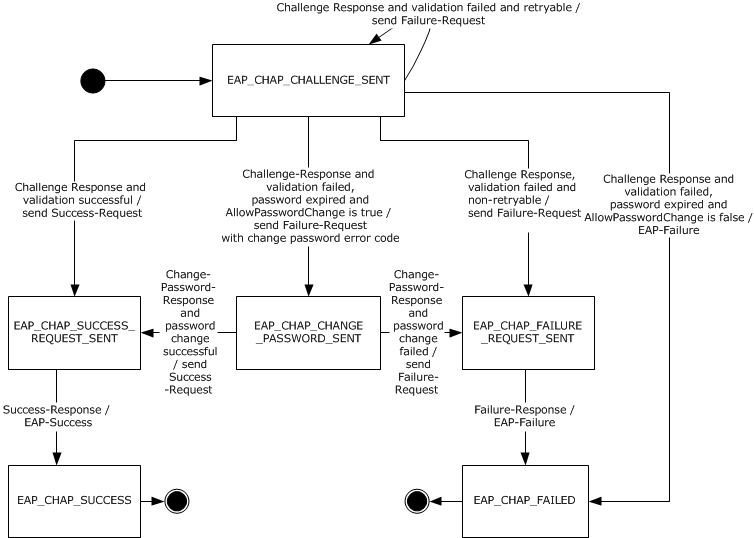

Figure 4: EAP-CHAP server state machine

### 3.3.2 Timers

The Extensible Authentication Protocol Method for Microsoft CHAP relies on the timers in the [**Extensible Authentication Protocol (EAP)**](#gt_extensible-authentication-protocol-eap) [[RFC3748]](https://go.microsoft.com/fwlink/?LinkId=90444), for [**EAP server**](#gt_eap-server). See section [3.1.2](#Section_3.1.2).

### 3.3.3 Initialization

The Extensible Authentication Protocol Method for Microsoft CHAP is initialized on the [**EAP server**](#gt_eap-server) when it is invoked by [**EAP**](#gt_extensible-authentication-protocol-eap) as an [**authentication**](#gt_authentication) method. This initialization occurs when an EAP-enabled protocol (such as RADIUS [[RFC2865]](https://go.microsoft.com/fwlink/?LinkId=90392)) invokes EAP. The EAP server responds with [**EAP-CHAP**](#gt_eap-chap), and the [**peer**](#gt_peer) performs an EAP-CHAP negotiation. After the transport layer indicates to initiate an authentication, the server prepares a Challenge-Request packet, and sends it to the peer. The **currentState** variable is initialized to EAP_CHAP_CHALLENGE_SENT, and the Challenge sent in the Challenge-Request message is assigned to **AuthenticatorChallenge**.

### 3.3.4 Higher-Layer Triggered Events

The Extensible Authentication Protocol Method for Microsoft CHAP is initialized on the [**EAP server**](#gt_eap-server) when it is invoked by [**EAP**](#gt_extensible-authentication-protocol-eap) as an [**authentication**](#gt_authentication) method. This occurs when an EAP-enabled protocol, such as RADIUS [RFC2865], invokes EAP. The EAP server proposes the use of the Extensible Authentication Protocol Method for Microsoft CHAP by sending a Challenge-Request message to the [**peer**](#gt_peer).<5>

### 3.3.5 Message Processing Events and Sequencing Rules

#### 3.3.5.1 General Packet Validation

When receiving a packet, the [**EAP-CHAP**](#gt_eap-chap) server MUST validate that the packet conforms to the syntax as specified in [Message Syntax (section 2.2)](#Section_2.2). If an invalid packet is received, it MUST be discarded.

#### 3.3.5.2 Received Challenge-Response Packet

If the **currentState** variable is set to EAP_CHAP_CHALLENGE_SENT, then:

- Obtain the **Username** and **PeerChallenge** from the embedded MSCHAPv2 [Challenge-Response packet](#Section_3.3.5.2).
- Obtain the user (specified by **Username**) **Password** using an implementation-specific mechanism.
- Validate the embedded MSCHAPv2 Challenge-Response packet, as specified in [[RFC2759]](https://go.microsoft.com/fwlink/?LinkId=90379) section 4.
- If the validation is successful, then:
- Prepare a Success-Request packet which embeds the resulting MSCHAPv2 Success packet, and send it to the [**peer**](#gt_peer).
- Set **currentState** to EAP_CHAP_SUCCESS_REQUEST_SENT.
- If the validation fails due to an expired password and [AllowPasswordChange](#Section_445709abd25f433c85d4a827c029a28e) is true, then:
- Prepare a Failure-Request packet that embeds the MSCHAPv2 Failure packet with the **R** bit set to zero and the corresponding validation error, and send it to the peer.
- Obtain the **AuthenticatorChallenge** from the Failure-Request packet.
- Set **currentState** to EAP_CHAP_CHANGE_PASSWORD_SENT.
- If the validation fails due to an expired password and AllowPasswordChange is false, then:
- Prepare an **EAP Failure packet** and send it to the peer.
- Set currentState to EAP_CHAP_FAILED.
- If the validation fails due to authentication failure ([RFC2759] section 6) and the **RetryCount** datum is nonzero, then:
- Prepare a Failure-Request packet which embeds the MSCHAPv2 Failure packet with **R** bit set to one and the corresponding validation error, and send it to the peer.
- Decrement the **RetryCount** datum by one.
- Obtain the AuthenticatorChallenge from the Failure-Request packet.
- Leave **currentState** set at EAP_CHAP_CHALLENGE_SENT.
- If the validation fails because on an authentication failure ([RFC2759] section 6) and the **RetryCount** datum is zero, then:<6>
- Prepare a Failure-Request packet which embeds the MSCHAPv2 Failure packet with the **R** bit set to zero and the corresponding validation error, and send it to the peer.
- Set **currentState** to EAP_CHAP_FAILURE_REQUEST_SENT.
If the **currentState** variable is not set to EAP_CHAP_CHALLENGE_SENT, the packet is ignored.

#### 3.3.5.3 Received Success-Response Packet

If the **currentState** variable is set to EAP_CHAP_SUCCESS_REQUEST_SENT, then:

- Prepare an [**EAP**](#gt_extensible-authentication-protocol-eap) Success packet, and send it to the [**peer**](#gt_peer).
- Obtain a [Master Session Key (section 3.1.5.1)](#Section_3.1.5.1) using **AuthenticatorChallenge**, **PeerChallenge**, **Username**, and **Password**.
- Trigger the transport layer with the [**authentication**](#gt_authentication) result as Success, and pass the Master Session Key to the transport layer.
- Set **currentState** to EAP_CHAP_SUCCESS.
If the **currentState** variable is not set to EAP_CHAP_SUCCESS_REQUEST_SENT, the packet is ignored.

#### 3.3.5.4 Received Change-Password-Response Packet

If the **currentState** variable is set to EAP_CHAP_CHANGE_PASSWORD_SENT, then:

- Obtain **PeerChallenge** from the embedded MSCHAPv2 Change-Password-Response packet.
- Validate the embedded MSCHAPv2 Change-Password-Response packet, as specified in [[RFC2759]](https://go.microsoft.com/fwlink/?LinkId=90379) section 7.
- If the validation is successful, then:
- Obtain the new **Password** from the embedded MSCHAPv2 Change-Password-Response packet.
- Prepare a Success-Request packet which embeds the MSCHAPv2 Success-Request packet, and send it to the [**peer**](#gt_peer).
- Set **currentState** to EAP_CHAP_SUCCESS_REQUEST_SENT.
- If the validation fails, then:<7>
- Prepare a Failure-Request packet which embeds the MSCHAPv2 Failure packet that corresponds to the validation error, and send it to the peer.
- Set **currentState** to EAP_CHAP_FAILURE_REQUEST_SENT.
If the **currentState** variable is not set to EAP_CHAP_CHANGE_PASSWORD_SENT, the packet is ignored.

#### 3.3.5.5 Received Failure-Response Packet

If the **currentState** variable is set to EAP_CHAP_FAILURE_REQUEST_SENT, then:

- Prepare an [**EAP**](#gt_extensible-authentication-protocol-eap) Failure packet, and send it to the [**peer**](#gt_peer).
- Set **currentState** to EAP_CHAP_FAILED.
If the **currentState** variable is not set to EAP_CHAP_FAILURE_REQUEST_SENT, the packet is ignored.

### 3.3.6 Timer Events

See section [3.1.6](#Section_3.1.6).

### 3.3.7 Other Local Events

None.

# 4 Protocol Examples

This section presents examples of messages exchanged between a [**peer**](#gt_peer) and an [**EAP server**](#gt_eap-server) during the course of various [**authentication**](#gt_authentication) scenarios. Initial [**EAP**](#gt_extensible-authentication-protocol-eap) Identity exchanges and a pass-through [**authenticator**](#gt_authenticator) are not shown in the examples. EAP-Success and EAP-Failure messages are shown to indicate the status of the authentication.

## 4.1 Successful Mutual Authentication

This example shows a [**peer**](#gt_peer) and an [**EAP server**](#gt_eap-server) successfully using Extensible Authentication Protocol Method for Microsoft CHAP messages for [**mutual authentication**](#gt_mutual-authentication).

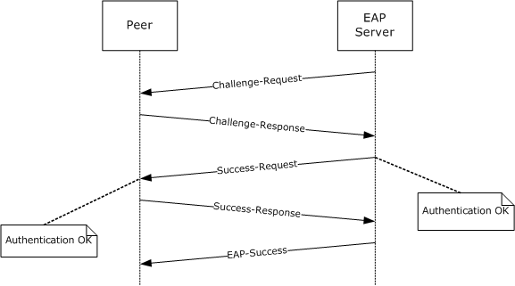

Figure 5: Peer and EAP server using successful mutual authentication

## 4.2 Failure Scenario with Retry

This example shows an [**authentication**](#gt_authentication) failure that was then retried, a subsequent authentication failure, and the [**EAP server**](#gt_eap-server) terminating the authentication procedure.

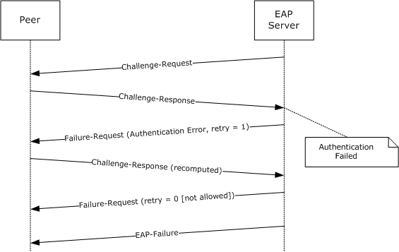

Figure 6: Authentication failure with retry that also fails

## 4.3 Failure Scenario with No Retry

This example shows an [**EAP server**](#gt_eap-server) terminating the [**authentication**](#gt_authentication) procedure when a non-retryable error occurs. The EAP server is not allowed to transmit a Failure-Request message.

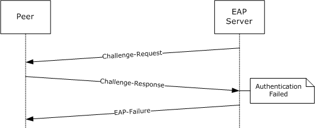

Figure 7: Authentication failure with no retry allowed

## 4.4 Failure Scenario with No Retry Followed by a Failure-Response

This example shows an [**EAP server**](#gt_eap-server) transmitting a Failure-Request message on a non-retryable error. It also shows the [**peer**](#gt_peer) responding with a Failure-Response message before the EAP server terminates the [**authentication**](#gt_authentication) procedure.

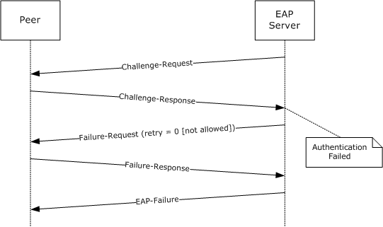

Figure 8: Failure scenario with no retry followed by a Failure-Response

## 4.5 Success Scenario with Change-Password-Response

This example shows a successful password change when the [**EAP server**](#gt_eap-server) sends an expired password indication to the [**peer**](#gt_peer). Before sending such an indication, the EAP server checks the local policy to see if a password change is allowed. The peer collects a new password by invoking the user interface, and it sends a Change-Password-Response message to the EAP server.

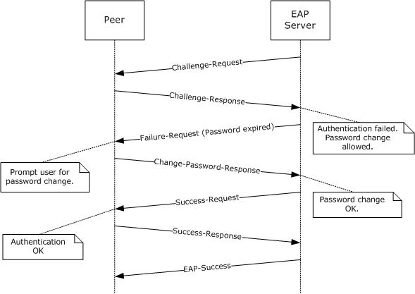

Figure 9: Success scenario with Change-Password-Response

## 4.6 Success Scenario on Retry After Challenge-Response Is Recomputed

This example shows the successful retry of an [**authentication**](#gt_authentication) after an attempt has failed. The [**EAP server**](#gt_eap-server) sends a retryable failure indication to the [**peer**](#gt_peer). The peer recomputes the MSCHAPv2 response, possibly after invoking the user interface to collect the user password again.

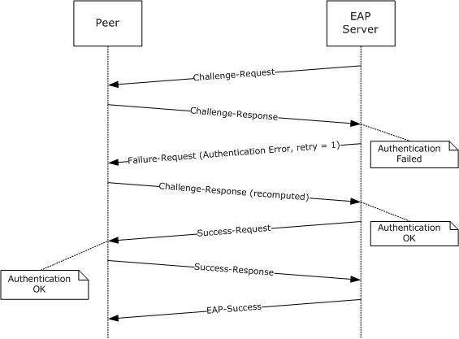

Figure 10: Success scenario on retry after Challenge-Response is recomputed

## 4.7 Authentication Failure at the Peer

This example shows a [**mutual authentication**](#gt_mutual-authentication) scenario in which the [**EAP server**](#gt_eap-server) fails [**authentication**](#gt_authentication) at the [**peer**](#gt_peer).

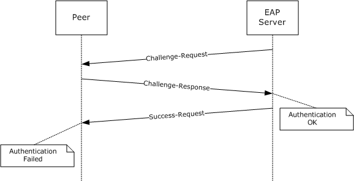

Figure 11: Authentication failure at the peer

# 5 Security

## 5.1 Security Considerations for Implementers

Running MSCHAPv2 as an [**EAP method**](#gt_eap-method) has the same security considerations as running it without [**EAP**](#gt_extensible-authentication-protocol-eap).

Using the terminology of the [**Extensible Authentication Protocol (EAP)**](#gt_extensible-authentication-protocol-eap) (see [RFC3748] section 7.2.1), the security claims of this specification are shown in the following table.

| Authentication mechanism | Password |
| --- | --- |
| CipherSuite negotiation | No |
| Mutual [**authentication**](#gt_authentication) | Yes |
| Integrity protection | Yes |
| Replay protection | Yes |
| Confidentiality | No |
| Key derivation | Yes |
| Key strength | Depends on password policy. |
| [**Dictionary attack**](#gt_dictionary-attack) protection | No |
| Fast reconnect | No |
| Cryptographic binding | N/A |
| [**Session**](#gt_session) independence | Depends on password policy. |
| Fragmentation | No |
| Channel binding | No |

## 5.2 Index of Security Parameters

| Security parameter | Section |
| --- | --- |
| Challenge | See [RFC2759] section 3. |
| Peer-Challenge | See [RFC2759] section 4. |

# 6 Appendix A: Product Behavior

The information in this specification is applicable to the following Microsoft products or supplemental software. References to product versions include updates to those products.

- Windows NT operating system
- Windows 2000 operating system
- Windows Server 2003 operating system
- Windows XP operating system
- Windows Vista operating system
- Windows Server 2008 operating system
- Windows 7 operating system
- Windows Server 2008 R2 operating system
- Windows 8 operating system
- Windows Server 2012 operating system
- Windows 8.1 operating system
- Windows Server 2012 R2 operating system
- Windows 10 operating system
- Windows Server 2016 operating system
- Windows Server operating system
- Windows Server 2019 operating system
- Windows Server 2022 operating system
- Windows 11 operating system
- Windows Server 2025 operating system
Exceptions, if any, are noted in this section. If an update version, service pack or Knowledge Base (KB) number appears with a product name, the behavior changed in that update. The new behavior also applies to subsequent updates unless otherwise specified. If a product edition appears with the product version, behavior is different in that product edition.

Unless otherwise specified, any statement of optional behavior in this specification that is prescribed using the terms "SHOULD" or "SHOULD NOT" implies product behavior in accordance with the SHOULD or SHOULD NOT prescription. Unless otherwise specified, the term "MAY" implies that the product does not follow the prescription.

<1> Section 2.2: On an EAP server, Windows initializes the EAP Identifier to zero for the first EAP identity request packet of an EAP session (as specified in [[RFC3748]](https://go.microsoft.com/fwlink/?LinkId=90444)). From here on, for all the subsequent EAP Request messages, the Identifier is incremented by one. The peer uses the same identifier it received in the request packet for the EAP response packet (as specified in [RFC3748]).

<2> Section 3.2.3: On a [**peer**](#gt_peer), Windows maintains a configuration that specifies whether the Extensible Authentication Protocol Method for Microsoft CHAP is to be used.

<3> Section 3.2.4: On a peer, Windows invokes a user interface to accept the credentials from the user, and if they are provided, message processing continues. Trigger the transport layer with the [**authentication**](#gt_authentication) result as Failed, if the user cancels the authentication.

<4> Section 3.2.5.2: On a peer, Windows invokes a user interface to accept the credentials from the user, and if they are provided, message processing continues. Trigger the transport layer with the authentication result as Failed, if the user cancels the authentication.

<5> Section 3.3.4: On an [**EAP server**](#gt_eap-server), Windows maintains a list of configured [**EAP methods**](#gt_eap-method) that are supported and determines if the Extensible Authentication Protocol Method for Microsoft CHAP is supported.

<6> Section 3.3.5.2: On a server, when validation fails, Windows sends an [**EAP**](#gt_extensible-authentication-protocol-eap) Failure packet.

<7> Section 3.3.5.4: On a server, when validation fails, Windows sends an EAP Failure packet.

# 7 Change Tracking

This section identifies changes that were made to this document since the last release. Changes are classified as Major, Minor, or None.

The revision class **Major** means that the technical content in the document was significantly revised. Major changes affect protocol interoperability or implementation. Examples of major changes are:

- A document revision that incorporates changes to interoperability requirements.
- A document revision that captures changes to protocol functionality.
The revision class **Minor** means that the meaning of the technical content was clarified. Minor changes do not affect protocol interoperability or implementation. Examples of minor changes are updates to clarify ambiguity at the sentence, paragraph, or table level.

The revision class **None** means that no new technical changes were introduced. Minor editorial and formatting changes may have been made, but the relevant technical content is identical to the last released version.

The changes made to this document are listed in the following table. For more information, please contact [dochelp@microsoft.com](mailto:dochelp@microsoft.com).

| Section | Description | Revision class |
| --- | --- | --- |
| [6](#Section_6) Appendix A: Product Behavior | Added Windows Server 2025 to the list of applicable products. | Major |

## Revision History

| Date | Version | Revision Class | Comments |
| --- | --- | --- | --- |
| 10/22/2006 | 0.01 | New | Version 0.01 release |
| 1/19/2007 | 1.0 | Major | Version 1.0 release |
| 3/2/2007 | 1.1 | Minor | Version 1.1 release |
| 4/3/2007 | 1.2 | Minor | Version 1.2 release |
| 5/11/2007 | 1.3 | Minor | Version 1.3 release |
| 6/1/2007 | 1.3.1 | Editorial | Changed language and formatting in the technical content. |
| 7/3/2007 | 1.3.2 | Editorial | Changed language and formatting in the technical content. |
| 7/20/2007 | 1.3.3 | Editorial | Changed language and formatting in the technical content. |
| 8/10/2007 | 1.3.4 | Editorial | Changed language and formatting in the technical content. |
| 9/28/2007 | 1.3.5 | Editorial | Changed language and formatting in the technical content. |
| 10/23/2007 | 1.3.6 | Editorial | Changed language and formatting in the technical content. |
| 11/30/2007 | 2.0 | Major | Updated and revised the technical content. |
| 1/25/2008 | 2.0.1 | Editorial | Changed language and formatting in the technical content. |
| 3/14/2008 | 3.0 | Major | Updated and revised the technical content. |
| 5/16/2008 | 3.0.1 | Editorial | Changed language and formatting in the technical content. |
| 6/20/2008 | 3.0.2 | Editorial | Changed language and formatting in the technical content. |
| 7/25/2008 | 3.0.3 | Editorial | Changed language and formatting in the technical content. |
| 8/29/2008 | 3.0.4 | Editorial | Changed language and formatting in the technical content. |
| 10/24/2008 | 3.0.5 | Editorial | Changed language and formatting in the technical content. |
| 12/5/2008 | 4.0 | Major | Updated and revised the technical content. |
| 1/16/2009 | 4.0.1 | Editorial | Changed language and formatting in the technical content. |
| 2/27/2009 | 4.0.2 | Editorial | Changed language and formatting in the technical content. |
| 4/10/2009 | 5.0 | Major | Updated and revised the technical content. |
| 5/22/2009 | 6.0 | Major | Updated and revised the technical content. |
| 7/2/2009 | 6.0.1 | Editorial | Changed language and formatting in the technical content. |
| 8/14/2009 | 7.0 | Major | Updated and revised the technical content. |
| 9/25/2009 | 7.1 | Minor | Clarified the meaning of the technical content. |
| 11/6/2009 | 8.0 | Major | Updated and revised the technical content. |
| 12/18/2009 | 8.0.1 | Editorial | Changed language and formatting in the technical content. |
| 1/29/2010 | 9.0 | Major | Updated and revised the technical content. |
| 3/12/2010 | 9.1 | Minor | Clarified the meaning of the technical content. |
| 4/23/2010 | 9.1.1 | Editorial | Changed language and formatting in the technical content. |
| 6/4/2010 | 9.1.2 | Editorial | Changed language and formatting in the technical content. |
| 7/16/2010 | 9.2 | Minor | Clarified the meaning of the technical content. |
| 8/27/2010 | 9.3 | Minor | Clarified the meaning of the technical content. |
| 10/8/2010 | 9.3 | None | No changes to the meaning, language, or formatting of the technical content. |
| 11/19/2010 | 9.3 | None | No changes to the meaning, language, or formatting of the technical content. |
| 1/7/2011 | 10.0 | Major | Updated and revised the technical content. |
| 2/11/2011 | 11.0 | Major | Updated and revised the technical content. |
| 3/25/2011 | 11.0 | None | No changes to the meaning, language, or formatting of the technical content. |
| 5/6/2011 | 12.0 | Major | Updated and revised the technical content. |
| 6/17/2011 | 12.1 | Minor | Clarified the meaning of the technical content. |
| 9/23/2011 | 13.0 | Major | Updated and revised the technical content. |
| 12/16/2011 | 14.0 | Major | Updated and revised the technical content. |
| 3/30/2012 | 14.0 | None | No changes to the meaning, language, or formatting of the technical content. |
| 7/12/2012 | 14.0 | None | No changes to the meaning, language, or formatting of the technical content. |
| 10/25/2012 | 14.0 | None | No changes to the meaning, language, or formatting of the technical content. |
| 1/31/2013 | 14.0 | None | No changes to the meaning, language, or formatting of the technical content. |
| 8/8/2013 | 15.0 | Major | Updated and revised the technical content. |
| 11/14/2013 | 15.0 | None | No changes to the meaning, language, or formatting of the technical content. |
| 2/13/2014 | 15.0 | None | No changes to the meaning, language, or formatting of the technical content. |
| 5/15/2014 | 15.0 | None | No changes to the meaning, language, or formatting of the technical content. |
| 6/30/2015 | 16.0 | Major | Significantly changed the technical content. |
| 10/16/2015 | 17.0 | Major | Significantly changed the technical content. |
| 7/14/2016 | 18.0 | Major | Significantly changed the technical content. |
| 6/1/2017 | 18.0 | None | No changes to the meaning, language, or formatting of the technical content. |
| 9/15/2017 | 19.0 | Major | Significantly changed the technical content. |
| 9/12/2018 | 20.0 | Major | Significantly changed the technical content. |
| 4/7/2021 | 21.0 | Major | Significantly changed the technical content. |
| 6/25/2021 | 22.0 | Major | Significantly changed the technical content. |
| 4/23/2024 | 23.0 | Major | Significantly changed the technical content. |
