# [MS-CIFS]: Common Internet File System (CIFS) Protocol

Table of Contents

<details>
<summary>1 Introduction</summary>

- [1 Introduction](#Section_1)
  - [1.1 Glossary](#Section_1.1)
  - [1.2 References](#Section_1.2)
    - [1.2.1 Normative References](#Section_1.2.1)
    - [1.2.2 Informative References](#Section_1.2.2)
  - [1.3 Overview](#Section_1.3)
  - [1.4 Relationship to Other Protocols](#Section_1.4)
  - [1.5 Prerequisites/Preconditions](#Section_1.5)
  - [1.6 Applicability Statement](#Section_1.6)
  - [1.7 Versioning and Capability Negotiation](#Section_1.7)
  - [1.8 Vendor-Extensible Fields](#Section_1.8)
  - [1.9 Standards Assignments](#Section_1.9)
</details>

<details>
<summary>2 Messages</summary>

- [2 Messages](#Section_2)
  - [2.1 Transport](#Section_2.1)
    - [2.1.1 NetBIOS-Based Transports](#Section_2.1.1)
      - [2.1.1.1 NetBIOS Frames (NBF) Protocol Transport](#Section_2.1.1.1)
      - [2.1.1.2 NetBIOS over TCP/UDP (NBT) Transport](#Section_2.1.1.2)
      - [2.1.1.3 NetBIOS over IPX/SPX (NBIPX) Transport](#Section_2.1.1.3)
      - [2.1.1.4 Other NetBIOS-Based Transports](#Section_2.1.1.4)
    - [2.1.2 Direct Hosting](#Section_2.1.2)
      - [2.1.2.1 Direct IPX Transport](#Section_2.1.2.1)
    - [2.1.3 Virtual Circuits](#Section_2.1.3)
  - [2.2 Message Syntax](#Section_2.2)
    - [2.2.1 Common Data Types](#Section_2.2.1)
      - [2.2.1.1 Character Sequences](#Section_2.2.1.1)
        - [2.2.1.1.1 File and Directory names](#Section_2.2.1.1.1)
        - [2.2.1.1.2 Pathnames](#Section_2.2.1.1.2)
        - [2.2.1.1.3 Wildcards](#Section_2.2.1.1.3)
      - [2.2.1.2 File Attributes](#Section_2.2.1.2)
        - [2.2.1.2.1 SMB_GEA](#Section_2.2.1.2.1)
          - [2.2.1.2.1.1 SMB_GEA_LIST](#Section_2.2.1.2.1.1)
        - [2.2.1.2.2 SMB_FEA](#Section_2.2.1.2.2)
          - [2.2.1.2.2.1 SMB_FEA_LIST](#Section_2.2.1.2.2.1)
        - [2.2.1.2.3 SMB_EXT_FILE_ATTR](#Section_2.2.1.2.3)
        - [2.2.1.2.4 SMB_FILE_ATTRIBUTES](#Section_2.2.1.2.4)
      - [2.2.1.3 Named Pipe Status (SMB_NMPIPE_STATUS)](#Section_2.2.1.3)
      - [2.2.1.4 Time](#Section_2.2.1.4)
        - [2.2.1.4.1 SMB_DATE](#Section_2.2.1.4.1)
        - [2.2.1.4.2 SMB_TIME](#Section_2.2.1.4.2)
        - [2.2.1.4.3 UTIME](#Section_2.2.1.4.3)
      - [2.2.1.5 Status Codes (SMB_ERROR)](#Section_2.2.1.5)
      - [2.2.1.6 Unique Identifiers](#Section_2.2.1.6)
        - [2.2.1.6.1 FID Generation](#Section_2.2.1.6.1)
        - [2.2.1.6.2 MID Generation](#Section_2.2.1.6.2)
        - [2.2.1.6.3 PID Generation](#Section_2.2.1.6.3)
        - [2.2.1.6.4 Connection ID (CID) Generation](#Section_2.2.1.6.4)
        - [2.2.1.6.5 Search ID (SID) Generation](#Section_2.2.1.6.5)
        - [2.2.1.6.6 SessionKey Generation](#Section_2.2.1.6.6)
        - [2.2.1.6.7 TID Generation](#Section_2.2.1.6.7)
        - [2.2.1.6.8 UID Generation](#Section_2.2.1.6.8)
    - [2.2.2 Defined Constants](#Section_2.2.2)
      - [2.2.2.1 SMB_COM Command Codes](#Section_2.2.2.1)
      - [2.2.2.2 Transaction Subcommand Codes](#Section_2.2.2.2)
      - [2.2.2.3 Information Level Codes](#Section_2.2.2.3)
        - [2.2.2.3.1 FIND Information Level Codes](#Section_2.2.2.3.1)
        - [2.2.2.3.2 QUERY_FS Information Level Codes](#Section_2.2.2.3.2)
        - [2.2.2.3.3 QUERY Information Level Codes](#Section_2.2.2.3.3)
        - [2.2.2.3.4 SET Information Level Codes](#Section_2.2.2.3.4)
      - [2.2.2.4 SMB Error Classes and Codes](#Section_2.2.2.4)
      - [2.2.2.5 Data Buffer Format Codes](#Section_2.2.2.5)
    - [2.2.3 SMB Message Structure](#Section_2.2.3)
      - [2.2.3.1 The SMB Header](#Section_2.2.3.1)
      - [2.2.3.2 Parameter Block](#Section_2.2.3.2)
      - [2.2.3.3 Data Block](#Section_2.2.3.3)
      - [2.2.3.4 Batched Messages ("AndX" Messages)](#Section_2.2.3.4)
        - [2.2.3.4.1 Follow-on Commands](#Section_2.2.3.4.1)
    - [2.2.4 SMB Commands](#Section_2.2.4)
      - [2.2.4.1 SMB_COM_CREATE_DIRECTORY (0x00)](#Section_2.2.4.1)
        - [2.2.4.1.1 Request](#Section_2.2.4.1.1)
        - [2.2.4.1.2 Response](#Section_2.2.4.1.2)
      - [2.2.4.2 SMB_COM_DELETE_DIRECTORY (0x01)](#Section_2.2.4.2)
        - [2.2.4.2.1 Request](#Section_2.2.4.2.1)
        - [2.2.4.2.2 Response](#Section_2.2.4.2.2)
      - [2.2.4.3 SMB_COM_OPEN (0x02)](#Section_2.2.4.3)
        - [2.2.4.3.1 Request](#Section_2.2.4.3.1)
        - [2.2.4.3.2 Response](#Section_2.2.4.3.2)
      - [2.2.4.4 SMB_COM_CREATE (0x03)](#Section_2.2.4.4)
        - [2.2.4.4.1 Request](#Section_2.2.4.4.1)
        - [2.2.4.4.2 Response](#Section_2.2.4.4.2)
      - [2.2.4.5 SMB_COM_CLOSE (0x04)](#Section_2.2.4.5)
        - [2.2.4.5.1 Request](#Section_2.2.4.5.1)
        - [2.2.4.5.2 Response](#Section_2.2.4.5.2)
      - [2.2.4.6 SMB_COM_FLUSH (0x05)](#Section_2.2.4.6)
        - [2.2.4.6.1 Request](#Section_2.2.4.6.1)
        - [2.2.4.6.2 Response](#Section_2.2.4.6.2)
      - [2.2.4.7 SMB_COM_DELETE (0x06)](#Section_2.2.4.7)
        - [2.2.4.7.1 Request](#Section_2.2.4.7.1)
        - [2.2.4.7.2 Response](#Section_2.2.4.7.2)
      - [2.2.4.8 SMB_COM_RENAME (0x07)](#Section_2.2.4.8)
        - [2.2.4.8.1 Request](#Section_2.2.4.8.1)
        - [2.2.4.8.2 Response](#Section_2.2.4.8.2)
      - [2.2.4.9 SMB_COM_QUERY_INFORMATION (0x08)](#Section_2.2.4.9)
        - [2.2.4.9.1 Request](#Section_2.2.4.9.1)
        - [2.2.4.9.2 Response](#Section_2.2.4.9.2)
      - [2.2.4.10 SMB_COM_SET_INFORMATION (0x09)](#Section_2.2.4.10)
        - [2.2.4.10.1 Request](#Section_2.2.4.10.1)
        - [2.2.4.10.2 Response](#Section_2.2.4.10.2)
      - [2.2.4.11 SMB_COM_READ (0x0A)](#Section_2.2.4.11)
        - [2.2.4.11.1 Request](#Section_2.2.4.11.1)
        - [2.2.4.11.2 Response](#Section_2.2.4.11.2)
      - [2.2.4.12 SMB_COM_WRITE (0x0B)](#Section_2.2.4.12)
        - [2.2.4.12.1 Request](#Section_2.2.4.12.1)
        - [2.2.4.12.2 Response](#Section_2.2.4.12.2)
      - [2.2.4.13 SMB_COM_LOCK_BYTE_RANGE (0x0C)](#Section_2.2.4.13)
        - [2.2.4.13.1 Request](#Section_2.2.4.13.1)
        - [2.2.4.13.2 Response](#Section_2.2.4.13.2)
      - [2.2.4.14 SMB_COM_UNLOCK_BYTE_RANGE (0x0D)](#Section_2.2.4.14)
        - [2.2.4.14.1 Request](#Section_2.2.4.14.1)
        - [2.2.4.14.2 Response](#Section_2.2.4.14.2)
      - [2.2.4.15 SMB_COM_CREATE_TEMPORARY (0x0E)](#Section_2.2.4.15)
        - [2.2.4.15.1 Request](#Section_2.2.4.15.1)
        - [2.2.4.15.2 Response](#Section_2.2.4.15.2)
      - [2.2.4.16 SMB_COM_CREATE_NEW (0x0F)](#Section_2.2.4.16)
        - [2.2.4.16.1 Request](#Section_2.2.4.16.1)
        - [2.2.4.16.2 Response](#Section_2.2.4.16.2)
      - [2.2.4.17 SMB_COM_CHECK_DIRECTORY (0x10)](#Section_2.2.4.17)
        - [2.2.4.17.1 Request](#Section_2.2.4.17.1)
        - [2.2.4.17.2 Response](#Section_2.2.4.17.2)
      - [2.2.4.18 SMB_COM_PROCESS_EXIT (0x11)](#Section_2.2.4.18)
        - [2.2.4.18.1 Request](#Section_2.2.4.18.1)
        - [2.2.4.18.2 Response](#Section_2.2.4.18.2)
      - [2.2.4.19 SMB_COM_SEEK (0x12)](#Section_2.2.4.19)
        - [2.2.4.19.1 Request](#Section_2.2.4.19.1)
        - [2.2.4.19.2 Response](#Section_2.2.4.19.2)
      - [2.2.4.20 SMB_COM_LOCK_AND_READ (0x13)](#Section_2.2.4.20)
        - [2.2.4.20.1 Request](#Section_2.2.4.20.1)
        - [2.2.4.20.2 Response](#Section_2.2.4.20.2)
      - [2.2.4.21 SMB_COM_WRITE_AND_UNLOCK (0x14)](#Section_2.2.4.21)
        - [2.2.4.21.1 Request](#Section_2.2.4.21.1)
        - [2.2.4.21.2 Response](#Section_2.2.4.21.2)
      - [2.2.4.22 SMB_COM_READ_RAW (0x1A)](#Section_2.2.4.22)
        - [2.2.4.22.1 Request](#Section_2.2.4.22.1)
        - [2.2.4.22.2 Response](#Section_2.2.4.22.2)
      - [2.2.4.23 SMB_COM_READ_MPX (0x1B)](#Section_2.2.4.23)
        - [2.2.4.23.1 Request](#Section_2.2.4.23.1)
        - [2.2.4.23.2 Response](#Section_2.2.4.23.2)
      - [2.2.4.24 SMB_COM_READ_MPX_SECONDARY (0x1C)](#Section_2.2.4.24)
      - [2.2.4.25 SMB_COM_WRITE_RAW (0x1D)](#Section_2.2.4.25)
        - [2.2.4.25.1 Request](#Section_2.2.4.25.1)
        - [2.2.4.25.2 Interim Server Response](#Section_2.2.4.25.2)
        - [2.2.4.25.3 Final Server Response](#Section_2.2.4.25.3)
      - [2.2.4.26 SMB_COM_WRITE_MPX (0x1E)](#Section_2.2.4.26)
        - [2.2.4.26.1 Request](#Section_2.2.4.26.1)
        - [2.2.4.26.2 Response](#Section_2.2.4.26.2)
      - [2.2.4.27 SMB_COM_WRITE_MPX_SECONDARY (0x1F)](#Section_2.2.4.27)
      - [2.2.4.28 SMB_COM_WRITE_COMPLETE (0x20)](#Section_2.2.4.28)
      - [2.2.4.29 SMB_COM_QUERY_SERVER (0x21)](#Section_2.2.4.29)
      - [2.2.4.30 SMB_COM_SET_INFORMATION2 (0x22)](#Section_2.2.4.30)
        - [2.2.4.30.1 Request](#Section_2.2.4.30.1)
        - [2.2.4.30.2 Response](#Section_2.2.4.30.2)
      - [2.2.4.31 SMB_COM_QUERY_INFORMATION2 (0x23)](#Section_2.2.4.31)
        - [2.2.4.31.1 Request](#Section_2.2.4.31.1)
        - [2.2.4.31.2 Response](#Section_2.2.4.31.2)
      - [2.2.4.32 SMB_COM_LOCKING_ANDX (0x24)](#Section_2.2.4.32)
        - [2.2.4.32.1 Request](#Section_2.2.4.32.1)
        - [2.2.4.32.2 Response](#Section_2.2.4.32.2)
      - [2.2.4.33 SMB_COM_TRANSACTION (0x25)](#Section_2.2.4.33)
        - [2.2.4.33.1 Request](#Section_2.2.4.33.1)
        - [2.2.4.33.2 Response](#Section_2.2.4.33.2)
      - [2.2.4.34 SMB_COM_TRANSACTION_SECONDARY (0x26)](#Section_2.2.4.34)
        - [2.2.4.34.1 Request](#Section_2.2.4.34.1)
        - [2.2.4.34.2 Response](#Section_2.2.4.34.2)
      - [2.2.4.35 SMB_COM_IOCTL (0x27)](#Section_2.2.4.35)
        - [2.2.4.35.1 Request](#Section_2.2.4.35.1)
        - [2.2.4.35.2 Response](#Section_2.2.4.35.2)
      - [2.2.4.36 SMB_COM_IOCTL_SECONDARY (0x28)](#Section_2.2.4.36)
      - [2.2.4.37 SMB_COM_COPY (0x29)](#Section_2.2.4.37)
      - [2.2.4.38 SMB_COM_MOVE (0x2A)](#Section_2.2.4.38)
      - [2.2.4.39 SMB_COM_ECHO (0x2B)](#Section_2.2.4.39)
        - [2.2.4.39.1 Request](#Section_2.2.4.39.1)
        - [2.2.4.39.2 Response](#Section_2.2.4.39.2)
      - [2.2.4.40 SMB_COM_WRITE_AND_CLOSE (0x2C)](#Section_2.2.4.40)
        - [2.2.4.40.1 Request](#Section_2.2.4.40.1)
        - [2.2.4.40.2 Response](#Section_2.2.4.40.2)
      - [2.2.4.41 SMB_COM_OPEN_ANDX (0x2D)](#Section_2.2.4.41)
        - [2.2.4.41.1 Request](#Section_2.2.4.41.1)
        - [2.2.4.41.2 Response](#Section_2.2.4.41.2)
      - [2.2.4.42 SMB_COM_READ_ANDX (0x2E)](#Section_2.2.4.42)
        - [2.2.4.42.1 Request](#Section_2.2.4.42.1)
        - [2.2.4.42.2 Response](#Section_2.2.4.42.2)
      - [2.2.4.43 SMB_COM_WRITE_ANDX (0x2F)](#Section_2.2.4.43)
        - [2.2.4.43.1 Request](#Section_2.2.4.43.1)
        - [2.2.4.43.2 Response](#Section_2.2.4.43.2)
      - [2.2.4.44 SMB_COM_NEW_FILE_SIZE (0x30)](#Section_2.2.4.44)
      - [2.2.4.45 SMB_COM_CLOSE_AND_TREE_DISC (0x31)](#Section_2.2.4.45)
      - [2.2.4.46 SMB_COM_TRANSACTION2 (0x32)](#Section_2.2.4.46)
        - [2.2.4.46.1 Request](#Section_2.2.4.46.1)
        - [2.2.4.46.2 Response](#Section_2.2.4.46.2)
      - [2.2.4.47 SMB_COM_TRANSACTION2_SECONDARY (0x33)](#Section_2.2.4.47)
        - [2.2.4.47.1 Request](#Section_2.2.4.47.1)
        - [2.2.4.47.2 Response](#Section_2.2.4.47.2)
      - [2.2.4.48 SMB_COM_FIND_CLOSE2 (0x34)](#Section_2.2.4.48)
        - [2.2.4.48.1 Request](#Section_2.2.4.48.1)
        - [2.2.4.48.2 Response](#Section_2.2.4.48.2)
      - [2.2.4.49 SMB_COM_FIND_NOTIFY_CLOSE (0x35)](#Section_2.2.4.49)
      - [2.2.4.50 SMB_COM_TREE_CONNECT (0x70)](#Section_2.2.4.50)
        - [2.2.4.50.1 Request](#Section_2.2.4.50.1)
        - [2.2.4.50.2 Response](#Section_2.2.4.50.2)
      - [2.2.4.51 SMB_COM_TREE_DISCONNECT (0x71)](#Section_2.2.4.51)
        - [2.2.4.51.1 Request](#Section_2.2.4.51.1)
        - [2.2.4.51.2 Response](#Section_2.2.4.51.2)
      - [2.2.4.52 SMB_COM_NEGOTIATE (0x72)](#Section_2.2.4.52)
        - [2.2.4.52.1 Request](#Section_2.2.4.52.1)
        - [2.2.4.52.2 Response](#Section_2.2.4.52.2)
      - [2.2.4.53 SMB_COM_SESSION_SETUP_ANDX (0x73)](#Section_2.2.4.53)
        - [2.2.4.53.1 Request](#Section_2.2.4.53.1)
        - [2.2.4.53.2 Response](#Section_2.2.4.53.2)
      - [2.2.4.54 SMB_COM_LOGOFF_ANDX (0x74)](#Section_2.2.4.54)
        - [2.2.4.54.1 Request](#Section_2.2.4.54.1)
        - [2.2.4.54.2 Response](#Section_2.2.4.54.2)
      - [2.2.4.55 SMB_COM_TREE_CONNECT_ANDX (0x75)](#Section_2.2.4.55)
        - [2.2.4.55.1 Request](#Section_2.2.4.55.1)
        - [2.2.4.55.2 Response](#Section_2.2.4.55.2)
      - [2.2.4.56 SMB_COM_SECURITY_PACKAGE_ANDX (0x7E)](#Section_2.2.4.56)
      - [2.2.4.57 SMB_COM_QUERY_INFORMATION_DISK (0x80)](#Section_2.2.4.57)
        - [2.2.4.57.1 Request](#Section_2.2.4.57.1)
        - [2.2.4.57.2 Response](#Section_2.2.4.57.2)
      - [2.2.4.58 SMB_COM_SEARCH (0x81)](#Section_2.2.4.58)
        - [2.2.4.58.1 Request](#Section_2.2.4.58.1)
        - [2.2.4.58.2 Response](#Section_2.2.4.58.2)
      - [2.2.4.59 SMB_COM_FIND (0x82)](#Section_2.2.4.59)
        - [2.2.4.59.1 Request](#Section_2.2.4.59.1)
        - [2.2.4.59.2 Response](#Section_2.2.4.59.2)
      - [2.2.4.60 SMB_COM_FIND_UNIQUE (0x83)](#Section_2.2.4.60)
        - [2.2.4.60.1 Request](#Section_2.2.4.60.1)
        - [2.2.4.60.2 Response](#Section_2.2.4.60.2)
      - [2.2.4.61 SMB_COM_FIND_CLOSE (0x84)](#Section_2.2.4.61)
        - [2.2.4.61.1 Request](#Section_2.2.4.61.1)
        - [2.2.4.61.2 Response](#Section_2.2.4.61.2)
      - [2.2.4.62 SMB_COM_NT_TRANSACT (0xA0)](#Section_2.2.4.62)
        - [2.2.4.62.1 Request](#Section_2.2.4.62.1)
        - [2.2.4.62.2 Response](#Section_2.2.4.62.2)
      - [2.2.4.63 SMB_COM_NT_TRANSACT_SECONDARY (0xA1)](#Section_2.2.4.63)
        - [2.2.4.63.1 Request](#Section_2.2.4.63.1)
        - [2.2.4.63.2 Response](#Section_2.2.4.63.2)
      - [2.2.4.64 SMB_COM_NT_CREATE_ANDX (0xA2)](#Section_2.2.4.64)
        - [2.2.4.64.1 Request](#Section_2.2.4.64.1)
        - [2.2.4.64.2 Response](#Section_2.2.4.64.2)
      - [2.2.4.65 SMB_COM_NT_CANCEL (0xA4)](#Section_2.2.4.65)
        - [2.2.4.65.1 Request](#Section_2.2.4.65.1)
      - [2.2.4.66 SMB_COM_NT_RENAME (0xA5)](#Section_2.2.4.66)
        - [2.2.4.66.1 Request](#Section_2.2.4.66.1)
        - [2.2.4.66.2 Response](#Section_2.2.4.66.2)
      - [2.2.4.67 SMB_COM_OPEN_PRINT_FILE (0xC0)](#Section_2.2.4.67)
        - [2.2.4.67.1 Request](#Section_2.2.4.67.1)
        - [2.2.4.67.2 Response](#Section_2.2.4.67.2)
      - [2.2.4.68 SMB_COM_WRITE_PRINT_FILE (0xC1)](#Section_2.2.4.68)
        - [2.2.4.68.1 Request](#Section_2.2.4.68.1)
        - [2.2.4.68.2 Response](#Section_2.2.4.68.2)
      - [2.2.4.69 SMB_COM_CLOSE_PRINT_FILE (0xC2)](#Section_2.2.4.69)
        - [2.2.4.69.1 Request](#Section_2.2.4.69.1)
        - [2.2.4.69.2 Response](#Section_2.2.4.69.2)
      - [2.2.4.70 SMB_COM_GET_PRINT_QUEUE (0xC3)](#Section_2.2.4.70)
      - [2.2.4.71 SMB_COM_READ_BULK (0xD8)](#Section_2.2.4.71)
      - [2.2.4.72 SMB_COM_WRITE_BULK (0xD9)](#Section_2.2.4.72)
      - [2.2.4.73 SMB_COM_WRITE_BULK_DATA (0xDA)](#Section_2.2.4.73)
      - [2.2.4.74 SMB_COM_INVALID (0xFE)](#Section_2.2.4.74)
      - [2.2.4.75 SMB_COM_NO_ANDX_COMMAND (0xFF)](#Section_2.2.4.75)
    - [2.2.5 Transaction Subcommands](#Section_2.2.5)
      - [2.2.5.1 TRANS_SET_NMPIPE_STATE (0x0001)](#Section_2.2.5.1)
        - [2.2.5.1.1 Request](#Section_2.2.5.1.1)
        - [2.2.5.1.2 Response](#Section_2.2.5.1.2)
      - [2.2.5.2 TRANS_RAW_READ_NMPIPE (0x0011)](#Section_2.2.5.2)
        - [2.2.5.2.1 Request](#Section_2.2.5.2.1)
        - [2.2.5.2.2 Response](#Section_2.2.5.2.2)
      - [2.2.5.3 TRANS_QUERY_NMPIPE_STATE (0x0021)](#Section_2.2.5.3)
        - [2.2.5.3.1 Request](#Section_2.2.5.3.1)
        - [2.2.5.3.2 Response](#Section_2.2.5.3.2)
      - [2.2.5.4 TRANS_QUERY_NMPIPE_INFO (0x0022)](#Section_2.2.5.4)
        - [2.2.5.4.1 Request](#Section_2.2.5.4.1)
        - [2.2.5.4.2 Response](#Section_2.2.5.4.2)
      - [2.2.5.5 TRANS_PEEK_NMPIPE (0x0023)](#Section_2.2.5.5)
        - [2.2.5.5.1 Request](#Section_2.2.5.5.1)
        - [2.2.5.5.2 Response](#Section_2.2.5.5.2)
      - [2.2.5.6 TRANS_TRANSACT_NMPIPE (0x0026)](#Section_2.2.5.6)
        - [2.2.5.6.1 Request](#Section_2.2.5.6.1)
        - [2.2.5.6.2 Response](#Section_2.2.5.6.2)
      - [2.2.5.7 TRANS_RAW_WRITE_NMPIPE (0x0031)](#Section_2.2.5.7)
        - [2.2.5.7.1 Request](#Section_2.2.5.7.1)
        - [2.2.5.7.2 Response](#Section_2.2.5.7.2)
      - [2.2.5.8 TRANS_READ_NMPIPE (0x0036)](#Section_2.2.5.8)
        - [2.2.5.8.1 Request](#Section_2.2.5.8.1)
        - [2.2.5.8.2 Response](#Section_2.2.5.8.2)
      - [2.2.5.9 TRANS_WRITE_NMPIPE (0x0037)](#Section_2.2.5.9)
        - [2.2.5.9.1 Request](#Section_2.2.5.9.1)
        - [2.2.5.9.2 Response](#Section_2.2.5.9.2)
      - [2.2.5.10 TRANS_WAIT_NMPIPE (0x0053)](#Section_2.2.5.10)
        - [2.2.5.10.1 Request](#Section_2.2.5.10.1)
        - [2.2.5.10.2 Response](#Section_2.2.5.10.2)
      - [2.2.5.11 TRANS_CALL_NMPIPE (0x0054)](#Section_2.2.5.11)
        - [2.2.5.11.1 Request](#Section_2.2.5.11.1)
        - [2.2.5.11.2 Response](#Section_2.2.5.11.2)
      - [2.2.5.12 TRANS_MAILSLOT_WRITE (0x0001)](#Section_2.2.5.12)
    - [2.2.6 Transaction2 Subcommands](#Section_2.2.6)
      - [2.2.6.1 TRANS2_OPEN2 (0x0000)](#Section_2.2.6.1)
        - [2.2.6.1.1 Request](#Section_2.2.6.1.1)
        - [2.2.6.1.2 Response](#Section_2.2.6.1.2)
      - [2.2.6.2 TRANS2_FIND_FIRST2 (0x0001)](#Section_2.2.6.2)
        - [2.2.6.2.1 Request](#Section_2.2.6.2.1)
        - [2.2.6.2.2 Response](#Section_2.2.6.2.2)
      - [2.2.6.3 TRANS2_FIND_NEXT2 (0x0002)](#Section_2.2.6.3)
        - [2.2.6.3.1 Request](#Section_2.2.6.3.1)
        - [2.2.6.3.2 Response](#Section_2.2.6.3.2)
      - [2.2.6.4 TRANS2_QUERY_FS_INFORMATION (0x0003)](#Section_2.2.6.4)
        - [2.2.6.4.1 Request](#Section_2.2.6.4.1)
        - [2.2.6.4.2 Response](#Section_2.2.6.4.2)
      - [2.2.6.5 TRANS2_SET_FS_INFORMATION (0x0004)](#Section_2.2.6.5)
      - [2.2.6.6 TRANS2_QUERY_PATH_INFORMATION (0x0005)](#Section_2.2.6.6)
        - [2.2.6.6.1 Request](#Section_2.2.6.6.1)
        - [2.2.6.6.2 Response](#Section_2.2.6.6.2)
      - [2.2.6.7 TRANS2_SET_PATH_INFORMATION (0x0006)](#Section_2.2.6.7)
        - [2.2.6.7.1 Request](#Section_2.2.6.7.1)
        - [2.2.6.7.2 Response](#Section_2.2.6.7.2)
      - [2.2.6.8 TRANS2_QUERY_FILE_INFORMATION (0x0007)](#Section_2.2.6.8)
        - [2.2.6.8.1 Request](#Section_2.2.6.8.1)
        - [2.2.6.8.2 Response](#Section_2.2.6.8.2)
      - [2.2.6.9 TRANS2_SET_FILE_INFORMATION (0x0008)](#Section_2.2.6.9)
        - [2.2.6.9.1 Request](#Section_2.2.6.9.1)
        - [2.2.6.9.2 Response](#Section_2.2.6.9.2)
      - [2.2.6.10 TRANS2_FSCTL (0x0009)](#Section_2.2.6.10)
      - [2.2.6.11 TRANS2_IOCTL2 (0x000A)](#Section_2.2.6.11)
      - [2.2.6.12 TRANS2_FIND_NOTIFY_FIRST (0x000B)](#Section_2.2.6.12)
      - [2.2.6.13 TRANS2_FIND_NOTIFY_NEXT (0x000C)](#Section_2.2.6.13)
      - [2.2.6.14 TRANS2_CREATE_DIRECTORY (0x000D)](#Section_2.2.6.14)
        - [2.2.6.14.1 Request](#Section_2.2.6.14.1)
        - [2.2.6.14.2 Response](#Section_2.2.6.14.2)
      - [2.2.6.15 TRANS2_SESSION_SETUP (0x000E)](#Section_2.2.6.15)
      - [2.2.6.16 TRANS2_GET_DFS_REFERRAL (0x0010)](#Section_2.2.6.16)
        - [2.2.6.16.1 Request](#Section_2.2.6.16.1)
        - [2.2.6.16.2 Response](#Section_2.2.6.16.2)
      - [2.2.6.17 TRANS2_REPORT_DFS_INCONSISTENCY (0x0011)](#Section_2.2.6.17)
    - [2.2.7 NT Transact Subcommands](#Section_2.2.7)
      - [2.2.7.1 NT_TRANSACT_CREATE (0x0001)](#Section_2.2.7.1)
        - [2.2.7.1.1 Request](#Section_2.2.7.1.1)
        - [2.2.7.1.2 Response](#Section_2.2.7.1.2)
      - [2.2.7.2 NT_TRANSACT_IOCTL (0x0002)](#Section_2.2.7.2)
        - [2.2.7.2.1 Request](#Section_2.2.7.2.1)
        - [2.2.7.2.2 Response](#Section_2.2.7.2.2)
      - [2.2.7.3 NT_TRANSACT_SET_SECURITY_DESC (0x0003)](#Section_2.2.7.3)
        - [2.2.7.3.1 Request](#Section_2.2.7.3.1)
        - [2.2.7.3.2 Response](#Section_2.2.7.3.2)
      - [2.2.7.4 NT_TRANSACT_NOTIFY_CHANGE (0x0004)](#Section_2.2.7.4)
        - [2.2.7.4.1 Request](#Section_2.2.7.4.1)
        - [2.2.7.4.2 Response](#Section_2.2.7.4.2)
      - [2.2.7.5 NT_TRANSACT_RENAME (0x0005)](#Section_2.2.7.5)
      - [2.2.7.6 NT_TRANSACT_QUERY_SECURITY_DESC (0x0006)](#Section_2.2.7.6)
        - [2.2.7.6.1 Request](#Section_2.2.7.6.1)
        - [2.2.7.6.2 Response](#Section_2.2.7.6.2)
    - [2.2.8 Information Levels](#Section_2.2.8)
      - [2.2.8.1 FIND Information Levels](#Section_2.2.8.1)
        - [2.2.8.1.1 SMB_INFO_STANDARD](#Section_2.2.8.1.1)
        - [2.2.8.1.2 SMB_INFO_QUERY_EA_SIZE](#Section_2.2.8.1.2)
        - [2.2.8.1.3 SMB_INFO_QUERY_EAS_FROM_LIST](#Section_2.2.8.1.3)
        - [2.2.8.1.4 SMB_FIND_FILE_DIRECTORY_INFO](#Section_2.2.8.1.4)
        - [2.2.8.1.5 SMB_FIND_FILE_FULL_DIRECTORY_INFO](#Section_2.2.8.1.5)
        - [2.2.8.1.6 SMB_FIND_FILE_NAMES_INFO](#Section_2.2.8.1.6)
        - [2.2.8.1.7 SMB_FIND_FILE_BOTH_DIRECTORY_INFO](#Section_2.2.8.1.7)
      - [2.2.8.2 QUERY_FS Information Levels](#Section_2.2.8.2)
        - [2.2.8.2.1 SMB_INFO_ALLOCATION](#Section_2.2.8.2.1)
        - [2.2.8.2.2 SMB_INFO_VOLUME](#Section_2.2.8.2.2)
        - [2.2.8.2.3 SMB_QUERY_FS_VOLUME_INFO](#Section_2.2.8.2.3)
        - [2.2.8.2.4 SMB_QUERY_FS_SIZE_INFO](#Section_2.2.8.2.4)
        - [2.2.8.2.5 SMB_QUERY_FS_DEVICE_INFO](#Section_2.2.8.2.5)
        - [2.2.8.2.6 SMB_QUERY_FS_ATTRIBUTE_INFO](#Section_2.2.8.2.6)
      - [2.2.8.3 QUERY Information Levels](#Section_2.2.8.3)
        - [2.2.8.3.1 SMB_INFO_STANDARD](#Section_2.2.8.3.1)
        - [2.2.8.3.2 SMB_INFO_QUERY_EA_SIZE](#Section_2.2.8.3.2)
        - [2.2.8.3.3 SMB_INFO_QUERY_EAS_FROM_LIST](#Section_2.2.8.3.3)
        - [2.2.8.3.4 SMB_INFO_QUERY_ALL_EAS](#Section_2.2.8.3.4)
        - [2.2.8.3.5 SMB_INFO_IS_NAME_VALID](#Section_2.2.8.3.5)
        - [2.2.8.3.6 SMB_QUERY_FILE_BASIC_INFO](#Section_2.2.8.3.6)
        - [2.2.8.3.7 SMB_QUERY_FILE_STANDARD_INFO](#Section_2.2.8.3.7)
        - [2.2.8.3.8 SMB_QUERY_FILE_EA_INFO](#Section_2.2.8.3.8)
        - [2.2.8.3.9 SMB_QUERY_FILE_NAME_INFO](#Section_2.2.8.3.9)
        - [2.2.8.3.10 SMB_QUERY_FILE_ALL_INFO](#Section_2.2.8.3.10)
        - [2.2.8.3.11 SMB_QUERY_FILE_ALT_NAME_INFO](#Section_2.2.8.3.11)
        - [2.2.8.3.12 SMB_QUERY_FILE_STREAM_INFO](#Section_2.2.8.3.12)
        - [2.2.8.3.13 SMB_QUERY_FILE_COMRESSION_INFO](#Section_2.2.8.3.13)
      - [2.2.8.4 SET Information levels](#Section_2.2.8.4)
        - [2.2.8.4.1 SMB_INFO_STANDARD](#Section_2.2.8.4.1)
        - [2.2.8.4.2 SMB_INFO_SET_EAS](#Section_2.2.8.4.2)
        - [2.2.8.4.3 SMB_SET_FILE_BASIC_INFO](#Section_2.2.8.4.3)
        - [2.2.8.4.4 SMB_SET_FILE_DISPOSITION_INFO](#Section_2.2.8.4.4)
        - [2.2.8.4.5 SMB_SET_FILE_ALLOCATION_INFO](#Section_2.2.8.4.5)
        - [2.2.8.4.6 SMB_SET_FILE_END_OF_FILE_INFO](#Section_2.2.8.4.6)
</details>

<details>
<summary>3 Protocol Details</summary>

- [3 Protocol Details](#Section_3)
  - [3.1 Common Details](#Section_3.1)
    - [3.1.1 Abstract Data Model](#Section_3.1.1)
      - [3.1.1.1 Global](#Section_3.1.1.1)
    - [3.1.2 Timers](#Section_3.1.2)
    - [3.1.3 Initialization](#Section_3.1.3)
    - [3.1.4 Higher-Layer Triggered Events](#Section_3.1.4)
      - [3.1.4.1 Sending Any Message](#Section_3.1.4.1)
        - [3.1.4.1.1 Command Sequence Requirements](#Section_3.1.4.1.1)
    - [3.1.5 Processing Events and Sequencing Rules](#Section_3.1.5)
      - [3.1.5.1 Receiving Any Message](#Section_3.1.5.1)
      - [3.1.5.2 Algorithms for Challenge/Response Authentication](#Section_3.1.5.2)
    - [3.1.6 Timer Events](#Section_3.1.6)
    - [3.1.7 Other Local Events](#Section_3.1.7)
  - [3.2 Client Details](#Section_3.2)
    - [3.2.1 Abstract Data Model](#Section_3.2.1)
      - [3.2.1.1 Global](#Section_3.2.1.1)
      - [3.2.1.2 Per SMB Connection](#Section_3.2.1.2)
      - [3.2.1.3 Per SMB Session](#Section_3.2.1.3)
      - [3.2.1.4 Per Tree Connect](#Section_3.2.1.4)
      - [3.2.1.5 Per Unique Open](#Section_3.2.1.5)
      - [3.2.1.6 Per Unique Open Search](#Section_3.2.1.6)
    - [3.2.2 Timers](#Section_3.2.2)
      - [3.2.2.1 Request Expiration Timer](#Section_3.2.2.1)
    - [3.2.3 Initialization](#Section_3.2.3)
    - [3.2.4 Higher-Layer Triggered Events](#Section_3.2.4)
      - [3.2.4.1 Sending Any Message](#Section_3.2.4.1)
        - [3.2.4.1.1 Command Processing](#Section_3.2.4.1.1)
        - [3.2.4.1.2 Processing Options](#Section_3.2.4.1.2)
        - [3.2.4.1.3 Message Signing](#Section_3.2.4.1.3)
        - [3.2.4.1.4 Sending Any Batched ("AndX") Request](#Section_3.2.4.1.4)
        - [3.2.4.1.5 Sending Any Transaction](#Section_3.2.4.1.5)
        - [3.2.4.1.6 Accessing a Share in the DFS Namespace](#Section_3.2.4.1.6)
      - [3.2.4.2 Application Requests Connecting to a Share](#Section_3.2.4.2)
        - [3.2.4.2.1 Connection Establishment](#Section_3.2.4.2.1)
        - [3.2.4.2.2 Dialect Negotiation](#Section_3.2.4.2.2)
        - [3.2.4.2.3 Capabilities Negotiation](#Section_3.2.4.2.3)
        - [3.2.4.2.4 User Authentication](#Section_3.2.4.2.4)
        - [3.2.4.2.5 Connecting to the Share (Tree Connect)](#Section_3.2.4.2.5)
      - [3.2.4.3 Application Requests Creating a Directory](#Section_3.2.4.3)
      - [3.2.4.4 Application Requests Deleting a Directory](#Section_3.2.4.4)
      - [3.2.4.5 Application Requests Opening an Existing File](#Section_3.2.4.5)
        - [3.2.4.5.1 Compatibility Mode](#Section_3.2.4.5.1)
        - [3.2.4.5.2 FID Permissions](#Section_3.2.4.5.2)
      - [3.2.4.6 Application Requests to Create or Overwrite a File](#Section_3.2.4.6)
      - [3.2.4.7 Application Requests Closing a File](#Section_3.2.4.7)
      - [3.2.4.8 Application Requests Flushing File Data](#Section_3.2.4.8)
      - [3.2.4.9 Application Requests Deleting a File or Set of Files](#Section_3.2.4.9)
      - [3.2.4.10 Application Requests Renaming a File or Set of Files](#Section_3.2.4.10)
      - [3.2.4.11 Application Requests Creating a Hard Link to a File](#Section_3.2.4.11)
      - [3.2.4.12 Application Requests Querying File Attributes](#Section_3.2.4.12)
      - [3.2.4.13 Application Requests Setting File Attributes](#Section_3.2.4.13)
      - [3.2.4.14 Application Requests Reading from a File, Named Pipe, or Device](#Section_3.2.4.14)
        - [3.2.4.14.1 Client Requests Read Raw](#Section_3.2.4.14.1)
        - [3.2.4.14.2 Client Requests Multiplexed Read](#Section_3.2.4.14.2)
      - [3.2.4.15 Application Requests Writing to a File, Named Pipe, or Device](#Section_3.2.4.15)
        - [3.2.4.15.1 Client Requests Raw Write](#Section_3.2.4.15.1)
        - [3.2.4.15.2 Client Requests Multiplexed Write](#Section_3.2.4.15.2)
      - [3.2.4.16 Application Requests a Byte-Range Lock on a File](#Section_3.2.4.16)
      - [3.2.4.17 Application Requests the Release of a Byte-Range Lock on a File](#Section_3.2.4.17)
      - [3.2.4.18 Application Requests an Opportunistic Lock on a File](#Section_3.2.4.18)
      - [3.2.4.19 Application Requests Verifying a Directory Path](#Section_3.2.4.19)
      - [3.2.4.20 Client Notifies the Server of a Process Exit](#Section_3.2.4.20)
      - [3.2.4.21 Application Requests to Seek to a Location in a File](#Section_3.2.4.21)
      - [3.2.4.22 Application Requests Sending an IOCTL to a File or Device](#Section_3.2.4.22)
      - [3.2.4.23 Application Requests Testing Transport Layer Connection](#Section_3.2.4.23)
      - [3.2.4.24 Application Requests a Tree Disconnect (Unmount Share)](#Section_3.2.4.24)
      - [3.2.4.25 Application Requests an SMB Session Logoff](#Section_3.2.4.25)
      - [3.2.4.26 Application Requests Querying File System Attributes](#Section_3.2.4.26)
      - [3.2.4.27 Application Requests a Directory Enumeration](#Section_3.2.4.27)
      - [3.2.4.28 Application Requests Canceling Pending Operations](#Section_3.2.4.28)
      - [3.2.4.29 Application Requests to Print a File](#Section_3.2.4.29)
      - [3.2.4.30 Application Requests Setting Named Pipe State](#Section_3.2.4.30)
      - [3.2.4.31 Application Requests Querying Named Pipe Handle State](#Section_3.2.4.31)
      - [3.2.4.32 Application Requests Querying Named Pipe Information](#Section_3.2.4.32)
      - [3.2.4.33 Application Requests Peeking at Named Pipe Data](#Section_3.2.4.33)
      - [3.2.4.34 Application Requests Executing a Transaction on a Named Pipe](#Section_3.2.4.34)
      - [3.2.4.35 Application Requests Waiting for Named Pipe Availability](#Section_3.2.4.35)
      - [3.2.4.36 Application Requests Named Pipe Exchange (Call)](#Section_3.2.4.36)
      - [3.2.4.37 Application Requests to Read from a Named Pipe](#Section_3.2.4.37)
      - [3.2.4.38 Application Requests Writing to a Named Pipe](#Section_3.2.4.38)
      - [3.2.4.39 Application Requests Notification of Change in Directory Contents](#Section_3.2.4.39)
      - [3.2.4.40 Application Requests Querying Security Descriptors](#Section_3.2.4.40)
      - [3.2.4.41 Application Requests Setting Security Descriptors](#Section_3.2.4.41)
      - [3.2.4.42 Application Requests a Named RAP Transaction](#Section_3.2.4.42)
      - [3.2.4.43 DFS Subsystem Notifies That It Is Active](#Section_3.2.4.43)
      - [3.2.4.44 Application Requests Querying DFS Referrals](#Section_3.2.4.44)
      - [3.2.4.45 Application Requests Querying Cryptographic Session Key](#Section_3.2.4.45)
      - [3.2.4.46 Application Requests Number of Opens on a Tree Connect](#Section_3.2.4.46)
    - [3.2.5 Processing Events and Sequencing Rules](#Section_3.2.5)
      - [3.2.5.1 Receiving Any Message](#Section_3.2.5.1)
        - [3.2.5.1.1 Command Processing](#Section_3.2.5.1.1)
        - [3.2.5.1.2 Message Signing](#Section_3.2.5.1.2)
        - [3.2.5.1.3 Receiving any Batched ("AndX") Response](#Section_3.2.5.1.3)
        - [3.2.5.1.4 Receiving Any Transaction Response](#Section_3.2.5.1.4)
      - [3.2.5.2 Receiving an SMB_COM_NEGOTIATE Response](#Section_3.2.5.2)
      - [3.2.5.3 Receiving an SMB_COM_SESSION_SETUP_ANDX Response](#Section_3.2.5.3)
      - [3.2.5.4 Receiving an SMB_COM_TREE_CONNECT or SMB_COM_TREE_CONNECT_ANDX Response](#Section_3.2.5.4)
      - [3.2.5.5 Receiving an SMB_COM_OPEN Response](#Section_3.2.5.5)
      - [3.2.5.6 Receiving an SMB_COM_CREATE Response](#Section_3.2.5.6)
      - [3.2.5.7 Receiving an SMB_COM_CLOSE Response](#Section_3.2.5.7)
      - [3.2.5.8 Receiving an SMB_COM_QUERY_INFORMATION Response](#Section_3.2.5.8)
      - [3.2.5.9 Receiving an SMB_COM_READ Response](#Section_3.2.5.9)
      - [3.2.5.10 Receiving an SMB_COM_WRITE Response](#Section_3.2.5.10)
      - [3.2.5.11 Receiving an SMB_COM_CREATE_TEMPORARY Response](#Section_3.2.5.11)
      - [3.2.5.12 Receiving an SMB_COM_CREATE_NEW Response](#Section_3.2.5.12)
      - [3.2.5.13 Receiving an SMB_COM_SEEK Response](#Section_3.2.5.13)
      - [3.2.5.14 Receiving an SMB_COM_LOCK_AND_READ Response](#Section_3.2.5.14)
      - [3.2.5.15 Receiving an SMB_COM_WRITE_AND_UNLOCK Response](#Section_3.2.5.15)
      - [3.2.5.16 Receiving an SMB_COM_READ_RAW Response](#Section_3.2.5.16)
      - [3.2.5.17 Receiving an SMB_COM_READ_MPX Response](#Section_3.2.5.17)
      - [3.2.5.18 Receiving an SMB_COM_WRITE_RAW Response](#Section_3.2.5.18)
      - [3.2.5.19 Receiving an SMB_COM_WRITE_MPX Response](#Section_3.2.5.19)
      - [3.2.5.20 Receiving an SMB_COM_QUERY_INFORMATION2 Response](#Section_3.2.5.20)
      - [3.2.5.21 Receiving an SMB_COM_TRANSACTION Response](#Section_3.2.5.21)
      - [3.2.5.22 Receiving an SMB_COM_IOCTL Response](#Section_3.2.5.22)
      - [3.2.5.23 Receiving an SMB_COM_ECHO Response](#Section_3.2.5.23)
      - [3.2.5.24 Receiving an SMB_COM_WRITE_AND_CLOSE Response](#Section_3.2.5.24)
      - [3.2.5.25 Receiving an SMB_COM_OPEN_ANDX Response](#Section_3.2.5.25)
      - [3.2.5.26 Receiving an SMB_COM_READ_ANDX Response](#Section_3.2.5.26)
      - [3.2.5.27 Receiving an SMB_COM_WRITE_ANDX Response](#Section_3.2.5.27)
      - [3.2.5.28 Receiving an SMB_COM_TRANSACTION2 Response](#Section_3.2.5.28)
      - [3.2.5.29 Receiving an SMB_COM_FIND_CLOSE2 Response](#Section_3.2.5.29)
      - [3.2.5.30 Receiving an SMB_COM_TREE_DISCONNECT Response](#Section_3.2.5.30)
      - [3.2.5.31 Receiving an SMB_COM_LOGOFF_ANDX Response](#Section_3.2.5.31)
      - [3.2.5.32 Receiving an SMB_COM_QUERY_INFORMATION_DISK Response](#Section_3.2.5.32)
      - [3.2.5.33 Receiving an SMB_COM_SEARCH or SMB_COM_FIND Response](#Section_3.2.5.33)
      - [3.2.5.34 Receiving an SMB_COM_FIND_UNIQUE Response](#Section_3.2.5.34)
      - [3.2.5.35 Receiving an SMB_COM_NT_TRANSACT Response](#Section_3.2.5.35)
      - [3.2.5.36 Receiving an SMB_COM_NT_CREATE_ANDX Response](#Section_3.2.5.36)
      - [3.2.5.37 Receiving an SMB_COM_OPEN_PRINT_FILE Response](#Section_3.2.5.37)
      - [3.2.5.38 Receiving any SMB_COM_TRANSACTION Subcommand Response](#Section_3.2.5.38)
        - [3.2.5.38.1 Receiving a RAP Transaction Response](#Section_3.2.5.38.1)
        - [3.2.5.38.2 Receiving a TRANS_RAW_READ_NMPIPE Response](#Section_3.2.5.38.2)
        - [3.2.5.38.3 Receiving a TRANS_QUERY_NMPIPE_STATE Response](#Section_3.2.5.38.3)
        - [3.2.5.38.4 Receiving a TRANS_QUERY_NMPIPE_INFO Response](#Section_3.2.5.38.4)
        - [3.2.5.38.5 Receiving a TRANS_PEEK_NMPIPE Response](#Section_3.2.5.38.5)
        - [3.2.5.38.6 Receiving a TRANS_TRASACT_NMPIPE Response](#Section_3.2.5.38.6)
        - [3.2.5.38.7 Receiving a TRANS_RAW_WRITE_NMPIPE Response](#Section_3.2.5.38.7)
        - [3.2.5.38.8 Receiving a TRANS_READ_NMPIPE Response](#Section_3.2.5.38.8)
        - [3.2.5.38.9 Receiving a TRANS_WRITE_NMPIPE Response](#Section_3.2.5.38.9)
        - [3.2.5.38.10 Receiving a TRANS_CALL_NMPIPE Response](#Section_3.2.5.38.10)
      - [3.2.5.39 Receiving any SMB_COM_TRANSACTION2 Subcommand Response](#Section_3.2.5.39)
        - [3.2.5.39.1 Receiving a TRANS2_OPEN2 Response](#Section_3.2.5.39.1)
        - [3.2.5.39.2 Receiving a TRANS2_FIND_FIRST2 or TRANS2_FIND_NEXT2 Response](#Section_3.2.5.39.2)
        - [3.2.5.39.3 Receiving a TRANS2_QUERY_FS_INFORMATION Response](#Section_3.2.5.39.3)
        - [3.2.5.39.4 Receiving a TRANS2_QUERY_PATH_INFORMATION or TRANS2_QUERY_FILE_INFORMATION Response](#Section_3.2.5.39.4)
        - [3.2.5.39.5 Receiving a TRANS2_CREATE_DIRECTORY Response](#Section_3.2.5.39.5)
        - [3.2.5.39.6 Receiving a TRANS2_GET_DFS_REFERRAL Response](#Section_3.2.5.39.6)
      - [3.2.5.40 Receiving any SMB_COM_NT_TRANSACT Subcommand Response](#Section_3.2.5.40)
        - [3.2.5.40.1 Receiving an NT_TRANSACT_CREATE Response](#Section_3.2.5.40.1)
        - [3.2.5.40.2 Receiving an NT_TRANSACT_IOCTL Response](#Section_3.2.5.40.2)
        - [3.2.5.40.3 Receiving an NT_TRANSACT_NOTIFY_CHANGE Response](#Section_3.2.5.40.3)
        - [3.2.5.40.4 Receiving an NT_TRANSACT_QUERY_SECURITY_DESC Response](#Section_3.2.5.40.4)
      - [3.2.5.41 Receiving any OpLock Grant](#Section_3.2.5.41)
      - [3.2.5.42 Receiving an OpLock Break Notification](#Section_3.2.5.42)
      - [3.2.5.43 Receiving a STATUS_PATH_NOT_COVERED (ERRSRV/ERRbadpath) Error for an Object in DFS](#Section_3.2.5.43)
    - [3.2.6 Timer Events](#Section_3.2.6)
      - [3.2.6.1 Request Expiration Timer Event](#Section_3.2.6.1)
    - [3.2.7 Other Local Events](#Section_3.2.7)
      - [3.2.7.1 Handling a Transport Disconnect](#Section_3.2.7.1)
  - [3.3 Server Details](#Section_3.3)
    - [3.3.1 Abstract Data Model](#Section_3.3.1)
      - [3.3.1.1 Global](#Section_3.3.1.1)
      - [3.3.1.2 Per Share](#Section_3.3.1.2)
      - [3.3.1.3 Per SMB Connection](#Section_3.3.1.3)
      - [3.3.1.4 Per Pending SMB Command](#Section_3.3.1.4)
      - [3.3.1.5 Per SMB Session](#Section_3.3.1.5)
      - [3.3.1.6 Per Tree Connect](#Section_3.3.1.6)
      - [3.3.1.7 Per Unique Open](#Section_3.3.1.7)
      - [3.3.1.8 Per Unique Open Search](#Section_3.3.1.8)
    - [3.3.2 Timers](#Section_3.3.2)
      - [3.3.2.1 OpLock Break Acknowledgment Timer](#Section_3.3.2.1)
      - [3.3.2.2 Idle Connection Timer](#Section_3.3.2.2)
      - [3.3.2.3 Unused Open Search Timer](#Section_3.3.2.3)
      - [3.3.2.4 Unused Connection Timer](#Section_3.3.2.4)
    - [3.3.3 Initialization](#Section_3.3.3)
    - [3.3.4 Higher-Layer Triggered Events](#Section_3.3.4)
      - [3.3.4.1 Sending Any Message](#Section_3.3.4.1)
        - [3.3.4.1.1 Processing Options](#Section_3.3.4.1.1)
        - [3.3.4.1.2 Sending Any Error Response Message](#Section_3.3.4.1.2)
      - [3.3.4.2 Object Store Indicates an OpLock Break](#Section_3.3.4.2)
      - [3.3.4.3 DFS Subsystem Notifies That It Is Active](#Section_3.3.4.3)
      - [3.3.4.4 DFS Subsystem Notifies That a Share Is a DFS Share](#Section_3.3.4.4)
      - [3.3.4.5 DFS Subsystem Notifies That a Share Is Not a DFS Share](#Section_3.3.4.5)
      - [3.3.4.6 Application Requests the Session Key Associated with a Client Session](#Section_3.3.4.6)
      - [3.3.4.7 Application Requests the Security Context Associated with a Client Session](#Section_3.3.4.7)
      - [3.3.4.8 Server Application Requests Closing a Session](#Section_3.3.4.8)
      - [3.3.4.9 Server Application Registers a Share](#Section_3.3.4.9)
      - [3.3.4.10 Server Application Updates a Share](#Section_3.3.4.10)
      - [3.3.4.11 Server Application Deregisters a Share](#Section_3.3.4.11)
      - [3.3.4.12 Server Application Requests Querying a Share](#Section_3.3.4.12)
      - [3.3.4.13 Server Application Requests Closing an Open](#Section_3.3.4.13)
      - [3.3.4.14 Server Application Queries a Session](#Section_3.3.4.14)
      - [3.3.4.15 Server Application Queries a TreeConnect](#Section_3.3.4.15)
      - [3.3.4.16 Server Application Queries an Open](#Section_3.3.4.16)
      - [3.3.4.17 Server Application Requests Transport Binding Change](#Section_3.3.4.17)
      - [3.3.4.18 Server Service Enables the CIFS Server](#Section_3.3.4.18)
      - [3.3.4.19 Server Services Disables the CIFS Server](#Section_3.3.4.19)
      - [3.3.4.20 Server Service Pauses the CIFS Server](#Section_3.3.4.20)
      - [3.3.4.21 Server Services Resumes (Continues) the CIFS Server](#Section_3.3.4.21)
      - [3.3.4.22 Server Application Requests Updating the Server Configuration](#Section_3.3.4.22)
      - [3.3.4.23 Server Application Requests Server Statistics](#Section_3.3.4.23)
    - [3.3.5 Processing Events and Sequencing Rules](#Section_3.3.5)
      - [3.3.5.1 Accepting an Incoming Connection](#Section_3.3.5.1)
      - [3.3.5.2 Receiving Any Message](#Section_3.3.5.2)
        - [3.3.5.2.1 Command Processing](#Section_3.3.5.2.1)
        - [3.3.5.2.2 Processing Options](#Section_3.3.5.2.2)
        - [3.3.5.2.3 Message Signing](#Section_3.3.5.2.3)
        - [3.3.5.2.4 Receiving any Batched ("AndX") Request](#Section_3.3.5.2.4)
        - [3.3.5.2.5 Receiving Any Transaction Request](#Section_3.3.5.2.5)
        - [3.3.5.2.6 Supporting Shares in the DFS Namespace](#Section_3.3.5.2.6)
        - [3.3.5.2.7 Granting OpLocks](#Section_3.3.5.2.7)
      - [3.3.5.3 Receiving an SMB_COM_CREATE_DIRECTORY Request](#Section_3.3.5.3)
      - [3.3.5.4 Receiving an SMB_COM_DELETE_DIRECTORY Request](#Section_3.3.5.4)
      - [3.3.5.5 Receiving an SMB_COM_OPEN Request](#Section_3.3.5.5)
      - [3.3.5.6 Receiving an SMB_COM_CREATE Request](#Section_3.3.5.6)
      - [3.3.5.7 Receiving an SMB_COM_CLOSE Request](#Section_3.3.5.7)
      - [3.3.5.8 Receiving an SMB_COM_FLUSH Request](#Section_3.3.5.8)
      - [3.3.5.9 Receiving an SMB_COM_DELETE Request](#Section_3.3.5.9)
      - [3.3.5.10 Receiving an SMB_COM_RENAME Request](#Section_3.3.5.10)
      - [3.3.5.11 Receiving an SMB_COM_QUERY_INFORMATION Request](#Section_3.3.5.11)
      - [3.3.5.12 Receiving an SMB_COM_SET_INFORMATION Request](#Section_3.3.5.12)
      - [3.3.5.13 Receiving an SMB_COM_READ Request](#Section_3.3.5.13)
      - [3.3.5.14 Receiving an SMB_COM_WRITE Request](#Section_3.3.5.14)
      - [3.3.5.15 Receiving an SMB_COM_LOCK_BYTE_RANGE Request](#Section_3.3.5.15)
      - [3.3.5.16 Receiving an SMB_COM_UNLOCK_BYTE_RANGE Request](#Section_3.3.5.16)
      - [3.3.5.17 Receiving an SMB_COM_CREATE_TEMPORARY Request](#Section_3.3.5.17)
      - [3.3.5.18 Receiving an SMB_COM_CREATE_NEW Request](#Section_3.3.5.18)
      - [3.3.5.19 Receiving an SMB_COM_CHECK_DIRECTORY Request](#Section_3.3.5.19)
      - [3.3.5.20 Receiving an SMB_COM_PROCESS_EXIT Request](#Section_3.3.5.20)
      - [3.3.5.21 Receiving an SMB_COM_SEEK Request](#Section_3.3.5.21)
      - [3.3.5.22 Receiving an SMB_COM_LOCK_AND_READ Request](#Section_3.3.5.22)
      - [3.3.5.23 Receiving an SMB_COM_WRITE_AND_UNLOCK Request](#Section_3.3.5.23)
      - [3.3.5.24 Receiving an SMB_COM_READ_RAW Request](#Section_3.3.5.24)
      - [3.3.5.25 Receiving an SMB_COM_READ_MPX Request](#Section_3.3.5.25)
      - [3.3.5.26 Receiving an SMB_COM_WRITE_RAW Request](#Section_3.3.5.26)
      - [3.3.5.27 Receiving an SMB_COM_WRITE_MPX Request](#Section_3.3.5.27)
      - [3.3.5.28 Receiving an SMB_COM_QUERY_INFORMATION2 Request](#Section_3.3.5.28)
      - [3.3.5.29 Receiving an SMB_COM_SET_INFORMATION2 Request](#Section_3.3.5.29)
      - [3.3.5.30 Receiving an SMB_COM_LOCKING_ANDX Request](#Section_3.3.5.30)
      - [3.3.5.31 Receiving an SMB_COM_TRANSACTION Request](#Section_3.3.5.31)
      - [3.3.5.32 Receiving an SMB_COM_IOCTL Request](#Section_3.3.5.32)
      - [3.3.5.33 Receiving an SMB_COM_ECHO Request](#Section_3.3.5.33)
      - [3.3.5.34 Receiving an SMB_COM_WRITE_AND_CLOSE Request](#Section_3.3.5.34)
      - [3.3.5.35 Receiving an SMB_COM_OPEN_ANDX Request](#Section_3.3.5.35)
      - [3.3.5.36 Receiving an SMB_COM_READ_ANDX Request](#Section_3.3.5.36)
      - [3.3.5.37 Receiving an SMB_COM_WRITE_ANDX Request](#Section_3.3.5.37)
      - [3.3.5.38 Receiving an SMB_COM_TRANSACTION2 Request](#Section_3.3.5.38)
      - [3.3.5.39 Receiving an SMB_COM_FIND_CLOSE2 Request](#Section_3.3.5.39)
      - [3.3.5.40 Receiving an SMB_COM_TREE_CONNECT Request](#Section_3.3.5.40)
      - [3.3.5.41 Receiving an SMB_COM_TREE_DISCONNECT Request](#Section_3.3.5.41)
      - [3.3.5.42 Receiving an SMB_COM_NEGOTIATE Request](#Section_3.3.5.42)
      - [3.3.5.43 Receiving an SMB_COM_SESSION_SETUP_ANDX Request](#Section_3.3.5.43)
      - [3.3.5.44 Receiving an SMB_COM_LOGOFF_ANDX Request](#Section_3.3.5.44)
      - [3.3.5.45 Receiving an SMB_COM_TREE_CONNECT_ANDX Request](#Section_3.3.5.45)
      - [3.3.5.46 Receiving an SMB_COM_QUERY_INFORMATION_DISK Request](#Section_3.3.5.46)
      - [3.3.5.47 Receiving an SMB_COM_SEARCH or SMB_COM_FIND Request](#Section_3.3.5.47)
      - [3.3.5.48 Receiving an SMB_COM_FIND_UNIQUE Request](#Section_3.3.5.48)
      - [3.3.5.49 Receiving an SMB_COM_FIND_CLOSE Request](#Section_3.3.5.49)
      - [3.3.5.50 Receiving an SMB_COM_NT_TRANSACT Request](#Section_3.3.5.50)
      - [3.3.5.51 Receiving an SMB_COM_NT_CREATE_ANDX Request](#Section_3.3.5.51)
      - [3.3.5.52 Receiving an SMB_COM_NT_CANCEL Request](#Section_3.3.5.52)
      - [3.3.5.53 Receiving an SMB_COM_NT_RENAME Request](#Section_3.3.5.53)
      - [3.3.5.54 Receiving an SMB_COM_OPEN_PRINT_FILE Request](#Section_3.3.5.54)
      - [3.3.5.55 Receiving an SMB_COM_WRITE_PRINT_FILE Request](#Section_3.3.5.55)
      - [3.3.5.56 Receiving an SMB_COM_CLOSE_PRINT_FILE Request](#Section_3.3.5.56)
      - [3.3.5.57 Receiving any SMB_COM_TRANSACTION Subcommand Request](#Section_3.3.5.57)
        - [3.3.5.57.1 Receiving a RAP Transaction Request](#Section_3.3.5.57.1)
        - [3.3.5.57.2 Receiving a TRANS_SET_NMPIPE_STATE Request](#Section_3.3.5.57.2)
        - [3.3.5.57.3 Receiving a TRANS_RAW_READ_NMPIPE Request](#Section_3.3.5.57.3)
        - [3.3.5.57.4 Receiving a TRANS_QUERY_NMPIPE_STATE Request](#Section_3.3.5.57.4)
        - [3.3.5.57.5 Receiving a TRANS_QUERY_NMPIPE_INFO Request](#Section_3.3.5.57.5)
        - [3.3.5.57.6 Receiving a TRANS_PEEK_NMPIPE Request](#Section_3.3.5.57.6)
        - [3.3.5.57.7 Receiving a TRANS_TRANSACT_NMPIPE Request](#Section_3.3.5.57.7)
        - [3.3.5.57.8 Receiving a TRANS_RAW_WRITE_NMPIPE Request](#Section_3.3.5.57.8)
        - [3.3.5.57.9 Receiving a TRANS_READ_NMPIPE Request](#Section_3.3.5.57.9)
        - [3.3.5.57.10 Receiving a TRANS_WRITE_NMPIPE Request](#Section_3.3.5.57.10)
        - [3.3.5.57.11 Receiving a TRANS_WAIT_NMPIPE Request](#Section_3.3.5.57.11)
        - [3.3.5.57.12 Receiving a TRANS_CALL_NMPIPE Request](#Section_3.3.5.57.12)
      - [3.3.5.58 Receiving Any SMB_COM_TRANSACTION2 Subcommand Request](#Section_3.3.5.58)
        - [3.3.5.58.1 Receiving Any Information Level](#Section_3.3.5.58.1)
        - [3.3.5.58.2 Receiving a TRANS2_OPEN2 Request](#Section_3.3.5.58.2)
        - [3.3.5.58.3 Receiving a TRANS2_FIND_FIRST2 Request](#Section_3.3.5.58.3)
        - [3.3.5.58.4 Receiving a TRANS2_FIND_NEXT2 Request](#Section_3.3.5.58.4)
        - [3.3.5.58.5 Receiving a TRANS2_QUERY_FS_INFORMATION Request](#Section_3.3.5.58.5)
        - [3.3.5.58.6 Receiving a TRANS2_QUERY_PATH_INFORMATION Request](#Section_3.3.5.58.6)
        - [3.3.5.58.7 Receiving a TRANS2_SET_PATH_INFORMATION Request](#Section_3.3.5.58.7)
        - [3.3.5.58.8 Receiving a TRANS2_QUERY_FILE_INFORMATION Request](#Section_3.3.5.58.8)
        - [3.3.5.58.9 Receiving a TRANS2_SET_FILE_INFORMATION Request](#Section_3.3.5.58.9)
        - [3.3.5.58.10 Receiving a TRANS2_CREATE_DIRECTORY Request](#Section_3.3.5.58.10)
        - [3.3.5.58.11 Receiving a TRANS2_GET_DFS_REFERRAL Request](#Section_3.3.5.58.11)
      - [3.3.5.59 Receiving any SMB_COM_NT_TRANSACT Subcommand Request](#Section_3.3.5.59)
        - [3.3.5.59.1 Receiving an NT_TRANSACT_CREATE Request](#Section_3.3.5.59.1)
        - [3.3.5.59.2 Receiving an NT_TRANSACT_IOCTL Request](#Section_3.3.5.59.2)
        - [3.3.5.59.3 Receiving an NT_TRANSACT_SET_SECURITY_DESC Request](#Section_3.3.5.59.3)
        - [3.3.5.59.4 Receiving an NT_TRANSACT_NOTIFY_CHANGE Request](#Section_3.3.5.59.4)
        - [3.3.5.59.5 Receiving an NT_TRANSACT_QUERY_SECURITY_DESC Request](#Section_3.3.5.59.5)
    - [3.3.6 Timer Events](#Section_3.3.6)
      - [3.3.6.1 OpLock Break Acknowledgment Timer Event](#Section_3.3.6.1)
      - [3.3.6.2 Idle Connection Timer Event](#Section_3.3.6.2)
      - [3.3.6.3 Unused Open Search Timer Event](#Section_3.3.6.3)
      - [3.3.6.4 Unused Connection Timer Event](#Section_3.3.6.4)
    - [3.3.7 Other Local Events](#Section_3.3.7)
      - [3.3.7.1 Handling a Transport Disconnect](#Section_3.3.7.1)
      - [3.3.7.2 Server Disconnects a Connection](#Section_3.3.7.2)
      - [3.3.7.3 Handling an Incoming Transport Connection](#Section_3.3.7.3)
  - [3.4 Local Interface Details for RPC Client Applications](#Section_3.4)
    - [3.4.1 Abstract Data Model](#Section_3.4.1)
    - [3.4.2 Timers](#Section_3.4.2)
    - [3.4.3 Initialization](#Section_3.4.3)
    - [3.4.4 Higher-Layer Triggered Events](#Section_3.4.4)
      - [3.4.4.1 An RPC Client Application Opens a Named Pipe](#Section_3.4.4.1)
      - [3.4.4.2 An RPC Client Application Writes to a Named Pipe](#Section_3.4.4.2)
      - [3.4.4.3 An RPC Client Application Reads from a Named Pipe](#Section_3.4.4.3)
      - [3.4.4.4 An RPC Client Application Issues a Named Pipe Transaction](#Section_3.4.4.4)
      - [3.4.4.5 An RPC Client Application Closes a Named Pipe](#Section_3.4.4.5)
      - [3.4.4.6 An RPC Client Application Requests the Session Key for an Authenticated Context](#Section_3.4.4.6)
      - [3.4.4.7 A Local Client Application Initiates a Server Session](#Section_3.4.4.7)
      - [3.4.4.8 A Local Client Application Terminates a Server Session](#Section_3.4.4.8)
      - [3.4.4.9 A Local Client Application Queries DFS Referrals](#Section_3.4.4.9)
      - [3.4.4.10 A Local Client Application Requests a Connection to a Share](#Section_3.4.4.10)
      - [3.4.4.11 A Local Client Application Requests a Tree Disconnect](#Section_3.4.4.11)
      - [3.4.4.12 A Local Client Application Queries the Extended DFS Referral Capability](#Section_3.4.4.12)
    - [3.4.5 Message Processing Events and Sequencing Rules](#Section_3.4.5)
    - [3.4.6 Timer Events](#Section_3.4.6)
    - [3.4.7 Other Local Events](#Section_3.4.7)
  - [3.5 Local Interface Details for RPC Server Applications](#Section_3.5)
    - [3.5.1 Abstract Data Model](#Section_3.5.1)
    - [3.5.2 Timers](#Section_3.5.2)
    - [3.5.3 Initialization](#Section_3.5.3)
    - [3.5.4 Higher-Layer Triggered Events](#Section_3.5.4)
      - [3.5.4.1 An RPC Server Application Waits for Clients to Open a Named Pipe](#Section_3.5.4.1)
      - [3.5.4.2 An RPC Server Application Closes its Open to a Named Pipe](#Section_3.5.4.2)
      - [3.5.4.3 An RPC Server Application Requests the Security Context of a Client](#Section_3.5.4.3)
      - [3.5.4.4 An RPC Server Application Requests the Session Key of a Client](#Section_3.5.4.4)
    - [3.5.5 Message Processing Events and Sequencing Rules](#Section_3.5.5)
    - [3.5.6 Timer Events](#Section_3.5.6)
    - [3.5.7 Other Local Events](#Section_3.5.7)
</details>

<details>
<summary>4 Protocol Examples</summary>

- [4 Protocol Examples](#Section_4)
  - [4.1 Negotiate and Tree Connect Example](#Section_4.1)
  - [4.2 Disconnect Example](#Section_4.2)
  - [4.3 Message Signing Example](#Section_4.3)
  - [4.4 Get File Attributes Example](#Section_4.4)
  - [4.5 Set File Attributes Example](#Section_4.5)
  - [4.6 Copy File from Share Example](#Section_4.6)
  - [4.7 Copy File to Share Example](#Section_4.7)
</details>

<details>
<summary>5 Security</summary>

- [5 Security](#Section_5)
  - [5.1 Security Considerations for Implementers](#Section_5.1)
  - [5.2 Index of Security Parameters](#Section_5.2)
</details>

<details>
<summary>6 Appendix A: Product Behavior</summary>

- [6 Appendix A: Product Behavior](#Section_6)
</details>

<details>
<summary>7 Change Tracking</summary>

- [7 Change Tracking](#Section_7)
</details>

For the legal notice and IP terms, see [LEGAL.md](../LEGAL.md).
Last updated: 11/21/2025.
See [Revision History](#revision-history) for full version history.

<a id="Section_1"></a>
# 1 Introduction

The Common Internet File System (CIFS) Protocol is a cross-platform, transport-independent protocol that provides a mechanism for client systems to use file and print services made available by server systems over a network.

[**CIFS**](#gt_common-internet-file-system-cifs) is a dialect of the [**Server Message Block (SMB)**](#gt_server-message-block-smb) protocol, which was originally developed by IBM Corporation and then further enhanced by Microsoft, IBM, Intel, 3Com, and others. There are several dialects of SMB. A standard for the SMB protocol, covering dialects prior to CIFS, was published by X/Open (now The Open Group) as [XOPEN-SMB].

The meaning of the term "CIFS" has changed since it was first introduced. It was originally used to indicate a proposed standard version of SMB based upon the design of the Windows NT 4.0 operating system and Windows 2000 operating system implementations. In some references, "CIFS" has been used as a name for the SMB protocol in general (all dialects) and, additionally, the suite of protocols that support and include SMB. In this document, the term "CIFS" is used specifically to identify the Windows [**NT LAN Manager (NTLM)**](#gt_nt-lan-manager-ntlm) dialect of SMB as designed for use with Windows: in particular, Windows NT Server 3.51 operating system and Windows NT Server 4.0 operating system, Windows NT Workstation 4.0 operating system, and Windows 98 operating system.

This document defines the protocol as it was designed for Windows NT operating system. It also specifies the behaviors of Windows NT and Windows 98, with respect to optional behavior, and documents known errors and variances in implementation. Changes and enhancements made to the SMB protocol are documented in [MS-SMB](../MS-SMB/MS-SMB.md).

Sections 1.5, 1.8, 1.9, 2, and 3 of this specification are normative. All other sections and examples in this specification are informative.

<a id="Section_1.1"></a>
## 1.1 Glossary

This document uses the following terms:

<a id="gt_83-name"></a>
**8.3 name**: A [**file**](#gt_file) name string restricted in length to 12 characters that includes a base name of up to eight characters, one character for a period, and up to three characters for a file name extension. For more information on 8.3 file names, see [MS-CIFS](#Section_d416ff7cc536406ea9514f04b2fd1d2b) section 2.2.1.1.1.

<a id="gt_ascii"></a>
**ASCII**: The American Standard Code for Information Interchange (ASCII) is an 8-bit character-encoding scheme based on the English alphabet. ASCII codes represent text in computers, communications equipment, and other devices that work with text. ASCII refers to a single 8-bit ASCII character or an array of 8-bit ASCII characters with the high bit of each character set to zero.

<a id="gt_blocking-mode"></a>
**blocking mode**: Determines if input/output (I/O) operations will wait for their entire data to be transferred before returning to the caller. For a write operation, if blocking is enabled, the write request will not complete until the [**named pipe**](#gt_named-pipe) reader has consumed all of the data inserted into the [**named pipe**](#gt_named-pipe) as part of a write request. If blocking is not enabled, the write will complete as soon as the data has been inserted into the [**named pipe**](#gt_named-pipe), regardless of when the data in the [**named pipe**](#gt_named-pipe) is consumed. For a read operation, if blocking is enabled, the read request will be suspended until the data is available to be read. If blocking is not enabled, the read will complete immediately, even if there is no data available to be read.

<a id="gt_broadcast"></a>
**broadcast**: A style of resource location or data transmission in which a client makes a request to all parties on a network simultaneously (a one-to-many communication). Also, a mode of resource location that does not use a name service.

<a id="gt_byte-mode"></a>
**byte mode**: One of two kinds of [**named pipe**](#gt_named-pipe), the other of which is [**message mode**](#gt_message-mode). In byte mode, the data sent or received on the named pipe does not have message boundaries but is treated as a continuous stream. [XOPEN-SMB] uses the term stream mode instead of byte mode, and [[SMB-LM1X]](https://go.microsoft.com/fwlink/?LinkId=164302) refers to byte mode as byte stream mode.

<a id="gt_common-internet-file-system-cifs"></a>
**Common Internet File System (CIFS)**: The "NT LM 0.12" / [**NT LAN Manager**](#gt_nt-lan-manager-ntlm) dialect of the [**Server Message Block (SMB)**](#gt_server-message-block-smb) Protocol, as implemented in Windows NT. The CIFS name originated in the 1990's as part of an attempt to create an Internet standard for [**SMB**](#gt_server-message-block-smb), based upon the then-current Windows NT implementation.

<a id="gt_connection"></a>
**connection**: Each user that has a session with a server can create multiple share connections, or resource connections, using that user ID. This resource connection is created using a tree connect [**Server Message Block (SMB)**](#gt_server-message-block-smb) and is identified by an SMB TreeID or TID.

<a id="gt_deprecated"></a>
**deprecated**: A deprecated feature is one that has been superseded in the protocol by a newer feature. Use of deprecated features is discouraged. Server implementations might need to implement deprecated features to support clients that negotiate earlier [**SMB dialects**](#gt_smb-dialect).

<a id="gt_dialog"></a>
**dialog**: The exchange of messages between client and server over a given SMB connection.

<a id="gt_discretionary-access-control-list-dacl"></a>
**discretionary access control list (DACL)**: An access control list (ACL) that is controlled by the owner of an object and that specifies the access particular users or groups can have to the object.

<a id="gt_disk"></a>
**disk**: A persistent storage device that can include physical hard disks, removable disk units, optical drive units, and logical unit numbers (LUNs) unmasked to the system.

<a id="gt_distributed-file-system-dfs"></a>
**Distributed File System (DFS)**: A file system that logically groups physical shared folders located on different servers by transparently connecting them to one or more hierarchical namespaces. [**DFS**](#gt_distributed-file-system-dfs) also provides fault-tolerance and load-sharing capabilities.

<a id="gt_distributed-file-system-dfs-namespace"></a>
**Distributed File System (DFS) namespace**: A virtual view of shares on different servers as provided by [**DFS**](#gt_distributed-file-system-dfs). Each file in the namespace has a logical name and a corresponding address (path). A [**DFS namespace**](#gt_6a3f0be9-b9b4-49df-9d1c-a3b89e4e9890) consists of a root and many links and targets. The namespace starts with a root that maps to one or more root targets. Below the root are links that map to their own targets.

<a id="gt_distributed-file-system-dfs-path"></a>
**Distributed File System (DFS) path**: Any [**Universal Naming Convention (UNC)**](#gt_universal-naming-convention-unc) path that starts with a DFS root and is used for accessing a file or directory in a [**DFS namespace**](#gt_6a3f0be9-b9b4-49df-9d1c-a3b89e4e9890).

<a id="gt_distributed-file-system-dfs-referral"></a>
**Distributed File System (DFS) referral**: A DFS client issues a [**DFS referral**](#gt_c6f2eabf-2138-4f97-a788-5d6a41a27bdd) request to a DFS root target or a DC, depending on the [**DFS path**](#gt_151c87db-05a4-40c3-99bd-4b682530d210) accessed, to resolve a DFS root to a set of DFS root targets, or a DFS link to a set of DFS link targets. The DFS client uses the referral request process as needed to finally identify the actual [**share**](#gt_share) on a server that has accessed the leaf component of the [**DFS path**](#gt_151c87db-05a4-40c3-99bd-4b682530d210). The request for a [**DFS referral**](#gt_c6f2eabf-2138-4f97-a788-5d6a41a27bdd) is referred to as [**DFS referral request**](#gt_distributed-file-system-dfs-referral-request), and the response for such a request is referred to as [**DFS referral response**](#gt_2a06d5c0-030e-4b0c-96f0-c707e24130e1).

<a id="gt_distributed-file-system-dfs-referral-request"></a>
**Distributed File System (DFS) referral request**: The request for a [**DFS referral**](#gt_c6f2eabf-2138-4f97-a788-5d6a41a27bdd).

<a id="gt_distributed-file-system-dfs-referral-response"></a>
**Distributed File System (DFS) referral response**: The response to a [**Distributed File System (DFS) referral request**](#gt_distributed-file-system-dfs-referral-request).

<a id="gt_fid"></a>
**Fid**: A 16-bit value that the [**Server Message Block (SMB)**](#gt_server-message-block-smb) server uses to represent an opened [**file**](#gt_file), [**named pipe**](#gt_named-pipe), printer, or device. A [**Fid**](#gt_fid) is returned by an [**SMB**](#gt_server-message-block-smb) server in response to a client request to open or create a [**file**](#gt_file), [**named pipe**](#gt_named-pipe), printer, or device. The [**SMB**](#gt_server-message-block-smb) server guarantees that the [**Fid**](#gt_fid) value returned is unique for a given [**SMB**](#gt_server-message-block-smb) connection until the [**SMB**](#gt_server-message-block-smb) connection is closed, at which time the [**Fid**](#gt_fid) value can be reused. The [**Fid**](#gt_fid) is used by the [**SMB**](#gt_server-message-block-smb) client in subsequent [**SMB**](#gt_server-message-block-smb) commands to identify the opened [**file**](#gt_file), [**named pipe**](#gt_named-pipe), printer, or device.

<a id="gt_file"></a>
**file**: An entity of data in the file system that a user can access and manage. A file has to have a unique name in its directory. It consists of one or more streams of bytes that hold a set of related data, plus a set of attributes also called properties that describe the file or the data within the file. The creation time of a file is an example of a file attribute.

<a id="gt_file-attribute"></a>
**file attribute**: A 32-bit bitmask containing information on a [**file's**](#gt_file) properties. For instance, 0x00000001 is used for the read-only attribute.

<a id="gt_file-system-control-fsctl"></a>
**file system control (FSCTL)**: A command issued to a file system to alter or query the behavior of the file system and/or set or query metadata that is associated with a particular [**file**](#gt_file) or with the file system itself.

<a id="gt_guest-account"></a>
**guest account**: A security account available to users who do not have an account on the computer.

<a id="gt_io-control-ioctl"></a>
**I/O control (IOCTL)**: A command that is issued to a target file system or target device in order to query or alter the behavior of the target; or to query or alter the data and attributes that are associated with the target or the objects that are exposed by the target.

<a id="gt_information-level"></a>
**information level**: A number used to identify the volume, file, or device information being requested by a client. Corresponding to each [**information level**](#gt_information-level), the server returns a specific structure to the client that contains different information in the response.

<a id="gt_internet-protocol-version-6-ipv6"></a>
**Internet Protocol version 6 (IPv6)**: A revised version of the Internet Protocol (IP) designed to address growth on the Internet. Improvements include a 128-bit IP address size, expanded routing capabilities, and support for authentication and privacy.

<a id="gt_internetwork-packet-exchange-ipx"></a>
**Internetwork Packet Exchange (IPX)**: A protocol that provides connectionless datagram delivery of messages. See [[IPX]](https://go.microsoft.com/fwlink/?LinkId=89914).

<a id="gt_little-endian"></a>
**little-endian**: Multiple-byte values that are byte-ordered with the least significant byte stored in the memory location with the lowest address.

<a id="gt_mailslot"></a>
**mailslot**: A mechanism for one-way interprocess communications (IPC). For more information, see [[MSLOT]](https://go.microsoft.com/fwlink/?LinkId=90218) and [MS-MAIL](../MS-MAIL/MS-MAIL.md).

<a id="gt_message-mode"></a>
**message mode**: A named pipe can be of two types: byte mode or [**message mode**](#gt_message-mode). In byte mode, the data sent or received on the named pipe does not have message boundaries but is treated as a continuous Stream. In message mode, message boundaries are enforced.

<a id="gt_named-pipe"></a>
**named pipe**: A named, one-way, or duplex pipe for communication between a pipe server and one or more pipe clients.

<a id="gt_netbios"></a>
**NetBIOS**: A particular network transport that is part of the LAN Manager protocol suite. [**NetBIOS**](#gt_netbios) uses a broadcast communication style that was applicable to early segmented local area networks. A protocol family including name resolution, datagram, and connection services. For more information, see [[RFC1001]](https://go.microsoft.com/fwlink/?LinkId=90260) and [[RFC1002]](https://go.microsoft.com/fwlink/?LinkId=90261).

<a id="gt_netbios-datagram-service"></a>
**NetBIOS datagram service**: An implementation of [**NetBIOS**](#gt_netbios) services in a datagram environment as specified in [RFC1001] section 17.

<a id="gt_netbios-name"></a>
**NetBIOS name**: A 16-byte address that is used to identify a [**NetBIOS**](#gt_netbios) resource on the network. For more information, see [RFC1001] and [RFC1002].

<a id="gt_netbios-name-server-nbns"></a>
**NetBIOS Name Server (NBNS)**: A server that stores NetBIOS name-to-IPv4 address mappings and that resolves NetBIOS names for NBT-enabled hosts. A server running the Windows Internet Name Service (WINS) is the Microsoft implementation of an NBNS.

<a id="gt_network-address-translation-nat"></a>
**network address translation (NAT)**: The process of converting between IP addresses used within an intranet, or other private network, and Internet IP addresses.

<a id="gt_non-blocking-mode-of-a-named-pipe"></a>
**non-blocking mode (of a named pipe)**: Determines if input/output (I/O) operations on a [**named pipe**](#gt_named-pipe) will return to the caller without waiting for the data transfer to complete. When non-blocking mode is set, read requests return with all data available to be read from the named pipe, up to the maximum read size set in the request; write requests return after writing data to the named pipe without waiting for the data to be consumed.

<a id="gt_nt-file-system-ntfs"></a>
**NT file system (NTFS)**: A proprietary Microsoft file system. For more information, see [[MSFT-NTFS]](https://go.microsoft.com/fwlink/?LinkId=90200).

<a id="gt_nt-lan-manager-ntlm"></a>
**NT LAN Manager (NTLM)**: An authentication protocol that is based on a challenge-response sequence for authentication.

<a id="gt_object-store"></a>
**object store**: A system that provides the ability to create, query, modify, or apply policy to a local resource on behalf of a remote client. The object store is backed by a file system, a named pipe, or a print job that is accessed as a file.

<a id="gt_obsolescent"></a>
**Obsolescent**: A feature that has no replacement but is becoming obsolete. Although the use of obsolescent features is discouraged, server implementations might need to implement them to support clients that negotiate earlier [**SMB dialects**](#gt_smb-dialect).

<a id="gt_obsolete"></a>
**obsolete**: An [**obsolete**](#gt_obsolete) feature is one that was introduced in an earlier dialect but that is no longer supported in the NT LAN Manager dialect. Support for [**obsolete**](#gt_obsolete) features is to be avoided in new implementations.

<a id="gt_open"></a>
**open**: A runtime object that corresponds to a currently established access to a specific file or a named pipe from a specific client to a specific server, using a specific user security context. Both clients and servers maintain opens that represent active accesses.

<a id="gt_oplock-break"></a>
**oplock break**: An unsolicited request sent by a [**Server Message Block (SMB)**](#gt_server-message-block-smb) server to an [**SMB**](#gt_server-message-block-smb) client to inform the client to change the [**oplock**](#gt_opportunistic-lock-oplock) level for a file.

<a id="gt_opportunistic-lock-oplock"></a>
**opportunistic lock (oplock)**: A mechanism designed to allow clients to dynamically alter their buffering strategy in a consistent manner to increase performance and reduce network use. The network performance for remote file operations can be increased if a client can locally buffer file data, which reduces or eliminates the need to send and receive network packets. For example, a client might not have to write information into a file on a remote server if the client knows that no other process is accessing the data. Likewise, the client could buffer read-ahead data from the remote file if the client knows that no other process is writing data to the remote file. There are three types of oplocks: 1) Exclusive oplock allows a client to open a file for exclusive access and allows the client to perform arbitrary buffering. 2) Batch oplock allows a client to keep a file open on the server even though the local accessor on the client machine has closed the file. 3) Level II oplock indicates that there are multiple readers of a file and no writers. Level II Oplocks are supported if the negotiated SMB Dialect is NT LM 0.12 or later. When a client opens a file, it requests the server to grant it a particular type of oplock on the file. The response from the server indicates the type of oplock granted to the client. The client uses the granted oplock type to adjust its buffering policy.

<a id="gt_original-equipment-manufacturer-oem-character"></a>
**original equipment manufacturer (OEM) character**: An 8-bit encoding used in MS-DOS and Windows operating systems to associate a sequence of bits with specific characters. The [**ASCII**](#gt_ascii) character set maps the letters, numerals, and specified punctuation and control characters to the numbers from 0 to 127. The term "code page" is used to refer to extensions of the [**ASCII**](#gt_ascii) character set that map specified characters and symbols to the numbers from 128 to 255. These code pages are referred to as OEM character sets. For more information, see [[MSCHARSET]](https://go.microsoft.com/fwlink/?LinkId=89944).

<a id="gt_original-equipment-manufacturer-oem-character-set"></a>
**original equipment manufacturer (OEM) character set**: A character encoding used where the mappings between characters is dependent upon the code page configured on the machine, typically by the manufacturer.

<a id="gt_path"></a>
**path**: When referring to a file path on a file system, a hierarchical sequence of folders. When referring to a connection to a storage device, a connection through which a machine can communicate with the storage device.

<a id="gt_pipe-instance"></a>
**pipe instance**: A request to open a [**named pipe**](#gt_named-pipe) by a client application. Multiple Server Message Block (SMB) clients can open the same [**named pipe**](#gt_named-pipe). Each request to open the same [**named pipe**](#gt_named-pipe) is a [**pipe instance**](#gt_pipe-instance).

<a id="gt_pipe-state"></a>
**pipe state**: A series of attributes that describe how the pipe interacts with processes for various input/output (I/O) operations and that indicate how much data is currently available to be read from the [**named pipe**](#gt_named-pipe).

<a id="gt_print-job"></a>
**print job**: The rendered page description language (PDL) output data sent to a print device for a particular application or user request.

<a id="gt_process-identifier-pid"></a>
**process identifier (PID)**: A nonzero integer used by some operating systems (for example, Windows and UNIX) to uniquely identify a process. For more information, see [[PROCESS]](https://go.microsoft.com/fwlink/?LinkId=90251).

<a id="gt_raw-read-on-a-named-pipe"></a>
**raw read (on a named pipe)**: The act of reading data from a [**named pipe**](#gt_named-pipe) that ignores message boundaries even if the pipe was set up as a [**message mode**](#gt_message-mode) pipe.

<a id="gt_rpc-client"></a>
**RPC client**: A computer on the network that sends messages using remote procedure call (RPC) as its transport, waits for responses, and is the initiator in an RPC exchange.

<a id="gt_rpc-server"></a>
**RPC server**: A computer on the network that waits for messages, processes them when they arrive, and sends responses using RPC as its transport acts as the responder during a remote procedure call (RPC) exchange.

<a id="gt_security-context"></a>
**security context**: An abstract data structure that contains authorization information for a particular security principal in the form of a Token/Authorization Context (see [MS-DTYP](../MS-DTYP/MS-DTYP.md) section 2.5.2). A server uses the authorization information in a [**security context**](#gt_security-context) to check access to requested resources. A [**security context**](#gt_security-context) also contains a key identifier that associates mutually established cryptographic keys, along with other information needed to perform secure communication with another security principal.

<a id="gt_security-descriptor"></a>
**security descriptor**: A data structure containing the security information associated with a securable object. A [**security descriptor**](#gt_security-descriptor) identifies an object's owner by its security identifier (SID). If access control is configured for the object, its [**security descriptor**](#gt_security-descriptor) contains a [**discretionary access control list (DACL)**](#gt_discretionary-access-control-list-dacl) with SIDs for the security principals who are allowed or denied access. Applications use this structure to set and query an object's security status. The [**security descriptor**](#gt_security-descriptor) is used to guard access to an object as well as to control which type of auditing takes place when the object is accessed. The [**security descriptor**](#gt_security-descriptor) format is specified in [MS-DTYP] section 2.4.6; a string representation of [**security descriptors**](#gt_security-descriptor), called SDDL, is specified in [MS-DTYP] section 2.5.1.

<a id="gt_server-message-block-smb"></a>
**Server Message Block (SMB)**: A protocol that is used to request file and print services from server systems over a network. The SMB protocol extends the CIFS protocol with additional security, file, and disk management support. For more information, see [[CIFS]](https://go.microsoft.com/fwlink/?linkid=2109334) and [MS-SMB](../MS-SMB/MS-SMB.md).

<a id="gt_server-service"></a>
**Server Service**: The CIFS file sharing service. The [**Server Service**](#gt_server-service) registers a [**NetBIOS**](#gt_netbios) name with a suffix byte value of 0x20 and responds to [**SMB commands**](#gt_smb-command).

<a id="gt_session"></a>
**session**: In [**Server Message Block (SMB)**](#gt_server-message-block-smb), a persistent-state association between an SMB client and SMB server. A session is tied to the lifetime of the underlying [**NetBIOS**](#gt_netbios) or TCP connection.

<a id="gt_session-key"></a>
**session key**: A relatively short-lived symmetric key (a cryptographic key negotiated by the client and the server based on a shared secret). A [**session key's**](#gt_session-key) lifespan is bounded by the [**session**](#gt_session) to which it is associated. A [**session key**](#gt_session-key) has to be strong enough to withstand cryptanalysis for the lifespan of the [**session**](#gt_session).

<a id="gt_share"></a>
**share**: A resource offered by a Common Internet File System (CIFS) server for access by CIFS clients over the network. A share typically represents a directory tree and its included files (referred to commonly as a "disk share" or "file share") or a printer (a "print share"). If the information about the share is saved in persistent store (for example, Windows registry) and reloaded when a file server is restarted, then the share is referred to as a "sticky share". Some share names are reserved for specific functions and are referred to as special shares: IPC$, reserved for interprocess communication, ADMIN$, reserved for remote administration, and A$, B$, C$ (and other local disk names followed by a dollar sign), assigned to local disk devices.

<a id="gt_share-connect"></a>
**share connect**: The act of establishing authentication and shared state between a Common Internet File System (CIFS) server and client that allows a CIFS client to access a [**share**](#gt_share) offered by the CIFS server.

<a id="gt_smb-command"></a>
**SMB command**: A set of SMB messages that are exchanged in order to perform an operation. An [**SMB**](#gt_server-message-block-smb) command is typically identified by a unique command code in the message headers, although some [**SMB commands**](#gt_smb-command) require the use of secondary commands. Within [MS-CIFS], the term command means an [**SMB command**](#gt_smb-command) unless otherwise stated.

<a id="gt_smb-connection"></a>
**SMB connection**: A transport connection between a [**Server Message Block (SMB)**](#gt_server-message-block-smb) client and an [**SMB**](#gt_server-message-block-smb) server. The [**SMB connection**](#gt_smb-connection) is assumed to provide reliable in-order message delivery semantics. An [**SMB connection**](#gt_smb-connection) can be established over any available [**SMB**](#gt_server-message-block-smb) transport that is supported by both the [**SMB**](#gt_server-message-block-smb) client and the [**SMB**](#gt_server-message-block-smb) server, as specified in [MS-CIFS].

<a id="gt_smb-dialect"></a>
**SMB dialect**: There are several different versions and subversions of the [**Server Message Block (SMB)**](#gt_server-message-block-smb) protocol. A particular version of the [**SMB**](#gt_server-message-block-smb) protocol is referred to as an [**SMB dialect**](#gt_smb-dialect). Different [**SMB dialects**](#gt_smb-dialect) can include both new [**SMB**](#gt_server-message-block-smb) messages as well as changes to the fields and semantics of existing [**SMB**](#gt_server-message-block-smb) messages used in other [**SMB dialects**](#gt_smb-dialect). When an [**SMB**](#gt_server-message-block-smb) client connects to an [**SMB**](#gt_server-message-block-smb) server, the client and server negotiate the [**SMB dialect**](#gt_smb-dialect) to be used.

<a id="gt_smb-message"></a>
**SMB message**: A protocol data unit. [**SMB messages**](#gt_common-internet-file-system-cifs) are comprised of a header, a parameter section, and a data section. The latter two can be zero length. An [**SMB message**](#gt_smb-message) is sometimes referred to simply as an SMB. Within [MS-CIFS], the term command means an [**SMB command**](#gt_smb-command) unless otherwise stated.

<a id="gt_smb-session"></a>
**SMB session**: An authenticated user connection established between an [**SMB**](#gt_server-message-block-smb) client and an [**SMB**](#gt_server-message-block-smb) server over an [**SMB connection**](#gt_smb-connection). There can be multiple active [**SMB sessions**](#gt_smb-session) over a single [**SMB connection**](#gt_smb-connection). The Uid field in the [**SMB**](#gt_server-message-block-smb) packet header distinguishes the various sessions.

<a id="gt_smb-transport"></a>
**SMB transport**: Any protocol that acts as a transport layer for the [**SMB**](#gt_server-message-block-smb) Protocol.

<a id="gt_system-access-control-list-sacl"></a>
**system access control list (SACL)**: An access control list (ACL) that controls the generation of audit messages for attempts to access a securable object. The ability to get or set an object's [**SACL**](#gt_system-access-control-list-sacl) is controlled by a privilege typically held only by system administrators.

<a id="gt_transmission-control-protocol-tcp"></a>
**Transmission Control Protocol (TCP)**: A protocol used with the Internet Protocol (IP) to send data in the form of message units between computers over the Internet. TCP handles keeping track of the individual units of data (called packets) that a message is divided into for efficient routing through the Internet.

<a id="gt_tree-connect"></a>
**tree connect**: A connection between a CIFS client and a share on a remote CIFS server.

<a id="gt_unicode"></a>
**Unicode**: A character encoding standard developed by the Unicode Consortium that represents almost all of the written languages of the world. The [**Unicode**](#gt_unicode) standard [[UNICODE5.0.0/2007]](https://go.microsoft.com/fwlink/?LinkId=154659) provides three forms (UTF-8, UTF-16, and UTF-32) and seven schemes (UTF-8, UTF-16, UTF-16 BE, UTF-16 LE, UTF-32, UTF-32 LE, and UTF-32 BE).

<a id="gt_unicode-character"></a>
**Unicode character**: Unless otherwise specified, a 16-bit UTF-16 code unit.

<a id="gt_unicode-string"></a>
**Unicode string**: A [**Unicode**](#gt_unicode) 8-bit string is an ordered sequence of 8-bit units, a [**Unicode**](#gt_unicode) 16-bit string is an ordered sequence of 16-bit code units, and a [**Unicode**](#gt_unicode) 32-bit string is an ordered sequence of 32-bit code units. In some cases, it could be acceptable not to terminate with a terminating null character. Unless otherwise specified, all [**Unicode strings**](#gt_unicode-string) follow the UTF-16LE encoding scheme with no Byte Order Mark (BOM).

<a id="gt_unique-identifier-uid"></a>
**unique identifier (UID)**: A pair consisting of a GUID and a version sequence number to identify each resource uniquely. The UID is used to track the object for its entire lifetime through any number of times that the object is modified or renamed.

<a id="gt_universal-naming-convention-unc"></a>
**Universal Naming Convention (UNC)**: A string format that specifies the location of a resource. For more information, see [MS-DTYP] section 2.2.57.

<a id="gt_user-datagram-protocol-udp"></a>
**User Datagram Protocol (UDP)**: The connectionless protocol within TCP/IP that corresponds to the transport layer in the ISO/OSI reference model.

<a id="gt_virtual-circuit-vc"></a>
**virtual circuit (VC)**: A transport-level connection between a CIFS client and a server. Some references use the term "virtual connection" instead of "virtual circuit".

**MAY, SHOULD, MUST, SHOULD NOT, MUST NOT:** These terms (in all caps) are used as defined in [[RFC2119]](https://go.microsoft.com/fwlink/?LinkId=90317). All statements of optional behavior use either MAY, SHOULD, or SHOULD NOT.

<a id="Section_1.2"></a>
## 1.2 References

Links to a document in the Microsoft Open Specifications library point to the correct section in the most recently published version of the referenced document. However, because individual documents in the library are not updated at the same time, the section numbers in the documents may not match. You can confirm the correct section numbering by checking the [Errata](https://go.microsoft.com/fwlink/?linkid=850906).

<a id="Section_1.2.1"></a>
### 1.2.1 Normative References

We conduct frequent surveys of the normative references to assure their continued availability. If you have any issue with finding a normative reference, please contact [dochelp@microsoft.com](mailto:dochelp@microsoft.com). We will assist you in finding the relevant information.

[IEEE802.2-1998] Institute of Electrical and Electronics Engineers, "Telecommunications and information exchange between systems - Local and metropolitan area networks - Specific requirements - Part 2: Logical Link Control", ISO/IEC 8802-2:1998 ANSI/IEEE Std 802.2, 1998 edition, [https://www.iso.org/standard/30174.html](https://go.microsoft.com/fwlink/?LinkId=127827)

**Note** There is a charge to download the PDF.

[MS-BRWS] Microsoft Corporation, "[Common Internet File System (CIFS) Browser Protocol](../MS-BRWS/MS-BRWS.md)".

[MS-DFSC] Microsoft Corporation, "[Distributed File System (DFS): Referral Protocol](../MS-DFSC/MS-DFSC.md)".

[MS-DFSNM] Microsoft Corporation, "[Distributed File System (DFS): Namespace Management Protocol](../MS-DFSNM/MS-DFSNM.md)".

[MS-DTYP] Microsoft Corporation, "[Windows Data Types](../MS-DTYP/MS-DTYP.md)".

[MS-ERREF] Microsoft Corporation, "[Windows Error Codes](../MS-ERREF/MS-ERREF.md)".

[MS-FSCC] Microsoft Corporation, "[File System Control Codes](../MS-FSCC/MS-FSCC.md)".

[MS-LSAD] Microsoft Corporation, "[Local Security Authority (Domain Policy) Remote Protocol](#Section_5)".

[MS-MSRP] Microsoft Corporation, "[Messenger Service Remote Protocol](../MS-MSRP/MS-MSRP.md)".

[MS-NLMP] Microsoft Corporation, "[NT LAN Manager (NTLM) Authentication Protocol](../MS-NLMP/MS-NLMP.md)".

[MS-RAP] Microsoft Corporation, "[Remote Administration Protocol](../MS-RAP/MS-RAP.md)".

[MS-RPCE] Microsoft Corporation, "[Remote Procedure Call Protocol Extensions](../MS-RPCE/MS-RPCE.md)".

[MS-SRVS] Microsoft Corporation, "[Server Service Remote Protocol](../MS-SRVS/MS-SRVS.md)".

[NBF2CIFS] Evans, T. D., "NetBIOS, NetBEUI, NBF, NBT, NBIPX, SMB, CIFS Networking", July 2003, [http://timothydevans.me.uk/n2c.html](https://go.microsoft.com/fwlink/?LinkId=162020)

[NBF] Microsoft Corporation, "Comparison of Windows NT Network Protocols", November 2006.

**Note** An archived copy is available upon request.

[NETBEUI] IBM Corporation, "LAN Technical Reference: 802.2 and NetBIOS APIs", 1986, [https://www.ardent-tool.com/docs/boo/bk8p7001.boo](https://go.microsoft.com/fwlink/?LinkId=90224)

**Note** Requires IBM Softcopy Reader for Windows V4.0 to read the file.

[RFC1001] Network Working Group, "Protocol Standard for a NetBIOS Service on a TCP/UDP Transport: Concepts and Methods", RFC 1001, March 1987, [https://www.rfc-editor.org/info/rfc1001](https://go.microsoft.com/fwlink/?LinkId=90260)

[RFC1002] Network Working Group, "Protocol Standard for a NetBIOS Service on a TCP/UDP Transport: Detailed Specifications", STD 19, RFC 1002, March 1987, [https://www.rfc-editor.org/info/rfc1002](https://go.microsoft.com/fwlink/?LinkId=90261)

[RFC1321] Rivest, R., "The MD5 Message-Digest Algorithm", RFC 1321, April 1992, [https://www.rfc-editor.org/info/rfc1321](https://go.microsoft.com/fwlink/?LinkId=90275)

[RFC2119] Bradner, S., "Key words for use in RFCs to Indicate Requirement Levels", BCP 14, RFC 2119, March 1997, [https://www.rfc-editor.org/info/rfc2119](https://go.microsoft.com/fwlink/?LinkId=90317)

[RFC2743] Linn, J., "Generic Security Service Application Program Interface Version 2, Update 1", RFC 2743, January 2000, [https://www.rfc-editor.org/info/rfc2743](https://go.microsoft.com/fwlink/?LinkId=90378)

[RYAN] Ryan, R., and Ryan, B., "LAN Manager: A Programmer's Guide, Version 2", Microsoft Press, July 1990, ISBN: 1556151667.

[XOPEN-SMB] The Open Group, "Protocols for X/Open PC Interworking: SMB, Version 2", The Open Group, 1992, ISBN: 1872630456, [https://pubs.opengroup.org/onlinepubs/9697999099/toc.pdf](https://go.microsoft.com/fwlink/?linkid=2297696)

<a id="Section_1.2.2"></a>
### 1.2.2 Informative References

[CIFS] Leach, P. and Naik, D., "A Common Internet File System (CIFS/1.0) Protocol", March 1997, [https://winprotocoldocs-bhdugrdyduf5h2e4.b02.azurefd.net/references/draft-leach-cifs-v1-spec-02.txt](https://go.microsoft.com/fwlink/?linkid=2109334)

[ENSIGN] Microsoft Corporation, "How to enable SMB signing in Windows NT", SP3 May 1997, KB 161372 Last modified August 2001, [https://jeffpar.github.io/kbarchive/kb/161/Q161372/](https://go.microsoft.com/fwlink/?LinkId=161959)

**Note** NT 4.0 SP3 Readme http://www.henry.k12.ga.us/techservices/files/virus/proxy2_0/sp3/readme.html

[FSBO] Microsoft Corporation, "File System Behavior in the Microsoft Windows Environment", June 2008, [http://download.microsoft.com/download/4/3/8/43889780-8d45-4b2e-9d3a-c696a890309f/File%20System%20Behavior%20Overview.pdf](https://go.microsoft.com/fwlink/?LinkId=140636)

[IBM-SMB] IBM Personal Computer Seminar Proceedings, "The IBM PC Network Program", vol 2, No 8, October 1984.

[IMPCIFS] Hertel, C. R., "Implementing CIFS - The Common Internet File System", Prentice Hall, August 2003, ISBN: 013047116X.

[KB102067] Microsoft Corporation, "SESSTIMEOUT Information", Last modified August 2001, [https://jeffpar.github.io/kbarchive/kb/102/Q102067/](https://go.microsoft.com/fwlink/?LinkId=162005)

[KB129202] Microsoft Corporation, "PC Ext: Explanation of Opportunistic Locking on Windows NT", Last modified December 2003, [https://www.betaarchive.com/wiki/index.php?title=Microsoft_KB_Archive/129202](https://go.microsoft.com/fwlink/?LinkId=162006)

[KB143474] Microsoft Corporation, "Restricting information available to anonymous logon users", Last modifed May 2007, [https://www.betaarchive.com/wiki/index.php?title=Microsoft_KB_Archive/143474](https://go.microsoft.com/fwlink/?LinkId=162009)

**Note** Applies to NT 3.5.1 to NT 4.0

[KB297684] Microsoft Corporation, "Mapped Drive Connection to Network Share May Be Lost", [http://support.microsoft.com/kb/297684](https://go.microsoft.com/fwlink/?LinkId=162010)

[KB301673] Microsoft Corporation, "You cannot make more than one client connection over a NAT device", [https://www.betaarchive.com/wiki/index.php/Microsoft_KB_Archive/301673](https://go.microsoft.com/fwlink/?LinkId=162011)

[KB887429] Microsoft Corporation, "Overview of Server Message Block signing", Version 2.4, November 2007, [http://support.microsoft.com/kb/887429](https://go.microsoft.com/fwlink/?LinkId=122493)

[MD5Collision] Klima, V., "Tunnels in Hash Functions: MD5 Collisions Within a Minute", March 2006, [http://eprint.iacr.org/2006/105.pdf](https://go.microsoft.com/fwlink/?LinkId=89937)

[MS-FSA] Microsoft Corporation, "[File System Algorithms](../MS-FSA/MS-FSA.md)".

[MS-MAIL] Microsoft Corporation, "[Remote Mailslot Protocol](../MS-MAIL/MS-MAIL.md)".

[MS-NBTE] Microsoft Corporation, "[NetBIOS over TCP (NBT) Extensions](../MS-NBTE/MS-NBTE.md)".

[MS-SMB2] Microsoft Corporation, "[Server Message Block (SMB) Protocol Versions 2 and 3](../MS-SMB2/MS-SMB2.md)".

[MS-SMB] Microsoft Corporation, "[Server Message Block (SMB) Protocol](../MS-SMB/MS-SMB.md)".

[MS-WPO] Microsoft Corporation, "[Windows Protocols Overview](#Section_1.3)".

[MSDFS] Microsoft Corporation, "How DFS Works", March 2003, [http://technet.microsoft.com/en-us/library/cc782417%28WS.10%29.aspx](https://go.microsoft.com/fwlink/?LinkId=89945)

[MSDN-CallNmdPipe] Microsoft Corporation, "CallNamedPipe function", [http://msdn.microsoft.com/en-us/library/aa365144(VS.85).aspx](https://go.microsoft.com/fwlink/?LinkId=182715)

[MSDN-CreateFile] Microsoft Corporation, "CreateFile function", [http://msdn.microsoft.com/en-us/library/aa363858(VS.85).aspx](https://go.microsoft.com/fwlink/?LinkId=182698)

[MSDN-DiscntEndpoint] Microsoft Corporation, "Disconnecting an Endpoint-to-Endpoint Connection", [http://msdn.microsoft.com/en-us/library/ff545611(v=VS.85).aspx](https://go.microsoft.com/fwlink/?LinkId=214274)

[MSDN-ENPLAINTXT] Microsoft Corporation, "EnablePlainTextPassword", [http://msdn.microsoft.com/en-us/library/cc939354.aspx](https://go.microsoft.com/fwlink/?LinkId=162040)

[MSDN-GetNmdPipeHndState] Microsoft Corporation, "GetNamedPipeHandleState function", [http://msdn.microsoft.com/en-us/library/aa365443(VS.85).aspx](https://go.microsoft.com/fwlink/?LinkId=182699)

[MSDN-GetNmdPipeInfo] Microsoft Corporation, "GetNamedPipeInfo function", [http://msdn.microsoft.com/en-us/library/aa365445(VS.85).aspx](https://go.microsoft.com/fwlink/?LinkId=182705)

[MSDN-IMPERS] Microsoft Corporation, "Impersonation", [http://msdn.microsoft.com/en-us/library/ms691341.aspx](https://go.microsoft.com/fwlink/?LinkId=106009)

[MSDN-IoCreateFile] Microsoft Corporation, "IoCreateFile routine", [http://msdn.microsoft.com/en-us/library/ff548418.aspx](https://go.microsoft.com/fwlink/?LinkId=182725)

[MSDN-MakeEndpoint] Microsoft Corporation, "Making an Endpoint-to-Endpoint Connection", [http://msdn.microsoft.com/en-us/library/ff549239(v=VS.85).aspx](https://go.microsoft.com/fwlink/?LinkId=214275)

[MSDN-PkNmdPipe] Microsoft Corporation, "PeekNamedPipe function", [http://msdn.microsoft.com/en-us/library/aa365779(VS.85).aspx](https://go.microsoft.com/fwlink/?LinkId=121801)

[MSDN-RecErrorNotif] Microsoft Corporation, "Receiving Error Notifications", [http://msdn.microsoft.com/en-us/library/ff563300(v=VS.85).aspx](https://go.microsoft.com/fwlink/?LinkId=214276)

[MSDN-SDCTRLREQSTS] Microsoft Corporation, "Serial Device Control Requests", [https://learn.microsoft.com/en-us/windows-hardware/drivers/serports/serial-device-control-requests2](https://go.microsoft.com/fwlink/?LinkId=182724)

[MSDN-SetNmdPipeHndState] Microsoft Corporation, "SetNamedPipeHandleState function", [http://msdn.microsoft.com/en-us/library/aa365787(VS.85).aspx](https://go.microsoft.com/fwlink/?LinkId=182918)

[MSDN-TDIDeviceObj] Microsoft Corporation, "TDI Device Objects", [http://msdn.microsoft.com/en-us/library/ff565087(v=VS.85).aspx](https://go.microsoft.com/fwlink/?LinkId=214277)

[MSDN-TrnsactNmdPipe] Microsoft Corporation, "TransactNamedPipe function", [http://msdn.microsoft.com/en-us/library/aa365790(VS.85).aspx](https://go.microsoft.com/fwlink/?LinkId=182709)

[MSDN-TrnspDrvIntfc] Microsoft Corporation, "Transport Driver interface", [http://msdn.microsoft.com/en-us/library/ff565685(v=VS.85).aspx](https://go.microsoft.com/fwlink/?LinkId=214278)

[MSDN-WaitNmdPipe] Microsoft Corporation, "WaitNamedPipe function", [http://msdn.microsoft.com/en-us/library/aa365800(VS.85).aspx](https://go.microsoft.com/fwlink/?LinkId=182711)

[MSDOCS-OBJ_ATTRIBS] MIcrosoft Corporation, "OBJECT_ATTRIBUTES structure", [https://learn.microsoft.com/en-us/windows/win32/api/ntdef/ns-ntdef-_object_attributes](https://go.microsoft.com/fwlink/?linkid=2105002)

[MSFT-IPXWAN] Microsoft Corporation, "IPX WAN Broadcasting", [http://technet.microsoft.com/en-us/library/cc957949.aspx](https://go.microsoft.com/fwlink/?LinkId=162041)

[MSFT-NBNWLINK] Microsoft Corporation, "The NWLink IPX/SPX/NetBIOS Compatible Transport Protocol (NWLink)", January 2005, [http://technet.microsoft.com/en-us/library/cc782167(WS.10).aspx](https://go.microsoft.com/fwlink/?LinkId=162031)

[MSFT-SecurityWatch] Microsoft Corporation, "Security Watch", [http://technet.microsoft.com/en-us/magazine/2006.08.securitywatch.aspx](https://go.microsoft.com/fwlink/?LinkId=177588)

[MSFT-XEXTNP] Microsoft Corporation, "OpenNET/Microsoft Networks FILE SHARING PROTOCOL EXTENSIONS", Version 1.9, September 1986, [https://winprotocoldocs-bhdugrdyduf5h2e4.b02.azurefd.net/references/XEXTNP.TXT](https://go.microsoft.com/fwlink/?LinkId=162042)

[MSKB-235717] Microsoft Corporation, "BUG: CallNamedPipe() API lpBytesRead Parameter Returns Bogus Number", Version 3.3, February 2007, [https://www.betaarchive.com/wiki/index.php?title=Microsoft_KB_Archive/235717](https://go.microsoft.com/fwlink/?LinkId=182630)

[MSKB-239869] Microsoft Corporation, "How to enable NTLM 2 authentication", Version 4.7, January 2007, [https://support.microsoft.com/en-us/help/239869/how-to-enable-ntlm-2-authentication](https://go.microsoft.com/fwlink/?LinkId=182633)

[MSKB-288358] Microsoft Corporation, "How to install the Active Directory Client Extension", Last reviewed June 2001, [https://www.betaarchive.com/wiki/index.php?title=Microsoft_KB_Archive/288358](https://go.microsoft.com/fwlink/?LinkId=182635)

[MSKB-320829] Microsoft Corporation, "How to modify the default SizReqBuf value in Windows 2000 and Windows Server 2003", November 2006, [http://support.microsoft.com/kb/320829](https://go.microsoft.com/fwlink/?LinkId=304224)

[MSLOT] Microsoft Corporation, "Mailslots", [http://msdn.microsoft.com/en-us/library/aa365576.aspx](https://go.microsoft.com/fwlink/?LinkId=90218)

[NWLINK] Microsoft Corporation, "Description of Microsoft NWLINK IPX/SPX-Compatible Transport", October 2006, [http://support.microsoft.com/?kbid=203051](https://go.microsoft.com/fwlink/?LinkId=90239)

[RAP] Leach, P. and Naik, D., "CIFS Remote Administration Protocol - Preliminary Draft", February 1997, [https://winprotocoldocs-bhdugrdyduf5h2e4.b02.azurefd.net/references/cifsrap2.txt](https://go.microsoft.com/fwlink/?LinkId=90255)

[SMB-CORE] Microsoft Corporation, Intel Corporation, "Microsoft Networks / OpenNet", Document Version 2, November 1988, [https://winprotocoldocs-bhdugrdyduf5h2e4.b02.azurefd.net/references/SMB-CORE.ps](https://go.microsoft.com/fwlink/?LinkId=164301)

[SMB-LM12] Microsoft Corporation, "Microsoft Networks SMB File Sharing Protocol Extensions", Version 3.0, Document Version 1.09, November 1989, [https://winprotocoldocs-bhdugrdyduf5h2e4.b02.azurefd.net/references/SMB.TXT](https://go.microsoft.com/fwlink/?LinkId=163208)

[SMB-LM1X] Microsoft Corporation, "Microsoft Networks SMB File Sharing Protocol Extensions", Version 2.0, Document Version 3.3, November 1988, [https://winprotocoldocs-bhdugrdyduf5h2e4.b02.azurefd.net/references/SMB-LM1X.pdf](https://go.microsoft.com/fwlink/?LinkId=164302)

[SMB-LM20] Microsoft Corporation, "Microsoft Networks SMB File Sharing Protocol Extensions", Version 3.0, Document Version 1.11, June 1990, [https://winprotocoldocs-bhdugrdyduf5h2e4.b02.azurefd.net/references/SMB-LM20.ps](https://go.microsoft.com/fwlink/?LinkId=163213)

[SMB-LM21] Microsoft Corporation, "Microsoft Networks SMB File Sharing Protocol Extensions", Document Version 3.4, February 1992, [https://winprotocoldocs-bhdugrdyduf5h2e4.b02.azurefd.net/references/SMB-LM21.doc](https://go.microsoft.com/fwlink/?LinkId=163216)

[SNIA] Storage Networking Industry Association, "Common Internet File System (CIFS) Technical Reference, Revision 1.0", March 2002, [https://www.cs.miami.edu/home/burt/learning/Csc521.071/docs/CIFS-TR-1p00_FINAL.pdf](https://go.microsoft.com/fwlink/?LinkId=90519)

<a id="Section_1.3"></a>
## 1.3 Overview

The [**Common Internet File System (CIFS)**](#gt_common-internet-file-system-cifs) is a general-purpose network file system protocol. It provides clients with managed, concurrent access to files and directories hosted on server systems. It also provides access to print queues and interprocess communication services, and supports authenticated transport for remote procedure call subprotocols. With a few exceptions, CIFS is client-driven in that a client makes requests to which a server responds.

To this end, CIFS defines three entities: the **client**, the **server**, and the **application**. The client is an implementation of the protocol and originates most of the messages. The server is also an implementation of the protocol and provides the majority of the functionality described herein as a service. Remaining functionality is handled by a number of subsystems associated with CIFS. These include:

- Transaction processing subsystems (SMB Trans, SMB Trans2, and NT Trans)
- User authentication subsystem
- [**Distributed File System (DFS)**](#gt_distributed-file-system-dfs) processing subsystem
- **Remote Administration Protocol (RAP)** processing subsystem
- **Remote Procedure Call (RPC)** processing subsystem
These subsystems can be integrated into a CIFS server implementation or can be accessed as separate services via CIFS.

Although the client originates most exchanges in CIFS, it is not the triggering entity in most cases; that role is filled by the application. The application is an entity that needs support of the CIFS protocol, but does not directly implement the protocol. Instead, the application relies on the implementation of CIFS by the client to gain the benefits of the CIFS services, through an API or other access method that is not defined in this specification. The application can be a piece of software that fulfills purposes such as word processing or a graphic user interface to file management, but can be particular to CIFS.

Hereafter, the terms "client", "server", and "application" describe the aforementioned entities. This specification assumes that although the client and the application are independent entities, they are considered to be tightly bound as far as CIFS is concerned. There is no direct interaction between the application and the server, except through the client. As such, there is no independent role attributed to the application in this specification.

CIFS is a stateful protocol. It imposes state to maintain [**security contexts**](#gt_security-context), cryptographic protections, and file access semantics such as locking and caching. CIFS allows multiple clients to concurrently share files and printers hosted by server systems, thus facilitating collaboration, efficient use of resources, and centralized management.

CIFS supports the following features:

- **Transport independence**. The CIFS protocol itself does not place any requirements upon the transport protocol that is used to pass [**SMB**](#gt_server-message-block-smb) messages between the client and the server. CIFS is typically carried over a connection-oriented protocol, but connectionless protocols have been used as CIFS transports.
- **Flexible connectivity**. A single client can connect to multiple servers, and can make one or more connections to each server. The activity of multiple client processes can be multiplexed over a single connection.
- **Feature negotiation**. The dialect and the supported feature set of the protocol are negotiated on a per-connection basis.
- **Resource access**. A client can concurrently access multiple shared resources (files, named pipes, print queues) on the target server.
- **Security contexts**. A client can create and use one or more security contexts over a connection.
- **File access**. A client can open, read, write, modify, delete, and close multiple files on the target server. File sharing is managed by the server, so multiple clients can have the same file open at the same time.
- **Extended subprotocols**. CIFS supports a set of subprotocols that provide direct access to additional server functionality.
- **Named pipe interprocess communication**. A client can open, read, write, and close [**named pipes**](#gt_named-pipe) on the target server. Named pipes provide a communications path between client and server processes.
- **File and record locking, and safe caching**. CIFS supports file and record locking, as well as opportunistic locking of files to allow clients to cache data for better performance.
- **File, directory, and volume attributes**. CIFS provides the ability to query and (with limitations) set file, directory, and volume attributes, including extended attributes. CIFS also provides support for the use of **Access Control Lists (ACLs)**.
- **File and directory change notification**. CIFS clients can post a request to be notified when a change is made to a file within a directory or directory tree on the server.
- **Batched commands**. CIFS AndX messages can be chained together and executed in sequence on the server, avoiding multiple message round-trips.
- **Distributed File System (DFS) support**. The **DFS namespace** is supported. DFS provides a single consistent object naming scheme (a unified namespace) that can span a collection of different servers and shares. The DFS model employed is a referral-based model, which is specified in [MS-DFSC](../MS-DFSC/MS-DFSC.md). CIFS specifies the manner in which clients and servers receive and process referrals.
- **Remote Procedure Call Transport**. CIFS provides authenticated transport for remote procedure call protocols such as RPC [MS-RPCE](../MS-RPCE/MS-RPCE.md) and RAP [MS-RAP](../MS-RAP/MS-RAP.md).
- **Message verification**. CIFS supports message signing, as described in [[KB887429]](https://go.microsoft.com/fwlink/?LinkId=122493), which is used to ensure that messages have not been modified in transit.
- **Unicode file name support**. CIFS supports both extended ASCII (OEM) character set and Unicode file names. CIFS supports [**8.3 name**](#gt_83-name) format file names, long file names using the extended ASCII character set (8-bit characters), and long file names in [**Unicode**](#gt_unicode).
<a id="Section_1.4"></a>
## 1.4 Relationship to Other Protocols

**CIFS Transports**

The [**CIFS**](#gt_common-internet-file-system-cifs) protocol is transport-independent. It requires only a mechanism for sending and receiving the [**SMB**](#gt_server-message-block-smb) messages that are specified in this document. CIFS is designed for use over reliable transport, and is most commonly carried over connection-oriented [**sessions**](#gt_session). With only minor modifications, however, it is possible to use a connectionless transport to exchange CIFS messages.

The transport protocols most commonly used by CIFS fall into two basic categories: NetBIOS-based and Direct Hosting. NetBIOS-based transports include:

- NetBIOS over TCP/IP (NBT), as specified in [[RFC1001]](https://go.microsoft.com/fwlink/?LinkId=90260) and [[RFC1002]](https://go.microsoft.com/fwlink/?LinkId=90261).
- NetBIOS Frames Protocol (NBF), as specified in [[NETBEUI]](https://go.microsoft.com/fwlink/?LinkId=90224).
- NetBIOS over IPX/SPX, known as NBIPX, and described in [[MSFT-NBNWLINK]](https://go.microsoft.com/fwlink/?LinkId=162031).
NetBIOS-based transports provide three common services: a Name Service, a Datagram Service, and a Session Service. On DOS, OS/2, and Windows platforms, these three services are used to support a NetBIOS interface layer that is accessed via a common API. Implementation of the NetBIOS API is not required for CIFS.

It is also possible to build a direct interface between CIFS and an underlying network transport without the use of a NetBIOS interface layer. In Microsoft documentation, this is referred to as "Direct Hosting". CIFS on DOS, OS/2, and Windows systems supports Direct Hosting over the connectionless IPX protocol. IPX Direct Hosting is briefly described in the Understanding NWLink section of [MSFT-NBNWLINK].

**Protocols Transported by CIFS**

The following protocols use CIFS as a transport and provide CIFS clients with access to additional server functionality:

- The SMB Transaction, Transaction2, and NT Transaction subprotocols. These are **SMB/CIFS** extensions and are described within this document. The SMB Transaction subprotocol provides support for writing to and reading from named pipes.
- **Remote Administration Protocol (RAP)**, as specified in [MS-RAP](../MS-RAP/MS-RAP.md). See also [[RAP]](https://go.microsoft.com/fwlink/?LinkId=90255) and [[XOPEN-SMB]](https://go.microsoft.com/fwlink/?linkid=2297696).
- The **Remote Procedure Call (RPC)** protocol over Named Pipes. SMB Transaction calls are used to perform I/O to named pipes. See [MS-RPCE](../MS-RPCE/MS-RPCE.md) for more information on **RPC** Protocol Extensions.
**Additional Related Protocols**

- CIFS supports the [**Distributed File System (DFS)**](#gt_distributed-file-system-dfs) Namespace Referral Protocol, as specified in [MS-DFSC](../MS-DFSC/MS-DFSC.md). For an overview of DFS, see [[MSDFS]](https://go.microsoft.com/fwlink/?LinkId=89945). For management of DFS, see [MS-DFSNM](../MS-DFSNM/MS-DFSNM.md).
- CIFS services are announced via the **CIFS Browser Protocol**. CIFS clients access **Local Master Browser Server** and **Backup Browser Server** nodes in order to retrieve a copy of the services list, known as the **Browse List**. The **CIFS Browser Protocol**, which is specified in [MS-BRWS](../MS-BRWS/MS-BRWS.md), creates and maintains the **Browse List**.
- The **Messenger Service**, which is documented in [MS-MSRP](../MS-MSRP/MS-MSRP.md), is related to CIFS in that it uses messages that are formatted as SMB messages. Although they are formatted as SMB messages, Messenger Service messages are not part of the CIFS protocol.
- The CIFS server interacts with the Server Service Remote Protocol [MS-SRVS](../MS-SRVS/MS-SRVS.md) for file server management and for synchronizing the information on [**shares**](#gt_share), sessions, treeconnects, file [**opens**](#gt_open), and server configurations. The synchronization mechanism is dependent on the CIFS server and the [**server service**](#gt_server-service) starting up and terminating at the same time.
**CIFS Successors**

The Server Message Block Version 1.0 (SMB) Protocol, as implemented in Windows 2000 and above, is specified in [MS-SMB](../MS-SMB/MS-SMB.md), which lists extensions, enhancements, and clarifications to this document. Note, however, that the protocol described in [MS-SMB] uses the same dialect identifier ("NT LM 0.12") as CIFS.

The Server Message Block Version 2.0 (SMB2) Protocol, in contrast, is an entirely new file sharing protocol based upon SMB concepts. SMB2 is specified in [MS-SMB2](../MS-SMB2/MS-SMB2.md).

<a id="Section_1.5"></a>
## 1.5 Prerequisites/Preconditions

[**CIFS**](#gt_common-internet-file-system-cifs) requires an underlying network transport that is generally connection-oriented. With some minor modifications to CIFS protocol behavior, CIFS messages can be exchanged using a connectionless transport. If the transport is connection-oriented, the connection needs to be established before CIFS messages can be exchanged.

CIFS assumes that the server has one or more of the following local resources available:

- For file sharing services, a local file system or some other resource (such as a database) that can be presented as a file system. This resource is known as the [**object store**](#gt_object-store).
- For printer services, a local print queue that spools print jobs to a printer.
- For interprocess communications using the named pipe abstraction, a file system that supports named pipes or a suitable emulation built into the CIFS server.
The server is also required to provide or have access to a password database for authentication. To support challenge/response authentication, the password database is required to store the **LAN Manager** (LM) and [**NT LAN Manager**](#gt_nt-lan-manager-ntlm) (NTLM) password hashes.

<a id="Section_1.6"></a>
## 1.6 Applicability Statement

[**CIFS**](#gt_common-internet-file-system-cifs) is a dialect of the [**SMB**](#gt_server-message-block-smb) network file sharing protocol, designed to provide concurrent access to directories and files hosted on server systems. CIFS is applicable for all scenarios that involve transferring files between client and server. It is also applicable for accessing centralized print queues, and for interprocess communications using named pipes.

<a id="Section_1.7"></a>
## 1.7 Versioning and Capability Negotiation

The [**SMB**](#gt_server-message-block-smb) Protocol supports dialect negotiation. A dialect is a version of the SMB Protocol that is generally defined in terms of additions and changes relative to a previous version. New SMB dialects typically provide new commands, can include modifications to previous commands, and are likely to include extensions to existing semantics. When the SMB Protocol starts up, its first task is to determine which dialect the client and server use to communicate. See the SMB_COM_NEGOTIATE command for a detailed description of the SMB dialect negotiation process.

In the protocol negotiation process, SMB dialects are identified by Dialect Identifier Strings. For example, the **Core Protocol** is identified by two strings: "PCLAN1.0" or "PC NETWORK PROGRAM 1.0". Either or both of these strings can be sent by the client. The CIFS dialect is also known as [**NT LAN Manager**](#gt_nt-lan-manager-ntlm) (or, simply NT LANMAN), and is identified by the dialect string "NT LM 0.12".

The earliest dialect of SMB is now referred to as the **Core Protocol** because, for many years, it represented the least common set of commands that were required to be implemented for interoperability--the "core" set. In [**CIFS**](#gt_common-internet-file-system-cifs), many older commands including some original **Core Protocol** commands have been declared [**obsolete**](#gt_obsolete) and are no longer used. Others are listed as [**deprecated**](#gt_deprecated) or [**obsolescent**](#gt_obsolescent), which means that they are likely to become obsolete and are not recommended to be used by clients, even though it is recommended that servers support them.

The table below lists the most common or best-known dialects, as well as related documentation (if available).

[**SMB Dialects**](#gt_smb-dialect)

| Dialect name | Dialect Identifier String | Comments |
| --- | --- | --- |
| Core Protocol | PCLAN1.0 | The dialect supported by IBM Corporation in early implementations of the SMB Protocol. It is documented in [IBM-SMB]. |
| Core Protocol | PC NETWORK PROGRAM 1.0 | Represents the MSNET SMB Protocol, which is also known as the "core protocol". This dialect is identical to the "PCLAN1.0" dialect, and some versions of MSNET accept either dialect string. This dialect is documented in [[SMB-CORE]](https://go.microsoft.com/fwlink/?LinkId=164301). |
| Xenix Extensions | xenix1.1 | The "xenix1.1" dialect is documented in [[MSFT-XEXTNP]](https://go.microsoft.com/fwlink/?LinkId=162042). This dialect provides a set of extensions to SMB to support the XENIX operating system. Also known as the XENIX dialect. |
| Xenix Extensions | XENIX CORE | Another dialect supporting XENIX extensions, possibly the same as "xenix1.1". The "XENIX CORE" dialect string is sent in protocol negotiation performed by Windows NT and OS/2, among others. |
| CorePlus | MICROSOFT NETWORKS 1.03 | This string denotes the "CorePlus" dialect, consisting of several minor extensions to the core protocol, including raw read and write commands and compound commands such as SMB_COM_LOCK_AND_READ and SMB_COM_WRITE_AND_UNLOCK. The CorePlus extensions are documented in [[XOPEN-SMB]](https://go.microsoft.com/fwlink/?linkid=2297696). |
| LAN Manager 1.0 | LANMAN1.0 | The LAN Manager 1.0 extended protocol was created to support OS/2 system functions and file system features. It is documented in [[SMB-LM1X]](https://go.microsoft.com/fwlink/?LinkId=164302) and [XOPEN-SMB]. |
| DOS LAN Manager 1.0 | MICROSOFT NETWORKS 3.0 | This is the DOS LAN Manager 1.0 extended protocol. It is identical to "LANMAN1.0", except that OS/2 error codes are translated to DOS error codes before being transmitted to the client. |
| LAN Manager 1.2 | LANMAN1.2 | The LAN Manager 1.2 extended protocol adds support for additional OS/2 commands and features to "LANMAN1.0". LAN Manager 1.2 is documented in [[SMB-LM12]](https://go.microsoft.com/fwlink/?LinkId=163208) and [XOPEN-SMB]. |
| LAN Manager 2.0 | LM1.2X002 | This represents the LAN Manager 2.0 extended protocol for OS/2. It is documented in [[SMB-LM20]](https://go.microsoft.com/fwlink/?LinkId=163213) and [XOPEN-SMB]. Also known as the LANMAN2.0 dialect. |
| DOS LAN Manager 2.0 | DOS LM1.2X002 | This is the DOS version of LAN Manager 2.0. It is also documented in [SMB-LM20] and [XOPEN-SMB]. When this dialect is selected, OS/2 error codes are translated to DOS error codes by the server before transmission to the client. Also known as the DOS LANMAN2.0 dialect. |
| LAN Manager 2.1 | LANMAN2.1 | LAN Manager 2.1 extended protocol. The additions and changes with respect to LAN Manager 2.0 are documented in [[SMB-LM21]](https://go.microsoft.com/fwlink/?LinkId=163216). |
| DOS LAN Manager 2.1 | DOS LANMAN2.1 | DOS LAN Manager 2.1 extended protocol. This is, once again, identical to the OS/2 version of the dialect except that error codes are translated. See [SMB-LM21]. |
| NT LAN Manager | NT LM 0.12 | NT LAN Manager extended protocol. This set of extensions was created to support Windows NT. OS/2 LAN Manager 2.1 features are also supported. This dialect was originally documented in [[CIFS]](https://go.microsoft.com/fwlink/?linkid=2109334). Also known as the NT LANMAN dialect. |

Security Negotiation: During the initialization of the SMB session, the server indicates support for:

- Either user-oriented or resource-oriented access controls.
- Plaintext or challenge/response authentication.
- Message signing. If it is supported, the server indicates that it is required.
If the client or server requires message signing but the other node does not support it, then SMB session establishment fails. Similarly, if either node requires a higher level of authentication security than the other supports, session establishment fails. See the SMB_COM_NEGOTIATE command for a detailed description of security negotiation.

Feature Negotiation: The client and server can negotiate individual features on a per-connection or, in some cases, per-message basis:

- CIFS provides a mechanism for negotiating a specific set of Capabilities, including support for Unicode file names, 64-bit file offsets, and Opportunistic Locking. For the complete list of Capabilities, see the SMB_COM_NEGOTIATE command specification. Capabilities are negotiated at session startup.
- Each SMB message includes two bit fields (Flags and Flags2) that indicate whether a specific feature or option has been selected for use in that message. These fields are described in section [2.2.3.1](#Section_2.2.3.1).
<a id="Section_1.8"></a>
## 1.8 Vendor-Extensible Fields

This protocol uses NTSTATUS values as defined in [MS-ERREF](../MS-ERREF/MS-ERREF.md) section 2.3. Vendors are free to choose their own values for this field, as long as the C bit (0x20000000) is set, indicating that it is a customer code.

[**SMB**](#gt_server-message-block-smb) command codes listed as **Reserved** or **Unused** can be defined in future versions of [**CIFS**](#gt_common-internet-file-system-cifs) or new SMB dialects, and thus MUST NOT be used in any CIFS implementation. Similarly, fields (including bit fields) that are marked **Reserved** MUST NOT be used. Undefined transaction sub-command codes and undefined [**Information Level**](#gt_information-level) values are reserved for future use.

<a id="Section_1.9"></a>
## 1.9 Standards Assignments

[**CIFS**](#gt_common-internet-file-system-cifs) transports can have assigned port numbers or other assigned values. See the documentation for the specific transport for more information.

<a id="Section_2"></a>
# 2 Messages

<a id="Section_2.1"></a>
## 2.1 Transport

This section describes the transport protocols that are implemented by the operating systems discussed in section [1](#Section_1), and which are used in transporting SMB messages.<1> Other transports could be available from third parties. In this document, the transport layer is referred to generically as the "SMB transport". The server assigns an implementation-specific name to each transport, as specified in [MS-SRVS](../MS-SRVS/MS-SRVS.md) section 2.2.4.96.

<a id="Section_2.1.1"></a>
### 2.1.1 NetBIOS-Based Transports

The [**Network Basic Input/Output System (NetBIOS)**](#gt_netbios) is a software interface layer. NetBIOS is specified in [[NETBEUI]](https://go.microsoft.com/fwlink/?LinkId=90224).<2> NetBIOS imposes semantic requirements on the underlying transport mechanism. NetBIOS-based transports MUST support three common services:

- The **NetBIOS name service**
- The [**NetBIOS datagram service**](#gt_netbios-datagram-service)
- The **NetBIOS session service**
The **NetBIOS name service** provides a mechanism for registering and releasing [**NetBIOS names**](#gt_netbios-name). NetBIOS names are end-point addresses; each name represents an application or service running on a node on the network.

The NetBIOS datagram service provides connectionless, unreliable transport for unicast, multicast, and [**broadcast**](#gt_broadcast) messages (datagrams).

The **NetBIOS session service** provides reliable, point-to-point transport. When using the **NetBIOS session service**, [**CIFS**](#gt_common-internet-file-system-cifs) makes no higher-level attempts to ensure reliable, sequenced delivery of messages between the client and server. The underlying transport is responsible for detecting failures of either the client node or server node and for delivering failure indications to the client or server software so that resources can be freed and errors can be reported to applications.

The **NetBIOS session service** supports the following behavior:

- If the client generates malformed requests (for example, if messages received on the session do not begin with the '\xFF', 'S', 'M', 'B' protocol identifier string), a server can drop the transport connection to the client. The server SHOULD<3> first return an error message response with an [**SMB**](#gt_server-message-block-smb) error class of ERRCMD (0xFF). If a server receives a hard error on the transport (such as a send failure) the transport connection to that client can be aborted.
- If a client has no open resources on the server (no open files, directories, search contexts, and so on), the server can terminate the transport connection. It is expected that the client implementation can automatically reconnect to the server. See section [3.3.2.2](#Section_3.3.2.2) for a description of the Idle Connection Timer.
For more information about NetBIOS, see [[NBF2CIFS]](https://go.microsoft.com/fwlink/?LinkId=162020), [[XOPEN-SMB]](https://go.microsoft.com/fwlink/?linkid=2297696) Appendix E, [NBF], and [RYAN].

<a id="Section_2.1.1.1"></a>
#### 2.1.1.1 NetBIOS Frames (NBF) Protocol Transport

The **NetBIOS Frames (NBF)** protocol is a non-routable transport that provides [**NetBIOS**](#gt_netbios) services over IEEE 802.2 as specified in [[NETBEUI]](https://go.microsoft.com/fwlink/?LinkId=90224). The **NBF NetBIOS session service** makes use of IEEE 802.2 Logical Link Control connection-oriented services (Type 2), as specified in [[IEEE802.2-1998]](https://go.microsoft.com/fwlink/?LinkId=127827).

IBM Corporation first introduced the **NBF** protocol specification in 1985 (see [NETBEUI]). The **NBF** transport protocol is sometimes referred to as NetBEUI (NetBIOS Extended User Interface) in Microsoft documentation (for more information, see [NBF]).

<a id="Section_2.1.1.2"></a>
#### 2.1.1.2 NetBIOS over TCP/UDP (NBT) Transport

**NetBIOS over TCP/UDP (NBT)** is specified in [[RFC1001]](https://go.microsoft.com/fwlink/?LinkId=90260) and [[RFC1002]](https://go.microsoft.com/fwlink/?LinkId=90261). **NBT** provides a mapping of the required [**NetBIOS**](#gt_netbios) services to the [**TCP**](#gt_transmission-control-protocol-tcp) and [**UDP**](#gt_user-datagram-protocol-udp) internet protocols. Because the underlying [**IP**](#gt_64c29bb6-c8b2-4281-9f3a-c1eb5d2288aa) protocol is routable, **NBT** transport can provide NetBIOS services across an internetwork. However, special servers are required in order to maintain the coherency of the **NetBIOS name space** across multiple subnets. These are the [**NetBIOS Name Server (NBNS)**](#gt_netbios-name-server-nbns) and the **NetBIOS Datagram Distribution Server (NBDD)**.<4>

<a id="Section_2.1.1.3"></a>
#### 2.1.1.3 NetBIOS over IPX/SPX (NBIPX) Transport

[**Internetwork Packet Exchange/Sequenced Packet Exchange (IPX/SPX)**](#gt_internetwork-packet-exchange-ipx) is a network protocol suite provided by Novell. [**CIFS**](#gt_common-internet-file-system-cifs) can use **NetBIOS over IPX/SPX (NBIPX)** as a transport for SMB messages.

Novell introduced an implementation of **NetBIOS over IPX** in 1986. Microsoft later provided its own **IPX/SPX/NetBIOS**-compatible transport, **NWLINK** (see [[NWLINK]](https://go.microsoft.com/fwlink/?LinkId=90239)). **NBIPX** provides a mapping of the required [**NetBIOS**](#gt_netbios) services to IPX/SPX. The **NBIPX NetBIOS session service** is mapped to **SPX** sessions, while datagrams are sent using the connectionless IPX protocol. For more information on **NWLINK** and **NBIPX** components, see [NBF] and [NWLINK].

<a id="Section_2.1.1.4"></a>
#### 2.1.1.4 Other NetBIOS-Based Transports

Several other NetBIOS-based transports have been defined and/or implemented. Many of these are proprietary, and most have fallen out of common use.

[**TOP/NetBIOS**](#gt_netbios) provides a specification for NetBIOS service support over OSI protocols. This specification is available in Appendix E of [[XOPEN-SMB]](https://go.microsoft.com/fwlink/?linkid=2297696).

<a id="Section_2.1.2"></a>
### 2.1.2 Direct Hosting

Microsoft has also produced "Direct Hosting" transports, which bypass the [**NetBIOS**](#gt_netbios) interface layer.<5>

<a id="Section_2.1.2.1"></a>
#### 2.1.2.1 Direct IPX Transport

**Direct IPX Transport** (also known as **Direct Hosting IPX**) carries [**CIFS**](#gt_common-internet-file-system-cifs) over [**IPX**](#gt_internetwork-packet-exchange-ipx) protocol without the use of the [**NetBIOS**](#gt_netbios) interface layer.

Unlike other transport protocols used with CIFS, the **Direct IPX Transport** protocol is asymmetric. Wherever possible, processing is moved from the server to the client so that the server can scale to a large number of clients efficiently. For example, the server does not initiate retransmission of lost responses. It is entirely up to the client to resend the request in the case of lost packets in either direction.

IPX is also a connectionless protocol, so CIFS itself provides mechanisms for ensuring sequential delivery of messages between the client and server, and for detecting and recovering from failures of either the client node or server node. To accomplish these goals, the SMB Header (section [2.2.3.1](#Section_2.2.3.1)) is modified to include a connection identifier (**CID**) and a sequence number (**SequenceNumber**). The **CID** value is generated by the server and returned to the client in the SMB_COM_NEGOTIATE Response (section [2.2.4.52.2](#Section_2.2.4.52.2)). The client MUST use this **CID** in all future [**SMB**](#gt_server-message-block-smb) exchanges with this server during this resource sharing session.

The **SequenceNumber** value is provided by the client. If the sequence number is zero, the command is known as an "unsequenced command" and the client MUST use the **PID** and **MID** fields to match a response message to the client process that generated the request. In particular, the client MUST ensure that it never has more than one distinct outstanding unsequenced request with the same **MID**.

Sequenced commands have nonzero **SequenceNumber** values. Sequenced commands are used for operations that cause state changes on the server which cannot be repeated. For example, file open, file close, or byte-range locking. Unsequenced commands are used for operations that can be performed as many times as necessary with the same result each time. For example, reading or writing to a disk file.

CIFS servers using **Direct IPX Transport** MUST maintain a small buffer for each client. This buffer is used to temporarily store the response information from the most recent sequenced command. If the client does not receive a response to a sequenced request it SHOULD resend the request. If the server has already processed the request, the response MUST still be in the buffer and can be resent. If the server did not receive the original request, it is able to process the retransmitted request. When the client sends the next sequenced command request, it signals that the previous sequenced response was received and that the buffer can be reused.

Because of the asymmetric nature of the **Direct IPX Transport**, the server allocates a limited amount of space for the response buffer. Therefore, the client MUST send all commands that have a "large" response size as unsequenced. Such commands include file read and directory search operations. If the response to a sequenced command is too large for the response buffer, the server MUST fail the request with ERRSRV/ERRerror.

SMB Transactions are capable of transferring large amounts of data from the server to the client. Transactions can be used to change server state and so MUST NOT be sent as unsequenced commands. There are ways for clients to organize the commands to work around this limitation. Transactions can contain multi-part requests and/or multi-part responses. The sizes of the response messages can be adjusted to fit within the response buffer. Therefore, SMB Transactions are handled as a set of sequenced commands.

Section [3.2.4.1.5](#Section_3.2.4.1.5) describes SMB Transactions as used over connection-oriented transports. Transaction processing is modified when CIFS is carried over a connectionless transport, such as **Direct IPX Transport**.

When transactions are carried over a connectionless transport, each request message is sent as a sequenced command. Each message MUST have a consistent **MID** value and a nonzero **SequenceNumber** value that increases by one with each new message in the transaction. The server MUST respond to each request message, except the last one, with a response indicating that the server is ready for the next secondary request. For the initial transaction request message and all subsequent transaction secondary requests, except for the last request message, the server MUST send an interim response.

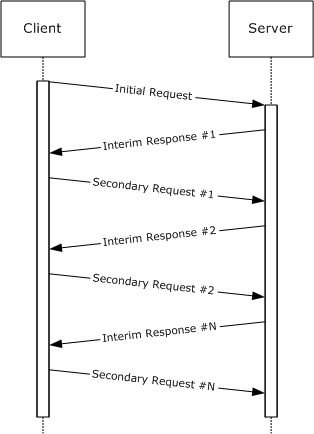

Figure 1: CIFS transaction messages over connectionless transport

When the last transaction request has been received by the server, the server MUST respond with a final response message, as described in section 3.2.4.1.5. However, if the there are multiple final response messages, then the client MUST respond to each of the final response messages, except the last one, by sending an empty secondary request message. No parameters or data are transferred to the server in these messages. They are used only as acknowledgments to indicate that the response message has been received. These acknowledgment messages contain the following information:

- **ParameterDisplacement** is set to the number of parameter bytes that the client has received from the server so far in this transaction.
- **DataDisplacement** is set to the number of data bytes that the client has received from the server so far in this transaction.
- **ParameterCount**, **ParameterOffset**, **DataCount**, and **DataOffset** MUST be set to zero.
When the transaction has been completed, the client MUST send another sequenced command to the server. This indicates to the server that all of the transaction final response messages have been received and that the parameter and data transfer is complete. Resources allocated to the transaction command can then be released by the server.

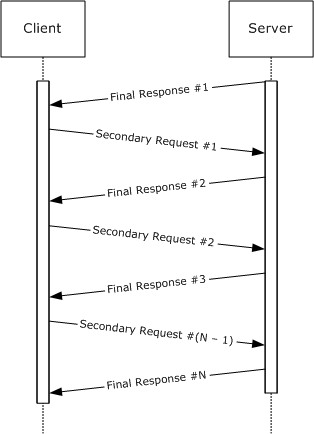

Figure 2: CIFS transaction completion messages over connectionless transport

For sequenced commands, the server requires that the sequence numbers are nonzero, start at 1, and increase by one for each new sequenced command. At 65535 (216 - 1), the sequence wraps to 0x0001, not 0x0000. Sequenced command requests that have an incorrect sequence number MUST be ignored.

If the **CID** value is incorrect, the server MUST fail the request with ERRSRV/ERRinvsess. If the server is currently processing a command that matches either the sequence number (for sequenced commands) or the **MID** (for unsequenced commands) of a new request, the server MUST respond with ERRSRV/ERRworking. The values of ERRinvsess (0x0010) and ERRworking (0x0011) are defined only for the **Direct IPX Transport**.

The server waits to receive commands from the client periodically; if no commands are received, the server treats the client as no longer running and closes the [**SMB session**](#gt_smb-session). This includes closing file handles and releasing any resources allocated on behalf of the client. Clients SHOULD, at minimum, send an SMB_COM_ECHO (section [2.2.4.39](#Section_2.2.4.39.2)) to the server every few minutes. The server MUST NOT disconnect clients that have been inactive less than 5 minutes.<6>

**Direct IPX Transport** can be used in situations in which multiple low-bandwidth connections are multiplexed together (for example, by using multiple telephone modems in parallel). CIFS provides special SMB commands, such as SMB_COM_READ_MPX (section [2.2.4.23](#Section_2.2.4.23.2)), for these environments. These commands, and the **Direct IPX Transport** itself, are obsolescent.

See [[MSFT-IPXWAN]](https://go.microsoft.com/fwlink/?LinkId=162041) for more information on **Direct IPX Transport**.

<a id="Section_2.1.3"></a>
### 2.1.3 Virtual Circuits

In [**CIFS**](#gt_common-internet-file-system-cifs), a [**virtual circuit (VC)**](#gt_virtual-circuit-vc) represents a transport-level connection between a client and a server. VCs are of use in situations in which multiple physical connections are being combined to provide improved overall bandwidth for an [**SMB connection**](#gt_smb-connection). For example, VCs make it possible to multiplex SMB messages from a single SMB connection over multiple dial-up modem connections in order to increase throughput. Virtual circuits are rarely used over connection-oriented transports such as **NBT**; they are typically associated with connectionless transports such as **Direct-hosting IPX**. VC multiplexing is performed at the command level, with the exception of the SMB_COM_READ_MPX and SMB_COM_WRITE_MPX commands, which are specifically designed to be multiplexed.

VCs are established using the SMB_COM_SESSION_SETUP_ANDX command, and are combined based upon the **SessionKey** provided in the SMB_COM_NEGOTIATE response.<7> Every VC created between a client and server pair using the same **SessionKey** is considered to be part of the same SMB connection. Each VC thus created MUST have a unique **VcNumber** in the SMB_COM_SESSION_SETUP_ANDX request that is used to establish it. The first VC created SHOULD have a **VcNumber** of zero (0). The implementation-defined maximum number of virtual circuits that the client can establish per SMB connection is indicated by the **MaxNumberVcs** field in the server's SMB_COM_NEGOTIATE response.<8>

A **VcNumber** of zero (0) has special significance. It is possible for a connectionless transport to not provide any indication of failure when a client fails or is reset. A virtual circuit with a **VcNumber** of zero (0), regardless of the **SessionKey** value, is defined to indicate to the server that the client has abandoned all previous virtual circuits and that the server MUST close those VCs as well, ensuring proper cleanup of resources.<9> This behavior can have unintended consequences in situations where separate applications running on the same client establish individual connections to the same server, or in cases in which multiple clients connect to a single server through a [**Network Address Translation (NAT)**](#gt_network-address-translation-nat) device (see [[KB301673]](https://go.microsoft.com/fwlink/?LinkId=162011) for a detailed explanation). In these situations, each connection attempt from the same client (or NAT device) can cause all others from that client to be disconnected. To avoid this, clients can use a **VcNumber** of greater than or equal to one, or servers MAY be configured to bypass special processing of **VcNumber** zero over connection-oriented transports.

<a id="Section_2.2"></a>
## 2.2 Message Syntax

The [**CIFS**](#gt_common-internet-file-system-cifs) Protocol is composed of, and driven by, [**SMB commands**](#gt_smb-command). SMB commands are comprised of [**SMB message**](#gt_smb-message) exchanges between the client and the server. SMB commands can be categorized by functionality as follows.

| Session management | Transaction subprotocol |
| --- | --- |
| SMB_COM_NEGOTIATE SMB_COM_SESSION_SETUP_ANDX SMB_COM_TREE_CONNECT SMB_COM_TREE_CONNECT_ANDX SMB_COM_TREE_DISCONNECT SMB_COM_LOGOFF_ANDX | SMB_COM_TRANSACTION SMB_COM_TRANSACTION_SECONDARY SMB_COM_TRANSACTION2 SMB_COM_TRANSACTION2_SECONDARY SMB_COM_NT_TRANSACT SMB_COM_NT_TRANSACT_SECONDARY |

| File/directory access methods | Read/write/lock methods |
| --- | --- |
| SMB_COM_CREATE_DIRECTORY SMB_COM_DELETE_DIRECTORY SMB_COM_OPEN SMB_COM_OPEN_ANDX SMB_COM_CREATE SMB_COM_CREATE_NEW SMB_COM_CREATE_TEMPORARY SMB_COM_NT_CREATE_ANDX SMB_COM_CLOSE SMB_COM_DELETE | SMB_COM_FLUSH SMB_COM_SEEK SMB_COM_READ SMB_COM_LOCK_AND_READ SMB_COM_LOCK_BYTE_RANGE SMB_COM_UNLOCK_BYTE_RANGE SMB_COM_LOCKING_ANDX SMB_COM_READ_ANDX SMB_COM_READ_RAW SMB_COM_READ_MPX SMB_COM_WRITE SMB_COM_WRITE_AND_CLOSE SMB_COM_WRITE_AND_UNLOCK SMB_COM_WRITE_ANDX SMB_COM_WRITE_RAW SMB_COM_WRITE_COMPLETE SMB_COM_WRITE_MPX |

| Query directory information | Query/set attributes methods |
| --- | --- |
| SMB_COM_CHECK_DIRECTORY SMB_COM_SEARCH SMB_COM_FIND SMB_COM_FIND_UNIQUE SMB_COM_FIND_CLOSE SMB_COM_FIND_CLOSE2 | SMB_COM_RENAME SMB_COM_NT_RENAME SMB_COM_QUERY_INFORMATION SMB_COM_SET_INFORMATION SMB_COM_QUERY_INFORMATION_DISK SMB_COM_QUERY_INFORMATION2 SMB_COM_SET_INFORMATION2 |

| Printing methods | Other |
| --- | --- |
| SMB_COM_OPEN_PRINT_FILE SMB_COM_WRITE_PRINT_FILE SMB_COM_CLOSE_PRINT_FILE | SMB_COM_ECHO SMB_COM_PROCESS_EXIT SMB_COM_NT_CANCEL SMB_COM_INVALID SMB_COM_IOCTL SMB_COM_NO_ANDX_COMMAND |

CIFS has evolved over time. As a result, some commands have become obsolete and other commands have been proposed but never implemented. The client MUST NOT use the commands listed in the table below. The server SHOULD return implementation-specific error codes in response to receiving any of these command requests.

| Obsolete | Reserved but not implemented |
| --- | --- |
| SMB_COM_COPY SMB_COM_MOVE SMB_COM_READ_MPX_SECONDARY SMB_COM_SECURITY_PACKAGE_ANDX SMB_COM_WRITE_MPX_SECONDARY SMB_COM_GET_PRINT_QUEUE | SMB_COM_CLOSE_AND_TREE_DISC SMB_COM_FIND_NOTIFY_CLOSE SMB_COM_IOCTL_SECONDARY SMB_COM_NEW_FILE_SIZE SMB_COM_QUERY_SERVER SMB_COM_READ_BULK SMB_COM_WRITE_BULK SMB_COM_WRITE_BULK_DATA |

Specifications for the commands listed in the preceding tables are located in section [2.2.3](#Section_1.3).

An SMB message is the payload packet encapsulated in a transport packet. SMB messages are divided into three blocks: a fixed-length SMB Header (section [2.2.3.1](#Section_2.2.3.1)), and two variable-length blocks called SMB Parameters (section [2.2.3.2](#Section_2.2.3.2)) and SMB Data (section [2.2.3.3](#Section_2.2.3.3)).

Unless otherwise specified, multiple-byte fields (SHORT, USHORT, LONG, and so on) in an SMB message MUST be transmitted in [**little-endian**](#gt_little-endian) order (least-significant byte first). Unless otherwise indicated, numeric fields are integers of the specified byte length.

In dialects prior to [**NT LAN Manager**](#gt_nt-lan-manager-ntlm), data alignment was not a consideration in SMB messages. Commands introduced in the NT LAN Manager dialect, however, can include fixed or variable-length padding fields used to align succeeding fields to 16-bit or 32-bit boundaries. [**Unicode strings**](#gt_unicode-string), also introduced in NT LAN Manager, MUST be aligned to 16-bit boundaries unless otherwise noted.

Unless otherwise noted, fields marked as "reserved" SHOULD be set to zero when sent and MUST be ignored on receipt. These fields are reserved for future protocol expansion and MUST NOT be used for implementation-specific functionality. When it is necessary to insert padding bytes into a buffer for data alignment purposes, such bytes SHOULD be set to 0x00 when sent and MUST be ignored on receipt.

CIFS defines a set of data types and data structures that are commonly used across multiple commands in the protocol. These are specified in section [2.2.1](#Section_2.2.1). Some data structures exist that are used only in one or two commands. Those are specified in their respective command's subsection of section [2.2.4](../MS-DTYP/MS-DTYP.md). All data types encountered in sections [2](../MS-DTYP/MS-DTYP.md) and [3](../MS-DTYP/MS-DTYP.md) that are not defined in section 2.2 are found in [MS-DTYP](../MS-DTYP/MS-DTYP.md).

Unless otherwise noted, when an error occurs the server MUST return a response SMB message with a proper status code in the header (see section 2.2.3.1). Error responses SHOULD be sent with empty SMB Parameters and SMB Data blocks (**WordCount** and **ByteCount** fields set to zero; see sections 2.2.3.2 and 2.2.3.3 respectively).

CIFS defines a number of constants, including CIFS-specific error codes, which are commonly used across multiple commands in the protocol. The CIFS specific error codes include STATUS_INVALID_SMB and all status code constants with names beginning with STATUS_SMB_ and STATUS_OS2. These status codes are specified in section [2.2.2.4](#Section_2.2.2.4). All other constants in section 2 and 3 that begin with STATUS_ are defined in [MS-ERREF](../MS-ERREF/MS-ERREF.md) section 2.3.

<a id="Section_2.2.1"></a>
### 2.2.1 Common Data Types

CIFS makes use of the following data types and structures from [MS-DTYP](../MS-DTYP/MS-DTYP.md):

- BOOLEAN
- NTSTATUS
- UCHAR
- ULONG
- USHORT
- WCHAR
- FILETIME
- LARGE_INTEGER
- SECURITY_DESCRIPTOR
In addition, CIFS defines its own data types and structures, as specified in the following subsections.

<a id="Section_2.2.1.1"></a>
#### 2.2.1.1 Character Sequences

In all dialects prior to [**NT LAN Manager**](#gt_nt-lan-manager-ntlm), all character sequences were encoded using the [**OEM character set**](#gt_3240e34e-920e-40ac-a672-342ac34a5e22) (extended [**ASCII**](#gt_ascii)). The NT LAN Manager dialect introduced support for [**Unicode**](#gt_unicode), which is negotiated during protocol negotiation and session setup. The use of [**Unicode characters**](#gt_unicode-character) is indicated on a per-message basis by setting the SMB_FLAGS2_UNICODE flag in the **SMB_Header.Flags2** field. All Unicode characters MUST be in UTF-16LE encoding.

In [**CIFS**](#gt_common-internet-file-system-cifs), character sequences are transmitted over the wire as arrays of either UCHAR (for [**OEM characters**](#gt_681188c8-235a-47f5-af29-7fbd0676a6b8)) or WCHAR (for Unicode characters). Throughout this document, null-terminated character sequence fields that can be encoded in either Unicode or OEM characters (depending on the result of Unicode capability negotiation) are labeled as **SMB_STRING** fields.

String fields that restrict character encoding to OEM characters only, even if Unicode support has been negotiated, are labeled as **OEM_STRING**. Some examples of strings that are never passed in Unicode are:

- The dialect strings in the SMB_COM_NEGOTIATE (section [2.2.4.52](#Section_2.2.4.52.1)) command.
- The service name string in the SMB_COM_TREE_CONNECT_ANDX (section [2.2.4.55](#Section_2.2.4.55.2)) command.
<a id="Section_2.2.1.1.1"></a>
##### 2.2.1.1.1 File and Directory names

Dialects prior to **LAN Manager 2.0** required that file and directory names adhere to the [**8.3 name**](#gt_83-name) format. Names of this format consist of two parts: a basename of no more than eight characters, and an extension of no more than three characters. The basename and extension are separated by a "." (period). All characters are legal in the basename and extension except:

- The space character (0x20)
- "\/[]:+|<>=;?,*.
The **LAN Manager 2.0** dialect introduced the SMB_FLAGS2_KNOWS_LONG_NAMES flag. If a client or server sets this flag in its messages, this indicates that they are not bound by the 8.3 name convention and support long file and directory names. Long names MUST have a total length of less than 255 characters. The following characters are illegal in a long name:

- "\/[]:+|<>=;?,*
A "." (period) is treated as a delimiter of file name components. The 8.3 name format uses the period to separate the filename from the file extension.

<a id="Section_2.2.1.1.2"></a>
##### 2.2.1.1.2 Pathnames

[**CIFS**](#gt_common-internet-file-system-cifs) makes use of the pathname structure as defined in [MS-FSCC](../MS-FSCC/MS-FSCC.md) section 2.1.5, with the following restrictions:

Pathnames MUST adhere to the [**Universal Naming Convention (UNC)**](#gt_universal-naming-convention-unc). The <sharename> component of a UNC-compliant pathname MUST adhere to the restrictions of a Share Name structure as defined in [MS-FSCC] section 2.1.6, with an additional note that it MAY be subject to the restrictions of file and directory names (section [2.2.1.1.1](#Section_2.2.1.1.1)). The <filename> component of a UNC-compliant pathname MAY be zero or more name components separated by the "\" (backslash) character. All name components of a pathname MUST adhere to the restrictions of file and directory names as specified in section 2.2.1.1.1.

If a pathname points to an object or device in [**DFS**](#gt_distributed-file-system-dfs), it is a [**DFS Path**](#gt_151c87db-05a4-40c3-99bd-4b682530d210) and certain restrictions apply as specified in [MS-DFSC](../MS-DFSC/MS-DFSC.md) section 2.2.1. A client that recognizes DFS SHOULD set the SMB_FLAGS2_DFS flag in the SMB Header (section [2.2.3.1](#Section_2.2.3.1)) in all [**SMB**](#gt_server-message-block-smb) requests using a DFS Path, and the server SHOULD resolve it within the [**DFS namespace**](#gt_6a3f0be9-b9b4-49df-9d1c-a3b89e4e9890).

<a id="Section_2.2.1.1.3"></a>
##### 2.2.1.1.3 Wildcards

Some [**SMB**](#gt_server-message-block-smb) requests allow wildcards to be used in a file name. Wildcards allow a client to operate on a number of files as a unit without having to separately enumerate the files and operate on them individually.<10>

Two wild card characters, the question mark and the asterisk, are used to match files whose names are selected by the wildcard string used as a selection criterion. The "?" (question mark) character matches a single character. If a file name selection criterion contains one or more "?" characters, then exactly that number of characters is matched by the wildcards. For example, the criterion "??x" matches "abx" but not "abcx" or "ax", because the two file names do not have enough characters preceding the literal. When a file name criterion has "?" characters trailing a literal, then the match is made with specified number of characters or less. For example, the criterion "x??" matches "xab", "xa", and "x", but not "xabc". If only "?" characters are present in the file name selection criterion, then the match is made as if the criterion contained "?" characters trailing a literal. The "*" (asterisk) character matches an entire file name. A null or empty specification criterion also selects all file names. For example, "*.abc" or ".abc" match any file with an extension of "abc". "*.*", "*", or empty string("") match all files in a directory.

If the negotiated dialect is [**NT LAN Manager**](#gt_nt-lan-manager-ntlm) or later, and the filename in the client request contains any of the following wildcards, the server SHOULD translate them as follows and the server MUST use the resulting string to attempt the file operation:

- Translate the ? literal to >
- Translate the . literal to " if it is immediately followed by a ? or a *
- Translate the * literal to < if it is immediately followed by a .
<a id="Section_2.2.1.2"></a>
#### 2.2.1.2 File Attributes

CIFS makes use of three distinct methods for encoding file attributes:

- Extended Attributes (SMB_GEA (section [2.2.1.2.1](#Section_2.2.1.2.1.1)) and SMB_FEA (section [2.2.1.2.2](#Section_2.2.1.2.2)))
- Extended File Attributes (SMB_EXT_FILE_ATTR (section [2.2.1.2.3)](#Section_2.2.1.2.3))
- File Attributes (SMB_FILE_ATTRIBUTES (section [2.2.1.2.4)](#Section_2.2.1.2.4))
<a id="Section_2.2.1.2.1"></a>
##### 2.2.1.2.1 SMB_GEA

The SMB_GEA data structure is used in Transaction2 subcommand requests to request specific extended attribute (EA) name/value pairs by name. This structure is used when the SMB_INFO_QUERY_EAS_FROM_LIST information level is specified. "GEA" stands for "get extended attribute".

SMB_GEA

{

UCHAR AttributeNameLengthInBytes;

UCHAR AttributeName[AttributeNameLengthInBytes + 1];

}

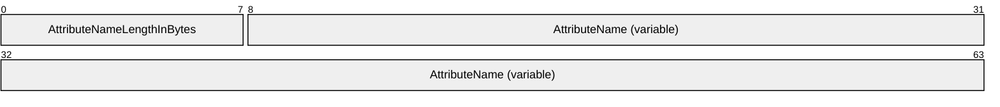

**AttributeNameLengthInBytes (1 byte):** This field MUST contain the length, in bytes (excluding the trailing null padding byte), of the AttributeName field.

**AttributeName (variable):** This field contains the name, in extended ASCII (OEM) characters, of an extended attribute. The length of the name MUST NOT exceed 255 bytes. An additional byte is added to store a null padding byte. This field MAY be interpreted as an OEM_STRING.

<a id="Section_2.2.1.2.1.1"></a>
###### 2.2.1.2.1.1 SMB_GEA_LIST

The SMB_GEA_LIST data structure is used to send a concatenated list of SMB_GEA (section [2.2.1.2.1](#Section_2.2.1.2.1.1)) structures.

SMB_GEA_LIST

{

ULONG SizeOfListInBytes;

UCHAR GEAList[];

}

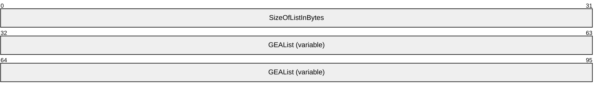

**SizeOfListInBytes (4 bytes):** This field MUST contain the total size of the **GEAList** field, plus the size of the **SizeOfListInBytes** field (4 bytes).<11>

**GEAList (variable):** A concatenated list of SMB_GEA (section 2.2.1.2.1) structures.

<a id="Section_2.2.1.2.2"></a>
##### 2.2.1.2.2 SMB_FEA

The SMB_FEA data structure is used in Transaction2 subcommands and in the NT_TRANSACT_CREATE subcommand to encode an extended attribute (EA) name/value pair. "FEA" stands for "full extended attribute".<12>

SMB_FEA

{

UCHAR ExtendedAttributeFlag;

UCHAR AttributeNameLengthInBytes;

USHORT AttributeValueLengthInBytes;

UCHAR AttributeName[AttributeNameLengthInBytes + 1];

UCHAR AttributeValue[AttributeValueLengthInBytes];

}

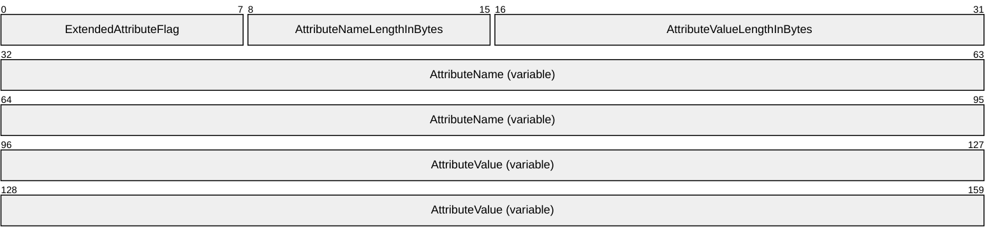

**ExtendedAttributeFlag (1 byte):** This is a bit field. Only the 0x80 bit is defined.

| Bit Range | Field | Description |
| --- | --- | --- |
| Variable | 0x7F | Reserved. |
| If set (1), this bit indicates that extended attribute (EA) support is required on this file. Otherwise, EA support is not required. If this flag is set, the file to which the EA belongs cannot be properly interpreted without understanding the associated extended attributes. A CIFS client that supports EAs can set this bit when adding an EA to a file residing on a server that also supports EAs. The server MUST NOT allow this bit to be set on an EA associated with directories. If this bit is set on any EA associated with a file on the server, the server MUST reject client requests to open the file (except to truncate the file) if the SMB_FLAGS2_EAS flag is not set in the request header. In this case, the server SHOULD fail this request with STATUS_ACCESS_DENIED (ERRDOS/ERRnoaccess) in the **Status** field of the SMB Header (section [2.2.3.1](#Section_2.2.3.1)) in the server response. | FILE_NEED_EA 0x80 | - |

**AttributeNameLengthInBytes (1 byte):** This field MUST contain the length, in bytes, of the **AttributeName** field (excluding the trailing null byte).

**AttributeValueLengthInBytes (2 bytes):** This field MUST contain the length, in bytes, of the **AttributeValue** field.

**AttributeName (variable):** This field contains the name, in extended ASCII (OEM) characters, of an extended attribute. The length of the name MUST NOT exceed 255 bytes. An additional byte is added to store a null padding byte. This field MAY be interpreted as an OEM_STRING.

**AttributeValue (variable):** This field contains the value of an extended file attribute. The value is expressed as an array of extended ASCII (OEM) characters. This array MUST NOT be null-terminated, and its length MUST NOT exceed 65,535 bytes.

<a id="Section_2.2.1.2.2.1"></a>
###### 2.2.1.2.2.1 SMB_FEA_LIST

The SMB_FEA_LIST data structure is used to send a concatenated list of SMB_FEA (section [2.2.1.2.2](#Section_2.2.1.2.2)) structures.

SMB_FEA_LIST

{

ULONG SizeOfListInBytes;

UCHAR FEAList[];

}

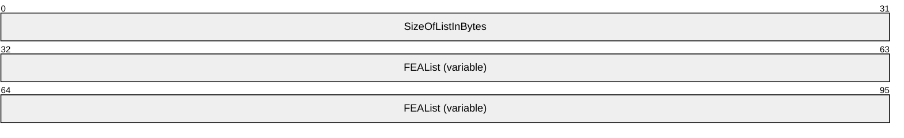

**SizeOfListInBytes (4 bytes):** This field MUST contain the total size of the **FEAList** field, plus the size of the **SizeOfListInBytes** field (4 bytes).<13>

**FEAList (variable):** A concatenated list of SMB_FEA structures.

<a id="Section_2.2.1.2.3"></a>
##### 2.2.1.2.3 SMB_EXT_FILE_ATTR

A 32-bit field containing encoded file attribute values and file access behavior flag values. The attribute and flag value names are for reference purposes only. If ATTR_NORMAL (see following) is set as the requested attribute value, it MUST be the only attribute value set. Including any other attribute value causes the ATTR_NORMAL value to be ignored. Any combination of the flag values (see following) is acceptable.<14>

This type is declared as follows:

typedef DWORD SMB_EXT_FILE_ATTR;

| Bit Range | Field | Description |
| --- | --- | --- |
| Variable | ATTR_READONLY 0x00000001 | The file is read only. Applications can read the file but cannot write to it or delete it. |
| Variable | ATTR_HIDDEN 0x00000002 | The file is hidden. It is not to be included in an ordinary directory listing. |
| Variable | ATTR_SYSTEM 0x00000004 | The file is part of or is used exclusively by the operating system. |
| Variable | ATTR_DIRECTORY 0x00000010 | The file is a directory. |
| Variable | ATTR_ARCHIVE 0x00000020 | The file has not been archived since it was last modified. |
| Variable | ATTR_NORMAL 0x00000080 | The file has no other attributes set. This attribute is valid only if used alone. |
| Variable | ATTR_TEMPORARY 0x00000100 | The file is temporary. This is a hint to the cache manager that it does not need to flush the file to backing storage. |
| Variable | ATTR_COMPRESSED 0x00000800 | The file or directory is compressed. For a file, this means that all of the data in the file is compressed. For a directory, this means that compression is the default for newly created files and subdirectories. |
| Variable | POSIX_SEMANTICS 0x01000000 | Indicates that the file is to be accessed according to POSIX rules. This includes allowing multiple files with names differing only in case, for file systems that support such naming.<15> |
| Variable | BACKUP_SEMANTICS 0x02000000 | Indicates that the file is being opened or created for a backup or restore operation. The server SHOULD allow the client to override normal file security checks, provided it has the necessary permission to do so. |
| Variable | DELETE_ON_CLOSE 0x04000000 | Requests that the server delete the file immediately after all of its handles have been closed. |
| Variable | SEQUENTIAL_SCAN 0x08000000 | Indicates that the file is to be accessed sequentially from beginning to end.<16> |
| Variable | RANDOM_ACCESS 0x10000000 | Indicates that the application is designed to access the file randomly. The server can use this flag to optimize file caching. |
| Variable | NO_BUFFERING 0x20000000 | Requests that the server open the file with no intermediate buffering or caching; the server might not honor the request. The application MUST meet certain requirements when working with files opened with FILE_FLAG_NO_BUFFERING. File access MUST begin at offsets within the file that are integer multiples of the volume's sector size and MUST be for numbers of bytes that are integer multiples of the volume's sector size. For example, if the sector size is 512 bytes, an application can request reads and writes of 512, 1024, or 2048 bytes, but not of 335, 981, or 7171 bytes. |
| Variable | WRITE_THROUGH 0x80000000 | Instructs the operating system to write through any intermediate cache and go directly to the file. The operating system can still cache write operations, but cannot lazily flush them. |

<a id="Section_2.2.1.2.4"></a>
##### 2.2.1.2.4 SMB_FILE_ATTRIBUTES

An unsigned 16-bit field that defines the basic file attributes supported by the SMB Protocol. In addition, exclusive search attributes (those Names prefixed with SMB_SEARCH_ATTRIBUTE) are defined for use when searching for files within a directory.

| Bit Range | Field | Description |
| --- | --- | --- |
| Variable | SMB_FILE_ATTRIBUTE_NORMAL 0x0000 | Normal file. |
| Variable | SMB_FILE_ATTRIBUTE_READONLY 0x0001 | Read-only file. |
| Variable | SMB_FILE_ATTRIBUTE_HIDDEN 0x0002 | Hidden file. |
| Variable | SMB_FILE_ATTRIBUTE_SYSTEM 0x0004 | System file. |
| Variable | SMB_FILE_ATTRIBUTE_VOLUME 0x0008 | Volume Label. |
| Variable | SMB_FILE_ATTRIBUTE_DIRECTORY 0x0010 | Directory file. |
| Variable | SMB_FILE_ATTRIBUTE_ARCHIVE 0x0020 | File changed since last archive. |
| Variable | SMB_SEARCH_ATTRIBUTE_READONLY 0x0100 | Search for Read-only files. |
| Variable | SMB_SEARCH_ATTRIBUTE_HIDDEN 0x0200 | Search for Hidden files. |
| Variable | SMB_SEARCH_ATTRIBUTE_SYSTEM 0x0400 | Search for System files. |
| Variable | SMB_SEARCH_ATTRIBUTE_DIRECTORY 0x1000 | Search for Directory files. |
| Variable | SMB_SEARCH_ATTRIBUTE_ARCHIVE 0x2000 | Search for files that have changed since they were last archived. |
| Variable | Other 0xC8C0 | Reserved. |

<a id="Section_2.2.1.3"></a>
#### 2.2.1.3 Named Pipe Status (SMB_NMPIPE_STATUS)

The SMB_NMPIPE_STATUS data type is a 16-bit field that encodes the status of a named pipe. Any combination of the following flags MUST be valid. The **ReadMode** and **NamedPipeType** bit fields are defined as 2-bit integers. Subfields marked **Reserved** SHOULD be set to zero by the server and MUST be ignored by the client.

This type is declared as follows:

typedef unsigned SHORT SMB_NMPIPE_STATUS;

| Bit Range | Field | Description |
| --- | --- | --- |
| An 8-bit unsigned integer that gives the maximum number of instances the named pipe can have. | ICount 0x000FF | - |
| 0 This bit field indicates the client read mode for the named pipe. This bit field has no effect on writes to the named pipe. A value of zero indicates that the named pipe was opened in or set to [**byte mode**](#gt_byte-mode) by the client. 1 A value of 1 indicates that the client opened or set the named pipe to [**message mode**](#gt_message-mode). 2,3 **Reserved**. Bit 0x0200 MUST be ignored. | ReadMode 0x0300 | - |
| 0 This bit field indicates the type of the named pipe when the named pipe was created by the server. A value of zero indicates that the named pipe was created as a byte mode pipe. 1 The named pipe was created by the server as a message mode pipe. 2,3 **Reserved**. Bit 0x0800 MUST be ignored. | NamedPipeType 0x0C00 | - |
| Variable | 0x3000 | **Reserved**. MUST be ignored. |
| 0 Client-side end of the named pipe. The SMB server MUST clear the Endpoint bit (set it to zero) when responding to the client request because the CIFS client is a consumer requesting service from the named pipe. When this bit is clear, it indicates that the client is accessing the consumer endpoint. 1 Indicates the server end of the pipe. | Endpoint 0x4000 | - |
| Variable | Nonblocking 0x8000 | 0 A named pipe read or raw read request will wait (block) until sufficient data to satisfy the read request becomes available, or until the request is canceled. A named pipe write or raw write request blocks until its data is consumed, if the write request length is greater than zero. 1 A read or a raw read request returns all data available to be read from the named pipe, up to the maximum read size set in the request. Write operations return after writing data to named pipes without waiting for the data to be consumed. Named pipe non-blocking raw writes are not allowed. Raw writes MUST be performed in blocking mode. |

<a id="Section_2.2.1.4"></a>
#### 2.2.1.4 Time

In addition to making use of the FILETIME data type, CIFS defines three more data types for encoding time:

- SMB_DATE (section [2.2.1.4.1](#Section_2.2.1.4.1))
- SMB_TIME (section [2.2.1.4.2](#Section_2.2.1.4.2))
- UTIME (section [2.2.1.4.3](#Section_2.2.1.4.3))
<a id="Section_2.2.1.4.1"></a>
##### 2.2.1.4.1 SMB_DATE

This is a 16-bit value in little-endian byte order used to encode a date. An SMB_DATE value SHOULD be interpreted as follows. The date is represented in the local time zone of the server. The following field names are provided for reference only.

| Bit Range | Field | Description |
| --- | --- | --- |
| Variable | YEAR 0xFE00 | The year. Add 1980 to the resulting value to return the actual year.<17> |
| Variable | MONTH 0x01E0 | The month. Values range from 1 to 12. |
| Variable | DAY 0x001F | The date. Values range from 1 to 31. |

<a id="Section_2.2.1.4.2"></a>
##### 2.2.1.4.2 SMB_TIME

This is a 16-bit value in little-endian byte order used to encode a time of day. The SMB_TIME value is usually accompanied by an SMB_DATE (section [2.2.1.4.1](#Section_2.2.1.4.1)) value that indicates what date corresponds with the specified time. An SMB_TIME value SHOULD be interpreted as follows. The field names below are provided for reference only. The time is represented in the local time zone of the server.

| Bit Range | Field | Description |
| --- | --- | --- |
| Variable | HOUR 0xF800 | The hours. Values range from 0 to 23. |
| Variable | MINUTES 0x07E0 | The minutes. Values range from 0 to 59. |
| Variable | SECONDS 0x001F | The seconds. Values MUST represent two-second increments. |

<a id="Section_2.2.1.4.3"></a>
##### 2.2.1.4.3 UTIME

This is a 32-bit unsigned integer in little-endian byte order indicating the number of seconds since Jan 1, 1970, 00:00:00.0.

This type is declared as follows:

typedef unsigned int UTIME;

<a id="Section_2.2.1.5"></a>
#### 2.2.1.5 Status Codes (SMB_ERROR)

An SMB_ERROR MUST be interpreted in one of two ways, depending on the capabilities negotiated between client and server: either as an NTSTATUS value (a 32-bit value in little-endian byte order used to encode an error message, as defined in [MS-ERREF](../MS-ERREF/MS-ERREF.md) section 2.3), or as an SMBSTATUS value (as defined following).

SMBSTATUS

{

UCHAR ErrorClass;

UCHAR Reserved;

USHORT ErrorCode;

}

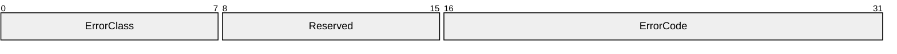

**ErrorClass (1 byte):** An SMB error class code.

**Reserved (1 byte):** This field is reserved and MUST be ignored by both server and client.

**ErrorCode (2 bytes):** An SMB error code.

The set of NTSTATUS values defined in [MS-ERREF] is extended in this document to include 32-bit CIFS-specific error codes. Each CIFS-specific error code is wire-identical to the equivalent SMBSTATUS ErrorClass/ErrorCode pair, as listed in section [2.2.2.4](#Section_2.2.2.4). CIFS-specific error codes can be interpreted by the client either as 32-bit values or as SMBSTATUS values.<18>

<a id="Section_2.2.1.6"></a>
#### 2.2.1.6 Unique Identifiers

[**CIFS**](#gt_common-internet-file-system-cifs) unique identifiers are used in to represent open files, authenticated users, SMB sessions, and so on within the protocol. To be a "unique identifier", an identifier MUST be unique with respect to other identifiers of the same type within the same context. The following is a list of unique identifiers used in CIFS and their relevant contexts:

- **FID (File ID):** A file handle, representing an open file on the server. A FID returned from an Open or Create operation MUST be unique within an SMB connection.
- **MID (Multiplex ID):** The MID is assigned by the client. All messages include a MID along with a PID (process ID, see below) to uniquely identify groups of commands belonging to the same logical thread of operation on the client node. The client MAY use the PID/MID pair to demultiplex command responses and to identify outstanding requests that are pending on the server (see SMB_COM_NT_CANCEL). In earlier SMB Protocol dialects, the MID was defined as a number that uniquely identified a protocol request and response within a process (see [[SMB-LM1X]](https://go.microsoft.com/fwlink/?LinkId=164302), section 1). In CIFS, except where noted, a client MAY have multiple outstanding requests (within the limit set by the **MaxMPXCount** connection value) with the same PID and MID values. Clients inform servers of the creation of a new thread simply by introducing a new MID into the [**dialog**](#gt_dialog).
- **PID (Process ID):** The PID is assigned by the client. The client SHOULD <19> set this to a value that identifies the process on the client node that initiated the request. The server MUST return both the PID and the MID to the client in any response to a client request. Clients inform servers of the creation of a new process simply by introducing a new PID into the dialog. In CIFS, the PID is a 32-bit value constructed by combining two 16-bit fields (**PIDLow** and **PIDHigh**) in the SMB Header (section [2.2.3.1](#Section_2.2.3.1)).
- **SessionKey:** A Session Key is returned in the SMB_COM_NEGOTIATE response received during establishment of the SMB connection. This Session Key is used to logically bind separate virtual circuits (VCs) together. This Session Key is not used in any authentication or message signing. It is returned to the server in the SMB_COM_SESSION_SETUP_ANDX request messages that are used to create SMB sessions.
- **SessionKey:** The term "Session Key" also refers to a cryptographic secret key used to perform challenge/response authentication and is also used in the message signing algorithm. For each SMB session, the Session Key is the LM or NTLM password hash used in the generation of the response from the server-supplied challenge. The Session Key used in the first successful user authentication (non-anonymous, non-guest) becomes the signing Session Key for the SMB connection.
- **CID (Connection ID):** If a connectionless transport is in use, the Connection ID (CID) is generated by the server and passed in the SMB Header of every subsequent SMB message to identify the SMB connection to which the message belongs.
- **SID (Search ID):** A search ID (also known as a SID) is similar to a FID. It identifies an open directory search, the state of which is maintained on the server. Open SIDs MUST be unique to the SMB connection.
- **TID (Tree ID):** A TID represents an open connection to a share, otherwise known as a tree connect. An open TID MUST be unique within an SMB connection.
- **UID (User ID):** A UID represents an authenticated SMB session (including those created using anonymous or guest authentication). Some implementations refer to this value as a Virtual User ID (VUID) to distinguish it from the user IDs used by the underlying account management system.
<a id="Section_2.2.1.6.1"></a>
##### 2.2.1.6.1 FID Generation

File IDs (**FID**s) are generated on CIFS servers. The generation of **FID**s MUST satisfy the following constraints:

- The **FID** MUST be a 16-bit opaque value.
- The **FID** MUST be unique within a specified client/server SMB connection.
- The **FID** MUST remain valid for the lifetime of the SMB connection on which the open request is performed, or until the client sends a request to the server to close the **FID**.
- Once a **FID** has been closed, the value can be reused for another create or open request.
- The value 0xFFFF MUST NOT be used as a valid **FID**. All other possible values for **FID**, including zero (0x0000) are valid. The value 0xFFFF is used to specify all **FID**s or no **FID**, depending upon the context in which it is used.
<a id="Section_2.2.1.6.2"></a>
##### 2.2.1.6.2 MID Generation

Multiplex IDs (**MIDs**) are generated on CIFS clients. The generation of **MIDs** MUST satisfy the following constraints:

- The **MID** MUST be a 16-bit opaque value.
- The **MID** MUST be unique with respect to a valid client **PID** over a single SMB connection.
- The **PID**/**MID** pair MUST remain valid as long as there are outstanding requests on the server identified by that **PID**/**MID** pair.
- The value 0xFFFF MUST NOT be used as a valid **MID**. All other possible values for **MID**, including zero (0x0000), are valid. The value 0xFFFF is used in an OpLock Break Notification request, which is an SMB_COM_LOCKING_ANDX Request (section [2.2.4.32.1](#Section_2.2.4.32.1)) sent from the server.
<a id="Section_2.2.1.6.3"></a>
##### 2.2.1.6.3 PID Generation

Process IDs (**PIDs**) are generated on the [**CIFS**](#gt_common-internet-file-system-cifs) client. The generation of **PIDs** MUST satisfy the following constraints:

- The **PID** MUST be a 32-bit opaque value. The **PID** value is transferred in two fields (**PIDHigh** and **PIDLow**) in the SMB Header (section [2.2.3.1](#Section_2.2.3.1)).
- The **PID** MUST be unique within a specified client/server SMB connection.
- The **PID** MUST remain valid as long as there are outstanding client requests at the server.
- The value 0xFFFF MUST NOT be used as a valid **PIDLow**. All other possible values for **PID**, including zero (0x0000), are valid. The **PIDLow** value 0xFFFF is used in an OpLock Break Notification request, which is an SMB_COM_LOCKING_ANDX Request (section [2.2.4.32.1](#Section_2.2.4.32.1)) sent from the server.
In earlier dialects of the SMB Protocol, the **PID** value was a 16-bit unsigned value. The NT LAN Manager dialect introduced the use of the **PIDHigh** header field to extend the **PID** value to 32 bits.

<a id="Section_2.2.1.6.4"></a>
##### 2.2.1.6.4 Connection ID (CID) Generation

In order to support [**CIFS**](#gt_common-internet-file-system-cifs) over connectionless transport, such as Direct IPX, CIFS servers MUST support the generation of Connection IDs (**CID**s). The generation of **CID**s MUST satisfy the following constraints:

- The **CID** MUST be a 16-bit opaque value.
- The **CID** MUST be unique across all [**SMB connections**](#gt_smb-connection) carried over connectionless transports.
- The **CID** MUST remain valid for the lifetime of the SMB connection.
- Once the connection has been closed, the **CID** value can be reused for another SMB connection.
- The values 0x0000 and 0xFFFF MUST NOT be used as valid **CID**s. All other possible values for **CID** are valid.
<a id="Section_2.2.1.6.5"></a>
##### 2.2.1.6.5 Search ID (SID) Generation

Search IDs (**SID**s) are generated on CIFS servers. The generation of **SID**s MUST satisfy the following constraints:

- The **SID** MUST be a 16-bit opaque value for a specific TRANS2_FIND_FIRST2 Request (section [2.2.6.2.1](#Section_2.2.6.2.1)).
- The **SID** MUST be unique for a specified client/server SMB connection.
- The **SID** MUST remain valid for the lifetime of the SMB connection while the search operation is being performed, or until the client sends a request to the server to close the SID.
- Once a **SID** has been closed, the value can be reused by another TRANS2_FIND_FIRST2 Request.
- The value 0xFFFF MUST NOT be used as a valid **SID**. All other possible values for **SID**, including zero (0x0000), are valid. The value 0xFFFF is reserved.
The acronym **SID** is also used to indicate a session ID. The two usages appear in completely different contexts.

<a id="Section_2.2.1.6.6"></a>
##### 2.2.1.6.6 SessionKey Generation

The term session key, in this context, does not refer to the cryptographic session keys used in authentication and message signing. Rather, it refers to the **SessionKey** unique identifier sent by the server in the SMB_COM_NEGOTIATE Response (section [2.2.4.52.2](#Section_2.2.4.52.2)).

Virtual circuit session keys (**SessionKeys**) are generated on [**CIFS**](#gt_common-internet-file-system-cifs) servers. The generation of **SessionKeys** SHOULD satisfy the following constraints:<20>

- The **SessionKey** MUST be a 32-bit opaque value generated by the CIFS server for a particular [**SMB connection**](#gt_smb-connection), and returned in the SMB_COM_NEGOTIATE Response for that connection.
- The **SessionKey** MUST be unique for a specified client/server SMB connection.
- The **SessionKey** MUST remain valid for the lifetime of the SMB connection.
- Once the SMB connection has been closed, the **SessionKey** value can be reused.
- There are no restrictions on the permitted values of **SessionKey**. A value of 0x00000000 suggests, but does not require, that the server ignore the **SessionKey**.
<a id="Section_2.2.1.6.7"></a>
##### 2.2.1.6.7 TID Generation

Tree IDs (**TIDs**) are generated on [**CIFS**](#gt_common-internet-file-system-cifs) servers. The generation of **TIDs** MUST satisfy the following constraints:

- The **TID** MUST be a 16-bit opaque value.
- The **TID** MUST be unique within a specified client/server [**SMB connection**](#gt_smb-connection).
- The **TID** MUST remain valid for the lifetime of the SMB connection on which the tree connect request is performed, or until the client sends a request to the server to close the **TID**.
- Once a **TID** has been closed, the value can be reused in the response to another tree connect request.
- The value 0xFFFF MUST NOT be used as a valid **TID**. All other possible values for **TID**, including zero (0x0000), are valid. The value 0xFFFF is used to specify all **TIDs** or no **TID**, depending upon the context in which it is used.
<a id="Section_2.2.1.6.8"></a>
##### 2.2.1.6.8 UID Generation

User IDs (**UID**s) are generated on [**CIFS**](#gt_common-internet-file-system-cifs) servers. The generation of **UIDs** MUST satisfy the following constraints:

- The **UID** MUST be a 16-bit opaque value.
- The **UID** MUST be unique for a specified client/server [**SMB connection**](#gt_smb-connection).
- The **UID** MUST remain valid for the lifetime of the SMB connection on which the authentication is performed, or until the client sends a request to the server to close the **UID** (to log off the user).
- Once a **UID** has been closed, the value can be reused in the response to another authentication request.
- The value 0xFFFE was declared reserved in the LAN Manager 1.0 documentation, so a value of 0xFFFE SHOULD NOT be used as a valid **UID**.<21> All other possible values for a **UID**, excluding zero (0x0000), are valid.
<a id="Section_2.2.2"></a>
### 2.2.2 Defined Constants

<a id="Section_2.2.2.1"></a>
#### 2.2.2.1 SMB_COM Command Codes

Following is a listing of all [**SMB**](#gt_server-message-block-smb) commands used in [**CIFS**](#gt_common-internet-file-system-cifs) and their associated command codes, as well as additional useful information. The table reads as follows:

**NT LAN Manager name and pre-NT LAN Manager name:** Current name of command and alternate name used in older documentation, if available. If a code or code range is marked **Unused**, it is undefined and reserved for future use. If a code or code range is marked **Reserved**, it is or was reserved for a specific purpose. Both of these indicate that client implementations SHOULD NOT send messages using any of those command codes.

**Code:** An SMB command code.

**Description:** A short description of the command. If a code or code range is marked as Reserved, this field lists its intended use.

**Status:** Current status of the command's usage ([**Deprecated**](#gt_deprecated), [**Obsolescent**](#gt_obsolescent), or [**Obsolete**](#gt_obsolete)) as used in this context.

- C = Currently used
- D = Deprecated
- O = Obsolescent
- X = Obsolete
- N = Not implemented - The command code was reserved and in some cases documented, but the command was never implemented.
**Earliest dialect:** Earliest known dialect in which this command appears.

| NT LAN Manager name and pre-NT LAN Manager name | Code | Description | Status | Earliest dialect |
| --- | --- | --- | --- | --- |
| SMB_COM_CREATE_DIRECTORY (section [2.2.4.1](#Section_2.2.4.1)) SMBmkdir | 0x00 | Create a new directory. | D | CORE |
| SMB_COM_DELETE_DIRECTORY (section [2.2.4.2](#Section_2.2.4.2)) SMBrmdir | 0x01 | Delete an empty directory. | C | CORE |
| SMB_COM_OPEN (section [2.2.4.3](#Section_2.2.4.3)) SMBopen | 0x02 | Open a file. | D | CORE |
| SMB_COM_CREATE (section [2.2.4.4](#Section_2.2.4.15)) SMBcreate | 0x03 | Create or open a file. | D | CORE |
| SMB_COM_CLOSE (section [2.2.4.5](#Section_2.2.4.5)) SMBclose | 0x04 | Close a file. | C | CORE |
| SMB_COM_FLUSH (section [2.2.4.6](#Section_2.2.4.6)) SMBflush | 0x05 | Flush data for a file, or all files associated with a client, PID pair. | C | CORE |
| SMB_COM_DELETE (section [2.2.4.7](#Section_2.2.4.7)) SMBunlink | 0x06 | Delete a file. | C | CORE |
| SMB_COM_RENAME (section [2.2.4.8](#Section_2.2.4.8)) SMBmv | 0x07 | Rename a file or set of files. | C | CORE |
| SMB_COM_QUERY_INFORMATION (section [2.2.4.9](#Section_3.2.5.20)) SMBgetattr | 0x08 | Get file attributes. | D | CORE |
| SMB_COM_SET_INFORMATION (section [2.2.4.10](#Section_2.2.4.10)) SMBsetattr | 0x09 | Set file attributes. | D | CORE |
| SMB_COM_READ (section [2.2.4.11](#Section_2.2.4.11)) SMBread | 0x0A | Read from a file. | D | CORE |
| SMB_COM_WRITE (section [2.2.4.12](#Section_2.2.4.12)) SMBwrite | 0x0B | Write to a file. | D | CORE |
| SMB_COM_LOCK_BYTE_RANGE (section [2.2.4.13](#Section_2.2.4.13)) SMBlock | 0x0C | Request a byte-range lock on a file. | D | CORE |
| SMB_COM_UNLOCK_BYTE_RANGE (section [2.2.4.14](#Section_2.2.4.14)) SMBunlock | 0x0D | Release a byte-range lock on a file. | D | CORE |
| SMB_COM_CREATE_TEMPORARY (section [2.2.4.15](#Section_2.2.4.15)) SMBctemp | 0x0E | Create a temporary file. | O | CORE |
| SMB_COM_CREATE_NEW (section [2.2.4.16](#Section_2.2.4.16)) SMBmknew | 0x0F | Create and open a new file. | D | CORE |
| SMB_COM_CHECK_DIRECTORY (section [2.2.4.17](#Section_2.2.4.17)) SMBchkpth | 0x10 | Verify that the specified pathname resolves to a directory. Listed as SMBchkpath in some documentation. | C | CORE |
| SMB_COM_PROCESS_EXIT (section [2.2.4.18](#Section_2.2.4.18)) SMBexit | 0x11 | Indicate process exit. | O | CORE |
| SMB_COM_SEEK (section [2.2.4.19](#Section_2.2.4.19)) SMBlseek | 0x12 | Set the current file pointer within a file. | O | CORE |
| SMB_COM_LOCK_AND_READ (section [2.2.4.20](#Section_2.2.4.20)) SMBlockread | 0x13 | Lock and read a byte-range within a file. | D | CorePlus |
| SMB_COM_WRITE_AND_UNLOCK (section [2.2.4.21](#Section_2.2.4.21)) SMBwriteunlock | 0x14 | Write and unlock a byte-range within a file. | D | CorePlus |
| **Unused** | 0x15 ... 0x19 | - | - | - |
| SMB_COM_READ_RAW (section [2.2.4.22](#Section_2.2.4.22.2)) SMBreadBraw | 0x1A | Read a block in raw mode. | D | CorePlus |
| SMB_COM_READ_MPX (section [2.2.4.23](#Section_2.2.4.23.2)) SMBreadBmpx | 0x1B | Multiplexed block read. Listed as SMBreadmpx in some documentation. | O | LANMAN1.0 |
| SMB_COM_READ_MPX_SECONDARY (section [2.2.4.24](#Section_2.2.4.24)) SMBreadBs | 0x1C | Multiplexed block read, secondary request. | X | LANMAN1.0 |
| SMB_COM_WRITE_RAW (section [2.2.4.25](#Section_2.2.4.25)) SMBwriteBraw | 0x1D | Write a block in raw mode. | D | CorePlus |
| SMB_COM_WRITE_MPX (section [2.2.4.26](#Section_2.2.4.26)) SMBwriteBmpx | 0x1E | Multiplexed block write. | O | LANMAN1.0 |
| SMB_COM_WRITE_MPX_SECONDARY (section [2.2.4.27](#Section_2.2.4.27)) SMBwriteBs | 0x1F | Multiplexed block write, secondary request. | X | LANMAN1.0 |
| SMB_COM_WRITE_COMPLETE (section [2.2.4.28](#Section_2.2.4.28)) SMBwriteC | 0x20 | Raw block write, final response. | D | LANMAN1.0 |
| SMB_COM_QUERY_SERVER (section [2.2.4.29](#Section_2.2.4.29)) | 0x21 | Reserved, but not implemented. Also known as SMB_COM_QUERY_INFORMATION_SRV. | N | - |
| SMB_COM_SET_INFORMATION2 (section [2.2.4.30](#Section_2.2.4.30)) SMBsetattrE | 0x22 | Set an extended set of file attributes. | D | LANMAN1.0 |
| SMB_COM_QUERY_INFORMATION2 (section [2.2.4.31](#Section_3.2.5.20)) SMBgetattrE | 0x23 | Get an extended set of file attributes. | D | LANMAN1.0 |
| SMB_COM_LOCKING_ANDX (section [2.2.4.32](#Section_2.2.4.32)) SMBlockingX | 0x24 | Lock multiple byte ranges; AndX chaining. | C | LANMAN1.0 |
| SMB_COM_TRANSACTION (section [2.2.4.33](#Section_3.3.5.31)) SMBtrans | 0x25 | Transaction. | C | LANMAN1.0 |
| SMB_COM_TRANSACTION_SECONDARY (section [2.2.4.34](#Section_2.2.4.34)) SMBtranss | 0x26 | Transaction secondary request. | C | LANMAN1.0 |
| SMB_COM_IOCTL (section [2.2.4.35](#Section_2.2.4.35)) SMBioctl | 0x27 | Pass an I/O Control function request to the server. | O | LANMAN1.0 |
| SMB_COM_IOCTL_SECONDARY (section [2.2.4.36](#Section_2.2.4.36)) SMBioctls | 0x28 | IOCTL secondary request. | N | LANMAN1.0 |
| SMB_COM_COPY (section [2.2.4.37](#Section_2.2.4.37)) SMBcopy | 0x29 | Copy a file or directory. | X | LANMAN1.0 |
| SMB_COM_MOVE (section [2.2.4.38](#Section_2.2.4.38)) SMBmove | 0x2A | Move a file or directory. | X | LANMAN1.0 |
| SMB_COM_ECHO (section [2.2.4.39](#Section_2.2.4.39.2)) SMBecho | 0x2B | Echo request (ping). | C | LANMAN1.0 |
| SMB_COM_WRITE_AND_CLOSE (section [2.2.4.40](#Section_2.2.4.40)) SMBwriteclose | 0x2C | Write to and close a file. | D | LANMAN1.0 |
| SMB_COM_OPEN_ANDX (section [2.2.4.41](#Section_2.2.4.41)) SMBopenX | 0x2D | Extended file open with AndX chaining. | D | LANMAN1.0 |
| SMB_COM_READ_ANDX (section [2.2.4.42](#Section_2.2.4.42)) SMBreadX | 0x2E | Extended file read with AndX chaining. | C | LANMAN1.0 |
| SMB_COM_WRITE_ANDX (section [2.2.4.43](#Section_2.2.4.43)) SMBwriteX | 0x2F | Extended file write with AndX chaining. | C | LANMAN1.0 |
| SMB_COM_NEW_FILE_SIZE (section [2.2.4.44](#Section_2.2.4.44)) | 0x30 | Reserved, but not implemented. Also known as SMB_COM_SET_NEW_SIZE. | N | - |
| SMB_COM_CLOSE_AND_TREE_DISC (section [2.2.4.45](#Section_2.2.4.45)) | 0x31 | Close an open file and tree disconnect. | N | NT LANMAN |
| [SMB_COM_TRANSACTION2 (section 2.2.4.46)](#Section_2.2.4.46) SMBtrans2 | 0x32 | Transaction 2 format request/response. | C | LANMAN1.2 |
| [SMB_COM_TRANSACTION2_SECONDARY (section 2.2.4.47)](#Section_2.2.4.47) SMBtranss2 | 0x33 | Transaction 2 secondary request. | C | LANMAN1.2 |
| [SMB_COM_FIND_CLOSE2 (section 2.2.4.48)](#Section_2.2.4.48) SMBfindclose | 0x34 | Close an active search. | C | LANMAN1.2 |
| [SMB_COM_FIND_NOTIFY_CLOSE (section 2.2.4.49)](#Section_2.2.4.49) SMBfindnclose | 0x35 | Notification of the closure of an active search. | N | LANMAN1.2 |
| **Unused** | 0x36 ... 0x5F | - | - | - |
| **Reserved** | 0x60 ... 0x6F | This range of codes was reserved for use by the "xenix1.1" dialect of SMB. See [[MSFT-XEXTNP]](https://go.microsoft.com/fwlink/?LinkId=162042). [[XOPEN-SMB]](https://go.microsoft.com/fwlink/?linkid=2297696) page 41 lists this range as "Reserved for proprietary dialects." | X | XENIX |
| [SMB_COM_TREE_CONNECT (section 2.2.4.50)](#Section_2.2.4.50) SMBtcon | 0x70 | Tree connect. | D | CORE |
| [SMB_COM_TREE_DISCONNECT (section 2.2.4.51)](#Section_2.2.4.51.2) SMBtdis | 0x71 | Tree disconnect. | C | CORE |
| [SMB_COM_NEGOTIATE (section 2.2.4.52)](#Section_2.2.4.52.1) SMBnegprot | 0x72 | Negotiate protocol dialect. | C | CORE |
| [SMB_COM_SESSION_SETUP_ANDX (section 2.2.4.53)](#Section_2.2.4.53) SMBsesssetupX | 0x73 | Session Setup with AndX chaining. | C | LANMAN1.0 |
| [SMB_COM_LOGOFF_ANDX (section 2.2.4.54)](#Section_2.2.4.54) SMBulogoffX | 0x74 | User logoff with AndX chaining. | C | LANMAN1.2 |
| [SMB_COM_TREE_CONNECT_ANDX (section 2.2.4.55)](#Section_2.2.4.55.2) SMBtconX | 0x75 | Tree connect with AndX chaining. | C | LANMAN1.0 |
| **Unused** | 0x76 ... 0x7D | - | - | - |
| [SMB_COM_SECURITY_PACKAGE_ANDX (section 2.2.4.56)](#Section_2.2.4.56) SMBsecpkgX | 0x7E | Negotiate security packages with AndX chaining. | X | LANMAN1.0 |
| **Unused** | 0x7F | - | - | - |
| [SMB_COM_QUERY_INFORMATION_DISK (section 2.2.4.57)](#Section_2.2.4.57) SMBdskattr | 0x80 | Retrieve file system information from the server. | D | CORE |
| [SMB_COM_SEARCH (section 2.2.4.58)](#Section_2.2.4.58) SMBsearch | 0x81 | Directory wildcard search. | D | CORE |
| [SMB_COM_FIND (section 2.2.4.59)](#Section_2.2.4.59) SMBffirst | 0x82 | Start or continue an extended wildcard directory search. | D | LANMAN1.0 |
| [SMB_COM_FIND_UNIQUE (section 2.2.4.60)](#Section_2.2.4.60) SMBfunique | 0x83 | Perform a one-time extended wildcard directory search. | D | LANMAN1.0 |
| [SMB_COM_FIND_CLOSE (section 2.2.4.61)](#Section_2.2.4.61) SMBfclose | 0x84 | End an extended wildcard directory search. | D | LANMAN1.0 |
| **Unused** | 0x85 ... 0x9F | - | - | - |
| [SMB_COM_NT_TRANSACT (section 2.2.4.62)](#Section_2.2.4.62) | 0xA0 | NT format transaction request/response. | C | NT LANMAN |
| [SMB_COM_NT_TRANSACT_SECONDARY (section 2.2.4.63)](#Section_2.2.4.63) | 0xA1 | NT format transaction secondary request. | C | NT LANMAN |
| [SMB_COM_NT_CREATE_ANDX (section 2.2.4.64)](#Section_2.2.4.64.2) | 0xA2 | Create or open a file or a directory. | C | NT LANMAN |
| **Unused** | 0xA3 | - | - | - |
| [SMB_COM_NT_CANCEL (section 2.2.4.65)](#Section_2.2.4.65) | 0xA4 | Cancel a request currently pending at the server. | C | NT LANMAN |
| [SMB_COM_NT_RENAME (section 2.2.4.66)](#Section_3.3.5.53) | 0xA5 | File rename with extended semantics. | O | NT LANMAN |
| **Unused** | 0xA6 ... 0xBF | - | - | - |
| [SMB_COM_OPEN_PRINT_FILE (section 2.2.4.67)](#Section_2.2.4.67) SMBsplopen | 0xC0 | Create a print queue spool file. | C | CORE |
| [SMB_COM_WRITE_PRINT_FILE (section 2.2.4.68)](#Section_2.2.4.68) SMBsplwr | 0xC1 | Write to a print queue spool file. | D | CORE |
| [SMB_COM_CLOSE_PRINT_FILE (section 2.2.4.69)](#Section_2.2.4.69) SMBsplclose | 0xC2 | Close a print queue spool file. | D | CORE |
| [SMB_COM_GET_PRINT_QUEUE (section 2.2.4.70)](#Section_2.2.4.70) SMBsplretq | 0xC3 | Request print queue information. | X | CORE |
| **Unused** | 0xC4 ... 0xCF | - | - | - |
| **Reserved** | 0xD0 ... 0xD7 | Messenger Service command codes. This range is reserved for use by the SMB Messenger Service. See [MS-MSRP](../MS-MSRP/MS-MSRP.md), and section 6 of [[SMB-CORE]](https://go.microsoft.com/fwlink/?LinkId=164301). | O | CORE |
| [SMB_COM_READ_BULK (section 2.2.4.71)](#Section_2.2.4.71) | 0xD8 | Reserved, but not implemented. | N | - |
| [SMB_COM_WRITE_BULK (section 2.2.4.72)](#Section_2.2.4.72) | 0xD9 | Reserved, but not implemented. | N | - |
| [SMB_COM_WRITE_BULK_DATA (section 2.2.4.73)](#Section_2.2.4.73) | 0xDA | Reserved, but not implemented. | N | - |
| **Unused** | 0xDB ... 0xFD | - | - | - |
| [SMB_COM_INVALID (section 2.2.4.74)](#Section_2.2.4.74) SMBinvalid | 0xFE | As the name suggests, this command code is a designated invalid command and SHOULD NOT be used. | C | LANMAN1.0 |
| [SMB_COM_NO_ANDX_COMMAND (section 2.2.4.75)](#Section_2.2.4.75) | 0xFF | Also known as the "NIL" command. It identifies the end of an AndX Chain, and is only valid in that context. See section [2.2.3.4](#Section_2.2.3.4). | C | LANMAN1.0 |

<a id="Section_2.2.2.2"></a>
#### 2.2.2.2 Transaction Subcommand Codes

Transaction Codes used with [SMB_COM_TRANSACTION (section 2.2.4.46)](#Section_2.2.4.46):

| Name | Code | Description | Status | Earliest dialect |
| --- | --- | --- | --- | --- |
| [TRANS_MAILSLOT_WRITE (section 2.2.5.12)](#Section_2.2.5.12) | 0x0001 | Allows a client to write data to a specific mailslot on the server. | C | LANMAN1.0 |
| [TRANS_SET_NMPIPE_STATE (section 2.2.5.1)](#Section_3.3.5.57.2) | 0x0001 | Used to set the read mode and [**non-blocking mode**](#gt_non-blocking-mode-of-a-named-pipe) of a specified named pipe. | C | LANMAN1.0 |
| [TRANS_RAW_READ_NMPIPE (section 2.2.5.2)](#Section_2.2.5.2) | 0x0011 | Allows for a raw read of data from a named pipe. This method of reading data from a [**named pipe**](#gt_named-pipe) ignores message boundaries even if the pipe was set up as a [**message mode**](#gt_message-mode) pipe. | D | LANMAN1.0 |
| [TRANS_QUERY_NMPIPE_STATE (section 2.2.5.3)](#Section_3.2.5.38.3) | 0x0021 | Allows for a client to retrieve information about a specified named pipe. | C | LANMAN1.0 |
| [TRANS_QUERY_NMPIPE_INFO (section 2.2.5.4)](#Section_3.3.5.57.5) | 0x0022 | Used to retrieve pipe information about a named pipe. | C | LANMAN1.0 |
| [TRANS_PEEK_NMPIPE (section 2.2.5.5)](#Section_2.2.5.5) | 0x0023 | Used to copy data out of a named pipe without removing it from the named pipe. | C | LANMAN1.0 |
| [TRANS_TRANSACT_NMPIPE (section 2.2.5.6)](#Section_2.2.5.6) | 0x0026 | Used to execute a transacted exchange against a named pipe. This transaction has a constraint that it can be used only on a duplex, message-type pipe. | C | LANMAN1.0 |
| [TRANS_RAW_WRITE_NMPIPE (section 2.2.5.7)](#Section_2.2.5.7) | 0x0031 | Allows for a raw write of data to a named pipe. Raw writes to named pipes put bytes directly into a pipe, regardless of whether it is a message mode pipe or [**byte mode**](#gt_byte-mode) pipe. | D | LANMAN1.0 |
| [TRANS_READ_NMPIPE (section 2.2.5.8)](#Section_3.2.5.38.8) | 0x0036 | Allows a client to read data from a named pipe. | C | NT LANMAN |
| [TRANS_WRITE_NMPIPE (section 2.2.5.9)](#Section_2.2.5.9) | 0x0037 | Allows a client to write data to a named pipe. | C | NT LANMAN |
| [TRANS_WAIT_NMPIPE (section 2.2.5.10)](#Section_2.2.5.10) | 0x0053 | Allows a client to be notified when the specified named pipe is available to be connected to. | C | LANMAN1.0 |
| [TRANS_CALL_NMPIPE (section 2.2.5.11)](#Section_3.2.5.38.10) | 0x0054 | Connect to a named pipe, issue a write to the named pipe, issue a read from the named pipe, and close the named pipe. | C | LANMAN1.0 |

The meaning of the SMB_COM_TRANSACTION subcommand codes is defined by the resource being accessed. For example, the 0x0001 subcommand code is interpreted as TRANS_MAILSLOT_WRITE if the operation is being performed on a mailslot. The same code is interpreted as a TRANS_SET_NMPIPE_STATE (section 2.2.5.1) if the operation is performed on a named pipe.

Transaction Codes used with SMB_COM_TRANSACTION2 (section 2.2.4.46):

| Name | Code | Description | Status | Earliest dialect |
| --- | --- | --- | --- | --- |
| [TRANS2_OPEN2 (section 2.2.6.1)](#Section_2.2.6.1) | 0x0000 | Open or create a file and set extended attributes on the file. | C | NT LANMAN |
| [TRANS2_FIND_FIRST2 (section 2.2.6.2)](#Section_2.2.6.2) | 0x0001 | Begin a search for files within a directory or for a directory. | C | NT LANMAN |
| [TRANS2_FIND_NEXT2 (section 2.2.6.3)](#Section_2.2.6.3) | 0x0002 | Continue a search for files within a directory or for a directory. | C | NT LANMAN |
| [TRANS2_QUERY_FS_INFORMATION (section 2.2.6.4)](#Section_2.2.6.4) | 0x0003 | Request information about a file system on the server. | C | LANMAN2.0 |
| [TRANS2_SET_FS_INFORMATION (section 2.2.6.5)](#Section_2.2.6.5) | 0x0004 | - | N | LANMAN2.0 |
| [TRANS2_QUERY_PATH_INFORMATION (section 2.2.6.6)](#Section_2.2.6.6) | 0x0005 | Get information about a specific file or directory using a path. | C | LANMAN2.0 |
| [TRANS2_SET_PATH_INFORMATION (section 2.2.6.7)](#Section_2.2.6.7) | 0x0006 | Set the standard and extended attribute information of a specific file or directory using a path. | C | LANMAN2.0 |
| [TRANS2_QUERY_FILE_INFORMATION (section 2.2.6.8)](#Section_2.2.6.8) | 0x0007 | Get information about a specific file or directory using a **FID**. | C | LANMAN2.0 |
| [TRANS2_SET_FILE_INFORMATION (section 2.2.6.9)](#Section_2.2.6.9) | 0x0008 | Set the standard and extended attribute information of a specific file or directory using a **FID**. | C | LANMAN2.0 |
| [TRANS2_FSCTL (section 2.2.6.10)](#Section_2.2.6.10) | 0x0009 | - | N | LANMAN2.0 |
| [TRANS2_IOCTL2 (section 2.2.6.11)](#Section_2.2.6.11) | 0x000a | - | N | NT LANMAN |
| [TRANS2_FIND_NOTIFY_FIRST (section 2.2.6.12)](#Section_2.2.6.12) | 0x000b | - | X | LANMAN2.0 |
| [TRANS2_FIND_NOTIFY_NEXT (section 2.2.6.13)](#Section_2.2.6.13) | 0x000c | - | X | LANMAN2.0 |
| [TRANS2_CREATE_DIRECTORY (section 2.2.6.14)](#Section_2.2.6.14) | 0x000d | Create a new directory and optionally set the extended attribute information. | C | LANMAN2.0 |
| [TRANS2_SESSION_SETUP (section 2.2.6.15)](#Section_2.2.6.15) | 0x000e | - | N | NT LANMAN |
| [TRANS2_GET_DFS_REFERRAL (section 2.2.6.16)](#Section_2.2.6.16) | 0x0010 | Request a [**DFS referral**](#gt_c6f2eabf-2138-4f97-a788-5d6a41a27bdd) for a file or directory. See [MS-DFSC](../MS-DFSC/MS-DFSC.md) section [2.2.2](../MS-DFSC/MS-DFSC.md) for details. | C | NT LANMAN |
| [TRANS2_REPORT_DFS_INCONSISTENCY (section 2.2.6.17)](#Section_2.2.6.17) | 0x0011 | - | N | NT LANMAN |

Transaction codes used with [SMB_COM_NT_TRANSACT (section 2.2.4.62)](#Section_2.2.4.62):

| Name | Code | Description | Status | Earliest dialect |
| --- | --- | --- | --- | --- |
| [NT_TRANSACT_CREATE (section 2.2.7.1)](#Section_2.2.7.1) | 0x0001 | Used to create or open a file or directory when extended attributes (EAs) or a [**security descriptor (SD)**](#gt_security-descriptor) are to be applied. | C | NT LANMAN |
| [NT_TRANSACT_IOCTL (section 2.2.7.2)](#Section_2.2.7.2) | 0x0002 | Allows device and file system control functions to be transferred transparently from client to server. | C | NT LANMAN |
| [NT_TRANSACT_SET_SECURITY_DESC (section 2.2.7.3)](#Section_5) | 0x0003 | Allows a client to change the security descriptor for a file. | C | NT LANMAN |
| [NT_TRANSACT_NOTIFY_CHANGE (section 2.2.7.4)](#Section_2.2.7.4) | 0x0004 | Notifies the client when the directory specified by **FID** is modified. It also returns the names of any files that changed. | C | NT LANMAN |
| [NT_TRANSACT_RENAME (section 2.2.7.5)](#Section_2.2.7.5) | 0x0005 | - | N | - |
| [NT_TRANSACT_QUERY_SECURITY_DESC (section 2.2.7.6)](#Section_5) | 0x0006 | Allows a client to retrieve the security descriptor for a file. | C | NT LANMAN |

<a id="Section_2.2.2.3"></a>
#### 2.2.2.3 Information Level Codes

The SMB protocol uses information levels in several Transaction2 subcommands to allow clients to query or set information about files, devices, and underlying object stores on servers. The following lists of information levels are organized based on their intended purpose: finding files or devices and related information, querying a specific file or device for information, setting file or device information, and querying object store information.

A small number of information levels (most notably SMB_INFO_STANDARD and the other LANMAN2.0 information levels) share the same name across multiple categories. This indicates that these information levels share similar, or at times identical, structures, but are distinct in their intended purposes.

<a id="Section_2.2.2.3.1"></a>
##### 2.2.2.3.1 FIND Information Level Codes

FIND information levels are used in [TRANS2_FIND_FIRST2 (section 2.2.6.2)](#Section_2.2.6.2) and [TRANS2_FIND_NEXT2 (section 2.2.6.3)](#Section_2.2.6.3) subcommand requests to indicate the level of information that a server MUST respond with for each file matching the request's search criteria.

| Name | Code | Meaning | Dialect |
| --- | --- | --- | --- |
| SMB_INFO_STANDARD | 0x0001 | Return creation, access, and last write timestamps, size and file attributes along with the file name. | LANMAN2.0 |
| SMB_INFO_QUERY_EA_SIZE | 0x0002 | Return the SMB_INFO_STANDARD data along with the size of a file's extended attributes (EAs). | LANMAN2.0 |
| SMB_INFO_QUERY_EAS_FROM_LIST | 0x0003 | Return the SMB_INFO_QUERY_EA_SIZE data along with a specific list of a file's EAs. The requested EAs are provided in the **Trans2_Data** block of the request. | LANMAN2.0 |
| SMB_FIND_FILE_DIRECTORY_INFO | 0x0101 | Return 64-bit format versions of: creation, access, last write, and last attribute change timestamps; size. In addition, return extended file attributes and file name. | NT LANMAN |
| SMB_FIND_FILE_FULL_DIRECTORY_INFO | 0x0102 | Returns the SMB_FIND_FILE_DIRECTORY_INFO data along with the size of a file's EAs. | NT LANMAN |
| SMB_FIND_FILE_NAMES_INFO | 0x0103 | Returns the name(s) of the file(s). | NT LANMAN |
| SMB_FIND_FILE_BOTH_DIRECTORY_INFO | 0x0104 | Returns a combination of the data from SMB_FIND_FILE_FULL_DIRECTORY_INFO and SMB_FIND_FILE_NAMES_INFO. | NT LANMAN |

<a id="Section_2.2.2.3.2"></a>
##### 2.2.2.3.2 QUERY_FS Information Level Codes

QUERY_FS information levels are used in [TRANS2_QUERY_FS_INFORMATION (section 2.2.6.4)](#Section_2.2.6.4) subcommand requests to indicate the level of information that a server MUST respond with for the underlying object store indicated in the request.

| Name | Code | Meaning | Dialect |
| --- | --- | --- | --- |
| SMB_INFO_ALLOCATION | 0x0001 | Query file system allocation unit information. | LANMAN2.0 |
| SMB_INFO_VOLUME | 0x0002 | Query volume name and serial number. | LANMAN2.0 |
| SMB_QUERY_FS_VOLUME_INFO | 0x0102 | Query the creation timestamp, serial number, and Unicode-encoded volume label. | NT LANMAN |
| SMB_QUERY_FS_SIZE_INFO | 0x0103 | Query 64-bit file system allocation unit information. | NT LANMAN |
| SMB_QUERY_FS_DEVICE_INFO | 0x0104 | Query a file system's underlying device type and characteristics. | NT LANMAN |
| SMB_QUERY_FS_ATTRIBUTE_INFO | 0x0105 | Query file system attributes. | NT LANMAN |

<a id="Section_2.2.2.3.3"></a>
##### 2.2.2.3.3 QUERY Information Level Codes

QUERY information levels are used in [TRANS2_QUERY_PATH_INFORMATION (section 2.2.6.6)](#Section_2.2.6.6) and [TRANS2_QUERY_FILE_INFORMATION (section 2.2.6.8)](#Section_2.2.6.8) subcommand requests to indicate the level of information that a server MUST respond with for the file or directory indicated in the request.

| Name | Code | Description | Dialect |
| --- | --- | --- | --- |
| SMB_INFO_STANDARD | 0x0001 | Query creation, access, and last write timestamps, size and file attributes. | LANMAN2.0 |
| SMB_INFO_QUERY_EA_SIZE | 0x0002 | Query the SMB_INFO_STANDARD data along with the size of the file's extended attributes (EAs). | LANMAN2.0 |
| SMB_INFO_QUERY_EAS_FROM_LIST | 0x0003 | Query a file's specific EAs by attribute name. | LANMAN2.0 |
| SMB_INFO_QUERY_ALL_EAS | 0x0004 | Query all of a file's EAs. | LANMAN2.0 |
| SMB_INFO_IS_NAME_VALID | 0x0006 | Validate the syntax of the path provided in the request. Not supported for TRANS2_QUERY_FILE_INFORMATION. | LANMAN2.0 |
| SMB_QUERY_FILE_BASIC_INFO | 0x0101 | Query 64-bit create, access, write, and change timestamps along with extended file attributes. | NT LANMAN |
| SMB_QUERY_FILE_STANDARD_INFO | 0x0102 | Query size, number of links, if a delete is pending, and if the path is a directory. | NT LANMAN |
| SMB_QUERY_FILE_EA_INFO | 0x0103 | Query the size of the file's EAs. | NT LANMAN |
| SMB_QUERY_FILE_NAME_INFO | 0x0104 | Query the long file name in Unicode format. | NT LANMAN |
| SMB_QUERY_FILE_ALL_INFO | 0x0107 | Query the SMB_QUERY_FILE_BASIC_INFO, SMB_QUERY_FILE_STANDARD_INFO, SMB_QUERY_FILE_EA_INFO, and SMB_QUERY_FILE_NAME_INFO data as well as access flags, access mode, and alignment information in a single request. | NT LANMAN |
| SMB_QUERY_FILE_ALT_NAME_INFO | 0x0108 | Query the 8.3 file name.<22> | NT LANMAN |
| SMB_QUERY_FILE_STREAM_INFO | 0x0109 | Query file stream information. | NT LANMAN |
| SMB_QUERY_FILE_COMPRESSION_INFO | 0x010B | Query file compression information. | NT LANMAN |

<a id="Section_2.2.2.3.4"></a>
##### 2.2.2.3.4 SET Information Level Codes

SET information levels are used in [TRANS2_SET_PATH_INFORMATION (section 2.2.6.7)](#Section_2.2.6.7) and [TRANS2_SET_FILE_INFORMATION (section 2.2.6.9)](#Section_2.2.6.9) subcommand requests to indicate what level of information is being set on the file or directory in the request.

| Name | Code | Description | Dialect |
| --- | --- | --- | --- |
| SMB_INFO_STANDARD | 0x0001 | Set creation, access, and last write timestamps. | LANMAN2.0 |
| SMB_INFO_SET_EAS | 0x0002 | Set a specific list of extended attributes (EAs). | LANMAN2.0 |
| SMB_SET_FILE_BASIC_INFO | 0x0101 | Set 64-bit create, access, write, and change timestamps along with extended file attributes. | NT LANMAN |
| SMB_SET_FILE_DISPOSITION_INFO | 0x0102 | Set whether or not the file is marked for deletion. | NT LANMAN |
| SMB_SET_FILE_ALLOCATION_INFO | 0x0103 | Set file allocation size. | NT LANMAN |
| SMB_SET_FILE_END_OF_FILE_INFO | 0x0104 | Set file EOF offset. | NT LANMAN |

<a id="Section_2.2.2.4"></a>
#### 2.2.2.4 SMB Error Classes and Codes

This section provides an overview of status codes that can be returned by the SMB commands listed in this document, including mappings between the NTSTATUS codes used in the [**NT LAN Manager**](#gt_nt-lan-manager-ntlm) dialect, the SMBSTATUS class/code pairs used in earlier SMB dialects, and common POSIX equivalents. The POSIX error code mappings are based upon those used in the Xenix server implementation. This is not an exhaustive listing and MUST NOT be considered normative.

Each command and subcommand description also includes a list of status codes that are returned by [**CIFS**](#gt_common-internet-file-system-cifs)-compliant servers. Individual implementations can return status codes from their underlying operating systems; it is up to the implementer to decide how to interpret those status codes.

The listing below is organized by SMBSTATUS Error Class. It shows SMBSTATUS Error Code values and a general description, as well as mappings from NTSTATUS values ([MS-ERREF](../MS-ERREF/MS-ERREF.md) section 2.3.1) and POSIX-style error codes where possible. Note that multiple NTSTATUS values can map to a single SMBSTATUS value.

**SUCCESS Class 0x00**

| Error code | NTSTATUS values | POSIX equivalent | Description |
| --- | --- | --- | --- |
| SUCCESS 0x0000 | STATUS_OK | 0 | Everything worked, no problems. |

**ERRDOS Class 0x01**

| Error code | NTSTATUS values | POSIX equivalent | Description |
| --- | --- | --- | --- |
| ERRbadfunc 0x0001 | STATUS_NOT_IMPLEMENTED 0xC0000002 STATUS_INVALID_DEVICE_REQUEST 0xC0000010 STATUS_ILLEGAL_FUNCTION 0xC00000AF | EINVAL | Invalid Function. |
| ERRbadfile 0x0002 | STATUS_NO_SUCH_FILE 0xC000000F STATUS_NO_SUCH_DEVICE 0xC000000E STATUS_OBJECT_NAME_NOT_FOUND 0xC0000034 | ENOENT | File not found. |
| ERRbadpath 0x0003 | STATUS_OBJECT_PATH_INVALID 0xC0000039 STATUS_OBJECT_PATH_NOT_FOUND 0xC000003A STATUS_OBJECT_PATH_SYNTAX_BAD 0xC000003B STATUS_DFS_EXIT_PATH_FOUND 0xC000009B STATUS_REDIRECTOR_NOT_STARTED 0xC00000FB | ENOENT | A component in the path prefix is not a directory. |
| ERRnofids 0x0004 | STATUS_TOO_MANY_OPENED_FILES 0xC000011F | EMFILE | Too many open files. No FIDs are available. |
| ERRnoaccess 0x0005 | STATUS_ACCESS_DENIED 0xC0000022 STATUS_INVALID_LOCK_SEQUENCE 0xC000001E STATUS_INVALID_VIEW_SIZE 0xC000001F STATUS_ALREADY_COMMITTED 0xC0000021 STATUS_PORT_CONNECTION_REFUSED 0xC0000041 STATUS_THREAD_IS_TERMINATING 0xC000004B STATUS_DELETE_PENDING 0xC0000056 STATUS_PRIVILEGE_NOT_HELD 0xC0000061 STATUS_LOGON_FAILURE 0xC000006D STATUS_FILE_IS_A_DIRECTORY 0xC00000BA STATUS_FILE_RENAMED 0xC00000D5 STATUS_PROCESS_IS_TERMINATING 0xC000010A STATUS_DIRECTORY_NOT_EMPTY 0xC0000101 STATUS_CANNOT_DELETE 0xC0000121 STATUS_FILE_DELETED 0xC0000123 | EPERM | Access denied. |
| ERRbadfid 0x0006 | STATUS_SMB_BAD_FID 0x00060001 STATUS_INVALID_HANDLE 0xC0000008 STATUS_OBJECT_TYPE_MISMATCH 0xC0000024 STATUS_PORT_DISCONNECTED 0xC0000037 STATUS_INVALID_PORT_HANDLE 0xC0000042 STATUS_FILE_CLOSED 0xC0000128 STATUS_HANDLE_NOT_CLOSABLE 0xC0000235 | EBADF | Invalid FID. |
| ERRbadmcb 0x0007 | - | - | Memory Control Blocks were destroyed. |
| ERRnomem 0x0008 | STATUS_SECTION_TOO_BIG 0xC0000040 STATUS_TOO_MANY_PAGING_FILES 0xC0000097 STATUS_INSUFF_SERVER_RESOURCES 0xC0000205 | ENOMEM | Insufficient server memory to perform the requested operation. |
| ERRbadmem 0x0009 | - | EFAULT | The server performed an invalid memory access (invalid address). |
| ERRbadenv 0x000A | - | - | Invalid environment. |
| ERRbadformat 0x000B | - | - | Invalid format. |
| ERRbadaccess 0x000C | STATUS_OS2_INVALID_ACCESS 0x000C0001 STATUS_ACCESS_DENIED 0xC00000CA | - | Invalid open mode. |
| ERRbaddata 0x000D | STATUS_DATA_ERROR 0xC000009C | E2BIG | Bad data. (May be generated by IOCTL calls on the server.) |
| ERRbaddrive 0x000F | - | ENXIO | Invalid drive specified. |
| ERRremcd 0x0010 | STATUS_DIRECTORY_NOT_EMPTY 0xC0000101 | - | Remove of directory failed because it was not empty. |
| ERRdiffdevice 0x0011 | STATUS_NOT_SAME_DEVICE 0xC00000D4 | EXDEV | A file system operation (such as a rename) across two devices was attempted. |
| ERRnofiles 0x0012 | STATUS_NO_MORE_FILES 0x80000006 | - | No (more) files found following a file search command. |
| ERRgeneral 0x001F | STATUS_UNSUCCESSFUL 0xC0000001 | - | General error. |
| ERRbadshare 0x0020 | STATUS_SHARING_VIOLATION 0xC0000043 | ETXTBSY | Sharing violation. A requested open mode conflicts with the sharing mode of an existing file handle. |
| ERRlock 0x0021 | STATUS_FILE_LOCK_CONFLICT 0xC0000054 STATUS_LOCK_NOT_GRANTED 0xC0000055 | EDEADLOCK | A lock request specified an invalid locking mode, or conflicted with an existing file lock. |
| ERReof 0x0026 | STATUS_END_OF_FILE 0xC0000011 | EEOF | Attempted to read beyond the end of the file. |
| ERRunsup 0x0032 | STATUS_NOT_SUPPORTED 0XC00000BB | - | This command is not supported by the server. |
| ERRfilexists 0x0050 | STATUS_OBJECT_NAME_COLLISION 0xC0000035 | EEXIST | An attempt to create a file or directory failed because an object with the same pathname already exists. |
| ERRinvalidparam 0x0057 | STATUS_INVALID_PARAMETER 0xC000000D | - | A parameter supplied with the message is invalid. |
| ERRunknownlevel 0x007C | STATUS_OS2_INVALID_LEVEL 0x007C0001 | - | Invalid information level. |
| ERRinvalidseek 0x0083 | STATUS_OS2_NEGATIVE_SEEK 0x00830001 | - | An attempt was made to seek to a negative absolute offset within a file. |
| ERROR_NOT_LOCKED 0x009E | STATUS_RANGE_NOT_LOCKED 0xC000007E | - | The byte range specified in an unlock request was not locked. |
| ERROR_NO_MORE_SEARCH_HANDLES 0x0071 | STATUS_OS2_NO_MORE_SIDS 0x00710001 | - | Maximum number of searches has been exhausted. |
| ERROR_CANCEL_VIOLATION 0x00AD | STATUS_OS2_CANCEL_VIOLATION 0x00AD0001 | - | No lock request was outstanding for the supplied cancel region. |
| ERROR_ATOMIC_LOCKS_NOT_SUPPORTED 0x00AE | STATUS_OS2_ATOMIC_LOCKS_NOT_SUPPORTED 0x00AE0001 | - | The file system does not support atomic changes to the lock type. |
| ERRbadpipe 0x00E6 | STATUS_INVALID_INFO_CLASS 0xC0000003 STATUS_INVALID_PIPE_STATE 0xC00000AD STATUS_INVALID_READ_MODE 0xC00000B4 | - | Invalid named pipe. |
| ERROR_CANNOT_COPY 0x010A | STATUS_OS2_CANNOT_COPY 0x010A0001 | - | The copy functions cannot be used. |
| ERRpipebusy 0x00E7 | STATUS_INSTANCE_NOT_AVAILABLE 0xC00000AB STATUS_PIPE_NOT_AVAILABLE 0xC00000AC STATUS_PIPE_BUSY 0xC00000AE | - | All instances of the designated named pipe are busy. |
| ERRpipeclosing 0x00E8 | STATUS_PIPE_CLOSING 0xC00000B1 STATUS_PIPE_EMPTY 0xC00000D9 | - | The designated named pipe is in the process of being closed. |
| ERRnotconnected 0x00E9 | STATUS_PIPE_DISCONNECTED 0xC00000B0 | - | The designated named pipe exists, but there is no server process listening on the server side. |
| ERRmoredata 0x00EA | STATUS_BUFFER_OVERFLOW 0x80000005 STATUS_MORE_PROCESSING_REQUIRED 0xC0000016 | - | There is more data available to read on the designated named pipe. |
| ERRbadealist 0x00FF | - | - | Inconsistent extended attribute list. |
| ERROR_EAS_ DIDNT_FIT 0x0113 | STATUS_EA_TOO_LARGE 0xC0000050 STATUS_OS2_EAS_DIDNT_FIT 0x01130001 | - | Either there are no extended attributes, or the available extended attributes did not fit into the response. |
| ERROR_EAS_ NOT_SUPPORTED 0x011A | STATUS_EAS_NOT_SUPPORTED 0xC000004F | - | The server file system does not support Extended Attributes. |
| ERROR_EA_ACCESS_DENIED 0x03E2 | STATUS_OS2_EA_ACCESS_DENIED 0x03E20001 | - | Access to the extended attribute was denied. |
| ERR_NOTIFY_ENUM_DIR 0x03FE | STATUS_NOTIFY_ENUM_DIR 0x0000010C | - | More changes have occurred within the directory than will fit within the specified Change Notify response buffer. |

**ERRSRV Class 0x02**

| Error code | NTSTATUS values | POSIX equivalent | Description |
| --- | --- | --- | --- |
| ERRerror 0x0001 | STATUS_INVALID_SMB 0x00010002 | - | Unspecified server error.<23> |
| ERRbadpw 0x0002 | STATUS_WRONG_PASSWORD 0xC000006A | - | Invalid password. |
| ERRbadpath 0x0003 | STATUS_PATH_NOT_COVERED 0xC0000257 | - | DFS pathname not on local server. |
| ERRaccess 0x0004 | STATUS_NETWORK_ACCESS_DENIED 0xC00000CA | EACCES | Access denied. The specified UID does not have permission to execute the requested command within the current context (TID). |
| ERRinvtid 0x0005 | STATUS_NETWORK_NAME_DELETED 0xC00000C9 STATUS_SMB_BAD_TID 0x00050002 | - | The TID specified in the command was invalid. Earlier documentation, with the exception of [[SNIA]](https://go.microsoft.com/fwlink/?LinkId=90519), refers to this error code as ERRinvnid (Invalid Network Path Identifier). [SNIA] uses both names.<24> |
| ERRinvnetname 0x0006 | STATUS_BAD_NETWORK_NAME 0xC00000CC | - | Invalid server name in Tree Connect. |
| ERRinvdevice 0x0007 | STATUS_BAD_DEVICE_TYPE 0xC00000CB | - | A printer request was made to a non-printer device or, conversely, a non-printer request was made to a printer device. |
| ERRinvsess 0x0010 | - | - | Invalid Connection ID (CID). This error code is only defined when the Direct IPX connectionless transport is in use. |
| ERRworking 0x0011 | - | - | A command with matching MID or SequenceNumber is currently being processed. This error code is defined only when the Direct IPX connectionless transport is in use. |
| ERRnotme 0x0012 | - | - | Incorrect NetBIOS Called Name when starting an SMB session over Direct IPX. This error code is only defined when the Direct IPX connectionless transport is in use. |
| ERRbadcmd 0x0016 | STATUS_SMB_BAD_COMMAND 0x00160002 | - | An unknown SMB command code was received by the server. |
| ERRqfull 0x0031 | STATUS_PRINT_QUEUE_FULL 0xC00000C6 | - | Print queue is full - too many queued items. |
| ERRqtoobig 0x0032 | STATUS_NO_SPOOL_SPACE 0xC00000C7 | - | Print queue is full - no space for queued item, or queued item too big. |
| ERRqeof 0x0033 | - | - | End Of File on print queue dump. |
| ERRinvpfid 0x0034 | STATUS_PRINT_CANCELLED 0xC00000C8 | - | Invalid FID for print file. |
| ERRsmbcmd 0x0040 | STATUS_NOT_IMPLEMENTED 0xC0000002 | - | Unrecognized SMB command code. |
| ERRsrverror 0x0041 | STATUS_UNEXPECTED_NETWORK_ERROR 0xC00000C4 | - | Internal server error. |
| ERRfilespecs 0x0043 | - | - | The FID and pathname contain incompatible values. |
| ERRbadpermits 0x0045 | STATUS_NETWORK_ACCESS_DENIED 0xC00000CA | - | An invalid combination of access permissions for a file or directory was presented. The server cannot set the requested attributes. |
| ERRsetattrmode 0x0047 | - | - | The attribute mode presented in a set mode request was invalid. |
| ERRtimeout 0x0058 | STATUS_UNEXPECTED_NETWORK_ERROR 0xC00000C4 STATUS_IO_TIMEOUT 0xC00000B5 | - | Operation timed out. |
| ERRnoresource 0x0059 | STATUS_REQUEST_NOT_ACCEPTED 0xC00000D0 | - | No resources currently available for this SMB request. |
| ERRtoomanyuids 0x005A | STATUS_TOO_MANY_SESSIONS 0xC00000CE | - | Too many UIDs active for this SMB [**connection**](#gt_connection). |
| ERRbaduid 0x005B | STATUS_SMB_BAD_UID 0x005B0002 | - | The UID specified is not known as a valid ID on this server session. |
| ERRnotconnected 0x00E9 | STATUS_PIPE_DISCONNECTED 0xC00000B0 | EPIPE | Write to a named pipe with no reader. |
| ERRusempx 0x00FA | STATUS_SMB_USE_MPX 0x00FA0002 | - | Temporarily unable to support RAW mode transfers. Use MPX mode. |
| ERRusestd 0x00FB | STATUS_SMB_USE_STANDARD 0x00FB0002 | - | Temporarily unable to support RAW or MPX mode transfers. Use standard read/write. |
| ERRcontmpx 0x00FC | STATUS_SMB_CONTINUE_MPX 0x00FC0002 | - | Continue in MPX mode. This error code is reserved for future use. |
| ERRaccountExpired 0x08BF | **STATUS_ACCOUNT_DISABLED** 0xC0000072 STATUS_ACCOUNT_EXPIRED 0xC0000193 | - | User account on the target machine is disabled or has expired. |
| ERRbadClient 0x08C0 | STATUS_INVALID_WORKSTATION 0xC0000070 | - | The client does not have permission to access this server. |
| ERRbadLogonTime 0x08C1 | STATUS_INVALID_LOGON_HOURS 0xC000006F | - | Access to the server is not permitted at this time. |
| ERRpasswordExpired 0x08C2 | STATUS_PASSWORD_EXPIRED 0xC0000071 STATUS_PASSWORD_MUST_CHANGE 0xC0000224 | - | The user's password has expired. |
| ERRnosupport 0xFFFF | STATUS_SMB_NO_SUPPORT 0XFFFF0002 | - | Function not supported by the server. |

**ERRHRD Class 0x03**

| Error code | NTSTATUS values | POSIX equivalent | Description |
| --- | --- | --- | --- |
| ERRnowrite 0x0013 | STATUS_MEDIA_WRITE_PROTECTED 0xC00000A2 | EROFS | Attempt to modify a read-only file system. |
| ERRbadunit 0x0014 | - | ENODEV | Unknown unit. |
| ERRnotready 0x0015 | STATUS_NO_MEDIA_IN_DEVICE 0xC0000013 | EUCLEAN | Drive not ready. |
| ERRbadcmd 0x0016 | STATUS_INVALID_DEVICE_STATE 0xC0000184 | - | Unknown command. |
| ERRdata 0x0017 | STATUS_DATA_ERROR 0xC000003E STATUS_CRC_ERROR 0xC000003F | EIO | Data error (incorrect CRC). |
| ERRbadreq 0x0018 | STATUS_DATA_ERROR 0xC000003E | ERANGE | Bad request structure length. |
| ERRseek 0x0019 | - | - | Seek error. |
| ERRbadmedia 0x001A | STATUS_DISK_CORRUPT_ERROR 0xC0000032 | - | Unknown media type. |
| ERRbadsector 0x001B | STATUS_NONEXISTENT_SECTOR 0xC0000015 | - | Sector not found. |
| ERRnopaper 0x001C | STATUS_DEVICE_PAPER_EMPTY 0x8000000E | - | Printer out of paper. |
| ERRwrite 0x001D | - | - | Write fault. |
| ERRread 0x001E | - | - | Read fault. |
| ERRgeneral 0x001F | - | - | General hardware failure. |
| ERRbadshare 0x0020 | STATUS_SHARING_VIOLATION 0xC0000043 | ETXTBSY | An attempted open operation conflicts with an existing open. |
| ERRlock 0x0021 | STATUS_FILE_LOCK_CONFLICT 0xC0000054 | EDEADLOCK | A lock request specified an invalid locking mode, or conflicted with an existing file lock. |
| ERRwrongdisk 0x0022 | STATUS_WRONG_VOLUME 0xC0000012 | - | The wrong [**disk**](#gt_disk) was found in a drive. |
| ERRFCBUnavail 0x0023 | - | - | No server-side File Control Blocks are available to process the request. |
| ERRsharebufexc 0x0024 | - | - | A sharing buffer has been exceeded. |
| ERRdiskfull 0x0027 | STATUS_DISK_FULL 0xC000007F | ENOSPC | No space on file system. |

**ERRCMD Class 0xFF**

The ERRCMD error class is used to indicate that the server received a command that was not in the SMB format. No error codes are defined for use with the ERRCMD (0XFF) class.<25>

<a id="Section_2.2.2.5"></a>
#### 2.2.2.5 Data Buffer Format Codes

Data buffer format codes are used to identify the type and format of the fields that immediately follow them in the data block of SMB messages. See section [2.2.3.3](#Section_2.2.3.3) for a description of the data block.

In **Core Protocol** commands, every field in the data block (following the **ByteCount** field) is preceded by a one-byte buffer format field. Commands introduced in dialects subsequent to the **Core Protocol** typically do not include buffer format fields unless they are intended as an extension to an existing command. For example, [SMB_COM_FIND (section 2.2.4.59)](#Section_2.2.4.59) was introduced in the **LAN Manager 1.0** dialect in order to improve the semantics of the [SMB_COM_SEARCH (section 2.2.4.58)](#Section_2.2.4.58) **Core Protocol** command. Both commands share the same request and response message structures, including the buffer format fields.

Data block fields that are preceded by buffer format codes take one of two basic forms:

- A null-terminated string or
- A structure consisting of a two-byte length field followed by an array of bytes:
struct

{

USHORT Length;

UCHAR Data[Length];

}

| Bit Range | Field | Description |
| --- | --- | --- |
| A two-byte USHORT value indicating the length of the data buffer. The data buffer follows immediately after the length field. | 0x01 | Data Buffer |
| Variable | 0x02 | Dialect String A null-terminated **OEM_STRING**. This format code is used only in the [SMB_COM_NEGOTIATE (section 2.2.4.52)](#Section_2.2.4.52.1) command to identify SMB dialect strings. |
| A null-terminated string representing a file system path. In the [**NT LAN Manager**](#gt_nt-lan-manager-ntlm) dialect, the string is of type **SMB_STRING** unless otherwise specified. | 0x03 | Pathname |
| Variable | 0x04 | SMB String A null-terminated string. In the NT LAN Manager dialect, the string is of type **SMB_STRING** unless otherwise specified. |
| A two-byte **USHORT** value indicating the length of the variable block. The variable block follows immediately after the length field. | 0x05 | Variable Block |

<a id="Section_2.2.3"></a>
### 2.2.3 SMB Message Structure

SMB Messages are divisible into three parts:

- A fixed-length header
- A variable length parameter block
- A variable length data block
The header identifies the message as an SMB message, specifies the command to be executed, and provides context. In a response message, the header also includes status information that indicates whether (and how) the command succeeded or failed.

The parameter block is a short array of two-byte values (words), while the data block is an array of up to 64 KB in size. The structure and contents of these blocks are specific to each SMB message.

SMB messages are structured this way because the protocol was originally conceived of as a rudimentary remote procedure call system. The parameter values were meant to represent the parameters passed into a function. The data section would contain larger structures or data buffers, such as the block of data to be written using an SMB_COM_WRITE command. Although the protocol has evolved over time, this differentiation has been generally maintained.

<a id="Section_2.2.3.1"></a>
#### 2.2.3.1 The SMB Header

The SMB_Header structure is a fixed 32-bytes in length.

SMB_Header

{

UCHAR Protocol[4];

UCHAR Command;

SMB_ERROR Status;

UCHAR Flags;

USHORT Flags2;

USHORT PIDHigh;

UCHAR SecurityFeatures[8];

USHORT Reserved;

USHORT TID;

USHORT PIDLow;

USHORT UID;

USHORT MID;

}

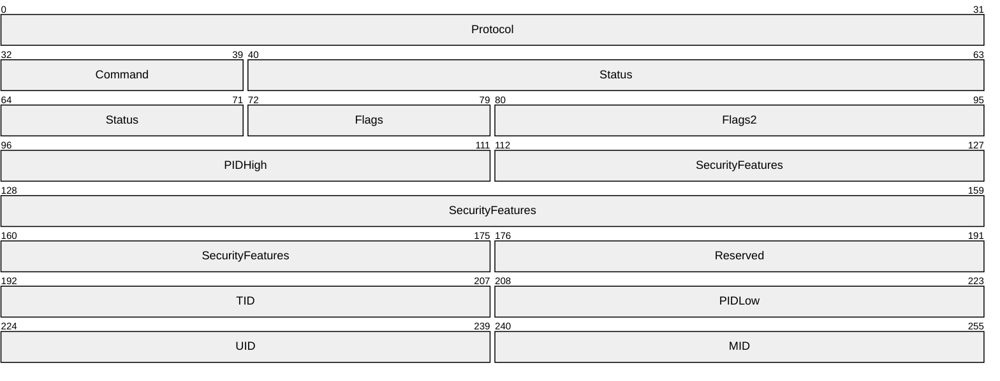

**Protocol (4 bytes):** This field MUST contain the 4-byte literal string '\xFF', 'S', 'M', 'B', with the letters represented by their respective ASCII values in the order shown. In the earliest available SMB documentation, this field is defined as a one byte message type (0xFF) followed by a three byte server type identifier.

**Command (1 byte):** A one-byte command code. Defined SMB command codes are listed in section [2.2.2.1](#Section_2.2.2.1).

**Status (4 bytes):** A 32-bit field used to communicate error messages from the server to the client.

**Flags (1 byte):** An 8-bit field of 1-bit flags describing various features in effect for the message.

| Bit Range | Field | Description |
| --- | --- | --- |
| This bit is set (1) in the [SMB_COM_NEGOTIATE (0x72) Response (section 2.2.4.52.2)](#Section_2.2.4.52.2) if the server supports [SMB_COM_LOCK_AND_READ (0x13) (section 2.2.4.20)](#Section_2.2.4.20) and [SMB_COM_WRITE_AND_UNLOCK (0x14) (section 2.2.4.21)](#Section_2.2.4.21) commands. | SMB_FLAGS_LOCK_AND_READ_OK 0x01 | LANMAN1.0 |
| [**Obsolete**](#gt_obsolete) When set (on an SMB request being sent to the server), the client guarantees that there is a receive buffer posted such that a send without acknowledgment can be used by the server to respond to the client's request. This behavior is specific to an obsolete transport. This bit MUST be set to zero by the client and MUST be ignored by the server. | SMB_FLAGS_BUF_AVAIL 0x02 | LANMAN1.0 |
| Variable | Reserved 0x04 | This flag MUST be set to zero by the client and MUST be ignored by the server. LANMAN1.0 |
| Obsolete If this bit is set then all pathnames in the SMB SHOULD be treated as case-insensitive.<26> | SMB_FLAGS_CASE_INSENSITIVE 0x08 | LANMAN1.0 |
| [**Obsolescent**](#gt_obsolescent) When set in session setup, this bit indicates that all paths sent to the server are already in canonical format. That is, all file and directory names are composed of valid file name characters in all upper-case, and that the path segments are separated by backslash characters ('\'). | SMB_FLAGS_CANONICALIZED_PATHS 0x10 | LANMAN1.0 |
| Obsolescent This bit has meaning only in the [**deprecated**](#gt_deprecated) [SMB_COM_OPEN (0x02) Request (section 2.2.4.3.1)](#Section_3.3.5.5), [SMB_COM_CREATE (0x03) Request (section 2.2.4.4.1)](#Section_2.2.4.4.1), and [SMB_COM_CREATE_NEW (0x0F) Request (section 2.2.4.16.1)](#Section_2.2.4.16.1) messages, where it is used to indicate that the client is requesting an Exclusive OpLock. It SHOULD be set to zero by the client, and ignored by the server, in all other SMB requests. If the server grants this OpLock request, then this bit SHOULD remain set in the corresponding response SMB to indicate to the client that the OpLock request was granted. | SMB_FLAGS_OPLOCK 0x20 | LANMAN1.0 |
| Obsolescent This bit has meaning only in the deprecated SMB_COM_OPEN (0x02) Request (section 2.2.4.3.1), SMB_COM_CREATE (0x03) Request (section 2.2.4.4.1), and SMB_COM_CREATE_NEW (0x0F) Request (section 2.2.4.16.1) messages, where it is used to indicate that the client is requesting a Batch OpLock. It SHOULD be set to zero by the client, and ignored by the server, in all other SMB requests. If the server grants this OpLock request, then this bit SHOULD remain set in the corresponding response SMB to indicate to the client that the OpLock request was granted. If the SMB_FLAGS_OPLOCK bit is clear (0), then the SMB_FLAGS_OPBATCH bit is ignored. | SMB_FLAGS_OPBATCH 0x40 | LANMAN1.0 |
| When on, this message is being sent from the server in response to a client request. The **Command** field usually contains the same value in a protocol request from the client to the server as in the matching response from the server to the client. This bit unambiguously distinguishes the message as a server response. | SMB_FLAGS_REPLY 0x80 | LANMAN1.0 |

**Flags2 (2 bytes):** A 16-bit field of 1-bit flags that represent various features in effect for the message. Unspecified bits are reserved and MUST be zero.

| Bit Range | Field | Description |
| --- | --- | --- |
| If the bit is set, the message MAY contain long file names. If the bit is clear then file names in the message MUST adhere to the 8.3 naming convention. If set in a client request for directory enumeration, the server MAY return long names (that is, names that are not 8.3 names) in the response to this request. If not set in a client request for directory enumeration, the server MUST return only 8.3 names in the response to this request. This flag indicates that in a direct enumeration request, paths returned by the server are not restricted to 8.3 names format. This bit field SHOULD be set to 1 when the negotiated dialect is LANMAN2.0 or later. | SMB_FLAGS2_LONG_NAMES 0x0001 | LANMAN2.0 |
| If the bit is set, the client is aware of extended attributes (EAs). The client MUST set this bit if the client is aware of extended attributes. In response to a client request with this flag set, a server MAY include extended attributes in the response. This bit field SHOULD be set to 1 when the negotiated dialect is LANMAN2.0 or later. | SMB_FLAGS2_EAS 0x0002 | LANMAN1.2 |
| If set by the client, the client is requesting signing (if signing is not yet active) or the message being sent is signed. This bit is used on the SMB header of an [SMB_COM_SESSION_SETUP_ANDX (section 2.2.4.53)](#Section_2.2.4.53) client request to indicate that the client supports signing and that the server can choose to enforce signing on the connection based on its configuration. To turn on signing for a connection, the server MUST set this flag and also sign the SMB_COM_SESSION_SETUP_ANDX Response (section 2.2.4.53), after which all of the traffic on the connection (except for OpLock Break notifications) MUST be signed. In the SMB header of other CIFS client requests, the setting of this bit indicates that the packet has been signed. This bit field SHOULD be set to 1 when the negotiated dialect is NT LANMAN or later. | SMB_FLAGS2_SMB_SECURITY_SIGNATURE 0x0004 | NT LANMAN |
| Variable | SMB_FLAGS2_IS_LONG_NAME 0x0040 | Reserved but not implemented. NT LANMAN |
| If the bit is set, any pathnames in this SMB SHOULD be resolved in the [**Distributed File System (DFS)**](#gt_distributed-file-system-dfs). | SMB_FLAGS2_DFS 0x1000 | NT LANMAN |
| This flag is useful only on a read request. If the bit is set, then the client MAY read the file if the client does not have read permission but does have execute permission. This bit field SHOULD be set to 1 when the negotiated dialect is LANMAN2.0 or later. This flag is also known as SMB_FLAGS2_READ_IF_EXECUTE. | SMB_FLAGS2_PAGING_IO 0x2000 | NT LANMAN |
| If this bit is set in a client request, the server MUST return errors as 32-bit NTSTATUS codes in the response. If it is clear, the server SHOULD<27> return errors in SMBSTATUS format. If this bit is set in the server response, the **Status** field in the header is formatted as an **NTSTATUS** code; else, it is in SMBSTATUS format. | SMB_FLAGS2_NT_STATUS 0x4000 | NT LANMAN |
| If set in a client request or server response, each field that contains a string in this SMB message MUST be encoded as an array of 16-bit [**Unicode**](#gt_unicode) characters, unless otherwise specified. If this bit is clear, each of these fields MUST be encoded as an array of [**OEM characters**](#gt_681188c8-235a-47f5-af29-7fbd0676a6b8). This bit field SHOULD be set to 1 when the negotiated dialect is NT LANMAN. | SMB_FLAGS2_UNICODE 0x8000 | NT LANMAN |

**PIDHigh (2 bytes):** If set to a nonzero value, this field represents the high-order bytes of a process identifier (**PID**). It is combined with the **PIDLow** field below to form a full **PID**.

**SecurityFeatures (8 bytes):** This 8-byte field has three possible interpretations.

In the case that security signatures are negotiated (see [SMB_COM_NEGOTIATE (0x72) (section 2.2.4.52)](#Section_2.2.4.52.1), the following format MUST be observed.

SecurityFeatures

{

UCHAR SecuritySignature[8];

}

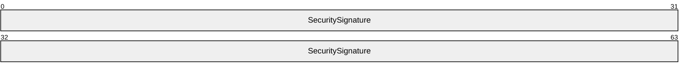

**SecuritySignature (8 bytes):** If SMB signing has been negotiated, this field MUST contain an 8-byte cryptographic message signature that can be used to detect whether the message was modified while in transit. The use of message signing is mutually exclusive with connectionless transport.

In the case that [**CIFS**](#gt_common-internet-file-system-cifs) is being transported over a connectionless transport (see section [2.1.2.1](#Section_2.1.2.1)), the following format MUST be observed.

SecurityFeatures

{

ULONG Key;

USHORT CID;

USHORT SequenceNumber;

}

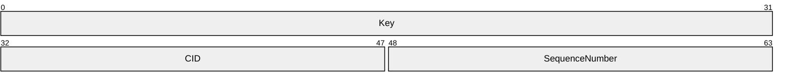

**Key (4 bytes):** An encryption key used for validating messages over connectionless transports.

**CID (2 bytes):** A connection identifier (**CID)**.

**SequenceNumber (2 bytes):** A number used to identify the sequence of a message over connectionless transports.

Finally, if neither of the above two cases applies, the **SecurityFeatures** field is treated as a reserved field, which MUST be set to zero by the client and MUST be ignored by the server.

**Reserved (2 bytes):** This field is reserved and SHOULD be set to 0x0000.

**TID (2 bytes):** A tree identifier (**TID**).

**PIDLow (2 bytes):** The lower 16-bits of the **PID**.

**UID (2 bytes):** A user identifier (**UID**).

**MID (2 bytes):** A multiplex identifier (**MID**).

<a id="Section_2.2.3.2"></a>
#### 2.2.3.2 Parameter Block

[**SMB**](#gt_server-message-block-smb) was originally designed as a rudimentary remote procedure call protocol, and the parameter block was defined as an array of "one word (two byte) fields containing SMB command dependent parameters". In the [**CIFS**](#gt_common-internet-file-system-cifs) dialect, however, the **SMB_Parameters.Words** array can contain any arbitrary structure. The format of the **SMB_Parameters.Words** structure is defined individually for each command message. The size of the **Words** array is still measured as a count of byte pairs.

The general format of the parameter block is as follows.

SMB_Parameters

{

UCHAR WordCount;

USHORT Words[WordCount] (variable);

}

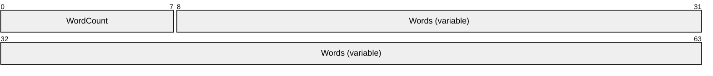

**WordCount (1 byte):** The size, in two-byte words, of the **Words** field. This field can be zero, indicating that the **Words** field is empty. Note that the size of this field is one byte and comes after the fixed 32-byte [SMB Header (section 2.2.3.1)](#Section_2.2.3.1), which causes the **Words** field to be unaligned.

**Words (variable):** The message-specific parameters structure. The size of this field MUST be (2 x **WordCount**) bytes. If **WordCount** is 0x00, this field is not included.

<a id="Section_2.2.3.3"></a>
#### 2.2.3.3 Data Block

The general structure of the data block is similar to that of the Parameter block, except that the length of the buffer portion is measured in bytes.

SMB_Data

{

USHORT ByteCount;

UCHAR Bytes[ByteCount] (variable);

}

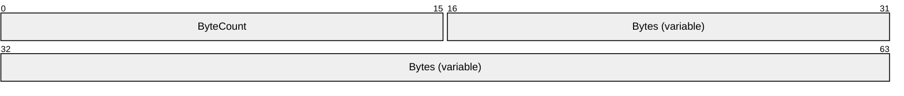

**ByteCount (2 bytes):** The size, in bytes, of the **Bytes** field. This field can be 0x0000, indicating that the **Bytes** field is empty. Because the **SMB_Parameters.Words** field is unaligned and the **SMB_Data.ByteCount** field is two bytes in size, the first byte of **SMB_Data.Bytes** is also unaligned.

**Bytes (variable):** The message-specific data structure. The size of this field MUST be **ByteCount** bytes. If **ByteCount** is 0x0000, this field is not included.

<a id="Section_2.2.3.4"></a>
#### 2.2.3.4 Batched Messages ("AndX" Messages)

Batched messages using the AndX construct were introduced in the LAN Manager 1.0 dialect. Batched messages reduce the number of messages required to complete a series of commands by sending multiple command requests or responses in a single message. SMB commands that apply the AndX construct are known as "AndX Commands", and are identified by the [**NT LAN Manager**](#gt_nt-lan-manager-ntlm) convention of appending "_ANDX" to the command name. Messages of this type are known as AndX Messages.

In AndX Messages, only one [SMB Header (section 2.2.3.1)](#Section_2.2.3.1) is sent. The header is then followed by zero or more Parameter and Data block pairs, each corresponding to an additional command request/response. There is no limit on the number of block pairs in a message specifically, only on the total message size. The total size of a Batched Message MUST NOT exceed the negotiated **MaxBufferSize**. AndX Messages contain a construct, conceptually similar to a linked-list, that is used to connect the batched block pairs. The resulting list is referred to as an AndX Chain. The structure of this construct is shown below.

AndX

{

UCHAR AndXCommand;

UCHAR AndXReserved;

USHORT AndXOffset;

}

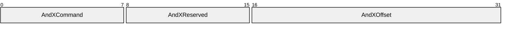

**AndXCommand (1 byte):** The command code associated with the next block pair in the AndX Chain.

**AndXReserved (1 byte):** This field is reserved and MUST be 0x00.

**AndXOffset (2 bytes):** The offset in bytes, relative to the start of the SMB Header, of the next Parameter block in the AndX Message. This offset is independent of any other size parameters or offsets within the command. This offset can point to a location past the end of the current block pair.

The AndX construct is located at the start of the Parameter block of an AndX command request/response.

An AndX Chain is considered terminated when its last command is either a non-AndX SMB command or an AndX SMB command with the AndXCommand field set to [SMB_COM_NO_ANDX_COMMAND (section 2.2.4.75)](#Section_2.2.4.75) (0xFF, representing the chain terminator). The SMB_COM_NO_ANDX_COMMAND command code is not used in any other context.

<a id="Section_2.2.3.4.1"></a>
##### 2.2.3.4.1 Follow-on Commands

Each AndX Command has a specific list of commands that can follow it in an AndX Chain. Each command's list of permitted follow-on commands is documented in the command's corresponding subsection of section [2.2.4](#Section_2.2.4), SMB Commands.

<a id="Section_2.2.4"></a>
### 2.2.4 SMB Commands

<a id="Section_2.2.4.1"></a>
#### 2.2.4.1 SMB_COM_CREATE_DIRECTORY (0x00)

This is an original **Core Protocol** command. This command is [**deprecated**](#gt_deprecated). Clients SHOULD use the TRANS2_CREATE_DIRECTORY subcommand.

The Create Directory command creates a new directory on the server, relative to a connected share. The client MUST provide a valid UID and TID, as well as the pathname (relative to the TID) of the directory to be created.

Servers MUST require clients to have, at minimum, create permission within the parent directory in order to create a new directory. The creator's access rights to the new directory are be determined by local policy on the server.

<a id="Section_2.2.4.1.1"></a>
##### 2.2.4.1.1 Request

SMB_Parameters

{

UCHAR WordCount;

}

SMB_Data

{

USHORT ByteCount;

Bytes

{

UCHAR BufferFormat;

SMB_STRING DirectoryName;

}

}

**SMB_Header:**

**TID (2 bytes):** A valid TID MUST be provided. The TID represents the root of the directory tree in which the new directory is created.

**UID (2 bytes):** A valid UID MUST be provided. At minimum, the user MUST have create permission for the subtree that is to contain the new directory. The creator's access rights to the new directory are determined by local policy on the server.

**SMB_Parameters:**

**WordCount (1 byte):** This field MUST be 0x00. No parameters are sent by this message.

**SMB_Data:**

**ByteCount (2 bytes):** This field MUST be greater than or equal to 0x0002.

**Bytes (variable):** The message-specific data structure as follows:

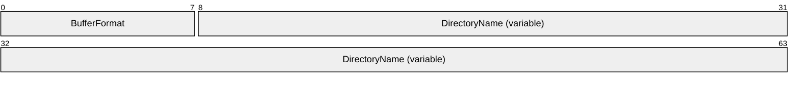

**BufferFormat (1 byte):** This field MUST be 0x04.

**DirectoryName (variable):** A null-terminated string giving the full pathname, relative to the supplied **TID**, of the directory to be created.

<a id="Section_2.2.4.1.2"></a>
##### 2.2.4.1.2 Response

SMB_Parameters

{

UCHAR WordCount;

}

SMB_Data

{

USHORT ByteCount;

}


**SMB_Parameters (1 byte):**


**WordCount (1 byte):** This field MUST be 0x00. No parameters are sent by this message.

**SMB_Data (2 bytes):**


**ByteCount (2 bytes):** This field MUST be 0x0000. No data is sent by this message.

**Error Codes**

| SMB error class | SMB error code | NT status code | POSIX equivalent | Description |
| --- | --- | --- | --- | --- |
| ERRDOS (0x01) | ERRbadpath (0x0003) | STATUS_OBJECT_PATH_SYNTAX_BAD (0xC000003B) | ENOENT | The path syntax is invalid. |
| ERRDOS (0x01) | ERRbadpath (0x0003) | STATUS_OBJECT_NAME_INVALID (0xC0000033) | ENOENT | Object Name invalid. |
| ERRDOS (0x01) | ERRbadpath (0x0003) | STATUS_OBJECT_PATH_NOT_FOUND (0xC000003A) | ENOENT | The path does not exist. |
| ERRDOS (0x01) | ERRnoaccess (0x0005) | STATUS_ACCESS_DENIED (0xC0000022) | EACCESS | A component of the path-prefix denied search permission. |
| ERRDOS (0x01) | ERRnoaccess (0x0005) | - | ENOSPC | The parent directory is full. |
| ERRDOS (0x01) | ERRnoaccess (0x0005) | - | EMLINK | There are too many links to the parent directory. |
| ERRDOS (0x01) | ERRnomem (0x0008) | STATUS_INSUFF_SERVER_RESOURCES (0xC0000205) STATUS_NO_MEMORY (0xC0000017) | ENOMEM | The server is out of resources. |
| ERRDOS (0x01) | ERRfilexists (0x0050) | STATUS_OBJECT_NAME_COLLISION (0xC0000035) | EEXIST | The specified directory already exists. |
| ERRSRV (0x02) | ERRerror (0x0001) | STATUS_INVALID_SMB (0x00010002) | - | Invalid SMB. Not enough parameter bytes were sent. |
| ERRSRV (0x02) | ERRinvtid (0x0005) | STATUS_SMB_BAD_TID (0x00050002) | - | The TID is no longer valid. |
| ERRSRV (0x02) | ERRbaduid (0x005B) | STATUS_SMB_BAD_UID (0x005B0002) | - | The **UID** supplied is not known to the session, or the user identified by the **UID** does not have sufficient privileges. |
| ERRHRD (0x03) | ERRnowrite (0x0013) | STATUS_MEDIA_WRITE_PROTECTED (0xC00000A2) | EROFS | Attempt to write to a read-only file system. |
| ERRHRD (0x03) | ERRdata (0x0017) | STATUS_DATA_ERROR (0xC000003E) | EIO | Disk I/O error. |

<a id="Section_2.2.4.2"></a>
#### 2.2.4.2 SMB_COM_DELETE_DIRECTORY (0x01)

This is an original **Core Protocol** command.

This command is used to delete an empty directory.

<a id="Section_2.2.4.2.1"></a>
##### 2.2.4.2.1 Request

SMB_Parameters

{

UCHAR WordCount;

}

SMB_Data

{

USHORT ByteCount;

Bytes

{

UCHAR BufferFormat;

SMB_STRING DirectoryName;

}

}

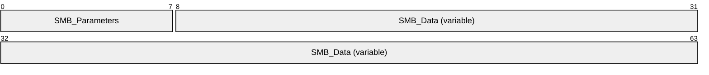

**SMB_Parameters (1 byte):**


**WordCount (1 byte):** This field MUST be 0x00. No parameters are sent by this message.

**SMB_Data (variable):**


**ByteCount (2 bytes):** This field MUST be greater than or equal to 0x0002.

**Bytes (variable):**


**BufferFormat (1 byte):** This field MUST contain the value 0x04.

**DirectoryName (variable):** A null-terminated string that contains the full pathname, relative to the supplied **TID**, of the directory to be deleted.

<a id="Section_2.2.4.2.2"></a>
##### 2.2.4.2.2 Response

SMB_Parameters

{

UCHAR WordCount;

}

SMB_Data

{

USHORT ByteCount;

}


**SMB_Parameters (1 byte):**

```mermaid
packet-beta
  0-7: "WordCount"
```

**WordCount (1 byte):** This field MUST be 0x00. No parameters are sent by this message.

**SMB_Data (2 bytes):**

```mermaid
packet-beta
  0-15: "ByteCount"
```

**ByteCount (2 bytes):** This field MUST be 0x0000. No data is sent by this message.

**Error Codes**

| SMB error class | SMB error code | NT status code | POSIX equivalent | Description |
| --- | --- | --- | --- | --- |
| ERRDOS (0x01) | ERRbadfile (0x0002) | STATUS_NO_SUCH_FILE (0xC000000F) | ENOENT | The directory was not found. |
| ERRDOS (0x01) | ERRbadpath (0x0003) | STATUS_OBJECT_PATH_SYNTAX_BAD (0xC000003B) | ENOENT | The path syntax is invalid. |
| ERRDOS (0x01) | ERRbadpath (0x0003) | STATUS_OBJECT_PATH_INVALID (0xC0000039) | ENOTDIR | A component of the path-prefix was not a directory. |
| ERRDOS (0x01) | ERRbadpath (0x0003) | STATUS_OBJECT_PATH_NOT_FOUND (0xC000003A) | ENOENT | The path does not exist. |
| ERRDOS (0x01) | ERRnoaccess (0x0005) | STATUS_ACCESS_DENIED (0xC0000022) | EACCESS | A component of the path-prefix denied search permission. |
| ERRDOS (0x01) | ERRnoaccess (0x0005) | STATUS_CANNOT_DELETE (0xC0000121) | EBUSY | The directory is in use. |
| ERRDOS (0x01) | ERRnoaccess (0x0005) | STATUS_DIRECTORY_NOT_EMPTY (0xC0000101) | EEXIST | The directory is not empty. |
| ERRDOS (0x01) | ERRbadshare (0x0020) | STATUS_SHARING_VIOLATION (0xC0000043) | ETXTBSY | Sharing violation. |
| ERRSRV (0x02) | ERRerror (0x0001) | STATUS_INVALID_SMB (0x00010002) | - | Invalid SMB. Not enough parameter bytes were sent. |
| ERRSRV (0x02) | ERRinvtid (0x0005) | STATUS_SMB_BAD_TID (0x00050002) | - | The TID is no longer valid. |
| ERRSRV (0x02) | ERRnomem (0x0008) | STATUS_INSUFF_SERVER_RESOURCES (0xC0000205) | ENOMEM | The server is out of resources. |
| ERRSRV (0x02) | ERRbaduid (0x005B) | STATUS_SMB_BAD_UID (0x005B0002) | - | The UID supplied is not known to the session. |
| ERRHRD (0x03) | ERRnowrite (0x0013) | STATUS_MEDIA_WRITE_PROTECTED (0xC00000A2) | EROFS | Attempt to write to a read-only file system. |
| ERRHRD (0x03) | ERRdata (0x0017) | STATUS_DATA_ERROR (0xC000003E) | EIO | Disk I/O error. |

<a id="Section_2.2.4.3"></a>
#### 2.2.4.3 SMB_COM_OPEN (0x02)

This is an original **Core Protocol** command. This command has been [**deprecated**](#gt_deprecated). Client implementations SHOULD use SMB_COM_NT_CREATE_ANDX.

This request is used to open an existing regular file. This command MUST NOT be used to open directories or named pipes. The command includes the pathname of the file, relative to the TID, that the client wishes to open. If the command is successful, the server response MUST include a FID. The client MUST supply the FID in subsequent operations on the file.

<a id="Section_2.2.4.3.1"></a>
##### 2.2.4.3.1 Request

SMB_Parameters

{

UCHAR WordCount;

Words

{

USHORT AccessMode;

SMB_FILE_ATTRIBUTES SearchAttributes;

}

}

SMB_Data

{

USHORT ByteCount;

Bytes

{

UCHAR BufferFormat;

SMB_STRING FileName;

}

}

**SMB_Header:**

**Flags (1 byte):**

| Bit Range | Field | Description |
| --- | --- | --- |
| Variable | SMB_FLAGS_OPLOCK 0x20 | If set, the client is requesting an Exclusive Opportunistic Lock (OpLock) on the file. |
| If set, the client is requesting a Batch Exclusive OpLock on the file. The SMB_FLAGS_OPLOCK bit MUST be set if this bit is set. | SMB_FLAGS_OPBATCH 0x40 | - |

```mermaid
packet-beta
  0-39: "SMB_Parameters"
  40-95: "SMB_Data (variable)"
```

**SMB_Parameters (5 bytes):**

```mermaid
packet-beta
  0-7: "WordCount"
  8-39: "Words"
```

**WordCount (1 byte):** This field MUST be 0x02.

**Words (4 bytes):** The message-specific parameters structure.

```mermaid
packet-beta
  0-15: "AccessMode"
  16-31: "SearchAttributes"
```

**AccessMode (2 bytes):** A 16-bit field for encoding the requested access mode. See section [3.2.4.5.1](#Section_3.2.4.5.1) for a discussion on sharing modes.

| Bit Range | Field | Description |
| --- | --- | --- |
| Variable | AccessMode 0x0007 | 0 Open for reading |
| Variable | - | 1 Open for writing |
| Variable | - | 2 Open for reading and writing |
| Variable | - | 3 Open for execution |
| 4-7 | - | **Reserved**. For compatibility with older dialects, the server MUST return STATUS_OS2_INVALID_ACCESS (ERRDOS/ERRbadaccess) if these values are requested. |
| Variable | 0x0008 | Reserved. MUST be ignored by the server. - |
| Variable | SharingMode 0x0070 | 0 Compatibility mode |
| Variable | - | 1 Deny read/write/execute to others (exclusive use requested) |
| Variable | - | 2 Deny write to others |
| Variable | - | 3 Deny read/execute to others |
| Variable | - | 4 Deny nothing to others |
| Variable | 0x0080 | **Reserved** - |
| Variable | ReferenceLocality 0x0700 | 0 Unknown locality of reference |
| Variable | - | 1 Mainly sequential access |
| Variable | - | 2 Mainly random access |
| Variable | - | 3 Random access with some locality |
| 4-7 | - | Undefined |
| Variable | 0x0800 | **Reserved** - |
| Variable | CacheMode 0x1000 | 0 Perform caching on file |
| Variable | - | 1 Do not cache the file |
| Variable | 0x2000 | **Reserved** - |
| Write-through mode. If this bit is set, no read ahead or write behind is allowed on this file or device. When the response is returned, data is expected to be on the disk or device. | WritethroughMode 0x4000 | 0 |
| Variable | - | 1 - |
| Variable | 0x8000 | **Reserved** - |

**SearchAttributes (2 bytes):** Specifies the type of file. This field is used as a search mask. Both the **FileName** and the **SearchAttributes** of a file MUST match in order for the file to be opened.<28>

**SMB_Data (variable):**

```mermaid
packet-beta
  0-15: "ByteCount"
  16-63: "Bytes (variable)"
```

**ByteCount (2 bytes):** This field MUST be greater than or equal to 0x0002.

**Bytes (variable):** The message-specific data structure, which follows.

```mermaid
packet-beta
  0-7: "BufferFormat"
  8-63: "FileName (variable)"
```

**BufferFormat (1 byte):** A buffer format identifier. The value of this field MUST be 0x04.

**FileName (variable):** A null-terminated string containing the file name of the file to be opened.

<a id="Section_2.2.4.3.2"></a>
##### 2.2.4.3.2 Response

SMB_Parameters

{

UCHAR WordCount;

Words

{

USHORT FID;

SMB_FILE_ATTRIBUTES FileAttrs;

UTIME LastModified;

ULONG FileSize;

USHORT AccessMode;

}

}

SMB_Data

{

USHORT ByteCount;

}

```mermaid
packet-beta
  0-119: "SMB_Parameters (15 bytes)"
  120-135: "SMB_Data"
```

**SMB_Parameters (15 bytes):**

```mermaid
packet-beta
  0-7: "WordCount"
  8-119: "Words (14 bytes)"
```

**WordCount (1 byte):** This field MUST be 0x07. The length, in 2-byte words, of the remaining **SMB_Parameters**.

**Words (14 bytes):**

```mermaid
packet-beta
  0-15: "FID"
  16-31: "FileAttrs"
  32-63: "LastModified"
  64-95: "FileSize"
  96-111: "AccessMode"
```

**FID (2 bytes):** The FID returned for the open file.

**FileAttrs (2 bytes):** The set of attributes currently assigned to the file. This field is formatted in the same way as the **SearchAttributes** field in the request.

**LastModified (4 bytes):** The time of the last modification to the opened file.

**FileSize (4 bytes):** The current size of the opened file, in bytes.

**AccessMode (2 bytes):** A 16-bit field for encoding the granted access mode. This field is formatted in the same way as the Request equivalent.

**SMB_Data (2 bytes):**

```mermaid
packet-beta
  0-15: "ByteCount"
```

**ByteCount (2 bytes):** This field MUST be 0x0000. No data is sent by this message.

**Error Codes**

| SMB error class | SMB error code | NT status code | POSIX equivalent | Description |
| --- | --- | --- | --- | --- |
| ERRDOS (0x01) | ERRbadfile (0x0002) | STATUS_NO_SUCH_FILE (0xC000000F) | ENOENT | The named file was not found. |
| ERRDOS (0x01) | ERRbadpath (0x0003) | STATUS_OBJECT_PATH_SYNTAX_BAD (0xC000003B) | ENOENT | The file path syntax is invalid. |
| ERRDOS (0x01) | ERRnofids (0x0004) | STATUS_OS2_TOO_MANY_OPEN_FILES (0x00040001) STATUS_TOO_MANY_OPENED_FILES (0xC000011F) | ENFILE | Too many open files, no more FIDs available. |
| ERRDOS (0x01) | ERRbadpath (0x0003) | STATUS_OBJECT_PATH_INVALID (0xC0000039) | ENOTDIR | A component of the path-prefix was not a directory. |
| ERRDOS (0x01) | ERRnoaccess (0x0005) | STATUS_ACCESS_DENIED (0xC0000022) | EACCESS | A component of the path-prefix denied search permission OR the requested access permission is denied for the file OR an open mode failure occurred. |
| ERRDOS (0x01) | ERRnoaccess (0x0005) | STATUS_FILE_IS_A_DIRECTORY (0xC00000BA) | EISDIR | Named file is an existing directory and requested open mode is write or read/write. |
| ERRDOS (0x01) | ERRnoaccess (0x0005) | STATUS_ACCESS_DENIED (0xC0000022) | ETXTBSY | File is an executable binary file that is being executed and requested access permission specifies write or read/write. |
| ERRDOS (0x01) | ERRnomem (0x0008) | STATUS_INSUFF_SERVER_RESOURCES (0xC0000205) | ENOMEM | The server is out of resources. |
| ERRDOS (0x01) | ERRbadaccess (0x000C) | STATUS_OS2_INVALID_ACCESS (0x000C0001) | - | The Reserved bit (0x0008) in the **AccessMode.AccessMode** subfield was set (1) in the request. |
| ERRDOS (0x01) | ERRbadshare (0x0020) | STATUS_SHARING_VIOLATION (0xC0000043) | EAGAIN | File exists, mandatory file/record locking is set, and there are outstanding record locks on the file. |
| ERRSRV (0x02) | ERRerror (0x0001) | STATUS_INVALID_SMB (0x00010002) | - | Invalid SMB. Not enough parameter bytes were sent. |
| ERRSRV (0x02) | ERRerror (0x0001) | - | EFAULT | The path points outside the allocated address space of the process. |
| ERRSRV (0x02) | ERRerror (0x0001) | - | EINTR | A signal was caught during the open operation. |
| ERRSRV (0x02) | ERRerror (0x0001) | - | ENXIO | Generic server open failure. |
| ERRSRV (0x02) | ERRerror (0x0001) | STATUS_ACCESS_DENIED (0xC0000022) | EROFS | The named file resides on a read-only file system and the requested access permission is write or read/write. |
| ERRSRV (0x02) | ERRaccess (0x0004) | STATUS_NETWORK_ACCESS_DENIED (0xC00000CA) | - | Permission conflict between the requested permission and permissions for the shared resource; for example, open for write of a file in a read-only file system subtree. |
| ERRSRV (0x02) | ERRinvtid (0x0005) | STATUS_SMB_BAD_TID (0x00050002) | - | The **TID** is no longer valid. |
| ERRSRV (0x02) | ERRinvdevice (0x0007) | STATUS_BAD_DEVICE_TYPE (0xC00000CB) | - | A file creation request was made to a share that is not a file system subtree. |
| ERRSRV (0x02) | ERRbaduid (0x005B) | STATUS_SMB_BAD_UID (0x005B0002) | - | The **UID** supplied is not known to the session. |
| ERRHRD (0x03) | ERRnowrite (0x0013) | STATUS_MEDIA_WRITE_PROTECTED (0xC00000A2) | EROFS | Attempt to write to a read-only file system. |
| ERRHRD (0x03) | ERRdata (0x0017) | STATUS_DATA_ERROR (0xC000003E) | EIO | Disk I/O error. |

<a id="Section_2.2.4.4"></a>
#### 2.2.4.4 SMB_COM_CREATE (0x03)

This is an original **Core Protocol** command. This command is [**deprecated**](#gt_deprecated). Implementations SHOULD use SMB_COM_NT_CREATE_ANDX.

This command is used to create and open a new file or open and truncate an existing file to zero length. The FID that is returned can be used in subsequent read, write, lock, unlock, and close messages. This command MUST NOT be used to create directories or named pipes. The request includes the pathname of the file relative to the supplied TID that the client wishes to create. If the command is successful, the server response MUST include a FID. The client MUST supply the FID in subsequent operations on the file. The client MUST have write permission on the file's parent directory in order to create a new file, or write permissions on the file itself in order to truncate the file. The client's access permissions on a newly created file MUST be read/write. Access permissions on truncated files are not modified. The file is opened in read/write/compatibility mode.

<a id="Section_2.2.4.4.1"></a>
##### 2.2.4.4.1 Request

SMB_Parameters

{

UCHAR WordCount;

Words

{

SMB_FILE_ATTRIBUTES FileAttributes;

UTIME CreationTime;

}

}

SMB_Data

{

USHORT ByteCount;

Bytes

{

UCHAR BufferFormat;

SMB_STRING FileName;

}

}

**SMB_Header:**

**TID (2 bytes):** A valid Tree Identifier obtained from a previously successful message exchange.

**UID (2 bytes):** A valid User Identifier that MUST be the same value as the User Identifier associated with the current SMB Session.

```mermaid
packet-beta
  0-55: "SMB_Parameters"
  56-95: "SMB_Data (variable)"
```

**SMB_Parameters (7 bytes):**

```mermaid
packet-beta
  0-7: "WordCount"
  8-55: "Words"
```

**WordCount (1 byte):** This field MUST be 0x03.

**Words (6 bytes):**

```mermaid
packet-beta
  0-15: "FileAttributes"
  16-47: "CreationTime"
```

**FileAttributes (2 bytes):** A 16-bit field of 1-bit flags that represent the file attributes to assign to the file if it is created successfully.

**CreationTime (4 bytes):** The time that the file was created, represented as the number of seconds since Jan 1, 1970, 00:00:00.0.

**SMB_Data (variable):**

```mermaid
packet-beta
  0-15: "ByteCount"
  16-63: "Bytes (variable)"
```

**ByteCount (2 bytes):** This field MUST be greater than or equal to 0x0002.

**Bytes (variable):**

```mermaid
packet-beta
  0-7: "BufferFormat"
  8-63: "FileName (variable)"
```

**BufferFormat (1 byte):** This field MUST be 0x04.

**FileName (variable):** A null-terminated string that represents the fully qualified name of the file relative to the supplied TID to create or truncate on the server.

<a id="Section_2.2.4.4.2"></a>
##### 2.2.4.4.2 Response

SMB_Parameters

{

UCHAR WordCount;

Words

{

USHORT FID;

}

}

SMB_Data

{

USHORT ByteCount;

}

```mermaid
packet-beta
  0-23: "SMB_Parameters"
  24-39: "SMB_Data"
```

**SMB_Parameters (3 bytes):**

```mermaid
packet-beta
  0-7: "WordCount"
  8-23: "Words"
```

**WordCount (1 byte):** This field MUST be 0x01.

**Words (2 bytes):**

```mermaid
packet-beta
  0-15: "FID"
```

**FID (2 bytes):** The **FID** representing the file on the server. This value MUST be supplied in the **FID** field of the [SMB Header (section 2.2.3.1)](#Section_2.2.3.1) in subsequent requests that manipulate the file.

**SMB_Data (2 bytes):**

```mermaid
packet-beta
  0-15: "ByteCount"
```

**ByteCount (2 bytes):** This field MUST be 0x0000. No data is sent by this message.

**Error Codes**

| SMB error class | SMB error code | NT status code | POSIX equivalent | Description |
| --- | --- | --- | --- | --- |
| ERRDOS (0x01) | ERRbadfile (0x0002) | STATUS_OBJECT_NAME_NOT_FOUND (0xC0000034) | ENOENT | The named file was not found. |
| ERRDOS (0x01) | ERRbadpath (0x0003) | STATUS_OBJECT_PATH_SYNTAX_BAD (0xC000003B) | ENOENT | The file path syntax is invalid. |
| ERRDOS (0x01) | ERRnofids (0x0004) | STATUS_OS2_TOO_MANY_OPEN_FILES (0x00040001) STATUS_TOO_MANY_OPENED_FILES (0xC000011F) | EMFILE | Too many open files, no more **FIDs** available. |
| ERRDOS (0x01) | ERRbadpath (0x0003) | STATUS_OBJECT_PATH_INVALID (0xC0000039) | ENOTDIR | A component of the path-prefix was not a directory. |
| ERRDOS (0x01) | ERRnoaccess (0x0005) | STATUS_ACCESS_DENIED (0xC0000022) | EACCESS | A component of the path-prefix denied search permission OR requested access permission is denied for the file OR open mode failure. |
| ERRDOS (0x01) | ERRnoaccess (0x0005) | STATUS_FILE_IS_A_DIRECTORY (0xC00000BA) | EISDIR | Named file is an existing directory and requested open mode is write or read/write. |
| ERRDOS (0x01) | ERRnoaccess (0x0005) | STATUS_ACCESS_DENIED (0xC0000022) | ETXTBSY | File is an executable binary file that is being executed and requested access permission specifies write or read/write. |
| ERRDOS (0x01) | ERRnomem (0x0008) | STATUS_INSUFF_SERVER_RESOURCES (0xC0000205) | ENOMEM | The server is out of resources. |
| ERRSRV (0x02) | ERRbadshare (0x0020) | STATUS_SHARING_VIOLATION (0xC0000043) | EAGAIN | File exists, mandatory file/record locking is set, and there are outstanding record locks on the file. |
| ERRSRV (0x02) | ERRerror (0x0001) | STATUS_INVALID_SMB (0x00010002) | - | Invalid SMB. Not enough parameter bytes were sent. |
| ERRSRV (0x02) | ERRerror (0x0001) | - | EFAULT | Path points outside the allocated address space of the process. |
| ERRSRV (0x02) | ERRerror (0x0001) | - | EINTR | A signal was caught during the open operation. |
| ERRSRV (0x02) | ERRerror (0x0001) | - | ENXIO | Generic server open failure. |
| ERRSRV (0x02) | ERRerror (0x0001) | STATUS_ACCESS_DENIED (0xC0000022) | EROFS | Named file resides on read-only file system and requested access permission is write or read/write. |
| ERRSRV (0x02) | ERRaccess (0x0004) | STATUS_NETWORK_ACCESS_DENIED (0xC00000CA) | - | Permission conflict between requested permission and permissions for the shared resource; for example, open for write of a file in a read-only file system subtree. |
| ERRSRV (0x02) | ERRinvtid (0x0005) | STATUS_SMB_BAD_TID (0x00050002) | - | The **TID** is no longer valid. |
| ERRSRV (0x02) | ERRinvdevice (0x0007) | STATUS_BAD_DEVICE_TYPE (0xC00000CB) | - | File creation request made to a share that is not a file system subtree. |
| ERRSRV (0x02) | ERRbaduid (0x005B) | STATUS_SMB_BAD_UID (0x005B0002) | - | The **UID** supplied is not known to the session. |
| ERRHRD (0x03) | ERRnowrite (0x0013) | STATUS_MEDIA_WRITE_PROTECTED (0xC00000A2) | EROFS | Attempt to write to a read-only file system. |
| ERRHRD (0x03) | ERRdata (0x0017) | STATUS_DATA_ERROR (0xC000003E) | EIO | Disk I/O error. |

<a id="Section_2.2.4.5"></a>
#### 2.2.4.5 SMB_COM_CLOSE (0x04)

This is an original **Core Protocol** command.

This command is used by the client to close an instance of an object associated with a valid FID.

<a id="Section_2.2.4.5.1"></a>
##### 2.2.4.5.1 Request

SMB_Parameters

{

UCHAR WordCount;

Words

{

USHORT FID;

UTIME LastTimeModified;

}

}

SMB_Data

{

USHORT ByteCount;

}

```mermaid
packet-beta
  0-55: "SMB_Parameters"
  56-71: "SMB_Data"
```

**SMB_Parameters (7 bytes):**

```mermaid
packet-beta
  0-7: "WordCount"
  8-55: "Words"
```

**WordCount (1 byte):** This field MUST be 0x03.

**Words (6 bytes):**

```mermaid
packet-beta
  0-15: "FID"
  16-47: "LastTimeModified"
```

**FID (2 bytes):** The FID of the object to be closed.

**LastTimeModified (4 bytes):** A time value encoded as the number of seconds since January 1, 1970 00:00:00.0. The client can request that the last modification time for the file be updated to this time value. A value of 0x00000000 or 0xFFFFFFFF results in the server not updating the last modification time.

**SMB_Data (2 bytes):**

```mermaid
packet-beta
  0-15: "ByteCount"
```

**ByteCount (2 bytes):** This field MUST be 0x0000. No data is sent by this message.

<a id="Section_2.2.4.5.2"></a>
##### 2.2.4.5.2 Response

SMB_Parameters

{

UCHAR WordCount;

}

SMB_Data

{

USHORT ByteCount;

}

```mermaid
packet-beta
  0-7: "SMB_Parameters"
  8-23: "SMB_Data"
```

**SMB_Parameters (1 byte):**

```mermaid
packet-beta
  0-7: "WordCount"
```

**WordCount (1 byte):** This field MUST be 0x00. No parameters are sent by this message.

**SMB_Data (2 bytes):**

```mermaid
packet-beta
  0-15: "ByteCount"
```

**ByteCount (2 bytes):** This field MUST be 0x00. No data is sent by this message

**Error Codes**

| SMB error class | SMB error code | NT status code | POSIX equivalent | Description |
| --- | --- | --- | --- | --- |
| ERRDOS (0x01) | ERRbadfid (0x0006) | STATUS_INVALID_HANDLE (0xC0000008) STATUS_SMB_BAD_FID (0x00060001) | ENFILE | The **FID** is invalid. |
| ERRSRV (0x02) | ERRerror (0x0001) | STATUS_INVALID_SMB (0x00010002) | - | The **TID** specified in the command is invalid. |
| ERRSRV (0x02) | ERRinvtid (0x0005) | STATUS_SMB_BAD_TID (0x00050002) | - | The **TID** specified in the command is invalid. |
| ERRSRV (0x02) | ERRinvdevice (0x0007) | STATUS_BAD_DEVICE_TYPE (0xC00000CB) | - | Invalid attempt to close an open spool file. OR Invalid device - printer request made to a non-printer connection or non-printer request made to a printer connection. |
| ERRSRV (0x02) | ERRbaduid (0x005B) | STATUS_SMB_BAD_UID (0x005B0002) | - | The **UID** specified is not known as a valid ID on this server session, or the user identified by the **UID** does not have sufficient privileges. |

<a id="Section_2.2.4.6"></a>
#### 2.2.4.6 SMB_COM_FLUSH (0x05)

This is an original **Core Protocol** command.

This command requests that the server flush data and allocation information for a specified file or for all open files under the session.

<a id="Section_2.2.4.6.1"></a>
##### 2.2.4.6.1 Request

SMB_Parameters

{

UCHAR WordCount;

Words

{

USHORT FID;

}

}

SMB_Data

{

USHORT ByteCount;

}

```mermaid
packet-beta
  0-23: "SMB_Parameters"
  24-39: "SMB_Data"
```

**SMB_Parameters (3 bytes):**

```mermaid
packet-beta
  0-7: "WordCount"
  8-23: "Words"
```

**WordCount (1 byte):** This field MUST be 0x01.

**Words (2 bytes):**

```mermaid
packet-beta
  0-15: "FID"
```

**FID (2 bytes):** The FID of the file to be flushed. If this field is set to 0xFFFF (65535), all files opened by the same PID within the SMB connection are to be flushed.

**SMB_Data (2 bytes):**

```mermaid
packet-beta
  0-15: "ByteCount"
```

**ByteCount (2 bytes):** This field MUST be 0x0000. No data is sent by this message.

<a id="Section_2.2.4.6.2"></a>
##### 2.2.4.6.2 Response

SMB_Parameters

{

UCHAR WordCount;

}

SMB_Data

{

USHORT ByteCount;

}

```mermaid
packet-beta
  0-7: "SMB_Parameters"
  8-23: "SMB_Data"
```

**SMB_Parameters (1 byte):**

```mermaid
packet-beta
  0-7: "WordCount"
```

**WordCount (1 byte):** This field MUST be 0x00. No parameters are sent by this message.

**SMB_Data (2 bytes):**

```mermaid
packet-beta
  0-15: "ByteCount"
```

**ByteCount (2 bytes):** This field MUST be 0x0000. No data is sent by this message.

**Error Codes**

| SMB error class | SMB error code | NT status code | POSIX equivalent | Description |
| --- | --- | --- | --- | --- |
| ERRDOS (0x01) | ERRbadfid (0x0006) | STATUS_INVALID_HANDLE (0xC0000008) STATUS_SMB_BAD_FID (0x00060001) | ENFILE | Attempt to read from a **FID** that the server does not have open. |
| ERRDOS (0x01) | ERRnoaccess (0x0005) | STATUS_ACCESS_DENIED (0xC0000022) | EACCESS | The client does not have write permissions. |
| ERRSRV (0x02) | ERRerror (0x0001) | STATUS_INVALID_SMB (0x00010002) | - | The **TID** specified in the command is invalid. |
| ERRSRV (0x02) | ERRinvtid (0x0005) | STATUS_SMB_BAD_TID (0x00050002) | - | The **TID** specified in the command is invalid. |
| ERRSRV (0x02) | ERRbaduid (0x005B) | STATUS_SMB_BAD_UID (0x005B0002) | - | The **UID** specified is not known as a valid ID on this server session, or the user identified by the **UID** does not have sufficient privileges. |
| ERRHRD (0x03) | ERRnowrite (0x0013) | STATUS_MEDIA_WRITE_PROTECTED (0xC00000A2) | EROFS | Attempt to write to a read-only file system. |
| ERRHRD (0x03) | ERRdata (0x0017) | STATUS_DATA_ERROR (0xC000003E) | EIO | Disk I/O error. |
| ERRHRD (0x03) | ERRdiskfull(0x0027) | STATUS_DISK_FULL(0xC000007F) | ENOSPC | The file system is full. |

<a id="Section_2.2.4.7"></a>
#### 2.2.4.7 SMB_COM_DELETE (0x06)

This is an original **Core Protocol** command.

This command is used by the client to delete one or more regular files. It supports the use of wildcards in file names, allowing for deletion of multiple files in a single request.

<a id="Section_2.2.4.7.1"></a>
##### 2.2.4.7.1 Request

SMB_Parameters

{

UCHAR WordCount;

Words

{

SMB_FILE_ATTRIBUTES SearchAttributes;

}

}

SMB_Data

{

USHORT ByteCount;

Bytes

{

UCHAR BufferFormat;

SMB_STRING FileName;

}

}

**SMB_Header:**

**Flags2 (2 bytes): USHORT**

| Bit Range | Field | Description |
| --- | --- | --- |
| Wildcard pattern matching behavior. If this flag is not set, wildcard patterns MUST compare against [**8.3 names**](#gt_83-name) only. If a file has a long name, the wildcard pattern MUST be compared to that file's 8.3 name. If this flag is set, file names can be long file names and wildcard patterns MUST compare against the long file name of a file if it is available. | SMB_FLAGS2_LONG_NAMES 0x0001 | - |

```mermaid
packet-beta
  0-23: "SMB_Parameters"
  24-63: "SMB_Data (variable)"
```

**SMB_Parameters (3 bytes):**

```mermaid
packet-beta
  0-7: "WordCount"
  8-23: "Words"
```

**WordCount (1 byte):** This field MUST be 0x01.

**Words (2 bytes):**

```mermaid
packet-beta
  0-15: "SearchAttributes"
```

**SearchAttributes (2 bytes):** The file attributes of the file(s) to be deleted. If the value of this field is 0x0000, then only normal files MUST be matched for deletion. If the System or Hidden attributes MUST be specified, then entries with those attributes are matched in addition to the normal files. Read-only files MUST NOT be deleted. The read-only attribute of the file MUST be cleared before the file can be deleted.

**SMB_Data (variable):**

```mermaid
packet-beta
  0-15: "ByteCount"
  16-63: "Bytes (variable)"
```

**ByteCount (2 bytes):** This field MUST be greater than or equal to 0x0002.

**Bytes (variable):**

```mermaid
packet-beta
  0-7: "BufferFormat"
  8-63: "FileName (variable)"
```

**BufferFormat (1 byte):** This field MUST be 0x04.

**FileName (variable):** The pathname of the file(s) to be deleted, relative to the supplied **TID**. Wildcards MAY be used in the filename component of the path.

<a id="Section_2.2.4.7.2"></a>
##### 2.2.4.7.2 Response

SMB_Parameters

{

UCHAR WordCount;

}

SMB_Data

{

USHORT ByteCount;

}

```mermaid
packet-beta
  0-7: "SMB_Parameters"
  8-23: "SMB_Data"
```

**SMB_Parameters (1 byte):**

```mermaid
packet-beta
  0-7: "WordCount"
```

**WordCount (1 byte):** This field MUST be 0x00. No parameters are sent by this message.

**SMB_Data (2 bytes):**

```mermaid
packet-beta
  0-15: "ByteCount"
```

**ByteCount (2 bytes):** This field MUST be 0x0000. No data is sent by this message.

**Error Codes**

| SMB error class | SMB error code | NT status code | POSIX equivalent | Description |
| --- | --- | --- | --- | --- |
| ERRDOS (0x01) | ERRbadfile (0x0002) | STATUS_NO_SUCH_FILE (0xC000000F) | ENOENT | The named file was not found. |
| ERRDOS (0x01) | ERRbadpath (0x0003) | STATUS_OBJECT_PATH_SYNTAX_BAD (0xC000003B) | ENOENT | The file path syntax is invalid. |
| ERRDOS (0x01) | ERRnoaccess (0x0005) | STATUS_ACCESS_DENIED (0xC0000022) | EPERM | Access denied. |
| ERRSRV (0x02) | ERRerror (0x0001) | STATUS_INVALID_SMB (0x00010002) | - | Invalid SMB. Not enough parameter bytes were sent. |
| ERRSRV (0x02) | ERRinvtid (0x0005) | STATUS_SMB_BAD_TID (0x00050002) | - | The **TID** is no longer valid. |
| ERRSRV (0x02) | ERRnomem (0x0008) | STATUS_INSUFF_SERVER_RESOURCES (0xC0000205) | ENOMEM | The server is out of resources. |
| ERRSRV (0x02) | ERRbaduid (0x005B) | STATUS_SMB_BAD_UID (0x005B0002) | - | The **UID** supplied is not known to the session. |
| ERRHRD (0x03) | ERRnowrite (0x0013) | STATUS_MEDIA_WRITE_PROTECTED (0xC00000A2) | EROFS | Attempt to write to a read-only file system. |

<a id="Section_2.2.4.8"></a>
#### 2.2.4.8 SMB_COM_RENAME (0x07)

This is an original **Core Protocol** command.

This command changes the name of one or more files or directories. It supports the use of wildcards in file names, allowing the renaming of multiple files in a single request.

<a id="Section_2.2.4.8.1"></a>
##### 2.2.4.8.1 Request

SMB_Parameters

{

UCHAR WordCount;

Words

{

SMB_FILE_ATTRIBUTES SearchAttributes;

}

}

SMB_Data

{

USHORT ByteCount;

Bytes

{

UCHAR BufferFormat1;

SMB_STRING OldFileName;

UCHAR BufferFormat2;

SMB_STRING NewFileName;

}

}

**SMB_Header:**

**Flags2 (2 bytes): USHORT**

| Bit Range | Field | Description |
| --- | --- | --- |
| Variable | SMB_FLAGS2_LONG_NAMES 0x0001 | Wildcard pattern matching behavior. If this flag is not set, wildcard patterns MUST compare against 8.3 names only. If a file has a long name, the wildcard pattern MUST be compared to that file's 8.3 name. If this flag is set, file names MAY be long file names and wildcard patterns MUST compare against the long file name of a file if it is available. |

**TID (2 bytes):** This field MUST contain a valid TID.

**UID (2 bytes):** This field MUST contain a valid UID.

```mermaid
packet-beta
  0-23: "SMB_Parameters"
  24-63: "SMB_Data (variable)"
```

**SMB_Parameters (3 bytes):**

```mermaid
packet-beta
  0-7: "WordCount"
  8-23: "Words"
```

**WordCount (1 byte):** This field MUST be 0x01.

**Words (2 bytes):**

```mermaid
packet-beta
  0-15: "SearchAttributes"
```

**SearchAttributes (2 bytes):** Indicates the file attributes that the file(s) to be renamed MUST have. If the value of this field is 0x0000, then only normal files MUST be matched to be renamed. If the System or Hidden attributes are specified, then entries with those attributes MAY be matched in addition to the normal files. Read-only files MUST NOT be renamed. The read-only attribute of the file MUST be cleared before it can be renamed.

**SMB_Data (variable):**

```mermaid
packet-beta
  0-15: "ByteCount"
  16-63: "Bytes (variable)"
```

**ByteCount (2 bytes):** This field MUST be greater than or equal to 0x0002.

**Bytes (variable):**

```mermaid
packet-beta
  0-7: "BufferFormat1"
  8-63: "OldFileName (variable)"
  64-71: "BufferFormat2"
  72-127: "NewFileName (variable)"
```

**BufferFormat1 (1 byte):** This field MUST be 0x04.

**OldFileName (variable):** A null-terminated string that contains the name of the file or files to be renamed. Wildcards MAY be used in the filename component of the path.

**BufferFormat2 (1 byte):** This field MUST be 0x04.

**NewFileName (variable):** A null-terminated string containing the new name(s) to be given to the file(s) that matches OldFileName or the name of the destination directory into which the files matching OldFileName MUST be moved.

<a id="Section_2.2.4.8.2"></a>
##### 2.2.4.8.2 Response

SMB_Parameters

{

UCHAR WordCount;

}

SMB_Data

{

USHORT ByteCount;

}

```mermaid
packet-beta
  0-7: "SMB_Parameters"
  8-23: "SMB_Data"
```

**SMB_Parameters (1 byte):**

```mermaid
packet-beta
  0-7: "WordCount"
```

**WordCount (1 byte):** This field MUST be 0x00. No parameters are sent by this message.

**SMB_Data (2 bytes):**

```mermaid
packet-beta
  0-15: "ByteCount"
```

**ByteCount (2 bytes):** This field MUST be 0x0000. No data is sent by this message.

**Error Codes**

| SMB error class | SMB error code | NT status code | POSIX equivalent | Description |
| --- | --- | --- | --- | --- |
| ERRDOS (0x01) | ERRbadfile (0x0002) | STATUS_NO_SUCH_FILE (0xC000000F) | ENOENT | File not found. |
| ERRDOS (0x01) | ERRbadpath (0x0003) | STATUS_OBJECT_PATH_SYNTAX_BAD (0xC000003B) | ENOENT | A component in the path prefix is not a directory. |
| ERRDOS (0x01) | ERRnoaccess (0x0005) | STATUS_ACCESS_DENIED (0xC0000022) | EPERM | The new file already exists. |
| ERRDOS (0x01) | ERRnoaccess (0x0005) | - | - | The directory is full. |
| ERRDOS (0x01) | ERRnoaccess (0x0005) | - | - | The old path is the mounted point for a file system. |
| ERRDOS (0x01) | ERRnoaccess (0x0005) | - | - | The old path is the last link to an executing program. |
| ERRDOS (0x01) | ERRdiffdevice (0x0011) | STATUS_NOT_SAME_DEVICE (0xC00000D4) | EXDEV | The new path is on a different file system. |
| ERRDOS (0x01) | ERRbadshare (0x0020) | STATUS_SHARING_VIOLATION (0xC0000043) | ETXTBSY | Sharing violation. A requested open mode conflicts with the sharing mode of an existing file handle. |
| ERRDOS (0x01) | ERRfilexists (0x0051) | STATUS_OBJECT_NAME_COLLISION (0xC0000035) | EEXIST | The new file name already exists. |
| ERRSRV (0x02) | ERRerror (0x0001) | STATUS_INVALID_SMB (0x00010002) | - | Invalid SMB. The request contains a packaging or value error. |
| ERRSRV (0x02) | ERRaccess (0x0004) | STATUS_NETWORK_ACCESS_DENIED (0xC00000CA) | EACCES | Access denied. The specified **UID** does not have permission to execute the requested command within the current context (**TID**). |
| ERRSRV (0x02) | ERRaccess (0x0004) | - | - | An attempt was made to change a volume label. |
| ERRSRV (0x02) | ERRinvtid (0x0005) | STATUS_SMB_BAD_TID (0x00050002) | - | The **TID** specified in the command was invalid. |
| ERRSRV (0x02) | ERRnomem (0x0008) | STATUS_INSUFF_SERVER_RESOURCES (0xC0000205) | ENOMEM | The server is out of resources. |
| ERRSRV (0x02) | ERRbaduid (0x005B) | STATUS_SMB_BAD_UID (0x005B0002) | - | The **UID** specified is not known as a valid ID on this server session. |
| ERRHRD (0x03) | ERRnowrite (0x0013) | STATUS_MEDIA_WRITE_PROTECTED (0x0C00000A2) | EROFS | Attempt to modify a read-only file system. |

<a id="Section_2.2.4.9"></a>
#### 2.2.4.9 SMB_COM_QUERY_INFORMATION (0x08)

This is an original **Core Protocol** command. This command is [**deprecated**](#gt_deprecated). New client implementations SHOULD use the [SMB_COM_TRANSACTION2 (section 2.2.4.46)](#Section_2.2.4.46) subcommand [TRANS2_QUERY_PATH_INFORMATION (section 2.2.6.6)](#Section_2.2.6.6) instead.

This command MAY be sent by a client to obtain attribute information about a file using the name and path to the file. No **FID** is required.

<a id="Section_2.2.4.9.1"></a>
##### 2.2.4.9.1 Request

SMB_Parameters

{

UCHAR WordCount;

}

SMB_Data

{

USHORT ByteCount;

Bytes

{

UCHAR BufferFormat;

SMB_STRING FileName;

}

}

```mermaid
packet-beta
  0-7: "SMB_Parameters"
  8-63: "SMB_Data (variable)"
```

**SMB_Parameters (1 byte):**

```mermaid
packet-beta
  0-7: "WordCount"
```

**WordCount (1 byte):** This field MUST be 0x00. No parameters are sent by this message.

**SMB_Data (variable):**

```mermaid
packet-beta
  0-15: "ByteCount"
  16-63: "Bytes (variable)"
```

**ByteCount (2 bytes):** This field MUST be greater than or equal to 0x0002.

**Bytes (variable):**

```mermaid
packet-beta
  0-7: "BufferFormat"
  8-63: "FileName (variable)"
```

**BufferFormat (1 byte):** This field MUST be 0x04.

**FileName (variable):** A null-terminated string that represents the fully qualified name of the file relative to the supplied **TID**. This is the file for which attributes are queried and returned.

<a id="Section_2.2.4.9.2"></a>
##### 2.2.4.9.2 Response

SMB_Parameters

{

UCHAR WordCount;

Words

{

SMB_FILE_ATTRIBUTES FileAttributes;

UTIME LastWriteTime;

ULONG FileSize;

USHORT Reserved[5];

}

}

SMB_Data

{

USHORT ByteCount;

}

```mermaid
packet-beta
  0-103: "SMB_Parameters (21 bytes)"
  104-119: "SMB_Data"
```

**SMB_Parameters (21 bytes):**

```mermaid
packet-beta
  0-7: "WordCount"
  8-103: "Words (20 bytes)"
```

**WordCount (1 byte):** This field MUST be 0x0A.

**Words (20 bytes):**

```mermaid
packet-beta
  0-15: "FileAttributes"
  16-47: "LastWriteTime"
  48-79: "FileSize"
  80-159: "Reserved"
```

**FileAttributes (2 bytes):** This field is a 16-bit unsigned bit field encoded as **SMB_FILE_ATTRIBUTES** (see section [2.2.1.2.4](#Section_2.2.1.2.4)).

**LastWriteTime (4 bytes):** The time of the last write to the file.

**FileSize (4 bytes):** This field contains the size of the file, in bytes. Because this size is limited to 32 bits, this command is inappropriate for files whose size is too large.

**Reserved (10 bytes):** This field is reserved, and all entries MUST be set to 0x00.

**SMB_Data (2 bytes):**

```mermaid
packet-beta
  0-15: "ByteCount"
```

**ByteCount (2 bytes):** This field MUST be 0x0000. No data is sent by this message.

**Error Codes**

| SMB error class | SMB error code | NT status code | POSIX equivalent | Description |
| --- | --- | --- | --- | --- |
| ERRDOS (0x01) | ERRbadfile (0x0002) | STATUS_NO_SUCH_FILE (0xC000000F) | ENOENT | The file does not exist. |
| ERRDOS (0x01) | ERRbadpath (0x0003) | STATUS_OBJECT_PATH_NOT_FOUND (0xC000003A) | ENOENT | The file path syntax is invalid. |
| ERRDOS (0x01) | ERRnoaccess (0x0005) | STATUS_ACCESS_DENIED (0xC0000022) | EPERM | Access denied. |
| ERRDOS (0x01) | ERRnomem (0x0008) | STATUS_INSUFF_SERVER_RESOURCES (0xC0000022) | EPERM | Access denied. |
| ERRSRV (0x02) | ERRerror (0x0001) | STATUS_INVALID_SMB (0x00010002) | - | Invalid SMB. Not enough parameter bytes were sent. |
| ERRSRV (0x02) | ERRaccess (0x0004) | STATUS_NETWORK_ACCESS_DENIED (0xC00000CA) | - | The specified **UID** does not have permission to execute the requested command within the context of the **TID**. |
| ERRSRV (0x02) | ERRinvtid (0x0005) | STATUS_SMB_BAD_TID (0x00050002) | - | The **TID** is no longer valid. |
| ERRSRV (0x02) | ERRbaduid (0x005B) | STATUS_SMB_BAD_UID (0x005B0002) | - | The **UID** supplied is not known to the session. |
| ERRHRD (0x03) | ERRnotready (0x0015) | STATUS_NO_MEDIA_IN_DEVICE (0x0xC0000013) | - | Share represents a removable device and there is no media present in the device. |
| ERRHRD (0x03) | ERRdata (0x0017) | STATUS_DATA_ERROR (0xC000003E) | EIO | Disk I/O error. |

<a id="Section_2.2.4.10"></a>
#### 2.2.4.10 SMB_COM_SET_INFORMATION (0x09)

This is an original **Core Protocol** command. This command is [**deprecated**](#gt_deprecated). New client implementations SHOULD use the [SMB_COM_TRANSACTION2 (section 2.2.4.46)](#Section_2.2.4.46) subcommand [TRANS2_SET_PATH_INFORMATION (section 2.2.6.7)](#Section_2.2.6.7) instead.

This command MAY be sent by a client to change the attribute information of a regular file or directory.

**FileName** MUST be the fully qualified name of the file relative to the **TID**. Support of all parameters is optional. A server that does not implement one of the parameters MUST ignore that field. If the **LastWriteTime** field contains 0x00000000, then the file's **LastWriteTime** MUST NOT be changed.

<a id="Section_2.2.4.10.1"></a>
##### 2.2.4.10.1 Request

SMB_Parameters

{

UCHAR WordCount;

Words

{

SMB_FILE_ATTRIBUTES FileAttributes;

UTIME LastWriteTime;

USHORT Reserved[5];

}

}

SMB_Data

{

USHORT ByteCount;

Bytes

{

UCHAR BufferFormat;

SMB_STRING FileName;

}

}

```mermaid
packet-beta
  0-103: "SMB_Parameters (17 bytes)"
  104-159: "SMB_Data (variable)"
```

**SMB_Parameters (17 bytes):**

```mermaid
packet-beta
  0-7: "WordCount"
  8-103: "Words (16 bytes)"
```

**WordCount (1 byte):** This field MUST be 0x08.

**Words (16 bytes):**

```mermaid
packet-beta
  0-15: "FileAttributes"
  16-47: "LastWriteTime"
  48-127: "Reserved"
```

**FileAttributes (2 bytes):** This field is a 16-bit unsigned bit field encoded as SMB_FILE_ATTRIBUTES (section 2.2.4.10.1)

**LastWriteTime (4 bytes):** The time of the last write to the file.

**Reserved (10 bytes):** This field is reserved, and all bytes MUST be set to 0x00.

**SMB_Data (variable):**

```mermaid
packet-beta
  0-15: "ByteCount"
  16-63: "Bytes (variable)"
```

**ByteCount (2 bytes):** This field MUST be greater than or equal to 0x0002.

**Bytes (variable):**

```mermaid
packet-beta
  0-7: "BufferFormat"
  8-63: "FileName (variable)"
```

**BufferFormat (1 byte):** This field MUST be 0x04.

**FileName (variable):** A null-terminated string that represents the fully qualified name of the file relative to the supplied **TID**. This is the file for which attributes are set.

<a id="Section_2.2.4.10.2"></a>
##### 2.2.4.10.2 Response

SMB_Parameters

{

UCHAR WordCount;

}

SMB_Data

{

USHORT ByteCount;

}

```mermaid
packet-beta
  0-7: "SMB_Parameters"
  8-23: "SMB_Data"
```

**SMB_Parameters (1 byte):**

```mermaid
packet-beta
  0-7: "WordCount"
```

**WordCount (1 byte):** This field MUST be 0x00. No parameters are sent by this message.

**SMB_Data (2 bytes):**

```mermaid
packet-beta
  0-15: "ByteCount"
```

**ByteCount (2 bytes):** This field MUST be 0x0000. No data is sent by this message.

**Error Codes**

| SMB error class | SMB error code | NT status code | POSIX equivalent | Description |
| --- | --- | --- | --- | --- |
| ERRDOS (0x01) | ERRbadfile (0x0002) | STATUS_NO_SUCH_FILE (0xC000000F) | ENOENT | The file was not found. |
| ERRDOS (0x01) | ERRbadpath (0x0003) | STATUS_OBJECT_PATH_SYNTAX_BAD (0xC000003B) | ENOTDIR | A portion of the path is not a directory. |
| ERRDOS (0x01) | ERRnoaccess (0x0005) | STATUS_ACCESS_DENIED (0xC0000022) | EPERM | Read permission denied on a portion of the path. |
| ERRDOS (0x01) | ERRnomem (0x0008) | STATUS_INSUFF_SERVER_RESOURCES (0xC0000205) STATUS_NO_MEMORY (0xC0000017) | ENOMEM | The server is out of resources. |
| ERRDOS (0x01) | ERRinvalidparam (0x0057) | STATUS_INVALID_PARAMETER (0xC000000D) | - | One of the attributes in FileAttributes was invalid. |
| ERRSRV (0x02) | ERRerror (0x0001) | STATUS_INVALID_SMB (0x00010002) | - | Invalid SMB. Error in request format or session has not been established. |
| ERRSRV (0x02) | ERRaccess (0x0004) | STATUS_NETWORK_ACCESS_DENIED (0xC00000CA) | - | Access denied. The specified UID does not have permission to execute the requested command within the current context (TID). |
| ERRSRV (0x02) | ERRinvtid (0x0005) | STATUS_SMB_BAD_TID (0x00050002) | - | The TID is no longer valid or the tree connect is closing. |
| ERRSRV (0x02) | ERRinvtid (0x0005) | STATUS_ACCESS_DENIED (0xC0000022) | - | Share type does not match share type of TID OR the null session is not allowed to access the TID. |
| ERRSRV (0x02) | ERRbaduid (0x005B) | STATUS_SMB_BAD_UID (0x005B0002) | - | The UID supplied is not known to the session. |
| ERRHRD (0x03) | ERRnotready (0x0015) | STATUS_NO_MEDIA_IN_DEVICE (0x0xC0000013) | - | Share represents a removable device and there is no media present in the device. |
| ERRHRD (0x03) | ERRdata (0x0017) | STATUS_DATA_ERROR (0xC000003E) | EIO | Disk I/O error. |

<a id="Section_2.2.4.11"></a>
#### 2.2.4.11 SMB_COM_READ (0x0A)

This is an original **Core Protocol** command. This command is [**deprecated**](#gt_deprecated). Clients SHOULD use [SMB_COM_READ_ANDX (section 2.2.4.42)](#Section_2.2.4.42).

This command is used to read bytes from a regular file. If the client has negotiated a protocol that supports named pipes or directly accessible devices, this command can also be used to read from those objects. The end of file condition is indicated by the server returning fewer bytes than the client requested. A read request starting at or beyond the end of the file returns zero bytes. If a read requests more data than can be placed in a message of **MaxBufferSize** for the SMB connection, the server MUST abort the connection to the client. Because this client request supports 32-bit offsets only, it is inappropriate for files that have 64-bit offsets. The client MUST have at least read access to the file.

<a id="Section_2.2.4.11.1"></a>
##### 2.2.4.11.1 Request

SMB_Parameters

{

UCHAR WordCount;

Words

{

SHORT FID;

USHORT CountOfBytesToRead;

ULONG ReadOffsetInBytes;

USHORT EstimateOfRemainingBytesToBeRead;

}

}

SMB_Data

{

USHORT ByteCount;

}

**SMB_Header**

**Flags2 (2 bytes):**

| Bit Range | Field | Description |
| --- | --- | --- |
| If the bit is set and client has execute permission on the file, then the client MAY read the file even if the client does not have READ permission. This flag is also known as SMB_FLAGS2_PAGING_IO. | SMB_FLAGS2_READ_IF_EXECUTE 0x2000 | - |

```mermaid
packet-beta
  0-87: "SMB_Parameters"
  88-103: "SMB_Data"
```

**SMB_Parameters (11 bytes):**

```mermaid
packet-beta
  0-7: "WordCount"
  8-87: "Words"
```

**WordCount (1 byte):** This field MUST be 0x05.

**Words (10 bytes):**

```mermaid
packet-beta
  0-15: "FID"
  16-31: "CountOfBytesToRead"
  32-63: "ReadOffsetInBytes"
  64-79: "EstimateOfRemainingBytesToBeRead"
```

**FID (2 bytes):** This field MUST be a valid 16-bit signed integer indicating the file from which the data MUST be read.

**CountOfBytesToRead (2 bytes):** This field is a 16-bit unsigned integer indicating the number of bytes to be read from the file. The client MUST ensure that the amount of data requested will fit in the negotiated maximum buffer size.

**ReadOffsetInBytes (4 bytes):** This field is a 32-bit unsigned integer indicating the offset, in number of bytes, from which to begin reading from the file. The client MUST ensure that the amount of data requested fits in the negotiated maximum buffer size. Because this field is limited to 32 bits, this command is inappropriate for files having 64-bit offsets.

**EstimateOfRemainingBytesToBeRead (2 bytes):** This field is a 16-bit unsigned integer indicating the remaining number of bytes that the client intends to read from the file. This is an advisory field and MAY be 0x0000.

**SMB_Data (2 bytes):**

```mermaid
packet-beta
  0-15: "ByteCount"
```

**ByteCount (2 bytes):** This field MUST be 0x0000. No data is sent by this message.

<a id="Section_2.2.4.11.2"></a>
##### 2.2.4.11.2 Response

SMB_Parameters

{

UCHAR WordCount;

Words

{

USHORT CountOfBytesReturned;

USHORT Reserved[4];

}

}

SMB_Data

{

USHORT ByteCount;

Bytes

{

UCHAR BufferFormat;

USHORT CountOfBytesRead;

UCHAR Bytes[CountOfBytesRead];

}

}

```mermaid
packet-beta
  0-87: "SMB_Parameters"
  88-127: "SMB_Data (variable)"
```

**SMB_Parameters (11 bytes):**

```mermaid
packet-beta
  0-7: "WordCount"
  8-87: "Words"
```

**WordCount (1 byte):** This field MUST be 0x05.

**Words (10 bytes):**

```mermaid
packet-beta
  0-15: "CountOfBytesReturned"
  16-79: "Reserved"
```

**CountOfBytesReturned (2 bytes):** The actual number of bytes returned to the client. This MUST be equal to **CountOfBytesToRead** unless the end of file was reached before reading **CoutOfBytesToRead** bytes or the **ReadOffsetInBytes** pointed at or beyond the end of file.

**Reserved (8 bytes):** Reserved. All bytes MUST be 0x00.

**SMB_Data (variable):**

```mermaid
packet-beta
  0-15: "ByteCount"
```

**ByteCount (2 bytes):** This field MUST be 0x0003 + **CountOfBytesRead**.

**Bytes:**

```mermaid
packet-beta
  0-7: "BufferFormat"
  8-23: "CountOfBytesRead"
  24-63: "Bytes (variable)"
```

**BufferFormat (1 byte):** This field MUST be 0x01.

**CountOfBytesRead (2 bytes):** The number of bytes read that are contained in the following array of bytes.

**Bytes (variable):** The actual bytes read from the file.

**Error Codes**

| SMB error class | SMB error code | NT status code | POSIX equivalent | Description |
| --- | --- | --- | --- | --- |
| ERRDOS (0x01) | ERRnoaccess (0x0005) | STATUS_ALREADY_COMMITTED (0xC0000021) | ENOLCK | Attempt to read from a portion of the file that the server determines has been locked or has been opened in deny-read mode. |
| ERRDOS (0x01) | ERRbadfid (0x0006) | STATUS_INVALID_HANDLE (0xC0000008) STATUS_SMB_BAD_FID (0x00060001) | ENFILE | Attempt to read from a **FID** that the server does not have open. |
| ERRDOS (0x01) | ERRnomem (0x0008) | STATUS_INSUFF_SERVER_RESOURCES (0xC0000205) | ENOMEM | The server is out of resources. |
| ERRDOS (0x01) | ERRbadaccess (0x000C) | STATUS_ACCESS_DENIED (0xC0000022) | - | Read permission required. |
| ERRDOS (0x01) | ERRlock (0x0021) | STATUS_FILE_LOCK_CONFLICT (0xC0000054) STATUS_LOCK_NOT_GRANTED (0xC0000055) | EAGAIN | The requested byte range was already locked by a different process ([**PID**](#gt_process-identifier-pid)). |
| ERRDOS (0x01) | ERReof (0x0026) | STATUS_END_OF_FILE (0xC0000011) | - | Attempted to read beyond the end of the file. |
| ERRDOS (0x01) | ERRmoredata (0x00EA) | STATUS_BUFFER_OVERFLOW (0x80000005) | - | The message on a [**message mode**](#gt_message-mode) named pipe exceeds the requested number of bytes. The server MUST send a full [SMB_COM_READ](#Section_2.2.4.11) response with this error code. The requested number of bytes are read and returned to the client. |
| ERRSRV (0x02) | ERRerror (0x0001) | - | EBADF | The **FID** was validated by the server but unacceptable to the system. |
| ERRSRV (0x02) | ERRerror (0x0001) | - | EDEADLK | The read would block and deadlock would result. |
| ERRSRV (0x02) | ERRerror (0x0001) | STATUS_INVALID_SMB (0x00010002) | - | A corrupt request has been encountered. |
| ERRSRV (0x02) | ERRinvdevice (0x0007) | STATUS_BAD_DEVICE_TYPE (0xC00000CB) | - | Attempt to read from an open spool file. |
| ERRSRV (0x02) | ERRinvtid (0x0005) | STATUS_SMB_BAD_TID (0x00050002) | - | Invalid TID in request. |
| ERRSRV (0x02) | ERRbaduid (0x005B) | STATUS_SMB_BAD_UID (0x005B0002) | - | The **UID** specified is not known as a valid ID for this session, or the user identified by the **UID** does not have sufficient privileges. |
| ERRHRD (0x03) | ERRdata (0x0017) | STATUS_DATA_ERROR (0xC000003E) | EIO | A problem has occurred in the physical I/O. |
| ERRHRD (0x03) | ERRread (0x001E) | - | ENXIO | The device associated with the file descriptor is a block-special or character-special file and the value of the file pointer is out of range. |

<a id="Section_2.2.4.12"></a>
#### 2.2.4.12 SMB_COM_WRITE (0x0B)

This is an original **Core Protocol** command. This command is [**deprecated**](#gt_deprecated). Clients SHOULD use the SMB_COM_WRITE_ANDX command. Support for named pipes and I/O devices was introduced in the **LAN Manager 1.0** dialect.

This command is used to write bytes to a regular file. If the client has negotiated a protocol dialect that supports named pipes, mailslots, or directly accessible devices, this command MAY also be used to write to those object. This command MAY also be used to truncate a file to a specified point or to extend a file beyond its current size. The command MUST include a valid TID and FID in the request. This command supports 32-bit offsets only and is inappropriate for files having 64-bit offsets. The client SHOULD use SMB_COM_WRITE_ANDX to write to files requiring a 64-bit file offset.

When FID represents a disk file and the request specifies a byte range (WriteOffsetInBytes) beyond the current end of file, the file MUST be extended. Any bytes between the previous end of file and the requested offset are initialized to 0x00. When a write specifies a length (CountOfBytesToWrite) of 0x0000, the file is truncated (or extended) to the length specified by the offset.

The client MUST have at least write access to the file.

<a id="Section_2.2.4.12.1"></a>
##### 2.2.4.12.1 Request

SMB_Parameters

{

UCHAR WordCount;

Words

{

USHORT FID;

USHORT CountOfBytesToWrite;

ULONG WriteOffsetInBytes;

USHORT EstimateOfRemainingBytesToBeWritten;

}

}

SMB_Data

{

USHORT ByteCount;

Bytes

{

UCHAR BufferFormat;

USHORT DataLength;

UCHAR Data[ CountOfBytesToWrite ];

}

}

**SMB_Header:**

**TID (2 bytes):** This field MUST contain a valid TID.

**UID (2 bytes):** This field MUST contain a valid UID.

```mermaid
packet-beta
  0-87: "SMB_Parameters"
  88-127: "SMB_Data (variable)"
```

**SMB_Parameters (11 bytes):**

```mermaid
packet-beta
  0-7: "WordCount"
  8-87: "Words"
```

**WordCount (1 byte):** This field MUST be 0x05.

**Words (10 bytes):**

```mermaid
packet-beta
  0-15: "FID"
  16-31: "CountOfBytesToWrite"
  32-63: "WriteOffsetInBytes"
  64-79: "EstimateOfRemainingBytesToBeWritten"
```

**FID (2 bytes):** This field MUST be a valid 16-bit unsigned integer indicating the file to which the data MUST be written.

**CountOfBytesToWrite (2 bytes):** This field is a 16-bit unsigned integer indicating the number of bytes to be written to the file. The client MUST ensure that the amount of data sent can fit in the negotiated maximum buffer size.

**WriteOffsetInBytes (4 bytes):** This field is a 32-bit unsigned integer indicating the offset, in number of bytes, from the beginning of the file at which to begin writing to the file. The client MUST ensure that the amount of data sent fits in the negotiated maximum buffer size. Because this field is limited to 32 bits, this command is inappropriate for files that have 64-bit offsets.

**EstimateOfRemainingBytesToBeWritten (2 bytes):** This field is a 16-bit unsigned integer indicating the remaining number of bytes that the client anticipates to write to the file. This is an advisory field and can be 0x0000. This information can be used by the server to optimize cache behavior.

**SMB_Data (variable):**

```mermaid
packet-beta
  0-15: "ByteCount"
  16-63: "Bytes (variable)"
```

**ByteCount (2 bytes):** This field MUST be greater than or equal to 0x0003. The total value represents the size of the **BufferFormat** field in bytes plus the size of the **DataLength** field in bytes plus the value of the **CountOfBytesToWrite** field. See [Data Buffer Format Codes (section 2.2.2.5)](#Section_2.2.2.5) for a complete description of data buffer format codes and their usages.

**Bytes (variable):**

```mermaid
packet-beta
  0-7: "BufferFormat"
  8-23: "DataLength"
  24-63: "Data (variable)"
```

**BufferFormat (1 byte):** This field MUST be 0x01.

**DataLength (2 bytes):** This field MUST match SMB_Parameters.CountOfBytesToWrite.

**Data (variable):** The raw bytes to be written to the file.

<a id="Section_2.2.4.12.2"></a>
##### 2.2.4.12.2 Response

SMB_Parameters

{

UCHAR WordCount;

Words

{

USHORT CountOfBytesWritten;

}

}

SMB_Data

{

USHORT ByteCount;

}

```mermaid
packet-beta
  0-23: "SMB_Parameters"
  24-39: "SMB_Data"
```

**SMB_Parameters (3 bytes):**

```mermaid
packet-beta
  0-7: "WordCount"
  8-23: "Words"
```

**WordCount (1 byte):** This field MUST be 0x01.

**Words (2 bytes):**

```mermaid
packet-beta
  0-15: "CountOfBytesWritten"
```

**CountOfBytesWritten (2 bytes):** Indicates the actual number of bytes written to the file. For successful writes, this MUST equal the CountOfBytesToWrite in the client Request. If the number of bytes written differs from the number requested and no error is indicated, then the server has no resources available to satisfy the complete write.

**SMB_Data (2 bytes):**

```mermaid
packet-beta
  0-15: "ByteCount"
```

**ByteCount (2 bytes):** This field MUST be 0x0000. No data is sent by this message.

**Error Codes**

| SMB error class | SMB error code | NT status code | POSIX equivalent | Description |
| --- | --- | --- | --- | --- |
| SUCCESS (0x00) | SUCCESS (0x0000) | - | EFBIG | The file has grown too large and no more data can be written to the file. A **Count** of zero (0x0000) MUST be returned to the client in the server response. This indicates to the client that the file system is full. |
| SUCCESS (0x00) | SUCCESS (0x0000) | - | NOSPC | No space on the file system. The server MUST return a zero (0x0000) in the **Count** field of the response. This indicates that the file system is full. |
| ERRDOS (0x01) | ERRnoaccess (0x0005) | - | EAGAIN | Resources for I/O on the server are temporarily exhausted. |
| ERRDOS (0x01) | ERRnoaccess (0x0005) | STATUS_ALREADY_COMMITTED (0xC0000021) | ENOLCK | A record lock has been taken on the file or the client has attempted to write to a portion of the file that the server determines has been locked, opened in deny-write mode, or opened in read-only mode. |
| ERRDOS (0x01) | ERRbadfid (0x0006) | STATUS_INVALID_HANDLE (0xC0000008) STATUS_SMB_BAD_FID (0x00060001) | ENFILE | Invalid FID, or FID mapped to a valid server FID but it was not acceptable to the operating system. |
| ERRDOS (0x01) | ERRnomem (0x0008) | STATUS_INSUFF_SERVER_RESOURCES (0xC0000205) STATUS_NO_MEMORY (0xC0000017) | ENOMEM | The server is out of resources. |
| ERRDOS (0x01) | ERRbadaccess (0x000C) | STATUS_ACCESS_DENIED (0xC0000022) | - | Write permission required. |
| ERRDOS (0x01) | ERRlock (0x0021) | STATUS_FILE_LOCK_CONFLICT (0xC0000054) | - | The requested byte range was already locked by a different process (**PID**). |
| ERRDOS (0x01) | ERRnotconnected (0x00E9) | STATUS_PIPE_DISCONNECTED (0xC00000B0) | EPIPE | Write to a named pipe with no reader. |
| ERRSRV (0x02) | ERRerror (0x0001) | - | EDEADLK | The write would block due to locking and deadlock would result. |
| ERRSRV (0x02) | ERRerror (0x0001) | - | ERANGE | Attempted write size is outside of the minimum or maximum ranges that can be written to the supplied FID. |
| ERRSRV (0x02) | ERRerror (0x0001) | STATUS_INVALID_SMB (0x00010002) | - | A corrupt or invalid SMB request was received. |
| ERRSRV (0x02) | ERRinvtid (0x0005) | STATUS_SMB_BAD_TID (0x00050002) | - | Invalid **TID** in request. |
| ERRSRV (0x02) | ERRqfull (0x0031) | STATUS_PRINT_QUEUE_FULL (0xC00000C6) | - | Print queue is full - too many queued items. |
| ERRSRV (0x02) | ERRqtoobig (0x0032) | STATUS_NO_SPOOL_SPACE (0xC00000C7) | - | Print queue is full - too many queued items. |
| ERRSRV (0x02) | ERRbaduid (0x005B) | STATUS_SMB_BAD_UID (0x005B0002) | - | The **UID** specified is not a valid ID on this server session, or the user identified by the **UID** does not have sufficient privileges. |
| ERRHRD (0x03) | ERRdata (0x0017) | STATUS_DATA_ERROR (0xC000003E) | EIO | A problem has occurred in the physical I/O. |
| ERRHRD (0x03) | ERRwrite (0x001D) | - | ENXIO | The device associated with the file descriptor is a block-special or character-special file, and the value of the file pointer is out of range. |
| ERRHRD (0x03) | ERRdiskfull (0x0027) | STATUS_DISK_FULL (0xC000007F) | ENOSPC | The file system is full. |

<a id="Section_2.2.4.13"></a>
#### 2.2.4.13 SMB_COM_LOCK_BYTE_RANGE (0x0C)

This is an original **Core Protocol** command. This command is [**deprecated**](#gt_deprecated). Clients SHOULD use the [SMB_COM_LOCKING_ANDX (section 2.2.4.32)](#Section_2.2.4.32) command.

This command is not compatible with files having greater than 32-bit offsets. The SMB_COM_LOCKING_ANDX command introduced in the **LAN Manager 1.0** dialect was modified in the [**NT LAN Manager**](#gt_nt-lan-manager-ntlm) dialect to support files that have 64-bit offsets. SMB_COM_LOCKING_ANDX is the preferred method of locking and unlocking byte ranges for clients that negotiate the **LAN Manager 1.0** dialect or later. The client MUST negotiate NT LAN Manager or later dialect to access the support for 64-bit file offsets.

This command is used to explicitly lock a contiguous range of bytes in an open regular file. More than one non-overlapping byte range can be locked in any specified file. Locks prevent attempts to lock, read, or write the locked portion of the file by other clients or **PIDs**. Overlapping locks MUST be failed with STATUS_LOCK_NOT_GRANTED (ERRDOS/ERRlock). Offsets beyond the current end of file are allowed to be locked. Such locks MUST NOT cause allocation of additional file space. Locks MUST be unlocked only by the client **PID** that performed the lock.

Because this client request supports 32-bit offsets only, it is inappropriate for files that have 64-bit offsets. The client MUST have at least read access to the file.

<a id="Section_2.2.4.13.1"></a>
##### 2.2.4.13.1 Request

SMB_Parameters

{

UCHAR WordCount;

Words

{

USHORT FID;

ULONG CountOfBytesToLock;

ULONG LockOffsetInBytes;

}

}

SMB_Data

{

USHORT ByteCount;

}

```mermaid
packet-beta
  0-87: "SMB_Parameters"
  88-103: "SMB_Data"
```

**SMB_Parameters (11 bytes):**

```mermaid
packet-beta
  0-7: "WordCount"
  8-87: "Words"
```

**WordCount (1 byte):** This field MUST be 0x05.

**Words (10 bytes):**

```mermaid
packet-beta
  0-15: "FID"
  16-47: "CountOfBytesToLock"
  48-79: "LockOffsetInBytes"
```

**FID (2 bytes):** This field MUST be a valid 16-bit unsigned integer indicating the file from which the data MUST be read.

**CountOfBytesToLock (4 bytes):** This field is a 32-bit unsigned integer indicating the number of contiguous bytes to be locked.

**LockOffsetInBytes (4 bytes):** This field is a 32-bit unsigned integer indicating the offset, in number of bytes, from which to begin the lock. Because this field is limited to 32 bits, this command is inappropriate for files that have 64-bit offsets.

**SMB_Data (2 bytes):**

```mermaid
packet-beta
  0-15: "ByteCount"
```

**ByteCount (2 bytes):** This field MUST be 0x0000. No data is sent by this message.

<a id="Section_2.2.4.13.2"></a>
##### 2.2.4.13.2 Response

SMB_Parameters

{

UCHAR WordCount;

}

SMB_Data

{

USHORT ByteCount;

}

```mermaid
packet-beta
  0-7: "SMB_Parameters"
  8-23: "SMB_Data"
```

**SMB_Parameters (1 byte):**

```mermaid
packet-beta
  0-7: "WordCount"
```

**WordCount (1 byte):** This field MUST be 0x00. No parameters are sent by this message.

**SMB_Data (2 bytes):**

```mermaid
packet-beta
  0-15: "ByteCount"
```

**ByteCount (2 bytes):** This field MUST be 0x0000. No data is sent by this message.

**Error Codes**

| SMB error class | SMB error code | NT status code | POSIX equivalent | Description |
| --- | --- | --- | --- | --- |
| ERRDOS (0x01) | ERRnoaccess (0x0005) | STATUS_ACCESS_DENIED | EACCESS | File access rights do not match requested locks. |
| ERRDOS (0x01) | ERRbadfid (0x0006) | STATUS_INVALID_HANDLE (0xC0000008) STATUS_SMB_BAD_FID (0x00060001) | ENFILE | Attempt to read from a **FID** that the server does not have open. |
| ERRDOS (0x01) | ERRnomem (0x0008) | STATUS_INSUFF_SERVER_RESOURCES (0xC0000205) | ENOMEM | Insufficient server resources to place the lock. |
| ERRDOS (0x01) | ERRlock (0x0021) | STATUS_FILE_LOCK_CONFLICT (0xC0000054) STATUS_LOCK_NOT_GRANTED (0xC0000055) | EACCESS | The intended byte range has already been locked. |
| ERRSRV (0x02) | ERRerror (0x0001) | - | EBADF | A valid **FID** was rejected by the underlying system. |
| ERRSRV (0x02) | ERRerror (0x0001) | - | EDEADLK | The lock request would block and cause a deadlock with another process. |
| ERRSRV (0x02) | ERRerror (0x0001) | STATUS_INVALID_SMB (0x00010002) | - | Invalid SMB. |
| ERRSRV (0x02) | ERRinvdevice (0x0007) | STATUS_BAD_DEVICE_TYPE (0xC00000CB) | - | Attempt to lock a non-regular file such as a named pipe. |
| ERRSRV (0x02) | ERRinvtid (0x0005) | STATUS_SMB_BAD_TID (0x00050002) | - | Invalid **TID** in request. |
| ERRSRV (0x02) | ERRbaduid (0x005B) | STATUS_SMB_BAD_UID (0x005B0002) | - | The **UID** specified is not a valid ID for this session, or the user identified by the **UID** does not have sufficient privileges. |
| ERRHRD (0x03) | ERRdata (0x0017) | STATUS_DATA_ERROR (0xC000003E) | EIO | Disk I/O error. |

<a id="Section_2.2.4.14"></a>
#### 2.2.4.14 SMB_COM_UNLOCK_BYTE_RANGE (0x0D)

This is an original **Core Protocol** command. This command is [**deprecated**](#gt_deprecated). Clients SHOULD use the [SMB_COM_LOCKING_ANDX (section 2.2.4.32)](#Section_2.2.4.32) command.

This command is not compatible with files having greater than 32-bit offsets. The SMB_COM_LOCKING_ANDX command introduced in the **LAN Manager 1.0** dialect was modified in the [**NT LAN Manager**](#gt_nt-lan-manager-ntlm) dialect to support files having 64-bit offsets. SMB_COM_LOCKING_ANDX is the preferred method of locking and unlocking byte ranges for clients that negotiate the **LAN Manager 1.0** dialect or later. The client MUST negotiate the NT LAN Manager or later dialect to access the support for 64-bit file offsets.

This command is used to explicitly unlock a contiguous range of bytes in an open regular file. The byte range specified MUST be exactly the same as that specified in a previous successful lock request from the same CIFS client and process; the FID and PID MUST be the same as the lock request. An unlock request for a range that was not locked is treated as an error.

If the server cannot immediately (within 200-300 milliseconds) grant the unlock on the byte range, an error MUST be returned to the client. Because this client request supports 32-bit offsets only, it is inappropriate for files that have 64-bit offsets. The client MUST have at least read access to the file.

<a id="Section_2.2.4.14.1"></a>
##### 2.2.4.14.1 Request

SMB_Parameters

{

UCHAR WordCount;

Words

{

SHORT FID;

ULONG CountOfBytesToUnlock;

ULONG UnlockOffsetInBytes;

}

}

SMB_Data

{

USHORT ByteCount;

}

**SMB_Header:**

**TID (2 bytes):** This field MUST contain a valid **TID**, and the **TID** MUST be the same **TID** used in the [SMB Header (section 2.2.3.1)](#Section_2.2.3.1) when the block range was locked.

**UID (2 bytes):** This field MUST contain a valid UID, and the UID MUST be the same UID used in the SMB Header when the block range was locked.

**PID (2 bytes):** This field MUST contain a valid **PID**, and the **PID** MUST be the same **PID** used in the SMB Header when the block range was locked.

```mermaid
packet-beta
  0-87: "SMB_Parameters"
  88-103: "SMB_Data"
```

**SMB_Parameters (11 bytes):**

```mermaid
packet-beta
  0-7: "WordCount"
  8-87: "Words"
```

**WordCount (1 byte):** This field MUST be 0x05.

**Words (10 bytes):**

```mermaid
packet-beta
  0-15: "FID"
  16-47: "CountOfBytesToUnlock"
  48-79: "UnlockOffsetInBytes"
```

**FID (2 bytes):** This field MUST be a valid 16-bit signed integer indicating the file from which the data MUST be read.

**CountOfBytesToUnlock (4 bytes):** This field is a 32-bit unsigned integer indicating the number of contiguous bytes to be unlocked.

**UnlockOffsetInBytes (4 bytes):** This field is a 32-bit unsigned integer indicating the offset, in number of bytes, from which to begin the unlock. Because this field is limited to 32-bits, this command is inappropriate for files that have 64-bit offsets.

**SMB_Data (2 bytes):**

```mermaid
packet-beta
  0-15: "ByteCount"
```

**ByteCount (2 bytes):** This field MUST be 0x0000. No data is sent by this message.

<a id="Section_2.2.4.14.2"></a>
##### 2.2.4.14.2 Response

SMB_Parameters

{

UCHAR WordCount;

}

SMB_Data

{

USHORT ByteCount;

}

```mermaid
packet-beta
  0-7: "SMB_Parameters"
  8-23: "SMB_Data"
```

**SMB_Parameters (1 byte):**

```mermaid
packet-beta
  0-7: "WordCount"
```

**WordCount (1 byte):** This field MUST be 0x00. No parameters are sent by this message.

**SMB_Data (2 bytes):**

```mermaid
packet-beta
  0-15: "ByteCount"
```

**ByteCount (2 bytes):** This field MUST be 0x0000. No data is sent by this message.

**Error Codes**

| SMB error class | SMB error code | NT status code | POSIX equivalent | Description |
| --- | --- | --- | --- | --- |
| ERRDOS (0x01) | ERRnoaccess (0x0005) | STATUS_ACCESS_DENIED (0xC0000022) | EACCESS | File access rights do not match requested locks. |
| ERRDOS (0x01) | ERRbadfid (0x0006) | STATUS_INVALID_HANDLE (0xC0000008) STATUS_SMB_BAD_FID (0x00060001) | ENFILE | Attempt to read from a **FID** that the server does not have open. |
| ERRDOS (0x01) | ERRnomem (0x0008) | STATUS_INSUFF_SERVER_RESOURCES (0xC0000205) | ENOLOCK | Insufficient server resources to place the lock. |
| ERRDOS (0x01) | ERRlock (0x0021) | STATUS_FILE_LOCK_CONFLICT (0xC0000054) | EACCESS | The intended byte range has already been locked by another process. |
| ERRDOS (0x01) | ERROR_NOT_LOCKED (0x009E) | STATUS_RANGE_NOT_LOCKED (0xC000007E) | - | The byte range specified in an unlock request was not locked. |
| ERRSRV (0x02) | ERRerror (0x0001) | - | EBADF | A valid FID was rejected by the underlying system. |
| ERRSRV (0x02) | ERRerror (0x0001) | - | EDEADLK | The lock request would block and cause a deadlock with another process. |
| ERRSRV (0x02) | ERRerror (0x0001) | STATUS_INVALID_SMB (0x00010002) | - | Invalid SMB. |
| ERRSRV (0x02) | ERRinvdevice (0x0007) | STATUS_BAD_DEVICE_TYPE (0xC00000CB) | - | Attempt to lock a non-regular file such as a named pipe. |
| ERRSRV (0x02) | ERRinvtid (0x0005) | STATUS_SMB_BAD_TID (0x00050002) | - | Invalid **TID** in request. |
| ERRSRV (0x02) | ERRbaduid (0x005B) | STATUS_SMB_BAD_UID (0x005B0002) | - | The **UID** specified is not defined as a valid ID for this session |

<a id="Section_2.2.4.15"></a>
#### 2.2.4.15 SMB_COM_CREATE_TEMPORARY (0x0E)

This is an original **Core Protocol** command. This command is [**obsolescent**](#gt_obsolescent).

This command is used to create a file for temporary use by the client. The message includes the directory (see **DirectoryName** following) in which the client requests to create the temporary file. The server generates a file name that is unique within the supplied directory. The supplied directory MUST be relative to the supplied valid TID in the [SMB Header (section 2.2.3.1)](#Section_2.2.3.1). The client MUST have write permission on the directory in order to create the temporary file. If successful, the [**FID**](#gt_fid) returned by the server MAY be used in subsequent file operation messages. The client MUST supply this FID in subsequent operations on the temporary file. The file is opened in compatibility mode with read and write permissions for the client. The server does not automatically delete the temporary file after the client closes the file. The client MUST delete the file when it is no longer needed.

<a id="Section_2.2.4.15.1"></a>
##### 2.2.4.15.1 Request

SMB_Parameters

{

UCHAR WordCount;

Words

{

SMB_FILE_ATTRIBUTES FileAttributes;

UTIME CreationTime;

}

}

SMB_Data

{

USHORT ByteCount;

Bytes

{

UCHAR BufferFormat;

SMB_STRING DirectoryName;

}

}

```mermaid
packet-beta
  0-55: "SMB_Parameters"
  56-95: "SMB_Data (variable)"
```

**SMB_Parameters (7 bytes):**

```mermaid
packet-beta
  0-7: "WordCount"
  8-55: "Words"
```

**WordCount (1 byte):** This field MUST be 0x03.

**Words (6 bytes):**

```mermaid
packet-beta
  0-15: "FileAttributes"
  16-47: "CreationTime"
```

**FileAttributes (2 bytes):** This field SHOULD be ignored by the server.

**CreationTime (4 bytes):** The time that the file was created, represented as the number of seconds since Jan 1, 1970, 00:00:00.0.

**SMB_Data (variable):**

```mermaid
packet-beta
  0-15: "ByteCount"
  16-63: "Bytes (variable)"
```

**ByteCount (2 bytes):** This field MUST be greater than or equal to 0x0002.

**Bytes (variable):**

```mermaid
packet-beta
  0-7: "BufferFormat"
  8-63: "DirectoryName (variable)"
```

**BufferFormat (1 byte):** This field MUST be 0x04.

**DirectoryName (variable):** A null-terminated string that represents the fully qualified name of the directory relative to the supplied **TID** in which to create the temporary file.

<a id="Section_2.2.4.15.2"></a>
##### 2.2.4.15.2 Response

The response format is different from the original **Core Protocol**. For the original response format, refer to [[SNIA]](https://go.microsoft.com/fwlink/?LinkId=90519) or [[XOPEN-SMB]](https://go.microsoft.com/fwlink/?linkid=2297696).

SMB_Parameters

{

UCHAR WordCount;

Words

{

USHORT FID;

}

}

SMB_Data

{

USHORT ByteCount;

Bytes

{

UCHAR TemporaryFileName[ByteCount];

}

}

```mermaid
packet-beta
  0-23: "SMB_Parameters"
  24-63: "SMB_Data (variable)"
```

**SMB_Parameters (3 bytes):**

```mermaid
packet-beta
  0-7: "WordCount"
  8-23: "Words"
```

**WordCount (1 byte):** This field MUST be 0x01.

**Words (2 bytes):**

```mermaid
packet-beta
  0-15: "FID"
```

**FID (2 bytes):** The **FID** representing the file on the server. This value MUST be supplied in the **FID** field of the [SMB Header (section 2.2.3.1)](#Section_2.2.3.1) in subsequent requests that manipulate the file.

**SMB_Data (variable):**

```mermaid
packet-beta
  0-15: "ByteCount"
  16-63: "Bytes (variable)"
```

**ByteCount (2 bytes):** This field MUST be greater than or equal to 0x0002.

**Bytes (variable):**

```mermaid
packet-beta
  0-63: "TemporaryFileName (variable)"
```

**TemporaryFileName (variable):** A null-terminated string that contains the temporary file name generated by the server.<29> The string SHOULD be a null-terminated array of ASCII characters.

**Error Codes**

| SMB error class | SMB error code | NT status code | POSIX equivalent | Description |
| --- | --- | --- | --- | --- |
| ERRDOS (0x01) | ERRbadfile (0x0002) | STATUS_NO_SUCH_FILE (0xC000000F) | ENOENT | The named directory was not found. |
| ERRDOS (0x01) | ERRbadpath (0x0003) | STATUS_OBJECT_PATH_SYNTAX_BAD (0xC000003B) | ENOENT | The file path syntax is invalid. |
| ERRDOS (0x01) | ERRbadpath (0x0003) | STATUS_OBJECT_PATH_INVALID (0xC0000039) | ENOTDIR | A component of the path-prefix was not a directory. |
| ERRDOS (0x01) | ERRnofids (0x0004) | STATUS_OS2_TOO_MANY_OPEN_FILES (0x00040001) STATUS_TOO_MANY_OPENED_FILES (0xC000011F) | EMFILE | Too many open files. No more **FIDs** available. |
| ERRDOS (0x01) | ERRnoaccess (0x0005) | STATUS_ACCESS_DENIED (0xC0000022) | EACCESS | A component of the path-prefix denied search permission OR requested access permission is denied for the directory. |
| ERRDOS (0x01) | ERRnomem (0x0008) | STATUS_INSUFF_SERVER_RESOURCES (0xC0000205) DOS | ENOMEM | The server is out of resources. |
| ERRDOS (0x01) | ERRinvalidname (0x007B) | STATUS_OBJECT_NAME_COLLISION (0xC00000BA) | - | Temporary file could not be created because a unique name could not be generated. |
| ERRSRV (0x02) | ERRerror (0x0001) | STATUS_INVALID_SMB (0x00010002) | - | Invalid SMB. The wrong number of parameter bytes was sent. |
| ERRSRV (0x02) | ERRerror (0x0001) | - | EFAULT | Path points outside the allocated address space of the process. |
| ERRSRV (0x02) | ERRerror (0x0001) | - | EINTR | A signal was caught during the open operation. |
| ERRSRV (0x02) | ERRerror (0x0001) | - | ENXIO | Generic server open failure. |
| ERRSRV (0x02) | ERRaccess (0x0004) | STATUS_NETWORK_ACCESS_DENIED (0xC00000CA) | - | Permission conflict between requested permission and permissions for the shared resource: for example, open for write of a file in a read-only file system subtree. |
| ERRSRV (0x02) | ERRinvtid (0x0005) | STATUS_SMB_BAD_TID (0x00050002) | - | The **TID** is no longer valid. |
| ERRSRV (0x02) | ERRinvdevice (0x0007) | STATUS_BAD_DEVICE_TYPE (0xC00000CB) | - | File creation request made to a share that is not a file system subtree. |
| ERRSRV (0x02) | ERRbaduid (0x005B) | STATUS_SMB_BAD_UID (0X005B0002) | - | The **UID** supplied is not defined for the session, or the user identified by the **UID** does not have sufficient privileges. |
| ERRHRD (0x03) | ERRnowrite (0x0013) | STATUS_MEDIA_WRITE_PROTECTED (0xC00000A2) | EROFS | Attempt to write to a read-only file system. |
| ERRHRD (0x03) | ERRdata (0x0017) | STATUS_DATA_ERROR (0xC000003E) | EIO | Disk I/O error. |

<a id="Section_2.2.4.16"></a>
#### 2.2.4.16 SMB_COM_CREATE_NEW (0x0F)

This is an original **Core Protocol** command. This command is [**deprecated**](#gt_deprecated). Implementations SHOULD use SMB_COM_NT_CREATE_ANDX.

This command is used to create a new file. It MUST NOT truncate or overwrite an existing file. If a file with the requested pathname already exits, the command MUST fail. This command MUST NOT be used to create directories or named pipes.

The request message includes the pathname of the file relative to the supplied TID that the client requests to create. If the command is successful, the server response MUST include a valid FID. The client MUST supply the FID in subsequent operations on the file, such as read, write, lock, unlock, and close. The client MUST have write permission on the file's parent directory in order to create a new file. The client's access permissions on a newly created file MUST be read/write. The file is opened in read/write/compatibility mode. Server support of the client-supplied **CreationTime**(see section [2.2.4.16.1](#Section_2.2.4.16.1)) is optional.

<a id="Section_2.2.4.16.1"></a>
##### 2.2.4.16.1 Request

SMB_Parameters

{

UCHAR WordCount;

Words

{

SMB_FILE_ATTRIBUTES FileAttributes;

UTIME CreationTime;

}

}

SMB_Data

{

USHORT ByteCount;

Bytes

{

UCHAR BufferFormat;

SMB_STRING FileName;

}

}

```mermaid
packet-beta
  0-55: "SMB_Parameters"
  56-95: "SMB_Data (variable)"
```

**SMB_Parameters (7 bytes):**

```mermaid
packet-beta
  0-7: "WordCount"
  8-55: "Words"
```

**WordCount (1 byte):** This field MUST be 0x03.

**Words (6 bytes):**

```mermaid
packet-beta
  0-15: "FileAttributes"
  16-47: "CreationTime"
```

**FileAttributes (2 bytes):** A 16-bit field of 1-bit flags that represent the file attributes to assign to the file if it is created successfully.

**CreationTime (4 bytes):** The time that the file was created on the client, represented as the number of seconds since Jan 1, 1970, 00:00:00.0.

**SMB_Data (variable):**

```mermaid
packet-beta
  0-15: "ByteCount"
  16-63: "Bytes (variable)"
```

**ByteCount (2 bytes):** This field MUST be greater than or equal to 0x0002.

**Bytes (variable):**

```mermaid
packet-beta
  0-7: "BufferFormat"
  8-63: "FileName (variable)"
```

**BufferFormat (1 byte):** MUST be 0x04, the format code for an SMB_STRING.

**FileName (variable):** A null-terminated string that contains the fully qualified name of the file, relative to the supplied TID, to create on the server.

<a id="Section_2.2.4.16.2"></a>
##### 2.2.4.16.2 Response

SMB_Parameters

{

UCHAR WordCount;

Words

{

USHORT FID;

}

}

SMB_Data

{

USHORT ByteCount;

}

```mermaid
packet-beta
  0-23: "SMB_Parameters"
  24-39: "SMB_Data"
```

**SMB_Parameters (3 bytes):**

```mermaid
packet-beta
  0-7: "WordCount"
  8-23: "Words"
```

**WordCount (1 byte):** This field MUST be 0x01.

**Words (2 bytes):**

```mermaid
packet-beta
  0-15: "FID"
```

**FID (2 bytes):** The **FID** representing the file on the server. This value MUST be supplied in subsequent requests that manipulate the file.

**SMB_Data (2 bytes):**

```mermaid
packet-beta
  0-15: "ByteCount"
```

**ByteCount (2 bytes):** This field MUST be 0x0000. No data is sent by this message.

**Error Codes**

| SMB error class | SMB error code | NT status code | POSIX equivalent | Description |
| --- | --- | --- | --- | --- |
| ERRDOS (0x01) | ERRbadpath (0x0003) | STATUS_OBJECT_PATH_SYNTAX_BAD (0xC000003B) | ENOENT | The file path syntax is invalid. |
| ERRDOS (0x01) | ERRbadpath (0x0003) | STATUS_OBJECT_PATH_INVALID (0xC0000039) | ENOTDIR | A component of the path-prefix was not a directory. |
| ERRDOS (0x01) | ERRnofids (0x0004) | STATUS_TOO_MANY_OPENED_FILES (0xC000011F) | EMFILE | Too many open files; no more **FIDs** available. |
| ERRDOS (0x01) | ERRnoaccess (0x0005) | STATUS_ACCESS_DENIED (0xC0000022) | EACCESS | A component of the path-prefix denied search permission OR requested access permission is denied for the file OR open mode failure. |
| ERRDOS (0x01) | ERRnomem (0x0008) | STATUS_INSUFF_SERVER_RESOURCES (0xC0000205) | ENOMEM | The server is out of resources. |
| ERRDOS (0x01) | ERRfilexists (0x0050) | STATUS_OBJECT_NAME_COLLISION (0xC0000035) | EEXIST | The specified file already exists. |
| ERRSRV (0x02) | ERRerror (0x0001) | STATUS_INVALID_SMB (0x00010002) | - | Invalid SMB. Not enough parameter bytes were sent. |
| ERRSRV (0x02) | ERRerror (0x0001) | - | EFAULT | Path points outside the allocated address space of the process. |
| ERRSRV (0x02) | ERRerror (0x0001) | - | EINTR | A signal was caught during the open operation. |
| ERRSRV (0x02) | ERRerror (0x0001) | - | ENXIO | Generic server open failure. |
| ERRSRV (0x02) | ERRerror (0x0001) | STATUS_ACCESS_DENIED (0xC0000022) | EROFS | Named file resides on read-only file system and requested access permission is write or read/write. |
| ERRSRV (0x02) | ERRaccess (0x0004) | STATUS_NETWORK_ACCESS_DENIED (0xC00000CA) | - | Permission conflict between requested permission and permissions for the shared resource: for example, open for write of a file in a read-only file system subtree. |
| ERRSRV (0x02) | ERRinvtid (0x0005) | STATUS_SMB_BAD_TID (0x00050002) | - | The **TID** is no longer valid. |
| ERRSRV (0x02) | ERRinvdevice (0x0007) | STATUS_BAD_DEVICE_TYPE (0xC00000CB) | - | File creation request made to a share that is not a file system subtree. |
| ERRSRV (0x02) | ERRbaduid (0x005B) | STATUS_SMB_BAD_UID (0x005B0002) | - | The **UID** supplied is not defined for the session, or the user identified by the **UID** does not have sufficient privileges. |
| ERRHRD (0x03) | ERRnowrite (0x0013) | STATUS_MEDIA_WRITE_PROTECTED (0xC00000A2) | EROFS | Attempt to write to a read-only file system. |
| ERRHRD (0x03) | ERRdata (0x0017) | STATUS_DATA_ERROR (0xC000003E) | EIO | Disk I/O error. |

<a id="Section_2.2.4.17"></a>
#### 2.2.4.17 SMB_COM_CHECK_DIRECTORY (0x10)

This is an original **Core Protocol** command.

This command is used to verify that a specified path resolves to a valid directory on the server.

<a id="Section_2.2.4.17.1"></a>
##### 2.2.4.17.1 Request

SMB_Parameters

{

UCHAR WordCount;

}

SMB_Data

{

USHORT ByteCount;

Bytes

{

UCHAR BufferFormat;

SMB_STRING DirectoryName;

}

}

```mermaid
packet-beta
  0-7: "SMB_Parameters"
  8-63: "SMB_Data (variable)"
```

**SMB_Parameters (1 byte):**

```mermaid
packet-beta
  0-7: "WordCount"
```

**WordCount (1 byte):** This field MUST be 0x00. No parameters are sent by this message.

**SMB_Data (variable):**

```mermaid
packet-beta
  0-15: "ByteCount"
  16-63: "Bytes (variable)"
```

**ByteCount (2 bytes):** This field MUST be greater than or equal to 0x0002.

**Bytes (variable):**

```mermaid
packet-beta
  0-7: "BufferFormat"
  8-63: "DirectoryName (variable)"
```

**BufferFormat (1 byte):** This field MUST be 0x04. This is a buffer type indicator that identifies the next field as an SMB_STRING.

**DirectoryName (variable):** A null-terminated character string giving the pathname to be tested.

<a id="Section_2.2.4.17.2"></a>
##### 2.2.4.17.2 Response

SMB_Parameters

{

UCHAR WordCount;

}

SMB_Data

{

USHORT ByteCount;

}

```mermaid
packet-beta
  0-7: "SMB_Parameters"
  8-23: "SMB_Data"
```

**SMB_Parameters (1 byte):**

```mermaid
packet-beta
  0-7: "WordCount"
```

**WordCount (1 byte):** This field MUST be 0x00. No parameters are sent by this message.

**SMB_Data (2 bytes):**

```mermaid
packet-beta
  0-15: "ByteCount"
```

**ByteCount (2 bytes):** This field MUST be 0x0000. No data is sent by this message.

**Error Codes**

| SMB error class | SMB error code | NT status code | POSIX equivalent | Description |
| --- | --- | --- | --- | --- |
| ERRDOS (0x01) | ERRbadfile (0x0002) | STATUS_NO_SUCH_FILE (0xC000000F) | ENOENT | The directory was not found. |
| ERRDOS (0x01) | ERRbadpath (0x0003) | STATUS_OBJECT_PATH_NOT_FOUND (0xC000003A) | ENOENT | The path does not exist or a component of the path is not a directory. |
| ERRDOS (0x01) | ERRbadpath (0x0003) | STATUS_OBJECT_PATH_SYNTAX_BAD (0xC000003B) | ENOENT | The directory path syntax is invalid. |
| ERRDOS (0x01) | ERRnoaccess (0x0005) | STATUS_ACCESS_DENIED (0xC0000022) | EACCESS | A component of the path-prefix denied search permission. |
| ERRDOS (0x01) | ERRnomem (0x0008) | STATUS_INSUFF_SERVER_RESOURCES (0xC0000205) | ENOMEM | The server is out of resources. |
| ERRSRV (0x02) | ERRerror (0x0001) | STATUS_INVALID_SMB (0x00010002) | - | Invalid SMB. Not enough parameter bytes were sent. |
| ERRSRV (0x02) | ERRinvtid (0x0005) | STATUS_SMB_BAD_TID (0x00050002) | - | The **TID** is no longer valid. |
| ERRSRV (0x02) | ERRbaduid (0x005B) | STATUS_SMB_BAD_UID (0x005B0002) | - | The **UID** supplied is not known to the session, or the user identified by the **UID** does not have sufficient privileges. |
| ERRHRD (0x03) | ERRdata (0x0017) | STATUS_DATA_ERROR (0xC000003E) | EIO | Disk I/O error. |

<a id="Section_2.2.4.18"></a>
#### 2.2.4.18 SMB_COM_PROCESS_EXIT (0x11)

This is an original **Core Protocol** command. This command is [**obsolescent**](#gt_obsolescent). It was declared obsolete in the **LAN Manager 1.0** dialect (see [[SMB-LM1X]](https://go.microsoft.com/fwlink/?LinkId=164302)) but continues to be included in later documentation. [[CIFS]](https://go.microsoft.com/fwlink/?linkid=2109334) lists this command as obsolescent, and that designation is retained here.

An SMB_COM_PROCESS_EXIT request is sent by the client to indicate the catastrophic failure of a client process. Upon receiving an SMB_COM_PROCESS_EXIT request, the server MUST close any resources owned by the Process ID (PID) listed in the request header.

<a id="Section_2.2.4.18.1"></a>
##### 2.2.4.18.1 Request

SMB_Parameters

{

UCHAR WordCount;

SMB_Data

{

USHORT ByteCount;

}

**SMB_Header:**

**PIDLow (2 bytes):** The lowest-order two bytes of the process ID, as an unsigned short.

**PIDHigh (2 bytes):** If 32-bit PID values are in use, this field MUST contain the two highest-order bytes. If the client is using 16-bit PIDs, then this field MUST be zero.

The server MUST calculate the actual PID by multiplying the value of **SMB_Header.PIDHigh** by 2^16 and adding the result to the value of **SMB_Header.PIDLow**.

In **Core Protocol**, open files (identified by [**FIDs**](#gt_fid)) and any locks on those files were considered "owned" by the client process. Starting with the LAN Manager 1.0 dialect, FIDs are no longer associated with PIDs. The client MAY allow open file handles to be shared between multiple processes. CIFS clients SHOULD NOT send SMB_COM_PROCESS_EXIT requests. Instead, CIFS clients SHOULD perform all process cleanup operations, sending individual file close operations as needed.

```mermaid
packet-beta
  0-7: "SMB_Parameters"
  8-23: "SMB_Data"
```

**SMB_Parameters (1 byte):**

```mermaid
packet-beta
  0-7: "WordCount"
```

**WordCount (1 byte):** MUST be 0x00. No parameters are sent.

**SMB_Data (2 bytes):**

```mermaid
packet-beta
  0-15: "ByteCount"
```

**ByteCount (2 bytes):** MUST be 0x0000. No data bytes are sent.

<a id="Section_2.2.4.18.2"></a>
##### 2.2.4.18.2 Response

SMB_Parameters

{

UCHAR WordCount;

SMB_Data

{

USHORT ByteCount;

}

```mermaid
packet-beta
  0-7: "SMB_Parameters"
  8-23: "SMB_Data"
```

**SMB_Parameters (1 byte):**

```mermaid
packet-beta
  0-7: "WordCount"
```

**WordCount (1 byte):** MUST be 0x00. No parameters are returned.

**SMB_Data (2 bytes):**

```mermaid
packet-beta
  0-15: "ByteCount"
```

**ByteCount (2 bytes):** MUST be 0x0000. No data bytes are returned.

**Error Codes**

| SMB error class | SMB error code | NT status code | Description |
| --- | --- | --- | --- |
| ERRSRV (0x02) | ERRerror (0x0001) | STATUS_INVALID_SMB (0x00010002) | Invalid SMB. There is no session established. |
| ERRSRV (0x02) | ERRbaduid (0x005B) | STATUS_SMB_BAD_UID (0x005B0002) | The **UID** supplied is not defined to the session. |

<a id="Section_2.2.4.19"></a>
#### 2.2.4.19 SMB_COM_SEEK (0x12)

This is an original **Core Protocol** command. This command is [**obsolescent**](#gt_obsolescent).

SMB_COM_SEEK is used to position a file pointer associated with an open [**FID**](#gt_fid) within a regular file. SMB_COM_SEEK can also be used to retrieve the current value of the file pointer, which is maintained by the server. The file pointer value returned in the SMB_COM_SEEK response is an unsigned 32-bit value, representing the absolute offset (in bytes) from the start of the file. It is possible to seek beyond the end of the file, but an attempt to seek to a negative offset (a position before the start of the file) sets the offset to zero (0). An offset of zero represents the start of the file.

It is not necessary to use SMB_COM_SEEK to position the file pointer before sending a read or write request. CIFS read and write command requests contain an offset field. Read and write operations also change the value of the file pointer, setting it equal to the requested offset plus the number of bytes read or written.

Since SMB_COM_SEEK is not required in order to set the file pointer before a read or write operation, its utility is fairly limited. It MAY be used to retrieve the current file pointer or, by seeking to the current end-of-file, to retrieve the file size. It is not appropriate for use with very large files (those that are near or above 4 gigabytes in size).

<a id="Section_2.2.4.19.1"></a>
##### 2.2.4.19.1 Request

SMB_Parameters

{

UCHAR WordCount;

Words

{

USHORT FID;

USHORT Mode;

LONG Offset;

}

}

SMB_Data

{

USHORT ByteCount;

}

```mermaid
packet-beta
  0-71: "SMB_Parameters"
  72-87: "SMB_Data"
```

**SMB_Parameters (9 bytes):**

```mermaid
packet-beta
  0-7: "WordCount"
  8-71: "Words"
```

**WordCount (1 byte):** This field MUST be 0x0004.

**Words (8 bytes):**

```mermaid
packet-beta
  0-15: "FID"
  16-31: "Mode"
  32-63: "Offset"
```

**FID (2 bytes):** The File ID of the open file within which to seek.

**Mode (2 bytes):** The seek mode. Possible values are as follows.

| Value | Meaning |
| --- | --- |
| 0x0000 | Seek from the start of the file. |
| 0x0001 | Seek from the current position. |
| 0x0002 | Seek from the end of the file. |

The "current position" is the offset specified in a previous seek request, or the offset plus data length specified in a previous read or write request, whichever is most recent. The next successful read, write, or seek command changes the position of the file pointer.

**Offset (4 bytes):** A 32-bit signed long value indicating the file position, relative to the position indicated in **Mode**, to which to set the updated file pointer. The value of **Offset** ranges from -2 gigabytes to +2 gigabytes ((-2**31) to (2**31 -1) bytes).<30>

**SMB_Data (2 bytes):**

```mermaid
packet-beta
  0-15: "ByteCount"
```

**ByteCount (2 bytes):** This field MUST be 0x0000. No data is sent by this message.

<a id="Section_2.2.4.19.2"></a>
##### 2.2.4.19.2 Response

SMB_Parameters

{

UCHAR WordCount;

Words

{

ULONG Offset;

}

}

SMB_Data

{

USHORT ByteCount;

}

```mermaid
packet-beta
  0-39: "SMB_Parameters"
  40-55: "SMB_Data"
```

**SMB_Parameters (5 bytes):**

```mermaid
packet-beta
  0-7: "WordCount"
  8-39: "Words"
```

**WordCount (1 byte):** This field MUST be 0x0002.

**Words (4 bytes):**

```mermaid
packet-beta
  0-31: "Offset"
```

**Offset (4 bytes):** A 32-bit unsigned value indicating the absolute file position relative to the start of the file at which the file pointer is currently set. The value of **Offset** ranges from 0 to 4 gigabytes (0 to 2**32 - 1 bytes).

A seek that results in a file position value that cannot be expressed in 32 bits MUST set **Offset** to the least significant 32 bits.<31>

**SMB_Data (2 bytes):**

```mermaid
packet-beta
  0-15: "ByteCount"
```

**ByteCount (2 bytes):** This field MUST be 0x0000. No data is sent by this message.

The response returns the new file pointer in **Offset**, expressed as the number of bytes from the start of the file. The **Offset** MAY be beyond the current end of file. An attempt to seek to before the start of file sets the current file pointer to the start of the file (0x00000000).

**Error Codes**

| SMB error class | SMB error code | NT status code | POSIX equivalent | Description |
| --- | --- | --- | --- | --- |
| ERRDOS (0x01) | ERRbadfid (0x0006) | STATUS_INVALID_HANDLE (0xC0000008) STATUS_SMB_BAD_FID (0x00060001) | ENFILE | Invalid **FID**, or **FID** mapped to a valid server **FID**, but it was not acceptable to the operating system. |
| ERRDOS (0x01) | ERRnomem (0x0008) | STATUS_INSUFF_SERVER_RESOURCES (0xC0000205) | ENOMEM | The server is out of resources. |
| ERRDOS (0x01) | ERReof (0x0026) | STATUS_END_OF_FILE (0xC0000011) | EEOF | The end of the file is beyond where the client can read; file is larger than 4GB. |
| ERRDOS (0x01) | ERRinvalidparam (0x0057) | STATUS_INVALID_PARAMETER (0xC000000D) | EEOF | The Mode field value is out of range. |
| ERRDOS (0x01) | ERRinvalidseek (0x0083) | STATUS_OS2_NEGATIVE_SEEK (0x00830001) | - | An attempt was made to seek to a negative absolute offset within a file. |
| ERRSRV (0x02) | ERRerror (0x0001) | STATUS_INVALID_SMB (0x00010002) | - | A corrupt SMB request was received. |
| ERRSRV (0x02) | ERRinvtid (0x0005) | STATUS_SMB_BAD_TID (0x00050002) | - | Invalid **TID** in request. |
| ERRSRV (0x02) | ERRinvdevice (0x0007) | STATUS_BAD_DEVICE_TYPE (0xC00000CB) | - | Invalid file type. Attempt to seek in a non-regular file. |
| ERRSRV (0x02) | ERRbaduid (0x005B) | STATUS_SMB_BAD_UID (0x005B0002) | - | The **UID** specified is not defined as a valid ID on this server session, or the user identified by the **UID** does not have sufficient privileges. |

<a id="Section_2.2.4.20"></a>
#### 2.2.4.20 SMB_COM_LOCK_AND_READ (0x13)

This command was introduced in the **CorePlus** dialect, but is often listed as part of the **LAN Manager 1.0** dialect. This command is [**deprecated**](#gt_deprecated). Clients SHOULD use the [SMB_COM_LOCKING_ANDX (section 2.2.4.32)](#Section_2.2.4.32) command.

This command is used to explicitly lock and read bytes from a regular file. The byte range requested is first locked and then read. The lock type is an exclusive read/write lock. If the server cannot immediately grant the lock on the byte range an error MUST be returned to the client. If the lock cannot be obtained the server SHOULD NOT read the bytes.

The end of file condition is indicated by the server returning fewer bytes than the client has requested. A read request starting at or beyond the end of the file returns zero bytes. If a read requests more data than can be placed in a message of **MaxBufferSize** for the SMB connection, the server will abort the connection to the client. This client request is inappropriate for files having 64-bit offsets since it supports 32-bit offsets only. The client MUST have at least read access to the file.

<a id="Section_2.2.4.20.1"></a>
##### 2.2.4.20.1 Request

SMB_Parameters

{

UCHAR WordCount;

Words

{

USHORT FID;

USHORT CountOfBytesToRead;

ULONG ReadOffsetInBytes;

USHORT EstimateOfRemainingBytesToBeRead;

}

}

SMB_Data

{

USHORT ByteCount;

}

```mermaid
packet-beta
  0-87: "SMB_Parameters"
  88-103: "SMB_Data"
```

**SMB_Parameters (11 bytes):**

```mermaid
packet-beta
  0-7: "WordCount"
  8-87: "Words"
```

**WordCount (1 byte):** This field MUST be 0x05.

**Words (10 bytes):**

```mermaid
packet-beta
  0-15: "FID"
  16-31: "CountOfBytesToRead"
  32-63: "ReadOffsetInBytes"
  64-79: "EstimateOfRemainingBytesToBeRead"
```

**FID (2 bytes):** This field MUST be a valid 16-bit unsigned integer indicating the file from which the data MUST be read.

**CountOfBytesToRead (2 bytes):** This field is a 16-bit unsigned integer indicating the number of bytes to be read from the file. The client MUST ensure that the amount of data requested will fit in the negotiated maximum buffer size.

**ReadOffsetInBytes (4 bytes):** This field is a 32-bit unsigned integer indicating the offset in number of bytes from which to begin reading from the file. The client MUST ensure that the amount of data requested fits in the negotiated maximum buffer size. Because this field is limited to 32 bits, this command is inappropriate for files that have 64-bit offsets.

**EstimateOfRemainingBytesToBeRead (2 bytes):** This field is a 16-bit unsigned integer indicating the remaining number of bytes that the client has designated to be read from the file. This is an advisory field and can be zero.

**SMB_Data (2 bytes):**

```mermaid
packet-beta
  0-15: "ByteCount"
```

**ByteCount (2 bytes):** This field MUST be 0x0000. No data is sent by this message.

<a id="Section_2.2.4.20.2"></a>
##### 2.2.4.20.2 Response

SMB_Parameters

{

UCHAR WordCount;

Words

{

USHORT CountOfBytesReturned;

USHORT Reserved[4];

}

}

SMB_Data

{

USHORT ByteCount;

Bytes

{

UCHAR BufferType;

USHORT CountOfBytesRead;

UCHAR Bytes[CountOfBytesRead];

}

}

```mermaid
packet-beta
  0-87: "SMB_Parameters"
  88-127: "SMB_Data (variable)"
```

**SMB_Parameters (11 bytes):**

```mermaid
packet-beta
  0-7: "WordCount"
  8-87: "Words"
```

**WordCount (1 byte):** This field MUST be 0x05.

**Words (10 bytes):**

```mermaid
packet-beta
  0-15: "CountOfBytesReturned"
  16-79: "Reserved"
```

**CountOfBytesReturned (2 bytes):** The actual number of bytes returned to the client. This MUST be equal to **CountOfBytesToRead** unless the end of file was reached before reading **CountOfBytesToRead** bytes or the **ReadOffsetInBytes** pointed at or beyond the end of file.

**Reserved (8 bytes):** Reserved. All bytes MUST be 0x00.

**SMB_Data (variable):**

```mermaid
packet-beta
  0-15: "ByteCount"
  16-63: "Bytes (variable)"
```

**ByteCount (2 bytes):** This field MUST be 0x0003 + CountOfBytesRead.

**Bytes (variable):**

```mermaid
packet-beta
  0-7: "BufferType"
  8-23: "CountOfBytesRead"
  24-63: "Bytes (variable)"
```

**BufferType (1 byte):** This field MUST be 0x01.

**CountOfBytesRead (2 bytes):** The number of bytes read that are contained in the following array of bytes.

**Bytes (variable):** The array of bytes read from the file. The array is not null-terminated.

**Error Codes**

| SMB error class | SMB error code | NT status code | POSIX equivalent | Description |
| --- | --- | --- | --- | --- |
| ERRDOS (0x01) | ERRnoaccess (0x0001) | STATUS_INVALID_DEVICE_REQUEST (0xC0000010) | EINVAL | Attempt to lock a non-regular file such as a named pipe. |
| ERRDOS (0x01) | ERRnoaccess (0x0005) | STATUS_ACCESS_DENIED (0xC0000022) | EACCESS | File access rights do not match requested locks. |
| ERRDOS (0x01) | ERRnoaccess (0x0005) | STATUS_ALREADY_COMMITTED (0xC0000021) | ENOLCK | Attempt to read from a portion of the file that the server determines has been locked or has been opened in deny-read mode. |
| ERRDOS (0x01) | ERRbadfid (0x0006) | STATUS_INVALID_HANDLE (0xC0000008) STATUS_SMB_BAD_FID (0x00060001) | ENFILE | Attempt to read from a FID that the server does not have open. |
| ERRDOS (0x01) | ERRnomem (0x0008) | STATUS_INSUFF_SERVER_RESOURCES (0xC0000205) | ENOMEM | The server is out of resources. |
| ERRDOS (0x01) | ERRbadaccess (0x000C) | STATUS_ACCESS_DENIED (0xC0000022) | - | Read permission required. |
| ERRDOS (0x01) | ERRlock (0x0021) | STATUS_FILE_LOCK_CONFLICT (0xC0000054) | EACCESS | The intended byte range has already been locked. |
| ERRDOS (0x01) | ERRlock (0x0021) | STATUS_FILE_LOCK_CONFLICT (0xC0000054) STATUS_LOCK_NOT_GRANTED (0xC0000055) | EAGAIN | The requested byte range was already locked by a different process ([**PID**](#gt_process-identifier-pid)). |
| ERRDOS (0x01) | ERReof (0x0026) | STATUS_END_OF_FILE (0xC0000011) | - | Attempted to read beyond the end of the file. |
| ERRSRV (0x02) | ERRerror (0x0001) | STATUS_INVALID_SMB (0x00010002) | - | A corrupt or invalid request has been encountered. |
| ERRSRV (0x02) | ERRerror (0x0001) | - | EBADF | A valid FID was rejected by the underlying system. |
| ERRSRV (0x02) | ERRerror (0x0001) | - | EDEADLK | The lock request would block and cause a deadlock with another process. |
| ERRSRV (0x02) | ERRinvdevice (0x0007) | STATUS_BAD_DEVICE_TYPE (0xC00000CB) | - | Attempt to lock a non-regular file such as a named pipe. |
| ERRSRV (0x02) | ERRinvtid (0x0005) | STATUS_SMB_BAD_TID (0x00050002) | - | Invalid TID in request. |
| ERRSRV (0x02) | ERRbaduid (0x005B) | STATUS_SMB_BAD_UID (0x005B0002) | - | The **UID** specified is not defined as a valid ID for this session, or the user identified by the **UID** does not have sufficient privileges. |
| ERRSRV (0x02) | ERRmoredata (0x00EA) | STATUS_BUFFER_OVERFLOW (0x80000005) | - | The number of bytes read from the named pipe exceeds the requested number of bytes. The data was returned to the client in the response. |
| ERRHRD (0x03) | ERRdata (0x0017) | STATUS_DATA_ERROR (0xC000003E) | EIO | A problem has occurred in the physical I/O. |
| ERRHRD (0x03) | ERRread (0x001E) | - | ENXIO | The device associated with the file descriptor is a block-special or character-special file and the value of the file pointer is out of range. |

<a id="Section_2.2.4.21"></a>
#### 2.2.4.21 SMB_COM_WRITE_AND_UNLOCK (0x14)

This command was introduced in the **CorePlus** dialect, but is often listed as part of the **LAN Manager 1.0** dialect. This command is [**deprecated**](#gt_deprecated). Clients SHOULD use the [SMB_COM_LOCKING_ANDX (section 2.2.4.32)](#Section_2.2.4.32) command.

The write and unlock command has the effect of writing to a range of bytes and then unlocking them. This command is usually associated with an earlier usage of [SMB_COM_LOCK_AND_READ (section 2.2.4.20)](#Section_2.2.4.20) on the same range of bytes. The server's response field **CountOfBytesWritten** indicates the number of bytes actually written.

Aside from the lack of special handling of zero-length writes, this request behaves in an identical fashion to the [SMB_COM_WRITE (section 2.2.4.12)](#Section_2.2.4.12) command followed by a core protocol [SMB_COM_UNLOCK_BYTE_RANGE](#Section_2.2.4.14) command. Support for this SMB command is optional. A server SHOULD set bit 0 in the [SMB Header (section 2.2.3.1)](#Section_2.2.3.1) **Flags** field of the [SMB_COM_NEGOTIATE (section 2.2.4.52)](#Section_2.2.4.52.1) response to indicate to the client that the command is supported. If the command sends a message of length greater than the **MaxBufferSize** for the **TID** specified, the server MAY abort the connection to the client. If an error occurs on the write, the bytes remain locked.

This command supports only 32-bit offsets and is inappropriate for files having 64-bit offsets. The client SHOULD use [SMB_COM_WRITE_ANDX (section 2.2.4.43)](#Section_2.2.4.43) to write to files requiring 64-bit file offsets.

When **FID** represents a disk file and the request specifies a byte range beyond the current end of file, the file MUST be extended. Any bytes between the previous end of file and the requested offset are initialized to zero (0x00). When a write specifies a count of zero, the file is not truncated or extended to the length specified by the offset.

The client MUST have at least write access to the file.

<a id="Section_2.2.4.21.1"></a>
##### 2.2.4.21.1 Request

SMB_Parameters

{

UCHAR WordCount;

Words

{

USHORT FID;

USHORT CountOfBytesToWrite;

ULONG WriteOffsetInBytes;

USHORT EstimateOfRemainingBytesToBeWritten;

}

}

SMB_Data

{

USHORT ByteCount;

Bytes

{

UCHAR BufferFormat;

USHORT DataLength;

UCHAR Data[DataLength];

}

}

```mermaid
packet-beta
  0-87: "SMB_Parameters"
  88-127: "SMB_Data (variable)"
```

**SMB_Parameters (11 bytes):**

```mermaid
packet-beta
  0-7: "WordCount"
  8-87: "Words"
```

**WordCount (1 byte):** This field MUST be 0x05.

**Words (10 bytes):**

```mermaid
packet-beta
  0-15: "FID"
  16-31: "CountOfBytesToWrite"
  32-63: "WriteOffsetInBytes"
  64-79: "EstimateOfRemainingBytesToBeWritten"
```

**FID (2 bytes):** This field MUST be a valid 16-bit unsigned integer indicating the file to which the data MUST be written.

**CountOfBytesToWrite (2 bytes):** This field is a 16-bit unsigned integer indicating the number of bytes to be written to the file. The client MUST ensure that the amount of data sent can fit in the negotiated maximum buffer size.

**WriteOffsetInBytes (4 bytes):** This field is a 32-bit unsigned integer indicating the offset, in number of bytes, from the beginning of the file at which to begin writing to the file. The client MUST ensure that the amount of data sent can fit in the negotiated maximum buffer size. Because this field is limited to 32 bits, this command is inappropriate for files that have 64-bit offsets.

**EstimateOfRemainingBytesToBeWritten (2 bytes):** This field is a 16-bit unsigned integer indicating the remaining number of bytes that the client designates to write to the file. This is an advisory field and MAY be zero. This information can be used by the server to optimize cache behavior.

**SMB_Data (variable):**

```mermaid
packet-beta
  0-15: "ByteCount"
  16-63: "Bytes (variable)"
```

**ByteCount (2 bytes):** This field MUST be greater than or equal to 0x0003. The total value represents the size of the **BufferFormat** field in bytes plus the size of the **DataLength** field in bytes plus the value of the **CountOfBytesToWrite** field. See [Data Buffer Format Codes (section 2.2.2.5)](#Section_2.2.2.5) for a complete description of data buffer format codes and their usages.

**Bytes (variable):**

```mermaid
packet-beta
  0-7: "BufferFormat"
  8-23: "DataLength"
  24-63: "Data (variable)"
```

**BufferFormat (1 byte):** This field MUST be 0x01.

**DataLength (2 bytes):** This field MUST be **CountOfBytesToWrite**.

**Data (variable):** The raw bytes to be written to the file.

<a id="Section_2.2.4.21.2"></a>
##### 2.2.4.21.2 Response

SMB_Parameters

{

UCHAR WordCount;

Words

{

USHORT CountOfBytesWritten;

}

}

SMB_Data

{

USHORT ByteCount;

}

```mermaid
packet-beta
  0-23: "SMB_Parameters"
  24-39: "SMB_Data"
```

**SMB_Parameters (3 bytes):**

```mermaid
packet-beta
  0-7: "WordCount"
  8-23: "Words"
```

**WordCount (1 byte):** This field MUST be 0x01.

**Words (2 bytes):**

```mermaid
packet-beta
  0-15: "CountOfBytesWritten"
```

**CountOfBytesWritten (2 bytes):** Indicates the actual number of bytes written to the file. For successful writes, this MUST equal the **CountOfBytesToWrite** in the client Request. If the number of bytes written differs from the number requested and no error is indicated, then the server has no resources available to satisfy the complete write.

**SMB_Data (2 bytes):**

```mermaid
packet-beta
  0-15: "ByteCount"
```

**ByteCount (2 bytes):** This field MUST be 0x0000. No data is sent by this message.

**Error Codes**

| SMB error class | SMB error code | NT status code | POSIX equivalent | Description |
| --- | --- | --- | --- | --- |
| SUCCESS (0x00) | SUCCESS (0x0000) | - | EFBIG | The file has grown too large and no more data can be written to the file. A **CountOfBytesWritten** of zero (0x0000) MUST be returned to the client in the server response. This indicates to the client that the file system is full. |
| SUCCESS (0x00) | SUCCESS (0x0000) | - | NOSPC | No space on the file system. The server MUST return a zero (0x0000) in the **CountOfBytesWritten** field of the response. This indicates that the file system is full. |
| ERRDOS (0x01) | ERRnoaccess (0x0005) | - | EAGAIN | Resources for I/O on the server are temporarily exhausted. |
| ERRDOS (0x01) | ERRnoaccess (0x0005) | STATUS_ACCESS_DENIED (0xC0000022)/td> | EACCESS | File access rights do not match requested locks. |
| ERRDOS (0x01) | ERRnoaccess (0x0005) | STATUS_ALREADY_COMMITTED (0xC0000021) | ENOLCK | A record lock has been taken on the file or the client has attempted to write to a portion of the file that the server detects has been locked, opened in deny-write mode, or opened in read-only mode. |
| ERRDOS (0x01) | ERRbadfid (0x0006) | STATUS_INVALID_HANDLE (0xC0000008) STATUS_SMB_BAD_FID (0x00060001) | ENFILE | Invalid **FID**, or **FID** mapped to a valid server **FID**, but it was not acceptable to the operating system. |
| ERRDOS (0x01) | ERRnomem (0x0008) | STATUS_INSUFF_SERVER_RESOURCES (0xC0000205) STATUS_NO_MEMORY (0xC0000017) | ENOMEM | The server is out of resources. |
| ERRDOS (0x01) | ERRbadaccess (0x000C) | STATUS_ACCESS_DENIED (0xC0000022) | - | Write permission required. |
| ERRDOS (0x01) | ERRlock (0x0021) | STATUS_FILE_LOCK_CONFLICT (0xC0000054) STATUS_LOCK_NOT_GRANTED (0xC0000055) | - | The requested byte range was already locked by a different process (**PID**). |
| ERRDOS (0x01) | ERROR_NOT_LOCKED (0x009E) | STATUS_RANGE_NOT_LOCKED (0xC000007E) | - | The byte range specified in an unlock request was not locked. |
| ERRSRV (0x02) | ERRerror (0x0001) | - | EDEADLK | The write would block due to locking and deadlock would result. |
| ERRSRV (0x02) | ERRerror (0x0001) | - | ERANGE | Attempted write size is outside of the minimum or maximum ranges that can be written to the supplied **FID**. |
| ERRSRV (0x02) | ERRerror (0x0001) | STATUS_INVALID_SMB (0x00010002) | - | A corrupt or invalid SMB request was received. |
| ERRSRV (0x02) | ERRinvtid (0x0005) | STATUS_SMB_BAD_TID (0x00050002) | - | Invalid **TID** in request. |
| ERRSRV (0x02) | ERRinvdevice (0x0007) | STATUS_BAD_DEVICE_TYPE (0xC00000CB) | - | Attempt to unlock a non-regular file such as a named pipe. |
| ERRSRV (0x02) | ERRqfull (0x0031) | STATUS_PRINT_QUEUE_FULL (0xC00000C6) | - | Print queue is full - too many queued items. |
| ERRSRV (0x02) | ERRqtoobig (0x0032) | STATUS_NO_SPOOL_SPACE (0xC00000C7) | - | Print queue is full - too many queued items. |
| ERRSRV (0x02) | ERRbaduid (0x005B) | STATUS_SMB_BAD_UID (0x005B0002) | - | The **UID** specified is not defined as a valid ID on this server session, or the user identified by the **UID** does not have sufficient privileges. |
| ERRHRD (0x03) | ERRdata (0x0017) | STATUS_DATA_ERROR (0xC000003E) | EIO | A problem has occurred in the physical I/O. |
| ERRHRD (0x03) | ERRwrite (0x001D) | - | ENXIO | The device associated with the file descriptor is a block-special or character-special file and the value of the file pointer is out of range. |
| ERRHRD (0x03) | ERRdiskfull (0x0027) | STATUS_DISK_FULL (0xC000007F) | ENOSPC | The file system is full. |

<a id="Section_2.2.4.22"></a>
#### 2.2.4.22 SMB_COM_READ_RAW (0x1A)

This command was introduced in the **CorePlus** dialect, but is often listed as part of the **LAN Manager 1.0** dialect. This command is [**deprecated**](#gt_deprecated). Clients SHOULD use the SMB_COM_READ_ANDX command.

The server indicates support by setting the CAP_RAW_MODE capabilities bit in the SMB_COM_NEGOTIATE response.

<a id="Section_2.2.4.22.1"></a>
##### 2.2.4.22.1 Request

SMB_Parameters

{

UCHAR WordCount;

Words

{

USHORT FID;

ULONG Offset;

USHORT MaxCountOfBytesToReturn;

USHORT MinCountOfBytesToReturn;

ULONG Timeout;

USHORT Reserved;

ULONG OffsetHigh (optional);

}

}

SMB_Data

{

USHORT ByteCount;

}

```mermaid
packet-beta
  0-63: "SMB_Parameters (variable)"
  64-79: "SMB_Data"
```

**SMB_Parameters (variable):**

```mermaid
packet-beta
  0-7: "WordCount"
  8-63: "Words (variable)"
```

**WordCount (1 byte):** This field MUST be either 0x08 or 0x0A.

**Words (variable):**

```mermaid
packet-beta
  0-15: "FID"
  16-47: "Offset"
  48-63: "MaxCountOfBytesToReturn"
  64-79: "MinCountOfBytesToReturn"
  80-111: "Timeout"
  112-127: "Reserved"
  128-159: "OffsetHigh"
```

**FID (2 bytes**): This field MUST be a valid 16-bit signed integer indicating the file from which the data MUST be read.

**Offset (4 bytes):** The offset, in bytes, from the start of the file at which the read MUST begin. This is the lower 32 bits of a 64-bit value if the WordCount is 0x0A.

**MaxCountOfBytesToReturn (2 bytes):** The requested maximum number of bytes to read from the file and return to the client. The value MAY exceed the negotiated buffer size.

**MinCountOfBytesToReturn (2 bytes):** The requested minimum number of bytes to read from the file and return to the client. This field is used only when reading from a named pipe or a device. It is ignored when reading from a standard file.

**Timeout (4 bytes):** The number of milliseconds that the server is requested to wait while processing this command. This field is optionally honored only when reading from a named pipe or I/O device. It does not apply when reading from a regular file.

**Reserved (2 bytes):** This field SHOULD be set to 0x0000.

**OffsetHigh (4 bytes):** This field is optional, and is included only when WordCount is 0x0A. This field is the upper 32 bits of the offset, in bytes, from the start of the file at which the read MUST start. This field allows the client request to specify 64-bit file offsets.

**SMB_Data (2 bytes):**

```mermaid
packet-beta
  0-15: "ByteCount"
```

**ByteCount (2 bytes):** The length in bytes of the remaining SMB_Data. This field MUST be 0x0000.

<a id="Section_2.2.4.22.2"></a>
##### 2.2.4.22.2 Response

The server MUST not return the typical response data when responding to this request. The server MUST respond with one message containing the raw data being read from the file or named pipe. The server relies on the transport layer to provide the client with the length, in bytes, of the received message. This enables the client to request up to 65,535 bytes of data and receive it directly into an arbitrary buffer space. The amount of data requested is expected to be larger than the negotiated buffer size for this session. If the client request is to read more bytes than the file or named pipe contains, the size of the returned server message MUST be the number of bytes actually read from the file or named pipe. When the number of bytes returned to the client in the unformatted raw message is less than the bytes requested, this outcome indicates to the client that the end of file (EOF) has been reached.

Because the server does not return the typical response data, the SMB Protocol cannot guarantee that the client can associate the server response data (message) with the correct corresponding client request. Therefore, the client MUST guarantee that there are and will be no other requests from the client to the server for the duration of the [SMB_COM_READ_RAW (section 2.2.4.22)](#Section_2.2.4.22.2) command's processing.

Because the server does not provide the typical response data, it cannot provide error information when an error occurs. In the event of an error, the server MUST return zero bytes to the client. The client is then responsible for issuing an alternative file I/O command request that provides the typical server response data. The client SHOULD send [SMB_COM_READ_ANDX (section 2.2.4.42)](#Section_2.2.4.42) to determine the cause of the error. The server MUST then respond with the appropriate status and error information. It is up to the client to take appropriate action to recover from the error. Care needs to be taken when interpreting the server returning 0 bytes to the client, because this condition is also used to indicate that the EOF has been reached.

<a id="Section_2.2.4.23"></a>
#### 2.2.4.23 SMB_COM_READ_MPX (0x1B)

This is command was introduced in the **LAN Manager 1.0** dialect. This command is [**obsolescent**](#gt_obsolescent). The command was redesigned for [**NT LAN Manager**](#gt_nt-lan-manager-ntlm). This document describes only the NT LAN Manager behavior. See section [2.1.2.1](#Section_2.1.2.1) for more information.

This is a specialized read command intended to maximize the performance of reading large blocks of data from a regular file while allowing for other operations to take place between the client and the server. This command is valid only when using a multiplexed session (see section [2.1.3](#Section_2.1.3)). The server MUST respond to the command request with one or more response messages until the requested amount of data has been returned or an error occurs. Each server response MUST contain the **TID**, **UID**, **PID**, **MID** and **CID** of the original client request and the **Offset** and **Count** describing the returned data (see the Response format following).

The client has received all of the data bytes when the sum of the **DataLength** fields received in each response equals the total amount of data bytes expected (the smallest **Count** received). This allows the protocol to work even if the responses are received out of sequence.

As is true in SMB_COM_READ, the total number of bytes returned can be less than the number requested only if a read specifies bytes beyond the current file size and [**FID**](#gt_fid) refers to a disk file. In this case, only the bytes that exist MUST be returned. A read completely beyond the end of file MUST result in a single response with a **Count** value of 0x0000. If the total number of bytes returned is less than the number of bytes requested, this indicates end of file (if reading other than a standard blocked disk file, only zero bytes returned indicates end of file).

Once started, the Read Block Multiplexed operation is expected to go to completion. The client is expected to receive all the responses generated by the server. Conflicting commands (such as file close) MUST NOT be sent to the server while a multiplexed operation is in progress.

This command supports 32-bit file offsets only. Servers MAY<32> support this command. If the server supports this command, it MUST set the CAP_MPX_MODE (0x00000002) bit in the **Capabilities** field of the response to SMB Protocol negotiation on connectionless transports.

<a id="Section_2.2.4.23.1"></a>
##### 2.2.4.23.1 Request

SMB_Parameters

{

UCHAR WordCount;

Words

{

USHORT FID;

ULONG Offset;

USHORT MaxCountOfBytesToReturn;

USHORT MinCountOfBytesToReturn;

ULONG Timeout;

USHORT Reserved;

}

}

SMB_Data

{

USHORT ByteCount;

}

[SMB_Header](#Section_2.2.3.1)**:**

**CID (2 bytes):** This field MUST contain the Connection ID (CID) of the connectionless transport session.

**MID (2 bytes):** This field MUST contain a valid MID that MUST be unique to this request within the client's session.

```mermaid
packet-beta
  0-103: "SMB_Parameters (17 bytes)"
  104-119: "SMB_Data"
```

**SMB_Parameters (17 bytes):**

```mermaid
packet-beta
  0-7: "WordCount"
  8-103: "Words (16 bytes)"
```

**WordCount (1 byte):** This field MUST be 0x08. The length, in two-byte words, of the remaining SMB_Parameters.

**Words (16 bytes):**

```mermaid
packet-beta
  0-15: "FID"
  16-47: "Offset"
  48-63: "MaxCountOfBytesToReturn"
  64-79: "MinCountOfBytesToReturn"
  80-111: "Timeout"
  112-127: "Reserved"
```

**FID (2 bytes):** This field MUST be a valid 16-bit unsigned integer indicating the file from which the data MUST be read.

**Offset (4 bytes):** The offset, in bytes, from the start of the file at which the read begins.

**MaxCountOfBytesToReturn (2 bytes):** The requested maximum number of bytes to read from the file and return to the client. The value MAY exceed the negotiated buffer size.

**MinCountOfBytesToReturn (2 bytes):** The requested minimum number of bytes to read from the file and return to the client. This field is used only when reading from a named pipe or a device. It MUST be ignored when reading from a standard file.

**Timeout (4 bytes):** The number of milliseconds that the server is requested to wait while processing this command. This field is optionally honored only when reading from a named pipe or I/O device. It does not apply when reading from a regular file.

**Reserved (2 bytes):** This field SHOULD be set to 0x0000.

**SMB_Data (2 bytes):**

```mermaid
packet-beta
  0-15: "ByteCount"
```

**ByteCount (2 bytes):** This field MUST be 0x0000. No data is sent by this message.

<a id="Section_2.2.4.23.2"></a>
##### 2.2.4.23.2 Response

SMB_Parameters

{

UCHAR WordCount;

Words

{

ULONG Offset;

USHORT Count;

USHORT Remaining;

USHORT DataCompactionMode;

USHORT Reserved;

USHORT DataLength;

USHORT DataOffset;

}

}

SMB_Data

{

USHORT ByteCount;

Bytes

{

UCHAR Pad[];

UCHAR Data[DataLength];

}

}

```mermaid
packet-beta
  0-103: "SMB_Parameters (17 bytes)"
  104-159: "SMB_Data (variable)"
```

**SMB_Parameters (17 bytes):**

```mermaid
packet-beta
  0-7: "WordCount"
  8-103: "Words (16 bytes)"
```

**WordCount (1 byte):** This field MUST be 0x08. The length, in two-byte words, of the remaining **SMB_Parameters**.

**Words (16 bytes):**

```mermaid
packet-beta
  0-31: "Offset"
  32-47: "Count"
  48-63: "Remaining"
  64-79: "DataCompactionMode"
  80-95: "Reserved"
  96-111: "DataLength"
  112-127: "DataOffset"
```

**Offset (4 bytes):** The offset, in bytes, from the start of the file at which the read occurred.

**Count (2 bytes):** The total number of bytes designated to be returned in all responses to this request. This value usually starts at **MaxCountOfBytesToReturn**, but can be an overestimate. The overestimate can be reduced while the read is in progress. The last response generated by the server MUST contain the actual total number of bytes read and sent to the client in all of the responses. If the value in the last response is less than **MaxCountOfBytesToReturn**, the end of file was encountered during the read. If this value is exactly zero (0x0000), the original **Offset** into the file began at or after the end of file; in this case, only one response MUST be generated. The value of the field can (and usually does) exceed the negotiated buffer size.

**Remaining (2 bytes):** This integer MUST be -1 for regular files. For I/O devices or named pipes, this indicates the number of bytes remaining to be read from the file after the bytes returned in the response were de-queued. Servers SHOULD return 0xFFFF if they do not support this function on I/O devices or named pipes.

**DataCompactionMode (2 bytes):** Not used and MUST be 0x0000.

**Reserved (2 bytes):** This field MUST be set to 0x0000.

**DataLength (2 bytes):** This field is the number of bytes read and included in the response. The value of this field MUST NOT cause the message to exceed the client's maximum buffer size as specified in **MaxBufferSize** of the [SMB_COM_SESSION_SETUP_ANDX (section 2.2.4.53)](#Section_2.2.4.53) client request.

**DataOffset (2 bytes):** The offset, in bytes, from the beginning of the [SMB Header (section 2.2.3.1)](#Section_2.2.3.1) to the start of the **Buffer** field in the **SMB_Data**.block.

**SMB_Data (variable):**

```mermaid
packet-beta
  0-15: "ByteCount"
  16-63: "Bytes (variable)"
```

**ByteCount (2 bytes):** The length, in bytes, of the remaining SMB_Data. The length MUST be between **DataLength** and **DataLength** + 0x0003.

**Bytes (variable):**

```mermaid
packet-beta
  0-63: "Pad (variable)"
  64-127: "Buffer (variable)"
```

**Pad (variable):** Padding bytes to align data on a proper address boundary. The **DataOffset** field points to the first byte after this field.

**Buffer (variable):** The bytes read from the file.

**Error Codes**

| SMB error class | SMB error code | NT status code | POSIX equivalent | Description |
| --- | --- | --- | --- | --- |
| ERRDOS (0x01) | ERRnoaccess (0x0005) | STATUS_ALREADY_COMMITTED (0xC0000021) | ENOLCK | Attempt to read from a portion of the file that the server detects has been locked or has been opened in deny-read. |
| ERRDOS (0x01) | ERRbadfid (0x0006) | STATUS_INVALID_HANDLE (0xC0000008) STATUS_SMB_BAD_FID (0x00060001) | ENFILE | Attempt to read from a FID that the server does not have open. |
| ERRDOS (0x01) | ERRnomem (0x0008) | STATUS_INSUFF_SERVER_RESOURCES (0xC0000205) | ENOMEM | The server is out of resources. |
| ERRDOS (0x01) | ERRbadaccess (0x000C) | STATUS_ACCESS_DENIED (0xC0000022) | - | Read permission required. |
| ERRDOS (0x01) | ERRlock (0x0021) | STATUS_FILE_LOCK_CONFLICT (0xC0000054) STATUS_LOCK_NOT_GRANTED (0xC0000055) | EAGAIN | The requested byte range was already locked by a different process ([**PID**](#gt_process-identifier-pid)). |
| ERRDOS (0x01) | ERReof (0x0026) | STATUS_END_OF_FILE (0xC0000011) | - | Attempted to read beyond the end of the file. |
| ERRSRV (0x02) | ERRerror (0x0001) | - | EBADF | The FID was validated by the server but unacceptable to the system. |
| ERRSRV (0x02) | ERRerror (0x0001) | - | EDEADLK | The read would block and deadlock would result. |
| ERRSRV (0x02) | ERRerror (0x0001) | STATUS_INVALID_SMB (0x00010002) | - | A corrupt request has been encountered. |
| ERRSRV (0x02) | ERRinvdevice (0x0007) | STATUS_BAD_DEVICE_TYPE (0xC00000CB) | - | Attempt to read from an open spool file. |
| ERRSRV (0x02) | ERRinvtid (0x0005) | STATUS_SMB_BAD_TID (0x00050002) | - | Invalid TID in request. |
| ERRSRV (0x02) | ERRbaduid (0x005B) | STATUS_SMB_BAD_UID (0x005B0002) | - | The **UID** specified is not defined as a valid ID for this session, or the user identified by the **UID** does not have sufficient privileges. |
| ERRSRV (0x02) | ERRuseSTD (0x00FB) | STATUS_SMB_USE_STD (0x00FB0002) | - | This command is not supported for the FID at this time. Use a standard read command. |
| ERRHRD (0x03) | ERRdata (0x0017) | STATUS_DATA_ERROR (0xC000003E) | EIO | A problem has occurred in the physical I/O. |
| ERRHRD (0x03) | ERRread (0x001E) | - | ENXIO | The device associated with the file descriptor is a block-special or character-special file and the value of the file pointer is out of range. |

<a id="Section_2.2.4.24"></a>
#### 2.2.4.24 SMB_COM_READ_MPX_SECONDARY (0x1C)

This command was introduced in the **LAN Manager 1.0** dialect (see [[SMB-LM1X]](https://go.microsoft.com/fwlink/?LinkId=164302) section 9.2.13). It was rendered obsolete in the [**NT LAN Manager**](#gt_nt-lan-manager-ntlm) dialect.

This command is no longer used in conjunction with the SMB_COM_READ_MPX command. Clients SHOULD NOT send requests using this command code. Servers receiving requests with this command code SHOULD return STATUS_NOT_IMPLEMENTED (ERRDOS/ERRbadfunc).<33>

<a id="Section_2.2.4.25"></a>
#### 2.2.4.25 SMB_COM_WRITE_RAW (0x1D)

This command was introduced in the **CorePlus** dialect, but is often listed as part of the **LAN Manager 1.0** dialect. This command is [**deprecated**](#gt_deprecated). Clients SHOULD use the [SMB_COM_WRITE_ANDX (section 2.2.4.43)](#Section_2.2.4.43) command.

Server support of this command is optional. The server MUST indicate support for Raw Read/Write using the CAP_RAW_MODE Capabilities bit during protocol negotiation.

SMB_COM_WRITE_RAW is a specialized write command intended to maximize performance when writing large blocks of data to an open regular file, a named pipe, a device, or spooled output. The command permits a client to send a large unformatted data (raw byte) message over the [**SMB transport**](#gt_smb-transport) without requiring the usual SMB request format. It also permits a client to send messages in excess of the maximum buffer size established during session setup.

The server MUST accept an unformatted data message of up to 65,535 bytes in length. The server MUST allow the client [SMB_COM_WRITE_RAW Request (section 2.2.4.25.1)](#Section_2.2.4.25.1) to include an unformatted message. The client MAY send part of the data to be written along with the SMB_COM_WRITE_RAW Request.

<a id="Section_2.2.4.25.1"></a>
##### 2.2.4.25.1 Request

SMB_Parameters

{

UCHAR WordCount;

Words

{

USHORT FID;

USHORT CountOfBytes;

USHORT Reserved1;

ULONG Offset;

ULONG Timeout;

USHORT WriteMode;

ULONG Reserved2;

USHORT DataLength;

USHORT DataOffset;

ULONG OffsetHigh (optional);

}

}

SMB_Data

{

USHORT ByteCount;

Words

{

UCHAR Pad[];

UCHAR Data[DataLength];

}

}

```mermaid
packet-beta
  0-63: "SMB_Parameters (variable)"
  64-127: "SMB_Data (variable)"
```

**SMB_Parameters (variable):**

```mermaid
packet-beta
  0-7: "WordCount"
  8-63: "Words (variable)"
```

**WordCount (1 byte):** This field MUST be 0x0C or 0x0E

**Words (variable):**

```mermaid
packet-beta
  0-15: "FID"
  16-31: "CountOfBytes"
  32-47: "Reserved1"
  48-79: "Offset"
  80-111: "Timeout"
  112-127: "WriteMode"
  128-159: "Reserved2"
  160-175: "DataLength"
  176-191: "DataOffset"
  192-223: "OffsetHigh"
```

**FID (2 bytes):** This field MUST be a valid 16-bit unsigned integer indicating the file, named pipe, or device to which the data MUST be written.

**CountOfBytes (2 bytes):** The total number of bytes to be written to the file during the entire [**dialog**](#gt_dialog). The value MAY exceed the maximum buffer size (**MaxBufferSize**) established for the session.

**Reserved1 (2 bytes):** This field is reserved and MUST be ignored by the server.

**Offset (4 bytes):** The offset, in bytes, from the start of the file at which the write SHOULD begin. If **WordCount** is 0x0E, this is the lower 32 bits of a 64-bit value.

**Timeout (4 bytes):** This field is the time-out, in milliseconds, to wait for the write to complete. This field is optionally honored only when writing to a named pipe or I/O device. It does not apply and MUST be 0x00000000 when writing to a regular file.

**WriteMode (2 bytes):** A 16-bit field containing flags defined as follows. The flag names below are provided for reference only.

| Bit Range | Field | Description |
| --- | --- | --- |
| Variable | WritethroughMode 0x0001 | If set, the server MUST NOT respond to the client before the data is written to disk (write-through). |
| Variable | ReadBytesAvailable 0x0002 | If set, the server SHOULD set the Interim Response **Response.SMB_Parameters.Available** field correctly for writes to named pipes or I/O devices. |
| Applicable to named pipes only. If set, the named pipe MUST be written to in raw mode (no translation; the opposite of [**message mode**](#gt_message-mode)). | NamedPipeRaw 0x0004 | - |
| Variable | NamedPipeStart 0x0008 | Applicable to named pipes only. If set, this data is the start of a message. |

If **WritethroughMode** is not set, this SMB is assumed to be a form of write behind (cached write). The [**SMB transport**](#gt_smb-transport) layer guarantees delivery of raw data from the client. If an error occurs at the server end, all bytes MUST be received and discarded. If an error occurs while writing data to disk (such as disk full) the next access to the file handle (another write, close, read, etc.) MUST result in an error, reporting this situation.

If **WritethroughMode** is set, the server MUST receive the data, write it to disk and then send a Final Server Response (section [2.2.4.25.3](#Section_2.2.4.25.3)) indicating the result of the write. The total number of bytes successfully written MUST also be returned in the **SMB_Parameters.Count** field of the response.

**Reserved2 (4 bytes):** This field MUST be 0x00000000.

**DataLength (2 bytes):** This field is the number of bytes included in the SMB_Data block that are to be written to the file.

**DataOffset (2 bytes):** This field is the offset, in bytes, from the start of the [SMB Header (section 2.2.3.1)](#Section_2.2.3.1) to the start of the data to be written to the file from the **Data[]** field. Specifying this offset allows the client to efficiently align the data buffer.

**OffsetHigh (4 bytes):** If **WordCount** is 0x0E, this is the upper 32 bits of the 64-bit offset in bytes from the start of the file at which the write MUST start. Support of this field is optional.

**SMB_Data (variable):**

```mermaid
packet-beta
  0-15: "ByteCount"
  16-63: "Bytes (variable)"
```

**ByteCount (2 bytes):** This field MUST be greater than or equal to 0x0000.

**Bytes (variable):**

```mermaid
packet-beta
  0-63: "Pad (variable)"
  64-127: "Data (variable)"
```

**Pad (variable):** Padding bytes for the client to align the data on an appropriate boundary for transfer of the SMB transport. The server MUST ignore these bytes.

**Data (variable):** The bytes to be written to the file.

<a id="Section_2.2.4.25.2"></a>
##### 2.2.4.25.2 Interim Server Response

SMB_Parameters

{

UCHAR WordCount;

Words

{

USHORT Available;

}

}

SMB_Data

{

USHORT ByteCount;

}

```mermaid
packet-beta
  0-23: "SMB_Parameters"
  24-39: "SMB_Data"
```

**SMB_Parameters (3 bytes):**

```mermaid
packet-beta
  0-7: "WordCount"
  8-23: "Words"
```

**WordCount (1 byte):** This field MUST be 0x01.

**Words (2 bytes):**

```mermaid
packet-beta
  0-15: "Available"
```

**Available (2 bytes):** This field is valid when writing to [**named pipe**](#gt_named-pipe) or I/O devices. This field indicates the number of bytes remaining to be written after the requested write was completed. If the client writes to a disk file, this field MUST be set to 0xFFFF.<34>

**SMB_Data (2 bytes):**

```mermaid
packet-beta
  0-15: "ByteCount"
```

**ByteCount (2 bytes):** This field MUST be 0x0000. No data is sent by this message.

<a id="Section_2.2.4.25.3"></a>
##### 2.2.4.25.3 Final Server Response

SMB_Parameters

{

UCHAR WordCount;

Words

{

USHORT Count;

}

}

SMB_Data

{

USHORT ByteCount;

}

[SMB_Header](#Section_2.2.3.1)**:**

**Command (1 byte):** This field MUST contain the [SMB_COM_WRITE_COMPLETE (section 2.2.4.28)](#Section_2.2.4.28) command code of 0x20.

```mermaid
packet-beta
  0-23: "SMB_Parameters"
  24-39: "SMB_Data"
```

**SMB_Parameters (3 bytes):**

```mermaid
packet-beta
  0-7: "WordCount"
  8-23: "Words"
```

**WordCount (1 byte):** This field MUST be 0x01.

**Words (2 bytes):**

```mermaid
packet-beta
  0-15: "Count"
```

**Count (2 bytes):** This field contains the total number of bytes written to the file by the server.

**SMB_Data (2 bytes):**

```mermaid
packet-beta
  0-15: "ByteCount"
```

**ByteCount (2 bytes):** This field MUST be 0x0000. No data is sent by this message.

**Error Codes**

| SMB error class | SMB error code | NT status code | POSIX equivalent | Description |
| --- | --- | --- | --- | --- |
| SUCCESS (0x00) | SUCCESS (0x0) | STATUS_SUCCESS (0x00000000) | EFBIG | The file has grown too large and no more data can be written to the file. A **Count** of zero (0x0000) MUST be returned to the client in the server response. This indicates to the client that the file system is full. |
| SUCCESS (0x00) | SUCCESS (0x0) | STATUS_SUCCESS (0x00000000) | NOSPC | No space on the file system. The server MUST return a zero (0x0000) in the **Count** field of the response. This indicates that the file system is full. |
| ERRDOS (0x01) | ERRnoaccess (0x0005) | - | EAGAIN | Resources for I/O on the server are temporarily exhausted. |
| ERRDOS (0x01) | ERRnoaccess (0x0005) | STATUS_ALREADY_COMMITTED (0xC0000021) | ENOLCK | A record lock has been taken on the file or the client has attempted to write to a portion of the file that the server knows has been locked, opened in deny-write mode, or opened in read-only mode. |
| ERRDOS (0x01) | ERRbadfid (0x0006) | STATUS_INVALID_HANDLE (0xC0000008) STATUS_SMB_BAD_FID (0x00060001) | ENFILE | Invalid FID, or FID mapped to a valid server FID but it was not acceptable to the operating system. |
| ERRDOS (0x01) | ERRnomem (0x0008) | STATUS_INSUFF_SERVER_RESOURCES (0xC0000205) | ENOMEM | The server is out of resources. |
| ERRDOS (0x01) | ERRbadaccess (0x000C) | STATUS_ACCESS_DENIED (0xC0000022) | - | Write permission required. The UID provided does not have write permission on the specified [**FID**](#gt_fid). |
| ERRDOS (0x01) | ERRlock (0x0021) | STATUS_FILE_LOCK_CONFLICT (0xC0000054) STATUS_LOCK_NOT_GRANTED (0xC0000055) | - | The requested byte range was already locked by a different process (PID). |
| ERRDOS (0x01) | ERRnotconnected (0x00E9) | STATUS_PIPE_DISCONNECTED (0xC00000B0) | EPIPE | Write to a named pipe with no reader. |
| ERRSRV (0x02) | ERRerror (0x0001) | - | EDEADLK | The write would block due to locking and deadlock would result. |
| ERRSRV (0x02) | ERRerror (0x0001) | - | ERANGE | Attempted write size is outside of the minimum or maximum ranges that can be written to the supplied FID. |
| ERRSRV (0x02) | ERRerror (0x0001) | STATUS_INVALID_SMB (0x00010002) | - | A corrupt SMB request was received. In addition to other causes, this status is sent if the value of the **DataLength** field is invalid with respect to either the **CountOfBytes** field or the number of bytes in the **SMB_Data_Bytes.Data** field. |
| ERRSRV (0x02) | ERRinvtid (0x0005) | STATUS_SMB_BAD_TID (0x00050002) | - | Invalid **TID** in request. |
| ERRSRV (0x02) | ERRqfull (0x0031) | STATUS_PRINT_QUEUE_FULL (0xC00000C6) | - | Print queue is full - too many queued items. |
| ERRSRV (0x02) | ERRqtoobig (0x0032) | STATUS_NO_SPOOL_SPACE (0xC00000C7) | - | Print queue is full - too many queued items. |
| ERRSRV (0x02) | ERRbaduid (0x005B) | STATUS_SMB_BAD_UID (0x005B0002) | - | The **UID** specified is not known as a valid ID on this server session, or the user identified by the **UID** does not have sufficient privileges. |
| ERRSRV (0x02) | ERRusestd (0x00FB) | STATUS_SMB_USE_STANDARD (0x00FB0002) | - | Write MPX support is not available. Use a standard write request. |
| ERRHRD (0x03) | ERRdata (0x0017) | STATUS_DATA_ERROR (0xC000003E) | EIO | A problem has occurred in the physical I/O. |
| ERRHRD (0x03) | ERRwrite (0x001D) | - | ENXIO | The device associated with the file descriptor is a block-special or character-special file and the value of the file pointer is out of range. |
| ERRHRD (0x03) | ERRdiskfull (0x0027) | STATUS_DISK_FULL (0xC000007F) | ENOSPC | The file system is full. |

<a id="Section_2.2.4.26"></a>
#### 2.2.4.26 SMB_COM_WRITE_MPX (0x1E)

This command was introduced in the **LAN Manager 1.0** dialect and is [**obsolescent**](#gt_obsolescent). The command was redesigned for [**NT LAN Manager**](#gt_nt-lan-manager-ntlm). This document describes only the NT LAN Manager behavior. See section [2.1.2.1](#Section_2.1.2.1) for more information.

SMB_COM_WRITE_MPX is used to maximize performance when writing a large block of data from the client to the server. This command is valid only when using a multiplexed session over a connectionless transport; see section [2.1.3](#Section_2.1.3). The **TID**, **PID**, **UID**, **MID**, and **CID** MUST be identical in all requests and responses in a given SMB_COM_WRITE_MPX exchange.

This command supports 32-bit file offsets only. Server support of this command is optional. If the server supports this command, it MUST set the CAP_MPX_MODE bit in the **Capabilities** field of the response to SMB Protocol negotiation.<35>

<a id="Section_2.2.4.26.1"></a>
##### 2.2.4.26.1 Request

SMB_Parameters

{

UCHAR WordCount;

Words

{

USHORT FID;

USHORT TotalByteCount;

USHORT Reserved;

ULONG ByteOffsetToBeginWrite;

ULONG Timeout;

USHORT WriteMode;

ULONG RequestMask;

USHORT DataLength;

USHORT DataOffset;

}

}

SMB_Data

{

USHORT ByteCount;

Bytes

{

UCHAR Pad[];

UCHAR Buffer[DataLength];

}

}

[SMB_Header](#Section_2.2.3.1)**:**

**SequenceNumber (2 bytes):** This field MUST be zero (0x0000) unless the request is the last request in the multiplexed write sequence, in which case it MUST be a nonzero value. The nonzero value indicates to the server that this is the last request of the sequence and the server MUST respond by sending an [SMB_COM_WRITE_MPX Response (section 3.2.5.19)](#Section_2.2.4.12.2).

```mermaid
packet-beta
  0-103: "SMB_Parameters (25 bytes)"
  104-159: "SMB_Data (variable)"
```

**SMB_Parameters (25 bytes):**

```mermaid
packet-beta
  0-7: "WordCount"
  8-103: "Words (24 bytes)"
```

**WordCount (1 byte):** This field MUST be 0x0C. The length, in two-byte words, of the remaining **SMB_Parameters**.

**Words (24 bytes):**

```mermaid
packet-beta
  0-15: "FID"
  16-31: "TotalByteCount"
  32-47: "Reserved"
  48-79: "ByteOffsetToBeginWrite"
  80-111: "Timeout"
  112-127: "WriteMode"
  128-159: "RequestMask"
  160-175: "DataLength"
  176-191: "DataOffset"
```

**FID (2 bytes):** This field MUST be a valid 16-bit unsigned integer indicating the file to which the data is to be written.

**TotalByteCount (2 bytes):** The requested total number of bytes to write to the file. The value MAY exceed the negotiated buffer size.

**Reserved (2 bytes):** The server MUST ignore this value.

**ByteOffsetToBeginWrite (4 bytes):** The offset, in bytes, from the start of the file at which the write is to begin. This value indicates the offset at which to write the data contained in the **SMB_Data.Bytes.Buffer** field of the same message.

**Timeout (4 bytes):** This field MUST be ignored by the server.<36>

**WriteMode (2 bytes):** A 16-bit field containing flags defined as follows.

| Bit Range | Field | Description |
| --- | --- | --- |
| Variable | WritethroughMode 0x0001 | If set, the server MUST NOT respond to the client before the data is written to disk. |
| Variable | ConnectionlessMode 0x0080 | If set, this flag indicates that messages are being sent over a connectionless transport. This flag MUST be set. |

If **WritethroughMode** is not set, the server is assumed to be performing a form of write behind (cached writing). The [**SMB transport**](#gt_smb-transport) layer guarantees delivery of all secondary requests from the client. If an error occurs at the server end, all bytes received MUST be ignored and discarded. If an error such as disk full occurs while writing data to disk, the next access of the file handle (another write, close, read, and so on). MUST return the fact that the error occurred. The value of this error status MUST be the same for all requests that are part of the same write operation.

If **WritethroughMode** is set, the server MUST receive the data, write it to disk, and then send a final response indicating the result of the write.

**RequestMask (4 bytes):** This field is a bit mask indicating this SMB request's identity to the server. The server's response MUST contain the logical OR of all of the **RequestMask** values received. This response MUST be generated.

**DataLength (2 bytes):** This field value is the number of data bytes included in this request.

**DataOffset (2 bytes):** This field value is the offset, in bytes, from the start of the SMB Header (section 2.2.3.1) to the start of the data buffer.

**SMB_Data (variable):**

```mermaid
packet-beta
  0-15: "ByteCount"
  16-63: "Bytes (variable)"
```

**ByteCount (2 bytes):** This field MUST be greater than or equal to 0x0001.

**Bytes (variable):**

```mermaid
packet-beta
  0-63: "Pad (variable)"
  64-127: "Buffer (variable)"
```

**Pad (variable):** Null padding bytes to align **Buffer** to a 16- or 32-bit boundary.

**Buffer (variable):** The raw data, in bytes, that is to be written to the file.

<a id="Section_2.2.4.26.2"></a>
##### 2.2.4.26.2 Response

SMB_Parameters

{

UCHAR WordCount;

Words

{

ULONG ResponseMask;

}

}

SMB_Data

{

USHORT ByteCount;

}

```mermaid
packet-beta
  0-39: "SMB_Parameters"
  40-55: "SMB_Data"
```

**SMB_Parameters (5 bytes):**

```mermaid
packet-beta
  0-7: "WordCount"
  8-39: "Words"
```

**WordCount (1 byte):** This field MUST be 0x02.

**Words (4 bytes):**

```mermaid
packet-beta
  0-31: "ResponseMask"
```

**ResponseMask (4 bytes):** This field is the logical OR-ing of the **RequestMask** value contained in each [SMB_COM_WRITE_MPX (section 2.2.4.26)](#Section_2.2.4.26) received since the last sequenced SMB_COM_WRITE_MPX. The server responds only to the final (sequenced) command. This response contains the accumulated **ResponseMask** from all successfully received requests. The client uses the **ResponseMask** received to determine which packets, if any, MUST be retransmitted.

**SMB_Data (2 bytes):**

```mermaid
packet-beta
  0-15: "ByteCount"
```

**ByteCount (2 bytes):** This field MUST be 0x0000. No data is sent by this message.

**Error Codes**

If the **WritethroughMode** flag is clear in the client requests (particularly the sequenced request), the server SHOULD return a response upon receiving the sequenced request. Any data not yet written MUST be written after the response has been sent. Any errors generated after the server has sent the SMB_COM_WRITE_MPX response MUST be saved and returned the next time that the [**FID**](#gt_fid) is referenced.

| SMB error class | SMB error code | NT status code | POSIX equivalent | Description |
| --- | --- | --- | --- | --- |
| SUCCESS (0x00) | SUCCESS (0x0) | STATUS_SUCCESS (0x00000000) | EFBIG | The file has grown too large and no more data can be written to the file. A **Count** of zero (0x0000) MUST be returned to the client in the server response. This indicates to the client that the file system is full. |
| SUCCESS (0x00) | SUCCESS (0x0) | STATUS_SUCCESS (0x00000000) | NOSPC | No space on the file system. The server MUST return a zero (0x0000) in the **Count** field of the response. This indicates that the file system is full. |
| ERRDOS (0x01) | ERRnoaccess (0x0005) | - | EAGAIN | Resources for I/O on the server are temporarily exhausted. |
| ERRDOS (0x01) | ERRnoaccess (0x0005) | STATUS_ACCESS_DENIED (0xC0000022) | - | The client does not have write permission. |
| ERRDOS (0x01) | ERRbadfid (0x0006) | STATUS_INVALID_HANDLE (0xC0000008) STATUS_SMB_BAD_FID (0x00060001) | ENFILE | Invalid FID, or FID mapped to a valid server FID but it was not acceptable to the operating system. |
| ERRDOS (0x01) | ERRnomem (0x0008) | STATUS_INSUFF_SERVER_RESOURCES (0xC0000205) | ENOMEM | The server is out of resources. |
| ERRDOS (0x01) | ERRbadaccess (0x000C) | STATUS_ACCESS_DENIED (0xC0000022) | - | Write permission required. |
| ERRDOS (0x01) | ERRlock (0x0021) | STATUS_FILE_LOCK_CONFLICT (0xC0000054) | - | The requested byte range was already locked by a different process (PID). |
| ERRSRV (0x02) | ERRerror (0x0001) | - | EDEADLK | The write would block due to locking and deadlock would result. |
| ERRSRV (0x02) | ERRerror (0x0001) | - | ERANGE | Attempted write size is outside of the minimum or maximum ranges that can be written to the supplied FID. |
| ERRSRV (0x02) | ERRerror (0x0001) | STATUS_INVALID_SMB (0x00010002) | - | A corrupt or invalid SMB request was received. |
| ERRSRV (0x02) | ERRinvtid (0x0005) | STATUS_SMB_BAD_TID (0x00050002) | - | Invalid TID in request. |
| ERRSRV (0x02) | ERRqfull (0x0031) | STATUS_PRINT_QUEUE_FULL (0xC00000C6) | - | Print queue is full - too many queued items. |
| ERRSRV (0x02) | ERRqtoobig (0x0032) | STATUS_NO_SPOOL_SPACE (0xC00000C7) | - | Print queue is full - too many queued items. |
| ERRSRV (0x02) | ERRbaduid (0x005B) | STATUS_SMB_BAD_UID (0x005B0002) | - | The **UID** specified is not known as a valid ID on this server session, or the user identified by the **UID** does not have sufficient privileges. |
| ERRSRV (0x02) | ERRuseSTD (0x00FB) | STATUS_SMB_USE_STANDARD (0x00FB0002) | - | Not a datagram or connectionless transport OR the FID is not a disk file OR print queue client MUST use standard write commands. |
| ERRHRD (0x03) | ERRdata (0x0017) | STATUS_DATA_ERROR (0xC000003E) | EIO | A problem has occurred in the physical I/O. |
| ERRHRD (0x03) | ERRwrite (0x001D) | - | ENXIO | The device associated with the file descriptor is a block-special or character-special file and the value of the file pointer is out of range. |
| ERRHRD (0x03) | ERRgeneral (0x001F) | STATUS_CANCELLED (0xC0000120) | - | A transport error occurred and the request was canceled. |
| ERRHRD (0x03) | ERRdiskfull (0x0027) | STATUS_DISK_FULL (0xC000007F) | ENOSPC | The file system is full. |

<a id="Section_2.2.4.27"></a>
#### 2.2.4.27 SMB_COM_WRITE_MPX_SECONDARY (0x1F)

This command was introduced in the **LAN Manager 1.0** dialect (see [[SMB-LM1X]](https://go.microsoft.com/fwlink/?LinkId=164302) section 9.2.22). It was rendered [**obsolete**](#gt_obsolete) in the [**NT LAN Manager**](#gt_nt-lan-manager-ntlm) dialect.

This command is no longer used in conjunction with the [SMB_COM_WRITE_MPX (section 2.2.4.26)](#Section_2.2.4.26) command. Clients SHOULD NOT send requests using this command code, and servers receiving requests with this command code SHOULD return STATUS_NOT_IMPLEMENTED (ERRDOS/ERRbadfunc).<37>

<a id="Section_2.2.4.28"></a>
#### 2.2.4.28 SMB_COM_WRITE_COMPLETE (0x20)

This command was introduced in **LAN Manager 1.0** dialect (see [[SMB-LM1X]](https://go.microsoft.com/fwlink/?LinkId=164302) section 9.2.22). This command is [**deprecated**](#gt_deprecated). This command is sent by the server as the final response of an [SMB_COM_WRITE_RAW (section 2.2.4.25)](#Section_2.2.4.25) command sequence.

<a id="Section_2.2.4.29"></a>
#### 2.2.4.29 SMB_COM_QUERY_SERVER (0x21)

This command was introduced in the **NT LAN Manager** dialect, and was reserved but not implemented.

Clients SHOULD NOT send requests using this command code, and servers receiving requests with this command code SHOULD return STATUS_NOT_IMPLEMENTED (ERRDOS/ERRbadfunc).<38>

<a id="Section_2.2.4.30"></a>
#### 2.2.4.30 SMB_COM_SET_INFORMATION2 (0x22)

This command was introduced in the **LAN Manager 1.0** dialect. This command is [**deprecated**](#gt_deprecated). New client implementations SHOULD use the [SMB_COM_TRANSACTION2 (section 2.2.4.46)](#Section_2.2.4.46) subcommand [TRANS2_SET_FILE_INFORMATION (section 2.2.6.9)](#Section_2.2.6.9).

This command MAY be sent by a client to set attribute information about an open file. The client MUST provide a valid **FID** in the [SMB Header (section 2.2.3.1)](#Section_2.2.3.1). The **FID** SHOULD have been acquired through a previously successful use of one of the SMB commands for opening a file. The client MUST have at least write permission on the file. The target file is updated from the values specified in the request. This command allows the client to set more attribute information for the file than the [SMB_COM_SET_INFORMATION (section 2.2.4.10)](#Section_2.2.4.10) command.

<a id="Section_2.2.4.30.1"></a>
##### 2.2.4.30.1 Request

SMB_Parameters

{

UCHAR WordCount;

Words

{

USHORT FID;

SMB_DATE CreateDate;

SMB_TIME CreationTime;

SMB_DATE LastAccessDate;

SMB_TIME LastAccessTime;

SMB_DATE LastWriteDate;

SMB_TIME LastWriteTime;

}

}

SMB_Data

{

USHORT ByteCount;

}

```mermaid
packet-beta
  0-119: "SMB_Parameters (15 bytes)"
  120-135: "SMB_Data"
```

**SMB_Parameters (15 bytes):**

```mermaid
packet-beta
  0-7: "WordCount"
  8-119: "Words (14 bytes)"
```

**WordCount (1 byte):** This field MUST be 0x07.

**Words (14 bytes):**

```mermaid
packet-beta
  0-15: "FID"
  16-31: "CreateDate"
  32-47: "CreateTime"
  48-63: "LastAccessDate"
  64-79: "LastAccessTime"
  80-95: "LastWriteDate"
  96-111: "LastWriteTime"
```

**FID (2 bytes):** This is the FID representing the file for which attributes are to be set.

**CreateDate (2 bytes):** This is the date when the file was created.

**CreateTime (2 bytes):** This is the time on **CreateDate** when the file was created.

**LastAccessDate (2 bytes):** This is the date when the file was last accessed.

**LastAccessTime (2 bytes):** This is the time on **LastAccessDate** when the file was last accessed.

**LastWriteDate (2 bytes):** This is the date when data was last written to the file.

**LastWriteTime (2 bytes):** This is the time on **LastWriteDate** when data was last written to the file.

**SMB_Data (2 bytes):**

```mermaid
packet-beta
  0-15: "ByteCount"
```

**ByteCount (2 bytes):** This field MUST be 0x0000. No data is sent by this message.

<a id="Section_2.2.4.30.2"></a>
##### 2.2.4.30.2 Response

SMB_Parameters

{

UCHAR WordCount;

}

SMB_Data

{

USHORT ByteCount;

}

```mermaid
packet-beta
  0-7: "SMB_Parameters"
  8-23: "SMB_Data"
```

**SMB_Parameters (1 byte):**

```mermaid
packet-beta
  0-7: "WordCount"
```

**WordCount (1 byte):** This field MUST be 0x00. No parameters are sent by this message.

**SMB_Data (2 bytes):**

```mermaid
packet-beta
  0-15: "ByteCount"
```

**ByteCount (2 bytes):** This field MUST be 0x0000. No data is sent by this message.

**Error Codes**

| SMB error class | SMB error code | NT status code | POSIX equivalent | Description |
| --- | --- | --- | --- | --- |
| ERRDOS (0x01) | ERRnoaccess (0x0005) | STATUS_ACCESS_DENIED (0xC0000022) | EACCESS | Access denied, no write access. |
| ERRDOS (0x01) | ERRbadfid (0x0006) | STATUS_INVALID_HANDLE (0xC0000008) STATUS_SMB_BAD_FID (0x00060001) | ENFILE | The FID supplied is invalid. |
| ERRDOS (0x01) | ERRnomem (0x0008) | STATUS_INSUFF_SERVER_RESOURCES (0xC0000205) | ENOMEM | The server is out of resources. |
| ERRSRV (0x02) | ERRerror (0x0001) | STATUS_INVALID_SMB (0x00010002) | - | Invalid SMB. Not enough parameter bytes were sent. |
| ERRSRV (0x02) | ERRerror (0x0001) | - | EINTR | The operation was interrupted by the system. |
| ERRSRV (0x02) | ERRaccess (0x0004) | STATUS_NETWORK_ACCESS_DENIED (0xC00000CA) | EACCESS | Write access denied on a portion of the shared path. |
| ERRSRV (0x02) | ERRinvtid (0x0005) | STATUS_SMB_BAD_TID (0x00050002) | - | The TID is no longer valid. |
| ERRSRV (0x02) | ERRinvdevice (0x0007) | STATUS_BAD_DEVICE_TYPE (0xC00000CB) | - | The FID does not specify a disk resource; printer or other. |
| ERRSRV (0x02) | ERRbaduid (0x005B) | STATUS_SMB_BAD_UID (0x005B0002) | - | The **UID** supplied is not known to the session, or the user identified by the **UID** does not have sufficient privileges. |
| ERRHRD (0x03) | ERRnowrite (0x0013) | STATUS_MEDIA_WRITE_PROTECTED (0xC00000A2) | EROFS | The FID supplied is on write-protected media. |
| ERRHRD (0x03) | ERRdata (0x0017) | STATUS_DATA_ERROR (0xC000003E) | EIO | Disk I/O error. |

<a id="Section_2.2.4.31"></a>
#### 2.2.4.31 SMB_COM_QUERY_INFORMATION2 (0x23)

This command was introduced in the **LAN Manager 1.0** dialect. This command is [**deprecated**](#gt_deprecated). New client implementations SHOULD use the SMB_COM_TRANSACTION2 subcommand TRANS2_QUERY_FILE_INFORMATION.

This command MAY be sent by a client to obtain attribute information about an open file. The client MUST provide a valid **FID** in the SMB Request. The FID SHOULD have been acquired through a previously successful use of one of the SMB commands for opening a file. This command provides more information about the file than the SMB_COM_QUERY_INFORMATION command. The server response is limited to providing a 32-bit file size in bytes and is inappropriate for files exceeding that size.

<a id="Section_2.2.4.31.1"></a>
##### 2.2.4.31.1 Request

SMB_Parameters

{

UCHAR WordCount;

Words

{

USHORT FID;

}

}

SMB_Data

{

USHORT ByteCount;

}

```mermaid
packet-beta
  0-23: "SMB_Parameters"
  24-39: "SMB_Data"
```

**SMB_Parameters (3 bytes):**

```mermaid
packet-beta
  0-7: "WordCount"
  8-23: "Words"
```

**WordCount (1 byte):** This field MUST be 0x01.

**Words (2 bytes):**

```mermaid
packet-beta
  0-15: "FID"
```

**FID (2 bytes):** This field MUST be a valid FID that the client has obtained through a previous SMB command that successfully opened the file.

**SMB_Data (2 bytes):**

```mermaid
packet-beta
  0-15: "ByteCount"
```

**ByteCount (2 bytes):** This field MUST be 0x0000. No data is sent by this message.

<a id="Section_2.2.4.31.2"></a>
##### 2.2.4.31.2 Response

SMB_Parameters

{

UCHAR WordCount;

Words

{

SMB_DATE CreateDate;

SMB_TIME CreationTime;

SMB_DATE LastAccessDate;

SMB_TIME LastAccessTime;

SMB_DATE LastWriteDate;

SMB_TIME LastWriteTime;

ULONG FileDataSize;

ULONG FileAllocationSize;

SMB_FILE_ATTRIBUTES FileAttributes;

}

}

SMB_Data

{

USHORT ByteCount;

}

```mermaid
packet-beta
  0-119: "SMB_Parameters (23 bytes)"
  120-135: "SMB_Data"
```

**SMB_Parameters (23 bytes):**

```mermaid
packet-beta
  0-7: "WordCount"
  8-119: "Words (22 bytes)"
```

**WordCount (1 byte):** This field MUST be 0x0B.

**Words (22 bytes):**

```mermaid
packet-beta
  0-15: "CreateDate"
  16-31: "CreateTime"
  32-47: "LastAccessDate"
  48-63: "LastAccessTime"
  64-79: "LastWriteDate"
  80-95: "LastWriteTime"
  96-127: "FileDataSize"
  128-159: "FileAllocationSize"
  160-175: "FileAttributes"
```

**CreateDate (2 bytes):** This field is the date when the file was created.

**CreateTime (2 bytes):** This field is the time on **CreateDate** when the file was created.

**LastAccessDate (2 bytes):** This field is the date when the file was last accessed.

**LastAccessTime (2 bytes):** This field is the time on **LastAccessDate** when the file was last accessed.

**LastWriteDate (2 bytes):** This field is the date when data was last written to the file.

**LastWriteTime (2 bytes):** This field is the time on **LastWriteDate** when data was last written to the file.

**FileDataSize (4 bytes):** This field contains the number of bytes in the file, in bytes. Because this size is limited to 32 bits, this command is inappropriate for files whose size is too large.

**FileAllocationSize (4 bytes):** This field contains the allocation size of the file, in bytes. Because this size is limited to 32 bits, this command is inappropriate for files whose size is too large.

**FileAttributes (2 bytes):** This field is a 16-bit unsigned bit field encoding the attributes of the file.

**SMB_Data (2 bytes):**

```mermaid
packet-beta
  0-15: "ByteCount"
```

**ByteCount (2 bytes):** This field MUST be 0x0000. No data is sent by this message.

**Error Codes**

| SMB error class | SMB error code | NT status code | POSIX equivalent | Description |
| --- | --- | --- | --- | --- |
| ERRDOS (0x01) | ERRnoaccess (0x0005) | STATUS_ACCESS_DENIED (0xC0000022) | EPERM | Access denied, no read permission on FID. |
| ERRDOS (0x01) | ERRbadfid (0x0006) | STATUS_INVALID_HANDLE (0xC0000008) STATUS_SMB_BAD_FID (0x00060001) | ENFILE | The FID supplied is not valid. |
| ERRDOS (0x01) | ERRnomem (0x0008) | STATUS_INSUFF_SERVER_RESOURCES (0xC0000205) | ENOMEM | The server is out of resources. |
| ERRSRV (0x02) | ERRerror (0x0001) | STATUS_INVALID_SMB (0x00010002) | - | Invalid SMB. Not enough parameter bytes were sent. |
| ERRSRV (0x02) | ERRaccess (0x0004) | STATUS_NETWORK_ACCESS_DENIED (0xC00000CA) | EACCESS | A component in the path denied the required permission. |
| ERRSRV (0x02) | ERRinvtid (0x0005) | STATUS_SMB_BAD_TID (0x00050002) | - | The **TID** is no longer valid. |
| ERRSRV (0x02) | ERRbaduid (0x005B) | STATUS_SMB_BAD_UID (0x005B0002) | - | The **UID** supplied is not defined to the session, or the user identified by the **UID** does not have sufficient privileges. |
| ERRHRD (0x03) | ERRdata (0x0017) | STATUS_DATA_ERROR (0xC000003E) | EIO | Disk I/O error. |

<a id="Section_2.2.4.32"></a>
#### 2.2.4.32 SMB_COM_LOCKING_ANDX (0x24)

This is command was introduced in the **LAN Manager 1.0** dialect. The **LAN Manager 1.0** version of this command is not compatible with files that have greater than 32-bit offsets. The support for files that have 64-bit offsets was introduced into this command in the [**NT LAN Manager**](#gt_nt-lan-manager-ntlm) dialect.

This command is used to explicitly lock and/or unlock a contiguous range of bytes in a regular file. More than one non-overlapping byte range can be locked and/or unlocked on an open file. Locks prevent attempts to lock, read, or write the locked portion of the file by other processes using a separate file handle (FID). Any process using the same [**FID**](#gt_fid) specified in the request that obtained the lock has access to the locked bytes.

SMB_COM_LOCKING_ANDX (section 2.2.4.32) is also used by the server to send OpLock break notification messages to the client, and by the client to acknowledge the OpLock break. This is the one instance in the CIFS Protocol in which the server sends a request.

The following are the commands that can follow an SMB_COM_LOCKING_ANDX (section 2.2.4.32) in an AndX chain:

- [SMB_COM_CLOSE (section 2.2.4.5)](#Section_2.2.4.5)
- [SMB_COM_FLUSH (section 2.2.4.6)](#Section_2.2.4.6)
- SMB_COM_LOCKING_ANDX
- [SMB_COM_READ (section 2.2.4.11)](#Section_2.2.4.11)
- [SMB_COM_READ_ANDX (section 2.2.4.42)](#Section_2.2.4.42)
- [SMB_COM_WRITE (section 2.2.4.12)](#Section_2.2.4.12)
- [SMB_COM_WRITE_ANDX (section 2.2.4.43)](#Section_2.2.4.43)
<a id="Section_2.2.4.32.1"></a>
##### 2.2.4.32.1 Request

SMB_Parameters

{

UCHAR WordCount;

Words

{

UCHAR AndXCommand;

UCHAR AndXReserved;

USHORT AndXOffset;

USHORT FID;

UCHAR TypeOfLock;

UCHAR NewOpLockLevel;

ULONG Timeout;

USHORT NumberOfRequestedUnlocks;

USHORT NumberOfRequestedLocks;

}

}

SMB_Data

{

USHORT ByteCount;

Bytes

{

LOCKING_ANDX_RANGE Unlocks[NumberOfRequestedUnlocks];

LOCKING_ANDX_RANGE Locks[NumberOfRequestedLocks];

}

}

**SMB_Header: Flags** (1 byte): If the server sends an OpLock Break Notification to a client holding an OpLock, the SMB_FLAGS_REPLY bit (0x80) MUST be clear (0) to indicate that the message is a request. This is the only instance in the protocol in which the server sends a request message.

```mermaid
packet-beta
  0-135: "SMB_Parameters (17 bytes)"
  136-191: "SMB_Data (variable)"
```

**SMB_Parameters (17 bytes):**

```mermaid
packet-beta
  0-7: "WordCount"
  8-103: "Words (16 bytes)"
```

**WordCount (1 byte):** This field MUST be 0x08.

**Words (16 bytes):**

```mermaid
packet-beta
  0-7: "AndXCommand"
  8-15: "AndXReserved"
  16-31: "AndXOffset"
  32-47: "FID"
  48-55: "TypeOfLock"
  56-63: "NewOpLockLevel"
  64-95: "Timeout"
  96-111: "NumberOfRequestedUnlocks"
  112-127: "NumberOfRequestedLocks"
```

**AndXCommand (1 byte):** The command code for the next SMB command in the packet. This value MUST be set to 0xFF if there are no additional SMB commands in the client request packet.

**AndXReserved (1 byte):** A reserved field. This MUST be set to 0x00 when this request is sent, and the server MUST ignore this value when the message is received.

**AndXOffset (2 bytes):** This field MUST be set to the offset, in bytes, from the start of the [SMB_Header (section 2.2.3.1)](#Section_2.2.3.1) to the start of the WordCount field in the next SMB command in this packet. This field is valid only if the **AndXCommand** field is not set to 0xFF. If **AndXCommand** is 0xFF, this field MUST be ignored by the server.

**FID (2 bytes):** This field MUST be a valid 16-bit unsigned integer indicating the file from which the data SHOULD be read.

**TypeOfLock (1 byte):** This field is an 8-bit unsigned integer bit mask indicating the nature of the lock request and the format of the **LOCKING_ANDX_**RANGE data. If the negotiated protocol is [**NT LAN Manager**](#gt_nt-lan-manager-ntlm) or later, CAP_LARGE_FILES was negotiated and LARGE_FILES bit is set, then the **Locks** and **Unlocks** arrays are in the large file 64-bit offset **LOCKING_ANDX_RANGE** format. This allows specification of 64-bit offsets for very large files.

If **TypeOfLock** has the SHARED_LOCK bit set, the lock is specified as a shared read-only lock. If shared read-only locks cannot be supported by a server, the server SHOULD map the lock to an exclusive lock for both read and write. Locks for both read and write messages in which **TypeOfLock** bit READ_WRITE_LOCK is set SHOULD be prohibited by the server, and the server SHOULD return an implementation-specific error to the client. If **TypeOfLock** has the CHANGE_LOCKTYPE bit set, the client is requesting that the server atomically change the lock type from a shared lock to an exclusive lock, or vice versa. If the server cannot do this in an atomic fashion, the server MUST reject this request and return an implementation-specific error to the client. Closing a file with locks still in force causes the locks to be released in a nondeterministic order.

If the **Locks** vector contains one and only one entry (**NumberOfRequestedLocks** == 1) and **TypeOfLock** has the **CANCEL_LOCK** bit set, the client is requesting that the server cancel a previously requested but unacknowledged lock. This allows the client to cancel lock requests that can wait forever to complete (see **Timeout** below).

| Bit Range | Field | Description |
| --- | --- | --- |
| Variable | READ_WRITE_LOCK 0x00 | Request for an exclusive read and write lock. |
| Variable | SHARED_LOCK 0x01 | Request for a shared read-only lock. |
| When sent from the server to the client in an OpLock Break Notification, this bit indicates to the client that an OpLock change has occurred on the **FID** supplied in the request. The client MUST set this bit when sending the OpLock Break Request message acknowledging the OpLock Break. | OPLOCK_RELEASE 0x02 | - |
| Variable | CHANGE_LOCKTYPE 0x04 | Request to atomically change the lock type from a shared lock to an exclusive lock or vice versa for the specified **Locks**.<39> |
| Variable | CANCEL_LOCK 0x08 | Request to cancel all outstanding lock requests for the specified **FID** and **PID**.<40> |
| Indicates that the **LOCKING_ANDX_RANGE** format is the 64-bit file offset version. If this flag is not set, then the **LOCKING_ANDX_RANGE** format is the 32-bit file offset version. | LARGE_FILES 0x10 | - |

**NewOpLockLevel (1 byte):** This field is valid only in [SMB_COM_LOCKING_ANDX (0x24) (section 2.2.4.32)](#Section_2.2.4.32) SMB requests sent from the server to the client in response to a change in an existing OpLock's state. This field is an 8-bit unsigned integer indicating the OpLock level now in effect for the **FID** in the request. If NewOpLockLevel is 0x00, the client possesses no OpLocks on the file at all. If **NewOpLockLevel** is 0x01, then the client possesses a Level II OpLock.

**Timeout (4 bytes):** This field is a 32-bit unsigned integer value. **Timeout** is the maximum amount of time to wait, in milliseconds, for the byte range(s) specified in **Locks** to become locked. A **Timeout** value of 0x00000000 indicates that the server fails immediately if any lock range specified is already locked and cannot be locked by this request. A **Timeout** value of -1 (0xFFFFFFFF) indicates that the server waits as long as it takes (wait forever) for each byte range specified to become unlocked so that it can be locked by this request. Any other value of **Timeout** specifies the maximum number of milliseconds to wait for all lock ranges specified in **Locks** to become available and to be locked by this request.

**NumberOfRequestedUnlocks (2 bytes):** This field is a 16-bit unsigned integer value containing the number of entries in the **Unlocks** array.

**NumberOfRequestedLocks (2 bytes):** This field is a 16-bit unsigned integer value containing the number of entries in the **Locks** array.

**SMB_Data (variable):**

```mermaid
packet-beta
  0-15: "ByteCount"
  16-63: "Bytes (variable)"
```

**ByteCount (2 bytes):** This field MUST be greater than or equal to 0x0000.

**Bytes (variable):**

```mermaid
packet-beta
  0-63: "Unlocks (variable)"
  64-127: "Locks (variable)"
```

**Unlocks (variable):** An array of byte ranges to be unlocked. If 32-bit offsets are being used, this field uses **LOCKING_ANDX_RANGE32** (see below) and is (10 * **NumberOfRequestedUnlocks**) bytes in length. If 64-bit offsets are being used, this field uses **LOCKING_ANDX_RANGE64** (see below) and is (20 * **NumberOfRequestedUnlocks**) bytes in length.

**Locks (variable):** An array of byte ranges to be locked. If 32-bit offsets are being used, this field uses **LOCKING_ANDX_RANGE32** (see following) and is (10 * **NumberOfRequestedLocks**) bytes in length. If 64-bit offsets are being used, this field uses **LOCKING_ANDX_RANGE64** (see following) and is (20 * **NumberOfRequestedLocks**) bytes in length.

The **LOCKING_ANDX_RANGE32** data type has the following structure.

LOCKING_ANDX_RANGE32

{

USHORT PID;

ULONG ByteOffset;

ULONG LengthInBytes;

}

**PID (2 bytes):** The [**PID**](#gt_process-identifier-pid) of the process requesting the locking change.

**ByteOffset (4 bytes):** The 32-bit unsigned integer value that is the offset into the file at which the locking change MUST begin.

**LengthInBytes (4 bytes):** The 32-bit unsigned integer value that is the number of bytes, beginning at **OffsetInBytes**, that MUST be locked or unlocked.

The **LOCKING_ANDX_RANGE64** data type has the following structure.

LOCKING_ANDX_RANGE64

{

USHORT PID;

USHORT Pad;

ULONG ByteOffsetHigh;

ULONG ByteOffsetLow;

ULONG LengthInBytesHigh;

ULONG LengthInBytesLow;

}

**PID (2 bytes):** The PID of the process requesting the locking change.

**Pad (2 bytes):** This field pads the structure to DWORD alignment and MUST be zero (0x0000).

**OffsetInBytesHigh (4 bytes):** The 32-bit unsigned integer value that is the high 32 bits of a 64-bit offset into the file at which the locking change MUST begin.

**OffsetInBytesLow (4 bytes):** The 32-bit unsigned integer value that is the low 32 bits of a 64-bit offset into the file at which the locking change MUST begin.

**LengthInBytesHigh (4 bytes):** The 32-bit unsigned integer value that is the high 32 bits of a 64-bit value specifying the number of bytes that MUST be locked or unlocked.

**LengthInBytesLow (4 bytes):** The 32-bit unsigned integer value that is the low 32 bits of a 64-bit value specifying the number of bytes that MUST be locked or unlocked.

<a id="Section_2.2.4.32.2"></a>
##### 2.2.4.32.2 Response

SMB_Parameters

{

UCHAR WordCount;

UCHAR AndXCommand;

UCHAR AndXReserved;

UCHAR AndXOffset;

}

SMB_Data

{

USHORT ByteCount;

}

```mermaid
packet-beta
  0-39: "SMB_Parameters"
  40-55: "SMB_Data"
```

**SMB_Parameters (5 bytes):**

```mermaid
packet-beta
  0-7: "WordCount"
  8-39: "Words"
```

**WordCount (1 byte):** This field MUST be 0x02.

**Words (4 bytes):**

```mermaid
packet-beta
  0-7: "AndXCommand"
  8-15: "AndXReserved"
  16-31: "AndXOffset"
```

**AndXCommand (1 byte):** The command code for the next SMB command in the packet. This value MUST be set to 0xFF if there are no additional SMB command responses in the server response packet.

**AndXReserved (1 byte):** A reserved field. This MUST be set to 0x00 when this response is sent, and the client MUST ignore this field.

**AndXOffset (2 bytes):** This field MUST be set to the offset, in bytes, from the start of the [SMB Header (section 2.2.3.1)](#Section_2.2.3.1) to the start of the WordCount field in the next SMB command response in this packet. This field is valid only if the AndXCommand field is not set to 0xFF. If AndXCommand is 0xFF, this field MUST be ignored by the client.

**SMB_Data (2 bytes):**

```mermaid
packet-beta
  0-15: "ByteCount"
```

**ByteCount (2 bytes):** This field MUST be 0x0000. No data is sent by this message.

**Error Codes**

| SMB error class | SMB error code | NT status code | POSIX equivalent | Description |
| --- | --- | --- | --- | --- |
| ERRDOS (0x01) | ERRnoaccess (0x0005) | STATUS_ACCESS_DENIED (0xC0000022) | EACCESS | File access rights do not match requested locks. |
| ERRDOS (0x01) | ERRbadfid (0x0006) | STATUS_INVALID_HANDLE (0xC0000008) STATUS_SMB_BAD_FID (0x00060001) | ENFILE | Attempt to read from a **FID** that the server does not have open. |
| ERRDOS (0x01) | ERRnomem (0x0008) | STATUS_INSUFF_SERVER_RESOURCES (0xC0000205) | ENOMEM | Insufficient server resources to place the lock. |
| ERRDOS (0x01) | ERRlock (0x0021) | STATUS_FILE_LOCK_CONFLICT (0xC0000054) | EACCESS | The intended byte range has already been locked. |
| ERRDOS (0x01) | ERRlock (0x0021) | - | ENOLOCK | Insufficient server resources to place the lock. |
| ERRDOS (0x01) | ERROR_NOT_LOCKED (0x009E) | STATUS_RANGE_NOT_LOCKED (0xC000007E) | - | The byte range specified in an unlock request was not locked. |
| ERRDOS (0x01) | ERROR_CANCEL_VIOLATION 0x00AD | STATUS_OS2_CANCEL_VIOLATION 0x00AD0001 | - | No lock request was outstanding for the supplied cancel region. |
| ERRSRV (0x02) | ERRerror (0x0001) | - | EBADF | A valid **FID** was rejected by the underlying system. |
| ERRSRV (0x02) | ERRerror (0x0001) | - | EDEADLK | The lock request would block and cause a deadlock with another process. |
| ERRSRV (0x02) | ERRerror (0x0001) | STATUS_INVALID_SMB (0x00010002) | - | Invalid SMB. Not enough parameter bytes were sent or the ANDX command is invalid. |
| ERRSRV (0x02) | ERRinvdevice (0x0007) | STATUS_BAD_DEVICE_TYPE (0xC00000CB) | - | Attempt to lock a non-regular file such as a named pipe. |
| ERRSRV (0x02) | ERRinvtid (0x0005) | STATUS_SMB_BAD_TID (0x00050002) | - | Invalid **TID** in request. |
| ERRSRV (0x02) | ERRbaduid (0x005B) | STATUS_SMB_BAD_UID (0x005B0002) | - | The **UID** specified is not defined as a valid ID for this session, or the user identified by the **UID** does not have sufficient privileges. |
| ERRHRD (0x03) | ERRdata (0x0017) | STATUS_DATA_ERROR (0xC000003E) | EIO | Disk I/O error. |

<a id="Section_2.2.4.33"></a>
#### 2.2.4.33 SMB_COM_TRANSACTION (0x25)

This command was introduced in the **LAN Manager 1.0** dialect.

This command serves as the transport for the Transaction Subprotocol Commands. These commands operate on mailslots and named pipes, which are interprocess communication endpoints within the [**CIFS**](#gt_common-internet-file-system-cifs) file system. If the size in bytes of the request exceeds the **MaxBufferSize** established during session setup, then the transaction MUST use the [SMB_COM_TRANSACTION_SECONDARY (section 2.2.4.34)](#Section_2.2.4.34) SMB to send the additional command data.

Transaction Subprotocol Command messages can exceed the maximum size of a single SMB message as determined by the value of the **MaxBufferSize** session parameter. If this is the case, then the client MUST use one or more [SMB_COM_TRANSACTION_SECONDARY Requests (section 2.2.4.34.1)](#Section_2.2.4.34.1) to transfer the transaction **SMB_Data.Trans_Data** and **SMB_Data.Trans_Parameter** bytes that did not fit in the initial message.

The client indicates that it has not sent all of the **SMB_Data.Trans_Data** bytes by setting **DataCount** to a value less than **TotalDataCount**. Similarly, if **ParameterCount** is less than **TotalParameterCount**, the client has more **SMB_Data.Trans_Parameters** bytes to send. Parameter bytes SHOULD take precedence over Data bytes, and clients SHOULD attempt to send as many bytes as possible in each message. Servers SHOULD be prepared, however, to accept **SMB_Data.Trans_Parameters** and **SMB_Data.Trans_Data** bytes in any order, in large or small amounts.

For both the request and the response, the position and length of the **SMB_Data.Trans_Parameters** and **SMB_Data.Trans_Data** fields is determined by the values of the **SMB_Parameters.ParameterOffset**, **SMB_Parameters.ParameterCount**, **SMB_Parameters.DataOffset**, and **SMB_Parameters.DataCount** fields. In addition, the **SMB_Parameters.ParameterDisplacement** and **SMB_Parameters.DataDisplacement** fields can be used to change the order in which subranges of bytes are transferred. Servers SHOULD transfer bytes in order and give precedence to **SMB_Data.Trans_Parameters** bytes. Clients SHOULD be prepared to reconstruct transaction **SMB_Data.Trans_Parameters** and **SMB_Data.Trans_Data**, regardless of the order or locations in which they are delivered.

<a id="Section_2.2.4.33.1"></a>
##### 2.2.4.33.1 Request

SMB_Parameters

{

UCHAR WordCount;

Words

{

USHORT TotalParameterCount;

USHORT TotalDataCount;

USHORT MaxParameterCount;

USHORT MaxDataCount;

UCHAR MaxSetupCount;

UCHAR Reserved1;

USHORT Flags;

ULONG Timeout;

USHORT Reserved2;

USHORT ParameterCount;

USHORT ParameterOffset;

USHORT DataCount;

USHORT DataOffset;

UCHAR SetupCount;

UCHAR Reserved3;

USHORT Setup[SetupCount];

}

}

SMB_Data

{

USHORT ByteCount;

Bytes

{

SMB_STRING Name;

UCHAR Pad1[];

UCHAR Trans_Parameters[ParameterCount];

UCHAR Pad2[];

UCHAR Trans_Data[DataCount];

}

}

**SMB_Header:**

The **PID**, **MID**, **TID**, and **UID** MUST be the same for all requests and responses that are part of the same transaction.

**TID (2 bytes):** If the transaction request is being sent as a class 2 mailslot message, this field MUST have a value of 0xFFFF. The mailslot receiver MAY ignore the TID in the request. In all other cases, this field MUST contain a valid TID. The TID MUST refer to the IPC$ share.

**UID (2 bytes):** If the transaction request is being sent as a class 2 mailslot message, this field MUST have a value of 0xFFFF. The mailslot receiver MAY ignore the UID in the request. In all other cases, this field MUST contain a valid UID.

```mermaid
packet-beta
  0-63: "SMB_Parameters (variable)"
  64-127: "SMB_Data (variable)"
```

**SMB_Parameters (variable):**

The SMB_Parameters section of the [SMB_COM_TRANSACTION](#Section_3.3.5.31) request contains the information to manage the transaction along with flags and setup information that provide the context for the execution of the operation on the server.

```mermaid
packet-beta
  0-7: "WordCount"
  8-63: "Words (variable)"
```

**WordCount (1 byte):** This field MUST be **Words.SetupCount** (see below) plus 14 (0x0E). This value represents the total number of parameter words and MUST be greater than or equal to 14 (0x0E).

**Words (variable):**

```mermaid
packet-beta
  0-15: "TotalParameterCount"
  16-31: "TotalDataCount"
  32-47: "MaxParameterCount"
  48-63: "MaxDataCount"
  64-71: "MaxSetupCount"
  72-79: "Reserved1"
  80-95: "Flags"
  96-127: "Timeout"
  128-143: "Reserved2"
  144-159: "ParameterCount"
  160-175: "ParameterOffset"
  176-191: "DataCount"
  192-207: "DataOffset"
  208-215: "SetupCount"
  216-223: "Reserved3"
  224-287: "Setup (variable)"
```

**TotalParameterCount (2 bytes):** The total number of transaction parameter bytes the client expects to send to the server for this request. Parameter bytes for a transaction are carried within the **SMB_Data.Trans_Parameters** field of the SMB_COM_TRANSACTION request. If the size of all of the required **SMB_Data.Trans_Parameters** for a given transaction causes the request to exceed the **MaxBufferSize** established during session setup, then the client MUST NOT send all of the parameters in one request. The client MUST break up the parameters and send additional requests using the SMB_COM_TRANSACTION_SECONDARY command to send the additional parameters. Any single request MUST NOT exceed the **MaxBufferSize** established during session setup. The client indicates to the server to expect additional parameters, and thus at least one SMB_COM_TRANSACTION_SECONDARY, by setting **ParameterCount** (see following) to be less than **TotalParameterCount**. See SMB_COM_TRANSACTION_SECONDARY for more information.

**TotalDataCount (2 bytes):** The total number of transaction data bytes that the client attempts to send to the server for this request. Data bytes of a transaction are carried within the **SMB_Data.Trans_Data** field of the SMB_COM_TRANSACTION request. If the size of all of the required **SMB_Data.Trans_Data** for a given transaction causes the request to exceed the **MaxBufferSize** established during session setup, then the client MUST NOT send all of the data in one request. The client MUST break up the data and send additional requests using the SMB_COM_TRANSACTION_SECONDARY command to send the additional data. Any single request MUST NOT exceed the **MaxBufferSize** established during session setup. The client indicates to the server to expect additional data, and thus at least one SMB_COM_TRANSACTION_SECONDARY, by setting **DataCount** (see following) to be less than **TotalDataCount**. See SMB_COM_TRANSACTION_SECONDARY for more information.

**MaxParameterCount (2 bytes):** The maximum number of **SMB_Data.Trans_Parameters** bytes that the client accepts in the transaction response. The server MUST NOT return more than this number of bytes in the **SMB_Data.Trans_Parameters** field of the response.

**MaxDataCount (2 bytes):** The maximum number of **SMB_Data.Trans_Data** bytes that the client accepts in the transaction response. The server MUST NOT return more than this number of bytes in the **SMB_Data.Trans_Data** field.

**MaxSetupCount (1 byte):** The maximum number of bytes that the client accepts in the **Setup** field of the transaction response. The server MUST NOT return more than this number of bytes in the **Setup** field.

**Reserved1 (1 byte):** A padding byte. This field MUST be 0x00. Existing CIFS implementations MAY combine this field with **MaxSetupCount** to form a USHORT. If **MaxSetupCount** is defined as a USHORT, the high order byte MUST be 0x00.

**Flags (2 bytes):** A set of bit flags that alter the behavior of the requested operation. Unused bit fields MUST be set to zero by the client sending the request, and MUST be ignored by the server receiving the request. The client can set either or both of the following bit flags.

| Bit Range | Field | Description |
| --- | --- | --- |
| Variable | DISCONNECT_TID 0x0001 | If set, following the completion of the operation the server MUST disconnect the tree connect associated with the tree identifier (TID) field received in the [SMB Header (section 2.2.3.1)](#Section_2.2.3.1) of this request. The client SHOULD NOT send a subsequent SMB_COM_TREE_DISCONNECT for this tree connect. |
| Variable | NO_RESPONSE 0x0002 | This is a one-way transaction. The server MUST attempt to complete the transaction, but MUST NOT send a response to the client.<41> |

**Timeout (4 bytes):** The value of this field MUST be the maximum number of milliseconds that the server SHOULD wait for completion of the transaction before generating a time-out and returning a response to the client. The client SHOULD set this field to 0x00000000 to indicate that no time-out is expected. A value of 0x00000000 indicates that the server returns an error if the resource is not immediately available. If the operation does not complete within the specified time, the server MAY abort the request and send a failure response.<42>

**Reserved2 (2 bytes):** Reserved. This field MUST be 0x0000 in the client request. The server MUST ignore the contents of this field.

**ParameterCount (2 bytes):** The number of transaction parameter bytes that the client attempts to send to the server in this request. Parameter bytes for a transaction are carried within the **SMB_Data.Trans_Parameters** field of the SMB_COM_TRANSACTION request. If the transaction request fits within a single SMB_COM_TRANSACTION request (the request size does not exceed **MaxBufferSize**), then this value SHOULD be equal to **TotalParameterCount**. Otherwise, the sum of the **ParameterCount** values in the primary and secondary transaction request messages MUST be equal to the smallest **TotalParameterCount** value reported to the server. If the value of this field is less than the value of **TotalParameterCount**, then at least one SMB_COM_TRANSACTION_SECONDARY message MUST be used to transfer the remaining transaction **SMB_Data.Trans_Parameters** bytes. The **ParameterCount** field MUST be used to determine the number of transaction **SMB_Data.Trans_Parameters** bytes that are contained within the SMB_COM_TRANSACTION message.

**ParameterOffset (2 bytes):** This field MUST contain the number of bytes from the start of the SMB Header to the start of the **SMB_Data.Trans_Parameters** field. Server implementations MUST use this value to locate the transaction parameter block within the request. If **ParameterCount** is zero, the client/server MAY set this field to zero.<43>

**DataCount (2 bytes):** The number of transaction data bytes that the client sends to the server in this request. Data bytes for a transaction are carried within the **SMB_Data.Trans_Data** field of the SMB_COM_TRANSACTION request. If the transaction request fits within a single SMB_COM_TRANSACTION request (the request size does not exceed **MaxBufferSize**), then this value SHOULD be equal to **TotalDataCount**. Otherwise, the sum of the **DataCount** values in the primary and secondary transaction request messages MUST be equal to the smallest **TotalDataCount** value reported to the server. If the value of this field is less than the value of **TotalDataCount**, then at least one SMB_COM_TRANSACTION_SECONDARY message MUST be used to transfer the remaining transaction **SMB_Data.Trans_Data** bytes. The **DataCount** field MUST be used to determine the number of transaction **SMB_Data.Trans_Data** bytes contained within the SMB_COM_TRANSACTION message.

**DataOffset (2 bytes):** This field MUST be the number of bytes from the start of the SMB Header of the request to the start of the **SMB_Data.Trans_Data** field. Server implementations MUST use this value to locate the transaction data block within the request. If **DataCount** is zero, the client/server MAY<44> set this field to zero.

**SetupCount (1 byte):** This field MUST be the number of setup words that are included in the transaction request.

**Reserved3 (1 byte):** A padding byte. This field MUST be 0x00. Existing CIFS implementations MAY combine this field with **SetupCount** to form a USHORT. If **SetupCount** is defined as a USHORT, the high order byte MUST be 0x00.

**Setup (variable):** An array of two-byte words that provides transaction context to the server. The size and content of the array are specific to individual subcommands.

**SMB_Data (variable):**

The SMB_Data section of the SMB_COM_TRANSACTION request contains the parameters and data that are the input to the transaction operation on the server. SMB_COM_TRANSACTION also includes a Name string that MAY identify the resource (a specific Mailslot or Named Pipe) against which the operation is performed.

```mermaid
packet-beta
  0-15: "ByteCount"
  16-63: "Bytes (variable)"
```

**ByteCount (2 bytes):** The number of bytes in the **Bytes** array that follows.

**Bytes (variable):**

```mermaid
packet-beta
  0-63: "Name (variable)"
  64-127: "Pad1 (variable)"
  128-191: "Trans_Parameters (variable)"
  192-255: "Pad2 (variable)"
  256-319: "Data (variable)"
```

**Name (variable):** The pathname of the mailslot or named pipe to which the transaction subcommand applies, or a client-supplied identifier that provides a name for the transaction. See the individual SMB_COM_TRANSACTION subprotocol subcommand descriptions for information about the value set for each subcommand. If the field is not specified in the section for the subcommands, the field SHOULD be set to \pipe\. If SMB_FLAGS2_UNICODE is set in the **Flags2** field of the SMB Header (section 2.2.3.1) of the request, this field MUST be a null-terminated array of 16-bit Unicode characters which MUST be aligned to start on a 2-byte boundary from the start of the SMB header. Otherwise, this field MUST be a null-terminated array of OEM characters. The **Name** field MUST be the first field in this section.

**Pad1 (variable):** This field SHOULD be used as an array of padding bytes to align the following field to a 4-byte boundary. relative to the start of the SMB Header. This constraint can cause this field to be a zero-length field. This field SHOULD be set to zero by the client/server, and MUST be ignored by the server/client.

**Trans_Parameters (variable):** Transaction parameter bytes. See the individual SMB_COM_TRANSACTION subprotocol subcommands descriptions for information on the parameters sent for each subcommand.

**Pad2 (variable):** This field SHOULD be used as an array of padding bytes to align the following field to a 4-byte boundary. relative to the start of the SMB Header. This can cause this field to be a zero-length field. This field SHOULD be set to zero by the client/server, and MUST be ignored by the server/client.

**Data (variable):** Transaction data bytes. See the individual SMB_COM_TRANSACTION subprotocol subcommands descriptions for information on the data sent for each subcommand.

<a id="Section_2.2.4.33.2"></a>
##### 2.2.4.33.2 Response

The SMB_COM_TRANSACTION response has two possible formats. The standard format is used to return the results of the completed transaction. A shortened interim response message is sent following the initial SMB_COM_TRANSACTION request if the server determines that at least one SMB_COM_TRANSACTION_SECONDARY request message is expected from the client.

Whenever a transaction request is split across multiple SMB requests, the server MUST evaluate the initial SMB_COM_TRANSACTION request to determine whether or not it has the resources necessary to process the transaction. It MUST also check for any other errors that it can detect and then send back an interim response. If the interim response returns SUCCESS, then the client MUST send the next request of the transaction to the server. If the interim response reports an error, the client MUST NOT send the next request of the transaction to the server and SHOULD take appropriate action based on the error information included in the interim response.

The format of the SMB_COM_TRANSACTION Interim Server Response message is an [SMB Header (section 2.2.3.1)](#Section_2.2.3.1) with an empty **SMB_Parameters** and **SMB_Data** section. **SMB_Parameters.WordCount** and **SMB_Data.ByteCount** MUST be 0x00 and 0x0000, respectively. Error codes are returned in the **SMB_Header.Status** field.

SMB_Parameters

{

UCHAR WordCount;

}

SMB_Data

{

USHORT ByteCount;

}

If no error is returned in the SMB_COM_TRANSACTION Interim Server Response, the transaction can proceed. The client sends as many SMB_COM_TRANSACTION_SECONDARY requests as required in order to transfer the remainder of the transaction subcommand **SMB_Data.Trans_Parameters** and **SMB_Data.Trans_Data**. The server processes the transaction and replies with one or more SMB_COM_TRANSACTION response messages.

SMB_Parameters

{

UCHAR WordCount;

Words

{

USHORT TotalParameterCount;

USHORT TotalDataCount;

USHORT Reserved1;

USHORT ParameterCount;

USHORT ParameterOffset;

USHORT ParameterDisplacement;

USHORT DataCount;

USHORT DataOffset;

USHORT DataDisplacement;

UCHAR SetupCount;

UCHAR Reserved2;

USHORT Setup[SetupCount];

}

}

SMB_Data

{

USHORT ByteCount;

Bytes

{

UCHAR Pad1[];

UCHAR Trans_Parameters[ParameterCount];

UCHAR Pad2[];

UCHAR Trans_Data[DataCount];

}

}

```mermaid
packet-beta
  0-63: "SMB_Parameters (variable)"
  64-127: "SMB_Data (variable)"
```

**SMB_Parameters (variable):**

The SMB_Parameters section of the SMB_COM_TRANSACTION response contains information used to manage the transfer of the transaction response. It can also contain additional information that can include subcommand return codes or state information returned by the server. See the individual subprotocol subcommands for details.

```mermaid
packet-beta
  0-7: "WordCount"
  8-63: "Words (variable)"
```

**WordCount (1 byte):** The value of **Words.SetupCount** plus 10 (0x0A). This value represents the total number of SMB parameter words and MUST be greater than or equal to 10 (0x0A).

**Words (variable):**

```mermaid
packet-beta
  0-15: "TotalParameterCount"
  16-31: "TotalDataCount"
  32-47: "Reserved1"
  48-63: "ParameterCount"
  64-79: "ParameterOffset"
  80-95: "ParameterDisplacement"
  96-111: "DataCount"
  112-127: "DataOffset"
  128-143: "DataDisplacement"
  144-151: "SetupCount"
  152-159: "Reserved2"
  160-223: "Setup (variable)"
```

**TotalParameterCount (2 bytes):** The total number of transaction parameter bytes that the server expects to send to the client for this response. Parameter bytes for a transaction are carried within the **SMB_Data.Trans_Parameters** field of the SMB_COM_TRANSACTION response. If the size of all of the required **SMB_Data.Trans_Parameters** for a given transaction causes the response to exceed the **MaxBufferSize** established during session setup, then the server MUST NOT send all of the parameters in one response. The server MUST break up the parameters and send additional responses using the SMB_COM_TRANSACTION command to send the additional parameters. Any single response MUST NOT exceed the **MaxBufferSize** established during session setup. The server indicates to the client to expect additional parameters in at least one more SMB_COM_TRANSACTION response by setting **ParameterCount** (see following) to be less than **TotalParameterCount**.

**TotalDataCount (2 bytes):** The total number of transaction data bytes that the server expects to send to the client for this response. Data bytes of a transaction are carried within the **SMB_Data.Trans_Data** field of the SMB_COM_TRANSACTION response. If the size of all of the required **SMB_Data.Trans_Data** for a given transaction causes the response to exceed the **MaxBufferSize** established during session setup, then the server MUST NOT send all of the data in one response. The server MUST break up the data and send additional responses using the SMB_COM_TRANSACTION command to send the additional data. Any single response MUST NOT exceed the **MaxBufferSize** established during session setup. The server indicates to the client to expect additional data in at least one more SMB_COM_TRANSACTION response by setting **DataCount** (see following) to be less than **TotalDataCount**.

**Reserved1 (2 bytes):** Reserved. This field MUST be 0x0000 in the client request. The server MUST ignore the contents of this field.

**ParameterCount (2 bytes):** The number of transaction parameter bytes being sent in this response. If the transaction fits within a single SMB_COM_TRANSACTION response, then this value MUST be equal to **TotalParameterCount**. Otherwise, the sum of the **ParameterCount** values in the transaction response messages MUST be equal to the smallest **TotalParameterCount** value reported by the server. The **ParameterCount** field MUST be used to determine the number of transaction parameter bytes contained within the response.

**ParameterOffset (2 bytes):** This field MUST contain the number of bytes from the start of the SMB Header to the start of the **SMB_Data.Trans_Parameters** field. Client implementations MUST use this value to locate the transaction parameter block within the response. If **ParameterCount** is zero, the client/server MAY set this field to zero.<45>

**ParameterDisplacement (2 bytes):** The offset, in bytes, relative to all of the transaction parameter bytes in this transaction response at which this block of parameter bytes SHOULD be placed. This value MUST be used by the client to correctly reassemble the transaction response parameters when the response messages are received out of order.

**DataCount (2 bytes):** The number of transaction data bytes being sent in this response. If the transaction response fits within a single SMB_COM_TRANSACTION, then this value MUST be equal to **TotalDataCount**. Otherwise, the sum of the **DataCount** values in the primary and secondary transaction responses MUST be equal to the smallest **TotalDataCount** value reported to the client. If the value of this field is less than the value of **TotalDataCount**, then at least one additional SMB_COM_TRANSACTION response MUST be used to transfer the remaining data bytes.

**DataOffset (2 bytes):** This field MUST be the number of bytes from the start of the SMB Header of the response to the start of the **SMB_Data.Trans_Data** field. Client implementations MUST use this value to locate the transaction data block within the response. If **DataCount** is zero, the client/server MAY set this field to zero.<46>

**DataDisplacement (2 bytes):** The offset, in bytes, relative to all of the transaction data bytes in this transaction response at which this block of data bytes SHOULD be placed. This value MUST be used by the client to correctly reassemble the transaction data when the response messages are received out of order.

**SetupCount (1 byte):** The number of setup words that are included in the transaction response.

**Reserved2 (1 byte):** A padding byte. This field MUST be 0x00. Existing CIFS implementations can combine this field with **SetupCount** to form a USHORT. If **SetupCount** is defined as a USHORT, the high order byte MUST be zero.

**Setup (variable):** An array of two-byte words that provides transaction results from the server. The size and content of the array are specific to individual subprotocol subcommands.

**SMB_Data (variable):**

The SMB_Data section of the SMB_COM_TRANSACTION response contains the parameters and data generated by the transaction subcommand.

```mermaid
packet-beta
  0-15: "ByteCount"
  16-63: "Bytes (variable)"
```

**ByteCount (2 bytes):** The number of bytes in the **SMB_Data.Bytes** array that follows.

**Bytes (variable):**

```mermaid
packet-beta
  0-63: "Pad1 (variable)"
  64-127: "Trans_Parameters (variable)"
  128-191: "Pad2 (variable)"
  192-255: "Trans_Data (variable)"
```

**Pad1 (variable):** This field SHOULD be used as an array of padding bytes to align the following field to a 4-byte boundary relative to the start of the SMB Header (section 2.2.3.1), This can cause this field to be a zero-length field. This field SHOULD be set to zero by the client/server, and MUST be ignored by the server/client.

**Trans_Parameters (variable):** Transaction parameter bytes. See the individual SMB_COM_TRANSACTION subcommand descriptions for information on parameters returned by the server for each subcommand.

**Pad2 (variable):** This field SHOULD be used as an array of padding bytes to align the following field to a 4-byte boundary relative to the start of the SMB Header. This constraint can cause this field to be a zero-length field. This field SHOULD be set to zero by the client/server and MUST be ignored by the server/client.

**Trans_Data (variable):** Transaction data bytes. See the individual SMB_COM_TRANSACTION subcommand descriptions for information on data returned by the server for each subcommand.

**Error Codes**

The errors returned from calls to SMB_COM_TRANSACTION are specific to the subcommand being executed. See the documentation for the individual subcommands for more detailed information.

<a id="Section_2.2.4.34"></a>
#### 2.2.4.34 SMB_COM_TRANSACTION_SECONDARY (0x26)

This command was introduced in the **LAN Manager 1.0** dialect.

The SMB_COM_TRANSACTION_SECONDARY command is used to complete a data transfer initiated by an SMB_COM_TRANSACTION Request.

For both the request and the response, the positions and lengths of the **SMB_Data.Trans_Parameters** and **SMB_Data.Trans_Data** fields are determined by the values of the **SMB_Parameters.ParameterOffset**, **SMB_Parameters.ParameterCount**, **SMB_Parameters.DataOffset**, and **SMB_Parameters.DataCount** fields. In addition, the **SMB_Parameters.ParameterDisplacement** and **SMB_Parameters.DataDisplacement** fields can be used to change the order in which subranges of bytes are transferred. Servers SHOULD transfer bytes in order and give precedence to **SMB_Data.Trans_Parameters** bytes. Clients SHOULD be prepared to reconstruct transaction **SMB_Data.Trans_Parameters** and **SMB_Data.Trans_Data**, regardless of the order or locations in which they are delivered.

<a id="Section_2.2.4.34.1"></a>
##### 2.2.4.34.1 Request

SMB_Parameters

{

UCHAR WordCount;

Words

{

USHORT TotalParameterCount;

USHORT TotalDataCount;

USHORT ParameterCount;

USHORT ParameterOffset;

USHORT ParameterDisplacement;

USHORT DataCount;

USHORT DataOffset;

USHORT DataDisplacement;

}

}

SMB_Data

{

USHORT ByteCount;

Bytes

{

UCHAR Pad1[];

UCHAR Trans_Parameters[ParameterCount];

UCHAR Pad2[];

UCHAR Trans_Data[DataCount];

}

}

**SMB_Header:**

This command MUST be sent following a successful [SMB_COM_TRANSACTION (section 2.2.4.33)](#Section_3.3.5.31) Intermediate Response from the server. The **PID**, **MID**, **TID**, and **UID** MUST be the same for all requests and responses that are part of the same transaction.

```mermaid
packet-beta
  0-103: "SMB_Parameters (17 bytes)"
  104-159: "SMB_Data (variable)"
```

**SMB_Parameters (17 bytes):**

```mermaid
packet-beta
  0-7: "WordCount"
  8-103: "Words (16 bytes)"
```

**WordCount (1 byte):** This field MUST be 0x08.

**Words (16 bytes):**

```mermaid
packet-beta
  0-15: "TotalParameterCount"
  16-31: "TotalDataCount"
  32-47: "ParameterCount"
  48-63: "ParameterOffset"
  64-79: "ParameterDisplacement"
  80-95: "DataCount"
  96-111: "DataOffset"
  112-127: "DataDisplacement"
```

**TotalParameterCount (2 bytes):** The total number of transaction parameter bytes to be sent to the server over the course of this transaction. This value MAY be less than or equal to the **TotalParameterCount** in preceding request messages that are part of the same transaction. This value represents transaction parameter bytes, not SMB parameter words.

**TotalDataCount (2 bytes):** The total number of transaction data bytes to be sent to the server over the course of this transaction. This value MAY be less than or equal to the **TotalDataCount** in preceding request messages that are part of the same transaction. This value represents transaction data bytes, not SMB data bytes.

**ParameterCount (2 bytes):** The number of transaction parameter bytes being sent in the SMB message. This value MUST be less than **TotalParameterCount**. The sum of the **ParameterCount** values across all of the request messages in a transaction MUST be equal to the **TotalParameterCount** reported in the last request message of the transaction.

**ParameterOffset (2 bytes):** The offset, in bytes, from the start of the SMB_Header to the transaction parameter bytes contained in this SMB message. This MUST be the number of bytes from the start of the SMB message to the start of the **SMB_Data.Bytes.Trans_Parameters** field. Server implementations MUST use this value to locate the transaction parameter block within the SMB message. If ParameterCount is zero, the client/server MAY set this field to zero.<47>

**ParameterDisplacement (2 bytes):** The offset, relative to all of the transaction parameter bytes sent to the server in this transaction, at which this block of parameter bytes MUST be placed. This value can be used by the server to correctly reassemble the transaction parameters even if the SMB request messages are received out of order.

**DataCount (2 bytes):** The number of transaction data bytes being sent in this SMB message. This value MUST be less than the value of **TotalDataCount**. The sum of the **DataCount** values across all of the request messages in a transaction MUST be equal to the smallest **TotalDataCount** value reported to the server.

**DataOffset (2 bytes):** The offset, in bytes, from the start of the SMB_Header to the transaction data bytes contained in this SMB message. This MUST be the number of bytes from the start of the SMB message to the start of the **SMB_Data.Bytes.Trans_Data** field. Server implementations MUST use this value to locate the transaction data block within the SMB message. If DataCount is zero, the client/server MAY set this field to zero.<48>

**DataDisplacement (2 bytes):** The offset, relative to all of the transaction data bytes sent to the server in this transaction, at which this block of parameter bytes MUST be placed. This value can be used by the server to correctly reassemble the transaction data block even if the SMB request messages are received out of order.

**SMB_Data (variable):**

The SMB_Data section of the SMB_COM_TRANSACTION_SECONDARY request contains parameters and data bytes being sent to the server.

```mermaid
packet-beta
  0-15: "ByteCount"
  16-63: "Bytes (variable)"
```

**ByteCount (2 bytes):** The number of bytes in the **SMB_Data.Bytes** array, which follows.

**Bytes (variable):**

```mermaid
packet-beta
  0-63: "Pad1 (variable)"
  64-127: "Trans_Parameters (variable)"
  128-191: "Pad2 (variable)"
  192-255: "Trans_Data (variable)"
```

**Pad1 (variable):** This field SHOULD be used as an array of padding bytes to align the following field to a 4-byte boundary relative to the start of the [SMB Header (section 2.2.3.1)](#Section_2.2.3.1). This constraint can cause this field to be a zero-length field. This field SHOULD be set to zero by the client/server and MUST be ignored by the server/client.

**Trans_Parameters (variable):** Transaction parameter bytes.

**Pad2 (variable):** This field SHOULD be used as an array of padding bytes to align the following field to a 4-byte boundary relative to the start of the SMB Header. This constraint can cause this field to be a zero-length field. This field SHOULD be set to zero by the client/server and MUST be ignored by the server/client.

**Trans_Data (variable):** Transaction data bytes.

<a id="Section_2.2.4.34.2"></a>
##### 2.2.4.34.2 Response

There is no response message defined for the SMB_COM_TRANSACTION_SECONDARY request.

**Error Codes**

Since there is no response to an SMB_COM_TRANSACTION_SECONDARY request, there are no error codes defined.

<a id="Section_2.2.4.35"></a>
#### 2.2.4.35 SMB_COM_IOCTL (0x27)

This command was introduced in the **LAN Manager 1.0** dialect. It was rendered [**obsolescent**](#gt_obsolescent) in the [**NT LAN Manager**](#gt_nt-lan-manager-ntlm) dialect. NT LAN Manager also removed the transaction-like behavior that supported multiple request and response messages to complete an IOCTL. The command now supports a single request followed by a single response.

This command delivers a device- or file-specific IOCTL request to a server, and a device- or file-specific IOCTL response to the requester. The target file or device is identified by the [**FID**](#gt_fid) in the request. The request defines a function that is specific to a particular device type on a particular server type. Therefore, the functions supported are not defined by the protocol, but by the systems on which the [**CIFS**](#gt_common-internet-file-system-cifs) implementations execute. The protocol simply provides a means of delivering the requests and accepting the responses.<49>

<a id="Section_2.2.4.35.1"></a>
##### 2.2.4.35.1 Request

SMB_Parameters

{

UCHAR WordCount;

Words

{

USHORT FID;

USHORT Category;

USHORT Function;

USHORT TotalParameterCount;

USHORT TotalDataCount;

USHORT MaxParameterCount;

USHORT MaxDataCount;

ULONG Timeout;

USHORT Reserved;

USHORT ParameterCount;

USHORT ParameterOffset;

USHORT DataCount;

USHORT DataOffset;

}

}

SMB_Data

{

USHORT ByteCount;

Bytes

{

UCHAR Pad1[];

UCHAR Parameters[ParameterCount];

UCHAR Pad2[];

UCHAR Data[DataCount];

}

}

```mermaid
packet-beta
  0-103: "SMB_Parameters (29 bytes)"
  104-159: "SMB_Data (variable)"
```

**SMB_Parameters (29 bytes):**

```mermaid
packet-beta
  0-7: "WordCount"
  8-103: "Words (28 bytes)"
```

**WordCount (1 byte):** This value of this field MUST be set to 0x0E.

**Words (28 bytes):**

```mermaid
packet-beta
  0-15: "FID"
  16-31: "Category"
  32-47: "Function"
  48-63: "TotalParameterCount"
  64-79: "TotalDataCount"
  80-95: "MaxParameterCount"
  96-111: "MaxDataCount"
  112-143: "Timeout"
  144-159: "Reserved2"
  160-175: "ParameterCount"
  176-191: "ParameterOffset"
  192-207: "DataCount"
  208-223: "DataOffset"
```

**FID (2 bytes):** The FID of the device or file to which the IOCTL is to be sent.

**Category (2 bytes):** The implementation-dependent device category for the request.

**Function (2 bytes):** The implementation-dependent device function for the request.

**TotalParameterCount (2 bytes):** The total number of IOCTL parameter bytes that the client sends to the server in this request. Parameter bytes for an IOCTL are carried within the **SMB_Data.Parameters** field of the SMB_COM_IOCTL request. This value MUST be the same as **ParameterCount**.

**TotalDataCount (2 bytes):** The total number of IOCTL data bytes that the client sends to the server in this request. Data bytes for an IOCTL are carried within the **SMB_Data.Data** field of the SMB_COM_IOCTL request. This value MUST be the same as **DataCount**.

**MaxParameterCount (2 bytes):** The maximum number of **SMB_Data.Parameters** bytes that the client accepts in the IOCTL response. The server MUST NOT return more than this number of bytes in the **SMB_Data.Parameters** field of the response.

**MaxDataCount (2 bytes):** The maximum number of **SMB_Data.Data** bytes that the client accepts in the IOCTL response. The server MUST NOT return more than this number of bytes in the **SMB_Data.Data** field.

**Timeout (4 bytes):** The value of this field MUST be the maximum number of milliseconds that the server SHOULD wait for completion of the transaction before generating a time-out and returning a response to the client. The client SHOULD set this to 0x00000000 to indicate that no time-out is expected. A value of 0x00000000 indicates that the server returns an error if the resource is not immediately available. If the operation does not complete within the specified time, the server aborts the request and sends a failure response.

**Reserved2 (2 bytes):** Reserved. This field MUST be 0x0000 in the client request. The server MUST ignore the contents of this field.

**ParameterCount (2 bytes):** The number of IOCTL parameter bytes that the client sends to the server in this request. Parameter bytes for an IOCTL are carried within the **SMB_Data.Parameters** field of the SMB_COM_IOCTL request. This value MUST be the same as **TotalParameterCount**.

**ParameterOffset (2 bytes):** The client SHOULD set the value of this field to 0x0000. The server MUST ignore the value of this field.

**DataCount (2 bytes):** The total number of IOCTL data bytes that the client sends to the server in this request. Data bytes for an IOCTL are carried within the **SMB_Data.Data** field of the SMB_COM_IOCTL request. This value MUST be the same as **TotalDataCount**.

**DataOffset (2 bytes):** The client SHOULD set the value of this field to 0x0000. The server MUST ignore the value of this field.

**SMB_Data (variable):**

The **SMB_Data** section of the SMB_COM_IOCTL Request (section 2.2.4.35.1) contains the parameters and data that are the input to the IOCTL operation on the server.

```mermaid
packet-beta
  0-15: "ByteCount"
  16-63: "Bytes (variable)"
```

**ByteCount (2 bytes):** The number of bytes in the **Bytes** array that follows.

**Bytes (variable):**

```mermaid
packet-beta
  0-63: "Pad1 (variable)"
  64-127: "Parameters (variable)"
  128-191: "Pad2 (variable)"
  192-255: "Data (variable)"
```

**Pad1 (variable):** An array of padding bytes used to align the next field to a 2-byte or 4-byte boundary.

**Parameters (variable):** IOCTL parameter bytes. The contents are implementation-dependent.

**Pad2 (variable):** An array of padding bytes, used to align the next field to a 2-byte or 4-byte boundary.

**Data (variable):** Transaction data bytes. The contents are implementation-dependent.

<a id="Section_2.2.4.35.2"></a>
##### 2.2.4.35.2 Response

SMB_Parameters

{

UCHAR WordCount;

Words

{

USHORT TotalParameterCount;

USHORT TotalDataCount;

USHORT ParameterCount;

USHORT ParameterOffset;

USHORT ParameterDisplacement;

USHORT DataCount;

USHORT DataOffset;

USHORT DataDisplacement;

}

}

SMB_Data

{

USHORT ByteCount;

Bytes

{

UCHAR Pad1[];

UCHAR Parameters[ParameterCount];

UCHAR Pad2[];

UCHAR Data[DataCount];

}

}

```mermaid
packet-beta
  0-63: "SMB_Parameters (variable)"
  64-127: "SMB_Data (variable)"
```

**SMB_Parameters (variable):**

The SMB_Parameters section of the SMB_COM_IOCTL response contains information that is used to manage the transfer of the IOCTL response. It can also contain additional information that can include IOCTL return codes or state information returned by the server. Such information is **CIFS** implementation-dependent.

```mermaid
packet-beta
  0-7: "WordCount"
  8-63: "Words (variable)"
```

**WordCount (1 byte):** The value of this field MUST be set to 0x08.

**Words (variable):**

```mermaid
packet-beta
  0-15: "TotalParameterCount"
  16-31: "TotalDataCount"
  32-47: "ParameterCount"
  48-63: "ParameterOffset"
  64-79: "ParameterDisplacement"
  80-95: "DataCount"
  96-111: "DataOffset"
  112-127: "DataDisplacement"
```

**TotalParameterCount (2 bytes):** The total number of IOCTL parameter bytes that the server sends to the client in this response. Parameter bytes for an IOCTL are carried within the **SMB_Data.Parameters** field of the SMB_COM_IOCTL request. This value MUST be the same as **ParameterCount,** and this value MUST be less than or equal to the **MaxParameterCount** field value in the client's request.

**TotalDataCount (2 bytes):** The total number of IOCTL data bytes that the server sends to the client in this response. Data bytes for an IOCTL are carried within the **SMB_Data.Data** field of the SMB_COM_IOCTL request. This value MUST be the same as **DataCount,** and this value MUST be less than or equal to the **MaxDataCount** field value in the client's request.

**ParameterCount (2 bytes):** The total number of IOCTL parameter bytes that the server sends to the client in this response. Parameter bytes for an IOCTL are carried within the **SMB_Data.Parameters** field of the SMB_COM_IOCTL request. This value MUST be the same as **TotalParameterCount** and this value MUST be less than or equal to the **MaxParameterCount** field value in the client's request.

**ParameterOffset (2 bytes):** This field MUST contain the number of bytes from the start of the [SMB Header (section 2.2.3.1)](#Section_2.2.3.1) to the start of the **SMB_Data.Parameters** field. Client implementations MUST use this value to locate the IOCTL parameter block within the response.

**ParameterDisplacement (2 bytes):** The server SHOULD set the value of this field to 0x0000. The client MUST ignore the value of this field.

**DataCount (2 bytes):** The total number of IOCTL data bytes that the server sends to the client in this response. Data bytes for an IOCTL are carried within the **SMB_Data.Data** field of the SMB_COM_IOCTL request. This value MUST be the same as **TotalDataCount,** and this value MUST be less than or equal to the **MaxDataCount** field value of the client's request.

**DataOffset (2 bytes):** This field MUST be the number of bytes from the start of the SMB Header of the response to the start of the **SMB_Data.Data** field. Client implementations MUST use this value to locate the IOCTL data block within the response.

**DataDisplacement (2 bytes):** The server SHOULD set the value of this field to 0x0000. The client MUST ignore the value of this field.

**SMB_Data (variable):**

The SMB_Data section of the SMB_COM_IOCTL response contains the parameters and data generated by the IOCTL command.

```mermaid
packet-beta
  0-15: "ByteCount"
  16-63: "Bytes (variable)"
```

**ByteCount (2 bytes):** The number of bytes in the **SMB_Data.Bytes** array, which follows.

**Bytes (variable):**

```mermaid
packet-beta
  0-63: "Pad1 (variable)"
  64-127: "Parameters (variable)"
  128-191: "Pad2 (variable)"
  192-255: "Data (variable)"
```

**Pad1 (variable):** An array of padding bytes used to align the next field to a 16- or 32-bit boundary.

**Parameters (variable):** IOCTL parameter bytes. The contents are implementation-dependent.

**Pad2 (variable):** An array of padding bytes used to align the next field to a 16- or 32-bit boundary.

**Data (variable):** IOCTL data bytes. The contents are implementation-dependent.

**Error Codes**

The errors returned from calls to SMB_COM_IOCTL are implementation-dependent. The list below provides a summary of error codes returned by the IOCTL mechanism.

| SMB error class | SMB error code | NT status code | POSIX equivalent | Description |
| --- | --- | --- | --- | --- |
| ERRDOS (0x01) | ERRbadfunc (0x0001) | STATUS_NOT_IMPLEMENTED (0xC0000002) | - | Requested category and function are not implemented by the server. |
| ERRDOS (0x01) | ERRnoaccess (0x0005) | STATUS_ACCESS_DENIED (0xC0000022) | EACCESS | File access rights do not match requested locks. |
| ERRDOS (0x01) | ERRbadfid (0x0006) | STATUS_INVALID_HANDLE (0xC0000008) STATUS_SMB_BAD_FID (0x00060001) | ENFILE | Attempt to read from a FID that the server does not have open. |
| ERRDOS (0x01) | ERRnomem (0x0008) | STATUS_INSUFF_SERVER_RESOURCES (0xC0000205) | ENOMEM | Insufficient server resources to place the lock. |
| ERRDOS (0x01) | ERRunsup (0x0032) | STATUS_NOT_SUPPORTED (0xC00000BB) | - | Requested category and function are not supported by the server. |
| ERRSRV (0x02) | ERRerror (0x0001) | - | - | Unspecified error. |
| ERRSRV (0x02) | ERRerror (0x0001) | STATUS_INVALID_SMB (0x00010002) | - | Invalid SMB. |
| ERRSRV (0x02) | ERRerror (0x0004) | - | EACCES | Access denied. |
| ERRSRV (0x02) | ERRinvtid (0x0005) | STATUS_SMB_BAD_TID (0x00050002) | - | Invalid TID in request. |
| ERRSRV (0x02) | ERRbaduid (0x005B) | STATUS_SMB_BAD_UID (0x005B0002) | - | The **UID** specified is not known as a valid ID for this session, or the user identified by the **UID** does not have sufficient privileges. |
| ERRSRV (0x02) | ERRmoredata (0x00EA) | STATUS_BUFFER_OVERFLOW (0xC0000005) | - | There is more data available (on the specified named pipe) than can be returned in this transaction. |
| ERRSRV (0x02) | ERRnosupport (0xFFFF) | STATUS_SMB_NO_SUPPORT (0xFFFF0002) | - | The command is not supported by the server.<50> |

<a id="Section_2.2.4.36"></a>
#### 2.2.4.36 SMB_COM_IOCTL_SECONDARY (0x28)

This command was introduced in the **LAN Manager 1.0** dialect (see [[SMB-LM1X]](https://go.microsoft.com/fwlink/?LinkId=164302) section 9.2.7). It was rendered obsolete in the [**NT LAN Manager**](#gt_nt-lan-manager-ntlm) dialect and is considered reserved but not implemented. Clients SHOULD NOT send requests using this command code, and servers receiving requests with this command code MUST return STATUS_NOT_IMPLEMENTED (ERRDOS/ERRbadfunc).

This command is a companion to SMB_COM_IOCTL, which has been deprecated. Please see [SMB_COM_IOCTL (section 2.2.4.35)](#Section_2.2.4.35) for more information.

<a id="Section_2.2.4.37"></a>
#### 2.2.4.37 SMB_COM_COPY (0x29)

This command was introduced in the **LAN Manager 1.0** dialect (see [[SMB-LM1X]](https://go.microsoft.com/fwlink/?LinkId=164302) section 9.2.1 and [[XOPEN-SMB]](https://go.microsoft.com/fwlink/?linkid=2297696) sections 14.1 and 15.2). It was rendered [**obsolete**](#gt_obsolete) in the [**NT LAN Manager**](#gt_nt-lan-manager-ntlm) dialect.

This command was used to perform server-side file copies, but is no longer used. Clients SHOULD NOT send requests using this command code. Servers receiving requests with this command code SHOULD return STATUS_NOT_IMPLEMENTED (ERRDOS/ERRbadfunc).<51>

<a id="Section_2.2.4.38"></a>
#### 2.2.4.38 SMB_COM_MOVE (0x2A)

This command was introduced in the **LAN Manager 1.0** dialect (see [[SMB-LM1X]](https://go.microsoft.com/fwlink/?LinkId=164302) section 9.2.10 and [[XOPEN-SMB]](https://go.microsoft.com/fwlink/?linkid=2297696) section 14.4). It was rendered [**obsolete**](#gt_obsolete) in the [**NT LAN Manager**](#gt_nt-lan-manager-ntlm) dialect.

This command was used to move files on the server, but is no longer in use. Clients SHOULD NOT send requests using this command code. Servers receiving requests with this command code SHOULD<52> return STATUS_NOT_IMPLEMENTED (ERRDOS/ERRbadfunc).

<a id="Section_2.2.4.39"></a>
#### 2.2.4.39 SMB_COM_ECHO (0x2B)

This command was introduced in the **LAN Manager 1.0** dialect.

The SMB_COM_ECHO command is sent by the client to test the transport layer connection with the server.

<a id="Section_2.2.4.39.1"></a>
##### 2.2.4.39.1 Request

SMB_Parameters

{

UCHAR WordCount;

Words

{

USHORT EchoCount;

}

}

SMB_Data

{

USHORT ByteCount;

Bytes

{

UCHAR Data[ByteCount];

}

}

**SMB_Header:**

**TID (2 bytes):** This field MUST contain a valid TID or 0xFFFF.<53>

```mermaid
packet-beta
  0-23: "SMB_Parameters"
  24-63: "SMB_Data (variable)"
```

**SMB_Parameters (3 bytes):**

```mermaid
packet-beta
  0-7: "WordCount"
  8-23: "Words"
```

**WordCount (1 byte):** This field MUST be 0x01.

**Words (2 bytes):**

```mermaid
packet-beta
  0-15: "EchoCount"
```

**EchoCount (2 bytes): USHORT** The number of times that the server SHOULD echo the contents of the **SMB_Data.Data** field.

**SMB_Data (variable):**

```mermaid
packet-beta
  0-15: "ByteCount"
  16-63: "Bytes (variable)"
```

**ByteCount (2 bytes):** This field MUST be greater than or equal to 0x0000, indicating the number of bytes of data.

**Bytes (variable):**

```mermaid
packet-beta
  0-95: "Data (variable)"
```

**Data (variable)**: Data to echo.

<a id="Section_2.2.4.39.2"></a>
##### 2.2.4.39.2 Response

SMB_Parameters

{

UCHAR WordCount;

Words

{

USHORT SequenceNumber;

}

}

SMB_Data

{

USHORT ByteCount;

Bytes

{

UCHAR Data[ByteCount];

}

}

```mermaid
packet-beta
  0-23: "SMB_Parameters"
  24-63: "SMB_Data (variable)"
```

**SMB_Parameters (3 bytes):**

```mermaid
packet-beta
  0-7: "WordCount"
  8-23: "Words"
```

**WordCount (1 byte):** This field MUST be 0x01.

**Words (2 bytes):**

```mermaid
packet-beta
  0-15: "SequenceNumber"
```

**SequenceNumber (2 bytes):** The sequence number of this echo response message.<54>

**SMB_Data (variable):**

```mermaid
packet-beta
  0-7: "ByteCount"
  8-63: "Bytes (variable)"
```

**ByteCount (1 byte):** This field MUST be the same as it was in the request.

**Bytes (variable):**

```mermaid
packet-beta
  0-63: "Data (variable)"
```

**Data (variable):** This field MUST be the same as it was in the request.

**Error Codes**

| SMB error class | SMB error code | NT status code | POSIX equivalent | Description |
| --- | --- | --- | --- | --- |
| ERRSRV (0x02) | ERRinvtid (0x0005) | STATUS_SMB_BAD_TID (0x00050002) | - | The TID specified in the command was invalid. |

<a id="Section_2.2.4.40"></a>
#### 2.2.4.40 SMB_COM_WRITE_AND_CLOSE (0x2C)

This command was introduced in the **LAN Manager 1.0** dialect. This command is [**deprecated**](#gt_deprecated). Clients SHOULD<55> use the [SMB_COM_WRITE_ANDX (section 2.2.4.43)](#Section_2.2.4.43) command.

This write and close command has the effect of writing to a range of bytes and then closing the file associated with the supplied FID. This command behaves identically to an [SMB_COM_WRITE (section 2.2.4.12)](#Section_2.2.4.12) command followed by an [SMB_COM_CLOSE (section 2.2.4.5)](#Section_2.2.4.5) command. See SMB_COM_WRITE and SMB_COM_CLOSE for more details. This command supports two request formats: one with six parameter words and one with 12 parameter words.

This command supports 32-bit offsets only and is inappropriate for files having 64-bit offsets. The client SHOULD use SMB_COM_WRITE_ANDX to write to files requiring 64-bit file offsets.

The client MUST have at least write access to the file. If an error is returned by the underlying [**object store**](#gt_object-store), the server SHOULD still close the file.

<a id="Section_2.2.4.40.1"></a>
##### 2.2.4.40.1 Request

SMB_Parameters

{

UCHAR WordCount;

Words

{

USHORT FID;

USHORT CountOfBytesToWrite;

ULONG WriteOffsetInBytes;

UTIME LastWriteTime;

ULONG Reserved[3] (optional);

}

}

SMB_Data

{

USHORT ByteCount;

Bytes

{

UCHAR Pad;

UCHAR Data[CountOfBytesToWrite];

}

}

**SMB_Header:**

**TID (2 bytes):** This field MUST contain a valid TID.

**UID (2 bytes):** This field MUST contain a valid UID.

```mermaid
packet-beta
  0-63: "SMB_Parameters (variable)"
  64-127: "SMB_Data (variable)"
```

**SMB_Parameters (variable):**

```mermaid
packet-beta
  0-7: "WordCount"
  8-63: "Words (variable)"
```

**WordCount (1 byte):** This field MUST be either 0x06 or 0x0C.

**Words (variable):**

```mermaid
packet-beta
  0-15: "FID"
  16-31: "CountOfBytesToWrite"
  32-63: "WriteOffsetInBytes"
  64-95: "LastWriteTime"
  96-191: "Reserved"
```

**FID (2 bytes):** This field MUST be a valid 16-bit unsigned integer indicating the file to which the data SHOULD be written.

**CountOfBytesToWrite (2 bytes):** This field is a 16-bit unsigned integer indicating the number of bytes to be written to the file. The client MUST ensure that the amount of data sent can fit in the negotiated maximum buffer size. If the value of this field is zero (0x0000), the server MUST truncate or extend the file to match the **WriteOffsetInBytes**.

**WriteOffsetInBytes (4 bytes):** This field is a 32-bit unsigned integer indicating the offset, in number of bytes, from the beginning of the file at which to begin writing to the file. The client MUST ensure that the amount of data sent can fit in the negotiated maximum buffer size. Because this field is limited to 32-bits, this command is inappropriate for files that have 64-bit offsets.

**LastWriteTime (4 bytes):** This field is a 32-bit unsigned integer indicating the number of seconds since Jan 1, 1970, 00:00:00.0. The server SHOULD set the last write time of the file represented by the FID to this value. If the value is zero (0x00000000), the server SHOULD use the current local time of the server to set the value. Failure to set the time MUST NOT result in an error response from the server.

**Reserved (12 bytes):** This field is optional. This field is reserved, and all entries MUST be zero (0x00000000). This field is used only in the 12-word version of the request.

**SMB_Data (variable):**

```mermaid
packet-beta
  0-15: "ByteCount"
  16-63: "Buffer (variable)"
```

**ByteCount (2 bytes):** This field MUST be 0x0001 + **CountOfBytesToWrite**.

**Buffer (variable):**

```mermaid
packet-beta
  0-7: "Pad"
  8-63: "Data (variable)"
```

**Pad (1 byte):** The value of this field SHOULD be ignored. This is padding to force the byte alignment to a double word boundary.

**Data (variable):** The raw bytes to be written to the file.

<a id="Section_2.2.4.40.2"></a>
##### 2.2.4.40.2 Response

SMB_Parameters

{

UCHAR WordCount;

Words

{

USHORT CountOfBytesWritten;

}

}

SMB_Data

{

USHORT ByteCount;

}

```mermaid
packet-beta
  0-23: "SMB_Parameters"
  24-39: "SMB_Data"
```

**SMB_Parameters (3 bytes):**

```mermaid
packet-beta
  0-7: "WordCount"
  8-23: "Words"
```

**WordCount (1 byte):** This field MUST be 0x01.

**Words (2 bytes):**

```mermaid
packet-beta
  0-15: "CountOfBytesWritten"
```

**CountOfBytesWritten (2 bytes):** Indicates the actual number of bytes written to the file. For successful writes, this MUST equal the **CountOfBytesToWrite** in the client's request. If the number of bytes written differs from the number requested and no error is indicated, then the server has no resources available with which to satisfy the complete write.

**SMB_Data (2 bytes):**

```mermaid
packet-beta
  0-15: "ByteCount"
```

**ByteCount (2 bytes):** This field MUST be 0x0000. No data is sent by this message.<56>

**Error Codes**

| SMB error class | SMB error code | NT status code | POSIX equivalent | Description |
| --- | --- | --- | --- | --- |
| ERRDOS (0x01) | ERRnoaccess (0x0005) | - | EAGAIN | Resources for I/O on the server are temporarily exhausted. |
| ERRDOS (0x01) | ERRnoaccess (0x0005) | STATUS_ALREADY_COMMITTED (0xC0000021) | ENOLCK | A record lock has been taken on the file or the client has attempted to write to a portion of the file that the server detects has been locked, opened in deny-write mode, or opened in read-only mode. |
| ERRDOS (0x01) | ERRbadfid (0x0006) | STATUS_INVALID_HANDLE (0xC0000008) STATUS_SMB_BAD_FID (0x00060001) | ENFILE | Invalid FID, or FID mapped to a valid server FID but it was not acceptable to the operating system. |
| ERRDOS (0x01) | ERRnomem (0x0008) | STATUS_INSUFF_SERVER_RESOURCES (0xC0000205) STATUS_NO_MEMORY (0xC0000017) | ENOMEM | The server is out of resources. |
| ERRDOS (0x01) | ERRbadaccess (0x000C) | STATUS_ACCESS_DENIED (0xC0000022) | - | Write permission required. |
| ERRDOS (0x01) | ERRlock (0x0021) | STATUS_FILE_LOCK_CONFLICT (0xC0000054) | - | The requested byte range was already locked by a different process (PID). |
| ERRDOS (0x01) | ERRnotconnected (0x00E9) | STATUS_PIPE_DISCONNECTED (0xC00000B0) | EPIPE | Write to a named pipe with no reader. |
| ERRSRV (0x02) | ERRerror (0x0001) | - | EDEADLK | The write would block due to locking and deadlock would result. |
| ERRSRV (0x02) | ERRerror (0x0001) | - | ERANGE | Attempted write size is outside of the minimum or maximum ranges that can be written to the supplied FID. |
| ERRSRV (0x02) | ERRerror (0x0001) | STATUS_INVALID_SMB (0x00010002) | - | A corrupt SMB request was received. |
| ERRSRV (0x02) | ERRinvtid (0x0005) | STATUS_SMB_BAD_TID (0x00050002) | - | Invalid **TID** in request. |
| ERRSRV (0x02) | ERRqfull (0x0031) | STATUS_PRINT_QUEUE_FULL (0xC00000C6) | - | Print queue is full - too many queued items. |
| ERRSRV (0x02) | ERRqtoobig (0x0032) | STATUS_NO_SPOOL_SPACE (0xC00000C7) | - | Print queue is full - too many queued items. |
| ERRSRV (0x02) | ERRbaduid (0x005B) | STATUS_SMB_BAD_UID (0x005B0002) | - | The **UID** specified is not known as a valid ID on this server session, or the user identified by the **UID** does not have sufficient privileges. |
| ERRHRD (0x03) | ERRdata (0x0017) | STATUS_DATA_ERROR (0xC000003E) | EIO | A problem has occurred in the physical I/O. |
| ERRHRD (0x03) | ERRwrite (0x001D) | - | ENXIO | The device associated with the file descriptor is a block-special or character-special file, and the value of the file pointer is out of range. |
| ERRHRD (0x03) | ERRdiskfull (0x0027) | STATUS_DISK_FULL (0xC000007F) | ENOSPC EFBIG | The file system is full, or the file has grown too large and no more data can be written to the file. |

<a id="Section_2.2.4.41"></a>
#### 2.2.4.41 SMB_COM_OPEN_ANDX (0x2D)

This command was introduced in the **LAN Manager 1.0** dialect.

This command is used to create and open a new file or open an existing regular file and chain additional messages along with the request. See section [3.2.4.1.1](#Section_3.2.4.1.1) for details on chaining commands. The command includes the pathname relative to the **TID** of the file, named pipe, or device that the client attempts to open.

The following are the commands that can follow an SMB_COM_OPEN_ANDX in an AndX chain:

- [SMB_COM_READ (section 2.2.4.11)](#Section_2.2.4.11)
- [SMB_COM_READ_ANDX (section 2.2.4.42)](#Section_2.2.4.42)
- [SMB_COM_IOCTL (section 2.2.4.35)](#Section_2.2.4.35)
- [SMB_COM_NO_ANDX_COMMAND (section 2.2.4.75)](#Section_2.2.4.75)
<a id="Section_2.2.4.41.1"></a>
##### 2.2.4.41.1 Request

SMB_Parameters

{

UCHAR WordCount;

Words

{

UCHAR AndXCommand;

UCHAR AndXReserved;

USHORT AndXOffset;

USHORT Flags;

USHORT AccessMode;

SMB_FILE_ATTRIBUTES SearchAttrs;

SMB_FILE_ATTRIBUTES FileAttrs;

UTIME CreationTime;

USHORT OpenMode;

ULONG AllocationSize;

ULONG Timeout;

USHORT Reserved[2];

}

}

SMB_Data

{

USHORT ByteCount;

Bytes

{

SMB_STRING FileName;

}

}

```mermaid
packet-beta
  0-119: "SMB_Parameters (31 bytes)"
  120-159: "SMB_Data (variable)"
```

**SMB_Parameters (31 bytes):**

```mermaid
packet-beta
  0-7: "WordCount"
  8-119: "Words (30 bytes)"
```

**WordCount (1 byte):** This field MUST be 0x0F.

**Words (30 bytes):**

```mermaid
packet-beta
  0-7: "AndXCommand"
  8-15: "AndXReserved"
  16-31: "AndXOffset"
  32-47: "Flags"
  48-63: "AccessMode"
  64-79: "SearchAttrs"
  80-95: "FileAttrs"
  96-127: "CreationTime"
  128-143: "OpenMode"
  144-175: "AllocationSize"
  176-207: "Timeout"
  208-239: "Reserved"
```

**AndXCommand (1 byte):** The command code for the next SMB command in the packet. This value MUST be set to 0xFF if there are no additional SMB commands in the client request packet.

**AndXReserved (1 byte):** A reserved field. This field MUST be 0x00 when the message is sent, and the server MUST ignore this value when the message is received.

**AndXOffset (2 bytes):** This field MUST be set to the offset, in bytes, from the start of the [SMB Header (section 2.2.3.1)](#Section_2.2.3.1) to the start of the **WordCount** field in the next SMB command in this packet. This field is valid only if the AndXCommand field is not set to 0xFF. If AndXCommand is 0xFF, this field MUST be ignored by the server.

**Flags (2 bytes):** A 16-bit field of flags for requesting attribute data and locking.

| Bit Range | Field | Description |
| --- | --- | --- |
| If this bit is set, the client requests that the file attribute data in the response be populated. All fields after the **FID** in the response are also populated. If this bit is not set, all fields after the **FID** in the response are zero. | REQ_ATTRIB 0x0001 | - |
| Variable | REQ_OPLOCK 0x0002 | Client requests an exclusive OpLock on the file. |
| Variable | REQ _OPLOCK_BATCH 0x0004 | Client requests a Batch OpLock on the file. |

**AccessMode (2 bytes):** A 16-bit field for encoding the requested access mode. See section [3.2.4.5.1](#Section_3.2.4.5.1) for a discussion on sharing modes.

| Bit Range | Field | Description |
| --- | --- | --- |
| Variable | AccessMode 0x0007 | 0 Open for reading |
| Variable | - | 1 Open for writing |
| Variable | - | 2 Open for reading and writing |
| Variable | - | 3 Open for execution |
| Variable | 0x0008 | **Reserved** - |
| Variable | SharingMode 0x0070 | 0 Compatibility mode |
| Variable | - | 1 Deny read/write/execute to others (exclusive use requested) |
| Variable | - | 2 Deny write to others |
| Variable | - | 3 Deny read/execute to others |
| Variable | - | 4 Deny nothing to others |
| Variable | 0x0080 | **Reserved** - |
| Variable | ReferenceLocality 0x0700 | 0 Unknown locality of reference |
| Variable | - | 1 Mainly sequential access |
| Variable | - | 2 Mainly random access |
| Variable | - | 3 Random access with some locality |
| 4 - 7 | - | **Undefined** |
| Variable | 0x0800 | **Reserved** - |
| Variable | CacheMode 0x1000 | 0 Perform caching on file |
| Variable | - | 1 Do not cache the file |
| Variable | 0x2000 | **Reserved** - |
| Variable | WritethroughMode 0x4000 | 0 Write-through mode. If this flag is set, no read ahead or write behind allowed on this file or device. When the response is returned, data is expected to be on the target disk or device. |
| Variable | - | 1 - |
| Variable | 0x8000 | **Reserved** - |

**SearchAttrs (2 bytes):** The set of attributes that the file MUST have in order to be found. If none of the attribute bytes is set, the file attributes MUST refer to a regular file.<57>

**FileAttrs (2 bytes):** The set of attributes that the file is to have if the file needs to be created. If none of the attribute bytes is set, the file attributes MUST refer to a regular file.

**CreationTime (4 bytes):** A 32-bit integer time value to be assigned to the file as the time of creation if the file is created.

**OpenMode (2 bytes):** A 16-bit field that controls the way a file SHOULD be treated when it is opened for use by certain extended SMB requests.

| Bit Range | Field | Description |
| --- | --- | --- |
| Variable | FileExistsOpts 0x0003 | 0 The request SHOULD fail and an error returned indicating the prior existence of the file. |
| Variable | - | 1 The file is to be appended. |
| Variable | - | 2 The file is to be truncated to zero (0) length. |
| Variable | - | 3 **Reserved** |
| Variable | CreateFile 0x0010 | 0 If the file does not exist, return an error. |
| Variable | - | 1 If the file does not exist, create it. |

All other bits are reserved, SHOULD NOT be used by the client, and MUST be ignored by the server.

**AllocationSize (4 bytes):** The number of bytes to reserve on file creation or truncation. This field MAY be ignored by the server.

**Timeout (4 bytes):** This field is a 32-bit unsigned integer value containing the number of milliseconds to wait on a blocked open request before returning without successfully opening the file.

**Reserved (4 bytes):** This field is reserved and MUST be 0x00000000.

**SMB_Data (variable):**

```mermaid
packet-beta
  0-15: "ByteCount"
  16-63: "Bytes (variable)"
```

**ByteCount (2 bytes):** This field MUST be greater than or equal to 0x0002.

**Bytes (variable):**

```mermaid
packet-beta
  0-63: "FileName (variable)"
```

**FileName (variable):** A buffer containing the name of the file to be opened.

<a id="Section_2.2.4.41.2"></a>
##### 2.2.4.41.2 Response

The server MUST populate the **FID** field only, unless the client has requested file attribute data by setting bit 0 of the **Flags** field in the request. If file attribute data is not requested, all fields following the **FID** in the response MUST be set to zero.

SMB_Parameters

{

UCHAR WordCount;

Words

{

UCHAR AndXCommand;

UCHAR AndXReserved;

USHORT AndXOffset;

USHORT FID;

SMB_FILE_ATTRIBUTES FileAttrs;

UTIME LastWriteTime;

ULONG FileDataSize;

USHORT AccessRights;

USHORT ResourceType;

SMB_NMPIPE_STATUS NMPipeStatus;

USHORT OpenResults;

USHORT Reserved[3];

}

}

SMB_Data

{

USHORT ByteCount;

}

```mermaid
packet-beta
  0-119: "SMB_Parameters (31 bytes)"
  120-135: "SMB_Data"
```

**SMB_Parameters (31 bytes):**

```mermaid
packet-beta
  0-7: "WordCount"
  8-119: "Words (30 bytes)"
```

**WordCount (1 byte):** This field MUST be 0x0F.

**Words (30 bytes):**

```mermaid
packet-beta
  0-7: "AndXCommand"
  8-15: "AndXReserved"
  16-31: "AndXOffset"
  32-47: "FID"
  48-63: "FileAttrs"
  64-95: "LastWriteTime"
  96-127: "FileDataSize"
  128-143: "AccessRights"
  144-159: "ResourceType"
  160-175: "NMPipeStatus"
  176-191: "OpenResults"
  192-239: "Reserved"
```

**AndXCommand (1 byte):** The command code for the next SMB command in the packet. This value MUST be set to 0xFF if there are no additional SMB command responses in the server response packet.

**AndXReserved (1 byte):** A reserved field. This MUST be set to 0x00 when this response is sent, and the client MUST ignore this field.

**AndXOffset (2 bytes):** This field MUST be set to the offset, in bytes, from the start of the [SMB Header (section 2.2.3.1)](#Section_2.2.3.1) to the start of the **WordCount** field in the next SMB command response in this packet. This field is valid only if the **AndXCommand** field is not set to 0xFF. If **AndXCommand** is 0xFF, this field MUST be ignored by the client.

**FID (2 bytes):** A valid FID representing the open instance of the file.

**FileAttrs (2 bytes):** The actual file system attributes of the file. If none of the attribute bytes is set, the file attributes refer to a regular file.

**LastWriteTime (4 bytes):** A 32-bit integer time value of the last modification to the file.

**FileDataSize (4 bytes):** The number of bytes in the file. This field is advisory and MAY be used.

**AccessRights (2 bytes):** A 16-bit field that shows granted access rights to the file.

| Name andvalue | Meaning |
| --- | --- |
| SMB_DA_ACCESS_READ 0x0000 | Read-only Access |
| SMB_DA_ACCESS_WRITE 0x0001 | Write-only Access |
| SMB_DA_ACCESS_READ_WRITE 0x0002 | Read/Write Access |

All other values are reserved and MUST NOT be used.

**ResourceType (2 bytes):** A 16-bit field that shows the resource type opened.

| Name and value | Meaning |
| --- | --- |
| FileTypeDisk 0x0000 | Disk file or directory. |
| FileTypeByteModePipe 0x0001 | [**Byte mode**](#gt_byte-mode) named pipe. |
| FileTypeMessageModePipe 0x0002 | Message-mode named pipe. |
| FileTypePrinter 0x0003 | Printer device. |
| FileTypeCommDevice 0x0004 | Character-mode device. When an extended protocol has been negotiated, this value allows a device to be opened for driver-level I/O. This provides direct access to real-time and interactive devices such as modems, scanners, and so on. |
| FileTypeUnknown 0xFFFF | Unknown file type. |

All other values are reserved and MUST NOT be used.

**NMPipeStatus (2 bytes):** A 16-bit field that contains the status of the named pipe if the resource type opened is a named pipe.

This field is formatted as an SMB_NMPIPE_STATUS (section [2.2.1.3](#Section_2.2.1.3)).

**OpenResults (2 bytes):** A 16-bit field that shows the results of the open operation.

| Bit Range | Field | Description |
| --- | --- | --- |
| Variable | OpenResult 0x0003 | 1 The file existed and was opened. |
| Variable | - | 2 The file did not exist and was therefore created. |
| Variable | - | 3 The file existed and was truncated. |
| Variable | - | Other **Reserved** |
| Variable | LockStatus 0x8000 | 0 No OpLock was requested, the OpLock could not be granted, or the server does not support OpLocks. |
| Variable | - | 1 An OpLock was requested by the client and was granted by the server. |

**Reserved (6 bytes):** All entries MUST be 0x0000.

**SMB_Data (2 bytes):**

```mermaid
packet-beta
  0-15: "ByteCount"
```

**ByteCount (2 bytes):** This field MUST be 0x0000. No data is sent by this message.

**Error Codes**

| SMB error class | SMB error code | NT status code | POSIX equivalent | Description |
| --- | --- | --- | --- | --- |
| ERRDOS (0x01) | ERRbadfile (0x0002) | STATUS_NO_SUCH_FILE (0xC000000F) | ENOENT | The named file was not found. |
| ERRDOS (0x01) | ERRbadpath (0x0003) | STATUS_OBJECT_PATH_SYNTAX_BAD (0xC000003B) | ENOENT | The file path syntax is invalid. |
| ERRDOS (0x01) | ERRbadpath (0x0003) | STATUS_OBJECT_PATH_INVALID (0xC0000039) | ENOTDIR | A component of the path-prefix was not a directory. |
| ERRDOS (0x01) | ERRnofids (0x0004) | STATUS_OS2_TOO_MANY_OPEN_FILES (0x00040001) STATUS_TOO_MANY_OPENED_FILES (0xC000011F) | ENFILE | Too many open files, no more FIDs available. |
| ERRDOS (0x01) | ERRnoaccess (0x0005) | STATUS_ACCESS_DENIED (0xC0000022) | EACCESS | A component of the path-prefix denied search permission OR requested access permission is denied for the file OR open mode failure. |
| ERRDOS (0x01) | ERRnoaccess (0x0005) | STATUS_FILE_IS_A_DIRECTORY (0xC00000BA) | EISDIR | Named file is an existing directory and requested open mode is write or read/write. |
| ERRDOS (0x01) | ERRnomem (0x0008) | STATUS_INSUFF_SERVER_RESOURCES (0xC0000205) | ENOMEM | The server is out of resources. |
| ERRDOS (0x01) | ERRbadshare (0x0020) | STATUS_SHARING_VIOLATION (0xC0000043) | EAGAIN | File exists, mandatory file/record locking is set, and there are outstanding record locks on the file. |
| ERRSRV (0x02) | ERRerror (0x0001) | STATUS_INVALID_SMB (0x00010002) | - | Invalid SMB. Not enough parameter bytes were sent or the ANDX command is invalid. |
| ERRSRV (0x02) | ERRerror (0x0001) | - | EFAULT | Path points outside the allocated address space of the process. |
| ERRSRV (0x02) | ERRerror (0x0001) | - | EINTR | A signal was caught during the open operation. |
| ERRSRV (0x02) | ERRerror (0x0001) | - | ENXIO | Generic server open failure |
| ERRSRV (0x02) | ERRerror (0x0001) | - | EEXIST | The file could not be created because another file with attributes that do not match those specified in the **SMB_Parameters.Words.FileAttrs** field already exists and has a conflicting name. |
| ERRSRV (0x02) | ERRerror (0x0001) | - | EMFILE | The maximum number of file descriptors available on the server for this session are currently open. |
| ERRSRV (0x02) | ERRerror (0x0001) | - | ENOSPC | No space left on device. The system is out of resources required to create the file. |
| ERRSRV (0x02) | ERRerror (0x0001) | - | EROFS | Read-Only File System. Write or read/write access was requested on a file existing within a read-only file system. |
| ERRSRV (0x02) | ERRerror (0x0001) | - | ETXTBSY | Text file is busy. Write or read/write access was requested on a batch script that is currently being executed. |
| ERRSRV (0x02) | ERRerror (0x0001) | STATUS_ACCESS_DENIED (0xC0000022) | EROFS | Named file resides on read-only file system, and requested access permission is write or read/write. |
| ERRSRV (0x02) | ERRaccess (0x0004) | STATUS_NETWORK_ACCESS_DENIED (0xC00000CA) | - | Permission conflict between requested permission and permissions for the shared resource: for example, open for write of a file in a read-only file system subtree. |
| ERRSRV (0x02) | ERRinvtid (0x0005) | STATUS_SMB_BAD_TID (0x00050002) | - | The **TID** is no longer valid. |
| ERRSRV (0x02) | ERRinvdevice (0x0007) | STATUS_BAD_DEVICE_TYPE (0xC00000CB) | - | Server does not support the requested device type. |
| ERRSRV (0x02) | ERRbaduid (0x005B) | STATUS_SMB_BAD_UID (0x005B0002) | - | The **UID** supplied is not defined to the session, or the user identified by the **UID** does not have sufficient privileges. |
| ERRHRD (0x03) | ERRnowrite (0x0013) | STATUS_MEDIA_WRITE_PROTECTED (0xC00000A2) | EROFS | Attempt to write to a read-only file system. |
| ERRHRD (0x03) | ERRdata (0x0017) | STATUS_DATA_ERROR (0xC000003E) | EIO | Disk I/O error. |

<a id="Section_2.2.4.42"></a>
#### 2.2.4.42 SMB_COM_READ_ANDX (0x2E)

This command was introduced in the **LAN Manager 1.0** dialect. Extensions to this command were added with the introduction of the [**NT LAN Manager**](#gt_nt-lan-manager-ntlm) dialect.

This command is used to read bytes from a regular file, a named pipe, or a directly accessible device such as a serial port (COM) or printer port (LPT). If the client negotiates the NT LAN Manager dialect or later, the client SHOULD use the 12-parameter words version of the request, as this version allows specification of 64-bit file offsets. This is the only read command that supports 64-bit file offsets.

The following are the commands that can follow an SMB_COM_READ_ANDX in an AndX chain:

- [SMB_COM_CLOSE (section 2.2.4.5)](#Section_2.2.4.5)
<a id="Section_2.2.4.42.1"></a>
##### 2.2.4.42.1 Request

SMB_Parameters

{

UCHAR WordCount;

Words

{

UCHAR AndXCommand;

UCHAR AndXReserved;

USHORT AndXOffset;

USHORT FID;

ULONG Offset;

USHORT MaxCountOfBytesToReturn;

USHORT MinCountOfBytesToReturn;

ULONG Timeout;

USHORT Remaining;

ULONG OffsetHigh (optional);

}

}

SMB_Data

{

USHORT ByteCount;

}

```mermaid
packet-beta
  0-103: "SMB_Parameters (25 bytes)"
  104-119: "SMB_Data"
```

**SMB_Parameters (25 bytes):**

```mermaid
packet-beta
  0-7: "WordCount"
  8-103: "Words (24 bytes)"
```

**WordCount (1 byte):** This field MUST be either 0x0A or 0x0C.

**Words (24 bytes):**

```mermaid
packet-beta
  0-7: "AndXCommand"
  8-15: "AndXReserved"
  16-31: "AndXOffset"
  32-47: "FID"
  48-79: "Offset"
  80-95: "MaxCountOfBytesToReturn"
  96-111: "MinCountOfBytesToReturn"
  112-143: "Timeout"
  144-159: "Remaining"
  160-191: "OffsetHigh"
```

**AndXCommand (1 byte):** The command code for the next SMB command in the packet. This value MUST be set to 0xFF if there are no additional SMB commands in the client request packet.

**AndXReserved (1 byte):** A reserved field. This MUST be set to 0x00 when this request is sent, and the server MUST ignore this value when the message is received.

**AndXOffset (2 bytes):** This field MUST be set to the offset in bytes from the start of the [SMB Header (section 2.2.3.1)](#Section_2.2.3.1) to the start of the **WordCount** field in the next SMB command in this packet. This field is valid only if the **AndXCommand** field is not set to 0xFF. If **AndXCommand** is 0xFF, this field MUST be ignored by the server.

**FID (2 bytes):** This field MUST be a valid [**FID**](#gt_fid) indicating the file from which the data MUST be read.

**Offset (4 bytes):** If **WordCount** is 0x0A, this field represents a 32-bit offset, measured in bytes, of where the read MUST start relative to the beginning of the file. If **WordCount** is 0x0C, this field represents the lower 32 bits of a 64-bit offset.

**MaxCountOfBytesToReturn (2 bytes):** The maximum number of bytes to read. A single request MUST NOT return more data than permitted by the maximum negotiated buffer size (**MaxBufferSize**) for the session unless CAP_LARGE_READX has been negotiated as specified in sections [2.2.4.53.1](#Section_2.2.4.53.1) and [3.3.5.43](#Section_3.3.5.43). If **MaxCountOfBytesToReturn** would cause the total size of the response message to exceed the maximum negotiated buffer size, the server MUST return only the number of bytes that fit within the maximum negotiated buffer size.

**MinCountOfBytesToReturn (2 bytes):** The requested minimum number of bytes to return. This field is used only when reading from a named pipe or a device. It is ignored when reading from a standard file.

**Timeout (4 bytes):** This field represents the amount of time, in milliseconds, that a server MUST wait before sending a response. It is used only when reading from a named pipe or I/O device and does not apply when reading from a regular file.

**Remaining (2 bytes):** Count of bytes remaining to satisfy client's read request. This field is not used in the **NT LAN Manager** dialect. Clients MUST set this field to 0x0000, and servers MUST ignore it.

**OffsetHigh (4 bytes):** This field is optional. If **WordCount** is 0x0A this field is not included in the request. If **WordCount** is 0x0C this field represents the upper 32 bits of a 64-bit offset, measured in bytes, of where the read SHOULD start relative to the beginning of the file.

**SMB_Data (2 bytes):**

```mermaid
packet-beta
  0-15: "ByteCount"
```

**ByteCount (2 bytes):** This field MUST be 0x0000. No data is sent by this message.

<a id="Section_2.2.4.42.2"></a>
##### 2.2.4.42.2 Response

SMB_Parameters

{

UCHAR WordCount;

Words

{

UCHAR AndXCommand;

UCHAR AndXReserved;

USHORT AndXOffset;

USHORT Available;

USHORT DataCompactionMode;

USHORT Reserved1;

USHORT DataLength;

USHORT DataOffset;

USHORT Reserved2[5];

}

}

SMB_Data

{

USHORT ByteCount;

Bytes

{

UCHAR Pad[] (optional);

UCHAR Data[DataLength];

}

}

```mermaid
packet-beta
  0-103: "SMB_Parameters (25 bytes)"
  104-159: "SMB_Data (variable)"
```

**SMB_Parameters (25 bytes):**

```mermaid
packet-beta
  0-7: "WordCount"
  8-103: "Words (24 bytes)"
```

**WordCount (1 byte):** This field MUST be 0x0C.

**Words (24 bytes):**

```mermaid
packet-beta
  0-7: "AndXCommand"
  8-15: "AndXReserved"
  16-31: "AndXOffset"
  32-47: "Available"
  48-63: "DataCompactionMode"
  64-79: "Reserved1"
  80-95: "DataLength"
  96-111: "DataOffset"
  112-191: "Reserved2"
```

**AndXCommand (1 byte):** The command code for the next SMB command in the packet. This value MUST be set to [SMB_COM_NO_ANDX_COMMAND (section 2.2.4.75)](#Section_2.2.4.75) (0xFF) if there are no additional SMB command responses in the server response packet.<58>

**AndXReserved (1 byte):** A reserved field. This MUST be set to 0x00 when this response is sent, and the client MUST ignore this field.

**AndXOffset (2 bytes):** This field MUST be set to the offset in bytes from the start of the [SMB Header (section 2.2.3.1)](#Section_2.2.3.1) to the start of the **WordCount** field in the next SMB command response in this packet. This field is valid only if the **AndXCommand** field is not set to SMB_COM_NO_ANDX_COMMAND (0xFF). If **AndXCommand** is SMB_COM_NO_ANDX_COMMAND, this field MUST be ignored by the client.<59>

**Available (2 bytes):** This field is valid when reading from [**named pipes**](#gt_named-pipe). This field indicates the number of bytes remaining to be read after the requested read was completed.

**DataCompactionMode (2 bytes):** Reserved and SHOULD be 0x0000.

**Reserved1 (2 bytes):** This field MUST be 0x0000.

**DataLength (2 bytes):** The number of data bytes included in the response. If this value is less than the value in the **Request.SMB_Parameters.MaxCountOfBytesToReturn** field, it indicates that the read operation has reached the end of the file (EOF).

**DataOffset (2 bytes):** The offset in bytes from the header of the read data.

**Reserved2 (10 bytes):** Reserved. All entries MUST be 0x0000. The last 5 words are reserved in order to make the SMB_COM_READ_ANDX Response (section 2.2.4.42.2) the same size as the [SMB_COM_WRITE_ANDX Response (section 2.2.4.43.2)](#Section_2.2.4.12.2).

**SMB_Data (variable):**

```mermaid
packet-beta
  0-15: "ByteCount"
  16-63: "Bytes (variable)"
```

**ByteCount (2 bytes):** This field MUST be greater than or equal to 0x0000.

**Bytes (variable):**

```mermaid
packet-beta
  0-7: "Pad"
  8-63: "Data (variable)"
```

**Pad (1 byte):** This field is optional. When using the [**NT LAN Manager**](#gt_nt-lan-manager-ntlm) dialect, this field can be used to align the **Data** field to a 16-bit boundary relative to the start of the SMB Header. If **Unicode strings** are being used, this field MUST be present. When used, this field MUST be one padding byte long.

**Data (variable):** The actual bytes read in response to the request.

**Error Codes**

| SMB error class | SMB error code | NT status code | POSIX equivalent | Description |
| --- | --- | --- | --- | --- |
| ERRDOS (0x01) | ERRnoaccess (0x0005) | STATUS_ALREADY_COMMITTED (0xC0000021) | ENOLCK | Attempt to read from a portion of the file that the server detects has been locked or been opened in deny-read. |
| ERRDOS (0x01) | ERRbadfid (0x0006) | STATUS_INVALID_HANDLE (0xC0000008) STATUS_SMB_BAD_FID (0x00060001) | ENFILE | Attempt to read from a FID that the server does not have open. |
| ERRDOS (0x01) | ERRnomem (0x0008) | STATUS_INSUFF_SERVER_RESOURCES (0xC0000205) | ENOMEM | The server is out of resources. |
| ERRDOS (0x01) | ERRbadaccess (0x000C) | STATUS_ACCESS_DENIED (0xC0000022) | - | Invalid open mode for the attempted operation. |
| ERRDOS (0x01) | ERRlock (0x0021) | STATUS_FILE_LOCK_CONFLICT (0xC0000054) STATUS_LOCK_NOT_GRANTED (0xC0000055) | EAGAIN | The requested byte range was already locked by a different process ([**PID**](#gt_process-identifier-pid)). |
| ERRDOS (0x01) | ERReof (0x0026) | STATUS_END_OF_FILE (0xC0000011) | - | Attempted to read beyond the end of the file.<60> |
| ERRDOS (0x01) | ERRpipebusy (0x00E7) | STATUS_PIPE_BUSY (0xC00000AE) | EAGAIN | Attempted to read from a busy pipe. |
| ERRDOS (0x01) | ERRpipeclosing (0x00E8) | STATUS_PIPE_EMPTY (0xC00000D9) | - | Attempted to read from an empty pipe. |
| ERRDOS (0x01) | ERRmoredata (0x00EA) | STATUS_BUFFER_OVERFLOW (0x80000005) | - | The message on a [**message mode**](#gt_message-mode) named pipe exceeds the requested number of bytes. The server MUST send a full SMB_COM_READ response with this error code. The requested number of bytes are read and returned to the client. |
| ERRSRV (0x02) | ERRerror (0x0001) | - | EBADF | The FID was validated by the server but unacceptable to the system. |
| ERRSRV (0x02) | ERRerror (0x0001) | - | EDEADLK | The read would block and deadlock would result. |
| ERRSRV (0x02) | ERRerror (0x0001) | STATUS_INVALID_SMB (0x00010002) | - | A corrupt request has been encountered. |
| ERRSRV (0x02) | ERRinvdevice (0x0007) | STATUS_BAD_DEVICE_TYPE (0xC00000CB) | - | Attempt to read from an open spool file. |
| ERRSRV (0x02) | ERRinvtid (0x0005) | STATUS_SMB_BAD_TID (0x00050002) | - | Invalid TID in request. |
| ERRSRV (0x02) | ERRtimeout (0x0058) | - | - | The requested operation on a named pipe or an I/O device has timed out. |
| ERRSRV (0x02) | ERRbaduid (0x005B) | STATUS_SMB_BAD_UID (0x005B0002) | - | The UID specified is not defined as a valid ID for this session, or the user identified by the UID does not have sufficient privileges. |
| ERRHRD (0x03) | ERRdata (0x0017) | STATUS_DATA_ERROR (0xC000003E) | EIO | A problem has occurred in the physical I/O. |
| ERRHRD (0x03) | ERRread (0x001E) | - | ENXIO | The device associated with the file descriptor is a block-special or character-special file and the value of the file pointer is out of range. |

<a id="Section_2.2.4.43"></a>
#### 2.2.4.43 SMB_COM_WRITE_ANDX (0x2F)

This command was introduced in the **LAN Manager 1.0** dialect.

This request is used to write bytes to a regular file, a named pipe, or a directly accessible I/O device such as a serial port (COM) or printer port (LPT). If the client negotiates the [**NT LAN Manager**](#gt_nt-lan-manager-ntlm) dialect or later the client SHOULD use the 14-parameter word version of the request, as this version allows specification of 64-bit file offsets. This is the only write command that supports 64-bit file offsets.

The following are the commands that can follow an SMB_COM_WRITE_ANDX in an AndX chain:

- [SMB_COM_READ (section 2.2.4.11)](#Section_2.2.4.11)
- [SMB_COM_READ_ANDX (section 2.2.4.42)](#Section_2.2.4.42)
- [SMB_COM_LOCK_AND_READ (section 2.2.4.20)](#Section_2.2.4.20)
- [SMB_COM_CLOSE (section 2.2.4.5)](#Section_2.2.4.5)
<a id="Section_2.2.4.43.1"></a>
##### 2.2.4.43.1 Request

SMB_Parameters

{

UCHAR WordCount;

Words

{

UCHAR AndXCommand;

UCHAR AndXReserved;

USHORT AndXOffset;

USHORT FID;

ULONG Offset;

ULONG Timeout;

USHORT WriteMode;

USHORT Remaining;

USHORT Reserved;

USHORT DataLength;

USHORT DataOffset;

ULONG OffsetHigh (optional);

}

}

SMB_Data

{

USHORT ByteCount;

Bytes

{

UCHAR Pad;

UCHAR Data[DataLength];

}

}

```mermaid
packet-beta
  0-63: "SMB_Parameters (variable)"
  64-127: "SMB_Data (variable)"
```

**SMB_Parameters (variable):**

```mermaid
packet-beta
  0-7: "WordCount"
  8-63: "Words (variable)"
```

**WordCount (1 byte):** This field MUST be either 0x0C or 0x0E.

**Words (variable):**

```mermaid
packet-beta
  0-7: "AndXCommand"
  8-15: "AndXReserved"
  16-31: "AndXOffset"
  32-47: "FID"
  48-79: "Offset"
  80-111: "Timeout"
  112-127: "WriteMode"
  128-143: "Remaining"
  144-159: "Reserved"
  160-175: "DataLength"
  176-191: "DataOffset"
  192-223: "OffsetHigh"
```

**AndXCommand (1 byte):** The command code for the next SMB command in the packet. This value MUST be set to 0xFF if there are no additional SMB commands in the client request packet.

**AndXReserved (1 byte):** A reserved field. This MUST be set to 0x00 when this request is sent, and the server MUST ignore this value when the message is received.

**AndXOffset (2 bytes):** This field MUST be set to the offset in bytes from the start of the [SMB Header (section 2.2.3.1)](#Section_2.2.3.1) to the start of the **WordCount** field in the next SMB command in this packet. This field is valid only if the AndXCommand field is not set to 0xFF. If AndXCommand is 0xFF, this field MUST be ignored by the server.

**FID (2 bytes):** This field MUST be a valid FID indicating the file to which the data SHOULD be written.

**Offset (4 bytes):** If **WordCount** is 0x0C, this field represents a 32-bit offset, measured in bytes, of where the write SHOULD start relative to the beginning of the file. If **WordCount** is 0xE, this field represents the lower 32 bits of a 64-bit offset.

**Timeout (4 bytes):** This field is the time-out, in milliseconds, to wait for the write to complete. This field is used only when writing to a [**named pipe**](#gt_named-pipe) or an I/O device. It does not apply and MUST be 0x00000000 when writing to a regular file.

**WriteMode (2 bytes):** A 16-bit field containing flags defined as follows:

| Bit Range | Field | Description |
| --- | --- | --- |
| Variable | WritethroughMode 0x0001 | If set the server MUST NOT respond to the client before the data is written to disk (write-through). |
| Variable | ReadBytesAvailable 0x0002 | If set the server SHOULD set the **Response.SMB_Parameters.Available** field correctly for writes to named pipes or I/O devices. |
| Variable | RAW_MODE 0x0004 | Applicable to named pipes only. If set, the named pipe MUST be written to in raw mode (no translation). |
| Variable | MSG_START 0x0008 | Applicable to named pipes only. If set, this data is the start of a message. |

**Remaining (2 bytes):** This field is an advisory field telling the server approximately how many bytes are to be written to this file before the next non-write operation. It SHOULD include the number of bytes to be written by this request. The server MAY either ignore this field or use it to perform optimizations. If a pipe write spans multiple requests, the client SHOULD set this field to the number of bytes remaining to be written.<61>

**Reserved (2 bytes):** This field MUST be 0x0000.

**DataLength (2 bytes):** This field is the number of bytes included in the **SMB_Data** that are to be written to the file.

**DataOffset (2 bytes):** The offset in bytes from the start of the SMB Header (section 2.2.3.1) to the start of the data that is to be written to the file. The offset is relative to the start of the SMB Header (section 2.2.3.1), regardless of the command request's position in an AndX chain. Specifying this offset allows a client to efficiently align the data buffer.

The **DataOffset** field can be used to relocate the **SMB_Data.Bytes.Data** block to the end of the message, even if the message is a multi-part AndX chain. If the **SMB_Data.Bytes.Data** block is relocated, the contents of **SMB_Data.Bytes** will not be contiguous.

Consider, for example, an SMB_COM_WRITE_ANDX + SMB_COM_CLOSE AndX chain. The client can specify a value for **SMB_Parameters.Words.DataOffset** that relocates the **SMB_Data.Bytes.Data** block to the end of the message, beyond the SMB_COM_CLOSE, even though the **Data** block is part of the SMB_COM_WRITE_ANDX request. In this case, the message would be structured as follows:

- The SMB Header (section 2.2.3.1), with a command code of SMB_COM_WRITE_ANDX.
- The complete **SMB_Parameters** block of the SMB_COM_WRITE_ANDX.
- The **SMB_Data** block of the SMB_COM_WRITE_ANDX:
- The value of **SMB_Data.ByteCount** is equal to 1 + **SMB_Parameters.Words.DataLength**. The additional 1 byte is to account for the **SMB_Data.Bytes.Pad** byte.
- The **SMB_Data.Bytes.Pad** byte.
- The **SMB_Data.Bytes.Data** block is not included because it has been relocated.
- The **SMB_Parameters** block of the SMB_COM_CLOSE follows immediately after the **SMB_Data.Bytes.Pad** byte of the SMB_COM_WRITE_ANDX. The location of the **SMB_Parameters** block of the SMB_COM_CLOSE, relative to the start of the SMB Header (section 2.2.3.1), is specified by the offset given in the **SMB_Parameters.AndXOffset** field of the SMB_COM_WRITE_ANDX portion of the message.
- The **SMB_Data** block of the SMB_COM_CLOSE (consisting of a **ByteCount** of 0x0000).
- Optional padding follows the **SMB_Data** block of the SMB_COM_CLOSE. If present, the padding is used to align the **SMB_Data.Bytes.Data** block to a 16- or 32-bit boundary.
- The **SMB_Data.Bytes.Data** block, which is **SMB_Parameters.Words.DataLength** bytes in length. The location of the **SMB_Data.Bytes.Data** block within the message, relative to the start of the SMB Header (section 2.2.3.1), is indicated by the **SMB_Parameters.Words.DataOffset** field in the SMB_COM_WRITE_ANDX portion of the request.
**OffsetHigh (4 bytes):** This field is optional. If **WordCount** is 0x0C, this field is not included in the request. If **WordCount** is 0x0E, this field represents the upper 32 bits of a 64-bit offset, measured in bytes, of where the write SHOULD start relative to the beginning of the file.

**SMB_Data (variable):**

```mermaid
packet-beta
  0-15: "ByteCount"
  16-63: "Bytes (variable)"
```

**ByteCount (2 bytes):** This field MUST be greater than or equal to 0x0001.

**Bytes (variable):**

```mermaid
packet-beta
  0-7: "Pad"
  8-63: "Data (variable)"
```

**Pad (1 byte):** Padding byte that MUST be ignored.

**Data (variable):** The bytes to be written to the file.

<a id="Section_2.2.4.43.2"></a>
##### 2.2.4.43.2 Response

SMB_Parameters

{

UCHAR WordCount;

Words

{

UCHAR AndXCommand;

UCHAR AndXReserved;

USHORT AndXOffset;

USHORT Count;

USHORT Available;

ULONG Reserved;

}

}

SMB_Data

{

USHORT ByteCount;

}

```mermaid
packet-beta
  0-103: "SMB_Parameters (13 bytes)"
  104-159: "SMB_Data (variable)"
```

**SMB_Parameters (13 bytes):**

```mermaid
packet-beta
  0-7: "WordCount"
  8-103: "Words"
```

**WordCount (1 byte):** This field MUST be 0x06. The length in two-byte words of the remaining SMB_Parameters.

**Words (12 bytes):**

```mermaid
packet-beta
  0-7: "AndXCommand"
  8-15: "AndXReserved"
  16-31: "AndXOffset"
  32-47: "Count"
  48-63: "Available"
  64-95: "Reserved"
```

**AndXCommand (1 byte):** The command code for the next [**SMB command**](#gt_smb-command) in the packet. This value MUST be set to 0xFF if there are no additional SMB command responses in the server response packet.

**AndXReserved (1 byte):** A reserved field. This MUST be set to 0x00 when this response is sent, and the client MUST ignore this field.

**AndXOffset (2 bytes):** This field MUST be set to the offset in bytes from the start of the [SMB Header (section 2.2.3.1)](#Section_2.2.3.1) to the start of the **WordCount** field in the next SMB command response in this packet. This field is valid only if the **AndXCommand** field is not set to 0xFF. If **AndXCommand** is 0xFF, this field MUST be ignored by the client.

**Count (2 bytes):** The number of bytes written to the file.

**Available (2 bytes):** This field is valid when writing to [**named pipes**](#gt_named-pipe) or I/O devices. This field indicates the number of bytes remaining to be written after the requested write was completed. If the client wrote to a disk file, this field MUST be set to 0xFFFF.<62>

**Reserved (4 bytes):** This field MUST be 0x00000000.

**SMB_Data (variable):**

```mermaid
packet-beta
  0-15: "ByteCount"
```

**ByteCount (2 bytes):** This field MUST be 0x0000. No data is sent by this message.

**Error Codes**

| SMB error class | SMB error code | NT status code | POSIX equivalent | Description |
| --- | --- | --- | --- | --- |
| SUCCESS (0x00) | SUCCESS (0x0000) | STATUS_SUCCESS (0x00000000) | EFBIG | The file has grown too large and no more data can be written to the file. A **Count** of zero (0x0000) MUST be returned to the client in the server response. This indicates to the client that the file system is full. |
| SUCCESS (0x00) | SUCCESS (0x0000) | STATUS_SUCCESS (0x00000000) | NOSPC | No space on the file system. The server MUST return a zero (0x0000) in the **Count** field of the response. This indicates that the file system is full. |
| ERRDOS (0x01) | ERRnoaccess (0x0005) | - | EAGAIN | Resources for I/O on the server are temporarily exhausted. |
| ERRDOS (0x01) | ERRlock (0x0021) | STATUS_FILE_LOCK_CONFLICT (0xC0000054) | ENOLCK | A record lock has been taken on the file or the client has attempted to write to a portion of the file that the server detects has been locked. |
| ERRDOS (0x01) | ERRbadfid (0x0006) | STATUS_INVALID_HANDLE (0xC0000008) STATUS_SMB_BAD_FID (0x00060001) | ENFILE | Invalid FID, or FID mapped to a valid server FID but it was not acceptable to the operating system. |
| ERRDOS (0x01) | ERRnomem (0x0008) | STATUS_INSUFF_SERVER_RESOURCES (0xC0000205) | ENOMEM | The server is out of resources. |
| ERRDOS (0x01) | ERRbadaccess (0x000C) | STATUS_ACCESS_DENIED (0xC0000022) | - | Write permission required. |
| ERRDOS (0x01) | ERRlock (0x0021) | STATUS_FILE_LOCK_CONFLICT (0xC0000054) | - | The requested byte range was already locked by a different process (PID). |
| ERRDOS (0x01) | ERRpipebusy (0x00E7) | STATUS_PIPE_BUSY (0xC00000AE) | EAGAIN | Attempted to read from a busy pipe. |
| ERRDOS (0x01) | ERRnotconnected (0x00E9) | STATUS_PIPE_DISCONNECTED (0xC00000B0) | EPIPE | Write to a named pipe with no reader. |
| ERRSRV (0x02) | ERRerror (0x0001) | - | EDEADLK | The write would block due to locking and deadlock would result. |
| ERRSRV (0x02) | ERRerror (0x0001) | - | ERANGE | Attempted write size is outside of the minimum or maximum ranges that can be written to the supplied FID. |
| ERRSRV (0x02) | ERRerror (0x0001) | STATUS_INVALID_SMB (0x00010002) | - | A corrupt or invalid [**SMB**](#gt_server-message-block-smb) request was received. |
| ERRSRV (0x02) | ERRinvtid (0x0005) | STATUS_SMB_BAD_TID (0x00050002) | - | Invalid TID in request. |
| ERRSRV (0x02) | ERRqfull (0x0031) | STATUS_PRINT_QUEUE_FULL (0xC00000C6) | - | Print queue is full--too many queued items. |
| ERRSRV (0x02) | ERRqtoobig (0x0032) | STATUS_NO_SPOOL_SPACE (0xC00000C7) | - | Print queue is full--too many queued items. |
| ERRSRV (0x02) | ERRbaduid (0x005B) | STATUS_SMB_BAD_UID (0x005B0002) | - | The **UID** specified is not known as a valid ID on this server session, or the user identified by the **UID** does not have sufficient privileges. |
| ERRHRD (0x03) | ERRdata (0x0017) | STATUS_DATA_ERROR (0xC000003E) | EIO | A problem has occurred in the physical I/O. |
| ERRHRD (0x03) | ERRwrite (0x001D) | - | ENXIO | The device associated with the file descriptor is a block-special or character-special file and the value of the file pointer is out of range. |
| ERRHRD (0x03) | ERRdiskfull (0x0027) | STATUS_DISK_FULL (0xC000007F) | ENOSPC | The file system is full. |

<a id="Section_2.2.4.44"></a>
#### 2.2.4.44 SMB_COM_NEW_FILE_SIZE (0x30)

This command was **reserved but not implemented**. It was also never defined. It is listed in [[SNIA]](https://go.microsoft.com/fwlink/?LinkId=90519), but it is not defined in that document and does not appear in any other references.

Clients SHOULD NOT send requests using this command code, and servers receiving requests with this command code SHOULD return STATUS_NOT_IMPLEMENTED (ERRDOC/ERRbadfunc).<63>

<a id="Section_2.2.4.45"></a>
#### 2.2.4.45 SMB_COM_CLOSE_AND_TREE_DISC (0x31)

This command was introduced in the [**NT LAN Manager**](#gt_nt-lan-manager-ntlm) dialect, and was **reserved but not implemented.**

Clients SHOULD NOT send requests using this command code. Servers receiving requests with this command code SHOULD return STATUS_NOT_IMPLEMENTED (ERRDOS/ERRbadfunc).<64>

<a id="Section_2.2.4.46"></a>
#### 2.2.4.46 SMB_COM_TRANSACTION2 (0x32)

This command was introduced in the **LAN Manager 1.2** dialect.

SMB_COM_TRANSACTION2 subcommands provide support for a richer set of server-side file system semantics. The "Trans2 subcommands", as they are called, allow clients to set and retrieve Extended Attribute key/value pairs, make use of long file names (longer than the original 8.3 format names), and perform directory searches, among other tasks.

The client indicates that it has not sent all of the **Data** bytes by setting **DataCount** to a value less than **TotalDataCount**. Similarly, if **ParameterCount** is less than **TotalParameterCount**, then the client has more **Parameter** bytes to send. **Parameter** bytes SHOULD be sent before **Data** bytes, and clients SHOULD attempt to send as many bytes as possible in each message. Servers SHOULD be prepared, however, to accept **Parameters** and **Data** in any order, in large or small amounts.

For both the request and the response, the positions and lengths of the **SMB_Data.Trans2_Parameters** and **SMB_Data.Trans2_Data** fields are determined by the values of the **SMB_Parameters.ParameterOffset**, **SMB_Parameters.ParameterCount**, **SMB_Parameters.DataOffset**, and **SMB_Parameters.DataCount** fields. In addition, the **SMB_Parameters.ParameterDisplacement** and **SMB_Parameters.DataDisplacement** fields can be used to change the order in which subranges of bytes are transferred. Servers SHOULD transfer bytes in order and give precedence to **SMB_Data.Trans2_Parameters** bytes. Clients SHOULD be prepared to reconstruct transaction **SMB_Data.Trans2_Parameters** and **SMB_Data.Trans_Data**, regardless of the order or locations in which they are delivered.

<a id="Section_2.2.4.46.1"></a>
##### 2.2.4.46.1 Request

The SMB_COM_TRANSACTION2 request format is similar to that of the SMB_COM_TRANSACTION request except for the **Name** field. The differences are in the subcommands supported, and in the purposes and usages of some of the fields.

SMB_Parameters

{

UCHAR WordCount;

Words

{

USHORT TotalParameterCount;

USHORT TotalDataCount;

USHORT MaxParameterCount;

USHORT MaxDataCount;

UCHAR MaxSetupCount;

UCHAR Reserved1;

USHORT Flags;

ULONG Timeout;

USHORT Reserved2;

USHORT ParameterCount;

USHORT ParameterOffset;

USHORT DataCount;

USHORT DataOffset;

UCHAR SetupCount;

UCHAR Reserved3;

USHORT Setup[SetupCount];

}

}

SMB_Data

{

USHORT ByteCount;

Bytes

{

UCHAR Name;

UCHAR Pad1[];

UCHAR Trans2_Parameters[ParameterCount];

UCHAR Pad2[];

UCHAR Trans2_Data[DataCount];

}

}

**SMB_Header:**

The **Command** for the initial request and for all responses MUST be SMB_COM_TRANSACTION2 (0x32). The **Command** for secondary request messages that are part of the same transaction MUST be SMB_COM_TRANSACTION2_SECONDARY (0x33). The **PID**, **MID**, **TID**, and **UID** MUST be the same for all requests and responses that are part of the same transaction.

```mermaid
packet-beta
  0-63: "SMB_Parameters (variable)"
```

**SMB_Parameters (variable):**

The SMB_Parameters section of the SMB_COM_TRANSACTION2 request contains the information used to manage the transaction itself. It also contains flags and setup information that provide context for the execution of the operation on the server side.

```mermaid
packet-beta
  0-7: "WordCount"
  8-63: "Words (variable)"
  64-127: "SMB_Data (variable)"
```

**WordCount (1 byte):** The value of **Words.SetupCount** plus 14 (0x0E). This value represents the total number of SMB parameter words and MUST be greater than or equal to 14 (0x0E).

**Words (variable):**

```mermaid
packet-beta
  0-15: "TotalParameterCount"
  16-31: "TotalDataCount"
  32-47: "MaxParameterCount"
  48-63: "MaxDataCount"
  64-71: "MaxSetupCount"
  72-79: "Reserved1"
  80-95: "Flags"
  96-127: "Timeout"
  128-143: "Reserved2"
  144-159: "ParameterCount"
  160-175: "ParameterOffset"
  176-191: "DataCount"
  192-207: "DataOffset"
  208-215: "SetupCount"
  216-223: "Reserved3"
  224-287: "Setup (variable)"
```

**TotalParameterCount (2 bytes):** The total number of SMB_COM_TRANSACTION2 parameter bytes to be sent in this transaction request. This value MAY be reduced in any or all subsequent SMB_COM_TRANSACTION2_SECONDARY requests that are part of the same transaction. This value represents transaction parameter bytes, not SMB parameter words. Transaction parameter bytes are carried in the SMB_Data block of the SMB_COM_TRANSACTION2 request.

**TotalDataCount (2 bytes):** The total number of SMB_COM_TRANSACTION2 data bytes to be sent in this transaction request. This value MAY be reduced in any or all subsequent SMB_COM_TRANSACTION2_SECONDARY requests that are part of the same transaction. This value represents transaction data bytes, not SMB data bytes.

**MaxParameterCount (2 bytes):** The maximum number of parameter bytes that the client will accept in the transaction reply. The server MUST NOT return more than this number of parameter bytes.

**MaxDataCount (2 bytes):** The maximum number of data bytes that the client will accept in the transaction reply. The server MUST NOT return more than this number of data bytes.

**MaxSetupCount (1 byte):** The maximum number of setup bytes that the client will accept in the transaction reply. The server MUST NOT return more than this number of setup bytes.

**Reserved1 (1 byte):** A padding byte. This field MUST be zero. Existing CIFS implementations MAY combine this field with **MaxSetupCount** to form a USHORT. If **MaxSetupCount** is defined as a USHORT, the high order byte MUST be 0x00.

**Flags (2 bytes):** A set of bit flags that alter the behavior of the requested operation. Unused bit fields MUST be set to zero by the client sending the request, and MUST be ignored by the server receiving the request. The client MAY set either or both of the following bit flags:

| Bit Range | Field | Description |
| --- | --- | --- |
| Variable | DISCONNECT_TID 0x0001 | If set, following the completion of the operation the server MUST disconnect the tree connect associated with the tree identifier (TID) field received in the [SMB Header (section 2.2.3.1)](#Section_2.2.3.1) of this request. The client SHOULD NOT send a subsequent SMB_COM_TREE_DISCONNECT for this tree connect. |
| Variable | NO_RESPONSE 0x0002 | This is a one-way transaction. The server MUST attempt to complete the transaction, but SHOULD NOT send a response to the client.<65> |

**Timeout (4 bytes):** The number of milliseconds that the server waits for completion of the transaction before generating a time-out. A value of 0x00000000 indicates that the operation is not blocked.<66>

**Reserved2 (2 bytes):** Reserved. This field MUST be 0x0000 in the client request. The server MUST ignore the contents of this field.

**ParameterCount (2 bytes):** The number of transaction parameter bytes being sent in this SMB message. If the transaction fits within a single SMB_COM_TRANSACTION2 request, then this value MUST be equal to **TotalParameterCount**. Otherwise, the sum of the **ParameterCount** values in the primary and secondary transaction request messages MUST be equal to the smallest **TotalParameterCount** value reported to the server. If the value of this field is less than the value of **TotalParameterCount**, then at least one SMB_COM_TRANSACTION2_SECONDARY message MUST be used to transfer the remaining parameter bytes. The **ParameterCount** field MUST be used to determine the number of transaction parameter bytes contained within the SMB_COM_TRANSACTION2 message.

**ParameterOffset (2 bytes):** The offset, in bytes, from the start of the SMB_Header to the transaction parameter bytes. This MUST be the number of bytes from the start of the SMB message to the start of the **SMB_Data.Bytes.Parameters** field. Server implementations MUST use this value to locate the transaction parameter block within the SMB message. If **ParameterCount** is zero, the client/server MAY set this field to zero.<67>

**DataCount (2 bytes):** The number of transaction data bytes being sent in this SMB message. If the transaction fits within a single SMB_COM_TRANSACTION2 request, then this value MUST be equal to **TotalDataCount**. Otherwise, the sum of the **DataCount** values in the primary and secondary transaction request messages MUST be equal to the smallest **TotalDataCount** value reported to the server. If the value of this field is less than the value of **TotalDataCount**, then at least one SMB_COM_TRANSACTION2_SECONDARY message MUST be used to transfer the remaining data bytes.

**DataOffset (2 bytes):** The offset, in bytes, from the start of the SMB Header (section 2.2.3.1) to the transaction data bytes. This MUST be the number of bytes from the start of the SMB message to the start of the **SMB_Data.Bytes.Data** field. Server implementations MUST use this value to locate the transaction data block within the SMB message. If **DataCount** is zero, the client/server MAY set this field to zero.<68>

**SetupCount (1 byte):** The number of setup words that are included in the transaction request.

**Reserved3 (1 byte):** A padding byte. This field MUST be 0x00. Existing CIFS implementations MAY combine this field with **SetupCount** to form a USHORT. If **SetupCount** is defined as a USHORT, the high order byte MUST be0x00.

**Setup (variable):** An array of two-byte words that provide transaction context to the server. The size and content of the array are specific to individual subcommands.SMB_COM_TRANSACTION2 messages MAY exceed the maximum size of a single SMB message (as determined by the value of the **MaxBufferSize** session parameter). If this is the case, then the client MUST use one or more SMB_COM_TRANSACTION2_SECONDARY messages to transfer transaction **Data** and **Parameter** bytes that did not fit in the initial message.

**SMB_Data (variable):**

```mermaid
packet-beta
  0-15: "ByteCount"
  16-63: "Bytes (variable)"
```

**ByteCount (2 bytes):** The number of bytes in the **SMB_Data.Bytes** array.

**Bytes (variable):** The **Name** field MUST be the first field in this section. The locations and sizes of all other fields, including the padding, are determined by the values of **ParameterOffset**, **ParameterCount**, **DataOffset**, and **DataCount**. The server SHOULD be able to read the **Parameters** and **Data** regardless of their locations within the **SMB_Data** section of the message.

```mermaid
packet-beta
  0-7: "Name"
  8-63: "Pad1 (variable)"
  64-127: "Trans2_Parameters (variable)"
  128-191: "Pad2 (variable)"
  192-255: "Trans2_Data (variable)"
```

**Name (1 byte):** This field is not used in SMB_COM_TRANSACTION2 requests. This field MUST be set to zero, and the server MUST ignore it on receipt.

**Pad1 (variable):** This field MUST be used as an array of padding bytes to align the following field to a 4-byte boundary relative to the start of the SMB Header (section 2.2.3.1). This constraint can cause this field to be a zero-length field. This field SHOULD be set to zero by the client/server and MUST be ignored by the server/client.

**Trans2_Parameters (variable):** Transaction parameter bytes. See the individual SMB_COM_TRANSACTION2 subcommand descriptions for information on parameters sent for each subcommand.

**Pad2 (variable):** This field MUST be used as an array of padding bytes to align the following field to a 4-byte boundary relative to the start of the SMB Header. This constraint can cause this field to be a zero-length field. This field SHOULD be set to zero by the client/server and MUST be ignored by the server/client.

**Trans2_Data (variable):** Transaction data bytes. See the individual SMB_COM_TRANSACTION2 subcommand descriptions for information on data sent for each subcommand.

<a id="Section_2.2.4.46.2"></a>
##### 2.2.4.46.2 Response

The SMB_COM_TRANSACTION2 response has two possible formats. The standard format is used to return the results of the completed transaction. A shortened interim response message is sent following the initial SMB_COM_TRANSACTION2 request if secondary request messages (SMB_COM_TRANSACTION2_SECONDARY) are pending. Whenever a transaction request is split across multiple SMB requests, the server MUST evaluate the initial SMB_COM_TRANSACTION2 request to determine whether or not it has the resources necessary to process the transaction. It MUST also check for any other errors it can detect based upon the initial request, and then send back an interim response. The interim response advises the client as to whether it can send the rest of the transaction to the server.

**Interim Response**

The format of the SMB_COM_TRANSACTION2 Interim Server Response message MUST be an [SMB Header (section 2.2.3.1)](#Section_2.2.3.1) with an empty **Parameter** and **Data** section, and the **WordCount** and **ByteCount** fields MUST be zero. Error codes MUST be returned in the **SMB_Header.Status** field if errors occur.

SMB_Parameters

{

UCHAR WordCount;

}

SMB_Data

{

USHORT ByteCount;

}

If no error is returned in the SMB_COM_TRANSACTION2 Interim Server Response, the transaction MAY proceed. The client can send as many SMB_COM_TRANSACTION2_SECONDARY messages as needed in order to transfer the remainder of the transaction subcommand. The server MUST process the transaction and MUST reply with one or more SMB_COM_TRANSACTION2 response messages.

**Final Response**

SMB_Parameters

{

UCHAR WordCount;

Words

{

USHORT TotalParameterCount;

USHORT TotalDataCount;

USHORT Reserved1;

USHORT ParameterCount;

USHORT ParameterOffset;

USHORT ParameterDisplacement;

USHORT DataCount;

USHORT DataOffset;

USHORT DataDisplacement;

UCHAR SetupCount;

UCHAR Reserved2;

USHORT Setup[SetupCount];

}

}

SMB_Data

{

USHORT ByteCount;

Bytes

{

UCHAR Pad1[];

UCHAR Trans2_Parameters[ParameterCount];

UCHAR Pad2[];

UCHAR Trans2_Data[DataCount];

}

}

```mermaid
packet-beta
  0-63: "SMB_Parameters (variable)"
  64-127: "SMB_Data (variable)"
```

**SMB_Parameters (variable):**

```mermaid
packet-beta
  0-7: "WordCount"
  8-63: "Words (variable)"
```

**WordCount (1 byte):** The value of **Words.SetupCount** plus 10 (0x0A). This value represents the total number of SMB parameter words and MUST be greater than or equal to 10 (0x0A).

**Words (variable):**

```mermaid
packet-beta
  0-15: "TotalParameterCount"
  16-31: "TotalDataCount"
  32-47: "Reserved1"
  48-63: "ParameterCount"
  64-79: "ParameterOffset"
  80-95: "ParameterDisplacement"
  96-111: "DataCount"
  112-127: "DataOffset"
  128-143: "DataDisplacement"
  144-151: "SetupCount"
  152-159: "Reserved2"
  160-223: "Setup (variable)"
```

**TotalParameterCount (2 bytes):** The total number of SMB_COM_TRANSACTION2 parameter bytes to be sent in this transaction response. This value can be reduced in any or all subsequent SMB_COM_TRANSACTION2 responses that are part of the same transaction. This value represents transaction parameter bytes, not SMB parameter words. Transaction parameter bytes are carried within in the SMB_data block.

**TotalDataCount (2 bytes):** The total number of SMB_COM_TRANSACTION2 data bytes to be sent in this transaction response. This value MAY be reduced in any or all subsequent SMB_COM_TRANSACTION2 responses that are part of the same transaction. This value represents transaction data bytes, not SMB data bytes.

**Reserved1 (2 bytes):** Reserved. This field MUST be 0x0000 in the client request. The server MUST ignore the contents of this field.

**ParameterCount (2 bytes):** The number of transaction parameter bytes being sent in this SMB message. If the transaction fits within a single SMB_COM_TRANSACTION2 response, this value MUST be equal to **TotalParameterCount**. Otherwise, the sum of the **ParameterCount** values in the transaction response messages MUST be equal to the smallest **TotalParameterCount** value reported by the server. The **ParameterCount** field MUST be used to determine the number of transaction parameter bytes contained within the SMB message.

**ParameterOffset (2 bytes):** The offset, in bytes, from the start of the SMB_Header to the transaction parameter bytes. This MUST be the number of bytes from the start of the SMB message to the start of the **SMB_Data.Bytes.Parameters** field. Server implementations MUST use this value to locate the transaction parameter block within the SMB message. If **ParameterCount** is zero, the client/server MAY set this field to zero.<69>

**ParameterDisplacement (2 bytes):** The offset relative to all of the transaction parameter bytes in this transaction response at which this block of parameter bytes MUST be placed. This value MAY be used by the client to correctly reassemble the transaction parameters even if the SMB response messages are received out of order.

**DataCount (2 bytes):** The number of transaction data bytes being sent in this SMB message. If the transaction fits within a single SMB_COM_TRANSACTION2 response, then this value MUST be equal to **TotalDataCount**. Otherwise, the sum of the **DataCount** values in the transaction response messages MUST be equal to the smallest **TotalDataCount** value reported by the server.

**DataOffset (2 bytes):** The offset, in bytes, from the start of the SMB_Header to the transaction data bytes. This MUST be the number of bytes from the start of the SMB message to the start of the **SMB_Data.Bytes.Data** field. Server implementations MUST use this value to locate the transaction data block within the SMB message. If **DataCount** is zero, the client/server MAY set this field to zero.<70>

**DataDisplacement (2 bytes):** The offset relative to all of the transaction data bytes in this transaction response at which this block of data bytes MUST be placed. This value MAY be used by the client to correctly reassemble the transaction data even if the SMB response messages are received out of order.

**SetupCount (1 byte):** The number of setup words that are included in the transaction response.

**Reserved2 (1 byte):** A padding byte. This field MUST be 0x00. If **SetupCount** is defined as a USHORT, the high order byte MUST be 0x00.

**Setup (variable):** An array of two-byte words that provides transaction results from the server. The size and content of the array are specific to individual subcommands.

**SMB_Data (variable):**

The SMB_Data section of the SMB_COM_TRANSACTION2 response contains the parameters and data generated by the transaction subcommand.

```mermaid
packet-beta
  0-15: "ByteCount"
  16-63: "Bytes (variable)"
```

**ByteCount (2 bytes):** The number of bytes in the **SMB_Data.Bytes** array, which follows.

**Bytes (variable):**

```mermaid
packet-beta
  0-63: "Pad1 (variable)"
  64-127: "Trans2_Parameters (variable)"
  128-191: "Pad2 (variable)"
  192-255: "Trans2_Data (variable)"
```

**Pad1 (variable):** This field SHOULD be used as an array of padding bytes to align the following field to a 4-byte boundary relative to the start of the SMB Header (section 2.2.3.1). This can cause this field to be a zero-length field. This field SHOULD be set to zero by the client/server and MUST be ignored by the server/client.

**Trans2_Parameters (variable):** Transaction parameter bytes. See the individual SMB_COM_TRANSACTION2 subcommand descriptions for information on parameters returned by the server for each subcommand.

**Pad2 (variable):** This field SHOULD be used as an array of padding bytes to align the following field to a 4 byte boundary relative to the start of the SMB Header. This constraint can cause this field to be a zero-length field. This field SHOULD be set to zero by the client/server and MUST be ignored by the server/client.

**Trans2_Data (variable):** Transaction data bytes. See the individual SMB_COM_TRANSACTION2 subcommand descriptions for information on data returned by the server for each subcommand.<71>

<a id="Section_2.2.4.47"></a>
#### 2.2.4.47 SMB_COM_TRANSACTION2_SECONDARY (0x33)

This command was introduced in the **LAN Manager 1.2** dialect.

The SMB_COM_TRANSACTION2_SECONDARY command is used to complete a data transfer initiated by an SMB_COM_TRANSACTION2 request.

<a id="Section_2.2.4.47.1"></a>
##### 2.2.4.47.1 Request

The SMB_COM_TRANSACTION2_SECONDARY request message differs from the [SMB_COM_TRANSACTION_SECONDARY Request (section 2.2.4.34.1)](#Section_2.2.4.34.1) by the addition of the **FID** field in the **SMB_Parameters.Words** section.

SMB_Parameters

{

UCHAR WordCount;

Words

{

USHORT TotalParameterCount;

USHORT TotalDataCount;

USHORT ParameterCount;

USHORT ParameterOffset;

USHORT ParameterDisplacement;

USHORT DataCount;

USHORT DataOffset;

USHORT DataDisplacement;

USHORT FID;

}

}

SMB_Data

{

USHORT ByteCount;

Bytes

{

UCHAR Pad1[];

UCHAR Trans2_Parameters[ParameterCount];

UCHAR Pad2[];

UCHAR Trans2_Data[DataCount];

}

}

**SMB_Header:**

This command MUST be sent following a successful SMB_COM_TRANSACTION2 Intermediate Response from the server. The **PID**, **MID**, **TID**, and **UID** MUST be the same for all requests and responses that are part of the same transaction.

```mermaid
packet-beta
  0-63: "SMB_Parameters (variable)"
  64-127: "SMB_Data (variable)"
```

**SMB_Parameters (variable):**

```mermaid
packet-beta
  0-7: "Wordcount"
  8-63: "Words (variable)"
```

**Wordcount (1 byte):** This value represents the total number of SMB parameter words and MUST be 0x09.

**Words (variable):**

```mermaid
packet-beta
  0-15: "TotalParameterCount"
  16-31: "TotalDataCount"
  32-47: "ParameterCount"
  48-63: "ParameterOffset"
  64-79: "ParameterDisplacement"
  80-95: "DataCount"
  96-111: "DataOffset"
  112-127: "DataDisplacement"
  128-143: "FID"
```

**TotalParameterCount (2 bytes):** The total number of transaction parameter bytes to be sent to the server over the course of this transaction. This value MAY be less than or equal to the **TotalParameterCount** in preceding request messages that are part of the same transaction. This value represents transaction parameter bytes, not SMB parameter words.

**TotalDataCount (2 bytes):** The total number of transaction data bytes to be sent to the server over the course of this transaction. This value MAY be less than or equal to the **TotalDataCount** in preceding request messages that are part of the same transaction. This value represents transaction data bytes, not SMB data bytes.

**ParameterCount (2 bytes):** The number of transaction parameter bytes being sent in the SMB message. This value MUST be less than **TotalParameterCount**. The sum of the **ParameterCount** values across all of the request messages in a transaction MUST be equal to the **TotalParameterCount** reported in the last request message of the transaction.

**ParameterOffset (2 bytes):** The offset, in bytes, from the start of the SMB_Header to the transaction parameter bytes contained in this SMB message. This MUST be the number of bytes from the start of the SMB message to the start of the **SMB_Data.Bytes.Trans2_Parameters** field. Server implementations MUST use this value to locate the transaction parameter block within the SMB message. If **ParameterCount** is zero, the client/server MAY set this field to zero.<72>

**ParameterDisplacement (2 bytes):** The offset relative to all of the transaction parameter bytes sent to the server in this transaction at which this block of parameter bytes SHOULD be placed. This value can be used by the server to correctly reassemble the transaction parameters even if the SMB request messages are received out of order.

**DataCount (2 bytes):** The number of transaction data bytes being sent in this SMB message. This value MUST be less than the value of **TotalDataCount**. The sum of the **DataCount** values across all of the request messages in a transaction MUST be equal to the smallest TotalDataCount value reported to the server.

**DataOffset (2 bytes):** The offset, in bytes, from the start of the SMB_Header to the transaction data bytes contained in this SMB message. This MUST be the number of bytes from the start of the SMB message to the start of the **SMB_Data.Bytes.Trans2_Data** field. Server implementations MUST use this value to locate the transaction data block within the SMB message. If **DataCount** is zero, the client/server MAY set this field to zero.<73>

**DataDisplacement (2 bytes):** The offset relative to all of the transaction data bytes sent to the server in this transaction at which this block of parameter bytes SHOULD be placed. This value MAY be used by the server to correctly reassemble the transaction data block even if the SMB request messages are received out of order.

**FID (2 bytes):** Either a valid File ID returned by a previous Open or Create operation, or 0xFFFF. A **FID** value of 0xFFFF is, by definition, an invalid **FID** and indicates that no **FID** is being sent in this request. See the individual descriptions of the Trans2 subcommands for specific information on the use of this field.

**SMB_Data (variable):**

The SMB_Data section of the SMB_COM_TRANSACTION2_SECONDARY request contains parameters and data bytes being sent to the server.

```mermaid
packet-beta
  0-15: "ByteCount"
  16-63: "Bytes (variable)"
```

**ByteCount (2 bytes):** The number of bytes in the **SMB_Data.Bytes** array, which follows.

**Bytes (variable):**

```mermaid
packet-beta
  0-63: "Pad1 (variable)"
  64-127: "Trans2_Parameters (variable)"
  128-191: "Pad2 (variable)"
  192-255: "Trans2_Data (variable)"
```

**Pad1 (variable):** This field SHOULD be used as an array of padding bytes to align the following field to a 4-byte boundary relative to the start of the [SMB Header (section 2.2.3.1)](#Section_2.2.3.1). This constraint can cause this field to be a zero-length field. This field SHOULD be set to zero by the client/server and MUST be ignored by the server/client.

**Trans2_Parameters (variable):** Transaction parameter bytes.

**Pad2 (variable):** This field SHOULD be used as an array of padding bytes to align the following field to a 4-byte boundary relative to the start of the SMB Header. This constraint can cause this field to be a zero-length field. This field SHOULD be set to zero by the client/server and MUST be ignored by the server/client.

**Trans2_Data (variable):** Transaction data bytes.

<a id="Section_2.2.4.47.2"></a>
##### 2.2.4.47.2 Response

There is no response message defined for the SMB_COM_TRANSACTION2_SECONDARY request.

**Error Codes**

Since there is no response to an SMB_COM_TRANSACTION2_SECONDARY request, there are no error codes defined.

<a id="Section_2.2.4.48"></a>
#### 2.2.4.48 SMB_COM_FIND_CLOSE2 (0x34)

This command was introduced in the **LAN Manager 1.2** dialect.

The SMB_COM_FIND_CLOSE2 command is used to close a search handle that was created by a TRANS2_FIND_FIRST2 subcommand. Closing the search handle allows the server to release any resources associated with the handle.

<a id="Section_2.2.4.48.1"></a>
##### 2.2.4.48.1 Request

SMB_Parameters

{

UCHAR WordCount;

Words

{

USHORT SearchHandle;

}

}

SMB_Data

{

USHORT ByteCount;

}

**SMB_Header:**

**TID (2 bytes):** A valid **TID** MUST be provided. The **TID** MUST refer to a connected server share.

**UID (2 bytes):** A valid **UID** MUST be provided and MUST match the UID used to initiate the directory search.

```mermaid
packet-beta
  0-23: "SMB_Parameters"
  24-39: "SMB_Data"
```

**SMB_Parameters (3 bytes):**

```mermaid
packet-beta
  0-7: "WordCount"
  8-23: "Words"
```

**WordCount (1 byte):** This field MUST be 0x01.

**Words (2 bytes):**

```mermaid
packet-beta
  0-15: "SID"
```

**SID (2 bytes):** A search handle, also known as a Search ID (SID). This MUST be the **SID** value returned in the initial TRANS2_FIND_FIRST2 subcommand request.

**SMB_Data (2 bytes):**

```mermaid
packet-beta
  0-15: "ByteCount"
```

**ByteCount (2 bytes):** This field MUST be 0x0000. No data is sent by this message.

<a id="Section_2.2.4.48.2"></a>
##### 2.2.4.48.2 Response

SMB_Parameters

{

UCHAR WordCount;

}

SMB_Data

{

USHORT ByteCount;

}

```mermaid
packet-beta
  0-7: "SMB_Parameters"
  8-23: "SMB_Data"
```

**SMB_Parameters (1 byte):**

```mermaid
packet-beta
  0-7: "WordCount"
```

**WordCount (1 byte):** This field MUST be 0x00. No parameters are sent by this message.

**SMB_Data (2 bytes):**

```mermaid
packet-beta
  0-15: "ByteCount"
```

**ByteCount (2 bytes):** This field MUST be 0x0000. No data is sent by this message.

**Error Codes**

| SMB error class | SMB error code | NT status code | POSIX equivalent | Description |
| --- | --- | --- | --- | --- |
| ERRDOS (0x01) | ERRbadfid (0x0006) | STATUS_INVALID_HANDLE (0xC0000008) STATUS_SMB_BAD_FID (0x00060001) | ENFILE | The search handle is invalid. |
| ERRSRV (0x02) | ERRerror (0x0001) | STATUS_INVALID_SMB (0x00010002) | - | Invalid or corrupt SMB. |
| ERRSRV (0x02) | ERRbaduid (0x005B) | STATUS_SMB_BAD_UID (0x005B0002) | - | The [**UID**](#gt_unique-identifier-uid) supplied is not defined for the session. |

<a id="Section_2.2.4.49"></a>
#### 2.2.4.49 SMB_COM_FIND_NOTIFY_CLOSE (0x35)

This command was introduced in the **LAN Manager 1.2** dialect (see [[XOPEN-SMB]](https://go.microsoft.com/fwlink/?linkid=2297696) section 15.3), and was **reserved but not implemented**.

This command was intended to close a directory search handle that was created by a TRANS2_FIND_NOTIFY_FIRST subcommand request to the server. The TRANS2_FIND_NOTIFY_FIRST and TRANS2_FIND_NOTIFY_NEXT subcommands were also not implemented.

Clients SHOULD NOT send requests using this command code, and servers receiving requests with this command code MUST return STATUS_NOT_IMPLEMENTED (ERRDOS/ERRbadfunc).

<a id="Section_2.2.4.50"></a>
#### 2.2.4.50 SMB_COM_TREE_CONNECT (0x70)

This is an original **Core Protocol** command. **This command has been deprecated.** Client Implementations SHOULD use SMB_COM_TREE_CONNECT_ANDX.

This command is used to establish a client connection to a server share. The share is identified by name, and the connection, once established, is identified by a TID which is returned to the client.

<a id="Section_2.2.4.50.1"></a>
##### 2.2.4.50.1 Request

SMB_Parameters

{

UCHAR WordCount;

}

SMB_Data

{

USHORT ByteCount;

Bytes

{

UCHAR BufferFormat1;

OEM_STRING Path;

UCHAR BufferFormat2;

OEM_STRING Password;

UCHAR BufferFormat3;

OEM_STRING Service;

}

}

**SMB_Header**

**Flags2 (2 bytes):** The SMB_FLAGS2_UNICODE flag bit SHOULD be zero. Servers MUST ignore the SMB_FLAGS2_UNICODE flag and interpret strings in this request as OEM_STRING strings.<74>

**TID (2 bytes):** This field MUST be ignored by the server.

**UID (2 bytes):** This field represents an authenticated user. If the server is operating in share level access control mode, then the UID is ignored. If the server is operating in user level access control mode, then the server MUST validate the UID.

```mermaid
packet-beta
  0-7: "SMB_Parameters"
  8-63: "SMB_Data (variable)"
```

**SMB_Parameters (1 byte):**

```mermaid
packet-beta
  0-7: "WordCount"
```

**WordCount (1 byte):** This field MUST be 0x00. No parameters are sent by this message.

**SMB_Data (variable):**

```mermaid
packet-beta
  0-15: "ByteCount"
  16-63: "Bytes (variable)"
```

**ByteCount (2 bytes):** This field MUST be greater than or equal to 0x0006.

**Bytes (variable):**

```mermaid
packet-beta
  0-7: "BufferFormat1"
  8-63: "Path (variable)"
  64-71: "BufferFormat2"
  72-127: "Password (variable)"
  128-135: "BufferFormat3"
  136-191: "Service (variable)"
```

**BufferFormat1 (1 byte):** A buffer format identifier. The value of this field MUST be 0x04.

**Path (variable):** A null-terminated string that represents the server and share name of the resource to which the client is attempting to connect. This field MUST be encoded using Universal Naming Convention (UNC) syntax. The string MUST be a null-terminated array of OEM characters, even if the client and server have negotiated to use Unicode strings.

A share path in UNC syntax would be represented by a string in the following form:

\\server\share

**BufferFormat2 (1 byte):** A buffer format identifier. The value of this field MUST be 0x04.

**Password (variable):** A null-terminated string that represents a share password in plaintext form. The string MUST be a null-terminated array of OEM characters, even if the client and server have negotiated to use Unicode strings.

**BufferFormat3 (1 byte):** A buffer format identifier. The value of this field MUST be 0x04.

**Service (variable):** A null-terminated string representing the type of resource that the client intends to access. This field MUST be a null-terminated array of OEM characters, even if the client and server have negotiated to use Unicode strings. The valid values for this field are as follows:

| Service String | Description |
| --- | --- |
| "A:" | Disk Share |
| "LPT1:" | Printer Share |
| "IPC" | Named Pipe |
| "COMM" | Serial Communications device |
| "?????" | Matches any type of device or resource |

<a id="Section_2.2.4.50.2"></a>
##### 2.2.4.50.2 Response

SMB_Parameters

{

UCHAR WordCount;

Words

{

USHORT MaxBufferSize;

USHORT TID;

}

}

SMB_Data

{

USHORT ByteCount;

}

```mermaid
packet-beta
  0-39: "SMB_Parameters"
  40-55: "SMB_Data"
```

**SMB_Parameters (5 bytes):**

```mermaid
packet-beta
  0-7: "WordCount"
  8-39: "Words"
```

**WordCount (1 byte):** This field MUST be set to 0x02.

**Words (4 bytes):**

```mermaid
packet-beta
  0-15: "MaxBufferSize"
  16-31: "TID"
```

**MaxBufferSize (2 bytes):** The maximum size, in bytes, of the largest SMB message that the server can receive. This is the size of the largest SMB message that the client can send to the server. SMB message size includes the size of the [SMB Header (section 2.2.3.1)](#Section_2.2.3.1), parameter, and data blocks. This size MUST NOT include any transport-layer framing or other transport-layer data.

**TID (2 bytes):** The newly generated Tree ID, used in subsequent CIFS client requests to refer to a resource relative to the **SMB_Data.Bytes.Path** specified in the request. Most access to the server requires a valid **TID**, whether the resource is password protected or not. The value 0xFFFF is reserved; the server MUST NOT return a **TID** value of 0xFFFF.

**SMB_Data (2 bytes):**

```mermaid
packet-beta
  0-15: "ByteCount"
```

**ByteCount (2 bytes):** This field MUST be 0x0000. No data is sent by this message.

**Error Codes**

| SMB error class | SMB error code | NT status code | POSIX equivalent | Description |
| --- | --- | --- | --- | --- |
| ERRDOS (0x01) | ERRbadpath (0x0003) | STATUS_OBJECT_PATH_NOT_FOUND (0xC000003A) | ENOENT | The share path does not reference a valid resource. |
| ERRDOS (0x01) | ERRnoaccess (0x0005) | STATUS_LOGON_FAILURE (0xC000006D) | EPERM | The server rejected the client logon attempt. |
| ERRDOS (0x01) | ERRnomem (0x0008) | STATUS_INSUFF_SERVER_RESOURCES (0xC0000205) | ENOMEM | The server is out of resources. Out of memory or **TID**s. |
| ERRDOS (0x01) | ERRnosuchshare (0x0043) | STATUS_BAD_NETWORK_NAME (0xC00000CC) | - | The server is temporarily paused. |
| ERRDOS (0x01) | ERRpaused (0x0046) | STATUS_SHARING_PAUSED (0xC00000CF) | - | The server is temporarily paused. |
| ERRDOS (0x01) | ERRreqnotaccep (0x0047) | STATUS_REQUEST_NOT_ACCEPTED (0xC00000D0) | - | The server has no more connections available. |
| ERRDOS (0x01) | ERRinvalidparam (0x0057) | STATUS_INVALID_PARAMETER (0xC000000D) | - | Tree connect request after request to end session or internal error. |
| ERRSRV (0x02) | ERRerror (0x0001) | STATUS_INVALID_SMB (0x00010002) | - | Invalid SMB. Not enough parameter bytes were sent. Did the client omit a session setup? |
| ERRSRV (0x02) | ERRbadpw (0x0002) | STATUS_LOGON_FAILURE (0xC000006D) | - | Incorrect password during logon attempt. |
| ERRSRV (0x02) | ERRaccess (0x0004) | STATUS_ACCESS_DENIED (0xC0000022) | - | The user is not authorized to access the resource. |
| ERRSRV (0x02) | ERRinvnetname (0x0006) | STATUS_BAD_NETWORK_NAME (0xC00000CC) | - | The share path is not valid. |
| ERRSRV (0x02) | ERRinvdevice (0x0007) | STATUS_BAD_DEVICE_TYPE (0xC00000CB) | - | Resource type invalid. Value of Service field in the request was invalid. |
| ERRSRV (0x02) | ERRbaduid (0x005B) | STATUS_SMB_BAD_UID (0x005B0002) | - | The [**UID**](#gt_unique-identifier-uid) supplied is not defined to the session. |

<a id="Section_2.2.4.51"></a>
#### 2.2.4.51 SMB_COM_TREE_DISCONNECT (0x71)

This is an original **Core Protocol** command.

This command is used to logically disconnect client access to a server resource. The resource sharing connection is identified by the TID in the [SMB Header (section 2.2.3.1)](#Section_2.2.3.1), and the TID is invalidated. It MUST NOT be recognized if used by the client in subsequent requests. All open files, directories, and other resources that exist within the resource identified by the TID are released. Locks on files or directories within the shared resource are also released.

<a id="Section_2.2.4.51.1"></a>
##### 2.2.4.51.1 Request

SMB_Parameters

{

UCHAR WordCount;

}

SMB_Data

{

USHORT ByteCount;

}

**SMB_Header**

**TID (2 bytes):** The Tree ID of the resource connection to be closed.

```mermaid
packet-beta
  0-7: "SMB_Parameters"
  8-23: "SMB_Data"
```

**SMB_Parameters (1 byte):**

```mermaid
packet-beta
  0-7: "WordCount"
```

**WordCount (1 byte):** This field MUST be 0x00. No parameters are sent by this message.

**SMB_Data (2 bytes):**

```mermaid
packet-beta
  0-15: "ByteCount"
```

**ByteCount (2 bytes):** This field MUST be 0x0000. No data is sent by this message.

<a id="Section_2.2.4.51.2"></a>
##### 2.2.4.51.2 Response

SMB_Parameters

{

UCHAR WordCount;

}

SMB_Data

{

USHORT ByteCount;

}

```mermaid
packet-beta
  0-7: "SMB_Parameters"
  8-23: "SMB_Data"
```

**SMB_Parameters (1 byte):**

```mermaid
packet-beta
  0-7: "WordCount"
```

**WordCount (1 byte):** This field MUST be 0x00. No parameters are sent by this message.

**SMB_Data (2 bytes):**

```mermaid
packet-beta
  0-15: "ByteCount"
```

**ByteCount (2 bytes):** This field MUST be 0x0000. No data is sent by this message.

**Error Codes**

| SMB error class | SMB error code | NT status code | POSIX equivalent | Description |
| --- | --- | --- | --- | --- |
| ERRSRV (0x02) | ERRerror (0x0001) | STATUS_INVALID_SMB (0x00010002) | - | The client sent a badly formatted SMB_COM_TREE_DISCONNECT request. |
| ERRSRV (0x02) | ERRbadtid (0x0005) | STATUS_SMB_BAD_TID (0x00050002) | - | The **TID** specified in the request is invalid. |
| ERRSRV (0x02) | ERRbaduid (0x005B) | STATUS_SMB_BAD_UID (0x005B0002) | - | The **UID** supplied is not known to the session, or the user identified by the **UID** does not have sufficient privileges. |

<a id="Section_2.2.4.52"></a>
#### 2.2.4.52 SMB_COM_NEGOTIATE (0x72)

This is an original **Core Protocol** command.

This command is used to initiate an [**SMB connection**](#gt_smb-connection) between the client and the server. An SMB_COM_NEGOTIATE exchange MUST be completed before any other [**SMB messages**](#gt_common-internet-file-system-cifs) are sent to the server.

There MUST be only one SMB_COM_NEGOTIATE exchange per SMB connection. Subsequent SMB_COM_NEGOTIATE requests received by the server MUST be rejected with error responses. The server MUST NOT take any other action.

<a id="Section_2.2.4.52.1"></a>
##### 2.2.4.52.1 Request

SMB_Parameters

{

UCHAR WordCount;

}

SMB_Data

{

USHORT ByteCount;

Bytes

{

UCHAR Dialects[];

}

}

SMB_Header

**CID (2 bytes):** If the transport is connectionless (for example, Direct IPX Transport), then this field MUST be 0x0000.

**TID (2 bytes):** The **TID** is uninitialized at this point and MUST be ignored by the server.<75>

**UID (2 bytes):** The **UID** is uninitialized at this point and MUST be ignored by the server.<76>

```mermaid
packet-beta
  0-7: "SMB_Parameters"
  8-63: "SMB_Data (variable)"
```

**SMB_Parameters (1 byte):**

```mermaid
packet-beta
  0-7: "WordCount"
```

**WordCount (1 byte):** This field MUST be 0x00. No parameters are sent by this message.

**SMB_Data (variable):**

```mermaid
packet-beta
  0-15: "ByteCount"
  16-63: "Bytes (variable)"
```

**ByteCount (2 bytes):** This field MUST be greater than or equal to 0x0002.

**Bytes (variable):**

```mermaid
packet-beta
  0-63: "Dialects (variable)"
```

**Dialects (variable):** This is a variable length list of dialect identifiers in order of preference from least to most preferred. The client MUST list only dialects that it supports. The structure of the list entries is as follows:

SMB_Dialect

{

UCHAR BufferFormat;

OEM_STRING DialectString;

}

```mermaid
packet-beta
  0-7: "BufferFormat"
  8-63: "DialectString (variable)"
```

**BufferFormat (1 byte):** This field MUST be 0x02. This is a buffer format indicator that identifies the next field as a null-terminated array of characters.

**DialectString (variable):** A null-terminated string identifying an SMB dialect. A list of common dialects is presented in section [1.7](#Section_1.7).

<a id="Section_2.2.4.52.2"></a>
##### 2.2.4.52.2 Response

The server's response is dependent upon the dialect, if any, that the server has selected.

- If the server is returning an error, the **WordCount** and **ByteCount** SHOULD be 0x00 and 0x0000, respectively.
- If the server has selected the **Core Protocol** dialect, or if none of the offered protocols is supported by the server, then **WordCount** MUST be 0x01 and the dialect index (the selected dialect) MUST be returned as the only parameter.
- If the server has selected any dialect from **LAN Manager 1.0** through **LAN Manager 2.1**, **WordCount** MUST be 0x0D. See [[XOPEN-SMB]](https://go.microsoft.com/fwlink/?linkid=2297696) for a specification of the LAN Manager dialects other than **LAN Manager 2.1**. [[SMB-LM21]](https://go.microsoft.com/fwlink/?LinkId=163216) provides documentation on the extensions to the **LAN Manager 2.0** dialect that define the **LAN Manager 2.1** dialect.
- If the server has selected the **NT LAN Manager** dialect, then **WordCount** MUST be 0x11.
Other dialects can return an [SMB_COM_NEGOTIATE (section 2.2.4.52)](#Section_2.2.4.52.1) response using different formats. The value of **WordCount** MUST, therefore, be considered variable until the dialect has been determined. All dialects MUST return the **DialectIndex** as the first entry in the **SMB_Parameters.Words** array. That is, the structure returned by the Core Protocol is the common minimum. That structure is as follows.

SMB_Parameters

{

UCHAR WordCount;

Words

{

USHORT DialectIndex;

}

}

SMB_Data

{

USHORT ByteCount;

}

**SMB_Header**

**CID (2 bytes):** If the underlying transport is connectionless (for example, Direct IPX), the Connection ID (CID) is returned by the server.

```mermaid
packet-beta
  0-63: "SMB_Parameters (variable)"
  64-79: "SMB_Data"
```

**SMB_Parameters (variable):**

```mermaid
packet-beta
  0-7: "WordCount"
  8-63: "Words (variable)"
```

**WordCount (1 byte):** The value of this field MUST be greater than or equal to 0x01.

**Words (variable):**

```mermaid
packet-beta
  0-15: "DialectIndex"
```

**DialectIndex (2 bytes):** The index of the dialect selected by the server from the list presented in the request. Dialect entries are numbered starting with 0x0000, so a **DialectIndex** value of 0x0000 indicates that the first entry in the list has been selected. If the server does not support any of the listed dialects, it MUST return a **DialectIndex** of 0XFFFF.

**SMB_Data (2 bytes):**

```mermaid
packet-beta
  0-15: "ByteCount"
```

**ByteCount (2 bytes):** The value of this field MUST be set to 0x0000.

If the negotiated dialect is **NT LAN Manager**, the structure of the SMB_COM_NEGOTIATE response is as follows.

SMB_Parameters

{

UCHAR WordCount;

Words

{

USHORT DialectIndex;

UCHAR SecurityMode;

USHORT MaxMpxCount;

USHORT MaxNumberVcs;

ULONG MaxBufferSize;

ULONG MaxRawSize;

ULONG SessionKey;

ULONG Capabilities;

FILETIME SystemTime;

SHORT ServerTimeZone;

UCHAR ChallengeLength;

}

}

SMB_Data

{

USHORT ByteCount;

Bytes

{

UCHAR Challenge[];

SMB_STRING DomainName[];

}

}

**SMB_Header**

**CID (2 bytes):** If the underlying transport is connectionless (for example, Direct IPX Transport), the Connection ID (CID) is returned by the server.

```mermaid
packet-beta
  0-63: "SMB_Parameters (variable)"
  64-127: "SMB_Data (variable)"
```

**SMB_Parameters (variable):**

```mermaid
packet-beta
  0-7: "WordCount"
  8-63: "Words (variable)"
```

**WordCount (1 byte):** The value of this field MUST be 0x11.

**Words (variable):**

```mermaid
packet-beta
  0-15: "DialectIndex"
  16-23: "SecurityMode"
  24-39: "MaxMpxCount"
  40-55: "MaxNumberVcs"
  56-87: "MaxBufferSize"
  88-119: "MaxRawSize"
  120-151: "SessionKey"
  152-183: "Capabilities"
  184-247: "SystemTime"
  248-263: "ServerTimeZone"
  264-271: "ChallengeLength"
```

**DialectIndex (2 bytes):** The index of the dialect selected by the server from the list presented in the request. Dialect entries are numbered starting with 0x0000, so a **DialectIndex** value of 0x0000 indicates the first entry in the list. If the server does not support any of the listed dialects, it MUST return a **DialectIndex** of 0xFFFF.

**SecurityMode (1 byte):** An 8-bit field indicating the security modes supported or required by the server, as follows:

| Bit Range | Field | Description |
| --- | --- | --- |
| Variable | NEGOTIATE_USER_SECURITY 0x01 | If clear (0), the server supports only Share Level access control. If set (1), the server supports only User Level access control. |
| Variable | NEGOTIATE_ENCRYPT_PASSWORDS 0x02 | If clear, the server supports only plaintext password authentication. If set, the server supports challenge/response authentication.<77> |
| Variable | NEGOTIATE_SECURITY_SIGNATURES_ENABLED 0x04 | If clear, the server does not support SMB security signatures. If set, the server supports SMB security signatures for this connection.<78> |
| If clear, the security signatures are optional for this connection. If set, the server requires security signatures. This bit MUST be clear if the NEGOTIATE_SECURITY_SIGNATURES_ENABLED bit is clear. | NEGOTIATE_SECURITY_SIGNATURES_REQUIRED 0x08 | - |
| Variable | Reserved 0xF0 | The remaining bits are reserved and MUST be zero. |

**MaxMpxCount (2 bytes):** The maximum number of outstanding SMB operations that the server supports. This value includes existing OpLocks, the NT_TRANSACT_NOTIFY_CHANGE subcommand, and any other commands that are pending on the server. If the negotiated **MaxMpxCount** is 0x0001, then OpLock support MUST be disabled for this session. The **MaxMpxCount** MUST be greater than 0x0000. This parameter has no specific relationship to the SMB_COM_READ_MPX and SMB_COM_WRITE_MPX commands.<79>

**MaxNumberVcs (2 bytes):** The maximum number of virtual circuits that can be established between the client and the server as part of the same SMB session.<80>

**MaxBufferSize (4 bytes):** The maximum size, in bytes, of the largest SMB message that the server can receive. This is the size of the largest SMB message that the client can send to the server. SMB message size includes the size of the SMB header, parameter, and data blocks. This size does not include any transport-layer framing or other transport-layer data. The server SHOULD<81> provide a **MaxBufferSize** of 4356 bytes, and MUST be a multiple of 4 bytes. If CAP_RAW_MODE is negotiated, the SMB_COM_WRITE_RAW command can bypass the **MaxBufferSize** limit. Otherwise, SMB messages sent to the server MUST have a total size less than or equal to the **MaxBufferSize** value. This includes AndX chained messages.

**MaxRawSize (4 bytes):** This value specifies the maximum message size when the client sends an [SMB_COM_WRITE_RAW Request (section 2.2.4.25.1)](#Section_2.2.4.25.1), and the maximum message size that the server MUST NOT exceed when sending an [SMB_COM_READ_RAW Response (section 2.2.4.22.2)](#Section_2.2.4.12.2). This value is significant only if CAP_RAW_MODE is negotiated.<82>

**SessionKey (4 bytes):** The server SHOULD set the value to a token generated for the connection, as specified in [SessionKey Generation (section 2.2.1.6.6)](#Section_2.2.1.6.6) .

**Capabilities (4 bytes):** A 32-bit field providing a set of server capability indicators. This bit field is used to indicate to the client which features are supported by the server. Any value not listed in the following table is unused. The server MUST set the unused bits to 0 in a response, and the client MUST ignore these bits.

| Bit Range | Field | Description |
| --- | --- | --- |
| Variable | CAP_RAW_MODE 0x00000001 | The server supports SMB_COM_READ_RAW and SMB_COM_WRITE_RAW requests. Raw mode is not supported over connectionless transports. |
| Variable | CAP_MPX_MODE 0x00000002 | The server supports SMB_COM_READ_MPX and SMB_COM_WRITE_MPX requests. MPX mode is supported only over connectionless transports. |
| Variable | CAP_UNICODE 0x00000004 | The server supports UTF-16LE Unicode strings. |
| The server supports 64-bit file offsets. | CAP_LARGE_FILES 0x00000008 | - |
| Variable | CAP_NT_SMBS 0x00000010 | The server supports SMB commands particular to the **NT LAN Manager** dialect. |
| Variable | CAP_RPC_REMOTE_APIS 0x00000020 | The server supports the use of Microsoft remote procedure call (MS-RPC) for remote API calls. Similar functionality would otherwise require use of the legacy Remote Administration Protocol, as specified in [MS-RAP](../MS-RAP/MS-RAP.md). |
| The server is capable of responding with 32-bit status codes in the Status field of the [SMB Header (section 2.2.3.1)](#Section_2.2.3.1) (for more information, see 2.2.3.1). CAP_STATUS32 is also sometimes referred to as CAP_NT_STATUS. | CAP_STATUS32 0x00000040 | - |
| Variable | CAP_LEVEL_II_OPLOCKS 0x00000080 | The server supports level II opportunistic locks (OpLocks). |
| Variable | CAP_LOCK_AND_READ 0x00000100 | The server supports the SMB_COM_LOCK_AND_READ command request. |
| The server supports the TRANS2_FIND_FIRST2, TRANS2_FIND_NEXT2, and FIND_CLOSE2 command requests. This bit SHOULD be set if CAP_NT_SMBS is set.<83> | CAP_NT_FIND 0x00000200 | - |
| Variable | CAP_BULK_TRANSFER 0x00000400 | This value was reserved but not implemented and MUST be zero.<84> |
| Variable | CAP_COMPRESSED_DATA 0x00000800 | This value was reserved but not implemented and MUST be zero.<85> |
| Variable | CAP_DFS 0x00001000 | The server is aware of the DFS Referral Protocol, as specified in [MS-DFSC](../MS-DFSC/MS-DFSC.md), and can respond to Microsoft DFS referral requests. For more information, see sections [2.2.6.16.1](#Section_3.3.5.58.11) and [2.2.6.16.2](#Section_2.2.4.12.2). |
| Variable | CAP_QUADWORD_ALIGNED 0x00002000 | This value was reserved but not implemented and MUST be zero.<86> |
| Variable | CAP_LARGE_READX 0x00004000 | The server supports large read operations.This capability affects the maximum size, in bytes, of the server buffer for sending an SMB_COM_READ_ANDX response to the client. When this capability is set by the server (and set by the client in the SMB_COM_SESSION_SETUP_ANDX request), the maximum server buffer size for sending data can be up to 65,535 bytes rather than the MaxBufferSize field. Therefore, the server can send a single SMB_COM_READ_ANDX response to the client up to this size. |

**SystemTime (8 bytes):** The number of 100-nanosecond intervals that have elapsed since January 1, 1601, in Coordinated Universal Time (UTC) format.<87>

**ServerTimeZone (2 bytes): SHORT** A signed 16-bit signed integer that represents the server's time zone, in minutes, from UTC. The time zone of the server MUST be expressed in minutes, plus or minus, from UTC.<88>

**ChallengeLength (1 byte):** This field MUST be 0x00 or 0x08. The length of the random challenge used in challenge/response authentication. If the server does not support challenge/response authentication, this field MUST be 0x00. This field is often referred to in older documentation as **EncryptionKeyLength**.

**SMB_Data (variable):**

```mermaid
packet-beta
  0-15: "ByteCount"
  16-63: "Bytes (variable)"
```

**ByteCount (2 bytes):** This field MUST be greater than or equal to 0x0001. If CAP_UNICODE has been negotiated, it MUST be greater than or equal to 0x0002.

**Bytes (variable):**

```mermaid
packet-beta
  0-63: "Challenge (variable)"
  64-127: "DomainName (variable)"
```

**Challenge (variable):** An array of unsigned bytes that MUST be **ChallengeLength** bytes long and MUST represent the server challenge. This array MUST NOT be null-terminated. This field is often referred to in older documentation as **EncryptionKey**.

**DomainName (variable):** The null-terminated name of the NT domain or workgroup to which the server belongs.<89>

**Error Codes**

| SMB error class | SMB error code | NT status code | POSIX equivalent | Description |
| --- | --- | --- | --- | --- |
| ERRSRV (0x02) | ERRerror (0x0001) | STATUS_INVALID_SMB (0x00010002) | - | The command was already sent. |

<a id="Section_2.2.4.53"></a>
#### 2.2.4.53 SMB_COM_SESSION_SETUP_ANDX (0x73)

This command was introduced in the **LAN Manager 1.0** dialect. The formats of the request and response messages have changed since the command was first defined. The CIFS format, as defined for the [**NT LAN Manager**](#gt_nt-lan-manager-ntlm) dialect, is presented here. This format MUST be used when the NT LAN Manager dialect has been negotiated.

This command is used to configure an [**SMB session**](#gt_smb-session). If the server is operating in user level access control mode, then at least one SMB_COM_SESSION_SETUP_ANDX MUST be sent in order to perform a user logon to the server and to establish a valid UID.

In [**CIFS**](#gt_common-internet-file-system-cifs), it is a protocol violation to issue an SMB_COM_TREE_CONNECT or SMB_COM_TREE_CONNECT_ANDX request before an SMB_COM_SESSION_SETUP_ANDX command has been successfully executed, even if the server is operating in Share Level Access Control mode. Including an SMB_COM_TREE_CONNECT_ANDX batched request in an AndX chain (section [2.2.3.4](#Section_2.2.3.4)) following an SMB_COM_SESSION_SETUP_ANDX request is sufficient to fulfill this requirement.<90> Anonymous authentication is also sufficient to fulfill this requirement.

Multiple SMB_COM_SESSION_SETUP_ANDX commands are permitted within an [**SMB connection**](#gt_smb-connection), either to establish additional UIDs or to create additional virtual circuits.

The following are the commands that can follow an SMB_COM_SESSION_SETUP_ANDX with an SMB_COM_TREE_CONNECT_ANDX (section [2.2.4.55](#Section_2.2.4.55.2)) in an AndX chain:

- [SMB_COM_OPEN (section 2.2.4.3)](#Section_2.2.4.3)
- [SMB_COM_OPEN_ANDX (section 2.2.4.41)](#Section_2.2.4.41)
- [SMB_COM_CREATE (section 2.2.4.4)](#Section_2.2.4.15)
- [SMB_COM_CREATE_NEW (section 2.2.4.16)](#Section_2.2.4.16)
- [SMB_COM_CREATE_DIRECTORY (section 2.2.4.1)](#Section_2.2.4.1)
- [SMB_COM_DELETE (section 2.2.4.7)](#Section_2.2.4.7)
- [SMB_COM_DELETE_DIRECTORY (section 2.2.4.2)](#Section_2.2.4.2)
- [SMB_COM_FIND (section 2.2.4.59)](#Section_2.2.4.59)
- [SMB_COM_FIND_UNIQUE (section 2.2.4.60)](#Section_2.2.4.60)
- [SMB_COM_RENAME (section 2.2.4.8)](#Section_2.2.4.8)
- [SMB_COM_NT_RENAME (section 2.2.4.66)](#Section_3.3.5.53)
- [SMB_COM_CHECK_DIRECTORY (section 2.2.4.17)](#Section_2.2.4.17)
- [SMB_COM_QUERY_INFORMATION (section 2.2.4.9)](#Section_3.2.5.20)
- [SMB_COM_SET_INFORMATION (section 2.2.4.10)](#Section_2.2.4.10)
- [SMB_COM_OPEN_PRINT_FILE (section 2.2.4.67)](#Section_2.2.4.67)
- [SMB_COM_TRANSACTION (section 2.2.4.33)](#Section_3.3.5.31)
<a id="Section_2.2.4.53.1"></a>
##### 2.2.4.53.1 Request

SMB_Parameters

{

UCHAR WordCount;

Words

{

UCHAR AndXCommand;

UCHAR AndXReserved;

USHORT AndXOffset;

USHORT MaxBufferSize;

USHORT MaxMpxCount;

USHORT VcNumber;

ULONG SessionKey;

USHORT OEMPasswordLen;

USHORT UnicodePasswordLen;

ULONG Reserved;

ULONG Capabilities;

}

}

SMB_Data

{

USHORT ByteCount;

Bytes

{

UCHAR OEMPassword[];

UCHAR UnicodePassword[];

UCHAR Pad[];

SMB_STRING AccountName[];

SMB_STRING PrimaryDomain[];

SMB_STRING NativeOS[];

SMB_STRING NativeLanMan[];

}

}

**SMB_Header:**

**TID (2 bytes):** This field is ignored in this request.

**UID (2 bytes):** This field is ignored in this request.

```mermaid
packet-beta
  0-119: "SMB_Parameters (27 bytes)"
  120-159: "SMB_Data (variable)"
```

**SMB_Parameters (27 bytes):**

```mermaid
packet-beta
  0-7: "WordCount"
  8-119: "Words (26 bytes)"
```

**WordCount (1 byte):** The value of this field MUST be 0x0D.

**Words (26 bytes):**

```mermaid
packet-beta
  0-7: "AndXCommand"
  8-15: "AndXReserved"
  16-31: "AndXOffset"
  32-47: "MaxBufferSize"
  48-63: "MaxMpxCount"
  64-79: "VcNumber"
  80-111: "SessionKey"
  112-127: "OEMPasswordLen"
  128-143: "UnicodePasswordLen"
  144-175: "Reserved"
  176-207: "Capabilities"
```

**AndXCommand (1 byte):** This field MUST be either the command code for the next SMB command in the packet or 0xFF.

**AndXReserved (1 byte):** A reserved field. This MUST be set to 0x00 when this request is sent, and the server MUST ignore this value.

**AndXOffset (2 bytes):** This field MUST be set to the offset in bytes from the start of the [SMB Header (section 2.2.3.1)](#Section_2.2.3.1) to the start of the **WordCount** field in the next SMB command in this packet. This field is valid only if the **AndXCommand** field is not set to 0xFF. If **AndXCommand** is 0xFF, this field MUST be ignored by the server.

**MaxBufferSize (2 bytes):** The maximum size, in bytes, of the largest SMB message that the client can receive. This is the size of the largest SMB message that the server can send to the client. SMB message size includes the size of the SMB header, parameter, and data blocks.<91> This size MUST NOT include any transport-layer framing or other transport-layer data.

There are two exceptions to the limit imposed by the client's **MaxBufferSize** value.

- If the CAP_RAW_MODE capability is negotiated, then the maximum size of an SMB_COM_READ_RAW command response from the server MUST be limited by the **MaxRawSize** value previously returned by the server in the [SMB_COM_NEGOTIATE Response (section 2.2.4.52.2)](#Section_2.2.4.52.2) message.
- If the CAP_LARGE_READX capability is negotiated, the [SMB_COM_READ_ANDX (section 2.2.4.42)](#Section_2.2.4.42) command response MAY bypass the client's **MaxBufferSize** limit. There is no field in any CIFS message that indicates the maximum size of an SMB_COM_READ_ANDX if CAP_LARGE_READX is negotiated.<92>
**MaxMpxCount (2 bytes):** The maximum number of pending requests supported by the client. This value MUST be less than or equal to the **MaxMpxCount** field value provided by the server in the SMB_COM_NEGOTIATE Response.

**VcNumber (2 bytes):** The number of this VC (virtual circuit) between the client and the server. This field SHOULD be set to a value of 0x0000 for the first virtual circuit between the client and the server and it SHOULD be set to a unique nonzero value for each additional virtual circuit.<93>

**SessionKey (4 bytes):** The client MUST set this field to be equal to the **SessionKey** field in the SMB_COM_NEGOTIATE Response for this SMB connection.<94>

**OEMPasswordLen (2 bytes):** The length, in bytes, of the contents of the **SMB_Data.OEMPassword** field.

**UnicodePasswordLen (2 bytes):** The length, in bytes, of the contents of the **SMB_Data.UnicodePassword** field.

**Reserved (4 bytes):** Reserved. This field MUST be 0x00000000. The server MUST ignore the contents of this field.

**Capabilities (4 bytes):** A 32-bit field providing a set of client capability indicators. The client uses this field to report its own set of capabilities to the server. The client capabilities are a subset of the server capabilities.<95>

| Bit Range | Field | Description |
| --- | --- | --- |
| Variable | CAP_RAW_MODE 0x00000001 | The client supports SMB_COM_READ_RAW and SMB_COM_WRITE_RAW requests. Raw mode is not supported over connectionless transports. |
| Variable | CAP_MPX_MODE 0x00000002 | The client supports SMB_COM_READ_MPX and SMB_COM_WRITE_MPX requests. MPX mode is supported only over connectionless transports. |
| Variable | CAP_UNICODE 0x00000004 | The client supports UTF-16LE Unicode strings. |
| The client supports 64-bit file offsets.<96> | CAP_LARGE_FILES 0x00000008 | - |
| Variable | CAP_NT_SMBS 0x00000010 | The client supports SMB commands particular to the NT LAN Manager dialect.<97> |
| Variable | CAP_RPC_REMOTE_APIS 0x00000020 | The client supports the use of Microsoft remote procedure call (MS-RPC) for remote API calls. |
| The client supports 32-bit status codes, received in the **Status** field of the SMB Header. CAP_STATUS32 is also sometimes referred to as CAP_NT_STATUS. | CAP_STATUS32 0x00000040 | - |
| Variable | CAP_LEVEL_II_OPLOCKS 0x00000080 | The client supports level II opportunistic locks (OpLocks). |
| Variable | CAP_LOCK_AND_READ 0x00000100 | The client supports the SMB_COM_LOCK_AND_READ command. |
| Variable | CAP_NT_FIND 0x00000200 | The client supports the TRANS2_FIND_FIRST2, TRANS2_FIND_NEXT2, and FIND_CLOSE2 command requests.<98> |
| Variable | CAP_DFS 0x00001000 | The client supports the DFS Referral Protocol, as specified in [MS-DFSC](../MS-DFSC/MS-DFSC.md). |
| Variable | CAP_LARGE_READX 0x00004000 | The client supports large read operations. This capability affects the maximum size, in bytes, of the client buffer for receiving an SMB_COM_READ_ANDX response from the server. When this capability is set by the client, the maximum client buffer size for receiving an SMB_COM_READ_ANDX can be up to 65,535 bytes, rather than the **MaxBufferSize** field. |

**SMB_Data (variable):**

```mermaid
packet-beta
  0-15: "ByteCount"
  16-63: "Bytes (variable)"
```

**ByteCount (2 bytes):** The number of bytes in the **SMB_Data.Bytes** array, which follows.

**Bytes (variable):**

```mermaid
packet-beta
  0-63: "OEMPassword (variable)"
  64-127: "UnicodePassword (variable)"
  128-191: "Pad (variable)"
  192-255: "AccountName (variable)"
  256-319: "PrimaryDomain (variable)"
  320-383: "NativeOS (variable)"
  384-447: "NativeLanMan (variable)"
```

**OEMPassword (variable):** The contents of this field depends upon the authentication methods in use:

- If Unicode has not been negotiated and the client sends a plaintext password, this field MUST contain the password represented in the OEM character set.
- If the client uses challenge/response authentication, this field can contain a cryptographic response.
- This field MAY be empty.
The **OEMPassword** value is an array of bytes, not a null-terminated string.

**UnicodePassword (variable):** The contents of this field depends upon the authentication methods in use:

- If Unicode has been negotiated and the client sends a plaintext password, this field MUST contain the password represented in UTF-16LE Unicode.<99>
- If the client uses challenge/response authentication, this field can contain a cryptographic response.
- This field MAY be empty.
See section [3.2.4.2.4](#Section_3.2.4.2.4) for a description of authentication mechanisms used with CIFS.

If the client sends a plaintext password, then the password MUST be encoded in either OEM or Unicode characters, but not both. The value of the SMB_FLAGS2_UNICODE bit of the **SMB_Header.Flags2** indicates the character encoding of the password. If a plaintext password is sent, then:

- If SMB_FLAGS2_UNICODE is clear (0), the value of **UnicodePasswordLen** MUST be 0x0000, and the password MUST be encoded using the 8-bit OEM character set (extended ASCII).
- If SMB_FLAGS2_UNICODE is set (1), the value of **OEMPasswordLen** MUST be 0x0000 and the password MUST be encoded using UTF-16LE Unicode. Padding MUST NOT be added to align this plaintext Unicode string to a word boundary.
**Pad (variable):** Padding bytes. If Unicode support has been enabled and SMB_FLAGS2_UNICODE is set in **SMB_Header.Flags2**, this field MUST contain zero (0x00) or one null padding byte as needed to ensure that the **AccountName** string is aligned on a 16-bit boundary. This also forces alignment of subsequent strings without additional padding.

**AccountName (variable):** The name of the account (username) with which the user authenticates.

**PrimaryDomain (variable):** A string representing the desired authentication domain. This MAY be the empty string. If SMB_FLAGS2_UNICODE is set in the **Flags2** field of the SMB header of the request, this string MUST be a null-terminated array of 16-bit Unicode characters. Otherwise, this string MUST be a null-terminated array of OEM characters. If this string consists of Unicode characters, this field MUST be aligned to start on a 2-byte boundary from the start of the SMB header.

**NativeOS (variable):** A string representing the native operating system of the CIFS client. If SMB_FLAGS2_UNICODE is set in the **Flags2** field of the SMB header of the request, this string MUST be a null-terminated array of 16-bit Unicode characters. Otherwise, this string MUST be a null-terminated array of OEM characters. If this string consists of Unicode characters, this field MUST be aligned to start on a 2-byte boundary from the start of the SMB header.<100>

**NativeLanMan (variable):** A string that represents the native LAN manager type of the client. If SMB_FLAGS2_UNICODE is set in the **Flags2** field of the SMB header of the request, this string MUST be a null-terminated array of 16-bit Unicode characters. Otherwise, this string MUST be a null-terminated array of OEM characters. If this string consists of Unicode characters, this field MUST be aligned to start on a 2-byte boundary from the start of the SMB header.<101>

<a id="Section_2.2.4.53.2"></a>
##### 2.2.4.53.2 Response

SMB_Parameters

{

UCHAR WordCount;

Words

{

UCHAR AndXCommand;

UCHAR AndXReserved;

USHORT AndXOffset;

USHORT Action;

}

}

SMB_Data

{

USHORT ByteCount;

Bytes

{

UCHAR Pad[];

SMB_STRING NativeOS[];

SMB_STRING NativeLanMan[];

SMB_STRING PrimaryDomain[];

}

}

**SMB_Header:**

**UID (2 bytes):** The UID returned in the response to a successful SMB_COM_SESSION_SETUP_ANDX request represents an authenticated session.

```mermaid
packet-beta
  0-55: "SMB_Parameters"
  56-95: "SMB_Data (variable)"
```

**SMB_Parameters (7 bytes):**

```mermaid
packet-beta
  0-7: "WordCount"
  8-55: "Words"
```

**WordCount (1 byte):** The value of this field MUST be 0x03.

**Words (6 bytes):**

```mermaid
packet-beta
  0-7: "AndXCommand"
  8-15: "AndXReserved"
  16-31: "AndXOffset"
  32-47: "Action"
```

**AndXCommand (1 byte):** The command code for the next SMB command in the packet. This value MUST be set to 0xFF if there are no additional SMB command responses in the server response packet.

**AndXReserved (1 byte):** A reserved field. This MUST be set to 0x00 when this response is sent, and the client MUST ignore this field.

**AndXOffset (2 bytes):** This field MUST be set to the offset in bytes from the start of the [SMB Header (section 2.2.3.1)](#Section_2.2.3.1) to the start of the **WordCount** field in the next SMB command response in this packet. This field is valid only if the **AndXCommand** field is not set to 0xFF. If **AndXCommand** is 0xFF, this field MUST be ignored by the client.

**Action (2 bytes):** A 16-bit field. The two lowest-order bits have been defined:

| Bit Range | Field | Description |
| --- | --- | --- |
| Variable | SMB_SETUP_GUEST 0x0001 | If clear (0), the user successfully authenticated and is logged in. if set (1), authentication failed but the server has granted guest access. The user is logged in as Guest. |
| Variable | SMB_SETUP_USE_LANMAN_KEY 0x0002 | If clear, the NTLM user session key will be used for message signing (if enabled). If set, the LM session key will be used for message signing. |

**SMB_Data (variable):**

```mermaid
packet-beta
  0-15: "ByteCount"
  16-63: "Bytes (variable)"
```

**ByteCount (2 bytes):** The sum of the lengths, in bytes, of the **Pad**, **NativeOS**, **NativeLanMan**, and **PrimaryDomain** fields.

**Bytes (variable):**

```mermaid
packet-beta
  0-63: "Pad (variable)"
  64-127: "NativeOS (variable)"
  128-191: "NativeLanMan (variable)"
  192-255: "PrimaryDomain (variable)"
```

**Pad (variable):** Padding bytes. If Unicode support has been enabled, this field MUST contain zero or one null padding byte as needed to ensure that the NativeOS field, which follows, is aligned on a 16-bit boundary.

**NativeOS (variable):** A string that represents the native operating system of the server. If SMB_FLAGS2_UNICODE is set in the Flags2 field of the SMB header of the response, the string MUST be a null-terminated array of 16-bit Unicode characters. Otherwise, the string MUST be a null-terminated array of OEM characters. If the string consists of Unicode characters, this field MUST be aligned to start on a 2-byte boundary from the start of the SMB header.<102>

**NativeLanMan (variable):** A string that represents the native LAN Manager type of the server. If SMB_FLAGS2_UNICODE is set in the **Flags2** field of the SMB header of the response, the string MUST be a null-terminated array of 16-bit Unicode characters. Otherwise, the string MUST be a null-terminated array of OEM characters. If the string consists of Unicode characters, this field MUST be aligned to start on a 2-byte boundary from the start of the SMB header.<103>

**PrimaryDomain (variable):** A string representing the primary domain or workgroup name of the server. If SMB_FLAGS2_UNICODE is set in the **Flags2** field of the SMB header of the response, the string MUST be a null-terminated array of 16-bit Unicode characters. Otherwise, the string MUST be a null-terminated array of OEM characters. If the string consists of Unicode characters, this field MUST be aligned to start on a 2-byte boundary from the start of the SMB header.<104><105>

**Error Codes**

| SMB error class | SMB error code | NT status code | POSIX equivalent | Description |
| --- | --- | --- | --- | --- |
| ERRDOS (0x01) | ERRnoaccess (0x0005) | STATUS_LOGON_FAILURE (0xC000006D) | EPERM | Authentication failure. |
| ERRSRV (0x02) | ERRerror (0x0001) | STATUS_INVALID_SMB (0x00010002) | - | A corrupt or invalid SMB request was received. |
| ERRSRV (0x02) | ERRnomem (0x0008) | STATUS_INSUFF_SERVER_RESOURCES (0xC0000205) | ENOMEM | The server is out of resources. |
| ERRSRV (0x02) | ERRtoomanyuids (0x005A) | STATUS_TOO_MANY_SESSIONS (0xC00000CE) | - | The maximum number of active UIDs per SMB connection has been reached. |

<a id="Section_2.2.4.54"></a>
#### 2.2.4.54 SMB_COM_LOGOFF_ANDX (0x74)

The user connection represented by **UID** in the [SMB Header (section 2.2.3.1)](#Section_2.2.3.1) is logged off. The server releases all locks and closes all files currently open by this user, disconnects all tree connects, cancels any outstanding requests for this **UID**, and invalidates the **UID**.

The following are the commands that can follow an SMB_COM_LOGOFF_ANDX in an AndX chain:

- SMB_COM_SESSION_SETUP_ANDX.
<a id="Section_2.2.4.54.1"></a>
##### 2.2.4.54.1 Request

SMB_Parameters

{

UCHAR WordCount;

Words

{

UCHAR AndXCommand;

UCHAR AndXReserved;

USHORT AndXOffset;

}

}

SMB_Data

{

USHORT ByteCount;

}

**SMB_Header:**

**UID (2 bytes):** The User ID to be logged off. The value of this field MUST have been previously generated by an SMB_COM_SESSION_SETUP_ANDX command.

```mermaid
packet-beta
  0-39: "SMB_Parameters"
  40-55: "SMB_Data"
```

**SMB_Parameters (5 bytes):**

```mermaid
packet-beta
  0-7: "WordCount"
  8-39: "Words"
```

**WordCount (1 byte):** The value of this field MUST be 0x02.

**Words (4 bytes):**

```mermaid
packet-beta
  0-7: "AndXCommand"
  8-15: "AndXReserved"
  16-31: "AndXOffset"
```

**AndXCommand (1 byte):** The secondary SMB command request in the packet. This value MUST be set to 0xFF if there are no additional SMB command requests in the client request packet.

**AndXReserved (1 byte):** A reserved field. This MUST be set to 0x00 when this request is sent, and the server MUST ignore this value when the message is received.

**AndXOffset (2 bytes):** This field MUST be set to the offset in bytes from the start of the [SMB Header (section 2.2.3.1)](#Section_2.2.3.1) to the start of the **WordCount** field in the next SMB command in this packet. This field is valid only if the AndXCommand field is not set to 0xFF.

**SMB_Data (2 bytes):**

```mermaid
packet-beta
  0-15: "ByteCount"
```

**ByteCount (2 bytes):** This field MUST be 0x0000. No data is sent by this message.

<a id="Section_2.2.4.54.2"></a>
##### 2.2.4.54.2 Response

SMB_Parameters

{

UCHAR WordCount;

Words

{

UCHAR AndXCommand;

UCHAR AndXReserved;

USHORT AndXOffset;

}

}

SMB_Data

{

USHORT ByteCount;

}

```mermaid
packet-beta
  0-39: "SMB_Parameters"
  40-55: "SMB_Data"
```

**SMB_Parameters (5 bytes):**

```mermaid
packet-beta
  0-7: "WordCount"
  8-39: "Words"
```

**WordCount (1 byte):** The value of this field MUST be 0x02.

**Words (4 bytes):**

```mermaid
packet-beta
  0-7: "AndXCommand"
  8-15: "AndXReserved"
  16-31: "AndXOffset"
```

**AndXCommand (1 byte):** The secondary SMB command response in the packet. This value MUST be set to 0xFF if there are no additional SMB command responses in the server response packet.

**AndXReserved (1 byte):** A reserved field. This MUST be set to 0x00 when this response is sent, and the client MUST ignore this value when the message is received.

**AndXOffset (2 bytes):** This field MUST be set to the offset in bytes from the start of the [SMB Header (section 2.2.3.1)](#Section_2.2.3.1) to the start of the **WordCount** field in the next SMB command in this packet. This field is valid only if the AndXCommand field is not set to 0xFF.

**SMB_Data (2 bytes):**

```mermaid
packet-beta
  0-15: "ByteCount"
```

**ByteCount (2 bytes):** This field MUST be 0x0000. No data is sent by this message.

**Error Codes**

| SMB error class | SMB error code | NT status code | POSIX equivalent | Description |
| --- | --- | --- | --- | --- |
| ERRSRV (0x02) | ERRerror (0x0001) | STATUS_INVALID_SMB (0x00010002) | - | Invalid SMB or ANDX command is not valid with this command. |
| ERRSRV (0x02) | ERRbaduid (0x005B) | STATUS_SMB_BAD_UID (0x005B0002) | - | The **UID** specified in the request is not defined as a valid **UID** for this session. |

<a id="Section_2.2.4.55"></a>
#### 2.2.4.55 SMB_COM_TREE_CONNECT_ANDX (0x75)

This command was introduced in the **LAN Manager 1.0** dialect.

This command is used to establish a client connection to a server share. The share is identified by name, and the connection, once established, is identified by a **TID** that is returned to the client.

The following are the commands that can follow an SMB_COM_TREE_CONNECT_ANDX in an AndX chain:

- [SMB_COM_OPEN (section 2.2.4.3)](#Section_2.2.4.3)
- [SMB_COM_OPEN_ANDX (section 2.2.4.41)](#Section_2.2.4.41)
- [SMB_COM_CREATE (section 2.2.4.4)](#Section_2.2.4.15)
- [SMB_COM_CREATE_NEW (section 2.2.4.16)](#Section_2.2.4.16)
- [SMB_COM_CREATE_DIRECTORY (section 2.2.4.1)](#Section_2.2.4.1)
- [SMB_COM_DELETE (section 2.2.4.7)](#Section_2.2.4.7)
- [SMB_COM_DELETE_DIRECTORY (section 2.2.4.2)](#Section_2.2.4.2)
- [SMB_COM_SEARCH (section 2.2.4.58)](#Section_2.2.4.58)
- [SMB_COM_FIND (section 2.2.4.59)](#Section_2.2.4.59)
- [SMB_COM_FIND_UNIQUE (section 2.2.4.60)](#Section_2.2.4.60)
- [SMB_COM_RENAME (section 2.2.4.8)](#Section_2.2.4.8)
- [SMB_COM_NT_RENAME (section 2.2.4.66)](#Section_3.3.5.53)
- [SMB_COM_CHECK_DIRECTORY (section 2.2.4.17)](#Section_2.2.4.17)
- [SMB_COM_QUERY_INFORMATION (section 2.2.4.9)](#Section_3.2.5.20)
- [SMB_COM_SET_INFORMATION (section 2.2.4.10)](#Section_2.2.4.10)
- [SMB_COM_OPEN_PRINT_FILE (section 2.2.4.67)](#Section_2.2.4.67)
- [SMB_COM_TRANSACTION (section 2.2.4.33)](#Section_3.3.5.31)
<a id="Section_2.2.4.55.1"></a>
##### 2.2.4.55.1 Request

SMB_Parameters

{

UCHAR WordCount;

Words

{

UCHAR AndXCommand;

UCHAR AndXReserved;

USHORT AndXOffset;

USHORT Flags;

USHORT PasswordLength;

}

}

SMB_Data

{

USHORT ByteCount;

Bytes

{

UCHAR Password[PasswordLength];

UCHAR Pad[];

SMB_STRING Path;

OEM_STRING Service;

}

}

**SMB_Header:**

**TID (2 bytes):** This field MAY contain a valid TID. If the **SMB_Header.TID** is valid and the lowest-order bit of the **SMB_Parameters.Words.Flags** field is set, the **SMB_Header.TID** MUST be disconnected.

**UID (2 bytes):** This field MUST contain a UID returned in a previously successful [SMB_COM_SESSION_SETUP_ANDX Response (section 2.2.4.53.2)](#Section_2.2.4.12.2). If the server is operating in share level access control mode, then the UID represents anonymous, or "null session" authentication. If the server is operating in user level access control mode, then the server MUST validate the UID.

```mermaid
packet-beta
  0-71: "SMB_Parameters"
  72-127: "SMB_Data (variable)"
```

**SMB_Parameters (9 bytes):**

```mermaid
packet-beta
  0-7: "WordCount"
  8-71: "Words"
```

**WordCount (1 byte):** The value of this field MUST be 0x04.

**Words (8 bytes):**

```mermaid
packet-beta
  0-7: "AndXCommand"
  8-15: "AndXReserved"
  16-31: "AndXOffset"
  32-47: "Flags"
  48-63: "PasswordLength"
```

**AndXCommand (1 byte):** The command code for the next SMB command in the packet. This value MUST be set to 0xFF if there are no additional SMB command requests in the request packet.

**AndXReserved (1 byte):** A reserved field. This MUST be set to 0x00 when this request is sent, and the server MUST ignore this value.

**AndXOffset (2 bytes):** This field MUST be set to the offset in bytes from the start of the [SMB Header (section 2.2.3.1)](#Section_2.2.3.1) to the start of the **WordCount** field of the next SMB command request in this packet. This field is valid only if the **AndXCommand** field is not set to 0xFF. If **AndXCommand** is 0xFF, this field MUST be ignored by the server.

**Flags (2 bytes):** A 16-bit field used to modify the SMB_COM_TREE_CONNECT_ANDX Request (section 2.2.4.55.1). The client MUST set reserved values to 0, and the server MUST ignore them.

| Bit Range | Field | Description |
| --- | --- | --- |
| If this bit is set and the **SMB_Header.TID** field of the request is valid, the [**tree connect**](#gt_tree-connect) specified by the **SMB_Header.TID** field of the request SHOULD be disconnected when the server sends the response. If this tree disconnect fails, the error SHOULD be ignored. If this bit is set and the **SMB_Header.TID** field of the request is invalid, the server MUST ignore this bit. | TREE_CONNECT_ANDX_DISCONNECT_TID 0x0001 | - |
| Variable | 0x0002 | Reserved. SHOULD be zero.<106> |
| Variable | 0xFFFC | Reserved. MUST be zero. |

**PasswordLength (2 bytes):** This field MUST be the length, in bytes, of the **SMB_Data.Bytes.Password** field.

**SMB_Data (variable):**

```mermaid
packet-beta
  0-15: "ByteCount"
  16-63: "Bytes (variable)"
```

**ByteCount (2 bytes):** The value of this field MUST be 0x0003 or greater.

**Bytes (variable):**

```mermaid
packet-beta
  0-63: "Password (variable)"
  64-127: "Pad (variable)"
  128-191: "Path (variable)"
  192-255: "Service (variable)"
```

**Password (variable):** An array of bytes.

- If the server is operating in share level access control mode and plaintext passwords have been negotiated, then the **Password** MUST be an OEM_STRING representing the user's password in plaintext.
- If the server is operating in share level access control mode and challenge/response authentication has been negotiated, then the **Password** MUST be an authentication response.
- If authentication is not used, then the **Password** SHOULD be a single null padding byte (which takes the place of the Pad[] byte).
The **SMB_Parameters.Bytes.PasswordLength** MUST be the full length of the **Password** field. If the **Password** is the null padding byte, the password length is 1.

**Pad (variable):** Padding bytes. If Unicode support has been enabled and SMB_FLAGS2_UNICODE is set in **SMB_Header.Flags2**, this field MUST contain zero or one null padding bytes as needed to ensure that the **Path** string is aligned on a 16-bit boundary.

**Path (variable):** A null-terminated string that represents the server and share name of the resource to which the client attempts to connect. This field MUST be encoded using Universal Naming Convention (UNC) syntax. If SMB_FLAGS2_UNICODE is set in the **Flags2** field of the SMB Header of the request, the string MUST be a null-terminated array of 16-bit Unicode characters. Otherwise, the string MUST be a null-terminated array of OEM characters. If the string consists of Unicode characters, this field MUST be aligned to start on a 2-byte boundary from the start of the SMB Header. A path in UNC syntax would be represented by a string in the following form:

\\server\share

**Service (variable):** The type of resource that the client attempts to access. This field MUST be a null-terminated array of OEM characters even if the client and server have negotiated to use Unicode strings. The valid values for this field are as follows:

| Service String | Description |
| --- | --- |
| "A:" | Disk Share |
| "LPT1:" | Printer Share |
| "IPC" | Named Pipe |
| "COMM" | Serial Communications device |
| "?????" | Matches any type of device or resource |

<a id="Section_2.2.4.55.2"></a>
##### 2.2.4.55.2 Response

SMB_Parameters

{

UCHAR WordCount;

Words

{

UCHAR AndXCommand;

UCHAR AndXReserved;

USHORT AndXOffset;

USHORT OptionalSupport;

}

}

SMB_Data

{

USHORT ByteCount;

Bytes

{

OEM_STRING Service;

SMB_STRING NativeFileSystem;

}

**SMB_Header:**

**TID (2 bytes):** If the command is successful, the **TID** field in the response header MUST contain the TID identifying the newly created connection.

```mermaid
packet-beta
  0-55: "SMB_Parameters"
  56-95: "SMB_Data (variable)"
```

**SMB_Parameters (7 bytes):**

```mermaid
packet-beta
  0-7: "WordCount"
  8-55: "Words"
```

**WordCount (1 byte):** The value of this field MUST be 0x03.

**Words (6 bytes):**

```mermaid
packet-beta
  0-7: "AndXCommand"
  8-15: "AndXReserved"
  16-31: "AndXOffset"
  32-47: "OptionalSupport"
```

**AndXCommand (1 byte):** The command code for the next SMB command in the packet. This value MUST be set to 0xFF if there are no additional SMB command responses in the server response packet.

**AndXReserved (1 byte):** A reserved field. This MUST be set to 0x00 when this response is sent, and the client MUST ignore this field.

**AndXOffset (2 bytes):** This field MUST be set to the offset in bytes from the start of the [SMB Header (section 2.2.3.1)](#Section_2.2.3.1) to the start of the **WordCount** field in the next SMB command response in this packet. This field is valid only if the **AndXCommand** field is not set to 0xFF. If **AndXCommand** is 0xFF, this field MUST be ignored by the client.

**OptionalSupport (2 bytes):** A 16-bit field. The following **OptionalSupport** field flags are defined. Any combination of the following flags MUST be supported. All undefined values are considered reserved. The server SHOULD set them to 0, and the client MUST ignore them.

| Value | Meaning |
| --- | --- |
| SMB_SUPPORT_SEARCH_BITS 0x0001 | If set, the server supports the use of SMB_FILE_ATTRIBUTES (section [2.2.1.2.4](#Section_2.2.1.2.4)) exclusive search attributes in client requests. |
| SMB_SHARE_IS_IN_DFS 0x0002 | If set, this share is managed by DFS, as specified in [MS-DFSC](../MS-DFSC/MS-DFSC.md). |

**SMB_Data (variable):**

```mermaid
packet-beta
  0-15: "ByteCount"
  16-63: "Bytes (variable)"
```

**ByteCount (2 bytes):** The value of this field MUST be greater than or equal to 0x0002.

**Bytes (variable):**

```mermaid
packet-beta
  0-63: "Service (variable)"
  64-127: "NativeFileSystem (variable)"
```

**Service (variable):** The type of the shared resource to which the **TID** is connected. The Service field MUST be encoded as a null-terminated array of OEM characters, even if the client and server have negotiated to use Unicode strings. The valid values for this field are as follows.

| Service string | Description |
| --- | --- |
| "A:" | Disk Share |
| "LPT1:" | Printer Share |
| "IPC" | Named Pipe |
| "COMM" | Serial Communications device |

**NativeFileSystem (variable):** The name of the file system on the local resource to which the returned **TID** is connected. If SMB_FLAGS2_UNICODE is set in the **Flags2** field of the SMB Header of the response, this value MUST be a null-terminated string of Unicode characters. Otherwise, this field MUST be a null-terminated string of OEM characters. For resources that are not backed by a file system, such as the IPC$ share used for named pipes, this field MUST be set to the empty string.<107>

**Error Codes**

| SMB error class | SMB error code | NT status code | POSIX equivalent | Description |
| --- | --- | --- | --- | --- |
| ERRDOS (0x01) | ERRbadpath (0x0003) | STATUS_OBJECT_PATH_NOT_FOUND (0xC000003A) | ENOENT | The share path does not reference a valid resource. |
| ERRDOS (0x01) | ERRnoaccess (0x0005) | STATUS_LOGON_FAILURE (0xC000006D) | EPERM | The server rejected the client logon attempt. |
| ERRDOS (0x01) | ERRnomem (0x0008) | STATUS_INSUFF_SERVER_RESOURCES (0xC0000205) | ENOMEM | The server is out of resources. Out of memory or TIDs. |
| ERRDOS (0x01) | ERRpaused (0x0046) | STATUS_SHARING_PAUSED (0xC00000CF) | - | The server is temporarily paused. |
| ERRDOS (0x01) | ERRreqnotaccep (0x0047) | STATUS_REQUEST_NOT_ACCEPTED (0xC00000D0) | - | The server has no more connections available. |
| ERRSRV (0x02) | ERRerror (0x0001) | STATUS_INVALID_SMB (0x00010002) | - | Invalid SMB. Not enough parameter bytes were sent. |
| ERRSRV (0x02) | ERRbadpw (0x0002) | STATUS_LOGON_FAILURE (0xC000006D) | - | Incorrect password during logon attempt. |
| ERRSRV (0x02) | ERRaccess (0x0004) | STATUS_ACCESS_DENIED (0xC0000022) | - | The user is not authorized to access the resource. |
| ERRSRV (0x02) | ERRinvnetname (0x0006) | STATUS_BAD_NETWORK_NAME (0xC00000CC) | - | The share path is not valid. |
| ERRSRV (0x02) | ERRinvdevice (0x0007) | STATUS_BAD_DEVICE_TYPE (0xC00000CB) | - | Resource type invalid. Value of **Service** field in the request was invalid. |
| ERRSRV (0x02) | ERRbaduid (0x005B) | STATUS_SMB_BAD_UID (0x005B0002) | - | The **UID** supplied is not defined to the session. |

<a id="Section_2.2.4.56"></a>
#### 2.2.4.56 SMB_COM_SECURITY_PACKAGE_ANDX (0x7E)

This command was introduced in the **LAN Manager 1.0** dialect. It is now [**obsolete**](#gt_obsolete).

This command was used to negotiate security packages and related information, but is no longer used. Documentation describing the implementation of this command can be found in [[XOPEN-SMB]](https://go.microsoft.com/fwlink/?linkid=2297696) section 11.2. Clients SHOULD NOT send requests using this command code. Servers receiving requests with this command code SHOULD return STATUS_NOT_IMPLEMENTED (ERRDOS/ERRbadfunc).<108>

<a id="Section_2.2.4.57"></a>
#### 2.2.4.57 SMB_COM_QUERY_INFORMATION_DISK (0x80)

This is an original **Core Protocol** command. **This command is deprecated.** New client implementations SHOULD use the SMB_COM_TRANSACTION2 command along with a subcommand of TRANS2_QUERY_FS_INFORMATION.

This command MAY be sent by a client to obtain the capacity and remaining free space on the volume hosting the subtree indicated by the **TID** in the [SMB Header (section 2.2.3.1)](#Section_2.2.3.1). The client MUST provide a valid **TID** in the SMB Header. The **TID** SHOULD have been acquired through a previously successful use of one of the SMB commands for connecting to a subtree.

The block or allocation units used in the response MAY be independent of the actual physical or logical allocation algorithm(s) used internally by the server. However, they MUST accurately reflect the amount of space on the server.

The response returns only 16 bits of information for each field. It is possible that some system require more than this amount of information. **TotalUnits** is commonly much larger than 65,535. However, the typical client relies on total disk size in bytes, and the free space in bytes. Hence the server SHOULD adjust the relative values of **BlocksPerUnit** and **BlockSize** to achieve the most accurate representation possible, given the 16-bit restriction. If after all adjustment, the values still exceed a 16-bit representation, the largest possible values for **TotalUnits** or **FreeUnits** (0xFFFF) SHOULD be returned.

<a id="Section_2.2.4.57.1"></a>
##### 2.2.4.57.1 Request

SMB_Parameters

{

UCHAR WordCount;

}

SMB_Data

{

USHORT ByteCount;

}

```mermaid
packet-beta
  0-7: "SMB_Parameters"
  8-23: "SMB_Data"
```

**SMB_Parameters (1 byte):**

```mermaid
packet-beta
  0-7: "WordCount"
```

**WordCount (1 byte):** This field MUST be 0x00. No parameters are sent by this command.

**SMB_Data (2 bytes):**

```mermaid
packet-beta
  0-15: "ByteCount"
```

**ByteCount (2 bytes):** This field MUST be 0x0000. No data is sent by this command.

<a id="Section_2.2.4.57.2"></a>
##### 2.2.4.57.2 Response

SMB_Parameters

{

UCHAR WordCount;

Words

{

USHORT TotalUnits;

USHORT BlocksPerUnit;

USHORT BlockSize;

USHORT FreeUnits;

USHORT Reserved;

}

}

SMB_Data

{

USHORT ByteCount;

}

```mermaid
packet-beta
  0-87: "SMB_Parameters"
  88-103: "SMB_Data"
```

**SMB_Parameters (11 bytes):**

```mermaid
packet-beta
  0-7: "WordCount"
  8-87: "Words"
```

**WordCount (1 byte):** This field MUST be 0x05.

**Words (10 bytes):**

```mermaid
packet-beta
  0-15: "TotalUnits"
  16-31: "BlockPerUnit"
  32-47: "BlockSize"
  48-63: "FreeUnits"
  64-79: "Reserved"
```

**TotalUnits (2 bytes):** This field is a 16-bit unsigned value that represents the total count of logical allocation units available on the volume.

**BlockPerUnit (2 bytes):** This field is a 16-bit unsigned value that represents the number of blocks per allocation unit for the volume.

**BlockSize (2 bytes):** This field is a 16-bit unsigned value that represents the size in bytes of each allocation unit for the volume.

**FreeUnits (2 bytes):** This field is a 16-bit unsigned value that represents the total number of free allocation units available on the volume.

**Reserved (2 bytes):** This field is a 16-bit unsigned field and is reserved. The client SHOULD ignore this field.

**SMB_Data (2 bytes):**

```mermaid
packet-beta
  0-15: "ByteCount"
```

**ByteCount (2 bytes):** This field MUST be 0x0000. No data is sent by this message.

**Error Codes**

| SMB error class | SMB error code | NT status code | POSIX equivalent | Description |
| --- | --- | --- | --- | --- |
| ERRDOS (0x01) | ERRnomem (0x0008) | STATUS_INSUFF_SERVER_RESOURCES (0xC0000205) | ENOMEM | The server is out of resources. |
| ERRDOS (0x01) | ERRnoaccess (0x0005) | STATUS_ACCESS_DENIED (0xC0000022) | - | Permissions denied request on the file system. |
| ERRSRV (0x02) | ERRerror (0x0001) | STATUS_INVALID_SMB (0x00010002) | - | Unspecified internal server error. |
| ERRSRV (0x02) | ERRaccess (0x0004) | STATUS_NETWORK_ACCESS_DENIED (0xC00000CA) | EACCES | Client does not have the required read permissions on the share. |
| ERRSRV (0x02) | ERRinvtid (0x0005) | STATUS_SMB_BAD_TID (0x00050002) | ENOTDIR | The **TID** specified in the command was invalid OR The directory referenced by the **TID** has been removed from the system. |
| ERRSRV (0x02) | ERRbaduid (0x005B) | STATUS_SMB_BAD_UID (0x005B0002) | - | The **UID** specified is not defined as a valid ID on this server session, or the user identified by the **UID** does not have sufficient privileges. |
| ERRHRD (0x03) | ERRnotready (0x0015) | STATUS_NO_MEDIA_IN_DEVICE (0xC0000013) | ENOENT | The file system has been removed from the system. |
| ERRHRD (0x03) | ERRdata (0x0017) | - | EIO | Physical I/O error while reading disk resource. |

<a id="Section_2.2.4.58"></a>
#### 2.2.4.58 SMB_COM_SEARCH (0x81)

This is an original **Core Protocol** command. **This command is deprecated.** New client implementations SHOULD use the TRANS2_FIND_FIRST2 subcommand (section [2.2.6.2](#Section_2.2.6.2)) instead.

The SMB_COM_SEARCH command searches a directory for files or other objects that have names matching a given wildcard template. The response message contains as many of the found names as can fit, given the maximum buffer size. The response message also contains a continuation key that MAY be used in subsequent SMB_COM_SEARCH command messages to return the next set of matching names.

This command returns only [**8.3 name**](#gt_83-name) format file names, and the base set of file attributes. [**Unicode**](#gt_unicode) is not supported; names are returned in the extended **ASCII (OEM) character set** only. There is no close operation associated with SMB_COM_SEARCH. The server MUST maintain search state until the end of the search is reached, the **PID** or **TID** associated with the search is closed, the **UID** associated with the search is invalidated (logged off), or the session is closed.

<a id="Section_2.2.4.58.1"></a>
##### 2.2.4.58.1 Request

SMB_Parameters

{

UCHAR WordCount;

Words

{

USHORT MaxCount;

SMB_FILE_ATTRIBUTES SearchAttributes;

}

}

SMB_Data

{

USHORT ByteCount;

Bytes

{

UCHAR BufferFormat1;

SMB_STRING FileName;

UCHAR BufferFormat2;

USHORT ResumeKeyLength;

SMB_Resume_Key ResumeKey[ResumeKeyLength];

}

}

**SMB_Header**

**TID (2 bytes):** A valid TID MUST be provided. The TID MUST refer to a file system subtree.

**UID (2 bytes):** A valid UID MUST be provided and MUST have, at a minimum, read permission on all directories in the **FileName** path.

```mermaid
packet-beta
  0-39: "SMB_Parameters"
  40-95: "SMB_Data (variable)"
```

**SMB_Parameters (5 bytes):**

```mermaid
packet-beta
  0-7: "WordCount"
  8-39: "Words"
```

**WordCount (1 byte):** This field MUST be 0x02.

**Words (4 bytes):**

```mermaid
packet-beta
  0-15: "MaxCount"
  16-31: "SearchAttributes"
```

**MaxCount (2 bytes):** The maximum number of directory entries to return. This value represents the maximum number of entries across the entirety of the search, not just the initial response.

**SearchAttributes (2 bytes):** An attribute mask used to specify the standard attributes a file MUST have in order to match the search. If the value of this field is 0x0000, then only normal files are returned. If the Volume Label attribute is set, the server MUST return only the volume label (the Volume Label attribute is exclusive). If the Directory, System, or Hidden attributes are specified, then those entries are returned in addition to the normal files. Exclusive search attributes (see section [2.2.1.2.4](#Section_2.2.1.2.4)) can also be set.

**SMB_Data (variable):**

```mermaid
packet-beta
  0-15: "ByteCount"
  16-63: "Bytes (variable)"
```

**ByteCount (2 bytes):** This field MUST be 0x0005 or greater.

**Bytes (variable):**

```mermaid
packet-beta
  0-7: "BufferFormat1"
  8-63: "FileName (variable)"
  64-71: "BufferFormat2"
  72-87: "ResumeKeyLength"
  88-127: "ResumeKey (variable)"
```

**BufferFormat1 (1 byte):** This field MUST be 0x04, which indicates that a null-terminated SMB_STRING is to follow.

**FileName (variable):** A null-terminated SMB_STRING. This is the full directory path (relative to the TID) of the file(s) being sought. Only the final component of the path MAY contain wildcards. This string MAY be the empty string.

**BufferFormat2 (1 byte):** This field MUST be 0x05, which indicates a variable block is to follow.

**ResumeKeyLength (2 bytes):** This field MUST be either 0x0000 or 21 (0x0015). If the value of this field is 0x0000, this is an initial search request. The server MUST allocate resources to maintain search state so that subsequent requests MAY be processed. If the value of this field is 21 (0x0015), this request MUST be the continuation of a previous search, and the next field MUST contain a **ResumeKey** previously returned by the server.

**ResumeKey (variable): SMB_Resume_Key** If the value of **ResumeKeyLength** is 21 (0x0015), this field MUST contain a **ResumeKey** returned by the server in response to a previous SMB_COM_SEARCH request. The **ResumeKey** contains data used by both the client and the server to maintain the state of the search. The structure of the **ResumeKey** follows:

SMB_Resume_Key

{

UCHAR Reserved;

UCHAR ServerState[16];

UCHAR ClientState[4];

}

```mermaid
packet-beta
  0-7: "Reserved"
  8-103: "ServerState (16 bytes)"
  104-135: "ClientState"
```

**Reserved (1 byte):** This field is reserved and MUST NOT be modified by the client. Older documentation is contradictory as to whether this field is reserved for client side or server side use. New server implementations SHOULD avoid using or modifying the content of this field.<109>

**ServerState (16 bytes):** This field is maintained by the server and MUST NOT be modified by the client. The contents of this field are server-specific.<110>

**ClientState (4 bytes):** This field MAY be used by the client to maintain state across a series of SMB_COM_SEARCH calls. The value provided by the client MUST be returned in each **ResumeKey** provided in the response. The contents of this field are client-specific.

<a id="Section_2.2.4.58.2"></a>
##### 2.2.4.58.2 Response

SMB_Parameters

{

UCHAR WordCount;

Words

{

USHORT Count;

}

}

SMB_Data

{

USHORT ByteCount;

Bytes

{

UCHAR BufferFormat;

USHORT DataLength;

SMB_Directory_Information DirectoryInformationData[DataLength];

}

}

```mermaid
packet-beta
  0-23: "SMB_Parameters"
  24-63: "SMB_Data (variable)"
```

**SMB_Parameters (3 bytes):**

```mermaid
packet-beta
  0-7: "WordCount"
  8-23: "Words"
```

**WordCount (1 byte):** This field MUST be 0x01.

**Words (2 bytes):**

```mermaid
packet-beta
  0-15: "Count"
```

**Count (2 bytes):** The number of directory entries returned in this response message. This value MUST be less than or equal to the value of **MaxCount** in the initial request.

**SMB_Data (variable):**

```mermaid
packet-beta
  0-15: "ByteCount"
  16-63: "Bytes (variable)"
```

**ByteCount (2 bytes):** This field MUST be greater than or equal to 0x0003.

**Bytes (variable):**

```mermaid
packet-beta
  0-7: "BufferFormat"
  8-23: "DataLength"
  24-63: "DirectoryInformationData (variable)"
```

**BufferFormat (1 byte):** This field MUST be 0x05, which indicates that a variable-size block is to follow.

**DataLength (2 bytes):** The size, in bytes, of the DirectoryInformationData array, which follows. This field MUST be equal to 43 times the value of **SMB_Parameters.Count**.

**DirectoryInformationData (variable): Array of SMB_Directory_Information** An array of zero or more SMB_Directory_Information records. The structure and contents of these records is specified below. Note that the SMB_Directory_Information record structure is a fixed 43 bytes in length.

SMB_Directory_Information

{

SMB_Resume_Key ResumeKey;

UCHAR FileAttributes;

SMB_TIME LastWriteTime;

SMB_DATE LastWriteDate;

ULONG FileSize;

OEM_STRING FileName;

}

```mermaid
packet-beta
  0-103: "ResumeKey (21 bytes)"
  104-111: "FileAttributes"
  112-127: "LastWriteTime"
  128-143: "LastWriteDate"
  144-175: "FileSize"
  176-279: "FileName (13 bytes)"
```

**ResumeKey (21 bytes): SMB_Resume_Key** While each **DirectoryInformationData** entry has a **ResumeKey** field, the client MUST use only the **ResumeKey** value from the last **DirectoryInformationData** entry when continuing the search with a subsequent SMB_COM_SEARCH command.

**FileAttributes (1 byte):** These are the file system attributes of the file.

**LastWriteTime (2 bytes):** The time when the file was last modified. The SMB_TIME structure contains a set of bit fields indicating hours, minutes, and seconds (with a 2 second resolution).

**LastWriteDate (2 bytes):** The date when the file was last modified. The SMB_DATE structure contains a set of bit fields indicating the year, month, and date.

**FileSize (4 bytes):** The size of the file, in bytes. If the file is larger than (2 ** 32 - 1) bytes in size, the server SHOULD return the least significant 32 bits of the file size.

**FileName (13 bytes):** The null-terminated 8.3 name format file name. The file name and extension, including the '.' delimiter MUST be left-justified in the field. The character string MUST be padded with " " (space) characters, as necessary, to reach 12 bytes in length. The final byte of the field MUST contain the terminating null character.

**Error Codes**

| SMB error class | SMB error code | NT status code | POSIX equivalent | Description |
| --- | --- | --- | --- | --- |
| ERRDOS (0x01) | ERRbadpath (0x0003) | STATUS_OBJECT_PATH_NOT_FOUND (0xC000003A) STATUS_OBJECT_PATH_SYNTAX_BAD (0xC000003B) | ENOTDIR | A non-terminal component of the specified path was not a directory OR the path syntax is invalid. |
| ERRDOS (0x01) | ERRnoaccess (0x0005) | STATUS_ACCESS_DENIED (0xC0000022) | EACCES | No file system permission on the specified pathname. |
| ERRDOS (0x01) | ERRbadfid (0x0006) | STATUS_INVALID_HANDLE (0xC0000008) STATUS_SMB_BAD_FID (0x00060001) | ENFILE | Attempt to resume a search that was not active on the server. |
| ERRDOS (0x01) | ERRnomem (0x0008) | STATUS_INSUFF_SERVER_RESOURCES (0xC0000205) | - | The server is out of resources. |
| ERRDOS (0x01) | ERRnofiles (0x0012) | STATUS_NO_MORE_FILES (0x80000006) | EOF | No more matching files found on the server. |
| ERRSRV (0x02) | ERRerror (0x0001) | STATUS_INVALID_SMB (0x00010002) | - | Invalid SMB request. |
| ERRSRV (0x02) | ERRinvtid (0x0005) | STATUS_SMB_BAD_TID (0x00050002) | - | The **TID** is no longer valid. |
| ERRDOS (0x01) | ERROR_NO_MORE_SEARCH_HANDLES (0x0071) | STATUS_OS2_NO_MORE_SIDS (0x00710001) | EMFILE ENFILE | Maximum number of searches has been exhausted. |
| ERRSRV (0x02) | ERRbaduid (0x005B) | STATUS_SMB_BAD_UID (0x005B00002) | - | The **UID** in the header is not valid for this session. |
| ERRHRD (0x03) | ERRdata (0x0017) | STATUS_CRC_ERROR (0xC000003F) | EIO | Data I/O error (incorrect CRC on device). |

In [[XOPEN-SMB]](https://go.microsoft.com/fwlink/?linkid=2297696) it is noted that POSIX-style servers MAY also generate ENOENT while searching for files. ENOENT errors MUST be handled on the server side and MUST NOT be returned to the client.

<a id="Section_2.2.4.59"></a>
#### 2.2.4.59 SMB_COM_FIND (0x82)

This command was introduced in the **LAN Manager 1.0** dialect. **This command is deprecated**. New client implementations SHOULD use the SMB_COM_TRANSACTION2 subcommand TRANS2_FIND_FIRST2 (section [2.2.6.2](#Section_2.2.6.2)) instead.

This command is identical in structure and purpose to SMB_COM_SEARCH. The only difference is that SMB_COM_FIND is paired with the SMB_COM_FIND_CLOSE command, which allows the client to explicitly close a search operation.

<a id="Section_2.2.4.59.1"></a>
##### 2.2.4.59.1 Request

SMB_Parameters

{

UCHAR WordCount;

Words

{

USHORT MaxCount;

SMB_FILE_ATTRIBUTES SearchAttributes;

}

}

SMB_Data

{

USHORT ByteCount;

Bytes

{

UCHAR BufferFormat1;

SMB_STRING FileName;

UCHAR BufferFormat2;

USHORT ResumeKeyLength;

SMB_Resume_Key ResumeKey[ResumeKeyLength];

}

}

**SMB_Header:**

**TID (2 bytes):** A valid **TID** MUST be provided. The **TID** MUST refer to a file system subtree.

**UID (2 bytes):** A valid **UID** MUST be provided and MUST have, at a minimum, read permission on all directories in the **FileName** path.

```mermaid
packet-beta
  0-39: "SMB_Parameters"
  40-95: "SMB_Data (variable)"
```

**SMB_Parameters (5 bytes):**

```mermaid
packet-beta
  0-7: "WordCount"
  8-39: "Words"
```

**WordCount (1 byte):** This field MUST be 0x02.

**Words (4 bytes):**

```mermaid
packet-beta
  0-15: "MaxCount"
  16-31: "SearchAttributes"
```

**MaxCount (2 bytes):** The maximum number of directory entries to return. This value represents the maximum number of entries across the entirety of the search, not just the initial response.

**SearchAttributes (2 bytes):** An attribute mask used to specify the standard attributes that a file MUST have to match the search. If the value of this field is 0x0000, then only normal files MUST be returned. If the Volume Label attribute is set, the server MUST return only the volume label (the Volume Label attribute is exclusive). If the Directory, System, or Hidden attributes are specified, then those entries MUST be returned in addition to the normal files. Exclusive search attributes (see section [2.2.1.2.4](#Section_2.2.1.2.4)) can also be set.

**SMB_Data (variable):**

```mermaid
packet-beta
  0-15: "ByteCount"
  16-63: "Bytes (variable)"
```

**ByteCount (2 bytes):** This field MUST be 0x0005 or greater.

**Bytes (variable):**

```mermaid
packet-beta
  0-7: "BufferFormat1"
  8-63: "FileName (variable)"
  64-71: "BufferFormat2"
  72-87: "ResumeKeyLength"
  88-127: "ResumeKey (variable)"
```

**BufferFormat1 (1 byte):** This field MUST be 0x04, which indicates that a null-terminated ASCII string is to follow.

**FileName (variable):** A null-terminated character string. This is the full directory path (relative to the **TID**) of the file(s) being sought. Only the final component of the path MAY contain wildcards. This string MAY be the empty string.

**BufferFormat2 (1 byte):** This field MUST be 0x05, which indicates that a variable block is to follow.

**ResumeKeyLength (2 bytes):** This field MUST be either 0x0000 or 21 (0x0015). If the value of this field is 0x0000, then this is an initial search request. The server MUST allocate resources to maintain search state so that subsequent requests can be processed. If the value of this field is 21 (0x0015) then this request MUST be the continuation of a previous search, and the next field MUST contain a **ResumeKey** previously returned by the server.

**ResumeKey (variable):** If the value of the **ResumeKeyLength** field is 21 (0x0015), this field MUST contain a **ResumeKey** returned by the server in response to a previous SMB_COM_SEARCH request. The **ResumeKey** contains data used by both the client and the server to maintain the state of the search. The structure of the **ResumeKey** follows.

SMB_Resume_Key

{

UCHAR Reserved;

UCHAR ServerState[16];

UCHAR ClientState[4];

}

```mermaid
packet-beta
  0-7: "Reserved"
  8-103: "ServerState (16 bytes)"
  104-135: "ClientState"
```

**Reserved (1 byte):** This field is reserved and MUST NOT be modified by the client. Older documentation is contradictory as to whether this field is reserved for client-side or server-side use. New server implementations SHOULD avoid using or modifying the content of this field.

**ServerState (16 bytes):** This field is maintained by the server and MUST NOT be modified by the client. The contents of this field are server-specific.

**ClientState (4 bytes): Array of UCHAR** This field MAY be used by the client to maintain state across a series of SMB_COM_SEARCH calls. The value provided by the client MUST be returned in each **ResumeKey** provided in the response. The contents of this field are client-specific.

<a id="Section_2.2.4.59.2"></a>
##### 2.2.4.59.2 Response

SMB_Parameters

{

UCHAR WordCount;

Words

{

USHORT Count;

}

}

SMB_Data

{

USHORT ByteCount;

Bytes

{

UCHAR BufferFormat;

USHORT DataLength;

SMB_Directory_Information DirectoryInformationData[DataLength];

}

}

```mermaid
packet-beta
  0-23: "SMB_Parameters"
  24-63: "SMB_Data (variable)"
```

**SMB_Parameters (3 bytes):**

```mermaid
packet-beta
  0-7: "WordCount"
  8-23: "Words"
```

**WordCount (1 byte):** This field MUST be 0x01.

**Words (2 bytes):**

```mermaid
packet-beta
  0-15: "Count"
```

**Count (2 bytes):** The number of directory entries returned in this response message. This value MUST be less than or equal to the value of **MaxCount** in the initial request.

**SMB_Data (variable):**

```mermaid
packet-beta
  0-15: "ByteCount"
  16-63: "Bytes (variable)"
```

**ByteCount (2 bytes):** This field MUST be greater than or equal to 0x0003.

**Bytes (variable):**

```mermaid
packet-beta
  0-7: "BufferFormat"
  8-23: "DataLength"
  24-63: "DirectoryInformationData (variable)"
```

**BufferFormat (1 byte):** This field MUST be 0x05, which indicates that a variable-size block is to follow.

**DataLength (2 bytes):** The size, in bytes, of the **DirectoryInformationData** array, which follows. This field MUST be equal to 43 times the value of **SMB_Parameters.Words.Count**.

**DirectoryInformationData (variable):** An array of zero or more SMB_Directory_Information records. The structure and contents of these records is specified below. Note that the SMB_Directory_Information record structure is a fixed 43 bytes in length.

SMB_Directory_Information

{

SMB_Resume_Key ResumeKey;

UCHAR FileAttributes;

SMB_TIME LastWriteTime;

SMB_DATE LastWriteDate;

ULONG FileSize;

OEM_STRING FileName[13];

}

```mermaid
packet-beta
  0-103: "ResumeKey (21 bytes)"
  104-111: "FileAttributes"
  112-127: "LastWriteTime"
  128-143: "LastWriteDate"
  144-175: "FileSize"
  176-279: "FileName (13 bytes)"
```

**ResumeKey (21 bytes): SMB_Resume_Key** While each **DirectoryInformationData** entry has a **ResumeKey** field, the client MUST use only the **ResumeKey** value from the last **DirectoryInformationData** entry when continuing the search with a subsequent SMB_COM_SEARCH command.

**FileAttributes (1 byte):** These are the file system attributes of the file.

**LastWriteTime (2 bytes):** The time at which the file was last modified.

**LastWriteDate (2 bytes):** The date when the file was last modified.

**FileSize (4 bytes):** The size of the file, in bytes. If the file is larger than (2 ** 32 - 1) bytes in size, the server SHOULD return the least-significant 32 bits of the file size.

**FileName (13 bytes):** The null-terminated **8.3 name** format file name. The file name and extension, including the '.' delimiter MUST be left-justified in the field. The character string MUST be padded with " " (space) characters, as necessary, to reach 12 bytes in length. The final byte of the field MUST contain the terminating null character.

**Error Codes**

| SMB error class | SMB error code | NT status code | POSIX equivalent | Description |
| --- | --- | --- | --- | --- |
| ERRDOS (0x01) | ERRbadpath (0x0003) | STATUS_OBJECT_PATH_NOT_FOUND (0xC000003A) STATUS_OBJECT_PATH_SYNTAX_BAD (0xC000003B) | ENOTDIR | A non-terminal component of the specified path was not a directory OR the path syntax is invalid. |
| ERRDOS (0x01) | ERRnoaccess (0x0005) | STATUS_ACCESS_DENIED (0xC0000022) | EACCES | No file system permission on the specified pathname. |
| ERRDOS (0x01) | ERRbadfid (0x0006) | STATUS_INVALID_HANDLE (0xC0000008) STATUS_SMB_BAD_FID (0x00060001) | ENFILE | Attempt to resume a search that was not active on the server. |
| ERRDOS (0x01) | ERRnomem (0x0008) | STATUS_INSUFF_SERVER_RESOURCES (0xC0000205) | - | The server is out of resources. |
| ERRDOS (0x01) | ERRnofiles (0x0012) | STATUS_NO_MORE_FILES (0x80000006) | EOF | No more matching files found on the server. |
| ERRSRV (0x02) | ERRerror (0x0001) | STATUS_INVALID_SMB (0x00010002) | - | Invalid SMB request. |
| ERRSRV (0x02) | ERRinvtid (0x0005) | STATUS_SMB_BAD_TID (0x00050002) | - | The **TID** is no longer valid. |
| ERRDOS (0x01) | ERROR_NO_MORE_SEARCH_HANDLES (0x0071) | STATUS_OS2_NO_MORE_SIDS (0x00710001) | EMFILE ENFILE | Maximum number of searchs has been exhausted. |
| ERRSRV (0x02) | ERRbaduid (0x005B) | STATUS_SMB_BAD_UID (0x005B0002) | - | The **UID** in the header is not valid for this session. |
| ERRHRD (0x03) | ERRdata (0x0017) | STATUS_CRC_ERROR (0xC000003F) | EIO | Data I/O error (incorrect CRC on device). |

In [[XOPEN-SMB]](https://go.microsoft.com/fwlink/?linkid=2297696) it is noted that POSIX-style servers MAY also generate ENOENT while searching for files. ENOENT errors MUST be handled on the server side and MUST NOT be returned to the client.

<a id="Section_2.2.4.60"></a>
#### 2.2.4.60 SMB_COM_FIND_UNIQUE (0x83)

This command was introduced in the **LAN Manager 1.0** dialect. **This command is deprecated**. New client implementations SHOULD use the SMB_COM_TRANSACTION2 subcommand TRANS2_FIND_FIRST2 (section [2.2.6.2](#Section_2.2.6.2)) instead.

SMB_COM_FIND_UNIQUE has nearly the same format as SMB_COM_SEARCH and SMB_COM_FIND, with the exception that the Request Field **SMB_Data.ResumeKey** in never present. The use of this command, as opposed to SMB_COM_SEARCH or SMB_COM_FIND, indicates to the server that it need not maintain a search context or any other state. The SMB_COM_FIND_UNIQUE command is single-use. No follow-up commands are permitted.

As with the other search commands in this family, the request MAY include wildcard characters. The server MAY return as many matching file names as can fit in a single response. If there are any matching names, the server MUST return at least one matching name. After the SMB_COM_FIND_UNIQUE response has been returned, the search is closed.

<a id="Section_2.2.4.60.1"></a>
##### 2.2.4.60.1 Request

SMB_Parameters

{

UCHAR WordCount;

Words

{

USHORT MaxCount;

SMB_FILE_ATTRIBUTES SearchAttributes;

}

}

SMB_Data

{

USHORT ByteCount;

Bytes

{

UCHAR BufferFormat1;

SMB_STRING FileName;

UCHAR BufferFormat2;

USHORT ResumeKeyLength;

SMB_Resume_Key ResumeKey[ResumeKeyLength];

}

}

**SMB_Header:**

**TID (2 bytes):** A valid **TID** MUST be provided. The **TID** MUST refer to a file system subtree.

**UID (2 bytes):** A valid **UID** MUST be provided and MUST have, at a minimum, read permission on all directories in the **FileName** path.

```mermaid
packet-beta
  0-39: "SMB_Parameters"
  40-95: "SMB_Data (variable)"
```

**SMB_Parameters (5 bytes):**

```mermaid
packet-beta
  0-7: "WordCount"
  8-39: "Words"
```

**WordCount (1 byte):** This field MUST be 0x02.

**Words (4 bytes):**

```mermaid
packet-beta
  0-15: "MaxCount"
  16-31: "SearchAttributes"
```

**MaxCount (2 bytes):** The maximum number of directory entries to return.

**SearchAttributes (2 bytes):** An attribute mask used to specify the standard attributes that a file MUST have in order to match the search. If the value of this field is 0, then only normal files MUST be returned. If the Volume Label attribute is set, then the server MUST only return the volume label. If the Directory, System, or Hidden attributes are specified, then those entries MUST be returned in addition to the normal files. Exclusive search attributes (see section [2.2.1.2.4](#Section_2.2.1.2.4)) can also be set.

**SMB_Data (variable):**

```mermaid
packet-beta
  0-15: "ByteCount"
  16-63: "Bytes (variable)"
```

**ByteCount (2 bytes):** This field MUST be 0x0005 or greater.

**Bytes (variable):**

```mermaid
packet-beta
  0-7: "BufferFormat1"
  8-63: "FileName (variable)"
  64-71: "BufferFormat2"
  72-87: "ResumeKeyLength"
```

**BufferFormat1 (1 byte):** This field MUST be 0x04, which indicates that a null-terminated ASCII string is to follow.

**FileName (variable):** A null-terminated SMB_STRING. This is the full directory path (relative to the TID) of the file(s) being sought. Only the final component of the path MAY contain wildcards. This string MAY be the empty string.

**BufferFormat2 (1 byte):** This field MUST be 0x05, which indicates that a variable block is to follow.

**ResumeKeyLength (2 bytes):** This field MUST be 0x0000. No Resume Key is permitted in the SMB_COM_FIND_UNIQUE request. If the server receives an SMB_COM_FIND_UNIQUE request with a nonzero **ResumeKeyLength**, it MUST ignore this field.

<a id="Section_2.2.4.60.2"></a>
##### 2.2.4.60.2 Response

SMB_Parameters

{

UCHAR WordCount;

Words

{

USHORT Count;

}

}

SMB_Data

{

USHORT ByteCount;

Bytes

{

UCHAR BufferFormat;

USHORT DataLength;

SMB_Directory_Information DirectoryInformationData[DataLength];

}

}

```mermaid
packet-beta
  0-23: "SMB_Parameters"
  24-63: "SMB_Data (variable)"
```

**SMB_Parameters (3 bytes):**

```mermaid
packet-beta
  0-7: "WordCount"
  8-23: "Words"
```

**WordCount (1 byte):** This field MUST be 0x01.

**Words (2 bytes):**

```mermaid
packet-beta
  0-15: "Count"
```

**Count (2 bytes):** The number of directory entries returned in this response message. This value MUST be less than or equal to the value of **MaxCount** in the initial request.

**SMB_Data (variable):**

```mermaid
packet-beta
  0-15: "ByteCount"
  16-63: "Bytes (variable)"
```

**ByteCount (2 bytes):** This field MUST be greater than or equal to 0x0003.

**Bytes (variable):**

```mermaid
packet-beta
  0-7: "BufferFormat"
  8-23: "DataLength"
  24-63: "DirectoryInformationData (variable)"
```

**BufferFormat (1 byte):** This field MUST be 0x05, which indicates that a variable-size block is to follow.

**DataLength (2 bytes):** The size in bytes of the **DirectoryInformationData** array that follows. This field MUST be equal to 43 times the value of **SMB_Parameters.Words.Count**.

**DirectoryInformationData (variable): Array of SMB_Directory_Information** An array of zero or more SMB_Directory_Information records. The structure and contents of these records is specified following. Note that the SMB_Directory_Information record structure is a fixed 43 bytes in length.

SMB_Directory_Information

{

SMB_Resume_Key ResumeKey;

UCHAR FileAttributes;

SMB_TIME LastWriteTime;

SMB_DATE LastWriteDate;

ULONG FileSize;

OEM_STRING FileName[13];

}

```mermaid
packet-beta
  0-103: "ResumeKey (21 bytes)"
  104-111: "FileAttributes"
  112-127: "LastWriteTime"
  128-143: "LastWriteDate"
  144-175: "FileSize"
  176-279: "FileName (13 bytes)"
```

**ResumeKey (21 bytes):** This field is structured as described in SMB_COM_FIND. The client MUST ignore the contents of this field in an SMB_COM_FIND_UNIQUE response.

**FileAttributes (1 byte):** These are the file system attributes of the file.

**LastWriteTime (2 bytes):** The time when the file was last modified. The SMB_TIME structure contains a set of bit fields indicating hours, minutes, and seconds (with a 2 second resolution).

**LastWriteDate (2 bytes):** The date when the file was last modified. The SMB_DATE structure contains a set of bit fields indicating the year, month, and date.

**FileSize (4 bytes):** The size of the file, in bytes. If the file is larger than (2 ** 32 - 1) bytes in size, the server SHOULD return the least significant 32 bits of the file size.

**FileName (13 bytes):** The null-terminated [**8.3 name**](#gt_83-name) format file name. The file name and extension, including the '.' delimiter MUST be left-justified in the field. The character string MUST be padded with " " (space) characters, as necessary, to reach 12 bytes in length. The final byte of the field MUST contain the terminating null character.

**Error Codes**

| SMB error class | SMB error code | NT status code | POSIX equivalent | Description |
| --- | --- | --- | --- | --- |
| ERRDOS (0x01) | ERRbadpath (0x0003) | STATUS_OBJECT_PATH_NOT_FOUND (0xC000003A) STATUS_OBJECT_PATH_SYNTAX_BAD (0xC000003B) | ENOTDIR | A non-terminal component of the specified path was not a directory OR the path syntax is invalid. |
| ERRDOS (0x01) | ERRnoaccess (0x0005) | STATUS_ACCESS_DENIED (0xC0000022) | EACCES | No file system permission on the specified pathname. |
| ERRDOS (0x01) | ERRbadfid (0x0006) | STATUS_INVALID_HANDLE (0xC0000008) STATUS_SMB_BAD_FID (0x00060001) | ENFILE | Attempt to resume a search that was not active on the server. |
| ERRDOS (0x01) | ERRnomem (0x0008) | STATUS_INSUFF_SERVER_RESOURCES (0xC0000205) | - | The server is out of resources. |
| ERRDOS (0x01) | ERRnofiles (0x0012) | STATUS_NO_MORE_FILES (0x80000006) | EOF | No more matching files found on the server. |
| ERRSRV (0x02) | ERRerror (0x0001) | STATUS_INVALID_SMB (0x00010002) | - | Invalid SMB request. |
| ERRSRV (0x02) | ERRinvtid (0x0005) | STATUS_SMB_BAD_TID (0x00050002) | - | The **TID** is no longer valid. |
| ERRSRV (0x02) | ERRbaduid (0x005B) | STATUS_SMD_BAD_UID (0x005B0002) | - | The **UID** in the header is not valid for this session. |
| ERRHRD (0x03) | ERRdata (0x0017) | STATUS_CRC_ERROR (0xC000003F) | EIO | Data I/O error (incorrect CRC on device). |

In [[XOPEN-SMB]](https://go.microsoft.com/fwlink/?linkid=2297696) it is noted that POSIX-style servers MAY also generate ENOENT while searching for files. ENOENT errors MUST be handled on the server side and MUST NOT be returned to the client.

<a id="Section_2.2.4.61"></a>
#### 2.2.4.61 SMB_COM_FIND_CLOSE (0x84)

This command was introduced in the **LAN Manager 1.0** dialect. **This command is deprecated**. New client implementations SHOULD use the SMB_COM_TRANSACTION2 subcommand TRANS2_FIND_FIRST2 (section [2.2.6.2](#Section_2.2.6.2)) instead.

This command is used to close a directory search opened by SMB_COM_FIND. The initial SMB_COM_FIND request logically opens and initiates the search. Subsequent SMB_COM_FIND requests that present a valid **ResumeKey** continue the search. The SMB_COM_FIND_CLOSE closes the search, allowing the server to free any resources used to maintain the search context.

If the initial SMB_COM_FIND fails (returns an error), the search is not open, and this command SHOULD NOT be called to close it. This command SHOULD NOT be used to close a directory search opened by SMB_COM_SEARCH.

The format of this command is nearly identical to that of SMB_COM_SEARCH and SMB_COM_FIND, with the exception that the Reply field **SMB_Data.DirectoryInformationData** is never present.

<a id="Section_2.2.4.61.1"></a>
##### 2.2.4.61.1 Request

SMB_Parameters

{

UCHAR WordCount;

Words

{

USHORT MaxCount;

USHORT SearchAttributes;

}

}

SMB_Data

{

USHORT ByteCount;

Bytes

{

UCHAR BufferFormat1;

SMB_STRING FileName;

UCHAR BufferFormat2;

USHORT ResumeKeyLength;

SMB_Resume_Key ResumeKey;

}

}

**SMB_Header:**

**TID (2 bytes):** A valid **TID** MUST be provided. The **TID** MUST refer to a connected server share and MUST match the **TID** in the corresponding SMB_COM_FIND commands.

**UID (2 bytes):** A valid **UID** MUST be provided and MUST match the **UID** specified in the corresponding SMB_COM_FIND commands.

```mermaid
packet-beta
  0-39: "SMB_Parameters"
  40-135: "SMB_Data (28 bytes)"
```

**SMB_Parameters (5 bytes):**

```mermaid
packet-beta
  0-7: "WordCount"
  8-39: "Words"
```

**WordCount (1 byte):** This field MUST be 0x02.

**Words (4 bytes):**

```mermaid
packet-beta
  0-15: "MaxCount"
  16-31: "SearchAttributes"
```

**MaxCount (2 bytes):** This field has no meaning in this context. It SHOULD<111> be set to 0x0000 by the client and MUST be ignored by the server.

**SearchAttributes (2 bytes):** This field has no meaning in this context. It SHOULD be set to 0x0000 by the client and MUST be ignored by the server.

**SMB_Data (28 bytes):**

```mermaid
packet-beta
  0-15: "ByteCount"
  16-95: "Bytes (26 bytes)"
```

**ByteCount (2 bytes):** This field MUST be 26 (0x001A).

**Bytes (26 bytes):**

```mermaid
packet-beta
  0-7: "BufferFormat1"
  8-15: "FileName"
  16-23: "BufferFormat2"
  24-39: "ResumeKeyLength"
  40-143: "ResumeKey (21 bytes)"
```

**BufferFormat1 (1 byte):** This field MUST be 0x04, which indicates that a null-terminated ASCII string follows.

**FileName (1 byte): SMB_STRING** A null-terminated SMB_STRING. This MUST be the empty string.

**BufferFormat2 (1 byte):** This field MUST be 0x05, which indicates that a variable block follows.

**ResumeKeyLength (2 bytes):** This field MUST be 21 (0x0015).

**ResumeKey (21 bytes): SMB_Resume_Key** This MUST be the last **ResumeKey** returned by the server in the search being closed. See SMB_COM_FIND for a description of the SMB_Resume_Key data structure.

<a id="Section_2.2.4.61.2"></a>
##### 2.2.4.61.2 Response

SMB_Parameters

{

UCHAR WordCount;

Words

{

USHORT Count;

}

}

SMB_Data

{

USHORT ByteCount;

Bytes

{

UCHAR BufferFormat;

USHORT DataLength;

}

}

```mermaid
packet-beta
  0-23: "SMB_Parameters"
  24-63: "SMB_Data"
```

**SMB_Parameters (3 bytes):**

```mermaid
packet-beta
  0-7: "WordCount"
  8-23: "Words"
```

**WordCount (1 byte):** This field MUST be 0x01.

**Words (2 bytes):**

```mermaid
packet-beta
  0-15: "Count"
```

**Count (2 bytes):** The server SHOULD set this field to 0x0000, and the client MUST ignore the value of this field. No entries are returned in the response.

**SMB_Data (5 bytes):**

```mermaid
packet-beta
  0-15: "ByteCount"
  16-39: "Bytes"
```

**ByteCount (2 bytes):** This field SHOULD<112> be 0x0003.

**Bytes (3 bytes):**

```mermaid
packet-beta
  0-7: "BufferFormat"
  8-23: "DataLength"
```

**BufferFormat (1 byte):** If sent, this field MUST be 0x05, which indicates that a variable-size block follows.

**DataLength (2 bytes):** If sent, this field MUST be 0x0000. No **DirectoryInformationData** records are returned.

**Error Codes**

| SMB error class | SMB error code | NT status code | POSIX equivalent | Description |
| --- | --- | --- | --- | --- |
| ERRDOS (0x01) | ERRbadpath (0x0003) | STATUS_OBJECT_PATH_NOT_FOUND (0xC000003A) STATUS_OBJECT_PATH_SYNTAX_BAD (0xC000003B) | ENOTDIR | A non-terminal component of the specified path was not a directory OR the path syntax is invalid. |
| ERRDOS (0x01) | ERRnoaccess (0x0005) | STATUS_ACCESS_DENIED (0xC0000022) | EACCES | No file system permission on the specified pathname. |
| ERRDOS (0x01) | ERRbadfid (0x0006) | STATUS_INVALID_HANDLE (0xC0000008) STATUS_SMB_BAD_FID (0x00060001) | ENFILE | Attempt to resume a search that was not active on the server. |
| ERRDOS (0x01) | ERRnomem (0x0008) | STATUS_INSUFF_SERVER_RESOURCES (0xC0000205) | - | The server is out of resources. |
| ERRDOS (0x01) | ERRnofiles (0x0012) | STATUS_NO_MORE_FILES (0x80000006) | EOF | No more matching files found on the server. |
| ERRSRV (0x02) | ERRerror (0x0001) | STATUS_INVALID_SMB (0x00010002) | - | Invalid SMB request. |
| ERRSRV (0x02) | ERRinvtid (0x0005) | STATUS_SMB_BAD_TID (0x00050002) | - | The **TID** is no longer valid. |
| ERRSRV (0x02) | ERRbaduid (0x005B) | STATUS_SMB_BAD_UID (0x005B0002) | - | The **UID** in the header is not valid for this session, or the user identified by the **UID** does not have sufficient privileges. |
| ERRHRD (0x03) | ERRdata (0x0017) | STATUS_CRC_ERROR (0xC000003F) | EIO | Data I/O error (incorrect CRC on device). |

<a id="Section_2.2.4.62"></a>
#### 2.2.4.62 SMB_COM_NT_TRANSACT (0xA0)

This command was introduced in the [**NT LAN Manager**](#gt_nt-lan-manager-ntlm) dialect.

SMB_COM_NT_TRANSACT subcommands extend the file system feature access offered by [SMB_COM_TRANSACTION2 (section 2.2.4.46)](#Section_2.2.4.46), and also allow for the transfer of very large parameter and data blocks.

SMB_COM_NT_TRANSACT messages MAY exceed the maximum size of a single SMB message (as determined by the value of the **MaxBufferSize** session parameter). In this case, the client will use one or more SMB_COM_NT_TRANSACT_SECONDARY messages to transfer transaction **Data** and **Parameter** bytes that did not fit in the initial message.

The client indicates that it has not sent all of the **Data** bytes by setting **DataCount** to a value less than **TotalDataCount**. Similarly, if **ParameterCount** is less than **TotalParameterCount**, then the client has more **Parameter** bytes to send. **Parameter** bytes SHOULD be sent before **Data** bytes, and clients SHOULD attempt to send as many bytes as possible in each message. Servers SHOULD be prepared, however, to accept **Parameters** and **Data** in any order, in large or small amounts.

For both the request and the response, the positions and lengths of the **SMB_Data.NT_Trans_Parameters** and **SMB_Data.NT_Trans_Data** fields are determined by the values of the **SMB_Parameters.ParameterOffset**, **SMB_Parameters.ParameterCount**, **SMB_Parameters.DataOffset**, and **SMB_Parameters.DataCount** fields. In addition, the **SMB_Parameters.ParameterDisplacement** and **SMB_Parameters.DataDisplacement** fields MAY be used to change the order in which subranges of bytes are transferred. Servers SHOULD transfer bytes in order and give precedence to **SMB_Data.NT_Trans_Parameters** bytes. Clients SHOULD be prepared to reconstruct transaction **SMB_Data.NT_Trans_Parameters** and **SMB_Data.NT_Trans_Data**, regardless of the order or locations in which they are delivered.

<a id="Section_2.2.4.62.1"></a>
##### 2.2.4.62.1 Request

The SMB_COM_NT_TRANSACT request differs in structure from the other two transaction request types. Although there are several common fields, the SMB_COM_NT_TRANSACT message rearranges fields to provide better byte alignment. The other transaction types use 16-bit fields to provide the size and offset of parameters and data; SMB_COM_NT_TRANSACT uses 32-bit fields, allowing for much larger data transfers. Finally, SMB_COM_NT_TRANSACT includes a **Function** field, which carries the subcommand code.

SMB_Parameters

{

UCHAR WordCount;

Words

{

UCHAR MaxSetupCount;

USHORT Reserved1;

ULONG TotalParameterCount;

ULONG TotalDataCount;

ULONG MaxParameterCount;

ULONG MaxDataCount;

ULONG ParameterCount;

ULONG ParameterOffset;

ULONG DataCount;

ULONG DataOffset;

UCHAR SetupCount;

USHORT Function;

USHORT Setup[SetupCount];

}

}

SMB_Data

{

USHORT ByteCount;

Bytes

{

UCHAR Pad1[];

UCHAR NT_Trans_Parameters[ParameterCount];

UCHAR Pad2[];

UCHAR NT_Trans_Data[DataCount];

}

}

**SMB_Header:**

The **Command** for the initial request and for all responses MUST be SMB_COM_NT_TRANSACT (0xA0). The **Command** for secondary request messages that are part of the same transaction MUST be SMB_COM_NT_TRANSACT_SECONDARY (0xA1). The **PID**, **MID**, **TID**, and **UID** MUST be the same for all requests and responses that are part of the same transaction.

```mermaid
packet-beta
  0-63: "SMB_Parameters (variable)"
  64-127: "SMB_Data (variable)"
```

**SMB_Parameters (variable):**

The SMB_Parameters section of the SMB_COM_NT_TRANSACT request contains the information used to manage the transaction itself. It also contains flags and setup information that provide context for the execution of the operation on the server side.

```mermaid
packet-beta
  0-7: "WordCount"
  8-63: "Words (variable)"
```

**WordCount (1 byte):** This field MUST be greater than or equal to 0x13.

**Words (variable):**

```mermaid
packet-beta
  0-7: "MaxSetupCount"
  8-23: "Reserved1"
  24-55: "TotalParameterCount"
  56-87: "TotalDataCount"
  88-119: "MaxParameterCount"
  120-151: "MaxDataCount"
  152-183: "ParameterCount"
  184-215: "ParameterOffset"
  216-247: "DataCount"
  248-279: "DataOffset"
  280-287: "SetupCount"
  288-303: "Function"
  304-351: "Setup (variable)"
```

**MaxSetupCount (1 byte):** Maximum number of setup bytes that the client will accept in the transaction reply. This field MUST be set as specified in the subsections of [Transaction Subcommands (section 2.2.5)](#Section_2.2.5). The server MUST NOT return more than this number of setup bytes.

**Reserved1 (2 bytes):** Two padding bytes. This field MUST be 0x0000. This field is used to align the next field to a 32-bit boundary.

**TotalParameterCount (4 bytes):** The total number of SMB_COM_NT_TRANSACT parameter bytes to be sent in this transaction request. This value MAY be reduced in any or all subsequent SMB_COM_NT_TRANSACT_SECONDARY requests that are part of the same transaction. This value represents transaction parameter bytes, not SMB parameter words. Transaction parameter bytes are carried in the SMB_Data block of the SMB_COM_NT_TRANSACT request or in subsequent SMB_COM_NT_TRANSACT_SECONDARY requests.

**TotalDataCount (4 bytes):** The total number of SMB_COM_NT_TRANSACT data bytes to be sent in this transaction request. This value MAY be reduced in any or all subsequent SMB_COM_NT_TRANSACT_SECONDARY requests that are part of the same transaction. This value represents transaction data bytes, not SMB data bytes.

**MaxParameterCount (4 bytes):** The maximum number of parameter bytes that the client will accept in the transaction reply. This field MUST be set as specified in the subsections of Transaction Subcommands. The server MUST NOT return more than this number of parameter bytes.

**MaxDataCount (4 bytes):** The maximum number of data bytes that the client will accept in the transaction reply. This field MUST be set as specified in the subsections of Transaction Subcommands. The server MUST NOT return more than this number of data bytes.

**ParameterCount (4 bytes):** The number of transaction parameter bytes being sent in this SMB message. If the transaction fits within a single SMB_COM_NT_TRANSACT request, this value MUST be equal to **TotalParameterCount**. Otherwise, the sum of the **ParameterCount** values in the primary and secondary transaction request messages MUST be equal to the smallest **TotalParameterCount** value reported to the server. If the value of this field is less than the value of **TotalParameterCount**, then at least one SMB_COM_NT_TRANSACT_SECONDARY message MUST be used to transfer the remaining parameter bytes.

**ParameterOffset (4 bytes):** The offset, in bytes, from the start of the SMB_Header to the transaction parameter bytes. This MUST be the number of bytes from the start of the SMB message to the start of the **SMB_Data.Bytes.Parameters** field. Server implementations MUST use this value to locate the transaction parameter block within the SMB message. If **ParameterCount** is zero, the client/server MAY set this field to zero.<113>

**DataCount (4 bytes):** The number of transaction data bytes being sent in this SMB message. If the transaction fits within a single SMB_COM_NT_TRANSACT request, then this value MUST be equal to **TotalDataCount**. Otherwise, the sum of the **DataCount** values in the primary and secondary transaction request messages MUST be equal to the smallest **TotalDataCount** value reported to the server. If the value of this field is less than the value of **TotalDataCount**, then at least one SMB_COM_NT_TRANSACT_SECONDARY message MUST be used to transfer the remaining data bytes.

**DataOffset (4 bytes):** The offset, in bytes, from the start of the [SMB Header (section 2.2.3.1)](#Section_2.2.3.1) to the transaction data bytes. This MUST be the number of bytes from the start of the SMB message to the start of the **SMB_Data.Bytes.Data** field. Server implementations MUST use this value to locate the transaction data block within the SMB message. If **DataCount** is zero, the client/server MAY set this field to zero.<114>

**SetupCount (1 byte):** The number of setup words that are included in the transaction request.

**Function (2 bytes):** The transaction subcommand code, which is used to identify the operation to be performed by the server.

**Setup (variable):** An array of two-byte words that provides transaction context to the server. The size and content of the array are specific to the individual subcommands.

**SMB_Data (variable):**

The SMB_Data section of the SMB_COM_NT_TRANSACT request contains the parameters and data that are the input to the transaction operation on the server.

```mermaid
packet-beta
  0-15: "ByteCount"
  16-63: "Bytes (variable)"
```

**ByteCount (2 bytes):** The number of bytes in the **SMB_Data.Bytes** array, which follows.

**Bytes (variable):**

```mermaid
packet-beta
  0-63: "Pad1 (variable)"
  64-127: "NT_Trans_Parameters (variable)"
  128-191: "Pad2 (variable)"
  192-255: "NT_Trans_Data (variable)"
```

**Pad1 (variable):** This field SHOULD be used as an array of padding bytes to align the following field to a 4-byte boundary relative to the start of the SMB Header. This constraint can cause this field to be a zero-length field. This field SHOULD be set to zero by the client/server and MUST be ignored by the server/client.

**NT_Trans_Parameters (variable):** Transaction parameter bytes. See the individual SMB_COM_NT_TRANSACT subcommand descriptions for information on parameters sent for each subcommand.

**Pad2 (variable):** This field SHOULD be used as an array of padding bytes to align the following field to a 4-byte boundary relative to the start of the SMB Header. This constraint can cause this field to be a zero-length field. This field SHOULD be set to zero by the client/server, and MUST be ignored by the server/client.

**NT_Trans_Data (variable):** Transaction data bytes. See the individual SMB_COM_NT_TRANSACT subcommand descriptions for information on data sent for each subcommand.

<a id="Section_2.2.4.62.2"></a>
##### 2.2.4.62.2 Response

The SMB_COM_NT_TRANSACT response has two possible formats. The standard format is used to return the results of the completed transaction. A shortened interim response message is sent following the initial SMB_COM_NT_TRANSACT request if secondary request messages (SMB_COM_NT_TRANSACT_SECONDARY) are pending.

Whenever a transaction request is split across multiple SMB requests, the server evaluates the initial SMB_COM_NT_TRANSACT request to determine whether or not it has the resources necessary to process the transaction. It also checks for any other errors that it can detect based upon the initial request and then sends back an interim response. The interim response indicates to the client as to whether it can send the rest of the transaction to the server.

The format of the SMB_COM_NT_TRANSACT Interim Server Response message is simply an [SMB Header (section 2.2.3.1)](#Section_2.2.3.1) with an empty **Parameter** and **Data** section (**WordCount** and **ByteCount** are zero).

SMB_Parameters

{

UCHAR WordCount;

}

SMB_Data

{

USHORT ByteCount;

}

If no error (that is, SUCCESS) is returned in the SMB_COM_NT_TRANSACT Interim Server Response, the transaction MAY proceed. The client sends as many SMB_COM_NT_TRANSACT_SECONDARY messages as needed to transfer the remainder of the transaction subcommand. The server processes the transaction and replies with one or more SMB_COM_NT_TRANSACT response messages.

SMB_Parameters

{

UCHAR WordCount;

Words

{

UCHAR Reserved1[3];

ULONG TotalParameterCount;

ULONG TotalDataCount;

ULONG ParameterCount;

ULONG ParameterOffset;

ULONG ParameterDisplacement;

ULONG DataCount;

ULONG DataOffset;

ULONG DataDisplacement;

UCHAR SetupCount;

USHORT Setup[SetupCount];

}

}

SMB_Data

{

USHORT ByteCount;

Bytes

{

UCHAR Pad1[];

UCHAR Parameters[ParameterCount];

UCHAR Pad2[];

UCHAR Data[DataCount];

}

}

```mermaid
packet-beta
  0-63: "SMB_Parameters (variable)"
  64-127: "SMB_Data (variable)"
```

**SMB_Parameters (variable):**

The SMB_Parameters section of the SMB_COM_NT_TRANSACT response contains information used to manage the transfer of the complete transaction response. It also contains setup information that can include subcommand return codes or state information returned by the server.

```mermaid
packet-beta
  0-7: "WordCount"
  8-63: "Words (variable)"
```

**WordCount (1 byte):** The value of **Words.SetupCount** plus 18 (0x12). This value represents the total number of SMB parameter words and MUST be greater than or equal to 18 (0x12).

**Words (variable):**

```mermaid
packet-beta
  0-23: "Reserved1"
  24-55: "TotalParameterCount"
  56-87: "TotalDataCount"
  88-119: "ParameterCount"
  120-151: "ParameterOffset"
  152-183: "ParameterDisplacement"
  184-215: "DataCount"
  216-247: "DataOffset"
  248-279: "DataDisplacement"
  280-287: "SetupCount"
  288-351: "Setup (variable)"
```

**Reserved1 (3 bytes):** Reserved. This field MUST be 0x000000 in the server response. The client MUST ignore the contents of this field.

**TotalParameterCount (4 bytes):** The total number of SMB_COM_NT_TRANSACT parameter bytes to be sent in this transaction response. This value MAY be reduced in any or all subsequent SMB_COM_NT_TRANSACT responses that are part of the same transaction. This value represents transaction parameter bytes, not SMB parameter words. Transaction parameter bytes are carried within in the SMB_data block.

**TotalDataCount (4 bytes):** The total number of SMB_COM_NT_TRANSACT data bytes to be sent in this transaction response. This value MAY be reduced in any or all subsequent SMB_COM_NT_TRANSACT responses that are part of the same transaction. This value represents transaction data bytes, not SMB data bytes.

**ParameterCount (4 bytes):** The number of transaction parameter bytes being sent in this SMB message. If the transaction fits within a single SMB_COM_NT_TRANSACT response, then this value MUST be equal to **TotalParameterCount**. Otherwise, the sum of the **ParameterCount** values in the transaction response messages MUST be equal to the smallest **TotalParameterCount** value reported by the server.

**ParameterOffset (4 bytes):** The offset, in bytes, from the start of the SMB_Header to the transaction parameter bytes. This MUST be the number of bytes from the start of the SMB message to the start of the **SMB_Data.Bytes.Parameters** field. Server implementations MUST use this value to locate the transaction parameter block within the SMB message. If **ParameterCount** is zero, the client/server MAY set this field to zero.<115>

**ParameterDisplacement (4 bytes):** The offset, relative to all of the transaction parameter bytes in this transaction response, at which this block of parameter bytes MUST be placed. This value can be used by the client to correctly reassemble the transaction parameters even if the SMB response messages are received out of order.

**DataCount (4 bytes):** The number of transaction data bytes being sent in this SMB message. If the transaction fits within a single SMB_COM_NT_TRANSACT response, then this value MUST be equal to **TotalDataCount**. Otherwise, the sum of the **DataCount** values in the transaction response messages MUST be equal to the smallest **TotalDataCount** value reported by the server.

**DataOffset (4 bytes):** The offset, in bytes, from the start of the SMB_Header to the transaction data bytes. This MUST be the number of bytes from the start of the SMB message to the start of the **SMB_Data.Bytes.Data** field. Server implementations MUST use this value to locate the transaction data block within the SMB message. If **DataCount** is zero, the client/server MAY set this field to zero.<116>

**DataDisplacement (4 bytes):** The offset, relative to all of the transaction data bytes in this transaction response, at which this block of data bytes MUST be placed. This value can be used by the client to correctly reassemble the transaction data even if the SMB response messages are received out of order.

**SetupCount (1 byte):** The number of **Setup** words that are included in the transaction response.

**Setup (variable):** An array of two-byte words that provides transaction results from the server. The size and content of the array are specific to individual subcommand.

**SMB_Data (variable):**

The SMB_Data section of the SMB_COM_NT_TRANSACT response contains the parameters and data generated by the transaction subcommand.

```mermaid
packet-beta
  0-15: "ByteCount"
  16-63: "Bytes (variable)"
```

**ByteCount (2 bytes):** This field MUST be greater than or equal to 0x0000.

**Bytes (variable):**

```mermaid
packet-beta
  0-63: "Pad1 (variable)"
  64-127: "Parameters (variable)"
  128-191: "Pad2 (variable)"
  192-255: "Data (variable)"
```

**Pad1 (variable):** This field SHOULD be used as an array of padding bytes to align the following field to a 4-byte boundary relative to the start of the SMB Header (section 2.2.3.1). This constraint can cause this field to be a zero-length field. This field SHOULD be set to zero by the client/server and MUST be ignored by the server/client.

**Parameters (variable):** Transaction parameter bytes. See the individual SMB_COM_NT_TRANSACT subcommand descriptions for information on parameters returned by the server for each subcommand.

**Pad2 (variable):** This field SHOULD be used as an array of padding bytes to align the following field to a 4-byte boundary relative to the start of the SMB Header. This constraint can cause this field to be a zero-length field. This field SHOULD be set to zero by the client/server and MUST be ignored by the server/client.

**Data (variable):** Transaction data bytes. See the individual SMB_COM_NT_TRANSACT subcommand descriptions for information on data returned by the server for each subcommand.

As with the request message, the positions and lengths of the **Parameters** and **Data** fields are determined by the values of the **ParameterOffset**, **ParameterCount**, **DataOffset**, and **DataCount** fields. In addition, the **ParameterDisplacement** and **DataDisplacement** fields MAY be used to change the order in which subranges of bytes are transferred. Servers SHOULD transfer byte blocks in order and SHOULD give precedence to **Parameter** bytes. Clients SHOULD be prepared to reconstruct transaction **Parameters** and **Data** regardless of the orders or locations in which they are delivered.

**Error Codes**

The errors returned from calls to SMB_COM_NT_TRANSACT are specific to the subcommand being executed. See the documentation for the individual subcommands for more detailed error information.

<a id="Section_2.2.4.63"></a>
#### 2.2.4.63 SMB_COM_NT_TRANSACT_SECONDARY (0xA1)

The SMB_COM_NT_TRANSACT_SECONDARY command is used to complete a data transfer initiated by an SMB_COM_NT_TRANSACT request.

<a id="Section_2.2.4.63.1"></a>
##### 2.2.4.63.1 Request

The SMB_COM_NT_TRANSACT_SECONDARY request message has the same purpose as the other secondary transaction messages used in SMB. The fields are in a different order to provide better alignment, and the **Count**, **Offset**, and **Displacement** fields are 32 bits wide instead of 16.

SMB_Parameters

{

UCHAR WordCount;

Words

{

UCHAR Reserved1[3];

ULONG TotalParameterCount;

ULONG TotalDataCount;

ULONG ParameterCount;

ULONG ParameterOffset;

ULONG ParameterDisplacement;

ULONG DataCount;

ULONG DataOffset;

ULONG DataDisplacement;

UCHAR Reserved2;

}

}

SMB_Data

{

USHORT ByteCount;

Bytes

{

UCHAR Pad1[];

UCHAR Parameters[ParameterCount];

UCHAR Pad2[];

UCHAR Data[DataCount];

}

}

**SMB_Header:**

This command MUST be sent following a successful SMB_COM_NT_TRANSACT Intermediate Response from the server. The [**PID**](#gt_process-identifier-pid), **MID**, **TID**, and **UID** MUST be the same for all requests and responses that are part of the same transaction.

```mermaid
packet-beta
  0-103: "SMB_Parameters (37 bytes)"
  104-159: "SMB_Data (variable)"
```

**SMB_Parameters (37 bytes):**

```mermaid
packet-beta
  0-7: "WordCount"
  8-103: "Words (36 bytes)"
```

**WordCount (1 byte):** This value represents the total number of SMB parameter words and MUST be 0x12.

**Words (36 bytes):**

```mermaid
packet-beta
  0-23: "Reserved1"
  24-55: "TotalParameterCount"
  56-87: "TotalDataCount"
  88-119: "ParameterCount"
  120-151: "ParameterOffset"
  152-183: "ParameterDisplacement"
  184-215: "DataCount"
  216-247: "DataOffset"
  248-279: "DataDisplacement"
  280-287: "Reserved2"
```

**Reserved1 (3 bytes):** Reserved. Used to align the following fields to a 32-bit boundary. This field MUST contain null padding bytes in the server response. The client MUST ignore the contents of this field.

**TotalParameterCount (4 bytes):** The total number of transaction parameter bytes to be sent to the server over the course of this transaction. This value MAY be less than or equal to the **TotalParameterCount** in preceding request messages that are part of the same transaction. This value represents transaction parameter bytes, not SMB parameter words.

**TotalDataCount (4 bytes):** The total number of transaction data bytes to be sent to the server over the course of this transaction. This value MAY be less than or equal to the **TotalDataCount** in preceding request messages that are part of the same transaction. This value represents transaction data bytes, not SMB data bytes.

**ParameterCount (4 bytes):** The number of transaction parameter bytes being sent in the SMB message. This value MUST be less than **TotalParameterCount**. The sum of the **ParameterCount** values across all of the request messages in a transaction MUST be equal to the **TotalParameterCount** reported in the last request message of the transaction.

**ParameterOffset (4 bytes):** The offset, in bytes, from the start of the SMB_Header to the transaction parameter bytes contained in this SMB message. This MUST be the number of bytes from the start of the SMB message to the start of the **SMB_Data.Bytes.Parameters** field. Server implementations MUST use this value to locate the transaction parameter block within the SMB message. If **ParameterCount** is zero, the client/server MAY set this field to zero.<117>

**ParameterDisplacement (4 bytes):** The offset, relative to all of the transaction parameter bytes sent to the server in this transaction, at which this block of parameter bytes MUST be placed. This value can be used by the server to correctly reassemble the transaction parameters even if the SMB request messages are received out of order.

**DataCount (4 bytes):** The number of transaction data bytes being sent in this SMB message. This value MUST be less than the value of **TotalDataCount**. The sum of the **DataCount** values across all of the request messages in a transaction MUST be equal to the smallest **TotalDataCount** value reported to the server.

**DataOffset (4 bytes):** The offset, in bytes, from the start of the SMB_Header to the transaction data bytes contained in this SMB message. This MUST be the number of bytes from the start of the SMB message to the start of the **SMB_Data.Bytes.Data** field. Server implementations MUST use this value to locate the transaction data block within the SMB message. If **DataCount** is zero, the client/server MAY set this field to zero.<118>

**DataDisplacement (4 bytes):** The offset, relative to all of the transaction data bytes sent to the server in this transaction, at which this block of parameter bytes MUST be placed. This value can be used by the server to correctly reassemble the transaction data block even if the SMB request messages are received out of order.

**Reserved2 (1 byte):** Reserved. MUST be 0x00. The server MUST ignore the contents of this field.

**SMB_Data (variable):**

The SMB_Data section of the SMB_COM_NT_TRANSACT_SECONDARY request contains parameters and data bytes being sent to the server.

```mermaid
packet-beta
  0-15: "ByteCount"
  16-63: "Bytes (variable)"
```

**ByteCount (2 bytes):** The number of bytes in the **SMB_Data.Bytes** array, which follows.

**Bytes (variable):**

```mermaid
packet-beta
  0-63: "Pad1 (variable)"
  64-127: "Parameters (variable)"
  128-191: "Pad2 (variable)"
  192-255: "Data (variable)"
```

**Pad1 (variable):** This field SHOULD be used as an array of padding bytes to align the following field to a 4-byte boundary relative to the start of the [SMB Header (section 2.2.3.1)](#Section_2.2.3.1). This constraint can cause this field to be a zero-length field. This field SHOULD be set to zero by the client/server and MUST be ignored by the server/client.

**Parameters (variable):** Transaction parameter bytes.

**Pad2 (variable):** This field SHOULD be used as an array of padding bytes to align the following field to a 4-byte boundary relative to the start of the SMB Header. This constraint can cause this field to be a zero-length field. This field SHOULD be set to zero by the client/server and MUST be ignored by the server/client.

**Data (variable):** Transaction data bytes.

<a id="Section_2.2.4.63.2"></a>
##### 2.2.4.63.2 Response

There is no response message defined for the SMB_COM_NT_TRANSACT_SECONDARY command.

**Error Codes**

Because there is no response to an SMB_COM_NT_TRANSACT_SECONDARY request, no error codes are defined.

<a id="Section_2.2.4.64"></a>
#### 2.2.4.64 SMB_COM_NT_CREATE_ANDX (0xA2)

This command was introduced in the **NT LAN Manager** dialect.

This command is used to create and open a new file, or to open an existing file, or to open and truncate an existing file to zero length, or to create a directory, or to create a connection to a named pipe. The **FID** returned MAY be used in subsequent requests.

The message includes the pathname of the file, directory, or named pipe, and **RootDirectoryFID** (see following) that the client attempts to create or open. If the message is successful, the server response MUST include a **FID** value identifying the opened resource. The client MUST supply the **FID** in subsequent operations on the resource. The client MUST have write permission on the resource parent directory to create a new file or directory, or write permissions on the file itself to truncate the file.

The following are the commands that MAY follow an SMB_COM_NT_CREATE_ANDX in an AndX chain:

- [SMB_COM_READ (section 2.2.4.11)](#Section_2.2.4.11)
- [SMB_COM_READ_ANDX (section 2.2.4.42)](#Section_2.2.4.42)
- [SMB_COM_IOCTL (section 2.2.4.35)](#Section_2.2.4.35)
<a id="Section_2.2.4.64.1"></a>
##### 2.2.4.64.1 Request

SMB_Parameters

{

UCHAR WordCount;

Words

{

UCHAR AndXCommand;

UCHAR AndXReserved;

USHORT AndXOffset;

UCHAR Reserved;

USHORT NameLength;

ULONG Flags;

ULONG RootDirectoryFID;

ULONG DesiredAccess;

LARGE_INTEGER AllocationSize;

SMB_EXT_FILE_ATTR ExtFileAttributes;

ULONG ShareAccess;

ULONG CreateDisposition;

ULONG CreateOptions;

ULONG ImpersonationLevel;

UCHAR SecurityFlags;

}

}

SMB_Data

{

USHORT ByteCount;

Bytes

{

SMB_STRING FileName;

}

}

```mermaid
packet-beta
  0-103: "SMB_Parameters (49 bytes)"
```

**SMB_Parameters (49 bytes):**

```mermaid
packet-beta
  0-7: "WordCount"
  8-103: "Words (48 bytes)"
  104-159: "SMB_Data (variable)"
```

**WordCount (1 byte):** This field MUST be 0x18.

**Words (48 bytes):**

```mermaid
packet-beta
  0-7: "AndXCommand"
  8-15: "AndXReserved"
  16-31: "AndXOffset"
  32-39: "Reserved"
  40-55: "NameLength"
  56-87: "Flags"
  88-119: "RootDirectoryFID"
  120-151: "DesiredAccess"
  152-215: "AllocationSize"
  216-247: "ExtFileAttributes"
  248-279: "ShareAccess"
  280-311: "CreateDisposition"
  312-343: "CreateOptions"
  344-375: "ImpersonationLevel"
  376-383: "SecurityFlags"
```

**AndXCommand (1 byte):** The command code for the next SMB command in the packet. This value MUST be set to 0xFF if there are no additional SMB commands in the client request packet.

**AndXReserved (1 byte):** A reserved field. This MUST be set to 0x00 when this request is sent, and the server MUST ignore this value when the message is received.

**AndXOffset (2 bytes):** This field MUST be set to the offset in bytes from the start of the [SMB Header (section 2.2.3.1)](#Section_2.2.3.1) to the start of the WordCount field in the next SMB command in this packet. This field is valid only if the AndXCommand field is not set to 0xFF. If AndXCommand is 0xFF, this field MUST be ignored by the server.

**Reserved (1 byte):** An unused value that SHOULD be set to 0x00 when sent and MUST be ignored on receipt.

**NameLength (2 bytes):** This field MUST be the length of the FileName field (see following) in bytes.

**Flags (4 bytes):** A 32-bit field containing a set of flags that modify the client request. Unused bit fields SHOULD be set to 0 when sent and MUST be ignored on receipt.

| Bit Range | Field | Description |
| --- | --- | --- |
| Variable | NT_CREATE_REQUEST_OPLOCK 0x00000002 | If set, the client requests an exclusive OpLock. |
| Variable | NT_CREATE_REQUEST_OPBATCH 0x00000004 | If set, the client requests an exclusive batch OpLock. |
| Variable | NT_CREATE_OPEN_TARGET_DIR 0x00000008 | If set, the client indicates that the parent directory of the target is to be opened. |

**RootDirectoryFID (4 bytes):** If nonzero, this value is the File ID of an opened root directory, and the FileName field MUST be handled as relative to the directory specified by this RootDirectoryFID. If this value is 0x00000000, the FileName field MUST be handled as relative to the root of the share (the TID). The RootDirectoryFID MUST have been acquired in a previous message exchange.

**DesiredAccess (4 bytes):** A 32-bit field of flags that indicate standard, specific, and generic access rights. These rights are used in access-control entries (ACEs) and are the primary means of specifying the requested or granted access to an object. If this value is 0x00000000, it represents a request to query the attributes without accessing the file.

| Bit Range | Field | Description |
| --- | --- | --- |
| Variable | FILE_READ_DATA 0x00000001 | Indicates the right to read data from the file. |
| Variable | FILE_WRITE_DATA 0x00000002 | Indicates the right to write data into the file beyond the end of the file. |
| Variable | FILE_APPEND_DATA 0x00000004 | Indicates the right to append data to the file beyond the end of the file only. |
| Variable | FILE_READ_EA 0x00000008 | Indicates the right to read the extended attributes (EAs) of the file. |
| Variable | FILE_WRITE_EA 0x00000010 | Indicates the right to write or change the extended attributes (EAs) of the file. |
| Variable | FILE_EXECUTE 0x00000020 | Indicates the right to execute the file. |
| Variable | FILE_READ_ATTRIBUTES 0x00000080 | Indicates the right to read the attributes of the file. |
| Variable | FILE_WRITE_ATTRIBUTES 0x00000100 | Indicates the right to change the attributes of the file. |
| Variable | DELETE 0x00010000 | Indicates the right to delete or to rename the file. |
| Indicates the right to read the [**security descriptor**](#gt_security-descriptor) of the file. | READ_CONTROL 0x00020000 | - |
| Indicates the right to change the [**discretionary access control list (DACL)**](#gt_discretionary-access-control-list-dacl) in the security descriptor of the file. | WRITE_DAC 0x00040000 | - |
| Variable | WRITE_OWNER 0x00080000 | Indicates the right to change the owner in the security descriptor of the file. |
| Variable | SYNCHRONIZE 0x00100000 | SHOULD NOT be used by the sender and MUST be ignored by the receiver. |
| Indicates the right to read or change the [**system access control list (SACL)**](#gt_system-access-control-list-sacl) in the security descriptor for the file. If the SE_SECURITY_NAME privilege is not set in the access token, the server MUST fail the open request and return STATUS_PRIVILEGE_NOT_HELD. | ACCESS_SYSTEM_SECURITY 0x01000000 | - |
| Variable | MAXIMUM_ALLOWED 0x02000000 | Indicates that the client requests an open to the file with the highest level of access that the client has on this file. If no access is granted for the client on this file, the server MUST fail the open and return a STATUS_ACCESS_DENIED. |
| Variable | GENERIC_ALL 0x10000000 | Indicates a request for all of the access flags that are previously listed except MAXIMUM_ALLOWED and ACCESS_SYSTEM_SECURITY. |
| Variable | GENERIC_EXECUTE 0x20000000 | Indicates a request for the following combination of access flags listed previously in this table: FILE_READ_ATTRIBUTES, FILE_EXECUTE, SYNCHRONIZE, and READ_CONTROL. |
| Variable | GENERIC_WRITE 0x40000000 | Indicates a request for the following combination of access flags listed previously in this table: FILE_WRITE_DATA, FILE_APPEND_DATA, SYNCHRONIZE, FILE_WRITE_ATTRIBUTES, and FILE_WRITE_EA. |
| Variable | GENERIC_READ 0x80000000 | Indicates a request for the following combination of access flags listed previously in this table: FILE_READ_DATA, FILE_READ_ATTRIBUTES, FILE_READ_EA, and SYNCHRONIZE. |

**AllocationSize (8 bytes):** The client MUST set this value to the initial allocation size of the file in bytes. The server MUST ignore this field if this request is to open an existing file. This field MUST be used only if the file is created or overwritten. The value MUST be set to 0x0000000000000000 in all other cases. This does not apply to directory-related requests. This is the number of bytes to be allocated, represented as a 64-bit integer value.

**ExtFileAttributes (4 bytes):** This field contains the extended file attributes of the file being requested, encoded as an SMB_EXT_FILE_ATTR (section [2.2.1.2.3](#Section_2.2.1.2.3)) data type.

**ShareAccess (4 bytes):** A 32-bit field that specifies how the file SHOULD be shared with other processes. The names in the table below are provided for reference use only. If **ShareAccess** values of FILE_SHARE_READ, FILE_SHARE_WRITE, or FILE_SHARE_DELETE are set for a printer file or a named pipe, the server SHOULD ignore these values. The value MUST be FILE_SHARE_NONE or some combination of the other values:

| Bit Range | Field | Description |
| --- | --- | --- |
| Variable | FILE_SHARE_NONE 0x00000000 | (No bits set.)Prevents the file from being shared. |
| Variable | FILE_SHARE_READ 0x00000001 | Other open operations can be performed on the file for read access. |
| Variable | FILE_SHARE_WRITE 0x00000002 | Other open operations can be performed on the file for write access. |
| Variable | FILE_SHARE_DELETE 0x00000004 | Other open operations can be performed on the file for delete access. |

**CreateDisposition (4 bytes):** A 32-bit value that represents the action to take if the file already exists or if the file is a new file and does not already exist.<119>

| Name and value | Meaning |
| --- | --- |
| FILE_SUPERSEDE 0x00000000 | (No bits set.)If the file already exists, it SHOULD be superseded (overwritten). If it does not already exist, then it SHOULD be created. |
| FILE_OPEN 0x00000001 | If the file already exists, it SHOULD be opened rather than created. If the file does not already exist, the operation MUST fail. |
| FILE_CREATE 0x00000002 | If the file already exists, the operation MUST fail. If the file does not already exist, it SHOULD be created. |
| FILE_OPEN_IF 0x00000003 | If the file already exists, it SHOULD be opened. If the file does not already exist, then it SHOULD be created. This value is equivalent to (FILE_OPEN \| FILE_CREATE). |
| FILE_OVERWRITE 0x00000004 | If the file already exists, it SHOULD be opened and truncated. If the file does not already exist, the operation MUST fail. |
| FILE_OVERWRITE_IF 0x00000005 | If the file already exists, it SHOULD be opened and truncated. If the file does not already exist, it SHOULD be created. |

**CreateOptions (4 bytes):** A 32-bit field containing flag options to use if creating the file or directory. This field MUST be set to 0x00000000 or a combination of the following possible values. Unused bit fields SHOULD be set to 0 when sent and MUST be ignored on receipt. The following is a list of the valid values and their associated behaviors. Server implementations SHOULD reserve all bits not specified in the following definitions.

| Bit Range | Field | Description |
| --- | --- | --- |
| The file being created or opened is a directory file. With this option, the **CreateDisposition** field MUST be set to FILE_CREATE, FILE_OPEN, or FILE_OPEN_IF. When this bit field is set, other compatible CreateOptions include only the following: FILE_WRITE_THROUGH, FILE_OPEN_FOR_BACKUP_INTENT, and FILE_OPEN_BY_FILE_ID. | FILE_DIRECTORY_FILE 0x00000001 | - |
| Variable | FILE_WRITE_THROUGH 0x00000002 | Applications that write data to the file MUST actually transfer the data into the file before any write request is considered complete. If FILE_NO_INTERMEDIATE_BUFFERING is set, the server MUST perform as if FILE_WRITE_THROUGH is set in the create request. |
| Variable | FILE_SEQUENTIAL_ONLY 0x00000004 | This option indicates that access to the file can be sequential. The server can use this information to influence its caching and read-ahead strategy for this file. The file MAY in fact be accessed randomly, but the server can optimize its caching and read-ahead policy for sequential access. |
| The file SHOULD NOT be cached or buffered in an internal buffer by the server. This option is incompatible when the FILE_APPEND_DATA bit field is set in the **DesiredAccess** field. | FILE_NO_INTERMEDIATE_BUFFERING 0x00000008 | - |
| Variable | FILE_SYNCHRONOUS_IO_ALERT 0x00000010 | This flag MUST be ignored by the server, and clients SHOULD set this to 0. |
| Variable | FILE_SYNCHRONOUS_IO_NONALERT 0x00000020 | This flag MUST be ignored by the server, and clients SHOULD set this to 0. |
| Variable | FILE_NON_DIRECTORY_FILE 0x00000040 | If the file being opened is a directory, the server MUST fail the request with STATUS_FILE_IS_A_DIRECTORY in the Status field of the SMB Header in the server response. |
| Variable | FILE_CREATE_TREE_CONNECTION 0x00000080 | This option SHOULD NOT be sent by the clients, and this option MUST be ignored by the server. |
| Variable | FILE_COMPLETE_IF_OPLOCKED 0x00000100 | This option SHOULD NOT be sent by the clients, and this option MUST be ignored by the server. |
| Variable | FILE_NO_EA_KNOWLEDGE 0x00000200 | The application that initiated the client's request does not support extended attributes (EAs). If the EAs on an existing file being opened indicate that the caller SHOULD support EAs to correctly interpret the file, the server SHOULD fail this request with STATUS_ACCESS_DENIED (ERRDOS/ERRnoaccess) in the **Status** field of the SMB Header in the server response. |
| Variable | FILE_OPEN_FOR_RECOVERY 0x00000400 | This option SHOULD NOT be sent by the clients, and this option MUST be ignored if received by the server. |
| Variable | FILE_RANDOM_ACCESS 0x00000800 | Indicates that access to the file can be random. The server MAY use this information to influence its caching and read-ahead strategy for this file. This is a hint to the server that sequential read-ahead operations might not be appropriate on the file. |
| Variable | FILE_DELETE_ON_CLOSE 0x00001000 | The file SHOULD be automatically deleted when the last open request on this file is closed. When this option is set, the **DesiredAccess** field MUST include the DELETE flag. This option is often used for temporary files. |
| Variable | FILE_OPEN_BY_FILE_ID 0x00002000 | Opens a file based on the FID. If this option is set, the server MUST fail the request with STATUS_NOT_SUPPORTED in the **Status** field of the SMB Header in the server response. |
| Variable | FILE_OPEN_FOR_BACKUP_INTENT 0x00004000 | The file is being opened or created for the purposes of either a backup or a restore operation. Thus, the server can make appropriate checks to ensure that the caller is capable of overriding whatever security checks have been placed on the file to allow a backup or restore operation to occur. The server can check for certain access rights to the file before checking the **DesiredAccess** field. |
| Variable | FILE_NO_COMPRESSION 0x00008000 | When a new file is created, the file MUST NOT be compressed, even if it is on a compressed volume. The flag MUST be ignored when opening an existing file. |
| Variable | FILE_RESERVE_OPFILTER 0x00100000 | This option SHOULD NOT be sent by the clients, and this option MUST be ignored if received by the server. |
| Variable | FILE_OPEN_NO_RECALL 0x00400000 | In a hierarchical storage management environment, this option requests that the file SHOULD NOT be recalled from tertiary storage such as tape. A file recall can take up to several minutes in a hierarchical storage management environment. The clients can specify this option to avoid such delays. |
| Variable | FILE_OPEN_FOR_FREE_SPACE_QUERY 0x00800000 | This option SHOULD NOT be sent by the clients, and this option MUST be ignored if received by the server. |

**ImpersonationLevel (4 bytes):** This field specifies the impersonation level requested by the application that is issuing the create request, and MUST contain one of the following values.

Impersonation is described in [MS-WPO](#Section_1.3) section 8.5.1; for more information about impersonation, see [[MSDN-IMPERS]](https://go.microsoft.com/fwlink/?LinkId=106009).

| Name and value | Meaning |
| --- | --- |
| SEC_ANONYMOUS 0x00000000 | The application-requested impersonation level is Anonymous. |
| SEC_IDENTIFY 0x00000001 | The application-requested impersonation level is Identification. |
| SEC_IMPERSONATE 0x00000002 | The application-requested impersonation level is Impersonation. |

**SecurityFlags (1 byte):** An 8-bit field containing a set of options that specify the security tracking mode. These options specify whether the server is to be given a snapshot of the client's [**security context**](#gt_security-context) (called static tracking) or is to be continually updated to track changes to the client's security context (called dynamic tracking). When bit 0 of the **SecurityFlags** field is clear, static tracking is requested. When bit 0 of the **SecurityFlags** field is set, dynamic tracking is requested. Unused bit fields SHOULD be set to 0 when sent and MUST be ignored on receipt. This field MUST be set to 0x00 or a combination of the following possible values. Value names are provided for convenience only. Supported values are:

| Name and value | Meaning |
| --- | --- |
| SMB_SECURITY_CONTEXT_TRACKING 0x01 | When set, dynamic tracking is requested. When this bit field is not set, static tracking is requested. |
| SMB_SECURITY_EFFECTIVE_ONLY 0x02 | Specifies that only the enabled aspects of the client's security context are available to the server. If this flag is not specified, all aspects of the client's security context are available. This flag allows the client to limit the groups and privileges that a server can use while impersonating the client. |

**SMB_Data (variable):**

```mermaid
packet-beta
  0-15: "ByteCount"
  16-63: "Bytes (variable)"
```

**ByteCount (2 bytes):** The length in bytes of the remaining SMB_Data. If SMB_FLAGS2_UNICODE is set in the Flags2 field of the SMB Header of the request, this field has a minimum value of 0x0003. If SMB_FLAGS2_UNICODE is not set, this field has a minimum value of 0x0002. This field MUST be the total length of the Name field, plus any padding added for alignment.

**Bytes (variable):**

```mermaid
packet-beta
  0-63: "FileName (variable)"
```

**FileName (variable):** A string that represents the fully qualified name of the file relative to the supplied TID to create or truncate on the server. If SMB_FLAGS2_UNICODE is set in the Flags2 field of the SMB Header of the request, the FileName string MUST be a null-terminated array of 16-bit Unicode characters. Otherwise, the FileName string MUST be a null-terminated array of extended ASCII (OEM) characters. If the FileName string consists of Unicode characters, this field MUST be aligned to start on a 2-byte boundary from the start of the SMB Header. When opening a named pipe, the FileName field MUST contain only the relative name of the pipe, that is, the "\PIPE\" prefix MUST NOT be present. This is in contrast with other commands, such as SMB_COM_OPEN_ANDX and TRANS2_OPEN2, which require that the "\PIPE" prefix be present in the pathname.

<a id="Section_2.2.4.64.2"></a>
##### 2.2.4.64.2 Response

SMB_Parameters

{

UCHAR WordCount;

Words

{

UCHAR AndXCommand;

UCHAR AndXReserved;

USHORT AndXOffset;

UCHAR OpLockLevel;

USHORT FID;

ULONG CreateDisposition;

FILETIME CreateTime;

FILETIME LastAccessTime;

FILETIME LastWriteTime;

FILETIME LastChangeTime;

SMB_EXT_FILE_ATTR ExtFileAttributes;

LARGE_INTEGER AllocationSize;

LARGE_INTEGER EndOfFile;

USHORT ResourceType;

SMB_NMPIPE_STATUS NMPipeStatus;

UCHAR Directory;

}

}

SMB_Data

{

USHORT ByteCount;

}

```mermaid
packet-beta
  0-103: "SMB_Parameters (69 bytes)"
  104-119: "SMB_Data"
```

**SMB_Parameters (69 bytes):**

```mermaid
packet-beta
  0-7: "WordCount"
  8-103: "Words (68 bytes)"
```

**WordCount (1 byte):** This field MUST be 0x22.

**Words (68 bytes):**

```mermaid
packet-beta
  0-7: "AndXCommand"
  8-15: "AndXReserved"
  16-31: "AndXOffset"
  32-39: "OpLockLevel"
  40-55: "FID"
  56-87: "CreateDisposition"
  88-151: "CreateTime"
  152-215: "LastAccessTime"
  216-279: "LastWriteTime"
  280-343: "LastChangeTime"
  344-375: "ExtFileAttributes"
  376-439: "AllocationSize"
  440-503: "EndOfFile"
  504-519: "ResourceType"
  520-535: "NMPipeStatus"
  536-543: "Directory"
```

**AndXCommand (1 byte):** The command code for the next SMB command in the packet. This value MUST be set to 0xFF if there are no additional SMB command responses in the server response packet.

**AndXReserved (1 byte):** A reserved field. The server MUST set this field to 0x00 when this response is sent, and the client MUST ignore this field.

**AndXOffset (2 bytes):** This field MUST be set to the offset in bytes from the start of the [SMB Header (section 2.2.3.1)](#Section_2.2.3.1) to the start of the WordCount field in the next SMB command response in this packet. This field is valid only if the AndXCommand field is not set to 0xFF. If AndXCommand is 0xFF, this field MUST be ignored by the client.

**OpLockLevel (1 byte):** The OpLock level granted to the client process.

| Value | Meaning |
| --- | --- |
| 0x00 | No OpLock granted. |
| 0x01 | Exclusive OpLock granted. |
| 0x02 | Batch OpLock granted. |
| 0x03 | Level II OpLock granted. |

**FID (2 bytes):** A FID representing the file or directory that was created or opened.

**CreateDisposition (4 bytes):** A 32-bit value that represents the action to take if the file already exists or if the file is a new file and does not already exist.

| Bit Range | Field | Description |
| --- | --- | --- |
| Variable | FILE_SUPERSEDE 0x00000000 | The file has been superseded. |
| Variable | FILE_OPEN 0x00000001 | The file or directory has been opened. |
| Variable | FILE_CREATE 0x00000002 | The file or directory has been created. |
| Variable | FILE_OPEN_IF 0x00000003 | The file has been overwritten. |
| Variable | FILE_OVERWRITE 0x00000004 | The file already exists. |
| Variable | FILE_OVERWRITE_IF 0x00000005 | The file does not exist. |

**CreateTime (8 bytes):** A 64-bit integer value representing the time that the file was created. The time value is a signed 64-bit integer representing either an absolute time or a time interval. Times are specified in units of 100ns. A positive value expresses an absolute time, where the base time (the 64- bit integer with value 0x0000000000000000) is the beginning of the year 1601 AD in the Gregorian calendar. A negative value expresses a time interval relative to some base time, usually the current time.

**LastAccessTime (8 bytes):** The time that the file was last accessed encoded in the same format as **CreateTime**.

**LastWriteTime (8 bytes):** The time that the file was last written, encoded in the same format as **CreateTime**.

**LastChangeTime (8 bytes):** The time that the file was last changed, encoded in the same format as **CreateTime**.

**ExtFileAttributes (4 bytes):** This field contains the extended file attributes that the server assigned to the file or directory as a result of the command, encoded as an SMB_EXT_FILE_ATTR (section [2.2.1.2.3](#Section_2.2.1.2.3)) data type.

**AllocationSize (8 bytes):** The number of bytes allocated to the file by the server.

**EndOfFile (8 bytes):** The end of file offset value.

**ResourceType (2 bytes):** The file type. This field MUST be interpreted as follows.

| Name and value | Meaning |
| --- | --- |
| FileTypeDisk 0x0000 | File or directory |
| FileTypeByteModePipe 0x0001 | [**Byte mode**](#gt_byte-mode) named pipe |
| FileTypeMessageModePipe 0x0002 | [**Message mode**](#gt_message-mode) named pipe |
| FileTypePrinter 0x0003 | Printer device |
| FileTypeCommDevice 0x0004 | Character mode device. When an extended protocol has been negotiated, this value allows a device to be opened for driver-level I/O. This provides direct access to devices such as modems, scanners, and so forth. |

**NMPipeStatus (2 bytes):** A 16-bit field that shows the status of the named pipe if the resource type opened is a named pipe. This field is formatted as an SMB_NMPIPE_STATUS (section [2.2.1.3](#Section_2.2.1.3)).

**Directory (1 byte):** If the returned **FID** represents a directory, the server MUST set this value to a nonzero value (0x01 is commonly used). If the **FID** is not a directory, the server MUST set this value to 0x00 (FALSE).

**SMB_Data (2 bytes):**

```mermaid
packet-beta
  0-15: "ByteCount"
```

**ByteCount (2 bytes):** This field MUST be 0x0000. No data is sent by this message.

**Error Codes**

| SMB error class | SMB error code | NT status code | POSIX equivalent | Description |
| --- | --- | --- | --- | --- |
| ERRDOS (0x01) | ERRbadfile (0x0002) | STATUS_NO_SUCH_FILE (0xC000000F) | ENOENT | The file does not exist. |
| ERRDOS (0x01) | ERRbadpath (0x0003) | STATUS_OBJECT_PATH_SYNTAX_BAD (0xC000003B) | ENOENT | The file path syntax is invalid. |
| ERRDOS (0x01) | ERRnofids (0x0004) | STATUS_OS2_TOO_MANY_OPEN_FILES (0x00040001) STATUS_TOO_MANY_OPENED_FILES (0xC000011F) | EMFILE | Too many open files; no more FIDs available. |
| ERRDOS (0x01) | ERRnoaccess (0x0005) | STATUS_ACCESS_DENIED (0xC0000022) | EPERM | Access denied. |
| ERRDOS (0x01) | ERRnoaccess (0x0005) | STATUS_FILE_IS_A_DIRECTORY (0xC00000BA) | EISDIR | Named file is an existing directory and **CreateOptions** in the request contains FILE_NON_DIRECTORY_FILE. |
| ERRDOS (0x01) | ERRbadfid (0x0006) | STATUS_INVALID_HANDLE (0xC0000008) STATUS_SMB_BAD_FID (0x00060001) | ENFILE | Invalid **FID**; **RootDirectoryFID** is not valid. |
| ERRDOS (0x01) | ERRnomem (0x0008) | STATUS_INSUFF_SERVER_RESOURCES (0xC0000205) | ENOMEM | The server is out of resources. |
| ERRDOS (0x01) | ERRbadaccess (0x000C) | STATUS_ACCESS_DENIED (0xC0000022) | - | Invalid open mode. |
| ERRDOS (0x01) | ERRbadshare (0x0020) | STATUS_SHARING_VIOLATION (0xC0000043) | ETXTBSY | Sharing violation. |
| ERRDOS (0x01) | ERRunsup (0x0032) | STATUS_NOT_SUPPORTED (0xC00000BB) | - | This command is not supported by the server. |
| ERRDOS (0x01) | ERRfilexists (0x0050) | STATUS_OBJECT_NAME_COLLISION (0xC0000035) | EEXIST | The file already exists. |
| ERRDOS (0x01) | ERRinvalidparam (0x0057) | STATUS_INVALID_PARAMETER (0xC000000D) | - | One of the request values is out of range. |
| ERRSRV (0x02) | ERRerror (0x0001) | STATUS_INVALID_SMB (0x00010002) | - | Invalid SMB. Not enough parameter bytes were sent or the path extends beyond the end of the message. |
| ERRSRV (0x02) | ERRinvtid (0x0005) | STATUS_SMB_BAD_TID (0x00050002) | - | The TID is no longer valid. |
| ERRSRV (0x02) | ERRinvdevice (0x0007) | STATUS_INVALID_DEVICE_TYPE (0xC00000CB) | - | Device type and request are inconsistent. |
| ERRSRV (0x02) | ERRbaduid (0x005B) | STATUS_SMB_BAD_UID (0x005B0002) | - | The UID supplied is not defined to the session. |
| ERRHRD (0x03) | ERRdata (0x0017) | STATUS_DATA_ERROR (0xC000003E) | EIO | A problem has occurred in the physical I/O. |

<a id="Section_2.2.4.65"></a>
#### 2.2.4.65 SMB_COM_NT_CANCEL (0xA4)

This command was introduced in the [**NT LAN Manager**](#gt_nt-lan-manager-ntlm) dialect.

This command allows a client to request that a currently pending request be canceled. The server uses the identifiers supplied in **SMB_Header** to identify the client request that the client requests to cancel. The server can attempt to cancel the request or to process it immediately. The server MUST NOT send a corresponding response for this request. The client SHOULD rely on the server's response to the request that the client requests to cancel to determine the result of the request. If the server cannot identify the client's request that is to be canceled, the server SHOULD NOT send a response.<120>

This command is used primarily to cancel outstanding notify change operations initiated with the SMB_COM_NT_TRANSACT command and NT_TRANSACT_NOTIFY_CHANGE subcommand. Clients typically use NT_TRANSACT_NOTIFY_CHANGE to avoid polling for changes to directories. Other uses include canceling commands that are waiting indefinitely on a busy resource to become available or commands that retry several times for a busy resource to become available.

<a id="Section_2.2.4.65.1"></a>
##### 2.2.4.65.1 Request

SMB_Parameters

{

UCHAR WordCount;

}

SMB_Data

{

USHORT ByteCount;

}

**SMB_Header:**

**CID (2 bytes):** If the transport is connectionless, this field MUST contain the CID of the connection.

**TID (2 bytes):** This field MUST contain the TID of the pending request(s) to be canceled.

**UID (2 bytes):** This field MUST contain the UID of the pending request(s) to be canceled.

**MID (2 bytes):** This field MUST contain the MID of the pending request(s) to be canceled.

**PID (4 bytes):** This field MUST contain the PID of the pending request(s) to be canceled. The PID is calculated by combining the PIDHigh and PIDLow values as described in section [2.2.3.1](#Section_2.2.3.1).

```mermaid
packet-beta
  0-7: "SMB_Parameters"
  8-23: "SMB_Data"
```

**SMB_Parameters (1 byte):**

```mermaid
packet-beta
  0-7: "WordCount"
```

**WordCount (1 byte):** This field MUST be 0x00. No parameters are sent by this request.

**SMB_Data (2 bytes):**

```mermaid
packet-beta
  0-15: "ByteCount"
```

**ByteCount (2 bytes):** This field MUST be 0x0000. No data is sent by this request.

**Error Codes**

| SMB error class | SMB error code | NT status code | POSIX equivalent | Description |
| --- | --- | --- | --- | --- |
| ERRSRV (0x02) | ERRerror (0x0001) | STATUS_INVALID_SMB (0x00010002) | - | Invalid SMB. Not enough parameter bytes were sent. |
| ERRSRV (0x02) | ERRinvtid (0x0005) | STATUS_SMB_BAD_TID (0x00050002) | - | The **TID** is no longer valid. |
| ERRSRV (0x02) | ERRbaduid (0x005B) | STATUS_SMB_BAD_UID (0x005B0002) | - | The **UID** supplied is not known to the session. |

<a id="Section_2.2.4.66"></a>
#### 2.2.4.66 SMB_COM_NT_RENAME (0xA5)

This command was introduced in the [**NT LAN Manager**](#gt_nt-lan-manager-ntlm) dialect and is obsolescent.<121>

This command allows a client to create hard links on the remote server, to perform an in-place file rename, and to move a file within its existing path hierarchy.<122> See the **InformationLevel** field in the request for details. This command does not support wild card characters in the path or the file names. The command manipulates a single file per request. Existing files MUST NOT be overwritten. However, an in-place rename is supported. If the **NewFileName** field in the request has a zero length, the destination path for the new file MUST be the root directory of the share represented by the **TID** in the [SMB Header (section 2.2.3.1)](#Section_2.2.3.1). For in-place renames, the paths to the file MUST be identical or the request MUST fail with an appropriate error code.

<a id="Section_2.2.4.66.1"></a>
##### 2.2.4.66.1 Request

SMB_Parameters

{

UCHAR WordCount;

Words

{

SMB_FILE_ATTRIBUTES SearchAttributes;

USHORT InformationLevel;

ULONG Reserved;

}

}

SMB_Data

{

USHORT ByteCount;

Bytes

{

UCHAR BufferFormat1;

SMB_STRING OldFileName;

UCHAR BufferFormat2;

SMB_STRING NewFileName;

}

}

**SMB_Header:**

**TID (2 bytes):** USHORT This field MUST contain a valid TID.

**UID (2 bytes): USHORT** This field MUST contain a valid UID.

```mermaid
packet-beta
  0-7: "WordCount"
  8-23: "SearchAttributes"
  24-39: "InformationLevel"
  40-71: "Reserved"
  72-87: "ByteCount"
  88-95: "BufferFormat1"
  96-159: "OldFileName (variable)"
  160-167: "BufferFormat2"
  168-223: "NewFileName (variable)"
```

**WordCount (1 byte):** This field MUST be 0x04.

**SearchAttributes (2 bytes):** This field indicates the attributes that the target file(s) MUST have. If the attribute is 0x0000, then only normal files are renamed or linked. If the system file or hidden attributes are specified, then the rename is inclusive of both special types.

**InformationLevel (2 bytes):** This field MUST be one of the three values shown in the following table.

| Value | Meaning |
| --- | --- |
| SMB_NT_RENAME_SET_LINK_INFO 0x0103 | Create a hard link to the original file. |
| SMB_NT_RENAME_RENAME_FILE 0x0104 | An in-place rename of the file.<123> |
| SMB_NT_RENAME_MOVE_FILE 0x0105 | Move the file within the path hierarchy. This information level is [**obsolete**](#gt_obsolete). Clients MUST NOT use this value in a request.<124> |

**Reserved (4 bytes):** This field SHOULD be set to 0x00000000 by the client and MUST be ignored by the server.<125>

**ByteCount (2 bytes):** This field MUST be greater than or equal to 0x0004.

**BufferFormat1 (1 byte):** This field MUST be 0x04.

**OldFileName (variable):** A null-terminated string containing the full path name of the file to be manipulated. Wildcards are not supported.

**BufferFormat2 (1 byte):** This field MUST be 0x04.

**NewFileName (variable):** A null-terminated string containing the new full path name to be assigned to the file provided in **OldFileName** or the full path into which the file is to be moved.

<a id="Section_2.2.4.66.2"></a>
##### 2.2.4.66.2 Response

SMB_Parameters

{

UCHAR WordCount;

}

SMB_Data

{

USHORT ByteCount;

}

```mermaid
packet-beta
  0-7: "WordCount"
  8-23: "ByteCount"
```

**WordCount (1 byte):** This field MUST be set to 0x00. No parameters are sent by this message.

**ByteCount (2 bytes):** This field MUST be set to 0x0000. No data is sent by this message.

**Error Codes**

| SMB error class | SMB error code | NT status code | POSIX equivalent | Description |
| --- | --- | --- | --- | --- |
| ERRDOS (0x01) | ERRbadfile (0x0002) | STATUS_NO_SUCH_FILE (0xC000000F) | ENOENT | The specified file does not exist. |
| ERRDOS (0x01) | ERRbadpath (0x0003) | STATUS_OBJECT_PATH_SYNTAX_BAD (0xC000003B) | ENOENT | A component in the path prefix is not a directory or the pathname contained wildcard characters. |
| ERRDOS (0x01) | ERRnoaccess (0x0005) | STATUS_ACCESS_DENIED (0xC0000022) | EPERM | The new file already exists. |
| ERRDOS (0x01) | ERRnoaccess (0x0005) | - | - | There are too many links to the old file. |
| ERRDOS (0x01) | ERRnoaccess (0x0005) | - | - | The directory is full. |
| ERRDOS (0x01) | ERRnoaccess (0x0005) | - | - | The old path is the last link to an executing program. |
| ERRDOS (0x01) | ERRdiffdevice (0x0011) | STATUS_NOT_SAME_DEVICE (0xC00000D4) | EXDEV | The new path is on a different file system. |
| ERRSRV (0x02) | ERRerror (0x0001) | STATUS_INVALID_SMB (0x00010002) | - | Invalid SMB. Request contains a packaging or value error. |
| ERRSRV (0x02) | ERRaccess (0x0004) | STATUS_NETWORK_ACCESS_DENIED (0xC00000CA) | EACCES | Access denied. The given **UID** does not have permission to execute the requested command within the current context (**TID**). |
| ERRSRV (0x02) | ERRinvtid (0x0005) | STATUS_SMB_BAD_TID (0x00050002) | - | The **TID** specified in the command was invalid. |
| ERRSRV (0x02) | ERRnomem (0x0008) | STATUS_INSUFF_SERVER_RESOURCES (0xC0000205) | ENOMEM | The server is out of resources. |
| ERRSRV (0x02) | ERRbaduid) (0x005B) | STATUS_SMB_BAD_UID (0x005B0002) | - | The **UID** given is not known as a valid ID on this server session. |
| ERRHRD (0x03) | ERRnowrite (0x0013) | STATUS_MEDIA_WRITE_PROTECTED (0x0C00000A2) | EROFS | Attempt to modify a read-only file system. |

<a id="Section_2.2.4.67"></a>
#### 2.2.4.67 SMB_COM_OPEN_PRINT_FILE (0xC0)

This is an original **Core Protocol** command.

This command is used to create a print queue spool file. The file will be queued to the printer when closed. The server SHOULD delete the file once it has been printed.

<a id="Section_2.2.4.67.1"></a>
##### 2.2.4.67.1 Request

SMB_Parameters

{

UCHAR WordCount;

Words

{

USHORT SetupLength;

USHORT Mode;

}

}

SMB_Data

{

USHORT ByteCount;

Bytes

{

UCHAR BufferFormat;

SMB_STRING Identifier[];

}

}

**SMB_Header:**

**TID** (1 byte): This field MUST represent a printer share (print queue).

**UID** (1 byte): This field MUST be valid within the SMB session, and the **UID** MUST have the appropriate permissions to create new print jobs.

```mermaid
packet-beta
  0-39: "SMB_Parameters"
  40-95: "SMB_Data (variable)"
```

**SMB_Parameters (5 bytes):**

```mermaid
packet-beta
  0-7: "WordCount"
  8-39: "Words"
```

**WordCount (1 byte):** This field MUST be 0x02.

**Words (4 bytes):**

```mermaid
packet-beta
  0-15: "SetupLength"
  16-31: "Mode"
```

**SetupLength (2 bytes):** Length, in bytes, of the printer-specific control data that is to be included as the first part of the spool file. The server MUST pass this initial portion of the spool file to the printer unmodified.

**Mode (2 bytes):** A 16-bit field that contains a flag that specifies the print file mode.

| Value | Meaning |
| --- | --- |
| 0 | **Text mode**. Starting **SetupLength** bytes into the spool file, the server MAY modify character sequences to normalize them for printer output. For example, the printer can convert tab characters in the spool file to sequences of spaces, or normalize end-of-line sequences. |
| 1 | **Binary mode**. The server MUST NOT modify the contents of the spool file before sending it to the printer. |

**SMB_Data (variable):**

```mermaid
packet-beta
  0-15: "ByteCount"
  16-63: "Bytes (variable)"
```

**ByteCount (2 bytes):** This field MUST be greater than or equal to 0x0002.

**Bytes (variable):**

```mermaid
packet-beta
  0-7: "BufferFormat"
  8-63: "Identifier (variable)"
```

**BufferFormat (1 byte):** This field MUST be 0x04, representing an ASCII string.

**Identifier (variable):** A null-terminated string containing a suggested name for the spool file. The server can ignore, modify, or use this information to identify the [**print job**](#gt_print-job).<126>

<a id="Section_2.2.4.67.2"></a>
##### 2.2.4.67.2 Response

SMB_Parameters

{

UCHAR WordCount;

Words

{

USHORT FID;

}

}

SMB_Data

{

USHORT ByteCount;

}

```mermaid
packet-beta
  0-23: "SMB_Parameters"
  24-39: "SMB_Data"
```

**SMB_Parameters (3 bytes):**

```mermaid
packet-beta
  0-7: "WordCount"
  8-23: "Words"
```

**WordCount (1 byte):** This field MUST be 0x01.

**Words (2 bytes):**

```mermaid
packet-beta
  0-15: "FID"
```

**FID (2 bytes):** The returned file handle that MUST be used by subsequent write and close operations on the spool file. When the spool file is closed, the file is queued and printed.

**SMB_Data (2 bytes):**

```mermaid
packet-beta
  0-15: "ByteCount"
```

**ByteCount (2 bytes):** This field MUST be 0x0000. No data is sent by this message.

**Error Codes**

| SMB error class | SMB error code | NT status code | POSIX equivalent | Description |
| --- | --- | --- | --- | --- |
| ERRDOS (0x01) | (0x0001) | STATUS_INVALID_DEVICE_REQUEST (0xC0000010) | EACCES | The device rejected the request. |
| ERRDOS (0x01) | ERRnofids (0x0004) | - | EMFILE | This connection has reached the maximum number open file descriptors. |
| ERRDOS (0x01) | ERRnofids (0x0004) | - | ENFILE | The server's system file table is full. |
| ERRDOS (0x01) | ERRnoaccess (0x0005) | STATUS_ACCESS_DENIED (0xC0000022) | EACCES | The client does not have permission to create the spool file. |
| ERRDOS (0x01) | ERRnomem (0x0008) | STATUS_INSUFF_SERVER_RESOURCES (0xC0000205) | ENOMEM | The server is out of resources. |
| ERRSRV (0x02) | ERRerror (0x0001) | - | EINTR | A signal was caught during a system call. |
| ERRSRV (0x02) | ERRerror (0x0001) | - | EROFS | The spool file or spool queue resides on a read-only file system. |
| ERRerror ERRSRV (0x02) | ERRerror (0x0001) | STATUS_INVALID_SMB (0x00010002) | - | Malformed or invalid SMB request. |
| ERRSRV (0x02) | ERRerror (0x0001) | - | - | The server cannot find the spool queue for this file. |
| ERRSRV (0x02) | ERRinvtid 0x0005 | STATUS_SMB_BAD_TID (0x00050002) | - | The **TID** specified in the command was invalid. |
| ERRSRV (0x02) | ERRinvdevice (0x0007) | STATUS_BAD_DEVICE_TYPE (0xC00000CB) | - | The **TID** does not refer to a printer resource. |
| ERRSRV (0x02) | ERRqfull (0x0031) | STATUS_PRINT_QUEUE_FULL (0xC00000C6) | - | Insufficient resources to create the print job; the queue is full. |
| ERRSRV (0x02) | ERRqtoobig (0x0032) | STATUS_NO_SPOOL_SPACE (0xC00000C7) | - | The queue is full; no entry is available to create the job. |
| ERRSRV (0x02) | ERRbaduid (0x005B) | STATUS_SMB_BAD_UID (0x005B0002) | - | The **UID** is not defined as a valid ID for this SMB session, or the user identified by the **UID** does not have sufficient privileges. |

<a id="Section_2.2.4.68"></a>
#### 2.2.4.68 SMB_COM_WRITE_PRINT_FILE (0xC1)

This is an original **Core Protocol** command. This **command is deprecated**. Use the SMB_COM_WRITE_ANDX command to write to an open spool file.

This command is used to write data to an open print queue spool file.

The first data written to the print file MUST be printer-specific control data, the length of the control data block is specified in the **SMB_Parameters.Words.SetupLength** field in the SMB_COM_OPEN_PRINT_FILE request that is used to create the print file. A single SMB_COM_WRITE_PRINT_FILE command can contain both printer-specific control data and print file data, as long as the control data is completely written first.

<a id="Section_2.2.4.68.1"></a>
##### 2.2.4.68.1 Request

SMB_Parameters

{

UCHAR WordCount;

Words

{

USHORT FID;

}

}

SMB_Data

{

USHORT ByteCount;

Bytes

{

UCHAR BufferFormat;

USHORT DataLength;

UCHAR Data[DataLength];

}

}

```mermaid
packet-beta
  0-23: "SMB_Parameters"
  24-63: "SMB_Data (variable)"
```

**SMB_Parameters (3 bytes):**

```mermaid
packet-beta
  0-7: "WordCount"
  8-23: "Words"
```

**WordCount (1 byte):** This field MUST be 0x01.

**Words (2 bytes):**

**FID:** This field MUST be a valid **FID** that is created using the SMB_COM_OPEN_PRINT_FILE command.

**SMB_Data (variable):**

```mermaid
packet-beta
  0-15: "ByteCount"
  16-63: "Bytes (variable)"
```

**ByteCount (2 bytes):** This field MUST be greater than or equal to 0x0003.

**Bytes (variable): Array of UCHAR**

```mermaid
packet-beta
  0-7: "BufferFormat"
  8-23: "DataLength"
  24-63: "Data (variable)"
```

**BufferFormat (1 byte):** This field MUST be 0x01.

**DataLength (2 bytes):** Length, in bytes, of the following data block.

**Data (variable): STRING** Bytes to be written to the spool file indicated by **FID**.

<a id="Section_2.2.4.68.2"></a>
##### 2.2.4.68.2 Response

SMB_Parameters

{

UCHAR WordCount;

}

SMB_Data

{

USHORT ByteCount;

}

```mermaid
packet-beta
  0-7: "SMB_Parameters"
  8-23: "SMB_Data"
```

**SMB_Parameters (1 byte):**

```mermaid
packet-beta
  0-7: "WordCount"
```

**WordCount (1 byte):** This field MUST be 0x00. No parameters are sent by this message.

**SMB_Data (2 bytes):**

```mermaid
packet-beta
  0-15: "ByteCount"
```

**ByteCount (2 bytes):** This field MUST be 0x0000. No data is sent by this message.

**Error Codes**

| SMB error class | SMB error code | NT status code | POSIX equivalent | Description |
| --- | --- | --- | --- | --- |
| ERRDOS (0x01) | ERRnoaccess (0x0005) | - | EAGAIN | A temporary resource limitation prevented this data from being written. |
| ERRDOS (0x01) | ERRnoaccess (0x0005) | STATUS_ACCESS_DENIED (0xC00000CA) | - | Client does not have write permission for the file. |
| ERRDOS (0x01) | ERRbadfid (0x0006) | STATUS_INVALID_HANDLE (0xC0000008) STATUS_SMB_BAD_FID (0x00060001) | ENFILE | **FID** is invalid to the system. |
| ERRDOS (0x01) | ERRnomem (0x0008) | STATUS_INSUFF_SERVER_RESOURCES (0xC0000205) | ENOMEM | The server is out of resources. |
| ERRSRV (0x02) | ERRerror (0x0001) | STATUS_INVALID_SMB (0x00010002) | - | Malformed or invalid SMB request. |
| ERRSRV (0x02) | ERRinvtid 0x0005 | STATUS_SMB_BAD_TID (0x00050002) | - | The **TID** specified in the command was invalid. |
| ERRSRV (0x02) | ERRinvdevice (0x0007) | STATUS_BAD_DEVICE_TYPE (0xC00000CB) | - | The **TID** does not refer to a printer resource. |
| ERRSRV (0x02) | ERRqfull (0x0031) | STATUS_PRINT_QUEUE_FULL (0xC00000C6) | - | Insufficient resources to create the print job; the queue is full. |
| ERRSRV (0x02) | ERRqtoobig (0x0032) | STATUS_NO_SPOOL_SPACE (0xC00000C7) | - | The queue is full; no entry is available to create the job. |
| ERRSRV (0x02) | ERRbaduid (0x005B) | STATUS_SMB_BAD_UID (0x005B0002) | - | The **UID** is not defined as a valid ID for this SMB session, or the user identified by the **UID** does not have sufficient privileges. |
| ERRHRD (0x03) | ERRwrite (0x001D) | - | EIO | A physical I/O error has occurred. |

<a id="Section_2.2.4.69"></a>
#### 2.2.4.69 SMB_COM_CLOSE_PRINT_FILE (0xC2)

This is an original **Core Protocol** command. **This command is deprecated**. Client implementations SHOULD make use of SMB_COM_CLOSE to close a spool file opened by SMB_COM_OPEN_PRINT_FILE.

This command closes the specified print queue spool file, causing the server to queue the file for printing.

<a id="Section_2.2.4.69.1"></a>
##### 2.2.4.69.1 Request

SMB_Parameters

{

UCHAR WordCount;

Words

{

USHORT FID;

}

}

SMB_Data

{

USHORT ByteCount;

}

```mermaid
packet-beta
  0-23: "SMB_Parameters"
  24-39: "SMB_Data"
```

**SMB_Parameters (3 bytes):**

```mermaid
packet-beta
  0-7: "WordCount"
  8-23: "Words"
```

**WordCount (1 byte):** This field MUST be 0x01.

**Words (2 bytes):**

```mermaid
packet-beta
  0-15: "FID"
```

**FID (2 bytes):** This field MUST be a valid FID created using the SMB_COM_OPEN_PRINT_FILE command. Following successful execution of this command, this FID MUST be invalidated.

**SMB_Data (2 bytes):**

```mermaid
packet-beta
  0-15: "ByteCount"
```

**ByteCount (2 bytes):** This field MUST be 0x0000. No data is sent by this message.

<a id="Section_2.2.4.69.2"></a>
##### 2.2.4.69.2 Response

SMB_Parameters

{

UCHAR WordCount;

}

SMB_Data

{

USHORT ByteCount;

}

```mermaid
packet-beta
  0-7: "SMB_Parameters"
  8-23: "SMB_Data"
```

**SMB_Parameters (1 byte):**

```mermaid
packet-beta
  0-7: "WordCount"
```

**WordCount (1 byte):** This field MUST be 0x00. No parameters are sent by this message

**SMB_Data (2 bytes):**

```mermaid
packet-beta
  0-15: "ByteCount"
```

**ByteCount (2 bytes):** This field MUST be 0x0000. No data is sent by this message.

**Error Codes**

| SMB error class | SMB error code | NT status code | POSIX equivalent | Description |
| --- | --- | --- | --- | --- |
| ERRDOS (0x01) | ERRbadfid (0x0006) | STATUS_INVALID_HANDLE (0xC0000008) STATUS_SMB_BAD_FID (0x00060001) | ENFILE | The **FID** is invalid. |
| ERRSRV (0x02) | ERRerror (0x0001) | STATUS_INVALID_SMB (0x00010002) | - | The **TID** specified in the command is invalid. |
| ERRSRV (0x02) | ERRinvtid (0x0005) | STATUS_SMB_BAD_TID (0x00050002) | - | The **TID** specified in the command is invalid. |
| ERRSRV (0x02) | ERRbaduid (0x005B) | STATUS_SMB_BAD_UID (0x005B0002) | - | The **UID** specified is not defined as a valid ID on this server session, or the user identified by the **UID** does not have sufficient privileges. |

<a id="Section_2.2.4.70"></a>
#### 2.2.4.70 SMB_COM_GET_PRINT_QUEUE (0xC3)

This is an original **Core Protocol** command (see [[SMB-CORE]](https://go.microsoft.com/fwlink/?LinkId=164301) section 5.26). It was rendered [**obsolete**](#gt_obsolete) in the **NT LAN Manager** dialect. This command was designated optional in [[CIFS]](https://go.microsoft.com/fwlink/?linkid=2109334).<127>

This command was used to generate a list of items currently in a print queue associated with the specified **TID**. Clients SHOULD NOT send requests using this command code. Servers receiving requests with this command code MUST return STATUS_NOT_IMPLEMENTED (ERRDOS/ERRbadfunc).

<a id="Section_2.2.4.71"></a>
#### 2.2.4.71 SMB_COM_READ_BULK (0xD8)

This command was **reserved but not implemented**. It is listed in earlier documentation from Microsoft and third parties; however, no formal definition of the command was ever provided, and the command itself was never implemented. Two related commands--SMB_COM_WRITE_BULK and SMB_COM_WRITE_BULK_DATA--were also never implemented.

Clients SHOULD NOT send requests using this command code. Servers receiving requests with this command code SHOULD<128> return STATUS_NOT_IMPLEMENTED (ERRDOS/ERRbadfunc).

<a id="Section_2.2.4.72"></a>
#### 2.2.4.72 SMB_COM_WRITE_BULK (0xD9)

This command was **reserved but not implemented**. It is listed in earlier documentation from Microsoft and third parties; however, no formal definition of the command was ever provided, and the command itself was never implemented. Two related commands--SMB_COM_READ_BULK and SMB_COM_WRITE_BULK_DATA--were also never implemented.

Clients SHOULD NOT send requests using this command code. Servers receiving requests with this command code SHOULD<129> return STATUS_NOT_IMPLEMENTED (ERRDOX/ERRbadfunc).

<a id="Section_2.2.4.73"></a>
#### 2.2.4.73 SMB_COM_WRITE_BULK_DATA (0xDA)

This command was **reserved but not implemented**. It is listed in earlier documentation from Microsoft and third parties; however, no formal definition of the command was ever provided, and the command itself was never implemented. Two related commands--SMB_COM_READ_BULK and SMB_COM_WRITE_BULK--were also never implemented.

Clients SHOULD NOT send requests using this command code. Servers receiving requests with this command code SHOULD<130> return STATUS_NOT_IMPLEMENTED (ERRDOS/ERRbadfunc).

<a id="Section_2.2.4.74"></a>
#### 2.2.4.74 SMB_COM_INVALID (0xFE)

This command was introduced in the **LAN Manager 1.0** dialect. It is a reserved value that specifically indicates an invalid command.

Clients SHOULD NOT send requests using this command code. Servers receiving requests with this command code MUST return STATUS_SMB_BAD_COMMAND (ERRSRV/ERRbadcmd).

<a id="Section_2.2.4.75"></a>
#### 2.2.4.75 SMB_COM_NO_ANDX_COMMAND (0xFF)

This command was introduced in the **LAN Manager 1.0** dialect. This command code was designated as the AndX Chain terminator.

Clients SHOULD NOT use this command code in a primary command. Servers receiving this command code in a primary command MUST return STATUS_SMB_BAD_COMMAND (ERRSRV/ERRbadcmd).

In the earliest SMB Protocol specifications (see [IBM-SMB]), this command code was reserved for proprietary protocol extensions. That usage is obsolete. Core Protocol documentation from Microsoft, including [[SMB-CORE]](https://go.microsoft.com/fwlink/?LinkId=164301) and [[MSFT-XEXTNP]](https://go.microsoft.com/fwlink/?LinkId=162042), does not include any reference to the use of this command code for protocol extensions or any other purpose.

<a id="Section_2.2.5"></a>
### 2.2.5 Transaction Subcommands

Transaction subcommands are used to communicate with [**mailslots**](#gt_mailslot) and [**named pipes**](#gt_named-pipe). Mailslots are used for one-way inter-process communication. Named pipes are bidirectional.

<a id="Section_2.2.5.1"></a>
#### 2.2.5.1 TRANS_SET_NMPIPE_STATE (0x0001)

This Transaction subcommand was introduced in the **LAN Manager 1.0** dialect.<131>

The TRANS_SET_NMPIPE_STATE subcommand of the [SMB_COM_TRANSACTION](#Section_3.3.5.31) allows a client to set the read mode and the [**non-blocking mode**](#gt_non-blocking-mode-of-a-named-pipe) of a specified named pipe.

This section covers the specific details of the TRANS_SET_NMPIPE_STATE subcommand ONLY. Request and response fields with values specific to this transaction are covered in this section. For general information see SMB_COM_TRANSACTION.

<a id="Section_2.2.5.1.1"></a>
##### 2.2.5.1.1 Request

Trans_Parameters

{

USHORT PipeState;

}

**SMB_Parameters:**

**WordCount (1 byte):** This field value is the total number of SMB parameter words and MUST be 0x10.

**Words (32 bytes):**

**TotalParameterCount (2 bytes):** This field MUST be set to 0x0002 for this request.

**TotalDataCount (2 bytes):** This field MUST be set to 0x0000 for this request.

**MaxParameterCount (2 bytes):** This field MUST be set to 0x0000 for this request.

**MaxDataCount (2 bytes):** This field MUST be set to 0x0000 for this request.

**MaxSetupCount (1 byte):** This field MUST be set to 0x00 for this request.

**Flags (2 bytes):** This field SHOULD be set to 0x0000 for this request.

**Timeout (4 bytes):** This field SHOULD be set to 0x00000000 for this request.

**ParameterCount (2 bytes):** This field SHOULD be set to 0x0002 for this request.

**DataCount (2 bytes):** This field MUST be set to 0x0000 for this request.

**SetupCount (1 byte):** This field MUST be set to 0x02 for this request.

**Setup (4 bytes):**

**Subcommand (2 bytes):** This field MUST be set to the transaction subcommand value of TRANS_SET_NMPIPE_STATE (0x0001) for this request.

**FID (2 bytes):** This field MUST be set to the **FID** for the named pipe to read. This field MUST be set to a valid **FID** from a server response for a previous SMB command to open or create a named pipe. These commands include SMB_COM_OPEN, SMB_COM_CREATE, SMB_COM_CREATE_TEMPORARY, SMB_COM_CREATE_NEW, SMB_COM_OPEN_ANDX, SMB_COM_NT_CREATE_ANDX, and SMB_COM_NT_TRANSACT with subcommand NT_TRANSACT_CREATE.

```mermaid
packet-beta
  0-15: "Trans_Parameters"
```

**Trans_Parameters (2 bytes):**

```mermaid
packet-beta
  0-15: "PipeState"
```

**PipeState (2 bytes):** This field contains the value that defines the state being set on the pipe. Any combination of the following flags MUST be valid for the set operation. All other flags are considered unused and SHOULD be set to 0 when this message is sent. The server MUST ignore the unused bits when the message is received.

| Bit Range | Field | Description |
| --- | --- | --- |
| Variable | Nonblocking 0x8000 | If set, a read or a raw read request returns all data available to be read from the named pipe, up to the maximum read size set in the request. A write request returns after writing data to the named pipe without waiting for the data to be consumed. Named pipe non-blocking raw writes are not allowed. Raw writes MUST be performed in blocking mode. If not set, a read or a raw read request will wait (block) until sufficient data to satisfy the read request becomes available, or until the request is canceled. A write request blocks until its data is consumed, if the write request length is greater than zero. |
| If set, the named pipe is operating in [**message mode**](#gt_message-mode). If not set, the named pipe is operating in [**byte mode**](#gt_byte-mode). In message mode, the system treats the bytes read or written in each I/O operation to the pipe as a message unit. The system MUST perform write operations on message-type pipes as if write-through mode were enabled. | ReadMode 0x0100 | - |

<a id="Section_2.2.5.1.2"></a>
##### 2.2.5.1.2 Response

This message MUST be sent by a server to respond to a client sending the TRANS_SET_NMPIPE_STATE subcommand request when the request is successful. The server MUST set an error code in the **Status** field of the [SMB Header (section 2.2.3.1)](#Section_2.2.3.1) of the response to indicate whether the request to set the read mode and [**non-blocking mode**](#gt_non-blocking-mode-of-a-named-pipe) succeeded or failed.

**SMB_Parameters:**

The SMB_Parameters section contains the relevant fields for the TRANS_QUERY_NMPIPE_STATE subcommand of the SMB_COM_TRANSACTION response.

**WordCount (1 byte):** This field value is the total number of SMB parameter words and MUST be 0x0A.

**Words (20 bytes):**

**TotalParameterCount (2 bytes):** This field MUST be set to 0x0000 for this request.

**TotalDataCount (2 bytes):** This field MUST be set to 0x0000 for this request.

**ParameterCount (2 bytes):** This field MUST be set to 0x0000 for this request.

**DataCount (2 bytes):** This field MUST be set to 0x0000 for this request.

**DataDisplacement (2 bytes):** This field MUST be set to 0x0000 for this request.

**SetupCount (1 byte):** This field MUST be set to 0x00 for this request.

**Reserved2 (1 byte):** An unused value that SHOULD be set to 0x00 when sending this response. The client MUST ignore this field when receiving this message.

**Error Codes**

| SMB error class | SMB error code | NT status code | POSIX equivalent | Description |
| --- | --- | --- | --- | --- |
| ERRDOS (0x01) | ERRbadfid (0x0006) | STATUS_INVALID_HANDLE (0xC0000008L) STATUS_SMB_BAD_FID (0x00060001) | EBADF | Invalid **FID**. |
| ERRDOS (0x01) | ERRnomem (0x0008) | STATUS_INSUFF_SERVER_RESOURCES (0xC0000205) | ENOMEM | The server is out of resources required to process the request. |
| ERRSRV (0x02) | ERRerror (0x0001) | STATUS_INVALID_SMB (0x00010002) | - | Invalid SMB. Not enough parameter bytes were sent. |
| ERRSRV (0x02) | ERRinvtid (0x0005) | STATUS_INVALID_HANDLE (0xC0000008L) STATUS_SMB_BAD_TID (0x00050002) | - | The **TID** is no longer valid. |
| ERRSRV (0x02) | ERRbaduid (0x005B) | STATUS_INVALID_HANDLE (0xC0000008L) STATUS_SMB_BAD_UID (0x005B0002) | - | The **UID** supplied is not defined to the session. |

<a id="Section_2.2.5.2"></a>
#### 2.2.5.2 TRANS_RAW_READ_NMPIPE (0x0011)

This Transaction subcommand was introduced in the **LAN Manager 1.0** dialect. This subcommand is [**deprecated**](#gt_deprecated) in favor of TRANS_READ_NMPIPE.

The TRANS_RAW_READ_NMPIPE subcommand of the [SMB_COM_TRANSACTION](#Section_3.3.5.31) allows for a raw read of data from a name pipe. This method of reading data from a named pipe ignores message boundaries even if the pipe was set up as a [**message mode**](#gt_message-mode) pipe. When the named pipe is not set to [**non-blocking mode**](#gt_non-blocking-mode-of-a-named-pipe), and there is no data in the named pipe, the read operation on the server MUST wait indefinitely for data to become available. This section covers the specific details of using the TRANS_RAW_READ_NMPIPE subcommand. For general information see SMB_COM_TRANSACTION.<132>

<a id="Section_2.2.5.2.1"></a>
##### 2.2.5.2.1 Request

**SMB_Parameters:**

The SMB_Parameters section contains the relevant field values for the TRANS_RAW_READ_NMPIPE subcommand of the SMB_COM_TRANSACTION request.

**WordCount (1 byte):** The value of (0x0E) plus **Words.SetupCount**. This value represents the total number of SMB parameter words and MUST be 0x10.

**Words (32 bytes):**

**TotalParameterCount (2 bytes):** This field MUST be set to 0x0000 for this request.

**TotalDataCount (2 bytes):** This field MUST be set to 0x0000 for this request.

**MaxParameterCount (2 bytes):** This field MUST be set to 0x0000 for this request.

**MaxDataCount (2 bytes):** The value MUST be the number of bytes that the client is requesting to read from the named pipe.

**MaxSetupCount (1 byte):** This field MUST be set to 0x00 for this request.

**Flags (2 bytes):** This field SHOULD be set to 0x0000 for this request.

**Timeout (4 bytes):** This field SHOULD be set to 0x00000000 for this request.

**ParameterCount (2 bytes):** This field MUST be set to 0x0000 for this request.

**DataCount (2 bytes):** This field MUST be set to 0x0000 for this request.

**SetupCount (1 byte):** This field MUST be set to 0x02 for this request.

**Setup (4 bytes):**

**Subcommand (2 bytes):** This field MUST be set to the transaction subcommand value of TRANS_RAW_READ_NMPIPE (0x0011).

**FID (2 bytes):** This field is the FID for the named pipe to read. This field MUST be set to a valid FID from a server response for a previous SMB command to open or create a named pipe. These commands include SMB_COM_OPEN, SMB_COM_CREATE, SMB_COM_CREATE_TEMPORARY, SMB_COM_CREATE_NEW, SMB_COM_OPEN_ANDX, SMB_COM_NT_CREATE_ANDX, and SMB_COM_NT_TRANSACT with subcommand NT_TRANSACT_CREATE.

<a id="Section_2.2.5.2.2"></a>
##### 2.2.5.2.2 Response

This message MUST be sent by a server to respond to a client [TRANS_RAW_READ_NMPIPE Request (section 2.2.5.2.1)](#Section_2.2.5.2.1). The server MUST set an error code in the **Status** field of the [SMB Header (section 2.2.3.1)](#Section_2.2.3.1) of the response to indicate whether the read from the named pipe was successful or failed.

Trans_Data

{

UCHAR BytesRead[TotalDataCount] (variable);

}

**SMB_Parameters:** The SMB_Parameters section contains the relevant fields for the [TRANS_RAW_READ_NMPIPE (section 2.2.5.2)](#Section_2.2.5.2) subcommand of the [SMB_COM_TRANSACTION Response (section 2.2.4.33.2)](#Section_2.2.4.12.2).

**WordCount (1 byte):** The count of 16-bit words in the response structure. For this response, this MUST be 0x0A, which is 0x0A plus the **SetupCount** of 0x00.

**Words (20 bytes):**

**TotalParameterCount (2 bytes):** This field MUST be set to 0x0000 for this request.

**TotalDataCount (2 bytes):** This value MUST be the number of bytes read from the named pipe in raw format.

**ParameterCount (2 bytes):** This field MUST be set to 0x0000 for this request.

**ParameterDisplacement (2 bytes):** This field MUST be set to 0x0000 for this request.

**DataCount (2 bytes):** The number of bytes in the **Trans_Data** buffer contained in this packet. For this response, it MUST be set to less than or equal to the value of the **TotalDataCount** field.

**DataDisplacement (2 bytes):** An offset in bytes into the final **Trans_Data** buffer assembled from all responses. For a single buffer transaction (whose **Trans_Data** buffer fits in a single response), this value MUST be set to 0x0000.

**SetupCount (1 byte):** This field MUST be set to 0x00 for this request.

```mermaid
packet-beta
  0-63: "Trans_Data (variable)"
```

**Trans_Data (variable):**

The SMB_Data section of the SMB_COM_TRANSACTION Response contains the parameters and data generated by the transaction subcommand.

```mermaid
packet-beta
  0-63: "BytesRead (variable)"
```

**BytesRead (variable):** The data buffer that MUST contain the bytes read from the named pipe in raw mode. The size of the buffer MUST be equal to the value in **TotalDataCount**.

**Error Codes**

| SMB error class | SMB error code | NT status code | POSIX equivalent | Description |
| --- | --- | --- | --- | --- |
| ERRDOS (0x01) | ERRbadfid (0x0006) | STATUS_INVALID_HANDLE (0xC0000008L) STATUS_SMB_BAD_FID (0x00060001) | EBADF | Invalid **FID**. |
| ERRDOS (0x01) | ERRnomem (0x0008) | STATUS_INSUFF_SERVER_RESOURCES (0xC0000205) | ENOMEM | The server is out of resources required to process the request. |
| ERRSRV (0x02) | ERRerror (0x0001) | STATUS_INVALID_SMB (0x00010002) | - | Invalid SMB. Not enough parameter bytes were sent. |
| ERRSRV (0x02) | ERRinvtid (0x0005) | STATUS_INVALID_HANDLE (0xC0000008L) STATUS_SMB_BAD_TID (0x00050002) | - | The **TID** is no longer valid. |
| ERRSRV (0x02) | ERRbaduid (0x005B) | STATUS_INVALID_HANDLE (0xC0000008L) STATUS_SMB_BAD_UID (0x005B0002) | - | The **UID** supplied is not defined to the session. |

<a id="Section_2.2.5.3"></a>
#### 2.2.5.3 TRANS_QUERY_NMPIPE_STATE (0x0021)

This Transaction subcommand was introduced in the **LAN Manager 1.0** dialect.<133>

The TRANS_QUERY_NMPIPE_STATE subcommand of the [SMB_COM_TRANSACTION](#Section_3.3.5.31) allows a client to retrieve information about a specified named pipe. This section covers the specific details of using the TRANS_QUERY_NMPIPE_STATE subcommand. For general information see SMB_COM_TRANSACTION.

<a id="Section_2.2.5.3.1"></a>
##### 2.2.5.3.1 Request

**SMB_Parameters:** The SMB_Parameters section contains the relevant fields for the TRANS_QUERY_NMPIPE_STATE subcommand of the SMB_COM_TRANSACTION request.

**WordCount (1 byte):** This field value is the total number of SMB parameter words and MUST be 0x10.

**Words (32 bytes):**

**TotalParameterCount (2 bytes):** This field MUST be set to 0x0000.

**TotalDataCount (2 bytes):** This field MUST be set to 0x0000.

**MaxParameterCount (2 bytes):** This field SHOULD be set to 0x0002.

**MaxDataCount (2 bytes):** This field SHOULD be set to 0x0000 for this transaction.

**MaxSetupCount (1 byte):** This field SHOULD be set to 0x00.

**Flags (2 bytes):** This field SHOULD be set to 0x0000 for this request.

**Timeout (4 bytes):** This field SHOULD be set to 0x00000000 for this request.

**ParameterCount (2 bytes):** This field MUST be set to 0x0000.

**DataCount (2 bytes):** This field MUST be set to 0x0000.

**SetupCount (1 byte):** This field MUST be set to 0x02.

**Setup (4 bytes):**

**Subcommand (2 bytes):** This field MUST be set to the transaction subcommand value TRANS_QUERY_NMPIPE_STATE (0x0021).

**FID (2 bytes):** This field MUST be set to a valid FID of a named pipe received in a server response for a previous SMB command to open or create a named pipe. These commands include SMB_COM_OPEN, SMB_COM_CREATE, SMB_COM_CREATE_TEMPORARY, SMB_COM_CREATE_NEW, SMB_COM_OPEN_ANDX, SMB_COM_NT_CREATE_ANDX, and SMB_COM_NT_TRANSACT with subcommand NT_TRANSACT_CREATE.

<a id="Section_2.2.5.3.2"></a>
##### 2.2.5.3.2 Response

This message MUST be sent by a server to respond to a client sending the TRANS_QUERY_NMPIPE_STATE subcommand request when the request is successful. The server MUST set an error code in the **Status** field of the [SMB Header (section 2.2.3.1)](#Section_2.2.3.1) of the response to indicate whether the read from the named pipe succeeded or failed.

Trans_Parameters

{

SMB_NMPIPE_STATUS NMPipeStatus;

}

**SMB_Parameters:** The SMB_Parameters section contains the relevant fields for the TRANS_QUERY_NMPIPE_STATE subcommand of the SMB_COM_TRANSACTION response.

**WordCount (1 byte):** This field MUST be set to 0x0A.

**Words (20 bytes):**

**TotalParameterCount (2 bytes):** This field MUST be set to 0x0002.

**TotalDataCount (2 bytes):** This field MUST be set to 0x0000.

**ParameterCount (2 bytes):** This field SHOULD be set to 0x0002.

**ParameterDisplacement (2 bytes):** This field SHOULD be set to 0x0000.

**DataCount (2 bytes):** This field MUST be set to 0x0000.

**SetupCount (1 byte):** This field MUST be set to 0x00.

```mermaid
packet-beta
  0-15: "Trans_Parameters"
```

**Trans_Parameters (2 bytes):**

```mermaid
packet-beta
  0-15: "NMPipeStatus"
```

**NMPipeStatus (2 bytes):** A 16-bit field that shows the status of the named pipe. This field is formatted as an SMB_NMPIPE_STATUS (section [2.2.1.3](#Section_2.2.1.3)).

**Error Codes**

| SMB error class | SMB error code | NT status code | POSIX equivalent | Description |
| --- | --- | --- | --- | --- |
| ERRDOS (0x01) | ERRbadfid (0x0006) | STATUS_INVALID_HANDLE (0xC0000008L) STATUS_SMB_BAD_FID (0x00060001) | EBADF | Invalid **FID**. |
| ERRDOS (0x01) | ERRnomem (0x0008) | STATUS_INSUFF_SERVER_RESOURCES (0xC0000205) | ENOMEM | The server is out of resources required to process the request. |
| ERRSRV (0x02) | ERRerror (0x0001) | STATUS_INVALID_SMB (0x00010002) | - | Invalid SMB. Not enough parameter bytes were sent. |
| ERRSRV (0x02) | ERRinvtid (0x0005) | STATUS_INVALID_HANDLE (0xC0000008L) STATUS_SMB_BAD_TID (0x00050002) | - | The **TID** is no longer valid. |
| ERRSRV (0x02) | ERRbaduid (0x005B) | STATUS_INVALID_HANDLE (0xC0000008L) STATUS_SMB_BAD_UID (0x005B0002) | - | The UID supplied is not defined to the session. |

<a id="Section_2.2.5.4"></a>
#### 2.2.5.4 TRANS_QUERY_NMPIPE_INFO (0x0022)

This Transaction subcommand was introduced in the **LAN Manager 1.0** dialect.<134>

The TRANS_QUERY_NMPIPE_INFO subcommand of the [SMB_COM_TRANSACTION](#Section_3.3.5.31) allows for a client to retrieve information about a specified named pipe.

<a id="Section_2.2.5.4.1"></a>
##### 2.2.5.4.1 Request

Trans_Parameters

{

USHORT Level;

}

**SMB_Parameters:** The SMB_Parameters section contains the relevant fields for the TRANS_QUERY_NMPIPE_INFO subcommand of the SMB_COM_TRANSACTION request.

**WordCount (1 byte):** This field value is the total number of SMB parameter words and MUST be 0x10.

**Words (32 bytes):**

**TotalParameterCount (2 bytes):** This field MUST be set to 0x0002.

**TotalDataCount (2 bytes):** This field MUST be set to 0x0000.

**MaxParameterCount (2 bytes):** This field SHOULD be set to 0x0000.

**MaxDataCount (2 bytes):** This field SHOULD be greater than or equal to 0x00040.

**MaxSetupCount (1 byte):** This field SHOULD be set to 0x0000.

**Flags (2 bytes):** This field SHOULD be set to 0x0000 for this request.

**Timeout (4 bytes):** This field SHOULD be set to 0x00000000 for this request.

**ParameterCount (2 bytes) USHORT:** This field SHOULD be set to 0x0002.

**DataCount (2 bytes):** This field MUST be set to 0x0000.

**SetupCount (1 byte):** This field MUST be set to 0x02.

**Setup (4 bytes):**

**Subcommand (2 bytes):** This field MUST be set to the transaction subcommand value of TRANS_QUERY_NMPIPE_INFO (0x0022).

**FID (2 bytes):** This field is the FID for the named pipe to read. This field MUST be set to a valid FID from a server response for a previous SMB command to open or create a named pipe. These commands include SMB_COM_OPEN, SMB_COM_CREATE, SMB_COM_CREATE_TEMPORARY, SMB_COM_CREATE_NEW, SMB_COM_OPEN_ANDX, SMB_COM_NT_CREATE_ANDX, and SMB_COM_NT_TRANSACT with subcommand NT_TRANSACT_CREATE.

```mermaid
packet-beta
  0-15: "Trans_Parameters"
```

**Trans_Parameters (2 bytes):**

```mermaid
packet-beta
  0-15: "Level"
```

**Level (2 bytes):** This field MUST be set to 0x0001. This value (as specified in [MS-DTYP](../MS-DTYP/MS-DTYP.md) section 2.2.59) describes the information level being queried for the pipe. If the server receives any other value, it MUST fail the request with a status of STATUS_INVALID_PARAMETER (ERRDOS/ERRinvalidparam).

<a id="Section_2.2.5.4.2"></a>
##### 2.2.5.4.2 Response

**SMB_Parameters**

Trans_Data

{

USHORT OutputBufferSize;

USHORT InputBufferSize;

UCHAR MaximumInstances;

UCHAR CurrentInstances;

UCHAR PipeNameLength;

SMB_STRING PipeName;

}

The SMB_Parameters section contains the relevant fields for the TRANS_QUERY_NMPIPE_INFO subcommand of the SMB_COM_TRANSACTION response.

**WordCount (1 byte):** This field value is the total number of SMB parameter words and MUST be 0x0A.

**Words (20 bytes):**

**TotalParameterCount (2 bytes):** This field MUST be set to 0x0000 for this request.

**TotalDataCount (2 bytes):** This field MUST be greater than or equal to 0x0007.

**ParameterCount (2 bytes):** This field MUST be set to 0x0000.

**DataCount (2 bytes):** This field MUST be set to less than or equal to the value of the **TotalDataCount** field.

**SetupCount (1 byte):** This field MUST be set to 0x00.

```mermaid
packet-beta
  0-63: "Trans_Data (variable)"
```

**Trans_Data (variable):**

The Trans_Data section of the SMB_COM_TRANSACTION response contains the parameters and data generated by the transaction TRANS_QUERY_NMPIPE_INFO subcommand.

```mermaid
packet-beta
  0-15: "OutputBufferSize"
  16-31: "InputBufferSize"
  32-39: "MaximumInstances"
  40-47: "CurrentInstances"
  48-55: "PipeNameLength"
  56-95: "PipeName (variable)"
```

**OutputBufferSize (2 bytes):** This field MUST be the actual size of the buffer for outgoing (server) I/O.

**InputBufferSize (2 bytes):** This field MUST be the actual size of the buffer for incoming (client) I/O.

**MaximumInstances (1 byte):** This field MUST be the maximum number of allowed instances of the named pipe.

**CurrentInstances (1 byte):** This field MUST be the current number of named pipe instances. The count increments when the server creates a named pipe and decrements when the server closes the named pipe for an unconnected pipe, or when both the server and the client close the named pipe for a connected pipe.

**PipeNameLength (1 byte):** This field MUST be the length in bytes of the pipe name, including the terminating null character.

**PipeName (variable):** This field MUST be a null-terminated string containing the name of the named pipe, not including the initial \\NodeName string (that is, of the form \PIPE\pipename). If SMB_FLAGS2_UNICODE is set in the **Flags2** field of the [SMB Header (section 2.2.3.1)](#Section_2.2.3.1) of the response, the name string MUST be in a null-terminated array of 16-bit Unicode characters. Otherwise, the name string MUST be a null-terminated array of OEM characters. If the **PipeName** field consists of Unicode characters, this field MUST be aligned to start on a 2-byte boundary from the start of the SMB Header.

**Error Codes**

| SMB error class | SMB error code | NT status code | POSIX equivalent | Description |
| --- | --- | --- | --- | --- |
| ERRDOS (0x01) | ERRbadfid (0x0006) | STATUS_INVALID_HANDLE (0xC0000008L) STATUS_SMB_BAD_FID (0x00060001) | EBADF | Invalid FID. |
| ERRDOS (0x01) | ERRnomem (0x0008) | STATUS_INSUFF_SERVER_RESOURCES (0xC0000205) | ENOMEM | The server is out of resources required to process the request. |
| ERRDOS (0x01) | ERRinvalidparam (0x0057) | STATUS_INVALID_PARAMETER (0xC000000D) | - | Invalid value in **Level** field. |
| ERRDOS (0x01) | ERRbufftosmall (0x007A) | STATUS_BUFFER_TOO_SMALL (0xC0000023) | - | The **MaxDataCount** is too small to accept the request information. |
| ERRDOS (0x01) | ERRmoredata (0x00EA) | STATUS_BUFFER_OVERFLOW (0x80000005L) | - | There is more data available than can fit based on the **MaxDataCount** sent by the client. The pipe name has been requested and cannot fit in within the **MaxDataCount** buffer. |
| ERRSRV (0x02) | ERRerror (0x0001) | STATUS_INVALID_SMB (0x00010002) | - | Invalid or corrupt SMB. |
| ERRSRV (0x02) | ERRinvtid (0x0005) | STATUS_INVALID_HANDLE (0xC0000008L) STATUS_SMB_BAD_TID (0x00050002) | - | The **TID** is no longer valid. |
| ERRSRV (0x02) | ERRbaduid (0x005B) | STATUS_INVALID_HANDLE (0xC0000008L) STATUS_SMB_BAD_UID (0x005B0002) | - | The **UID** supplied is not defined to the session. |

<a id="Section_2.2.5.5"></a>
#### 2.2.5.5 TRANS_PEEK_NMPIPE (0x0023)

This Transaction subcommand was introduced in the **LAN Manager 1.0** dialect.<135>

The TRANS_PEEK_NMPIPE subcommand of the [SMB_COM_TRANSACTION](#Section_3.3.5.31) is used to copy data out of a named pipe without removing it and to retrieve information about data in a named pipe. This section covers the specific details of using the TRANS_PEEK_NMPIPE subcommand. For general information see SMB_COM_TRANSACTION.<136>

<a id="Section_2.2.5.5.1"></a>
##### 2.2.5.5.1 Request

**SMB_Parameters:** The SMB_Parameters section contains the relevant fields for the TRANS_RAW_READ_NMPIPE subcommand of the SMB_COM_TRANSACTION request.

**WordCount (1 byte):** This field MUST be set to 0x10.

**Words (32 bytes):**

**TotalParameterCount (2 bytes):** This field MUST be set to 0x0000.

**TotalDataCount (2 bytes):** This field MUST be set to 0x0000.

**MaxParameterCount (2 bytes):** This field SHOULD be set to 0x0006.

**MaxDataCount (2 bytes):** This field SHOULD be set to the number of bytes that the client attempts to peek from the named pipe.

**MaxSetupCount (1 byte):** This field SHOULD be 0x00.

**Flags (2 bytes):** This field SHOULD be set to 0x0000 for this request.

**Timeout (4 bytes):** This field SHOULD be set to 0x00000000 for this request.

**ParameterCount (2 bytes):** This field MUST be set to 0x0000.

**DataCount (2 bytes):** This field MUST be set to 0x0000.

**SetupCount (1 byte):** This field MUST be set to 0x02.

**Setup (4 bytes):**

**Subcommand (2 bytes):** This field MUST be set to the transaction subcommand of TRANS_PEEK_NMPIPE (0x0023).

**FID (2 bytes):** This field is the FID for the named pipe to read. This field MUST be set to a valid FID from a server response for a previous SMB command to open or create a named pipe. These commands include SMB_COM_OPEN, SMB_COM_CREATE, SMB_COM_CREATE_TEMPORARY, SMB_COM_CREATE_NEW, SMB_COM_OPEN_ANDX, SMB_COM_NT_CREATE_ANDX, and SMB_COM_NT_TRANSACT with subcommand NT_TRANSACT_CREATE.

<a id="Section_2.2.5.5.2"></a>
##### 2.2.5.5.2 Response

Trans_Parameters

{

USHORT ReadDataAvailable;

USHORT MessageBytesLength;

USHORT NamedPipeState;

}

Trans_Data

{

UCHAR ReadData[TotalDataCount] (variable);

}

The server MUST set an error code in the **Status** field of the [SMB Header (section 2.2.3.1)](#Section_2.2.3.1) of the response to indicate whether the operation on the named pipe succeeded or failed.

**SMB_Parameters:** The SMB_Parameters section contains the relevant fields for the TRANS_PEEK_NMPIPE subcommand of the SMB_COM_TRANSACTION response.

**WordCount (1 byte):** This field MUST be set to 0x0A.

**Words (20 bytes):**

**TotalParameterCount (2 bytes):** This field MUST be set to 0x0006.

**TotalDataCount (2 bytes):** This field MUST be set to the number of bytes read from the named pipe in a peek fashion and in raw format.

**ParameterCount (2 bytes):** This field MUST be set to 0x0006.

**DataCount (2 bytes):** This field MUST be set to less than or equal to the value of the **TotalDataCount** field.

**SetupCount (1 byte):** The number of setup words. For this response, it MUST be set to 0x00.

```mermaid
packet-beta
  0-47: "Trans_Parameters"
  48-95: "Trans_Data (variable)"
```

**Trans_Parameters (6 bytes):**

```mermaid
packet-beta
  0-15: "ReadDataAvailable"
  16-31: "MessageBytesLength"
  32-47: "NamedPipeState"
```

**ReadDataAvailable (2 bytes):** This field contains the total number of bytes available to be read from the pipe.

**MessageBytesLength (2 bytes):** If the named pipe is a [**message mode**](#gt_message-mode) pipe, this MUST be set to the number of bytes remaining in the message that was peeked (the number of bytes in the message minus the number of bytes read). If the entire message was read, this value is 0x0000. If the named pipe is a [**byte mode**](#gt_byte-mode) pipe, this value MUST be set to 0x0000.

**NamedPipeState (2 bytes):** The status of the named pipe.

| Value | Meaning |
| --- | --- |
| 0x0001 | Named pipe was disconnected by server. |
| 0x0002 | Named pipe is listening. |
| 0x0003 | Named pipe connection to the server is okay. |
| 0x0004 | Server end of named pipe is closed. |

**Trans_Data (variable):**

```mermaid
packet-beta
  0-63: "ReadData (variable)"
```

**ReadData (variable):** This field contains the data read from the named pipe.

**Error Codes**

| SMB error class | SMB error code | NT status code | POSIX equivalent | Description |
| --- | --- | --- | --- | --- |
| ERRDOS (0x01) | ERRbadfid (0x0006) | STATUS_INVALID_HANDLE (0xC0000008L) STATUS_SMB_BAD_FID (0x00060001) | EBADF | Invalid FID. |
| ERRDOS (0x01) | ERRnomem (0x0008) | STATUS_INSUFF_SERVER_RESOURCES (0xC0000205) | ENOMEM | The server is out of resources required to process the request. |
| ERRDOS (0x01) | ERRmoredata (0x00EA) | STATUS_BUFFER_OVERFLOW (0x80000005L) | - | There is more data available than can fit in the response buffer based on the **MaxDataCount** field value in the client request. None of the data was returned in the response. |
| ERRSRV (0x02) | ERRerror (0x0001) | STATUS_INVALID_SMB (0x00010002) | - | Invalid SMB. Not enough parameter bytes were sent. |
| ERRSRV (0x02) | ERRinvtid (0x0005) | STATUS_INVALID_HANDLE (0xC0000008L) STATUS_SMB_BAD_TID (0x00050002) | - | The **TID** is no longer valid. |
| ERRSRV (0x02) | ERRbaduid (0x005B) | STATUS_INVALID_HANDLE (0xC0000008L) STATUS_SMB_BAD_UID (0x005B0002) | - | The **UID** supplied is not defined to the session. |

<a id="Section_2.2.5.6"></a>
#### 2.2.5.6 TRANS_TRANSACT_NMPIPE (0x0026)

This Transaction subcommand was introduced in the **LAN Manager 1.0** dialect.<137>

The TRANS_TRANSACT_NMPIPE subcommand of the [SMB_COM_TRANSACTION](#Section_3.3.5.31) is used to execute a transacted exchange against a named pipe. This transaction MUST only be used for named pipes of the duplex message type. This section covers the specific details of using the TRANS_TRANSACT_NMPIPE subcommand. For general information see SMB_COM_TRANSACTION.

<a id="Section_2.2.5.6.1"></a>
##### 2.2.5.6.1 Request

Trans_Data

{

UCHAR WriteData[TotalDataCount];

}

**SMB_Parameters:** The SMB_Parameters section contains the relevant fields for the TRANS_TRANSACT_NMPIPE subcommand of the SMB_COM_TRANSACTION request.

**WordCount (1 byte):** This field MUST be set to 0x10.

**Words (32 bytes):**

**TotalParameterCount (2 bytes):** This field MUST be set to 0x0000.

**TotalDataCount (2 bytes):** This field MUST be set to the number of bytes that the client requests to write to the named pipe as part of the transaction.

**MaxParameterCount (2 bytes):** This field MUST be set to 0x0000.

**MaxDataCount (2 bytes):** This field MUST be the number of bytes that the client requests to read from the named pipe as part of the transacted operation.

**MaxSetupCount (1 byte):** This field MUST be set to 0x00.

**Flags (2 bytes):** This field SHOULD be set to 0x0000 for this request.

**Timeout (4 bytes):** This field SHOULD be set to 0x00000000 for this request.

**ParameterCount (2 bytes):** This field MUST be set to 0x0000.

**DataCount (2 bytes):** This field MUST be set to the number of data bytes in this request to be written to the named pipe during the transaction. For a single-request transaction, this MUST be equal to the **TotalDataCount**.

**SetupCount (1 byte):** This field MUST be set to 0x02.

**Setup (4 bytes):**

**Subcommand (2 bytes):** This field MUST be set to the transaction subcommand of TRANS_TRANSACT_NMPIPE (0x0026).

**FID (2 bytes):** This field is the FID for the named pipe that is being transacted. This field MUST be set to a valid FID from a server response for a previous SMB command to open or create a named pipe. These commands include SMB_COM_OPEN, SMB_COM_CREATE, SMB_COM_CREATE_TEMPORARY, SMB_COM_CREATE_NEW, SMB_COM_OPEN_ANDX, SMB_COM_NT_CREATE_ANDX, and SMB_COM_NT_TRANSACT with subcommand NT_TRANSACT_CREATE.

```mermaid
packet-beta
  0-63: "Trans_Data (variable)"
```

**Trans_Data (variable):**

```mermaid
packet-beta
  0-63: "WriteData (variable)"
```

**WriteData (variable):** This field MUST contain the bytes to be written to the named pipe as part of the transacted operation.

<a id="Section_2.2.5.6.2"></a>
##### 2.2.5.6.2 Response

The server MUST set an error code in the **Status** field of the [SMB Header (section 2.2.3.1)](#Section_2.2.3.1) of the response to indicate whether the transaction against the named pipe succeeded or failed.<138>

Trans_Data

{

UCHAR ReadData[TotalDataCount];

}

**SMB_Parameters:** The SMB_Parameters section contains the relevant fields for the [TRANS_TRANSACT_NMPIPE (section 2.2.5.6)](#Section_2.2.5.6) subcommand of the [SMB_COM_TRANSACTION (section 2.2.4.33)](#Section_3.3.5.31) response.

**WordCount (1 byte):** This field MUST be set to 0x0A.

**Words (20 bytes):**

**TotalParameterCount (2 bytes):** This field MUST be set to 0x0000.

**TotalDataCount (2 bytes):** This field MUST be the total number of bytes read from the named pipe in raw format.

**ParameterCount (2 bytes):** This field MUST be set to 0x0000.

**DataCount (2 bytes):** This field MUST be set to the number of bytes read from the named pipe that are returned in this response. This field MUST be less than or equal to the value of the **TotalDataCount** field.

**SetupCount (1 byte):** This field MUST be set to 0x00.

```mermaid
packet-beta
  0-63: "Trans_Data (variable)"
```

**Trans_Data (variable):**

```mermaid
packet-beta
  0-63: "ReadData (variable)"
```

**ReadData (variable):** This field MUST contain data read from the named pipe.

**Error Codes**

| SMB error class | SMB error code | NT status code | POSIX equivalent | Description |
| --- | --- | --- | --- | --- |
| ERRDOS (0x01) | ERRbadfid (0x0006) | STATUS_INVALID_HANDLE (0xC0000008) STATUS_SMB_BAD_FID (0x00060001) | EBADF | Invalid **FID**. |
| ERRDOS (0x01) | ERRnomem (0x0008) | STATUS_INSUFF_SERVER_RESOURCES (0xC0000205) | ENOMEM | The server is out of resources required to process the request. |
| ERRDOS (0x01) | ERRinvalidparam (0x0057) | STATUS_INVALID_PARAMETER (0xC000000D) | - | The named pipe indicated by the **FID** is not in [**message mode**](#gt_message-mode). |
| ERRDOS (0x01) | ERRmoredata (0x00EA) | STATUS_BUFFER_OVERFLOW (0x80000005) | - | There is more data available than can fit in the response buffer based on the **MaxDataCount** field value in the client request. |
| ERRSRV (0x02) | ERRerror (0x0001) | STATUS_INVALID_SMB (0x00010002) | - | Invalid SMB. Not enough parameter bytes were sent. |
| ERRSRV (0x02) | ERRinvtid (0x0005) | STATUS_INVALID_HANDLE (0xC0000008) STATUS_SMB_BAD_TID (0x00050002) | - | The **TID** is no longer valid. |
| ERRSRV (0x02) | ERRbaduid (0x005B) | STATUS_INVALID_HANDLE (0xC0000008) STATUS_SMB_BAD_UID (0x005B0002) | - | The **UID** supplied is not defined to the session. |

<a id="Section_2.2.5.7"></a>
#### 2.2.5.7 TRANS_RAW_WRITE_NMPIPE (0x0031)

This Transaction subcommand was introduced in the **LAN Manager 1.0** dialect. This subcommand is [**deprecated**](#gt_deprecated). Clients can use either TRANS_WRITE_NMPIPE or TRANS_TRANSACT_NMPIPE.

The TRANS_RAW_WRITE_NMPIPE subcommand of the [SMB_COM_TRANSACTION](#Section_3.3.5.31) allows for a raw write of data to a named pipe. Raw writes to named pipes put bytes directly into a pipe in [**byte mode**](#gt_byte-mode), regardless of whether it is a [**message mode**](#gt_message-mode) pipe or byte mode pipe.

This method of writing data into a named pipe assumes that the data itself contains the message boundaries if the pipe is a message mode pipe. The operation can allow a single write to insert multiple messages.

This section covers the specific details of using the TRANS_RAW_WRITE_NMPIPE subcommand. For general information, see SMB_COM_TRANSACTION.<139>

<a id="Section_2.2.5.7.1"></a>
##### 2.2.5.7.1 Request

Trans_Data

{

UCHAR WriteData[TotalDataCount];

}

**SMB_Parameters:**

**WordCount (1 byte):** This field MUST be set to 0x10.

**Words (32 bytes):**

**TotalParameterCount (2 bytes):** This field MUST be set to 0x0000.

**TotalDataCount (2 bytes):** This field MUST be set to the total number of bytes that the client attempts to write to the named pipe in raw format.

**MaxParameterCount (2 bytes):** This field MUST be set to 0x0002.

**MaxDataCount (2 bytes):** This field MUST be set to 0x0000.

**MaxSetupCount (1 byte):** This field MUST be set to 0x00.

**ParameterCount (2 bytes):** This field MUST be set to 0x0000.

**DataCount (2 bytes):** This field MUST be set to the number of bytes being written to the named pipe in raw format contained in this request. If this is the only request of this transaction, the **TotalDataCount** field MUST equal the **DataCount** field.

**SetupCount (1 byte):** This field MUST be set to 0x02.

**Setup (4 bytes):**

**Subcommand (2 bytes):** This field MUST be set to the transaction subcommand of TRANS_RAW_WRITE_NMPIPE (0x0031).

**FID (2 bytes):** This field is the FID for the named pipe to read. This field MUST be set to a valid FID from a server response for a previous SMB command to open or create a named pipe. These commands include SMB_COM_OPEN, SMB_COM_CREATE, SMB_COM_CREATE_TEMPORARY, SMB_COM_CREATE_NEW, SMB_COM_OPEN_ANDX, SMB_COM_NT_CREATE_ANDX, and SMB_COM_NT_TRANSACT with subcommand NT_TRANSACT_CREATE.

```mermaid
packet-beta
  0-63: "Trans_Data (variable)"
```

**Trans_Data (variable):**

```mermaid
packet-beta
  0-63: "WriteData (variable)"
```

**WriteData (variable):** This field MUST contain the bytes to write to the named pipe in raw format. The size of the buffer MUST be equal to the value in **TotalDataCount**.

<a id="Section_2.2.5.7.2"></a>
##### 2.2.5.7.2 Response

The server MUST set an error code in the SMB_Header.Status field of the response to indicate whether the read from the named pipe succeeded or failed.

Trans_Parameters

{

USHORT BytesWritten;

}

**SMB_Parameters:** The SMB_Parameters section contains the relevant fields for the TRANS_RAW_WRITE_NMPIPE subcommand of the SMB_COM_TRANSACTION response.

**WordCount (1 byte):** This field MUST be set to 0x0A.

**Words (20 bytes):**

**TotalParameterCount (2 bytes):** This field MUST be set to 0x0002.

**TotalDataCount (2 bytes):** This field MUST be set to 0x0000.

**ParameterCount (2 bytes):** This field MUST be set to 0x0002.

**DataCount (2 bytes):** This field MUST be set to 0x0000.

**SetupCount (1 byte):** This field MUST be set to 0x00.

```mermaid
packet-beta
  0-15: "Trans_Parameters"
```

**Trans_Parameters (2 bytes):**

```mermaid
packet-beta
  0-15: "BytesWritten"
```

**BytesWritten (2 bytes):** This field MUST be set to the number of bytes written to the pipe.

**Error Codes**

| SMB error class | SMB error code | NT status code | POSIX equivalent | Description |
| --- | --- | --- | --- | --- |
| ERRDOS (0x01) | ERRbadfid (0x0006) | STATUS_INVALID_HANDLE (0xC0000008L) STATUS_SMB_BAD_FID (0x00060001) | EBADF | Invalid FID. |
| ERRDOS (0x01) | ERRnomem (0x0008) | STATUS_INSUFF_SERVER_RESOURCES (0xC0000205) | ENOMEM | The server is out of resources required to process the request. |
| ERRDOS (0x01) | ERRinvalidparam (0x0057) | STATUS_INVALID_PARAMETER (0xC000000D) | - | The named pipe indicated by the **FID** is not in [**message mode**](#gt_message-mode) or this is not a 2-byte write request that contains two null padding bytes. |
| ERRSRV (0x02) | ERRerror (0x0001) | STATUS_INVALID_SMB (0x00010002) | - | Invalid SMB. Not enough parameter bytes were sent. |
| ERRSRV (0x02) | ERRinvtid (0x0005) | STATUS_INVALID_HANDLE (0xC0000008L) STATUS_SMB_BAD_TID (0x00050002) | - | The **TID** is no longer valid. |
| ERRSRV (0x02) | ERRbaduid (0x005B) | STATUS_INVALID_HANDLE (0xC0000008L) STATUS_SMB_BAD_UID (0x005B0002) | - | The **UID** supplied is not defined to the session. |

<a id="Section_2.2.5.8"></a>
#### 2.2.5.8 TRANS_READ_NMPIPE (0x0036)

This Transaction subcommand was introduced in the [**NT LAN Manager**](#gt_nt-lan-manager-ntlm) dialect.

The TRANS_READ_NMPIPE subcommand of the [SMB_COM_TRANSACTION](#Section_3.3.5.31) allows a client to read data from a named pipe. This section covers the specific details of using the TRANS_READ_NMPIPE subcommand. For general information, see SMB_COM_TRANSACTION.

<a id="Section_2.2.5.8.1"></a>
##### 2.2.5.8.1 Request

**SMB_Parameters:** The SMB_Parameters section contains the relevant fields for the TRANS_READ_NMPIPE subcommand of the SMB_COM_TRANSACTION request.

**WordCount (1 byte):** This field MUST be set to 0x10.

**Words (32 bytes):**

**TotalParameterCount (2 bytes):** This field MUST be set to 0x0000.

**TotalDataCount (2 bytes):** This field MUST be set to 0x0000.

**MaxParameterCount (2 bytes):** This field MUST be set to 0x0000.

**MaxDataCount (2 bytes):** This field MUST be set to the maximum number of bytes that the client attempts to read from the named pipe.

**MaxSetupCount (1 byte):** This field MUST be 0x00.

**ParameterCount (2 bytes):** This field MUST be set to 0x0000.

**DataCount (2 bytes):** This field MUST be set to 0x0000.

**SetupCount (1 byte):** This field MUST be set to 0x02.

**Setup (4 bytes):**

**Subcommand (2 bytes):** This field MUST be set to the transaction subcommand of TRANS_READ_NMPIPE (0x0036).

**FID (2 bytes):** This field is the FID for the named pipe to read. This field MUST be set to a valid FID from a server response for a previous SMB command to open or create a named pipe. These commands include SMB_COM_OPEN, SMB_COM_CREATE, SMB_COM_CREATE_TEMPORARY, SMB_COM_CREATE_NEW, SMB_COM_OPEN_ANDX, SMB_COM_NT_CREATE_ANDX, and SMB_COM_NT_TRANSACT with subcommand NT_TRANSACT_CREATE.

<a id="Section_2.2.5.8.2"></a>
##### 2.2.5.8.2 Response

The server MUST set an error code in the **Status** field of the [SMB Header (section 2.2.3.1)](#Section_2.2.3.1) of the response to indicate whether the read from the named pipe succeeded or failed.

If the named pipe specified in the **Request.SMB_Parameters.Setup.FID** field is not set to [**non-blocking mode**](#gt_non-blocking-mode-of-a-named-pipe), and there is no data in the named pipe, the read operation will wait indefinitely.

Trans_Data

{

UCHAR ReadData[TotalDataCount];

}

**SMB_Parameters:** The SMB_Parameters section contains the relevant fields for the TRANS_READ_NMPIPE subcommand of the SMB_COM_TRANSACTION response.

**WordCount (1 byte):** This field MUST be set to 0x0A.

**Words (20 bytes):**

**TotalParameterCount (2 bytes):** This field MUST be set to 0x0000.

**TotalDataCount (2 bytes):** This field MUST be set to the total number of bytes read from the named pipe.

**ParameterCount (2 bytes):** This field MUST be set to 0x0000.

**DataCount (2 bytes):** This field MUST be set to the number of bytes that the **ReadData** field contained in the **Trans_Data** of this response. For this response, it MUST be set to less than or equal to the value of the **TotalDataCount** field.

**SetupCount (1 byte):** This field MUST be set to 0x00.

```mermaid
packet-beta
  0-63: "Trans_Data (variable)"
```

**Trans_Data (variable):**

```mermaid
packet-beta
  0-63: "ReadData (variable)"
```

**ReadData (variable):** This field MUST contain the bytes read from the named pipe. The size of the buffer MUST be equal to the value in **TotalDataCount**. If the named pipe is a [**message mode**](#gt_message-mode) pipe, and the entire message was not read, the **Status** field in the SMB Header MUST be set to STATUS_BUFFER_OVERFLOW.

**Error Codes**

| SMB error class | SMB error code | NT status code | POSIX equivalent | Description |
| --- | --- | --- | --- | --- |
| ERRDOS (0x01) | ERRbadfid (0x0006) | STATUS_INVALID_HANDLE (0xC0000008L) STATUS_SMB_BAD_FID (0x00060001) | EBADF | Invalid FID. |
| ERRDOS (0x01) | ERRnomem (0x0008) | STATUS_INSUFF_SERVER_RESOURCES (0xC0000205) | ENOMEM | The server is out of resources required to process the request. |
| ERRDOS (0x01) | ERRmoredata (0x00EA) | STATUS_BUFFER_OVERFLOW (0x80000005L) | - | There is more data available than can fit in the response buffer based on the **MaxDataCount** field value in the client request. **MaxDataCount** bytes of data were returned in the response. |
| ERRSRV (0x02) | ERRerror (0x0001) | STATUS_INVALID_SMB (0x00010002) | - | Invalid SMB. Not enough parameter bytes were sent. |
| ERRSRV (0x02) | ERRinvtid (0x0005) | STATUS_INVALID_HANDLE (0xC0000008L) STATUS_SMB_BAD_TID (0x00050002) | - | The **TID** is no longer valid. |
| ERRSRV (0x02) | ERRbaduid (0x005B) | STATUS_INVALID_HANDLE (0xC0000008L) STATUS_SMB_BAD_UID (0x005B0002) | - | The **UID** supplied is not known to the session. |

<a id="Section_2.2.5.9"></a>
#### 2.2.5.9 TRANS_WRITE_NMPIPE (0x0037)

This Transaction subcommand was introduced in the [**NT LAN Manager**](#gt_nt-lan-manager-ntlm) dialect.

The TRANS_WRITE_NMPIPE subcommand of SMB_COM_TRANSACTION allows a client to write data to a named pipe. This section covers the specific details of using the TRANS_WRITE_NMPIPE subcommand. For general information see SMB_COM_TRANSACTION.

<a id="Section_2.2.5.9.1"></a>
##### 2.2.5.9.1 Request

Trans_Data

{

UCHAR WriteData[TotalDataCount];

}

**SMB_Parameters:** The SMB_Parameters section contains the relevant fields for the TRANS_WRITE_NMPIPE subcommand of the SMB_COM_TRANSACTION request.

**WordCount (1 byte):** This field MUST be set to 0x10.

**Words (32 bytes):**

**TotalParameterCount (2 bytes):** This field MUST be set to 0x0000.

**TotalDataCount (2 bytes):** This field MUST be the total number of bytes that the client requests to write to the named pipe.

**MaxParameterCount (2 bytes):** This field MUST be set to 0x0002.

**MaxDataCount (2 bytes):** This field MUST be 0x0000.

**MaxSetupCount (1 byte):** This field MUST be 0x00.

**Flags (2 bytes):** This field SHOULD be set to 0x0000 for this request.

**Timeout (4 bytes):** This field SHOULD be set to 0x00000000 for this request.

**ParameterCount (2 bytes):** This field MUST be set to 0x0000.

**DataCount (2 bytes):** This field MUST be set to the number of bytes being written to the named pipe in this request.

**SetupCount (1 byte):** This field MUST be set to 0x0002.

**Setup (4 bytes):**

**Subcommand (2 bytes):** This field MUST be set to the transaction subcommand value of TRANS_WRITE_NMPIPE (0x0037).

**FID (2 bytes):** This field is the FID for the named pipe to write. This field MUST be set to a valid FID from a server response for a previous SMB command to open or create a named pipe. These commands include SMB_COM_OPEN, SMB_COM_CREATE, SMB_COM_CREATE_TEMPORARY, SMB_COM_CREATE_NEW, SMB_COM_OPEN_ANDX, SMB_COM_NT_CREATE_ANDX, and SMB_COM_NT_TRANSACT with subcommand NT_TRANSACT_CREATE.

```mermaid
packet-beta
  0-63: "Trans_Data (variable)"
```

**Trans_Data (variable):**

```mermaid
packet-beta
  0-63: "WriteData (variable)"
```

**WriteData (variable):** This field MUST contain the bytes to write to the named pipe. The size of the buffer MUST be equal to the value in **TotalDataCount**.

<a id="Section_2.2.5.9.2"></a>
##### 2.2.5.9.2 Response

Trans_Parameters

{

USHORT BytesWritten;

}

The server MUST set an error code in the **Status** field of the [SMB Header (section 2.2.3.1)](#Section_2.2.3.1) of the response to indicate whether the read from the named pipe succeeded or failed.

**SMB_Parameters:** The SMB_Parameters section contains the relevant fields for the TRANS_WRITE_NMPIPE subcommand of the SMB_COM_TRANSACTION response.

**WordCount (1 byte):** This field MUST be set to 0x0A.

**Words (20 bytes):**

**TotalParameterCount (2 bytes):** This field MUST be set to 0x0002.

**TotalDataCount (2 bytes):** This field MUST be set to 0x0000.

**ParameterCount (2 bytes):** This field SHOULD be set to 0x0002.

**DataCount (2 bytes):** This field MUST be set to 0x0000.

**SetupCount (1 byte):** This field MUST be set to 0x00.

```mermaid
packet-beta
  0-15: "Trans_Parameters"
```

**Trans_Parameters (2 bytes):**

```mermaid
packet-beta
  0-15: "BytesWritten"
```

**BytesWritten (2 bytes):** This field MUST be set to the number of bytes written to the pipe.

**Error Codes**

| SMB error class | SMB error code | NT status code | POSIX equivalent | Description |
| --- | --- | --- | --- | --- |
| ERRDOS (0x01) | ERRbadfid (0x0006) | STATUS_INVALID_HANDLE (0xC0000008L) STATUS_SMB_BAD_FID (0x00060001) | EBADF | Invalid FID. |
| ERRDOS (0x01) | ERRnomem (0x0008) | STATUS_INSUFF_SERVER_RESOURCES (0xC0000205) | ENOMEM | The server is out of resources required to process the request. |
| ERRSRV (0x02) | ERRerror (0x0001) | STATUS_INVALID_SMB (0x00010002) | - | Invalid SMB. Not enough parameter bytes were sent. |
| ERRSRV (0x02) | ERRinvtid (0x0005) | STATUS_INVALID_HANDLE (0xC0000008L) STATUS_SMB_BAD_TID (0x00050002) | - | The **TID** is no longer valid. |
| ERRSRV (0x02) | ERRbaduid (0x005B) | STATUS_INVALID_HANDLE (0xC0000008L) STATUS_SMB_BAD_UID (0x005B0002) | - | The **UID** supplied is not defined to the session. |

<a id="Section_2.2.5.10"></a>
#### 2.2.5.10 TRANS_WAIT_NMPIPE (0x0053)

This Transaction subcommand was introduced in the **LAN Manager 1.0** dialect.<140>

The TRANS_WAIT_NMPIPE subcommand of the [SMB_COM_TRANSACTION](#Section_3.3.5.31) allows a client to be notified when the specified named pipe is available to be connected to. This section covers the specific details of using the TRANS_WAIT_NMPIPE subcommand. For general information, see SMB_COM_TRANSACTION.

<a id="Section_2.2.5.10.1"></a>
##### 2.2.5.10.1 Request

**SMB_Parameters:** The SMB_Parameters section contains the relevant fields for the TRANS_WAIT_NMPIPE subcommand of the SMB_COM_TRANSACTION request.

**WordCount (1 byte):** This field MUST be set to 0x10.

**Words (32 bytes):**

**TotalParameterCount (2 bytes):** This field MUST be set to 0x0000.

**TotalDataCount (2 bytes):** This field MUST be set to 0x0000.

**MaxParameterCount (2 bytes):** This field MUST be set to 0x0000.

**MaxDataCount (2 bytes):** This field MUST be set to 0x0000.

**MaxSetupCount (1 byte):** This field MUST be set to 0x00.

**Flags (2 bytes):** This field SHOULD be set to 0x0000 for this request.

**Timeout (4 bytes):** This field MUST be set to the maximum number of milliseconds that the server SHOULD wait for the named pipe to become available.<141>

**ParameterCount (2 bytes):** This field MUST be set to 0x0000.

**DataCount (2 bytes):** This field MUST be set to 0x0000.

**SetupCount (1 byte):** This field MUST be set to 0x02.

**Setup (4 bytes):**

**Subcommand (2 bytes):** This field MUST be set to the transaction subcommand TRANS_WAIT_NMPIPE (0x0053).

**Priority (2 bytes):** This field SHOULD be in the range of 0x0000 to 0x03FF, where 0x0000 indicates that the server SHOULD use a default value. Larger values indicate higher priority.<142>

**SMB_Data:** The SMB_Data section contains the relevant fields for the TRANS_WAIT_NMPIPE subcommand of the SMB_COM_TRANSACTION request.

**ByteCount (2 bytes):** This field MUST be greater than or equal to 0x0001.

**Name (variable):** The name field MUST be set to the name of the pipe being waited for, in the format \PIPE\<pipename> where <pipename> is the name of the pipe to wait to connect to. To wait on the pipe PipeA, the name field is set to \PIPE\PipeA. If SMB_FLAGS2_UNICODE is set in the **Flags2** field of the [SMB Header (section 2.2.3.1)](#Section_2.2.3.1) of the request, the name string MUST be a null-terminated array of 16-bit Unicode characters. Otherwise, the name string MUST be a null-terminated array of OEM characters. If the name string consists of Unicode characters, this field MUST be aligned to start on a 2-byte boundary from the start of the SMB header.

<a id="Section_2.2.5.10.2"></a>
##### 2.2.5.10.2 Response

The server MUST set an error code in the **Status** field of the [SMB Header (section 2.2.3.1)](#Section_2.2.3.1) of the response to indicate whether the transact operation on the named pipe succeeded or failed. The server returns a response when either the named pipe is available to be connected to or the **Timeout** field specified in the client request has been exceeded. If the **Timeout** value is exceeded, the server MUST return STATUS_IO_TIMEOUT in the **Status** field of the SMB Header. If the named pipe is available to be connected to, and the **Timeout** is not exceeded, the server MUST return STATUS_SUCCESS in the **Status** field of the SMB Header.

**Error Codes**

| SMB error class | SMB error code | NT status code | POSIX equivalent | Description |
| --- | --- | --- | --- | --- |
| ERRDOS (0x01) | ERRbadfid (0x0006) | STATUS_INVALID_HANDLE (0xC0000008L) STATUS_SMB_BAD_FID (0x00060001) | EBADF | Invalid **FID**. |
| ERRDOS (0x01) | ERRnomem (0x0008) | STATUS_INSUFF_SERVER_RESOURCES (0xC0000205) | ENOMEM | The server is out of resources required to process the request. |
| ERRDOS (0x01) | ERRtimeout (0x0058) | STATUS_IO_TIMEOUT | - | The request timed out. |
| ERRSRV (0x02) | ERRerror (0x0001) | STATUS_INVALID_SMB (0x00010002) | - | Invalid SMB. Pipe name might not be valid or request is not internally consistent. |
| ERRSRV (0x02) | ERRinvtid (0x0005) | STATUS_INVALID_HANDLE (0xC0000008L) STATUS_SMB_BAD_TID (0x00050002) | - | The **TID** is no longer valid. |
| ERRSRV (0x02) | ERRbaduid (0x005B) | STATUS_INVALID_HANDLE (0xC0000008L) STATUS_SMB_BAD_UID (0x005B0002) | - | The **UID** supplied is not defined to the session. |

<a id="Section_2.2.5.11"></a>
#### 2.2.5.11 TRANS_CALL_NMPIPE (0x0054)

This Transaction subcommand was introduced in the **LAN Manager 1.0** dialect.<143>

The TRANS_CALL_NMPIPE subcommand allows a client to open a named pipe, issue a write to the named pipe, issue a read from the named pipe, and close the named pipe. The named pipe is opened in message mode. This section covers the specific details of using the TRANS_CALL_NMPIPE subcommand. For general information, see [SMB_COM_TRANSACTION (section 2.2.4.34)](#Section_2.2.4.34).

<a id="Section_2.2.5.11.1"></a>
##### 2.2.5.11.1 Request

Trans_Data

{

UCHAR WriteData[TotalDataCount];

}

**SMB_Parameters:** The SMB_Parameters section contains the relevant fields for the TRANS_CALL_NMPIPE subcommand of the [SMB_COM_TRANSACTION Request (section 2.2.4.33.1)](#Section_2.2.4.33.1).

**WordCount (1 byte):** This field MUST be set to 0x10.

**Words (32 bytes):**

**TotalParameterCount (2 bytes):** This field MUST be set to 0x0000.

**TotalDataCount (2 bytes):** This field MUST be set to the total number of bytes that the client attempts to write to the named pipe.

**MaxParameterCount (2 bytes):** This field MUST be set to 0x0000.

**MaxDataCount (2 bytes):** This field MUST be set to the number of bytes that the client attempts to read from the named pipe.

**MaxSetupCount (1 byte):** This field MUST be 0x00.

**Flags (2 bytes):** This field SHOULD be set to 0x0000 for this request.

**Timeout (4 bytes):** This field SHOULD be set to 0x00000000 for this request.

**ParameterCount (2 bytes):** This field MUST be set to 0x0000.

**DataCount (2 bytes):** This field MUST be set to the count of bytes in the **Trans_Data.WriteData** buffer field. If this field is less than the value of **TotalDataCount** then the client MUST send at least one more request to send the remaining (TotalDataCount - DataCount) bytes to write to the named pipe.

**SetupCount (1 byte):** This field MUST be set to 0x02.

**Setup (4 bytes):**

**Subcommand (2 bytes):** This field MUST be set to the transaction subcommand TRANS_CALL_NMPIPE 0x0054.

**Priority (2 bytes):** This field MUST be in the range of 0x0000 to 0x0009. The larger value is the higher priority.

**SMB_Data:** The SMB_Data section contains the relevant fields for the TRANS_READ_NMPIPE subcommand of the SMB_COM_TRANSACTION request.

**ByteCount (2 bytes):** The value of this field MUST be the count of bytes that follows the **ByteCount** field.

**Name (variable):** The name field MUST be set to the name of the pipe, in the format \PIPE\<pipename> where <pipename> is the name of the pipe to open. To open the pipe PipeA, the name field is set to \PIPE\PipeA. If SMB_FLAGS2_UNICODE is set in the **Flags2** field of the [SMB Header (section 2.2.3.1)](#Section_2.2.3.1) of the request, the name string MUST be a null-terminated array of 16-bit Unicode characters. Otherwise, the name string MUST be a null-terminated array of OEM characters. If the name string consists of Unicode characters, this field MUST be aligned to start on a 2-byte boundary from the start of the SMB Header.

```mermaid
packet-beta
  0-63: "Trans_Data (variable)"
```

**Trans_Data (variable):**

```mermaid
packet-beta
  0-63: "WriteData (variable)"
```

**WriteData (variable):** This field MUST contain the bytes to write to the named pipe. The size of the buffer MUST be equal to the value in **TotalDataCount**.

<a id="Section_2.2.5.11.2"></a>
##### 2.2.5.11.2 Response

The server MUST set an error code in the **Status** field of the [SMB Header (section 2.2.3.1)](#Section_2.2.3.1) of the response to indicate whether the transaction succeeded or failed.

Trans_Data

{

UCHAR ReadData[TotalDataCount];

}

**SMB_Parameters:**

The SMB_Parameters section contains the relevant fields for the [TRANS_READ_NMPIPE (section 2.2.5.8)](#Section_3.2.5.38.8) subcommand of the [SMB_COM_TRANSACTION Response (section 2.2.4.33.2)](#Section_2.2.4.12.2).

**WordCount (1 byte):** This field MUST be set to 0x0A.

**Words (20 bytes):**

**TotalParameterCount (2 bytes):** This field MUST be set to 0x0000.

**TotalDataCount (2 bytes):** This field MUST be set to the total number of bytes read from the [**named pipe**](#gt_named-pipe).

**ParameterCount (2 bytes):** This field MUST be set to 0x0000.

**DataCount (2 bytes):** This field MUST be set to the number of bytes contained in the **Trans_Data.ReadData** field. The value MUST be less than or equal to **TotalDataCount**. If the value is less than **TotalDataCount**, the server MUST send the remaining bytes in one or more additional response messages.<144>

**SetupCount (1 byte):** This field SHOULD<145> be set to 0x00.

```mermaid
packet-beta
  0-63: "Trans_Data (variable)"
```

**Trans_Data (variable):**

```mermaid
packet-beta
  0-63: "ReadData (variable)"
```

**ReadData (variable):** This field MUST contain the bytes read from the named pipe. The size of the buffer MUST be equal to the value in the **TotalDataCount** field of the response. If the named pipe is a [**message mode**](#gt_message-mode) pipe, and the entire message was not read, the **Status** field in the SMB Header MUST be set to STATUS_BUFFER_OVERFLOW.

**Error Codes**

| SMB error class | SMB error code | NT status code | POSIX equivalent | Description |
| --- | --- | --- | --- | --- |
| ERRDOS (0x01) | ERRnomem (0x0008) | STATUS_INSUFF_SERVER_RESOURCES (0xC0000205) | ENOMEM | The server is out of resources required to process the request. |
| ERRDOS (0x01) | ERRbadaccess (0x000C) | STATUS_ACCESS_DENIED (0xC0000022) | - | Write permission required. |
| ERRDOS (0x01) | ERRmoredata (0x00EA) | STATUS_BUFFER_OVERFLOW (0x80000005L) | - | There is more data available than can fit in the response buffer based on the **MaxDataCount** field value in the client request. |
| ERRSRV (0x02) | ERRerror (0x0001) | STATUS_INVALID_SMB (0x00010002) | - | Invalid SMB. Not enough parameter bytes were sent. |
| ERRSRV (0x02) | ERRinvtid (0x0005) | STATUS_INVALID_HANDLE (0xC0000008L) STATUS_SMB_BAD_TID (0x00050002) | - | The **TID** is no longer valid. |
| ERRSRV (0x02) | ERRbaduid (0x005B) | STATUS_INVALID_HANDLE (0xC0000008L) STATUS_SMB_BAD_UID (0x005B0002) | - | The **UID** supplied is not defined to the session. |

<a id="Section_2.2.5.12"></a>
#### 2.2.5.12 TRANS_MAILSLOT_WRITE (0x0001)

The TRANS_MAILSLOT_WRITE transaction subcommand was introduced in the **LAN Manager 1.0 dialect**. It is used to write a message to a mailslot.

The subcommand code for a TRANS_MAILSLOT_WRITE is 0x0001, which is identical to the subcommand code for TRANS_SET_NMPIPE_STATE. This is permitted because transaction subcommand codes are not global; they are interpreted relative to the resource being accessed.

There are no mailslot operations that are defined as part of the CIFS protocol. Mailslots are not accessed over SMB sessions (although the Mailslot sub-protocol defines a mechanism for doing so). As a result, mailslot operations are documented separately. For more information on the Remote Mailslot Protocol, see [MS-MAIL](../MS-MAIL/MS-MAIL.md) and [[MSLOT]](https://go.microsoft.com/fwlink/?LinkId=90218).

Windows clients do not send TRANS_MAILSLOT_WRITE commands via CIFS sessions. Related protocols, such as [MS-BRWS](../MS-BRWS/MS-BRWS.md), send Class 2 mailslot messages as NetBIOS datagrams. TRANS_MAILSLOT_WRITE commands carrying Class 2 messages do not require responses. See [MS-MAIL].

<a id="Section_2.2.6"></a>
### 2.2.6 Transaction2 Subcommands

<a id="Section_2.2.6.1"></a>
#### 2.2.6.1 TRANS2_OPEN2 (0x0000)

This Transaction2 subcommand was introduced in the [**NT LAN Manager**](#gt_nt-lan-manager-ntlm) dialect.

This transaction is used to open or create a file and set extended attributes on the file.

<a id="Section_2.2.6.1.1"></a>
##### 2.2.6.1.1 Request

The TRANS2_OPEN2 request and response formats are a special case of [SMB_COM_TRANSACTION2 (section 2.2.4.46)](#Section_2.2.4.46) [**SMB**](#gt_server-message-block-smb). Only the TRANS2_OPEN2 request specifics are described here.

**SMB_Parameters**

**WordCount (1 byte):** This field MUST be0x0F.

**Words (30 bytes):**

**TotalDataCount (2 bytes):** This field MUST be zero (0x0000) if no **Trans2_Data** is being supplied. This field MUST be the total size of the **Trans2_Data** if extended attributes are being provided.

**SetupCount (1 byte):** This field MUST be 0x01.

**Setup (2 bytes):** This field MUST be TRANS2_OPEN2 (0x0000).

**Trans2_Parameters**

Trans2_Parameters

{

USHORT Flags;

USHORT AccessMode;

USHORT Reserved1;

SMB_FILE_ATTRIBUTES FileAttributes;

UTIME CreationTime;

USHORT OpenMode;

ULONG AllocationSize;

USHORT Reserved[5];

SMB_STRING FileName;

}

```mermaid
packet-beta
  0-15: "Flags"
  16-31: "AccessMode"
  32-47: "Reserved1"
  48-63: "FileAttributes"
  64-95: "CreationTime"
  96-111: "OpenMode"
  112-143: "AllocationSize"
  144-223: "Reserved"
  224-287: "FileName (variable)"
```

**Flags (2 bytes):** This 16-bit field of flags is used to request that the server take certain actions.

| Bit Range | Field | Description |
| --- | --- | --- |
| Variable | REQ_ATTRIB 0x0001 | Return additional information in the response; populate the **CreationTime**, **FileDataSize**, **AccessMode**, **ResourceType**, and **NMPipeStatus** fields in the response. |
| Variable | REQ_OPLOCK 0x0002 | Exclusive OpLock requested. |
| Variable | REQ_OPBATCH 0x0004 | Batch OpLock requested. |
| Variable | REQ_EASIZE 0x0008 | Return total length of Extended Attributes (EAs); populate the **ExtendedAttributeLength** field in the response. |

**AccessMode (2 bytes):** A 16-bit field for encoding the requested access mode. See section [3.2.4.5.1](#Section_3.2.4.5.1) for a discussion on sharing modes.

| Bit Range | Field | Description |
| --- | --- | --- |
| Variable | AccessMode 0x0007 | 0 Open for reading. |
| Variable | - | 1 Open for writing. |
| Variable | - | 2 Open for reading and writing. |
| Variable | - | 3 Open for execution. |
| Variable | 0x0008 | **Reserved** - |
| Variable | SharingMode 0x0070 | 0 Compatibility mode |
| Variable | - | 1 Deny read/write/execute to others (exclusive use requested). |
| Variable | - | 2 Deny write to others. |
| Variable | - | 3 Deny read/execute to others. |
| Variable | - | 4 Deny nothing to others. |
| Variable | 0x0080 | **Reserved** - |
| Variable | ReferenceLocality 0x0700 | 0 Unknown locality of reference |
| Variable | - | 1 Mainly sequential access |
| Variable | - | 2 Mainly random access |
| Variable | - | 3 Random access with some locality |
| 4 - 7 | - | **Undefined** |
| Variable | 0x0800 | **Reserved** - |
| Variable | CacheMode 0x1000 | 0 Perform caching on file. |
| Variable | - | 1 Do not cache the file. |
| Variable | 0x2000 | **Reserved** - |
| Variable | WritethroughMode 0x4000 | 0 Write-through mode. If this flag is set, then no read ahead or write behind is allowed on this file or device. When the response is returned, data is expected to be on the disk or device. |
| Variable | - | 1 - |
| Variable | 0x8000 | **Reserved** - |

**Reserved1 (2 bytes):** This field MUST be set to zero (0x0000) and MUST be ignored by the server.

**FileAttributes (2 bytes):** Attributes to apply to the file if it needs to be created.

**CreationTime (4 bytes):** A 32-bit integer time value to be assigned to the file as the time of creation if the file is to be created.

**OpenMode (2 bytes):** A 16-bit field that controls the way that a file SHOULD be treated when it is opened for use by certain extended SMB requests.

| Bit Range | Field | Description |
| --- | --- | --- |
| Variable | FileExistsOpts 0x0003 | 0 The request SHOULD fail and an error SHOULD be returned indicating the prior existence of the file. |
| Variable | - | 1 The file is to be appended. |
| Variable | - | 2 The file is to be truncated to zero (0) length. |
| Variable | - | 3 **Reserved** |
| Variable | CreateFile 0x0010 | 0 If the file does not exist, return error. |
| Variable | - | 1 If the file does not exist, create it. |

All other bits are reserved; they SHOULD NOT be used by the client and MUST be ignored by the server.

**AllocationSize (4 bytes):** The number of bytes to reserve for the file if the file is being created or truncated.

**Reserved (10 bytes):** All entries in this field MUST be set to zero (0x0000).

**FileName (variable):** A buffer containing the name of the file to be opened, created, or truncated. The string MUST be null terminated.

**Trans2_Data**

Trans2_Data

{

SMB_FEA_LIST ExtendedAttributeList;

}

```mermaid
packet-beta
  0-63: "ExtendedAttributeList (variable)"
```

**ExtendedAttributeList (variable):** A list of extended attribute (EA) name/value pairs that are to be assigned to the file.

<a id="Section_2.2.6.1.2"></a>
##### 2.2.6.1.2 Response

**Trans2_Parameters**

Trans2_Parameters

{

USHORT FID;

SMB_FILE_ATTRIBUTES FileAttributes;

UTIME CreationTime;

ULONG FileDataSize;

USHORT AccessMode;

USHORT ResourceType;

SMB_NMPIPE_STATUS NMPipeStatus;

USHORT ActionTaken;

ULONG Reserved;

USHORT ExtendedAttributeErrorOffset;

ULONG ExtendedAttributeLength;

}

```mermaid
packet-beta
  0-15: "FID"
  16-31: "FileAttributes"
  32-63: "CreationTime"
  64-95: "FileDataSize"
  96-111: "AccessMode"
  112-127: "ResourceType"
  128-143: "NMPipeStatus"
  144-159: "ActionTaken"
  160-191: "Reserved"
  192-207: "ExtendedAttributeErrorOffset"
  208-239: "ExtendedAttributeLength"
```

**FID (2 bytes):** This field contains the [FID](#Section_2.2.1.6) of the opened file.

**FileAttributes (2 bytes):** The file attributes assigned to the file after the open or create has occurred.

**CreationTime (4 bytes):** A 32-bit integer time value to be assigned to the file as the time of creation if the file is to be created.

**FileDataSize (4 bytes):** The current size of the file in bytes.

**AccessMode (2 bytes):** A 16-bit field for encoding the granted access mode. This field is formatted in the same way as the equivalent field in the request.

**ResourceType (2 bytes):** The file type. This field MUST be interpreted as follows:

| Name and value | Meaning |
| --- | --- |
| FileTypeDisk 0x0000 | File or directory |
| FileTypeByteModePipe 0x0001 | [**Byte mode**](#gt_byte-mode) named pipe |
| FileTypeMessageModePipe 0x0002 | [**Message mode**](#gt_message-mode) named pipe |
| FileTypePrinter 0x0003 | Printer device |
| FileTypeUnknown 0xFFFF | Unknown file type |

**NMPipeStatus (2 bytes):** A 16-bit field that contains the status of the named pipe if the resource type opened is a named [**pipe instance**](#gt_pipe-instance). This field is formatted as an SMB_NMPIPE_STATUS (section [2.2.1.3](#Section_2.2.1.3)).

**ActionTaken (2 bytes):** A 16-bit field that shows the results of the open operation.

| Bit Range | Field | Description |
| --- | --- | --- |
| Variable | OpenResult 0x0003 | 0 Reserved. |
| Variable | - | 1 The file existed and was opened. |
| Variable | - | 2 The file did not exist and was therefore created. |
| Variable | - | 3 The file existed and was truncated. |
| Variable | LockStatus 0x8000 | 0 No OpLock was requested, the OpLock could not be granted, or the server does not support OpLocks. |
| Variable | - | 1 An OpLock was requested by the client and was granted by the server. |

All other bits are reserved, SHOULD NOT be used by the client and MUST be ignored by the server.

**Reserved (4 bytes):** This field SHOULD be set to zero (0x00000000) and MUST be ignored by the server.

**ExtendedAttributeErrorOffset (2 bytes):** If an error was detected while applying the entries in the **ExtendedAttributeList**, this field contains the offset in bytes to the specific **ExtendedAttributeList.FEAList** entry in the request that caused the error.

**ExtendedAttributeLength (4 bytes):** The total size of the extended attributes for the opened file.

**Trans2_Data**

No data is sent by this message.

**Error Codes**

| SMB error class | SMB error code | NT status code | POSIX equivalent | Description |
| --- | --- | --- | --- | --- |
| ERRDOS (0x01) | ERRbadpath (0x0003) | STATUS_NO_SUCH_FILE (0xC000000F) | ENOENT | The file path syntax is invalid. |
| ERRDOS (0x01) | ERRnoaccess (0x0005) | STATUS_ACCESS_DENIED (0xC0000022) | EPERM | Access denied. |
| ERRDOS (0x01) | ERRbadaccess (0x000C) | STATUS_ACCESS_DENIED (0xC0000022) | - | Invalid open mode. |
| ERRDOS (0x01) | ERRbadshare (0x0020) | STATUS_SHARING_VIOLATION (0xC0000043) | ETXTBSY | Sharing violation. |
| ERRDOS (0x01) | ERRgeneral (0x001F) | STATUS_UNSUCCESSFUL (0xC0000001) | - | The size of the extended attribute list is not correct. Check the **EaErrorOffset** field for the address of the EA at which the error was detected. |
| ERRDOS (0x01) | ERRfilexists (0x0050) | STATUS_OBJECT_NAME_COLLISION (0xC0000035) | EEXIST | The file already exists. |
| ERRDOS (0x01) | ERRinvalidparam (0x0057) | STATUS_INVALID_PARAMETER (0xC000000D) | - | One of the extended attributes had an invalid **Flag** bit value. |
| ERRDOS (0x01) | ERRunknownlevel (0x007C) | STATUS_OS2_INVALID_LEVEL (0x007C0001) | - | The **InformationLevel** supplied is invalid. |
| ERRDOS (0x01) | ERRbadealist (0x00FF) | STATUS_OS2_EA_LIST_INCONSISTENT (0x00FF0001) STATUS_EA_LIST_INCONSISTENT (0x80000014) | - | Inconsistent extended attribute list. |
| ERRSRV (0x02) | ERRerror (0x0001) | STATUS_INVALID_SMB (0x00010002) | - | Invalid SMB. Not enough parameter bytes were sent. |
| ERRSRV (0x02) | ERRinvtid (0x0005) | STATUS_SMB_BAD_TID (0x00050002) | - | The **TID** is no longer valid. |
| ERRSRV (0x02) | ERRnomem (0x0008) | STATUS_INSUFF_SERVER_RESOURCES (0xC0000205) | ENOMEM | The server is out of resources. |
| ERRSRV (0x02) | ERRbaduid (0x005B) | STATUS_SMB_BAD_UID (0x005B0002) | - | The **UID** supplied is not defined to the session. |

<a id="Section_2.2.6.2"></a>
#### 2.2.6.2 TRANS2_FIND_FIRST2 (0x0001)

TRANS2_FIND_FIRST2 (0x0001)

This Transaction2 subcommand was introduced in the NT LAN Manager dialect, replacing the [**obsolete**](#gt_obsolete) TRANS2_FIND_FIRST subcommand introduced in the **LAN Manager 1.2** dialect.

This transaction is used to begin a search for file(s) within a directory or for a directory. The search can be continued if necessary with the TRANS2_FIND_NEXT2 command. There are several levels of information that can be queried for the returned files or directories. The information level is specified in the **InformationLevel** field of the Trans2_Parameters (see following), and each information level has a unique response format.

<a id="Section_2.2.6.2.1"></a>
##### 2.2.6.2.1 Request

The TRANS2_FIND_FIRST2 request and response formats are special cases of the [SMB_COM_TRANSACTION2 (section 2.2.4.46)](#Section_2.2.4.46) [**SMB**](#gt_server-message-block-smb). Only the TRANS2_FIND_FIRST2 specifics are described here.

**SMB_Parameters**

**WordCount (1 byte):** This field MUST be 0x0F.

**Words (30 bytes):**

**TotalDataCount (2 bytes):** If no **Trans2_Data** is supplied, this field MUST be 0x0000. If **Trans2_Parameters.InformationLevel** is SMB_INFO_QUERY_EAS_FROM_LIST (see following), this field MUST be the total size of the extended attribute list.

**SetupCount (1 byte):** This field MUST be 0x01.

**Setup (2 bytes):** This field MUST be TRANS2_FIND_FIRST2 (0x0001).

**Trans2_Parameters**

Trans2_Parameters

{

SMB_FILE_ATTRIBUTES SearchAttributes;

USHORT SearchCount;

USHORT Flags;

USHORT InformationLevel;

ULONG SearchStorageType;

SMB_STRING FileName;

}

```mermaid
packet-beta
  0-15: "SearchAttributes"
  16-31: "SearchCount"
  32-47: "Flags"
  48-63: "InformationLevel"
  64-95: "SearchStorageType"
  96-159: "FileName (variable)"
```

**SearchAttributes (2 bytes):** File attributes to apply as a constraint to the file search. Exclusive search attributes (see section [2.2.1.2.4](#Section_2.2.1.2.4)) can also be set.

**SearchCount (2 bytes):** The server MUST NOT return more entries than indicated by the value of this field.

**Flags (2 bytes):** This bit field contains flags used to request that the server manage the state of the transaction based on how the client attempts to traverse the results.

| Bit Range | Field | Description |
| --- | --- | --- |
| Variable | SMB_FIND_CLOSE_AFTER_REQUEST 0x0001 | Close the search after this request. |
| Variable | SMB_FIND_CLOSE_AT_EOS 0x0002 | Close search when end of search is reached. |
| Variable | SMB_FIND_RETURN_RESUME_KEYS 0x0004 | Return resume keys for each entry found. |
| Variable | SMB_FIND_CONTINUE_FROM_LAST 0x0008 | Continue search from previous ending place. |
| Variable | SMB_FIND_WITH_BACKUP_INTENT 0x0010 | Find with backup intent. |

**InformationLevel (2 bytes):** This field contains an [**information level**](#gt_information-level) code, which determines the information contained in the response. The list of valid information level codes is specified in section [2.2.2.3.1](#Section_2.2.2.3.1). A client that has not negotiated long names support MUST request only SMB_INFO_STANDARD. If a client that has not negotiated long names support requests an **InformationLevel** other than SMB_INFO_STANDARD, the server MUST return a status of STATUS_INVALID_PARAMETER (ERRDOS/ERRinvalidparam).

**SearchStorageType (4 bytes):** The client MUST set this field to zero and the server MUST ignore it on receipt.

**FileName (variable):** The file pattern to search for. This field MAY contain wildcard characters.

**Trans2_Data**

The following **Trans2_Data** structure MUST be included if the **Trans2_Parameters.InformationLevel** field is set to SMB_INFO_QUERY_EAS_FROM_LIST; otherwise, it MUST NOT be included.

Trans2_Data

{

SMB_GEA_LIST GetExtendedAttributeList;

}

```mermaid
packet-beta
  0-63: "GetExtendedAttributeList (variable)"
```

**GetExtendedAttributeList (variable):** A list of extended attribute (EA) names. The value of the **AttributeName** fields MUST be used by the server to query the set of extended attributes that match the set of **AttributeName** values provided in this list.

<a id="Section_2.2.6.2.2"></a>
##### 2.2.6.2.2 Response

**Trans2_Parameters**

Trans2_Parameters

{

USHORT SID;

USHORT SearchCount;

USHORT EndOfSearch;

USHORT EaErrorOffset;

USHORT LastNameOffset;

}

**SID (2 bytes):** The server-generated search identifier for this transaction. It MUST be provided in TRANS2_FIND_NEXT2 transactions.

**SearchCount (2 bytes):** The number of entries returned by the search.

**EndOfSearch (2 bytes):** This field MUST be zero (0x0000) if the search can be continued using the TRANS2_FIND_NEXT2 transaction. This field MUST be nonzero if this response is the last and the find has reached the end of the search results.

**EaErrorOffset (2 bytes):** If **Request.Trans2_Parameters.InformationLevel** is not SMB_INFO_QUERY_EAS_FROM_LIST, this field MUST be zero (0x0000). If InformationLevel is SMB_INFO_QUERY_EAS_FROM_LIST, this field marks the offset to an extended attribute name, the retrieval of which caused an error. This field MUST contain the offset in bytes to the SMB_GEA entry in the **Trans2_Data.GetExtendedAttributesList** that identifies the extended attribute that caused the error, or zero (0x0000) if no error was encountered.

**LastNameOffset (2 bytes):** If the server cannot resume the search, this field MUST be zero (0x0000). If the server can resume the search, this field contains the offset in bytes into the **Trans2_Data** structure at which the file name of the last entry returned by the server is located. This value can be used in the **Trans2_Parameters** structure of the request to continue a search. See [TRANS2_FIND_NEXT2 (section 2.2.6.3)](#Section_2.2.6.3) for more information.

**Trans2_Data**

The **Trans2_Data** block carries the structure of the **information level** specified by the request's **Trans2_Parameters.InformationLevel** field. Each **information level's** corresponding structure is specified in section [2.2.8.1](#Section_2.2.8.1).

**Error Codes**

| SMB error class | SMB error code | NT status code | POSIX equivalent | Description |
| --- | --- | --- | --- | --- |
| ERRDOS (0x01) | ERRbadfile (0x0002) | STATUS_NO_SUCH_FILE (0xC000000F) | ENOENT | The named file was not found. |
| ERRDOS (0x01) | ERRbadpath (0x0003) | STATUS_OBJECT_PATH_SYNTAX_BAD (0xC000003B) | ENOTDIR | The file path syntax is invalid. |
| ERRDOS (0x01) | ERRnoaccess (0x0005) | STATUS_ACCESS_DENIED (0xC0000022) | EPERM | Access denied. |
| ERRDOS (0x01) | ERRbadaccess (0x000C) | STATUS_ACCESS_DENIED (0xC0000022) | - | Invalid open mode. |
| ERRDOS (0x01) | ERRbadshare (0x0020) | STATUS_SHARING_VIOLATION (0xC0000043) | ETXTBSY | Sharing violation. |
| ERRDOS (0x01) | ERRgeneral (0x001F) | STATUS_UNSUCCESSFUL (0xC0000001) | - | The size of the extended attribute list is not correct. Check the EaErrorOffset field for address of the [SMB_GEA](#Section_2.2.1.2.1.1) structure at which the error was detected. |
| ERRDOS (0x01) | ERRinvalidparam (0x0057) | STATUS_INVALID_PARAMETER (0xC000000D) | - | One of the extended attributes had an invalid Flag bit value. |
| ERRDOS (0x01) | ERRunknownlevel (0x007C) | STATUS_OS2_INVALID_LEVEL (0x007C0001) | - | The InformationLevel supplied is invalid. |
| ERRDOS (0x01) | ERRbadealist (0x00FF) | STATUS_OS2_EA_LIST_INCONSISTENT (0x00FF0001) STATUS_EA_LIST_INCONSISTENT (0x80000014) | - | Inconsistent extended attribute list. |
| ERRSRV (0x02) | ERRerror (0x0001) | STATUS_INVALID_SMB (0x00010002) | - | Invalid SMB. Not enough parameter bytes were sent. |
| ERRSRV (0x02) | ERRinvtid (0x0005) | STATUS_SMB_BAD_TID (0x00050002) | - | The TID is no longer valid. |
| ERRSRV (0x02) | ERRnomem (0x0008) | STATUS_INSUFF_SERVER_RESOURCES (0xC0000205) | ENOMEM | The server is out of resources. |
| ERRSRV (0x02) | ERRbaduid (0x005B) | STATUS_SMB_BAD_UID (0x005B0002) | - | The UID supplied is not defined to the session. |
| ERRSRV (0x02) | ERRmoredata (0x00EA) | STATUS_BUFFER_OVERFLOW (0x80000005) | - | The number of bytes read from the named pipe exceeds the MaxDataCount field in the client request. |

<a id="Section_2.2.6.3"></a>
#### 2.2.6.3 TRANS2_FIND_NEXT2 (0x0002)

This Transaction2 subcommand was introduced in the [**NT LAN Manager**](#gt_nt-lan-manager-ntlm) dialect, replacing the [**obsolete**](#gt_obsolete) TRANS2_FIND_NEXT subcommand introduced in the **LAN Manager 1.2** dialect.

This transaction is used to continue a search for file(s) within a directory or for a directory. The search MUST have been initiated using TRANS2_FIND_FIRST2. There are several **information levels** that can be queried for the returned files or directories. The **information level** is specified in the **Trans2_Parameters.InformationLevel** field, and each **information level** has a unique response format. See TRANS2_FIND_FIRST2 for the specification of each **information level's** response data. If the client attempts to terminate a search prior to reaching the end of the search results, as indicated by the server's response, the client MUST use the SMB_COM_FIND_CLOSE2 command and MUST provide the **SID** from the search.

<a id="Section_2.2.6.3.1"></a>
##### 2.2.6.3.1 Request

The TRANS2_FIND_NEXT2 request and response formats are special cases of [SMB_COM_TRANSACTION2 (section 2.2.4.46)](#Section_2.2.4.46) [**SMB**](#gt_server-message-block-smb). Only the TRANS2_FIND_NEXT2 specifics are described here.

**SMB_Parameters**

**WordCount (1 byte):** This field MUST be 0x0F.

**Words (30 bytes):**

**TotalDataCount (2 bytes):** If no **Trans2_Data** is supplied, this field MUST be 0x0000. If **Trans2_Parameters.InformationLevel** is SMB_INFO_QUERY_EAS_FROM_LIST (see TRANS2_FIND_FIRST2), this field MUST be the total size of the extended attribute list.

**SetupCount (1 byte):** This field MUST be 0x01.

**Setup (2 bytes):** This field MUST be TRANS2_FIND_NEXT2 (0x0002).

```mermaid
packet-beta
  0-63: "Trans2_Parameters (variable)"
  64-127: "Trans2_Data (variable)"
```

**Trans2_Parameters (variable):**

Trans2_Parameters

{

USHORT SID;

USHORT SearchCount;

USHORT InformationLevel;

ULONG ResumeKey;

USHORT Flags;

SMB_STRING FileName;

}

```mermaid
packet-beta
  0-15: "SID"
  16-31: "SearchCount"
  32-47: "InformationLevel"
  48-79: "ResumeKey"
  80-95: "Flags"
  96-159: "FileName (variable)"
```

**SID (2 bytes):** This field MUST be the search identifier (SID) returned in TRANS2_FIND_FIRST2 response.

**SearchCount (2 bytes):** This field MUST be the maximum number of entries to return in the response.

**InformationLevel (2 bytes):** This field contains an information level code, which determines the information contained in the response. The list of valid information level codes is specified in section [2.2.2.3.1](#Section_2.2.2.3.1). A client that has not negotiated long names support MUST request only SMB_INFO_STANDARD. If a client that has not negotiated long names support requests an [**InformationLevel**](#gt_information-level) other than SMB_INFO_STANDARD, the server MUST return a status of STATUS_INVALID_PARAMETER (ERRDOS/ERRinvalidparam).

**ResumeKey (4 bytes):** This field MUST be the value of a **ResumeKey** field returned in the response from a TRANS2_FIND_FIRST2 or TRANS2_FIND_NEXT2 that is part of the same search (same **SID**).

**Flags (2 bytes):** This bit mask field is used to request that the server manage the state of the transaction based on how the client attempts to traverse the results.

| Bit Range | Field | Description |
| --- | --- | --- |
| Variable | SMB_FIND_CLOSE_AFTER_REQUEST 0x0001 | Close the search after this request. |
| Variable | SMB_FIND_CLOSE_AT_EOS 0x0002 | Close search when end of search is reached. |
| Variable | SMB_FIND_RETURN_RESUME_KEYS 0x0004 | Return resume keys for each entry found. |
| Variable | SMB_FIND_CONTINUE_FROM_LAST 0x0008 | Continue search from previous ending place. |
| Variable | SMB_FIND_WITH_BACKUP_INTENT 0x0010 | Find with backup intent. |

**FileName (variable):** A filename pattern. The server re-runs the search based on the search criteria defined by the **FileName** field in the [TRANS2_FIND_FIRST2 Request (section 2.2.6.2.1)](#Section_2.2.6.2.1), and the file names are returned starting after the first file that matches the filename pattern. This field can contain wildcard characters.<146>

**Trans2_Data (variable):** The **Trans2_Data** MUST be included if the **Trans2_Parameters.InformationLevel** field is set to SMB_INFO_QUERY_EAS_FROM_LIST; else, it MUST NOT be included.

Trans2_Data

{

SMB_GEA_LIST GetExtendedAttributeList;

}

```mermaid
packet-beta
  0-63: "GetExtendedAttributeList (variable)"
```

**GetExtendedAttributeList (variable):** A list of extended attribute (EA) names. The value of the **AttributeName** field MUST be used by the server to further constrain the find query to files having the set of extended attributes that match the set of **AttributeName** values provided in this list.

<a id="Section_2.2.6.3.2"></a>
##### 2.2.6.3.2 Response

**Trans2_Parameters**

Trans2_Parameters

{

USHORT SearchCount;

USHORT EndOfSearch;

USHORT EaErrorOffset;

USHORT LastNameOffset;

}

**Trans2_Parameters:**

```mermaid
packet-beta
  0-15: "SearchCount"
  16-31: "EndOfSearch"
  32-47: "EaErrorOffset"
  48-63: "LastNameOffset"
```

**SearchCount (2 bytes):** The number of entries returned by the search.

**EndOfSearch (2 bytes):** This field MUST be zero (0x0000) if the search can be continued using the [TRANS2_FIND_NEXT2 (section 2.2.6.3)](#Section_2.2.6.3) transaction. This field MUST be nonzero if this response is the last and the find has reached the end of the search results.

**EaErrorOffset (2 bytes):** If the **Request.Trans2_Parameters.InformationLevel** field is not SMB_INFO_QUERY_EAS_FROM_LIST, this field MUST be zero (0x0000). If the **InformationLevel** field is SMB_INFO_QUERY_EAS_FROM_LIST, this field marks the offset to an extended attribute name, the retrieval of which caused an error. This field MUST contain the offset in bytes to the [SMB_GEA (section 2.2.1.2.1)](#Section_2.2.1.2.1.1) entry in the **Trans2_Data.GetExtendedAttributesList** field that identifies the extended attribute that caused the error, or zero (0x0000) if no error was encountered.

**LastNameOffset (2 bytes):** If the server cannot resume the search, this field MUST be zero (0x0000). If the server can resume the search, this field contains the offset in bytes into the **Trans2_Data** structure at which the file name of the last entry returned by the server is located. This value can be used in the **Trans2_Parameters** structure of the request to continue a search.

The **Trans2_Data** block carries the structure of the [**Information Level**](#gt_information-level) specified by the request's **Trans2_Parameters.InformationLevel** field. Each Information Level's corresponding structure is specified in section [2.2.8.1](#Section_2.2.8.1).

**Error Codes**

| SMB error class | SMB error code | NT status code | POSIX equivalent | Description |
| --- | --- | --- | --- | --- |
| ERRDOS (0x01) | ERRbadpath (0x0003) | STATUS_OBJECT_PATH_SYNTAX_BAD (0xC000003B) | ENOTDIR | The file path syntax is invalid. |
| ERRDOS (0x01) | ERRnoaccess (0x0005) | STATUS_ACCESS_DENIED (0xC0000022) | EPERM | Access denied. |
| ERRDOS (0x01) | ERRbadfid (0x0006) | STATUS_INVALID_HANDLE (0xC0000008) | EPERM | Represents that an invalid **SID** was supplied. |
| ERRDOS (0x01) | ERRbadaccess (0x000C) | STATUS_ACCESS_DENIED (0xC0000022) | - | Invalid open mode. |
| ERRDOS (0x01) | ERRbadshare (0x0020) | STATUS_SHARING_VIOLATION (0xC0000043) | ETXTBSY | Sharing violation. |
| ERRDOS (0x01) | ERRgeneral (0x001F) | STATUS_UNSUCCESSFUL (0xC0000001) | - | The size of the extended attribute list is not correct. Check the **EaErrorOffset** field for the address of the **SMB_GEA** structure at which the error was detected. |
| ERRDOS (0x01) | ERRinvalidparam (0x0057) | STATUS_INVALID_PARAMETER (0xC000000D) | - | One of the extended attributes had an invalid **Flags** bit value. |
| ERRDOS (0x01) | ERRunknownlevel (0x007C) | STATUS_OS2_INVALID_LEVEL (0x007C0001) | - | The **InformationLevel** supplied is invalid. |
| ERRDOS (0x01) | ERRbadealist (0x00FF) | STATUS_OS2_EA_LIST_INCONSISTENT (0x00FF0001) STATUS_EA_LIST_INCONSISTENT (0x80000014) | - | Inconsistent extended attribute list. |
| ERRSRV (0x02) | ERRerror (0x0001) | STATUS_INVALID_SMB (0x00010002) | - | Invalid SMB. Not enough parameter bytes were sent. |
| ERRSRV (0x02) | ERRinvtid (0x0005) | STATUS_SMB_BAD_TID (0x00050002) | - | The **TID** is no longer valid. |
| ERRSRV (0x02) | ERRnomem (0x0008) | STATUS_INSUFF_SERVER_RESOURCES (0xC0000205) | ENOMEM | The server is out of resources. |
| ERRSRV (0x02) | ERRbaduid (0x0058) | STATUS_SMB_BAD_UID (0x005B0002) | - | The **UID** supplied is not known to the session. |

<a id="Section_2.2.6.4"></a>
#### 2.2.6.4 TRANS2_QUERY_FS_INFORMATION (0x0003)

This Transaction2 subcommand was introduced in the **LAN Manager 2.0** dialect.

This transaction is used to request information about the object store underlying a share on the server. The share being queried is identified by the **TID** supplied in the [SMB Header (section 2.2.3.1)](#Section_2.2.3.1) of the request. There are several levels of information that can be queried for the returned files or directories. The information level is specified in the **InformationLevel** field of the **Trans2_Parameters** data block, and each information level has a unique response format.

<a id="Section_2.2.6.4.1"></a>
##### 2.2.6.4.1 Request

The TRANS2_QUERY_FS_INFORMATION request and response formats are special cases of [SMB_COM_TRANSACTION2 (section 2.2.4.46)](#Section_2.2.4.46) [**SMB**](#gt_server-message-block-smb). Only the TRANS2_QUERY_FS_INFORMATION specifics are described here.

**SMB_Parameters:**

**WordCount (1 byte):** This field MUST be 0x0F.

**Words (30 bytes):**

**TotalDataCount (2 bytes):** This field MUST be zero (0x0000).

**SetupCount (1 byte):** This field MUST be 0x01.

**Setup(2 bytes):** This field MUST be TRANS2_QUERY_FS_INFORMATION (0x0003).

**Trans2_Parameters:**

Trans2_Parameters

{

USHORT InformationLevel;

}

**InformationLevel (2 bytes):** This field contains an information level code, which determines the information contained in the response. The list of valid information level codes is specified in section [2.2.2.3.2](#Section_2.2.2.3.2)

**Trans2_Data:** No data is sent by this message.

<a id="Section_2.2.6.4.2"></a>
##### 2.2.6.4.2 Response

**Trans2_Parameters**

No parameters are sent by this message

**Trans2_Data**

The **Trans2_Data** block carries the structure of the **information level** specified by the request's **Trans2_Parameters.InformationLevel** field. Each information level's corresponding structure is specified in section [2.2.8.2](#Section_2.2.8.2).

**Error Codes**

| SMB error class | SMB error code | NT status code | POSIX equivalent | Description |
| --- | --- | --- | --- | --- |
| ERRDOS (0x01) | ERRnomem (0x0008) | STATUS_INSUFF_SERVER_RESOURCES (0xC0000205) | ENOMEM | The server is out of resources. |
| ERRSRV (0x02) | ERRunknownlevel (0x007C) | STATUS_OS2_INVALID_LEVEL (0x007C0001) | - | The **InformationLevel** supplied is invalid. |
| ERRSRV (0x02) | ERRerror (0x0001) | STATUS_INVALID_SMB (0x00010002) | - | Invalid SMB. Not enough parameter bytes were sent. |
| ERRSRV (0x02) | ERRinvtid (0x0005) | STATUS_SMB_BAD_TID (0x00050002) | - | The **TID** is no longer valid. |
| ERRSRV (0x02) | ERRbaduid (0x005B) | STATUS_SMB_BAD_UID (0x005B0002) | - | The **UID** supplied is not defined to the session. |
| ERRSRV (0x02) | ERRmoredata (0x00EA) | STATUS_BUFFER_OVERFLOW (0x80000005) | - | The number of bytes read from the named pipe exceeds the **MaxDataCount** field in the client request. |
| ERRHRD (0x03) | ERRnotready (0x0015) | STATUS_NO_MEDIA_IN_DEVICE (0x0xC0000013) | - | Share represents a removable device and there is no media present in the device. |
| ERRHRD (0x03) | ERRdata (0x0017) | STATUS_DATA_ERROR (0xC000003E) | EIO | Disk I/O error. |

<a id="Section_2.2.6.5"></a>
#### 2.2.6.5 TRANS2_SET_FS_INFORMATION (0x0004)

This Transaction2 subcommand was introduced in the **LAN Manager 2.0** dialect. This subcommand is **reserved but not implemented.**

Clients SHOULD NOT send requests using this command code. Servers receiving requests with this command code MUST return STATUS_SMB_NO_SUPPORT (ERRSRV/ERRnosupport).

<a id="Section_2.2.6.6"></a>
#### 2.2.6.6 TRANS2_QUERY_PATH_INFORMATION (0x0005)

This Transaction2 subcommand was introduced in the **LAN Manager 2.0** dialect.

This transaction is used to get information about a specific file or directory. There are several **information levels** that can be queried. The **information level** is specified in the **Request.Trans2_Parameters.InformationLevel** field (see following) and each **information level** has a unique response format. See the individual response formats for the specification of the data returned by each **information level**.

<a id="Section_2.2.6.6.1"></a>
##### 2.2.6.6.1 Request

The TRANS2_QUERY_PATH_INFORMATION request and response formats are special cases of [SMB_COM_TRANSACTION2 (section 2.2.4.46)](#Section_2.2.4.46) SMB. Only the TRANS2_QUERY_PATH_INFORMATION specifics are described here.

**SMB_Parameters:**

**WordCount (1 byte):** This field MUST be 0x0F.

**Words (30 bytes):**

**TotalDataCount (2 bytes):** If no **Trans2_Data** is supplied, this field MUST be 0x0000. If **Trans2_Parameters.InformationLevel** is SMB_INFO_QUERY_EAS_FROM_LIST (see following), this field MUST be the total size of the extended attribute list.

**SetupCount (1 byte):** This field MUST be 0x01.

**Setup[0] (2 bytes):** This field MUST be TRANS2_QUERY_PATH_INFORMATION (0x0005).

**Trans2_Parameters:**

Trans2_Parameters

{

USHORT InformationLevel;

ULONG Reserved;

SMB_STRING FileName;

}

**InformationLevel (2 bytes):** This field contains an information level code, which determines the information contained in the response. The list of valid information level codes is specified in section [2.2.2.3.3](#Section_2.2.2.3.3). A client that has not negotiated long names support MUST request only SMB_INFO_STANDARD. If a client that has not negotiated long names support requests an **InformationLevel** other than SMB_INFO_STANDARD, the server MUST return a status of STATUS_INVALID_PARAMETER of (ERRDOS/ERRinvalidparam).

**Reserved (4 bytes):** This field is reserved and MUST be zero (0x0000).

**FileName (variable):** The file name or directory name for which to retrieve the information.

**Trans2_Data:** The **Trans2_Data** field MUST be included if the **Trans2_Parameters.InformationLevel** field is set to SMB_INFO_QUERY_EAS_FROM_LIST; else, it MUST NOT be included.

Trans2_Data

{

SMB_GEA_LIST GetExtendedAttributeList;

}

**GetExtendedAttributeList (variable):** A list of extended attribute (EA) names. The server MUST return only those extended attributes that have an **AttributeName** matching one of the **AttributeName** values in the list.

<a id="Section_2.2.6.6.2"></a>
##### 2.2.6.6.2 Response

For the information levels greater than 0x100, the transaction response has 1 parameter word that SHOULD be ignored by the client.

**Trans2_Parameters:**

Trans2_Parameters

{

USHORT EaErrorOffset;

}

**EaErrorOffset (2 bytes):** If **Request.Trans2_Parameters.InformationLevel** is not SMB_INFO_QUERY_EAS_FROM_LIST, this field MUST be zero (0x0000). If **InformationLevel** is SMB_INFO_QUERY_EAS_FROM_LIST, this field marks the offset to an extended attribute, the retrieval of which caused an error. This field MUST contain the offset in bytes to the SMB_GEA entry in **Trans2_Data.GetExtendedAttributesList** that caused the error or zero (0x0000) if no error was encountered.

**Trans2_Data:**

The **Trans2_Data** block carries the structure of the information level specified by the request's Trans2_Parameters. **InformationLevel** field. Each **information level**'s corresponding structure is specified in section [2.2.8.3](#Section_2.2.8.3).

**Error Codes:**

| SMB error class | SMB error code | NT status code | POSIX equivalent | Description |
| --- | --- | --- | --- | --- |
| ERRDOS (0x01) | ERRbadfile (0x0002) | STATUS_NO_SUCH_FILE (0xC000000F) | ENOENT | The named file was not found. |
| ERRDOS (0x01) | ERRbadpath (0x0003) | STATUS_OBJECT_PATH_SYNTAX_BAD (0xC000003B) | ENOTDIR | The file path syntax is invalid. |
| ERRDOS (0x01) | ERRnoaccess (0x0005) | STATUS_ACCESS_DENIED (0xC0000022) | EPERM | Access denied. |
| ERRDOS (0x01) | ERRnomem (0x0008) | STATUS_INSUFF_SERVER_RESOURCES (0xC0000205) | ENOMEM | The server is out of resources. |
| ERRDOS (0x01) | ERRbadlength (0x0018) | STATUS_INFO_LENGTH_MISMATCH (0xC0000004) | - | The client's **MaxDataCount** is too small to accommodate the results. |
| ERRDOS (0x01) | ERRgeneral (0x001F) | STATUS_UNSUCCESSFUL (0xC0000001) | - | The size of the extended attribute list is not correct. Check the **EaErrorOffset** field for the address of [SMB_GEA](#Section_2.2.1.2.1.1) structure at which the error was detected. |
| ERRDOS (0x01) | ERRunknownlevel (0x007C) | STATUS_OS2_INVALID_LEVEL (0x007C0001) | - | The **InformationLevel** supplied is invalid. |
| ERRDOS (0x01) | ERRbadealist (0x00FF) | STATUS_OS2_EA_LIST_INCONSISTENT (0x00FF0001) STATUS_EA_LIST_INCONSISTENT (0x80000014) | - | Inconsistent extended attribute list. |
| ERRSRV (0x02) | ERRerror (0x0001) | STATUS_INVALID_SMB (0x00010002) | - | Invalid SMB. Not enough parameter bytes were sent. |
| ERRSRV (0x02) | ERRinvtid (0x0005) | STATUS_SMB_BAD_TID (0x00050002) | - | The **TID** is no longer valid. |
| ERRSRV (0x02) | ERRbaduid (0x005B) | STATUS_SMB_BAD_UID (0x005B0002) | - | The **UID** supplied is not defined to the session. |
| ERRHRD (0x03) | ERRnotready (0x0015) | STATUS_NO_MEDIA_IN_DEVICE (0x0xC0000013) | - | Share represents a removable device and there is no media present in the device. |
| ERRHRD (0x03) | ERRdata (0x0017) | STATUS_DATA_ERROR (0xC000003E) | EIO | Disk I/O error. |

<a id="Section_2.2.6.7"></a>
#### 2.2.6.7 TRANS2_SET_PATH_INFORMATION (0x0006)

This Transaction2 subcommand was introduced in the **LAN Manager 2.0** dialect.

This transaction is used to set the standard and extended attribute information of a specific file or directory on the server. The file or directory is specified by a path relative to the **TID** supplied in the [SMB Header (section 2.2.3.1)](#Section_2.2.3.1). The file or directory does not need to be opened by the client before sending the transaction request. The set of standard and extended attribute information included in the request is determined by the **InformationLevel** field (see following). The setting of attribute information for the root directory of the share, as identified by the **TID**, MUST NOT be supported.

<a id="Section_2.2.6.7.1"></a>
##### 2.2.6.7.1 Request

The TRANS2_SET_PATH_INFORMATION request and response formats are special cases of [SMB_COM_TRANSACTION2 (section 2.2.4.46)](#Section_2.2.4.46) [**SMB**](#gt_server-message-block-smb). Only the TRANS2_SET_PATH_INFORMATION specifics are described here.

**SMB_Parameters:**

**WordCount (1 byte):** This field MUST be 0x0F.

**Words (30 bytes):**

**TotalDataCount (2 bytes):** This field MUST be zero (0x0000).

**SetupCount (1 byte):** This field MUST be 0x01.

**Setup (2 bytes):** This field MUST be TRANS2_SET_PATH_INFORMATION (0x0006).

**Trans2_Parameters:**

Trans2_Parameters

{

USHORT InformationLevel;

ULONG Reserved;

SMB_STRING FileName;

}

**InformationLevel (2 bytes):** This field contains an information level code, which determines the information contained in the **Trans2_Data** block. The list of valid information level codes is specified in section [2.2.2.3.4](#Section_2.2.2.3.4). A client that has not negotiated long names support MUST use only SMB_INFO_STANDARD. If a client that has not negotiated long names support uses an **InformationLevel** other than SMB_INFO_STANDARD, the server MUST return a status of STATUS_INVALID_PARAMETER (ERRDOS/ERRinvalidparam).

**Reserved (4 bytes):** This field is reserved and MUST be zero (0x00000000).

**FileName (variable):** The file name or directory name for which to retrieve the information.

**Trans2_Data:** The **Trans2_Data** block carries the structure of the **information level** specified by the **Trans2_Parameters.InformationLevel** field. Each information level's corresponding structure is specified in section [2.2.8.4](#Section_2.2.8.4).

<a id="Section_2.2.6.7.2"></a>
##### 2.2.6.7.2 Response

The response information indicates if there was a problem with the list of extended attributes supplied when the **InformationLevel** field is **SMB _INFO_SET_EAS**. The outcome of the request is included in the [SMB Header (section 2.2.3.1)](#Section_2.2.3.1).

**Trans2_Parameters**

Trans2_Parameters

{

USHORT EaErrorOffset;

}

```mermaid
packet-beta
  0-15: "Trans2_Parameters"
```

**Trans2_Parameters (2 bytes):**

```mermaid
packet-beta
  0-15: "EaErrorOffset"
```

**EaErrorOffset (2 bytes):** This field contains the offset in bytes into the **ExtendedAttributeList** that identifies the attribute that caused an error. This field is meaningful only when the request's **Trans2_Parameters.InformationLevel** is set to **SMB_INFO_SET_EAS**.

**Trans2_Data:**

No data is sent by this message.

**Error Codes**

| SMB error class | SMB error code | NT status code | POSIX equivalent | Description |
| --- | --- | --- | --- | --- |
| ERRDOS (0x01) | ERRbadfile (0x0002) | STATUS_NO_SUCH_FILE (0xC000000F) | ENOENT | The file does not exist. |
| ERRDOS (0x01) | ERRnoaccess (0x0005) | STATUS_ACCESS_DENIED (0xC0000022) | EPERM | Access denied. |
| ERRDOS (0x01) | ERRnomem (0x0008) | STATUS_INSUFF_SERVER_RESOURCES (0xC0000205) | ENOMEM | The server is out of resources. |
| ERRDOS (0x01) | ERRbadlength (0x0018) | STATUS_INFO_LENGTH_MISMATCH (0xC0000004) | - | The client's **MaxDataCount** is too small to accommodate the results. |
| ERRDOS (0x01) | ERRgeneral (0x001F) | STATUS_UNSUCCESSFUL (0xC0000001) | - | The size of the extended attribute list is not correct. Check the **EaErrorOffset** field for the address of the [SMB_FEA](#Section_2.2.1.2.2) structure at which the error was detected. |
| ERRDOS (0x01) | ERRunknownlevel (0x007C) | STATUS_OS2_INVALID_LEVEL (0x007C0001) | - | The **InformationLevel** supplied is invalid. |
| ERRDOS (0x01) | ERRbadealist (0x00FF) | STATUS_OS2_EA_LIST_INCONSISTENT (0x00FF0001) STATUS_EA_LIST_INCONSISTENT (0x80000014) | - | Inconsistent extended attribute list. |
| ERRSRV (0x02) | ERRerror (0x0001) | STATUS_INVALID_SMB (0x00010002) | - | Invalid SMB. Not enough parameter bytes were sent. |
| ERRSRV (0x02) | ERRinvtid (0x0005) | STATUS_INVALID_HANDLE (0xC0000008) STATUS_SMB_BAD_TID (0x00050002) | - | The **TID** is no longer valid. |
| ERRSRV (0x02) | ERRbaduid (0x005B) | STATUS_INVALID_HANDLE (0xC0000008) STATUS_SMB_BAD_UID (0x005B0002) | - | The **UID** supplied is not defined to the session. |
| ERRHRD (0x03) | ERRdata (0x0017) | STATUS_DATA_ERROR (0xC000003E) | EIO | Disk I/O error. |

<a id="Section_2.2.6.8"></a>
#### 2.2.6.8 TRANS2_QUERY_FILE_INFORMATION (0x0007)

This Transaction2 subcommand was introduced in the **LAN Manager 2.0** dialect.

This transaction is an alternative to **TRANS2_QUERY_PATH_INFORMATION**. The **Trans2_Parameters** of this request contain a **FID** while the **Trans2_Parameters** of the TRANS2_QUERY_PATH_INFORMATION request contain a path string.

<a id="Section_2.2.6.8.1"></a>
##### 2.2.6.8.1 Request

The TRANS2_QUERY_FILE_INFORMATION request and response formats are special cases of [SMB_COM_TRANSACTION2 (section 2.2.4.46)](#Section_2.2.4.46) SMB. Only the TRANS2_QUERY_FILE_INFORMATION Request specifics are described here.

**SMB_Parameters:**

**WordCount (1 byte):** This field MUST be 0x0F.

**Words (30 bytes):**

**TotalDataCount (2 bytes):** This field MUST be zero (0x0000) if no Trans2_Data is supplied. This field MUST be the total size of the extended attribute list if **InformationLevel** is SMB_INFO_QUERY_EAS_FROM_LIST (see TRANS2_QUERY_PATH_INFORMATION).

**SetupCount (1 byte):** This field MUST be 0x01.

**Setup (2 bytes):** This field MUST be TRANS2_QUERY_FILE_INFORMATION (0x0007).

**Trans2_Parameters:**

Trans2_Parameters

{

USHORT FID

USHORT InformationLevel;

}

```mermaid
packet-beta
  0-15: "FID"
  16-31: "InformationLevel"
```

**FID (2 bytes):** This field MUST contain a valid FID returned from a previously successful SMB open command.

**InformationLevel (2 bytes):** This field contains an information level code, which determines the information contained in the response. The list of valid information level codes is specified in section [2.2.2.3.3](#Section_2.2.2.3.3). A client that has not negotiated long names support MUST request only SMB_INFO_STANDARD. If a client that has not negotiated long names support requests an **InformationLevel** other than SMB_INFO_STANDARD, the server MUST return a status of STATUS_INVALID_PARAMETER (ERRDOS/ERRinvalidparam).

**Trans2_Data:** The **Trans2_Data** field MUST be included if the **Trans2_Parameters.InformationLevel** field is set to SMB_INFO_QUERY_EAS_FROM_LIST; else, it MUST NOT be included.

Trans2_Data

{

SMB_GEA_LIST GetExtendedAttributeList;

}

**GetExtendedAttributeList (variable):** A list of extended attribute (EA) names. The server MUST return only those extended attributes that have an **AttributeName** matching one of the **AttributeName** values in the list.

<a id="Section_2.2.6.8.2"></a>
##### 2.2.6.8.2 Response

For [**information levels**](#gt_information-level) greater than 0x100, the transaction response has one parameter word that SHOULD be ignored by the client.

**Trans2_Parameters:**

Trans2_Parameters

{

USHORT EaErrorOffset;

}

**EaErrorOffset (2 bytes):** If **Request.Trans2_Parameters.InformationLevel** is not SMB_INFO_QUERY_EAS_FROM_LIST, this field MUST be zero (0x0000). If **InformationLevel** is SMB_INFO_QUERY_EAS_FROM_LIST, this field marks the offset to an extended attribute, the retrieval of which caused an error. This field MUST contain the offset, in bytes, to the [SMB_GEA (section 2.2.1.2.1)](#Section_2.2.1.2.1.1) entry in **Trans2_Data.ExtendedAttributesList** that caused the error, or zero (0x0000) if no error was encountered.

**Trans2_Data:**

The **Trans2_Data** block carries the structure of the information level specified by the request's **Trans2_Parameters.InformationLevel** field. Each information level's corresponding structure is specified in section [2.2.8.3](#Section_2.2.8.3).<147>

**Error Codes:**

| SMB error class | SMB error code | NT status code | POSIX equivalent | Description |
| --- | --- | --- | --- | --- |
| ERRDOS (0x01) | ERRnoaccess (0x0005) | STATUS_ACCESS_DENIED (0xC0000022) | EPERM | Access denied. |
| ERRDOS (0x01) | ERRbadfid (0x0006) | STATUS_INVALID_HANDLE (0xC0000008) | ENOENT | The FID supplied is invalid. |
| ERRDOS (0x01) | ERRnomem (0x0008) | STATUS_INSUFF_SERVER_RESOURCES (0xC0000205) | ENOMEM | The server is out of resources. |
| ERRDOS (0x01) | ERRgeneral (0x001F) | STATUS_UNSUCCESSFUL (0xC0000001) | - | The size of the extended attribute list is not correct. Check the **EaErrorOffset** field for the address of the **SMB_GEA** structure at which the error was detected. |
| ERRDOS (0x01) | ERRinvalidparam (0x0057) | STATUS_INVALID_PARAMETER (0xC000000D) | - | One of the extended attributes had an invalid Flag bit value. |
| ERRDOS (0x01) | ERRunknownlevel (0x007C) | STATUS_OS2_INVALID_LEVEL (0x007C0001) | - | The **InformationLevel** supplied is invalid, or the **DataCount** failed validation for the requested **InformationLevel** because not enough information was supplied by the client. |
| ERRDOS (0x01) | ERRbadealist (0x00FF) | STATUS_OS2_EA_LIST_INCONSISTENT (0x00FF0001) STATUS_EA_LIST_INCONSISTENT (0x80000014) | - | Inconsistent extended attribute list. |
| ERRSRV (0x02) | ERRerror (0x0001) | STATUS_INVALID_SMB (0x00010002) | - | Invalid SMB. Not enough parameter bytes were sent. |
| ERRSRV (0x02) | ERRinvtid (0x0005) | STATUS_INVALID_HANDLE (0xC0000008) STATUS_SMB_BAD_TID (0x00050002) | - | The **TID** is no longer valid. |
| ERRSRV (0x02) | ERRbaduid (0x005B) | STATUS_INVALID_HANDLE (0xC0000008) STATUS_SMB_BAD_UID (0x005B0002) | - | The **UID** supplied is not defined to the session. |
| ERRHRD (0x03) | ERRdata (0x0017) | STATUS_DATA_ERROR (0xC000003E) | EIO | Disk I/O error. |

<a id="Section_2.2.6.9"></a>
#### 2.2.6.9 TRANS2_SET_FILE_INFORMATION (0x0008)

This Transaction2 subcommand was introduced in the **LAN Manager 2.0** dialect.

This transaction is an alternative to **TRANS2_SET_PATH_INFORMATION**. The **Trans2_Parameters** block of this request contains a **FID**, while the **Trans2_Parameters** block of the TRANS2_SET_PATH_INFORMATION request contains a path string.

<a id="Section_2.2.6.9.1"></a>
##### 2.2.6.9.1 Request

The [TRANS2_SET_FILE_INFORMATION (section 2.2.6.9)](#Section_2.2.6.9) request and response formats are special cases of [SMB_COM_TRANSACTION2 (section 2.2.4.46)](#Section_2.2.4.46) [**SMB**](#gt_server-message-block-smb). Only the TRANS2_SET_FILE_INFORMATION specifics are described here.

**SMB_Parameters:**

**WordCount (1 byte):** This field MUST be 0x0F.

**Words (30 bytes):**

**TotalDataCount (2 bytes):** This field MUST be 0x0000.

**SetupCount (1 byte):** This field MUST be 0x01.

**Setup (2 bytes):** This field MUST be TRANS2_SET_FILE_INFORMATION (0x0008).

**Trans2_Parameters:**

Trans2_Parameters

{

USHORT FID;

USHORT InformationLevel;

USHORT Reserved;

}

```mermaid
packet-beta
  0-15: "FID"
  16-31: "InformationLevel"
  32-47: "Reserved"
  48-95: "Trans2_Data (variable)"
```

**FID (2 bytes):** This field MUST contain a valid FID returned from a previously successful SMB open command.

**InformationLevel (2 bytes):** This field determines the information contained in the response. See [TRANS2_SET_PATH_INFORMATION (section 2.2.6.7)](#Section_2.2.6.7) for complete details.

**Reserved (2 bytes):** MUST be set to zero when sent and MUST be ignored on receipt.

**Trans2_Data (variable):** The **Trans2_Data** block carries the structure of the information level specified by the **Trans2_Parameters.InformationLevel** field. Each information level's corresponding structure is specified in section [2.2.8.4](#Section_2.2.8.4).

<a id="Section_2.2.6.9.2"></a>
##### 2.2.6.9.2 Response

The response information indicates if there was a problem with the list of extended attributes supplied when the **InformationLevel** field is SMB_INFO_SET_EAS. The outcome of the request is included in the [SMB Header (section 2.2.3.1)](#Section_2.2.3.1).

**Trans2_Parameters:**

Trans2_Parameters

{

USHORT EaErrorOffset;

}

```mermaid
packet-beta
  0-15: "Trans2_Parameters"
```

**Trans2_Parameters (2 bytes):**

```mermaid
packet-beta
  0-15: "EaErrorOffset"
```

**EaErrorOffset (2 bytes):** This field contains the offset, in bytes, into the **ExtendedAttributeList** that identifies the attribute that caused an error. This field is meaningful only when the request's **Trans2_Parameters.InformationLevel** is set to SMB_INFO_SET_EAS.

**Trans2_Data:**

No data is sent by this message.

**Error Codes**

| SMB error class | SMB error code | NT status code | POSIX equivalent | Description |
| --- | --- | --- | --- | --- |
| ERRDOS (0x01) | ERRnoaccess (0x0005) | STATUS_ACCESS_DENIED (0xC0000022) | EPERM | Access denied. |
| ERRDOS (0x01) | ERRbadfid (0x0006) | STATUS_INVALID_HANDLE (0xC0000008) | ENOENT | The **FID** supplied is invalid. |
| ERRDOS (0x01) | ERRnomem (0x0008) | STATUS_INSUFF_SERVER_RESOURCES (0xC0000205) | ENOMEM | The server is out of resources. |
| ERRDOS (0x01) | ERRgeneral (0x001F) | **STATUS_UNSUCCESSFUL** (0xC0000001) | - | The size of the extended attribute list is not correct. Check the **EaErrorOffset** field for the address of the SMB_FEA structure at which the error was detected. |
| ERRDOS (0x01) | ERRinvalidparam (0x0057) | STATUS_INVALID_PARAMETER (0xC000000D) | - | One of the extended attributes had an invalid Flag bit value. |
| ERRDOS (0x01) | ERRunknownlevel (0x007C) | STATUS_OS2_INVALID_LEVEL (0x007C0001) | - | The **InformationLevel** supplied is invalid or the **DataCount** failed validation for the requested **InformationLevel** because not enough information was supplied by the client. |
| ERRDOS (0x01) | ERRbadealist (0x00FF) | STATUS_OS2_EA_LIST_INCONSISTENT (0x00FF0001) STATUS_EA_LIST_INCONSISTENT (0x80000014) | - | Inconsistent extended attribute list. |
| ERRSRV (0x02) | ERRerror (0x0001) | STATUS_INVALID_SMB (0x00010002) | - | Invalid SMB. Not enough parameter bytes were sent. |
| ERRSRV (0x02) | ERRinvtid (0x0005) | STATUS_INVALID_HANDLE (0xC0000008) STATUS_SMB_BAD_TID (0x00050002) | - | The **TID** is no longer valid. |
| ERRSRV (0x02) | ERRbaduid (0x005B) | STATUS_INVALID_HANDLE (0xC0000008) STATUS_SMB_BAD_UID (0x005B0002) | - | The **UID** supplied is not defined to the session. |
| ERRHRD (0x03) | ERRnowrite (0x0013) | STATUS_MEDIA_WRITE_PROTECTED (0xC00000A2) | - | The **FID** supplied is on write- protected media. |
| ERRHRD (0x03) | ERRdata (0x0017) | STATUS_DATA_ERROR (0xC000003E) | EIO | Disk I/O error. |

<a id="Section_2.2.6.10"></a>
#### 2.2.6.10 TRANS2_FSCTL (0x0009)

This Transaction2 subcommand was introduced in the **LAN Manager 2.0** dialect. This subcommand is reserved but not implemented.

Clients SHOULD NOT send requests using this command code. Servers receiving requests with this command code MUST return STATUS_NOT_IMPLEMENTED (ERRDOS/ERRbadfunc).

<a id="Section_2.2.6.11"></a>
#### 2.2.6.11 TRANS2_IOCTL2 (0x000A)

This Transaction2 subcommand was introduced in the [**NT LAN Manager**](#gt_nt-lan-manager-ntlm) dialect. This subcommand is reserved but not implemented.

Clients SHOULD NOT send requests using this command code. Servers receiving requests with this command code MUST return STATUS_NOT_IMPLEMENTED (ERRDOS/ERRbadfunc).

<a id="Section_2.2.6.12"></a>
#### 2.2.6.12 TRANS2_FIND_NOTIFY_FIRST (0x000B)

This Transaction2 subcommand was introduced in the **LAN Manager 2.0** dialect. It was rendered [**obsolete**](#gt_obsolete) in the [**NT LAN Manager**](#gt_nt-lan-manager-ntlm) dialect.

Clients SHOULD NOT send requests using this command code. Servers receiving requests with this command code MUST return STATUS_NOT_IMPLEMENTED (ERRDOS/ERRbadfunc).

<a id="Section_2.2.6.13"></a>
#### 2.2.6.13 TRANS2_FIND_NOTIFY_NEXT (0x000C)

This Transaction2 subcommand was introduced in the **LAN Manager 2.0** dialect. It was rendered [**obsolete**](#gt_obsolete) in the [**NT LAN Manager**](#gt_nt-lan-manager-ntlm) dialect.

Clients SHOULD NOT send requests using this command code. Servers receiving requests with this command code MUST return STATUS_NOT_IMPLEMENTED (ERRDOS/ERRbadfunc).

<a id="Section_2.2.6.14"></a>
#### 2.2.6.14 TRANS2_CREATE_DIRECTORY (0x000D)

This Transaction2 subcommand was introduced in the **LAN Manager 2.0** dialect.

This transaction is used to create a new directory and can be used to set extended attribute information. The directory is specified by a path relative to the **TID** supplied in the [SMB Header (section 2.2.3.1)](#Section_2.2.3.1). The directory MUST NOT exist. If the directory does exist, the request MUST fail and the server MUST return STATUS_OBJECT_NAME_COLLISION (ERRDOS/ERRfilexists).

<a id="Section_2.2.6.14.1"></a>
##### 2.2.6.14.1 Request

The TRANS2_CREATE_DIRECTORY request and response formats are special cases of [SMB_COM_TRANSACTION2 (section 2.2.4.46)](#Section_2.2.4.46) [**SMB**](#gt_server-message-block-smb). Only the TRANS2_CREATE_DIRECTORY specifics are described here.

**SMB_Parameters**

**WordCount (1 byte):** This field MUST be 0x0F.

**Words (30 bytes):**

**TotalDataCount (2 bytes):** This field MUST be zero (0x0000).

**SetupCount (1 byte):** This field MUST be 0x01.

**Setup (2 bytes):** This field MUST be TRANS2_CREATE_DIRECTORY (0x000D).

**Trans2_Parameters**

Trans2_Parameters

{

ULONG Reserved;

SMB_STRING DirectoryName;

}

**Reserved (4 bytes):** This field is reserved and MUST be zero (0x00000000).

**DirectoryName (variable):** The directory name to assign to the new directory.

**Trans2_Data**

This Trans2_Data is used to set extended attribute information for the new directory. The data element is as follows.

Trans2_Data

{

SMB_FEA_LIST ExtendedAttributeList;

}

**ExtendedAttributeList (variable):** A list of extended attribute name/value pairs.

<a id="Section_2.2.6.14.2"></a>
##### 2.2.6.14.2 Response

The response information indicates if there was a problem with the list of extended attributes, if they were supplied. The outcome of the request is included in the [SMB Header (section 2.2.3.1)](#Section_2.2.3.1).

Trans2_Parameters

{

USHORT EaErrorOffset;

}

```mermaid
packet-beta
  0-15: "Trans2_Parameters"
```

**Trans2_Parameters (2 bytes):**

```mermaid
packet-beta
  0-15: "EaErrorOffset"
```

**EaErrorOffset (2 bytes):** This field contains the offset in bytes into the **ExtendedAttributeList**.FEAList that identifies the attribute that caused an error. This field is meaningful only when the request included Trans2_Data.

**Trans2_Data**

No data is sent by this message.

**Error Codes**

| SMB error class | SMB error code | NT status code | POSIX equivalent | Description |
| --- | --- | --- | --- | --- |
| ERRDOS (0x01) | ERRbadpath (0x0003) | STATUS_OBJECT_PATH_SYNTAX_BAD (0xC000003B) | ENOENT | The path syntax is invalid. |
| ERRDOS (0x01) | ERRbadpath (0x0003) | STATUS_OBJECT_PATH_INVALID (0xC0000039) | ENOTDIR | A component of the path-prefix was not a directory. |
| ERRDOS (0x01) | ERRbadpath (0x0003) | STATUS_OBJECT_PATH_NOT_FOUND (0xC000003A) | ENOENT | The path does not exist. |
| ERRDOS (0x01) | ERRnoaccess (0x0005) | STATUS_ACCESS_DENIED (0xC0000022) | EACCESS | A component of the path-prefix denied search permission. |
| ERRDOS (0x01) | ERRnoaccess (0x0005) | - | ENOSPC | The parent directory is full. |
| ERRDOS (0x01) | ERRnoaccess (0x0005) | - | EMLINK | Too many links to the parent directory. |
| ERRDOS (0x01) | ERRgeneral (0x001F) | STATUS_UNSUCCESSFUL (0xC0000001) | - | The size of the extended attribute list is not correct. Check the **EaErrorOffset** field for the address of the [SMB_FEA](#Section_2.2.1.2.2) structure at which the error was detected. |
| ERRDOS (0x01) | ERRfilexists (0x0050) | STATUS_OBJECT_NAME_COLLISION (0xC0000035) | EEXIST | The specified path already exists. |
| ERRDOS (0x01) | ERRinvalidparam (0x0057) | STATUS_INVALID_PARAMETER (0xC000000D) STATUS_INVALID_EA_FLAG (0x80000015) | - | One of the extended attributes had an invalid **Flag** bit value. |
| ERRDOS (0x01) | ERRunknownlevel (0x007C) | STATUS_OS2_INVALID_LEVEL (0x007C0001) | - | The **InformationLevel** supplied is invalid. |
| ERRDOS (0x01) | ERRinvalidparam (0x0057) | STATUS_INVALID_EA_NAME (0x80000013) | - | Invalid value for extended attribute name. Check the **EaErrorOffset** field for the location. |
| ERRDOS (0x01) | ERRbadealist (0x00FF) | STATUS_EA_LIST_INCONSISTENT (0x80000014) STATUS_OS2_EA_LIST_INCONSISTENT (0x00FF0001) | - | Inconsistent extended attribute list detected during system validation. **EaErrorOffset** indicates the incorrect entry. |
| ERRSRV (0x02) | ERRerror (0x0001) | STATUS_INVALID_SMB (0x00010002) | - | Invalid SMB. Not enough parameter bytes were sent. |
| ERRSRV (0x02) | ERRinvtid (0x0005) | STATUS_SMB_BAD_TID (0x00050002) | - | The **TID** is no longer valid. |
| ERRSRV (0x02) | ERRnomem (0x0008) | STATUS_INSUFF_SERVER_RESOURCES (0xC0000205) | ENOMEM | The server is out of resources. |
| ERRSRV (0x02) | ERRbaduid (0x005B) | STATUS_SMB_BAD_UID (0x005B0002) | - | The **UID** supplied is not defined to the session. |
| ERRHRD (0x03) | ERRnowrite (0x0013) | STATUS_MEDIA_WRITE_PROTECTED (0xC00000A2) | EROFS | Attempt to write to a read-only file system. |
| ERRHRD (0x03) | ERRdata (0x0017) | STATUS_DATA_ERROR (0xC000003E) | EIO | Disk I/O error. |

<a id="Section_2.2.6.15"></a>
#### 2.2.6.15 TRANS2_SESSION_SETUP (0x000E)

This Transaction2 subcommand was introduced in the [**NT LAN Manager**](#gt_nt-lan-manager-ntlm) dialect. This subcommand is reserved but not implemented.

Clients SHOULD NOT send requests using this command code. Servers receiving requests with this command code SHOULD return STATUS_NOT_IMPLEMENTED (ERRDOS/ERRbadfunc).

<a id="Section_2.2.6.16"></a>
#### 2.2.6.16 TRANS2_GET_DFS_REFERRAL (0x0010)

This Transaction2 subcommand was introduced in the [**NT LAN Manager**](#gt_nt-lan-manager-ntlm) dialect.

This transaction subcommand is used to request a referral for a disk object in DFS.

<a id="Section_2.2.6.16.1"></a>
##### 2.2.6.16.1 Request

The TRANS2_GET_DFS_REFERRAL request and response formats are special cases of [SMB_COM_TRANSACTION2 (section 2.2.4.46)](#Section_2.2.4.46) [**SMB**](#gt_server-message-block-smb). Only the TRANS2_GET_DFS_REFERRAL specifics are described here.

**SMB_Parameters:**

**WordCount (1 byte):** This field MUST be 0x0F.

**Words (30 bytes):**

**TotalDataCount (2 bytes):** This field MUST be zero (0x0000).

**Flags (2 bytes):** This field SHOULD be zero (0x0000).

**Timeout (4 bytes):** This field SHOULD be zero (0x00000000).

**MaxSetupCount (1 byte):** This field MUST be zero (0x00).

**MaxParameterCount (4 bytes):** This field MUST be zero (0x00000000).

**SetupCount (1 byte):** This field MUST be 0x01.

**Setup (2 bytes):** This field MUST be TRANS2_GET_DFS_REFERRAL (0x0010).

**Trans2_Parameters:**

Trans2_Parameters

{

REQ_GET_DFS_REFERRAL ReferralRequest;

}

**ReferralRequest (variable): REQ_GET_DFS_REFERRAL** This field MUST be a properly formatted [**DFS referral request**](#gt_distributed-file-system-dfs-referral-request), as specified in [MS-DFSC](../MS-DFSC/MS-DFSC.md) section 2.2.2.

**Trans2_Data:** No data is sent by this message.

<a id="Section_2.2.6.16.2"></a>
##### 2.2.6.16.2 Response

The TRANS2_GET_DFS_REFERRAL request and response formats are special cases of [SMB_COM_TRANSACTION2 (section 2.2.4.46)](#Section_2.2.4.46) [**SMB**](#gt_server-message-block-smb). Only the TRANS2_GET_DFS_REFERRAL specifics are described here.

**SMB_Parameters:**

**WordCount (1 byte):** This field MUST be 0x0F.

**Words (30 bytes):**

**TotalParameterCount (2 bytes):** This field MUST be zero (0x0000).

**SetupCount (1 byte):** This field MUST be 0x01.

**Setup (2 bytes):** This field MUST be TRANS2_GET_DFS_REFERRAL (0x0010).

**Trans2_Parameters:** No parameters are sent by this message.

**Trans2_Data:**

Trans2_Data

{

RESP_GET_DFS_REFERRAL ReferralResponse;

}

**ReferralResponse: RESP_GET_DFS_REFERRAL** This field MUST be a properly formatted [**DFS referral response**](#gt_2a06d5c0-030e-4b0c-96f0-c707e24130e1), as specified in [MS-DFSC](../MS-DFSC/MS-DFSC.md) section 2.2.4.

<a id="Section_2.2.6.17"></a>
#### 2.2.6.17 TRANS2_REPORT_DFS_INCONSISTENCY (0x0011)

This Transaction2 subcommand was introduced in the [**NT LAN Manager**](#gt_nt-lan-manager-ntlm) dialect. This subcommand is reserved but not implemented.

Clients SHOULD NOT send requests using this command code. Servers receiving requests with this command code SHOULD return STATUS_NOT_IMPLEMENTED (ERRDOS/ERRbadfunc).

<a id="Section_2.2.7"></a>
### 2.2.7 NT Transact Subcommands

<a id="Section_2.2.7.1"></a>
#### 2.2.7.1 NT_TRANSACT_CREATE (0x0001)

This NT Transaction subcommand was introduced in the [**NT LAN Manager**](#gt_nt-lan-manager-ntlm) dialect.

This transaction subcommand is used to create or open a file or directory when extended attributes (EAs) or a [**security descriptor (SD)**](#gt_security-descriptor) need to be applied.

Parameters and Data for the subcommand are encoded as shown following. The information required in order to perform the create or open operation is passed in the Parameters section of the transaction request. Extended attributes and/or the security descriptors are provided in the Data portion of the transaction request.

<a id="Section_2.2.7.1.1"></a>
##### 2.2.7.1.1 Request

The NT_TRANSACT_CREATE requestFILE_SEQUENTIAL_ONLY format is a special case of [SMB_COM_NT_TRANSACT (section 2.2.4.62)](#Section_2.2.4.62) [**SMB**](#gt_server-message-block-smb). The NT_TRANSACT_CREATE request specifics are described here.

NT_Trans_Parameters

{

ULONG Flags;

ULONG RootDirectoryFID;

ULONG DesiredAccess;

LARGE_INTEGER AllocationSize;

SMB_EXT_FILE_ATTR ExtFileAttributes;

ULONG ShareAccess;

ULONG CreateDisposition;

ULONG CreateOptions;

ULONG SecurityDescriptorLength;

ULONG EALength;

ULONG NameLength;

ULONG ImpersonationLevel;

UCHAR SecurityFlags;

UCHAR Name[NameLength];

}

NT_Trans_Data

{

SECURITY_DESCRIPTOR SecurityDescriptor;

FILE_FULL_EA_INFORMATION ExtendedAttributes[];

}

**SMB_Parameters:**

**WordCount (1 byte):** This field MUST be 0x13.

**Words (38 bytes): Array of USHORT**

**Function (2 bytes): USHORT** This field MUST be NT_TRANSACT_CREATE (0x0001).

**SetupCount (1 byte):** This field MUST be 0x00.

```mermaid
packet-beta
  0-63: "NT_Trans_Parameters (variable)"
  64-127: "NT_Trans_Data (variable)"
```

**NT_Trans_Parameters (variable):** The format of the parameters is very similar to the SMB_COM_NT_CREATE_ANDX command.

```mermaid
packet-beta
  0-31: "Flags"
  32-63: "RootDirectoryFID"
  64-95: "DesiredAccess"
  96-159: "AllocationSize"
  160-191: "ExtFileAttributes"
  192-223: "ShareAccess"
  224-255: "CreateDisposition"
  256-287: "CreateOptions"
  288-319: "SecurityDescriptorLength"
  320-351: "EALength"
  352-383: "NameLength"
  384-415: "ImpersonationLevel"
  416-423: "SecurityFlags"
  424-479: "Name (variable)"
```

**Flags (4 bytes):** ULONG A 32-bit field containing a set of flags that modify the client request. Unused bits SHOULD be set to 0 by the client when sending a message and MUST be ignored when received by the server.

| Bit Range | Field | Description |
| --- | --- | --- |
| Variable | NT_CREATE_REQUEST_OPLOCK 0x00000002 | Level I (exclusive) OpLock requested. |
| Variable | NT_CREATE_REQUEST_OPBATCH 0x00000004 | Batch OpLock requested. |
| Variable | NT_CREATE_OPEN_TARGET_DIR 0x00000008 | The parent directory of the target is to be opened. |

**RootDirectoryFID (4 bytes):** ULONG If nonzero, this value is the **FID** of an opened root directory, and the **Name** field MUST be handled as relative to the directory specified by this **FID**. If this value is zero (0x00000000), the **Name** field MUST be handled as relative to the root of the share (the **TID**). The **FID** MUST have been acquired in a previous message exchange.

**DesiredAccess (4 bytes):** ULONG A 32-bit field containing standard, specific, and generic access rights. These rights are used in access-control entries (ACEs) and are the primary means of specifying the requested or granted access to an object. If this value is 0x00000000, it represents a request to query the attributes without accessing the file. If the value is not 0x00000000, the bits represent requests for the following types of access:

| Bit Range | Field | Description |
| --- | --- | --- |
| Variable | FILE_READ_DATA 0x00000001 | Indicates the right to read data from the file. |
| Variable | FILE_WRITE_DATA 0x00000002 | Indicates the right to write data into the file beyond the end of the file. |
| Variable | FILE_APPEND_DATA 0x00000004 | Indicates the right to append data to the file beyond the end of the file only. |
| Variable | FILE_READ_EA 0x00000008 | Indicates the right to read the extended attributes of the file. |
| Variable | FILE_WRITE_EA 0x00000010 | Indicates the right to write or change the extended attributes of the file. |
| Variable | FILE_EXECUTE 0x00000020 | Indicates the right to execute the file. |
| Variable | FILE_READ_ATTRIBUTES 0x00000080 | Indicates the right to read the attributes of the file. |
| Variable | FILE_WRITE_ATTRIBUTES 0x00000100 | Indicates the right to change the attributes of the file. |
| Variable | DELETE 0x00010000 | Indicates the right to delete or to rename the file. |
| Indicates the right to read the [**security descriptor**](#gt_security-descriptor) of the file. | READ_CONTROL 0x00020000 | - |
| Indicates the right to change the [**discretionary access control list (DACL)**](#gt_discretionary-access-control-list-dacl) in the security descriptor of the file. | WRITE_DAC 0x00040000 | - |
| Variable | WRITE_OWNER 0x00080000 | Indicates the right to change the owner in the security descriptor of the file. |
| Variable | SYNCHRONIZE 0x00100000 | SHOULD NOT be used by the sender and MUST be ignored by the receiver. |
| Indicates the right to read or change the [**system access control list (SACL)**](#gt_system-access-control-list-sacl) in the security descriptor for the file. If the SE_SECURITY_NAME privilege ([MS-LSAD](#Section_5) section 3.1.1.2.1) is not set in the access token, the server MUST fail the open request and return STATUS_PRIVILEGE_NOT_HELD. | ACCESS_SYSTEM_SECURITY 0x01000000 | - |
| Variable | MAXIMUM_ALLOWED 0x02000000 | Indicates that the client requests an open to the file with the highest level of access that the client has on this file. If no access is granted for the client on this file, the server MUST fail the open and return a STATUS_ACCESS_DENIED. |
| Variable | GENERIC_ALL 0x10000000 | Indicates a request for all of the access flags that are previously listed, except MAXIMUM_ALLOWED and ACCESS_SYSTEM_SECURITY. |
| Variable | GENERIC_EXECUTE 0x20000000 | Indicates a request for the following combination of access flags listed previously in this table: FILE_READ_ATTRIBUTES, FILE_EXECUTE, SYNCHRONIZE, and READ_CONTROL. |
| Variable | GENERIC_WRITE 0x40000000 | Indicates a request for the following combination of access flags listed previously in this table: FILE_WRITE_DATA, FILE_APPEND_DATA, SYNCHRONIZE, FILE_WRITE_ATTRIBUTES, FILE_WRITE_EA, and READ_CONTROL. |
| Variable | GENERIC_READ 0x80000000 | Indicates a request for the following combination of access flags listed previously in this table: FILE_WRITE_DATA, FILE_APPEND_DATA, SYNCHRONIZE, FILE_WRITE_ATTRIBUTES, FILE_WRITE_EA, and READ_CONTROL. |

**AllocationSize (8 bytes):** LARGE_INTEGER The client MUST set this value to the initial allocation size of the file in bytes. The server MUST ignore this field if this request is to open an existing file. This field MUST be used only if the file is created or overwritten. The value MUST be set to 0x0000000000000000 in all other cases. This does not apply to directory-related requests. This is the number of bytes to be allocated, represented as a 64-bit integer value.

**ExtFileAttributes (4 bytes):** This field contains the extended file attributes of the file being requested, encoded as an SMB_EXT_FILE_ATTR (section [2.2.1.2.3](#Section_2.2.1.2.3)) data type.

**ShareAccess (4 bytes):** ULONG A 32-bit field that specifies how the file SHOULD be shared with other processes. The names in the table below are provided for reference use only. The value MUST be FILE_SHARE_NONE or some combination of the other values:

| Bit Range | Field | Description |
| --- | --- | --- |
| Variable | FILE_SHARE_NONE 0x00000000 | (No bits set.) Prevents the file from being shared. |
| Variable | FILE_SHARE_READ 0x00000001 | Other open operations can be performed on the file for read access. |
| Variable | FILE_SHARE_WRITE 0x00000002 | Other open operations can be performed on the file for write access. |
| Variable | FILE_SHARE_DELETE 0x00000004 | Other open operations can be performed on the file for delete access. |

**CreateDisposition (4 bytes):** ULONG A 32-bit value that represents the action to take if the file already exists or if the file is a new file and does not already exist.

| Name and Value | Meaning |
| --- | --- |
| FILE_SUPERSEDE 0x00000000 | (No bits set.) If the file already exists, it SHOULD be superseded (overwritten). If it does not already exist, it SHOULD be created. |
| FILE_OPEN 0x00000001 | If the file already exists, it SHOULD be opened rather than creating a new file. If the file does not already exist, the operation MUST fail. |
| FILE_CREATE 0x00000002 | If the file already exists, the operation MUST fail. If the file does not already exist, it SHOULD be created. |
| FILE_OPEN_IF 0x00000003 | If the file already exists, it SHOULD be opened. If the file does not already exist, it SHOULD be created. |
| FILE_OVERWRITE 0x00000004 | If the file already exists, it SHOULD be opened and truncated. If the file does not already exist, the operation MUST fail. |
| FILE_OVERWRITE_IF 0x00000005 | If the file already exists, it SHOULD be opened and truncated. If the file does not already exist, it SHOULD be created. |

**CreateOptions (4 bytes):** ULONG A 32-bit field containing flag options to use if creating the file or directory. This field MUST be set to 0x00000000 or a combination of the following possible values. Unused bit fields SHOULD be set to 0 by the client when sending a request and SHOULD be ignored when received by the server. Below is a list of the valid values and their associated behaviors.

| Bit Range | Field | Description |
| --- | --- | --- |
| The file being created or opened is a directory file. With this option, the **CreateDisposition** field MUST be set to FILE_CREATE, FILE_OPEN, or FILE_OPEN_IF. When this bit field is set, other compatible **CreateOptions** include only the following: FILE_WRITE_THROUGH, FILE_OPEN_FOR_BACKUP_INTENT, and FILE_OPEN_BY_FILE_ID. | FILE_DIRECTORY_FILE 0x00000001 | - |
| Variable | FILE_WRITE_THROUGH 0x00000002 | Applications that write data to the file MUST actually transfer the data into the file before any write request qualifies as semantically complete. If FILE_NO_INTERMEDIATE_BUFFERING is set, the server MUST process the request as if FILE_WRITE_THROUGH is set in the create request, even if not set by the client. |
| Variable | FILE_SEQUENTIAL_ONLY 0x00000004 | This option indicates that access to the file MAY be sequential. The server can use this information to influence its caching and read-ahead strategy for this file. The file MAY in fact be accessed randomly, but the server can optimize its caching and read-ahead policy for sequential access. |
| The file SHOULD NOT be cached or buffered in an internal buffer by the server. This option is incompatible when the FILE_APPEND_DATA bit field is set in the **DesiredAccess** field. | FILE_NO_INTERMEDIATE_BUFFERING 0x00000008 | - |
| Variable | FILE_SYNCHRONOUS_IO_ALERT 0x00000010 | This flag MUST be ignored by the server, and clients SHOULD set it to 0. |
| Variable | FILE_SYNCHRONOUS_IO_NONALERT 0x00000020 | This flag MUST be ignored by the server, and clients SHOULD set it to 0. |
| Variable | FILE_NON_DIRECTORY_FILE 0x00000040 | If the file being opened is a directory, the server MUST fail the request with STATUS_FILE_IS_A_DIRECTORY in the **Status** field of the [SMB Header (section 2.2.3.1)](#Section_2.2.3.1) in the server response. |
| Variable | FILE_CREATE_TREE_CONNECTION 0x00000080 | This option SHOULD NOT be sent by the clients, and this option MUST be ignored by the server. |
| Variable | FILE_COMPLETE_IF_OPLOCKED 0x00000100 | This option SHOULD NOT be sent by the clients, and this option MUST be ignored by the server. |
| Variable | FILE_NO_EA_KNOWLEDGE 0x00000200 | The application that initiated the client's request does not support extended attributes (EAs). If the EAs on an existing file being opened indicate that the caller SHOULD support EAs to correctly interpret the file, the server SHOULD fail this request with STATUS_ACCESS_DENIED (ERRDOS/ERRnoaccess) in the **Status** field of the SMB Header in the server response. |
| Variable | FILE_OPEN_FOR_RECOVERY 0x00000400 | This option SHOULD NOT be sent by the clients, and this option MUST be ignored if received by the server. |
| Variable | FILE_RANDOM_ACCESS 0x00000800 | Indicates that access to the file MAY be random. The server MAY use this information to influence its caching and read-ahead strategy for this file. This is a hint to the server that sequential read-ahead operations might not be appropriate on the file. |
| Variable | FILE_DELETE_ON_CLOSE 0x00001000 | The file SHOULD be automatically deleted when the last open request on this file is closed. When this option is set, the **DesiredAccess** field MUST include the DELETE flag. This option is often used for temporary files. |
| Variable | FILE_OPEN_BY_FILE_ID 0x00002000 | Opens a file based on the FID. If this option is set, the server MUST fail the request with STATUS_NOT_SUPPORTED in the **Status** field of the SMB Header in the server response. |
| Variable | FILE_OPEN_FOR_BACKUP_INTENT 0x00004000 | The file is opened or created for the purposes of either a backup or a restore operation. Thus, the server can check to ensure that the caller is capable of overriding whatever security checks have been placed on the file to allow a backup or restore operation to occur. The server can check for access rights to the file before checking the **DesiredAccess** field. |
| Variable | FILE_NO_COMPRESSION 0x00008000 | When a new file is created, the file MUST NOT be compressed, even if it is on a compressed volume. The flag MUST be ignored when opening an existing file. |
| Variable | FILE_RESERVE_OPFILTER 0x00100000 | This option SHOULD NOT be sent by the clients, and this option MUST be ignored if received by the server. |
| Variable | FILE_OPEN_NO_RECALL 0x00400000 | In a hierarchical storage management environment, this option requests that the file SHOULD NOT be recalled from tertiary storage such as tape. A file recall can take up to several minutes in a hierarchical storage management environment. The clients can specify this option to avoid such delays. |
| Variable | FILE_OPEN_FOR_FREE_SPACE_QUERY 0x00800000 | This option SHOULD NOT be sent by the clients, and this option MUST be ignored if received by the server. |

**SecurityDescriptorLength (4 bytes):** ULONG Length of the **NT_Trans_Data.SecurityDescriptor** field, in bytes.

**EALength (4 bytes):** ULONG Length of the **NT_Trans_Data.ExtendedAttributes** field, in bytes.

**NameLength (4 bytes):** ULONG Length of the **Name** field in characters.

**ImpersonationLevel (4 bytes):** ULONG This field specifies the impersonation level requested by the application that is issuing the create request, and MUST contain one of the following values.

Impersonation is described in [MS-WPO](#Section_1.3) section 8.5.1; for more information about impersonation, see [[MSDN-IMPERS]](https://go.microsoft.com/fwlink/?LinkId=106009).

| Name and value | Meaning |
| --- | --- |
| SEC_ANONYMOUS 0x00000000 | The application-requested impersonation level is Anonymous. |
| SEC_IDENTIFY 0x00000001 | The application-requested impersonation level is Identification. |
| SEC_IMPERSONATE 0x00000002 | The application-requested impersonation level is Impersonation. |

**SecurityFlags (1 byte):** UCHAR An 8-bit field containing a set of options that specify the security tracking mode. These options specify whether the server is to be given a snapshot of the client's [**security context**](#gt_security-context) (called static tracking) or is to be continually updated to track changes to the client's security context (called dynamic tracking). When bit 0 of the **SecurityFlags** field is set to 0, static tracking is requested. When bit 0 the **SecurityFlags** field is set to 1, dynamic tracking is requested. Unused bit fields SHOULD be set to 0 by the client when sending a request and MUST be ignored when received by the server. This field MUST be set to 0x00 or a combination of the following possible values. Value names are provided for convenience only. Supported values are:

| Name and value | Meaning |
| --- | --- |
| SMB_SECURITY_CONTEXT_TRACKING 0x01 | When set, dynamic tracking is requested. When this bit field is not set, static tracking is requested. |
| SMB_SECURITY_EFFECTIVE_ONLY 0x02 | Specifies that only the enabled aspects of the client's security context are available to the server. If this flag is not specified, all aspects of the client's security context are available. This flag allows the client to limit the groups and privileges that a server can use while impersonating the client. |

**Name (variable):** The name of the file; not null-terminated. If SMB_FLAGS2_UNICODE is set in the **Flags2** field of the SMB Header of the request, this field MUST be an array of 16-bit Unicode characters. Otherwise, it MUST be an array of extended ASCII (OEM) characters. If the **Name** consists of Unicode characters, this field MUST be aligned to start on a 2-byte boundary from the start of the **NT_Trans_Parameters**.

**NT_Trans_Data (variable):** The NT_Trans_Data provides the Security Descriptor and Extended Attributes data, if any.

```mermaid
packet-beta
  0-63: "SecurityDescriptor (variable)"
  64-127: "ExtendedAttributes (variable)"
```

**SecurityDescriptor (variable): SECURITY_DESCRIPTOR** The security descriptor to use when requesting access to the file. The self-relative form of a SECURITY_DESCRIPTOR MUST be used. See SECURITY_DESCRIPTOR ([MS-DTYP](../MS-DTYP/MS-DTYP.md) section 2.4.6) for details. This field MUST be **NT_Trans_Parameters.SecurityDescriptorLength** in bytes.

**ExtendedAttributes (variable):** The extended attributes that SHOULD be applied to the new file MUST be in the format that is specified for **FILE_FULL_EA_INFORMATION** in ([MS-FSCC](../MS-FSCC/MS-FSCC.md) section 2.4.16).<148>

<a id="Section_2.2.7.1.2"></a>
##### 2.2.7.1.2 Response

The NT_TRANSACT_CREATE response format is a special case of [SMB_COM_NT_TRANSACT (section 2.2.4.62)](#Section_2.2.4.62) [**SMB**](#gt_server-message-block-smb). The NT_TRANSACT_CREATE response specifics are described here. The outcome of the request is returned in the **Status** field of the [SMB Header (section 2.2.3.1)](#Section_2.2.3.1).

NT_Trans_Parameters

{

UCHAR OpLockLevel;

UCHAR Reserved;

USHORT FID;

ULONG CreateAction;

ULONG EAErrorOffset;

FILETIME CreationTime;

FILETIME LastAccessTime;

FILETIME LastWriteTime;

FILETIME LastChangeTime;

SMB_EXT_FILE_ATTR ExtFileAttributes;

LARGE_INTEGER AllocationSize;

LARGE_INTEGER EndOfFile;

USHORT ResourceType;

SMB_NMPIPE_STATUS NMPipeStatus;

UCHAR Directory;

}

```mermaid
packet-beta
  0-103: "NT_Trans_Parameters (69 bytes)"
```

**NT_Trans_Parameters (69 bytes):**

```mermaid
packet-beta
  0-7: "OpLockLevel"
  8-15: "Reserved"
  16-31: "FID"
  32-63: "CreateAction"
  64-95: "EAErrorOffset"
  96-159: "CreationTime"
  160-223: "LastAccessTime"
  224-287: "LastWriteTime"
  288-351: "LastChangeTime"
  352-383: "ExtFileAttributes"
  384-447: "AllocationSize"
  448-511: "EndOfFile"
  512-527: "ResourceType"
  528-543: "NMPipeStatus"
  544-551: "Directory"
```

**OpLockLevel (1 byte):** UCHAR The OpLock level granted to the client process.

| Value | Meaning |
| --- | --- |
| 0x00 | No OpLock granted. |
| 0x01 | Exclusive OpLock granted. |
| 0x02 | Batch OpLock granted. |
| 0x03 | Level II OpLock granted. |

**Reserved (1 byte):** UCHAR Reserved and MUST be zero (0x00).

**FID (2 bytes):** USHORT The file ID value representing the file or directory that was created or opened.

**CreateAction (4 bytes):** ULONG The action taken in establishing the open. This field MUST contain one of the following values:

| Value | Meaning |
| --- | --- |
| FILE_SUPERSEDED `0x00000000` | An existing file was deleted and a new file was created in its place. |
| FILE_OPENED `0x00000001` | An existing file was opened. |
| FILE_CREATED `0x00000002` | A new file was created. |
| FILE_OVERWRITTEN `0x00000003` | An existing file was overwritten. |

**EAErrorOffset (4 bytes):** ULONG Offset of the extended attribute that caused an error if an error occurred with an extended attribute.

**CreationTime (8 bytes):** FILETIME A 64-bit integer value representing the time that the file was created. The time value is a signed 64-bit integer representing either an absolute time or a time interval. Times are specified in units of 100ns. A positive value expresses an absolute time, where the base time (the 64- bit integer with value 0) is the beginning of the year 1601 AD in the Gregorian calendar. A negative value expresses a time interval relative to some base time, usually the current time.

**LastAccessTime (8 bytes):** FILETIME The time that the file was last accessed, encoded in the same format as **CreationTime**.

**LastWriteTime (8 bytes):** FILETIME The time that the file was last written, encoded in the same format as **CreationTime**.

**LastChangeTime (8 bytes):** FILETIME The time that the file was last changed, encoded in the same format as **CreationTime**.

**ExtFileAttributes (4 bytes):** This field contains the extended file attributes the file, encoded as an SMB_EXT_FILE_ATTR (section [2.2.1.2.3](#Section_2.2.1.2.3)) data type.

**AllocationSize (8 bytes):** LARGE_INTEGER The number of bytes allocated to the file by the server.

**EndOfFile (8 bytes):** LARGE_INTEGER The end of file offset value.

**ResourceType (2 bytes):** The file type. This field MUST be interpreted as follows.

| Name and value | Meaning |
| --- | --- |
| FileTypeDisk 0x0000 | File or directory |
| FileTypeByteModePipe 0x0001 | [**Byte mode**](#gt_byte-mode) named pipe |
| FileTypeMessageModePipe 0x0002 | [**Message mode**](#gt_message-mode) named pipe |
| FileTypePrinter 0x0003 | Printer device |
| FileTypeUnknown 0xFFFF | Unknown file type |

**NMPipeStatus (2 bytes):** A 16-bit field that shows the status of the named pipe if the resource type created is a named pipe. This field is formatted as an SMB_NMPIPE_STATUS (section [2.2.1.3](#Section_2.2.1.3)).

**Directory (1 byte):** UCHAR If the returned **FID** represents a directory, the server MUST set this value to a nonzero (0x00) value. If the **FID** is not a directory, the server MUST set this value to 0x00 (FALSE).

**NT_Trans_Data**

The server does not return any NT_Trans data.

**Error Codes**

| SMB error class | SMB error code | NT status code | POSIX equivalent | Description |
| --- | --- | --- | --- | --- |
| ERRDOS (0x01) | ERRbadpath (0x0003) | STATUS_OBJECT_PATH_SYNTAX_BAD (0xC000003B) | ENOENT | The file path syntax is invalid. |
| ERRDOS (0x01) | ERRnofids (0x0004) | STATUS_OS2_TOO_MANY_OPEN_FILES (0x00040001) STATUS_TOO_MANY_OPENED_FILES (0xC000011F) | EMFILE | Too many open files; no more FIDs available. |
| ERRDOS (0x01) | ERRnoaccess (0x0005) | STATUS_ACCESS_DENIED (0xC0000022) | EPERM | Access denied. |
| ERRDOS (0x01) | ERRnoaccess (0x0005) | STATUS_FILE_IS_A_DIRECTORY (0xC00000BA) | EISDIR | Named file is an existing directory and CreateOptions in the request contains FILE_NON_DIRECTORY_FILE. |
| ERRDOS (0x01) | ERRbadfid (0x0006) | STATUS_INVALID_HANDLE (0xC0000008) | EBADF | Invalid **FID**; **RootDirectoryFID** is not valid. |
| ERRDOS (0x01) | ERRnomem (0x0008) | STATUS_INSUFF_SERVER_RESOURCES (0xC0000205) | ENOMEM | The server is out of resources. |
| ERRDOS (0x01) | ERRbadaccess (0x000C) | STATUS_ACCESS_DENIED (0xC0000022) | - | Invalid open mode. |
| ERRDOS (0x01) | ERRbadshare (0x0020) | STATUS_SHARING_VIOLATION (0xC0000043) | ETXTBSY | Sharing violation. |
| ERRDOS (0x01) | ERRgeneral (0x001F) | STATUS_UNSUCCESSFUL (0xC0000001) STATUS_INVALID_EA_NAME (0x80000013) | - | The size of the extended attribute list is not correct. Check the **EAErrorOffset** field for the address of the EA at which the error was detected. EA name was invalid. |
| ERRDOS (0x01) | ERRfilexists (0x0050) | STATUS_OBJECT_NAME_COLLISION (0xC0000035) | EEXIST | The file already exists. |
| ERRDOS (0x01) | ERRinvalidparam (0x0057) | STATUS_INVALID_PARAMETER (0xC000000D) | - | One of the extended attributes had an invalid **Flags** bit value. |
| ERRDOS (0x01) | ERRbadealist (0x00FF) | STATUS_OS2_EA_LIST_INCONSISTENT (0x00FF0001) STATUS_EA_LIST_INCONSISTENT (0x80000014) | - | Inconsistent extended attribute list. |
| ERRSRV (0x02) | ERRerror (0x0001) | STATUS_INVALID_SMB (0x00010002) | - | Invalid SMB. Not enough parameter bytes were sent, or the path extends beyond the end of the message. |
| ERRSRV (0x02) | ERRinvtid (0x0005) | STATUS_SMB_BAD_TID (0x00050002) | - | The **TID** is no longer valid. |
| ERRSRV (0x02) | ERRnomem (0x0008) | STATUS_INSUFF_SERVER_RESOURCES (0xC0000205) | ENOMEM | The server is out of resources. |
| ERRSRV (0x02) | ERRbaduid (0x005B) | STATUS_SMB_BAD_UID (0x005B0002) | - | The **UID**supplied is not defined to the session. |
| ERRSRV (0x02) | ERRgeneral (0x001F) | STATUS_INVALID_SECURITY_DESCR (0xC0000079) | - | Invalid security descriptor. |
| ERRHRD (0x03) | ERRgeneral (0x001F) | STATUS_INVALID_SECURITY_DESCR (0xC0000079) | - | Invalid security descriptor. |

<a id="Section_2.2.7.2"></a>
#### 2.2.7.2 NT_TRANSACT_IOCTL (0x0002)

This NT Transaction subcommand was introduced in the [**NT LAN Manager**](#gt_nt-lan-manager-ntlm) dialect.

This transaction subcommand allows IOCTL and FSCTL functions to be transferred transparently from client to server. This command is useful for sending platform-specific or implementation-specific information to the server.<149>

<a id="Section_2.2.7.2.1"></a>
##### 2.2.7.2.1 Request

The NT_TRANSACT_IOCTL request format is a special case of [SMB_COM_NT_TRANSACT (section 2.2.4.62)](#Section_2.2.4.62) [**SMB**](#gt_server-message-block-smb). Only the NT_TRANSACT_IOCTL request specifics are described here.

NT_Trans_Parameters

{

}

NT_Trans_Data

{

UCHAR Data[TotalDataCount];

}

**SMB_Parameters:**

**WordCount (1 byte):** UCHAR This field MUST be 0x17.

**Words (46 bytes):** Array of USHORT.

**TotalParameterCount (2 bytes): USHORT** This field MUST be set to 0x0000.

**MaxParameterCount (2 bytes): USHORT** This field MUST be set to 0x0000.

**ParameterCount (2 bytes): USHORT** This field MUST be set to 0x0000.

**SetupCount (1 byte): UCHAR** This field MUST be 0x04.

**Function (2 bytes): USHORT** This field MUST be NT_TRANSACT_IOCTL (0x0002).

```mermaid
packet-beta
  0-63: "Setup"
  64-127: "NT_Trans_Parameters (variable)"
  128-191: "NT_Trans_Data (variable)"
```

**Setup (8 bytes):**

```mermaid
packet-beta
  0-31: "FunctionCode"
  32-47: "FID"
  48-55: "IsFsctl"
  56-63: "IsFlags"
```

**FunctionCode (4 bytes):** ULONG The control code of the [**file system control**](#gt_file-system-control-fsctl) or device control (FSCTL/IOCTL) method. The values are defined in [MS-FSCC](../MS-FSCC/MS-FSCC.md) section 2.3.

**FID (2 bytes):** USHORT MUST contain a valid **FID** obtained from a previously successful SMB open command. The **FID** MUST be for either an I/O device or for a file system control device. The type of **FID** being supplied is specified by **IsFsctl**.

**IsFsctl (1 byte):** BOOLEAN This field is TRUE if the command is a file system control command and the **FID** is a file system control device. Otherwise, the command is a device control command and **FID** is an I/O device.

**IsFlags (1 byte):** BOOLEAN If bit 0 is set, the command is to be applied to a share root handle. The share MUST be a [**Distributed File System (DFS)**](#gt_distributed-file-system-dfs) type.

**NT_Trans_Parameters (variable):** (0 bytes): No NT_Trans parameters are sent in this request.

**NT_Trans_Data (variable):**

```mermaid
packet-beta
  0-63: "Data (variable)"
```

**Data (variable):** The raw bytes that are passed to the **fsctl** or **ioctl** function as the input buffer.

<a id="Section_2.2.7.2.2"></a>
##### 2.2.7.2.2 Response

The NT_TRANSACT_IOCTL response formats are special cases of [SMB_COM_NT_TRANSACT (section 2.2.4.62)](#Section_2.2.4.62) [**SMB**](#gt_server-message-block-smb). Only the NT_TRANSACT_IOCTL response specifics are described here. The outcome of the request is encoded in the [SMB Header (section 2.2.3.1)](#Section_2.2.3.1).

NT_Trans_Data

{

UCHAR Data[TotalDataCount];

}

**SMB_Parameters:**

**WordCount (1 byte): UCHAR** This field MUST be 0x13.

**Words (38 bytes): Array of USHORT**

**SetupWordCount (1 byte): UCHAR** Count of setup words. The value is 0x01.

**SetupWords (2 bytes): USHORT** The size of the transaction data, in bytes, returned by the server for the file system control command. The client MUST ignore this field value.

**DataCount (2 bytes): USHORT** Count of data bytes returned by either an I/O device or a file system control command.

**NT_Trans_Parameters:** The server does not return any NT_Trans parameters.

```mermaid
packet-beta
  0-63: "NT_Trans_Data (variable)"
```

**NT_Trans_Data (variable):**

```mermaid
packet-beta
  0-63: "Data (variable)"
```

**Data (variable):** Results returned by either an I/O device or a file system control command. The results are the raw bytes returned from the command if the command was successful.

**Error Codes**

| SMB error class | SMB error code | NT status code | POSIX equivalent | Description |
| --- | --- | --- | --- | --- |
| ERRDOS (0x01) | ERRbadfid (0x0006) | STATUS_INVALID_HANDLE (0xC0000008) | EBADF | The **FID** is invalid. |
| ERRDOS (0x01) | ERRnoaccess (0x0005) | STATUS_ACCESS_DENIED (0xC0000022) | EPERM | Access denied. |
| ERRDOS (0x01) | ERRinvalidparam (0x0057) | STATUS_INVALID_PARAMETER (0xC000000D) | - | A parameter is invalid. |
| ERRSRV (0x02) | ERRerror (0x0001) | STATUS_INVALID_SMB (0x00010002) | - | Invalid SMB. Not enough parameter bytes were sent. |
| ERRSRV (0x02) | ERRinvtid (0x0005) | STATUS_SMB_BAD_TID (0x00050002) | - | The **TID** is no longer valid. |
| ERRSRV (0x02) | ERRnomem (0x0008) | STATUS_INSUFF_SERVER_RESOURCES (0xC0000205) | ENOMEM | The server is out of resources. |
| ERRSRV (0x02) | ERRbaduid (0x005B) | STATUS_SMB_BAD_UID (0x005B0002) | - | The **UID** supplied is not defined to the session. |
| ERRHRD (0x03) | ERRdata (0x0017) | STATUS_DATA_ERROR (0xC000003E) | EIO | Disk I/O error. |

<a id="Section_2.2.7.3"></a>
#### 2.2.7.3 NT_TRANSACT_SET_SECURITY_DESC (0x0003)

This NT Transaction subcommand was introduced in the [**NT LAN Manager**](#gt_nt-lan-manager-ntlm) dialect.

This transaction subcommand allows a client to set the [**security descriptors**](#gt_security-descriptor) for a file.<150> The client MUST provide the [**FID**](#gt_fid) of the file for which the security descriptors are to be set. The server MUST set the security descriptor for the file referred to in FID. The security descriptor is provided in the **Data** portion of the transaction request.

<a id="Section_2.2.7.3.1"></a>
##### 2.2.7.3.1 Request

The NT_TRANSACT_SET_SECURITY_DESC request format is a special case of [SMB_COM_NT_TRANSACT (section 2.2.4.62)](#Section_2.2.4.62) [**SMB**](#gt_server-message-block-smb). Only the NT_TRANSACT_SET_SECURITY_DESC request specifics are described here.

NT_Trans_Parameters

{

USHORT FID;

USHORT Reserved;

ULONG SecurityInformation;

}

NT_Trans_Data

{

SECURITY_DESCRIPTOR SecurityDescriptor (variable);

}

**SMB_Parameters:**

**WordCount (1 byte): UCHAR** This field MUST be 0x13.

**Words (38 bytes): Array of USHORT**

**Function (2 bytes): USHORT** This field MUST be NT_TRANSACT_SET_SECURITY_DESC (0x0003).

**MaxSetupCount (1 byte):** This field MUST be 0x00.

**MaxDataCount (4 bytes):** This field MUST be 0x00000000.

**MaxParameterCount (4 bytes):** This field MUST be 0x00000000.

**SetupCount (1 byte): UCHAR** This field MUST be 0x00.

```mermaid
packet-beta
  0-63: "NT_Trans_Parameters"
  64-127: "NT_Trans_Data (variable)"
```

**NT_Trans_Parameters (8 bytes):**

```mermaid
packet-beta
  0-15: "FID"
  16-31: "Reserved"
  32-63: "SecurityInformation"
```

**FID (2 bytes):** USHORT File identifier or handle of the target file.

**Reserved (2 bytes):** USHORT Reserved. This value MUST be 0x0000.

**SecurityInformation (4 bytes):** ULONG Fields of [**security descriptor**](#gt_security-descriptor) to be set. This is a bit field. These values can be logically OR-ed together to set several descriptors in one request. The server MUST set only the descriptors requested by **SecurityInformation**.

| Bit Range | Field | Description |
| --- | --- | --- |
| Variable | OWNER_SECURITY_INFORMATION 0x00000001 | Owner of the object or resource. |
| Variable | GROUP_SECURITY_INFORMATION 0x00000002 | Group associated with the object or resource. |
| [**Discretionary access control list (DACL)**](#gt_discretionary-access-control-list-dacl) associated with the object or resource. | DACL_SECURITY_INFORMATION 0x00000004 | - |
| [**System access control list (SACL)**](#gt_system-access-control-list-sacl) associated with the object or resource. | SACL_SECURITY_INFORMATION 0x00000008 | - |

**NT_Trans_Data (variable):**

```mermaid
packet-beta
  0-63: "SecurityDescriptor (variable)"
```

**SecurityDescriptor (variable):** SECURITY_DESCRIPTOR The requested security descriptor structure. The self-relative form of a SECURITY_DESCRIPTOR is required. For details, see [MS-DTYP](../MS-DTYP/MS-DTYP.md) SECURITY_DESCRIPTOR (section 2.4.6).

<a id="Section_2.2.7.3.2"></a>
##### 2.2.7.3.2 Response

The NT_TRANSACT_SET_SECURITY_DESC response format is a special case of [SMB_COM_NT_TRANSACT (section 2.2.4.62)](#Section_2.2.4.62) [**SMB**](#gt_server-message-block-smb). Only the NT_TRANSACT_SET_SECURITY_DESC response specifics are described here. The outcome of the request is encoded in the [SMB Header (section 2.2.3.1)](#Section_2.2.3.1).

**NT_Trans_Parameters:** The server does not return any NT_Trans parameters.

**NT_Trans_Data:** The server does not return any NT_Trans data.

**Error Codes**

| SMB error class | SMB error code | NT status code | POSIX equivalent | Description |
| --- | --- | --- | --- | --- |
| ERRDOS (0x01) | ERRbadfid (0x0006) | STATUS_INVALID_HANDLE (0xC0000008) STATUS_SMB_BAD_FID (0x00060001) | EBADF | The **FID** is invalid. |
| ERRDOS (0x01) | ERRnoaccess (0x0005) | STATUS_ACCESS_DENIED (0xC0000022) | EPERM | Access denied. |
| ERRDOS (0x01) | ERRinvalidparam (0x0057) | STATUS_INVALID_PARAMETER (0xC000000D) | - | A parameter is invalid. |
| ERRSRV (0x02) | ERRerror (0x0001) | STATUS_INVALID_SMB (0x00010002) | - | Invalid SMB. Not enough parameter bytes were sent. |
| ERRSRV (0x02) | ERRinvtid (0x0005) | STATUS_SMB_BAD_TID (0x00050002) | - | The **TID** is no longer valid. |
| ERRSRV (0x02) | ERRnomem (0x0008) | STATUS_INSUFF_SERVER_RESOURCES (0xC0000205) | ENOMEM | The server is out of resources. |
| ERRSRV (0x02) | ERRbaduid (0x005B) | STATUS_SMB_BAD_UID (0x005B0002) | - | The **UID** supplied is not defined to the session. |
| ERRHRD (0x03) | ERRdata (0x0017) | STATUS_DATA_ERROR (0xC000003E) | EIO | Disk I/O error. |
| ERRHRD (0x03) | ERRgeneral (0x001F) | STATUS_INVALID_SECURITY_DESCR (0xC0000079) | - | Invalid [**security descriptor**](#gt_security-descriptor). |

<a id="Section_2.2.7.4"></a>
#### 2.2.7.4 NT_TRANSACT_NOTIFY_CHANGE (0x0004)

This NT Transaction subcommand was introduced in the [**NT LAN Manager**](#gt_nt-lan-manager-ntlm) dialect.

This command notifies the client when the directory, specified by [**FID**](#gt_fid), is modified. It also returns the names of all file system objects that changed, and the ways in which they were modified. The command completes once the directory has been modified based on the supplied **CompletionFilter**. The command is a "single shot" and therefore needs to be reissued to watch for more directory changes.

The **TotalParameterCount** field of the server response indicates the number of bytes that are being returned. If too many files (that is, more entries than will fit in the response buffer) have changed since the last time that the command was issued, then zero bytes are returned and STATUS_NOTIFY_ENUM_DIR (ERRDOS/ERROR_NOTIFY_ENUM_DIR) is returned in the **Status** field of the server response header.

A directory file MUST be opened before this command can be used. After the directory is open, this command is used to watch files and subdirectories in the specified directory for changes. When the command is issued, the server creates a buffer that is used to collect directory changes between NT_TRANSACT_NOTIFY_CHANGE calls. The **SMB_Parameters.Words.MaxParameterCount** field in the [SMB_COM_NT_TRANSACT Request (section 2.2.4.62.1)](#Section_2.2.4.62.1) determines the size of the buffer that the server uses to store directory change information.

<a id="Section_2.2.7.4.1"></a>
##### 2.2.7.4.1 Request

The NT_TRANSACT_NOTIFY_CHANGE request and response formats are special cases of [SMB_COM_NT_TRANSACT (section 2.2.4.62)](#Section_2.2.4.62) [**SMB**](#gt_server-message-block-smb). Only the NT_TRANSACT_NOTIFY_CHANGE request specifics are described here.

Setup

{

ULONG CompletionFilter;

USHORT FID;

BOOLEAN WatchTree;

UCHAR Reserved;

}

**SMB_Parameters:**

**WordCount (1 byte):** This field MUST be 0x17.

**Words (46 bytes):** Array of USHORT.

**MaxSetupCount (1 byte):** This field MUST be 0x00.

**MaxDataCount (4 bytes):** This field MUST be 0x00000000.

**Function (2 bytes):** This field MUST be NT_TRANSACT_NOTIFY_CHANGE (0x0004).

**SetupCount (1 byte):** This field MUST be 04, indicating that 4 words (8 bytes) are used for Setup information.

```mermaid
packet-beta
  0-63: "Setup"
```

**Setup (8 bytes):**

```mermaid
packet-beta
  0-31: "CompletionFilter"
  32-47: "FID"
  48-55: "WatchTree"
  56-63: "Reserved"
```

**CompletionFilter (4 bytes):** A 32-bit field of flags that specify the types of operations to monitor.

| Name | Value |
| --- | --- |
| FILE_NOTIFY_CHANGE_FILE_NAME | 0x00000001 |
| FILE_NOTIFY_CHANGE_DIR_NAME | 0x00000002 |
| FILE_NOTIFY_CHANGE_NAME | 0x00000003 |
| FILE_NOTIFY_CHANGE_ATTRIBUTES | 0x00000004 |
| FILE_NOTIFY_CHANGE_SIZE | 0x00000008 |
| FILE_NOTIFY_CHANGE_LAST_WRITE | 0x00000010 |
| FILE_NOTIFY_CHANGE_LAST_ACCESS | 0x00000020 |
| FILE_NOTIFY_CHANGE_CREATION | 0x00000040 |
| FILE_NOTIFY_CHANGE_EA | 0x00000080 |
| FILE_NOTIFY_CHANGE_SECURITY | 0x00000100 |
| FILE_NOTIFY_CHANGE_STREAM_NAME | 0x00000200 |
| FILE_NOTIFY_CHANGE_STREAM_SIZE | 0x00000400 |
| FILE_NOTIFY_CHANGE_STREAM_WRITE | 0x00000800 |

**FID (2 bytes):** The **FID** of the directory to monitor.

**WatchTree (1 byte):** If all subdirectories are to be watched, then this field MUST be set to TRUE; otherwise, it MUST be set to FALSE.

**Reserved (1 byte):** Reserved. This value MUST be 0x00.

**NT_Trans_Parameters**

The client does not provide any NT_Trans_Parameters in the request.

**NT_Trans_Data**

The client does not provide any NT_Trans_Data in the request.

<a id="Section_2.2.7.4.2"></a>
##### 2.2.7.4.2 Response

NT_Trans_Parameters

{

FILE_NOTIFY_INFORMATION FileNotifyInformation[];

}

```mermaid
packet-beta
  0-63: "NT_Trans_Parameters (variable)"
```

**NT_Trans_Parameters (variable):**

**FileNotifyInformation:** An array of FILE_NOTIFY_INFORMATION structures, as specified in [MS-FSCC](../MS-FSCC/MS-FSCC.md) section 2.4.35.<151>

**NT_Trans_Data**

The server does not return any data.

**Error Codes**

| SMB error class | SMB error code | NT status code | POSIX equivalent | Description |
| --- | --- | --- | --- | --- |
| ERRDOS (0x01) | ERRbadfid (0x0006) | STATUS_INVALID_HANDLE (0xC0000008) | EBADF | The **FID** is invalid. |
| ERRDOS (0x01) | ERRnoaccess (0x0005) | STATUS_ACCESS_DENIED (0xC0000022) | EPERM | Access denied. |
| ERRDOS (0x01) | ERRinvalidparam (0x0057) | STATUS_INVALID_PARAMETER (0xC000000D) | - | A parameter is invalid. |
| ERRSRV (0x02) | ERR_NOTIFY_ENUM_DIR (0x03FE) | STATUS_NOTIFY_ENUM_DIR (0x0000010C) | - | The number of bytes of changed data exceeds the **MaxParameterCount** field in the client request. |
| ERRSRV (0x02) | ERRerror (0x0001) | STATUS_INVALID_SMB (0x00010002) | - | Invalid SMB. Byte count and sizes are inconsistent. |
| ERRSRV (0x02) | ERRinvtid (0x0005) | STATUS_SMB_BAD_TID (0x00050002) | - | The **TID** is no longer valid. |
| ERRSRV (0x02) | ERRnomem (0x0008) | STATUS_INSUFF_SERVER_RESOURCES (0xC0000205) | ENOMEM | The server is out of resources. |
| ERRSRV (0x02) | ERRbaduid (0x005B) | STATUS_SMB_BAD_UID (0x005B0002) | - | The **UID** supplied is not defined to the session. |
| ERRHRD (0x03) | ERRdata (0x0017) | STATUS_DATA_ERROR (0xC000003E) | EIO | Disk I/O error. |

<a id="Section_2.2.7.5"></a>
#### 2.2.7.5 NT_TRANSACT_RENAME (0x0005)

This is NT Transaction subcommand was introduced in the [**NT LAN Manager**](#gt_nt-lan-manager-ntlm) dialect. This subcommand was **reserved but not implemented**.

Clients SHOULD NOT send requests using this subcommand code. Servers receiving requests with this subcommand code MUST return STATUS_SMB_BAD_COMMAND (ERRSRV/ERRbadcmd).

<a id="Section_2.2.7.6"></a>
#### 2.2.7.6 NT_TRANSACT_QUERY_SECURITY_DESC (0x0006)

This NT Transaction subcommand was introduced in the [**NT LAN Manager**](#gt_nt-lan-manager-ntlm) dialect.

This transaction subcommand allows a client to retrieve the [**security descriptor**](#gt_security-descriptor) for a file.<152> The client MUST provide the [**FID**](#gt_fid) of the file that is the target of the query. The server MUST query the security descriptor from the file system for the file referred to in FID. The security descriptor is returned in the NT_Trans_Data portion of the transaction response.

<a id="Section_2.2.7.6.1"></a>
##### 2.2.7.6.1 Request

The NT_TRANSACT_QUERY_SECURITY_DESC request format is a special case of [SMB_COM_NT_TRANSACT (section 2.2.4.62)](#Section_2.2.4.62) [**SMB**](#gt_server-message-block-smb). Only the NT_TRANSACT_QUERY_SECURITY_DESC request specifics are described here.

NT_Trans_Parameters

{

USHORT FID;

USHORT Reserved;

ULONG SecurityInfoFields;

}

**SMB_Parameters:**

**WordCount (1 byte): UCHAR** This field MUST be 0x13.

**Words (38 bytes):** Array of USHORT.

**MaxSetupCount (1 byte):** This field MUST be 0x00.

**MaxParameterCount (4 bytes):** This field MUST be 0x00000004.

**Function (2 bytes): USHORT** This field MUST be NT_TRANSACT_QUERY_SECURITY_DESC (0x0006).

**SetupCount (1 byte): UCHAR** This field MUST be 0x00.

```mermaid
packet-beta
  0-63: "NT_Trans_Parameters"
```

**NT_Trans_Parameters (8 bytes):**

```mermaid
packet-beta
  0-15: "FID"
  16-31: "Reserved"
  32-63: "SecurityInfoFields"
```

**FID (2 bytes):** USHORT **FID** of the target file. The FID MUST have been obtained through a previously successful SMB open request.

**Reserved (2 bytes):** USHORT Reserved. This value MUST be 0x0000.

**SecurityInfoFields (4 bytes):** ULONG A 32-bit field representing the requested fields of the [**security descriptor**](#gt_security-descriptor) to be retrieved. These values can be logically OR-ed together to request several descriptors in one request. The descriptor response format contains storage for all of the descriptors. The client MUST ignore the values returned for descriptors corresponding to bits that were not included in this field as part of the request.

| Bit Range | Field | Description |
| --- | --- | --- |
| Variable | OWNER_SECURITY_INFORMATION 0x00000001 | Owner of the object or resource. |
| Variable | GROUP_SECURITY_INFORMATION 0x00000002 | Group associated with the object or resource. |
| [**Discretionary access control list (DACL)**](#gt_discretionary-access-control-list-dacl) associated with the object or resource. | DACL_SECURITY_INFORMATION 0x00000004 | - |
| [**System access control list (SACL)**](#gt_system-access-control-list-sacl) associated with the object or resource. | SACL_SECURITY_INFORMATION 0x00000008 | - |

**NT_Trans_Data**

The client does not provide any data in the request.

<a id="Section_2.2.7.6.2"></a>
##### 2.2.7.6.2 Response

The [NT_TRANSACT_QUERY_SECURITY_DESC (section 2.2.7.6)](#Section_5) response format is a special case of [SMB_COM_NT_TRANSACT (section 2.2.4.62)](#Section_2.2.4.62) [**SMB**](#gt_server-message-block-smb). Only the NT_TRANSACT_QUERY_SECURITY_DESC response format specifics are described here.

NT_Trans_Parameters

{

ULONG LengthNeeded;

}

NT_Trans_Data

{

SECURITY_DESCRIPTOR SecurityDescriptor (variable);

}

```mermaid
packet-beta
  0-31: "NT_Trans_Parameters"
  32-95: "NT_Trans_Data (variable)"
```

**NT_Trans_Parameters (4 bytes):**

```mermaid
packet-beta
  0-31: "LengthNeeded"
```

**LengthNeeded (4 bytes):** The length of the returned **SecurityDescriptor** field.

**NT_Trans_Data (variable):**

```mermaid
packet-beta
  0-63: "SecurityDescriptor (variable)"
```

**SecurityDescriptor (variable):** The requested [**security descriptor**](#gt_security-descriptor) structure. The self-relative form of a **SECURITY_DESCRIPTOR** structure is returned. For details, see **SECURITY_DESCRIPTOR** ([MS-DTYP](../MS-DTYP/MS-DTYP.md) section 2.4.6).

**Error Codes**

| SMB error class | SMB error code | NT status code | POSIX equivalent | Description |
| --- | --- | --- | --- | --- |
| ERRDOS (0x01) | ERRbadfid (0x0006) | STATUS_INVALID_HANDLE (0xC0000008) | EBADF | The **FID** is invalid. |
| ERRDOS (0x01) | ERRnoaccess (0x0005) | STATUS_ACCESS_DENIED (0xC0000022) | EPERM | Access denied. |
| ERRDOS (0x01) | ERRinvalidparam (0x0057) | STATUS_INVALID_PARAMETER (0xC000000D) | - | A parameter is invalid. |
| ERRSRV (0x02) | ERRerror (0x0001) | STATUS_INVALID_SMB (0x00010002) | - | Invalid SMB. Byte count and sizes are inconsistent. |
| ERRSRV (0x02) | ERRinvtid (0x0005) | STATUS_SMB_BAD_TID (0x00050002) | - | The **TID** is no longer valid. |
| ERRSRV (0x02) | ERRnomem (0x0008) | STATUS_INSUFF_SERVER_RESOURCES (0xC0000205) | ENOMEM | The server is out of resources. |
| ERRSRV (0x02) | ERRbaduid (0x005B) | STATUS_SMB_BAD_UID (0x005B0002) | - | The **UID** supplied is not defined to the session. |
| ERRSRV (0x02) | ERRmoredata (0x00EA) | STATUS_BUFFER_OVERFLOW (0x80000005) | - | The number of bytes of changed data exceeds the **MaxParameterCount** field in the client request. |
| ERRHRD (0x03) | ERRdata (0x0017) | STATUS_DATA_ERROR (0xC000003E) | EIO | Disk I/O error. |

<a id="Section_2.2.8"></a>
### 2.2.8 Information Levels

The client MUST map the application-provided [MS-FSCC](../MS-FSCC/MS-FSCC.md) information levels to SMB information levels as specified in the following tables. For all other [MS-FSCC] information levels, the client MUST fail the request with STATUS_NOT_SUPPORTED.

**FIND Information Levels**

| FSCC Level | SMB Level |
| --- | --- |
| FileDirectoryInformation ([MS-FSCC] section 2.4.10) | [SMB_FIND_FILE_DIRECTORY_INFO (section 2.2.8.1.4)](#Section_2.2.8.1.4) |
| FileFullDirectoryInformation ([MS-FSCC] section 2.4.15) | [SMB_FIND_FILE_FULL_DIRECTORY_INFO (section 2.2.8.1.5)](#Section_2.2.8.1.5) |
| FileNamesInformation ([MS-FSCC] section 2.4.33) | [SMB_FIND_FILE_NAMES_INFO (section 2.2.8.1.6)](#Section_2.2.8.1.6) |
| FileBothDirectoryInformation ([MS-FSCC] section 2.4.8) | [SMB_FIND_FILE_BOTH_DIRECTORY_INFO (section 2.2.8.1.7)](#Section_2.2.8.1.7) |

**QUERY_FS Information Levels**

| FSCC Level | SMB Level |
| --- | --- |
| FileFsVolumeInformation ([MS-FSCC] section 2.5.9) | [SMB_QUERY_FS_VOLUME_INFO (section 2.2.8.2.3)](#Section_2.2.8.2.3) |
| FileFsSizeInformation ([MS-FSCC] section 2.5.8) | [SMB_QUERY_FS_SIZE_INFO (section 2.2.8.2.4)](#Section_2.2.8.2.4) |
| FileFsDeviceInformation ([MS-FSCC] section 2.5.10) | [SMB_QUERY_FS_DEVICE_INFO (section 2.2.8.2.5)](#Section_2.2.8.2.5) |
| FileFsAttributeInformation ([MS-FSCC] section 2.5.1) | [SMB_QUERY_FS_ATTRIBUTE_INFO (section 2.2.8.2.6)](#Section_2.2.8.2.6) |

**QUERY Information Levels**

| FSCC Level | SMB Level |
| --- | --- |
| FileBasicInformation ([MS-FSCC] section 2.4.7) | [SMB_QUERY_FILE_BASIC_INFO (section 2.2.8.3.6)](#Section_2.2.8.3.6) |
| FileStandardInformation ([MS-FSCC] section 2.4.47) | [SMB_QUERY_FILE_STANDARD_INFO (section 2.2.8.3.7)](#Section_2.2.8.3.7) |
| FileEaInformation ([MS-FSCC] section 2.4.13) | [SMB_QUERY_FILE_EA_INFO (section 2.2.8.3.8)](#Section_2.2.8.3.8) |
| FileNameInformation ([MS-FSCC] section 2.4.32) | [SMB_QUERY_FILE_NAME_INFO (section 2.2.8.3.9)](#Section_2.2.8.3.9) |
| FileAllInformation ([MS-FSCC] section 2.4.2) | [SMB_QUERY_FILE_ALL_INFO (section 2.2.8.3.10)](#Section_2.2.8.3.10) |
| FileAlternateNameInformation ([MS-FSCC] section 2.4.5) | [SMB_QUERY_FILE_ALT_NAME_INFO (section 2.2.8.3.11)](#Section_2.2.8.3.11) |
| FileStreamInformation ([MS-FSCC] section 2.4.49) | [SMB_QUERY_FILE_STREAM_INFO (section 2.2.8.3.12)](#Section_2.2.8.3.12) |
| FileCompressionInformation ([MS-FSCC] section 2.4.9) | [SMB_QUERY_FILE_COMPRESSION_INFO (section 2.2.8.3.13)](#Section_2.2.8.3.13) |

**SET Information Levels**

| FSCC Level | SMB Level |
| --- | --- |
| FileBasicInformation ([MS-FSCC] section 2.4.7) | [SMB_SET_FILE_BASIC_INFO (section 2.2.8.4.3)](#Section_2.2.8.4.3) |
| FileDispositionInformation ([MS-FSCC] section 2.4.11) | [SMB_SET_FILE_DISPOSITION_INFO (section 2.2.8.4.4)](#Section_2.2.8.4.4) |
| FileAllocationInformation ([MS-FSCC] section 2.4.4) | [SMB_SET_FILE_ALLOCATION_INFO (section 2.2.8.4.5)](#Section_2.2.8.4.5) |
| FileEndOfFileInformation ([MS-FSCC] section 2.4.14) | [SMB_SET_FILE_END_OF_FILE_INFO (section 2.2.8.4.6)](#Section_2.2.8.4.6) |

<a id="Section_2.2.8.1"></a>
#### 2.2.8.1 FIND Information Levels

<a id="Section_2.2.8.1.1"></a>
##### 2.2.8.1.1 SMB_INFO_STANDARD

This information level structure is used in [TRANS2_FIND_FIRST2 (section 2.2.6.2)](#Section_2.2.6.2) and [TRANS2_FIND_NEXT2 (section 2.2.6.3)](#Section_2.2.6.3) responses to return the following information for all files that match the request's search criteria:

- Creation, access, and last write timestamps
- File size
- File attributes
- File name
SMB_INFO_STANDARD[SearchCount]

{

ULONG ResumeKey (optional);

SMB_DATE CreationDate;

SMB_TIME CreationTime;

SMB_DATE LastAccessDate;

SMB_TIME LastAccessTime;

SMB_DATE LastWriteDate;

SMB_TIME LastWriteTime;

ULONG FileDataSize;

ULONG AllocationSize;

SMB_FILE_ATTRIBUTES Attributes;

UCHAR FileNameLength;

SMB_STRING FileName;

}

**ResumeKey: (4 bytes):** This field is optional. If the SMB_FIND_RETURN_RESUME_KEYS bit is set in the **Flags** field of the [TRANS2_FIND_FIRST2 Request (section 2.2.6.2.1)](#Section_2.2.6.2.1) parameters, this field MUST contain the server-generated resume key. The resume key MUST be supplied in subsequent [TRANS2_FIND_NEXT2 Requests](#Section_2.2.6.3.1) to continue the search. If the SMB_FIND_RETURN_RESUME_KEYS bit is not set, then the server MUST NOT include this field.

**CreationDate: (2 bytes):** This field contains the date when the file was created.

**CreationTime: (2 bytes):** This field contains the time when the file was created.

**LastAccessDate: (2 bytes):** This field contains the date when the file was last accessed.

**LastAccessTime: (2 bytes):** This field contains the time when the file was last accessed.

**LastWriteDate: (2 bytes):** This field contains the date when data was last written to the file.

**LastWriteTime: (2 bytes):** This field contains the time when data was last written to the file.

**FileDataSize: (4 bytes):** This field contains the file size, in filesystem allocation units.

**AllocationSize: (4 bytes):** This field contains the size of the filesystem allocation unit, in bytes.

**Attributes: (2 bytes):** This field contains the file attributes.

**FileNameLength: (1 byte):** This field contains the length of the **FileName** field, in bytes.

**FileName: (variable):** This field contains the name of the file.<153>

<a id="Section_2.2.8.1.2"></a>
##### 2.2.8.1.2 SMB_INFO_QUERY_EA_SIZE

This information level structure is used in [TRANS2_FIND_FIRST2 (section 2.2.6.2)](#Section_2.2.6.2) and [TRANS2_FIND_NEXT2 (section 2.2.6.3)](#Section_2.2.6.3) responses to return the SMB_INFO_STANDARD data along with the size of a file's extended attributes (EAs) list for all files that match the request's search criteria.

SMB_INFO_QUERY_EA_SIZE[SearchCount]

{

ULONG ResumeKey (optional);

SMB_DATE CreationDate;

SMB_TIME CreationTime;

SMB_DATE LastAccessDate;

SMB_TIME LastAccessTime;

SMB_DATE LastWriteDate;

SMB_TIME LastWriteTime;

ULONG FileDataSize;

ULONG AllocationSize;

SMB_FILE_ATTRIBUTES Attributes;

ULONG EaSize;

UCHAR FileNameLength;

UCHAR FileName[];

}

**ResumeKey: (4 bytes):** This field is optional. If the SMB_FIND_RETURN_RESUME_KEYS bit is set in the **Flags** field of the [TRANS2_FIND_FIRST2 Request (section 2.2.6.2.1)](#Section_2.2.6.2.1) parameters, then this field MUST contain the server-generated resume key. The resume key MUST be supplied in subsequent [TRANS2_FIND_NEXT2 Requests (section 2.2.6.3.1)](#Section_2.2.6.3.1) to continue the search. If the SMB_FIND_RETURN_RESUME_KEYS bit is not set, then the server MUST NOT include this field.

**CreationDate: (2 bytes):** This field contains the date when the file was created.

**CreationTime: (2 bytes):** This field contains the time when the file was created.

**LastAccessDate: (2 bytes):** This field contains the date when the file was last accessed.

**LastAccessTime: (2 bytes):** This field contains the time when the file was last accessed.

**LastWriteDate: (2 bytes):** This field contains the date when data was last written to the file.

**LastWriteTime: (2 bytes):** This field contains the time when data was last written to the file.

**FileDataSize: (4 bytes):** This field contains the file size, in filesystem allocation units.

**AllocationSize: (4 bytes):** This field contains the size of the filesystem allocation unit, in bytes.

**Attributes: (2 bytes):** This field contains the file attributes.

**EaSize: (4 bytes):** This field contains the size of the file's extended attribute (EA) information, in bytes.

**FileNameLength: (1 byte):** This field contains the length of the **FileName** field, in bytes.

**FileName: (variable):** This field contains the name of the file.<154>

<a id="Section_2.2.8.1.3"></a>
##### 2.2.8.1.3 SMB_INFO_QUERY_EAS_FROM_LIST

This information level structure is used in [TRANS2_FIND_FIRST2 (section 2.2.6.2)](#Section_2.2.6.2) and [TRANS2_FIND_NEXT2 (section 2.2.6.3)](#Section_2.2.6.3) responses to return the SMB_INFO_QUERY_EA_SIZE data along with a specific list of EAs for all files that match the request's search criteria. The requested EAs are provided in the **Trans2_Data** block of the request.

SMB_INFO_QUERY_EAS_FROM_LIST[SearchCount]

{

ULONG ResumeKey (optional);

SMB_DATE CreationDate;

SMB_TIME CreationTime;

SMB_DATE LastAccessDate;

SMB_TIME LastAccessTime;

SMB_DATE LastWriteDate;

SMB_TIME LastWriteTime;

ULONG FileDataSize;

ULONG AllocationSize;

SMB_FILE_ATTRIBUTES Attributes;

SMB_FEA_LIST ExtendedAttributeList;

UCHAR FileNameLength;

UCHAR FileName[];

}

**ResumeKey: (4 bytes):** This field is optional. If the SMB_FIND_RETURN_RESUME_KEYS bit is set in the **Flags** field of the [TRANS2_FIND_FIRST2 Request (section 2.2.6.2.1)](#Section_2.2.6.2.1) parameters, this field MUST contain the server-generated resume key. The resume key MUST be supplied in subsequent [TRANS2_FIND_NEXT2 Requests (section 2.2.6.3.1)](#Section_2.2.6.3.1) to continue the search. If the SMB_FIND_RETURN_RESUME_KEYS bit is not set, the server MUST NOT include this field.

**CreationDate: (2 bytes):** This field contains the date when the file was created.

**CreationTime: (2 bytes):** This field contains the time when the file was created.

**LastAccessDate: (2 bytes):** This field contains the date when the file was last accessed.

**LastAccessTime: (2 bytes):** This field contains the time when the file was last accessed.

**LastWriteDate: (2 bytes):** This field contains the date when data was last written to the file.

**LastWriteTime: (2 bytes):** This field contains the time when data was last written to the file.

**FileDataSize: (4 bytes):** This field contains the file size, in filesystem allocation units.

**AllocationSize: (4 bytes):** This field contains the size of the filesystem allocation unit, in bytes.

**Attributes: (2 bytes):** This field contains the file attributes.

**ExtendedAttributeList: (variable):** A list of all of the extended attribute (EA) name/value pairs assigned to the file.

**FileNameLength: (1 byte):** This field contains the length of the **FileName** field, in bytes.<155>

**FileName: (variable):** This field contains the name of the file.<156>

<a id="Section_2.2.8.1.4"></a>
##### 2.2.8.1.4 SMB_FIND_FILE_DIRECTORY_INFO

This information level structure is used in [TRANS2_FIND_FIRST2 (section 2.2.6.2)](#Section_2.2.6.2) and [TRANS2_FIND_NEXT2 (section 2.2.6.3)](#Section_2.2.6.3) responses to return the following information for all files that match the request's search criteria:

- 64-bit versions of creation, access, and last write timestamps
- 64-bit version of file size
- Extended file attributes
- File name
SMB_FIND_FILE_DIRECTORY_INFO[SearchCount]

{

ULONG NextEntryOffset;

ULONG FileIndex;

FILETIME CreationTime;

FILETIME LastAccessTime;

FILETIME LastWriteTime;

FILETIME LastAttrChangeTime;

LARGE_INTEGER EndOfFile;

LARGE_INTEGER AllocationSize;

SMB_EXT_FILE_ATTR ExtFileAttributes;

ULONG FileNameLength;

UCHAR FileName[];

}

**NextEntryOffset: (4 bytes):** This field contains the offset, in bytes, from this entry in the list to the next entry in the list. If there are no additional entries the value MUST be zero (0x00000000).

**FileIndex: (4 bytes):** This field SHOULD<157> be set to zero when sent in a response and SHOULD be ignored when received by the client.

**CreateTime: (8 bytes):** This field contains the date and time when the file was created.

**LastAccessTime: (8 bytes):** This field contains the date and time when the file was last accessed.

**LastWriteTime: (8 bytes):** This field contains the date and time when data was last written to the file.

**LastAttrChangeTime: (8 bytes):** This field contains the date and time when the file attributes where last changed.

**EndOfFile: (8 bytes):** This field contains the offset, in bytes, to the start of the file to the first byte after the end of the file.

**AllocationSize: (8 bytes):** This field contains the file allocation size, in bytes. Usually, this value is a multiple of the sector or cluster size of the underlying physical device.

**ExtFileAttributes: (4 bytes):** This field contains the extended file attributes of the file, encoded as an SMB_EXT_FILE_ATTR (section [2.2.1.2.3](#Section_2.2.1.2.3)) data type.

**FileNameLength: (4 bytes):** This field contains the length of the **FileName** field, in bytes.<158>

**FileName: (variable):** This field contains the name of the file.<159>

<a id="Section_2.2.8.1.5"></a>
##### 2.2.8.1.5 SMB_FIND_FILE_FULL_DIRECTORY_INFO

This information level structure is used in [TRANS2_FIND_FIRST2 (section 2.2.6.2)](#Section_2.2.6.2) and [TRANS2_FIND_NEXT2 (section 2.2.6.3)](#Section_2.2.6.3) responses to return the [SMB_FIND_FILE_DIRECTORY_INFO (section 2.2.8.1.4)](#Section_2.2.8.1.4) data along with the size of a file's extended attributes (EAs) list for all files that match the request's search criteria.

SMB_FIND_FILE_FULL_DIRECTORY_INFO[SearchCount]

{

ULONG NextEntryOffset;

ULONG FileIndex;

FILETIME CreationTime;

FILETIME LastAccessTime;

FILETIME LastWriteTime;

FILETIME LastAttrChangeTime;

LARGE_INTEGER EndOfFile;

LARGE_INTEGER AllocationSize;

SMB_EXT_FILE_ATTR ExtFileAttributes;

ULONG FileNameLength;

ULONG EaSize;

UCHAR FileName[];

}

**NextEntryOffset: (4 bytes):** This field contains the offset, in bytes, from this entry in the list to the next entry in the list. If there are no additional entries, the value MUST be zero (0x00000000).

**FileIndex: (4 bytes):** This field SHOULD<160> be set to zero when sent in a response and SHOULD be ignored when received by the client.

**CreationTime: (8 bytes):** This field contains the date and time when the file was created.

**LastAccessTime: (8 bytes):** This field contains the date and time when the file was last accessed.

**LastWriteTime: (8 bytes):** This field contains the date and time when data was last written to the file.

**LastAttrChangeTime: (8 bytes):** This field contains the date and time when the file attributes where last changed.

**EndOfFile: (8 bytes):** This field contains the offset, in bytes, from the start of the file to the first byte after the end of the file.

**AllocationSize: (8 bytes):** This field contains the file allocation size, in bytes. Usually, this value is a multiple of the sector or cluster size of the underlying physical device.

**ExtFileAttributes: (4 bytes):** This field contains the extended file attributes of the file, encoded as an SMB_EXT_FILE_ATTR (section [2.2.1.2.3](#Section_2.2.1.2.3)) data type.

**FileNameLength: (4 bytes):** This field contains the length of the **FileName** field, in bytes.<161>

**EaSize: (4 bytes):** This field contains the size of the file's extended attribute (EA) information, in bytes.

**FileName: (variable):** This field contains the name of the file.<162>

<a id="Section_2.2.8.1.6"></a>
##### 2.2.8.1.6 SMB_FIND_FILE_NAMES_INFO

This information level structure is used in [TRANS2_FIND_FIRST2 (section 2.2.6.2)](#Section_2.2.6.2) and [TRANS2_FIND_NEXT2 (section 2.2.6.3)](#Section_2.2.6.3) responses to return the file name for all files that match the request's search criteria.

SMB_FIND_FILE_NAMES_INFO[SearchCount]

{

ULONG NextEntryOffset;

ULONG FileIndex;

ULONG FileNameLength;

UCHAR FileName[];

}

**NextEntryOffset: (4 bytes):** This field contains the offset, in bytes, from this entry in the list to the next entry in the list. If there are no additional entries, the value MUST be zero (0x00000000).

**FileIndex: (4 bytes):** This field SHOULD<163> be set to zero when sent in a response and SHOULD be ignored when received by the client.

**FileNameLength: (4 bytes):** This field MUST contain the length of the **FileName** field, in bytes.<164>

**FileName: (variable):** This field contains the name of the file.<165>

<a id="Section_2.2.8.1.7"></a>
##### 2.2.8.1.7 SMB_FIND_FILE_BOTH_DIRECTORY_INFO

This information level structure is used in TRANS2_FIND_FIRST2 (section [2.2.6.2](#Section_2.2.6.2)) and TRANS2_FIND_NEXT2 (section [2.2.6.3](#Section_2.2.6.3)) responses to return a combination of the SMB_FIND_FILE_FULL_DIRECTORY_INFO (section [2.2.8.1.5](#Section_2.2.8.1.5)) and SMB_FIND_FILE_NAMES_INFO (section [2.2.8.1.6](#Section_2.2.8.1.6)) data for all files that match the request's search criteria.

SMB_FIND_FILE_BOTH_DIRECTORY_INFO[SearchCount]

{

ULONG NextEntryOffset;

ULONG FileIndex;

FILETIME CreationTime;

FILETIME LastAccessTime;

FILETIME LastWriteTime;

FILETIME LastChangeTime;

LARGE_INTEGER EndOfFile;

LARGE_INTEGER AllocationSize;

SMB_EXT_FILE_ATTR ExtFileAttributes;

ULONG FileNameLength;

ULONG EaSize;

UCHAR ShortNameLength;

UCHAR Reserved;

WCHAR ShortName[12];

UCHAR FileName[];

}

**NextEntryOffset: (4 bytes)**: This field contains the offset, in bytes, from this entry in the list to the next entry in the list. If there are no additional entries the value MUST be zero (0x00000000).

**FileIndex: (4 bytes)**: This field SHOULD<166> be set to zero when sent in a response and SHOULD be ignored when received by the client.

**CreationTime: (8 bytes)**: This field contains the date and time when the file was created.

**LastAccessTime: (8 bytes)**: This field contains the date and time when the file was last accessed.

**LastWriteTime: (8 bytes)**: This field contains the date and time when data was last written to the file.

**LastChangeTime: (8 bytes)**: This field contains the date and time when the file was last changed.

**EndOfFile: (8 bytes)**: The absolute new end-of-file position as a byte offset from the start of the file. **EndOfFile** specifies the byte offset to the end of the file. Because this value is zero-based, it actually refers to the first free byte in the file. In other words, **EndOfFile** is the offset to the byte immediately following the last valid byte in the file.

**AllocationSize: (8 bytes)**: This field contains the file allocation size, in bytes. Usually, this value is a multiple of the sector or cluster size of the underlying physical device.

**ExtFileAttributes: (4 bytes)**: This field contains the extended file attributes of the file, encoded as an SMB_EXT_FILE_ATTR (section [2.2.1.2.3](#Section_2.2.1.2.3)) data type.

**FileNameLength: (4 bytes)**: This field MUST contain the length of the **FileName** field, in bytes.<167>

**EaSize: (4 bytes)**: This field MUST contain the length of the **FEAList**, in bytes.

**ShortNameLength: (1 byte)**: This field MUST contain the length of the **ShortName**, in bytes, or zero if no 8.3 name is present.

**Reserved: (1 byte)**: This field is reserved and MUST be zero (0x00).

**ShortName: (24 bytes)**: This field MUST contain the 8.3 name, if any, of the file in Unicode format.

**FileName: (variable)**: This field contains the long name of the file.<168>

<a id="Section_2.2.8.2"></a>
#### 2.2.8.2 QUERY_FS Information Levels

<a id="Section_2.2.8.2.1"></a>
##### 2.2.8.2.1 SMB_INFO_ALLOCATION

This information level structure is used in [TRANS2_QUERY_FS_INFORMATION Responses (section 2.2.6.4.2)](#Section_2.2.4.12.2) to return allocation and size information of the object store underlying the share specified in the request.

SMB_INFO_ALLOCATION

{

ULONG idFileSystem;

ULONG cSectorUnit;

ULONG cUnit;

ULONG cUnitAvailable;

USHORT cbSector;

}

**idFileSystem: (4 bytes):** This field contains a file system identifier.<169>

**cSectorUnit: (4 bytes):** This field contains the number of sectors per allocation unit.

**cUnit: (4 bytes):** This field contains the total number of allocation units.

**cUnitAvailable: (4 bytes):** This field contains the total number of available allocation units.

**cbSector: (2 bytes):** This field contains the number of bytes per sector.

<a id="Section_2.2.8.2.2"></a>
##### 2.2.8.2.2 SMB_INFO_VOLUME

This information level structure is used in [TRANS2_QUERY_FS_INFORMATION Responses (section 2.2.6.4.2)](#Section_2.2.4.12.2) to return volume information of the object store underlying the share specified in the request.

SMB_INFO_VOLUME

{

ULONG ulVolSerialNbr;

UCHAR cCharCount;

SMB_STRING VolumeLabel;

}

**ulVolSerialNbr: (4 bytes):** This field contains the serial number of the volume.

**cCharCount: (1 byte):** This field contains the number of characters in the **VolumeLabel** field.

**VolumeLabel: (variable):** This field contains the volume label.<170>

<a id="Section_2.2.8.2.3"></a>
##### 2.2.8.2.3 SMB_QUERY_FS_VOLUME_INFO

This information level structure is used in [TRANS2_QUERY_FS_INFORMATION Responses (section 2.2.6.4.2)](#Section_2.2.4.12.2) to return extended volume information of the object store underlying the share specified in the request.<171>

SMB_QUERY_FS_VOLUME_INFO

{

FILETIME VolumeCreationTime;

ULONG SerialNumber;

ULONG VolumeLabelSize;

USHORT Reserved;

WCHAR VolumeLabel[VolumeLabelSize/2];

}

**VolumeCreationTime: (8 bytes):** This field contains the date and time when the volume was created.

**SerialNumber: (4 bytes):** This field contains the serial number of the volume.

**VolumeLabelSize: (4 bytes):** This field contains the size of the **VolumeLabel** field, in bytes.

**VolumeLabel: (variable):** This field contains the Unicode-encoded volume label.

<a id="Section_2.2.8.2.4"></a>
##### 2.2.8.2.4 SMB_QUERY_FS_SIZE_INFO

This information level structure is used in [TRANS2_QUERY_FS_INFORMATION Responses (section 2.2.6.4.2)](#Section_2.2.4.12.2) to return extended allocation and size information of the object store underlying the share specified in the request.<172>

SMB_QUERY_FS_SIZE_INFO

{

LARGE_INTEGER TotalAllocationUnits;

LARGE_INTEGER TotalFreeAllocationUnits;

ULONG SectorsPerAllocationUnit;

ULONG BytesPerSector;

}

**TotalAllocationUnits: (8 bytes):** This field contains the total number of allocation units assigned to the volume.

**TotalFreeAllocationUnits: (8 bytes):** This field contains the total number of unallocated or free allocation units for the volume.

**SectorsPerAllocationUnit: (4 bytes):** This field contains the number of sectors per allocation unit.

**BytesPerSector: (4 bytes):** This field contains the bytes per sector.

<a id="Section_2.2.8.2.5"></a>
##### 2.2.8.2.5 SMB_QUERY_FS_DEVICE_INFO

This information level structure is used in [TRANS2_QUERY_FS_INFORMATION Responses (section 2.2.6.4.2)](#Section_2.2.4.12.2) to return device information of the object store underlying the share specified in the request.<173>

SMB_QUERY_FS_DEVICE_INFO

{

ULONG DeviceType;

ULONG DeviceCharacteristics;

}

**DeviceType: (4 bytes)**: This field contains the device type on which the volume resides.

| Name | Value |
| --- | --- |
| FILE_DEVICE_BEEP | 0x0001 |
| FILE_DEVICE_CD_ROM | 0x0002 |
| FILE_DEVICE_CD_ROM_FILE_SYSTEM | 0x0003 |
| FILE_DEVICE_CONTROLLER | 0x0004 |
| FILE_DEVICE_DATALINK | 0x0005 |
| FILE_DEVICE_DFS | 0x0006 |
| FILE_DEVICE_DISK | 0x0007 |
| FILE_DEVICE_DISK_FILE_SYSTEM | 0x0008 |
| FILE_DEVICE_FILE_SYSTEM | 0x0009 |
| FILE_DEVICE_INPORT_PORT | 0x000a |
| FILE_DEVICE_KEYBOARD | 0x000b |
| FILE_DEVICE_MAILSLOT | 0x000c |
| FILE_DEVICE_MIDI_IN | 0x000d |
| FILE_DEVICE_MIDI_OUT | 0x000e |
| FILE_DEVICE_MOUSE | 0x000f |
| FILE_DEVICE_MULTI_UNC_PROVIDER | 0x0010 |
| FILE_DEVICE_NAMED_PIPE | 0x0011 |
| FILE_DEVICE_NETWORK | 0x0012 |
| FILE_DEVICE_NETWORK_BROWSER | 0x0013 |
| FILE_DEVICE_NETWORK_FILE_SYSTEM | 0x0014 |
| FILE_DEVICE_NULL | 0x0015 |
| FILE_DEVICE_PARALLEL_PORT | 0x0016 |
| FILE_DEVICE_PHYSICAL_NETCARD | 0x0017 |
| FILE_DEVICE_PRINTER | 0x0018 |
| FILE_DEVICE_SCANNER | 0x0019 |
| FILE_DEVICE_SERIAL_MOUSE_PORT | 0x001a |
| FILE_DEVICE_SERIAL_PORT | 0x001b |
| FILE_DEVICE_SCREEN | 0x001c |
| FILE_DEVICE_SOUND | 0x001d |
| FILE_DEVICE_STREAMS | 0x001e |
| FILE_DEVICE_TAPE | 0x001f |
| FILE_DEVICE_TAPE_FILE_SYSTEM | 0x0020 |
| FILE_DEVICE_TRANSPORT | 0x0021 |
| FILE_DEVICE_UNKNOWN | 0x0022 |
| FILE_DEVICE_VIDEO | 0x0023 |
| FILE_DEVICE_VIRTUAL_DISK | 0x0024 |
| FILE_DEVICE_WAVE_IN | 0x0025 |
| FILE_DEVICE_WAVE_OUT | 0x0026 |
| FILE_DEVICE_8042_PORT | 0x0027 |
| FILE_DEVICE_NETWORK_REDIRECTOR | 0x0028 |
| FILE_DEVICE_BATTERY | 0x0029 |
| FILE_DEVICE_BUS_EXTENDER | 0x002a |
| FILE_DEVICE_MODEM | 0x002b |
| FILE_DEVICE_VDM | 0x002c |

**DeviceCharacteristics: (4 bytes)**: This 32-bit field of flags contains the device characteristics. The individual flags are as follows.

| Bit Range | Field | Description |
| --- | --- | --- |
| Variable | FILE_REMOVABLE_MEDIA | 0x0001 |
| Variable | FILE_READ_ONLY_DEVICE | 0x0002 |
| Variable | FILE_FLOPPY_DISKETTE | 0x0004 |
| Variable | FILE_WRITE_ONCE_MEDIA | 0x0008 |
| Variable | FILE_REMOTE_DEVICE | 0x0010 |
| Variable | FILE_DEVICE_IS_MOUNTED | 0x0020 |
| Variable | FILE_VIRTUAL_VOLUME | 0x0040 |

<a id="Section_2.2.8.2.6"></a>
##### 2.2.8.2.6 SMB_QUERY_FS_ATTRIBUTE_INFO

This information level is used to query file system attributes.<174>

**FileSystemAttributes: (4 bytes):** This 32-bit field of flags contains the file system's attributes. The individual flags are as follows.

| Bit Range | Field | Description |
| --- | --- | --- |
| Variable | FILE_CASE_SENSITIVE_SEARCH | 0x00000001 |
| Variable | FILE_CASE_PRESERVED_NAMES | 0x00000002 |
| Variable | FILE_UNICODE_ON_DISK | 0x00000004 |
| Variable | FILE_PERSISTENT_ACLS | 0x00000008 |
| Variable | FILE_FILE_COMPRESSION | 0x00000010 |
| Variable | FILE_VOLUME_IS_COMPRESSED | 0x00008000 |

**MaxFileNameLengthInBytes: (4 bytes):** This field contains the maximum size, in bytes, of a file name on the file system.

**LengthOfFileSystemName: (4 bytes):** This field contains the size, in bytes, of the **FileSystemName** field.

**FileSystemName: (variable):** This field contains the Unicode-encoded name of the file system.

<a id="Section_2.2.8.3"></a>
#### 2.2.8.3 QUERY Information Levels

<a id="Section_2.2.8.3.1"></a>
##### 2.2.8.3.1 SMB_INFO_STANDARD

This information level structure is used in [TRANS2_QUERY_PATH_INFORMATION (section 2.2.6.6)](#Section_2.2.6.6) and [TRANS2_QUERY_FILE_INFORMATION (section 2.2.6.8)](#Section_2.2.6.8) responses to return the following information for the file specified in the request:

- Creation, access, and last write timestamps
- File size
- File attributes
SMB_INFO_STANDARD

{

SMB_DATE CreationDate;

SMB_TIME CreationTime;

SMB_DATE LastAccessDate;

SMB_TIME LastAccessTime;

SMB_DATE LastWriteDate;

SMB_TIME LastWriteTime;

ULONG FileDataSize;

ULONG AllocationSize;

SMB_FILE_ATTRIBUTES Attributes;

}

**CreationDate: (2 bytes)**: This field contains the date when the file was created.

**CreationTime: (2 bytes)**: This field contains the time when the file was created.

**LastAccessDate: (2 bytes)**: This field contains the date when the file was last accessed.

**LastAccessTime: (2 bytes)**: This field contains the time when the file was last accessed.

**LastWriteDate: (2 bytes)**: This field contains the date when data was last written to the file.

**LastWriteTime: (2 bytes)**: This field contains the time when data was last written to the file.

**FileDataSize: (4 bytes)**: This field contains the file size, in filesystem allocation units.

**AllocationSize: (4 bytes)**: This field contains the size of the filesystem allocation unit, in bytes.

**Attributes: (2 bytes)**: This field contains the file attributes.

<a id="Section_2.2.8.3.2"></a>
##### 2.2.8.3.2 SMB_INFO_QUERY_EA_SIZE

This information level structure is used in [TRANS2_QUERY_PATH_INFORMATION (section 2.2.6.6)](#Section_2.2.6.6) and [TRANS2_QUERY_FILE_INFORMATION (section 2.2.6.8)](#Section_2.2.6.8) responses to return the [SMB_INFO_STANDARD (section 2.2.8.3.1)](#Section_2.2.8.1.1) data along with the size of a file's extended attributes (EAs) list for the file specified in the request.

SMB_INFO_QUERY_EA_SIZE

{

SMB_DATE CreationDate;

SMB_TIME CreationTime;

SMB_DATE LastAccessDate;

SMB_TIME LastAccessTime;

SMB_DATE LastWriteDate;

SMB_TIME LastWriteTime;

ULONG FileDataSize;

ULONG AllocationSize;

SMB_FILE_ATTRIBUTES Attributes;

ULONG EaSize;

}

**CreationDate: (2 bytes):** This field contains the date when the file was created.

**CreationTime: (2 bytes):** This field contains the time when the file was created.

**LastAccessDate: (2 bytes):** This field contains the date when the file was last accessed.

**LastAccessTime: (2 bytes):** This field contains the time when the file was last accessed.

**LastWriteDate : (2 bytes):** This field contains the date when data was last written to the file.

**LastWriteTime: (2 bytes):** This field contains the time when data was last written to the file.

**FileDataSize: (4 bytes):** This field contains the file size, in filesystem allocation units.

**AllocationSize: (4 bytes):** This field contains the size of the filesystem allocation unit, in bytes.

**Attributes: (2 bytes):** This field contains the file attributes.

**EaSize: (4 bytes):** This field contains the size of the file's extended attribute (EA) information in bytes.

<a id="Section_2.2.8.3.3"></a>
##### 2.2.8.3.3 SMB_INFO_QUERY_EAS_FROM_LIST

This information level structure is used in [TRANS2_QUERY_PATH_INFORMATION (section 2.2.6.6)](#Section_2.2.6.6) and [TRANS2_QUERY_FILE_INFORMATION (section 2.2.6.8)](#Section_2.2.6.8) responses to return a list of specificl extended attributes (EAs) on the file specified in the request. The requested EAs are provided in the **Trans2_Data** block of the request.

SMB_INFO_QUERY_EAS_FROM_LIST

{

SMB_FEA_LIST ExtendedAttributeList;

}

**ExtendedAttributeList: (variable):** A list of extended attribute (EA) name/value pairs where the **AttributeName** field values match those that were provided in the request.

<a id="Section_2.2.8.3.4"></a>
##### 2.2.8.3.4 SMB_INFO_QUERY_ALL_EAS

This information level structure is used in [TRANS2_QUERY_PATH_INFORMATION (section 2.2.6.6)](#Section_2.2.6.6) and [TRANS2_QUERY_FILE_INFORMATION (section 2.2.6.8)](#Section_2.2.6.8) responses to return a list of specific extended attributes (EAs) on the file specified in the request.

SMB_INFO_QUERY_ALL_EAS

{

SMB_FEA_LIST ExtendedAttributeList;

}

**ExtendedAttributeList: (variable):** A list of all of the extended attribute (EA) name/value pairs assigned to the file.

<a id="Section_2.2.8.3.5"></a>
##### 2.2.8.3.5 SMB_INFO_IS_NAME_VALID

This **information level** enables a server test as to whether the name of the file contained in the **Request.Trans2_Parameters.FileName** field has valid path syntax. This information level is valid only for the TRANS2_QUERY_PATH_INFORMATION subcommand. No parameters or data are returned on this **InformationLevel** request. An error is returned if the syntax of the name is incorrect. Success indicates that the server accepts the path syntax, but it does not ensure that the file or directory actually exists.

<a id="Section_2.2.8.3.6"></a>
##### 2.2.8.3.6 SMB_QUERY_FILE_BASIC_INFO

This information level structure is used in [TRANS2_QUERY_PATH_INFORMATION (section 2.2.6.6)](#Section_2.2.6.6) and [TRANS2_QUERY_FILE_INFORMATION (section 2.2.6.8)](#Section_2.2.6.8) responses to return the following information for the file specified in the request:<175>

- 64-bit versions of creation, access, and last write timestamps
- Extended file attributes
SMB_QUERY_FILE_BASIC_INFO

{

FILETIME CreationTime;

FILETIME LastAccessTime;

FILETIME LastWriteTime;

FILETIME LastChangeTime;

SMB_EXT_FILE_ATTR ExtFileAttributes;

ULONG Reserved;

}

**CreationTime: (8 bytes):** This field contains the date and time when the file was created.

**LastAccessTime: (8 bytes):** This field contains the date and time when the file was last accessed.

**LastWriteTime: (8 bytes):** This field contains the date and time when data was last written to the file.

**LastChangeTime: (8 bytes):** This field contains the date and time when the file was last changed.

**ExtFileAttributes: (4 bytes):** This field contains the extended file attributes of the file, encoded as an SMB_EXT_FILE_ATTR (section [2.2.1.2.3](#Section_2.2.1.2.3)) data type.

**Reserved: (4 bytes):** MUST be set to zero when sent and MUST be ignored on receipt.

<a id="Section_2.2.8.3.7"></a>
##### 2.2.8.3.7 SMB_QUERY_FILE_STANDARD_INFO

This information level structure is used in [TRANS2_QUERY_PATH_INFORMATION (section 2.2.6.6)](#Section_2.2.6.6) and [TRANS2_QUERY_FILE_INFORMATION (section 2.2.6.8)](#Section_2.2.6.8) responses to return the following information for the file specified in the request.<176>

- 64-bit version of file size
- Number of hard links on the file
- Deletion status
- Whether the **FID** field in the request points to a directory
SMB_QUERY_FILE_STANDARD_INFO

{

LARGE_INTEGER AllocationSize;

LARGE_INTEGER EndOfFile;

ULONG NumberOfLinks;

UCHAR DeletePending;

UCHAR Directory;

}

**Allocation Size: (8 bytes):** This field contains the number of bytes that are allocated to the file.

**EndOfFile: (8 bytes):** This field contains the offset, in bytes, from the start of the file to the first byte after the end of the file.

**NumberOfLinks: (4 bytes):** This field contains the number of hard links to the file.

**DeletePending: (1 byte):** This field indicates whether there is a delete action pending for the file.

**Directory: (1 byte):** This field indicates whether the file is a directory.

<a id="Section_2.2.8.3.8"></a>
##### 2.2.8.3.8 SMB_QUERY_FILE_EA_INFO

This information level structure is used in [TRANS2_QUERY_PATH_INFORMATION (section 2.2.6.6)](#Section_2.2.6.6) and [TRANS2_QUERY_FILE_INFORMATION (section 2.2.6.8)](#Section_2.2.6.8) responses to return the size of a file's extended attributes (EAs) list for the file specified in the request.<177>

SMB_QUERY_FILE_EA_INFO

{

ULONG EaSize;

}

**EaSize: (4 bytes):** This field MUST contain the length of a file's list of extended attributes in bytes.

<a id="Section_2.2.8.3.9"></a>
##### 2.2.8.3.9 SMB_QUERY_FILE_NAME_INFO

This information level structure is used in [TRANS2_QUERY_PATH_INFORMATION (section 2.2.6.6)](#Section_2.2.6.6) and [TRANS2_QUERY_FILE_INFORMATION (section 2.2.6.8)](#Section_2.2.6.8) responses to return the Unicode-formatted long file name of the file specified in the request.<178>

SMB_QUERY_FILE_NAME_INFO

{

ULONG FileNameLength;

WCHAR FileName[FileNameLength/2];

}

**FileNameLength: (4 bytes):** This field MUST contain the length of the **FileName** field in bytes.

**FileName: (variable):** This field contains the name of the file in [**Unicode**](#gt_unicode).

<a id="Section_2.2.8.3.10"></a>
##### 2.2.8.3.10 SMB_QUERY_FILE_ALL_INFO

This information level structure is used in TRANS2_QUERY_PATH_INFORMATION (section [2.2.6.6](#Section_2.2.6.6)) and TRANS2_QUERY_FILE_INFORMATION (section [2.2.6.8](#Section_2.2.6.8)) responses to return the [SMB_QUERY_FILE_BASIC_INFO](#Section_2.2.8.3.6), [SMB_QUERY_FILE_STANDARD_INFO](#Section_2.2.8.3.7), [SMB_QUERY_FILE_EA_INFO](#Section_2.2.8.3.8), and [SMB_QUERY_FILE_NAME_INFO](#Section_2.2.8.3.9) data as well as access flags, access mode, and alignment information in a single request for the file specified in the request.

SMB_QUERY_FILE_ALL_INFO

{

FILETIME CreationTime;

FILETIME LastAccessTime;

FILETIME LastWriteTime;

FILETIME LastChangeTime;

SMB_EXT_FILE_ATTR ExtFileAttributes;

ULONG Reserved1;

LARGE_INTEGER AllocationSize

LARGE_INTEGER EndOfFile;

ULONG NumberOfLinks;

UCHAR DeletePending;

UCHAR Directory;

USHORT Reserved2;

ULONG EaSize;

ULONG FileNameLength;

WCHAR FileName[FileNameLength/2];

}

**CreationTime: (8 bytes):** This field contains the date and time when the file was created.

**LastAccessTime: (8 bytes):** This field contains the date and time when the file was last accessed.

**LastWriteTime: (8 bytes):** This field contains the date and time when data was last written to the file.

**LastChangeTime: (8 bytes):** This field contains the date and time when the file was last changed.

**ExtFileAttributes: (4 bytes):** This field contains the extended file attributes of the file, encoded as an SMB_EXT_FILE_ATTR (section [2.2.1.2.3](#Section_2.2.1.2.3)) data type.

**Reserved1: (4 bytes):** Reserved. This field SHOULD be set to 0x00000000 by the server and MUST be ignored by the client.

**AllocationSize: (8 bytes):** This field contains the number of bytes that are allocated to the file.

**EndOfFile: (8 bytes):** This field contains the offset, in bytes, from the start of the file to the first byte after the end of the file.

**NumberOfLinks: (4 bytes):** This field contains the number of hard links to the file.

**DeletePending: (1 byte):** This field indicates whether there is a delete action pending for the file.

**Directory: (1 byte):** This field indicates whether the file is a directory.

**Reserved2: (2 bytes):** Reserved. This field SHOULD be set to 0x0000 by the server and MUST be ignored by the client.

**EaSize: (4 bytes):** This field MUST contain the length of a file's list of extended attributes in bytes.

**FileNameLength: (4 bytes):** This field MUST contain the length, in bytes, of the **FileName** field.

**FileName: (variable):** This field contains the name of the file in [**Unicode**](#gt_unicode).

<a id="Section_2.2.8.3.11"></a>
##### 2.2.8.3.11 SMB_QUERY_FILE_ALT_NAME_INFO

This information level structure is used in [TRANS2_QUERY_PATH_INFORMATION (section 2.2.6.6)](#Section_2.2.6.6) and [TRANS2_QUERY_FILE_INFORMATION (section 2.2.6.8)](#Section_2.2.6.8) responses to return the 8.3 format file name of the file in the request.<179>

SMB_QUERY_FILE_ALT_NAME_INFO

{

ULONG FileNameLength;

WCHAR FileName[FileNameLength/2];

}

**FileNameLength: (4 bytes):** This field contains the length, in bytes, of the **FileName** field.

**FileName: (variable):** This field contains the [**8.3 name**](#gt_83-name) of the file in [**Unicode**](#gt_unicode). The string is not null-terminated.

<a id="Section_2.2.8.3.12"></a>
##### 2.2.8.3.12 SMB_QUERY_FILE_STREAM_INFO

This information level structure is used in [TRANS2_QUERY_PATH_INFORMATION (section 2.2.6.6)](#Section_2.2.6.6) and [TRANS2_QUERY_FILE_INFORMATION (section 2.2.6.8)](#Section_2.2.6.8) responses to return the stream information for the file in the request.<180>

SMB_QUERY_FILE_STREAM_INFO

{

ULONG NextEntryOffset;

ULONG StreamNameLength;

LARGE_INTEGER StreamSize;

LARGE_INTEGER StreamAllocationSize;

WCHAR StreamName[StreamNameLength/2];

}

**NextEntryOffset: (4 bytes)**: A 32-bit unsigned integer that contains the byte offset from the beginning of this entry, at which the next FILE_ STREAM _INFORMATION entry is located, if multiple entries are present in a buffer. This member is 0x00000000 if no other entries follow this one. An implementation MUST use this value to determine the location of the next entry (if multiple entries are present in a buffer) and MUST NOT assume that the value of **NextEntryOffset** is the same as the size of the current entry.

**StreamNameLength: (4 bytes)**: A 32-bit unsigned integer that contains the length, in bytes, of the stream name string.

**StreamSize: (8 bytes)**: A 64-bit signed integer that contains the size, in bytes, of the stream. The value of this field MUST be greater than or equal to 0x0000000000000000.

**StreamAllocationSize: (8 bytes)**: A 64-bit signed integer that contains the file stream allocation size in bytes. Usually, this value is a multiple of the sector or cluster size of the underlying physical device. The value of this field MUST be greater than or equal to 0x0000000000000000.

**StreamName: (variable)**: A sequence of Unicode characters containing the name of the stream using the form ":streamname:$DATA", or "::$DATA" for the default stream. The :$DATA string that follows **streamname** is an internal data type tag that is unintentionally exposed. The leading ':' and trailing ':$DATA' characters are not part of the stream name and MUST be stripped from this field to derive the actual stream name. A resulting empty string for the stream name denotes the default stream. Because this field might not be null-terminated, it MUST be handled as a sequence of **StreamNameLength** bytes.

<a id="Section_2.2.8.3.13"></a>
##### 2.2.8.3.13 SMB_QUERY_FILE_COMRESSION_INFO

This information level structure is used in [TRANS2_QUERY_PATH_INFORMATION (section 2.2.6.6)](#Section_2.2.6.6) and [TRANS2_QUERY_FILE_INFORMATION (section 2.2.6.8)](#Section_2.2.6.8) responses to return the compression information for the file in the request.<181>

SMB_QUERY_FILE_COMRESSION_INFO

{

LARGE_INTEGER CompressedFileSize;

USHORT CompressionFormat;

UCHAR CompressionUnitShift;

UCHAR ChunkShift;

UCHAR ClusterShift;

UCHAR Reserved[3];

}

**CompressedFileSize: (8 bytes):** A 64-bit signed integer that contains the size, in bytes, of the compressed file. This value MUST be greater than or equal to 0x0000000000000000.

**CompressionFormat: (2 bytes):** A 16-bit unsigned integer that contains the compression format. The actual compression operation associated with each of these compression format values is implementation-dependent. An implementation can associate any local compression algorithm with the values described in the following table, because the compressed data does not travel across the wire in the context of this transaction. The following compression formats are valid only for [**NTFS**](#gt_nt-file-system-ntfs).

| Bit Range | Field | Description |
| --- | --- | --- |
| Variable | COMPRESSION_FORMAT_NONE 0x0000 | The file or directory is not compressed. |
| Variable | COMPRESSION_FORMAT_DEFAULT 0x0001 | The file or directory is compressed by using the default compression algorithm. |
| Variable | COMPRESSION_FORMAT_LZNT1 0x0002 | The file or directory is compressed by using the LZNT1 compression algorithm. |
| Variable | All other values | Reserved for future use. |

**CompressionUnitShift: (1 byte):** An 8-bit unsigned integer that contains the compression unit shift that is the number of bits by which to left-shift a 1 bit to arrive at the compression unit size. The compression unit size is the number of bytes in a compression unit, that is, the number of bytes to be compressed. This value is implementation-defined.

**ChunkShift: (1 byte):** An 8-bit unsigned integer that contains the compression chunk size in bytes in log 2 format. The chunk size is the number of bytes that the operating system's implementation of the Lempel-Ziv compression algorithm tries to compress at one time. This value is implementation-defined.

**ClusterShift:** (1 byte): An 8-bit unsigned integer that specifies, in log 2 format, the amount of space that MUST be saved by compression to successfully compress a compression unit. If that amount of space is not saved by compression, the data in that compression unit MUST be stored uncompressed. Each successfully compressed compression unit MUST occupy at least one cluster that is less in bytes than an uncompressed compression unit. Therefore, the cluster shift is the number of bits by which to left shift a 1 bit to arrive at the size of a cluster. This value is implementation-defined.

**Reserved: (3 bytes):** A 24-bit reserved value. This field SHOULD be set to 0x000000 and MUST be ignored.

<a id="Section_2.2.8.4"></a>
#### 2.2.8.4 SET Information levels

<a id="Section_2.2.8.4.1"></a>
##### 2.2.8.4.1 SMB_INFO_STANDARD

This information level structure is used in [TRANS2_SET_PATH_INFORMATION (section 2.2.6.7)](#Section_2.2.6.7) and [TRANS2_SET_FILE_INFORMATION (section 2.2.6.9)](#Section_2.2.6.9) requests to set timestamp information for the file specified in the request

SMB_INFO_STANDARD

{

SMB_DATE CreationDate;

SMB_TIME CreationTime;

SMB_DATE LastAccessDate;

SMB_TIME LastAccessTime;

SMB_DATE LastWriteDate;

SMB_TIME LastWriteTime;

UCHAR Reserved[10];

}

**CreationDate: (2 bytes):** This field contains the date when the file was created.

**CreationTime: (2 bytes):** This field contains the time when the file was created.

**LastAccessDate: (2 bytes):** This field contains the date when the file was last accessed.

**LastAccessTime: (2 bytes):** This field contains the time when the file was last accessed.

**LastWriteDate: (2 bytes):** This field contains the date when data was last written to the file.

**LastWriteTime: (2 bytes):** This field contains the time when data was last written to the file.

**Reserved: (10 bytes):** MUST be set to zero when sent and MUST be ignored on receipt.

<a id="Section_2.2.8.4.2"></a>
##### 2.2.8.4.2 SMB_INFO_SET_EAS

This information level structure is used in [TRANS2_SET_PATH_INFORMATION (section 2.2.6.7)](#Section_2.2.6.7) and [TRANS2_SET_FILE_INFORMATION (section 2.2.6.9)](#Section_2.2.6.9) requests to set specific extended attribute (EA) information for the file specified in the request.

SMB_INFO_SET_EAS

{

SMB_FEA_LIST ExtendedAttributeList;

}

**ExtendedAttributeList: (variable):** A list of EA name/value pairs.

<a id="Section_2.2.8.4.3"></a>
##### 2.2.8.4.3 SMB_SET_FILE_BASIC_INFO

This information level structure is used in [TRANS2_SET_PATH_INFORMATION (section 2.2.6.7)](#Section_2.2.6.7) and [TRANS2_SET_FILE_INFORMATION (section 2.2.6.9)](#Section_2.2.6.9) requests to set the following information for the file specified in the request.<182>

- 64-bit versions of creation, access, and last write timestamps
- Extended file attributes
SMB_SET_FILE_BASIC_INFO

{

FILETIME CreationTime;

FILETIME LastAccessTime;

FILETIME LastWriteTime;

FILETIME ChangeTime;

SMB_EXT_FILE_ATTR ExtFileAttributes;

ULONG Reserved;

}

**CreationTime: (8 bytes):** A 64-bit unsigned integer that contains the time when the file was created. A valid time for this field is an integer greater than 0x0000000000000000. When setting file attributes, a value of 0x0000000000000000 indicates to the server that it MUST NOT change this attribute. When setting file attributes, a value of -1 (0xFFFFFFFFFFFFFFFF) indicates to the server that it MUST NOT change this attribute for all subsequent operations on the same file handle. This field MUST NOT be set to a value less than -1 (0xFFFFFFFFFFFFFFFF).

**LastAccessTime: (8 bytes):** A 64-bit unsigned integer that contains the last time that the file was accessed, in the format of a **FILETIME** structure. A valid time for this field is an integer greater than 0x0000000000000000. When setting file attributes, a value of 0x0000000000000000 indicates to the server that it MUST NOT change this attribute. When setting file attributes, a value of -1 (0xFFFFFFFFFFFFFFFF) indicates to the server that it MUST NOT change this attribute for all subsequent operations on the same file handle. This field MUST NOT be set to a value less than -1 (0xFFFFFFFFFFFFFFFF).

**LastWriteTime: (8 bytes):** A 64-bit unsigned integer that contains the last time that information was written to the file, in the format of a **FILETIME** structure. A valid time for this field is an integer greater than 0x0000000000000000. When setting file attributes, a value of 0x0000000000000000 indicates to the server that it MUST NOT change this attribute. When setting file attributes, a value of -1 (0xFFFFFFFFFFFFFFFF) indicates to the server that it MUST NOT change this attribute for all subsequent operations on the same file handle. This field MUST NOT be set to a value less than -1 (0xFFFFFFFFFFFFFFFF).

**ChangeTime: (8 bytes):** A 64-bit unsigned integer that contains the last time that the file was changed, in the format of a **FILETIME** structure. A valid time for this field is an integer greater than 0x0000000000000000. When setting file attributes, a value of 0x0000000000000000 indicates to the server that it MUST NOT change this attribute. When setting file attributes, a value of -1 (0xFFFFFFFFFFFFFFFF) indicates to the server that it MUST NOT change this attribute for all subsequent operations on the same file handle. This field MUST NOT be set to a value less than -1 (0xFFFFFFFFFFFFFFFF).

**ExtFileAttributes: (4 bytes):** This field contains the extended file attributes of the file, encoded as an SMB_EXT_FILE_ATTR data type (section [2.2.1.2.3](#Section_2.2.1.2.3)).

**Reserved: (4 bytes):** A 32-bit reserved field that can be set to any value and MUST be ignored.

<a id="Section_2.2.8.4.4"></a>
##### 2.2.8.4.4 SMB_SET_FILE_DISPOSITION_INFO

This information level structure is used in [TRANS2_SET_PATH_INFORMATION (section 2.2.6.7)](#Section_2.2.6.7) and [TRANS2_SET_FILE_INFORMATION (section 2.2.6.9)](#Section_2.2.6.9) requests to mark or unmark the file specified in the request for deletion.<183>

SMB_SET_FILE_DISPOSITION_INFO

{

UCHAR DeletePending;

}

**DeletePending: (1 byte):** An 8-bit field that is set to 0x01 to indicate that a file SHOULD be deleted when it is closed; otherwise, to 0x00.

<a id="Section_2.2.8.4.5"></a>
##### 2.2.8.4.5 SMB_SET_FILE_ALLOCATION_INFO

This information level structure is used in [TRANS2_SET_PATH_INFORMATION (section 2.2.6.7)](#Section_2.2.6.7) and [TRANS2_SET_FILE_INFORMATION (section 2.2.6.9)](#Section_2.2.6.9) requests to set allocation size information for the file specified in the request.<184>

SMB_SET_FILE_ALLOCATION_INFO

{

LARGE_INTEGER AllocationSize;

}

**AllocationSize: (8 bytes):** A 64-bit signed integer containing the file allocation size, in bytes. Usually, this value is a multiple of the sector or cluster size of the underlying physical device. This value MUST be greater than or equal to 0x0000000000000000. All unused allocation (beyond EOF) is freed.

<a id="Section_2.2.8.4.6"></a>
##### 2.2.8.4.6 SMB_SET_FILE_END_OF_FILE_INFO

This information level structure is used in [TRANS2_SET_PATH_INFORMATION (section 2.2.6.7)](#Section_2.2.6.7) and [TRANS2_SET_FILE_INFORMATION (section 2.2.6.9)](#Section_2.2.6.9) requests to set end-of-file information for the file specified in the request.<185>

SMB_SET_FILE_END_OF_FILE_INFO

{

LARGE_INTEGER EndOfFile;

}

**EndOfFile: (8 bytes):** A 64-bit signed integer that contains the absolute new end-of-file position as a byte offset from the start of the file. **EndOfFile** specifies the offset from the beginning of the file to the byte following the last byte in the file. It is the offset from the beginning of the file at which new bytes appended to the file are to be written. The value of this field MUST be greater than or equal to 0x0000000000000000.

<a id="Section_3"></a>
# 3 Protocol Details

<a id="Section_3.1"></a>
## 3.1 Common Details

In the sections that follow, if an ADM element is not prepended with either Client. or Server., it represents each entity's respective ADM element of the same name. Only ADM elements that share a common name and scope between both Client and Server ADMs are presented in this way.

<a id="Section_3.1.1"></a>
### 3.1.1 Abstract Data Model

This section specifies a conceptual model of possible data organization that an implementation maintains to participate in this protocol. The described organization is provided to explain how the protocol behaves. This document does not mandate that implementations adhere to this model as long as their external behavior is consistent with what is described in this document.

<a id="Section_3.1.1.1"></a>
#### 3.1.1.1 Global

There are no global parameters defined as common to both client and server.

<a id="Section_3.1.2"></a>
### 3.1.2 Timers

No timers are shared between the client and the server.

<a id="Section_3.1.3"></a>
### 3.1.3 Initialization

No initialization is shared between the client and the server.

<a id="Section_3.1.4"></a>
### 3.1.4 Higher-Layer Triggered Events

<a id="Section_3.1.4.1"></a>
#### 3.1.4.1 Sending Any Message

Unless otherwise stated, all SMB messages sent by the client and the server MUST comply with the following rules:

- SMB messages MUST be composed of three parts:
- An **SMB_Header**, as specified in section [2.2.3.1](#Section_2.2.3.1).
- An **SMB_Parameters** block, as specified in section [2.2.3.2](#Section_2.2.3.2).
- An **SMB_Data** block, as specified in section [2.2.3.3](#Section_2.2.3.3).
- The **SMB_Header** MUST be included in full.
- At minimum, the **WordCount** field of the SMB Parameters block MUST be included. The remainder of the SMB_Parameters block MUST be two times **WordCount** bytes in length. If **WordCount** is 0x00, then zero parameter bytes MUST be included in the **SMB_Parameters** block.
- At minimum, the **ByteCount** field of the SMB_Data block MUST be included. The remainder of the SMB_Data block MUST be **ByteCount** bytes in length. If **ByteCount** is 0x0000, then zero data bytes MUST be included in the **SMB_Data** block. Unless otherwise noted, when a Unicode string is passed in the **SMB_Data** block, the string MUST be aligned to a 16-bit boundary with respect to the beginning of the SMB Header (section 2.2.3.1). In the case where the string does not naturally fall on a 16-bit boundary, a null padding byte MUST be inserted before the **SMB_Data.Bytes** field. For Core Protocol messages in which a buffer format byte precedes a Unicode string, the padding byte is found after the **BufferFormat** byte.
Thus, the minimum size of an SMB message is 35 bytes. Section 2.2.3.1 lists required values for some SMB Header fields. See the individual command descriptions for specific per-message requirements.

If a message is sent and **IsSigningActive** is TRUE, the message MUST be signed.

This logic MUST be applied for messages sent in response to any of the higher-layer actions and in compliance with the message sequencing rules.

- The client or server that sends the message MUST provide the 32-bit sequence number for this message, as specified in sections [3.2.4.1](#Section_3.2.4.1) and [3.3.4.1](#Section_3.3.4.1).
- The SMB_FLAGS2_SMB_SECURITY_SIGNATURE flag in the header MUST be set.
- To generate the signature, a 32-bit sequence number is copied into the least significant 32 bits of the **SecuritySignature** field and the remaining 4 bytes are set to 0x00.
- The MD5 algorithm, as specified in [[RFC1321]](https://go.microsoft.com/fwlink/?LinkId=90275), MUST be used to generate a hash of the SMB message from the start of the SMB Header, which is defined as follows.
CALL MD5Init( md5context )

CALL MD5Update( md5context, Connection.SigningSessionKey )

CALL MD5Update( md5context, Connection.SigningChallengeResponse )

CALL MD5Update( md5context, SMB message )

CALL MD5Final( digest, md5context )

SET signature TO the first 8 bytes of the digest

The resulting 8-byte signature MUST be copied into the **SecuritySignature** field of the SMB Header, after which the message can be transmitted.

<a id="Section_3.1.4.1.1"></a>
##### 3.1.4.1.1 Command Sequence Requirements

An [**SMB connection**](#gt_smb-connection), a Protocol Negotiation, and an [**SMB session**](#gt_smb-session) MUST be established before a message can be sent. That is:

- An SMB connection MUST be established before any messages can be sent.
- Following SMB connection establishment, an [SMB_COM_NEGOTIATE (section 2.2.4.52)](#Section_2.2.4.52.1) command MUST be used to establish the [**SMB**](#gt_server-message-block-smb) dialect to be used before any other SMB command can be sent. Once a dialect has been negotiated, further SMB_COM_NEGOTIATE commands MUST NOT be executed on the connection. Any subsequent [SMB_COM_NEGOTIATE Request (section 2.2.4.52.1)](#Section_2.2.4.52.1) sent to the server on the same connection MUST be failed with an error code of STATUS_INVALID_SMB (ERRSRV/ERRerror).
- Unless otherwise noted, following a successful Protocol Negotiation an [SMB_COM_SESSION_SETUP_ANDX (section 2.2.4.53)](#Section_2.2.4.53) command MUST be used to establish an SMB session before any other SMB commands are sent. Multiple SMB sessions can be set up per SMB connection.
<a id="Section_3.1.5"></a>
### 3.1.5 Processing Events and Sequencing Rules

<a id="Section_3.1.5.1"></a>
#### 3.1.5.1 Receiving Any Message

If a message is received and **IsSigningActive** is TRUE, unless otherwise specified, the signature of the message MUST be verified by the client or the server receiving the message. See section [3.2.5.1](#Section_3.2.5.1) and [3.3.5.2](#Section_3.3.5.2), respectively.

This logic MUST be applied for any messages received, as defined in the message sequencing rules:

- The client or server that receives the message MUST save a temporary copy of the **SMB_Header.SecuritySignature** field of the received message.
- To test the signature, the expected 32-bit sequence number for the received message is copied into the least significant 32 bits of the **SecuritySignature** field, and the remaining 4 bytes of the **SecuritySignature** field are set to 0x00.
- The MD5 algorithm, as specified in [[RFC1321]](https://go.microsoft.com/fwlink/?LinkId=90275), MUST be used to generate a hash of the SMB message (from the start of the SMB header), which is defined as follows.
CALL MD5Init( md5context )

CALL MD5Update( md5context, Connection.SigningSessionKey )

CALL MD5Update( md5context, Connection.SigningChallengeResponse )

CALL MD5Update( md5context, SMB message )

CALL MD5Final( digest, md5context )

SET signature TO first 8 bytes of digest

The resulting 8-byte signature is compared with the original value of the **SecuritySignature** field from the [SMB Header (section 2.2.3.1)](#Section_2.2.3.1). If the signature received with the message does not match the signature calculated, the message MUST be discarded, and no further processing is done on it. The receiver MAY also terminate the connection by disconnecting the underlying transport connection and cleaning up any state associated with the connection.

<a id="Section_3.1.5.2"></a>
#### 3.1.5.2 Algorithms for Challenge/Response Authentication

There are several challenge/response algorithms supported by [**CIFS**](#gt_common-internet-file-system-cifs) for use with user authentication. Note that CIFS does not support the full protocol defined in [MS-NLMP](../MS-NLMP/MS-NLMP.md); it makes use of the challenge/response algorithms only. CIFS does not support Extended Session Security because there is no mechanism in CIFS to negotiate Extended Session Security.

- **The LAN Manager (LM) Response**
- The LAN Manager (LM) response is computed using the DESL() operation defined in [MS-NLMP] Appendix A. Specifically:
LM_Hash = LMOWFv1( password );

LM_Response = DESL( LM_Hash, Challenge );

If the client is configured to send the LM response, it MUST be sent in the **OEMPassword field** of the SMB_COM_SESSION_SETUP_ANDX request. The LM response algorithm is described in [MS-NLMP] section 3.3.1.

- **The NT LAN Manager (NTLM) Response**
- The NT LAN Manager (NTLM) response is also computed using the DESL() operation defined in [MS-NLMP] Appendix A. Specifically:
NTLM_Hash = NTOWFv1( password );

NTLM_Response = DESL( NTLM_Hash, Challenge );

If the client is configured to send the NTLM response, it MUST be sent in the **UnicodePassword** field of the SMB_COM_SESSION_SETUP_ANDX request. The NTLM response algorithm is described in [MS-NLMP] section 3.3.1.

- **LM v2 Authentication**
- When the client is configured to use LM v2 authentication, the LM responses are replaced with the LMv2 responses:<186>
- The LMv2 response is specified in the calculation of LmChallengeResponse in [MS-NLMP] section 3.3.2.
- **NTLM v2 Authentication**
- When the client is configured to use NTLM v2 authentication, the NTLM responses are replaced with the NTLMv2 responses:
- The NTLMv2 response is specified in the calculation of NtChallengeResponse in [MS-NLMP] section 3.3.2.
<a id="Section_3.1.6"></a>
### 3.1.6 Timer Events

There are no timers common to both client and server.

<a id="Section_3.1.7"></a>
### 3.1.7 Other Local Events

There are no local events common to both client and server.

<a id="Section_3.2"></a>
## 3.2 Client Details

<a id="Section_3.2.1"></a>
### 3.2.1 Abstract Data Model

This section specifies a conceptual model of possible data organization that an implementation maintains to participate in this protocol. The described organization is provided to explain how the protocol behaves. This document does not mandate that implementations adhere to this model as long as their external behavior is consistent with what is described in this document.

All ADM elements maintained by the client are prefixed with "**Client**".

<a id="Section_3.2.1.1"></a>
#### 3.2.1.1 Global

The following ADM elements are globally maintained for an individual client:

**Client.SupportDialects:** A list of client-supported dialect identifiers in order of preference from least to most preferred.

**Client.ConnectionTable:** A list of SMB [**connections**](#gt_connection) to servers, as defined in section [3.2.1.2](#Section_3.3.6.2). The list MUST allow lookups based on **Client.Connection.ServerName**.

**Client.LMAuthenticationPolicy:** A state that determines the LAN Manager challenge/response authentication mechanism to be used. The following options are available:

- **Disabled:** LAN Manager challenge/response authentication (LM) is disabled.
The client MUST NOT return either an LM or LMv2 response.

- **V1-Enabled:** LAN Manager challenge/response authentication (LM) is enabled.
If the server supports challenge/response authentication, the client MUST calculate and send the LM response.

- **V2-Enabled:** LAN Manager v2 challenge/response authentication (LMv2) is enabled.
If the server supports challenge/response authentication, the client MUST calculate and send the LMv2 response.

**Client.MaxBufferSize:** The size, in bytes, of the largest SMB message that the client can receive.

**Client.MessageSigningPolicy:** A state that determines whether this node signs messages. This parameter has three possible values:

- **Required:** Message signing is required. Any connection to a server node that does not use signing MUST be disconnected.
- **Enabled:** Message signing is enabled. If the server enables or requires signing, signing MUST be used.<187>
- **Disabled:** Message signing is disabled. Message signing MUST NOT be used.
**Client.NTLMAuthenticationPolicy:** A state that determines the NT LAN Manager challenge/response authentication mechanism to be used. The following options are available:

- **Disabled:** NT LAN Manager challenge/response authentication (NTLM) is disabled.
The client MUST NOT return either an NTLM or NTLMv2 response.

- **V1-Enabled:** NT LAN Manager challenge/response authentication (NTLM) is enabled.
If the server supports challenge/response authentication, the client MUST calculate and send the NTLM response.

- **V2-Enabled:** NT LAN Manager v2 challenge/response authentication (NTLMv2) is enabled.
If the server supports challenge/response authentication, the client MUST calculate and send the NTLMv2 response.

If **Client.LMAuthenticationPolicy** and **Client.NTLMAuthenticationPolicy** are both disabled, and **Client.PlaintextAuthenticationPolicy** is enabled, then the client MAY attempt plaintext authentication even if the server supports challenge/response authentication.

There is no protocol mechanism to allow the client and server to negotiate the challenge/response algorithm to be used. If none of the selected authentication mechanisms matches, authentication MUST fail.

**Client.PlaintextAuthenticationPolicy:** A state that determines whether plaintext authentication is permitted. The following options are available:

- **Enabled:** Plaintext authentication enabled.
If the server does not support challenge/response authentication, the client MUST authenticate using plaintext passwords. The server indicates support for challenge/response authentication using the 0x02 flag bit of the **SecurityMode** field that is returned in the SMB_COM_NEGOTIATE response.

- **Disabled:** Plaintext authentication disabled.
If the server does not support challenge/response authentication, the client MUST disconnect from the server.

**Client.SessionTimeoutValue:** The maximum amount of time, in seconds, that the client will wait for the server to respond to an [**SMB**](#gt_server-message-block-smb) message.

**Client.Capabilities:** The set of capabilities, as described in section [1.7](#Section_1.7) and specified in section [2.2.4.53.1](#Section_2.2.4.53.1), supported by the client.

<a id="Section_3.2.1.2"></a>
#### 3.2.1.2 Per SMB Connection

**Client.Connection:** An established [**SMB connection**](#gt_smb-connection) between the client and the server. The following ADM elements are maintained for each SMB connection established by a client.

**Client.Connection.ClientNextSendSequenceNumber:** A sequence number for the next signed request being sent.

**Client.Connection.ClientResponseSequenceNumber:** A list of the expected sequence numbers for the responses of outstanding signed requests, indexed by [**process identifier (PID)**](#gt_process-identifier-pid) value and Multiplex ID (**MID** value).

**Client.Connection.ConnectionlessSessionID:** Only used if the underlying transport is connectionless. This is an SMB Connection identifier: a server-unique identifier for the connection between the client and the server.

**Client.Connection.IsSigningActive:** A Boolean that indicates whether or not message signing is active for this SMB connection.

**Client.Connection.NegotiateSent:** A Boolean that indicates whether an SMB_COM_NEGOTIATE request has been sent for this connection.

**Client.Connection.NTLMChallenge:** A byte array containing the cryptographic challenge received from the server during protocol negotiation. The challenge is returned in the SMB_COM_NEGOTIATE response.

**Client.Connection.OpenTable:** A list of Opens, as specified in section [3.2.1.5](#Section_3.2.1.5). This list MUST allow lookups based upon the **Open.FID**.

**Client.Connection.PIDMIDList:** A list of currently outstanding SMB commands. Each entry MUST include the PID and Multiplex IDs (**MIDs**) assigned to the request and MUST include a time-out time stamp of when the request was sent. For transaction requests (see section [3.2.4.1.5](#Section_3.2.4.1.5)), each entry MUST include a state variable **TransactionState** to describe the state of the transaction. Each transaction has three states: TransmittedPrimaryRequest, ReceivedInterimResponse, and TransmittedAllRequests.

The maximum number of entries in the **Client.Connection.PIDMIDList** is limited to the **Client.Connection.MaxMpxCount** value. More than **Client.Connection.MaxMpxCount** commands MUST NOT be outstanding at any given time.

**Client.Connection.SearchOpenTable:** A list of **SearchOpen**s, as specified in section [3.2.1.6](#Section_3.3.2.3), representing currently open file searches on the server associated with the SMB connection.

**Client.Connection.SelectedDialect:** A variable that stores the SMB Protocol dialect selected for use on this connection. Details of dialects prior to [**NT LAN Manager (NTLM)**](#gt_nt-lan-manager-ntlm) ("NT LM 0.12") are described in other documents. See the table in section [1.7](#Section_1.7) for a list of dialects and implementation references.

**Client.Connection.ServerCapabilities:** The capabilities of the server, as specified in the description of the SMB_COM_NEGOTIATE response, section [2.2.4.52.2](#Section_2.2.4.52.2). The capabilities indirectly reflect the negotiated dialect for this connection.

**Client.Connection.ServerChallengeResponse:** A Boolean value that indicates whether or not the server supports challenge/response authentication.

**Client.Connection.ServerSessionKey:** The [**session key**](#gt_session-key) value returned by the server in the negotiate response.

**Client.Connection.ServerMaxBufferSize:** The negotiated maximum size, in bytes, for SMB messages sent to the server. This limit applies to all SMB messages sent to the server unless otherwise specified for particular message types.

**Client.Connection.MaxMpxCount:** The negotiated maximum number of commands that are permitted to be outstanding on a given SMB connection. This value is negotiated between the server and client, and limits the maximum number of entries in the **Client.Connection.PIDMIDList**.

**Client.Connection.ServerName:** The name of the server. For [**NetBIOS**](#gt_netbios)-based transports, this is the NetBIOS name of the server. For other transports, this is a transport-specific identifier that provides a unique name or address for the server.

**Client.Connection.ServerSigningState:** A value that indicates the signing policy of the server. This value is one of **Disabled**, **Enabled**, or **Required**.

**Client.Connection.SessionTable:** A list of authenticated sessions that have been established on this SMB connection as defined in section [3.2.1.3](#Section_3.2.1.3). It MUST be possible to look up entries by either the UID or the [**security context**](#gt_security-context) of the user that established the session.

**Client.Connection.ShareLevelAccessControl:** A Boolean that determines whether the target server requires share passwords (share level access control) instead of user accounts (user level access control). Share level and user level access control are mutually exclusive. The server MUST support one or the other, but not both.

**Client.Connection.SigningChallengeResponse:** A variable-length byte array that contains the challenge response to use for signing, if signing is active. If SMB signing is activated on the connection (**Client.Connection.IsSigningActive** becomes TRUE), the client response to the server challenge from the first non-null, non-guest session is used for signing all traffic on the SMB connection. The **Client.Connection.SigningChallengeResponse** is set to one of several possible values:

- **Empty** -- If **Client.Connection.IsSigningActive** is FALSE, no connection signing challenge response is used.
- **LM or LMv2 response** -- The response passed from client to server in the **OEMPassword** field of the SMB_COM_SESSION_SETUP_ANDX request.
- **NTLM or NTLMv2 response** -- The response passed from client to server in the **UnicodePassword** field of the SMB_COM_SESSION_SETUP_ANDX request.
**Client.Connection.SigningSessionKey:** A variable-length byte array that contains the session key that is used for signing packets, if signing is active.

If SMB signing is activated on the connection (**Client.Connection.IsSigningActive** becomes TRUE), the session key from the first non-null, non-guest session is used for signing all traffic on the SMB connection. The **Client.Connection.SigningSessionKey** is set to one of three values:

- **Empty** - If **Client.Connection.IsSigningActive** is FALSE, no connection signing session key is used.
- **LM Session Key** - The LM hash, generated from the user's password using the LMOWFv1() function defined in [MS-NLMP](../MS-NLMP/MS-NLMP.md) section 3.3.1.
- **NT Session Key** - The NTLM hash, generated from the user's password using the NTOWFv1() function defined in [MS-NLMP] section 3.3.1.
**Client.Connection.TreeConnectTable:** A list of the tree connects over this SMB connection established to shares on the target server, containing the TID for each of the tree connects. It MUST be possible to look up entries either by TID or by share name.

<a id="Section_3.2.1.3"></a>
#### 3.2.1.3 Per SMB Session

**Client.Session:** An established [**session**](#gt_session) between the client and server. The following ADM elements are maintained for each [**SMB session**](#gt_smb-session) established by a client:

**Client.Session.Connection:** The [**SMB connection**](#gt_smb-connection) associated with this session.

**Client.Session.SessionKey:** The cryptographic session key associated with this session, as obtained from the authentication subsystem after successful authentication.

**Client.Session.SessionUID:** The 2-byte **UID** for this session, representing the user that established the session. The **UID** is returned by the server in the [SMB Header (section 2.2.3.1)](#Section_2.2.3.1) of the session setup response. All subsequent SMB requests for this user on this connection MUST use this **UID**.

**Client.Session.UserCredentials:** An opaque implementation-specific entity that identifies the credentials that were used for establishing the session.

<a id="Section_3.2.1.4"></a>
#### 3.2.1.4 Per Tree Connect

**Client.TreeConnect**: An established [**tree connect**](#gt_tree-connect) between the client and share on the server. The following ADM elements are maintained for each tree connect established by a client:

**Client.TreeConnect.Connection**: The [**SMB connection**](#gt_smb-connection) associated with this tree connect.

**Client.TreeConnect.ShareName**: The share name corresponding to this tree connect.

**Client.TreeConnect.TreeID**: The TreeID (**TID**) that identifies this tree connect as returned by the server in the header of the [SMB_COM_TREE_CONNECT Response (section 2.2.4.50.2)](#Section_2.2.4.12.2) or the [SMB_COM_TREE_CONNECT_ANDX Response (section 2.2.4.55.2)](#Section_2.2.4.12.2).

**Client.TreeConnect.Session**: A reference to the session on which this tree connect was established.

**Client.TreeConnect.IsDfsShare**: A Boolean that, if set, indicates that the tree connect was established to a [**DFS**](#gt_distributed-file-system-dfs) share.

<a id="Section_3.2.1.5"></a>
#### 3.2.1.5 Per Unique Open

**Client.Open:** A file or [**named pipe**](#gt_named-pipe) on the server opened through the established **Client.TreeConnect**. The following ADM elements are maintained for each **open** held by a client:

**Client.Open.Connection:** The SMB connection associated with this **open**.

**Client.Open.FID:** The **FID** associated with the **open**, as returned by the server in the response to an open or create request.

**Client.Open.NamedPipeMessageMode**: A Boolean indicating whether the named pipe is in raw or [**byte mode**](#gt_byte-mode) (FALSE) or in [**message mode**](#gt_message-mode) (TRUE). This ADM element is used only for named pipe **opens**.

**Client.Open.OpLock:** An element indicating the type of OpLock, if any, that has been granted on this **open**. This value MUST be one of **None, Exclusive**, **Batch**, or **Level II**.<188>

**Client.Open.Session:** The SMB session associated with this **open**.

**Client.Open.TreeConnect:** The tree connect associated with this **open**.

<a id="Section_3.2.1.6"></a>
#### 3.2.1.6 Per Unique Open Search

**Client.SearchOpen:** A search operation that is being performed through the established **Client.TreeConnect**. The following ADM elements are maintained for each **SearchID** open search held by a client:

**Client.SearchOpen.FindSID:** The search ID (**SID**) that identifies a search opened using the [TRANS2_FIND_FIRST2 (section 2.2.6.2)](#Section_2.2.6.2) subcommand.

**Client.SearchOpen.TreeConnect:** The [**tree connect**](#gt_tree-connect) associated with this open search.

<a id="Section_3.2.2"></a>
### 3.2.2 Timers

<a id="Section_3.2.2.1"></a>
#### 3.2.2.1 Request Expiration Timer

This optional timer regulates the amount of time that the client SHOULD<189> wait for the server to respond to an SMB request; see section [3.2.6.1](#Section_3.2.6.1).

<a id="Section_3.2.3"></a>
### 3.2.3 Initialization

When the CIFS client is started, the following values MUST be initialized:

- Values for **Client.PlaintextAuthenticationPolicy**, **Client.LMAuthenticationPolicy**, and **Client.NTLMAuthenticationPolicy** MUST be set based on system policy and implementation capabilities, and MUST be one of the possible values listed in section [3.2.1.1](#Section_3.2.1.1).<190>
- Values for **Client.MessageSigningPolicy** MUST be set based on system policy and MUST be one of the possible values listed in section 3.2.1.1. The value of this element is not constrained by the values of any other policies.<191>
- **Client.ConnectionTable** MUST be empty.
- **Client.SessionTimeoutValue** MUST be set based on system policy.<192>
- **Client.MaxBufferSize** MUST be set based on system resource allocation policy.<193>
- **Client.SupportDialects** MUST be set to the list of dialect identifiers that the client supports, presented in section [1.7](#Section_1.7).<194>
- **Client.Capabilities** MUST be set based on the capabilities of the local implementation. The specific bits to set in this ADM element are specified in section [2.2.4.53.1](#Section_2.2.4.53.1).
When an SMB connection is established, the following values MUST be initialized:

- **Client.Connection.ClientNextSendSequenceNumber** MUST be set to 2.
- **Client.Connection.ClientResponseSequenceNumber** MUST be an empty list.
- **Client.Connection.ConnectionlessSessionID** MUST be set to zero.
- **Client.Connection.IsSigningActive** is set to FALSE.
- **Client.Connection.NegotiateSent** MUST be set to FALSE.
- **Client.Connection.NTLMChallenge** MUST be set to zero.
- **Client.Connection.OpenTable** MUST be empty.
- **Client.Connection.PIDMIDList** MUST be empty.
- **Client.Connection.SearchOpenTable** MUST be empty.
- **Client.Connection.SelectedDialect** MUST be empty.
- **Client.Connection.ServerCapabilities** MUST be set to zero.
- **Client.Connection.ServerChallengeResponse** MUST be set to FALSE.
- **Client.Connection.ServerMaxBufferSize** MUST be set to zero.
- **Client.Connection.MaxMpxCount** MUST be set based on system policy.<195>
- **Client.Connection.ServerName** MUST be set to the name of the server to which the connection is being established.
- **Client.Connection.ServerSigningState** MUST be **Disabled**.
- **Client.Connection.SessionTable** MUST be empty.
- **Client.Connection.ShareLevelAccessControl** MUST be set to FALSE.
- **Client.Connection.SigningChallengeResponse** MUST be a zero-length array.
- **Client.Connection.SigningSessionKey** MUST be set to zero.
- **Client.Connection.TreeConnectTable** MUST be empty.
When a new SMB session is established, the following values MUST be initialized:

- **Client.Session.Connection** MUST be the SMB connection associated with this SMB session.
- **Client.Session.SessionKey** MUST be zero.
- **Client.Session.SessionUID** MUST be the server-supplied UID for this SMB session.
- **Client.Session.UserCredentials** MUST be set to empty.
When a new tree connect is established, the following values MUST be initialized:

- **Client.TreeConnect.Connection** MUST be the SMB connection associated with this tree connect.
- **Client.TreeConnect.ShareName** MUST be the name of the share to which the client is connecting.
- **Client.TreeConnect.TreeID** MUST be the server-supplied TID for this tree connect.
<a id="Section_3.2.4"></a>
### 3.2.4 Higher-Layer Triggered Events

<a id="Section_3.2.4.1"></a>
#### 3.2.4.1 Sending Any Message

Messages sent by the client MUST conform to the rules specified in section [3.1.4.1](#Section_3.2.4.1), with the following additional requirements:

- The **SMB_Header.Status** field MUST be set to zero (0x00000000).
- The SMB_FLAGS_REPLY bit in the [SMB Header (section 2.2.3.1)](#Section_2.2.3.1) MUST be clear.
- The client MUST allocate or assign buffers to receive any parameters and/or data to be returned in the response message.
The caller MUST provide the following:

- A buffer containing the message to be sent.
- Exactly one of the following:
- The [**SMB connection**](#gt_smb-connection) (**Client.Connection**) identifying the transport connection on which to send the request.
OR

- One or both of the **Client.Session** and **Client.TreeConnect** identifying the authenticated user and share respectively.
If both the **Client.Session** and **Client.TreeConnect**, are supplied by the caller, **Client.Session.Connection** MUST match **Client.TreeConnect.Connection**.

If the Connection was supplied by the caller, the same MUST be used to send the request. Otherwise, the connection identified by **Client.Session.Connection** (or, equivalently, **Client.TreeConnect.Connection**) MUST be used to send the request.

If a **Client.Session** is supplied by the caller, the **SMB_Header.UID** field MUST be set to **Client.Session.SessionUID**. Otherwise, the client MUST set the **SMB_Header.UID** field to 0x0000.

If a **Client.TreeConnect** is supplied by the caller, the **SMB_Header.TID** MUST be set to **Client.TreeConnect.TreeID**. Otherwise, the client MUST set the **SMB_Header.TID** field to 0xFFFF.

The value of **SMB_Header.PID** MUST be assigned as specified in section [2.2.1.6.3](#Section_2.2.1.6.3), and the value of **SMB_Header.MID** MUST be assigned as specified in section [2.2.1.6.2](#Section_2.2.1.6.2).

<a id="Section_3.2.4.1.1"></a>
##### 3.2.4.1.1 Command Processing

SMB Commands are made up of one or more messages exchanged between the client and the server. Several command requests MAY be sent together in a single message (see sections [3.2.4.1.4](#Section_3.2.4.1.4) and [3.2.5.1.3](#Section_3.2.5.1.3)) or, at the other extreme, a single command MAY require several messages to complete (for example, Write MPX or any of the Transaction requests).

When a command is initiated by an application on the client, the **PID** and **MID** values of the command MUST be entered into the **Client.Connection.PIDMIDList** table. A single command MAY consist of several messages exchanged between the client and server. All messages that are part of the same command exchange MUST have the same **PID** and **MID** values. If a [Request Expiration Timer (section 3.2.2.1)](#Section_3.2.2.1) is supported, the client MUST set the Request Expiration Timer to signal at the configured time-out interval for this command, and each **PIDMIDList** entry MUST include the time-out time stamp of the command. If the command is sent to the server in multiple messages, the time-out time stamp MUST be updated when each part of the message is sent. The client MUST NOT allow another command with the same **PID** and **MID** values to start execution until the pending command has completed.

The SMB_COM_NT_CANCEL command is the only exception. SMB_COM_NT_CANCEL is used to cancel a pending command, and MUST use the same **PID** and **MID** as the command to be canceled. The **UID** and **TID** of the SMB_COM_NT_CANCEL command MUST also match those of the command to be canceled. The **PID** and **MID** values of the SMB_COM_NT_CANCEL command MUST NOT be entered into the **Client.Connection.PIDMIDList** table. No response to SMB_COM_NT_CANCEL is sent by the server (as specified in section [2.2.4.65](#Section_2.2.4.65)), and the client MUST NOT perform reply processing or maintenance of session timeouts, or invoke retry or session disconnection for this command.

Once a command has completed processing, its **Client.Connection.PIDMIDList** entry MUST be removed from the list and discarded.

<a id="Section_3.2.4.1.2"></a>
##### 3.2.4.1.2 Processing Options

The client keeps track of which optional processing features (Unicode, DFS, and so on) a server provides in the **Client.Connection.ServerCapabilities** state variable. Many of these features require that the client indicate that it uses them on a per-message basis. This is achieved by setting a flag corresponding to a feature in the **Flags2** field of the [SMB Header (section 2.2.3.1)](#Section_2.2.3.1).

<a id="Section_3.2.4.1.3"></a>
##### 3.2.4.1.3 Message Signing

If signing is active for the connection on which a message is sent, the message MUST be signed, as specified in section [3.1.4.1](#Section_3.2.4.1), by providing the sequence number that is stored in **Client.Connection.ClientNextSendSequenceNumber**. The client MUST maintain the appropriate sequence number for a response. It does so by inserting the number into the **Client.Connection.ClientResponseSequenceNumber** table with the **PID**/**MID** pair that identifies the request/response pair. (**PID** and **MID** are specified in section [2.2.3.1](#Section_2.2.3.1). **PID** is the result of combining the **PIDLow** and **PIDHigh** fields of the SMB Header (section 2.2.3.1).)

After signing the message with **Client.Connection.ClientNextSendSequenceNumber**, the following steps MUST be taken:

IF request command EQUALS SMB_COM_NT_CANCEL THEN

INCREMENT Client.Connection.ClientNextSendSequenceNumber

ELSE IF request has no response THEN

INCREMENT Client.Connection.ClientNextSendSequenceNumber BY 2

ELSE

SET Client.Connection.ClientResponseSequenceNumber[PID,MID] TO

Client.Connection.ClientNextSendSequenceNumber + 1

INCREMENT Client.Connection.ClientNextSendSequenceNumber BY 2

END IF

The [SMB_COM_NT_CANCEL](#Section_2.2.4.65) command is defined in section 2.2.4.65.

To guarantee that the sequence numbers match during server validation, the client MUST ensure that packets are sent to the server in the same order in which they are signed.

<a id="Section_3.2.4.1.4"></a>
##### 3.2.4.1.4 Sending Any Batched ("AndX") Request

When sending a Batched request, the client MUST construct the message as follows:

The first request to be batched MUST be an AndX SMB command request, and MUST be included in full. That is, the **SMB_Header**, **SMB_Parameters**, and **SMB_Data** blocks of the request MUST be constructed, as specified in the corresponding subsection of Higher-Layer Triggered Events (section [3.2.4](#Section_3.2.4)), with the following additional constraints:

- The SMB_Header of the first command MUST be the only header in the message. Follow-on commands are appended to the message without the header.
- The **SMB_Parameters.AndXCommand** field MUST contain either the command code of a valid follow-on command request to be batched, or SMB_COM_NO_ANDX_COMMAND (0xFF).
- If **SMB_Parameters.AndXCommand** contains SMB_COM_NO_ANDX_COMMAND, the chain is terminated. If **SMB_Parameters.AndXOffset** is set to 0, no further command requests can be added to the AndX Chain.
- If **SMB_Parameters.AndXCommand** is a valid follow-on command code, the **SMB_Parameters.AndXOffset** field MUST be set to the offset, in bytes, from the start of the SMB_Header block, of the follow-on command request's **Parameters** block.
- If **SMB_Parameters.AndXCommand** is a valid follow-on command code:
- The **SMB_Parameters** and **SMB_Data** block pair of the follow-on command request MUST be constructed as specified in the corresponding subsection of Higher-Layer Triggered Events (section 3.2.4). The block pair MUST be appended to the end of the message, and the [SMB Header (section 2.2.3.1)](#Section_2.2.3.1) of the follow-on message MUST NOT be included.
- If the follow-on command is NOT an AndX command, the chain is terminated and no further command requests can be added to the chain.
- If the follow-on command is an AndX command, the process repeats starting at step 2.<196>
The total size of the AndX message MUST NOT exceed the negotiated **Client.Connection.ServerMaxBufferSize**.

If signing is active for the connection on which a message is sent, the AndX message MUST be signed as a single message.

<a id="Section_3.2.4.1.5"></a>
##### 3.2.4.1.5 Sending Any Transaction

The Transaction SMB Commands are generic operations. They provide transport for extended sets of subcommands which, in turn, allow the CIFS client to access advanced features on the server. CIFS supports three different transaction messages, which differ only slightly in their construction:

- [SMB_COM_TRANSACTION (section 2.2.4.33)](#Section_3.3.5.31)
- [SMB_COM_TRANSACTION2 (section 2.2.4.46)](#Section_2.2.4.46)
- [SMB_COM_NT_TRANSACT (section 2.2.4.62)](#Section_2.2.4.62)
Transactions messages MAY exceed the maximum size of a single SMB message (as determined by the value of the **Client.Connection.ServerMaxBufferSize** parameter). Transaction messages that do not fit within a single SMB message MUST be split across multiple transaction SMBs. Each SMB transaction request has an associated secondary request message for this purpose:

- [SMB_COM_TRANSACTION_SECONDARY (section 2.2.4.34)](#Section_2.2.4.34)
- [SMB_COM_TRANSACTION2_SECONDARY (section 2.2.4.47)](#Section_2.2.4.47)
- [SMB_COM_NT_TRANSACT_SECONDARY (section 2.2.4.63)](#Section_2.2.4.63)
There are no secondary response messages. The client MUST send as many secondary requests as are needed to complete the transfer of the transaction request. The server MUST respond to the transaction request as a whole. If the server's transaction response exceeds the maximum size of a single SMB message, then the server MUST send multiple SMB responses to the request.

Like SMB messages, transactions are a rudimentary form of remote procedure call. Transaction subcommands identify operations to be performed, the parameters to pass to the operation, and raw data upon which to operate. The response also includes parameters and data.

Transactions are made up of four SMB message types. The set of all messages sent and received in order to perform a particular operation is referred to as a transaction.

- A "primary request" MUST be sent by the client to initiate the transaction. This message also includes the total size of the transaction, which might not fit into a single request. If the primary request is sent as part of a batched message, the size of the entire batch message including the primary request MUST NOT exceed the negotiated **Client.Connection.ServerMaxBufferSize**.
- If all of the parameters and data for the transaction request do not fit within the primary request, a single "interim response" MUST be sent by the server.
- If an interim response is sent, and no error is returned in the interim response, then a "secondary request" MUST be used to continue a transaction started with a primary request. This message is sent by the client only. The client sends as many secondary requests as are necessary to complete the transaction. The server MUST NOT process the transaction until the entire transaction request has been transferred.
- A "final response" MUST be sent by the CIFS server when the transaction has been processed. If the results of the transaction (the transaction response) do not fit within a single SMB response message, multiple final response messages MUST be sent.
- Transaction response messages MUST NOT be sent in response to transaction requests sent as class 2 mailslot messages. See [MS-MAIL](../MS-MAIL/MS-MAIL.md) for more information on mailslot protocols.
In its simplest form, a transaction consists of a single primary request to the server followed by a single final response.

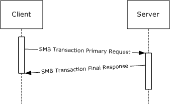

Figure 3: Simple Transaction

The client MUST set the **TransactionState** for the request (in **Client.Connection.PIDMIDList**) to "TransmittedAllRequests".

If a transaction request does not fit within a single SMB message, the following messages are exchanged:

- The CIFS client MUST send a primary request that indicates that more messages are to follow. The client indicates that the transaction request is incomplete by setting the **ParameterCount** value less than the **TotalParameterCount**, or by setting the **DataCount** value less than the **TotalDataCount**, or both. After sending the primary request, the client MUST set the **TransactionState** for the request (in **Client.Connection.PIDMIDList**) to "TransmittedPrimaryRequest".<197>
- Upon receiving a primary request containing an incomplete transaction, the server MUST check for any initial errors and MUST return a single interim response.
- The response received from the server MUST be processed as described in section [3.2.5.1.4](#Section_3.2.5.1.4).
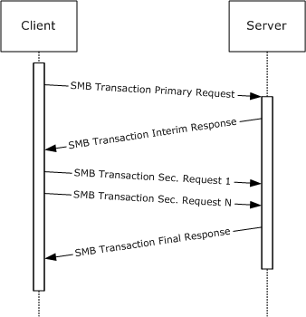

Figure 4: Transaction with secondary messages to complete the message transfer

Once it has received the entire request, the server MUST process the transaction and MUST finish with a transaction response. If the transaction response does not fit within a single SMB message, the following messages are exchanged:

- The server MUST send a final response that indicates that additional response messages are to follow.
- The server MUST send as many final response messages as are needed to complete the transfer of transaction parameters and data.
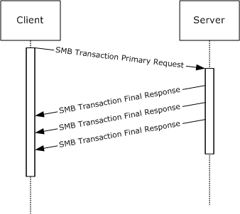

Figure 5: Transaction response with multiple SMB response messages

The number of SMB messages needed to transfer a transaction request is independent of the number of messages that can be returned. A single-part request can generate a single response or a multi-part response. Likewise, a multi-part request MAY generate one or more final response SMBs.

Secondary requests SHOULD NOT be used if the transaction request can fit within a single SMB message. Similarly, multiple final response messages SHOULD NOT be used if the transaction response can fit within a single SMB message.

Transaction parameters SHOULD take precedence over transaction data; all transaction parameters SHOULD be transferred before any transaction data.

All messages that are part of the same transaction MUST have the same **UID**, **TID**, [**PID**](#gt_process-identifier-pid), and **MID** values. If a connectionless transport is in use, the **CID** MUST also be the same for all transaction messages that are part of the same transaction. The client MUST NOT start a new transaction if it has not completed a previous transaction with the same PID and **MID** values. The client MAY start multiple concurrent transactions as long as at least one of the values of PID or **MID** differs from all other in-process transactions.

<a id="Section_3.2.4.1.6"></a>
##### 3.2.4.1.6 Accessing a Share in the DFS Namespace

If:

- The server has negotiated the [**NT LAN Manager**](#gt_nt-lan-manager-ntlm) dialect or later (SMB_COM_NEGOTIATE section [2.2.4.51](#Section_2.2.4.51.2)),
- The server has negotiated [**DFS**](#gt_distributed-file-system-dfs) capabilities via the CAP_DFS flag (SMB_COM_NEGOTIATE section 2.2.4.51),
- The server has set the SMB_SHARE_IS_IN_DFS flag in the [SMB_COM_TREE_CONNECT_ANDX response (section 2.2.4.55.2)](#Section_2.2.4.12.2) for the share,
Then the share is in the DFS namespace (a "DFS share") and the client MUST set **Client.TreeConnect.IsDfsShare** to TRUE. The client MUST set the SMB_FLAGS2_DFS flag in the header of any message that contains a pathname to an object within the share (a [**DFS path**](#gt_151c87db-05a4-40c3-99bd-4b682530d210)). The pathname MUST have the full file name, including the server name and share name.

<a id="Section_3.2.4.2"></a>
#### 3.2.4.2 Application Requests Connecting to a Share

The application provides the following:

- **ServerName**: The name of the server to which to connect.
- **ShareName**: The name of the share to which to connect.
- **UserCredentials**: An opaque implementation-specific entity that identifies the credentials to be used when authenticating to the remote server.
- **IsDFSShare:** A Boolean indicating whether this is a **DFS** share.
- **TransportIdentifier:** An optional implementation-specific identifier for the transport on which the connection is to be established.
Upon successful completion, the client MUST return an existing or newly constructed [Session (section 3.2.1.3)](#Section_3.2.1.3), an existing or newly constructed [TreeConnect (section 3.2.1.4)](#Section_4.1), and the share type to the caller.

The client MUST follow the steps as described in the following flowchart. The request to connect to a server can be either explicit (for example, the application requests an SMB connection to \\server\share) or implicit (for example, the application requests to open the file \\server\share\file.txt, which implies that an SMB connection to \\server\share is being established). In either case, the following steps are followed. The only difference is that for the implicit case, the error returned in the failure case MUST be returned as the error of the operation that caused the implicit connect attempt.

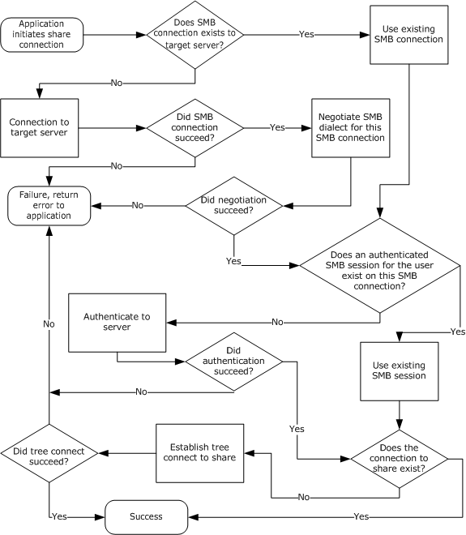

Figure 6: Application that connects to a share on a server

To complete a successful [**share connect**](#gt_share-connect), the client MUST have an established SMB connection, an authenticated SMB session for the user initiating the call, and a tree connect to the target share.

<a id="Section_3.2.4.2.1"></a>
##### 3.2.4.2.1 Connection Establishment

The client SHOULD search the **Client.ConnectionTable** and attempt to find an SMB connection where **Client.Connection.ServerName** matches the application-supplied **ServerName**. If a connection is found, the client SHOULD use the existing connection.

If there is no existing SMB connection, a new SMB connection MUST be established.

The **ServerName** and the optional **TransportIdentifier** provided by the caller are used to establish the connection. The client SHOULD resolve the **ServerName** as described in [MS-WPO](#Section_1.3) section 6.1.3 and SHOULD attempt connections to one or more of the returned addresses. The client MAY attempt to initiate the SMB connection on all [**SMB transports**](#gt_smb-transport) that it supports, most commonly NetBIOS over TCP (NBT, as described in section [2.1.1.2](../MS-WPO/MS-WPO.md)) and the other transports described in section [2.1](#Section_2.1). The client MAY choose to prioritize the SMB transport order and try each SMB transport sequentially or try to connect on all SMB transports and select one using any implementation-specific heuristic. The client MAY accept the **TransportIdentifier** parameter from the calling application, which specifies what SMB transport to use, and then attempt to use the transport specified.<198>

If all connection attempts fail, the connection establishment is failed and an appropriate error is returned, which is passed back to the calling application, as described earlier.

If the connect attempt succeeds, the client MUST create a new SMB connection as described in [3.2.1.2](#Section_3.3.6.2) and insert it into the global **Client.ConnectionTable**. **Client.Connection.ServerName** MUST be set to the caller-supplied **ServerName**.

<a id="Section_3.2.4.2.2"></a>
##### 3.2.4.2.2 Dialect Negotiation

If **Client.Connection.NegotiateSent** is FALSE, the client MUST set **SMB_Dialect.DialectString** to **Client.SupportDialects** and negotiate a protocol dialect using the [SMB_COM_NEGOTIATE](#Section_2.2.4.52.1) command, as specified in section 2.2.4.52. This step MUST be completed before progressing to any other operations on the connection.

Upon receipt of the server response the client MUST complete the following steps:

- The client MUST set **Client.Connection.NegotiateSent** to TRUE.
- The CIFS client MUST examine the **DialectIndex** field in the SMB_COM_NEGOTIATE Server response to determine the negotiated dialect. If an error was returned, or no dialect was selected, then the Negotiate Protocol operation has failed. Otherwise, the selected dialect is stored in **Client.Connection.SelectedDialect**.
- The CIFS client examines the **SecurityMode** bit field in the SMB_COM_NEGOTIATE Server response and performs the following steps in sequence:
- If the 0x01 bit is zero, **Client.Connection.ShareLevelAccessControl** MUST be set to TRUE.
- If the 0x02 bit is set (1), **Client.Connection.ServerChallengeResponse** MUST be set to TRUE.
- If **Client.Connection.ServerChallengeResponse** is TRUE and the 0x04 bit is set (1), **Client.Connection.ServerSigningState** MUST be set to **Enabled**.
- If **Client.Connection.ServerSigningState** is **Enabled** and the 0x08 bit is set (1), **Client.Connection.ServerSigningState** MUST be set to **Required**.
- The server capabilities, as returned in the **Capabilities** field of the SMB_COM_NEGOTIATE Server response, MUST be stored in **Client.Connection.ServerCapabilities**.
- The server's maximum buffer size (which is, with specific exceptions, the maximum size of an SMB message that can be sent to the server) MUST be stored in **Client.Connection.ServerMaxBufferSize**.
If the Negotiate Protocol operation fails, then the connection MUST be closed and an appropriate error message MUST be passed back to the calling application.

<a id="Section_3.2.4.2.3"></a>
##### 3.2.4.2.3 Capabilities Negotiation

Following a successful dialect negotiation, the client MUST perform a logical AND of **Client.Connection.ServerCapabilities** and **Client.Capabilities**.

The client MUST communicate these capabilities to the server in the **SMB_Parameters.Capabilities** field of an [SMB_COM_SESSION_SETUP_ANDX Request (section 2.2.4.53.1)](#Section_2.2.4.53.1).

The client MUST set the **MaxMpxCount** field in the SMB_COM_SESSION_SETUP_ANDX Request to the value of **Client.Connection.MaxMpxCount**.

The client SHOULD set the **SessionKey** field in the SMB_COM_SESSION_SETUP_ANDX Request (section 2.2.4.53.1) to the value of **Client.Connection.ServerSessionKey**.

<a id="Section_3.2.4.2.4"></a>
##### 3.2.4.2.4 User Authentication

If **Client.Connection.ShareLevelAccessControl** is TRUE:<199>

- Share level access control is required by the server. If no authentication has been performed on the SMB connection, (**Client**.**Connection**.**SessionTable** is empty), the client MUST use anonymous authentication to create a "null session". Application-provided credentials MUST NOT be used.<200>
The client MUST send only one session setup request. An [SMB_COM_SESSION_SETUP_ANDX Request](#Section_2.2.4.53.1) MUST be constructed as specified in section 2.2.4.53.1, with the following additional requirements. In the **SMB_Parameters** block of the SMB_COM_SESSION_SETUP_ANDX Request:

- The **AccountName** field MUST be the empty string.
- The **OEMPassword** and **UnicodePassword** fields MUST be empty (zero length).
- If the establishment of a null session fails, no further processing is possible. The connection MUST be closed and an implementation-specific error message MUST be returned.
The use of share level access control is deprecated.<201>

If **Client.Connection.ShareLevelAccessControl** is FALSE:

- User level access control is required by the server. The client MUST look up **Session** from **Client.Connection.SessionTable** where **Session.UserCredentials** matches the application-supplied **UserCredentials**. If a session is found, it MUST be reused. Otherwise, the client MUST create an SMB_COM_SESSION_SETUP_ANDX Request (section 2.2.4.53.1) and MUST attempt to establish an authenticated session for the user with the application-supplied **UserCredentials**.
- **Authentication:**
If **Client.Connection.ServerChallengeResponse** is FALSE and **Client.PlaintextAuthenticationPolicy** is Disabled, the client SHOULD fail the request with an implementation-dependent error.

If **Client.Connection.ServerChallengeResponse** is FALSE and **Client.PlaintextAuthenticationPolicy** is **Enabled**, the client MUST use plaintext authentication.

- If the server supports Unicode (as indicated in **Client.Connection.ServerCapabilities**) the client MAY send the plaintext password in Unicode. The Unicode password is placed into the **UnicodePassword** field of the SMB_COM_SESSION_SETUP_ANDX Request as an array of bytes (not a null-terminated string). No alignment padding is used. The **UnicodePasswordLen** field is set to the length, in bytes, of the Unicode password.
- If neither the client nor the server supports Unicode, or the client sends the password in OEM character set format, the password is placed into the **OEMPassword** field of the SMB_COM_SESSION_SETUP_ANDX Request as an array of bytes (not a null-terminated string). The **OEMPasswordLen** field is set to the length, in bytes, of the password.
If **Client.Connection.ServerChallengeResponse** is TRUE, the server can accept challenge/response authentication. The server MAY also accept plaintext authentication. The client MUST determine the authentication type that it uses based upon local configuration (the **Client.PlaintextAuthenticationPolicy**, **Client.LMAuthenticationPolicy**, and **Client.NTLMAuthenticationPolicy** values) in an implementation-specific manner.<202>

The LAN Manager (LM) response and the LAN Manager version 2 (LMv2) response are mutually exclusive. The implementation MUST select either the LM or the LMv2 response and send it in the **OEMPassword** field of the SMB_COM_SESSION_SETUP_ANDX Request as an array of bytes (not a null-terminated string). The **OEMPasswordLen** field MUST be set to the length in bytes of the LM or LMv2 response.

The NT LAN Manager (NTLM) response and the NT LAN Manager version 2 (NTLMv2) response are mutually exclusive. The implementation MUST select either the NTLM or the NTLMv2 response and send it in the **UnicodePassword** field of the SMB_COM_SESSION_SETUP_ANDX Request as an array of bytes (not a null-terminated string). The **UnicodePasswordLen** field MUST be set to the length, in bytes of the NTLM or NTLMv2 response.

If authentication fails, and the local configuration permits, the client MAY attempt authentication again using alternative response calculations (for example, replacing the LMv2 response with an LM response).<203> If all authentication attempts fail, and no authenticated SMB session exists, the underlying transport connection MUST be closed, and an implementation-specific error MUST be returned to the application.

- **Guest Authentication**
Guest access occurs in one of two ways:

- The client logs on as a guest using the normal authentication process.
- The client attempts to log on as some other user, but authentication fails. In this case, the server MAY choose to permit access via the guest user account. The Session Setup succeeds, but the SMB_SETUP_GUEST flag of the **Action** field in the [SMB_COM_SESSION_SETUP_ANDX Response](#Section_2.2.4.12.2) MUST be set to indicate guest access (see Session Setup in sections 2.2.4.53.2 and [3.3.5.43](#Section_3.3.5.43)).
- **Signing:**
If **Client.Connection.IsSigningActive** is FALSE and:

- A failed authentication resulted in guest access (as described above under Guest Authentication option #2), or
- Authentication was anonymous (resulting in a null session),
Then signing MUST NOT be enabled for this authentication.

If the combination of **Client.MessageSigningPolicy** and **Client.Connection.ServerSigningState** results in "Messages Signed" in the following table, the client MUST set the **Client.Connection.IsSigningActive** variable to TRUE and MUST set SMB_FLAGS2_SMB_SECURITY_SIGNATURE to TRUE in the SMB Header of the SMB_COM_SESSION_SETUP_ANDX Request message. Setting this value indicates to the server that signing is requested. **Client.Connection.ServerSigningState** was initialized during the processing of a negotiation response, as specified in section [3.2.5.2](#Section_3.2.5.2).

Otherwise, if **Client.Connection.IsSigningActive** is FALSE and the result is "Blocked" in the following table, the underlying transport connection MUST be closed and an implementation-specific error MUST be returned to the application.

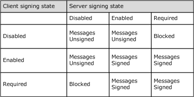

If **Client.Connection.IsSigningActive** becomes TRUE as a result of the authentication process, **Client.Connection.SigningSessionKey** and **Client.Connection.SigningChallengeResponse** MUST be set as specified in section [3.2.5.3](#Section_3.2.5.3).

If authentication succeeds, the newly created **Client.Session** MUST be inserted into the **Client.Connection.SessionTable**. The client MUST query the authentication subsystem for the cryptographic session key of the newly authenticated user, as specified in [MS-NLMP](../MS-NLMP/MS-NLMP.md), and store it in **Client.Session.SessionKey**. The client MUST set **Client.Session.UserCredentials** to the application-supplied **UserCredentials**.

<a id="Section_3.2.4.2.5"></a>
##### 3.2.4.2.5 Connecting to the Share (Tree Connect)

In the LAN Manager 1.0 dialect and above, it is a protocol violation to send a tree connect request without completing an [SMB_COM_SESSION_SETUP_ANDX (section 2.2.4.53)](#Section_2.2.4.53) exchange. When using share level access control, the client MUST perform anonymous authentication (empty username and password) in the Session Setup.

If a tree connect is already established to the target share in Client.Connection.TreeConnectTable, it SHOULD be reused. If not, the client creates an [SMB_COM_TREE_CONNECT_ANDX Request (section 2.2.4.55.1)](#Section_2.2.4.55.1), as specified in section [2.2.4.55](#Section_2.2.4.55.2). Alternately, the client MAY use the deprecated [SMB_COM_TREE_CONNECT Request (section 2.2.4.50.1)](#Section_2.2.4.50.1).

If **Client.Connection ShareLevelAccessControl** is TRUE and a null session has been established (see section [3.2.4.2.4](#Section_3.2.4.2.4)), the plaintext password or authentication response MUST be passed in the **Password** field of the SMB_COM_TREE_CONNECT_ANDX.Request or SMB_COM_TREE_CONNECT Request. There is only one **Password** field in the tree connect message, so only one response value can be sent. The client MUST determine the authentication type that it uses based upon **Client.Connection.ServerChallengeResponse** and the local configuration (the **Client.PlaintextAuthenticationPolicy**, **Client.LMAuthenticationPolicy**, and **Client.NTLMAuthenticationPolicy** values), as specified in section 3.2.4.2.4.

If **Client.Connection.ShareLevelAccessControl** is FALSE, then the **PasswordLength** field in the SMB_COM_TREE_CONNECT_ANDX.Request or SMB_COM_TREE_CONNECT Request MUST be 0x0001, and the **Password** MUST be a single null padding byte.

<a id="Section_3.2.4.3"></a>
#### 3.2.4.3 Application Requests Creating a Directory

The application provides:

- A Client.TreeConnect indicating the share within which the new directory is to be created.
- The pathname of the directory to be created, relative to **Client.TreeConnect.ShareName**.
- A valid Client.Session.
- An optional list of extended attributes for [TRANS2_CREATE_DIRECTORY (section 2.2.6.14)](#Section_2.2.6.14).
- An optional timeout value for the [SMB_COM_TRANSACTION2 Request](#Section_3.3.5.38) command.
The client SHOULD construct a TRANS2_CREATE_DIRECTORY subcommand request message as specified in section 2.2.6.14. Alternately, the client MAY construct an SMB_COM_CREATE_DIRECTORY request message as specified in section [2.2.4.1](#Section_2.2.4.1) or an SMB_COM_NT_CREATE_ANDX request message as specified in section [2.2.4.64](#Section_2.2.4.64.2). The SMB_COM_CREATE_DIRECTORY (section 2.2.4.1) command is deprecated in favor of TRANS2_CREATE_DIRECTORY (section 2.2.6.14).

The following additional rules MUST be followed for message construction:

- The **SMB_Header.TID** field MUST match the **Client.TreeConnect.TID** supplied by the application.
- The **SMB_Header.UID** field MUST match the **Client.Session.UID** supplied by the application.
- The **DirectoryName** field MUST contain the pathname supplied by the application.
The request MUST be sent to the server as described in section [3.2.4.1](#Section_3.2.4.1).

<a id="Section_3.2.4.4"></a>
#### 3.2.4.4 Application Requests Deleting a Directory

The application provides:

- The **Client.TreeConnect** representing the share in which the directory to be deleted exists.
- The pathname of the directory to be deleted, relative to **Client.TreeConnect.ShareName**.
- A valid **Client.Session**.
The client MUST construct an [SMB_COM_DELETE_DIRECTORY Request (section 2.2.4.2)](#Section_2.2.4.2) message,with the following additional requirements:

- The **SMB_Header.TID** field MUST match the **Client.TreeConnect.TID** supplied by the application.
- The **SMB_Header.UID** field MUST match the **Client.Session.UID** supplied by the application.
- The **SMB_Data.Bytes.DirectoryName** field MUST contain the pathname supplied by the application.
The request MUST be sent to the server as described in section [3.2.4.1](#Section_3.2.4.1).

<a id="Section_3.2.4.5"></a>
#### 3.2.4.5 Application Requests Opening an Existing File

To open a file on a remote share, the application provides the following:

- The **Client.TreeConnect** representing the share in which the file to be opened exists.
- The pathname of the file being opened, relative to **Client.TreeConnect.ShareName**.
- The **Client.Session** representing the [**security context**](#gt_security-context) of the user opening the file.
- The requested access mode (read, write, and so on).
- The share access for the **open**.
- The create disposition for the **open**.
- An optional set of create options for the **open**.
- An optional Boolean indicating whether the attributes and time stamps of the file are to be returned in the response.
- An optional Boolean indicating whether the total length of the file's extended attributes is to be returned in the response.
- A Boolean indicating whether or not the parent directory of the target is to be opened.
- An optional requested impersonation level.
- The security flags.
- An optional allocation size.
- An optional timeout value.
- An optional [**security descriptor**](#gt_security-descriptor).
- The request for an exclusive or batch OpLock, if any.<204>
To open the file, the client can issue one of the following command requests:

- [SMB_COM_OPEN (section 2.2.4.3)](#Section_2.2.4.3) (deprecated)
The client MUST construct an [SMB_COM_OPEN Request (section 2.2.4.3.1)](#Section_3.3.5.5) message. This command provides basic Open semantics.

- [SMB_COM_OPEN_ANDX (section 2.2.4.41)](#Section_2.2.4.41) (deprecated)
The client MUST construct an [SMB_COM_OPEN_ANDX Request (section 2.2.4.41.1)](#Section_2.2.4.41.1) message. In addition to basic Open semantics, SMB_COM_OPEN_ANDX provides:

- AndX chaining.
- The ability to request detailed information regarding the opened file.
- The ability to select the file to be opened based upon the file attributes, as well as the ability to set the file attributes if the file does not exist and needs to be created.
- The ability to set or reset the creation time of the file.
- The disposition action to take based on the existence of the target file.
- [TRANS2_OPEN2 (section 2.2.6.1)](#Section_2.2.6.1)
The client MUST construct an [SMB_COM_TRANSACTION2 (section 2.2.4.46)](#Section_2.2.4.46) transaction request, to transport the TRANS2_OPEN2 transaction request. The client MUST construct a [TRANS2_OPEN2 Request (section 2.2.6.1.1)](#Section_2.2.6.1.1). In addition to basic Open semantics, TRANS2_OPEN2 provides:

- The ability to set extended attribute (EA) name/value pairs.
- The ability to set or reset the creation time of the file.
- The ability to specify an initial allocation for newly opened or overwritten files.
- The disposition action to take based on the existence of the target file.
- [NT_TRANSACT_CREATE (section 2.2.7.1)](#Section_2.2.7.1)
The client MUST construct an [SMB_COM_NT_TRANSACT (section 2.2.4.62)](#Section_2.2.4.62) transaction request,to transport the NT_TRANSACT_CREATE transaction request. The client MUST construct an [NT_TRANSACT_CREATE Request (section 2.2.7.1.1)](#Section_2.2.7.1.1). In addition to basic Open semantics, NT_TRANSACT_CREATE provides:

- The ability to specify a [**path**](#gt_path) relative to a subdirectory within the share indicated by the **TID**.
- The ability to specify an initial allocation for newly opened or overwritten files.
- The disposition action to take based on the existence of the target file.
- [SMB_COM_NT_CREATE_ANDX (section 2.2.4.64)](#Section_2.2.4.64.2)
The client MUST construct an [SMB_COM_NT_CREATE_ANDX Request (section 2.2.4.64.1)](#Section_2.2.4.64.1) message. In addition to basic Open semantics, SMB_COM_NT_CREATE_ANDX provides:

- AndX chaining.
- The ability to open or create a directory.
- The ability to specify a path relative to a subdirectory within the share indicated by the **TID**.
- The ability to specify an initial allocation for newly opened or overwritten files.
- The disposition action to take based on the existence of the target file.
The SMB_COM_NT_CREATE_ANDX is the most comprehensive (and, therefore, the most complex) of the open commands.

Any of the commands or subcommands listed above can be used to open a file. Directories, named pipes, and devices can also be opened. Most of these commands provide the option to create a file if it does not already exist, or to overwrite or append to the file if it does exist. For SMB_COM_OPEN (section 2.2.4.3), SMB_COM_OPEN_ANDX (section 2.2.4.41), and TRANS2_OPEN2 (section 2.2.6.1) commands, the client MUST construct the **AccessMode** field of the request by translating the input parameters as follows:

| Bit Range | Field | Description |
| --- | --- | --- |
| Variable | Access mode | Only read access **AccessMode**.AccessMode 0 |
| Variable | Access mode | Only write access **AccessMode**.AccessMode 1 |
| Variable | Access mode | Read and write access **AccessMode**.AccessMode 2 |
| Variable | Access mode | execute **AccessMode**.AccessMode 3 |
| Variable | Share Access | 0 **AccessMode**.SharingMode 1 |
| Variable | Share Access | FILE_SHARE_READ **AccessMode**.SharingMode 2 |
| Variable | Share Access | FILE_SHARE_WRITE **AccessMode**.SharingMode 3 |
| Variable | Share Access | FILE_SHARE_DELETE **AccessMode**.SharingMode 4 |
| Variable | Create Options | FILE_SEQUENTIAL_ONLY = 0 and FILE_RANDOM_ACCESS = 0 **AccessMode**.ReferenceLocality 0 |
| Variable | Create Options. FILE_SEQUENTIAL_ONLY | 1 **AccessMode**.ReferenceLocality 1 |
| Variable | Create Options. FILE_RANDOM_ACCESS | 1 **AccessMode**.ReferenceLocality 2 or 3 |
| Variable | Create Options.FILE_NO_INTERMEDIATE_BUFFERING | 0 **AccessMode**.CacheMode 0 |
| Variable | Create Options.FILE_NO_INTERMEDIATE_BUFFERING | 1 **AccessMode**.CacheMode 1 |
| Variable | Create Options. FILE_WRITE_THROUGH | 0 **AccessMode**.WritethroughMode 0 |
| Variable | Create Options. FILE_WRITE_THROUGH | 1 **AccessMode**.WritethroughMode 1 |

The request MUST be sent to the server as described in section [3.2.4.1](#Section_3.2.4.1).

<a id="Section_3.2.4.5.1"></a>
##### 3.2.4.5.1 Compatibility Mode

Compatibility Mode (also referred to as "MS-DOS Compatibility Mode") provides the client with exclusive access to an opened file.

- A file opened in compatibility mode can be opened (also in compatibility mode) any number of times for any combination of reading and writing (subject to the user's permissions) by any **UID** and **PID** on the same SMB connection.
- If one client has the file open for writing in compatibility mode, the file MUST NOT be opened in any way by any other client.
- As an exception, if the filename has an extension of .EXE, .DLL, .SYM, or .COM (is executable), other clients are permitted to open the file for reading regardless of read/write open modes of other compatibility mode opens. The SMB_FLAGS2_READ_IF_EXECUTE bit (also known as the SMB_FLAGS2_PAGING_IO bit) MUST be set in the open request.
- If the first client has the file open only for reading in compatibility mode, other clients can open the file for reading in compatibility mode.
- Once one or more clients have the file open for reading in compatibility mode, other clients MUST NOT open the file in any mode other than compatibility mode.
- If any client has the file open for reading in compatibility mode, then other clients MUST NOT open the file for writing.
Because Compatibility Mode provides the client with exclusive access, it is incompatible with other open modes that provide shared access to the file. If the file is opened with sharing enabled, a subsequent Compatibility Mode open from the same client or any other client MUST return STATUS_SHARING_VIOLATION (ERRDOS/ERRbadshare).

The other file exclusion modes (Deny read/write, Deny write, Deny read, Deny nothing) provide exclusion at the file level. A file opened in any "Deny" mode MAY only be opened again for the accesses allowed by the Deny mode (subject to the user's permissions).

<a id="Section_3.2.4.5.2"></a>
##### 3.2.4.5.2 FID Permissions

If the open operation that created the **FID** specified a Deny mode, any SMB session making use of the **FID** (other than the SMB session within which the **FID** was created) has only the set of access rights determined by performing a logical "and" on the open mode rights and the Deny mode rights. That is, the Deny mode is checked on all file accesses.

<a id="Section_3.2.4.6"></a>
#### 3.2.4.6 Application Requests to Create or Overwrite a File

To create or overwrite a file on a remote share, the application provides the following:

- The **Client.TreeConnect** representing the share within which to create the file.
- The pathname of the file being created, relative to **Client.TreeConnect.ShareName**.
- The **Client.Session** representing the [**security context**](#gt_security-context) of the user opening the file.
- The requested access mode (read, write, and so on).
- An optional Boolean indicating whether the attributes and time stamps of the file are to be returned in the response.
- An optional Boolean indicating whether the total length of the file's extended attributes is to be returned in the response.
- The share access for the created file.
- The create disposition for the **open**.
- An optional set of create options for the **open**.
- An optional list of extended attributes.
- An optional list of search attributes.
- The request for an exclusive or batch OpLock, if any.
- A Boolean indicating whether or not the file attribute data is to be returned in the response.
- A Boolean indicating whether or not the parent directory of the target is to be opened.
- An optional requested level of impersonation.
- The security flags.
- An optional allocation size.
- An optional timeout value.
- An optional [**security descriptor**](#gt_security-descriptor).
- The print file mode Boolean.
To create the file, the client MUST issue one of the following command requests:

- [SMB_COM_CREATE (section 2.2.4.4)](#Section_2.2.4.15) (deprecated)
The client MUST construct an [SMB_COM_CREATE Request (section 2.2.4.4.1)](#Section_2.2.4.4.1) message as defined in section 2.2.4.4. This command provides basic Create semantics.

- [SMB_COM_CREATE_TEMPORARY (section 2.2.4.15)](#Section_2.2.4.15) (obsolescent)
This command is used to create a temporary file on the server. The client MUST construct an [SMB_COM_CREATE_TEMPORARY Request (section 2.2.4.15.1)](#Section_2.2.4.15.1) message.

- [SMB_COM_CREATE_NEW (section 2.2.4.16)](#Section_2.2.4.16) (deprecated)
This command is used to create a new file and MUST fail if the specified file already exists. The client MUST construct an [SMB_COM_CREATE_NEW Request (section 2.2.4.16.1)](#Section_2.2.4.16.1) message as defined in section 2.2.4.16.

- [SMB_COM_OPEN_PRINT_FILE (section 2.2.4.67)](#Section_2.2.4.67)
This command is used to create a new print spool file. The application provides opaque printer-specific control data that is to be included as the first part of the spool file. The client MUST construct an [SMB_COM_OPEN_PRINT_FILE Request (section 2.2.4.67.1)](#Section_2.2.4.67.1) message as defined in 2.2.4.67.

- [SMB_COM_OPEN_ANDX (section 2.2.4.41)](#Section_2.2.4.41) (deprecated)
The client MUST construct an [SMB_COM_OPEN_ANDX Request (section 2.2.4.41.1)](#Section_2.2.4.41.1) message as defined in section 2.2.4.41. If the application-provided Boolean value indicates the file attribute data to be returned in the response, the client MUST set REQ_ATTRIB flag in the **SMB_Parameters.Flags** field. In addition to basic Create semantics, SMB_COM_OPEN_ANDX provides:

- AndX chaining.
- The ability to set the file attributes when the file is created.
- The ability to set the creation time of the file.
- The disposition action to take based on the existence of the target file.
- [TRANS2_OPEN2 (section 2.2.6.1)](#Section_2.2.6.1)
The client MUST construct an [SMB_COM_TRANSACTION2 (section 2.2.4.46)](#Section_2.2.4.46) transaction request, as defined in section 2.2.4.46, to transport the TRANS2_OPEN2 transaction request. The client MUST construct a [TRANS2_OPEN2 Request (section 2.2.6.1.1)](#Section_2.2.6.1.1) as defined in section 2.2.6.1. If the application-provided Boolean value indicates the file attribute data to be returned in the response, the client MUST set REQ_ATTRIB flag in the **SMB_Parameters.Flags** field. In addition to basic Create semantics, TRANS2_OPEN2 provides:

- The ability to set extended attribute (EA) name/value pairs.
- The ability to set or reset the creation time of the file.
- The ability to specify an initial allocation for newly created or overwritten files.
- The disposition action to take based on the existence of the target file.
- [NT_TRANSACT_CREATE (section 2.2.7.1)](#Section_2.2.7.1)
The client MUST construct an [SMB_COM_NT_TRANSACT (section 2.2.4.62)](#Section_2.2.4.62) transaction request, as defined in section 2.2.4.62 to transport the NT_TRANSACT_CREATE transaction request. The client MUST construct an [NT_TRANSACT_CREATE Request (section 2.2.7.1.1)](#Section_2.2.7.1.1) as defined in section 2.2.7.1. In addition to basic Open semantics, NT_TRANSACT_CREATE provides:

- The ability to specify a path relative to a subdirectory within the share indicated by the **TID**.
- The ability to specify an initial allocation for newly opened or overwritten files.
- The disposition action to take based on the existence of the target file.
- [SMB_COM_NT_CREATE_ANDX (section 2.2.4.64)](#Section_2.2.4.64.2)
The client MUST construct an [SMB_COM_NT_CREATE_ANDX Request (section 2.2.4.64.1)](#Section_2.2.4.64.1) message as defined in section 2.2.4.64. In addition to basic Open semantics, SMB_COM_NT_CREATE_ANDX provides:

- AndX chaining.
- The ability to create a directory.
- The ability to specify a path relative to a subdirectory within the share indicated by the **TID**.
- The ability to specify an initial allocation for newly opened or overwritten files.
- The disposition action to take based on the existence of the target file.
The SMB_COM_NT_CREATE_ANDX is the most comprehensive (and, therefore, the most complex) of the Create commands.

When opening a named pipe, the SMB_COM_NT_CREATE_ANDX command requires that the **FileName** field MUST contain only the relative name of the pipe; that is, the "\PIPE\" prefix MUST NOT be present. This is in contrast with other commands, such as SMB_COM_OPEN_ANDX and TRANS2_OPEN2, which require that the "\PIPE\" prefix be present in the path name.

Any of the commands or subcommands listed in this section can be used to create a file. Directories can also be created. Most of these commands provide the option to open or overwrite a file if it already exists. For SMB_COM_OPEN_ANDX (section 2.2.4.41) and TRANS2_OPEN2 (section 2.2.6.1) commands, the client MUST construct the **AccessMode** field of the request by translating the input parameters as specified in section [3.2.4.5](#Section_3.2.4.5).

In early dialects of the SMB Protocol the Open and Create operations were somewhat separate. In CIFS, there is considerable overlap between the set of commands used to open an existing file, the commands used to overwrite an existing file, and those used to create a new file.

The request MUST be sent to the server as described in section [3.2.4.1](#Section_3.2.4.1).

<a id="Section_3.2.4.7"></a>
#### 3.2.4.7 Application Requests Closing a File

The application provides:

- A **Client.Open**, representing the file that the application requests to close.
- The requested file creation time, expressed as the number of seconds since January 1, 1970, 00:00:00.0.
The client MUST construct an [SMB_COM_CLOSE Request (section 2.2.4.5.1)](#Section_2.2.4.5.1) message, with the following additional requirements:

- The **SMB_Parameters.Words.FID** field MUST match what was supplied by the application.
The request MUST be sent to the server as described in section [3.2.4.1](#Section_3.2.4.1).

<a id="Section_3.2.4.8"></a>
#### 3.2.4.8 Application Requests Flushing File Data

The application provides:

- A **Client.Open**, representing the file that the application requests to have flushed.
The client MUST construct an [SMB_COM_FLUSH Request (section 2.2.4.6.1)](#Section_2.2.4.6.1) message, with the following additional requirements:

- The **SMB_Parameters.Words.FID** field MUST contain the **FID** that was supplied by the application.
The request MUST be sent to the server as described in section [3.2.4.1](#Section_3.2.4.1).

<a id="Section_3.2.4.9"></a>
#### 3.2.4.9 Application Requests Deleting a File or Set of Files

The application provides:

- The **Client.TreeConnect** representing the share in which the file(s) to be deleted exist(s).
- The attribute mask of the file(s) to be deleted.
- The pathname of the file(s) to be deleted.
- A valid **Client.Session**.
The client MUST construct an [SMB_COM_DELETE Request (section 2.2.4.7.1)](#Section_2.2.4.7.1) message, with the following additional requirements:

- The **SMB_Parameters.Words.SearchAttributes** field MUST contain the attribute mask that was supplied by the application.
- The **SMB_Data.Bytes.FileName** field MUST contain the pathname that was supplied by the application.
[SMB_COM_DELETE (section 2.2.4.7)](#Section_2.2.4.7) can be used to delete multiple files if the file name (the final component of the **FileName** field) contains wildcard characters. The **SearchAttributes** are used to modify the set of files that can be included in the delete operation.

The request MUST be sent to the server as described in section [3.2.4.1](#Section_3.2.4.1).

<a id="Section_3.2.4.10"></a>
#### 3.2.4.10 Application Requests Renaming a File or Set of Files

The application provides:

- The **Client.TreeConnect** representing the share in which the file(s) to be renamed exist(s).
- The attribute mask of the file(s) to be renamed.
- The pathname of the file(s) to be renamed.
- The new desired pathname of the file(s).
- A valid **Client.Session**.
To rename the file, the client MUST issue one of the following command requests:

- [SMB_COM_NT_RENAME (section 2.2.4.66.1)](#Section_2.2.4.66.1) ([**Obsolescent**](#gt_obsolescent))
The client MUST construct an SMB_COM_NT_RENAME Request (section 2.2.4.66.1) message with the following additional requirements:

- The **SMB_Parameters.Words.SearchAttributes** field MUST contain the attribute mask supplied by the application.
- The **SMB_Data.Bytes.OldFileName** field MUST contain the source pathname supplied by the application.
- The **SMB_Data.Bytes.NewFileName** field MUST contain the destination pathname supplied by the application.
- The **SMB_Parameters.Words.InformationLevel** field MUST contain an information level value of SMB_NT_RENAME_RENAME_FILE.
SMB_COM_NT_RENAME does not support wildcards and does not support renaming multiple files. This command provides support for the creation of hard links (see section [3.2.4.11](#Section_3.2.4.11)).

- [SMB_COM_RENAME (section 2.2.4.8)](#Section_2.2.4.8)
The client MUST construct an [SMB_COM_RENAME Request (section 2.2.4.8.1)](#Section_2.2.4.8.1) message with the following additional requirements:

- The **SMB_Parameters.Words.SearchAttributes** field MUST contain the attribute mask supplied by the application.
- The **SMB_Data.Bytes.OldFileName** field MUST contain the source pathname supplied by the application.
- The **SMB_Data.Bytes.NewFileName** field MUST contain the destination pathname supplied by the application.
SMB_COM_RENAME can be used to rename multiple files if the file name (the final component of the **FileName** field) contains wildcard characters. The **SearchAttributes** are used to modify the set of files that MAY be included in the rename operation.

Either of the preceding commands can be used to rename a file.

The request MUST be sent to the server as specified in section [3.2.4.1](#Section_3.2.4.1).

<a id="Section_3.2.4.11"></a>
#### 3.2.4.11 Application Requests Creating a Hard Link to a File

The application provides:

- The **Client.TreeConnect** representing the share in which the file to be linked exists.
- The attribute mask of the file to be linked.
- The pathname of the file to be linked.
- The requested pathname of the new hard link.
- A valid **Client.Session**.
The client MUST construct an [SMB_COM_NT_RENAME Request (section 2.2.4.66.1)](#Section_2.2.4.66.1) message with the following additional requirements:

- The **SMB_Parameters.Words.SearchAttributes** field MUST contain the attribute mask supplied by the application.
- The **SMB_Data.Bytes.OldFileName** field MUST contain the source pathname supplied by the application.
- The **SMB_Data.Bytes.NewFileName** field MUST contain the destination pathname supplied by the application.
- The **SMB_Parameters.Words.InformationLevel** field MUST contain an information level value of SMB_NT_RENAME_SET_LINK_INFO.
[SMB_COM_NT_RENAME (section 2.2.4.66)](#Section_3.3.5.53) does not support wildcards and does not support creating hard links for multiple files.

The request MUST be sent to the server as specified in section [3.2.4.1](#Section_3.2.4.1).

<a id="Section_3.2.4.12"></a>
#### 3.2.4.12 Application Requests Querying File Attributes

The application provides:

- A valid **Client.Session**.
- The **Client.TreeConnect** representing the share in which the file to be queried exists.
- If the file is not already open, the full pathname relative to the **TID**. Otherwise, attributes SHOULD be queried using a valid [**FID**](#gt_fid) representing the opened file.
- The [**Information Level**](#gt_information-level) that defines the format of the data to query, as specified in [MS-FSCC](../MS-FSCC/MS-FSCC.md) section 2.4.
- If the Information Level provided is **SMB_INFO_QUERY_EAS_FROM_LIST**, the application provides a list of extended attributes.
The client can use any of the following commands to query [**file attributes**](#gt_file-attribute). The [SMB_COM_QUERY_INFORMATION](#Section_3.2.5.20) and [SMB_COM_QUERY_INFORMATION2](#Section_3.2.5.20) commands are deprecated; the client SHOULD use the TRANS2_QUERY_PATH_INFORMATION or the TRANS2_QUERY_FILE_INFORMATION transaction subcommand instead. The transaction subcommands can also be used to query named pipe attributes. The client MUST map the application-provided Information Level to the Query Information Levels, as specified in section [2.2.8](#Section_1.3).

- SMB_COM_QUERY_INFORMATION (deprecated)
The client MUST construct the SMB_COM_QUERY_INFORMATION request as defined in section 2.2.4.9. This command retrieves the following file attributes:

- Basic SMB_FILE_ATTRIBUTES, as described in section [2.2.1.2.4](#Section_2.2.1.2.4).
- Last write time of the file.
- The size of the file (limited to a 32-bit value).
The file to be queried MUST be identified by a full pathname, relative to the **TID**.

- SMB_COM_QUERY_INFORMATION2 (deprecated)
The client MUST construct the SMB_COM_QUERY_INFORMATION2 request as defined in section 2.2.4.31. This command retrieves the following file attributes:

- Basic SMB_FILE_ATTRIBUTES, as described in section 2.2.1.2.4.
- The date and time of file creation, last access, and last write.
- The file size (limited to a 32-bit value).
- The file allocation size (limited to a 32-bit value), which can be larger than the actual number of bytes contained in the file.
The file to be queried MUST be identified by a FID (an open file handle).

- TRANS2_QUERY_PATH_INFORMATION
The client MUST construct a TRANS2_QUERY_PATH_INFORMATION subcommand request as defined in section [2.2.6.6](#Section_2.2.6.6). The TRANS2_QUERY_PATH_INFORMATION request MUST be transported to the server using the Transaction2 subprotocol. This transaction subcommand provides access to extended file information, including:

- Basic SMB_FILE_ATTRIBUTES, as described in section 2.2.1.2.4.
- The creation time, last access time, and last write time attributes of the file.
- The file size (limited to a 32-bit value).
- The file allocation size (limited to a 32-bit value), which can be larger than the actual number of bytes contained in the file.
- The number of bytes allocated to extended attribute name/value pairs.
- Extended attributes.
- The number of hard links to the file.
- The file name and alternate file name.
- The ability to list alternate file streams.
- Whether or not the file is actually a directory.
- Whether or not the file is marked for delete upon close.
- Whether or not the file is compressed.
The file to be queried MUST be identified by a full pathname, relative to the **TID**.

- TRANS2_QUERY_FILE_INFORMATION
The client MUST construct a TRANS2_QUERY_FILE_INFORMATION subcommand request as defined in section [2.2.6.8](#Section_2.2.6.8). The TRANS2_QUERY_FILE_INFORMATION request MUST be sent to the server using the Transaction2 subprotocol as a transport. This transaction is identical to TRANS2_QUERY_PATH_INFORMATION except that the file to be queried MUST be identified by FID rather than by pathname.

The request MUST be sent to the server as described in section [3.2.4.1](#Section_3.2.4.1).

<a id="Section_3.2.4.13"></a>
#### 3.2.4.13 Application Requests Setting File Attributes

The application provides:

- A valid **Client.Session**.
- The **Client.TreeConnect** representing the share in which the file to be accessed exists.
- If the file is not open, the full pathname relative to **Client.TreeConnect.ShareName**. Otherwise, attributes SHOULD be set using a valid **Client.Open** representing the opened file.
- The [**Information Level**](#gt_information-level) that defines the format of the data to set, as specified in [MS-FSCC](../MS-FSCC/MS-FSCC.md) section 2.4.
- When the Information Level is **SMB_INFO_STANDARD**, the application provides the creation date and time, last access date and time and last write date and time of the file, all expressed as the number of seconds from January 1, 1970 00:00:00.0.
- When the Information Level is **SMB_INFO_EAS**, the application provides the extended attribute name/value pairs of the file.
- When the Information Level is **SMB_SET_FILE_BASIC_INFO**, the application provides the creation time, last access time, last write time, change time and extended attribute name/pair of the file.
- When the Information Level is **SMB_SET_FILE_DISPOSITION_INFO**, the application provides a Boolean to indicate if the file is marked for deletion.
- When the Information Level is **SMB_SET_FILE_ALLOCATION_INFO**, the application provides the file allocation size in bytes.
- When the Information Level is **SMB_SET_FILE_END_OF_FILE_INFO**, the application provides the offset from the beginning of the file to the byte following the last byte in the file.
The client can use any of the following commands to set file attributes. The [SMB_COM_SET_INFORMATION (section 2.2.4.10)](#Section_2.2.4.10) and [SMB_COM_SET_INFORMATION2 (section 2.2.4.30)](#Section_2.2.4.30) commands are deprecated; the client SHOULD use the [TRANS2_SET_PATH_INFORMATION (section 2.2.6.7)](#Section_2.2.6.7) or the [TRANS2_SET_FILE_INFORMATION (section 2.2.6.9)](#Section_2.2.6.9) transaction subcommand. The transaction subcommands can also be used to set named pipe attributes. The client MUST map the application-provided **Information Level** to the **Set Information Levels**, as specified in section [2.2.8](#Section_1.3).

- SMB_COM_SET_INFORMATION (deprecated)
The client MUST construct the [SMB_COM_SET_INFORMATION Request (section 2.2.4.10.1)](#Section_2.2.4.10.1) as defined in section 2.2.4.10. This command can be used to set basic SMB_FILE_ATTRIBUTES (section [2.2.1.2.4](#Section_2.2.1.2.4)), and to set the last write time attribute of the file. The file to be modified MUST be identified by a full pathname, relative to the **TID**.

- SMB_COM_SET_INFORMATION2 (section 2.2.4.30) (deprecated)
The client MUST construct the [SMB_COM_SET_INFORMATION2 Request (section 2.2.4.30.1)](#Section_2.2.4.30.1) as defined in section 2.2.4.30. This command can be used to set the creation time, last access time, and last write time attributes of the file. This command does not support modification of SMB_FILE_ATTRIBUTES. The file to be modified MUST be identified by a [**FID**](#gt_fid) (an open file handle).

- TRANS2_SET_PATH_INFORMATION
When the **Information Level** is SMB_INFO_STANDARD, the application provides:

- The creation date of the file.
- The creation time of the file.
- The last access date of the file.
- The last access time of the file.
- The last write date of the file.
- The last write time of the file.
When the **Information Level** is SMB_INFO_EAS, the application provides:

- The extended attribute name/value pairs of the file.
When the **Information Level** is SMB_SET_FILE_BASIC_INFO, the application provides:

- The creation date and time of the file.
- The last access date and time of the file.
- The last write date and time of the file.
- The change date and time of the file.
- The extended attribute name/value pairs of the file.
When the **Information Level** is SMB_SET_FILE_DISPOSITION_INFO, the application provides:

- A Boolean flag indicating whether the file is to be deleted when closed.
When the Information Level is SMB_SET_FILE_ALLOCATION_INFO, the application provides:

- The allocation size of the file in bytes.
When the Information Level is SMB_SET_FILE_END_OF_FILE_INFO, the application provides:

- The absolute new end-of-file position as a byte offset from the start of the file.
The client MUST construct the TRANS2_SET_PATH_INFORMATION (section 2.2.6.7) subcommand request as defined in section 2.2.6.7. The [TRANS2_SET_PATH_INFORMATION Request (section 2.2.6.7.1)](#Section_2.2.6.7.1) MUST be transported to the server using the Transaction2 subprotocol. This subcommand can be used to:

- Set SMB_FILE_ATTRIBUTES on the file.
- Set the creation time, last access time, and last write time attributes of the file.
- Set extended attribute (EA) name/value pairs.
- Set the delete-on-close state of a file.
- Change the allocated size of the file.
The file to be modified MUST be identified by a full pathname, relative to the **TID**.

- TRANS2_SET_FILE_INFORMATION
This transaction subcommand is identical in behavior to TRANS2_SET_PATH_INFORMATION, except that the file MUST be identified by FID rather than by pathname.

The request MUST be sent to the server as specified in section [3.2.4.1](#Section_3.2.4.1).

<a id="Section_3.2.4.14"></a>
#### 3.2.4.14 Application Requests Reading from a File, Named Pipe, or Device

The application provides:

- A valid **Client.Open**, representing the file from which the application attempts to read.
- An offset, in bytes and relative to the start of the file, marking the location within the file at which the application attempts to read.
- The number of bytes to be read.
- A minimum number of bytes to be read.
- An optional time-out value, in milliseconds, indicating how long a server is requested to wait.
The application MAY also provide an estimate of the number of bytes that it attempts to read next. This value MUST represent a sequential read (immediately following the bytes being read in this request), as it is used to allow the server to perform read-ahead caching.

CIFS provides several commands for reading data from a file, named pipe, or device. These are:

- SMB_COM_READ (deprecated)
The client MUST construct an SMB_COM_READ request message as defined in section [2.2.4.11.1](#Section_2.2.4.11.1). This command provides the basic Read operation.

- SMB_COM_LOCK_AND_READ (deprecated)
The client MUST construct an SMB_COM_LOCK_AND_READ request as defined in section [2.2.4.20.1](#Section_2.2.4.20.1). Prior to reading, this command attempts to establish a lock on the specified byte range.

- SMB_COM_READ_RAW (deprecated)
The client MUST construct an SMB_COM_READ_RAW request as defined in section [2.2.4.22.1](#Section_2.2.4.22.1). The behavior of the SMB_COM_READ_RAW request is described in section [3.2.4.14.1](#Section_3.2.4.14.1).

- SMB_COM_READ_MPX (obsolescent)
The client MUST construct SMB_COM_READ_MPX request messages as defined in section [2.2.4.23.1](#Section_2.2.4.23.1). The behavior of the SMB_COM_READ_MPX request is described in section [3.2.4.14.2](#Section_3.2.4.14.2).

- SMB_COM_READ_ANDX
If the application reads from a named pipe or device specifically, it MUST also provide the minimum number of bytes to be read.

The client MUST construct an SMB_COM_READ_ANDX request message as defined in section [2.2.4.42.1](#Section_2.2.4.42.1), with the following additional requirements:

- If CAP_LARGE_FILES was negotiated during session setup, then the client MAY use a 64-bit **Offset** value. If the client is using a 64-bit **Offset** value, **SMB_Parameters.WordCount** MUST be set to 0x0C and the **SMB_Parameters.Words.Offset** and **SMB_Parameters.Words.OffsetHigh** fields MUST be set to the lower 32 bits and higher 32 bits, respectively, of the supplied offset value.
- If the client is using a 32-bit **Offset** value, **SMB_Parameters.WordCount** MUST be set to 0x0A, the **SMB_Parameters.Words.Offset** field MUST be assigned the offset value supplied by the application, and the **SMB_Parameters.Words.OffsetHigh** field MUST NOT be included in the request.
- The **SMB_Parameters.Words.MaxCountOfBytesToReturn** field MUST be assigned the number of bytes to be returned. This value is supplied by the application. If a value was supplied for a minimum number of bytes to be read, the **SMB_Parameters.Words.MinCountOfBytesToReturn** field MUST be assigned the value that was supplied by the application. Otherwise, it MUST be set to 0x0000.
- If a time-out value was supplied, the **SMB_Parameters.Words.Timeout** field MUST be assigned the value that was supplied by the application. Otherwise, it MUST be set to 0x00000000.
In addition, if CAP_LARGE_READX was set by the server in the negotiate protocol response and [**FID**](#gt_fid) refers to a disk file, then the **MaxCountOfBytesToReturn** field in the client request can exceed the client's **Client.MaxBufferSize**.

- TRANS_RAW_READ_NMPIPE
The client MUST construct the TRANS_RAW_READ_NMPIPE subcommand as defined in section [2.2.5.2](#Section_2.2.5.2). The request MUST be transported to the server using the Transaction subprotocol. TRANS_RAW_READ_NMPIPE allows for a raw read of data from a named pipe. This method of reading data from a named pipe ignores message boundaries even if the pipe is set up as a [**message mode**](#gt_message-mode) pipe.

- TRANS_READ_NMPIPE
The client MUST construct the TRANS_READ_NMPIPE subcommand as defined in section [2.2.5.8](#Section_3.2.5.38.8). The request MUST be transported to the server using the Transaction subprotocol. TRANS_READ_NMPIPE allows data to be read from a named pipe in the mode set on the named pipe. If the named pipe is in message mode, this subcommand MUST read a message from the pipe.

The request MUST be sent to the server as described in section [3.2.4.1](#Section_3.2.4.1).

<a id="Section_3.2.4.14.1"></a>
##### 3.2.4.14.1 Client Requests Read Raw

SMB_COM_READ_RAW is a specialized read command intended to maximize the performance of reading large blocks of data from an open regular file, named pipe, or device. The command permits a server to send a large unformatted data (raw byte stream) message over the [**SMB transport**](#gt_smb-transport) without requiring the usual SMB response format. It also permits a server to send messages in excess of the maximum buffer size established during protocol negotiation and session setup. To accomplish this, the client and the server enter into a [**dialog**](#gt_dialog). For the dialog to begin, the client MUST perform the following steps:

- The client MUST compose the SMB_COM_READ_RAW request as described in section [2.2.4.22](#Section_2.2.4.22.2). This request advises the server of the total number of bytes that the client attempts to receive in response to the request. The request MUST be sent to the server as described in section [3.2.4.1](#Section_3.2.4.1), with the exception that SMB_COM_READ_RAW and message signing are mutually exclusive. Message signing MUST be disabled in order to perform a raw read.
- After sending the SMB_COM_READ_RAW request, the client MUST NOT send any other request to the server until the Read Raw response has been completely received. In addition, the client MUST NOT have any outstanding requests pending on the server. Because the server sends a raw data message that does not include the typical [SMB Header (section 2.2.3.1)](#Section_2.2.3.1), the SMB Protocol cannot guarantee that the client can associate the server's raw data message with the correct corresponding SMB_COM_READ_RAW command request. Therefore, the client MUST guarantee that there are no other SMB requests from the client to the server for the duration of the SMB_COM_READ_RAW command's dialog processing. It might not be possible for the client to distinguish between the raw data and another message if the response to another operation is sent by the server while the client is waiting for the raw data.
- The client MUST begin waiting for the unformatted data to arrive.
- The server MUST send the unformatted data message to the client. Because the message contains unformatted raw bytes, the client MUST rely on the SMB transport to determine whether the message was received successfully and to determine the size of the message.
- After the client has successfully received the unformatted data message, it MAY respond with another SMB_COM_READ_RAW SMB to continue reading raw bytes from the file. The server MUST then respond with another unformatted data message. This cycle MAY continue until the client has read all of the bytes that it requires, an end of file is reached, or an error occurs. To indicate that the end of the file has been reached on a regular file, the server MUST return fewer bytes than the client has requested in the **MaxCountOfBytesToReturn** field. A Raw Read from a named pipe or device MAY return fewer bytes than the client requested. This does not indicate an end of file on the pipe or device. If a file read error occurs on the server, the server MUST return a zero-length unformatted data message to the client.
If the server returns fewer bytes than requested by the client in the **MaxCountOfBytesToReturn** field, the client MAY respond with an alternate file I/O SMB (such as another Read operation or an SMB_COM_SEEK to the current position) using the same FID to determine the error.

- If the client experiences a transport layer error, all bytes of the message MUST be received and discarded. There is no mechanism to inform the server of the transport error. The client is responsible for taking appropriate action to recover from the transport layer error.
A sample dialog flow is:

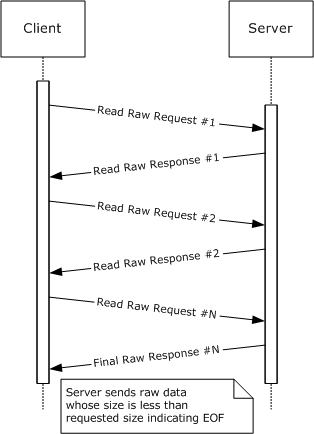

Figure 7: Read Raw request/response message flow

The client MUST accept an unformatted data message of up to **MaxCountOfBytesToReturn** bytes in length. **MaxCountOfBytesToReturn** is often set to 65,535 to maximize the transfer size and improve efficiency.

SMB Protocol SMB_COM_READ_RAW is not supported over connectionless SMB transports. If SMB_COM_READ_RAW is supported by the server, the CAP_RAW_MODE flag MUST be set in the **Capabilities** field in the response to the SMB_COM_NEGOTIATE SMB. If the **Client.Connection.SelectedDialect** is **NT LAN Manager** or later, and the response to the SMB_COM_NEGOTIATE SMB has CAP_LARGE_FILES set in the **Capabilities** field, an additional request format is allowed that accommodates very large files having 64 bit offsets (see the **OffsetHigh** field in the command description in section [2.2.4.22.1](#Section_2.2.4.22.1)).<205>

<a id="Section_3.2.4.14.2"></a>
##### 3.2.4.14.2 Client Requests Multiplexed Read

SMB_COM_READ_MPX is a specialized read command intended to maximize performance when reading large blocks of data from a regular file, while allowing for other operations to take place between the client and the server. This command is valid only when using a multiplexed session (that is, a single SMB connection multiplexed across multiple transport connections). The server MUST respond to the command request with one or more response messages until the requested amount of data has been returned or an error occurs. Each server response MUST contain the [**PID**](#gt_process-identifier-pid) and **MID** of the original client request and the **Offset** and **Count** describing the returned data.

If an error occurs, the server MUST send an error response. If any of the one or more responses to the SMB_COM_READ_MPX request contains an error code, the error applies to the command as a whole.

The client has successfully received all of the data bytes when the sum of the **DataLength** fields received in each response equals the total amount of data bytes expected (smallest **Count** received). This allows the protocol to work even if the responses are received out of sequence.

As is true in SMB_COM_READ, the total number of bytes returned can be less than the number requested only if a read specifies bytes beyond the current file size and the [**FID**](#gt_fid) refers to a disk file. In this case, the server MUST return only the bytes that exist. A read completely beyond the end of file MUST result in a single response with a zero value in **Count**. If the total number of bytes returned is less than the number of bytes requested, this indicates end of file.

Once started, the Read Block Multiplexed operation is expected to continue until completion. The client MUST receive all of the responses generated by the server. Conflicting commands such as file close MUST NOT be sent to the server while a multiplexed operation is in progress. Server support of this command is optional.

<a id="Section_3.2.4.15"></a>
#### 3.2.4.15 Application Requests Writing to a File, Named Pipe, or Device

The application provides:

- A valid **Client.Open**, representing the file to which the application attempts to write.
- An offset, in bytes and relative to the start of the file, marking the location within the file where the application attempts to write.
- The data and the number of bytes to be written.
- Whether or not the write is to be done in write-through mode.
- An optional time-out value, in milliseconds, designating how long to wait for the write to complete.
CIFS provides several commands for writing data to a file, named pipe, or device. These are:

- [SMB_COM_WRITE (section 2.2.4.12)](#Section_2.2.4.12) (deprecated)
The client MUST construct an [SMB_COM_WRITE Request (section 2.2.4.12.1)](#Section_2.2.4.12.1) message as defined in section 2.2.4.12.1. This command provides the basic Write operation.

- [SMB_COM_WRITE_AND_UNLOCK (section 2.2.4.21)](#Section_2.2.4.21) (deprecated)
This command is used to write to a locked byte range in the file and then unlock the range. The application MAY provide an indication of the number of additional bytes immediately following the bytes written and unlocked that it attempts to write. The byte range to be written MUST be locked prior to writing. The client MUST construct the [SMB_COM_WRITE_AND_UNLOCK Request (section 2.2.4.21.1)](#Section_2.2.4.21.1) as defined in section 2.2.4.21.1.

- [SMB_COM_WRITE_RAW (section 2.2.4.25)](#Section_2.2.4.25) (deprecated)
The client MUST construct an [SMB_COM_WRITE_RAW Request (section 2.2.4.25.1)](#Section_2.2.4.25.1). The behavior of the SMB_COM_WRITE_RAW Request (section 2.2.4.25.1) is described in section [3.2.4.15.1](#Section_3.2.4.15.1).

- [SMB_COM_WRITE_MPX (section 2.2.4.23)](#Section_2.2.4.23.2) (obsolescent)
The client MUST construct an [SMB_COM_WRITE_MPX Request (section 2.2.4.23.1)](#Section_2.2.4.23.1) as defined in section [2.2.4.26.1](#Section_2.2.4.26.1). The behavior of the SMB_COM_WRITE_MPX Request (section 2.2.4.23.1) is described in section [3.2.4.15.2](#Section_3.2.4.15.2).

- [SMB_COM_WRITE_AND_CLOSE (section 2.2.4.40)](#Section_2.2.4.40) (deprecated)
The client MUST construct an SMB_COM_WRITE_AND_CLOSE (section 2.2.4.40) command as defined in section [2.2.4.40.1](#Section_2.2.4.40.1). This command has the effect of writing to a range of bytes and then closing the file associated with the supplied [**FID**](#gt_fid). This command behaves identically to an SMB_COM_WRITE (section 2.2.4.12) command followed by an [SMB_COM_CLOSE (section 2.2.4.5)](#Section_2.2.4.5) command.

- [SMB_COM_WRITE_ANDX (section 2.2.4.43)](#Section_2.2.4.43)
The client MUST construct an [SMB_COM_WRITE_ANDX Request (section 2.2.4.43.1)](#Section_2.2.4.43.1) message as defined in section 2.2.4.43.1, with the following additional requirements:

- If the client uses a 64-bit offset value, **SMB_Parameters.WordCount** MUST be set to 0x0E and the **SMB_Parameters.Words.Offset** and **SMB_Parameters.Words.OffsetHigh** fields MUST be set to the lower 32 bits and the higher 32 bits, respectively, of the supplied offset value.
- If the client uses a 32-bit offset value, **SMB_Parameters.WordCount** MUST be set to 0x0C, the **SMB_Parameters.Words.Offset** field MUST be assigned the offset value supplied by the application, and the **SMB_Parameters.Words.OffsetHigh** field MUST NOT be included in the request.
- The **SMB_Parameters.Words.WriteMode** field MUST reflect any behavior that the application requests from the server. See the description of the **WriteMode** field in section 2.2.4.25.1.
- The **SMB_Parameters.Words.DataLength** field MUST be set to the length, in bytes, of the data to be written.
- The **SMB_Parameters.Words.DataOffset** field MUST be set to the offset, in bytes and relative to the start of the SMB Header block, of the data to be written to the file.
- The **SMB_Data.Bytes.Pad** field MUST contain padding bytes used to align the **SMB_Data.Bytes.Data** field to an appropriate boundary.
- The **SMB_Data.Bytes.Data** field MUST contain the data to be written.
- If the write is to a named pipe, and if the write spans multiple requests, the client SHOULD set the **SMB_Parameters.Words.Remaining** field to the number of bytes remaining to be written and MUST set the RAW_MODE bit in the **SMB_Parameters.Words.WriteMode** field. For the first write request the client MUST set the MSG_START bit in the **SMB_Parameters.Words.WriteMode** field.<206>
If the application writes to a named pipe or device and if a time-out value is supplied, the **SMB_Parameters.Words.Timeout** field MUST be assigned the value supplied by the application. Otherwise, it MUST be set to 0x00000000.

- SMB_COM_WRITE_PRINT_FILE (deprecated)
This command is used to write data to an open print queue spool file. The first data written to the print file MUST be printer-specific control data. The length of the control data block MUST be specified in the **SMB_Parameters.Words.SetupLength** field. A single SMB_COM_WRITE_PRINT_FILE command can contain both printer-specific control data and print file data, as long as the control data is completely written first.

The client MUST construct an SMB_COM_WRITE_PRINT_FILE request message as defined in section [2.2.4.68.1](#Section_2.2.4.68.1).

- TRANS_RAW_WRITE_NMPIPE
The client MUST construct the TRANS_RAW_WRITE_NMPIPE subcommand as defined in section [2.2.5.7](#Section_2.2.5.7). The request MUST be transported to the server using the Transaction subprotocol. TRANS_RAW_WRITE_NMPIPE allows for a raw write of data to a named pipe. This method of writing data to a named pipe ignores message boundaries even if the pipe was set up as a [**message mode**](#gt_message-mode) pipe.

- TRANS_WRITE_NMPIPE
The client MUST construct the TRANS_WRITE_NMPIPE subcommand as defined in section [2.2.5.9.1](#Section_2.2.5.9.1). The request MUST be transported to the server using the Transaction subprotocol. TRANS_WRITE_NMPIPE allows data to be written to a named pipe in the mode set on the named pipe. If the named pipe is in message mode, this subcommand MUST write a message from the pipe.

The request MUST be sent to the server as described in section [3.2.4.1](#Section_3.2.4.1).

<a id="Section_3.2.4.15.1"></a>
##### 3.2.4.15.1 Client Requests Raw Write

SMB_COM_WRITE_RAW is a specialized write command intended to maximize the performance of writing large blocks of data to an open regular file, a named pipe, device, or spooled output (printer). The command permits a client to send a large unformatted data (raw byte) message over the [**SMB transport**](#gt_smb-transport) without requiring the usual SMB request format. It also permits a client to send messages in excess of the maximum buffer size (**Client.Connection.ServerMaxBufferSize**) that was established during session setup. To accomplish this, the client and the server enter into a [**dialog**](#gt_dialog). For the dialog to begin, the client MUST perform the following steps:

- The client MUST compose the SMB_COM_WRITE_RAW request as described in section [2.2.4.25.1](#Section_2.2.4.25.1). This request informs the server of the total number of bytes that the client designates to send over the course of the dialog. For the dialog to begin, the request MUST be sent to the server as described in section [3.2.4.1](#Section_3.2.4.1), with the exception that SMB_COM_WRITE_RAW and message signing are mutually exclusive. Message signing MUST be disabled in order to perform a raw write. When the SMB_COM_WRITE_RAW request is received, the server MUST validate the request and attempt to write the initial data contained within the request. If an error is detected, the server returns a Final Server Response (section [2.2.4.25.3](#Section_2.2.4.25.3)), which completes the dialog. Otherwise, the server MUST respond with an Interim Server Response (section [2.2.4.25.2](#Section_2.2.4.25.2)) to indicate that the message was received and that the server is ready for the unformatted raw data. The server MUST then begin waiting for the unformatted data message to arrive.
- The client MUST send the unformatted data message to the server. Because the message contains unformatted raw bytes, the server MUST rely on the SMB transport to determine whether the message was received successfully, and to determine the message size.
- If the **WritethroughMode** bit was set in the **WriteMode** field of the original request, then the server MUST send a Final Server Response following receipt of the raw data from the client.
- If the **WritethroughMode** bit was clear in the **WriteMode** field of the original request, then the server MUST NOT send a Final Server Response following receipt of the raw data from the client.
A sample dialog flow is:

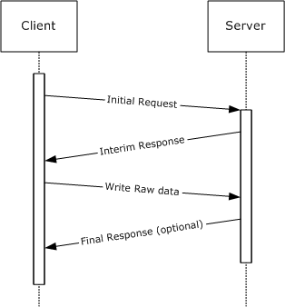

Figure 8: Write Raw request/response message flow

Because the client sends a raw data message that does not include the typical request data, the SMB Protocol cannot guarantee that the server can associate the client's raw data message with the correct corresponding client's SMB_COM_WRITE_RAW command. Therefore, the client MUST guarantee that there are no other SMB requests from the client to the server for the duration of the SMB_COM_WRITE_RAW command's dialog processing.

Server support of SMB_COM_WRITE_RAW is optional. This command is not supported over connectionless SMB transports. If SMB_COM_WRITE_RAW is supported by the server, the CAP_RAW_MODE flag MUST be set in the **Capabilities** field in the response to the SMB_COM_NEGOTIATE SMB. If the **Client.Connection.SelectedDialect** is [**NT LAN Manager**](#gt_nt-lan-manager-ntlm) or later, and the response to the SMB_COM_NEGOTIATE SMB has CAP_LARGE_FILES set in the **Capabilities** field, an additional request format is allowed that accommodates very large files having 64-bit offsets (see the **OffsetHigh** field in the command description in section 2.2.4.25.1).<207>

<a id="Section_3.2.4.15.2"></a>
##### 3.2.4.15.2 Client Requests Multiplexed Write

SMB_COM_WRITE_MPX is used to maximize the performance of large block writes of data from the client to the server. This command is valid only when using a multiplexed session (multiple transport connections bound to a single SMB connection) over a connectionless transport. To perform a multiplexed write, the client MUST send multiple SMB_COM_WRITE_MPX requests (each containing data to be written and the offset, in the **ByteOffsetToBeginWrite** field, at which the packet data is to be written) before the server responds with a single SMB_COM_WRITE_MPX response.

The client identifies the last request in the write sequence by also setting the **SMB Header SecurityFeatures.SequenceNumber** field to a nonzero value. This indicates to the server that the client indicates that it has completed sending all of the requests that need to be processed. After receiving the nonzero **SMB Header SecurityFeatures.SequenceNumber**, the server MUST respond with a single SMB_COM_WRITE_MPX response.

The client request **RequestMask** values are saved by the server and bitwise OR-ed into a value that is returned to the client in the **ResponseMask** field of the server's SMB_COM_WRITE_MPX response. If a problem occurred with the [**SMB transport**](#gt_smb-transport) and one or more of the client's SMB_COM_WRITE_MPX requests was not successfully received and processed by the server, the bit for that request MUST NOT be set in the server's SMB_COM_WRITE_MPX response **ResponseMask** field. The client MUST use the **ResponseMask** received in the SMB_COM_WRITE_MPX response to determine which client requests, if any, MUST be retransmitted. The client MUST use this behavior to send only the missing parts in the next write sequence when resending the lost requests.

When all of the request messages have been successfully received by the server, and a final SMB_COM_WRITE_MPX response received, the client MAY perform another write operation using the SMB_COM_WRITE_MPX request. The next SMB_COM_WRITE_MPX sequence sent MUST use a new **SMB Header SecurityFeatures.SequenceNumber** value to uniquely identify the set of requests, or the server can incorrectly respond with the mask from the previous SMB_COM_WRITE_MPX command. The server MUST NOT impose any restrictions on the value of **RequestMask**, nor upon the order or contiguity of the requests being sent.

The [**FID**](#gt_fid) MUST be identical in all requests in a given SMB_COM_WRITE_MPX exchange. The **TID**, [**PID**](#gt_process-identifier-pid), **UID**, **MID**, and **CID** MUST be identical in all requests and responses in a given SMB_COM_WRITE_MPX exchange.

Other requests MAY be issued on the same session while the SMB_COM_WRITE_MPX exchange is in progress.

An example [**dialog**](#gt_dialog) flow is:

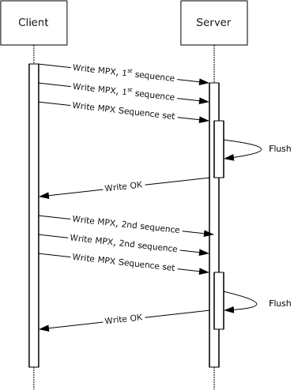

Figure 9: Multiplexed Write request/response message flow

At the time of the request, the client designates the number of data bytes to be sent and passes this information to the server in **TotalByteCount** field of the request. The server MAY use this information to reserve buffer space.

Some systems provide no way for a process to block until the local file cache has actually flushed to the disk, but simply indicate that a flush has been scheduled and MUST complete soon. A server SHOULD nonetheless take steps to maximize the probability that the data is truly on disk before the client is notified.

Server support of this command is optional. If the server supports this command it MUST set the CAP_MPX_MODE (0x00000002) bit in the **Capabilities** field of the response to SMB Protocol negotiation. Support for MPX mode excludes support for SMB signing and RAW read/write SMBs.

This command is supported on connectionless transports only; consequently, bit 0x0080 of **WriteMode** in all request messages in the exchange MUST be set. The FID in the request(s) MUST refer to either a regular file or a spooled printer file. This command does not support named pipes or I/O devices.

<a id="Section_3.2.4.16"></a>
#### 3.2.4.16 Application Requests a Byte-Range Lock on a File

The application provides:

- The **Client.Open** representing the file to be locked.
- An array of byte ranges to be locked. For each range, the application provides:
- A starting offset, in bytes.
- A length, in bytes.
- The number of byte ranges to be locked.
- The type of lock requested.
- The new oplock level, if this is a request from the server in response to a change.
- The length of time (in milliseconds) that the server is requested to wait for the locks to become available.
- An optional Boolean indicating whether the byte ranges are to be locked or shared.
- An optional Timeout.
Any of the following commands can be used to explicitly lock a contiguous range of bytes in a regular file:

- SMB_COM_LOCK_BYTE_RANGE (deprecated)
The client MUST construct the SMB_COM_LOCK_BYTE_RANGE request as defined in section [2.2.4.13.1](#Section_2.2.4.13.1). This command is limited to 32-bit offsets, and is considered deprecated. The SMB_COM_LOCKING_ANDX command SHOULD be used instead.

- SMB_COM_LOCK_AND_READ (deprecated)
This command combines the byte range lock with a read operation. The bytes locked by the request are also the bytes to be read. The application can provide an indication of the number of additional bytes immediately following the locked bytes that it designates to read. The client MUST construct the SMB_COM_LOCK_AND_READ (section [2.2.4.20.1](#Section_2.2.4.20.1)) request.

- SMB_COM_LOCKING_ANDX
Multiple non-overlapping byte ranges can be locked with this command. The client MUST construct the SMB_COM_LOCKING_ANDX request as defined in section [2.2.4.32.1](#Section_2.2.4.32.1). This client request is atomic. If the area to be locked is already locked or the lock request otherwise fails, no other ranges specified in the client request are locked. This command is capable of using 64-bit file offsets. If CAP_LARGE_FILES is set in **Client.Connection.ServerCapabilities**, 64-bit offsets SHOULD be used.

The SMB_COM_LOCKING_ANDX command supports requests for shared locks. The preceding deprecated locking commands do not support shared locks. The application can request a shared lock. If the application does not specify the lock type, an exclusive read/write lock is requested by default. The request for a shared lock is specified by setting the **SHARED_LOCK** bit in the **TypeOfLock** field (see section 2.2.4.32.1).

Locks prevent attempts by other **PID**s to lock, read, or write the locked portion of the file. Overlapping exclusive locks are not permitted. Offsets beyond the current end of file can be locked. Such locks MUST NOT cause allocation of additional file space. A lock MUST be unlocked only by the **PID** that performed the lock.

The request MUST be sent to the server as described in section [3.2.4.1](#Section_3.2.4.1).

<a id="Section_3.2.4.17"></a>
#### 3.2.4.17 Application Requests the Release of a Byte-Range Lock on a File

The application provides:

- The **Client.Open** representing the file to be unlocked.
- An array of byte ranges to be unlocked. For each range, the application provides:
- A starting offset, in bytes.
- A length, in bytes.
- The number of byte ranges to be unlocked.
- The type of lock requested.
- The new oplock level, if this is a request from the server in response to a change.
- The length of time (in milliseconds) for the server to wait for the locks to become available.
Any of the following commands can be used to explicitly unlock a contiguous range of bytes in a regular file:

- [SMB_COM_UNLOCK_BYTE_RANGE (section 2.2.4.14)](#Section_2.2.4.14) (deprecated)
- This command is used to explicitly unlock a contiguous range of bytes in an open regular file. The byte range specified MUST be exactly the same as that specified in a previous successful lock request from the same CIFS client and process; the [**FID**](#gt_fid), [**PID**](#gt_process-identifier-pid), and [**UID**](#gt_unique-identifier-uid) MUST be the same as those used in the lock request. The client MUST construct the [SMB_COM_UNLOCK_BYTE_RANGE Request (section 2.2.4.14.1)](#Section_2.2.4.14.1), as defined in section 2.2.4.14.1.
- [SMB_COM_WRITE_AND_UNLOCK (section 2.2.4.21)](#Section_2.2.4.21) (deprecated)
- This command is used to write to a locked byte range in the file, and then unlock the range. The application MAY provide an indication of the number of additional bytes immediately following the bytes written and unlocked that it designates to write. The client MUST construct the [SMB_COM_WRITE_AND_UNLOCK Request (section 2.2.4.21.1)](#Section_2.2.4.21.1) as defined in section 2.2.4.21.1.
- [SMB_COM_LOCKING_ANDX (section 2.2.4.32)](#Section_2.2.4.32)
- Multiple non-overlapping byte ranges can be unlocked with this command. The client MUST construct the [SMB_COM_LOCKING_ANDX Request (section 2.2.4.32.1)](#Section_2.2.4.32.1). The client request is atomic. Failure to unlock or lock a byte range specified results in all ranges in the request being left in their previous state. This command is capable of using 64-bit file offsets. If CAP_LARGE_FILES is set in **Client.Connection.ServerCapabilities**, 64-bit offsets SHOULD be used.
Closing the file releases all locks associated with the FID. The [SMB_COM_PROCESS_EXIT (section 2.2.4.18)](#Section_2.2.4.18) command closes all file handles (FIDs) that were opened by the specified PID, and therefore releases all locks held on those FIDs.

The request MUST be sent to the server as described in section [3.2.4.1](#Section_3.2.4.1).

<a id="Section_3.2.4.18"></a>
#### 3.2.4.18 Application Requests an Opportunistic Lock on a File

The application requests an OpLock when opening or creating a file. See sections [3.2.4.5](#Section_3.2.4.5) and [3.2.4.6](#Section_3.2.4.6) for information on opening and creating files. The following SMB commands can be used to obtain an OpLock:

- [SMB_COM_OPEN (section 2.2.4.3)](#Section_2.2.4.3)
- [SMB_COM_CREATE (section 2.2.4.4)](#Section_2.2.4.15)
- [SMB_COM_CREATE_NEW (section 2.2.4.16)](#Section_2.2.4.16)
- [SMB_COM_OPEN_ANDX (section 2.2.4.41)](#Section_2.2.4.41)
- [SMB_COM_NT_CREATE_ANDX (section 2.2.4.64)](#Section_2.2.4.64.2)
- [TRANS2_OPEN2 (section 2.2.6.1)](#Section_2.2.6.1)
- [NT_TRANSACT_CREATE (section 2.2.7.1)](#Section_2.2.7.1)
The application can request either an exclusive OpLock or a batch exclusive OpLock on a file. The server indicates the type of OpLock granted in the response. The server MUST grant the requested OpLock, a read-only (Level II) OpLock, or no OpLock. If an exclusive OpLock is not available, Level II OpLocks are granted only in response to SMB_COM_NT_CREATE_ANDX (section 2.2.4.64) or [NT_TRANSACT_CREATE Requests (section 2.2.7.1.1)](#Section_2.2.7.1.1).

- If a Level II OpLock is granted, the server guarantees that no other process is modifying the file and that the client can perform read caching.
- If an exclusive OpLock is granted, read caching, write caching, and byte-range lock caching can be performed on the client side.
- If an exclusive batch OpLock is granted, the client can additionally cache file close operations, delaying sending file close operations to the server indefinitely and thus maintaining the client-side cache.
An OpLock remains in effect until the server revokes it or the file is closed by the client. For a batch OpLock, the client MAY cache file close operations from the application. The batch OpLock is released when the client performs the close operation.

Detailed information regarding OpLock semantics is provided in [[FSBO]](https://go.microsoft.com/fwlink/?LinkId=140636).

<a id="Section_3.2.4.19"></a>
#### 3.2.4.19 Application Requests Verifying a Directory Path

The application provides:

- A **Client.TreeConnect** indicating the share within which the directory resides.
- The pathname of the directory, relative to **Client.TreeConnect.ShareName**.
- A valid **Client.Session**.
The client MUST construct an [SMB_COM_CHECK_DIRECTORY Request (section 2.2.4.17.1)](#Section_2.2.4.17.1) message. The **SMB_Data.Bytes DirectoryName field** MUST be set to the value that was supplied by the application.

The request MUST be sent to the server as described in section [3.2.4.1](#Section_3.2.4.1).

<a id="Section_3.2.4.20"></a>
#### 3.2.4.20 Client Notifies the Server of a Process Exit

The SMB_COM_PROCESS_EXIT command MAY be used to indicate to the server that a client process, represented by a [**PID**](#gt_process-identifier-pid) value, has failed and that all resources allocated to that PID MUST be freed. The semantics of this command are deprecated, however, and it SHOULD NOT be used by new client implementations.

The client MUST construct the SMB_COM_PROCESS_EXIT request message as defined in section [2.2.4.18.1](#Section_2.2.4.18.1). The request MUST be sent to the server as described in section [3.2.4.1](#Section_3.2.4.1).

<a id="Section_3.2.4.21"></a>
#### 3.2.4.21 Application Requests to Seek to a Location in a File

The file MUST be held open by the application, and the application MUST provide a **Client.Open** as well as the desired offset and seek mode.

If the seek mode is 1 (meaning seek from the current position) and the offset is zero, then the application is requesting that the server report the current position of the file pointer (the current offset). Otherwise, the application is attempting to set the current file pointer. SMB_COM_SEEK handles 32-bit offsets only. Also, all Read and Write operations in the protocol set the file pointer, so it is not necessary to use SMB_COM_SEEK for that purpose. SMB_COM_SEEK is listed as obsolescent.

The client MUST construct the SMB_COM_SEEK request message as defined in section [2.2.4.19.1](#Section_2.2.4.19.1). The request MUST be sent to the server as described in section [3.2.4.1](#Section_3.2.4.1).

<a id="Section_3.2.4.22"></a>
#### 3.2.4.22 Application Requests Sending an IOCTL to a File or Device

The application MUST supply a **Client.Open** representing the open file or device, as well as the [**IOCTL**](#gt_io-control-ioctl) category and function. The client MUST use either of the following commands to transfer the IOCTL to the server:

- [SMB_COM_IOCTL (obsolescent) (section 2.2.4.35)](#Section_2.2.4.35)
The client MUST construct the [SMB_COM_IOCTL Request (section 2.2.4.35.1)](#Section_2.2.4.35.1) message.

- NT_TRANSACT_IOCTL
The application provides the following:

- An input buffer, _**NT_Trans_Data**, to be passed to the **fsctl** or **ioctl** function.
The client MUST construct the [NT_TRANSACT_IOCTL Request (section 2.2.7.2.1)](#Section_2.2.7.2.1) message, with the following additional requirements:

- The **SMB_Parameters.Words.Setup.IsFsctl** flag is set to 0x01.
- The **SMB_Parameters.Words.Setup.IsFlags** flag is set to 0x01 if **Client.TreeConnect.IsDfsShare** is TRUE; otherwise, it is set to 0x00.
- The **SMB_Data.Bytes.NT_Trans_Data** field contains NT_Trans_Data supplied by the application.
The request MUST be transported to the server using the NT Transaction subprotocol.

The format of the IOCTL data and parameters are determined by the specific IOCTL function being called. The request MUST be sent to the server as described in section [3.2.4.1](#Section_3.2.4.1).

<a id="Section_3.2.4.23"></a>
#### 3.2.4.23 Application Requests Testing Transport Layer Connection

The client MUST have an established SMB connection and MUST have performed an SMB Protocol negotiation. No SMB session is necessary.

The application MUST provide:

- The **Client.Connection** that identifies the connection on which to send the request.
- The number of responses that the application designates to receive from the server. This number SHOULD be greater than zero.
- A block of data, which might be random, to be echoed by the server.
The client MUST construct an SMB_COM_ECHO request message as defined in section [2.2.4.39.1](#Section_2.2.4.39.1). The data block provided by the application MUST be sent in the **SMB_Data.Bytes.Data** field; otherwise, the field MUST be empty.

The request MUST be sent to the server as described in section [3.2.4.1](#Section_3.2.4.1).

<a id="Section_3.2.4.24"></a>
#### 3.2.4.24 Application Requests a Tree Disconnect (Unmount Share)

The application MUST provide the **Client.TreeConnect** of the tree connect to be closed. The client MUST construct an SMB_COM_TREE_DISCONNECT request as defined in section [2.2.4.51.1](#Section_2.2.4.51.1). The request MUST be sent to the server as described in section [3.2.4.1](#Section_3.2.4.1). All locks associated with open files within the share represented by the **Client.TreeConnect.TID** are released. All open search and file handles that represent objects within the **TID** are closed.

<a id="Section_3.2.4.25"></a>
#### 3.2.4.25 Application Requests an SMB Session Logoff

The application MUST provide the **Client.Session** of the [**SMB session**](#gt_smb-session) to be closed.

The client MUST traverse the **Client.Connection.TreeConnectTable**, and for each entry in which **Client.TreeConnect.Session** matches the application-provided **Client.Session**, the **TreeConnect** MUST be closed, as specified in section [3.2.4.24](#Section_3.2.4.24).

The client MUST construct an [SMB_COM_LOGOFF_ANDX Request (section 2.2.4.54.1)](#Section_2.2.4.54.1). The request MUST be sent to the server as specified in section [3.2.4.1](#Section_3.2.4.1). The user represented by the **Client.Session.SessionUID** value, presented in the [SMB Header (section 2.2.3.1)](#Section_2.2.3.1), is logged off as follows:

- The server cancels any outstanding command requests for this **UID**.
- The server releases all locks and closes all files opened by this **UID**; the associated **FID**s are invalidated.
- The server closes all searches currently held open by this **UID**; the associated **SID**s are invalidated.
- The server disconnects all tree connects created by this **UID**; the associated **TID**s are invalidated.
- The server invalidates the **UID**.
<a id="Section_3.2.4.26"></a>
#### 3.2.4.26 Application Requests Querying File System Attributes

The application provides:

- A **Client.TreeConnect.TreeID** (**TID**) of the share to be queried.
- The [**information level**](#gt_information-level) that describes the format of the information being queried, as specified in [MS-FSCC](../MS-FSCC/MS-FSCC.md) section 2.5.
The client requests the retrieval of attributes from a file system using either of the two following commands. The client MUST map the application-provided information level to the **QUERY_FS Information Levels**, as specified in section [2.2.8](#Section_1.3).

- [SMB_COM_QUERY_INFORMATION_DISK (section 2.2.4.57)](#Section_2.2.4.57) (deprecated)
This command MUST be sent by a client to obtain the capacity and remaining free space on the volume hosting the subtree indicated by the **TID** in the [SMB Header (section 2.2.3.1)](#Section_2.2.3.1). It MUST be constructed as defined in section [2.2.4.57.1](#Section_2.2.4.57.1).

- [TRANS2_QUERY_FS_INFORMATION (section 2.2.6.4)](#Section_2.2.6.4)
The client MUST construct the [TRANS2_QUERY_FS_INFORMATION Request (section 2.2.6.4.1)](#Section_2.2.6.4.1) message. The request MUST be transported to the server using the Transaction2 subprotocol.

The request MUST be sent to the server as described in section [3.2.4.1](#Section_3.2.4.1).

<a id="Section_3.2.4.27"></a>
#### 3.2.4.27 Application Requests a Directory Enumeration

The application provides the following:

- A **Client.TreeConnect** indicating the share within which the directory resides.
- The pathname of the directory to query, relative to **Client.TreeConnect.ShareName**.
- A valid **Client.Session**.
- A wildcard qualifier to select the file names to return.
- A set of attribute flags that further qualify the list of file names to return.
- An [**Information Level**](#gt_information-level) that defines the format of the data to return.
- The number of results to return.
- A set of flags used to request that the server manage the transaction state based on how the client attempts to traverse results.
- A MASK specifying whether the search is for directories or for files.
- If the Information Level provided is **SMB_INFO_QUERY_EAS_FROM_LIST**, the application provides a list of extended attributes.
The client can use any of the following commands to enumerate the directory entries matching the application's criteria:

- [SMB_COM_SEARCH (deprecated) (section 2.2.4.58)](#Section_2.2.4.58)
The client MUST construct the **SMB_COM_SEARCH** request message as defined in section [2.2.4.58.1](#Section_2.2.4.58.1). The **FileName** field is the full directory path (relative to the **TID**) of the file(s) being sought. The final component of the path MAY contain wildcards. This string MAY be the empty string. The **SearchAttributes** field is an attribute mask used to specify the standard attributes that a file MUST have to match the search. If the value of this field is 0x0000, only normal files are returned. If the Volume Label attribute is set, then the volume label MUST be the only name returned (the Volume Label attribute is exclusive). If the Directory, System, or Hidden attributes are specified, those entries are requested in addition to the normal files.

There is no Close operation associated with the SMB_COM_SEARCH. The client provides the server with no direct indication that the search is complete unless the client continues the search until the last matching entry has been returned.

An SMB_COM_PROCESS_EXIT request from the client closes an incomplete search. Disconnecting the **Client.TreeConnect** within which the search is active also closes the search.

- SMB_COM_FIND (deprecated)
The client MUST construct the SMB_COM_FIND request message as defined in section [2.2.4.59.1](#Section_2.2.4.59.1). The format and operation of SMB_COM_FIND is identical to that of SMB_COM_SEARCH, except that the search MAY be closed using the SMB_COM_FIND_CLOSE command, which provides a specific indication to the server that the search has been completed.

- SMB_COM_FIND_UNIQUE (deprecated)
The client MUST construct the SMB_COM_FIND_UNIQUE request message as defined in section [2.2.4.60.1](#Section_2.2.4.60.1). The format and operation of SMB_COM_FIND_UNIQUE is identical to that of SMB_COM_FIND. The former performs an implicit close on the search operation so that no SMB_COM_FIND_CLOSE is needed. The SMB_COM_FIND_UNIQUE returns only the results that can fit within a single response.

- TRANS2_FIND_FIRST2
The client MUST construct the TRANS2_FIND_FIRST2 request message as defined in section [2.2.6.2.1](#Section_2.2.6.2.1). If the search is incomplete following the first response from the server, the client MAY continue the search using a TRANS2_FIND_NEXT2 request as defined in section [2.2.6.3.1](#Section_2.2.6.3.1). These requests MUST be transported to the server using the Transaction2 subprotocol. If the search finds no names that match the client request, or if the continuation of the search finds no more names that match the client request:

- The server returns STATUS_NO_MORE_FILES as a 32-bit error code if the client set SMB_FLAGS2_NT_STATUS in the **Flags2** field of the client request.
- The server returns ERRDOS/ERRnofiles as an SMBSTATUS if SMB_FLAGS2_NT_STATUS is NOT set in the **Flags2** field of the client request.
Note that these return codes are not considered errors in this case.

The request MUST be sent to the server as described in section [3.2.4.1](#Section_3.2.4.1).

<a id="Section_3.2.4.28"></a>
#### 3.2.4.28 Application Requests Canceling Pending Operations

The application MUST provide the **UID**, **TID**, **PID**, and **MID** of the operation or operations to be canceled. If a connectionless transport is in use, then the application MUST also provide the **CID** (Connection ID) of the SMB connection.

The client MUST issue the cancel by sending an SMB_COM_NT_CANCEL request message. This message MUST be constructed as defined in section [2.2.4.65.1](#Section_2.2.4.65.1). The server MUST attempt to complete pending operations that match the **UID**, **TID**, **PID**, and **MID** (and CID, if required) in the request. Any matching pending operation that cannot be completed successfully MUST fail with an implementation-specific error status.

In particular, the SMB_COM_NT_CANCEL operation completes any Directory Change Notify operations (NT_TRANSACT_NOTIFY_CHANGE) on the server, causing the server to send an NT_TRANSACT_NOTIFY_CHANGE response message.

The request MUST be sent to the server as described in section [3.2.4.1](#Section_3.2.4.1), particularly the special handling required for SMB_COM_NT_CANCEL.

<a id="Section_3.2.4.29"></a>
#### 3.2.4.29 Application Requests to Print a File

The application MUST provide the **Client.Session** and MUST provide the **Client.TreeConnect** representing a connection to the printer share to which the data will be printed.

The client MUST create a print spool file using the SMB_COM_OPEN_PRINT_FILE command. The command request MUST be constructed as defined in section [2.2.4.67.1](#Section_2.2.4.67.1). The application MUST provide any printer-specific control data and the length, in bytes, of that data, which is copied into the **SMB_Parameters.Words.SetupLength** field. The application MUST indicate whether the data to be printed is to be handled in Text or Binary mode. See the description of the **SMB_Parameters.Words.Mode** field in section 2.2.4.67.1.

The application optionally provides printer-specific control data. If provided, it MUST be written to the spool file first, followed by the print file data itself.

The request MUST be sent to the server as described in section [3.2.4.1](#Section_3.2.4.1). If successful, the command MUST return a valid [**FID**](#gt_fid) representing the opened spool file.

Any command capable of writing to an open FID, including SMB_COM_WRITE_PRINT_FILE, can be used to write the data to the print spool file. The file is queued for printing when the FID is closed. The FID can be closed using SMB_COM_CLOSE_PRINT_FILE (deprecated) or SMB_COM_CLOSE. The client can also use SMB_COM_WRITE_AND_CLOSE (deprecated) to write spool file data and close the file.

<a id="Section_3.2.4.30"></a>
#### 3.2.4.30 Application Requests Setting Named Pipe State

A client requests setting the state of a named pipe by issuing an SMB_COM_TRANSACTION Request with the subcommand TRANS_SET_NMPIPE_STATE. The application MUST provide a **Client.Open** of the named pipe to which the state change is to be applied. The application provides the [**pipe state**](#gt_pipe-state) as specified in section [2.2.5.1.1](#Section_2.2.5.1.1).

The client MUST construct the TRANS_SET_NMPIPE_STATE request message. The request MUST be sent to the server as specified in section [3.2.4.1](#Section_3.2.4.1).

If the **ReadMode** bits (see section [2.2.1.3](#Section_2.2.1.3)) of the **PipeState** field in the TRANS_SET_NMPIPE_STATE Request (section 2.2.5.1.1) are zero, the client MUST set **Client.Open.NamedPipeMessageMode** to FALSE; otherwise, the client MUST set **Client.Open.NamedPipeMessageMode** to TRUE.

<a id="Section_3.2.4.31"></a>
#### 3.2.4.31 Application Requests Querying Named Pipe Handle State

A client queries named pipe state by issuing an SMB_COM_TRANSACTION request (section [2.2.4.33.1](#Section_2.2.4.33.1)) with the subcommand TRANS_QUERY_NMPIPE_STATE. The application MUST provide a [**FID**](#gt_fid) indicating the open named pipe for which the state is being queried.

The client MUST construct the TRANS_QUERY_NMPIPE_STATE request message. The request MUST be sent to the server as specified in section [3.2.4.1](#Section_3.2.4.1).

A client queries [**named pipe**](#gt_named-pipe) state by issuing an SMB_COM_TRANSACTION Request (section 2.2.4.33.1) with the subcommand [TRANS_QUERY_NMPIPE_STATE (section 2.2.5.3)](#Section_3.2.5.38.3). The application MUST provide a **Client.Open** identifying the [**open**](#gt_open) to the named pipe.

The client MUST construct the [TRANS_QUERY_NMPIPE_STATE Request](#Section_3.3.5.57.4) message, using the **Client.Open.FID** from the supplied open. The request MUST be sent to the server as specified in section 3.2.4.1. The [TRANS_QUERY_NMPIPE_STATE Response (section 2.2.5.3.2)](#Section_2.2.4.12.2) MUST be processed as specified in section [3.2.5.38.3](#Section_3.2.5.38.3). If the **ReadMode** bits (see section [2.2.1.3](#Section_2.2.1.3)) of the **NMPipeStatus** field in the TRANS_QUERY_NMPIPE_STATE Response are zero, the client MUST set **Client.Open.NamedPipeMessageMode** to FALSE; otherwise, the client MUST set **Client.Open.NamedPipeMessageMode** to TRUE.

<a id="Section_3.2.4.32"></a>
#### 3.2.4.32 Application Requests Querying Named Pipe Information

A client requests querying named pipe information by issuing an SMB_COM_TRANSACTION request (section [2.2.4.33.1](#Section_2.2.4.33.1)) with the subcommand TRANS_QUERY_NMPIPE_INFO. The application MUST provide a **Client.Open** indicating the open named pipe from which the information is to be queried. Available information includes:

- Input and Output buffer sizes.
- Maximum and current number of instances of the named pipe.
- The name and the length of the name of the named pipe.
The client MUST construct the TRANS_QUERY_NMPIPE_INFO request message as specified in section [2.2.5.4.1](#Section_2.2.5.4.1). The request MUST be sent to the server as described in section [3.2.4.1](#Section_3.2.4.1).

<a id="Section_3.2.4.33"></a>
#### 3.2.4.33 Application Requests Peeking at Named Pipe Data

A client requests peeking into pipe data on a named pipe by issuing an SMB_COM_TRANSACTION request (section [2.2.4.33.1](#Section_2.2.4.33.1)) with the subcommand TRANS_PEEK_NMPIPE. The application MUST provide a **Client.Open** indicating the open named pipe from which data is to be read and the number of bytes to attempt to read.

The client MUST construct the TRANS_PEEK_NMPIPE request message as specified in section [2.2.5.5.1](#Section_2.2.5.5.1). The request MUST be sent to the server as described in section [3.2.4.1](#Section_3.2.4.1).

<a id="Section_3.2.4.34"></a>
#### 3.2.4.34 Application Requests Executing a Transaction on a Named Pipe

A client executes a transaction on a [**named pipe**](#gt_named-pipe) by issuing an [SMB_COM_TRANSACTION Request (section 2.2.4.33.1)](#Section_2.2.4.33.1) with the subcommand [TRANS_TRANSACT_NMPIPE (section 2.2.5.6)](#Section_2.2.5.6). The application MUST provide a **Client.Open** indicating the open named pipe on which to perform the transaction, a buffer of data to write into the pipe, and the maximum number of bytes to read out of the pipe.

The client MUST construct the [TRANS_TRANSACT_NMPIPE Request (section 2.2.5.6.1)](#Section_2.2.5.6.1) message and MUST send it to the server as specified in section [3.2.4.1](#Section_3.2.4.1).

<a id="Section_3.2.4.35"></a>
#### 3.2.4.35 Application Requests Waiting for Named Pipe Availability

A client requests to wait for named pipe availability by issuing an SMB_COM_TRANSACTION (section [2.2.4.33.1](#Section_2.2.4.33.1)) request with the subcommand TRANS_WAIT_NMPIPE. The application MUST provide the following:

- A **Client.TreeConnect** indicating the share within which the named pipe resides.
- The pathname of the named pipe, relative to **Client.TreeConnect.ShareName**.
- A valid **Client.Session**.
- A time-out value indicating how long to wait for named pipe availability.
The client MUST construct the TRANS_WAIT_NMPIPE request message as specified in section [2.2.5.10.1](#Section_2.2.5.10.1). The request MUST be sent to the server as described in section [3.2.4.1](#Section_3.2.4.1).

<a id="Section_3.2.4.36"></a>
#### 3.2.4.36 Application Requests Named Pipe Exchange (Call)

A client executes a call on a named pipe by issuing an SMB_COM_TRANSACTION (section [2.2.4.33.1](#Section_2.2.4.33.1)) request with the subcommand TRANS_CALL_NMPIPE. The Call operation is similar to the operation performed by TRANS_TRANSACT_NMPIPE, except that the pipe is opened and closed by the Call operation.

The application MUST provide:

- A **Client.TreeConnect** indicating the share within which the named pipe resides.
- The pathname of the named pipe, relative to **Client.TreeConnect.ShareName**.
- A valid **Client.Session**.
- A buffer containing the data to be written into the pipe.
- The number of bytes to be written.
- The maximum number of bytes to read from the pipe.
- A priority value in the range 0..9; higher values indicate higher priority.
The client MUST construct the TRANS_CALL_NMPIPE request message as specified in section [2.2.5.11.1](#Section_2.2.5.11.1). The request MUST be sent to the server as described in section [3.2.4.1](#Section_3.2.4.1).

<a id="Section_3.2.4.37"></a>
#### 3.2.4.37 Application Requests to Read from a Named Pipe

A client can request to read from a [**named pipe**](#gt_named-pipe) by issuing an SMB_COM_TRANSACTION Request with the subcommand TRANS_READ_NMPIPE. The application MUST provide a **Client.Open** indicating the open named pipe from which data is to be read. The application provides the maximum number of bytes that the client attempts to read from the named pipe.

Named pipes can be in raw mode or [**message mode**](#gt_message-mode) (see [TRANS_SET_NMPIPE_STATE](#Section_3.3.5.57.2)). If the named pipe is in raw mode, as indicated by a **Client.Open.NamedPipeMessageMode** value of FALSE, it can be read by any of several Read operations (see section [3.2.4.14](#Section_3.2.4.14)). If the pipe is in message mode, as indicated by a **Client.Open.NamedPipeMessageMode** value of TRUE, [TRANS_READ_NMPIPE](#Section_3.2.5.38.8) MUST be used to read discrete messages.

The client MUST construct the TRANS_READ_NMPIPE Request message and MUST send it to the server as specified in section [3.2.4.1](#Section_3.2.4.1).

<a id="Section_3.2.4.38"></a>
#### 3.2.4.38 Application Requests Writing to a Named Pipe

A client can write to a [**named pipe**](#gt_named-pipe) by issuing an SMB_COM_TRANSACTION request with the subcommand TRANS_WRITE_NMPIPE. The application MUST provide a **Client.Open** indicating the open named pipe to which data is to be written.

Named pipes can be in raw mode or [**message mode**](#gt_message-mode) (see [TRANS_SET_NMPIPE_STATE](#Section_3.3.5.57.2)). If the named pipe is in raw mode, as indicated by a **Client.Open.NamedPipeMessageMode** value of FALSE, it can be written to using any of several Write operations (see section [3.2.4.15](#Section_3.2.4.15)). If the pipe is in message mode, as indicated by a **Client.Open.NamedPipeMessageMode** value of TRUE, TRANS_WRITE_NMPIPE MUST be used to write discrete messages.

The client MUST construct the TRANS_WRITE_NMPIPE request message and MUST send it to the server as specified in section [3.2.4.1](#Section_3.2.4.1).

<a id="Section_3.2.4.39"></a>
#### 3.2.4.39 Application Requests Notification of Change in Directory Contents

A client requests waiting for directory change notification by issuing an SMB_COM_NT_TRANSACT (section [2.2.4.62.1](#Section_2.2.4.62.1)) request with the subcommand NT_TRANSACT_NOTIFY_CHANGE. The application provides the following:

- A **Client.Open** indicating a directory within a connected share.
- A Completion Filter indicating the changes needed in order to complete the command.
- A Boolean indicating whether or not subtrees of the specified directory are also to be monitored for changes.
- The size of the buffer that the server MUST use to collect file change information.
The command MUST NOT be completed until one of the following events occurs:

- A change matching one of the change events in the Completion Filter occurs.
- An SMB_COM_NT_CANCEL with matching **UID**, **TID**, **PID**, **MID**, and (depending upon the transport type) **CID** is received. See section [3.2.4.28](#Section_3.2.4.28).
The **SMB_Parameters.Words.MaxParameterCount** field in the SMB_COM_NT_TRANSACT request determines the size of the buffer that is used by the server to buffer directory change information. The **SMB_Parameters.Words.MaxParameterCount** field in the SMB_COM_NT_TRANSACT request is set to the size supplied by the application.

The client MUST construct the NT_TRANSACT_NOTIFY_CHANGE request message as specified in section [2.2.7.4.1](#Section_2.2.7.4.1). The request MUST be sent to the server as described in section [3.2.4.1](#Section_3.2.4.1).

<a id="Section_3.2.4.40"></a>
#### 3.2.4.40 Application Requests Querying Security Descriptors

A client requests to query [**security descriptors**](#gt_security-descriptor) by issuing an SMB_COM_NT_TRANSACT (section [2.2.4.62.1](#Section_2.2.4.62.1)) request with the subcommand NT_TRANSACT_QUERY_SECURITY_DESC. The application MUST provide the **Client.Open** of the file that is the target of the query, the maximum number of data bytes the client accepts in the response, and a list of the security information fields being requested.

The client MUST construct the NT_TRANSACT_QUERY_SECURITY_DESC request message as specified in section [2.2.7.6.1](#Section_2.2.7.6.1). The request MUST be sent to the server as described in section [3.2.4.1](#Section_3.2.4.1).

<a id="Section_3.2.4.41"></a>
#### 3.2.4.41 Application Requests Setting Security Descriptors

A client requests to set [**security descriptors**](#gt_security-descriptor) by issuing an SMB_COM_NT_TRANSACT (section [2.2.4.62.1](#Section_2.2.4.62.1)) request with the subcommand NT_TRANSACT_SET_SECURITY_DESC. The application MUST provide the **Client.Open** of the target file. The application MUST also provide a list of the security descriptor fields to be set and the security descriptors to be updated.

The client MUST construct the NT_TRANSACT_SET_SECURITY_DESC request message as specified in section [2.2.7.3.1](#Section_2.2.7.3.1). The request MUST be sent to the server as described in section [3.2.4.1](#Section_3.2.4.1).

<a id="Section_3.2.4.42"></a>
#### 3.2.4.42 Application Requests a Named RAP Transaction

An application can perform Remote Administration Protocol (RAP) operations from CIFS. The application MUST provide **Client.Session** and **Client.TreeConnect**. **Client.TreeConnect.ShareName** MUST indicate the IPC$ interprocess communications share.

The SMB Transaction subprotocol (SMB_COM_TRANSACTION and SMB_COM_TRANSACTION_SECONDARY) is used to transfer RAP operations. RAP uses the \PIPE\LANMAN named pipe in the IPC$ share. RAP has its own set of function codes and does not use the Transaction subcommands listed in section [2.2.5](#Section_2.2.5). For a full decryption, see [MS-RAP](../MS-RAP/MS-RAP.md).

<a id="Section_3.2.4.43"></a>
#### 3.2.4.43 DFS Subsystem Notifies That It Is Active

If the DFS subsystem is available to the CIFS client, it MUST notify the client. After this event, the client is able to set the CAP_DFS flag in the **Capabilities** field of an SMB_COM_SESSION_SETUP_ANDX request.<208>

<a id="Section_3.2.4.44"></a>
#### 3.2.4.44 Application Requests Querying DFS Referrals

The application provides the following:

- **ServerName**: The name of the server from which to query referrals.
- **UserCredentials**: An opaque implementation-specific entity that identifies the credentials to be used when authenticating to the remote server.
- The maximum response size, in bytes.
- An input buffer containing the application-provided **REQ_GET_DFS_REFERRAL** structure specified in [MS-DFSC](../MS-DFSC/MS-DFSC.md) section 2.2.2.
The client MUST search for an existing **Session** and **TreeConnect** to any share on the server identified by **ServerName** for the user identified by **UserCredentials**. If no **Session** and **TreeConnect** are found, the client MUST establish a new **Session** and **TreeConnect** to IPC$ on the target server, as specified in section [3.2.4.2](#Section_3.2.4.2) using the supplied **ServerName** and **UserCredentials**.

The client MUST construct a [TRANS2_GET_DFS_REFERRAL Request](#Section_3.3.5.58.11) and MUST set ReferralRequest to the application-provided input buffer.

The client MUST construct a TRANS2_GET_DFS_REFERRAL Request (section 2.2.6.16.1) and MUST set ReferralRequest to the application-provided input buffer. The **MaxDataCount** field of the [SMB_COM_TRANSACTION2 Request (section 2.2.4.46.1)](#Section_3.3.5.38) MUST be set to the maximum response size supplied by the caller. The client MUST issue the TRANS2_GET_DFS_REFERRAL Request using the **Client.TreeConnect.TreeID** of the IPC$ share.

<a id="Section_3.2.4.45"></a>
#### 3.2.4.45 Application Requests Querying Cryptographic Session Key

The application MUST provide:

- **Open:** A valid **Open** identifying an open instance of a file or pipe.
The client MUST find the application-supplied **Open** in **Client.Connection.OpenTable**. It MUST then return **Client.Open.Session.SessionKey** to the calling application.

<a id="Section_3.2.4.46"></a>
#### 3.2.4.46 Application Requests Number of Opens on a Tree Connect

The application provides:

- **Client.TreeConnect**: A valid tree connect to be queried.
The client MUST query the total number of opens on **Client.TreeConnect** by looking up the **Client.Connection.OpenTable** where **Client.Open.TreeConnect** matches the application-supplied **Client.TreeConnect**, and return the matching count to the calling application.

<a id="Section_3.2.5"></a>
### 3.2.5 Processing Events and Sequencing Rules

<a id="Section_3.2.5.1"></a>
#### 3.2.5.1 Receiving Any Message

Upon receiving any SMB message, the client MUST associate the message received with the correct client process and thread, as identified by the [**PID**](#gt_process-identifier-pid) and **MID** values in the **Client.Connection.PIDMIDList**. If the **MID** value is the reserved value 0xFFFF ((USHORT)(-1)), the message can be an OpLock break sent by the server. Otherwise, if the PID and **MID** values of the received message are not found in the **Client.Connection.PIDMIDList**, the message MUST be discarded.

If an SMB_COM_READ_RAW is in progress and the message is a raw data transfer, the message MUST be handled as described in section [3.2.5.16](#Section_3.2.5.16).

Unless otherwise noted, the client MUST return the status received in the **SMB_Header.Status** field of a response message to the application that issued the corresponding request.

For the response messages of the following commands, there are no other processing rules required on the client:

- [SMB_COM_CREATE_DIRECTORY (section 2.2.4.1)](#Section_2.2.4.1)
- [SMB_COM_DELETE_DIRECTORY (section 2.2.4.2)](#Section_2.2.4.2)
- [SMB_COM_FLUSH (section 2.2.4.6)](#Section_2.2.4.6)
- [SMB_COM_DELETE (section 2.2.4.7)](#Section_2.2.4.7)
- [SMB_COM_RENAME (section 2.2.4.8)](#Section_2.2.4.8)
- [SMB_COM_SET_INFORMATION (section 2.2.4.10)](#Section_2.2.4.10)
- [SMB_COM_LOCK_BYTE_RANGE (section 2.2.4.13)](#Section_2.2.4.13)
- [SMB_COM_UNLOCK_BYTE_RANGE (section 2.2.4.14)](#Section_2.2.4.14)
- [SMB_COM_CHECK_DIRECTORY (section 2.2.4.17)](#Section_2.2.4.17)
- [SMB_COM_PROCESS_EXIT (section 2.2.4.18)](#Section_2.2.4.18)
- [SMB_COM_SET_INFORMATION2 (section 2.2.4.30)](#Section_2.2.4.30)
- [SMB_COM_LOCKING_ANDX (section 2.2.4.32)](#Section_2.2.4.32)
- [SMB_COM_TREE_DISCONNECT (section 2.2.4.51)](#Section_2.2.4.51.2)
- [SMB_COM_FIND_CLOSE (section 2.2.4.61)](#Section_2.2.4.61)
- [SMB_COM_NT_RENAME (section 2.2.4.66)](#Section_3.3.5.53)
- [SMB_COM_WRITE_PRINT_FILE (section 2.2.4.68)](#Section_2.2.4.68)
- [SMB_COM_CLOSE_PRINT_FILE (section 2.2.4.69)](#Section_2.2.4.69)
- [Transaction Subcommands (section 2.2.5)](#Section_2.2.5)
- [TRANS_SET_NMPIPE_STATE (section 2.2.5.1)](#Section_3.3.5.57.2)
- [TRANS_WAIT_NMPIPE (section 2.2.5.10)](#Section_2.2.5.10)
- [Transaction2 Subcommands (section 2.2.6)](#Section_2.2.6)
- [TRANS2_SET_PATH_INFORMATION (section 2.2.6.7)](#Section_2.2.6.7)
- [TRANS2_SET_FILE_INFORMATION (section 2.2.6.9)](#Section_2.2.6.9)
- [NT Transact Subcommands (section 2.2.7)](#Section_2.2.7)
- [NT_TRANSACT_SET_SECURITY_DESC (section 2.2.7.3)](#Section_5)
A client that has outstanding OpLocks can receive an OpLock Break Notification at any time from the server. This is the only unsolicited message that the server is permitted to send.

<a id="Section_3.2.5.1.1"></a>
##### 3.2.5.1.1 Command Processing

Upon receiving a message, the client MUST determine whether the message is the final step in the processing of a command. If so, the **Client.Connection.PIDMIDList** entry for the command MUST be removed and discarded. Unless otherwise stated, the processing of an SMB command is complete when the results are returned to the application.

<a id="Section_3.2.5.1.2"></a>
##### 3.2.5.1.2 Message Signing

If a message is received and **Client.Connection.IsSigningActive** is TRUE for the connection, the signature MUST be verified, as specified in section [3.1.5.1](#Section_3.2.5.1), unless the message is an OpLock Break Notification. OpLock Break Notification messages are exempt from signing.

The client is responsible for providing the expected sequence number for signature verification. The sequence number for the incoming response is determined by what was stored in the **Client.Connection.ClientResponseSequenceNumber** table. The client MUST look up the expected sequence number in that table based on the PID and MID of the response. The client uses **Client.Connection.ClientResponseSequenceNumber** [PID, MID] as the sequence number in signature verification, as specified in section 3.1.5.1. If signature verification fails, the message MUST be discarded and not processed. The client SHOULD choose to disconnect the underlying connection and tear down all state associated with this connection.<209>

<a id="Section_3.2.5.1.3"></a>
##### 3.2.5.1.3 Receiving any Batched ("AndX") Response

When a client receives an AndX Response, the client MUST process the batched responses sequentially. Each individual response is processed as specified in its respective Message Processing subsection.

The client MUST use the information in the AndX Response header as the header information for each response, with the exception of the **SMB_Header.Status** field. The status field indicates only the error status of the last response in the chain. All other responses in the chain MUST be interpreted as having completed successfully. If processing a response in the AndX Chain causes a change in state that would affect the information in the header, the updated header information MUST be used when the client processes the subsequent response in the chain.

<a id="Section_3.2.5.1.4"></a>
##### 3.2.5.1.4 Receiving Any Transaction Response

When a client receives an SMB transaction response, it MUST first determine whether it is an interim response or a final response by looking up the **TransactionState** for this request in **Client.Connection.PIDMIDList**. If the **TransactionState** is "TransmittedPrimaryRequest", and if the **SMB_Parameters.WordCount** and **SMB_Data.ByteCount** values are 0 in the transaction response, the client MUST consider the received response an interim response.

- If the interim response indicates an error, then the transaction is canceled. The client MUST NOT send any secondary transaction request messages.
- If the interim response indicates success, then the client MUST set the **TransactionState** for this request (in **Client.Connection.PIDMIDList**) to "ReceivedInterimResponse" and send as many secondary requests as are needed to complete the transfer of transaction parameters and data. After transmitting all the secondary requests, the client MUST set the **TransactionState** for this request to "TransmittedAllRequests".
If the **TransactionState** is not "TransmittedPrimaryRequest", or if the **SMB_Parameters.WordCount** and **SMB_Data.ByteCount** values are not both 0 in the transaction response, the client MUST consider the received response as a final transaction response. The server can send multiple final SMB transaction response messages in order to transfer the entire transaction response. If multiple final SMB transaction response messages are needed, the client MUST reconstruct the transaction response parameters and transaction response data from the contents of the SMB response messages before processing the completed transaction response.

<a id="Section_3.2.5.2"></a>
#### 3.2.5.2 Receiving an SMB_COM_NEGOTIATE Response

If the **Status** field of the response does not contain STATUS_SUCCESS, or if the server refused the SMB dialects offered by the client, the client MUST propagate the error to the application that initiated the SMB connection. In either case, protocol negotiation has failed and the SMB connection SHOULD be closed.

Otherwise, protocol negotiation has succeeded and the SMB connection has been established. Processing of the [SMB_COM_NEGOTIATE Response (section 2.2.4.52.2)](#Section_2.2.4.52.2) proceeds as follows:

**Storing the selected dialect**

The selected dialect MUST be retrieved and stored as described in section [3.2.4.2.2](#Section_3.2.4.2.2).

**Storing authentication settings**

The server's access control level is indicated by the NEGOTIATE_USER_SECURITY (0x01) bit of the **SecurityMode** field in the SMB_COM_NEGOTIATE Response. If this bit is clear (0), **Client.Connection.ShareLevelAccessControl** (which was initialized to FALSE in section [3.2.3](#Section_3.2.3)) MUST be set to TRUE.

Support for challenge/response authentication is indicated by the NEGOTIATE_ENCRYPT_PASSWORDS (0x02) bit of the **SecurityMode** field in the SMB_COM_NEGOTIATE Response. If this bit is set (1), **Client.Connection.ServerChallengeResponse** (which was initialized to FALSE in section 3.2.3) MUST be set to TRUE.

**Determining the server signing mode**

The server response indicates whether the server has message signing enabled and, if so, whether or not message signing is expected:

- If the server supports only Share Level Access Control or plaintext passwords, signing is not available and **Client.Connection.ServerSigningState** MUST be **Disabled**.
- If NEGOTIATE_SECURITY_SIGNATURES_ENABLED bit in the **SecurityMode** field of the SMB_COM_NEGOTIATE response is not set, **Client.Connection.ServerSigningState** MUST be **Disabled**.
- If the NEGOTIATE_SECURITY_SIGNATURES_ENABLED bit in the **SecurityMode** field of the SMB_COM_NEGOTIATE Response is set, but NEGOTIATE_SECURITY_SIGNATURES_REQUIRED is not set, the client MUST set **Client.Connection.ServerSigningState** to **Enabled**.
- If both the NEGOTIATE_SECURITY_SIGNATURES_ENABLED and NEGOTIATE_SECURITY_SIGNATURES_REQUIRED bits in the **SecurityMode** field of the SMB_COM_NEGOTIATE response are set, the client MUST set **Client.Connection.ServerSigningState** to **Required**.
Once **Client.Connection.ServerSigningState** is set, the client MUST consult the table under "Signing" in [User Authentication (section 3.2.4.2.4)](#Section_3.2.4.2.4) to determine whether or not signing is blocked. If signing is blocked, the connection SHOULD be terminated by disconnecting the underlying transport and tearing down any state associated with the connection.

**Storing server parameters**

The client MUST store the **Capabilities** returned in the SMB_COM_NEGOTIATE Response in **Client.Connection.ServerCapabilities**.

The client MUST set **Client.Connection.ServerSessionKey** to the value received in the **SessionKey** field of the SMB_COM_NEGOTIATE Response.

The client MUST set the **Client.Connection.NTLMChallenge** to the value returned in the **Challenge** field of the SMB_COM_NEGOTIATE server response. This value is used for all future challenge/response authentication operations performed on the connection.

The client MUST set **Client.Connection.ServerMaxBufferSize** to the value received in the **MaxBufferSize** field of the negotiate response.

The client MUST assign the minimum of **Client.Connection.MaxMpxCount** and the **MaxMpxCount** field to **Client.Connection.MaxMpxCount**.

If the SMB_COM_NEGOTIATE Response is being processed as part of a connect attempt, the client continues to user authentication, as specified in section 3.2.4.2.4. The only other options are [SMB_COM_ECHO (section 2.2.4.39)](#Section_2.2.4.39.2) or termination of the connection.

<a id="Section_3.2.5.3"></a>
#### 3.2.5.3 Receiving an SMB_COM_SESSION_SETUP_ANDX Response

If the **Status** field of the response does not contain STATUS_SUCCESS, the client MUST propagate the error to the application that initiated the authentication. The connection MUST remain open for the client to attempt another authentication.

If the **Status** field of the response contains STATUS_SUCCESS, then authentication was successful, and a new **Client.Session** MUST be initialized and stored in **Client.Connection.SessionTable**.

The client MUST retain the **UID** returned in the SMB Header (section [2.2.3.1](#Section_2.2.3.1)) of the response in **Client.Session.SessionUID**. The client MUST also set the value of the **Client.Session.SessionKey** based upon the SMB_SETUP_USE_LANMAN_KEY (0x02) bit of the Action field in the SMB_COM_SESSION_SETUP_ANDX response. If the bit is set, and if LM challenge/response was used instead of LMv2 challenge/response, the server indicates that LM challenge/response succeeded and the LM Session Key MUST be used to set **Client.Session.SessionKey**. If the bit is clear or if the LMv2 response was sent, the NT Session Key MUST be used to set **Client.Session.SessionKey**. If the LM Session Key or NT Session Key is equal to or greater than 16 bytes, only the least significant 16 bytes MUST be stored in **Client.Session.SessionKey**. Otherwise, the session key MUST be stored in **Client.Session.SessionKey** and MUST be padded with zeros up to 16 bytes.

**Activating Signing**

If authentication has just completed successfully, **Client.Connection.IsSigningActive** is FALSE, and the targeted behavior for this connection is **Signed** based on the description in section [3.2.4.2.4](#Section_3.2.4.2.4), then the client MUST determine whether signing needs to be activated. This is done by determining the user's [**security context**](#gt_security-context) that completed authentication:

- If the user authenticated as a guest (the SMB_SETUP_GUEST flag is set in the **Action** field of the SMB_COM_SESSION_SETUP_ANDX response) or is anonymous (did not provide credentials), signing MUST NOT be activated.
- If the user authenticated as a regular user, the client MUST activate signing. If **Client.Connection.SigningSessionKey** is **Empty**:
- The client MUST copy the entire cryptographic session key obtained from authentication subsystem, as specified in [MS-NLMP](../MS-NLMP/MS-NLMP.md), and store it as **Client.Connection.SigningSessionKey**. If the length of **Client.Connection.SigningSessionKey** is less than 16, the client SHOULD pad it with zeros up to 16 bytes.
- The value of **Client.Connection.SigningChallengeResponse** MUST be set based upon the SMB_SETUP_USE_LANMAN_KEY (0x02) bit of the **Action** field in the SMB_COM_SESSION_SETUP_ANDX response sent from the server to the client. If the bit is set, the server indicates that the LM or LMv2 challenge/response succeeded and the challenge response sent in the **OEMPassword** field MUST be used. Otherwise, the challenge response sent in the **UnicodePassword** field MUST be used.
Once these steps are done, the client MUST verify the signature of this response. The client follows the steps specified in section [3.1.5.1](#Section_3.2.5.1), passing in a sequence number of 1 because this is the first signed packet.

<a id="Section_3.2.5.4"></a>
#### 3.2.5.4 Receiving an SMB_COM_TREE_CONNECT or SMB_COM_TREE_CONNECT_ANDX Response

The response MUST be received as specified in section [3.2.5.1](#Section_3.2.5.1).

If the [**tree connect**](#gt_tree-connect) was successful, a new **Client.TreeConnect** entry is initialized and stored in **Client.Connection.TreeConnectTable**. The **TID** returned in the [SMB Header (section 2.2.3.1)](#Section_2.2.3.1) of the response can now be used for other operations. The client MUST set **Client.TreeConnect.Session** to **Client.Session**, where **Client.Session.SessionUID** matches the **UID** field in the response. The client MUST return the new **Client.TreeConnect** and the **Client.Session** to the application that invoked the [Application Requests Connecting to a Share (section 3.2.4.2)](#Section_3.2.4.2) event to connect to the share. The client sets the share type based on the **Service** string in the response.

| Share type | Service string |
| --- | --- |
| Disk Share | "A:" |
| Printer Share | "LPT1:" |
| Named Pipe | "IPC" |
| Serial Communications Device | "COMM" |
| unknown | None of the above |

<a id="Section_3.2.5.5"></a>
#### 3.2.5.5 Receiving an SMB_COM_OPEN Response

The [SMB_COM_OPEN Response (section 2.2.4.3.2)](#Section_2.2.4.3.2) MUST be processed as specified in section [3.2.5.1](#Section_3.2.5.1).

If the [SMB_COM_OPEN (section 2.2.4.3)](#Section_2.2.4.3) command was successful, a new **Client.Open** MUST be entered into the **Client.Connection.OpenTable**. **Client.Open.FID** is set to the returned **FID**, and **Client.Open.OpLock** is set based on the **SMB_Header.Flags SMB_FLAGS_OPLOCK** and **SMB_FLAGS_OPBATCH** flags. **Client.Open.TreeConnect** MUST be set to a **Client.TreeConnect** where **Client.TreeConnect.TreeID** matches the **TID** sent by the server in the [SMB Header](#Section_2.2.3.1) of the SMB_COM_OPEN Response. **Client.Open.Session** MUST be set to a **Client.Session** where **Client.Session.SessionUID** matches the **UID** sent by the server in the SMB Header of the SMB_COM_OPEN Response. **Client.Open.Connection** MUST be set to **Client.Open.Session.Connection**.

The **FID** returned in the SMB_COM_OPEN response MUST be returned to the application along with the access mode granted by the server. The **Client.Open** that matches the **FID** in the response MUST be returned to the application. The additional metadata returned in the command MUST be returned to the application, if requested.

<a id="Section_3.2.5.6"></a>
#### 3.2.5.6 Receiving an SMB_COM_CREATE Response

The [SMB_COM_CREATE Response (section 2.2.4.4.2)](#Section_2.2.4.12.2) MUST be processed as specified in section [3.2.5.1](#Section_3.2.5.1).

If the [SMB_COM_CREATE](#Section_2.2.4.15) was successful, a new **Client.Open** MUST be entered into the **Client.Connection.OpenTable**. **Client.Open.FID** is set to the returned **FID**, and **Client.Open.OpLock** is set based on the **SMB_Header.Flags** SMB_FLAGS_OPLOCK and SMB_FLAGS_OPBATCH flags. **Client.Open.TreeConnect** MUST be set to a **Client.TreeConnect** where **Client.TreeConnect.TreeID** matches the **TID** sent by the server in the [SMB Header](#Section_2.2.3.1) of the SMB_COM_CREATE Response. **Client.Open.Session** MUST be set to a **Client.Session** where **Client.Session.SessionUID** matches the **UID** sent by the server in the SMB Header of the SMB_COM_CREATE Response. **Client.Open.Connection** MUST be set to **Client.Open.Session.Connection**.

The **Client.Open** matching the **FID** provided in the response MUST be returned to the application.

<a id="Section_3.2.5.7"></a>
#### 3.2.5.7 Receiving an SMB_COM_CLOSE Response

The SMB_COM_CLOSE response MUST be processed as specified in section [3.2.5.1](#Section_3.2.5.1).

If the request was successful, then the [**FID**](#gt_fid) sent in the request is no longer valid and the client MUST discard the FID. The matching **Client.Open** entry in the **Client.Connection.OpenTable** MUST be removed and discarded.

<a id="Section_3.2.5.8"></a>
#### 3.2.5.8 Receiving an SMB_COM_QUERY_INFORMATION Response

The SMB_COM_QUERY_INFORMATION response MUST be processed as specified in section [3.2.5.1](#Section_3.2.5.1).

If the request was successful, the requested metadata MUST be returned to the application. The metadata returned by this command is also returned in the SMB_COM_OPEN response.

<a id="Section_3.2.5.9"></a>
#### 3.2.5.9 Receiving an SMB_COM_READ Response

The SMB_COM_READ response MUST be processed as specified in section [3.2.5.1](#Section_3.2.5.1).

If the request is successful, the number of bytes returned is specified in the **CountOfBytesReturned** field. The data read from the file are returned in a Data Buffer (see section [2.2.2.5](#Section_2.2.2.5)), which also specifies the number of bytes returned. Both the count of bytes returned and the read bytes themselves MUST be passed to the application. An end-of-file condition is indicated if the number of bytes returned is less than the number of bytes requested.

In the event of a STATUS_BUFFER_OVERFLOW (ERRDOS/ERRmoredata) error, the server MUST return a complete SMB_COM_READ response (not an error response). The **CountOfBytesReturned** field indicates the number of bytes successfully read.

<a id="Section_3.2.5.10"></a>
#### 3.2.5.10 Receiving an SMB_COM_WRITE Response

The SMB_COM_WRITE response MUST be processed as specified in section [3.2.5.1](#Section_3.2.5.1).

If the request is successful, the number of bytes written to the file is returned. This number MUST be reported to the application.

<a id="Section_3.2.5.11"></a>
#### 3.2.5.11 Receiving an SMB_COM_CREATE_TEMPORARY Response

The [SMB_COM_CREATE_TEMPORARY Response (section 2.2.4.15.2)](#Section_2.2.4.12.2) MUST be processed as specified in section [3.2.5.1](#Section_3.2.5.1).

If the [SMB_COM_CREATE_TEMPORARY](#Section_2.2.4.15) was successful, a new **Client.Open** must be entered into the **Client.Connection.OpenTable**. **Client.Open.FID** is set to the returned **FID**, and **Client.Open.OpLock** is set based on the **SMB_Header.Flags** SMB_FLAGS_OPLOCK and SMB_FLAGS_OPBATCH flags. **Client.Open.TreeConnect** MUST be set to a **Client.TreeConnect** where **Client.TreeConnect.TreeID** matches the **TID** sent by the server in the [SMB Header](#Section_2.2.3.1) of the SMB_COM_CREATE_TEMPORARY Response. **Client.Open.Session** MUST be set to a **Client.Session** where **Client.Session.SessionUID** matches the **UID** sent by the server in the SMB Header of the SMB_COM_CREATE_TEMPORARY Response. **Client.Open.Connection** MUST be set to **Client.Open.Session.Connection**.

The **Client.Open** matching the **FID** provided in the response MUST be returned to the application. In addition, the name of the temporary file created by the server can be returned to the application, if requested.

<a id="Section_3.2.5.12"></a>
#### 3.2.5.12 Receiving an SMB_COM_CREATE_NEW Response

The SMB_COM_CREATE_NEW response MUST be processed as specified in section [3.2.5.1](#Section_3.2.5.1).

If the SMB_COM_CREATE_NEW was successful, a new **Client.Open** must be entered into the **Client.Connection.OpenTable**. **Client.Open.FID** is set to the retuned **FID**, and **Client.Open.OpLock** is set based on the **SMB_Header.Flags** SMB_FLAGS_OPLOCK and SMB_FLAGS_OPBATCH flags.

The **Client.Open** matching the **FID** provided in the response MUST be returned to the application.

<a id="Section_3.2.5.13"></a>
#### 3.2.5.13 Receiving an SMB_COM_SEEK Response

The SMB_COM_SEEK response MUST be processed as specified in section [3.2.5.1](#Section_3.2.5.1).

If the request was successful, the current offset within the specified file is returned. The offset value MUST be passed to the application. If an error status is returned (see section [2.2.4.19.2](#Section_2.2.4.19.2) for a list of possible errors and their causes), the error status MUST be passed to the application.

If the CAP_LARGE_FILES capability has been negotiated, then the client and server support 64-bit file offsets. The SMB_COM_SEEK command, however, supports only 32-bit offset values. The server MUST return only the lower order 32 bits of the actual 64-bit offset. If the file is larger than 2 ** 32 - 1 bytes in size, the offset returned by the server MAY be an invalid value.<210>

<a id="Section_3.2.5.14"></a>
#### 3.2.5.14 Receiving an SMB_COM_LOCK_AND_READ Response

The SMB_COM_LOCK_AND_READ response MUST be processed as specified in section [3.2.5.1](#Section_3.2.5.1).

If the request is successful, the number of bytes returned is specified in the **CountOfBytesReturned** field. The data read from the file are returned in a Data Buffer (see section [2.2.2.5](#Section_2.2.2.5)), which also specifies the number of bytes returned. Both the count of bytes returned and the read bytes themselves MUST be passed to the application. An end-of-file condition is indicated if the number of bytes returned is less than the number of bytes requested.

The range of bytes indicated in the corresponding request message is also locked by the application.

<a id="Section_3.2.5.15"></a>
#### 3.2.5.15 Receiving an SMB_COM_WRITE_AND_UNLOCK Response

The SMB_COM_WRITE_AND_UNLOCK response MUST be processed as specified in section [3.2.5.1](#Section_3.2.5.1).

If the request is successful, the number of bytes written to the file is returned and the byte range is unlocked. The number of bytes written MUST be reported to the application.

<a id="Section_3.2.5.16"></a>
#### 3.2.5.16 Receiving an SMB_COM_READ_RAW Response

The SMB_COM_READ_RAW response is a transfer of raw bytes from the server to the client. There is no SMB header, parameter block, or data block. Therefore, the SMB_COM_READ_RAW response MUST NOT be processed as specified in section [3.2.5.1](#Section_3.2.5.1). Instead, the client MUST query the [**SMB transport**](#gt_smb-transport) to determine the number of bytes received:

- If the request was made to read from a regular file and the number of bytes received is less than the number requested, then the end of file has been reached.
- If the number of bytes returned is zero, then the read began at or beyond the end of file (for a regular file) or an error occurred.
It is possible that an OpLock break event on the server can cause the server to send an OpLock Break Notification request to the client at approximately the same time that the client sends an SMB_COM_READ_RAW request. If this happens, the OpLock Break Notification request can arrive before the Raw Read response from the server. In order to avoid confusing the OpLock break with the Raw Read response, the client MUST perform the following tests:

- If the client currently holds an OpLock on an open file on the server, and
- If the message received is the size of an OpLock Break Notification request (51 bytes), and
- If the first four bytes of the data received are equal to '\x0', 'S', 'M', 'B', and
- If the fifth byte in the data received is equal to the value of SMB_COM_LOCKING_ANDX (0x24), and
- If the value at the correct offsets for MID is 0xFFFF ((USHORT)(-1)), then
The likelihood that the message received is an OpLock Break Notification request is very high. The client MAY apply these further tests to minimize the chance of a false positive:

- The SMB_FLAGS_REPLY bit in an OpLock break MUST be clear in the appropriate location for the **SMB_Header.Flags** field.
- The **NumberOfRequestedUnlocks** and **NumberOfRequestedLocks** fields MUST both be zero in an OpLock break.
If these conditions are met, the client MUST perform as if it has received an OpLock Break Notification and MUST process the message accordingly. The server, having received the Raw Read request while an OpLock break is still outstanding, responds to the Raw Read request by sending a zero-length response.

After responding to the OpLock break, the client SHOULD use a different READ command to retry the failed Raw Read request.

<a id="Section_3.2.5.17"></a>
#### 3.2.5.17 Receiving an SMB_COM_READ_MPX Response

A single SMB_COM_READ_MPX request can generate multiple response messages. If there is one SMB_COM_READ_MPX response, it either contains all of the data read from the [**FID**](#gt_fid), or it indicates an error return.

The SMB_COM_READ_MPX response MUST be processed as specified in section [3.2.5.1](#Section_3.2.5.1), with the exception that the SMB_COM_READ_MPX command is supported only over connectionless transports, and signing is supported only over connection-oriented transports. Therefore, SMB_COM_READ_MPX messages are not signed.

The client MUST verify that all of the replies have the same **MID**, [**PID**](#gt_process-identifier-pid), and FID values, indicating that they are all responses to the same request. The response messages MAY be received in any order, so the client MUST use the **Offset** and **DataLength** fields to reorder the read data correctly. The client MUST check the **Count** field in every response. The lowest **Count** value received indicates the total number of bytes that the server returns to the client. When the sum of all **DataLength** fields is equal to the lowest **Count** value received, all replies have been received.

<a id="Section_3.2.5.18"></a>
#### 3.2.5.18 Receiving an SMB_COM_WRITE_RAW Response

After sending an SMB_COM_WRITE_RAW request, the client expects one of two possible responses: an Initial Server Response or a Final Server Response.

- If the client receives a [Final Server Response (section 2.2.4.25.3)](#Section_2.2.4.25.3), the command has completed, possibly with an error. The client MUST extract the **Status** and **Count** fields. The client MUST return the status information and the number of bytes successfully written by the command to the application. Response processing is then complete.
- If the client receives an [Interim Server Response (section 2.2.4.25.2)](#Section_2.2.4.25.2), the command is has been processed successfully and the server is waiting for the remainder of the data to be sent in raw mode. The client MUST transfer the remaining data in raw mode (no SMB header, parameters, or data block) via the [**SMB transport**](#gt_smb-transport).
- If **WritethroughMode** was set in the **WriteMode** field of the original request, the client MUST expect a Final Server Response following the Initial Server Response and the transfer of raw data. The Final Server Response can indicate an error. The client MUST return the status information and the number of bytes successfully written by the command to the application. Response processing is then complete.
- If **WritethroughMode** was not set in the **WriteMode** field of the original request, then the client MUST NOT expect a Final Server Response. The client MUST return a status value of Success to the application, and indicate that all bytes sent were successfully written.
- If an error occurred on the server while writing the raw data, the error MUST be returned on the next client command request that makes use of the same [**FID**](#gt_fid). The client MAY retrieve a pending error code by sending, for example, a Seek request that seeks to the current file position (effectively, a null operation).
<a id="Section_3.2.5.19"></a>
#### 3.2.5.19 Receiving an SMB_COM_WRITE_MPX Response

Upon receipt of an SMB_COM_WRITE_MPX response, the client MUST compare the **ResponseMask** against the **RequestMask** of each SMB_COM_WRITE_MPX request that was sent as part of the same exchange. Any request that is not indicated as having been received in the **ResponseMask** MUST be resent. The last request to be resent MUST include the same nonzero **SequenceNumber** that was previously used in this exchange.

The server MUST send another SMB_COM_WRITE_MPX response upon receipt of the resent request with the nonzero **SequenceNumber**. The client MUST compare the **ResponseMask** against the **RequestMask** of each resent SMB_COM_WRITE_MPX request. Again, any request that is not indicated as having been received in the **ResponseMask** MUST be resent, and the last resent request MUST include the nonzero **SequenceNumber** that was previously used in this exchange. This cycle continues until an error return is received, or until all of the requests are successfully acknowledged.

If **WritethroughMode** was not set in the **WriteMode** field of the request(s), then an error in processing the command MAY occur after the final SMB_COM_WRITE_MPX response has been sent by the server. The server MUST return the error on the next client command request that makes use of the same [**FID**](#gt_fid).

If an error response is received in an SMB_COM_WRITE_MPX response, the Write MPX exchange is concluded and the client MUST inform the application of the error received.

The SMB_COM_WRITE_MPX response(s) MUST be processed as specified in section [3.2.5.1](#Section_3.2.5.1) with the exception that the SMB_COM_WRITE_MPX command is supported only over connectionless transports, and signing is supported only over connection-oriented transports. Therefore, SMB_COM_WRITE_MPX messages are not signed.

<a id="Section_3.2.5.20"></a>
#### 3.2.5.20 Receiving an SMB_COM_QUERY_INFORMATION2 Response

The SMB_COM_QUERY_INFORMATION2 response MUST be processed as specified in section [3.2.5.1](#Section_3.2.5.1).

If the request is successful, the file attribute information MUST be reported to the application.

<a id="Section_3.2.5.21"></a>
#### 3.2.5.21 Receiving an SMB_COM_TRANSACTION Response

The SMB_COM_TRANSACTION Response is processed as described in section [3.2.5.1.4](#Section_3.2.5.1.4).

<a id="Section_3.2.5.22"></a>
#### 3.2.5.22 Receiving an SMB_COM_IOCTL Response

The SMB_COM_IOCTL response MUST be processed as described in section [3.2.5.1](#Section_3.2.5.1).

If the **Status** field indicates an error, the error MUST be passed to the application. Otherwise, the SMB_COM_IOCTL MUST be unpacked as described in section [2.2.4.35.2](#Section_2.2.4.35.2), and the results MUST be returned to the application. The format of the results of the IOCTL are specific to the platform, device type, and function called.

<a id="Section_3.2.5.23"></a>
#### 3.2.5.23 Receiving an SMB_COM_ECHO Response

The SMB_COM_ECHO response MUST be processed as described in section [3.2.5.1](#Section_3.2.5.1). If no SMB session has yet been established (no SMB_COM_SESSION_SETUP_ANDX command has been executed) then **Client.Connection.IsSigningActive** MUST be FALSE, and the SMB_COM_ECHO response is not signed.

Any error received as a result of this command MUST be returned to the application (Note, however, that an error response is a response from the server, which verifies that the connection is still active.)

Multiple responses can be received, each of which MUST be made available to the application. The application can discard the responses, or count them, or verify that the data returned matches the data originally transmitted.

<a id="Section_3.2.5.24"></a>
#### 3.2.5.24 Receiving an SMB_COM_WRITE_AND_CLOSE Response

The [SMB_COM_WRITE_AND_CLOSE Response (section 2.2.4.40.2)](#Section_2.2.4.12.2) MUST be processed as specified in section [3.2.5.1](#Section_3.2.5.1).

If the request succeeds, the [**FID**](#gt_fid) sent in the request is no longer valid, and the client MUST discard the FID. The matching **Client.Open** entry in the **Client.Connection.OpenTable** MUST be removed and discarded.

<a id="Section_3.2.5.25"></a>
#### 3.2.5.25 Receiving an SMB_COM_OPEN_ANDX Response

The [SMB_COM_OPEN_ANDX Response (section 2.2.4.41.2)](#Section_2.2.4.12.2) MUST be processed as specified in section [3.2.5.1](#Section_3.2.5.1).

If the command fails, the error status MUST be passed to the application.

If the request succeeds, the **FID** field returned in the SMB_COM_OPEN_ANDX Response MUST be returned to the application, along with the access mode granted by the server. If an OpLock was requested, the OpLock status MUST be returned to the application. If the REQ_ATTRIB flag was set in the **SMB_Parameters.Flags** field of the request, the following values MUST be returned to the application:

- FileAttrs
- LastWriteTime
- FileDataSize
- AccessRights
- ResourceType
- NMPipeStatus
- OpenResult
Other attributes returned in the command can be passed to the application, if requested.

In addition, the **FID** MUST be used to create new **Open** entry in the **Client.Connection.OpenTable**. If an OpLock was requested, the value of **Client.Open.OpLock** MUST be set to indicate the type of OpLock that was granted, if any. The newly-created **Client.Open** MUST be returned to the application. **Client.Open.TreeConnect** MUST be set to **Client.Connection.TreeConnectTable[TID]**, where the **TID** matches the **TID** field sent by the server in the [SMB Header (section 2.2.3.1)](#Section_2.2.3.1) of the SMB_COM_OPEN_ANDX Response. **Client.Open.Session** MUST be set to a **Client.Session** where **Client.Session.SessionUID** matches the **UID** sent by the server in the SMB Header of the SMB_COM_OPEN_ANDX Response. **Client.Open.Connection** MUST be set to **Client.Open.Session.Connection**.

<a id="Section_3.2.5.26"></a>
#### 3.2.5.26 Receiving an SMB_COM_READ_ANDX Response

The SMB_COM_READ_ANDX response MUST be processed as specified in section [3.2.5.1](#Section_3.2.5.1).

If the **Status** of the response indicates either success or that a time-out occurred, the client MUST forward any available data returned in the **Data** field to the application, along with the number of bytes returned, as indicated in the **DataLength** field.

If the application requested it, the client MUST forward the information in the **Available** field to the calling application.

In the event of a STATUS_BUFFER_OVERFLOW (ERRDOS/ERRmoredata) error, the server MUST return a complete SMB_COM_READ_ANDX response (not an error response). The **DataLength** field indicates the number of bytes successfully read.

<a id="Section_3.2.5.27"></a>
#### 3.2.5.27 Receiving an SMB_COM_WRITE_ANDX Response

The SMB_COM_WRITE_ANDX response MUST be processed as specified in section [3.2.5.1](#Section_3.2.5.1).

If the **Status** of the response indicates either success or that a time-out occurred, the client MUST return the **Status** and the number of bytes written to the application.

If the application requested it, the client MUST also forward the information in the **Available** field to the calling application.

<a id="Section_3.2.5.28"></a>
#### 3.2.5.28 Receiving an SMB_COM_TRANSACTION2 Response

The SMB_COM_TRANSACTION Response MUST be processed as specified in section [3.2.5.1.4](#Section_3.2.5.1.4).

<a id="Section_3.2.5.29"></a>
#### 3.2.5.29 Receiving an SMB_COM_FIND_CLOSE2 Response

The SMB_COM_FIND_CLOSE2 response MUST be processed as specified in section [3.2.5.1](#Section_3.2.5.1).

If the SMB_COM_FIND_CLOSE2 request succeeds, the **SID** that was indicated in the **SearchHandle** field of the initial request is closed and MUST be discarded. The **Client.Connection.SearchOpenTable** entry with a **SearchOpen.FindSID** matching the closed SID MUST be removed from **Connection.SearchOpenTable** and discarded.

<a id="Section_3.2.5.30"></a>
#### 3.2.5.30 Receiving an SMB_COM_TREE_DISCONNECT Response

The SMB_COM_TREE_DISCONNECT response MUST be processed as specified in section [3.2.5.1](#Section_3.2.5.1).

If the SMB_COM_TREE_DISCONNECT succeeds, the **TID** that was indicated in the [SMB Header (section 2.2.3.1)](#Section_2.2.3.1) of the initial request is no longer valid and MUST be discarded.

The **Client** MUST traverse the **Client.Connection.OpenTable** and remove all **Opens** for which the **Client.Open.TreeConnect** matches the **TID** in the request. The client MUST also traverse the **Client.Connection.SearchOpenTable** and release all **SearchOpens** for which the **Client.SearchOpen.TreeConnect** matches the **TID** in the request. The client MUST also traverse the **Client.Connection.TreeConnectTable** and remove the **TreeConnect** for which the **Client.TreeConnect** matches the TID in the request.

<a id="Section_3.2.5.31"></a>
#### 3.2.5.31 Receiving an SMB_COM_LOGOFF_ANDX Response

The [SMB_COM_LOGOFF_ANDX Response (section 2.2.4.54.2)](#Section_2.2.4.12.2) MUST be processed as specified in section [3.2.5.1](#Section_3.2.5.1).

If the [SMB_COM_LOGOFF_ANDX (section 2.2.4.54)](#Section_2.2.4.54) succeeds, the **UID** that was indicated in the [SMB Header (section 2.2.3.1)](#Section_2.2.3.1) of the initial request is no longer valid and MUST be discarded. The **Client.Session** entry for the **UID** in the **Client.Connection.SessionTable** MUST be removed.

<a id="Section_3.2.5.32"></a>
#### 3.2.5.32 Receiving an SMB_COM_QUERY_INFORMATION_DISK Response

The SMB_COM_QUERY_INFORMATION_DISK response MUST be processed as specified in section [3.2.5.1](#Section_3.2.5.1).

If the command succeeds, the file system attributes in the response MUST be returned to the application.

<a id="Section_3.2.5.33"></a>
#### 3.2.5.33 Receiving an SMB_COM_SEARCH or SMB_COM_FIND Response

The SMB_COM_SEARCH and SMB_COM_FIND response messages MUST be processed as specified in section [3.2.5.1](#Section_3.2.5.1).

Upon receiving an SMB_COM_SEARCH or SMB_COM_FIND response from the server, the client MUST determine whether the response indicates success or an error. If an error **Status** is returned, it MUST be passed to the application. Otherwise, the client MUST return the number of entries retrieved, as well as the array of entries.

The application MUST determine whether to issue another request for the next set of entries, if any. If so, the client MUST create a new **Client.SearchOpen** and store it in **Client.Connection.SearchOpenTable**. If the command is SMB_COM_FIND, the application MUST determine when to send the SMB_COM_FIND_CLOSE to free the search context.

<a id="Section_3.2.5.34"></a>
#### 3.2.5.34 Receiving an SMB_COM_FIND_UNIQUE Response

The handling of this response is identical to the handling of an SMB_COM_FIND, except that the search is completed after a single response. It is not possible to continue to search, because no search context is stored on the server. No SMB_COM_FIND_CLOSE is needed, because it is implied in the request.

<a id="Section_3.2.5.35"></a>
#### 3.2.5.35 Receiving an SMB_COM_NT_TRANSACT Response

The SMB_COM_NT_TRANSACT response MUST be processed as specified in section [3.2.5.1.4](#Section_3.2.5.1.4).

<a id="Section_3.2.5.36"></a>
#### 3.2.5.36 Receiving an SMB_COM_NT_CREATE_ANDX Response

The [SMB_COM_NT_CREATE_ANDX Response (section 2.2.4.64.2)](#Section_2.2.4.12.2) MUST be processed as specified in section [3.2.5.1](#Section_3.2.5.1).

If the command fails, the error status MUST be passed to the application.

If the request succeeds, the **FID** returned in the SMB_COM_NT_CREATE_ANDX Response MUST be returned to the application, along with the access mode granted by the server. If an OpLock was requested, the OpLock status, including the OpLock level granted, MUST be returned to the application.

Other attributes returned in the command can be passed to the application, if requested.

In addition, the **FID** MUST be used to create new **Open** entry in the **Client.Connection.OpenTable**. If an OpLock was requested, the value of **Client.Open.OpLock** MUST be set to indicate the type of OpLock that was granted, if any. The newly-created **Client.Open** MUST be returned to the application. **Client.Open.TreeConnect** MUST be set to **Client.Connection.TreeConnectTable[TID]**, where the **TID** matches the **TID** field sent by the server in the [SMB Header (section 2.2.3.1)](#Section_2.2.3.1) of the SMB_COM_NT_CREATE_ANDX Response. **Client.Open.Session** MUST be set to a **Client.Session** where **Client.Session.SessionUID** matches the **UID** sent by the server in the SMB Header of the SMB_COM_NT_CREATE_ANDX Response. **Client.Open.Connection** MUST be set to **Client.Open.Session.Connection**.

If the open is to a [**named pipe**](#gt_named-pipe), **Client.Open.NamedPipeMessageMode** MUST be initialized to TRUE, indicating a [**message mode**](#gt_message-mode) named pipe.

<a id="Section_3.2.5.37"></a>
#### 3.2.5.37 Receiving an SMB_COM_OPEN_PRINT_FILE Response

The [SMB_COM_OPEN_PRINT_FILE Response (section 2.2.4.62.2)](#Section_2.2.4.12.2) MUST be processed as specified in section [3.2.5.1](#Section_3.2.5.1).

If the [SMB_COM_OPEN_PRINT_FILE (section 2.2.4.67)](#Section_2.2.4.67) command fails, the error status MUST be passed to the application.

If the request succeeds, the **FID** returned in the SMB_COM_OPEN_PRINT_FILE Response MUST be returned to the application. The **FID** MUST also be used to create a new entry in **Client.Connection.OpenTable**. If an OpLock was requested, the value of **Client.Open.OpLock** MUST be set to indicate the type of OpLock that was granted, if any. **Client.Open.TreeConnect** MUST be set to **Client.Connection.TreeConnectTable[TID]**, where the **TID** matches the **TID** field sent by the server in the [SMB Header (section 2.2.3.1)](#Section_2.2.3.1) of the SMB_COM_OPEN_PRINT_FILE Response. **Client.Open.Session** MUST be set to a **Client.Session** where **Client.Session.SessionUID** matches the **UID** sent by the server in the SMB Header of the SMB_COM_OPEN_PRINT_FILE Response. **Client.Open.Connection** MUST be set to **Client.Open.Session.Connection**.

The **Client.Open** matching the **FID** provided in the response MUST be returned to the application.

<a id="Section_3.2.5.38"></a>
#### 3.2.5.38 Receiving any SMB_COM_TRANSACTION Subcommand Response

SMB_COM_TRANSACTION and SMB_COM_TRANSACTION_SECONDARY provide a transport mechanism for extended sets of commands, known as subcommands. Transaction subcommand responses MUST be extracted from the SMB_COM_TRANSACTION final response message or from messages returned by the server. The use of transactions to transport subcommands is described in sections [3.2.4.1.4](#Section_3.2.4.1.4) and [3.2.5.1.4](#Section_3.2.5.1.4).

The client MUST propagate the success or failure code in the SMB_COM_TRANSACTION response to the application that initiated the call. If additional information is returned by the subcommand, the handling of that information is described below.

<a id="Section_3.2.5.38.1"></a>
##### 3.2.5.38.1 Receiving a RAP Transaction Response

If the RAP request succeeds, the parameters and data returned in the RAP response MUST be passed to the application. See [MS-RAP](../MS-RAP/MS-RAP.md) for RAP request and response information.

<a id="Section_3.2.5.38.2"></a>
##### 3.2.5.38.2 Receiving a TRANS_RAW_READ_NMPIPE Response

Upon receipt of a TRANS_RAW_READ_NMPIPE subcommand response, the client MUST forward the **BytesRead** buffer and the number of bytes read from the named pipe to the application. The number of bytes read (the size of **BytesRead**) is returned in the **TotalDataCount** field.

<a id="Section_3.2.5.38.3"></a>
##### 3.2.5.38.3 Receiving a TRANS_QUERY_NMPIPE_STATE Response

If the response indicates that the operation is successful, the client MUST return the information received in the **NMPipeStatus** field in the **Trans_Parameters** block of the response to the application that initiated the call.

<a id="Section_3.2.5.38.4"></a>
##### 3.2.5.38.4 Receiving a TRANS_QUERY_NMPIPE_INFO Response

If the response indicates that the operation is successful, the client MUST return the information received in the **Trans_Data** block of the response to the application that initiated the call.

<a id="Section_3.2.5.38.5"></a>
##### 3.2.5.38.5 Receiving a TRANS_PEEK_NMPIPE Response

Upon receipt of a TRANS_PEEK_NMPIPE subcommand response, the client MUST forward the **ReadData** buffer from within the **Trans_Data** block, along with the number of bytes read from the named pipe, to the application. The number of bytes read (the size of **ReadData**) is returned in the **TotalDataCount** field.

If the response indicates that the operation is successful, the client MUST return the information received in the **Trans_Parameters** block of the response to the application that initiated the call.

<a id="Section_3.2.5.38.6"></a>
##### 3.2.5.38.6 Receiving a TRANS_TRASACT_NMPIPE Response

Upon receipt of a TRANS_TRANSACT_NMPIPE subcommand response, the client MUST forward the **ReadData** buffer from within the **Trans_Data** block, along with the number of bytes read from the named pipe, to the application. The number of bytes read (the size of **ReadData** ) is returned in the **TotalDataCount** field.

In the event of a STATUS_BUFFER_OVERFLOW (ERRDOS/ERRmoredata) error, the server MUST return a complete SMB_COM_TRANSACTION response (not an error response). The **TotalDataCount** in the TRANS_TRANSACT_NMPIPE contained in the SMB_COM_TRANSACTION response indicates the number of bytes successfully read.

<a id="Section_3.2.5.38.7"></a>
##### 3.2.5.38.7 Receiving a TRANS_RAW_WRITE_NMPIPE Response

Upon receipt of a TRANS_RAW_WRITE_NMPIPE subcommand response, the client MUST return the number of bytes successfully written to the calling application. The number of bytes written is returned in the **BytesWritten** field in the **Trans_Parameters** block of the response.

<a id="Section_3.2.5.38.8"></a>
##### 3.2.5.38.8 Receiving a TRANS_READ_NMPIPE Response

Upon receipt of a TRANS_READ_NMPIPE subcommand response, the client MUST forward the **ReadData** buffer and the number of bytes read from the named pipe to the application. The number of bytes read (the size of **ReadData** ) is returned in the **TotalDataCount** field.

In the event of a STATUS_BUFFER_OVERFLOW (ERRDOS/ERRmoredata) error, the server MUST return a complete SMB_COM_TRANSACTION response (not an error response) indicating that a message was incompletely read. The **TotalDataCount** in the TRANS_READ_NMPIPE contained in the SMB_COM_TRANSACTION response indicates the number of bytes successfully read.

<a id="Section_3.2.5.38.9"></a>
##### 3.2.5.38.9 Receiving a TRANS_WRITE_NMPIPE Response

Upon receipt of a TRANS_WRITE_NMPIPE subcommand response, the client MUST return the number of bytes successfully written to the calling application. The number bytes written is returned in the **BytesWritten** field in the **Trans_Parameters** block of the response.

<a id="Section_3.2.5.38.10"></a>
##### 3.2.5.38.10 Receiving a TRANS_CALL_NMPIPE Response

Upon receipt of a TRANS_CALL_NMPIPE subcommand response, the client MUST forward the **ReadData** buffer from within the **Trans_Data** block, along with the number of bytes read from the named pipe, to the application. The number of bytes read (the size of **ReadData** ) is returned in the **TotalDataCount** field.

In the event of a STATUS_BUFFER_OVERFLOW (ERRDOS/ERRmoredata) error, the server MUST return a complete SMB_COM_TRANSACTION response (not an error response). The **TotalDataCount** in the TRANS_CALL_NMPIPE contained in the SMB_COM_TRANSACTION response indicates the number of bytes successfully read.

<a id="Section_3.2.5.39"></a>
#### 3.2.5.39 Receiving any SMB_COM_TRANSACTION2 Subcommand Response

<a id="Section_3.2.5.39.1"></a>
##### 3.2.5.39.1 Receiving a TRANS2_OPEN2 Response

If the TRANS2_OPEN2 subcommand response indicates an error, the **Status** MUST be passed to the application. If the error was caused by an attempt to set extended attribute name/value pairs, the client MUST also return the **ExtendedAttributeErrorOffset** returned in the TRANS2_OPEN2 response.

If the Open portion of the request succeeds, the **FID** returned in the TRANS2_OPEN2 subcommand response MUST be passed to the application, along with the access modes granted by the server. If an OpLock was requested, the OpLock level granted MUST be returned to the application.

Other attributes returned in the command can be passed to the application, if requested.

In addition, the **FID** MUST be used to create new **Open** entry in the **Client.Connection.OpenTable**. If an OpLock was requested, the value of **Client.Open.OpLock** MUST be set to indicate the type of OpLock that was granted, if any. The newly-created **Client.Open** MUST be returned to the application. **Client.Open.TreeConnect** MUST be set to **Client.Connection.TreeConnectTable[TID]**, where the **TID** matches the **TID** field sent by the server in the [SMB Header (section 2.2.3.1)](#Section_2.2.3.1) of the [SMB_COM_TRANSACTION2 Response (section 2.2.4.46.2)](#Section_2.2.4.12.2). **Client.Open.Session** MUST be set to a **Client.Session** where **Client.Session.SessionUID** matches the **UID** sent by the server in the SMB Header of the SMB_COM_TRANSACTION2 Response. **Client.Open.Connection** MUST be set to **Client.Open.Session.Connection**.

<a id="Section_3.2.5.39.2"></a>
##### 3.2.5.39.2 Receiving a TRANS2_FIND_FIRST2 or TRANS2_FIND_NEXT2 Response

Upon receipt of a TRANS2_FIND_FIRST2 or TRANS2_FIND_NEXT2 subcommand response, the client MUST forward any errors to the application. If the search succeeds, or if the **Status** indicates an error in the processing of the **GetExtendedAttributeList** in the request, the client MUST determine whether the search has been closed by the server or is still active.

If the search is still active, the client MUST forward the **SID**, **EndOfSearch**, and **LastNameOffset** values to the application. Otherwise, the client MUST notify the application that the search has been closed.

If the search is still active, and the message is a TRANS2_FIND_FIRST2 subcommand response, the client MUST create a new **SearchOpen** entry in the **Server.Connection.SearchOpenTable** to store the returned **SID** and the associated **TreeConnect**.

Whether the search is closed or not, the client MUST also pass the **SearchCount** value to the application, along with the list of search entries returned in the **Trans2_Data** block of the response. If the value of **EaErrorOffset** is nonzero and the **Status** field indicates an error in the processing of the **GetExtendedAttributeList** in the request, the client MUST pass the value of **EaErrorOffset** to the application.

<a id="Section_3.2.5.39.3"></a>
##### 3.2.5.39.3 Receiving a TRANS2_QUERY_FS_INFORMATION Response

If the response indicates that an error occurred, the client MUST propagate the error to the application that initiated the call.

If the response indicates that the operation was successful, the client MUST return the information received in the **Trans2_Data** block of the response to the application that initiated the call.

<a id="Section_3.2.5.39.4"></a>
##### 3.2.5.39.4 Receiving a TRANS2_QUERY_PATH_INFORMATION or TRANS2_QUERY_FILE_INFORMATION Response

If the response indicates that an error occurred, the client MUST propagate the error to the application that initiated the call.

If the response indicates that the operation was successful, the client MUST return the information received in the **Trans2_Data** block of the response to the application that initiated the call.

<a id="Section_3.2.5.39.5"></a>
##### 3.2.5.39.5 Receiving a TRANS2_CREATE_DIRECTORY Response

The client MUST propagate the success or failure of the operation to the application that initiated the call.

If the **Status** field indicates that an error was generated when setting Extended Attributes on the directory, and the response message is not an error response, then the creation of the directory was successful, and MUST be reported as such to the application. In addition, the application MUST be informed of the failure to set EAs, and the EaErrorOffset MUST be passed back to the application.

<a id="Section_3.2.5.39.6"></a>
##### 3.2.5.39.6 Receiving a TRANS2_GET_DFS_REFERRAL Response

If the **Status** field indicates success, the contents of the Trans2_Data data block MUST be forwarded to the DFS subsystem for processing.

<a id="Section_3.2.5.40"></a>
#### 3.2.5.40 Receiving any SMB_COM_NT_TRANSACT Subcommand Response

<a id="Section_3.2.5.40.1"></a>
##### 3.2.5.40.1 Receiving an NT_TRANSACT_CREATE Response

If the [NT_TRANSACT_CREATE (section 2.2.7.1)](#Section_2.2.7.1) subcommand response indicates an error, the **Status** MUST be passed to the application. If the error was caused by an attempt to set extended attribute name/value pairs, the client MUST also return the **EAErrorOffset** returned in the [NT_TRANSACT_CREATE Response](#Section_3.2.5.40.1).

If the request succeeds, the **FID** returned in the NT_TRANSACT_CREATE subcommand response MUST be passed to the application, along with the access modes granted by the server. If an OpLock was requested, the OpLock level granted MUST be returned to the application.

Other attributes returned in the command can be passed to the application, if requested.

In addition, the **FID** MUST be used to create new **Open** entry in the **Client.Connection.OpenTable**. If an OpLock was requested, the value of **Client.Open.OpLock** MUST be set to indicate the type of OpLock that was granted, if any. The newly-created **Client.Open** MUST be returned to the application. **Client.Open.TreeConnect** MUST be set to **Client.Connection.TreeConnectTable[TID]**, where the **TID** matches the **TID** field sent by the server in the [SMB Header (section 2.2.3.1)](#Section_2.2.3.1) of the [SMB_COM_NT_TRANSACT Response (section 2.2.4.62.2)](#Section_2.2.4.12.2). **Client.Open.Session** MUST be set to a **Client.Session** where **Client.Session.SessionUID** matches the **UID** sent by the server in the SMB Header of the SMB_COM_NT_TRANSACT Response. **Client.Open.Connection** MUST be set to **Client.Open.Session.Connection**.

<a id="Section_3.2.5.40.2"></a>
##### 3.2.5.40.2 Receiving an NT_TRANSACT_IOCTL Response

If the response indicates that an error occurred, the client MUST propagate the error to the application that initiated the call. The response MAY be a complete NT_TRANSACT_IOCTL response, including the results of the IOCTL call that generated the error.

In any case, the client MUST return the information received in the **NT_Trans_Data.Data** block of the response to the application that initiated the call. The application MUST interpret the results of the IOCTL call. CIFS does not specify IOCTL functions; IOCTLs are platform-, device-, and implementation-specific.

<a id="Section_3.2.5.40.3"></a>
##### 3.2.5.40.3 Receiving an NT_TRANSACT_NOTIFY_CHANGE Response

If the response to an NT_TRANSACT_NOTIFY_CHANGE request is either a status of STATUS_NOTIFY_ENUM_DIR (ERRDOS/ERR_NOTIFY_ENUM_DIR) or success with no changed files listed, the server indicates that it is unable to report changes that MAY have occurred within the directory. If the client requires knowledge of the state of the directory, it MUST enumerate the directory entries to re-establish that knowledge.

Any other error response MUST be passed to the application that initiated the call. If the subcommand is successful, the list of changed directory entries MUST be returned to the application.

<a id="Section_3.2.5.40.4"></a>
##### 3.2.5.40.4 Receiving an NT_TRANSACT_QUERY_SECURITY_DESC Response

If the response indicates success, the [**security descriptors**](#gt_security-descriptor) returned MUST be passed to the application that initiated the call. If the response indicates that an error occurred, the client MUST propagate the error to the application.

<a id="Section_3.2.5.41"></a>
#### 3.2.5.41 Receiving any OpLock Grant

If an open or create command response is received that indicates that an OpLock has been granted, the client MUST update the **Client.Open.OpLock** state variable to indicate the type of OpLock granted. The client can then cache file operations on the [**FID**](#gt_fid), as described in [[FSBO]](https://go.microsoft.com/fwlink/?LinkId=140636).

<a id="Section_3.2.5.42"></a>
#### 3.2.5.42 Receiving an OpLock Break Notification

If an SMB_COM_LOCKING_ANDX request is received from the server, this indicates that the server has sent an OpLock Break Notification. This is the only event in which a client receives a request from the server. This message MUST be processed as specified in section [3.2.5.1](#Section_3.2.5.1), except that OpLock Break Notification messages are never signed.

If no entry in the **Client.Connection.OpenTable** state variable matches the [**FID**](#gt_fid) supplied in the request, the request is ignored by the client. Otherwise:

- The client MUST use the **SMB_Parameters.NewOpLockLevel** field to determine the type of OpLock now in effect:
- If **NewOpLockLevel** is 0x00, the client no longer possesses an OpLock on the file and the value of **Client.Open.OpLock** MUST be set to None.
- If **NewOpLockLevel** is 0x01, a Level II OpLock is now in effect and the value of **Client.Open.OpLock** MUST be set to Level II.
- If the client previously held an exclusive or batch OpLock on the file, the client MUST flush any dirty buffers by sending write requests to the server to write changed data to the file.
- If the client no longer requires access to the file, the client MAY close the file. (This is common if a batch OpLock is held on the file, the application has closed the file, and the client has cached the application's file close request.) Closing the file is sufficient to acknowledge the OpLock break.
- If the client requires continued access to the file, it MUST obtain any cached byte-range locks. This is done by sending a lock request to the server.
- The client MUST acknowledge the OpLock Break by sending an OpLock Break Request message to the server. This is done by constructing an SMB_COM_LOCKING_ANDX request with the OPLOCK_RELEASE flag set in the **TypeOfLock** field. The **NumberofRequestedUnlocks** field MUST be set to 0x0000. The client MAY use the OpLock Break Request message to request byte-range locks, thus combining this step with the previous step. The OpLock Break Request message is a special case of an SMB_COM_LOCKING_ANDX request used to acknowledge the OpLock Break Notification sent by the server.
In summary, upon receipt of an OpLock Break Notification from the server, the client MUST either:

- Close the file, or
- Write any unwritten data to the file, obtain any required byte-range locks, and acknowledge the OpLock Break by sending an OpLock Break Request message, which is an SMB_COM_LOCKING_ANDX request with the OPLOCK_RELEASE flag set.
All messages sent to the server in response to the OpLock Break Notification MUST be sent as described in the appropriate section. For example, the OpLock Break Request message must be sent as described in section [3.2.4.16](#Section_3.2.4.16).

<a id="Section_3.2.5.43"></a>
#### 3.2.5.43 Receiving a STATUS_PATH_NOT_COVERED (ERRSRV/ERRbadpath) Error for an Object in DFS

In response to any command request that uses a pathname, the receipt of this error indicates that the server's DFS subsystem does not cover the part of the DFS namespace needed to resolve a DFS path in the request.

If a DFS subsystem is present, on receiving this error the client MUST report the error to the DFS subsystem.

If no DFS subsystem is present, the client MUST report the error to the calling application that initiated the request.

<a id="Section_3.2.6"></a>
### 3.2.6 Timer Events

<a id="Section_3.2.6.1"></a>
#### 3.2.6.1 Request Expiration Timer Event

When the [Request Expiration Timer (section 3.2.2.1)](#Section_3.2.2.1) expires, the client MUST walk the outstanding commands in **Client.Connection.PIDMIDList** for any pending commands that have exceeded **Client.SessionTimeoutValue**. If a command has exceeded **Client.SessionTimeoutValue**,<211> the client SHOULD<212> close the connection to the server, and all resources associated with the connection MUST be freed, as specified in section [3.2.7.1](#Section_2.1).

The [NT_TRANSACT_NOTIFY_CHANGE (section 2.2.7.4)](#Section_2.2.7.4) subcommand MUST be exempt.

The following commands are exempt from the Request Expiration Timer:

- The NT_TRANSACT_NOTIFY_CHANGE (section 2.2.7.4) subcommand
- Read and write commands issued on an **Open** to a [**named pipe**](#gt_named-pipe) via the following commands:
- [SMB_COM_READ (section 2.2.4.11)](#Section_2.2.4.11)
- [SMB_COM_WRITE (section 2.2.4.12)](#Section_2.2.4.12)
- [SMB_COM_READ_ANDX (section 2.2.4.42)](#Section_2.2.4.42)
- [SMB_COM_WRITE_ANDX (section 2.2.4.43)](#Section_2.2.4.43)
- [SMB_COM_WRITE_AND_CLOSE (section 2.2.4.40)](#Section_2.2.4.40)
- [TRANS_READ_NMPIPE (section 2.2.5.8)](#Section_3.2.5.38.8) subcommand
- [TRANS_WRITE_NMPIPE (section 2.2.5.9)](#Section_2.2.5.9) subcommand
- [TRANS_RAW_READ_NMPIPE (section 2.2.5.2)](#Section_2.2.5.2) subcommand
- [TRANS_TRANSACT_NMPIPE (section 2.2.5.6)](#Section_2.2.5.6) subcommand
- [TRANS_RAW_WRITE_NMPIPE (section 2.2.5.7)](#Section_2.2.5.7) subcommand
- [TRANS_CALL_NMPIPE (section 2.2.5.11)](#Section_3.2.5.38.10) subcommand
- [TRANS_WAIT_NMPIPE (section 2.2.5.10)](#Section_2.2.5.10) subcommand
- [SMB_COM_LOCKING_ANDX Request (section 2.2.4.32.1)](#Section_2.2.4.32.1) with the **Timeout** field set to a nonzero value
<a id="Section_3.2.7"></a>
### 3.2.7 Other Local Events

<a id="Section_3.2.7.1"></a>
#### 3.2.7.1 Handling a Transport Disconnect

When the transport indicates a disconnection, the client MUST walk through the **PIDMIDList** and return an error for each outstanding command to the calling application. All resources associated with the connection in **Client.ConnectionTable** MUST be freed. Finally, the connection MUST be freed.

<a id="Section_3.3"></a>
## 3.3 Server Details

<a id="Section_3.3.1"></a>
### 3.3.1 Abstract Data Model

This section specifies a conceptual model of possible data organization that an implementation maintains to participate in this protocol. The described organization is provided to explain how the protocol behaves. This document does not mandate that implementations adhere to this model as long as their external behavior is consistent with what is described in this document. This data model requires elements to be synchronized with the Server Service Remote Protocol [MS-SRVS](../MS-SRVS/MS-SRVS.md). An implementation that uses this data model has to observe atomicity requirements in order that the protocols always maintain an identical view of the common data.

All ADM elements maintained by the server are prefixed with "**Server**".

<a id="Section_3.3.1.1"></a>
#### 3.3.1.1 Global

The following ADM elements are globally maintained for an individual server:

**Server.Enabled**: A Boolean that indicates whether the CIFS server is accepting incoming connections or requests.

**Server.Paused**: A Boolean that indicates whether the CIFS server is in a paused state.

**Server.Statistics**: Server statistical information. This contains all the members of the **STAT_SERVER_0** ([MS-SRVS](../MS-SRVS/MS-SRVS.md) section 2.2.4.39) structure.

**Server.AutodisconnectTimeout**: The idle session disconnect time-out in minutes.

**Server.SupportDialects**: A list of server-supported dialect identifiers in order of preference from least to most preferred.

**Server.Capabilities**: The set of Capabilities (as described in section [1.7](#Section_1.7) and defined in section [2.2.4.52.2](#Section_2.2.4.52.2)) supported by the server.

**Server.ConnectionTable**: A list of SMB connections, as defined in section [3.3.1.3](#Section_3.3.6.2). The list MUST allow lookups based upon **Server.Connection.ClientName**.

**Server.EnableOplock**: A Boolean value that indicates whether a server supports [**OpLocks**](#gt_opportunistic-lock-oplock).

**Server.GuestOkay**: A Boolean value that indicates whether or not a guest authentication is allowed if user-level authentication fails. If **Server.ShareLevelAuthentication** is TRUE, **Server.GuestOkay** MUST be FALSE.

**Server.LMAuthenticationPolicy**: A state that determines the LAN Manager challenge/response authentication mechanism to be used. The following options are available:

- **Disabled**: LAN Manager and LAN Manager v2 challenge/response authentication (LM & LMv2) are disabled.
The server MUST NOT test the LM or LMv2 response, if any, sent by the client.

- **V1-Enabled**: LAN Manager challenge/response authentication (LM) is enabled.
The server MUST use the LM response algorithm to test the response sent in the **OEMPassword** field of the SMB_COM_SESSION_SETUP_ANDX request received from the client.

- **V2-Enabled**: LAN Manager v2 challenge/response authentication (LMv2) is enabled.
The server MUST use the LMv2 algorithm to test the response sent in the **OEMPassword** field of the SMB_COM_SESSION_SETUP_ANDX request received from the client.

- **Enabled**: LAN Manager v1 and v2 challenge/response authentication is enabled.
The server MUST use the LMv2 algorithm to test the response sent in the **OEMPassword** field of the [SMB_COM_SESSION_SETUP_ANDX Request (section 2.2.4.53.1)](#Section_2.2.4.53.1) received from the client. If the LMv2 response does not match the client response, the server MUST use the LM response algorithm to test the response sent in the **OEMPassword** field of the SMB_COM_SESSION_SETUP_ANDX Request received from the client.

**Server.MaxBufferSize**: The size, in bytes, of the largest SMB message that the server can receive.

**Server.MaxMpxCount**: The maximum number of outstanding commands that each client is allowed to have at any given time.

**Server.MaxVcNumber**: The maximum number of [**virtual circuits**](#gt_virtual-circuit-vc) that can be established between the client and the server as part of the same [**session**](#gt_session).

**Server.MaxRawSize**: The maximum raw buffer size, in bytes, available on the server.

**Server.MessageSigningPolicy**: A state that determines whether this node signs messages. This parameter has four possible values:

- **Required**: Message signing is required. Any connection to a node that does not use signing MUST be disconnected.
- **Enabled**: Message signing is enabled. If the other node enables or requires signing, it MUST be used.<213>
- **Optional**: Message signing is disabled unless the other party requires it. If the other party requires message signing, it MUST be used. Otherwise, message signing MUST NOT be used.
- **Disabled**: Message signing is disabled. Message signing MUST NOT be used.
**Server.NTLMAuthenticationPolicy**: A state that determines the NT LAN Manager challenge/response authentication mechanism to be used. The following options are available:

- **Disabled**: NT LAN Manager and NT LAN Manager v2 challenge/response authentication (NTLM and NTLMv2) are disabled.
The server MUST NOT test the NTLM or NTLMv2 response, if any, sent by the client.

- **V1-Enabled**: NT LAN Manager challenge/response authentication (NTLM) is enabled.
The server MUST use the NTLM response algorithm to test the response sent in the **UnicodePassword** field of the SMB_COM_SESSION_SETUP_ANDX request received from the client.

- **V2-Enabled**: NT LAN Manager v2 challenge/response authentication (NTLMv2) is enabled.
The server MUST use the NTLMv2 algorithm to test the response sent in the **UnicodePassword** field of the SMB_COM_SESSION_SETUP_ANDX Request received from the client.

- **Enabled**: NT LAN Manager v1 and v2 challenge/response authentication is enabled.
The server MUST use the NTLMv2 algorithm to test the response sent in the **UnicodePassword** field of the SMB_COM_SESSION_SETUP_ANDX request received from the client. If the NTLMv2 response does not match the client response, the server MUST use the NTLM response algorithm to test the response sent in the **OEMPassword** field of the SMB_COM_SESSION_SETUP_ANDX request received from the client.

**Server.OplockTimeout**: The maximum [**OpLock break**](#gt_oplock-break) time-out in seconds.

If **Server.PlaintextAuthenticationPolicy** is set to **Required**, **Server.LMAuthenticationPolicy** and **Server.NTLMAuthenticationPolicy** MUST be Disabled.

If **Server.LMAuthenticationPolicy**, **Server.NTLMAuthenticationPolicy**, and **Server.PlaintextAuthenticationPolicy** are all **Disabled**, then no authentication is possible.

**Server.PlaintextAuthenticationPolicy**: A state that determines whether plaintext authentication is permitted or required. The following options are available:

- **Disabled**: Plaintext authentication disabled.
The server does support challenge/response authentication. Plaintext authentication from the client is denied.

- **Enabled**: Plaintext authentication enabled.
The server does support challenge/response authentication. Plaintext authentication from the client is permitted.

- **Required**: Plaintext authentication required.
The server does not support challenge/response authentication. The server MUST indicate support for challenge/response authentication using the 0x02 flag bit of the **SecurityMode** field sent in the SMB_COM_NEGOTIATE Response (section 2.2.4.52.2).

**Server.ShareLevelAuthentication**: A Boolean that indicates whether Share-level or User-level authentication is supported. If this is TRUE, Share-level authentication MUST be used.

**Server.ShareTable**: A list of available shares that are present on this server indexed by the share name, as specified in section [3.3.1.2](#Section_3.3.1.2).

**Server.SrvMaxSessionTableSize**: The maximum size of the session table that maintains the list of all SMB sessions per connection.

**Server.SrvSearchMaxTimeout**: The unused open search time-out in seconds.

**Server.MaxSearches**: The maximum number of outstanding open searches allowed on a connection.

<a id="Section_3.3.1.2"></a>
#### 3.3.1.2 Per Share

**Server.Share**: A share that is available on the server. The following ADM elements are maintained for each share offered by a server:

**Server.Share.LocalPath**: A path that describes the local resource that is being shared. This MUST be a store that either provides named pipe functionality, or a device or a volume that offers storage and/or retrieval of files. In the case of the latter, it can be a device that accepts a file and then processes it in some format, such as a printer.<214>

**Server.Share.OptionalSupport**: The optional support bits for the share. See the description of the **OptionalSupport** field in the [SMB_COM_TREE_CONNECT_ANDX Response (section 2.2.4.55.2)](#Section_2.2.4.12.2) for information on the defined bit flags.

**Server.Share.ServerName**: A local server name to which a shared resource attaches.

**Server.Share.Type**: The type of share. The **Service** field in the SMB_COM_TREE_CONNECT_ANDX Response (section 2.2.4.55.2) is matched against this element. The list of possible values is as follows:

- **Disk** -- Share is a disk share.
- **Named Pipe** -- Share is a named pipe.
- **Printer** -- Share is a printer share.
- **Comm** -- Share is a serial communications device.
**Server.Share.Name**: A name for the shared resource on this server.

**Share.FileSecurity**: An authorization policy of type **SECURITY_DESCRIPTOR** ([MS-DTYP](../MS-DTYP/MS-DTYP.md) section 2.4.6), such as an access control list that describes what actions users that connect to this share are allowed to perform on the shared resource.<215> If the value of this ADM element is NULL, no access limits are enforced.

**Server.Share.Remark**: A pointer to a null-terminated [**Unicode**](#gt_unicode) UTF-16 string that specifies an optional comment about the shared resource.

**Server.Share.MaxUses**: The value indicates the maximum number of concurrent connections that the shared resource can accommodate.

**Server.Share.CurrentUses**: The value indicates the number of current tree connects to the shared resource.

<a id="Section_3.3.1.3"></a>
#### 3.3.1.3 Per SMB Connection

**Server.Connection**: An established [**SMB connection**](#gt_smb-connection) between the client and the server. The following ADM elements are maintained for each SMB connection established to a server:

**Server.Connection.ClientCapabilities**: The **Capabilities** flags of the client, as specified in the description of the [SMB_COM_SESSION_SETUP_ANDX Request (section 2.2.4.53.1)](#Section_2.2.4.53.1).

**Server.Connection.ClientMaxBufferSize**: The negotiated maximum size, in bytes, for SMB messages sent to the client. This limit applies to all [**SMB messages**](#gt_common-internet-file-system-cifs) sent to the client unless otherwise specified for a particular message type.

**Server.Connection.MaxMpxCount**: The negotiated maximum number of outstanding commands that a given connection can have. This value MUST be less than or equal to **Server.MaxMpxCount**.

**Server.Connection.ClientName**: A client identifier. For NetBIOS-based transports, this is the [**NetBIOS name**](#gt_netbios-name) of the client. For other transports, this is a transport-specific identifier that provides a unique name or address for the client.

**Server.Connection.ConnectionlessSessionID**: Used only if the underlying transport is connectionless. This is a 16-bit unsigned SMB Connection identifier: a server-unique identifier for the connection between the client and the server.

**Server.Connection.FileOpenTable**: A list of open files, as specified in section [3.3.1.7](#Section_3.3.1.7). This list MUST allow lookup by file handle ([**FID**](#gt_fid)), and each FID MUST be unique within the connection.

- Each entry MUST include the [**process identifier (PID)**](#gt_process-identifier-pid) of the process that opened or created the FID so that all files opened by a specified PID can be listed.
- Each entry MUST include the Tree Connect ID (**TID**) used to open the file, so that all files opened within a specified **TID** can be listed.
- Each entry MUST include the user ID (**UID**) used to open the file, so that all files opened by a specified UID can be listed.
- If an OpLock has been granted on a particular FID, the entry MUST include the type of OpLock granted.
**Server.Connection.IdleTime**: The time that the connection received its most recent request.

**Server.Connection.IsSigningActive**: A Boolean that indicates whether or not message signing is active for this SMB connection.

**Server.Connection.NativeLanMan**: A string that represents the native LAN manager type of the client, as reported by the client.

**Server.Connection.NativeOS**: A string that represents the native operating system of the CIFS client, as reported by the client.

**Server.Connection.NTLMChallenge**: A byte array containing the cryptographic challenge sent to the client during protocol negotiation. The challenge is sent in the [SMB_COM_NEGOTIATE Response (section 2.2.4.52.2)](#Section_2.2.4.52.2).

**Server.Connection.OpLockSupport**: A Boolean value that indicates whether or not the server supports granting OpLocks on this connection.

**Server.Connection.PendingRequestTable**: A list of command requests, as specified in section [3.3.1.4](#Section_3.3.1.4), that are currently being processed by the server. This list is indexed on a combination of the **UID**, **TID**, **PID**, and **MID**. If the transport is connectionless, the entry SHOULD<216> include the **Connection.ConnectionlessSessionID** (CID). For each command request that is sent to the [**object store**](#gt_object-store), the server MUST store **Server.SMBRequest.CancelRequestID** into **Server.Connection.PendingRequestTable**.

**Server.Connection.SearchOpenTable**: A list of open searches. It MUST be possible to list all searches by:

- A specified Search ID (SID),
- The **PID** that opened the search,
- The **UID** that opened the search,
- The **TID** within which the search is taking place,
- or by a combination of **UID**, **TID**, **PID**, **MID**, and **ResumeKey**.
**Server.Connection.SelectedDialect**: A variable that stores the SMB Protocol dialect selected for use on this connection. Details of dialects prior to NT LAN Manager ("NT LM 0.12") are described in other documents. See the table in section [1.7](#Section_1.7) for a list of dialects and implementation references.

**Server.Connection.ServerNextReceiveSequenceNumber**: A sequence number for the next signed request being received.

**Server.Connection.ServerSendSequenceNumber**: A list of the expected sequence numbers for the responses of outstanding signed requests, indexed by **PID/MID** pair.

**Server.Connection.SessionKey**: A token generated by the server for each SMB connection.

**Server.Connection.SessionSetupReceived**: A Boolean value that indicates whether the server has received an SMB_COM_SESSION_SETUP_ANDX Request on this SMB connection.

**Server.Connection.SessionTable**: A table that maintains the list of all SMB sessions. The table MUST allow lookup by either the **UID** of the session or the security context of the user that established the session.

**Server.Connection.SigningChallengeResponse**: A variable-length byte array containing the challenge response to use for signing, if signing is active. If SMB signing is activated on the connection (**Server.Connection.IsSigningActive** becomes TRUE), the client response to the server challenge from the first non-null, non-guest session is used for signing all traffic on the SMB connection. The **Server.Connection.SigningChallengeResponse** is set to one of several possible values:

- **Empty** -- If **Server.Connection.IsSigningActive** is FALSE, no connection signing challenge response is used.
- **LM or LMv2 response** -- The response passed from client to server in the **OEMPassword** field of the SMB_COM_SESSION_SETUP_ANDX Request.
- NTLM or NTLMv2 response -- The response passed from client to server in the **UnicodePassword** field of the SMB_COM_SESSION_SETUP_ANDX Request.
**Server.Connection.SigningSessionKey**: A variable-length byte array containing the session key that is used for signing packets, if signing is active.

If SMB signing is activated on the connection (**Server.Connection.IsSigningActive** becomes TRUE), the session key from the first non-null, non-guest session is used for signing all traffic on the SMB connection. The **Server.Connection.SigningSessionKey** is set to one of three values:

- **Empty** -- If **Server.Connection.IsSigningActive** is FALSE, no connection signing session key is used.
- **LM Session Key** -- The LM hash, generated from the user's password using the LMOWFv1() function defined in [MS-NLMP](../MS-NLMP/MS-NLMP.md) section 3.3.1.
- NT Session Key -- The NTLM hash, generated from the user's password using the NTOWFv1() function defined in [MS-NLMP] section 3.3.1.
**Server.Connection.TreeConnectTable**: A list of the tree connects over this SMB connection established to shares on the server, containing the **TID** for the tree connect and the **UID** of the user that established the Tree Connect, as well as the share service type returned in the [SMB_COM_TREE_CONNECT Response (section 2.2.4.50.2)](#Section_2.2.4.12.2) or the [SMB_COM_TREE_CONNECT_ANDX Response (section 2.2.4.55.2)](#Section_2.2.4.12.2).See the description of the **Service** field in the SMB_COM_TREE_CONNECT_ANDX Response for information on the permitted values. It MUST be possible to look up entries by either the **TID** or the **UID**.

**Server.Connection.TransportName**: An implementation-specific name of the transport used by this connection.

**Server.Connection.CreationTime**: The time at which at the connection was established.

<a id="Section_3.3.1.4"></a>
#### 3.3.1.4 Per Pending SMB Command

**Server.SMBRequest**: A pending SMB command request on the server. The following ADM elements are maintained for each pending SMB command request on a server:

**Server.SMBRequest.ConnectionlessSessionID**: If a connectionless transport is in use, this is the value of the **CID** field in the **SecurityFeatures** field from the [SMB Header (section 2.2.3.1)](#Section_2.2.3.1) of the client request.

**Server.SMBRequest.MID**: The value of the **MID** from the **SMB Header** of the client request.

**Server.SMBRequest.PID**: The value of the **PID** from the **SMB Header** of the client request.

**Server.SMBRequest.TID**: The value of the **TID** from the **SMB Header** of the client request.

**Server.SMBRequest.UID**: The value of the **UID** from the **SMB Header** of the client request.

**Server.SMBRequest.CancelRequestID**: An implementation-dependent identifier of type HANDLE generated by the server to support cancellation of pending requests that are sent to the [**object store**](#gt_object-store). The identifier MUST uniquely identify this **Server.SMBRequest** ADM element among all requests currently being processed by the server.

<a id="Section_3.3.1.5"></a>
#### 3.3.1.5 Per SMB Session

**Server.Session**: An established session between the client and server. The following ADM elements are maintained for each SMB session established to a server:

**Server.Session.Connection**: The SMB connection associated with this session.

**Server.Session.IsAnonymous**: A Boolean that, if set, indicates that the session is for an anonymous user.

**Server.Session.SessionKey**: The session key associated with this session, as obtained from the authentication packages after successful authentication.

**Session.UID**: The 2-byte **UID** for this session, representing the user that established the session. The **UID** is returned by the server in the [SMB Header (section 2.2.3.1)](#Section_2.2.3.1) of the session setup response. All subsequent SMB requests from the client for this user on this connection MUST use this **UID**.

There can be multiple **UID**s generated per SMB connection, each representing a unique user.

**Server.Session.UserSecurityContext**: The security context of the user that established the session, as obtained from the authentication subsystem after successful authentication.

**Server.Session.SessionGlobalId**: A numeric 32-bit value obtained by registration with the Server Service Remote Protocol.

**Server.Session.CreationTime**: The time that the session was established.

**Server.Session.IdleTime**: The time that the session processed its most recent request.

**Server.Session.UserName**: The name of the user who established the session.

<a id="Section_3.3.1.6"></a>
#### 3.3.1.6 Per Tree Connect

**Server.TreeConnect**: An established [**tree connect**](#gt_tree-connect) between the client and the share on the server. The following ADM elements are maintained for each tree connect established to a share on a server:

**Server.TreeConnect.Share**: A reference to the **Share** (section [3.3.1.2](#Section_3.3.1.2)) to which this **TreeConnect** connects.

**Server.TreeConnect.TID**: A numeric value that uniquely identifies a tree connect represented as a 16-bit **TID** in the [SMB Header (section 2.2.3.1)](#Section_2.2.3.1).

**Server.TreeConnect.Session**: A pointer to the authenticated session that established this tree connect.

**Server.TreeConnect.OpenCount**: A numeric value that indicates the number of files that are currently opened on **TreeConnect**.

**Server.TreeConnect.TreeGlobalId**: A numeric value obtained by registration with the Server Service Remote Protocol.

**Server.TreeConnect.CreationTime**: The time that the tree connect was established.

<a id="Section_3.3.1.7"></a>
#### 3.3.1.7 Per Unique Open

**Server.Open**: A file or [**named pipe**](#gt_named-pipe) on the server opened through the established **Server.TreeConnect**. The following ADM elements are maintained for each **open** on a server held by a client:

**Server.Open.Connection**: The [**SMB connection**](#gt_smb-connection) associated with this **open**.

**Server.Open.Locks**: A list of byte-range locks on this **open**. Each entry MUST include the **PID** that created the lock. Each entry MUST indicate whether it is a shared (read-only) or an exclusive (read-write) lock. Each entry MUST also indicate if it is using 32- or 64-bit file offsets and MUST be accordingly formatted as either LOCKING_ANDX_RANGE32 or LOCKING_ANDX_RANGE64.

**Server.Open.OpLock**: An element indicating the type of [**OpLock**](#gt_opportunistic-lock-oplock), if any, that has been granted on this **open**. This value MUST be one of **None**, **Exclusive**, **Batch**, or **Level II**.

**Server.Open.OplockState**: The current Oplock state of the **Open**. This value MUST be **Held**, **Breaking**, or **None**.

**Server.Open.OplockTimeout**: The time value that indicates when an Oplock that is breaking and has not received an acknowledgment from the client will be acknowledged by the server.

**Server.Open.PathName**: A variable-length string that contains the Unicode path name on which the **open** is performed.

**Server.Open.Session**: The [**SMB session**](#gt_smb-session) associated with this **open**. SMB sessions are identified by **UID**, as described in section [2.2.1.6.8](#Section_2.2.1.6.8).

**Server.Open.FID**: The unique (per-connection) 16-bit **FID** identifying this **open**, as described in section [2.2.1.6.1](#Section_2.2.1.6.1). The **FID** MUST be unique on this connection.

**Server.Open.PID**: The unique (per connection) 32-bit **PID** provided in the client request that created this **open**. The **PID** is described in section [2.2.1.6.3](#Section_2.2.1.6.3).

**Server.Open.TreeConnect**: The [**tree connect**](#gt_tree-connect) associated with this **open**. Tree connects are identified by **TID**, as described in section [2.2.1.6.7](#Section_2.2.1.6.7).

**Server.Open.FileGlobalId**: A numeric value obtained by registration with the Server Service Remote Protocol.

**Server.Open.GrantedAccess**: The access granted on this **open**.

**Server.Open.MpxMask**: The accumulated mask value from all successfully received [SMB_COM_WRITE_MPX Requests (section 2.2.4.26.1)](#Section_2.2.4.26.1) on this **open**.

**Server.Open.LastFailedLockOffset**: A 32-bit signed integer indicating the lock offset specified in **SMB_COM_LOCK_BYTE_RANGE** request, which the server failed.

<a id="Section_3.3.1.8"></a>
#### 3.3.1.8 Per Unique Open Search

**Server.SearchOpen**: A search operation that is being performed through the established **Server.TreeConnect**. The following ADM elements are maintained for each search request to a server held open by a client:

**Server.SearchOpen.FindSID**: The Search ID (SID) associated with the **SearchOpen**.

**Server.SearchOpen.PathName**: A variable-length string that contains the full directory path (relative to the share path) being searched.

**Server.SearchOpen.MID**: The Multiplex ID (**MID**) of the client process that opened the search.

**Server.SearchOpen.PID**: The Process ID (**PID**) of the client process that opened the search.

**Server.SearchOpen.TID**: The TreeConnect ID (**TID**) of the tree connect within which the search takes place.

**Server.SearchOpen.UID**: The Session identified by the User ID (**UID**) that initiated the search.

<a id="Section_3.3.2"></a>
### 3.3.2 Timers

<a id="Section_3.3.2.1"></a>
#### 3.3.2.1 OpLock Break Acknowledgment Timer

This timer controls the amount of time that the server waits for an [**OpLock break**](#gt_oplock-break) acknowledgment from the client after sending an OpLock break request to the client. The server MUST wait for an interval of time greater than or equal to the OpLock break acknowledgment timer.<217>

<a id="Section_3.3.2.2"></a>
#### 3.3.2.2 Idle Connection Timer

This timer controls the amount of time that a session can be idle before the server disconnects the session. An idle session is one on which no open handles exist (no open files, directories, search contexts, etc.), and no operations have been issued within an implementation-specific period of time.<218>

<a id="Section_3.3.2.3"></a>
#### 3.3.2.3 Unused Open Search Timer

This optional timer controls the amount of time that an open search can stay unused before the server closes the open search context.

<a id="Section_3.3.2.4"></a>
#### 3.3.2.4 Unused Connection Timer

This timer controls the amount of time that a connection can stay unused; that is, without a session ever established, before the server closes it. The server MUST schedule this timer periodically with an implementation-specific interval.

<a id="Section_3.3.3"></a>
### 3.3.3 Initialization

When the CIFS server is started, the following values MUST be initialized:

- **Server.Enabled** MUST be set to FALSE.
- **Server.Paused** MUST be set to FALSE.
- All of the members in the **Server.Statistics** ADM element MUST be set to zero.
- **Server.ShareLevelAuthentication** MUST be set based on system policy and implementation capabilities.<219>
- **Server.SupportDialects** MUST be set to the list of dialects identifiers that the server supports, presented in section [1.7](#Section_1.7).<220>
- Values for **Server.PlaintextAuthenticationPolicy**, **Server.LMAuthenticationPolicy**, and **Server.NTLMAuthenticationPolicy** MUST be set based on system policy and implementation capabilities, and MUST be one of the possible values listed in Server Global (section [3.3.1.1](#Section_3.3.1.1)).<221>
- **Server.ConnectionTable** MUST be initialized to an empty list.
- **Server.ShareTable** SHOULD be initialized to an empty list.
- **Server.MaxBufferSize** MUST be initialized based on local policy or implementation configuration. **Server.MaxBufferSize** MUST have a minimum value of 1024 (0x00000400) bytes (1Kbyte).<222>
- **Server.MaxMpxCount** MUST be initialized based on local policy or implementation configuration.<223>
- **Server.MessageSigningPolicy** MUST be initialized based on local policy or implementation capabilities and configuration.<224>
- **Server.AutodisconnectTimeout** MUST be set to zero.
- **Server.MaxVcNumber** MUST be set to zero.
- **Server.MaxRawSize** MUST be initialized based on local policy or implementation configuration.<225>
- **Server.OplockTimeout** MUST be set to zero.
- **Server.EnableOplock** MUST be set to FALSE.
- **Server.SrvSearchMaxTimeout** MUST be set to zero.
- **Server.SrvMaxSessionTableSize** MUST be set to zero.
- **Server.MaxSearches** MUST be initialized based on local policy or implementation configuration.<226>
The [**CIFS**](#gt_common-internet-file-system-cifs) server MUST notify the [**server service**](#gt_server-service) that initialization is complete by invoking the Server Notifies Completion of Initialization ([MS-SRVS](../MS-SRVS/MS-SRVS.md) section 3.1.6.14) event, providing the string "CIFS" as the input parameter.

<a id="Section_3.3.4"></a>
### 3.3.4 Higher-Layer Triggered Events

<a id="Section_3.3.4.1"></a>
#### 3.3.4.1 Sending Any Message

This event is invoked within the SMB server itself for processing each request. It is not exposed externally.

The caller provides the following:

- **Connection**: The [**SMB connection**](#gt_smb-connection) on which the response is to be sent.
- **Payload**: The payload to be sent, including the [SMB Header (section 2.2.3.1)](#Section_2.2.3.1).
Unless otherwise noted, the server MUST NOT send any message that exceeds the limit set by **Server.Connection.ClientMaxBufferSize**.

If the message is an error reply or any other message that indicates the completion of a command, the server MUST remove the corresponding entry, if any, from the **Server.Connection.PendingRequestTable**.

Unless otherwise specified, the server MUST return both the client-supplied [**PID**](#gt_process-identifier-pid) and **MID** to the client in any response to a client request.

The SMB_FLAGS_REPLY bit in the SMB Header MUST be set, unless the message is an OpLock Break Notification request initiated by the server.

If the server sends a message to the client, and signing is active for the SMB connection, the message MUST be signed, as specified in section [3.1.4.1](#Section_3.2.4.1), by providing the sequence number in **Server.Connection.ServerSendSequenceNumber[PID,MID]**. The sequence number is calculated and populated into the table **Server.Connection.ServerSendSequenceNumber**, as specified in section [3.3.5.2](#Section_3.3.5.2). OpLock Break Notification messages are exempt from signing.

If signing is not active, the **SecuritySignature** field of the SMB Header for all messages sent, except the [SMB_COM_SESSION_SETUP_ANDX Response (section 2.2.4.53.2)](#Section_2.2.4.12.2), MUST be set to 0x0000000000000000. For the SMB_COM_SESSION_SETUP_ANDX Response, the **SecuritySignature** field of the SMB Header SHOULD<227> be set to the **SecuritySignature** received in the [SMB_COM_SESSION_SETUP_ANDX Request (section 2.2.4.53.1)](#Section_2.2.4.53.1).

For every outgoing message, the server MUST calculate the total number of bytes in the message and MUST update the values of **Server.Statistics.sts0_bytessent_low** and **Server.Statistics.sts0_bytessent_high**.

<a id="Section_3.3.4.1.1"></a>
##### 3.3.4.1.1 Processing Options

The server MUST set the **SMB_Header.Flags2** field of the response equal to the **SMB_Header.Flags2** value received in the request. These flags are described in section [2.2.3.1](#Section_2.2.3.1).

The server SHOULD set the **SMB_Header.Reserved** field to 0x0000.<228>

<a id="Section_3.3.4.1.2"></a>
##### 3.3.4.1.2 Sending Any Error Response Message

In response to an error in the processing of any [**SMB**](#gt_server-message-block-smb) request, the **CIFS server** MUST return the correct response message for the request as specified in the command definition in section [2.2.4](#Section_2.2.4). The error code MUST be placed into the **SMB_Header.Status** field. If the use of NT Status codes has been negotiated, the error code MUST be a 32-bit NTSTATUS code. Otherwise, the error code MUST be an SMBSTATUS code.<229>

Unless otherwise specified, all response messages that indicate an error MUST include:

- The command code of the request that generated the error.
- The **UID**, **TID**, [**PID**](#gt_process-identifier-pid), **MID**, and (if a connectionless transport is in use) **CID** of the request.
- No parameters and no data; that is, **SMB_Parameters.WordCount** = 0x00 and **SMB_Data.ByteCount** = 0x0000.
This format is referred to as an "error response" message.

The error response message format MUST be used unless otherwise specified.

If the client request is part of an AndX chain, processing of the AndX request chain terminates with the request that generated the error. The error response MUST be the last response in the returned AndX chain.

<a id="Section_3.3.4.2"></a>
#### 3.3.4.2 Object Store Indicates an OpLock Break

The underlying [**object store**](#gt_object-store) indicates an [**OpLock break**](#gt_oplock-break) to the SMB server by providing the following (see [MS-FSA](../MS-FSA/MS-FSA.md) and [[FSBO]](https://go.microsoft.com/fwlink/?LinkId=140636)):

- **Server.Open**: The open on which the [**OpLock**](#gt_opportunistic-lock-oplock) is being broken.
- **NewOpLockLevel**: The level to which the OpLock was broken.
- **AcknowledgementRequired**: A Boolean indicating whether the underlying object store needs an acknowledgement to complete the OpLock break.
- ReturnStatus: The status code indicating the reason for the break.
If ReturnStatus is STATUS_SUCCESS, the server MUST notify the client identified by **Server.Open.Connection** by sending an asynchronous OpLock Break Notification message to the client as described later in this section. Otherwise, the OpLock break MUST be ignored.

The server MUST construct an [SMB_COM_LOCKING_ANDX Request (section 2.2.4.32.1)](#Section_2.2.4.32.1) and initialize the fields as follows:

- The server MUST set the OPLOCK_RELEASE flag in the **TypeOfLock** field to indicate to the client that the OpLock is being broken.
- The server MUST set the **NewOpLockLevel** field to the value returned by the underlying object store <230> to indicate the type of OpLock now in effect for the **Server.Open**. A value of 0 indicates that no OpLock is now held; 1 indicates that a Level II OpLock is now held.
- The server SHOULD<231> set the **Timeout**, **NumberOfUnlocks**, **NumberofLocks**, and **ByteCount** fields to zero.
The server MUST send an SMB_COM_LOCKING_ANDX Request to the client.

If **AcknowledgementRequired** is TRUE, the server MUST start an [OpLock Break Acknowledgment Timer (section 3.3.2.1)](#Section_3.3.2.1) to fire in **Server.OplockTimeout** seconds if the timer is not already active, MUST set **Server.Open.OplockState** to Breaking, and MUST set **Server.Open.OplockTimeout** to the current time plus **Server.OplockTimeout**.

If **AcknowledgementRequired** is FALSE, the server MUST set **Server.Open.OplockState** to None.

Refer to section [3.2.5.42](#Section_3.2.5.42) for details on how the client processes an OpLock break notification.

Refer to section [3.3.5.30](#Section_3.3.5.30) for details on how a server responds to an OpLock break acknowledgment from the client.

<a id="Section_3.3.4.3"></a>
#### 3.3.4.3 DFS Subsystem Notifies That It Is Active

If the DFS subsystem is available to the CIFS server, it MUST notify the server. The server SHOULD then set the CAP_DFS flag in **Server.Capabilities**. After this event, the server is able to set the **CAP_DFS** flag in the **Capabilities** field of an [SMB_COM_NEGOTIATE Response (section 2.2.4.52.2)](#Section_2.2.4.52.2).<232>

<a id="Section_3.3.4.4"></a>
#### 3.3.4.4 DFS Subsystem Notifies That a Share Is a DFS Share

If the DFS subsystem claims a share as part of the DFS namespace, it MUST notify the CIFS server via this event. In response to this event, the CIFS server MUST set the SMB_SHARE_IS_IN_DFS bit in the **Server.Share OptionalSupport** attribute of the share.

<a id="Section_3.3.4.5"></a>
#### 3.3.4.5 DFS Subsystem Notifies That a Share Is Not a DFS Share

If the DFS subsystem removes its claim for a share as part of the DFS namespace, it MUST notify the CIFS server via this event. In response to this event, the CIFS server MUST clear the SMB_SHARE_IS_IN_DFS bit in the **Server.Share.OptionalSupport** attribute of the share.

<a id="Section_3.3.4.6"></a>
#### 3.3.4.6 Application Requests the Session Key Associated with a Client Session

The application provides the following:

- Open -- A **Server.Open** that identifies an open instance of a file or pipe.
The server MUST provide a 16-byte session key described by **Server.Open.Session.SessionKey** to the caller. An implementation-specific error MUST be returned to the caller if the session key is not available.

<a id="Section_3.3.4.7"></a>
#### 3.3.4.7 Application Requests the Security Context Associated with a Client Session

The application provides the following:

- Open - A **Server.Open** that identifies an open instance of a file or pipe.
The server MUST provide the implementation-specific user security context described by **Server.Open.Session.UserSecurityContext** to the caller. An implementation-specific error MUST be returned to the caller if the security context is not available.

<a id="Section_3.3.4.8"></a>
#### 3.3.4.8 Server Application Requests Closing a Session

The calling application MUST provide the **GlobalSessionId** of the session to be closed. The server MUST enumerate all **Connections** in **Server.ConnectionTable** and MUST look up **Session** from the **Connection.SessionTable** where **Session.SessionGlobalId** is equal to **GlobalSessionId**. The server MUST remove **Session** from the **Connection.SessionTable**, MUST decrease **Server.Statistics.sts0_sopens** by 1, and MUST release every lock in **Server.Open.Locks**. If there is no matching session, the call MUST return.

The server MUST deregister the session by invoking the event Server Deregisters a Session ([MS-SRVS](../MS-SRVS/MS-SRVS.md) section 3.1.6.3), providing **GlobalSessionId** as the input parameter.

The server MUST close every **Open** in the **Session.Connection.FileOpenTable** as specified in section [3.3.4.13](#Section_3.3.4.13) where **Open.Session** matches **Session**.

For each **TreeConnect** in **Session.Connection.TreeConnectTable** where **TreeConnect.Session** matches **Session**, the server MUST perform the following:

- Deregister the Treeconnect ([MS-SRVS] section 3.1.6.7), providing the tuple **<TreeConnect.Share.ServerName, TreeConnect.Share.Name>** and **TreeConnect.TreeGlobalId** as the input parameters.
- Decrement **TreeConnect.Share.CurrentUses** by 1.
- Disconnect and remove the **TreeConnect** from **Session.Connection.TreeConnectTable**.
The session MUST be torn down and freed.

<a id="Section_3.3.4.9"></a>
#### 3.3.4.9 Server Application Registers a Share

The calling application provides a share in a **SHARE_INFO_503_I** structure ([MS-SRVS](../MS-SRVS/MS-SRVS.md) section 2.2.4.27) to register a share. The server MUST validate the **SHARE_INFO_503_I** structure as specified in [MS-SRVS] section 3.1.4.7. If any member in the structure is invalid, the server MUST return STATUS_INVALID_PARAMETER to the calling application. The server MUST look up the **Share** in the **Server.ShareTable**, where **shi503_servername** matches **Share.ServerName** and **shi503_netname** matches **Share.Name**. If a matching **Share** is found, the server MUST fail the call with an implementation-dependent error. Otherwise, the server MUST create a new **Share** with the following values set, insert it into **Server.ShareTable**, and return STATUS_SUCCESS.

- **Share.Name** MUST be set to **shi503_netname**.
- **Share.Type** MUST be set to **shi503_type**.
- **Share.Remark** MUST be set to **shi503_remark**.
- **Share.LocalPath** MUST be set to **shi503_path**.
- **Share.ServerName** MUST be set to **shi503_servername**.
- **Share.FileSecurity** MUST be set to **shi503_security_descriptor**.
- **Share.MaxUses** MUST be set to **shi503_max_uses**.
- **Share.CurrentUses** MUST be set to zero.
<a id="Section_3.3.4.10"></a>
#### 3.3.4.10 Server Application Updates a Share

To update an existing **Share**, the calling application provides a share in the **SHARE_INFO_503_I** ([MS-SRVS](../MS-SRVS/MS-SRVS.md) section 2.2.4.27) and **SHARE_INFO_1005** ([MS-SRVS] section 2.2.4.29) structures as input parameters. The server MUST validate the **SHARE_INFO_503_I** and **SHARE_INFO_1005** structures as specified in [MS-SRVS] section 3.1.4.11. If any member in the structures is invalid, the server MUST return STATUS_INVALID_PARAMETER to the calling application. The server MUST look up the **Share** in **Server.ShareTable** through the tuple <**shi503_servername**, **shi503_netname**>. If the matching **Share** is found, the server MUST update the **Share** by setting the following values and MUST return STATUS_SUCCESS to the calling application; otherwise, the server MUST return an implementation-specific error.

- **Share.Remark** MUST be set to **shi503_remark**.
- **Share.MaxUses** MUST be set to **shi503_max_uses**.
- **Share.FileSecurity** MUST be set to **shi503_security_descriptor**.
<a id="Section_3.3.4.11"></a>
#### 3.3.4.11 Server Application Deregisters a Share

The calling application MUST provide the tuple <**ServerName**, **ShareName**> of the share that is being deregistered. The server MUST look up the share in **Server.ShareTable**, MUST remove it from the list if the share is found, and MUST return STATUS_SUCCESS to the calling application; otherwise, the server MUST return an implementation-specific error.

For each **Connection** in **Server.ConnectionTable**, the server MUST perform the following:

- For each **Open** in **Connection.FileOpenTable** where **Open.TreeConnect.Share** matches the current share:
- Close the **Open** as specified in section [3.3.4.13](#Section_3.3.4.13).
- For each **TreeConnect** in **Connection.TreeConnectTable** where **TreeConnect.Share** matches the current share:
- Deregister the **TreeConnect** by invoking the event specified in [MS-SRVS](../MS-SRVS/MS-SRVS.md) section 3.1.6.7 with the tuple <**TreeConnect.Share.ServerName**, **TreeConnect.Share.Name**> and **TreeConnect.TreeGlobalId** as input parameters.
- Remove the **TreeConnect** entry from **Connection.TreeConnectTable**.
<a id="Section_3.3.4.12"></a>
#### 3.3.4.12 Server Application Requests Querying a Share

The calling application MUST provide the tuple <**ServerName**, **ShareName**> of the share that is being queried. The server MUST look up the **Share** in **Server.ShareTable**. If the matching **Share** is found, the server MUST return a share in the **SHARE_INFO_503_I** ([MS-SRVS](../MS-SRVS/MS-SRVS.md) section 2.2.4.27) and **SHARE_INFO_1005** ([MS-SRVS] section 2.2.4.29) structures with the following values set and MUST return STATUS_SUCCESS to the calling application; otherwise, the server MUST return an implementation-dependent error.

| Output parameters | [MS-CIFS] share properties |
| --- | --- |
| **SHARE_INFO_503_I.shi503_netname** | **Server.Share.Name** |
| **SHARE_INFO_503_I.shi503_type** | **Server.Share.Type** |
| **SHARE_INFO_503_I.shi503_remark** | **Server.Share.Remark** |
| **SHARE_INFO_503_I.shi503_permissions** | 0x00000000 |
| **SHARE_INFO_503_I.shi503_max_uses** | **Server.Share.MaxUses** |
| **SHARE_INFO_503_I.shi503_current_uses** | **Server.Share.CurrentUses** |
| **SHARE_INFO_503_I.shi503_path** | **Server.Share.LocalPath** |
| **SHARE_INFO_503_I.shi503_passwd** | Empty string |
| **SHARE_INFO_503_I.shi503_servername** | **Server.Share.ServerName** |
| **SHARE_INFO_503_I.shi503_security_descriptor** | NULL |
| **SHARE_INFO_1005.shi1005_flags** | 0x00000000 |

<a id="Section_3.3.4.13"></a>
#### 3.3.4.13 Server Application Requests Closing an Open

The calling application MUST provide **GlobalFileId** as an identifier for the **Open**. The server MUST enumerate all connections in **Server.ConnectionTable** and MUST look up **Open** in **Server.Connection.FileOpenTable** where **Server.Open.FileGlobalId** is equal to **GlobalFileId**. If the **Open** is found, the server MUST remove it from **Server.Connection.FileOpenTable**, MUST decrease **Open.TreeConnect.OpenCount** and **Server.Statistics.sts0_fopens** by 1, MUST release every lock in **Server.Open.Locks**, and MUST return STATUS_SUCCESS to the calling application; otherwise, the call MUST return an implementation-dependent error.

The server MUST provide **GlobalFileId** to deregister the **Open** by invoking the event Server Deregisters an Open ([MS-SRVS](../MS-SRVS/MS-SRVS.md) section 3.1.6.5).

The **Open** object MUST be closed.

<a id="Section_3.3.4.14"></a>
#### 3.3.4.14 Server Application Queries a Session

The calling application MUST provide **GlobalSessionId** as an identifier for the **Session**. The server MUST enumerate all connections in **Server.ConnectionTable** and MUST look up a **Session** in **Server.Connection.SessionTable** where **GlobalSessionId** is equal to **Server.Session.SessionGlobalId**. If a **Session** is found, the server MUST return the **Session** in a **SESSION_INFO_502** structure ([MS-SRVS](../MS-SRVS/MS-SRVS.md) section 2.2.4.15) with the following values set and MUST return STATUS_SUCCESS to the calling application.

| SESSION_INFO_502 parameters | [MS-CIFS] Session properties |
| --- | --- |
| **sesi502_cname** | **Session.Connection.ClientName** |
| **sesi502_username** | **Server.Session.UserName** |
| **sesi502_num_opens** | The count of entries in **Session.Connection.FileOpenTable** where **Open.Session** matches the current session. |
| **sesi502_time** | Current time minus **Session.CreationTime**. |
| **sesi502_idle_time** | Current time minus **Session.IdleTime**. |
| **sesi502_user_flags** | MUST be set to SESS_GUEST if **Session.UserName** represents a Guest account; otherwise, MUST be set to 0x00000000. |
| **sesi502_cltype_name** | An empty string. |
| **sesi502_transport** | **Session.Connection.TransportName** |

If no **Session** is found, the server MUST return an implementation-dependent error.

<a id="Section_3.3.4.15"></a>
#### 3.3.4.15 Server Application Queries a TreeConnect

The calling application MUST provide *GlobalTreeConnectId* as an identifier for the **TreeConnect**. The server MUST enumerate all connection entries in **Server.ConnectionTable** and MUST look up all **TreeConnect** entries in **Server.Connection.TreeConnectTable** where *GlobalTreeConnectId* is equal to **TreeConnect.TreeGlobalId**. If a **TreeConnect** is found, the server MUST return **ServerName** and a **CONNECTION_INFO_1** structure ([MS-SRVS](../MS-SRVS/MS-SRVS.md) section 2.2.4.2) with the following values set and MUST return STATUS_SUCCESS to the calling application.

| Output parameters | [MS-CIFS] TreeConnect properties |
| --- | --- |
| **coni1_id** | **TreeConnect.TreeGlobalId** |
| **coni1_type** | **TreeConnect.Share.ShareType** |
| **coni1_num_opens** | **TreeConnect.OpenCount** |
| **coni1_num_users** | 0x00000001 |
| **coni1_time** | Current time minus **TreeConnect.CreationTime**. |
| **coni1_username** | **TreeConnect.Session.UserName** |
| **coni1_netname** | **TreeConnect.Share.Name** |
| **ServerName** | **TreeConnect.Share.ServerName** |

If no **TreeConnect** is found, the server MUST return an implementation-dependent error.

<a id="Section_3.3.4.16"></a>
#### 3.3.4.16 Server Application Queries an Open

The calling application MUST provide *GlobalFileId* as an identifier for the **Open**. The server MUST enumerate all connections in **Server.ConnectionTable** and MUST look up the **Open** in **Server.Connection.FileOpenTable** where **Server.Open.FileGlobalId** is equal to *GlobalFileId*. If the **Open** is found, the server MUST return it in a **FILE_INFO_3** structure ([MS-SRVS](../MS-SRVS/MS-SRVS.md) section 2.2.4.7), with the following values set and MUST return STATUS_SUCCESS to the calling application.

| FILE_INFO_3 parameters | [MS-CIFS] Open properties |
| --- | --- |
| **fi3_id** | **Open.FileGlobalId** |
| **fi3_permissions** | **Open.GrantedAccess** |
| **fi3_num_locks** | Count of entries in **Open.Locks** |
| **fi3_path_name** | **Open.PathName** |
| **fi3_username** | **Open.Session.UserName** |

If no **Open** is found, the server MUST return an implementation-dependent error.

<a id="Section_3.3.4.17"></a>
#### 3.3.4.17 Server Application Requests Transport Binding Change

The application provides:

- **TransportName**: A string containing an implementation-dependent name of the transport.
- **ServerName**: An optional string containing the name of the server to be used for binding the transport.
- **EnableFlag**: A Boolean flag indicating whether to enable or disable the transport.
The server MUST use implementation-specific<233> means to determine whether **TransportName** is an eligible transport entry as specified in section [2.1](#Section_2.1), and if not, the server MUST return ERROR_NOT_SUPPORTED to the caller.

If **EnableFlag** is TRUE, the server SHOULD<234> obtain **ServerName**, SHOULD obtain binding information for the transport from the appropriate standards assignments as specified in section 2.1, and MUST attempt to start listening on the requested transport endpoint.<235>

If **EnableFlag** is FALSE, the server MUST attempt to stop listening on the transport indicated by **TransportName**.

If the attempt to start or stop listening on the transport succeeds, the server MUST return STATUS_SUCCESS to the caller; otherwise, it MUST return an implementation-dependent error.

<a id="Section_3.3.4.18"></a>
#### 3.3.4.18 Server Service Enables the CIFS Server

The server MUST verify in an implementation-specific manner that the caller of this interface is the server service [MS-SRVS](../MS-SRVS/MS-SRVS.md), and only if so, MUST set the **Server.Enabled** ADM element to TRUE.

<a id="Section_3.3.4.19"></a>
#### 3.3.4.19 Server Services Disables the CIFS Server

The server MUST verify in an implementation-specific manner that the caller of this interface is the server service [MS-SRVS](../MS-SRVS/MS-SRVS.md), and only if so, MUST take the following actions:

- The server MUST set **Server.Enabled** to FALSE to prevent accepting new connections.
- The server MUST disconnect each **Connection** in **Server.ConnectionTable** as specified in section [3.3.7.2](#Section_3.3.7.2).
- The server MUST remove and free all the shares in **Server.ShareTable**.
<a id="Section_3.3.4.20"></a>
#### 3.3.4.20 Server Service Pauses the CIFS Server

The server MUST verify in an implementation-specific manner that the caller of this interface is the server service [MS-SRVS](../MS-SRVS/MS-SRVS.md), and, only if so, MUST set the **Server.Paused** ADM element to TRUE.

<a id="Section_3.3.4.21"></a>
#### 3.3.4.21 Server Services Resumes (Continues) the CIFS Server

The server MUST verify in an implementation-specific manner that the caller of this interface is the server service [MS-SRVS](../MS-SRVS/MS-SRVS.md), and, only if so, MUST set the **Server.Paused** ADM element to FALSE.

<a id="Section_3.3.4.22"></a>
#### 3.3.4.22 Server Application Requests Updating the Server Configuration

The calling application provides **SERVER_INFO_103** ([MS-SRVS](../MS-SRVS/MS-SRVS.md) section 2.2.4.43) and **SERVER_INFO_599** ([MS-SRVS] section 2.2.4.46) structures as input parameters to update the server configuration. The following values MUST be set by the server:

- **Server.AutodisconnectTimeout** MUST be set to **sv103_disc**.
- **Server.MaxVcNumber** MUST be set to **sv599_sessvcs**.
- **Server.OplockTimeout** MUST be set to **sv599_oplockbreakresponsewait**.
- **Server.EnableOplock** MUST be set to **sv599_enableoplocks**.
- **Server.MaxMpxCount** MUST be set to **sv599_maxmpxct**.
- **Server.SrvSearchMaxTimeout** MUST be set to **sv599_maxkeepsearch**.
- **Server.SrvMaxSessionTableSize** MUST be set to **sv599_sessusers**.
<a id="Section_3.3.4.23"></a>
#### 3.3.4.23 Server Application Requests Server Statistics

The server MUST return the **Server.Statistics** ADM element in a **STAT_SERVER_0** ([MS-SRVS](../MS-SRVS/MS-SRVS.md) section 2.2.4.39) structure to the server application with the following values:

| STAT_SERVER_0 member | CIFS Server.Statistics Property |
| --- | --- |
| **sts0_start** | zero |
| **sts0_fopens** | **Server.Statistics.sts0_fopens** |
| **sts0_devopens** | zero |
| **sts0_jobsqueued** | **Server.Statistics.sts0_jobsqueued** |
| **sts0_sopens** | **Server.Statistics.sts0_sopens** |
| **sts0_stimedout** | **Server.Statistics.sts0_stimedout** |
| **sts0_serrorout** | zero |
| **sts0_pwerrors** | **Server.Statistics.sts0_pwerrors** |
| **sts0_permerrors** | **Server.Statistics.sts0_permerrors** |
| **sts0_syserrors** | zero |
| **sts0_bytessent_low** | **Server.Statistics.sts0_bytessent_low** |
| **sts0_bytessent_high** | **Server.Statistics.sts0_bytessent_high** |
| **sts0_bytesrcvd_low** | **Server.Statistics.sts0_bytesrcvd_low** |
| **sts0_bytesrcvd_high** | **Server.Statistics.sts0_bytesrcvd_high** |
| **sts0_avresponse** | zero |
| **sts0_reqbufneed** | zero |
| **sts0_bigbufneed** | zero |

<a id="Section_3.3.5"></a>
### 3.3.5 Processing Events and Sequencing Rules

<a id="Section_3.3.5.1"></a>
#### 3.3.5.1 Accepting an Incoming Connection

When the server accepts an incoming remote client connection as specified in section [3.3.7.3](#Section_3.3.7.3), the server MUST allocate a **Server.Connection** ADM element and initialize it as follows:

- **Server.Connection.ClientCapabilities** is set to zero (0x00000000).
- **Server.Connection.TransportName** is set to the implementation-specific name of the transport provided with the connection.<236>
- **Server.Connection.IsSigningActive** is set to FALSE.
- **Server.Connection.SessionSetupReceived** is FALSE.
- **Server.Connection.SessionTable** is an empty list.
- **Server.Connection.ClientMaxBufferSize** is set to zero (0x00000000).
- **Server.Connection.PendingRequestTable** is empty.
- **Server.Connection.TreeConnectTable** is an empty list.
- **Server.Connection.OpLockSupport** is set to the value of **Server.EnableOplock**.
- **Server.Connection.FileOpenTable** is an empty list.
- **Server.Connection.SearchOpenTable** is an empty list.
- **Server.Connection.ConnectionlessSessionID** is set to zero (0x0000) unless the transport is connectionless, in which case a valid value is assigned.
- **Server.Connection.ServerNextReceiveSequenceNumber** is set to 2.
- **Server.Connection.ServerSendSequenceNumber** is set to an empty list.
- **Server.Connection.SigningChallengeResponse** is a zero-length array.
- **Server.Connection.SigningSessionKey** is zeroed.
- **Server.Connection.SessionKey** SHOULD<237> be set to a token generated by the server for this connection, as specified in [SessionKey Generation (section 2.2.1.6.6)](#Section_2.2.1.6.6).
- **Server.Connection.IdleTime** is set to the current time plus **Server.AutoDisconnectTimeout**.
- **Server.Connection.SelectedDialect** is set to empty.
- **Server.Connection.CreationTime** is set to the current time.
The server MUST invoke the event specified in [MS-SRVS](../MS-SRVS/MS-SRVS.md) section 3.1.6.16, providing the input tuple <**Server.Connection.TransportName**,TRUE>, to update the connection count.

The server MUST start [Idle Connection Timer (section 3.3.2.2)](#Section_3.3.2.2) if it has not been started.

The server MUST start [Unused Connection Timer (section 3.3.2.4)](#Section_3.3.2.4) if it has not been started.

<a id="Section_3.3.5.2"></a>
#### 3.3.5.2 Receiving Any Message

For every message received, the server MUST calculate the total number of bytes in the message and MUST update the values of **Server.Statistics.sts0_bytesrcvd_low** and **Server.Statistics.sts0_bytesrcvd_high**. The server MUST update **Server.Connection.IdleTime** as the current time plus **Server.AutoDisconnectTimeout**.

Upon receiving any client request, the server SHOULD perform basic message validation. The following tests SHOULD be performed on all received messages, with exceptions as noted:

- Validate the length of the message.
If the message is a standard SMB message, as opposed to a raw data transfer, the total byte length of the message as reported by the [**SMB transport**](#gt_smb-transport) MUST be a minimum of 35 bytes:

35 = 32 + 1 + 2 = sizeof( SMB_Header ) + sizeof( WordCount ) + sizeof( ByteCount );

The total byte length of any SMB message MUST be at least:

sizeof( SMB_Header ) + sizeof( WordCount ) + (2 x WordCount) + sizeof( ByteCount ) + ByteCount;

If the total number of bytes transferred by the SMB transport is less than specified by the preceding formula, then the message was either incorrectly formatted by the client, or it was truncated in transit. The client SHOULD send an error response with the Status code set to STATUS_INVALID_SMB (ERRSRV/ERRerror). It is not a protocol error for the client to transfer excess data; however, the excess data MUST be ignored.

Raw data transfers from client to server are generated by the SMB_COM_WRITE_RAW command.

- Validate the [SMB Header (section 2.2.3.1)](#Section_2.2.3.1) **Protocol** identifier and the command code.
The four-byte Protocol identifier at the start of the SMB Header MUST contain the octet values '\xFF', 'S', 'M', 'B'. Otherwise, the server MUST return an error response with the **Status** code set to STATUS_INVALID_SMB (ERRSRV/ERRerror).

The command code MUST be one of the valid command codes listed in section [2.2.2.1](#Section_2.2.2.1).

- If the command code in the **SMB_Header.Status** field is listed as "Unused" or "Reserved" in the first column of the table in section 2.2.2.1, or if the command code is either [SMB_COM_INVALID (section 2.2.4.74)](#Section_2.2.4.74) or [SMB_COM_NO_ANDX_COMMAND (section 2.2.4.75)](#Section_2.2.4.75), the server MUST return an error response with the **Status** code set to STATUS_SMB_BAD_COMMAND (ERRSRV/ERRbadcmd).
- If the command is listed in the table in section 2.2.2.1 as Obsolete (as shown by an X in the Status column) or Not Implemented (as shown by an N in the Status column), the server SHOULD return an error response with a **Status** code of STATUS_NOT_IMPLEMENTED (ERRDOS/ERRbadfunc). See the descriptions of the individual commands in section [2.2.4](#Section_2.2.4) for more information.<238>
- If the command code represents a valid command, but the command has not been implemented by the server, the server MUST return STATUS_NOT_IMPLEMENTED (ERRDOS/ERRbadfunc).
- Validate the **UID** and **TID**.
With three exceptions, all SMB requests sent by the client MUST have valid **UIDs**. The exceptions are:

- SMB_COM_NEGOTIATE
- SMB_COM_ECHO
- SMB_COM_SESSION_SETUP_ANDX
To be valid, a **Server.Connection.SessionTable** entry for the **UID** MUST exist, such that the **Server.Session.UID** matches the **SMB_Header.UID** received in the request. If the **UID** is not valid, the server MUST return STATUS_SMB_BAD_UID (ERRSRV/ERRbaduid).

If the **UID** is valid, the server MUST enumerate all connections in the **Server.ConnectionTable** and MUST look up **Session** in the **Server.Connection.SessionTable** where **UID** is equal to **Server.Session.UID**. If a session is found, **Server.Session.IdleTime** MUST be set to the current time. If no session is found, no action regarding idle time is taken.

With five exceptions, all SMB requests sent by the client MUST have valid **TIDs**. The exceptions are:

- SMB_COM_NEGOTIATE
- SMB_COM_SESSION_SETUP_ANDX
- SMB_COM_TREE_CONNECT
- SMB_COM_TREE_CONNECT_ANDX
- SMB_COM_LOGOFF_ANDX
To be valid, a **Server.Connection.TreeConnectTable** entry for the **TID** MUST exist, such that the **Server.TreeConnect.TID** matches the **SMB_Header.TID** received in the request. If the **TID** is not valid, the server MUST return STATUS_SMB_BAD_TID (ERRSRV/ERRinvtid).

The SMB_COM_ECHO command requires either a valid **TID** or the value 0xFFFF. The latter MAY be used if no tree connect has been established.<239>

- This list of validation tests is not exhaustive.
<a id="Section_3.3.5.2.1"></a>
##### 3.3.5.2.1 Command Processing

If the message received is a command request that initiates processing of a command, the **UID**, **TID**, **PID**, and **MID** of the command MUST be used to create an entry in the **Server.Connection.PendingRequestTable**. If the [**SMB transport**](#gt_smb-transport) is connectionless, the **CID** (Connectionless Connection ID) SHOULD also be used to create the entry. All of these fields are located in the request header. The server MUST assign a **CancelRequestID** for the request and MUST store it in the **Server.Connection.PendingRequestTable**. For a batched request, the entire batched request MUST be registered as a single entry in the **Server.Connection.PendingRequestTable**.

If the message received represents a further step in processing an existing command (for example, a secondary transaction message), the entry in the **Server.Connection.PendingRequestTable** SHOULD be updated by the request. The key values (**UID**, **TID**, **PID**, **MID**, and **SID**) MUST NOT be altered by the update.

<a id="Section_3.3.5.2.2"></a>
##### 3.3.5.2.2 Processing Options

If the message received is a command request that initiates processing of a command, the server SHOULD use the **SMB_Header.Flags2** field of the message to determine the capabilities from the **Server.Connection.ClientCapabilities** list that the client has requested to use for processing the command.

<a id="Section_3.3.5.2.3"></a>
##### 3.3.5.2.3 Message Signing

If a message is received and **Connection.IsSigningActive** is TRUE for the SMB connection, the signature MUST be verified as specified in section [3.1.5.1](#Section_3.2.5.1).

The server is responsible for providing the expected sequence number for signature validation. The sequence number for the next incoming request is stored in **Server.Connection.ServerNextReceiveSequenceNumber**. The server MUST remember the appropriate sequence number for the response to this request and does so by inserting it into the **Server.Connection.ServerSendSequenceNumber** table with the [**PID**](#gt_process-identifier-pid) and **MID** that identify the request/response pair.

If the signature on the received packet is incorrect, the server MUST return STATUS_ACCESS_DENIED (ERRDOS/ERRnoaccess) and MUST increase **Server.Statistics.sts0_permerrors** by 1. After verifying that the signature on the current message is correct, the server MUST take the following steps.

IF request command EQUALS SMB_COM_NT_CANCEL THEN

INCREMENT ServerNextReceiveSequenceNumber

ELSE IF request has no response THEN

INCREMENT ServerNextReceiveSequenceNumber BY 2

ELSE

SET ServerSendSequenceNumber[PID,MID] TO ServerNextReceiveSequenceNumber + 1

INCREMENT ServerNextReceiveSequenceNumber BY 2

END IF

<a id="Section_3.3.5.2.4"></a>
##### 3.3.5.2.4 Receiving any Batched ("AndX") Request

When a server receives an AndX Request message, the server MUST process the batched requests sequentially. For the first operation, the identifiers for the **FID**, **SID,** and **TID**, if any, MUST be taken from the received operation. For every subsequent operation in the current batch, the values used for **FID**, **SID,** and **TID** MUST be either those in first operation or those generated by the previous operation. Each request is processed as specified in its respective Message Processing subsection, with the exception that if a response is generated, it MUST NOT be sent immediately. Instead, the server MUST batch the response into an AndX Response chain.

The server MUST use the information in the request header as the header information for each batched request. If processing a batched request causes a change in state that would affect the information in the header, the updated header information MUST be used when the server processes the subsequent request in the chain. If any of the requests in the AndX Request chain generate an error, the error MUST be stored in the **SMB_Header.Status** field of the response, the AndX Response chain MUST be terminated at that response, and any further requests in the AndX Request chain (if any) MUST NOT be processed.

Once the AndX Response chain is terminated, an AndX Response message MUST be constructed as follows:

- The server MUST construct the [SMB Header (section 2.2.3.1)](#Section_2.2.3.1) using the header information as it was at the termination of the AndX Request chain.
- The AndX Response chain of Parameter and Data block pairs MUST be sequentially appended to the response message.
- If **Connection.IsSigningActive** is TRUE, the entire batched message is signed as specified in section [3.1.4.1](#Section_3.2.4.1).
The server MUST send the completed batch response to the client.

<a id="Section_3.3.5.2.5"></a>
##### 3.3.5.2.5 Receiving Any Transaction Request

Upon receipt of an [SMB_COM_TRANSACTION Request (section 2.2.4.33.1)](#Section_2.2.4.33.1), [SMB_COM_TRANSACTION2 Request (section 2.2.4.46.1)](#Section_3.3.5.38), or [SMB_COM_NT_TRANSACT Request (section 2.2.4.62.1)](#Section_2.2.4.62.1), the server MUST verify that it can process the transaction. In particular, the server MUST allocate sufficient space to accept the transaction subcommand parameters and data. The server MUST also be able to allocate **MaxParameterCount** plus **MaxDataCount** bytes for the results of the transaction. If the server is unable to allocate these resources, it SHOULD<240> return STATUS_INSUFF_SERVER_RESOURCES (ERRDOS/ERRnomem).

The server SHOULD perform initial validation of the transaction itself and return an error response if an error is detected. An error response terminates the transaction.

If no initial errors are detected, the server MUST determine whether the entire transaction is contained within the initial request message. If the value of the **ParameterCount** field is less than that of the **TotalParameterCount** and/or the value of the **DataCount** field is less than that of the **TotalDataCount**, then the server MUST send an Interim Response message, setting the **SMB_Parameters.WordCount** and **SMB_Data.ByteCount** fields to 0, and prepare to receive one or more secondary requests from the client in order to complete the transfer of the transaction.

The transaction is completely transferred to the server when:

- The total number of transaction parameter bytes received equals the smallest value of **TotalParameterCount** reported by the client across all of the transaction request messages sent, and
- The total number of transaction data bytes received equals the smallest value of **TotalDataCount** reported by the client across all of the transaction request messages sent.
When these conditions are met, the transaction can be processed.

If the processing of the transaction results in an error, the server MUST return an error response, which cancels the transaction.

If the transaction response, which includes the response parameters and data, is greater than permitted by **Server.Connection.ClientMaxBufferSize**, the server MUST send multiple final response messages in order to transfer the entire transaction response.

<a id="Section_3.3.5.2.6"></a>
##### 3.3.5.2.6 Supporting Shares in the DFS Namespace

If the DFS subsystem has indicated that it is active (section [3.3.4.3](#Section_3.3.4.3)) and that a particular share is a DFS share (section 3.3.4.3), message processing MUST include the following:

If a request:

- Has the SMB_FLAGS2_DFS flag set;
- Contains a pathname field.
All pathname fields in the message MUST be DFS paths. The server MUST forward the DFS paths to the DFS subsystem for name resolution as specified in [MS-DFSC](../MS-DFSC/MS-DFSC.md) section 3.1.4.1.

If the DFS subsystem can resolve the DFS path to local storage, the local storage MUST be accessed and message processing continues. If the DFS subsystem returns an error, the error MUST be sent to the client in an error response.

<a id="Section_3.3.5.2.7"></a>
##### 3.3.5.2.7 Granting OpLocks

If the message received is an open or create and includes a request for an OpLock, the following additional steps MUST be taken:

- If the **Server.Connection.OpLockSupport** state variable is FALSE, then an OpLock MUST NOT be granted.
- If the open or create is on a directory file, then an Oplock MUST NOT be granted.
- If the file is not open by any other process and **Server.Connection.OpLockSupport** is TRUE, then the requested OpLock type MUST be granted.
- If the file is open for read-only access by one or more other processes, and:
- The open or create command specifies read-only access to the file;
- The open or create command supports Level II OpLocks;
- **Server.Connection.OpLockSupport** is true;
Then a Level II OpLock MUST be granted.

- Otherwise, an OpLock MUST NOT be granted.
See [[FSBO]](https://go.microsoft.com/fwlink/?LinkId=140636) section 2.2, Granting OpLocks. For more information, see [MS-FSA](../MS-FSA/MS-FSA.md), Server Requests an OpLock.

The server MUST also request that the underlying file system notify the server when the granted OpLock is broken. See [FSBO] section 2.3, Breaking OpLocks. For more information, see [MS-FSA], Server Acknowledges an OpLock Break.

<a id="Section_3.3.5.3"></a>
#### 3.3.5.3 Receiving an SMB_COM_CREATE_DIRECTORY Request

Upon receipt of an [SMB_COM_CREATE_DIRECTORY Request (section 2.2.4.1.1)](#Section_2.2.4.1.1) from the client, the server MUST verify the following:

- The **TID** in the **SMB_Header.TID** field MUST be a valid **TID** for this [**SMB connection**](#gt_smb-connection), as defined in section [3.3.5.2](#Section_3.3.5.2).
- If the last element of the pathname in the **SMB_Data.Bytes.DirectoryName** field is removed, the remaining pathname MUST represent a valid directory within the share indicated by the **TID**.
- The full pathname from the **SMB_Data.Bytes.DirectoryName** field MUST NOT resolve to an existing file or directory or other file system object.
- The **UID** in the **SMB_Header.UID** field MUST be valid, as defined in section 3.3.5.2, and MUST represent the [**security context**](#gt_security-context) of a user with permission to create the directory. If the user does not have permission to create the directory, the server MUST return an error response with STATUS_ACCESS_DENIED (ERRDOS/ERRnoaccess) and MUST increase **Server.Statistics.sts0**_permerrors by 1.
- If the designated directory already exists, the server MUST return an error response with STATUS_OBJECT_NAME_COLLISION (ERRDOS/ ERRfilexists).
If these conditions are met, the server MUST attempt to create the directory.<241> If directory creation fails, the server MUST provide an error response to the client (see section [2.2.4.1.2](#Section_2.2.4.1.2) for the list of expected error codes). Otherwise, the server MUST return **Success** in the **Status** field.

The response MUST be sent to the client as specified in section [3.3.4.1](#Section_3.3.4.1).

<a id="Section_3.3.5.4"></a>
#### 3.3.5.4 Receiving an SMB_COM_DELETE_DIRECTORY Request

Upon receipt of an [SMB_COM_DELETE_DIRECTORY Request (section 2.2.4.2.1)](#Section_2.2.4.2.1) from the client, the server MUST verify the following:

- The **TID** in the **SMB_Header.TID** field MUST be a valid **TID** for this SMB connection, as defined in section [3.3.5.2](#Section_3.3.5.2).
- The pathname in the **SMB_Data.Bytes.DirectoryName** field MUST represent a valid directory within the share indicated by the **TID**.
- The UID in the **SMB_Header.TID** field MUST be valid, as defined in section 3.3.5.2 and MUST represent the [**security context**](#gt_security-context) of a user with permission to delete the directory. If the user does not have permission to delete the directory, the server MUST return an error response with STATUS_ACCESS_DENIED (ERRDOS/ERRnoaccess) and MUST increase **Server.Statistics.sts0_permerrors** by 1.
- The specified directory MUST NOT be the root directory of the share (which cannot be deleted by the client).
- The specified directory MUST be empty.
If any of the preceding conditions is not met, the server MUST return an error message with the appropriate status code, as listed in section [2.2.4.2.2](#Section_2.2.4.2.2). Otherwise, the server MUST attempt to delete the directory. If the deletion fails, the server MUST return an error message with a status code indicating the cause of the failure.<242> If the directory is not empty, deletion MUST fail with STATUS_DIRECTORY_NOT_EMPTY (ERRDOS/ERRnoaccess).

If the deletion succeeds, the server MUST perform a lookup in **Server.Connection.SearchOpenTable** for **Server.SearchOpen**s with **Server.SearchOpen.TID**s that match **SMB_Header.TID** and SHOULD<243> close any such **Server.SearchOpen** that represents a search on the deleted directory, as determined by a comparison of **Server.SearchOpen.PathName** and **SMB_Data.Bytes.DirectoryName**. The server MUST construct an SMB_COM_DELETE_DIRECTORY Response (section 2.2.4.2.2) message and MUST set **SMB_Header.Status** to indicate success.

The response MUST be sent to the client as specified in section [3.3.4.1](#Section_3.3.4.1).

<a id="Section_3.3.5.5"></a>
#### 3.3.5.5 Receiving an SMB_COM_OPEN Request

Upon receipt of an [SMB_COM_OPEN Request](#Section_3.3.5.5), the server MUST validate the **TID** field and the **UID** field, as specified in section [3.3.5.2](#Section_3.3.5.2).

If the **ShareType** property of the **Server.Share** specified by the **SMB_Header.TID** is equal to **Named Pipe** and if **Server.Session.IsAnonymous** is TRUE, the server MUST invoke the event specified in [MS-SRVS](../MS-SRVS/MS-SRVS.md) section 3.1.6.17 by providing the **SMB_Data.Bytes.FileName** field with the "\PIPE\" prefix removed as input parameter. If the event returns FALSE, indicating that no matching named pipe is found that allows an anonymous user, the server MUST fail the request with STATUS_ACCESS_DENIED and MUST increase **Server.Statistics.sts0_permerrors** by 1. Otherwise, the server MUST continue the open processing.

The server MUST search for a file with a name matching the name given in the request's **SMB_Data.Bytes FileName** field and SHOULD search based on **SearchAttributes**.<244> If no matching file is found, or if the file is found but cannot be opened, the server MUST return an error response with a **Status** indicating the error as listed in the error code table in section [2.2.4.3.2](#Section_2.2.4.3.2).<245> If the underlying object store returns STATUS_ACCESS_DENIED, the server MUST increase **Server.Statistics.sts0_permerrors** by 1. Otherwise, the server MUST allocate a new **FID**, format an SMB_COM_OPEN response message as specified in section [2.2.4.3](#Section_2.2.4.3), and set **SMB_Header.Status** to indicate success. If the command is successful, the server MUST increase **Server.Statistics.sts0_fopens** by 1 and MUST allocate an **Open** object and insert it into **Server.Connection.FileOpenTable** with the following default values:

- A new **FID** MUST be created to uniquely identify this **Open** in **Server.Connection.FileOpenTable**.
- If **Server.EnableOplock** is TRUE and a requested OpLock was granted, the type of OpLock MUST be set in **Server.Open.OpLock** and **Server.Open.OplockState** MUST be set to **Held**; otherwise, **Server.Open.OpLock** MUST be set to **None** and **Server.Open.OplockState** MUST be set to **None**.
- **Server.Open.TreeConnect** MUST be set to the **TreeConnect** on which the open request was performed, and **Server.Open.TreeConnect.OpenCount** MUST be increased by 1.
- **Server.Open.Session** MUST be set to **Server.Open.TreeConnect.Session**.
- **Server.Open.Connection** MUST be set to the **Server.Open.Session.Connection**.
- **Server.Open.Locks** MUST be set to an empty list.
- **Server.Open.PID** MUST be set to the **PID** provided in the request.
- **Server.Open.PathName** MUST be set to the **FileName** field of the request.
- **Server.Open.GrantedAccess** MUST be set to the **AccessMode** field of the request.
The server MUST register the **Open** by invoking the event Server Registers a New Open ([MS-SRVS] section 3.1.6.4) and MUST assign the return value to **Server.Open.FileGlobalId**.

The response MUST be sent to the client as specified in section [3.3.4.1](#Section_3.3.4.1).

<a id="Section_3.3.5.6"></a>
#### 3.3.5.6 Receiving an SMB_COM_CREATE Request

Upon receipt of an [SMB_COM_CREATE Request (section 2.2.4.4.1)](#Section_2.2.4.4.1), the server MUST attempt to create or overwrite the file named in the **FileName** field of the request. If the file does not already exist (is being created), the server MUST also attempt to set the attributes of the file to those provided in the **FileAttributes** field. The server MAY<246> set the creation time of the file from the **CreationTime** field.

- The user indicated by the **UID** MUST have write permission on the file's parent directory in order to create a new file; otherwise, the server MUST increase **Server.Statistics.sts0_permerrors** by 1, fail the request, and return an error response with STATUS_ACCESS_DENIED (ERRDOS/ERRnoaccess).
- The user indicated by the **UID** MUST have write permission on the file itself in order to truncate it; otherwise, the server MUST increase **Server.Statistics.sts0_permerrors** by 1, fail the request, and return an error response with STATUS_ACCESS_DENIED (ERRDOS/ERRnoaccess).
- The server MUST grant read/write permission for the creator if the file is created. Access permissions for truncated files are not modified. The newly created or truncated file is opened for read/write in Compatibility Mode (see section [3.2.4.5.1](#Section_3.2.4.5.1)).
If the Create operation fails, the server MUST return an error response with a **Status** code from the list provided in section [2.2.4.4.2](#Section_2.2.4.12.2). Otherwise, the server MUST allocate a new [**FID**](#gt_fid), format an SMB_COM_CREATE response message as defined in section 2.2.4.4.2, and set **SMB_Header.Status** to indicate success. **Server.Statistics.sts0_fopens** MUST be increased by 1, and an **Open** containing the new FID MUST be created, initialized, and entered into the **Server.Connection.FileOpenTable**.<247> If **Server.EnableOplock** is TRUE and a requested OpLock was granted, the type of OpLock MUST be set in **Server.Open.OpLock** and **Server.Open.OplockState** MUST be set to **Held**; otherwise, **Server.Open.OpLock** MUST be set to **None** and **Server.Open.OplockState** MUST be set to **None**. **Server.Open.TreeConnect** MUST be set to the **TreeConnect** on which the request was performed, and **Server.Open.TreeConnect.OpenCount** MUST be increased by 1. **.Server.Open.Session** MUST be set to the **Server.Open.TreeConnect.Session**. **Server.Open.Connection** MUST be set to the **Server.Open.Session.Connection**. **Server.Open.Locks** MUST be set to an empty list. **Server.Open.PID** MUST be set to the **PID** provided in the request. **Server.Open.PathName** MUST be set to the **FileName** field of the request. **Server.Open.GrantedAccess** MUST be set to (GENERIC_READ | GENERIC_WRITE).<248>

The server MUST register the **Open** by invoking the Server Registers a New Open event ([MS-SRVS](../MS-SRVS/MS-SRVS.md) section 3.1.6.4), and it MUST assign the return value to **Server.Open.FileGlobalId**.

The response MUST be sent to the client as specified in section [3.3.4.1](#Section_3.3.4.1).

<a id="Section_3.3.5.7"></a>
#### 3.3.5.7 Receiving an SMB_COM_CLOSE Request

Upon receipt of an [SMB_COM_CLOSE Request (section 2.2.4.5.1)](#Section_2.2.4.5.1), the server MUST confirm that the supplied **FID** is valid and that it represents a file system object held open by the client. This is done by looking up the **FID** in **Server.Connection.FileOpenTable** to find the corresponding **Open**.

If the **Open** is not found, the **FID** is not valid, and the server MUST return an error response to the client with a **Status** of STATUS_INVALID_HANDLE (ERRDOS/ERRbadfid). The server SHOULD<249> update the last modification time for the file if the value of the **SMB_Parameters.Word.LastTimeModified** field is neither 0x00000000 nor 0xFFFFFFFF, and the client has write/append access to the file. Then the server MUST decrease **Open.TreeConnect.OpenCount** and **Server.Statistics.sts0_fopens** by 1, release the [**OpLocks**](#gt_opportunistic-lock-oplock) by closing the **Open** indicated by the **FID**,<250> release every lock in **Server.Open.Locks**,<251> and invalidate the **FID** by removing the **Open** entry from **Server.Connection.FileOpenTable**. The server MUST provide **Open.FileGlobalId** as an input parameter and MUST deregister the **Open** by invoking the Server Deregisters an Open event ([MS-SRVS](../MS-SRVS/MS-SRVS.md) section 3.1.6.5).

Once the **FID** has been invalidated, it is available to be reused by future open or create operations.

The response MUST be sent to the client as specified in section [3.3.4.1](#Section_3.3.4.1).

<a id="Section_3.3.5.8"></a>
#### 3.3.5.8 Receiving an SMB_COM_FLUSH Request

Upon receipt of an [SMB_COM_FLUSH Request (section 2.2.4.6.1)](#Section_2.2.4.6.1), the server MUST confirm that the supplied **FID** is either the value 0xFFFF ((USHORT)(-1)) or a valid **FID** representing a file system object held open by the client. The **FID** is validated by performing a look-up in the **Server.Connection.FileOpenTable** to find the corresponding **Open**. If the **FID** is 0xFFFF, the **Server.Connection.FileOpenTable** MUST be scanned for all files that were opened by the **PID** listed in the request header. The server MUST attempt to flush each **Server.Open** so listed. If the **FID** is invalid, the server MUST return STATUS_INVALID_HANDLE (ERRDOS/ERRbadfid) to the client.

If the **FID** is valid, the server MUST ensure that all written data and additional file allocations are committed to each referenced file by the underlying [**object store**](#gt_object-store). The server MUST NOT respond to the flush request prior to committing all written data and ensuring that additional file allocations have been committed. At minimum, the server MUST ensure that all other clients or local processes that are reading from the file can read the same information as the process performing the flush operation.

The server MUST then attempt to flush each referenced file by invoking the underlying object store using implementation-dependent<252> functionality. If an error Status is generated by any flush operation, the Status is returned in an error response message, and no further processing occurs (no more files are flushed).

The response MUST be sent to the client as specified in section [3.3.4.1](#Section_3.3.4.1).

<a id="Section_3.3.5.9"></a>
#### 3.3.5.9 Receiving an SMB_COM_DELETE Request

Upon receipt of an [SMB_COM_DELETE Request (section 2.2.4.7.1)](#Section_2.2.4.7.1), the server MUST attempt to delete all files that match both the **FileName** and **SearchAttributes** fields from the request. The final component of the **FileName** field can contain wildcard characters, allowing multiple files to be deleted.

The precise effect of the SMB_COM_DELETE command is server implementation-dependent. The following criteria SHOULD be observed:

- If **Server.Connection.OpLockSupport** is TRUE, and another client has been granted a batch OpLock on the file, then the server MUST send an OpLock break notification request via [SMB_COM_LOCKING_ANDX Request (section 2.2.4.32.1)](#Section_2.2.4.32.1) to the client that owns the batch OpLock, as specified in section [3.3.4.2](#Section_3.3.2.1). The server MUST have the OPLOCK_RELEASE flag set on the TypeOfLock. The server MUST set the **NewOpLockLevel** field to 0x00. The SMB_COM_DELETE command request being processed MUST block until the OpLock is either acknowledged by the client or the OpLock Break Acknowledgement Timer has expired.<253>
- The user initiating the request MUST have write permission in the target file's parent directory for the operation to succeed.
If a wildcard pathname matches more than one file, the server SHOULD search for and delete all files matching the search criteria. The server SHOULD delete matching files sequentially and, if an error occurs, immediately return an error response with the **Status** field set to indicate the error. In this case, some files that match the search criteria and can be deleted will not be deleted.<254>

The **SearchAttributes** field specifies the types of files that are to be deleted:

- If **SearchAttributes** is 0x0000 (SMB_FILE_ATTRIBUTE_NORMAL), the server MUST match only normal files.
- If the SMB_FILE_ATTRIBUTE_HIDDEN or SMB_FILE_ATTRIBUTE_SYSTEM are specified, the delete operation MUST include the type or types specified in addition to normal files.
- Read-only files MUST NOT be deleted.
- All other search attributes are ignored by the server.
- This command cannot delete directories or volumes.
- The archive bit is not considered when selecting files.
The following conditions MUST generate an error response (see the error code list in section [2.2.4.7.2](#Section_2.2.4.7.2) for additional error conditions):

- Within the share indicated by the **TID**, no files are found that match both the **SearchAttributes** and the pathname specified by **FileName** (STATUS_NO_SUCH_FILE (ERRDOS/ERRbadfile)).
- The **TID** is invalid (STATUS_SMB_BAD_TID (ERRSRV/ERRinvtid)).
- The user represented by the **UID** does not have permission to delete any of the selected files (STATUS_ACCESS_DENIED (ERRDOS/ERRnoaccess)) and the server MUST increase **Server.Statistics.sts0_permerrors** by 1.
- The pathname specified by **FileName** is an invalid path (STATUS_OBJECT_PATH_SYNTAX_BAD (ERRDOS/ERRbadpath)).
Another process has the file open in a sharing mode that does not permit the file to be deleted.<255>

If any of the above conditions is true, or any other error is generated that prevents completion of the operation, the server MUST return an error response message to the client. Otherwise, the server MUST format an SMB_COM_DELETE response message as defined in section [2.2.4.7](#Section_2.2.4.7) and MUST set **SMB_Header.Status** to indicate success.<256>

The response MUST be sent to the client as described in section [3.3.4.1](#Section_3.3.4.1).

<a id="Section_3.3.5.10"></a>
#### 3.3.5.10 Receiving an SMB_COM_RENAME Request

Upon receipt of an [SMB_COM_RENAME Request (section 2.2.4.8.1)](#Section_2.2.4.8.1), the server MUST enumerate the set of files that matches both the **OldFileName** pathname and the **SearchAttributes** field in the request. Each matching file name MUST be renamed according to the format of the **NewFileName** pathname. If the target name already exists, the Rename operation MUST fail with a **Status** of STATUS_OBJECT_NAME_COLLISION (ERRDOS/ERRfilexists).<257>

Other considerations:

- Only a single **TID** is supplied, so the **OldFileName** and **NewFileName** pathnames MUST be within the same share on the server.
- If **SearchAttributes** is 0x0000 (SMB_FILE_ATTRIBUTE_NORMAL), the server MUST match only normal files.
- For each enumerated file, if any of the following attributes are present in file attributes but not specified in **SearchAttributes**, the rename operation MUST fail with a Status of STATUS_NO_SUCH_FILE (ERRDOS/ERRbadfile). Otherwise, the rename operation MUST include the type or types specified in addition to normal files.
- SMB_FILE_ATTRIBUTE_HIDDEN
- SMB_FILE_ATTRIBUTE_SYSTEM
- This command MUST NOT rename volume labels.
A file to be renamed might currently be open. If it is opened by the requesting process, it MUST be open in compatibility mode (see section [3.2.4.5.1](#Section_3.2.4.5.1)). If it is not open in compatibility mode, the rename MUST fail with STATUS_ACCESS_DENIED (ERRDOS/ERRnoaccess) and **Server.Statistics.sts0_permerrors** MUST be increased by 1.<258>

- If another process has the file open, and that process has an OpLock on the file, and the process has asked for extended notification (Batch OpLock), the rename request MUST block until the server has sent an OpLock break request to the owner of the OpLock, as specified in section [3.3.4.2](#Section_3.3.2.1), and either received a response or the OpLock break time-out has expired.<259> The server MUST have the OPLOCK_RELEASE flag set in the **TypeOfLock** field of the request. The server MUST set the **NewOpLockLevel** field of the request to 0x00. If the process holding the OpLock closes the file (thus freeing the OpLock) the rename takes place. If not, the rename MUST fail with STATUS_SHARING_VIOLATION.
- If there is an existing file with the new name, the rename MUST fail with STATUS_OBJECT_NAME_COLLISION. If wildcards are used in a rename operation, and only some of the renames fail for any reason, the request MUST fail silently; that is, an error MUST NOT be returned if at least one of the rename operations was successful.
A server can be processing multiple requests on the same resource concurrently. As a result, there can be interactions between the execution of the Rename operation and other operations such as ongoing searches (SMB_COM_SEARCH, SMB_COM_FIND, TRANS2_FIND_FIRST2, and so on). Although renaming a directory or files within a directory that is actively being searched is not prohibited, the interaction can disrupt the search, causing it to complete before all directory entries have been returned.

Renaming files using wildcards is supported. Only the final path element of each of the provided pathnames is permitted to contain wildcard characters. Wildcard characters MUST NOT be used in the rest of the path. When wildcard characters are in use, the translation from the old name to the new name proceeds as described in [[FSBO]](https://go.microsoft.com/fwlink/?LinkId=140636).

If a directory is renamed, it MUST NOT have a destination located within itself or any subdirectory within the source directory. The source and destination MUST be at or below the current **TID** within the file system namespace. If these conditions are not met, the server MUST return STATUS_OBJECT_PATH_SYNTAX_BAD (ERRDOS/ERRbadpath).

If the operation is successful, the server MUST construct an [SMB_COM_RENAME Response (section 2.2.4.8.2)](#Section_2.2.4.12.2) message. The response MUST be sent to the client as specified in section [3.3.4.1](#Section_3.3.4.1).

<a id="Section_3.3.5.11"></a>
#### 3.3.5.11 Receiving an SMB_COM_QUERY_INFORMATION Request

When the server receives an [SMB_COM_QUERY_INFORMATION Request (section 2.2.4.9.1)](../MS-FSCC/MS-FSCC.md), it MUST query the file system metadata of the file identified in the **FileName** field of the request. The **FileName** field MUST be the full path, relative to the supplied **TID**, of the file being queried. The server MUST query the file information through the FILE_NETWORK_OPEN_INFORMATION **OutputBuffer** from the underlying [**object store**](#gt_object-store) with information level FileNetworkOpenInformation ([MS-FSCC](../MS-FSCC/MS-FSCC.md) section 2.4.34).<260>

If the file exists and the operation is successful, the server MUST construct an SMB_COM_QUERY_INFORMATION response message as specified in section [2.2.4.9.2](#Section_2.2.4.9.2). The server MUST return the following information:

- **FileAttributes** in **SMB_FILE_ATTRIBUTES** format, as specified in section [2.2.1.2.4](#Section_2.2.1.2.4).
- The **LastWriteTime** of the file, presented in UTIME format.
- **FileSize**, which is the size of the file in bytes. **FileSize** is a 32-bit value. If the file is larger than 2 ** 32 - 1 bytes in size, only the lower 32 bits of the file size are returned. No error message is sent to indicate this condition.
- If the query fails, the **Status** is set to the error code received from the object store and is returned in an Error Response, and processing is complete. Otherwise, the response message fields are populated as follows:
- **SMB_Parameters.Words.FileAttributes** is set to **OutputBuffer.FileAttributes**.
- **SMB_Parameters.Words.LastWriteTime** is set to **OutputBuffer.LastWriteTime**.
- **SMB_Parameters.Words.FileSize** is set to **OutputBuffer.EndOfFile**.
The response MUST be sent to the client as specified in section [3.3.4.1](#Section_3.3.4.1).

<a id="Section_3.3.5.12"></a>
#### 3.3.5.12 Receiving an SMB_COM_SET_INFORMATION Request

When the server receives an [SMB_COM_SET_INFORMATION Request (section 2.2.4.10.1)](#Section_2.2.4.10.1), it MUST verify that the file indicated by the **FileName** field in the request exists. If the file does not exist, the server MUST fail the request with STATUS_OBJECT_NAME_NOT_FOUND (ERRDOS/ERRbadfile). If the file exists and the user indicated by the **UID** field in the request header does not have permission to modify file metadata, the server MUST fail the request with STATUS_ACCESS_DENIED (ERRDOS/ERRnoaccess) and MUST increase **Server.Statistics.sts0_permerrors** by 1.

Otherwise, the server MUST attempt to set the file attributes provided in the request:

- **FileAttributes**, in [SMB_FILE_ATTRIBUTES (section 2.2.1.2.4)](#Section_2.2.1.2.4) format.
- **LastWriteTime**: the time of the last write to the file, in [UTIME (section 2.2.1.4.3)](#Section_2.2.1.4.3) format. If this field contains 0x00000000, the last write time of the file MUST NOT be changed.<261>
The response MUST be sent to the client as specified in section [3.3.4.1](#Section_3.3.4.1).

<a id="Section_3.3.5.13"></a>
#### 3.3.5.13 Receiving an SMB_COM_READ Request

When the server receives an SMB_COM_READ request, it MUST perform the following actions:

- Verify the [**FID**](#gt_fid), which represents an **Open** of a file. If the **Open** is not found in **Server.Connection.FileOpenTable**, the server MUST return an error response with a **Status** of STATUS_INVALID_HANDLE (ERRDOS/ERRbadfid).
- Verify the **UID** as described in section [3.3.5.2](#Section_3.3.5.2), and ensure that the user has permission to read from the file. If the user does not have permission to read the file, the server MUST send an error response with a **Status** of STATUS_ACCESS_DENIED (ERRDOS/ERRnoaccess) and MUST increase **Server.Statistics.sts0_permerrors** by 1.
- If the UID presented is different from the UID that opened the file, the server MUST send the error response with a **Status** of STATUS_INVALID_HANDLE (ERRDOS/ERRbaduid).
- The server MUST attempt to read data from the underlying object store for the file identified by the FID in the request. It MUST provide the **ReadOffsetInBytes** and **CountOfBytesToRead** fields from the request.<262>
- If the **EstimateOfRemainingBytesToBeRead** field is nonzero, the server MAY use the **EstimateOfRemainingBytesToBeRead** field as a hint for read ahead.
If the request is to read from a named pipe in [**message mode**](#gt_message-mode), the message is larger than **CountOfBytesToRead** bytes, and the underlying object store returned STATUS_BUFFER_OVERFLOW (ERRDOS/ERRmoredata), the server MUST respond with a complete SMB_COM_READ response not an error response. Any other error MUST generate an error response message 2.

Otherwise, the server MUST construct an [SMB_COM_READ Response (section 2.2.4.22.2)](#Section_2.2.4.12.2) message.

The response MUST be sent to the client as specified in section [3.3.4.1](#Section_3.3.4.1).

<a id="Section_3.3.5.14"></a>
#### 3.3.5.14 Receiving an SMB_COM_WRITE Request

Upon receipt of an [SMB_COM_WRITE Request (section 2.2.4.12.1)](#Section_2.2.4.12.1), the server MUST perform the following actions:

- Verify the [**FID**](#gt_fid), which represents an open regular file. If the **Open** is not found in **Server.Connection.FileOpenTable**, the server MUST return an error response with a **Status** of STATUS_INVALID_HANDLE (ERRDOS/ERRbadfid).
- Verify the **UID** as described in section [3.3.5.2](#Section_3.3.5.2), and ensure that the user has permission to write to the file. If the user does not have permission to write to the file, the server MUST send an error response with a status of STATUS_ACCESS_DENIED (ERRDOS/ERRnoaccess) and MUST increase **Server.Statistics.sts0_permerrors** by 1.
- If the **UID** presented is different from the **UID** that opened the file, the server MUST send the error response with a **Status** of STATUS_INVALID_HANDLE (ERRDOS/ERRbaduid).
- In the file identified by the FID, the server MUST perform a seek to the offset specified in the **WriteOffsetInBytes** field in the request.
- The server MUST write **CountOfBytesToWrite** bytes sequentially from the **Data** field in the request to the file. Any failure that causes less than **CountOfBytesToWrite** bytes to be written SHOULD result in an error response to the client.<263>
- If the **EstimateOfRemainingBytesToBeWritten** field is nonzero in the request, the server MAY use the value provided to perform implementation-specific optimizations, such as preallocating disk space or preparing additional buffers to receive the remaining data.
If FID represents a disk file, and the request specifies a byte range beyond the current end of file, the file MUST be extended. If **Offset** is beyond the end of file, the "gap" between the current end of file and **Offset** is filled with null padding bytes. If **CountOfBytesToWrite** is zero, the file is truncated or extended to the length specified by **Offset**.

In the event of an error, the server MUST send an error response message. Otherwise, the server MUST construct an [SMB_COM_WRITE Response (section 2.2.4.12.2)](#Section_2.2.4.12.2) message. The **CountOfBytesWritten** field MUST contain the number of bytes written to the file. This value SHOULD be equal to **CountOfBytesToWrite**. If the number of bytes actually written (**CountOfBytesWritten**) differs from the number of bytes requested to be written (**CountOfBytesToWrite**), and no error is indicated, the server has no resources available with which to satisfy the complete write.

The response MUST be sent to the client as specified in section [3.3.4.1](#Section_3.3.4.1).

<a id="Section_3.3.5.15"></a>
#### 3.3.5.15 Receiving an SMB_COM_LOCK_BYTE_RANGE Request

Upon receipt of an [SMB_COM_LOCK_BYTE_RANGE Request (section 2.2.4.20.1)](#Section_2.2.4.20.1), the server MUST verify the **FID** and the **UID** and MUST verify that the user has, at minimum, read permission on the file.

- The **FID** is verified by performing a looking up in the **Server.Connection.FileOpenTable** to find the corresponding **Open**. If the **Open** is not found, the **FID** is not valid and the server MUST return an error response to the client with a **Status** of STATUS_INVALID_HANDLE (ERRDOS/ERRbadfid).
- The **UID** is validated as described in section [3.3.5.2](#Section_3.3.5.2).
- If the user does not have permission to perform a byte range lock, the server MUST return an error response to the client with a **Status** of STATUS_ACCESS_DENIED (ERRDOS/ERRnoaccess) and MUST increase **Server.Statistics.sts0_permerrors** by 1.
- If the UID that is presented is different from the UID that opened the file, the server MUST send the error response with a **Status** of STATUS_INVALID_HANDLE (ERRDOS/ERRbaduid).
The server MUST then attempt to obtain a byte-range exclusive lock from the underlying object store on a contiguous range of bytes in the file specified by the **FID** in the request starting at **LockOffsetInBytes** and extending for **CountOfBytesToLock** bytes.<264>

This command is used to explicitly lock a contiguous range of bytes in an open regular file. Locks prevent attempts to lock, read, or write the locked portion of the file by other clients or [**PIDs**](#gt_process-identifier-pid) from the same client.

- Adjacent locks cannot be combined.
- Locks MUST NOT overlap.
- Offsets beyond the current end of file can be locked. Such locks MUST NOT cause allocation of additional file space.
- Locks can be unlocked only by the PID that obtained the lock.
See [[FSBO]](https://go.microsoft.com/fwlink/?LinkId=140636) section 3 for details of byte range lock semantics.

If the server cannot immediately grant the lock, the server SHOULD<265> reattempt the lock request for a brief interval. In the event of an error, including failure to grant the lock on the byte range, the server MUST send an error response message. If the underlying object store returns STATUS_CANCELLED, the server MUST set **SMB_Header.Status** field of the response to STATUS_FILE_LOCK_CONFLICT (ERRDOS/ERRlock). For any other error, status returned MUST be copied into **SMB_Header.Status** field of the response. The server MUST set **Server.Open.LastFailedLockOffset** to **LockOffsetInBytes** field of the request.

If the lock is successful, the server MUST construct an [SMB_COM_LOCK_BYTE_RANGE Response (section 2.2.4.13.2)](#Section_2.2.4.12.2) message. The response MUST be sent to the client as specified in section [3.3.4.1](#Section_3.3.4.1). An entry for the newly-granted byte-range lock MUST be added to **Server.Open.Locks**. The type of the lock MUST be exclusive, and the entry MUST be formatted with a 32-bit offset (LOCKING_ANDX_RANGE32). The server MUST set **Server.Open.LastFailedLockOffset** to -1.

<a id="Section_3.3.5.16"></a>
#### 3.3.5.16 Receiving an SMB_COM_UNLOCK_BYTE_RANGE Request

Upon receipt of an [SMB_COM_UNLOCK_BYTE_RANGE Request (section 2.2.4.14.1)](#Section_2.2.4.14.1), the server MUST verify the [**FID**](#gt_fid) in the request by looking it up in the **Server.Connection.OpenTable** (see section [3.3.5.2](#Section_3.3.5.2)). The **FID** and the byte range being unlocked MUST exactly match a range that was previously locked by the same **PID**, and stored as an entry in **Server.Open.Locks**; otherwise, the server MUST send an error response message with status set to STATUS_RANGE_NOT_LOCKED (ERRDOS/ERROR_NOT_LOCKED). See [[FSBO]](https://go.microsoft.com/fwlink/?LinkId=140636) section 3 for details of byte range lock semantics.<266>

If the unlock is successful, the server MUST construct an SMB_COM_UNLOCK_BYTE_RANGE response message as defined in section [2.2.4.14](#Section_2.2.4.14). The response MUST be sent to the client as specified in section [3.3.4.1](#Section_3.3.4.1). The server MUST remove the matching entry from the **Server.Open.Locks** list.

<a id="Section_3.3.5.17"></a>
#### 3.3.5.17 Receiving an SMB_COM_CREATE_TEMPORARY Request

When the server receives an [SMB_COM_CREATE_TEMPORARY Request (section 2.2.4.15.1)](#Section_2.2.4.15.1), it MUST verify that the **DirectoryName** passed in the request identifies a directory within the supplied **TID**, verify the **UID** and ensure that the user has the necessary permissions to create a file in the directory. If the underlying [**object store**](#gt_object-store) returns STATUS_ACCESS_DENIED, the server MUST increase **Server.Statistics.sts0_permerrors** by 1.

The server MUST then create the file:

- The name of the newly created file MUST NOT be the same as the name of any other file in the directory; otherwise, the server MUST return an error response with **Status** set to STATUS_OBJECT_NAME_COLLISION (ERRDOS/ERRfilexists).
- The creation time of the file MAY be set to the value of the **CreationTime** field in the request.
- The file is opened for read/write in Compatibility Mode (see section [3.2.4.5.1](#Section_3.2.4.5.1)).
If the command is successful, the server MUST increase **Server.Statistics.sts0_fopens** by 1 and MUST allocate an **Open** object and insert it into **Server.Connection.FileOpenTable** with the following default values:

- A new **FID** MUST be created to uniquely identify this **Open** in **Server.Connection.FileOpenTable**.
- If **Server.EnableOplock** is TRUE and a requested OpLock was granted, the type of OpLock MUST be set in **Server.Open.OpLock** and **Server.Open.OplockState** MUST be set to **Held**; otherwise, **Server.Open.OpLock** MUST be set to **None** and **Server.Open.OplockState** MUST be set to **None**.<267>
- **Server.Open.TreeConnect** MUST be set to the **TreeConnect** on which the open request was performed, and **Server.Open.TreeConnect.OpenCount** MUST be increased by 1.
- The server MUST construct an [SMB_COM_CREATE_TEMPORARY Response (section 2.2.4.15.2)](#Section_2.2.4.12.2) message.
- **Server.Open.Session** MUST be set to **Server.Open.TreeConnect.Session**.
- **Server.Open.Connection** MUST be set to the **Server.Open.Session.Connection**.
- **Server.Open.Locks** MUST be set to an empty list.
- **Server.Open.PID** MUST be set to the **PID** provided in the request.
- **Server.Open.PathName** MUST be set to the name of the newly created file.
- **Server.Open.GrantedAccess** MUST be set to (GENERIC_READ | GENERIC_WRITE).
The server MUST register the **Open** by invoking the event Server Registers a New Open ([MS-SRVS](../MS-SRVS/MS-SRVS.md) section 3.1.6.4) and MUST assign the return value to **Server.Open.FileGlobalId**.

If an error occurred, the server MUST send an error response message.

The response MUST be sent to the client as specified in section [3.3.4.1](#Section_3.3.4.1).

<a id="Section_3.3.5.18"></a>
#### 3.3.5.18 Receiving an SMB_COM_CREATE_NEW Request

This command is used to create a new file. It MUST NOT truncate or overwrite an existing file. If a file with the requested pathname already exists within the share represented by the **TID**, the command MUST fail with STATUS_OBJECT_NAME_COLLISION (ERRDOS/ERRfilexists). This command MUST be used only to create regular files.

When the server receives an [SMB_COM_CREATE_NEW Request](#Section_2.2.4.16.1), it MUST verify the **TID** and the directory path portion of the **FileName** field. The server MUST verify the **UID** and ensure that the user has write permission on the file's parent directory in order to create a new file. If the underlying [**object store**](#gt_object-store) returns STATUS_ACCESS_DENIED, the server MUST increase **Server.Statistics.sts0_permerrors** by 1. If the file is created successfully, it is opened for read/write access in Compatibility Mode (see section [3.2.4.5.1](#Section_3.2.4.5.1)).

If the command is successful, the server MUST increase **Server.Statistics.sts0_fopens** by 1 and MUST allocate an **Open** object and insert it into **Server.Connection.FileOpenTable** with the following default values:

- A new [**FID**](#gt_fid) MUST be created to uniquely identify this **Open** in **Server.Connection.FileOpenTable**.
- If **Server.EnableOplock** is TRUE and a requested OpLock was granted, the type of OpLock MUST be set in **Server.Open.OpLock** and **Server.Open.OplockState** MUST be set to **Held**; otherwise, **Server.Open.OpLock** MUST be set to **None** and **Server.Open.OplockState** MUST be set to **None**.
- **Server.Open.TreeConnect** MUST be set to the **TreeConnect** on which the open request was performed, and **Server.Open.TreeConnect.OpenCount** MUST be increased by 1.
- **Server.Open.Session** MUST be set to **Server.Open.TreeConnect.Session**.
- **Server.Open.Connection** MUST be set to the **Server.Open.Session.Connection**.
- **Server.Open.Lock**s MUST be set to an empty list.
- **Server.Open.PID** MUST be set to the **PID** provided in the request.
- **Server.Open.PathName** MUST be set to the **FileName** field of the request.
- **Server.Open.GrantedAccess** MUST be set to (GENERIC_READ | GENERIC_WRITE).
The server MUST register the **Open** by invoking the event Server Registers a New Open ([MS-SRVS](../MS-SRVS/MS-SRVS.md) section 3.1.6.4) and MUST assign the return value to **Server.Open.FileGlobalId**.

The server MUST construct an [SMB_COM_CREATE_NEW Response (section 2.2.4.16.2)](#Section_2.2.4.12.2) message and return the newly-created **FID**.<268>

If an error occurred, the server MUST send an error response message.

The response MUST be sent to the client as specified in section [3.3.4.1](#Section_3.3.4.1).

<a id="Section_3.3.5.19"></a>
#### 3.3.5.19 Receiving an SMB_COM_CHECK_DIRECTORY Request

When a server receives an [SMB_COM_CHECK_DIRECTORY Request (section 2.2.4.17.1)](#Section_2.2.4.17.1), it MUST verify that **DirectoryName** points to a valid directory. The user indicated by the **UID** MUST have read access to the directory path. If the user does not have read access to the directory path, the server MUST return an error response with status of STATUS_ACCESS_DENIED (ERRDOS/ERRnoaccess) and MUST increase **Server.Statistics.sts0_permerrors** by 1.

If **DirectoryName** points to a valid directory, the server MUST construct an [SMB_COM_CHECK_DIRECTORY Response (section 2.2.4.17.2)](#Section_2.2.4.12.2) message with a **Status** indicating success. Otherwise, the server MUST send an error response with a **Status** of STATUS_OBJECT_PATH_NOT_FOUND (ERRDOS/ERRbadpath). See the error code list in section 2.2.4.17.2 for additional error conditions.<269>

The response MUST be sent to the client as specified in section [3.3.4.1](#Section_3.3.4.1).

<a id="Section_3.3.5.20"></a>
#### 3.3.5.20 Receiving an SMB_COM_PROCESS_EXIT Request

When the server receives an [SMB_COM_PROCESS_EXIT Request (section 2.2.4.18.1)](#Section_2.2.4.18.1), it MUST:

- Enumerate all of the [**FID**](#gt_fid)s in **Server.Connection.FileOpenTable** that were opened by the **PID** indicated in the request header. For each FID:
- The server MUST release all locks held on the FID.
- The server MUST release OpLocks by closing the **Open** represented by each FID <270> and MUST decrease **Open.TreeConnect.OpenCount** and **Server.Statistics.sts0_fopens** by 1 for each FID.
- The server MUST invalidate the FID by removing the **Open** entry from **Server.Connection.FileOpenTable**.
- The server MUST provide the corresponding **Open.FileGlobalId** as an input parameter and MUST deregister the **Open** by invoking the event Server Deregisters an Open ([MS-SRVS](../MS-SRVS/MS-SRVS.md) section 3.1.6.5).
- Enumerate all of the Search IDs (SID)s in the **Server.Connection.SearchOpenTable** that were opened by the **PID** indicated in the request header. For each **SID**:
- The server MUST close the search indicated by the **SID**.
- The server MUST invalidate the **SID** by removing the **SearchOpen** entry from **Server.Connection.SearchOpenTable**.
The server MUST search the **Server.Connection.PendingRequestTable** for any pending commands that have the same **UID**, **TID**, **PID**, and **MID** as presented in the request. If the [**SMB transport**](#gt_smb-transport) is connectionless, the header **CID** field value SHOULD<271> also be used. For each matching entry, the server MUST abort the pending operation. The client process that made the aborted command request no longer exists to receive the response.

If the Process Exit operation completes successfully, the server MUST construct an SMB_COM_PROCESS_EXIT response message as specified in section [2.2.4.18.2](#Section_2.2.4.18.2). The **Status** returned MUST indicate success. Otherwise, the server MUST send an error response.

The response MUST be sent to the client as specified in section [3.3.4.1](#Section_3.3.4.1).

<a id="Section_3.3.5.21"></a>
#### 3.3.5.21 Receiving an SMB_COM_SEEK Request

Upon receipt of an [SMB_COM_SEEK command Request (section 2.2.4.19.1)](#Section_2.2.4.19.1), the server MUST first validate the **FID** in the request. If the **FID** is valid, the server MUST update the file pointer associated with the **FID** according to the instructions in the [SMB_COM_SEEK Request (section 2.2.4.19.2)](#Section_2.2.4.19.2). The new offset is returned in the response. The SMB_COM_SEEK Response message MUST be constructed. If an error was generated by the request, the server MUST send an error response.

The **Offset** field in the [SMB_COM_SEEK (section 2.2.4.19)](#Section_2.2.4.19) request and response is a 32-bit value. If the CAP_LARGE_FILES capability has been negotiated, then 64-bit offsets are supported. The server MUST return only the lower order 32 bits of the actual 64-bit offset.<272>

The response MUST be sent to the client as specified in section [3.3.4.1](#Section_3.3.4.1).

<a id="Section_3.3.5.22"></a>
#### 3.3.5.22 Receiving an SMB_COM_LOCK_AND_READ Request

When the server receives an [SMB_COM_LOCK_AND_READ Request (section 2.2.4.20.1)](#Section_2.2.4.20.1), if the request is on a [**named pipe**](#gt_named-pipe), the server MUST fail the request with an NT status code of STATUS_INVALID_DEVICE_REQUEST (0xC0000010); otherwise, the server MUST treat the request as if it is an [SMB_COM_LOCK_BYTE_RANGE Request (section 2.2.4.13.1)](#Section_2.2.4.13.1) followed by an [SMB_COM_READ Request (section 2.2.4.11.1)](#Section_2.2.4.11.1). Processing MUST proceed as specified in sections [3.3.5.15](#Section_3.3.5.15) and [3.3.5.13](#Section_3.3.5.13), with the following exceptions:

- Their triggering requests will be the SMB_COM_LOCK_AND_READ Request of this event.
- If processing results in an error during the process specified in section 3.3.5.15, the server MUST construct an SMB_COM_LOCK_AND_READ (section 2.2.4.20.1) error response and MUST NOT continue to the process indicated in section 3.3.5.13.
- If processing results in an error during the process specified in section 3.3.5.13, the server MUST construct an SMB_COM_LOCK_AND_READ Request error response.
- The server MUST construct an [SMB_COM_LOCK_AND_READ Response (section 2.2.4.20.2)](#Section_2.2.4.12.2) instead of the messages indicated in 3.3.5.15 and 3.3.5.13.
- The response fields MUST be populated with the data that would go in the corresponding fields of both SMB_COM_LOCK_BYTE_RANGE Request (section 2.2.4.13.1) and [SMB_COM_READ Response (section 2.2.4.11.2)](#Section_2.2.4.12.2) messages.
An entry for the newly-granted byte-range lock MUST be added to **Server.Open.Locks**. The type of the lock MUST be exclusive, and the entry MUST be formatted with a 32-bit offset (LOCKING_ANDX_RANGE32).<273>

The response MUST be sent to the client as specified in section [3.3.4.1](#Section_3.3.4.1).

<a id="Section_3.3.5.23"></a>
#### 3.3.5.23 Receiving an SMB_COM_WRITE_AND_UNLOCK Request

The [SMB_COM_WRITE_AND_UNLOCK (section 2.2.4.21)](#Section_2.2.4.21) command combines the behavior of [SMB_COM_WRITE (section 2.2.4.12)](#Section_2.2.4.12) with that of [SMB_COM_UNLOCK_BYTE_RANGE (section 2.2.4.14)](#Section_2.2.4.14). SMB_COM_WRITE_AND_UNLOCK (section 2.2.4.21) is intended to be paired with [SMB_COM_LOCK_AND_READ (section 2.2.4.20)](#Section_2.2.4.20) to perform record updates to a file.

The **FID** provided in the command request MUST indicate a file held open by the client with, at minimum, write access. The server MUST first perform the write operation and then release the lock. The bytes to be written are passed in the **Data** field of the request, and MUST be written starting at the file position indicated by the **WriteOffsetInBytes** field. Once the data has been successfully written, the server MUST attempt to unlock the byte range specified by **WriteOffsetInBytes** (offset) and **CountOfBytesToWrite** (length).<274>

It is possible that the actual number of bytes available in the request, as indicated by the **DataLength** field, is less than **CountOfBytesToWrite**. If this occurs, the server MUST write **DataLength** bytes from the **Data** field to the file indicated by the [**FID**](#gt_fid) starting at the position indicated by **WriteOffsetInBytes**. When the byte range is unlocked, however, the full range as specified by **WriteOffsetInBytes** and **CountOfBytesToWrite** MUST be unlocked.

In the event of an error, the server MUST send an error response message. If the write and unlock are successful, the server MUST construct an SMB_COM_WRITE_AND_UNLOCK response message as specified in section [2.2.4.21.2](#Section_2.2.4.21.2). The response MUST be sent to the client as specified in section [3.3.4.1](#Section_3.3.4.1) The server MUST remove the matching entry from the **Server.Open.Locks** list.

<a id="Section_3.3.5.24"></a>
#### 3.3.5.24 Receiving an SMB_COM_READ_RAW Request

Upon receipt of an [SMB_COM_READ_RAW Request (section 2.2.4.22.1)](#Section_2.2.4.22.1) from the client, the server MUST verify that the **Server.Capabilities** include CAP_RAW_MODE, and that **Connection.IsSigningActive** is FALSE (no SMB frame is sent in the response; therefore, this command is not compatible with SMB signing). If those conditions are met, the server MUST also verify the **FID** and the **UID** and MUST verify that the user has, at minimum, read permission on the file, [**named pipe**](#gt_named-pipe), or device indicated by the **FID**. If any of these conditions is not met, the server MUST send a zero-length reply over the [**SMB transport**](#gt_smb-transport) to indicate failure of the request.

The server response to an SMB_COM_READ_RAW request is not a standard SMB response. Instead, the server sends raw data to the client via the underlying transport. The server relies upon the transport to ensure that the data is transferred in sequence; that the entire message is sent contiguously; that transmission errors are detected; and that the number of bytes transferred is reported to the receiving client.

Because there is no [SMB Header (section 2.2.3.1)](#Section_2.2.3.1) included in the response, there is no mechanism for reporting specific errors. If an error occurs, the server MUST send a zero-length response to the client via the SMB transport. A zero-length reply can also indicate that the requested offset is at or beyond end of file (EOF) and that no bytes are available to be returned. The client can then use a different [**SMB command**](#gt_smb-command) to perform a Read. The alternate Read request either fails, providing the client with an actionable status code, or it succeeds, allowing the client to read the data that it had originally attempted to read.

If the server receives an SMB_COM_READ_RAW request after having sent an OpLock Break Notification to the client and is actively waiting for the client's response to the OpLock Break Notification, the server MUST send a zero-length reply. The server might then re-issue the OpLock Break Notification. This is done because the OpLock Break Notification sent by the server can arrive at the client after the client has issued the SMB_COM_READ_RAW request. In this situation, the client could mistake the OpLock Break Notification request for the Raw Read response. See Receiving Any OpLock Break Notification (section [3.2.5.42](#Section_3.2.5.42)) for steps that the client MUST take to handle this situation.

If there are no errors and the **FID** indicates a regular file, processing is as follows:

- The server MUST attempt to read from the underlying object store for the file indicated by the **FID** in the response. It MUST start reading from the file at the offset indicated by the **Offset** field in the request, or by the combination of **Offset** and **OffsetHigh** if CAP_LARGE_FILES was negotiated. The client MUST read **MaxCountOfBytesToReturn** bytes or until EOF, whichever comes first.<275>
- If the offset is at or beyond EOF, the server MUST send a zero-length message to the client via the SMB transport.
- If the client requests to read more bytes than the file contains, or to read beyond EOF, the number of bytes returned by the server message MUST be the number of bytes actually read from the file. A response message containing fewer bytes than were requested from a regular file indicates that EOF was encountered.
If there are no errors, and the **FID** indicates a named pipe or device, the following additional processing applies:

- The offset value is used only if it is relevant to the object from which the data is read.
- If the **Timeout** value is -1 (0xFFFFFFFF, "wait forever") or the server does not implement **Timeout** processing,<276> the server SHOULD wait until there are at least **MinCountOfBytesToReturn** bytes of data read from the device before returning a response to the client.
- If the **Timeout** value is -2 (0xFFFFFFFE, "default"), the server SHOULD wait for the default time-out associated with the named pipe or I/O device.
- If the **Timeout** value is zero and no data is currently available, the server SHOULD send a successful response with the **DataLength** field set to zero.
- Otherwise, the server SHOULD wait to send the response until either **MinCountOfBytesToReturn** or more bytes of data become available or the **Timeout** in milliseconds elapses. If **Timeout** elapses before **MinCountOfBytesToReturn** bytes are read, the server SHOULD send a response with an error status indicating that the **Timeout** occurred and SHOULD also respond with any bytes already read.
The server MUST NOT respond as specified in section [3.3.4.1](#Section_3.3.4.1). The server MUST add the total number of bytes in the message to the **Server.Statistics.sts0_bytessent_low** and **Server.Statistics.sts0_bytessent_high** abstract data model elements (section [3.3.1.1](#Section_3.3.1.1)). The server MUST respond by sending the bytes read to the client via the SMB transport.

<a id="Section_3.3.5.25"></a>
#### 3.3.5.25 Receiving an SMB_COM_READ_MPX Request

CIFS permits the use of the [SMB_COM_READ_MPX (section 2.2.4.23)](#Section_2.2.4.23.2) command over connectionless transports only. SMB message signing is not supported over connectionless transports.

Upon receiving an [SMB_COM_READ_MPX Request (section 2.2.4.23.1)](#Section_2.2.4.23.1), the server MUST validate the **FID** and **UID** to ensure that the client has sufficient privilege to read the file. If no errors occur, the server MUST then attempt to read from the underlying object store for the file indicated by the **FID** of the request.<277>

As is true in SMB_COM_READ, the total number of bytes returned can be less than the number requested only if a read specifies bytes beyond the current file size, and [**FID**](#gt_fid) refers to a disk file. In this case, the server MUST return only the bytes that exist. A read that begins at or beyond the end of file MUST result in a single response with a zero value in **Count**. If the total number of bytes returned is less than the number of bytes requested, this indicates end of file (if reading other than a standard blocked disk file, only zero bytes returned indicates end of file).

Once started, the Read Block Multiplexed operation MUST run to completion. The client MUST receive all of the responses generated by the server. Conflicting commands (such as file close) MUST NOT be sent to the server while a multiplexed operation is in progress.

Server support of this command is optional.<278>

If the read request was made to a named pipe or I/O device, the following additional rules apply:

- If the **Timeout** value is -1 (0xFFFFFFFF, "wait forever") or the server does not implement **Timeout** processing,<279> the server SHOULD wait until there are at least **MinCountOfBytesToReturn** bytes of data read from the device before returning a response to the client.
- If the **Timeout** value is -2 (0xFFFFFFFE, "default"), the server SHOULD wait for the default time-out associated with the named pipe or I/O device.
- If the **Timeout** value is zero and no data is currently available, the server SHOULD send a successful response with the **DataLength** field set to zero.
- Otherwise, the server SHOULD wait to send the response until either **MinCountOfBytesToReturn** or more bytes of data become available or the **Timeout** in milliseconds elapses. If **Timeout** elapses before **MinCountOfBytesToReturn** bytes are read, the server SHOULD send a response with an error status indicating that the **Timeout** occurred and SHOULD also respond with any bytes already read.
If an error is detected, the server MUST send a single error response message to the client. Otherwise, the server MUST respond to the request with one or more SMB_COM_READ_MPX response messages (constructed as specified in section [2.2.4.23.2](#Section_2.2.4.23.2)) until the requested amount of data has been returned or an error occurs. Each server response MUST contain the **PID** and **MID** of the original client request, as well as the **Offset** and **Count** describing the returned data. The client has received all of the data bytes when the sum of the **DataLength** fields received in each response equals the total amount of data bytes expected (smallest **Count** received). This allows the protocol to work even if the responses are received out of sequence.

The response MUST be sent to the client as described in section [3.3.4.1](#Section_3.3.4.1), with the exception that SMB signing and connectionless protocols are mutually exclusive.

<a id="Section_3.3.5.26"></a>
#### 3.3.5.26 Receiving an SMB_COM_WRITE_RAW Request

Upon receipt of an [SMB_COM_WRITE_RAW Request (section 2.2.4.25.1)](#Section_2.2.4.25.1) from the client, the server MUST verify that the **Server.Capabilities** include CAP_RAW_MODE, and that **Connection.IsSigningActive** is FALSE. If those conditions are met, the server MUST also verify the following:

- [**FID**](#gt_fid) MUST be valid.
- **UID** MUST be valid, and the user MUST have, at minimum, write permission on the file, named pipe, or device indicated by the FID.
- **DataLength** MUST be less than or equal to **CountOfBytes**.
- The number of bytes provided in the **SMB_Data.Bytes.Data** field MUST be equal to **DataLength**.
If an error is detected when verifying any of the fields listed above (or when performing any other basic validation of the message), the Write Raw operation MUST fail and the server MUST return a Final Server Response, as described in section [2.2.4.25.3](#Section_2.2.4.25.3), with the **Count** field set to zero (0x0000).

If the **DataOffset** field value is less than the offset of **SMB_Data.Bytes.Data**, or if the **DataOffset** field value is greater than the offset of the **SMB_Data.Bytes.Data** + **SMB_Parameters.Words.DataLength**, the server SHOULD<280> fail the request with STATUS_INVALID_SMB.

If the server has no resources available to process the Raw Mode portion of the command (implementation-dependent), the server MUST fail the command. The server can first write the initial data provided in the request. Whether or not the initial data is written, the server MUST return a Final Server Response message with a **Status** of STATUS_SMB_USE_STANDARD (ERRSRV/ERRusestd) and a **Count** set to the number of bytes written, which can be zero (0x0000).<281>

If the write request was made to a named pipe or I/O device, the following additional rules apply:

- If the **Timeout** value is -1 (0xFFFFFFFF, "wait forever") or the server does not implement **Timeout** processing,<282> then the server SHOULD wait until **DataLength** bytes have been written to the device before returning a response to the client.
- If the **Timeout** value is -2 (0xFFFFFFFE, "default") the server SHOULD wait for the default time-out associated with the named pipe or I/O device.
- If the **Timeout** value is zero, the write SHOULD NOT block.
- Otherwise, the server SHOULD wait to send the response until either **DataLength** bytes are written to the device or the **Timeout** in milliseconds elapses. If **Timeout** is greater than zero and it elapses before **DataLength** bytes are written, the server SHOULD send a response with an error status indicating that the time-out occurred and SHOULD also include the count of bytes written.
If validation of the request is successful, and there are sufficient resources available to process the request, the server MUST attempt to write the initial data provided in the SMB_COM_WRITE_RAW request.

If the initial write operation succeeds and there is no additional data to be sent (**CountOfBytes** and **DataLength** are equal in the request), the server MUST send a Final Server Response indicating success, with the **Count** field set to the number of bytes that were written (the same as **CountOfBytes** and **DataLength**).<283>

If the initial write operation succeeds and additional data is pending (**CountOfBytes** greater than **DataLength)**, the server MUST send an Interim Server Response as shown in section [2.2.4.25.2](#Section_2.2.4.25.2). If, however, the initial write operation fails, the server MUST return a Final Server Response. The Final Server Response MUST return a **Status** value indicating the cause of the error and a **Count** field set to the number of bytes successfully written. If the Interim Server Response was sent, the client MUST send any additional data in Raw Mode (meaning, the data to be written to the file MUST be written directly to the [**SMB transport**](#gt_smb-transport) for delivery to the server). The server MUST forward the raw data to the file, named pipe, or device indicated by the FID. The client can send less than the number of bytes expected (**CountOfBytes** minus **DataLength**). In that case, the server MUST write only the data sent. The client MUST NOT send more bytes than expected in Raw Mode.

As described above, if an error is detected prior to sending the Interim Server Response, then a Final Server Response MUST be sent to indicate the error and provide the count of the number of bytes successfully written. Once the Interim Server Response has been sent, the setting of the **WritethroughMode** bit in the **WriteMode** field of the original request determines whether or not a Final Server Response is sent to complete the Write Raw operation.

- If **WritethroughMode** is set, a Final Server Response is expected following the transfer of raw data from the client. The server MUST complete writing the raw data to its final destination (file, named pipe, or device) and then MUST return the Final Server Response, indicating any errors as well as the total number of bytes written.
- If **WritethroughMode** is clear, the server can perform write-behind. The Final Server Response MUST NOT be sent, even if an error occurs. The server MUST store the error and return it on the next access to the FID. When the client has completed sending the raw write data, it can continue normal operation.
Raw mode transfers are not supported on connectionless transports.

The interim and final response messages MUST be sent to the client as described in section [3.3.4.1](#Section_3.3.4.1), with the exception that SMB signing is not supported for raw mode commands.

<a id="Section_3.3.5.27"></a>
#### 3.3.5.27 Receiving an SMB_COM_WRITE_MPX Request

Upon receipt of an [SMB_COM_WRITE_MPX Request (section 2.2.4.26.1)](#Section_2.2.4.26.1), the server MUST validate the following fields:

- **TID**: The tree ID MUST indicate a connected disk share.
- **UID**: The user ID MUST indicate an active SMB session. The **UID** MUST be listed in **Server.Connection.SessionTable**.
- **CID**: The [**SMB transport**](#gt_smb-transport) MUST be connectionless, and the Connection ID field MUST be valid for the transport.
- [**PID**](#gt_process-identifier-pid) and **MID**: These are used to identify a single Write MPX operation that can consist of multiple Write MPX request messages.
- **SequenceNumber**: This field MUST be zero for all but the final Write MPX request sent in the operation. The requests can arrive in any order.
- **SMB_Parameters.Words.FID**: Indicates the file to which the transmitted data is to be written. The **FID** MUST represent a regular file or a printer spool file.
The **TID**, **UID**, PID, **MID**, and **CID** values MUST be the same for all [SMB_COM_WRITE_MPX (section 2.2.4.26)](#Section_2.2.4.26) messages sent as part of the same operation. The [**FID**](#gt_fid) MUST be the same for all SMB_COM_WRITE_MPX Request messages sent as part of the same operation.

The server MUST rely on the SMB transport to determine whether each client request was successfully received. If the transport indicates an error on the receipt of the request, the request MUST be discarded. If this SMB command request is received over a connection-oriented transport, the server MUST respond immediately with an error response; the error code MUST be STATUS_SMB_USE_STANDARD (ERRSRV/ERRusestd).

When the server receives the first SMB_COM_WRITE_MPX in a Write MPX exchange, it MUST initialize the **Server.Open.MpxMask** that it returns to the client to zero (0x00000000).

For each request received as part of the SMB_COM_WRITE_MPX operation, the server MUST attempt to write the data in the **SMB_Data.Bytes.Buffer** field to the file indicated by FID at the location indicated by **SMB_Parameters.Words.ByteOffsetToBeginWrite**. If the write is successful, the **Server.Open.MpxMask** is updated by performing a bitwise OR with the **RequestMask** in the request. The result is stored in **Server.Open.MpxMask**:

**Server.Open.MpxMask** |= **RequestMask**

When the server receives an SMB_COM_WRITE_MPX request that has a nonzero **SequenceNumber** in the [SMB Header (section 2.2.3.1)](#Section_2.2.3.1), the server takes one of two actions:

- If **WritethroughMode** is set, the server writes all of the accumulated data and ensures (if possible) that the data is flushed to disk. **ResponseMask** MUST be set to **Server.Open.MpxMask**. The server then returns the [SMB_COM_WRITE_MPX Response (section 2.2.4.26.2)](#Section_2.2.4.12.2). The **ResponseMask** indicates the set of SMB_COM_WRITE_MPX messages in this exchange that were received by the server.
- If **WritethroughMode** is clear, the server responds immediately and sets **ResponseMask** as **Server.Open.MpxMask**; write operations that are in-progress complete asynchronously.
The client MUST resend any SMB_COM_WRITE_MPX requests that were not indicated as having been received in the **ResponseMask**. The last message resent MUST have the same nonzero **SequenceNumber** in the SMB Header as was previously used in this exchange. The server, once again, responds with an SMB_COM_WRITE_MPX Response containing the cumulative **ResponseMask**. This process continues until all request messages in the exchange have been acknowledged.

The SMB_COM_WRITE_MPX Response messages MUST be sent to the client as specified in section [3.3.4.1](#Section_3.3.4.1), with the exception that SMB signing is not supported over connectionless transports.

<a id="Section_3.3.5.28"></a>
#### 3.3.5.28 Receiving an SMB_COM_QUERY_INFORMATION2 Request

Upon receiving an [SMB_COM_QUERY_INFORMATION2 Request (section 2.2.4.31.1)](#Section_2.2.4.31.1) from the client, the server MUST validate the [**FID**](#gt_fid) provided by looking up the **FID** in **Server.Connection.FileOpenTable**. The FID MUST indicate a regular file. If an error occurs, an error response message MUST be generated. If an open is found and **Open.GrantedAccess** does not include FILE_READ_ATTRIBUTES access, the server MUST send an error response with a status of STATUS_ACCESS_DENIED (ERRDOS/ERRnoaccess) and MUST increase **Server.Statistics.sts0_permerrors** by 1. If the UID presented is different from the UID that opened the file, the server MUST send the error response with a **Status** of STATUS_INVALID_HANDLE (ERRDOS/ERRbaduid). Otherwise, the server MUST obtain the required attribute information, as listed in section [2.2.4.31.2](#Section_2.2.4.31.2). The SMB_COM_QUERY_INFORMATION2 response MUST be formatted as described in that section, and the response messages MUST be sent to the client as specified in section [3.3.4.1](#Section_3.3.4.1).<284>

<a id="Section_3.3.5.29"></a>
#### 3.3.5.29 Receiving an SMB_COM_SET_INFORMATION2 Request

Upon receiving an [SMB_COM_SET_INFORMATION2 Request (section 2.2.4.30.1)](#Section_2.2.4.30.1), the server MUST validate the [**FID**](#gt_fid) by looking up the FID in **Server.Connection.FileOpenTable**, which MUST indicate a regular file. The **UID** MUST be used to find the **Server.Session.UserSecurityContext**, which MUST have sufficient privilege to set file attribute information. If the user does not have sufficient privileges, the server MUST send an error response with a status of STATUS_ACCESS_DENIED (ERRDOS/ERRnoaccess) and MUST increase **Server.Statistics.sts0_permerrors** by 1. If the UID presented is different from the UID that opened the file, the server MUST send the error response with a **Status** of STATUS_INVALID_HANDLE (ERRDOS/ERRbaduid).

The server MUST attempt to set the attribute on the file indicated by the FID. If an error is detected, the **Status** field of the response MUST be set to the error; otherwise, **Status** MUST be set to success. The response messages MUST be sent to the client as described in section [3.3.4.1](#Section_3.3.4.1).<285>

<a id="Section_3.3.5.30"></a>
#### 3.3.5.30 Receiving an SMB_COM_LOCKING_ANDX Request

Upon receiving an [SMB_COM_LOCKING_ANDX Request (section 2.2.4.32.1)](#Section_2.2.4.32.1), the server MUST validate the **FID** and **PID** by finding a matching **Server.Open** entry in the **Server.Connection.FileOpenTable** and a **Server.SMBRequest** entry in the **Server.Connection.PendingRequestsTable**, respectively.

SMB_COM_LOCKING_ANDX Request is processed in three parts, all of which are executed:

- If **NumberOfRequestedUnlocks** is nonzero, the **Unlocks** array contains **NumberOfRequestedUnlocks** entries. Each entry requests that a lock be released.<286>
- If **NumberOfRequestedLocks** is nonzero, the **Locks** array contains **NumberOfRequestedLocks** entries. Each entry requests the acquisition of a lock.<287>
- If the OPLOCK_RELEASE flag is set in the **TypeOfLock** field of the request, the request is an OpLock Break Request sent by the client in response to an OpLock Break Notification from the server. The server MUST release the OpLock on the **Open**, after which it MUST allow pending operations that were waiting for the OpLock release to proceed, in an implementation-specific fashion.<288> The server MUST set **Server.Open.Oplock** to **NONE** and MUST set **Server.Open.OplockState** to **NONE**.
The release or creation of a byte-range lock MUST follow these rules:

- Overlapping locks are not allowed.
- Offsets beyond the current end of file can be locked; the server MUST NOT allocate additional file space as a result of such locks.
- The server MUST NOT allow a range to be unlocked by any **PID** other than the **PID** that performed the lock. If the **PID** in the unlock request does not match **Server.Open.Locks** in the **Open**, the server MUST send an error response message with status set to STATUS_RANGE_NOT_LOCKED (ERRDOS/ERROR_NOT_LOCKED). See [[FSBO]](https://go.microsoft.com/fwlink/?LinkId=140636) section 3 for details of byte range lock semantics.
- All locks are held based upon the **FID** used to create the lock. That is, any process (**PID**) using the **FID** specified in the creation of the lock has access to the locked bytes. If the lock is an exclusive lock, other **FID**s indicating a separate **Open** of the same file MUST be denied access to the same bytes. If the lock is a shared read lock, other **FID**s indicating a separate **Open** of the same file MUST be denied write access to the same bytes.
The release of an OpLock follows these rules:

- If there are no outstanding OpLock breaks, or if the [**FID**](#gt_fid) in the request does not match the FID of an outstanding OpLock Break Notification, then no OpLock is released. This does not generate an error.
- If **NumberOfRequestedUnlocks** and **NumberOfRequestedLocks** are both zero (0x0000) in the SMB_COM_LOCKING_ANDX Request, the server MUST NOT send an [SMB_COM_LOCKING_ANDX Response (section 2.2.4.32.2)](#Section_2.2.4.12.2).
- Note that **NumberOfRequestedUnlocks** SHOULD always be zero (0x0000) in an OpLock Break Request, because an OpLock is an exclusive file lock. A client holding an OpLock on a file has no need to request byte-range locks from the server. There SHOULD, therefore, be no existing byte-range locks to be unlocked by the OpLock Break Request message. No error is generated by a nonzero **NumberOfRequestedUnlocks** value in an OpLock Break Request.<289><290>
Locking a range of bytes SHOULD<291> fail with STATUS_LOCK_NOT_GRANTED(ERRDOS/ERRlock) if any subranges or overlapping ranges are locked, even if they are currently locked by the **PID** requesting the new lock.

This client request is atomic. If any of the lock ranges times out because the area to be locked is already locked, or the lock/unlock request otherwise fails, the lock state of the file MUST NOT be changed.

The server response indicates only success or failure. If failure, the response message is an error response, including the status code indicating the cause of the failure. The response messages MUST be sent to the client as specified in section [3.3.4.1](#Section_3.3.4.1).

For each byte-range lock that is granted, an entry MUST be added to **Server.Open.Locks**. The type of the lock MUST match the type indicated in the **TypeOfLock** field. If the LARGE_FILES bit of the **TypeOfLock** field is set, the entry MUST be formatted as a LOCKING_ANDX_RANGE64; otherwise, it MUST be formatted as a LOCKING_ANDX_RANGE32.

For each byte-range lock that is released, the corresponding entry in **Server.Open.Locks** MUST be removed.

<a id="Section_3.3.5.31"></a>
#### 3.3.5.31 Receiving an SMB_COM_TRANSACTION Request

The SMB_COM_TRANSACTION is processed as specified in sections [3.3.5.2.5](#Section_3.3.5.2.5) and [3.3.5.57](#Section_3.3.5.57.10). Additionally, the server MUST validate the contents of the **SMB_DATA.Bytes.Name** field. The subcommand transported by the transaction is interpreted based upon the object receiving the message.

<a id="Section_3.3.5.32"></a>
#### 3.3.5.32 Receiving an SMB_COM_IOCTL Request

Upon receipt of an SMB_COM_IOCTL request, the server MUST verify that the [**FID**](#gt_fid) is valid (by locating an **Open** with a matching **Open.FID** in the **Server.Connection.FileOpenTable**). The **UID** MUST indicate a **Server.Session.UserSecurityContext** with sufficient permission to perform the IOCTL. The IOCTL request MUST be unpacked as specified in section [2.2.4.35.1](#Section_2.2.4.35.1), and the server MUST call the IOCTL function indicated by the **Category** and **Function** fields in the request.<292>

If the IOCTL is successful, the server MUST construct an SMB_COM_IOCTL response message as specified in section [2.2.4.35.2](#Section_2.2.4.35.2). The response MUST be sent to the client as specified in section [3.3.4.1](#Section_3.3.4.1).

<a id="Section_3.3.5.33"></a>
#### 3.3.5.33 Receiving an SMB_COM_ECHO Request

When the server receives an [SMB_COM_ECHO Request (section 2.2.4.39.1)](#Section_2.2.4.39.1), message handling proceeds as follows:

The value of the **TID** field MUST be either a valid **TID** (see section [3.3.5.2](#Section_3.3.5.2)) or 0xFFFF.<293>

If **EchoCount** is zero, a response MUST NOT be sent. If **EchoCount** is nonzero, the server SHOULD reply with the requested number of responses. The server MAY enforce any nonzero limit in the number of responses that it returns.

The server MUST construct an SMB_COM_ECHO response message as specified in section [2.2.4.39](#Section_2.2.4.39.2) and initialize it as follows:

- The **SMB_Parameters.Words.SequenceNumber** field MUST be set to 1.
- The **SMB_Data.Bytes.Data** field MUST be the same as that received in the request.
While **SMB_Parameters.Words.SequenceNumber** is less than or equal to **EchoCount**:

- The response MUST be sent to the client as described in section [3.3.4.1](#Section_3.3.4.1).
- The **SMB_Parameters.Words.SequenceNumber** field MUST be incremented.
Note that **SMB_Parameters.Words.SequenceNumber** is not the signing sequence number. If signing is enabled, each outgoing Echo response message is signed individually. The same signing sequence number, provided by the **Server.Connection.ServerSendSequenceNumber** table, is used for all Echo response messages to the same Echo request.

If the server receives an [SMB_COM_NT_CANCEL Request (section 2.2.4.65.1)](#Section_2.2.4.65.1) that matches the SMB_COM_ECHO (section 2.2.4.39) during Processing of the Echo, the Echo operation is canceled and no further responses are sent.

<a id="Section_3.3.5.34"></a>
#### 3.3.5.34 Receiving an SMB_COM_WRITE_AND_CLOSE Request

Upon receipt of an [SMB_COM_WRITE_AND_CLOSE Request (section 2.2.4.40.1)](#Section_2.2.4.40.1), the server MUST perform the following actions:

- The server MUST verify the **FID**, which MUST represent an open regular file.
- The server MUST verify the **UID** as described in section [3.3.5.2](#Section_3.3.5.2) and ensure that the user has permission to write to the file. If the user does not have permission to write to the file, the server MUST send an error response with a status of STATUS_ACCESS_DENIED (ERRDOS/ERRnoaccess) and MUST increase **Server.Statistics.sts0_permerrors** by 1.
- If the **UID** presented is different from the **UID** that opened the file, the server MUST send the error response with a **Status** of STATUS_INVALID_HANDLE (ERRDOS/ERRbaduid).
- In the file identified by the **FID**, the server MUST perform a seek to the offset specified in the **WriteOffsetInBytes** field in the request.
- The server MUST write **CountOfBytesToWrite** bytes sequentially from the **Data** field in the request to the file. Any failure that causes less than **CountOfBytesToWrite** bytes to be written SHOULD result in an error response to the client.
- If the **LastWriteTime** field is nonzero in the request, the server SHOULD set the last write time of the file to this value.
In the event of an error, the server MUST send an error response message. Otherwise, the server MUST close the file indicated by the **FID**. The server MUST release every lock in **Open.Locks**. The **FID** MUST be invalidated by removing the **Open** entry from **Server.Connection.FileOpenTable**. **Open.TreeConnect.OpenCount** and **Server.Statistics.sts0_fopens** MUST be decreased by 1.<294> The server MUST provide **Open.FileGlobalId** as an input parameter and MUST deregister the **Open** by invoking the event Server Deregisters an Open ([MS-SRVS](../MS-SRVS/MS-SRVS.md) section 3.1.6.5).

Again, an error MUST result in an error response message being sent to the client. Otherwise, the server MUST construct an [SMB_COM_WRITE_AND_CLOSE Response (section 2.2.4.40.2)](#Section_2.2.4.12.2) message. The **CountOfBytesWritten** field MUST contain the number of bytes written to the file. This value SHOULD be the equal to **CountOfBytesToWrite**. If the number of bytes written differs from the number of bytes requested to be written, and no error is indicated, the server has no resources available with which to satisfy the complete write. The response MUST be sent to the client as specified in section [3.3.4.1](#Section_3.3.4.1).

<a id="Section_3.3.5.35"></a>
#### 3.3.5.35 Receiving an SMB_COM_OPEN_ANDX Request

Upon receipt of an [SMB_COM_OPEN_ANDX Request (section 2.2.4.41.1)](#Section_2.2.4.41.1), the server MUST validate the **TID** and **UID**, as defined in section [3.3.5.2](#Section_3.3.5.2).

If the **ShareType** property of the **Server.Share** specified by the **SMB_Header.TID** is equal to **Named Pipe** and if **Server.Session.IsAnonymous** is TRUE, the server MUST invoke the event specified in [MS-SRVS](../MS-SRVS/MS-SRVS.md) section 3.1.6.17 by providing the **SMB_Parameters.Words.FileName** field with the "\PIPE\" prefix removed as input parameter. If the event returns FALSE, indicating that no matching named pipe is found that allows an anonymous user, the server MUST fail the request with STATUS_ACCESS_DENIED and MUST increase **Server.Statistics.sts0_permerrors** by 1. Otherwise, the server MUST continue the open processing.

The server MUST search within the share indicated by the **Server.Share** identified by the **SMB_Header.TID** for an object with matching **SMB_Parameters.Words.FileName**.<295>

If a matching file is found and:

- The user indicated by the **Server.Session.UserSecurityContext** identified by **UID** has sufficient privileges to open the file with **AccessMode** access;
- The file is not currently open in a conflicting mode, and:
- The FileExistsOpts flag in the **OpenMode** field is 0, the server SHOULD fail the request with error code STATUS_OBJECT_NAME_COLLISION.
- The FileExistsOpts flag is 1, the server permits opening the file in append mode.
- The FileExistsOpts flag is 2, the server permits overwriting the file.
If no matching file is found, but:

- **Server.Share** represents a disk share;
- **Server.Session.UserSecurityContext** has sufficient privileges to create and open the file with **AccessMode** access;
- The CreateFile flag in the **OpenMode** field is 0, the server SHOULD<296> fail the file creation and return STATUS_OS2_INVALID_ACCESS (ERRDOS/ERRbadaccess).
- The CreateFile flag in the **OpenMode** field is 1, the server permits file creation.
The server MUST attempt to create the file with the attributes specified in **FileAttrs**. If **CreationTime** is nonzero, then the creation time of the file MUST be set to the value of **CreationTime**.

If the underlying [**object store**](#gt_object-store) returns STATUS_ACCESS_DENIED, the server MUST increase **Server.Statistics.sts0_permerrors** by 1.

If the file cannot be opened, the server MUST return an error response.<297>

If the command is successful, the server MUST increase **Server.Statistics.sts0_fopens** by 1 and MUST allocate an **Open** object and insert it into **Server.Connection.FileOpenTable** with the following default values:

- A new [**FID**](#gt_fid) MUST be created to uniquely identify this **Open** in **Server.Connection.FileOpenTable**.
- If **Server.EnableOplock** is TRUE and a requested OpLock was granted, the type of OpLock MUST be set in **Server.Open.OpLock** and **Server.Open.OplockState** MUST be set to **Held**; otherwise, **Server.Open.OpLock** MUST be set to **None** and **Server.Open.OplockState** MUST be set to **None**.
- **Server.Open.TreeConnect** MUST be set to the **TreeConnect** on which the open request was performed, and **Server.Open.TreeConnect.OpenCount** MUST be increased by 1.
- **Server.Open.Session** MUST be set to **Server.Open.TreeConnect.Session**.
- **Server.Open.Connection** MUST be set to the **Server.Open.Session.Connection**.
- **Server.Open.Locks** MUST be set to an empty list.
- **Server.Open.PID** MUST be set to the **PID** provided in the request.
- **Server.Open.PathName** MUST be set to the **FileName** field of the request.
- **Server.Open.GrantedAccess** MUST be set to the **AccessMode** field of the request.
The server MUST register the **Open** by invoking the event Server Registers a New Open ([MS-SRVS] section 3.1.6.4) and MUST assign the return value to **Server.Open.FileGlobalId**.

The server MUST instantiate an [SMB_COM_OPEN_ANDX Response (section 2.2.4.41.2)](#Section_2.2.4.12.2) message and MUST set **SMB_Header.Status** to indicate success.<298>

If the REQ_ATTRIB flag is set in the **SMB_Parameters.Words.Flags** field of the request, the values of the following response fields MUST be filled in by the server; otherwise, they SHOULD be set to zero and MUST be ignored by the client:

- **FileAttrs**
- **LastWriteTime**
- **FileDataSize**
- **AccessRights**
- **ResourceType**
- **NMPipeStatus**
- **OpenResults**
If the REQ_OPLOCK flag is set in the **SMB_Parameters.Words.Flags** field of the request, the client requests an exclusive OpLock. If REQ_OPLOCK_BATCH is also set, the client requests a batch OpLock. If the OpLock is granted, the **LockStatus** bit in the **OpenResults** field of the response MUST be set.

The response MUST be sent to the client as specified in section [3.3.4.1](#Section_3.3.4.1).

<a id="Section_3.3.5.36"></a>
#### 3.3.5.36 Receiving an SMB_COM_READ_ANDX Request

When a server receives an SMB_COM_READ_ANDX request, message handling proceeds as follows:

The server MUST verify that the [**FID**](#gt_fid) represents a valid **Server.Open** (has an entry in the [**SMB connection**](#gt_smb-connection)'s **Server.Connection.FileOpenTable**). If the **FID** is not valid, the server MUST return an error response with a status of STATUS_INVALID_HANDLE (ERRDOS/ERRbadfid).

The server MUST verify that the user represented by the **UID** in the request has permission to read from the file as described in section 3.3.5.2. If the user does not have sufficient permissions, the server MUST send an error response with a status of STATUS_ACCESS_DENIED (ERRDOS/ERRnoaccess) and MUST increase **Server.Statistics.sts0_permerrors** by 1. If the UID that is presented is different from the UID that opened the file, the server MUST send the error response with a **Status** of STATUS_INVALID_HANDLE (ERRDOS/ERRbaduid).

The server MUST attempt to read from the underlying object store for the **Server.Open** identified by the **FID** in the request. The server MUST start reading at the offset indicated by either the 32-bit offset in **Offset** or the 64-bit offset formed by combining **OffsetHigh** and **Offset**. If **WordCount** is 10 (0x0A), the client is using 32-bit offsets; if it is 12 (0x0C), the client is using 64-bit offsets.

The server MUST attempt to read **MaxCountOfBytesToReturn** number of bytes from the file.<299>

The server might read fewer than **MaxCountOfBytesToReturn** bytes if an end of file (EOF) event is encountered. A read request starting at or beyond the end of the file returns zero bytes.

If reading the requested number of bytes would lead to a response message size larger than the established **Server.Connection.ClientMaxBufferSize** and **Server.Connection.ClientCapabilities** does not have CAP_LARGE_READX set, the server MUST abort the connection to the client. If **Server.Connection.ClientCapabilities** has CAP_LARGE_READX set, the response message can exceed the negotiated buffer size if the FID refers to a disk file.

If the read request was made to a named pipe or I/O device, the following additional rules apply:

- The server MUST NOT read a number of bytes from named pipes or I/O devices greater than can be transmitted in a message less than or equal to **Server.Connection.ClientMaxBufferSize** in size, even if CAP_LARGE_READX was negotiated.
- The server MUST wait to send a response until **MinCountOfBytesToReturn** are read from the named pipe or I/O device.
- If **Timeout** is greater than zero, the server SHOULD<300> wait to send the response until either **MinCountOfBytesToReturn** are read or the **Timeout** (in milliseconds) elapses. If **Timeout** is greater than zero and it elapses before **MinCountOfBytesToReturn** bytes are read, the server SHOULD send a response with an error status indicating that the time-out occurred and SHOULD also respond with any bytes already read. If **Timeout** is zero and no data is currently available, the server SHOULD send a successful response with the **DataLength** field set to zero.
- If the **Timeout** value is -1 (0xFFFFFFFF, "wait forever") then the server MUST wait until there are at least **MinCountOfBytesToReturn** bytes of data read from the device before returning a response to the client.
- If the **Timeout** value is -2 (0xFFFFFFFE, "default") the server MUST wait for the default time-out associated with the named pipe or I/O device.
If the operation is successful, the server MUST construct an [SMB_COM_READ_ANDX Response (section 2.2.4.42.2)](#Section_2.2.4.12.2) message with the following additional requirements:

- If the request was to a named pipe, **Available** MUST be set to the number of bytes remaining to be read from the named pipe, which can be zero. Otherwise, the server MUST set the **Available** field to -1(0xFFFF).
- The **DataLength** field MUST be set to the length, in bytes, of the data read by the server.
- The **DataOffset** field MUST be set to the offset, in bytes and relative to the start of the [SMB Header (section 2.2.3.1)](#Section_2.2.3.1), of the data read by the server.
- The **Pad** field MUST pad the **SMB_Data.Data** field to an appropriate boundary.
- The **Data** field MUST contain the data that was read from the requested file.
If the request is to read from a named pipe in [**message mode**](#gt_message-mode), and the message is larger than **MaxCountOfBytesToReturn** bytes, the server MUST respond with a complete SMB_COM_READ_ANDX response (not an error response) and the **Status** field of the response MUST contain STATUS_BUFFER_OVERFLOW (ERRDOS/ERRmoredata). Any other error MUST generate an error response message.

The response MUST be sent to the client as described in section [3.3.4.1](#Section_3.3.4.1).

<a id="Section_3.3.5.37"></a>
#### 3.3.5.37 Receiving an SMB_COM_WRITE_ANDX Request

When the server receives an [SMB_COM_WRITE_ANDX Request (section 2.2.4.43.1)](#Section_2.2.4.43.1), message handling proceeds as follows.

The server MUST verify that the **FID** field represents a valid **Open** (has an entry in the [**SMB connection**](#gt_smb-connection)'s **Server.Connection.FileOpenTable**).

The server MUST verify the UID as described in section 3.3.5.2, and ensure that the user has permission to write to the file. If the user does not have permission to write to the file, the server MUST send an error response with a **Status** of STATUS_ACCESS_DENIED (ERRDOS/ERRnoaccess) and MUST increase **Server.Statistics.sts0_permerrors** by 1.

If the UID that is presented is different from the UID that opened the file, the server MUST send the error response with a **Status** of STATUS_INVALID_HANDLE (ERRDOS/ERRbaduid).

The server MUST attempt to write the data received in the request to the specified file at the offset indicated in the request. If **WordCount** is 12 (0x0C), the server MUST use the offset in the 32-bit **Offset** field. If **WordCount** is 14 (0x0E), the server MUST use the 64-bit offset formed by combining **OffsetHigh** and **Offset**.

If the **DataOffset** field value is less than the offset of the **SMB_Data.Bytes.Data** field, or if the **DataOffset** field value is greater than the offset of **SMB_Data.Bytes.Data** + **SMB_Parameters.Words.DataLength**, the server SHOULD<301> fail the request with STATUS_INVALID_SMB.

A write request starting at or beyond the end of the file appends to the end of the file. Any "gaps" caused by writing past the end of file MUST be filled with null (0x00) padding bytes. A request to write zero bytes causes no change to the target file and MUST return a success. If the size of the **SMB_Data.Bytes.Data** field is greater than the value of the **SMB_Parameters.Words.DataLength** field, the server SHOULD<302> fail the request and return ERRSRV/ERRerror.

If the client has set **WritethroughMode** in **WriteMode**, all written data MUST be flushed to disk before the response is sent.

If the write request is made to a named pipe or I/O device, the following additional rules apply:

- If **Timeout** is greater than zero, the server SHOULD<303> wait to send the response until either the number of bytes specified by **DataLength** are written to the device or the **Timeout** in milliseconds elapses. If **Timeout** is greater than zero and it elapses before is the number of **DataLength** bytes are written, the server SHOULD send a response with an error status indicating that the time-out occurred and MUST also include the count of bytes written. This is not a normal error response; it uses the full SMB_COM_WRITE_ANDX response format. If **Timeout** is zero, the write SHOULD NOT block.
- If the **Timeout** value is -1 (0xFFFF, "wait forever"), the server SHOULD wait until the number of **DataLength** bytes have been written to the device before returning a response to the client.
- If the **Timeout** value is -2 (0xFFFE, "default"), the server SHOULD wait for the default time-out associated with the [**name pipes**](#gt_named-pipe) or I/O device.
- If the **Remaining** field is nonzero, and the pipe is a [**message mode**](#gt_message-mode) pipe, it indicates that the pipe write spans over multiple requests. The **Remaining** field SHOULD contain the number of bytes remaining to be written.<304>
If the operation is successful, the server MUST construct an SMB_COM_WRITE_ANDX Response message as specified in section [2.2.4.43.2](#Section_2.2.4.12.2), with the following additional requirements:

- If the request is to a named pipe or an I/O device and **ReadBytesAvailable** is set in the **WriteMode** field, **Available** MUST be set to the number of bytes available to be read from the named pipe or device, which MAY be zero.
- The **Count** field MUST be set to the count, in bytes, of data written.<305>
The response MUST be sent to the client as specified in section [3.3.4.1](#Section_3.3.4.1).

<a id="Section_3.3.5.38"></a>
#### 3.3.5.38 Receiving an SMB_COM_TRANSACTION2 Request

The SMB_COM_TRANSACTION2 is processed as specified in sections [3.3.5.2.5](#Section_3.3.5.2.5) and [3.3.5.58](#Section_3.3.5.58.3).

The response MUST be sent to the client as specified in section [3.3.4.1](#Section_3.3.4.1).

<a id="Section_3.3.5.39"></a>
#### 3.3.5.39 Receiving an SMB_COM_FIND_CLOSE2 Request

The SMB_COM_FIND_CLOSE2 command is used to close a directory search handle that was created by a TRANS2_FIND_FIRST2 subcommand. Upon receipt, the server MUST verify the **UID** by performing a lookup in the **Server.Connection.SessionTable**, as described in section [3.3.5.2](#Section_3.3.5.2). The server must then locate the Search ID (**SID**) indicated by the **SearchHandle** field in the request in the **Server.Connection.SearchOpenTable**. If the **SID** is not found, the server MUST return an error response with a **Status** of STATUS_INVALID_HANDLE (ERRDOS/ERRbadfid). Otherwise, the **SID** MUST be closed, freeing the associated search context, if any. The **SID** entry MUST then be removed from Server.Connection.SearchOpenTable.

The response MUST be sent to the client as specified in section [3.3.4.1](#Section_3.3.4.1).

<a id="Section_3.3.5.40"></a>
#### 3.3.5.40 Receiving an SMB_COM_TREE_CONNECT Request

When the server receives an [SMB_COM_TREE_CONNECT Request (section 2.2.4.50.1)](../MS-SRVS/MS-SRVS.md), it MUST attempt to connect to the share indicated in the **Path** field. To get the updated server name, the server MUST provide <server name, share name> parsed from the **Path** field and MUST invoke the Server Normalizes a ServerName event ([MS-SRVS](../MS-SRVS/MS-SRVS.md) section 3.1.6.8). The server MUST use <updated server name, share name> to look up the **Share** in **Server.ShareTable**. If the share is not found, the server MUST send an error response with a status of STATUS_OBJECT_PATH_NOT_FOUND (ERRDOS/ERRbadpath).

**Server.Paused** with a value of TRUE indicates that all shares can only be accessed by an administrator. Under these conditions, if a SMB_COM_TREE_CONNECT Request (section 2.2.4.50.1) is received from a user that is not an administrator, the server MUST send an error response with a status of STATUS_SHARING_PAUSED (ERRDOS/ERRpaused).<306>

If the server global variable **Server.ShareLevelAuthentication** is FALSE, the **Password** field in the request MUST be ignored, and the **UID** in the header MUST be used to look up the **Server.Session.UserSecurityContext** to determine access rights to the share.

If **Server.ShareLevelAuthentication** is TRUE, the **Password** field MUST be passed to the Authentication subsystem as a share-level password.

The server MUST invoke the Server Notifies Current Uses of a Share ([MS-SRVS] section 3.1.6.15) event with the tuple <**ServerName**, **ShareName**> to get the total number of current uses of the share. If the number of current uses is equal to or greater than **Share.MaxUses**, the server MUST fail the request with STATUS_REQUEST_NOT_ACCEPTED.

The server MUST check the validity of the **SMB_Data.Bytes.Service** field in the request. If the value does not match any of those listed in section 2.2.4.50.1, the server MUST fail the request with a value of STATUS_BAD_DEVICE_TYPE (ERRSRV/ERRinvdevice).

If the Tree Connect is successful, the server MUST allocate a **TreeConnect** object and MUST insert it into **Server.Connection.TreeConnectTable** with the following default values:

- A new **TID** MUST be generated to uniquely identify this tree connect in the **Server.Connection.TreeConnectTable**.
- **Session** MUST be set to the session found on the **UID** lookup.
- **Share** MUST be set to the share found on the lookup in the **Server.ShareTable**.
- **OpenCount** MUST be set to zero.
- **CreationTime** MUST be set to current time.
- **Share.CurrentUses** MUST be increased by 1.
The server MUST register **TreeConnect** by invoking the event Server Registers a New Treeconnect ([MS-SRVS] section 3.1.6.6) and MUST assign the return value to **Server.TreeConnect.TreeGlobalId**.

The **TID** MUST be returned in both the **SMB Header.TID** field and the **SMB_Parameter.Words.TID** field of the response. The default **Server.MaxBufferSize** of the server MUST be returned in the **MaxBufferSize** field.

The [SMB_COM_TREE_CONNECT Response (section 2.2.4.50.2)](#Section_2.2.4.12.2) provides no field for indicating share characteristics such as [**DFS**](#gt_distributed-file-system-dfs) support or access rights.

If the Tree Connect is successful, a complete SMB_COM_TREE_CONNECT Response is sent. Otherwise, an error response message MUST be sent.

The response is sent to the client as specified in section [3.3.4.1](#Section_3.3.4.1).

<a id="Section_3.3.5.41"></a>
#### 3.3.5.41 Receiving an SMB_COM_TREE_DISCONNECT Request

When the server receives an [SMB_COM_TREE_DISCONNECT Request](#Section_2.2.4.51.1), the server can verify that the user indicated by the **Server.Session.UserSecurityContext** identified by **UID** has sufficient privileges, and it MUST:

- Validate the **TID** in the [SMB Header (section 2.2.3.1)](#Section_2.2.3.1) by verifying that it is listed in **Server.Connection.TreeConnectTable**.
- List all **Opens** (by [**FID**](#gt_fid)) in the **Server.Connection.FileOpenTable** that exist within the **TID**. For each file:
- Release every lock in **Open.Locks**.
- Close the file, regardless of the [**OpLock**](#gt_opportunistic-lock-oplock) states.
- Remove the **Open** entry from the **Server.Connection.FileOpenTable**.
- Decrease **Open.TreeConnect.OpenCount** and **Server.Statistics.sts0_fopens** by 1.
- Deregister the **Open** by invoking the event Server Deregisters an Open ([MS-SRVS](../MS-SRVS/MS-SRVS.md) section 3.1.6.5), providing **Open.FileGlobalId** as an input parameter.
- List all open searches (by **SID**) in the **Server.Connection.SearchOpenTable** that were opened within the specified **TID**. For each search:
- Close the search.
- Remove the **SID** from the **Server.Connection.SearchOpenTable**.
- **Server.TreeConnect.Share.CurrentUses** MUST be decreased by 1.
Upon success, the resource sharing connection identified by the **TID** is closed, and the **TID** is invalidated by removing the **TreeConnect** entry from **Server.Connection.TreeConnectTable**.

The server MUST deregister **TreeConnect** by invoking the event Server Deregisters a Treeconnect ([MS-SRVS] section 3.1.6.7) with the tuple **<TreeConnect.Share.ServerName, TreeConnect.Share.Name>** and **Server.TreeConnect.TreeGlobalId** as input parameters.

The response message indicates success or an error condition. The list of possible error codes is specified in section [2.2.4.51.2](#Section_2.2.4.51.2). The response MUST be sent to the client as specified in section [3.3.4.1](#Section_3.3.4.1).

<a id="Section_3.3.5.42"></a>
#### 3.3.5.42 Receiving an SMB_COM_NEGOTIATE Request

When the server receives an [SMB_COM_NEGOTIATE Request (section 2.2.4.52.1)](#Section_2.2.4.52.1), it MUST read through the list of dialects offered by the client in the **DialectString** field of the request. If the **Server.SupportDialects** ADM element does not match with any of the dialects listed in the **DialectString** field, the server MUST set the **DialectIndex** value to 0xFFFF and return the Core Protocol form of the [SMB_COM_NEGOTIATE Response (section 2.2.4.52.2)](#Section_2.2.4.52.2).

If one or more dialects in the **Server.SupportDialects** ADM element match the dialects listed in the **DialectString** field, the index of the last matching dialect in **Server.SupportDialects** MUST be placed into the **DialectIndex** field of the SMB_COM_NEGOTIATE Response. **Server.Connection.SelectedDialect** MUST be set to an identifier, as listed in section [1.7](#Section_1.7), that corresponds to the **DialectIndex** field set in the response.

If the dialect selected is "NT LM 0.12" (NT LAN Manager), then:

- The **Server.Connection.NTLMChallenge** is set to an 8-byte random number.
- The bits of the **SecurityMode** field of the response are set based upon the values of the **Server.ShareLevelAuthentication**, **Server.PlaintextAuthenticationPolicy**, and **Server.MessageSigningPolicy** server ADM elements.
- The **MaxMpxCount** field is set from the **Server.MaxMpxCount** ADM element.
- The **MaxNumberVcs** field is set from the **Server.MaxVcNumber** ADM element.
- The **SessionKey** field is set from the **Server.Connection.SessionKey** ADM element.
- The **MaxRawSize** field is set from the **Server.MaxRawSize** ADM element.
- The **MaxBufferSize** field is set from the **Server.MaxBufferSize** ADM element.
- The **Capabilities** field is set from the **Server.Capabilities** ADM element.
- The **Challenge** field is set from the **Server.Connection.NTLMChallenge** ADM element.
- The **ChallengeLength** field is set to the length of the **Challenge** field.
- Values for the remaining fields are provided as specified in section 2.2.4.52.2.
The SMB_COM_NEGOTIATE Response MUST be sent as specified in section [3.3.4.1](#Section_3.3.4.1).

<a id="Section_3.3.5.43"></a>
#### 3.3.5.43 Receiving an SMB_COM_SESSION_SETUP_ANDX Request

When the server receives an SMB_COM_SESSION_SETUP_ANDX request from the client, it MUST verify the **SessionKey**. If the **SessionKey** received in the request is not equal to **Server.Connection.SessionKey**, the server MAY fail the request with STATUS_INVALID_PARAMETER.

The server MUST pass the **PrimaryDomain**, **AccountName**, **OEMPassword**, and **UnicodePassword** fields to the authentication subsystem. If authentication fails, the server MUST increase **Server.Statistics.sts0_pwerrors** by 1 and MUST reply to the client with STATUS_LOGON_FAILURE (ERRDOS/ERRnoaccess) in an error response. The possible error codes from the authentication subsystem and their detailed description are specified in [[RFC2743]](https://go.microsoft.com/fwlink/?LinkId=90378) and [MS-ERREF](../MS-ERREF/MS-ERREF.md).

If **Server.Connection.SessionSetupReceived** is FALSE and:

- If authentication was successful or **Server.GuestOkay** is TRUE:
- If their corresponding server connection variables are empty, the server MUST save the **MaxBufferSize**, **MaxMpxCount**, and **Capabilities** values reported by the client in the corresponding server connection variables. These values MUST NOT be overridden by values presented in future SMB_COM_SESSION_SETUP_ANDX request messages.
- If **Server.Connection.NativeLanMan** and **Server.Connection.NativeOS** are empty, the server MUST save the **NativeLanMan** and **NativeOS** values reported by the client in the **Server.Connection.NativeLanMan** and **Server.Connection.NativeOS** variables respectively. These values MUST NOT be overridden by values presented in future SMB_COM_SESSION_SETUP_ANDX request messages.
- The server MUST query the authentication subsystem to determine which response value was accepted.
If the value accepted for authentication was the value passed in the **OEMPassword** field:

- The server MUST set the 0x02 bit in the **SMB_Parameters.Words.Action** field of the response.
- **Server.ConnectionSigningChallengeResponse** MUST be set to the challenge response received in the **OEMPassword** field in the client request.
- If LM challenge/response was used instead of LMv2 challenge/response, the entire LM Session Key MUST be stored in **Server.Connection.SigningSessionKey**. If LMv2 challenge/response was used, the entire NT Session Key MUST be stored in **Server.Connection.SigningSessionKey**. If the length of **Server.Connection.SigningSessionKey** is less than 16, the server SHOULD pad it with zeros up to 16 bytes.
If the value accepted for authentication was the value passed in the **UnicodePassword** field:

- The server MUST clear the 0x02 bit in the **SMB_Parameters.Words.Action** field of the response.
- **Server.ConnectionSigningChallengeResponse** MUST be set to the challenge response received in the **UnicodePassword** field in the client request.
The entire NT Session Key MUST be stored in **Server.Connection.SigningSessionKey**. If the length of **Server.Connection.SigningSessionKey** is less than 16, the server SHOULD pad it with zeros up to 16 bytes.

- If authentication was successful and **IsSigningActive** is TRUE, message signing MUST be initialized.
- **Server.Connection.MaxMpxCount** MUST be set to **MaxMpxCount** field in the request.
- If **MaxMpxCount** in the request is less than two, the server MUST set **Server.Connection.OpLockSupport** to FALSE for this connection. Otherwise, a client attempting to break its own OpLock would always time out because there would not be enough outstanding command slots to properly revoke the OpLock. See section [3.2.5.42](#Section_3.2.5.42) for more information on receiving an OpLock Break Notification.
- The server MUST set **Server.Connection.SessionSetupReceived** to TRUE.
- The server MUST set **CreationTime** and **Server.Connection.IdleTime** to be current time.
If authentication failed but **Server.GuestOkay** is TRUE (allowing Guest Access), the client MUST set the 0x01 bit in the **Action** field of the response to TRUE and return the response as if authentication had succeeded.

If authentication succeeded, the **Server.Session.UserSecurityContext** MUST be set to a value representing the user who successfully authenticated on the connection. The security context MUST be obtained from the authentication subsystem. The server MUST invoke the **GSS_Inquire_context** call as specified in [RFC2743] section 2.2.6, passing the **Server.Session.UserSecurityContext** as the input parameter, and MUST set **Server.Session.UserName** to the returned "src_name". If the returned "anon_state" is TRUE, the server MUST set **Server.Session.IsAnonymous** to TRUE. Otherwise, **Server.Session.IsAnonymous** MUST be set to FALSE.

If the **VcNumber** field in the session setup request is 0, the server MUST perform the following processing:

- Close all sessions in **Server.Connection.SessionTable** in which **UserName** matches **Server.Session.UserName** as specified in section [3.3.4.8](#Section_3.3.4.8).
- Disconnect each **Connection** in **Server.ConnectionTable**, except the current **Server.Connection**, in which **ClientName** matches the **Server.Connection.ClientName** as specified in section [3.3.7.2](#Section_3.3.7.2).
If authentication was successful or **Server.GuestOkay** is TRUE, a new **UID** and **GlobalSessionId** MUST be generated and entered into **Server.Connection.SessionTable**. If the size of **Server.Connection.SessionTable** has reached **Server.SrvMaxSessionTableSize**, the server MUST reply to the client with STATUS_TOO_MANY_SESSIONS (ERRSRV/ERRtoomanyuids) in an error response; otherwise, **Server.Statistics.sts0_sopens** MUST be increased by 1. The server MUST register the session by invoking the event Server Registers a New Session ([MS-SRVS](../MS-SRVS/MS-SRVS.md) section 3.1.6.2) and MUST assign the return value to **Session.SessionGlobalId**. The server MUST fill in the additional response fields as specified in section [2.2.4.53.2](#Section_2.2.4.12.2).

If authentication was successful, the server MUST query the session key from the authentication package, as specified in [MS-NLMP](../MS-NLMP/MS-NLMP.md). If the session key is equal to or longer than 16 bytes, only the least significant 16 bytes MUST be stored in **Server.Session.SessionKey**. Otherwise, the session key MUST be stored in **Server.Session.SessionKey** and MUST be padded with zeros up to 16 bytes.

The response is sent to the client as specified in section [3.2.4.1](#Section_3.2.4.1).

<a id="Section_3.3.5.44"></a>
#### 3.3.5.44 Receiving an SMB_COM_LOGOFF_ANDX Request

When the server receives an [SMB_COM_LOGOFF_ANDX Request (section 2.2.4.54.1)](#Section_2.2.4.54.1), it MUST first find the **UID** in the **Server.Connection.SessionTable**. If the **UID** is not found in the table, the server MUST return an error response with STATUS_SMB_BAD_UID (ERRSRV/ERRbaduid). If the **UID** is found, the server MUST release all resources that were opened by the **UID** specified in the [SMB Header (section 2.2.3.1)](#Section_2.2.3.1) of the request.

The server MUST deregister the session by invoking the event Server Deregisters a Session ([MS-SRVS](../MS-SRVS/MS-SRVS.md) section 3.1.6.3), providing **Session.SessionGlobalId** as the input parameter. **Server.Statistics.sts0_sopens** MUST be decreased by 1.

The **Server.Connection.SearchOpenTable**, **Server.Connection.FileOpenTable**, and **Server.Connection.TreeConnectTable** MUST each be traversed in turn.

For each **Open** in **Connection.FileOpenTable**, where **Open.Session.UID** matches the **UID** field in the request, the server MUST close the **Open**, release every lock in **Open.Locks**, remove the **Open** entry from **Server.Connection.FileOpenTable**, and deregister that **Open**, as specified in [MS-SRVS] section 3.1.6.5, providing **Open.FileGlobalId** as the input parameter. For each closed **Open**, the server MUST decrease **Open.TreeConnect.OpenCount** and **Server.Statistics.sts0_fopens** by 1.

For each **SearchOpen** in **Connection.SearchOpenTable**, where **SearchOpen.UID** matches the **UID** field in the request, the server MUST close the **SearchOpen** by removing it from **Server.Connection.SearchOpenTable** and freeing any resources like the search context.

For each **TreeConnect** in **Server.Connection.TreeConnectTable**, where **TreeConnect.Session.UID** matches the **UID** field in the request, the server MUST remove the **TreeConnect** entry from **Server.Connection.TreeConnectTable** and MUST deregister the **TreeConnect** by invoking the event specified in [MS-SRVS] section 3.1.6.7 with the tuple <**TreeConnect.Share.ServerName, TreeConnect.Share.Name**> and **TreeConnect.TreeGlobalId** as input parameters. For each deregistered **TreeConnect**, **TreeConnect.Share.CurrentUses** MUST be decreased by 1.

Resources opened by the specified **UID** MUST be closed, and the resource entry MUST be removed from the table in which it was found. When all search handles, file handles, and [**tree connects**](#gt_tree-connect) owned by the **UID** have been closed, the **Server.Session** with the matching **UID** is invalidated and removed from the **Server.Connection.SessionTable**.

<a id="Section_3.3.5.45"></a>
#### 3.3.5.45 Receiving an SMB_COM_TREE_CONNECT_ANDX Request

When the server receives an [SMB_COM_TREE_CONNECT_ANDX Request (section 2.2.4.55.1)](../MS-SRVS/MS-SRVS.md), it MUST attempt to connect to the share indicated in the **Path** field. The server MUST provide <server name, share name> parsed from the **Path** field to invoke the event Server Normalizes a ServerName ([MS-SRVS](../MS-SRVS/MS-SRVS.md) section 3.1.6.8) and to get the updated server name. The server MUST use <updated server name, share name> to look up the **Share** in **Server.ShareTable**. If the share is not found, the server MUST send an error response with a status of STATUS_BAD_NETWORK_NAME (ERRSRV/ERRinvnetname).

**Server.Paused** with a value of TRUE indicates that all shares can only be accessed by an administrator. Under these conditions, if an [SMB_COM_TREE_CONNECT Request (section 2.2.4.50.1)](#Section_2.2.4.50.1) is received from a user that is not an administrator, the server MUST send an error response with a status of STATUS_SHARING_PAUSED (ERRDOS/ERRpaused).<307>

If the server global variable **Server.ShareLevelAuthentication** is FALSE, the **Password** field in the request MUST be ignored, and the **UID** field in the header MUST be used to look up the **Server.Session.UserSecurityContext** to determine access rights to the share. If the user is not granted access in **Share.FileSecurity**, the server MAY fail the request with STATUS_ACCESS_DENIED.<308>

If **Server.ShareLevelAuthentication** is TRUE, **PasswordLength** bytes of the **Password** field MUST be passed to the authentication subsystem as a share-level password. If authentication fails, the server MUST send an error response with a status of STATUS_LOGON_FAILURE (ERRDOS/ERRnoaccess).

The server MUST check the validity of the **SMB_Data.Bytes.Service** field in the request. If the value does not match any of those listed in section 2.2.4.55.1, the server MUST fail the request with a value of STATUS_BAD_DEVICE_TYPE (ERRSRV/ERRinvdevice).

The server MUST invoke the Server Notifies Current Uses of a Share ([MS-SRVS] section 3.1.6.15) event with the tuple <**ServerName**, **ShareName**> to get the total number of current uses of the share. If the number of current uses is equal to or greater than **Share.MaxUses**, the server MUST fail the request with STATUS_REQUEST_NOT_ACCEPTED. If the Tree Connect is successful, the server MUST allocate a **TreeConnect** object and insert it into **Server.Connection.TreeConnectTable** with the following default values:

- A new **TID** MUST be generated to uniquely identify this tree connect in **Server.Connection.TreeConnectTable**.
- **Session** MUST be set to the session found on the **UID** lookup.
- **Share** MUST be set to the share found on the lookup in the **Server.ShareTable**.
- **OpenCount** MUST be set to zero.
- **CreationTime** MUST be set to current time.
- **Share.CurrentUses** MUST be increased by 1.
The server MUST register **TreeConnect** by invoking the Server Registers a New Treeconnect ([MS-SRVS] section 3.1.6.6) event and MUST assign the return value to **Server.TreeConnect.TreeGlobalId**.

The **TID** MUST be returned in the **SMB_Header.TID** field of the response.

The **SMB_Parameters.Words.OptionalSupport** field of the response MUST be set from **Server.Share.OptionalSupport**:

- If **Server.Share.OptionalSupport** indicates support for exclusive search attributes in directory search operations, the server MUST set the SMB_SUPPORT_SEARCH_BITS (0x01) bit in the **OptionalSupport** field of the response.
- If **Server.Share.OptionalSupport** indicates that the share is in a DFS namespace, the server MUST set the SMB_SHARE_IS_IN_DFS (0x02) bit in the **OptionalSupport** field of the response.
The **SMB_Data.Bytes.Service** field of the response MUST be set from **Server.Share.Type**.

If the TREE_CONNECT_ANDX_DISCONNECT_TID flag is set in the **SMB_Parameter.Words.Flags** field, continue the processing for the **Opens** and open searches, as specified in section [3.3.5.41](#Section_3.3.5.41). If this operation fails, no error is sent to the client.

If the Tree Connect is successful, a complete [SMB_COM_TREE_CONNECT_ANDX Response (section 2.2.4.55.2)](#Section_2.2.4.12.2) is sent. Otherwise, an error response message MUST be sent.

The response is sent to the client as specified in section [3.3.4.1](#Section_3.3.4.1).

<a id="Section_3.3.5.46"></a>
#### 3.3.5.46 Receiving an SMB_COM_QUERY_INFORMATION_DISK Request

When the server receives an [SMB_COM_QUERY_INFORMATION_DISK Request (section 2.2.4.57.2)](#Section_2.2.4.12.2), it MUST look up the **Server.TreeConnect.Share** to find the **Server.Share.LocalPath**. The **Server.Share.Type** MUST be **Disk**; otherwise, the server MUST return STATUS_SMB_BAD_TID (ERRSRV/ERRinvtid).

The server MUST determine the following:

- **Blocksize** -- The number of bytes in a block.
- **BlocksPerUnit** -- The number of blocks in a "unit".
- **TotalUnits** -- The total size, in units, of the file system.
- **FreeUnits** -- The number of unused units within the file system.
<309>

In the event of an error, an error response is returned. Otherwise, the SMB_COM_QUERY_INFORMATION_DISK response is formatted as specified in section 2.2.4.57.2. The response MUST be sent to the client as specified in section [3.3.4.1](#Section_3.3.4.1).

<a id="Section_3.3.5.47"></a>
#### 3.3.5.47 Receiving an SMB_COM_SEARCH or SMB_COM_FIND Request

The [SMB_COM_SEARCH (section 2.2.4.58)](#Section_2.2.4.58) and [SMB_COM_FIND (section 2.2.4.59)](#Section_2.2.4.59) commands are identical in format and behavior, with the exception that SMB_COM_FIND allows the use of [SMB_COM_FIND_CLOSE (section 2.2.4.61)](#Section_2.2.4.61) to close the search context.

Upon receiving either of these commands, the server MUST first determine whether the request is a continuation of a previous search, or a new search. If the **ResumeKeyLength** field is zero, then this is a new search. A new search proceeds as follows:

- The server MUST perform a directory search using the **FileName** field as the pattern with which to search. If the **FileName** field is an empty string, the server SHOULD<310> return all the files that are present in the directory. The path indicated in the **FileName** field MUST exist within the specified **TID**.
- The **SMB_Parameters.Words.SearchAttributes** field is used to further refine the search. See the tables in section [2.2.1.2.4](#Section_2.2.1.2.4) for a list of possible values.
- If the SMB_FILE_ATTRIBUTE_VOLUME attribute is set, the volume label MUST be returned (the Volume Label attribute is exclusive).
- If the value of this field is zero, only "normal" files are returned. Normal files include files with no attributes, the SMB_FILE_ATTRIBUTE_READONLY attribute, and/or the SMB_FILE_ATTRIBUTE_ARCHIVE attribute.
- The "inclusive search attributes" are:
- SMB_FILE_ATTRIBUTE_READONLY
- SMB_FILE_ATTRIBUTE_HIDDEN
- SMB_FILE_ATTRIBUTE_SYSTEM
- SMB_FILE_ATTRIBUTE_DIRECTORY
- SMB_FILE_ATTRIBUTE_ARCHIVE
If any of these bits is included in the **SearchAttributes** field, files with matching attributes are also included in the results. (Specifying SMB_FILE_ATTRIBUTE_READONLY or SMB_FILE_ATTRIBUTE_ARCHIVE has no effect, because files with those attributes are included in "normal" searches by default.)

- The "exclusive search attributes" are:
- SMB_SEARCH_ATTRIBUTE_READONLY
- SMB_SEARCH_ATTRIBUTE_HIDDEN
- SMB_SEARCH_ATTRIBUTE_SYSTEM
- SMB_SEARCH_ATTRIBUTE_DIRECTORY
- SMB_SEARCH_ATTRIBUTE_ARCHIVE
These attributes are used in search operations (SMB_COM_SEARCH, SMB_COM_FIND, [SMB_COM_FIND_UNIQUE (section 2.2.4.60)](#Section_2.2.4.60), and [TRANS2_FIND_FIRST2 (section 2.2.6.2)](#Section_2.2.6.2)) to select the specific set of attributes that a file needs to have in order to be included in the results of the search. A file MUST have all of the attributes that match (by name) in order to be listed in the search results. For example:

- If SMB_SEARCH_ATTRIBUTE_HIDDEN is set in the **SearchAttributes** field, then files without the SMB_FILE_ATTRIBUTE_HIDDEN atttribute will be rejected.
- If SMB_SEARCH_ATTRIBUTE_READONLY and SMB_SEARCH_ATTRIBUTE_ARCHIVE are set, files that do not have both the SMB_FILE_ATTRIBUTE_READONLY and the SMB_FILE_ATTRIBUTE_ARCHIVE attributes set will be rejected.
If no exclusive search attributes are set, then no files are rejected from being listed.

- The response is formatted as specified in 2.2.4.58. The number of search result entries sent in the response is the minimum of:
- The number of entries found.
- The value of the **MaxCount** field in the request.
- The number of entries that can be fit into the response without exceeding the **Server.Connection.ClientMaxBufferSize** ADM element limit.
- If, after composing the response, there are still additional entries available to be sent, the server MUST create a search context. If the number of entries in the **Server.Connection.SearchOpenTable** ADM element is greater than or equal to the **Server.MaxSearches** ADM element, the server MUST fail the request with STATUS_OS2_NO_MORE_SIDS. Otherwise, the server MUST allocate a **SearchOpen** object and insert it into the **Server.Connection.SearchOpenTable** ADM element. The following values MUST be set by the server:
- **Server.SearchOpen.MID**: The value of the **MID** field from the [SMB Header](#Section_2.2.3.1) of the client request.
- **Server.SearchOpen.PID**: The value of the **PID** from the SMB Header of the client request.
- **Server.SearchOpen.TID**: The value of the **TID** field from the SMB Header of the client request.
- **Server.SearchOpen.UID**: The value of the **UID** field from the SMB Header of the client request.
- **Server.SearchOpen.FindSID**: A newly generated [Search ID (SID)](#Section_2.2.1.6.5) value, as specified in section 2.2.1.6.5.
- **Server.SearchOpen.PathName**: The **FileName** field from the client request with its final component removed.
The response MUST be sent to the client as specified in section [3.3.4.1](#Section_3.3.4.1).

If this is the continuation of a previous search:

- Using the **UID**, **TID**, [**PID**](#gt_process-identifier-pid), and **MID**, the **Server.Connection.SearchOpenTable** ADM element is scanned for a matching search context. If no matching search context is found, the server returns an error response with a **Status** value of STATUS_NO_MORE_FILES (ERRDOS/ERRnofiles). This indicates that the end of the search has been reached.
- If the search context is found, then a new response is created containing the next set of entries to be sent to the client. The search is resumed based upon search location indicated by the **ResumeKey** field in the request. The response MUST be sent to the client as specified in section 3.3.4.1.
Unlike the SMB_COM_FIND command, the SMB_COM_SEARCH command has no matching Close operation to allow the client to explicitly close an incomplete search. Search contexts created by the SMB_COM_SEARCH command MUST be closed and removed from the **Server.Connection.SearchOpenTable** ADM element when the end of the search is reached (no more matching files are found), and whenever the PID that created the context is closed. A PID is closed with an [SMB_COM_PROCESS_EXIT (section 2.2.4.18)](#Section_2.2.4.18). If the **TID** in which the search is being performed is closed (with an [SMB_COM_TREE_DISCONNECT (section 2.2.4.51)](#Section_2.2.4.51.2) or a similar command), the search context MUST also be closed. The server SHOULD also periodically purge unused search contexts by using the [Unused Open Search Timer (section 3.3.2.3)](#Section_3.3.2.3), if implemented, or close the least recently used search context when a new search is received and the server is out of resources to process it.<311>

If a search continuation request arrives after the search context has been purged, the client receives an error response with a **Status** of STATUS_NO_MORE_FILES (ERRDOS/ERRnofiles), which is the same as the value returned if the end of search has been reached.<312>

<a id="Section_3.3.5.48"></a>
#### 3.3.5.48 Receiving an SMB_COM_FIND_UNIQUE Request

Processing of the SMB_COM_FIND_UNIQUE (section 3.3.5.48) request is identical to the processing of SMB_COM_FIND, except that the Find Unique operation includes an implicit close. After the response is sent, the search context is not stored, and further requests MUST NOT be made using a **ResumeKey**.

The response is formatted as specified in [2.2.4.60.2](#Section_2.2.4.60.2). The response MUST be sent to the client as specified in section [3.3.4.1](#Section_3.3.4.1).<313>

<a id="Section_3.3.5.49"></a>
#### 3.3.5.49 Receiving an SMB_COM_FIND_CLOSE Request

The SMB_COM_FIND_CLOSE (section 3.3.5.49) command is used to terminate a search operation. Using the **UID**, **TID**, [**PID**](#gt_process-identifier-pid), **MID**, and **ResumeKey** from the request, the **Server.Connection.SearchOpenTable** is scanned for a matching search context. If the matching context is found, it is closed and the entry is removed from **Server.Connection.SearchOpenTable**.

The response is formatted as specified in [2.2.4.61.2](#Section_2.2.4.61.2). The response MUST be sent to the client as specified in section [3.3.4.1](#Section_3.3.4.1).

<a id="Section_3.3.5.50"></a>
#### 3.3.5.50 Receiving an SMB_COM_NT_TRANSACT Request

The SMB_COM_NT_TRANSACT (section 3.3.5.50) is processed as specified in Receiving any Transaction Request (section [3.3.5.2.5](#Section_3.3.5.2.5)). The processing of NT_Trans subcommands is specified in section [3.3.5.59](#Section_3.3.5.59.1). In addition, the **Function** field of the request MUST be validated.

If the **Function** code is not defined, the server MUST return STATUS_INVALID_SMB (ERRSRV/ERRerror). If the **Function** code is defined but not implemented, the server MUST return STATUS_SMB_BAD_COMMAND (ERRSRV/ERRbadcmd).

The response MUST be sent to the client as specified in section [3.3.4.1](#Section_3.3.4.1).

<a id="Section_3.3.5.51"></a>
#### 3.3.5.51 Receiving an SMB_COM_NT_CREATE_ANDX Request

This command can be used by the client to create a new file, open or truncate an existing file, create a directory, or open a named pipe or device. It is similar to other SMB Open and Create commands, except that the variety of options is much greater.

Upon receipt of an [SMB_COM_NT_CREATE_ANDX Request (section 2.2.4.64.1)](#Section_2.2.4.64.1), the server MUST follow the steps as specified in section [3.3.5.2](#Section_3.3.5.2) and MUST determine the pathname of the object to open or create. This involves the interaction of three fields:

- If the **RootDirectoryFID** is nonzero, it represents a directory within the share represented by the **TID**. The **FileName** MUST be evaluated relative to the **RootDirectoryFID**, not the **TID**.
- If the **RootDirectoryFID** is zero, the **FileName** MUST be evaluated relative to the **TID**.
When opening a file, the server MUST strip any trailing backslash characters from the **FileName** field before opening the file from the underlying object store. When opening a named pipe, the **FileName** field MUST contain only the relative name of the pipe. That is, the "\PIPE\" prefix MUST NOT be present. This is in contrast with other commands, such as SMB_COM_OPEN_ANDX and TRANS2_OPEN2, which require that the "\PIPE" prefix be present in the path name. If **Server.Session.IsAnonymous** is TRUE, the server MUST invoke the event specified in [MS-SRVS](../MS-SRVS/MS-SRVS.md) section 3.1.6.17 by providing the **FileName** field with the "\PIPE\" prefix removed as input parameter. If the event returns FALSE, indicating that no matching named pipe is found that allows an anonymous user, the server MUST fail the request with STATUS_ACCESS_DENIED and MUST increase **Server.Statistics.sts0_permerrors** by 1. Otherwise, the server MUST continue the create processing.

If **Server.EnableOplock** is TRUE, the **Flags** field in the request allows the client to request an exclusive or batch OpLock. The level of OpLock granted (or not) MUST be returned in the **OpLockLevel** field in the response. The **Flags** field also allows the user to request opening a directory.

If the object opened is a directory, the server MUST set the **Directory** field of the response to a nonzero value (TRUE); a zero value (FALSE) indicates that the object is not a directory.

The **DesiredAccess** field is used to indicate the access modes that the client requests. If **DesiredAccess** is not granted in **Share.FileSecurity** for the user indicated by the **UID**, the server MUST fail the request with STATUS_ACCESS_DENIED. If the user's [**security context**](#gt_security-context) indicated by the **UID** does not have appropriate privileges, the server SHOULD fail the request with STATUS_PRIVILEGE_NOT_HELD or STATUS_ACCESS_DENIED (ERRDOS/ERRnoaccess).<314> If no access is granted for the client on this file, the server MUST increase **Server.Statistics.sts0_permerrors** by 1 and MUST fail the open with STATUS_ACCESS_DENIED (ERRDOS/ERRnoaccess).

If the object is a regular file and it is being created or overwritten, the **AllocationSize** indicates the number of bytes to pre-allocate.

**ShareAccess** provides the set of sharing modes that the client has requested. If any of these sharing modes is unavailable, the server MUST fail the open with STATUS_SHARING_VIOLATION (ERRDOS/ERRbadshare). If **ShareAccess** values of FILE_SHARE_READ, FILE_SHARE_WRITE, or FILE_SHARE_DELETE are set for a printer file or a named pipe, the server SHOULD ignore these values.

If the object already exists, the action that the server SHOULD attempt is determined by interpreting the **CreateDisposition** field as follows:<315>

- FILE_SUPERSEDE, FILE_OVERWRITE, FILE_OVERWRITE_IF: Overwrite the file.
- FILE_OPEN, FILE_OPEN_IF: Open the existing file.
- FILE_CREATE: Fail.
If the object does not already exist, the action the server MUST attempt is determined by interpreting the **CreateDisposition** field as follows:

- FILE_SUPERSEDE, FILE_CREATE, FILE_OPEN_IF, FILE_OVERWRITE_IF: Create the file.
- FILE_OPEN, FILE_OVERWRITE: Fail.
If the object is a regular file and it is being created or overwritten, the **AllocationSize** indicates the number of bytes to pre-allocate.

If the object is being created, **ExtFileAttributes** represents a set of requested attributes to be assigned to the object. The set of attributes actually assigned is returned to the client in the **ExtFileAttributes** field of the response.

The server MUST include FILE_READ_ATTRIBUTES in the **DesiredAccess** field of the request.

If the open or create is successful,<316> the server MUST provide additional file attribute information, including:

- The type of the object that has been opened.
- The creation, last write, last change, and last access times of the object.
- The file size (determined by the **EndOfFile** field) and file allocation size, if the object is a file.
- The named pipe state, if the object is a named pipe.
If the command is successful, the server MUST increase **Server.Statistics.sts0_fopens** by 1 and MUST allocate an **Open** object and insert it into **Server.Connection.FileOpenTable** with the following default values:

- A new **FID** MUST be created to uniquely identify this **Open** in **Server.Connection.FileOpenTable**.
- If a requested OpLock was granted, the type of OpLock MUST be set in **Server.Open.OpLock** and **Server.Open.OplockState** MUST be set to **Held**; otherwise, **Server.Open.OpLock** MUST be set to **None** and **Server.Open.OplockState** MUST be set to **None**.
- **Server.Open.TreeConnect** MUST be set to the **TreeConnect** on which the open request was performed, and **Server.Open.TreeConnect.OpenCount** MUST be increased by 1.
- **Server.Open.Session** MUST be set to **Server.Open.TreeConnect.Session**.
- **Server.Open.Connection** MUST be set to the **Server.Open.Session.Connection**.
- **Server.Open.Locks** MUST be set to an empty list.
- **Server.Open.PID** MUST be set to the **PID** provided in the request.
- **Server.Open.PathName** MUST be set to the **FileName** field of the request.
- **Server.Open.GrantedAccess** MUST be set to the **DesiredAccess** field of the request.
The server MUST register the **Open** by invoking the event Server Registers a New Open ([MS-SRVS] section 3.1.6.4) and MUST assign the return value to **Server.Open.FileGlobalId**.

The **FID** MUST be placed into an [SMB_COM_NT_CREATE_ANDX Response (section 2.2.4.64.2)](#Section_2.2.4.12.2) message. If an error is generated, an error response MUST be used instead.

If the SMB_COM_NT_CREATE_ANDX is successful, this information, along with the **FID** generated by the command, MUST be placed into an SMB_COM_NT_CREATE_ANDX Response message. The **PID** and **TID** from the request header and new **FID** MUST be entered into the **Server.Connection.FileOpenTable**. If an error is generated, an error response MUST be used instead.

The response MUST be sent to the client as specified in section [3.3.4.1](#Section_3.3.4.1).

<a id="Section_3.3.5.52"></a>
#### 3.3.5.52 Receiving an SMB_COM_NT_CANCEL Request

Upon receipt of an [SMB_COM_NT_CANCEL Request (section 2.2.4.65.1)](#Section_2.2.4.65.1), the server MUST search the **Server.Connection.PendingRequestTable** for any pending commands that have the same **UID**, **TID**, **PID**, and **MID** as presented in the SMB_COM_NT_CANCEL Request. If the [**SMB transport**](#gt_smb-transport) is connectionless, the header **CID** value SHOULD<317> also be used.

For each matching entry, the server MUST pass the **CancelRequestID** to the [**object store**](#gt_object-store) to request cancellation of the pending operation, as described in the Server Requests Canceling an Operation section in [MS-FSA](../MS-FSA/MS-FSA.md). The canceled commands MUST return an error result or, if they complete successfully, a response message. The [SMB_COM_NT_CANCEL (section 2.2.4.65)](#Section_2.2.4.65) command MUST NOT send a response; there is no response message associated with SMB_COM_NT_CANCEL.<318>

SMB_COM_NT_CANCEL is commonly used to force completion of operations that can potentially wait for an unbounded period of time, such as an [NT_TRANSACT_NOTIFY_CHANGE (section 2.2.7.4)](#Section_2.2.7.4).

<a id="Section_3.3.5.53"></a>
#### 3.3.5.53 Receiving an SMB_COM_NT_RENAME Request

Upon receipt of an [SMB_COM_NT_RENAME Request (section 2.2.4.66.1)](#Section_2.2.4.66.1), the server MUST verify that a file exists matching both the **OldFileName** pathname field and the **SearchAttributes** field in the request. OldFileName MUST NOT contain wildcard characters; otherwise, the server MUST return an error response with a Status of STATUS_OBJECT_PATH_SYNTAX_BAD (ERRDOS/ERRbadpath).

The processing of the request depends on the information level provided in the **InformationLevel** field of the request:

- If the **InformationLevel** field value is SMB_NT_RENAME_RENAME_FILE (0x0104), the request is treated as if it is an [SMB_COM_RENAME Request (section 2.2.4.8.1)](#Section_2.2.4.8.1). Message processing follows as specified in section [3.3.5.10](#Section_3.3.5.10), with the exception that the command code returned in the response [SMB Header (section 2.2.3.1)](#Section_2.2.3.1) MUST be SMB_COM_NT_RENAME (0xA5).
- If the **InformationLevel** field value is neither SMB_NT_RENAME_RENAME_FILE (0x104) nor SMB_NT_RENAME_SET_LINK_INFO (0x103), the server SHOULD fail the request with STATUS_INVALID_SMB (ERRSRV/ERRerror).<319>
- If the **InformationLevel** field value is SMB_NT_RENAME_SET_LINK_INFO (0x0103), the original file MUST NOT be renamed. Instead, the server MUST attempt to create a hard link at the target specified in **NewFileName**. The processing information below applies to receiving a request with an information level of SMB_NT_RENAME_SET_LINK.<320>
If the target name already exists, the hard linking operation MUST fail with STATUS_ACCESS_DENIED(ERRDOS/ERRnoaccess) and **Server.Statistics.sts0_permerrors** MUST be increased by 1.

Other considerations:

- Only a single **TID** is supplied, so the **OldFileName** and **NewFileName** pathnames MUST be within the same share on the server. If **OldFileName** is a directory, **NewFileName** MUST NOT be a destination located within **OldFileName** or any of its subdirectories. If these conditions are not met, the server MUST return STATUS_OBJECT_PATH_SYNTAX_BAD (ERRDOS/ERRbadpath).
- The **UID** supplied in the request MUST be used to look up the **Server.Session.UserSecurityContext** of the user. The user MUST have at least read access to the file for the hard linking operation to succeed. If the user does not have read access to the file, the server MUST return STATUS_ACCESS_DENIED (ERRDOS/ERRnoaccess) and MUST increase **Server.Statistics.sts0_permerrors** by 1.
- Only the SMB_FILE_ATTRIBUTE_HIDDEN and SMB_FILE_ATTRIBUTE_SYSTEM attributes are tested against the **SearchAttributes** field. This command can hard link normal, hidden, and/or system files if the appropriate bits are set in **SearchAttributes**.
- This command MUST NOT hard link volume labels.
- If a file to be renamed is currently open:
- If the file is opened by the requesting process, it MUST be open in compatibility mode (see section [3.2.4.5.1](#Section_3.2.4.5.1)). If it is not open in compatibility mode, the hard linking MUST fail with STATUS_ACCESS_DENIED (ERRDOS/ERRnoaccess) and **Server.Statistics.sts0_permerrors** MUST be increased by 1.<321>
- If another process has the file open, and that process has an [**opportunistic lock (OpLock)**](#gt_opportunistic-lock-oplock) on the file, and the process has asked for extended notification (Batch OpLock), the hard link request MUST block until the server has sent an [**OpLock break**](#gt_oplock-break) request to the owner of the OpLock and either received a response or the OpLock break time-out has expired. If the process holding the OpLock closes the file (thus freeing the OpLock), the hard linking takes place. If not, the request MUST fail with STATUS_SHARING_VIOLATION (ERRDOS/ERRbadshare).
- It is possible for a server to be processing multiple requests on the same resource concurrently. As a result, there can be interactions between the execution of the hard link operation and other operations, such as ongoing searches ([SMB_COM_SEARCH (section 2.2.4.58)](#Section_2.2.4.58), [SMB_COM_FIND (section 2.2.4.59)](#Section_2.2.4.59), [TRANS2_FIND_FIRST2 (section 2.2.6.2)](#Section_2.2.6.2), and so on). Although creating a hard link within a directory that is actively being searched is not prohibited, the interaction can disrupt the search, causing it to complete before all directory entries have been returned.<322>
If the operation is successful, the server MUST construct an [SMB_COM_NT_RENAME Response (section 2.2.4.66.2)](#Section_2.2.4.12.2) message. The response MUST be sent to the client as specified in section [3.3.4.1](#Section_3.3.4.1).

<a id="Section_3.3.5.54"></a>
#### 3.3.5.54 Receiving an SMB_COM_OPEN_PRINT_FILE Request

Upon receipt of an [SMB_COM_OPEN_PRINT_FILE Request (section 2.2.4.67.1)](#Section_2.2.4.67.1), the server MUST perform the following actions:

- Verify the **TID** as described in section [3.3.5.2](#Section_3.3.5.2).
- Verify that the **Server.Share** identified by the **SMB_Header.TID** has a **Server.Share.Type** of **Printer**. If the share is not a printer share, the server MUST return an error response with **Status** set to STATUS_INVALID_DEVICE_REQUEST (ERRDOS/ERRbadfunc).
- Verify the **UID** as described in section 3.3.5.2.
- Verify that the **Server.Session** identified by the **SMB_Header.UID** in the request has a **Server.Session.UserSecurityContext** with sufficient privileges to create a new print spool file. If the underlying [**object store**](#gt_object-store) returns STATUS_ACCESS_DENIED, the server MUST increase **Server.Statistics.sts0_permerrors** by 1.
- Create a temporary file on the server to receive the spool file data.<323>
If the spool file cannot be created, an error response MUST be sent to the client.

Otherwise, **Server.Statistics.sts0_jobsqueued** and **Server.Statistics.sts0_fopens** MUST be incremented by 1, and a new [**FID**](#gt_fid) MUST be allocated and assigned to the newly created spool file. A new **Open** object MUST be created with the **TID**, **UID** and [**PID**](#gt_process-identifier-pid) fields from the request header and the new FID. This **Open** MUST be entered into the **Server.Connection.FileOpenTable** with the following default values:

- If **Server.EnableOplock** is TRUE and a requested OpLock was granted, the type of OpLock MUST be set in **Server.Open.OpLock**; otherwise, **Server.Open.OpLock** MUST be set to None.
- **Server.Open.TreeConnect** MUST be set to the **TreeConnect** on which the open request was performed, and **Server.Open.TreeConnect.OpenCount** must be incremented by 1.
The server MUST register the **Open** by invoking the Server Registers a New Open event ([MS-SRVS](../MS-SRVS/MS-SRVS.md) section 3.1.6.4) and MUST assign the return value to **Server.Open.FileGlobalId**.

The FID MUST be returned to the client in the response, which is formatted as specified in section [2.2.4.67.2](#Section_2.2.4.67.2). The response MUST be sent to the client as specified in section [3.3.4.1](#Section_3.3.4.1).

The first **SetupLength** bytes of **Data** written to the spool file MUST be passed to the spool file without modification. If the **Mode** is set to Text Mode in the Open request, the server might perform minimal processing on the data in the file, starting at the offset indicated by **SetupLength**. Several SMB commands, including SMB_COM_WRITE_ANDX, can be used to write data to the file.

<a id="Section_3.3.5.55"></a>
#### 3.3.5.55 Receiving an SMB_COM_WRITE_PRINT_FILE Request

Upon receipt of an [SMB_COM_WRITE_PRINT_FILE Request (section 2.2.4.68.1)](#Section_2.2.4.68.1), the **Data** field in the request MUST be written to the file indicated by the **FID** field, which MUST indicate a print spool file. The response MUST be sent to the client as specified in section [3.3.4.1](#Section_3.3.4.1).<324>

<a id="Section_3.3.5.56"></a>
#### 3.3.5.56 Receiving an SMB_COM_CLOSE_PRINT_FILE Request

Upon receipt of an [SMB_COM_CLOSE_PRINT_FILE Request (section 2.2.4.69.1)](#Section_2.2.4.69.1), the server MUST verify the **UID** as in section [3.3.5.2](#Section_3.3.5.2).

The server MUST perform a lookup of the **FID** in **Server.Connection.FileOpenTable**. If the **FID** is not found, the server MUST return an error response with a **Status** of STATUS_INVALID_HANDLE (ERRDOS/ERRbadfid). Otherwise, the **Open** indicated by the **FID** MUST be closed, every lock in **Open.Locks** MUST be released, and **Open.TreeConnect.OpenCount**, **Server.Statistics.sts0_jobsqueued**, and **Server.Statistics.sts0_fopens** MUST be decreased by 1. The server MUST provide **Open.FileGlobalId** as an input parameter and MUST deregister the **Open** by invoking the event Server Deregisters an Open ([MS-SRVS](../MS-SRVS/MS-SRVS.md) section 3.1.6.5). Once the file has been closed, the server MUST queue it for printing. The server SHOULD delete the file once it has been printed.<325>

If the file is successfully closed, the **FID** MUST be invalidated by removing the **Open** entry from **Server.Connection.FileOpenTable**. Once the **FID** has been invalidated, it is available to be reused by future open or create operations. The response MUST be sent to the client as specified in section [3.3.4.1](#Section_3.3.4.1).

<a id="Section_3.3.5.57"></a>
#### 3.3.5.57 Receiving any SMB_COM_TRANSACTION Subcommand Request

SMB_COM_TRANSACTION and SMB_COM_TRANSACTION_SECONDARY implement the original transaction subprotocol created for the **LAN Manager 1.0** dialect. The purpose of these transactions is to transfer requests and associated data to mailslots or to and from named pipes. With respect to CIFS, the operations sent to mailslots and exchanged with named pipes are known as subcommands.

The subcommands are not defined by the transaction subprotocol itself. Transactions simply provide a means for delivery and retrieval of the results. Support for and interpretation of an SMB_COM_TRANSACTION subcommand are specified by the mailslot or named pipe to which the subcommand is sent.

For example, the Remote Administration Protocol (RAP, also known as Remote API Protocol) is defined for use with the \PIPE\LANMAN named pipe. That is, if the **Name** field passed in the initial SMB_COM_TRANSACTION request contains the string "\PIPE\LANMAN", the message is designated to be delivered to the RAP subsystem, which listens on the \PIPE\LANMAN named pipe. The RAP subsystem interprets and processes the contents of the transaction request and provides the response. The RAP subsystem is documented in [MS-RAP](../MS-RAP/MS-RAP.md). Additional information is provided below.

Other than the \PIPE\LANMAN named pipe used by RAP, all named pipes accessed via the SMB transaction subprotocol support the set of subcommands specified in section [2.2.5](#Section_2.2.5) of this document, and in the following sections. These are commonly known as the SMB Trans subcommands. Each SMB Trans subcommand is identified by a subcommand code, which is specified in the first **Setup** word--**Setup[0]**--of the SMB_COM_TRANSACTION_SECONDARY request.

Mailslots typically support only the TRANS_MAILSLOT_WRITE subcommand. TRANS_MAILSLOT_WRITE requests are formatted as SMB_COM_TRANSACTION request messages, but they are not sent over an SMB connection. Instead, mailslot transactions are sent as individual datagrams outside of the context of any SMB connection. The transaction subprotocol allows for the reliable transmission of mailslot requests (Class 1 mailslot messages) within the CIFS Protocol, but no operations make use of this type of exchange and no such usage has been specified or implemented. Mailslot subcommands are, therefore, not covered in this document. See [MS-MAIL](../MS-MAIL/MS-MAIL.md) for the mailslot subprotocol specification.

The transaction processing subsystems can be implemented in a variety of ways:

- As an integral part of the CIFS server.
- As a loadable library module.
- As a separate process running independently.
- Via some other mechanism not listed here.
If a transaction processing subsystem is independent of the CIFS server, the CIFS server MUST verify that transaction processing is available. The mechanism for doing so is implementation-dependent. If the transaction processing subsystem (RAP or SMB Trans) is not available, the server MUST return an error response with **Status** set to STATUS_NOT_IMPLEMENTED (ERRDOS/ERRbadfunc).

Named pipes MUST exist within the IPC$ share on the server. The **TID** in the SMB_COM_TRANSACTION request MUST represent a connection to the IPC$ share.

A named pipe can be opened, just as a file or device can be opened. The resulting [**FID**](#gt_fid) is used by some of the SMB Trans subcommands to identify the pipe.

The SMB_COM_TRANSACTION request, when received by the server, is handled as specified in sections [3.3.5.31](#Section_3.3.5.31) and [3.3.5.2.4](#Section_3.3.5.2.4). Transfer of the full transaction request might require one or more SMB_COM_TRANSACTION_SECONDARY messages, as specified in section [3.2.4.1.4](#Section_3.2.4.1.4). When the transaction is received in full, the **Setup**, **Trans_Parameters**, and **Trans_Data** are passed to the subsystem that supports operations on the named pipe. In the case of a RAP request, the transaction is passed to the RAP subsystem. Otherwise, the transaction is passed to the subsystem that implements the SMB Trans calls specified in section 2.2.5.

When processing of the transaction has been completed, the subsystem returns the transaction response to the CIFS server, which returns the transaction response to the client. If the transaction response is too large to fit within a single SMB_COM_TRANSACTION response message (based upon the value of **Server.Connection.ClientMaxBufferSize**), the server MUST send multiple SMB_COM_TRANSACTION Final Transaction Response messages, as specified in section 3.2.4.1.4, in order to transport the entire transaction response to the client.

<a id="Section_3.3.5.57.1"></a>
##### 3.3.5.57.1 Receiving a RAP Transaction Request

As described previously, the CIFS server determines that a request is a RAP request by examining the **Name** field in the [SMB_COM_TRANSACTION Request (section 2.2.4.33.1)](#Section_2.2.4.33.1) message. If **Name** is "\PIPE\LANMAN", the transaction MUST be passed to the RAP processing subsystem.

RAP subcommands do not make use of the **Setup** field in the SMB_COM_TRANSACTION request, so no **Setup** values are passed to the RAP subsystem:

The CIFS server MUST pass the following information to the RAP subsystem (see [MS-RAP](../MS-RAP/MS-RAP.md)):

- The final **TotalParameterCount** indicating the number of transaction parameter bytes.
- The transaction parameter block (**Trans_Parameters**).
- The final **TotalDataCount** indicating the number of transaction data bytes.
- The transaction data block (**Trans_Data**).
- The **MaxParameterCount** field from the request, indicating the maximum size, in bytes, of the transaction parameter block permitted in the transaction response.
- The **MaxDataCount** field from the request, indicating the maximum size, in bytes, of the transaction data block permitted in the transaction response.
The response parameter buffer filled in by the RAP subsystem MUST be returned to the client via the parameter block of the [SMB_COM_TRANSACTION Response (section 2.2.4.33.2)](#Section_2.2.4.12.2). The **TotalParameterCount** of the transaction response MUST be set to the number of bytes in the response parameter buffer.

The response data buffer filled in by the RAP server MUST be returned to the client via the data block of the SMB_COM_TRANSACTION response. The **TotalDataCount** of the transaction response MUST be set to the number of bytes in the response data buffer.

<a id="Section_3.3.5.57.2"></a>
##### 3.3.5.57.2 Receiving a TRANS_SET_NMPIPE_STATE Request

Upon receipt of a [TRANS_SET_NMPIPE_STATE (section 2.2.5.1)](#Section_3.3.5.57.2) subcommand request, the SMB Trans subsystem MUST attempt to apply the state indicated by the **Trans_Parameters.PipeState** field to the named pipe indicated by the **Server.Open** identified by the **SMB_Parameters.Words.Setup.FID** field of the request.<326>

If the request fails, the status code indicating the error is returned in an [SMB_COM_TRANSACTION (section 2.2.4.33)](#Section_3.3.5.31) error response message. If successful, the server MUST construct a [TRANS_SET_NMPIPE_STATE Response (section 2.2.5.1.2)](#Section_2.2.4.12.2).

The CIFS server passes the results to the client in the [SMB_COM_TRANSACTION Response (section 2.2.4.33.2)](#Section_2.2.4.12.2).

<a id="Section_3.3.5.57.3"></a>
##### 3.3.5.57.3 Receiving a TRANS_RAW_READ_NMPIPE Request

This method of reading data from a named pipe ignores message boundaries even if the pipe is set up as a [**message mode**](#gt_message-mode) pipe.<327>

Upon receipt of a TRANS_RAW_READ_NMPIPE subcommand request, the SMB Trans subsystem MUST read data from the open named pipe specified by the [**FID**](#gt_fid), which is contained in **Setup[1]** in the request. The amount of data to be read is specified by the **MaxDataCount** value of the SMB_COM_TRANSACTION request. The data MUST be read without regard to message boundaries (raw mode). If the named pipe is not set to [**non-blocking mode**](#gt_non-blocking-mode-of-a-named-pipe), and there is no data in the named pipe, the read operation on the server MUST wait indefinitely for data to become available (or until it is canceled).

If the request fails, the status code indicating the error is returned in an SMB_COM_TRANSACTION error response message. If successful, the retrieved data is returned in the **Trans_Data** section of the TRANS_RAW_READ_NMPIPE transaction response. The actual number of bytes read is returned in **TotalDataCount** in the response, and can be less than the **MaxDataCount** value specified in the request.

The CIFS server passes the results to the client in the SMB_COM_TRANSACTION response.

<a id="Section_3.3.5.57.4"></a>
##### 3.3.5.57.4 Receiving a TRANS_QUERY_NMPIPE_STATE Request

Upon receipt of a TRANS_QUERY_NMPIPE_STATE subcommand request, the SMB Trans subsystem MUST attempt to query the pipe state of the named pipe indicated by the **Server.Open** identified by the **SMB_Parameters.Words.Setup.FID** field of the request.<328>

If the request fails, the status code indicating the error is returned in an SMB_COM_TRANSACTION error response message. If successful, the server MUST construct a TRANS_QUERY_NMPIPE_STATE response, as specified in section [2.2.5.3.2](#Section_2.2.4.12.2).

The CIFS server passes the results to the client in the SMB_COM_TRANSACTION response.

<a id="Section_3.3.5.57.5"></a>
##### 3.3.5.57.5 Receiving a TRANS_QUERY_NMPIPE_INFO Request

Upon receipt of a [TRANS_QUERY_NMPIPE_INFO (section 2.2.5.4)](#Section_3.3.5.57.5) subcommand request, the SMB Trans subsystem MUST attempt to query state information for the named pipe indicated by the **Server.Open** identified by the **SMB_Parameters.Words.Setup.FID** field of the request.<329>

If the request fails, the status code indicating the error is returned in an SMB_COM_TRANSACTION error response message. The CIFS server passes the results to the client in the [SMB_COM_TRANSACTION Response (section 2.2.4.33.2)](#Section_2.2.4.12.2).

<a id="Section_3.3.5.57.6"></a>
##### 3.3.5.57.6 Receiving a TRANS_PEEK_NMPIPE Request

Upon receipt of a [TRANS_PEEK_NMPIPE (section 2.2.5.5)](#Section_2.2.5.5) subcommand request, the SMB Trans subsystem MUST attempt to peek at information from the [**named pipe**](#gt_named-pipe) indicated by the **Server.Open** identified by the **SMB_Parameters.Words.Setup.FID** field of the request. Data MUST be read from the named pipe without removing the data from the pipe queue. The maximum amount of data to be read is specified by the **SMB_Parameters.Words.MaxDataCount** field of the request.<330>

If the request fails, the status code indicating the error is returned in an [SMB_COM_TRANSACTION (section 2.2.4.33)](#Section_3.3.5.31) error response message. If successful, the server MUST construct a [TRANS_PEEK_NMPIPE Response (section 2.2.5.5.2)](#Section_2.2.4.12.2).

The CIFS server passes the results to the client in the [SMB_COM_TRANSACTION Response (section 2.2.4.33.2)](#Section_2.2.4.12.2).

<a id="Section_3.3.5.57.7"></a>
##### 3.3.5.57.7 Receiving a TRANS_TRANSACT_NMPIPE Request

Upon receipt of a [TRANS_TRANSACT_NMPIPE (section 2.2.5.6)](#Section_2.2.5.6) subcommand request, the SMB Trans subsystem MUST attempt to write data to and read data from the named pipe indicated by the **Server.Open** identified by the **SMB_Parameters.Words.Setup.FID** field of the request. The data to be written is contained in the **Trans_Data.WriteData** field of the request.

The maximum number of bytes to be read is specified by the **SMB_Parameters.Words.MaxDataCount** field of the request.

If the pipe is not a message mode pipe, the Trans subsystem MUST fail the request with STATUS_INVALID_PARAMETER (ERRDOS/ERRinvalidparam).<331>

If the operation fails, the status code indicating the error is returned in an [SMB_COM_TRANSACTION (section 2.2.4.33)](#Section_3.3.5.31) error response message. If the operation returns either STATUS_BUFFER_OVERFLOW (ERRDOS/ERRmoredata) or success, the server MUST construct a [TRANS_TRANSACT_NMPIPE Response (section 2.2.5.6.2)](#Section_2.2.4.12.2).

The CIFS server passes the results to the client in the [SMB_COM_TRANSACTION Response (section 2.2.4.46.2)](#Section_2.2.4.12.2).

<a id="Section_3.3.5.57.8"></a>
##### 3.3.5.57.8 Receiving a TRANS_RAW_WRITE_NMPIPE Request

This method of writing data to a [**named pipe**](#gt_named-pipe) ignores message boundaries, even if the pipe is set up as a [**message mode**](#gt_message-mode) pipe.

Upon receipt of a TRANS_RAW_WRITE_NMPIPE subcommand request, the SMB Trans subsystem MUST write the contents of the **WriteData** field to the open named pipe specified by the [**FID**](#gt_fid), which is contained in **Setup[1]** in the request. The write SHOULD<332> be performed in [**blocking mode**](#gt_blocking-mode) and [**byte mode**](#gt_byte-mode), even if these modes are not set on the pipe (see the description of the **PipeState** field of TRANS_SET_NMPIPE_STATE for more information). The amount of data to be written is specified by the **TotalDataCount** value of the SMB_COM_TRANSACTION request.

If the request fails, the status code indicating the error is returned in an SMB_COM_TRANSACTION error response message. If successful, the number of bytes written MUST be returned in the **BytesWritten** field of the transaction response. The CIFS server passes the results to the client in the SMB_COM_TRANSACTION response.<333>

<a id="Section_3.3.5.57.9"></a>
##### 3.3.5.57.9 Receiving a TRANS_READ_NMPIPE Request

Upon receipt of a [TRANS_READ_NMPIPE (section 2.2.5.8)](#Section_3.2.5.38.8) subcommand request, the SMB Trans subsystem MUST attempt to read data from the named pipe indicated by the **Server.Open** identified by the **SMB_Parameters.Words.Setup.FID** field of the request. The amount of data to be read is specified by the **SMB_Parameters.Words.MaxDataCount** field of the request. The data MUST be read with respect to the current I/O state of the pipe (see [TRANS_SET_NMPIPE_STATE (section 2.2.5.1)](#Section_3.3.5.57.2) and [TRANS_QUERY_NMPIPE_STATE (section 2.2.5.3)](#Section_3.2.5.38.3)). If the named pipe is not set to [**non-blocking mode**](#gt_non-blocking-mode-of-a-named-pipe), and there is no data in the named pipe, the read operation on the server MUST wait indefinitely for data to become available (or until it is canceled).<334>

If the operation fails, the status code indicating the error is returned in an [SMB_COM_TRANSACTION Response (section 2.2.4.33.2)](#Section_2.2.4.12.2) error message. If the operation returns either STATUS_BUFFER_OVERFLOW (ERRDOS/ERRmoredata) or success, the server MUST construct a [TRANS_READ_NMPIPE Response (section 2.2.5.8.2)](#Section_2.2.4.12.2).

The CIFS server passes the results to the client in the SMB_COM_TRANSACTION Response.

<a id="Section_3.3.5.57.10"></a>
##### 3.3.5.57.10 Receiving a TRANS_WRITE_NMPIPE Request

Upon receipt of a [TRANS_WRITE_NMPIPE (section 2.2.5.9)](#Section_2.2.5.9) subcommand request, the SMB Trans subsystem MUST attempt to write data to the underlying [**object store**](#gt_object-store) for the open [**named pipe**](#gt_named-pipe) identified by the **SMB_Parameters.Words.Setup.FID** field of the request. The data to be written is contained in the **Trans_Data.WriteData** field of the request. The write MUST be performed with respect to the current I/O state of the pipe (see [TRANS_SET_NMPIPE_STATE (section 2.2.5.1)](#Section_3.3.5.57.2) and [TRANS_QUERY_NMPIPE_STATE (section 2.2.5.3)](#Section_3.2.5.38.3)).<335>

If the operation fails, the status code indicating the error is returned in an [SMB_COM_TRANSACTION (section 2.2.4.33)](#Section_3.3.5.31) error response message. If the operation is successful, the server MUST construct a [TRANS_WRITE_NMPIPE Response (section 2.2.5.9.2)](#Section_2.2.4.12.2).

The CIFS server passes the results to the client in the [SMB_COM_TRANSACTION Response (section 2.2.4.33.2)](#Section_2.2.4.12.2).

<a id="Section_3.3.5.57.11"></a>
##### 3.3.5.57.11 Receiving a TRANS_WAIT_NMPIPE Request

Upon receipt of a [TRANS_WAIT_NMPIPE (section 2.2.5.10)](#Section_2.2.5.10) subcommand request, the SMB Trans subsystem MUST test the underlying object store for availability of the named pipe identified in the **SMB_Data.Bytes.Name** field of the request. If the named pipe cannot be opened, the SMB Trans subsystem MUST NOT respond to the TRANS_WAIT_NMPIPE subcommand request. Instead, it MUST enter an implementation-dependent<336> wait until the named pipe becomes available or **SMB_Parameters.Words.Timeout** milliseconds have passed.

If the request fails, the status code indicating the error is returned in an [SMB_COM_TRANSACTION (section 2.2.4.33)](#Section_3.3.5.31) error response message. If successful, the server MUST construct a [TRANS_WAIT_NMPIPE Response (section 2.2.5.10.2)](#Section_2.2.4.12.2).

The CIFS server passes the results to the client in the [SMB_COM_TRANSACTION Response (section 2.2.4.33.2)](#Section_2.2.4.12.2).<337>

<a id="Section_3.3.5.57.12"></a>
##### 3.3.5.57.12 Receiving a TRANS_CALL_NMPIPE Request

Upon receipt of a [TRANS_CALL_NMPIPE (section 2.2.5.11)](#Section_3.2.5.38.10) subcommand request, the SMB Trans subsystem MUST attempt to obtain an Open on the named pipe specified by the **SMB_Data.Bytes.Name** field in the request from the underlying object store. If successful, the Trans subsystem MUST attempt to write data to and then read data from the underlying object store as specified in section [3.3.5.57.7](#Section_3.3.5.57.7), with the following exceptions:

- The Trans subsystem MUST use the FID of the returned Open to the named pipe.
- The Trans subsystem MUST use the **Trans_Data.WriteData** of the request (using **SMB_Parameters.Words.TotalDataCount** as its length) as the data to be written.
If the operation returns either STATUS_BUFFER_OVERFLOW (ERRDOS/ERRmoredata) or success, the Trans subsystem MUST NOT construct a TRANS_TRANSACT_NMPIPE response, but instead continue processing as follows.

If successful, the Trans subsystem MUST then attempt to close the Open on the underlying object store to the named pipe before sending a response.

If the operation fails, the status code indicating the error is returned in an error response. If the operation returns either STATUS_BUFFER_OVERFLOW (ERRDOS/ERRmoredata) or success, the server MUST construct a TRANS_CALL_NMPIPE response, as specified in section [2.2.5.11.2](#Section_2.2.5.11.2).

The CIFS server passes the results to the client in the SMB_COM_TRANSACTION response.

<a id="Section_3.3.5.58"></a>
#### 3.3.5.58 Receiving Any SMB_COM_TRANSACTION2 Subcommand Request

[SMB_COM_TRANSACTION2 (section 2.2.4.46)](#Section_2.2.4.46) and [SMB_COM_TRANSACTION2_SECONDARY (section 2.2.4.47)](#Section_2.2.4.47) were introduced in the **LAN Manager 1.2** dialect. They provide a second transaction subprotocol, known as the Trans2 subprotocol, which operates primarily on file system metadata. Unlike the SMB Trans subprotocol, the Trans2 subprotocol defines a specific set of subcommands; the Trans2 subcommands are not defined by the object upon which the subcommand operations are being performed.

Trans2 subcommands generally perform metadata operations on file systems (accessed via the **TID** representing the connection to the share), directories, and files. The Trans2 subcommands are always identified by a function code that is specified in **Setup[0]** (the first entry in the **Setup[]** array) in the SMB_COM_TRANSACTION2 request.

<a id="Section_3.3.5.58.1"></a>
##### 3.3.5.58.1 Receiving Any Information Level

Upon receipt of a Trans2 subcommand request with a **Trans2_Parameters.InformationLevel** field, the information level value MUST be passed to the underlying [**object store**](#gt_object-store) for processing. If the information level includes any request data, the data MUST also be passed to the underlying object store.<338>

The returned status and response data, if any, are sent to the client in a Trans2 subcommand response message corresponding to the same subcommand that initiated the request.

<a id="Section_3.3.5.58.2"></a>
##### 3.3.5.58.2 Receiving a TRANS2_OPEN2 Request

The [TRANS2_OPEN2 (section 2.2.6.1)](#Section_2.2.6.1) subcommand is used to open or create a file and set extended attributes on the file. The parameters for the Open operation are passed in the **Trans2_Parameters** block. The list of extended attribute name/value pairs is passed in the **Trans2_Data** block.

When opening a named pipe, if **Server.Session.IsAnonymous** is TRUE, the server MUST invoke the event specified in [MS-SRVS](../MS-SRVS/MS-SRVS.md) section 3.1.6.17 by providing the **FileName** field with the "\PIPE\" prefix removed as input parameter. If the event returns FALSE, indicating that no matching named pipe is found that allows an anonymous user, the server MUST fail the request with STATUS_ACCESS_DENIED and MUST increase **Server.Statistics.sts0_permerrors** by 1. Otherwise, the server MUST continue the create processing.

When the Trans2 subsystem receives a [TRANS2_OPEN2 Request (section 2.2.6.1.1)](#Section_2.2.6.1.1), it MUST first attempt to open or create the named file. The name of the file to be opened is provided as a null-terminated string in the **FileName** field in the **Trans2_Parameters** block of the transaction. The requested access modes are listed in the **DesiredAccess** field of the request. If **DesiredAccess** is not granted in **Share.FileSecurity** for the user indicated by the **UID**, the server MUST fail the request with STATUS_ACCESS_DENIED. The **OpenMode** field indicates the action to be taken depending on whether the file does or does not already exist. If the underlying [**object store**](#gt_object-store) returns STATUS_ACCESS_DENIED, **Server.Statistics.sts0_permerrors** MUST be increased by 1.

If the file is created or overwritten (truncated), the **AllocationSize** field specifies the number of bytes that the server MUST pre-allocate for the file. If the file is created, the **FileAttributes** field provides a set of standard file attributes to be applied. The response also includes a **FileAttributes** field, which indicates the actual attributes of the file (those successfully applied if the file is created, or the existing attributes of the file if it is opened or truncated).

The **Trans2_Parameters.Flags** field MAY be used by the client to request an exclusive or a batch OpLock on the file. If the Open or Create operation is successful, the server MUST indicate whether the OpLock was granted in the **ActionTaken** field of the response. The **ActionTaken** field also indicates the action taken to open the file (create, open, or truncate).

The **Trans2_Parameters.Flags** field MAY also be used by the client to request additional information from the server. If the client requests additional information, the server MUST include the requested values, as specified in section 2.2.6.1.1; otherwise, the server SHOULD zero-fill the additional information fields.

If the file is successfully opened, and a set of extended attributes is included in the request, the server MUST attempt to apply the extended attributes to the file. If an error is generated when the extended attributes are applied, the offset in bytes from the start of the extended attribute list of the attribute that caused the error MUST be returned in the **ExtendedAttributeErrorOffset** field. A full [SMB_COM_TRANSACTION2 Response (section 2.2.4.46.2)](#Section_2.2.4.12.2) (not an error response) MUST be sent to the client. The error code is returned in the **Status** field of the final SMB_COM_TRANSACTION2 Response.<339>

If the TRANS2_OPEN2 successfully opens the file, **Server.Statistics.sts0_fopens** MUST be increased by 1, and the **FID** MUST be returned to the client. A new **Server.Open** object with the **PID**, **UID**, **TID** from the request header, and the new **FID** MUST be entered into the **Server.Connection.FileOpenTable**. **Server.Open.TreeConnect** MUST be set to the **TreeConnect** on which the request was performed, and **Server.Open.TreeConnect.OpenCount** MUST be increased by 1. **Server.Open.Session** MUST be set to **Server.Open.TreeConnect.Session**. **Server.Open.Connection** MUST be set to the **Server.Open.Session.Connection**. **Server.Open.Locks** MUST be set to an empty list. **Server.Open.PathName** MUST be set to the **FileName** field of the request. **Server.Open.GrantedAccess** MUST be set to the **AccessMode** field of the request.

The server MUST register the new **FID** by invoking the Server Registers a New Open event ([MS-SRVS] section 3.1.6.4), and it MUST assign the return value to **Server.Open.FileGlobalId**.

The completed TRANS2_OPEN2 subcommand response MUST be returned to the client via the [SMB_COM_TRANSACTION2 (section 2.2.4.46)](#Section_2.2.4.46) transaction mechanism.

<a id="Section_3.3.5.58.3"></a>
##### 3.3.5.58.3 Receiving a TRANS2_FIND_FIRST2 Request

The server MUST perform a directory search using the **FileName** field as the pattern with which to search. If the **FileName** field is an empty string, the server MUST return all the files that are present in the directory. The path indicated in the **FileName** field MUST exist within the specified **TID**, and the **TID** MUST indicate a file system share.

The **SearchAttributes** and **Flags** fields are used to further refine the search, as specified in section [2.2.6.2.1](#Section_2.2.6.2.1).

If the **InformationLevel** parameter field in the request is set to [SMB_INFO_QUERY_EAS_FROM_LIST (section 2.2.8.1.3)](#Section_2.2.8.1.3), the server MUST scan the EA list of each matching file and return the EAs that match the **AttributeName** field values specified in the **GetExtendedAttributeList** field of the request. Any errors in reading the list of requested EAs MUST be reported by sending a full response (not an error response) with the **Status** field set to indicate the error. The offset of the EA that caused the error is measured in bytes from the start of the **GetExtendedAttributeList.GEAList** field in the **Trans2_Data** block of the request and is reported in the **EAErrorOffset** field of the response.

The response format is dependent upon the **InformationLevel** requested, as specified in [2.2.8.1](#Section_2.2.8.1). The number of search result entries sent in the response is the minimum of:

- The number of entries found.
- The value of the **SearchCount** field in the request.
- The number of entries that can fit into the response without exceeding the **MaxDataCount** field limit sent in the client's [SMB_COM_TRANSACTION2 Request (section 2.2.4.46.1)](#Section_3.3.5.38).
If no matching entries are found, the server SHOULD<340> fail the request with STATUS_NO_SUCH_FILE.

If the entire list of file system objects found by the search fit within a single response and SMB_FIND_CLOSE_AT_EOS is set in the **Flags** field, or if SMB_FIND_CLOSE_AFTER_REQUEST is set in the request, the server SHOULD<341> return a **SID** field value of zero. This indicates that the search has been closed and is no longer active on the server.<342>

Otherwise, if the number of entries in **Server.Connection.SearchOpenTable** is greater than or equal to **Server.MaxSearches**, the server MUST fail the request with STATUS_OS2_NO_MORE_SIDS. If not, the search remains open and can be continued with a [TRANS2_FIND_NEXT2 Request (section 2.2.6.3.1)](#Section_2.2.6.3.1) or closed using an [SMB_COM_FIND_CLOSE2 Request (section 2.2.4.48.1)](#Section_2.2.4.48.1).

If the search is to remain open, the server MUST allocate a **SearchOpen** object and insert it into **Server.Connection.SearchOpenTable**. The following values MUST be set by the server:

- **Server. SearchOpen.MID**: The value of the **MID** from the [SMB Header](#Section_2.2.3.1) of the client request.
- **Server.SearchOpen.PID**: The value of the **PID** from the SMB Header of the client request.
- **Server.SearchOpen.TID**: The value of the **TID** from the SMB Header of the client request.
- **Server.SearchOpen.UID**: The value of the **UID** from the SMB Header of the client request.
- **Server.SearchOpen.FindSID**: A newly generated [Search ID (SID)](#Section_2.2.1.6.5) value, as specified in section 2.2.1.6.5.
- **Server.SearchOpen.PathName**: The **FileName** in the client request, with its final component removed.
The search results MUST be returned to the client in a [TRANS2_FIND_FIRST2 Response (section 2.2.6.2.2)](#Section_2.2.4.12.2), which MUST be sent to the client as specified in section [3.3.4.1](#Section_3.3.4.1).

<a id="Section_3.3.5.58.4"></a>
##### 3.3.5.58.4 Receiving a TRANS2_FIND_NEXT2 Request

Upon receipt of a [TRANS2_FIND_NEXT2 Request (section 2.2.6.3.1)](#Section_2.2.6.3.1), the server MUST continue processing of the search indicated by the **SID** field in the request.

The **SearchAttributes** field from the original [TRANS2_FIND_FIRST2 (section 2.2.6.2)](#Section_2.2.6.2) MUST NOT be overridden by the TRANS2_FIND_NEXT2 Request. The **SearchCount**, **Flags**, and **InformationLevel** field values MUST override those used in previous requests that are part of the same search.

If the SMB_FIND_CONTINUE_FROM_LAST bit is set in the **Flags** field, the search MUST resume from the point immediately following the last entry previously returned. Otherwise, the search MUST be restarted based upon the **ResumeKey** field in the request.

Other than the modifications described preceding, search results are gathered and returned exactly as is done for the TRANS2_FIND_FIRST2. As specified for TRANS2_FIND_FIRST2 (section 2.2.6.2), if the remaining list of file system objects found by the search fits within the response and SMB_FIND_CLOSE_AT_EOS is set in the **Flags** field, or if SMB_FIND_CLOSE_AFTER_REQUEST is set in the request, the server MUST close the search.

Otherwise, the search remains open and can be continued with another TRANS2_FIND_NEXT2 Request or closed using an [SMB_COM_FIND_CLOSE2 Request (section 2.2.4.48.1)](#Section_2.2.4.48.1).<343>

<a id="Section_3.3.5.58.5"></a>
##### 3.3.5.58.5 Receiving a TRANS2_QUERY_FS_INFORMATION Request

Upon receipt of a TRANS2_QUERY_FS_INFORMATION subcommand request, the SMB Trans2 subsystem MUST query the object store underlying the share identified by the **TID** in the [SMB Header (section 2.2.3.1)](#Section_2.2.3.1) of the request. The Trans2 subsystem MUST use the value in the request's **Trans2_Parameters.InformationLevel** field to determine the type and format of the information that the client requests. Valid information levels are specified in section [2.2.8.2](#Section_2.2.8.2).

The [**CIFS**](#gt_common-internet-file-system-cifs) server passes the results to the client in the [SMB_COM_TRANSACTION2 Response (section 2.2.4.46.2)](#Section_2.2.4.12.2).

<a id="Section_3.3.5.58.6"></a>
##### 3.3.5.58.6 Receiving a TRANS2_QUERY_PATH_INFORMATION Request

Upon receipt of a [TRANS2_QUERY_PATH_INFORMATION (section 2.2.6.6)](#Section_2.2.6.6) subcommand request, the SMB Trans2 subsystem MUST query the file or directory identified by the **Trans2_Parameters.FileName** field in the request. The Trans2 subsystem MUST use the value in the request's **Trans2_Parameters.InformationLevel** field to determine the type and format of the information that the client requests. Valid information levels are specified in section [2.2.8.3](#Section_2.2.8.3).

The [**CIFS**](#gt_common-internet-file-system-cifs) server passes the results to the client in the [SMB_COM_TRANSACTION2 Response (section 2.2.4.46.2)](#Section_2.2.4.12.2).<344>

<a id="Section_3.3.5.58.7"></a>
##### 3.3.5.58.7 Receiving a TRANS2_SET_PATH_INFORMATION Request

Upon receipt of a [TRANS2_SET_PATH_INFORMATION Request (section 2.2.6.7.1)](#Section_2.2.6.7.1), the Trans2 subsystem MUST validate the path specified in the **FileName** field in the **Trans2_Parameters** block of the request. **FileName** is specified relative to the **TID** supplied in the [SMB Header (section 2.2.3.1)](#Section_2.2.3.1). **FileName** MUST be a valid path, and the object identified by **FileName** MUST exist and MUST be a file or directory. The file or directory does not need to be opened by the client before sending the transaction request; no [**FID**](#gt_fid) is required.

The set of file attribute information included in the request is determined by the **InformationLevel** field. Section [2.2.8.4](#Section_2.2.8.4) specifies the formats and descriptions of valid information levels.

The setting of attribute information for the root directory of the share MUST NOT be supported. If the client attempts to set attributes on the root directory of the share, the server MUST return STATUS_ACCESS_DENIED (ERRDOS/ERRnoaccess) and MUST increase **Server.Statistics.sts0_permerrors** by 1.

<a id="Section_3.3.5.58.8"></a>
##### 3.3.5.58.8 Receiving a TRANS2_QUERY_FILE_INFORMATION Request

Upon receipt of a [TRANS2_QUERY_FILE_INFORMATION (section 2.2.6.6)](#Section_2.2.6.6) subcommand request, the SMB Trans2 subsystem MUST query the file or directory identified by the **Trans2_Parameters.FID** field in the request. The Trans2 subsystem MUST use the value in the request's **Trans2_Parameters.InformationLevel** field to determine the type and format of information that the client requests, which are specified in section [2.2.8.3](#Section_2.2.8.3).

The [**CIFS**](#gt_common-internet-file-system-cifs) server passes the results to the client in the [SMB_COM_TRANSACTION2 Response (section 2.2.4.46.2)](#Section_2.2.4.12.2).<345>

<a id="Section_3.3.5.58.9"></a>
##### 3.3.5.58.9 Receiving a TRANS2_SET_FILE_INFORMATION Request

Upon receipt of a [TRANS2_SET_FILE_INFORMATION Request (section 2.2.6.9.1)](#Section_2.2.6.9.1), the Trans2 subsystem MUST validate the file handle specified in the [**FID**](#gt_fid) field in the **Trans2_Parameters** block of the request. The file indicated by FID MUST be a directory or regular file, and MUST exist within the share indicated by the **TID** supplied in the [SMB Header (section 2.2.3.1)](#Section_2.2.3.1).

The set of standard and extended attribute information included in the request is identical to the set supported by TRANS2_SET_PATH_INFORMATION. The information level to use is specified in the **InformationLevel** field. Section [2.2.8.4](#Section_2.2.8.4) provides the formats and descriptions of valid information levels.

The setting of attribute information for the root directory of the share MUST NOT be supported. If the client attempts to set attributes on the root directory of the share, the server MUST return STATUS_ACCESS_DENIED (ERRDOS/ERRnoaccess) and MUST increase **Server.Statistics.sts0_permerrors** by 1.

<a id="Section_3.3.5.58.10"></a>
##### 3.3.5.58.10 Receiving a TRANS2_CREATE_DIRECTORY Request

Upon receipt of a [TRANS2_CREATE_DIRECTORY (section 2.2.6.14)](#Section_2.2.6.14) subcommand request, the Trans2 subsystem MUST validate the path provided in the **DirectoryName** field of the **Trans2_Parameters** block. All elements of the path indicated by **DirectoryName**, except for the final element of the path, MUST exist within the share indicated by the **TID** in the [SMB Header (section 2.2.3.1)](#Section_2.2.3.1). The final element of the path MUST NOT exist, otherwise, the request MUST fail and the server MUST return an error response with **Status** set to STATUS_OBJECT_NAME_COLLISION (ERRDOS/ERRfilexists). If the underlying [**object store**](#gt_object-store) returns STATUS_ACCESS_DENIED, **Server.Statistics.sts0_permerrors** MUST be increased by 1.

If the **DirectoryName** is valid, the server MUST attempt to create the directory. Any error in creating the directory MUST be returned in an error response.

If the directory is successfully created, and if the client provided a list of Extended Attributes (EAs) in the **Trans2_Data** block of the request, the server MUST attempt to set the EAs on the newly created directory. If an error is generated when setting the EAs, the offset of the EA that caused the error relative to the start of the **ExtendedAttributeList.FEAList** MUST be returned in the **EaErrorOffset** of the response. In this case, a full response (not an error response) MUST be sent to the client.<346>

If the command is successful, **Server.Statistics.sts0_fopens** MUST be increased by 1.

<a id="Section_3.3.5.58.11"></a>
##### 3.3.5.58.11 Receiving a TRANS2_GET_DFS_REFERRAL Request

If the DFS subsystem has not indicated that it is active, the request MUST be failed with a STATUS_NO_SUCH_DEVICE error. If the **TID** in the [SMB Header (section 2.2.3.1)](#Section_2.2.3.1) does not match with the **TID** of an active connection to the IPC$ share, the server MUST fail the request with STATUS_ACCESS_DENIED and MUST increase **Server.Statistics.sts0_permerrors** by 1. Otherwise, the CIFS server MUST pass the contents of the Trans2_Parameters data block to the DFS subsystem, as specified in [MS-DFSC](../MS-DFSC/MS-DFSC.md) section 3.2.5.1.

The response returned by the DFS subsystem after it processes the request (a **RESP_GET_DFS_REFERRAL** data structure) MUST be copied into the **Trans2_Data** data block of the [TRANS2_GET_DFS_REFERRAL Response (section 2.2.6.16.2)](#Section_2.2.4.12.2) and returned to the client. The **TotalDataCount** field of the [SMB_COM_TRANSACTION2 Response (section 2.2.4.46.2)](#Section_2.2.4.12.2) MUST be set to the size in bytes of the response data block.

<a id="Section_3.3.5.59"></a>
#### 3.3.5.59 Receiving any SMB_COM_NT_TRANSACT Subcommand Request

The SMB_COM_NT_TRANSACT subprotocol defines a specific set of subcommands that are used to perform actions on files and file attributes. The NT Trans subcommands, as they are known, perform operations on **TID**s and **FID**s.

The specific NT Trans subcommand to be executed is identified by the code in the **Function** field of the [SMB_COM_NT_TRANSACT Request (section 2.2.4.62.1)](#Section_2.2.4.62.1).

<a id="Section_3.3.5.59.1"></a>
##### 3.3.5.59.1 Receiving an NT_TRANSACT_CREATE Request

This subcommand can be used by the client to create a new file, to open or truncate an existing file, or to create a directory. The semantics of this subcommand are similar to those of the [SMB_COM_NT_CREATE_ANDX (section 2.2.4.64)](#Section_2.2.4.64.2) SMB command, with the exception that [NT_TRANSACT_CREATE (section 2.2.7.1)](#Section_2.2.7.1) can be used to set [**security descriptors**](#gt_security-descriptor) and/or extended attribute name/value pairs on the file.

If the **MaxParameterCount** field of the SMB_COM_NT_TRANSACT request contains a value that is less than the size of the NT_TRANSACT_CREATE Response as specified in section [2.2.7.1.2](#Section_3.2.5.40.1), the server MUST fail the request with STATUS_INVALID_SMB (ERRSRV/ERRerror).

Upon receipt of an NT_TRANSACT_CREATE subcommand request, the NT Trans subsystem MUST determine the pathname of the file or directory to open or create. This involves the interaction of three fields:

- If the **RootDirectoryFID** is nonzero, it represents a directory within the share represented by the **TID** specified in the [SMB Header (section 2.2.3.1)](#Section_2.2.3.1). The **Name** MUST be evaluated relative to the directory specified by **RootDirectoryFID**.
- If the **RootDirectoryFID** is zero, then the **Name** MUST be evaluated relative to the root of the share specified by the **TID**.
If **Server.EnableOplock** is TRUE, the **Flags** field in the subcommand request allows the client to ask for an exclusive or batch OpLock. The level of OpLock granted (if any) MUST be returned in the **OpLockLevel** field in the subcommand response. The **Flags** field also allows the user to request opening a directory. If the object opened is a directory, the **Directory** field of the response MUST be nonzero; a zero value (FALSE) indicates that the object is not a directory.

The **DesiredAccess** field is used to indicate the access modes that the client requests. If **DesiredAccess** is not granted in **Share.FileSecurity** for the user indicated by the **UID**, the server MUST fail the request with STATUS_ACCESS_DENIED. If the user's [**security context**](#gt_security-context) that is indicated by the **UID** does not have the appropriate privileges, the server SHOULD fail the request with STATUS_PRIVILEGE_NOT_HELD or STATUS_ACCESS_DENIED (ERRDOS/ERRnoaccess).<347> If no access is granted for the client on this file, the server MUST increase **Server.Statistics.sts0_permerrors** by 1 and MUST fail the open with STATUS_ACCESS_DENIED (ERRDOS/ERRnoaccess).

If the object is a regular file and it is being created or overwritten, the **AllocationSize** indicates the number of bytes to pre-allocate.

**ShareAccess** provides the set of sharing modes that the client requests. If any of these sharing modes is unavailable, the server MUST fail the open with STATUS_SHARING_VIOLATION (ERRDOS/ERRbadshare).

The **CreateDisposition** field is used to determine the action the server attempts if the object already exists:

- FILE_SUPERSEDE, FILE_OVERWRITE, FILE_OVERWRITE_IF: Overwrite the file.
- FILE_OPEN, FILE_OPEN_IF: Open the existing file or directory.
- FILE_CREATE: Fail with STATUS_OBJECT_NAME_COLLISION (ERRDOS/ERRfilexists).
The **CreateDisposition** field is used to determine the action that the server attempts if the object does not already exist:

- FILE_SUPERSEDE, FILE_CREATE, FILE_OPEN_IF, FILE_OVERWRITE_IF: Create the file or directory.
- FILE_OPEN, FILE_OVERWRITE: Fail.
**CreateOptions** specifies the options that are to be used by the server when it attempts to open or create the object. If the object is being created, **ExtFileAttributes** represents a set of requested attributes to be assigned to the object. The set of attributes actually assigned is returned to the client in the **ExtFileAttributes** field of the response.

The server MUST include FILE_READ_ATTRIBUTES in the **DesiredAccess** field of the request.

If the open or create is successful, the server MUST apply the **SecurityDescriptor** provided in the **NT_Trans_Data** buffer of the [NT_TRANSACT_CREATE Request (section 2.2.7.1.1)](#Section_2.2.7.1.1). Likewise, the server MUST apply the set of Extended Attribute (EA) name/value pairs provided in the request. If an error is detected while applying the EAs, the server MUST return a complete NT_TRANSACT_CREATE Response (section 2.2.7.1.2) (not an SMB error response) and MUST set the **Status** field in the SMB Header with the implementation-specific error code.

Once the file has been successfully opened, and the **SecurityDescriptor** and EAs applied, the server MUST collect additional file attribute information, including:

- The type of the object that has been opened.
- The creation, last write, last change, and last access times of the object.
- The file size and file allocation size, if the object is a file.
- The [**named pipe**](#gt_named-pipe) state, if the object is a named pipe.
If the NT_TRANSACT_CREATE is successful, this information, along with the **FID** that is generated by the command, MUST be placed into an NT_TRANSACT_CREATE Response (section 2.2.7.1.2) subcommand message. A new **Server.Open** object with the **PID**, **UID**, **TID** from the request header, and the new **FID** MUST be entered into the **Server.Connection.FileOpenTable**, and **Server.Statistics.sts0_fopens** MUST be increased by 1. **Server.Open.TreeConnect** MUST be set to the **TreeConnect** on which the request was performed, and **Server.Open.TreeConnect.OpenCount** MUST be increased by 1. **Server.Open.Session** MUST be set to **Server.Open.TreeConnect.Session**. **Server.Open.Connection** MUST be set to the **Server.Open.Session.Connection**. **Server.Open.Locks** MUST be set to an empty list. **Server.Open.PathName** MUST be set to the **Name** field of the request. **Server.Open.GrantedAccess** MUST be set to the **DesiredAccess** field of the request.

The server MUST register the new **FID** by invoking the event Server Registers a New Open ([MS-SRVS](../MS-SRVS/MS-SRVS.md) section 3.1.6.4) and MUST assign the return value to **FileGlobalId**.

If an error is generated, other than an Extended Attribute error as specified preceding, an error response MUST be generated. The NT Trans subsystem MUST return the NT transaction response to the CIFS server for transmission to the client.<348>

<a id="Section_3.3.5.59.2"></a>
##### 3.3.5.59.2 Receiving an NT_TRANSACT_IOCTL Request

The **FunctionCode** and [**FID**](#gt_fid) are taken from the [NT_TRANSACT_IOCTL (section 2.2.7.2)](#Section_2.2.7.2) subcommand request. The input to the IOCTL is contained in the **NT_Trans_Data.Data** buffer of the request. The server MUST pass the IOCTL or FSCTL request to the underlying file system. If an error is returned from the underlying file system, the server MUST NOT send an error response message. Instead, the server MUST return a complete NT_TRANSACT_IOCTL response and MUST include the error in the **Status** field of the [SMB_COM_NT_TRANSACT Response (section 2.2.4.62.2)](#Section_2.2.4.12.2). The server MUST return the output buffer in the **NT_Trans_Data.Data** buffer of the NT_TRANSACT_IOCTL response.<349>

<a id="Section_3.3.5.59.3"></a>
##### 3.3.5.59.3 Receiving an NT_TRANSACT_SET_SECURITY_DESC Request

Upon receipt of an [NT_TRANSACT_SET_SECURITY_DESC (section 2.2.7.3)](#Section_5) subcommand request, the NT Trans subsystem MUST attempt to set the [**security descriptors**](#gt_security-descriptor) provided in the request to the file specified by the **FID**. The **SecurityDescriptor** field indicates which security descriptors are to be set.

The **FID** and **SecurityInformation** fields are passed in the **NT_Trans_Parameters** block of the request. The security descriptors are passed in the **SecurityDescriptor** array in the **NT_Trans_Data** section of the request.<350>

The response indicates either success or, if the request failed, the error that was generated.

<a id="Section_3.3.5.59.4"></a>
##### 3.3.5.59.4 Receiving an NT_TRANSACT_NOTIFY_CHANGE Request

Upon receipt of an [NT_TRANSACT_NOTIFY_CHANGE Request (section 2.2.7.4.1)](#Section_2.2.7.4.1), the NT Trans subsystem MUST verify the **TID** and **UID** as described in section [3.3.5.2](#Section_3.3.5.2). The server MUST perform a lookup in the **Server.Connection.FileOpenTable** to verify that the **FID**, which is passed in the **NT_Trans_Parameters** block of the request, represents an opened directory within the **TreeConnect** given by **TID**.

If the client has not issued any NT_TRANSACT_NOTIFY_CHANGE Requests on this **FID** previously, the server SHOULD allocate an empty change notification buffer and associate it with the open directory. The size of the buffer SHOULD be at least equal to the **MaxParameterCount** field in the [SMB_COM_NT_TRANSACT Request (section 2.2.4.62.1)](#Section_2.2.4.62.1) used to transport the NT_TRANSACT_NOTIFY_CHANGE Request. If the client previously issued an NT_TRANSACT_NOTIFY_CHANGE Request on this **FID**, the server SHOULD already have a change notification buffer associated with the **FID**. The change notification buffer is used to collect directory change information in between [NT_TRANSACT_NOTIFY_CHANGE (section 2.2.7.4)](#Section_2.2.7.4) calls that reference the same **FID**.

The **CompletionFilter** indicates the set of change events for which the client requests notification. If **WatchTree** is TRUE, all of the subdirectories below the directory specified by **FID** are also watched. If there is a change notification buffer associated with the **FID**, the changes listed in the buffer are compared against the **CompletionFilter**. If there is a match, the NT_TRANSACT_NOTIFY_CHANGE Request is complete; otherwise, the request MUST wait asynchronously until a change event occurs to complete the request.

The NT_TRANSACT_NOTIFY_CHANGE Request is entered into the **Server.Connection.PendingRequestTable**, as is any other command that is processed asynchronously by the server. The request is completed when one of the following events occurs:

- A modification matching the **CompletionFilter** occurs within the directory or directories indicated by **FID**. This is the expected completion of the request.
- The request is canceled by an [SMB_COM_NT_CANCEL Request (section 2.2.4.65.1)](#Section_2.2.4.65.1).
- The **FID** is closed, either by an explicit Close operation or another cause, such as an [SMB_COM_PROCESS_EXIT (section 2.2.4.18)](#Section_2.2.4.18) or [SMB_COM_TREE_DISCONNECT (section 2.2.4.51)](#Section_2.2.4.51.2) of the **TID** in which the directory indicated by **FID** exists.
Once the request has completed, it is removed from the **Server.Connection.PendingRequestTable**, and an [NT_TRANSACT_NOTIFY_CHANGE Response (section 2.2.7.4.2)](#Section_2.2.4.12.2) is composed. The response MUST contain the names of the files that changed, as well as an indication of the type of change that occurred. All changed files within the directory or directories indicated by the **FID** are returned, not just those matching **CompletionFilter**. If the operation completed because the **FID** was closed, or due to an [SMB_COM_NT_CANCEL (section 2.2.4.65)](#Section_2.2.4.65), there might be no changes listed.

Any changes that occur within the directory or directories indicated by **FID** following the completion of the NT_TRANSACT_NOTIFY_CHANGE Request are recorded in the change notification buffer on the server. This is done on the assumption that the client will reissue the NT_TRANSACT_NOTIFY_CHANGE Request upon receipt of the response. In the event that the number of changes exceeds the size of the change notify buffer, or the maximum size of the **NT_Trans_Parameter** block in the response (as indicated by the **MaxParameterCount** field in the most recent request), the NT Trans subsystem MUST return an error response with a **Status** value of STATUS_NOTIFY_ENUM_DIR (ERRDOS/ERR_NOTIFY_ENUM_DIR). This indicates to the client that more changes have occurred on the server than the transaction has the capacity to report.

The server can also send an NT_TRANSACT_NOTIFY_CHANGE Response with a success **Status** and no changes listed (**TotalParameterCount** is zero) to cause the client to enumerate the directory and/or post a new NT_TRANSACT_NOTIFY_CHANGE Request.

If the server does not support the NT_TRANSACT_NOTIFY_CHANGE subcommand, it can return an error response with STATUS_NOT_IMPLEMENTED (ERRDOS/ERRbadfunc) in response to an NT_TRANSACT_NOTIFY_CHANGE Request. Alternatively, it can send STATUS_NOTIFY_ENUM_DIR (ERRDOS/ERR_NOTIFY_ENUM_DIR) to cause the client to enumerate the directory.<351>

<a id="Section_3.3.5.59.5"></a>
##### 3.3.5.59.5 Receiving an NT_TRANSACT_QUERY_SECURITY_DESC Request

Upon receipt of an [NT_TRANSACT_QUERY_SECURITY_DESC Request (section 2.2.7.6.1)](#Section_2.2.7.6.1), the NT Trans subsystem MUST query the underlying file system to retrieve the [**security descriptors**](#gt_security-descriptor) indicated by **SecurityInfoFields** for the file indicated by **FID**. **SecurityInfoFields** and **FID** are passed in the **NT_Trans_Parameters** block of the request.<352>

If the request fails, the server MUST return an error response indicating the error that caused the failure and perform no further processing.

If the size of the **NT_Trans_Data.SecurityDescriptor** field is less than the size required by the underlying file system to fit the requested security descriptors, the **NT_Trans_Parameters.LengthNeeded** field MUST be set to the length required as indicated by the underlying file system in an implementation-specific manner, and the **NT_Trans_Data.SecurityDescriptor** field of the response remains empty. The server MUST return an NT_TRANSACT_QUERY_SECURITY_DESC Response (section [2.2.7.6.2](#Section_2.2.7.6.2)).

Otherwise, the **NT_Trans_Parameters.LengthNeeded** field MUST be set to the length of the security descriptors retrieved, and the **NT_Trans_Data.SecurityDescriptor** field of the response contains the security descriptors retrieved from the file system. The server MUST return an NT_TRANSACT_QUERY_SECURITY_DESC Response (section 2.2.7.6.2).

<a id="Section_3.3.6"></a>
### 3.3.6 Timer Events

<a id="Section_3.3.6.1"></a>
#### 3.3.6.1 OpLock Break Acknowledgment Timer Event

When the Oplock Break Acknowledgment timer expires, the server MUST enumerate all connections in **Server.ConnectionTable** and MUST find all **Server.Opens** in each **Server.Connection** where **Server.Open.OplockState** is **Breaking** and **Server.Open.OplockTimeout** is earlier than the current time. For each matching **Server.Open**, the server MUST acknowledge the [**OpLock break**](#gt_oplock-break) to the underlying object store. The server MUST set **Server.Open.Oplock** to the type of Oplock that was granted during the Oplock Break Notification, as specified in section [3.3.4.2](#Section_3.3.2.1), and MUST set **Server.Open.OplockState** to **None**.

If at least one **Server.Open** has a **Server.Open.OplockState** equal to **Breaking**, the [Oplock Break Acknowledgment Timer (section 3.3.2.1)](#Section_3.3.2.1) MUST be restarted to expire again at the time of the next Oplock timeout; otherwise, the Oplock Break Acknowledgment Timer MUST NOT be restarted.

<a id="Section_3.3.6.2"></a>
#### 3.3.6.2 Idle Connection Timer Event

The [Idle Connection Timer (section 3.3.2.2)](#Section_3.3.2.2) SHOULD periodically trigger a scan of existing SMB connections and disconnect, as specified in section 3.3.7.1, those on which no opens exist (**Server.Connection.FileOpenTable** and **Server.Connection.SearchOpenTable** are both empty) and no operations have been issued in the last **Server.AutoDisconnectTimeout** minutes (**Server.Connection.IdleTime** has passed). For each session in the disconnected connection, **Server.Statistics.sts0_stimedout** MUST be increased by 1.

<a id="Section_3.3.6.3"></a>
#### 3.3.6.3 Unused Open Search Timer Event

The [Unused Open Search Timer (section 3.3.2.3)](#Section_3.3.2.3), if implemented, SHOULD periodically trigger a scan of all open searches in existing active [**SMB connections**](#gt_smb-connection) and SHOULD close those open searches on which no search operations have been issued in the preceding time period specified by the value of the **Server.SrvSearchMaxTimeout** abstract data model element (section [3.3.1.1](#Section_3.3.1.1)).

<a id="Section_3.3.6.4"></a>
#### 3.3.6.4 Unused Connection Timer Event

When the [Unused Connection Timer (section 3.3.2.4)](#Section_3.3.2.4) expires, the server MUST look up all connections in global **Server.ConnectionTable**, where **Server.Connection.SessionTable** is empty and current time minus **Server.Connection.CreationTime** is more than an implementation-specific timeout, and SHOULD <353>disconnect them, as specified in section [3.3.7.1](#Section_3.2.7.1).

<a id="Section_3.3.7"></a>
### 3.3.7 Other Local Events

<a id="Section_3.3.7.1"></a>
#### 3.3.7.1 Handling a Transport Disconnect

When the transport indicates a disconnection<354>, the server MUST disconnect the **Connection** as specified in section [3.3.7.2](#Section_3.3.7.2).

<a id="Section_3.3.7.2"></a>
#### 3.3.7.2 Server Disconnects a Connection

The caller provides a **Connection** to be disconnected. The server MUST perform the following processing:

- The server MUST close the associated transport connection.<355>
- For each **Session** in **Connection.SessionTable**, the server MUST close the session as specified in section [3.3.4.8](#Section_3.3.4.8), providing **Session.SessionGlobalId** as the input parameter.
- For each **SearchOpen** entry in **Connection.SearchOpenTable**, the server MUST remove the **SearchOpen** entry from the **Connection.SearchOpenTable** and MUST free the **SearchOpen**.
- The server MUST invoke the event specified in [MS-SRVS](../MS-SRVS/MS-SRVS.md) section 3.1.6.16 to update the connection count by providing the tuple <**Connection.TransportName**, FALSE>.
- The **Connection** object MUST be removed from **Server.ConnectionTable** and MUST be freed.
<a id="Section_3.3.7.3"></a>
#### 3.3.7.3 Handling an Incoming Transport Connection

When a remote client connects, the transport invokes this event, providing a new connection. If **Server.Enabled** is FALSE, the server MUST reject the incoming connection. Otherwise, the server MUST accept the connection, and if successful, MUST invoke the processing in section [3.3.5.1](#Section_3.3.5.1), passing the new connection as the parameter.<356>

<a id="Section_3.4"></a>
## 3.4 Local Interface Details for RPC Client Applications

The content in this section provides a unified interface for [**RPC client**](#gt_rpc-client) applications that use [**named pipes**](#gt_named-pipe) and other local applications that similarly employ the [**SMB**](#gt_server-message-block-smb) family of protocols. Because such traffic can flow over the protocols specified in [MS-CIFS] and [MS-SMB2](../MS-SMB2/MS-SMB2.md), these interfaces are written so that the higher-layer client application is isolated from the specifics of the underlying protocol. Implementations that support such local client applications SHOULD support one or more of the interfaces defined in this section.

This section provides an abstraction for the necessary connection establishment and negotiation operations and redirects to the equivalent higher-layer events specified in [MS-CIFS] and [MS-SMB2].

To simplify this interface, a composite structure **ClientGenericContext** is defined to encapsulate the underlying protocol and the protocol-specific client side context. The structure has the following fields:

**ClientGenericContext.ProtocolDialect:** The protocol dialect associated with an open.

**ClientGenericContext.ProtocolSpecificOpen:** Either the protocol-specific Client.Open, as specified in section [3.2.1.5](../MS-SMB2/MS-SMB2.md) and in [MS-SMB2] section 3.2.1.6, or the protocol-specific Client.Session, as specified in section [3.2.1.3](../MS-SMB2/MS-SMB2.md) and in [MS-SMB2] secton 3.2.1.3.

This structure MUST be considered opaque to the caller.

<a id="Section_3.4.1"></a>
### 3.4.1 Abstract Data Model

None.

<a id="Section_3.4.2"></a>
### 3.4.2 Timers

None.

<a id="Section_3.4.3"></a>
### 3.4.3 Initialization

None.

<a id="Section_3.4.4"></a>
### 3.4.4 Higher-Layer Triggered Events

<a id="Section_3.4.4.1"></a>
#### 3.4.4.1 An RPC Client Application Opens a Named Pipe

The [**RPC client**](#gt_rpc-client) application provides:

- The name of the server.
- The name of the pipe.
- Credentials to be used to connect to the server.
The client MUST first connect to the server as specified in section [3.2.4.2.1](#Section_3.2.4.2.1).

Next, the client MUST negotiate the protocol by any of the methods specified in [MS-SMB2](../MS-SMB2/MS-SMB2.md) section 3.2.4.2.2, initially offering the highest protocol supported by the local client implementation.

If the negotiated protocol dialect is covered in [MS-CIFS] or in [MS-SMB](../MS-SMB/MS-SMB.md), the client MUST:

- Authenticate the user by invoking the processing logic specified in section [3.2.4.2.4](#Section_3.2.4.2.4), providing the credentials supplied by the caller; next, connect to the IPC$ share by invoking the processing logic specified in [3.2.4.2.5](#Section_3.2.4.2.5).
- Open the [**named pipe**](#gt_named-pipe) by invoking the processing logic specified in section [3.2.4.5](#Section_3.2.4.5), supplying the following input parameters:
- **Client.TreeConnect**: The **ClientGenericContext.ProtocolSpecificOpen** obtained in a preceding step.
- Pathname: The name of the pipe supplied by the calling application.
- **Client.Session**: The **ClientGenericContext.ProtocolSpecificOpen** obtained after the user authentication in a preceding step.
- Access mode: Allow read and write operations.
- Share Access: Allow read and write sharing.
- Create disposition: If the file exists, open; otherwise, fail.
- Create options: If the file is a directory, fail.
- (Optional): Return the attributes and time stamps of the file in the response: FALSE.
- (Optional): Return the total length of the file's extended attributes in the response: FALSE.
- Open parent directory: FALSE.
- Impersonation level: Impersonate.
- Security flags: zero.
- Optional allocation size: Not provided.
- Timeout: zero.
- Security descriptor: NULL
- Request for an exclusive or batch [**OpLock**](#gt_opportunistic-lock-oplock): None.
If the negotiated protocol is that specified by [MS-SMB2], the client MUST:

- Authenticate the user by invoking the processing logic specified in [MS-SMB2] section 3.2.4.2.3; next, connect to the IPC$ share by invoking the processing logic specified in [MS-SMB2] section 3.2.4.2.4.
- Open the named pipe by invoking the processing logic specified in [MS-SMB2] section 3.2.4.3.1, supplying the following input parameters:
- **Client.TreeConnect**: The **ProtocolSpecificOpen** obtained from **ClientGenericContext** in a preceding step.
- Pathname: The name of the pipe supplied by the caller.
- **Client.Session**: The **ProtocolSpecificOpen** obtained from **ClientGenericContext** in a preceding step.
- Access mode: Allow read and write operations.
- Sharing Mode: Allow read and write sharing.
- Create disposition: If the file exists, open; otherwise, fail.
- Create options: If the file is a directory, fail.
- File attributes and flags: zero.
- Impersonation level: Impersonate.
- Security flags: zero.
- OpLock or Lease state: None.
- Create Contexts: None.
Any error incurred during the processing of the preceding steps MUST be returned to the caller.

Upon successful completion, a new **ClientGenericContext** structure MUST be initialized as follows and returned to the caller.

The **ClientGenericContext.ProtocolDialect** field MUST be set to an implementation-specific identifier indicating the protocol (either that specified by [MS-CIFS] or by [MS-SMB2]).

The **ClientGenericContext.ProtocolSpecificOpen** field MUST be set to the protocol-specific **Client.Open** returned from the processing logic specified in section 3.2.4.5 or in [MS-SMB2] section 3.2.4.3.1.

<a id="Section_3.4.4.2"></a>
#### 3.4.4.2 An RPC Client Application Writes to a Named Pipe

The caller supplies the following:

- The **ClientGenericContext** structure returned by the interface specified in section [3.4.4.1](#Section_3.4.4.1).
- The buffer to be written to the [**named pipe**](#gt_named-pipe).
If the **ClientGenericContext.ProtocolDialect** is that specified in [MS-CIFS] or in [MS-SMB](../MS-SMB/MS-SMB.md), the request MUST be handled as specified in section [3.2.4.15](#Section_3.2.4.15) with the following as input parameters:

- **Client.Open**: The **ProtocolSpecificOpen** field from the **ClientGenericContext** structure supplied by the caller.
- Offset: zero.
- A buffer supplied by the caller.
- Write-through mode: TRUE.
- Timeout: zero.
If the **ClientGenericContext.ProtocolDialect** is that specified in [MS-SMB2](../MS-SMB2/MS-SMB2.md), the request MUST be handled as specified in [MS-SMB2] section 3.2.4.7 with the following as input parameters:

- **Open**: The **ProtocolSpecificOpen** field from the **ClientGenericContext** structure supplied by the caller.
- Offset: zero.
- The size of the caller-supplied buffer, in bytes.
- A buffer supplied by the caller.
<a id="Section_3.4.4.3"></a>
#### 3.4.4.3 An RPC Client Application Reads from a Named Pipe

The caller supplies the following:

- The **ClientGenericContext** structure returned by the interface specified in section [3.4.4.1](#Section_3.4.4.1).
- The buffer to be filled with data read from the [**named pipe**](#gt_named-pipe).
If the **ClientGenericContext.ProtocolDialect** is that specified in [MS-CIFS] or in [MS-SMB](../MS-SMB/MS-SMB.md), the request MUST be handled as specified in section [3.2.4.14](#Section_3.2.4.14) with the following as input parameters:

- **Client.Open**: The **ProtocolSpecificOpen** field from the **ClientGenericContext** structure supplied by the caller.
- Offset: zero.
- The size of the caller-supplied buffer, in bytes.
- The minimum number of bytes to read, which is the same as the size of the caller-supplied buffer.
- Timeout: zero.
If the **ClientGenericContext.ProtocolDialect** is that specified in [MS-SMB2](../MS-SMB2/MS-SMB2.md), the request MUST be handled as specified in [MS-SMB2] section 3.2.4.6 with the following as input parameters:

- **Open**: The **ProtocolSpecificOpen** field from the **ClientGenericContext** structure supplied by the caller.
- Offset: zero.
- The size of the caller-supplied buffer, in bytes.
- An optional minimum number of bytes to read: Not provided.
<a id="Section_3.4.4.4"></a>
#### 3.4.4.4 An RPC Client Application Issues a Named Pipe Transaction

The caller supplies the following:

- The **ClientGenericContext** structure returned by the interface specified in section [3.4.4.1](#Section_3.4.4.1).
- The buffer to be written to the [**named pipe**](#gt_named-pipe).
- The number of bytes to be read from the named pipe.
Based on the **ClientGenericContext.ProtocolDialect** field value, the request MUST be handled as specified in section [3.2.4.34](#Section_3.2.4.34) or in [MS-SMB2](../MS-SMB2/MS-SMB2.md) section 3.2.4.20.4, providing the following input parameters:

- **Client.Open**: The **ProtocolSpecificOpen** field from the **ClientGenericContext** structure supplied by the caller.
- The size of the caller-supplied buffer, in bytes.
- A buffer supplied by the caller.
- The number of bytes to read, as supplied by the caller.
<a id="Section_3.4.4.5"></a>
#### 3.4.4.5 An RPC Client Application Closes a Named Pipe

The caller supplies the **ClientGenericContext** structure returned by the interface specified in section [3.4.4.1](#Section_3.4.4.1).

If the **ClientGenericContext.ProtocolDialect** is that specified in [MS-CIFS] or in [MS-SMB](../MS-SMB/MS-SMB.md), the request MUST be handled as specified in section [3.2.4.7](#Section_3.2.4.7), with the following as input parameters:

- **Client.Open**: The **ProtocolSpecificOpen** field from the **ClientGenericContext** structure supplied by the caller.
- File creation time: zero.
If the **ClientGenericContext.ProtocolDialect** is that specified in [MS-SMB2](../MS-SMB2/MS-SMB2.md), the request MUST be handled as specified in [MS-SMB2] section 3.2.4.5, with the following as input parameters:

- **Client.Open**: The **ProtocolSpecificOpen** field from the **ClientGenericContext** structure supplied by the caller.
- File attributes required: FALSE.
<a id="Section_3.4.4.6"></a>
#### 3.4.4.6 An RPC Client Application Requests the Session Key for an Authenticated Context

The caller supplies the **ClientGenericContext** structure returned by the interface specified in section [3.4.4.1](#Section_3.4.4.1).

Based on the **ClientGenericContext.ProtocolDialect** field value, the request MUST be handled as specified in section [3.2.4.45](#Section_3.2.4.45) or in [MS-SMB2](../MS-SMB2/MS-SMB2.md) section 3.2.4.25, providing **ClientGenericContext.ProtocolSpecificOpen** as the input parameter.

<a id="Section_3.4.4.7"></a>
#### 3.4.4.7 A Local Client Application Initiates a Server Session

The local client application provides:

- The name of the server.
- Credentials to be used to connect to the server.
The client MUST first connect to the server as specified in section [3.2.4.2.1](#Section_3.2.4.2.1).

Next, the client MUST negotiate the protocol by any of the methods specified in [MS-SMB2](../MS-SMB2/MS-SMB2.md) section 3.2.4.2.2, initially offering the highest protocol supported by the local client implementation.

If the negotiated protocol dialect is covered in [MS-CIFS] or in [MS-SMB](../MS-SMB/MS-SMB.md), the client MUST:

- Authenticate the user by invoking the processing logic specified in section [3.2.4.2.4](#Section_3.2.4.2.4), providing the credentials supplied by the caller; next, the client MUST connect to the IPC$ share by invoking the processing logic specified in section [3.2.4.2.5](#Section_3.2.4.2.5)
Any error incurred during the processing of the preceding steps MUST be returned to the caller.

Upon successful completion, a new **ClientGenericContext** structure MUST be initialized as follows and returned to the caller.

The **ClientGenericContext.ProtocolDialect** field MUST be set to an implementation-specific identifier indicating the protocol (either that specified by [MS-CIFS] or by [MS-SMB2]).

The **ClientGenericContext.ProtocolSpecificOpen** field MUST be set to the protocol-specific **Client.Session** obtained by the processing logic specified in section 3.2.4.2.4.

<a id="Section_3.4.4.8"></a>
#### 3.4.4.8 A Local Client Application Terminates a Server Session

The caller supplies the **ClientGenericContext** structure returned by the interface specified in [MS-CIFS] section [3.4.4.7](#Section_3.4.4.7).

Based on the **ClientGenericContext.ProtocolDialect** field value, the session represented by the **ClientGenericContext.ProtocolSpecificOpen** MUST be closed as specified in section [3.2.4.25](#Section_3.2.4.25) or in [MS-SMB](../MS-SMB/MS-SMB.md) section 3.2.4.23.

<a id="Section_3.4.4.9"></a>
#### 3.4.4.9 A Local Client Application Queries DFS Referrals

The local client application provides:

- **ClientGenericContext**: An opaque blob encapsulating the underlying protocol and the protocol-specific client side context.
- **ServerName**: The name of the server from which to query referrals.
- **UserCredentials**: An opaque implementation-specific entity that contains the credentials to be used when authenticating to the remote server.
- **MaxOutputSize**: The maximum output buffer response size, in bytes.
- An input buffer containing the application-provided structure **REQ_GET_DFS_REFERRAL** specified in [MS-DFSC](../MS-DFSC/MS-DFSC.md) section 2.2.2 or **REQ_GET_DFS_REFERRAL_EX** specified in [MS-DFSC] section 2.2.3.
- FSCTL Code
If **ClientGenericContext.ProtocolSpecificOpen.Connection.ServerCapabilities** does not have the CAP_DFS flag set, the client SHOULD<357> return STATUS_DFS_UNAVAILABLE to the caller.

If **ClientGenericContext.ProtocolDialect** indicates the CIFS or the SMB protocol, the client MUST invoke the [Application Requests Querying DFS Referrals (section 3.2.4.44)](#Section_3.2.4.44) event, providing **ServerName**, **UserCredentials**, **MaxOutputSize**, and the input buffer as the parameters.

If the Application Requests Querying DFS Referrals event returns success, the client MUST return the **RESP_GET_DFS_REFERRAL** structure from the **Trans2_Data** block of the [TRANS2_GET_DFS_REFERRAL Response (section 2.2.6.16.2)](#Section_2.2.4.12.2) and MUST return success to the calling application; otherwise, the client MUST return the status code received from the event.

If **ClientGenericContext.ProtocolDialect** indicates the SMB2 protocol, the client MUST invoke the Application Requests DFS Referral Information ([MS-SMB2](../MS-SMB2/MS-SMB2.md) section 3.2.4.20.3) event, providing **ServerName**, **UserCredentials**, **MaxOutputSize**, input buffer, and an FSCTL code as the parameters.

If the Application Requests DFS Referral Information event returns success, the client MUST return the buffer ([MS-SMB2] section 3.2.5.14.4) received from the server and MUST return success to the calling application; otherwise, the client MUST return the status code received from the event.

<a id="Section_3.4.4.10"></a>
#### 3.4.4.10 A Local Client Application Requests a Connection to a Share

The RPC client application provides:

- The name of the server.
- The name of the share.
- Credentials to be used to connect to the server.
The client MUST first connect to the server as specified in section [3.2.4.2.1](#Section_3.2.4.2.1).

Next, the client MUST negotiate the protocol by any of the methods specified in [MS-SMB2](../MS-SMB2/MS-SMB2.md) section 3.2.4.2.2, initially offering the highest protocol supported by the local client implementation.

If the negotiated protocol dialect is covered in [MS-CIFS] or in [MS-SMB](../MS-SMB/MS-SMB.md), the client MUST authenticate the user by invoking the processing logic specified in section [3.2.4.2.4](#Section_3.2.4.2.4); next, the client MUST connect to the application-supplied share by invoking the processing logic specified in section [3.2.4.2.5](#Section_3.2.4.2.5).

If the negotiated protocol is that specified by [MS-SMB2], the client MUST authenticate the user by invoking the processing logic specified in [MS-SMB2] section 3.2.4.2.3, providing the credentials supplied by the caller; next, the client MUST connect to the application-supplied share by invoking the processing logic specified in [MS-SMB2] section 3.2.4.2.4.

Any error incurred during the processing of the preceding steps MUST be returned to the caller.

Upon successful completion, a new **ClientGenericContext** structure and **ShareType** MUST be initialized.

The **ClientGenericContext.ProtocolDialect** field MUST be set to an implementation-specific identifier indicating the protocol (either that specified by [MS-CIFS] or that specified by [MS-SMB2]).

The **ClientGenericContext.ProtocolSpecificOpen** field MUST be set to the protocol-specific **Client.TreeConnect** obtained by the processing logic specified in section [3.2.5.4](#Section_2.2.4.12.2) or in [MS-SMB] section 3.2.4.2.4.

**ShareType** MUST be set to the share type obtained by the processing logic specified in section 3.2.5.4 or in [MS-SMB2] section 3.2.4.2.4.

**ClientGenericContext** and **ShareType** MUST be returned to the caller.

<a id="Section_3.4.4.11"></a>
#### 3.4.4.11 A Local Client Application Requests a Tree Disconnect

The caller supplies the **ClientGenericContext** structure returned by the interface specified in section [3.4.4.10](#Section_3.4.4.10) and the optional *ForceLevel* to disconnect the connection.

If the *ForceLevel* value is 0x00000002, then based on the **ClientGenericContext.ProtocolDialect** field value and the tree connect represented by the **ClientGenericContext.ProtocolSpecificOpen**, the client MUST invoke the event specified in section [3.2.4.24](#Section_3.2.4.24) or in [MS-SMB2](../MS-SMB2/MS-SMB2.md) section 3.2.4.22 and disconnect the tree connection.

If the *ForceLevel* value is 0x00000000 or 0x00000001, then based on the **ClientGenericContext.ProtocolDialect** field value and the tree connect represented by the **ClientGenericContext.ProtocolSpecificOpen**, the client MUST invoke the event specified in section [3.2.4.46](#Section_3.2.4.46) or in [MS-SMB2] section 3.2.4.26 for number of open files on the tree connect.

- If the number of open files on the connection is equal to zero, based on the **ClientGenericContext.ProtocolDialect** field value and the tree connect represented by the **ClientGenericContext.ProtocolSpecificOpen**, the client MUST invoke the event specified in section 3.2.4.24 or in [MS-SMB2] section 3.2.4.22 and disconnect the tree connection.
- Otherwise, the server MUST fail the call with an implementation-specific error code.
<a id="Section_3.4.4.12"></a>
#### 3.4.4.12 A Local Client Application Queries the Extended DFS Referral Capability

This is an optional interface to be implemented by the client.

The caller supplies the **ClientGenericContext** structure returned by the interface specified in section [3.4.4.7](#Section_3.4.4.7).

If **ClientGenericContext.ProtocolDialect** indicates the CIFS or the SMB protocol, or either of SMB2 dialects 2.002 or 2.100, the client MUST return FALSE; otherwise, it MUST return TRUE.

<a id="Section_3.4.5"></a>
### 3.4.5 Message Processing Events and Sequencing Rules

None.

<a id="Section_3.4.6"></a>
### 3.4.6 Timer Events

None.

<a id="Section_3.4.7"></a>
### 3.4.7 Other Local Events

None.

<a id="Section_3.5"></a>
## 3.5 Local Interface Details for RPC Server Applications

The content in this section provides a unified interface for [**RPC server**](#gt_rpc-server) applications that use [**named pipes**](#gt_named-pipe) over the [**SMB**](#gt_server-message-block-smb) family of protocols. Because named pipe traffic can flow over the protocols specified in [MS-CIFS] or [MS-SMB2](../MS-SMB2/MS-SMB2.md), these interfaces are written so that the higher-layer RPC server application is isolated from the specifics of the underlying protocol. Implementations that support RPC server applications SHOULD support the interfaces defined in this section.

This section provides a protocol-independent abstraction for RPC servers running over named pipes. It does not introduce any new semantics or state to the protocol specified in [MS-CIFS].

To simplify this interface, a composite structure **RPCServerGenericNamedPipeOpen** is defined to encapsulate the underlying protocol and the protocol-specific server side [**open**](#gt_open) to a named pipe. The structure has the following fields:

**RPCServerGenericNamedPipeOpen.ProtocolDialect:** The protocol dialect associated with the open.

**RPCServerGenericNamedPipeOpen.ProtocolSpecificOpen:** The protocol-specific Server.Open, as specified in section [3.3.1.7](../MS-SMB2/MS-SMB2.md) and in [MS-SMB2] section 3.3.1.10.

This structure MUST be considered opaque to the caller.

<a id="Section_3.5.1"></a>
### 3.5.1 Abstract Data Model

None.

<a id="Section_3.5.2"></a>
### 3.5.2 Timers

None.

<a id="Section_3.5.3"></a>
### 3.5.3 Initialization

None.

<a id="Section_3.5.4"></a>
### 3.5.4 Higher-Layer Triggered Events

<a id="Section_3.5.4.1"></a>
#### 3.5.4.1 An RPC Server Application Waits for Clients to Open a Named Pipe

The RPC application provides:

- The name of the pipe.
The server MUST wait on the underlying [**named pipe**](#gt_named-pipe) [**object store**](#gt_object-store) for clients to open the specified named pipe. When a client opens the pipe as specified in sections [3.3.5.5](#Section_3.3.5.5), [3.3.5.35](#Section_3.3.5.35) or [3.3.5.51](#Section_3.3.5.51), or in [MS-SMB2](../MS-SMB2/MS-SMB2.md) section 3.3.5.9, the server MUST initialize a new **RPCServerGenericNamedPipeOpen** structure as follows:

The **RPCServerGenericNamedPipeOpen.ProtocolDialect** field MUST be set to an implementation-specific identifier indicating the protocol (either that specified by [MS-CIFS] or by [MS-SMB2]) on which the client opened the pipe. The value derived from **Connection.NegotiateDialect** specified in [MS-SMB2] section 3.3.1.7 or from **Server.Connection.SelectedDialect** specified in section [3.3.1.3](#Section_3.3.6.2) can be used as a protocol identifier.

The **RPCServerGenericNamedPipeOpen.ProtocolSpecificOpen** field MUST be set to the protocol-specific **Server.Open** constructed as specified in sections [3.3.5.6](#Section_3.3.5.6) or 3.3.5.51, or in [MS-SMB2] section 3.3.5.9.

The server MUST return the newly-constructed **RPCServerGenericNamedPipeOpen** structure to the caller.

<a id="Section_3.5.4.2"></a>
#### 3.5.4.2 An RPC Server Application Closes its Open to a Named Pipe

The caller supplies the **RPCServerGenericNamedPipeOpen** structure returned by the interface specified in section [3.5.4.1](#Section_3.5.4.1).

The server MUST call into the underlying [**object store**](#gt_object-store) to close the [**named pipe**](#gt_named-pipe) identified by the **RPCServerGenericNamedPipeOpen.ProtocolSpecificOpen** field.

<a id="Section_3.5.4.3"></a>
#### 3.5.4.3 An RPC Server Application Requests the Security Context of a Client

The caller supplies the **RPCServerGenericNamedPipeOpen** structure returned by the interface specified in section [3.5.4.1](#Section_3.5.4.1).

Based on the value of the **RPCServerGenericNamedPipeOpen.ProtocolDialect** field, the request MUST be handled as specified in section [3.3.4.7](#Section_5) or in [MS-SMB2](../MS-SMB2/MS-SMB2.md) section 3.3.4.10.

<a id="Section_3.5.4.4"></a>
#### 3.5.4.4 An RPC Server Application Requests the Session Key of a Client

The caller supplies the **RPCServerGenericNamedPipeOpen** structure returned by the interface specified in section [3.5.4.1](#Section_3.5.4.1).

Based on the value of the **RPCServerGenericNamedPipeOpen.ProtocolDialect** field, the request MUST be handled as specified in section [3.3.4.6](#Section_3.2.4.45) or in [MS-SMB2](../MS-SMB2/MS-SMB2.md) section 3.3.4.5.

<a id="Section_3.5.5"></a>
### 3.5.5 Message Processing Events and Sequencing Rules

None.

<a id="Section_3.5.6"></a>
### 3.5.6 Timer Events

None.

<a id="Section_3.5.7"></a>
### 3.5.7 Other Local Events

None.

<a id="Section_4"></a>
# 4 Protocol Examples

The following sections describe common scenarios that indicate normal traffic flow on the wire in order to illustrate the function of the [**CIFS**](#gt_common-internet-file-system-cifs) Protocol.

<a id="Section_4.1"></a>
## 4.1 Negotiate and Tree Connect Example

This example illustrates a simple scenario of protocol negotiation and connecting to a share.

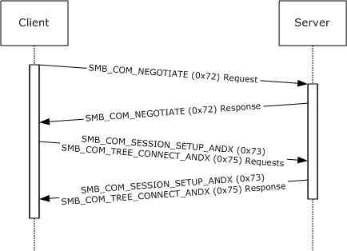

Figure 10: Protocol negotiation and connecting to a share

This capture was produced by mapping a drive letter on a Windows 98 operating system client to a share served by Windows NT Server 4.0 operating system Service Pack 6a (SP6a). The content was produced by executing the following command at an MS-DOS prompt on a Windows 98 client:

C:\> net use y: \\10.9.9.47\testshare1

<a id="Section_4.2"></a>
## 4.2 Disconnect Example

This example illustrates a client disconnecting from a share. An [**SMB connection**](#gt_smb-connection) and an [**SMB session**](#gt_smb-session) are already assumed to have been successfully completed.


Figure 11: Disconnecting from a share

The share used here was served from Windows NT Server 4.0 SP6a. It was mapped as drive Y: on a Windows 98 client.

The user operation performed was:

C:\> net use y: /d

<a id="Section_4.3"></a>
## 4.3 Message Signing Example

This example illustrates the use of the [**CIFS**](#gt_common-internet-file-system-cifs) message signing capability when connecting to a share.

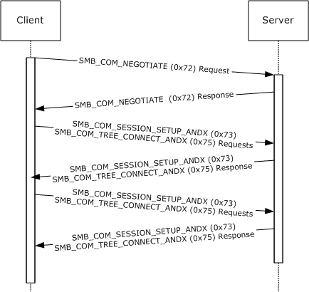

Figure 12: Message signing when connecting to a share

The example is a result of configuring a server running Windows NT Server 4.0 SP6a both to allow and require message signing (see [[ENSIGN]](https://go.microsoft.com/fwlink/?LinkId=161959) for information on configuring the registry for this feature), and likewise configuring a Windows NT Workstation 4.0 operating system Service Pack 6a (SP6a) client for message signing. A share from the server was then mapped to a drive letter on the client machine:

C:\> net use y: \\10.9.9.47\testshare1

FRAME 1. The first step is the negotiation request. This is the usual offer of dialects and exchange of the **Flags** and **Flags2** fields in the [SMB Header (section 2.2.3.1)](#Section_2.2.3.1) of the [SMB_COM_NEGOTIATE Request (section 2.2.4.52.1)](#Section_2.2.4.52.1). The SMB_FLAGS2_SMB_SECURITY_SIGNATURE bit in the **Flags2** field is cleared, and the **SecuritySignature** field is set to 0x0000000000000000. No security signature is generated at this stage.

FRAME 2. The negotiate response has the SMB_FLAGS2_SMB_SECURITY_SIGNATURE bit in the **Flags2** field cleared, and the **SecuritySignature** field is set to 0x0000000000000000. No signature is generated at this stage.

FRAME 3. The next exchange takes advantage of ANDX message batching. Two requests are sent together; the first [SMB_COM_SESSION_SETUP_ANDX Request (section 2.2.4.53.1)](#Section_2.2.4.53.1) is sent along with an [SMB_COM_TREE_CONNECT_ANDX Request (section 2.2.4.55.1)](#Section_2.2.4.55.1). The SMB_FLAGS2_SMB_SECURITY_SIGNATURE bit in the **Flags2** field is cleared in this request, and the **SecuritySignature** field is set to 0x0000000000000000. The tree connect attempt is to IPC$.

FRAME 4. The ANDX response contains a **SecuritySignature** field set to 0x0000000000000000, and the SMB_FLAGS2_SMB_SECURITY_SIGNATURE bit in the **Flags2** field bit is cleared.

FRAME 5. Next, another ANDX request consisting of an SMB_COM_SESSION_SETUP_ANDX Request and another SMB_COM_TREE_CONNECT_ANDX Request is sent. This is the attempt to connect to the share.

FRAME 6. Note that this time, the SMB_FLAGS2_SMB_SECURITY_SIGNATURE bit in the **Flags2** field is set, and the **SecuritySignature** field contains a valid signature. From this point on, all messages will be signed.

<a id="Section_4.4"></a>
## 4.4 Get File Attributes Example

This example illustrates the process of getting the attributes information from a file. An [**SMB connection**](#gt_smb-connection) and an [**SMB session**](#gt_smb-session) are already assumed to have been successfully completed.

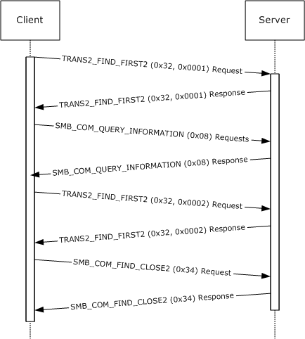

Figure 13: Getting file attributes information

The share used here was served from Windows NT Server 4.0 SP6a. It was mapped as drive Y: on a Windows 98 client. The following operation was performed in an MS-DOS window:

C:\> attrib y:\text.txt

<a id="Section_4.5"></a>
## 4.5 Set File Attributes Example

This example illustrates the process of setting attribute information for a file. An [**SMB connection**](#gt_smb-connection) and an [**SMB session**](#gt_smb-session) are already assumed to have been successfully completed.

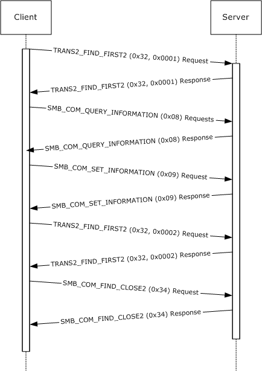

Figure 14: Setting file attribute information

The share used here was served from Windows NT Server 4.0 SP6a. It was mapped as drive Y: on a Windows 98 client. The operation performed was in an MS-DOS window:

C:\> attrib +r y:\text.txt

<a id="Section_4.6"></a>
## 4.6 Copy File from Share Example

This example illustrates the process of copying a file from a share to a client (downloading). An [**SMB connection**](#gt_smb-connection) and an [**SMB session**](#gt_smb-session) are already assumed to have been successfully completed.

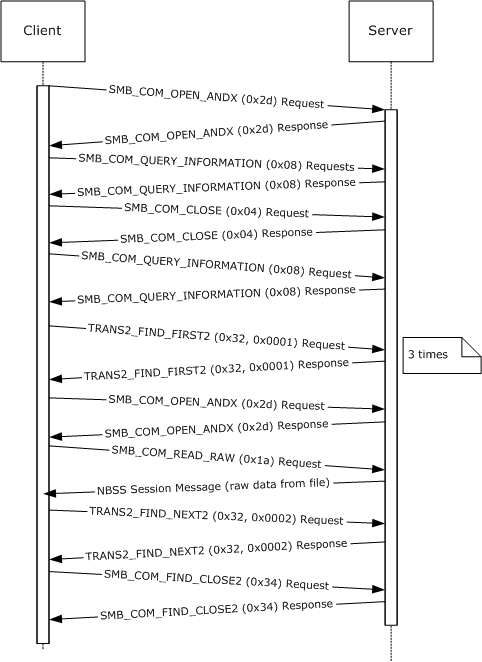

Figure 15: Command to copy y:\text.txt to the current directory

The share used here was served from Windows NT Server 4.0 SP6a. It was mapped as drive Y: on a Windows 98 client. The operation performed was in an MS-DOS window.

C:\> copy y:\text.txt .

<a id="Section_4.7"></a>
## 4.7 Copy File to Share Example

This example illustrates the process of copying a file from the client to a share (uploading). An [**SMB connection**](#gt_smb-connection) and an [**SMB session**](#gt_smb-session) are already assumed to have been successfully completed.

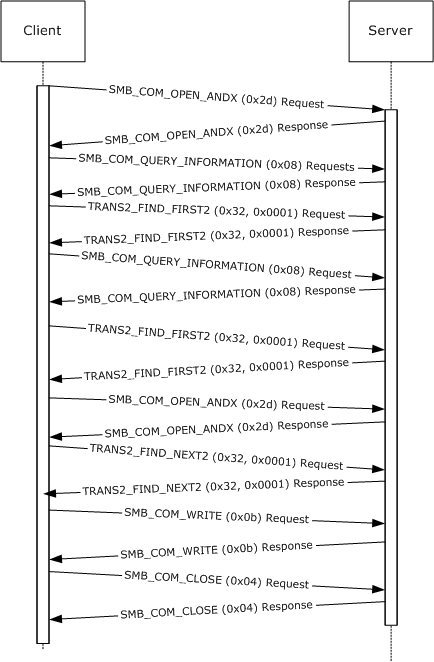

Figure 16: Copying a file from a client to a share

The share used here was served from Windows NT Server 4.0 SP6a. It was mapped as drive Y: on a Windows 98 client. The operation performed was in an MS-DOS window:

C:\> copy text.txt y:\text.txt

<a id="Section_5"></a>
# 5 Security

The following sections specify security considerations for implementers of the CIFS Protocol.

<a id="Section_5.1"></a>
## 5.1 Security Considerations for Implementers

A CIFS server can permit anonymous or [**guest account**](#gt_guest-account) logons. Such unauthenticated logons can provide access to services that need to be protected, and that can potentially expose vulnerabilities in the implementation.<358>

Share level access control passwords are transmitted in plaintext. The server can also indicate that it requires plaintext user level authentication. A "man-in-the-middle" attack can be used to clear the bit in the SMB_COM_NEGOTIATE response that indicates that the server supports challenge/response authentication, thus causing the client to assume that plaintext authentication is required.<359>

Several weaknesses in the LAN Manager (LM) challenge/response authentication scheme have been discovered and published. CIFS usage of LM challenge/response is specified in section [3.1.5.2](#Section_3.1.5.2).

Neither the LM nor the NTLM challenge/response algorithm includes a client nonce. A client nonce is used to protect against dictionary attacks by rogue servers. The LMv2 and NTLMv2 challenge/response algorithms do include a client nonce.

Message signing is optional. Message signing is used to prevent connection hijacking.

The protocol does not sign OpLock break requests from the server to the client if message signing is enabled. This can allow an attacker to affect performance but does not allow an attacker to deny access or alter data.

The algorithm used for message signing has been shown to be subject to collision attacks. For more information, see [[MD5Collision]](https://go.microsoft.com/fwlink/?LinkId=89937).

The protocol does not encrypt the data that is exchanged. To provide stricter data security, the underlying transport provides encryption. Otherwise, a different protocol is more applicable.

<a id="Section_5.2"></a>
## 5.2 Index of Security Parameters

| Security Parameter | Section |
| --- | --- |
| Unauthenticated clients (anonymous and guest access) | [3.2.4.2.3](#Section_3.2.4.2.3) |
| Share versus user access control | [3.2.4.2.4](#Section_3.2.4.2.4) |
| Plain Text Authentication | 3.2.4.2.3 |
| Challenge Response | [3.2.4.2.2](#Section_3.2.4.2.2) |
| Message Signing | [3.1.4.1](#Section_3.2.4.1) |

<a id="Section_6"></a>
# 6 Appendix A: Product Behavior

The information in this specification is applicable to the following Microsoft products or supplemental software. References to product versions include updates to those products.

- Windows NT Server 3.51 operating system
- Windows NT Server 4.0 operating system
- Windows NT Workstation 4.0 operating system
- Windows 98 operating system
- Windows 98 operating system Second Edition
Exceptions, if any, are noted in this section. If an update version, service pack or Knowledge Base (KB) number appears with a product name, the behavior changed in that update. The new behavior also applies to subsequent updates unless otherwise specified. If a product edition appears with the product version, behavior is different in that product edition.

Unless otherwise specified, any statement of optional behavior in this specification that is prescribed using the terms "SHOULD" or "SHOULD NOT" implies product behavior in accordance with the SHOULD or SHOULD NOT prescription. Unless otherwise specified, the term "MAY" implies that the product does not follow the prescription.

<1> Section 2.1: On Windows, SMB transports are supported as TDI Transport Drivers, as described in [[MSDN-TrnspDrvIntfc]](https://go.microsoft.com/fwlink/?LinkId=214278).

<2> Section 2.1.1: On MS-DOS, OS/2, and Windows systems, NetBIOS presents a common API. The [**CIFS**](#gt_common-internet-file-system-cifs) implementations on these platforms are written to use the NetBIOS API, which makes it possible to interchange NetBIOS-based transports without modifying the CIFS implementation itself. Implementation of the NetBIOS API is not necessary for CIFS interoperability.

<3> Section 2.1.1: Windows NT Server operating system drops the transport connection and does not return an error message response with an [**SMB**](#gt_server-message-block-smb) error class of ERRCMD (0xFF).

<4> Section 2.1.1.2: The Windows NT operating system implementation of the NetBIOS Name Service for NBT is known as the Windows Internet Name Service (WINS). The Windows NT implementation of the NetBIOS Name Server (NBNS) is known as a WINS server.

Microsoft's implementation of NBT for Windows NT and Windows 98 diverges from the standard specified in [[RFC1001]](https://go.microsoft.com/fwlink/?LinkId=90260) and [[RFC1002]](https://go.microsoft.com/fwlink/?LinkId=90261). There are several modifications and additions to the prescribed behavior of the name service, and the implementation of the datagram service is incomplete. See [IMPCIFS] for a discussion of some of these variations. Windows-specific extensions to NBT are documented in [MS-NBTE](../MS-NBTE/MS-NBTE.md).

<5> Section 2.1.2: Direct TCP Transport is probably the best-known example of direct hosting. Direct TCP Transport is described in [MS-SMB](../MS-SMB/MS-SMB.md). CIFS does not support Direct TCP Transport, because it was developed for Windows 2000 operating system and is not supported on Windows NT or Windows 98.

<6> Section 2.1.2.1: The recommended maximum interval between SMB requests is four (4) minutes. Windows NT Server 4.0 has a default time-out value of 15 minutes.

<7> Section 2.1.3: Windows NT Server 4.0 always sends a zero value for **SessionKey**.

<8> Section 2.1.3: Windows-based CIFS servers set **MaxNumberVcs** in the server's SMB_COM_NEGOTIATE response to 0x0001, but do not enforce this limit. This allows a CIFS client to establish more [**virtual circuits**](#gt_virtual-circuit-vc) than allowed by this value.

<9> Section 2.1.3: Windows NT Server does disconnect all existing transport-level connections from a client when it receives a new SMB_COM_SESSION_SETUP_ANDX request from that client with a **VcNumber** value of zero.

<10> Section 2.2.1.1.3: CIFS wildcard characters are based on Windows wildcard characters, as described in [MS-FSA](../MS-FSA/MS-FSA.md) section 2.1.4.4, Algorithm for Determining if a FileName Is in an Expression. For more information on wildcard behavior in Windows, see [[FSBO]](https://go.microsoft.com/fwlink/?LinkId=140636) section 7.

<11> Section 2.2.1.2.1.1: Windows clients include both the size of the **SizeOfListInBytes** field and the total size of the **GEAList** field when calculating the value passed in the **SizeOfListInBytes** field for compatibility with dialects less than the LAN Manager 1.2 dialect, as implemented in OS/2 v1.2. See [[XOPEN-SMB]](https://go.microsoft.com/fwlink/?linkid=2297696) sections 4.3.7 and 16.1.5 for more information.

<12> Section 2.2.1.2.2: The [SMB_FEA (section 2.2.1.2.2)](#Section_2.2.1.2.2) structure originated with the LANMAN1.2 dialect and is, therefore, used in Trans2 calls, the majority of which also originated in the LANMAN1.2 dialect. See [XOPEN-SMB] section 16.1.5 for a detailed description of the SMB_FEA structure. NT_TRANSACT_CREATE makes use of the FILE_FULL_EA_INFORMATION structure, which is similar to SMB_FEA. See [MS-FSCC](../MS-FSCC/MS-FSCC.md) for information on the FILE_FULL_EA_INFORMATION structure.

<13> Section 2.2.1.2.2.1: Windows clients include both the size of the **SizeOfListInBytes** field and the total size of the **FEAList** field when calculating the value passed in the **SizeOfListInBytes** field. This is required for compatibility with dialects less than the LAN Manager 1.2 dialect, as implemented in OS/2 v1.2. See [XOPEN-SMB] sections 4.3.7 and 16.1.5 for more information.

<14> Section 2.2.1.2.3: The file attributes encoded in the [**SMB_EXT_FILE_ATTR (section 2.2.1.2.3)**](#Section_2.2.1.2.3) data type are based on the native Windows file attributes described in [MS-FSCC] section 2.6 and listed in [[MSDN-CreateFile]](https://go.microsoft.com/fwlink/?LinkId=182698). The following table provides a mapping between the file attributes presented in this document and those in [MS-FSCC], as well as unsupported values and values unique to this document.

| Name or Status in [MS-CIFS] | Name or Status in [MS-FSCC] |
| --- | --- |
| ATTR_READONLY | FILE_ATTRIBUTE_READONLY |
| ATTR_HIDDEN | FILE_ATTRIBUTE_HIDDEN |
| ATTR_SYSTEM | FILE_ATTRIBUTE_SYSTEM |
| ATTR_DIRECTORY | FILE_ATTRIBUTE_DIRECTORY |
| ATTR_ARCHIVE | FILE_ATTRIBUTE_ARCHIVE |
| ATTR_NORMAL | FILE_ATTRIBUTE_NORMAL |
| ATTR_TEMPORARY | FILE_ATTRIBUTE_TEMPORARY |
| Not Supported in CIFS | FILE_ATTRIBUTE_SPARSE_FILE |
| Not Supported in CIFS | FILE_ATTRIBUTE_REPARSE_POINT |
| ATTR_COMPRESSED | FILE_ATTRIBUTE_COMPRESSED |
| Not Supported in CIFS | FILE_ATTRIBUTE_OFFLINE |
| Not Supported in CIFS | FILE_ATTRIBUTE_NOT_CONTENT_INDEXED |
| Not Supported in CIFS | FILE_ATTRIBUTE_ENCRYPTED |
| POSIX_SEMANTICS | Unique to CIFS/SMB |
| BACKUP_SEMANTICS | Unique to CIFS/SMB |
| DELETE_ON_CLOSE | Unique to CIFS/SMB |
| SEQUENTIAL_SCAN | Unique to CIFS/SMB |
| RANDOM_ACCESS | Unique to CIFS/SMB |
| NO_BUFFERING | Unique to CIFS/SMB |
| WRITE_THROUGH | Unique to CIFS/SMB |

<15> Section 2.2.1.2.3: Use care when using this option because files created with this flag might not be accessible by applications written for MS-DOS, Windows 3.0 operating system, Windows NT 3.1 operating system, or Windows NT.

<16> Section 2.2.1.2.3: Windows uses this flag to optimize file caching. If an application moves the file pointer for random access, optimum caching might not occur; however, correct operation is still guaranteed. Specifying this flag can increase performance for applications that read large files using sequential access. Performance gains can be even more noticeable for applications that read large files mostly sequentially, but occasionally skip over small ranges of bytes.

<17> Section 2.2.1.4.1: The maximum value permitted in the **SMB_DATE.YEAR** field is 119, resulting in a year range of 1980 to 2099.

<18> Section 2.2.1.5: Windows NT Server identifies these error codes as 32-bit values by leaving the SMB_FLAGS2_NT_STATUS bit set in the response to a request that also had the SMB_FLAGS2_NT_STATUS bit set.

<19> Section 2.2.1.6: Windows-based clients set the **PID** to the process identifier of the actual calling process for the following commands. For all other commands, Windows-based clients set the **PID** value to 0x0000FEFF.

- SMB_COM_NT_CREATE_ANDX (0xA2)
- SMB_COM_OPEN_PRINT_FILE (0xC0)
- All subcommands of SMB_COM_TRANSACTION (0x25) and SMB_COM_TRANSACTION_SECONDARY (0x26) except TRANS_MAILSLOT_WRITE, if **Client.Connection.ServerCapabilities** includes CAP_NT_SMBS.
- All subcommands of SMB_COM_TRANSACTION2 (0x32) and SMB_COM_TRANSACTION2_SECONDARY (0x33), if **Client.Connection.ServerCapabilities** includes CAP_NT_SMBS.
<20> Section 2.2.1.6.6: Windows NT Server always returns 0x00000000 and ignores the **SessionKey** when it is sent by the client in an [SMB_COM_SESSION_SETUP_ANDX Request (section 2.2.4.53.1)](#Section_2.2.4.53.1).

<21> Section 2.2.1.6.8: Windows NT Server uses this value internally as part of its list management mechanism.

<22> Section 2.2.2.3.3: Windows NT always returns this string in Unicode-encoded format.

<23> Section 2.2.2.4: Windows NT Server returns this error code if at least one command parameter fails validation tests such as a field value being out of range or fields within a command being internally inconsistent.

<24> Section 2.2.2.4: This error code is defined as ERRinvtid in Windows 98. Windows NT uses a completely different naming style.

<25> Section 2.2.2.4: Windows NT Server defines this class but does not return it. Windows NT client does not test for the ERRCMD class. In many instances, Windows-based servers close transport level connections if the incoming messages cannot be parsed.

<26> Section 2.2.3.1: This bit is ignored by Windows systems, which always handle pathnames as case-insensitive.

<27> Section 2.2.3.1: If CAP_STATUS32 has been negotiated during the [**SMB connection**](#gt_smb-connection), Windows-based servers ignore the value of the SMB_FLAGS2_NT_STATUS bit in client requests. If the **Status** field value to be returned in the header is STATUS_SUCCESS, Windows-based servers copy the value of the SMB_FLAGS2_NT_STATUS bit from the client request into the server response.

If CAP_STATUS32 has been negotiated and an error is returned and SMB_FLAGS2_NT_STATUS is not set in the request, the value of the SMB_FLAGS2_NT_STATUS bit and the format of the **Status** field in the header in the server response is undefined.

<28> Section 2.2.4.3.1: Windows NT Server always ignores the **SearchAttributes** field on Open and Create operations, and searches for files by name only.

<29> Section 2.2.4.15.2: Windows NT server temporary file names begin with "SRV" and are followed by the character equivalents of five (5) random hexadecimal digits (0-F). There is no extension set for the file name. The client is responsible for deleting the temporary file when it is no longer needed.

<30> Section 2.2.4.19.1: Windows NT server behavior is determined by the negotiated protocol dialect. Clients that negotiate **Core Protocol** can use a negative value in the **Offset** field to position the file pointer to the beginning of the file (BOF). Clients negotiating other protocol dialects receive an error if they supply a negative value in the **Offset** field.

<31> Section 2.2.4.19.2: Windows NT does not check for overflow conditions. It allows the file pointer that is maintained by the server to "wrap around".

<32> Section 2.2.4.23: Windows NT clients and Windows NT servers support this command on connection-oriented transports. This command does not support named pipes or I/O devices.

Windows does not support the **Timeout** field.

<33> Section 2.2.4.24: Windows NT servers return STATUS_SMB_BAD_COMMAND (ERRSRV/ERRbadcmd).

<34> Section 2.2.4.25.2: Windows NT servers always set **Available** to 0xFFFF.

<35> Section 2.2.4.26: Windows systems support this command only over connectionless transports. Consequently, Windows 98 and Windows NT clients and all clients connected to Windows NT servers set the 0x08 bit of the **WriteMode** field in the request. Windows NT servers support Write MPX only to regular files or spooled printer files. This command does not support writing to [**named pipes**](#gt_named-pipe) or I/O devices.

The **Timeout** field is not supported.

<36> Section 2.2.4.26.1: The **Timeout** field was used in earlier dialects. In the NT LAN Manager dialect, Write MPX is not used to write to named pipes or devices, so the **Timeout** field is ignored.

<37> Section 2.2.4.27: Windows NT servers return STATUS_INVALID_SMB (ERRSRV/ERRerror) instead of STATUS_NOT_IMPLEMENTED (ERRDOS/ERRbadfunc).

<38> Section 2.2.4.29: Windows NT Server returns STATUS_SMB_BAD_COMMAND (ERRSRV/ERRbadcmd) instead of STATUS_NOT_IMPLEMENTED (ERRDOS/ERRbadfunc) if the **WordCount** field in the request is set to 1; otherwise, Windows NT Server returns STATUS_INVALID_SMB (ERRSRV/ERRerror).

<39> Section 2.2.4.32.1: Windows NT Server does not support the CHANGE_LOCKTYPE flag of **TypeOfLock**. A client requesting that the server atomically change the lock type from a shared lock to an exclusive lock or vice versa results in an error being returned to the client.

<40> Section 2.2.4.32.1: If the CANCEL_LOCK bit is set, Windows NT servers cancel only the first lock request range listed in the lock array.

<41> Section 2.2.4.33.1: One way transactions are used only when communicating with Mailslots, which means that they never occur within CIFS sessions.

<42> Section 2.2.4.33.1: Windows NT Server honors the **Timeout** field only in transaction subcommands that specifically state that the **Timeout** field is honored. Check the individual subcommands for details.

<43> Section 2.2.4.33.1: Windows always sets **ParameterOffset** to an offset location, relative to the start of the [SMB Header (section 2.2.3.1)](#Section_2.2.3.1), where the **Trans_Parameters** field is expected to be. This behavior follows even if **ParameterCount** is zero.

<44> Section 2.2.4.33.1: Windows always sets **DataCount** to a value of **ParameterCount** + **ParameterOffset**. This restricts the **Trans_Data** field to follow after the **Trans_Parameters** field, although this is not strictly a protocol requirement.

<45> Section 2.2.4.33.2: Windows always sets **ParameterOffset** to an offset location, relative to the start of the SMB Header (section 2.2.3.1), where the **Trans_Parameters** field is expected to be. This behavior follows even if **ParameterCount** is zero.

<46> Section 2.2.4.33.2: Windows always sets **DataCount** to a value of **ParameterOffset** + **ParameterCount**. This action restricts the **Trans_Data** field to follow after the **Trans_Parameters** field, although this is not strictly a protocol requirement.

<47> Section 2.2.4.34.1: Windows always sets ParameterOffset to an offset location, relative to the start of the SMB Header (section 2.2.3.1), where the **Trans_Parameters** field is expected to be. This behavior follows even if ParameterCount is zero.

<48> Section 2.2.4.34.1: Windows always sets DataCount to a value of ParameterOffset + ParameterCount. This restricts the Trans_Data field to follow after the Trans_Parameters field, although this is not strictly a protocol requirement.

<49> Section 2.2.4.35: Windows NT server does not implement SMB_COM_IOCTL_SECONDARY. Therefore, all of the parameters and data for a request has to fit within the **MaxBufferSize** that was established during session setup. Windows NT server does not honor the value supplied in the **Timeout** field. Windows NT implementation specifics follow.

| Category | Function | Parameters | Data | Description |
| --- | --- | --- | --- | --- |
| SERIAL_DEVICE 0x0001 | GET_BAUD_RATE 0x0061 | None | USHORT BaudRate | Get the baud rate on the serial device. |
| - | SET_BAUD_RATE 0x0041 | None | USHORT BaudRate | Set the baud rate on the serial device |
| - | GET_LINE_CONTROL 0x0062 | UCHAR DataBits; UCHAR Parity; UCHAR StopBits; UCHAR TransBreak; | None. | Get serial device line control information. |
| - | SET_LINE_CONTROL 0x0042 | UCHAR DataBits; UCHAR Parity; UCHAR StopBits; UCHAR TransBreak; | None. | Set serial device line control information. |
| - | GET_DCB_INFORMATION 0x0073 | None. | USHORT WriteTimeout; USHORT ReadTimeout; UCHAR ControlHandShake; UCHAR FlowReplace; UCHAR Timeout; UCHAR ErrorReplacementChar; UCHAR BreakReplacementChar; UCHAR XonChar; UCHAR XoffChar; | Get serial device device control information. |
| - | SET_DCB_INFORMATION 0x0053 | None. | USHORT WriteTimeout; USHORT ReadTimeout; UCHAR ControlHandShake; UCHAR FlowReplace; UCHAR Timeout; UCHAR ErrorReplacementChar; UCHAR BreakReplacementChar; UCHAR XonChar; UCHAR XoffChar; | Get serial device device control information. |
| - | GET_COMM_ERROR 0x006D | None. | USHORT Error; | Get serial device device error information. |
| - | SET_TRANSMIT_TIMEOUT 0x0044 | - | - | Not implemented. |
| - | SET_BREAK_OFF 0x0045 | - | - | Not implemented. |
| - | SET_MODEM_CONTROL 0x0046 | - | - | Not implemented. |
| - | SET_BREAK_ON 0x004B | - | - | Not implemented. |
| - | STOP_TRANSMIT 0x0047 | - | - | Not implemented. |
| - | START_TRANSMIT 0x0048 | - | - | Not implemented. |
| - | GET_COMM_STATUS 0x0064 | - | - | Not implemented. |
| - | GET_LINE_STATUS 0x0065 | - | - | Not implemented. |
| - | GET_MODEM_OUTPUT 0x0066 | - | - | Not implemented. |
| - | GET_MODEM_INPUT 0x0067 | - | - | Not implemented. |
| - | GET_INQUEUE_COUNT 0x0068 | - | - | Not implemented. |
| - | GET_OUTQUEUE_COUNT 0x0069 | - | - | Not implemented. |
| - | GET_COMM_EVENT 0x0072 | - | - | Not implemented. |
| PRNTER_DEVICE 0x0005 | GET_PRINTER_STATUS 0x0066 | - | CHAR Status | Always returns OS2_STATUS_PRINTER_HAPPY (0x90). |
| SPOOLER_DEVICE 0x0053 | GET_PRINTER_ID 0x0060 | - | USHORT JobId; UCHAR Buffer[1]; | Print job ID and printer share name. |
| GENERAL_DEVICE 0x000B | - | - | - | Not implemented. |

<50> Section 2.2.4.35.2: [XOPEN-SMB], in section 14.3, states that ERRSRV/ERRnosupport can be returned if the server does not support the SMB_COM_IOCTL command. Windows NT servers support this command, although it is deprecated.

<51> Section 2.2.4.37: Windows NT servers attempt to process this command, but the implementation is incomplete and the results are not predictable.

<52> Section 2.2.4.38: Windows NT servers attempt to process this command, but the implementation is incomplete and the results are not predictable.

<53> Section 2.2.4.39.1: Windows 98 accept only an SMB_COM_ECHO request containing a valid **TID** or a **TID** value of 0xFFFF (-1). Windows NT ignores the **TID** in the SMB_COM_ECHO request.

<54> Section 2.2.4.39.2: Windows clients ignore the **SequenceNumber** field in the server response.

<55> Section 2.2.4.40: Windows NT and Windows 98 clients do not send [SMB_COM_WRITE_AND_CLOSE (0x2C) (section 2.2.4.40)](#Section_2.2.4.40) requests.

<56> Section 2.2.4.40.2: Windows NT Server appends three null padding bytes to this message, following the **ByteCount** field. These three bytes are not message data and can safely be discarded.

<57> Section 2.2.4.41.1: Windows NT Server ignores SearchAttrs in open requests.

<58> Section 2.2.4.42.2: An AndX chain can be formed by adding an SMB_COM_CLOSE command as a follow-on to SMB_COM_READ_ANDX. SMB_COM_CLOSE is the only valid follow-on command for SMB_COM_READ_ANDX. Windows NT Server correctly processes AndX chains consisting of SMB_COM_READ_ANDX and SMB_COM_CLOSE, but does not correctly set the AndXCommand field in the response message. Windows NT Server always sets the value of AndXCommand in the SMB_COM_READ_ANDX response to SMB_COM_NO_ANDX_COMMAND (0xFF).

<59> Section 2.2.4.42.2: Windows NT Server always sets this field in this message to zero, even if there is a chained SMB_COM_CLOSE follow-on response connected to the SMB_COM_READ_ANDX response message. If present, the SMB_COM_CLOSE response can be seen as three null padding bytes (representing WordCount==0x00 and ByteCount==0x0000) immediately following the SMB_Parameters of the SMB_COM_READ_ANDX portion of the message.

<60> Section 2.2.4.42.2: Windows-based servers set the **DataLength** field to 0x0000 and return STATUS_SUCCESS.

<61> Section 2.2.4.43.1: Windows NT and Windows 98 clients set this field to zero for non-[**message mode**](#gt_message-mode) pipe writes. This field is ignored by the server if the [**FID**](#gt_fid) indicates a file. If a pipe write spans multiple requests, for all pipe write requests Windows clients set this field to the total number of bytes to be written.

<62> Section 2.2.4.43.2: Windows NT servers always set **Available** to 0xFFFF.

<63> Section 2.2.4.44: Windows NT Server returns STATUS_SMB_BAD_COMMAND (ERRSRV/ERRbadcmd) if the **WordCount** field in the request is set to 3; otherwise, Windows NT Server returns STATUS_INVALID_SMB (ERRSRV/ERRerror).

<64> Section 2.2.4.45: Windows NT Server has a partial implementation that treats this SMB command as though it were an [SMB_COM_CLOSE (section 2.2.4.5)](#Section_2.2.4.5) followed by an [SMB_COM_TREE_DISCONNECT (section 2.2.4.51)](#Section_2.2.4.51.2); however, the SMB_COM_TREE_DISCONNECT is never called. The format of the command is identical to that of SMB_COM_CLOSE. This command was never documented and is not called by Windows clients.

<65> Section 2.2.4.46.1: One way transactions are used only when communicating with Mailslots, which means that they never occur within CIFS sessions.

<66> Section 2.2.4.46.1: Windows NT Server honors the **Timeout** field only in transaction subcommands that specifically state that the Timeout field is honored. Check the individual subcommands for details.

<67> Section 2.2.4.46.1: Windows always sets **ParameterOffset** to an offset location, relative to the start of the SMB Header (section 2.2.3.1), where the **Trans_Parameters** field is expected to be. This behavior follows even if **ParameterCount** is zero.

<68> Section 2.2.4.46.1: Windows always sets **DataCount** to a value of **ParameterOffset** + **ParameterCount**. This restricts the **Trans_Data** field to follow after the **Trans_Parameters** field, although this is not strictly a protocol requirement.

<69> Section 2.2.4.46.2: Windows always sets **ParameterOffset** to an offset location, relative to the start of the SMB Header (section 2.2.3.1), where the **Trans_Parameters** field is expected to be. This behavior follows even if **ParameterCount** is zero.

<70> Section 2.2.4.46.2: Windows always sets **DataCount** to a value of **ParameterOffset** + **ParameterCount**. This action restricts the **Trans_Data** field to follow after the **Trans_Parameters** field, although this is not strictly a protocol requirement.

<71> Section 2.2.4.46.2: Windows NT Server sends an arbitrary number of additional bytes beyond the end of the SMB response message. These additional bytes can be ignored by the recipient.

<72> Section 2.2.4.47.1: Windows always sets **ParameterOffset** to an offset location, relative to the start of the SMB Header (section 2.2.3.1), where the **Trans_Parameters** field is expected to be. This behavior follows even if **ParameterCount** is zero.

<73> Section 2.2.4.47.1: Windows always sets **DataCount** to a value of **ParameterOffset** + **ParameterCount**. This action restricts the **Trans_Data** field to follow after the **Trans_Parameters** field, although this is not strictly a protocol requirement.

<74> Section 2.2.4.50.1: Windows NT servers do not test to determine whether the strings in this request are 16-bit Unicode or 8-bit extended ASCII. It assumes that they are 8-bit strings. Clients that support Unicode use the [SMB_COM_TREE_CONNECT_ANDX (section 2.2.4.55)](#Section_2.2.4.55.2) command.

<75> Section 2.2.4.52.1: Windows 98 and Windows NT clients typically send a **TID** value of zero (0x0000) in the SMB_COM_NEGOTIATE request. This value has no particular significance.

<76> Section 2.2.4.52.1: Windows 98 and Windows NT clients typically send a **UID** value of zero (0x0000) in the SMB_COM_NEGOTIATE request. This value has no particular significance.

<77> Section 2.2.4.52.2: The name of this bit value is misleading. Encrypted passwords are used to generate the response to the challenge, but are not sent across the network.

<78> Section 2.2.4.52.2: In some implementations of earlier dialects, this bit was used to indicate support for the SMB_COM_SECURITY_PACKAGE_ANDX command. That usage is obsolete.

<79> Section 2.2.4.52.2: On Windows NT server the default value is 50 (0x0032). This value can be set using the **MaxMpxCt** registry key.

<80> Section 2.2.4.52.2: Windows-based CIFS servers set this field to 0x0001, but do not enforce this limit. This allows a CIFS client to establish more virtual circuits than allowed by this value. Because this limit is not enforced on Windows, CIFS clients can ignore this limit and attempt to establish more than the number of virtual circuits allowed by this value. The Windows behavior of the CIFS server allows a client to exceed this limit, but other server implementations can enforce this limit and not allow this to occur. Windows clients ignore the **MaxNumberVcs** field in the server response.

<81> Section 2.2.4.52.2: If more than 512 MB of memory is available, by default, Windows NT Server, Windows 2000, Windows Server 2003 operating system, Windows Server 2008 operating system, Windows Server 2008 R2 operating system, Windows Server 2012 operating system, and Windows Server 2012 R2 operating system set the **MaxBufferSize** value to 16644 bytes. The **MaxBufferSize** is configurable as described in [[MSKB-320829]](https://go.microsoft.com/fwlink/?LinkId=304224).

<82> Section 2.2.4.52.2: Windows clients ignore the **MaxRawSize** field in the server response and use a default value of 65536 bytes (64K) as the maximum raw buffer size for an [SMB_COM_WRITE_RAW Request (section 2.2.4.25.1)](#Section_2.2.4.25.1).

<83> Section 2.2.4.52.2: Windows NT clients assume that CAP_NT_FIND is set if CAP_NT_SMBS is set.

<84> Section 2.2.4.52.2: The CAP_BULK_TRANSFER capability was supposed to indicate server support for the SMB_COM_READ_BULK and SMB_COM_WRITE_BULK commands, which were never implemented. The CAP_BULK_TRANSFER capability bit was never used in Windows-based clients or servers.

<85> Section 2.2.4.52.2: The CAP_COMPRESSED_DATA capability bit was supposed to indicate whether a server supported compressed SMB packets. This feature was never specified, implemented, or used. Windows-based clients and servers do not support CAP_COMPRESSED_DATA, so this capability is never set.

<86> Section 2.2.4.52.2: The CAP_QUADWORD_ALIGNED capability bit was intended to indicate that Windows directory **InformationLevel** responses were quadword-aligned. The CAP_QUADWORD_ALIGNED capability bit was never used in released Windows-based clients or servers.

<87> Section 2.2.4.52.2: Windows clients ignore the **SystemTime** field in the server response.

<88> Section 2.2.4.52.2: Windows clients ignore the **ServerTimeZone** field in the server response.

<89> Section 2.2.4.52.2: Windows NT servers always send the **DomainName** field in Unicode characters and never add a padding byte for alignment. Windows clients ignore the **DomainName** field in the server response.

<90> Section 2.2.4.53: Windows clients always issue SMB_COM_SESSION_SETUP_ANDX and SMB_COM_TREE_CONNECT_ANDX as a batched request.

<91> Section 2.2.4.53.1: Windows NT clients and servers always use a **MaxBufferSize** value that is a multiple of four (4). **MaxBufferSize** values, sent or received via SMB, are always rounded down to the nearest multiple of four before they are used. This is done by masking out the two lowest-order bits of the value: **MaxBufferSize** &= ~3;

The default **MaxBufferSize** on Windows clients is 4356 (0x1104) bytes (4KB + 260Bytes). The **MaxBufferSize** can be configured through the following registry setting:

HKLM\SYSTEM\CurrentControlSet\Services\LanmanServer\Parameters\SizReqBuf

If the client's **MaxBufferSize** value in a session setup request is below a system-specified minimum value, Windows CIFS servers will fail the request and return ERRSRV/ERRerror. The default minimum acceptable **MaxBufferSize** value is 500 (0x1F4) bytes. This value can be modified using the following registry setting:

HKEY_Local_Machine\System\CurrentControlSet\Services\LanManServer\Parameters\MinClientBufferSize

<92> Section 2.2.4.53.1: Windows-based servers support a maximum [SMB_COM_READ_ANDX (section 2.2.4.42)](#Section_2.2.4.42) buffer size of 61440 (0xF000 = 60K) when the CAP_LARGE_READX capability is negotiated.

<93> Section 2.2.4.53.1: Windows-based CIFS servers set a limit for the **MaxNumberVcs** field in the [SMB_COM_NEGOTIATE Response (section 2.2.4.52.2)](#Section_2.2.4.52.2) to 0x01, but do not enforce this limit. This allows a CIFS client to establish more virtual circuits than allowed by the **MaxNumberVcs** field value. Because this limit is not enforced on Windows, CIFS clients can ignore this limit and attempt to establish more than the number of virtual circuits allowed by this value. The Windows behavior of the CIFS server allows a client to exceed this limit, but other server implementations can enforce this limit and not allow this to occur.

<94> Section 2.2.4.53.1: Windows NT Server ignores the client's **SessionKey**.

<95> Section 2.2.4.53.1: The Windows 98 client sends only CAP_RAW_MODE and CAP_UNICODE. Windows NT clients send only CAP_NT_STATUS, CAP_UNICODE, CAP_LEVEL_II_OPLOCKS, and CAP_NT_SMBS (the latter implies CAP_NT_FIND). Windows NT Server checks only for the following capabilities in the client's SMB_COM_SESSION_SETUP_ANDX request: CAP_UNICODE, CAP_LARGE_FILES, CAP_NT_SMBS, CAP_NT_FIND, CAP_NT_STATUS, and CAP_LEVEL_II_OPLOCK.

For some capabilities, it is not necessary for the client to indicate support for a server capability in order to use that capability. For example, Windows 98 clients do not indicate support for DFS, but still request DFS referrals from the server if the server has indicated support.

<96> Section 2.2.4.53.1: Windows NT and Windows 98 clients do not set the CAP_LARGE_FILES bit.

<97> Section 2.2.4.53.1: Windows client systems that negotiate CAP_NT_SMBS also negotiate CAP_UNICODE. Windows NT servers expect that CAP_NT_SMBS and CAP_UNICODE will be negotiated together. This relationship, however, is not enforced by the server. If the client negotiates one of these capabilities but not the other, the contents of SMB_STRING fields in Windows NT server response messages are undefined and can be malformed.

<98> Section 2.2.4.53.1: Windows 98 and Windows NT clients do not set the CAP_NT_FIND capability bit. Windows NT Server, however, treats CAP_NT_FIND as set if CAP_NT_SMBS is set.

<99> Section 2.2.4.53.1: Windows NT Server does not support plaintext Unicode authentication.

<100> Section 2.2.4.53.1: Windows CIFS clients set this field based on the version and service pack level of the Windows operating system. A list of possible values for this field includes the following:

| Windows OS version | NativeOS string |
| --- | --- |
| Windows NT 4.0 operating system | Windows NT 1381 |
| Windows NT 3.51 operating system | Windows NT 1057 |
| Windows 98 Second Edition | Windows 4.0 |

<101> Section 2.2.4.53.1: Windows CIFS clients set this field based on the version of the Windows operating system. A list of possible values for this field includes the following:

| Windows OS version | NativeLanMan string |
| --- | --- |
| Windows NT 4.0 | Windows NT 4.0 |
| Windows NT 3.51 | Windows NT 3.51 |
| Windows 98 Second Edition | Windows 4.0 |

Windows NT clients add an extra string terminator following the NativeOS field, so the **NativeLanMan** string appears to be the empty string. If **ByteCount** indicates that there are more bytes in the **SMB_Data.Data** block, the additional bytes are the **NativeLanMan** string. The **NativeLanMan** string also contains an extra terminating null character.

<102> Section 2.2.4.53.2: Windows-based CIFS servers set this field based on the version and service pack level of the Windows operating system. The following table includes a list of possible values for this field:

| Windows OS version | NativeOS string |
| --- | --- |
| Windows NT 3.51 | Windows NT 1057 |
| Windows NT 4.0 | Windows NT 1381 |
| Windows 98 Second Edition | Windows 4.0 |

Windows clients ignore the **NativeOS** field in the server response.

<103> Section 2.2.4.53.2: Windows-based CIFS servers set this field based on the version of the Windows operating system. The following table lists possible values for this field:

| Windows OS version | NativeLanMan string |
| --- | --- |
| Windows NT 3.51 | NT LAN Manager 3.51 |
| Windows NT 4.0 | NT LAN Manager 4.0 |
| Windows 98 Second Edition | Windows 4.0 |

Windows clients ignore the **NativeLanMan** field in the server response.

<104> Section 2.2.4.53.2: Windows clients ignore the **PrimaryDomain** field in the server response.

<105> Section 2.2.4.53.2: Windows-based servers terminate the **PrimaryDomain** string with a single null byte if the **Pad** field in the response is not empty.

<106> Section 2.2.4.55.1: Windows 98 clients set this bit. Windows NT servers ignore the setting.

<107> Section 2.2.4.55.2: Windows clients ignore the **NativeFileSystem** field in the server response.

<108> Section 2.2.4.56: This command is neither reserved nor implemented in Windows. Windows NT servers return STATUS_SMB_BAD_COMMAND (ERRSRV/ERRbadcmd).

<109> Section 2.2.4.58.1: Windows NT systems define this UCHAR field as follows:

bit 7 (mask 0x80): Reserved for client use.

bits 5,6 (mask 0x60): Reserved for system use.

bits 0-4 (mask 0x1F): Reserved for server use.

The above definition agrees with [[SMB-CORE]](https://go.microsoft.com/fwlink/?LinkId=164301) as well as [[CIFS]](https://go.microsoft.com/fwlink/?linkid=2109334), and is used in Windows NT server. [XOPEN-SMB], however, declares this field as reserved for client use. The safest course for implementers is to avoid modifying the contents of this field, whether set by the client or the server.

<110> Section 2.2.4.58.1: Windows NT server makes use of the **ServerState** field as follows:

ServerState

{

UCHAR FileName[8];

UCHAR FileExt[3];

UCHAR SearchID;

ULONG FileIndex;

}

**FileName (8 bytes):** This is the name portion of the 8.3 format file name. The name is left-justified and space-padded.

**FileExt (3 bytes):** This is the file extension of the 8.3 format file name. It is left-justified and space-padded.

This 11-byte representation of the 8.3 format name is known as the "packed" format.

**SearchID (1 byte) :** This is a one-byte search identifier used by the server to uniquely identify the search operation. The use of a one-byte field implies that the NT server can manage a maximum of 256 concurrent searches per SMB session.

**FileIndex (4 bytes):** A server-specific index used to continue the search at the correct place in the remote directory.

<111> Section 2.2.4.61.1: Windows clients set **MaxCount** to nonzero values. Windows-based servers fail the request with STATUS_INVALID_SMB if **MaxCount** is 0x0000.

<112> Section 2.2.4.61.2: Windows NT servers set this field to 0x0000 and do not send the **BufferFormat** and **DataLength** fields.

<113> Section 2.2.4.62.1: Windows always sets **ParameterOffset** to an offset location, relative to the start of the SMB Header (section 2.2.3.1), where the **Trans_Parameters** field is expected to be. This behavior follows even if **ParameterCount** is zero.

<114> Section 2.2.4.62.1: Windows always sets **DataCount** to a value of **ParameterOffset** + **ParameterCount**. This action restricts the **Trans_Data** field to follow after the **Trans_Parameters** field, although this is not strictly a protocol requirement.

<115> Section 2.2.4.62.2: Windows always sets **ParameterOffset** to an offset location, relative to the start of the SMB Header (section 2.2.3.1), where the **Trans_Parameters** field is expected to be. This behavior follows even if **ParameterCount** is zero.

<116> Section 2.2.4.62.2: Windows always sets **DataCount** to a value of **ParameterOffset** + **ParameterCount**. This action restricts the **Trans_Data** field to follow after the **Trans_Parameters** field, although this is not strictly a protocol requirement.

<117> Section 2.2.4.63.1: Windows always sets **ParameterOffset** to an offset location, relative to the start of the SMB Header (section 2.2.3.1), where the **Trans_Parameters** field is expected to be. This behavior follows even if **ParameterCount** is zero.

<118> Section 2.2.4.63.1: Windows always sets **DataCount** to a value of **ParameterOffset** + **ParameterCount**. This action restricts the **Trans_Data** field to follow after the **Trans_Parameters** field, although this is not strictly a protocol requirement.

<119> Section 2.2.4.64.1: Windows NT CIFS servers allow only the FILE_OPEN option on a named pipe. All other options are ignored and considered the same as FILE_OPEN. Windows NT CIFS servers do not allow clients to "open" or to "create" a mailslot.

<120> Section 2.2.4.65: Upon receipt of this command, the Windows NT server attempts to complete outstanding commands such as those that are waiting for a thread context or waiting to access a busy resource. If the outstanding command cannot be completed successfully, the server returns an implementation-specific error.

<121> Section 2.2.4.66: Windows NT client and server both support the [SMB_COM_NT_RENAME](#Section_3.3.5.53) command. However, the design and implementation of this command was never completed. The SMB_COM_NT_RENAME command is not documented in [CIFS]; the only prior documentation covering this command is [[SNIA]](https://go.microsoft.com/fwlink/?LinkId=90519).

The request structure for this command includes a **Reserved** field that was originally intended to access a proposed server feature that was never implemented. The SMB_DATA portion of the message also includes **Buffer Format** fields, making this the only non-Core Protocol command to make use of **Buffer Format** fields.

This command is superseded by newer commands in updated versions of the protocol (see [MS-SMB]).

<122> Section 2.2.4.66: The Windows-based server implementation of SMB_COM_NT_RENAME does not support moving a file within its existing path hierarchy. If such a move is requested, the server will copy the file instead.

<123> Section 2.2.4.66.1: Windows clients never send an [SMB_COM_NT_RENAME Request (section 2.2.4.66.1)](#Section_2.2.4.66.1) using this information level. Instead, they use [SMB_COM_RENAME (section 2.2.4.8)](#Section_2.2.4.8) to perform rename operations. Windows-based servers process SMB_COM_NT_RENAME Requests with this information level in the same way as an [SMB_COM_RENAME Request (section 2.2.4.8.1)](#Section_2.2.4.8.1), with the exception that they do not allow wildcards in the request.

<124> Section 2.2.4.66.1: Windows clients do not send SMB_COM_NT_RENAME Requests with the SMB_NT_RENAME_MOVE_FILE information level. Windows NT servers do not fully implement this information level, and perform a file copy instead of a rename or move if SMB_NT_RENAME_MOVE_FILE is specified.

<125> Section 2.2.4.66.1: This field was previously designated **ClusterCount** (as listed in [SNIA] section 2.4.13). **ClusterCount** is not implemented in Windows.

<126> Section 2.2.4.67.1: Windows NT4.SP6 server ignores the **Identifier**.

<127> Section 2.2.4.70: Support for this command was not implemented in Windows NT Server. Windows 98 and Windows NT clients do not call this command.

<128> Section 2.2.4.71: Windows NT Server returns STATUS_SMB_BAD_COMMAND (ERRSRV/ERRbadcmd) instead of STATUS_NOT_IMPLEMENTED (ERRDOS/ERRbadfunc) if the **WordCount** field in the request is set to 12; otherwise, Windows NT Server returns STATUS_ INVALID_SMB (ERRSRV/ERRerror).

<129> Section 2.2.4.72: Windows NT Server returns STATUS_SMB_BAD_COMMAND (ERRSRV/ERRbadcmd) instead of STATUS_NOT_IMPLEMENTED (ERRDOS/ERRbadfunc) if the **WordCount** field in the request is set to 12; otherwise, Windows NT Server returns STATUS_INVALID_SMB (ERRSRV/ERRerror).

<130> Section 2.2.4.73: Windows NT servers return STATUS_SMB_BAD_COMMAND (ERRSRV/ERRbadcmd) instead of STATUS_NOT_IMPLEMENTED (ERRDOS/ERRbadfunc).

<131> Section 2.2.5.1: The [TRANS_SET_NMPIPE_STATE](#Section_3.3.5.57.2) subcommand was introduced to provide support for the **SetNamedPipeHandleState()** system call in OS/2 and Win32. For more information, see [[MSDN-SetNmdPipeHndState]](https://go.microsoft.com/fwlink/?LinkId=182918). Windows NT servers use the FilePipeInformation Information Class to implement this named pipe transaction subcommand. For more information, see [MS-FSCC] section 2.4.37.

<132> Section 2.2.5.2: Windows NT Server does not support this transaction subcommand. It returns a status of STATUS_INVALID_PARAMETER (ERRDOS/ERRinvalidparam).

<133> Section 2.2.5.3: The [TRANS_QUERY_NMPIPE_STATE](#Section_3.2.5.38.3) subcommand was introduced to provide support for the GetNamedPipeHandleState() system call in OS/2 and Win32. For more information, see [[MSDN-GetNmdPipeHndState]](https://go.microsoft.com/fwlink/?LinkId=182699). Windows NT servers use the FilePipeInformation Information Class to implement this named pipe transaction subcommand. For more information, see [MS-FSCC] section 2.4.37.

<134> Section 2.2.5.4: The [TRANS_QUERY_NMPIPE_INFO](#Section_3.3.5.57.5) subcommand was introduced to provide support for the **GetNamedPipeInfo()** system call in OS/2 and Win32. For more information, see [[MSDN-GetNmdPipeInfo]](https://go.microsoft.com/fwlink/?LinkId=182705).Windows NT servers use the FilePipeLocalInformation Information Class to implement this named pipe transaction subcommand. For more information, see [MS-FSCC] section 2.4.38.

<135> Section 2.2.5.5: The [TRANS_PEEK_NMPIPE](#Section_2.2.5.5) subcommand was introduced to provide support for the **PeekNamedPipe()** system call in OS/2 and Win32. For more information, see [[MSDN-PkNmdPipe]](https://go.microsoft.com/fwlink/?LinkId=121801). Windows NT servers use FSCTL_PIPE_PEEK to implement this subcommand. For more information, see [MS-FSCC] sections 2.3.45 and 2.3.46.

<136> Section 2.2.5.5: Windows always peeks from a named pipe using the read mode that was specified when the named pipe was created. The peek operation is not affected when the TRANS_SET_NMPIPE_STATE subcommand is used to change the state of the named pipe. In addition, the operation always returns immediately and is not affected by the wait mode of the named pipe. For more information, see [MSDN-PkNmdPipe].

<137> Section 2.2.5.6: The [TRANS_TRANSACT_NMPIPE](#Section_2.2.5.6) subcommand was introduced to provide support for the **TransactNamedPipe()** system call in OS/2 and Win32. For more information, see [[MSDN-TrnsactNmdPipe]](https://go.microsoft.com/fwlink/?LinkId=182709). Windows NT servers use FSCTL_PIPE_TRANSCEIVE to implement this subcommand. For more information, see [MS-FSCC] sections 2.3.47 and 2.3.48.

<138> Section 2.2.5.6.2: If the Windows NT Server receives a single-request transaction where the request's **DataCount** field equals the **TotalDataCount** field and the **ParameterCount** field equals the **TotalParameterCount** field, and if the server response indicates a STATUS_BUFFER_OVERFLOW, the data read from the named pipe is included in the response's **ReadData** field, even if the amount of data read from the pipe exceeds the **MaxDataCount** field of the client's request. In this case, the response's **TotalDataCount** field is greater than the **DataCount** field and indicates the number of remaining bytes that were not transferred to the client in the response.

<139> Section 2.2.5.7: Windows NT Server permits only a 2-byte write that contains two null padding bytes, and requires that the pipe is in message mode. If these conditions are not met, NT server returns a STATUS_INVALID_PARAMETER error.

<140> Section 2.2.5.10: The [TRANS_WAIT_NMPIPE](#Section_2.2.5.10) subcommand was introduced to provide support for the **WaitNamedPipe()** system call in OS/2 and Win32. For more information, see [[MSDN-WaitNmdPipe]](https://go.microsoft.com/fwlink/?LinkId=182711). Windows NT servers use FSCTL_PIPE_WAIT to implement this subcommand. For more information, see [MS-FSCC] sections 2.3.49 and 2.3.50.

<141> Section 2.2.5.10.1: Windows NT server honors the **Timeout** field for this transaction.

<142> Section 2.2.5.10.1: Windows NT servers ignore the **Priority** value in the [TRANS_WAIT_NMPIPE Request (section 2.2.5.10.1)](#Section_2.2.5.10.1), and do not provide a default priority.

<143> Section 2.2.5.11: The [TRANS_CALL_NMPIPE](#Section_3.2.5.38.10) subcommand was introduced to provide support for the CallNamedPipe() system call in OS/2 and Win32. For more information, see [[MSDN-CallNmdPipe]](https://go.microsoft.com/fwlink/?LinkId=182715). Windows NT servers use FSCTL_PIPE_TRANSCEIVE to implement this subcommand. For more information, see [MS-FSCC] sections 2.3.47 and 2.3.48.

<144> Section 2.2.5.11.2: Windows 98 clients misread the number of data bytes returned. For more information, see [[MSKB-235717]](https://go.microsoft.com/fwlink/?LinkId=182630).

<145> Section 2.2.5.11.2: When the TRANS_CALL_NMPIPE (section 2.2.5.11) operation returns STATUS_BUFFER_OVERFLOW, Windows-based servers set the **SetupCount** field value in the [TRANS_CALL_NMPIPE Response (section 2.2.5.11.2)](#Section_2.2.5.11.2) to the **SetupCount** field value in the [TRANS_CALL_NMPIPE Request (section 2.2.5.11.1)](#Section_2.2.5.11.1) * 2.

<146> Section 2.2.6.3.1: If the client sends an empty string (0x00 or 0x0000) in the **FileName** field for the [TRANS2_FIND_NEXT2 Request (section 2.2.6.3.1)](#Section_2.2.6.3.1), Windows NT servers return no data in the **Trans2_Data** block. The **SearchCount** field value in the **Trans2_Parameters** block is set to zero (0x0000).

<147> Section 2.2.6.8.2: If the information level is SMB_QUERY_FILE_ALL_INFO, Windows NT servers append 4 additional bytes at the end of the **Trans2_Data** block that are set to arbitrary values and that are ignored on receipt.

<148> Section 2.2.7.1.1: Windows NT Server requires that this field be aligned to a 32-bit boundary. No padding is required, however, because the NT_Trans_Data block is aligned, and the **SecurityDescriptor** field is always a multiple of 32 bits.

<149> Section 2.2.7.2: Windows clients generate IOCTL and FSCTL codes that are supported only by Windows NT Server.

<150> Section 2.2.7.3: **Security descriptors** are typically useful only to Windows clients.

<151> Section 2.2.7.4.2: The Windows NT Server implementation of NT_TRANSACT_NOTIFY_CHANGE always returns the names of changed files in Unicode format.

<152> Section 2.2.7.6: Security descriptors are typically useful only to Windows clients.

<153> Section 2.2.8.1.1: Windows NT servers append a single NULL padding character to this field. If CAP_UNICODE has been negotiated, the server appends two NULL bytes to this field; otherwise, one NULL byte is appended. The length of the terminating NULL character is not included in the value of the **FileNameLength** field.

<154> Section 2.2.8.1.2: Windows NT servers always append a single NULL padding byte to the **FileName** field. The length of this additional byte is not included in the value of the **FileNameLength** field.

<155> Section 2.2.8.1.3: If CAP_UNICODE has been negotiated, Windows NT servers set the **FileNameLength** field to an arbitrary value.

<156> Section 2.2.8.1.3: Windows NT servers always append a single NULL padding byte to the **FileName** field. The length of this additional byte is not included in the value of the **FileNameLength** field.

<157> Section 2.2.8.1.4: Windows-based CIFS servers set the **FileIndex** field to a nonzero value if the underlying [**object store**](#gt_object-store) supports indicating the position of a [**file**](#gt_file) within the parent directory.

<158> Section 2.2.8.1.4: If CAP_UNICODE has not been negotiated, Windows NT servers include the length of the terminating NULL byte in the value of the **FileNameLength** field.

<159> Section 2.2.8.1.4: Windows NT servers append an arbitrary number of extra NULL padding bytes to the **FileName** field. The length of these additional NULL bytes is not included in the value of the **FileNameLength** field unless CAP_UNICODE has not been negotiated. If CAP_UNICODE has not been negotiated, only the length of the first NULL byte is included in the value of the **FileNameLength** field.

<160> Section 2.2.8.1.5: Windows-based CIFS servers set the **FileIndex** field to a nonzero value if the underlying object store supports indicating the position of a file within the parent directory.

<161> Section 2.2.8.1.5: If CAP_UNICODE has not been negotiated, Windows NT servers include the length of one NULL padding byte in the **FileNameLength** field value.

<162> Section 2.2.8.1.5: Windows NT servers append an arbitrary number of extra NULL padding bytes to the **FileName** field. The length of these additional NULL bytes is not included in the value of the **FileNameLength** field unless CAP_UNICODE has not been negotiated. If CAP_UNICODE has not been negotiated, only the length of the first NULL byte is included in the value of the **FileNameLength** field.

<163> Section 2.2.8.1.6: Windows-based CIFS servers set the **FileIndex** field to a nonzero value if the underlying object store supports indicating the position of a file within the parent directory.

<164> Section 2.2.8.1.6: If CAP_UNICODE has not been negotiated, Windows NT servers include the length of one NULL padding byte in the **FileNameLength** field value.

<165> Section 2.2.8.1.6: Windows NT servers append an arbitrary number of extra NULL padding bytes to the **FileName** field. The length of these additional NULL bytes is not included in the value of the **FileNameLength** field unless CAP_UNICODE has not been negotiated. If CAP_UNICODE has not been negotiated, only the length of the first NULL byte is included in the value of the **FileNameLength** field.

<166> Section 2.2.8.1.7: Windows-based CIFS servers set the **FileIndex** field to a nonzero value if the underlying object store supports indicating the position of a file within the parent directory.

<167> Section 2.2.8.1.7: If CAP_UNICODE has not been negotiated, Windows NT servers include the length of one NULL padding byte in the **FileNameLength** field value.

<168> Section 2.2.8.1.7: Windows NT servers append an arbitrary number of extra NULL padding bytes to the **FileName** field. The length of these additional NULL bytes is not included in the value of the **FileNameLength** field unless CAP_UNICODE has not been negotiated. If CAP_UNICODE has not been negotiated, only the length of the first NULL byte is included in the value of the **FileNameLength** field.

<169> Section 2.2.8.2.1: Windows-based servers always return zero (0x00000000).

<170> Section 2.2.8.2.2: Windows NT servers use the FileFsVolumeInformation information class to retrieve file system volume information. See [MS-FSCC], section 2.5.9.

If the **VolumeLabelLength** field of the FILE_FS_VOLUME_INFORMATION data element contains a value greater than 13, an error response is returned to the client with a status of STATUS_BUFFER_OVERFLOW (ERRDOS/ERRmoredata). Otherwise, the **ulVolSerialNbr** field is copied from the **VolumeSerialNumber** field of the FILE_FS_VOLUME_INFORMATION data element. **VolumeLabelLength** is copied to **cCharCount** and **VolumeLabel** is copied to **VolumeLabel**.

Windows clients request SMB_INFO_VOLUME only if CAP_NT_SMBS has not been negotiated. If CAP_NT_SMBS has been negotiated, Windows clients request SMB_QUERY_FS_VOLUME_INFO instead of SMB_INFO_VOLUME.

If CAP_UNICODE has been negotiated, the contents of the **VolumeLabel** field returned by Windows NT servers is undefined.

If CAP_UNICODE has not been negotiated, Windows NT servers append an arbitrary number of extra NULL padded bytes to the **VolumeLabel** field.

<171> Section 2.2.8.2.3: Windows NT Server servers use the FileFsVolumeInformation ([MS-FSCC] section 2.5.9) information class to retrieve file system volume information.

<172> Section 2.2.8.2.4: Windows NT servers use the FileFsSizeInformation ([MS-FSCC] section 2.5.8) information class to retrieve file system allocation and size information.

<173> Section 2.2.8.2.5: Windows NT servers use the FileFsDeviceInformation ([MS-FSCC] section 2.5.10) information class to retrieve file system device information.

<174> Section 2.2.8.2.6: Windows NT Server use the FileFsAttributeInformation ([MS-FSCC] section 2.5.1) informationclass to retrieve file system attribute information.

SMB_QUERY_FS_ATTRIBUTE_INFO

{

ULONG FileSystemAttributes;

LONG MaxFileNameLengthInBytes;

ULONG LengthOfFileSystemName;

WCHAR FileSystemName[LengthOfFileSystemName/2];

}

<175> Section 2.2.8.3.6: Windows NT Server use the FileBasicInformation ([MS-FSCC] section 2.4.7) information class to retrieve timestamp and extended file attribute information for a file.

<176> Section 2.2.8.3.7: Windows NT servers use the FileStandardInformation ([MS-FSCC] section 2.4.47) information class to retrieve the specified standard information for a file.

<177> Section 2.2.8.3.8: Windows NT Server use the FileEaInformation ([MS-FSCC] section 2.4.13) information class to EA size information for a file.

<178> Section 2.2.8.3.9: Windows NT Server use the FileNameInformation ([MS-FSCC] section 2.4.32) information class to retrieve the long name for a file.

<179> Section 2.2.8.3.11: Windows NT servers use the FileAlternateNameInformation ([MS-FSCC] section 2.4.5) information class to retrieve the 8.3 format name for a file.

<180> Section 2.2.8.3.12: Windows NT Server use the FileStreamInformation ([MS-FSCC] section 2.4.49) information class to retrieve the stream information for a file.

<181> Section 2.2.8.3.13: Windows NT Server use the FileCompressionInformation ([MS-FSCC] section 2.4.9) information class to retrieve the compression information for a file.

<182> Section 2.2.8.4.3: Windows NT servers use the FileBasicInformation ([MS-FSCC] section 2.4.7) information class to set timestamp and extended file attribute information for a file.

<183> Section 2.2.8.4.4: Windows NT servers use the FileDispositionInformation ([MS-FSCC] section 2.4.11) information class to mark or unmark a file for deletion.)

<184> Section 2.2.8.4.5: Windows NT servers use the FileAllocationInformation ([MS-FSCC] section 2.4.4) information class to set allocation size information for a file.

<185> Section 2.2.8.4.6: Windows NT servers use the FileEndOfFileInformation ([MS-FSCC] section 2.4.14) information class to set end-of-file information for a file.

<186> Section 3.1.5.2: Windows clients do not provide a configuration parameter to specify LMv2 authentication. Rather, a single system parameter enables both LMv2 and NTLMv2 authentication. For more information, see [[MSFT-SecurityWatch]](https://go.microsoft.com/fwlink/?LinkId=177588).

<187> Section 3.2.1.1: Windows NT Workstation 4.0 added support for the ability to enable and require signing in Service Pack 3 (SP3). See [[ENSIGN]](https://go.microsoft.com/fwlink/?LinkId=161959).

<188> Section 3.2.1.5: Windows 98 and NT 4 Workstation clients do not request Exclusive or Level II OpLocks.

<189> Section 3.2.2.1: Windows NT and Windows 98 CIFS clients implement this timer with a default value of 30 seconds.

<190> Section 3.2.3: Windows 98 clients set **Client.PlaintextAuthenticationPolicy** to **Disabled** by default. Plain text authentication can be enabled by selecting the HKLM\System\CurrentControlSet\Services\VxD\VNETSUP registry path and setting the EnablePlainTextPassword registry value to 1.

Windows NT clients prior to NT 4 SP3 set **Client.PlaintextAuthenticationPolicy** to **Enabled** by default. Windows NT 4.0 SP3 and above client systems set **Client.PlaintextAuthenticationPolicy** to **Disabled** by default. Plain text authentication can be enabled by selecting the HKLM\System\CurrentControlSet\Services\Rdr\Parameters registry path and setting the EnablePlainTextPassword registry value to 1.

Windows 98 clients determine **Client.LMAuthenticationPolicy** and **Client.NTLMAuthenticationPolicy** based upon the value of the LMCompatibility registry key. See [MSFT-SecurityWatch] and [IMP-CIFS] section 15.5.7 for further information. Windows 98 clients do not support NTLMv2 authentication, but support can be added. See [[MSKB-288358]](https://go.microsoft.com/fwlink/?LinkId=182635).

Windows NT 4.0 Workstation clients determine **Client.LMAuthenticationPolicy** and **Client.NTLMAuthenticationPolicy** based upon the value of the LMCompatibilityLevel registry key. Support for NTLMv2 authentication was added to Windows NT 4.0 in SP4. See [MSFT-SecurityWatch], [[MSKB-239869]](https://go.microsoft.com/fwlink/?LinkId=182633), and [IMP-CIFS] section 15.5.7 for further information.

<191> Section 3.2.3: Windows NT 3.51 servers do not support signing. Windows NT 4.0 added support for the ability to enable and require signing in Service Pack 3 (SP3). See [ENSIGN].

<192> Section 3.2.3: Windows NT clients use a default value of 45 seconds. This value is obtained from a system-wide configuration parameter. See [[KB102067]](https://go.microsoft.com/fwlink/?LinkId=162005) for more information.

<193> Section 3.2.3: The default maximum buffer size for Windows 98 and NT 4 Workstation clients is 4356 bytes.

<194> Section 3.2.3: Windows-based clients set the list of supported dialect identifier strings in the following order.

- PC NETWORK PROGRAM 1.0
- LANMAN1.0
- MICROSOFT NETWORKS 3.0
- LM1.2X002
- LANMAN2.1
- NT LM 0.12
This technical document describes only the NT LM 0.12 dialect behavior; see section [1](#Section_1).

<195> Section 3.2.3: By default, Windows 98 and NT 4 Workstation clients set the **Client.Connection.MaxMpxCount** value to 50. This can be configured using the MaxCmds registry setting.

<196> Section 3.2.4.1.4: Windows 98 and Windows NT 4.0 clients do not send AndX chains longer than two commands in length. Windows NT Server 4.0 produces unexpected errors if an untested AndX chain is received.

<197> Section 3.2.4.1.5: Windows 98 clients and Windows NT clients and servers do not support sending a transaction with secondary messages as part of an AndX chain. The SMB_COM_SESSION_SETUP_ANDX and SMB_COM_TREE_CONNECT_ANDX commands each permits an SMB_COM_TRANSACTION as a follow-on command. Transactions that are part of an AndX chain are "complete". That is, the entire transaction request fits within the primary transaction request.

<198> Section 3.2.4.2.1: The Windows implementation, by default, attempts to connect on all available [**SMB transports**](#gt_smb-transport) (NetBIOS-compatible and direct IPX) simultaneously and selects the one that succeeds the fastest. Any connection that is not selected is immediately closed. Windows also allows an upper layer to specify what transport to use.

<199> Section 3.2.4.2.4: Windows NT servers do not support share level access control.

<200> Section 3.2.4.2.4: Null sessions are also used to allow clients to access the browse list and list of available server shares. See [MS-BRWS](../MS-BRWS/MS-BRWS.md) for more information on the Browser Service.

<201> Section 3.2.4.2.4: Windows NT Server does not support share level access control.

<202> Section 3.2.4.2.4: Windows clients determine the authentication type using the following rules:

IF Client.NTLMAuthenticationPolicy NOT EQUALS Disabled THEN

USE NT LAN Manager (NTLM) Response OR NT LAN Manager version 2 (NTLMv2) Response

ELSE IF Client.LMAuthenticationPolicy NOT EQUALS Disabled THEN

USE LAN Manager (LM) Response OR LAN Manager version 2 (LMv2) Response

ELSE IF Client.PlaintextAuthenticationPolicy EQUALS Enabled THEN

USE Plaintext Authentication

ELSE

Fail the Authentication

END IF

<203> Section 3.2.4.2.4: Windows 98 and NT 4 Workstation clients do not retry authentication.

<204> Section 3.2.4.5: Windows 98and Windows NT Workstation 4.0 clients never request exclusive OpLocks.

<205> Section 3.2.4.14.1: If a Windows-based server does not support the READ RAW capability, but a client sends an SMB_COM_READ_RAW request to the server, the server sends a zero-length response.

<206> Section 3.2.4.15: Windows clients set the first two bytes of the **SMB_Data.Bytes.Data** field to the **SMB_Parameters.Words.Remaining** field value for the first write request.

<207> Section 3.2.4.15.1: Windows 98 and NT clients set the **Timeout** field to 0x00000000 in this request.

If the server has indicated support for Raw Mode by setting CAP_RAW_MODE in the SMB_COM_NEGOTIATE Response (section 2.2.4.52.2), a Windows NT client might send SMB_COM_WRITE_RAW, even if it has not indicated support for RAW WRITE, by setting the CAP_RAW_MODE bit in the **Capabilities** bit field of the SMB_COM_SESSION_SETUP_ANDX Request (section 2.2.4.53.1). This is expected to succeed, because the server has already indicated support for the Raw Mode.

<208> Section 3.2.4.43: Support for DFS Client capabilities was introduced in Windows NT 4.0 Workstation and Server.

<209> Section 3.2.5.1.2: Windows-based clients that use message signing disconnect the connection on receipt of an incorrectly signed message.

<210> Section 3.2.5.13: Windows NT CIFS servers maintain a 64-bit offset value internally, but return only the lower-order 32-bits.

<211> Section 3.2.6.1: Windows NT clients use a default **Client.SessionTimeoutValue** value of 45 seconds. Additional time will be added depending upon the size of the message. See [KB102067] for more information.

<212> Section 3.2.6.1: Windows NT and Windows 98 CIFS clients periodically scan for any commands that have not completed. If there are outstanding commands that have exceeded the **Client.SessionTimeoutValue**, an [SMB_COM_ECHO (section 2.2.4.39)](#Section_2.2.4.39.2) is sent to determine whether or not the connection has been lost. Regardless of whether the client receives an [SMB_COM_ECHO Response (section 2.2.4.39.2)](#Section_2.2.4.12.2), it closes the connection if there is no response to the outstanding commands that have exceeded the **Client.SessionTimeoutValue**.

<213> Section 3.3.1.1: Windows NT Server 4.0 added support for the ability to enable and require signing in Service Pack 3 (SP3). See [ENSIGN].

<214> Section 3.3.1.2: Windows NT servers allow the sharing of printers and traditional file shares.

<215> Section 3.3.1.2: In Windows, this ADM element contains the security descriptor for the share.

<216> Section 3.3.1.3: Windows NT Server 4.0 does not include the **CID** as a lookup key to identify the list of pending requests that are associated with the SMB transport in **Server.Connection.PendingRequestTable**; it includes only the **UID**, **TID**, **PID**, and **MID**.

<217> Section 3.3.2.1: The default OpLock acknowledgment time-out on Windows NT Servers is 35 seconds. This value is controlled by the \HKEY_LOCAL_MACHINE\SYSTEM\CurrentControlSet\Services\LanmanServer\Parameters\OplockBreakWait registry parameter. See [[KB129202]](https://go.microsoft.com/fwlink/?LinkId=162006).

<218> Section 3.3.2.2: The default idle timer time-out value for Windows NT 4.0 is 15 minutes. See [[KB297684]](https://go.microsoft.com/fwlink/?LinkId=162010) for more information on Windows NT idle timer settings.

<219> Section 3.3.3: Windows NT Server initializes **Server.ShareLevelAuthentication** to FALSE because Windows NT Server does not support share-level security.

<220> Section 3.3.3: Windows-based server sets the list of supported dialect identifier strings in the following order:

- PC NETWORK PROGRAM 1.0
- LANMAN1.0
- MICROSOFT NETWORKS 3.0
- LM1.2X002
- LANMAN2.1
- NT LM 0.12
This technical document describes only the NT LM 0.12 dialect behavior; see section 1.

<221> Section 3.3.3: By default, Windows NT Server accepts plaintext authentication.

Windows NT Server determines **Server.LMAuthenticationPolicy** and **Server.NTLMAuthenticationPolicy** based upon the value of the LMCompatibilityLevel registry key. Support for NTLMv2 authentication was added in Windows NT 4.0 operating system Service Pack 4 (SP4). See [MSFT-SecurityWatch], [MSKB-239869], and [IMPCIFS] section 15.5.7 for further information.

<222> Section 3.3.3: The default **MaxBufferSize** on Windows NT Server is 4356 (0x00001104) bytes (4KB + 260 bytes) if the server has 512 MB of memory or less. If the server has more than 512 MB of memory, the default **MaxBufferSize** is 16644 (0x00004104) bytes (16KB + 260Bytes). Windows NT Server always uses a **MaxBufferSize** value that is a multiple of four (0x00000004). The **MaxBufferSize** can be configured through the following registry setting:

HKLM\SYSTEM\CurrentControlSet\Services\LanmanServer\Parameters\SizReqBuf

<223> Section 3.3.3: On Windows NT Server, the default value is 50 (0x0032). This value can be set using the **MaxMpxCt** registry key.

<224> Section 3.3.3: Windows NT 3.51 servers do not support signing. Windows NT 4.0 added support for the ability to enable and require signing in Windows NT 4.0 operating system Service Pack 3 (SP3). See [ENSIGN] for more information.

<225> Section 3.3.3: Windows-based servers set the **Server.MaxRawSize** value to 65,536 (0x00010000) bytes (64KB).

<226> Section 3.3.3: Windows-based servers initialize **Server.MaxSearches** to 2048.

<227> Section 3.3.4.1: When signing is neither enabled nor required:

- Windows-based servers do not initialize the **SecuritySignature** field in the header of the [SMB_COM_SESSION_SETUP_ANDX Response (section 2.2.4.53.2)](#Section_2.2.4.12.2). The value of this field is arbitrary.
- Windows clients ignore the **SecuritySignature** field.
<228> Section 3.3.4.1.1: Windows-based servers set the **SMB_Header.Reserved** field of the response to the **SMB_Header.Reserved** value received in the request.

<229> Section 3.3.4.1.2: If 32-bit status codes have not been negotiated, Windows-based servers convert NTSTATUS codes to their equivalent SMBSTATUS Class/Code pairs before sending the response.

<230> Section 3.3.4.2: Windows-based servers receive the type of OpLock that has been requested to be broken from the object store, as described in [MS-FSA] section 2.1.5.18.3, with the following output element mapping:

- **NewOpLockLevel** is copied to the **NewOpLockLevel** field of the [SMB_COM_LOCKING_ANDX Request (section 2.2.4.32.1)](#Section_2.2.4.32.1).
<231> Section 3.3.4.2: Windows NT Server 4.0 always sets the **Timeout**, **NumberOfUnlocks**, **NumberofLocks**, and **ByteCount** fields to zero, and the client ignores these fields.

<232> Section 3.3.4.3: Support for DFS Server capability was introduced in Windows NT Server 4.0 operating system with Service Pack 2 (SP2).

<233> Section 3.3.4.17: For each supported transport type as listed in section [2.1](#Section_2.1), the Windows CIFS server attempts to form an association with the specified device with local calls specific to each supported transport type and rejects the entry if none of the associations succeed.

<234> Section 3.3.4.17: On Windows, **ServerName** is used only when the transport is [NBT (section 2.1.1.2)](#Section_2.1.1.2).

<235> Section 3.3.4.17: On Windows, servers manage listening in TDI transport drivers through the interface described in [[MSDN-MakeEndpoint]](https://go.microsoft.com/fwlink/?LinkId=214275).

<236> Section 3.3.5.1: On Windows, the transport name is obtained from the TDI device object that was opened as part of transport initialization and returned by the new connection indication. For more information on TDI device objects, see [[MSDN-TDIDeviceObj]](https://go.microsoft.com/fwlink/?LinkId=214277). Possible Windows-specific values for **Server.Connection.TransportName** are listed in a product behavior note attached to [MS-SRVS](../MS-SRVS/MS-SRVS.md) section 2.2.4.96.

<237> Section 3.3.5.1: Windows-based servers do not generate a token and always set **Server.Connection.SessionKey** to zero.

<238> Section 3.3.5.2: Windows NT servers perform basic validation tests on received command requests before determining whether or not the command is Obsolete or Not Implemented. If a request is found to be incorrectly formatted, the server returns STATUS_INVALID_SMB (ERRSRV/ERRerror).

<239> Section 3.3.5.2: Windows NT Server does not validate the **TID** field in SMB_COM_ECHO requests.

<240> Section 3.3.5.2.5: Windows NT servers fail a transaction request with STATUS_INSUFF_SERVER_RESOURCES, if (**SetupCount** + **MaxSetupCount** + **TotalParameterCount** + **MaxParameterCount** + **TotalDataCount** + **MaxDataCount**) is greater than 65*1024.

<241> Section 3.3.5.3: Windows-based servers create directories within the object store as described in [MS-FSA] sections 2.1.5.1 and 2.1.5.1.1, with the following mapping of input elements:

- **RootOpen** is provided by using the **SMB_Header.TID** field to find the matching **Server.TreeConnect** in the **Server.Connection.TreeConnectTable**. The server then acquires an **Open** on **Server.TreeConnect.Share.LocalPath**, which is passed as **RootOpen**.
- PathName is the **SMB_Data.Bytes.DirectoryName** field from the request.
- **SecurityContext** is found by using the **SMB_Header.UID** field to look up the matching **Session** entry in the **Server.Connection.SessionTable**. The **Server.Session.UserSecurityContext** is passed as **SecurityContext**.
- **DesiredAccess** is set to FILE_TRAVERSE, which has the same value as FILE_EXECUTE: 0x00000020.
- **ShareAccess** is set to 0x00000000.
- **CreateOptions** is set to FILE_DIRECTORY_FILE.
- **CreateDisposition** is set to FILE_CREATE.
- **DesiredFileAttributes** is set to FILE_ATTRIBUTE_NORMAL.
- **IsCaseSensitive** is set to FALSE if the SMB_FLAGS_CASE_INSENSITIVE bit is set in the **SMB_Header.Flags** field of the request. Otherwise, **IsCaseSensitive** is set depending upon system defaults. For more information, see the description of the OBJ_CASE_INSENSITIVE flag of the **OBJECT_ATTRIBUTES** structure [[MSDOCS-OBJ_ATTRIBS]](https://go.microsoft.com/fwlink/?linkid=2105002).
- **OpLockKey** is empty.
The returned **Status** is copied into the **SMB_Header.Status** field of the response. If the operation is successful, the **Open** returned from the process described in [MS-FSA] section 2.1.5.1 is closed. All other results are ignored.

<242> Section 3.3.5.4: Windows-based servers delete directories within the object store by opening them as described in [MS-FSA] section 2.1.5.1, with DesiredAccess set to DELETE. The following is a mapping of input elements:

- **RootOpen** is provided by using the **SMB_Header.TID** to find the matching **treeConnect** in the **Server.Connection.TreeConnectTable**, which in turn provides the **Server.TreeConnect.Share**. **Server.TreeConnect.Share** points to an entry in the **Server.Share** table. The **Server.Share.LocalPath** is the path to the root of the share. An Open directory handle representing **Server.Share.LocalPath** is passed as **RootOpen**.
- **PathName** is the **SMB_Data.Bytes.DirectoryName** field from the request.
- **SecurityContext** is found by using the **SMB_Header.UID** to look up the matching [**session**](#gt_session) entry in the **Server.Connection.SessionTable**. The **Server.Session.UserSecurityContext** is passed as **SecurityContext**.
- **DesiredAccess** is set to DELETE (0x00010000).
- **ShareAccess** is set to 0x00000000.
- **CreateOptions** is set to FILE_DIRECTORY_FILE.
- **CreateDisposition** is set to FILE_OPEN.
- **DesiredFileAttributes** is set to 0x00000000.
- **IsCaseSensitive** is set to FALSE if the SMB_FLAGS_CASE_INSENSITIVE bit is set in the **SMB_Header.Flags** field of the request. Otherwise, **IsCaseSensitive** is set depending upon system defaults. For more information, see the description of the OBJ_CASE_INSENSITIVE flag of the **OBJECT_ATTRIBUTES** structure [MSDOCS-OBJ_ATTRIBS].
- **OpLockKey** is empty.
The file is opened as described in [MS-FSA] section 2.1.5.1, and the returned **Status** is copied into the **SMB_Header.Status** field of the response. If the operation fails, the **Status** is returned in an Error Response and processing is complete.

If the operation is successful, the file is marked to be deleted when closed as described in [MS-FSA] section 2.1.5.15, passing the following mapping of input elements:

- **Open** is the **Open** returned in the previous operation.
- **FileInformationClass** is FileDispositionInformation. See [MS-FSA] section 2.1.5.15.3.
- **InputBuffer** is the FILE_DISPOSITION_INFORMATION data element specified in [MS-FSCC] section 2.4.11. **InputBuffer.DeletePending** is set to TRUE.
- **InputBufferLength** is the size of the FILE_DISPOSITION_INFORMATION data element.
If the Set File Information operation fails, the **Status** is returned in an Error Response and processing is complete. If the operation is successful, the **Open** is immediately closed, which results in the deletion of the file. All other results are ignored.

<243> Section 3.3.5.4: Windows NT servers close any **SearchOpen** with a matching **TID** where the canonicalized directory name derived from the **SMB_Data.Bytes.DirectoryName** field is a prefix of the canonicalized full search path, including the filename portion. This could potentially result in unrelated **SearchOpens** being closed.

<244> Section 3.3.5.5: Windows NT Server always ignores the **SearchAttributes** field on Open and Create operations, and searches for files by name only.

<245> Section 3.3.5.5: Windows-based servers open files in the object store as described in [MS-FSA] section 2.1.5.1, with the following mapping of input elements:

- **RootOpen** is provided by using the **SMB_Header.TID** to find the matching **Server.TreeConnect** in the **Server.Connection.TreeConnectTable**. The server then acquires an **Open** on **Server.TreeConnect.Share.LocalPath**, which is passed as **RootOpen**.
- **PathName** is the **SMB_Data.Bytes.FileName** field from the request.
- **SecurityContext** is found by using the **SMB_Header.UID** to look up the matching **Session** entry in the **Server.Connection.SessionTable**. The **Server.Session.UserSecurityContext** is passed as **SecurityContext**.
- **DesiredAccess** is set as follows:
- The **AccessMode** subfield of the **AccessMode** field in the request is used to set the value of **DesiredAccess**. The **AccessMode** subfield represents the lowest order four bits of the **AccessMode** field (0x0007), as shown in the table in section [2.2.4.3.1](#Section_3.3.5.5). The mapping of values is as follows.
| AccessMode.AccessMode | DesiredAccess |
| --- | --- |
| 0 | GENERIC_READ (0x80000000) |
| 1 | GENERIC_WRITE \| FILE_READ_ATTRIBUTES (0x40000000 \| 0x00000080) |
| 2 | GENERIC_READ \| GENERIC_WRITE (0x80000000 \| 0x40000000) |
| 3 | GENERIC_READ \| GENERIC_EXECUTE (0x80000000 \| 0x20000000) |

- For any other value of **AccessMode.AccessMode**, this algorithm returns STATUS_OS2_INVALID_ACCESS (ERRDOS/ERRbadaccess).
- **ShareAccess** is set as follows:
- The **SharingMode** subfield of the **AccessMode** field in the request is used to set the value of **ShareAccess**. The **SharingMode** subfield is a 4-bit subfield of the **AccessMode** field (0x0070), as shown in the table in section 2.2.4.3.1. The mapping of values is as follows.
| AccessMode.SharingMode | ShareAccess |
| --- | --- |
| 0 | Compatibility mode (see below) |
| 1 | 0x0L (don't share, exclusive use) |
| 2 | FILE_SHARE_READ |
| 3 | FILE_SHARE_WRITE |
| 4 | FILE_SHARE_READ \| FILE_SHARE_WRITE |

- For Compatibility mode, special filename suffixes (after the '.' in the filename) are mapped to **SharingMode** 4. The special filename suffix set is: "EXE", "DLL", "SYM, "COM". All other file names are mapped to **SharingMode** 3.
- If **AccessMode** field in the request is 0xFF, and the file is already open on the server, the current sharing mode of the existing **Open** is preserved and a **FID** for the file is returned. If the file is not already open on the server, the server attempts to open the file using **SharingMode** 1.
- For any other value of **AccessMode.SharingMode**, this algorithm returns STATUS_OS2_INVALID_ACCESS (ERRDOS/ERRbadaccess).
- **CreateOptions** is set to (**FILE_NON_DIRECTORY_FILE | FILE_COMPLETE_IF_OPLOCKED**). If the **SMB_Header.Flags2 SMB_FLAGS2_KNOWS_EAS** flag is not set, then the **FILE_NO_EA_KNOWLEDGE** bit is also set. The FILE_WRITE_THROUGH bit is set based on the **SMB_Parameters**. **Words.AccessMode.WritethroughMode** bit.
- **CreateDisposition** is set to **FILE_OPEN**.
- **DesiredFileAttributes** is set to FILE_ATTRIBUTE_NORMAL.
- **IsCaseSensitive** is set to FALSE if the **SMB_FLAGS_CASE_INSENSITIVE** bit is set in the **SMB_Header.Flags** field of the request. Otherwise, **IsCaseSensitive** is set depending upon system defaults. For more information, see the description of the **OBJ_CASE_INSENSITIVE** flag of the **OBJECT_ATTRIBUTES** structure [MSDOCS-OBJ_ATTRIBS].
- **OpLockKey** is empty.
- The returned **Status** is copied into the **SMB_Header.Status** field of the response. If the operation fails, the **Status** is returned in an Error Response and processing is complete.
- If the operation is successful, processing continues as follows:
- If the **SMB_FLAGS_OPLOCK** flag is set in the **SMB_Header.Flags** of the request, then an OpLock is being requested. Windows-based servers obtain OpLocks as described in [MS-FSA] section 2.1.5.18, with the following mapping of input elements:
- **Open** is the **Open** passed through from the preceding operation.
- **Type** is LEVEL_BATCH if the **SMB_FLAGS_OPBATCH** flag is set in the **SMB_Header.Flags** of the request; otherwise, it is LEVEL_ONE.
- If an OpLock is granted, the **SMB_Header.Flags SMB_FLAGS_OPLOCK** and **SMB_FLAGS_OPBATCH** flags are copied from the request to the response. Otherwise, both flags are set to zero in the response.
- The **SMB_Parameters.Words.AccessMode** from the request is copied to the response.
- Windows-based servers obtain the **SMB_Parameters.Words.FileAttributes** and **SMB_Parameters.Words.LastModified** response field values by querying file information from the object store as described in [MS-FSA] section 2.1.5.12, with the following mapping of input elements:
- **Open** is the **Open** passed through from the preceding operations.
- **FileInformationClass** is **FileBasicInformation**.
- If the query fails, the **Status** is returned in an Error Response and processing is complete. Otherwise:
- **SMB_Parameters.Words.FileAttributes** is set to OutputBuffer.FileAttributes.
- **SMB_Parameters.Words.LastModified** is set to OutputBuffer.ChangeTime.
- Windows-based servers obtain the **SMB_Parameters.Words.FileSize** response field values by querying file information from the object store as described in [MS-FSA] section 2.1.5.12, with the following mapping of input elements:
- **Open** is the **Open** passed through from the preceding operations.
- **FileInformationClass** is **FileStandardInformation**.
- If the query fails, the **Status** is returned in an Error Response and processing is complete. Otherwise:
- **SMB_Parameters.Words.FileSize** is set to the lowest-order 32 bits of OutputBuffer.EndOfFile.
- If the query fails, the **Status** is returned in an Error Response and processing is complete.
- A new **FID** is generated for the **Open** returned. All of the other results of the **Open** operation are ignored. The **FID** is copied into the **SMB_Parameters.Words.FID** field of the response.
While opening an existing file, the underlying object store checks for the necessity of an Oplock break, as described in [MS-FSA] section 2.1.4.12, and if necessary, notifies the server, as described in section [3.3.4.2](#Section_3.3.2.1) and defers the opening of the file until the server acknowledges the Oplock break, as described in section [3.3.5.30](#Section_3.3.5.30).

<246> Section 3.3.5.6: Windows-based servers ignore the **CreationTime** field in the [SMB_COM_CREATE Request (section 2.2.4.4.1)](#Section_2.2.4.4.1).

<247> Section 3.3.5.6: When opening, overwriting, deleting, or renaming a file, Windows NT Server checks for sharing violations. If a sharing violation would be generated by the operation, by default the server delays for 200 ms and then tests again for a sharing violation. By default the server retries five times, for a total delay of approximately one second, before giving up and returning the sharing violation error. The sharing violation delay time and number of retries are configurable as described in [MSKB-150384].

<248> Section 3.3.5.6: Windows-based servers create files in the object store as described in [MS-FSA] section 2.1.5.1, with the following mapping of input elements:

- **RootOpen** is provided by using the **SMB_Header.TID** to find the matching **TreeConnect** in the **Server.Connection.TreeConnectTable**, which in turn provides the **Server.TreeConnect.Share. Server.TreeConnect.Share** points to an entry in the **Server.Share** table. The **Server.Share.LocalPath** is the path to the root of the share. An Open directory handle representing **Server.Share.LocalPath** is passed as **RootOpen**.
- **PathName** is the **SMB_Data.Bytes.FileName** field from the request.
- **SecurityContext** is found by using the **SMB_Header.UID** to look up the matching **Session** entry in the **Server.Connection.SessionTable**. The **Server.Session.UserSecurityContext** is passed as **SecurityContext**.
- **DesiredAccess** is set to (GENERIC_READ | GENERIC_WRITE).
- **ShareAccess** is set to FILE_SHARE_WRITE. If the file extension (after the "." in the filename) is in the special filename suffix set ("EXE", "DLL", "SYM", "COM"), ShareAccess is set to FILE_SHARE_WRITE | FILE_SHARE_READ).
- **DesiredFileAttributes** is set as follows:
- **DesiredFileAttributes** is set to the bitwise AND of the **FileAttributes** field in the request and
(SMB_FILE_ATTRIBUTE_READONLY |

SMB_FILE_ATTRIBUTE_HIDDEN |

SMB_FILE_ATTRIBUTE_SYSTEM |

SMB_FILE_ATTRIBUTE_ARCHIVE |

**SMB_FILE_ATTRIBUTE_DIRECTORY** ).

- If the resulting value of **DesiredFileAttributes** is zero, **DesiredFileAttributes** is set to FILE_ATTRIBUTE_NORMAL.
- **CreateDisposition** is set to FILE_OVERWRITE_IF.
- If the **SMB_Header.Flags2 SMB_FLAGS2_KNOWS_EAS** flag is not set, the FILE_NO_EA_KNOWLEDGE bit is also set.
- **CreateOptions** is set to **FILE_NON_DIRECTORY_FILE**.
- If the **WritethroughMode** bit of the **SMB_Parameters.Words.AccessMode** field is set, the FILE_WRITE_THROUGH bit is also set.
- **OpLockKey** is empty.
The returned **Status** is copied into the **SMB_Header.Status** field of the response. If the operation fails, the **Status** is returned in an Error Response and processing is complete.

If the operation is successful, processing continues as follows:

- If the **SMB_FLAGS_OPLOCK** flag is set in the **SMB_Header.Flags** of the request, an OpLock is being requested. Windows-based servers obtain OpLocks as described in [MS-FSA] section 2.1.5.18, with the following mapping of input elements:
- **Open** is the **Open** passed through from the preceding operation.
- **Type** is LEVEL_BATCH if the **SMB_FLAGS_OPBATCH** flag is set in the **SMB_Header.Flags** of the request; otherwise, it is LEVEL_ONE.
If an OpLock is granted, the **SMB_Header.Flags SMB_FLAGS_OPLOCK** and **SMB_FLAGS_OPBATCH** flags are copied from the request to the response. Otherwise, both flags are set to zero in the response.

- Windows-based servers set the **LastWriteTime** of the file if the **SMB_Parameters.Words.CreationTime** in the request is not zero or -1 (0xFFFFFFFF). Windows-based servers set this value as described in [MS-FSA] section 2.1.5.15, with the following mapping of input elements:
- **Open** is the **Open** passed through from the preceding operations.
- **FileInformationClass** is **FileBasicInformation**.
- **InputBuffer.CreationTime**, **InputBuffer.LastAccessTime**, **InputBuffer.ChangeTime**, and **InputBuffer.FileAttributes** are each set to zero.
- **InputBuffer.LastWriteTime** is set to the time value in **SMB_Parameters.Words.CreationTime**.
The result of the set operation is ignored.

- A new **FID** is generated for the **Open** returned. All of the other results of the Open operation are ignored. The **FID** is copied into the **SMB_Parameters.Words.FID** field of the response.
<249> Section 3.3.5.7: Windows-based servers update the last modification time for the file, as described in [MS-FSA] section 2.1.5.15.2, with the following mapping of input elements:

- **Open** is the **Open** corresponding to the input **FID**.
- **InputBuffer.LastWriteTime** is set to **SMB_Parameters.Word.LastTimeModified**.
- **FileInformationClass** is FileBasicInformation ([MS-FSCC] section 2.4.7).
- **InputBuffer.CreationTime**, **InputBuffer.LastAccessTime**, **InputBuffer.ChangeTime** and **InputBuffer.FileAttributes** are all set to zero.
<250> Section 3.3.5.7: Windows-based servers close an existing **Open** in the object store as described in [MS-FSA] section 2.1.5.5, Server Requests Closing an Open. The returned status is copied into the **SMB_Header.Status** field of the response. Any Oplocks held by the **Open** are cleaned up as described in Phase 8 -- Oplock Cleanup in [MS-FSA] section 2.1.5.5.

<251> Section 3.3.5.7: Windows-based servers release a byte-range lock from the underlying object store as described in [MS-FSA] section 2.1.5.9, with the following mapping of input elements for each element **X** in the **Server.Open.Locks** array:

- **Open** is the **Open** indicated by the **FID**.
- **FileOffset** is the **Server.Open.Locks[X].ByteOffset** if the entry is formatted as a **LOCKING_ANDX_RANGE32** structure, or **Server.Open.Locks[X].ByteOffsetHigh** and **Unlocks[X].ByteOffsetLow** if the entry is formatted as a **LOCKING_ANDX_RANGE64** structure.
- **LOCKING_ANDX_RANGE32** structure, or **Server.Open.Locks[X].LengthInBytesHigh** and **Server.Open.Locks[X].LengthInBytesLow** if the entry is formatted as a **LOCKING_ANDX_RANGE64** structure
<252> Section 3.3.5.8: Windows-based servers flush a file by passing the **Open** to the algorithm described in [MS-FSA] section 2.1.5.7. The returned Status is copied into the **SMB_Header.Status** field of the response.

<253> Section 3.3.5.9: Windows processes any required Oplock break notification to SMB prior to deletion via the interface described in [MS-FSA] section 2.1.5.18.3 and defers the delete operation until acknowledged via the interface in [MS-FSA] section 2.1.5.19.

<254> Section 3.3.5.9: The [XOPEN-SMB] specification (section 7.12) indicates that the server deletes all files matching the search criteria that it can delete and returns Success if any is deleted, stating "If a wildcard pathname matches more than one file, and not all of the files could be unlinked, the request fails silently". Windows NT CIFS servers search for and delete files matching the search criteria in a sequential fashion. If an error occurs, processing stops, and the error is returned in the **Status** field of an error response message. No more matching files are deleted.

<255> Section 3.3.5.9: When opening, overwriting, deleting, or renaming a file, Windows NT Server checks for sharing violations. If a sharing violation would be generated by the operation, the server delays for 200 ms and then tests again for a sharing violation. The server retries five times, for a total delay of approximately one second, before giving up and returning the sharing violation error.

<256> Section 3.3.5.9: Windows-based servers implement wildcard file deletion as a three-step process.

Step 1: Wildcard Matching

Windows-based servers match wildcard patterns within directories as described in [MS-FSA] section 2.1.5.6. The following is a mapping of input elements:

- **Open** is an Open resulting from opening the directory portion of the **SMB_Data.Bytes.FileName** field from the request.
- **FileNamePattern** is the final component of the **FileName** field.
If the operation fails, the **Status** is returned in an Error Response and processing is complete. Otherwise, all files that match the **FileNamePattern** are candidates for deletion. The next step is performed for each file that matches the wildcard pattern.

Step 2: SearchAttribute Filtering

Windows-based servers match **SearchAttributes** as follows:

If both SMB_FILE_ATTRIBUTE_HIDDEN and SMB_FILE_ATTRIBUTE_SYSTEM are specified in **SearchAttributes**, all files match.

If either or both of the SMB_FILE_ATTRIBUTE_HIDDEN or SMB_FILE_ATTRIBUTE_SYSTEM are not set, the server queries the object store for the attributes of the file.

- Windows-based servers obtain **FileAttributes** values by querying file information from the object store as described in [MS-FSA] section 2.1.5.12, with the following mapping of input elements:
- **Open** is the Open resulting from opening the file to be queried.
- **FileInformationClass** is **FileBasicInformation**.
If the query fails, the file does not match and is not deleted. Otherwise:

- All bits except the SMB_FILE_ATTRIBUTE_HIDDEN and SMB_FILE_ATTRIBUTE_SYSTEM bits are cleared from the **FileAttributes** returned from the query operation.
FileAttributes &= (FILE_ATTRIBUTE_SYSTEM | FILE_ATTRIBUTE_HIDDEN)

- If the Value of **FileAttributes**, cast to a USHORT, does not exactly match **SearchAttributes**, the file does not match and is not deleted. Otherwise, the **Open** is closed and the matching **FileName** is passed to the next step.
Step 3: File Deletion

If there are no matching **FileNames** to be deleted, the server returns an Error Response with **Status** set to STATUS_NO_SUCH_FILE (ERRDOS/ERRbadfile) and processing is complete. Otherwise:

Windows-based servers delete files and directories within the object store by opening them as described in [MS-FSA] section 2.1.5.1 with **DesiredAccess** set to DELETE. The following is a mapping of input elements:

- **RootOpen** is provided by using the **SMB_Header.TID** to find the matching **TreeConnect** in the **Server.Connection.TreeConnectTable**, which in turn provides the **Server.TreeConnect.Share. Server.TreeConnect.Share** points to an entry in the **Server.Share** table. The **Server.Share.LocalPath** is the path to the root of the share. An **Open** directory handle representing **Server.Share.LocalPath** is passed as **RootOpen**.
- **PathName** is the **FileName** generated as a result of the wildcard matching step.
- **SecurityContext** is found by using the **SMB_Header.UID** to look up the matching **Session** entry in the **Server.Connection.SessionTable**. The **Server.Session.UserSecurityContext** is passed as **SecurityContext**.
- **DesiredAccess** is set to **DELETE** (0x00010000).
- **ShareAccess** is set to 0x00000000.
- **CreateOptions** is set to **FILE_NON_DIRECTORY_FILE**.
- **CreateDisposition** is set to **FILE_OPEN**.
- **DesiredFileAttributes** is set to 0x00000000.
- **IsCaseSensitive** is set to FALSE if the **SMB_FLAGS_CASE_INSENSITIVE** bit is set in the **SMB_Header.Flags** field of the request. Otherwise, **IsCaseSensitive** is set depending upon system defaults. For more information, see the description of the **OBJ_CASE_INSENSITIVE** flag of the **OBJECT_ATTRIBUTES** structure [MSDOCS-OBJ_ATTRIBS].
- **OpLockKey** is empty.
The file is opened as described in [MS-FSA] section 2.1.5.1, and the returned **Status** is copied into the **SMB_Header.Status** field of the response. If the operation fails, the **Status** is returned in an Error Response, and processing is complete.

If the operation is successful, the file is marked to be deleted when closed as described in [MS-FSA] section 2.1.5.14, passing the following mapping of input elements:

- **Open** is the **Open** returned in the previous operation.
- **FileInformationClass** is **FileDispositionInformation**. See [MS-FSA] section 2.1.5.15.3.
- **InputBuffer** is the FILE_DISPOSITION_INFORMATION data element specified in [MS-FSCC]. **InputBuffer.DeletePending** is set to TRUE.
- **InputBufferLength** is the size of the FILE_DISPOSITION_INFORMATION data element.
If the Set File Information operation fails, the **Status** is returned in an Error Response, and processing is complete. If the operation is successful, the **Open** is immediately closed, which results in the deletion of the file. All other results are ignored.

<257> Section 3.3.5.10: Windows-based servers implement wildcard file rename as a three-step process.

Step 1: Old Filename Wildcard Matching

Windows-based servers match wildcard patterns within directories as described in [MS-FSA] section 2.1.5.6. The following is a mapping of input elements:

- **Open** is an **Open** resulting from opening the directory portion of the **SMB_Data.Bytes.OldFileName** field from the request.
- **FileNamePattern** is the final component of the **OldFileName** field.
If the operation fails, the **Status** is returned in an Error Response, and processing is complete. Otherwise, all files that match the **FileNamePattern** are candidates for deletion. The next step is performed for each file that matches the wildcard pattern.

Step 2: SearchAttribute Filtering

Windows-based servers match **SearchAttributes** as follows:

If both SMB_FILE_ATTRIBUTE_HIDDEN and SMB_FILE_ATTRIBUTE_SYSTEM are specified in **SearchAttributes**, then all files match.

If either or both of the SMB_FILE_ATTRIBUTE_HIDDEN or SMB_FILE_ATTRIBUTE_SYSTEM are not set, the server queries the object store for the attributes of the file.

- Windows-based servers obtain **FileAttributes** values by querying file information from the object store as described in [MS-FSA] section 2.1.5.12, with the following mapping of input elements:
- **Open** is the **Open** resulting from opening the **FileName** to be queried.
- **FileInformationClass** is **FileBasicInformation**.
If the open or the query fails, the file does not match and is not renamed. Otherwise:

- All bits except the SMB_FILE_ATTRIBUTE_HIDDEN and SMB_FILE_ATTRIBUTE_SYSTEM bits are cleared from the FileAttributes returned from the query operation.
FileAttributes &= (FILE_ATTRIBUTE_SYSTEM | FILE_ATTRIBUTE_HIDDEN)

- If the value of **FileAttributes** cast to a USHORT does not exactly match **SearchAttributes**, the file does not match and is not renamed. Otherwise, the **Open** is passed to the next step.
Step 3: Rename

Windows-based servers rename files as described in [MS-FSA] section 2.1.5.15. The following is a mapping of input elements:

- **Open** is an **Open** resulting from opening the **OldFileName**, as provided by the preceding steps.
- **FileInformationClass** is **FileRenameInformation**.
- **ReplaceIfExists** is FALSE.
- **RootOpen** is provided by using the **SMB_Header.TID** to find the matching **TreeConnect** in the **Server.Connection.TreeConnectTable**, which in turn provides the **Server.TreeConnect.Share**. **Server.TreeConnect.Share** points to an entry in the **Server.Share** table. The **Server.Share.LocalPath** is the path to the root of the share. An **Open** directory handle representing **Server.Share.LocalPath** is passed as **RootOpen**.
- **FileName** is generated from the **OldFileName** and the wildcard pattern in **NewFileName**. A description of the wildcard mapping that produces **FileName** is given in [XOPEN-SMB] section 3.6.
- **FileNameLength** is the length, in bytes, of the new **FileName**. The length includes the trailing null byte(s), if present.
The returned **Status** is copied into the **SMB_Header.Status** field of the response. The **Open** is closed. All other results are ignored.

<258> Section 3.3.5.10: When opening, overwriting, deleting, or renaming a file, Windows NT Server checks for sharing violations. If a sharing violation would be generated by the operation, the server delays for 200 ms and then tests again for a sharing violation. The server retries five times, for a total delay of approximately one second, before giving up and returning the sharing violation error.

<259> Section 3.3.5.10: Windows processes any required OpLock break notification to SMB prior to deletion via the interface described in [MS-FSA] section 2.1.5.18.3 and pends the delete operation until acknowledged via the interface described [MS-FSA] section 2.1.5.19.

<260> Section 3.3.5.11: Windows-based servers obtain file information from the object store as described in [MS-FSA] section 2.1.5.12, with the following mapping of input elements:

- **Open** is created by opening the file indicated by **FileName** in the request. If the open operation fails, the **Status** is returned in an Error Response and processing is complete. While opening the file, the underlying object store checks for the necessity of an [**OpLock break**](#gt_oplock-break), as described in [MS-FSA] section 2.1.4.12, and if necessary, notifies the server as specified in section 3.3.4.2 and defers the opening of the file until the server acknowledges the Oplock break, as specified in section 3.3.5.30.
- **FileInformationClass** is **FileNetworkOpenInformation**.
<261> Section 3.3.5.12: In order to set file attributes and the time of the last write to the file, Windows NT CIFS servers open the file in the object store as described in [MS-FSA] section 2.1.5.1. While opening the file, the underlying object store checks for the necessity of an OpLock break, as described in [MS-FSA] section 2.1.4.12, and if necessary, notifies the server via section 3.3.4.2 and defers the opening of the file until the server acknowledges the Oplock break, as specified in section 3.3.5.30.

Windows-based servers set the **LastWriteTime** of the file if the **SMB_Parameters.Words.LastWriteTime** field in the request is not zero or -1 (0xFFFFFFFF). Windows-based servers set this value as described in [MS-FSA] section 2.1.5.15.2, with the following mapping of input elements:

- **Open** is created by opening the file indicated by **FileName** field in the request. If the open operation fails, the **Status** is returned in an Error Response, and processing is complete.
- **FileInformationClass** is **FileBasicInformation**.
- **InputBuffer.CreationTime**, **InputBuffer.LastAccessTime**, **InputBuffer.ChangeTime**, and **InputBuffer.FileAttributes** are all set to zero.
- **InputBuffer.LastWriteTime** is set to the time value in the **SMB_Parameters.Words.LastWriteTime** field.
The returned **Status** is copied into the **SMB_Header.Status** field of the response. The **Open** is closed. All other results are ignored.

<262> Section 3.3.5.13: Windows-based servers request a read of the file from the object store as described in [MS-FSA] section 2.1.5.3, with the following mapping of input elements:

- **Open** is the Open indicated by the **SMB_Parameters.Words.FID** field of the request.
- **ByteOffset** is the **SMB_Parameters.Words.ReadOffsetInBytes** field of the request.
- **ByteCount** is the **SMB_Parameters.Words.CountOfBytesToRead** field of the request.
- **IsNonCached** is not used.
- **Key** is set to ((**Open.FID** << 16) | **Open.PID.PIDLow**).
The returned **Status** is copied into the **SMB_Header.Status** field of the response. If the operation is successful, the following additional mapping of output elements applies:

- **OutputBuffer** is copied into the **SMB_Data.Bytes.Bytes** field of the response.
- **BytesRead** is copied into both the **SMB_Parameters.Words.CountOfBytesReturned** and **SMB_Data.Bytes.CountOfBytesRead** fields of the response.
<263> Section 3.3.5.14: Windows-based servers request a write to a file in the object store as described in [MS-FSA] section 2.1.5.4, with the following mapping of input elements:

- **Open** is the **Open** indicated by the **SMB_Parameters.Words.FID** field of the request.
- **ByteOffset** is the **SMB_Parameters.Words.WriteOffsetInBytes** field of the request.
- **ByteCount** is the **SMB_Parameters.Words.CountOfBytesToWrite** field of the request.
- **IsWriteThrough** is set to TRUE if **Open.IsWriteThrough** is TRUE.
- **IsNonCached** is not used.
- **InputBuffer** is copied from the **SMB_Data.Bytes.Bytes** field of the request.
- **Key** is set to ((**Open.FID** << 16) | **Open.PID.PIDLow**).
The returned **Status** is copied into the **SMB_Header.Status** field of the response. If the write fails, the **Status** is returned in an Error Response, and processing is complete. If the operation is successful, the following additional mapping of output elements applies:

- **BytesWritten** is copied into the **SMB_Parameters.Words.CountOfBytesWritten** field of the response.
<264> Section 3.3.5.15: Windows-based servers request a byte-range lock from the underlying object store as described in [MS-FSA] section 2.1.5.8, with the following mapping of input elements:

- **Open** is the **Open** indicated by the **SMB_Parameters.Words.FID** field of the request.
- **FileOffset** is the **SMB_Parameters.Words.LockOffsetInBytes** field of the request.
- **Length** is the **SMB_Parameters.Words.CountOfBytesToLock** field of the request.
- **ExclusiveLock** – TRUE
- **FailImmediately** – FALSE, if **Server.Open.LastFailedLockOffset** is equal to **LockOffsetInBytes** field of the request. Otherwise - TRUE
- **LockKey** is set to ((**Open.FID** << 16) | **Open.PID.PIDLow**).
<265> Section 3.3.5.15: The default timeout for lock violations on Windows NT CIFS servers is 250 milliseconds.

<266> Section 3.3.5.16: Windows-based servers release a byte-range lock from the underlying object store as described in [MS-FSA] section 2.1.5.9, with the following mapping of input elements:

- **Open** is the **Open** indicated by the **SMB_Parameters.Words.FID** field of the request.
- **FileOffset** is the **SMB_Parameters.Words.UnlockOffsetInBytes** field of the request
- **Length** is the **SMB_Parameters.Words.CountOfBytesToUnlock** field of the request.
- **LockKey** is set to ((**Open.FID** << 16) | **Open.PID.PIDLow**).
The returned Status is copied into the **SMB_Header.Status** field of the response.

<267> Section 3.3.5.17: Windows-based servers create temporary files in the object store as described in [MS-FSA] section 2.1.5.1, with the following mapping of input elements:

- **RootOpen** is provided by using the **SMB_Header.TID** to find the matching **TreeConnect** in the **Server.Connection.TreeConnectTable**, which in turn provides the **Server.TreeConnect.Share**. **Server.TreeConnect.Share** points to an entry in the **Server.Share** table. The **Server.Share.LocalPath** is the path to the root of the share. An Open directory handle representing **Server.Share.LocalPath** is passed as **RootOpen**.
- **PathName** is created by combining the **SMB_Data.Bytes.DirectoryName** field from the request with a pseudo-randomly generated file name. Windows-based servers generate file names in the form SRVxxxxx, where xxxxx is a hexadecimal integer.
- **SecurityContext** is found by using the **SMB_Header.UID** to look up the matching **Session** entry in the **Server.Connection.SessionTable**. The **Server.Session.UserSecurityContext** is passed as **SecurityContext**.
- DesiredAccess is set to (GENERIC_READ | GENERIC_WRITE).
- **ShareAccess** is set to FILE_SHARE_WRITE. If the file extension (after the '.' in the filename) is in the special filename suffix set ("EXE", "DLL", "SYM, "COM"), then **ShareAccess** is set to FILE_SHARE_WRITE | FILE_SHARE_READ).
- **DesiredFileAttributes** is set to FILE_ATTRIBUTE_NORMAL.
- **CreateDisposition** is set to FILE_CREATE.
- If the **SMB_Header.Flags2 SMB_FLAGS2_KNOWS_EAS** flag is not set, then the FILE_NO_EA_KNOWLEDGE bit is also set.
- **CreateOptions** is set to **FILE_NON_DIRECTORY_FILE**.
- If the WritethroughMode bit of the **SMB_Parameters.Words.AccessMode** field is set, then the FILE_WRITE_THROUGH bit is also set.
- **OpLockKey** is empty.
The returned **Status** is copied into the **SMB_Header.Status** field of the response. If the operation fails, the **Status** is returned in an Error Response, and processing is complete.

If the operation is successful, processing continues as follows:

- If the **SMB_FLAGS_OPLOCK** flag is set in the **SMB_Header.Flags** of the request, then an OpLock is being requested. Windows-based servers obtain OpLocks as described in [MS-FSA] section 2.1.5.18, with the following mapping of input elements:
- **Open** is the **Open** passed through from the preceding operation.
- **Type** is LEVEL_BATCH if the **SMB_FLAGS_OPBATCH** flag is set in the **SMB_Header.Flags** of the request; otherwise, it is LEVEL_ONE.
If an OpLock is granted, the **SMB_Header.Flags SMB_FLAGS_OPLOCK** and **SMB_FLAGS_OPBATCH** flags are copied from the request to the response. Otherwise, both flags are set to zero in the response.

- Windows-based servers ignore the **SMB_Parameters.Words.CreationTime** in this request.
- A new **FID** is generated for the **Open** returned. All of the other results of the **Open** operation are ignored. The **FID** is copied into the **SMB_Parameters.Words.FID** field of the response. The pseudo-randomly generated file name is returned as a null-terminated OEM_STRING in the **SMB_Data.Bytes.TemporaryFileName** field.
<268> Section 3.3.5.18: Windows-based servers process this command as an SMB_COM_CREATE request, as specified in section [3.3.5.6](#Section_3.3.5.6), with the exception that **CreateDisposition** is set to FILE_CREATE instead of FILE_OVERWRITE_IF.

<269> Section 3.3.5.19: Windows-based servers obtain file information from the object store as described in [MS-FSA] section 2.1.5.12, with the following mapping of input elements:

- **Open** is created by opening the **DirectoryName** in the request as a directory. If the open operation fails, the Status is returned in an Error Response and processing is complete.
- **FileInformationClass** is **FileNetworkOpenInformation**.
The returned **Status** is copied into the **SMB_Header.Status** field of the response. **Success** indicates that the **DirectoryName** is the name of an existing directory.

<270> Section 3.3.5.20: Windows-based servers close an existing **Open** in the object store as described in [MS-FSA] section 2.1.5.5, Server Requests Closing an Open. Any Oplocks held by the **Open** are cleaned up as described in Phase 8 -- Oplock Cleanup in [MS-FSA] section 2.1.5.5.

<271> Section 3.3.5.20: Windows NT Server 4.0 does not use the header **CID** field as a lookup key. The list of pending requests is associated with the SMB transport, so the effect is the same.

<272> Section 3.3.5.21: Windows-based servers query file information from the object store as described in [MS-FSA] section 2.1.5.12. Windows-based servers set information on files in the object store as described in [MS-FSA] section 2.1.5.15. File position can be set or retrieved with the following mapping of input elements:

Open is the Open indicated by the **SMB_Parameters.Words.FID** field of the request.

**FileInformationClass** is **FilePositionInformation**.

If **SMB_Parameters.Words.Mode** is 0x0000, the new current position is set; next, **InputBuffer.CurrentByteOffset** (see [MS-FSA] section 2.1.5.15.10) is set to **SMB_Parameters.Words.Offset**.

If **SMB_Parameters.Words.Mode** is 0x0001, the **CurrentByteOffset** is read by sending a query (see [MS-FSA] section 2.1.5.12.23). The **OutputBuffer.CurrentByteOffset** is then added to **SMB_Parameters.Words.Offset**, and the result is stored in **InputBuffer.CurrentByteOffset**.

If **SMB_Parameters.Words.Mode** is 0x0001, the file size is read by setting **FileInformationClass** to **FileStandardInformation**. **SMB_Parameters.Words.Offset** is then subtracted from **OutputBuffer.EndOfFile**. The result is stored in **InputBuffer.CurrentByteOffset**. **FileInformationClass** is reset to **FilePositionInformation**.

The new file position is then set as described in [MS-FSA] section 2.1.5.15. The returned **Status** is copied into the **SMB_Header.Status** field of the response. If the operation fails, the **Status** is returned in an Error Response, and processing is complete. If the operation is successful, the **InputBuffer.CurrentByteOffset** is copied to the **SMB_Paramters.Words.Offset** field of the response.

<273> Section 3.3.5.22: Windows-based servers process this command as if it were an [SMB_COM_LOCK_BYTE_RANGE (section 2.2.4.13)](#Section_2.2.4.13) followed by an [SMB_COM_READ (section 2.2.4.11)](#Section_2.2.4.11). See the behavior notes in sections [3.3.5.15](#Section_3.3.5.15) and [3.3.5.13](#Section_3.3.5.13).

<274> Section 3.3.5.23: With one exception, Windows-based servers process this command as if it were an SMB_COM_WRITE followed by an SMB_COM_UNLOCK_BYTE_RANGE. See the behavior notes for sections [3.3.5.14](#Section_3.3.5.14) and [3.3.5.16](#Section_3.3.5.16). The exception is that the write and unlock requests are passed to the underlying file system in a single step.

<275> Section 3.3.5.24: Windows-based servers request a [**raw read**](#gt_raw-read-on-a-named-pipe) of the file from the object store, as described in [MS-FSA] section 2.1.5.3, with the following mapping of input elements:

- **Open** is the **Open** indicated by the **SMB_Parameters.Words.FID** field of the request.
- **ByteOffset** is the **SMB_Parameters.Words.ReadOffsetInBytes** field of the request.
- **ByteCount** is the **SMB_Parameters.Words.CountOfBytesToRead** field of the request.
- **IsNonCached** is not used.
- **Key** is set to ((**Open.FID** << 16) | **Open.PID.PIDLow**).
Due to this command's not returning an [**SMB message**](#gt_smb-message) as a response, the **Status** field is not sent to the client in the event of an error. If **Status** indicates an error, the server simply sends a zero-length response to the client. If the operation is successful, the following additional mapping of output elements applies:

- **OutputBuffer** is the raw data to be sent to the client over the SMB transport.
- **BytesRead** is not used
<276> Section 3.3.5.24: Windows-based servers ignore the **Timeout** field.

<277> Section 3.3.5.25: Windows-based servers request a multiplexed read of the file from the object store as described in [MS-FSA] section 2.1.5.3, with the following mapping of input elements:

- **Open** is the **Open** indicated by the **SMB_Parameters.Words.FID** field of the request.
- **ByteOffset** is the **SMB_Parameters.Words. Offset** field of the request.
- **ByteCount** is the **SMB_Parameters.Words.MaxCountOfBytesToReturn** field of the request.
- **IsNonCached** is not used.
- **Key** is set to ((**Open.FID** << 16) | **Open.PID.PIDLow**).
The returned **Status** is copied into the **SMB_Header.Status** field of the response. If the operation is successful, the following additional mapping of output elements applies:

- **OutputBuffer** is divided among the **SMB_Data.Bytes.Data** fields of however many responses that the server needs to send to the client to complete the operation.
- **BytesRead:** The sum of all the **SMB_Parameters.Words.DataLength** fields across however many responses that the server needs to send add up to this value.
<278> Section 3.3.5.25: Windows NT and Windows 98 clients and Windows NT Server support this command on connectionless transports only. In particular, clients can send this command only over the Direct IPX Transport. Windows NT Server does not support the use of SMB_COM_READ_MPX to read from named pipes or I/O devices. Server support for this command is indicated by the CAP_MPX_MODE Capability bit in the SMB_COM_NEGOTIATE response.

<279> Section 3.3.5.25: Windows-based servers ignore the **Timeout** field.

<280> Section 3.3.5.26: Windows NT servers do not validate the **DataOffset** field value.

<281> Section 3.3.5.26: If raw mode data buffers or other resources are not available, Windows NT Server fails the SMB_COM_WRITE_RAW request without writing the initial data. Likewise, if the FID represents a named pipe or device, the write operation might block, and if there are insufficient resources to buffer the data while waiting to write it, Windows NT fails the request without writing the initial data.

<282> Section 3.3.5.26: Windows-based servers ignore the **Timeout** field.

<283> Section 3.3.5.26: [XOPEN-SMB] specifies that if all of the data to be written is contained in the initial request, the server has to send an Interim Server Response and the client has to send a zero-length raw write. Older clients can exhibit that behavior. Windows NT Server, however, behaves as specified in section [3.3.5.26](#Section_3.3.5.26) of this document. If all of the data was transferred in the initial request, the NT server sends a Final Server Response indicating that the entire write operation has been completed.

<284> Section 3.3.5.28: Windows-based servers obtain file information from the object store as described in [MS-FSA] section 2.1.5.12, with the following mapping of input elements:

- **Open** is the **Open** indicated by the **SMB_Parameters.Words.FID** field of the request.
- **FileInformationClass** is **FileNetworkOpenInformation**.
If the query fails, the **Status** is returned in an Error Response and processing is complete. Otherwise, the response message fields are populated as follows:

- The **SMB_DATE** and **SMB_TIME** fields in the **SMB_Parameters.Words** block of the response are set by converting the FILETIME fields with matching names to SMB_DATE/SMB_TIME format.
- **CreateDate** and **CreationTime** are derived from **OutputBuffer.CreationTime**.
- **LastAccessDate** and **LastAccessTime** are derived from **OutputBuffer.LastAccessTime**.
- **LastWriteDate** and **LastWriteTime** are derived from **OutputBuffer.LastModificationTime**.
- **OutputBuffer.ChangeTime** is not returned to the client.
- **SMB_Parameters.Words.FileDataSize** is set to **OutputBuffer.EndOfFile**.
- **SMB_Parameters.Words. FileAllocationSize** is set to **OutputBuffer.AllocationSize**.
- **SMB_Parameters.Words.FileAttributes** is set by converting **OutputBuffer.FileAttributes** from the 32-bit SMB_EXT_FILE_ATTR format to the 16-bit SMB_FILE_ATTRIBUTE format (see sections [**2.2.1.2.4**](#Section_2.2.1.2.4) and **2.2.1.2.3**).
FileAttributes &= ( SMB_FILE_ATTRIBUTE_READONLY |

SMB_FILE_ATTRIBUTE_HIDDEN |

SMB_FILE_ATTRIBUTE_SYSTEM |

SMB_FILE_ATTRIBUTE_ARCHIVE |

SMB_FILE_ATTRIBUTE_DIRECTORY )

<285> Section 3.3.5.29: Windows-based servers set file information from the object store as described in [MS-FSA] section 2.1.5.15, with the following mapping of input elements:

- **Open** is the **Open** indicated by the **SMB_Parameters.Words.FID** field of the request.
- **FileInformationClass** is set to **FileBasicInformation**.
- The **SMB_DATE** and **SMB_TIME** fields in the **SMB_Parameters.Words** block of the request are converted to **FILETIME** fields with matching names to SMB_DATE/SMB_TIME format:
- **CreateDate** and **CreationTime** are converted and copied to **InputBuffer.CreationTime**.
- **LastAccessDate** and **LastAccessTime** are converted and copied to **InputBuffer.LastAccessTime**.
- **LastWriteDate** and **LastWriteTime** are converted and copied to **OutputBuffer.LastModificationTime**.
- **InputBuffer.ChangeTime** is set to zero (0).
The **Status** returned is copied into the **SMB_Header.Status** field of the response.

<286> Section 3.3.5.30: If an SMB_COM_LOCKING_ANDX Request has a nonzero **NumberOfRequestedUnlocks** field, Windows-based servers release a byte-range lock from the underlying object store as described in [MS-FSA] section 2.1.5.9, with the following mapping of input elements for each element "X" in the **SMB_Data.Bytes.Unlocks** array:

- **Open** is the **Open** indicated by the **SMB_Parameters.Words.FID** field of the request.
- **FileOffset** is the **Unlocks[X].ByteOffset** field of the request for LOCKING_RANGE_ANDX32, or **Unlocks[X].ByteOffsetHigh** and **Unlocks[X].ByteOffsetLow** for LOCKING_ANDX_RANGE64.
- **Length** is the **Unlocks[X].LengthInBytes** field of the request for LOCKING_RANGE_ANDX32, or **Unlocks[X].LengthInBytesHigh** and **Unlocks[X].LengthInBytesLow** for LOCKING_ANDX_RANGE64.
Either the first returned **Status** indicating an error or the final returned success **Status** is copied into the **SMB_Header.Status** field of the response.

<287> Section 3.3.5.30: If an SMB_COM_LOCKING_ANDX Request has a nonzero **NumberOfRequestedLocks** field, Windows-based servers request a byte-range lock from the underlying object store as described in [MS-FSA] section 2.1.5.8, with the following mapping of input elements for each element "X" in the **SMB_Data.Bytes.Locks** array:

- **Open** is the **Open** indicated by the **SMB_Parameters.Words.FID** field of the request.
- **FileOffset** is the **Locks[X].ByteOffset** field of the request for LOCKING_RANGE_ANDX32, or **Locks[X].ByteOffsetHigh** and **Locks[X].ByteOffsetLow** for LOCKING_ANDX_RANGE64.
- **Length** is the **Locks[X].LengthInBytes** field of the request for LOCKING_RANGE_ANDX32, or **Locks[X]. LengthInBytes High** and **Locks[X].LengthInBytes Low** for LOCKING_ANDX_RANGE64.
- **ExclusiveLock** is TRUE if **SMB_Parameters.Words.TypeOfLock** indicates READ_WRITE_LOCK, or FALSE if it indicates SHARED_LOCK.
- **FailImmediately** is TRUE if **SMB_Parameters.Words.Timeout** is zero, or FALSE if **Timeout** is nonzero.
- **LockKey** is set to ((**Open.FID** << 16) | **Open.PID.PIDLow**).
<288> Section 3.3.5.30: Windows-based servers process the Oplock break acknowledgment by invoking [MS-FSA] section 2.1.5.19 with the following mapping of input elements: **Open** is the **Open** indicated by the **SMB_Parameters.Words.FID** field of the request. Type is the resultant Oplock level from **Server.Open.Oplock**.

<289> Section 3.3.5.30: Windows NT Server do not test whether **NumberOfRequestedUnlocks** is nonzero in an OpLock Break Request message.

<290> Section 3.3.5.30: Windows-based servers acknowledge an OpLock break as described in [MS-FSA] section 2.1.5.19, with the following mapping of input elements:

- **Open** is the **Open** indicated by the **SMB_Parameters.Words.FID** field of the request.
- **Type** is LEVEL_TWO.
<291> Section 3.3.5.30: After failing the lock byte range request with STATUS_LOCK_NOT_GRANTED, if a client attempts to lock the same range of locked bytes, subranges, or overlapping ranges, Windows-based servers fail the lock request with STATUS_FILE_LOCK_CONFLICT (ERRDOS/ERRlock).

<292> Section 3.3.5.32: Windows NT servers support a specific set of IOCTL requests (see the notes in section [2.2.4.35](#Section_2.2.4.35)). The IOCTL requests were originally defined by the OS/2 operating system.

The following table provides a mapping of OS/2 IOCTL request to Windows NT server actions. See [[MSDN-SDCTRLREQSTS]](https://go.microsoft.com/fwlink/?LinkId=182724) for more information on Serial Device Control Requests.

| Category | OS/2 IOCTL function | Action |
| --- | --- | --- |
| SERIAL_DEVICE0x0001 | GET_BAUD_RATE0x0061 | NtDeviceIoControlFile() is called with IoControlCode set to IOCTL_SERIAL_GET_BAUD_RATE. |
| SERIAL_DEVICE0x0001 | SET_BAUD_RATE0x0041 | NtDeviceIoControlFile() is called with IoControlCode set to IOCTL_SERIAL_SET_BAUD_RATE. |
| SERIAL_DEVICE0x0001 | GET_LINE_CONTROL0x0062 | NtDeviceIoControlFile() is called with IoControlCode set to IOCTL_SERIAL_GET_LINE_CONTROL. |
| SERIAL_DEVICE0x0001 | SET_LINE_CONTROL0x0042 | NtDeviceIoControlFile() is called with IoControlCode set to IOCTL_SERIAL_SET_LINE_CONTROL. |
| SERIAL_DEVICE0x0001 | GET_DCB_INFORMATION0x0073 | NtDeviceIoControlFile() is called with IoControlCode set to IOCTL_SERIAL_GET_TIMEOUTS. |
| SERIAL_DEVICE0x0001 | SET_DCB_INFORMATION0x0053 | Windows NT Server returns STATUS_SUCCESS without processing the IOCTL. The IOCTL response returns no **Parameters** or **Data**. |
| SERIAL_DEVICE0x0001 | GET_COMM_ERROR0x006D | Windows NT Server returns STATUS_SUCCESS without processing the IOCTL. The IOCTL response returns no **Parameters** or **Data**. |
| SERIAL_DEVICE0x0001 | SET_TRANSMIT_TIMEOUT0x0044 | Windows NT Server returns an error response with **Status** of STATUS_NOT_IMPLEMENTED. |
| SERIAL_DEVICE0x0001 | SET_BREAK_OFF0x0045 | Windows NT Server returns an error response with **Status** of STATUS_NOT_IMPLEMENTED. |
| SERIAL_DEVICE0x0001 | SET_MODEM_CONTROL0x0046 | Windows NT Server returns an error response with **Status** of STATUS_NOT_IMPLEMENTED. |
| SERIAL_DEVICE0x0001 | SET_BREAK_ON0x004B | Windows NT Server returns an error response with **Status** of STATUS_NOT_IMPLEMENTED. |
| SERIAL_DEVICE0x0001 | STOP_TRANSMIT0x0047 | Windows NT Server returns an error response with **Status** of STATUS_NOT_IMPLEMENTED. |
| SERIAL_DEVICE0x0001 | START_TRANSMIT0x0048 | Windows NT Server returns an error response with **Status** of STATUS_NOT_IMPLEMENTED. |
| SERIAL_DEVICE0x0001 | GET_COMM_STATUS0x0064 | Windows NT Server returns an error response with **Status** of STATUS_NOT_IMPLEMENTED. |
| SERIAL_DEVICE0x0001 | GET_LINE_STATUS0x0065 | Windows NT Server returns an error response with **Status** of STATUS_NOT_IMPLEMENTED. |
| SERIAL_DEVICE0x0001 | GET_MODEM_OUTPUT0x0066 | Windows NT Server returns an error response with **Status** of STATUS_NOT_IMPLEMENTED. |
| SERIAL_DEVICE0x0001 | GET_MODEM_INPUT0x0067 | Windows NT Server returns an error response with **Status** of STATUS_NOT_IMPLEMENTED. |
| SERIAL_DEVICE0x0001 | GET_INQUEUE_COUNT0x0068 | Windows NT Server returns an error response with **Status** of STATUS_NOT_IMPLEMENTED. |
| SERIAL_DEVICE0x0001 | GET_OUTQUEUE_COUNT0x0069 | Windows NT Server returns an error response with **Status** of STATUS_NOT_IMPLEMENTED. |
| SERIAL_DEVICE0x0001 | GET_COMM_EVENT0x0072 | Windows NT Server returns an error response with **Status** of STATUS_NOT_IMPLEMENTED. |
| SERIAL_DEVICE0x0001 | Any other value. | Windows NT Server returns an error response with **Status** of STATUS_INVALID_PARAMETER. |
| PRINTER_DEVICE0x0005 | GET_PRINTER_STATUS0x0066 | Windows NT Server returns STATUS_SUCCESS without processing the IOCTL. The IOCTL response returns only one **Data** byte, which contains an OS/2 printer status code of 0x90 (OS2_STATUS_PRINTER_HAPPY). |
| SPOOLER_DEVICE0x0053 | GET_PRINTER_ID0x0060 | Windows NT Server stores the **JobID** as an attribute of the printer file **Open**. The share name is an attribute of the **TreeConnect** (**Server.TreeConnect.Share->Share.ShareName**) and server name is the configured name of the server. These values are returned in the response. |
| GENERAL_DEVICE0x000B | - | Windows NT Server returns an error response with **Status** of STATUS_NOT_IMPLEMENTED. |

<293> Section 3.3.5.33: Windows 98 accepts only an SMB_COM_ECHO request containing a valid **TID** or a **TID** value of 0xFFFF (-1). Windows NT systems ignore the **TID** in the SMB_COM_ECHO request.

<294> Section 3.3.5.34: Windows-based servers process this command as if it were an [SMB_COM_WRITE (section 2.2.4.12)](#Section_2.2.4.12) followed by an SMB_COM_CLOSE (section 2.2.4.5). See the product behavior notes for sections 3.3.5.14 and [3.3.5.7](#Section_3.3.5.7).

<295> Section 3.3.5.35: Windows NT Server always ignores the **FileAttrs** field and the **SearchAttrs** field on Open and Create operations, and searches for files by name only.

<296> Section 3.3.5.35: Windows-based servers permit the file creation, if the FileExistsOpts flag value is 0 and the **AccessMode.SharingMode** field value is 1, 2, 3, or 4.

<297> Section 3.3.5.35: Windows-based servers open files in the object store as described in [MS-FSA] section 2.1.5.1, with the following mapping of input elements:

- **RootOpen** is provided by using the **SMB_Header.TID** to find the matching **Server.TreeConnect** in the **Server.Connection.TreeConnectTable**. The server then acquires an **Open** on **Server.TreeConnect.Share.LocalPath**, which is passed as **RootOpen**.
- **PathName** is the **SMB_Data.Bytes.FileName** field from the request.
- **SecurityContext** is found by using the **SMB_Header.UID** to look up the matching **Session** entry in the **Server.Connection.SessionTable**. The **Server.Session.UserSecurityContext** is passed as **SecurityContext**.
- **UserCertificate** is empty.
- **DesiredAccess** is set as follows:
- The **AccessMode** subfield of the **AccessMode** field in the request is used to set the value of **DesiredAccess**. The **AccessMode** subfield represents the lowest-order four bits of the **AccessMode** field (0x0007), as shown in the table in section 2.2.4.3.1. The mapping of values is as follows.
| AccessMode.AccessMode | DesiredAccess |
| --- | --- |
| 0 | GENERIC_READ (0x80000000) |
| 1 | GENERIC_WRITE \| FILE_READ_ATTRIBUTES (0x40000000 \| 0x00000080) |
| 2 | GENERIC_READ \| GENERIC_WRITE (0x80000000 \| 0x40000000) |
| 3 | GENERIC_READ \| GENERIC_EXECUTE (0x80000000 \| 0x20000000) |

For any other value of **AccessMode.AccessMode**, this algorithm returns STATUS_OS2_INVALID_ACCESS (ERRDOS/ERRbadaccess).

- **ShareAccess** is set as follows:
- The **SharingMode** subfield of the **AccessMode** field in the request is used to set the value of **ShareAccess**. The **SharingMode** subfield is a 4-bit subfield of the **AccessMode** field (0x0070), as shown in the table in section 2.2.4.3.1. The mapping of values is as follows.
| AccessMode.SharingMode | ShareAccess |
| --- | --- |
| 0 | Compatibility mode (see below) |
| 1 | 0x0L (don't share, exclusive use) |
| 2 | FILE_SHARE_READ |
| 3 | FILE_SHARE_WRITE |
| 4 | FILE_SHARE_READ \| FILE_SHARE_WRITE |

- For Compatibility mode, special filename suffixes (after the '.' in the filename) are mapped to **SharingMode** 4. The special filename suffix set is: "EXE", "DLL", "SYM", and "COM". All other file names are mapped to **SharingMode** 3.
- If **AccessMode** field in the request is 0xFF, and the file is already open on the server, the current sharing mode of the existing Open is preserved, and a **FID** for the file is returned. If the file is not already open on the server, the server attempts to open the file using **SharingMode** 1.
- For any other value of **AccessMode.SharingMode**, this algorithm returns STATUS_OS2_INVALID_ACCESS (ERRDOS/ERRbadaccess).
- **CreateOptions** bits are set as follows.
| CreateOptions value | SMB_COM_OPEN_ANDX equivalent |
| --- | --- |
| FILE_WRITE_THROUGH | AccessMode.WritethroughMode == 1 |
| FILE_SEQUENTIAL_ONLY | AccessMode.ReferenceLocality == 1 |
| FILE_RANDOM_ACCESS | AccessMode.ReferenceLocality == 2 or AccessMode.ReferenceLocality == 3 |
| FILE_NO_INTERMEDIATE_BUFFERING | AccessMode.CacheMode == 1 |
| FILE_NON_DIRECTORY_FILE | Is set |
| FILE_COMPLETE_IF_OPLOCKED | Is set |
| FILE_NO_EA_KNOWLEDGE | SMB_Header.Flags2.SMB_FLAGS2_KNOWS_EAS == 0 |

- All other bits are unused.
- **CreateDisposition** is set as follows.
| CreateDisposition value | SMB_Parameters.Word.OpenMode equivalent |
| --- | --- |
| Invalid combination; return STATUS_OS2_INVALID_ACCESS (ERRDOS/ERRbadaccess) | FileExistsOpts = 0 & CreateFile = 0 |
| FILE_CREATE | FileExistsOpts = 0 & CreateFile = 1 |
| FILE_OPEN | FileExistsOpts = 1 & CreateFile = 0 |
| FILE_OPEN_IF | FileExistsOpts = 1 & CreateFile = 1 |
| FILE_OVERWRITE | FileExistsOpts = 2 & CreateFile = 0 |
| FILE_OVERWRITE_IF | FileExistsOpts = 2 & CreateFile = 1 |

While opening an existing file, the underlying object store checks for the necessity of an OpLock break, as described in [MS-FSA] section 2.1.4.12, and if necessary, notifies the server as specified in section 3.3.4.2 and defers the opening of the file until the server acknowledges the OpLock break, as specified in section 3.3.5.30.

<298> Section 3.3.5.35: When opening, overwriting, deleting, or renaming a file, Windows NT Server checks for sharing violations. If a sharing violation would be generated by the operation, the server delays for 200 ms and then tests again for a sharing violation. The server retries five times, for a total delay of approximately one second, before giving up and returning the sharing violation error.

<299> Section 3.3.5.36: Windows-based servers request a read of the file from the object store as described in [MS-FSA] section 2.1.5.3, with the following mapping of input elements:

- **Open** is the **Open** indicated by the **SMB_Parameters.Words.FID**. field of the request.
- **ByteOffset** is either the 32- or 64-bit offset, as determined by the server.
- **ByteCount** is the **SMB_Parameters.Words.MaxCountOfBytesToReturn** field of the request.
- **IsNonCached** is not used.
- **Key** is set to ((**Open.FID** << 16) | **Open.PID.PIDLow**).
The returned **Status** is copied into the **SMB_Header.Status** field of the response. If the operation is successful, the following additional mapping of output elements applies:

- **OutputBuffer** is copied into the **SMB_Data.Bytes.Data** field of the response.
- BytesRead is copied into the **SMB_Parameters.Words.DataLength** field of the response.
<300> Section 3.3.5.36: Windows-based servers ignore the **Timeout** field. Reads from named pipes and I/O devices will always block until **MinCountOfBytesToReturn** are read.

<301> Section 3.3.5.37: Windows NT servers do not validate the **DataOffset** field value.

<302> Section 3.3.5.37: Windows NT based servers do not fail the request; instead, they write only **SMB_Parameters.Words.DataLength** bytes from the **SMB_Data.Bytes.Data** field to the target file.

<303> Section 3.3.5.37: Windows-based servers ignore the **Timeout** field. Writes to named pipes or I/O devices always block until the number of **DataLength** bytes are written.

<304> Section 3.3.5.37: If the **Remaining** field is nonzero, and if the MSG_START bit is set in the **SMB_Parameters.Words.WriteMode** field, Windows-based servers ignore the first two bytes of the **SMB_Data.Bytes.Data** field.

<305> Section 3.3.5.37: Windows-based servers request a write to a file in the object store as described in [MS-FSA] section 2.1.5.4, with the following mapping of input elements:

- **Open** is the **Open** indicated by the **SMB_Parameters.Words.FID** field of the request.
- **ByteOffset** is the **SMB_Parameters.Words.Offset** field of the request.
- **ByteCount** is the **SMB_Parameters.Words.DataLength** field of the request.
- **IsWriteThrough** is the **SMB_Parameters.Words.WriteMode.WritethroughMode** bit of the request.
- **IsNonCached** is not used.
- **InputBuffer** is copied from the **SMB_Data.Bytes.Data** field of the request.
- **Key** is set to ((**Open.FID** << 16) | **Open.PID.PIDLow**).
The returned **Status** is copied into the **SMB_Header.Status** field of the response. If the write fails, the **Status** is returned in an Error Response and processing is complete. If the operation is successful, the following additional mapping of output elements applies:

- **BytesWritten** is copied into the **SMB_Parameters.Words.Count** field of the response.
<306> Section 3.3.5.40: Windows implementations check to see if the user indicated by the **Server.Session.UserSecurityContext** identified by the **SMB_Header.UID** is a member of the Administrator group.

<307> Section 3.3.5.45: Windows implementations check to see if the user indicated by the **Server.Session.UserSecurityContext** identified by the **SMB_Header.UID** is a member of the Administrator group.

<308> Section 3.3.5.45: Windows-based servers do not fail tree connects to non-administrative shares by users that are not granted access but will fail attempts by those clients to open or create files. Windows-based servers will fail tree-connect requests to administrative shares, such as C$ or D$, that are issued by a non-administrator.

<309> Section 3.3.5.46: Windows-based servers obtain volume information from the object store as described in [MS-FSA] section 2.1.5.13, with the following mapping of input elements:

- **Open** is provided by using the **SMB_Header.TID** to find the matching **Server.TreeConnect** in the **Server.Connection.TreeConnectTable**. The server then acquires an **Open** on **Server.TreeConnect.Share.LocalPath**, which is passed as **Open**.
- **FsInformationClass is set to FileFsSizeInformation.**
The returned **Status** is copied into the **SMB_Header.Status** field of the response. If the operation fails, the **Status** is returned in an Error Response, and processing is complete. If the operation is successful, the information returned in **OutputBuffer** is adjusted to fit within the data structure provided by SMB.

All of the fields in the [SMB_COM_QUERY_INFORMATION_DISK Response (section 2.2.4.57.2)](#Section_2.2.4.12.2) are 16-bit, but the **FileFsSizeInformation** InformationLevel provides 32- and 64-bit values. The goal is to adjust the values so that the total bytes on disk and the total number of available (free) bytes can be calculated reasonably correctly from the numbers returned.

- The value of **Output.TotalAllocationUnits** is divided by two (bitshifted) until the result fits within a USHORT (16 bits, unsigned); that is, until the result is less than 0x00010000. The number of bit shifts is counted and stored as **HighBits** and also as **ExtraBits**. If the value of **HighBits** is greater than zero, the value of **Output.SectorsPerAllocationUnit** is multiplied by two, and **HighBits** is decremented. This is repeated until **HighBits** is zero or the result of the multiplication is greater than or equal to 0x8000. The result is copied into **SMB_Parameters.Words.BlocksPerUnit**.
- If the value of **HighBits** is still greater than zero, the value of **Output.BytesPerSector** is multiplied by two and **HighBits** is decremented. This is repeated until **HighBits** is zero or the result of the multiplication is greater than or equal to 0x8000. The result is copied into **SMB_Parameters.Words.BlockSize**.
- If the value of **HighBits** is still greater than zero, **SMB_Parameters.Words.TotalUnits** is set to the largest possible value: 0xFFFF. Otherwise, **SMB_Parameters.Words.TotalUnits** is calculated as (**Output.TotalAllocationUnits** / (2 × **ExtraBits**)).
- **SMB_Parameters.Words.FreeUnits** is calculated as (**Output.ActualAvailableAllocationUnits** / (2 × (**ExtraBits** –**HighBits**))). If the result of the calculation is greater than 0xFFFF, **SMB_Parameters.Words.FreeUnits** is set to 0xFFFF.
The **SMB_Header.Status** field of the response is set to **Success**.

<310> Section 3.3.5.47: Windows NT Server 4.0 returns STATUS_NO_MORE_FILES for an empty string in the **FileName** field of the [SMB_COM_SEARCH (section 2.2.4.58)](#Section_2.2.4.58) request.

<311> Section 3.3.5.47: Windows NT Server uses both of these techniques.

<312> Section 3.3.5.47: If the SMB_FILE_ATTRIBUTE_VOLUME bit is set--and is the only bit set--in the **SMB_Parameters.Words.SearchAttributes** field in the request, Windows-based servers return the volume name of the volume underlying the share indicated by **SMB_Header.TID**. Volume information is queried as described in [MS-FSA] section 2.1.5.13. The following is a mapping of input elements:

- **Open** is an Open resulting from opening the directory portion of the **SMB_Data.Bytes.FileName** field from the request.
- **FileInformationClass** is set to **FileFsVolumeInformation**.
The returned Status is copied into the **SMB_Header.Status** field of the response. If the operation fails, Status is returned in an Error Response, and processing is complete; otherwise, a single **DirectoryInformationData[]** field entry is returned in the **SMB_Data.Bytes** block of the response:

- The **FileAttributes** field is set to SMB_FILE_ATTRIBUTE_VOLUME.
- The **LastWriteTime**, **LastWriteDate**, and **FileSize** fields are set to zero.
- The **OutputBuffer.VolumeLabel** is converted to the OEM character set and copied into the **FileName** field. At most, 11 bytes of the volume label are copied. If the volume label is greater than 8 bytes in length, a dot (".") is inserted between the 8th and 9th characters. Unused bytes are space-padded.
- The **SMB_Header.Status** field of the response is set to Success.
If the **SMB_Parameters.Words.SearchAttributes** field in the request is not equal to SMB_FILE_ATTRIBUTE_VOLUME, Windows-based servers proceed with a normal directory lookup.

Windows-based servers search directories for files with names that match wildcard patterns as described in [MS-FSA] sections 2.1.5.6 and 2.1.5.6.3. The following is a mapping of input elements:

- **Open** is an **Open** resulting from opening the directory portion of the **SMB_Data.Bytes.FileName** field from the request.
- **FileInformationClass** is set to **FileBothDirectoryInformation**.
- **OutputBufferSize** is large enough to hold at least one **FILE_BOTH_DIR_INFORMATION** ([MS-FSCC] section 2.4.8) structure.
- **RestartScan** is FALSE.
- **ReturnSingleEntry** is FALSE.
- If the **SMB_Data.Bytes.ResumeKeyLength** field is zero, then this is a new search, and **FileIndex** is not used; otherwise, the **SMB_Data.Bytes.ResumeKey** field is used to set **FileIndex** so that the directory search continues sequentially.
- **FileNamePattern** is the final component of the **FileName** field.
If the directory search operation fails:

- If **Status** is returned as STATUS_NO_SUCH_FILE, **Status** is set to STATUS_NO_MORE_FILES to indicate that the search has completed.
- If **Status** is returned as STATUS_NO_MORE_FILES, **Status** is set to STATUS_OBJECT_PATH_NOT_FOUND because the **SMB_Data.Bytes.FileName** field in the request provided a complete path.
- The **Status** is copied to the **SMB_Header.Status** field and returned in an Error Response. Processing is complete.
If the search operation succeeds, the **OutputBuffer.FileAttributes** of each entry in the list of files returned is compared against the **SMB_Parameters.Words.SearchAttributes** field in the request as follows:

- The SMB_FILE_ATTRIBUTE_VOLUME bit is ignored.
- If **OutputBuffer.FileAttributes** has FILE_ATTRIBUTE_HIDDEN set, but SMB_FILE_ATTRIBUTE_HIDDEN is not set in the **SMB_Parameters.Words.SearchAttributes** field, the entry is rejected.
- If **OutputBuffer.FileAttributes** has FILE_ATTRIBUTE_SYSTEM set, but SMB_FILE_ATTRIBUTE_SYSTEM is not set in the **SMB_Parameters.Words.SearchAttributes** field, the entry is rejected.
- If **OutputBuffer.FileAttributes** has FILE_ATTRIBUTE_DIRECTORY set, but SMB_FILE_ATTRIBUTE_DIRECTORY is not set in the **SMB_Parameters.Words.SearchAttributes** field, the entry is rejected.
- If there is no short name (8.3 format name) for this file, the entry is rejected.
- If there are exclusive bits set in the **SMB_Parameters.Words.SearchAttributes** field, the following additional tests are performed:
- If SMB_SEARCH_ATTRIBUTE_READONLY is set in **SearchAttributes**, but FILE_ATTRIBUTE_READONLY is not set in **OutputBuffer.FileAttributes**, the entry is rejected.
- If SMB_SEARCH_ATTRIBUTE_HIDDEN is set in **SearchAttributes**, but FILE_ATTRIBUTE_HIDDEN is not set in **OutputBuffer.FileAttributes**, the entry is rejected.
- If SMB_SEARCH_ATTRIBUTE_SYSTEM is set in **SearchAttributes**, but FILE_ATTRIBUTE_SYSTEM is not set in **OutputBuffer.FileAttributes**, the entry is rejected.
- If SMB_SEARCH_ATTRIBUTE_ARCHIVE is set in **SearchAttributes**, but FILE_ATTRIBUTE_ARCHIVE is not set in **OutputBuffer.FileAttributes**, the entry is rejected.
- If SMB_SEARCH_ATTRIBUTE_DIRECTORY is set in **SearchAttributes**, but FILE_ATTRIBUTE_DIRECTORY is not set in **OutputBuffer.FileAttributes**, the entry is rejected.
If the entry has not been rejected, the required **OutputBuffer** fields are converted into the field formats used by the **SMB_Directory_Information** structure, described in section [2.2.4.58.2](#Section_2.2.4.58.2). A **DirectoryInformationData[]** field entry is added to the response message buffer, and the **SMB_Parameters.Words.Count** field is incremented to indicate the total number of **DirectoryInformationData[]** field entries in the response message.

- If the **SMB_Parameters.Words.Count** field is equal to the maximum number of entries to return:
- The **SMB_Data.Bytes.BufferFormat** field is set to 0x05.
- The **SMB_Data.Bytes.DataLength** field is set to the total number of bytes copied into the **DirectoryInformationData[]** field array, which is 43 × **SMB_Parameters.Words.Count**.
- The **ResumeKey** field of the final **DirectoryInformationData[]** field entry to be placed into the response buffer is calculated and copied into the **ResumeKey** field of that entry.
- The **SMB_Header.Status** field is set to Success, and processing is complete.
- The maximum number of entries to return is the minimum of:
- The value of the **SMB_Parameters.Words.MaxCount** field in the request.
- The maximum number of **DirectoryInformationData[]** field entries that will fit in the **SMB_Data.Bytes** block of the response, based upon the **Server.Connection.ClientMaxBufferSize** ADM element. (The size of the response with no **DirectoryInformationData[]** entries is 40 bytes.)
If the maximum number of entries to return has not been reached, additional entries returned in **OutputBuffer** are processed as described preceding. If there are no additional entries in **OutputBuffer**, another directory query is executed, with the value of **FileIndex** set to the **FileIndex** at the end of the previous query. If Status is returned as STATUS_NO_MORE_FILES, Status is set to Success, and processing is complete. In this way, directory entries are enumerated sequentially until there are either enough entries in the **DirectoryInformationData[]** field to complete the request, or there are no more entries to be added.

<313> Section 3.3.5.48: Processing of this command is identical to the processing of the SMB_COM_FIND request with **SMB_Parameters.Words.MaxCount** set to 0x0001.

<314> Section 3.3.5.51: This is dependent upon the underlying file system. On Windows NT Server, if the request to create a file is performed on a Windows FAT or FAT32 file system, the request fails with STATUS_ACCESS_DENIED. Otherwise it fails with STATUS_PRIVILEGE NOT HELD.

<315> Section 3.3.5.51: Windows NT servers allow only the FILE_OPEN option on a named pipe. All other options are ignored and considered the same as FILE_OPEN. When the object in question is a disk object, all options are valid.

<316> Section 3.3.5.51: Windows-based servers open files in the object store as described in [MS-FSA] section 2.1.5.1, with the following mapping of input elements:

- **RootOpen** is provided in one of two ways:
- If the **SMB_Parameters.Words.RootDirectoryFID** field is zero, **RootOpen** is provided by using the **SMB_Header.TID** field to find the matching **Server.TreeConnect** in the **Server.Connection.TreeConnectTable**. The server then acquires an **Open** on the **Server.TreeConnect.Share.LocalPath**, which is passed as **RootOpen**.
- If the **SMB_Parameters.Words.RootDirectoryFID** field is non-zero, **RootOpen** is provided by looking up the **RootDirectoryFID** field in the **Server.Connection.FileOpenTable**.
- **PathName** is the **SMB_Data.Bytes.FileName** field of the request.
- **SecurityContext** is found by using the **SMB_Header.UID** field to look up the matching **Session** entry in the **Server.Connection.SessionTable**. The **Server.Session.UserSecurityContext** is passed as **SecurityContext**.
- **UserCertificate** is empty.
- **DesiredAccess** is the **SMB_Parameters.Words.DesiredAccess** field of the request. The FILE_READ_ATTRIBUTES option is added (using a bitwise OR) to the set provided by the client. If the FILE_NO_INTERMEDIATE_BUFFERING flag is set, it is cleared, and FILE_WRITE_THROUGH is set.
- **ShareAccess** is the **SMB_Parameters.Words.ShareAccess** field of the request.
- **CreateOptions** is the **SMB_Parameters.Words.CreateOptions** field of the request. The FILE_COMPLETE_IF_OPLOCKED option is added (using a bitwise OR) to the set provided by the client. If the FILE_NO_INTERMEDIATE_BUFFERING flag is set, it is cleared, and FILE_WRITE_THROUGH is set.
- **CreateDisposition** is the **SMB_Parameters.Words.CreateDisposition** field of the request.
- **DesiredFileAttributes** is the **SMB_Parameters.Words.ExtFileAttributes** field of the request.
- **IsCaseSensitive** is set to **FALSE** if the SMB_FLAGS_CASE_INSENSITIVE bit is set in the **SMB_Header.Flags** field of the request. Otherwise, **IsCaseSensitive** is set depending upon system defaults. For more information, see the description of the OBJ_CASE_INSENSITIVE flag of the **OBJECT_ATTRIBUTES** structure in [MSDOCS-OBJ_ATTRIBS].
- **OpLockKey** is empty.
The returned **Status** is copied into the **SMB_Header.Status** field of the response. If the operation fails, the **Status** is returned in an Error Response, and processing is complete.

If the operation is successful, processing continues as follows:

- If either the NT_CREATE_REQUEST_OPLOCK or the NT_CREATE_REQUEST_OPBATCH flag is set in the **SMB_Parameters.Words.Flags** field of the request, an OpLock is requested. Windows-based servers obtain OpLocks as described in [MS-FSA] section 2.1.5.18, with the following mapping of input elements:
- **Open** is the **Open** passed through from the preceding operation.
- **Type** is LEVEL_BATCH if the NT_CREATE_REQUEST_OPBATCH flag is set, or LEVEL_ONE if the NT_CREATE_REQUEST_OPLOCK flag is set.
If an OpLock is granted, the **SMB_Parameters.Words.OpLockLevel** field of the response is set.

- Windows-based servers obtain the extended file attribute and timestamp response information by querying file information from the object store as described in [MS-FSA] section 2.1.5.12, with the following mapping of input elements:
- **Open** is the **Open** passed through from the preceding operations.
- **FileInformationClass** is **FileBasicInformation** ([MS-FSCC] section 2.4.7).
If the query fails, the **Status** is returned in an Error Response, and processing is complete. Otherwise:

- **SMB_Parameters.Words.ExtFileAttributes** is set to **OutputBuffer.FileAttributes**.
- **SMB_Parameters.Words.CreateTime** is set to **OutputBuffer.CreateTime**.
- **SMB_Parameters.Words.LastAccessTime** is set to **OutputBuffer.LastAccessTime**.
- **SMB_Parameters.Words.LastWriteTime** is set to **OutputBuffer.LastWriteTime**.
- **SMB_Parameters.Words.LastChangeTime** is set to **OutputBuffer.ChangeTime**.
- Windows-based servers obtain the file size response field values by querying file information from the object store as described in [MS-FSA] section 2.1.5.12, with the following mapping of input elements:
- **Open** is the **Open** passed through from the preceding operations.
- **FileInformationClass** is **FileStandardInformation** ([MS-FSCC] section 2.4.47).
If the query fails, the **Status** is returned in an Error Response, and processing is complete. Otherwise:

- **SMB_Parameters.Words.AllocationSize** is set to **OutputBuffer.AllocationSize**.
- **SMB_Parameters.Words.EndOfFile** is set to **OutputBuffer.EndOfFile**.
If the query fails, the **Status** is returned in an Error Response, and processing is complete.

- **Open.File.FileType** is used to set the **SMB_Parameters.Words.ResourceType** and **SMB_Parameters.Words.Directory** fields of the response.
- If **Open.File.FileType** indicates a named pipe, Windows-based servers perform two queries for named pipe state on the underlying object store, each with different information levels, as described in [MS-FSA] section 2.1.5.12, with the following mapping of input elements:
- **Open** is the **Server.Open** identified by the **SMB_Parameters.Words.Setup.FID** field of the request that is used for both queries.
- **FileInformationClass** is **FilePipeInformation** ([MS-FSCC] section 2.4.37) for one query and **FilePipeLocalInformation** for the other ([MS-FSCC] section 2.4.38).
- **OutputBufferSize** is 8 bytes for the **FilePipeInformation** buffer (size of FILE_PIPE_INFORMATION data), and 40 bytes for the **FilePipeLocalInformation** buffer (size of FILE_PIPE_LOCAL_INFORMATION data).
If either query returns an error status in **Status**, that value is set as the **SMB_Header.Status** field of the response message. If both return success, a success status is used, and the following additional mapping of output elements applies:

- **OutputBuffer**: The output buffers from both queries are used to construct an [**SMB_NMPIPE_STATUS (section 2.2.1.3)**](#Section_2.2.1.3) data type. The **SMB_NMPIPE_STATUS** buffer is copied into the **SMB_Parameters.Words.NMPipeState** field of the response.
- **ByteCount** is not used.
- A new **FID** is generated for the **Open** returned. All of the other results of the **Open** operation are ignored. The **FID** is copied into the **SMB_Parameters.Words.FID** field of the response.
While opening an existing file, the underlying object store checks for the necessity of an Oplock break, as described in [MS-FSA] section 2.1.4.12, and if necessary, notifies the server as described in section 3.3.4.2 and defers the opening of the file until the server acknowledges the Oplock break, as described in section 3.3.5.30.

<317> Section 3.3.5.52: Windows NT Server 4.0 does not use the **CID** as a lookup key. The list of pending requests is associated with the SMB transport, so the effect is the same.

<318> Section 3.3.5.52: Windows-based servers cancel object store operations, as described in the Server Requests Canceling an Operation section in [MS-FSA], with the following mapping of input elements:

- **IORequest** is the **IORequest** of the pending object store operation that is being canceled.
<319> Section 3.3.5.53: Windows NT servers do not completely implement the obsolete SMB_NT_RENAME_MOVE_FILE information level. Instead of returning an error, Windows NT servers perform a file copy.

<320> Section 3.3.5.53: Windows-based servers add link names to files as described in [MS-FSA] section 2.1.5.15, with the following mapping of input elements:

- **Open** is created by opening the file indicated by **SMB_Data.Bytes.NewFileName** in the request. If the open operation fails, the **Status** is returned in an Error Response, and processing is complete. The minimum access required in order to add a link to the file is (READ_CONTROL | FILE_READ_DATA | FILE_READ_ATTRIBUTES | FILE_READ_EA).
- **FileInformationClass** is FileLinkInformation.
- **InputBuffer.FileName** is copied from SMB_Data.Bytes.NewFileName.
The returned **Status** is copied into the **SMB_Header.Status** field of the response. If the operation fails, the **Status** is returned in an Error Response.

<321> Section 3.3.5.53: When opening, overwriting, deleting, hard linking, or renaming a file, Windows NT Server checks for sharing violations. If a sharing violation would be generated by the operation, the server delays for 200 ms and then tests again for a sharing violation. The server retries five times, for a total delay of approximately one second, before giving up and returning the sharing violation error.

<322> Section 3.3.5.53: It is uncertain how Windows-based servers respond when a hard linking operation interferes with an ongoing search or other operations.

<323> Section 3.3.5.54: Windows-based servers open printer spool files in the object store as described in [MS-FSA] section 2.1.5.1, with the following mapping of input elements:

- **RootOpen** is provided by using the **SMB_Header.TID** to find the matching **Server.TreeConnect** in the **Server.Connection.TreeConnectTable**. The server then acquires an **Open** on **Server.TreeConnect.Share.LocalPath**, which is passed as **RootOpen**.
- **PathName** is "\", which indicates the root of the share.
- **SecurityContext** is found by using the **SMB_Header.UID** to look up the matching **Session** entry in the **Server.Connection.SessionTable**. The **Server.Session.UserSecurityContext** is passed as **SecurityContext**.
- **DesiredAccess** is (GENERIC_WRITE | FILE_READ_ATTRIBUTES).
- **ShareAccess** is not FILE_SHARE_READ.
- **CreateOptions** is set to (**FILE_NON_DIRECTORY_FILE | FILE_SEQUENTIAL_ONLY | FILE_COMPLETE_IF_OPLOCKED**). If the **SMB_Header.Flags2 SMB_FLAGS2_KNOWS_EAS** flag is not set, then the **FILE_NO_EA_KNOWLEDGE** bit is also set.
- **CreateDisposition** is set to **FILE_OVERWRITE_IF**.
- **DesiredFileAttributes** is set to FILE_ATTRIBUTE_NORMAL.
- **IsCaseSensitive** is set to FALSE if the **SMB_FLAGS_CASE_INSENSITIVE** bit is set in the **SMB_Header.Flags** field of the request. Otherwise, **IsCaseSensitive** is set depending upon system defaults. For more information, see the description of the **OBJ_CASE_INSENSITIVE** flag of the **OBJECT_ATTRIBUTES** structure [MSDOCS-OBJ_ATTRIBS].
- OpLockKey is empty.
The returned **Status** is copied into the **SMB_Header.Status** field of the response. If the operation fails, the **Status** is returned in an Error Response, and processing is complete.

If the command is successful, the server allocates an **Open** object and inserts it into **Server.Connection.FileOpenTable** with the following default values:

- A new **FID** is created to uniquely identify this **Open** in **Server.Connection.FileOpenTable**.
- **Server.Open.TreeConnect** is set to the **TreeConnect** on which the open request was performed, and **Server.Open.TreeConnect.OpenCount** is increased by 1.
The server registers the **Open** by invoking the event Server Registers a New Open ([MS-SRVS] section 3.1.6.4) and assigns the return value to **Server.Open.FileGlobalId**.

All of the other results of the Open operation are ignored. The **FID** is copied into the **SMB_Parameters.Words.FID** field of the response.

<324> Section 3.3.5.55: Windows-based servers request a write to a printer spool file in the object store as described in [MS-FSA] section 2.1.5.4, with the following mapping of input elements:

- **Open** is the **Open** indicated by the **SMB_Parameters.Words.FID** field of the request.
- **ByteOffset** is not used.
- **ByteCount** is the **SMB_Data.Bytes.DataLength** field of the request.
- **InputBuffer** is copied from the **SMB_Data.Bytes.Data** field of the request.
The returned **Status** is copied into the **SMB_Header.Status** field of the response. If the write fails, the **Status** is returned in an Error Response.

<325> Section 3.3.5.56: Windows-based servers flush a file by passing the **Open** to the algorithm described in [MS-FSA] section 2.1.5.7. The returned **Status** is copied into the **SMB_Header.Status** field of the response.

<326> Section 3.3.5.57.2: Windows-based servers set pipe state information on named pipes as described in [MS-FSA] section 2.1.5.15, with the following mapping of input elements:

- **Open** is the **Server.Open** identified by the **SMB_Parameters.Words.Setup.FID** field of the request.
- **FileInformationClass** is FilePipeInformation (see [MS-FSCC] section 2.4).
- **InputBuffer** is a buffer formatted as a **FILE_PIPE_INFORMATION** structure, specified in [MS-FSCC] section 2.4.37, where the specific values are taken from the Trans_Parameters.PipeState field of the request, according to the following mapping.
| Bit Range | Field | Description |
| --- | --- | --- |
| Variable | Nonblocking | 0 FILE_PIPE_QUEUE_OPERATION |
| Variable | - | 1 FILE_PIPE_COMPLETE_OPERATION |
| Variable | ReadMode | 0 FILE_PIPE_BYTE_STREAM_MODE |
| Variable | - | 1 FILE_PIPE_MESSAGE_MODE |

- **InputBufferSize** is 8 bytes, the size of the FILE_PIPE_INFORMATION data.
The returned **Status** is copied into the **SMB_Header.Status** field of the response.

<327> Section 3.3.5.57.3: Windows NT Server does not support this transaction subcommand. It returns a **Status** of STATUS_INVALID_PARAMETER (ERRDOS/ERRinvalidparam).

<328> Section 3.3.5.57.4: Windows-based servers perform two queries for information on the underlying object store, each with different information levels, as described in [MS-FSA] section 2.1.5.12, with the following mapping of input elements:

- **Open** is the **Server.Open** identified by the **SMB_Parameters.Words.Setup.FID** field of the request and is used for both queries.
- FileInformationClass is FilePipeInformation ([MS-FSCC] section 2.3.47) for one query and FilePipeLocalInformation ([MS-FSCC] section 2.3.48) for the other.
- **OutputBufferSize** is 8 bytes for the FilePipeInformation buffer (size of FILE_PIPE_INFORMATION data), and 40 bytes for the FilePipeLocalInformation buffer (size of FILE_PIPE_LOCAL_INFORMATION data).
If either query returns an error status in **Status**, that value is set as the **SMB_Header.Status** field of the response message. If both return success, a success status is used, and the following additional mapping of output elements applies:

- **OutputBuffer**: The output buffers from both queries are used to construct an SMB_NMPIPE_STATUS data type, as specified in section **2.2.1.3**. The SMB_NMPIPE_STATUS buffer is the **Trans_Parameters.NMPipeState** field of the response.
- **ByteCount** is not used.
<329> Section 3.3.5.57.5: Windows-based servers perform a query for state information of a named pipe on the underlying object store as described in [MS-FSA] section 2.1.5.12, with the following mapping of input elements:

- **Open** is the **Server.Open** identified by the **SMB_Parameters.Words.Setup.FID** field of the request.
- **FileInformationClass** is FilePipeLocalInformation ([MS-FSCC] section 2.4.38).
- **OutputBufferSize** is 40 bytes, the size of the **FILE_PIPE_LOCAL_INFORMATION data**.
The returned **Status** is copied into the **SMB_Header.Status** field of the response. If the operation is successful, the following additional mapping of output elements applies:

- **OutputBuffer** is used to populate the **Trans_Data** subfields of the response, according to the following mapping.
| Bit Range | Field | Description |
| --- | --- | --- |
| Variable | OutboundQuota | OutputBufferSize |
| Variable | InboundQuota | InputBufferSize |
| Variable | MaximumInstances | MaximumInstances |
| Variable | CurrentInstances | CurrentInstances |

- **ByteCount** is not used.
<330> Section 3.3.5.57.6: Windows-based servers peek at named pipes on the underlying object store using an FSCTL_PIPE_PEEK request ([MS-FSCC] section 2.3.46). Processing follows as described in [MS-FSA] section 2.1.5.10, with the following mapping of input elements:

- **Open** is the **Server.Open** identified by the **SMB_Parameters.Words.Setup.FID** field of the request.
- **OutputBufferSize** is 16 bytes (size of FSCTL_PIPE_PEEK reply data) + **SMB_Parameters.Words.MaxDataCount** bytes.
The returned **Status** is copied into the **SMB_Header.Status** field of the response. If the operation is successful, the following additional mapping of output elements applies:

- **OutputBuffer** is an FSCTL_PIPE_PEEK reply structure ([MS-FSCC] section 2.3.46) and is used to populate the **Trans_Parameters** and **Trans_Data** blocks of the response. The following fields from the **OutputBuffer** map to subfields in the response. Note that **FSCTL_PIPE_PEEK.MessageLength** is not mapped directly, but is used as part of a calculation.
| Bit Range | Field | Description |
| --- | --- | --- |
| Variable | **NamedPipeState** | **Trans_Parameters.NamedPipeState** |
| Variable | **ReadDataAvailable** | **Trans_Parameters.ReadDataAvailable** |
| Variable | **NumberOfMessages** | Not used |
| Variable | **MessageLength** | **Trans_Parameters.MessageBytesLength** = **MessageLength** –**SMB_Parameters.Words.DataCount** |
| Variable | **Data** | **Trans_Data.ReadData** |

<331> Section 3.3.5.57.7: Windows-based servers write data to and read data from ("transceive" on) named pipes on the underlying object store using an FSCTL_PIPE_TRANSCEIVE request ([MS-FSCC] section 2.3.47). Processing follows as described in [MS-FSA] section 2.1.5.10, with the following mapping of input elements:

- **Open** is the **Server.Open** identified by the **SMB_Parameters.Words.Setup.FID** field of the request.
- **InputBufferSize** is **SMB_Parameters.Words.TotalDataCount** bytes.
- **InputBuffer** is the **Trans_Data.WriteData** field of the request.
- **OutputBufferSize** is 4 bytes (size of FSCTL_PIPE_TRANSCEIVE reply data) + **SMB_Parameters.Words.MaxDataCount** bytes.
The returned **Status** is copied into the **SMB_Header.Status** field of the response. If the operation is successful, the following additional mapping of output elements applies:

- **OutputBuffer** is an FSCTL_PIPE_TRANSCEIVE structure ([MS-FSCC] section 2.3.48) and is copied into the **ReadData** field of the response.
<332> Section 3.3.5.57.8: Windows NT servers allow only message mode for raw writes on named pipes. If the ReadMode bitmask of the **PipeState** field for the named pipe is set to [**byte mode**](#gt_byte-mode), the server fails raw write requests on named pipes and returns STATUS_INVALID_PARAMETER.

<333> Section 3.3.5.57.8: Windows NT Server permits only a 2-byte write that contains two null (0x00) padding bytes, and requires that the pipe is in message mode. If these conditions are not met, NT server returns a STATUS_INVALID_PARAMETER error.

<334> Section 3.3.5.57.9: Windows-based servers read data from named pipes on the underlying object store as described in [MS-FSA] section 2.1.5.3, with the following mapping of input elements:

- **Open** is the **Server.Open** identified by the **SMB_Parameters.Words.Setup.FID** field of the request.
- **ByteCount** is **SMB_Parameters.Words.MaxDataCount** bytes.
- **ByteOffset** is zero.
- **IsNonCached** is not used.
The returned **Status** is copied into the **SMB_Header.Status** field of the response. If the operation is successful, the following additional mapping of output elements applies:

<335> Section 3.3.5.57.10: Windows-based servers write data to named pipes on the underlying object store as described in [MS-FSA] section 2.1.5.4, with the following mapping of input elements:

- **Open** is the **Server.Open** identified by the **SMB_Parameters.Words.Setup.FID** field of the request.
- **ByteSize** is **SMB_Parameters.Words.TotalDataCount** bytes.
- **InputBuffer** is the **Trans_Data.WriteData** field of the request.
- **ByteOffset** is zero.
- **IsWriteThrough** and **IsNonCached** are not used.
The returned **Status** is copied into the **SMB_Header.Status** field of the response. If the operation is successful, the following additional mapping of output elements applies:

- **BytesWritten** is copied into the **Trans_Parameters.BytesWritten** field of the response
<336> Section 3.3.5.57.11: Windows-based servers test the availability of named pipes on the underlying object store using an FSCTL_PIPE_WAIT request ([MS-FSCC] section 2.3.49). Processing follows as described in [MS-FSA] section 2.1.5.10, with the following mapping of input elements:

- **InputBufferSize** is 14 + **SMB_Data.ByteCount** bytes (the size of the FSCTL_PIPE_WAIT request structure's static portion plus the size of the variable-length pipe name).
- **InputBuffer** is the FSCTL_PIPE_WAIT request structure.
The returned **Status** is copied into the **SMB_Header.Status** field of the response.

<337> Section 3.3.5.57.11: Windows NT Server honors the **Timeout** field for this transaction.

<338> Section 3.3.5.58.1: Windows-based servers pass information level requests to the underlying object store using the information level's corresponding information class. Each information level's corresponding mapping to one or more information classes is given in the information level's corresponding subsection of section [2.2.8](#Section_1.3). Information classes are defined in [MS-FSCC] sections 2.4 and 2.5, and their corresponding behaviors are described in [MS-FSA] sections 2.1.5.12 and 2.1.5.13, with the following additional considerations:

- The **Open** input element required for each information class's processing algorithm is either the **Server.Open** that matches the **FID** of the request or created by opening the file indicated by the pathname in the request. If the open operation fails, the **Status** is returned in an Error Response, and processing is complete.
- If the preceding open operation succeeds, once processing completes, the **Open** is closed.
<339> Section 3.3.5.58.2: Windows-based servers open files in the object store as described in [MS-FSA] section 2.1.5.1, with the following mapping of input elements:

- **RootOpen** is provided by using the **SMB_Header.TID** to find the matching **Server.TreeConnect** in the **Server.Connection.TreeConnectTable**. The server then acquires an Open on **Server.TreeConnect.Share.LocalPath**, which is passed as **RootOpen**.
- **PathName** is the **Trans2_Parameters.FileName** field from the request.
- **SecurityContext** is found by using the **SMB_Header.UID** to look up the matching Session entry in the **Server.Connection.SessionTable**. The **Server.Session.UserSecurityContext** is passed as **SecurityContext**.
- **DesiredAccess** is set as follows:
- The **AccessMode** subfield of the **Trans2_Parameters.AccessMode** field in the request is used to set the value of **DesiredAccess**. The **AccessMode** subfield represents the lowest order 4 bits of the **AccessMode** field (0x0007), as shown in the table in section 2.2.4.3.1. The mapping of values is as follows.
| AccessMode.AccessMode | DesiredAccess |
| --- | --- |
| 0 | GENERIC_READ (0x80000000) |
| 1 | GENERIC_WRITE \| FILE_READ_ATTRIBUTES (0x40000000 \| 0x00000080) |
| 2 | GENERIC_READ \| GENERIC_WRITE (0x80000000 \| 0x40000000) |
| 3 | GENERIC_READ \| GENERIC_EXECUTE (0x80000000 \| 0x20000000) |

- For any other value of **AccessMode.AccessMode**, this algorithm returns STATUS_OS2_INVALID_ACCESS (ERRDOS/ERRbadaccess).
- **ShareAccess** is set as follows:
- The **SharingMode** subfield of the **Trans2_Parameters.AccessMode** field in the request is used to set the value of **ShareAccess**. The **SharingMode** subfield is a 4-bit subfield of the **AccessMode** field (0x0070), as shown in the table in section 2.2.4.3.1. The mapping of values is as follows.
| AccessMode.SharingMode | ShareAccess |
| --- | --- |
| 0 | Compatibility mode (see following) |
| 1 | 0x0L (don't share, exclusive use) |
| 2 | FILE_SHARE_READ |
| 3 | FILE_SHARE_WRITE |
| 4 | FILE_SHARE_READ \| FILE_SHARE_WRITE |

- For Compatibility mode, special filename suffixes (after the "." in the filename) are mapped to **SharingMode** 4. The special filename suffix set is: "EXE", "DLL", "SYM", "COM". All other file names are mapped to **SharingMode** 3.
- If **AccessMode** field in the request is 0xFF, and the file is already open on the server, the current sharing mode of the existing Open is preserved, and a **FID** for the file is returned. If the file is not already open on the server, the server attempts to open the file using **SharingMode** 1.
- For any other value of **AccessMode.SharingMode**, this algorithm returns STATUS_OS2_INVALID_ACCESS (ERRDOS/ERRbadaccess).
- **CreateOptions** bits are set as follows.
| CreateOptions value | TRNS2_OPEN2 equivalent |
| --- | --- |
| FILE_WRITE_THROUGH | AccessMode.WritethroughMode == 1 |
| FILE_SEQUENTIAL_ONLY | AccessMode.ReferenceLocality == 1 |
| FILE_RANDOM_ACCESS | AccessMode.ReferenceLocality == 2 or AccessMode.ReferenceLocality == 3 |
| FILE_ WRITE_THROUGH | AccessMode.CacheMode == 1 |
| FILE_NON_DIRECTORY_FILE | Is set |
| FILE_COMPLETE_IF_OPLOCKED | Is set |
| FILE_NO_EA_KNOWLEDGE | SMB_Header.Flags2 & SMB_FLAGS2_KNOWS_EAS == 0 |

- All other bits are unused.
- **CreateDisposition** is set as follows:
| CreateDisposition Value | Trans2_Parameters.OpenMode Equivalent |
| --- | --- |
| Invalid combination; return STATUS_OS2_INVALID_ACCESS (ERRDOS/ERRbadaccess) | FileExistsOpts = 0 & CreateFile = 0 |
| FILE_CREATE | FileExistsOpts = 0 & CreateFile = 1 |
| FILE_OPEN | FileExistsOpts = 1 & CreateFile = 0 |
| FILE_OPEN_IF | FileExistsOpts = 1 & CreateFile = 1 |
| FILE_OVERWRITE | FileExistsOpts = 2 & CreateFile = 0 |
| FILE_OVERWRITE_IF | FileExistsOpts = 2 & CreateFile = 1 |

- **DesiredFileAttributes** is set as follows:
- **DesiredFileAttributes** is set to the bitwise AND of the **FileAttributes** field in the request and
( SMB_FILE_ATTRIBUTE_READONLY |

SMB_FILE_ATTRIBUTE_HIDDEN |

SMB_FILE_ATTRIBUTE_SYSTEM |

SMB_FILE_ATTRIBUTE_ARCHIVE |

SMB_FILE_ATTRIBUTE_DIRECTORY ).

- If the resulting value of **DesiredFileAttributes** is zero, **DesiredFileAttributes** is set to FILE_ATTRIBUTE_NORMAL. See sections **2.2.1.2.3** and **2.2.1.2.4**.
- **IsCaseSensitive** is set to FALSE if the **SMB_FLAGS_CASE_INSENSITIVE** bit is set in the **SMB_Header.Flags** field of the request; otherwise, **IsCaseSensitive** is set depending upon system defaults. For more information, see the description of the **OBJ_CASE_INSENSITIVE** flag of the **OBJECT_ATTRIBUTES** structure [MSDOCS-OBJ_ATTRIBS].
- **OpLockKey** is empty.
The returned **Status** is copied into the **SMB_Header.Status** field of the response. If the operation fails, the **Status** is returned in an Error Response and processing is complete.

If the operation is successful, processing continues as follows:

- If the request's **Trans2_Data.ExtendedAttributesList** is nonzero, Windows-based servers set the extended attribute information on the object store as described in [MS-FSA] section 2.1.5.15, with the following mapping of input elements:
- **Open** is the **Open** passed through from the preceding operations.
- **FileInformationClass** is **FileFullEaInformation**.
- **InputBuffer** is the **Trans2_Data.ExtendedAttributeList** field of the request.
- **InputBufferSize** is the **SMB_Parameters.Words.TotalDataCount** field of the request.
The returned **Status** is copied into the **SMB_Header.Status** field of the response. If the operation fails, the **Status** is returned in an Error Response, and processing is complete.

If the operation is successful, processing continues as follows:

- If the **REQ_OPLOCK** flag is set in the **Trans2_Parameters.Flags** field of the request, an OpLock is being requested. Windows-based servers obtain OpLocks as described in [MS-FSA] section 2.1.5.18, with the following mapping of input elements:
- **Open** is the **Open** passed through from the preceding operation.
- **Type** is LEVEL_BATCH if both the **REQ_OPLOCK** flag and the **REQ_OPLOCK_BATCH** flag are set, or LEVEL_ONE if only the **REQ_OPLOCK** flag is set.
If an OpLock is granted, the **Trans2_Parameters.OpenResults.LockStatus** bit of the response is set.

- The **Trans2_Parameters.AccessMode** from the request is copied to the response.
- **Open.File.FileType** is used to set the **Trans2_Parameters.ResourceType**.
- Windows-based servers obtain the **Trans2_Parameters.FileAttributes** response field values by querying file information from the object store as described in [MS-FSA] section 2.1.5.12, with the following mapping of input elements:
- **Open** is the **Open** passed through from the preceding operations.
- **FileInformationClass** is **FileBasicInformation**.
If the query fails, the **Status** is returned in an Error Response, and processing is complete. Otherwise:

- **SMB_Parameters.Words.FileAttrs** is set to **OutputBuffer.FileAttributes**.
- If the **REQ_ATTRIB** flag is set in the **Trans2_Parameters.Flags** field of the request, Windows-based servers obtain the **Trans2_Parameters.FileDataSize** response field values by querying file information from the object store as described in [MS-FSA] section 2.1.5.12, with the following mapping of input elements:
- **Open** is the **Open** passed through from the preceding operations.
- **FileInformationClass** is **FileStandardInformation**.
If the query fails, the **Status** is returned in an Error Response, and processing is complete. Otherwise:

- **Trans2_Parameters.FileDataSize** is set to the lowest-order 32 bits of **OutputBuffer.EndOfFile**.
- If the **REQ_EASIZE** flag is set in the **Trans2_Parameters.Flags** field of the request, Windows-based servers obtain the **Trans2_Parameters.ExtendedAttributeLength** response field values by querying file information from the object store as described in [MS-FSA] section 2.1.5.12, with the following mapping of input elements:
- **Open** is the **Open** passed through from the preceding operations.
- FileInformationClass is FileEaInformation.
If the query fails, the **Status** is returned in an Error Response, and processing is complete. Otherwise:

- **Trans2_Parameters.ExtendedAttributeLength** is set to **OutputBuffer.EaSize**.
If the query fails, the **Status** is returned in an Error Response, and processing is complete.

- A new **FID** is generated for the **Open** returned. All of the other results of the Open operation are ignored. The **FID** is copied into the **SMB_Parameters.Words.FID** field of the response.
<340> Section 3.3.5.58.3: If no matching entries are found, Windows NT servers fail the [TRANS2_FIND_FIRST2 Request (section 2.2.6.2.1)](#Section_2.2.6.2.1) and return a full [TRANS2_FIND_FIRST2 Response (section 2.2.6.2.2)](#Section_2.2.4.12.2), setting all the fields to zero.

<341> Section 3.3.5.58.3: Windows-based servers close the search and return a nonzero **SID** field value.

<342> Section 3.3.5.58.3: Windows-based servers process this command in the same way as the SMB_COM_SEARCH (section 2.2.4.58) and [SMB_COM_FIND (section 2.2.4.59)](#Section_2.2.4.59) commands (see the notes in section [3.3.5.47](#Section_3.3.5.47)), with the following differences:

- The **FileInformationClass** is set to **FileDirectoryInformation**, **FileBothDirectoryInformation**, or **FileFullDirectoryInformation**, depending upon the information required in the EA to be returned.
- The **FileIndex** field is not used.
- **Trans2_Parameters.SearchCount** replaces **SMB_Parameters.Words.MaxCount**.
- The files returned are not required to have short names.
- Instead of returning an **SMB_Directory_Information** structure for each directory entry that matches the required **FileName** and **SearchAttributes** fields, the server returns an **InformationClass** structure of the type requested in the **Trans2_Parameters.InformationLevel** field. If the requested **InformationLevel** is [SMB_INFO_QUERY_EAS_FROM_LIST (section 2.2.8.1.3)](#Section_2.2.8.1.3), the server queries the file for the list of extended attributes (EAs), as described in [MS-FSA] section 2.1.5.12. FileInformationClass is set to FileFullEaInformation. For each **AttributeName** field listed in the **GetExtendedAttributeList** field, the corresponding FILE_FULL_EA_INFORMATION data returned from the query is converted into SMB_FEA (section 2.2.1.2.2) format and copied into the **Trans2_Data** block of the response. If an error is returned, the **Status** is not copied into the **SMB_Header.Status** field. Instead, the offset of the **GetExtendedAttributeList.GEAList** field entry that caused the error is stored in the **EaErrorOffset** field, and no more EAs are returned.
<343> Section 3.3.5.58.4: Windows-based servers process this command in the same way as the [TRANS2_FIND_FIRST2 (section 2.2.6.2)](#Section_2.2.6.2) except that the **FileIndex** field is used to restart the search at the selected location.

<344> Section 3.3.5.58.6: If the **InformationLevel** field is SMB_QUERY_FILE_NAME_INFO, Windows-based servers set the **Trans2_Data.FileName** field in response to the **Server.Open.PathName** ADM element where the **Server.Open.FID** ADM element matches the **FID** field in the request. If the **InformationLevel** field is SMB_QUERY_FILE_ALL_INFO, Windows-based servers set the **Trans2_Data.FileName** field in the response to the full pathname relative to the root of the share.

<345> Section 3.3.5.58.8: If the **InformationLevel** field is SMB_QUERY_FILE_NAME_INFO, Windows-based servers set the **Trans2_Data.FileName** field in response to the **Server.Open.PathName** ADM element where the **Server.Open.FID** ADM element matches the **FID** field in the request. If the **InformationLevel** field is SMB_QUERY_FILE_ALL_INFO, Windows-based servers set the **Trans2_Data.FileName** field in the response to the full pathname relative to the root of the share.

<346> Section 3.3.5.58.10: Windows-based servers create directories within the object store as described in [MS-FSA] section 2.1.5.1, with the following mapping of input elements:

- **RootOpen** is provided by using the **SMB_Header.TID** to find the matching **Server.TreeConnect** in the **Server.Connection.TreeConnectTable**. The server then acquires an Open on **Server.TreeConnect.Share**.LocalPath, which is passed as **RootOpen**.
- **PathName** is the **Trans2_Parameters.DirectoryName** field from the request.
- **SecurityContext** is found by using the **SMB_Header**.**UID** to look up the matching Session entry in the **Server.Connection.SessionTable**. The **Server.Session.UserSecurityContext** is passed as SecurityContext.
- **DesiredAccess** is set to **FILE_TRAVERSE** (which has the same value as **FILE_EXECUTE**: 0x00000020).
- **ShareAccess** is set to 0x00000000.
- **CreateOptions** is set to **FILE_DIRECTORY_FILE**.
- **CreateDisposition** is set to **FILE_CREATE**.
- **DesiredFileAttributes** is set to **FILE_ATTRIBUTE_NORMAL**.
- **IsCaseSensitive** is set to FALSE if the **SMB_FLAGS_CASE_INSENSITIVE** bit is set in the **SMB_Header**. **Flags** field of the request. Otherwise, **IsCaseSensitive** is set depending upon system defaults. For more information, see the description of the **OBJ_CASE_INSENSITIVE** flag of the **OBJECT_ATTRIBUTES** structure [MSDOCS-OBJ_ATTRIBS].
- **OpLockKey** is empty.
The returned **Status** is copied into the **SMB_Header.Status** field of the response. If the operation fails, the **Status** is returned in an Error Response, and processing is complete.

- If the request's **Trans2_Data.ExtendedAttributesList** is nonzero, Windows-based servers set the extended attribute (EA) information on the object store as described in [MS-FSA] section 2.1.5.15, with the following mapping of input elements:
- **Open** is the **Open** passed through from the preceding operations.
- **FileInformationClass** is **FileFullEaInformation**.
- **InputBuffer** is the **Trans2_Data.ExtendedAttributeList** field of the request.
- **InputBufferSize** is the **SMB_Parameters.Words.TotalDataCount** field of the request.
The returned **Status** is copied into the **SMB_Header.Status** field of the response. If the operation is successful, the Open returned from the process described in [MS-FSA] section 2.1.5.1 is closed. All other results are ignored.

<347> Section 3.3.5.59.1: This is dependent upon the underlying file system. On Windows NT Server, if the request to create a file is performed on a Windows FAT or FAT32 file system, the request fails with STATUS_ACCESS_DENIED. Otherwise, it fails with STATUS_PRIVILEGE_NOT_ HELD.

<348> Section 3.3.5.59.1: Windows-based servers open files in the object store as described in [MS-FSA] section 2.1.5.1, with the following mapping of input elements:

- **RootOpen** is provided in one of two ways:
- If **NT_Trans_Parameters.RootDirectoryFID** is zero, **RootOpen** is provided by using the **SMB_Header.TID** to find the matching **Server.TreeConnect** in the **Server.Connection.TreeConnectTable**. The server then acquires an **Open** on **Server.TreeConnect.Share.LocalPath**, which is passed as **RootOpen**.
- If **NT_Trans_Parameters.RootDirectoryFID** is nonzero, **RootOpen** is provided by looking up the **RootDirectoryFID** in the **Server.Connection.FileOpenTable**.
- **PathName** is the **NT_Trans_Parameters.FileName** field of the request.
- **SecurityContext** is found by using the **SMB_Header.UID** to look up the matching **Session** entry in the **Server.Connection.SessionTable**. The **Server.Session.UserSecurityContext** is passed as **SecurityContext**.
- **DesiredAccess** is the **NT_Trans_Parameters.DesiredAccess** field of the request. The FILE_READ_ATTRIBUTES attribute is added (using a bitwise OR) to ensure that the server can query attributes once the file has been opened.
- **ShareAccess** is the **NT_Trans_Parameters.ShareAccess** field of the request.
- **CreateOptions** is the **NT_Trans_Parameters.CreateOptions** field of the request. The FILE_COMPLETE_IF_OPLOCKED option is added (using a bitwise OR) to the set provided by the client. If the FILE_NO_INTERMEDIATE_BUFFERING flag is set, it is cleared, and FILE_WRITE_THROUGH is set.
- **CreateDisposition** is the **NT_Trans_Parameters.CreateDisposition** field of the request.
- **DesiredFileAttributes** is the **NT_Trans_Parameters.ExtFileAttributes** field of the request.
- **IsCaseSensitive** is set to FALSE if the SMB_FLAGS_CASE_INSENSITIVE bit is set in the **SMB_Header.Flags** field of the request; otherwise, **IsCaseSensitive** is set depending upon system defaults. For more information, see the description of the OBJ_CASE_INSENSITIVE flag of the **OBJECT_ATTRIBUTES** structure [MSDOCS-OBJ_ATTRIBS].
- **OpLockKey** is empty.
Windows-based servers complete the [NT_TRANSACT_CREATE Request (section 2.2.7.1.1)](../MS-FSA/MS-FSA.md) by calling the Win32 **IoCreateFile()** function, which allows both security descriptors (SDs) and extended attributes (EAs) to be set directly rather than having to set them in separate steps. See [[MSDN-IoCreateFile]](https://go.microsoft.com/fwlink/?LinkId=182725). With respect to the algorithm presented in [MS-FSA] section 2.1.5.1:

- If the request's **NT_Trans_Parameters.SecurityDescriptorLength** value is greater than zero, Windows-based servers set **Open.File.SecurityDescriptor** to the security descriptor passed in the **NT_Trans_Data.SecurityDescriptor** field in the request. (The SD is passed to the object store in the *ObjectAttributes* parameter of **IoCreateFile()**.)
- If the request's **NT_Trans_Parameters.EALength** value is greater than zero, Windows-based servers set **Open.File.ExtendedAttributes** and **Open.File.ExtendedAttributesLength** from **NT_Trans_Data.ExtendedAttributes** and **NT_Trans_Parameters.EALength**, respectively. (These values are passed to the object store via the *EaBuffer* and *EaLength* parameters of **IoCreateFile()**.)
The returned **Status** is copied into the **SMB_Header.Status** field of the response. If the operation fails, the **Status** is returned in an Error Response, and processing is complete.

If the operation is successful, processing continues as follows:

- If either the NT_CREATE_REQUEST_OPLOCK or NT_CREATE_REQUEST_OPBATCH flag is set in the **SMB_Parameters.Words.Flags** field of the request, an OpLock is being requested. Windows-based servers obtain OpLocks as described in [MS-FSA] section 2.1.5.18, with the following mapping of input elements:
- **Open** is the **Open** passed through from the preceding operation.
- **Type** is LEVEL_BATCH if the NT_CREATE_REQUEST_OPBATCH flag is set, or LEVEL_ONE if the NT_CREATE_REQUEST_OPLOCK flag is set.
- If an OpLock is granted, the **SMB_Parameters.Words.OpLockLevel** field of the response is set.
The returned **Status** is copied into the **SMB_Header.Status** field of the response. If the operation fails, the **Status** is returned in an Error Response, and processing is complete.

If the operation is successful, processing continues as follows:

- Windows-based servers obtain the extended file attribute and timestamp response information by querying file information from the object store as described in [MS-FSA] section 2.1.5.12, with the following mapping of input elements:
- **Open** is the **Open** passed through from the preceding operations.
- **FileInformationClass** is FileBasicInformation.
- If the query fails, the **Status** is returned in an Error Response, and processing is complete. Otherwise:
- **NT_Trans_Parameters.ExtFileAttributes** is set to **OutputBuffer.FileAttributes**.
- **NT_Trans_Parameters.CreateTime** is set to **OutputBuffer.CreateTime**.
- **NT_Trans_Parameters.LastAccessTime** is set to **OutputBuffer.LastAccessTime**.
- **NT_Trans_Parameters.LastWriteTime** is set to **OutputBuffer.LastWriteTime**.
- **NT_Trans_Parameters.LastChangeTime** is set to **OutputBuffer.ChangeTime**.
- Windows-based servers obtain the file size response field values by querying file information from the object store as described in [MS-FSA] section 2.1.5.12, with the following mapping of input elements:
- **Open** is the **Open** passed through from the preceding operations.
- **FileInformationClass** is FileStandardInformation.
- If the query fails, the **Status** is returned in an Error Response, and processing is complete. Otherwise:
- **NT_Trans_Parameters.AllocationSize** is set to **OutputBuffer.AllocationSize**.
- **NT_Trans_Parameters.EndOfFile** is set to **OutputBuffer.EndOfFile**.
- If the query fails, the **Status** is returned in an Error Response, and processing is complete.
- **Open.File.FileType** is used to set the **NT_Trans_Parameters.ResourceType** and **NT_Trans_Parameters.Directory** fields of the response.
- If **Open.File.FileType** indicates a named pipe, Windows-based servers perform two queries for named pipe state on the underlying object store, each with different information levels, as described in [MS-FSA] section 2.1.5.12, with the following mapping of input elements:
- **Open** is the **Server.Open** identified by the **SMB_Parameters.Words.Setup.FID** field of the request and is used for both queries.
- **FileInformationClass** is FilePipeInformation for one query and FilePipeLocalInformation for the other ([MS-FSCC] section 2.4).
- **OutputBufferSize** is 8 bytes for the FilePipeInformation buffer (size of FILE_PIPE_INFORMATION data), and 40 bytes for the FilePipeLocalInformation buffer (size of FILE_PIPE_LOCAL_INFORMATION data).
- If either query returns an error status in **Status**, that value is set as the **SMB_Header.Status** field of the response message. If both return success, a success status is used, and the following additional mapping of output elements applies:
- **OutputBuffer**: The output buffers from both queries are used to construct an **SMB_NMPIPE_STATUS (section 2.2.1.3)** data type. The **SMB_NMPIPE_STATUS** buffer is copied into the **NT_Trans_Parameters.NMPipeState** field of the response.
- **ByteCount** is not used.
- A new **FID** is generated for the **Open** returned. All of the other results of the **Open** operation are ignored. The **FID** is copied into the **SMB_Parameters.Words.FID** field of the response.
<349> Section 3.3.5.59.2: Windows-based servers send IOCTL and FSCTL requests to the underlying object store as described in each control code's specific subsection of [MS-FSA] section 2.1.5.10.

<350> Section 3.3.5.59.3: Windows-based servers set security descriptors on objects within the object store as described in [MS-FSA] section 2.1.5.17, with the following mapping of input elements:

- **Open** is the **Open** indicated by looking up **FID** in **Server.Connection.FileOpenTable**.
- **SecurityInformation** is copied from the **NT_Trans_Parameters.SecurityInformation** field in the request.
- **InputBuffer** is copied from the **NT_Trans.Data_SecurityDescriptor** field in the request.
Upon completion, the returned **Status** is copied into the **SMB_Header.Status** field of the response message.

<351> Section 3.3.5.59.4: Windows-based servers provide notification of changes within the object store as described in [MS-FSA] section 2.1.5.11, with the following mapping of input elements:

- **Open** is the **Open** indicated by looking up **FID** in **Server.Connection.FileOpenTable**.
- **WatchTree** is set based upon the value of the **WatchTree** field in the request.
- **CompletionFilter** is copied from the **CompletionFilter** field in the request.
A thread of execution on the server waits for the completion of the notification request. The notification request is an object store I/O operation, and can be canceled as described in sections [2.2.4.65](#Section_2.2.4.65) and [3.3.5.52](#Section_3.3.5.52), and in [MS-FSA] section 2.1.5.20.

Upon completion, the returned **Status** is copied into the **SMB_Header.Status** field of the response message. If the operation is successful, the **NotifyEventEntries** are copied from the **OutputBuffer** to the **NT_Trans_Parameters.FileNotifyInformation** field.

<352> Section 3.3.5.59.5: Windows-based servers query security descriptors on objects within the object store as described in [MS-FSA] section 2.1.5.14, with the following mapping of input elements:

- **Open** is the **Open** indicated by looking up **FID** in **Server.Connection.FileOpenTable**.
<353> Section 3.3.6.4: Windows-based servers use a default timeout value of 2 minutes. Windows-based servers close the connections if **Server.Connection.SelectedDialect** is empty and current time minus **Server.Connection.CreationTime** is more than 30 seconds.

<354> Section 3.3.7.1: Windows TDI transport drivers indicate transport disconnection by signaling an Error Notification as described in [[MSDN-RecErrorNotif]](https://go.microsoft.com/fwlink/?LinkId=214276).

<355> Section 3.3.7.2: Windows SMB servers request that a TDI transport driver close a connection by issuing a disconnect request, as described in [[MSDN-DiscntEndpoint]](https://go.microsoft.com/fwlink/?LinkId=214274), and by subsequently closing the TDI file object.

<356> Section 3.3.7.3: Windows SMB servers request that TDI transport drivers accept or reject incoming connections as described in [MSDN-MakeEndpoint].

<357> Section 3.4.4.9: Windows-based SMB clients on Windows NT 4.0 operating system Service Pack 2 (SP2), Windows 2000, and Windows Server 2003 do not check the CAP_DFS flag and always send the DFS referral request to the server.

<358> Section 5.1: Windows NT servers provide a mechanism for restricting the access of anonymous logon users (also known as null session connections). See [[KB143474]](https://go.microsoft.com/fwlink/?LinkId=162009) for a description.

Guest account support is optional and can be disabled.

<359> Section 5.1: Share level access control is deprecated in favor of user level access control.

Windows clients can be configured to fail authentication if plaintext passwords are required by the server. By default, Windows 98 clients require that the server accept challenge/response authentication. By default, Windows NT 4.0 and Windows NT 4.0 SP2 Workstation clients send plaintext passwords if requested by the server. Windows NT 4.0 SP3 clients require challenge/response by default. See [[MSDN-ENPLAINTXT]](https://go.microsoft.com/fwlink/?LinkId=162040).

<a id="Section_7"></a>
# 7 Change Tracking

No table of changes is available. The document is either new or has had no changes since its last release.

<a id="revision-history"></a>

## Revision History

| Date | Version | Revision Class | Comments |
| --- | --- | --- | --- |
| 9/25/2009 | 1.0 | Major | First Release. |
| 11/6/2009 | 2.0 | Major | Updated and revised the technical content. |
| 12/18/2009 | 3.0 | Major | Updated and revised the technical content. |
| 1/29/2010 | 4.0 | Major | Updated and revised the technical content. |
| 3/12/2010 | 5.0 | Major | Updated and revised the technical content. |
| 4/23/2010 | 6.0 | Major | Updated and revised the technical content. |
| 6/4/2010 | 7.0 | Major | Updated and revised the technical content. |
| 7/16/2010 | 8.0 | Major | Updated and revised the technical content. |
| 8/27/2010 | 9.0 | Major | Updated and revised the technical content. |
| 10/8/2010 | 10.0 | Major | Updated and revised the technical content. |
| 11/19/2010 | 11.0 | Major | Updated and revised the technical content. |
| 1/7/2011 | 12.0 | Major | Updated and revised the technical content. |
| 2/11/2011 | 13.0 | Major | Updated and revised the technical content. |
| 3/25/2011 | 14.0 | Major | Updated and revised the technical content. |
| 5/6/2011 | 15.0 | Major | Updated and revised the technical content. |
| 6/17/2011 | 15.1 | Minor | Clarified the meaning of the technical content. |
| 9/23/2011 | 16.0 | Major | Updated and revised the technical content. |
| 12/16/2011 | 17.0 | Major | Updated and revised the technical content. |
| 3/30/2012 | 18.0 | Major | Updated and revised the technical content. |
| 7/12/2012 | 19.0 | Major | Updated and revised the technical content. |
| 10/25/2012 | 20.0 | Major | Updated and revised the technical content. |
| 1/31/2013 | 21.0 | Major | Updated and revised the technical content. |
| 8/8/2013 | 22.0 | Major | Updated and revised the technical content. |
| 11/14/2013 | 22.0 | None | No changes to the meaning, language, or formatting of the technical content. |
| 2/13/2014 | 23.0 | Major | Updated and revised the technical content. |
| 5/15/2014 | 24.0 | Major | Updated and revised the technical content. |
| 6/30/2015 | 25.0 | Major | Significantly changed the technical content. |
| 10/16/2015 | 25.0 | None | No changes to the meaning, language, or formatting of the technical content. |
| 7/14/2016 | 26.0 | Major | Significantly changed the technical content. |
| 6/1/2017 | 27.0 | Major | Significantly changed the technical content. |
| 9/12/2018 | 28.0 | Major | Significantly changed the technical content. |
| 3/4/2020 | 29.0 | Major | Significantly changed the technical content. |
| 10/1/2020 | 30.0 | Major | Significantly changed the technical content. |
| 11/19/2024 | 31.0 | Major | Significantly changed the technical content. |
| 1/13/2025 | 31.0 | None | No changes to the meaning, language, or formatting of the technical content. |
| 2/10/2025 | 31.0 | None | No changes to the meaning, language, or formatting of the technical content. |
| 6/10/2025 | 31.0 | None | No changes to the meaning, language, or formatting of the technical content. |
| 11/21/2025 | 31.0 | None | No changes to the meaning, language, or formatting of the technical content. |
