# [MS-CMOM]: MSDTC Connection Manager: OleTx Management Protocol

Table of Contents

1 Introduction

- [1 Introduction](#Section_1)
  - [1.1 Glossary](#Section_1.1)
  - [1.2 References](#Section_1.2)
    - [1.2.1 Normative References](#Section_1.2.1)
    - [1.2.2 Informative References](#Section_1.2.2)
  - [1.3 Overview](#Section_1.3)
    - [1.3.1 Management Client Role](#Section_1.3.1)
    - [1.3.2 Management Server Role](#Section_1.3.2)
    - [1.3.3 Common Scenarios](#Section_1.3.3)
      - [1.3.3.1 Setting and Enabling a Configuration Setting](#Section_1.3.3.1)
      - [1.3.3.2 Subscribing to Transaction Monitoring Information](#Section_1.3.3.2)
  - [1.4 Relationship to Other Protocols](#Section_1.4)
  - [1.5 Prerequisites/Preconditions](#Section_1.5)
  - [1.6 Applicability Statement](#Section_1.6)
  - [1.7 Versioning and Capability Negotiation](#Section_1.7)
    - [1.7.1 Versioning and Capability Negotiation for the OleTx Transports Protocol](#Section_1.7.1)
    - [1.7.2 Versioning and Capability Negotiation for the Registry Protocol](#Section_1.7.2)
    - [1.7.3 Versioning and Capability Negotiation for the Service Control Manager Remote Protocol](#Section_1.7.3)
  - [1.8 Vendor-Extensible Fields](#Section_1.8)
  - [1.9 Standards Assignments](#Section_1.9)

2 Messages

- [2 Messages](#Section_2)
  - [2.1 Transport](#Section_2.1)
    - [2.1.1 Messages, Connections, and Sessions](#Section_2.1.1)
    - [2.1.2 MS-CMP and MS-CMPO Initialization](#Section_2.1.2)
  - [2.2 Message Syntax](#Section_2.2)
    - [2.2.1 Protocol Versioning](#Section_2.2.1)
      - [2.2.1.1 OleTx Transaction Protocol Message Versions](#Section_2.2.1.1)
      - [2.2.1.2 Registry Protocol Versions](#Section_2.2.1.2)
        - [2.2.1.2.1 Versioning Support of the Registry Keys](#Section_2.2.1.2.1)
          - [2.2.1.2.1.1 Versioning Support of the Functional Registry Key Values](#Section_2.2.1.2.1.1)
          - [2.2.1.2.1.2 Versioning Support of the Security Access Registry Key Values](#Section_2.2.1.2.1.2)
          - [2.2.1.2.1.3 Versioning Support of the RPC Security Registry Key Values](#Section_2.2.1.2.1.3)
          - [2.2.1.2.1.4 Versioning Support of the Endpoint Registry Key Values](#Section_2.2.1.2.1.4)
        - [2.2.1.2.2 Registry Path and Access Protocol of the Registry Key Values](#Section_2.2.1.2.2)
          - [2.2.1.2.2.1 Registry Path and Access Protocol of the Functional Registry Key](#Section_2.2.1.2.2.1)
          - [2.2.1.2.2.2 Registry Path and Access Protocol of the Security Access Registry Key](#Section_2.2.1.2.2.2)
          - [2.2.1.2.2.3 Registry Path and Access Protocol of the RPC Security Registry Key](#Section_2.2.1.2.2.3)
          - [2.2.1.2.2.4 Registry Path and Access Protocol of the Transaction Manager Contact Registry Keys](#Section_2.2.1.2.2.4)
          - [2.2.1.2.2.5 Registry Path and Access Protocol of the Transaction Manager Endpoint Registry Keys](#Section_2.2.1.2.2.5)
    - [2.2.2 OleTx Multiplexing Protocol Message Syntax](#Section_2.2.2)
      - [2.2.2.1 Connection Types](#Section_2.2.2.1)
      - [2.2.2.2 Data Structures](#Section_2.2.2.2)
        - [2.2.2.2.1 DtcUITranListElement](#Section_2.2.2.2.1)
      - [2.2.2.3 Enumerations](#Section_2.2.2.3)
        - [2.2.2.3.1 TRACKING_STATUS](#Section_2.2.2.3.1)
        - [2.2.2.3.2 UPDATE_LIMIT](#Section_2.2.2.3.2)
        - [2.2.2.3.3 SHOW_LIMIT](#Section_2.2.2.3.3)
        - [2.2.2.3.4 TRACE_LEVEL](#Section_2.2.2.3.4)
        - [2.2.2.3.5 TRACE_SEVERITY_LEVEL](#Section_2.2.2.3.5)
      - [2.2.2.4 Connection Type Details](#Section_2.2.2.4)
        - [2.2.2.4.1 CONNTYPE_TXUSER_DTCUIC](#Section_2.2.2.4.1)
          - [2.2.2.4.1.1 MTAG_HELLO](#Section_2.2.2.4.1.1)
          - [2.2.2.4.1.2 MSG_DTCUIC_TRACELIMIT](#Section_2.2.2.4.1.2)
          - [2.2.2.4.1.3 MSG_DTCUIC_UPDATELIMIT](#Section_2.2.2.4.1.3)
          - [2.2.2.4.1.4 MSG_DTCUIC_SHOWLIMIT](#Section_2.2.2.4.1.4)
          - [2.2.2.4.1.5 MSG_DTCUIC_STATS](#Section_2.2.2.4.1.5)
          - [2.2.2.4.1.6 MSG_DTCUIC_TRANLIST](#Section_2.2.2.4.1.6)
          - [2.2.2.4.1.7 MSG_DTCUIC_TRACE](#Section_2.2.2.4.1.7)
          - [2.2.2.4.1.8 MSG_DTCUIC_TRACESTRING](#Section_2.2.2.4.1.8)
    - [2.2.3 Registry Keys and Values](#Section_2.2.3)
      - [2.2.3.1 Enumerations](#Section_2.2.3.1)
        - [2.2.3.1.1 RPC_NETWORK_PROTOCOL](#Section_2.2.3.1.1)
      - [2.2.3.2 Functional Registry Key Values](#Section_2.2.3.2)
      - [2.2.3.3 Security Access Registry Key Values](#Section_2.2.3.3)
      - [2.2.3.4 RPC Security Registry Key Values](#Section_2.2.3.4)
      - [2.2.3.5 Transaction Manager Contact Registry Keys](#Section_2.2.3.5)
        - [2.2.3.5.1 Subkey Values for the "HKEY_CLASSES_ROOT\CID\<GUID>" Keys](#Section_2.2.3.5.1)
      - [2.2.3.6 Transaction Manager Endpoint Registry Keys](#Section_2.2.3.6)
        - [2.2.3.6.1 Subkey Values for the "EndpointRegistryPath\MSDTCUIS_GUID"\CustomProperties Key](#Section_2.2.3.6.1)
    - [2.2.4 Service Names Used with the Service Control Manager Remote Protocol Transport](#Section_2.2.4)

3 Protocol Details

- [3 Protocol Details](#Section_3)
  - [3.1 Common Details](#Section_3.1)
    - [3.1.1 Abstract Data Model](#Section_3.1.1)
    - [3.1.2 Timers](#Section_3.1.2)
    - [3.1.3 Initialization](#Section_3.1.3)
    - [3.1.4 Protocol Versioning Details](#Section_3.1.4)
    - [3.1.5 Higher-Layer Triggered Events](#Section_3.1.5)
    - [3.1.6 Message Processing Events and Sequencing Rules](#Section_3.1.6)
    - [3.1.7 Timer Events](#Section_3.1.7)
    - [3.1.8 Other Local Events](#Section_3.1.8)
  - [3.2 Management Client Role](#Section_3.2)
    - [3.2.1 Abstract Data Model](#Section_3.2.1)
      - [3.2.1.1 CONNTYPE_TXUSER_DTCUIC Initiator States](#Section_3.2.1.1)
        - [3.2.1.1.1 Idle](#Section_3.2.1.1.1)
        - [3.2.1.1.2 Active](#Section_3.2.1.1.2)
        - [3.2.1.1.3 Ended](#Section_3.2.1.1.3)
    - [3.2.2 Timers](#Section_3.2.2)
    - [3.2.3 Initialization](#Section_3.2.3)
    - [3.2.4 Protocol Versioning Details](#Section_3.2.4)
      - [3.2.4.1 Determining the Version of the Registry Protocol](#Section_3.2.4.1)
      - [3.2.4.2 Determining the Management Server Cluster Resource ID](#Section_3.2.4.2)
    - [3.2.5 Higher-Layer Triggered Events](#Section_3.2.5)
      - [3.2.5.1 Connecting to the Management Server](#Section_3.2.5.1)
      - [3.2.5.2 Testing the Connection](#Section_3.2.5.2)
      - [3.2.5.3 Setting the Update Limit on the Management Server](#Section_3.2.5.3)
      - [3.2.5.4 Setting the Show Limit on the Management Server](#Section_3.2.5.4)
      - [3.2.5.5 Setting the Trace Limit on the Management Server](#Section_3.2.5.5)
      - [3.2.5.6 Disconnecting from the Management Server](#Section_3.2.5.6)
      - [3.2.5.7 Reading from a Registry Key of the Management Server](#Section_3.2.5.7)
      - [3.2.5.8 Writing to a Registry Key of the Management Server](#Section_3.2.5.8)
    - [3.2.6 Message Processing Events and Sequencing Rules](#Section_3.2.6)
      - [3.2.6.1 CONNTYPE_TXUSER_DTCUIC as Initiator](#Section_3.2.6.1)
        - [3.2.6.1.1 Receiving an MSG_DTCUIC_TRACESTRING, MSG_DTCUIC_TRACE, MSG_DTCUIC_STATS, or MSG_DTCUIC_TRANLIST Message](#Section_3.2.6.1.1)
        - [3.2.6.1.2 Connection Disconnected](#Section_3.2.6.1.2)
    - [3.2.7 Timer Events](#Section_3.2.7)
    - [3.2.8 Other Local Events](#Section_3.2.8)
  - [3.3 Management Server Role](#Section_3.3)
    - [3.3.1 Abstract Data Model](#Section_3.3.1)
      - [3.3.1.1 Connection States](#Section_3.3.1.1)
        - [3.3.1.1.1 CONNTYPE_TXUSER_DTCUIC Acceptor States](#Section_3.3.1.1.1)
          - [3.3.1.1.1.1 Idle](#Section_3.3.1.1.1.1)
          - [3.3.1.1.1.2 Active](#Section_3.3.1.1.1.2)
          - [3.3.1.1.1.3 Ended](#Section_3.3.1.1.1.3)
      - [3.3.1.2 Registry Keys (Public)](#Section_3.3.1.2)
        - [3.3.1.2.1 Functional Registry Keys](#Section_3.3.1.2.1)
        - [3.3.1.2.2 Security Access Registry Keys](#Section_3.3.1.2.2)
        - [3.3.1.2.3 RPC Security Registry Keys](#Section_3.3.1.2.3)
        - [3.3.1.2.4 "EndpointRegistryPath\MSDTCUIS_GUID\CustomProperties" Registry Key](#Section_3.3.1.2.4)
    - [3.3.2 Timers](#Section_3.3.2)
      - [3.3.2.1 Update Timer](#Section_3.3.2.1)
    - [3.3.3 Initialization](#Section_3.3.3)
    - [3.3.4 Higher-Layer Triggered Events](#Section_3.3.4)
      - [3.3.4.1 Trace](#Section_3.3.4.1)
      - [3.3.4.2 Trace String](#Section_3.3.4.2)
      - [3.3.4.3 Update Transaction Stats](#Section_3.3.4.3)
    - [3.3.5 Message Processing Events and Sequencing Rules](#Section_3.3.5)
      - [3.3.5.1 CONNTYPE_TXUSER_DTCUIC as Acceptor](#Section_3.3.5.1)
        - [3.3.5.1.1 Receiving an MTAG_HELLO Message](#Section_3.3.5.1.1)
        - [3.3.5.1.2 Receiving an MSG_DTCUIC_UPDATELIMIT Message](#Section_3.3.5.1.2)
        - [3.3.5.1.3 Receiving an MSG_DTCUIC_SHOWLIMIT Message](#Section_3.3.5.1.3)
        - [3.3.5.1.4 Receiving an MSG_DTCUIC_TRACELIMIT Message](#Section_3.3.5.1.4)
        - [3.3.5.1.5 Connection Disconnected](#Section_3.3.5.1.5)
    - [3.3.6 Timer Events](#Section_3.3.6)
      - [3.3.6.1 Update Timer](#Section_3.3.6.1)
    - [3.3.7 Other Local Events](#Section_3.3.7)
      - [3.3.7.1 Incoming Connection Request](#Section_3.3.7.1)
      - [3.3.7.2 Service Control Events](#Section_3.3.7.2)

4 Protocol Examples

- [4 Protocol Examples](#Section_4)
  - [4.1 Simple Management Client Scenario](#Section_4.1)
    - [4.1.1 Beginning a Management Client](#Section_4.1.1)
    - [4.1.2 Adjusting the Update Limit](#Section_4.1.2)
    - [4.1.3 Adjusting the Show Limit](#Section_4.1.3)
  - [4.2 Enabling XA Transactions Scenario](#Section_4.2)
    - [4.2.1 Setting the XaTransactions Registry Key on the Remote Machine](#Section_4.2.1)
    - [4.2.2 Restarting the Transaction Manager on the Remote Machine](#Section_4.2.2)
      - [4.2.2.1 Stopping the Transaction Manager Service](#Section_4.2.2.1)
      - [4.2.2.2 Starting the Transaction Manager Service](#Section_4.2.2.2)

5 Security

- [5 Security](#Section_5)
  - [5.1 Security Considerations for Implementers](#Section_5.1)
  - [5.2 Index of Security Parameters](#Section_5.2)

6 Appendix A: Product Behavior

- [6 Appendix A: Product Behavior](#Section_6)

7 Change Tracking

- [7 Change Tracking](#Section_7)

For the legal notice and IP terms, see [LEGAL.md](../LEGAL.md).
Last updated: 4/23/2024.
See [Revision History](#revision-history) for full version history.

# 1 Introduction

This specification specifies the MSDTC Connection Manager: OleTx Management Protocol, which enables the remote management of a [**transaction manager**](#gt_transaction-manager).

Remote management allows a user to do the following:

- Subscribe to and receive [**transaction**](#gt_transaction) monitoring information by using the OleTx Transports Protocol [MS-CMPO](#Section_2.1).
- Get and set transaction manager configuration information contained in registry keys by using the Windows Remote Registry Protocol [MS-RRP](../MS-RRP/MS-RRP.md) or the Failover Cluster: Management API (ClusAPI) Protocol [MS-CMRP](../MS-CMRP/MS-CMRP.md). Collectively, these two protocols are referred to herein as the Registry Protocol.
- Manage the life cycle of the transaction manager by using the Service Control Manager Remote Protocol [MS-SCMR](#Section_1.7.3).
Sections 1.5, 1.8, 1.9, 2, and 3 of this specification are normative. All other sections and examples in this specification are informative.

## 1.1 Glossary

This document uses the following terms:

**client**: A computer on which the remote procedure call (RPC) client is executing.

**cluster registry root key**: The root key of the cluster registry. The root key is described in [MS-RRP](../MS-RRP/MS-RRP.md) section 3.1.1.1.1.

**cluster resource**: A resource as defined in [MS-CMRP](../MS-CMRP/MS-CMRP.md).

**cluster resource ID**: A Unicode string representing the globally unique ID (GUID) of a [**cluster resource**](#gt_cluster-resource) as specified in [MS-CMRP] section 3.1.4.2.15.

**connection**: In OleTx, an ordered set of logically related messages. The relationship between the messages is defined by the higher-layer protocol, but they are guaranteed to be delivered exactly one time and in order relative to other messages in the connection.

**connection type**: A specific set of interactions between participants in an OleTx protocol that accomplishes a specific set of state changes. A connection type consists of a bidirectional sequence of messages that are conveyed by using the MSDTC Connection Manager: OleTx Transports Protocol and the MSDTC Connection Manager: OleTx Multiplexing Protocol transport protocol, as described in [MS-CMPO](#Section_2.1) and [MS-CMP](../MS-CMP/MS-CMP.md). A specified transaction typically involves many different connection types during its lifetime.

**contact identifier**: A universally unique identifier (UUID) that identifies a partner in the MSDTC Connection Manager: OleTx Transports Protocol. These UUIDs are frequently converted to and from string representations. This string representation has to follow the format specified in [[C706]](https://go.microsoft.com/fwlink/?LinkId=89824) Appendix A. In addition, the UUIDs have to be compared, as specified in [C706] Appendix A.

**endpoint**: A remote procedure call (RPC) dynamic endpoint, as specified in [C706], part 4.

**enlistment**: The relationship between a participant and a [**transaction manager**](#gt_transaction-manager) in an atomic transaction. The term typically refers to the relationship between a resource manager and its [**transaction manager**](#gt_transaction-manager), or between a subordinate transaction manager facet and its superior transaction manager facet.

**globally unique identifier (GUID)**: A term used interchangeably with universally unique identifier (UUID) in Microsoft protocol technical documents (TDs). Interchanging the usage of these terms does not imply or require a specific algorithm or mechanism to generate the value. Specifically, the use of this term does not imply or require that the algorithms described in [[RFC4122]](https://go.microsoft.com/fwlink/?LinkId=90460) or [C706] must be used for generating the [**GUID**](#gt_globally-unique-identifier-guid). See also universally unique identifier (UUID).

**GUIDString**: A [**GUID**](#gt_globally-unique-identifier-guid) in the form of an ASCII or Unicode string, consisting of one group of 8 hexadecimal digits, followed by three groups of 4 hexadecimal digits each, followed by one group of 12 hexadecimal digits. It is the standard representation of a GUID, as described in [RFC4122] section 3. For example, "6B29FC40-CA47-1067-B31D-00DD010662DA". Unlike a curly braced GUID string, a GUIDString is not enclosed in braces.

**higher-layer business logic**: The application functionality that invokes the functionality that is specific to this protocol.

**key**: In the [**registry**](#gt_registry), a node in the logical tree of the data store.

**key value**: A named value of a registry key, as specified in [MS-RRP] section 3.1.5.17 and [MS-CMRP] section 3.1.4.2.35.

**message**: A data structure representing a unit of data transfer between distributed applications. A message has message properties, which may include message header properties, a message body property, and message trailer properties.

**mutual authentication**: A mode in which each party verifies the identity of the other party, as described in [[RFC3748]](https://go.microsoft.com/fwlink/?LinkId=90444) section 7.2.1.

**Name Object**: An object that contains [**endpoint**](#gt_endpoint) contact information (as specified in [MS-CMPO] section 3.2.1.4).

**OleTx**: A comprehensive distributed transaction manager processing protocol that uses the protocols specified in the following document(s): [MS-CMPO], [MS-CMP], [MS-DTCLU](../MS-DTCLU/MS-DTCLU.md), [MS-DTCM](../MS-DTCM/MS-DTCM.md), [MS-DTCO](../MS-DTCO/MS-DTCO.md), [MC-DTCXA](../MC-DTCXA/MC-DTCXA.md), [MS-TIPP](../MS-TIPP/MS-TIPP.md), and [MS-CMOM](#Section_e4e4626dcb7a461983150acffe974858).

**protocol participant**: An implementation of one of the protocol roles defined in a specification.

**registry**: A local system-defined database in which applications and system components store and retrieve configuration data. It is a hierarchical data store with lightly typed elements that are logically stored in tree format. Applications use the registry API to retrieve, modify, or delete registry data. The data stored in the registry varies according to the version of the operating system.

**registry path**: The path to a registry [**key**](#gt_key) in the [**registry**](#gt_registry).

**server**: A computer on which the remote procedure call (RPC) server is executing.

**service**: A process or agent that is available on the network, offering resources or services for clients. Examples of services include file servers, web servers, and so on.

**Service Control Manager (SCM)**: An RPC server that enables configuration and control of [**service**](#gt_service) programs.

**session**: In [**OleTx**](#gt_oletx), a transport-level connection between a [**Transaction Manager**](#gt_transaction-manager) and another Distributed Transaction participant over which multiplexed logical connections and messages flow. A [**session**](#gt_session) remains active so long as there are logical connections using it.

**subkey**: A child node in the logical tree of the hierarchical data store.

**transaction**: In OleTx, an atomic transaction.

**transaction identifier**: The [**GUID**](#gt_globally-unique-identifier-guid) that uniquely identifies an atomic transaction.

**transaction manager**: The party that is responsible for managing and distributing the outcome of atomic transactions. A transaction manager is either a root transaction manager or a subordinate transaction manager for a specified transaction.

**transaction monitoring**: The functionality that allows the state and progress of transactions managed by a [**transaction manager**](#gt_transaction-manager) to be monitored.

**value**: A data element associated with a key.

**MAY, SHOULD, MUST, SHOULD NOT, MUST NOT:** These terms (in all caps) are used as defined in [[RFC2119]](https://go.microsoft.com/fwlink/?LinkId=90317). All statements of optional behavior use either MAY, SHOULD, or SHOULD NOT.

## 1.2 References

Links to a document in the Microsoft Open Specifications library point to the correct section in the most recently published version of the referenced document. However, because individual documents in the library are not updated at the same time, the section numbers in the documents may not match. You can confirm the correct section numbering by checking the [Errata](https://go.microsoft.com/fwlink/?linkid=850906).

### 1.2.1 Normative References

We conduct frequent surveys of the normative references to assure their continued availability. If you have any issue with finding a normative reference, please contact [dochelp@microsoft.com](mailto:dochelp@microsoft.com). We will assist you in finding the relevant information.

[C706] The Open Group, "DCE 1.1: Remote Procedure Call", C706, August 1997, [https://publications.opengroup.org/c706](https://go.microsoft.com/fwlink/?LinkId=89824)

**Note** Registration is required to download the document.

[ISO/IEC-8859-1] International Organization for Standardization, "Information Technology -- 8-Bit Single-Byte Coded Graphic Character Sets -- Part 1: Latin Alphabet No. 1", ISO/IEC 8859-1, 1998, [http://www.iso.org/iso/home/store/catalogue_tc/catalogue_detail.htm?csnumber=28245](https://go.microsoft.com/fwlink/?LinkId=90689)

**Note** There is a charge to download the specification.

[MC-DTCXA] Microsoft Corporation, "[MSDTC Connection Manager: OleTx XA Protocol](../MC-DTCXA/MC-DTCXA.md)".

[MS-CMPO] Microsoft Corporation, "[MSDTC Connection Manager: OleTx Transports Protocol](#Section_2.1)".

[MS-CMP] Microsoft Corporation, "[MSDTC Connection Manager: OleTx Multiplexing Protocol](../MS-CMP/MS-CMP.md)".

[MS-CMRP] Microsoft Corporation, "[Failover Cluster: Management API (ClusAPI) Protocol](../MS-CMRP/MS-CMRP.md)".

[MS-DTCLU] Microsoft Corporation, "[MSDTC Connection Manager: OleTx Transaction Protocol Logical Unit Mainframe Extension](../MS-DTCLU/MS-DTCLU.md)".

[MS-DTCM] Microsoft Corporation, "[MSDTC Connection Manager: OleTx Transaction Internet Protocol](../MS-DTCM/MS-DTCM.md)".

[MS-DTCO] Microsoft Corporation, "[MSDTC Connection Manager: OleTx Transaction Protocol](../MS-DTCO/MS-DTCO.md)".

[MS-DTYP] Microsoft Corporation, "[Windows Data Types](../MS-DTYP/MS-DTYP.md)".

[MS-RRP] Microsoft Corporation, "[Windows Remote Registry Protocol](../MS-RRP/MS-RRP.md)".

[MS-SCMR] Microsoft Corporation, "[Service Control Manager Remote Protocol](#Section_1.7.3)".

[MS-WKST] Microsoft Corporation, "[Workstation Service Remote Protocol](../MS-WKST/MS-WKST.md)".

[RFC2119] Bradner, S., "Key words for use in RFCs to Indicate Requirement Levels", BCP 14, RFC 2119, March 1997, [https://www.rfc-editor.org/info/rfc2119](https://go.microsoft.com/fwlink/?LinkId=90317)

### 1.2.2 Informative References

None.

## 1.3 Overview

The OleTx Management Protocol facilitates remote management of a [**transaction manager**](#gt_transaction-manager).

The following figure illustrates the [Management Client role](#Section_1.3.1), the [Management Server role](#Section_3.3), and the Management Server role's relationship to the transaction manager.

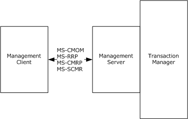

Figure 1: Overview

### 1.3.1 Management Client Role

The Management Client role is generally performed by software programs that manage the configuration and monitor the function of a [**transaction manager**](#gt_transaction-manager). Transaction manager configuration consoles and transaction monitoring consoles exemplify such programs.

The Management Client role is typically responsible for the following tasks:

- Performing configuration operations against the transaction manager. Configuration operations fall into the following categories:
- Functionality operations: Enabling and disabling the availability of specific transaction manager roles.
- Security operations: Enabling and disabling access to and security-related restrictions on transactional services.
- transaction manager [**endpoint**](#gt_endpoint) discovery operations: Allowing applications and other participants to discover endpoints exposed by the transaction manager.
- Querying the status and managing the life cycle of a transaction manager.
- Subscribing to and receiving transaction monitoring information from a transaction manager.

### 1.3.2 Management Server Role

The Management Server role is generally performed by specialized middleware software programs to provide transaction monitoring and [**transaction manager**](#gt_transaction-manager) configuration services to applications. The transaction manager exemplifies such a program.

The Management Server role is typically responsible for the following tasks:

- Providing applications and other participants with access to services that allow the reading and setting of transaction manager configuration settings. Configuration settings fall into the following categories:
- Functionality settings: These configuration settings enable and disable the availability of specific transaction manager roles.
- Security settings: These configuration settings enable and disable access to and from security-related restrictions on transactional services.
- transaction manager [**endpoint**](#gt_endpoint) settings: These settings describe the endpoints provided by the transaction manager.
- Providing applications with mechanisms to query the state of and to control the life cycle of the transaction manager service.
- Providing applications with subscription services to [**transaction**](#gt_transaction) monitoring information.

### 1.3.3 Common Scenarios

This section provides some common scenarios for the OleTx Management Protocol.

#### 1.3.3.1 Setting and Enabling a Configuration Setting

The following figure illustrates a [**transaction manager**](#gt_transaction-manager) configuration console that implements the [Management Client protocol role](#Section_1.3.1) enabling XA [**transactions**](#gt_transaction). XA transactions are enabled by setting the [**value**](#gt_value) of the XaTransactions registry key (as specified in section [3.3.1.2.1](#Section_3.3.1.2.1)) to a nonzero value:

- In the first exchange, the configuration console reads the value of the XaTransactions key via the Windows Remote Registry Protocol [MS-RRP](../MS-RRP/MS-RRP.md).
- In the second exchange, the configuration console sets the value of the XaTransactions registry key to 1 via the Windows Remote Registry Protocol. As specified in [3.3.1.2](#Section_2.2.1.2.2.4), the transaction manager service needs to be restarted for the [**registry**](#gt_registry) changes to be reflected.
- In the third exchange, the configuration console stops the transaction manager service via the Service Control Manager Remote Protocol [MS-SCMR](#Section_1.7.3).
- In the fourth exchange, the configuration console starts the transaction manager service via the Service Control Manager Remote Protocol.
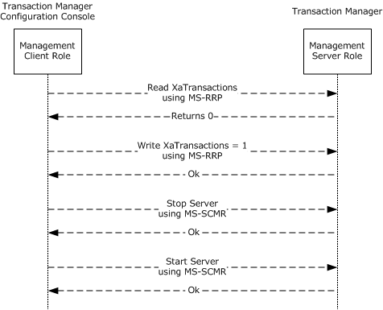

Figure 2: Setting and enabling a configuration setting

#### 1.3.3.2 Subscribing to Transaction Monitoring Information

The following figure illustrates a [**transaction**](#gt_transaction) monitoring console using the Management Client role to subscribe to transaction monitoring information. After subscribing, [**transaction manager**](#gt_transaction-manager) monitoring information is published to the transaction manager monitoring console until the monitoring console unsubscribes:

- In the first exchange, the monitoring console subscribes to transaction monitoring information from the Management Server role, as implemented by the transaction manager.
- In the middle series of exchanges, the Management Server role publishes transaction monitoring information to all subscribers, including this monitoring console, based on its configured settings.
- In the last exchange, the monitoring console unsubscribes from receiving further transaction monitoring information.
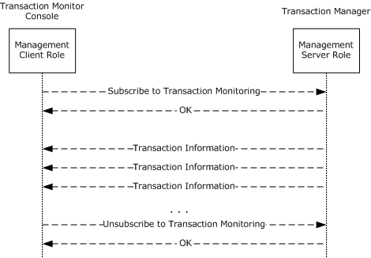

Figure 3: Subscribing to transaction monitoring information

## 1.4 Relationship to Other Protocols

The following figure illustrates the relationship between the OleTx Management Protocol and the underlying protocols on which it depends.

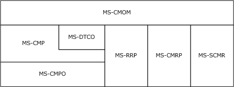

Figure 4: Protocols on which the OleTx Management Protocol depends

## 1.5 Prerequisites/Preconditions

This protocol requires the following:

- An implementation of a [**transaction manager**](#gt_transaction-manager) supporting the Abstract Data Model specified in [MS-DTCO](../MS-DTCO/MS-DTCO.md) is present and operating.
- The transaction manager is implemented as a Service, as specified in [MS-SCMR](#Section_1.7.3).
- All participating roles possess implementations of the MSDTC Connection Manager: OleTx Transports Protocol [MS-CMPO](#Section_2.1) and the MSDTC Connection Manager: OleTx Multiplexing Protocol [MS-CMP](../MS-CMP/MS-CMP.md).
- The Management Server role is implemented by the transaction manager.
- An implementation of the Service Control Manager Remote Protocol is present and operating.
- An implementation of the Windows Remote Registry Protocol [MS-RRP](../MS-RRP/MS-RRP.md) is present and operating.
Depending on the version of the registry protocol (as specified in section [2.2.1](#Section_2.2.1)), this protocol might also require the following:

- An implementation of the Failover Cluster: Management API (ClusAPI) Protocol [MS-CMRP](../MS-CMRP/MS-CMRP.md) is present and operating.

## 1.6 Applicability Statement

This protocol is applicable to scenarios that require the management and monitoring of a [**transaction manager**](#gt_transaction-manager). The protocol supports the reading and setting of configuration values as well as the subscription and publication of transaction statistics and status.

This protocol requires network topologies in which the MSDTC Connection Manager: OleTx Transports Protocol [MS-CMPO](#Section_2.1), the MSDTC Connection Manager: OleTx Multiplexing Protocol [MS-CMP](../MS-CMP/MS-CMP.md), the Service Control Manager Remote Protocol [MS-SCMR](#Section_1.7.3), the Windows Remote Registry Protocol [MS-RRP](../MS-RRP/MS-RRP.md), and the Failover Cluster: Management API (ClusAPI) Protocol [MS-CMRP](../MS-CMRP/MS-CMRP.md) function as a viable network transport for establishing many short-lived connection exchanges that accomplish specific tasks.

## 1.7 Versioning and Capability Negotiation

### 1.7.1 Versioning and Capability Negotiation for the OleTx Transports Protocol

All versioning, versioning negotiation, and capability negotiation mechanisms specified in [MS-DTCO](../MS-DTCO/MS-DTCO.md) section 1.7 are applicable to this protocol.

### 1.7.2 Versioning and Capability Negotiation for the Registry Protocol

The registry protocol version is not negotiable. It can be determined as specified in section [3.2.4.1](#Section_3.2.4.1).

Section [2.2.1.2.1](#Section_2.2.1.2.1.3) specifies which registry keys, [**key values**](#gt_key-value), and access protocols are supported in which version of the protocol.

### 1.7.3 Versioning and Capability Negotiation for the Service Control Manager Remote Protocol

The versioning and capability negotiation for this protocol is specified in [MS-SCMR](#Section_1.7.3), section 1.7.

## 1.8 Vendor-Extensible Fields

None.

## 1.9 Standards Assignments

None.

# 2 Messages

## 2.1 Transport

This protocol uses implementation of four transport protocols:

- The MSDTC Connection Manager: OleTx Transports Protocol [MS-CMPO](#Section_2.1) and the MSDTC Connection Manager: OleTx Multiplexing Protocol [MS-CMP](../MS-CMP/MS-CMP.md).
- The Windows Remote Registry Protocol [MS-RRP](../MS-RRP/MS-RRP.md).
- The Failover Cluster: Management API (ClusAPI) Protocol [MS-CMRP](../MS-CMRP/MS-CMRP.md).
- The Service Control Manager Remote Protocol [MS-SCMR](#Section_1.7.3).

### 2.1.1 Messages, Connections, and Sessions

[**Messages**](#gt_message), [**connections**](#gt_connection), and sessions are as specified in [MS-DTCO](../MS-DTCO/MS-DTCO.md) section 2.1.1.

### 2.1.2 MS-CMP and MS-CMPO Initialization

MSDTC Connection Manager: OleTx Multiplexing Protocol Specification [MS-CMP](../MS-CMP/MS-CMP.md) initialization and MSDTC Connection Manager: OleTx Transports Protocol Specification [MS-CMPO](#Section_2.1) initialization for this protocol is as specified in [MS-DTCO](../MS-DTCO/MS-DTCO.md) section 2.1.2.

If the initialization of the underlying MSDTC Connection Manager: OleTx Multiplexing Protocol instance fails as specified in [MS-CMP] section 3.1.3.2, then the implementation-specific failure result MUST be returned to the higher-layer business logic.

## 2.2 Message Syntax

### 2.2.1 Protocol Versioning

#### 2.2.1.1 OleTx Transaction Protocol Message Versions

The OleTx Transaction Protocol has five versions, as specified in [MS-DTCO](../MS-DTCO/MS-DTCO.md) section 2.2.1: 1, 2, 4, 5, and 6 (version 3 is reserved and not used). All messages and data elements specified in section [2.2](../MS-DTCO/MS-DTCO.md) MUST be supported by all protocol versions.

#### 2.2.1.2 Registry Protocol Versions

The registry protocol has nine versions for MSDTC Connection Manager: OleTx Management Protocol: 1, 2, 3, 4, 5, 6, 7, 8, and 9. For each version, there is a set of registry [**key**](#gt_key) values that MUST be supported (Required), a set of optional registry key values that SHOULD be supported (Optional), and a set of registry key values that MUST NOT be supported (Not Supported). The registry protocol version for MSDTC Connection Manager: OleTx Management Protocol is determined as specified in section [3.2.4.1](#Section_3.2.4.1).

| Value | Description |
| --- | --- |
| Required | The registry key value MUST be supported in the respective protocol version. |
| Optional | The registry key value SHOULD be supported in the respective protocol version. |
| Not Supported | The registry key value MUST NOT be supported in the respective protocol version. |

A supported registry key value is accessed either using the Windows Remote Registry Protocol [MS-RRP](../MS-RRP/MS-RRP.md) (as illustrated in section [4.2.1](../MS-RRP/MS-RRP.md)) or using the Failover Cluster: Management API (ClusAPI) Protocol [MS-CMRP](../MS-CMRP/MS-CMRP.md) (as illustrated in section [4.1](../MS-RRP/MS-RRP.md)), depending on the version of the registry protocol. To access a supported registry key value via the Failover Cluster: Management API (ClusAPI) Protocol, the [**cluster resource ID**](#gt_cluster-resource-id) (as specified in [MS-CMRP] section 3.1.4.2.32) MUST be known in order to construct the [**registry path**](#gt_registry-path) of the registry key.

##### 2.2.1.2.1 Versioning Support of the Registry Keys

The following sections specify the versioning support of the registry key values used by this protocol.

###### 2.2.1.2.1.1 Versioning Support of the Functional Registry Key Values

The following table specifies the versioning support of the functional registry key values used by this protocol, as specified in section [2.2.3.2](#Section_2.2.3.2).

| Key value | V1 | V2 | V3 | V4, V5, V6, V7 | V8, V9 |
| --- | --- | --- | --- | --- | --- |
| "LuTransactions" | Not supported | Not supported | Not supported | Not supported | Required |
| "NetworkDtcAccessTip" | Not supported | Required | Required | Required | Required |
| "ServerTcpPort" | Not supported | Not supported | Not supported | Not supported | Required |
| "XaTransactions" | Not supported | Not supported | Required | Required | Required |

###### 2.2.1.2.1.2 Versioning Support of the Security Access Registry Key Values

The following table specifies the versioning support of the security access registry key values used by this protocol, as specified in section [2.2.3.3](#Section_2.2.3.3).

| Key value | V1 | V2 | V3 | V4, V5, V6, V7 | V8, V9 |
| --- | --- | --- | --- | --- | --- |
| "NetworkDtcAccess" | Not supported | Not supported | Required | Required | Required |
| "NetworkDtcAccessAdmin" | Not supported | Not supported | Required | Required | Required |
| "NetworkDtcAccessClients" | Not supported | Not supported | Required | Required | Required |
| "NetworkDtcAccessTransactions" | Not supported | Not supported | Required | Required | Required |
| "NetworkDtcAccessInbound" | Not supported | Not supported | Not supported | Required | Required |
| "NetworkDtcAccessOutbound" | Not supported | Not supported | Not supported | Required | Required |

###### 2.2.1.2.1.3 Versioning Support of the RPC Security Registry Key Values

The following table specifies the versioning support of the remote procedure call (RPC) security registry key values used by this protocol, as specified in section [2.2.3.4](#Section_2.2.3.4).

| Key value | V1 | V2 | V3 | V4, V5, V6, V7 | V8, V9 |
| --- | --- | --- | --- | --- | --- |
| "ServiceNetworkProtocols" | Not supported | Not supported | Required | Required | Required |
| "TurnOffRpcSecurity" | Not supported | Not supported | Optional<1> | Required | Required |
| "AllowOnlySecureRpcCalls" | Not supported | Not supported | Not supported | Required | Required |
| "FallbackToUnsecureRpcIfNecessary" | Not supported | Not supported | Not supported | Required | Required |

###### 2.2.1.2.1.4 Versioning Support of the Endpoint Registry Key Values

The following table specifies the versioning support of the endpoint registry key values used by this protocol, as specified in section [2.2.3.5](#Section_2.2.3.5).

| Key value | V1 | V2 | V3 | V4, V5, V6, V7 | V8, V9 |
| --- | --- | --- | --- | --- | --- |
| "Description\(Default)" equal to "MSDTC", "MSDTCUIS", or "MSDTCXATM" | Required | Required | Required | Required | Required |
| "Description\(Default)" equal to "MSDTCTIPGW" | Not supported | Required | Required | Required | Required |

##### 2.2.1.2.2 Registry Path and Access Protocol of the Registry Key Values

Both the registry path of a registry key with supported registry key values and the protocol used to access the registry key vary, depending on the version of the registry protocol. The following sections specify the registry path of each registry key with supported registry key values and which protocol is used to access the registry key in each version of the registry protocol. The registry keys that use the Windows Remote Registry Protocol in the following sections are non-volatile keys, as specified in [MS-RRP](../MS-RRP/MS-RRP.md) section 3.1.1.2. Note that, if the registry server is on a 64-bit system, the MSDTC Connection Manager: OleTx Management Protocol SHOULD use the 32-bit keys, as specified in [MS-RRP] section 3.1.1.4. None of the registry keys are symbolic.

The <ResID> token in the registry path represents a cluster resource ID. The <DPGuid> token in the registry path represents the string value of the "HKEY_LOCAL_MACHINE\Cluster\Resources\<ResID>\DataPointer\(Default)" registry key value.

###### 2.2.1.2.2.1 Registry Path and Access Protocol of the Functional Registry Key

The following table specifies the registry path and access protocol of the functional registry key used by this protocol, as specified in section [2.2.3.2](#Section_2.2.3.2).

| Version | Registry path | Protocol |
| --- | --- | --- |
| 2 | HKEY_LOCAL_MACHINE\Software\Microsoft\MSDTC\Security | [MS-RRP](../MS-RRP/MS-RRP.md) |
| 3 | HKEY_LOCAL_MACHINE\Software\Microsoft\MSDTC\Security | [MS-RRP] |
| 4 | HKEY_LOCAL_MACHINE\Software\Microsoft\MSDTC\Security | [MS-RRP] |
| 5 | HKEY_LOCAL_MACHINE\Cluster\Resources\<ResID>\<DPGuid>\Security | [MS-CMRP](../MS-CMRP/MS-CMRP.md) |
| 6 | HKEY_LOCAL_MACHINE\Software\Microsoft\MSDTC\Security | [MS-RRP] |
| 7 | HKEY_LOCAL_MACHINE\Cluster\Resources\<ResID>\MSDTCPRIVATE\MSDTC\Security | [MS-CMRP] |
| 8 | HKEY_LOCAL_MACHINE\Software\Microsoft\MSDTC\Security | [MS-RRP] |
| 9 | HKEY_LOCAL_MACHINE\Cluster\Resources\<ResID>\MSDTCPRIVATE\MSDTC\Security | [MS-CMRP] |

###### 2.2.1.2.2.2 Registry Path and Access Protocol of the Security Access Registry Key

The following table specifies the registry path and access protocol of the security access registry key used by this protocol, as specified in section [2.2.3.3](#Section_2.2.3.3).

| Version | Registry path | Protocol |
| --- | --- | --- |
| 3 | HKEY_LOCAL_MACHINE\Software\Microsoft\MSDTC\Security | [MS-RRP](../MS-RRP/MS-RRP.md) |
| 4 | HKEY_LOCAL_MACHINE\Software\Microsoft\MSDTC\Security | [MS-RRP] |
| 5 | HKEY_LOCAL_MACHINE\Cluster\Resources\<ResID>\<DPGuid>\Security | [MS-CMRP](../MS-CMRP/MS-CMRP.md) |
| 6 | HKEY_LOCAL_MACHINE\Software\Microsoft\MSDTC\Security | [MS-RRP] |
| 7 | HKEY_LOCAL_MACHINE\Cluster\Resources\<ResID>\MSDTCPRIVATE\MSDTC\Security | [MS-CMRP] |
| 8 | HKEY_LOCAL_MACHINE\Software\Microsoft\MSDTC\Security | [MS-RRP] |
| 9 | HKEY_LOCAL_MACHINE\Cluster\Resources\<ResID>\MSDTCPRIVATE\MSDTC\Security | [MS-CMRP] |

###### 2.2.1.2.2.3 Registry Path and Access Protocol of the RPC Security Registry Key

The following table specifies the registry path and access protocol of the RPC security registry key used by this protocol, as specified in section [2.2.3.4](#Section_2.2.3.4).

| Version | Registry path | Protocol |
| --- | --- | --- |
| 3 | HKEY_LOCAL_MACHINE\Software\Microsoft\MSDTC | [MS-RRP](../MS-RRP/MS-RRP.md) |
| 4 | HKEY_LOCAL_MACHINE\Software\Microsoft\MSDTC | [MS-RRP] |
| 5 | HKEY_LOCAL_MACHINE\Cluster\Resources\<ResID>\<DPGuid>\Security | [MS-CMRP](../MS-CMRP/MS-CMRP.md) |
| 6 | HKEY_LOCAL_MACHINE\Software\Microsoft\MSDTC | [MS-RRP] |
| 7 | HKEY_LOCAL_MACHINE\Cluster\Resources\<ResID>\MSDTCPRIVATE\MSDTC | [MS-CMRP] |
| 8 | HKEY_LOCAL_MACHINE\Software\Microsoft\MSDTC | [MS-RRP] |
| 9 | HKEY_LOCAL_MACHINE\Cluster\Resources\<ResID>\MSDTCPRIVATE\MSDTC | [MS-CMRP] |

###### 2.2.1.2.2.4 Registry Path and Access Protocol of the Transaction Manager Contact Registry Keys

The following table specifies the registry path and access protocol of the transaction manager contact registry keys used by this protocol, as specified in section [2.2.3.5](../MS-DTYP/MS-DTYP.md). The <GUID> token is a [**GUIDString**](#gt_guidstring) (as specified in [MS-DTYP](../MS-DTYP/MS-DTYP.md) section 2.3.4.3).

| Version | Registry path | Protocol |
| --- | --- | --- |
| 1 | HKEY_CLASSES_ROOT\CID\<GUID> | [MS-RRP](../MS-RRP/MS-RRP.md) |
| 2 | HKEY_CLASSES_ROOT\CID\<GUID> | [MS-RRP] |
| 3 | HKEY_CLASSES_ROOT\CID\<GUID> | [MS-RRP] |
| 4 | HKEY_CLASSES_ROOT\CID\<GUID> | [MS-RRP] |
| 5 | HKEY_CLASSES_ROOT\CID\<GUID> | [MS-RRP] |
| 6 | HKEY_CLASSES_ROOT\CID\<GUID> | [MS-RRP] |
| 7 | HKEY_CLASSES_ROOT\CID\<GUID> | [MS-RRP] |
| 8 | HKEY_CLASSES_ROOT\CID\<GUID> | [MS-RRP] |
| 9 | HKEY_CLASSES_ROOT\CID\<GUID> | [MS-RRP] |

###### 2.2.1.2.2.5 Registry Path and Access Protocol of the Transaction Manager Endpoint Registry Keys

The following table specifies the registry path and access protocol of the transaction manager endpoint registry keys used by this protocol, as specified in section [2.2.3.6](../MS-DTYP/MS-DTYP.md). The <GUID> token is a [**GUIDString**](#gt_guidstring) (as specified in [MS-DTYP](../MS-DTYP/MS-DTYP.md) section 2.3.4.3).

| Version | Registry path | Protocol |
| --- | --- | --- |
| 1 | HKEY_CLASSES_ROOT\CID\<GUID> | [MS-RRP](../MS-RRP/MS-RRP.md) |
| 2 | HKEY_CLASSES_ROOT\CID\<GUID> | [MS-RRP] |
| 3 | HKEY_CLASSES_ROOT\CID\<GUID> | [MS-RRP] |
| 4 | HKEY_CLASSES_ROOT\CID\<GUID> | [MS-RRP] |
| 5 | HKEY_CLASSES_ROOT\CID\<GUID> | [MS-RRP] |
| 6 | HKEY_CLASSES_ROOT\CID.Local\<GUID> | [MS-RRP] |
| 7 | HKEY_LOCAL_MACHINE\Cluster\Resources\<ResID>\MSDTCPRIVATE\CID\<GUID> | [MS-CMRP](../MS-CMRP/MS-CMRP.md) |
| 8 | HKEY_CLASSES_ROOT\CID.Local\<GUID> | [MS-RRP] |
| 9 | HKEY_LOCAL_MACHINE\Cluster\Resources\<ResID>\MSDTCPRIVATE\CID\<GUID> | [MS-CMRP] |

### 2.2.2 OleTx Multiplexing Protocol Message Syntax

The layout of each OleTx Multiplexing Protocol message that is used by this protocol MUST extend the MESSAGE_PACKET structure, as specified in [MS-CMP](../MS-CMP/MS-CMP.md) section 2.2.2.

#### 2.2.2.1 Connection Types

This protocol defines only one [**connection type**](#gt_connection-type): [CONNTYPE_TXUSER_DTCUIC](#Section_2.2.2.4.1). The **connection type** field for [**connections**](#gt_connection) that implement this connection type, as specified in [MS-CMP](../MS-CMP/MS-CMP.md) section 3.1.1.1, MUST be set to 0x00000000.

#### 2.2.2.2 Data Structures

##### 2.2.2.2.1 DtcUITranListElement

The DtcUITranListElement structure is used to represent the tracking information for a [**transaction**](#gt_transaction) object as specified in [MS-DTCO](../MS-DTCO/MS-DTCO.md), section 3.2.1.

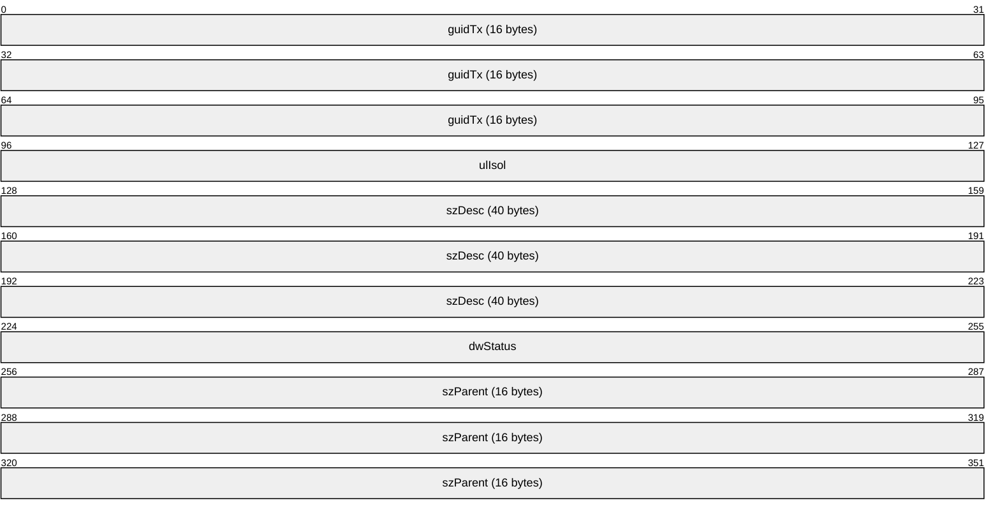

**guidTx (16 bytes):** This field MUST contain a [**GUID**](#gt_globally-unique-identifier-guid) (as specified in [MS-DTYP](../MS-DTYP/MS-DTYP.md) section 2.3.4.2) that specifies the [**transaction identifier**](#gt_transaction-identifier) for the transaction.

**ulIsol (4 bytes):** This field MUST be set to an OLETX_ISOLATION_LEVEL, as specified in MSDTC Connection Manager: OleTx Transaction Protocol Specification [MS-DTCO], section 2.2.6.9.

**szDesc (40 bytes):** The description of the transaction as a fixed-size array of 40 bytes containing a null-terminated Latin-1 ANSI string, as specified in [[ISO/IEC-8859-1]](https://go.microsoft.com/fwlink/?LinkId=90689).

**dwStatus (4 bytes):** This field MUST be set to a [TRACKING_STATUS](#Section_2.2.2.3.1) value that specifies that status of the transaction.

**szParent (16 bytes):** A fixed-size array of 16 bytes containing a null-terminated Latin-1 ANSI character string, as specified in [ISO/IEC-8859-1], which MUST specify the host name of the [**transaction manager**](#gt_transaction-manager) that is specified by the **Name** field of the transaction object's **Superior Enlistment** field. If the transaction does not have a superior [**enlistment**](#gt_enlistment), the array MUST contain a null string.

#### 2.2.2.3 Enumerations

##### 2.2.2.3.1 TRACKING_STATUS

The TRACKING_STATUS enumeration specifies the status of a [**transaction**](#gt_transaction) (managed by the [**transaction manager**](#gt_transaction-manager)) and is reported by the Management Server role in the **dwStatus** field of a [DtcUITranListElement](#Section_2.2.2.2.1) structure.

typedef enum

{

XACTSTAT_OPEN = 0x00000003,

XACTSTAT_PREPARING = 0x00000004,

XACTSTAT_PREPARED = 0x00000008,

XACTSTAT_COMMITTING = 0x00000040,

XACTSTAT_ABORTING = 0x00000100,

XACTSTAT_ABORTED = 0x00000200,

XACTSTAT_FORCED_ABORT = 0x00000201,

XACTSTAT_COMMITTED = 0x00000400,

XACTSTAT_FORCED_COMMIT = 0x00000401,

XACTSTAT_NOTIFYING_COMMITTED = 0x00000801,

XACTSTAT_ONLY_FAILED_COMMITTED_REMAIN = 0x00000C01,

XACTSTAT_INDOUBT = 0x00020000,

XACTSTAT_FORGET = 0x00080001

} TRACKING_STATUS;

**XACTSTAT_OPEN:** This status indicates the transaction is still in the active phase.

**XACTSTAT_PREPARING:** This status indicates the transaction is preparing.

**XACTSTAT_PREPARED:** This status indicates the transaction is prepared.

**XACTSTAT_COMMITTING:** This status indicates the transaction is committing.

**XACTSTAT_ABORTING:** This status indicates the transaction is aborting.

**XACTSTAT_ABORTED:** This status indicates the transaction is aborted.

**XACTSTAT_FORCED_ABORT:** This status indicates the transaction was forced to abort (by external intervention).

**XACTSTAT_COMMITTED:** This status indicates the transaction is committed.

**XACTSTAT_FORCED_COMMIT:** This status indicates the transaction was forced to commit.

**XACTSTAT_NOTIFYING_COMMITTED:** This status indicates the transaction is committed and subordinate participants are being notified.

**XACTSTAT_ONLY_FAILED_COMMITTED_REMAIN:** This status indicates the transaction is in the Failed to Notify state.

**XACTSTAT_INDOUBT:** This status indicates the transaction is in doubt.

**XACTSTAT_FORGET:** This status indicates the transaction has completed and the transaction manager does not manage it any more.

The **dwStatus** field reported by the Management Server role is based on the transaction states provided by [MS-DTCO](../MS-DTCO/MS-DTCO.md), section 3.2.1.3 as specified in the following table.

| [MS-DTCO] Transaction States | Description | TRACKING_STATUS |
| --- | --- | --- |
| Idle | The transaction has not been created yet. | Not Applicable |
| Active | Not Applicable | XACTSTAT_OPEN |
| Phase Zero | Not Applicable | XACTSTAT_PREPARING |
| Phase Zero Complete | Not Applicable | XACTSTAT_PREPARING |
| Voting | Not Applicable | XACTSTAT_PREPARING |
| Voting Complete | Not Applicable | XACTSTAT_PREPARING |
| Phase One | Not Applicable | XACTSTAT_PREPARING |
| Phase One Complete | Not Applicable | XACTSTAT_PREPARED |
| Single Phase Commit | Not Applicable | XACTSTAT_PREPARED |
| Committing | The [MS-DTCO] Transaction State is Committing. | XACTSTAT_COMMITTING |
| Committing | The [MS-DTCO] Transaction State is Committing and the "Enlistment Commit Complete" event is signaled as specified in [MS-DTCO] section 3.2.7.15. | XACTSTAT_COMMITTED |
| Committing | The [MS-DTCO] Transaction State is Committing, the "Enlistment Commit Complete" event is signaled as specified in [MS-DTCO] section 3.2.7.15 and the transaction was forced to commit (by external intervention). | XACTSTAT_FORCED_COMMIT |
| Committing | The [MS-DTCO] Transaction State is Committing and all the subordinate participants are being notified. | XACTSTAT_NOTIFYING_COMMITTED |
| Aborting | Not Applicable | XACTSTAT_ABORTING |
| Aborting | The [MS-DTCO] Transaction State is Aborting and the "Enlistment Rollback Complete" event is signaled as specified in [MS-DTCO] section 3.2.7.18. | XACTSTAT_ABORTED |
| Aborting | The [MS-DTCO] Transaction State is Aborting, the "Enlistment Rollback Complete" event is signaled as specified in [MS-DTCO] section 3.2.7.18 and the transaction was forced to abort (by external intervention). | XACTSTAT_FORCED_ABORT |
| In Doubt | Not Applicable | XACTSTAT_INDOUBT |
| Failed to Notify | Not Applicable | XACTSTAT_ONLY_FAILED_COMMITTED_REMAIN |
| Ended | Not Applicable | XACTSTAT_FORGET |

##### 2.2.2.3.2 UPDATE_LIMIT

The UPDATE_LIMIT enumeration specifies how often the Management Server transmits [**transaction**](#gt_transaction) tracking data and statistics to the Management Client (see section [3.3.6.1](#Section_3.3.6.1)).

typedef enum

{

UPDATE_20 = 0x00000000,

UPDATE_10 = 0x00000001,

UPDATE_5 = 0x00000002,

UPDATE_3 = 0x00000003,

UPDATE_1 = 0x00000004

} UPDATE_LIMIT;

**UPDATE_20:** A 20-second update period MUST be used.

**UPDATE_10:** A 10-second update period MUST be used.

**UPDATE_5:** A 5-second update period MUST be used.

**UPDATE_3:** A 3-second update period MUST be used.

**UPDATE_1:** A 1-second update period MUST be used.

##### 2.2.2.3.3 SHOW_LIMIT

The SHOW_LIMIT enumeration specifies the minimum age required of a [**transaction**](#gt_transaction) in order to be tracked by the Management Server and reported to the Management Client (see section [3.3.6.1](#Section_3.3.6.1)).

typedef enum

{

SHOW_5_MIN = 0x00000000,

SHOW_1_MIN = 0x00000001,

SHOW_30_SEC = 0x00000002,

SHOW_10_SEC = 0x00000003,

SHOW_1_SEC = 0x00000004

} SHOW_LIMIT;

**SHOW_5_MIN:** A 5-minute minimum transaction age MUST be used.

**SHOW_1_MIN:** A 1-minute minimum transaction age MUST be used.

**SHOW_30_SEC:** A 30-second minimum transaction age MUST be used.

**SHOW_10_SEC:** A 10-second minimum transaction age MUST be used.

**SHOW_1_SEC:** A 1-second minimum transaction age MUST be used.

##### 2.2.2.3.4 TRACE_LEVEL

The TRACE_LEVEL enumeration specifies the level of traces the Management Server posts to the Management Client (see section [3.3.6.1](#Section_3.3.6.1)).

typedef enum

{

TRACE_NONE = 0x00000000,

TRACE_ERRORS = 0x00000001,

TRACE_WARNINGS = 0x00000002,

TRACE_INFORMATION = 0x00000003,

TRACE_ALL = 0x00000004

} TRACE_LEVEL;

**TRACE_NONE:** This level indicates that no event MUST be traced.

**TRACE_ERRORS:** This level indicates that only events with a TRACE_SEVERITY_LEVEL of ERROR (0x00000001) MUST be traced.

**TRACE_WARNINGS:** This level indicates that only events with a TRACE_SEVERITY_LEVEL of ERROR (0x00000001) or WARNING (0x00000002) MUST be traced.

**TRACE_INFORMATION:** This level indicates that only events with a TRACE_SEVERITY_LEVEL of ERROR (0x00000001), WARNING (0x00000002), or INFORMATION (0x00000004) MUST be traced.

**TRACE_ALL:** This level indicates that all events MUST be traced.

##### 2.2.2.3.5 TRACE_SEVERITY_LEVEL

The TRACE_SEVERITY_LEVEL enumeration specifies the severity level values for a trace event (see sections [2.2.2.4.1.7](#Section_2.2.2.4.1.7) and [2.2.2.4.1.8](#Section_2.2.2.4.1.8)).

typedef enum

{

ERROR = 0x00000001,

WARNING = 0x00000002,

INFORMATION = 0x00000004

} TRACE_SEVERITY_LEVEL;

**ERROR:** This level MUST be used to trace errors in the operation of the system (such as the failure of some task).

**WARNING:** This level MUST be used to trace events that indicate the possible occurrence of a future problem.

**INFORMATION:** This level MUST be used to trace information about the normal progress of significant operations.

#### 2.2.2.4 Connection Type Details

##### 2.2.2.4.1 CONNTYPE_TXUSER_DTCUIC

This [**connection type**](#gt_connection-type) is used for [**transaction monitoring**](#gt_transaction-monitoring) and defines the following messages:

- [MTAG_HELLO](#Section_2.2.2.4.1.1)
- [MSG_DTCUIC_TRACELIMIT](#Section_2.2.2.4.1.2)
- [MSG_DTCUIC_UPDATELIMIT](#Section_2.2.2.4.1.3)
- [MSG_DTCUIC_SHOWLIMIT](#Section_2.2.2.4.1.4)
- [MSG_DTCUIC_STATS](#Section_2.2.2.4.1.5)
- [MSG_DTCUIC_TRANLIST](#Section_2.2.2.4.1.6)
- [MSG_DTCUIC_TRACE](#Section_2.2.2.4.1.7)
- [MSG_DTCUIC_TRACESTRING](#Section_2.2.2.4.1.8)

###### 2.2.2.4.1.1 MTAG_HELLO

The MTAG_HELLO message is sent by the Management Client to the Management Server in order to verify that the [**connection**](#gt_connection) with the Management Server is established (if not, the sending fails; see section [3.2.5.2](#Section_3.2.5.2)).

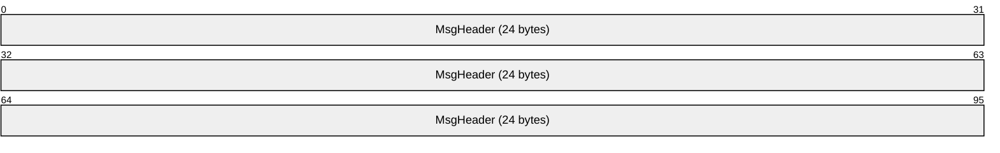

**MsgHeader (24 bytes):** This field MUST contain a MESSAGE_PACKET structure (as specified in [MS-DTCO](../MS-DTCO/MS-DTCO.md), section 2.2.4.1). The **dwUserMsgType** field MUST be 0x00003006. The **dwcbVarLenData** field MUST be 0.

###### 2.2.2.4.1.2 MSG_DTCUIC_TRACELIMIT

The MSG_DTCUIC_TRACELIMIT message is used by the Management Client to transmit a new trace level to the Management Server (see section [3.2.5.5](#Section_3.2.5.5)).

**MsgHeader (24 bytes):** This field MUST contain a MESSAGE_PACKET structure (as specified in [MS-DTCO](../MS-DTCO/MS-DTCO.md), section 2.2.4.1). The **dwUserMsgType** field MUST be 0x00003003. The **dwcbVarLenData** field MUST be equal to 4.

**dwTraceLimit (4 bytes):** A [TRACE_LEVEL](#Section_2.2.2.3.4) value that indicates the requested trace level.

###### 2.2.2.4.1.3 MSG_DTCUIC_UPDATELIMIT

The MSG_DTCUIC_UPDATELIMIT message is used by the Management Client to request the use of a new update interval from the Management Server (see section [3.2.5.3](#Section_3.2.5.3)).

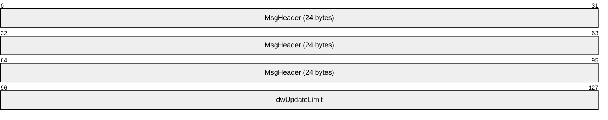

**MsgHeader (24 bytes):** This field MUST contain a MESSAGE_PACKET structure (as specified in [MS-DTCO](../MS-DTCO/MS-DTCO.md) section 2.2.4.1). The **dwUserMsgType** field MUST be 0x00003004. The **dwcbVarLenData** field MUST be equal to 4.

**dwUpdateLimit (4 bytes):** An [UPDATE_LIMIT](#Section_2.2.2.3.2) value that indicates the requested update interval.

###### 2.2.2.4.1.4 MSG_DTCUIC_SHOWLIMIT

The MSG_DTCUIC_SHOWLIMIT message is used by the Management Client to set the required minimum age of a transaction tracked by the Management Server (see section [3.2.5.4](#Section_3.2.5.4)).

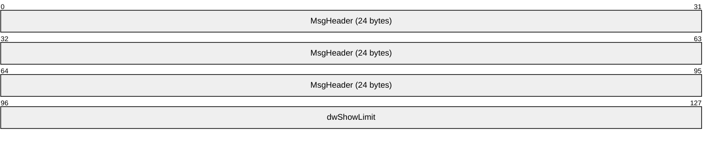

**MsgHeader (24 bytes):** This field MUST contain a MESSAGE_PACKET structure (as specified in [MS-DTCO](../MS-DTCO/MS-DTCO.md), section 2.2.4.1). The **dwUserMsgType** field MUST be 0x00003005. The **dwcbVarLenData** field MUST be equal to 4.

**dwShowLimit (4 bytes):** A [SHOW_LIMIT](#Section_2.2.2.3.3) value that indicates the requested minimum [**transaction**](#gt_transaction) age.

###### 2.2.2.4.1.5 MSG_DTCUIC_STATS

The MSG_DTCUIC_STATS message is sent by the Management Server to the Management Client to report current statistical information about [**transactions**](#gt_transaction) (see section [3.3.6.1](#Section_3.3.6.1)).

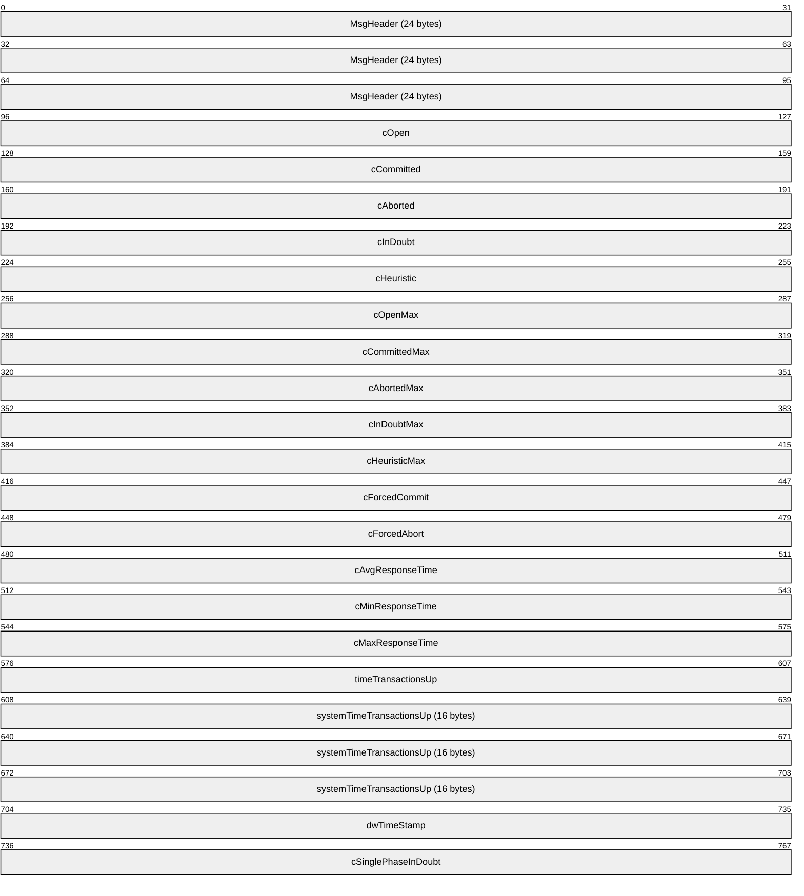

**MsgHeader (24 bytes):** This field MUST contain a MESSAGE_PACKET structure (as specified in [MS-DTCO](../MS-DTCO/MS-DTCO.md) section 2.2.4.1). The **dwUserMsgType** field MUST be 0x00003001. The **dwcbVarLenData** field MUST be 84 plus the size in bytes of the **timeTransactionsUp** field.

**cOpen (4 bytes):** A 4-byte unsigned integer indicating the number of currently opened transactions.

**cCommitted (4 bytes):** A 4-byte unsigned integer indicating the current number of committed transactions.

**cAborted (4 bytes):** A 4-byte unsigned integer indicating the current number of aborted transactions.

**cInDoubt (4 bytes):** A 4-byte unsigned integer indicating the current number of in-doubt transactions.

**cHeuristic (4 bytes):** A 4-byte reserved field that MUST be set to 0x00000000.

**cOpenMax (4 bytes):** A 4-byte unsigned integer indicating the maximum value of the **cOpen** field since the [**transaction manager**](#gt_transaction-manager) was started.

**cCommittedMax (4 bytes):** A 4-byte unsigned integer indicating the maximum value of the **cCommitted** field since the transaction manager was started.

**cAbortedMax (4 bytes):** A 4-byte unsigned integer indicating the maximum value of the **cAborted** field since the transaction manager was started.

**cInDoubtMax (4 bytes):** A 4-byte unsigned integer indicating the maximum value of the **cInDoubt** field since the transaction manager was started.

**cHeuristicMax (4 bytes):** A 4-byte reserved field that MUST be set to 0x00000000.

**cForcedCommit (4 bytes):** A 4-byte unsigned integer indicating the current number of transactions that were in doubt, and were forced to commit.

**cForcedAbort (4 bytes):** A 4-byte unsigned integer indicating the current number of transactions that were in doubt, and were forced to abort.

**cAvgResponseTime (4 bytes):** A 4-byte unsigned integer indicating the current average time in milliseconds for transaction committing.

**cMinResponseTime (4 bytes):** A 4-byte unsigned integer indicating the current minimum time in milliseconds for transaction committing.

**cMaxResponseTime (4 bytes):** A 4-byte unsigned integer indicating the current maximum time in milliseconds for transaction committing.

**timeTransactionsUp (4 bytes):** This field SHOULD contain either an unsigned 4-byte integer, or 4 bytes of padding (containing non-deterministic values) followed by an 8-byte unsigned integer in 64-bit Windows, that specifies the number of seconds that elapsed from a baseline time to when the [**service**](#gt_service) was started.<2> In the Windows implementation, the Management Client Role does not use this field. To distinguish between 32-bit and 64-bit Windows, the implementation can check the **dwcbVarLenData** field, which varies based on 32-bit and 64-bit implementations. The baseline time used for this field MUST be midnight January 1, 1970, Coordinated Universal Time (UTC).

**systemTimeTransactionsUp (16 bytes):** A SYSTEMTIME structure (as specified in [MS-DTYP](../MS-DTYP/MS-DTYP.md) section 2.3.13) indicating the time when the service was started.

**dwTimeStamp (4 bytes):** A 4-byte unsigned reserved field that MUST be set to 0x00000000.

**cSinglePhaseInDoubt (4 bytes):** A 4-byte unsigned integer indicating the current number of transactions that have entered the single-phase in-doubt state.

###### 2.2.2.4.1.6 MSG_DTCUIC_TRANLIST

The MSG_DTCUIC_TRANLIST message is sent by the Management Server to the Management Client to report current information about the [**transactions**](#gt_transaction) it is tracking (see section [3.3.6.1](#Section_3.3.6.1)).

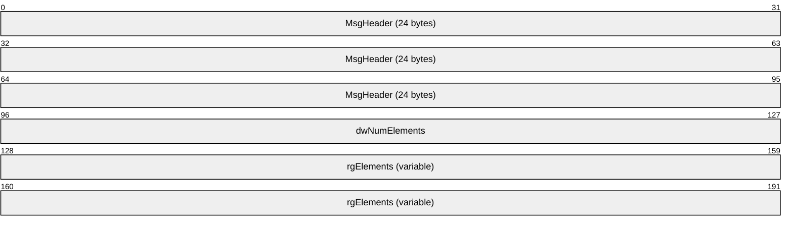

**MsgHeader (24 bytes):** This field MUST contain a MESSAGE_PACKET structure (as specified in [MS-DTCO](../MS-DTCO/MS-DTCO.md), section 2.2.4.1). The **dwUserMsgType** field MUST be 0x00003002. The **dwcbVarLenData** field MUST be 4 plus the product of the number of bytes in a [DtcUITranListElement](#Section_2.2.2.2.1) structure and the value of the **dwNumElements** field.

**dwNumElements (4 bytes):** This field MUST contain an unsigned integer specifying the number of DtcUITranListElement structures present in the **rgElements** field.

**rgElements (variable):** This field MUST contain a list of DtcUITranListElement structures. The number of structures in this field is limited superiorly by the maximum size of an OleTx Multiplexing Protocol message, as defined in [MS-CMP](../MS-CMP/MS-CMP.md).

###### 2.2.2.4.1.7 MSG_DTCUIC_TRACE

The MSG_DTCUIC_TRACE message is sent by the Management Server to the Management Client to trace a formatted message (see section [3.3.4.1](#Section_3.3.4.1)).

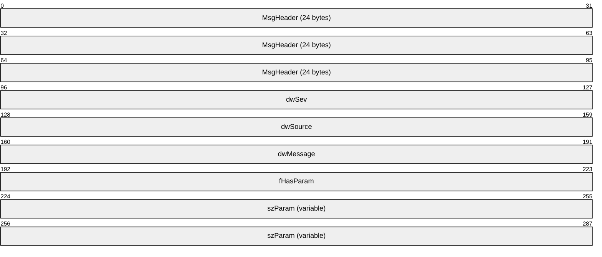

**MsgHeader (24 bytes):** This field MUST contain a MESSAGE_PACKET structure (as specified in [MS-DTCO](../MS-DTCO/MS-DTCO.md) section 2.2.4.1). The **dwUserMsgType** field MUST be 0x00002FFF. The **dwcbVarLenData** field MUST be 16 plus the length of the string present in the **szParam** field (not including its null terminator).

**dwSev (4 bytes):** This MUST be set to a [TRACE_SEVERITY_LEVEL](#Section_2.2.2.3.5) value.

**dwSource (4 bytes):** This field MUST be set to an implementation-specific unsigned integer that maps to one of the functional modules in the specific implementation. This field is set to one the following 4-byte unsigned integer values.

| Value | Trace Source |
| --- | --- |
| 0x00000001 | The MSDTC service functionality |
| 0x00000002 | The transaction manager core |
| 0x00000003 | The connection manager |

**dwMessage (4 bytes):** This field MUST contain an implementation-specific unsigned integer which maps to an implementation-specific trace string. This field is set to one of the following dwMessage values.

| Bit Range | Field | Description |
| --- | --- | --- |
| Variable | 0x4000100F | The MSDTC service is shutting down. |
| Variable | 0x8000102D | Unknown message type encountered. |
| Variable | 0x8000102E | Message length incorrect. |
| Variable | 0x8000102F | Bad message value. |
| Variable | 0x80001030 | Message not expected. |
| Variable | 0xC0001061 | ReenlistmentComplete was called on a Resource Manager (RM) and there is at least one transaction that was enlisted on the RM that is still in doubt. |

**fHasParam (4 bytes):** This field MUST be set to 0x00000000 if the **szParam** field does not contain a non-null string, or 0x00000001 if the **szParam** field contains a non-null string.

Possible values for this field are specified in the following table.

| Value | Meaning |
| --- | --- |
| 0x00000000 | Field does not contain a non-null string. |
| 0x00000001 | Field contains a non-null string. |

**szParam (variable):** This field MUST contain a null-terminated Latin-1 ANSI string, as specified in [[ISO/IEC-8859-1]](https://go.microsoft.com/fwlink/?LinkId=90689). This field is set to one of the following string values.

- "PRIMARY: Session Bind Failed. Primary Timed Out while waiting for the secondary to Bind"
- "PRIMARY: Session Bind Failed. The Version Numbers did not match"
- "PRIMARY: Session Bind Failed. Protocol Not Supported"
- "ProcId = <PROCID> CSO: Maintain session; Received E_CM_SERVER_NOT_READY." Where <PROCID> is the string representation of the 4-byte unsigned integer process identifier value in hexadecimal notation.
- "ProcId = <PROCID> CSO: Maintain session; Received E_S_UNAVAILABLE. Giving up after retry." Where <PROCID> is the string representation of the 4-byte unsigned integer value process identifier value in hexadecimal notation.
- "Session Bind Failed due. Primary Timed Out while waiting for the secondary to Bind"

###### 2.2.2.4.1.8 MSG_DTCUIC_TRACESTRING

The MSG_DTCUIC_TRACESTRING message is sent by the Management Server to the Management Client to trace an unformatted message (see section [3.3.4.2](#Section_3.3.4.2)).

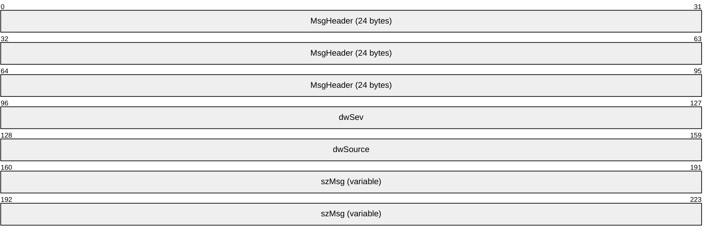

**MsgHeader (24 bytes):** This field MUST contain a MESSAGE_PACKET structure (as specified in [MS-DTCO](../MS-DTCO/MS-DTCO.md) section 2.2.4.1). The **dwUserMsgType** field MUST be 0x00003000. The **dwcbVarLenData** field MUST be 8 plus the length of the string present in the **szMsg** field (not including its null terminator).

**dwSev (4 bytes):** This field MUST be set to a [TRACE_SEVERITY_LEVEL](#Section_2.2.2.3.5) value.

**dwSource (4 bytes):** The field MUST be set to an implementation-specific unsigned integer that maps to one of the functional modules in the specific implementation. This field is set to one of the following 4-byte unsigned integer values.

| Value | Trace Source |
| --- | --- |
| 0x00000001 | The MSDTC service functionality |
| 0x00000002 | The transaction manager core |
| 0x00000003 | The connection manager |

**szMsg (variable):** This field MUST contain a null-terminated Latin-1 ANSI string, as specified in [[ISO/IEC-8859-1]](https://go.microsoft.com/fwlink/?LinkId=90689). The length of this string MUST be at least 1. This field is set to one of the following string values.

- "PRIMARY: Session Bind Failed due. Primary Timed Out while waiting for the secondary to Bind"
- "PRIMARY: Session Bind Failed. The Version Numbers did not match"
- "PRIMARY: Session Bind Failed. Protocol Not Supported"
- "ProcId = <PROCID> CSO: Maintain session; Received E_CM_SERVER_NOT_READY." Where <PROCID> is the string representation of the 4-byte unsigned integer value process identifier value in hexadecimal notation.
- "ProcId = <PROCID> CSO: Maintain session; Received E_S_UNAVAILABLE. Giving up after retry." Where <PROCID> is the string representation of the 4-byte unsigned integer value process identifier value in hexadecimal notation.
- "Session Bind Failed due. Primary Timed Out while waiting for the secondary to Bind"

### 2.2.3 Registry Keys and Values

#### 2.2.3.1 Enumerations

##### 2.2.3.1.1 RPC_NETWORK_PROTOCOL

The RPC_NETWORK_PROTOCOL enumeration is used to specify the list of supported RPC network protocols.

typedef enum

{

TCP/IP = 0x00000001,

SPX = 0x00000002,

NetBEUI = 0x00000004,

UDP/IP = 0x00000008,

LRPC = 0x00000020

} RPC_NETWORK_PROTOCOL;

**TCP/IP:** The TCP/IP network protocol.

**SPX:** The SPX network protocol.<3>

**NetBEUI:** The NetBEUI network protocol.

**UDP/IP:** The UDP/IP network protocol.

**LRPC:** The LRPC network protocol.

#### 2.2.3.2 Functional Registry Key Values

The functional registry key values control the functionality of the [**transaction manager**](#gt_transaction-manager). The registry path of the functional registry key with these key values, and the protocol used for accessing this key, are version-dependent, as specified in section [2.2.1.2.2.1](#Section_2.2.1.2.2.1). For example, in version 4 of the registry protocol, the "XaTransactions" key value is a named value of the "HKEY_LOCAL_MACHINE\Software\Microsoft\MSDTC\Security" registry key.

| Name | Description | Value type | Legal values | Default Value |
| --- | --- | --- | --- | --- |
| "LuTransactions" | This setting specifies if the transaction manager is enabled for LU transactions. | REG_DWORD | Any | 0x00000001 |
| "NetworkDtcAccessTip" | This setting specifies if the transaction manager is enabled for TIP transactions. | REG_DWORD | Any | 0x00000000 |
| "ServerTcpPort" | This setting specifies the server TCP port number of the transaction manager. | REG_DWORD | Any | Not Applicable (The value is not present) |
| "XaTransactions" | This setting specifies if the transaction manager is enabled for XA transactions. | REG_DWORD | Any | 0x00000000 |

#### 2.2.3.3 Security Access Registry Key Values

The security access registry key values control the access to the transaction manager endpoints. Both the registry path of the security access registry key with these key values, and the protocol used for accessing this key, are version-dependent, as specified in section [2.2.1.2.2.2](#Section_2.2.1.2.2.2). For example, in version 7 of the registry protocol, the "NetworkDtcAccess" key value is a named value of the "HKEY_LOCAL_MACHINE\Cluster\Resources\<ResID>\MSDTCPRIVATE\MSDTC\Security" registry key.

| Name | Description | Value type | Legal values | Default Value |
| --- | --- | --- | --- | --- |
| "NetworkDtcAccess" | This setting specifies if network access to the transaction manager is enabled. | REG_DWORD | Any | 0x00000000 |
| "NetworkDtcAccessTransactions" | This setting specifies if the transaction manager is enabled for transaction propagation operations. | REG_DWORD | Any | 0x00000000 |
| "NetworkDtcAccessInbound" | This setting specifies if transactions can flow inbound to the transaction manager. | REG_DWORD | Any | 0x00000000 |
| "NetworkDtcAccessOutbound" | This setting determines if transactions can flow outbound from the transaction manager. | REG_DWORD | Any | 0x00000000 |
| "NetworkDtcAccessAdmin" | This setting specifies if the transaction manager is enabled for remote administration from a network machine. | REG_DWORD | Any | 0x00000000 |
| "NetworkDtcAccessClients" | This setting specifies if the transaction manager accepts remote clients. | REG_DWORD | Any | 0x00000000 |

#### 2.2.3.4 RPC Security Registry Key Values

The RPC security registry key values control the supported RPC protocol sequences and the Security Level of the transaction manager endpoints. Both the registry path of the RPC security registry key with these key values, and the protocol used for accessing this key, are version-dependent, as specified in section [2.2.1.2.1.3](#Section_2.2.1.2.1.3). For example, in version 6 of the registry protocol, the "TurnOffRpcSecurity" key value is a named value of the "HKEY_LOCAL_MACHINE\Software\Microsoft\MSDTC" registry key.

| Name | Description | Value type | Legal values | Default Value |
| --- | --- | --- | --- | --- |
| "ServiceNetworkProtocols" | This setting specifies the list of RPC network protocols used to initialize the server endpoints for the transaction manager, as specified in [MS-CMPO](#Section_2.1) section 1.3.2. | REG_DWORD | Any bitwise-OR combination of zero or more RPC_NETWORK_PROTOCOL values. | Not applicable (the value is not present) |
| "AllowOnlySecureRpcCalls", "FallbackToUnsecureRPCIfNecessary", and "TurnOffRpcSecurity" | These settings determine the Security Level defined in [MS-DTCO](../MS-DTCO/MS-DTCO.md) section 3.2.1. | REG_DWORD | Any | 0x00000001, 0x00000000, and 0x00000000 |

#### 2.2.3.5 Transaction Manager Contact Registry Keys

The transaction manager contact registry keys contain [**contact identifier**](#gt_contact-identifier) (CID) information required for accessing transaction manager endpoints. For all versions of the registry protocol, the registry path of these registry keys is HKEY_CLASSES_ROOT\CID\<GUID>, as specified in section [2.2.1.2.2.4](#Section_2.2.1.2.2.4). The <GUID> part of the registry path is the contact identifier (CID) for a transaction manager endpoint.

There MUST be a contact registry key for each endpoint supported by a transaction manager and each contact registry key MUST have a unique GUID string value (as specified in [MS-DTYP](../MS-DTYP/MS-DTYP.md) section 2.3.4.3), and MUST have a "Description\(Default)" [**subkey**](#gt_subkey) value (as specified in section [2.2.3.5.1](#Section_2.2.3.5.1)) set to one of the values in the "Description\(Default)" column of the following table. Each contact registry key MUST have a different "Description\(Default)" subkey value.

The transaction manager contact registry keys are referred to elsewhere in this specification using names derived from the "Description\(Default)" subkey value and given in the "Description\(Default)" column of the following table.

| Description\(Default) | Registry path |
| --- | --- |
| "MSDTC" | HKEY_CLASSES_ROOT\CID\<MSDTC_GUID> |
| "MSDTCUIS" | HKEY_CLASSES_ROOT\CID\<MSDTCUIS_GUID> |
| "MSDTCXATM" | HKEY_CLASSES_ROOT\CID\<MSDTCXATM_GUID> |
| "MSDTCTIPGW" | HKEY_CLASSES_ROOT\CID\<MSDTCTIPGW_GUID> |

##### 2.2.3.5.1 Subkey Values for the "HKEY_CLASSES_ROOT\CID\<GUID>" Keys

The following subkey MUST be present under a "HKEY_CLASSES_ROOT\CID\<GUID>" key:

- Description
Legal values for this subkey are specified in the following table.

| Name | Description | Value type | Legal values |
| --- | --- | --- | --- |
| Description\(Default) | This setting specifies the description of the [**contact identifier**](#gt_contact-identifier). | REG_SZ | This value MUST be one of the following: "MSDTCUIS", "MSDTCXATM", "MSDTC", "MSDTCTIPGW". |

#### 2.2.3.6 Transaction Manager Endpoint Registry Keys

The transaction manager endpoint registry keys contain the information required for the creation of transaction manager endpoints. The registry path of the transaction manager endpoint registry keys and the protocol used for accessing these keys are version-dependent, as specified in section [2.2.1.2.2.5](#Section_2.2.1.2.2.5). The <GUID> part of the registry path is the [**contact identifier**](#gt_contact-identifier) (CID) for a transaction manager endpoint.

There MUST be an endpoint registry key for each endpoint supported by a transaction manager and each endpoint registry key MUST have a unique GUID string value (as specified in [MS-DTYP](../MS-DTYP/MS-DTYP.md) section 2.3.4.3), and MUST have a "Description\(Default)" subkey value (as specified in section [2.2.3.5.1](#Section_2.2.3.5.1)) set to one of the values in the "Description\(Default)" column of the following table. Each endpoint registry key MUST have a different "Description\(Default)" subkey value. In the following table, the <EndpointRegistryPath> part of the registry path represents the registry protocol version-dependent registry path as specified in section 2.2.1.2.2.5.

| Description\(Default) | Registry path |
| --- | --- |
| "MSDTC" | <EndpointRegistryPath>\<MSDTC_GUID> |
| "MSDTCUIS" | <EndpointRegistryPath>\<MSDTCUIS_GUID> |
| "MSDTCXATM" | <EndpointRegistryPath>\<MSDTCXATM_GUID> |
| "MSDTCTIPGW" | <EndpointRegistryPath>\<MSDTCTIPGW_GUID> |

- <EndpointRegistryPath>\<MSDTC_GUID> key is used by the Core transaction manager Facet to initialize its transport protocols as specified in [MS-DTCO](../MS-DTCO/MS-DTCO.md) section 3.2.3.
- <EndpointRegistryPath>\<MSDTCUIS_GUID> key is used to construct the Management Server Name during initialization of the Management Server Role as specified in section [3.2.3](#Section_3.2.3).
- <EndpointRegistryPath>\<MSDTCXATM_GUID> key is used by the XA Subordinate transaction manager and XA Resource Manager Bridge Facets to initialize their transport protocols as specified in [MC-DTCXA](../MC-DTCXA/MC-DTCXA.md) sections 3.2.3 and 3.4.3.
- <EndpointRegistryPath>\<MSDTCTIPGW_GUID> key is used to construct the TIP Interoperability Provider Name during initialization of the TIP Interoperability Provider Role as specified in [MS-DTCM](../MS-DTCM/MS-DTCM.md) section 3.3.3.1.

##### 2.2.3.6.1 Subkey Values for the "EndpointRegistryPath\MSDTCUIS_GUID"\CustomProperties Key

The following subkeys MAY be present under a "<EndpointRegistryPath>\<MSDTCUIS_GUID>\CustomProperties" key:<4>

- DAC\ShowLimit
- DAC\UpdateLimit
- DAC\TraceLimit
Legal values for these subkeys are specified in the following table:

| Name | Description | Value type | Legal values |
| --- | --- | --- | --- |
| DAC\ShowLimit\(Default) | This setting specifies the minimum [**transaction**](#gt_transaction) age that is tracked by the Management Server (see also section [3.3.1.2.4](#Section_3.3.1.2.4)). | REG_SZ | MUST be a string representing the [SHOW_LIMIT](#Section_2.2.2.3.3) value in decimal notation. |
| DAC\UpdateLimit\(Default) | This setting specifies the update limit that is used by the Management Server when reporting information to [**clients**](#gt_client) (see also section 3.3.1.2.4). | REG_SZ | MUST be a string representing the [UPDATE_LIMIT](#Section_2.2.2.3.2) value in decimal notation. |
| DAC\TraceLimit\(Default) | This setting specifies the trace limit used by the Management Server when tracing info to clients (see also section 3.3.1.2.4). | REG_SZ | MUST be a string representing the [TRACE_LEVEL](#Section_2.2.2.3.4) value in decimal notation. |

### 2.2.4 Service Names Used with the Service Control Manager Remote Protocol Transport

The Service Name (as specified in [MS-SCMR](#Section_1.7.3)) used for [**service**](#gt_service) control operations MUST be either:

- "MSDTC"; or
- Of the form "MSDTC$<GUID>", where <GUID> represents the [**GUIDString**](#gt_guidstring) (as specified in [MS-DTYP](../MS-DTYP/MS-DTYP.md) section 2.3.4.3).<5>

# 3 Protocol Details

## 3.1 Common Details

This section contains common details for all [**protocol participants**](#gt_protocol-participant), as specified in sections [3.2](#Section_3.2) and [3.3](#Section_3.3). Each protocol participant MUST conform to the details as specified in this section.

### 3.1.1 Abstract Data Model

This section describes a conceptual model of possible data organization that an implementation maintains to participate in this protocol. The described organization is provided to facilitate the explanation of how the protocol behaves. This specification does not mandate that implementations adhere to this model as long as their external behavior is consistent with that described in this specification.

Note that the abstract data model can be implemented in a variety of ways. This protocol does not prescribe or advocate any specific implementation technique.

Protocol participants MUST be able to use MSDTC Connection Manager: OleTx Multiplexing Protocol [MS-CMP](../MS-CMP/MS-CMP.md) connections as a transport protocol for sending messages. Section [2.1](#Section_2.1) defines the mechanisms by which this protocol initializes and makes use of the MSDTC Connection Manager: OleTx Multiplexing Protocol.

A protocol participant MUST extend the definition of a connection object, as specified in [MS-CMP] section 3.1.1.1, to include the following data element.

- **State**: A state enumeration that represents the current state of the connection.
A state enumeration MUST contain a set of values that represent specific states in a logical state machine. For a connection type, these values represent the different states to which the connection's logical state machine is set during the lifetime of the connection.

When a protocol participant initiates or accepts a connection, the **State** field of the connection MUST be set initially to the Idle state. When the connection is disconnected, the Connection state MUST be set to the Ended state.

When an instance of a state machine enters the Ended state, the connection that is associated with the state machine MUST be disconnected, if it is not already disconnected, as specified in [MS-CMP] section 3.1.5.1.

A protocol participant MUST support both initiating and accepting multiple concurrent connections of any type inside the same MSDTC Connection Manager: OleTx Transports Protocol session or different MSDTC Connection Manager: OleTx Transports Protocol [MS-CMPO](#Section_2.1) sessions. Consequently, a protocol participant MUST support the existence of multiple instances of a single connection of the same type (sharing the same Connection ID and related to the same Session object). A protocol participant MUST also support initiating multiple concurrent sessions to a number of different endpoints.

### 3.1.2 Timers

None.

### 3.1.3 Initialization

As specified in [MS-DTCO](../MS-DTCO/MS-DTCO.md) section 3.1.3.

### 3.1.4 Protocol Versioning Details

The versioning details of the OleTx Transports Protocol messages are specified in [MS-DTCO](../MS-DTCO/MS-DTCO.md) section 3.1.4.

### 3.1.5 Higher-Layer Triggered Events

None.

### 3.1.6 Message Processing Events and Sequencing Rules

None.

### 3.1.7 Timer Events

None.

### 3.1.8 Other Local Events

As specified in [MS-DTCO](../MS-DTCO/MS-DTCO.md) section 3.1.8.

## 3.2 Management Client Role

### 3.2.1 Abstract Data Model

This section describes a conceptual model of possible data organization that an implementation maintains to participate in this protocol. The described organization is provided to facilitate the explanation of how the protocol behaves. This specification does not mandate that implementations adhere to this model as long as their external behavior is consistent with that described in this specification.

Note that it is possible to implement the conceptual data defined in this section using a variety of techniques. An implementation is at liberty to implement such data in any way it pleases.

The [Management Client role](#Section_1.3.1) MUST extend the common Abstract Data Model specified in section [3.1.1](#Section_3.1.1) and the Management Server Role Abstract Data Model registry keys specified in section [3.3.1.2](#Section_2.2.1.2.2.4) to include the following data elements:

- **Management Client Name**: A [**Name Object**](#gt_name-object) used to identify the Management Client with the underlying OleTx Transports Protocol [MS-CMPO](#Section_2.1) transport infrastructure.
- **Management Server Name**: A Name Object used to identify the Management Server with which the Management Client communicates.
- **Management Connection**: A [**Connection**](#gt_connection) that is established with the Management Server.
- **Management Server Cluster Resource ID**: The [**Cluster Resource ID**](#gt_cluster-resource-id) used to identify the [**cluster resource**](#gt_cluster-resource) on the Management Server.

#### 3.2.1.1 CONNTYPE_TXUSER_DTCUIC Initiator States

The Management Client MUST act as an initiator for the [CONNTYPE_TXUSER_DTCUIC](#Section_2.2.2.4.1) [**Connection Type**](#gt_connection-type). In this role, the Management Client MUST provide support for the following states:

- Idle
- Active
- Ended
This figure depicts the relationship between the CONNTYPE_TXUSER_DTCUIC Initiator states:

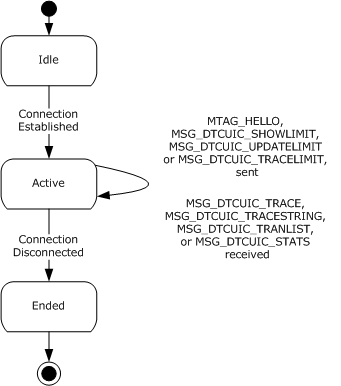

Figure 5: Relationship between the CONNTYPE_TXUSER_ DTCUI initiator states

##### 3.2.1.1.1 Idle

This is the initial state. The following event is processed in this state:

- Connecting to the Management Server.

##### 3.2.1.1.2 Active

The following events are processed in this state:

- Initiating the [**connection**](#gt_connection) with the Management Server.
- Testing the connection by sending an [MTAG_HELLO](#Section_2.2.2.4.1.1) message.
- Setting the Update Limit on the Management Server by sending the [MSG_DTCUIC_UPDATELIMIT](#Section_2.2.2.4.1.3) message.
- Setting the Show Limit on the Management Server by sending the [MSG_DTCUIC_SHOWLIMIT](#Section_2.2.2.4.1.4) message.
- Setting the Trace Limit on the Management Server by sending the [MSG_DTCUIC_TRACELIMIT](#Section_2.2.2.4.1.2) message.
- Receiving [**transaction**](#gt_transaction) statistics in [MSG_DTCUIC_TRACESTRING](#Section_2.2.2.4.1.8), [MSG_DTCUIC_TRACE](#Section_2.2.2.4.1.7), [MSG_DTCUIC_STATS](#Section_2.2.2.4.1.5) or [MSG_DTCUIC_TRANLIST](#Section_2.2.2.4.1.6) [**messages**](#gt_message).
- Disconnecting from the Management Server.

##### 3.2.1.1.3 Ended

This is the final state.

### 3.2.2 Timers

None.

### 3.2.3 Initialization

When a Management Client is initialized:

- The Management Client Name field is constructed in an implementation-specific manner. This name object MUST be used when initializing the underlying OleTx Transports Protocol implementation as the Local [**Name Object**](#gt_name-object) (as specified in [MS-CMPO](#Section_2.1) section 3.2.3). The initialization process of the underlying OleTx Transports Protocol is specified in section [2.1.2](../MS-CMPO/MS-CMPO.md).
- The Management Server Name is constructed by initializing the fields of the Name object (specified in [MS-CMPO] section 3.2.1.4) with the following values:
- **HostName**: The **HostName** field is initialized with the value of the **ComputerName.NetBIOS** element of the machine as specified in [MS-WKST](../MS-WKST/MS-WKST.md) section 3.2.1.2.
- **CID**: The **CID** field is initialized as follows:
- Read the string value, using the Windows Remote Registry Protocol [MS-RRP](../MS-RRP/MS-RRP.md), from the "HKEY_CLASSES_ROOT\CID\<MSDTCUIS_GUID>" registry key as specified in section [2.2.3.5](../MS-RRP/MS-RRP.md), for the Description\Default value of "MSDTCUIS" as specified in section [2.2.3.5.1](#Section_2.2.3.5.1).
- Convert the <MSDTCUIS_GUID> string to a GUID as specified in [[C706]](https://go.microsoft.com/fwlink/?LinkId=89824) Appendix A.
- **Protocols**:
- If the Allow Network Access flag is set to false:
- The **Protocols** field is initialized to the PROT_LRPC flag as described in [MS-CMPO] section [2.2.4](#Section_2.2.4).
- Otherwise:
- The **Protocols** field is initialized directly from the "ServiceNetworkProtocols" registry key as specified in section [2.2.3.4](#Section_2.2.3.4).
- The Management Connection field MUST be assigned a null value.
- The **Management Server Cluster Resource ID** field MUST be assigned a null value.

### 3.2.4 Protocol Versioning Details

The following sections specify how to determine the version of the registry protocol and the value of the cluster resource ID.

#### 3.2.4.1 Determining the Version of the Registry Protocol

If the Management Client role implementation has an existing MSDTC Connection Manager: OleTx Transports Protocol [MS-CMPO](#Section_2.1) session with the Management Server role implementation, the Management Client role implementation MUST check the State field of the session object, as specified in [MS-CMPO], section 3.3.4.2.1.

If the Management Client role implementation has no existing MSDTC Connection Manager: OleTx Transports Protocol [MS-CMPO] session with the Management Server role implementation, the Management Client role implementation MUST use the protocol versioning negotiation mechanism, as specified in [MS-CMPO] sections 3.3.4.2.1 and 3.3.4.2.2 to determine the version of the registry protocol supported by the Management Server role implementation as follows:

- Initialize the underlying MSDTC Connection Manager: OleTx Transports Protocol transport, specifying the following:
- Set the Minimum Level 3 Version Number data field of the underlying MSDTC Connection Manager: OleTx Transports Protocol implementation to 0x00000001 (the lowest protocol version specified in [MS-DTCO](../MS-DTCO/MS-DTCO.md) section 2.2.1.1).
- Set the Maximum Level 3 Version Number data field of the underlying MSDTC Connection Manager: OleTx Transports Protocol implementation to 0x00000006 (the highest protocol version specified in [MS-DTCO] section 2.2.1.1).
- Establish a new MSDTC Connection Manager: OleTx Transports Protocol session with the Management Server role implementation and record the value of the **dwLevelThreeAccepted** field of the session object's **Version** field, as specified in [MS-CMPO] section 3.2.1.2.
- Tear down the MSDTC Connection Manager: OleTx Transports Protocol session, as specified in [MS-CMPO] sections 3.3.4.5 and 3.3.4.6.
If the value of the **dwLevelThreeAccepted** field is 0x00000001, 0x00000002 or 0x00000004, then the version of the registry protocol maps to version 1, 2 or 3, respectively, as specified in the following table. If the value of the **dwLevelThreeAccepted** field is 0x00000005 or 0x00000006, then more steps are required to determine the version of the registry protocol.

| dwLevelThreeAccepted | HKCR\CID.Local exists? | HKCR\CID.Local\ <MSDTCUIS_GUID> exists? | ApiOpenCluster() | Version |
| --- | --- | --- | --- | --- |
| 0x00000001 | Not applicable | Not applicable | Not applicable | 1 |
| 0x00000002 | Not applicable | Not applicable | Not applicable | 2 |
| 0x00000004 | Not applicable | Not applicable | Not applicable | 3 |
| 0x00000005 | No | Not applicable | A null value, as specified in [MS-CMRP] section 3.1.4.2.2. | 4 |
| 0x00000005 | No | Not applicable | A valid HCLUSTER_RPC value, as specified in [MS-CMRP] section 2.2.1.1. | 5 |
| 0x00000005 | Yes | Yes | Not applicable | 6 |
| 0x00000005 | Yes | No | Not applicable | 7 |
| 0x00000006 | Yes | Yes | Not applicable | 8 |
| 0x00000006 | Yes | No | Not applicable | 9 |

- Establish a Windows Remote Registry Protocol [MS-RRP](../MS-RRP/MS-RRP.md) connection with the Management Server role implementation, and attempt to open the "HKEY_CLASSES_ROOT\CID.Local" registry key.
- If the registry key exists, then:
- Attempt to open the "HKEY_CLASSES_ROOT\CID.Local\<MSDTCUIS_GUID>" registry key, using the <MSDTCUIS_GUID> obtained during initialization, as specified in section [3.2.3](#Section_3.2.3).
- If the registry key exists, then:
- If the value of the **dwLevelThreeAccepted** field is 0x00000005, then the version of the registry protocol is 6.
- Otherwise, the version of the registry protocol is 8.
- Otherwise:
- If the value of the **dwLevelThreeAccepted** field is 0x00000005, then the version of the registry protocol is 7.
- Otherwise, the version of the registry protocol is 9.
- Otherwise,
- Attempt to establish a Failover Cluster: Management API (ClusAPI) Protocol RPC interface connection (as specified in [MS-CMRP] section 3.2.3) with the Management Server role implementation.
- If the Failover Cluster: Management API (ClusAPI) Protocol [MS-CMRP] RPC interface connection can be established, then the version of the registry protocol is 5.
- Otherwise, the version of the registry protocol is 4.

#### 3.2.4.2 Determining the Management Server Cluster Resource ID

After the version of the registry protocol has been determined, the Management Client role implementation MUST use the following specified mechanisms to determine the Management Server Cluster Resource ID of the Management Server role implementation. The Management Server Cluster Resource ID is only used in versions 5, 7, and 9 of the registry protocol.

- If the version of the registry protocol is 5, then:
- Establish a Failover Cluster: Management API (ClusAPI) Protocol RPC interface connection (as specified in [MS-CMRP](../MS-CMRP/MS-CMRP.md) section 3.2.3) with the Management Server role implementation.
- Open the [**cluster registry root key**](#gt_cluster-registry-root-key).
- Open the "HKEY_LOCAL_MACHINE\Cluster\Resources" key, and enumerate the keys (as specified in [MS-CMRP] section 3.2.4.3) Note that the enumerated keys are cluster resource IDs.
- For each enumerated key, attempt to open the "DataPointer" subkey:
- If the "HKEY_LOCAL_MACHINE\Cluster\Resources\<ResID>\DataPointer" key exists, then the Management Server Cluster Resource ID is <ResID>.
- Otherwise, continue enumerating the keys as specified in the previous step.
- Otherwise, if the registry protocol version is 7 or 9, then:
- Establish a Failover Cluster: Management API (ClusAPI) Protocol RPC interface connection (as specified in [MS-CMRP] section 3.2.3) with the Management Server role implementation.
- Open the cluster registry root key.
- Open the "HKEY_LOCAL_MACHINE\Cluster\Resources" key, and enumerate the keys (as specified in [MS-CMRP] section 3.2.4.3) [Note: the enumerated keys are cluster resource IDs].
- For each enumerated key, attempt to open the "MSDTCPRIVATE\CID\<MSDTCUIS_GUID>" subkey, using the <MSDTCUIS_GUID> obtained during initialization, as specified in section [3.2.3](#Section_3.2.3):
- If the "HKEY_LOCAL_MACHINE\Cluster\Resources\<ResID>"\MSDTCPRIVATE\CID\<MSDTCUIS_GUID>">" key exists, then the Management Server Cluster Resource ID is <ResID>.
- Otherwise, continue enumerating the keys as specified in the previous step.

### 3.2.5 Higher-Layer Triggered Events

The Management Client MUST be prepared to process a set of events triggered by the [**higher-layer business logic**](#gt_higher-layer-business-logic), as specified in the following sections. The details of the higher-layer business logic are implementation-specific and not covered in this specification.

#### 3.2.5.1 Connecting to the Management Server

If the higher-layer business logic decides to connect to the Management Server, the Management Client MUST perform the following actions:

- Establish a new [CONNTYPE_TXUSER_DTCUIC](#Section_2.2.2.4.1) [**Connection**](#gt_connection) using the Management Server Name field as the partner's [**Name Object**](#gt_name-object).
- Assign the new Connection object to the Management Connection field.
- Set the state of the Connection to Active.

#### 3.2.5.2 Testing the Connection

If the [**higher-layer business logic**](#gt_higher-layer-business-logic) decides to send an [MTAG_HELLO](#Section_2.2.2.4.1.1) message to test the [**connection**](#gt_connection) with the Management Server, the Management Client MUST perform the following actions:

- If the Management Connection field is not set to a [CONNTYPE_TXUSER_DTCUIC](#Section_2.2.2.4.1) Connection in the Active state:
- Signal the higher layer that no active Connection with the Management Server exists.
- Otherwise:
- Send a MTAG_HELLO message using the Connection. As the goal is to test the established Connection, the Management Client sends the message but doesn't wait for a response. Because no response is expected from the server, the most likely cause of failure when sending this message would be related to problems on the client side.
- If the send fails:
- Set the Management Connection field to a null value.
- Signal the higher layer that no active Connection with the Management Server exists.
- Set the state of the Connection to Ended.

#### 3.2.5.3 Setting the Update Limit on the Management Server

If the [**higher-layer business logic**](#gt_higher-layer-business-logic) decides to set the update limit on the Management Server, the Management Client MUST perform the following actions:

- Send an [MSG_DTCUIC_UPDATELIMIT](#Section_2.2.2.4.1.3) message using the [**Connection**](#gt_connection) specified by the Management Connection field:
- The **dwUpdateLimit** field MUST be set to the provided value.

#### 3.2.5.4 Setting the Show Limit on the Management Server

If the [**higher-layer business logic**](#gt_higher-layer-business-logic) decides to set the show limit on the Management Server, the Management Client MUST perform the following actions:

- Send an [MSG_DTCUIC_SHOWLIMIT](#Section_2.2.2.4.1.4) message using the [**Connection**](#gt_connection) specified by the Management Connection field:
- The **dwShowLimit** field MUST be set to the provided value.

#### 3.2.5.5 Setting the Trace Limit on the Management Server

If the [**higher-layer business logic**](#gt_higher-layer-business-logic) decides to set the trace limit on the Management Server, the Management Client MUST perform the following actions:

- Send an [MSG_DTCUIC_TRACELIMIT](#Section_2.2.2.4.1.2) message using the [**Connection**](#gt_connection) specified by the Management Connection field:
- The **dwTraceLimit** field MUST be set to the provided value.

#### 3.2.5.6 Disconnecting from the Management Server

If the [**higher-layer business logic**](#gt_higher-layer-business-logic) decides to disconnect from the Management Server, the Management Client MUST perform the following actions:

- Disconnect the CONNTYPE_TXUSER_DTCUIC [**Connection**](#gt_connection) as specified in [MS-CMP](../MS-CMP/MS-CMP.md) section 3.1.4.3.
- Set the Management Connection field to null.

#### 3.2.5.7 Reading from a Registry Key of the Management Server

If the higher-layer business logic reads a value stored in a registry key defined in section [3.3.1.2](#Section_2.2.1.2.2.4), the Management Client MUST perform the following actions:

- Determine the registry path and access protocol as specified in sections [2.2.1.2.2](#Section_2.2.1.2.2.3) and [3.2.4.1](#Section_3.2.4.1).
- Establish a Windows Remote Registry Protocol [MS-RRP](../MS-RRP/MS-RRP.md) connection to the remote machine using the Management Server Name (section [3.3.1](../MS-RRP/MS-RRP.md)).
- Open the root key (defined in [MS-RRP] section 3.1.1.5) for the registry key by using the OpenLocalMachine method as specified in [MS-RRP] section 3.1.5.3.
- Open the registry key by using the BaseRegOpenKey method for read access (as specified in [MS-RRP] section 3.1.5.15).
- Read the registry value by using the BaseRegQueryValue method (as specified in [MS-RRP] section 3.1.5.17).
- Return the value to the higher layer business logic.
- Close any open key by using the BaseRegCloseKey method (as specified in [MS-RRP] section 3.1.5.6).
For more information on how to use [MS-RRP] to access registry keys, refer to section [4.2.1](../MS-RRP/MS-RRP.md).

#### 3.2.5.8 Writing to a Registry Key of the Management Server

If the higher-layer business logic writes to a value stored in a registry key defined in section [3.3.1.2](#Section_2.2.1.2.2.4), the Management Client MUST perform the following actions:

- Determine the registry path and access protocol as specified in sections [2.2.1.2.2](#Section_2.2.1.2.2.3) and [3.2.4.1](#Section_3.2.4.1).
- Establish a Windows Remote Registry Protocol [MS-RRP](../MS-RRP/MS-RRP.md) connection to the remote machine using the Management Server Name (section [3.3.1](../MS-RRP/MS-RRP.md)).
- Open the root key (defined in [MS-RRP] section 3.1.1.5) for the registry key by using the OpenLocalMachine method as specified in [MS-RRP] section 3.1.5.3.
- Open the registry key by using the BaseRegOpenKey method for write access (as specified in [MS-RRP] section 3.1.5.15).
- Write the registry value by using the BaseRegSetValue method (as specified in [MS-RRP] section 3.1.5.22).
- Close any open key by using the BaseRegCloseKey method (as specified in [MS-RRP] section 3.1.5.6).
For more information on how to use [MS-RRP] to access registry keys, refer to section [4.2.1](../MS-RRP/MS-RRP.md).

### 3.2.6 Message Processing Events and Sequencing Rules

#### 3.2.6.1 CONNTYPE_TXUSER_DTCUIC as Initiator

For all [**messages**](#gt_message) received in this [**Connection type**](#gt_connection-type), the Management Client MUST process the message as specified in [MS-DTCO](../MS-DTCO/MS-DTCO.md), section 3.1. The Management Client MUST additionally follow the processing rules specified in the following sections.

##### 3.2.6.1.1 Receiving an MSG_DTCUIC_TRACESTRING, MSG_DTCUIC_TRACE, MSG_DTCUIC_STATS, or MSG_DTCUIC_TRANLIST Message

When the Management Client receives an [MSG_DTCUIC_TRACESTRING](#Section_2.2.2.4.1.8), [MSG_DTCUIC_TRACE](#Section_2.2.2.4.1.7), [MSG_DTCUIC_STATS](#Section_2.2.2.4.1.5) or [MSG_DTCUIC_TRANLIST](#Section_2.2.2.4.1.6) message, it MUST perform the following actions:

- Provide the data contents of the message to the [**higher-layer business logic**](#gt_higher-layer-business-logic) using an implementation-specific format.

##### 3.2.6.1.2 Connection Disconnected

When a [CONNTYPE_TXUSER_DTCUIC](#Section_2.2.2.4.1) [**Connection**](#gt_connection) is disconnected, the Management Client MUST set the Management Connection field to a null value.

### 3.2.7 Timer Events

None.

### 3.2.8 Other Local Events

None.

## 3.3 Management Server Role

### 3.3.1 Abstract Data Model

This section describes a conceptual model of possible data organization that an implementation maintains to participate in this protocol. The described organization is provided to facilitate the explanation of how the protocol behaves. This specification does not mandate that implementations adhere to this model as long as their external behavior is consistent with that described in this specification.

It is possible to implement the conceptual data defined in this section using a variety of techniques. An implementation is at liberty to implement such data in any way it pleases.

The Management Server MUST maintain all the data elements specified in section [3.1.1](#Section_3.1.1). The Management Server MUST also maintain the following data elements:

- **Management Server Name**: A [**Name object**](#gt_name-object) identifying the Management Server with the underlying OleTx Transports Protocol [MS-CMPO](#Section_2.1) transport infrastructure.
- **Show Limit**: An unsigned integer value specifying the minimum age a [**transaction**](#gt_transaction) MUST have to be reported to the Management Client. This is common to all [**connections**](#gt_connection) in the Management Connection List.
- **Update Limit**: An unsigned integer value specifying the Update Timer value. This is common to all connections in the Management Connection List.
- **Trace Limit**: A field that MUST have one of the values in TRACE_LEVEL, and specifies what level a trace event MUST have to be reported to the Management Client. This is common to all connections in the Management Connection List.
- **Management Connection List**: A list of [CONNTYPE_TXUSER_DTCUIC](#Section_2.2.2.4.1) connections.
- **Tracked Transaction List**: A list of transaction objects.
- **Open Transactions**: A 4-byte unsigned integer indicating the number of currently opened transactions.
- **Committed Transactions**: A 4-byte unsigned integer indicating the current number of committed transactions.
- **Aborted Transactions**: A 4-byte unsigned integer indicating the current number of aborted transactions.
- **In Doubt Transactions**: A 4-byte unsigned integer indicating the current number of in-doubt transactions.
- **Heuristic**: A 4-byte reserved field that MUST be set to 0x00000000.
- **Open Max Transactions**: A 4-byte unsigned integer indicating the maximum value of the **Open Transactions** field since the transaction manager was started.
- **Committed Max Transactions**: A 4-byte unsigned integer indicating the maximum value of the **Committed Transactions** field since the transaction manager was started.
- **Aborted Max Transactions**: A 4-byte unsigned integer indicating the maximum value of the **Aborted Transactions** field since the transaction manager was started.
- **In Doubt Max Transactions**: A 4-byte unsigned integer indicating the maximum value of the **In Doubt Transactions** field since the transaction manager was started.
- **Heuristic Max**: A 4-byte reserved field that MUST be set to 0x00000000.
- **Forced Commit Transactions**: A 4-byte unsigned integer indicating the current number of transactions that were in doubt and were forced to commit.
- **Forced Abort Transactions**: A 4-byte unsigned integer indicating the current number of transactions that were in doubt and were forced to abort.
- **Avg Response Time**: A 4-byte unsigned integer indicating the current average time in milliseconds for committing a transaction.
- **Min Response Time**: A 4-byte unsigned integer indicating the current minimum time in milliseconds for committing a transaction.
- **Max Response Time**: A 4-byte unsigned integer indicating the current maximum time in milliseconds for committing a transaction.
- **Time Transactions Up**: This field SHOULD contain an unsigned 4-byte integer <6> that specifies the number of seconds that elapsed from a baseline time to when the service was started.
- **System Time Transactions Up**: A **SYSTEMTIME** structure (as specified in [MS-DTYP](../MS-DTYP/MS-DTYP.md) section 2.3.13) indicating the time the service was started.
- **Time Stamp**: A 4-byte unsigned reserved field that MUST be set to 0x00000000.
- **Single Phase In Doubt**: A 4-byte unsigned integer indicating the current number of transactions that have entered the single-phase in-doubt state.

#### 3.3.1.1 Connection States

The Management Server MUST provide the following states for its supported [**Connection Types**](#gt_connection-type).

##### 3.3.1.1.1 CONNTYPE_TXUSER_DTCUIC Acceptor States

The Management Server MUST act as an acceptor for the [CONNTYPE_TXUSER_DTCUIC](#Section_2.2.2.4.1) [**Connection Type**](#gt_connection-type). In this role, the Management Server MUST provide support for the following states:

- Idle
- Active
- Ended
This figure depicts the relationship between the CONNTYPE_TXUSER_DTCUIC acceptor states.

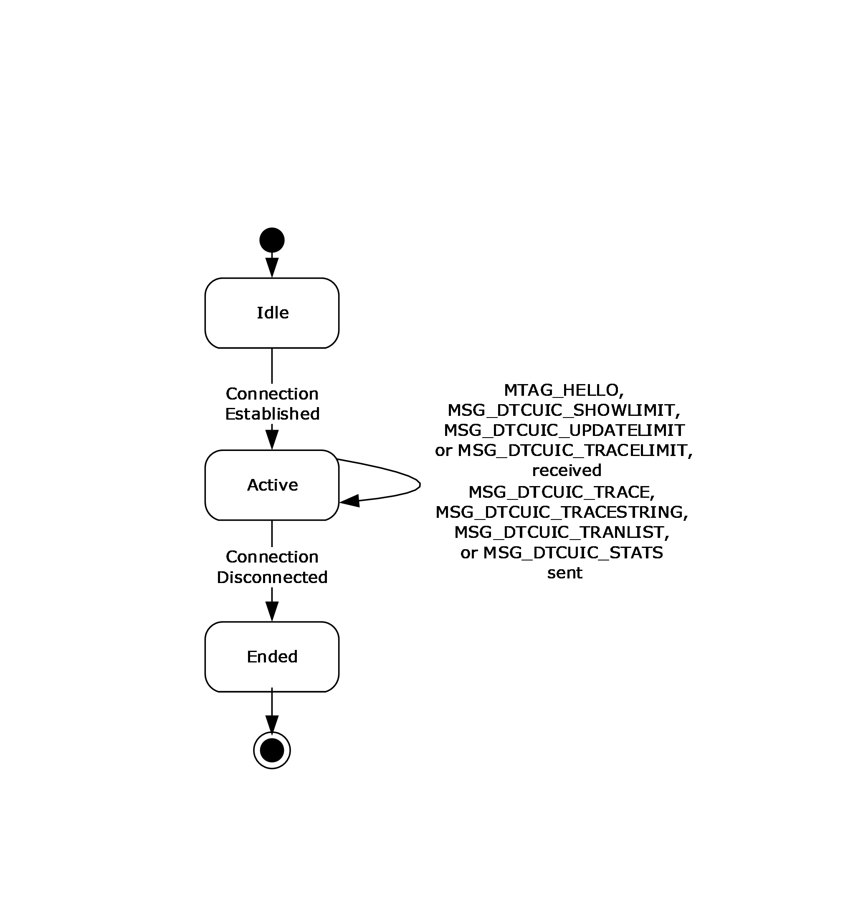

Figure 6: Relationship between the CONNTYPE_TXUSER_ DTCUI acceptor states

###### 3.3.1.1.1.1 Idle

This is the initial state. The following event is processed in this state:

- Incoming Connection Request event.

###### 3.3.1.1.1.2 Active

The following events are processed in this state:

- Receiving an [MTAG_HELLO](#Section_2.2.2.4.1.1) message.
- Receiving an [MSG_DTCUIC_TRACELIMIT](#Section_2.2.2.4.1.2) [**message**](#gt_message).
- Receiving an [MSG_DTCUIC_UPDATELIMIT](#Section_2.2.2.4.1.3) message.
- Receiving an [MSG_DTCUIC_SHOWLIMIT](#Section_2.2.2.4.1.4) message.
- Trace Event
- Trace String Event

###### 3.3.1.1.1.3 Ended

This is the final state.

#### 3.3.1.2 Registry Keys (Public)

The Management Server uses the Windows registry to persistently store and retrieve the registry keys and values specified in section [2.2.3](../MS-CMPO/MS-CMPO.md), and the persistent store is shared with [MS-CMPO](#Section_2.1), [MS-DTCO](../MS-DTCO/MS-DTCO.md), [MS-DTCLU](../MS-DTCLU/MS-DTCLU.md), and [MC-DTCXA](../MC-DTCXA/MC-DTCXA.md). The set of registry keys and values specified in section 2.2.3 MUST be exposed by the Management Server at a specified registry path via the Windows Remote Registry Protocol [MS-RRP](../MS-RRP/MS-RRP.md) or Failover Cluster: Management API (ClusAPI) Protocol [MS-CMRP](../MS-CMRP/MS-CMRP.md) depending on the registry protocol version, as specified in section [2.2.1.2](../MS-CMPO/MS-CMPO.md). Each of these protocols can have a protocol-specific configuration that is not managed by OleTx Management Protocol.

The Management Server also uses the abstract data model elements specified in [MS-CMPO] section 1.3.2 and [MS-DTCO] section 3.2.1, and initialized by the MSDTC Connection Manager: OleTx Transports Protocol [MS-CMPO] and the MSDTC Connection Manager: OleTx Transaction Protocol [MS-DTCO], using the registry keys defined in sections [3.3.1.2.1](#Section_3.3.1.2.1), [3.3.1.2.2](#Section_3.3.1.2.2), [3.3.1.2.3](#Section_3.3.1.2.3), and [3.3.1.2.4](#Section_3.3.1.2.4). For each abstract data model element that is loaded from the registry, there is one instance that is shared by the Management Server and the protocol(s) that uses the abstract data model element. The abstract data model elements are immutable after the transaction manager service implementing the Management Server role has started. Any changes made to the registry keys will not be reflected in the abstract data model elements until the transaction manager service is stopped and restarted.

Sections 3.3.1.2.1, 3.3.1.2.2, 3.3.1.2.3, and 3.3.1.2.4 specify the registry keys and the abstract data model elements loaded from each key.

##### 3.3.1.2.1 Functional Registry Keys

If a key value in the following table is required by the registry protocol version, as specified in section [2.2.1.2.1](#Section_2.2.1.2.1.3), then the key value, if present, MUST be of the correct type and MUST be set to a legal value. The registry path of these key values and the protocol used to access them is specified in section [2.2.1.2.2.1](#Section_2.2.1.2.2.1).

| Key value | Abstract data model element |
| --- | --- |
| "LuTransactions" | Allow LUTransactions Flag specified in [MS-DTCO](../MS-DTCO/MS-DTCO.md), section 3.2.1. If the key value is 0x00000000, then the flag MUST be set to FALSE, otherwise the flag MUST be set to TRUE. |
| "NetworkDtcAccessTip" | Allow Tip Security Flag specified in [MS-DTCO] section 3.2.1. If the key value is 0x00000000 or is missing, then the flag MUST be set to FALSE, otherwise the flag MUST be set to TRUE. |
| "ServerTcpPort" | A server TCP port, as specified in [MS-CMPO](#Section_2.1) section 3.2.1.1. This value determines the TCP port number of the RPC server [**endpoint**](#gt_endpoint). If the value is blank or missing, the [**transaction manager**](#gt_transaction-manager) will use the port that is automatically assigned by the RPC manager. |
| "XaTransactions" | Allow XA Security Flag as specified in [MS-DTCO] section 3.2.1. If the key value is 0x00000000 or is missing, then the flags MUST be set to FALSE, otherwise the flags MUST be set to TRUE. |

##### 3.3.1.2.2 Security Access Registry Keys

If a key value in the following table is required by the registry protocol version as specified in section [2.2.1.2.1](#Section_2.2.1.2.1.3), then the key value MUST be present, MUST be of the correct type and MUST be set to a legal value. The registry path of these key values and the protocol used to access them is specified in section [2.2.1.2.2.2](#Section_2.2.1.2.2.2).

| Key value | Abstract Data Model element |
| --- | --- |
| "NetworkDtcAccess" | Allow Network Access Security Flag specified in [MS-DTCO](../MS-DTCO/MS-DTCO.md) section 3.2.1. If the key value is 0x00000000, then the flag MUST be set to FALSE, otherwise the flag MUST be set to TRUE. |
| "NetworkDtcAccessTransactions" | Allow Network Transactions Security Flag specified in [MS-DTCO] section 3.2.1. If the key value is 0x00000000, then the flag MUST be set to FALSE, otherwise the flag MUST be set to TRUE. |
| "NetworkDtcAccessInbound" | Allow Inbound Transactions Security Flag specified in [MS-DTCO] section 3.2.1. If the key value is 0x00000000, then the flag MUST be set to FALSE, otherwise the flag MUST be set to TRUE. |
| "NetworkDtcAccessOutbound" | Allow Outbound Transactions Security Flag specified in [MS-DTCO] section 3.2.1. If the key value is 0x00000000, then the flag MUST be set to FALSE, otherwise the flag MUST be set to TRUE. |
| "NetworkDtcAccessAdmin" | Allow Remote Administration Security Flag specified in [MS-DTCO] section 3.2.1. If the key value is 0x00000000, then the flag MUST be set to FALSE, otherwise the flag MUST be set to TRUE. |
| "NetworkDtcAccessClients" | Allow Remote Clients Security Flag specified in [MS-DTCO] section 3.2.1. If the key value is 0x00000000, then the flag MUST be set to FALSE, otherwise the flag MUST be set to TRUE. |

##### 3.3.1.2.3 RPC Security Registry Keys

If a key value in the following table is required by the registry protocol version as specified in section [2.2.1.2.1](#Section_2.2.1.2.1.3), then the key value, if present, MUST be of the correct type and MUST be set to a legal value. The registry path of these key values and the protocol used to access them is specified in section [2.2.1.2.2.3](#Section_2.2.1.2.2.3).

| Key value | Abstract Data Model element |
| --- | --- |
| "AllowOnlySecureRpcCalls", "FallbackToUnsecureRPCIfNecessary", and "TurnOffRpcSecurity" | Security Level specified in [MS-DTCO](../MS-DTCO/MS-DTCO.md) section 3.2.1. If the AllowOnlySecureRpcCalls registry key is supported (as specified in section 2.2.1.2.1) and is either missing or set to a value other than 0x00000000, then the Security Level MUST be set to [**mutual authentication**](#gt_mutual-authentication). Else, if the FallbackToUnsecureRPCIfNecessary registry key is supported (as specified in section 2.2.1.2.1) and is set to a value other than 0x00000000, then the Security Level MUST be set to Incoming Authentication. Else, if the TurnOffRpcSecurity registry key is supported (as specified in section 2.2.1.2.1) and is set to a value other than 0x00000000, then the Security Level MUST be set to No Security. Else, the Security Level MUST be set to the default, implementation-specific security level value. <7> |
| "ServiceNetworkProtocols" | The Service Network Protocols abstract data model element is specified in [MS-CMPO](#Section_2.1) section 3.3.1. The list of protocols specified by the registry key ServiceNetworkProtocols MUST be mapped to the list of supported RPC protocols in the **COM_PROTOCOL** field passed to the underlying OleTx Transports Protocol layer, as specified in [MS-CMPO] section 1.3.2. The ServiceNetworkProtocols registry key has a type of Int32. Its possible values are any bitwise-OR combination of zero or more RPC_NETWORK_PROTOCOL values. If the key value is 0x00000000 or is missing, then the list of protocols MUST contain a single entry specifying TCP/IP. |

"Mutual Authentication", "Incoming Authentication", and "No Security" are specified in [MS-CMPO], section 3.2.1.1.

##### 3.3.1.2.4 "EndpointRegistryPath\MSDTCUIS_GUID\CustomProperties" Registry Key

If a "CustomProperties" subkey value is present in the registry path, as specified in section [2.2.3.6](#Section_2.2.3.6), then the subkey value MUST be of the correct type and MUST be set to a legal value. The registry path of these key values and the protocol used to access them is specified in section [2.2.1.2.2.5](#Section_2.2.1.2.2.5).

| Subkey value | Abstract Data Model element |
| --- | --- |
| DAC\ShowLimit\(Default) | The **Show Limit** field of the Management Server, as described in section [3.3.1](#Section_3.3.1). If the key value is missing, then the **Show Limit** MUST be set to 0x00000002. |
| DAC\UpdateLimit\(Default) | The **Update Limit** field of the Management Server, as described in section 3.3.1. If the key value is missing, then the **Update Limit** MUST be set to 0x00000002. |
| DAC\TraceLimit\(Default) | The **Trace Limit** field of the Management Server, as described in section 3.3.1. If the key value is missing, then the **Trace Limit** MUST be set to 0x00000002. |

### 3.3.2 Timers

The Management Server MUST provide the following timers:

#### 3.3.2.1 Update Timer

This timer MUST be created and started during initialization of the Management Server.

The value of the timer MUST be expressed in milliseconds. The default value of the timer is 1000 milliseconds.

The minimum and maximum values of the timer are implementation-specific and MUST be greater than zero.

### 3.3.3 Initialization

When the [Management Server role](#Section_3.3) is initialized, it MUST perform the following actions:

- The Management Server Name is constructed in an implementation-specific manner that MUST make use of information contained in the <EndpointRegistryPath>\<MSDTCUIS_GUID> key (see section [2.2.3.6](../MS-CMPO/MS-CMPO.md)). The sub-key values and the use of those sub-keys are specified in section 2.2.3.6. The name object MUST be used when initializing the underlying OleTx Transports Protocol implementation (as specified in [MS-CMPO](#Section_2.1) section 3.2.3). The initialization process of the underlying OleTx Transports Protocol is specified in section [2.1.2](../MS-CMPO/MS-CMPO.md).
- The Show Limit field MUST be loaded from the "DAC\ShowLimit" custom property of the <EndpointRegistryPath>\<MSDTCUIS_GUID> key (see section [3.3.1.2.4](#Section_3.3.1.2.4)).
- The Update Limit field MUST be loaded from the "DAC\UpdateLimit" custom property of the <EndpointRegistryPath>\<MSDTCUIS_GUID> key.
- The Trace Limit field MUST be loaded from the "DAC\TraceLimit" custom property of the <EndpointRegistryPath>\<MSDTCUIS_GUID> key.
- The Management Connection List MUST be initialized with an empty list of [**connection**](#gt_connection) objects.
- The Tracked Transaction List MUST be initialized with an empty list of [**transaction**](#gt_transaction) objects.
- The Update Timer MUST be created and started.

### 3.3.4 Higher-Layer Triggered Events

The Management Server MUST be prepared to process a set of events triggered by the higher-layer business logic, as specified in the following sections.

The details of the higher-layer business logic are implementation-specific and not covered in this specification.

#### 3.3.4.1 Trace

This event MUST be signaled with the following arguments:

- Severity: A [TRACE_SEVERITY_LEVEL](#Section_2.2.2.3.5) enumeration value indicating the severity of the event.
- Source: A 4-byte unsigned integer value specifying the implementation-specific source of the trace event (see the **dwSource** field in section [2.2.2.4.1.7](#Section_2.2.2.4.1.7) for more details).
- MessageId: An implementation-specific unsigned integer that maps to a string describing the event to be traced (see the **dwMessage** field in section 2.2.2.4.1.7 for more details).
- Parameter: An implementation-specific null-terminated ANSI string specifying the variable part (if any) of the string identified by MessageId.
If the Trace event is signaled, the Management Server MUST perform the following actions:

- If the event MUST be traced, as specified in section [2.2.2.3.4](#Section_2.2.2.3.4), then, for each connection in the Management Connections list, send an MSG_DTCUIC_TRACE message using the [**connection**](#gt_connection):
- The **dwSev** field MUST be set to the value of the Severity argument.
- The **dwSource** field MUST be set to the value of the Source argument.
- The **dwMessage** field MUST be set to the value of MessageId argument.
- If the **Parameter** argument is non-null:
- The **fHasParam** field of the message MUST be set to 0x00000001.
- The **szParam** field of the message MUST be set to the Parameter argument.
- Else if the **Parameter** argument is null:
- The **fHasParam** field of the message MUST be set to 0x00000000.
- The **szParam** field of the message MUST be null.

#### 3.3.4.2 Trace String

This event MUST be signaled with the following arguments:

- Severity: A [TRACE_SEVERITY_LEVEL](#Section_2.2.2.3.5) enumeration value specifying the severity of the event.
- Source: A 4-byte unsigned integer value specifying the implementation-specific source of the trace event (see the **dwSource** field in section [2.2.2.4.1.8](#Section_2.2.2.4.1.8) for more details).
- MessageString: An implementation-specific, null-terminated ANSI string describing the trace event (see the **szMsg** field in section 2.2.2.4.1.8 for more details).
If the Trace String event is signaled, the Management Server MUST perform the following actions:

- If the event MUST be traced, as specified in section [2.2.2.3.4](#Section_2.2.2.3.4), then, for each connection in the Management Connections list, send an MSG_DTCUIC_TRACESTRING message using the [**connection**](#gt_connection):
- The **dwSev** field MUST be set to the value of the Severity argument.
- The **dwSource** field MUST be set to the value of the Source argument.
- The **szMsg** field of the message MUST be set to the MessageString argument.

#### 3.3.4.3 Update Transaction Stats

This event MUST be signaled with the following arguments:

- **cOpen**: The current number of open transactions.
- **cCommitted**: The current number of committed transactions.
- **cAborted**: The current number of aborted transactions.
- **cInDoubt**: The current number of in-doubt transactions.
- **cHeuristic**: Zero.
- **cOpenMax:** The current maximum number of open transactions.
- **cCommittedMax**: The current maximum number of committed transactions.
- **cAbortedMax**: The current maximum number of aborted transactions.
- **cInDoubtMax**: The current maximum number of in-doubt transactions.
- **cHeuristicMax**: Zero.
- **cForcedCommit**: The current number of transactions that were in doubt, and were forced to commit.
- **cForcedAbort**: The current number of transactions that were in doubt, and were forced to abort.
- **cAvgResponseTime**: The current average time for committing a transaction.
- **cMinResponseTime**: The current minimum time for committing a transaction.
- **cMaxResponseTime**: The current maximum time for committing a transaction.
- **timeTransactionsUp**: Implementation-specific time value.
- **systemTimeTransactionsUp**: Implementation-specific time value.
- **dwTimestamp**: Zero.
- **cSinglePhaseInDoubt**: The current number of transactions that have entered the single-phase in-doubt state.
If the Update Transaction Stats event is signaled, the Management Server MUST perform the following actions:

- The **Open Transactions** field MUST be set to the value of the cOpen argument.
- The **Committed Transactions** field MUST be set to the value of the cCommitted argument.
- The **Aborted Transactions** field MUST be set to the value of the cAborted argument.
- The **In Doubt Transactions** field MUST be set to the value of the cInDoubt argument.
- The **Heuristic** field MUST be set to the value of the cHeuristic argument.
- The **Open Max Transactions** field MUST be set to the value of the cOpenMax argument.
- The **Committed Max Transactions** field MUST be set to the value of the cCommittedMax argument.
- The **Aborted Max Transactions** field MUST be set to the value of the cAbortedMax argument.
- The **In Doubt Max Transactions** field MUST be set to the value of the cInDoubtMax argument.
- The **Heuristic Max** field MUST be set to the value of the cHeuristicMax argument.
- The **Forced Commit Transactions** field MUST be set to the value of the cForcedCommit argument.
- The **Forced Abort Transactions** field MUST be set to the value of the cForcedAbort argument.
- The **Avg Response Time** field MUST be set to the value of the cAvgResponseTime argument.
- The **Min Response Time** field MUST be set to the value of the cMinResponseTime argument.
- The **Max Response Time** field MUST be set to the value of the cMaxResponseTime argument.
- The **Time Transactions Up** field MUST be set to the value of the timeTransactionsUp argument.
- The **System Time Transactions Up** field MUST be set to the value of the systemTimeTransactionsUp argument.
- The **Time Stamp** field MUST be set to the value of the dwTimestamp argument.
- The **Single Phase In Doubt** field MUST be set to the value of the cSinglePhaseInDoubt argument.

### 3.3.5 Message Processing Events and Sequencing Rules

The Show Limit, Update Limit, and Trace Limit Abstract Data Model data elements that these [**messages**](#gt_message) modify are initialized during Management Server role initialization (see section [3.3.3](#Section_3.2.3)).

#### 3.3.5.1 CONNTYPE_TXUSER_DTCUIC as Acceptor

For all [**messages**](#gt_message) received in this [**Connection Type**](#gt_connection-type), the Management Server MUST process the message as specified in [MS-DTCO](../MS-DTCO/MS-DTCO.md), section 3.1. The Management Server MUST also follow the processing rules specified in the following sections.

##### 3.3.5.1.1 Receiving an MTAG_HELLO Message

When the Management Server receives an [MTAG_HELLO](#Section_2.2.2.4.1.1) message, it MUST ignore it. This message is sent by the [**client**](#gt_client) just to see if sending it fails or succeeds, which means the [**connection**](#gt_connection) is down or up, respectively.

##### 3.3.5.1.2 Receiving an MSG_DTCUIC_UPDATELIMIT Message

When the Management Server receives an [MSG_DTCUIC_UPDATELIMIT](#Section_2.2.2.4.1.3) message, it MUST perform the following actions:

- If the [**connection**](#gt_connection) state is Active:
- Set the Update Limit to the value of the **dwUpdateLimit** field from the message.
- Otherwise, the message MUST be processed as an invalid message according to the rules specified in [MS-DTCO](../MS-DTCO/MS-DTCO.md), section 3.1.6.

##### 3.3.5.1.3 Receiving an MSG_DTCUIC_SHOWLIMIT Message

When the Management Server receives an [MSG_DTCUIC_SHOWLIMIT](#Section_2.2.2.4.1.4) message, it MUST perform the following actions:

- If the [**connection**](#gt_connection) state is Active:
- Set the Show Limit to the value of the **dwShowLimit** field from the message.
- Otherwise, the message MUST be processed as an invalid message according to the rules specified in [MS-DTCO](../MS-DTCO/MS-DTCO.md), section 3.1.6.

##### 3.3.5.1.4 Receiving an MSG_DTCUIC_TRACELIMIT Message

When the Management Server receives an [MSG_DTCUIC_TRACELIMIT](#Section_2.2.2.4.1.2) message, it MUST perform the following actions:

- If the [**connection**](#gt_connection) state is Active:
- Set the Trace Limit to the value of the **dwTraceLimit** field from the message.
- Otherwise, the message MUST be processed as an invalid message according to the rules specified in [MS-DTCO](../MS-DTCO/MS-DTCO.md), section 3.1.6.

##### 3.3.5.1.5 Connection Disconnected

When a CONNTYPE_TXUSER_DTCUIC [**connection**](#gt_connection) is disconnected, the Management Server MUST do the following:

- Remove the connection object from the Management Connection List.

### 3.3.6 Timer Events

#### 3.3.6.1 Update Timer

When this timer expires, the Management Server MUST perform the following actions:

- If the Management Connection List is not empty:
- Send an [MSG_DTCUIC_STATS](#Section_2.2.2.4.1.5) message to each connection in the Management Connection List with the following fields:
- Set the **cOpen** field to **Open Transactions**.
- Set the **cCommitted** field to **Committed Transactions**.
- Set the **cAborted** field to **Aborted Transactions**.
- Set the **cInDoubt** field to **In Doubt Transactions**.
- Set the **cHeuristic** field to **Heuristic**.
- Set the **cOpenMax** field to **Open Max Transactions**.
- Set the **cCommittedMax** field to **Committed Max Transactions**.
- Set the **cAbortedMax** field to **Aborted Max Transactions**.
- Set the **cInDoubtMax** field to **In Doubt Max Transactions**.
- Set the **cHeuristicMax** field to **Heuristic Max**.
- Set the **cForcedCommit** field to **Forced Commit Transactions**.
- Set the **cForcedAbort** field to **Forced Abort Transactions**.
- Set the **cAvgResponseTime** field to **Avg Response Time**.
- Set the **cMinResponseTime** field to **Min Response Time**.
- Set the **cMaxResponseTime** field to **Max Response Time**.
- Set the **timeTransactionsUp** field to **Time Transactions Up**.
- Set the **systemTimeTransactionsUp** field to **System Time Transactions Up**.
- Set the **dwTimestamp** field to **Time Stamp**.
- Set the **cSinglePhaseInDoubt** field to **Single Phase In Doubt**.
- For each [**transaction**](#gt_transaction) object in the Transaction Table maintained by the [**transaction manager**](#gt_transaction-manager) that is either in the In Doubt state or older than the Show Limit value (as determined through an implementation-specific mechanism):
- If the transaction object is not present in the Tracked Transaction List:
- Add the transaction object to the Tracked Transaction List.
- If the Tracked Transaction list is not empty:
- Create an empty list of [DtcUITranListElement](#Section_2.2.2.2.1) structures (up to an implementation-specific maximum capacity<8>
For each transaction object in the Tracked Transaction List:

- If the number of structures in the list of DtcUITranListElement structures is less than the implementation-specific capacity<9>
- Create a new DtcUITranListElement structure.
- Set the **guidTx** field to the transaction object's identifier.
- Set the **ulIsol** field to the transaction object's isolation level.
- Set the **szDesc** field to the transaction object's description.
- Add the DtcUITranListElement structure to the list of DtcUITranListElement structures.
- If the transaction is found in the Transaction Table:
- Set the **dwStatus** field to the [TRACKING_STATUS](#Section_2.2.2.3.1) value that corresponds to the state of the transaction, as specified in section 2.2.2.3.1.
- Otherwise, if the transaction is not found in the Transaction Table:
- Set the **dwStatus** field to XACTSTAT_FORGET.
- Remove the transaction object from the Tracked Transaction List.
- Set the **szParent** field either to the host name specified by the **Name** field of the transaction object's **Superior Enlistment** field or to an empty string if the **Name** field is empty.
- Send an [MSG_DTCUIC_TRANLIST](#Section_2.2.2.4.1.6) message to each connection in the Management Connection List. The fields of this message MUST be set as follows:
- **dwNumElements**: The number of elements in the list of DtcUITranListElement structures.
- **rgElements**: The list of DtcUITranListElement structures.
- Set the Update Timer's period to the value specified by the Update Limit and reset the timer.

### 3.3.7 Other Local Events

A Management Server MUST be prepared to process the local events defined in the following sections.

#### 3.3.7.1 Incoming Connection Request

This event MUST be signaled by the underlying OleTx Multiplexing Protocol transport layer when a MTAG_CONNECTION_REQ message is received (as specified in [MS-CMP](../MS-CMP/MS-CMP.md) section 3.1.5.5). The event MUST be signaled with the following arguments:

- Connection: An OleTx Multiplexing Protocol [MS-CMP] connection object.
- Connection Type: A value indicating connection type.
When the Incoming Connection Request event is signaled, the Management Server MUST do the following:

- If the connection request is for a CONNTYPE_TXUSER_DTCUIC connection (as specified by the **connection type** field of the connection object):
- If Allow Remote Administration flag is true or the request is from the same machine (The Management Server determines this by comparing the **Hostname** fields of the **Management Server Name** and the Name object referenced by the **Name** field of the Session object that contains the provided Connection object. If they are equal, then the request is from the same machine.), then the connection is accepted:
- Create an extended connection object (section [3.1.1](#Section_3.1.1)) using the connection object argument, and add the extended connection object to the Management Connection List.
- Set the connection state to Active.
- Otherwise:
- The Management Server MUST reject CONNTYPE_TXUSER_DTCUIC as specified in [MS-CMP] section 3.1.5.5, with the rejection Reason set to 0x80070005.

#### 3.3.7.2 Service Control Events

The Management Server MUST respond to [**Service Control Manager (SCM)**](#gt_service-control-manager-scm) [MS-SCMR](#Section_1.7.3) requests to perform the following actions:

- Start the [**transaction manager**](#gt_transaction-manager) Service for Opnum 31 as specified in [MS-SCMR] section 3.1.4.30.
- Stop the transaction manager Service for Opnum 1 with value SERVICE_CONTROL_STOP as specified in [MS-SCMR] section 3.1.4.2.
- Interrogate the service status of the transaction manager Service for Opnum 17 as specified in [MS-SCMR] section 3.1.4.17.

# 4 Protocol Examples

These protocol examples assume that an [**OleTx**](#gt_oletx) transports [**session**](#gt_session), as specified in [MS-CMPO](#Section_2.1), has already been established between the two [**protocol participants**](#gt_protocol-participant).

Protocol participants communicate with each other by using OleTx multiplexing [**connections**](#gt_connection) (as specified in [MS-CMP](../MS-CMP/MS-CMP.md)), that are in turn layered on top of the OleTx transports infrastructure (as specified in [MS-CMPO]). In these examples, [**messages**](#gt_message) are sent from one protocol participant to another by submitting a MESSAGE_PACKET (as specified in [MS-CMP] section 2.2.2) to the underlying OleTx multiplexing layer (as specified in [MS-CMP]).

## 4.1 Simple Management Client Scenario

This scenario exhibits how a Management Client creates a connection to a Management Server. The scenario begins by the Management Client establishing a transport session with a Management Server and negotiating its connection resources.

### 4.1.1 Beginning a Management Client

This packet sequence is initiated by starting a [**connection**](#gt_connection) on a transport [**session**](#gt_session) between a Management Client and a Management Server.

**CONNTYPE_TXUSER_DTCUIC:** The packet sequence starts when a Management Client initiates a connection using [CONNTYPE_TXUSER_DTCUIC](#Section_2.2.2.4.1).

| Bit Range | Field | Description |
| --- | --- | --- |
| Variable | **MsgTag** | 0x00000005 MTAG_CONNECTION_REQ |
| Variable | **fIsMaster** | 0x00000001 1 |
| Variable | **dwConnectionId** | 0x00000001 1 |
| Variable | **dwUserMsgType** | 0x00000000 CONNTYPE_TXUSER_DTCUIC |
| Variable | **dwcbVarLenData** | 0x00000000 0 |
| Variable | **dwReserved1** | 0xCD64CD64 Reserved |

The Management Client then sends an [MTAG_HELLO](#Section_2.2.2.4.1.1) user message to the [**OleTx**](#gt_oletx) Management Server.

| Bit Range | Field | Description |
| --- | --- | --- |
| Variable | **MsgTag** | 0x00000FFF MTAG_USER_MESSAGE |
| Variable | **fIsMaster** | 0x00000001 1 |
| Variable | **dwConnectionId** | 0x00000001 1 |
| Variable | **dwUserMsgType** | 0x00003006 MTAG_HELLO |
| Variable | **dwcbVarLenData** | 0x00000000 0 |
| Variable | **dwReserved1** | 0xCD64CD64 Reserved |

When the Management Server receives the connection request from the underlying OleTx Multiplexing Protocol [MS-CMP](../MS-CMP/MS-CMP.md) layer, the Management Server adds the connection to its Management Connection List.

When the Management Server's Update Timer expires, the Management Server sends a [MSG_DTCUIC_STATS](#Section_2.2.2.4.1.5) user message to the Management Client. In this message, the Management Server reports that two [**transactions**](#gt_transaction) are open, seventeen transactions have been committed, and as many as eight transactions were open at the same time since the [**transaction manager**](#gt_transaction-manager) was started up on 6/14/2007.

| Bit Range | Field | Description |
| --- | --- | --- |
| Variable | **MsgTag** | 0x00000FFF MTAG_USER_MESSAGE |
| Variable | **fIsMaster** | 0x00000001 1 |
| Variable | **dwConnectionId** | 0x00000001 1 |
| Variable | **dwUserMsgType** | 0x00003001 MSG_DTCUIC_STATS |
| Variable | **dwcbVarLenData** | 0x00000058 88 |
| Variable | **dwReserved1** | 0xCD64CD64 Reserved |
| Variable | **cOpen** | 0x00000002 2 |
| Variable | **cCommitted** | 0x00000011 11 |
| Variable | **cAborted** | 0x00000000 0 |
| Variable | **cInDoubt** | 0x00000000 0 |
| Variable | **cHeuristic** | 0x00000000 0 |
| Variable | **cOpenMax** | 0x00000008 8 |
| Variable | **cCommittedMax** | 0x00000011 17 |
| Variable | **cAbortedMax** | 0x00000000 0 |
| Variable | **cInDoubtMax** | 0x00000000 0 |
| Variable | **cHeuristicMax** | 0x00000000 0 |
| Variable | **cForcedCommit** | 0x00000000 0 |
| Variable | **cForcedAbort** | 0x00000000 0 |
| Variable | **cAvgResponseTime** | 0x00002364 9060 |
| Variable | **cMinResponseTime** | 0x00001F4F 8015 |
| Variable | **cMaxResponseTime** | 0x0000B508 46344 |
| Variable | **timeTransactionsUp** | 0x46709338 1181782840 |
| 6/14/2007 1:00:40.640 AM (UTC) | **systemTimeTransactionsUp** | 0x07D70006 |
| Variable | - | 0x0004000E - |
| Variable | - | 0x00010000 - |
| Variable | - | 0x00280280 - |
| Variable | **dwTimestamp** | 0x00000000 0 |
| Variable | **cSinglePhaseInDoubt** | 0x00000001 1 |

The Management Server then sends an [MSG_DTCUIC_TRANLIST](#Section_2.2.2.4.1.6) user message to the Management Client if there are any open transactions older than specified by the Show Limit value. In this message, the Management Server reports the Transaction Id, the Isolation Level, the description, the status and Parent name for two (2) open transactions. If there are no open transactions older than specified by the Show Limit value, then this message is not sent.

| Bit Range | Field | Description |
| --- | --- | --- |
| Variable | **MsgTag** | 0x00000FFF MTAG_USER_MESSAGE |
| Variable | **fIsMaster** | 0x00000001 1 |
| Variable | **dwConnectionId** | 0x00000001 1 |
| Variable | **dwUserMsgType** | 0x00003002 MSG_DTCUIC_TRANLIST |
| Variable | **dwcbVarLenData** | 0x000000A4 164 |
| Variable | **dwReserved1** | 0xCD64CD64 Reserved |
| Variable | **dwNumElements** | 0x00000002 2 |
| b30f0859-f3cf-4866-8db1-287e81cc69f2 | **guidTx** | 0xB30F0859 |
| Variable | - | 0x4866F3CF - |
| Variable | - | 0x7E28B18D - |
| Variable | - | 0xF269CC81 - |
| Variable | **ulIsol** | 0x00100000 ISOLATIONLEVEL_SERIALIZABLE |
| Variable | **szDesc** | 0x6E617254 "Transaction #1" |
| Variable | - | 0x74636173 - |
| Variable | - | 0x206E6F69 - |
| Variable | - | 0x00003123 - |
| Variable | - | 0x00000000 - |
| Variable | - | 0x00000000 - |
| Variable | - | 0x00000000 - |
| Variable | - | 0x00000000 - |
| Variable | - | 0x00000000 - |
| Variable | - | 0x00000000 - |
| Variable | **dwStatus** | 0x00000C01 XACTSTAT_ONLY_FAILED_COMMITTED_REMAIN |
| Variable | **szParent** | 0x6863614D "Machine2" |
| Variable | - | 0x32656E69 - |
| Variable | - | 0x00000000 - |
| Variable | - | 0x00000000 - |
| 2489b646-94f0-41c6-a470-2b618d9f1ef2 | **guidTx** | 0x2489B646 |
| Variable | - | 0x41C694F0 - |
| Variable | - | 0x612B70A4 - |
| Variable | - | 0xF21E9F8D - |
| Variable | **ulIsol** | 0x00100000 ISOLATIONLEVEL_SERIALIZABLE |
| Variable | **szDesc** | 0x6E617254 "Transaction #2" |
| Variable | - | 0x74636173 - |
| Variable | - | 0x206E6F69 - |
| Variable | - | 0x00003223 - |
| Variable | - | 0x00000000 - |
| Variable | - | 0x00000000 - |
| Variable | - | 0x00000000 - |
| Variable | - | 0x00000000 - |
| Variable | - | 0x00000000 - |
| Variable | - | 0x00000000 - |
| Variable | **dwStatus** | 0x00020000 XACTSTAT_INDOUBT |
| Variable | **szParent[16]** | 0x6863614D "Machine2" |
| Variable | - | 0x32656E69 - |
| Variable | - | 0x00000000 - |
| Variable | - | 0x00000000 - |

The Management Server continues to send these messages until the Management Client closes the connection by initiating the disconnect sequence.

### 4.1.2 Adjusting the Update Limit

While the management [**connection**](#gt_connection) is running, the Management Client can adjust the Management Server's Update Limit value by sending an [MSG_DTCUIC_UPDATELIMIT](#Section_2.2.2.4.1.3) user message to the Management Server, specifying the Update Limit value. In this message, the Management Client specifies an Update Limit of UPDATE_5 (0x00000002), indicating that updates are to be sent every five seconds.

| Bit Range | Field | Description |
| --- | --- | --- |
| Variable | **MsgTag** | 0x00000FFF MTAG_USER_MESSAGE |
| Variable | **fIsMaster** | 0x00000001 1 |
| Variable | **dwConnectionId** | 0x00000001 1 |
| Variable | **dwUserMsgType** | 0x00003004 MSG_DTCUIC_UPDATELIMIT |
| Variable | **dwcbVarLenData** | 0x00000004 4 |
| dwReserved1: 0xCD64CD64 | **dwReserved1** | 0xCD64CD64 |
| Variable | **dwUpdateLimit** | 0x00000002 UPDATE_5 |

When the Management Server receives the message, the [**server**](#gt_server) updates its **Update Limit** field with the new value. After the Update Timer notifies the Management Server to send [**transaction**](#gt_transaction) statistics and transaction list information, the timer will wait five seconds before notifying the server to send management data to the [**client**](#gt_client).

### 4.1.3 Adjusting the Show Limit

To adjust the Show Limit value, the Management Client sends an [MSG_DTCUIC_SHOWLIMIT](#Section_2.2.2.4.1.4) user message to the Management Server, specifying the Show Limit value. In this message, the Management Client specifies a Show Limit of SHOW_10_SEC (0x00000003), indicating that the Management Server sends only [**transaction**](#gt_transaction) list data on open transactions that have been open for ten (10) seconds or more.

| Bit Range | Field | Description |
| --- | --- | --- |
| Variable | **MsgTag** | 0x00000FFF MTAG_USER_MESSAGE |
| Variable | **fIsMaster** | 0x00000001 1 |
| Variable | **dwConnectionId** | 0x00000001 1 |
| Variable | **dwUserMsgType** | 0x00003005 MSG_DTCUIC_SHOWLIMIT |
| Variable | **dwcbVarLenData** | 0x00000004 4 |
| dwReserved1: 0xCD64CD64 | **dwReserved1** | 0xCD64CD64 |
| Variable | **dwShowLimit** | 0x00000003 SHOW_10_SECS |

When the Management Server receives the message, the [**server**](#gt_server) updates its **Show Limit** field with the new value. When the Update Timer notifies the Management Server to send transaction statistics and transaction list information, the timer will only send transaction list information of transactions that have been open for ten (10) seconds or more.

## 4.2 Enabling XA Transactions Scenario

This scenario exhibits how a Management Client enables XA [**transactions**](#gt_transaction) on a remote machine; generally this scenario would be initiated by higher-layer logic.

### 4.2.1 Setting the XaTransactions Registry Key on the Remote Machine

The Management Client enables XA transactions on a remote machine by setting the HKEY_LOCAL_MACHINE\SOFTWARE\Microsoft\MSDTC\Security\XaTransactions registry value on the remote machine to one (DWORD: 0x00000001).

To do this, the Management Client establishes a Windows Remote Registry Protocol [MS-RRP](../MS-RRP/MS-RRP.md) [**connection**](#gt_connection) to the remote machine. The [**client**](#gt_client) then sends an OpenLocalMachine method (as specified in [MS-RRP] section 3.1.5.3) with the following values for the parameters.

ServerName = 0

samDesired = 0x00020006// KEY_WRITE

phKey = NULL

When the Windows Remote Registry Protocol [**server**](#gt_server) receives this request from the client, the server opens the handle to the root key HKEY_LOCAL_MACHINE with write access and returns 0 (ERROR_SUCCESS) and the pointer to the opened handle in the phKey parameter of the response.

The Windows Remote Registry Protocol client then uses the handle that is returned in phKey to open the subkey "SOFTWARE\Microsoft\MSDTC\Security" for write access by sending a BaseRegOpenKey (as specified in [MS-RRP] section 3.1.5.15) method with the following parameter values.

hKey = Handle (phKey) returned in

previous server response.

lpSubKey = L"SOFTWARE\\Microsoft\\MSDTC\\Security"

dwOptions = 0

samDesired = 0x00020006// KEY_WRITE

phkResult = NULL

When the Windows Remote Registry Protocol server receives this request from the client, the server opens the handle to the registry key HKEY_LOCAL_MACHINE\SOFTWARE\Microsoft\MSDTC\Security with write access and returns 0 (ERROR_SUCCESS) and the pointer to the opened handle in the phkResult parameter of the response.

The Windows Remote Registry Protocol client then uses the handle that is returned in phkResult to set "XaTransactions" value to 1 (0x00000001) in the registry subkey "SOFTWARE\Microsoft\MSDTC\Security" for write access by sending a BaseRegSetValue (as specified in [MS-RRP] section 3.1.5.22) method with the following parameter values.

hSubKey = Handle (phkResult) returned in

previous server response.

lpValueName = L"XaTransactions"

dwType = 4// REG_DWORD

lpData = pointer(0x00000001)

cbData = 4

When the Windows Remote Registry Protocol server receives this request from the client, the server uses the handle to the registry subkey HKEY_LOCAL_MACHINE\SOFTWARE\Microsoft\MSDTC\Security to set the REG_DWORD value "XaTransactions" to 1 (0x00000001) and returns 0 (ERROR_SUCCESS).

The Windows Remote Registry Protocol client then closes the registry subkey handles by sending a BaseRegCloseKey (as specified in [MS-RRP] section 3.1.5.6) method with the following parameter value.

hSubKey = Handle (phkResult) returned in

previous server response.

When the Windows Remote Registry Protocol server receives this request from the client, the server closes the registry subkey handle and returns 0 (ERROR_SUCCESS).

The Windows Remote Registry Protocol client then closes the registry key handle by sending a BaseRegCloseKey (as specified in [MS-RRP] section 3.1.5.6) method with the following parameter value.

hKey = Handle (phKey) returned in previous server response.

When the Windows Remote Registry Protocol server receives this request from the client, the server closes the registry key handle and returns 0 (ERROR_SUCCESS).

### 4.2.2 Restarting the Transaction Manager on the Remote Machine

Because the XaTransactions registry value is only read during the initialization of the [**transaction manager**](#gt_transaction-manager), the remote transaction manager has to be restarted by using the Service Control Manager Remote Protocol [MS-SCMR](#Section_1.7.3).

#### 4.2.2.1 Stopping the Transaction Manager Service

To restart the [**transaction manager**](#gt_transaction-manager) on the remote machine, the Management Client established a Service Control Manager Remote Protocol [MS-SCMR](#Section_1.7.3) [**connection**](#gt_connection) with the remote machine (for example, Machine2) and sends an ROpenSCManagerW call with the following values for the parameters.

lpMachineName = L"Machine2"

lpDatabaseName = SERVICES_ACTIVE_DATABASE

dwDesiredAccess = 0x00000001 // SC_MANAGER_CONNECT

lpScMgrHandle = NULL

On receiving this request from the [**client**](#gt_client), the [**server**](#gt_server) opens the handle to the [**SCM**](#gt_service-control-manager-scm) database with read access and returns from the method with an error code of 0 and the pointer to the opened handle in the *lpScHandle* parameter of the response.

The client then uses the handle returned in *lpScHandle* to open the transaction manager [**service**](#gt_service) with stop access by sending an RGetServiceDisplayNameW call with the following values for the parameters.

hSCManager = Handle returned in the lpScMgrHandle

parameter of the previous server response.

lpServiceName = L"MSDTC"

dwDesiredAccess = 0x00000020 // SERVICE_STOP

lpScHandle = NULL

Upon receiving this request from the client, the server queries the SCM database for the service named "MSDTC" and returns from the method with an error code of 0, and the pointer to the opened handle in the *lpScHandle* parameter of the response.

The client then uses the handle returned in *lpScHandle* to stop the transaction manager service by sending an RControlServiceExW call with the following values for the parameters.

hScHandle = Handle returned in the lpScHandle

parameter of the previous server response.

dwControl = 0x00000001 // SERVICE_CONTROL_STOP

lpSvcStatus = NULL

On receiving this request from the client, the server uses the handle to stop the service and returns from the method with an error code of 0 and the pointer to the last reported service status in the *lpSvcStatus* parameter of the response.

The client closes the service handle by sending an RCloseServiceHandle with the following values for the parameters.

hScHandle = Handle returned in the lpScHandle

parameter of the previous server response.

On receiving this request from the client, the server closes the handle to the service and returns from the method with an error code of 0.

The client closes the SCM database by sending an RCloseServiceHandle with the following values for the parameters.

hSCManager = Handle returned in the lpScMgrHandle

parameter of the previous server response.

On receiving this request from the client, the server closes the handle to the open SCM database and returns from the method with an error code of 0.

#### 4.2.2.2 Starting the Transaction Manager Service

To restart the [**transaction manager**](#gt_transaction-manager) on the remote machine, the Management Client established a Service Control Manager Remote Protocol [MS-SCMR](#Section_1.7.3) [**connection**](#gt_connection) with the remote machine (for example, Machine2) and sends an **ROpenSCManagerW** call with the following values for the parameters.

lpMachineName = L"Machine2"

lpDatabaseName = SERVICES_ACTIVE_DATABASE

dwDesiredAccess = 0x00000001 // SC_MANAGER_CONNECT

lpScMgrHandle = NULL

On receiving this request from the [**client**](#gt_client), the [**server**](#gt_server) opens the handle to the [**SCM**](#gt_service-control-manager-scm) database with read access and returns from the method with an error code of 0 and the pointer to the opened handle in the *lpScMgrHandle* parameter of the response.

The client then uses the handle returned in *lpScMgrHandle* to open the transaction manager [**service**](#gt_service) with stop access by sending an **RGetServiceDisplayNameW** call with the following values for the parameters.

hSCManager = Handle returned in the lpScMgrHandle

parameter of the previous server response.

lpServiceName = L"MSDTC"

dwDesiredAccess = 0x00000010 // SERVICE_START

lpScHandle = NULL

Upon receiving this request from the client, the server queries the SCM database for the service named "MSDTC" and returns from the method with an error code of 0, and the pointer to the opened handle in the lpScHandle parameter of the response.

The client then uses the handle returned in lpScHandle to start the transaction manager service by sending an **RStartServiceW** call with the following values for the parameters.

hScHandle = Handle returned in the lpScHandle

parameter of the previous server response.

argc = 0

argv = NULL

On receiving this request from the client, the server uses the handle to start the service and returns from the method with an error code of 0.

The client closes the service handle by sending an **RCloseServiceHandle** call with the following values for the parameters.

hScHandle = Handle returned in the lpScHandle

parameter of the previous server response.

On receiving this request from the client, the server closes the handle to the service and returns from the method with an error code of 0.

The client closes the SCM database by sending an **RCloseServiceHandle** call with the following values for the parameters.

hSCManager = Handle returned in the lpScMgrHandle

parameter of the previous server response.

On receiving this request from the client, the server closes the handle to the open SCM database and returns from the method with an error code of 0.

# 5 Security

This protocol employs the security mechanism of the underlying transport infrastructure specified in [MS-CMP](../MS-CMP/MS-CMP.md) and [MS-CMPO](#Section_2.1). Because the information exchanged in messages by this protocol can contain sensitive data, like the transaction identifiers and transaction manager addresses, implementers need to use mutual authentication, as specified in [MS-CMPO] section 2.1.3.<10>

The Windows Remote Registry Protocol [MS-RRP](../MS-RRP/MS-RRP.md) and Failover Cluster: Management API (ClusAPI) Protocol [MS-CMRP](../MS-CMRP/MS-CMRP.md) registry keys exposed by the Management Server are protected for access as follows:

- Read access (KEY_READ) needs to be granted to all authenticated users.
- Write access (KEY_WRITE) needs to be granted to a restricted group of users.
- Full access (KEY_ALL_ACCESS) needs to be granted to BUILTIN_ADMINISTRATORS, LOCAL_SYSTEM, and the MSDTC service account.

## 5.1 Security Considerations for Implementers

None.

## 5.2 Index of Security Parameters

None.

# 6 Appendix A: Product Behavior

The information in this specification is applicable to the following Microsoft products or supplemental software. References to product versions include updates to those products.

- Windows NT 4.0 operating system Option Pack for Windows NT Server
- Windows 2000 operating system
- Windows XP operating system
- Windows Server 2003 operating system
- Windows Server 2003 R2 operating system
- Windows Vista operating system
- Windows Server 2008 operating system
- Windows 7 operating system
- Windows Server 2008 R2 operating system
- Windows 8 operating system
- Windows Server 2012 operating system
- Windows 8.1 operating system
- Windows Server 2012 R2 operating system
- Windows 10 operating system
- Windows Server 2016 operating system
- Windows Server operating system
- Windows Server 2019 operating system
- Windows Server 2022 operating system
- Windows 11 operating system
- Windows Server 2025 operating system
Exceptions, if any, are noted in this section. If an update version, service pack or Knowledge Base (KB) number appears with a product name, the behavior changed in that update. The new behavior also applies to subsequent updates unless otherwise specified. If a product edition appears with the product version, behavior is different in that product edition.

Unless otherwise specified, any statement of optional behavior in this specification that is prescribed using the terms "SHOULD" or "SHOULD NOT" implies product behavior in accordance with the SHOULD or SHOULD NOT prescription. Unless otherwise specified, the term "MAY" implies that the product does not follow the prescription.

<1> Section 2.2.1.2.1.3: This key is required in Windows, except not in Windows NT 4.0 Option Pack, Windows 2000, and Windows XP operating system Service Pack 1 (SP1).

<2> Section 2.2.2.4.1.5: In 64-bit Windows, this field contains 4 bytes of padding (containing non-deterministic values), followed by an 8-byte unsigned integer. Therefore, the total size of the field is 12 bytes.

<3> Section 2.2.3.1.1: SPX is only supported on Windows NT 4.0 Option Pack, Windows 2000, Windows XP, and Windows Server 2003.

<4> Section 2.2.3.6.1: Subkey values for the "<EndpointRegistryPath>\<MSDTCUIS_GUID>\CustomProperties" Key are present by default on Windows NT Server 4.0 operating system, Windows 2000, Windows XP, and Windows Server 2003. Otherwise, the subkey values are not present.

<5> Section 2.2.4: On Windows clients, including Windows Server 2003, "MSDTC" is the only supported service name. On applicable Windows Server releases, except Windows Server 2003, both the "MSDTC" and "MSDTC$ <GUID>" service names are supported, where <GUID> represents the Cluster Resource ID.

<6> Section 3.3.1: In 64-bit Windows, this field contains 4 bytes of padding (containing nondeterministic values), followed by an 8-byte unsigned integer. Therefore, the total size of the field is 12 bytes.

<7> Section 3.3.1.2.3: In Windows NT 4.0 operating system, Windows 2000, and Windows XP SP1 "No Security" is the default security level used. Otherwise, "Mutual Authentication" is used by default on Windows.

<8> Section 3.3.6.1: In Windows, the number of elements in this list does not exceed 30.

<9> Section 3.3.6.1: In Windows, the number of elements in this list does not exceed 30.

<10> Section 5: In Windows NT 4.0, Windows 2000, and Windows XP SP1 "No Security" is the default security level used. Otherwise, "Mutual Authentication" is used by default on Windows.

# 7 Change Tracking

This section identifies changes that were made to this document since the last release. Changes are classified as Major, Minor, or None.

The revision class **Major** means that the technical content in the document was significantly revised. Major changes affect protocol interoperability or implementation. Examples of major changes are:

- A document revision that incorporates changes to interoperability requirements.
- A document revision that captures changes to protocol functionality.
The revision class **Minor** means that the meaning of the technical content was clarified. Minor changes do not affect protocol interoperability or implementation. Examples of minor changes are updates to clarify ambiguity at the sentence, paragraph, or table level.

The revision class **None** means that no new technical changes were introduced. Minor editorial and formatting changes may have been made, but the relevant technical content is identical to the last released version.

The changes made to this document are listed in the following table. For more information, please contact [dochelp@microsoft.com](mailto:dochelp@microsoft.com).

| Section | Description | Revision class |
| --- | --- | --- |
| [6](#Section_6) Appendix A: Product Behavior | Added Windows Server 2025 to the list of applicable products. | Major |

## Revision History

| Date | Version | Revision Class | Comments |
| --- | --- | --- | --- |
| 7/20/2007 | 0.1 | Major | MCPP Milestone 5 Initial Availability |
| 9/28/2007 | 1.0 | Major | Updated and revised the technical content. |
| 10/23/2007 | 1.1 | Minor | Revised a Windows Behavior note. |
| 11/30/2007 | 1.1.1 | Editorial | Revised a Windows Behavior note. |
| 1/25/2008 | 1.1.2 | Editorial | Changed language and formatting in the technical content. |
| 3/14/2008 | 2.0 | Major | Updated and revised the technical content. |
| 5/16/2008 | 2.0.1 | Editorial | Changed language and formatting in the technical content. |
| 6/20/2008 | 3.0 | Major | Updated and revised the technical content. |
| 7/25/2008 | 4.0 | Major | Updated and revised the technical content. |
| 8/29/2008 | 4.0.1 | Editorial | Changed language and formatting in the technical content. |
| 10/24/2008 | 4.1 | Minor | Clarified the meaning of the technical content. |
| 12/5/2008 | 5.0 | Major | Updated and revised the technical content. |
| 1/16/2009 | 6.0 | Major | Updated and revised the technical content. |
| 2/27/2009 | 7.0 | Major | Updated and revised the technical content. |
| 4/10/2009 | 8.0 | Major | Updated and revised the technical content. |
| 5/22/2009 | 9.0 | Major | Updated and revised the technical content. |
| 7/2/2009 | 10.0 | Major | Updated and revised the technical content. |
| 8/14/2009 | 11.0 | Major | Updated and revised the technical content. |
| 9/25/2009 | 12.0 | Major | Updated and revised the technical content. |
| 11/6/2009 | 13.0 | Major | Updated and revised the technical content. |
| 12/18/2009 | 14.0 | Major | Updated and revised the technical content. |
| 1/29/2010 | 14.0.1 | Editorial | Changed language and formatting in the technical content. |
| 3/12/2010 | 15.0 | Major | Updated and revised the technical content. |
| 4/23/2010 | 15.1 | Minor | Clarified the meaning of the technical content. |
| 6/4/2010 | 15.2 | Minor | Clarified the meaning of the technical content. |
| 7/16/2010 | 15.3 | Minor | Clarified the meaning of the technical content. |
| 8/27/2010 | 16.0 | Major | Updated and revised the technical content. |
| 10/8/2010 | 16.1 | Minor | Clarified the meaning of the technical content. |
| 11/19/2010 | 16.2 | Minor | Clarified the meaning of the technical content. |
| 1/7/2011 | 17.0 | Major | Updated and revised the technical content. |
| 2/11/2011 | 18.0 | Major | Updated and revised the technical content. |
| 3/25/2011 | 19.0 | Major | Updated and revised the technical content. |
| 5/6/2011 | 19.0 | None | No changes to the meaning, language, or formatting of the technical content. |
| 6/17/2011 | 19.1 | Minor | Clarified the meaning of the technical content. |
| 9/23/2011 | 19.1 | None | No changes to the meaning, language, or formatting of the technical content. |
| 12/16/2011 | 20.0 | Major | Updated and revised the technical content. |
| 3/30/2012 | 20.0 | None | No changes to the meaning, language, or formatting of the technical content. |
| 7/12/2012 | 20.0 | None | No changes to the meaning, language, or formatting of the technical content. |
| 10/25/2012 | 20.0 | None | No changes to the meaning, language, or formatting of the technical content. |
| 1/31/2013 | 20.0 | None | No changes to the meaning, language, or formatting of the technical content. |
| 8/8/2013 | 21.0 | Major | Updated and revised the technical content. |
| 11/14/2013 | 21.0 | None | No changes to the meaning, language, or formatting of the technical content. |
| 2/13/2014 | 21.0 | None | No changes to the meaning, language, or formatting of the technical content. |
| 5/15/2014 | 21.0 | None | No changes to the meaning, language, or formatting of the technical content. |
| 6/30/2015 | 22.0 | Major | Significantly changed the technical content. |
| 10/16/2015 | 22.0 | None | No changes to the meaning, language, or formatting of the technical content. |
| 7/14/2016 | 22.0 | None | No changes to the meaning, language, or formatting of the technical content. |
| 6/1/2017 | 22.0 | None | No changes to the meaning, language, or formatting of the technical content. |
| 9/15/2017 | 23.0 | Major | Significantly changed the technical content. |
| 9/12/2018 | 24.0 | Major | Significantly changed the technical content. |
| 4/7/2021 | 25.0 | Major | Significantly changed the technical content. |
| 6/25/2021 | 26.0 | Major | Significantly changed the technical content. |
| 4/23/2024 | 27.0 | Major | Significantly changed the technical content. |
