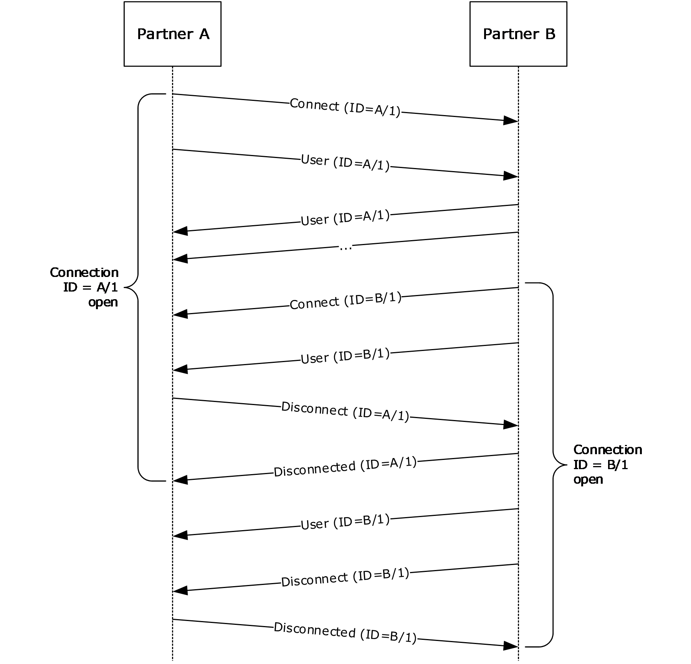
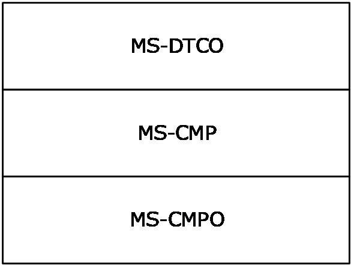
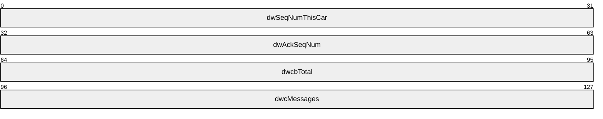
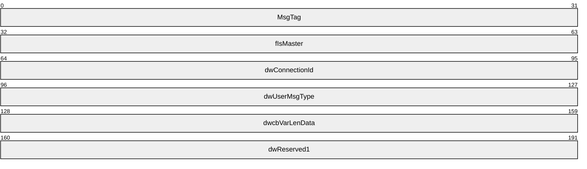
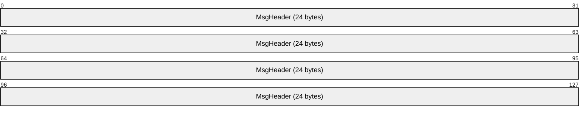
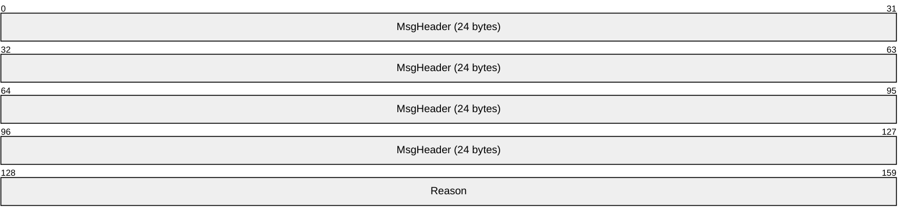
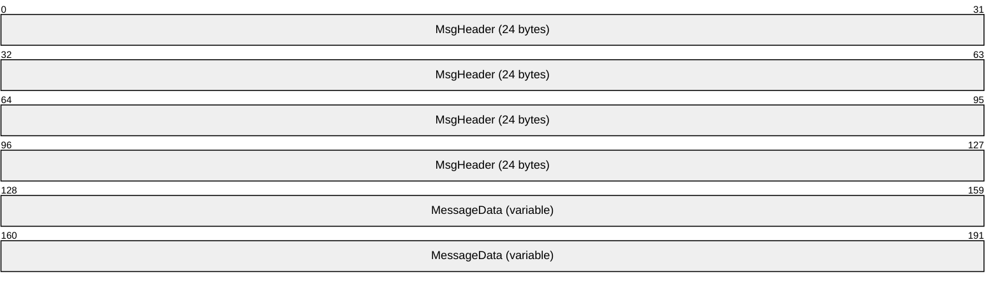

# [MS-CMP]: MSDTC Connection Manager: OleTx Multiplexing Protocol

Table of Contents

1 Introduction

- [1 Introduction](#Section_1)
  - [1.1 Glossary](#Section_1.1)
  - [1.2 References](#Section_1.2)
    - [1.2.1 Normative References](#Section_1.2.1)
    - [1.2.2 Informative References](#Section_1.2.2)
  - [1.3 Overview](#Section_1.3)
  - [1.4 Relationship to Other Protocols](#Section_1.4)
  - [1.5 Prerequisites/Preconditions](#Section_1.5)
  - [1.6 Applicability Statement](#Section_1.6)
  - [1.7 Versioning and Capability Negotiation](#Section_1.7)
  - [1.8 Vendor-Extensible Fields](#Section_1.8)
  - [1.9 Standards Assignments](#Section_1.9)

2 Messages

- [2 Messages](#Section_2)
  - [2.1 Transport](#Section_2.1)
    - [2.1.1 Transmitting Messages and Boxcars](#Section_2.1.1)
      - [2.1.1.1 Boxcar Format](#Section_2.1.1.1)
      - [2.1.1.2 Boxcar Size Limitations](#Section_2.1.1.2)
      - [2.1.1.3 Transmitting Boxcars](#Section_2.1.1.3)
    - [2.1.2 Security](#Section_2.1.2)
  - [2.2 Message Syntax](#Section_2.2)
    - [2.2.1 BOX_CAR_HEADER](#Section_2.2.1)
    - [2.2.2 MESSAGE_PACKET](#Section_2.2.2)
    - [2.2.3 MTAG_DISCONNECT](#Section_2.2.3)
    - [2.2.4 MTAG_DISCONNECTED](#Section_2.2.4)
    - [2.2.5 MTAG_CONNECTION_REQ_DENIED](#Section_2.2.5)
    - [2.2.6 MTAG_PING](#Section_2.2.6)
    - [2.2.7 MTAG_CONNECTION_REQ](#Section_2.2.7)
    - [2.2.8 MTAG_USER_MESSAGE](#Section_2.2.8)

3 Protocol Details

- [3 Protocol Details](#Section_3)
  - [3.1 Common Details](#Section_3.1)
    - [3.1.1 Abstract Data Model](#Section_3.1.1)
      - [3.1.1.1 Connection Object](#Section_3.1.1.1)
      - [3.1.1.2 Boxcar Object](#Section_3.1.1.2)
    - [3.1.2 Timers](#Section_3.1.2)
      - [3.1.2.1 Idle Timer](#Section_3.1.2.1)
    - [3.1.3 Initialization](#Section_3.1.3)
      - [3.1.3.1 Initialization by a Higher-Layer Protocol](#Section_3.1.3.1)
      - [3.1.3.2 Initialization by the Protocol](#Section_3.1.3.2)
    - [3.1.4 Higher-Layer Triggered Events](#Section_3.1.4)
      - [3.1.4.1 Send Message](#Section_3.1.4.1)
      - [3.1.4.2 Create Connection](#Section_3.1.4.2)
      - [3.1.4.3 Disconnect Connection](#Section_3.1.4.3)
    - [3.1.5 Message Processing Events and Sequencing Rules](#Section_3.1.5)
      - [3.1.5.1 MTAG_DISCONNECT (MsgTag 0x00000001)](#Section_3.1.5.1)
      - [3.1.5.2 MTAG_DISCONNECTED (MsgTag 0x00000002)](#Section_3.1.5.2)
      - [3.1.5.3 MTAG_CONNECTION_REQ_DENIED (MsgTag 0x00000003)](#Section_3.1.5.3)
      - [3.1.5.4 MTAG_PING (MsgTag 0x00000004)](#Section_3.1.5.4)
      - [3.1.5.5 MTAG_CONNECTION_REQ (MsgTag 0x00000005)](#Section_3.1.5.5)
      - [3.1.5.6 MTAG_USER_MESSAGE (MsgTag 0x00000FFF)](#Section_3.1.5.6)
    - [3.1.6 Timer Events](#Section_3.1.6)
      - [3.1.6.1 Idle Timer](#Section_3.1.6.1)
    - [3.1.7 Other Local Events](#Section_3.1.7)
      - [3.1.7.1 Enqueuing a Message](#Section_3.1.7.1)
      - [3.1.7.2 Session Down](#Section_3.1.7.2)
      - [3.1.7.3 Allocate Incoming Connection Objects](#Section_3.1.7.3)
      - [3.1.7.4 Notify Higher-Layer of Incoming Message Events](#Section_3.1.7.4)
        - [3.1.7.4.1 Receiving a Message](#Section_3.1.7.4.1)
        - [3.1.7.4.2 Connection Disconnected](#Section_3.1.7.4.2)
        - [3.1.7.4.3 Connection Request Denied](#Section_3.1.7.4.3)

4 Protocol Examples

- [4 Protocol Examples](#Section_4)
  - [4.1 Sending Messages](#Section_4.1)
    - [4.1.1 Creating the MESSAGE_PACKETs](#Section_4.1.1)
    - [4.1.2 Creating a Boxcar](#Section_4.1.2)
    - [4.1.3 Sending the Boxcar Using the Underlying MSDTC Connection Manager: OleTx Transports Protocol Session](#Section_4.1.3)
  - [4.2 A Simple Connection Scenario](#Section_4.2)
    - [4.2.1 Initiating a Connection](#Section_4.2.1)
      - [4.2.1.1 Connection Denied](#Section_4.2.1.1)
      - [4.2.1.2 Connection Accepted](#Section_4.2.1.2)
    - [4.2.2 Disconnecting a Connection](#Section_4.2.2)

5 Security

- [5 Security](#Section_5)
  - [5.1 Security Considerations for Implementers](#Section_5.1)
  - [5.2 Index of Security Parameters](#Section_5.2)

6 Appendix A: Product Behavior

- [6 Appendix A: Product Behavior](#Section_6)

7 Change Tracking

- [7 Change Tracking](#Section_7)

For the legal notice and IP terms, see [LEGAL.md](../LEGAL.md).
Last updated: 4/23/2024.
See [Revision History](#revision-history) for full version history.

# 1 Introduction

This specification specifies MSDTC Connection Manager: OleTx Multiplexing Protocol (CMP) that multiplexes multiple shortlived connections over a long-lived full-duplex session. CMP provides connection management, and message packaging into a box car mechanism for upper layer transaction-based protocols. It uses MSDTC Connection Manager: OleTx Transports Protocol [MS-CMPO] for the long-lived sessions that it uses for transport. CMP enables multiplexing multiple logical protocol connections through a single CMPO connection, which reduces the number of messages that are exchanged over the wire. CMP supports both multiplexing multiple logical sessions over a single CMPO session and multiplexing multiple protocol messages into a single CMPO.

Sections 1.5, 1.8, 1.9, 2, and 3 of this specification are normative. All other sections and examples in this specification are informative.

## 1.1 Glossary

This document uses the following terms:

**acceptor**: A participant that receives a session or connection request. This role is also known as the "subordinate".

**boxcar**: A set of messages transmitted together by way of an underlying MSDTC Connection Manager: OleTx Transports Protocol session.

**connection**: In OleTx, an ordered set of logically related messages. The relationship between the messages is defined by the higher-layer protocol, but they are guaranteed to be delivered exactly one time and in order relative to other messages in the connection.

**connection type**: A specific set of interactions between participants in an OleTx protocol that accomplishes a specific set of state changes. A connection type consists of a bidirectional sequence of messages that are conveyed by using the MSDTC Connection Manager: OleTx Transports Protocol and the MSDTC Connection Manager: OleTx Multiplexing Protocol transport protocol, as described in [MS-CMPO](#Section_4.1.3) and [MS-CMP](#Section_1970a8a0799d4308b9274e4ea23dc225). A specified transaction typically involves many different connection types during its lifetime.

**initiator**: A participant that originates a session or connection request.

**little-endian**: Multiple-byte values that are byte-ordered with the least significant byte stored in the memory location with the lowest address.

**Name Object**: An object that contains endpoint contact information (as specified in [MS-CMPO] section 3.2.1.4).

**participant**: Any of the parties that are involved in an atomic transaction and that have a stake in the operations that are performed under the transaction or in the outcome of the transaction ([[WSAT10]](https://go.microsoft.com/fwlink/?LinkId=113066), [[WSAT11]](https://go.microsoft.com/fwlink/?LinkId=113067)).

**partner**: A participant in the MSDTC Connection Manager: OleTx Transports Protocol. Each [**partner**](#gt_partner) has its own contact identifier (CID), and uses the IXnRemote interface to invoke and receive remote procedure calls (RPCs). The IXnRemote interface is described within the full Interface Definition Language (IDL) for [MS-CMPO] in section 6.

**session**: In OleTx, a transport-level connection between a Transaction Manager and another Distributed Transaction participant over which multiplexed logical connections and messages flow. A [**session**](#gt_session) remains active so long as there are logical connections using it.

**MAY, SHOULD, MUST, SHOULD NOT, MUST NOT:** These terms (in all caps) are used as defined in [[RFC2119]](https://go.microsoft.com/fwlink/?LinkId=90317). All statements of optional behavior use either MAY, SHOULD, or SHOULD NOT.

## 1.2 References

Links to a document in the Microsoft Open Specifications library point to the correct section in the most recently published version of the referenced document. However, because individual documents in the library are not updated at the same time, the section numbers in the documents may not match. You can confirm the correct section numbering by checking the [Errata](https://go.microsoft.com/fwlink/?linkid=850906).

### 1.2.1 Normative References

We conduct frequent surveys of the normative references to assure their continued availability. If you have any issue with finding a normative reference, please contact [dochelp@microsoft.com](mailto:dochelp@microsoft.com). We will assist you in finding the relevant information.

[MS-CMPO] Microsoft Corporation, "[MSDTC Connection Manager: OleTx Transports Protocol](#Section_4.1.3)".

[MS-CMP] Microsoft Corporation, "[MSDTC Connection Manager: OleTx Multiplexing Protocol](#Section_1970a8a0799d4308b9274e4ea23dc225)".

[MS-DTCM] Microsoft Corporation, "[MSDTC Connection Manager: OleTx Transaction Internet Protocol](../MS-DTCM/MS-DTCM.md)".

[MS-DTCO] Microsoft Corporation, "[MSDTC Connection Manager: OleTx Transaction Protocol](../MS-DTCO/MS-DTCO.md)".

[MS-ERREF] Microsoft Corporation, "[Windows Error Codes](../MS-ERREF/MS-ERREF.md)".

[RFC2119] Bradner, S., "Key words for use in RFCs to Indicate Requirement Levels", BCP 14, RFC 2119, March 1997, [https://www.rfc-editor.org/info/rfc2119](https://go.microsoft.com/fwlink/?LinkId=90317)

### 1.2.2 Informative References

[MS-TPSOD] Microsoft Corporation, "[Transaction Processing Services Protocols Overview](#Section_1.3)".

## 1.3 Overview

The MSDTC Connection Manager: OleTx Multiplexing Protocol (CMP) allows partners to multiplex any number of two-way [**connections**](#gt_connection) over the transport [**session**](#gt_session) between them, as specified in [MS-CMPO](#Section_4.1.3). To do this, this protocol defines a small number of messages to manage connections and uses the transport protocol resource requests to allocate connection-related resources. To facilitate higher-level protocols, this protocol defines a single user message and allows associating a [**connection type**](#gt_connection-type) with a connection.

To illustrate these concepts, the following figure depicts typical messages of this protocol to initiate, use, and terminate two connections between partners labeled A and B.

Figure 1: Messages used to manage two connections between partners

As the first message of the preceding figure depicts, to initiate a connection, either [**partner**](#gt_partner) sends a **Connect** message (**MTAG**_**CONNECTION_REQ**) to the other partner over their session.

A **Connect** message includes an identifier for the new connection (abbreviated ID in the figure). To simplify connection management, connections are identified by two pieces of information: the partner that initiated the connection and an identifier assigned by that partner. This scheme allows each partner to assign identifiers without the risk of collision with the other partner. In effect, each partner maintains two tables of connections: those initiated by itself (called "outgoing" connections) and those initiated by the other partner (called "incoming" connections). Either partner has the option to send messages to the other by using any open connection. To correlate a message with its connection, the message includes a flag (**fIsMaster**) indicating which table the connection belongs to, in addition to the [**initiator**](#gt_initiator)-assigned identifier (**dwConnectionId**) for the connection.

Though not depicted in the figure, a **Connect** message also includes a type to identify the higher-level protocol for the connection's messages. Specifically, this connection type typically implies which types of **User** messages are expected over the connection.

As depicted in the preceding figure, a **Connect** message is assumed to succeed. If the receiving partner does not want to accept the connection, it sends a not-acknowledged message (**MTAG_CONNECTION_REQ_DENIED**).

After a connection is open, either partner has the option to send any number of **User** messages (**MTAG_USER_MESSAGE**) to the other partner by using that connection. **User** messages include their connection, a message type handled by a higher-level protocol, and the message payload. As the receiving partner never sends positive acknowledgment to a **Connect** message, the sending partner is free to send **User** messages to the connection along with the **Connect** message. If the receiving partner does not accept the connection, it will ignore these extraneous **User** messages.

A partner receives messages in the order in which they were sent over the connection.

To close a connection, the partner that initiated the connection sends a **Disconnect** message (**MTAG_DISCONNECT**) to the other partner; either partner has the option to initiate a connection, but only the partner that initiated a connection is allowed to close it. Unlike the **Connect** message, the **Disconnect** message is assumed to fail. As the preceding figure depicts, if the receiving partner has the option to close the connection, it does so and sends a **Disconnect** acknowledgment message (**MTAG_DISCONNECTED**). Finally, on receipt of the **Disconnected** message, the initiating partner closes the connection on its side. This asymmetric design allows the receiving partner to send any outstanding messages to the initiating partner before acknowledging the **Disconnect** message.

For efficiency, the CMP batches messages by using **Boxcar** objects (section [3.1.1.2](#Section_3.1.1.2)) that contain one or more messages for one or more connections. A **Boxca**r includes the number of messages it encloses, their total size, and the messages themselves. Typically, the fact that messages are enclosed in a **Boxcar** is transparent to connection management and **User** messages in the CMP. One exception occurs when a partner receives an unrecognized message type and discards the rest of the messages in the **Boxcar**.

## 1.4 Relationship to Other Protocols

MSDTC Connection Manager: OleTx Multiplexing Protocol [MS-CMP](#Section_1970a8a0799d4308b9274e4ea23dc225) is explicitly layered upon the transport protocol that is specified in MSDTC Connection Manager: OleTx Transports Protocol [MS-CMPO](#Section_4.1.3), and its design is greatly influenced by that protocol. It relies on the transport protocol to provide [**sessions**](#gt_session) and peer-to-peer message exchange. This protocol, in turn, provides message batching and [**connection**](#gt_connection) multiplexing services to MSDTC Connection Manager: OleTx Transaction Protocol [MS-DTCO](../MS-DTCO/MS-DTCO.md) layered on top of the multiplexing to provide application-specific functionality. For example, the transaction protocol that is specified in [MS-DTCM](../MS-DTCM/MS-DTCM.md) is a set of connections with different [**connection types**](#gt_connection-type) layered above this protocol, and it is used for coordinating distributed atomic transactions, see [MS-TPSOD](#Section_1.3). The following diagram illustrates the protocol layering.

Figure 2: Relationship of MS-CMP to other protocols

Ultimately, the MSDTC Connection Manager suite of protocols is used as the communication mechanism for the Microsoft Distributed Transaction Coordinator, which is used to coordinate atomic transactions.

## 1.5 Prerequisites/Preconditions

This protocol relies on the transports protocol specified in [MS-CMPO](#Section_4.1.3) for carrying communication; there is no handshake between MSDTC Connection Manager: OleTx Multiplexing Protocol (CMP) instances. The initialization of the transports protocol instance occurs during the initialization of the instance of this protocol and is as described in section [3.1.3](#Section_3.1.3).

## 1.6 Applicability Statement

This protocol is suitable for use as a [**connection**](#gt_connection) multiplexing protocol over the transports protocol specified in [MS-CMPO](#Section_4.1.3), and it is applicable in all of the same situations.

## 1.7 Versioning and Capability Negotiation

There are no optional capabilities exposed by the MSDTC Connection Manager: OleTx Multiplexing Protocol (CMP), and there are no extensibility points within CMP. There are therefore no version negotiation capabilities in this protocol.

## 1.8 Vendor-Extensible Fields

None.

## 1.9 Standards Assignments

None.

# 2 Messages

This section specifies how the MSDTC Connection Manager: OleTx Multiplexing Protocol (CMP) messages are encapsulated on the wire and common data types.

## 2.1 Transport

Messages in this protocol MUST be transported over an instance of the transports protocol specified in [MS-CMPO](#Section_4.1.3) [**session**](#gt_session); therefore, each instance of this protocol MUST have an underlying transports protocol instance. The initialization of the transports protocol instance occurs during the initialization of the instance of this protocol and is specified in section [3](../MS-CMPO/MS-CMPO.md).

### 2.1.1 Transmitting Messages and Boxcars

Every message in MSDTC Connection Manager: OleTx Multiplexing Protocol (CMP) is an extension of the **MESSAGE_PACKET** structure specified in section [2.2.2](#Section_2.2.2). When any event causes an implementation of this protocol to send a message, an implementation of this protocol MUST place this message in a [**boxcar**](#gt_boxcar). Boxcars are represented conceptually as **Boxcar** objects in the abstract data model (section [3.1.1.2](#Section_3.1.1.2)); adding a message to a boxcar is represented conceptually as adding a message to the end of the **Message List** in a **Boxcar** object. For more information about **Boxcar** objects in the abstract data model, see section 3.1.1.2. For more information about processing boxcars, see section [3.1.5](#Section_3.1.5).

#### 2.1.1.1 Boxcar Format

A **Boxcar** is formatted as an array of bytes that begins with a **BOX_CAR_HEADER** (section [2.2.1)](#Section_2.2.1) structure and continues with one or more **MESSAGE_PACKET** structures, each of which is appended with its associated variable length data (if any). Each **MESSAGE_PACKET** structure in a **Boxcar** MUST be aligned on an 8-byte boundary. Because the size of each **MESSAGE_PACKET** structure is a multiple of 4 bytes (as defined in section [2.2.2](#Section_2.2.2)), padding bytes MUST be added as necessary between the structures in order to have each structure aligned on a 8-byte boundary. Any necessary padding bytes can be set to any value, and MUST be ignored on receipt. The **dwcMessages** field of the **BOX_CAR_HEADER** structure MUST be equal to the number of messages in the **Boxcar**, and the **dwcbTotal** field of the **BOX_CAR_HEADER** structure MUST be equal to the total number of bytes in the **Boxcar**.

#### 2.1.1.2 Boxcar Size Limitations

A **Boxcar** MUST contain at least one message and MUST NOT contain more than 3,412 messages. Furthermore, the total size of a **Boxcar** MUST be at least 40 bytes and MUST NOT exceed 81,920 bytes. Unless otherwise specified, an MSDTC Connection Manager: OleTx Multiplexing Protocol (CMP) implementation SHOULD add one or more messages to a **Boxcar** as long as doing so does not cause the **Boxcar** to exceed any of these size restrictions.

#### 2.1.1.3 Transmitting Boxcars

When an implementation of MSDTC Connection Manager: OleTx Multiplexing Protocol (CMP) wants to transmit a **Boxcar** over a [**session**](#gt_session), it provides the underlying implementation of the transports protocol (specified in [MS-CMPO](#Section_4.1.3)) with the session to transmit the **Boxcar** on, the count of messages in the **Boxcar**, and the byte array that makes up the **Boxcar** itself, as specified in [MS-CMPO] section 3.4.6.5. Also, a CMP implementation MUST NOT transmit more than one **Boxcar** at a time.

For more information about transmitting messages in [**boxcars**](#gt_boxcar), see section [3.1.7.1](#Section_2). For more information about interpreting boxcars after they have been received, see section [3.1.5](#Section_3.1.5).

### 2.1.2 Security

This protocol does not introduce any additional security beyond what is provided by the transports protocol specified in [MS-CMPO](#Section_4.1.3). The security level value provided by the higher-layer protocol during initialization, as specified in section [3.1.3](#Section_3.1.3), MUST be provided to the transports protocol as specified in [MS-CMPO] section 2.1.3.

## 2.2 Message Syntax

All structures MUST be aligned with an 8-byte alignment. Any padding bytes that are required to align the **MESSAGE_PACKET** structures (section [2.2.2](#Section_2.2.2)) within the **Boxcar** can be set to any value, and MUST be ignored on receipt. All integer fields in the following structures are in [**little-endian**](#gt_little-endian) byte order.

### 2.2.1 BOX_CAR_HEADER

The **BOX_CAR_HEADER** structure MUST be the first structure in each **Boxcar** transmitted via the underlying protocol specified in [MS-CMPO](#Section_4.1.3) [**session**](#gt_session).

**dwSeqNumThisCar (4 bytes):** This field is not used, it MUST be set to 0x00000000, and it MUST be ignored on receipt.

**dwAckSeqNum (4 bytes):** This field is not used, it MUST be set to 0x00000000, and it MUST be ignored on receipt.

**dwcbTotal (4 bytes):** An unsigned 4-byte integer value which MUST be the total number of bytes in the **Boxcar** message, including its header and all **Message Packets**. It MUST be greater than or equal to 40 bytes, and it MUST be less than or equal to 81,920 bytes.

**dwcMessages (4 bytes):** An unsigned 4-byte integer value which contains the number of **MESSAGE_PACKET** structures (section [2.2.2](#Section_2.2.2)) that follow the end of this structure in the **Boxcar**. This number MUST be greater than or equal to 1, and MUST BE less than or equal to 3,412.

### 2.2.2 MESSAGE_PACKET

The **MESSAGE_PACKET** structure forms the basis for all messages. Each message sent using this protocol MUST be an extension of the **MESSAGE_PACKET** structure. All integer fields of this structure are in [**little-endian**](#gt_little-endian) byte order.

**MsgTag (4 bytes):** A 4-byte integer value that describes the message type and its interpretation. This value MUST be one of the following values.

| Value | Meaning |
| --- | --- |
| MTAG_DISCONNECT 0x00000001 | Indicates a request to disconnect the specified [**connection**](#gt_connection). |
| MTAG_DISCONNECTED 0x00000002 | Indicates that the specified connection has been disconnected. |
| MTAG_CONNECTION_REQ_DENIED 0x00000003 | Indicates that the connection request for the specified connection has been denied. |
| MTAG_PING 0x00000004 | A successful MTAG_PING indicates that the [**session**](#gt_session) is active. |
| MTAG_CONNECTION_REQ 0x00000005 | Indicates that a new connection is being requested. |
| MTAG_USER_MESSAGE 0x00000FFF | Indicates that a user (level-three protocol) message will be delivered on the specified connection. |

If the value is not one of the preceding values, then the remainder of the **Boxcar** MUST be discarded. The details of each message type are given in the following sections.

**fIsMaster (4 bytes):** A 4-byte value indicating the direction of the message in the conversation. This value MUST be one of the following values.

| Value | Meaning |
| --- | --- |
| 0x00000000 | Message is sent by the party that accepted the connection. |
| 0x00000001 | Message is sent by the party that initiated the connection, or message is not associated with a connection because either the connection is down or the connection request has been denied. |

**dwConnectionId (4 bytes):** A 4-byte integer value that contains the unique identifier for the associated connection. The value of the identifier depends on the value of the **MsgTag** field, as follows.

| Bit Range | Field | Description |
| --- | --- | --- |
| Variable | MTAG_DISCONNECT 0x00000001 | MUST contain the ID of the connection being disconnected. |
| Variable | MTAG_DISCONNECTED 0x00000002 | MUST contain the ID of the connection that was just disconnected. |
| Variable | MTAG_CONNECTION_REQ_DENIED 0x00000003 | MUST contain the ID of the connection that was rejected. |
| Variable | MTAG_PING 0x00000004 | MUST be set to 0x00000000 |
| Variable | MTAG_CONNECTION_REQ 0x00000005 | MUST contain the ID of the connection being requested. |
| Variable | MTAG_USER_MESSAGE 0x00000FFF | MUST contain the ID of the connection that the message relates to. |

**dwUserMsgType (4 bytes):** A 4-byte integer value that contains additional details about the message, depending on the value of the **MsgTag** field, as follows.

| Bit Range | Field | Description |
| --- | --- | --- |
| MUST contain the [**connection type**](#gt_connection-type) of the connection being disconnected. | MTAG_DISCONNECT 0x00000001 | - |
| Variable | MTAG_DISCONNECTED 0x00000002 | MUST be set to 0x00000000. |
| Variable | MTAG_CONNECTION_REQ_DENIED 0x00000003 | MUST be set to 0x00000000. |
| Variable | MTAG_PING 0x00000004 | MUST be set to 0x00000000. |
| Variable | MTAG_CONNECTION_REQ 0x00000005 | MUST contain the connection type of the connection being requested. |
| Variable | MTAG_USER_MESSAGE 0x00000FFF | MUST contain the type of user message to be delivered. |

**dwcbVarLenData (4 bytes):** Unsigned 4-byte integer value that contains the size, in bytes, of the variable-length data buffer. This value MUST NOT be greater than 81880. This number is the maximum size of a **Boxcar**, as specified in section [2.1.1.2](#Section_2.1.1.2), minus the size of a **BOX_CAR_HEADER** (section [2.2.1](#Section_2.2.1)) and the **MESSAGE_PACKET** (section 2.2.2) itself, which is logically the largest single message that is possible to be transmitted in this protocol.

**dwReserved1 (4 bytes):** Reserved. This value can be set to any value, and MUST be ignored on receipt.<1>

### 2.2.3 MTAG_DISCONNECT

The **MTAG_DISCONNECT** message indicates a request to disconnect the specified [**connection**](#gt_connection).

**MsgHeader (24 bytes):** This field contains a **MESSAGE_PACKET** (section [2.2.2](#Section_2.2.2)) structure. The fields MUST be set as specified in section 2.2.2. In particular:

- The **MsgTag** field MUST be set to 0x00000001 (**MTAG_DISCONNECT**).
- The **fIsMaster** field MUST be set to 0x00000001.
- The **dwcbVarLenData** field MUST be set to 0x00000000.

### 2.2.4 MTAG_DISCONNECTED

The **MTAG_DISCONNECTED** message indicates that the request to disconnect the specified [**connection**](#gt_connection) was successful.

**MsgHeader (24 bytes):** This field contains a **MESSAGE_PACKET** (section [2.2.2](#Section_2.2.2)) structure. The fields MUST be set as specified in section 2.2.2. In particular:

- The **MsgTag** field MUST be set to 0x00000002 (**MTAG_DISCONNECTED**).
- The **fIsMaster** field MUST be set to 0x00000000.
- The **dwcbVarLenData** field MUST be set to 0x00000000.

### 2.2.5 MTAG_CONNECTION_REQ_DENIED

The **MTAG_CONNECTION_REQ_DENIED** message indicates that the [**connection**](#gt_connection) request for the specified connection has been denied. It represents a not-acknowledged response to an **MTAG_CONNECTION_REQ** message (section [2.2.7](#Section_2.2.7)). (There is no positive acknowledgment response to an **MTAG_CONNECTION_REQ** message.)

**MsgHeader (24 bytes):** This field contains a **MESSAGE_PACKET** structure (section [2.2.2](#Section_2.2.2)). The fields MUST be set as specified in section 2.2.2. In particular:

- The **MsgTag** field MUST be set to 0x00000003 (**MTAG_CONNECTION_REQ_DENIED**).
- The **fIsMaster** field MUST be set to 0x00000000.
- The **dwcbVarLenData** field MUST be set to 4.
**Reason (4 bytes):** This field contains a 4-byte unsigned integer that indicates the reason that the connection request was denied. The values for this field are defined by the higher-layer protocol.

### 2.2.6 MTAG_PING

The **MTAG_PING** message is used by a protocol [**participant**](#gt_participant) to determine if it can still contact the transports protocol [**session**](#gt_session) [**partner**](#gt_partner) as specified in [MS-CMPO](#Section_4.1.3). For more information about the message processing event, see section [3.1.5.4](#Section_3.1.5.4).

**MsgHeader (24 bytes):** This field contains a **MESSAGE_PACKET** structure (section [2.2.2](#Section_2.2.2)). The fields MUST be set as specified in section 2.2.2. In particular:

- The **MsgTag** field MUST be set to 0x00000004 (**MTAG_PING**).
- The **fIsMaster** field MUST be set to 0x00000001.
- The **dwConnectionId** field MUST be set to 0x00000000.
- The **dwcbVarLenData** field MUST be set to 0x00000000.

### 2.2.7 MTAG_CONNECTION_REQ

The **MTAG_CONNECTION_REQ** message specifies a request to create the [**connection**](#gt_connection). A not-acknowledged response to this message is communicated with an **MTAG_CONNECTION_REQ_DENIED** message (section [2.2.5](#Section_2.2.5)). (There is no positive acknowledgment response to an **MTAG_CONNECTION_REQ** message.)

**MsgHeader (24 bytes):** This field contains a **MESSAGE_PACKET** structure (section [2.2.2](#Section_2.2.2)). The fields MUST be set as specified in section 2.2.2. In particular:

- The **MsgTag** field MUST be set to 0x00000005 (**MTAG_CONNECTION_REQ**).
- The **fIsMaster** field MUST be set to 0x00000001.
- The **dwcbVarLenData** field MUST be set to 0x00000000.

### 2.2.8 MTAG_USER_MESSAGE

The **MTAG_USER_MESSAGE** message indicates that a user (level-three protocol) message will be delivered on the specified [**connection**](#gt_connection).

**MsgHeader (24 bytes):** This field contains a **MESSAGE_PACKET** structure (section [2.2.2](#Section_2.2.2)). The fields MUST be set as specified in section 2.2.2. In particular:

- The **MsgTag** field MUST be set to 0x00000FFF (**MTAG_USER_MESSAGE**).
- The **dwcbVarLenData** field MUST be set to the length in bytes of the **MessageData** field, if it is present, otherwise it MUST be set to 0x00000000.
**MessageData (variable):** A byte array containing the body of the message. The format of this body is defined by the higher-layer software operating over this protocol, and it is generally indicated by the value of the **dwUserMsgType** field in the **MsgHeader** structure. The contents of this field MUST be treated as opaque.

# 3 Protocol Details

## 3.1 Common Details

### 3.1.1 Abstract Data Model

This section describes a conceptual model of a possible data organization that an implementation maintains to participate in this protocol. The described organization is provided to facilitate the explanation of how the protocol performs. This document does not mandate that the implementations adhere to this model as long as their external behavior is consistent with that described in this document.

**Note** For the sake of clarity, the term "local partner" is used to indicate the role that is being described, and the term "remote partner" is used to indicate the [**partner**](#gt_partner) with which the local partner is communicating.

An implementation of this protocol uses the following data elements, as specified in [MS-CMPO](#Section_4.1.3) section 3.2.1.1:

- **Local Name Object**
- **Minimum Level 2 Version Number**
- **Maximum Level 2 Version Number**
- **Minimum Level 3 Version Number**
- **Maximum Level 3 Version Number**
- **Security Level**
An implementation of this protocol MUST maintain the following data elements:

- **Session Table**: A table of **Session** objects that is maintained by a transports protocol partner as specified in [MS-CMPO] section 3.2.1.2. This protocol does not maintain a **Session Table** itself, but the **Session** object MUST be extended to support the following additional data elements:
- **Outgoing Connection Table**: A table of **Connection** objects in use that are initiated by the local partner and indexed by the **Connection ID** field of the **Connection** object.
- **Count of Allocated Outgoing Connections**: An unsigned 32-bit integer counting the number of outgoing connections that have been allocated for the local partner in the session. Partners in this protocol use their respective underlying transports protocol instances to negotiate a number of pre-allocated **Connection** objects that each connection requires. More connections are allocated by this instance when it is discovered that the number of entries in the **Outgoing Connection Table** equals the current value of the **Count of Allocated Outgoing Connections**. To create a new connection, there MUST be at least one allocated outgoing connection available. Outgoing connections are allocated, and the corresponding count increased, by requesting the local partner to allocate more connection resources through the underlying transports protocol instance.
- **Incoming Connection Table**: A table of **Connection** objects in use that are initiated by the remote partner and indexed by the **Connection ID** field of the **Connection** object.
- **Count of Allocated Incoming Connections**: An unsigned 32-bit integer counting the number of incoming connections that have been allocated by the remote partner in the session. Partners in this protocol use their respective underlying transports protocol instances to negotiate a number of pre-allocated **Connection** objects that each connection requires. The number of allocated incoming connections is the value requested by the remote partner. New connections are allowed to be created until the number of entries in the **Incoming Connection Table** equals the count requested by the remote partner. If the remote partner requires more connections to be created, it MUST request that more be allocated, causing this count to be increased.
- **Boxcar Queue**: An ordered queue of **Boxca**r objects to be transmitted on this session.
The management of these additional data elements is the responsibility of this protocol implementation as outlined in sections [3.1.4.2](#Section_4.1.1), [3.1.5.1](#Section_3.1.5.1), [3.1.5.5](#Section_3.1.5.5), and [3.1.7.3](#Section_3.1.7.3).

**Note** It is possible to implement the conceptual data by using a variety of techniques. An implementation is at liberty to implement such data in any way it pleases.

#### 3.1.1.1 Connection Object

A **Connection** object MUST contain the following data elements:

- **Connection ID:** An unsigned 32-bit integer that identifies the connection. The **Connection ID** MUST be unique within a table. Note that a given **Connection** object is allowed to have the same **Connection ID** as another **Connection** object (related to the same **Session** object), so long as the other **Connection** object is in the other connection table. For example, the first connection is in the **Incoming Connection Table** and the second connection is in the **Outgoing Connection Table**, or vice versa.
- **Accepted:** A Boolean value, indicating whether the connection was accepted or rejected by the higher-layer protocol. This value is initially false.
- **Connection Type:** An unsigned 32-bit integer that identifies the set of messages defined by a higher-level protocol sent over the connection. Higher-level messages are grouped based on the specific set of state changes they produce, and that grouping is identified by connection type.
- **Incoming Message Notification Interface:** The local event of a higher-layer that is used by this protocol to notify a higher-layer protocol of incoming message events, as specified in section [3.1.7.4](#Section_3.1.7.4).
**Note** It is possible to implement the conceptual data by using a variety of techniques. An implementation is at liberty to implement such data in any way it pleases.

#### 3.1.1.2 Boxcar Object

A **Boxcar** object MUST contain the following data elements:

- **Message List**: A list of **MESSAGE_PACKET** structures (section [2.2.2](#Section_2.2.2)) in the **Boxcar**.
When called for, **Boxcar** objects MUST be formatted and transmitted as specified in section [2.1.1.1](#Section_2.1.1.1).

**Note** It is possible to implement the conceptual data by using a variety of techniques. An implementation is at liberty to implement such data in any way it wants.

### 3.1.2 Timers

An implementation of this protocol MUST maintain the following timers.

#### 3.1.2.1 Idle Timer

There is an instance of the **Idle Timer** corresponding to each **Session** object. This timer MUST be set when both the **Incoming Connection Table** and the **Outgoing Connection Table** are empty, and it MUST be canceled when a **Connection** object (section [3.1.1.1](#Section_3.1.1.1)) is added to either the **Incoming Connection Table** or the **Outgoing Connection Table**. The default value of the timer is specific to the implementation.

### 3.1.3 Initialization

An instance of this protocol is explicitly initialized with the data elements specified in sections [3.1.3.1](#Section_3.1.3.1) and [3.1.3.2](#Section_3.1.3.2), as specified in [MS-CMPO](#Section_4.1.3) section 3.2.1.1. These elements are required for the initialization of its underlying transports protocol instance, as specified in [MS-CMPO] section 3.2.3.1.

#### 3.1.3.1 Initialization by a Higher-Layer Protocol

An instance of this protocol is explicitly initialized with the following data elements, as specified in [MS-CMPO](#Section_4.1.3) section 3.2.3.1.

- A **Local Name Object**, as defined in [MS-CMPO] section 3.2.1.1. The higher-layer protocol that initializes an MSDTC Connection Manager: OleTx Multiplexing Protocol (CMP) instance MUST initialize this public data element.
- The **Minimum Level 3 Version Number** and **Maximum Level 3 Version Number**, as defined in [MS-CMPO] section 3.2.1.1. The higher-layer protocol that initializes an instance of this protocol MUST initialize this public data element.
- A **Security Level**, as defined in [MS-CMPO] section 3.2.1.1. The higher-layer protocol that initializes an instance of this protocol MUST initialize this public data element.

#### 3.1.3.2 Initialization by the Protocol

The MSDTC Connection Manager: OleTx Multiplexing Protocol (CMP) MUST perform the following action:

- Initialize an underlying transports protocol instance, as specified in [MS-CMPO](#Section_4.1.3) sections 3.2.3.1 and 3.2.1.1, with the following data elements:
- A **Minimum Level 2 Version Number** of 1.
- A **Maximum Level 2 Version Number** of 1.
If the initialization of the previous data elements fails or the initialization of an underlying MSDTC Connection Manager: OleTx Transports Protocol instance fails as specified in [MS-CMPO] section 3.2.3.2, then the initialization of CMP MUST also fail and the implementation-specific failure result MUST be returned to the higher-layer protocol.

### 3.1.4 Higher-Layer Triggered Events

#### 3.1.4.1 Send Message

When the higher-layer protocol requests to send a message, it MUST specify the **Connection** object (section [3.1.1.1](#Section_3.1.1.1)) on which to send the message (which implies the connection table containing it), an unsigned 32-bit integer representing the type of message, and a byte array containing the body of the message. The byte array MUST NOT be more than 81880 bytes long.

The MSDTC Connection Manager: OleTx Multiplexing Protocol (CMP) instance MUST allocate an **MTAG_USER_MESSAGE** message (section [3.1.5.6](#Section_3.1.5.6)). It MUST set the **dwUserMsgType** field in the **MsgHeader** field to the provided message type, it MUST set the **dwConnectionId** field in the **MsgHeader** field to the **Connection ID** of the provided **Connection** object, it MUST set the **dwcbVarLenData** field in the **MsgHeader** field to the length of the provided array, and it MUST set the **MessageData** field to the provided byte array. Finally, if the provided **Connection** object is contained in an **Outgoing Connection Table**, then the **fIsMaster** field of the **MsgHeader** field MUST be set to 0x00000001; otherwise, it MUST be set to 0x00000000.

This message MUST be enqueued on the **Session** object associated with the provided **Connection** object as described in section [3.1.7.1](#Section_2).

#### 3.1.4.2 Create Connection

When the higher-layer protocol requests a new connection, it MUST specify the following arguments:

- The [**Name Object**](#gt_name-object) of the [**partner**](#gt_partner) with which to create the connection.
- The Outgoing **Connection Type** of the connection to create.
- The **Incoming Message Notification Interface**.
First, the MSDTC Connection Manager: OleTx Multiplexing Protocol (CMP) instance MUST look up the **Session** object with the specified **Name Object** in the **Session Table**. If a matching session does not exist, the CMP instance MUST request a new session with the partner from the underlying transports instance as specified in [MS-CMPO](#Section_4.1.3). If the request is unsuccessful, then the connection request MUST fail. The CMP instance MUST initialize its extensions to the **Session** object as follows:

- The **Incoming Connection Table** MUST be empty.
- The **Outgoing Connection Table** MUST be empty.
- The **Count of Allocated Outgoing Connections** MUST be zero.
- The **Count of Allocated Incoming Connections** MUST be zero.
- The **Boxcar Queue** MUST be empty.
After a **Session** object has been found or created, the CMP instance MUST compare the number of **Connection** objects in the **Outgoing Connection Table** in the **Session** object with the **Count of Allocated Outgoing Connections**. If they are equal, then the CMP instance MUST request resource allocation from the underlying transports protocol instance, as specified in [MS-CMPO] section 3.4.6.4. The CMP instance MUST provide the **Session** object. In addition, it MUST specify the RT_CONNECTIONS value for the **RESOURCE_TYPE** enumeration as specified in [MS-CMPO] section 2.2.7, and it MUST specify a number of resources equal to or greater than 1.

If the request is successful, then the number of resources that were actually allocated MUST be added to the **Count of Allocated Outgoing Connections**. Otherwise, the connection request MUST fail and the **Session** object MUST be left unmodified, with the exception that if both the **Incoming** and **Outgoing Connection Tables** are empty, then the **Idle Timer** (section [3.1.6.1](#Section_3.1.6.1)) associated with the **Session** object MUST be started.

**Note** If this is a newly created **Session** object and the **Idle Timer** is already running (due to both **Incoming** and **Outgoing Connection Tables** being initialized as empty) and the connection resource allocation has failed, then the **Idle Timer** is restarted at this point.

Next, the CMP instance MUST allocate a new **Connection** object with the specified connection type and with a connection identifier that is currently unused in the **Outgoing Connection Table**. The **Accepted** field of the new **Connection** object MUST be set to true. This **Connection** object MUST be added to the **Outgoing Connection Table**. If the **Idle Timer** is active, the timer MUST be canceled. The **Incoming Message Notification Interface** that was provided by the higher-layer protocol MUST be stored in the **Incoming Message Notification** ADM element.

Finally, the CMP instance MUST allocate an **MTAG_CONNECTION_REQ** message. It MUST set the **dwUserMsgType** field in the **MsgHeader** field to the specified connection type, and it MUST set the **dwConnectionId** field in the **MsgHeader** field to the connection identifier of the new **Connection** object. It MUST enqueue the message on the **Session** object as described in section [3.1.7.1](#Section_2).

#### 3.1.4.3 Disconnect Connection

When the higher-layer protocol requests to disconnect a connection, it MUST specify the following argument.

- **Connection** object to disconnect.
This **Connection** object MUST be contained in an **Outgoing Connection Table** in a **Session** object contained in the **Session Table**; otherwise, the request to disconnect the connection MUST fail.

The MSDTC Connection Manager: OleTx Multiplexing Protocol (CMP) instance MUST allocate an **MTAG_DISCONNECT** message and set the **dwConnectionId** field in the **MsgHeader** field of the message to the connection identifier of that specified **Connection** object. It MUST enqueue this message on the **Session** object of the specified **Connection** object as described in section [3.1.7.1](#Section_2).

### 3.1.5 Message Processing Events and Sequencing Rules

MSDTC Connection Manager: OleTx Multiplexing Protocol (CMP) messages are received from the underlying transports protocol as specified in [MS-CMPO](#Section_4.1.3) section 3.3.4.4. The buffers that are provided by the transports protocol MUST be formatted **Boxcars** as specified in section [2.1.1](#Section_2.1.1).

The relative position of each message in the boxcar MUST be used to order the messages; messages that occur at a smaller offset from the boxcar header in the **Boxcar** MUST be considered to come before messages that occur later in the boxcar. **Boxcars** MUST be ordered by the time of their receipt by a CMP implementation; all of the messages in a boxcar that is received earlier than another boxcar are considered to come before all of the messages in the later boxcar. The **dwConnectionId** field of the message MUST be used to logically group messages; messages MUST be in the same group if their **dwConnectionId** fields are equal. (The messages MAY be physically ordered by their **dwConnectionId** fields in the **Boxcar**.)

A CMP implementation MUST NOT process a message until it has processed all messages in the same group that come before it. (Message order MUST be preserved within a CMP connection.) A CMP implementation MAY process messages in any order that does not violate the preceding restriction.

All CMP messages are extensions of the **MESSAGE_PACKET** structure as specified in section [2.2.2](#Section_2.2.2). A CMP message is identified by looking at the value of the **MsgTag** field; the interpretation of the message depends on the value of that field. If the value of the **MsgTag** field is outside of the expected range (as specified in section 2.2.2), then all remaining unprocessed messages in the **Boxcar** MUST be ignored, regardless of which connection they are intended for.

#### 3.1.5.1 MTAG_DISCONNECT (MsgTag 0x00000001)

When an **MTAG_DISCONNECT** message is received over a session, the MSDTC Connection Manager: OleTx Multiplexing Protocol (CMP) implementation MUST look at the **dwConnectionId** field of the **MsgHeader** field of the message, and retrieve the **Connection** object (section [3.1.7.1](#Section_2)) with the matching **Connection ID** from the **Incoming Connection Table** of the **Session** object. If no such **Connection** object exists, the **MTAG_DISCONNECT** message MUST be silently ignored.

Otherwise, the higher-layer protocol MUST be notified of the **Connection Disconnected** (section [3.1.7.4.2](#Section_3.1.7.4.2)) event by signaling this event using the **Incoming Message Notification Interface** as described in section [3.1.1.1](#Section_3.1.1.1), and the CMP implementation MUST remove the **Connection** object from the **Incoming Connection Table** of the **Session** object. If both the **Incoming Connection Table** and the **Outgoing Connection Table** of the **Session** object are now empty, the **Idle Timer** MUST be started.

The CMP implementation MUST then allocate a new **MTAG_DISCONNECTED** message, set the **dwUserMsgType** field of the **MsgHeader** field to the connection type of the **Connection** object, and set the **dwConnectionId** field of the **MsgHeader** to the **Connection ID** of the **Connection** object. Finally, the message MUST be enqueued on the **Session** object as specified in section 3.1.7.1.

#### 3.1.5.2 MTAG_DISCONNECTED (MsgTag 0x00000002)

When an **MTAG_DISCONNECTED** message (section [2.2.4](#Section_2.2.4)) is received over a session, the MSDTC Connection Manager: OleTx Multiplexing Protocol (CMP) implementation MUST look at the **dwConnectionId** field of the **MsgHeader** field of the message and retrieve the **Connection** object (section [3.1.1.1](#Section_3.1.1.1)) with the matching **Connection ID** from the **Outgoing Connection Table** of the **Session** object. If no such **Connection** object exists or no **MTAG_DISCONNECT** message (section [2.2.3](#Section_2.2.3)) has been sent for the **Connection** object, the **MTAG_DISCONNECTED** message MUST be silently ignored.

Otherwise, the higher-layer protocol MUST be notified of the **Connection Disconnected** (section [3.1.7.4.2](#Section_3.1.7.4.2)) event by signaling this event using the **Incoming Message Notification Interface** as described in section 3.1.1.1, and the CMP implementation MUST remove the **Connection** object from the **Outgoing Connection Table** of the **Session** object. If there are no more connections in the **Outgoing Connection Table** of the **Session** object and there are no connections in the **Incoming Connection Table** of the **Session** object, then the **Idle Timer** MUST be started as specified in section [3.1.2.1](#Section_3.1.2.1).

#### 3.1.5.3 MTAG_CONNECTION_REQ_DENIED (MsgTag 0x00000003)

When an **MTAG_CONNECTION_REQ_DENIED** message is received over a session, the MSDTC Connection Manager: OleTx Multiplexing Protocol (CMP) implementation MUST look at the **dwConnectionId** field of the **MsgHeader** field of the message, and retrieve the **Connection** object with the matching **Connection ID** from the **Outgoing Connection Table** of the **Session** object. If no such **Connection** object exists, the **MTAG_CONNECTION_REQ_DENIED** message MUST be silently ignored.

**Note** The **MTAG_CONNECTION_REQ_DENIED** message does not remove **Connection IDs** from the **Outgoing Connection Table**. A **Connection ID** value can only be reused in a subsequent **MTAG_CONNECTION_REQ** message after an **MTAG_DISCONNECT** message has been sent.

Otherwise, the higher-layer protocol MUST be notified of the fact that the connection request was denied for the particular **Connection** object, along with the value in the **Reason** field of the message by signaling the **Connection Request Denied** (section [3.1.7.4.3](#Section_3.1.7.4.3)) event using the **Incoming Message Notification Interface** as described in section [3.1.1.1](#Section_3.1.1.1).

#### 3.1.5.4 MTAG_PING (MsgTag 0x00000004)

A protocol implementation SHOULD send out **MTAG_PING** messages periodically to verify that its session with a communication [**partner**](#gt_partner) is active. (If the session is unavailable, sending the **MTAG_PING** message will return an error [MS-ERREF](../MS-ERREF/MS-ERREF.md).) A successful **MTAG_PING** indicates that the RPC session with the communication partner is active. When an **MTAG_PING** message is received over a session, the MSDTC Connection Manager: OleTx Multiplexing Protocol (CMP) implementation MUST ignore it.

#### 3.1.5.5 MTAG_CONNECTION_REQ (MsgTag 0x00000005)

When this message is received over a **Session** object, the implementation of the multiplexing protocol specified in [MS-CMP](#Section_1970a8a0799d4308b9274e4ea23dc225) MUST first compare the number of **Connection** objects in the **Incoming Connection Table** on the **Session** object with the **Count of Allocated Incoming Connections** on the **Session** object. If the **Count of Allocated Incoming Connections** is equal to the number of **Connection** objects in the table, then the implementation of the multiplexing protocol MUST ignore this message.

Otherwise, the implementation of the multiplexing protocol MUST look at the **dwConnectionId** field of the **MsgHeader** field of the message and attempt to retrieve the **Connection** object with the matching **Connection ID** from the **Incoming Connection Table** of the **Session** object. If a **Connection** object is found, then this message MUST be silently ignored.

Otherwise, the implementation of the multiplexing protocol MUST allocate a **Connection** object, initializing the connection type field to the **dwUserMsgType** field of the **MsgHeader** field of the message, the **Accepted** field to false, and the **Connection ID** field to the **dwConnectionId** field of the **MsgHeader** field of the message. It MUST add the **Connection** object to the **Incoming Connection Table** of the **Session** object. If the **Idle Timer** is active, then it MUST be canceled.

The implementation MUST then notify the higher-layer protocol of the incoming connection, providing the **Connection** object and its connection type. The higher-layer protocol MUST either accept or reject the connection.

If the higher-layer protocol rejects the connection, then it MUST provide a protocol-specific, 32-bit unsigned integer that specifies the reason for the rejection. The implementation MUST then allocate a new **MTAG_CONNECTION_REQ_DENIED** message (section [3.1.5.3](#Section_3.1.5.3)), initializing the **dwConnectionId** field of the **MsgHeader** field to the **Connection ID** of the **Connection** object and the **Reason** field to the unsigned integer provided by the higher-layer protocol. It MUST then enqueue this message on the **Session** object as specified in section [3.1.7.1](#Section_2).

If the higher-layer protocol accepts the connection, then the implementation of the multiplexing protocol MUST set the **Accepted** field of the **Connection** object to true.

#### 3.1.5.6 MTAG_USER_MESSAGE (MsgTag 0x00000FFF)

When an **MTAG_USER_MESSAGE** message is received over a **Session** object, the MSDTC Connection Manager: OleTx Multiplexing Protocol (CMP) implementation MUST examine the **fIsMaster** field of the **MsgHeader** field of the message to determine which table contains the destination **Connection** object. If the **fIsMaster** field is 0x00000000, then the CMP implementation MUST attempt to find a **Connection** object with a **Connection ID** that matches the **dwConnectionId** field of the **MsgHeader** field of the message in the **Incoming Connection Table** of the **Session** object. Otherwise, the CMP implementation MUST attempt to find a **Connection** object with a **Connection ID** that matches the **dwConnectionId** field of the **MsgHeader** field of the message in the **Outgoing Connection Table** of the **Session** object.

If no **Connection** object is found in the selected table, or the **Accepted** field of the **Connection** object is false, then the CMP implementation MUST ignore the message. Otherwise, the higher-layer protocol MUST be notified of the incoming message by signaling the **Receiving a Message** (section [3.1.7.4.1](#Section_3.1.7.4.1)) event using the **Incoming Message Notification Interface**, as described in section [3.1.1.1](#Section_3.1.1.1). The CMP implementation MUST provide the higher-layer protocol with the **Connection** object, the value of the **dwUserMsgType** field of the **MsgHeader** field of the message, and the **MessageData** field of the **MTAG_USER_MESSAGE** field if it is present.

### 3.1.6 Timer Events

#### 3.1.6.1 Idle Timer

This timer is active only when there are no **Connection** objects in both the **Outgoing Connection Table** and the **Incoming Connection Table**. When this timer associated with a **Session** object expires (the maximum number of **MTAG_PING** messages have been sent), an implementation of this protocol MUST request a forced session teardown for the underlying transports protocol **Session** object specified in [MS-CMPO](#Section_4.1.3). As there are no **Connection** objects in both the **Outgoing Connection Table** and the **Incoming Connection Table**, it is not required to inform the higher-layer protocol of the teardown.

### 3.1.7 Other Local Events

#### 3.1.7.1 Enqueuing a Message

Various events in the protocol require that a message be queued on a particular **Session** object. This section describes how this is done.

If it is possible to add the provided message to the end of the **Message List** of the last **Boxcar** object, in the **Boxcar Queue** associated with the provided **Session** object, then it MUST be added to that **Boxcar** object. (The constraints governing whether it is possible to add a message to the list are provided in section [2.1.1.2](#Section_2.1.1.2).) Otherwise, a new **Boxcar** object MUST be allocated and added to the end of the **Boxcar Queue** associated with the provided **Session** object; the message MUST then be added to the end of the **Message List** in new **Boxcar** object instead.

An MSDTC Connection Manager: OleTx Multiplexing Protocol (CMP) implementation can choose to transmit the **Boxcar** object at the head of the **Boxcar Queue** at any time, as long as it contains at least one message; however, an implementation SHOULD transmit this **Boxcar** object as soon as possible when there is at least one other **Boxcar** object in the **Boxcar Queue**. **Boxcars** MUST be formatted and transmitted as described in section [2.1.1.1](#Section_2.1.1.1).

#### 3.1.7.2 Session Down

When the underlying transports protocol **Session** object specified in [MS-CMPO](#Section_4.1.3) is torn down or fails for any reason other than the expiration of the **Idle Timer,** the higher-layer protocol MUST be notified of the teardown using the **Incoming Message Notification Interface** as specified in section [3.1.1.1](#Section_3.1.1.1). The higher-layer protocol MUST be provided with the **Connection Disconnected** (section [3.1.7.4.2](#Section_3.1.7.4.2)) event for every **Connection** object in both the **Outgoing Connection Table** and the **Incoming Connection Table** of the **Session** object. The **Connection** objects MUST then be removed from their containing tables. Any resources associated with the session SHOULD also be reclaimed at this time.

#### 3.1.7.3 Allocate Incoming Connection Objects

When the underlying transports protocol is requested to allocate more **Connection** object (section [3.1.1.1)](#Section_3.1.1.1) resources from a partner as specified in [MS-CMPO](#Section_4.1.3), this protocol determines the number (if any) of **Connection** object resources to be allocated and reports the number of allocated resources back to the transports protocol. The manner in which **Connection** objects are allocated is implementation-specific, as described in section 3.1.1.1, and the determination regarding how many are allocated is also implementation-specific. For example, an implementation can decide to limit the increase of allocated **Connection** objects to 10 at a time. As a result, if a partner requests the allocation of 20 objects, only 10 will be allocated. This demonstrates how the number of allocated objects returned by the transports protocol can differ from the number requested by a partner.<2> The only limit that is imposed is the amount of available memory.

#### 3.1.7.4 Notify Higher-Layer of Incoming Message Events

When the MSDTC Connection Manager: OleTx Multiplexing Protocol (CMP) receives incoming message events as described in section [3.1.5](#Section_3.1.5), and the protocol expects a higher-layer protocol to be notified of these incoming events, then the CMP MUST use the **Incoming Message Notification Interface** provided by the higher-layer protocol.

##### 3.1.7.4.1 Receiving a Message

The **Receiving a Message** event MUST be signaled with the following arguments:

- A protocol message that extends the **MESSAGE_PACKET** structure (section [2.2.2)](#Section_2.2.2), along with its associated variable **dwcbVarLenData** field and the appropriate variable-length data buffer.
- A **Connection** object.

##### 3.1.7.4.2 Connection Disconnected

The **Connection Disconnected** event MUST be signaled with the following argument:

- A **Connection** object.

##### 3.1.7.4.3 Connection Request Denied

The **Connection Request Denied** event MUST be signaled with the following arguments:

- A **Connection** object.
- The **Reason** field of the message, as defined in section [2.2.5](#Section_2.2.5).

# 4 Protocol Examples

There are two instances of the transaction protocol specified in [MS-DTCO](../MS-DTCO/MS-DTCO.md): initiator and [**acceptor**](#gt_acceptor). It is assumed that the two instances have established a session with each other, and that the initiator has negotiated a sufficient number of resources with the acceptor. See the following examples:

- Sending Messages (section [4.1](#Section_4.1))
- A Simple Connection Scenario (section [4.2](#Section_4.2))

## 4.1 Sending Messages

The Sending Messages example shows how the initiator creates the appropriate structures to create a connection and then sends a message on that connection In this case, the connection type of the connection is 0x00000101, and the user message type of the first message is 0x00002001. (These values are CONNTYPE_PARTNERTM_PROPAGATE and PARTNERTM_PROPAGATE_MTAG_PROPAGATE, respectively, as specified in [MS-DTCO](../MS-DTCO/MS-DTCO.md).)

The initiator is going to create two **MESSAGE_PACKET** structures (section [2.2.2](#Section_2.2.2)), format them into a boxcar, and then submit them to the underlying transports protocol session to be transmitted as specified in [MS-CMPO](#Section_4.1.3). (Because it is assumed that a connection request will succeed, both **MESSAGE_PACKET** structures are put into the same boxcar.)

### 4.1.1 Creating the MESSAGE_PACKETs

To start the connection the initiator allocates the next free connection identifier; in this instance, it is 0x00000001. The initiator then creates a **MESSAGE_PACKET**, with the **MsgTag** field set to **MTAG_CONNECTION_REQ** (0x00000005) (section [3.1.5.5](#Section_3.1.5.5)) and with the **dwUserMsgType** field set to 0x00000101 (which is CONNTYPE_PARTNERTM_PROPAGATE as specified in [MS-DTCO](../MS-DTCO/MS-DTCO.md). By definition, the instance that creates the connection always sets the **fIsMaster** field to 0x00000001, and as this **MESSAGE_PACKET** structure contains no extra data, the **dwcbVarLenData** is set to 0x00000000.

The following table displays the first **MESSAGE_PACKET** structure that the initiator creates (all values are 32-bits wide).

| Bit Range | Field | Description |
| --- | --- | --- |
| Variable | MsgTag | 0x00000005 MTAG_CONNECTION_REQ |
| Variable | fIsMaster | 0x00000001 1 |
| Variable | dwConnectionId | 0x00000001 1 |
| Variable | dwUserMsgType | 0x00000101 CONNTYPE_PARTNERTM_PROPAGATE |
| Variable | dwcbVarLenData | 0x00000000 0 |
| dwReserved1: 0xcd64cd64 | dwReserved1 | 0xcd64cd64 |

The initiator then creates a second **MESSAGE_PACKET** to contain the user message. It sets the **MsgTag** field to **MTAG_USER_MESSAGE** (0x00000FFF) (section [3.1.5.6](#Section_3.1.5.6)) and the **dwUserMsgType** field to 0x00002001 (which is PARTNERTM_PROPAGATE_MTAG_PROPAGATE as specified in [MS-DTCO]).

The **MESSAGE_PACKET** also contains an extra 64 bytes of data for the message body, so it sets the **dwcbVarLenData** field to 0x00000040. The message body that follows is specific to the message; in this instance, it specifies a transaction ID (**guidTx**, set to 9fa8a337-eaf7-4230-9232-b57379d65077), a transaction isolation level (**isoLevel**, set to 0x00100000, which is ISOLATIONLEVEL_SERIALIZABLE), and a transaction description (**szDesc**, set to the string "Example Transaction - 39 chars long...."). The following table is the second **MESSAGE_PACKET** structure that the initiator creates.

| Bit Range | Field | Description |
| --- | --- | --- |
| Variable | MsgTag | 0x00000FFF MTAG_USER_MESSAGE |
| Variable | fIsMaster | 0x00000001 1 |
| Variable | dwConnectionId | 0x00000001 1 |
| Variable | dwUserMsgType | 0x00002001 PARTNERTM_PROPAGATE_MTAG_PROPAGATE |
| Variable | dwcbVarLenData | 0x00000040 64 |
| dwReserved1: 0xcd64cd64 | dwReserved1 | 0xcd64cd64 |
| 9fa8a337-eaf7-4230-9232-b57379d65077 | guidTx | 0x9fa8a337 0x4230eaf7 0x73b53292 0x7750d679 |
| Variable | isoLevel | 0x00100000 ISOLATIONLEVEL_SERIALIZABLE |
| Variable | szDesc | 0x6d617845 0x20656c70 0x6e617254 0x74636173 0x206e6f69 0x3933202d 0x61686320 0x6c207372 0x2e676e6f 0x002e2e2e "Example Transaction - 39 chars long...." |

To send these **MESSAGE_PACKETs**, the initiator wraps the two messages into a single boxcar, which is in turn passed to the instance of the underlying transports protocol specified in [MS-CMPO](#Section_4.1.3), as specified in sections [2.1.1.3](../MS-CMPO/MS-CMPO.md) and [3.1.7.1](#Section_2).

### 4.1.2 Creating a Boxcar

A **Boxcar** always begins with a **BOX_CAR_HEADER** structure (section [2.2.1](#Section_2.2.1)). The first two fields (**dwSeqNumThisCar** and **dwAckSeqNum**) are reserved and are always set to zero. The third field (**dwcbTotal**) contains the total number of bytes in the **Boxcar** (in this case, 0x00000080; 128 bytes.) The fourth field (**dwcMessages**) contains the total number of **MESSAGE_PACKETs** in the **BOX_CAR_HEADER** (in this case, 2).

The rest of the **Boxcar** contains an array of **MESSAGE_PACKET** structures. In this example, the two **MESSAGE_PACKET** structures from section [4.1.1](#Section_2.2.2) are included in this **Boxcar**. Note that individual **MESSAGE_PACKET** structures are aligned to 8-byte boundaries, and that they are present in the order that they are intended to be processed. The following is the final **Boxcar** structure.

| Bit Range | Field | Description |
| --- | --- | --- |
| Variable | dwSeqNumThisCar | 0x00000000 dwSeqNumThisCar: 0 |
| Variable | dwAckSeqNum | 0x00000000 dwAckSeqNum: 0 |
| Variable | dwcbTotal | 0x00000080 dwcbTotal: 128 |
| Variable | dwcMessages | 0x00000002 dwcMessages: 2 |
| Variable | MsgTag | 0x00000005 MTAG_CONNECTION_REQ |
| Variable | fIsMaster | 0x00000001 1 |
| Variable | dwConnectionId | 0x00000001 1 |
| Variable | dwUserMsgType | 0x00000101 CONNTYPE_PARTNERTM_PROPAGATE |
| Variable | dwcbVarLenData | 0x00000000 0 |
| dwReserved1: 0xcd64cd64 | dwReserved1 | 0xcd64cd64 |
| Variable | MsgTag | 0x00000FFF MTAG_USER_MESSAGE |
| Variable | fIsMaster | 0x00000001 1 |
| Variable | dwConnectionId | 0x00000001 1 |
| Variable | dwUserMsgType | 0x00002001 PARTNERTM_PROPAGATE_MTAG_PROPAGATE |
| Variable | dwcbVarLenData | 0x00000040 64 |
| dwReserved1: 0xcd64cd64 | dwReserved1 | 0xcd64cd64 |
| 9fa8a337-eaf7-4230-9232-b57379d65077 | guidTx | 0x9fa8a337 0x4230eaf7 0x73b53292 0x7750d679 |
| Variable | isoLevel | 0x00100000 ISOLATIONLEVEL_SERIALIZABLE |
| Variable | szDesc | 0x6d617845 0x20656c70 0x6e617254 0x74636173 0x206e6f69 0x3933202d 0x61686320 0x6c207372 0x2e676e6f 0x002e2e2e 0x00000000 "Example Transaction - 39 chars long...." Padding |

### 4.1.3 Sending the Boxcar Using the Underlying MSDTC Connection Manager: OleTx Transports Protocol Session

Now that the **Boxcar** has been constructed, this protocol provides the underlying transports protocol implementation with the session on which to transmit the **Boxcar**, the count of messages in the **Boxcar**, and the byte array that makes up the **Boxcar** itself, as specified in [MS-CMPO](#Section_4.1.3) section 3.4.6.5. The transports protocol session will ensure that the **Boxcar** is delivered to the [**acceptor**](#gt_acceptor), which will parse it and process the messages it contains.

## 4.2 A Simple Connection Scenario

In this example, the initiator starts a connection and then, when all of the messages associated with the connection are complete, the initiator disconnects the connection

### 4.2.1 Initiating a Connection

Sending Messages (section [4.1](#Section_4.1)) shows how the initiator would create two **MESSAGE_PACKET** structures to request a new connection with connection type 0x00000101 (CONNTYPE_PARTNERTM_PROPAGATE as specified in [MS-DTCO](../MS-DTCO/MS-DTCO.md)) and send the first message. In this scenario, after the first message is sent, the connection type that the initiator has requested indicates that the initiator needs to wait for some sort of response message. Because this will be the first message that the initiator receives on the connection the initiator will also be informed that the connection request was denied.

#### 4.2.1.1 Connection Denied

Assume for a moment that the [**acceptor**](#gt_acceptor) denies the connection request, then the acceptor will create a **MESSAGE_PACKET** with the **MsgTag** field set to **MTAG_CONNECTION_REQ_DENIED** (0x00000003), and it will provide a reason for the rejection in the **Reason** field (for example, E_ACCESSDENIED, or 0x80070005), which is appended to the end of the **MESSAGE_PACKET**. It will set the **dwConnectionId** field to the connection identifier that the initiator requested (0x00000001), and it will set the **dwcbVarLenData** field to four (the size of the **Reason** field that follows). The **dwUserMsgType** field is set to zero, because this is a **MTAG_CONNECTION_REQ_DENIED** message; likewise, the **fIsMaster** field is set to 0x00000000. The acceptor will then drop all incoming messages with a **dwConnectionId** field set to 0x00000001 until it receives a disconnect request.

The **MESSAGE_PACKET** structure is as follows.

| Bit Range | Field | Description |
| --- | --- | --- |
| Variable | MsgTag | 0x00000003 MTAG_CONNECTION_REQ_DENIED |
| Variable | fIsMaster | 0x00000000 0 |
| Variable | dwConnectionId | 0x00000001 1 |
| Variable | dwUserMsgType | 0x00000000 dwUserMsgType: 0 |
| Variable | dwcbVarLenData | 0x00000004 4 |
| dwReserved1: 0xcd64cd64 | dwReserved1 | 0xcd64cd64 |
| Variable | dwReason | 0x80070005 E_ACCESSDENIED |

#### 4.2.1.2 Connection Accepted

If the [**acceptor**](#gt_acceptor) accepts the connection request instead, then it does not send back a specific message to that effect. Instead, the acceptor will move on to process the next message in the boxcar. In this case, the next message is a user message and therefore, the higher-layer protocol (the transaction protocol) is notified of the user message by signaling the message received event with the message and the **Connection** object, as specified in [MS-DTCO](../MS-DTCO/MS-DTCO.md) section 3.1.8.4.

In this example, the higher-layer protocol will respond with another user message. The acceptor will create a **MESSAGE_PACKET** structure with the **MsgTag** field set to **MTAG_USER_MESSAGE** (0x00000FFF), and the **dwUserMsgType** field set to 0x00002002, which is the value that the transaction protocol described in [MS-DTCO] sends to indicate that the **PARTNERTM_PROPAGATE_MTAG_PROPAGATED** message was processed successfully. The message has no body, so the **dwcbVarLenData** field is set to 0x00000000, and the message is being sent by the acceptor, so the **fIsMaster** field is set to 0x00000000. The message is being sent as a response on the connection that the initiator started, so the **dwConnectionId** field is set to 0x00000001.

The response **MESSAGE_PACKET** ultimately looks like the following.

| Bit Range | Field | Description |
| --- | --- | --- |
| Variable | MsgTag | 0x00000FFF MTAG_USER_MESSAGE |
| Variable | fIsMaster | 0x00000000 0 |
| Variable | dwConnectionId | 0x00000001 1 |
| Variable | dwUserMsgType | 0x00002002 PARTNERTM_PROPAGATE_MTAG_PROPAGATED |
| Variable | dwcbVarLenData | 0x00000000 0 |
| dwReserved1: 0xcd64cd64 | dwReserved1 | 0xcd64cd64 |

Regardless of whether the acceptor chooses to accept or reject the connection, the **MESSAGE_PACKET** that the acceptor generates is packed into a boxcar (as described earlier) and it is transmitted back to the initiator.

### 4.2.2 Disconnecting a Connection

The initiator is responsible for disconnecting the connection when the connection is complete, even if the connection was denied by the [**acceptor**](#gt_acceptor).

The initiator begins the disconnect sequence for a connection by creating a **MESSAGE_PACKET** structure with the **MsgTag** field set to **MTAG_DISCONNECT** (0x00000001), the **dwConnectionId** field set to the identifier of the connection being disconnected (0x00000001), and the **dwUserMsgType** field set to CONNTYPE_PARTNERTM_PROPAGATE (0x00000101).

The **MESSAGE_PACKET** structure is as follows.

| Bit Range | Field | Description |
| --- | --- | --- |
| Variable | MsgTag | 0x00000001 MTAG_DISCONNECT |
| Variable | fIsMaster | 0x00000001 1 |
| Variable | dwConnectionId | 0x00000001 1 |
| Variable | dwUserMsgType | 0x00000101 CONNTYPE_PARTNERTM_PROPAGATE |
| Variable | dwcbVarLenData | 0x00000000 0 |
| dwReserved1: 0xcd64cd64 | dwReserved1 | 0xcd64cd64 |

The initiator packages this **MESSAGE_PACKET** into a boxcar and sends it to the acceptor over the underlying transports protocol session as specified in [MS-CMPO](#Section_4.1.3).

When the acceptor receives the disconnect request, the acceptor begins the process of cleaning up any connection-specific resources. After this process is complete, the acceptor creates a **MESSAGE_PACKET** structure with the **MsgTag** field set to **MTAG_DISCONNECTED** (0x00000002), the **dwConnectionId** field set to the identifier of the connection that was just disconnected (0x00000001), and the **dwUserMsgType** field set to zero (0x00000000). The complete **MESSAGE_PACKET** structure is as follows.

| Bit Range | Field | Description |
| --- | --- | --- |
| Variable | MsgTag | 0x00000002 MTAG_DISCONNECTED |
| Variable | fIsMaster | 0x00000000 0 |
| Variable | dwConnectionId | 0x00000001 1 |
| Variable | dwUserMsgType | 0x00000000 dwUserMsgType: 0 |
| Variable | dwcbVarLenData | 0x00000000 0 |
| dwReserved1: 0xcd64cd64 | dwReserved1 | 0xcd64cd64 |

When the initiator receives the disconnected message, the initiator then cleans up any connection-specific resources and reclaims the connection identifier for future use.

# 5 Security

## 5.1 Security Considerations for Implementers

This protocol has no additional security considerations beyond those in the transports protocol described in [MS-CMPO](#Section_4.1.3) section 5.1.

## 5.2 Index of Security Parameters

None.

# 6 Appendix A: Product Behavior

The information in this specification is applicable to the following Microsoft products or supplemental software. References to product versions include updates to those products.

- Windows NT 4.0 operating system Option Pack for Windows NT Server
- Windows 2000 operating system
- Windows XP operating system
- Windows Server 2003 operating system
- Windows Vista operating system
- Windows Server 2008 operating system
- Windows 7 operating system
- Windows Server 2008 R2 operating system
- Windows 8 operating system
- Windows Server 2012 operating system
- Windows 8.1 operating system
- Windows Server 2012 R2 operating system
- Windows 10 operating system
- Windows Server 2016 operating system
- Windows Server operating system
- Windows Server 2019 operating system
- Windows Server 2022 operating system
- Windows 11 operating system
- Windows Server 2025 operating system
Exceptions, if any, are noted in this section. If an update version, service pack or Knowledge Base (KB) number appears with a product name, the behavior changed in that update. The new behavior also applies to subsequent updates unless otherwise specified. If a product edition appears with the product version, behavior is different in that product edition.

Unless otherwise specified, any statement of optional behavior in this specification that is prescribed using the terms "SHOULD" or "SHOULD NOT" implies product behavior in accordance with the SHOULD or SHOULD NOT prescription. Unless otherwise specified, the term "MAY" implies that the product does not follow the prescription.

<1> Section 2.2.2: Applicable Windows releases set this field to a random 4-byte value.

<2> Section 3.1.7.3: In Windows, **Connection** objects are created by allocating new objects from the memory heap and saving them on a list of "free" **Connection** objects.

# 7 Change Tracking

This section identifies changes that were made to this document since the last release. Changes are classified as Major, Minor, or None.

The revision class **Major** means that the technical content in the document was significantly revised. Major changes affect protocol interoperability or implementation. Examples of major changes are:

- A document revision that incorporates changes to interoperability requirements.
- A document revision that captures changes to protocol functionality.
The revision class **Minor** means that the meaning of the technical content was clarified. Minor changes do not affect protocol interoperability or implementation. Examples of minor changes are updates to clarify ambiguity at the sentence, paragraph, or table level.

The revision class **None** means that no new technical changes were introduced. Minor editorial and formatting changes may have been made, but the relevant technical content is identical to the last released version.

The changes made to this document are listed in the following table. For more information, please contact [dochelp@microsoft.com](mailto:dochelp@microsoft.com).

| Section | Description | Revision class |
| --- | --- | --- |
| [6](#Section_6) Appendix A: Product Behavior | Added Windows Server 2025 to the list of applicable products. | Major |

## Revision History

| Date | Version | Revision Class | Comments |
| --- | --- | --- | --- |
| 4/3/2007 | 1.0 | New | Version 1.0 release |
| 7/3/2007 | 2.0 | Major | MLonghorn+90 |
| 7/20/2007 | 3.0 | Major | Updated and revised the technical content. |
| 8/10/2007 | 3.0.1 | Editorial | Changed language and formatting in the technical content. |
| 9/28/2007 | 4.0 | Major | Made a change to the IDL. |
| 10/23/2007 | 5.0 | Major | Updated and revised the technical content. |
| 11/30/2007 | 5.0.1 | Editorial | Changed language and formatting in the technical content. |
| 1/25/2008 | 5.0.2 | Editorial | Changed language and formatting in the technical content. |
| 3/14/2008 | 5.1 | Minor | Clarified the meaning of the technical content. |
| 5/16/2008 | 5.1.1 | Editorial | Changed language and formatting in the technical content. |
| 6/20/2008 | 6.0 | Major | Updated and revised the technical content. |
| 7/25/2008 | 6.1 | Minor | Clarified the meaning of the technical content. |
| 8/29/2008 | 7.0 | Major | Updated and revised the technical content. |
| 10/24/2008 | 7.0.1 | Editorial | Changed language and formatting in the technical content. |
| 12/5/2008 | 7.0.2 | Editorial | Editorial Update. |
| 1/16/2009 | 8.0 | Major | Updated and revised the technical content. |
| 2/27/2009 | 9.0 | Major | Updated and revised the technical content. |
| 4/10/2009 | 10.0 | Major | Updated and revised the technical content. |
| 5/22/2009 | 10.1 | Minor | Clarified the meaning of the technical content. |
| 7/2/2009 | 10.1.1 | Editorial | Changed language and formatting in the technical content. |
| 8/14/2009 | 10.1.2 | Editorial | Changed language and formatting in the technical content. |
| 9/25/2009 | 11.0 | Major | Updated and revised the technical content. |
| 11/6/2009 | 12.0 | Major | Updated and revised the technical content. |
| 12/18/2009 | 13.0 | Major | Updated and revised the technical content. |
| 1/29/2010 | 13.1 | Minor | Clarified the meaning of the technical content. |
| 3/12/2010 | 14.0 | Major | Updated and revised the technical content. |
| 4/23/2010 | 14.0.1 | Editorial | Changed language and formatting in the technical content. |
| 6/4/2010 | 15.0 | Major | Updated and revised the technical content. |
| 7/16/2010 | 15.0 | None | No changes to the meaning, language, or formatting of the technical content. |
| 8/27/2010 | 15.0 | None | No changes to the meaning, language, or formatting of the technical content. |
| 10/8/2010 | 15.0 | None | No changes to the meaning, language, or formatting of the technical content. |
| 11/19/2010 | 15.0 | None | No changes to the meaning, language, or formatting of the technical content. |
| 1/7/2011 | 16.0 | Major | Updated and revised the technical content. |
| 2/11/2011 | 17.0 | Major | Updated and revised the technical content. |
| 3/25/2011 | 18.0 | Major | Updated and revised the technical content. |
| 5/6/2011 | 18.0 | None | No changes to the meaning, language, or formatting of the technical content. |
| 6/17/2011 | 18.1 | Minor | Clarified the meaning of the technical content. |
| 9/23/2011 | 18.1 | None | No changes to the meaning, language, or formatting of the technical content. |
| 12/16/2011 | 19.0 | Major | Updated and revised the technical content. |
| 3/30/2012 | 19.0 | None | No changes to the meaning, language, or formatting of the technical content. |
| 7/12/2012 | 19.0 | None | No changes to the meaning, language, or formatting of the technical content. |
| 10/25/2012 | 19.0 | None | No changes to the meaning, language, or formatting of the technical content. |
| 1/31/2013 | 19.0 | None | No changes to the meaning, language, or formatting of the technical content. |
| 8/8/2013 | 19.1 | Minor | Clarified the meaning of the technical content. |
| 11/14/2013 | 19.1 | None | No changes to the meaning, language, or formatting of the technical content. |
| 2/13/2014 | 19.1 | None | No changes to the meaning, language, or formatting of the technical content. |
| 5/15/2014 | 19.1 | None | No changes to the meaning, language, or formatting of the technical content. |
| 6/30/2015 | 20.0 | Major | Significantly changed the technical content. |
| 10/16/2015 | 20.0 | None | No changes to the meaning, language, or formatting of the technical content. |
| 7/14/2016 | 20.0 | None | No changes to the meaning, language, or formatting of the technical content. |
| 6/1/2017 | 20.0 | None | No changes to the meaning, language, or formatting of the technical content. |
| 9/15/2017 | 21.0 | Major | Significantly changed the technical content. |
| 9/12/2018 | 22.0 | Major | Significantly changed the technical content. |
| 4/7/2021 | 23.0 | Major | Significantly changed the technical content. |
| 6/25/2021 | 24.0 | Major | Significantly changed the technical content. |
| 4/23/2024 | 25.0 | Major | Significantly changed the technical content. |
