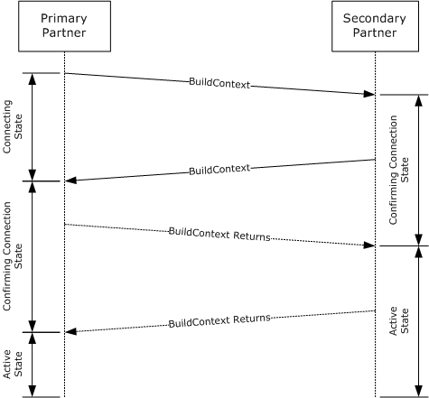
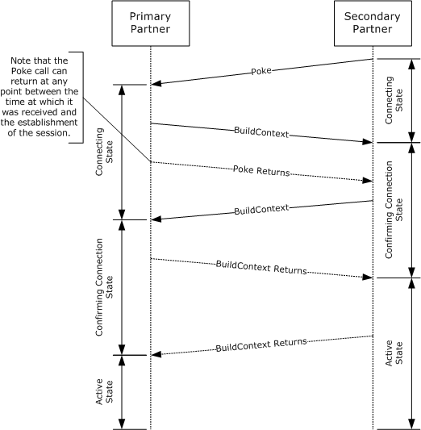
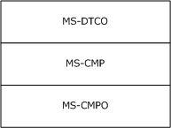
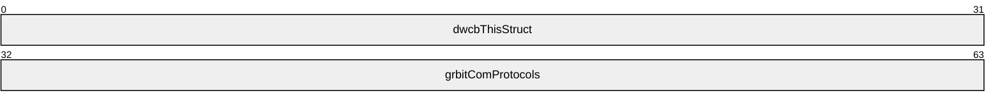
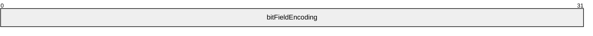
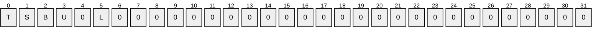
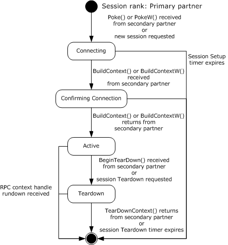
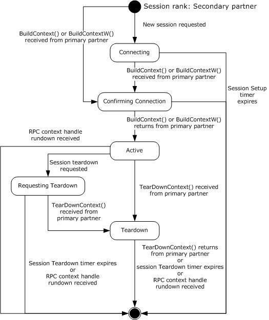

# [MS-CMPO]: MSDTC Connection Manager: OleTx Transports Protocol

Table of Contents

1 Introduction

- [1 Introduction](#Section_1)
  - [1.1 Glossary](#Section_1.1)
  - [1.2 References](#Section_1.2)
    - [1.2.1 Normative References](#Section_1.2.1)
    - [1.2.2 Informative References](#Section_1.2.2)
  - [1.3 Overview](#Section_1.3)
    - [1.3.1 Identifiers and Partner Roles](#Section_1.3.1)
    - [1.3.2 Finding the RPC Endpoint and Constructing a Binding Handle](#Section_1.3.2)
    - [1.3.3 Session Lifecycle](#Section_1.3.3)
      - [1.3.3.1 Establishing a Session](#Section_1.3.3.1)
      - [1.3.3.2 Negotiating Resources](#Section_1.3.3.2)
      - [1.3.3.3 Sending and Receiving Messages](#Section_1.3.3.3)
      - [1.3.3.4 Terminating a Session](#Section_1.3.3.4)
  - [1.4 Relationship to Other Protocols](#Section_1.4)
  - [1.5 Prerequisites/Preconditions](#Section_1.5)
  - [1.6 Applicability Statement](#Section_1.6)
  - [1.7 Versioning and Capability Negotiation](#Section_1.7)
  - [1.8 Vendor-Extensible Fields](#Section_1.8)
  - [1.9 Standards Assignments](#Section_1.9)

2 Messages

- [2 Messages](#Section_2)
  - [2.1 Transport](#Section_2.1)
    - [2.1.1 Protocol Sequences](#Section_2.1.1)
    - [2.1.2 Endpoints](#Section_2.1.2)
    - [2.1.3 Security](#Section_2.1.3)
  - [2.2 Common Data Types](#Section_2.2)
    - [2.2.1 BIND_INFO_BLOB](#Section_2.2.1)
    - [2.2.2 BIND_VERSION_SET](#Section_2.2.2)
    - [2.2.3 BOUND_VERSION_SET](#Section_2.2.3)
    - [2.2.4 COM_PROTOCOL](#Section_2.2.4)
    - [2.2.5 HRESULT](#Section_2.2.5)
    - [2.2.6 GUID/UUID](#Section_2.2.6)
    - [2.2.7 RESOURCE_TYPE](#Section_2.2.7)
    - [2.2.8 SESSION_RANK](#Section_2.2.8)
    - [2.2.9 TEARDOWN_TYPE](#Section_2.2.9)
    - [2.2.10 Constants Used in Method Definitions](#Section_2.2.10)

3 Protocol Details

- [3 Protocol Details](#Section_3)
  - [3.1 Protocol Versioning](#Section_3.1)
  - [3.2 Common Details](#Section_3.2)
    - [3.2.1 Abstract Data Model](#Section_3.2.1)
      - [3.2.1.1 Partner State](#Section_3.2.1.1)
      - [3.2.1.2 Session State](#Section_3.2.1.2)
      - [3.2.1.3 Cleaning Up a Session Object](#Section_3.2.1.3)
      - [3.2.1.4 Name Object](#Section_3.2.1.4)
        - [3.2.1.4.1 Name Object Comparison](#Section_3.2.1.4.1)
    - [3.2.2 Timers](#Section_3.2.2)
      - [3.2.2.1 Session Setup Timer](#Section_3.2.2.1)
      - [3.2.2.2 Session Teardown Timer](#Section_3.2.2.2)
    - [3.2.3 Initialization](#Section_3.2.3)
      - [3.2.3.1 Initialization By a Higher-Level Protocol](#Section_3.2.3.1)
      - [3.2.3.2 Initialization By the Protocol](#Section_3.2.3.2)
    - [3.2.4 Message Processing Events and Sequencing Rules](#Section_3.2.4)
    - [3.2.5 Timer Events](#Section_3.2.5)
      - [3.2.5.1 Session Setup Timer](#Section_3.2.5.1)
      - [3.2.5.2 Session Teardown Timer](#Section_3.2.5.2)
    - [3.2.6 Other Local Events](#Section_3.2.6)
  - [3.3 IXnRemote Server Details](#Section_3.3)
    - [3.3.1 Abstract Data Model](#Section_3.3.1)
    - [3.3.2 Timers](#Section_3.3.2)
    - [3.3.3 Initialization](#Section_3.3.3)
    - [3.3.4 Message Processing Events and Sequencing Rules](#Section_3.3.4)
      - [3.3.4.1 Poke (Opnum 0)](#Section_3.3.4.1)
      - [3.3.4.2 BuildContext (Opnum 1)](#Section_3.3.4.2)
        - [3.3.4.2.1 Primary](#Section_3.3.4.2.1)
        - [3.3.4.2.2 Secondary](#Section_3.3.4.2.2)
      - [3.3.4.3 NegotiateResources (Opnum 2)](#Section_3.3.4.3)
      - [3.3.4.4 SendReceive (Opnum 3)](#Section_3.3.4.4)
      - [3.3.4.5 TearDownContext (Opnum 4)](#Section_3.3.4.5)
        - [3.3.4.5.1 Problem](#Section_3.3.4.5.1)
        - [3.3.4.5.2 Primary](#Section_3.3.4.5.2)
        - [3.3.4.5.3 Secondary](#Section_3.3.4.5.3)
      - [3.3.4.6 BeginTearDown (Opnum 5)](#Section_3.3.4.6)
      - [3.3.4.7 PokeW (Opnum 6)](#Section_3.3.4.7)
      - [3.3.4.8 BuildContextW (Opnum 7)](#Section_3.3.4.8)
    - [3.3.5 Timer Events](#Section_3.3.5)
    - [3.3.6 Other Local Events](#Section_3.3.6)
      - [3.3.6.1 Context Handle Rundown](#Section_3.3.6.1)
  - [3.4 IXnRemote Client Details](#Section_3.4)
    - [3.4.1 Abstract Data Model](#Section_3.4.1)
    - [3.4.2 Timers](#Section_3.4.2)
      - [3.4.2.1 RPC Call Timer](#Section_3.4.2.1)
    - [3.4.3 Initialization](#Section_3.4.3)
    - [3.4.4 Message Processing Events and Sequencing Rules](#Section_3.4.4)
    - [3.4.5 Timer Events](#Section_3.4.5)
      - [3.4.5.1 RPC Call Timer](#Section_3.4.5.1)
    - [3.4.6 Other Local Events](#Section_3.4.6)
      - [3.4.6.1 New Session Requested](#Section_3.4.6.1)
        - [3.4.6.1.1 Primary](#Section_3.4.6.1.1)
        - [3.4.6.1.2 Secondary](#Section_3.4.6.1.2)
      - [3.4.6.2 Forced Session Teardown Requested](#Section_3.4.6.2)
      - [3.4.6.3 Problem Session Teardown Requested](#Section_3.4.6.3)
      - [3.4.6.4 Resource Allocation Requested](#Section_3.4.6.4)
      - [3.4.6.5 Message Send Requested](#Section_3.4.6.5)

4 Protocol Examples

- [4 Protocol Examples](#Section_4)
  - [4.1 Initiating a Session as Primary Partner](#Section_4.1)
  - [4.2 Initiating a Session as Secondary Partner](#Section_4.2)
  - [4.3 Negotiating Connection Resources](#Section_4.3)
  - [4.4 Terminating a Session](#Section_4.4)
    - [4.4.1 Terminating a Session by a Primary Partner](#Section_4.4.1)
    - [4.4.2 Terminating a Session by a Secondary Partner](#Section_4.4.2)

5 Security

- [5 Security](#Section_5)
  - [5.1 Security Considerations for Implementers](#Section_5.1)
  - [5.2 Index of Security Parameters](#Section_5.2)

6 Appendix A: Full IDL

- [6 Appendix A: Full IDL](#Section_6)

7 Appendix B: Product Behavior

- [7 Appendix B: Product Behavior](#Section_7)

8 Change Tracking

- [8 Change Tracking](#Section_8)

For the legal notice and IP terms, see [LEGAL.md](../LEGAL.md).
Last updated: 7/29/2024.
See [Revision History](#revision-history) for full version history.

# 1 Introduction

This document specifies the MSDTC Connection Manager: OleTx Transports Protocol. The MSDTC Connection Manager: OleTx Transports Protocol is a [**remote procedure call (RPC)**](#gt_remote-procedure-call-rpc) interface for establishing duplex [**sessions**](#gt_session) between two [**partners**](#gt_partner) and for exchanging messages between them. The MSDTC Connection Manager: OleTx Transports Protocol is a framing and message transport protocol and, as such, is designed to have other protocols layered over the basic session, messaging, and security services that it provides.

Sections 1.5, 1.8, 1.9, 2, and 3 of this specification are normative. All other sections and examples in this specification are informative.

## 1.1 Glossary

This document uses the following terms:

**authenticated RPC call**: An [**RPC**](#gt_remote-procedure-call-rpc) call that establishes authentication information through the use of the rpc_binding_set_auth_info procedure defined in [[C706]](https://go.microsoft.com/fwlink/?LinkId=89824), the [**security provider**](#gt_security-provider) extension defined in [MS-RPCE](../MS-RPCE/MS-RPCE.md) section 2.2.1.1.7, and the authentication levels extension defined in [MS-RPCE] section 2.2.1.1.8.

**client**: A computer on which the remote procedure call (RPC) client is executing.

**connection**: In OleTx, an ordered set of logically related messages. The relationship between the messages is defined by the higher-layer protocol, but they are guaranteed to be delivered exactly one time and in order relative to other messages in the connection.

**contact identifier**: A [**universally unique identifier (UUID)**](#gt_universally-unique-identifier-uuid) that identifies a partner in the MSDTC Connection Manager: OleTx Transports Protocol. These UUIDs are frequently converted to and from string representations. This string representation has to follow the format specified in [C706] Appendix A. In addition, the UUIDs have to be compared, as specified in [C706] Appendix A.

**dynamic endpoint**: A network-specific server address that is requested and assigned at run time. For more information, see [C706].

**endpoint**: A remote procedure call (RPC) dynamic endpoint, as specified in [C706], part 4.

**endpoint mapper**: A service on a [**remote procedure call (RPC) server**](#gt_rpc-server) that maintains a database of [**dynamic endpoints**](#gt_dynamic-endpoint) and allows [**clients**](#gt_client) to map an interface/object UUID pair to a local [**dynamic endpoint**](#gt_dynamic-endpoint). For more information, see [C706].

**globally unique identifier (GUID)**: A term used interchangeably with [**universally unique identifier (UUID)**](#gt_universally-unique-identifier-uuid) in Microsoft protocol technical documents (TDs). Interchanging the usage of these terms does not imply or require a specific algorithm or mechanism to generate the value. Specifically, the use of this term does not imply or require that the algorithms described in [[RFC4122]](https://go.microsoft.com/fwlink/?LinkId=90460) or [C706] have to be used for generating the GUID. See also universally unique identifier (UUID).

**Interface Definition Language (IDL)**: The International Standards Organization (ISO) standard language for specifying the interface for remote procedure calls. For more information, see [C706] section 4.

**level-three protocol**: The MSDTC Connection Manager: OleTx Transports Protocol is designed to be a transport protocol over which two other protocols are layered. When used in this document, level-three protocol refers to the protocol that is layered immediately on top of the [**level-two protocol**](#gt_level-two-protocol), as described in section 2.2.2. [MS-DTCO](../MS-DTCO/MS-DTCO.md) is an implementation of a [**level-three protocol**](#gt_level-three-protocol); however, any other custom implementation could be used.

**level-two protocol**: The MSDTC Connection Manager: OleTx Transports Protocol is designed to be a transport protocol over which two other protocols are layered. When used in this document, [**level-two protocol**](#gt_level-two-protocol) refers to the protocol that is layered immediately on top of MSDTC Connection Manager: OleTx Transports Protocol, as described in section 2.2.2. [MS-CMP](../MS-CMP/MS-CMP.md) is an implementation of a [**level-two protocol**](#gt_level-two-protocol); however, any other custom implementation could be used.

**Microsoft Interface Definition Language (MIDL)**: The Microsoft implementation and extension of the OSF-DCE [**Interface Definition Language (IDL)**](#gt_interface-definition-language-idl). [**MIDL**](#gt_microsoft-interface-definition-language-midl) can also mean the [**Interface Definition Language (IDL)**](#gt_interface-definition-language-idl) compiler provided by Microsoft. For more information, see [MS-RPCE].

**NetBIOS name**: A 16-byte address that is used to identify a NetBIOS resource on the network. For more information, see [[RFC1001]](https://go.microsoft.com/fwlink/?LinkId=90260) and [[RFC1002]](https://go.microsoft.com/fwlink/?LinkId=90261).

**Network Data Representation (NDR)**: A specification that defines a mapping from [**Interface Definition Language (IDL)**](#gt_interface-definition-language-idl) data types onto octet streams. [**NDR**](#gt_network-data-representation-ndr) also refers to the runtime environment that implements the mapping facilities (for example, data provided to [**NDR**](#gt_network-data-representation-ndr)). For more information, see [MS-RPCE] and [C706] section 14.

**opnum**: An operation number or numeric identifier that is used to identify a specific [**remote procedure call (RPC)**](#gt_remote-procedure-call-rpc) method or a method in an interface. For more information, see [C706] section 12.5.2.12 or [MS-RPCE].

**partner**: A participant in the MSDTC Connection Manager: OleTx Transports Protocol. Each [**partner**](#gt_partner) has its own [**contact identifier (CID)**](#gt_008df1ed-6dde-44be-be73-57a5008782ca), and uses the IXnRemote interface to invoke and receive [**remote procedure calls (RPCs)**](#gt_remote-procedure-call-rpc). The IXnRemote interface is described within the full [**Interface Definition Language (IDL)**](#gt_interface-definition-language-idl) for [MS-CMPO] in section 6.

**primary partner**: One of the two participants in an MSDTC Connection Manager: OleTx Transports Protocol [**session**](#gt_session). The [**primary partner**](#gt_primary-partner) is the [**partner**](#gt_partner) with the larger [**CID**](#gt_008df1ed-6dde-44be-be73-57a5008782ca), as specified in [C706] Appendix A, where larger means that the [**CID**](#gt_008df1ed-6dde-44be-be73-57a5008782ca) of the [**primary partner**](#gt_primary-partner) follows the [**CID**](#gt_008df1ed-6dde-44be-be73-57a5008782ca) of the other [**partner**](#gt_partner).

**remote procedure call (RPC)**: A communication protocol used primarily between client and server. The term has three definitions that are often used interchangeably: a runtime environment providing for communication facilities between computers (the RPC runtime); a set of request-and-response message exchanges between computers (the RPC exchange); and the single message from an RPC exchange (the RPC message). For more information, see [C706].

**RPC protocol sequence**: A character string that represents a valid combination of a [**remote procedure call (RPC)**](#gt_remote-procedure-call-rpc) protocol, a network layer protocol, and a transport layer protocol, as described in [C706] and [MS-RPCE].

**RPC server**: A computer on the network that waits for messages, processes them when they arrive, and sends responses using RPC as its transport acts as the responder during a remote procedure call (RPC) exchange.

**RPC transfer syntax**: A method for encoding messages defined in an Interface Definition Language (IDL) file. Remote procedure call (RPC) can support different encoding methods or transfer syntaxes. For more information, see [C706].

**RPC transport**: The underlying network services used by the remote procedure call (RPC) runtime for communications between network nodes. For more information, see [C706] section 2.

**secondary partner**: One of the two participants in an MSDTC Connection Manager: OleTx Transports Protocol [**session**](#gt_session). The [**secondary partner**](#gt_secondary-partner) is the [**partner**](#gt_partner) with the smaller [**CID**](#gt_008df1ed-6dde-44be-be73-57a5008782ca), as specified in [C706] Appendix A, where smaller means that the [**CID**](#gt_008df1ed-6dde-44be-be73-57a5008782ca) of the [**secondary partner**](#gt_secondary-partner) precedes the [**CID**](#gt_008df1ed-6dde-44be-be73-57a5008782ca) of the other [**partner**](#gt_partner).

**security level**: An implementation-specific enumeration value that specifies the security behavior of a protocol partner. The generic values of this enumeration are described in [MS-CMPO](#Section_d2403ca533fa432997f5825ad0868bf6) section 3.2.1.1.

**security provider**: A pluggable security module that is specified by the protocol layer above the [**remote procedure call (RPC)**](#gt_remote-procedure-call-rpc) layer, and will cause the [**RPC**](#gt_remote-procedure-call-rpc) layer to use this module to secure messages in a communication session with the server. The security provider is sometimes referred to as an authentication service. For more information, see [C706] and [MS-RPCE].

**session**: In OleTx, a transport-level connection between a Transaction Manager and another Distributed Transaction participant over which multiplexed logical connections and messages flow. A session remains active so long as there are logical connections using it.

**session rank**: The role of a [**partner**](#gt_partner) in an [MS-CMPO] [**session**](#gt_session), either primary or secondary. The rank is determined by comparing the CIDs of the two [**partners**](#gt_partner) (as specified in [C706] Appendix A). The [**partner**](#gt_partner) with the larger [**CID**](#gt_008df1ed-6dde-44be-be73-57a5008782ca) is the [**primary partner**](#gt_primary-partner); the [**CID**](#gt_008df1ed-6dde-44be-be73-57a5008782ca) of the [**primary partner**](#gt_primary-partner) follows the [**CID**](#gt_008df1ed-6dde-44be-be73-57a5008782ca) of the other [**partner**](#gt_partner). The [**partner**](#gt_partner) with the smaller [**CID**](#gt_008df1ed-6dde-44be-be73-57a5008782ca) is the [**secondary partner**](#gt_secondary-partner); the [**CID**](#gt_008df1ed-6dde-44be-be73-57a5008782ca) of the [**secondary partner**](#gt_secondary-partner) precedes the [**CID**](#gt_008df1ed-6dde-44be-be73-57a5008782ca) of the other [**partner**](#gt_partner).

**unauthenticated RPC call**: An [**RPC**](#gt_remote-procedure-call-rpc) call that does not establish authentication information through the use of the rpc_binding_set_auth_info procedure defined in [C706], the [**security provider**](#gt_security-provider) extension defined in [MS-RPCE] section 2.2.1.1.7, and the authentication levels extension defined in [MS-RPCE] section 2.2.1.1.8.

**universally unique identifier (UUID)**: A 128-bit value. UUIDs can be used for multiple purposes, from tagging objects with an extremely short lifetime, to reliably identifying very persistent objects in cross-process communication such as client and server interfaces, manager entry-point vectors, and [**RPC**](#gt_remote-procedure-call-rpc) objects. UUIDs are highly likely to be unique. UUIDs are also known as [**globally unique identifiers (GUIDs)**](#gt_globally-unique-identifier-guid) and these terms are used interchangeably in the Microsoft protocol technical documents (TDs). Interchanging the usage of these terms does not imply or require a specific algorithm or mechanism to generate the UUID. Specifically, the use of this term does not imply or require that the algorithms described in [RFC4122] or [C706] has to be used for generating the UUID.

**MAY, SHOULD, MUST, SHOULD NOT, MUST NOT:** These terms (in all caps) are used as defined in [[RFC2119]](https://go.microsoft.com/fwlink/?LinkId=90317). All statements of optional behavior use either MAY, SHOULD, or SHOULD NOT.

## 1.2 References

Links to a document in the Microsoft Open Specifications library point to the correct section in the most recently published version of the referenced document. However, because individual documents in the library are not updated at the same time, the section numbers in the documents may not match. You can confirm the correct section numbering by checking the [Errata](https://go.microsoft.com/fwlink/?linkid=850906).

### 1.2.1 Normative References

We conduct frequent surveys of the normative references to assure their continued availability. If you have any issue with finding a normative reference, please contact [dochelp@microsoft.com](mailto:dochelp@microsoft.com). We will assist you in finding the relevant information.

[C706] The Open Group, "DCE 1.1: Remote Procedure Call", C706, August 1997, [https://publications.opengroup.org/c706](https://go.microsoft.com/fwlink/?LinkId=89824)

**Note** Registration is required to download the document.

[MS-DTYP] Microsoft Corporation, "[Windows Data Types](../MS-DTYP/MS-DTYP.md)".

[MS-ERREF] Microsoft Corporation, "[Windows Error Codes](../MS-ERREF/MS-ERREF.md)".

[MS-RPCE] Microsoft Corporation, "[Remote Procedure Call Protocol Extensions](../MS-RPCE/MS-RPCE.md)".

[NETBEUI] IBM Corporation, "LAN Technical Reference: 802.2 and NetBIOS APIs", 1986, [https://www.ardent-tool.com/docs/boo/bk8p7001.boo](https://go.microsoft.com/fwlink/?LinkId=90224)

**Note** Requires IBM Softcopy Reader for Windows V4.0 to read the file.

[RFC1001] Network Working Group, "Protocol Standard for a NetBIOS Service on a TCP/UDP Transport: Concepts and Methods", RFC 1001, March 1987, [https://www.rfc-editor.org/info/rfc1001](https://go.microsoft.com/fwlink/?LinkId=90260)

[RFC1002] Network Working Group, "Protocol Standard for a NetBIOS Service on a TCP/UDP Transport: Detailed Specifications", STD 19, RFC 1002, March 1987, [https://www.rfc-editor.org/info/rfc1002](https://go.microsoft.com/fwlink/?LinkId=90261)

[RFC2119] Bradner, S., "Key words for use in RFCs to Indicate Requirement Levels", BCP 14, RFC 2119, March 1997, [https://www.rfc-editor.org/info/rfc2119](https://go.microsoft.com/fwlink/?LinkId=90317)

### 1.2.2 Informative References

[MS-CMOM] Microsoft Corporation, "[MSDTC Connection Manager: OleTx Management Protocol](../MS-CMOM/MS-CMOM.md)".

[MS-CMP] Microsoft Corporation, "[MSDTC Connection Manager: OleTx Multiplexing Protocol](../MS-CMP/MS-CMP.md)".

[MS-DTCO] Microsoft Corporation, "[MSDTC Connection Manager: OleTx Transaction Protocol](../MS-DTCO/MS-DTCO.md)".

[MS-SPNG] Microsoft Corporation, "[Simple and Protected GSS-API Negotiation Mechanism (SPNEGO) Extension](../MS-SPNG/MS-SPNG.md)".

## 1.3 Overview

The MSDTC Connection Manager: OleTx Transports Protocol is a peer-to-peer messaging protocol layered over a bidirectional pair of [**RPC**](#gt_remote-procedure-call-rpc) [**connections**](#gt_connection). Although there is asymmetry in the setup and teardown of a [**session**](#gt_session), the peers (or [**partners**](#gt_partner)) are considered equal for the purposes of sending messages to each other.

Together, the pair of RPC connections between the partners is called a session.

### 1.3.1 Identifiers and Partner Roles

Each of the [**partners**](#gt_partner) involved in an MSDTC Connection Manager: OleTx Transports Protocol [**session**](#gt_session) has a distinct [UUID](#Section_a3ae5f137c244e288e17c3a1420e45d6) called its [**contact identifier (CID)**](#gt_008df1ed-6dde-44be-be73-57a5008782ca). Each partner is identified by the combination of its contact identifier (CID) and the [**NetBIOS name**](#gt_netbios-name) of the computer in which it resides. For more information on NetBIOS, see [[NETBEUI]](https://go.microsoft.com/fwlink/?LinkId=90224), [[RFC1001]](https://go.microsoft.com/fwlink/?LinkId=90260), and [[RFC1002]](https://go.microsoft.com/fwlink/?LinkId=90261).

There are two slightly different roles in the MSDTC Connection Manager: OleTx Transports Protocol: [**primary partner**](#gt_primary-partner) and [**secondary partner**](#gt_secondary-partner). Any partner has the option to take either role, but within a session, one is chosen to be the primary partner, and the other is chosen to be the secondary partner. (A partner's role in the session is also referred to as its [**session rank**](#gt_session-rank).) Each partner in the pair self-determines its role by comparing its contact identifier (CID) with the contact identifier (CID) of the other partner. For comparing UUIDs, see [[C706]](https://go.microsoft.com/fwlink/?LinkId=89824). The partner that has the larger contact identifier (CID) is the primary partner, and the other partner is the secondary partner (larger means that the CID of the primary partner follows the CID of the other secondary partner).

### 1.3.2 Finding the RPC Endpoint and Constructing a Binding Handle

When a [**partner**](#gt_partner) is initialized, it creates a [**dynamic endpoint**](#gt_dynamic-endpoint) on each of its supported [**RPC**](#gt_remote-procedure-call-rpc) protocols and registers the interface (IXnRemote) with the RPC [**endpoint mapper**](#gt_endpoint-mapper). When a partner performs this registration, it specifies its [**contact identifier (CID)**](#gt_008df1ed-6dde-44be-be73-57a5008782ca) as the object identifier. See specification [[C706]](https://go.microsoft.com/fwlink/?LinkId=89824).

A partner initiating communication with another partner begins with a name object that contains contact information for a remote partner. The name object is used to create an RPC binding handle (see specification [C706]) to the remote partner's RPC [**endpoint**](#gt_endpoint).

To create an RPC binding handle from a name object, a string binding has to be generated by calling the RPC API routine rpc_string_binding_compose (see specification [C706] section 3.1.20) and passing the data from the name object as follows:

- The protseq input value is taken from one of the entries in the Protocols list in the name object. The protocol has to be one of the protocols supported by both partners as specified in section [2.1.1](#Section_2.1.1). The protocol is selected from the Protocols list according to the following heuristic:
- If both partners are on the same machine, use the value "ncalrpc"; otherwise, proceed to the next step.
- If "ncacn_ip_tcp" is on the Protocols list, set this protocol as the value; otherwise, proceed to the next step.
- If "ncacn_spx" is on the Protocols list, set this protocol as the value;<1> otherwise, proceed to the next step.
- If "ncacn_nb_nb" is on the Protocols list, set this protocol as the value; otherwise, proceed to the next step.
- The partner fails to generate a string binding.
- The network_addr input value is specified as the Hostname in the name object.
- The obj_uuid input value is specified as the contact identifier (CID) in the name object.
- Set NULL or empty string("") for the endpoint and options input values.
After generating the string binding, the partner can instantiate a RPC binding handle passing the string binding to the rpc_binding_from_string_binding RPC API routine (see specification [C706] section 3.1.20). Because the string binding doesn't define an endpoint field, the returned binding is a partially bound binding handle.

If, for any reason, a partner fails to generate a string binding or to instantiate a RPC binding handle, an implementation-specific error code is returned.

This partial binding is resolved into a full binding by using the RPC endpoint mapper service at the host network address and the full binding handle is used for every call to the remote partner.

### 1.3.3 Session Lifecycle

The following sections specify supported MSDTC Connection Manager: OleTx Transports Protocol sequences for implementers.

#### 1.3.3.1 Establishing a Session

A [**session**](#gt_session) is established by making a nested series of synchronous [**remote procedure call (RPC)**](#gt_remote-procedure-call-rpc) between the IXnRemote interfaces of the two [**partners**](#gt_partner). These calls are made in order; furthermore, no call begins before the last call completes, unless an error occurs.

Once one of the partners decides to establish a session, the sequence is as follows. If the [**primary partner**](#gt_primary-partner) decides to establish the session, it proceeds immediately. If the [**secondary partner**](#gt_secondary-partner) decides to establish the session, it establishes an RPC [**connection**](#gt_connection) to the primary partner and calls either the [Poke](#Section_3.3.4.1) method or the [PokeW](#Section_3.3.4.7) method, which has the effect of informing the primary that the secondary wants to establish a session. The primary partner begins the handshake series by establishing an RPC connection to the secondary partner, and by making a [BuildContext](#Section_3.3.4.8) call or [BuildContextW](#Section_3.3.4.8) call to the secondary partner. The secondary partner responds to the incoming call by making a corresponding BuildContext callback or BuildContextW callback to the primary (after establishing an RPC connection, if necessary).

The primary partner then verifies the callback, and the chain of procedure calls progresses. The primary partner returns from the BuildContext call or the BuildContextW call that was made by the secondary partner, and then the secondary partner returns from the BuildContext call or the BuildContextW call that was made by the primary. Once these calls have returned, the session has been established. The following sequence diagrams illustrate this process.

Figure 1: Session initiation by primary partner

Figure 2: Session initiation by secondary partner

#### 1.3.3.2 Negotiating Resources

Once a [**session**](#gt_session) has been established, a [**partner**](#gt_partner) has the option to call the [NegotiateResources](#Section_3.3.4.3) method to request that the other partner allocate resources to be associated with the session. The [**level-two protocol**](#gt_level-two-protocol) specifies the allocated resource type. This type is defined by the [RESOURCE_TYPE (section 2.2.7)](#Section_2.2.7) enumeration.

#### 1.3.3.3 Sending and Receiving Messages

Once a [**session**](#gt_session) has been established, a [**partner**](#gt_partner) calls the [SendReceive](#Section_3.3.4.4) method to send messages to the other partner. As with resources, the MSDTC Connection Manager: OleTx Transports Protocol does not define any messages or message formats; the definition of such things is left to the particular protocol being layered over it.

#### 1.3.3.4 Terminating a Session

Termination requires a nested series of [**RPCs**](#gt_remote-procedure-call-rpc) between the IXnRemote interfaces of the two [**partners**](#gt_partner). Either partner has the option to terminate the [**session**](#gt_session). If the [**primary partner**](#gt_primary-partner) decides to terminate the session, the session termination proceeds immediately. If the [**secondary partner**](#gt_secondary-partner) decides to terminate the session, it sends a [BeginTearDown](#Section_3.3.4.6) request to the primary partner, which has the effect of informing the primary to terminate the session.

The primary partner begins the handshake series by making a [TearDownContext](#Section_3.3.4.5) call to the secondary partner. The secondary partner responds by freeing some of its local state and making a corresponding TearDownContext callback to the primary partner.

On receiving this callback, the primary partner frees its local state associated with the session.

Note that the exact conditions under which a partner decides to terminate a session are outside the scope of the MSDTC Connection Manager: OleTx Transports Protocol; it is the responsibility of the protocol being layered above the MSDTC Connection Manager: OleTx Transports Protocol to provide mechanisms for determining the lifetime of a session.

## 1.4 Relationship to Other Protocols

This protocol is dependent on [**RPC**](#gt_remote-procedure-call-rpc), which is its transport. The RPC protocol provides extensibility elements that are used by this protocol to provide [**sessions**](#gt_session) and peer-to-peer message exchange services. The protocol described in [MS-CMP](../MS-CMP/MS-CMP.md) can be layered on top of this protocol to provide message batching and connection multiplexing services to protocols layered above the multiplexing protocol. For example, other message-based protocols, such as [MS-DTCO](../MS-DTCO/MS-DTCO.md), are layered on top of the multiplexing to provide application-specific functionality. The following diagram illustrates the protocol layering.

Figure 3: Protocol relationships

Ultimately, the MSDTC Connection Manager suite of protocols is used as the communication mechanism for the Microsoft Distributed Transaction Coordinator, which is used to coordinate atomic transactions.

## 1.5 Prerequisites/Preconditions

The MSDTC Connection Manager: OleTx Transports Protocol is an [**RPC**](#gt_remote-procedure-call-rpc) interface, and therefore has the prerequisites identified in [MS-RPCE](../MS-RPCE/MS-RPCE.md) as being common to RPC interfaces.

The security model employed by this protocol is based on the [**Security provider**](#gt_security-provider) model specified in [MS-RPCE], section 1.7. As a result, the function of the protocol requires the availability of a Security provider infrastructure that can be used for RPC security.

It is assumed that an MSDTC Connection Manager: OleTx Transports Protocol [**partner**](#gt_partner) has obtained a name object containing the contact information for another partner that supports the MSDTC Connection Manager: OleTx Transports Protocol before establishing a [**session**](#gt_session). How a partner obtains this name object is not addressed in this specification.

## 1.6 Applicability Statement

This protocol is primarily designed to provide a peer-to-peer system for exchanging messages over reliable [**connections**](#gt_connection). Its use of bidirectional [**RPC**](#gt_remote-procedure-call-rpc) connections to RPC [**dynamic endpoints**](#gt_dynamic-endpoint) means that it is applicable only when the participants can directly contact each other. This protocol requires that the [**partners**](#gt_partner) refer to each other by [**NetBIOS name**](#gt_netbios-name); that is, the participants need to use a name service. Also, the use of Mutual Authentication in conjunction with the protocol's reliance on NetBIOS means that the participants are required to be either in the same domain or in domains that have a trust relationship.

## 1.7 Versioning and Capability Negotiation

This document covers versioning issues in the following areas:

- Supported [**RPC Transports**](#gt_rpc-transport): The MSDTC Connection Manager: OleTx Transports Protocol uses multiple [**RPC protocol sequences**](#gt_rpc-protocol-sequence), as specified in section [2.1.1](#Section_2.1.1).
- Protocol Versions: The MSDTC Connection Manager: OleTx Transports Protocol [**RPC**](#gt_remote-procedure-call-rpc) interface has a single version number of 1.0; however, there are two instances of this interface:
- A base interface.
- An extended interface obtained by appending methods at the end of the base interface described in section [3.1](#Section_3.1).
Corresponding to the two interface instances, this protocol defines two versions, which for the purposes of this specification are referred as "MS-CMPO 1.0" (implements the base interface) and "MS-CMPO 1.1" (implements the extended interface).<2>

It is possible to further extend the MSDTC Connection Manager: OleTx Transports Protocol without altering the interface version number by adding RPC methods to the interface with [**opnums**](#gt_opnum) numerically beyond those defined in this specification.

A [**client**](#gt_client) determines support for a certain interface instance (or protocol version) from a server by attempting to invoke an instance-specific method. If the method is not supported, the [**RPC server**](#gt_rpc-server) returns an RPC_S_PROCNUM_OUT_OF_RANGE error. For RPC versioning and capacity negotiation in this situation, see [[C706]](https://go.microsoft.com/fwlink/?LinkId=89824), section 4.2.4.2, and [MS-RPCE](../MS-RPCE/MS-RPCE.md), section 1.7.

- Security and Authentication Methods: When using authentication, the MSDTC Connection Manager: OleTx Transports Protocol uses the [**security provider**](#gt_security-provider) security model as specified in [MS-RPCE], section 2.2.1.1.7. The specific methods of authentication for this protocol are highly implementation-dependent. In order to communicate securely, two protocol partners have to agree on a common security provider package to use. Security provider negotiation packages are specified in [MS-SPNG](../MS-SPNG/MS-SPNG.md). Windows implementations of MSDTC Connection Manager: OleTx Transports Protocol use by default the SPNEGO security provider described in [MS-SPNG], which allows for in-band negotiation of a security provider package.

## 1.8 Vendor-Extensible Fields

This protocol uses [HRESULT](#Section_2.2.5) values as defined in [MS-ERREF](../MS-ERREF/MS-ERREF.md). Vendors can choose their own HRESULT values, provided they set the C bit (0x20000000) for each vendor-defined value, indicating the value is a customer code.

## 1.9 Standards Assignments

| Parameter | Value | Reference |
| --- | --- | --- |
| [**RPC**](#gt_remote-procedure-call-rpc) interface [**UUID**](#gt_universally-unique-identifier-uuid) | 906B0CE0-C70B-1067-B317-00DD010662DA | Section [2.1](#Section_2.1) |

# 2 Messages

This protocol references commonly used data types as defined in [MS-DTYP](../MS-DTYP/MS-DTYP.md).

## 2.1 Transport

### 2.1.1 Protocol Sequences

The MSDTC Connection Manager: OleTx Transports Protocol uses several different [**RPC protocol sequences**](#gt_rpc-protocol-sequence); it SHOULD use the "ncacn_ip_tcp" RPC protocol sequence.

Also, the MSDTC Connection Manager: OleTx Transports Protocol MAY use either or both of the "ncacn_nb_nb" and "ncacn_spx" RPC protocol sequences. Very few implementations use these protocols, and so they SHOULD NOT be the only protocols supported by a [**partner**](#gt_partner).<3>

### 2.1.2 Endpoints

The MSDTC Connection Manager: OleTx Transports Protocol MUST use the [**endpoint mapper**](#gt_endpoint-mapper) to allocate the [**endpoint**](#gt_endpoint) that will be used during the exchange of messages. This endpoint MUST be allocated dynamically on a port that MUST be defined by the endpoint mapper, as specified in [[C706]](https://go.microsoft.com/fwlink/?LinkId=89824)) part 2, or by the local data element Server TCP Port if the RPC protocol is TCP/IP.<4>

### 2.1.3 Security

The MSDTC Connection Manager: OleTx Transports Protocol partners SHOULD use a [**security provider**](#gt_security-provider), as specified in [MS-RPCE](../MS-RPCE/MS-RPCE.md) section 2.2.1.1.7, and an authentication level as specified in [MS-RPCE] section 2.2.1.1.8.<5>

The MSDTC Connection Manager: OleTx Transports Protocol SHOULD support three [**security levels**](#gt_security-level): mutual authentication, incoming authentication, and no authentication.

- If the security level is mutual authentication, the MSDTC Connection Manager: OleTx Transports Protocol partner MUST attempt to establish an [**RPC**](#gt_remote-procedure-call-rpc) [**connection**](#gt_connection) using [**authenticated RPC calls**](#gt_authenticated-rpc-call). If this fails, the RPC connection attempt fails. When using this security level, the MSDTC Connection Manager: OleTx Transports Protocol [**partner**](#gt_partner) SHOULD accept authenticated RPC calls only if the authentication level is set to RPC_C_AUTHN_LEVEL_PKT_PRIVACY.<6>
- If the security level is incoming authentication, the MSDTC Connection Manager: OleTx Transports Protocol partner MUST first attempt to establish an RPC connection using authenticated RPC calls for sessions that were initiated (through the [BuildContextW](#Section_3.3.4.8) method or the [PokeW](#Section_3.3.4.7) method) by another protocol partner. If it fails to accept authenticated RPC calls, the MSDTC Connection Manager: OleTx Transports Protocol partner MUST attempt to establish an RPC connection using [**unauthenticated RPC calls**](#gt_unauthenticated-rpc-call). When using this security level, the MSDTC Connection Manager: OleTx Transports Protocol partner SHOULD accept authenticated RPC calls only if the authentication level is set to RPC_C_AUTHN_LEVEL_PKT_PRIVACY.<7>
- If the security level is no authentication, the MSDTC Connection Manager: OleTx Transports Protocol partner SHOULD first attempt to establish an RPC connection using authenticated RPC calls to another protocol partner. If this fails, the MSDTC Connection Manager: OleTx Transports Protocol partner MUST attempt to establish an RPC connection using unauthenticated RPC calls.

## 2.2 Common Data Types

The MSDTC Connection Manager: OleTx Transports Protocol MUST indicate (to the [**RPC**](#gt_remote-procedure-call-rpc) runtime) that it is only to support the [**Network Data Representation (NDR)**](#gt_network-data-representation-ndr) transfer syntax as the [**RPC transfer syntax**](#gt_rpc-transfer-syntax), as specified in [[C706]](https://go.microsoft.com/fwlink/?LinkId=89824) part 4. In addition to RPC base types and definitions specified in [C706] and [MS-DTYP](../MS-DTYP/MS-DTYP.md), more data types are defined in the following sections.

### 2.2.1 BIND_INFO_BLOB

The BIND_INFO_BLOB packet is a structure containing details on how to bind to a [**partner**](#gt_partner).

**dwcbThisStruct (4 bytes):** An unsigned 4-byte integer. The size of this structure in bytes. This value MUST be set to 8.

**grbitComProtocols (4 bytes):** A [COM_PROTOCOL](#Section_2.2.4) bit field specifying the [**RPC protocol sequences**](#gt_rpc-protocol-sequence) that the partner supports.

### 2.2.2 BIND_VERSION_SET

The BIND_VERSION_SET structure holds three sets of version range values that specify the version ranges supported by a [**partner**](#gt_partner) for three protocols: this protocol, MSDTC Connection Manager: OleTx Transports Protocol, and two other protocols that are layered on top of this protocol. This is because MSDTC Connection Manager: OleTx Transports Protocol is designed to be a transport protocol over which two other protocols are layered. For the rest of this specification, the protocol that is layered immediately on top of the MSDTC Connection Manager: OleTx Transports Protocol is referred to as the [**level-two protocol**](#gt_level-two-protocol), and the protocol layered on top of the level-two protocol is the [**level-three protocol**](#gt_level-three-protocol). The ranges of level-two version number values and level-three version number values are specific to the level-two protocol and level-three protocol, respectively.

typedef struct _BindVersionSet {

DWORD dwMinLevelOne;

DWORD dwMaxLevelOne;

DWORD dwMinLevelTwo;

DWORD dwMaxLevelTwo;

DWORD dwMinLevelThree;

DWORD dwMaxLevelThree;

} BIND_VERSION_SET;

**dwMinLevelOne:** A 4-byte unsigned integer value containing the minimum supported MSDTC Connection Manager: OleTx Transports Protocol version. **dwMinLevelOne** MUST be less than or equal to **dwMaxLevelOne**.

This field indicates whether the unsigned_char_t [[C706]](https://go.microsoft.com/fwlink/?LinkId=89824) version of the Session creation API calls ([Poke](#Section_3.3.4.1)/[BuildContext](#Section_3.3.4.8)) or the wchar_t [C706] version of the Session creation API calls ([PokeW](#Section_3.3.4.7)/[BuildContextW](#Section_3.3.4.8)) are used. This field MUST be one of the following values:

| Value | Meaning |
| --- | --- |
| 0x00000001 | The unsigned_char_t version of the [**Session**](#gt_session) creation API (Poke and BuildContext) is used. |
| 0x00000002 | The wchar_t version of the Session creation API (PokeW and BuildContextW) is used. |

**dwMaxLevelOne:** A 4-byte unsigned integer value containing the maximum version supported for a level-one session. **dwMaxLevelOne** MUST be greater than or equal to **dwMinLevelOne**.

This field indicates whether the unsigned_char_t version of the Session creation API calls (Poke/BuildContext) or the wchar_t version of the Session creation API calls (PokeW/BuildContextW) are used. This field MUST be one of the following values:

| Value | Meaning |
| --- | --- |
| 0x00000001 | The unsigned_char_t version of the Session creation API (Poke and BuildContext) is used. |
| 0x00000002 | The wchar_t version of the Session creation API (PokeW and BuildContextW) is used. |

**dwMinLevelTwo:** A 4-byte unsigned integer value containing the minimum version supported for the level-two protocol session. The value for **dwMinLevelTwo** MUST be less than or equal to **dwMaxLevelTwo**.

**dwMaxLevelTwo:** A 4-byte unsigned integer value containing the maximum version supported for the level-two protocol session. The value for **dwMaxLevelTwo** MUST be greater than or equal to **dwMinLevelTwo**.

**dwMinLevelThree:** A 4-byte unsigned integer value containing the minimum version supported for the level-three protocol session. The value for **dwMinLevelThree** MUST be less than or equal to **dwMaxLevelThree**.

**dwMaxLevelThree:** A 4-byte unsigned integer value containing the maximum version supported for the level-three protocol session. **dwMaxLevelThree** MUST be greater than or equal to **dwMinLevelThree**.

### 2.2.3 BOUND_VERSION_SET

The BOUND_VERSION_SET is a structure containing the MSDTC Connection Manager: OleTx Transports Protocol version numbers that were successfully negotiated during a [BuildContext](#Section_3.3.4.8) call or a [BuildContextW](#Section_3.3.4.8) call.

typedef struct _BoundVersionSet {

DWORD dwLevelOneAccepted;

DWORD dwLevelTwoAccepted;

DWORD dwLevelThreeAccepted;

} BOUND_VERSION_SET;

**dwLevelOneAccepted:** A [**session**](#gt_session) level-one bind was successfully created.

A 4-byte unsigned integer value containing the MSDTC Connection Manager: OleTx Transports Protocol version that was negotiated with the partner and MUST be used in MSDTC Connection Manager: OleTx Transports Protocol exchanges with the partner.

| Value | Meaning |
| --- | --- |
| 0x00000001 | The unsigned_char_t version of the Session creation API ([Poke](#Section_3.3.4.1) and BuildContext) is used. |
| 0x00000002 | The wchar_t version of the Session creation API ([PokeW](#Section_3.3.4.7) and BuildContextW) is used. |

**dwLevelTwoAccepted:** A 4-byte unsigned integer value containing the [**level-two protocol**](#gt_level-two-protocol) version that was negotiated with the partner and MUST be used in level-two protocol exchanges with the partner.

**dwLevelThreeAccepted:** A 4-byte unsigned integer value containing the [**level-three protocol**](#gt_level-three-protocol) version that was negotiated with the partner and MUST be used in level-three protocol exchanges with the partner.

### 2.2.4 COM_PROTOCOL

The COM_PROTOCOL is a bit field defining the set of [**RPC protocol sequences**](#gt_rpc-protocol-sequence) supported by an MSDTC Connection Manager: OleTx Transports Protocol [**partner**](#gt_partner).

**bitFieldEncoding (4 bytes):** The bits of this data type MUST be encoded as follows.

| Value | Description |
| --- | --- |
| T PROT_IP_TCP (0x00000001) | A flag indicating whether the "ncacn_ip_tcp" RPC protocol sequence is supported by the [**endpoint**](#gt_endpoint). If the value is 1, the protocol sequence is supported; otherwise, it is not. |
| S PROT_SPX (0x00000002) | A flag indicating whether the "ncacn_spx" RPC protocol sequence is supported by the endpoint. If the value is 1, the protocol sequence is supported; otherwise, it is not. |
| B PROT_NET_BEUI (0x00000004) | A flag indicating whether the "ncacn_nb_nb" RPC protocol sequence is supported by the endpoint. If the value is 1, the protocol sequence is supported; otherwise, it is not. |
| U PROT_IP_UDP (0x00000008) | A flag indicating whether the "ncacn_ip_udp" RPC protocol sequence is supported by the endpoint. If the value is 1, the protocol sequence is supported; otherwise, it is not. |
| L PROT_LRPC (0x00000020) | A flag indicating whether the "ncalrpc" RPC protocol sequence is supported by the endpoint. If the value is 1, the protocol sequence is supported; otherwise, the protocol sequence is not supported. |

If none of the bits are set, then **bitFieldEncoding** is assumed to be set to PROT_IP_TCP by default.

### 2.2.5 HRESULT

This specification uses the HRESULT type. See [MS-ERREF](../MS-ERREF/MS-ERREF.md).

### 2.2.6 GUID/UUID

This specification uses the GUID type. See [MS-DTYP](../MS-DTYP/MS-DTYP.md). GUID (globally unique identifier) is also known as a UUID (universally unique identifier) and is a 16-byte structure, intended to serve as a unique identifier for an object. When formatted as a string, it MUST follow the specification described in [[C706]](https://go.microsoft.com/fwlink/?LinkId=89824) Appendix A.

### 2.2.7 RESOURCE_TYPE

The RESOURCE_TYPE enumeration provides 4-byte signed integer values that describe the resource to be negotiated.

typedef enum _ResourceType

{

RT_CONNECTIONS = 0x00000000

} RESOURCE_TYPE;

**RT_CONNECTIONS:** Indicates that the resource is a [**connection**](#gt_connection).

### 2.2.8 SESSION_RANK

The SESSION_RANK enumeration provides 4-byte signed integer values that describe whether the machine is a [**primary partner**](#gt_primary-partner) or a [**secondary partner**](#gt_secondary-partner).

typedef enum _SessionRank

{

SRANK_PRIMARY = 0x00000001,

SRANK_SECONDARY = 0x00000002

} SESSION_RANK;

**SRANK_PRIMARY:** Primary partner.

**SRANK_SECONDARY:** Secondary partner.

### 2.2.9 TEARDOWN_TYPE

The TEARDOWN_TYPE enumeration provides a set of 4-byte signed integer values indicating the reason for starting the teardown phase of [**session**](#gt_session) management.

typedef enum _TearDownType

{

TT_FORCE = 0x00000000,

TT_PROBLEM = 0x00000002,

} TEARDOWN_TYPE;

**TT_FORCE:** Force a teardown.

**TT_PROBLEM:** Severe session error detected; start a teardown.

### 2.2.10 Constants Used in Method Definitions

The following constants are used in various methods.

| Constant/value | Description |
| --- | --- |
| GUID_LENGTH 37 | The minimum or maximum number of characters in the string form of a [**contact identifier (CID)**](#gt_008df1ed-6dde-44be-be73-57a5008782ca) that contains a [**GUID**](#gt_globally-unique-identifier-guid) value. |
| MAX_COMPUTERNAME_LENGTH 15 | An operand used to specify the maximum number of characters in the string form of a host name. |

# 3 Protocol Details

The [**RPC**](#gt_remote-procedure-call-rpc) interface specified by this protocol is called IXnRemote (see section [6](#Section_6) for the [**Interface Definition Language (IDL)**](#gt_interface-definition-language-idl) specification). Every IXnRemote [**client**](#gt_client) is also an IXnRemote server, and every IXnRemote server is also an IXnRemote client. Therefore, the information in section [3.2](#Section_3.2) applies equally to both IXnRemote server and IXnRemote client.

## 3.1 Protocol Versioning

This protocol currently has two versions: MS-CMPO 1.0 and MS-CMPO 1.1. The only differences between the two versions are related to the methods supported by the [**RPC**](#gt_remote-procedure-call-rpc) interface, as shown in the following table.

| IXnRemote methods | MS-CMPO 1.0 | MS-CMPO 1.1 |
| --- | --- | --- |
| Poke (Opnum 0) | Supported | Supported |
| BuildContext (Opnum 1) | Supported | Supported |
| NegotiateResources (Opnum 2) | Supported | Supported |
| SendReceive (Opnum 3) | Supported | Supported |
| TearDownContext (Opnum 4) | Supported | Supported |
| BeginTearDown (Opnum 5) | Supported | Supported |
| PokeW (Opnum 6) | Not supported | Supported |
| BuildContextW (Opnum 7) | Not supported | Supported |

## 3.2 Common Details

### 3.2.1 Abstract Data Model

This section describes a conceptual model of possible data organization that an implementation maintains to participate in this protocol. The described organization is provided to facilitate the explanation of how the protocol behaves. This document does not mandate that implementations adhere to this model as long as their external behavior is consistent with what is described in this document.

**Note** The abstract interface notation (Public) indicates that the Abstract Data Model element can be directly accessed from outside this protocol.

An MSDTC Connection Manager: OleTx Transports Protocol implementation MUST have two [**partners**](#gt_partner), as described in section [1.3.1](#Section_1.3.1). Within a session, based upon the comparison of their [**contact identifiers (CIDs)**](#gt_008df1ed-6dde-44be-be73-57a5008782ca): one partner is the [**primary partner**](#gt_primary-partner), and the other is the [**secondary partner**](#gt_secondary-partner). For the sake of clarity, the term "local partner" is used to indicate the role that is being described, and the term "remote partner" is used to indicate the partner with which the local partner is communicating.

The abstract data model described in this section applies to an implementation of the MSDTC Connection Manager: OleTx Transports Protocol as a whole. Therefore, the **IXnRemote** server and **IXnRemote** client roles, which are both implemented by the local partner, share one instance of the model described here.

The MSDTC Connection Manager: OleTx Transports Protocol uses the registry to retrieve the values for the Server TCP Port and Service Network Protocols data elements described in this section, and the persistent store is shared with the MSDTC Connection Manager: OleTx Transaction Protocol [MS-DTCO](../MS-DTCO/MS-DTCO.md) and the MSDTC Connection Manager: OleTx Management Protocol [MS-CMOM](../MS-CMOM/MS-CMOM.md).

#### 3.2.1.1 Partner State

An MSDTC Connection Manager: OleTx Transports Protocol [**partner**](#gt_partner) MUST allocate and maintain the following local data elements:

**Local Name Object (Public):** A name object that contains the contact information for the local partner.

**Minimum Level 1 Version Number:** A 4-byte unsigned integer, whose value represents the minimum version supported by a MSDTC Connection Manager: OleTx Transports Protocol implementation.

**Maximum Level 1 Version Number:** A 4-byte unsigned integer, whose value represents the maximum version supported by a MSDTC Connection Manager: OleTx Transports Protocol implementation.

**Minimum Level 2 Version Number (Public):** A 4-byte unsigned integer, whose value represents the minimum version supported by the [**level-two protocol**](#gt_level-two-protocol) layered on top of the MSDTC Connection Manager: OleTx Transports Protocol implementation.

**Maximum Level 2 Version Number (Public):** A 4-byte unsigned integer, whose value represents the maximum version supported by the **level-two protocol** layered on top of the MSDTC Connection Manager: OleTx Transports Protocol implementation.

**Minimum Level 3 Version Number (Public):** A 4-byte unsigned integer, whose value represents the minimum version supported by the [**level-three protocol**](#gt_level-three-protocol) layered on top of the level-two protocol.

**Maximum Level 3 Version Number (Public):** A 4-byte unsigned integer, whose value represents the maximum version supported by the **level-three protocol** layered on top of the **level-two protocol**.

**Security Level (Public):** An implementation-specific enumeration value that specifies the security behavior of a protocol partner. The generic values of this enumeration are given in the following table.

| Security Level value | Meaning |
| --- | --- |
| Mutual authentication | This value specifies that the protocol partner MUST use an [**authenticated RPC call**](#gt_authenticated-rpc-call) to establish a communication between the client and server. The server RPC security MUST be configured as specified by the Server Security Settings, and the client security MUST be configured as specified by the Client Security Settings. |
| Incoming authentication | This value specifies that the protocol partner MUST use an authenticated RPC call when it is initiated (through [BuildContextW](#Section_3.3.4.8) or [PokeW](#Section_3.3.4.7)) by another protocol partner. For sessions initiated by itself, a partner MUST first attempt to use an authenticated RPC call; if that is not supported, the partner MUST use an [**unauthenticated RPC call**](#gt_unauthenticated-rpc-call). |
| No Authentication | This value specifies that the protocol partner SHOULD use authenticated RPC calls to establish a communication between the client and server. The server RPC security MUST be configured as specified by the Server Security Settings, and the client security MUST be configured as specified by the Client Security Settings. If this fails, both the client and server sides of the protocol partner MUST use an unauthenticated RPC call. The settings specified by the Server Security Settings and Client Security Settings objects MUST be ignored. |

These data elements are set during the initialization of the partner and are not changed thereafter. See section [3.3.3](#Section_3.2.3).

**Note** It is possible to implement the abstract data model by using a variety of techniques. The protocol does not prescribe or advocate any specific implementation technique.

#### 3.2.1.2 Session State

An MSDTC Connection Manager: OleTx Transports Protocol [**partner**](#gt_partner) MUST maintain a [**session**](#gt_session) table (a table of session objects) keyed by the [**contact identifier (CID)**](#gt_008df1ed-6dde-44be-be73-57a5008782ca) field of the Name field referenced by each session object. Each partner maintains a table of the sessions in progress. This table grows and shrinks as sessions are established and terminated. A session object MUST maintain the following data elements:

**Name:** A name object that contains contact information for the remote partner.

**Version:** A BOUND_VERSION_SET structure representing the session values negotiated between the two participants in the session.

**Binding Handle:** An [**RPC**](#gt_remote-procedure-call-rpc) binding handle to the remote partner.

**Context Handle:** The RPC context handle associated with this session for the remote partner.

**Timers:** Each session has two timers: a [Session Setup timer](#Section_3.2.2.1) and a [Session Teardown timer](#Section_3.2.2.2).

**State:** The current state of the session. The state of the session MUST be one of the following values:

- Connecting
- Confirming Connection
- Active
- Requesting Teardown
- Teardown
The valid state transitions are described by one of the two following state diagrams, depending on whether the local partner is the [**primary partner**](#gt_primary-partner) in the session or not. Only a [**secondary partner**](#gt_secondary-partner) has the option to enter the Requesting Teardown state.

Figure 4: Primary session state

Figure 5: Secondary session state

**Note** It is possible to implement the conceptual data defined in this section using a variety of techniques. An implementation is at liberty to implement such data in any way it pleases.

#### 3.2.1.3 Cleaning Up a Session Object

When a [**session**](#gt_session) object is removed from the session table, it MUST be cleaned up as follows:

- Any outstanding [**RPC**](#gt_remote-procedure-call-rpc) associated with the session object MUST be canceled; this includes calls to [BuildContext](#Section_3.3.4.8), [BuildContextW](#Section_3.3.4.8), [Poke](#Section_3.3.4.1), [PokeW](#Section_3.3.4.7), [BeginTearDown](#Section_3.3.4.6), and [TearDownContext](#Section_3.3.4.5) that are being used to establish or tear down the session represented by the session object.
- All active timers associated with the session object MUST be canceled.
- The RPC binding handle stored in the session object MUST be released if it has been allocated. For RPC binding handles, see [[C706]](https://go.microsoft.com/fwlink/?LinkId=89824).
- The RPC context handle stored in the session object MUST be released if it has been allocated. For RPC context handles, see [C706].

#### 3.2.1.4 Name Object

A name object contains the contact information of a partner. This information is composed of the following data elements that MUST be present on a Name object implementation:

**Hostname:** The [**NetBIOS name**](#gt_netbios-name) of the machine on which the [**partner**](#gt_partner) is listening. For NetBIOS, see [[NETBEUI]](https://go.microsoft.com/fwlink/?LinkId=90224), [[RFC1001]](https://go.microsoft.com/fwlink/?LinkId=90260), and [[RFC1002]](https://go.microsoft.com/fwlink/?LinkId=90261).

**CID:** The [**contact identifier (CID)**](#gt_008df1ed-6dde-44be-be73-57a5008782ca) of the partner.

**Protocols:** A [COM_PROTOCOL](#Section_2.2.4) structure representing a set of the [**RPC**](#gt_remote-procedure-call-rpc) network protocols supported by the partner.

**Note** It is possible to implement the conceptual data defined in this section using a variety of techniques. An implementation is at liberty to implement such data in any way it pleases.

##### 3.2.1.4.1 Name Object Comparison

Two name objects are considered equal if (and only if) their [**contact identifier (CID)**](#gt_008df1ed-6dde-44be-be73-57a5008782ca) are identical GUIDs, and the Hostname fields are identical NetBIOS host names. For NetBIOS, see [[NETBEUI]](https://go.microsoft.com/fwlink/?LinkId=90224) and [[RFC1001]](https://go.microsoft.com/fwlink/?LinkId=90260).

### 3.2.2 Timers

An implementation of the MSDTC Connection Manager: OleTx Transports Protocol MUST provide [Session Setup timers](#Section_3.2.2.1) and [Session Teardown timers](#Section_3.2.2.2). Each [**session**](#gt_session) object is associated with a pair of these timers.

#### 3.2.2.1 Session Setup Timer

There is an instance of this timer corresponding to each [**session**](#gt_session) object. This timer MUST be set when the associated session enters the Connecting state or the Confirming Connection state, and is canceled when the session enters the Active state.

The default value of the timer is specific to the implementation.<8>

#### 3.2.2.2 Session Teardown Timer

There is an instance of this timer corresponding to each [**session**](#gt_session) object. This timer MUST be set when the associated session enters the Teardown state, and is canceled when the session leaves that state.

The default value of the timer is specific to the implementation. The local [**partner**](#gt_partner) SHOULD set the default value of this timer to 10 seconds.

### 3.2.3 Initialization

Each MSDTC Connection Manager: OleTx Transports Protocol [**partner**](#gt_partner) is explicitly initialized with the data elements identified in section [3.2.1.1](#Section_3.2.1.1), and described in sections [Initialization By a Higher-Level Protocol (section 3.2.3.1)](#Section_3.2.3) and [Initialization By the Protocol (section 3.2.3.2)](#Section_3.2.3).

#### 3.2.3.1 Initialization By a Higher-Level Protocol

A MSDTC Connection Manager: OleTx Transports Protocol [**partner**](#gt_partner) is explicitly initialized with the following data elements identified in section [3.2.1.1](#Section_3.2.1.1).

- A Local Name object supplied by a higher-level protocol.
- The Minimum and Maximum Level 2 Version Numbers are public elements set by a higher-level protocol that is initializing this partner.
- The Minimum and Maximum Level 3 Version Numbers are public elements set by a higher-level protocol that is initializing this partner.
- A Security Level is a public element set by a higher-level protocol that is initializing this partner.
As those elements are supplied to the MSDTC Connection Manager: OleTx Transport Protocol partner, their initialization MUST be done by the higher-level protocol.

#### 3.2.3.2 Initialization By the Protocol

The MSDTC Connection Manager OleTx Transports Protocol partner MUST perform the following actions.

- Set the Minimum and Maximum Level 1 Version Numbers as follows.
- If the local partner implements the MSDTC Connection Manager OleTx Transports Protocol 1.1 protocol version, the Minimum Level 1 Version Number MUST be set to 0x00000001 and the Maximum Level 1 Version Number MUST be set to 0x00000002.
- Otherwise, if the local partner implements only the MSDTC Connection Manager OleTx Transports Protocol 1.0 protocol version, both the Minimum and Maximum Level 1 Version Number MUST be set to 0x00000001.
- Create an empty session table and assign it to the Session Table field.
In addition to the initialization steps that are performed by a higher-level protocol and the steps that are common to both the Server and Client roles discussed here, some role-specific initialization also needs to be performed. See section [3.3.3](#Section_3.2.3) for initialization steps specific to the [IXnRemote Server](#Section_3.3) role and section [3.4.3](#Section_3.2.3) for initialization steps specific to the [IXnRemote Client](#Section_3.4) role.

If any of the initialization of the above elements fails, an implementation-specific failure result MUST be returned to the higher-layer protocol.

### 3.2.4 Message Processing Events and Sequencing Rules

None.

### 3.2.5 Timer Events

Note that the events that follow are described as asynchronous with respect to the normal operation of the MSDTC Connection Manager: OleTx Transports Protocol. If events are implemented this way, it is the responsibility of the implementation to ensure that its state remains consistent.

#### 3.2.5.1 Session Setup Timer

When the Session Setup timer expires, the local [**partner**](#gt_partner) SHOULD:

- Cancel any outstanding call to [BuildContext](#Section_3.3.4.8) or [BuildContextW](#Section_3.3.4.8).
When the Session Setup timer expires, the local partner MUST:

- Remove the associated [**session**](#gt_session) object from the session table, and close any context handle or binding handle stored in the session object. (See [[C706]](https://go.microsoft.com/fwlink/?LinkId=89824).)
- Return an error result from the current incoming call to BuildContext or BuildContextW from the remote partner identified by the name object stored in the timer's corresponding session object, if any.
- Return an error result to the [**level-two protocol**](#gt_level-two-protocol) that is requesting a new session to the remote partner identified by the name object stored in the timer's corresponding session object, if any.

#### 3.2.5.2 Session Teardown Timer

When the Session Teardown timer expires, the local [**partner**](#gt_partner) SHOULD:

- Cancel any outstanding call to [TearDownContext](#Section_3.3.4.5).
When the Session Teardown timer expires, the local partner MUST:

- Remove the associated [**session**](#gt_session) object from the session table, and close any context handle or binding handle stored in the session object. (See [[C706]](https://go.microsoft.com/fwlink/?LinkId=89824).)
- Return an error result from the current incoming call to TearDownContext from the remote partner identified by the name object associated with the timer's session object, if any. The local partner SHOULD return 0x80004005 (E_FAIL).
- Report success to any [**level-two protocol**](#gt_level-two-protocol) that is requesting a new session to the partner identified by the name object stored in the timer's session corresponding object, if any.

### 3.2.6 Other Local Events

None.

## 3.3 IXnRemote Server Details

### 3.3.1 Abstract Data Model

In addition to the abstract data model described in section [3.2.1](#Section_3.4.1), when implementing an IXnRemote server role an MSDTC Connection Manager: OleTx Transports Protocol partner MUST allocate and maintain the following local data element:

**Server TCP Port**: A 4-byte unsigned integer whose value determines the TCP port number of the [**RPC server**](#gt_rpc-server) [**endpoint**](#gt_endpoint).<9>

**Service Network Protocols**: An implementation-specific object that identifies which [**RPC protocol sequences**](#gt_rpc-protocol-sequence) to use, such as ncacn_ip_tcp, ncacn_nb_nb, ncacn_ip_udp, and ncacn_spx.<10> The ncacn_ protocols are described in [MS-RPCE](../MS-RPCE/MS-RPCE.md) section 2.

**Server Security Settings**: A collection of settings the value of which represents [**security provider**](#gt_security-provider)–specific settings used to configure the [**RPC**](#gt_remote-procedure-call-rpc) security of the server. As those settings are internal to this protocol and no network traffic is involved in the setting of their values, the following conditions SHOULD be observed:<11>

- They are stored on an implementation-specific source that SHOULD be secured for write access by system administrators only.
- They SHOULD be established during installation, and the MSDTC Connection Manager: OleTx Transports Protocol does not modify the settings. It only reads them during protocol instance initialization. There are no protocols defined to initialize them.
- Since the storage location is implementation specific, a separate tool could be used to update the storage locations independent of the protocol.
The following settings are the **Server Security Settings** that MUST be specified:

- **RPC Security Provider**: A 4-byte unsigned integer element that identifies the security provider being used. The possible values for this element are defined in [MS-RPCE] section 2.2.1.1.7.

### 3.3.2 Timers

The timers for an IXnRemote server are described in section [3.2.2](#Section_3.2.2).

### 3.3.3 Initialization

The MSDTC Connection Manager: OleTx Transports Protocol [**partner**](#gt_partner) when initiating the [IXnRemote Server](#Section_3.3) role, MUST perform the following actions.

- Initialize the Server TCP Port data element by retrieving it directly from the registry, as defined in [MS-CMOM](../MS-CMOM/MS-CMOM.md) section 3.3.1.2.1.<12>
- Initialize the Service Network Protocols data element by retrieving it directly from the registry, as defined in [MS-CMOM] section 3.3.1.2.3.
- For each supported [**RPC**](#gt_remote-procedure-call-rpc) protocol on the Service Network Protocols data element:
- If the supported RPC protocol is TCP/IP and the Server TCP Port data element is supported, then register for an RPC [**dynamic endpoint**](#gt_dynamic-endpoint) using the port number defined on the Server TCP Port.<13>
- If the supported RPC protocol is TCP/IP and the Server TCP Port local data element is not supported, then register for an RPC dynamic endpoint using the port number automatically assigned by the [**endpoint mapper**](#gt_endpoint-mapper).
- If the supported RPC protocol is not TCP/IP, then register for an RPC dynamic endpoint.
- If registration of the dynamic endpoint succeeds, then register the interface with the RPC endpoint mapper. During this registration, the local [**contact identifier (CID)**](#gt_008df1ed-6dde-44be-be73-57a5008782ca) of the interface is specified as the object identifier. See [[C706]](https://go.microsoft.com/fwlink/?LinkId=89824).
- If registration of the dynamic endpoint does not succeed, then the MSDTC Connection Manager: OleTx Transports Protocol partner MUST NOT be initialized.
- If an "ncalrpc" RPC protocol endpoint was not registered, then register a dynamic endpoint using this protocol. This endpoint SHOULD be registered even when the "ncalrpc" [**RPC protocol sequence**](#gt_rpc-protocol-sequence) is not included as an entry in the Service Network Protocols data element.
- Initialize the Server Security Settings data element by retrieving the RPC Security Provider data element value from an implementation-specific source.<14>
- Start the RPC server, using the Server Security Settings, to listen for RPC calls.

### 3.3.4 Message Processing Events and Sequencing Rules

The MSDTC Connection Manager: OleTx Transports Protocol SHOULD indicate to the [**RPC**](#gt_remote-procedure-call-rpc) runtime that it is to perform a strict [**NDR**](#gt_network-data-representation-ndr) data consistency check at target level 5.0, as specified in [MS-RPCE](../MS-RPCE/MS-RPCE.md) section 3.<15>

MSDTC Connection Manager: OleTx Transports Protocol MUST indicate to the RPC runtime via the strict_context_handle attribute that it is to reject use of context handles created by a method of a different RPC interface than this one, as specified in [MS-RPCE] section 3.

Methods in RPC Opnum Order

| Method | Description |
| --- | --- |
| [Poke](#Section_3.3.4.1) | Opnum: 0 |
| [BuildContext](#Section_3.3.4.8) | Opnum: 1 |
| [NegotiateResources](#Section_3.3.4.3) | Opnum: 2 |
| [SendReceive](#Section_3.3.4.4) | Opnum: 3 |
| [TearDownContext](#Section_3.3.4.5) | Opnum: 4 |
| [BeginTearDown](#Section_3.3.4.6) | Opnum: 5 |
| [PokeW](#Section_3.3.4.7) | Opnum: 6 |
| [BuildContextW](#Section_3.3.4.8) | Opnum: 7 |

All methods MUST NOT throw exceptions beyond those thrown by the underlying RPC protocol, as specified in [MS-RPCE].

#### 3.3.4.1 Poke (Opnum 0)

The Poke method is used by a [**secondary partner**](#gt_secondary-partner) to request the [**primary partner**](#gt_primary-partner) [**session**](#gt_session) initiation. The parameter values specified in the call identify both participants.

HRESULT Poke(

[in] handle_t hBinding,

[in] SESSION_RANK sRank,

[in, string, range(GUID_LENGTH, GUID_LENGTH)]

unsigned char pszCalleeUuid[],

[in, string, range(1, MAX_COMPUTERNAME_LENGTH+1)]

unsigned char pszHostName[],

[in, string, range(GUID_LENGTH, GUID_LENGTH)]

unsigned char pszUuidString[],

[in, range(sizeof(BIND_INFO_BLOB),sizeof(BIND_INFO_BLOB))]

DWORD dwcbSizeOfBlob,

[in, size_is(dwcbSizeOfBlob)] unsigned char rguchBlob[]

);

**hBinding:** The [**RPC**](#gt_remote-procedure-call-rpc) primitive binding handle of the [**partner**](#gt_partner) receiving the call, as specified in [[C706]](https://go.microsoft.com/fwlink/?LinkId=89824) part Binding Handle.

**sRank:** The [**session rank**](#gt_session-rank) of the partner making the call. This parameter MUST be set to 0x02 (SRANK_SECONDARY).

| Value | Meaning |
| --- | --- |
| [SRANK_SECONDARY](#Section_3.3.4.5.3) 0x02 | The caller is the secondary participant. |

**pszCalleeUuid:** A string containing the primary partner's [**contact identifier (CID)**](#gt_008df1ed-6dde-44be-be73-57a5008782ca) in the form of a [GUID](#Section_2.2.6). The contact identifier (CID) MUST match the CID in the primary partner's local name object and MUST be formatted into a string.

**pszHostName:** The string form of the caller's host name. This host name identifies the machine on which the caller's instance of the MSDTC Connection Manager: OleTx Transports Protocol is running. This value is used by the primary participant to establish the RPC binding handle for its subsequent call to [BuildContext](#Section_3.3.4.8). This MUST be a [**NetBIOS name**](#gt_netbios-name). For NetBIOS, see [[NETBEUI]](https://go.microsoft.com/fwlink/?LinkId=90224), [[RFC1001]](https://go.microsoft.com/fwlink/?LinkId=90260), and [[RFC1002]](https://go.microsoft.com/fwlink/?LinkId=90261).

**pszUuidString:** The string form of the caller's contact identifier (CID) in the form of a GUID. This contact identifier (CID) identifies the caller's instance of the MSDTC Connection Manager: OleTx Transports Protocol. It MUST match the CID in the caller's local name object, and MUST be formatted into a string. This value is used by the primary participant to establish the RPC binding handle for its subsequent call to BuildContext.

**dwcbSizeOfBlob:** The count, in bytes, of the size of the binding info structure. This parameter MUST be set to 0x00000008.

**rguchBlob:** A byte array containing a [BIND_INFO_BLOB](#Section_2.2.1) structure specifying the transport protocols supported. This information is used to build the RPC binding for the reverse [**connection**](#gt_connection).

**Return Values:** This method MUST return zero (0x00000000) on success. On failure, it MUST return either one of the values described in the following table or an implementation-specific [HRESULT](#Section_2.2.5). A [**client**](#gt_client) MUST NOT depend on implementation-specific failure HRESULT values. For more information about how the client SHOULD behave based on the possible return values, see section [3.4.6.1.2](#Section_3.4.6.1.2). Standard errors are defined in [MS-ERREF](../MS-ERREF/MS-ERREF.md) section 2.2.

| Return value/code | Description |
| --- | --- |
| 0x00000000 ERROR_STATUS | The return value indicates success. |
| 0x80000123 E_CM_SERVER_NOT_READY | The session object is not in the Connecting state.<16> |
| 0x80070057 E_INVALIDARG | The return value indicates that one of the specified arguments is invalid.<17> |
| 0x000006BB RPC_S_SERVER_TOO_BUSY | The return value indicates that the partner is too busy to complete this operation. For more information, see [MS-RPCE](../MS-RPCE/MS-RPCE.md) section 3.1.1.5.5 |
| 0x80000173 E_CM_S_PROTOCOL_NOT_SUPPORTED | The return value indicates that none of the protocols described in the *rguchBlob* parameter is supported by the partner. |

The [**opnum**](#gt_opnum) field value for this method is zero.

Poke SHOULD NOT be invoked on a secondary partner. If it is, the secondary partner SHOULD respond by making a Poke callback on the primary partner.<18> In this case, the parameters to the Poke call MUST be calculated from the incoming parameters and the secondary partner's local name object; specifically, the *pszCalleeUuid* parameter MUST be set to the value of the *pszUuidString* parameter; the *pszHostName* parameter MUST be the Hostname field of the secondary partner's local name object; and the *pszUuidString* parameter MUST be the string form of the CID field of the secondary partner's local name object. The secondary partner MAY return from the Poke method before this call has completed.

When Poke is invoked on a primary partner, the primary partner MUST construct a name object using the host name specified in the *pszHostName* parameter, the contact identifier (CID) specified in the *pszUuidString* parameter, and the RPC protocols specified in the **grbitComProtocols** field of the BIND_INFO_BLOB structure.

The primary partner MUST use this name object to check whether or not an existing session with a matching name object already exists in the session table.

If an existing session is found, the primary partner MUST check the State field of the session object.

- If the value is set to Connecting, the existing session will be used during the rest of the call.
- Otherwise, the primary partner MUST return an implementation-specific error code.<19>
If an existing session is not found, a new session object MUST be created and added to the session table. The new session object MUST be initialized with the created name object. An RPC binding handle to the secondary partner MUST be created and stored in the session object. For binding handles, see [C706]. The State field MUST be set to Connecting.

At this point, the primary partner does not have to wait until the entire process is completed. It SHOULD return success from the method, while it continues to perform the following actions.<20>

After identifying a valid existing session or initializing a new session object and adding it to the session table, the primary partner MUST attempt to call either the [BuildContextW](#Section_3.3.4.8) method or the BuildContext method on the secondary partner with the RPC binding handle stored in the session object. For details on making BuildContext calls to a partner, see section 3.3.4.2 and section [3.4.6.1.1](#Section_3.4.6.1.1).

To determine whether the secondary partner supports BuildContextW, the primary partner calls BuildContextW on the secondary partner and waits for a return value.

If the secondary partner does not support the BuildContextW method, the primary partner MUST call the BuildContext method.

If the secondary partner does support the BuildContextW method, the primary partner MUST NOT call the BuildContext method. During this call, the secondary partner will make a nested synchronous callback to the primary partner to complete the session establishment. See section 3.4.6.1.1.

If the call completes successfully, the primary partner MUST examine the State field of the session object; if the value is "Confirming Connection", it MUST set the state of the session object to Active and cancel the [Session Setup timer](#Section_3.2.2.1) associated with that session object.

If the call completes unsuccessfully, the primary partner SHOULD behave according to the error code that was returned:

- If the error code is 0x80000712 (E_CM_VERSION_SET_NOTSUPPORTED), or 0x800000173 (E_CM_S_PROTOCOL_NOT_SUPPORTED), or it retried the nested call for more than the number of times specified in the **Session Setup Retry Count** ADM element, or if the State field of the session object is not "Confirming Connection", the primary partner MUST remove the session object from the session table and clean it up. For instructions on cleaning up a session object, see section [3.2.1.3](#Section_3.2.1.3).
- If the error code is ox800000123 (E_CM_SERVER_NOT_READY) or 0x000006BB (RPC_S_SERVER_TOO_BUSY), or any other implementation-specific error code, the primary partner SHOULD retry the call for the number of times specified in the **Session Setup Retry Count** ADM element.

#### 3.3.4.2 BuildContext (Opnum 1)

The BuildContext method is invoked by either a [**primary partner**](#gt_primary-partner) or a [**secondary partner**](#gt_secondary-partner). When invoked by a primary partner, the BuildContext method requests that the secondary partner begin the next step of establishing a [**session**](#gt_session). When invoked by a secondary partner, the BuildContext method requests that the primary partner complete the establishment of the session.

HRESULT BuildContext(

[in] handle_t hBinding,

[in] SESSION_RANK sRank,

[in] BIND_VERSION_SET BindVersionSet,

[in, string, range(GUID_LENGTH,GUID_LENGTH)]

unsigned char pszCalleeUuid[],

[in, string, range(1,MAX_COMPUTERNAME_LENGTH+1)]

unsigned char pszHostName[],

[in, string, range(GUID_LENGTH,GUID_LENGTH)]

unsigned char pszUuidString[],

[in, string, range(GUID_LENGTH,GUID_LENGTH)]

unsigned char pszGuidIn[],

[in, out, string, range(GUID_LENGTH,GUID_LENGTH)]

unsigned char pszGuidOut[],

[in, out] BOUND_VERSION_SET* pBoundVersionSet,

[in, range(sizeof(BIND_INFO_BLOB), sizeof(BIND_INFO_BLOB))]

DWORD dwcbSizeOfBlob,

[in, size_is(dwcbSizeOfBlob)] unsigned char rguchBlob[],

[out] PPCONTEXT_HANDLE ppHandle

);

**hBinding:** [**RPC**](#gt_remote-procedure-call-rpc) primitive binding handle for the [**connection**](#gt_connection), as specified in [[C706]](https://go.microsoft.com/fwlink/?LinkId=89824) part 3.

**sRank:** The [**session rank**](#gt_session-rank) of the [**partner**](#gt_partner) making the call. It MUST be one of the following values.

| Value | Meaning |
| --- | --- |
| [SRANK_PRIMARY](#Section_3.3.4.5.3) 1 | The caller is the primary partner in this session. |
| SRANK_SECONDARY 2 | The caller is the secondary partner in this session. |

**BindVersionSet:** A [BIND_VERSION_SET](#Section_2.2.2) structure that contains the minimum and maximum versions supported by the partner, as specified by the **Minimum Level 1 Version Number**, **Maximum Level 1 Version Number**, **Minimum Level 2 Version Number**, **Maximum Level 2 Version Number**, **Minimum Level 3 Version Number**, and **Maximum Level 3 Version Number** ADM elements (see section [3.2.1.1](#Section_3.2.1.1)).

**pszCalleeUuid:** A string containing the callee's [**contact identifier (CID)**](#gt_008df1ed-6dde-44be-be73-57a5008782ca) in the form of a [GUID](#Section_2.2.6). The contact identifier (CID) MUST match the contact identifier (CID) in the callee's local name object and MUST be formatted into a string.

**pszHostName:** The string form of the caller's host name. This host name identifies the machine in which the caller's instance of the MSDTC Connection Manager: OleTx Transports Protocol is running. This MUST be a [**NetBIOS name**](#gt_netbios-name). For NetBIOS, see [[NETBEUI]](https://go.microsoft.com/fwlink/?LinkId=90224), [[RFC1001]](https://go.microsoft.com/fwlink/?LinkId=90260), and [[RFC1002]](https://go.microsoft.com/fwlink/?LinkId=90261).

If this is the primary partner call, this value is used by the called secondary partner to establish the RPC binding handle for its corresponding call to BuildContext.

**pszUuidString:** The string form of the caller's contact identifier (CID) in the form of a GUID. This CID identifies the caller's instance of the MSDTC Connection Manager: OleTx Transports Protocol. It MUST match the contact identifier (CID) in the caller's local name object and MUST be formatted into a string.

If this is the primary participant's call, this value is used by the called secondary participant to establish the RPC binding handle for its corresponding call to BuildContext.

**pszGuidIn:** A string form of a GUID that represents a unique identifier for this bind attempt. The GUID MUST be formatted as a string.

For the primary participant's call to BuildContext, this is a new [**GUID**](#gt_globally-unique-identifier-guid) generated by the primary partner to uniquely identify the session. For the secondary partner's call back to the primary partner, this MUST be the parameter value from the primary partner's call to the secondary partner.

**pszGuidOut:** A string form of a GUID that represents a global identifier for this bind attempt. On input, the *pszGuidOut* parameter MUST be set to 00000000-0000-0000-0000-000000000000. On return, if the bind attempt is ultimately successful, the *pszGuidOut* parameter MUST be equal to the value of the *pszGuidIn* parameter. Otherwise, if the bind attempt is ultimately unsuccessful, the *pszGuidOut* parameter MUST be set to 00000000-0000-0000-0000-000000000000 on return.

**pBoundVersionSet:** A pointer to a [BOUND_VERSION_SET](#Section_2.2.3) structure. This structure is filled in by the callee. If any error is returned, this structure MUST be filled with zeros before returning. On successful completion, the caller receives a BOUND_VERSION_SET on return.

**dwcbSizeOfBlob:** The count in bytes of the size of the binding info structure. This parameter MUST be set to the size of the [BIND_INFO_BLOB](#Section_2.2.1), 8.

**rguchBlob:** A byte array containing the BIND_INFO_BLOB structure specifying the supported transport protocols. This information is used to build the RPC binding for the reverse connection.

**ppHandle:** On successful return, an RPC context handle that correlates with the session object created by (or referenced by) this method. For RPC context handles, see [C706].

**Return Values:** This method MUST return zero (0x00000000) on success. On failure, it MUST return either one of the values described in the following table of return values or an implementation-specific [HRESULT](#Section_2.2.5). A [**client**](#gt_client) MUST NOT depend on implementation-specific failure HRESULT values. For more information about how the client SHOULD behave based on the possible return values, see section [3.4.6.1.1](#Section_3.4.6.1.1). Standard errors are defined in [MS-ERREF](../MS-ERREF/MS-ERREF.md) section 2.2.

Standard errors are defined in [MS-ERREF] section 4.

| Return value/code | Description |
| --- | --- |
| 0x00000000 ERROR_STATUS | The return value indicates success. |
| 0x80000172 E_CM_VERSION_SET_NOTSUPPORTED | The return value indicates that the callee partner does not support the caller’s *BindVersionSet* parameter and will not execute the requested operation. |
| 0x80000124 E_CM_S_TIMEDOUT | The return value indicates that the callee timed out while waiting for the caller to complete the bind. This is returned by a secondary partner to a primary partner if the primary partner does not return from the secondary partner's call to BuildContext within half of the [Session Setup Timer (section 3.2.2.1)](#Section_3.2.2.1) interval. |
| 0x000006BB RPC_S_SERVER_TOO_BUSY | The return value indicates that the partner is too busy to complete this operation. For more information, see [MS-RPCE](../MS-RPCE/MS-RPCE.md) section 3.1.1.5.5. |
| 0x80000173 E_CM_S_PROTOCOL_NOT_SUPPORTED | The return value indicates that none of the protocols described in the *rguchBlob* parameter are supported by the partner. |
| 0x80070057 E_INVALIDARG | The return value indicates that one of the specified arguments is invalid. |

The following table of return values describes the possible errors that SHOULD be returned by this method.

| Return value/code | Description |
| --- | --- |
| 0x80000120 E_CM_SESSION_DOWN | In a scenario where the value of the *sRank* parameter is SRANK_SECONDARY, if BuildContext is called and an existing session object is not found, the call SHOULD return this value.<21> |
| 0x80000123 E_CM_SERVER_NOT_READY | The session object is not in the Connecting state.<22> |

The [**opnum**](#gt_opnum) field value for this method is 1. For more information, see [C706].

This method has different effects depending on the value of the *sRank* parameter.

For the structure and sequence of data on the wire, see [C706] Transfer Syntax [**Network Data Representation (NDR)**](#gt_network-data-representation-ndr) topics.

##### 3.3.4.2.1 Primary

If the *sRank* parameter is [SRANK_PRIMARY](#Section_3.3.4.5.3), the caller MUST be a [**primary partner**](#gt_primary-partner), and the callee MUST be a [**secondary partner**](#gt_secondary-partner). The [**session**](#gt_session) object has already been created on the primary partner, and its state has been set to Connecting.

The secondary partner MUST construct a name object using the host name specified in the *pszHostName* parameter, the [**contact identifier (CID)**](#gt_008df1ed-6dde-44be-be73-57a5008782ca) specified in the *pszUuidString* parameter, and the [**RPC**](#gt_remote-procedure-call-rpc) protocols specified in the **grbitComProtocols** field of the [BIND_INFO_BLOB](#Section_2.2.1) structure contained in the *rguchBlob* parameter.

The secondary partner MUST use this name object to check whether an existing session with a matching name object already exists in the session table.

If an existing session object is found (which would occur if the secondary partner initiated the [**connection**](#gt_connection) through a call to the [Poke](#Section_3.3.4.1) method or the [PokeW](#Section_3.3.4.7) method), the secondary partner MUST check the State field of the session object.

- If the value is set to Connecting, the existing session will be used during the rest of the call.
- Otherwise, the secondary partner SHOULD return an implementation-specific error code or indicate that the bind was unsuccessful.<23>
If an existing session object is not found, a new session object MUST be created, MUST be initialized with the name object, and added to the session table. Regardless of whether the session object was found or created, the State field of the session object MUST be set to Confirming Connection.

Next, the secondary partner MUST calculate the *pBoundVersionSet* parameter as follows:

- The **dwLevelOneAccepted** member MUST be set to the largest value such that:
- It is greater than or equal to the larger of the two values:
- The **dwMinLevelOne** member of the *BindVersionSet* parameter
- The local **Minimum Level 1 Version Number** ADM element
- It is less than or equal to the lesser of the two values:
- The **dwMaxLevelOne** member of the *BindVersionSet* parameter
- The local **Maximum Level 1 Version Number** ADM element
If no such value exists, then the function MUST return with the 0x80000172 (E_CM_VERSION_SET_NOTSUPPORTED) error, and the cleanup steps described in the following list MUST be followed.

- The **dwLevelTwoAccepted** member MUST be set to the largest value such that:
- It is greater than or equal to the larger of the two values:
- The **dwMinLevelTwo** member of the *BindVersionSet* parameter
- The local **Minimum Level 2 Version Number** ADM element
- It is less than or equal to the lesser of the two values:
- The **dwMaxLevelTwo** member of the *BindVersionSet* parameter
- The local **Maximum Level 2 Version Number** ADM element
If no such value exists, then the function MUST return with the 0x80000172 (E_CM_VERSION_SET_NOTSUPPORTED) error, and the following cleanup steps MUST be followed:

- The **dwLevelThreeAccepted** member MUST be set to the largest value such that:
- It is greater than or equal to the larger of the two values:
- The **dwMinLevelThree** member of the *BindVersionSet* parameter
- The local **Minimum Level 3 Version Number** ADM element
- It is less than or equal to the lesser of the two values:
- The **dwMaxLevelThree** member of the *BindVersionSet* parameter
- The local **Maximum Level 3 Version Number** ADM element
If no such value exists, then the function MUST return with the 0x80000172 (E_CM_VERSION_SET_NOTSUPPORTED) error, and the following cleanup steps MUST be followed:

The *pBoundVersionSet* parameter calculated previously contains the maximum protocol versions supported by both partners for the MSDTC Connection Manager: OleTx Transports Protocol implementation, and the level-two and [**level-three protocol**](#gt_level-three-protocol) implementations layered on top of that implementation (see also [3.2.1.1](#Section_3.2.1.1)). These represent the negotiated protocol versions that MUST be used in the respective protocol communications.

If any of the previously described operations fails, the secondary partner MUST remove the session object from the session table and clean it up. See section [3.2.1.3](#Section_3.2.1.3). After cleaning up the session object, the secondary partner MUST return from this method with an error code (E_CM_VERSION_SET_NOTSUPPORTED or an implementation-specific error).

If the previously described calculations succeed, a copy of the [BOUND_VERSION_SET](#Section_2.2.3) structure MUST also be stored in the **Version** ADM element of the session object. Once this is done, the secondary partner MUST start the [Session Setup timer](#Section_3.2.2.1) associated with that session object if it has not already been started. The Session Setup timer will not have been started if the session establishment began with the primary partner. In this case, this method call is the first time that the secondary partner has considered this session.

An RPC binding handle to the primary partner MUST be created and stored in the session object. For binding handles, see [[C706]](https://go.microsoft.com/fwlink/?LinkId=89824). The secondary partner MUST attempt to call either the [BuildContextW](#Section_3.3.4.8) method or the [BuildContext](#Section_3.3.4.8) method on the primary partner using the binding handle stored in the session object. For making calls to a [**partner**](#gt_partner), see section [3.4](#Section_3.4).

To determine whether the primary partner supports BuildContextW, the secondary partner calls BuildContextW on the primary partner and waits for a return value. If the call completes with error code RPC_S_PROCNUM_OUT_OF_RANGE, then the primary partner does not support BuildContextW.

If the primary partner supports the BuildContextW method:

- If the secondary partner supports the BuildContextW method, then the secondary partner MUST call the BuildContextW method.
- Otherwise, secondary partner SHOULD call the BuildContext method.<24>
The secondary partner MUST NOT return from the current call to BuildContext or BuildContextW until the nested call to BuildContext or BuildContextW has completed.

If the incoming RPC is authenticated, the secondary partner SHOULD use the authenticated identity of the caller as the server principal name for performing mutual authentication, and then use the secondary partner's identity on the nested call.<25>

If the nested call completes successfully, the secondary partner MUST set the state of the session object to Active, store the received context handle in the associated session object, and cancel the Session Setup timer associated with that session object. It MUST set the *contextHandle* parameter to a context handle (see [C706]) that identifies the session object, and then return from the method with the S_OK code.

If the nested call completes unsuccessfully, the secondary partner SHOULD behave according to the error code that was returned:

- If the error code is 0x80000172 (E_CM_VERSION_SET_NOTSUPPORTED), or 0x80000173 (E_CM_S_PROTOCOL_NOT_SUPPORTED), or 0x80000124 (indicating that the Session Setup timer expired), or it retried the nested call for more than the number of times specified in the **Session Setup Retry Count** ADM element, the secondary partner MUST remove the session object from the session table and clean it up. See section 3.2.1.3. After cleaning up the session object, the secondary partner MUST return the error code to the caller.
- If the error code is 0x80000123 (E_CM_SERVER_NOT_READY) or 0x000006BB (RPC_S_SERVER_TOO_BUSY), or any other implementation-specific error code, the secondary partner SHOULD retry the nested call for the number of times specified in the **Session Setup Retry Count** ADM element.

##### 3.3.4.2.2 Secondary

If the *sRank* parameter is [SRANK_SECONDARY](#Section_3.3.4.5.3), the caller MUST be a [**secondary partner**](#gt_secondary-partner), and the callee MUST be a [**primary partner**](#gt_primary-partner). The primary partner MUST construct a name object using the host name specified in the *pszHostName* parameter, the [**contact identifier (CID)**](#gt_008df1ed-6dde-44be-be73-57a5008782ca) specified in the *pszUuidString* parameter, and the [**RPC**](#gt_remote-procedure-call-rpc) protocols specified in the **grbitComProtocols** field of the [BIND_INFO_BLOB](#Section_2.2.1) structure contained in the *rguchBlob* parameter.

The primary partner MUST use this name object to check whether or not an existing [**session**](#gt_session) with a matching name object already exists in the session table. If an existing session cannot be found, the primary partner SHOULD return an implementation-specific error code or indicate that the bind was unsuccessful.<26> Note that for this case, the state of the session object does not influence the behavior of [BuildContext](#Section_3.3.4.8).

Next, the primary partner MUST compute the *pBoundVersionSet* parameter, as specified in section [3.3.4.2.1](#Section_3.3.4.2.1). If the computation fails, the session object MUST be cleaned up, as specified in section 3.3.4.2.1. This value MUST also be stored in the **Version** ADM element of the session object. Finally, the primary partner MUST set the **State** ADM element of the session object to Confirming Connection and then return from the method with the S_OK code.

#### 3.3.4.3 NegotiateResources (Opnum 2)

The NegotiateResources method is invoked by one [**partner**](#gt_partner) to request that the other partner allocate resources for future use.

HRESULT NegotiateResources(

[in] PCONTEXT_HANDLE phContext,

[in] RESOURCE_TYPE resourceType,

[in] DWORD dwcRequested,

[in, out] DWORD* pdwcAccepted

);

**phContext:** An [**RPC**](#gt_remote-procedure-call-rpc) context, returned by a call to [BuildContext](#Section_3.3.4.8) or [BuildContextW](#Section_3.3.4.8), correlated with a [**session**](#gt_session) object that is in the Active state. For context handles, see [[C706]](https://go.microsoft.com/fwlink/?LinkId=89824).

**resourceType:** A [RESOURCE_TYPE](#Section_2.2.7) enumerated value indicating the resource type to be negotiated.

| Value | Meaning |
| --- | --- |
| RT_CONNECTIONS 0x00 | The resource to be negotiated is a [**connection**](#gt_connection). |

**dwcRequested:** An unsigned 32-bit integer that specifies the number of resources to allocate. This value MUST be greater than 0x00 and less than 1,000.

**pdwcAccepted:** A pointer to an unsigned 32-bit integer that receives the number of resources that were allocated on behalf of the caller. This value SHOULD be smaller than the value of dwcRequested if the partner was incapable of allocating all of the requested resources. On input, this value MUST be set to 0x00000000.

**Return Values:** This method MUST return zero (0x00000000) on success. On failure, it MUST return either one of the values described in the following table of return values or an implementation-specific HRESULT. A client MUST NOT depend on implementation-specific failure HRESULT values. For more information about how the client SHOULD behave based on the possible return values, see section [3.4.6.4](#Section_3.4.6.4). Standard errors are defined in [MS-ERREF](../MS-ERREF/MS-ERREF.md) section 2.2.

| Return value/code | Description |
| --- | --- |
| 0x00000000 ERROR_STATUS | The return value indicates success. |
| 0x80000127 E_CM_OUTOFRESOURCES | The server was unable to allocate the resources requested and will continue to operate with the current set of resources. |

The following table of return values describes the possible errors that SHOULD be returned by this method.

| Return value/code | Description |
| --- | --- |
| 0x80070057 E_INVALIDARG | This value is returned in the following scenarios: If the resource type that was passed in the *resourceType* parameter is not a valid resource. If the value of the *dwcRequested* parameter is not between 1 and 1000. |
| 0x80000123 E_CM_SERVER_NOT_READY | The session object is not in the Active state. |

The [**opnum**](#gt_opnum) field value for this method is 2. See [C706].

For the structure and sequence of data on the wire, see [C706] Transfer Syntax [**Network Data Representation (NDR)**](#gt_network-data-representation-ndr) topics.

On receiving this method call, the receiving partner MUST verify that the contextHandle parameter is associated with a session object that is in the Active state. For context handles, see [C706]. If the session object is not in the Active state, the partner MUST return from this method with an error code. Otherwise, if the session object is not in the Active state, the server SHOULD return a 0x80000123 (E_CM_SERVER_NOT_READY) error code.

The operation of this method is determined by the [**level-two protocol**](#gt_level-two-protocol) that is layered on top of the MSDTC Connection Manager: OleTx Transports Protocol; it is this protocol that defines the range of valid values for the resourceType parameter. If the resourceType parameter does not identify a valid resource, the partner MUST return from this method one of the errors specified on the table above. The server SHOULD return E_INVALIDARG. See [MS-ERREF] section 2.1 for the error code. If the level-two protocol cannot reserve any resources at all, the partner MUST return 0x80000127 (E_CM_OUTOFRESOURCES). Otherwise, if at least one resource is allocated, the partner MUST set the pdwcAccepted parameter to the number of resources allocated by this request, and then return S_OK.

#### 3.3.4.4 SendReceive (Opnum 3)

The SendReceive method is invoked by one [**partner**](#gt_partner) to transmit messages to the other partner. Both the primary and the secondary participants have the option to call this method multiple times after a [**session**](#gt_session) has been established between them.

HRESULT SendReceive(

[in] PCONTEXT_HANDLE phContext,

[in, range(1, 4095)] DWORD dwcMessages,

[in, range(40, 0x14000)] DWORD dwcbSizeOfBoxCar,

[in, size_is(dwcbSizeOfBoxCar)]

unsigned char rguchBoxCar[]

);

**phContext:** An [**RPC**](#gt_remote-procedure-call-rpc) context handle, returned by a call to [BuildContext](#Section_3.3.4.8) or [BuildContextW](#Section_3.3.4.8), correlated with a session object in the Active state. For context handles, see [[C706]](https://go.microsoft.com/fwlink/?LinkId=89824).

**dwcMessages:** An unsigned 32-bit integer specifying the number of messages being sent.

**dwcbSizeOfBoxCar:** Size in bytes of the box car specified by *rguchBoxCar*.

**rguchBoxCar:** An array of bytes that contains the messages being sent.

**Return Values:** This method MUST return zero (0x00000000) on success. On failure, it MUST return either one of the values described in the following table of return values or an implementation-specific [HRESULT](#Section_2.2.5). A [**client**](#gt_client) MUST NOT depend on implementation-specific failure HRESULT values. For more information about how the client SHOULD behave based on the possible return values, see section [3.4.6.4](#Section_3.4.6.4). Standard errors are defined in [MS-ERREF](../MS-ERREF/MS-ERREF.md) section 2.2.

| Return value/code | Description |
| --- | --- |
| 0x00000000 ERROR_STATUS | The return value indicates success. |

The table below describes the possible errors that SHOULD be returned by this method.

| Return value/code | Description |
| --- | --- |
| 0x80000119 E_CM_TEARING_DOWN | The session object is in the Requesting Teardown or Teardown state. |
| 0x80000123 E_CM_SERVER_NOT_READY | The session object is not in the Active state. |

The [**opnum**](#gt_opnum) field value for this method is 3, as specified in [C706].

For the structure and sequence of data on the wire, see [C706] section 14.

On receiving this method call, the receiving partner MUST verify that the contextHandle parameter is associated with a session object that is in the Active state. For context handles, see [C706]. If the session object is in the Requesting Teardown or Teardown state or it is not in the Active state, the partner MUST return from this method with an implementation-specific error code.

Otherwise, the operation of this method is determined by the [**level-two protocol**](#gt_level-two-protocol) that is layered on top of the MSDTC Connection Manager: OleTx Transports Protocol; the session object, the count of messages, and the byte array MUST be presented to the level-two protocol. It is this protocol that defines the format of the *rguchBoxCar* buffer and the messages contained therein. Similarly, any correlation between the *dwcMessages* parameter and the contents of the *rguchBoxCar* buffer lies strictly in the domain of the level-two protocol.

#### 3.3.4.5 TearDownContext (Opnum 4)

The TearDownContext method is invoked by either a [**primary partner**](#gt_primary-partner) or a [**secondary partner**](#gt_secondary-partner). When invoked by a primary partner, the TearDownContext method requests that the secondary partner begin the next step of tearing down a [**session**](#gt_session). When invoked by a secondary partner, the TearDownContext method requests that the primary partner complete the teardown of the session. The [**Microsoft Interface Definition Language (MIDL)**](#gt_microsoft-interface-definition-language-midl) syntax of the method is as follows.

HRESULT TearDownContext(

[in, out] PPCONTEXT_HANDLE contextHandle,

[in] SESSION_RANK sRank,

[in] TEARDOWN_TYPE tearDownType

);

**contextHandle:** An [**RPC**](#gt_remote-procedure-call-rpc) context handle, returned by a call to [BuildContext](#Section_3.3.4.8) or [BuildContextW](#Section_3.3.4.8), is correlated with a session object that is in the Active state. After TearDownContext is executed, on either success or failure requests, *contextHandle* will be set to null. For context handles, see [[C706]](https://go.microsoft.com/fwlink/?LinkId=89824).

**sRank:** A [SESSION_RANK](#Section_3.3.4.5.3) enumerated value indicating whether the teardown request is being made by a primary partner or secondary partner. The teardown request MUST be sent from a primary partner only.

| Value | Meaning |
| --- | --- |
| SRANK_PRIMARY 0x01 | The caller is the primary partner in this session. The callee MUST be a secondary partner in this session, and the caller MUST be a primary partner in this session. |
| SRANK_SECONDARY 0x02 | The caller is the secondary partner in this session. The callee MUST be a primary partner in this session, and the caller MUST be a secondary partner in this session. |

**tearDownType:** The reason for tearing down the session. It MUST be one of the following values.

| Value | Meaning |
| --- | --- |
| [TT_FORCE](#Section_8503e349031c4d1ab7befbb9966338c2) 0x00 | The session is being forcefully torn down. |
| TT_PROBLEM 0x02 | The session is being torn down because an error has occurred. |

**Return Values:** This method MUST return zero (0x00000000) on success. On failure, it MUST return an implementation-specific HRESULT. A client MUST NOT depend on implementation-specific failure HRESULT values. From an over-the-wire communication point of view, the client MUST implement only a behavior for the case when the call succeeds and another behavior for the case when the call does not succeed, (see section [3.4.6.2](#Section_3.4.6.2)). Standard errors are defined in [MS-ERREF](../MS-ERREF/MS-ERREF.md) section 2.2. A client MUST NOT exhibit behavior observable on the wire that is dependent on implementation-specific failure HRESULT values.

| Return value/code | Description |
| --- | --- |
| 0x00000000 ERROR_STATUS | The return value indicates success. |
| 0x80070057 E_INVALIDARG | This value MAY be returned when an invalid *sRank* value is passed as a parameter.<27> |
| 0x80004005 E_FAIL | This return value indicates that the session failed to tear down within the interval specified by the Session Teardown Timer (section [3.2.2.2](#Section_3.2.2.2)). |

Thereafter, the method has a different effect depending on the value of the *sRank* parameter and the value of the teardownType parameter.

##### 3.3.4.5.1 Problem

If the teardownType parameter is TT_PROBLEM, the receiving [**partner**](#gt_partner) MUST invalidate the context handle, remove the associated [**session**](#gt_session) object from the session table, and close the binding handle associated with the session object. (See [[C706]](https://go.microsoft.com/fwlink/?LinkId=89824).) Once this has been done, the [**level-two protocol**](#gt_level-two-protocol) MUST be notified that a problem teardown has occurred, and provide the level-two protocol with the session object.

##### 3.3.4.5.2 Primary

If the *teardownType* parameter is not TT_PROBLEM, and the **sRank** parameter is SRANK_PRIMARY, the caller MUST be a [**primary partner**](#gt_primary-partner), and the callee MUST be a [**secondary partner**](#gt_secondary-partner).

The secondary partner MUST:

- Set the state of the [**session**](#gt_session) object associated with the context handle to Teardown.
- Free the context handle associated with the session by setting the *contextHandle* parameter to NULL.
- Return S_OK from the method.
In addition, it MUST start the [Session Teardown timer](#Section_3.2.2.2) associated with that session object if it has not already been started, and attempt to call the TearDown method on the primary partner. When the call completes, regardless of whether it was successful or not, or when the Session Teardown timer expires, the secondary partner MUST close the binding handle of the session object, cancel the Session Teardown timer, and remove the session object from the session table. (See [[C706]](https://go.microsoft.com/fwlink/?LinkId=89824).) Once this has been done, the [**level-two protocol**](#gt_level-two-protocol) MUST be notified that a forced teardown has occurred, and provide the level-two protocol with the session object.

The secondary partner SHOULD choose to perform these actions asynchronously.

##### 3.3.4.5.3 Secondary

If the teardownType parameter is not TT_PROBLEM, and the **sRank** parameter is SRANK_SECONDARY, the caller MUST be a [**secondary partner**](#gt_secondary-partner), and the callee MUST be a [**primary partner**](#gt_primary-partner).

The primary partner MUST close the binding handle of the [**session**](#gt_session) object, cancel any active timers associated with the session object, and remove the session object from the session table. The primary partner MUST then free the context handle associated with that session and return S_OK from the method. (See [[C706]](https://go.microsoft.com/fwlink/?LinkId=89824).) Once this has been done, the [**level-two protocol**](#gt_level-two-protocol) MUST be notified that a forced teardown has occurred, and provide the level-two protocol with the session object.

#### 3.3.4.6 BeginTearDown (Opnum 5)

The BeginTearDown method is invoked by a [**secondary partner**](#gt_secondary-partner) to request that a [**primary partner**](#gt_primary-partner) begin [**session**](#gt_session) teardown.

HRESULT BeginTearDown(

[in] PCONTEXT_HANDLE contextHandle,

[in] TEARDOWN_TYPE tearDownType

);

**contextHandle:** An [**RPC**](#gt_remote-procedure-call-rpc) context handle that is correlated with a session object that is in the Active state. For context handles, see [[C706]](https://go.microsoft.com/fwlink/?LinkId=89824).

**tearDownType:** The reason for tearing down the session. It MUST be set to 0x00 (TT_FORCE).

| Value | Meaning |
| --- | --- |
| 0x00 | [TT_FORCE](#Section_8503e349031c4d1ab7befbb9966338c2) |

**Return Values:** This method MUST return zero (0x00000000) on success. On failure, it MUST return an implementation-specific HRESULT. A client MUST NOT depend on implementation-specific failure HRESULT values. From an over-the-wire communication point of view, the client MUST implement only a behavior for the case when the call succeeds and another behavior for the case when the call does not succeed, (see section [3.4.6.2](#Section_3.4.6.2)). Standard errors are defined in [MS-ERREF](../MS-ERREF/MS-ERREF.md) section 2.2.

| Return value/code | Description |
| --- | --- |
| 0x00000000 ERROR_STATUS | The return value indicates success. |

BeginTearDown MUST NOT be invoked on a secondary partner.

If the session object is in the Teardown state, the primary partner MUST immediately return from the method with S_OK. Otherwise, the primary partner MUST set the state of the session object associated with the context handle to Teardown and return S_OK from the method. Also, it MUST start the [Session Teardown timer](#Section_3.2.2.2) associated with that session object and attempt to call the [TearDownContext](#Section_3.3.4.5) method on the secondary partner. The secondary partner SHOULD choose to perform these actions asynchronously.

#### 3.3.4.7 PokeW (Opnum 6)

The PokeW method is equivalent in all ways to the [Poke](#Section_3.3.4.1) method except that its string parameters are encoded in UTF-16.

HRESULT PokeW(

[in] handle_t hBinding,

[in] SESSION_RANK sRank,

[in, string, range(GUID_LENGTH, GUID_LENGTH)]

wchar_t pwszCalleeUuid[],

[in, string, range(1, MAX_COMPUTERNAME_LENGTH+1)]

wchar_t pwszHostName[],

[in, string, range(GUID_LENGTH, GUID_LENGTH)]

wchar_t pwszUuidString[],

[in, range(sizeof(BIND_INFO_BLOB),sizeof(BIND_INFO_BLOB))]

DWORD dwcbSizeOfBlob,

[in, size_is(dwcbSizeOfBlob)] unsigned char rguchBlob[]

);

**hBinding:** The [**RPC**](#gt_remote-procedure-call-rpc) primitive binding handle, as specified in [[C706]](https://go.microsoft.com/fwlink/?LinkId=89824) part 3.

**sRank:** The [SESSION_RANK](#Section_3.3.4.5.3) of the [**partner**](#gt_partner) making the call. This parameter MUST be set to 0x02 (SRANK_SECONDARY).

| Value | Meaning |
| --- | --- |
| SRANK_SECONDARY 0x02 | The caller is the secondary participant. |

**pwszCalleeUuid:** The string form of the [**primary partner**](#gt_primary-partner) [**contact identifier (CID)**](#gt_008df1ed-6dde-44be-be73-57a5008782ca). The contact identifier (CID) MUST match the contact identifier (CID) in the primary partner local name object, and MUST be formatted into a string.

**pwszHostName:** The string form of the caller's host name. This host name identifies the machine in which the caller's instance of the MSDTC Connection Manager: OleTx Transports Protocol is running. This MUST be a [**NetBIOS name**](#gt_netbios-name). For NetBIOS, see [[NETBEUI]](https://go.microsoft.com/fwlink/?LinkId=90224), [[RFC1001]](https://go.microsoft.com/fwlink/?LinkId=90260), and [[RFC1002]](https://go.microsoft.com/fwlink/?LinkId=90261).

**pwszUuidString:** The string form of the caller's contact identifier (CID). This contact identifier (CID) identifies the caller's instance of the MSDTC Connection Manager: OleTx Transports Protocol; it MUST match the contact identifier (CID) in the caller's local name object and MUST be formatted into a string.

**dwcbSizeOfBlob:** The count, in bytes, of the size of the binding info structure. This parameter MUST be set to the size of the [BIND_INFO_BLOB](#Section_2.2.1), 8.

**rguchBlob:** A byte array that contains a BIND_INFO_BLOB structure.

**Return Values:** This method MUST return zero (0x00000000) on success. On failure, it MUST return an implementation-specific HRESULT. A client MUST NOT depend on implementation-specific failure HRESULT values. From an over-the-wire communication point of view, the client MUST implement only a behavior for the case when the call succeeds and another behavior for the case when the call does not succeed, (see section [3.4.6.1.2](#Section_3.4.6.1.2)). Standard errors are defined in [MS-ERREF](../MS-ERREF/MS-ERREF.md) section 2.2.

| Return value/code | Description |
| --- | --- |
| 0x00000000 ERROR_STATUS | The return value indicates success. |
| 0x000006D1 RPC_S_PROCNUM_OUT_OF_RANGE | The return value indicates that the caller does not support this call. |
| 0x80000123 E_CM_SERVER_NOT_READY | The session object is not in the Connecting state.<28> |
| 0x80070057 E_INVALIDARG | The return value indicates that one of the specified arguments is invalid.<29> |
| 0x000006BB RPC_S_SERVER_TOO_BUSY | The return value indicates that the partner is too busy to complete this operation. For more information, see [MS-RPCE](../MS-RPCE/MS-RPCE.md) section 3.1.1.5.5. |
| 0x80000173 E_CM_S_PROTOCOL_NOT_SUPPORTED | The return value indicates that none of the protocols described in the *rguchBlob* parameter is supported by the partner. |

When a partner calls PokeW on another partner, an error code of RPC_S_PROCNUM_OUT_OF_RANGE means that the callee does not support PokeW.

#### 3.3.4.8 BuildContextW (Opnum 7)

The BuildContextW method is equivalent in all ways to the [BuildContext](#Section_3.3.4.8) method, except that its string parameters are encoded in UTF-16. The [**MIDL**](#gt_microsoft-interface-definition-language-midl) syntax of the method is as follows.

HRESULT BuildContextW(

[in] handle_t hBinding,

[in] SESSION_RANK sRank,

[in] BIND_VERSION_SET BindVersionSet,

[in, string, range(GUID_LENGTH, GUID_LENGTH)]

wchar_t pwszCalleeUuid[],

[in, string, range(1, MAX_COMPUTERNAME_LENGTH+1)]

wchar_t pwszHostName[],

[in, string, range(GUID_LENGTH, GUID_LENGTH)]

wchar_t pwszUuidString[],

[in, string, range(GUID_LENGTH, GUID_LENGTH)]

wchar_t pwszGuidIn[],

[in, out, string, range(GUID_LENGTH, GUID_LENGTH)]

wchar_t pwszGuidOut[],

[in, out] BOUND_VERSION_SET* pBoundVersionSet,

[in, range(sizeof(BIND_INFO_BLOB), sizeof(BIND_INFO_BLOB))]

DWORD dwcbSizeOfBlob,

[in, size_is(dwcbSizeOfBlob)] unsigned char rguchBlob[],

[out] PPCONTEXT_HANDLE ppHandle

);

**hBinding:** [**RPC**](#gt_remote-procedure-call-rpc) primitive binding handle, as specified in [[C706]](https://go.microsoft.com/fwlink/?LinkId=89824) part 3.

**sRank:** The rank of the caller.

| Value | Meaning |
| --- | --- |
| [SRANK_PRIMARY](#Section_3.3.4.5.3) 0x01 | The caller is the [**primary partner**](#gt_primary-partner) in this [**session**](#gt_session). |
| SRANK_SECONDARY 0x02 | The caller is the [**secondary partner**](#gt_secondary-partner) in this session. |

**BindVersionSet:** A [BIND_VERSION_SET](#Section_2.2.2) structure that contains the minimum and maximum versions supported by the [**partner**](#gt_partner).

**pwszCalleeUuid:** The string form of the callee's [**contact identifier (CID)**](#gt_008df1ed-6dde-44be-be73-57a5008782ca). The contact identifier (CID) MUST match the contact identifier (CID) in the callee's local name object and MUST be formatted into a string.

**pwszHostName:** The string form of the caller's host name. This host name identifies the machine in which the caller's instance of the MSDTC Connection Manager: OleTx Transports Protocol is running. This MUST be a [**NetBIOS name**](#gt_netbios-name). For NetBIOS, see [[NETBEUI]](https://go.microsoft.com/fwlink/?LinkId=90224), [[RFC1001]](https://go.microsoft.com/fwlink/?LinkId=90260), and [[RFC1002]](https://go.microsoft.com/fwlink/?LinkId=90261).

**pwszUuidString:** The string form of the caller's contact identifier (CID). This contact identifier (CID) identifies the caller's instance of the MSDTC Connection Manager: OleTx Transports Protocol. This MUST match the contact identifier (CID) in the caller's local name object and MUST be formatted into a string.

**pwszGuidIn:** A string form of a UUID that represents a unique identifier for this bind attempt. The UUID MUST be formatted into a string.

**pwszGuidOut:** A string form of a UUID that represents a unique identifier for this bind attempt. On input, the *pwszGuidOut* parameter MUST be set to 00000000-0000-0000-0000-000000000000. On return, if the bind attempt is ultimately successful, the *pwszGuidOut* parameter MUST be equal to the value of the *pszGuidIn* parameter. Otherwise, if the bind attempt is ultimately unsuccessful, the *pwszGuidOut* parameter MUST be set to 00000000-0000-0000-0000-000000000000 on return.

**pBoundVersionSet:** A pointer to a [BOUND_VERSION_SET](#Section_2.2.3) structure. When the method is called, every field of the BOUND_VERSION_SET structure MUST be initialized to zero. This parameter receives a BOUND_VERSION_SET on successful completion and also on return.

**dwcbSizeOfBlob:** The count in bytes of the size of the binding info structure. This parameter MUST be set to the size of [BIND_INFO_BLOB](#Section_2.2.1), 8.

**rguchBlob:** A byte array that contains a BIND_INFO_BLOB structure.

**ppHandle:** On successful return, an RPC context handle (see [C706]) that correlates with the session object created by, or referenced by, this method.

**Return Values:** This method MUST return zero (0x00000000) on success. On failure, it MUST return either 0x80000172 (E_CM_VERSION_SET_NOTSUPPORTED) or an implementation-specific HRESULT. A client SHOULD distinguish between 0x80000172 and other error codes, as specified in sections [3.3.4.2.1](#Section_3.3.4.2.1) and [3.3.4.2.2](#Section_3.3.4.2.2), but MUST NOT depend on implementation-specific failure HRESULT values. From an over-the-wire communication point of view, the client MUST implement only behaviors for the errors described in the following table.

Standard errors are defined in [MS-ERREF](../MS-ERREF/MS-ERREF.md) section 4.

| Return value/code | Description |
| --- | --- |
| 0x00000000 ERROR_STATUS | The return value indicates success. |
| 0x80000172 E_CM_VERSION_SET_NOTSUPPORTED | The return value indicates that the callee partner does not support the caller's *BindVersionSet* parameter and will not execute the requested operation. |
| 0x000006D1 RPC_S_PROCNUM_OUT_OF_RANGE | The return value indicates that the caller does not support this call. |
| 0x80000124 E_CM_S_TIMEDOUT | The return value indicates that the callee timed out while waiting for the caller to complete the bind. This value is returned by a secondary partner to a primary partner if the primary partner does not return from the secondary partner's call to **BuildContext** within half the amount of time specified in the [Session Setup Timer (section 3.2.2.1)](#Section_3.2.2.1). |
| 0x000006BB RPC_S_SERVER_TOO_BUSY | The return value indicates that the partner is too busy to complete this operation. For more information, see [MS-RPCE](../MS-RPCE/MS-RPCE.md) section 3.1.1.5.5. |
| 0x80000173 E_CM_S_PROTOCOL_NOT_SUPPORTED | The return value indicates that none of the protocols described in the *rguchBlob* parameter is supported by the partner. |
| 0x80070057 E_INVALIDARG | The return value indicates that one of the specified arguments is invalid. |

The following table describes the possible implementation-specific errors that SHOULD be returned by this method.

| Return value/code | Description |
| --- | --- |
| 0x80000120 E_CM_SESSION_DOWN | In a scenario where the value of the *sRank* parameter is SRANK_SECONDARY, if BuildContextW is called and an existing session object is not found, the call SHOULD return this value.<30> |
| 0x80000123 E_CM_SERVER_NOT_READY | The session object is not in the Connecting state.<31> |

When a partner calls BuildContextW on another partner, an error code of RPC_S_PROCNUM_OUT_OF_RANGE means that the callee does not support BuildContextW.

### 3.3.5 Timer Events

The handling of timer events for the IXnRemote server role is described in section [3.2.5](#Section_3.2.5).

### 3.3.6 Other Local Events

#### 3.3.6.1 Context Handle Rundown

When the [**RPC**](#gt_remote-procedure-call-rpc) runtime indicates that a context handle associated with a [**session**](#gt_session) is being run down, the participant MUST remove the associated session object from the session table, and close any context handle or binding handle stored in the session object. (See [[C706]](https://go.microsoft.com/fwlink/?LinkId=89824).) Once this has been done, the MSDTC Connection Manager: OleTx Transports Protocol MUST notify the [**level-two protocol**](#gt_level-two-protocol) that a teardown has occurred by signaling a Session Down event as described in [MS-CMP](../MS-CMP/MS-CMP.md) section 3.1.7.2.

**Note** Context handle rundown SHOULD be asynchronous with respect to the normal operation of the protocol. It is the responsibility of the implementation to ensure that session's state remains consistent.

## 3.4 IXnRemote Client Details

### 3.4.1 Abstract Data Model

In addition to the abstract data model described in section [3.2.1](#Section_3.4.1), when implementing an IXnRemote client role, an MSDTC Connection Manager: OleTx Transports Protocol partner MUST implement the following local data elements:

- **Session Setup Retry Count**: a 4-byte unsigned element that identifies the number of times that the client SHOULD try to establish a session to another partner before giving up.<32>
- **Client Security Settings**: A collection of settings that are used to configure the [**RPC**](#gt_remote-procedure-call-rpc) security of the [**client**](#gt_client). As those settings are internal to this protocol and no network traffic is involved in the setting of their values, the following conditions SHOULD be observed:<33>
- They are stored on an implementation-specific source that SHOULD be secured for write access by system administrators only.
- They SHOULD be established during installation, and the MSDTC Connection Manager: OleTx Transports Protocol does not modify the settings. It only reads them during protocol instance initialization. There are no protocols defined to initialize them.
- Since the storage location is implementation-specific, a separate tool could be used to update the storage locations independent of the protocol.
The following **Client Security Settings** MUST be specified:

- **RPC Security Provider**: A 4-byte unsigned integer element that identifies the [**security provider**](#gt_security-provider) being used. The possible values for this element are defined in [MS-RPCE](../MS-RPCE/MS-RPCE.md) section 2.2.1.1.7. The client and server RPC Security Provider SHOULD always have the same value. This value SHOULD be used only in the case of [**authenticated RPC calls**](#gt_authenticated-rpc-call). In the case of [**unauthenticated RPC calls**](#gt_unauthenticated-rpc-call), the [**partner**](#gt_partner) SHOULD ignore the value of this element and use the value RPC_C_AUTHN_NONE.
- **RPC Authentication Level**: A 4-byte unsigned integer element that specifies the authentication level being used. Through the authentication level, it is possible to specify if encryption will be used during the exchange of RPC messages between the client and the server. The possible values for these settings are defined in [MS-RPCE] section 2.2.1.1.8.<34> This value SHOULD be used only in the case of authenticated RPC calls. In the case of unauthenticated RPC calls, the partner SHOULD ignore the value of this element and use the value RPC_C_AUTHN_LEVEL_NONE.

### 3.4.2 Timers

In addition to the timers described in section [3.2.2](#Section_3.2.2), an IXnremote [**client**](#gt_client) also implements the RPC Call Timer (section [3.4.2.1](#Section_3.4.2.1)).

#### 3.4.2.1 RPC Call Timer

Each RPC method call, including **BuildContext**, **BuildContextW**, **Poke**, **PokeW**, **BeginTearDown**, and **TearDownContext**, that is made by a client is associated with an RPC Call Timer. This timer MUST be set before the RPC call is made and is canceled when the RPC call returns.

This timer is used in a request/reply scenario to cancel RPC calls that fail to return within the interval specified by this timer. The default value of the timer is specific to the implementation.<35>

### 3.4.3 Initialization

The MSDTC Connection Manager: OleTx Transports Protocol partner, when initiating the [IXnRemote Client](#Section_3.4) role, MUST perform the following actions.

- Initialize the Client Security Settings data element by:
- Retrieving the RPC Security Provider from an implementation-specific source.<36>
- Retrieving the RPC Authentication Level from an implementation-specific source.<37>

### 3.4.4 Message Processing Events and Sequencing Rules

This protocol SHOULD indicate to the [**RPC**](#gt_remote-procedure-call-rpc) runtime that it is to perform a strict [**NDR**](#gt_network-data-representation-ndr) data consistency check at target level 5.0, as specified in [MS-RPCE](../MS-RPCE/MS-RPCE.md) section 3.<38>

### 3.4.5 Timer Events

In addition to handling timer events described in section [3.2.5](#Section_3.2.5), the IXnRemote [**client**](#gt_client) role also handles events associated with the RPC Call Timer (section [3.4.5.1](#Section_3.4.5.1)).

#### 3.4.5.1 RPC Call Timer

When the RPC Call Timer expires, the local partner SHOULD cancel the RPC call associated with the timer. For more information about canceling RPC calls, see [C706] section 6.1.8.

### 3.4.6 Other Local Events

#### 3.4.6.1 New Session Requested

When the [**level-two protocol**](#gt_level-two-protocol) requests a new [**session**](#gt_session), it provides the name object of the remote [**partner**](#gt_partner) being requested to the local partner.

The local partner uses this name object to create an [**RPC**](#gt_remote-procedure-call-rpc) binding handle (see [[C706]](https://go.microsoft.com/fwlink/?LinkId=89824)) to the remote partner's RPC [**endpoint**](#gt_endpoint). The RPC binding handle is instantiated as specified in section [1.3.2](#Section_1.3.2).

After creating the RPC binding handle, the local partner then determines the [**session rank**](#gt_session-rank) for the new session.

##### 3.4.6.1.1 Primary

When the local [**partner**](#gt_partner) is the [**primary partner**](#gt_primary-partner), it MUST use the provided name object to check whether or not an existing [**session**](#gt_session) with a matching name object already exists in the session table.

- If an existing session is found, the session object is returned to the level-two protocol and the request completes successfully.
- Otherwise, a new session object MUST be created and added to the session table.
After creating a new session object, the primary partner MUST set the state of the session object to Connecting, and start the [Session Setup timer](#Section_3.2.2.1) associated with that session object. An [**RPC**](#gt_remote-procedure-call-rpc) binding handle to the [**secondary partner**](#gt_secondary-partner) MUST be created and stored in the session object (for binding handles, see [[C706]](https://go.microsoft.com/fwlink/?LinkId=89824)). The primary partner MUST attempt to call either the [BuildContextW](#Section_3.3.4.8) or [BuildContext](#Section_3.3.4.8) method on the secondary partner using the binding handle stored in the session object. (For making calls to a partner, see section [3.4](#Section_3.4).) The binding handle used to make the call MUST be stored in the session object. (For binding handles, see [C706].)

To determine whether the secondary partner supports BuildContextW, the primary partner calls BuildContextW on the secondary partner and waits for a return value. If the call completes with error code RPC_S_PROCNUM_OUT_OF_RANGE, then the secondary partner does not support BuildContextW.

If the secondary partner does not support the BuildContextW method, the primary partner MUST call the BuildContext method. If the secondary partner does support the BuildContextW method, the primary partner MUST NOT call the BuildContext method. During this call, the secondary partner will make a nested, synchronous callback to the primary partner to complete the session establishment.

If the call to **BuildContext** or **BuildContextW** completes unsuccessfully, the primary partner SHOULD behave according to the error code that was returned:

- If the error code is 0x80000172 (E_CM_VERSION_SET_NOTSUPPORTED) or 0x80000173 (E_CM_S_PROTOCOL_NOT_SUPPORTED), or 0x80000124 (E_CM_S_TIMEDOUT, indicating that the **Session Setup Timer** expired), or the call was retried for more than the number of times specified in the **Session Setup Retry Count** ADM element, the primary partner MUST report an error to the [**level-two protocol**](#gt_level-two-protocol).
- If the error code is 0x80000123 (E_CM_SERVER_NOT_READY) or 0x000006BB (RPC_S_SERVER_TOO_BUSY), or any other implementation-specific error code, the primary partner SHOULD retry the nested call for the number of times specified in the **Session Setup Retry Count** ADM element.
If an error is reported to the level-two protocol, the session object MUST be removed from the session table and cleaned up. For how to clean up a session object, see section [3.2.1.3](#Section_3.2.1.3).

##### 3.4.6.1.2 Secondary

When the local [**partner**](#gt_partner) is the [**secondary partner**](#gt_secondary-partner), it MUST use the provided name object to check whether or not an existing [**session**](#gt_session) with a matching name object already exists in the session table.

- If an existing session is found, the session object is returned to the level-two protocol and the request completes successfully.
- Otherwise, a new session object MUST be created and added to the session table.
After creating a new session object, the secondary partner MUST make a call to either the [Poke](#Section_3.3.4.1) method or the [PokeW](#Section_3.3.4.7) method on the [**primary partner**](#gt_primary-partner). (For making calls to a partner, see section [3.4](#Section_3.4).)

To determine whether the primary partner supports PokeW, the secondary partner calls PokeW on the primary partner and waits for a return value. If the call completes with error code RPC_S_PROCNUM_OUT_OF_RANGE, then the primary partner does not support PokeW.

If the primary partner does not support the PokeW method, the secondary partner MUST call the Poke method.

If the primary partner does support the PokeW method, the secondary partner MUST NOT call the Poke method.

If the call completes successfully, the secondary partner MUST wait until a session object associated with the provided name object is in the session table and the state of that session object is Active.

If the call completes unsuccessfully, the secondary partner SHOULD behave according to the error code that was returned:

- If the error code is 0x80000172 (E_CM_VERSION_SET_NOTSUPPORTED) or 0x80000173 (E_CM_S_PROTOCOL_NOT_SUPPORTED), or it retried the nested call for more than the number of times specified in the **Session Setup Retry Count** ADM element, or if the **State** field of the session object is not "Confirming Connection", the secondary partner MUST remove the session object from the session table and clean it up. For instructions on cleaning up a session object, see section [3.2.1.3](#Section_3.2.1.3).
- If the error code is 0x80000123 (E_CM_SERVER_NOT_READY) or 0x000006BB (RPC_S_SERVER_TOO_BUSY), or any other implementation-specific error code, the secondary partner SHOULD retry the call for the number of times specified in the **Session Setup Retry Count** ADM element.
If an error is reported to the level-two protocol, the session object MUST be removed from the session table and cleaned up. For instructions regarding how to clean up a session object, see section 3.2.1.3.

#### 3.4.6.2 Forced Session Teardown Requested

When the [**level-two protocol**](#gt_level-two-protocol) requests a forced [**session**](#gt_session) teardown, it indicates what session object it issues the teardown on. The session object MUST be in the Active state.

If the local [**partner**](#gt_partner) is the [**primary partner**](#gt_primary-partner), it MUST set the State field of the session object to Teardown, and then issue a [TearDownContext](#Section_3.3.4.5) call on the [**secondary partner**](#gt_secondary-partner), specifying the contextHandle parameter to be the context handle from the session object, the teardownType parameter as 0x00 (TT_FORCE), and the sRank parameter as SRANK_PRIMARY.

If the local partner is the secondary partner, it MUST set the State field of the session object to Requesting Teardown, and then issue a [BeginTearDown](#Section_3.3.4.6) call on the primary partner. It MUST specify the contextHandle parameter to be the context handle from the session object, and the teardownType parameter as 0x00 (TT_FORCE).

Any error that occurs while processing this request MUST be ignored.

#### 3.4.6.3 Problem Session Teardown Requested

When the [**level-two protocol**](#gt_level-two-protocol) requests a problem [**session**](#gt_session) teardown, it indicates what session object it wants to issue the teardown on.

The local [**partner**](#gt_partner) MUST start the [Session Setup timer](#Section_3.2.2.1) associated with the session, set the State field of the session object to Teardown, and issue a [TearDownContext](#Section_3.3.4.5) call on the remote partner, specifying the *contextHandle* parameter to be the context handle from the session object, the *teardownType* parameter as 0x02 (TT_PROBLEM), and the *sRank* parameter as either 0x01 (SRANK_PRIMARY) if the local partner is the [**primary partner**](#gt_primary-partner), or 0x02 (SRANK_SECONDARY) if the local partner is the [**secondary partner**](#gt_secondary-partner).

When the call completes, regardless of whether it was successful or not, or when the [Session Teardown timer](#Section_3.2.2.2) expires, the local partner MUST remove the session object from the session table and clean up the session object. For how to clean up a session object, see section [3.2.1.3](#Section_3.2.1.3).

Any error that occurs while processing this request MUST be ignored.

#### 3.4.6.4 Resource Allocation Requested

When the [**level-two protocol**](#gt_level-two-protocol) requests resource allocation, it indicates what [**session**](#gt_session) object it wants to allocate resources from. It also provides the type of resource to be allocated, and the number of resources that it wants to allocate. The local [**partner**](#gt_partner) MUST issue a [NegotiateResources](#Section_3.3.4.3) call on the remote partner, specifying the *contextHandle* parameter as the context handle from the session object, the *resourceType* parameter as the provided resource type, and the *dwcRequested* parameter as the number of resources being requested. If the request succeeds, the value of the *pdwcAccepted* parameter MUST be provided back to the level-two protocol.

Any error that occurs while processing this request MUST be reported to the level-two protocol.

#### 3.4.6.5 Message Send Requested

When the [**level-two protocol**](#gt_level-two-protocol) requests a message send, it indicates what [**session**](#gt_session) object it wants to send the messages on. It also provides an integer count of messages (between 1 and 4,095 inclusive) and the message data contained in a byte array (containing from 32 to 81,920 bytes). The local [**partner**](#gt_partner) MUST issue a [SendReceive](#Section_3.3.4.4) call on the remote partner, specifying the *contextHandle* parameter as the context handle from the session object, the *dwcMessages* parameter as the count of messages, the *dwcbSizeOfBoxCar* parameter as the size of the message data byte array, and the **rguchBoxCar** parameter as the message data byte array.

Any error that occurs while processing this request MUST be reported to the level-two protocol.

# 4 Protocol Examples

To participate in an MSDTC Connection Manager: OleTx Transports Protocol [**session**](#gt_session), a [**partner**](#gt_partner) exposes an [**endpoint**](#gt_endpoint) to its implementation of the IXnRemote interface. Each partner's endpoint is identified by its name object, which includes its [**NetBIOS machine name**](#gt_netbios-name), supported [**RPC**](#gt_remote-procedure-call-rpc) network protocols, and [**contact identifier (CID)**](#gt_008df1ed-6dde-44be-be73-57a5008782ca), as specified in section [3.2.1.4](#Section_3.2.1.4). To begin a session, the first partner needs to have knowledge of the second partner's name object.

From the second partner's contact identifier (CID), the first partner determines if it is the [**primary partner**](#gt_primary-partner) or [**secondary partner**](#gt_secondary-partner) by performing a case-insensitive string comparison of the first partner's and second partner's contact identifier (CID), as specified in [[C706]](https://go.microsoft.com/fwlink/?LinkId=89824). If the first partner's contact identifier (CID) string is greater than (follows) the second partner's contact identifier (CID) string, the first partner is the primary partner. If the first partner's contact identifier (CID) string is less than (precedes) the second partner's contact identifier (CID) string, the first partner is the secondary partner.

A session is initiated by the primary partner sending a [BuildContext](#Section_3.3.4.8) (or [BuildContextW](#Section_3.3.4.8)) call to the secondary partner with sRank set to SRANK_PRIMARY. In response, the secondary partner sends a BuildContext call to the secondary partner with sRank set to SRANK_SECONDARY. When the primary partner accepts the BuildContext call from the secondary partner, the secondary partner returns success to the primary partner's BuildContext call. Because the first BuildContext call in the protocol handshake originates from the primary partner, the secondary partner is required to begin a session with the primary partner by calling [Poke](#Section_3.3.4.1) (or [PokeW](#Section_3.3.4.7)), which instructs the primary partner to send a BuildContext call to the secondary partner.

## 4.1 Initiating a Session as Primary Partner

In this example, the first [**partner**](#gt_partner) is on Machine_1 with [**contact identifier (CID)**](#gt_008df1ed-6dde-44be-be73-57a5008782ca) b51996ef-c434-4f79-a288-56efd302fc8e, and the second partner is on Machine_2 with contact identifier (CID) a3afb37b-f64a-4e6c-9017-f6a96ba6f166. Therefore, the first partner assumes the role of the [**primary partner**](#gt_primary-partner), and the second partner assumes the role of the [**secondary partner**](#gt_secondary-partner).

In this example, both partners support the [PokeW](#Section_3.3.4.7) and [BuildContextW](#Section_3.3.4.8) method calls. This example assumes that the primary partner does not have an existing [**session**](#gt_session) with the secondary partner, because only one session is allowed between any two partners.

Because this is a new session, the primary partner will create a new object with a newly generated session GUID. The session object is keyed to the session secondary partner name object and is maintained in a list to ensure that there is only one session established with the secondary partner.

To begin a session, the primary partner obtains an [**RPC**](#gt_remote-procedure-call-rpc) binding handle (0x004377b0) from the secondary partner name object, as described in section [1.3.2](#Section_1.3.2). The primary partner uses the binding handle to send a BuildContextW call to the secondary partner using SRANK_PRIMARY. In the BuildContextW call, the primary partner passes its [**NetBIOS machine name**](#gt_netbios-name) (pwszHostName) and contact identifier (CID) (pwszUuidString), and the secondary partner's contact identifier (CID) (pwszCalleeUuid). The primary partner also sends the session GUID (pwszGuidIn), which will be returned in pwszGuidOut when the session is accepted. In the BindVersionSet, the primary partner indicates that it supports both the [Poke](#Section_3.3.4.1) / [BuildContext](#Section_3.3.4.8) and PokeW / BuildContextW method calls, that it supports version 1 of the [**level-two protocol**](#gt_level-two-protocol) and version 5 of the [**level-three protocol**](#gt_level-three-protocol). (In this example, this is version 1 of the protocol described in [MS-CMP](../MS-CMP/MS-CMP.md), and version 5 of this protocol, which is the current version at the level of Windows XP operating system Service Pack 2 (SP2), Windows Server 2003 operating system with Service Pack 1 (SP1), or Windows Vista operating system.) In the BindInfo (rguchBlob), the primary partner indicates that it supports PROT_IP_TCP (bit 0) and PROT_LRPC (bit 5). See section [2.2.4](#Section_2.2.4). The primary partner also passes a pointer to a PCONTEXT_HANDLE, into which it will receive the secondary partner PCONTEXT_HANDLE when the session is accepted.

| Bit Range | Field | Description |
| --- | --- | --- |
| Variable | hRPC | RPC_BINDING_HANDLE=0x004377b0 |
| Variable | sRank | SRANK_PRIMARY |
| Variable | BindVersionSet | dwMinLevelOne : 1 |
| Variable | - | dwMaxLevelOne : 2 |
| Variable | - | dwMinLevelTwo : 1 |
| Variable | - | dwMaxLevelTwo : 1 |
| Variable | - | dwMinLevelThree : 1 |
| Variable | - | dwMaxLevelThree : 5 |
| Variable | pwszCalleeUuid | L"a3afb37b-f64a-4e6c-9017-f6a96ba6f166" |
| Variable | pwszHostName | L"Machine_1" |
| L"b51996ef-c434-4f79-a288-56efd302fc8e" | pwszUuidString | - |
| L"a5acacb4-b766-4074-b45d-ade720d1d8e8" | pwszGuidIn | - |
| L"00000000-0000-0000-0000-000000000000" | pwszGuidOut [in_out] | - |
| Variable | pBoundVersionSet [in_out] | dwLevelOneAccepted : 0 |
| Variable | - | dwLevelTwoAccepted : 0 |
| Variable | - | dwLevelThreeAccepted : 0 |
| Variable | dwcbSizeOfBlob | dwcbSizeOfBlob: 8 |
| Variable | rguchBlob | dwcbThisStruct : 8 |
| Variable | - | PROT_IP_TCP \ PROT_LRPC |
| Variable | ppHandle [out] | *PPCONTEXT_HANDLE=0x00000000 |

When the secondary partner receives the BuildContextW call from the primary partner, the secondary partner attempts to locate an existing session object associated with the primary partner. If an existing session object is found, the secondary partner returns E_CM_SERVER_NOT_READY (0x80000123), which will occur if a previous session has not been completely torn down before a new session is begun.

If no existing session is found, the secondary partner will create a new session object with session GUID passed to it from the primary partner. The session object is keyed to the primary partner name object and is maintained in a list maintained by the secondary partner to ensure that one session is established with the primary partner.

To complete the session, the secondary partner obtains an RPC binding handle (0x001e7bd0) from the primary partner's name object, as described in section 1.3.2. The secondary partner uses the binding handle to send a BuildContextW message call to the primary partner using SRANK_SECONDARY. In the BuildContextW call to the primary partner, the secondary partner passes its NetBIOS machine name (pwszHostName) and contact identifier (CID) (pwszUuidString) and the primary partner's contact identifier (CID) (pwszCalleeUuid). The secondary partner also passes in the primary partner's session GUID (pwszGuidIn) from the initial call and a pointer to a PCONTEXT_HANDLE, which will be filled when the primary partner accepts the session.

| Bit Range | Field | Description |
| --- | --- | --- |
| Variable | hRPC | RPC_BINDING_HANDLE=0x001e7bd0 |
| Variable | sRank | SRANK_SECONDARY |
| Variable | BindVersionSet | dwMinLevelOne : 1 |
| Variable | - | dwMaxLevelOne : 2 |
| Variable | - | dwMinLevelTwo : 1 |
| Variable | - | dwMaxLevelTwo : 1 |
| Variable | - | dwMinLevelThree : 1 |
| Variable | - | dwMaxLevelThree : 5 |
| L"b51996ef-c434-4f79-a288-56efd302fc8e" | pwszCalleeUuid | - |
| Variable | pwszHostName | L"Machine_2" |
| Variable | pwszUuidString | L"a3afb37b-f64a-4e6c-9017-f6a96ba6f166" |
| L"a5acacb4-b766-4074-b45d-ade720d1d8e8" | pwszGuidIn | - |
| L"00000000-0000-0000-0000-000000000000" | pwszGuidOut [in_out] | - |
| Variable | pBoundVersionSet [in_out] | dwLevelOneAccepted : 0 |
| Variable | - | dwLevelTwoAccepted : 0 |
| Variable | - | dwLevelThreeAccepted : 0 |
| Variable | dwcbSizeOfBlob [in_out] | dwcbSizeOfBlob: 8 |
| Variable | rguchBlob | dwcbThisStruct : 8 |
| Variable | - | PROT_IP_TCP \ PROT_LRPC |
| Variable | ppHandle [out] | *PPCONTEXT_HANDLE=0x00000000 |

When the BuildContextW call is received by the primary partner, the primary partner fills in the pwszGuidOut with the session GUID from pwszGuidIn, and will fill in the BoundVersionSet with its accepted values. The primary partner will also pass a reference pointer (0x00436e68) to the RPC context handle associated with its session object via the PPCONTEXT_HANDLE, and will reply S_OK. Once the session is established, all future communication from the secondary partner will reference this PCONTEXT_HANDLE.

| Bit Range | Field | Description |
| --- | --- | --- |
| L"a5acacb4-b766-4074-b45d-ade720d1d8e8" | pwszGuidOut [in_out] | - |
| Variable | pBoundVersionSet [in_out] | dwLevelOneAccepted : 2 |
| Variable | - | dwLevelTwoAccepted : 1 |
| Variable | - | dwLevelThreeAccepted : 5 |
| Variable | ppHandle [out] | *PPCONTEXT_HANDLE=0x00436e68 |

When S_OK is returned to the secondary partner on its BuildContextW call, the secondary partner fills in the pszGuidOut with the session GUID from pszGuidIn and sets the accepted values for the BoundVersionSet. The secondary partner will also pass a reference pointer (0x0053b710) to the RPC context handle associated with its session object via the PPCONTEXT_HANDLE and will reply S_OK. Once the session is established, all future communication from the primary partner will need to reference this PCONTEXT_HANDLE.

| Bit Range | Field | Description |
| --- | --- | --- |
| L"a5acacb4-b766-4074-b45d-ade720d1d8e8" | pwszGuidOut [in_out] | - |
| Variable | pBoundVersionSet [in_out] | dwLevelOneAccepted : 2 |
| Variable | - | dwLevelTwoAccepted : 1 |
| Variable | - | dwLevelThreeAccepted : 5 |
| Variable | ppHandle [out] | *PPCONTEXT_HANDLE=0x0053b710 |

At this point, a session has been established between the primary partner and the secondary partner. Either partner is now free to call [NegotiateResources](#Section_3.3.4.3) and initiate [**connections**](#gt_connection).

## 4.2 Initiating a Session as Secondary Partner

In this example, the first [**partner**](#gt_partner) is on Machine_1 with [**contact identifier (CID)**](#gt_008df1ed-6dde-44be-be73-57a5008782ca) (474cf518-d7ae-451f-a31f-caad29fa5e9f), and the second partner is on Machine_2 with contact identifier (CID) (a3afb37b-f64a-4e6c-9017-f6a96ba6f166). Therefore, the first partner assumes the role of the [**secondary partner**](#gt_secondary-partner), and the second partner assumes the role of the [**primary partner**](#gt_primary-partner). This example assumes that the secondary partner does not have an existing [**session**](#gt_session) with the primary partner, as there is only one established session between any two partners.

Because this is a new session, the secondary partner will create a new session object. However, the secondary partner will not generate a session GUID, but will obtain the session GUID from the primary partner [BuildContextW](#Section_3.3.4.8) call. The session object is keyed to the primary partner's name object and is maintained in a list for the secondary partner to ensure that there is only one session established with the primary partner.

To begin a session, the secondary partner obtains an [**RPC**](#gt_remote-procedure-call-rpc) binding handle (0x00227b88) from the primary partner's name object, as described in section [1.3.2](#Section_1.3.2). Because it is against protocol for the secondary partner to send the first BuildContextW call, the secondary partner uses the binding handle to send a [PokeW](#Section_3.3.4.7) call to the primary partner. In the [Poke](#Section_3.3.4.1) call, the secondary partner passes its [**NetBIOS machine name**](#gt_netbios-name) (pszHostName) and contact identifier (CID) (pszUuidString) and the primary partner contact identifier (CID) (pszCalleeUuid). In the BindInfo (rguchBlob), the secondary partner indicates that it supports PROT_IP_TCP (bit 0) and PROT_LRPC (bit 5). See section [2.2.4](#Section_2.2.4).

| Bit Range | Field | Description |
| --- | --- | --- |
| Variable | hRPC | RPC_BINDING_HANDLE=0x00227b88 |
| Variable | sRank | SRANK_SECONDARY |
| Variable | pwszCalleeUuid | L"a3afb37b-f64a-4e6c-9017-f6a96ba6f166" |
| Variable | pwszHostName | L"Machine_1" |
| Variable | pwszUuidString | L"474cf518-d7ae-451f-a31f-caad29fa5e9f" |
| Variable | dwcbSizeOfBlob | dwcbSizeOfBlob: 8 |
| Variable | rguchBlob | dwcbThisStruct : 8 |
| Variable | - | PROT_IP_TCP \ PROT_LRPC |

When the primary partner receives the Poke call from the secondary partner, the primary partner will attempt to locate an existing session object associated with the secondary partner. If an existing session object is found, the primary partner returns E_CM_SERVER_NOT_READY (0x80000123), which will occur if a previous session has not been completely torn down before a new session is begun.

If no existing session is found, the primary partner will create a new session object and identify it with a newly generated session GUID. The session object is keyed to the secondary partner's name object and is maintained in a list for the primary partner to ensure that there is only one session established with the secondary partner. At this point, the primary partner replies S_OK to the Poke call from the secondary partner, and assumes the role of the primary partner.

As in the first example (see section [4.1](#Section_4.1)), the primary partner obtains an RPC binding handle (0x004dae28) from the secondary partner's name object (see section 1.3.2) to begin a session. The primary partner uses the binding handle to send a BuildContextW call to the secondary partner using SRANK_PRIMARY. In the BuildContextW call, the primary partner passes its NetBIOS machine name (pwszHostName) and contact identifier (CID) (pwszUuidString) and the secondary partner's contact identifier (CID) (pwszCalleeUuid). The primary partner also sends the session GUID (pwszGuidIn), which will be returned in pwszGuidOut when the session is accepted. In the BindVersionSet, the primary partner indicates that it supports both the Poke / [BuildContext](#Section_3.3.4.8) and PokeW / and BuildContextW method calls, that it supports version 1 of the [**level-two protocol**](#gt_level-two-protocol) and version 5 of the [**level-three protocol**](#gt_level-three-protocol). In the BindInfo (rguchBlob), the primary partner indicates that it supports PROT_IP_TCP (bit 0) and PROT_LRPC (bit 5). See section 2.2.4. The primary partner also passes a pointer to a PCONTEXT_HANDLE into which it will receive the secondary partner's PCONTEXT_HANDLE when the session is accepted.

| Bit Range | Field | Description |
| --- | --- | --- |
| Variable | hRPC | RPC_BINDING_HANDLE=0x004dae28 |
| Variable | sRank | SRANK_PRIMARY |
| Variable | BindVersionSet | dwMinLevelOne : 1 |
| Variable | - | dwMaxLevelOne : 2 |
| Variable | - | dwMinLevelTwo : 1 |
| Variable | - | dwMaxLevelTwo : 1 |
| Variable | - | dwMinLevelThree : 1 |
| Variable | - | dwMaxLevelThree : 5 |
| Variable | pwszCalleeUuid | L"474cf518-d7ae-451f-a31f-caad29fa5e9f" |
| Variable | pwszHostName | L"Machine_2" |
| Variable | pwszUuidString | L"a3afb37b-f64a-4e6c-9017-f6a96ba6f166" |
| L"79135638-e1c2-4fb5-9a47-6951d28e4d9c" | pwszGuidIn | - |
| L"00000000-0000-0000-0000-000000000000" | pwszGuidOut [in_out] | - |
| Variable | pBoundVersionSet [in_out] | dwLevelOneAccepted : 0 |
| Variable | - | dwLevelTwoAccepted : 0 |
| Variable | - | dwLevelThreeAccepted : 0 |
| Variable | dwcbSizeOfBlob | dwcbSizeOfBlob: 8 |
| Variable | rguchBlob | dwcbThisStruct : 8 |
| Variable | - | PROT_IP_TCP \ PROT_LRPC |
| Variable | ppHandle [out] | *PPCONTEXT_HANDLE=0x00000000 |

When the secondary partner receives the BuildContextW call from the primary partner, the secondary partner will locate the existing session object associated with the primary partner, and will copy in the session GUID passed to it from the primary partner.

Because the primary partner has specified that it supports both the Poke / BuildContext and PokeW / and BuildContextW method calls (dwMaxLevelOne = 2), the secondary partner sends a BuildContextW message call to the primary partner using SRANK_SECONDARY. In the BuildContextW call to the primary partner, the secondary partner passes its NetBIOS machine name (pwszHostName) and contact identifier (CID) (pwszUuidString), and the primary partner contact identifier (CID) (pwszCalleeUuid). The secondary partner also passes in the primary partner's session GUID (pwszGuidIn) from the initial call. The secondary partner also passes a pointer to a PCONTEXT_HANDLE, which will be filled when the primary partner accepts the session.

| Bit Range | Field | Description |
| --- | --- | --- |
| Variable | hRPC | RPC_BINDING_HANDLE=0x00227b88 |
| Variable | sRank | SRANK_SECONDARY |
| Variable | BindVersionSet | dwMinLevelOne : 1 |
| Variable | - | dwMaxLevelOne : 2 |
| Variable | - | dwMinLevelTwo : 1 |
| Variable | - | dwMaxLevelTwo : 1 |
| Variable | - | dwMinLevelThree : 1 |
| Variable | - | dwMaxLevelThree : 5 |
| Variable | pwszCalleeUuid | L"a3afb37b-f64a-4e6c-9017-f6a96ba6f166" |
| Variable | pwszHostName | L"Machine_1" |
| Variable | pwszUuidString | L"474cf518-d7ae-451f-a31f-caad29fa5e9f" |
| L"79135638-e1c2-4fb5-9a47-6951d28e4d9c" | pwszGuidIn | - |
| L"00000000-0000-0000-0000-000000000000" | pwszGuidOut [in_out] | - |
| Variable | pBoundVersionSet [in_out] | dwLevelOneAccepted : 0 |
| Variable | - | dwLevelTwoAccepted : 0 |
| Variable | - | dwLevelThreeAccepted : 0 |
| Variable | dwcbSizeOfBlob | dwcbSizeOfBlob: 8 |
| Variable | rguchBlob | dwcbThisStruct : 8 |
| Variable | - | PROT_IP_TCP \ PROT_LRPC |
| Variable | ppHandle [out] | *PPCONTEXT_HANDLE=0x00000000 |

When the BuildContextW call is received by the primary partner, the primary partner fills in the pwszGuidOut with the session GUID from pwszGuidIn, and will fill in the BoundVersionSet with its accepted values. The primary partner will also pass a reference pointer (0x0012af48) to the RPC context handle associated with its session object via the PPCONTEXT_HANDLE, and replies S_OK. Once the session is established, all future communication from the secondary partner will reference this PCONTEXT_HANDLE.

| Bit Range | Field | Description |
| --- | --- | --- |
| L"79135638-e1c2-4fb5-9a47-6951d28e4d9c" | pwszGuidOut [in_out] | - |
| Variable | pBoundVersionSet [in_out] | dwLevelOneAccepted : 2 |
| Variable | - | dwLevelTwoAccepted : 1 |
| Variable | - | dwLevelThreeAccepted : 5 |
| Variable | ppHandle [out] | *PPCONTEXT_HANDLE=0x0012af48 |

When S_OK is returned to the secondary partner on its BuildContextW call, the secondary partner fills in the pszGuidOut with the session GUID from pszGuidIn and sets the accepted values for the BoundVersionSet. The secondary partner will also pass a reference pointer (0x00bf90e0) to the RPC context handle associated with its session object via the PPCONTEXT_HANDLE and reply S_OK. Once the session is established, all future communication from the primary partner will need to reference this PCONTEXT_HANDLE.

| Bit Range | Field | Description |
| --- | --- | --- |
| L"79135638-e1c2-4fb5-9a47-6951d28e4d9c" | pwszGuidOut [in_out] | - |
| Variable | pBoundVersionSet [in_out] | dwLevelOneAccepted : 2 |
| Variable | - | dwLevelTwoAccepted : 1 |
| Variable | - | dwLevelThreeAccepted : 5 |
| Variable | ppHandle [out] | *PPCONTEXT_HANDLE=0x005f90e0 |

At this point, a session has been established between the primary partner and the secondary partner. Either partner is now free to call [NegotiateResources](#Section_3.3.4.3) and initiate [**connections**](#gt_connection).

## 4.3 Negotiating Connection Resources

After a [**session**](#gt_session) is established, each [**partner**](#gt_partner) needs to respond to requests from MSDTC Connection Manager: OleTx Multiplexing Protocol to negotiate resources with its partner.

In this example, the first partner requests 100 [**connection**](#gt_connection) resources from the second partner. The first partner will pass in the PCONTEXT_HANDLE that it received from its [BuildContext](#Section_3.3.4.8) (or [BuildContextW](#Section_3.3.4.8)) call to the second partner and the ResourceType for the connection resources (RT_CONNECTIONS in this example).

| Bit Range | Field | Description |
| --- | --- | --- |
| Variable | phContext | PCONTEXT_HANDLE=0x0053b710 |
| Variable | ResourceType | RT_CONNECTIONS |
| Variable | dwcRequested | 100 |
| Variable | pdwcAccepted [in_out] | 0 |

When the second partner receives the [NegotiateResources](#Section_3.3.4.3) call, it will attempt to allocate sufficient resources to support the 100 concurrent connections requested. If successful, the second partner will return S_OK and indicate that all 100 concurrent connection resources have been allocated.

| Bit Range | Field | Description |
| --- | --- | --- |
| Variable | pdwcAccepted [in_out] | 100 |

When the first partner receives the S_OK from the second partner, the first partner is now ready to begin establishing connections with the second partner.

## 4.4 Terminating a Session

Terminating a [**session**](#gt_session) follows a similar protocol handshake as that of establishing a session (see section [4.1](#Section_4.1)).

A session is terminated by the [**primary partner**](#gt_primary-partner) sending a [TearDownContext](#Section_3.3.4.5) call to the [**secondary partner**](#gt_secondary-partner). In response, the secondary partner sends a TearDownContext call to the primary partner. When the primary partner returns success to the TearDownContext call from the secondary partner, the secondary partner returns success to the primary partner's TearDownContext call. Because the first TearDownContext call in the sequence originates from the primary partner, the secondary partner is only allowed to initiate teardown of a session with the primary partner by calling [BeginTearDown](#Section_3.3.4.6), which instructs the primary partner to send a TearDownContext call to the secondary partner.

### 4.4.1 Terminating a Session by a Primary Partner

A [**primary partner**](#gt_primary-partner) terminates a [**session**](#gt_session) by sending a [TearDownContext](#Section_3.3.4.5) call to the [**secondary partner**](#gt_secondary-partner), passing a pointer to the PCONTEXT_HANDLE given to it from the secondary partner, its SESSION_RANK (that is, SRANK_PRIMARY), and a reason for tearing down the session; in this example, the TEAR_DOWN_TYPE is TT_FORCE.

| Bit Range | Field | Description |
| --- | --- | --- |
| Variable | pphContext [in_out] | *PPCONTEXT_HANDLE=0x0053b710 |
| Variable | sRank | SRANK_PRIMARY |
| Variable | TearDownType | TT_FORCE |

When the secondary partner receives the TearDownContext call, it will send a TearDownContext call to the primary partner, passing a pointer to the PCONTEXT_HANDLE passed to it from the primary partner, its SESSION_RANK (that is, SRANK_SECONDARY), and copy the TEAR_DOWN_TYPE from the incoming call (that is, TT_FORCE).

| Bit Range | Field | Description |
| --- | --- | --- |
| Variable | pphContext [in_out] | *PPCONTEXT_HANDLE=0x00436e68 |
| Variable | sRank | SRANK_SECONDARY |
| Variable | TearDownType | TT_FORCE |

When the primary partner receives the TearDownContext request, it will delete its PCONTEXT_HANDLE and null out pphContext. Any negotiated resources will be released, and it will reply S_OK.

| Bit Range | Field | Description |
| --- | --- | --- |
| Variable | pphContext [in_out] | *PPCONTEXT_HANDLE=0x00000000 |

When the secondary partner receives S_OK on the TearDownContext call, it will delete its PCONTEXT_HANDLE and null out pphContext. Any negotiated resources will be released, and it will reply S_OK.

| Bit Range | Field | Description |
| --- | --- | --- |
| Variable | pphContext [in_out] | *PPCONTEXT_HANDLE=0x00000000 |

The session has now been terminated, and no further messages will be sent.

### 4.4.2 Terminating a Session by a Secondary Partner

In this example, the [**secondary partner**](#gt_secondary-partner) initiates the [**session**](#gt_session) termination process by sending a [BeginTearDown](#Section_3.3.4.6) call to the [**primary partner**](#gt_primary-partner), passing the primary partner's PCONTEXT_HANDLE and the reason for the tear-down request; in this example, the TEAR_DOWN_TYPE is TT_FORCE.

| Bit Range | Field | Description |
| --- | --- | --- |
| Variable | phContext | PCONTEXT_HANDLE=0x005f90e0 |
| Variable | TearDownType | TT_FORCE |

When the primary partner receives the BeginTearDown call, it will send a [TearDownContext](#Section_3.3.4.5) call to the secondary partner, passing a pointer to the secondary partner PCONTEXT_HANDLE, its SESSION_RANK (that is, SRANK_PRIMARY), and a reason for tearing down the session sent to it in the BeginTearDown call (that is, TT_FORCE).

| Bit Range | Field | Description |
| --- | --- | --- |
| Variable | pphContext [in_out] | *PPCONTEXT_HANDLE=0x0012af48 |
| Variable | sRank | SRANK_PRIMARY |
| Variable | TearDownType | TT_FORCE |

When the secondary partner receives the TearDownContext call, it will send a TearDownContext call to the primary partner, passing a pointer to the PCONTEXT_HANDLE passed to it from the primary partner, its SESSION_RANK (that is, SRANK_SECONDARY), and copy the TEAR_DOWN_TYPE from the incoming call (that is, TT_FORCE).

| Bit Range | Field | Description |
| --- | --- | --- |
| Variable | pphContext [in_out] | *PPCONTEXT_HANDLE=0x005f90e0 |
| Variable | sRank | SRANK_SECONDARY |
| Variable | TearDownType | TT_FORCE |

When the primary partner receives the TearDownContext request, it will delete its PCONTEXT_HANDLE and null out pphContext. Any negotiated resources will be released, and it will reply S_OK.

| Bit Range | Field | Description |
| --- | --- | --- |
| Variable | pphContext [in_out] | *PPCONTEXT_HANDLE=0x00000000 |

When the secondary partner receives S_OK on the TearDownContext call, it will delete its PCONTEXT_HANDLE and null out pphContext. Any negotiated resources will be released, and it will reply S_OK.

| Bit Range | Field | Description |
| --- | --- | --- |
| Variable | pphContext [in_out] | *PPCONTEXT_HANDLE=0x00000000 |

The session has now been terminated, and no further messages will be sent.

# 5 Security

## 5.1 Security Considerations for Implementers

For security considerations for both [**authenticated RPC**](#gt_c303a545-cf65-431a-b82c-879a6c89efaa) and [**unauthenticated RPC**](#gt_bdfac18b-a933-433d-bd6d-9e14e0492bc4) calls used in this protocol, see section [2.1.3](#Section_5) and [MS-RPCE](../MS-RPCE/MS-RPCE.md).

The [**client**](#gt_client) can fail over to unauthenticated RPC calls when authenticated RPC calls fail for backward compatibility. The unauthenticated RPC call is not as secure as an authenticated RPC call; the client audits or supports this automatic failover only when it is explicitly specified.<39> For every [**RPC**](#gt_remote-procedure-call-rpc) call, the client executes the following sequence of steps:

- Execute an authenticated RPC call.
- If the call does not succeed and fallback is allowed:
- Execute an unauthenticated RPC call.
- If the call does not succeed, return a failure to the caller.
- Otherwise, return a failure to the caller.
The server is the only role that can impersonate RPC calls. However, the impersonation level ([MS-RPCE] section 2.2.1.1.9) allowed by the client affects the server's ability to perform impersonation. If the incoming RPC is an authenticated RPC call, the server can use the authenticated identity of the client as the server principal name for performing mutual authentication, and then use the server's identity on the nested call.<40> Preferably, the client would use the RPC_C_IMPL_LEVEL_IDENTIFY impersonation level ([MS-RPCE] section 2.2.1.1.9) when making the RPC call. Use of the RPC_C_IMPL_LEVEL_IMPERSONATE or RPC_C_IMPL_LEVEL_DELEGATE levels can represent a security risk and are to be avoided unless necessary.

## 5.2 Index of Security Parameters

| Security parameter | Section |
| --- | --- |
| Usage of secured and unsecured [**RPC**](#gt_remote-procedure-call-rpc) [**connections**](#gt_connection) | [2.1.3](#Section_5) |

# 6 Appendix A: Full IDL

For ease of implementation, the full [**IDL**](#gt_interface-definition-language-idl) is provided below.

import "ms-dtyp.idl";

[

uuid (906B0CE0-C70B-1067-B317-00DD010662DA),

version(1.0),

pointer_default(unique)

]

interface IXnRemote

{

#define MAX_COMPUTERNAME_LENGTH 15

#define GUID_LENGTH 37

typedef enum _TearDownType

{

TT_FORCE = 0x00000000,

TT_PROBLEM = 0x00000002,

} TEARDOWN_TYPE;

typedef enum _SessionRank

{

SRANK_PRIMARY = 0x00000001,

SRANK_SECONDARY = 0x00000002

} SESSION_RANK;

typedef enum _ResourceType

{

RT_CONNECTIONS = 0x00000000

} RESOURCE_TYPE;

typedef struct _BindVersionSet

{

DWORD dwMinLevelOne;

DWORD dwMaxLevelOne;

DWORD dwMinLevelTwo;

DWORD dwMaxLevelTwo;

DWORD dwMinLevelThree;

DWORD dwMaxLevelThree;

} BIND_VERSION_SET;

typedef struct _BoundVersionSet

{

DWORD dwLevelOneAccepted;

DWORD dwLevelTwoAccepted;

DWORD dwLevelThreeAccepted;

} BOUND_VERSION_SET;

typedef unsigned long COM_PROTOCOL;

typedef struct _BindInfoBlob

{

DWORD dwcbThisStruct;

COM_PROTOCOL grbitComProtocols;

} BIND_INFO_BLOB;

HRESULT Poke (

[in] handle_t hBinding,

[in] SESSION_RANK sRank,

[in, string, range(GUID_LENGTH, GUID_LENGTH)]

unsigned char pszCalleeUuid[],

[in, string, range(1, MAX_COMPUTERNAME_LENGTH+1)]

unsigned char pszHostName[],

[in, string, range(GUID_LENGTH, GUID_LENGTH)]

unsigned char pszUuidString[],

[in, range(sizeof(BIND_INFO_BLOB),sizeof(BIND_INFO_BLOB))]

DWORD dwcbSizeOfBlob,

[in, size_is (dwcbSizeOfBlob)] unsigned char rguchBlob[]);

HRESULT BuildContext (

[in] handle_t hBinding,

[in] SESSION_RANK sRank,

[in] BIND_VERSION_SET BindVersionSet,

[in, string, range(GUID_LENGTH, GUID_LENGTH)]

unsigned char pszCalleeUuid[],

[in, string, range(1, MAX_COMPUTERNAME_LENGTH+1)]

unsigned char pszHostName[],

[in, string, range(GUID_LENGTH, GUID_LENGTH)]

unsigned char pszUuidString[],

[in, string, range(GUID_LENGTH, GUID_LENGTH)]

unsigned char pszGuidIn[],

[in, out, string, range(GUID_LENGTH, GUID_LENGTH)]

unsigned char pszGuidOut[],

[in, out] BOUND_VERSION_SET * pBoundVersionSet,

[in, range(sizeof(BIND_INFO_BLOB), sizeof(BIND_INFO_BLOB))]

DWORD dwcbSizeOfBlob,

[in, size_is (dwcbSizeOfBlob)] unsigned char rguchBlob[],

[out] PPCONTEXT_HANDLE ppHandle);

HRESULT NegotiateResources (

[in] PCONTEXT_HANDLE phContext,

[in] RESOURCE_TYPE resourceType,

[in] DWORD dwcRequested,

[in,out] DWORD * pdwcAccepted);

HRESULT SendReceive (

[in] PCONTEXT_HANDLE phContext,

[in, range(1, 4095)] DWORD dwcMessages,

[in, range(40, 0x14000)] DWORD dwcbSizeOfBoxCar,

[in, size_is (dwcbSizeOfBoxCar)]

unsigned char rguchBoxCar[]);

HRESULT TearDownContext (

[in, out] PPCONTEXT_HANDLE contextHandle,

[in] SESSION_RANK sRank,

[in] TEARDOWN_TYPE tearDownType);

HRESULT BeginTearDown (

[in] PCONTEXT_HANDLE contextHandle,

[in] TEARDOWN_TYPE tearDownType);

HRESULT PokeW (

[in] handle_t hBinding,

[in] SESSION_RANK sRank,

[in, string, range(GUID_LENGTH, GUID_LENGTH)]

wchar_t pwszCalleeUuid[],

[in, string, range(1, MAX_COMPUTERNAME_LENGTH+1)]

wchar_t pwszHostName[],

[in, string, range(GUID_LENGTH, GUID_LENGTH)]

wchar_t pwszUuidString[],

[in, range(sizeof(BIND_INFO_BLOB), sizeof(BIND_INFO_BLOB))]

DWORD dwcbSizeOfBlob,

[in, size_is (dwcbSizeOfBlob)] unsigned char rguchBlob[]);

HRESULT BuildContextW (

[in] handle_t hBinding,

[in] SESSION_RANK sRank,

[in] BIND_VERSION_SET BindVersionSet,

[in, string, range(GUID_LENGTH, GUID_LENGTH)]

wchar_t pwszCalleeUuid[],

[in, string, range(1, MAX_COMPUTERNAME_LENGTH+1)]

wchar_t pwszHostName[],

[in, string, range(GUID_LENGTH, GUID_LENGTH)]

wchar_t pwszUuidString[],

[in, string, range(GUID_LENGTH, GUID_LENGTH)]

wchar_t pwszGuidIn[],

[in,out, string, range(GUID_LENGTH, GUID_LENGTH)]

wchar_t pwszGuidOut[],

[in, out] BOUND_VERSION_SET *pBoundVersionSet,

[in, range(sizeof(BIND_INFO_BLOB), sizeof(BIND_INFO_BLOB))]

DWORD dwcbSizeOfBlob,

[in, size_is (dwcbSizeOfBlob)] unsigned char rguchBlob[],

[out] PPCONTEXT_HANDLE ppHandle);

}

# 7 Appendix B: Product Behavior

The information in this specification is applicable to the following Microsoft products or supplemental software. References to product versions include updates to those products.

- Windows NT 4.0 operating system Option Pack for Windows NT Server
- Windows 2000 operating system
- Windows XP operating system
- Windows Server 2003 operating system
- Windows Vista operating system
- Windows Server 2008 operating system
- Windows 7 operating system
- Windows Server 2008 R2 operating system
- Windows 8 operating system
- Windows Server 2012 operating system
- Windows 8.1 operating system
- Windows Server 2012 R2 operating system
- Windows 10 operating system
- Windows Server 2016 operating system
- Windows Server operating system
- Windows Server 2019 operating system
- Windows Server 2022 operating system
- Windows 11 operating system
- Windows Server 2025 operating system
Exceptions, if any, are noted in this section. If an update version, service pack or Knowledge Base (KB) number appears with a product name, the behavior changed in that update. The new behavior also applies to subsequent updates unless otherwise specified. If a product edition appears with the product version, behavior is different in that product edition.

Unless otherwise specified, any statement of optional behavior in this specification that is prescribed using the terms "SHOULD" or "SHOULD NOT" implies product behavior in accordance with the SHOULD or SHOULD NOT prescription. Unless otherwise specified, the term "MAY" implies that the product does not follow the prescription.

<1> Section 1.3.2: In Windows, except in Windows NT 4.0 Option Pack, Windows 2000, Windows XP, and Windows Server 2003, the "ncacn_spx" protocol is not supported, its entry will be ignored, and the protocol selection will proceed to the next step.

<2> Section 1.7: Windows NT 4.0 Option Pack uses version 1.0 of the protocol. Otherwise Windows uses version 1.1 of the protocol.

<3> Section 2.1.1: Windows by default supports "ncacn_ip_tcp" but can be configured to support either or both of the "ncacn_spx" and "ncacn_nb_nb" protocols. However, "ncacn_spx" is only supported by Windows NT 4.0 Option Pack, Windows 2000, Windows XP, and Windows Server 2003. The ncacn_ protocols are described in [MS-RPCE](../MS-RPCE/MS-RPCE.md) section 2.

<4> Section 2.1.2: The usage of a specific port, instead of the one automatically selected by the endpoint mapper, is not supported by Windows NT 4.0 Option Pack, Windows 2000, Windows XP, Windows Server 2003, Windows Vista, and Windows Server 2008.

<5> Section 2.1.3: The security level No Authentication is supported by all applicable Windows releases. In applicable Windows releases except in Windows NT 4.0 Option Pack, Windows 2000, Windows XP operating system Service Pack 1 (SP1), and Windows Server 2003 without service packs, Incoming Authentication and Mutual Authentication are supported and the security level is configurable to any of the three values.

<6> Section 2.1.3: In Windows NT 4.0 Option Pack, Windows 2000, Windows XP, Windows Server 2003, and Windows Vista releases, the callee does not check for the authentication level configuration that was set by the caller. Otherwise, applicable Windows releases require that the caller use an authentication level of RPC_C_AUTHN_LEVEL_PKT_PRIVACY or the call will be rejected.

<7> Section 2.1.3: In Windows NT 4.0 Option Pack, Windows 2000, Windows XP, Windows Server 2003, and Windows Vista releases the callee does not check for the authentication level configuration that was set by the caller. Otherwise, applicable Windows releases require that the caller use an authentication level of RPC_C_AUTHN_LEVEL_PKT_PRIVACY or the call will be rejected.

<8> Section 3.2.2.1: Applicable Windows releases calculate this value using the formula *CmCancelRpcAfter*/2, where the value of CmCancelRpcAfter is retrieved from the registry. The following table specifies the registry path and key name for the location of this value, and the default value in milliseconds that Windows uses if the key is not present in the registry.

| Registry Path | Key value | Default value |
| --- | --- | --- |
| HKEY_LOCAL_MACHINE\Software\Microsoft\MSDTC\ | CmCancelRpcAfter | 12000 |

<9> Section 3.3.1: This object is supported only on Windows 7, Windows Server 2008 R2 operating system, Windows 8, Windows Server 2012, Windows 8.1, and Windows Server 2012 R2.

<10> Section 3.3.1: The "ncacn_spx" protocol is not supported by applicable Windows releases, except by Windows NT 4.0 Option Pack, Windows 2000, Windows XP, and Windows Server 2003.

<11> Section 3.3.1: The usage of Server Security Settings is not supported in Windows NT 4.0 Option Pack.

<12> Section 3.3.3: The Server TCP Port local data element is not supported by Windows NT 4.0 Option Pack, Windows 2000, Windows XP, Windows Server 2003, Windows Vista, and Windows Server 2008.

<13> Section 3.3.3: The Server TCP Port local data element is not supported by Windows NT 4.0 Option Pack, Windows 2000, Windows XP, Windows Server 2003, Windows Vista, and Windows Server 2008.

<14> Section 3.3.3: Windows retrieves this value from the Windows registry. The following table specifies the registry path, the key name, and the default value that Windows uses if the key is not present in the registry.

| Registry path | Key value | Default value |
| --- | --- | --- |
| HKEY_LOCAL_MACHINE\Software\Microsoft\MSDTC\ | RpcAuthnSvc | RPC_C_AUTHN_GSS_NEGOTIATE |

<15> Section 3.3.4: Windows NT 4.0 Option Pack and Windows 2000 do not indicate to the [**RPC**](#gt_remote-procedure-call-rpc) runtime that it is to perform such a check.

<16> Section 3.3.4.1: The expected error code 0x80000123 (E_CM_SERVER_NOT_READY) is returned by Windows, except that Windows NT 4.0 Option Pack, Windows 2000, Windows XP, and Windows Server 2003 return 0x00000000 and set the *pszGuidOut* parameter to 00000000-0000-0000-0000-000000000000 to indicate that the bind was successful.

<17> Section 3.3.4.1: In Windows NT 4.0 Option Pack, Windows 2000, Windows XP, and Windows Server 2003, when a [Poke](#Section_3.3.4.1) is invoked on a [**secondary partner**](#gt_secondary-partner), the secondary partner responds by making a [BuildContext](#Section_3.3.4.8) callback on the [**primary partner**](#gt_primary-partner). Otherwise in applicable Windows releases a Poke can be invoked only on a primary partner. If a Poke is invoked on a secondary partner, Windows returns the 0x80070057 (E_INVALIDARG) error code.

<18> Section 3.3.4.1: On Windows NT 4.0 Option Pack, Windows 2000, Windows XP, and Windows Server 2003, when a Poke is invoked on a secondary partner, the secondary partner responds by making a BuildContext callback on the primary partner. Otherwise in applicable Windows releases a Poke can be invoked only on a primary partner. If a Poke is invoked on a secondary partner, Windows returns the 0x80070057 (E_INVALIDARG) error code.

<19> Section 3.3.4.1: The expected error code 0x80000123 (E_CM_SERVER_NOT_READY) is returned by Windows, except that Windows NT 4.0 Option Pack, Windows 2000, Windows XP, and Windows Server 2003 return 0x00000000 and set the *pszGuidOut* parameter to 00000000-0000-0000-0000-000000000000 to indicate that the bind was unsuccessful.

<20> Section 3.3.4.1: In Windows, when a Poke or [PokeW](#Section_3.3.4.7) call is received by a primary partner, the work of establishing the session with the subsequent BuildContext or [BuildContextW](#Section_3.3.4.8) call is done on a separate thread. Therefore, the call to Poke or PokeW will most likely return before the call to BuildContext or BuildContextW is made on the secondary partner; however, due to multithreading behavior, the reverse order can occur.

<21> Section 3.3.4.2: The expected error code 0x80000120 (E_CM_SESSION_DOWN) is returned by Windows, except that Windows NT 4.0 Option Pack, Windows 2000, Windows XP, and Windows Server 2003 return 0x00000000 and set the *pszGuidOut* parameter to 00000000-0000-0000-0000-000000000000 to indicate that the bind was unsuccessful.

<22> Section 3.3.4.2: The expected error code 0x80000123 (E_CM_SERVER_NOT_READY) is returned by Windows, except that Windows NT 4.0 Option Pack, Windows 2000, Windows XP, and Windows Server 2003 return 0x00000000 and set the *pszGuidOut* parameter to 00000000-0000-0000-0000-000000000000 to indicate that the bind was successful.

<23> Section 3.3.4.2.1: The expected error code 0x80000123 (E_CM_SERVER_NOT_READY) is returned by Windows, except that Windows NT 4.0 Option Pack, Windows 2000, Windows XP, and Windows Server 2003 return 0x00000000 and set the *pszGuidOut* parameter to 00000000-0000-0000-0000-000000000000 to indicate that the bind was unsuccessful.

<24> Section 3.3.4.2.1: The BuildContextW or PokeW method is always tried first in applicable Windows releases, except by Windows NT operating system. If the BuildContextW or PokeW method fails, as indicated by an RPC_S_PROCNUM_OUT_OF_RANGE error, Windows falls back to the BuildContext or Poke method. Windows does not inspect the BIND_VERSION_SET to determine which methods are supported by the [**partner**](#gt_partner).

<25> Section 3.3.4.2.1: Windows NT 4.0 Option Pack, Windows 2000, and Windows XP do not support Mutual Authentication.

<26> Section 3.3.4.2.2: The expected error code 0x80000120 (E_CM_SESSION_DOWN) is returned by Windows, except that Windows NT 4.0 Option Pack, Windows 2000, Windows XP, and Windows Server 2003 return 0x00000000 and set the *pszGuidOut* parameter to 00000000-0000-0000-0000-000000000000 to indicate that the bind was unsuccessful.

<27> Section 3.3.4.5: Windows does not check if the *sRank* value passed as a parameter is valid and returns 0x00000000 (ERROR_STATUS).

<28> Section 3.3.4.7: The expected error code 0x80000123 (E_CM_SERVER_NOT_READY) is returned by Windows, except that Windows NT 4.0 Option Pack, Windows 2000, Windows XP, and Windows Server 2003 return 0x00000000 and set the *pszGuidOut* parameter to 00000000-0000-0000-0000-000000000000 to indicate that the bind was successful.

<29> Section 3.3.4.7: In Windows 2000, Windows XP, and Windows Server 2003, when a PokeW is invoked on a secondary partner, the secondary partner responds by making a BuildContextW callback on the primary partner. In applicable Windows releases, except Windows NT 4.0 Option Pack, Windows 2000, Windows XP, Windows Server 2003, and Windows Vista without service packs, a PokeW can be invoked only on a primary partner. If a PokeW is invoked on a secondary partner, Windows returns the 0x80070057 (E_INVALIDARG) error code.

<30> Section 3.3.4.8: The expected error code 0x80000120 (E_CM_SESSION_DOWN) is returned by Windows, except that Windows NT 4.0 Option Pack, Windows 2000, Windows XP, and Windows Server 2003 return 0x00000000 and set the *pszGuidOut* parameter to 00000000-0000-0000-0000-000000000000 to indicate that the bind was unsuccessful.

<31> Section 3.3.4.8: The expected error code 0x80000123 (E_CM_SERVER_NOT_READY) is returned by Windows, except that Windows NT 4.0 Option Pack, Windows 2000, Windows XP, and Windows Server 2003 return 0x00000000 and set the *pszGuidOut* parameter to 00000000-0000-0000-0000-000000000000 to indicate that the bind was successful.

<32> Section 3.4.1: Windows calculates this value using the formula *((CmMaxNumberBindRetries + 1) / 2) * 3*, where CmMaxNumberBindRetries is retrieved from the registry. The following table specifies the registry path, the key name, and the default value that Windows uses if the key is not present in the registry.

| Registry path | Key name | Default value |
| --- | --- | --- |
| HKEY_LOCAL_MACHINE\Software\Microsoft\MSDTC | CmMaxNumberBindRetries | 8 |

<33> Section 3.4.1: The usage of Client Security Settings is not supported in Windows NT 4.0 Option Pack.

<34> Section 3.4.1: Windows NT 4.0 Option Pack does not support the RPC Authentication Level setting.

<35> Section 3.4.2.1: Windows retrieves this value from the registry. The following table specifies the registry path, the key name, and the default value in milliseconds that Windows uses if the key is not present in the registry.

| Registry path | Key name | Default value |
| --- | --- | --- |
| HKEY_LOCAL_MACHINE\Software\Microsoft\MSDTC\ | CmCancelRpcAfter | 12000 |

<36> Section 3.4.3: Windows retrieves this value from the registry. The following table specifies the registry path, the key name, and the default value that Windows uses if the key is not present in the registry.

| Registry path | Key value | Default value |
| --- | --- | --- |
| HKEY_LOCAL_MACHINE\Software\Microsoft\MSDTC | RpcAuthnSvc | RPC_C_AUTHN_GSS_NEGOTIATE |

<37> Section 3.4.3: Applicable Windows releases always set the value of the Authentication Level to RPC_C_AUTHN_LEVEL_PKT_PRIVACY, and do not allow the user to change this value, except in Windows NT 4.0 Option Pack, Windows 2000 operating system Service Pack 1 (SP1), Windows XP, Windows Server 2003, and Windows Vista allows the user to configure this value through the Windows registry. The following table specifies the registry path, the key name, and the default value that Windows uses if the key is not present in the registry.

| Registry path | Key value | Default value |
| --- | --- | --- |
| HKEY_LOCAL_MACHINE\Software\Microsoft\MSDTC | RpcAuthnLevel | RPC_C_AUTHN_LEVEL_PKT_PRIVACY |

<38> Section 3.4.4: The strict [**NDR**](#gt_network-data-representation-ndr) data consistency check is indicated to the RPC runtime in Windows, except in Windows NT 4.0 Option Pack and Windows 2000.

<39> Section 5.1: Applicable Windows releases support [**unauthenticated RPC calls**](#gt_unauthenticated-rpc-call). Applicable Windows releases by default support [**authenticated RPC calls**](#gt_authenticated-rpc-call) except on Windows NT 4.0 Option Pack, Windows 2000, and Windows XP SP1. In addition, these systems by default do not allow fallback to unauthenticated RPC calls but can be configured to do so.

<40> Section 5.1: Windows NT 4.0 Option Pack, Windows 2000, and Windows XP do not support Mutual Authentication.

# 8 Change Tracking

This section identifies changes that were made to this document since the last release. Changes are classified as Major, Minor, or None.

The revision class **Major** means that the technical content in the document was significantly revised. Major changes affect protocol interoperability or implementation. Examples of major changes are:

- A document revision that incorporates changes to interoperability requirements.
- A document revision that captures changes to protocol functionality.
The revision class **Minor** means that the meaning of the technical content was clarified. Minor changes do not affect protocol interoperability or implementation. Examples of minor changes are updates to clarify ambiguity at the sentence, paragraph, or table level.

The revision class **None** means that no new technical changes were introduced. Minor editorial and formatting changes may have been made, but the relevant technical content is identical to the last released version.

The changes made to this document are listed in the following table. For more information, please contact [dochelp@microsoft.com](mailto:dochelp@microsoft.com).

| Section | Description | Revision class |
| --- | --- | --- |
| [1.3.1](#Section_1.3.1) Identifiers and Partner Roles | 11751 : Reinstated [NETBEUI] as reference with download link | Major |
| [3.2.1.4](#Section_3.2.1.4) Name Object | 11751 : Reinstated [NETBEUI] as reference with download link | Major |
| [3.2.1.4.1](#Section_3.2.1.4.1) Name Object Comparison | 11751 : Reinstated [NETBEUI] as reference with download link | Major |
| [3.3.4.1](#Section_3.3.4.1) Poke (Opnum 0) | 11751 : Reinstated [NETBEUI] as reference with download link | Major |
| [3.3.4.2](#Section_3.3.4.8) BuildContext (Opnum 1) | 11751 : Reinstated [NETBEUI] as reference with download link | Major |
| [3.3.4.7](#Section_3.3.4.7) PokeW (Opnum 6) | 11751 : Reinstated [NETBEUI] as reference with download link | Major |
| [3.3.4.8](#Section_3.3.4.8) BuildContextW (Opnum 7) | 11751 : Reinstated [NETBEUI] as reference with download link | Major |

## Revision History

| Date | Version | Revision Class | Comments |
| --- | --- | --- | --- |
| 4/3/2007 | 0.01 | New | Version 0.01 release |
| 7/3/2007 | 1.0 | Major | MLonghorn+90 |
| 7/20/2007 | 1.1 | Minor | Clarified the meaning of the technical content. |
| 8/10/2007 | 1.1.1 | Editorial | Changed language and formatting in the technical content. |
| 9/28/2007 | 2.0 | Major | Made a change to the IDL. |
| 10/23/2007 | 3.0 | Major | Updated and revised the technical content. |
| 11/30/2007 | 3.0.1 | Editorial | Changed language and formatting in the technical content. |
| 1/25/2008 | 3.0.2 | Editorial | Changed language and formatting in the technical content. |
| 3/14/2008 | 4.0 | Major | Updated and revised the technical content. |
| 5/16/2008 | 4.0.1 | Editorial | Changed language and formatting in the technical content. |
| 6/20/2008 | 5.0 | Major | Updated and revised the technical content. |
| 7/25/2008 | 5.1 | Minor | Clarified the meaning of the technical content. |
| 8/29/2008 | 6.0 | Major | Updated and revised the technical content. |
| 10/24/2008 | 7.0 | Major | Updated and revised the technical content. |
| 12/5/2008 | 8.0 | Major | Updated and revised the technical content. |
| 1/16/2009 | 9.0 | Major | Updated and revised the technical content. |
| 2/27/2009 | 10.0 | Major | Updated and revised the technical content. |
| 4/10/2009 | 11.0 | Major | Updated and revised the technical content. |
| 5/22/2009 | 12.0 | Major | Updated and revised the technical content. |
| 7/2/2009 | 13.0 | Major | Updated and revised the technical content. |
| 8/14/2009 | 13.1 | Minor | Clarified the meaning of the technical content. |
| 9/25/2009 | 14.0 | Major | Updated and revised the technical content. |
| 11/6/2009 | 15.0 | Major | Updated and revised the technical content. |
| 12/18/2009 | 16.0 | Major | Updated and revised the technical content. |
| 1/29/2010 | 17.0 | Major | Updated and revised the technical content. |
| 3/12/2010 | 18.0 | Major | Updated and revised the technical content. |
| 4/23/2010 | 19.0 | Major | Updated and revised the technical content. |
| 6/4/2010 | 20.0 | Major | Updated and revised the technical content. |
| 7/16/2010 | 20.0 | None | No changes to the meaning, language, or formatting of the technical content. |
| 8/27/2010 | 20.0 | None | No changes to the meaning, language, or formatting of the technical content. |
| 10/8/2010 | 20.0 | None | No changes to the meaning, language, or formatting of the technical content. |
| 11/19/2010 | 20.0 | None | No changes to the meaning, language, or formatting of the technical content. |
| 1/7/2011 | 21.0 | Major | Updated and revised the technical content. |
| 2/11/2011 | 22.0 | Major | Updated and revised the technical content. |
| 3/25/2011 | 22.0 | None | No changes to the meaning, language, or formatting of the technical content. |
| 5/6/2011 | 22.0 | None | No changes to the meaning, language, or formatting of the technical content. |
| 6/17/2011 | 22.1 | Minor | Clarified the meaning of the technical content. |
| 9/23/2011 | 22.1 | None | No changes to the meaning, language, or formatting of the technical content. |
| 12/16/2011 | 23.0 | Major | Updated and revised the technical content. |
| 3/30/2012 | 23.0 | None | No changes to the meaning, language, or formatting of the technical content. |
| 7/12/2012 | 23.0 | None | No changes to the meaning, language, or formatting of the technical content. |
| 10/25/2012 | 23.1 | Minor | Clarified the meaning of the technical content. |
| 1/31/2013 | 23.1 | None | No changes to the meaning, language, or formatting of the technical content. |
| 8/8/2013 | 23.2 | Minor | Clarified the meaning of the technical content. |
| 11/14/2013 | 23.2 | None | No changes to the meaning, language, or formatting of the technical content. |
| 2/13/2014 | 23.2 | None | No changes to the meaning, language, or formatting of the technical content. |
| 5/15/2014 | 23.2 | None | No changes to the meaning, language, or formatting of the technical content. |
| 6/30/2015 | 24.0 | Major | Significantly changed the technical content. |
| 10/16/2015 | 24.0 | None | No changes to the meaning, language, or formatting of the technical content. |
| 7/14/2016 | 24.0 | None | No changes to the meaning, language, or formatting of the technical content. |
| 6/1/2017 | 24.0 | None | No changes to the meaning, language, or formatting of the technical content. |
| 9/15/2017 | 25.0 | Major | Significantly changed the technical content. |
| 9/12/2018 | 26.0 | Major | Significantly changed the technical content. |
| 4/7/2021 | 27.0 | Major | Significantly changed the technical content. |
| 6/25/2021 | 28.0 | Major | Significantly changed the technical content. |
| 4/23/2024 | 29.0 | Major | Significantly changed the technical content. |
| 7/8/2024 | 30.0 | Major | Significantly changed the technical content. |
| 7/29/2024 | 31.0 | Major | Significantly changed the technical content. |
